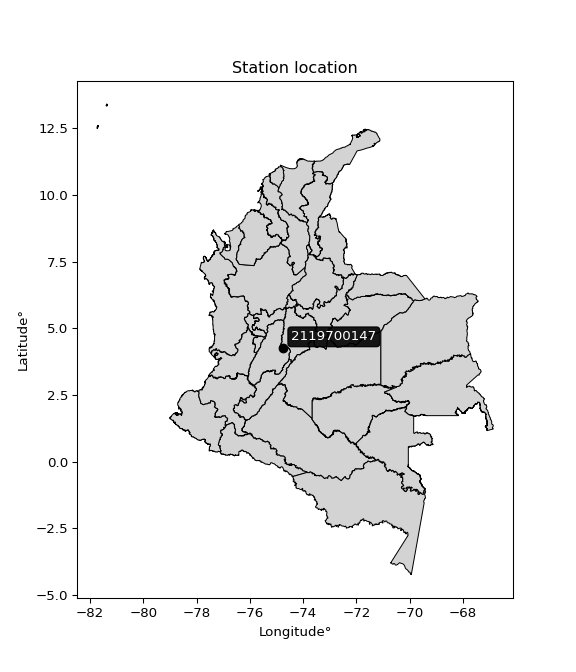

<div align="center">


</div>

# PMP Station (Rain, Pmax24h): 2119700147

Probable Maximum Precipitation (PMP) is the greatest amount of rainfall for a specific duration that is meteorologically possible for a given location, acting as a "worst-case" scenario for extreme storms, crucial for designing safety-critical infrastructure like bridges, river deviations, dams, spillways, and nuclear plants to prevent catastrophic failure. PMP is calculated by hydrologists using meteorological data to determine the upper limit of extreme rainfall, often leading to the Probable Maximum Flood (PMF) for flood control design, and is increasingly being studied for climate change impacts. Probable Maximum Precipitation (PMP) is the theoretical upper limit of rainfall, a deterministic estimate for extreme events, while probability distributions (like GEV, Gumbel) describe the likelihood and frequency of various precipitation amounts, including rare ones, showing how often events occur, with PMP representing the extreme end of these distributions, used for critical infrastructure design to ensure safety against the worst conceivable weather, unlike standard statistical forecasts which cover typical probabilities.

The most common probability distributions in hydrology, used for analyzing floods, rainfall, and streamflow, include the Normal, Log-Normal, Gumbel, Gamma (including Log-Pearson Type III), and Generalized Extreme Value (GEV) distributions, often chosen based on the data´s skewness and whether modeling extremes or general conditions, with Gumbel and GEV popular for extreme events like floods, while the Normal distribution serves as a baseline, though often requiring transformations for skewed hydrological data. These distributions help in designing water infrastructure, managing water resources, and forecasting hydrologic events.

> Hydrological data often isn´t perfectly normal (it´s skewed), so different distributions are needed for different applications, such as: **Flood Frequency Analysis**: Using Gumbel, GEV, or Log-Pearson Type III for predicting extreme flood magnitudes and their return periods, **Rainfall Analysis**: Normal for annual totals, but Log-Normal, Weibull, or GEV for intensity or extreme daily rainfall, **Streamflow Modeling**: Gamma and Log-Normal for maximum flows, GEV for minimum flows, and Kappa for daily flows.

<div align="center">

</img>

</div>


## A. General information


### 1. General running parameters

• app_version: _v20260113_. • runtime: _2026-01-13 16:28:34.738620_. • Python version: _3.14.0_. • SciPy version: _1.16.3_. • Pandas version: _2.3.3_. • NumPy version: _2.3.5_. • Stations dataset (station_dataset_file): _dataset/pmax24h_in/automatic_colombia_2003_2025.csv_. • Stations catalog (station_catalog_file): _dataset/CNE.xls_. • Minimum year to eval til year_max (date_min): _1900_. • Maximum year to eval since year_min (date_max): _2025_. • Creates, save and include plots into reports (create_plot): _False_. • Plot only fit distributions with Δo > Δ (plot_only_fit): _True_. • Plot only simple graphs avoiding multiple CDFs and multiple Extreme values plots (plot_only_simple): _True_. • Eval low extreme values, if False, evaluates high extreme values (low_extreme): _False_. • Eval every SciPy distribution as logarithmic (pdist_logarithmic_on): _True_. • Standard deviation normalized (ddof): _1.0_. • Return periods to eval in years (Tr): _[2, 2.33, 5, 10, 15, 20, 25, 50, 75, 100, 200, 250, 500, 750, 1000]_. • Minimum data sample per station, 0 means any (minimum_sample): _5_. • Z-Score maximum threshold to adjust a value, 0 means disable (zscore_max): _3.5_. • Z-Score minimum threshold to adjust a value, 0 means disable (zscore_min): _-2.5_. • Avoid zeros, e.g. rain = 0 (avoid_zeros): _True_. • Avoid null values (avoid_nans): _True_. 

:file_folder:Table: [dataset.csv](../../dataset/pmax24h_in/automatic_colombia_2003_2025.csv)

> Delta Degrees of Freedom (DDOF): is a parameter used in the formulas for calculating variance and standard deviation. When ddof=0, the divisor is $N$ (the total number of observations) and this is used when your data set is the entire population. When ddof=1, the divisor is $N-1$ and this is used when your data set is a sample drawn from a larger population. Using $N-1$ provides an unbiased estimate of the population variance (known as Bessel´s correction).


### 2. Station info and location

|   id |     CODIGO | NOMBRE                  | CATEGORIA    | TECNOLOGIA   | ESTADO   | FECHA_INSTALACION   |   FECHA_SUSPENSION |   ALTITUD |   LATITUD |   LONGITUD | DEPARTAMENTO   | MUNICIPIO   | AREA_OPERATIVA                            | ENTIDAD                                                     | AREA_HIDROGRAFICA   | ZONA_HIDROGRAFICA   | SUBZONA_HIDROGRAFICA   | CORRIENTE   | Catalogo   |   Version |
|-----:|-----------:|:------------------------|:-------------|:-------------|:---------|:--------------------|-------------------:|----------:|----------:|-----------:|:---------------|:------------|:------------------------------------------|:------------------------------------------------------------|:--------------------|:--------------------|:-----------------------|:------------|:-----------|----------:|
|    0 | 2119700147 | SAN MIGUEL [2119700147] | Limnimétrica | Convencional | Activa   | 22/09/2018          |                nan |       277 |   4.24808 |   -74.7446 | Cundinamarca   | Ricaurte    | Area Operativa 11 - Cundinamarca-Amazonas | INSTITUTO DE HIDROLOGIA METEOROLOGIA Y ESTUDIOS AMBIENTALES | Magdalena Cauca     | Alto Magdalena      | Río Sumapaz            | Sumapaz     | CNE_IDEAM  |  20251226 |

<div align="center">

Dynamic map: [:earth_americas:Google](http://maps.google.com/maps?q=4.248085,-74.744647) [:earth_americas:OSM](https://www.openstreetmap.org/#map=18/4.248085/-74.744647&layers=P) [:earth_americas:Bing](https://www.bing.com/maps?cp=4.248085~-74.744647&lvl=18) [:earth_americas:Apple](https://maps.apple.com/frame?center=4.248085%2C-74.744647&span=0.003%2C0.006)

</div>


<div align="center">

```geojson
{
  "type": "Feature",
  "geometry": {
    "type": "Point", 
    "coordinates": [-74.744647, 4.248085]
  }, 
  "properties": {
    "Name": "2119700147"
  }
}
```

</div>


### 3. Discrete values table and plot

<div align="center">

|               |          0 |         1 |           2 |           3 |          4 |
|:--------------|-----------:|----------:|------------:|------------:|-----------:|
| Date          | 2019       | 2020      | 2021        | 2022        | 2023       |
| Value         |   49.8     |   76.6    |   33.4      |   36.2      |    7.7     |
| Value_initial |   49.8     |   76.6    |   33.4      |   36.2      |    7.7     |
| count         |    5       |    5      |    5        |    5        |    5       |
| mean          |   40.74    |   40.74   |   40.74     |   40.74     |   40.74    |
| std           |   25.1702  |   25.1702 |   25.1702   |   25.1702   |   25.1702  |
| zscore        |    0.35995 |    1.4247 |   -0.291615 |   -0.180372 |   -1.31266 |


</div>


> The initial value (value_initial) correspond to the initial obtained or null completed value, and value (value) is adjusted only when the initial value is outside the valid range (outlier) definite through the Z-Score value. If Z-Score is active, values out of range or outliers are replaced with the station mean value. A Z-Score (or standard score) measures how many standard deviations a data point is from the mean of a dataset, indicating its relative position; positive scores mean above the mean, negative mean below, and a score of zero is exactly at the mean, allowing for comparison of values from different distributions. It´s calculated using the formula $z=(x–μ)/σ$, where $x$ is the data point, $μ$ is the mean, and $σ$ is the standard deviation, helping identify outliers and understand probability.
>
> <sub>**Note**: In this study, "completing" (filling gaps in) and "extending" (forecasting or lengthening the historical record) rainfall data series are avoided for certain critical analyses because they introduce artificial bias and uncertainty, which can distort the statistics of rare events (extremes), alter day-to-day variability, and compromise the integrity and homogeneity of the original data. Some reasons against Completing/Extending rainfall data are: **Distortion of Extremes and Variability**: The primary issue is that most gap-filling or extension methods rely on averaging or regression with nearby stations, which inherently smooths the data. Rainfall is highly variable in space and time, with a large percentage of zero values and occasional large storms. Infilling methods often underestimate the highest values and overestimate the lowest (zero) values, which severely distorts analyses focused on flood frequency, drought severity, and intensity-duration-frequency (IDF) curves, **Loss of Data Homogeneity**: Infilled or extended data are synthetic estimates, not actual measurements. Combining these estimates with observed data can violate the assumption of data homogeneity, which requires that the data properties do not change over time. Inhomogeneity can lead to incorrect conclusions about long-term trends or changes in climate patterns, **Propagation of Errors**: Errors and biases from the original data (e.g., wind-induced undercatch, instrument errors, site changes) or the data used for imputation can propagate through the analysis, leading to unreliable hydrological models and inaccurate predictions, **Compromised Statistical Integrity**: For statistical analyses, especially those involving the frequency of events, using artificial data can introduce time bias or autocorrelation that doesn´t exist in reality, making it difficult to assess the true probability of events, **Difficulty in Validation**: It is difficult to accurately validate the quality of filled or extended data, especially for past periods where ground-truth measurements are unavailable. The reliability of imputation techniques heavily depends on the density of the surrounding station network and the complexity of the local topography.</sub>


### 4. Active continuous probability distributions from SciPy (45 of 104 available)

A Probability Density Function (PDF) describes the relative likelihood of a continuous random variable falling within a specific range, where the total area under its curve equals 1, and the area over any interval gives the actual probability for that range. Unlike discrete probabilities (like rolling a die), a PDF shows density, not direct probability for a single point (which is zero), with higher points indicating higher likelihood, often visualized as a bell curve for normal distributions.

A log of a probability density function (log-PDF) is simply the logarithm of the PDF´s value, denoted as $log(f(x))$, useful for converting multiplication of probabilities into addition, improving numerical stability with tiny numbers, and connecting to information theory concepts like entropy. Instead of dealing with very small probabilities (e.g., 0.000001), log-PDFs use negative numbers (e.g., $log(0.00001) ≈ -11.51$ that are easier for computers to handle, preventing underflow errors and simplifying complex calculations. In this study, each active probability distribution from SciPy is also evaluated in the $log$ form.

[scipy.stats](https://docs.scipy.org/doc/scipy/reference/stats.html) is a Python´s powerful submodule within the SciPy library for comprehensive statistical analysis, offering over 130 probability distributions (like Normal, Poisson), functions for descriptive stats (mean, variance), hypothesis testing (t-tests, chi-square), random variable generation, and statistical tests, making it essential for data science, modeling, and research. It provides tools to explore, model, and draw conclusions from data efficiently, working seamlessly with NumPy.

<div align="center">

|   id | p_dist             |   n_parameter | fit_method   | label                                                                       | active   | ref                                                                                                        |
|-----:|:-------------------|--------------:|:-------------|:----------------------------------------------------------------------------|:---------|:-----------------------------------------------------------------------------------------------------------|
|    0 | alpha              |             3 | MLE          | Alpha                                                                       | True     | [:mortar_board:](https://docs.scipy.org/doc/scipy/reference/generated/scipy.stats.alpha.html)              |
|    1 | betaprime          |             4 | MLE          | Beta prime                                                                  | True     | [:mortar_board:](https://docs.scipy.org/doc/scipy/reference/generated/scipy.stats.betaprime.html)          |
|    2 | chi2               |             3 | MLE          | Chi²                                                                        | True     | [:mortar_board:](https://docs.scipy.org/doc/scipy/reference/generated/scipy.stats.chi2.html)               |
|    3 | crystalball        |             4 | MLE          | Crystalball                                                                 | True     | [:mortar_board:](https://docs.scipy.org/doc/scipy/reference/generated/scipy.stats.crystalball.html)        |
|    4 | dweibull           |             3 | MLE          | Double Weibull                                                              | True     | [:mortar_board:](https://docs.scipy.org/doc/scipy/reference/generated/scipy.stats.dweibull.html)           |
|    5 | erlang             |             3 | MLE          | Erlang                                                                      | True     | [:mortar_board:](https://docs.scipy.org/doc/scipy/reference/generated/scipy.stats.erlang.html)             |
|    6 | expon              |             2 | MLE          | Exponential                                                                 | True     | [:mortar_board:](https://docs.scipy.org/doc/scipy/reference/generated/scipy.stats.expon.html)              |
|    7 | exponnorm          |             3 | MLE          | Exponentially modified Normal                                               | True     | [:mortar_board:](https://docs.scipy.org/doc/scipy/reference/generated/scipy.stats.exponnorm.html)          |
|    8 | f                  |             4 | MLE          | F                                                                           | True     | [:mortar_board:](https://docs.scipy.org/doc/scipy/reference/generated/scipy.stats.f.html)                  |
|    9 | fatiguelife        |             3 | MLE          | Fatigue-life (Birnbaum-Saunders)                                            | True     | [:mortar_board:](https://docs.scipy.org/doc/scipy/reference/generated/scipy.stats.fatiguelife.html)        |
|   10 | fisk               |             3 | MLE          | Fisk                                                                        | True     | [:mortar_board:](https://docs.scipy.org/doc/scipy/reference/generated/scipy.stats.fisk.html)               |
|   11 | gamma              |             3 | MLE          | Gamma                                                                       | True     | [:mortar_board:](https://docs.scipy.org/doc/scipy/reference/generated/scipy.stats.gamma.html)              |
|   12 | genexpon           |             5 | MLE          | Generalized exponential                                                     | True     | [:mortar_board:](https://docs.scipy.org/doc/scipy/reference/generated/scipy.stats.genexpon.html)           |
|   13 | genlogistic        |             3 | MLE          | Generalized logistic                                                        | True     | [:mortar_board:](https://docs.scipy.org/doc/scipy/reference/generated/scipy.stats.genlogistic.html)        |
|   14 | gibrat             |             2 | MM           | Gibrat                                                                      | True     | [:mortar_board:](https://docs.scipy.org/doc/scipy/reference/generated/scipy.stats.gibrat.html)             |
|   15 | gompertz           |             3 | MLE          | Gompertz (or truncated Gumbel)                                              | True     | [:mortar_board:](https://docs.scipy.org/doc/scipy/reference/generated/scipy.stats.gompertz.html)           |
|   16 | gumbel_l           |             2 | MM           | Gumbel Left Skew                                                            | True     | [:mortar_board:](https://docs.scipy.org/doc/scipy/reference/generated/scipy.stats.gumbel_l.html)           |
|   17 | gumbel_r           |             2 | MM           | Gumbel Right Skew                                                           | True     | [:mortar_board:](https://docs.scipy.org/doc/scipy/reference/generated/scipy.stats.gumbel_r.html)           |
|   18 | halflogistic       |             2 | MM           | Half-logistic                                                               | True     | [:mortar_board:](https://docs.scipy.org/doc/scipy/reference/generated/scipy.stats.halflogistic.html)       |
|   19 | halfnorm           |             2 | MM           | Half Normal                                                                 | True     | [:mortar_board:](https://docs.scipy.org/doc/scipy/reference/generated/scipy.stats.halfnorm.html)           |
|   20 | hypsecant          |             2 | MM           | hyperbolic secant                                                           | True     | [:mortar_board:](https://docs.scipy.org/doc/scipy/reference/generated/scipy.stats.hypsecant.html)          |
|   21 | invgamma           |             3 | MLE          | Inverted gamma                                                              | True     | [:mortar_board:](https://docs.scipy.org/doc/scipy/reference/generated/scipy.stats.invgamma.html)           |
|   22 | invgauss           |             3 | MLE          | Inverse Gaussian                                                            | True     | [:mortar_board:](https://docs.scipy.org/doc/scipy/reference/generated/scipy.stats.invgauss.html)           |
|   23 | invweibull         |             3 | MLE          | Inverted Weibull                                                            | True     | [:mortar_board:](https://docs.scipy.org/doc/scipy/reference/generated/scipy.stats.invweibull.html)         |
|   24 | kappa4             |             4 | MLE          | Kappa 4                                                                     | True     | [:mortar_board:](https://docs.scipy.org/doc/scipy/reference/generated/scipy.stats.kappa4.html)             |
|   25 | kstwobign          |             2 | MLE          | Limiting distribution of scaled Kolmogorov-Smirnov two-sided test statistic | True     | [:mortar_board:](https://docs.scipy.org/doc/scipy/reference/generated/scipy.stats.kstwobign.html)          |
|   26 | laplace            |             2 | MM           | Laplace                                                                     | True     | [:mortar_board:](https://docs.scipy.org/doc/scipy/reference/generated/scipy.stats.laplace.html)            |
|   27 | laplace_asymmetric |             3 | MLE          | Asymmetric Laplace                                                          | True     | [:mortar_board:](https://docs.scipy.org/doc/scipy/reference/generated/scipy.stats.laplace_asymmetric.html) |
|   28 | loggamma           |             3 | MLE          | Log gamma                                                                   | True     | [:mortar_board:](https://docs.scipy.org/doc/scipy/reference/generated/scipy.stats.loggamma.html)           |
|   29 | logistic           |             2 | MM           | Logistic (or Sech-squared)                                                  | True     | [:mortar_board:](https://docs.scipy.org/doc/scipy/reference/generated/scipy.stats.logistic.html)           |
|   30 | lognorm            |             3 | MLE          | Log Normal                                                                  | True     | [:mortar_board:](https://docs.scipy.org/doc/scipy/reference/generated/scipy.stats.lognorm.html)            |
|   31 | maxwell            |             2 | MM           | Maxwell                                                                     | True     | [:mortar_board:](https://docs.scipy.org/doc/scipy/reference/generated/scipy.stats.maxwell.html)            |
|   32 | mielke             |             4 | MLE          | Mielke Beta-Kappa / Dagum                                                   | True     | [:mortar_board:](https://docs.scipy.org/doc/scipy/reference/generated/scipy.stats.mielke.html)             |
|   33 | moyal              |             2 | MM           | Moyal                                                                       | True     | [:mortar_board:](https://docs.scipy.org/doc/scipy/reference/generated/scipy.stats.moyal.html)              |
|   34 | nakagami           |             3 | MLE          | Nakagami                                                                    | True     | [:mortar_board:](https://docs.scipy.org/doc/scipy/reference/generated/scipy.stats.nakagami.html)           |
|   35 | ncf                |             5 | MLE          | Non-central F distribution                                                  | True     | [:mortar_board:](https://docs.scipy.org/doc/scipy/reference/generated/scipy.stats.ncf.html)                |
|   36 | nct                |             4 | MLE          | Non-central Student’s t                                                     | True     | [:mortar_board:](https://docs.scipy.org/doc/scipy/reference/generated/scipy.stats.nct.html)                |
|   37 | norm               |             2 | MM           | Normal                                                                      | True     | [:mortar_board:](https://docs.scipy.org/doc/scipy/reference/generated/scipy.stats.norm.html)               |
|   38 | pearson3           |             3 | MM           | Pearson type III                                                            | True     | [:mortar_board:](https://docs.scipy.org/doc/scipy/reference/generated/scipy.stats.pearson3.html)           |
|   39 | rayleigh           |             2 | MM           | Rayleigh                                                                    | True     | [:mortar_board:](https://docs.scipy.org/doc/scipy/reference/generated/scipy.stats.rayleigh.html)           |
|   40 | rice               |             3 | MLE          | Rice                                                                        | True     | [:mortar_board:](https://docs.scipy.org/doc/scipy/reference/generated/scipy.stats.rice.html)               |
|   41 | t                  |             3 | MLE          | Student’s t                                                                 | True     | [:mortar_board:](https://docs.scipy.org/doc/scipy/reference/generated/scipy.stats.t.html)                  |
|   42 | truncnorm          |             4 | MLE          | Truncated normal                                                            | True     | [:mortar_board:](https://docs.scipy.org/doc/scipy/reference/generated/scipy.stats.truncnorm.html)          |
|   43 | wald               |             2 | MM           | Wald                                                                        | True     | [:mortar_board:](https://docs.scipy.org/doc/scipy/reference/generated/scipy.stats.wald.html)               |
|   44 | weibull_min        |             3 | MLE          | Weibull minimum                                                             | True     | [:mortar_board:](https://docs.scipy.org/doc/scipy/reference/generated/scipy.stats.weibull_min.html)        |

</div>

> **n_parameter:** # arguments & localization & scale.
>
> **Fit methods:** (MLE) maximum likelihood, (MM) L-moments.
>
>**Inactive** (With the only purpose of prevent loops, zero divisions, infinite values, over high estimated values or horizontal trending for recurrence intervals estimations, the follow distributions were disabled.)**:** foldnorm, gennorm, norminvgauss, powernorm, powerlognorm, skewnorm, genextreme, anglit, arcsine, argus, beta, bradford, burr, burr12, cauchy, cosine, halfcauchy, foldcauchy, skewcauchy, wrapcauchy, dgamma, gengamma, exponweib, exponpow, truncexpon, gausshyper, genhalflogistic, genhyperbolic, geninvgauss, halfgennorm, johnsonsb, johnsonsu, kappa3, ksone, kstwo, loglaplace, levy, levy_l, levy_stable, ncx2, pareto, genpareto, truncpareto, lomax, powerlaw, rdist, rel_breitwigner, recipinvgauss, semicircular, studentized_range, trapezoid, triang, truncweibull_min, tukeylambda, uniform, loguniform, vonmises, vonmises_line, weibull_max, 


## B. Probability (PDF) vs. Empirical (EDF) distributions functions

A continuous probability distribution (CPD) describes probabilities for variables that can take any value within a range (like rain any time), unlike discrete variables with specific outcomes (like temperature). It uses a Probability Density Function (PDF), a curve where the total area under it equals 1, and the probability of the variable falling within an interval (a to b) is found by calculating the area under the curve between those points. A key feature is that the probability of hitting any single exact value is zero, so probabilities are always expressed for ranges, e.g., $P(a ≤ X ≤ b)$.

<div align="center">

Distributions parameters from station values
|    |    station | p_dist                |   n |             loc |           scale | shape                  | shape1               | shape2                | shape3   |
|---:|-----------:|:----------------------|----:|----------------:|----------------:|:-----------------------|:---------------------|:----------------------|:---------|
|  0 | 2119700147 | alpha                 |   5 |    -0.0408778   |    16.2689      | 1.896687750907734e-10  |                      |                       |          |
|  1 | 2119700147 | betaprime             |   5 |   -65.6897      |  7238.25        | 22.27748008067841      | 1516.0740039057105   |                       |          |
|  2 | 2119700147 | chi2                  |   5 |   -61.6776      |     2.52396     | 40.57820547394131      |                      |                       |          |
|  3 | 2119700147 | crystalball           |   5 |    40.74        |    22.5129      | 2190.05077914251       | 4542.615782275054    |                       |          |
|  4 | 2119700147 | dweibull              |   5 |    36.2         |    18.3618      | 0.8606041297584022     |                      |                       |          |
|  5 | 2119700147 | erlang                |   5 |   -73.2657      |     4.50025     | 25.336997616057857     |                      |                       |          |
|  6 | 2119700147 | expon                 |   5 |     7.7         |    33.04        |                        |                      |                       |          |
|  7 | 2119700147 | exponnorm             |   5 |    35.7799      |    21.9617      | 0.2258523734617805     |                      |                       |          |
|  8 | 2119700147 | f                     |   5 |   -62.0513      |   102.783       | 40.95121234910478      | 23950.533639036465   |                       |          |
|  9 | 2119700147 | fatiguelife           |   5 |  -137.639       |   176.957       | 0.12674359390311213    |                      |                       |          |
| 10 | 2119700147 | fisk                  |   5 |  -132.929       |   172.352       | 13.237976927635177     |                      |                       |          |
| 11 | 2119700147 | gamma                 |   5 |   -65.4723      |     4.8491      | 21.897319684945465     |                      |                       |          |
| 12 | 2119700147 | genexpon              |   5 |     2.41546     |     0.623075    | 1.7320379560557296e-10 | 0.016794372265101602 | 0.5213373956491454    |          |
| 13 | 2119700147 | genlogistic           |   5 |    21.0563      |    16.3178      | 2.388832773539222      |                      |                       |          |
| 14 | 2119700147 | gibrat                |   5 |    23.5655      |    10.4169      |                        |                      |                       |          |
| 15 | 2119700147 | gompertz              |   5 |    -8.48485     |    25.4861      | 0.1091914783307309     |                      |                       |          |
| 16 | 2119700147 | gumbel_l              |   5 |    50.872       |    17.5532      |                        |                      |                       |          |
| 17 | 2119700147 | gumbel_r              |   5 |    30.608       |    17.5532      |                        |                      |                       |          |
| 18 | 2119700147 | halflogistic          |   5 |    14.057       |    19.2477      |                        |                      |                       |          |
| 19 | 2119700147 | halfnorm              |   5 |    10.9417      |    37.3466      |                        |                      |                       |          |
| 20 | 2119700147 | hypsecant             |   5 |    40.74        |    14.3322      |                        |                      |                       |          |
| 21 | 2119700147 | invgamma              |   5 |  -154.103       | 14205.2         | 73.96166957544375      |                      |                       |          |
| 22 | 2119700147 | invgauss              |   5 |   -74.3088      |  2808.92        | 0.040949748656318466   |                      |                       |          |
| 23 | 2119700147 | invweibull            |   5 |    -1.69926e+09 |     1.69926e+09 | 83965789.4645943       |                      |                       |          |
| 24 | 2119700147 | kappa4                |   5 |     1.90776     |    74.605       | 1.084059475064385      | 0.9684957622401335   |                       |          |
| 25 | 2119700147 | kstwobign             |   5 |   -41.1656      |    93.7569      |                        |                      |                       |          |
| 26 | 2119700147 | laplace               |   5 |    40.74        |    15.919       |                        |                      |                       |          |
| 27 | 2119700147 | laplace_asymmetric    |   5 |    36.2         |    16.5979      | 0.8725470032311928     |                      |                       |          |
| 28 | 2119700147 | loggamma              |   5 | -5133.82        |   742.046       | 1068.212049524935      |                      |                       |          |
| 29 | 2119700147 | logistic              |   5 |    40.74        |    12.412       |                        |                      |                       |          |
| 30 | 2119700147 | lognorm               |   5 |     7.7         |     0.0179952   | 15.32377103174282      |                      |                       |          |
| 31 | 2119700147 | maxwell               |   5 |   -12.6061      |    33.4297      |                        |                      |                       |          |
| 32 | 2119700147 | mielke                |   5 |    -2.38383     |    79.9187      | 1.2376508510173054     | 338.7872354784388    |                       |          |
| 33 | 2119700147 | moyal                 |   5 |    27.8657      |    10.1344      |                        |                      |                       |          |
| 34 | 2119700147 | nakagami              |   5 |    33.4         |    20.8366      | 0.10359218997674945    |                      |                       |          |
| 35 | 2119700147 | ncf                   |   5 |     7.68895     |    12.3477      | 1.8006114781131841     | 37945.52971656343    | 2.1647639139053716    |          |
| 36 | 2119700147 | nct                   |   5 |  -749.718       |    22.4668      | 150719.08290759078     | 35.1831491367808     |                       |          |
| 37 | 2119700147 | norm                  |   5 |    40.74        |    22.5129      |                        |                      |                       |          |
| 38 | 2119700147 | pearson3              |   5 |    40.74        |    22.5129      | 0.1805621312230269     |                      |                       |          |
| 39 | 2119700147 | rayleigh              |   5 |    -2.32848     |    34.3637      |                        |                      |                       |          |
| 40 | 2119700147 | rice                  |   5 |    -4.0214      |    27.3262      | 1.1670094940120177     |                      |                       |          |
| 41 | 2119700147 | t                     |   5 |    40.7393      |    22.5101      | 4455981.904307559      |                      |                       |          |
| 42 | 2119700147 | truncnorm             |   5 |    40.74        |    22.5129      | -109.58042591655527    | 157.97462722129202   |                       |          |
| 43 | 2119700147 | wald                  |   5 |    18.227       |    22.5129      |                        |                      |                       |          |
| 44 | 2119700147 | weibull_min           |   5 |    -2.60208     |    48.8158      | 1.9948648416782142     |                      |                       |          |
| 45 | 2119700147 | logalpha              |   5 |   -17.2704      |   532.151       | 25.67924338954557      |                      |                       |          |
| 46 | 2119700147 | logbetaprime          |   5 |   -19.5437      |    17.1246      | 1896.44833520855       | 1411.8404772280537   |                       |          |
| 47 | 2119700147 | logchi2               |   5 |     2.04122     |     0.896019    | 1.1722375419722852     |                      |                       |          |
| 48 | 2119700147 | logcrystalball        |   5 |     3.47709     |     0.775002    | 26.44461187584807      | 13698.634952537272   |                       |          |
| 49 | 2119700147 | logdweibull           |   5 |     3.58906     |     0.603551    | 0.8448826444357298     |                      |                       |          |
| 50 | 2119700147 | logerlang             |   5 |    -9.58887     |     0.0498325   | 262.2615272230946      |                      |                       |          |
| 51 | 2119700147 | logexpon              |   5 |     2.04122     |     1.43587     |                        |                      |                       |          |
| 52 | 2119700147 | logexponnorm          |   5 |     3.47646     |     0.775003    | 0.0008105748534091591  |                      |                       |          |
| 53 | 2119700147 | logf                  |   5 |  -677.042       |   680.517       | 3393095.3444383703     | 2793587.9676690726   |                       |          |
| 54 | 2119700147 | logfatiguelife        |   5 |  -459.989       |   463.466       | 0.0016674792020693703  |                      |                       |          |
| 55 | 2119700147 | logfisk               |   5 |    -6.42226e+07 |     6.42226e+07 | 150645362.31860638     |                      |                       |          |
| 56 | 2119700147 | loggamma              |   5 |   -10.6532      |     0.04503     | 313.6535129802721      |                      |                       |          |
| 57 | 2119700147 | loggenexpon           |   5 |     2.04122     |     3.33457e+09 | 1563481461.1535845     | 3614967423.733325    | 885224485.5239267     |          |
| 58 | 2119700147 | loggenlogistic        |   5 |     4.33908     |     2.8895e-05  | 3.365397843288429e-05  |                      |                       |          |
| 59 | 2119700147 | loggibrat             |   5 |     2.88588     |     0.358591    |                        |                      |                       |          |
| 60 | 2119700147 | loggompertz           |   5 |     2.04122     |     0.649309    | 0.07296094695780914    |                      |                       |          |
| 61 | 2119700147 | loggumbel_l           |   5 |     3.82588     |     0.604266    |                        |                      |                       |          |
| 62 | 2119700147 | loggumbel_r           |   5 |     3.1283      |     0.604266    |                        |                      |                       |          |
| 63 | 2119700147 | loghalflogistic       |   5 |     2.55851     |     0.662614    |                        |                      |                       |          |
| 64 | 2119700147 | loghalfnorm           |   5 |     2.45126     |     1.28568     |                        |                      |                       |          |
| 65 | 2119700147 | loghypsecant          |   5 |     3.47709     |     0.493382    |                        |                      |                       |          |
| 66 | 2119700147 | loginvgamma           |   5 |   -12.0844      |  5671.36        | 365.4377699611596      |                      |                       |          |
| 67 | 2119700147 | loginvgauss           |   5 |    -4.28608     |   668.125       | 0.011575769714005063   |                      |                       |          |
| 68 | 2119700147 | loginvweibull         |   5 |    -8.27294e+07 |     8.27294e+07 | 96708686.7209914       |                      |                       |          |
| 69 | 2119700147 | logkappa4             |   5 |     1.87485     |     2.65108     | 1.0671214283203683     | 1.0712797759179562   |                       |          |
| 70 | 2119700147 | logkstwobign          |   5 |     0.06029     |     3.89622     |                        |                      |                       |          |
| 71 | 2119700147 | loglaplace            |   5 |     3.47709     |     0.548009    |                        |                      |                       |          |
| 72 | 2119700147 | loglaplace_asymmetric |   5 |     3.58906     |     0.530535    | 1.1111508965231833     |                      |                       |          |
| 73 | 2119700147 | logloggamma           |   5 |     4.33863     |     2.57514e-06 | 2.9991504636724844e-06 |                      |                       |          |
| 74 | 2119700147 | loglogistic           |   5 |     3.47709     |     0.427281    |                        |                      |                       |          |
| 75 | 2119700147 | loglognorm            |   5 |     2.04122     |     0.00134033  | 14.368695271328685     |                      |                       |          |
| 76 | 2119700147 | logmaxwell            |   5 |     1.64066     |     1.15081     |                        |                      |                       |          |
| 77 | 2119700147 | logmielke             |   5 |    -1.13711e+07 |     1.13711e+07 | 12719788.977553558     | 856893542.0616944    |                       |          |
| 78 | 2119700147 | logmoyal              |   5 |     3.03389     |     0.348873    |                        |                      |                       |          |
| 79 | 2119700147 | lognakagami           |   5 |     3.50856     |     0.282238    | 0.17541844680539143    |                      |                       |          |
| 80 | 2119700147 | logncf                |   5 |   -15.496       |    18.9621      | 1607.3558026997678     | 3509.4006607889846   | 0.0015912402964566065 |          |
| 81 | 2119700147 | lognct                |   5 |    39.0513      |     0.761611    | 30953.9972007413       | -46.707968919215034  |                       |          |
| 82 | 2119700147 | lognorm               |   5 |     3.47709     |     0.775002    |                        |                      |                       |          |
| 83 | 2119700147 | logpearson3           |   5 |     3.47709     |     0.775001    | -0.9621922993940519    |                      |                       |          |
| 84 | 2119700147 | lograyleigh           |   5 |     1.99447     |     1.18296     |                        |                      |                       |          |
| 85 | 2119700147 | logrice               |   5 |     1.47452     |     0.840073    | 2.1292167573665925     |                      |                       |          |
| 86 | 2119700147 | logt                  |   5 |     3.70278     |     0.371423    | 1.568988659059817      |                      |                       |          |
| 87 | 2119700147 | logtruncnorm          |   5 |    -0.207234    |     1.48559     | 2.5012289250037893     | 3.060019994982258    |                       |          |
| 88 | 2119700147 | logwald               |   5 |     2.70208     |     0.775011    |                        |                      |                       |          |
| 89 | 2119700147 | logweibull_min        |   5 |    -4.21845e+07 |     4.21845e+07 | 75895025.82325846      |                      |                       |          |

</div>

> **loc** (Location parameter): This shifts the distribution along the x-axis. For many common distributions, like the normal (Gaussian) distribution, loc represents the mean $μ$. For others, like the uniform distribution, it might represent the minimum value, or for the beta distribution, the left end of the support interval.
>
> **scale** (Scale parameter): This determines the width or spread of the distribution. For the normal distribution, scale represents the standard deviation $σ$. For a uniform distribution, it defines the length of the interval (from $loc$ to $loc + scale$).
>
> **shape** (Shape parameters): Refers to parameters that define the specific form of a probability distribution, distinct from its location (loc) and scale (scale). These parameters are required arguments for most distribution functions. For example, a normal (Gaussian) distribution is fully defined by its location (mean) and scale (standard deviation), so it has no specific shape parameters beyond loc and scale. However, other distributions have intrinsic properties that need specification, as Gamma distribution that takes a shape parameter, often named $a$ or $alpha$.


### 0. Cumulative distribution values - CDF (90 evaluated)

Cumulative Distribution Function (CDF), denoted as $F$<sub>$X$</sub>$(x)$, is a function that gives the probability that a random variable $X$ will take a value less than or equal to a specific value, $x$ (i.e., $(P(X≥x)$. It essentially "accumulates" probabilities from a given point up to the far right (positive infinity), providing a complete picture of the distribution´s probabilities for both discrete (like rain) and continuous (like temperature) variables, helping to find probabilities over ranges or above certain values. Each station is evaluated separately ordering the $x$ values ascending, calculating the CDF and PDF values for the activated distributions and their logarithmic forms.

<div align="center">

CDF ordered by x ascending and calculating $log(f(x))$ separately
|   id |    Station |   date |    x |   count |   mean |     std |    zscore |   Value_initial |    station |   m |     alpha |   alpha_pdf |   betaprime |   betaprime_pdf |      chi2 |   chi2_pdf |   crystalball |   crystalball_pdf |   dweibull |   dweibull_pdf |    erlang |   erlang_pdf |    expon |   expon_pdf |   exponnorm |   exponnorm_pdf |         f |      f_pdf |   fatiguelife |   fatiguelife_pdf |      fisk |   fisk_pdf |     gamma |   gamma_pdf |   genexpon |   genexpon_pdf |   genlogistic |   genlogistic_pdf |   gibrat |   gibrat_pdf |   gompertz |   gompertz_pdf |   gumbel_l |   gumbel_l_pdf |   gumbel_r |   gumbel_r_pdf |   halflogistic |   halflogistic_pdf |   halfnorm |   halfnorm_pdf |   hypsecant |   hypsecant_pdf |   invgamma |   invgamma_pdf |   invgauss |   invgauss_pdf |   invweibull |   invweibull_pdf |      kappa4 |   kappa4_pdf |   kstwobign |   kstwobign_pdf |   laplace |   laplace_pdf |   laplace_asymmetric |   laplace_asymmetric_pdf |   loggamma |   loggamma_pdf |   logistic |   logistic_pdf |   lognorm |   lognorm_pdf |   maxwell |   maxwell_pdf |    mielke |   mielke_pdf |      moyal |   moyal_pdf |    nakagami |   nakagami_pdf |         ncf |    ncf_pdf |       nct |    nct_pdf |     norm |   norm_pdf |   pearson3 |   pearson3_pdf |   rayleigh |   rayleigh_pdf |     rice |   rice_pdf |         t |      t_pdf |   truncnorm |   truncnorm_pdf |     wald |   wald_pdf |   weibull_min |   weibull_min_pdf |   logalpha |   logalpha_pdf |   logbetaprime |   logbetaprime_pdf |     logchi2 |   logchi2_pdf |   logcrystalball |   logcrystalball_pdf |   logdweibull |   logdweibull_pdf |   logerlang |   logerlang_pdf |   logexpon |   logexpon_pdf |   logexponnorm |   logexponnorm_pdf |      logf |   logf_pdf |   logfatiguelife |   logfatiguelife_pdf |   logfisk |   logfisk_pdf |   loggenexpon |   loggenexpon_pdf |   loggenlogistic |   loggenlogistic_pdf |   loggibrat |   loggibrat_pdf |   loggompertz |   loggompertz_pdf |   loggumbel_l |   loggumbel_l_pdf |   loggumbel_r |   loggumbel_r_pdf |   loghalflogistic |   loghalflogistic_pdf |   loghalfnorm |   loghalfnorm_pdf |   loghypsecant |   loghypsecant_pdf |   loginvgamma |   loginvgamma_pdf |   loginvgauss |   loginvgauss_pdf |   loginvweibull |   loginvweibull_pdf |   logkappa4 |   logkappa4_pdf |   logkstwobign |   logkstwobign_pdf |   loglaplace |   loglaplace_pdf |   loglaplace_asymmetric |   loglaplace_asymmetric_pdf |   logloggamma |   logloggamma_pdf |   loglogistic |   loglogistic_pdf |   loglognorm |   loglognorm_pdf |   logmaxwell |   logmaxwell_pdf |   logmielke |   logmielke_pdf |    logmoyal |   logmoyal_pdf |   lognakagami |   lognakagami_pdf |    logncf |   logncf_pdf |    lognct |   lognct_pdf |   logpearson3 |   logpearson3_pdf |   lograyleigh |   lograyleigh_pdf |   logrice |   logrice_pdf |     logt |   logt_pdf |   logtruncnorm |   logtruncnorm_pdf |   logwald |   logwald_pdf |   logweibull_min |   logweibull_min_pdf |
|-----:|-----------:|-------:|-----:|--------:|-------:|--------:|----------:|----------------:|-----------:|----:|----------:|------------:|------------:|----------------:|----------:|-----------:|--------------:|------------------:|-----------:|---------------:|----------:|-------------:|---------:|------------:|------------:|----------------:|----------:|-----------:|--------------:|------------------:|----------:|-----------:|----------:|------------:|-----------:|---------------:|--------------:|------------------:|---------:|-------------:|-----------:|---------------:|-----------:|---------------:|-----------:|---------------:|---------------:|-------------------:|-----------:|---------------:|------------:|----------------:|-----------:|---------------:|-----------:|---------------:|-------------:|-----------------:|------------:|-------------:|------------:|----------------:|----------:|--------------:|---------------------:|-------------------------:|-----------:|---------------:|-----------:|---------------:|----------:|--------------:|----------:|--------------:|----------:|-------------:|-----------:|------------:|------------:|---------------:|------------:|-----------:|----------:|-----------:|---------:|-----------:|-----------:|---------------:|-----------:|---------------:|---------:|-----------:|----------:|-----------:|------------:|----------------:|---------:|-----------:|--------------:|------------------:|-----------:|---------------:|---------------:|-------------------:|------------:|--------------:|-----------------:|---------------------:|--------------:|------------------:|------------:|----------------:|-----------:|---------------:|---------------:|-------------------:|----------:|-----------:|-----------------:|---------------------:|----------:|--------------:|--------------:|------------------:|-----------------:|---------------------:|------------:|----------------:|--------------:|------------------:|--------------:|------------------:|--------------:|------------------:|------------------:|----------------------:|--------------:|------------------:|---------------:|-------------------:|--------------:|------------------:|--------------:|------------------:|----------------:|--------------------:|------------:|----------------:|---------------:|-------------------:|-------------:|-----------------:|------------------------:|----------------------------:|--------------:|------------------:|--------------:|------------------:|-------------:|-----------------:|-------------:|-----------------:|------------:|----------------:|------------:|---------------:|--------------:|------------------:|----------:|-------------:|----------:|-------------:|--------------:|------------------:|--------------:|------------------:|----------:|--------------:|---------:|-----------:|---------------:|-------------------:|----------:|--------------:|-----------------:|---------------------:|
|    0 | 2119700147 |   2023 |  7.7 |       5 |  40.74 | 25.1702 | -1.31266  |             7.7 | 2119700147 |   1 | 0.0355811 |  0.0237992  |   0.0583707 |      0.00661338 | 0.0580618 | 0.00663908 |      0.071106 |        0.00603634 |   0.116133 |     0.00511951 | 0.0591033 |   0.00654404 | 0        |  0.0302663  |   0.0705211 |      0.00604837 | 0.0580906 | 0.00663683 |      0.059904 |        0.00648998 | 0.0634032 | 0.00558997 | 0.0585266 |  0.00661651 |   0.104714 |     0.0238416  |     0.0591218 |        0.00600593 | 0        |   0          |  0.0923211 |     0.00733861 |  0.0819271 |     0.00447072 |  0.0250243 |     0.00525758 |       0        |         0          |   0        |     0          |   0.0632798 |      0.00438621 |  0.0598634 |     0.00669491 |  0.0561048 |     0.00694411 |    0.0513047 |       0.00752925 | 1.91669e-15 |    0.230818  |   0.0512499 |      0.00847763 | 0.0627465 |    0.00394161 |            0.0604069 |               0.00417104 |   0.033051 |      0.0992692 |   0.065257 |     0.00491448 | 0.0319605 |     0.0925179 | 0.0534242 |    0.00732277 | 0.0771478 |   0.00946882 | 0.00684078 |  0.00274738 | 0           |    0           | 0.000577192 | 0.0470463  | 0.0710961 | 0.0060377  | 0.071106 | 0.00603634 |  0.0658414 |     0.00625604 |  0.0416895 |     0.00813846 | 0.045871 | 0.00770768 | 0.0710851 | 0.00603573 |    0.071106 |      0.00603634 | 0        | 0          |     0.0439022 |        0.00831168 |  0.0302719 |      0.0978191 |      0.0348536 |           0.101774 | 7.99327e-10 |   1.05497e+06 |        0.0319605 |            0.0925179 |      0.054523 |         0.0659504 |   0.0334437 |       0.0997214 |   0        |       0.696442 |      0.0319608 |          0.0925183 | 0.0323892 |  0.0934431 |        0.0314361 |             0.091804 | 0.0255093 |     0.0583101 |   7.67499e-13 |          0.46887  |         0        |            0.0801503 |    0        |        0        |   4.53644e-08 |          0.112367 |     0.0508233 |         0.0819329 |    0.00237296 |         0.0237333 |          0        |              0        |      0        |          0        |       0.034637 |          0.0700649 |     0.0325375 |          0.101633 |     0.0345172 |          0.112955 |       0.0376469 |            0.144326 |  1.1193e-15 |        3.82053  |      0.0416997 |           0.179883 |    0.0363958 |        0.0664145 |               0.0399967 |                   0.0678481 |     0.0688592 |         0.0801972 |     0.0335536 |         0.0758934 |    0.0227566 |      8.46326e+12 |    0.0108163 |        0.0790597 |   0.0737149 |       0.0824578 | 3.35042e-05 |    0.000869881 |   0           |       0           | 0.0344108 |     0.10099  | 0.0320793 |     0.092551 |     0.0511833 |         0.0890782 |   0.000780745 |         0.0333844 | 0.0267855 |      0.10515  | 0.035595 |  0.0318395 |    0           |           0        |  0        |      0        |        0.0400461 |            0.0705856 |
|    1 | 2119700147 |   2021 | 33.4 |       5 |  40.74 | 25.1702 | -0.291615 |            33.4 | 2119700147 |   2 | 0.626615  |  0.0103121  |   0.398045  |      0.0178098  | 0.398849  | 0.01782    |      0.372199 |        0.0168034  |   0.410104 |     0.0249825  | 0.395352  |   0.017758   | 0.540605 |  0.0139042  |   0.373162  |      0.0168728  | 0.398781  | 0.0178192  |      0.394188 |        0.0177544  | 0.384415  | 0.0188339  | 0.398153  |  0.0178136  |   0.551992 |     0.0120756  |     0.398825  |        0.0186493  | 0.477062 |   0.0404985  |  0.365963  |     0.0140519  |  0.30898   |     0.0145495  |  0.426158  |     0.0207078  |       0.464062 |         0.0203829  |   0.452391 |     0.0178306  |   0.343674  |      0.0195845  |  0.402803  |     0.0178886  |  0.410554  |     0.017943   |    0.434251  |       0.0178986  | 0.399646    |    0.0142328 |   0.448204  |      0.0174372  | 0.3153    |    0.0198065  |            0.356262  |               0.0245996  |   0.526432 |      0.498212  |   0.356322 |     0.0184786  | 0.516193  |     0.514339  | 0.405291  |    0.0175352  | 0.36992   |   0.0127944  | 0.446623   |  0.0224263  | 0.000519687 |    1.51534e+10 | 0.583313    | 0.0159153  | 0.372259  | 0.0168055  | 0.372199 | 0.0168034  |  0.382425  |     0.0172828  |  0.417546  |     0.0176229  | 0.399681 | 0.0173593  | 0.372194  | 0.0168054  |    0.372199 |      0.0168034  | 0.498752 | 0.0295987  |     0.420025  |        0.0175069  |  0.527545  |      0.490526  |      0.523819  |           0.491365 | 0.758343    |   0.175626    |        0.516193  |            0.514339  |      0.416671 |         0.797238  |   0.522163  |       0.492819  |   0.640095 |       0.250653 |      0.516193  |          0.514338  | 0.516934  |  0.512617  |        0.516538  |             0.515738 | 0.449923  |     0.580537  |   0.61757     |          0.313066 |         0        |            0.442706  |    0.709474 |        0.550196 |   0.465338    |          0.575646 |     0.446488  |         0.541792  |    0.586859   |         0.517617  |          0.614982 |              0.4692   |      0.589131 |          0.442541 |       0.520287 |          0.64385   |     0.529078  |          0.486983 |     0.550249  |          0.47261  |       0.554313  |            0.382324 |  0.629607   |        0.418072 |      0.586269  |           0.365573 |    0.527901  |        0.86148   |               0.481979  |                   0.8176    |     0.380316  |         0.442937  |     0.518403  |         0.584303  |    0.686889  |      0.0168055   |    0.548525  |        0.489283  |   0.380532  |       0.425665  | 0.612523    |    0.509447    |   5.10189e-06 |       4.03057e+09 | 0.523016  |     0.492113 | 0.515904  |     0.514438 |     0.452026  |         0.514577  |   0.559167    |         0.476962  | 0.525536  |      0.498725 | 0.332658 |  0.751074  |    1.26254e-06 |           2.31479  |  0.683818 |      0.484543 |        0.435984  |            0.58111   |
|    2 | 2119700147 |   2022 | 36.2 |       5 |  40.74 | 25.1702 | -0.180372 |            36.2 | 2119700147 |   3 | 0.653497  |  0.00893595 |   0.448129  |      0.0179164  | 0.448942  | 0.0179124  |      0.42009  |        0.0173639  |   0.5      |     3.29817    | 0.445353  |   0.0179082  | 0.577933 |  0.0127744  |   0.42123   |      0.0174193  | 0.448874  | 0.0179127  |      0.444214 |        0.01793    | 0.437859  | 0.0192656  | 0.448253  |  0.0179234  |   0.584559 |     0.0111978  |     0.451227  |        0.0187153  | 0.576523 |   0.0309929  |  0.406216  |     0.014688   |  0.351765  |     0.0160091  |  0.483267  |     0.0200205  |       0.519176 |         0.0189751  |   0.501163 |     0.0169967  |   0.400814  |      0.02114    |  0.453049  |     0.0179521  |  0.460727  |     0.0178475  |    0.48367   |       0.0173596  | 0.439296    |    0.0140909 |   0.496217  |      0.0168282  | 0.375934  |    0.0236154  |            0.43225   |               0.0298465  |   0.566264 |      0.490548  |   0.409562 |     0.0194828  | 0.557438  |     0.509418  | 0.454431  |    0.0175244  | 0.40607   |   0.0130255  | 0.50742    |  0.0209471  | 0.549085    |    0.0405604   | 0.625987    | 0.0145764  | 0.420156  | 0.0173653  | 0.42009  | 0.0173639  |  0.431422  |     0.0176695  |  0.466631  |     0.0174024  | 0.448393 | 0.0173983  | 0.420092  | 0.0173661  |    0.42009  |      0.0173639  | 0.573819 | 0.0242178  |     0.468769  |        0.017276   |  0.566684  |      0.481079  |      0.563122  |           0.484293 | 0.772016    |   0.16424     |        0.557438  |            0.509418  |      0.5      |       139.89      |   0.561581  |       0.485701  |   0.659718 |       0.236987 |      0.557438  |          0.509417  | 0.558034  |  0.507579  |        0.557889  |             0.510649 | 0.496964  |     0.586397  |   0.642185    |          0.298472 |         0        |            0.486223  |    0.749664 |        0.452235 |   0.512466    |          0.59419  |     0.49123   |         0.568964  |    0.627199   |         0.484196  |          0.651351 |              0.434448 |      0.623833 |          0.419507 |       0.571626 |          0.628895  |     0.567946  |          0.47789  |     0.587816  |          0.460067 |       0.584479  |            0.366924 |  0.663315   |        0.41941  |      0.615078  |           0.35003  |    0.5924    |        0.743784  |               0.552504  |                   0.937235  |     0.417699  |         0.486475  |     0.565141  |         0.575164  |    0.688205  |      0.0159025   |    0.587326  |        0.474064  |   0.41639   |       0.465775  | 0.651784    |    0.46609     |   0.511872    |       2.20383     | 0.562381  |     0.485094 | 0.557161  |     0.509631 |     0.49437   |         0.536758  |   0.596874    |         0.459355  | 0.565431  |      0.49161  | 0.397588 |  0.856905  |    0.17419     |           2.01841  |  0.720006 |      0.416613 |        0.484141  |            0.614325  |
|    3 | 2119700147 |   2019 | 49.8 |       5 |  40.74 | 25.1702 |  0.35995  |            49.8 | 2119700147 |   4 | 0.744109  |  0.00495438 |   0.677132  |      0.0149382  | 0.677544  | 0.0148936  |      0.656318 |        0.0163422  |   0.76903  |     0.011288   | 0.675435  |   0.015078   | 0.720349 |  0.00846401 |   0.657549  |      0.0162983  | 0.677509  | 0.0148973  |      0.675112 |        0.0151542  | 0.684386  | 0.0156484  | 0.677429  |  0.0149537  |   0.712056 |     0.00776124 |     0.684748  |        0.014696   | 0.822166 |   0.00992619 |  0.619305  |     0.0160569  |  0.609667  |     0.0209197  |  0.715275  |     0.0136545  |       0.729894 |         0.0121379  |   0.701882 |     0.0124339  |   0.689017  |      0.0184075  |  0.681     |     0.0147618  |  0.683649  |     0.0142503  |    0.690092  |       0.0126486  | 0.626821    |    0.0135067 |   0.696711  |      0.012421   | 0.716991  |    0.017778   |            0.722247  |               0.0146014  |   0.712818 |      0.41863   |   0.674792 |     0.0176803  | 0.710905  |     0.441034  | 0.677273  |    0.0145634  | 0.590059  |   0.0139945  | 0.734717   |  0.012595   | 0.787386    |    0.00938449  | 0.784772    | 0.0090691  | 0.656375  | 0.0163396  | 0.656318 | 0.0163422  |  0.665555  |     0.0157887  |  0.68355   |     0.0139695  | 0.672149 | 0.0148231  | 0.656348  | 0.0163437  |    0.656318 |      0.0163422  | 0.789995 | 0.0100711  |     0.683967  |        0.0138585  |  0.709577  |      0.406404  |      0.708219  |           0.415995 | 0.818188    |   0.127205    |        0.710905  |            0.441034  |      0.721007 |         0.431163  |   0.707077  |       0.417067  |   0.727499 |       0.189781 |      0.710905  |          0.441033  | 0.71091   |  0.439321  |        0.71161   |             0.441361 | 0.676125  |     0.513656  |   0.728348    |          0.242452 |         0        |            0.70497   |    0.852558 |        0.225501 |   0.704878    |          0.587839 |     0.681965  |         0.602944  |    0.75944    |         0.345837  |          0.769182 |              0.308143 |      0.742812 |          0.326607 |       0.748203 |          0.458765  |     0.710102  |          0.405007 |     0.722922  |          0.380577 |       0.690809  |            0.298702 |  0.798444   |        0.429482 |      0.716418  |           0.285025 |    0.772247  |        0.4156    |               0.770559  |                   0.480542  |     0.605609  |         0.705326  |     0.732732  |         0.45833   |    0.692802  |      0.0131002   |    0.725484  |        0.386411  |   0.594908  |       0.665466  | 0.7751      |    0.313648    |   0.856758    |       0.556126    | 0.707744  |     0.416808 | 0.710753  |     0.441548 |     0.673723  |         0.570516  |   0.729721    |         0.369581  | 0.712695  |      0.421889 | 0.675517 |  0.734713  |    0.666405    |           1.13953  |  0.821572 |      0.240123 |        0.691168  |            0.652837  |
|    4 | 2119700147 |   2020 | 76.6 |       5 |  40.74 | 25.1702 |  1.4247   |            76.6 | 2119700147 |   5 | 0.831893  |  0.00216069 |   0.932945  |      0.00470207 | 0.932614  | 0.00469944 |      0.944405 |        0.00498343 |   0.930355 |     0.00292444 | 0.933997  |   0.00472522 | 0.875737 |  0.003761   |   0.943891  |      0.00495429 | 0.932639  | 0.00469963 |      0.934569 |        0.004715   | 0.929937  | 0.00411642 | 0.933389  |  0.00469508 |   0.860174 |     0.00376887 |     0.92485   |        0.00435622 | 0.948186 |   0.00200064 |  0.948564  |     0.00620924 |  0.986841  |     0.00324657 |  0.929794  |     0.00385581 |       0.925301 |         0.00373597 |   0.921266 |     0.00455534 |   0.947967  |      0.00361435 |  0.931949  |     0.00460977 |  0.926847  |     0.00461041 |    0.906045  |       0.00441734 | 0.97286     |    0.0119915 |   0.914767  |      0.00456643 | 0.94744   |    0.00330172 |            0.932112  |               0.00356887 |   0.861159 |      0.266706  |   0.947307 |     0.00402164 | 0.866849  |     0.27751   | 0.931852  |    0.00483155 | 0.985476  |   0.0151606  | 0.928034   |  0.00354096 | 0.931919    |    0.00297445  | 0.934592    | 0.00303643 | 0.94439   | 0.00498256 | 0.944405 | 0.00498343 |  0.93968   |     0.00485948 |  0.92848   |     0.00478038 | 0.934471 | 0.00494992 | 0.94443   | 0.00498224 |    0.944405 |      0.00498343 | 0.933535 | 0.00260209 |     0.927623  |        0.00478685 |  0.853792  |      0.261203  |      0.856561  |           0.268991 | 0.864855    |   0.0918009   |        0.866849  |            0.27751   |      0.84953  |         0.203676  |   0.855793  |       0.269705  |   0.798102 |       0.140611 |      0.866849  |          0.27751   | 0.86635   |  0.276967  |        0.867462  |             0.276896 | 0.851451  |     0.296686  |   0.817897    |          0.175519 |         0.999436 |            1.16404   |    0.919095 |        0.10321  |   0.912597    |          0.337895 |     0.903298  |         0.373854  |    0.873768   |         0.195123  |          0.872446 |              0.180223 |      0.857887 |          0.211285 |       0.890049 |          0.218446  |     0.854123  |          0.261406 |     0.857385  |          0.243588 |       0.799633  |            0.209013 |  0.993657   |        0.541275 |      0.820767  |           0.201614 |    0.896192  |        0.189427  |               0.906885  |                   0.19502   |     0.999959  |         1.16461   |     0.882493  |         0.242695  |    0.697859  |      0.0105667   |    0.861128  |        0.244077  |   0.961919  |       0.997316  | 0.877498    |    0.174182    |   0.978829    |       0.107814    | 0.856378  |     0.269502 | 0.866911  |     0.277898 |     0.892824  |         0.400985  |   0.859609    |         0.235169  | 0.862571  |      0.269822 | 0.869047 |  0.238568  |    0.999956    |           0.489543 |  0.897002 |      0.125202 |        0.92188   |            0.358326  |


</div>

An Empirical Distribution Function (EDF) is a step-function estimate of a true cumulative distribution function (CDF) based on observed sample data, representing the proportion of data points less than or equal to a given value. It is calculated by ordering your data and jumping up by $1/n$ (where $n$ is sample size) at each unique data point, allowing analysis without assuming an underlying population distribution, and it gets closer to the true CDF as the sample size grows. For the empirical probability calculations, the parameter $m$ correspond to the order number which means the position of the $x$ values in an ascending order list.

The Kolmogorov-Smirnov (K-S) test is a non-parametric statistical test used to determine if a sample data set comes from a specific theoretical distribution (one-sample) or if two different samples come from the same underlying distribution (two-sample), by comparing their cumulative distribution functions (CDFs). It calculates the maximum vertical difference (D statistic) between these functions, with a small p-value indicating a significant difference and rejection of the null hypothesis (that the data/samples match).


### 1. EDF California (1923)

California´s estimates the true probability distribution of water-related data (like rainfall, streamflow) using observed samples, crucial for risk assessment.

<div align="center">


$P=m/n$


</div>


**1.1. Empirical values**

<div align="center">

|                | 0              | 1                  | 2              | 3                 | 4              |
|:---------------|:---------------|:-------------------|:---------------|:------------------|:---------------|
| date           | 2023           | 2021               | 2022           | 2019              | 2020           |
| x              | 7.7            | 33.4               | 36.2           | 49.8              | 76.6           |
| m              | 1              | 2                  | 3              | 4                 | 5              |
| empirical_dist | edf_california | edf_california     | edf_california | edf_california    | edf_california |
| empirical      | 0.2            | 0.4                | 0.6            | 0.8               | 1.0            |
| empirical_tr   | 1.25           | 1.6666666666666667 | 2.5            | 5.000000000000001 | inf            |

</div>


**1.2. Kolmogorov-Smirnov fit test (sorted by Δ)**


<div align="center">

|                | 0                   | 1                  | 2                   | 3                   | 4                   | 5                  | 6                   | 7                   | 8                   | 9                   | 10                  | 11                 | 12                  | 13                  | 14                 | 15                  | 16                  | 17                 | 18                  | 19                  | 20                  | 21                    | 22                  | 23                 | 24                  | 25                  | 26                  | 27                  | 28                  | 29                  | 30                 | 31                 | 32                 | 33                  | 34                  | 35                 | 36                  | 37                  | 38                  | 39                  | 40                  | 41                  | 42                  | 43                 | 44                  | 45                  | 46                 | 47                 | 48                  | 49                 | 50                  | 51                  | 52                  | 53                  | 54                  | 55                 | 56                  | 57                  | 58                 | 59                 | 60                  | 61                  | 62                 | 63                 | 64                 | 65                 | 66                 | 67                 | 68                 | 69                 | 70                  | 71                  | 72                  | 73                  | 74                  | 75                  | 76                  | 77                 | 78                  | 79                 | 80                  | 81                  | 82                  | 83                  | 84                 | 85                  | 86                 | 87                  | 88                  | 89                 |
|:---------------|:--------------------|:-------------------|:--------------------|:--------------------|:--------------------|:-------------------|:--------------------|:--------------------|:--------------------|:--------------------|:--------------------|:-------------------|:--------------------|:--------------------|:-------------------|:--------------------|:--------------------|:-------------------|:--------------------|:--------------------|:--------------------|:----------------------|:--------------------|:-------------------|:--------------------|:--------------------|:--------------------|:--------------------|:--------------------|:--------------------|:-------------------|:-------------------|:-------------------|:--------------------|:--------------------|:-------------------|:--------------------|:--------------------|:--------------------|:--------------------|:--------------------|:--------------------|:--------------------|:-------------------|:--------------------|:--------------------|:-------------------|:-------------------|:--------------------|:-------------------|:--------------------|:--------------------|:--------------------|:--------------------|:--------------------|:-------------------|:--------------------|:--------------------|:-------------------|:-------------------|:--------------------|:--------------------|:-------------------|:-------------------|:-------------------|:-------------------|:-------------------|:-------------------|:-------------------|:-------------------|:--------------------|:--------------------|:--------------------|:--------------------|:--------------------|:--------------------|:--------------------|:-------------------|:--------------------|:-------------------|:--------------------|:--------------------|:--------------------|:--------------------|:-------------------|:--------------------|:-------------------|:--------------------|:--------------------|:-------------------|
| station        | 2119700147          | 2119700147         | 2119700147          | 2119700147          | 2119700147          | 2119700147         | 2119700147          | 2119700147          | 2119700147          | 2119700147          | 2119700147          | 2119700147         | 2119700147          | 2119700147          | 2119700147         | 2119700147          | 2119700147          | 2119700147         | 2119700147          | 2119700147          | 2119700147          | 2119700147            | 2119700147          | 2119700147         | 2119700147          | 2119700147          | 2119700147          | 2119700147          | 2119700147          | 2119700147          | 2119700147         | 2119700147         | 2119700147         | 2119700147          | 2119700147          | 2119700147         | 2119700147          | 2119700147          | 2119700147          | 2119700147          | 2119700147          | 2119700147          | 2119700147          | 2119700147         | 2119700147          | 2119700147          | 2119700147         | 2119700147         | 2119700147          | 2119700147         | 2119700147          | 2119700147          | 2119700147          | 2119700147          | 2119700147          | 2119700147         | 2119700147          | 2119700147          | 2119700147         | 2119700147         | 2119700147          | 2119700147          | 2119700147         | 2119700147         | 2119700147         | 2119700147         | 2119700147         | 2119700147         | 2119700147         | 2119700147         | 2119700147          | 2119700147          | 2119700147          | 2119700147          | 2119700147          | 2119700147          | 2119700147          | 2119700147         | 2119700147          | 2119700147         | 2119700147          | 2119700147          | 2119700147          | 2119700147          | 2119700147         | 2119700147          | 2119700147         | 2119700147          | 2119700147          | 2119700147         |
| empirical_dist | edf_california      | edf_california     | edf_california      | edf_california      | edf_california      | edf_california     | edf_california      | edf_california      | edf_california      | edf_california      | edf_california      | edf_california     | edf_california      | edf_california      | edf_california     | edf_california      | edf_california      | edf_california     | edf_california      | edf_california      | edf_california      | edf_california        | edf_california      | edf_california     | edf_california      | edf_california      | edf_california      | edf_california      | edf_california      | edf_california      | edf_california     | edf_california     | edf_california     | edf_california      | edf_california      | edf_california     | edf_california      | edf_california      | edf_california      | edf_california      | edf_california      | edf_california      | edf_california      | edf_california     | edf_california      | edf_california      | edf_california     | edf_california     | edf_california      | edf_california     | edf_california      | edf_california      | edf_california      | edf_california      | edf_california      | edf_california     | edf_california      | edf_california      | edf_california     | edf_california     | edf_california      | edf_california      | edf_california     | edf_california     | edf_california     | edf_california     | edf_california     | edf_california     | edf_california     | edf_california     | edf_california      | edf_california      | edf_california      | edf_california      | edf_california      | edf_california      | edf_california      | edf_california     | edf_california      | edf_california     | edf_california      | edf_california      | edf_california      | edf_california      | edf_california     | edf_california      | edf_california     | edf_california      | edf_california      | edf_california     |
| p_dist         | dweibull            | invgauss           | maxwell             | invgamma            | invweibull          | kstwobign          | genlogistic         | logpearson3         | loggumbel_l         | logdweibull         | chi2                | f                  | gamma               | betaprime           | genexpon           | rice                | erlang              | fatiguelife        | weibull_min         | rayleigh            | logweibull_min      | loglaplace_asymmetric | fisk                | loglaplace         | logbetaprime        | loghypsecant        | loginvgauss         | logncf              | loglogistic         | logerlang           | loggamma           | loggamma           | loginvgamma        | logf                | laplace_asymmetric  | lognct             | logexponnorm        | logcrystalball      | lognorm             | lognorm             | logfatiguelife      | pearson3            | logalpha            | logrice            | logfisk             | gumbel_r            | exponnorm          | nct                | t                   | crystalball        | norm                | truncnorm           | logkstwobign        | logmaxwell          | logistic            | moyal              | gompertz            | logloggamma         | loggumbel_r        | hypsecant          | lograyleigh         | ncf                 | loggompertz        | kappa4             | loghalfnorm        | halflogistic       | expon              | wald               | halfnorm           | gibrat             | loginvweibull       | logt                | logmielke           | mielke              | logmoyal            | loghalflogistic     | loggenexpon         | laplace            | alpha               | logkappa4          | logexpon            | gumbel_l            | logwald             | loglognorm          | loggibrat          | logchi2             | nakagami           | lognakagami         | logtruncnorm        | loggenlogistic     |
| delta          | 0.10000000000002723 | 0.1438952064392813 | 0.14657579469051796 | 0.14695105165208933 | 0.14869528567928786 | 0.1487500982986209 | 0.14877271665579972 | 0.14881671010720834 | 0.14917672260762702 | 0.15047023718208674 | 0.15105804284868146 | 0.1511262381398169 | 0.15174697650898317 | 0.15187094244097887 | 0.1519918867221527 | 0.15412895644169322 | 0.15464740186004133 | 0.1557856497904303 | 0.15609784640123414 | 0.15831047055437403 | 0.15995385640122495 | 0.1600032858403035    | 0.16214081004546316 | 0.1636042357432726 | 0.16514635058599314 | 0.16536295075367663 | 0.16548283986911128 | 0.16558923085220184 | 0.16644635347475856 | 0.16655629317968532 | 0.1669489897041423 | 0.1669489897041423 | 0.1674624544614936 | 0.16761075712054024 | 0.16775011094991843 | 0.1679207336092309 | 0.16803921578468495 | 0.16803945592946942 | 0.16803945614070886 | 0.16803945614070886 | 0.16856386681405794 | 0.16857764354115562 | 0.16972813383101387 | 0.1732145321254858 | 0.17449073248779456 | 0.17497565317260544 | 0.178770258994296  | 0.1798441588470342 | 0.17990796700693068 | 0.1799095924309016 | 0.17990959663147077 | 0.17990961965929242 | 0.18626892336695378 | 0.18918368827458384 | 0.19043762565707711 | 0.1931592204800039 | 0.19378400983197652 | 0.19439065258978327 | 0.1976270400574596 | 0.1991859230464526 | 0.19921925507192983 | 0.19942280849772834 | 0.1999999546355881 | 0.1999999999999981 | 0.2                | 0.2                | 0.2                | 0.2                | 0.2                | 0.2                | 0.20036688416634174 | 0.20241187478629896 | 0.20509152828164756 | 0.20994118516865823 | 0.21252262848370518 | 0.21498191829294988 | 0.21757013999549535 | 0.2240655983742071 | 0.22661517486210214 | 0.2296070502403602 | 0.24009477439256288 | 0.24823461126812701 | 0.28381796871146936 | 0.30214112280804595 | 0.3094735699717359 | 0.35834271195438927 | 0.3994803128436406 | 0.39999489810723265 | 0.42581032924793516 | 0.8                |
| deltao         | 0.5865427407550001  | 0.5865427407550001 | 0.5865427407550001  | 0.5865427407550001  | 0.5865427407550001  | 0.5865427407550001 | 0.5865427407550001  | 0.5865427407550001  | 0.5865427407550001  | 0.5865427407550001  | 0.5865427407550001  | 0.5865427407550001 | 0.5865427407550001  | 0.5865427407550001  | 0.5865427407550001 | 0.5865427407550001  | 0.5865427407550001  | 0.5865427407550001 | 0.5865427407550001  | 0.5865427407550001  | 0.5865427407550001  | 0.5865427407550001    | 0.5865427407550001  | 0.5865427407550001 | 0.5865427407550001  | 0.5865427407550001  | 0.5865427407550001  | 0.5865427407550001  | 0.5865427407550001  | 0.5865427407550001  | 0.5865427407550001 | 0.5865427407550001 | 0.5865427407550001 | 0.5865427407550001  | 0.5865427407550001  | 0.5865427407550001 | 0.5865427407550001  | 0.5865427407550001  | 0.5865427407550001  | 0.5865427407550001  | 0.5865427407550001  | 0.5865427407550001  | 0.5865427407550001  | 0.5865427407550001 | 0.5865427407550001  | 0.5865427407550001  | 0.5865427407550001 | 0.5865427407550001 | 0.5865427407550001  | 0.5865427407550001 | 0.5865427407550001  | 0.5865427407550001  | 0.5865427407550001  | 0.5865427407550001  | 0.5865427407550001  | 0.5865427407550001 | 0.5865427407550001  | 0.5865427407550001  | 0.5865427407550001 | 0.5865427407550001 | 0.5865427407550001  | 0.5865427407550001  | 0.5865427407550001 | 0.5865427407550001 | 0.5865427407550001 | 0.5865427407550001 | 0.5865427407550001 | 0.5865427407550001 | 0.5865427407550001 | 0.5865427407550001 | 0.5865427407550001  | 0.5865427407550001  | 0.5865427407550001  | 0.5865427407550001  | 0.5865427407550001  | 0.5865427407550001  | 0.5865427407550001  | 0.5865427407550001 | 0.5865427407550001  | 0.5865427407550001 | 0.5865427407550001  | 0.5865427407550001  | 0.5865427407550001  | 0.5865427407550001  | 0.5865427407550001 | 0.5865427407550001  | 0.5865427407550001 | 0.5865427407550001  | 0.5865427407550001  | 0.5865427407550001 |
| eval           | Δo > Δ              | Δo > Δ             | Δo > Δ              | Δo > Δ              | Δo > Δ              | Δo > Δ             | Δo > Δ              | Δo > Δ              | Δo > Δ              | Δo > Δ              | Δo > Δ              | Δo > Δ             | Δo > Δ              | Δo > Δ              | Δo > Δ             | Δo > Δ              | Δo > Δ              | Δo > Δ             | Δo > Δ              | Δo > Δ              | Δo > Δ              | Δo > Δ                | Δo > Δ              | Δo > Δ             | Δo > Δ              | Δo > Δ              | Δo > Δ              | Δo > Δ              | Δo > Δ              | Δo > Δ              | Δo > Δ             | Δo > Δ             | Δo > Δ             | Δo > Δ              | Δo > Δ              | Δo > Δ             | Δo > Δ              | Δo > Δ              | Δo > Δ              | Δo > Δ              | Δo > Δ              | Δo > Δ              | Δo > Δ              | Δo > Δ             | Δo > Δ              | Δo > Δ              | Δo > Δ             | Δo > Δ             | Δo > Δ              | Δo > Δ             | Δo > Δ              | Δo > Δ              | Δo > Δ              | Δo > Δ              | Δo > Δ              | Δo > Δ             | Δo > Δ              | Δo > Δ              | Δo > Δ             | Δo > Δ             | Δo > Δ              | Δo > Δ              | Δo > Δ             | Δo > Δ             | Δo > Δ             | Δo > Δ             | Δo > Δ             | Δo > Δ             | Δo > Δ             | Δo > Δ             | Δo > Δ              | Δo > Δ              | Δo > Δ              | Δo > Δ              | Δo > Δ              | Δo > Δ              | Δo > Δ              | Δo > Δ             | Δo > Δ              | Δo > Δ             | Δo > Δ              | Δo > Δ              | Δo > Δ              | Δo > Δ              | Δo > Δ             | Δo > Δ              | Δo > Δ             | Δo > Δ              | Δo > Δ              | Δo <= Δ            |
| fit            | 1                   | 1                  | 1                   | 1                   | 1                   | 1                  | 1                   | 1                   | 1                   | 1                   | 1                   | 1                  | 1                   | 1                   | 1                  | 1                   | 1                   | 1                  | 1                   | 1                   | 1                   | 1                     | 1                   | 1                  | 1                   | 1                   | 1                   | 1                   | 1                   | 1                   | 1                  | 1                  | 1                  | 1                   | 1                   | 1                  | 1                   | 1                   | 1                   | 1                   | 1                   | 1                   | 1                   | 1                  | 1                   | 1                   | 1                  | 1                  | 1                   | 1                  | 1                   | 1                   | 1                   | 1                   | 1                   | 1                  | 1                   | 1                   | 1                  | 1                  | 1                   | 1                   | 1                  | 1                  | 1                  | 1                  | 1                  | 1                  | 1                  | 1                  | 1                   | 1                   | 1                   | 1                   | 1                   | 1                   | 1                   | 1                  | 1                   | 1                  | 1                   | 1                   | 1                   | 1                   | 1                  | 1                   | 1                  | 1                   | 1                   | 0                  |
| n              | 5                   | 5                  | 5                   | 5                   | 5                   | 5                  | 5                   | 5                   | 5                   | 5                   | 5                   | 5                  | 5                   | 5                   | 5                  | 5                   | 5                   | 5                  | 5                   | 5                   | 5                   | 5                     | 5                   | 5                  | 5                   | 5                   | 5                   | 5                   | 5                   | 5                   | 5                  | 5                  | 5                  | 5                   | 5                   | 5                  | 5                   | 5                   | 5                   | 5                   | 5                   | 5                   | 5                   | 5                  | 5                   | 5                   | 5                  | 5                  | 5                   | 5                  | 5                   | 5                   | 5                   | 5                   | 5                   | 5                  | 5                   | 5                   | 5                  | 5                  | 5                   | 5                   | 5                  | 5                  | 5                  | 5                  | 5                  | 5                  | 5                  | 5                  | 5                   | 5                   | 5                   | 5                   | 5                   | 5                   | 5                   | 5                  | 5                   | 5                  | 5                   | 5                   | 5                   | 5                   | 5                  | 5                   | 5                  | 5                   | 5                   | 5                  |
| best_fit       | 1                   | 0                  | 0                   | 0                   | 0                   | 0                  | 0                   | 0                   | 0                   | 0                   | 0                   | 0                  | 0                   | 0                   | 0                  | 0                   | 0                   | 0                  | 0                   | 0                   | 0                   | 0                     | 0                   | 0                  | 0                   | 0                   | 0                   | 0                   | 0                   | 0                   | 0                  | 0                  | 0                  | 0                   | 0                   | 0                  | 0                   | 0                   | 0                   | 0                   | 0                   | 0                   | 0                   | 0                  | 0                   | 0                   | 0                  | 0                  | 0                   | 0                  | 0                   | 0                   | 0                   | 0                   | 0                   | 0                  | 0                   | 0                   | 0                  | 0                  | 0                   | 0                   | 0                  | 0                  | 0                  | 0                  | 0                  | 0                  | 0                  | 0                  | 0                   | 0                   | 0                   | 0                   | 0                   | 0                   | 0                   | 0                  | 0                   | 0                  | 0                   | 0                   | 0                   | 0                   | 0                  | 0                   | 0                  | 0                   | 0                   | 0                  |
| best_fit_sort  | 1                   | 2                  | 3                   | 4                   | 5                   | 6                  | 7                   | 8                   | 9                   | 10                  | 11                  | 12                 | 13                  | 14                  | 15                 | 16                  | 17                  | 18                 | 19                  | 20                  | 21                  | 22                    | 23                  | 24                 | 25                  | 26                  | 27                  | 28                  | 29                  | 30                  | 31                 | 32                 | 33                 | 34                  | 35                  | 36                 | 37                  | 38                  | 39                  | 40                  | 41                  | 42                  | 43                  | 44                 | 45                  | 46                  | 47                 | 48                 | 49                  | 50                 | 51                  | 52                  | 53                  | 54                  | 55                  | 56                 | 57                  | 58                  | 59                 | 60                 | 61                  | 62                  | 63                 | 64                 | 65                 | 66                 | 67                 | 68                 | 69                 | 70                 | 71                  | 72                  | 73                  | 74                  | 75                  | 76                  | 77                  | 78                 | 79                  | 80                 | 81                  | 82                  | 83                  | 84                  | 85                 | 86                  | 87                 | 88                  | 89                  | 90                 |

</div>


**1.3. Best fit**

<div align="center">

|   id |    station | empirical_dist   | p_dist   |   delta |   deltao | eval   |   fit |   n |   best_fit |   best_fit_sort |
|-----:|-----------:|:-----------------|:---------|--------:|---------:|:-------|------:|----:|-----------:|----------------:|
|    0 | 2119700147 | edf_california   | dweibull |     0.1 | 0.586543 | Δo > Δ |     1 |   5 |          1 |               1 |

</div>


### 2. EDF Hazen (1930)

Hazen method for plotting positions is a formula used to estimate the empirical cumulative probability distribution of flood events or other hydrological data. This formula often results in biased estimations, particularly when extrapolating to extreme events (high return periods).

<div align="center">


$P=(m-0.5)/n$


</div>


**2.1. Empirical values**

<div align="center">

|                | 0                  | 1                  | 2         | 3                 | 4                  |
|:---------------|:-------------------|:-------------------|:----------|:------------------|:-------------------|
| date           | 2023               | 2021               | 2022      | 2019              | 2020               |
| x              | 7.7                | 33.4               | 36.2      | 49.8              | 76.6               |
| m              | 1                  | 2                  | 3         | 4                 | 5                  |
| empirical_dist | edf_hazen          | edf_hazen          | edf_hazen | edf_hazen         | edf_hazen          |
| empirical      | 0.1                | 0.3                | 0.5       | 0.7               | 0.9                |
| empirical_tr   | 1.1111111111111112 | 1.4285714285714286 | 2.0       | 3.333333333333333 | 10.000000000000002 |

</div>


**2.2. Kolmogorov-Smirnov fit test (sorted by Δ)**


<div align="center">

|                | 0                   | 1                   | 2                   | 3                  | 4                   | 5                   | 6                   | 7                   | 8                  | 9                   | 10                  | 11                  | 12                 | 13                 | 14                  | 15                 | 16                  | 17                  | 18                  | 19                  | 20                 | 21                  | 22                  | 23                  | 24                  | 25                  | 26                  | 27                  | 28                  | 29                  | 30                  | 31                 | 32                  | 33                 | 34                  | 35                  | 36                  | 37                  | 38                  | 39                  | 40                  | 41                 | 42                  | 43                 | 44                  | 45                  | 46                    | 47                  | 48                  | 49                  | 50                  | 51                  | 52                  | 53                  | 54                  | 55                  | 56                  | 57                  | 58                  | 59                  | 60                 | 61                  | 62                  | 63                  | 64                  | 65                  | 66                 | 67                  | 68                 | 69                 | 70                 | 71                  | 72                  | 73                 | 74                 | 75                  | 76                 | 77                 | 78                 | 79                 | 80                 | 81                 | 82                 | 83                  | 84                 | 85                 | 86                  | 87                  | 88                 | 89                 |
|:---------------|:--------------------|:--------------------|:--------------------|:-------------------|:--------------------|:--------------------|:--------------------|:--------------------|:-------------------|:--------------------|:--------------------|:--------------------|:-------------------|:-------------------|:--------------------|:-------------------|:--------------------|:--------------------|:--------------------|:--------------------|:-------------------|:--------------------|:--------------------|:--------------------|:--------------------|:--------------------|:--------------------|:--------------------|:--------------------|:--------------------|:--------------------|:-------------------|:--------------------|:-------------------|:--------------------|:--------------------|:--------------------|:--------------------|:--------------------|:--------------------|:--------------------|:-------------------|:--------------------|:-------------------|:--------------------|:--------------------|:----------------------|:--------------------|:--------------------|:--------------------|:--------------------|:--------------------|:--------------------|:--------------------|:--------------------|:--------------------|:--------------------|:--------------------|:--------------------|:--------------------|:-------------------|:--------------------|:--------------------|:--------------------|:--------------------|:--------------------|:-------------------|:--------------------|:-------------------|:-------------------|:-------------------|:--------------------|:--------------------|:-------------------|:-------------------|:--------------------|:-------------------|:-------------------|:-------------------|:-------------------|:-------------------|:-------------------|:-------------------|:--------------------|:-------------------|:-------------------|:--------------------|:--------------------|:-------------------|:-------------------|
| station        | 2119700147          | 2119700147          | 2119700147          | 2119700147         | 2119700147          | 2119700147          | 2119700147          | 2119700147          | 2119700147         | 2119700147          | 2119700147          | 2119700147          | 2119700147         | 2119700147         | 2119700147          | 2119700147         | 2119700147          | 2119700147          | 2119700147          | 2119700147          | 2119700147         | 2119700147          | 2119700147          | 2119700147          | 2119700147          | 2119700147          | 2119700147          | 2119700147          | 2119700147          | 2119700147          | 2119700147          | 2119700147         | 2119700147          | 2119700147         | 2119700147          | 2119700147          | 2119700147          | 2119700147          | 2119700147          | 2119700147          | 2119700147          | 2119700147         | 2119700147          | 2119700147         | 2119700147          | 2119700147          | 2119700147            | 2119700147          | 2119700147          | 2119700147          | 2119700147          | 2119700147          | 2119700147          | 2119700147          | 2119700147          | 2119700147          | 2119700147          | 2119700147          | 2119700147          | 2119700147          | 2119700147         | 2119700147          | 2119700147          | 2119700147          | 2119700147          | 2119700147          | 2119700147         | 2119700147          | 2119700147         | 2119700147         | 2119700147         | 2119700147          | 2119700147          | 2119700147         | 2119700147         | 2119700147          | 2119700147         | 2119700147         | 2119700147         | 2119700147         | 2119700147         | 2119700147         | 2119700147         | 2119700147          | 2119700147         | 2119700147         | 2119700147          | 2119700147          | 2119700147         | 2119700147         |
| empirical_dist | edf_hazen           | edf_hazen           | edf_hazen           | edf_hazen          | edf_hazen           | edf_hazen           | edf_hazen           | edf_hazen           | edf_hazen          | edf_hazen           | edf_hazen           | edf_hazen           | edf_hazen          | edf_hazen          | edf_hazen           | edf_hazen          | edf_hazen           | edf_hazen           | edf_hazen           | edf_hazen           | edf_hazen          | edf_hazen           | edf_hazen           | edf_hazen           | edf_hazen           | edf_hazen           | edf_hazen           | edf_hazen           | edf_hazen           | edf_hazen           | edf_hazen           | edf_hazen          | edf_hazen           | edf_hazen          | edf_hazen           | edf_hazen           | edf_hazen           | edf_hazen           | edf_hazen           | edf_hazen           | edf_hazen           | edf_hazen          | edf_hazen           | edf_hazen          | edf_hazen           | edf_hazen           | edf_hazen             | edf_hazen           | edf_hazen           | edf_hazen           | edf_hazen           | edf_hazen           | edf_hazen           | edf_hazen           | edf_hazen           | edf_hazen           | edf_hazen           | edf_hazen           | edf_hazen           | edf_hazen           | edf_hazen          | edf_hazen           | edf_hazen           | edf_hazen           | edf_hazen           | edf_hazen           | edf_hazen          | edf_hazen           | edf_hazen          | edf_hazen          | edf_hazen          | edf_hazen           | edf_hazen           | edf_hazen          | edf_hazen          | edf_hazen           | edf_hazen          | edf_hazen          | edf_hazen          | edf_hazen          | edf_hazen          | edf_hazen          | edf_hazen          | edf_hazen           | edf_hazen          | edf_hazen          | edf_hazen           | edf_hazen           | edf_hazen          | edf_hazen          |
| p_dist         | laplace_asymmetric  | exponnorm           | nct                 | t                  | crystalball         | norm                | truncnorm           | pearson3            | fisk               | logistic            | gompertz            | fatiguelife         | erlang             | betaprime          | gamma               | f                  | genlogistic         | chi2                | hypsecant           | rice                | logloggamma        | kappa4              | logt                | invgamma            | logmielke           | maxwell             | mielke              | dweibull            | invgauss            | logdweibull         | rayleigh            | weibull_min        | laplace             | gumbel_r           | invweibull          | logweibull_min      | loggumbel_l         | moyal               | kstwobign           | gumbel_l            | logfisk             | logpearson3        | halfnorm            | halflogistic       | loggompertz         | gibrat              | loglaplace_asymmetric | wald                | lognct              | logexponnorm        | lognorm             | lognorm             | logcrystalball      | logfatiguelife      | logf                | loglogistic         | loghypsecant        | logerlang           | logncf              | logbetaprime        | logrice            | loggamma            | loggamma            | logalpha            | loglaplace          | loginvgamma         | expon              | logmaxwell          | loginvgauss        | genexpon           | loginvweibull      | lograyleigh         | ncf                 | logkstwobign       | loggumbel_r        | loghalfnorm         | nakagami           | lognakagami        | logmoyal           | loghalflogistic    | loggenexpon        | logtruncnorm       | alpha              | logkappa4           | logexpon           | logwald            | loglognorm          | loggibrat           | logchi2            | loggenlogistic     |
| delta          | 0.06775011094991845 | 0.07877025899429602 | 0.07984415884703422 | 0.0799079670069307 | 0.07990959243090162 | 0.07990959663147079 | 0.07990961965929244 | 0.08242546383065935 | 0.0844153205224627 | 0.09043762565707714 | 0.09378400983197654 | 0.09418770794977038 | 0.0953522167932001 | 0.0980445268073189 | 0.09815333481787286 | 0.0987814358829387 | 0.09882526556820553 | 0.09884895461446574 | 0.09918592304645263 | 0.09968076562439648 | 0.0999593933884605 | 0.09999999999999809 | 0.10241187478629898 | 0.10280266191669502 | 0.10509152828164747 | 0.10529056044804308 | 0.10994118516865814 | 0.11010427698030018 | 0.11055393372491967 | 0.11667131508270917 | 0.11754607709792814 | 0.1200246907158104 | 0.12406559837420711 | 0.1261576215386802 | 0.13425145273912897 | 0.13598361943416176 | 0.14648776130871216 | 0.14662308714969768 | 0.14820436253413177 | 0.14823461126812704 | 0.14992342349188165 | 0.1520263435559635 | 0.15239115999165487 | 0.1640617039204198 | 0.16533753712228877 | 0.17706204839005385 | 0.1819785091151339    | 0.19875231667056797 | 0.21590393922398082 | 0.21619306947795508 | 0.21619329783807234 | 0.21619329783807234 | 0.21619330494801642 | 0.21653797087127463 | 0.21693404078306106 | 0.21840253217905675 | 0.22028711703819343 | 0.22216290576315728 | 0.22301582459606545 | 0.22381893186123297 | 0.2255361345244365 | 0.22643235138366907 | 0.22643235138366907 | 0.22754510920680177 | 0.22790106103013347 | 0.22907814738460724 | 0.2406050752359477 | 0.24852534598705817 | 0.2502487453225702 | 0.2519918867221527 | 0.2543126991355897 | 0.25916722838832934 | 0.28331271937505836 | 0.2862689233669538 | 0.2868591768631256 | 0.28913063599379335 | 0.2994803128436406 | 0.2999948981072326 | 0.3125226284837052 | 0.3149819182929499 | 0.3175701399954954 | 0.3258103292479352 | 0.3266151748621022 | 0.32960705024036024 | 0.3400947743925629 | 0.3838179687114694 | 0.38688896267767253 | 0.40947356997173595 | 0.4583427119543893 | 0.7                |
| deltao         | 0.5865427407550001  | 0.5865427407550001  | 0.5865427407550001  | 0.5865427407550001 | 0.5865427407550001  | 0.5865427407550001  | 0.5865427407550001  | 0.5865427407550001  | 0.5865427407550001 | 0.5865427407550001  | 0.5865427407550001  | 0.5865427407550001  | 0.5865427407550001 | 0.5865427407550001 | 0.5865427407550001  | 0.5865427407550001 | 0.5865427407550001  | 0.5865427407550001  | 0.5865427407550001  | 0.5865427407550001  | 0.5865427407550001 | 0.5865427407550001  | 0.5865427407550001  | 0.5865427407550001  | 0.5865427407550001  | 0.5865427407550001  | 0.5865427407550001  | 0.5865427407550001  | 0.5865427407550001  | 0.5865427407550001  | 0.5865427407550001  | 0.5865427407550001 | 0.5865427407550001  | 0.5865427407550001 | 0.5865427407550001  | 0.5865427407550001  | 0.5865427407550001  | 0.5865427407550001  | 0.5865427407550001  | 0.5865427407550001  | 0.5865427407550001  | 0.5865427407550001 | 0.5865427407550001  | 0.5865427407550001 | 0.5865427407550001  | 0.5865427407550001  | 0.5865427407550001    | 0.5865427407550001  | 0.5865427407550001  | 0.5865427407550001  | 0.5865427407550001  | 0.5865427407550001  | 0.5865427407550001  | 0.5865427407550001  | 0.5865427407550001  | 0.5865427407550001  | 0.5865427407550001  | 0.5865427407550001  | 0.5865427407550001  | 0.5865427407550001  | 0.5865427407550001 | 0.5865427407550001  | 0.5865427407550001  | 0.5865427407550001  | 0.5865427407550001  | 0.5865427407550001  | 0.5865427407550001 | 0.5865427407550001  | 0.5865427407550001 | 0.5865427407550001 | 0.5865427407550001 | 0.5865427407550001  | 0.5865427407550001  | 0.5865427407550001 | 0.5865427407550001 | 0.5865427407550001  | 0.5865427407550001 | 0.5865427407550001 | 0.5865427407550001 | 0.5865427407550001 | 0.5865427407550001 | 0.5865427407550001 | 0.5865427407550001 | 0.5865427407550001  | 0.5865427407550001 | 0.5865427407550001 | 0.5865427407550001  | 0.5865427407550001  | 0.5865427407550001 | 0.5865427407550001 |
| eval           | Δo > Δ              | Δo > Δ              | Δo > Δ              | Δo > Δ             | Δo > Δ              | Δo > Δ              | Δo > Δ              | Δo > Δ              | Δo > Δ             | Δo > Δ              | Δo > Δ              | Δo > Δ              | Δo > Δ             | Δo > Δ             | Δo > Δ              | Δo > Δ             | Δo > Δ              | Δo > Δ              | Δo > Δ              | Δo > Δ              | Δo > Δ             | Δo > Δ              | Δo > Δ              | Δo > Δ              | Δo > Δ              | Δo > Δ              | Δo > Δ              | Δo > Δ              | Δo > Δ              | Δo > Δ              | Δo > Δ              | Δo > Δ             | Δo > Δ              | Δo > Δ             | Δo > Δ              | Δo > Δ              | Δo > Δ              | Δo > Δ              | Δo > Δ              | Δo > Δ              | Δo > Δ              | Δo > Δ             | Δo > Δ              | Δo > Δ             | Δo > Δ              | Δo > Δ              | Δo > Δ                | Δo > Δ              | Δo > Δ              | Δo > Δ              | Δo > Δ              | Δo > Δ              | Δo > Δ              | Δo > Δ              | Δo > Δ              | Δo > Δ              | Δo > Δ              | Δo > Δ              | Δo > Δ              | Δo > Δ              | Δo > Δ             | Δo > Δ              | Δo > Δ              | Δo > Δ              | Δo > Δ              | Δo > Δ              | Δo > Δ             | Δo > Δ              | Δo > Δ             | Δo > Δ             | Δo > Δ             | Δo > Δ              | Δo > Δ              | Δo > Δ             | Δo > Δ             | Δo > Δ              | Δo > Δ             | Δo > Δ             | Δo > Δ             | Δo > Δ             | Δo > Δ             | Δo > Δ             | Δo > Δ             | Δo > Δ              | Δo > Δ             | Δo > Δ             | Δo > Δ              | Δo > Δ              | Δo > Δ             | Δo <= Δ            |
| fit            | 1                   | 1                   | 1                   | 1                  | 1                   | 1                   | 1                   | 1                   | 1                  | 1                   | 1                   | 1                   | 1                  | 1                  | 1                   | 1                  | 1                   | 1                   | 1                   | 1                   | 1                  | 1                   | 1                   | 1                   | 1                   | 1                   | 1                   | 1                   | 1                   | 1                   | 1                   | 1                  | 1                   | 1                  | 1                   | 1                   | 1                   | 1                   | 1                   | 1                   | 1                   | 1                  | 1                   | 1                  | 1                   | 1                   | 1                     | 1                   | 1                   | 1                   | 1                   | 1                   | 1                   | 1                   | 1                   | 1                   | 1                   | 1                   | 1                   | 1                   | 1                  | 1                   | 1                   | 1                   | 1                   | 1                   | 1                  | 1                   | 1                  | 1                  | 1                  | 1                   | 1                   | 1                  | 1                  | 1                   | 1                  | 1                  | 1                  | 1                  | 1                  | 1                  | 1                  | 1                   | 1                  | 1                  | 1                   | 1                   | 1                  | 0                  |
| n              | 5                   | 5                   | 5                   | 5                  | 5                   | 5                   | 5                   | 5                   | 5                  | 5                   | 5                   | 5                   | 5                  | 5                  | 5                   | 5                  | 5                   | 5                   | 5                   | 5                   | 5                  | 5                   | 5                   | 5                   | 5                   | 5                   | 5                   | 5                   | 5                   | 5                   | 5                   | 5                  | 5                   | 5                  | 5                   | 5                   | 5                   | 5                   | 5                   | 5                   | 5                   | 5                  | 5                   | 5                  | 5                   | 5                   | 5                     | 5                   | 5                   | 5                   | 5                   | 5                   | 5                   | 5                   | 5                   | 5                   | 5                   | 5                   | 5                   | 5                   | 5                  | 5                   | 5                   | 5                   | 5                   | 5                   | 5                  | 5                   | 5                  | 5                  | 5                  | 5                   | 5                   | 5                  | 5                  | 5                   | 5                  | 5                  | 5                  | 5                  | 5                  | 5                  | 5                  | 5                   | 5                  | 5                  | 5                   | 5                   | 5                  | 5                  |
| best_fit       | 1                   | 0                   | 0                   | 0                  | 0                   | 0                   | 0                   | 0                   | 0                  | 0                   | 0                   | 0                   | 0                  | 0                  | 0                   | 0                  | 0                   | 0                   | 0                   | 0                   | 0                  | 0                   | 0                   | 0                   | 0                   | 0                   | 0                   | 0                   | 0                   | 0                   | 0                   | 0                  | 0                   | 0                  | 0                   | 0                   | 0                   | 0                   | 0                   | 0                   | 0                   | 0                  | 0                   | 0                  | 0                   | 0                   | 0                     | 0                   | 0                   | 0                   | 0                   | 0                   | 0                   | 0                   | 0                   | 0                   | 0                   | 0                   | 0                   | 0                   | 0                  | 0                   | 0                   | 0                   | 0                   | 0                   | 0                  | 0                   | 0                  | 0                  | 0                  | 0                   | 0                   | 0                  | 0                  | 0                   | 0                  | 0                  | 0                  | 0                  | 0                  | 0                  | 0                  | 0                   | 0                  | 0                  | 0                   | 0                   | 0                  | 0                  |
| best_fit_sort  | 1                   | 2                   | 3                   | 4                  | 5                   | 6                   | 7                   | 8                   | 9                  | 10                  | 11                  | 12                  | 13                 | 14                 | 15                  | 16                 | 17                  | 18                  | 19                  | 20                  | 21                 | 22                  | 23                  | 24                  | 25                  | 26                  | 27                  | 28                  | 29                  | 30                  | 31                  | 32                 | 33                  | 34                 | 35                  | 36                  | 37                  | 38                  | 39                  | 40                  | 41                  | 42                 | 43                  | 44                 | 45                  | 46                  | 47                    | 48                  | 49                  | 50                  | 51                  | 52                  | 53                  | 54                  | 55                  | 56                  | 57                  | 58                  | 59                  | 60                  | 61                 | 62                  | 63                  | 64                  | 65                  | 66                  | 67                 | 68                  | 69                 | 70                 | 71                 | 72                  | 73                  | 74                 | 75                 | 76                  | 77                 | 78                 | 79                 | 80                 | 81                 | 82                 | 83                 | 84                  | 85                 | 86                 | 87                  | 88                  | 89                 | 90                 |

</div>


**2.3. Best fit**

<div align="center">

|   id |    station | empirical_dist   | p_dist             |     delta |   deltao | eval   |   fit |   n |   best_fit |   best_fit_sort |
|-----:|-----------:|:-----------------|:-------------------|----------:|---------:|:-------|------:|----:|-----------:|----------------:|
|    0 | 2119700147 | edf_hazen        | laplace_asymmetric | 0.0677501 | 0.586543 | Δo > Δ |     1 |   5 |          1 |               1 |

</div>


### 3. EDF Weibull (1939)

Weibull plotting position formula is an empirical method used to estimate the non-exceedance probability or plotting position for a set of observed data, is often recommended or widely used in practice, particularly in flood frequency analysis.

<div align="center">


$P=m/(n+1)$


</div>


**3.1. Empirical values**

<div align="center">

|                | 0                   | 1                  | 2           | 3                  | 4                  |
|:---------------|:--------------------|:-------------------|:------------|:-------------------|:-------------------|
| date           | 2023                | 2021               | 2022        | 2019               | 2020               |
| x              | 7.7                 | 33.4               | 36.2        | 49.8               | 76.6               |
| m              | 1                   | 2                  | 3           | 4                  | 5                  |
| empirical_dist | edf_weibull         | edf_weibull        | edf_weibull | edf_weibull        | edf_weibull        |
| empirical      | 0.16666666666666666 | 0.3333333333333333 | 0.5         | 0.6666666666666666 | 0.8333333333333334 |
| empirical_tr   | 1.2                 | 1.4999999999999998 | 2.0         | 2.9999999999999996 | 6.000000000000002  |

</div>


**3.2. Kolmogorov-Smirnov fit test (sorted by Δ)**


<div align="center">

|                | 0                  | 1                  | 2                   | 3                   | 4                   | 5                   | 6                   | 7                   | 8                   | 9                   | 10                  | 11                  | 12                 | 13                  | 14                 | 15                 | 16                 | 17                  | 18                  | 19                  | 20                 | 21                  | 22                  | 23                  | 24                 | 25                  | 26                  | 27                  | 28                  | 29                  | 30                  | 31                  | 32                  | 33                 | 34                 | 35                 | 36                  | 37                    | 38                  | 39                  | 40                  | 41                  | 42                  | 43                  | 44                  | 45                  | 46                  | 47                  | 48                 | 49                  | 50                  | 51                  | 52                 | 53                 | 54                  | 55                  | 56                 | 57                  | 58                  | 59                  | 60                  | 61                  | 62                  | 63                  | 64                  | 65                  | 66                  | 67                  | 68                  | 69                 | 70                  | 71                  | 72                  | 73                 | 74                 | 75                 | 76                 | 77                 | 78                  | 79                  | 80                 | 81                 | 82                 | 83                  | 84                 | 85                  | 86                 | 87                 | 88                 | 89                 |
|:---------------|:-------------------|:-------------------|:--------------------|:--------------------|:--------------------|:--------------------|:--------------------|:--------------------|:--------------------|:--------------------|:--------------------|:--------------------|:-------------------|:--------------------|:-------------------|:-------------------|:-------------------|:--------------------|:--------------------|:--------------------|:-------------------|:--------------------|:--------------------|:--------------------|:-------------------|:--------------------|:--------------------|:--------------------|:--------------------|:--------------------|:--------------------|:--------------------|:--------------------|:-------------------|:-------------------|:-------------------|:--------------------|:----------------------|:--------------------|:--------------------|:--------------------|:--------------------|:--------------------|:--------------------|:--------------------|:--------------------|:--------------------|:--------------------|:-------------------|:--------------------|:--------------------|:--------------------|:-------------------|:-------------------|:--------------------|:--------------------|:-------------------|:--------------------|:--------------------|:--------------------|:--------------------|:--------------------|:--------------------|:--------------------|:--------------------|:--------------------|:--------------------|:--------------------|:--------------------|:-------------------|:--------------------|:--------------------|:--------------------|:-------------------|:-------------------|:-------------------|:-------------------|:-------------------|:--------------------|:--------------------|:-------------------|:-------------------|:-------------------|:--------------------|:-------------------|:--------------------|:-------------------|:-------------------|:-------------------|:-------------------|
| station        | 2119700147         | 2119700147         | 2119700147          | 2119700147          | 2119700147          | 2119700147          | 2119700147          | 2119700147          | 2119700147          | 2119700147          | 2119700147          | 2119700147          | 2119700147         | 2119700147          | 2119700147         | 2119700147         | 2119700147         | 2119700147          | 2119700147          | 2119700147          | 2119700147         | 2119700147          | 2119700147          | 2119700147          | 2119700147         | 2119700147          | 2119700147          | 2119700147          | 2119700147          | 2119700147          | 2119700147          | 2119700147          | 2119700147          | 2119700147         | 2119700147         | 2119700147         | 2119700147          | 2119700147            | 2119700147          | 2119700147          | 2119700147          | 2119700147          | 2119700147          | 2119700147          | 2119700147          | 2119700147          | 2119700147          | 2119700147          | 2119700147         | 2119700147          | 2119700147          | 2119700147          | 2119700147         | 2119700147         | 2119700147          | 2119700147          | 2119700147         | 2119700147          | 2119700147          | 2119700147          | 2119700147          | 2119700147          | 2119700147          | 2119700147          | 2119700147          | 2119700147          | 2119700147          | 2119700147          | 2119700147          | 2119700147         | 2119700147          | 2119700147          | 2119700147          | 2119700147         | 2119700147         | 2119700147         | 2119700147         | 2119700147         | 2119700147          | 2119700147          | 2119700147         | 2119700147         | 2119700147         | 2119700147          | 2119700147         | 2119700147          | 2119700147         | 2119700147         | 2119700147         | 2119700147         |
| empirical_dist | edf_weibull        | edf_weibull        | edf_weibull         | edf_weibull         | edf_weibull         | edf_weibull         | edf_weibull         | edf_weibull         | edf_weibull         | edf_weibull         | edf_weibull         | edf_weibull         | edf_weibull        | edf_weibull         | edf_weibull        | edf_weibull        | edf_weibull        | edf_weibull         | edf_weibull         | edf_weibull         | edf_weibull        | edf_weibull         | edf_weibull         | edf_weibull         | edf_weibull        | edf_weibull         | edf_weibull         | edf_weibull         | edf_weibull         | edf_weibull         | edf_weibull         | edf_weibull         | edf_weibull         | edf_weibull        | edf_weibull        | edf_weibull        | edf_weibull         | edf_weibull           | edf_weibull         | edf_weibull         | edf_weibull         | edf_weibull         | edf_weibull         | edf_weibull         | edf_weibull         | edf_weibull         | edf_weibull         | edf_weibull         | edf_weibull        | edf_weibull         | edf_weibull         | edf_weibull         | edf_weibull        | edf_weibull        | edf_weibull         | edf_weibull         | edf_weibull        | edf_weibull         | edf_weibull         | edf_weibull         | edf_weibull         | edf_weibull         | edf_weibull         | edf_weibull         | edf_weibull         | edf_weibull         | edf_weibull         | edf_weibull         | edf_weibull         | edf_weibull        | edf_weibull         | edf_weibull         | edf_weibull         | edf_weibull        | edf_weibull        | edf_weibull        | edf_weibull        | edf_weibull        | edf_weibull         | edf_weibull         | edf_weibull        | edf_weibull        | edf_weibull        | edf_weibull         | edf_weibull        | edf_weibull         | edf_weibull        | edf_weibull        | edf_weibull        | edf_weibull        |
| p_dist         | dweibull           | fisk               | laplace_asymmetric  | pearson3            | fatiguelife         | invgamma            | genlogistic         | erlang              | gamma               | betaprime           | f                   | chi2                | exponnorm          | invgauss            | nct                | norm               | truncnorm          | crystalball         | t                   | logdweibull         | maxwell            | logistic            | hypsecant           | gompertz            | invweibull         | kstwobign           | loggumbel_l         | logpearson3         | rice                | weibull_min         | laplace             | rayleigh            | logweibull_min      | logmielke          | logt               | logfisk            | gumbel_r            | loglaplace_asymmetric | mielke              | gumbel_l            | moyal               | logloggamma         | loggompertz         | kappa4              | wald                | gibrat              | halfnorm            | halflogistic        | lognct             | logexponnorm        | lognorm             | lognorm             | logcrystalball     | logfatiguelife     | logf                | loglogistic         | loghypsecant       | logerlang           | logncf              | logbetaprime        | logrice             | loggamma            | loggamma            | logalpha            | loglaplace          | loginvgamma         | expon               | logmaxwell          | loginvgauss         | genexpon           | loginvweibull       | lograyleigh         | ncf                 | logkstwobign       | loggumbel_r        | loghalfnorm        | logmoyal           | loghalflogistic    | loggenexpon         | alpha               | logkappa4          | logexpon           | nakagami           | lognakagami         | logtruncnorm       | logwald             | loglognorm         | loggibrat          | logchi2            | loggenlogistic     |
| delta          | 0.1023637716221204 | 0.1032634531288717 | 0.10625978706137826 | 0.10634670672365043 | 0.10676271089470826 | 0.10680328723619734 | 0.10754486197651006 | 0.10756335572886502 | 0.10814009376794163 | 0.10829593736046167 | 0.10857609666473989 | 0.10860482637233217 | 0.1105577939667306 | 0.11056187310594795 | 0.111056715764143  | 0.1110714217667973 | 0.1110714259455623 | 0.11107142663423131 | 0.11109702850789493 | 0.11214364146326133 | 0.1132424613571846 | 0.11397350883789314 | 0.11463378217892461 | 0.11523018788575967 | 0.1153619523459545 | 0.11541676496528755 | 0.11584338927429366 | 0.11869301022263018 | 0.12079562310835987 | 0.12276451306790079 | 0.12406559837420711 | 0.12497713722104069 | 0.12662052306789157 | 0.1285860509402248 | 0.1310716664423441 | 0.1411573991544612 | 0.14164231983927209 | 0.1486451757818006    | 0.15214261771746374 | 0.15350741117627364 | 0.15982588714667054 | 0.16662606005512715 | 0.16666662130225474 | 0.16666666666666474 | 0.16666666666666666 | 0.16666666666666666 | 0.16666666666666666 | 0.16666666666666666 | 0.1825706058906475 | 0.18285973614462175 | 0.18285996450473901 | 0.18285996450473901 | 0.1828599716146831 | 0.1832046375379413 | 0.18360070744972773 | 0.18506919884572343 | 0.1869537837048601 | 0.18882957242982396 | 0.18968249126273212 | 0.19048559852789965 | 0.19220280119110317 | 0.19309901805033575 | 0.19309901805033575 | 0.19421177587346844 | 0.19456772769680014 | 0.19574481405127392 | 0.20727174190261438 | 0.21519201265372484 | 0.21691541198923686 | 0.2186585533888194 | 0.22097936580225636 | 0.22583389505499601 | 0.24997938604172504 | 0.2529355900336205 | 0.2535258435297923 | 0.25579730266046   | 0.2791892951503719 | 0.2816485849596166 | 0.28423680666216206 | 0.29328184152876885 | 0.2962737169070269 | 0.3067614410592296 | 0.3328136461769739 | 0.33332823144056595 | 0.3333320707953273 | 0.35048463537813607 | 0.3535556293443392 | 0.3761402366384026 | 0.425009378621056  | 0.6666666666666666 |
| deltao         | 0.5865427407550001 | 0.5865427407550001 | 0.5865427407550001  | 0.5865427407550001  | 0.5865427407550001  | 0.5865427407550001  | 0.5865427407550001  | 0.5865427407550001  | 0.5865427407550001  | 0.5865427407550001  | 0.5865427407550001  | 0.5865427407550001  | 0.5865427407550001 | 0.5865427407550001  | 0.5865427407550001 | 0.5865427407550001 | 0.5865427407550001 | 0.5865427407550001  | 0.5865427407550001  | 0.5865427407550001  | 0.5865427407550001 | 0.5865427407550001  | 0.5865427407550001  | 0.5865427407550001  | 0.5865427407550001 | 0.5865427407550001  | 0.5865427407550001  | 0.5865427407550001  | 0.5865427407550001  | 0.5865427407550001  | 0.5865427407550001  | 0.5865427407550001  | 0.5865427407550001  | 0.5865427407550001 | 0.5865427407550001 | 0.5865427407550001 | 0.5865427407550001  | 0.5865427407550001    | 0.5865427407550001  | 0.5865427407550001  | 0.5865427407550001  | 0.5865427407550001  | 0.5865427407550001  | 0.5865427407550001  | 0.5865427407550001  | 0.5865427407550001  | 0.5865427407550001  | 0.5865427407550001  | 0.5865427407550001 | 0.5865427407550001  | 0.5865427407550001  | 0.5865427407550001  | 0.5865427407550001 | 0.5865427407550001 | 0.5865427407550001  | 0.5865427407550001  | 0.5865427407550001 | 0.5865427407550001  | 0.5865427407550001  | 0.5865427407550001  | 0.5865427407550001  | 0.5865427407550001  | 0.5865427407550001  | 0.5865427407550001  | 0.5865427407550001  | 0.5865427407550001  | 0.5865427407550001  | 0.5865427407550001  | 0.5865427407550001  | 0.5865427407550001 | 0.5865427407550001  | 0.5865427407550001  | 0.5865427407550001  | 0.5865427407550001 | 0.5865427407550001 | 0.5865427407550001 | 0.5865427407550001 | 0.5865427407550001 | 0.5865427407550001  | 0.5865427407550001  | 0.5865427407550001 | 0.5865427407550001 | 0.5865427407550001 | 0.5865427407550001  | 0.5865427407550001 | 0.5865427407550001  | 0.5865427407550001 | 0.5865427407550001 | 0.5865427407550001 | 0.5865427407550001 |
| eval           | Δo > Δ             | Δo > Δ             | Δo > Δ              | Δo > Δ              | Δo > Δ              | Δo > Δ              | Δo > Δ              | Δo > Δ              | Δo > Δ              | Δo > Δ              | Δo > Δ              | Δo > Δ              | Δo > Δ             | Δo > Δ              | Δo > Δ             | Δo > Δ             | Δo > Δ             | Δo > Δ              | Δo > Δ              | Δo > Δ              | Δo > Δ             | Δo > Δ              | Δo > Δ              | Δo > Δ              | Δo > Δ             | Δo > Δ              | Δo > Δ              | Δo > Δ              | Δo > Δ              | Δo > Δ              | Δo > Δ              | Δo > Δ              | Δo > Δ              | Δo > Δ             | Δo > Δ             | Δo > Δ             | Δo > Δ              | Δo > Δ                | Δo > Δ              | Δo > Δ              | Δo > Δ              | Δo > Δ              | Δo > Δ              | Δo > Δ              | Δo > Δ              | Δo > Δ              | Δo > Δ              | Δo > Δ              | Δo > Δ             | Δo > Δ              | Δo > Δ              | Δo > Δ              | Δo > Δ             | Δo > Δ             | Δo > Δ              | Δo > Δ              | Δo > Δ             | Δo > Δ              | Δo > Δ              | Δo > Δ              | Δo > Δ              | Δo > Δ              | Δo > Δ              | Δo > Δ              | Δo > Δ              | Δo > Δ              | Δo > Δ              | Δo > Δ              | Δo > Δ              | Δo > Δ             | Δo > Δ              | Δo > Δ              | Δo > Δ              | Δo > Δ             | Δo > Δ             | Δo > Δ             | Δo > Δ             | Δo > Δ             | Δo > Δ              | Δo > Δ              | Δo > Δ             | Δo > Δ             | Δo > Δ             | Δo > Δ              | Δo > Δ             | Δo > Δ              | Δo > Δ             | Δo > Δ             | Δo > Δ             | Δo <= Δ            |
| fit            | 1                  | 1                  | 1                   | 1                   | 1                   | 1                   | 1                   | 1                   | 1                   | 1                   | 1                   | 1                   | 1                  | 1                   | 1                  | 1                  | 1                  | 1                   | 1                   | 1                   | 1                  | 1                   | 1                   | 1                   | 1                  | 1                   | 1                   | 1                   | 1                   | 1                   | 1                   | 1                   | 1                   | 1                  | 1                  | 1                  | 1                   | 1                     | 1                   | 1                   | 1                   | 1                   | 1                   | 1                   | 1                   | 1                   | 1                   | 1                   | 1                  | 1                   | 1                   | 1                   | 1                  | 1                  | 1                   | 1                   | 1                  | 1                   | 1                   | 1                   | 1                   | 1                   | 1                   | 1                   | 1                   | 1                   | 1                   | 1                   | 1                   | 1                  | 1                   | 1                   | 1                   | 1                  | 1                  | 1                  | 1                  | 1                  | 1                   | 1                   | 1                  | 1                  | 1                  | 1                   | 1                  | 1                   | 1                  | 1                  | 1                  | 0                  |
| n              | 5                  | 5                  | 5                   | 5                   | 5                   | 5                   | 5                   | 5                   | 5                   | 5                   | 5                   | 5                   | 5                  | 5                   | 5                  | 5                  | 5                  | 5                   | 5                   | 5                   | 5                  | 5                   | 5                   | 5                   | 5                  | 5                   | 5                   | 5                   | 5                   | 5                   | 5                   | 5                   | 5                   | 5                  | 5                  | 5                  | 5                   | 5                     | 5                   | 5                   | 5                   | 5                   | 5                   | 5                   | 5                   | 5                   | 5                   | 5                   | 5                  | 5                   | 5                   | 5                   | 5                  | 5                  | 5                   | 5                   | 5                  | 5                   | 5                   | 5                   | 5                   | 5                   | 5                   | 5                   | 5                   | 5                   | 5                   | 5                   | 5                   | 5                  | 5                   | 5                   | 5                   | 5                  | 5                  | 5                  | 5                  | 5                  | 5                   | 5                   | 5                  | 5                  | 5                  | 5                   | 5                  | 5                   | 5                  | 5                  | 5                  | 5                  |
| best_fit       | 1                  | 0                  | 0                   | 0                   | 0                   | 0                   | 0                   | 0                   | 0                   | 0                   | 0                   | 0                   | 0                  | 0                   | 0                  | 0                  | 0                  | 0                   | 0                   | 0                   | 0                  | 0                   | 0                   | 0                   | 0                  | 0                   | 0                   | 0                   | 0                   | 0                   | 0                   | 0                   | 0                   | 0                  | 0                  | 0                  | 0                   | 0                     | 0                   | 0                   | 0                   | 0                   | 0                   | 0                   | 0                   | 0                   | 0                   | 0                   | 0                  | 0                   | 0                   | 0                   | 0                  | 0                  | 0                   | 0                   | 0                  | 0                   | 0                   | 0                   | 0                   | 0                   | 0                   | 0                   | 0                   | 0                   | 0                   | 0                   | 0                   | 0                  | 0                   | 0                   | 0                   | 0                  | 0                  | 0                  | 0                  | 0                  | 0                   | 0                   | 0                  | 0                  | 0                  | 0                   | 0                  | 0                   | 0                  | 0                  | 0                  | 0                  |
| best_fit_sort  | 1                  | 2                  | 3                   | 4                   | 5                   | 6                   | 7                   | 8                   | 9                   | 10                  | 11                  | 12                  | 13                 | 14                  | 15                 | 16                 | 17                 | 18                  | 19                  | 20                  | 21                 | 22                  | 23                  | 24                  | 25                 | 26                  | 27                  | 28                  | 29                  | 30                  | 31                  | 32                  | 33                  | 34                 | 35                 | 36                 | 37                  | 38                    | 39                  | 40                  | 41                  | 42                  | 43                  | 44                  | 45                  | 46                  | 47                  | 48                  | 49                 | 50                  | 51                  | 52                  | 53                 | 54                 | 55                  | 56                  | 57                 | 58                  | 59                  | 60                  | 61                  | 62                  | 63                  | 64                  | 65                  | 66                  | 67                  | 68                  | 69                  | 70                 | 71                  | 72                  | 73                  | 74                 | 75                 | 76                 | 77                 | 78                 | 79                  | 80                  | 81                 | 82                 | 83                 | 84                  | 85                 | 86                  | 87                 | 88                 | 89                 | 90                 |

</div>


**3.3. Best fit**

<div align="center">

|   id |    station | empirical_dist   | p_dist   |    delta |   deltao | eval   |   fit |   n |   best_fit |   best_fit_sort |
|-----:|-----------:|:-----------------|:---------|---------:|---------:|:-------|------:|----:|-----------:|----------------:|
|    0 | 2119700147 | edf_weibull      | dweibull | 0.102364 | 0.586543 | Δo > Δ |     1 |   5 |          1 |               1 |

</div>


### 4. EDF Beard (1943)

The Beard formula (or Beard´s plotting position formula) in hydrology is used to estimate the empirical non-exceedance probability _(P)_ of a flood event (or other extreme hydrological data point) within a given dataset.

<div align="center">


$P=(m-0.31)/(n+0.38)$


</div>


**4.1. Empirical values**

<div align="center">

|                | 0                   | 1                  | 2         | 3                  | 4                  |
|:---------------|:--------------------|:-------------------|:----------|:-------------------|:-------------------|
| date           | 2023                | 2021               | 2022      | 2019               | 2020               |
| x              | 7.7                 | 33.4               | 36.2      | 49.8               | 76.6               |
| m              | 1                   | 2                  | 3         | 4                  | 5                  |
| empirical_dist | edf_beard           | edf_beard          | edf_beard | edf_beard          | edf_beard          |
| empirical      | 0.12825278810408922 | 0.3141263940520446 | 0.5       | 0.6858736059479554 | 0.8717472118959109 |
| empirical_tr   | 1.1471215351812367  | 1.4579945799457996 | 2.0       | 3.183431952662722  | 7.797101449275368  |

</div>


**4.2. Kolmogorov-Smirnov fit test (sorted by Δ)**


<div align="center">

|                | 0                   | 1                   | 2                   | 3                   | 4                   | 5                  | 6                   | 7                   | 8                   | 9                   | 10                  | 11                  | 12                  | 13                  | 14                 | 15                  | 16                  | 17                  | 18                  | 19                  | 20                  | 21                  | 22                  | 23                  | 24                  | 25                  | 26                  | 27                 | 28                  | 29                  | 30                  | 31                  | 32                  | 33                  | 34                  | 35                 | 36                  | 37                  | 38                  | 39                 | 40                  | 41                  | 42                  | 43                  | 44                  | 45                  | 46                    | 47                  | 48                 | 49                  | 50                 | 51                 | 52                  | 53                 | 54                  | 55                  | 56                 | 57                  | 58                  | 59                  | 60                  | 61                  | 62                  | 63                  | 64                  | 65                 | 66                  | 67                  | 68                  | 69                 | 70                  | 71                 | 72                  | 73                 | 74                 | 75                 | 76                 | 77                 | 78                  | 79                  | 80                 | 81                  | 82                 | 83                 | 84                 | 85                  | 86                 | 87                 | 88                  | 89                 |
|:---------------|:--------------------|:--------------------|:--------------------|:--------------------|:--------------------|:-------------------|:--------------------|:--------------------|:--------------------|:--------------------|:--------------------|:--------------------|:--------------------|:--------------------|:-------------------|:--------------------|:--------------------|:--------------------|:--------------------|:--------------------|:--------------------|:--------------------|:--------------------|:--------------------|:--------------------|:--------------------|:--------------------|:-------------------|:--------------------|:--------------------|:--------------------|:--------------------|:--------------------|:--------------------|:--------------------|:-------------------|:--------------------|:--------------------|:--------------------|:-------------------|:--------------------|:--------------------|:--------------------|:--------------------|:--------------------|:--------------------|:----------------------|:--------------------|:-------------------|:--------------------|:-------------------|:-------------------|:--------------------|:-------------------|:--------------------|:--------------------|:-------------------|:--------------------|:--------------------|:--------------------|:--------------------|:--------------------|:--------------------|:--------------------|:--------------------|:-------------------|:--------------------|:--------------------|:--------------------|:-------------------|:--------------------|:-------------------|:--------------------|:-------------------|:-------------------|:-------------------|:-------------------|:-------------------|:--------------------|:--------------------|:-------------------|:--------------------|:-------------------|:-------------------|:-------------------|:--------------------|:-------------------|:-------------------|:--------------------|:-------------------|
| station        | 2119700147          | 2119700147          | 2119700147          | 2119700147          | 2119700147          | 2119700147         | 2119700147          | 2119700147          | 2119700147          | 2119700147          | 2119700147          | 2119700147          | 2119700147          | 2119700147          | 2119700147         | 2119700147          | 2119700147          | 2119700147          | 2119700147          | 2119700147          | 2119700147          | 2119700147          | 2119700147          | 2119700147          | 2119700147          | 2119700147          | 2119700147          | 2119700147         | 2119700147          | 2119700147          | 2119700147          | 2119700147          | 2119700147          | 2119700147          | 2119700147          | 2119700147         | 2119700147          | 2119700147          | 2119700147          | 2119700147         | 2119700147          | 2119700147          | 2119700147          | 2119700147          | 2119700147          | 2119700147          | 2119700147            | 2119700147          | 2119700147         | 2119700147          | 2119700147         | 2119700147         | 2119700147          | 2119700147         | 2119700147          | 2119700147          | 2119700147         | 2119700147          | 2119700147          | 2119700147          | 2119700147          | 2119700147          | 2119700147          | 2119700147          | 2119700147          | 2119700147         | 2119700147          | 2119700147          | 2119700147          | 2119700147         | 2119700147          | 2119700147         | 2119700147          | 2119700147         | 2119700147         | 2119700147         | 2119700147         | 2119700147         | 2119700147          | 2119700147          | 2119700147         | 2119700147          | 2119700147         | 2119700147         | 2119700147         | 2119700147          | 2119700147         | 2119700147         | 2119700147          | 2119700147         |
| empirical_dist | edf_beard           | edf_beard           | edf_beard           | edf_beard           | edf_beard           | edf_beard          | edf_beard           | edf_beard           | edf_beard           | edf_beard           | edf_beard           | edf_beard           | edf_beard           | edf_beard           | edf_beard          | edf_beard           | edf_beard           | edf_beard           | edf_beard           | edf_beard           | edf_beard           | edf_beard           | edf_beard           | edf_beard           | edf_beard           | edf_beard           | edf_beard           | edf_beard          | edf_beard           | edf_beard           | edf_beard           | edf_beard           | edf_beard           | edf_beard           | edf_beard           | edf_beard          | edf_beard           | edf_beard           | edf_beard           | edf_beard          | edf_beard           | edf_beard           | edf_beard           | edf_beard           | edf_beard           | edf_beard           | edf_beard             | edf_beard           | edf_beard          | edf_beard           | edf_beard          | edf_beard          | edf_beard           | edf_beard          | edf_beard           | edf_beard           | edf_beard          | edf_beard           | edf_beard           | edf_beard           | edf_beard           | edf_beard           | edf_beard           | edf_beard           | edf_beard           | edf_beard          | edf_beard           | edf_beard           | edf_beard           | edf_beard          | edf_beard           | edf_beard          | edf_beard           | edf_beard          | edf_beard          | edf_beard          | edf_beard          | edf_beard          | edf_beard           | edf_beard           | edf_beard          | edf_beard           | edf_beard          | edf_beard          | edf_beard          | edf_beard           | edf_beard          | edf_beard          | edf_beard           | edf_beard          |
| p_dist         | laplace_asymmetric  | pearson3            | fisk                | exponnorm           | nct                 | t                  | crystalball         | norm                | truncnorm           | fatiguelife         | erlang              | betaprime           | gamma               | f                   | genlogistic        | chi2                | rice                | invgamma            | logistic            | logmielke           | maxwell             | gompertz            | dweibull            | invgauss            | hypsecant           | logt                | logdweibull         | rayleigh           | weibull_min         | gumbel_r            | mielke              | invweibull          | logweibull_min      | laplace             | logloggamma         | kappa4             | loggumbel_l         | moyal               | kstwobign           | logfisk            | logpearson3         | halfnorm            | gumbel_l            | halflogistic        | loggompertz         | gibrat              | loglaplace_asymmetric | wald                | lognct             | logexponnorm        | lognorm            | lognorm            | logcrystalball      | logfatiguelife     | logf                | loglogistic         | loghypsecant       | logerlang           | logncf              | logbetaprime        | logrice             | loggamma            | loggamma            | logalpha            | loglaplace          | loginvgamma        | expon               | logmaxwell          | loginvgauss         | genexpon           | loginvweibull       | lograyleigh        | ncf                 | logkstwobign       | loggumbel_r        | loghalfnorm        | logmoyal           | loghalflogistic    | loggenexpon         | alpha               | nakagami           | lognakagami         | logkappa4          | logtruncnorm       | logexpon           | logwald             | loglognorm         | loggibrat          | logchi2             | loggenlogistic     |
| delta          | 0.06784590849880082 | 0.06857764354115564 | 0.07028892647041807 | 0.07877025899429602 | 0.07984415884703422 | 0.0799079670069307 | 0.07990959243090162 | 0.07990959663147079 | 0.07990961965929244 | 0.08006131389772575 | 0.08122582274115547 | 0.08391813275527427 | 0.08402694076582823 | 0.08465504183089406 | 0.0846988715161609 | 0.08472256056242111 | 0.08555437157235185 | 0.08867626786465038 | 0.09043762565707714 | 0.09096513422960295 | 0.09116416639599845 | 0.09378400983197654 | 0.09597788292825554 | 0.09642753967287504 | 0.09918592304645263 | 0.10241187478629898 | 0.10254492103066454 | 0.1034196830458835 | 0.10589829666376577 | 0.11203122748663558 | 0.11372873915488624 | 0.12012505868708434 | 0.12185722538211713 | 0.12406559837420711 | 0.12821218149254965 | 0.1282527881040873 | 0.13236136725666753 | 0.13249669309765305 | 0.13407796848208714 | 0.135797029439837  | 0.13789994950391887 | 0.13826476593961023 | 0.14823461126812704 | 0.14993530986837517 | 0.15121114307024414 | 0.16293565433800922 | 0.16785211506308928   | 0.18462592261852334 | 0.2017775451719362 | 0.20206667542591045 | 0.2020669037860277 | 0.2020669037860277 | 0.20206691089597179 | 0.20241157681923   | 0.20280764673101642 | 0.20427613812701212 | 0.2061607229861488 | 0.20803651171111265 | 0.20888943054402082 | 0.20969253780918834 | 0.21140974047239186 | 0.21230595733162444 | 0.21230595733162444 | 0.21341871515475713 | 0.21377466697808883 | 0.2149517533325626 | 0.22647868118390307 | 0.23439895193501353 | 0.23612235127052555 | 0.2378654926701081 | 0.24018630508354505 | 0.2450408343362847 | 0.26918632532301373 | 0.2721425293149092 | 0.272732782811081  | 0.2750042419417487 | 0.2983962344316606 | 0.3008555242409053 | 0.30344374594345075 | 0.31248878081005754 | 0.3136067068956852 | 0.31412129215927725 | 0.3154806561883156 | 0.3258103292479352 | 0.3259683803405183 | 0.36969157465942476 | 0.3727625686256279 | 0.3953471759196913 | 0.44421631790234467 | 0.6858736059479554 |
| deltao         | 0.5865427407550001  | 0.5865427407550001  | 0.5865427407550001  | 0.5865427407550001  | 0.5865427407550001  | 0.5865427407550001 | 0.5865427407550001  | 0.5865427407550001  | 0.5865427407550001  | 0.5865427407550001  | 0.5865427407550001  | 0.5865427407550001  | 0.5865427407550001  | 0.5865427407550001  | 0.5865427407550001 | 0.5865427407550001  | 0.5865427407550001  | 0.5865427407550001  | 0.5865427407550001  | 0.5865427407550001  | 0.5865427407550001  | 0.5865427407550001  | 0.5865427407550001  | 0.5865427407550001  | 0.5865427407550001  | 0.5865427407550001  | 0.5865427407550001  | 0.5865427407550001 | 0.5865427407550001  | 0.5865427407550001  | 0.5865427407550001  | 0.5865427407550001  | 0.5865427407550001  | 0.5865427407550001  | 0.5865427407550001  | 0.5865427407550001 | 0.5865427407550001  | 0.5865427407550001  | 0.5865427407550001  | 0.5865427407550001 | 0.5865427407550001  | 0.5865427407550001  | 0.5865427407550001  | 0.5865427407550001  | 0.5865427407550001  | 0.5865427407550001  | 0.5865427407550001    | 0.5865427407550001  | 0.5865427407550001 | 0.5865427407550001  | 0.5865427407550001 | 0.5865427407550001 | 0.5865427407550001  | 0.5865427407550001 | 0.5865427407550001  | 0.5865427407550001  | 0.5865427407550001 | 0.5865427407550001  | 0.5865427407550001  | 0.5865427407550001  | 0.5865427407550001  | 0.5865427407550001  | 0.5865427407550001  | 0.5865427407550001  | 0.5865427407550001  | 0.5865427407550001 | 0.5865427407550001  | 0.5865427407550001  | 0.5865427407550001  | 0.5865427407550001 | 0.5865427407550001  | 0.5865427407550001 | 0.5865427407550001  | 0.5865427407550001 | 0.5865427407550001 | 0.5865427407550001 | 0.5865427407550001 | 0.5865427407550001 | 0.5865427407550001  | 0.5865427407550001  | 0.5865427407550001 | 0.5865427407550001  | 0.5865427407550001 | 0.5865427407550001 | 0.5865427407550001 | 0.5865427407550001  | 0.5865427407550001 | 0.5865427407550001 | 0.5865427407550001  | 0.5865427407550001 |
| eval           | Δo > Δ              | Δo > Δ              | Δo > Δ              | Δo > Δ              | Δo > Δ              | Δo > Δ             | Δo > Δ              | Δo > Δ              | Δo > Δ              | Δo > Δ              | Δo > Δ              | Δo > Δ              | Δo > Δ              | Δo > Δ              | Δo > Δ             | Δo > Δ              | Δo > Δ              | Δo > Δ              | Δo > Δ              | Δo > Δ              | Δo > Δ              | Δo > Δ              | Δo > Δ              | Δo > Δ              | Δo > Δ              | Δo > Δ              | Δo > Δ              | Δo > Δ             | Δo > Δ              | Δo > Δ              | Δo > Δ              | Δo > Δ              | Δo > Δ              | Δo > Δ              | Δo > Δ              | Δo > Δ             | Δo > Δ              | Δo > Δ              | Δo > Δ              | Δo > Δ             | Δo > Δ              | Δo > Δ              | Δo > Δ              | Δo > Δ              | Δo > Δ              | Δo > Δ              | Δo > Δ                | Δo > Δ              | Δo > Δ             | Δo > Δ              | Δo > Δ             | Δo > Δ             | Δo > Δ              | Δo > Δ             | Δo > Δ              | Δo > Δ              | Δo > Δ             | Δo > Δ              | Δo > Δ              | Δo > Δ              | Δo > Δ              | Δo > Δ              | Δo > Δ              | Δo > Δ              | Δo > Δ              | Δo > Δ             | Δo > Δ              | Δo > Δ              | Δo > Δ              | Δo > Δ             | Δo > Δ              | Δo > Δ             | Δo > Δ              | Δo > Δ             | Δo > Δ             | Δo > Δ             | Δo > Δ             | Δo > Δ             | Δo > Δ              | Δo > Δ              | Δo > Δ             | Δo > Δ              | Δo > Δ             | Δo > Δ             | Δo > Δ             | Δo > Δ              | Δo > Δ             | Δo > Δ             | Δo > Δ              | Δo <= Δ            |
| fit            | 1                   | 1                   | 1                   | 1                   | 1                   | 1                  | 1                   | 1                   | 1                   | 1                   | 1                   | 1                   | 1                   | 1                   | 1                  | 1                   | 1                   | 1                   | 1                   | 1                   | 1                   | 1                   | 1                   | 1                   | 1                   | 1                   | 1                   | 1                  | 1                   | 1                   | 1                   | 1                   | 1                   | 1                   | 1                   | 1                  | 1                   | 1                   | 1                   | 1                  | 1                   | 1                   | 1                   | 1                   | 1                   | 1                   | 1                     | 1                   | 1                  | 1                   | 1                  | 1                  | 1                   | 1                  | 1                   | 1                   | 1                  | 1                   | 1                   | 1                   | 1                   | 1                   | 1                   | 1                   | 1                   | 1                  | 1                   | 1                   | 1                   | 1                  | 1                   | 1                  | 1                   | 1                  | 1                  | 1                  | 1                  | 1                  | 1                   | 1                   | 1                  | 1                   | 1                  | 1                  | 1                  | 1                   | 1                  | 1                  | 1                   | 0                  |
| n              | 5                   | 5                   | 5                   | 5                   | 5                   | 5                  | 5                   | 5                   | 5                   | 5                   | 5                   | 5                   | 5                   | 5                   | 5                  | 5                   | 5                   | 5                   | 5                   | 5                   | 5                   | 5                   | 5                   | 5                   | 5                   | 5                   | 5                   | 5                  | 5                   | 5                   | 5                   | 5                   | 5                   | 5                   | 5                   | 5                  | 5                   | 5                   | 5                   | 5                  | 5                   | 5                   | 5                   | 5                   | 5                   | 5                   | 5                     | 5                   | 5                  | 5                   | 5                  | 5                  | 5                   | 5                  | 5                   | 5                   | 5                  | 5                   | 5                   | 5                   | 5                   | 5                   | 5                   | 5                   | 5                   | 5                  | 5                   | 5                   | 5                   | 5                  | 5                   | 5                  | 5                   | 5                  | 5                  | 5                  | 5                  | 5                  | 5                   | 5                   | 5                  | 5                   | 5                  | 5                  | 5                  | 5                   | 5                  | 5                  | 5                   | 5                  |
| best_fit       | 1                   | 0                   | 0                   | 0                   | 0                   | 0                  | 0                   | 0                   | 0                   | 0                   | 0                   | 0                   | 0                   | 0                   | 0                  | 0                   | 0                   | 0                   | 0                   | 0                   | 0                   | 0                   | 0                   | 0                   | 0                   | 0                   | 0                   | 0                  | 0                   | 0                   | 0                   | 0                   | 0                   | 0                   | 0                   | 0                  | 0                   | 0                   | 0                   | 0                  | 0                   | 0                   | 0                   | 0                   | 0                   | 0                   | 0                     | 0                   | 0                  | 0                   | 0                  | 0                  | 0                   | 0                  | 0                   | 0                   | 0                  | 0                   | 0                   | 0                   | 0                   | 0                   | 0                   | 0                   | 0                   | 0                  | 0                   | 0                   | 0                   | 0                  | 0                   | 0                  | 0                   | 0                  | 0                  | 0                  | 0                  | 0                  | 0                   | 0                   | 0                  | 0                   | 0                  | 0                  | 0                  | 0                   | 0                  | 0                  | 0                   | 0                  |
| best_fit_sort  | 1                   | 2                   | 3                   | 4                   | 5                   | 6                  | 7                   | 8                   | 9                   | 10                  | 11                  | 12                  | 13                  | 14                  | 15                 | 16                  | 17                  | 18                  | 19                  | 20                  | 21                  | 22                  | 23                  | 24                  | 25                  | 26                  | 27                  | 28                 | 29                  | 30                  | 31                  | 32                  | 33                  | 34                  | 35                  | 36                 | 37                  | 38                  | 39                  | 40                 | 41                  | 42                  | 43                  | 44                  | 45                  | 46                  | 47                    | 48                  | 49                 | 50                  | 51                 | 52                 | 53                  | 54                 | 55                  | 56                  | 57                 | 58                  | 59                  | 60                  | 61                  | 62                  | 63                  | 64                  | 65                  | 66                 | 67                  | 68                  | 69                  | 70                 | 71                  | 72                 | 73                  | 74                 | 75                 | 76                 | 77                 | 78                 | 79                  | 80                  | 81                 | 82                  | 83                 | 84                 | 85                 | 86                  | 87                 | 88                 | 89                  | 90                 |

</div>


**4.3. Best fit**

<div align="center">

|   id |    station | empirical_dist   | p_dist             |     delta |   deltao | eval   |   fit |   n |   best_fit |   best_fit_sort |
|-----:|-----------:|:-----------------|:-------------------|----------:|---------:|:-------|------:|----:|-----------:|----------------:|
|    0 | 2119700147 | edf_beard        | laplace_asymmetric | 0.0678459 | 0.586543 | Δo > Δ |     1 |   5 |          1 |               1 |

</div>


### 5. EDF Chegodayev (1955)

The Chegodayev formula is an empirical plotting position formula used in hydrological frequency analysis to estimate the exceedance probability or return period of a specific event from a set of observed data. It is primarily used for plotting observed data points on probability paper to fit a theoretical distribution, particularly for analyzing extreme events like maximum flood flows or rainfall intensities. The constant _b_ value in the generalized plotting position formula is 0.3.

<div align="center">


$P=(m-b)/(n+1-2b)$


</div>


**5.1. Empirical values**

<div align="center">

|                | 0                   | 1                   | 2              | 3                  | 4                  |
|:---------------|:--------------------|:--------------------|:---------------|:-------------------|:-------------------|
| date           | 2023                | 2021                | 2022           | 2019               | 2020               |
| x              | 7.7                 | 33.4                | 36.2           | 49.8               | 76.6               |
| m              | 1                   | 2                   | 3              | 4                  | 5                  |
| empirical_dist | edf_chegodayev      | edf_chegodayev      | edf_chegodayev | edf_chegodayev     | edf_chegodayev     |
| empirical      | 0.12962962962962962 | 0.31481481481481477 | 0.5            | 0.6851851851851851 | 0.8703703703703703 |
| empirical_tr   | 1.148936170212766   | 1.4594594594594594  | 2.0            | 3.1764705882352935 | 7.714285714285713  |

</div>


**5.2. Kolmogorov-Smirnov fit test (sorted by Δ)**


<div align="center">

|                | 0                   | 1                   | 2                   | 3                   | 4                  | 5                   | 6                  | 7                   | 8                   | 9                   | 10                  | 11                  | 12                  | 13                  | 14                  | 15                  | 16                 | 17                  | 18                  | 19                 | 20                  | 21                  | 22                 | 23                  | 24                  | 25                  | 26                  | 27                  | 28                  | 29                  | 30                  | 31                  | 32                  | 33                  | 34                  | 35                 | 36                  | 37                 | 38                 | 39                  | 40                  | 41                 | 42                  | 43                  | 44                 | 45                  | 46                    | 47                 | 48                  | 49                 | 50                  | 51                  | 52                  | 53                  | 54                  | 55                  | 56                  | 57                 | 58                  | 59                 | 60                 | 61                 | 62                 | 63                  | 64                 | 65                  | 66                  | 67                  | 68                 | 69                  | 70                 | 71                  | 72                 | 73                  | 74                  | 75                  | 76                  | 77                  | 78                 | 79                 | 80                  | 81                  | 82                 | 83                  | 84                 | 85                 | 86                  | 87                  | 88                 | 89                 |
|:---------------|:--------------------|:--------------------|:--------------------|:--------------------|:-------------------|:--------------------|:-------------------|:--------------------|:--------------------|:--------------------|:--------------------|:--------------------|:--------------------|:--------------------|:--------------------|:--------------------|:-------------------|:--------------------|:--------------------|:-------------------|:--------------------|:--------------------|:-------------------|:--------------------|:--------------------|:--------------------|:--------------------|:--------------------|:--------------------|:--------------------|:--------------------|:--------------------|:--------------------|:--------------------|:--------------------|:-------------------|:--------------------|:-------------------|:-------------------|:--------------------|:--------------------|:-------------------|:--------------------|:--------------------|:-------------------|:--------------------|:----------------------|:-------------------|:--------------------|:-------------------|:--------------------|:--------------------|:--------------------|:--------------------|:--------------------|:--------------------|:--------------------|:-------------------|:--------------------|:-------------------|:-------------------|:-------------------|:-------------------|:--------------------|:-------------------|:--------------------|:--------------------|:--------------------|:-------------------|:--------------------|:-------------------|:--------------------|:-------------------|:--------------------|:--------------------|:--------------------|:--------------------|:--------------------|:-------------------|:-------------------|:--------------------|:--------------------|:-------------------|:--------------------|:-------------------|:-------------------|:--------------------|:--------------------|:-------------------|:-------------------|
| station        | 2119700147          | 2119700147          | 2119700147          | 2119700147          | 2119700147         | 2119700147          | 2119700147         | 2119700147          | 2119700147          | 2119700147          | 2119700147          | 2119700147          | 2119700147          | 2119700147          | 2119700147          | 2119700147          | 2119700147         | 2119700147          | 2119700147          | 2119700147         | 2119700147          | 2119700147          | 2119700147         | 2119700147          | 2119700147          | 2119700147          | 2119700147          | 2119700147          | 2119700147          | 2119700147          | 2119700147          | 2119700147          | 2119700147          | 2119700147          | 2119700147          | 2119700147         | 2119700147          | 2119700147         | 2119700147         | 2119700147          | 2119700147          | 2119700147         | 2119700147          | 2119700147          | 2119700147         | 2119700147          | 2119700147            | 2119700147         | 2119700147          | 2119700147         | 2119700147          | 2119700147          | 2119700147          | 2119700147          | 2119700147          | 2119700147          | 2119700147          | 2119700147         | 2119700147          | 2119700147         | 2119700147         | 2119700147         | 2119700147         | 2119700147          | 2119700147         | 2119700147          | 2119700147          | 2119700147          | 2119700147         | 2119700147          | 2119700147         | 2119700147          | 2119700147         | 2119700147          | 2119700147          | 2119700147          | 2119700147          | 2119700147          | 2119700147         | 2119700147         | 2119700147          | 2119700147          | 2119700147         | 2119700147          | 2119700147         | 2119700147         | 2119700147          | 2119700147          | 2119700147         | 2119700147         |
| empirical_dist | edf_chegodayev      | edf_chegodayev      | edf_chegodayev      | edf_chegodayev      | edf_chegodayev     | edf_chegodayev      | edf_chegodayev     | edf_chegodayev      | edf_chegodayev      | edf_chegodayev      | edf_chegodayev      | edf_chegodayev      | edf_chegodayev      | edf_chegodayev      | edf_chegodayev      | edf_chegodayev      | edf_chegodayev     | edf_chegodayev      | edf_chegodayev      | edf_chegodayev     | edf_chegodayev      | edf_chegodayev      | edf_chegodayev     | edf_chegodayev      | edf_chegodayev      | edf_chegodayev      | edf_chegodayev      | edf_chegodayev      | edf_chegodayev      | edf_chegodayev      | edf_chegodayev      | edf_chegodayev      | edf_chegodayev      | edf_chegodayev      | edf_chegodayev      | edf_chegodayev     | edf_chegodayev      | edf_chegodayev     | edf_chegodayev     | edf_chegodayev      | edf_chegodayev      | edf_chegodayev     | edf_chegodayev      | edf_chegodayev      | edf_chegodayev     | edf_chegodayev      | edf_chegodayev        | edf_chegodayev     | edf_chegodayev      | edf_chegodayev     | edf_chegodayev      | edf_chegodayev      | edf_chegodayev      | edf_chegodayev      | edf_chegodayev      | edf_chegodayev      | edf_chegodayev      | edf_chegodayev     | edf_chegodayev      | edf_chegodayev     | edf_chegodayev     | edf_chegodayev     | edf_chegodayev     | edf_chegodayev      | edf_chegodayev     | edf_chegodayev      | edf_chegodayev      | edf_chegodayev      | edf_chegodayev     | edf_chegodayev      | edf_chegodayev     | edf_chegodayev      | edf_chegodayev     | edf_chegodayev      | edf_chegodayev      | edf_chegodayev      | edf_chegodayev      | edf_chegodayev      | edf_chegodayev     | edf_chegodayev     | edf_chegodayev      | edf_chegodayev      | edf_chegodayev     | edf_chegodayev      | edf_chegodayev     | edf_chegodayev     | edf_chegodayev      | edf_chegodayev      | edf_chegodayev     | edf_chegodayev     |
| p_dist         | laplace_asymmetric  | pearson3            | fisk                | exponnorm           | fatiguelife        | nct                 | t                  | crystalball         | norm                | truncnorm           | erlang              | betaprime           | gamma               | f                   | genlogistic         | chi2                | rice               | invgamma            | logistic            | maxwell            | logmielke           | gompertz            | dweibull           | invgauss            | hypsecant           | logdweibull         | logt                | rayleigh            | weibull_min         | gumbel_r            | mielke              | invweibull          | logweibull_min      | laplace             | logloggamma         | kappa4             | loggumbel_l         | moyal              | kstwobign          | logfisk             | logpearson3         | halfnorm           | gumbel_l            | halflogistic        | loggompertz        | gibrat              | loglaplace_asymmetric | wald               | lognct              | logexponnorm       | lognorm             | lognorm             | logcrystalball      | logfatiguelife      | logf                | loglogistic         | loghypsecant        | logerlang          | logncf              | logbetaprime       | logrice            | loggamma           | loggamma           | logalpha            | loglaplace         | loginvgamma         | expon               | logmaxwell          | loginvgauss        | genexpon            | loginvweibull      | lograyleigh         | ncf                | logkstwobign        | loggumbel_r         | loghalfnorm         | logmoyal            | loghalflogistic     | loggenexpon        | alpha              | nakagami            | logkappa4           | lognakagami        | logexpon            | logtruncnorm       | logwald            | loglognorm          | loggibrat           | logchi2            | loggenlogistic     |
| delta          | 0.06922275002434122 | 0.06930966968661345 | 0.06960050570764792 | 0.07877025899429602 | 0.0793728931349556 | 0.07984415884703422 | 0.0799079670069307 | 0.07990959243090162 | 0.07990959663147079 | 0.07990961965929244 | 0.08053740197838533 | 0.08322971199250412 | 0.08333852000305808 | 0.08396662106812391 | 0.08401045075339075 | 0.08403413979965096 | 0.0848659508095817 | 0.08798784710188023 | 0.09043762565707714 | 0.0904757456332283 | 0.09154901390318781 | 0.09378400983197654 | 0.0952894621654854 | 0.09573911891010489 | 0.09918592304645263 | 0.10185650026789439 | 0.10241187478629898 | 0.10273126228311336 | 0.10520987590099562 | 0.11134280672386543 | 0.11510558068042676 | 0.11943663792431419 | 0.12116880461934698 | 0.12406559837420711 | 0.12958902301809017 | 0.1296296296296277 | 0.13167294649389738 | 0.1318082723348829 | 0.133389547719317  | 0.13510860867706687 | 0.13721152874114872 | 0.1375763451768401 | 0.14823461126812704 | 0.14924688910560502 | 0.150522722307474  | 0.16224723357523907 | 0.16716369430031913   | 0.1839375018557532 | 0.20108912440916604 | 0.2013782546631403 | 0.20137848302325756 | 0.20137848302325756 | 0.20137849013320164 | 0.20172315605645985 | 0.20211922596824627 | 0.20358771736424197 | 0.20547230222337864 | 0.2073480909483425 | 0.20820100978125067 | 0.2090041170464182 | 0.2107213197096217 | 0.2116175365688543 | 0.2116175365688543 | 0.21273029439198698 | 0.2130862462153187 | 0.21426333256979246 | 0.22579026042113293 | 0.23371053117224339 | 0.2354339305077554 | 0.23717707190733794 | 0.2394978843207749 | 0.24435241357351456 | 0.2684979045602436 | 0.27145410855213903 | 0.27204436204831084 | 0.27431582117897857 | 0.29770781366889043 | 0.30016710347813513 | 0.3027553251806806 | 0.3118003600472874 | 0.31429512765845535 | 0.31479223542554546 | 0.3148097129220474 | 0.32527995957774813 | 0.3258103292479352 | 0.3690031538966546 | 0.37207414786285775 | 0.39465875515692117 | 0.4435278971395745 | 0.6851851851851851 |
| deltao         | 0.5865427407550001  | 0.5865427407550001  | 0.5865427407550001  | 0.5865427407550001  | 0.5865427407550001 | 0.5865427407550001  | 0.5865427407550001 | 0.5865427407550001  | 0.5865427407550001  | 0.5865427407550001  | 0.5865427407550001  | 0.5865427407550001  | 0.5865427407550001  | 0.5865427407550001  | 0.5865427407550001  | 0.5865427407550001  | 0.5865427407550001 | 0.5865427407550001  | 0.5865427407550001  | 0.5865427407550001 | 0.5865427407550001  | 0.5865427407550001  | 0.5865427407550001 | 0.5865427407550001  | 0.5865427407550001  | 0.5865427407550001  | 0.5865427407550001  | 0.5865427407550001  | 0.5865427407550001  | 0.5865427407550001  | 0.5865427407550001  | 0.5865427407550001  | 0.5865427407550001  | 0.5865427407550001  | 0.5865427407550001  | 0.5865427407550001 | 0.5865427407550001  | 0.5865427407550001 | 0.5865427407550001 | 0.5865427407550001  | 0.5865427407550001  | 0.5865427407550001 | 0.5865427407550001  | 0.5865427407550001  | 0.5865427407550001 | 0.5865427407550001  | 0.5865427407550001    | 0.5865427407550001 | 0.5865427407550001  | 0.5865427407550001 | 0.5865427407550001  | 0.5865427407550001  | 0.5865427407550001  | 0.5865427407550001  | 0.5865427407550001  | 0.5865427407550001  | 0.5865427407550001  | 0.5865427407550001 | 0.5865427407550001  | 0.5865427407550001 | 0.5865427407550001 | 0.5865427407550001 | 0.5865427407550001 | 0.5865427407550001  | 0.5865427407550001 | 0.5865427407550001  | 0.5865427407550001  | 0.5865427407550001  | 0.5865427407550001 | 0.5865427407550001  | 0.5865427407550001 | 0.5865427407550001  | 0.5865427407550001 | 0.5865427407550001  | 0.5865427407550001  | 0.5865427407550001  | 0.5865427407550001  | 0.5865427407550001  | 0.5865427407550001 | 0.5865427407550001 | 0.5865427407550001  | 0.5865427407550001  | 0.5865427407550001 | 0.5865427407550001  | 0.5865427407550001 | 0.5865427407550001 | 0.5865427407550001  | 0.5865427407550001  | 0.5865427407550001 | 0.5865427407550001 |
| eval           | Δo > Δ              | Δo > Δ              | Δo > Δ              | Δo > Δ              | Δo > Δ             | Δo > Δ              | Δo > Δ             | Δo > Δ              | Δo > Δ              | Δo > Δ              | Δo > Δ              | Δo > Δ              | Δo > Δ              | Δo > Δ              | Δo > Δ              | Δo > Δ              | Δo > Δ             | Δo > Δ              | Δo > Δ              | Δo > Δ             | Δo > Δ              | Δo > Δ              | Δo > Δ             | Δo > Δ              | Δo > Δ              | Δo > Δ              | Δo > Δ              | Δo > Δ              | Δo > Δ              | Δo > Δ              | Δo > Δ              | Δo > Δ              | Δo > Δ              | Δo > Δ              | Δo > Δ              | Δo > Δ             | Δo > Δ              | Δo > Δ             | Δo > Δ             | Δo > Δ              | Δo > Δ              | Δo > Δ             | Δo > Δ              | Δo > Δ              | Δo > Δ             | Δo > Δ              | Δo > Δ                | Δo > Δ             | Δo > Δ              | Δo > Δ             | Δo > Δ              | Δo > Δ              | Δo > Δ              | Δo > Δ              | Δo > Δ              | Δo > Δ              | Δo > Δ              | Δo > Δ             | Δo > Δ              | Δo > Δ             | Δo > Δ             | Δo > Δ             | Δo > Δ             | Δo > Δ              | Δo > Δ             | Δo > Δ              | Δo > Δ              | Δo > Δ              | Δo > Δ             | Δo > Δ              | Δo > Δ             | Δo > Δ              | Δo > Δ             | Δo > Δ              | Δo > Δ              | Δo > Δ              | Δo > Δ              | Δo > Δ              | Δo > Δ             | Δo > Δ             | Δo > Δ              | Δo > Δ              | Δo > Δ             | Δo > Δ              | Δo > Δ             | Δo > Δ             | Δo > Δ              | Δo > Δ              | Δo > Δ             | Δo <= Δ            |
| fit            | 1                   | 1                   | 1                   | 1                   | 1                  | 1                   | 1                  | 1                   | 1                   | 1                   | 1                   | 1                   | 1                   | 1                   | 1                   | 1                   | 1                  | 1                   | 1                   | 1                  | 1                   | 1                   | 1                  | 1                   | 1                   | 1                   | 1                   | 1                   | 1                   | 1                   | 1                   | 1                   | 1                   | 1                   | 1                   | 1                  | 1                   | 1                  | 1                  | 1                   | 1                   | 1                  | 1                   | 1                   | 1                  | 1                   | 1                     | 1                  | 1                   | 1                  | 1                   | 1                   | 1                   | 1                   | 1                   | 1                   | 1                   | 1                  | 1                   | 1                  | 1                  | 1                  | 1                  | 1                   | 1                  | 1                   | 1                   | 1                   | 1                  | 1                   | 1                  | 1                   | 1                  | 1                   | 1                   | 1                   | 1                   | 1                   | 1                  | 1                  | 1                   | 1                   | 1                  | 1                   | 1                  | 1                  | 1                   | 1                   | 1                  | 0                  |
| n              | 5                   | 5                   | 5                   | 5                   | 5                  | 5                   | 5                  | 5                   | 5                   | 5                   | 5                   | 5                   | 5                   | 5                   | 5                   | 5                   | 5                  | 5                   | 5                   | 5                  | 5                   | 5                   | 5                  | 5                   | 5                   | 5                   | 5                   | 5                   | 5                   | 5                   | 5                   | 5                   | 5                   | 5                   | 5                   | 5                  | 5                   | 5                  | 5                  | 5                   | 5                   | 5                  | 5                   | 5                   | 5                  | 5                   | 5                     | 5                  | 5                   | 5                  | 5                   | 5                   | 5                   | 5                   | 5                   | 5                   | 5                   | 5                  | 5                   | 5                  | 5                  | 5                  | 5                  | 5                   | 5                  | 5                   | 5                   | 5                   | 5                  | 5                   | 5                  | 5                   | 5                  | 5                   | 5                   | 5                   | 5                   | 5                   | 5                  | 5                  | 5                   | 5                   | 5                  | 5                   | 5                  | 5                  | 5                   | 5                   | 5                  | 5                  |
| best_fit       | 1                   | 0                   | 0                   | 0                   | 0                  | 0                   | 0                  | 0                   | 0                   | 0                   | 0                   | 0                   | 0                   | 0                   | 0                   | 0                   | 0                  | 0                   | 0                   | 0                  | 0                   | 0                   | 0                  | 0                   | 0                   | 0                   | 0                   | 0                   | 0                   | 0                   | 0                   | 0                   | 0                   | 0                   | 0                   | 0                  | 0                   | 0                  | 0                  | 0                   | 0                   | 0                  | 0                   | 0                   | 0                  | 0                   | 0                     | 0                  | 0                   | 0                  | 0                   | 0                   | 0                   | 0                   | 0                   | 0                   | 0                   | 0                  | 0                   | 0                  | 0                  | 0                  | 0                  | 0                   | 0                  | 0                   | 0                   | 0                   | 0                  | 0                   | 0                  | 0                   | 0                  | 0                   | 0                   | 0                   | 0                   | 0                   | 0                  | 0                  | 0                   | 0                   | 0                  | 0                   | 0                  | 0                  | 0                   | 0                   | 0                  | 0                  |
| best_fit_sort  | 1                   | 2                   | 3                   | 4                   | 5                  | 6                   | 7                  | 8                   | 9                   | 10                  | 11                  | 12                  | 13                  | 14                  | 15                  | 16                  | 17                 | 18                  | 19                  | 20                 | 21                  | 22                  | 23                 | 24                  | 25                  | 26                  | 27                  | 28                  | 29                  | 30                  | 31                  | 32                  | 33                  | 34                  | 35                  | 36                 | 37                  | 38                 | 39                 | 40                  | 41                  | 42                 | 43                  | 44                  | 45                 | 46                  | 47                    | 48                 | 49                  | 50                 | 51                  | 52                  | 53                  | 54                  | 55                  | 56                  | 57                  | 58                 | 59                  | 60                 | 61                 | 62                 | 63                 | 64                  | 65                 | 66                  | 67                  | 68                  | 69                 | 70                  | 71                 | 72                  | 73                 | 74                  | 75                  | 76                  | 77                  | 78                  | 79                 | 80                 | 81                  | 82                  | 83                 | 84                  | 85                 | 86                 | 87                  | 88                  | 89                 | 90                 |

</div>


**5.3. Best fit**

<div align="center">

|   id |    station | empirical_dist   | p_dist             |     delta |   deltao | eval   |   fit |   n |   best_fit |   best_fit_sort |
|-----:|-----------:|:-----------------|:-------------------|----------:|---------:|:-------|------:|----:|-----------:|----------------:|
|    0 | 2119700147 | edf_chegodayev   | laplace_asymmetric | 0.0692228 | 0.586543 | Δo > Δ |     1 |   5 |          1 |               1 |

</div>


### 6. EDF Blom (1958)

The Blom formula is a specific "plotting position" formula used in hydrology and statistical analysis to estimate the empirical cumulative probability (or non-exceedance probability) of a data series. It is particularly recommended for data that are approximately normally distributed. The constant _a_ is set to 0.375 (or 3/8).

<div align="center">


$P=(m-a)/(n+1-2a)$


</div>


**6.1. Empirical values**

<div align="center">

|                | 0                   | 1                   | 2        | 3                  | 4                  |
|:---------------|:--------------------|:--------------------|:---------|:-------------------|:-------------------|
| date           | 2023                | 2021                | 2022     | 2019               | 2020               |
| x              | 7.7                 | 33.4                | 36.2     | 49.8               | 76.6               |
| m              | 1                   | 2                   | 3        | 4                  | 5                  |
| empirical_dist | edf_blom            | edf_blom            | edf_blom | edf_blom           | edf_blom           |
| empirical      | 0.11904761904761904 | 0.30952380952380953 | 0.5      | 0.6904761904761905 | 0.8809523809523809 |
| empirical_tr   | 1.135135135135135   | 1.4482758620689655  | 2.0      | 3.230769230769231  | 8.399999999999999  |

</div>


**6.2. Kolmogorov-Smirnov fit test (sorted by Δ)**


<div align="center">

|                | 0                   | 1                  | 2                   | 3                   | 4                   | 5                  | 6                   | 7                   | 8                   | 9                   | 10                  | 11                  | 12                  | 13                  | 14                  | 15                 | 16                  | 17                  | 18                  | 19                  | 20                  | 21                  | 22                  | 23                  | 24                  | 25                  | 26                  | 27                  | 28                  | 29                  | 30                  | 31                  | 32                  | 33                  | 34                  | 35                  | 36                  | 37                  | 38                  | 39                 | 40                  | 41                  | 42                  | 43                  | 44                  | 45                 | 46                    | 47                  | 48                  | 49                  | 50                 | 51                 | 52                  | 53                 | 54                 | 55                 | 56                  | 57                  | 58                 | 59                  | 60                  | 61                  | 62                  | 63                  | 64                  | 65                 | 66                  | 67                  | 68                  | 69                  | 70                  | 71                 | 72                 | 73                  | 74                 | 75                 | 76                  | 77                  | 78                  | 79                 | 80                  | 81                  | 82                 | 83                 | 84                  | 85                  | 86                 | 87                 | 88                  | 89                 |
|:---------------|:--------------------|:-------------------|:--------------------|:--------------------|:--------------------|:-------------------|:--------------------|:--------------------|:--------------------|:--------------------|:--------------------|:--------------------|:--------------------|:--------------------|:--------------------|:-------------------|:--------------------|:--------------------|:--------------------|:--------------------|:--------------------|:--------------------|:--------------------|:--------------------|:--------------------|:--------------------|:--------------------|:--------------------|:--------------------|:--------------------|:--------------------|:--------------------|:--------------------|:--------------------|:--------------------|:--------------------|:--------------------|:--------------------|:--------------------|:-------------------|:--------------------|:--------------------|:--------------------|:--------------------|:--------------------|:-------------------|:----------------------|:--------------------|:--------------------|:--------------------|:-------------------|:-------------------|:--------------------|:-------------------|:-------------------|:-------------------|:--------------------|:--------------------|:-------------------|:--------------------|:--------------------|:--------------------|:--------------------|:--------------------|:--------------------|:-------------------|:--------------------|:--------------------|:--------------------|:--------------------|:--------------------|:-------------------|:-------------------|:--------------------|:-------------------|:-------------------|:--------------------|:--------------------|:--------------------|:-------------------|:--------------------|:--------------------|:-------------------|:-------------------|:--------------------|:--------------------|:-------------------|:-------------------|:--------------------|:-------------------|
| station        | 2119700147          | 2119700147         | 2119700147          | 2119700147          | 2119700147          | 2119700147         | 2119700147          | 2119700147          | 2119700147          | 2119700147          | 2119700147          | 2119700147          | 2119700147          | 2119700147          | 2119700147          | 2119700147         | 2119700147          | 2119700147          | 2119700147          | 2119700147          | 2119700147          | 2119700147          | 2119700147          | 2119700147          | 2119700147          | 2119700147          | 2119700147          | 2119700147          | 2119700147          | 2119700147          | 2119700147          | 2119700147          | 2119700147          | 2119700147          | 2119700147          | 2119700147          | 2119700147          | 2119700147          | 2119700147          | 2119700147         | 2119700147          | 2119700147          | 2119700147          | 2119700147          | 2119700147          | 2119700147         | 2119700147            | 2119700147          | 2119700147          | 2119700147          | 2119700147         | 2119700147         | 2119700147          | 2119700147         | 2119700147         | 2119700147         | 2119700147          | 2119700147          | 2119700147         | 2119700147          | 2119700147          | 2119700147          | 2119700147          | 2119700147          | 2119700147          | 2119700147         | 2119700147          | 2119700147          | 2119700147          | 2119700147          | 2119700147          | 2119700147         | 2119700147         | 2119700147          | 2119700147         | 2119700147         | 2119700147          | 2119700147          | 2119700147          | 2119700147         | 2119700147          | 2119700147          | 2119700147         | 2119700147         | 2119700147          | 2119700147          | 2119700147         | 2119700147         | 2119700147          | 2119700147         |
| empirical_dist | edf_blom            | edf_blom           | edf_blom            | edf_blom            | edf_blom            | edf_blom           | edf_blom            | edf_blom            | edf_blom            | edf_blom            | edf_blom            | edf_blom            | edf_blom            | edf_blom            | edf_blom            | edf_blom           | edf_blom            | edf_blom            | edf_blom            | edf_blom            | edf_blom            | edf_blom            | edf_blom            | edf_blom            | edf_blom            | edf_blom            | edf_blom            | edf_blom            | edf_blom            | edf_blom            | edf_blom            | edf_blom            | edf_blom            | edf_blom            | edf_blom            | edf_blom            | edf_blom            | edf_blom            | edf_blom            | edf_blom           | edf_blom            | edf_blom            | edf_blom            | edf_blom            | edf_blom            | edf_blom           | edf_blom              | edf_blom            | edf_blom            | edf_blom            | edf_blom           | edf_blom           | edf_blom            | edf_blom           | edf_blom           | edf_blom           | edf_blom            | edf_blom            | edf_blom           | edf_blom            | edf_blom            | edf_blom            | edf_blom            | edf_blom            | edf_blom            | edf_blom           | edf_blom            | edf_blom            | edf_blom            | edf_blom            | edf_blom            | edf_blom           | edf_blom           | edf_blom            | edf_blom           | edf_blom           | edf_blom            | edf_blom            | edf_blom            | edf_blom           | edf_blom            | edf_blom            | edf_blom           | edf_blom           | edf_blom            | edf_blom            | edf_blom           | edf_blom           | edf_blom            | edf_blom           |
| p_dist         | laplace_asymmetric  | pearson3           | fisk                | exponnorm           | nct                 | t                  | crystalball         | norm                | truncnorm           | fatiguelife         | erlang              | betaprime           | gamma               | f                   | genlogistic         | chi2               | rice                | logistic            | invgamma            | gompertz            | logmielke           | maxwell             | hypsecant           | dweibull            | invgauss            | logt                | mielke              | logdweibull         | rayleigh            | weibull_min         | gumbel_r            | logloggamma         | kappa4              | laplace             | invweibull          | logweibull_min      | loggumbel_l         | moyal               | kstwobign           | logfisk            | logpearson3         | halfnorm            | gumbel_l            | halflogistic        | loggompertz         | gibrat             | loglaplace_asymmetric | wald                | lognct              | logexponnorm        | lognorm            | lognorm            | logcrystalball      | logfatiguelife     | logf               | loglogistic        | loghypsecant        | logerlang           | logncf             | logbetaprime        | logrice             | loggamma            | loggamma            | logalpha            | loglaplace          | loginvgamma        | expon               | logmaxwell          | loginvgauss         | genexpon            | loginvweibull       | lograyleigh        | ncf                | logkstwobign        | loggumbel_r        | loghalfnorm        | logmoyal            | loghalflogistic     | loggenexpon         | nakagami           | lognakagami         | alpha               | logkappa4          | logtruncnorm       | logexpon            | logwald             | loglognorm         | loggibrat          | logchi2             | loggenlogistic     |
| delta          | 0.06775011094991845 | 0.0729016543068498 | 0.07489151099865315 | 0.07877025899429602 | 0.07984415884703422 | 0.0799079670069307 | 0.07990959243090162 | 0.07990959663147079 | 0.07990961965929244 | 0.08466389842596084 | 0.08582840726939056 | 0.08852071728350935 | 0.08862952529406332 | 0.08925762635912915 | 0.08930145604439599 | 0.0893251450906562 | 0.09015695610058694 | 0.09043762565707714 | 0.09327885239288547 | 0.09378400983197654 | 0.09556771875783798 | 0.09576675092423353 | 0.09918592304645263 | 0.10058046745649063 | 0.10103012420111013 | 0.10241187478629898 | 0.10452357009841617 | 0.10714750555889963 | 0.10802226757411859 | 0.11050088119200085 | 0.11663381201487066 | 0.11900701243607958 | 0.11904761904761713 | 0.12406559837420711 | 0.12472764321531943 | 0.12645980991035222 | 0.13696395178490262 | 0.13709927762588814 | 0.13868055301032223 | 0.1403996139680721 | 0.14250253403215396 | 0.14286735046784532 | 0.14823461126812704 | 0.15453789439661025 | 0.15581372759847922 | 0.1675382388662443 | 0.17245469959132437   | 0.18922850714675843 | 0.20638012970017128 | 0.20666925995414553 | 0.2066694883142628 | 0.2066694883142628 | 0.20666949542420687 | 0.2070141613474651 | 0.2074102312592515 | 0.2088787226552472 | 0.21076330751438388 | 0.21263909623934774 | 0.2134920150722559 | 0.21429512233742343 | 0.21601232500062695 | 0.21690854185985953 | 0.21690854185985953 | 0.21802129968299222 | 0.21837725150632392 | 0.2195543378607977 | 0.23108126571213816 | 0.23900153646324862 | 0.24072493579876064 | 0.24246807719834318 | 0.24478888961178014 | 0.2496434188645198 | 0.2737889098512488 | 0.27674511384314426 | 0.2773353673393161 | 0.2796068264699838 | 0.30299881895989567 | 0.30545810876914037 | 0.30804633047168584 | 0.3090041223674501 | 0.30951870763104217 | 0.31709136533829263 | 0.3200832407165507 | 0.3258103292479352 | 0.33057096486875337 | 0.37429415918765985 | 0.377365153153863  | 0.3999497604479264 | 0.44881890243057976 | 0.6904761904761905 |
| deltao         | 0.5865427407550001  | 0.5865427407550001 | 0.5865427407550001  | 0.5865427407550001  | 0.5865427407550001  | 0.5865427407550001 | 0.5865427407550001  | 0.5865427407550001  | 0.5865427407550001  | 0.5865427407550001  | 0.5865427407550001  | 0.5865427407550001  | 0.5865427407550001  | 0.5865427407550001  | 0.5865427407550001  | 0.5865427407550001 | 0.5865427407550001  | 0.5865427407550001  | 0.5865427407550001  | 0.5865427407550001  | 0.5865427407550001  | 0.5865427407550001  | 0.5865427407550001  | 0.5865427407550001  | 0.5865427407550001  | 0.5865427407550001  | 0.5865427407550001  | 0.5865427407550001  | 0.5865427407550001  | 0.5865427407550001  | 0.5865427407550001  | 0.5865427407550001  | 0.5865427407550001  | 0.5865427407550001  | 0.5865427407550001  | 0.5865427407550001  | 0.5865427407550001  | 0.5865427407550001  | 0.5865427407550001  | 0.5865427407550001 | 0.5865427407550001  | 0.5865427407550001  | 0.5865427407550001  | 0.5865427407550001  | 0.5865427407550001  | 0.5865427407550001 | 0.5865427407550001    | 0.5865427407550001  | 0.5865427407550001  | 0.5865427407550001  | 0.5865427407550001 | 0.5865427407550001 | 0.5865427407550001  | 0.5865427407550001 | 0.5865427407550001 | 0.5865427407550001 | 0.5865427407550001  | 0.5865427407550001  | 0.5865427407550001 | 0.5865427407550001  | 0.5865427407550001  | 0.5865427407550001  | 0.5865427407550001  | 0.5865427407550001  | 0.5865427407550001  | 0.5865427407550001 | 0.5865427407550001  | 0.5865427407550001  | 0.5865427407550001  | 0.5865427407550001  | 0.5865427407550001  | 0.5865427407550001 | 0.5865427407550001 | 0.5865427407550001  | 0.5865427407550001 | 0.5865427407550001 | 0.5865427407550001  | 0.5865427407550001  | 0.5865427407550001  | 0.5865427407550001 | 0.5865427407550001  | 0.5865427407550001  | 0.5865427407550001 | 0.5865427407550001 | 0.5865427407550001  | 0.5865427407550001  | 0.5865427407550001 | 0.5865427407550001 | 0.5865427407550001  | 0.5865427407550001 |
| eval           | Δo > Δ              | Δo > Δ             | Δo > Δ              | Δo > Δ              | Δo > Δ              | Δo > Δ             | Δo > Δ              | Δo > Δ              | Δo > Δ              | Δo > Δ              | Δo > Δ              | Δo > Δ              | Δo > Δ              | Δo > Δ              | Δo > Δ              | Δo > Δ             | Δo > Δ              | Δo > Δ              | Δo > Δ              | Δo > Δ              | Δo > Δ              | Δo > Δ              | Δo > Δ              | Δo > Δ              | Δo > Δ              | Δo > Δ              | Δo > Δ              | Δo > Δ              | Δo > Δ              | Δo > Δ              | Δo > Δ              | Δo > Δ              | Δo > Δ              | Δo > Δ              | Δo > Δ              | Δo > Δ              | Δo > Δ              | Δo > Δ              | Δo > Δ              | Δo > Δ             | Δo > Δ              | Δo > Δ              | Δo > Δ              | Δo > Δ              | Δo > Δ              | Δo > Δ             | Δo > Δ                | Δo > Δ              | Δo > Δ              | Δo > Δ              | Δo > Δ             | Δo > Δ             | Δo > Δ              | Δo > Δ             | Δo > Δ             | Δo > Δ             | Δo > Δ              | Δo > Δ              | Δo > Δ             | Δo > Δ              | Δo > Δ              | Δo > Δ              | Δo > Δ              | Δo > Δ              | Δo > Δ              | Δo > Δ             | Δo > Δ              | Δo > Δ              | Δo > Δ              | Δo > Δ              | Δo > Δ              | Δo > Δ             | Δo > Δ             | Δo > Δ              | Δo > Δ             | Δo > Δ             | Δo > Δ              | Δo > Δ              | Δo > Δ              | Δo > Δ             | Δo > Δ              | Δo > Δ              | Δo > Δ             | Δo > Δ             | Δo > Δ              | Δo > Δ              | Δo > Δ             | Δo > Δ             | Δo > Δ              | Δo <= Δ            |
| fit            | 1                   | 1                  | 1                   | 1                   | 1                   | 1                  | 1                   | 1                   | 1                   | 1                   | 1                   | 1                   | 1                   | 1                   | 1                   | 1                  | 1                   | 1                   | 1                   | 1                   | 1                   | 1                   | 1                   | 1                   | 1                   | 1                   | 1                   | 1                   | 1                   | 1                   | 1                   | 1                   | 1                   | 1                   | 1                   | 1                   | 1                   | 1                   | 1                   | 1                  | 1                   | 1                   | 1                   | 1                   | 1                   | 1                  | 1                     | 1                   | 1                   | 1                   | 1                  | 1                  | 1                   | 1                  | 1                  | 1                  | 1                   | 1                   | 1                  | 1                   | 1                   | 1                   | 1                   | 1                   | 1                   | 1                  | 1                   | 1                   | 1                   | 1                   | 1                   | 1                  | 1                  | 1                   | 1                  | 1                  | 1                   | 1                   | 1                   | 1                  | 1                   | 1                   | 1                  | 1                  | 1                   | 1                   | 1                  | 1                  | 1                   | 0                  |
| n              | 5                   | 5                  | 5                   | 5                   | 5                   | 5                  | 5                   | 5                   | 5                   | 5                   | 5                   | 5                   | 5                   | 5                   | 5                   | 5                  | 5                   | 5                   | 5                   | 5                   | 5                   | 5                   | 5                   | 5                   | 5                   | 5                   | 5                   | 5                   | 5                   | 5                   | 5                   | 5                   | 5                   | 5                   | 5                   | 5                   | 5                   | 5                   | 5                   | 5                  | 5                   | 5                   | 5                   | 5                   | 5                   | 5                  | 5                     | 5                   | 5                   | 5                   | 5                  | 5                  | 5                   | 5                  | 5                  | 5                  | 5                   | 5                   | 5                  | 5                   | 5                   | 5                   | 5                   | 5                   | 5                   | 5                  | 5                   | 5                   | 5                   | 5                   | 5                   | 5                  | 5                  | 5                   | 5                  | 5                  | 5                   | 5                   | 5                   | 5                  | 5                   | 5                   | 5                  | 5                  | 5                   | 5                   | 5                  | 5                  | 5                   | 5                  |
| best_fit       | 1                   | 0                  | 0                   | 0                   | 0                   | 0                  | 0                   | 0                   | 0                   | 0                   | 0                   | 0                   | 0                   | 0                   | 0                   | 0                  | 0                   | 0                   | 0                   | 0                   | 0                   | 0                   | 0                   | 0                   | 0                   | 0                   | 0                   | 0                   | 0                   | 0                   | 0                   | 0                   | 0                   | 0                   | 0                   | 0                   | 0                   | 0                   | 0                   | 0                  | 0                   | 0                   | 0                   | 0                   | 0                   | 0                  | 0                     | 0                   | 0                   | 0                   | 0                  | 0                  | 0                   | 0                  | 0                  | 0                  | 0                   | 0                   | 0                  | 0                   | 0                   | 0                   | 0                   | 0                   | 0                   | 0                  | 0                   | 0                   | 0                   | 0                   | 0                   | 0                  | 0                  | 0                   | 0                  | 0                  | 0                   | 0                   | 0                   | 0                  | 0                   | 0                   | 0                  | 0                  | 0                   | 0                   | 0                  | 0                  | 0                   | 0                  |
| best_fit_sort  | 1                   | 2                  | 3                   | 4                   | 5                   | 6                  | 7                   | 8                   | 9                   | 10                  | 11                  | 12                  | 13                  | 14                  | 15                  | 16                 | 17                  | 18                  | 19                  | 20                  | 21                  | 22                  | 23                  | 24                  | 25                  | 26                  | 27                  | 28                  | 29                  | 30                  | 31                  | 32                  | 33                  | 34                  | 35                  | 36                  | 37                  | 38                  | 39                  | 40                 | 41                  | 42                  | 43                  | 44                  | 45                  | 46                 | 47                    | 48                  | 49                  | 50                  | 51                 | 52                 | 53                  | 54                 | 55                 | 56                 | 57                  | 58                  | 59                 | 60                  | 61                  | 62                  | 63                  | 64                  | 65                  | 66                 | 67                  | 68                  | 69                  | 70                  | 71                  | 72                 | 73                 | 74                  | 75                 | 76                 | 77                  | 78                  | 79                  | 80                 | 81                  | 82                  | 83                 | 84                 | 85                  | 86                  | 87                 | 88                 | 89                  | 90                 |

</div>


**6.3. Best fit**

<div align="center">

|   id |    station | empirical_dist   | p_dist             |     delta |   deltao | eval   |   fit |   n |   best_fit |   best_fit_sort |
|-----:|-----------:|:-----------------|:-------------------|----------:|---------:|:-------|------:|----:|-----------:|----------------:|
|    0 | 2119700147 | edf_blom         | laplace_asymmetric | 0.0677501 | 0.586543 | Δo > Δ |     1 |   5 |          1 |               1 |

</div>


### 7. EDF Tukey (1962)

In hydrology, the Tukey formula is used as a plotting position formula to estimate the empirical probability or frequency of a flood event (or other hydrological data). The formula parameter is given as _c=0.333_ (or 1/3).

<div align="center">


$P=(m-c)/(n+1-2c)$


</div>


**7.1. Empirical values**

<div align="center">

|                | 0                  | 1                  | 2         | 3         | 4         |
|:---------------|:-------------------|:-------------------|:----------|:----------|:----------|
| date           | 2023               | 2021               | 2022      | 2019      | 2020      |
| x              | 7.7                | 33.4               | 36.2      | 49.8      | 76.6      |
| m              | 1                  | 2                  | 3         | 4         | 5         |
| empirical_dist | edf_tukey          | edf_tukey          | edf_tukey | edf_tukey | edf_tukey |
| empirical      | 0.125              | 0.3125             | 0.5       | 0.6875    | 0.875     |
| empirical_tr   | 1.1428571428571428 | 1.4545454545454546 | 2.0       | 3.2       | 8.0       |

</div>


**7.2. Kolmogorov-Smirnov fit test (sorted by Δ)**


<div align="center">

|                | 0                   | 1                   | 2                   | 3                   | 4                   | 5                  | 6                   | 7                   | 8                   | 9                   | 10                 | 11                  | 12                  | 13                  | 14                  | 15                  | 16                  | 17                 | 18                  | 19                  | 20                  | 21                  | 22                  | 23                  | 24                  | 25                  | 26                  | 27                  | 28                  | 29                 | 30                 | 31                  | 32                  | 33                  | 34                  | 35                  | 36                  | 37                  | 38                  | 39                  | 40                 | 41                  | 42                  | 43                 | 44                  | 45                  | 46                    | 47                  | 48                 | 49                  | 50                  | 51                  | 52                 | 53                  | 54                  | 55                  | 56                  | 57                  | 58                  | 59                  | 60                  | 61                  | 62                  | 63                  | 64                  | 65                  | 66                 | 67                  | 68                  | 69                 | 70                  | 71                  | 72                  | 73                 | 74                 | 75                  | 76                 | 77                 | 78                  | 79                 | 80                  | 81                  | 82                  | 83                 | 84                 | 85                 | 86                 | 87                  | 88                 | 89                 |
|:---------------|:--------------------|:--------------------|:--------------------|:--------------------|:--------------------|:-------------------|:--------------------|:--------------------|:--------------------|:--------------------|:-------------------|:--------------------|:--------------------|:--------------------|:--------------------|:--------------------|:--------------------|:-------------------|:--------------------|:--------------------|:--------------------|:--------------------|:--------------------|:--------------------|:--------------------|:--------------------|:--------------------|:--------------------|:--------------------|:-------------------|:-------------------|:--------------------|:--------------------|:--------------------|:--------------------|:--------------------|:--------------------|:--------------------|:--------------------|:--------------------|:-------------------|:--------------------|:--------------------|:-------------------|:--------------------|:--------------------|:----------------------|:--------------------|:-------------------|:--------------------|:--------------------|:--------------------|:-------------------|:--------------------|:--------------------|:--------------------|:--------------------|:--------------------|:--------------------|:--------------------|:--------------------|:--------------------|:--------------------|:--------------------|:--------------------|:--------------------|:-------------------|:--------------------|:--------------------|:-------------------|:--------------------|:--------------------|:--------------------|:-------------------|:-------------------|:--------------------|:-------------------|:-------------------|:--------------------|:-------------------|:--------------------|:--------------------|:--------------------|:-------------------|:-------------------|:-------------------|:-------------------|:--------------------|:-------------------|:-------------------|
| station        | 2119700147          | 2119700147          | 2119700147          | 2119700147          | 2119700147          | 2119700147         | 2119700147          | 2119700147          | 2119700147          | 2119700147          | 2119700147         | 2119700147          | 2119700147          | 2119700147          | 2119700147          | 2119700147          | 2119700147          | 2119700147         | 2119700147          | 2119700147          | 2119700147          | 2119700147          | 2119700147          | 2119700147          | 2119700147          | 2119700147          | 2119700147          | 2119700147          | 2119700147          | 2119700147         | 2119700147         | 2119700147          | 2119700147          | 2119700147          | 2119700147          | 2119700147          | 2119700147          | 2119700147          | 2119700147          | 2119700147          | 2119700147         | 2119700147          | 2119700147          | 2119700147         | 2119700147          | 2119700147          | 2119700147            | 2119700147          | 2119700147         | 2119700147          | 2119700147          | 2119700147          | 2119700147         | 2119700147          | 2119700147          | 2119700147          | 2119700147          | 2119700147          | 2119700147          | 2119700147          | 2119700147          | 2119700147          | 2119700147          | 2119700147          | 2119700147          | 2119700147          | 2119700147         | 2119700147          | 2119700147          | 2119700147         | 2119700147          | 2119700147          | 2119700147          | 2119700147         | 2119700147         | 2119700147          | 2119700147         | 2119700147         | 2119700147          | 2119700147         | 2119700147          | 2119700147          | 2119700147          | 2119700147         | 2119700147         | 2119700147         | 2119700147         | 2119700147          | 2119700147         | 2119700147         |
| empirical_dist | edf_tukey           | edf_tukey           | edf_tukey           | edf_tukey           | edf_tukey           | edf_tukey          | edf_tukey           | edf_tukey           | edf_tukey           | edf_tukey           | edf_tukey          | edf_tukey           | edf_tukey           | edf_tukey           | edf_tukey           | edf_tukey           | edf_tukey           | edf_tukey          | edf_tukey           | edf_tukey           | edf_tukey           | edf_tukey           | edf_tukey           | edf_tukey           | edf_tukey           | edf_tukey           | edf_tukey           | edf_tukey           | edf_tukey           | edf_tukey          | edf_tukey          | edf_tukey           | edf_tukey           | edf_tukey           | edf_tukey           | edf_tukey           | edf_tukey           | edf_tukey           | edf_tukey           | edf_tukey           | edf_tukey          | edf_tukey           | edf_tukey           | edf_tukey          | edf_tukey           | edf_tukey           | edf_tukey             | edf_tukey           | edf_tukey          | edf_tukey           | edf_tukey           | edf_tukey           | edf_tukey          | edf_tukey           | edf_tukey           | edf_tukey           | edf_tukey           | edf_tukey           | edf_tukey           | edf_tukey           | edf_tukey           | edf_tukey           | edf_tukey           | edf_tukey           | edf_tukey           | edf_tukey           | edf_tukey          | edf_tukey           | edf_tukey           | edf_tukey          | edf_tukey           | edf_tukey           | edf_tukey           | edf_tukey          | edf_tukey          | edf_tukey           | edf_tukey          | edf_tukey          | edf_tukey           | edf_tukey          | edf_tukey           | edf_tukey           | edf_tukey           | edf_tukey          | edf_tukey          | edf_tukey          | edf_tukey          | edf_tukey           | edf_tukey          | edf_tukey          |
| p_dist         | laplace_asymmetric  | pearson3            | fisk                | exponnorm           | nct                 | t                  | crystalball         | norm                | truncnorm           | fatiguelife         | erlang             | betaprime           | gamma               | f                   | genlogistic         | chi2                | rice                | invgamma           | logistic            | logmielke           | maxwell             | gompertz            | dweibull            | invgauss            | hypsecant           | logt                | logdweibull         | rayleigh            | weibull_min         | mielke             | gumbel_r           | invweibull          | logweibull_min      | laplace             | logloggamma         | kappa4              | loggumbel_l         | moyal               | kstwobign           | logfisk             | logpearson3        | halfnorm            | gumbel_l            | halflogistic       | loggompertz         | gibrat              | loglaplace_asymmetric | wald                | lognct             | logexponnorm        | lognorm             | lognorm             | logcrystalball     | logfatiguelife      | logf                | loglogistic         | loghypsecant        | logerlang           | logncf              | logbetaprime        | logrice             | loggamma            | loggamma            | logalpha            | loglaplace          | loginvgamma         | expon              | logmaxwell          | loginvgauss         | genexpon           | loginvweibull       | lograyleigh         | ncf                 | logkstwobign       | loggumbel_r        | loghalfnorm         | logmoyal           | loghalflogistic    | loggenexpon         | nakagami           | lognakagami         | alpha               | logkappa4           | logtruncnorm       | logexpon           | logwald            | loglognorm         | loggibrat           | logchi2            | loggenlogistic     |
| delta          | 0.06775011094991845 | 0.06992546383065934 | 0.07191532052246269 | 0.07877025899429602 | 0.07984415884703422 | 0.0799079670069307 | 0.07990959243090162 | 0.07990959663147079 | 0.07990961965929244 | 0.08168770794977037 | 0.0828522167932001 | 0.08554452680731889 | 0.08565333481787285 | 0.08628143588293868 | 0.08632526556820552 | 0.08634895461446573 | 0.08718076562439647 | 0.090302661916695  | 0.09043762565707714 | 0.09259152828164752 | 0.09279056044804307 | 0.09378400983197654 | 0.09760427698030016 | 0.09805393372491966 | 0.09918592304645263 | 0.10241187478629898 | 0.10417131508270916 | 0.10504607709792813 | 0.10752469071581039 | 0.1104759510507971 | 0.1136576215386802 | 0.12175145273912896 | 0.12348361943416175 | 0.12406559837420711 | 0.12495939338846052 | 0.12499999999999808 | 0.13398776130871215 | 0.13412308714969767 | 0.13570436253413176 | 0.13742342349188164 | 0.1395263435559635 | 0.13989115999165486 | 0.14823461126812704 | 0.1515617039204198 | 0.15283753712228876 | 0.16456204839005384 | 0.1694785091151339    | 0.18625231667056796 | 0.2034039392239808 | 0.20369306947795507 | 0.20369329783807233 | 0.20369329783807233 | 0.2036933049480164 | 0.20403797087127462 | 0.20443404078306104 | 0.20590253217905674 | 0.20778711703819341 | 0.20966290576315727 | 0.21051582459606544 | 0.21131893186123296 | 0.21303613452443648 | 0.21393235138366906 | 0.21393235138366906 | 0.21504510920680175 | 0.21540106103013346 | 0.21657814738460723 | 0.2281050752359477 | 0.23602534598705815 | 0.23774874532257018 | 0.2394918867221527 | 0.24181269913558967 | 0.24666722838832933 | 0.27081271937505835 | 0.2737689233669538 | 0.2743591768631256 | 0.27663063599379334 | 0.3000226284837052 | 0.3024819182929499 | 0.30507013999549537 | 0.3119803128436406 | 0.31249489810723263 | 0.31411517486210216 | 0.31710705024036023 | 0.3258103292479352 | 0.3275947743925629 | 0.3713179687114694 | 0.3743889626776725 | 0.39697356997173594 | 0.4458427119543893 | 0.6875             |
| deltao         | 0.5865427407550001  | 0.5865427407550001  | 0.5865427407550001  | 0.5865427407550001  | 0.5865427407550001  | 0.5865427407550001 | 0.5865427407550001  | 0.5865427407550001  | 0.5865427407550001  | 0.5865427407550001  | 0.5865427407550001 | 0.5865427407550001  | 0.5865427407550001  | 0.5865427407550001  | 0.5865427407550001  | 0.5865427407550001  | 0.5865427407550001  | 0.5865427407550001 | 0.5865427407550001  | 0.5865427407550001  | 0.5865427407550001  | 0.5865427407550001  | 0.5865427407550001  | 0.5865427407550001  | 0.5865427407550001  | 0.5865427407550001  | 0.5865427407550001  | 0.5865427407550001  | 0.5865427407550001  | 0.5865427407550001 | 0.5865427407550001 | 0.5865427407550001  | 0.5865427407550001  | 0.5865427407550001  | 0.5865427407550001  | 0.5865427407550001  | 0.5865427407550001  | 0.5865427407550001  | 0.5865427407550001  | 0.5865427407550001  | 0.5865427407550001 | 0.5865427407550001  | 0.5865427407550001  | 0.5865427407550001 | 0.5865427407550001  | 0.5865427407550001  | 0.5865427407550001    | 0.5865427407550001  | 0.5865427407550001 | 0.5865427407550001  | 0.5865427407550001  | 0.5865427407550001  | 0.5865427407550001 | 0.5865427407550001  | 0.5865427407550001  | 0.5865427407550001  | 0.5865427407550001  | 0.5865427407550001  | 0.5865427407550001  | 0.5865427407550001  | 0.5865427407550001  | 0.5865427407550001  | 0.5865427407550001  | 0.5865427407550001  | 0.5865427407550001  | 0.5865427407550001  | 0.5865427407550001 | 0.5865427407550001  | 0.5865427407550001  | 0.5865427407550001 | 0.5865427407550001  | 0.5865427407550001  | 0.5865427407550001  | 0.5865427407550001 | 0.5865427407550001 | 0.5865427407550001  | 0.5865427407550001 | 0.5865427407550001 | 0.5865427407550001  | 0.5865427407550001 | 0.5865427407550001  | 0.5865427407550001  | 0.5865427407550001  | 0.5865427407550001 | 0.5865427407550001 | 0.5865427407550001 | 0.5865427407550001 | 0.5865427407550001  | 0.5865427407550001 | 0.5865427407550001 |
| eval           | Δo > Δ              | Δo > Δ              | Δo > Δ              | Δo > Δ              | Δo > Δ              | Δo > Δ             | Δo > Δ              | Δo > Δ              | Δo > Δ              | Δo > Δ              | Δo > Δ             | Δo > Δ              | Δo > Δ              | Δo > Δ              | Δo > Δ              | Δo > Δ              | Δo > Δ              | Δo > Δ             | Δo > Δ              | Δo > Δ              | Δo > Δ              | Δo > Δ              | Δo > Δ              | Δo > Δ              | Δo > Δ              | Δo > Δ              | Δo > Δ              | Δo > Δ              | Δo > Δ              | Δo > Δ             | Δo > Δ             | Δo > Δ              | Δo > Δ              | Δo > Δ              | Δo > Δ              | Δo > Δ              | Δo > Δ              | Δo > Δ              | Δo > Δ              | Δo > Δ              | Δo > Δ             | Δo > Δ              | Δo > Δ              | Δo > Δ             | Δo > Δ              | Δo > Δ              | Δo > Δ                | Δo > Δ              | Δo > Δ             | Δo > Δ              | Δo > Δ              | Δo > Δ              | Δo > Δ             | Δo > Δ              | Δo > Δ              | Δo > Δ              | Δo > Δ              | Δo > Δ              | Δo > Δ              | Δo > Δ              | Δo > Δ              | Δo > Δ              | Δo > Δ              | Δo > Δ              | Δo > Δ              | Δo > Δ              | Δo > Δ             | Δo > Δ              | Δo > Δ              | Δo > Δ             | Δo > Δ              | Δo > Δ              | Δo > Δ              | Δo > Δ             | Δo > Δ             | Δo > Δ              | Δo > Δ             | Δo > Δ             | Δo > Δ              | Δo > Δ             | Δo > Δ              | Δo > Δ              | Δo > Δ              | Δo > Δ             | Δo > Δ             | Δo > Δ             | Δo > Δ             | Δo > Δ              | Δo > Δ             | Δo <= Δ            |
| fit            | 1                   | 1                   | 1                   | 1                   | 1                   | 1                  | 1                   | 1                   | 1                   | 1                   | 1                  | 1                   | 1                   | 1                   | 1                   | 1                   | 1                   | 1                  | 1                   | 1                   | 1                   | 1                   | 1                   | 1                   | 1                   | 1                   | 1                   | 1                   | 1                   | 1                  | 1                  | 1                   | 1                   | 1                   | 1                   | 1                   | 1                   | 1                   | 1                   | 1                   | 1                  | 1                   | 1                   | 1                  | 1                   | 1                   | 1                     | 1                   | 1                  | 1                   | 1                   | 1                   | 1                  | 1                   | 1                   | 1                   | 1                   | 1                   | 1                   | 1                   | 1                   | 1                   | 1                   | 1                   | 1                   | 1                   | 1                  | 1                   | 1                   | 1                  | 1                   | 1                   | 1                   | 1                  | 1                  | 1                   | 1                  | 1                  | 1                   | 1                  | 1                   | 1                   | 1                   | 1                  | 1                  | 1                  | 1                  | 1                   | 1                  | 0                  |
| n              | 5                   | 5                   | 5                   | 5                   | 5                   | 5                  | 5                   | 5                   | 5                   | 5                   | 5                  | 5                   | 5                   | 5                   | 5                   | 5                   | 5                   | 5                  | 5                   | 5                   | 5                   | 5                   | 5                   | 5                   | 5                   | 5                   | 5                   | 5                   | 5                   | 5                  | 5                  | 5                   | 5                   | 5                   | 5                   | 5                   | 5                   | 5                   | 5                   | 5                   | 5                  | 5                   | 5                   | 5                  | 5                   | 5                   | 5                     | 5                   | 5                  | 5                   | 5                   | 5                   | 5                  | 5                   | 5                   | 5                   | 5                   | 5                   | 5                   | 5                   | 5                   | 5                   | 5                   | 5                   | 5                   | 5                   | 5                  | 5                   | 5                   | 5                  | 5                   | 5                   | 5                   | 5                  | 5                  | 5                   | 5                  | 5                  | 5                   | 5                  | 5                   | 5                   | 5                   | 5                  | 5                  | 5                  | 5                  | 5                   | 5                  | 5                  |
| best_fit       | 1                   | 0                   | 0                   | 0                   | 0                   | 0                  | 0                   | 0                   | 0                   | 0                   | 0                  | 0                   | 0                   | 0                   | 0                   | 0                   | 0                   | 0                  | 0                   | 0                   | 0                   | 0                   | 0                   | 0                   | 0                   | 0                   | 0                   | 0                   | 0                   | 0                  | 0                  | 0                   | 0                   | 0                   | 0                   | 0                   | 0                   | 0                   | 0                   | 0                   | 0                  | 0                   | 0                   | 0                  | 0                   | 0                   | 0                     | 0                   | 0                  | 0                   | 0                   | 0                   | 0                  | 0                   | 0                   | 0                   | 0                   | 0                   | 0                   | 0                   | 0                   | 0                   | 0                   | 0                   | 0                   | 0                   | 0                  | 0                   | 0                   | 0                  | 0                   | 0                   | 0                   | 0                  | 0                  | 0                   | 0                  | 0                  | 0                   | 0                  | 0                   | 0                   | 0                   | 0                  | 0                  | 0                  | 0                  | 0                   | 0                  | 0                  |
| best_fit_sort  | 1                   | 2                   | 3                   | 4                   | 5                   | 6                  | 7                   | 8                   | 9                   | 10                  | 11                 | 12                  | 13                  | 14                  | 15                  | 16                  | 17                  | 18                 | 19                  | 20                  | 21                  | 22                  | 23                  | 24                  | 25                  | 26                  | 27                  | 28                  | 29                  | 30                 | 31                 | 32                  | 33                  | 34                  | 35                  | 36                  | 37                  | 38                  | 39                  | 40                  | 41                 | 42                  | 43                  | 44                 | 45                  | 46                  | 47                    | 48                  | 49                 | 50                  | 51                  | 52                  | 53                 | 54                  | 55                  | 56                  | 57                  | 58                  | 59                  | 60                  | 61                  | 62                  | 63                  | 64                  | 65                  | 66                  | 67                 | 68                  | 69                  | 70                 | 71                  | 72                  | 73                  | 74                 | 75                 | 76                  | 77                 | 78                 | 79                  | 80                 | 81                  | 82                  | 83                  | 84                 | 85                 | 86                 | 87                 | 88                  | 89                 | 90                 |

</div>


**7.3. Best fit**

<div align="center">

|   id |    station | empirical_dist   | p_dist             |     delta |   deltao | eval   |   fit |   n |   best_fit |   best_fit_sort |
|-----:|-----------:|:-----------------|:-------------------|----------:|---------:|:-------|------:|----:|-----------:|----------------:|
|    0 | 2119700147 | edf_tukey        | laplace_asymmetric | 0.0677501 | 0.586543 | Δo > Δ |     1 |   5 |          1 |               1 |

</div>


### 8. EDF Gringorten (1963)

Gringorten plotting position formula is essential for estimating the probability and return periods of extreme events like floods and heavy rainfall. The constant _a=0.44_.

<div align="center">


$P=(m-a)/(n+1-2a)$


</div>


**8.1. Empirical values**

<div align="center">

|                | 0                   | 1                  | 2              | 3                 | 4                  |
|:---------------|:--------------------|:-------------------|:---------------|:------------------|:-------------------|
| date           | 2023                | 2021               | 2022           | 2019              | 2020               |
| x              | 7.7                 | 33.4               | 36.2           | 49.8              | 76.6               |
| m              | 1                   | 2                  | 3              | 4                 | 5                  |
| empirical_dist | edf_gringorten      | edf_gringorten     | edf_gringorten | edf_gringorten    | edf_gringorten     |
| empirical      | 0.10937500000000001 | 0.3046875          | 0.5            | 0.6953125         | 0.8906249999999999 |
| empirical_tr   | 1.1228070175438596  | 1.4382022471910112 | 2.0            | 3.282051282051282 | 9.142857142857133  |

</div>


**8.2. Kolmogorov-Smirnov fit test (sorted by Δ)**


<div align="center">

|                | 0                   | 1                   | 2                   | 3                   | 4                   | 5                  | 6                   | 7                   | 8                   | 9                   | 10                  | 11                 | 12                  | 13                  | 14                  | 15                  | 16                  | 17                  | 18                  | 19                 | 20                  | 21                  | 22                  | 23                  | 24                  | 25                  | 26                  | 27                  | 28                 | 29                  | 30                  | 31                  | 32                 | 33                  | 34                  | 35                  | 36                  | 37                  | 38                  | 39                  | 40                 | 41                  | 42                  | 43                 | 44                  | 45                  | 46                    | 47                  | 48                 | 49                  | 50                  | 51                  | 52                 | 53                  | 54                  | 55                  | 56                  | 57                  | 58                  | 59                  | 60                  | 61                  | 62                  | 63                  | 64                  | 65                  | 66                 | 67                  | 68                  | 69                 | 70                  | 71                  | 72                  | 73                 | 74                 | 75                  | 76                 | 77                  | 78                 | 79                 | 80                  | 81                  | 82                  | 83                 | 84                 | 85                 | 86                 | 87                  | 88                 | 89                 |
|:---------------|:--------------------|:--------------------|:--------------------|:--------------------|:--------------------|:-------------------|:--------------------|:--------------------|:--------------------|:--------------------|:--------------------|:-------------------|:--------------------|:--------------------|:--------------------|:--------------------|:--------------------|:--------------------|:--------------------|:-------------------|:--------------------|:--------------------|:--------------------|:--------------------|:--------------------|:--------------------|:--------------------|:--------------------|:-------------------|:--------------------|:--------------------|:--------------------|:-------------------|:--------------------|:--------------------|:--------------------|:--------------------|:--------------------|:--------------------|:--------------------|:-------------------|:--------------------|:--------------------|:-------------------|:--------------------|:--------------------|:----------------------|:--------------------|:-------------------|:--------------------|:--------------------|:--------------------|:-------------------|:--------------------|:--------------------|:--------------------|:--------------------|:--------------------|:--------------------|:--------------------|:--------------------|:--------------------|:--------------------|:--------------------|:--------------------|:--------------------|:-------------------|:--------------------|:--------------------|:-------------------|:--------------------|:--------------------|:--------------------|:-------------------|:-------------------|:--------------------|:-------------------|:--------------------|:-------------------|:-------------------|:--------------------|:--------------------|:--------------------|:-------------------|:-------------------|:-------------------|:-------------------|:--------------------|:-------------------|:-------------------|
| station        | 2119700147          | 2119700147          | 2119700147          | 2119700147          | 2119700147          | 2119700147         | 2119700147          | 2119700147          | 2119700147          | 2119700147          | 2119700147          | 2119700147         | 2119700147          | 2119700147          | 2119700147          | 2119700147          | 2119700147          | 2119700147          | 2119700147          | 2119700147         | 2119700147          | 2119700147          | 2119700147          | 2119700147          | 2119700147          | 2119700147          | 2119700147          | 2119700147          | 2119700147         | 2119700147          | 2119700147          | 2119700147          | 2119700147         | 2119700147          | 2119700147          | 2119700147          | 2119700147          | 2119700147          | 2119700147          | 2119700147          | 2119700147         | 2119700147          | 2119700147          | 2119700147         | 2119700147          | 2119700147          | 2119700147            | 2119700147          | 2119700147         | 2119700147          | 2119700147          | 2119700147          | 2119700147         | 2119700147          | 2119700147          | 2119700147          | 2119700147          | 2119700147          | 2119700147          | 2119700147          | 2119700147          | 2119700147          | 2119700147          | 2119700147          | 2119700147          | 2119700147          | 2119700147         | 2119700147          | 2119700147          | 2119700147         | 2119700147          | 2119700147          | 2119700147          | 2119700147         | 2119700147         | 2119700147          | 2119700147         | 2119700147          | 2119700147         | 2119700147         | 2119700147          | 2119700147          | 2119700147          | 2119700147         | 2119700147         | 2119700147         | 2119700147         | 2119700147          | 2119700147         | 2119700147         |
| empirical_dist | edf_gringorten      | edf_gringorten      | edf_gringorten      | edf_gringorten      | edf_gringorten      | edf_gringorten     | edf_gringorten      | edf_gringorten      | edf_gringorten      | edf_gringorten      | edf_gringorten      | edf_gringorten     | edf_gringorten      | edf_gringorten      | edf_gringorten      | edf_gringorten      | edf_gringorten      | edf_gringorten      | edf_gringorten      | edf_gringorten     | edf_gringorten      | edf_gringorten      | edf_gringorten      | edf_gringorten      | edf_gringorten      | edf_gringorten      | edf_gringorten      | edf_gringorten      | edf_gringorten     | edf_gringorten      | edf_gringorten      | edf_gringorten      | edf_gringorten     | edf_gringorten      | edf_gringorten      | edf_gringorten      | edf_gringorten      | edf_gringorten      | edf_gringorten      | edf_gringorten      | edf_gringorten     | edf_gringorten      | edf_gringorten      | edf_gringorten     | edf_gringorten      | edf_gringorten      | edf_gringorten        | edf_gringorten      | edf_gringorten     | edf_gringorten      | edf_gringorten      | edf_gringorten      | edf_gringorten     | edf_gringorten      | edf_gringorten      | edf_gringorten      | edf_gringorten      | edf_gringorten      | edf_gringorten      | edf_gringorten      | edf_gringorten      | edf_gringorten      | edf_gringorten      | edf_gringorten      | edf_gringorten      | edf_gringorten      | edf_gringorten     | edf_gringorten      | edf_gringorten      | edf_gringorten     | edf_gringorten      | edf_gringorten      | edf_gringorten      | edf_gringorten     | edf_gringorten     | edf_gringorten      | edf_gringorten     | edf_gringorten      | edf_gringorten     | edf_gringorten     | edf_gringorten      | edf_gringorten      | edf_gringorten      | edf_gringorten     | edf_gringorten     | edf_gringorten     | edf_gringorten     | edf_gringorten      | edf_gringorten     | edf_gringorten     |
| p_dist         | laplace_asymmetric  | pearson3            | exponnorm           | fisk                | nct                 | t                  | crystalball         | norm                | truncnorm           | fatiguelife         | logistic            | erlang             | betaprime           | gamma               | gompertz            | f                   | genlogistic         | chi2                | rice                | invgamma           | hypsecant           | logmielke           | maxwell             | logt                | mielke              | dweibull            | invgauss            | logloggamma         | kappa4             | logdweibull         | rayleigh            | weibull_min         | gumbel_r           | laplace             | invweibull          | logweibull_min      | loggumbel_l         | moyal               | kstwobign           | logfisk             | logpearson3        | halfnorm            | gumbel_l            | halflogistic       | loggompertz         | gibrat              | loglaplace_asymmetric | wald                | lognct             | logexponnorm        | lognorm             | lognorm             | logcrystalball     | logfatiguelife      | logf                | loglogistic         | loghypsecant        | logerlang           | logncf              | logbetaprime        | logrice             | loggamma            | loggamma            | logalpha            | loglaplace          | loginvgamma         | expon              | logmaxwell          | loginvgauss         | genexpon           | loginvweibull       | lograyleigh         | ncf                 | logkstwobign       | loggumbel_r        | loghalfnorm         | nakagami           | lognakagami         | logmoyal           | loghalflogistic    | loggenexpon         | alpha               | logkappa4           | logtruncnorm       | logexpon           | logwald            | loglognorm         | loggibrat           | logchi2            | loggenlogistic     |
| delta          | 0.06775011094991845 | 0.07773796383065934 | 0.07877025899429602 | 0.07972782052246269 | 0.07984415884703422 | 0.0799079670069307 | 0.07990959243090162 | 0.07990959663147079 | 0.07990961965929244 | 0.08950020794977037 | 0.09043762565707714 | 0.0906647167932001 | 0.09335702680731889 | 0.09346583481787285 | 0.09378400983197654 | 0.09409393588293868 | 0.09413776556820552 | 0.09416145461446573 | 0.09499326562439647 | 0.098115161916695  | 0.09918592304645263 | 0.10040402828164752 | 0.10060306044804307 | 0.10241187478629898 | 0.10525368516865818 | 0.10541677698030016 | 0.10586643372491966 | 0.10933439338846063 | 0.1093749999999981 | 0.11198381508270916 | 0.11285857709792813 | 0.11533719071581039 | 0.1214701215386802 | 0.12406559837420711 | 0.12956395273912896 | 0.13129611943416175 | 0.14180026130871215 | 0.14193558714969767 | 0.14351686253413176 | 0.14523592349188164 | 0.1473388435559635 | 0.14770365999165486 | 0.14823461126812704 | 0.1593742039204198 | 0.16065003712228876 | 0.17237454839005384 | 0.1772910091151339    | 0.19406481667056796 | 0.2112164392239808 | 0.21150556947795507 | 0.21150579783807233 | 0.21150579783807233 | 0.2115058049480164 | 0.21185047087127462 | 0.21224654078306104 | 0.21371503217905674 | 0.21559961703819341 | 0.21747540576315727 | 0.21832832459606544 | 0.21913143186123296 | 0.22084863452443648 | 0.22174485138366906 | 0.22174485138366906 | 0.22285760920680175 | 0.22321356103013346 | 0.22439064738460723 | 0.2359175752359477 | 0.24383784598705815 | 0.24556124532257018 | 0.2473043867221527 | 0.24962519913558967 | 0.25447972838832933 | 0.27862521937505835 | 0.2815814233669538 | 0.2821716768631256 | 0.28444313599379334 | 0.3041678128436406 | 0.30468239810723263 | 0.3078351284837052 | 0.3102944182929499 | 0.31288263999549537 | 0.32192767486210216 | 0.32491955024036023 | 0.3258103292479352 | 0.3354072743925629 | 0.3791304687114694 | 0.3822014626776725 | 0.40478606997173594 | 0.4536552119543893 | 0.6953125          |
| deltao         | 0.5865427407550001  | 0.5865427407550001  | 0.5865427407550001  | 0.5865427407550001  | 0.5865427407550001  | 0.5865427407550001 | 0.5865427407550001  | 0.5865427407550001  | 0.5865427407550001  | 0.5865427407550001  | 0.5865427407550001  | 0.5865427407550001 | 0.5865427407550001  | 0.5865427407550001  | 0.5865427407550001  | 0.5865427407550001  | 0.5865427407550001  | 0.5865427407550001  | 0.5865427407550001  | 0.5865427407550001 | 0.5865427407550001  | 0.5865427407550001  | 0.5865427407550001  | 0.5865427407550001  | 0.5865427407550001  | 0.5865427407550001  | 0.5865427407550001  | 0.5865427407550001  | 0.5865427407550001 | 0.5865427407550001  | 0.5865427407550001  | 0.5865427407550001  | 0.5865427407550001 | 0.5865427407550001  | 0.5865427407550001  | 0.5865427407550001  | 0.5865427407550001  | 0.5865427407550001  | 0.5865427407550001  | 0.5865427407550001  | 0.5865427407550001 | 0.5865427407550001  | 0.5865427407550001  | 0.5865427407550001 | 0.5865427407550001  | 0.5865427407550001  | 0.5865427407550001    | 0.5865427407550001  | 0.5865427407550001 | 0.5865427407550001  | 0.5865427407550001  | 0.5865427407550001  | 0.5865427407550001 | 0.5865427407550001  | 0.5865427407550001  | 0.5865427407550001  | 0.5865427407550001  | 0.5865427407550001  | 0.5865427407550001  | 0.5865427407550001  | 0.5865427407550001  | 0.5865427407550001  | 0.5865427407550001  | 0.5865427407550001  | 0.5865427407550001  | 0.5865427407550001  | 0.5865427407550001 | 0.5865427407550001  | 0.5865427407550001  | 0.5865427407550001 | 0.5865427407550001  | 0.5865427407550001  | 0.5865427407550001  | 0.5865427407550001 | 0.5865427407550001 | 0.5865427407550001  | 0.5865427407550001 | 0.5865427407550001  | 0.5865427407550001 | 0.5865427407550001 | 0.5865427407550001  | 0.5865427407550001  | 0.5865427407550001  | 0.5865427407550001 | 0.5865427407550001 | 0.5865427407550001 | 0.5865427407550001 | 0.5865427407550001  | 0.5865427407550001 | 0.5865427407550001 |
| eval           | Δo > Δ              | Δo > Δ              | Δo > Δ              | Δo > Δ              | Δo > Δ              | Δo > Δ             | Δo > Δ              | Δo > Δ              | Δo > Δ              | Δo > Δ              | Δo > Δ              | Δo > Δ             | Δo > Δ              | Δo > Δ              | Δo > Δ              | Δo > Δ              | Δo > Δ              | Δo > Δ              | Δo > Δ              | Δo > Δ             | Δo > Δ              | Δo > Δ              | Δo > Δ              | Δo > Δ              | Δo > Δ              | Δo > Δ              | Δo > Δ              | Δo > Δ              | Δo > Δ             | Δo > Δ              | Δo > Δ              | Δo > Δ              | Δo > Δ             | Δo > Δ              | Δo > Δ              | Δo > Δ              | Δo > Δ              | Δo > Δ              | Δo > Δ              | Δo > Δ              | Δo > Δ             | Δo > Δ              | Δo > Δ              | Δo > Δ             | Δo > Δ              | Δo > Δ              | Δo > Δ                | Δo > Δ              | Δo > Δ             | Δo > Δ              | Δo > Δ              | Δo > Δ              | Δo > Δ             | Δo > Δ              | Δo > Δ              | Δo > Δ              | Δo > Δ              | Δo > Δ              | Δo > Δ              | Δo > Δ              | Δo > Δ              | Δo > Δ              | Δo > Δ              | Δo > Δ              | Δo > Δ              | Δo > Δ              | Δo > Δ             | Δo > Δ              | Δo > Δ              | Δo > Δ             | Δo > Δ              | Δo > Δ              | Δo > Δ              | Δo > Δ             | Δo > Δ             | Δo > Δ              | Δo > Δ             | Δo > Δ              | Δo > Δ             | Δo > Δ             | Δo > Δ              | Δo > Δ              | Δo > Δ              | Δo > Δ             | Δo > Δ             | Δo > Δ             | Δo > Δ             | Δo > Δ              | Δo > Δ             | Δo <= Δ            |
| fit            | 1                   | 1                   | 1                   | 1                   | 1                   | 1                  | 1                   | 1                   | 1                   | 1                   | 1                   | 1                  | 1                   | 1                   | 1                   | 1                   | 1                   | 1                   | 1                   | 1                  | 1                   | 1                   | 1                   | 1                   | 1                   | 1                   | 1                   | 1                   | 1                  | 1                   | 1                   | 1                   | 1                  | 1                   | 1                   | 1                   | 1                   | 1                   | 1                   | 1                   | 1                  | 1                   | 1                   | 1                  | 1                   | 1                   | 1                     | 1                   | 1                  | 1                   | 1                   | 1                   | 1                  | 1                   | 1                   | 1                   | 1                   | 1                   | 1                   | 1                   | 1                   | 1                   | 1                   | 1                   | 1                   | 1                   | 1                  | 1                   | 1                   | 1                  | 1                   | 1                   | 1                   | 1                  | 1                  | 1                   | 1                  | 1                   | 1                  | 1                  | 1                   | 1                   | 1                   | 1                  | 1                  | 1                  | 1                  | 1                   | 1                  | 0                  |
| n              | 5                   | 5                   | 5                   | 5                   | 5                   | 5                  | 5                   | 5                   | 5                   | 5                   | 5                   | 5                  | 5                   | 5                   | 5                   | 5                   | 5                   | 5                   | 5                   | 5                  | 5                   | 5                   | 5                   | 5                   | 5                   | 5                   | 5                   | 5                   | 5                  | 5                   | 5                   | 5                   | 5                  | 5                   | 5                   | 5                   | 5                   | 5                   | 5                   | 5                   | 5                  | 5                   | 5                   | 5                  | 5                   | 5                   | 5                     | 5                   | 5                  | 5                   | 5                   | 5                   | 5                  | 5                   | 5                   | 5                   | 5                   | 5                   | 5                   | 5                   | 5                   | 5                   | 5                   | 5                   | 5                   | 5                   | 5                  | 5                   | 5                   | 5                  | 5                   | 5                   | 5                   | 5                  | 5                  | 5                   | 5                  | 5                   | 5                  | 5                  | 5                   | 5                   | 5                   | 5                  | 5                  | 5                  | 5                  | 5                   | 5                  | 5                  |
| best_fit       | 1                   | 0                   | 0                   | 0                   | 0                   | 0                  | 0                   | 0                   | 0                   | 0                   | 0                   | 0                  | 0                   | 0                   | 0                   | 0                   | 0                   | 0                   | 0                   | 0                  | 0                   | 0                   | 0                   | 0                   | 0                   | 0                   | 0                   | 0                   | 0                  | 0                   | 0                   | 0                   | 0                  | 0                   | 0                   | 0                   | 0                   | 0                   | 0                   | 0                   | 0                  | 0                   | 0                   | 0                  | 0                   | 0                   | 0                     | 0                   | 0                  | 0                   | 0                   | 0                   | 0                  | 0                   | 0                   | 0                   | 0                   | 0                   | 0                   | 0                   | 0                   | 0                   | 0                   | 0                   | 0                   | 0                   | 0                  | 0                   | 0                   | 0                  | 0                   | 0                   | 0                   | 0                  | 0                  | 0                   | 0                  | 0                   | 0                  | 0                  | 0                   | 0                   | 0                   | 0                  | 0                  | 0                  | 0                  | 0                   | 0                  | 0                  |
| best_fit_sort  | 1                   | 2                   | 3                   | 4                   | 5                   | 6                  | 7                   | 8                   | 9                   | 10                  | 11                  | 12                 | 13                  | 14                  | 15                  | 16                  | 17                  | 18                  | 19                  | 20                 | 21                  | 22                  | 23                  | 24                  | 25                  | 26                  | 27                  | 28                  | 29                 | 30                  | 31                  | 32                  | 33                 | 34                  | 35                  | 36                  | 37                  | 38                  | 39                  | 40                  | 41                 | 42                  | 43                  | 44                 | 45                  | 46                  | 47                    | 48                  | 49                 | 50                  | 51                  | 52                  | 53                 | 54                  | 55                  | 56                  | 57                  | 58                  | 59                  | 60                  | 61                  | 62                  | 63                  | 64                  | 65                  | 66                  | 67                 | 68                  | 69                  | 70                 | 71                  | 72                  | 73                  | 74                 | 75                 | 76                  | 77                 | 78                  | 79                 | 80                 | 81                  | 82                  | 83                  | 84                 | 85                 | 86                 | 87                 | 88                  | 89                 | 90                 |

</div>


**8.3. Best fit**

<div align="center">

|   id |    station | empirical_dist   | p_dist             |     delta |   deltao | eval   |   fit |   n |   best_fit |   best_fit_sort |
|-----:|-----------:|:-----------------|:-------------------|----------:|---------:|:-------|------:|----:|-----------:|----------------:|
|    0 | 2119700147 | edf_gringorten   | laplace_asymmetric | 0.0677501 | 0.586543 | Δo > Δ |     1 |   5 |          1 |               1 |

</div>


### 9. EDF Filliben (1975)

The specific values of the constants (0.3175) (often denoted as $alpha$) and (0.365) are derived from a method proposed by James J. Filliben in a 1975 paper. This particular formula is the mean value of the $i$-th order statistic of the normal distribution and is considered a robust and effective plotting position formula for the normal probability plot correlation coefficient test for normality.

<div align="center">


$P=(m-0.3175)/(n+0.365)$


</div>


**9.1. Empirical values**

<div align="center">

|                | 0                   | 1                  | 2            | 3                  | 4                  |
|:---------------|:--------------------|:-------------------|:-------------|:-------------------|:-------------------|
| date           | 2023                | 2021               | 2022         | 2019               | 2020               |
| x              | 7.7                 | 33.4               | 36.2         | 49.8               | 76.6               |
| m              | 1                   | 2                  | 3            | 4                  | 5                  |
| empirical_dist | edf_filliben        | edf_filliben       | edf_filliben | edf_filliben       | edf_filliben       |
| empirical      | 0.12721342031686858 | 0.3136067101584343 | 0.5          | 0.6863932898415657 | 0.8727865796831314 |
| empirical_tr   | 1.1457554725040042  | 1.456890699253225  | 2.0          | 3.188707280832095  | 7.860805860805863  |

</div>


**9.2. Kolmogorov-Smirnov fit test (sorted by Δ)**


<div align="center">

|                | 0                   | 1                   | 2                   | 3                   | 4                   | 5                  | 6                   | 7                   | 8                   | 9                  | 10                  | 11                  | 12                  | 13                  | 14                  | 15                  | 16                 | 17                  | 18                  | 19                  | 20                  | 21                  | 22                  | 23                  | 24                  | 25                  | 26                  | 27                  | 28                  | 29                  | 30                  | 31                  | 32                  | 33                  | 34                  | 35                  | 36                  | 37                 | 38                  | 39                  | 40                  | 41                  | 42                  | 43                 | 44                  | 45                  | 46                    | 47                 | 48                  | 49                 | 50                  | 51                  | 52                  | 53                  | 54                  | 55                  | 56                  | 57                 | 58                  | 59                  | 60                 | 61                  | 62                  | 63                  | 64                  | 65                  | 66                  | 67                  | 68                 | 69                  | 70                 | 71                  | 72                 | 73                 | 74                  | 75                  | 76                 | 77                 | 78                 | 79                 | 80                  | 81                 | 82                  | 83                 | 84                 | 85                 | 86                  | 87                  | 88                 | 89                 |
|:---------------|:--------------------|:--------------------|:--------------------|:--------------------|:--------------------|:-------------------|:--------------------|:--------------------|:--------------------|:-------------------|:--------------------|:--------------------|:--------------------|:--------------------|:--------------------|:--------------------|:-------------------|:--------------------|:--------------------|:--------------------|:--------------------|:--------------------|:--------------------|:--------------------|:--------------------|:--------------------|:--------------------|:--------------------|:--------------------|:--------------------|:--------------------|:--------------------|:--------------------|:--------------------|:--------------------|:--------------------|:--------------------|:-------------------|:--------------------|:--------------------|:--------------------|:--------------------|:--------------------|:-------------------|:--------------------|:--------------------|:----------------------|:-------------------|:--------------------|:-------------------|:--------------------|:--------------------|:--------------------|:--------------------|:--------------------|:--------------------|:--------------------|:-------------------|:--------------------|:--------------------|:-------------------|:--------------------|:--------------------|:--------------------|:--------------------|:--------------------|:--------------------|:--------------------|:-------------------|:--------------------|:-------------------|:--------------------|:-------------------|:-------------------|:--------------------|:--------------------|:-------------------|:-------------------|:-------------------|:-------------------|:--------------------|:-------------------|:--------------------|:-------------------|:-------------------|:-------------------|:--------------------|:--------------------|:-------------------|:-------------------|
| station        | 2119700147          | 2119700147          | 2119700147          | 2119700147          | 2119700147          | 2119700147         | 2119700147          | 2119700147          | 2119700147          | 2119700147         | 2119700147          | 2119700147          | 2119700147          | 2119700147          | 2119700147          | 2119700147          | 2119700147         | 2119700147          | 2119700147          | 2119700147          | 2119700147          | 2119700147          | 2119700147          | 2119700147          | 2119700147          | 2119700147          | 2119700147          | 2119700147          | 2119700147          | 2119700147          | 2119700147          | 2119700147          | 2119700147          | 2119700147          | 2119700147          | 2119700147          | 2119700147          | 2119700147         | 2119700147          | 2119700147          | 2119700147          | 2119700147          | 2119700147          | 2119700147         | 2119700147          | 2119700147          | 2119700147            | 2119700147         | 2119700147          | 2119700147         | 2119700147          | 2119700147          | 2119700147          | 2119700147          | 2119700147          | 2119700147          | 2119700147          | 2119700147         | 2119700147          | 2119700147          | 2119700147         | 2119700147          | 2119700147          | 2119700147          | 2119700147          | 2119700147          | 2119700147          | 2119700147          | 2119700147         | 2119700147          | 2119700147         | 2119700147          | 2119700147         | 2119700147         | 2119700147          | 2119700147          | 2119700147         | 2119700147         | 2119700147         | 2119700147         | 2119700147          | 2119700147         | 2119700147          | 2119700147         | 2119700147         | 2119700147         | 2119700147          | 2119700147          | 2119700147         | 2119700147         |
| empirical_dist | edf_filliben        | edf_filliben        | edf_filliben        | edf_filliben        | edf_filliben        | edf_filliben       | edf_filliben        | edf_filliben        | edf_filliben        | edf_filliben       | edf_filliben        | edf_filliben        | edf_filliben        | edf_filliben        | edf_filliben        | edf_filliben        | edf_filliben       | edf_filliben        | edf_filliben        | edf_filliben        | edf_filliben        | edf_filliben        | edf_filliben        | edf_filliben        | edf_filliben        | edf_filliben        | edf_filliben        | edf_filliben        | edf_filliben        | edf_filliben        | edf_filliben        | edf_filliben        | edf_filliben        | edf_filliben        | edf_filliben        | edf_filliben        | edf_filliben        | edf_filliben       | edf_filliben        | edf_filliben        | edf_filliben        | edf_filliben        | edf_filliben        | edf_filliben       | edf_filliben        | edf_filliben        | edf_filliben          | edf_filliben       | edf_filliben        | edf_filliben       | edf_filliben        | edf_filliben        | edf_filliben        | edf_filliben        | edf_filliben        | edf_filliben        | edf_filliben        | edf_filliben       | edf_filliben        | edf_filliben        | edf_filliben       | edf_filliben        | edf_filliben        | edf_filliben        | edf_filliben        | edf_filliben        | edf_filliben        | edf_filliben        | edf_filliben       | edf_filliben        | edf_filliben       | edf_filliben        | edf_filliben       | edf_filliben       | edf_filliben        | edf_filliben        | edf_filliben       | edf_filliben       | edf_filliben       | edf_filliben       | edf_filliben        | edf_filliben       | edf_filliben        | edf_filliben       | edf_filliben       | edf_filliben       | edf_filliben        | edf_filliben        | edf_filliben       | edf_filliben       |
| p_dist         | laplace_asymmetric  | pearson3            | fisk                | exponnorm           | nct                 | t                  | crystalball         | norm                | truncnorm           | fatiguelife        | erlang              | betaprime           | gamma               | f                   | genlogistic         | chi2                | rice               | invgamma            | logistic            | logmielke           | maxwell             | gompertz            | dweibull            | invgauss            | hypsecant           | logt                | logdweibull         | rayleigh            | weibull_min         | gumbel_r            | mielke              | invweibull          | logweibull_min      | laplace             | logloggamma         | kappa4              | loggumbel_l         | moyal              | kstwobign           | logfisk             | logpearson3         | halfnorm            | gumbel_l            | halflogistic       | loggompertz         | gibrat              | loglaplace_asymmetric | wald               | lognct              | logexponnorm       | lognorm             | lognorm             | logcrystalball      | logfatiguelife      | logf                | loglogistic         | loghypsecant        | logerlang          | logncf              | logbetaprime        | logrice            | loggamma            | loggamma            | logalpha            | loglaplace          | loginvgamma         | expon               | logmaxwell          | loginvgauss        | genexpon            | loginvweibull      | lograyleigh         | ncf                | logkstwobign       | loggumbel_r         | loghalfnorm         | logmoyal           | loghalflogistic    | loggenexpon        | alpha              | nakagami            | lognakagami        | logkappa4           | logtruncnorm       | logexpon           | logwald            | loglognorm          | loggibrat           | logchi2            | loggenlogistic     |
| delta          | 0.06775011094991845 | 0.06881875367222506 | 0.07080861036402841 | 0.07877025899429602 | 0.07984415884703422 | 0.0799079670069307 | 0.07990959243090162 | 0.07990959663147079 | 0.07990961965929244 | 0.0805809977913361 | 0.08174550663476582 | 0.08443781664888461 | 0.08454662465943857 | 0.08517472572450441 | 0.08521855540977125 | 0.08524224445603146 | 0.0860740554659622 | 0.08919595175826073 | 0.09043762565707714 | 0.09148481812321319 | 0.09168385028960879 | 0.09378400983197654 | 0.09649756682186589 | 0.09694722356648539 | 0.09918592304645263 | 0.10241187478629898 | 0.10306460492427488 | 0.10393936693949385 | 0.10641798055737611 | 0.11255091138024592 | 0.11268937136766566 | 0.12064474258069469 | 0.12237690927572747 | 0.12406559837420711 | 0.12717281370532907 | 0.12721342031686667 | 0.13288105115027787 | 0.1330163769912634 | 0.13459765237569749 | 0.13631671333344736 | 0.13841963339752922 | 0.13878444983322058 | 0.14823461126812704 | 0.1504549937619855 | 0.15173082696385448 | 0.16345533823161956 | 0.16837179895669963   | 0.1851456065121337 | 0.20229722906554654 | 0.2025863593195208 | 0.20258658767963805 | 0.20258658767963805 | 0.20258659478958213 | 0.20293126071284034 | 0.20332733062462677 | 0.20479582202062246 | 0.20668040687975914 | 0.208556195604723  | 0.20940911443763116 | 0.21021222170279869 | 0.2119294243660022 | 0.21282564122523479 | 0.21282564122523479 | 0.21393839904836748 | 0.21429435087169918 | 0.21547143722617296 | 0.22699836507751342 | 0.23491863582862388 | 0.2366420351641359 | 0.23838517656371844 | 0.2407059889771554 | 0.24556051822989505 | 0.2697060092166241 | 0.2726622132085195 | 0.27325246670469133 | 0.27552392583535906 | 0.2989159183252709 | 0.3013752081345156 | 0.3039634298370611 | 0.3130084647036679 | 0.31308702300207486 | 0.3136016082656669 | 0.31600034008192596 | 0.3258103292479352 | 0.3264880642341286 | 0.3702112585530351 | 0.37328225251923824 | 0.39586685981330166 | 0.444736001795955  | 0.6863932898415657 |
| deltao         | 0.5865427407550001  | 0.5865427407550001  | 0.5865427407550001  | 0.5865427407550001  | 0.5865427407550001  | 0.5865427407550001 | 0.5865427407550001  | 0.5865427407550001  | 0.5865427407550001  | 0.5865427407550001 | 0.5865427407550001  | 0.5865427407550001  | 0.5865427407550001  | 0.5865427407550001  | 0.5865427407550001  | 0.5865427407550001  | 0.5865427407550001 | 0.5865427407550001  | 0.5865427407550001  | 0.5865427407550001  | 0.5865427407550001  | 0.5865427407550001  | 0.5865427407550001  | 0.5865427407550001  | 0.5865427407550001  | 0.5865427407550001  | 0.5865427407550001  | 0.5865427407550001  | 0.5865427407550001  | 0.5865427407550001  | 0.5865427407550001  | 0.5865427407550001  | 0.5865427407550001  | 0.5865427407550001  | 0.5865427407550001  | 0.5865427407550001  | 0.5865427407550001  | 0.5865427407550001 | 0.5865427407550001  | 0.5865427407550001  | 0.5865427407550001  | 0.5865427407550001  | 0.5865427407550001  | 0.5865427407550001 | 0.5865427407550001  | 0.5865427407550001  | 0.5865427407550001    | 0.5865427407550001 | 0.5865427407550001  | 0.5865427407550001 | 0.5865427407550001  | 0.5865427407550001  | 0.5865427407550001  | 0.5865427407550001  | 0.5865427407550001  | 0.5865427407550001  | 0.5865427407550001  | 0.5865427407550001 | 0.5865427407550001  | 0.5865427407550001  | 0.5865427407550001 | 0.5865427407550001  | 0.5865427407550001  | 0.5865427407550001  | 0.5865427407550001  | 0.5865427407550001  | 0.5865427407550001  | 0.5865427407550001  | 0.5865427407550001 | 0.5865427407550001  | 0.5865427407550001 | 0.5865427407550001  | 0.5865427407550001 | 0.5865427407550001 | 0.5865427407550001  | 0.5865427407550001  | 0.5865427407550001 | 0.5865427407550001 | 0.5865427407550001 | 0.5865427407550001 | 0.5865427407550001  | 0.5865427407550001 | 0.5865427407550001  | 0.5865427407550001 | 0.5865427407550001 | 0.5865427407550001 | 0.5865427407550001  | 0.5865427407550001  | 0.5865427407550001 | 0.5865427407550001 |
| eval           | Δo > Δ              | Δo > Δ              | Δo > Δ              | Δo > Δ              | Δo > Δ              | Δo > Δ             | Δo > Δ              | Δo > Δ              | Δo > Δ              | Δo > Δ             | Δo > Δ              | Δo > Δ              | Δo > Δ              | Δo > Δ              | Δo > Δ              | Δo > Δ              | Δo > Δ             | Δo > Δ              | Δo > Δ              | Δo > Δ              | Δo > Δ              | Δo > Δ              | Δo > Δ              | Δo > Δ              | Δo > Δ              | Δo > Δ              | Δo > Δ              | Δo > Δ              | Δo > Δ              | Δo > Δ              | Δo > Δ              | Δo > Δ              | Δo > Δ              | Δo > Δ              | Δo > Δ              | Δo > Δ              | Δo > Δ              | Δo > Δ             | Δo > Δ              | Δo > Δ              | Δo > Δ              | Δo > Δ              | Δo > Δ              | Δo > Δ             | Δo > Δ              | Δo > Δ              | Δo > Δ                | Δo > Δ             | Δo > Δ              | Δo > Δ             | Δo > Δ              | Δo > Δ              | Δo > Δ              | Δo > Δ              | Δo > Δ              | Δo > Δ              | Δo > Δ              | Δo > Δ             | Δo > Δ              | Δo > Δ              | Δo > Δ             | Δo > Δ              | Δo > Δ              | Δo > Δ              | Δo > Δ              | Δo > Δ              | Δo > Δ              | Δo > Δ              | Δo > Δ             | Δo > Δ              | Δo > Δ             | Δo > Δ              | Δo > Δ             | Δo > Δ             | Δo > Δ              | Δo > Δ              | Δo > Δ             | Δo > Δ             | Δo > Δ             | Δo > Δ             | Δo > Δ              | Δo > Δ             | Δo > Δ              | Δo > Δ             | Δo > Δ             | Δo > Δ             | Δo > Δ              | Δo > Δ              | Δo > Δ             | Δo <= Δ            |
| fit            | 1                   | 1                   | 1                   | 1                   | 1                   | 1                  | 1                   | 1                   | 1                   | 1                  | 1                   | 1                   | 1                   | 1                   | 1                   | 1                   | 1                  | 1                   | 1                   | 1                   | 1                   | 1                   | 1                   | 1                   | 1                   | 1                   | 1                   | 1                   | 1                   | 1                   | 1                   | 1                   | 1                   | 1                   | 1                   | 1                   | 1                   | 1                  | 1                   | 1                   | 1                   | 1                   | 1                   | 1                  | 1                   | 1                   | 1                     | 1                  | 1                   | 1                  | 1                   | 1                   | 1                   | 1                   | 1                   | 1                   | 1                   | 1                  | 1                   | 1                   | 1                  | 1                   | 1                   | 1                   | 1                   | 1                   | 1                   | 1                   | 1                  | 1                   | 1                  | 1                   | 1                  | 1                  | 1                   | 1                   | 1                  | 1                  | 1                  | 1                  | 1                   | 1                  | 1                   | 1                  | 1                  | 1                  | 1                   | 1                   | 1                  | 0                  |
| n              | 5                   | 5                   | 5                   | 5                   | 5                   | 5                  | 5                   | 5                   | 5                   | 5                  | 5                   | 5                   | 5                   | 5                   | 5                   | 5                   | 5                  | 5                   | 5                   | 5                   | 5                   | 5                   | 5                   | 5                   | 5                   | 5                   | 5                   | 5                   | 5                   | 5                   | 5                   | 5                   | 5                   | 5                   | 5                   | 5                   | 5                   | 5                  | 5                   | 5                   | 5                   | 5                   | 5                   | 5                  | 5                   | 5                   | 5                     | 5                  | 5                   | 5                  | 5                   | 5                   | 5                   | 5                   | 5                   | 5                   | 5                   | 5                  | 5                   | 5                   | 5                  | 5                   | 5                   | 5                   | 5                   | 5                   | 5                   | 5                   | 5                  | 5                   | 5                  | 5                   | 5                  | 5                  | 5                   | 5                   | 5                  | 5                  | 5                  | 5                  | 5                   | 5                  | 5                   | 5                  | 5                  | 5                  | 5                   | 5                   | 5                  | 5                  |
| best_fit       | 1                   | 0                   | 0                   | 0                   | 0                   | 0                  | 0                   | 0                   | 0                   | 0                  | 0                   | 0                   | 0                   | 0                   | 0                   | 0                   | 0                  | 0                   | 0                   | 0                   | 0                   | 0                   | 0                   | 0                   | 0                   | 0                   | 0                   | 0                   | 0                   | 0                   | 0                   | 0                   | 0                   | 0                   | 0                   | 0                   | 0                   | 0                  | 0                   | 0                   | 0                   | 0                   | 0                   | 0                  | 0                   | 0                   | 0                     | 0                  | 0                   | 0                  | 0                   | 0                   | 0                   | 0                   | 0                   | 0                   | 0                   | 0                  | 0                   | 0                   | 0                  | 0                   | 0                   | 0                   | 0                   | 0                   | 0                   | 0                   | 0                  | 0                   | 0                  | 0                   | 0                  | 0                  | 0                   | 0                   | 0                  | 0                  | 0                  | 0                  | 0                   | 0                  | 0                   | 0                  | 0                  | 0                  | 0                   | 0                   | 0                  | 0                  |
| best_fit_sort  | 1                   | 2                   | 3                   | 4                   | 5                   | 6                  | 7                   | 8                   | 9                   | 10                 | 11                  | 12                  | 13                  | 14                  | 15                  | 16                  | 17                 | 18                  | 19                  | 20                  | 21                  | 22                  | 23                  | 24                  | 25                  | 26                  | 27                  | 28                  | 29                  | 30                  | 31                  | 32                  | 33                  | 34                  | 35                  | 36                  | 37                  | 38                 | 39                  | 40                  | 41                  | 42                  | 43                  | 44                 | 45                  | 46                  | 47                    | 48                 | 49                  | 50                 | 51                  | 52                  | 53                  | 54                  | 55                  | 56                  | 57                  | 58                 | 59                  | 60                  | 61                 | 62                  | 63                  | 64                  | 65                  | 66                  | 67                  | 68                  | 69                 | 70                  | 71                 | 72                  | 73                 | 74                 | 75                  | 76                  | 77                 | 78                 | 79                 | 80                 | 81                  | 82                 | 83                  | 84                 | 85                 | 86                 | 87                  | 88                  | 89                 | 90                 |

</div>


**9.3. Best fit**

<div align="center">

|   id |    station | empirical_dist   | p_dist             |     delta |   deltao | eval   |   fit |   n |   best_fit |   best_fit_sort |
|-----:|-----------:|:-----------------|:-------------------|----------:|---------:|:-------|------:|----:|-----------:|----------------:|
|    0 | 2119700147 | edf_filliben     | laplace_asymmetric | 0.0677501 | 0.586543 | Δo > Δ |     1 |   5 |          1 |               1 |

</div>


### 10. EDF Jenkinson (1977)

The Jenkinson formula in hydrology is an empirical plotting position formula used to estimate the non-exceedance probability _(P)_ or return period _(T)_ of a given ordered observation within a sample. It is a widely used method in the frequency analysis of extreme events such as floods and rainfall, as it provides a distribution-free way to plot data. _a≈0.31_ and _b≈0.38_ are constants derived to approximate the median of the probability distribution for the given rank.

<div align="center">


$P=(m-a)/(n+b)$


</div>


**10.1. Empirical values**

<div align="center">

|                | 0                   | 1                  | 2             | 3                  | 4                  |
|:---------------|:--------------------|:-------------------|:--------------|:-------------------|:-------------------|
| date           | 2023                | 2021               | 2022          | 2019               | 2020               |
| x              | 7.7                 | 33.4               | 36.2          | 49.8               | 76.6               |
| m              | 1                   | 2                  | 3             | 4                  | 5                  |
| empirical_dist | edf_jenkinson       | edf_jenkinson      | edf_jenkinson | edf_jenkinson      | edf_jenkinson      |
| empirical      | 0.12825278810408922 | 0.3141263940520446 | 0.5           | 0.6858736059479554 | 0.8717472118959109 |
| empirical_tr   | 1.1471215351812367  | 1.4579945799457996 | 2.0           | 3.183431952662722  | 7.797101449275368  |

</div>


**10.2. Kolmogorov-Smirnov fit test (sorted by Δ)**


<div align="center">

|                | 0                   | 1                   | 2                   | 3                   | 4                   | 5                  | 6                   | 7                   | 8                   | 9                   | 10                  | 11                  | 12                  | 13                  | 14                 | 15                  | 16                  | 17                  | 18                  | 19                  | 20                  | 21                  | 22                  | 23                  | 24                  | 25                  | 26                  | 27                 | 28                  | 29                  | 30                  | 31                  | 32                  | 33                  | 34                  | 35                 | 36                  | 37                  | 38                  | 39                 | 40                  | 41                  | 42                  | 43                  | 44                  | 45                  | 46                    | 47                  | 48                 | 49                  | 50                 | 51                 | 52                  | 53                 | 54                  | 55                  | 56                 | 57                  | 58                  | 59                  | 60                  | 61                  | 62                  | 63                  | 64                  | 65                 | 66                  | 67                  | 68                  | 69                 | 70                  | 71                 | 72                  | 73                 | 74                 | 75                 | 76                 | 77                 | 78                  | 79                  | 80                 | 81                  | 82                 | 83                 | 84                 | 85                  | 86                 | 87                 | 88                  | 89                 |
|:---------------|:--------------------|:--------------------|:--------------------|:--------------------|:--------------------|:-------------------|:--------------------|:--------------------|:--------------------|:--------------------|:--------------------|:--------------------|:--------------------|:--------------------|:-------------------|:--------------------|:--------------------|:--------------------|:--------------------|:--------------------|:--------------------|:--------------------|:--------------------|:--------------------|:--------------------|:--------------------|:--------------------|:-------------------|:--------------------|:--------------------|:--------------------|:--------------------|:--------------------|:--------------------|:--------------------|:-------------------|:--------------------|:--------------------|:--------------------|:-------------------|:--------------------|:--------------------|:--------------------|:--------------------|:--------------------|:--------------------|:----------------------|:--------------------|:-------------------|:--------------------|:-------------------|:-------------------|:--------------------|:-------------------|:--------------------|:--------------------|:-------------------|:--------------------|:--------------------|:--------------------|:--------------------|:--------------------|:--------------------|:--------------------|:--------------------|:-------------------|:--------------------|:--------------------|:--------------------|:-------------------|:--------------------|:-------------------|:--------------------|:-------------------|:-------------------|:-------------------|:-------------------|:-------------------|:--------------------|:--------------------|:-------------------|:--------------------|:-------------------|:-------------------|:-------------------|:--------------------|:-------------------|:-------------------|:--------------------|:-------------------|
| station        | 2119700147          | 2119700147          | 2119700147          | 2119700147          | 2119700147          | 2119700147         | 2119700147          | 2119700147          | 2119700147          | 2119700147          | 2119700147          | 2119700147          | 2119700147          | 2119700147          | 2119700147         | 2119700147          | 2119700147          | 2119700147          | 2119700147          | 2119700147          | 2119700147          | 2119700147          | 2119700147          | 2119700147          | 2119700147          | 2119700147          | 2119700147          | 2119700147         | 2119700147          | 2119700147          | 2119700147          | 2119700147          | 2119700147          | 2119700147          | 2119700147          | 2119700147         | 2119700147          | 2119700147          | 2119700147          | 2119700147         | 2119700147          | 2119700147          | 2119700147          | 2119700147          | 2119700147          | 2119700147          | 2119700147            | 2119700147          | 2119700147         | 2119700147          | 2119700147         | 2119700147         | 2119700147          | 2119700147         | 2119700147          | 2119700147          | 2119700147         | 2119700147          | 2119700147          | 2119700147          | 2119700147          | 2119700147          | 2119700147          | 2119700147          | 2119700147          | 2119700147         | 2119700147          | 2119700147          | 2119700147          | 2119700147         | 2119700147          | 2119700147         | 2119700147          | 2119700147         | 2119700147         | 2119700147         | 2119700147         | 2119700147         | 2119700147          | 2119700147          | 2119700147         | 2119700147          | 2119700147         | 2119700147         | 2119700147         | 2119700147          | 2119700147         | 2119700147         | 2119700147          | 2119700147         |
| empirical_dist | edf_jenkinson       | edf_jenkinson       | edf_jenkinson       | edf_jenkinson       | edf_jenkinson       | edf_jenkinson      | edf_jenkinson       | edf_jenkinson       | edf_jenkinson       | edf_jenkinson       | edf_jenkinson       | edf_jenkinson       | edf_jenkinson       | edf_jenkinson       | edf_jenkinson      | edf_jenkinson       | edf_jenkinson       | edf_jenkinson       | edf_jenkinson       | edf_jenkinson       | edf_jenkinson       | edf_jenkinson       | edf_jenkinson       | edf_jenkinson       | edf_jenkinson       | edf_jenkinson       | edf_jenkinson       | edf_jenkinson      | edf_jenkinson       | edf_jenkinson       | edf_jenkinson       | edf_jenkinson       | edf_jenkinson       | edf_jenkinson       | edf_jenkinson       | edf_jenkinson      | edf_jenkinson       | edf_jenkinson       | edf_jenkinson       | edf_jenkinson      | edf_jenkinson       | edf_jenkinson       | edf_jenkinson       | edf_jenkinson       | edf_jenkinson       | edf_jenkinson       | edf_jenkinson         | edf_jenkinson       | edf_jenkinson      | edf_jenkinson       | edf_jenkinson      | edf_jenkinson      | edf_jenkinson       | edf_jenkinson      | edf_jenkinson       | edf_jenkinson       | edf_jenkinson      | edf_jenkinson       | edf_jenkinson       | edf_jenkinson       | edf_jenkinson       | edf_jenkinson       | edf_jenkinson       | edf_jenkinson       | edf_jenkinson       | edf_jenkinson      | edf_jenkinson       | edf_jenkinson       | edf_jenkinson       | edf_jenkinson      | edf_jenkinson       | edf_jenkinson      | edf_jenkinson       | edf_jenkinson      | edf_jenkinson      | edf_jenkinson      | edf_jenkinson      | edf_jenkinson      | edf_jenkinson       | edf_jenkinson       | edf_jenkinson      | edf_jenkinson       | edf_jenkinson      | edf_jenkinson      | edf_jenkinson      | edf_jenkinson       | edf_jenkinson      | edf_jenkinson      | edf_jenkinson       | edf_jenkinson      |
| p_dist         | laplace_asymmetric  | pearson3            | fisk                | exponnorm           | nct                 | t                  | crystalball         | norm                | truncnorm           | fatiguelife         | erlang              | betaprime           | gamma               | f                   | genlogistic        | chi2                | rice                | invgamma            | logistic            | logmielke           | maxwell             | gompertz            | dweibull            | invgauss            | hypsecant           | logt                | logdweibull         | rayleigh           | weibull_min         | gumbel_r            | mielke              | invweibull          | logweibull_min      | laplace             | logloggamma         | kappa4             | loggumbel_l         | moyal               | kstwobign           | logfisk            | logpearson3         | halfnorm            | gumbel_l            | halflogistic        | loggompertz         | gibrat              | loglaplace_asymmetric | wald                | lognct             | logexponnorm        | lognorm            | lognorm            | logcrystalball      | logfatiguelife     | logf                | loglogistic         | loghypsecant       | logerlang           | logncf              | logbetaprime        | logrice             | loggamma            | loggamma            | logalpha            | loglaplace          | loginvgamma        | expon               | logmaxwell          | loginvgauss         | genexpon           | loginvweibull       | lograyleigh        | ncf                 | logkstwobign       | loggumbel_r        | loghalfnorm        | logmoyal           | loghalflogistic    | loggenexpon         | alpha               | nakagami           | lognakagami         | logkappa4          | logtruncnorm       | logexpon           | logwald             | loglognorm         | loggibrat          | logchi2             | loggenlogistic     |
| delta          | 0.06784590849880082 | 0.06857764354115564 | 0.07028892647041807 | 0.07877025899429602 | 0.07984415884703422 | 0.0799079670069307 | 0.07990959243090162 | 0.07990959663147079 | 0.07990961965929244 | 0.08006131389772575 | 0.08122582274115547 | 0.08391813275527427 | 0.08402694076582823 | 0.08465504183089406 | 0.0846988715161609 | 0.08472256056242111 | 0.08555437157235185 | 0.08867626786465038 | 0.09043762565707714 | 0.09096513422960295 | 0.09116416639599845 | 0.09378400983197654 | 0.09597788292825554 | 0.09642753967287504 | 0.09918592304645263 | 0.10241187478629898 | 0.10254492103066454 | 0.1034196830458835 | 0.10589829666376577 | 0.11203122748663558 | 0.11372873915488624 | 0.12012505868708434 | 0.12185722538211713 | 0.12406559837420711 | 0.12821218149254965 | 0.1282527881040873 | 0.13236136725666753 | 0.13249669309765305 | 0.13407796848208714 | 0.135797029439837  | 0.13789994950391887 | 0.13826476593961023 | 0.14823461126812704 | 0.14993530986837517 | 0.15121114307024414 | 0.16293565433800922 | 0.16785211506308928   | 0.18462592261852334 | 0.2017775451719362 | 0.20206667542591045 | 0.2020669037860277 | 0.2020669037860277 | 0.20206691089597179 | 0.20241157681923   | 0.20280764673101642 | 0.20427613812701212 | 0.2061607229861488 | 0.20803651171111265 | 0.20888943054402082 | 0.20969253780918834 | 0.21140974047239186 | 0.21230595733162444 | 0.21230595733162444 | 0.21341871515475713 | 0.21377466697808883 | 0.2149517533325626 | 0.22647868118390307 | 0.23439895193501353 | 0.23612235127052555 | 0.2378654926701081 | 0.24018630508354505 | 0.2450408343362847 | 0.26918632532301373 | 0.2721425293149092 | 0.272732782811081  | 0.2750042419417487 | 0.2983962344316606 | 0.3008555242409053 | 0.30344374594345075 | 0.31248878081005754 | 0.3136067068956852 | 0.31412129215927725 | 0.3154806561883156 | 0.3258103292479352 | 0.3259683803405183 | 0.36969157465942476 | 0.3727625686256279 | 0.3953471759196913 | 0.44421631790234467 | 0.6858736059479554 |
| deltao         | 0.5865427407550001  | 0.5865427407550001  | 0.5865427407550001  | 0.5865427407550001  | 0.5865427407550001  | 0.5865427407550001 | 0.5865427407550001  | 0.5865427407550001  | 0.5865427407550001  | 0.5865427407550001  | 0.5865427407550001  | 0.5865427407550001  | 0.5865427407550001  | 0.5865427407550001  | 0.5865427407550001 | 0.5865427407550001  | 0.5865427407550001  | 0.5865427407550001  | 0.5865427407550001  | 0.5865427407550001  | 0.5865427407550001  | 0.5865427407550001  | 0.5865427407550001  | 0.5865427407550001  | 0.5865427407550001  | 0.5865427407550001  | 0.5865427407550001  | 0.5865427407550001 | 0.5865427407550001  | 0.5865427407550001  | 0.5865427407550001  | 0.5865427407550001  | 0.5865427407550001  | 0.5865427407550001  | 0.5865427407550001  | 0.5865427407550001 | 0.5865427407550001  | 0.5865427407550001  | 0.5865427407550001  | 0.5865427407550001 | 0.5865427407550001  | 0.5865427407550001  | 0.5865427407550001  | 0.5865427407550001  | 0.5865427407550001  | 0.5865427407550001  | 0.5865427407550001    | 0.5865427407550001  | 0.5865427407550001 | 0.5865427407550001  | 0.5865427407550001 | 0.5865427407550001 | 0.5865427407550001  | 0.5865427407550001 | 0.5865427407550001  | 0.5865427407550001  | 0.5865427407550001 | 0.5865427407550001  | 0.5865427407550001  | 0.5865427407550001  | 0.5865427407550001  | 0.5865427407550001  | 0.5865427407550001  | 0.5865427407550001  | 0.5865427407550001  | 0.5865427407550001 | 0.5865427407550001  | 0.5865427407550001  | 0.5865427407550001  | 0.5865427407550001 | 0.5865427407550001  | 0.5865427407550001 | 0.5865427407550001  | 0.5865427407550001 | 0.5865427407550001 | 0.5865427407550001 | 0.5865427407550001 | 0.5865427407550001 | 0.5865427407550001  | 0.5865427407550001  | 0.5865427407550001 | 0.5865427407550001  | 0.5865427407550001 | 0.5865427407550001 | 0.5865427407550001 | 0.5865427407550001  | 0.5865427407550001 | 0.5865427407550001 | 0.5865427407550001  | 0.5865427407550001 |
| eval           | Δo > Δ              | Δo > Δ              | Δo > Δ              | Δo > Δ              | Δo > Δ              | Δo > Δ             | Δo > Δ              | Δo > Δ              | Δo > Δ              | Δo > Δ              | Δo > Δ              | Δo > Δ              | Δo > Δ              | Δo > Δ              | Δo > Δ             | Δo > Δ              | Δo > Δ              | Δo > Δ              | Δo > Δ              | Δo > Δ              | Δo > Δ              | Δo > Δ              | Δo > Δ              | Δo > Δ              | Δo > Δ              | Δo > Δ              | Δo > Δ              | Δo > Δ             | Δo > Δ              | Δo > Δ              | Δo > Δ              | Δo > Δ              | Δo > Δ              | Δo > Δ              | Δo > Δ              | Δo > Δ             | Δo > Δ              | Δo > Δ              | Δo > Δ              | Δo > Δ             | Δo > Δ              | Δo > Δ              | Δo > Δ              | Δo > Δ              | Δo > Δ              | Δo > Δ              | Δo > Δ                | Δo > Δ              | Δo > Δ             | Δo > Δ              | Δo > Δ             | Δo > Δ             | Δo > Δ              | Δo > Δ             | Δo > Δ              | Δo > Δ              | Δo > Δ             | Δo > Δ              | Δo > Δ              | Δo > Δ              | Δo > Δ              | Δo > Δ              | Δo > Δ              | Δo > Δ              | Δo > Δ              | Δo > Δ             | Δo > Δ              | Δo > Δ              | Δo > Δ              | Δo > Δ             | Δo > Δ              | Δo > Δ             | Δo > Δ              | Δo > Δ             | Δo > Δ             | Δo > Δ             | Δo > Δ             | Δo > Δ             | Δo > Δ              | Δo > Δ              | Δo > Δ             | Δo > Δ              | Δo > Δ             | Δo > Δ             | Δo > Δ             | Δo > Δ              | Δo > Δ             | Δo > Δ             | Δo > Δ              | Δo <= Δ            |
| fit            | 1                   | 1                   | 1                   | 1                   | 1                   | 1                  | 1                   | 1                   | 1                   | 1                   | 1                   | 1                   | 1                   | 1                   | 1                  | 1                   | 1                   | 1                   | 1                   | 1                   | 1                   | 1                   | 1                   | 1                   | 1                   | 1                   | 1                   | 1                  | 1                   | 1                   | 1                   | 1                   | 1                   | 1                   | 1                   | 1                  | 1                   | 1                   | 1                   | 1                  | 1                   | 1                   | 1                   | 1                   | 1                   | 1                   | 1                     | 1                   | 1                  | 1                   | 1                  | 1                  | 1                   | 1                  | 1                   | 1                   | 1                  | 1                   | 1                   | 1                   | 1                   | 1                   | 1                   | 1                   | 1                   | 1                  | 1                   | 1                   | 1                   | 1                  | 1                   | 1                  | 1                   | 1                  | 1                  | 1                  | 1                  | 1                  | 1                   | 1                   | 1                  | 1                   | 1                  | 1                  | 1                  | 1                   | 1                  | 1                  | 1                   | 0                  |
| n              | 5                   | 5                   | 5                   | 5                   | 5                   | 5                  | 5                   | 5                   | 5                   | 5                   | 5                   | 5                   | 5                   | 5                   | 5                  | 5                   | 5                   | 5                   | 5                   | 5                   | 5                   | 5                   | 5                   | 5                   | 5                   | 5                   | 5                   | 5                  | 5                   | 5                   | 5                   | 5                   | 5                   | 5                   | 5                   | 5                  | 5                   | 5                   | 5                   | 5                  | 5                   | 5                   | 5                   | 5                   | 5                   | 5                   | 5                     | 5                   | 5                  | 5                   | 5                  | 5                  | 5                   | 5                  | 5                   | 5                   | 5                  | 5                   | 5                   | 5                   | 5                   | 5                   | 5                   | 5                   | 5                   | 5                  | 5                   | 5                   | 5                   | 5                  | 5                   | 5                  | 5                   | 5                  | 5                  | 5                  | 5                  | 5                  | 5                   | 5                   | 5                  | 5                   | 5                  | 5                  | 5                  | 5                   | 5                  | 5                  | 5                   | 5                  |
| best_fit       | 1                   | 0                   | 0                   | 0                   | 0                   | 0                  | 0                   | 0                   | 0                   | 0                   | 0                   | 0                   | 0                   | 0                   | 0                  | 0                   | 0                   | 0                   | 0                   | 0                   | 0                   | 0                   | 0                   | 0                   | 0                   | 0                   | 0                   | 0                  | 0                   | 0                   | 0                   | 0                   | 0                   | 0                   | 0                   | 0                  | 0                   | 0                   | 0                   | 0                  | 0                   | 0                   | 0                   | 0                   | 0                   | 0                   | 0                     | 0                   | 0                  | 0                   | 0                  | 0                  | 0                   | 0                  | 0                   | 0                   | 0                  | 0                   | 0                   | 0                   | 0                   | 0                   | 0                   | 0                   | 0                   | 0                  | 0                   | 0                   | 0                   | 0                  | 0                   | 0                  | 0                   | 0                  | 0                  | 0                  | 0                  | 0                  | 0                   | 0                   | 0                  | 0                   | 0                  | 0                  | 0                  | 0                   | 0                  | 0                  | 0                   | 0                  |
| best_fit_sort  | 1                   | 2                   | 3                   | 4                   | 5                   | 6                  | 7                   | 8                   | 9                   | 10                  | 11                  | 12                  | 13                  | 14                  | 15                 | 16                  | 17                  | 18                  | 19                  | 20                  | 21                  | 22                  | 23                  | 24                  | 25                  | 26                  | 27                  | 28                 | 29                  | 30                  | 31                  | 32                  | 33                  | 34                  | 35                  | 36                 | 37                  | 38                  | 39                  | 40                 | 41                  | 42                  | 43                  | 44                  | 45                  | 46                  | 47                    | 48                  | 49                 | 50                  | 51                 | 52                 | 53                  | 54                 | 55                  | 56                  | 57                 | 58                  | 59                  | 60                  | 61                  | 62                  | 63                  | 64                  | 65                  | 66                 | 67                  | 68                  | 69                  | 70                 | 71                  | 72                 | 73                  | 74                 | 75                 | 76                 | 77                 | 78                 | 79                  | 80                  | 81                 | 82                  | 83                 | 84                 | 85                 | 86                  | 87                 | 88                 | 89                  | 90                 |

</div>


**10.3. Best fit**

<div align="center">

|   id |    station | empirical_dist   | p_dist             |     delta |   deltao | eval   |   fit |   n |   best_fit |   best_fit_sort |
|-----:|-----------:|:-----------------|:-------------------|----------:|---------:|:-------|------:|----:|-----------:|----------------:|
|    0 | 2119700147 | edf_jenkinson    | laplace_asymmetric | 0.0678459 | 0.586543 | Δo > Δ |     1 |   5 |          1 |               1 |

</div>


### 11. EDF Cunnane (1978)

Cunnane´s work in statistical hydrology has focused on the performance and evaluation of different probability distributions (such as GEV, Gumbel, Lognormal) for flood frequency estimation. _b_ is a constant, typically set to 0.4.

<div align="center">


$P=(m-b)/(n+1-2b)$


</div>


**11.1. Empirical values**

<div align="center">

|                | 0                   | 1                  | 2           | 3                  | 4                  |
|:---------------|:--------------------|:-------------------|:------------|:-------------------|:-------------------|
| date           | 2023                | 2021               | 2022        | 2019               | 2020               |
| x              | 7.7                 | 33.4               | 36.2        | 49.8               | 76.6               |
| m              | 1                   | 2                  | 3           | 4                  | 5                  |
| empirical_dist | edf_cunnane         | edf_cunnane        | edf_cunnane | edf_cunnane        | edf_cunnane        |
| empirical      | 0.11538461538461538 | 0.3076923076923077 | 0.5         | 0.6923076923076923 | 0.8846153846153845 |
| empirical_tr   | 1.1304347826086958  | 1.4444444444444444 | 2.0         | 3.25               | 8.666666666666655  |

</div>


**11.2. Kolmogorov-Smirnov fit test (sorted by Δ)**


<div align="center">

|                | 0                   | 1                   | 2                   | 3                   | 4                   | 5                  | 6                   | 7                   | 8                   | 9                   | 10                  | 11                  | 12                  | 13                  | 14                  | 15                  | 16                  | 17                  | 18                  | 19                 | 20                  | 21                  | 22                  | 23                  | 24                  | 25                  | 26                  | 27                  | 28                  | 29                  | 30                  | 31                  | 32                  | 33                  | 34                  | 35                  | 36                  | 37                  | 38                  | 39                  | 40                  | 41                  | 42                  | 43                  | 44                  | 45                  | 46                    | 47                  | 48                 | 49                  | 50                  | 51                  | 52                 | 53                 | 54                  | 55                  | 56                 | 57                  | 58                  | 59                  | 60                  | 61                  | 62                  | 63                  | 64                  | 65                  | 66                 | 67                  | 68                  | 69                 | 70                  | 71                 | 72                  | 73                 | 74                 | 75                  | 76                 | 77                 | 78                 | 79                  | 80                  | 81                  | 82                 | 83                 | 84                 | 85                 | 86                 | 87                  | 88                 | 89                 |
|:---------------|:--------------------|:--------------------|:--------------------|:--------------------|:--------------------|:-------------------|:--------------------|:--------------------|:--------------------|:--------------------|:--------------------|:--------------------|:--------------------|:--------------------|:--------------------|:--------------------|:--------------------|:--------------------|:--------------------|:-------------------|:--------------------|:--------------------|:--------------------|:--------------------|:--------------------|:--------------------|:--------------------|:--------------------|:--------------------|:--------------------|:--------------------|:--------------------|:--------------------|:--------------------|:--------------------|:--------------------|:--------------------|:--------------------|:--------------------|:--------------------|:--------------------|:--------------------|:--------------------|:--------------------|:--------------------|:--------------------|:----------------------|:--------------------|:-------------------|:--------------------|:--------------------|:--------------------|:-------------------|:-------------------|:--------------------|:--------------------|:-------------------|:--------------------|:--------------------|:--------------------|:--------------------|:--------------------|:--------------------|:--------------------|:--------------------|:--------------------|:-------------------|:--------------------|:--------------------|:-------------------|:--------------------|:-------------------|:--------------------|:-------------------|:-------------------|:--------------------|:-------------------|:-------------------|:-------------------|:--------------------|:--------------------|:--------------------|:-------------------|:-------------------|:-------------------|:-------------------|:-------------------|:--------------------|:-------------------|:-------------------|
| station        | 2119700147          | 2119700147          | 2119700147          | 2119700147          | 2119700147          | 2119700147         | 2119700147          | 2119700147          | 2119700147          | 2119700147          | 2119700147          | 2119700147          | 2119700147          | 2119700147          | 2119700147          | 2119700147          | 2119700147          | 2119700147          | 2119700147          | 2119700147         | 2119700147          | 2119700147          | 2119700147          | 2119700147          | 2119700147          | 2119700147          | 2119700147          | 2119700147          | 2119700147          | 2119700147          | 2119700147          | 2119700147          | 2119700147          | 2119700147          | 2119700147          | 2119700147          | 2119700147          | 2119700147          | 2119700147          | 2119700147          | 2119700147          | 2119700147          | 2119700147          | 2119700147          | 2119700147          | 2119700147          | 2119700147            | 2119700147          | 2119700147         | 2119700147          | 2119700147          | 2119700147          | 2119700147         | 2119700147         | 2119700147          | 2119700147          | 2119700147         | 2119700147          | 2119700147          | 2119700147          | 2119700147          | 2119700147          | 2119700147          | 2119700147          | 2119700147          | 2119700147          | 2119700147         | 2119700147          | 2119700147          | 2119700147         | 2119700147          | 2119700147         | 2119700147          | 2119700147         | 2119700147         | 2119700147          | 2119700147         | 2119700147         | 2119700147         | 2119700147          | 2119700147          | 2119700147          | 2119700147         | 2119700147         | 2119700147         | 2119700147         | 2119700147         | 2119700147          | 2119700147         | 2119700147         |
| empirical_dist | edf_cunnane         | edf_cunnane         | edf_cunnane         | edf_cunnane         | edf_cunnane         | edf_cunnane        | edf_cunnane         | edf_cunnane         | edf_cunnane         | edf_cunnane         | edf_cunnane         | edf_cunnane         | edf_cunnane         | edf_cunnane         | edf_cunnane         | edf_cunnane         | edf_cunnane         | edf_cunnane         | edf_cunnane         | edf_cunnane        | edf_cunnane         | edf_cunnane         | edf_cunnane         | edf_cunnane         | edf_cunnane         | edf_cunnane         | edf_cunnane         | edf_cunnane         | edf_cunnane         | edf_cunnane         | edf_cunnane         | edf_cunnane         | edf_cunnane         | edf_cunnane         | edf_cunnane         | edf_cunnane         | edf_cunnane         | edf_cunnane         | edf_cunnane         | edf_cunnane         | edf_cunnane         | edf_cunnane         | edf_cunnane         | edf_cunnane         | edf_cunnane         | edf_cunnane         | edf_cunnane           | edf_cunnane         | edf_cunnane        | edf_cunnane         | edf_cunnane         | edf_cunnane         | edf_cunnane        | edf_cunnane        | edf_cunnane         | edf_cunnane         | edf_cunnane        | edf_cunnane         | edf_cunnane         | edf_cunnane         | edf_cunnane         | edf_cunnane         | edf_cunnane         | edf_cunnane         | edf_cunnane         | edf_cunnane         | edf_cunnane        | edf_cunnane         | edf_cunnane         | edf_cunnane        | edf_cunnane         | edf_cunnane        | edf_cunnane         | edf_cunnane        | edf_cunnane        | edf_cunnane         | edf_cunnane        | edf_cunnane        | edf_cunnane        | edf_cunnane         | edf_cunnane         | edf_cunnane         | edf_cunnane        | edf_cunnane        | edf_cunnane        | edf_cunnane        | edf_cunnane        | edf_cunnane         | edf_cunnane        | edf_cunnane        |
| p_dist         | laplace_asymmetric  | pearson3            | fisk                | exponnorm           | nct                 | t                  | crystalball         | norm                | truncnorm           | fatiguelife         | erlang              | betaprime           | logistic            | gamma               | f                   | genlogistic         | chi2                | rice                | gompertz            | invgamma           | logmielke           | maxwell             | hypsecant           | mielke              | logt                | dweibull            | invgauss            | logdweibull         | rayleigh            | weibull_min         | logloggamma         | kappa4              | gumbel_r            | laplace             | invweibull          | logweibull_min      | loggumbel_l         | moyal               | kstwobign           | logfisk             | logpearson3         | halfnorm            | gumbel_l            | halflogistic        | loggompertz         | gibrat              | loglaplace_asymmetric | wald                | lognct             | logexponnorm        | lognorm             | lognorm             | logcrystalball     | logfatiguelife     | logf                | loglogistic         | loghypsecant       | logerlang           | logncf              | logbetaprime        | logrice             | loggamma            | loggamma            | logalpha            | loglaplace          | loginvgamma         | expon              | logmaxwell          | loginvgauss         | genexpon           | loginvweibull       | lograyleigh        | ncf                 | logkstwobign       | loggumbel_r        | loghalfnorm         | logmoyal           | nakagami           | loghalflogistic    | lognakagami         | loggenexpon         | alpha               | logkappa4          | logtruncnorm       | logexpon           | logwald            | loglognorm         | loggibrat           | logchi2            | loggenlogistic     |
| delta          | 0.06775011094991845 | 0.07473315613835163 | 0.07672301283015498 | 0.07877025899429602 | 0.07984415884703422 | 0.0799079670069307 | 0.07990959243090162 | 0.07990959663147079 | 0.07990961965929244 | 0.08649540025746266 | 0.08765990910089239 | 0.09035221911501118 | 0.09043762565707714 | 0.09046102712556514 | 0.09108912819063097 | 0.09113295787589781 | 0.09115664692215802 | 0.09198845793208876 | 0.09378400983197654 | 0.0951103542243873 | 0.09739922058933981 | 0.09759825275573536 | 0.09918592304645263 | 0.10224887747635047 | 0.10241187478629898 | 0.10241196928799245 | 0.10286162603261195 | 0.10897900739040145 | 0.10985376940562042 | 0.11233238302350268 | 0.11534400877307605 | 0.11538461538461346 | 0.11846531384637249 | 0.12406559837420711 | 0.12655914504682125 | 0.12829131174185404 | 0.13879545361640444 | 0.13893077945738996 | 0.14051205484182405 | 0.14223111579957393 | 0.14433403586365579 | 0.14469885229934715 | 0.14823461126812704 | 0.15636939622811208 | 0.15764522942998105 | 0.16936974069774613 | 0.1742862014228262    | 0.19106000897826025 | 0.2082116315316731 | 0.20850076178564736 | 0.20850099014576462 | 0.20850099014576462 | 0.2085009972557087 | 0.2088456631789669 | 0.20924173309075333 | 0.21071022448674903 | 0.2125948093458857 | 0.21447059807084956 | 0.21532351690375773 | 0.21612662416892525 | 0.21784382683212877 | 0.21874004369136135 | 0.21874004369136135 | 0.21985280151449405 | 0.22020875333782575 | 0.22138583969229952 | 0.23291276754364   | 0.24083303829475045 | 0.24255643763026247 | 0.244299579029845  | 0.24662039144328196 | 0.2514749206960216 | 0.27562041168275064 | 0.2785766156746461 | 0.2791668691708179 | 0.28143832830148563 | 0.3048303207913975 | 0.3071726205359483 | 0.3072896106006422 | 0.30768720579954034 | 0.30987783230318766 | 0.31892286716979446 | 0.3219147425480525 | 0.3258103292479352 | 0.3324024667002552 | 0.3761256610191617 | 0.3791966549853648 | 0.40178126227942823 | 0.4506504042620816 | 0.6923076923076923 |
| deltao         | 0.5865427407550001  | 0.5865427407550001  | 0.5865427407550001  | 0.5865427407550001  | 0.5865427407550001  | 0.5865427407550001 | 0.5865427407550001  | 0.5865427407550001  | 0.5865427407550001  | 0.5865427407550001  | 0.5865427407550001  | 0.5865427407550001  | 0.5865427407550001  | 0.5865427407550001  | 0.5865427407550001  | 0.5865427407550001  | 0.5865427407550001  | 0.5865427407550001  | 0.5865427407550001  | 0.5865427407550001 | 0.5865427407550001  | 0.5865427407550001  | 0.5865427407550001  | 0.5865427407550001  | 0.5865427407550001  | 0.5865427407550001  | 0.5865427407550001  | 0.5865427407550001  | 0.5865427407550001  | 0.5865427407550001  | 0.5865427407550001  | 0.5865427407550001  | 0.5865427407550001  | 0.5865427407550001  | 0.5865427407550001  | 0.5865427407550001  | 0.5865427407550001  | 0.5865427407550001  | 0.5865427407550001  | 0.5865427407550001  | 0.5865427407550001  | 0.5865427407550001  | 0.5865427407550001  | 0.5865427407550001  | 0.5865427407550001  | 0.5865427407550001  | 0.5865427407550001    | 0.5865427407550001  | 0.5865427407550001 | 0.5865427407550001  | 0.5865427407550001  | 0.5865427407550001  | 0.5865427407550001 | 0.5865427407550001 | 0.5865427407550001  | 0.5865427407550001  | 0.5865427407550001 | 0.5865427407550001  | 0.5865427407550001  | 0.5865427407550001  | 0.5865427407550001  | 0.5865427407550001  | 0.5865427407550001  | 0.5865427407550001  | 0.5865427407550001  | 0.5865427407550001  | 0.5865427407550001 | 0.5865427407550001  | 0.5865427407550001  | 0.5865427407550001 | 0.5865427407550001  | 0.5865427407550001 | 0.5865427407550001  | 0.5865427407550001 | 0.5865427407550001 | 0.5865427407550001  | 0.5865427407550001 | 0.5865427407550001 | 0.5865427407550001 | 0.5865427407550001  | 0.5865427407550001  | 0.5865427407550001  | 0.5865427407550001 | 0.5865427407550001 | 0.5865427407550001 | 0.5865427407550001 | 0.5865427407550001 | 0.5865427407550001  | 0.5865427407550001 | 0.5865427407550001 |
| eval           | Δo > Δ              | Δo > Δ              | Δo > Δ              | Δo > Δ              | Δo > Δ              | Δo > Δ             | Δo > Δ              | Δo > Δ              | Δo > Δ              | Δo > Δ              | Δo > Δ              | Δo > Δ              | Δo > Δ              | Δo > Δ              | Δo > Δ              | Δo > Δ              | Δo > Δ              | Δo > Δ              | Δo > Δ              | Δo > Δ             | Δo > Δ              | Δo > Δ              | Δo > Δ              | Δo > Δ              | Δo > Δ              | Δo > Δ              | Δo > Δ              | Δo > Δ              | Δo > Δ              | Δo > Δ              | Δo > Δ              | Δo > Δ              | Δo > Δ              | Δo > Δ              | Δo > Δ              | Δo > Δ              | Δo > Δ              | Δo > Δ              | Δo > Δ              | Δo > Δ              | Δo > Δ              | Δo > Δ              | Δo > Δ              | Δo > Δ              | Δo > Δ              | Δo > Δ              | Δo > Δ                | Δo > Δ              | Δo > Δ             | Δo > Δ              | Δo > Δ              | Δo > Δ              | Δo > Δ             | Δo > Δ             | Δo > Δ              | Δo > Δ              | Δo > Δ             | Δo > Δ              | Δo > Δ              | Δo > Δ              | Δo > Δ              | Δo > Δ              | Δo > Δ              | Δo > Δ              | Δo > Δ              | Δo > Δ              | Δo > Δ             | Δo > Δ              | Δo > Δ              | Δo > Δ             | Δo > Δ              | Δo > Δ             | Δo > Δ              | Δo > Δ             | Δo > Δ             | Δo > Δ              | Δo > Δ             | Δo > Δ             | Δo > Δ             | Δo > Δ              | Δo > Δ              | Δo > Δ              | Δo > Δ             | Δo > Δ             | Δo > Δ             | Δo > Δ             | Δo > Δ             | Δo > Δ              | Δo > Δ             | Δo <= Δ            |
| fit            | 1                   | 1                   | 1                   | 1                   | 1                   | 1                  | 1                   | 1                   | 1                   | 1                   | 1                   | 1                   | 1                   | 1                   | 1                   | 1                   | 1                   | 1                   | 1                   | 1                  | 1                   | 1                   | 1                   | 1                   | 1                   | 1                   | 1                   | 1                   | 1                   | 1                   | 1                   | 1                   | 1                   | 1                   | 1                   | 1                   | 1                   | 1                   | 1                   | 1                   | 1                   | 1                   | 1                   | 1                   | 1                   | 1                   | 1                     | 1                   | 1                  | 1                   | 1                   | 1                   | 1                  | 1                  | 1                   | 1                   | 1                  | 1                   | 1                   | 1                   | 1                   | 1                   | 1                   | 1                   | 1                   | 1                   | 1                  | 1                   | 1                   | 1                  | 1                   | 1                  | 1                   | 1                  | 1                  | 1                   | 1                  | 1                  | 1                  | 1                   | 1                   | 1                   | 1                  | 1                  | 1                  | 1                  | 1                  | 1                   | 1                  | 0                  |
| n              | 5                   | 5                   | 5                   | 5                   | 5                   | 5                  | 5                   | 5                   | 5                   | 5                   | 5                   | 5                   | 5                   | 5                   | 5                   | 5                   | 5                   | 5                   | 5                   | 5                  | 5                   | 5                   | 5                   | 5                   | 5                   | 5                   | 5                   | 5                   | 5                   | 5                   | 5                   | 5                   | 5                   | 5                   | 5                   | 5                   | 5                   | 5                   | 5                   | 5                   | 5                   | 5                   | 5                   | 5                   | 5                   | 5                   | 5                     | 5                   | 5                  | 5                   | 5                   | 5                   | 5                  | 5                  | 5                   | 5                   | 5                  | 5                   | 5                   | 5                   | 5                   | 5                   | 5                   | 5                   | 5                   | 5                   | 5                  | 5                   | 5                   | 5                  | 5                   | 5                  | 5                   | 5                  | 5                  | 5                   | 5                  | 5                  | 5                  | 5                   | 5                   | 5                   | 5                  | 5                  | 5                  | 5                  | 5                  | 5                   | 5                  | 5                  |
| best_fit       | 1                   | 0                   | 0                   | 0                   | 0                   | 0                  | 0                   | 0                   | 0                   | 0                   | 0                   | 0                   | 0                   | 0                   | 0                   | 0                   | 0                   | 0                   | 0                   | 0                  | 0                   | 0                   | 0                   | 0                   | 0                   | 0                   | 0                   | 0                   | 0                   | 0                   | 0                   | 0                   | 0                   | 0                   | 0                   | 0                   | 0                   | 0                   | 0                   | 0                   | 0                   | 0                   | 0                   | 0                   | 0                   | 0                   | 0                     | 0                   | 0                  | 0                   | 0                   | 0                   | 0                  | 0                  | 0                   | 0                   | 0                  | 0                   | 0                   | 0                   | 0                   | 0                   | 0                   | 0                   | 0                   | 0                   | 0                  | 0                   | 0                   | 0                  | 0                   | 0                  | 0                   | 0                  | 0                  | 0                   | 0                  | 0                  | 0                  | 0                   | 0                   | 0                   | 0                  | 0                  | 0                  | 0                  | 0                  | 0                   | 0                  | 0                  |
| best_fit_sort  | 1                   | 2                   | 3                   | 4                   | 5                   | 6                  | 7                   | 8                   | 9                   | 10                  | 11                  | 12                  | 13                  | 14                  | 15                  | 16                  | 17                  | 18                  | 19                  | 20                 | 21                  | 22                  | 23                  | 24                  | 25                  | 26                  | 27                  | 28                  | 29                  | 30                  | 31                  | 32                  | 33                  | 34                  | 35                  | 36                  | 37                  | 38                  | 39                  | 40                  | 41                  | 42                  | 43                  | 44                  | 45                  | 46                  | 47                    | 48                  | 49                 | 50                  | 51                  | 52                  | 53                 | 54                 | 55                  | 56                  | 57                 | 58                  | 59                  | 60                  | 61                  | 62                  | 63                  | 64                  | 65                  | 66                  | 67                 | 68                  | 69                  | 70                 | 71                  | 72                 | 73                  | 74                 | 75                 | 76                  | 77                 | 78                 | 79                 | 80                  | 81                  | 82                  | 83                 | 84                 | 85                 | 86                 | 87                 | 88                  | 89                 | 90                 |

</div>


**11.3. Best fit**

<div align="center">

|   id |    station | empirical_dist   | p_dist             |     delta |   deltao | eval   |   fit |   n |   best_fit |   best_fit_sort |
|-----:|-----------:|:-----------------|:-------------------|----------:|---------:|:-------|------:|----:|-----------:|----------------:|
|    0 | 2119700147 | edf_cunnane      | laplace_asymmetric | 0.0677501 | 0.586543 | Δo > Δ |     1 |   5 |          1 |               1 |

</div>


### 12. EDF Adamowski (1981)

The Adamowski formula in hydrology refers to a specific plotting position formula used for estimating the non-parametric empirical distribution of hydrological events (like flood peaks) to calculate their return periods. This formula provides an alternative to traditional parametric methods (like the Gumbel or Log Pearson Type III distributions). 

<div align="center">


$P=(m-0.25)/(n+0.5)$


</div>


**12.1. Empirical values**

<div align="center">

|                | 0                   | 1                  | 2             | 3                  | 4                  |
|:---------------|:--------------------|:-------------------|:--------------|:-------------------|:-------------------|
| date           | 2023                | 2021               | 2022          | 2019               | 2020               |
| x              | 7.7                 | 33.4               | 36.2          | 49.8               | 76.6               |
| m              | 1                   | 2                  | 3             | 4                  | 5                  |
| empirical_dist | edf_adamowski       | edf_adamowski      | edf_adamowski | edf_adamowski      | edf_adamowski      |
| empirical      | 0.13636363636363635 | 0.3181818181818182 | 0.5           | 0.6818181818181818 | 0.8636363636363636 |
| empirical_tr   | 1.1578947368421053  | 1.4666666666666666 | 2.0           | 3.1428571428571423 | 7.333333333333334  |

</div>


**12.2. Kolmogorov-Smirnov fit test (sorted by Δ)**


<div align="center">

|                | 0                   | 1                   | 2                   | 3                   | 4                   | 5                   | 6                   | 7                   | 8                   | 9                   | 10                  | 11                  | 12                  | 13                  | 14                  | 15                  | 16                  | 17                  | 18                  | 19                  | 20                  | 21                  | 22                  | 23                  | 24                  | 25                  | 26                  | 27                  | 28                  | 29                  | 30                  | 31                  | 32                  | 33                  | 34                  | 35                  | 36                  | 37                  | 38                  | 39                  | 40                  | 41                  | 42                 | 43                  | 44                  | 45                  | 46                    | 47                 | 48                  | 49                 | 50                  | 51                  | 52                  | 53                  | 54                  | 55                  | 56                  | 57                 | 58                  | 59                  | 60                 | 61                  | 62                  | 63                  | 64                  | 65                  | 66                  | 67                  | 68                 | 69                  | 70                 | 71                  | 72                 | 73                 | 74                  | 75                  | 76                 | 77                 | 78                 | 79                 | 80                  | 81                  | 82                 | 83                 | 84                 | 85                 | 86                  | 87                  | 88                 | 89                 |
|:---------------|:--------------------|:--------------------|:--------------------|:--------------------|:--------------------|:--------------------|:--------------------|:--------------------|:--------------------|:--------------------|:--------------------|:--------------------|:--------------------|:--------------------|:--------------------|:--------------------|:--------------------|:--------------------|:--------------------|:--------------------|:--------------------|:--------------------|:--------------------|:--------------------|:--------------------|:--------------------|:--------------------|:--------------------|:--------------------|:--------------------|:--------------------|:--------------------|:--------------------|:--------------------|:--------------------|:--------------------|:--------------------|:--------------------|:--------------------|:--------------------|:--------------------|:--------------------|:-------------------|:--------------------|:--------------------|:--------------------|:----------------------|:-------------------|:--------------------|:-------------------|:--------------------|:--------------------|:--------------------|:--------------------|:--------------------|:--------------------|:--------------------|:-------------------|:--------------------|:--------------------|:-------------------|:--------------------|:--------------------|:--------------------|:--------------------|:--------------------|:--------------------|:--------------------|:-------------------|:--------------------|:-------------------|:--------------------|:-------------------|:-------------------|:--------------------|:--------------------|:-------------------|:-------------------|:-------------------|:-------------------|:--------------------|:--------------------|:-------------------|:-------------------|:-------------------|:-------------------|:--------------------|:--------------------|:-------------------|:-------------------|
| station        | 2119700147          | 2119700147          | 2119700147          | 2119700147          | 2119700147          | 2119700147          | 2119700147          | 2119700147          | 2119700147          | 2119700147          | 2119700147          | 2119700147          | 2119700147          | 2119700147          | 2119700147          | 2119700147          | 2119700147          | 2119700147          | 2119700147          | 2119700147          | 2119700147          | 2119700147          | 2119700147          | 2119700147          | 2119700147          | 2119700147          | 2119700147          | 2119700147          | 2119700147          | 2119700147          | 2119700147          | 2119700147          | 2119700147          | 2119700147          | 2119700147          | 2119700147          | 2119700147          | 2119700147          | 2119700147          | 2119700147          | 2119700147          | 2119700147          | 2119700147         | 2119700147          | 2119700147          | 2119700147          | 2119700147            | 2119700147         | 2119700147          | 2119700147         | 2119700147          | 2119700147          | 2119700147          | 2119700147          | 2119700147          | 2119700147          | 2119700147          | 2119700147         | 2119700147          | 2119700147          | 2119700147         | 2119700147          | 2119700147          | 2119700147          | 2119700147          | 2119700147          | 2119700147          | 2119700147          | 2119700147         | 2119700147          | 2119700147         | 2119700147          | 2119700147         | 2119700147         | 2119700147          | 2119700147          | 2119700147         | 2119700147         | 2119700147         | 2119700147         | 2119700147          | 2119700147          | 2119700147         | 2119700147         | 2119700147         | 2119700147         | 2119700147          | 2119700147          | 2119700147         | 2119700147         |
| empirical_dist | edf_adamowski       | edf_adamowski       | edf_adamowski       | edf_adamowski       | edf_adamowski       | edf_adamowski       | edf_adamowski       | edf_adamowski       | edf_adamowski       | edf_adamowski       | edf_adamowski       | edf_adamowski       | edf_adamowski       | edf_adamowski       | edf_adamowski       | edf_adamowski       | edf_adamowski       | edf_adamowski       | edf_adamowski       | edf_adamowski       | edf_adamowski       | edf_adamowski       | edf_adamowski       | edf_adamowski       | edf_adamowski       | edf_adamowski       | edf_adamowski       | edf_adamowski       | edf_adamowski       | edf_adamowski       | edf_adamowski       | edf_adamowski       | edf_adamowski       | edf_adamowski       | edf_adamowski       | edf_adamowski       | edf_adamowski       | edf_adamowski       | edf_adamowski       | edf_adamowski       | edf_adamowski       | edf_adamowski       | edf_adamowski      | edf_adamowski       | edf_adamowski       | edf_adamowski       | edf_adamowski         | edf_adamowski      | edf_adamowski       | edf_adamowski      | edf_adamowski       | edf_adamowski       | edf_adamowski       | edf_adamowski       | edf_adamowski       | edf_adamowski       | edf_adamowski       | edf_adamowski      | edf_adamowski       | edf_adamowski       | edf_adamowski      | edf_adamowski       | edf_adamowski       | edf_adamowski       | edf_adamowski       | edf_adamowski       | edf_adamowski       | edf_adamowski       | edf_adamowski      | edf_adamowski       | edf_adamowski      | edf_adamowski       | edf_adamowski      | edf_adamowski      | edf_adamowski       | edf_adamowski       | edf_adamowski      | edf_adamowski      | edf_adamowski      | edf_adamowski      | edf_adamowski       | edf_adamowski       | edf_adamowski      | edf_adamowski      | edf_adamowski      | edf_adamowski      | edf_adamowski       | edf_adamowski       | edf_adamowski      | edf_adamowski      |
| p_dist         | fisk                | laplace_asymmetric  | pearson3            | fatiguelife         | erlang              | betaprime           | gamma               | exponnorm           | f                   | genlogistic         | chi2                | nct                 | norm                | truncnorm           | crystalball         | t                   | invgamma            | maxwell             | logistic            | rice                | dweibull            | invgauss            | gompertz            | logmielke           | logdweibull         | hypsecant           | rayleigh            | weibull_min         | logt                | gumbel_r            | invweibull          | logweibull_min      | mielke              | laplace             | loggumbel_l         | moyal               | kstwobign           | logfisk             | logpearson3         | logloggamma         | kappa4              | halfnorm            | halflogistic       | loggompertz         | gumbel_l            | gibrat              | loglaplace_asymmetric | wald               | lognct              | logexponnorm       | lognorm             | lognorm             | logcrystalball      | logfatiguelife      | logf                | loglogistic         | loghypsecant        | logerlang          | logncf              | logbetaprime        | logrice            | loggamma            | loggamma            | logalpha            | loglaplace          | loginvgamma         | expon               | logmaxwell          | loginvgauss        | genexpon            | loginvweibull      | lograyleigh         | ncf                | logkstwobign       | loggumbel_r         | loghalfnorm         | logmoyal           | loghalflogistic    | loggenexpon        | alpha              | logkappa4           | nakagami            | lognakagami        | logexpon           | logtruncnorm       | logwald            | loglognorm          | loggibrat           | logchi2            | loggenlogistic     |
| delta          | 0.07296042282584139 | 0.07595675675834795 | 0.07604367642062015 | 0.07645968059167796 | 0.07726032542583472 | 0.07986270862550071 | 0.07997151663605467 | 0.08025476366370032 | 0.08059961770112051 | 0.08064344738638735 | 0.08066713643264756 | 0.08075368546111272 | 0.08076839146376702 | 0.08076839564253202 | 0.08076839633120103 | 0.08079399820486466 | 0.08462084373487683 | 0.08710874226622489 | 0.09043762565707714 | 0.09049259280532956 | 0.09192245879848199 | 0.09237211554310149 | 0.09378400983197654 | 0.09828302063719452 | 0.09848949690089098 | 0.09918592304645263 | 0.09936425891610995 | 0.10184287253399221 | 0.10241187478629898 | 0.11133928953624178 | 0.11606963455731079 | 0.11780180125234357 | 0.12183958741443346 | 0.12406559837420711 | 0.12830594312689397 | 0.12952285684364023 | 0.13002254435231358 | 0.13174160531006346 | 0.13384452537414532 | 0.13632302975209687 | 0.13636363636363444 | 0.13636363636363635 | 0.1458798857386016 | 0.14715571894047058 | 0.14823461126812704 | 0.15888023020823566 | 0.16379669093331573   | 0.1805704984887498 | 0.19772212104216264 | 0.1980112512961369 | 0.19801147965625415 | 0.19801147965625415 | 0.19801148676619823 | 0.19835615268945644 | 0.19875222260124287 | 0.20022071399723856 | 0.20210529885637524 | 0.2039810875813391 | 0.20483400641424726 | 0.20563711367941478 | 0.2073543163426183 | 0.20825053320185088 | 0.20825053320185088 | 0.20936329102498358 | 0.20971924284831528 | 0.21089632920278906 | 0.22242325705412952 | 0.23034352780523998 | 0.232066927140752  | 0.23381006854033454 | 0.2361308809537715 | 0.24098541020651115 | 0.2651309011932402 | 0.2680871051851356 | 0.26867735868130743 | 0.27094881781197516 | 0.294340810301887  | 0.2968001001111317 | 0.2993883218136772 | 0.308433356680284  | 0.31142523205854206 | 0.31766213102545876 | 0.3181767162890508 | 0.3219129562107447 | 0.3258103292479352 | 0.3656361505296512 | 0.36870714449585434 | 0.39129175178991776 | 0.4401608937725711 | 0.6818181818181818 |
| deltao         | 0.5865427407550001  | 0.5865427407550001  | 0.5865427407550001  | 0.5865427407550001  | 0.5865427407550001  | 0.5865427407550001  | 0.5865427407550001  | 0.5865427407550001  | 0.5865427407550001  | 0.5865427407550001  | 0.5865427407550001  | 0.5865427407550001  | 0.5865427407550001  | 0.5865427407550001  | 0.5865427407550001  | 0.5865427407550001  | 0.5865427407550001  | 0.5865427407550001  | 0.5865427407550001  | 0.5865427407550001  | 0.5865427407550001  | 0.5865427407550001  | 0.5865427407550001  | 0.5865427407550001  | 0.5865427407550001  | 0.5865427407550001  | 0.5865427407550001  | 0.5865427407550001  | 0.5865427407550001  | 0.5865427407550001  | 0.5865427407550001  | 0.5865427407550001  | 0.5865427407550001  | 0.5865427407550001  | 0.5865427407550001  | 0.5865427407550001  | 0.5865427407550001  | 0.5865427407550001  | 0.5865427407550001  | 0.5865427407550001  | 0.5865427407550001  | 0.5865427407550001  | 0.5865427407550001 | 0.5865427407550001  | 0.5865427407550001  | 0.5865427407550001  | 0.5865427407550001    | 0.5865427407550001 | 0.5865427407550001  | 0.5865427407550001 | 0.5865427407550001  | 0.5865427407550001  | 0.5865427407550001  | 0.5865427407550001  | 0.5865427407550001  | 0.5865427407550001  | 0.5865427407550001  | 0.5865427407550001 | 0.5865427407550001  | 0.5865427407550001  | 0.5865427407550001 | 0.5865427407550001  | 0.5865427407550001  | 0.5865427407550001  | 0.5865427407550001  | 0.5865427407550001  | 0.5865427407550001  | 0.5865427407550001  | 0.5865427407550001 | 0.5865427407550001  | 0.5865427407550001 | 0.5865427407550001  | 0.5865427407550001 | 0.5865427407550001 | 0.5865427407550001  | 0.5865427407550001  | 0.5865427407550001 | 0.5865427407550001 | 0.5865427407550001 | 0.5865427407550001 | 0.5865427407550001  | 0.5865427407550001  | 0.5865427407550001 | 0.5865427407550001 | 0.5865427407550001 | 0.5865427407550001 | 0.5865427407550001  | 0.5865427407550001  | 0.5865427407550001 | 0.5865427407550001 |
| eval           | Δo > Δ              | Δo > Δ              | Δo > Δ              | Δo > Δ              | Δo > Δ              | Δo > Δ              | Δo > Δ              | Δo > Δ              | Δo > Δ              | Δo > Δ              | Δo > Δ              | Δo > Δ              | Δo > Δ              | Δo > Δ              | Δo > Δ              | Δo > Δ              | Δo > Δ              | Δo > Δ              | Δo > Δ              | Δo > Δ              | Δo > Δ              | Δo > Δ              | Δo > Δ              | Δo > Δ              | Δo > Δ              | Δo > Δ              | Δo > Δ              | Δo > Δ              | Δo > Δ              | Δo > Δ              | Δo > Δ              | Δo > Δ              | Δo > Δ              | Δo > Δ              | Δo > Δ              | Δo > Δ              | Δo > Δ              | Δo > Δ              | Δo > Δ              | Δo > Δ              | Δo > Δ              | Δo > Δ              | Δo > Δ             | Δo > Δ              | Δo > Δ              | Δo > Δ              | Δo > Δ                | Δo > Δ             | Δo > Δ              | Δo > Δ             | Δo > Δ              | Δo > Δ              | Δo > Δ              | Δo > Δ              | Δo > Δ              | Δo > Δ              | Δo > Δ              | Δo > Δ             | Δo > Δ              | Δo > Δ              | Δo > Δ             | Δo > Δ              | Δo > Δ              | Δo > Δ              | Δo > Δ              | Δo > Δ              | Δo > Δ              | Δo > Δ              | Δo > Δ             | Δo > Δ              | Δo > Δ             | Δo > Δ              | Δo > Δ             | Δo > Δ             | Δo > Δ              | Δo > Δ              | Δo > Δ             | Δo > Δ             | Δo > Δ             | Δo > Δ             | Δo > Δ              | Δo > Δ              | Δo > Δ             | Δo > Δ             | Δo > Δ             | Δo > Δ             | Δo > Δ              | Δo > Δ              | Δo > Δ             | Δo <= Δ            |
| fit            | 1                   | 1                   | 1                   | 1                   | 1                   | 1                   | 1                   | 1                   | 1                   | 1                   | 1                   | 1                   | 1                   | 1                   | 1                   | 1                   | 1                   | 1                   | 1                   | 1                   | 1                   | 1                   | 1                   | 1                   | 1                   | 1                   | 1                   | 1                   | 1                   | 1                   | 1                   | 1                   | 1                   | 1                   | 1                   | 1                   | 1                   | 1                   | 1                   | 1                   | 1                   | 1                   | 1                  | 1                   | 1                   | 1                   | 1                     | 1                  | 1                   | 1                  | 1                   | 1                   | 1                   | 1                   | 1                   | 1                   | 1                   | 1                  | 1                   | 1                   | 1                  | 1                   | 1                   | 1                   | 1                   | 1                   | 1                   | 1                   | 1                  | 1                   | 1                  | 1                   | 1                  | 1                  | 1                   | 1                   | 1                  | 1                  | 1                  | 1                  | 1                   | 1                   | 1                  | 1                  | 1                  | 1                  | 1                   | 1                   | 1                  | 0                  |
| n              | 5                   | 5                   | 5                   | 5                   | 5                   | 5                   | 5                   | 5                   | 5                   | 5                   | 5                   | 5                   | 5                   | 5                   | 5                   | 5                   | 5                   | 5                   | 5                   | 5                   | 5                   | 5                   | 5                   | 5                   | 5                   | 5                   | 5                   | 5                   | 5                   | 5                   | 5                   | 5                   | 5                   | 5                   | 5                   | 5                   | 5                   | 5                   | 5                   | 5                   | 5                   | 5                   | 5                  | 5                   | 5                   | 5                   | 5                     | 5                  | 5                   | 5                  | 5                   | 5                   | 5                   | 5                   | 5                   | 5                   | 5                   | 5                  | 5                   | 5                   | 5                  | 5                   | 5                   | 5                   | 5                   | 5                   | 5                   | 5                   | 5                  | 5                   | 5                  | 5                   | 5                  | 5                  | 5                   | 5                   | 5                  | 5                  | 5                  | 5                  | 5                   | 5                   | 5                  | 5                  | 5                  | 5                  | 5                   | 5                   | 5                  | 5                  |
| best_fit       | 1                   | 0                   | 0                   | 0                   | 0                   | 0                   | 0                   | 0                   | 0                   | 0                   | 0                   | 0                   | 0                   | 0                   | 0                   | 0                   | 0                   | 0                   | 0                   | 0                   | 0                   | 0                   | 0                   | 0                   | 0                   | 0                   | 0                   | 0                   | 0                   | 0                   | 0                   | 0                   | 0                   | 0                   | 0                   | 0                   | 0                   | 0                   | 0                   | 0                   | 0                   | 0                   | 0                  | 0                   | 0                   | 0                   | 0                     | 0                  | 0                   | 0                  | 0                   | 0                   | 0                   | 0                   | 0                   | 0                   | 0                   | 0                  | 0                   | 0                   | 0                  | 0                   | 0                   | 0                   | 0                   | 0                   | 0                   | 0                   | 0                  | 0                   | 0                  | 0                   | 0                  | 0                  | 0                   | 0                   | 0                  | 0                  | 0                  | 0                  | 0                   | 0                   | 0                  | 0                  | 0                  | 0                  | 0                   | 0                   | 0                  | 0                  |
| best_fit_sort  | 1                   | 2                   | 3                   | 4                   | 5                   | 6                   | 7                   | 8                   | 9                   | 10                  | 11                  | 12                  | 13                  | 14                  | 15                  | 16                  | 17                  | 18                  | 19                  | 20                  | 21                  | 22                  | 23                  | 24                  | 25                  | 26                  | 27                  | 28                  | 29                  | 30                  | 31                  | 32                  | 33                  | 34                  | 35                  | 36                  | 37                  | 38                  | 39                  | 40                  | 41                  | 42                  | 43                 | 44                  | 45                  | 46                  | 47                    | 48                 | 49                  | 50                 | 51                  | 52                  | 53                  | 54                  | 55                  | 56                  | 57                  | 58                 | 59                  | 60                  | 61                 | 62                  | 63                  | 64                  | 65                  | 66                  | 67                  | 68                  | 69                 | 70                  | 71                 | 72                  | 73                 | 74                 | 75                  | 76                  | 77                 | 78                 | 79                 | 80                 | 81                  | 82                  | 83                 | 84                 | 85                 | 86                 | 87                  | 88                  | 89                 | 90                 |

</div>


**12.3. Best fit**

<div align="center">

|   id |    station | empirical_dist   | p_dist   |     delta |   deltao | eval   |   fit |   n |   best_fit |   best_fit_sort |
|-----:|-----------:|:-----------------|:---------|----------:|---------:|:-------|------:|----:|-----------:|----------------:|
|    0 | 2119700147 | edf_adamowski    | fisk     | 0.0729604 | 0.586543 | Δo > Δ |     1 |   5 |          1 |               1 |

</div>


## C. Best fit & Estimate extreme values for specific return periods - Tr

Best fit in probability distribution analysis means finding the theoretical distribution (like Normal, Poisson, Exponential) that most accurately mirrors your real-world data´s patterns (shape, center, spread) for better predictions, using methods like visual checks (Q-Q plots), goodness-of-fit tests (Kolmogorov-Smirnov, Chi-Squared), and information criteria (AIC) to score and select the simplest, most representative model.


### 1. Best fit (ordered by delta Δ)

:file_folder:Table: [bestfit_2119700147.csv](table/bestfit_2119700147.csv)

<div align="center">

|   id |    station | empirical_dist   | p_dist             |     delta |   deltao | eval   |   fit |   n |   best_fit |   best_fit_sort |
|-----:|-----------:|:-----------------|:-------------------|----------:|---------:|:-------|------:|----:|-----------:|----------------:|
|    0 | 2119700147 | edf_cunnane      | laplace_asymmetric | 0.0677501 | 0.586543 | Δo > Δ |     1 |   5 |          1 |               1 |
|    1 | 2119700147 | edf_filliben     | laplace_asymmetric | 0.0677501 | 0.586543 | Δo > Δ |     1 |   5 |          1 |               2 |
|    2 | 2119700147 | edf_tukey        | laplace_asymmetric | 0.0677501 | 0.586543 | Δo > Δ |     1 |   5 |          1 |               3 |
|    3 | 2119700147 | edf_gringorten   | laplace_asymmetric | 0.0677501 | 0.586543 | Δo > Δ |     1 |   5 |          1 |               4 |
|    4 | 2119700147 | edf_blom         | laplace_asymmetric | 0.0677501 | 0.586543 | Δo > Δ |     1 |   5 |          1 |               5 |
|    5 | 2119700147 | edf_hazen        | laplace_asymmetric | 0.0677501 | 0.586543 | Δo > Δ |     1 |   5 |          1 |               6 |
|    6 | 2119700147 | edf_beard        | laplace_asymmetric | 0.0678459 | 0.586543 | Δo > Δ |     1 |   5 |          1 |               7 |
|    7 | 2119700147 | edf_jenkinson    | laplace_asymmetric | 0.0678459 | 0.586543 | Δo > Δ |     1 |   5 |          1 |               8 |
|    8 | 2119700147 | edf_chegodayev   | laplace_asymmetric | 0.0692228 | 0.586543 | Δo > Δ |     1 |   5 |          1 |               9 |
|    9 | 2119700147 | edf_adamowski    | fisk               | 0.0729604 | 0.586543 | Δo > Δ |     1 |   5 |          1 |              10 |
|   10 | 2119700147 | edf_california   | dweibull           | 0.1       | 0.586543 | Δo > Δ |     1 |   5 |          1 |              11 |
|   11 | 2119700147 | edf_weibull      | dweibull           | 0.102364  | 0.586543 | Δo > Δ |     1 |   5 |          1 |              12 |

</div>


### 2. Extreme values and % difference analysis

In hydrology, a return period (or recurrence interval $Tr$) is the statistical average time between extreme events like floods or droughts of a specific magnitude, indicating how rare an event is, with a 100-year flood, for example, having a 1% chance of occurring in any given year, not that it happens exactly every century. It is a key tool for infrastructure design (like bridges or dams) and risk assessment, calculated from historical data to determine the probability of future events, although it is important to remember it is statistical average, and events can cluster or be missed.

The extreme value porcentage difference is evaluated as $pdiff = 1 - (ETrBf / ETr) * 100$, where _ETrBf_ correspond to the bestfit extreme value for a specific recurrence interval and _ETr_ correspond to the extreme value for one of the most used PDFsused in hydrology.

> risk_rate: assuming the return period as the project useful life.

:file_folder:Table: [extreme_2119700147.csv](table/extreme_2119700147.csv), all PDFs.  
:file_folder:Table: [extremepdiff_2119700147.csv](table/extremepdiff_2119700147.csv), % difference between bestfit and most used PDFs in Hydrology.

<div align="center">

Extreme values table for only best fit PDFs
|   id |      tr |   prob_l |     prob_g |      alpha |   betaprime |     chi2 |   crystalball |   dweibull |   erlang |    expon |   exponnorm |        f |   fatiguelife |     fisk |    gamma |   genexpon |   genlogistic |   gibrat |   gompertz |   gumbel_l |   gumbel_r |   halflogistic |   halfnorm |   hypsecant |   invgamma |   invgauss |   invweibull |   kappa4 |   kstwobign |   laplace |   laplace_asymmetric |   loggamma |   logistic |   lognorm |   maxwell |   mielke |    moyal |   nakagami |      ncf |      nct |     norm |   pearson3 |   rayleigh |     rice |        t |   truncnorm |     wald |   weibull_min |   logalpha |   logbetaprime |     logchi2 |   logcrystalball |   logdweibull |   logerlang |    logexpon |   logexponnorm |     logf |   logfatiguelife |   logfisk |   loggenexpon |   loggenlogistic |   loggibrat |   loggompertz |   loggumbel_l |   loggumbel_r |   loghalflogistic |   loghalfnorm |   loghypsecant |   loginvgamma |   loginvgauss |   loginvweibull |   logkappa4 |   logkstwobign |   loglaplace |   loglaplace_asymmetric |   logloggamma |   loglogistic |     loglognorm |   logmaxwell |   logmielke |   logmoyal |   lognakagami |   logncf |   lognct |   logpearson3 |   lograyleigh |   logrice |            logt |   logtruncnorm |   logwald |   logweibull_min |    station |   n |   risk_rate |
|-----:|--------:|---------:|-----------:|-----------:|------------:|---------:|--------------:|-----------:|---------:|---------:|------------:|---------:|--------------:|---------:|---------:|-----------:|--------------:|---------:|-----------:|-----------:|-----------:|---------------:|-----------:|------------:|-----------:|-----------:|-------------:|---------:|------------:|----------:|---------------------:|-----------:|-----------:|----------:|----------:|---------:|---------:|-----------:|---------:|---------:|---------:|-----------:|-----------:|---------:|---------:|------------:|---------:|--------------:|-----------:|---------------:|------------:|-----------------:|--------------:|------------:|------------:|---------------:|---------:|-----------------:|----------:|--------------:|-----------------:|------------:|--------------:|--------------:|--------------:|------------------:|--------------:|---------------:|--------------:|--------------:|----------------:|------------:|---------------:|-------------:|------------------------:|--------------:|--------------:|---------------:|-------------:|------------:|-----------:|--------------:|---------:|---------:|--------------:|--------------:|----------:|----------------:|---------------:|----------:|-----------------:|-----------:|----:|------------:|
|    0 |    2    | 0.5      | 0.5        |    24.0794 |     39.1065 |  39.0624 |       40.74   |    36.2    |  39.2605 |  30.6016 |     40.6654 |  39.0661 |       39.3187 |  39.4225 |  39.0981 |    29.3265 |       38.822  |  33.9824 |    42.3454 |    44.4385 |    37.0415 |        35.2028 |    36.1316 |     40.74   |    38.8272 |    38.4155 |      37.147  |  40.5395 |     36.4252 |   40.74   |              38.6172 |    31.6787 |    40.74   |   32.3654 |   38.8146 |  43.2642 |  35.8475 |    35.1809 |  28.5353 |  40.7361 |  40.74   |    40.0628 |    38.1317 |  39.1794 |  40.7393 |     40.74   |  33.4422 |       38.0206 |    31.5837 |        31.8231 |     13.2577 |          32.3654 |       36.2    |     31.9343 |     20.832  |        32.3654 |  32.3151 |          32.3466 |   36.3879 |       23.7305 |         inf      |     25.6481 |       35.4458 |       36.76   |       28.4961 |           26.7481 |       27.6171 |        32.3654 |       31.4721 |       30.0695 |         29.1008 |     24.4697 |        26.701  |      32.3654 |                 34.1306 |       42.2447 |       32.3654 |   7.71033      |      30.2897 |     42.6336 |    27.3486 |       36.0099 |  31.8771 |  32.3837 |       36.5808 |       29.5859 |   31.7367 |    40.56        |        43.7595 |   25.1753 |          37.1394 | 2119700147 |   5 |    0.75     |
|    1 |    2.33 | 0.570815 | 0.429185   |    28.6596 |     43.1745 |  43.1346 |       44.7574 |    38.2684 |  43.3196 |  35.6475 |     44.6794 |  43.1379 |       43.3665 |  43.1757 |  43.1628 |    34.9925 |       42.7548 |  36.0174 |    46.7862 |    47.9337 |    40.7641 |        39.0302 |    40.4675 |     43.9552 |    42.8942 |    42.5392 |      41.4388 |  45.6786 |     40.8055 |   43.1712 |              41.5223 |    36.5378 |    44.2796 |   37.1658 |   42.9884 |  48.4206 |  39.3714 |    36.7782 |  32.624  |  44.7537 |  44.7574 |    44.0955 |    42.3672 |  43.3665 |  44.7563 |     44.7574 |  36.0765 |       42.2847 |    36.5126 |        36.7808 |     15.8408 |          37.1658 |       38.642  |     36.8965 |     25.9397 |        37.1658 |  37.1255 |          37.1305 |   41.092  |       28.9387 |         inf      |     27.5093 |       39.8864 |       41.4601 |       32.3922 |           30.5152 |       32.0629 |        36.1534 |       36.4182 |       34.8955 |         34.8894 |     29.01   |        32.0319 |      35.1907 |                 36.9294 |       47.3332 |       36.5595 |   7.83523      |      34.97   |     47.9931 |    30.8759 |       37.2992 |  36.8363 |  37.1857 |       41.58   |       34.2302 |   36.5992 |    43.8334      |        46.0645 |   27.5651 |          41.486  | 2119700147 |   5 |    0.729209 |
|    2 |    5    | 0.8      | 0.2        |    64.1749 |     59.2242 |  59.2234 |       59.6873 |    52.7881 |  59.2547 |  60.8758 |     59.6421 |  59.2237 |       59.2283 |  58.4503 |  59.1858 |    63.3211 |       58.9736 |  47.7339 |    61.7595 |    59.2253 |    56.9368 |        56.3486 |    58.8033 |     56.8519 |    59.0481 |    59.2153 |      60.0847 |  62.8728 |     59.4121 |   55.3265 |              56.0472 |    62.6203 |    57.9467 |   62.1374 |   59.4163 |  64.3501 |  55.6945 |    51.1965 |  51.5344 |  59.6853 |  59.6873 |    59.4629 |    59.3242 |  59.5893 |  59.6843 |     59.6873 |  50.8233 |       59.3654 |    63.7417 |        63.5278 |     43.4889 |          62.1374 |       62.3823 |     63.7005 |     77.6462 |        62.1375 |  62.1925 |          62.0156 |   65.7091 |       69.4459 |         inf      |     41.1759 |       59.0737 |       61.1569 |       56.5237 |           55.3911 |       60.2754 |        56.3588 |       63.6767 |       62.241  |         76.7347 |     49.9807 |        69.405  |      53.4756 |                 53.1748 |       63.2462 |       58.5234 |   7.22519e+104 |      61.5604 |     64.8978 |    54.1575 |       45.621  |  63.5834 |  62.1434 |       62.6737 |       61.3654 |   62.4923 |    61.856       |        56.8544 |   45.7965 |          59.3176 | 2119700147 |   5 |    0.67232  |
|    3 |   10    | 0.9      | 0.1        |   129.425  |     70.7016 |  70.7453 |       69.5914 |    68.1201 |  70.5796 |  83.7774 |     69.6164 |  70.7421 |       70.4906 |  70.5403 |  70.6295 |    89.037  |       71.6258 |  61.0894 |    70.3951 |    65.512  |    70.1092 |        70.7307 |    72.3714 |     67.1503 |    70.7463 |    71.5259 |      75.2715 |  70.6916 |     73.5786 |   66.3607 |              69.2325 |    90.1826 |    68.012  |   87.3824 |   70.9775 |  71.013  |  69.9064 |    67.6344 |  67.3314 |  69.592  |  69.5914 |    69.9916 |    71.4148 |  70.7349 |  69.5872 |     69.5914 |  66.473  |       71.5519 |    93.8006 |        91.9724 |    119.983  |          87.3824 |      104.494  |     92.259  |    210.068  |        87.3827 |  87.594  |          87.18   |   92.8467 |      138.829  |         inf      |     65.2093 |       73.9066 |       75.9336 |       88.954  |           90.8795 |       96.1601 |        80.3393 |       93.6138 |       93.4848 |        145.81   |     62.8222 |       125.045  |      78.1849 |                 74.035  |       69.977  |       82.7581 | inf            |      91.6529 |     72.1047 |    88.3349 |       54.5078 |  92.0187 |  87.3421 |       78.006  |       93.0432 |   89.409  |    89.6873      |        64.5744 |   78.4886 |          72.3832 | 2119700147 |   5 |    0.651322 |
|    4 |   15    | 0.933333 | 0.0666667  |   194.442  |     76.6828 |  76.7537 |       74.5338 |    77.6429 |  76.4602 |  97.174  |     74.6117 |  76.7485 |       76.3399 |  77.4459 |  76.5881 |   104.08   |       78.6595 |  70.3014 |    74.3555 |    68.359  |    77.541  |        78.8698 |    79.4322 |     73.0275 |    76.9029 |    78.064  |      83.8398 |  73.3623 |     81.0993 |   72.8153 |              76.9454 |   108.425  |    73.496  |  103.589  |   76.9093 |  73.2017 |  78.1543 |    77.0799 |  76.1891 |  74.536  |  74.5338 |    75.3462 |    77.6444 |  76.3718 |  74.5289 |     74.5338 |  76.5226 |       77.8331 |   114.345  |       110.875  |    222.707  |         103.589  |      144.327  |    111.262  |    376.014  |       103.59   | 103.926  |         103.341  |  112.091  |      202.488  |         inf      |     89.5428 |       81.8693 |       83.7528 |      114.888  |          120.268  |      122.62   |        98.3547 |      113.981  |      115.337  |        209.451  |     67.6166 |       170.922  |      97.6388 |                 89.8492 |       72.1966 |       99.9538 | inf            |     112.417  |     74.4962 |   117.339  |       60.0236 | 110.911  | 103.504  |       85.7423 |      115.298  |  106.982  |   118.905       |        67.9319 |  110.931  |          79.212  | 2119700147 |   5 |    0.644736 |
|    5 |   20    | 0.95     | 0.05       |   259.403  |     80.6926 |  80.7828 |       77.7704 |    84.5949 |  80.3949 | 106.679  |     77.8904 |  80.7762 |       80.2551 |  82.3554 |  80.5808 |   114.753  |       83.5575 |  77.5275 |    76.8336 |    70.1312 |    82.7445 |        84.5722 |    84.1397 |     77.1736 |    81.0561 |    82.4929 |      89.8391 |  74.7155 |     86.1656 |   77.3949 |              82.4178 |   122.426  |    77.2864 |  115.799  |   80.8461 |  74.2904 |  83.9956 |    83.5423 |  82.3422 |  77.7738 |  77.7704 |    78.8894 |    81.7851 |  80.0847 |  77.7651 |     77.7704 |  84.0116 |       82.0086 |   130.435  |       125.417  |    348.184  |         115.799  |      182.865  |    125.892  |    568.329  |       115.799  | 116.241  |         115.518  |  127.677  |      262.207  |         inf      |    114.832  |       87.273  |       89.0213 |      137.426  |          146.355  |      144.192  |       113.444  |      129.883  |      132.691  |        269.908  |     70.0899 |       210.976  |     114.311  |                103.078  |       73.3022 |      113.885  | inf            |     128.732  |     75.7068 |   143.474  |       64.0513 | 125.443  | 115.673  |       90.766  |      132.961  |  120.349  |   151.49        |        69.8199 |  143.555  |          83.7842 | 2119700147 |   5 |    0.641514 |
|    6 |   25    | 0.96     | 0.04       |   324.34   |     83.6917 |  83.7969 |       80.153  |    90.0862 |  83.334  | 114.052  |     80.3081 |  83.7892 |       83.1805 |  86.1883 |  83.566  |   123.032  |       87.3194 |  83.5516 |    78.6024 |    71.3923 |    86.7526 |        88.9657 |    87.6422 |     80.3824 |    84.1767 |    85.829  |      94.4601 |  75.5351 |     89.9604 |   80.9471 |              86.6625 |   133.929  |    80.186  |  125.697  |   83.7688 |  74.9419 |  88.5232 |    88.402  |  87.0501 |  80.1574 |  80.153  |    81.5162 |    84.8615 |  82.8274 |  80.1474 |     80.153  |  90.01   |       85.1114 |   143.854  |       137.384  |    494.311  |         125.697  |      220.553  |    137.94   |    782.978  |       125.697  | 126.232  |         125.392  |  141.047  |      318.96   |         inf      |    141.294  |       91.3427 |       92.9711 |      157.758  |          170.253  |      162.67   |       126.694  |      143.112  |      147.309  |        328.132  |     71.5904 |       247.013  |     129.181  |                114.667  |       73.9642 |      125.84   | inf            |     142.358  |     76.4533 |   167.673  |       67.2363 | 137.402  | 125.535  |       94.4217 |      147.815  |  131.257  |   188.364       |        71.0316 |  176.482  |          87.1976 | 2119700147 |   5 |    0.639603 |
|    7 |   50    | 0.98     | 0.02       |   648.925  |     92.5042 |  92.6553 |       86.9758 |   107.626  |  91.9512 | 136.953  |     87.2528 |  92.6445 |       91.764  |  98.3271 |  92.3322 |   148.748  |       98.868  | 104.787  |    83.4241 |    74.8156 |    99.0996 |       102.503  |    97.8229 |     90.3308 |    93.4208 |    95.746  |     108.695  |  77.1983 |    101.104  |   91.9813 |              99.8478 |   173.536  |    89.0453 |  158.975  |   92.245  |  76.2419 | 102.579  |   102.647  | 101.37   |  86.9834 |  86.9758 |    89.1255 |    93.7919 |  90.7201 |  86.9694 |     86.9758 | 109.595  |       94.1196 |   191.345  |       178.711  |   1493.54   |         158.975  |      402.187  |    179.583  |   2118.31   |       158.976  | 159.858  |         158.603  |  191.212  |      574.071  |          75.3192 |    293.488  |      103.409  |      104.599  |      241.316  |          271.32   |      230.95   |       178.439  |      189.712  |      199.96   |        598.929  |     74.5982 |       392.494  |     188.871  |                159.65   |       75.2853 |      170.714  | inf            |     190.593  |     78.1139 |   272.02   |       77.4573 | 178.692  | 158.665  |      104.582  |      201.017  |  168.346  |   462.529       |        73.6592 |  346.345  |          97.181  | 2119700147 |   5 |    0.63583  |
|    8 |   75    | 0.986667 | 0.0133333  |   973.465  |     97.371  |  97.5485 |       90.6367 |   118.183  |  96.6988 | 150.35   |     90.9936 |  97.5359 |       96.4975 | 105.642  |  97.1699 |   163.79   |      105.563  | 119.129  |    85.8725 |    76.5467 |   106.276  |       110.372  |   103.365  |     96.1447 |    98.5765 |   101.294  |     116.969  |  77.7635 |    107.235  |   98.436  |             107.561  |   199.65   |    94.1621 |  180.328  |   96.8534 |  76.6788 | 110.798  |   110.422  | 109.566  |  90.6462 |  90.6367 |    93.2619 |    98.6503 |  94.9757 |  90.6299 |     90.6367 | 121.647  |       99.0213 |   223.674  |       206.049  |   2879.75   |         180.328  |      578.203  |    207.16   |   3791.69   |       180.328  | 181.46   |         179.922  |  227.951  |      799.83   |          75.7589 |    480.85   |      110.124  |      111.022  |      308.944  |          355.738  |      279.495  |       217.976  |      221.253  |      236.511  |        849.705  |     75.5878 |       506.389  |     235.865  |                193.752  |       75.7249 |      203.595  | inf            |     223.359  |     78.8213 |   360.983  |       83.6637 | 206      | 179.904  |      109.782  |      237.612  |  192.44   |   963.953       |        74.6031 |  524.433  |         102.657  | 2119700147 |   5 |    0.634587 |
|    9 |  100    | 0.99     | 0.01       |  1297.99   |    100.718  | 100.914  |       93.1128 |   125.792  |  99.9591 | 159.855  |     93.5303 | 100.9    |       99.7505 | 110.945  | 100.495  |   174.463  |      110.296  | 130.239  |    87.4772 |    77.6789 |   111.355  |       115.941  |   107.14   |    100.269  |   102.144  |   105.138  |     122.825  |  78.0493 |    111.435  |  103.016  |             113.033  |   219.607  |    97.7747 |  196.373  |   99.9923 |  76.904  | 116.63   |   115.713  | 115.313  |  93.1236 |  93.1128 |    96.0809 |   101.96   |  97.8611 |  93.1056 |     93.1128 | 130.434  |      102.361  |   248.889  |       226.984  |   4604.7    |         196.373  |      751.521  |    228.292  |   5730.98   |       196.373  | 197.706  |         195.947  |  258.065  |     1007.48   |          75.9786 |    704.873  |      114.757  |      115.435  |      367.974  |          430.922  |      318.287  |       251.226  |      245.761  |      265.366  |       1088.36   |     76.0753 |       602.973  |     276.142  |                222.28   |       75.9445 |      230.557  | inf            |     248.847  |     79.2595 |   441.233  |       88.1701 | 226.91   | 195.856  |      113.178  |      266.29   |  210.679  |  1840.24        |        75.089  |  709.675  |         106.404  | 2119700147 |   5 |    0.633968 |
|   10 |  200    | 0.995    | 0.005      |  2596.08   |    108.477  | 108.716  |       98.7294 |   144.49   | 107.503  | 182.756  |     99.3057 | 108.699  |      107.285  | 124.153  | 108.2    |   200.179  |      121.665  | 160.466  |    90.9733 |    80.1401 |   123.567  |       129.331  |   115.775  |    110.204  |   110.486  |   114.138  |     136.904  |  78.4845 |    121.111  |  114.05   |             126.218  |   272.965  |   106.441  |  238.26   |  107.174  |  77.2806 | 130.679  |   127.774  | 128.956  |  98.7436 |  98.7294 |   102.539  |   109.534  | 104.425  |  98.7215 |     98.7294 | 152.321  |      110.004  |   318.326  |       283.116  |  14411.9    |         238.26   |     1433.76   |    285.003  |  15504.9    |       238.261  | 240.162  |         237.802  |  347.533  |     1734.32   |          76.308  |   1995.31   |      125.529  |      125.641  |      560.248  |          683.262  |      428.465  |       353.672  |      312.865  |      346.186  |       1973.43   |     76.7888 |       901.393  |     403.737  |                309.48   |       76.2737 |      310.697  | inf            |     318.639  |     80.1902 |   715.676  |       99.3859 | 282.966  | 237.469  |      120.469  |      345.607  |  258.776  | 15604           |        75.8364 | 1507.6    |         115.028  | 2119700147 |   5 |    0.633042 |
|   11 |  250    | 0.996    | 0.004      |  3245.12   |    110.894  | 111.147  |      100.446  |   150.611  | 109.85   | 190.129  |    101.077  | 111.13   |      109.631  | 128.543  | 110.599  |   208.458  |      125.318  | 171.312  |    92.0038 |    80.8642 |   127.492  |       133.635  |   118.431  |    113.402  |   113.106  |   116.967  |     141.43   |  78.573  |    124.105  |  117.602  |             130.463  |   291.837  |   109.223  |  252.762  |  109.384  |  77.3721 | 135.202  |   131.47   | 133.295  | 100.461  | 100.446  |   104.53   |   111.865  | 106.436  | 100.438  |    100.446  | 159.562  |      112.357  |   343.552  |       303.02   |  20862.9    |         252.762  |     1772.2    |    305.128  |  21360.9    |       252.763  | 254.875  |         252.299  |  382.381  |     2058.71   |          76.3738 |   2898.36   |      128.89   |      128.812  |      641.315  |          792.402  |      469.495  |       394.835  |      337.114  |      375.985  |       2389.52   |     76.9274 |      1020.83   |     456.254  |                344.273  |       76.3395 |      341.925  | inf            |     343.835  |     80.4664 |   836.25   |      103.107  | 302.84   | 251.866  |      122.573  |      374.487  |  275.575  | 38899.7         |        75.9886 | 1934.38   |         117.696  | 2119700147 |   5 |    0.632858 |
|   12 |  500    | 0.998    | 0.002      |  6490.29   |    118.192  | 118.486  |      105.536  |   169.909  | 116.924  | 213.031  |    106.351  | 118.466  |      116.71   | 142.64   | 117.838  |   234.174  |      136.652  | 208.794  |    94.9626 |    82.94   |   139.677  |       146.996  |   126.351  |    123.337  |   121.08   |   125.575  |     155.478  |  78.7522 |    133.078  |  128.636  |             143.648  |   356.208  |   117.851  |  301.169  |  115.981  |  77.6092 | 149.251  |   142.442  | 146.623  | 105.555  | 105.536  |   110.484  |   118.821  | 112.41   | 105.527  |    105.536  | 182.585  |      119.378  |   432.028  |       371.084  |  66273.2    |         301.169  |     3461.64   |    373.999  |  57790.8    |       301.17   | 304.033  |         300.711  |  514.283  |     3475.88   |          76.5055 |  10532.1    |      139.046  |      138.354  |      975.521  |         1255.16   |      616.656  |       555.828  |      421.68   |      482.084  |       4327.12   |     77.197  |      1482.18   |     667.074  |                479.329  |       76.4711 |      460.18   | inf            |     431.492  |     81.2864 |  1356.37   |      115.016  | 370.79   | 299.891  |      128.45   |      475.807  |  332.129  |     1.78145e+06 |        76.2958 | 4273.27   |         125.693  | 2119700147 |   5 |    0.632489 |
|   13 |  750    | 0.998667 | 0.00133333 |  9735.47   |    122.33   | 122.647  |      108.363  |   181.385  | 120.927  | 226.427  |    109.295  | 122.626  |      120.721  | 151.225  | 121.94   |   249.217  |      143.276  | 233.582  |    96.5465 |    84.0495 |   146.8    |       154.807  |   130.776  |    129.148  |   125.645  |   130.502  |     163.69   |  78.8131 |    138.119  |  135.091  |             151.361  |   398.189  |   122.892  |  331.958  |  119.671  |  77.7283 | 157.47   |   148.54   | 154.328  | 108.384  | 108.363  |   113.824  |   122.711  | 115.736  | 108.354  |    108.363  | 196.39   |      123.305  |   491.647  |       415.605  | 130845      |         331.958  |     5158.98   |    419.086  | 103443      |       331.96   | 335.334  |         331.521  |  611.5    |     4696.38   |          76.5494 |  24723      |      144.804  |      143.74   |     1246.61   |         1642.39   |      718.117  |       678.923  |      478.276  |      554.802  |       6122.95   |     77.2835 |      1827.58   |     833.054  |                581.716  |       76.515  |      547.384  | inf            |     489.929  |     81.7502 |  1799.89   |      122.236  | 415.229  | 330.414  |      131.47   |      543.98   |  368.451  |     4.1831e+07  |        76.3991 | 6872.98   |         130.187  | 2119700147 |   5 |    0.632366 |
|   14 | 1000    | 0.999    | 0.001      | 12980.6    |    125.214  | 125.547  |      110.31   |   189.605  | 123.715  | 235.932  |    111.329  | 125.526  |      123.516  | 157.476  | 124.798  |   259.89   |      147.974  | 252.551  |    97.6134 |    84.7962 |   151.853  |       160.347  |   133.832  |    133.271  |   128.846  |   133.954  |     169.516  |  78.8438 |    141.611  |  139.67   |             156.834  |   430.058  |   126.467  |  354.967  |  122.221  |  77.8078 | 163.301  |   152.738  | 159.758  | 110.332  | 110.31   |   116.136  |   125.399  | 118.029  | 110.301  |    110.31   | 206.32   |      126.018  |   537.861  |       449.465  | 212354      |         354.967  |     6868.26   |    453.394  | 156350      |       354.969  | 358.742  |         354.554  |  691.387  |     5801.92   |          76.5713 |  47500      |      148.816  |      147.483  |     1483.44   |         1987.52   |      797.775  |       782.462  |      521.951  |      611.766  |       7832.51   |     77.3257 |      2113.02   |     975.306  |                667.367  |       76.5369 |      619.067  | inf            |     534.882  |     82.0754 |  2200      |      127.475  | 449.022  | 353.213  |      133.446  |      596.719  |  395.755  |     6.80049e+08 |        76.4509 | 9673.94   |         133.301  | 2119700147 |   5 |    0.632305 |


</div>


<sub>**APP DISCLAIMER**: NO WARRANTY - This software is provided by [github.com/rcfdtools](https://github.com/rcfdtools) "as is", without any express or implied warranty, including warranties of merchantability, fitness for a particular purpose, or non-infringement. There is no guarantee that the software will be error-free or operate without interruption. LIMITATION OF LIABILITY - Neither the authors nor copyright holders will be liable for claims or damages arising from the software or its use. You are responsible for determining if the software is appropriate for your use and assume all associated risks, including errors, legal compliance, and data loss. NO PROFESSIONAL ADVICE - The software provides general information and does not offer professional advice. It should not replace consultation with professional advisors.</sub>