<div align="center">


</div>

# PMax24h Station (Rain): 2119700147

Maximum Precipitation in 24 hours (PMax24h) is the greatest amount of rainfall for a specific duration that is meteorologically possible for a given location, acting as a "worst-case" scenario for extreme storms, crucial for designing safety-critical infrastructure like bridges, river deviations, dams, spillways, and nuclear plants to prevent catastrophic failure. The PMax24h is related with the Probable Maximum Precipitation (PMP) and it is calculated by hydrologists using meteorological data to determine the upper limit of extreme rainfall, often leading to the Probable Maximum Flood (PMF) for flood control design, and is increasingly being studied for climate change impacts. Probable Maximum Precipitation (PMP) is the theoretical upper limit of rainfall, a deterministic estimate for extreme events, while probability distributions (like GEV, Gumbel) describe the likelihood and frequency of various precipitation amounts, including rare ones, showing how often events occur, with PMP representing the extreme end of these distributions, used for critical infrastructure design to ensure safety against the worst conceivable weather, unlike standard statistical forecasts which cover typical probabilities.

The most common probability distributions in hydrology, used for analyzing floods, rainfall, and streamflow, include the Normal, Log-Normal, Gumbel, Gamma (including Log-Pearson Type III), and Generalized Extreme Value (GEV) distributions, often chosen based on the data´s skewness and whether modeling extremes or general conditions, with Gumbel and GEV popular for extreme events like floods, while the Normal distribution serves as a baseline, though often requiring transformations for skewed hydrological data. These distributions help in designing water infrastructure, managing water resources, and forecasting hydrologic events.

> Hydrological data often isn´t perfectly normal (it´s skewed), so different distributions are needed for different applications, such as: **Flood Frequency Analysis**: Using Gumbel, GEV, or Log-Pearson Type III for predicting extreme flood magnitudes and their return periods, **Rainfall Analysis**: Normal for annual totals, but Log-Normal, Weibull, or GEV for intensity or extreme daily rainfall, **Streamflow Modeling**: Gamma and Log-Normal for maximum flows, GEV for minimum flows, and Kappa for daily flows.

<div align="center">

</img>

</div>


## A. General information


### 1. General running parameters

• app_version: _v20260312_. • runtime: _2026-03-12 07:15:23.203550_. • Python version: _3.14.0_. • SciPy version: _1.16.3_. • Pandas version: _2.3.3_. • NumPy version: _2.3.5_. • Stations dataset (station_dataset_file): _dataset/pmax24h_in/automatic_colombia_2003_2025.csv_. • Stations catalog (station_catalog_file): _dataset/CNE.xls_. • Minimum year to eval til year_max (date_min): _1900_. • Maximum year to eval since year_min (date_max): _2025_. • Creates, save and include plots into reports (create_plot): _True_. • Plot only fit distributions with Δo > Δ (plot_only_fit): _True_. • Plot only simple graphs avoiding multiple CDFs and multiple Extreme values plots (plot_only_simple): _True_. • Eval low extreme values, if False, evaluates high extreme values (low_extreme): _False_. • Eval every SciPy distribution as logarithmic (pdist_logarithmic_on): _True_. • Standard deviation normalized (ddof): _1.0_. • Return periods to eval in years (Tr): _[2, 2.33, 5, 10, 15, 20, 25, 50, 75, 100, 200, 250, 500, 750, 1000]_. • Minimum data sample per station, 0 means any (minimum_sample): _5_. • Z-Score maximum threshold to adjust a value, 0 means disable (zscore_max): _3.5_. • Z-Score minimum threshold to adjust a value, 0 means disable (zscore_min): _-2.5_. • Avoid zeros, e.g. rain = 0 (avoid_zeros): _True_. • Avoid null values (avoid_nans): _True_. 

:file_folder:Table: [dataset.csv](../../dataset/pmax24h_in/automatic_colombia_2003_2025.csv)

> Delta Degrees of Freedom (DDOF): is a parameter used in the formulas for calculating variance and standard deviation. When ddof=0, the divisor is $N$ (the total number of observations) and this is used when your data set is the entire population. When ddof=1, the divisor is $N-1$ and this is used when your data set is a sample drawn from a larger population. Using $N-1$ provides an unbiased estimate of the population variance (known as Bessel´s correction).


### 2. Station info and location

|   id |     CODIGO | NOMBRE                  | CATEGORIA    | TECNOLOGIA   | ESTADO   | FECHA_INSTALACION   |   FECHA_SUSPENSION |   ALTITUD |   LATITUD |   LONGITUD | DEPARTAMENTO   | MUNICIPIO   | AREA_OPERATIVA                            | ENTIDAD                                                     | AREA_HIDROGRAFICA   | ZONA_HIDROGRAFICA   | SUBZONA_HIDROGRAFICA   | CORRIENTE   | Catalogo   |   Version |
|-----:|-----------:|:------------------------|:-------------|:-------------|:---------|:--------------------|-------------------:|----------:|----------:|-----------:|:---------------|:------------|:------------------------------------------|:------------------------------------------------------------|:--------------------|:--------------------|:-----------------------|:------------|:-----------|----------:|
|    0 | 2119700147 | SAN MIGUEL [2119700147] | Limnimétrica | Convencional | Activa   | 22/09/2018          |                nan |       277 |   4.24808 |   -74.7446 | Cundinamarca   | Ricaurte    | Area Operativa 11 - Cundinamarca-Amazonas | INSTITUTO DE HIDROLOGIA METEOROLOGIA Y ESTUDIOS AMBIENTALES | Magdalena Cauca     | Alto Magdalena      | Río Sumapaz            | Sumapaz     | CNE_IDEAM  |  20251226 |

<div align="center">

Dynamic map: [:earth_americas:Google](http://maps.google.com/maps?q=4.248085,-74.744647) [:earth_americas:OSM](https://www.openstreetmap.org/#map=18/4.248085/-74.744647&layers=P) [:earth_americas:Bing](https://www.bing.com/maps?cp=4.248085~-74.744647&lvl=18) [:earth_americas:Apple](https://maps.apple.com/frame?center=4.248085%2C-74.744647&span=0.003%2C0.006)

</div>


<div align="center">

```geojson
{
  "type": "Feature",
  "geometry": {
    "type": "Point", 
    "coordinates": [-74.744647, 4.248085]
  }, 
  "properties": {
    "Name": "2119700147"
  }
}
```

</div>


### 3. Discrete values table and plot

<div align="center">

|               |          0 |         1 |           2 |           3 |          4 |
|:--------------|-----------:|----------:|------------:|------------:|-----------:|
| Date          | 2019       | 2020      | 2021        | 2022        | 2023       |
| Value         |   49.8     |   76.6    |   33.4      |   36.2      |    7.7     |
| Value_initial |   49.8     |   76.6    |   33.4      |   36.2      |    7.7     |
| count         |    5       |    5      |    5        |    5        |    5       |
| mean          |   40.74    |   40.74   |   40.74     |   40.74     |   40.74    |
| std           |   25.1702  |   25.1702 |   25.1702   |   25.1702   |   25.1702  |
| zscore        |    0.35995 |    1.4247 |   -0.291615 |   -0.180372 |   -1.31266 |


</div>


<div align="center">

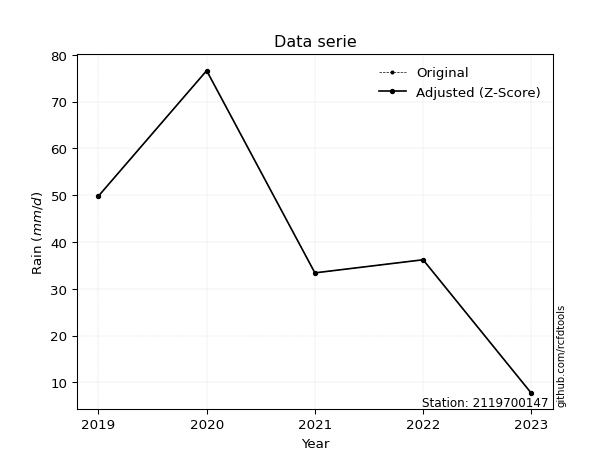</img>

</div>


> The initial value (value_initial) correspond to the initial obtained or null completed value, and value (value) is adjusted only when the initial value is outside the valid range (outlier) definite through the Z-Score value. If Z-Score is active, values out of range or outliers are replaced with the station mean value. A Z-Score (or standard score) measures how many standard deviations a data point is from the mean of a dataset, indicating its relative position; positive scores mean above the mean, negative mean below, and a score of zero is exactly at the mean, allowing for comparison of values from different distributions. It´s calculated using the formula $z=(x–μ)/σ$, where $x$ is the data point, $μ$ is the mean, and $σ$ is the standard deviation, helping identify outliers and understand probability.
>
> <sub>**Note**: In this study, "completing" (filling gaps in) and "extending" (forecasting or lengthening the historical record) rainfall data series are avoided for certain critical analyses because they introduce artificial bias and uncertainty, which can distort the statistics of rare events (extremes), alter day-to-day variability, and compromise the integrity and homogeneity of the original data. Some reasons against Completing/Extending rainfall data are: **Distortion of Extremes and Variability**: The primary issue is that most gap-filling or extension methods rely on averaging or regression with nearby stations, which inherently smooths the data. Rainfall is highly variable in space and time, with a large percentage of zero values and occasional large storms. Infilling methods often underestimate the highest values and overestimate the lowest (zero) values, which severely distorts analyses focused on flood frequency, drought severity, and intensity-duration-frequency (IDF) curves, **Loss of Data Homogeneity**: Infilled or extended data are synthetic estimates, not actual measurements. Combining these estimates with observed data can violate the assumption of data homogeneity, which requires that the data properties do not change over time. Inhomogeneity can lead to incorrect conclusions about long-term trends or changes in climate patterns, **Propagation of Errors**: Errors and biases from the original data (e.g., wind-induced undercatch, instrument errors, site changes) or the data used for imputation can propagate through the analysis, leading to unreliable hydrological models and inaccurate predictions, **Compromised Statistical Integrity**: For statistical analyses, especially those involving the frequency of events, using artificial data can introduce time bias or autocorrelation that doesn´t exist in reality, making it difficult to assess the true probability of events, **Difficulty in Validation**: It is difficult to accurately validate the quality of filled or extended data, especially for past periods where ground-truth measurements are unavailable. The reliability of imputation techniques heavily depends on the density of the surrounding station network and the complexity of the local topography.</sub>


### 4. Active continuous probability distributions from SciPy (80 of 104 available)

A Probability Density Function (PDF) describes the relative likelihood of a continuous random variable falling within a specific range, where the total area under its curve equals 1, and the area over any interval gives the actual probability for that range. Unlike discrete probabilities (like rolling a die), a PDF shows density, not direct probability for a single point (which is zero), with higher points indicating higher likelihood, often visualized as a bell curve for normal distributions.

A log of a probability density function (log-PDF) is simply the logarithm of the PDF´s value, denoted as $log(f(x))$, useful for converting multiplication of probabilities into addition, improving numerical stability with tiny numbers, and connecting to information theory concepts like entropy. Instead of dealing with very small probabilities (e.g., 0.000001), log-PDFs use negative numbers (e.g., $log(0.00001) ≈ -11.51$ that are easier for computers to handle, preventing underflow errors and simplifying complex calculations. In this study, each active probability distribution from SciPy is also evaluated in the $log$ form.

[scipy.stats](https://docs.scipy.org/doc/scipy/reference/stats.html) is a Python´s powerful submodule within the SciPy library for comprehensive statistical analysis, offering over 130 probability distributions (like Normal, Poisson, etc.), functions for descriptive stats (mean, variance), hypothesis testing (t-tests, chi-square), random variable generation, and statistical tests, making it essential for data science, modeling, and research. It provides tools to explore, model, and draw conclusions from data efficiently, working seamlessly with [NumPy](https://numpy.org/).

<div align="center">

|   id | p_dist           |   n_parameter | fit_method   | label                                                                       | active   | ref                                                                                                      |
|-----:|:-----------------|--------------:|:-------------|:----------------------------------------------------------------------------|:---------|:---------------------------------------------------------------------------------------------------------|
|    0 | alpha            |             3 | MLE          | Alpha                                                                       | True     | [:mortar_board:](https://docs.scipy.org/doc/scipy/reference/generated/scipy.stats.alpha.html)            |
|    1 | anglit           |             2 | MM           | Anglit                                                                      | True     | [:mortar_board:](https://docs.scipy.org/doc/scipy/reference/generated/scipy.stats.anglit.html)           |
|    2 | arcsine          |             2 | MM           | Arcsine                                                                     | True     | [:mortar_board:](https://docs.scipy.org/doc/scipy/reference/generated/scipy.stats.arcsine.html)          |
|    3 | argus            |             3 | MLE          | Argus                                                                       | True     | [:mortar_board:](https://docs.scipy.org/doc/scipy/reference/generated/scipy.stats.argus.html)            |
|    4 | beta             |             4 | MLE          | Beta                                                                        | True     | [:mortar_board:](https://docs.scipy.org/doc/scipy/reference/generated/scipy.stats.beta.html)             |
|    5 | betaprime        |             4 | MLE          | Beta prime                                                                  | True     | [:mortar_board:](https://docs.scipy.org/doc/scipy/reference/generated/scipy.stats.betaprime.html)        |
|    6 | bradford         |             3 | MLE          | Bradford                                                                    | True     | [:mortar_board:](https://docs.scipy.org/doc/scipy/reference/generated/scipy.stats.bradford.html)         |
|    7 | burr             |             4 | MLE          | Burr (Type III)                                                             | True     | [:mortar_board:](https://docs.scipy.org/doc/scipy/reference/generated/scipy.stats.burr.html)             |
|    8 | burr12           |             4 | MLE          | Burr (Type III) 12                                                          | True     | [:mortar_board:](https://docs.scipy.org/doc/scipy/reference/generated/scipy.stats.burr12.html)           |
|    9 | cosine           |             2 | MLE          | Cosine                                                                      | True     | [:mortar_board:](https://docs.scipy.org/doc/scipy/reference/generated/scipy.stats.cosine.html)           |
|   10 | crystalball      |             4 | MLE          | Crystalball                                                                 | True     | [:mortar_board:](https://docs.scipy.org/doc/scipy/reference/generated/scipy.stats.crystalball.html)      |
|   11 | dgamma           |             3 | MLE          | Double gamma                                                                | True     | [:mortar_board:](https://docs.scipy.org/doc/scipy/reference/generated/scipy.stats.dgamma.html)           |
|   12 | dweibull         |             3 | MLE          | Double Weibull                                                              | True     | [:mortar_board:](https://docs.scipy.org/doc/scipy/reference/generated/scipy.stats.dweibull.html)         |
|   13 | erlang           |             3 | MLE          | Erlang                                                                      | True     | [:mortar_board:](https://docs.scipy.org/doc/scipy/reference/generated/scipy.stats.erlang.html)           |
|   14 | exponnorm        |             3 | MLE          | Exponentially modified Normal                                               | True     | [:mortar_board:](https://docs.scipy.org/doc/scipy/reference/generated/scipy.stats.exponnorm.html)        |
|   15 | exponpow         |             3 | MLE          | Exponential power                                                           | True     | [:mortar_board:](https://docs.scipy.org/doc/scipy/reference/generated/scipy.stats.exponpow.html)         |
|   16 | exponweib        |             4 | MLE          | Exponentiated Weibull                                                       | True     | [:mortar_board:](https://docs.scipy.org/doc/scipy/reference/generated/scipy.stats.exponweib.html)        |
|   17 | f                |             4 | MLE          | F                                                                           | True     | [:mortar_board:](https://docs.scipy.org/doc/scipy/reference/generated/scipy.stats.f.html)                |
|   18 | fatiguelife      |             3 | MLE          | Fatigue-life (Birnbaum-Saunders)                                            | True     | [:mortar_board:](https://docs.scipy.org/doc/scipy/reference/generated/scipy.stats.fatiguelife.html)      |
|   19 | foldnorm         |             3 | MM           | Fold Normal                                                                 | True     | [:mortar_board:](https://docs.scipy.org/doc/scipy/reference/generated/scipy.stats.foldnorm.html)         |
|   20 | gamma            |             3 | MLE          | Gamma                                                                       | True     | [:mortar_board:](https://docs.scipy.org/doc/scipy/reference/generated/scipy.stats.gamma.html)            |
|   21 | gausshyper       |             6 | MLE          | Gauss hypergeometric                                                        | True     | [:mortar_board:](https://docs.scipy.org/doc/scipy/reference/generated/scipy.stats.gausshyper.html)       |
|   22 | genexpon         |             5 | MLE          | Generalized exponential                                                     | True     | [:mortar_board:](https://docs.scipy.org/doc/scipy/reference/generated/scipy.stats.genexpon.html)         |
|   23 | genextreme       |             3 | MLE          | Generalized exponential                                                     | True     | [:mortar_board:](https://docs.scipy.org/doc/scipy/reference/generated/scipy.stats.genextreme.html)       |
|   24 | gengamma         |             4 | MLE          | Generalized gamma                                                           | True     | [:mortar_board:](https://docs.scipy.org/doc/scipy/reference/generated/scipy.stats.gengamma.html)         |
|   25 | genhalflogistic  |             3 | MLE          | Generalized half-logistic                                                   | True     | [:mortar_board:](https://docs.scipy.org/doc/scipy/reference/generated/scipy.stats.genhalflogistic.html)  |
|   26 | genlogistic      |             3 | MLE          | Generalized logistic                                                        | True     | [:mortar_board:](https://docs.scipy.org/doc/scipy/reference/generated/scipy.stats.genlogistic.html)      |
|   27 | gennorm          |             3 | MLE          | Generalized Normal                                                          | True     | [:mortar_board:](https://docs.scipy.org/doc/scipy/reference/generated/scipy.stats.gennorm.html)          |
|   28 | genpareto        |             3 | MLE          | Generalized Pareto                                                          | True     | [:mortar_board:](https://docs.scipy.org/doc/scipy/reference/generated/scipy.stats.genpareto.html)        |
|   29 | gompertz         |             3 | MLE          | Gompertz (or truncated Gumbel)                                              | True     | [:mortar_board:](https://docs.scipy.org/doc/scipy/reference/generated/scipy.stats.gompertz.html)         |
|   30 | gumbel_l         |             2 | MM           | Gumbel Left Skew                                                            | True     | [:mortar_board:](https://docs.scipy.org/doc/scipy/reference/generated/scipy.stats.gumbel_l.html)         |
|   31 | gumbel_r         |             2 | MM           | Gumbel Right Skew                                                           | True     | [:mortar_board:](https://docs.scipy.org/doc/scipy/reference/generated/scipy.stats.gumbel_r.html)         |
|   32 | halfgennorm      |             3 | MLE          | Upper half of a generalized normal                                          | True     | [:mortar_board:](https://docs.scipy.org/doc/scipy/reference/generated/scipy.stats.halfgennorm.html)      |
|   33 | halflogistic     |             2 | MM           | Half-logistic                                                               | True     | [:mortar_board:](https://docs.scipy.org/doc/scipy/reference/generated/scipy.stats.halflogistic.html)     |
|   34 | halfnorm         |             2 | MM           | Half Normal                                                                 | True     | [:mortar_board:](https://docs.scipy.org/doc/scipy/reference/generated/scipy.stats.halfnorm.html)         |
|   35 | hypsecant        |             2 | MM           | hyperbolic secant                                                           | True     | [:mortar_board:](https://docs.scipy.org/doc/scipy/reference/generated/scipy.stats.hypsecant.html)        |
|   36 | invgamma         |             3 | MLE          | Inverted gamma                                                              | True     | [:mortar_board:](https://docs.scipy.org/doc/scipy/reference/generated/scipy.stats.invgamma.html)         |
|   37 | invgauss         |             3 | MLE          | Inverse Gaussian                                                            | True     | [:mortar_board:](https://docs.scipy.org/doc/scipy/reference/generated/scipy.stats.invgauss.html)         |
|   38 | invweibull       |             3 | MLE          | Inverted Weibull                                                            | True     | [:mortar_board:](https://docs.scipy.org/doc/scipy/reference/generated/scipy.stats.invweibull.html)       |
|   39 | johnsonsb        |             4 | MLE          | Johnson SB                                                                  | True     | [:mortar_board:](https://docs.scipy.org/doc/scipy/reference/generated/scipy.stats.johnsonsb.html)        |
|   40 | johnsonsu        |             4 | MLE          | Johnson Su                                                                  | True     | [:mortar_board:](https://docs.scipy.org/doc/scipy/reference/generated/scipy.stats.johnsonsu.html)        |
|   41 | kappa3           |             3 | MLE          | Kappa 3                                                                     | True     | [:mortar_board:](https://docs.scipy.org/doc/scipy/reference/generated/scipy.stats.kappa3.html)           |
|   42 | kappa4           |             4 | MLE          | Kappa 4                                                                     | True     | [:mortar_board:](https://docs.scipy.org/doc/scipy/reference/generated/scipy.stats.kappa4.html)           |
|   43 | ksone            |             3 | MLE          | Kolmogorov-Smirnov one-sided test statistic distribution                    | True     | [:mortar_board:](https://docs.scipy.org/doc/scipy/reference/generated/scipy.stats.ksone.html)            |
|   44 | kstwobign        |             2 | MLE          | Limiting distribution of scaled Kolmogorov-Smirnov two-sided test statistic | True     | [:mortar_board:](https://docs.scipy.org/doc/scipy/reference/generated/scipy.stats.kstwobign.html)        |
|   45 | laplace          |             2 | MM           | Laplace                                                                     | True     | [:mortar_board:](https://docs.scipy.org/doc/scipy/reference/generated/scipy.stats.laplace.html)          |
|   46 | levy_l           |             2 | MLE          | Left-skewed Levy                                                            | True     | [:mortar_board:](https://docs.scipy.org/doc/scipy/reference/generated/scipy.stats.levy_l.html)           |
|   47 | loggamma         |             3 | MLE          | Log gamma                                                                   | True     | [:mortar_board:](https://docs.scipy.org/doc/scipy/reference/generated/scipy.stats.loggamma.html)         |
|   48 | logistic         |             2 | MM           | Logistic (or Sech-squared)                                                  | True     | [:mortar_board:](https://docs.scipy.org/doc/scipy/reference/generated/scipy.stats.logistic.html)         |
|   49 | loglaplace       |             3 | MLE          | Log-Laplace                                                                 | True     | [:mortar_board:](https://docs.scipy.org/doc/scipy/reference/generated/scipy.stats.loglaplace.html)       |
|   50 | lomax            |             3 | MLE          | Lomax (Pareto of the second kind)                                           | True     | [:mortar_board:](https://docs.scipy.org/doc/scipy/reference/generated/scipy.stats.lomax.html)            |
|   51 | maxwell          |             2 | MM           | Maxwell                                                                     | True     | [:mortar_board:](https://docs.scipy.org/doc/scipy/reference/generated/scipy.stats.maxwell.html)          |
|   52 | mielke           |             4 | MLE          | Mielke Beta-Kappa / Dagum                                                   | True     | [:mortar_board:](https://docs.scipy.org/doc/scipy/reference/generated/scipy.stats.mielke.html)           |
|   53 | moyal            |             2 | MM           | Moyal                                                                       | True     | [:mortar_board:](https://docs.scipy.org/doc/scipy/reference/generated/scipy.stats.moyal.html)            |
|   54 | nakagami         |             3 | MLE          | Nakagami                                                                    | True     | [:mortar_board:](https://docs.scipy.org/doc/scipy/reference/generated/scipy.stats.nakagami.html)         |
|   55 | ncf              |             5 | MLE          | Non-central F distribution                                                  | True     | [:mortar_board:](https://docs.scipy.org/doc/scipy/reference/generated/scipy.stats.ncf.html)              |
|   56 | nct              |             4 | MLE          | Non-central Student’s t                                                     | True     | [:mortar_board:](https://docs.scipy.org/doc/scipy/reference/generated/scipy.stats.nct.html)              |
|   57 | norm             |             2 | MM           | Normal                                                                      | True     | [:mortar_board:](https://docs.scipy.org/doc/scipy/reference/generated/scipy.stats.norm.html)             |
|   58 | pearson3         |             3 | MM           | Pearson type III                                                            | True     | [:mortar_board:](https://docs.scipy.org/doc/scipy/reference/generated/scipy.stats.pearson3.html)         |
|   59 | powerlaw         |             3 | MLE          | Power-function                                                              | True     | [:mortar_board:](https://docs.scipy.org/doc/scipy/reference/generated/scipy.stats.powerlaw.html)         |
|   60 | rayleigh         |             2 | MM           | Rayleigh                                                                    | True     | [:mortar_board:](https://docs.scipy.org/doc/scipy/reference/generated/scipy.stats.rayleigh.html)         |
|   61 | rdist            |             3 | MLE          | R-distributed (symmetric beta)                                              | True     | [:mortar_board:](https://docs.scipy.org/doc/scipy/reference/generated/scipy.stats.rdist.html)            |
|   62 | rice             |             3 | MLE          | Rice                                                                        | True     | [:mortar_board:](https://docs.scipy.org/doc/scipy/reference/generated/scipy.stats.rice.html)             |
|   63 | semicircular     |             2 | MM           | Semicircular                                                                | True     | [:mortar_board:](https://docs.scipy.org/doc/scipy/reference/generated/scipy.stats.semicircular.html)     |
|   64 | skewnorm         |             3 | MLE          | Skew normal                                                                 | True     | [:mortar_board:](https://docs.scipy.org/doc/scipy/reference/generated/scipy.stats.skewnorm.html)         |
|   65 | t                |             3 | MLE          | Student’s t                                                                 | True     | [:mortar_board:](https://docs.scipy.org/doc/scipy/reference/generated/scipy.stats.t.html)                |
|   66 | trapezoid        |             4 | MLE          | Trapezoid                                                                   | True     | [:mortar_board:](https://docs.scipy.org/doc/scipy/reference/generated/scipy.stats.trapezoid.html)        |
|   67 | triang           |             3 | MLE          | Triangular                                                                  | True     | [:mortar_board:](https://docs.scipy.org/doc/scipy/reference/generated/scipy.stats.triang.html)           |
|   68 | truncexpon       |             3 | MLE          | Truncated exponential                                                       | True     | [:mortar_board:](https://docs.scipy.org/doc/scipy/reference/generated/scipy.stats.truncexpon.html)       |
|   69 | truncnorm        |             4 | MLE          | Truncated normal                                                            | True     | [:mortar_board:](https://docs.scipy.org/doc/scipy/reference/generated/scipy.stats.truncnorm.html)        |
|   70 | truncpareto      |             4 | MLE          | Upper truncated Pareto                                                      | True     | [:mortar_board:](https://docs.scipy.org/doc/scipy/reference/generated/scipy.stats.truncpareto.html)      |
|   71 | truncweibull_min |             5 | MLE          | Doubly truncated Weibull minimum                                            | True     | [:mortar_board:](https://docs.scipy.org/doc/scipy/reference/generated/scipy.stats.truncweibull_min.html) |
|   72 | tukeylambda      |             3 | MLE          | Tukey-Lamdba                                                                | True     | [:mortar_board:](https://docs.scipy.org/doc/scipy/reference/generated/scipy.stats.tukeylambda.html)      |
|   73 | uniform          |             2 | MLE          | Uniform                                                                     | True     | [:mortar_board:](https://docs.scipy.org/doc/scipy/reference/generated/scipy.stats.uniform.html)          |
|   74 | vonmises         |             3 | MLE          | Von Mises                                                                   | True     | [:mortar_board:](https://docs.scipy.org/doc/scipy/reference/generated/scipy.stats.vonmises.html)         |
|   75 | vonmises_line    |             3 | MLE          | Von Mises line                                                              | True     | [:mortar_board:](https://docs.scipy.org/doc/scipy/reference/generated/scipy.stats.vonmises_line.html)    |
|   76 | wald             |             2 | MM           | Wald                                                                        | True     | [:mortar_board:](https://docs.scipy.org/doc/scipy/reference/generated/scipy.stats.wald.html)             |
|   77 | weibull_max      |             3 | MLE          | Weibull maximum                                                             | True     | [:mortar_board:](https://docs.scipy.org/doc/scipy/reference/generated/scipy.stats.weibull_max.html)      |
|   78 | weibull_min      |             3 | MLE          | Weibull minimum                                                             | True     | [:mortar_board:](https://docs.scipy.org/doc/scipy/reference/generated/scipy.stats.weibull_min.html)      |
|   79 | wrapcauchy       |             3 | MLE          | Wrapped  Cauchy                                                             | True     | [:mortar_board:](https://docs.scipy.org/doc/scipy/reference/generated/scipy.stats.wrapcauchy.html)       |

</div>

> **n_parameter:** # arguments & localization & scale.
>
> **Fit methods:** (MLE) maximum likelihood, (MM) L-moments.
>
>**Inactive** (With the only purpose of prevent loops, zero divisions, infinite values, over high estimated values or horizontal trending for recurrence intervals estimations, the follow distributions were disabled.)**:** lognorm, norminvgauss, powernorm, powerlognorm, cauchy, halfcauchy, foldcauchy, skewcauchy, chi2, expon, fisk, genhyperbolic, geninvgauss, gibrat, kstwo, laplace_asymmetric, levy, levy_stable, ncx2, pareto, rel_breitwigner, recipinvgauss, studentized_range, loguniform, 


## B. Probability (PDF) vs. Empirical (EDF) distributions functions

A continuous probability distribution (CPD) describes probabilities for variables that can take any value within a range (like rain any time), unlike discrete variables with specific outcomes (like temperature). It uses a Probability Density Function (PDF), a curve where the total area under it equals 1, and the probability of the variable falling within an interval (a to b) is found by calculating the area under the curve between those points. A key feature is that the probability of hitting any single exact value is zero, so probabilities are always expressed for ranges, e.g., $P(a ≤ X ≤ b)$.

<div align="center">

Distributions parameters from station values
|     |    station | p_dist              |   n |             loc |           scale | shape                  | shape1                | shape2                | shape3             |
|----:|-----------:|:--------------------|----:|----------------:|----------------:|:-----------------------|:----------------------|:----------------------|:-------------------|
|   0 | 2119700147 | alpha               |   5 |    -0.0408778   |    16.2689      | 1.896687750907734e-10  |                       |                       |                    |
|   1 | 2119700147 | anglit              |   5 |    40.74        |    65.8592      |                        |                       |                       |                    |
|   2 | 2119700147 | arcsine             |   5 |     8.90195     |    63.6761      |                        |                       |                       |                    |
|   3 | 2119700147 | argus               |   5 |   -10.5055      |    92.0495      | 1.5610895530249594e-05 |                       |                       |                    |
|   4 | 2119700147 | beta                |   5 |    -3.61823     |    80.2182      | 1.2592148786639896     | 0.7532674438488449    |                       |                    |
|   5 | 2119700147 | betaprime           |   5 |   -65.6897      |  7238.25        | 22.27748008067841      | 1516.0740039057105    |                       |                    |
|   6 | 2119700147 | bradford            |   5 |     7.69998     |    68.9001      | 1.0600792505272933     |                       |                       |                    |
|   7 | 2119700147 | burr                |   5 |     0.378085    |    77.2513      | 300.86436345400614     | 0.0037282382631234614 |                       |                    |
|   8 | 2119700147 | burr12              |   5 |    -1.86105     |     9.4351      | 335.0931131114746      | 0.002279515445094214  |                       |                    |
|   9 | 2119700147 | cosine              |   5 |    41.3088      |    18.8237      |                        |                       |                       |                    |
|  10 | 2119700147 | crystalball         |   5 |    40.74        |    22.5129      | 2190.05077914251       | 4542.615782275054     |                       |                    |
|  11 | 2119700147 | dgamma              |   5 |    36.2         |    16.4948      | 0.8856582516529976     |                       |                       |                    |
|  12 | 2119700147 | dweibull            |   5 |    36.2         |    18.3618      | 0.8606041297584022     |                       |                       |                    |
|  13 | 2119700147 | erlang              |   5 |   -73.2657      |     4.50025     | 25.336997616057857     |                       |                       |                    |
|  14 | 2119700147 | exponnorm           |   5 |    35.7799      |    21.9617      | 0.2258523734617805     |                       |                       |                    |
|  15 | 2119700147 | exponpow            |   5 |     7.7         |    45.2043      | 0.6942576290737061     |                       |                       |                    |
|  16 | 2119700147 | exponweib           |   5 |     7.7         |    52.56        | 0.2443355748875315     | 3.1625797616409947    |                       |                    |
|  17 | 2119700147 | f                   |   5 |   -62.0513      |   102.783       | 40.95121234910478      | 23950.533639036465    |                       |                    |
|  18 | 2119700147 | fatiguelife         |   5 |  -137.639       |   176.957       | 0.12674359390311213    |                       |                       |                    |
|  19 | 2119700147 | foldnorm            |   5 |   -11.5619      |    23.1182      | 2.2520709102118124     |                       |                       |                    |
|  20 | 2119700147 | gamma               |   5 |   -65.4723      |     4.8491      | 21.897319684945465     |                       |                       |                    |
|  21 | 2119700147 | gausshyper          |   5 |     6.52058     |    70.0794      | 0.9814316092552587     | 0.9299212400436643    | 1.0104864135471308    | 1.1225750663982415 |
|  22 | 2119700147 | genexpon            |   5 |     2.41546     |     0.623075    | 1.7320379560557296e-10 | 0.016794372265101602  | 0.5213373956491454    |                    |
|  23 | 2119700147 | genextreme          |   5 |    32.6829      |    21.7976      | 0.2688853454218044     |                       |                       |                    |
|  24 | 2119700147 | gengamma            |   5 |     7.69834     |    58.0263      | 0.472440074899372      | 1.6504929612701504    |                       |                    |
|  25 | 2119700147 | genhalflogistic     |   5 |     0.795332    |    80.569       | 1.0628505323347572     |                       |                       |                    |
|  26 | 2119700147 | genlogistic         |   5 |    21.0563      |    16.3178      | 2.388832773539222      |                       |                       |                    |
|  27 | 2119700147 | gennorm             |   5 |    36.2         |     1.06961     | 0.4045740584019476     |                       |                       |                    |
|  28 | 2119700147 | genpareto           |   5 |    -0.325443    |   113.514       | -1.4756320328474244    |                       |                       |                    |
|  29 | 2119700147 | gompertz            |   5 |    -8.48485     |    25.4861      | 0.1091914783307309     |                       |                       |                    |
|  30 | 2119700147 | gumbel_l            |   5 |    50.872       |    17.5532      |                        |                       |                       |                    |
|  31 | 2119700147 | gumbel_r            |   5 |    30.608       |    17.5532      |                        |                       |                       |                    |
|  32 | 2119700147 | halfgennorm         |   5 |     7.7         |     1.58581     | 0.3714956652387687     |                       |                       |                    |
|  33 | 2119700147 | halflogistic        |   5 |    14.057       |    19.2477      |                        |                       |                       |                    |
|  34 | 2119700147 | halfnorm            |   5 |    10.9417      |    37.3466      |                        |                       |                       |                    |
|  35 | 2119700147 | hypsecant           |   5 |    40.74        |    14.3322      |                        |                       |                       |                    |
|  36 | 2119700147 | invgamma            |   5 |  -154.103       | 14205.2         | 73.96166957544375      |                       |                       |                    |
|  37 | 2119700147 | invgauss            |   5 |   -74.3088      |  2808.92        | 0.040949748656318466   |                       |                       |                    |
|  38 | 2119700147 | invweibull          |   5 |    -1.69926e+09 |     1.69926e+09 | 83965789.4645943       |                       |                       |                    |
|  39 | 2119700147 | johnsonsb           |   5 |    -1.91873     |    78.5187      | -1.1475350857097328    | 0.14473610414357102   |                       |                    |
|  40 | 2119700147 | johnsonsu           |   5 |  -142.647       |    61.1153      | -15.54530803108237     | 8.578881307704165     |                       |                    |
|  41 | 2119700147 | kappa3              |   5 |     7.7         |    68.8407      | 1872.2251347360311     |                       |                       |                    |
|  42 | 2119700147 | kappa4              |   5 |     1.90776     |    74.605       | 1.084059475064385      | 0.9684957622401335    |                       |                    |
|  43 | 2119700147 | ksone               |   5 |     1.74652     |    77.987       | 1.0                    |                       |                       |                    |
|  44 | 2119700147 | kstwobign           |   5 |   -41.1656      |    93.7569      |                        |                       |                       |                    |
|  45 | 2119700147 | laplace             |   5 |    40.74        |    15.919       |                        |                       |                       |                    |
|  46 | 2119700147 | levy_l              |   5 |    79.9682      |    12.8799      |                        |                       |                       |                    |
|  47 | 2119700147 | loggamma            |   5 | -5133.82        |   742.046       | 1068.212049524935      |                       |                       |                    |
|  48 | 2119700147 | logistic            |   5 |    40.74        |    12.412       |                        |                       |                       |                    |
|  49 | 2119700147 | loglaplace          |   5 |    -0.114239    |    36.3142      | 1.8638895860632643     |                       |                       |                    |
|  50 | 2119700147 | lomax               |   5 |     7.67317     |  8814.3         | 266.0600775646353      |                       |                       |                    |
|  51 | 2119700147 | maxwell             |   5 |   -12.6061      |    33.4297      |                        |                       |                       |                    |
|  52 | 2119700147 | mielke              |   5 |    -2.38383     |    79.9187      | 1.2376508510173054     | 338.7872354784388     |                       |                    |
|  53 | 2119700147 | moyal               |   5 |    27.8657      |    10.1344      |                        |                       |                       |                    |
|  54 | 2119700147 | nakagami            |   5 |    33.4         |    20.8366      | 0.10359218997674945    |                       |                       |                    |
|  55 | 2119700147 | ncf                 |   5 |     7.68895     |    12.3477      | 1.8006114781131841     | 37945.52971656343     | 2.1647639139053716    |                    |
|  56 | 2119700147 | nct                 |   5 |  -749.718       |    22.4668      | 150719.08290759078     | 35.1831491367808      |                       |                    |
|  57 | 2119700147 | norm                |   5 |    40.74        |    22.5129      |                        |                       |                       |                    |
|  58 | 2119700147 | pearson3            |   5 |    40.74        |    22.5129      | 0.1805621312230269     |                       |                       |                    |
|  59 | 2119700147 | powerlaw            |   5 |     7.7         |    68.9         | 0.12120759342471497    |                       |                       |                    |
|  60 | 2119700147 | rayleigh            |   5 |    -2.32848     |    34.3637      |                        |                       |                       |                    |
|  61 | 2119700147 | rdist               |   5 |     1.87125     |    34.3288      | 1.1431913168701222     |                       |                       |                    |
|  62 | 2119700147 | rice                |   5 |    -4.0214      |    27.3262      | 1.1670094940120177     |                       |                       |                    |
|  63 | 2119700147 | semicircular        |   5 |    40.74        |    45.0258      |                        |                       |                       |                    |
|  64 | 2119700147 | skewnorm            |   5 |    19.3757      |    31.0365      | 1.6698588981301086     |                       |                       |                    |
|  65 | 2119700147 | t                   |   5 |    40.7393      |    22.5101      | 4455981.904307559      |                       |                       |                    |
|  66 | 2119700147 | trapezoid           |   5 |     0.81        |    82.68        | 0.9999999999999999     | 1.0                   |                       |                    |
|  67 | 2119700147 | triang              |   5 |     0.862931    |    75.7371      | 0.9999999166486939     |                       |                       |                    |
|  68 | 2119700147 | truncexpon          |   5 |     7.69999     |    66.4358      | 1.0370914550972268     |                       |                       |                    |
|  69 | 2119700147 | truncnorm           |   5 |    40.74        |    22.5129      | -109.58042591655527    | 157.97462722129202    |                       |                    |
|  70 | 2119700147 | truncpareto         |   5 |  -162.132       |   169.832       | 9.786462852867762e-08  | 1.4056958277971687    |                       |                    |
|  71 | 2119700147 | truncweibull_min    |   5 |     7.63217     |   120.812       | 0.6993095815652363     | 0.0005012514648869216 | 0.5708710311876556    |                    |
|  72 | 2119700147 | tukeylambda         |   5 |    42.2352      |    38.2922      | 1.1087880693059453     |                       |                       |                    |
|  73 | 2119700147 | uniform             |   5 |     7.7         |    68.9         |                        |                       |                       |                    |
|  74 | 2119700147 | vonmises            |   5 |     0.911418    |     1           | 0.7522996798728561     |                       |                       |                    |
|  75 | 2119700147 | vonmises_line       |   5 |    42.15        |    10.9658      | 0.12860128948648608    |                       |                       |                    |
|  76 | 2119700147 | wald                |   5 |    18.227       |    22.5129      |                        |                       |                       |                    |
|  77 | 2119700147 | weibull_max         |   5 |    76.6         |     1.51319     | 0.24551086126995653    |                       |                       |                    |
|  78 | 2119700147 | weibull_min         |   5 |    -2.60208     |    48.8158      | 1.9948648416782142     |                       |                       |                    |
|  79 | 2119700147 | wrapcauchy          |   5 |     7.69993     |    11.0215      | 1.4792326622333634e-05 |                       |                       |                    |
|  80 | 2119700147 | logalpha            |   5 |   -17.2704      |   532.151       | 25.67924338954557      |                       |                       |                    |
|  81 | 2119700147 | loganglit           |   5 |     3.47709     |     2.26719     |                        |                       |                       |                    |
|  82 | 2119700147 | logarcsine          |   5 |     2.3811      |     2.19198     |                        |                       |                       |                    |
|  83 | 2119700147 | logargus            |   5 |     1.15072     |     3.27615     | 2.1239276143321177     |                       |                       |                    |
|  84 | 2119700147 | logbeta             |   5 |     1.84851     |     2.49009     | 0.9861578036879741     | 0.3758311322151086    |                       |                    |
|  85 | 2119700147 | logbetaprime        |   5 |   -19.5437      |    17.1246      | 1896.44833520855       | 1411.8404772280537    |                       |                    |
|  86 | 2119700147 | logbradford         |   5 |     2.0412      |     2.29742     | 1.0688346133071198     |                       |                       |                    |
|  87 | 2119700147 | logburr             |   5 |   -16.7344      |    21.0883      | 5216.951663308928      | 0.0044452018012876154 |                       |                    |
|  88 | 2119700147 | logburr12           |   5 |  -841.323       |   853.015       | 1475.0277784164773     | 882103.4978548908     |                       |                    |
|  89 | 2119700147 | logcosine           |   5 |     3.37312     |     0.657379    |                        |                       |                       |                    |
|  90 | 2119700147 | logcrystalball      |   5 |     3.47709     |     0.775002    | 26.44461187584807      | 13698.634952537272    |                       |                    |
|  91 | 2119700147 | logdgamma           |   5 |     3.58906     |     0.615033    | 0.8046464894098644     |                       |                       |                    |
|  92 | 2119700147 | logdweibull         |   5 |     3.58906     |     0.603551    | 0.8448826444357298     |                       |                       |                    |
|  93 | 2119700147 | logerlang           |   5 |    -9.58887     |     0.0498325   | 262.2615272230946      |                       |                       |                    |
|  94 | 2119700147 | logexponnorm        |   5 |     3.47646     |     0.775003    | 0.0008105748534091591  |                       |                       |                    |
|  95 | 2119700147 | logexponpow         |   5 |     2.04122     |     1.70219     | 0.5746185157205157     |                       |                       |                    |
|  96 | 2119700147 | logexponweib        |   5 |     2.04122     |     1.34328     | 0.9753884158199713     | 0.8062561273081761    |                       |                    |
|  97 | 2119700147 | logf                |   5 |  -677.042       |   680.517       | 3393095.3444383703     | 2793587.9676690726    |                       |                    |
|  98 | 2119700147 | logfatiguelife      |   5 |  -459.989       |   463.466       | 0.0016674792020693703  |                       |                       |                    |
|  99 | 2119700147 | logfoldnorm         |   5 |    -1.87602     |     0.735282    | 7.287796740641479      |                       |                       |                    |
| 100 | 2119700147 | loggamma            |   5 |   -10.6532      |     0.04503     | 313.6535129802721      |                       |                       |                    |
| 101 | 2119700147 | loggausshyper       |   5 |     1.99656     |     2.34203     | 1.1479880145320331     | 0.7476784929326606    | 1.0923542906366863    | 0.9428548561967536 |
| 102 | 2119700147 | loggenexpon         |   5 |     2.04122     |     3.33457e+09 | 1563481461.1535845     | 3614967423.733325     | 885224485.5239267     |                    |
| 103 | 2119700147 | loggenextreme       |   5 |     3.48781     |     0.963187    | 1.1321111099779968     |                       |                       |                    |
| 104 | 2119700147 | loggengamma         |   5 |     2.04122     |     1.45214     | 0.6024115220790105     | 0.93079733743872      |                       |                    |
| 105 | 2119700147 | loggenhalflogistic  |   5 |     1.94002     |     2.54112     | 1.0594270163648682     |                       |                       |                    |
| 106 | 2119700147 | loggenlogistic      |   5 |     4.33908     |     2.8895e-05  | 3.365397843288429e-05  |                       |                       |                    |
| 107 | 2119700147 | loggennorm          |   5 |     3.58906     |     0.0197104   | 0.37987389828805185    |                       |                       |                    |
| 108 | 2119700147 | loggenpareto        |   5 |    -0.00173378  |     8.18469     | -1.885730408386081     |                       |                       |                    |
| 109 | 2119700147 | loggompertz         |   5 |     2.04122     |     0.649309    | 0.07296094695780914    |                       |                       |                    |
| 110 | 2119700147 | loggumbel_l         |   5 |     3.82588     |     0.604266    |                        |                       |                       |                    |
| 111 | 2119700147 | loggumbel_r         |   5 |     3.1283      |     0.604266    |                        |                       |                       |                    |
| 112 | 2119700147 | loghalfgennorm      |   5 |     2.04121     |     2.29749     | 233793.06132622238     |                       |                       |                    |
| 113 | 2119700147 | loghalflogistic     |   5 |     2.55851     |     0.662614    |                        |                       |                       |                    |
| 114 | 2119700147 | loghalfnorm         |   5 |     2.45126     |     1.28568     |                        |                       |                       |                    |
| 115 | 2119700147 | loghypsecant        |   5 |     3.47709     |     0.493382    |                        |                       |                       |                    |
| 116 | 2119700147 | loginvgamma         |   5 |   -12.0844      |  5671.36        | 365.4377699611596      |                       |                       |                    |
| 117 | 2119700147 | loginvgauss         |   5 |    -4.28608     |   668.125       | 0.011575769714005063   |                       |                       |                    |
| 118 | 2119700147 | loginvweibull       |   5 |    -8.27294e+07 |     8.27294e+07 | 96708686.7209914       |                       |                       |                    |
| 119 | 2119700147 | logjohnsonsb        |   5 |     2.04122     |     2.29745     | -0.6503994314531161    | 0.17351512677663422   |                       |                    |
| 120 | 2119700147 | logjohnsonsu        |   5 |     4.63433     |     0.0163814   | 6.719166538211555      | 1.423593368915463     |                       |                    |
| 121 | 2119700147 | logkappa3           |   5 |     2.04122     |     2.29737     | 387885.15748710616     |                       |                       |                    |
| 122 | 2119700147 | logkappa4           |   5 |     1.87485     |     2.65108     | 1.0671214283203683     | 1.0712797759179562    |                       |                    |
| 123 | 2119700147 | logksone            |   5 |     1.81148     |     2.75685     | 1.0                    |                       |                       |                    |
| 124 | 2119700147 | logkstwobign        |   5 |     0.06029     |     3.89622     |                        |                       |                       |                    |
| 125 | 2119700147 | loglaplace          |   5 |     3.47709     |     0.548009    |                        |                       |                       |                    |
| 126 | 2119700147 | loglevy_l           |   5 |     4.4033      |     0.246985    |                        |                       |                       |                    |
| 127 | 2119700147 | logloggamma         |   5 |     4.33863     |     2.57514e-06 | 2.9991504636724844e-06 |                       |                       |                    |
| 128 | 2119700147 | loglogistic         |   5 |     3.47709     |     0.427281    |                        |                       |                       |                    |
| 129 | 2119700147 | logloglaplace       |   5 |    -0.0265759   |     3.61563     | 5.859240778682633      |                       |                       |                    |
| 130 | 2119700147 | loglomax            |   5 |     2.04122     |    69.0922      | 48.24940695991663      |                       |                       |                    |
| 131 | 2119700147 | logmaxwell          |   5 |     1.64066     |     1.15081     |                        |                       |                       |                    |
| 132 | 2119700147 | logmielke           |   5 |    -1.13711e+07 |     1.13711e+07 | 12719788.977553558     | 856893542.0616944     |                       |                    |
| 133 | 2119700147 | logmoyal            |   5 |     3.03389     |     0.348873    |                        |                       |                       |                    |
| 134 | 2119700147 | lognakagami         |   5 |     3.50856     |     0.282238    | 0.17541844680539143    |                       |                       |                    |
| 135 | 2119700147 | logncf              |   5 |   -15.496       |    18.9621      | 1607.3558026997678     | 3509.4006607889846    | 0.0015912402964566065 |                    |
| 136 | 2119700147 | lognct              |   5 |    39.0513      |     0.761611    | 30953.9972007413       | -46.707968919215034   |                       |                    |
| 137 | 2119700147 | lognorm             |   5 |     3.47709     |     0.775002    |                        |                       |                       |                    |
| 138 | 2119700147 | logpearson3         |   5 |     3.47709     |     0.775001    | -0.9621922993940519    |                       |                       |                    |
| 139 | 2119700147 | logpowerlaw         |   5 |     2.04122     |     2.29738     | 0.13428930415831505    |                       |                       |                    |
| 140 | 2119700147 | lograyleigh         |   5 |     1.99447     |     1.18296     |                        |                       |                       |                    |
| 141 | 2119700147 | logrdist            |   5 |     2.70804     |     1.19997     | 1.113789482458933      |                       |                       |                    |
| 142 | 2119700147 | logrice             |   5 |     1.47452     |     0.840073    | 2.1292167573665925     |                       |                       |                    |
| 143 | 2119700147 | logsemicircular     |   5 |     3.47709     |     1.55        |                        |                       |                       |                    |
| 144 | 2119700147 | logskewnorm         |   5 |     4.3386      |     1.15866     | -12388895.845424239    |                       |                       |                    |
| 145 | 2119700147 | logt                |   5 |     3.70278     |     0.371423    | 1.568988659059817      |                       |                       |                    |
| 146 | 2119700147 | logtrapezoid        |   5 |     1.28505     |     3.28805     | 1.0                    | 1.0                   |                       |                    |
| 147 | 2119700147 | logtriang           |   5 |     1.47513     |     2.86346     | 0.9999999795840671     |                       |                       |                    |
| 148 | 2119700147 | logtruncexpon       |   5 |     2.04122     |     2.81191     | 0.8170184383522674     |                       |                       |                    |
| 149 | 2119700147 | logtruncnorm        |   5 |    -0.207234    |     1.48559     | 2.5012289250037893     | 3.060019994982258     |                       |                    |
| 150 | 2119700147 | logtruncpareto      |   5 |     2.02652     |     0.0146994   | 0.26055589751473607    | 157.29075358866248    |                       |                    |
| 151 | 2119700147 | logtruncweibull_min |   5 |     2.04041     |     3.05935     | 0.9573355844235848     | 0.0002635042593918031 | 0.7511996581795555    |                    |
| 152 | 2119700147 | logtukeylambda      |   5 |     2.97441     |     1.03287     | 1.1063267171065245     |                       |                       |                    |
| 153 | 2119700147 | loguniform          |   5 |     2.04122     |     2.29738     |                        |                       |                       |                    |
| 154 | 2119700147 | logvonmises         |   5 |    -2.71716     |     1           | 2.292818236932193      |                       |                       |                    |
| 155 | 2119700147 | logvonmises_line    |   5 |     3.6434      |     0.509988    | 1.025593074405446      |                       |                       |                    |
| 156 | 2119700147 | logwald             |   5 |     2.70208     |     0.775011    |                        |                       |                       |                    |
| 157 | 2119700147 | logweibull_max      |   5 |     4.3386      |     0.689878    | 0.21116422935453666    |                       |                       |                    |
| 158 | 2119700147 | logweibull_min      |   5 |    -4.21845e+07 |     4.21845e+07 | 75895025.82325846      |                       |                       |                    |
| 159 | 2119700147 | logwrapcauchy       |   5 |     2.04122     |     0.365639    | 0.3303921930793082     |                       |                       |                    |

</div>

> **loc** (Location parameter): This shifts the distribution along the x-axis. For many common distributions, like the normal (Gaussian) distribution, loc represents the mean $μ$. For others, like the uniform distribution, it might represent the minimum value, or for the beta distribution, the left end of the support interval.
>
> **scale** (Scale parameter): This determines the width or spread of the distribution. For the normal distribution, scale represents the standard deviation $σ$. For a uniform distribution, it defines the length of the interval (from $loc$ to $loc + scale$).
>
> **shape** (Shape parameters): Refers to parameters that define the specific form of a probability distribution, distinct from its location (loc) and scale (scale). These parameters are required arguments for most distribution functions. For example, a normal (Gaussian) distribution is fully defined by its location (mean) and scale (standard deviation), so it has no specific shape parameters beyond loc and scale. However, other distributions have intrinsic properties that need specification, as Gamma distribution that takes a shape parameter, often named $a$ or $alpha$.


### 0. Cumulative distribution values - CDF (160 evaluated)

Cumulative Distribution Function (CDF), denoted as $F$<sub>$X$</sub>$(x)$, is a function that gives the probability that a random variable $X$ will take a value less than or equal to a specific value, $x$ (i.e., $(P(X≥x)$. It essentially "accumulates" probabilities from a given point up to the far right (positive infinity), providing a complete picture of the distribution´s probabilities for both discrete (like rain) and continuous (like temperature) variables, helping to find probabilities over ranges or above certain values. Each station is evaluated separately ordering the $x$ values ascending, calculating the CDF and PDF values for the activated distributions and their logarithmic forms.

<div align="center">

CDF ordered by x ascending and calculating $log(f(x))$ separately
|   id |    Station |   date |    x |   count |   mean |     std |    zscore |   Value_initial |    station |   m |     alpha |   alpha_pdf |    anglit |   anglit_pdf |   arcsine |   arcsine_pdf |     argus |   argus_pdf |      beta |    beta_pdf |   betaprime |   betaprime_pdf |    bradford |   bradford_pdf |      burr |    burr_pdf |    burr12 |   burr12_pdf |    cosine |   cosine_pdf |   crystalball |   crystalball_pdf |    dgamma |   dgamma_pdf |   dweibull |   dweibull_pdf |    erlang |   erlang_pdf |   exponnorm |   exponnorm_pdf |    exponpow |   exponpow_pdf |   exponweib |   exponweib_pdf |         f |      f_pdf |   fatiguelife |   fatiguelife_pdf |   foldnorm |   foldnorm_pdf |     gamma |   gamma_pdf |   gausshyper |   gausshyper_pdf |   genexpon |   genexpon_pdf |   genextreme |   genextreme_pdf |    gengamma |   gengamma_pdf |   genhalflogistic |   genhalflogistic_pdf |   genlogistic |   genlogistic_pdf |   gennorm |   gennorm_pdf |   genpareto |   genpareto_pdf |   gompertz |   gompertz_pdf |   gumbel_l |   gumbel_l_pdf |   gumbel_r |   gumbel_r_pdf |   halfgennorm |   halfgennorm_pdf |   halflogistic |   halflogistic_pdf |   halfnorm |   halfnorm_pdf |   hypsecant |   hypsecant_pdf |   invgamma |   invgamma_pdf |   invgauss |   invgauss_pdf |   invweibull |   invweibull_pdf |   johnsonsb |   johnsonsb_pdf |   johnsonsu |   johnsonsu_pdf |      kappa3 |   kappa3_pdf |      kappa4 |   kappa4_pdf |     ksone |   ksone_pdf |   kstwobign |   kstwobign_pdf |   laplace |   laplace_pdf |   levy_l |   levy_l_pdf |   loggamma |   loggamma_pdf |   logistic |   logistic_pdf |   loglaplace |   loglaplace_pdf |       lomax |   lomax_pdf |   maxwell |   maxwell_pdf |    mielke |   mielke_pdf |      moyal |   moyal_pdf |    nakagami |   nakagami_pdf |         ncf |    ncf_pdf |       nct |    nct_pdf |     norm |   norm_pdf |   pearson3 |   pearson3_pdf |   powerlaw |   powerlaw_pdf |   rayleigh |   rayleigh_pdf |    rdist |     rdist_pdf |     rice |   rice_pdf |   semicircular |   semicircular_pdf |   skewnorm |   skewnorm_pdf |         t |      t_pdf |   trapezoid |   trapezoid_pdf |     triang |   triang_pdf |   truncexpon |   truncexpon_pdf |   truncnorm |   truncnorm_pdf |   truncpareto |   truncpareto_pdf |   truncweibull_min |   truncweibull_min_pdf |   tukeylambda |   tukeylambda_pdf |   uniform |   uniform_pdf |   vonmises |   vonmises_pdf |   vonmises_line |   vonmises_line_pdf |     wald |   wald_pdf |   weibull_max |   weibull_max_pdf |   weibull_min |   weibull_min_pdf |   wrapcauchy |   wrapcauchy_pdf |   logalpha |   logalpha_pdf |   loganglit |   loganglit_pdf |   logarcsine |   logarcsine_pdf |   logargus |   logargus_pdf |   logbeta |   logbeta_pdf |   logbetaprime |   logbetaprime_pdf |   logbradford |   logbradford_pdf |   logburr |   logburr_pdf |   logburr12 |   logburr12_pdf |   logcosine |   logcosine_pdf |   logcrystalball |   logcrystalball_pdf |   logdgamma |   logdgamma_pdf |   logdweibull |   logdweibull_pdf |   logerlang |   logerlang_pdf |   logexponnorm |   logexponnorm_pdf |   logexponpow |   logexponpow_pdf |   logexponweib |   logexponweib_pdf |      logf |   logf_pdf |   logfatiguelife |   logfatiguelife_pdf |   logfoldnorm |   logfoldnorm_pdf |   loggausshyper |   loggausshyper_pdf |   loggenexpon |   loggenexpon_pdf |   loggenextreme |   loggenextreme_pdf |   loggengamma |   loggengamma_pdf |   loggenhalflogistic |   loggenhalflogistic_pdf |   loggenlogistic |   loggenlogistic_pdf |   loggennorm |   loggennorm_pdf |   loggenpareto |   loggenpareto_pdf |   loggompertz |   loggompertz_pdf |   loggumbel_l |   loggumbel_l_pdf |   loggumbel_r |   loggumbel_r_pdf |   loghalfgennorm |   loghalfgennorm_pdf |   loghalflogistic |   loghalflogistic_pdf |   loghalfnorm |   loghalfnorm_pdf |   loghypsecant |   loghypsecant_pdf |   loginvgamma |   loginvgamma_pdf |   loginvgauss |   loginvgauss_pdf |   loginvweibull |   loginvweibull_pdf |   logjohnsonsb |   logjohnsonsb_pdf |   logjohnsonsu |   logjohnsonsu_pdf |   logkappa3 |   logkappa3_pdf |   logkappa4 |   logkappa4_pdf |   logksone |   logksone_pdf |   logkstwobign |   logkstwobign_pdf |   loglevy_l |   loglevy_l_pdf |   logloggamma |   logloggamma_pdf |   loglogistic |   loglogistic_pdf |   logloglaplace |   logloglaplace_pdf |    loglomax |   loglomax_pdf |   logmaxwell |   logmaxwell_pdf |   logmielke |   logmielke_pdf |    logmoyal |   logmoyal_pdf |   lognakagami |   lognakagami_pdf |    logncf |   logncf_pdf |    lognct |   lognct_pdf |   lognorm |   lognorm_pdf |   logpearson3 |   logpearson3_pdf |   logpowerlaw |   logpowerlaw_pdf |   lograyleigh |   lograyleigh_pdf |   logrdist |   logrdist_pdf |   logrice |   logrice_pdf |   logsemicircular |   logsemicircular_pdf |   logskewnorm |   logskewnorm_pdf |     logt |   logt_pdf |   logtrapezoid |   logtrapezoid_pdf |   logtriang |   logtriang_pdf |   logtruncexpon |   logtruncexpon_pdf |   logtruncnorm |   logtruncnorm_pdf |   logtruncpareto |   logtruncpareto_pdf |   logtruncweibull_min |   logtruncweibull_min_pdf |   logtukeylambda |   logtukeylambda_pdf |   loguniform |   loguniform_pdf |   logvonmises |   logvonmises_pdf |   logvonmises_line |   logvonmises_line_pdf |   logwald |   logwald_pdf |   logweibull_max |   logweibull_max_pdf |   logweibull_min |   logweibull_min_pdf |   logwrapcauchy |   logwrapcauchy_pdf |
|-----:|-----------:|-------:|-----:|--------:|-------:|--------:|----------:|----------------:|-----------:|----:|----------:|------------:|----------:|-------------:|----------:|--------------:|----------:|------------:|----------:|------------:|------------:|----------------:|------------:|---------------:|----------:|------------:|----------:|-------------:|----------:|-------------:|--------------:|------------------:|----------:|-------------:|-----------:|---------------:|----------:|-------------:|------------:|----------------:|------------:|---------------:|------------:|----------------:|----------:|-----------:|--------------:|------------------:|-----------:|---------------:|----------:|------------:|-------------:|-----------------:|-----------:|---------------:|-------------:|-----------------:|------------:|---------------:|------------------:|----------------------:|--------------:|------------------:|----------:|--------------:|------------:|----------------:|-----------:|---------------:|-----------:|---------------:|-----------:|---------------:|--------------:|------------------:|---------------:|-------------------:|-----------:|---------------:|------------:|----------------:|-----------:|---------------:|-----------:|---------------:|-------------:|-----------------:|------------:|----------------:|------------:|----------------:|------------:|-------------:|------------:|-------------:|----------:|------------:|------------:|----------------:|----------:|--------------:|---------:|-------------:|-----------:|---------------:|-----------:|---------------:|-------------:|-----------------:|------------:|------------:|----------:|--------------:|----------:|-------------:|-----------:|------------:|------------:|---------------:|------------:|-----------:|----------:|-----------:|---------:|-----------:|-----------:|---------------:|-----------:|---------------:|-----------:|---------------:|---------:|--------------:|---------:|-----------:|---------------:|-------------------:|-----------:|---------------:|----------:|-----------:|------------:|----------------:|-----------:|-------------:|-------------:|-----------------:|------------:|----------------:|--------------:|------------------:|-------------------:|-----------------------:|--------------:|------------------:|----------:|--------------:|-----------:|---------------:|----------------:|--------------------:|---------:|-----------:|--------------:|------------------:|--------------:|------------------:|-------------:|-----------------:|-----------:|---------------:|------------:|----------------:|-------------:|-----------------:|-----------:|---------------:|----------:|--------------:|---------------:|-------------------:|--------------:|------------------:|----------:|--------------:|------------:|----------------:|------------:|----------------:|-----------------:|---------------------:|------------:|----------------:|--------------:|------------------:|------------:|----------------:|---------------:|-------------------:|--------------:|------------------:|---------------:|-------------------:|----------:|-----------:|-----------------:|---------------------:|--------------:|------------------:|----------------:|--------------------:|--------------:|------------------:|----------------:|--------------------:|--------------:|------------------:|---------------------:|-------------------------:|-----------------:|---------------------:|-------------:|-----------------:|---------------:|-------------------:|--------------:|------------------:|--------------:|------------------:|--------------:|------------------:|-----------------:|---------------------:|------------------:|----------------------:|--------------:|------------------:|---------------:|-------------------:|--------------:|------------------:|--------------:|------------------:|----------------:|--------------------:|---------------:|-------------------:|---------------:|-------------------:|------------:|----------------:|------------:|----------------:|-----------:|---------------:|---------------:|-------------------:|------------:|----------------:|--------------:|------------------:|--------------:|------------------:|----------------:|--------------------:|------------:|---------------:|-------------:|-----------------:|------------:|----------------:|------------:|---------------:|--------------:|------------------:|----------:|-------------:|----------:|-------------:|----------:|--------------:|--------------:|------------------:|--------------:|------------------:|--------------:|------------------:|-----------:|---------------:|----------:|--------------:|------------------:|----------------------:|--------------:|------------------:|---------:|-----------:|---------------:|-------------------:|------------:|----------------:|----------------:|--------------------:|---------------:|-------------------:|-----------------:|---------------------:|----------------------:|--------------------------:|-----------------:|---------------------:|-------------:|-----------------:|--------------:|------------------:|-------------------:|-----------------------:|----------:|--------------:|-----------------:|---------------------:|-----------------:|---------------------:|----------------:|--------------------:|
|    0 | 2119700147 |   2023 |  7.7 |       5 |  40.74 | 25.1702 | -1.31266  |             7.7 | 2119700147 |   1 | 0.0355811 |  0.0237992  | 0.0783612 |   0.00816102 |  0        |     0         | 0.0580972 |  0.00631852 | 0.0626572 |  0.00709081 |   0.0583707 |      0.00661338 | 5.20768e-07 |      0.0212879 | 0.0711528 | nan         | 0.0101047 |   0.0781659  | 0.0603338 |   0.006654   |      0.071106 |        0.00603634 | 0.0737973 |   0.00468243 |   0.116133 |     0.00511951 | 0.0591033 |   0.00654404 |   0.0705211 |      0.00604837 | 2.97332e-11 |   664.04       |  1.9356e-09 |      5.37061    | 0.0580906 | 0.00663683 |      0.059904 |        0.00648998 |  0.0769499 |     0.00645442 | 0.0585266 |  0.00661651 |    0.0253034 |        0.0208686 |   0.104714 |     0.0238416  |    0.0661553 |       0.00630056 | 0.000323426 |     0.151975   |         0.0448979 |             0.006814  |     0.0591218 |        0.00600593 | 0.0891818 |    0.00333234 |   0.0719472 |      0.00912799 |  0.0923211 |     0.00733861 |  0.0819271 |     0.00447072 |  0.0250243 |     0.00525758 |   3.22799e-13 |        0.15264    |       0        |         0          |   0        |     0          |   0.0632798 |      0.00438621 |  0.0598634 |     0.00669491 |  0.0561048 |     0.00694411 |    0.0513047 |       0.00752925 |   0.0759986 |     0.00245198  |   0.0615275 |      0.0064219  | 2.27131e-10 |    0.0144679 | 1.91669e-15 |    0.230818  | 0.0763394 |   0.0128227 |   0.0512499 |      0.00847763 | 0.0627465 |    0.00394161 | 0.327096 |   0.00213179 |   0.033051 |      0.0992692 |   0.065257 |     0.00491448 |    0.0363958 |        0.0664145 | 0.000809667 |  0.0301605  | 0.0534242 |    0.00732277 | 0.0771478 |   0.00946882 | 0.00684078 |  0.00274738 | 0           |    0           | 0.000577192 | 0.0470463  | 0.0710961 | 0.0060377  | 0.071106 | 0.00603634 |  0.0658414 |     0.00625604 | 0.00897094 |    1.22424e+12 |  0.0416895 |     0.00813846 | 0.559479 |     0.0102902 | 0.045871 | 0.00770768 |      0.0790608 |         0.00960553 |   0.060315 |     0.00634575 | 0.0710851 | 0.00603573 |  0.00694444 |      0.0020158  | 0.00814934 |   0.00238387 |  2.20907e-07 |       0.023318   |    0.071106 |      0.00603634 |      0        |         0.0172911 |        0.000831579 |              0.112411  |   7.10543e-15 |         0.0253816 |  0        |     0.0145138 |    1.64428 |      0.268097  |      1.0566e-09 |           0.0127097 | 0        | 0          |     0.0778083 |       0.000707969 |     0.0439022 |        0.00831168 |  9.87268e-07 |        0.0144408 |  0.0302719 |      0.0978191 |   0.0229484 |        0.132092 |     0        |         0        |  0.0400547 |       0.095829 | 0.0311095 |   0.163313    |      0.0348536 |           0.101774 |   1.11992e-05 |          0.639943 | 0.0676292 |     0.0835309 |   0.0443158 |       0.0757642 |   0.0345963 |        0.135647 |        0.0319605 |            0.0925179 |   0.0274445 |       0.0472811 |      0.054523 |         0.0659504 |   0.0334437 |       0.0997214 |      0.0319608 |          0.0925183 |   1.11022e-09 |       1.43655e+06 |    6.69547e-13 |        1185.66     | 0.0323892 |  0.0934431 |        0.0314361 |             0.091804 |     0.0249828 |         0.0794409 |       0.0121064 |            0.309112 |   7.67499e-13 |          0.46887  |       0.0902893 |            0.08348  |   2.23566e-09 |       2.82282e+06 |            0.0203429 |                 0.205346 |         0        |            0.0801503 |    0.0362147 |        0.0346305 |       0.286353 |        0.16473     |   4.53644e-08 |          0.112367 |     0.0508233 |         0.0819329 |    0.00237296 |         0.0237333 |         0        |             0.435258 |          0        |              0        |      0        |          0        |       0.034637 |          0.0700649 |     0.0325375 |          0.101633 |     0.0345172 |          0.112955 |       0.0376469 |            0.144326 |    4.02007e-09 |       11574.3      |      0.0697914 |          0.0735414 | 2.84179e-09 |        0.435267 |  1.1193e-15 |        3.82053  |  0.0833333 |       0.362733 |      0.0416997 |           0.179883 |    0.253578 |        0.051832 |     0.0688592 |         0.0801972 |     0.0335536 |         0.0758934 |       0.0189264 |           0.0536292 | 1.04821e-13 |       0.698334 |    0.0108163 |        0.0790597 |   0.0737149 |       0.0824578 | 3.35042e-05 |    0.000869881 |   0           |       0           | 0.0344108 |     0.10099  | 0.0320793 |     0.092551 | 0.0319605 |     0.0925179 |     0.0511833 |         0.0890782 |    0.00775907 |       2.34629e+12 |   0.000780745 |         0.0333844 |   0.299427 |    0.336409    | 0.0267855 |      0.10515  |         0.0118597 |              0.154689 |     0.0473919 |         0.0964463 | 0.035595 |  0.0318395 |      0.0528881 |           0.139885 |   0.0390824 |        0.138079 |     2.49778e-06 |            0.63704  |    0           |           0        |         0        |           24.2052    |           2.99302e-07 |                  0.835466 |      0.000290728 |             0.681491 |     0        |         0.435279 |       1.02961 |         0.0628329 |          5.494e-09 |              0.0873741 |  0        |      0        |         0.275487 |          0.0326448   |        0.0400461 |            0.0705856 |     3.67369e-07 |            0.864822 |
|    1 | 2119700147 |   2021 | 33.4 |       5 |  40.74 | 25.1702 | -0.291615 |            33.4 | 2119700147 |   2 | 0.626615  |  0.0103121  | 0.389471  |   0.0148083  |  0.42595  |     0.0102746 | 0.321043  |  0.013663   | 0.29508   |  0.0108173  |   0.398045  |      0.0178098  | 0.461008    |      0.0152556 | 0.38546   |   0.0130934 | 0.634692  |   0.00791355 | 0.368211  |   0.0161747  |      0.372199 |        0.0168034  | 0.399567  |   0.0289968  |   0.410104 |     0.0249825  | 0.395352  |   0.017758   |   0.373162  |      0.0168728  | 0.619151    |     0.0136621  |  0.568096   |      0.0162077  | 0.398781  | 0.0178192  |      0.394188 |        0.0177544  |  0.379331  |     0.0164638  | 0.398153  |  0.0178136  |    0.46313   |        0.0144399 |   0.551992 |     0.0120756  |    0.380034  |       0.0170185  | 0.551953    |     0.0139864  |         0.258531  |             0.0101618 |     0.398825  |        0.0186493  | 0.350134  |    0.0331617  |   0.323631  |      0.0106102  |  0.365963  |     0.0140519  |  0.30898   |     0.0145495  |  0.426158  |     0.0207078  |   0.609322    |        0.00914937 |       0.464062 |         0.0203829  |   0.452391 |     0.0178306  |   0.343674  |      0.0195845  |  0.402803  |     0.0178886  |  0.410554  |     0.017943   |    0.434251  |       0.0178986  |   0.11966   |     0.001487    |   0.391651  |      0.017684   | 0.371826    |    0.0144679 | 0.399646    |    0.0142328 | 0.405882  |   0.0128227 |   0.448204  |      0.0174372  | 0.3153    |    0.0198065  | 0.401049 |   0.0039235  |   0.526432 |      0.498212  |   0.356322 |     0.0184786  |    0.527901  |        0.86148   | 0.539496    |  0.0138599  | 0.405291  |    0.0175352  | 0.36992   |   0.0127944  | 0.446623   |  0.0224263  | 0.000519687 |    1.51534e+10 | 0.583313    | 0.0159153  | 0.372259  | 0.0168055  | 0.372199 | 0.0168034  |  0.382425  |     0.0172828  | 0.887337   |    0.0041849   |  0.417546  |     0.0176229  | 0.891056 |     0.0224948 | 0.399681 | 0.0173593  |      0.396681  |         0.0139499  |   0.395378 |     0.017984   | 0.372194  | 0.0168054  |  0.15537    |      0.00953484 | 0.184561   |   0.0113446  |  0.496967    |       0.0158376  |    0.372199 |      0.0168034  |      0.413807 |         0.0150184 |        0.581778    |              0.0134908 |   0.375472    |         0.0141239 |  0.373004 |     0.0145138 |    5.77762 |      0.198849  |      0.35805    |           0.0158118 | 0.498752 | 0.0295987  |     0.102591  |       0.00132758  |     0.420025  |        0.0175069  |  0.371122    |        0.0144401 |  0.527545  |      0.490526  |   0.513877  |        0.440905 |     0.509139 |         0.290551 |  0.412941  |       0.498414 | 0.341856  |   0.299254    |      0.523819  |           0.491365 |   0.715801    |          0.380319 | 0.387246  |     0.443629  |   0.44499   |       0.570526  |   0.565346  |        0.479091 |        0.516193  |            0.514339  |   0.401446  |       0.915456  |      0.416671 |         0.797238  |   0.522163  |       0.492819  |      0.516193  |          0.514338  |   0.777947    |       0.200003    |    0.665107    |           0.198686 | 0.516934  |  0.512617  |        0.516538  |             0.515738 |     0.514101  |         0.542232  |       0.581953  |            0.408277 |   0.61757     |          0.313066 |       0.375901  |            0.391394 |   0.804153    |       0.156674    |            0.462759  |                 0.446829 |         0        |            0.442706  |    0.335457  |        1.19346   |       0.584069 |        0.265731    |   0.465338    |          0.575646 |     0.446488  |         0.541792  |    0.586859   |         0.517617  |         0        |             0.435258 |          0.614982 |              0.4692   |      0.589131 |          0.442541 |       0.520287 |          0.64385   |     0.529078  |          0.486983 |     0.550249  |          0.47261  |       0.554313  |            0.382324 |    0.290625    |           0.112141 |      0.38607   |          0.483718  | 0.638682    |        0.435267 |  0.629607   |        0.418072 |  0.615584  |       0.362733 |      0.586269  |           0.365573 |    0.400691 |        0.204059 |     0.380316  |         0.442937  |     0.518403  |         0.584303  |       0.4382    |           0.726287  | 0.637221    |       0.248073 |    0.548525  |        0.489283  |   0.380532  |       0.425665  | 0.612523    |    0.509447    |   5.10189e-06 |       4.03057e+09 | 0.523016  |     0.492113 | 0.515904  |     0.514438 | 0.516193  |     0.514339  |     0.452026  |         0.514577  |    0.941572   |       0.0861719   |   0.559167    |         0.476962  |   0.747656 |    0.370778    | 0.525536  |      0.498725 |         0.512923  |              0.410637 |     0.473758  |         0.532774  | 0.332658 |  0.751074  |      0.457296  |           0.411329 |   0.50428   |        0.495992 |     0.728283    |            0.378041 |    1.26254e-06 |           2.31479  |         0.95509  |            0.0721622 |           0.733148    |                  0.36979  |      0.779878    |             0.530431 |     0.6387   |         0.435279 |       1.46786 |         0.557853  |          0.409453  |              0.655728  |  0.683818 |      0.484543 |         0.353515 |          0.093517    |        0.435984  |            0.58111   |     0.57327     |            0.252697 |
|    2 | 2119700147 |   2022 | 36.2 |       5 |  40.74 | 25.1702 | -0.180372 |            36.2 | 2119700147 |   3 | 0.653497  |  0.00893595 | 0.431283  |   0.0150398  |  0.454455 |     0.010101  | 0.360135  |  0.0142498  | 0.325912  |  0.0112075  |   0.448129  |      0.0179164  | 0.503078    |      0.0147988 | 0.422306  |   0.0132237 | 0.655404  |   0.00691572 | 0.414138  |   0.0166006  |      0.42009  |        0.0173639  | 0.5       |   1.48093    |   0.5      |     3.29817    | 0.445353  |   0.0179082  |   0.42123   |      0.0174193  | 0.655867    |     0.0125777  |  0.612399   |      0.0154348  | 0.448874  | 0.0179127  |      0.444214 |        0.01793    |  0.42618   |     0.016962   | 0.448253  |  0.0179234  |    0.502989  |        0.0140364 |   0.584559 |     0.0111978  |    0.428301  |       0.0174166  | 0.589755    |     0.0130238  |         0.287701  |             0.0106806 |     0.451227  |        0.0187153  | 0.5       |    0.145051   |   0.353659  |      0.0108418  |  0.406216  |     0.014688   |  0.351765  |     0.0160091  |  0.483267  |     0.0200205  |   0.633564    |        0.00819446 |       0.519176 |         0.0189751  |   0.501163 |     0.0169967  |   0.400814  |      0.02114    |  0.453049  |     0.0179521  |  0.460727  |     0.0178475  |    0.48367   |       0.0173596  |   0.123851  |     0.00150933  |   0.441556  |      0.0179136  | 0.412337    |    0.0144679 | 0.439296    |    0.0140909 | 0.441785  |   0.0128227 |   0.496217  |      0.0168282  | 0.375934  |    0.0236154  | 0.412506 |   0.00426803 |   0.566264 |      0.490548  |   0.409562 |     0.0194828  |    0.5924    |        0.743784  | 0.576708    |  0.0127359  | 0.454431  |    0.0175244  | 0.40607   |   0.0130255  | 0.50742    |  0.0209471  | 0.549085    |    0.0405604   | 0.625987    | 0.0145764  | 0.420156  | 0.0173653  | 0.42009  | 0.0173639  |  0.431422  |     0.0176695  | 0.898529   |    0.00382135  |  0.466631  |     0.0174024  | 1        | 38376.9       | 0.448393 | 0.0173983  |      0.435918  |         0.0140669  |   0.446027 |     0.0181406  | 0.420092  | 0.0173661  |  0.183215   |      0.010354   | 0.217693   |   0.0123209  |  0.540391    |       0.0151839  |    0.42009  |      0.0173639  |      0.45556  |         0.0148064 |        0.618494    |              0.0127509 |   0.414983    |         0.0141002 |  0.413643 |     0.0145138 |    6.05114 |      0.0792843 |      0.402801   |           0.0161367 | 0.573819 | 0.0242178  |     0.106475  |       0.00144929  |     0.468769  |        0.017276   |  0.411554    |        0.01444   |  0.566684  |      0.481079  |   0.549307  |        0.438925 |     0.532575 |         0.291959 |  0.454637  |       0.537733 | 0.366709  |   0.318721    |      0.563122  |           0.484293 |   0.746082    |          0.372038 | 0.42458   |     0.484473  |   0.492174  |       0.600741  |   0.603623  |        0.471267 |        0.557438  |            0.509418  |   0.5       |     636.65      |      0.5      |       139.89      |   0.561581  |       0.485701  |      0.557438  |          0.509417  |   0.793522    |       0.187075    |    0.680644    |           0.187456 | 0.558034  |  0.507579  |        0.557889  |             0.510649 |     0.557581  |         0.536909  |       0.615005  |            0.413053 |   0.642185    |          0.298472 |       0.408969  |            0.430925 |   0.816303    |       0.145363    |            0.499744  |                 0.472405 |         0        |            0.486223  |    0.5       |        6.57394   |       0.605973 |        0.278774    |   0.512466    |          0.59419  |     0.49123   |         0.568964  |    0.627199   |         0.484196  |         0        |             0.435258 |          0.651351 |              0.434448 |      0.623833 |          0.419507 |       0.571626 |          0.628895  |     0.567946  |          0.47789  |     0.587816  |          0.460067 |       0.584479  |            0.366924 |    0.299934    |           0.119446 |      0.42702   |          0.534155  | 0.673722    |        0.435267 |  0.663315   |        0.41941  |  0.644785  |       0.362733 |      0.615078  |           0.35003  |    0.418199 |        0.231873 |     0.417699  |         0.486475  |     0.565141  |         0.575164  |       0.5       |           0.810264  | 0.656641    |       0.234525 |    0.587326  |        0.474064  |   0.41639   |       0.465775  | 0.651784    |    0.46609     |   0.511872    |       2.20383     | 0.562381  |     0.485094 | 0.557161  |     0.509631 | 0.557438  |     0.509418  |     0.49437   |         0.536758  |    0.94835    |       0.0822781   |   0.596874    |         0.459355  |   0.778707 |    0.402561    | 0.565431  |      0.49161  |         0.545948  |              0.409648 |     0.517697  |         0.558613  | 0.397588 |  0.856905  |      0.491009  |           0.426222 |   0.544999  |        0.515628 |     0.758285    |            0.367372 |    0.17419     |           2.01841  |         0.960708 |            0.0675075 |           0.7625      |                  0.359493 |      0.822734    |             0.534478 |     0.673742 |         0.435279 |       1.5129  |         0.559628  |          0.463149  |              0.675578  |  0.720006 |      0.416613 |         0.361437 |          0.103625    |        0.484141  |            0.614325  |     0.594436    |            0.274272 |
|    3 | 2119700147 |   2019 | 49.8 |       5 |  40.74 | 25.1702 |  0.35995  |            49.8 | 2119700147 |   4 | 0.744109  |  0.00495438 | 0.635837  |   0.0146128  |  0.591849 |     0.010429  | 0.568765  |  0.0161314  | 0.492425  |  0.0133833  |   0.677132  |      0.0149382  | 0.690984    |      0.0129195 | 0.605908  |   0.0137519 | 0.727127  |   0.00403464 | 0.641177  |   0.0160643  |      0.656318 |        0.0163422  | 0.80778   |   0.0125752  |   0.76903  |     0.011288   | 0.675435  |   0.015078   |   0.657549  |      0.0162983  | 0.796154    |     0.00828812 |  0.794902   |      0.0112716  | 0.677509  | 0.0148973  |      0.675112 |        0.0151542  |  0.656229  |     0.015916   | 0.677429  |  0.0149537  |    0.682601  |        0.0124815 |   0.712056 |     0.00776124 |    0.661053  |       0.0159129  | 0.738571    |     0.00903649 |         0.453531  |             0.0139429 |     0.684748  |        0.014696   | 0.829606  |    0.00884494 |   0.510595  |      0.0123753  |  0.619305  |     0.0160569  |  0.609667  |     0.0209197  |  0.715275  |     0.0136545  |   0.722224    |        0.00519299 |       0.729894 |         0.0121379  |   0.701882 |     0.0124339  |   0.689017  |      0.0184075  |  0.681     |     0.0147618  |  0.683649  |     0.0142503  |    0.690092  |       0.0126486  |   0.146312  |     0.00188012  |   0.673693  |      0.0153168  | 0.609101    |    0.0144679 | 0.626821    |    0.0135067 | 0.616173  |   0.0128227 |   0.696711  |      0.012421   | 0.716991  |    0.017778   | 0.486504 |   0.00697966 |   0.712818 |      0.41863   |   0.674792 |     0.0176803  |    0.772247  |        0.4156    | 0.718767    |  0.00844866 | 0.677273  |    0.0145634  | 0.590059  |   0.0139945  | 0.734717   |  0.012595   | 0.787386    |    0.00938449  | 0.784772    | 0.0090691  | 0.656375  | 0.0163396  | 0.656318 | 0.0163422  |  0.665555  |     0.0157887  | 0.94204    |    0.00271217  |  0.68355   |     0.0139695  | 1        |     0         | 0.672149 | 0.0148231  |      0.62723   |         0.0138498  |   0.678032 |     0.0150921  | 0.656348  | 0.0163437  |  0.351086   |      0.014333   | 0.417502   |   0.0170628  |  0.727127    |       0.0123732  |    0.656318 |      0.0163422  |      0.650323 |         0.0138562 |        0.772557    |              0.0101182 |   0.606593    |         0.0141119 |  0.61103  |     0.0145138 |    8.16783 |      0.160462  |      0.624478   |           0.015951  | 0.789995 | 0.0100711  |     0.131974  |       0.0024484   |     0.683967  |        0.0138585  |  0.607937    |        0.01444   |  0.709577  |      0.406404  |   0.685526  |        0.409587 |     0.628625 |         0.315871 |  0.651835  |       0.696535 | 0.486097  |   0.449428    |      0.708219  |           0.415995 |   0.859904    |          0.342493 | 0.609247  |     0.684448  |   0.693458  |       0.632527  |   0.745176  |        0.408392 |        0.710905  |            0.441034  |   0.753784  |       0.474737  |      0.721007 |         0.431163  |   0.707077  |       0.417067  |      0.710905  |          0.441033  |   0.845947    |       0.143529    |    0.734225    |           0.150283 | 0.71091   |  0.439321  |        0.71161   |             0.441361 |     0.718579  |         0.458938  |       0.751588  |            0.449515 |   0.728348    |          0.242452 |       0.578128  |            0.649872 |   0.856595    |       0.10937     |            0.669909  |                 0.604185 |         0        |            0.70497   |    0.818995  |        0.369448  |       0.706328 |        0.361682    |   0.704878    |          0.587839 |     0.681965  |         0.602944  |    0.75944    |         0.345837  |         0        |             0.435258 |          0.769182 |              0.308143 |      0.742812 |          0.326607 |       0.748203 |          0.458765  |     0.710102  |          0.405007 |     0.722922  |          0.380577 |       0.690809  |            0.298702 |    0.346085    |           0.182905 |      0.630886  |          0.739282  | 0.812553    |        0.435267 |  0.798444   |        0.429482 |  0.760481  |       0.362733 |      0.716418  |           0.285025 |    0.519916 |        0.443281 |     0.605609  |         0.705326  |     0.732732  |         0.45833   |       0.695317  |           0.453722  | 0.723721    |       0.187859 |    0.725484  |        0.386411  |   0.594908  |       0.665466  | 0.7751      |    0.313648    |   0.856758    |       0.556126    | 0.707744  |     0.416808 | 0.710753  |     0.441548 | 0.710905  |     0.441034  |     0.673723  |         0.570516  |    0.972514   |       0.0699585   |   0.729721    |         0.369581  |   1        |    1.81377e+06 | 0.712695  |      0.421889 |         0.674683  |              0.394529 |     0.710176  |         0.642679  | 0.675517 |  0.734713  |      0.636364  |           0.485226 |   0.721869  |        0.593428 |     0.869059    |            0.327977 |    0.666405    |           1.13953  |         0.979835 |            0.0534146 |           0.871043    |                  0.321944 |      1           |             0.938784 |     0.812577 |         0.435279 |       1.68332 |         0.49034   |          0.671971  |              0.593712  |  0.821572 |      0.240123 |         0.404438 |          0.179551    |        0.691168  |            0.652837  |     0.705577    |            0.452999 |
|    4 | 2119700147 |   2020 | 76.6 |       5 |  40.74 | 25.1702 |  1.4247   |            76.6 | 2119700147 |   5 | 0.831893  |  0.00216069 | 0.94308   |   0.00703593 |  1        |     0         | 0.966201  |  0.00997142 | 1         | 82.6232     |   0.932945  |      0.00470207 | 0.999999    |      0.0103336 | 0.985001  |   0.0142438 | 0.801697  |   0.00193056 | 0.950244  |   0.00592384 |      0.944405 |        0.00498343 | 0.965164  |   0.00218689 |   0.930355 |     0.00292444 | 0.933997  |   0.00472522 |   0.943891  |      0.00495429 | 0.940317    |     0.00307711 |  0.975908   |      0.00270423 | 0.932639  | 0.00469963 |      0.934569 |        0.004715   |  0.940792  |     0.00509943 | 0.933389  |  0.00469508 |    1         |        0.115065  |   0.860174 |     0.00376887 |    0.94657   |       0.00520336 | 0.904333    |     0.00387242 |         1         |             0.217931  |     0.92485   |        0.00435622 | 0.940718  |    0.00188046 |   1         |   1223.22       |  0.948564  |     0.00620924 |  0.986841  |     0.00324657 |  0.929794  |     0.00385581 |   0.821505    |        0.00263369 |       0.925301 |         0.00373597 |   0.921266 |     0.00455534 |   0.947967  |      0.00361435 |  0.931949  |     0.00460977 |  0.926847  |     0.00461041 |    0.906045  |       0.00441734 |   0.999976  |     8.40076e+08 |   0.936006  |      0.00472158 | 0.99684     |    0.0144293 | 0.97286     |    0.0119915 | 0.959821  |   0.0128227 |   0.914767  |      0.00456643 | 0.94744   |    0.00330172 | 0.949476 |   0.0342298  |   0.861159 |      0.266706  |   0.947307 |     0.00402164 |    0.896192  |        0.189427  | 0.874125    |  0.00377006 | 0.931852  |    0.00483155 | 0.985476  |   0.0151606  | 0.928034   |  0.00354096 | 0.931919    |    0.00297445  | 0.934592    | 0.00303643 | 0.94439   | 0.00498256 | 0.944405 | 0.00498343 |  0.93968   |     0.00485948 | 1          |    0.00175918  |  0.92848   |     0.00478038 | 1        |     0         | 0.934471 | 0.00494992 |      0.946588  |         0.00855024 |   0.934803 |     0.0046927  | 0.94443   | 0.00498224 |  0.840278   |      0.0221738  | 0.999999   |   0.0264071  |  1           |       0.00826586 |    0.944405 |      0.00498343 |      1        |         0.0123007 |        1           |              0.0071686 |   0.996992    |         0.0170533 |  1        |     0.0145138 |   12.5846  |      0.285405  |      0.999999   |           0.0127097 | 0.933535 | 0.00260209 |     0.99964   |       6.21508e+09 |     0.927623  |        0.00478685 |  0.994941    |        0.0144408 |  0.853792  |      0.261203  |   0.844453  |        0.319713 |     0.787878 |         0.469831 |  0.963128  |       0.588775 | 0.999999  |   8.83623e+08 |      0.856561  |           0.268991 |   0.999993    |          0.30933  | 0.983263  |     1.05778   |   0.918423  |       0.356606  |   0.892072  |        0.266787 |        0.866849  |            0.27751   |   0.888868  |       0.199488  |      0.84953  |         0.203676  |   0.855793  |       0.269705  |      0.866849  |          0.27751   |   0.89778     |       0.0996483   |    0.790589    |           0.113629 | 0.86635   |  0.276967  |        0.867462  |             0.276896 |     0.877834  |         0.275505  |       1         |         2429.99     |   0.817897    |          0.175519 |       1         |           75.5269   |   0.896061    |       0.0762743   |            1         |                 6.17951  |         0.999436 |            1.16404   |    0.910792  |        0.122488  |       1        |        3.80971e+06 |   0.912597    |          0.337895 |     0.903298  |         0.373854  |    0.873768   |         0.195123  |         0.999958 |             0.435246 |          0.872446 |              0.180223 |      0.857887 |          0.211285 |       0.890049 |          0.218446  |     0.854123  |          0.261406 |     0.857385  |          0.243588 |       0.799633  |            0.209013 |    0.872106    |         468.621    |      0.946567  |          0.522592  | 0.999971    |        0.43526  |  0.993657   |        0.541275 |  0.916667  |       0.362733 |      0.820767  |           0.201614 |    0.949274 |        1.78632  |     0.999959  |         1.16461   |     0.882493  |         0.242695  |       0.8342    |           0.222549  | 0.793662    |       0.139456 |    0.861128  |        0.244077  |   0.961919  |       0.997316  | 0.877498    |    0.174182    |   0.978829    |       0.107814    | 0.856378  |     0.269502 | 0.866911  |     0.277898 | 0.866849  |     0.27751   |     0.892824  |         0.400985  |    1          |       0.0584533   |   0.859609    |         0.235169  |   1        |    0           | 0.862571  |      0.269822 |         0.834667  |              0.341437 |     1         |         0.688624  | 0.869047 |  0.238568  |      0.862443  |           0.56488  |   1         |        0.698455 |     0.999999    |            0.281411 |    0.999956    |           0.489543 |         1        |            0.0411947 |           1           |                  0.278258 |      1           |             0        |     1        |         0.435279 |       1.85311 |         0.292068  |          0.86424   |              0.301028  |  0.897002 |      0.125202 |         0.999283 |          1.70418e+11 |        0.92188   |            0.358326  |     1           |            0.864822 |


</div>

An Empirical Distribution Function (EDF) is a step-function estimate of a true cumulative distribution function (CDF) based on observed sample data, representing the proportion of data points less than or equal to a given value. It is calculated by ordering your data and jumping up by $1/n$ (where $n$ is sample size) at each unique data point, allowing analysis without assuming an underlying population distribution, and it gets closer to the true CDF as the sample size grows. For the empirical probability calculations, the parameter $m$ correspond to the order number which means the position of the $x$ values in an ascending order list.

The Kolmogorov-Smirnov (K-S) test is a non-parametric statistical test used to determine if a sample data set comes from a specific theoretical distribution (one-sample) or if two different samples come from the same underlying distribution (two-sample), by comparing their cumulative distribution functions (CDFs). It calculates the maximum vertical difference (D statistic) between these functions, with a small p-value indicating a significant difference and rejection of the null hypothesis (that the data/samples match).


### 1. EDF California (1923)

California´s estimates the true probability distribution of water-related data (like rainfall, streamflow) using observed samples, crucial for risk assessment.

<div align="center">


$P=m/n$


</div>


**1.1. Empirical values**

<div align="center">

|                | 0              | 1                  | 2              | 3                 | 4              |
|:---------------|:---------------|:-------------------|:---------------|:------------------|:---------------|
| date           | 2023           | 2021               | 2022           | 2019              | 2020           |
| x              | 7.7            | 33.4               | 36.2           | 49.8              | 76.6           |
| m              | 1              | 2                  | 3              | 4                 | 5              |
| empirical_dist | edf_california | edf_california     | edf_california | edf_california    | edf_california |
| empirical      | 0.2            | 0.4                | 0.6            | 0.8               | 1.0            |
| empirical_tr   | 1.25           | 1.6666666666666667 | 2.5            | 5.000000000000001 | inf            |

</div>


**1.2. Kolmogorov-Smirnov fit test (sorted by Δ)**


<div align="center">

|                | 0                   | 1                   | 2                   | 3                  | 4                   | 5                   | 6                   | 7                  | 8                   | 9                   | 10                  | 11                  | 12                 | 13                  | 14                  | 15                 | 16                 | 17                  | 18                  | 19                  | 20                  | 21                 | 22                  | 23                  | 24                 | 25                 | 26                  | 27                  | 28                 | 29                 | 30                 | 31                  | 32                  | 33                  | 34                  | 35                  | 36                  | 37                  | 38                  | 39                 | 40                 | 41                 | 42                  | 43                 | 44                  | 45                  | 46                  | 47                  | 48                  | 49                  | 50                  | 51                  | 52                  | 53                  | 54                  | 55                 | 56                  | 57                 | 58                  | 59                  | 60                 | 61                 | 62                  | 63                 | 64                  | 65                 | 66                  | 67                  | 68                  | 69                 | 70                  | 71                  | 72                  | 73                  | 74                  | 75                  | 76                  | 77                  | 78                 | 79                  | 80                 | 81                  | 82                 | 83                  | 84                 | 85                  | 86                  | 87                  | 88                  | 89                  | 90                 | 91                  | 92                 | 93                 | 94                 | 95                  | 96                  | 97                  | 98                 | 99                 | 100                | 101                | 102                | 103                | 104                | 105                | 106                 | 107                 | 108                 | 109                | 110                 | 111                 | 112                 | 113                 | 114                 | 115                 | 116                 | 117                 | 118                 | 119                | 120                 | 121                | 122                 | 123                 | 124                 | 125                 | 126                | 127                 | 128                 | 129                 | 130                 | 131                 | 132                 | 133                | 134                | 135                | 136                | 137                 | 138                 | 139                 | 140                | 141                | 142                 | 143                | 144                | 145                 | 146                 | 147                 | 148                | 149                 | 150                | 151                | 152                | 153                | 154                | 155                | 156                | 157                | 158                | 159                |
|:---------------|:--------------------|:--------------------|:--------------------|:-------------------|:--------------------|:--------------------|:--------------------|:-------------------|:--------------------|:--------------------|:--------------------|:--------------------|:-------------------|:--------------------|:--------------------|:-------------------|:-------------------|:--------------------|:--------------------|:--------------------|:--------------------|:-------------------|:--------------------|:--------------------|:-------------------|:-------------------|:--------------------|:--------------------|:-------------------|:-------------------|:-------------------|:--------------------|:--------------------|:--------------------|:--------------------|:--------------------|:--------------------|:--------------------|:--------------------|:-------------------|:-------------------|:-------------------|:--------------------|:-------------------|:--------------------|:--------------------|:--------------------|:--------------------|:--------------------|:--------------------|:--------------------|:--------------------|:--------------------|:--------------------|:--------------------|:-------------------|:--------------------|:-------------------|:--------------------|:--------------------|:-------------------|:-------------------|:--------------------|:-------------------|:--------------------|:-------------------|:--------------------|:--------------------|:--------------------|:-------------------|:--------------------|:--------------------|:--------------------|:--------------------|:--------------------|:--------------------|:--------------------|:--------------------|:-------------------|:--------------------|:-------------------|:--------------------|:-------------------|:--------------------|:-------------------|:--------------------|:--------------------|:--------------------|:--------------------|:--------------------|:-------------------|:--------------------|:-------------------|:-------------------|:-------------------|:--------------------|:--------------------|:--------------------|:-------------------|:-------------------|:-------------------|:-------------------|:-------------------|:-------------------|:-------------------|:-------------------|:--------------------|:--------------------|:--------------------|:-------------------|:--------------------|:--------------------|:--------------------|:--------------------|:--------------------|:--------------------|:--------------------|:--------------------|:--------------------|:-------------------|:--------------------|:-------------------|:--------------------|:--------------------|:--------------------|:--------------------|:-------------------|:--------------------|:--------------------|:--------------------|:--------------------|:--------------------|:--------------------|:-------------------|:-------------------|:-------------------|:-------------------|:--------------------|:--------------------|:--------------------|:-------------------|:-------------------|:--------------------|:-------------------|:-------------------|:--------------------|:--------------------|:--------------------|:-------------------|:--------------------|:-------------------|:-------------------|:-------------------|:-------------------|:-------------------|:-------------------|:-------------------|:-------------------|:-------------------|:-------------------|
| station        | 2119700147          | 2119700147          | 2119700147          | 2119700147         | 2119700147          | 2119700147          | 2119700147          | 2119700147         | 2119700147          | 2119700147          | 2119700147          | 2119700147          | 2119700147         | 2119700147          | 2119700147          | 2119700147         | 2119700147         | 2119700147          | 2119700147          | 2119700147          | 2119700147          | 2119700147         | 2119700147          | 2119700147          | 2119700147         | 2119700147         | 2119700147          | 2119700147          | 2119700147         | 2119700147         | 2119700147         | 2119700147          | 2119700147          | 2119700147          | 2119700147          | 2119700147          | 2119700147          | 2119700147          | 2119700147          | 2119700147         | 2119700147         | 2119700147         | 2119700147          | 2119700147         | 2119700147          | 2119700147          | 2119700147          | 2119700147          | 2119700147          | 2119700147          | 2119700147          | 2119700147          | 2119700147          | 2119700147          | 2119700147          | 2119700147         | 2119700147          | 2119700147         | 2119700147          | 2119700147          | 2119700147         | 2119700147         | 2119700147          | 2119700147         | 2119700147          | 2119700147         | 2119700147          | 2119700147          | 2119700147          | 2119700147         | 2119700147          | 2119700147          | 2119700147          | 2119700147          | 2119700147          | 2119700147          | 2119700147          | 2119700147          | 2119700147         | 2119700147          | 2119700147         | 2119700147          | 2119700147         | 2119700147          | 2119700147         | 2119700147          | 2119700147          | 2119700147          | 2119700147          | 2119700147          | 2119700147         | 2119700147          | 2119700147         | 2119700147         | 2119700147         | 2119700147          | 2119700147          | 2119700147          | 2119700147         | 2119700147         | 2119700147         | 2119700147         | 2119700147         | 2119700147         | 2119700147         | 2119700147         | 2119700147          | 2119700147          | 2119700147          | 2119700147         | 2119700147          | 2119700147          | 2119700147          | 2119700147          | 2119700147          | 2119700147          | 2119700147          | 2119700147          | 2119700147          | 2119700147         | 2119700147          | 2119700147         | 2119700147          | 2119700147          | 2119700147          | 2119700147          | 2119700147         | 2119700147          | 2119700147          | 2119700147          | 2119700147          | 2119700147          | 2119700147          | 2119700147         | 2119700147         | 2119700147         | 2119700147         | 2119700147          | 2119700147          | 2119700147          | 2119700147         | 2119700147         | 2119700147          | 2119700147         | 2119700147         | 2119700147          | 2119700147          | 2119700147          | 2119700147         | 2119700147          | 2119700147         | 2119700147         | 2119700147         | 2119700147         | 2119700147         | 2119700147         | 2119700147         | 2119700147         | 2119700147         | 2119700147         |
| empirical_dist | edf_california      | edf_california      | edf_california      | edf_california     | edf_california      | edf_california      | edf_california      | edf_california     | edf_california      | edf_california      | edf_california      | edf_california      | edf_california     | edf_california      | edf_california      | edf_california     | edf_california     | edf_california      | edf_california      | edf_california      | edf_california      | edf_california     | edf_california      | edf_california      | edf_california     | edf_california     | edf_california      | edf_california      | edf_california     | edf_california     | edf_california     | edf_california      | edf_california      | edf_california      | edf_california      | edf_california      | edf_california      | edf_california      | edf_california      | edf_california     | edf_california     | edf_california     | edf_california      | edf_california     | edf_california      | edf_california      | edf_california      | edf_california      | edf_california      | edf_california      | edf_california      | edf_california      | edf_california      | edf_california      | edf_california      | edf_california     | edf_california      | edf_california     | edf_california      | edf_california      | edf_california     | edf_california     | edf_california      | edf_california     | edf_california      | edf_california     | edf_california      | edf_california      | edf_california      | edf_california     | edf_california      | edf_california      | edf_california      | edf_california      | edf_california      | edf_california      | edf_california      | edf_california      | edf_california     | edf_california      | edf_california     | edf_california      | edf_california     | edf_california      | edf_california     | edf_california      | edf_california      | edf_california      | edf_california      | edf_california      | edf_california     | edf_california      | edf_california     | edf_california     | edf_california     | edf_california      | edf_california      | edf_california      | edf_california     | edf_california     | edf_california     | edf_california     | edf_california     | edf_california     | edf_california     | edf_california     | edf_california      | edf_california      | edf_california      | edf_california     | edf_california      | edf_california      | edf_california      | edf_california      | edf_california      | edf_california      | edf_california      | edf_california      | edf_california      | edf_california     | edf_california      | edf_california     | edf_california      | edf_california      | edf_california      | edf_california      | edf_california     | edf_california      | edf_california      | edf_california      | edf_california      | edf_california      | edf_california      | edf_california     | edf_california     | edf_california     | edf_california     | edf_california      | edf_california      | edf_california      | edf_california     | edf_california     | edf_california      | edf_california     | edf_california     | edf_california      | edf_california      | edf_california      | edf_california     | edf_california      | edf_california     | edf_california     | edf_california     | edf_california     | edf_california     | edf_california     | edf_california     | edf_california     | edf_california     | edf_california     |
| p_dist         | dweibull            | gennorm             | dgamma              | invgauss           | maxwell             | invgamma            | invweibull          | kstwobign          | genlogistic         | logpearson3         | loggumbel_l         | logdweibull         | f                  | gamma               | betaprime           | genexpon           | logskewnorm        | skewnorm            | rice                | erlang              | logburr12           | fatiguelife        | weibull_min         | rayleigh            | johnsonsu          | logargus           | logweibull_min      | logtriang           | loglaplace         | loglaplace         | logtrapezoid       | loggennorm          | logbetaprime        | loghypsecant        | logcosine           | loginvgauss         | logncf              | loglogistic         | logerlang           | loggamma           | loggamma           | loginvgamma        | logf                | lognct             | logexponnorm        | logcrystalball      | lognorm             | logfatiguelife      | pearson3            | anglit              | logalpha            | genextreme          | logdgamma           | semicircular        | logjohnsonsu        | logrice            | foldnorm            | gausshyper         | gumbel_r            | logfoldnorm         | loganglit          | exponnorm          | loggenhalflogistic  | nct                | t                   | crystalball        | norm                | truncnorm           | logloglaplace       | ksone              | loggenpareto        | cosine              | logkstwobign        | loggausshyper       | logsemicircular     | logmaxwell          | logistic            | logburr             | moyal              | gompertz            | burr               | logloggamma         | loggumbel_r        | truncweibull_min    | hypsecant          | lomax               | lograyleigh         | ncf                 | gengamma            | wrapcauchy          | bradford           | logwrapcauchy       | truncexpon         | loggompertz        | logvonmises_line   | exponweib           | vonmises_line       | kappa3              | tukeylambda        | kappa4             | truncpareto        | halfnorm           | halflogistic       | loghalfnorm        | uniform            | wald               | loginvweibull       | logt                | logmielke           | arcsine            | halfgennorm         | mielke              | logarcsine          | logmoyal            | loghalflogistic     | logksone            | loggenexpon         | exponpow            | loggenextreme       | laplace            | alpha               | logkappa4          | burr12              | loglomax            | logkappa3           | loguniform          | argus              | gumbel_l            | logexponweib        | loglevy_l           | logwald             | genpareto           | beta                | levy_l             | logbeta            | logbradford        | logtruncexpon      | logtruncweibull_min | genhalflogistic     | logrdist            | logexponpow        | logtukeylambda     | triang              | logweibull_max     | nakagami           | lognakagami         | loggengamma         | logtruncnorm        | trapezoid          | logjohnsonsb        | powerlaw           | rdist              | logpowerlaw        | logtruncpareto     | johnsonsb          | weibull_max        | loggenlogistic     | loghalfgennorm     | logvonmises        | vonmises           |
| delta          | 0.10000000000002723 | 0.11081815099489559 | 0.12620271464365607 | 0.1438952064392813 | 0.14657579469051796 | 0.14695105165208933 | 0.14869528567928786 | 0.1487500982986209 | 0.14877271665579972 | 0.14881671010720834 | 0.14917672260762702 | 0.15047023718208674 | 0.1511262381398169 | 0.15174697650898317 | 0.15187094244097887 | 0.1519918867221527 | 0.1526080880540462 | 0.15397282721859007 | 0.15412895644169322 | 0.15464740186004133 | 0.15568416035878582 | 0.1557856497904303 | 0.15609784640123414 | 0.15831047055437403 | 0.1584437401211113 | 0.1599453404803532 | 0.15995385640122495 | 0.16091759297537506 | 0.1636042357432726 | 0.1636042357432726 | 0.1636355277877689 | 0.16378530163426985 | 0.16514635058599314 | 0.16536295075367663 | 0.16540371422296737 | 0.16548283986911128 | 0.16558923085220184 | 0.16644635347475856 | 0.16655629317968532 | 0.1669489897041423 | 0.1669489897041423 | 0.1674624544614936 | 0.16761075712054024 | 0.1679207336092309 | 0.16803921578468495 | 0.16803945592946942 | 0.16803945614070886 | 0.16856386681405794 | 0.16857764354115562 | 0.16871675917654788 | 0.16972813383101387 | 0.17169893613203113 | 0.17255549208593912 | 0.17277038583390536 | 0.17297951991566723 | 0.1732145321254858 | 0.17381955586266246 | 0.1746966292826785 | 0.17497565317260544 | 0.17501716054303929 | 0.1770516266605257 | 0.178770258994296  | 0.17965714806276237 | 0.1798441588470342 | 0.17990796700693068 | 0.1799095924309016 | 0.17990959663147077 | 0.17990961965929242 | 0.18107360405078257 | 0.1838267212661796 | 0.18406903112714657 | 0.18586205351753615 | 0.18626892336695378 | 0.18789362268419066 | 0.18814026534714656 | 0.18918368827458384 | 0.19043762565707711 | 0.19075328071657316 | 0.1931592204800039 | 0.19378400983197652 | 0.1940917407619459 | 0.19439065258978327 | 0.1976270400574596 | 0.19916842147414487 | 0.1991859230464526 | 0.19919033260348767 | 0.19921925507192983 | 0.19942280849772834 | 0.19967657361441835 | 0.19999901273247234 | 0.1999994792319033 | 0.19999963263089174 | 0.1999997790933777 | 0.1999999546355881 | 0.1999999945059984 | 0.19999999806440366 | 0.19999999894339918 | 0.19999999977286947 | 0.1999999999999929 | 0.1999999999999981 | 0.2                | 0.2                | 0.2                | 0.2                | 0.2                | 0.2                | 0.20036688416634174 | 0.20241187478629896 | 0.20509152828164756 | 0.2081506819046044 | 0.20932188665794438 | 0.20994118516865823 | 0.21212223415959364 | 0.21252262848370518 | 0.21498191829294988 | 0.21558371139048393 | 0.21757013999549535 | 0.21915135309244038 | 0.22187183220495144 | 0.2240655983742071 | 0.22661517486210214 | 0.2296070502403602 | 0.23469244687319624 | 0.23722071835130387 | 0.23868209180757882 | 0.23870045366858084 | 0.2398654626785558 | 0.24823461126812701 | 0.26510723102980405 | 0.28008354126678925 | 0.28381796871146936 | 0.28940502690876113 | 0.30757466977825876 | 0.3134961606715223 | 0.3139030199878367 | 0.3158006276692852 | 0.3282829575066587 | 0.33314786482112657 | 0.34646918394187665 | 0.34765641493418376 | 0.3779473685097601 | 0.3798784099115394 | 0.38249807836149147 | 0.3955615570698873 | 0.3994803128436406 | 0.39999489810723265 | 0.40415271928809926 | 0.42581032924793516 | 0.4489136513868145 | 0.45391490919258626 | 0.4873367582394508 | 0.4910555293609711 | 0.5415719232181265 | 0.5550898088999147 | 0.6536880568119781 | 0.6680257944492312 | 0.8                | 0.8                | 1.0678605926292932 | 11.584629105571045 |
| deltao         | 0.5865427407550001  | 0.5865427407550001  | 0.5865427407550001  | 0.5865427407550001 | 0.5865427407550001  | 0.5865427407550001  | 0.5865427407550001  | 0.5865427407550001 | 0.5865427407550001  | 0.5865427407550001  | 0.5865427407550001  | 0.5865427407550001  | 0.5865427407550001 | 0.5865427407550001  | 0.5865427407550001  | 0.5865427407550001 | 0.5865427407550001 | 0.5865427407550001  | 0.5865427407550001  | 0.5865427407550001  | 0.5865427407550001  | 0.5865427407550001 | 0.5865427407550001  | 0.5865427407550001  | 0.5865427407550001 | 0.5865427407550001 | 0.5865427407550001  | 0.5865427407550001  | 0.5865427407550001 | 0.5865427407550001 | 0.5865427407550001 | 0.5865427407550001  | 0.5865427407550001  | 0.5865427407550001  | 0.5865427407550001  | 0.5865427407550001  | 0.5865427407550001  | 0.5865427407550001  | 0.5865427407550001  | 0.5865427407550001 | 0.5865427407550001 | 0.5865427407550001 | 0.5865427407550001  | 0.5865427407550001 | 0.5865427407550001  | 0.5865427407550001  | 0.5865427407550001  | 0.5865427407550001  | 0.5865427407550001  | 0.5865427407550001  | 0.5865427407550001  | 0.5865427407550001  | 0.5865427407550001  | 0.5865427407550001  | 0.5865427407550001  | 0.5865427407550001 | 0.5865427407550001  | 0.5865427407550001 | 0.5865427407550001  | 0.5865427407550001  | 0.5865427407550001 | 0.5865427407550001 | 0.5865427407550001  | 0.5865427407550001 | 0.5865427407550001  | 0.5865427407550001 | 0.5865427407550001  | 0.5865427407550001  | 0.5865427407550001  | 0.5865427407550001 | 0.5865427407550001  | 0.5865427407550001  | 0.5865427407550001  | 0.5865427407550001  | 0.5865427407550001  | 0.5865427407550001  | 0.5865427407550001  | 0.5865427407550001  | 0.5865427407550001 | 0.5865427407550001  | 0.5865427407550001 | 0.5865427407550001  | 0.5865427407550001 | 0.5865427407550001  | 0.5865427407550001 | 0.5865427407550001  | 0.5865427407550001  | 0.5865427407550001  | 0.5865427407550001  | 0.5865427407550001  | 0.5865427407550001 | 0.5865427407550001  | 0.5865427407550001 | 0.5865427407550001 | 0.5865427407550001 | 0.5865427407550001  | 0.5865427407550001  | 0.5865427407550001  | 0.5865427407550001 | 0.5865427407550001 | 0.5865427407550001 | 0.5865427407550001 | 0.5865427407550001 | 0.5865427407550001 | 0.5865427407550001 | 0.5865427407550001 | 0.5865427407550001  | 0.5865427407550001  | 0.5865427407550001  | 0.5865427407550001 | 0.5865427407550001  | 0.5865427407550001  | 0.5865427407550001  | 0.5865427407550001  | 0.5865427407550001  | 0.5865427407550001  | 0.5865427407550001  | 0.5865427407550001  | 0.5865427407550001  | 0.5865427407550001 | 0.5865427407550001  | 0.5865427407550001 | 0.5865427407550001  | 0.5865427407550001  | 0.5865427407550001  | 0.5865427407550001  | 0.5865427407550001 | 0.5865427407550001  | 0.5865427407550001  | 0.5865427407550001  | 0.5865427407550001  | 0.5865427407550001  | 0.5865427407550001  | 0.5865427407550001 | 0.5865427407550001 | 0.5865427407550001 | 0.5865427407550001 | 0.5865427407550001  | 0.5865427407550001  | 0.5865427407550001  | 0.5865427407550001 | 0.5865427407550001 | 0.5865427407550001  | 0.5865427407550001 | 0.5865427407550001 | 0.5865427407550001  | 0.5865427407550001  | 0.5865427407550001  | 0.5865427407550001 | 0.5865427407550001  | 0.5865427407550001 | 0.5865427407550001 | 0.5865427407550001 | 0.5865427407550001 | 0.5865427407550001 | 0.5865427407550001 | 0.5865427407550001 | 0.5865427407550001 | 0.5865427407550001 | 0.5865427407550001 |
| eval           | Δo > Δ              | Δo > Δ              | Δo > Δ              | Δo > Δ             | Δo > Δ              | Δo > Δ              | Δo > Δ              | Δo > Δ             | Δo > Δ              | Δo > Δ              | Δo > Δ              | Δo > Δ              | Δo > Δ             | Δo > Δ              | Δo > Δ              | Δo > Δ             | Δo > Δ             | Δo > Δ              | Δo > Δ              | Δo > Δ              | Δo > Δ              | Δo > Δ             | Δo > Δ              | Δo > Δ              | Δo > Δ             | Δo > Δ             | Δo > Δ              | Δo > Δ              | Δo > Δ             | Δo > Δ             | Δo > Δ             | Δo > Δ              | Δo > Δ              | Δo > Δ              | Δo > Δ              | Δo > Δ              | Δo > Δ              | Δo > Δ              | Δo > Δ              | Δo > Δ             | Δo > Δ             | Δo > Δ             | Δo > Δ              | Δo > Δ             | Δo > Δ              | Δo > Δ              | Δo > Δ              | Δo > Δ              | Δo > Δ              | Δo > Δ              | Δo > Δ              | Δo > Δ              | Δo > Δ              | Δo > Δ              | Δo > Δ              | Δo > Δ             | Δo > Δ              | Δo > Δ             | Δo > Δ              | Δo > Δ              | Δo > Δ             | Δo > Δ             | Δo > Δ              | Δo > Δ             | Δo > Δ              | Δo > Δ             | Δo > Δ              | Δo > Δ              | Δo > Δ              | Δo > Δ             | Δo > Δ              | Δo > Δ              | Δo > Δ              | Δo > Δ              | Δo > Δ              | Δo > Δ              | Δo > Δ              | Δo > Δ              | Δo > Δ             | Δo > Δ              | Δo > Δ             | Δo > Δ              | Δo > Δ             | Δo > Δ              | Δo > Δ             | Δo > Δ              | Δo > Δ              | Δo > Δ              | Δo > Δ              | Δo > Δ              | Δo > Δ             | Δo > Δ              | Δo > Δ             | Δo > Δ             | Δo > Δ             | Δo > Δ              | Δo > Δ              | Δo > Δ              | Δo > Δ             | Δo > Δ             | Δo > Δ             | Δo > Δ             | Δo > Δ             | Δo > Δ             | Δo > Δ             | Δo > Δ             | Δo > Δ              | Δo > Δ              | Δo > Δ              | Δo > Δ             | Δo > Δ              | Δo > Δ              | Δo > Δ              | Δo > Δ              | Δo > Δ              | Δo > Δ              | Δo > Δ              | Δo > Δ              | Δo > Δ              | Δo > Δ             | Δo > Δ              | Δo > Δ             | Δo > Δ              | Δo > Δ              | Δo > Δ              | Δo > Δ              | Δo > Δ             | Δo > Δ              | Δo > Δ              | Δo > Δ              | Δo > Δ              | Δo > Δ              | Δo > Δ              | Δo > Δ             | Δo > Δ             | Δo > Δ             | Δo > Δ             | Δo > Δ              | Δo > Δ              | Δo > Δ              | Δo > Δ             | Δo > Δ             | Δo > Δ              | Δo > Δ             | Δo > Δ             | Δo > Δ              | Δo > Δ              | Δo > Δ              | Δo > Δ             | Δo > Δ              | Δo > Δ             | Δo > Δ             | Δo > Δ             | Δo > Δ             | Δo <= Δ            | Δo <= Δ            | Δo <= Δ            | Δo <= Δ            | Δo <= Δ            | Δo <= Δ            |
| fit            | 1                   | 1                   | 1                   | 1                  | 1                   | 1                   | 1                   | 1                  | 1                   | 1                   | 1                   | 1                   | 1                  | 1                   | 1                   | 1                  | 1                  | 1                   | 1                   | 1                   | 1                   | 1                  | 1                   | 1                   | 1                  | 1                  | 1                   | 1                   | 1                  | 1                  | 1                  | 1                   | 1                   | 1                   | 1                   | 1                   | 1                   | 1                   | 1                   | 1                  | 1                  | 1                  | 1                   | 1                  | 1                   | 1                   | 1                   | 1                   | 1                   | 1                   | 1                   | 1                   | 1                   | 1                   | 1                   | 1                  | 1                   | 1                  | 1                   | 1                   | 1                  | 1                  | 1                   | 1                  | 1                   | 1                  | 1                   | 1                   | 1                   | 1                  | 1                   | 1                   | 1                   | 1                   | 1                   | 1                   | 1                   | 1                   | 1                  | 1                   | 1                  | 1                   | 1                  | 1                   | 1                  | 1                   | 1                   | 1                   | 1                   | 1                   | 1                  | 1                   | 1                  | 1                  | 1                  | 1                   | 1                   | 1                   | 1                  | 1                  | 1                  | 1                  | 1                  | 1                  | 1                  | 1                  | 1                   | 1                   | 1                   | 1                  | 1                   | 1                   | 1                   | 1                   | 1                   | 1                   | 1                   | 1                   | 1                   | 1                  | 1                   | 1                  | 1                   | 1                   | 1                   | 1                   | 1                  | 1                   | 1                   | 1                   | 1                   | 1                   | 1                   | 1                  | 1                  | 1                  | 1                  | 1                   | 1                   | 1                   | 1                  | 1                  | 1                   | 1                  | 1                  | 1                   | 1                   | 1                   | 1                  | 1                   | 1                  | 1                  | 1                  | 1                  | 0                  | 0                  | 0                  | 0                  | 0                  | 0                  |
| n              | 5                   | 5                   | 5                   | 5                  | 5                   | 5                   | 5                   | 5                  | 5                   | 5                   | 5                   | 5                   | 5                  | 5                   | 5                   | 5                  | 5                  | 5                   | 5                   | 5                   | 5                   | 5                  | 5                   | 5                   | 5                  | 5                  | 5                   | 5                   | 5                  | 5                  | 5                  | 5                   | 5                   | 5                   | 5                   | 5                   | 5                   | 5                   | 5                   | 5                  | 5                  | 5                  | 5                   | 5                  | 5                   | 5                   | 5                   | 5                   | 5                   | 5                   | 5                   | 5                   | 5                   | 5                   | 5                   | 5                  | 5                   | 5                  | 5                   | 5                   | 5                  | 5                  | 5                   | 5                  | 5                   | 5                  | 5                   | 5                   | 5                   | 5                  | 5                   | 5                   | 5                   | 5                   | 5                   | 5                   | 5                   | 5                   | 5                  | 5                   | 5                  | 5                   | 5                  | 5                   | 5                  | 5                   | 5                   | 5                   | 5                   | 5                   | 5                  | 5                   | 5                  | 5                  | 5                  | 5                   | 5                   | 5                   | 5                  | 5                  | 5                  | 5                  | 5                  | 5                  | 5                  | 5                  | 5                   | 5                   | 5                   | 5                  | 5                   | 5                   | 5                   | 5                   | 5                   | 5                   | 5                   | 5                   | 5                   | 5                  | 5                   | 5                  | 5                   | 5                   | 5                   | 5                   | 5                  | 5                   | 5                   | 5                   | 5                   | 5                   | 5                   | 5                  | 5                  | 5                  | 5                  | 5                   | 5                   | 5                   | 5                  | 5                  | 5                   | 5                  | 5                  | 5                   | 5                   | 5                   | 5                  | 5                   | 5                  | 5                  | 5                  | 5                  | 5                  | 5                  | 5                  | 5                  | 5                  | 5                  |
| best_fit       | 1                   | 0                   | 0                   | 0                  | 0                   | 0                   | 0                   | 0                  | 0                   | 0                   | 0                   | 0                   | 0                  | 0                   | 0                   | 0                  | 0                  | 0                   | 0                   | 0                   | 0                   | 0                  | 0                   | 0                   | 0                  | 0                  | 0                   | 0                   | 0                  | 0                  | 0                  | 0                   | 0                   | 0                   | 0                   | 0                   | 0                   | 0                   | 0                   | 0                  | 0                  | 0                  | 0                   | 0                  | 0                   | 0                   | 0                   | 0                   | 0                   | 0                   | 0                   | 0                   | 0                   | 0                   | 0                   | 0                  | 0                   | 0                  | 0                   | 0                   | 0                  | 0                  | 0                   | 0                  | 0                   | 0                  | 0                   | 0                   | 0                   | 0                  | 0                   | 0                   | 0                   | 0                   | 0                   | 0                   | 0                   | 0                   | 0                  | 0                   | 0                  | 0                   | 0                  | 0                   | 0                  | 0                   | 0                   | 0                   | 0                   | 0                   | 0                  | 0                   | 0                  | 0                  | 0                  | 0                   | 0                   | 0                   | 0                  | 0                  | 0                  | 0                  | 0                  | 0                  | 0                  | 0                  | 0                   | 0                   | 0                   | 0                  | 0                   | 0                   | 0                   | 0                   | 0                   | 0                   | 0                   | 0                   | 0                   | 0                  | 0                   | 0                  | 0                   | 0                   | 0                   | 0                   | 0                  | 0                   | 0                   | 0                   | 0                   | 0                   | 0                   | 0                  | 0                  | 0                  | 0                  | 0                   | 0                   | 0                   | 0                  | 0                  | 0                   | 0                  | 0                  | 0                   | 0                   | 0                   | 0                  | 0                   | 0                  | 0                  | 0                  | 0                  | 0                  | 0                  | 0                  | 0                  | 0                  | 0                  |
| best_fit_sort  | 1                   | 2                   | 3                   | 4                  | 5                   | 6                   | 7                   | 8                  | 9                   | 10                  | 11                  | 12                  | 13                 | 14                  | 15                  | 16                 | 17                 | 18                  | 19                  | 20                  | 21                  | 22                 | 23                  | 24                  | 25                 | 26                 | 27                  | 28                  | 29                 | 30                 | 31                 | 32                  | 33                  | 34                  | 35                  | 36                  | 37                  | 38                  | 39                  | 40                 | 41                 | 42                 | 43                  | 44                 | 45                  | 46                  | 47                  | 48                  | 49                  | 50                  | 51                  | 52                  | 53                  | 54                  | 55                  | 56                 | 57                  | 58                 | 59                  | 60                  | 61                 | 62                 | 63                  | 64                 | 65                  | 66                 | 67                  | 68                  | 69                  | 70                 | 71                  | 72                  | 73                  | 74                  | 75                  | 76                  | 77                  | 78                  | 79                 | 80                  | 81                 | 82                  | 83                 | 84                  | 85                 | 86                  | 87                  | 88                  | 89                  | 90                  | 91                 | 92                  | 93                 | 94                 | 95                 | 96                  | 97                  | 98                  | 99                 | 100                | 101                | 102                | 103                | 104                | 105                | 106                | 107                 | 108                 | 109                 | 110                | 111                 | 112                 | 113                 | 114                 | 115                 | 116                 | 117                 | 118                 | 119                 | 120                | 121                 | 122                | 123                 | 124                 | 125                 | 126                 | 127                | 128                 | 129                 | 130                 | 131                 | 132                 | 133                 | 134                | 135                | 136                | 137                | 138                 | 139                 | 140                 | 141                | 142                | 143                 | 144                | 145                | 146                 | 147                 | 148                 | 149                | 150                 | 151                | 152                | 153                | 154                | 155                | 156                | 157                | 158                | 159                | 160                |

</div>


**1.3. Best fit**

<div align="center">

|   id |    station | empirical_dist   | p_dist   |   delta |   deltao | eval   |   fit |   n |   best_fit |   best_fit_sort |
|-----:|-----------:|:-----------------|:---------|--------:|---------:|:-------|------:|----:|-----------:|----------------:|
|    0 | 2119700147 | edf_california   | dweibull |     0.1 | 0.586543 | Δo > Δ |     1 |   5 |          1 |               1 |

</div>


<div align="center">

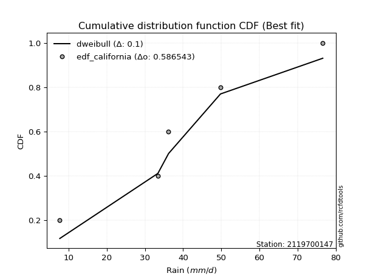</img>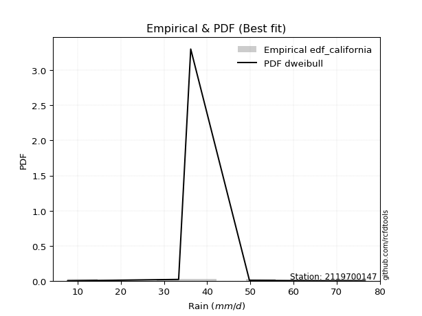</img>

</div>


### 2. EDF Hazen (1930)

Hazen method for plotting positions is a formula used to estimate the empirical cumulative probability distribution of flood events or other hydrological data. This formula often results in biased estimations, particularly when extrapolating to extreme events (high return periods).

<div align="center">


$P=(m-0.5)/n$


</div>


**2.1. Empirical values**

<div align="center">

|                | 0                  | 1                  | 2         | 3                 | 4                  |
|:---------------|:-------------------|:-------------------|:----------|:------------------|:-------------------|
| date           | 2023               | 2021               | 2022      | 2019              | 2020               |
| x              | 7.7                | 33.4               | 36.2      | 49.8              | 76.6               |
| m              | 1                  | 2                  | 3         | 4                 | 5                  |
| empirical_dist | edf_hazen          | edf_hazen          | edf_hazen | edf_hazen         | edf_hazen          |
| empirical      | 0.1                | 0.3                | 0.5       | 0.7               | 0.9                |
| empirical_tr   | 1.1111111111111112 | 1.4285714285714286 | 2.0       | 3.333333333333333 | 10.000000000000002 |

</div>


**2.2. Kolmogorov-Smirnov fit test (sorted by Δ)**


<div align="center">

|                | 0                   | 1                  | 2                   | 3                  | 4                   | 5                   | 6                   | 7                   | 8                   | 9                   | 10                  | 11                  | 12                  | 13                  | 14                  | 15                  | 16                  | 17                  | 18                 | 19                  | 20                  | 21                 | 22                  | 23                 | 24                  | 25                  | 26                  | 27                 | 28                  | 29                  | 30                  | 31                 | 32                  | 33                 | 34                  | 35                  | 36                  | 37                  | 38                  | 39                  | 40                  | 41                  | 42                  | 43                  | 44                  | 45                 | 46                  | 47                  | 48                  | 49                 | 50                 | 51                  | 52                  | 53                  | 54                 | 55                  | 56                  | 57                  | 58                  | 59                  | 60                  | 61                  | 62                  | 63                  | 64                  | 65                 | 66                  | 67                  | 68                  | 69                  | 70                  | 71                 | 72                  | 73                  | 74                  | 75                  | 76                  | 77                  | 78                  | 79                  | 80                  | 81                  | 82                  | 83                  | 84                  | 85                  | 86                  | 87                  | 88                  | 89                  | 90                  | 91                  | 92                  | 93                  | 94                  | 95                  | 96                 | 97                  | 98                  | 99                  | 100                 | 101                 | 102                 | 103                 | 104                 | 105                 | 106                 | 107                | 108                | 109                | 110                | 111                 | 112                | 113                | 114                 | 115                 | 116                | 117                | 118                 | 119                | 120                | 121                | 122                 | 123                 | 124                | 125                | 126                | 127                | 128                | 129                 | 130                | 131                | 132                | 133                | 134                 | 135                 | 136                | 137                 | 138                 | 139                | 140                 | 141                | 142                | 143                | 144                 | 145                 | 146                | 147                | 148                 | 149                | 150                | 151                | 152                | 153                | 154                | 155                | 156                | 157                | 158                | 159                |
|:---------------|:--------------------|:-------------------|:--------------------|:-------------------|:--------------------|:--------------------|:--------------------|:--------------------|:--------------------|:--------------------|:--------------------|:--------------------|:--------------------|:--------------------|:--------------------|:--------------------|:--------------------|:--------------------|:-------------------|:--------------------|:--------------------|:-------------------|:--------------------|:-------------------|:--------------------|:--------------------|:--------------------|:-------------------|:--------------------|:--------------------|:--------------------|:-------------------|:--------------------|:-------------------|:--------------------|:--------------------|:--------------------|:--------------------|:--------------------|:--------------------|:--------------------|:--------------------|:--------------------|:--------------------|:--------------------|:-------------------|:--------------------|:--------------------|:--------------------|:-------------------|:-------------------|:--------------------|:--------------------|:--------------------|:-------------------|:--------------------|:--------------------|:--------------------|:--------------------|:--------------------|:--------------------|:--------------------|:--------------------|:--------------------|:--------------------|:-------------------|:--------------------|:--------------------|:--------------------|:--------------------|:--------------------|:-------------------|:--------------------|:--------------------|:--------------------|:--------------------|:--------------------|:--------------------|:--------------------|:--------------------|:--------------------|:--------------------|:--------------------|:--------------------|:--------------------|:--------------------|:--------------------|:--------------------|:--------------------|:--------------------|:--------------------|:--------------------|:--------------------|:--------------------|:--------------------|:--------------------|:-------------------|:--------------------|:--------------------|:--------------------|:--------------------|:--------------------|:--------------------|:--------------------|:--------------------|:--------------------|:--------------------|:-------------------|:-------------------|:-------------------|:-------------------|:--------------------|:-------------------|:-------------------|:--------------------|:--------------------|:-------------------|:-------------------|:--------------------|:-------------------|:-------------------|:-------------------|:--------------------|:--------------------|:-------------------|:-------------------|:-------------------|:-------------------|:-------------------|:--------------------|:-------------------|:-------------------|:-------------------|:-------------------|:--------------------|:--------------------|:-------------------|:--------------------|:--------------------|:-------------------|:--------------------|:-------------------|:-------------------|:-------------------|:--------------------|:--------------------|:-------------------|:-------------------|:--------------------|:-------------------|:-------------------|:-------------------|:-------------------|:-------------------|:-------------------|:-------------------|:-------------------|:-------------------|:-------------------|:-------------------|
| station        | 2119700147          | 2119700147         | 2119700147          | 2119700147         | 2119700147          | 2119700147          | 2119700147          | 2119700147          | 2119700147          | 2119700147          | 2119700147          | 2119700147          | 2119700147          | 2119700147          | 2119700147          | 2119700147          | 2119700147          | 2119700147          | 2119700147         | 2119700147          | 2119700147          | 2119700147         | 2119700147          | 2119700147         | 2119700147          | 2119700147          | 2119700147          | 2119700147         | 2119700147          | 2119700147          | 2119700147          | 2119700147         | 2119700147          | 2119700147         | 2119700147          | 2119700147          | 2119700147          | 2119700147          | 2119700147          | 2119700147          | 2119700147          | 2119700147          | 2119700147          | 2119700147          | 2119700147          | 2119700147         | 2119700147          | 2119700147          | 2119700147          | 2119700147         | 2119700147         | 2119700147          | 2119700147          | 2119700147          | 2119700147         | 2119700147          | 2119700147          | 2119700147          | 2119700147          | 2119700147          | 2119700147          | 2119700147          | 2119700147          | 2119700147          | 2119700147          | 2119700147         | 2119700147          | 2119700147          | 2119700147          | 2119700147          | 2119700147          | 2119700147         | 2119700147          | 2119700147          | 2119700147          | 2119700147          | 2119700147          | 2119700147          | 2119700147          | 2119700147          | 2119700147          | 2119700147          | 2119700147          | 2119700147          | 2119700147          | 2119700147          | 2119700147          | 2119700147          | 2119700147          | 2119700147          | 2119700147          | 2119700147          | 2119700147          | 2119700147          | 2119700147          | 2119700147          | 2119700147         | 2119700147          | 2119700147          | 2119700147          | 2119700147          | 2119700147          | 2119700147          | 2119700147          | 2119700147          | 2119700147          | 2119700147          | 2119700147         | 2119700147         | 2119700147         | 2119700147         | 2119700147          | 2119700147         | 2119700147         | 2119700147          | 2119700147          | 2119700147         | 2119700147         | 2119700147          | 2119700147         | 2119700147         | 2119700147         | 2119700147          | 2119700147          | 2119700147         | 2119700147         | 2119700147         | 2119700147         | 2119700147         | 2119700147          | 2119700147         | 2119700147         | 2119700147         | 2119700147         | 2119700147          | 2119700147          | 2119700147         | 2119700147          | 2119700147          | 2119700147         | 2119700147          | 2119700147         | 2119700147         | 2119700147         | 2119700147          | 2119700147          | 2119700147         | 2119700147         | 2119700147          | 2119700147         | 2119700147         | 2119700147         | 2119700147         | 2119700147         | 2119700147         | 2119700147         | 2119700147         | 2119700147         | 2119700147         | 2119700147         |
| empirical_dist | edf_hazen           | edf_hazen          | edf_hazen           | edf_hazen          | edf_hazen           | edf_hazen           | edf_hazen           | edf_hazen           | edf_hazen           | edf_hazen           | edf_hazen           | edf_hazen           | edf_hazen           | edf_hazen           | edf_hazen           | edf_hazen           | edf_hazen           | edf_hazen           | edf_hazen          | edf_hazen           | edf_hazen           | edf_hazen          | edf_hazen           | edf_hazen          | edf_hazen           | edf_hazen           | edf_hazen           | edf_hazen          | edf_hazen           | edf_hazen           | edf_hazen           | edf_hazen          | edf_hazen           | edf_hazen          | edf_hazen           | edf_hazen           | edf_hazen           | edf_hazen           | edf_hazen           | edf_hazen           | edf_hazen           | edf_hazen           | edf_hazen           | edf_hazen           | edf_hazen           | edf_hazen          | edf_hazen           | edf_hazen           | edf_hazen           | edf_hazen          | edf_hazen          | edf_hazen           | edf_hazen           | edf_hazen           | edf_hazen          | edf_hazen           | edf_hazen           | edf_hazen           | edf_hazen           | edf_hazen           | edf_hazen           | edf_hazen           | edf_hazen           | edf_hazen           | edf_hazen           | edf_hazen          | edf_hazen           | edf_hazen           | edf_hazen           | edf_hazen           | edf_hazen           | edf_hazen          | edf_hazen           | edf_hazen           | edf_hazen           | edf_hazen           | edf_hazen           | edf_hazen           | edf_hazen           | edf_hazen           | edf_hazen           | edf_hazen           | edf_hazen           | edf_hazen           | edf_hazen           | edf_hazen           | edf_hazen           | edf_hazen           | edf_hazen           | edf_hazen           | edf_hazen           | edf_hazen           | edf_hazen           | edf_hazen           | edf_hazen           | edf_hazen           | edf_hazen          | edf_hazen           | edf_hazen           | edf_hazen           | edf_hazen           | edf_hazen           | edf_hazen           | edf_hazen           | edf_hazen           | edf_hazen           | edf_hazen           | edf_hazen          | edf_hazen          | edf_hazen          | edf_hazen          | edf_hazen           | edf_hazen          | edf_hazen          | edf_hazen           | edf_hazen           | edf_hazen          | edf_hazen          | edf_hazen           | edf_hazen          | edf_hazen          | edf_hazen          | edf_hazen           | edf_hazen           | edf_hazen          | edf_hazen          | edf_hazen          | edf_hazen          | edf_hazen          | edf_hazen           | edf_hazen          | edf_hazen          | edf_hazen          | edf_hazen          | edf_hazen           | edf_hazen           | edf_hazen          | edf_hazen           | edf_hazen           | edf_hazen          | edf_hazen           | edf_hazen          | edf_hazen          | edf_hazen          | edf_hazen           | edf_hazen           | edf_hazen          | edf_hazen          | edf_hazen           | edf_hazen          | edf_hazen          | edf_hazen          | edf_hazen          | edf_hazen          | edf_hazen          | edf_hazen          | edf_hazen          | edf_hazen          | edf_hazen          | edf_hazen          |
| p_dist         | exponnorm           | foldnorm           | nct                 | t                  | crystalball         | norm                | truncnorm           | genextreme          | pearson3            | cosine              | logjohnsonsu        | anglit              | logistic            | logburr             | johnsonsu           | gompertz            | burr                | fatiguelife         | erlang             | skewnorm            | semicircular        | betaprime          | gamma               | f                  | genlogistic         | hypsecant           | rice                | logloggamma        | wrapcauchy          | vonmises_line       | kappa3              | tukeylambda        | kappa4              | uniform            | logdgamma           | logt                | invgamma            | logmielke           | maxwell             | ksone               | dgamma              | logvonmises_line    | mielke              | dweibull            | invgauss            | logargus           | truncpareto         | logdweibull         | rayleigh            | loggennorm         | weibull_min        | loggenextreme       | laplace             | arcsine             | gumbel_r           | gennorm             | invweibull          | logweibull_min      | logloglaplace       | argus               | logburr12           | loggumbel_l         | moyal               | kstwobign           | gumbel_l            | logpearson3        | halfnorm            | logtrapezoid        | bradford            | loggenhalflogistic  | gausshyper          | halflogistic       | loggompertz         | logskewnorm         | loglevy_l           | genpareto           | truncexpon          | wald                | logtriang           | beta                | logarcsine          | logsemicircular     | loganglit           | logbeta             | logfoldnorm         | lognct              | logexponnorm        | lognorm             | logcrystalball      | logfatiguelife      | logf                | loglogistic         | loghypsecant        | logerlang           | logncf              | logbetaprime        | logrice            | loggamma            | loggamma            | levy_l              | logalpha            | loglaplace          | loglaplace          | loginvgamma         | lomax               | genhalflogistic     | logmaxwell          | loginvgauss        | gengamma           | genexpon           | loginvweibull      | lograyleigh         | logcosine          | exponweib          | logwrapcauchy       | truncweibull_min    | loggausshyper      | triang             | ncf                 | loggenpareto       | logkstwobign       | loggumbel_r        | loghalfnorm         | logweibull_max      | nakagami           | lognakagami        | halfgennorm        | logmoyal           | loghalflogistic    | logksone            | loggenexpon        | exponpow           | logtruncnorm       | alpha              | logkappa4           | burr12              | loglomax           | logkappa3           | loguniform          | trapezoid          | logjohnsonsb        | logexponweib       | logwald            | logbradford        | logtruncexpon       | logtruncweibull_min | logrdist           | logexponpow        | logtukeylambda      | loggengamma        | johnsonsb          | weibull_max        | powerlaw           | rdist              | logpowerlaw        | logtruncpareto     | loggenlogistic     | loghalfgennorm     | logvonmises        | vonmises           |
| delta          | 0.07877025899429602 | 0.0793307021962435 | 0.07984415884703422 | 0.0799079670069307 | 0.07990959243090162 | 0.07990959663147079 | 0.07990961965929244 | 0.08003403296068651 | 0.08242546383065935 | 0.08586205351753617 | 0.08607007890759683 | 0.08947071597021011 | 0.09043762565707714 | 0.09075328071657307 | 0.09165132873149606 | 0.09378400983197654 | 0.09409174076194582 | 0.09418770794977038 | 0.0953522167932001 | 0.09537848508787339 | 0.09668122104226501 | 0.0980445268073189 | 0.09815333481787286 | 0.0987814358829387 | 0.09882526556820553 | 0.09918592304645263 | 0.09968076562439648 | 0.0999593933884605 | 0.09999901273247233 | 0.09999999894339916 | 0.09999999977286946 | 0.0999999999999929 | 0.09999999999999809 | 0.1                | 0.10144643120421032 | 0.10241187478629898 | 0.10280266191669502 | 0.10509152828164747 | 0.10529056044804308 | 0.10588169250482987 | 0.10777973165420307 | 0.10945343900767962 | 0.10994118516865814 | 0.11010427698030018 | 0.11055393372491967 | 0.1129405823410185 | 0.11380667485843143 | 0.11667131508270917 | 0.11754607709792814 | 0.11899483204798   | 0.1200246907158104 | 0.12187183220495135 | 0.12406559837420711 | 0.12595021870146084 | 0.1261576215386802 | 0.12960597955259145 | 0.13425145273912897 | 0.13598361943416176 | 0.13820027099070004 | 0.13986546267855582 | 0.14498955672812436 | 0.14648776130871216 | 0.14662308714969768 | 0.14820436253413177 | 0.14823461126812704 | 0.1520263435559635 | 0.15239115999165487 | 0.15729592077274163 | 0.16100813133698205 | 0.16275916706907334 | 0.16312991649191771 | 0.1640617039204198 | 0.16533753712228877 | 0.17375791473862506 | 0.18008354126678916 | 0.18940502690876104 | 0.19696684237291573 | 0.19875231667056797 | 0.20427992656845034 | 0.20757466977825867 | 0.20913917169819135 | 0.21292304453940886 | 0.21387725740504832 | 0.21390301998783662 | 0.21410077419716994 | 0.21590393922398082 | 0.21619306947795508 | 0.21619329783807234 | 0.21619330494801642 | 0.21653797087127463 | 0.21693404078306106 | 0.21840253217905675 | 0.22028711703819343 | 0.22216290576315728 | 0.22301582459606545 | 0.22381893186123297 | 0.2255361345244365 | 0.22643235138366907 | 0.22643235138366907 | 0.22709556879724743 | 0.22754510920680177 | 0.22790106103013347 | 0.22790106103013347 | 0.22907814738460724 | 0.23949625266340707 | 0.24646918394187656 | 0.24852534598705817 | 0.2502487453225702 | 0.2519534035028385 | 0.2519918867221527 | 0.2543126991355897 | 0.25916722838832934 | 0.2653463820895055 | 0.2680958285978015 | 0.27326988542248803 | 0.28177774180193177 | 0.2819532261197693 | 0.2824980783614914 | 0.28331271937505836 | 0.2840690311271466 | 0.2862689233669538 | 0.2868591768631256 | 0.28913063599379335 | 0.29556155706988724 | 0.2994803128436406 | 0.2999948981072326 | 0.3093218866579444 | 0.3125226284837052 | 0.3149819182929499 | 0.31558371139048397 | 0.3175701399954954 | 0.3191513530924404 | 0.3258103292479352 | 0.3266151748621022 | 0.32960705024036024 | 0.33469244687319627 | 0.3372207183513039 | 0.33868209180757886 | 0.33870045366858087 | 0.3489136513868144 | 0.35391490919258617 | 0.3651072310298041 | 0.3838179687114694 | 0.4158006276692852 | 0.42828295750665873 | 0.4331478648211266  | 0.4476564149341838 | 0.4779473685097601 | 0.47987840991153946 | 0.5041527192880992 | 0.553688056811978  | 0.5680257944492311 | 0.5873367582394509 | 0.5910555293609712 | 0.6415719232181265 | 0.6550898088999146 | 0.7                | 0.7                | 1.167860592629293  | 11.684629105571045 |
| deltao         | 0.5865427407550001  | 0.5865427407550001 | 0.5865427407550001  | 0.5865427407550001 | 0.5865427407550001  | 0.5865427407550001  | 0.5865427407550001  | 0.5865427407550001  | 0.5865427407550001  | 0.5865427407550001  | 0.5865427407550001  | 0.5865427407550001  | 0.5865427407550001  | 0.5865427407550001  | 0.5865427407550001  | 0.5865427407550001  | 0.5865427407550001  | 0.5865427407550001  | 0.5865427407550001 | 0.5865427407550001  | 0.5865427407550001  | 0.5865427407550001 | 0.5865427407550001  | 0.5865427407550001 | 0.5865427407550001  | 0.5865427407550001  | 0.5865427407550001  | 0.5865427407550001 | 0.5865427407550001  | 0.5865427407550001  | 0.5865427407550001  | 0.5865427407550001 | 0.5865427407550001  | 0.5865427407550001 | 0.5865427407550001  | 0.5865427407550001  | 0.5865427407550001  | 0.5865427407550001  | 0.5865427407550001  | 0.5865427407550001  | 0.5865427407550001  | 0.5865427407550001  | 0.5865427407550001  | 0.5865427407550001  | 0.5865427407550001  | 0.5865427407550001 | 0.5865427407550001  | 0.5865427407550001  | 0.5865427407550001  | 0.5865427407550001 | 0.5865427407550001 | 0.5865427407550001  | 0.5865427407550001  | 0.5865427407550001  | 0.5865427407550001 | 0.5865427407550001  | 0.5865427407550001  | 0.5865427407550001  | 0.5865427407550001  | 0.5865427407550001  | 0.5865427407550001  | 0.5865427407550001  | 0.5865427407550001  | 0.5865427407550001  | 0.5865427407550001  | 0.5865427407550001 | 0.5865427407550001  | 0.5865427407550001  | 0.5865427407550001  | 0.5865427407550001  | 0.5865427407550001  | 0.5865427407550001 | 0.5865427407550001  | 0.5865427407550001  | 0.5865427407550001  | 0.5865427407550001  | 0.5865427407550001  | 0.5865427407550001  | 0.5865427407550001  | 0.5865427407550001  | 0.5865427407550001  | 0.5865427407550001  | 0.5865427407550001  | 0.5865427407550001  | 0.5865427407550001  | 0.5865427407550001  | 0.5865427407550001  | 0.5865427407550001  | 0.5865427407550001  | 0.5865427407550001  | 0.5865427407550001  | 0.5865427407550001  | 0.5865427407550001  | 0.5865427407550001  | 0.5865427407550001  | 0.5865427407550001  | 0.5865427407550001 | 0.5865427407550001  | 0.5865427407550001  | 0.5865427407550001  | 0.5865427407550001  | 0.5865427407550001  | 0.5865427407550001  | 0.5865427407550001  | 0.5865427407550001  | 0.5865427407550001  | 0.5865427407550001  | 0.5865427407550001 | 0.5865427407550001 | 0.5865427407550001 | 0.5865427407550001 | 0.5865427407550001  | 0.5865427407550001 | 0.5865427407550001 | 0.5865427407550001  | 0.5865427407550001  | 0.5865427407550001 | 0.5865427407550001 | 0.5865427407550001  | 0.5865427407550001 | 0.5865427407550001 | 0.5865427407550001 | 0.5865427407550001  | 0.5865427407550001  | 0.5865427407550001 | 0.5865427407550001 | 0.5865427407550001 | 0.5865427407550001 | 0.5865427407550001 | 0.5865427407550001  | 0.5865427407550001 | 0.5865427407550001 | 0.5865427407550001 | 0.5865427407550001 | 0.5865427407550001  | 0.5865427407550001  | 0.5865427407550001 | 0.5865427407550001  | 0.5865427407550001  | 0.5865427407550001 | 0.5865427407550001  | 0.5865427407550001 | 0.5865427407550001 | 0.5865427407550001 | 0.5865427407550001  | 0.5865427407550001  | 0.5865427407550001 | 0.5865427407550001 | 0.5865427407550001  | 0.5865427407550001 | 0.5865427407550001 | 0.5865427407550001 | 0.5865427407550001 | 0.5865427407550001 | 0.5865427407550001 | 0.5865427407550001 | 0.5865427407550001 | 0.5865427407550001 | 0.5865427407550001 | 0.5865427407550001 |
| eval           | Δo > Δ              | Δo > Δ             | Δo > Δ              | Δo > Δ             | Δo > Δ              | Δo > Δ              | Δo > Δ              | Δo > Δ              | Δo > Δ              | Δo > Δ              | Δo > Δ              | Δo > Δ              | Δo > Δ              | Δo > Δ              | Δo > Δ              | Δo > Δ              | Δo > Δ              | Δo > Δ              | Δo > Δ             | Δo > Δ              | Δo > Δ              | Δo > Δ             | Δo > Δ              | Δo > Δ             | Δo > Δ              | Δo > Δ              | Δo > Δ              | Δo > Δ             | Δo > Δ              | Δo > Δ              | Δo > Δ              | Δo > Δ             | Δo > Δ              | Δo > Δ             | Δo > Δ              | Δo > Δ              | Δo > Δ              | Δo > Δ              | Δo > Δ              | Δo > Δ              | Δo > Δ              | Δo > Δ              | Δo > Δ              | Δo > Δ              | Δo > Δ              | Δo > Δ             | Δo > Δ              | Δo > Δ              | Δo > Δ              | Δo > Δ             | Δo > Δ             | Δo > Δ              | Δo > Δ              | Δo > Δ              | Δo > Δ             | Δo > Δ              | Δo > Δ              | Δo > Δ              | Δo > Δ              | Δo > Δ              | Δo > Δ              | Δo > Δ              | Δo > Δ              | Δo > Δ              | Δo > Δ              | Δo > Δ             | Δo > Δ              | Δo > Δ              | Δo > Δ              | Δo > Δ              | Δo > Δ              | Δo > Δ             | Δo > Δ              | Δo > Δ              | Δo > Δ              | Δo > Δ              | Δo > Δ              | Δo > Δ              | Δo > Δ              | Δo > Δ              | Δo > Δ              | Δo > Δ              | Δo > Δ              | Δo > Δ              | Δo > Δ              | Δo > Δ              | Δo > Δ              | Δo > Δ              | Δo > Δ              | Δo > Δ              | Δo > Δ              | Δo > Δ              | Δo > Δ              | Δo > Δ              | Δo > Δ              | Δo > Δ              | Δo > Δ             | Δo > Δ              | Δo > Δ              | Δo > Δ              | Δo > Δ              | Δo > Δ              | Δo > Δ              | Δo > Δ              | Δo > Δ              | Δo > Δ              | Δo > Δ              | Δo > Δ             | Δo > Δ             | Δo > Δ             | Δo > Δ             | Δo > Δ              | Δo > Δ             | Δo > Δ             | Δo > Δ              | Δo > Δ              | Δo > Δ             | Δo > Δ             | Δo > Δ              | Δo > Δ             | Δo > Δ             | Δo > Δ             | Δo > Δ              | Δo > Δ              | Δo > Δ             | Δo > Δ             | Δo > Δ             | Δo > Δ             | Δo > Δ             | Δo > Δ              | Δo > Δ             | Δo > Δ             | Δo > Δ             | Δo > Δ             | Δo > Δ              | Δo > Δ              | Δo > Δ             | Δo > Δ              | Δo > Δ              | Δo > Δ             | Δo > Δ              | Δo > Δ             | Δo > Δ             | Δo > Δ             | Δo > Δ              | Δo > Δ              | Δo > Δ             | Δo > Δ             | Δo > Δ              | Δo > Δ             | Δo > Δ             | Δo > Δ             | Δo <= Δ            | Δo <= Δ            | Δo <= Δ            | Δo <= Δ            | Δo <= Δ            | Δo <= Δ            | Δo <= Δ            | Δo <= Δ            |
| fit            | 1                   | 1                  | 1                   | 1                  | 1                   | 1                   | 1                   | 1                   | 1                   | 1                   | 1                   | 1                   | 1                   | 1                   | 1                   | 1                   | 1                   | 1                   | 1                  | 1                   | 1                   | 1                  | 1                   | 1                  | 1                   | 1                   | 1                   | 1                  | 1                   | 1                   | 1                   | 1                  | 1                   | 1                  | 1                   | 1                   | 1                   | 1                   | 1                   | 1                   | 1                   | 1                   | 1                   | 1                   | 1                   | 1                  | 1                   | 1                   | 1                   | 1                  | 1                  | 1                   | 1                   | 1                   | 1                  | 1                   | 1                   | 1                   | 1                   | 1                   | 1                   | 1                   | 1                   | 1                   | 1                   | 1                  | 1                   | 1                   | 1                   | 1                   | 1                   | 1                  | 1                   | 1                   | 1                   | 1                   | 1                   | 1                   | 1                   | 1                   | 1                   | 1                   | 1                   | 1                   | 1                   | 1                   | 1                   | 1                   | 1                   | 1                   | 1                   | 1                   | 1                   | 1                   | 1                   | 1                   | 1                  | 1                   | 1                   | 1                   | 1                   | 1                   | 1                   | 1                   | 1                   | 1                   | 1                   | 1                  | 1                  | 1                  | 1                  | 1                   | 1                  | 1                  | 1                   | 1                   | 1                  | 1                  | 1                   | 1                  | 1                  | 1                  | 1                   | 1                   | 1                  | 1                  | 1                  | 1                  | 1                  | 1                   | 1                  | 1                  | 1                  | 1                  | 1                   | 1                   | 1                  | 1                   | 1                   | 1                  | 1                   | 1                  | 1                  | 1                  | 1                   | 1                   | 1                  | 1                  | 1                   | 1                  | 1                  | 1                  | 0                  | 0                  | 0                  | 0                  | 0                  | 0                  | 0                  | 0                  |
| n              | 5                   | 5                  | 5                   | 5                  | 5                   | 5                   | 5                   | 5                   | 5                   | 5                   | 5                   | 5                   | 5                   | 5                   | 5                   | 5                   | 5                   | 5                   | 5                  | 5                   | 5                   | 5                  | 5                   | 5                  | 5                   | 5                   | 5                   | 5                  | 5                   | 5                   | 5                   | 5                  | 5                   | 5                  | 5                   | 5                   | 5                   | 5                   | 5                   | 5                   | 5                   | 5                   | 5                   | 5                   | 5                   | 5                  | 5                   | 5                   | 5                   | 5                  | 5                  | 5                   | 5                   | 5                   | 5                  | 5                   | 5                   | 5                   | 5                   | 5                   | 5                   | 5                   | 5                   | 5                   | 5                   | 5                  | 5                   | 5                   | 5                   | 5                   | 5                   | 5                  | 5                   | 5                   | 5                   | 5                   | 5                   | 5                   | 5                   | 5                   | 5                   | 5                   | 5                   | 5                   | 5                   | 5                   | 5                   | 5                   | 5                   | 5                   | 5                   | 5                   | 5                   | 5                   | 5                   | 5                   | 5                  | 5                   | 5                   | 5                   | 5                   | 5                   | 5                   | 5                   | 5                   | 5                   | 5                   | 5                  | 5                  | 5                  | 5                  | 5                   | 5                  | 5                  | 5                   | 5                   | 5                  | 5                  | 5                   | 5                  | 5                  | 5                  | 5                   | 5                   | 5                  | 5                  | 5                  | 5                  | 5                  | 5                   | 5                  | 5                  | 5                  | 5                  | 5                   | 5                   | 5                  | 5                   | 5                   | 5                  | 5                   | 5                  | 5                  | 5                  | 5                   | 5                   | 5                  | 5                  | 5                   | 5                  | 5                  | 5                  | 5                  | 5                  | 5                  | 5                  | 5                  | 5                  | 5                  | 5                  |
| best_fit       | 1                   | 0                  | 0                   | 0                  | 0                   | 0                   | 0                   | 0                   | 0                   | 0                   | 0                   | 0                   | 0                   | 0                   | 0                   | 0                   | 0                   | 0                   | 0                  | 0                   | 0                   | 0                  | 0                   | 0                  | 0                   | 0                   | 0                   | 0                  | 0                   | 0                   | 0                   | 0                  | 0                   | 0                  | 0                   | 0                   | 0                   | 0                   | 0                   | 0                   | 0                   | 0                   | 0                   | 0                   | 0                   | 0                  | 0                   | 0                   | 0                   | 0                  | 0                  | 0                   | 0                   | 0                   | 0                  | 0                   | 0                   | 0                   | 0                   | 0                   | 0                   | 0                   | 0                   | 0                   | 0                   | 0                  | 0                   | 0                   | 0                   | 0                   | 0                   | 0                  | 0                   | 0                   | 0                   | 0                   | 0                   | 0                   | 0                   | 0                   | 0                   | 0                   | 0                   | 0                   | 0                   | 0                   | 0                   | 0                   | 0                   | 0                   | 0                   | 0                   | 0                   | 0                   | 0                   | 0                   | 0                  | 0                   | 0                   | 0                   | 0                   | 0                   | 0                   | 0                   | 0                   | 0                   | 0                   | 0                  | 0                  | 0                  | 0                  | 0                   | 0                  | 0                  | 0                   | 0                   | 0                  | 0                  | 0                   | 0                  | 0                  | 0                  | 0                   | 0                   | 0                  | 0                  | 0                  | 0                  | 0                  | 0                   | 0                  | 0                  | 0                  | 0                  | 0                   | 0                   | 0                  | 0                   | 0                   | 0                  | 0                   | 0                  | 0                  | 0                  | 0                   | 0                   | 0                  | 0                  | 0                   | 0                  | 0                  | 0                  | 0                  | 0                  | 0                  | 0                  | 0                  | 0                  | 0                  | 0                  |
| best_fit_sort  | 1                   | 2                  | 3                   | 4                  | 5                   | 6                   | 7                   | 8                   | 9                   | 10                  | 11                  | 12                  | 13                  | 14                  | 15                  | 16                  | 17                  | 18                  | 19                 | 20                  | 21                  | 22                 | 23                  | 24                 | 25                  | 26                  | 27                  | 28                 | 29                  | 30                  | 31                  | 32                 | 33                  | 34                 | 35                  | 36                  | 37                  | 38                  | 39                  | 40                  | 41                  | 42                  | 43                  | 44                  | 45                  | 46                 | 47                  | 48                  | 49                  | 50                 | 51                 | 52                  | 53                  | 54                  | 55                 | 56                  | 57                  | 58                  | 59                  | 60                  | 61                  | 62                  | 63                  | 64                  | 65                  | 66                 | 67                  | 68                  | 69                  | 70                  | 71                  | 72                 | 73                  | 74                  | 75                  | 76                  | 77                  | 78                  | 79                  | 80                  | 81                  | 82                  | 83                  | 84                  | 85                  | 86                  | 87                  | 88                  | 89                  | 90                  | 91                  | 92                  | 93                  | 94                  | 95                  | 96                  | 97                 | 98                  | 99                  | 100                 | 101                 | 102                 | 103                 | 104                 | 105                 | 106                 | 107                 | 108                | 109                | 110                | 111                | 112                 | 113                | 114                | 115                 | 116                 | 117                | 118                | 119                 | 120                | 121                | 122                | 123                 | 124                 | 125                | 126                | 127                | 128                | 129                | 130                 | 131                | 132                | 133                | 134                | 135                 | 136                 | 137                | 138                 | 139                 | 140                | 141                 | 142                | 143                | 144                | 145                 | 146                 | 147                | 148                | 149                 | 150                | 151                | 152                | 153                | 154                | 155                | 156                | 157                | 158                | 159                | 160                |

</div>


**2.3. Best fit**

<div align="center">

|   id |    station | empirical_dist   | p_dist    |     delta |   deltao | eval   |   fit |   n |   best_fit |   best_fit_sort |
|-----:|-----------:|:-----------------|:----------|----------:|---------:|:-------|------:|----:|-----------:|----------------:|
|    0 | 2119700147 | edf_hazen        | exponnorm | 0.0787703 | 0.586543 | Δo > Δ |     1 |   5 |          1 |               1 |

</div>


<div align="center">

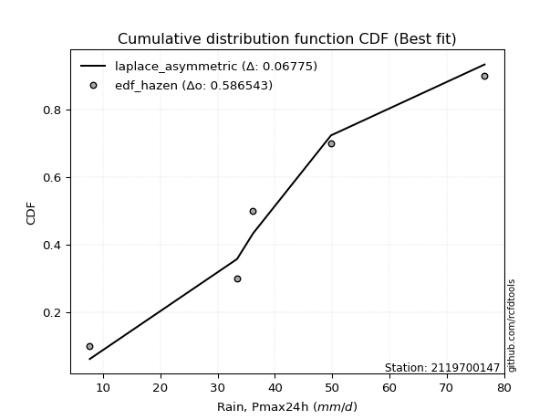</img></img>

</div>


### 3. EDF Weibull (1939)

Weibull plotting position formula is an empirical method used to estimate the non-exceedance probability or plotting position for a set of observed data, is often recommended or widely used in practice, particularly in flood frequency analysis.

<div align="center">


$P=m/(n+1)$


</div>


**3.1. Empirical values**

<div align="center">

|                | 0                   | 1                  | 2           | 3                  | 4                  |
|:---------------|:--------------------|:-------------------|:------------|:-------------------|:-------------------|
| date           | 2023                | 2021               | 2022        | 2019               | 2020               |
| x              | 7.7                 | 33.4               | 36.2        | 49.8               | 76.6               |
| m              | 1                   | 2                  | 3           | 4                  | 5                  |
| empirical_dist | edf_weibull         | edf_weibull        | edf_weibull | edf_weibull        | edf_weibull        |
| empirical      | 0.16666666666666666 | 0.3333333333333333 | 0.5         | 0.6666666666666666 | 0.8333333333333334 |
| empirical_tr   | 1.2                 | 1.4999999999999998 | 2.0         | 2.9999999999999996 | 6.000000000000002  |

</div>


**3.2. Kolmogorov-Smirnov fit test (sorted by Δ)**


<div align="center">

|                | 0                  | 1                  | 2                   | 3                   | 4                   | 5                   | 6                   | 7                   | 8                   | 9                   | 10                  | 11                  | 12                  | 13                 | 14                  | 15                 | 16                 | 17                 | 18                  | 19                  | 20                  | 21                  | 22                  | 23                 | 24                  | 25                  | 26                  | 27                  | 28                 | 29                  | 30                  | 31                  | 32                  | 33                  | 34                  | 35                  | 36                 | 37                  | 38                  | 39                 | 40                  | 41                 | 42                  | 43                 | 44                  | 45                  | 46                 | 47                  | 48                  | 49                  | 50                  | 51                  | 52                  | 53                  | 54                  | 55                  | 56                  | 57                  | 58                  | 59                  | 60                  | 61                  | 62                  | 63                  | 64                  | 65                  | 66                  | 67                  | 68                  | 69                  | 70                  | 71                  | 72                  | 73                  | 74                  | 75                  | 76                  | 77                  | 78                  | 79                  | 80                  | 81                  | 82                 | 83                 | 84                 | 85                  | 86                 | 87                  | 88                  | 89                 | 90                 | 91                  | 92                  | 93                 | 94                  | 95                  | 96                  | 97                  | 98                  | 99                  | 100                 | 101                 | 102                 | 103                 | 104                 | 105                 | 106                 | 107                 | 108                | 109                | 110                 | 111                 | 112                 | 113                 | 114                | 115                 | 116                 | 117                 | 118                | 119                | 120                | 121                | 122                | 123                | 124                | 125                | 126                 | 127                | 128                 | 129                | 130                 | 131                | 132                 | 133                | 134                 | 135                 | 136                | 137                 | 138                 | 139                | 140                 | 141                | 142                 | 143                | 144                | 145                 | 146                 | 147                | 148                 | 149                 | 150                | 151                | 152                | 153                | 154                | 155                | 156                | 157                | 158                | 159                |
|:---------------|:-------------------|:-------------------|:--------------------|:--------------------|:--------------------|:--------------------|:--------------------|:--------------------|:--------------------|:--------------------|:--------------------|:--------------------|:--------------------|:-------------------|:--------------------|:-------------------|:-------------------|:-------------------|:--------------------|:--------------------|:--------------------|:--------------------|:--------------------|:-------------------|:--------------------|:--------------------|:--------------------|:--------------------|:-------------------|:--------------------|:--------------------|:--------------------|:--------------------|:--------------------|:--------------------|:--------------------|:-------------------|:--------------------|:--------------------|:-------------------|:--------------------|:-------------------|:--------------------|:-------------------|:--------------------|:--------------------|:-------------------|:--------------------|:--------------------|:--------------------|:--------------------|:--------------------|:--------------------|:--------------------|:--------------------|:--------------------|:--------------------|:--------------------|:--------------------|:--------------------|:--------------------|:--------------------|:--------------------|:--------------------|:--------------------|:--------------------|:--------------------|:--------------------|:--------------------|:--------------------|:--------------------|:--------------------|:--------------------|:--------------------|:--------------------|:--------------------|:--------------------|:--------------------|:--------------------|:--------------------|:--------------------|:--------------------|:-------------------|:-------------------|:-------------------|:--------------------|:-------------------|:--------------------|:--------------------|:-------------------|:-------------------|:--------------------|:--------------------|:-------------------|:--------------------|:--------------------|:--------------------|:--------------------|:--------------------|:--------------------|:--------------------|:--------------------|:--------------------|:--------------------|:--------------------|:--------------------|:--------------------|:--------------------|:-------------------|:-------------------|:--------------------|:--------------------|:--------------------|:--------------------|:-------------------|:--------------------|:--------------------|:--------------------|:-------------------|:-------------------|:-------------------|:-------------------|:-------------------|:-------------------|:-------------------|:-------------------|:--------------------|:-------------------|:--------------------|:-------------------|:--------------------|:-------------------|:--------------------|:-------------------|:--------------------|:--------------------|:-------------------|:--------------------|:--------------------|:-------------------|:--------------------|:-------------------|:--------------------|:-------------------|:-------------------|:--------------------|:--------------------|:-------------------|:--------------------|:--------------------|:-------------------|:-------------------|:-------------------|:-------------------|:-------------------|:-------------------|:-------------------|:-------------------|:-------------------|:-------------------|
| station        | 2119700147         | 2119700147         | 2119700147          | 2119700147          | 2119700147          | 2119700147          | 2119700147          | 2119700147          | 2119700147          | 2119700147          | 2119700147          | 2119700147          | 2119700147          | 2119700147         | 2119700147          | 2119700147         | 2119700147         | 2119700147         | 2119700147          | 2119700147          | 2119700147          | 2119700147          | 2119700147          | 2119700147         | 2119700147          | 2119700147          | 2119700147          | 2119700147          | 2119700147         | 2119700147          | 2119700147          | 2119700147          | 2119700147          | 2119700147          | 2119700147          | 2119700147          | 2119700147         | 2119700147          | 2119700147          | 2119700147         | 2119700147          | 2119700147         | 2119700147          | 2119700147         | 2119700147          | 2119700147          | 2119700147         | 2119700147          | 2119700147          | 2119700147          | 2119700147          | 2119700147          | 2119700147          | 2119700147          | 2119700147          | 2119700147          | 2119700147          | 2119700147          | 2119700147          | 2119700147          | 2119700147          | 2119700147          | 2119700147          | 2119700147          | 2119700147          | 2119700147          | 2119700147          | 2119700147          | 2119700147          | 2119700147          | 2119700147          | 2119700147          | 2119700147          | 2119700147          | 2119700147          | 2119700147          | 2119700147          | 2119700147          | 2119700147          | 2119700147          | 2119700147          | 2119700147          | 2119700147         | 2119700147         | 2119700147         | 2119700147          | 2119700147         | 2119700147          | 2119700147          | 2119700147         | 2119700147         | 2119700147          | 2119700147          | 2119700147         | 2119700147          | 2119700147          | 2119700147          | 2119700147          | 2119700147          | 2119700147          | 2119700147          | 2119700147          | 2119700147          | 2119700147          | 2119700147          | 2119700147          | 2119700147          | 2119700147          | 2119700147         | 2119700147         | 2119700147          | 2119700147          | 2119700147          | 2119700147          | 2119700147         | 2119700147          | 2119700147          | 2119700147          | 2119700147         | 2119700147         | 2119700147         | 2119700147         | 2119700147         | 2119700147         | 2119700147         | 2119700147         | 2119700147          | 2119700147         | 2119700147          | 2119700147         | 2119700147          | 2119700147         | 2119700147          | 2119700147         | 2119700147          | 2119700147          | 2119700147         | 2119700147          | 2119700147          | 2119700147         | 2119700147          | 2119700147         | 2119700147          | 2119700147         | 2119700147         | 2119700147          | 2119700147          | 2119700147         | 2119700147          | 2119700147          | 2119700147         | 2119700147         | 2119700147         | 2119700147         | 2119700147         | 2119700147         | 2119700147         | 2119700147         | 2119700147         | 2119700147         |
| empirical_dist | edf_weibull        | edf_weibull        | edf_weibull         | edf_weibull         | edf_weibull         | edf_weibull         | edf_weibull         | edf_weibull         | edf_weibull         | edf_weibull         | edf_weibull         | edf_weibull         | edf_weibull         | edf_weibull        | edf_weibull         | edf_weibull        | edf_weibull        | edf_weibull        | edf_weibull         | edf_weibull         | edf_weibull         | edf_weibull         | edf_weibull         | edf_weibull        | edf_weibull         | edf_weibull         | edf_weibull         | edf_weibull         | edf_weibull        | edf_weibull         | edf_weibull         | edf_weibull         | edf_weibull         | edf_weibull         | edf_weibull         | edf_weibull         | edf_weibull        | edf_weibull         | edf_weibull         | edf_weibull        | edf_weibull         | edf_weibull        | edf_weibull         | edf_weibull        | edf_weibull         | edf_weibull         | edf_weibull        | edf_weibull         | edf_weibull         | edf_weibull         | edf_weibull         | edf_weibull         | edf_weibull         | edf_weibull         | edf_weibull         | edf_weibull         | edf_weibull         | edf_weibull         | edf_weibull         | edf_weibull         | edf_weibull         | edf_weibull         | edf_weibull         | edf_weibull         | edf_weibull         | edf_weibull         | edf_weibull         | edf_weibull         | edf_weibull         | edf_weibull         | edf_weibull         | edf_weibull         | edf_weibull         | edf_weibull         | edf_weibull         | edf_weibull         | edf_weibull         | edf_weibull         | edf_weibull         | edf_weibull         | edf_weibull         | edf_weibull         | edf_weibull        | edf_weibull        | edf_weibull        | edf_weibull         | edf_weibull        | edf_weibull         | edf_weibull         | edf_weibull        | edf_weibull        | edf_weibull         | edf_weibull         | edf_weibull        | edf_weibull         | edf_weibull         | edf_weibull         | edf_weibull         | edf_weibull         | edf_weibull         | edf_weibull         | edf_weibull         | edf_weibull         | edf_weibull         | edf_weibull         | edf_weibull         | edf_weibull         | edf_weibull         | edf_weibull        | edf_weibull        | edf_weibull         | edf_weibull         | edf_weibull         | edf_weibull         | edf_weibull        | edf_weibull         | edf_weibull         | edf_weibull         | edf_weibull        | edf_weibull        | edf_weibull        | edf_weibull        | edf_weibull        | edf_weibull        | edf_weibull        | edf_weibull        | edf_weibull         | edf_weibull        | edf_weibull         | edf_weibull        | edf_weibull         | edf_weibull        | edf_weibull         | edf_weibull        | edf_weibull         | edf_weibull         | edf_weibull        | edf_weibull         | edf_weibull         | edf_weibull        | edf_weibull         | edf_weibull        | edf_weibull         | edf_weibull        | edf_weibull        | edf_weibull         | edf_weibull         | edf_weibull        | edf_weibull         | edf_weibull         | edf_weibull        | edf_weibull        | edf_weibull        | edf_weibull        | edf_weibull        | edf_weibull        | edf_weibull        | edf_weibull        | edf_weibull        | edf_weibull        |
| p_dist         | dweibull           | johnsonsu          | pearson3            | skewnorm            | fatiguelife         | invgamma            | foldnorm            | genlogistic         | erlang              | gamma               | betaprime           | f                   | anglit              | exponnorm          | invgauss            | nct                | norm               | truncnorm          | crystalball         | t                   | logdweibull         | logjohnsonsu        | genextreme          | maxwell            | semicircular        | logistic            | hypsecant           | gompertz            | invweibull         | kstwobign           | loggumbel_l         | cosine              | logpearson3         | rice                | logburr12           | weibull_min         | logtrapezoid       | laplace             | rayleigh            | ksone              | logweibull_min      | logmielke          | logargus            | logt               | logdgamma           | argus               | dgamma             | gumbel_r            | loglevy_l           | logloglaplace       | logburr             | burr                | mielke              | loggennorm          | gumbel_l            | moyal               | gennorm             | logloggamma         | wrapcauchy          | bradford            | logskewnorm         | truncexpon          | loggompertz         | logvonmises_line    | vonmises_line       | kappa3              | genpareto           | gausshyper          | loggenextreme       | tukeylambda         | kappa4              | loggenhalflogistic  | arcsine             | wald                | halfnorm            | halflogistic        | uniform             | truncpareto         | logtriang           | beta                | logarcsine          | logsemicircular     | levy_l             | loganglit          | logbeta            | logfoldnorm         | lognct             | logexponnorm        | lognorm             | logcrystalball     | logfatiguelife     | logf                | loglogistic         | loghypsecant       | logerlang           | logncf              | logbetaprime        | logrice             | loggamma            | loggamma            | logalpha            | loglaplace          | loglaplace          | loginvgamma         | lomax               | genhalflogistic     | logmaxwell          | loginvgauss         | gengamma           | genexpon           | loginvweibull       | lograyleigh         | logcosine           | exponweib           | logwrapcauchy      | truncweibull_min    | loggausshyper       | ncf                 | loggenpareto       | logkstwobign       | loggumbel_r        | loghalfnorm        | logweibull_max     | halfgennorm        | logmoyal           | loghalflogistic    | logksone            | triang             | loggenexpon         | exponpow           | alpha               | logkappa4          | burr12              | loglomax           | logkappa3           | loguniform          | trapezoid          | logjohnsonsb        | logexponweib        | nakagami           | lognakagami         | logtruncnorm       | logwald             | logbradford        | logtruncexpon      | logtruncweibull_min | logrdist            | logexponpow        | logtukeylambda      | loggengamma         | johnsonsb          | weibull_max        | powerlaw           | rdist              | logpowerlaw        | logtruncpareto     | loggenlogistic     | loghalfgennorm     | logvonmises        | vonmises           |
| delta          | 0.1023637716221204 | 0.1051391601374825 | 0.10634670672365043 | 0.10635163353812213 | 0.10676271089470826 | 0.10680328723619734 | 0.10745825195947567 | 0.10754486197651006 | 0.10756335572886502 | 0.10814009376794163 | 0.10829593736046167 | 0.10857609666473989 | 0.10974630237657135 | 0.1105577939667306 | 0.11056187310594795 | 0.111056715764143  | 0.1110714217667973 | 0.1110714259455623 | 0.11107142663423131 | 0.11109702850789493 | 0.11214364146326133 | 0.11323370568381219 | 0.11323706884251994 | 0.1132424613571846 | 0.11325457451517085 | 0.11397350883789314 | 0.11463378217892461 | 0.11523018788575967 | 0.1153619523459545 | 0.11541676496528755 | 0.11584338927429366 | 0.11691078393671317 | 0.11869301022263018 | 0.12079562310835987 | 0.12235082702545247 | 0.12276451306790079 | 0.1239625874394083 | 0.12406559837420711 | 0.12497713722104069 | 0.1264871716771303 | 0.12662052306789157 | 0.1285860509402248 | 0.12979419623712063 | 0.1310716664423441 | 0.13922215875260574 | 0.13986546267855582 | 0.1411130649875364 | 0.14164231983927209 | 0.14675020793345583 | 0.14774027071744922 | 0.14992940285779455 | 0.15166792643536775 | 0.15214261771746374 | 0.15232816538131333 | 0.15350741117627364 | 0.15982588714667054 | 0.16293931288592478 | 0.16662606005512715 | 0.16666567939913898 | 0.16666614589856996 | 0.16666632888784927 | 0.16666644576004436 | 0.16666662130225474 | 0.16666666117266504 | 0.16666666561006582 | 0.16666666643953612 | 0.16666666665125096 | 0.16666666666519647 | 0.16666666666665853 | 0.16666666666665955 | 0.16666666666666474 | 0.16666666666666485 | 0.16666666666666666 | 0.16666666666666666 | 0.16666666666666666 | 0.16666666666666666 | 0.16666666666666666 | 0.16666666999806068 | 0.17094659323511702 | 0.17424133644492534 | 0.17580583836485802 | 0.17958971120607553 | 0.1801628273381889 | 0.180543924071715  | 0.1805696866545033 | 0.18076744086383661 | 0.1825706058906475 | 0.18285973614462175 | 0.18285996450473901 | 0.1828599716146831 | 0.1832046375379413 | 0.18360070744972773 | 0.18506919884572343 | 0.1869537837048601 | 0.18882957242982396 | 0.18968249126273212 | 0.19048559852789965 | 0.19220280119110317 | 0.19309901805033575 | 0.19309901805033575 | 0.19421177587346844 | 0.19456772769680014 | 0.19456772769680014 | 0.19574481405127392 | 0.20616291933007375 | 0.21313585060854323 | 0.21519201265372484 | 0.21691541198923686 | 0.2186200701695052 | 0.2186585533888194 | 0.22097936580225636 | 0.22583389505499601 | 0.23201304875617218 | 0.23476249526446819 | 0.2399365520891547 | 0.24844440846859844 | 0.24861989278643598 | 0.24997938604172504 | 0.2507356977938133 | 0.2529355900336205 | 0.2535258435297923 | 0.25579730266046   | 0.2622282237365539 | 0.2759885533246111 | 0.2791892951503719 | 0.2816485849596166 | 0.28225037805715064 | 0.2823074250705613 | 0.28423680666216206 | 0.2858180197591071 | 0.29328184152876885 | 0.2962737169070269 | 0.30135911353986294 | 0.3038873850179706 | 0.30534875847424553 | 0.30536712033524754 | 0.3167853533385339 | 0.32058157585925284 | 0.33177389769647075 | 0.3328136461769739 | 0.33332823144056595 | 0.3333320707953273 | 0.35048463537813607 | 0.3824672943359519 | 0.3949496241733254 | 0.3998145314877933  | 0.41432308160085046 | 0.4446140351764268 | 0.44654507657820613 | 0.47081938595476597 | 0.5203547234786448 | 0.5346924611158977 | 0.5540034249061174 | 0.5577221960276377 | 0.6082385898847933 | 0.6217564755665814 | 0.6666666666666666 | 0.6666666666666666 | 1.1345272592959599 | 11.751295772237711 |
| deltao         | 0.5865427407550001 | 0.5865427407550001 | 0.5865427407550001  | 0.5865427407550001  | 0.5865427407550001  | 0.5865427407550001  | 0.5865427407550001  | 0.5865427407550001  | 0.5865427407550001  | 0.5865427407550001  | 0.5865427407550001  | 0.5865427407550001  | 0.5865427407550001  | 0.5865427407550001 | 0.5865427407550001  | 0.5865427407550001 | 0.5865427407550001 | 0.5865427407550001 | 0.5865427407550001  | 0.5865427407550001  | 0.5865427407550001  | 0.5865427407550001  | 0.5865427407550001  | 0.5865427407550001 | 0.5865427407550001  | 0.5865427407550001  | 0.5865427407550001  | 0.5865427407550001  | 0.5865427407550001 | 0.5865427407550001  | 0.5865427407550001  | 0.5865427407550001  | 0.5865427407550001  | 0.5865427407550001  | 0.5865427407550001  | 0.5865427407550001  | 0.5865427407550001 | 0.5865427407550001  | 0.5865427407550001  | 0.5865427407550001 | 0.5865427407550001  | 0.5865427407550001 | 0.5865427407550001  | 0.5865427407550001 | 0.5865427407550001  | 0.5865427407550001  | 0.5865427407550001 | 0.5865427407550001  | 0.5865427407550001  | 0.5865427407550001  | 0.5865427407550001  | 0.5865427407550001  | 0.5865427407550001  | 0.5865427407550001  | 0.5865427407550001  | 0.5865427407550001  | 0.5865427407550001  | 0.5865427407550001  | 0.5865427407550001  | 0.5865427407550001  | 0.5865427407550001  | 0.5865427407550001  | 0.5865427407550001  | 0.5865427407550001  | 0.5865427407550001  | 0.5865427407550001  | 0.5865427407550001  | 0.5865427407550001  | 0.5865427407550001  | 0.5865427407550001  | 0.5865427407550001  | 0.5865427407550001  | 0.5865427407550001  | 0.5865427407550001  | 0.5865427407550001  | 0.5865427407550001  | 0.5865427407550001  | 0.5865427407550001  | 0.5865427407550001  | 0.5865427407550001  | 0.5865427407550001  | 0.5865427407550001  | 0.5865427407550001 | 0.5865427407550001 | 0.5865427407550001 | 0.5865427407550001  | 0.5865427407550001 | 0.5865427407550001  | 0.5865427407550001  | 0.5865427407550001 | 0.5865427407550001 | 0.5865427407550001  | 0.5865427407550001  | 0.5865427407550001 | 0.5865427407550001  | 0.5865427407550001  | 0.5865427407550001  | 0.5865427407550001  | 0.5865427407550001  | 0.5865427407550001  | 0.5865427407550001  | 0.5865427407550001  | 0.5865427407550001  | 0.5865427407550001  | 0.5865427407550001  | 0.5865427407550001  | 0.5865427407550001  | 0.5865427407550001  | 0.5865427407550001 | 0.5865427407550001 | 0.5865427407550001  | 0.5865427407550001  | 0.5865427407550001  | 0.5865427407550001  | 0.5865427407550001 | 0.5865427407550001  | 0.5865427407550001  | 0.5865427407550001  | 0.5865427407550001 | 0.5865427407550001 | 0.5865427407550001 | 0.5865427407550001 | 0.5865427407550001 | 0.5865427407550001 | 0.5865427407550001 | 0.5865427407550001 | 0.5865427407550001  | 0.5865427407550001 | 0.5865427407550001  | 0.5865427407550001 | 0.5865427407550001  | 0.5865427407550001 | 0.5865427407550001  | 0.5865427407550001 | 0.5865427407550001  | 0.5865427407550001  | 0.5865427407550001 | 0.5865427407550001  | 0.5865427407550001  | 0.5865427407550001 | 0.5865427407550001  | 0.5865427407550001 | 0.5865427407550001  | 0.5865427407550001 | 0.5865427407550001 | 0.5865427407550001  | 0.5865427407550001  | 0.5865427407550001 | 0.5865427407550001  | 0.5865427407550001  | 0.5865427407550001 | 0.5865427407550001 | 0.5865427407550001 | 0.5865427407550001 | 0.5865427407550001 | 0.5865427407550001 | 0.5865427407550001 | 0.5865427407550001 | 0.5865427407550001 | 0.5865427407550001 |
| eval           | Δo > Δ             | Δo > Δ             | Δo > Δ              | Δo > Δ              | Δo > Δ              | Δo > Δ              | Δo > Δ              | Δo > Δ              | Δo > Δ              | Δo > Δ              | Δo > Δ              | Δo > Δ              | Δo > Δ              | Δo > Δ             | Δo > Δ              | Δo > Δ             | Δo > Δ             | Δo > Δ             | Δo > Δ              | Δo > Δ              | Δo > Δ              | Δo > Δ              | Δo > Δ              | Δo > Δ             | Δo > Δ              | Δo > Δ              | Δo > Δ              | Δo > Δ              | Δo > Δ             | Δo > Δ              | Δo > Δ              | Δo > Δ              | Δo > Δ              | Δo > Δ              | Δo > Δ              | Δo > Δ              | Δo > Δ             | Δo > Δ              | Δo > Δ              | Δo > Δ             | Δo > Δ              | Δo > Δ             | Δo > Δ              | Δo > Δ             | Δo > Δ              | Δo > Δ              | Δo > Δ             | Δo > Δ              | Δo > Δ              | Δo > Δ              | Δo > Δ              | Δo > Δ              | Δo > Δ              | Δo > Δ              | Δo > Δ              | Δo > Δ              | Δo > Δ              | Δo > Δ              | Δo > Δ              | Δo > Δ              | Δo > Δ              | Δo > Δ              | Δo > Δ              | Δo > Δ              | Δo > Δ              | Δo > Δ              | Δo > Δ              | Δo > Δ              | Δo > Δ              | Δo > Δ              | Δo > Δ              | Δo > Δ              | Δo > Δ              | Δo > Δ              | Δo > Δ              | Δo > Δ              | Δo > Δ              | Δo > Δ              | Δo > Δ              | Δo > Δ              | Δo > Δ              | Δo > Δ              | Δo > Δ             | Δo > Δ             | Δo > Δ             | Δo > Δ              | Δo > Δ             | Δo > Δ              | Δo > Δ              | Δo > Δ             | Δo > Δ             | Δo > Δ              | Δo > Δ              | Δo > Δ             | Δo > Δ              | Δo > Δ              | Δo > Δ              | Δo > Δ              | Δo > Δ              | Δo > Δ              | Δo > Δ              | Δo > Δ              | Δo > Δ              | Δo > Δ              | Δo > Δ              | Δo > Δ              | Δo > Δ              | Δo > Δ              | Δo > Δ             | Δo > Δ             | Δo > Δ              | Δo > Δ              | Δo > Δ              | Δo > Δ              | Δo > Δ             | Δo > Δ              | Δo > Δ              | Δo > Δ              | Δo > Δ             | Δo > Δ             | Δo > Δ             | Δo > Δ             | Δo > Δ             | Δo > Δ             | Δo > Δ             | Δo > Δ             | Δo > Δ              | Δo > Δ             | Δo > Δ              | Δo > Δ             | Δo > Δ              | Δo > Δ             | Δo > Δ              | Δo > Δ             | Δo > Δ              | Δo > Δ              | Δo > Δ             | Δo > Δ              | Δo > Δ              | Δo > Δ             | Δo > Δ              | Δo > Δ             | Δo > Δ              | Δo > Δ             | Δo > Δ             | Δo > Δ              | Δo > Δ              | Δo > Δ             | Δo > Δ              | Δo > Δ              | Δo > Δ             | Δo > Δ             | Δo > Δ             | Δo > Δ             | Δo <= Δ            | Δo <= Δ            | Δo <= Δ            | Δo <= Δ            | Δo <= Δ            | Δo <= Δ            |
| fit            | 1                  | 1                  | 1                   | 1                   | 1                   | 1                   | 1                   | 1                   | 1                   | 1                   | 1                   | 1                   | 1                   | 1                  | 1                   | 1                  | 1                  | 1                  | 1                   | 1                   | 1                   | 1                   | 1                   | 1                  | 1                   | 1                   | 1                   | 1                   | 1                  | 1                   | 1                   | 1                   | 1                   | 1                   | 1                   | 1                   | 1                  | 1                   | 1                   | 1                  | 1                   | 1                  | 1                   | 1                  | 1                   | 1                   | 1                  | 1                   | 1                   | 1                   | 1                   | 1                   | 1                   | 1                   | 1                   | 1                   | 1                   | 1                   | 1                   | 1                   | 1                   | 1                   | 1                   | 1                   | 1                   | 1                   | 1                   | 1                   | 1                   | 1                   | 1                   | 1                   | 1                   | 1                   | 1                   | 1                   | 1                   | 1                   | 1                   | 1                   | 1                   | 1                   | 1                  | 1                  | 1                  | 1                   | 1                  | 1                   | 1                   | 1                  | 1                  | 1                   | 1                   | 1                  | 1                   | 1                   | 1                   | 1                   | 1                   | 1                   | 1                   | 1                   | 1                   | 1                   | 1                   | 1                   | 1                   | 1                   | 1                  | 1                  | 1                   | 1                   | 1                   | 1                   | 1                  | 1                   | 1                   | 1                   | 1                  | 1                  | 1                  | 1                  | 1                  | 1                  | 1                  | 1                  | 1                   | 1                  | 1                   | 1                  | 1                   | 1                  | 1                   | 1                  | 1                   | 1                   | 1                  | 1                   | 1                   | 1                  | 1                   | 1                  | 1                   | 1                  | 1                  | 1                   | 1                   | 1                  | 1                   | 1                   | 1                  | 1                  | 1                  | 1                  | 0                  | 0                  | 0                  | 0                  | 0                  | 0                  |
| n              | 5                  | 5                  | 5                   | 5                   | 5                   | 5                   | 5                   | 5                   | 5                   | 5                   | 5                   | 5                   | 5                   | 5                  | 5                   | 5                  | 5                  | 5                  | 5                   | 5                   | 5                   | 5                   | 5                   | 5                  | 5                   | 5                   | 5                   | 5                   | 5                  | 5                   | 5                   | 5                   | 5                   | 5                   | 5                   | 5                   | 5                  | 5                   | 5                   | 5                  | 5                   | 5                  | 5                   | 5                  | 5                   | 5                   | 5                  | 5                   | 5                   | 5                   | 5                   | 5                   | 5                   | 5                   | 5                   | 5                   | 5                   | 5                   | 5                   | 5                   | 5                   | 5                   | 5                   | 5                   | 5                   | 5                   | 5                   | 5                   | 5                   | 5                   | 5                   | 5                   | 5                   | 5                   | 5                   | 5                   | 5                   | 5                   | 5                   | 5                   | 5                   | 5                   | 5                  | 5                  | 5                  | 5                   | 5                  | 5                   | 5                   | 5                  | 5                  | 5                   | 5                   | 5                  | 5                   | 5                   | 5                   | 5                   | 5                   | 5                   | 5                   | 5                   | 5                   | 5                   | 5                   | 5                   | 5                   | 5                   | 5                  | 5                  | 5                   | 5                   | 5                   | 5                   | 5                  | 5                   | 5                   | 5                   | 5                  | 5                  | 5                  | 5                  | 5                  | 5                  | 5                  | 5                  | 5                   | 5                  | 5                   | 5                  | 5                   | 5                  | 5                   | 5                  | 5                   | 5                   | 5                  | 5                   | 5                   | 5                  | 5                   | 5                  | 5                   | 5                  | 5                  | 5                   | 5                   | 5                  | 5                   | 5                   | 5                  | 5                  | 5                  | 5                  | 5                  | 5                  | 5                  | 5                  | 5                  | 5                  |
| best_fit       | 1                  | 0                  | 0                   | 0                   | 0                   | 0                   | 0                   | 0                   | 0                   | 0                   | 0                   | 0                   | 0                   | 0                  | 0                   | 0                  | 0                  | 0                  | 0                   | 0                   | 0                   | 0                   | 0                   | 0                  | 0                   | 0                   | 0                   | 0                   | 0                  | 0                   | 0                   | 0                   | 0                   | 0                   | 0                   | 0                   | 0                  | 0                   | 0                   | 0                  | 0                   | 0                  | 0                   | 0                  | 0                   | 0                   | 0                  | 0                   | 0                   | 0                   | 0                   | 0                   | 0                   | 0                   | 0                   | 0                   | 0                   | 0                   | 0                   | 0                   | 0                   | 0                   | 0                   | 0                   | 0                   | 0                   | 0                   | 0                   | 0                   | 0                   | 0                   | 0                   | 0                   | 0                   | 0                   | 0                   | 0                   | 0                   | 0                   | 0                   | 0                   | 0                   | 0                  | 0                  | 0                  | 0                   | 0                  | 0                   | 0                   | 0                  | 0                  | 0                   | 0                   | 0                  | 0                   | 0                   | 0                   | 0                   | 0                   | 0                   | 0                   | 0                   | 0                   | 0                   | 0                   | 0                   | 0                   | 0                   | 0                  | 0                  | 0                   | 0                   | 0                   | 0                   | 0                  | 0                   | 0                   | 0                   | 0                  | 0                  | 0                  | 0                  | 0                  | 0                  | 0                  | 0                  | 0                   | 0                  | 0                   | 0                  | 0                   | 0                  | 0                   | 0                  | 0                   | 0                   | 0                  | 0                   | 0                   | 0                  | 0                   | 0                  | 0                   | 0                  | 0                  | 0                   | 0                   | 0                  | 0                   | 0                   | 0                  | 0                  | 0                  | 0                  | 0                  | 0                  | 0                  | 0                  | 0                  | 0                  |
| best_fit_sort  | 1                  | 2                  | 3                   | 4                   | 5                   | 6                   | 7                   | 8                   | 9                   | 10                  | 11                  | 12                  | 13                  | 14                 | 15                  | 16                 | 17                 | 18                 | 19                  | 20                  | 21                  | 22                  | 23                  | 24                 | 25                  | 26                  | 27                  | 28                  | 29                 | 30                  | 31                  | 32                  | 33                  | 34                  | 35                  | 36                  | 37                 | 38                  | 39                  | 40                 | 41                  | 42                 | 43                  | 44                 | 45                  | 46                  | 47                 | 48                  | 49                  | 50                  | 51                  | 52                  | 53                  | 54                  | 55                  | 56                  | 57                  | 58                  | 59                  | 60                  | 61                  | 62                  | 63                  | 64                  | 65                  | 66                  | 67                  | 68                  | 69                  | 70                  | 71                  | 72                  | 73                  | 74                  | 75                  | 76                  | 77                  | 78                  | 79                  | 80                  | 81                  | 82                  | 83                 | 84                 | 85                 | 86                  | 87                 | 88                  | 89                  | 90                 | 91                 | 92                  | 93                  | 94                 | 95                  | 96                  | 97                  | 98                  | 99                  | 100                 | 101                 | 102                 | 103                 | 104                 | 105                 | 106                 | 107                 | 108                 | 109                | 110                | 111                 | 112                 | 113                 | 114                 | 115                | 116                 | 117                 | 118                 | 119                | 120                | 121                | 122                | 123                | 124                | 125                | 126                | 127                 | 128                | 129                 | 130                | 131                 | 132                | 133                 | 134                | 135                 | 136                 | 137                | 138                 | 139                 | 140                | 141                 | 142                | 143                 | 144                | 145                | 146                 | 147                 | 148                | 149                 | 150                 | 151                | 152                | 153                | 154                | 155                | 156                | 157                | 158                | 159                | 160                |

</div>


**3.3. Best fit**

<div align="center">

|   id |    station | empirical_dist   | p_dist   |    delta |   deltao | eval   |   fit |   n |   best_fit |   best_fit_sort |
|-----:|-----------:|:-----------------|:---------|---------:|---------:|:-------|------:|----:|-----------:|----------------:|
|    0 | 2119700147 | edf_weibull      | dweibull | 0.102364 | 0.586543 | Δo > Δ |     1 |   5 |          1 |               1 |

</div>


<div align="center">

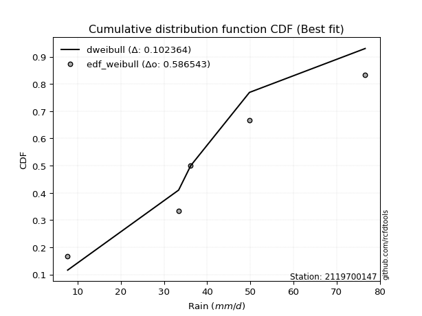</img>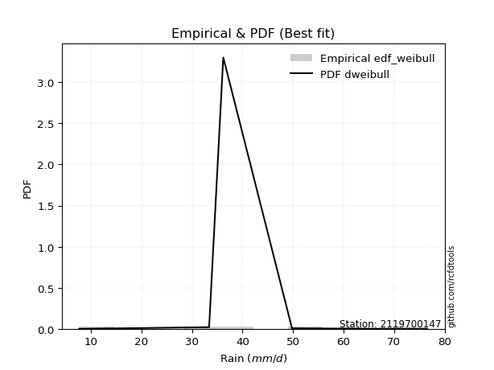</img>

</div>


### 4. EDF Beard (1943)

The Beard formula (or Beard´s plotting position formula) in hydrology is used to estimate the empirical non-exceedance probability _(P)_ of a flood event (or other extreme hydrological data point) within a given dataset.

<div align="center">


$P=(m-0.31)/(n+0.38)$


</div>


**4.1. Empirical values**

<div align="center">

|                | 0                   | 1                  | 2         | 3                  | 4                  |
|:---------------|:--------------------|:-------------------|:----------|:-------------------|:-------------------|
| date           | 2023                | 2021               | 2022      | 2019               | 2020               |
| x              | 7.7                 | 33.4               | 36.2      | 49.8               | 76.6               |
| m              | 1                   | 2                  | 3         | 4                  | 5                  |
| empirical_dist | edf_beard           | edf_beard          | edf_beard | edf_beard          | edf_beard          |
| empirical      | 0.12825278810408922 | 0.3141263940520446 | 0.5       | 0.6858736059479554 | 0.8717472118959109 |
| empirical_tr   | 1.1471215351812367  | 1.4579945799457996 | 2.0       | 3.183431952662722  | 7.797101449275368  |

</div>


**4.2. Kolmogorov-Smirnov fit test (sorted by Δ)**


<div align="center">

|                | 0                   | 1                   | 2                  | 3                   | 4                   | 5                   | 6                   | 7                   | 8                  | 9                   | 10                  | 11                  | 12                  | 13                  | 14                  | 15                  | 16                  | 17                  | 18                  | 19                 | 20                  | 21                  | 22                  | 23                  | 24                  | 25                  | 26                  | 27                  | 28                  | 29                  | 30                  | 31                  | 32                  | 33                  | 34                  | 35                 | 36                  | 37                  | 38                  | 39                  | 40                  | 41                  | 42                  | 43                  | 44                  | 45                 | 46                  | 47                  | 48                 | 49                  | 50                  | 51                  | 52                 | 53                 | 54                  | 55                  | 56                  | 57                  | 58                  | 59                  | 60                  | 61                  | 62                  | 63                  | 64                  | 65                 | 66                  | 67                  | 68                  | 69                 | 70                  | 71                  | 72                  | 73                  | 74                  | 75                  | 76                 | 77                  | 78                 | 79                  | 80                  | 81                  | 82                 | 83                  | 84                 | 85                 | 86                 | 87                  | 88                 | 89                  | 90                 | 91                  | 92                  | 93                 | 94                  | 95                  | 96                  | 97                  | 98                  | 99                  | 100                 | 101                 | 102                 | 103                | 104                 | 105                 | 106                 | 107                 | 108                 | 109                | 110                 | 111                | 112                | 113                | 114                | 115                 | 116                | 117                 | 118                 | 119                | 120                | 121                | 122                | 123                | 124                | 125                | 126                | 127                 | 128                 | 129                | 130                 | 131                | 132                 | 133                | 134                 | 135                | 136                | 137                 | 138                | 139                | 140                 | 141                 | 142                 | 143                | 144                | 145                 | 146                 | 147                | 148                 | 149                 | 150                | 151                | 152                | 153                | 154                | 155                | 156                | 157                | 158                | 159                |
|:---------------|:--------------------|:--------------------|:-------------------|:--------------------|:--------------------|:--------------------|:--------------------|:--------------------|:-------------------|:--------------------|:--------------------|:--------------------|:--------------------|:--------------------|:--------------------|:--------------------|:--------------------|:--------------------|:--------------------|:-------------------|:--------------------|:--------------------|:--------------------|:--------------------|:--------------------|:--------------------|:--------------------|:--------------------|:--------------------|:--------------------|:--------------------|:--------------------|:--------------------|:--------------------|:--------------------|:-------------------|:--------------------|:--------------------|:--------------------|:--------------------|:--------------------|:--------------------|:--------------------|:--------------------|:--------------------|:-------------------|:--------------------|:--------------------|:-------------------|:--------------------|:--------------------|:--------------------|:-------------------|:-------------------|:--------------------|:--------------------|:--------------------|:--------------------|:--------------------|:--------------------|:--------------------|:--------------------|:--------------------|:--------------------|:--------------------|:-------------------|:--------------------|:--------------------|:--------------------|:-------------------|:--------------------|:--------------------|:--------------------|:--------------------|:--------------------|:--------------------|:-------------------|:--------------------|:-------------------|:--------------------|:--------------------|:--------------------|:-------------------|:--------------------|:-------------------|:-------------------|:-------------------|:--------------------|:-------------------|:--------------------|:-------------------|:--------------------|:--------------------|:-------------------|:--------------------|:--------------------|:--------------------|:--------------------|:--------------------|:--------------------|:--------------------|:--------------------|:--------------------|:-------------------|:--------------------|:--------------------|:--------------------|:--------------------|:--------------------|:-------------------|:--------------------|:-------------------|:-------------------|:-------------------|:-------------------|:--------------------|:-------------------|:--------------------|:--------------------|:-------------------|:-------------------|:-------------------|:-------------------|:-------------------|:-------------------|:-------------------|:-------------------|:--------------------|:--------------------|:-------------------|:--------------------|:-------------------|:--------------------|:-------------------|:--------------------|:-------------------|:-------------------|:--------------------|:-------------------|:-------------------|:--------------------|:--------------------|:--------------------|:-------------------|:-------------------|:--------------------|:--------------------|:-------------------|:--------------------|:--------------------|:-------------------|:-------------------|:-------------------|:-------------------|:-------------------|:-------------------|:-------------------|:-------------------|:-------------------|:-------------------|
| station        | 2119700147          | 2119700147          | 2119700147         | 2119700147          | 2119700147          | 2119700147          | 2119700147          | 2119700147          | 2119700147         | 2119700147          | 2119700147          | 2119700147          | 2119700147          | 2119700147          | 2119700147          | 2119700147          | 2119700147          | 2119700147          | 2119700147          | 2119700147         | 2119700147          | 2119700147          | 2119700147          | 2119700147          | 2119700147          | 2119700147          | 2119700147          | 2119700147          | 2119700147          | 2119700147          | 2119700147          | 2119700147          | 2119700147          | 2119700147          | 2119700147          | 2119700147         | 2119700147          | 2119700147          | 2119700147          | 2119700147          | 2119700147          | 2119700147          | 2119700147          | 2119700147          | 2119700147          | 2119700147         | 2119700147          | 2119700147          | 2119700147         | 2119700147          | 2119700147          | 2119700147          | 2119700147         | 2119700147         | 2119700147          | 2119700147          | 2119700147          | 2119700147          | 2119700147          | 2119700147          | 2119700147          | 2119700147          | 2119700147          | 2119700147          | 2119700147          | 2119700147         | 2119700147          | 2119700147          | 2119700147          | 2119700147         | 2119700147          | 2119700147          | 2119700147          | 2119700147          | 2119700147          | 2119700147          | 2119700147         | 2119700147          | 2119700147         | 2119700147          | 2119700147          | 2119700147          | 2119700147         | 2119700147          | 2119700147         | 2119700147         | 2119700147         | 2119700147          | 2119700147         | 2119700147          | 2119700147         | 2119700147          | 2119700147          | 2119700147         | 2119700147          | 2119700147          | 2119700147          | 2119700147          | 2119700147          | 2119700147          | 2119700147          | 2119700147          | 2119700147          | 2119700147         | 2119700147          | 2119700147          | 2119700147          | 2119700147          | 2119700147          | 2119700147         | 2119700147          | 2119700147         | 2119700147         | 2119700147         | 2119700147         | 2119700147          | 2119700147         | 2119700147          | 2119700147          | 2119700147         | 2119700147         | 2119700147         | 2119700147         | 2119700147         | 2119700147         | 2119700147         | 2119700147         | 2119700147          | 2119700147          | 2119700147         | 2119700147          | 2119700147         | 2119700147          | 2119700147         | 2119700147          | 2119700147         | 2119700147         | 2119700147          | 2119700147         | 2119700147         | 2119700147          | 2119700147          | 2119700147          | 2119700147         | 2119700147         | 2119700147          | 2119700147          | 2119700147         | 2119700147          | 2119700147          | 2119700147         | 2119700147         | 2119700147         | 2119700147         | 2119700147         | 2119700147         | 2119700147         | 2119700147         | 2119700147         | 2119700147         |
| empirical_dist | edf_beard           | edf_beard           | edf_beard          | edf_beard           | edf_beard           | edf_beard           | edf_beard           | edf_beard           | edf_beard          | edf_beard           | edf_beard           | edf_beard           | edf_beard           | edf_beard           | edf_beard           | edf_beard           | edf_beard           | edf_beard           | edf_beard           | edf_beard          | edf_beard           | edf_beard           | edf_beard           | edf_beard           | edf_beard           | edf_beard           | edf_beard           | edf_beard           | edf_beard           | edf_beard           | edf_beard           | edf_beard           | edf_beard           | edf_beard           | edf_beard           | edf_beard          | edf_beard           | edf_beard           | edf_beard           | edf_beard           | edf_beard           | edf_beard           | edf_beard           | edf_beard           | edf_beard           | edf_beard          | edf_beard           | edf_beard           | edf_beard          | edf_beard           | edf_beard           | edf_beard           | edf_beard          | edf_beard          | edf_beard           | edf_beard           | edf_beard           | edf_beard           | edf_beard           | edf_beard           | edf_beard           | edf_beard           | edf_beard           | edf_beard           | edf_beard           | edf_beard          | edf_beard           | edf_beard           | edf_beard           | edf_beard          | edf_beard           | edf_beard           | edf_beard           | edf_beard           | edf_beard           | edf_beard           | edf_beard          | edf_beard           | edf_beard          | edf_beard           | edf_beard           | edf_beard           | edf_beard          | edf_beard           | edf_beard          | edf_beard          | edf_beard          | edf_beard           | edf_beard          | edf_beard           | edf_beard          | edf_beard           | edf_beard           | edf_beard          | edf_beard           | edf_beard           | edf_beard           | edf_beard           | edf_beard           | edf_beard           | edf_beard           | edf_beard           | edf_beard           | edf_beard          | edf_beard           | edf_beard           | edf_beard           | edf_beard           | edf_beard           | edf_beard          | edf_beard           | edf_beard          | edf_beard          | edf_beard          | edf_beard          | edf_beard           | edf_beard          | edf_beard           | edf_beard           | edf_beard          | edf_beard          | edf_beard          | edf_beard          | edf_beard          | edf_beard          | edf_beard          | edf_beard          | edf_beard           | edf_beard           | edf_beard          | edf_beard           | edf_beard          | edf_beard           | edf_beard          | edf_beard           | edf_beard          | edf_beard          | edf_beard           | edf_beard          | edf_beard          | edf_beard           | edf_beard           | edf_beard           | edf_beard          | edf_beard          | edf_beard           | edf_beard           | edf_beard          | edf_beard           | edf_beard           | edf_beard          | edf_beard          | edf_beard          | edf_beard          | edf_beard          | edf_beard          | edf_beard          | edf_beard          | edf_beard          | edf_beard          |
| p_dist         | pearson3            | foldnorm            | logjohnsonsu       | genextreme          | anglit              | johnsonsu           | exponnorm           | nct                 | t                  | crystalball         | norm                | truncnorm           | fatiguelife         | erlang              | skewnorm            | semicircular        | betaprime           | gamma               | f                   | genlogistic        | rice                | cosine              | invgamma            | logistic            | logmielke           | maxwell             | ksone               | gompertz            | dweibull            | invgauss            | logargus            | hypsecant           | logdgamma           | logt                | logdweibull         | rayleigh           | weibull_min         | logburr             | gumbel_r            | burr                | mielke              | invweibull          | logweibull_min      | dgamma              | laplace             | logloglaplace      | logloggamma         | wrapcauchy          | logvonmises_line   | vonmises_line       | kappa3              | loggenextreme       | tukeylambda        | kappa4             | arcsine             | uniform             | truncpareto         | logburr12           | loggumbel_l         | moyal               | loggennorm          | kstwobign           | logpearson3         | halfnorm            | argus               | logtrapezoid       | gennorm             | bradford            | gumbel_l            | loggenhalflogistic | gausshyper          | halflogistic        | loggompertz         | logskewnorm         | loglevy_l           | genpareto           | truncexpon         | wald                | logtriang          | beta                | logarcsine          | logsemicircular     | levy_l             | loganglit           | logbeta            | logfoldnorm        | lognct             | logexponnorm        | lognorm            | logcrystalball      | logfatiguelife     | logf                | loglogistic         | loghypsecant       | logerlang           | logncf              | logbetaprime        | logrice             | loggamma            | loggamma            | logalpha            | loglaplace          | loglaplace          | loginvgamma        | lomax               | genhalflogistic     | logmaxwell          | loginvgauss         | gengamma            | genexpon           | loginvweibull       | lograyleigh        | logcosine          | exponweib          | logwrapcauchy      | truncweibull_min    | loggausshyper      | ncf                 | loggenpareto        | logkstwobign       | loggumbel_r        | loghalfnorm        | logweibull_max     | triang             | halfgennorm        | logmoyal           | loghalflogistic    | logksone            | loggenexpon         | exponpow           | alpha               | nakagami           | lognakagami         | logkappa4          | burr12              | loglomax           | logkappa3          | loguniform          | logtruncnorm       | trapezoid          | logjohnsonsb        | logexponweib        | logwald             | logbradford        | logtruncexpon      | logtruncweibull_min | logrdist            | logexponpow        | logtukeylambda      | loggengamma         | johnsonsb          | weibull_max        | powerlaw           | rdist              | logpowerlaw        | logtruncpareto     | loggenlogistic     | loghalfgennorm     | logvonmises        | vonmises           |
| delta          | 0.06857764354115564 | 0.07381955586266248 | 0.0748198271212347 | 0.07482319027994244 | 0.07534432191816548 | 0.07752493467945143 | 0.07877025899429602 | 0.07984415884703422 | 0.0799079670069307 | 0.07990959243090162 | 0.07990959663147079 | 0.07990961965929244 | 0.08006131389772575 | 0.08122582274115547 | 0.08125209103582876 | 0.08255482699022038 | 0.08391813275527427 | 0.08402694076582823 | 0.08465504183089406 | 0.0846988715161609 | 0.08555437157235185 | 0.08586205351753617 | 0.08867626786465038 | 0.09043762565707714 | 0.09096513422960295 | 0.09116416639599845 | 0.09175529845278524 | 0.09378400983197654 | 0.09597788292825554 | 0.09642753967287504 | 0.09881418828897387 | 0.09918592304645263 | 0.10080828019002831 | 0.10241187478629898 | 0.10254492103066454 | 0.1034196830458835 | 0.10589829666376577 | 0.11151552429521705 | 0.11203122748663558 | 0.11325404787279025 | 0.11372873915488624 | 0.12012505868708434 | 0.12185722538211713 | 0.12190612570624759 | 0.12406559837420711 | 0.1240738769386554 | 0.12821218149254965 | 0.12825180083656154 | 0.1282527826100876 | 0.12825278704748838 | 0.12825278787695868 | 0.12825278810408103 | 0.1282527881040821 | 0.1282527881040873 | 0.12825278810408922 | 0.12825278810408922 | 0.12825279143548318 | 0.13086316267607973 | 0.13236136725666753 | 0.13249669309765305 | 0.13312122610002453 | 0.13407796848208714 | 0.13789994950391887 | 0.13826476593961023 | 0.13986546267855582 | 0.143169526720697  | 0.14373237360463598 | 0.14688173728493742 | 0.14823461126812704 | 0.1486327730170287 | 0.14900352243987308 | 0.14993530986837517 | 0.15121114307024414 | 0.15963152068658043 | 0.16595714721474464 | 0.17527863285671652 | 0.1828404483208711 | 0.18462592261852334 | 0.1901535325164057 | 0.19344827572621415 | 0.19501277764614672 | 0.19879665048736422 | 0.1993697666194777 | 0.19975086335300368 | 0.1997766259357921 | 0.1999743801451253 | 0.2017775451719362 | 0.20206667542591045 | 0.2020669037860277 | 0.20206691089597179 | 0.20241157681923   | 0.20280764673101642 | 0.20427613812701212 | 0.2061607229861488 | 0.20803651171111265 | 0.20888943054402082 | 0.20969253780918834 | 0.21140974047239186 | 0.21230595733162444 | 0.21230595733162444 | 0.21341871515475713 | 0.21377466697808883 | 0.21377466697808883 | 0.2149517533325626 | 0.22536985861136244 | 0.23234278988983204 | 0.23439895193501353 | 0.23612235127052555 | 0.23782700945079388 | 0.2378654926701081 | 0.24018630508354505 | 0.2450408343362847 | 0.2512199880374609 | 0.2539694345457569 | 0.2591434913704434 | 0.26765134774988714 | 0.2678268320677247 | 0.26918632532301373 | 0.26994263707510197 | 0.2721425293149092 | 0.272732782811081  | 0.2750042419417487 | 0.2814351630178427 | 0.2823074250705613 | 0.2951954926058998 | 0.2983962344316606 | 0.3008555242409053 | 0.30145731733843933 | 0.30344374594345075 | 0.3050249590403958 | 0.31248878081005754 | 0.3136067068956852 | 0.31412129215927725 | 0.3154806561883156 | 0.32056605282115164 | 0.3230943242992593 | 0.3245556977555342 | 0.32457405961653624 | 0.3258103292479352 | 0.3347872573347699 | 0.33978851514054165 | 0.35098083697775945 | 0.36969157465942476 | 0.4016742336172406 | 0.4141565634546141 | 0.41902147076908197 | 0.43353002088213916 | 0.4638209744577155 | 0.46575201585949483 | 0.49002632523605466 | 0.5395616627599336 | 0.5538994003971865 | 0.5732103641874062 | 0.5769291353089265 | 0.6274455291660819 | 0.64096341484787   | 0.6858736059479554 | 0.6858736059479554 | 1.1537341985772485 | 11.712881893675133 |
| deltao         | 0.5865427407550001  | 0.5865427407550001  | 0.5865427407550001 | 0.5865427407550001  | 0.5865427407550001  | 0.5865427407550001  | 0.5865427407550001  | 0.5865427407550001  | 0.5865427407550001 | 0.5865427407550001  | 0.5865427407550001  | 0.5865427407550001  | 0.5865427407550001  | 0.5865427407550001  | 0.5865427407550001  | 0.5865427407550001  | 0.5865427407550001  | 0.5865427407550001  | 0.5865427407550001  | 0.5865427407550001 | 0.5865427407550001  | 0.5865427407550001  | 0.5865427407550001  | 0.5865427407550001  | 0.5865427407550001  | 0.5865427407550001  | 0.5865427407550001  | 0.5865427407550001  | 0.5865427407550001  | 0.5865427407550001  | 0.5865427407550001  | 0.5865427407550001  | 0.5865427407550001  | 0.5865427407550001  | 0.5865427407550001  | 0.5865427407550001 | 0.5865427407550001  | 0.5865427407550001  | 0.5865427407550001  | 0.5865427407550001  | 0.5865427407550001  | 0.5865427407550001  | 0.5865427407550001  | 0.5865427407550001  | 0.5865427407550001  | 0.5865427407550001 | 0.5865427407550001  | 0.5865427407550001  | 0.5865427407550001 | 0.5865427407550001  | 0.5865427407550001  | 0.5865427407550001  | 0.5865427407550001 | 0.5865427407550001 | 0.5865427407550001  | 0.5865427407550001  | 0.5865427407550001  | 0.5865427407550001  | 0.5865427407550001  | 0.5865427407550001  | 0.5865427407550001  | 0.5865427407550001  | 0.5865427407550001  | 0.5865427407550001  | 0.5865427407550001  | 0.5865427407550001 | 0.5865427407550001  | 0.5865427407550001  | 0.5865427407550001  | 0.5865427407550001 | 0.5865427407550001  | 0.5865427407550001  | 0.5865427407550001  | 0.5865427407550001  | 0.5865427407550001  | 0.5865427407550001  | 0.5865427407550001 | 0.5865427407550001  | 0.5865427407550001 | 0.5865427407550001  | 0.5865427407550001  | 0.5865427407550001  | 0.5865427407550001 | 0.5865427407550001  | 0.5865427407550001 | 0.5865427407550001 | 0.5865427407550001 | 0.5865427407550001  | 0.5865427407550001 | 0.5865427407550001  | 0.5865427407550001 | 0.5865427407550001  | 0.5865427407550001  | 0.5865427407550001 | 0.5865427407550001  | 0.5865427407550001  | 0.5865427407550001  | 0.5865427407550001  | 0.5865427407550001  | 0.5865427407550001  | 0.5865427407550001  | 0.5865427407550001  | 0.5865427407550001  | 0.5865427407550001 | 0.5865427407550001  | 0.5865427407550001  | 0.5865427407550001  | 0.5865427407550001  | 0.5865427407550001  | 0.5865427407550001 | 0.5865427407550001  | 0.5865427407550001 | 0.5865427407550001 | 0.5865427407550001 | 0.5865427407550001 | 0.5865427407550001  | 0.5865427407550001 | 0.5865427407550001  | 0.5865427407550001  | 0.5865427407550001 | 0.5865427407550001 | 0.5865427407550001 | 0.5865427407550001 | 0.5865427407550001 | 0.5865427407550001 | 0.5865427407550001 | 0.5865427407550001 | 0.5865427407550001  | 0.5865427407550001  | 0.5865427407550001 | 0.5865427407550001  | 0.5865427407550001 | 0.5865427407550001  | 0.5865427407550001 | 0.5865427407550001  | 0.5865427407550001 | 0.5865427407550001 | 0.5865427407550001  | 0.5865427407550001 | 0.5865427407550001 | 0.5865427407550001  | 0.5865427407550001  | 0.5865427407550001  | 0.5865427407550001 | 0.5865427407550001 | 0.5865427407550001  | 0.5865427407550001  | 0.5865427407550001 | 0.5865427407550001  | 0.5865427407550001  | 0.5865427407550001 | 0.5865427407550001 | 0.5865427407550001 | 0.5865427407550001 | 0.5865427407550001 | 0.5865427407550001 | 0.5865427407550001 | 0.5865427407550001 | 0.5865427407550001 | 0.5865427407550001 |
| eval           | Δo > Δ              | Δo > Δ              | Δo > Δ             | Δo > Δ              | Δo > Δ              | Δo > Δ              | Δo > Δ              | Δo > Δ              | Δo > Δ             | Δo > Δ              | Δo > Δ              | Δo > Δ              | Δo > Δ              | Δo > Δ              | Δo > Δ              | Δo > Δ              | Δo > Δ              | Δo > Δ              | Δo > Δ              | Δo > Δ             | Δo > Δ              | Δo > Δ              | Δo > Δ              | Δo > Δ              | Δo > Δ              | Δo > Δ              | Δo > Δ              | Δo > Δ              | Δo > Δ              | Δo > Δ              | Δo > Δ              | Δo > Δ              | Δo > Δ              | Δo > Δ              | Δo > Δ              | Δo > Δ             | Δo > Δ              | Δo > Δ              | Δo > Δ              | Δo > Δ              | Δo > Δ              | Δo > Δ              | Δo > Δ              | Δo > Δ              | Δo > Δ              | Δo > Δ             | Δo > Δ              | Δo > Δ              | Δo > Δ             | Δo > Δ              | Δo > Δ              | Δo > Δ              | Δo > Δ             | Δo > Δ             | Δo > Δ              | Δo > Δ              | Δo > Δ              | Δo > Δ              | Δo > Δ              | Δo > Δ              | Δo > Δ              | Δo > Δ              | Δo > Δ              | Δo > Δ              | Δo > Δ              | Δo > Δ             | Δo > Δ              | Δo > Δ              | Δo > Δ              | Δo > Δ             | Δo > Δ              | Δo > Δ              | Δo > Δ              | Δo > Δ              | Δo > Δ              | Δo > Δ              | Δo > Δ             | Δo > Δ              | Δo > Δ             | Δo > Δ              | Δo > Δ              | Δo > Δ              | Δo > Δ             | Δo > Δ              | Δo > Δ             | Δo > Δ             | Δo > Δ             | Δo > Δ              | Δo > Δ             | Δo > Δ              | Δo > Δ             | Δo > Δ              | Δo > Δ              | Δo > Δ             | Δo > Δ              | Δo > Δ              | Δo > Δ              | Δo > Δ              | Δo > Δ              | Δo > Δ              | Δo > Δ              | Δo > Δ              | Δo > Δ              | Δo > Δ             | Δo > Δ              | Δo > Δ              | Δo > Δ              | Δo > Δ              | Δo > Δ              | Δo > Δ             | Δo > Δ              | Δo > Δ             | Δo > Δ             | Δo > Δ             | Δo > Δ             | Δo > Δ              | Δo > Δ             | Δo > Δ              | Δo > Δ              | Δo > Δ             | Δo > Δ             | Δo > Δ             | Δo > Δ             | Δo > Δ             | Δo > Δ             | Δo > Δ             | Δo > Δ             | Δo > Δ              | Δo > Δ              | Δo > Δ             | Δo > Δ              | Δo > Δ             | Δo > Δ              | Δo > Δ             | Δo > Δ              | Δo > Δ             | Δo > Δ             | Δo > Δ              | Δo > Δ             | Δo > Δ             | Δo > Δ              | Δo > Δ              | Δo > Δ              | Δo > Δ             | Δo > Δ             | Δo > Δ              | Δo > Δ              | Δo > Δ             | Δo > Δ              | Δo > Δ              | Δo > Δ             | Δo > Δ             | Δo > Δ             | Δo > Δ             | Δo <= Δ            | Δo <= Δ            | Δo <= Δ            | Δo <= Δ            | Δo <= Δ            | Δo <= Δ            |
| fit            | 1                   | 1                   | 1                  | 1                   | 1                   | 1                   | 1                   | 1                   | 1                  | 1                   | 1                   | 1                   | 1                   | 1                   | 1                   | 1                   | 1                   | 1                   | 1                   | 1                  | 1                   | 1                   | 1                   | 1                   | 1                   | 1                   | 1                   | 1                   | 1                   | 1                   | 1                   | 1                   | 1                   | 1                   | 1                   | 1                  | 1                   | 1                   | 1                   | 1                   | 1                   | 1                   | 1                   | 1                   | 1                   | 1                  | 1                   | 1                   | 1                  | 1                   | 1                   | 1                   | 1                  | 1                  | 1                   | 1                   | 1                   | 1                   | 1                   | 1                   | 1                   | 1                   | 1                   | 1                   | 1                   | 1                  | 1                   | 1                   | 1                   | 1                  | 1                   | 1                   | 1                   | 1                   | 1                   | 1                   | 1                  | 1                   | 1                  | 1                   | 1                   | 1                   | 1                  | 1                   | 1                  | 1                  | 1                  | 1                   | 1                  | 1                   | 1                  | 1                   | 1                   | 1                  | 1                   | 1                   | 1                   | 1                   | 1                   | 1                   | 1                   | 1                   | 1                   | 1                  | 1                   | 1                   | 1                   | 1                   | 1                   | 1                  | 1                   | 1                  | 1                  | 1                  | 1                  | 1                   | 1                  | 1                   | 1                   | 1                  | 1                  | 1                  | 1                  | 1                  | 1                  | 1                  | 1                  | 1                   | 1                   | 1                  | 1                   | 1                  | 1                   | 1                  | 1                   | 1                  | 1                  | 1                   | 1                  | 1                  | 1                   | 1                   | 1                   | 1                  | 1                  | 1                   | 1                   | 1                  | 1                   | 1                   | 1                  | 1                  | 1                  | 1                  | 0                  | 0                  | 0                  | 0                  | 0                  | 0                  |
| n              | 5                   | 5                   | 5                  | 5                   | 5                   | 5                   | 5                   | 5                   | 5                  | 5                   | 5                   | 5                   | 5                   | 5                   | 5                   | 5                   | 5                   | 5                   | 5                   | 5                  | 5                   | 5                   | 5                   | 5                   | 5                   | 5                   | 5                   | 5                   | 5                   | 5                   | 5                   | 5                   | 5                   | 5                   | 5                   | 5                  | 5                   | 5                   | 5                   | 5                   | 5                   | 5                   | 5                   | 5                   | 5                   | 5                  | 5                   | 5                   | 5                  | 5                   | 5                   | 5                   | 5                  | 5                  | 5                   | 5                   | 5                   | 5                   | 5                   | 5                   | 5                   | 5                   | 5                   | 5                   | 5                   | 5                  | 5                   | 5                   | 5                   | 5                  | 5                   | 5                   | 5                   | 5                   | 5                   | 5                   | 5                  | 5                   | 5                  | 5                   | 5                   | 5                   | 5                  | 5                   | 5                  | 5                  | 5                  | 5                   | 5                  | 5                   | 5                  | 5                   | 5                   | 5                  | 5                   | 5                   | 5                   | 5                   | 5                   | 5                   | 5                   | 5                   | 5                   | 5                  | 5                   | 5                   | 5                   | 5                   | 5                   | 5                  | 5                   | 5                  | 5                  | 5                  | 5                  | 5                   | 5                  | 5                   | 5                   | 5                  | 5                  | 5                  | 5                  | 5                  | 5                  | 5                  | 5                  | 5                   | 5                   | 5                  | 5                   | 5                  | 5                   | 5                  | 5                   | 5                  | 5                  | 5                   | 5                  | 5                  | 5                   | 5                   | 5                   | 5                  | 5                  | 5                   | 5                   | 5                  | 5                   | 5                   | 5                  | 5                  | 5                  | 5                  | 5                  | 5                  | 5                  | 5                  | 5                  | 5                  |
| best_fit       | 1                   | 0                   | 0                  | 0                   | 0                   | 0                   | 0                   | 0                   | 0                  | 0                   | 0                   | 0                   | 0                   | 0                   | 0                   | 0                   | 0                   | 0                   | 0                   | 0                  | 0                   | 0                   | 0                   | 0                   | 0                   | 0                   | 0                   | 0                   | 0                   | 0                   | 0                   | 0                   | 0                   | 0                   | 0                   | 0                  | 0                   | 0                   | 0                   | 0                   | 0                   | 0                   | 0                   | 0                   | 0                   | 0                  | 0                   | 0                   | 0                  | 0                   | 0                   | 0                   | 0                  | 0                  | 0                   | 0                   | 0                   | 0                   | 0                   | 0                   | 0                   | 0                   | 0                   | 0                   | 0                   | 0                  | 0                   | 0                   | 0                   | 0                  | 0                   | 0                   | 0                   | 0                   | 0                   | 0                   | 0                  | 0                   | 0                  | 0                   | 0                   | 0                   | 0                  | 0                   | 0                  | 0                  | 0                  | 0                   | 0                  | 0                   | 0                  | 0                   | 0                   | 0                  | 0                   | 0                   | 0                   | 0                   | 0                   | 0                   | 0                   | 0                   | 0                   | 0                  | 0                   | 0                   | 0                   | 0                   | 0                   | 0                  | 0                   | 0                  | 0                  | 0                  | 0                  | 0                   | 0                  | 0                   | 0                   | 0                  | 0                  | 0                  | 0                  | 0                  | 0                  | 0                  | 0                  | 0                   | 0                   | 0                  | 0                   | 0                  | 0                   | 0                  | 0                   | 0                  | 0                  | 0                   | 0                  | 0                  | 0                   | 0                   | 0                   | 0                  | 0                  | 0                   | 0                   | 0                  | 0                   | 0                   | 0                  | 0                  | 0                  | 0                  | 0                  | 0                  | 0                  | 0                  | 0                  | 0                  |
| best_fit_sort  | 1                   | 2                   | 3                  | 4                   | 5                   | 6                   | 7                   | 8                   | 9                  | 10                  | 11                  | 12                  | 13                  | 14                  | 15                  | 16                  | 17                  | 18                  | 19                  | 20                 | 21                  | 22                  | 23                  | 24                  | 25                  | 26                  | 27                  | 28                  | 29                  | 30                  | 31                  | 32                  | 33                  | 34                  | 35                  | 36                 | 37                  | 38                  | 39                  | 40                  | 41                  | 42                  | 43                  | 44                  | 45                  | 46                 | 47                  | 48                  | 49                 | 50                  | 51                  | 52                  | 53                 | 54                 | 55                  | 56                  | 57                  | 58                  | 59                  | 60                  | 61                  | 62                  | 63                  | 64                  | 65                  | 66                 | 67                  | 68                  | 69                  | 70                 | 71                  | 72                  | 73                  | 74                  | 75                  | 76                  | 77                 | 78                  | 79                 | 80                  | 81                  | 82                  | 83                 | 84                  | 85                 | 86                 | 87                 | 88                  | 89                 | 90                  | 91                 | 92                  | 93                  | 94                 | 95                  | 96                  | 97                  | 98                  | 99                  | 100                 | 101                 | 102                 | 103                 | 104                | 105                 | 106                 | 107                 | 108                 | 109                 | 110                | 111                 | 112                | 113                | 114                | 115                | 116                 | 117                | 118                 | 119                 | 120                | 121                | 122                | 123                | 124                | 125                | 126                | 127                | 128                 | 129                 | 130                | 131                 | 132                | 133                 | 134                | 135                 | 136                | 137                | 138                 | 139                | 140                | 141                 | 142                 | 143                 | 144                | 145                | 146                 | 147                 | 148                | 149                 | 150                 | 151                | 152                | 153                | 154                | 155                | 156                | 157                | 158                | 159                | 160                |

</div>


**4.3. Best fit**

<div align="center">

|   id |    station | empirical_dist   | p_dist   |     delta |   deltao | eval   |   fit |   n |   best_fit |   best_fit_sort |
|-----:|-----------:|:-----------------|:---------|----------:|---------:|:-------|------:|----:|-----------:|----------------:|
|    0 | 2119700147 | edf_beard        | pearson3 | 0.0685776 | 0.586543 | Δo > Δ |     1 |   5 |          1 |               1 |

</div>


<div align="center">

</img></img>

</div>


### 5. EDF Chegodayev (1955)

The Chegodayev formula is an empirical plotting position formula used in hydrological frequency analysis to estimate the exceedance probability or return period of a specific event from a set of observed data. It is primarily used for plotting observed data points on probability paper to fit a theoretical distribution, particularly for analyzing extreme events like maximum flood flows or rainfall intensities. The constant _b_ value in the generalized plotting position formula is 0.3.

<div align="center">


$P=(m-b)/(n+1-2b)$


</div>


**5.1. Empirical values**

<div align="center">

|                | 0                   | 1                   | 2              | 3                  | 4                  |
|:---------------|:--------------------|:--------------------|:---------------|:-------------------|:-------------------|
| date           | 2023                | 2021                | 2022           | 2019               | 2020               |
| x              | 7.7                 | 33.4                | 36.2           | 49.8               | 76.6               |
| m              | 1                   | 2                   | 3              | 4                  | 5                  |
| empirical_dist | edf_chegodayev      | edf_chegodayev      | edf_chegodayev | edf_chegodayev     | edf_chegodayev     |
| empirical      | 0.12962962962962962 | 0.31481481481481477 | 0.5            | 0.6851851851851851 | 0.8703703703703703 |
| empirical_tr   | 1.148936170212766   | 1.4594594594594594  | 2.0            | 3.1764705882352935 | 7.714285714285713  |

</div>


**5.2. Kolmogorov-Smirnov fit test (sorted by Δ)**


<div align="center">

|                | 0                   | 1                   | 2                   | 3                   | 4                   | 5                   | 6                   | 7                  | 8                   | 9                  | 10                  | 11                  | 12                  | 13                  | 14                  | 15                  | 16                  | 17                  | 18                  | 19                  | 20                 | 21                  | 22                  | 23                  | 24                 | 25                  | 26                  | 27                  | 28                 | 29                  | 30                  | 31                  | 32                  | 33                  | 34                  | 35                  | 36                  | 37                  | 38                  | 39                  | 40                  | 41                  | 42                  | 43                 | 44                  | 45                  | 46                  | 47                  | 48                 | 49                 | 50                  | 51                  | 52                  | 53                 | 54                  | 55                  | 56                 | 57                  | 58                  | 59                 | 60                 | 61                  | 62                  | 63                 | 64                  | 65                  | 66                 | 67                  | 68                  | 69                  | 70                  | 71                  | 72                 | 73                  | 74                  | 75                 | 76                  | 77                 | 78                  | 79                  | 80                  | 81                  | 82                  | 83                  | 84                  | 85                  | 86                  | 87                 | 88                  | 89                  | 90                  | 91                  | 92                  | 93                  | 94                 | 95                  | 96                 | 97                 | 98                 | 99                 | 100                 | 101                | 102                | 103                 | 104                | 105                 | 106                 | 107                | 108                 | 109                 | 110                | 111                 | 112                | 113                 | 114                 | 115                | 116                | 117                | 118                | 119                 | 120                 | 121                 | 122                | 123                | 124                 | 125                 | 126                 | 127                | 128                | 129                 | 130                | 131                 | 132                 | 133                | 134                | 135                | 136                | 137                | 138                | 139                 | 140                 | 141                | 142                | 143                 | 144                 | 145                 | 146                | 147                | 148                | 149                | 150                | 151                | 152                | 153                | 154                | 155                | 156                | 157                | 158                | 159                |
|:---------------|:--------------------|:--------------------|:--------------------|:--------------------|:--------------------|:--------------------|:--------------------|:-------------------|:--------------------|:-------------------|:--------------------|:--------------------|:--------------------|:--------------------|:--------------------|:--------------------|:--------------------|:--------------------|:--------------------|:--------------------|:-------------------|:--------------------|:--------------------|:--------------------|:-------------------|:--------------------|:--------------------|:--------------------|:-------------------|:--------------------|:--------------------|:--------------------|:--------------------|:--------------------|:--------------------|:--------------------|:--------------------|:--------------------|:--------------------|:--------------------|:--------------------|:--------------------|:--------------------|:-------------------|:--------------------|:--------------------|:--------------------|:--------------------|:-------------------|:-------------------|:--------------------|:--------------------|:--------------------|:-------------------|:--------------------|:--------------------|:-------------------|:--------------------|:--------------------|:-------------------|:-------------------|:--------------------|:--------------------|:-------------------|:--------------------|:--------------------|:-------------------|:--------------------|:--------------------|:--------------------|:--------------------|:--------------------|:-------------------|:--------------------|:--------------------|:-------------------|:--------------------|:-------------------|:--------------------|:--------------------|:--------------------|:--------------------|:--------------------|:--------------------|:--------------------|:--------------------|:--------------------|:-------------------|:--------------------|:--------------------|:--------------------|:--------------------|:--------------------|:--------------------|:-------------------|:--------------------|:-------------------|:-------------------|:-------------------|:-------------------|:--------------------|:-------------------|:-------------------|:--------------------|:-------------------|:--------------------|:--------------------|:-------------------|:--------------------|:--------------------|:-------------------|:--------------------|:-------------------|:--------------------|:--------------------|:-------------------|:-------------------|:-------------------|:-------------------|:--------------------|:--------------------|:--------------------|:-------------------|:-------------------|:--------------------|:--------------------|:--------------------|:-------------------|:-------------------|:--------------------|:-------------------|:--------------------|:--------------------|:-------------------|:-------------------|:-------------------|:-------------------|:-------------------|:-------------------|:--------------------|:--------------------|:-------------------|:-------------------|:--------------------|:--------------------|:--------------------|:-------------------|:-------------------|:-------------------|:-------------------|:-------------------|:-------------------|:-------------------|:-------------------|:-------------------|:-------------------|:-------------------|:-------------------|:-------------------|:-------------------|
| station        | 2119700147          | 2119700147          | 2119700147          | 2119700147          | 2119700147          | 2119700147          | 2119700147          | 2119700147         | 2119700147          | 2119700147         | 2119700147          | 2119700147          | 2119700147          | 2119700147          | 2119700147          | 2119700147          | 2119700147          | 2119700147          | 2119700147          | 2119700147          | 2119700147         | 2119700147          | 2119700147          | 2119700147          | 2119700147         | 2119700147          | 2119700147          | 2119700147          | 2119700147         | 2119700147          | 2119700147          | 2119700147          | 2119700147          | 2119700147          | 2119700147          | 2119700147          | 2119700147          | 2119700147          | 2119700147          | 2119700147          | 2119700147          | 2119700147          | 2119700147          | 2119700147         | 2119700147          | 2119700147          | 2119700147          | 2119700147          | 2119700147         | 2119700147         | 2119700147          | 2119700147          | 2119700147          | 2119700147         | 2119700147          | 2119700147          | 2119700147         | 2119700147          | 2119700147          | 2119700147         | 2119700147         | 2119700147          | 2119700147          | 2119700147         | 2119700147          | 2119700147          | 2119700147         | 2119700147          | 2119700147          | 2119700147          | 2119700147          | 2119700147          | 2119700147         | 2119700147          | 2119700147          | 2119700147         | 2119700147          | 2119700147         | 2119700147          | 2119700147          | 2119700147          | 2119700147          | 2119700147          | 2119700147          | 2119700147          | 2119700147          | 2119700147          | 2119700147         | 2119700147          | 2119700147          | 2119700147          | 2119700147          | 2119700147          | 2119700147          | 2119700147         | 2119700147          | 2119700147         | 2119700147         | 2119700147         | 2119700147         | 2119700147          | 2119700147         | 2119700147         | 2119700147          | 2119700147         | 2119700147          | 2119700147          | 2119700147         | 2119700147          | 2119700147          | 2119700147         | 2119700147          | 2119700147         | 2119700147          | 2119700147          | 2119700147         | 2119700147         | 2119700147         | 2119700147         | 2119700147          | 2119700147          | 2119700147          | 2119700147         | 2119700147         | 2119700147          | 2119700147          | 2119700147          | 2119700147         | 2119700147         | 2119700147          | 2119700147         | 2119700147          | 2119700147          | 2119700147         | 2119700147         | 2119700147         | 2119700147         | 2119700147         | 2119700147         | 2119700147          | 2119700147          | 2119700147         | 2119700147         | 2119700147          | 2119700147          | 2119700147          | 2119700147         | 2119700147         | 2119700147         | 2119700147         | 2119700147         | 2119700147         | 2119700147         | 2119700147         | 2119700147         | 2119700147         | 2119700147         | 2119700147         | 2119700147         | 2119700147         |
| empirical_dist | edf_chegodayev      | edf_chegodayev      | edf_chegodayev      | edf_chegodayev      | edf_chegodayev      | edf_chegodayev      | edf_chegodayev      | edf_chegodayev     | edf_chegodayev      | edf_chegodayev     | edf_chegodayev      | edf_chegodayev      | edf_chegodayev      | edf_chegodayev      | edf_chegodayev      | edf_chegodayev      | edf_chegodayev      | edf_chegodayev      | edf_chegodayev      | edf_chegodayev      | edf_chegodayev     | edf_chegodayev      | edf_chegodayev      | edf_chegodayev      | edf_chegodayev     | edf_chegodayev      | edf_chegodayev      | edf_chegodayev      | edf_chegodayev     | edf_chegodayev      | edf_chegodayev      | edf_chegodayev      | edf_chegodayev      | edf_chegodayev      | edf_chegodayev      | edf_chegodayev      | edf_chegodayev      | edf_chegodayev      | edf_chegodayev      | edf_chegodayev      | edf_chegodayev      | edf_chegodayev      | edf_chegodayev      | edf_chegodayev     | edf_chegodayev      | edf_chegodayev      | edf_chegodayev      | edf_chegodayev      | edf_chegodayev     | edf_chegodayev     | edf_chegodayev      | edf_chegodayev      | edf_chegodayev      | edf_chegodayev     | edf_chegodayev      | edf_chegodayev      | edf_chegodayev     | edf_chegodayev      | edf_chegodayev      | edf_chegodayev     | edf_chegodayev     | edf_chegodayev      | edf_chegodayev      | edf_chegodayev     | edf_chegodayev      | edf_chegodayev      | edf_chegodayev     | edf_chegodayev      | edf_chegodayev      | edf_chegodayev      | edf_chegodayev      | edf_chegodayev      | edf_chegodayev     | edf_chegodayev      | edf_chegodayev      | edf_chegodayev     | edf_chegodayev      | edf_chegodayev     | edf_chegodayev      | edf_chegodayev      | edf_chegodayev      | edf_chegodayev      | edf_chegodayev      | edf_chegodayev      | edf_chegodayev      | edf_chegodayev      | edf_chegodayev      | edf_chegodayev     | edf_chegodayev      | edf_chegodayev      | edf_chegodayev      | edf_chegodayev      | edf_chegodayev      | edf_chegodayev      | edf_chegodayev     | edf_chegodayev      | edf_chegodayev     | edf_chegodayev     | edf_chegodayev     | edf_chegodayev     | edf_chegodayev      | edf_chegodayev     | edf_chegodayev     | edf_chegodayev      | edf_chegodayev     | edf_chegodayev      | edf_chegodayev      | edf_chegodayev     | edf_chegodayev      | edf_chegodayev      | edf_chegodayev     | edf_chegodayev      | edf_chegodayev     | edf_chegodayev      | edf_chegodayev      | edf_chegodayev     | edf_chegodayev     | edf_chegodayev     | edf_chegodayev     | edf_chegodayev      | edf_chegodayev      | edf_chegodayev      | edf_chegodayev     | edf_chegodayev     | edf_chegodayev      | edf_chegodayev      | edf_chegodayev      | edf_chegodayev     | edf_chegodayev     | edf_chegodayev      | edf_chegodayev     | edf_chegodayev      | edf_chegodayev      | edf_chegodayev     | edf_chegodayev     | edf_chegodayev     | edf_chegodayev     | edf_chegodayev     | edf_chegodayev     | edf_chegodayev      | edf_chegodayev      | edf_chegodayev     | edf_chegodayev     | edf_chegodayev      | edf_chegodayev      | edf_chegodayev      | edf_chegodayev     | edf_chegodayev     | edf_chegodayev     | edf_chegodayev     | edf_chegodayev     | edf_chegodayev     | edf_chegodayev     | edf_chegodayev     | edf_chegodayev     | edf_chegodayev     | edf_chegodayev     | edf_chegodayev     | edf_chegodayev     | edf_chegodayev     |
| p_dist         | pearson3            | foldnorm            | anglit              | logjohnsonsu        | genextreme          | johnsonsu           | exponnorm           | fatiguelife        | nct                 | t                  | crystalball         | norm                | truncnorm           | erlang              | skewnorm            | semicircular        | betaprime           | gamma               | f                   | genlogistic         | rice               | cosine              | invgamma            | logistic            | maxwell            | ksone               | logmielke           | gompertz            | dweibull           | invgauss            | logargus            | hypsecant           | logdweibull         | logdgamma           | logt                | rayleigh            | weibull_min         | gumbel_r            | logburr             | burr                | mielke              | invweibull          | logweibull_min      | dgamma             | logloglaplace       | laplace             | logloggamma         | wrapcauchy          | logvonmises_line   | vonmises_line      | kappa3              | loggenextreme       | tukeylambda         | kappa4             | arcsine             | uniform             | truncpareto        | logburr12           | loggumbel_l         | moyal              | kstwobign          | loggennorm          | logpearson3         | halfnorm           | argus               | logtrapezoid        | gennorm            | bradford            | loggenhalflogistic  | gumbel_l            | gausshyper          | halflogistic        | loggompertz        | logskewnorm         | loglevy_l           | genpareto          | truncexpon          | wald               | logtriang           | beta                | logarcsine          | logsemicircular     | levy_l              | loganglit           | logbeta             | logfoldnorm         | lognct              | logexponnorm       | lognorm             | logcrystalball      | logfatiguelife      | logf                | loglogistic         | loghypsecant        | logerlang          | logncf              | logbetaprime       | logrice            | loggamma           | loggamma           | logalpha            | loglaplace         | loglaplace         | loginvgamma         | lomax              | genhalflogistic     | logmaxwell          | loginvgauss        | gengamma            | genexpon            | loginvweibull      | lograyleigh         | logcosine          | exponweib           | logwrapcauchy       | truncweibull_min   | loggausshyper      | ncf                | loggenpareto       | logkstwobign        | loggumbel_r         | loghalfnorm         | logweibull_max     | triang             | halfgennorm         | logmoyal            | loghalflogistic     | logksone           | loggenexpon        | exponpow            | alpha              | nakagami            | logkappa4           | lognakagami        | burr12             | loglomax           | logkappa3          | loguniform         | logtruncnorm       | trapezoid           | logjohnsonsb        | logexponweib       | logwald            | logbradford         | logtruncexpon       | logtruncweibull_min | logrdist           | logexponpow        | logtukeylambda     | loggengamma        | johnsonsb          | weibull_max        | powerlaw           | rdist              | logpowerlaw        | logtruncpareto     | loggenlogistic     | loghalfgennorm     | logvonmises        | vonmises           |
| delta          | 0.06930966968661345 | 0.07381955586266248 | 0.07465590115539533 | 0.07619666864677521 | 0.07620003180548296 | 0.07683651391668128 | 0.07877025899429602 | 0.0793728931349556 | 0.07984415884703422 | 0.0799079670069307 | 0.07990959243090162 | 0.07990959663147079 | 0.07990961965929244 | 0.08053740197838533 | 0.08056367027305861 | 0.08186640622745023 | 0.08322971199250412 | 0.08333852000305808 | 0.08396662106812391 | 0.08401045075339075 | 0.0848659508095817 | 0.08586205351753617 | 0.08798784710188023 | 0.09043762565707714 | 0.0904757456332283 | 0.09106687769001509 | 0.09154901390318781 | 0.09378400983197654 | 0.0952894621654854 | 0.09573911891010489 | 0.09812576752620372 | 0.09918592304645263 | 0.10185650026789439 | 0.10218512171556872 | 0.10241187478629898 | 0.10273126228311336 | 0.10520987590099562 | 0.11134280672386543 | 0.11289236582075757 | 0.11463088939833077 | 0.11510558068042676 | 0.11943663792431419 | 0.12116880461934698 | 0.1225945464690179 | 0.12338545617588526 | 0.12406559837420711 | 0.12958902301809017 | 0.12962864236210195 | 0.129629624135628  | 0.1296296285730288 | 0.12962962940249909 | 0.12962962962962155 | 0.12962962962962252 | 0.1296296296296277 | 0.12962962962962965 | 0.12962962962962965 | 0.1296296329610237 | 0.13017474191330958 | 0.13167294649389738 | 0.1318082723348829 | 0.133389547719317  | 0.13380964686279484 | 0.13721152874114872 | 0.1375763451768401 | 0.13986546267855582 | 0.14248110595792685 | 0.1444207943674063 | 0.14619331652216727 | 0.14794435225425856 | 0.14823461126812704 | 0.14831510167710293 | 0.14924688910560502 | 0.150522722307474  | 0.15894309992381028 | 0.16526872645197432 | 0.1745902120939462 | 0.18215202755810095 | 0.1839375018557532 | 0.18946511175363556 | 0.19275985496344383 | 0.19432435688337657 | 0.19810822972459408 | 0.19868134585670738 | 0.19906244259023353 | 0.19908820517302178 | 0.19928595938235516 | 0.20108912440916604 | 0.2013782546631403 | 0.20137848302325756 | 0.20137849013320164 | 0.20172315605645985 | 0.20211922596824627 | 0.20358771736424197 | 0.20547230222337864 | 0.2073480909483425 | 0.20820100978125067 | 0.2090041170464182 | 0.2107213197096217 | 0.2116175365688543 | 0.2116175365688543 | 0.21273029439198698 | 0.2130862462153187 | 0.2130862462153187 | 0.21426333256979246 | 0.2246814378485923 | 0.23165436912706172 | 0.23371053117224339 | 0.2354339305077554 | 0.23713858868802373 | 0.23717707190733794 | 0.2394978843207749 | 0.24435241357351456 | 0.2505315672746907 | 0.25328101378298673 | 0.25845507060767325 | 0.266962926987117  | 0.2671384113049545 | 0.2684979045602436 | 0.2692542163123318 | 0.27145410855213903 | 0.27204436204831084 | 0.27431582117897857 | 0.2807467422550724 | 0.2823074250705613 | 0.29450707184312963 | 0.29770781366889043 | 0.30016710347813513 | 0.3007688965756692 | 0.3027553251806806 | 0.30433653827762563 | 0.3118003600472874 | 0.31429512765845535 | 0.31479223542554546 | 0.3148097129220474 | 0.3198776320583815 | 0.3224059035364891 | 0.3238672769927641 | 0.3238856388537661 | 0.3258103292479352 | 0.33409883657199957 | 0.33910009437777133 | 0.3502924162149893 | 0.3690031538966546 | 0.40098581285447044 | 0.41346814269184395 | 0.4183330500063118  | 0.432841600119369  | 0.4631325536949453 | 0.4650635950967247 | 0.4893379044732845 | 0.5388732419971631 | 0.5532109796344162 | 0.572521943424636  | 0.5762407145461563 | 0.6267571084033118 | 0.6402749940850999 | 0.6851851851851851 | 0.6851851851851851 | 1.1530457778144783 | 11.714258735200675 |
| deltao         | 0.5865427407550001  | 0.5865427407550001  | 0.5865427407550001  | 0.5865427407550001  | 0.5865427407550001  | 0.5865427407550001  | 0.5865427407550001  | 0.5865427407550001 | 0.5865427407550001  | 0.5865427407550001 | 0.5865427407550001  | 0.5865427407550001  | 0.5865427407550001  | 0.5865427407550001  | 0.5865427407550001  | 0.5865427407550001  | 0.5865427407550001  | 0.5865427407550001  | 0.5865427407550001  | 0.5865427407550001  | 0.5865427407550001 | 0.5865427407550001  | 0.5865427407550001  | 0.5865427407550001  | 0.5865427407550001 | 0.5865427407550001  | 0.5865427407550001  | 0.5865427407550001  | 0.5865427407550001 | 0.5865427407550001  | 0.5865427407550001  | 0.5865427407550001  | 0.5865427407550001  | 0.5865427407550001  | 0.5865427407550001  | 0.5865427407550001  | 0.5865427407550001  | 0.5865427407550001  | 0.5865427407550001  | 0.5865427407550001  | 0.5865427407550001  | 0.5865427407550001  | 0.5865427407550001  | 0.5865427407550001 | 0.5865427407550001  | 0.5865427407550001  | 0.5865427407550001  | 0.5865427407550001  | 0.5865427407550001 | 0.5865427407550001 | 0.5865427407550001  | 0.5865427407550001  | 0.5865427407550001  | 0.5865427407550001 | 0.5865427407550001  | 0.5865427407550001  | 0.5865427407550001 | 0.5865427407550001  | 0.5865427407550001  | 0.5865427407550001 | 0.5865427407550001 | 0.5865427407550001  | 0.5865427407550001  | 0.5865427407550001 | 0.5865427407550001  | 0.5865427407550001  | 0.5865427407550001 | 0.5865427407550001  | 0.5865427407550001  | 0.5865427407550001  | 0.5865427407550001  | 0.5865427407550001  | 0.5865427407550001 | 0.5865427407550001  | 0.5865427407550001  | 0.5865427407550001 | 0.5865427407550001  | 0.5865427407550001 | 0.5865427407550001  | 0.5865427407550001  | 0.5865427407550001  | 0.5865427407550001  | 0.5865427407550001  | 0.5865427407550001  | 0.5865427407550001  | 0.5865427407550001  | 0.5865427407550001  | 0.5865427407550001 | 0.5865427407550001  | 0.5865427407550001  | 0.5865427407550001  | 0.5865427407550001  | 0.5865427407550001  | 0.5865427407550001  | 0.5865427407550001 | 0.5865427407550001  | 0.5865427407550001 | 0.5865427407550001 | 0.5865427407550001 | 0.5865427407550001 | 0.5865427407550001  | 0.5865427407550001 | 0.5865427407550001 | 0.5865427407550001  | 0.5865427407550001 | 0.5865427407550001  | 0.5865427407550001  | 0.5865427407550001 | 0.5865427407550001  | 0.5865427407550001  | 0.5865427407550001 | 0.5865427407550001  | 0.5865427407550001 | 0.5865427407550001  | 0.5865427407550001  | 0.5865427407550001 | 0.5865427407550001 | 0.5865427407550001 | 0.5865427407550001 | 0.5865427407550001  | 0.5865427407550001  | 0.5865427407550001  | 0.5865427407550001 | 0.5865427407550001 | 0.5865427407550001  | 0.5865427407550001  | 0.5865427407550001  | 0.5865427407550001 | 0.5865427407550001 | 0.5865427407550001  | 0.5865427407550001 | 0.5865427407550001  | 0.5865427407550001  | 0.5865427407550001 | 0.5865427407550001 | 0.5865427407550001 | 0.5865427407550001 | 0.5865427407550001 | 0.5865427407550001 | 0.5865427407550001  | 0.5865427407550001  | 0.5865427407550001 | 0.5865427407550001 | 0.5865427407550001  | 0.5865427407550001  | 0.5865427407550001  | 0.5865427407550001 | 0.5865427407550001 | 0.5865427407550001 | 0.5865427407550001 | 0.5865427407550001 | 0.5865427407550001 | 0.5865427407550001 | 0.5865427407550001 | 0.5865427407550001 | 0.5865427407550001 | 0.5865427407550001 | 0.5865427407550001 | 0.5865427407550001 | 0.5865427407550001 |
| eval           | Δo > Δ              | Δo > Δ              | Δo > Δ              | Δo > Δ              | Δo > Δ              | Δo > Δ              | Δo > Δ              | Δo > Δ             | Δo > Δ              | Δo > Δ             | Δo > Δ              | Δo > Δ              | Δo > Δ              | Δo > Δ              | Δo > Δ              | Δo > Δ              | Δo > Δ              | Δo > Δ              | Δo > Δ              | Δo > Δ              | Δo > Δ             | Δo > Δ              | Δo > Δ              | Δo > Δ              | Δo > Δ             | Δo > Δ              | Δo > Δ              | Δo > Δ              | Δo > Δ             | Δo > Δ              | Δo > Δ              | Δo > Δ              | Δo > Δ              | Δo > Δ              | Δo > Δ              | Δo > Δ              | Δo > Δ              | Δo > Δ              | Δo > Δ              | Δo > Δ              | Δo > Δ              | Δo > Δ              | Δo > Δ              | Δo > Δ             | Δo > Δ              | Δo > Δ              | Δo > Δ              | Δo > Δ              | Δo > Δ             | Δo > Δ             | Δo > Δ              | Δo > Δ              | Δo > Δ              | Δo > Δ             | Δo > Δ              | Δo > Δ              | Δo > Δ             | Δo > Δ              | Δo > Δ              | Δo > Δ             | Δo > Δ             | Δo > Δ              | Δo > Δ              | Δo > Δ             | Δo > Δ              | Δo > Δ              | Δo > Δ             | Δo > Δ              | Δo > Δ              | Δo > Δ              | Δo > Δ              | Δo > Δ              | Δo > Δ             | Δo > Δ              | Δo > Δ              | Δo > Δ             | Δo > Δ              | Δo > Δ             | Δo > Δ              | Δo > Δ              | Δo > Δ              | Δo > Δ              | Δo > Δ              | Δo > Δ              | Δo > Δ              | Δo > Δ              | Δo > Δ              | Δo > Δ             | Δo > Δ              | Δo > Δ              | Δo > Δ              | Δo > Δ              | Δo > Δ              | Δo > Δ              | Δo > Δ             | Δo > Δ              | Δo > Δ             | Δo > Δ             | Δo > Δ             | Δo > Δ             | Δo > Δ              | Δo > Δ             | Δo > Δ             | Δo > Δ              | Δo > Δ             | Δo > Δ              | Δo > Δ              | Δo > Δ             | Δo > Δ              | Δo > Δ              | Δo > Δ             | Δo > Δ              | Δo > Δ             | Δo > Δ              | Δo > Δ              | Δo > Δ             | Δo > Δ             | Δo > Δ             | Δo > Δ             | Δo > Δ              | Δo > Δ              | Δo > Δ              | Δo > Δ             | Δo > Δ             | Δo > Δ              | Δo > Δ              | Δo > Δ              | Δo > Δ             | Δo > Δ             | Δo > Δ              | Δo > Δ             | Δo > Δ              | Δo > Δ              | Δo > Δ             | Δo > Δ             | Δo > Δ             | Δo > Δ             | Δo > Δ             | Δo > Δ             | Δo > Δ              | Δo > Δ              | Δo > Δ             | Δo > Δ             | Δo > Δ              | Δo > Δ              | Δo > Δ              | Δo > Δ             | Δo > Δ             | Δo > Δ             | Δo > Δ             | Δo > Δ             | Δo > Δ             | Δo > Δ             | Δo > Δ             | Δo <= Δ            | Δo <= Δ            | Δo <= Δ            | Δo <= Δ            | Δo <= Δ            | Δo <= Δ            |
| fit            | 1                   | 1                   | 1                   | 1                   | 1                   | 1                   | 1                   | 1                  | 1                   | 1                  | 1                   | 1                   | 1                   | 1                   | 1                   | 1                   | 1                   | 1                   | 1                   | 1                   | 1                  | 1                   | 1                   | 1                   | 1                  | 1                   | 1                   | 1                   | 1                  | 1                   | 1                   | 1                   | 1                   | 1                   | 1                   | 1                   | 1                   | 1                   | 1                   | 1                   | 1                   | 1                   | 1                   | 1                  | 1                   | 1                   | 1                   | 1                   | 1                  | 1                  | 1                   | 1                   | 1                   | 1                  | 1                   | 1                   | 1                  | 1                   | 1                   | 1                  | 1                  | 1                   | 1                   | 1                  | 1                   | 1                   | 1                  | 1                   | 1                   | 1                   | 1                   | 1                   | 1                  | 1                   | 1                   | 1                  | 1                   | 1                  | 1                   | 1                   | 1                   | 1                   | 1                   | 1                   | 1                   | 1                   | 1                   | 1                  | 1                   | 1                   | 1                   | 1                   | 1                   | 1                   | 1                  | 1                   | 1                  | 1                  | 1                  | 1                  | 1                   | 1                  | 1                  | 1                   | 1                  | 1                   | 1                   | 1                  | 1                   | 1                   | 1                  | 1                   | 1                  | 1                   | 1                   | 1                  | 1                  | 1                  | 1                  | 1                   | 1                   | 1                   | 1                  | 1                  | 1                   | 1                   | 1                   | 1                  | 1                  | 1                   | 1                  | 1                   | 1                   | 1                  | 1                  | 1                  | 1                  | 1                  | 1                  | 1                   | 1                   | 1                  | 1                  | 1                   | 1                   | 1                   | 1                  | 1                  | 1                  | 1                  | 1                  | 1                  | 1                  | 1                  | 0                  | 0                  | 0                  | 0                  | 0                  | 0                  |
| n              | 5                   | 5                   | 5                   | 5                   | 5                   | 5                   | 5                   | 5                  | 5                   | 5                  | 5                   | 5                   | 5                   | 5                   | 5                   | 5                   | 5                   | 5                   | 5                   | 5                   | 5                  | 5                   | 5                   | 5                   | 5                  | 5                   | 5                   | 5                   | 5                  | 5                   | 5                   | 5                   | 5                   | 5                   | 5                   | 5                   | 5                   | 5                   | 5                   | 5                   | 5                   | 5                   | 5                   | 5                  | 5                   | 5                   | 5                   | 5                   | 5                  | 5                  | 5                   | 5                   | 5                   | 5                  | 5                   | 5                   | 5                  | 5                   | 5                   | 5                  | 5                  | 5                   | 5                   | 5                  | 5                   | 5                   | 5                  | 5                   | 5                   | 5                   | 5                   | 5                   | 5                  | 5                   | 5                   | 5                  | 5                   | 5                  | 5                   | 5                   | 5                   | 5                   | 5                   | 5                   | 5                   | 5                   | 5                   | 5                  | 5                   | 5                   | 5                   | 5                   | 5                   | 5                   | 5                  | 5                   | 5                  | 5                  | 5                  | 5                  | 5                   | 5                  | 5                  | 5                   | 5                  | 5                   | 5                   | 5                  | 5                   | 5                   | 5                  | 5                   | 5                  | 5                   | 5                   | 5                  | 5                  | 5                  | 5                  | 5                   | 5                   | 5                   | 5                  | 5                  | 5                   | 5                   | 5                   | 5                  | 5                  | 5                   | 5                  | 5                   | 5                   | 5                  | 5                  | 5                  | 5                  | 5                  | 5                  | 5                   | 5                   | 5                  | 5                  | 5                   | 5                   | 5                   | 5                  | 5                  | 5                  | 5                  | 5                  | 5                  | 5                  | 5                  | 5                  | 5                  | 5                  | 5                  | 5                  | 5                  |
| best_fit       | 1                   | 0                   | 0                   | 0                   | 0                   | 0                   | 0                   | 0                  | 0                   | 0                  | 0                   | 0                   | 0                   | 0                   | 0                   | 0                   | 0                   | 0                   | 0                   | 0                   | 0                  | 0                   | 0                   | 0                   | 0                  | 0                   | 0                   | 0                   | 0                  | 0                   | 0                   | 0                   | 0                   | 0                   | 0                   | 0                   | 0                   | 0                   | 0                   | 0                   | 0                   | 0                   | 0                   | 0                  | 0                   | 0                   | 0                   | 0                   | 0                  | 0                  | 0                   | 0                   | 0                   | 0                  | 0                   | 0                   | 0                  | 0                   | 0                   | 0                  | 0                  | 0                   | 0                   | 0                  | 0                   | 0                   | 0                  | 0                   | 0                   | 0                   | 0                   | 0                   | 0                  | 0                   | 0                   | 0                  | 0                   | 0                  | 0                   | 0                   | 0                   | 0                   | 0                   | 0                   | 0                   | 0                   | 0                   | 0                  | 0                   | 0                   | 0                   | 0                   | 0                   | 0                   | 0                  | 0                   | 0                  | 0                  | 0                  | 0                  | 0                   | 0                  | 0                  | 0                   | 0                  | 0                   | 0                   | 0                  | 0                   | 0                   | 0                  | 0                   | 0                  | 0                   | 0                   | 0                  | 0                  | 0                  | 0                  | 0                   | 0                   | 0                   | 0                  | 0                  | 0                   | 0                   | 0                   | 0                  | 0                  | 0                   | 0                  | 0                   | 0                   | 0                  | 0                  | 0                  | 0                  | 0                  | 0                  | 0                   | 0                   | 0                  | 0                  | 0                   | 0                   | 0                   | 0                  | 0                  | 0                  | 0                  | 0                  | 0                  | 0                  | 0                  | 0                  | 0                  | 0                  | 0                  | 0                  | 0                  |
| best_fit_sort  | 1                   | 2                   | 3                   | 4                   | 5                   | 6                   | 7                   | 8                  | 9                   | 10                 | 11                  | 12                  | 13                  | 14                  | 15                  | 16                  | 17                  | 18                  | 19                  | 20                  | 21                 | 22                  | 23                  | 24                  | 25                 | 26                  | 27                  | 28                  | 29                 | 30                  | 31                  | 32                  | 33                  | 34                  | 35                  | 36                  | 37                  | 38                  | 39                  | 40                  | 41                  | 42                  | 43                  | 44                 | 45                  | 46                  | 47                  | 48                  | 49                 | 50                 | 51                  | 52                  | 53                  | 54                 | 55                  | 56                  | 57                 | 58                  | 59                  | 60                 | 61                 | 62                  | 63                  | 64                 | 65                  | 66                  | 67                 | 68                  | 69                  | 70                  | 71                  | 72                  | 73                 | 74                  | 75                  | 76                 | 77                  | 78                 | 79                  | 80                  | 81                  | 82                  | 83                  | 84                  | 85                  | 86                  | 87                  | 88                 | 89                  | 90                  | 91                  | 92                  | 93                  | 94                  | 95                 | 96                  | 97                 | 98                 | 99                 | 100                | 101                 | 102                | 103                | 104                 | 105                | 106                 | 107                 | 108                | 109                 | 110                 | 111                | 112                 | 113                | 114                 | 115                 | 116                | 117                | 118                | 119                | 120                 | 121                 | 122                 | 123                | 124                | 125                 | 126                 | 127                 | 128                | 129                | 130                 | 131                | 132                 | 133                 | 134                | 135                | 136                | 137                | 138                | 139                | 140                 | 141                 | 142                | 143                | 144                 | 145                 | 146                 | 147                | 148                | 149                | 150                | 151                | 152                | 153                | 154                | 155                | 156                | 157                | 158                | 159                | 160                |

</div>


**5.3. Best fit**

<div align="center">

|   id |    station | empirical_dist   | p_dist   |     delta |   deltao | eval   |   fit |   n |   best_fit |   best_fit_sort |
|-----:|-----------:|:-----------------|:---------|----------:|---------:|:-------|------:|----:|-----------:|----------------:|
|    0 | 2119700147 | edf_chegodayev   | pearson3 | 0.0693097 | 0.586543 | Δo > Δ |     1 |   5 |          1 |               1 |

</div>


<div align="center">

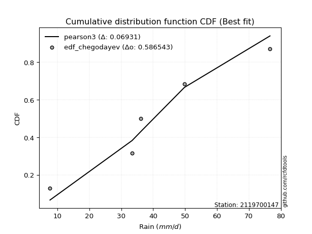</img></img>

</div>


### 6. EDF Blom (1958)

The Blom formula is a specific "plotting position" formula used in hydrology and statistical analysis to estimate the empirical cumulative probability (or non-exceedance probability) of a data series. It is particularly recommended for data that are approximately normally distributed. The constant _a_ is set to 0.375 (or 3/8).

<div align="center">


$P=(m-a)/(n+1-2a)$


</div>


**6.1. Empirical values**

<div align="center">

|                | 0                   | 1                   | 2        | 3                  | 4                  |
|:---------------|:--------------------|:--------------------|:---------|:-------------------|:-------------------|
| date           | 2023                | 2021                | 2022     | 2019               | 2020               |
| x              | 7.7                 | 33.4                | 36.2     | 49.8               | 76.6               |
| m              | 1                   | 2                   | 3        | 4                  | 5                  |
| empirical_dist | edf_blom            | edf_blom            | edf_blom | edf_blom           | edf_blom           |
| empirical      | 0.11904761904761904 | 0.30952380952380953 | 0.5      | 0.6904761904761905 | 0.8809523809523809 |
| empirical_tr   | 1.135135135135135   | 1.4482758620689655  | 2.0      | 3.230769230769231  | 8.399999999999999  |

</div>


**6.2. Kolmogorov-Smirnov fit test (sorted by Δ)**


<div align="center">

|                | 0                   | 1                  | 2                   | 3                   | 4                   | 5                   | 6                  | 7                   | 8                   | 9                   | 10                  | 11                  | 12                  | 13                  | 14                  | 15                  | 16                  | 17                  | 18                  | 19                  | 20                  | 21                  | 22                  | 23                  | 24                  | 25                  | 26                  | 27                  | 28                  | 29                  | 30                  | 31                  | 32                  | 33                  | 34                  | 35                  | 36                  | 37                  | 38                  | 39                  | 40                  | 41                  | 42                  | 43                  | 44                  | 45                  | 46                  | 47                  | 48                  | 49                  | 50                  | 51                  | 52                  | 53                  | 54                  | 55                  | 56                 | 57                 | 58                 | 59                  | 60                  | 61                  | 62                  | 63                  | 64                  | 65                  | 66                  | 67                  | 68                 | 69                 | 70                  | 71                  | 72                  | 73                  | 74                  | 75                  | 76                  | 77                  | 78                 | 79                  | 80                 | 81                 | 82                  | 83                  | 84                 | 85                  | 86                  | 87                 | 88                  | 89                 | 90                 | 91                 | 92                 | 93                  | 94                  | 95                 | 96                  | 97                  | 98                  | 99                  | 100                 | 101                 | 102                 | 103                | 104                 | 105                 | 106                 | 107                 | 108                 | 109                 | 110                 | 111                | 112                 | 113                 | 114                | 115                | 116                 | 117                | 118                 | 119                 | 120                | 121                | 122                | 123                 | 124                 | 125                 | 126                 | 127                | 128                 | 129                | 130                 | 131                 | 132                 | 133                | 134                | 135                | 136                 | 137                | 138                | 139                | 140                | 141                 | 142                 | 143                 | 144                | 145                 | 146                 | 147                 | 148                | 149                 | 150                | 151                | 152                | 153                | 154                | 155                | 156                | 157                | 158                | 159                |
|:---------------|:--------------------|:-------------------|:--------------------|:--------------------|:--------------------|:--------------------|:-------------------|:--------------------|:--------------------|:--------------------|:--------------------|:--------------------|:--------------------|:--------------------|:--------------------|:--------------------|:--------------------|:--------------------|:--------------------|:--------------------|:--------------------|:--------------------|:--------------------|:--------------------|:--------------------|:--------------------|:--------------------|:--------------------|:--------------------|:--------------------|:--------------------|:--------------------|:--------------------|:--------------------|:--------------------|:--------------------|:--------------------|:--------------------|:--------------------|:--------------------|:--------------------|:--------------------|:--------------------|:--------------------|:--------------------|:--------------------|:--------------------|:--------------------|:--------------------|:--------------------|:--------------------|:--------------------|:--------------------|:--------------------|:--------------------|:--------------------|:-------------------|:-------------------|:-------------------|:--------------------|:--------------------|:--------------------|:--------------------|:--------------------|:--------------------|:--------------------|:--------------------|:--------------------|:-------------------|:-------------------|:--------------------|:--------------------|:--------------------|:--------------------|:--------------------|:--------------------|:--------------------|:--------------------|:-------------------|:--------------------|:-------------------|:-------------------|:--------------------|:--------------------|:-------------------|:--------------------|:--------------------|:-------------------|:--------------------|:-------------------|:-------------------|:-------------------|:-------------------|:--------------------|:--------------------|:-------------------|:--------------------|:--------------------|:--------------------|:--------------------|:--------------------|:--------------------|:--------------------|:-------------------|:--------------------|:--------------------|:--------------------|:--------------------|:--------------------|:--------------------|:--------------------|:-------------------|:--------------------|:--------------------|:-------------------|:-------------------|:--------------------|:-------------------|:--------------------|:--------------------|:-------------------|:-------------------|:-------------------|:--------------------|:--------------------|:--------------------|:--------------------|:-------------------|:--------------------|:-------------------|:--------------------|:--------------------|:--------------------|:-------------------|:-------------------|:-------------------|:--------------------|:-------------------|:-------------------|:-------------------|:-------------------|:--------------------|:--------------------|:--------------------|:-------------------|:--------------------|:--------------------|:--------------------|:-------------------|:--------------------|:-------------------|:-------------------|:-------------------|:-------------------|:-------------------|:-------------------|:-------------------|:-------------------|:-------------------|:-------------------|
| station        | 2119700147          | 2119700147         | 2119700147          | 2119700147          | 2119700147          | 2119700147          | 2119700147         | 2119700147          | 2119700147          | 2119700147          | 2119700147          | 2119700147          | 2119700147          | 2119700147          | 2119700147          | 2119700147          | 2119700147          | 2119700147          | 2119700147          | 2119700147          | 2119700147          | 2119700147          | 2119700147          | 2119700147          | 2119700147          | 2119700147          | 2119700147          | 2119700147          | 2119700147          | 2119700147          | 2119700147          | 2119700147          | 2119700147          | 2119700147          | 2119700147          | 2119700147          | 2119700147          | 2119700147          | 2119700147          | 2119700147          | 2119700147          | 2119700147          | 2119700147          | 2119700147          | 2119700147          | 2119700147          | 2119700147          | 2119700147          | 2119700147          | 2119700147          | 2119700147          | 2119700147          | 2119700147          | 2119700147          | 2119700147          | 2119700147          | 2119700147         | 2119700147         | 2119700147         | 2119700147          | 2119700147          | 2119700147          | 2119700147          | 2119700147          | 2119700147          | 2119700147          | 2119700147          | 2119700147          | 2119700147         | 2119700147         | 2119700147          | 2119700147          | 2119700147          | 2119700147          | 2119700147          | 2119700147          | 2119700147          | 2119700147          | 2119700147         | 2119700147          | 2119700147         | 2119700147         | 2119700147          | 2119700147          | 2119700147         | 2119700147          | 2119700147          | 2119700147         | 2119700147          | 2119700147         | 2119700147         | 2119700147         | 2119700147         | 2119700147          | 2119700147          | 2119700147         | 2119700147          | 2119700147          | 2119700147          | 2119700147          | 2119700147          | 2119700147          | 2119700147          | 2119700147         | 2119700147          | 2119700147          | 2119700147          | 2119700147          | 2119700147          | 2119700147          | 2119700147          | 2119700147         | 2119700147          | 2119700147          | 2119700147         | 2119700147         | 2119700147          | 2119700147         | 2119700147          | 2119700147          | 2119700147         | 2119700147         | 2119700147         | 2119700147          | 2119700147          | 2119700147          | 2119700147          | 2119700147         | 2119700147          | 2119700147         | 2119700147          | 2119700147          | 2119700147          | 2119700147         | 2119700147         | 2119700147         | 2119700147          | 2119700147         | 2119700147         | 2119700147         | 2119700147         | 2119700147          | 2119700147          | 2119700147          | 2119700147         | 2119700147          | 2119700147          | 2119700147          | 2119700147         | 2119700147          | 2119700147         | 2119700147         | 2119700147         | 2119700147         | 2119700147         | 2119700147         | 2119700147         | 2119700147         | 2119700147         | 2119700147         |
| empirical_dist | edf_blom            | edf_blom           | edf_blom            | edf_blom            | edf_blom            | edf_blom            | edf_blom           | edf_blom            | edf_blom            | edf_blom            | edf_blom            | edf_blom            | edf_blom            | edf_blom            | edf_blom            | edf_blom            | edf_blom            | edf_blom            | edf_blom            | edf_blom            | edf_blom            | edf_blom            | edf_blom            | edf_blom            | edf_blom            | edf_blom            | edf_blom            | edf_blom            | edf_blom            | edf_blom            | edf_blom            | edf_blom            | edf_blom            | edf_blom            | edf_blom            | edf_blom            | edf_blom            | edf_blom            | edf_blom            | edf_blom            | edf_blom            | edf_blom            | edf_blom            | edf_blom            | edf_blom            | edf_blom            | edf_blom            | edf_blom            | edf_blom            | edf_blom            | edf_blom            | edf_blom            | edf_blom            | edf_blom            | edf_blom            | edf_blom            | edf_blom           | edf_blom           | edf_blom           | edf_blom            | edf_blom            | edf_blom            | edf_blom            | edf_blom            | edf_blom            | edf_blom            | edf_blom            | edf_blom            | edf_blom           | edf_blom           | edf_blom            | edf_blom            | edf_blom            | edf_blom            | edf_blom            | edf_blom            | edf_blom            | edf_blom            | edf_blom           | edf_blom            | edf_blom           | edf_blom           | edf_blom            | edf_blom            | edf_blom           | edf_blom            | edf_blom            | edf_blom           | edf_blom            | edf_blom           | edf_blom           | edf_blom           | edf_blom           | edf_blom            | edf_blom            | edf_blom           | edf_blom            | edf_blom            | edf_blom            | edf_blom            | edf_blom            | edf_blom            | edf_blom            | edf_blom           | edf_blom            | edf_blom            | edf_blom            | edf_blom            | edf_blom            | edf_blom            | edf_blom            | edf_blom           | edf_blom            | edf_blom            | edf_blom           | edf_blom           | edf_blom            | edf_blom           | edf_blom            | edf_blom            | edf_blom           | edf_blom           | edf_blom           | edf_blom            | edf_blom            | edf_blom            | edf_blom            | edf_blom           | edf_blom            | edf_blom           | edf_blom            | edf_blom            | edf_blom            | edf_blom           | edf_blom           | edf_blom           | edf_blom            | edf_blom           | edf_blom           | edf_blom           | edf_blom           | edf_blom            | edf_blom            | edf_blom            | edf_blom           | edf_blom            | edf_blom            | edf_blom            | edf_blom           | edf_blom            | edf_blom           | edf_blom           | edf_blom           | edf_blom           | edf_blom           | edf_blom           | edf_blom           | edf_blom           | edf_blom           | edf_blom           |
| p_dist         | genextreme          | pearson3           | foldnorm            | logjohnsonsu        | exponnorm           | nct                 | t                  | crystalball         | norm                | truncnorm           | anglit              | johnsonsu           | fatiguelife         | erlang              | skewnorm            | cosine              | semicircular        | betaprime           | gamma               | f                   | genlogistic         | rice                | logistic            | logdgamma           | invgamma            | gompertz            | logmielke           | maxwell             | ksone               | hypsecant           | dweibull            | invgauss            | logburr             | logt                | logargus            | burr                | mielke              | logdweibull         | rayleigh            | weibull_min         | gumbel_r            | dgamma              | logloggamma         | wrapcauchy          | logvonmises_line    | vonmises_line       | kappa3              | loggenextreme       | tukeylambda         | kappa4              | uniform             | arcsine             | truncpareto         | laplace             | invweibull          | logweibull_min      | loggennorm         | logloglaplace      | logburr12          | loggumbel_l         | moyal               | kstwobign           | gennorm             | argus               | logpearson3         | halfnorm            | logtrapezoid        | gumbel_l            | bradford           | loggenhalflogistic | gausshyper          | halflogistic        | loggompertz         | logskewnorm         | loglevy_l           | genpareto           | truncexpon          | wald                | logtriang          | beta                | logarcsine         | logsemicircular    | loganglit           | logbeta             | logfoldnorm        | lognct              | logexponnorm        | lognorm            | logcrystalball      | logfatiguelife     | logf               | levy_l             | loglogistic        | loghypsecant        | logerlang           | logncf             | logbetaprime        | logrice             | loggamma            | loggamma            | logalpha            | loglaplace          | loglaplace          | loginvgamma        | lomax               | genhalflogistic     | logmaxwell          | loginvgauss         | gengamma            | genexpon            | loginvweibull       | lograyleigh        | logcosine           | exponweib           | logwrapcauchy      | truncweibull_min   | loggausshyper       | ncf                | loggenpareto        | logkstwobign        | loggumbel_r        | loghalfnorm        | triang             | logweibull_max      | halfgennorm         | logmoyal            | loghalflogistic     | logksone           | loggenexpon         | nakagami           | lognakagami         | exponpow            | alpha               | logkappa4          | burr12             | logtruncnorm       | loglomax            | logkappa3          | loguniform         | trapezoid          | logjohnsonsb       | logexponweib        | logwald             | logbradford         | logtruncexpon      | logtruncweibull_min | logrdist            | logexponpow         | logtukeylambda     | loggengamma         | johnsonsb          | weibull_max        | powerlaw           | rdist              | logpowerlaw        | logtruncpareto     | loggenlogistic     | loghalfgennorm     | logvonmises        | vonmises           |
| delta          | 0.07169893613203115 | 0.0729016543068498 | 0.07381955586266248 | 0.07654626938378728 | 0.07877025899429602 | 0.07984415884703422 | 0.0799079670069307 | 0.07990959243090162 | 0.07990959663147079 | 0.07990961965929244 | 0.07994690644640057 | 0.08212751920768652 | 0.08466389842596084 | 0.08582840726939056 | 0.08585467556406384 | 0.08586205351753617 | 0.08715741151845546 | 0.08852071728350935 | 0.08862952529406332 | 0.08925762635912915 | 0.08930145604439599 | 0.09015695610058694 | 0.09043762565707714 | 0.09192262168040077 | 0.09327885239288547 | 0.09378400983197654 | 0.09556771875783798 | 0.09576675092423353 | 0.09635788298102033 | 0.09918592304645263 | 0.10058046745649063 | 0.10103012420111013 | 0.10231035523874699 | 0.10241187478629898 | 0.10341677281720896 | 0.10404887881632019 | 0.10452357009841617 | 0.10714750555889963 | 0.10802226757411859 | 0.11050088119200085 | 0.11663381201487066 | 0.11730354117801256 | 0.11900701243607958 | 0.11904663178009137 | 0.11904761355361741 | 0.11904761799101819 | 0.11904761882048849 | 0.11904761904761096 | 0.11904761904761194 | 0.11904761904761713 | 0.11904761904761907 | 0.11904761904761907 | 0.11904762237901312 | 0.12406559837420711 | 0.12472764321531943 | 0.12645980991035222 | 0.1285186415717895 | 0.1286764614668905 | 0.1354657472043148 | 0.13696395178490262 | 0.13709927762588814 | 0.13868055301032223 | 0.13912978907640094 | 0.13986546267855582 | 0.14250253403215396 | 0.14286735046784532 | 0.14777211124893208 | 0.14823461126812704 | 0.1514843218131725 | 0.1532353575452638 | 0.15360610696810817 | 0.15453789439661025 | 0.15581372759847922 | 0.16423410521481552 | 0.17055973174297967 | 0.17988121738495155 | 0.18744303284910618 | 0.18922850714675843 | 0.1947561170446408 | 0.19805086025444918 | 0.1996153621743818 | 0.2033992350155993 | 0.20435344788123877 | 0.20437921046402713 | 0.2045769646733604 | 0.20638012970017128 | 0.20666925995414553 | 0.2066694883142628 | 0.20666949542420687 | 0.2070141613474651 | 0.2074102312592515 | 0.2080479497496284 | 0.2088787226552472 | 0.21076330751438388 | 0.21263909623934774 | 0.2134920150722559 | 0.21429512233742343 | 0.21601232500062695 | 0.21690854185985953 | 0.21690854185985953 | 0.21802129968299222 | 0.21837725150632392 | 0.21837725150632392 | 0.2195543378607977 | 0.22997244313959753 | 0.23694537441806707 | 0.23900153646324862 | 0.24072493579876064 | 0.24242959397902897 | 0.24246807719834318 | 0.24478888961178014 | 0.2496434188645198 | 0.25582257256569596 | 0.25857201907399197 | 0.2637460758986785 | 0.2722539322781222 | 0.27242941659595976 | 0.2737889098512488 | 0.27454522160333705 | 0.27674511384314426 | 0.2773353673393161 | 0.2796068264699838 | 0.2823074250705613 | 0.28603774754607775 | 0.29979807713413487 | 0.30299881895989567 | 0.30545810876914037 | 0.3060599018666744 | 0.30804633047168584 | 0.3090041223674501 | 0.30951870763104217 | 0.30962754356863087 | 0.31709136533829263 | 0.3200832407165507 | 0.3251686373493867 | 0.3258103292479352 | 0.32769690882749436 | 0.3291582822837693 | 0.3291766441447713 | 0.3393898418630049 | 0.3443910996687767 | 0.35558342150599453 | 0.37429415918765985 | 0.40627681814547567 | 0.4187591479828492 | 0.42362405529731706 | 0.43813260541037424 | 0.46842355898595056 | 0.4703546003877299 | 0.49462890976428975 | 0.5441642472881685 | 0.5585019849254216 | 0.5778129487156413 | 0.5815317198371616 | 0.632048113694317  | 0.6455659993761051 | 0.6904761904761905 | 0.6904761904761905 | 1.1583367831054836 | 11.703676724618663 |
| deltao         | 0.5865427407550001  | 0.5865427407550001 | 0.5865427407550001  | 0.5865427407550001  | 0.5865427407550001  | 0.5865427407550001  | 0.5865427407550001 | 0.5865427407550001  | 0.5865427407550001  | 0.5865427407550001  | 0.5865427407550001  | 0.5865427407550001  | 0.5865427407550001  | 0.5865427407550001  | 0.5865427407550001  | 0.5865427407550001  | 0.5865427407550001  | 0.5865427407550001  | 0.5865427407550001  | 0.5865427407550001  | 0.5865427407550001  | 0.5865427407550001  | 0.5865427407550001  | 0.5865427407550001  | 0.5865427407550001  | 0.5865427407550001  | 0.5865427407550001  | 0.5865427407550001  | 0.5865427407550001  | 0.5865427407550001  | 0.5865427407550001  | 0.5865427407550001  | 0.5865427407550001  | 0.5865427407550001  | 0.5865427407550001  | 0.5865427407550001  | 0.5865427407550001  | 0.5865427407550001  | 0.5865427407550001  | 0.5865427407550001  | 0.5865427407550001  | 0.5865427407550001  | 0.5865427407550001  | 0.5865427407550001  | 0.5865427407550001  | 0.5865427407550001  | 0.5865427407550001  | 0.5865427407550001  | 0.5865427407550001  | 0.5865427407550001  | 0.5865427407550001  | 0.5865427407550001  | 0.5865427407550001  | 0.5865427407550001  | 0.5865427407550001  | 0.5865427407550001  | 0.5865427407550001 | 0.5865427407550001 | 0.5865427407550001 | 0.5865427407550001  | 0.5865427407550001  | 0.5865427407550001  | 0.5865427407550001  | 0.5865427407550001  | 0.5865427407550001  | 0.5865427407550001  | 0.5865427407550001  | 0.5865427407550001  | 0.5865427407550001 | 0.5865427407550001 | 0.5865427407550001  | 0.5865427407550001  | 0.5865427407550001  | 0.5865427407550001  | 0.5865427407550001  | 0.5865427407550001  | 0.5865427407550001  | 0.5865427407550001  | 0.5865427407550001 | 0.5865427407550001  | 0.5865427407550001 | 0.5865427407550001 | 0.5865427407550001  | 0.5865427407550001  | 0.5865427407550001 | 0.5865427407550001  | 0.5865427407550001  | 0.5865427407550001 | 0.5865427407550001  | 0.5865427407550001 | 0.5865427407550001 | 0.5865427407550001 | 0.5865427407550001 | 0.5865427407550001  | 0.5865427407550001  | 0.5865427407550001 | 0.5865427407550001  | 0.5865427407550001  | 0.5865427407550001  | 0.5865427407550001  | 0.5865427407550001  | 0.5865427407550001  | 0.5865427407550001  | 0.5865427407550001 | 0.5865427407550001  | 0.5865427407550001  | 0.5865427407550001  | 0.5865427407550001  | 0.5865427407550001  | 0.5865427407550001  | 0.5865427407550001  | 0.5865427407550001 | 0.5865427407550001  | 0.5865427407550001  | 0.5865427407550001 | 0.5865427407550001 | 0.5865427407550001  | 0.5865427407550001 | 0.5865427407550001  | 0.5865427407550001  | 0.5865427407550001 | 0.5865427407550001 | 0.5865427407550001 | 0.5865427407550001  | 0.5865427407550001  | 0.5865427407550001  | 0.5865427407550001  | 0.5865427407550001 | 0.5865427407550001  | 0.5865427407550001 | 0.5865427407550001  | 0.5865427407550001  | 0.5865427407550001  | 0.5865427407550001 | 0.5865427407550001 | 0.5865427407550001 | 0.5865427407550001  | 0.5865427407550001 | 0.5865427407550001 | 0.5865427407550001 | 0.5865427407550001 | 0.5865427407550001  | 0.5865427407550001  | 0.5865427407550001  | 0.5865427407550001 | 0.5865427407550001  | 0.5865427407550001  | 0.5865427407550001  | 0.5865427407550001 | 0.5865427407550001  | 0.5865427407550001 | 0.5865427407550001 | 0.5865427407550001 | 0.5865427407550001 | 0.5865427407550001 | 0.5865427407550001 | 0.5865427407550001 | 0.5865427407550001 | 0.5865427407550001 | 0.5865427407550001 |
| eval           | Δo > Δ              | Δo > Δ             | Δo > Δ              | Δo > Δ              | Δo > Δ              | Δo > Δ              | Δo > Δ             | Δo > Δ              | Δo > Δ              | Δo > Δ              | Δo > Δ              | Δo > Δ              | Δo > Δ              | Δo > Δ              | Δo > Δ              | Δo > Δ              | Δo > Δ              | Δo > Δ              | Δo > Δ              | Δo > Δ              | Δo > Δ              | Δo > Δ              | Δo > Δ              | Δo > Δ              | Δo > Δ              | Δo > Δ              | Δo > Δ              | Δo > Δ              | Δo > Δ              | Δo > Δ              | Δo > Δ              | Δo > Δ              | Δo > Δ              | Δo > Δ              | Δo > Δ              | Δo > Δ              | Δo > Δ              | Δo > Δ              | Δo > Δ              | Δo > Δ              | Δo > Δ              | Δo > Δ              | Δo > Δ              | Δo > Δ              | Δo > Δ              | Δo > Δ              | Δo > Δ              | Δo > Δ              | Δo > Δ              | Δo > Δ              | Δo > Δ              | Δo > Δ              | Δo > Δ              | Δo > Δ              | Δo > Δ              | Δo > Δ              | Δo > Δ             | Δo > Δ             | Δo > Δ             | Δo > Δ              | Δo > Δ              | Δo > Δ              | Δo > Δ              | Δo > Δ              | Δo > Δ              | Δo > Δ              | Δo > Δ              | Δo > Δ              | Δo > Δ             | Δo > Δ             | Δo > Δ              | Δo > Δ              | Δo > Δ              | Δo > Δ              | Δo > Δ              | Δo > Δ              | Δo > Δ              | Δo > Δ              | Δo > Δ             | Δo > Δ              | Δo > Δ             | Δo > Δ             | Δo > Δ              | Δo > Δ              | Δo > Δ             | Δo > Δ              | Δo > Δ              | Δo > Δ             | Δo > Δ              | Δo > Δ             | Δo > Δ             | Δo > Δ             | Δo > Δ             | Δo > Δ              | Δo > Δ              | Δo > Δ             | Δo > Δ              | Δo > Δ              | Δo > Δ              | Δo > Δ              | Δo > Δ              | Δo > Δ              | Δo > Δ              | Δo > Δ             | Δo > Δ              | Δo > Δ              | Δo > Δ              | Δo > Δ              | Δo > Δ              | Δo > Δ              | Δo > Δ              | Δo > Δ             | Δo > Δ              | Δo > Δ              | Δo > Δ             | Δo > Δ             | Δo > Δ              | Δo > Δ             | Δo > Δ              | Δo > Δ              | Δo > Δ             | Δo > Δ             | Δo > Δ             | Δo > Δ              | Δo > Δ              | Δo > Δ              | Δo > Δ              | Δo > Δ             | Δo > Δ              | Δo > Δ             | Δo > Δ              | Δo > Δ              | Δo > Δ              | Δo > Δ             | Δo > Δ             | Δo > Δ             | Δo > Δ              | Δo > Δ             | Δo > Δ             | Δo > Δ             | Δo > Δ             | Δo > Δ              | Δo > Δ              | Δo > Δ              | Δo > Δ             | Δo > Δ              | Δo > Δ              | Δo > Δ              | Δo > Δ             | Δo > Δ              | Δo > Δ             | Δo > Δ             | Δo > Δ             | Δo > Δ             | Δo <= Δ            | Δo <= Δ            | Δo <= Δ            | Δo <= Δ            | Δo <= Δ            | Δo <= Δ            |
| fit            | 1                   | 1                  | 1                   | 1                   | 1                   | 1                   | 1                  | 1                   | 1                   | 1                   | 1                   | 1                   | 1                   | 1                   | 1                   | 1                   | 1                   | 1                   | 1                   | 1                   | 1                   | 1                   | 1                   | 1                   | 1                   | 1                   | 1                   | 1                   | 1                   | 1                   | 1                   | 1                   | 1                   | 1                   | 1                   | 1                   | 1                   | 1                   | 1                   | 1                   | 1                   | 1                   | 1                   | 1                   | 1                   | 1                   | 1                   | 1                   | 1                   | 1                   | 1                   | 1                   | 1                   | 1                   | 1                   | 1                   | 1                  | 1                  | 1                  | 1                   | 1                   | 1                   | 1                   | 1                   | 1                   | 1                   | 1                   | 1                   | 1                  | 1                  | 1                   | 1                   | 1                   | 1                   | 1                   | 1                   | 1                   | 1                   | 1                  | 1                   | 1                  | 1                  | 1                   | 1                   | 1                  | 1                   | 1                   | 1                  | 1                   | 1                  | 1                  | 1                  | 1                  | 1                   | 1                   | 1                  | 1                   | 1                   | 1                   | 1                   | 1                   | 1                   | 1                   | 1                  | 1                   | 1                   | 1                   | 1                   | 1                   | 1                   | 1                   | 1                  | 1                   | 1                   | 1                  | 1                  | 1                   | 1                  | 1                   | 1                   | 1                  | 1                  | 1                  | 1                   | 1                   | 1                   | 1                   | 1                  | 1                   | 1                  | 1                   | 1                   | 1                   | 1                  | 1                  | 1                  | 1                   | 1                  | 1                  | 1                  | 1                  | 1                   | 1                   | 1                   | 1                  | 1                   | 1                   | 1                   | 1                  | 1                   | 1                  | 1                  | 1                  | 1                  | 0                  | 0                  | 0                  | 0                  | 0                  | 0                  |
| n              | 5                   | 5                  | 5                   | 5                   | 5                   | 5                   | 5                  | 5                   | 5                   | 5                   | 5                   | 5                   | 5                   | 5                   | 5                   | 5                   | 5                   | 5                   | 5                   | 5                   | 5                   | 5                   | 5                   | 5                   | 5                   | 5                   | 5                   | 5                   | 5                   | 5                   | 5                   | 5                   | 5                   | 5                   | 5                   | 5                   | 5                   | 5                   | 5                   | 5                   | 5                   | 5                   | 5                   | 5                   | 5                   | 5                   | 5                   | 5                   | 5                   | 5                   | 5                   | 5                   | 5                   | 5                   | 5                   | 5                   | 5                  | 5                  | 5                  | 5                   | 5                   | 5                   | 5                   | 5                   | 5                   | 5                   | 5                   | 5                   | 5                  | 5                  | 5                   | 5                   | 5                   | 5                   | 5                   | 5                   | 5                   | 5                   | 5                  | 5                   | 5                  | 5                  | 5                   | 5                   | 5                  | 5                   | 5                   | 5                  | 5                   | 5                  | 5                  | 5                  | 5                  | 5                   | 5                   | 5                  | 5                   | 5                   | 5                   | 5                   | 5                   | 5                   | 5                   | 5                  | 5                   | 5                   | 5                   | 5                   | 5                   | 5                   | 5                   | 5                  | 5                   | 5                   | 5                  | 5                  | 5                   | 5                  | 5                   | 5                   | 5                  | 5                  | 5                  | 5                   | 5                   | 5                   | 5                   | 5                  | 5                   | 5                  | 5                   | 5                   | 5                   | 5                  | 5                  | 5                  | 5                   | 5                  | 5                  | 5                  | 5                  | 5                   | 5                   | 5                   | 5                  | 5                   | 5                   | 5                   | 5                  | 5                   | 5                  | 5                  | 5                  | 5                  | 5                  | 5                  | 5                  | 5                  | 5                  | 5                  |
| best_fit       | 1                   | 0                  | 0                   | 0                   | 0                   | 0                   | 0                  | 0                   | 0                   | 0                   | 0                   | 0                   | 0                   | 0                   | 0                   | 0                   | 0                   | 0                   | 0                   | 0                   | 0                   | 0                   | 0                   | 0                   | 0                   | 0                   | 0                   | 0                   | 0                   | 0                   | 0                   | 0                   | 0                   | 0                   | 0                   | 0                   | 0                   | 0                   | 0                   | 0                   | 0                   | 0                   | 0                   | 0                   | 0                   | 0                   | 0                   | 0                   | 0                   | 0                   | 0                   | 0                   | 0                   | 0                   | 0                   | 0                   | 0                  | 0                  | 0                  | 0                   | 0                   | 0                   | 0                   | 0                   | 0                   | 0                   | 0                   | 0                   | 0                  | 0                  | 0                   | 0                   | 0                   | 0                   | 0                   | 0                   | 0                   | 0                   | 0                  | 0                   | 0                  | 0                  | 0                   | 0                   | 0                  | 0                   | 0                   | 0                  | 0                   | 0                  | 0                  | 0                  | 0                  | 0                   | 0                   | 0                  | 0                   | 0                   | 0                   | 0                   | 0                   | 0                   | 0                   | 0                  | 0                   | 0                   | 0                   | 0                   | 0                   | 0                   | 0                   | 0                  | 0                   | 0                   | 0                  | 0                  | 0                   | 0                  | 0                   | 0                   | 0                  | 0                  | 0                  | 0                   | 0                   | 0                   | 0                   | 0                  | 0                   | 0                  | 0                   | 0                   | 0                   | 0                  | 0                  | 0                  | 0                   | 0                  | 0                  | 0                  | 0                  | 0                   | 0                   | 0                   | 0                  | 0                   | 0                   | 0                   | 0                  | 0                   | 0                  | 0                  | 0                  | 0                  | 0                  | 0                  | 0                  | 0                  | 0                  | 0                  |
| best_fit_sort  | 1                   | 2                  | 3                   | 4                   | 5                   | 6                   | 7                  | 8                   | 9                   | 10                  | 11                  | 12                  | 13                  | 14                  | 15                  | 16                  | 17                  | 18                  | 19                  | 20                  | 21                  | 22                  | 23                  | 24                  | 25                  | 26                  | 27                  | 28                  | 29                  | 30                  | 31                  | 32                  | 33                  | 34                  | 35                  | 36                  | 37                  | 38                  | 39                  | 40                  | 41                  | 42                  | 43                  | 44                  | 45                  | 46                  | 47                  | 48                  | 49                  | 50                  | 51                  | 52                  | 53                  | 54                  | 55                  | 56                  | 57                 | 58                 | 59                 | 60                  | 61                  | 62                  | 63                  | 64                  | 65                  | 66                  | 67                  | 68                  | 69                 | 70                 | 71                  | 72                  | 73                  | 74                  | 75                  | 76                  | 77                  | 78                  | 79                 | 80                  | 81                 | 82                 | 83                  | 84                  | 85                 | 86                  | 87                  | 88                 | 89                  | 90                 | 91                 | 92                 | 93                 | 94                  | 95                  | 96                 | 97                  | 98                  | 99                  | 100                 | 101                 | 102                 | 103                 | 104                | 105                 | 106                 | 107                 | 108                 | 109                 | 110                 | 111                 | 112                | 113                 | 114                 | 115                | 116                | 117                 | 118                | 119                 | 120                 | 121                | 122                | 123                | 124                 | 125                 | 126                 | 127                 | 128                | 129                 | 130                | 131                 | 132                 | 133                 | 134                | 135                | 136                | 137                 | 138                | 139                | 140                | 141                | 142                 | 143                 | 144                 | 145                | 146                 | 147                 | 148                 | 149                | 150                 | 151                | 152                | 153                | 154                | 155                | 156                | 157                | 158                | 159                | 160                |

</div>


**6.3. Best fit**

<div align="center">

|   id |    station | empirical_dist   | p_dist     |     delta |   deltao | eval   |   fit |   n |   best_fit |   best_fit_sort |
|-----:|-----------:|:-----------------|:-----------|----------:|---------:|:-------|------:|----:|-----------:|----------------:|
|    0 | 2119700147 | edf_blom         | genextreme | 0.0716989 | 0.586543 | Δo > Δ |     1 |   5 |          1 |               1 |

</div>


<div align="center">

</img>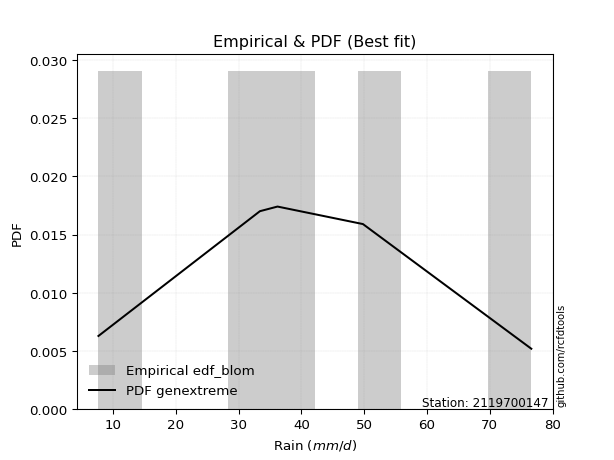</img>

</div>


### 7. EDF Tukey (1962)

In hydrology, the Tukey formula is used as a plotting position formula to estimate the empirical probability or frequency of a flood event (or other hydrological data). The formula parameter is given as _c=0.333_ (or 1/3).

<div align="center">


$P=(m-c)/(n+1-2c)$


</div>


**7.1. Empirical values**

<div align="center">

|                | 0                  | 1                  | 2         | 3         | 4         |
|:---------------|:-------------------|:-------------------|:----------|:----------|:----------|
| date           | 2023               | 2021               | 2022      | 2019      | 2020      |
| x              | 7.7                | 33.4               | 36.2      | 49.8      | 76.6      |
| m              | 1                  | 2                  | 3         | 4         | 5         |
| empirical_dist | edf_tukey          | edf_tukey          | edf_tukey | edf_tukey | edf_tukey |
| empirical      | 0.125              | 0.3125             | 0.5       | 0.6875    | 0.875     |
| empirical_tr   | 1.1428571428571428 | 1.4545454545454546 | 2.0       | 3.2       | 8.0       |

</div>


**7.2. Kolmogorov-Smirnov fit test (sorted by Δ)**


<div align="center">

|                | 0                   | 1                   | 2                   | 3                   | 4                  | 5                   | 6                   | 7                   | 8                  | 9                   | 10                  | 11                  | 12                  | 13                 | 14                  | 15                 | 16                  | 17                  | 18                  | 19                  | 20                  | 21                  | 22                 | 23                  | 24                  | 25                  | 26                  | 27                  | 28                 | 29                  | 30                  | 31                  | 32                  | 33                  | 34                  | 35                  | 36                  | 37                  | 38                  | 39                 | 40                 | 41                  | 42                  | 43                  | 44                  | 45                  | 46                  | 47                  | 48                  | 49                  | 50                 | 51                 | 52                  | 53                 | 54                 | 55                  | 56                  | 57                  | 58                  | 59                  | 60                  | 61                  | 62                 | 63                  | 64                  | 65                 | 66                  | 67                  | 68                  | 69                  | 70                 | 71                 | 72                  | 73                  | 74                 | 75                 | 76                  | 77                  | 78                  | 79                 | 80                  | 81                  | 82                 | 83                  | 84                  | 85                  | 86                 | 87                  | 88                  | 89                 | 90                  | 91                  | 92                  | 93                  | 94                  | 95                  | 96                  | 97                  | 98                  | 99                  | 100                 | 101                 | 102                 | 103                 | 104                 | 105                | 106                 | 107                 | 108                | 109                | 110                 | 111                 | 112                | 113                | 114                | 115                 | 116                | 117                 | 118                | 119                | 120                | 121                 | 122                | 123                | 124                | 125                | 126                | 127                 | 128                 | 129                | 130                | 131                 | 132                 | 133                 | 134                 | 135                | 136                | 137                 | 138                 | 139                 | 140                | 141                 | 142                | 143                | 144                | 145                 | 146                | 147                | 148                 | 149                | 150                | 151                | 152                | 153                | 154                | 155                | 156                | 157                | 158                | 159                |
|:---------------|:--------------------|:--------------------|:--------------------|:--------------------|:-------------------|:--------------------|:--------------------|:--------------------|:-------------------|:--------------------|:--------------------|:--------------------|:--------------------|:-------------------|:--------------------|:-------------------|:--------------------|:--------------------|:--------------------|:--------------------|:--------------------|:--------------------|:-------------------|:--------------------|:--------------------|:--------------------|:--------------------|:--------------------|:-------------------|:--------------------|:--------------------|:--------------------|:--------------------|:--------------------|:--------------------|:--------------------|:--------------------|:--------------------|:--------------------|:-------------------|:-------------------|:--------------------|:--------------------|:--------------------|:--------------------|:--------------------|:--------------------|:--------------------|:--------------------|:--------------------|:-------------------|:-------------------|:--------------------|:-------------------|:-------------------|:--------------------|:--------------------|:--------------------|:--------------------|:--------------------|:--------------------|:--------------------|:-------------------|:--------------------|:--------------------|:-------------------|:--------------------|:--------------------|:--------------------|:--------------------|:-------------------|:-------------------|:--------------------|:--------------------|:-------------------|:-------------------|:--------------------|:--------------------|:--------------------|:-------------------|:--------------------|:--------------------|:-------------------|:--------------------|:--------------------|:--------------------|:-------------------|:--------------------|:--------------------|:-------------------|:--------------------|:--------------------|:--------------------|:--------------------|:--------------------|:--------------------|:--------------------|:--------------------|:--------------------|:--------------------|:--------------------|:--------------------|:--------------------|:--------------------|:--------------------|:-------------------|:--------------------|:--------------------|:-------------------|:-------------------|:--------------------|:--------------------|:-------------------|:-------------------|:-------------------|:--------------------|:-------------------|:--------------------|:-------------------|:-------------------|:-------------------|:--------------------|:-------------------|:-------------------|:-------------------|:-------------------|:-------------------|:--------------------|:--------------------|:-------------------|:-------------------|:--------------------|:--------------------|:--------------------|:--------------------|:-------------------|:-------------------|:--------------------|:--------------------|:--------------------|:-------------------|:--------------------|:-------------------|:-------------------|:-------------------|:--------------------|:-------------------|:-------------------|:--------------------|:-------------------|:-------------------|:-------------------|:-------------------|:-------------------|:-------------------|:-------------------|:-------------------|:-------------------|:-------------------|:-------------------|
| station        | 2119700147          | 2119700147          | 2119700147          | 2119700147          | 2119700147         | 2119700147          | 2119700147          | 2119700147          | 2119700147         | 2119700147          | 2119700147          | 2119700147          | 2119700147          | 2119700147         | 2119700147          | 2119700147         | 2119700147          | 2119700147          | 2119700147          | 2119700147          | 2119700147          | 2119700147          | 2119700147         | 2119700147          | 2119700147          | 2119700147          | 2119700147          | 2119700147          | 2119700147         | 2119700147          | 2119700147          | 2119700147          | 2119700147          | 2119700147          | 2119700147          | 2119700147          | 2119700147          | 2119700147          | 2119700147          | 2119700147         | 2119700147         | 2119700147          | 2119700147          | 2119700147          | 2119700147          | 2119700147          | 2119700147          | 2119700147          | 2119700147          | 2119700147          | 2119700147         | 2119700147         | 2119700147          | 2119700147         | 2119700147         | 2119700147          | 2119700147          | 2119700147          | 2119700147          | 2119700147          | 2119700147          | 2119700147          | 2119700147         | 2119700147          | 2119700147          | 2119700147         | 2119700147          | 2119700147          | 2119700147          | 2119700147          | 2119700147         | 2119700147         | 2119700147          | 2119700147          | 2119700147         | 2119700147         | 2119700147          | 2119700147          | 2119700147          | 2119700147         | 2119700147          | 2119700147          | 2119700147         | 2119700147          | 2119700147          | 2119700147          | 2119700147         | 2119700147          | 2119700147          | 2119700147         | 2119700147          | 2119700147          | 2119700147          | 2119700147          | 2119700147          | 2119700147          | 2119700147          | 2119700147          | 2119700147          | 2119700147          | 2119700147          | 2119700147          | 2119700147          | 2119700147          | 2119700147          | 2119700147         | 2119700147          | 2119700147          | 2119700147         | 2119700147         | 2119700147          | 2119700147          | 2119700147         | 2119700147         | 2119700147         | 2119700147          | 2119700147         | 2119700147          | 2119700147         | 2119700147         | 2119700147         | 2119700147          | 2119700147         | 2119700147         | 2119700147         | 2119700147         | 2119700147         | 2119700147          | 2119700147          | 2119700147         | 2119700147         | 2119700147          | 2119700147          | 2119700147          | 2119700147          | 2119700147         | 2119700147         | 2119700147          | 2119700147          | 2119700147          | 2119700147         | 2119700147          | 2119700147         | 2119700147         | 2119700147         | 2119700147          | 2119700147         | 2119700147         | 2119700147          | 2119700147         | 2119700147         | 2119700147         | 2119700147         | 2119700147         | 2119700147         | 2119700147         | 2119700147         | 2119700147         | 2119700147         | 2119700147         |
| empirical_dist | edf_tukey           | edf_tukey           | edf_tukey           | edf_tukey           | edf_tukey          | edf_tukey           | edf_tukey           | edf_tukey           | edf_tukey          | edf_tukey           | edf_tukey           | edf_tukey           | edf_tukey           | edf_tukey          | edf_tukey           | edf_tukey          | edf_tukey           | edf_tukey           | edf_tukey           | edf_tukey           | edf_tukey           | edf_tukey           | edf_tukey          | edf_tukey           | edf_tukey           | edf_tukey           | edf_tukey           | edf_tukey           | edf_tukey          | edf_tukey           | edf_tukey           | edf_tukey           | edf_tukey           | edf_tukey           | edf_tukey           | edf_tukey           | edf_tukey           | edf_tukey           | edf_tukey           | edf_tukey          | edf_tukey          | edf_tukey           | edf_tukey           | edf_tukey           | edf_tukey           | edf_tukey           | edf_tukey           | edf_tukey           | edf_tukey           | edf_tukey           | edf_tukey          | edf_tukey          | edf_tukey           | edf_tukey          | edf_tukey          | edf_tukey           | edf_tukey           | edf_tukey           | edf_tukey           | edf_tukey           | edf_tukey           | edf_tukey           | edf_tukey          | edf_tukey           | edf_tukey           | edf_tukey          | edf_tukey           | edf_tukey           | edf_tukey           | edf_tukey           | edf_tukey          | edf_tukey          | edf_tukey           | edf_tukey           | edf_tukey          | edf_tukey          | edf_tukey           | edf_tukey           | edf_tukey           | edf_tukey          | edf_tukey           | edf_tukey           | edf_tukey          | edf_tukey           | edf_tukey           | edf_tukey           | edf_tukey          | edf_tukey           | edf_tukey           | edf_tukey          | edf_tukey           | edf_tukey           | edf_tukey           | edf_tukey           | edf_tukey           | edf_tukey           | edf_tukey           | edf_tukey           | edf_tukey           | edf_tukey           | edf_tukey           | edf_tukey           | edf_tukey           | edf_tukey           | edf_tukey           | edf_tukey          | edf_tukey           | edf_tukey           | edf_tukey          | edf_tukey          | edf_tukey           | edf_tukey           | edf_tukey          | edf_tukey          | edf_tukey          | edf_tukey           | edf_tukey          | edf_tukey           | edf_tukey          | edf_tukey          | edf_tukey          | edf_tukey           | edf_tukey          | edf_tukey          | edf_tukey          | edf_tukey          | edf_tukey          | edf_tukey           | edf_tukey           | edf_tukey          | edf_tukey          | edf_tukey           | edf_tukey           | edf_tukey           | edf_tukey           | edf_tukey          | edf_tukey          | edf_tukey           | edf_tukey           | edf_tukey           | edf_tukey          | edf_tukey           | edf_tukey          | edf_tukey          | edf_tukey          | edf_tukey           | edf_tukey          | edf_tukey          | edf_tukey           | edf_tukey          | edf_tukey          | edf_tukey          | edf_tukey          | edf_tukey          | edf_tukey          | edf_tukey          | edf_tukey          | edf_tukey          | edf_tukey          | edf_tukey          |
| p_dist         | pearson3            | genextreme          | logjohnsonsu        | foldnorm            | anglit             | exponnorm           | johnsonsu           | nct                 | t                  | crystalball         | norm                | truncnorm           | fatiguelife         | erlang             | skewnorm            | semicircular       | betaprime           | gamma               | cosine              | f                   | genlogistic         | rice                | invgamma           | logistic            | logmielke           | maxwell             | ksone               | gompertz            | logdgamma          | dweibull            | invgauss            | hypsecant           | logargus            | logt                | logdweibull         | rayleigh            | weibull_min         | logburr             | burr                | mielke             | gumbel_r           | dgamma              | invweibull          | logweibull_min      | laplace             | logloggamma         | wrapcauchy          | logvonmises_line    | vonmises_line       | kappa3              | loggenextreme      | tukeylambda        | kappa4              | uniform            | arcsine            | truncpareto         | logloglaplace       | loggennorm          | logburr12           | loggumbel_l         | moyal               | kstwobign           | logpearson3        | argus               | halfnorm            | gennorm            | logtrapezoid        | gumbel_l            | bradford            | loggenhalflogistic  | gausshyper         | halflogistic       | loggompertz         | logskewnorm         | loglevy_l          | genpareto          | truncexpon          | wald                | logtriang           | beta               | logarcsine          | logsemicircular     | loganglit          | logbeta             | logfoldnorm         | levy_l              | lognct             | logexponnorm        | lognorm             | logcrystalball     | logfatiguelife      | logf                | loglogistic         | loghypsecant        | logerlang           | logncf              | logbetaprime        | logrice             | loggamma            | loggamma            | logalpha            | loglaplace          | loglaplace          | loginvgamma         | lomax               | genhalflogistic    | logmaxwell          | loginvgauss         | gengamma           | genexpon           | loginvweibull       | lograyleigh         | logcosine          | exponweib          | logwrapcauchy      | truncweibull_min    | loggausshyper      | ncf                 | loggenpareto       | logkstwobign       | loggumbel_r        | loghalfnorm         | triang             | logweibull_max     | halfgennorm        | logmoyal           | loghalflogistic    | logksone            | loggenexpon         | exponpow           | nakagami           | lognakagami         | alpha               | logkappa4           | burr12              | loglomax           | logtruncnorm       | logkappa3           | loguniform          | trapezoid           | logjohnsonsb       | logexponweib        | logwald            | logbradford        | logtruncexpon      | logtruncweibull_min | logrdist           | logexponpow        | logtukeylambda      | loggengamma        | johnsonsb          | weibull_max        | powerlaw           | rdist              | logpowerlaw        | logtruncpareto     | loggenlogistic     | loghalfgennorm     | logvonmises        | vonmises           |
| delta          | 0.06992546383065934 | 0.07169893613203115 | 0.07357007890759681 | 0.07381955586266248 | 0.0769707159702101 | 0.07877025899429602 | 0.07915132873149605 | 0.07984415884703422 | 0.0799079670069307 | 0.07990959243090162 | 0.07990959663147079 | 0.07990961965929244 | 0.08168770794977037 | 0.0828522167932001 | 0.08287848508787338 | 0.084181221042265  | 0.08554452680731889 | 0.08565333481787285 | 0.08586205351753617 | 0.08628143588293868 | 0.08632526556820552 | 0.08718076562439647 | 0.090302661916695  | 0.09043762565707714 | 0.09259152828164752 | 0.09279056044804307 | 0.09338169250482986 | 0.09378400983197654 | 0.0975554920859391 | 0.09760427698030016 | 0.09805393372491966 | 0.09918592304645263 | 0.10044058234101849 | 0.10241187478629898 | 0.10417131508270916 | 0.10504607709792813 | 0.10752469071581039 | 0.10826273619112792 | 0.11000125976870112 | 0.1104759510507971 | 0.1136576215386802 | 0.12027973165420303 | 0.12175145273912896 | 0.12348361943416175 | 0.12406559837420711 | 0.12495939338846052 | 0.12499901273247233 | 0.12499999450599837 | 0.12499999894339915 | 0.12499999977286945 | 0.1249999999999919 | 0.1249999999999929 | 0.12499999999999808 | 0.125              | 0.125              | 0.12500000333139405 | 0.12570027099070002 | 0.13149483204797996 | 0.13248955672812435 | 0.13398776130871215 | 0.13412308714969767 | 0.13570436253413176 | 0.1395263435559635 | 0.13986546267855582 | 0.13989115999165486 | 0.1421059795525914 | 0.14479592077274162 | 0.14823461126812704 | 0.14850813133698204 | 0.15025916706907333 | 0.1506299164919177 | 0.1515617039204198 | 0.15283753712228876 | 0.16125791473862505 | 0.1675835412667892 | 0.1769050269087611 | 0.18446684237291572 | 0.18625231667056796 | 0.19177992656845033 | 0.1950746697782587 | 0.19663917169819134 | 0.20042304453940885 | 0.2013772574050483 | 0.20140301998783666 | 0.20160077419716993 | 0.20209556879724744 | 0.2034039392239808 | 0.20369306947795507 | 0.20369329783807233 | 0.2036933049480164 | 0.20403797087127462 | 0.20443404078306104 | 0.20590253217905674 | 0.20778711703819341 | 0.20966290576315727 | 0.21051582459606544 | 0.21131893186123296 | 0.21303613452443648 | 0.21393235138366906 | 0.21393235138366906 | 0.21504510920680175 | 0.21540106103013346 | 0.21540106103013346 | 0.21657814738460723 | 0.22699625266340706 | 0.2339691839418766 | 0.23602534598705815 | 0.23774874532257018 | 0.2394534035028385 | 0.2394918867221527 | 0.24181269913558967 | 0.24666722838832933 | 0.2528463820895055 | 0.2555958285978015 | 0.260769885422488  | 0.26927774180193176 | 0.2694532261197693 | 0.27081271937505835 | 0.2715690311271466 | 0.2737689233669538 | 0.2743591768631256 | 0.27663063599379334 | 0.2823074250705613 | 0.2830615570698873 | 0.2968218866579444 | 0.3000226284837052 | 0.3024819182929499 | 0.30308371139048396 | 0.30507013999549537 | 0.3066513530924404 | 0.3119803128436406 | 0.31249489810723263 | 0.31411517486210216 | 0.31710705024036023 | 0.32219244687319626 | 0.3247207183513039 | 0.3258103292479352 | 0.32618209180757884 | 0.32620045366858086 | 0.33641365138681445 | 0.3414149091925862 | 0.35260723102980407 | 0.3713179687114694 | 0.4033006276692852 | 0.4157829575066587 | 0.4206478648211266  | 0.4351564149341838 | 0.4654473685097601 | 0.46737840991153945 | 0.4916527192880993 | 0.541188056811978  | 0.5555257944492311 | 0.5748367582394508 | 0.5785555293609711 | 0.6290719232181265 | 0.6425898088999147 | 0.6875             | 0.6875             | 1.1553605926292931 | 11.709629105571045 |
| deltao         | 0.5865427407550001  | 0.5865427407550001  | 0.5865427407550001  | 0.5865427407550001  | 0.5865427407550001 | 0.5865427407550001  | 0.5865427407550001  | 0.5865427407550001  | 0.5865427407550001 | 0.5865427407550001  | 0.5865427407550001  | 0.5865427407550001  | 0.5865427407550001  | 0.5865427407550001 | 0.5865427407550001  | 0.5865427407550001 | 0.5865427407550001  | 0.5865427407550001  | 0.5865427407550001  | 0.5865427407550001  | 0.5865427407550001  | 0.5865427407550001  | 0.5865427407550001 | 0.5865427407550001  | 0.5865427407550001  | 0.5865427407550001  | 0.5865427407550001  | 0.5865427407550001  | 0.5865427407550001 | 0.5865427407550001  | 0.5865427407550001  | 0.5865427407550001  | 0.5865427407550001  | 0.5865427407550001  | 0.5865427407550001  | 0.5865427407550001  | 0.5865427407550001  | 0.5865427407550001  | 0.5865427407550001  | 0.5865427407550001 | 0.5865427407550001 | 0.5865427407550001  | 0.5865427407550001  | 0.5865427407550001  | 0.5865427407550001  | 0.5865427407550001  | 0.5865427407550001  | 0.5865427407550001  | 0.5865427407550001  | 0.5865427407550001  | 0.5865427407550001 | 0.5865427407550001 | 0.5865427407550001  | 0.5865427407550001 | 0.5865427407550001 | 0.5865427407550001  | 0.5865427407550001  | 0.5865427407550001  | 0.5865427407550001  | 0.5865427407550001  | 0.5865427407550001  | 0.5865427407550001  | 0.5865427407550001 | 0.5865427407550001  | 0.5865427407550001  | 0.5865427407550001 | 0.5865427407550001  | 0.5865427407550001  | 0.5865427407550001  | 0.5865427407550001  | 0.5865427407550001 | 0.5865427407550001 | 0.5865427407550001  | 0.5865427407550001  | 0.5865427407550001 | 0.5865427407550001 | 0.5865427407550001  | 0.5865427407550001  | 0.5865427407550001  | 0.5865427407550001 | 0.5865427407550001  | 0.5865427407550001  | 0.5865427407550001 | 0.5865427407550001  | 0.5865427407550001  | 0.5865427407550001  | 0.5865427407550001 | 0.5865427407550001  | 0.5865427407550001  | 0.5865427407550001 | 0.5865427407550001  | 0.5865427407550001  | 0.5865427407550001  | 0.5865427407550001  | 0.5865427407550001  | 0.5865427407550001  | 0.5865427407550001  | 0.5865427407550001  | 0.5865427407550001  | 0.5865427407550001  | 0.5865427407550001  | 0.5865427407550001  | 0.5865427407550001  | 0.5865427407550001  | 0.5865427407550001  | 0.5865427407550001 | 0.5865427407550001  | 0.5865427407550001  | 0.5865427407550001 | 0.5865427407550001 | 0.5865427407550001  | 0.5865427407550001  | 0.5865427407550001 | 0.5865427407550001 | 0.5865427407550001 | 0.5865427407550001  | 0.5865427407550001 | 0.5865427407550001  | 0.5865427407550001 | 0.5865427407550001 | 0.5865427407550001 | 0.5865427407550001  | 0.5865427407550001 | 0.5865427407550001 | 0.5865427407550001 | 0.5865427407550001 | 0.5865427407550001 | 0.5865427407550001  | 0.5865427407550001  | 0.5865427407550001 | 0.5865427407550001 | 0.5865427407550001  | 0.5865427407550001  | 0.5865427407550001  | 0.5865427407550001  | 0.5865427407550001 | 0.5865427407550001 | 0.5865427407550001  | 0.5865427407550001  | 0.5865427407550001  | 0.5865427407550001 | 0.5865427407550001  | 0.5865427407550001 | 0.5865427407550001 | 0.5865427407550001 | 0.5865427407550001  | 0.5865427407550001 | 0.5865427407550001 | 0.5865427407550001  | 0.5865427407550001 | 0.5865427407550001 | 0.5865427407550001 | 0.5865427407550001 | 0.5865427407550001 | 0.5865427407550001 | 0.5865427407550001 | 0.5865427407550001 | 0.5865427407550001 | 0.5865427407550001 | 0.5865427407550001 |
| eval           | Δo > Δ              | Δo > Δ              | Δo > Δ              | Δo > Δ              | Δo > Δ             | Δo > Δ              | Δo > Δ              | Δo > Δ              | Δo > Δ             | Δo > Δ              | Δo > Δ              | Δo > Δ              | Δo > Δ              | Δo > Δ             | Δo > Δ              | Δo > Δ             | Δo > Δ              | Δo > Δ              | Δo > Δ              | Δo > Δ              | Δo > Δ              | Δo > Δ              | Δo > Δ             | Δo > Δ              | Δo > Δ              | Δo > Δ              | Δo > Δ              | Δo > Δ              | Δo > Δ             | Δo > Δ              | Δo > Δ              | Δo > Δ              | Δo > Δ              | Δo > Δ              | Δo > Δ              | Δo > Δ              | Δo > Δ              | Δo > Δ              | Δo > Δ              | Δo > Δ             | Δo > Δ             | Δo > Δ              | Δo > Δ              | Δo > Δ              | Δo > Δ              | Δo > Δ              | Δo > Δ              | Δo > Δ              | Δo > Δ              | Δo > Δ              | Δo > Δ             | Δo > Δ             | Δo > Δ              | Δo > Δ             | Δo > Δ             | Δo > Δ              | Δo > Δ              | Δo > Δ              | Δo > Δ              | Δo > Δ              | Δo > Δ              | Δo > Δ              | Δo > Δ             | Δo > Δ              | Δo > Δ              | Δo > Δ             | Δo > Δ              | Δo > Δ              | Δo > Δ              | Δo > Δ              | Δo > Δ             | Δo > Δ             | Δo > Δ              | Δo > Δ              | Δo > Δ             | Δo > Δ             | Δo > Δ              | Δo > Δ              | Δo > Δ              | Δo > Δ             | Δo > Δ              | Δo > Δ              | Δo > Δ             | Δo > Δ              | Δo > Δ              | Δo > Δ              | Δo > Δ             | Δo > Δ              | Δo > Δ              | Δo > Δ             | Δo > Δ              | Δo > Δ              | Δo > Δ              | Δo > Δ              | Δo > Δ              | Δo > Δ              | Δo > Δ              | Δo > Δ              | Δo > Δ              | Δo > Δ              | Δo > Δ              | Δo > Δ              | Δo > Δ              | Δo > Δ              | Δo > Δ              | Δo > Δ             | Δo > Δ              | Δo > Δ              | Δo > Δ             | Δo > Δ             | Δo > Δ              | Δo > Δ              | Δo > Δ             | Δo > Δ             | Δo > Δ             | Δo > Δ              | Δo > Δ             | Δo > Δ              | Δo > Δ             | Δo > Δ             | Δo > Δ             | Δo > Δ              | Δo > Δ             | Δo > Δ             | Δo > Δ             | Δo > Δ             | Δo > Δ             | Δo > Δ              | Δo > Δ              | Δo > Δ             | Δo > Δ             | Δo > Δ              | Δo > Δ              | Δo > Δ              | Δo > Δ              | Δo > Δ             | Δo > Δ             | Δo > Δ              | Δo > Δ              | Δo > Δ              | Δo > Δ             | Δo > Δ              | Δo > Δ             | Δo > Δ             | Δo > Δ             | Δo > Δ              | Δo > Δ             | Δo > Δ             | Δo > Δ              | Δo > Δ             | Δo > Δ             | Δo > Δ             | Δo > Δ             | Δo > Δ             | Δo <= Δ            | Δo <= Δ            | Δo <= Δ            | Δo <= Δ            | Δo <= Δ            | Δo <= Δ            |
| fit            | 1                   | 1                   | 1                   | 1                   | 1                  | 1                   | 1                   | 1                   | 1                  | 1                   | 1                   | 1                   | 1                   | 1                  | 1                   | 1                  | 1                   | 1                   | 1                   | 1                   | 1                   | 1                   | 1                  | 1                   | 1                   | 1                   | 1                   | 1                   | 1                  | 1                   | 1                   | 1                   | 1                   | 1                   | 1                   | 1                   | 1                   | 1                   | 1                   | 1                  | 1                  | 1                   | 1                   | 1                   | 1                   | 1                   | 1                   | 1                   | 1                   | 1                   | 1                  | 1                  | 1                   | 1                  | 1                  | 1                   | 1                   | 1                   | 1                   | 1                   | 1                   | 1                   | 1                  | 1                   | 1                   | 1                  | 1                   | 1                   | 1                   | 1                   | 1                  | 1                  | 1                   | 1                   | 1                  | 1                  | 1                   | 1                   | 1                   | 1                  | 1                   | 1                   | 1                  | 1                   | 1                   | 1                   | 1                  | 1                   | 1                   | 1                  | 1                   | 1                   | 1                   | 1                   | 1                   | 1                   | 1                   | 1                   | 1                   | 1                   | 1                   | 1                   | 1                   | 1                   | 1                   | 1                  | 1                   | 1                   | 1                  | 1                  | 1                   | 1                   | 1                  | 1                  | 1                  | 1                   | 1                  | 1                   | 1                  | 1                  | 1                  | 1                   | 1                  | 1                  | 1                  | 1                  | 1                  | 1                   | 1                   | 1                  | 1                  | 1                   | 1                   | 1                   | 1                   | 1                  | 1                  | 1                   | 1                   | 1                   | 1                  | 1                   | 1                  | 1                  | 1                  | 1                   | 1                  | 1                  | 1                   | 1                  | 1                  | 1                  | 1                  | 1                  | 0                  | 0                  | 0                  | 0                  | 0                  | 0                  |
| n              | 5                   | 5                   | 5                   | 5                   | 5                  | 5                   | 5                   | 5                   | 5                  | 5                   | 5                   | 5                   | 5                   | 5                  | 5                   | 5                  | 5                   | 5                   | 5                   | 5                   | 5                   | 5                   | 5                  | 5                   | 5                   | 5                   | 5                   | 5                   | 5                  | 5                   | 5                   | 5                   | 5                   | 5                   | 5                   | 5                   | 5                   | 5                   | 5                   | 5                  | 5                  | 5                   | 5                   | 5                   | 5                   | 5                   | 5                   | 5                   | 5                   | 5                   | 5                  | 5                  | 5                   | 5                  | 5                  | 5                   | 5                   | 5                   | 5                   | 5                   | 5                   | 5                   | 5                  | 5                   | 5                   | 5                  | 5                   | 5                   | 5                   | 5                   | 5                  | 5                  | 5                   | 5                   | 5                  | 5                  | 5                   | 5                   | 5                   | 5                  | 5                   | 5                   | 5                  | 5                   | 5                   | 5                   | 5                  | 5                   | 5                   | 5                  | 5                   | 5                   | 5                   | 5                   | 5                   | 5                   | 5                   | 5                   | 5                   | 5                   | 5                   | 5                   | 5                   | 5                   | 5                   | 5                  | 5                   | 5                   | 5                  | 5                  | 5                   | 5                   | 5                  | 5                  | 5                  | 5                   | 5                  | 5                   | 5                  | 5                  | 5                  | 5                   | 5                  | 5                  | 5                  | 5                  | 5                  | 5                   | 5                   | 5                  | 5                  | 5                   | 5                   | 5                   | 5                   | 5                  | 5                  | 5                   | 5                   | 5                   | 5                  | 5                   | 5                  | 5                  | 5                  | 5                   | 5                  | 5                  | 5                   | 5                  | 5                  | 5                  | 5                  | 5                  | 5                  | 5                  | 5                  | 5                  | 5                  | 5                  |
| best_fit       | 1                   | 0                   | 0                   | 0                   | 0                  | 0                   | 0                   | 0                   | 0                  | 0                   | 0                   | 0                   | 0                   | 0                  | 0                   | 0                  | 0                   | 0                   | 0                   | 0                   | 0                   | 0                   | 0                  | 0                   | 0                   | 0                   | 0                   | 0                   | 0                  | 0                   | 0                   | 0                   | 0                   | 0                   | 0                   | 0                   | 0                   | 0                   | 0                   | 0                  | 0                  | 0                   | 0                   | 0                   | 0                   | 0                   | 0                   | 0                   | 0                   | 0                   | 0                  | 0                  | 0                   | 0                  | 0                  | 0                   | 0                   | 0                   | 0                   | 0                   | 0                   | 0                   | 0                  | 0                   | 0                   | 0                  | 0                   | 0                   | 0                   | 0                   | 0                  | 0                  | 0                   | 0                   | 0                  | 0                  | 0                   | 0                   | 0                   | 0                  | 0                   | 0                   | 0                  | 0                   | 0                   | 0                   | 0                  | 0                   | 0                   | 0                  | 0                   | 0                   | 0                   | 0                   | 0                   | 0                   | 0                   | 0                   | 0                   | 0                   | 0                   | 0                   | 0                   | 0                   | 0                   | 0                  | 0                   | 0                   | 0                  | 0                  | 0                   | 0                   | 0                  | 0                  | 0                  | 0                   | 0                  | 0                   | 0                  | 0                  | 0                  | 0                   | 0                  | 0                  | 0                  | 0                  | 0                  | 0                   | 0                   | 0                  | 0                  | 0                   | 0                   | 0                   | 0                   | 0                  | 0                  | 0                   | 0                   | 0                   | 0                  | 0                   | 0                  | 0                  | 0                  | 0                   | 0                  | 0                  | 0                   | 0                  | 0                  | 0                  | 0                  | 0                  | 0                  | 0                  | 0                  | 0                  | 0                  | 0                  |
| best_fit_sort  | 1                   | 2                   | 3                   | 4                   | 5                  | 6                   | 7                   | 8                   | 9                  | 10                  | 11                  | 12                  | 13                  | 14                 | 15                  | 16                 | 17                  | 18                  | 19                  | 20                  | 21                  | 22                  | 23                 | 24                  | 25                  | 26                  | 27                  | 28                  | 29                 | 30                  | 31                  | 32                  | 33                  | 34                  | 35                  | 36                  | 37                  | 38                  | 39                  | 40                 | 41                 | 42                  | 43                  | 44                  | 45                  | 46                  | 47                  | 48                  | 49                  | 50                  | 51                 | 52                 | 53                  | 54                 | 55                 | 56                  | 57                  | 58                  | 59                  | 60                  | 61                  | 62                  | 63                 | 64                  | 65                  | 66                 | 67                  | 68                  | 69                  | 70                  | 71                 | 72                 | 73                  | 74                  | 75                 | 76                 | 77                  | 78                  | 79                  | 80                 | 81                  | 82                  | 83                 | 84                  | 85                  | 86                  | 87                 | 88                  | 89                  | 90                 | 91                  | 92                  | 93                  | 94                  | 95                  | 96                  | 97                  | 98                  | 99                  | 100                 | 101                 | 102                 | 103                 | 104                 | 105                 | 106                | 107                 | 108                 | 109                | 110                | 111                 | 112                 | 113                | 114                | 115                | 116                 | 117                | 118                 | 119                | 120                | 121                | 122                 | 123                | 124                | 125                | 126                | 127                | 128                 | 129                 | 130                | 131                | 132                 | 133                 | 134                 | 135                 | 136                | 137                | 138                 | 139                 | 140                 | 141                | 142                 | 143                | 144                | 145                | 146                 | 147                | 148                | 149                 | 150                | 151                | 152                | 153                | 154                | 155                | 156                | 157                | 158                | 159                | 160                |

</div>


**7.3. Best fit**

<div align="center">

|   id |    station | empirical_dist   | p_dist   |     delta |   deltao | eval   |   fit |   n |   best_fit |   best_fit_sort |
|-----:|-----------:|:-----------------|:---------|----------:|---------:|:-------|------:|----:|-----------:|----------------:|
|    0 | 2119700147 | edf_tukey        | pearson3 | 0.0699255 | 0.586543 | Δo > Δ |     1 |   5 |          1 |               1 |

</div>


<div align="center">

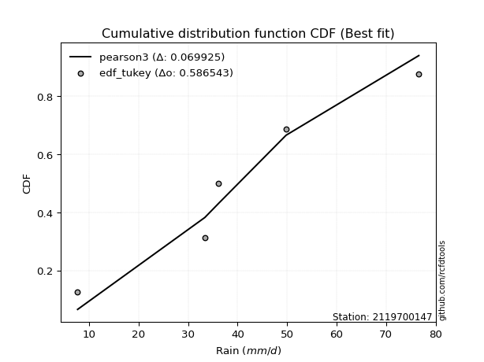</img>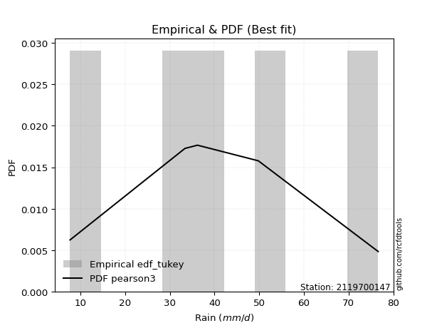</img>

</div>


### 8. EDF Gringorten (1963)

Gringorten plotting position formula is essential for estimating the probability and return periods of extreme events like floods and heavy rainfall. The constant _a=0.44_.

<div align="center">


$P=(m-a)/(n+1-2a)$


</div>


**8.1. Empirical values**

<div align="center">

|                | 0                   | 1                  | 2              | 3                 | 4                  |
|:---------------|:--------------------|:-------------------|:---------------|:------------------|:-------------------|
| date           | 2023                | 2021               | 2022           | 2019              | 2020               |
| x              | 7.7                 | 33.4               | 36.2           | 49.8              | 76.6               |
| m              | 1                   | 2                  | 3              | 4                 | 5                  |
| empirical_dist | edf_gringorten      | edf_gringorten     | edf_gringorten | edf_gringorten    | edf_gringorten     |
| empirical      | 0.10937500000000001 | 0.3046875          | 0.5            | 0.6953125         | 0.8906249999999999 |
| empirical_tr   | 1.1228070175438596  | 1.4382022471910112 | 2.0            | 3.282051282051282 | 9.142857142857133  |

</div>


**8.2. Kolmogorov-Smirnov fit test (sorted by Δ)**


<div align="center">

|                | 0                   | 1                  | 2                   | 3                   | 4                   | 5                  | 6                   | 7                   | 8                   | 9                   | 10                 | 11                  | 12                  | 13                  | 14                  | 15                 | 16                  | 17                 | 18                  | 19                  | 20                  | 21                  | 22                  | 23                  | 24                  | 25                  | 26                  | 27                 | 28                  | 29                  | 30                  | 31                  | 32                  | 33                  | 34                  | 35                  | 36                  | 37                  | 38                  | 39                  | 40                  | 41                  | 42                  | 43                 | 44                  | 45                  | 46                  | 47                  | 48                  | 49                  | 50                  | 51                  | 52                 | 53                  | 54                  | 55                  | 56                  | 57                  | 58                 | 59                  | 60                  | 61                  | 62                  | 63                  | 64                 | 65                  | 66                  | 67                  | 68                  | 69                  | 70                 | 71                 | 72                  | 73                  | 74                 | 75                 | 76                  | 77                  | 78                  | 79                 | 80                  | 81                  | 82                 | 83                  | 84                  | 85                 | 86                  | 87                  | 88                 | 89                  | 90                  | 91                  | 92                  | 93                  | 94                  | 95                  | 96                  | 97                  | 98                  | 99                  | 100                 | 101                 | 102                 | 103                 | 104                 | 105                | 106                 | 107                 | 108                | 109                | 110                 | 111                 | 112                | 113                | 114                | 115                 | 116                | 117                 | 118                | 119                | 120                | 121                | 122                 | 123                | 124                | 125                | 126                 | 127                | 128                | 129                 | 130                 | 131                | 132                 | 133                 | 134                | 135                 | 136                | 137                 | 138                 | 139                 | 140                | 141                 | 142                | 143                | 144                | 145                 | 146                | 147                | 148                 | 149                | 150                | 151                | 152                | 153                | 154                | 155                | 156                | 157                | 158                | 159                |
|:---------------|:--------------------|:-------------------|:--------------------|:--------------------|:--------------------|:-------------------|:--------------------|:--------------------|:--------------------|:--------------------|:-------------------|:--------------------|:--------------------|:--------------------|:--------------------|:-------------------|:--------------------|:-------------------|:--------------------|:--------------------|:--------------------|:--------------------|:--------------------|:--------------------|:--------------------|:--------------------|:--------------------|:-------------------|:--------------------|:--------------------|:--------------------|:--------------------|:--------------------|:--------------------|:--------------------|:--------------------|:--------------------|:--------------------|:--------------------|:--------------------|:--------------------|:--------------------|:--------------------|:-------------------|:--------------------|:--------------------|:--------------------|:--------------------|:--------------------|:--------------------|:--------------------|:--------------------|:-------------------|:--------------------|:--------------------|:--------------------|:--------------------|:--------------------|:-------------------|:--------------------|:--------------------|:--------------------|:--------------------|:--------------------|:-------------------|:--------------------|:--------------------|:--------------------|:--------------------|:--------------------|:-------------------|:-------------------|:--------------------|:--------------------|:-------------------|:-------------------|:--------------------|:--------------------|:--------------------|:-------------------|:--------------------|:--------------------|:-------------------|:--------------------|:--------------------|:-------------------|:--------------------|:--------------------|:-------------------|:--------------------|:--------------------|:--------------------|:--------------------|:--------------------|:--------------------|:--------------------|:--------------------|:--------------------|:--------------------|:--------------------|:--------------------|:--------------------|:--------------------|:--------------------|:--------------------|:-------------------|:--------------------|:--------------------|:-------------------|:-------------------|:--------------------|:--------------------|:-------------------|:-------------------|:-------------------|:--------------------|:-------------------|:--------------------|:-------------------|:-------------------|:-------------------|:-------------------|:--------------------|:-------------------|:-------------------|:-------------------|:--------------------|:-------------------|:-------------------|:--------------------|:--------------------|:-------------------|:--------------------|:--------------------|:-------------------|:--------------------|:-------------------|:--------------------|:--------------------|:--------------------|:-------------------|:--------------------|:-------------------|:-------------------|:-------------------|:--------------------|:-------------------|:-------------------|:--------------------|:-------------------|:-------------------|:-------------------|:-------------------|:-------------------|:-------------------|:-------------------|:-------------------|:-------------------|:-------------------|:-------------------|
| station        | 2119700147          | 2119700147         | 2119700147          | 2119700147          | 2119700147          | 2119700147         | 2119700147          | 2119700147          | 2119700147          | 2119700147          | 2119700147         | 2119700147          | 2119700147          | 2119700147          | 2119700147          | 2119700147         | 2119700147          | 2119700147         | 2119700147          | 2119700147          | 2119700147          | 2119700147          | 2119700147          | 2119700147          | 2119700147          | 2119700147          | 2119700147          | 2119700147         | 2119700147          | 2119700147          | 2119700147          | 2119700147          | 2119700147          | 2119700147          | 2119700147          | 2119700147          | 2119700147          | 2119700147          | 2119700147          | 2119700147          | 2119700147          | 2119700147          | 2119700147          | 2119700147         | 2119700147          | 2119700147          | 2119700147          | 2119700147          | 2119700147          | 2119700147          | 2119700147          | 2119700147          | 2119700147         | 2119700147          | 2119700147          | 2119700147          | 2119700147          | 2119700147          | 2119700147         | 2119700147          | 2119700147          | 2119700147          | 2119700147          | 2119700147          | 2119700147         | 2119700147          | 2119700147          | 2119700147          | 2119700147          | 2119700147          | 2119700147         | 2119700147         | 2119700147          | 2119700147          | 2119700147         | 2119700147         | 2119700147          | 2119700147          | 2119700147          | 2119700147         | 2119700147          | 2119700147          | 2119700147         | 2119700147          | 2119700147          | 2119700147         | 2119700147          | 2119700147          | 2119700147         | 2119700147          | 2119700147          | 2119700147          | 2119700147          | 2119700147          | 2119700147          | 2119700147          | 2119700147          | 2119700147          | 2119700147          | 2119700147          | 2119700147          | 2119700147          | 2119700147          | 2119700147          | 2119700147          | 2119700147         | 2119700147          | 2119700147          | 2119700147         | 2119700147         | 2119700147          | 2119700147          | 2119700147         | 2119700147         | 2119700147         | 2119700147          | 2119700147         | 2119700147          | 2119700147         | 2119700147         | 2119700147         | 2119700147         | 2119700147          | 2119700147         | 2119700147         | 2119700147         | 2119700147          | 2119700147         | 2119700147         | 2119700147          | 2119700147          | 2119700147         | 2119700147          | 2119700147          | 2119700147         | 2119700147          | 2119700147         | 2119700147          | 2119700147          | 2119700147          | 2119700147         | 2119700147          | 2119700147         | 2119700147         | 2119700147         | 2119700147          | 2119700147         | 2119700147         | 2119700147          | 2119700147         | 2119700147         | 2119700147         | 2119700147         | 2119700147         | 2119700147         | 2119700147         | 2119700147         | 2119700147         | 2119700147         | 2119700147         |
| empirical_dist | edf_gringorten      | edf_gringorten     | edf_gringorten      | edf_gringorten      | edf_gringorten      | edf_gringorten     | edf_gringorten      | edf_gringorten      | edf_gringorten      | edf_gringorten      | edf_gringorten     | edf_gringorten      | edf_gringorten      | edf_gringorten      | edf_gringorten      | edf_gringorten     | edf_gringorten      | edf_gringorten     | edf_gringorten      | edf_gringorten      | edf_gringorten      | edf_gringorten      | edf_gringorten      | edf_gringorten      | edf_gringorten      | edf_gringorten      | edf_gringorten      | edf_gringorten     | edf_gringorten      | edf_gringorten      | edf_gringorten      | edf_gringorten      | edf_gringorten      | edf_gringorten      | edf_gringorten      | edf_gringorten      | edf_gringorten      | edf_gringorten      | edf_gringorten      | edf_gringorten      | edf_gringorten      | edf_gringorten      | edf_gringorten      | edf_gringorten     | edf_gringorten      | edf_gringorten      | edf_gringorten      | edf_gringorten      | edf_gringorten      | edf_gringorten      | edf_gringorten      | edf_gringorten      | edf_gringorten     | edf_gringorten      | edf_gringorten      | edf_gringorten      | edf_gringorten      | edf_gringorten      | edf_gringorten     | edf_gringorten      | edf_gringorten      | edf_gringorten      | edf_gringorten      | edf_gringorten      | edf_gringorten     | edf_gringorten      | edf_gringorten      | edf_gringorten      | edf_gringorten      | edf_gringorten      | edf_gringorten     | edf_gringorten     | edf_gringorten      | edf_gringorten      | edf_gringorten     | edf_gringorten     | edf_gringorten      | edf_gringorten      | edf_gringorten      | edf_gringorten     | edf_gringorten      | edf_gringorten      | edf_gringorten     | edf_gringorten      | edf_gringorten      | edf_gringorten     | edf_gringorten      | edf_gringorten      | edf_gringorten     | edf_gringorten      | edf_gringorten      | edf_gringorten      | edf_gringorten      | edf_gringorten      | edf_gringorten      | edf_gringorten      | edf_gringorten      | edf_gringorten      | edf_gringorten      | edf_gringorten      | edf_gringorten      | edf_gringorten      | edf_gringorten      | edf_gringorten      | edf_gringorten      | edf_gringorten     | edf_gringorten      | edf_gringorten      | edf_gringorten     | edf_gringorten     | edf_gringorten      | edf_gringorten      | edf_gringorten     | edf_gringorten     | edf_gringorten     | edf_gringorten      | edf_gringorten     | edf_gringorten      | edf_gringorten     | edf_gringorten     | edf_gringorten     | edf_gringorten     | edf_gringorten      | edf_gringorten     | edf_gringorten     | edf_gringorten     | edf_gringorten      | edf_gringorten     | edf_gringorten     | edf_gringorten      | edf_gringorten      | edf_gringorten     | edf_gringorten      | edf_gringorten      | edf_gringorten     | edf_gringorten      | edf_gringorten     | edf_gringorten      | edf_gringorten      | edf_gringorten      | edf_gringorten     | edf_gringorten      | edf_gringorten     | edf_gringorten     | edf_gringorten     | edf_gringorten      | edf_gringorten     | edf_gringorten     | edf_gringorten      | edf_gringorten     | edf_gringorten     | edf_gringorten     | edf_gringorten     | edf_gringorten     | edf_gringorten     | edf_gringorten     | edf_gringorten     | edf_gringorten     | edf_gringorten     | edf_gringorten     |
| p_dist         | foldnorm            | genextreme         | pearson3            | exponnorm           | nct                 | t                  | crystalball         | norm                | truncnorm           | logjohnsonsu        | anglit             | cosine              | johnsonsu           | fatiguelife         | logistic            | erlang             | skewnorm            | semicircular       | logburr             | betaprime           | gamma               | gompertz            | f                   | genlogistic         | burr                | rice                | logdgamma           | invgamma           | hypsecant           | logmielke           | maxwell             | ksone               | logt                | mielke              | dweibull            | invgauss            | logargus            | logloggamma         | wrapcauchy          | logvonmises_line    | vonmises_line       | kappa3              | tukeylambda         | kappa4             | uniform             | truncpareto         | logdweibull         | dgamma              | rayleigh            | weibull_min         | loggenextreme       | arcsine             | gumbel_r           | loggennorm          | laplace             | invweibull          | logweibull_min      | logloglaplace       | gennorm            | argus               | logburr12           | loggumbel_l         | moyal               | kstwobign           | logpearson3        | halfnorm            | gumbel_l            | logtrapezoid        | bradford            | loggenhalflogistic  | gausshyper         | halflogistic       | loggompertz         | logskewnorm         | loglevy_l          | genpareto          | truncexpon          | wald                | logtriang           | beta               | logarcsine          | logsemicircular     | loganglit          | logbeta             | logfoldnorm         | lognct             | logexponnorm        | lognorm             | logcrystalball     | logfatiguelife      | logf                | loglogistic         | loghypsecant        | logerlang           | levy_l              | logncf              | logbetaprime        | logrice             | loggamma            | loggamma            | logalpha            | loglaplace          | loglaplace          | loginvgamma         | lomax               | genhalflogistic    | logmaxwell          | loginvgauss         | gengamma           | genexpon           | loginvweibull       | lograyleigh         | logcosine          | exponweib          | logwrapcauchy      | truncweibull_min    | loggausshyper      | ncf                 | loggenpareto       | logkstwobign       | loggumbel_r        | triang             | loghalfnorm         | logweibull_max     | nakagami           | halfgennorm        | lognakagami         | logmoyal           | loghalflogistic    | logksone            | loggenexpon         | exponpow           | alpha               | logkappa4           | logtruncnorm       | burr12              | loglomax           | logkappa3           | loguniform          | trapezoid           | logjohnsonsb       | logexponweib        | logwald            | logbradford        | logtruncexpon      | logtruncweibull_min | logrdist           | logexponpow        | logtukeylambda      | loggengamma        | johnsonsb          | weibull_max        | powerlaw           | rdist              | logpowerlaw        | logtruncpareto     | loggenlogistic     | loghalfgennorm     | logvonmises        | vonmises           |
| delta          | 0.07464320219624349 | 0.0753465329606865 | 0.07773796383065934 | 0.07877025899429602 | 0.07984415884703422 | 0.0799079670069307 | 0.07990959243090162 | 0.07990959663147079 | 0.07990961965929244 | 0.08138257890759681 | 0.0847832159702101 | 0.08586205351753617 | 0.08696382873149605 | 0.08950020794977037 | 0.09043762565707714 | 0.0906647167932001 | 0.09069098508787338 | 0.091993721042265  | 0.09263773619112803 | 0.09335702680731889 | 0.09346583481787285 | 0.09378400983197654 | 0.09409393588293868 | 0.09413776556820552 | 0.09437625976870123 | 0.09499326562439647 | 0.09675893120421031 | 0.098115161916695  | 0.09918592304645263 | 0.10040402828164752 | 0.10060306044804307 | 0.10119419250482986 | 0.10241187478629898 | 0.10525368516865818 | 0.10541677698030016 | 0.10586643372491966 | 0.10825308234101849 | 0.10933439338846063 | 0.10937401273247234 | 0.10937499450599839 | 0.10937499894339917 | 0.10937499977286946 | 0.10937499999999291 | 0.1093749999999981 | 0.10937500000000011 | 0.10937500333139416 | 0.11198381508270916 | 0.11246723165420303 | 0.11285857709792813 | 0.11533719071581039 | 0.11718433220495139 | 0.12126271870146083 | 0.1214701215386802 | 0.12368233204797996 | 0.12406559837420711 | 0.12956395273912896 | 0.13129611943416175 | 0.13351277099070002 | 0.1342934795525914 | 0.13986546267855582 | 0.14030205672812435 | 0.14180026130871215 | 0.14193558714969767 | 0.14351686253413176 | 0.1473388435559635 | 0.14770365999165486 | 0.14823461126812704 | 0.15260842077274162 | 0.15632063133698204 | 0.15807166706907333 | 0.1584424164919177 | 0.1593742039204198 | 0.16065003712228876 | 0.16907041473862505 | 0.1753960412667892 | 0.1847175269087611 | 0.19227934237291572 | 0.19406481667056796 | 0.19959242656845033 | 0.2028871697782587 | 0.20445167169819134 | 0.20823554453940885 | 0.2091897574050483 | 0.20921551998783666 | 0.20941327419716993 | 0.2112164392239808 | 0.21150556947795507 | 0.21150579783807233 | 0.2115058049480164 | 0.21185047087127462 | 0.21224654078306104 | 0.21371503217905674 | 0.21559961703819341 | 0.21747540576315727 | 0.21772056879724744 | 0.21832832459606544 | 0.21913143186123296 | 0.22084863452443648 | 0.22174485138366906 | 0.22174485138366906 | 0.22285760920680175 | 0.22321356103013346 | 0.22321356103013346 | 0.22439064738460723 | 0.23480875266340706 | 0.2417816839418766 | 0.24383784598705815 | 0.24556124532257018 | 0.2472659035028385 | 0.2473043867221527 | 0.24962519913558967 | 0.25447972838832933 | 0.2606588820895055 | 0.2634083285978015 | 0.268582385422488  | 0.27709024180193176 | 0.2772657261197693 | 0.27862521937505835 | 0.2793815311271466 | 0.2815814233669538 | 0.2821716768631256 | 0.2823074250705613 | 0.28444313599379334 | 0.2908740570698873 | 0.3041678128436406 | 0.3046343866579444 | 0.30468239810723263 | 0.3078351284837052 | 0.3102944182929499 | 0.31089621139048396 | 0.31288263999549537 | 0.3144638530924404 | 0.32192767486210216 | 0.32491955024036023 | 0.3258103292479352 | 0.33000494687319626 | 0.3325332183513039 | 0.33399459180757884 | 0.33401295366858086 | 0.34422615138681445 | 0.3492274091925862 | 0.36041973102980407 | 0.3791304687114694 | 0.4111131276692852 | 0.4235954575066587 | 0.4284603648211266  | 0.4429689149341838 | 0.4732598685097601 | 0.47519090991153945 | 0.4994652192880993 | 0.549000556811978  | 0.5633382944492311 | 0.5826492582394508 | 0.5863680293609711 | 0.6368844232181265 | 0.6504023088999147 | 0.6953125          | 0.6953125          | 1.1631730926292931 | 11.694004105571045 |
| deltao         | 0.5865427407550001  | 0.5865427407550001 | 0.5865427407550001  | 0.5865427407550001  | 0.5865427407550001  | 0.5865427407550001 | 0.5865427407550001  | 0.5865427407550001  | 0.5865427407550001  | 0.5865427407550001  | 0.5865427407550001 | 0.5865427407550001  | 0.5865427407550001  | 0.5865427407550001  | 0.5865427407550001  | 0.5865427407550001 | 0.5865427407550001  | 0.5865427407550001 | 0.5865427407550001  | 0.5865427407550001  | 0.5865427407550001  | 0.5865427407550001  | 0.5865427407550001  | 0.5865427407550001  | 0.5865427407550001  | 0.5865427407550001  | 0.5865427407550001  | 0.5865427407550001 | 0.5865427407550001  | 0.5865427407550001  | 0.5865427407550001  | 0.5865427407550001  | 0.5865427407550001  | 0.5865427407550001  | 0.5865427407550001  | 0.5865427407550001  | 0.5865427407550001  | 0.5865427407550001  | 0.5865427407550001  | 0.5865427407550001  | 0.5865427407550001  | 0.5865427407550001  | 0.5865427407550001  | 0.5865427407550001 | 0.5865427407550001  | 0.5865427407550001  | 0.5865427407550001  | 0.5865427407550001  | 0.5865427407550001  | 0.5865427407550001  | 0.5865427407550001  | 0.5865427407550001  | 0.5865427407550001 | 0.5865427407550001  | 0.5865427407550001  | 0.5865427407550001  | 0.5865427407550001  | 0.5865427407550001  | 0.5865427407550001 | 0.5865427407550001  | 0.5865427407550001  | 0.5865427407550001  | 0.5865427407550001  | 0.5865427407550001  | 0.5865427407550001 | 0.5865427407550001  | 0.5865427407550001  | 0.5865427407550001  | 0.5865427407550001  | 0.5865427407550001  | 0.5865427407550001 | 0.5865427407550001 | 0.5865427407550001  | 0.5865427407550001  | 0.5865427407550001 | 0.5865427407550001 | 0.5865427407550001  | 0.5865427407550001  | 0.5865427407550001  | 0.5865427407550001 | 0.5865427407550001  | 0.5865427407550001  | 0.5865427407550001 | 0.5865427407550001  | 0.5865427407550001  | 0.5865427407550001 | 0.5865427407550001  | 0.5865427407550001  | 0.5865427407550001 | 0.5865427407550001  | 0.5865427407550001  | 0.5865427407550001  | 0.5865427407550001  | 0.5865427407550001  | 0.5865427407550001  | 0.5865427407550001  | 0.5865427407550001  | 0.5865427407550001  | 0.5865427407550001  | 0.5865427407550001  | 0.5865427407550001  | 0.5865427407550001  | 0.5865427407550001  | 0.5865427407550001  | 0.5865427407550001  | 0.5865427407550001 | 0.5865427407550001  | 0.5865427407550001  | 0.5865427407550001 | 0.5865427407550001 | 0.5865427407550001  | 0.5865427407550001  | 0.5865427407550001 | 0.5865427407550001 | 0.5865427407550001 | 0.5865427407550001  | 0.5865427407550001 | 0.5865427407550001  | 0.5865427407550001 | 0.5865427407550001 | 0.5865427407550001 | 0.5865427407550001 | 0.5865427407550001  | 0.5865427407550001 | 0.5865427407550001 | 0.5865427407550001 | 0.5865427407550001  | 0.5865427407550001 | 0.5865427407550001 | 0.5865427407550001  | 0.5865427407550001  | 0.5865427407550001 | 0.5865427407550001  | 0.5865427407550001  | 0.5865427407550001 | 0.5865427407550001  | 0.5865427407550001 | 0.5865427407550001  | 0.5865427407550001  | 0.5865427407550001  | 0.5865427407550001 | 0.5865427407550001  | 0.5865427407550001 | 0.5865427407550001 | 0.5865427407550001 | 0.5865427407550001  | 0.5865427407550001 | 0.5865427407550001 | 0.5865427407550001  | 0.5865427407550001 | 0.5865427407550001 | 0.5865427407550001 | 0.5865427407550001 | 0.5865427407550001 | 0.5865427407550001 | 0.5865427407550001 | 0.5865427407550001 | 0.5865427407550001 | 0.5865427407550001 | 0.5865427407550001 |
| eval           | Δo > Δ              | Δo > Δ             | Δo > Δ              | Δo > Δ              | Δo > Δ              | Δo > Δ             | Δo > Δ              | Δo > Δ              | Δo > Δ              | Δo > Δ              | Δo > Δ             | Δo > Δ              | Δo > Δ              | Δo > Δ              | Δo > Δ              | Δo > Δ             | Δo > Δ              | Δo > Δ             | Δo > Δ              | Δo > Δ              | Δo > Δ              | Δo > Δ              | Δo > Δ              | Δo > Δ              | Δo > Δ              | Δo > Δ              | Δo > Δ              | Δo > Δ             | Δo > Δ              | Δo > Δ              | Δo > Δ              | Δo > Δ              | Δo > Δ              | Δo > Δ              | Δo > Δ              | Δo > Δ              | Δo > Δ              | Δo > Δ              | Δo > Δ              | Δo > Δ              | Δo > Δ              | Δo > Δ              | Δo > Δ              | Δo > Δ             | Δo > Δ              | Δo > Δ              | Δo > Δ              | Δo > Δ              | Δo > Δ              | Δo > Δ              | Δo > Δ              | Δo > Δ              | Δo > Δ             | Δo > Δ              | Δo > Δ              | Δo > Δ              | Δo > Δ              | Δo > Δ              | Δo > Δ             | Δo > Δ              | Δo > Δ              | Δo > Δ              | Δo > Δ              | Δo > Δ              | Δo > Δ             | Δo > Δ              | Δo > Δ              | Δo > Δ              | Δo > Δ              | Δo > Δ              | Δo > Δ             | Δo > Δ             | Δo > Δ              | Δo > Δ              | Δo > Δ             | Δo > Δ             | Δo > Δ              | Δo > Δ              | Δo > Δ              | Δo > Δ             | Δo > Δ              | Δo > Δ              | Δo > Δ             | Δo > Δ              | Δo > Δ              | Δo > Δ             | Δo > Δ              | Δo > Δ              | Δo > Δ             | Δo > Δ              | Δo > Δ              | Δo > Δ              | Δo > Δ              | Δo > Δ              | Δo > Δ              | Δo > Δ              | Δo > Δ              | Δo > Δ              | Δo > Δ              | Δo > Δ              | Δo > Δ              | Δo > Δ              | Δo > Δ              | Δo > Δ              | Δo > Δ              | Δo > Δ             | Δo > Δ              | Δo > Δ              | Δo > Δ             | Δo > Δ             | Δo > Δ              | Δo > Δ              | Δo > Δ             | Δo > Δ             | Δo > Δ             | Δo > Δ              | Δo > Δ             | Δo > Δ              | Δo > Δ             | Δo > Δ             | Δo > Δ             | Δo > Δ             | Δo > Δ              | Δo > Δ             | Δo > Δ             | Δo > Δ             | Δo > Δ              | Δo > Δ             | Δo > Δ             | Δo > Δ              | Δo > Δ              | Δo > Δ             | Δo > Δ              | Δo > Δ              | Δo > Δ             | Δo > Δ              | Δo > Δ             | Δo > Δ              | Δo > Δ              | Δo > Δ              | Δo > Δ             | Δo > Δ              | Δo > Δ             | Δo > Δ             | Δo > Δ             | Δo > Δ              | Δo > Δ             | Δo > Δ             | Δo > Δ              | Δo > Δ             | Δo > Δ             | Δo > Δ             | Δo > Δ             | Δo > Δ             | Δo <= Δ            | Δo <= Δ            | Δo <= Δ            | Δo <= Δ            | Δo <= Δ            | Δo <= Δ            |
| fit            | 1                   | 1                  | 1                   | 1                   | 1                   | 1                  | 1                   | 1                   | 1                   | 1                   | 1                  | 1                   | 1                   | 1                   | 1                   | 1                  | 1                   | 1                  | 1                   | 1                   | 1                   | 1                   | 1                   | 1                   | 1                   | 1                   | 1                   | 1                  | 1                   | 1                   | 1                   | 1                   | 1                   | 1                   | 1                   | 1                   | 1                   | 1                   | 1                   | 1                   | 1                   | 1                   | 1                   | 1                  | 1                   | 1                   | 1                   | 1                   | 1                   | 1                   | 1                   | 1                   | 1                  | 1                   | 1                   | 1                   | 1                   | 1                   | 1                  | 1                   | 1                   | 1                   | 1                   | 1                   | 1                  | 1                   | 1                   | 1                   | 1                   | 1                   | 1                  | 1                  | 1                   | 1                   | 1                  | 1                  | 1                   | 1                   | 1                   | 1                  | 1                   | 1                   | 1                  | 1                   | 1                   | 1                  | 1                   | 1                   | 1                  | 1                   | 1                   | 1                   | 1                   | 1                   | 1                   | 1                   | 1                   | 1                   | 1                   | 1                   | 1                   | 1                   | 1                   | 1                   | 1                   | 1                  | 1                   | 1                   | 1                  | 1                  | 1                   | 1                   | 1                  | 1                  | 1                  | 1                   | 1                  | 1                   | 1                  | 1                  | 1                  | 1                  | 1                   | 1                  | 1                  | 1                  | 1                   | 1                  | 1                  | 1                   | 1                   | 1                  | 1                   | 1                   | 1                  | 1                   | 1                  | 1                   | 1                   | 1                   | 1                  | 1                   | 1                  | 1                  | 1                  | 1                   | 1                  | 1                  | 1                   | 1                  | 1                  | 1                  | 1                  | 1                  | 0                  | 0                  | 0                  | 0                  | 0                  | 0                  |
| n              | 5                   | 5                  | 5                   | 5                   | 5                   | 5                  | 5                   | 5                   | 5                   | 5                   | 5                  | 5                   | 5                   | 5                   | 5                   | 5                  | 5                   | 5                  | 5                   | 5                   | 5                   | 5                   | 5                   | 5                   | 5                   | 5                   | 5                   | 5                  | 5                   | 5                   | 5                   | 5                   | 5                   | 5                   | 5                   | 5                   | 5                   | 5                   | 5                   | 5                   | 5                   | 5                   | 5                   | 5                  | 5                   | 5                   | 5                   | 5                   | 5                   | 5                   | 5                   | 5                   | 5                  | 5                   | 5                   | 5                   | 5                   | 5                   | 5                  | 5                   | 5                   | 5                   | 5                   | 5                   | 5                  | 5                   | 5                   | 5                   | 5                   | 5                   | 5                  | 5                  | 5                   | 5                   | 5                  | 5                  | 5                   | 5                   | 5                   | 5                  | 5                   | 5                   | 5                  | 5                   | 5                   | 5                  | 5                   | 5                   | 5                  | 5                   | 5                   | 5                   | 5                   | 5                   | 5                   | 5                   | 5                   | 5                   | 5                   | 5                   | 5                   | 5                   | 5                   | 5                   | 5                   | 5                  | 5                   | 5                   | 5                  | 5                  | 5                   | 5                   | 5                  | 5                  | 5                  | 5                   | 5                  | 5                   | 5                  | 5                  | 5                  | 5                  | 5                   | 5                  | 5                  | 5                  | 5                   | 5                  | 5                  | 5                   | 5                   | 5                  | 5                   | 5                   | 5                  | 5                   | 5                  | 5                   | 5                   | 5                   | 5                  | 5                   | 5                  | 5                  | 5                  | 5                   | 5                  | 5                  | 5                   | 5                  | 5                  | 5                  | 5                  | 5                  | 5                  | 5                  | 5                  | 5                  | 5                  | 5                  |
| best_fit       | 1                   | 0                  | 0                   | 0                   | 0                   | 0                  | 0                   | 0                   | 0                   | 0                   | 0                  | 0                   | 0                   | 0                   | 0                   | 0                  | 0                   | 0                  | 0                   | 0                   | 0                   | 0                   | 0                   | 0                   | 0                   | 0                   | 0                   | 0                  | 0                   | 0                   | 0                   | 0                   | 0                   | 0                   | 0                   | 0                   | 0                   | 0                   | 0                   | 0                   | 0                   | 0                   | 0                   | 0                  | 0                   | 0                   | 0                   | 0                   | 0                   | 0                   | 0                   | 0                   | 0                  | 0                   | 0                   | 0                   | 0                   | 0                   | 0                  | 0                   | 0                   | 0                   | 0                   | 0                   | 0                  | 0                   | 0                   | 0                   | 0                   | 0                   | 0                  | 0                  | 0                   | 0                   | 0                  | 0                  | 0                   | 0                   | 0                   | 0                  | 0                   | 0                   | 0                  | 0                   | 0                   | 0                  | 0                   | 0                   | 0                  | 0                   | 0                   | 0                   | 0                   | 0                   | 0                   | 0                   | 0                   | 0                   | 0                   | 0                   | 0                   | 0                   | 0                   | 0                   | 0                   | 0                  | 0                   | 0                   | 0                  | 0                  | 0                   | 0                   | 0                  | 0                  | 0                  | 0                   | 0                  | 0                   | 0                  | 0                  | 0                  | 0                  | 0                   | 0                  | 0                  | 0                  | 0                   | 0                  | 0                  | 0                   | 0                   | 0                  | 0                   | 0                   | 0                  | 0                   | 0                  | 0                   | 0                   | 0                   | 0                  | 0                   | 0                  | 0                  | 0                  | 0                   | 0                  | 0                  | 0                   | 0                  | 0                  | 0                  | 0                  | 0                  | 0                  | 0                  | 0                  | 0                  | 0                  | 0                  |
| best_fit_sort  | 1                   | 2                  | 3                   | 4                   | 5                   | 6                  | 7                   | 8                   | 9                   | 10                  | 11                 | 12                  | 13                  | 14                  | 15                  | 16                 | 17                  | 18                 | 19                  | 20                  | 21                  | 22                  | 23                  | 24                  | 25                  | 26                  | 27                  | 28                 | 29                  | 30                  | 31                  | 32                  | 33                  | 34                  | 35                  | 36                  | 37                  | 38                  | 39                  | 40                  | 41                  | 42                  | 43                  | 44                 | 45                  | 46                  | 47                  | 48                  | 49                  | 50                  | 51                  | 52                  | 53                 | 54                  | 55                  | 56                  | 57                  | 58                  | 59                 | 60                  | 61                  | 62                  | 63                  | 64                  | 65                 | 66                  | 67                  | 68                  | 69                  | 70                  | 71                 | 72                 | 73                  | 74                  | 75                 | 76                 | 77                  | 78                  | 79                  | 80                 | 81                  | 82                  | 83                 | 84                  | 85                  | 86                 | 87                  | 88                  | 89                 | 90                  | 91                  | 92                  | 93                  | 94                  | 95                  | 96                  | 97                  | 98                  | 99                  | 100                 | 101                 | 102                 | 103                 | 104                 | 105                 | 106                | 107                 | 108                 | 109                | 110                | 111                 | 112                 | 113                | 114                | 115                | 116                 | 117                | 118                 | 119                | 120                | 121                | 122                | 123                 | 124                | 125                | 126                | 127                 | 128                | 129                | 130                 | 131                 | 132                | 133                 | 134                 | 135                | 136                 | 137                | 138                 | 139                 | 140                 | 141                | 142                 | 143                | 144                | 145                | 146                 | 147                | 148                | 149                 | 150                | 151                | 152                | 153                | 154                | 155                | 156                | 157                | 158                | 159                | 160                |

</div>


**8.3. Best fit**

<div align="center">

|   id |    station | empirical_dist   | p_dist   |     delta |   deltao | eval   |   fit |   n |   best_fit |   best_fit_sort |
|-----:|-----------:|:-----------------|:---------|----------:|---------:|:-------|------:|----:|-----------:|----------------:|
|    0 | 2119700147 | edf_gringorten   | foldnorm | 0.0746432 | 0.586543 | Δo > Δ |     1 |   5 |          1 |               1 |

</div>


<div align="center">

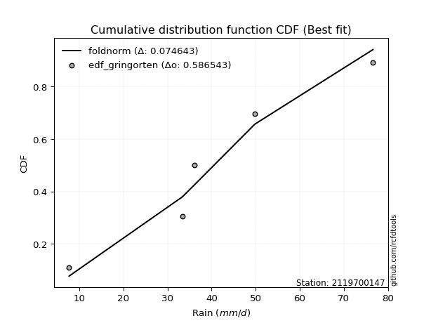</img></img>

</div>


### 9. EDF Filliben (1975)

The specific values of the constants (0.3175) (often denoted as $alpha$) and (0.365) are derived from a method proposed by James J. Filliben in a 1975 paper. This particular formula is the mean value of the $i$-th order statistic of the normal distribution and is considered a robust and effective plotting position formula for the normal probability plot correlation coefficient test for normality.

<div align="center">


$P=(m-0.3175)/(n+0.365)$


</div>


**9.1. Empirical values**

<div align="center">

|                | 0                   | 1                  | 2            | 3                  | 4                  |
|:---------------|:--------------------|:-------------------|:-------------|:-------------------|:-------------------|
| date           | 2023                | 2021               | 2022         | 2019               | 2020               |
| x              | 7.7                 | 33.4               | 36.2         | 49.8               | 76.6               |
| m              | 1                   | 2                  | 3            | 4                  | 5                  |
| empirical_dist | edf_filliben        | edf_filliben       | edf_filliben | edf_filliben       | edf_filliben       |
| empirical      | 0.12721342031686858 | 0.3136067101584343 | 0.5          | 0.6863932898415657 | 0.8727865796831314 |
| empirical_tr   | 1.1457554725040042  | 1.456890699253225  | 2.0          | 3.188707280832095  | 7.860805860805863  |

</div>


**9.2. Kolmogorov-Smirnov fit test (sorted by Δ)**


<div align="center">

|                | 0                   | 1                   | 2                   | 3                   | 4                   | 5                   | 6                   | 7                   | 8                  | 9                   | 10                  | 11                  | 12                 | 13                  | 14                 | 15                  | 16                  | 17                  | 18                  | 19                  | 20                  | 21                 | 22                  | 23                  | 24                  | 25                  | 26                  | 27                  | 28                  | 29                  | 30                  | 31                  | 32                  | 33                  | 34                  | 35                  | 36                  | 37                  | 38                  | 39                  | 40                  | 41                  | 42                  | 43                  | 44                  | 45                  | 46                  | 47                 | 48                  | 49                  | 50                  | 51                  | 52                  | 53                  | 54                  | 55                  | 56                 | 57                  | 58                 | 59                  | 60                 | 61                  | 62                  | 63                  | 64                  | 65                  | 66                  | 67                  | 68                  | 69                  | 70                  | 71                 | 72                  | 73                  | 74                  | 75                  | 76                  | 77                 | 78                  | 79                  | 80                  | 81                  | 82                  | 83                  | 84                  | 85                  | 86                  | 87                 | 88                  | 89                  | 90                  | 91                  | 92                  | 93                  | 94                 | 95                  | 96                  | 97                 | 98                  | 99                  | 100                 | 101                 | 102                 | 103                 | 104                 | 105                 | 106                 | 107                | 108                 | 109                 | 110                | 111                 | 112                | 113                | 114                 | 115                | 116                | 117                | 118                | 119                | 120                 | 121                 | 122                 | 123                | 124                | 125                | 126                | 127                | 128                | 129                | 130                | 131                 | 132                | 133                 | 134                | 135                | 136                 | 137                | 138                | 139                | 140                | 141                | 142                | 143                 | 144                 | 145                 | 146                | 147                | 148                | 149                | 150                | 151                | 152                | 153                | 154                | 155                | 156                | 157                | 158                | 159                |
|:---------------|:--------------------|:--------------------|:--------------------|:--------------------|:--------------------|:--------------------|:--------------------|:--------------------|:-------------------|:--------------------|:--------------------|:--------------------|:-------------------|:--------------------|:-------------------|:--------------------|:--------------------|:--------------------|:--------------------|:--------------------|:--------------------|:-------------------|:--------------------|:--------------------|:--------------------|:--------------------|:--------------------|:--------------------|:--------------------|:--------------------|:--------------------|:--------------------|:--------------------|:--------------------|:--------------------|:--------------------|:--------------------|:--------------------|:--------------------|:--------------------|:--------------------|:--------------------|:--------------------|:--------------------|:--------------------|:--------------------|:--------------------|:-------------------|:--------------------|:--------------------|:--------------------|:--------------------|:--------------------|:--------------------|:--------------------|:--------------------|:-------------------|:--------------------|:-------------------|:--------------------|:-------------------|:--------------------|:--------------------|:--------------------|:--------------------|:--------------------|:--------------------|:--------------------|:--------------------|:--------------------|:--------------------|:-------------------|:--------------------|:--------------------|:--------------------|:--------------------|:--------------------|:-------------------|:--------------------|:--------------------|:--------------------|:--------------------|:--------------------|:--------------------|:--------------------|:--------------------|:--------------------|:-------------------|:--------------------|:--------------------|:--------------------|:--------------------|:--------------------|:--------------------|:-------------------|:--------------------|:--------------------|:-------------------|:--------------------|:--------------------|:--------------------|:--------------------|:--------------------|:--------------------|:--------------------|:--------------------|:--------------------|:-------------------|:--------------------|:--------------------|:-------------------|:--------------------|:-------------------|:-------------------|:--------------------|:-------------------|:-------------------|:-------------------|:-------------------|:-------------------|:--------------------|:--------------------|:--------------------|:-------------------|:-------------------|:-------------------|:-------------------|:-------------------|:-------------------|:-------------------|:-------------------|:--------------------|:-------------------|:--------------------|:-------------------|:-------------------|:--------------------|:-------------------|:-------------------|:-------------------|:-------------------|:-------------------|:-------------------|:--------------------|:--------------------|:--------------------|:-------------------|:-------------------|:-------------------|:-------------------|:-------------------|:-------------------|:-------------------|:-------------------|:-------------------|:-------------------|:-------------------|:-------------------|:-------------------|:-------------------|
| station        | 2119700147          | 2119700147          | 2119700147          | 2119700147          | 2119700147          | 2119700147          | 2119700147          | 2119700147          | 2119700147         | 2119700147          | 2119700147          | 2119700147          | 2119700147         | 2119700147          | 2119700147         | 2119700147          | 2119700147          | 2119700147          | 2119700147          | 2119700147          | 2119700147          | 2119700147         | 2119700147          | 2119700147          | 2119700147          | 2119700147          | 2119700147          | 2119700147          | 2119700147          | 2119700147          | 2119700147          | 2119700147          | 2119700147          | 2119700147          | 2119700147          | 2119700147          | 2119700147          | 2119700147          | 2119700147          | 2119700147          | 2119700147          | 2119700147          | 2119700147          | 2119700147          | 2119700147          | 2119700147          | 2119700147          | 2119700147         | 2119700147          | 2119700147          | 2119700147          | 2119700147          | 2119700147          | 2119700147          | 2119700147          | 2119700147          | 2119700147         | 2119700147          | 2119700147         | 2119700147          | 2119700147         | 2119700147          | 2119700147          | 2119700147          | 2119700147          | 2119700147          | 2119700147          | 2119700147          | 2119700147          | 2119700147          | 2119700147          | 2119700147         | 2119700147          | 2119700147          | 2119700147          | 2119700147          | 2119700147          | 2119700147         | 2119700147          | 2119700147          | 2119700147          | 2119700147          | 2119700147          | 2119700147          | 2119700147          | 2119700147          | 2119700147          | 2119700147         | 2119700147          | 2119700147          | 2119700147          | 2119700147          | 2119700147          | 2119700147          | 2119700147         | 2119700147          | 2119700147          | 2119700147         | 2119700147          | 2119700147          | 2119700147          | 2119700147          | 2119700147          | 2119700147          | 2119700147          | 2119700147          | 2119700147          | 2119700147         | 2119700147          | 2119700147          | 2119700147         | 2119700147          | 2119700147         | 2119700147         | 2119700147          | 2119700147         | 2119700147         | 2119700147         | 2119700147         | 2119700147         | 2119700147          | 2119700147          | 2119700147          | 2119700147         | 2119700147         | 2119700147         | 2119700147         | 2119700147         | 2119700147         | 2119700147         | 2119700147         | 2119700147          | 2119700147         | 2119700147          | 2119700147         | 2119700147         | 2119700147          | 2119700147         | 2119700147         | 2119700147         | 2119700147         | 2119700147         | 2119700147         | 2119700147          | 2119700147          | 2119700147          | 2119700147         | 2119700147         | 2119700147         | 2119700147         | 2119700147         | 2119700147         | 2119700147         | 2119700147         | 2119700147         | 2119700147         | 2119700147         | 2119700147         | 2119700147         | 2119700147         |
| empirical_dist | edf_filliben        | edf_filliben        | edf_filliben        | edf_filliben        | edf_filliben        | edf_filliben        | edf_filliben        | edf_filliben        | edf_filliben       | edf_filliben        | edf_filliben        | edf_filliben        | edf_filliben       | edf_filliben        | edf_filliben       | edf_filliben        | edf_filliben        | edf_filliben        | edf_filliben        | edf_filliben        | edf_filliben        | edf_filliben       | edf_filliben        | edf_filliben        | edf_filliben        | edf_filliben        | edf_filliben        | edf_filliben        | edf_filliben        | edf_filliben        | edf_filliben        | edf_filliben        | edf_filliben        | edf_filliben        | edf_filliben        | edf_filliben        | edf_filliben        | edf_filliben        | edf_filliben        | edf_filliben        | edf_filliben        | edf_filliben        | edf_filliben        | edf_filliben        | edf_filliben        | edf_filliben        | edf_filliben        | edf_filliben       | edf_filliben        | edf_filliben        | edf_filliben        | edf_filliben        | edf_filliben        | edf_filliben        | edf_filliben        | edf_filliben        | edf_filliben       | edf_filliben        | edf_filliben       | edf_filliben        | edf_filliben       | edf_filliben        | edf_filliben        | edf_filliben        | edf_filliben        | edf_filliben        | edf_filliben        | edf_filliben        | edf_filliben        | edf_filliben        | edf_filliben        | edf_filliben       | edf_filliben        | edf_filliben        | edf_filliben        | edf_filliben        | edf_filliben        | edf_filliben       | edf_filliben        | edf_filliben        | edf_filliben        | edf_filliben        | edf_filliben        | edf_filliben        | edf_filliben        | edf_filliben        | edf_filliben        | edf_filliben       | edf_filliben        | edf_filliben        | edf_filliben        | edf_filliben        | edf_filliben        | edf_filliben        | edf_filliben       | edf_filliben        | edf_filliben        | edf_filliben       | edf_filliben        | edf_filliben        | edf_filliben        | edf_filliben        | edf_filliben        | edf_filliben        | edf_filliben        | edf_filliben        | edf_filliben        | edf_filliben       | edf_filliben        | edf_filliben        | edf_filliben       | edf_filliben        | edf_filliben       | edf_filliben       | edf_filliben        | edf_filliben       | edf_filliben       | edf_filliben       | edf_filliben       | edf_filliben       | edf_filliben        | edf_filliben        | edf_filliben        | edf_filliben       | edf_filliben       | edf_filliben       | edf_filliben       | edf_filliben       | edf_filliben       | edf_filliben       | edf_filliben       | edf_filliben        | edf_filliben       | edf_filliben        | edf_filliben       | edf_filliben       | edf_filliben        | edf_filliben       | edf_filliben       | edf_filliben       | edf_filliben       | edf_filliben       | edf_filliben       | edf_filliben        | edf_filliben        | edf_filliben        | edf_filliben       | edf_filliben       | edf_filliben       | edf_filliben       | edf_filliben       | edf_filliben       | edf_filliben       | edf_filliben       | edf_filliben       | edf_filliben       | edf_filliben       | edf_filliben       | edf_filliben       | edf_filliben       |
| p_dist         | pearson3            | logjohnsonsu        | genextreme          | foldnorm            | anglit              | johnsonsu           | exponnorm           | nct                 | t                  | crystalball         | norm                | truncnorm           | fatiguelife        | erlang              | skewnorm           | semicircular        | betaprime           | gamma               | f                   | genlogistic         | cosine              | rice               | invgamma            | logistic            | logmielke           | maxwell             | ksone               | gompertz            | dweibull            | invgauss            | hypsecant           | logargus            | logdgamma           | logt                | logdweibull         | rayleigh            | weibull_min         | logburr             | burr                | gumbel_r            | mielke              | invweibull          | dgamma              | logweibull_min      | laplace             | logloglaplace       | logloggamma         | wrapcauchy         | logvonmises_line    | vonmises_line       | kappa3              | loggenextreme       | tukeylambda         | kappa4              | arcsine             | uniform             | truncpareto        | logburr12           | loggennorm         | loggumbel_l         | moyal              | kstwobign           | logpearson3         | halfnorm            | argus               | gennorm             | logtrapezoid        | bradford            | gumbel_l            | loggenhalflogistic  | gausshyper          | halflogistic       | loggompertz         | logskewnorm         | loglevy_l           | genpareto           | truncexpon          | wald               | logtriang           | beta                | logarcsine          | logsemicircular     | levy_l              | loganglit           | logbeta             | logfoldnorm         | lognct              | logexponnorm       | lognorm             | logcrystalball      | logfatiguelife      | logf                | loglogistic         | loghypsecant        | logerlang          | logncf              | logbetaprime        | logrice            | loggamma            | loggamma            | logalpha            | loglaplace          | loglaplace          | loginvgamma         | lomax               | genhalflogistic     | logmaxwell          | loginvgauss        | gengamma            | genexpon            | loginvweibull      | lograyleigh         | logcosine          | exponweib          | logwrapcauchy       | truncweibull_min   | loggausshyper      | ncf                | loggenpareto       | logkstwobign       | loggumbel_r         | loghalfnorm         | logweibull_max      | triang             | halfgennorm        | logmoyal           | loghalflogistic    | logksone           | loggenexpon        | exponpow           | alpha              | nakagami            | lognakagami        | logkappa4           | burr12             | loglomax           | logkappa3           | loguniform         | logtruncnorm       | trapezoid          | logjohnsonsb       | logexponweib       | logwald            | logbradford         | logtruncexpon       | logtruncweibull_min | logrdist           | logexponpow        | logtukeylambda     | loggengamma        | johnsonsb          | weibull_max        | powerlaw           | rdist              | logpowerlaw        | logtruncpareto     | loggenlogistic     | loghalfgennorm     | logvonmises        | vonmises           |
| delta          | 0.06881875367222506 | 0.07378045933401411 | 0.07378382249272186 | 0.07381955586266248 | 0.07586400581177583 | 0.07804461857306177 | 0.07877025899429602 | 0.07984415884703422 | 0.0799079670069307 | 0.07990959243090162 | 0.07990959663147079 | 0.07990961965929244 | 0.0805809977913361 | 0.08174550663476582 | 0.0817717749294391 | 0.08307451088383072 | 0.08443781664888461 | 0.08454662465943857 | 0.08517472572450441 | 0.08521855540977125 | 0.08586205351753617 | 0.0860740554659622 | 0.08919595175826073 | 0.09043762565707714 | 0.09148481812321319 | 0.09168385028960879 | 0.09227498234639558 | 0.09378400983197654 | 0.09649756682186589 | 0.09694722356648539 | 0.09918592304645263 | 0.09933387218258422 | 0.09976891240280768 | 0.10241187478629898 | 0.10306460492427488 | 0.10393936693949385 | 0.10641798055737611 | 0.11047615650799647 | 0.11221468008556967 | 0.11255091138024592 | 0.11268937136766566 | 0.12064474258069469 | 0.12138644181263736 | 0.12237690927572747 | 0.12406559837420711 | 0.12459356083226575 | 0.12717281370532907 | 0.1272124330493409 | 0.12721341482286697 | 0.12721341926026775 | 0.12721342008973804 | 0.12721342031686045 | 0.12721342031686148 | 0.12721342031686667 | 0.12721342031686858 | 0.12721342031686858 | 0.1272134236482626 | 0.13138284656969007 | 0.1326015422064143 | 0.13288105115027787 | 0.1330163769912634 | 0.13459765237569749 | 0.13841963339752922 | 0.13878444983322058 | 0.13986546267855582 | 0.14321268971102574 | 0.14368921061430734 | 0.14740142117854776 | 0.14823461126812704 | 0.14915245691063905 | 0.14952320633348343 | 0.1504549937619855 | 0.15173082696385448 | 0.16015120458019078 | 0.16647683110835487 | 0.17579831675032676 | 0.18336013221448144 | 0.1851456065121337 | 0.19067321641001606 | 0.19396795961982438 | 0.19553246153975706 | 0.19931633438097457 | 0.19988945051308793 | 0.20027054724661403 | 0.20029630982940233 | 0.20049406403873565 | 0.20229722906554654 | 0.2025863593195208 | 0.20258658767963805 | 0.20258659478958213 | 0.20293126071284034 | 0.20332733062462677 | 0.20479582202062246 | 0.20668040687975914 | 0.208556195604723  | 0.20940911443763116 | 0.21021222170279869 | 0.2119294243660022 | 0.21282564122523479 | 0.21282564122523479 | 0.21393839904836748 | 0.21429435087169918 | 0.21429435087169918 | 0.21547143722617296 | 0.22588954250497278 | 0.23286247378344227 | 0.23491863582862388 | 0.2366420351641359 | 0.23834669334440423 | 0.23838517656371844 | 0.2407059889771554 | 0.24556051822989505 | 0.2517396719310712 | 0.2544891184393672 | 0.25966317526405375 | 0.2681710316434975 | 0.268346515961335  | 0.2697060092166241 | 0.2704623209687123 | 0.2726622132085195 | 0.27325246670469133 | 0.27552392583535906 | 0.28195484691145295 | 0.2823074250705613 | 0.2957151764995101 | 0.2989159183252709 | 0.3013752081345156 | 0.3019770012320497 | 0.3039634298370611 | 0.3055446429340061 | 0.3130084647036679 | 0.31308702300207486 | 0.3136016082656669 | 0.31600034008192596 | 0.321085736714762  | 0.3236140081928696 | 0.32507538164914457 | 0.3250937435101466 | 0.3258103292479352 | 0.3353069412283801 | 0.3403081990341519 | 0.3515005208713698 | 0.3702112585530351 | 0.40219391751085093 | 0.41467624734822445 | 0.4195411546626923  | 0.4340497047757495 | 0.4643406583513258 | 0.4662716997531052 | 0.490546009129665  | 0.5400813466535437 | 0.5544190842907968 | 0.5737300480810166 | 0.5774488192025369 | 0.6279652130596922 | 0.6414830987414804 | 0.6863932898415657 | 0.6863932898415657 | 1.1542538824708588 | 11.711842525887914 |
| deltao         | 0.5865427407550001  | 0.5865427407550001  | 0.5865427407550001  | 0.5865427407550001  | 0.5865427407550001  | 0.5865427407550001  | 0.5865427407550001  | 0.5865427407550001  | 0.5865427407550001 | 0.5865427407550001  | 0.5865427407550001  | 0.5865427407550001  | 0.5865427407550001 | 0.5865427407550001  | 0.5865427407550001 | 0.5865427407550001  | 0.5865427407550001  | 0.5865427407550001  | 0.5865427407550001  | 0.5865427407550001  | 0.5865427407550001  | 0.5865427407550001 | 0.5865427407550001  | 0.5865427407550001  | 0.5865427407550001  | 0.5865427407550001  | 0.5865427407550001  | 0.5865427407550001  | 0.5865427407550001  | 0.5865427407550001  | 0.5865427407550001  | 0.5865427407550001  | 0.5865427407550001  | 0.5865427407550001  | 0.5865427407550001  | 0.5865427407550001  | 0.5865427407550001  | 0.5865427407550001  | 0.5865427407550001  | 0.5865427407550001  | 0.5865427407550001  | 0.5865427407550001  | 0.5865427407550001  | 0.5865427407550001  | 0.5865427407550001  | 0.5865427407550001  | 0.5865427407550001  | 0.5865427407550001 | 0.5865427407550001  | 0.5865427407550001  | 0.5865427407550001  | 0.5865427407550001  | 0.5865427407550001  | 0.5865427407550001  | 0.5865427407550001  | 0.5865427407550001  | 0.5865427407550001 | 0.5865427407550001  | 0.5865427407550001 | 0.5865427407550001  | 0.5865427407550001 | 0.5865427407550001  | 0.5865427407550001  | 0.5865427407550001  | 0.5865427407550001  | 0.5865427407550001  | 0.5865427407550001  | 0.5865427407550001  | 0.5865427407550001  | 0.5865427407550001  | 0.5865427407550001  | 0.5865427407550001 | 0.5865427407550001  | 0.5865427407550001  | 0.5865427407550001  | 0.5865427407550001  | 0.5865427407550001  | 0.5865427407550001 | 0.5865427407550001  | 0.5865427407550001  | 0.5865427407550001  | 0.5865427407550001  | 0.5865427407550001  | 0.5865427407550001  | 0.5865427407550001  | 0.5865427407550001  | 0.5865427407550001  | 0.5865427407550001 | 0.5865427407550001  | 0.5865427407550001  | 0.5865427407550001  | 0.5865427407550001  | 0.5865427407550001  | 0.5865427407550001  | 0.5865427407550001 | 0.5865427407550001  | 0.5865427407550001  | 0.5865427407550001 | 0.5865427407550001  | 0.5865427407550001  | 0.5865427407550001  | 0.5865427407550001  | 0.5865427407550001  | 0.5865427407550001  | 0.5865427407550001  | 0.5865427407550001  | 0.5865427407550001  | 0.5865427407550001 | 0.5865427407550001  | 0.5865427407550001  | 0.5865427407550001 | 0.5865427407550001  | 0.5865427407550001 | 0.5865427407550001 | 0.5865427407550001  | 0.5865427407550001 | 0.5865427407550001 | 0.5865427407550001 | 0.5865427407550001 | 0.5865427407550001 | 0.5865427407550001  | 0.5865427407550001  | 0.5865427407550001  | 0.5865427407550001 | 0.5865427407550001 | 0.5865427407550001 | 0.5865427407550001 | 0.5865427407550001 | 0.5865427407550001 | 0.5865427407550001 | 0.5865427407550001 | 0.5865427407550001  | 0.5865427407550001 | 0.5865427407550001  | 0.5865427407550001 | 0.5865427407550001 | 0.5865427407550001  | 0.5865427407550001 | 0.5865427407550001 | 0.5865427407550001 | 0.5865427407550001 | 0.5865427407550001 | 0.5865427407550001 | 0.5865427407550001  | 0.5865427407550001  | 0.5865427407550001  | 0.5865427407550001 | 0.5865427407550001 | 0.5865427407550001 | 0.5865427407550001 | 0.5865427407550001 | 0.5865427407550001 | 0.5865427407550001 | 0.5865427407550001 | 0.5865427407550001 | 0.5865427407550001 | 0.5865427407550001 | 0.5865427407550001 | 0.5865427407550001 | 0.5865427407550001 |
| eval           | Δo > Δ              | Δo > Δ              | Δo > Δ              | Δo > Δ              | Δo > Δ              | Δo > Δ              | Δo > Δ              | Δo > Δ              | Δo > Δ             | Δo > Δ              | Δo > Δ              | Δo > Δ              | Δo > Δ             | Δo > Δ              | Δo > Δ             | Δo > Δ              | Δo > Δ              | Δo > Δ              | Δo > Δ              | Δo > Δ              | Δo > Δ              | Δo > Δ             | Δo > Δ              | Δo > Δ              | Δo > Δ              | Δo > Δ              | Δo > Δ              | Δo > Δ              | Δo > Δ              | Δo > Δ              | Δo > Δ              | Δo > Δ              | Δo > Δ              | Δo > Δ              | Δo > Δ              | Δo > Δ              | Δo > Δ              | Δo > Δ              | Δo > Δ              | Δo > Δ              | Δo > Δ              | Δo > Δ              | Δo > Δ              | Δo > Δ              | Δo > Δ              | Δo > Δ              | Δo > Δ              | Δo > Δ             | Δo > Δ              | Δo > Δ              | Δo > Δ              | Δo > Δ              | Δo > Δ              | Δo > Δ              | Δo > Δ              | Δo > Δ              | Δo > Δ             | Δo > Δ              | Δo > Δ             | Δo > Δ              | Δo > Δ             | Δo > Δ              | Δo > Δ              | Δo > Δ              | Δo > Δ              | Δo > Δ              | Δo > Δ              | Δo > Δ              | Δo > Δ              | Δo > Δ              | Δo > Δ              | Δo > Δ             | Δo > Δ              | Δo > Δ              | Δo > Δ              | Δo > Δ              | Δo > Δ              | Δo > Δ             | Δo > Δ              | Δo > Δ              | Δo > Δ              | Δo > Δ              | Δo > Δ              | Δo > Δ              | Δo > Δ              | Δo > Δ              | Δo > Δ              | Δo > Δ             | Δo > Δ              | Δo > Δ              | Δo > Δ              | Δo > Δ              | Δo > Δ              | Δo > Δ              | Δo > Δ             | Δo > Δ              | Δo > Δ              | Δo > Δ             | Δo > Δ              | Δo > Δ              | Δo > Δ              | Δo > Δ              | Δo > Δ              | Δo > Δ              | Δo > Δ              | Δo > Δ              | Δo > Δ              | Δo > Δ             | Δo > Δ              | Δo > Δ              | Δo > Δ             | Δo > Δ              | Δo > Δ             | Δo > Δ             | Δo > Δ              | Δo > Δ             | Δo > Δ             | Δo > Δ             | Δo > Δ             | Δo > Δ             | Δo > Δ              | Δo > Δ              | Δo > Δ              | Δo > Δ             | Δo > Δ             | Δo > Δ             | Δo > Δ             | Δo > Δ             | Δo > Δ             | Δo > Δ             | Δo > Δ             | Δo > Δ              | Δo > Δ             | Δo > Δ              | Δo > Δ             | Δo > Δ             | Δo > Δ              | Δo > Δ             | Δo > Δ             | Δo > Δ             | Δo > Δ             | Δo > Δ             | Δo > Δ             | Δo > Δ              | Δo > Δ              | Δo > Δ              | Δo > Δ             | Δo > Δ             | Δo > Δ             | Δo > Δ             | Δo > Δ             | Δo > Δ             | Δo > Δ             | Δo > Δ             | Δo <= Δ            | Δo <= Δ            | Δo <= Δ            | Δo <= Δ            | Δo <= Δ            | Δo <= Δ            |
| fit            | 1                   | 1                   | 1                   | 1                   | 1                   | 1                   | 1                   | 1                   | 1                  | 1                   | 1                   | 1                   | 1                  | 1                   | 1                  | 1                   | 1                   | 1                   | 1                   | 1                   | 1                   | 1                  | 1                   | 1                   | 1                   | 1                   | 1                   | 1                   | 1                   | 1                   | 1                   | 1                   | 1                   | 1                   | 1                   | 1                   | 1                   | 1                   | 1                   | 1                   | 1                   | 1                   | 1                   | 1                   | 1                   | 1                   | 1                   | 1                  | 1                   | 1                   | 1                   | 1                   | 1                   | 1                   | 1                   | 1                   | 1                  | 1                   | 1                  | 1                   | 1                  | 1                   | 1                   | 1                   | 1                   | 1                   | 1                   | 1                   | 1                   | 1                   | 1                   | 1                  | 1                   | 1                   | 1                   | 1                   | 1                   | 1                  | 1                   | 1                   | 1                   | 1                   | 1                   | 1                   | 1                   | 1                   | 1                   | 1                  | 1                   | 1                   | 1                   | 1                   | 1                   | 1                   | 1                  | 1                   | 1                   | 1                  | 1                   | 1                   | 1                   | 1                   | 1                   | 1                   | 1                   | 1                   | 1                   | 1                  | 1                   | 1                   | 1                  | 1                   | 1                  | 1                  | 1                   | 1                  | 1                  | 1                  | 1                  | 1                  | 1                   | 1                   | 1                   | 1                  | 1                  | 1                  | 1                  | 1                  | 1                  | 1                  | 1                  | 1                   | 1                  | 1                   | 1                  | 1                  | 1                   | 1                  | 1                  | 1                  | 1                  | 1                  | 1                  | 1                   | 1                   | 1                   | 1                  | 1                  | 1                  | 1                  | 1                  | 1                  | 1                  | 1                  | 0                  | 0                  | 0                  | 0                  | 0                  | 0                  |
| n              | 5                   | 5                   | 5                   | 5                   | 5                   | 5                   | 5                   | 5                   | 5                  | 5                   | 5                   | 5                   | 5                  | 5                   | 5                  | 5                   | 5                   | 5                   | 5                   | 5                   | 5                   | 5                  | 5                   | 5                   | 5                   | 5                   | 5                   | 5                   | 5                   | 5                   | 5                   | 5                   | 5                   | 5                   | 5                   | 5                   | 5                   | 5                   | 5                   | 5                   | 5                   | 5                   | 5                   | 5                   | 5                   | 5                   | 5                   | 5                  | 5                   | 5                   | 5                   | 5                   | 5                   | 5                   | 5                   | 5                   | 5                  | 5                   | 5                  | 5                   | 5                  | 5                   | 5                   | 5                   | 5                   | 5                   | 5                   | 5                   | 5                   | 5                   | 5                   | 5                  | 5                   | 5                   | 5                   | 5                   | 5                   | 5                  | 5                   | 5                   | 5                   | 5                   | 5                   | 5                   | 5                   | 5                   | 5                   | 5                  | 5                   | 5                   | 5                   | 5                   | 5                   | 5                   | 5                  | 5                   | 5                   | 5                  | 5                   | 5                   | 5                   | 5                   | 5                   | 5                   | 5                   | 5                   | 5                   | 5                  | 5                   | 5                   | 5                  | 5                   | 5                  | 5                  | 5                   | 5                  | 5                  | 5                  | 5                  | 5                  | 5                   | 5                   | 5                   | 5                  | 5                  | 5                  | 5                  | 5                  | 5                  | 5                  | 5                  | 5                   | 5                  | 5                   | 5                  | 5                  | 5                   | 5                  | 5                  | 5                  | 5                  | 5                  | 5                  | 5                   | 5                   | 5                   | 5                  | 5                  | 5                  | 5                  | 5                  | 5                  | 5                  | 5                  | 5                  | 5                  | 5                  | 5                  | 5                  | 5                  |
| best_fit       | 1                   | 0                   | 0                   | 0                   | 0                   | 0                   | 0                   | 0                   | 0                  | 0                   | 0                   | 0                   | 0                  | 0                   | 0                  | 0                   | 0                   | 0                   | 0                   | 0                   | 0                   | 0                  | 0                   | 0                   | 0                   | 0                   | 0                   | 0                   | 0                   | 0                   | 0                   | 0                   | 0                   | 0                   | 0                   | 0                   | 0                   | 0                   | 0                   | 0                   | 0                   | 0                   | 0                   | 0                   | 0                   | 0                   | 0                   | 0                  | 0                   | 0                   | 0                   | 0                   | 0                   | 0                   | 0                   | 0                   | 0                  | 0                   | 0                  | 0                   | 0                  | 0                   | 0                   | 0                   | 0                   | 0                   | 0                   | 0                   | 0                   | 0                   | 0                   | 0                  | 0                   | 0                   | 0                   | 0                   | 0                   | 0                  | 0                   | 0                   | 0                   | 0                   | 0                   | 0                   | 0                   | 0                   | 0                   | 0                  | 0                   | 0                   | 0                   | 0                   | 0                   | 0                   | 0                  | 0                   | 0                   | 0                  | 0                   | 0                   | 0                   | 0                   | 0                   | 0                   | 0                   | 0                   | 0                   | 0                  | 0                   | 0                   | 0                  | 0                   | 0                  | 0                  | 0                   | 0                  | 0                  | 0                  | 0                  | 0                  | 0                   | 0                   | 0                   | 0                  | 0                  | 0                  | 0                  | 0                  | 0                  | 0                  | 0                  | 0                   | 0                  | 0                   | 0                  | 0                  | 0                   | 0                  | 0                  | 0                  | 0                  | 0                  | 0                  | 0                   | 0                   | 0                   | 0                  | 0                  | 0                  | 0                  | 0                  | 0                  | 0                  | 0                  | 0                  | 0                  | 0                  | 0                  | 0                  | 0                  |
| best_fit_sort  | 1                   | 2                   | 3                   | 4                   | 5                   | 6                   | 7                   | 8                   | 9                  | 10                  | 11                  | 12                  | 13                 | 14                  | 15                 | 16                  | 17                  | 18                  | 19                  | 20                  | 21                  | 22                 | 23                  | 24                  | 25                  | 26                  | 27                  | 28                  | 29                  | 30                  | 31                  | 32                  | 33                  | 34                  | 35                  | 36                  | 37                  | 38                  | 39                  | 40                  | 41                  | 42                  | 43                  | 44                  | 45                  | 46                  | 47                  | 48                 | 49                  | 50                  | 51                  | 52                  | 53                  | 54                  | 55                  | 56                  | 57                 | 58                  | 59                 | 60                  | 61                 | 62                  | 63                  | 64                  | 65                  | 66                  | 67                  | 68                  | 69                  | 70                  | 71                  | 72                 | 73                  | 74                  | 75                  | 76                  | 77                  | 78                 | 79                  | 80                  | 81                  | 82                  | 83                  | 84                  | 85                  | 86                  | 87                  | 88                 | 89                  | 90                  | 91                  | 92                  | 93                  | 94                  | 95                 | 96                  | 97                  | 98                 | 99                  | 100                 | 101                 | 102                 | 103                 | 104                 | 105                 | 106                 | 107                 | 108                | 109                 | 110                 | 111                | 112                 | 113                | 114                | 115                 | 116                | 117                | 118                | 119                | 120                | 121                 | 122                 | 123                 | 124                | 125                | 126                | 127                | 128                | 129                | 130                | 131                | 132                 | 133                | 134                 | 135                | 136                | 137                 | 138                | 139                | 140                | 141                | 142                | 143                | 144                 | 145                 | 146                 | 147                | 148                | 149                | 150                | 151                | 152                | 153                | 154                | 155                | 156                | 157                | 158                | 159                | 160                |

</div>


**9.3. Best fit**

<div align="center">

|   id |    station | empirical_dist   | p_dist   |     delta |   deltao | eval   |   fit |   n |   best_fit |   best_fit_sort |
|-----:|-----------:|:-----------------|:---------|----------:|---------:|:-------|------:|----:|-----------:|----------------:|
|    0 | 2119700147 | edf_filliben     | pearson3 | 0.0688188 | 0.586543 | Δo > Δ |     1 |   5 |          1 |               1 |

</div>


<div align="center">

</img>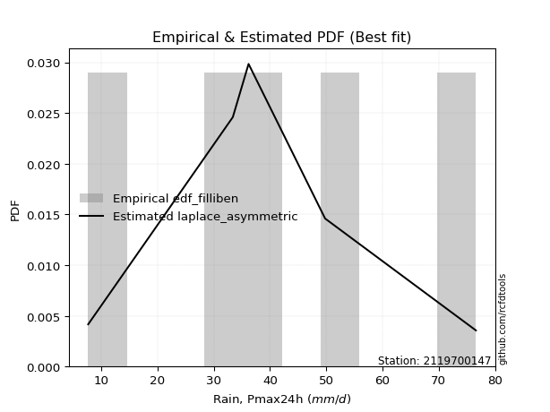</img>

</div>


### 10. EDF Jenkinson (1977)

The Jenkinson formula in hydrology is an empirical plotting position formula used to estimate the non-exceedance probability _(P)_ or return period _(T)_ of a given ordered observation within a sample. It is a widely used method in the frequency analysis of extreme events such as floods and rainfall, as it provides a distribution-free way to plot data. _a≈0.31_ and _b≈0.38_ are constants derived to approximate the median of the probability distribution for the given rank.

<div align="center">


$P=(m-a)/(n+b)$


</div>


**10.1. Empirical values**

<div align="center">

|                | 0                   | 1                  | 2             | 3                  | 4                  |
|:---------------|:--------------------|:-------------------|:--------------|:-------------------|:-------------------|
| date           | 2023                | 2021               | 2022          | 2019               | 2020               |
| x              | 7.7                 | 33.4               | 36.2          | 49.8               | 76.6               |
| m              | 1                   | 2                  | 3             | 4                  | 5                  |
| empirical_dist | edf_jenkinson       | edf_jenkinson      | edf_jenkinson | edf_jenkinson      | edf_jenkinson      |
| empirical      | 0.12825278810408922 | 0.3141263940520446 | 0.5           | 0.6858736059479554 | 0.8717472118959109 |
| empirical_tr   | 1.1471215351812367  | 1.4579945799457996 | 2.0           | 3.183431952662722  | 7.797101449275368  |

</div>


**10.2. Kolmogorov-Smirnov fit test (sorted by Δ)**


<div align="center">

|                | 0                   | 1                   | 2                  | 3                   | 4                   | 5                   | 6                   | 7                   | 8                  | 9                   | 10                  | 11                  | 12                  | 13                  | 14                  | 15                  | 16                  | 17                  | 18                  | 19                 | 20                  | 21                  | 22                  | 23                  | 24                  | 25                  | 26                  | 27                  | 28                  | 29                  | 30                  | 31                  | 32                  | 33                  | 34                  | 35                 | 36                  | 37                  | 38                  | 39                  | 40                  | 41                  | 42                  | 43                  | 44                  | 45                 | 46                  | 47                  | 48                 | 49                  | 50                  | 51                  | 52                 | 53                 | 54                  | 55                  | 56                  | 57                  | 58                  | 59                  | 60                  | 61                  | 62                  | 63                  | 64                  | 65                 | 66                  | 67                  | 68                  | 69                 | 70                  | 71                  | 72                  | 73                  | 74                  | 75                  | 76                 | 77                  | 78                 | 79                  | 80                  | 81                  | 82                 | 83                  | 84                 | 85                 | 86                 | 87                  | 88                 | 89                  | 90                 | 91                  | 92                  | 93                 | 94                  | 95                  | 96                  | 97                  | 98                  | 99                  | 100                 | 101                 | 102                 | 103                | 104                 | 105                 | 106                 | 107                 | 108                 | 109                | 110                 | 111                | 112                | 113                | 114                | 115                 | 116                | 117                 | 118                 | 119                | 120                | 121                | 122                | 123                | 124                | 125                | 126                | 127                 | 128                 | 129                | 130                 | 131                | 132                 | 133                | 134                 | 135                | 136                | 137                 | 138                | 139                | 140                 | 141                 | 142                 | 143                | 144                | 145                 | 146                 | 147                | 148                 | 149                 | 150                | 151                | 152                | 153                | 154                | 155                | 156                | 157                | 158                | 159                |
|:---------------|:--------------------|:--------------------|:-------------------|:--------------------|:--------------------|:--------------------|:--------------------|:--------------------|:-------------------|:--------------------|:--------------------|:--------------------|:--------------------|:--------------------|:--------------------|:--------------------|:--------------------|:--------------------|:--------------------|:-------------------|:--------------------|:--------------------|:--------------------|:--------------------|:--------------------|:--------------------|:--------------------|:--------------------|:--------------------|:--------------------|:--------------------|:--------------------|:--------------------|:--------------------|:--------------------|:-------------------|:--------------------|:--------------------|:--------------------|:--------------------|:--------------------|:--------------------|:--------------------|:--------------------|:--------------------|:-------------------|:--------------------|:--------------------|:-------------------|:--------------------|:--------------------|:--------------------|:-------------------|:-------------------|:--------------------|:--------------------|:--------------------|:--------------------|:--------------------|:--------------------|:--------------------|:--------------------|:--------------------|:--------------------|:--------------------|:-------------------|:--------------------|:--------------------|:--------------------|:-------------------|:--------------------|:--------------------|:--------------------|:--------------------|:--------------------|:--------------------|:-------------------|:--------------------|:-------------------|:--------------------|:--------------------|:--------------------|:-------------------|:--------------------|:-------------------|:-------------------|:-------------------|:--------------------|:-------------------|:--------------------|:-------------------|:--------------------|:--------------------|:-------------------|:--------------------|:--------------------|:--------------------|:--------------------|:--------------------|:--------------------|:--------------------|:--------------------|:--------------------|:-------------------|:--------------------|:--------------------|:--------------------|:--------------------|:--------------------|:-------------------|:--------------------|:-------------------|:-------------------|:-------------------|:-------------------|:--------------------|:-------------------|:--------------------|:--------------------|:-------------------|:-------------------|:-------------------|:-------------------|:-------------------|:-------------------|:-------------------|:-------------------|:--------------------|:--------------------|:-------------------|:--------------------|:-------------------|:--------------------|:-------------------|:--------------------|:-------------------|:-------------------|:--------------------|:-------------------|:-------------------|:--------------------|:--------------------|:--------------------|:-------------------|:-------------------|:--------------------|:--------------------|:-------------------|:--------------------|:--------------------|:-------------------|:-------------------|:-------------------|:-------------------|:-------------------|:-------------------|:-------------------|:-------------------|:-------------------|:-------------------|
| station        | 2119700147          | 2119700147          | 2119700147         | 2119700147          | 2119700147          | 2119700147          | 2119700147          | 2119700147          | 2119700147         | 2119700147          | 2119700147          | 2119700147          | 2119700147          | 2119700147          | 2119700147          | 2119700147          | 2119700147          | 2119700147          | 2119700147          | 2119700147         | 2119700147          | 2119700147          | 2119700147          | 2119700147          | 2119700147          | 2119700147          | 2119700147          | 2119700147          | 2119700147          | 2119700147          | 2119700147          | 2119700147          | 2119700147          | 2119700147          | 2119700147          | 2119700147         | 2119700147          | 2119700147          | 2119700147          | 2119700147          | 2119700147          | 2119700147          | 2119700147          | 2119700147          | 2119700147          | 2119700147         | 2119700147          | 2119700147          | 2119700147         | 2119700147          | 2119700147          | 2119700147          | 2119700147         | 2119700147         | 2119700147          | 2119700147          | 2119700147          | 2119700147          | 2119700147          | 2119700147          | 2119700147          | 2119700147          | 2119700147          | 2119700147          | 2119700147          | 2119700147         | 2119700147          | 2119700147          | 2119700147          | 2119700147         | 2119700147          | 2119700147          | 2119700147          | 2119700147          | 2119700147          | 2119700147          | 2119700147         | 2119700147          | 2119700147         | 2119700147          | 2119700147          | 2119700147          | 2119700147         | 2119700147          | 2119700147         | 2119700147         | 2119700147         | 2119700147          | 2119700147         | 2119700147          | 2119700147         | 2119700147          | 2119700147          | 2119700147         | 2119700147          | 2119700147          | 2119700147          | 2119700147          | 2119700147          | 2119700147          | 2119700147          | 2119700147          | 2119700147          | 2119700147         | 2119700147          | 2119700147          | 2119700147          | 2119700147          | 2119700147          | 2119700147         | 2119700147          | 2119700147         | 2119700147         | 2119700147         | 2119700147         | 2119700147          | 2119700147         | 2119700147          | 2119700147          | 2119700147         | 2119700147         | 2119700147         | 2119700147         | 2119700147         | 2119700147         | 2119700147         | 2119700147         | 2119700147          | 2119700147          | 2119700147         | 2119700147          | 2119700147         | 2119700147          | 2119700147         | 2119700147          | 2119700147         | 2119700147         | 2119700147          | 2119700147         | 2119700147         | 2119700147          | 2119700147          | 2119700147          | 2119700147         | 2119700147         | 2119700147          | 2119700147          | 2119700147         | 2119700147          | 2119700147          | 2119700147         | 2119700147         | 2119700147         | 2119700147         | 2119700147         | 2119700147         | 2119700147         | 2119700147         | 2119700147         | 2119700147         |
| empirical_dist | edf_jenkinson       | edf_jenkinson       | edf_jenkinson      | edf_jenkinson       | edf_jenkinson       | edf_jenkinson       | edf_jenkinson       | edf_jenkinson       | edf_jenkinson      | edf_jenkinson       | edf_jenkinson       | edf_jenkinson       | edf_jenkinson       | edf_jenkinson       | edf_jenkinson       | edf_jenkinson       | edf_jenkinson       | edf_jenkinson       | edf_jenkinson       | edf_jenkinson      | edf_jenkinson       | edf_jenkinson       | edf_jenkinson       | edf_jenkinson       | edf_jenkinson       | edf_jenkinson       | edf_jenkinson       | edf_jenkinson       | edf_jenkinson       | edf_jenkinson       | edf_jenkinson       | edf_jenkinson       | edf_jenkinson       | edf_jenkinson       | edf_jenkinson       | edf_jenkinson      | edf_jenkinson       | edf_jenkinson       | edf_jenkinson       | edf_jenkinson       | edf_jenkinson       | edf_jenkinson       | edf_jenkinson       | edf_jenkinson       | edf_jenkinson       | edf_jenkinson      | edf_jenkinson       | edf_jenkinson       | edf_jenkinson      | edf_jenkinson       | edf_jenkinson       | edf_jenkinson       | edf_jenkinson      | edf_jenkinson      | edf_jenkinson       | edf_jenkinson       | edf_jenkinson       | edf_jenkinson       | edf_jenkinson       | edf_jenkinson       | edf_jenkinson       | edf_jenkinson       | edf_jenkinson       | edf_jenkinson       | edf_jenkinson       | edf_jenkinson      | edf_jenkinson       | edf_jenkinson       | edf_jenkinson       | edf_jenkinson      | edf_jenkinson       | edf_jenkinson       | edf_jenkinson       | edf_jenkinson       | edf_jenkinson       | edf_jenkinson       | edf_jenkinson      | edf_jenkinson       | edf_jenkinson      | edf_jenkinson       | edf_jenkinson       | edf_jenkinson       | edf_jenkinson      | edf_jenkinson       | edf_jenkinson      | edf_jenkinson      | edf_jenkinson      | edf_jenkinson       | edf_jenkinson      | edf_jenkinson       | edf_jenkinson      | edf_jenkinson       | edf_jenkinson       | edf_jenkinson      | edf_jenkinson       | edf_jenkinson       | edf_jenkinson       | edf_jenkinson       | edf_jenkinson       | edf_jenkinson       | edf_jenkinson       | edf_jenkinson       | edf_jenkinson       | edf_jenkinson      | edf_jenkinson       | edf_jenkinson       | edf_jenkinson       | edf_jenkinson       | edf_jenkinson       | edf_jenkinson      | edf_jenkinson       | edf_jenkinson      | edf_jenkinson      | edf_jenkinson      | edf_jenkinson      | edf_jenkinson       | edf_jenkinson      | edf_jenkinson       | edf_jenkinson       | edf_jenkinson      | edf_jenkinson      | edf_jenkinson      | edf_jenkinson      | edf_jenkinson      | edf_jenkinson      | edf_jenkinson      | edf_jenkinson      | edf_jenkinson       | edf_jenkinson       | edf_jenkinson      | edf_jenkinson       | edf_jenkinson      | edf_jenkinson       | edf_jenkinson      | edf_jenkinson       | edf_jenkinson      | edf_jenkinson      | edf_jenkinson       | edf_jenkinson      | edf_jenkinson      | edf_jenkinson       | edf_jenkinson       | edf_jenkinson       | edf_jenkinson      | edf_jenkinson      | edf_jenkinson       | edf_jenkinson       | edf_jenkinson      | edf_jenkinson       | edf_jenkinson       | edf_jenkinson      | edf_jenkinson      | edf_jenkinson      | edf_jenkinson      | edf_jenkinson      | edf_jenkinson      | edf_jenkinson      | edf_jenkinson      | edf_jenkinson      | edf_jenkinson      |
| p_dist         | pearson3            | foldnorm            | logjohnsonsu       | genextreme          | anglit              | johnsonsu           | exponnorm           | nct                 | t                  | crystalball         | norm                | truncnorm           | fatiguelife         | erlang              | skewnorm            | semicircular        | betaprime           | gamma               | f                   | genlogistic        | rice                | cosine              | invgamma            | logistic            | logmielke           | maxwell             | ksone               | gompertz            | dweibull            | invgauss            | logargus            | hypsecant           | logdgamma           | logt                | logdweibull         | rayleigh           | weibull_min         | logburr             | gumbel_r            | burr                | mielke              | invweibull          | logweibull_min      | dgamma              | laplace             | logloglaplace      | logloggamma         | wrapcauchy          | logvonmises_line   | vonmises_line       | kappa3              | loggenextreme       | tukeylambda        | kappa4             | arcsine             | uniform             | truncpareto         | logburr12           | loggumbel_l         | moyal               | loggennorm          | kstwobign           | logpearson3         | halfnorm            | argus               | logtrapezoid       | gennorm             | bradford            | gumbel_l            | loggenhalflogistic | gausshyper          | halflogistic        | loggompertz         | logskewnorm         | loglevy_l           | genpareto           | truncexpon         | wald                | logtriang          | beta                | logarcsine          | logsemicircular     | levy_l             | loganglit           | logbeta            | logfoldnorm        | lognct             | logexponnorm        | lognorm            | logcrystalball      | logfatiguelife     | logf                | loglogistic         | loghypsecant       | logerlang           | logncf              | logbetaprime        | logrice             | loggamma            | loggamma            | logalpha            | loglaplace          | loglaplace          | loginvgamma        | lomax               | genhalflogistic     | logmaxwell          | loginvgauss         | gengamma            | genexpon           | loginvweibull       | lograyleigh        | logcosine          | exponweib          | logwrapcauchy      | truncweibull_min    | loggausshyper      | ncf                 | loggenpareto        | logkstwobign       | loggumbel_r        | loghalfnorm        | logweibull_max     | triang             | halfgennorm        | logmoyal           | loghalflogistic    | logksone            | loggenexpon         | exponpow           | alpha               | nakagami           | lognakagami         | logkappa4          | burr12              | loglomax           | logkappa3          | loguniform          | logtruncnorm       | trapezoid          | logjohnsonsb        | logexponweib        | logwald             | logbradford        | logtruncexpon      | logtruncweibull_min | logrdist            | logexponpow        | logtukeylambda      | loggengamma         | johnsonsb          | weibull_max        | powerlaw           | rdist              | logpowerlaw        | logtruncpareto     | loggenlogistic     | loghalfgennorm     | logvonmises        | vonmises           |
| delta          | 0.06857764354115564 | 0.07381955586266248 | 0.0748198271212347 | 0.07482319027994244 | 0.07534432191816548 | 0.07752493467945143 | 0.07877025899429602 | 0.07984415884703422 | 0.0799079670069307 | 0.07990959243090162 | 0.07990959663147079 | 0.07990961965929244 | 0.08006131389772575 | 0.08122582274115547 | 0.08125209103582876 | 0.08255482699022038 | 0.08391813275527427 | 0.08402694076582823 | 0.08465504183089406 | 0.0846988715161609 | 0.08555437157235185 | 0.08586205351753617 | 0.08867626786465038 | 0.09043762565707714 | 0.09096513422960295 | 0.09116416639599845 | 0.09175529845278524 | 0.09378400983197654 | 0.09597788292825554 | 0.09642753967287504 | 0.09881418828897387 | 0.09918592304645263 | 0.10080828019002831 | 0.10241187478629898 | 0.10254492103066454 | 0.1034196830458835 | 0.10589829666376577 | 0.11151552429521705 | 0.11203122748663558 | 0.11325404787279025 | 0.11372873915488624 | 0.12012505868708434 | 0.12185722538211713 | 0.12190612570624759 | 0.12406559837420711 | 0.1240738769386554 | 0.12821218149254965 | 0.12825180083656154 | 0.1282527826100876 | 0.12825278704748838 | 0.12825278787695868 | 0.12825278810408103 | 0.1282527881040821 | 0.1282527881040873 | 0.12825278810408922 | 0.12825278810408922 | 0.12825279143548318 | 0.13086316267607973 | 0.13236136725666753 | 0.13249669309765305 | 0.13312122610002453 | 0.13407796848208714 | 0.13789994950391887 | 0.13826476593961023 | 0.13986546267855582 | 0.143169526720697  | 0.14373237360463598 | 0.14688173728493742 | 0.14823461126812704 | 0.1486327730170287 | 0.14900352243987308 | 0.14993530986837517 | 0.15121114307024414 | 0.15963152068658043 | 0.16595714721474464 | 0.17527863285671652 | 0.1828404483208711 | 0.18462592261852334 | 0.1901535325164057 | 0.19344827572621415 | 0.19501277764614672 | 0.19879665048736422 | 0.1993697666194777 | 0.19975086335300368 | 0.1997766259357921 | 0.1999743801451253 | 0.2017775451719362 | 0.20206667542591045 | 0.2020669037860277 | 0.20206691089597179 | 0.20241157681923   | 0.20280764673101642 | 0.20427613812701212 | 0.2061607229861488 | 0.20803651171111265 | 0.20888943054402082 | 0.20969253780918834 | 0.21140974047239186 | 0.21230595733162444 | 0.21230595733162444 | 0.21341871515475713 | 0.21377466697808883 | 0.21377466697808883 | 0.2149517533325626 | 0.22536985861136244 | 0.23234278988983204 | 0.23439895193501353 | 0.23612235127052555 | 0.23782700945079388 | 0.2378654926701081 | 0.24018630508354505 | 0.2450408343362847 | 0.2512199880374609 | 0.2539694345457569 | 0.2591434913704434 | 0.26765134774988714 | 0.2678268320677247 | 0.26918632532301373 | 0.26994263707510197 | 0.2721425293149092 | 0.272732782811081  | 0.2750042419417487 | 0.2814351630178427 | 0.2823074250705613 | 0.2951954926058998 | 0.2983962344316606 | 0.3008555242409053 | 0.30145731733843933 | 0.30344374594345075 | 0.3050249590403958 | 0.31248878081005754 | 0.3136067068956852 | 0.31412129215927725 | 0.3154806561883156 | 0.32056605282115164 | 0.3230943242992593 | 0.3245556977555342 | 0.32457405961653624 | 0.3258103292479352 | 0.3347872573347699 | 0.33978851514054165 | 0.35098083697775945 | 0.36969157465942476 | 0.4016742336172406 | 0.4141565634546141 | 0.41902147076908197 | 0.43353002088213916 | 0.4638209744577155 | 0.46575201585949483 | 0.49002632523605466 | 0.5395616627599336 | 0.5538994003971865 | 0.5732103641874062 | 0.5769291353089265 | 0.6274455291660819 | 0.64096341484787   | 0.6858736059479554 | 0.6858736059479554 | 1.1537341985772485 | 11.712881893675133 |
| deltao         | 0.5865427407550001  | 0.5865427407550001  | 0.5865427407550001 | 0.5865427407550001  | 0.5865427407550001  | 0.5865427407550001  | 0.5865427407550001  | 0.5865427407550001  | 0.5865427407550001 | 0.5865427407550001  | 0.5865427407550001  | 0.5865427407550001  | 0.5865427407550001  | 0.5865427407550001  | 0.5865427407550001  | 0.5865427407550001  | 0.5865427407550001  | 0.5865427407550001  | 0.5865427407550001  | 0.5865427407550001 | 0.5865427407550001  | 0.5865427407550001  | 0.5865427407550001  | 0.5865427407550001  | 0.5865427407550001  | 0.5865427407550001  | 0.5865427407550001  | 0.5865427407550001  | 0.5865427407550001  | 0.5865427407550001  | 0.5865427407550001  | 0.5865427407550001  | 0.5865427407550001  | 0.5865427407550001  | 0.5865427407550001  | 0.5865427407550001 | 0.5865427407550001  | 0.5865427407550001  | 0.5865427407550001  | 0.5865427407550001  | 0.5865427407550001  | 0.5865427407550001  | 0.5865427407550001  | 0.5865427407550001  | 0.5865427407550001  | 0.5865427407550001 | 0.5865427407550001  | 0.5865427407550001  | 0.5865427407550001 | 0.5865427407550001  | 0.5865427407550001  | 0.5865427407550001  | 0.5865427407550001 | 0.5865427407550001 | 0.5865427407550001  | 0.5865427407550001  | 0.5865427407550001  | 0.5865427407550001  | 0.5865427407550001  | 0.5865427407550001  | 0.5865427407550001  | 0.5865427407550001  | 0.5865427407550001  | 0.5865427407550001  | 0.5865427407550001  | 0.5865427407550001 | 0.5865427407550001  | 0.5865427407550001  | 0.5865427407550001  | 0.5865427407550001 | 0.5865427407550001  | 0.5865427407550001  | 0.5865427407550001  | 0.5865427407550001  | 0.5865427407550001  | 0.5865427407550001  | 0.5865427407550001 | 0.5865427407550001  | 0.5865427407550001 | 0.5865427407550001  | 0.5865427407550001  | 0.5865427407550001  | 0.5865427407550001 | 0.5865427407550001  | 0.5865427407550001 | 0.5865427407550001 | 0.5865427407550001 | 0.5865427407550001  | 0.5865427407550001 | 0.5865427407550001  | 0.5865427407550001 | 0.5865427407550001  | 0.5865427407550001  | 0.5865427407550001 | 0.5865427407550001  | 0.5865427407550001  | 0.5865427407550001  | 0.5865427407550001  | 0.5865427407550001  | 0.5865427407550001  | 0.5865427407550001  | 0.5865427407550001  | 0.5865427407550001  | 0.5865427407550001 | 0.5865427407550001  | 0.5865427407550001  | 0.5865427407550001  | 0.5865427407550001  | 0.5865427407550001  | 0.5865427407550001 | 0.5865427407550001  | 0.5865427407550001 | 0.5865427407550001 | 0.5865427407550001 | 0.5865427407550001 | 0.5865427407550001  | 0.5865427407550001 | 0.5865427407550001  | 0.5865427407550001  | 0.5865427407550001 | 0.5865427407550001 | 0.5865427407550001 | 0.5865427407550001 | 0.5865427407550001 | 0.5865427407550001 | 0.5865427407550001 | 0.5865427407550001 | 0.5865427407550001  | 0.5865427407550001  | 0.5865427407550001 | 0.5865427407550001  | 0.5865427407550001 | 0.5865427407550001  | 0.5865427407550001 | 0.5865427407550001  | 0.5865427407550001 | 0.5865427407550001 | 0.5865427407550001  | 0.5865427407550001 | 0.5865427407550001 | 0.5865427407550001  | 0.5865427407550001  | 0.5865427407550001  | 0.5865427407550001 | 0.5865427407550001 | 0.5865427407550001  | 0.5865427407550001  | 0.5865427407550001 | 0.5865427407550001  | 0.5865427407550001  | 0.5865427407550001 | 0.5865427407550001 | 0.5865427407550001 | 0.5865427407550001 | 0.5865427407550001 | 0.5865427407550001 | 0.5865427407550001 | 0.5865427407550001 | 0.5865427407550001 | 0.5865427407550001 |
| eval           | Δo > Δ              | Δo > Δ              | Δo > Δ             | Δo > Δ              | Δo > Δ              | Δo > Δ              | Δo > Δ              | Δo > Δ              | Δo > Δ             | Δo > Δ              | Δo > Δ              | Δo > Δ              | Δo > Δ              | Δo > Δ              | Δo > Δ              | Δo > Δ              | Δo > Δ              | Δo > Δ              | Δo > Δ              | Δo > Δ             | Δo > Δ              | Δo > Δ              | Δo > Δ              | Δo > Δ              | Δo > Δ              | Δo > Δ              | Δo > Δ              | Δo > Δ              | Δo > Δ              | Δo > Δ              | Δo > Δ              | Δo > Δ              | Δo > Δ              | Δo > Δ              | Δo > Δ              | Δo > Δ             | Δo > Δ              | Δo > Δ              | Δo > Δ              | Δo > Δ              | Δo > Δ              | Δo > Δ              | Δo > Δ              | Δo > Δ              | Δo > Δ              | Δo > Δ             | Δo > Δ              | Δo > Δ              | Δo > Δ             | Δo > Δ              | Δo > Δ              | Δo > Δ              | Δo > Δ             | Δo > Δ             | Δo > Δ              | Δo > Δ              | Δo > Δ              | Δo > Δ              | Δo > Δ              | Δo > Δ              | Δo > Δ              | Δo > Δ              | Δo > Δ              | Δo > Δ              | Δo > Δ              | Δo > Δ             | Δo > Δ              | Δo > Δ              | Δo > Δ              | Δo > Δ             | Δo > Δ              | Δo > Δ              | Δo > Δ              | Δo > Δ              | Δo > Δ              | Δo > Δ              | Δo > Δ             | Δo > Δ              | Δo > Δ             | Δo > Δ              | Δo > Δ              | Δo > Δ              | Δo > Δ             | Δo > Δ              | Δo > Δ             | Δo > Δ             | Δo > Δ             | Δo > Δ              | Δo > Δ             | Δo > Δ              | Δo > Δ             | Δo > Δ              | Δo > Δ              | Δo > Δ             | Δo > Δ              | Δo > Δ              | Δo > Δ              | Δo > Δ              | Δo > Δ              | Δo > Δ              | Δo > Δ              | Δo > Δ              | Δo > Δ              | Δo > Δ             | Δo > Δ              | Δo > Δ              | Δo > Δ              | Δo > Δ              | Δo > Δ              | Δo > Δ             | Δo > Δ              | Δo > Δ             | Δo > Δ             | Δo > Δ             | Δo > Δ             | Δo > Δ              | Δo > Δ             | Δo > Δ              | Δo > Δ              | Δo > Δ             | Δo > Δ             | Δo > Δ             | Δo > Δ             | Δo > Δ             | Δo > Δ             | Δo > Δ             | Δo > Δ             | Δo > Δ              | Δo > Δ              | Δo > Δ             | Δo > Δ              | Δo > Δ             | Δo > Δ              | Δo > Δ             | Δo > Δ              | Δo > Δ             | Δo > Δ             | Δo > Δ              | Δo > Δ             | Δo > Δ             | Δo > Δ              | Δo > Δ              | Δo > Δ              | Δo > Δ             | Δo > Δ             | Δo > Δ              | Δo > Δ              | Δo > Δ             | Δo > Δ              | Δo > Δ              | Δo > Δ             | Δo > Δ             | Δo > Δ             | Δo > Δ             | Δo <= Δ            | Δo <= Δ            | Δo <= Δ            | Δo <= Δ            | Δo <= Δ            | Δo <= Δ            |
| fit            | 1                   | 1                   | 1                  | 1                   | 1                   | 1                   | 1                   | 1                   | 1                  | 1                   | 1                   | 1                   | 1                   | 1                   | 1                   | 1                   | 1                   | 1                   | 1                   | 1                  | 1                   | 1                   | 1                   | 1                   | 1                   | 1                   | 1                   | 1                   | 1                   | 1                   | 1                   | 1                   | 1                   | 1                   | 1                   | 1                  | 1                   | 1                   | 1                   | 1                   | 1                   | 1                   | 1                   | 1                   | 1                   | 1                  | 1                   | 1                   | 1                  | 1                   | 1                   | 1                   | 1                  | 1                  | 1                   | 1                   | 1                   | 1                   | 1                   | 1                   | 1                   | 1                   | 1                   | 1                   | 1                   | 1                  | 1                   | 1                   | 1                   | 1                  | 1                   | 1                   | 1                   | 1                   | 1                   | 1                   | 1                  | 1                   | 1                  | 1                   | 1                   | 1                   | 1                  | 1                   | 1                  | 1                  | 1                  | 1                   | 1                  | 1                   | 1                  | 1                   | 1                   | 1                  | 1                   | 1                   | 1                   | 1                   | 1                   | 1                   | 1                   | 1                   | 1                   | 1                  | 1                   | 1                   | 1                   | 1                   | 1                   | 1                  | 1                   | 1                  | 1                  | 1                  | 1                  | 1                   | 1                  | 1                   | 1                   | 1                  | 1                  | 1                  | 1                  | 1                  | 1                  | 1                  | 1                  | 1                   | 1                   | 1                  | 1                   | 1                  | 1                   | 1                  | 1                   | 1                  | 1                  | 1                   | 1                  | 1                  | 1                   | 1                   | 1                   | 1                  | 1                  | 1                   | 1                   | 1                  | 1                   | 1                   | 1                  | 1                  | 1                  | 1                  | 0                  | 0                  | 0                  | 0                  | 0                  | 0                  |
| n              | 5                   | 5                   | 5                  | 5                   | 5                   | 5                   | 5                   | 5                   | 5                  | 5                   | 5                   | 5                   | 5                   | 5                   | 5                   | 5                   | 5                   | 5                   | 5                   | 5                  | 5                   | 5                   | 5                   | 5                   | 5                   | 5                   | 5                   | 5                   | 5                   | 5                   | 5                   | 5                   | 5                   | 5                   | 5                   | 5                  | 5                   | 5                   | 5                   | 5                   | 5                   | 5                   | 5                   | 5                   | 5                   | 5                  | 5                   | 5                   | 5                  | 5                   | 5                   | 5                   | 5                  | 5                  | 5                   | 5                   | 5                   | 5                   | 5                   | 5                   | 5                   | 5                   | 5                   | 5                   | 5                   | 5                  | 5                   | 5                   | 5                   | 5                  | 5                   | 5                   | 5                   | 5                   | 5                   | 5                   | 5                  | 5                   | 5                  | 5                   | 5                   | 5                   | 5                  | 5                   | 5                  | 5                  | 5                  | 5                   | 5                  | 5                   | 5                  | 5                   | 5                   | 5                  | 5                   | 5                   | 5                   | 5                   | 5                   | 5                   | 5                   | 5                   | 5                   | 5                  | 5                   | 5                   | 5                   | 5                   | 5                   | 5                  | 5                   | 5                  | 5                  | 5                  | 5                  | 5                   | 5                  | 5                   | 5                   | 5                  | 5                  | 5                  | 5                  | 5                  | 5                  | 5                  | 5                  | 5                   | 5                   | 5                  | 5                   | 5                  | 5                   | 5                  | 5                   | 5                  | 5                  | 5                   | 5                  | 5                  | 5                   | 5                   | 5                   | 5                  | 5                  | 5                   | 5                   | 5                  | 5                   | 5                   | 5                  | 5                  | 5                  | 5                  | 5                  | 5                  | 5                  | 5                  | 5                  | 5                  |
| best_fit       | 1                   | 0                   | 0                  | 0                   | 0                   | 0                   | 0                   | 0                   | 0                  | 0                   | 0                   | 0                   | 0                   | 0                   | 0                   | 0                   | 0                   | 0                   | 0                   | 0                  | 0                   | 0                   | 0                   | 0                   | 0                   | 0                   | 0                   | 0                   | 0                   | 0                   | 0                   | 0                   | 0                   | 0                   | 0                   | 0                  | 0                   | 0                   | 0                   | 0                   | 0                   | 0                   | 0                   | 0                   | 0                   | 0                  | 0                   | 0                   | 0                  | 0                   | 0                   | 0                   | 0                  | 0                  | 0                   | 0                   | 0                   | 0                   | 0                   | 0                   | 0                   | 0                   | 0                   | 0                   | 0                   | 0                  | 0                   | 0                   | 0                   | 0                  | 0                   | 0                   | 0                   | 0                   | 0                   | 0                   | 0                  | 0                   | 0                  | 0                   | 0                   | 0                   | 0                  | 0                   | 0                  | 0                  | 0                  | 0                   | 0                  | 0                   | 0                  | 0                   | 0                   | 0                  | 0                   | 0                   | 0                   | 0                   | 0                   | 0                   | 0                   | 0                   | 0                   | 0                  | 0                   | 0                   | 0                   | 0                   | 0                   | 0                  | 0                   | 0                  | 0                  | 0                  | 0                  | 0                   | 0                  | 0                   | 0                   | 0                  | 0                  | 0                  | 0                  | 0                  | 0                  | 0                  | 0                  | 0                   | 0                   | 0                  | 0                   | 0                  | 0                   | 0                  | 0                   | 0                  | 0                  | 0                   | 0                  | 0                  | 0                   | 0                   | 0                   | 0                  | 0                  | 0                   | 0                   | 0                  | 0                   | 0                   | 0                  | 0                  | 0                  | 0                  | 0                  | 0                  | 0                  | 0                  | 0                  | 0                  |
| best_fit_sort  | 1                   | 2                   | 3                  | 4                   | 5                   | 6                   | 7                   | 8                   | 9                  | 10                  | 11                  | 12                  | 13                  | 14                  | 15                  | 16                  | 17                  | 18                  | 19                  | 20                 | 21                  | 22                  | 23                  | 24                  | 25                  | 26                  | 27                  | 28                  | 29                  | 30                  | 31                  | 32                  | 33                  | 34                  | 35                  | 36                 | 37                  | 38                  | 39                  | 40                  | 41                  | 42                  | 43                  | 44                  | 45                  | 46                 | 47                  | 48                  | 49                 | 50                  | 51                  | 52                  | 53                 | 54                 | 55                  | 56                  | 57                  | 58                  | 59                  | 60                  | 61                  | 62                  | 63                  | 64                  | 65                  | 66                 | 67                  | 68                  | 69                  | 70                 | 71                  | 72                  | 73                  | 74                  | 75                  | 76                  | 77                 | 78                  | 79                 | 80                  | 81                  | 82                  | 83                 | 84                  | 85                 | 86                 | 87                 | 88                  | 89                 | 90                  | 91                 | 92                  | 93                  | 94                 | 95                  | 96                  | 97                  | 98                  | 99                  | 100                 | 101                 | 102                 | 103                 | 104                | 105                 | 106                 | 107                 | 108                 | 109                 | 110                | 111                 | 112                | 113                | 114                | 115                | 116                 | 117                | 118                 | 119                 | 120                | 121                | 122                | 123                | 124                | 125                | 126                | 127                | 128                 | 129                 | 130                | 131                 | 132                | 133                 | 134                | 135                 | 136                | 137                | 138                 | 139                | 140                | 141                 | 142                 | 143                 | 144                | 145                | 146                 | 147                 | 148                | 149                 | 150                 | 151                | 152                | 153                | 154                | 155                | 156                | 157                | 158                | 159                | 160                |

</div>


**10.3. Best fit**

<div align="center">

|   id |    station | empirical_dist   | p_dist   |     delta |   deltao | eval   |   fit |   n |   best_fit |   best_fit_sort |
|-----:|-----------:|:-----------------|:---------|----------:|---------:|:-------|------:|----:|-----------:|----------------:|
|    0 | 2119700147 | edf_jenkinson    | pearson3 | 0.0685776 | 0.586543 | Δo > Δ |     1 |   5 |          1 |               1 |

</div>


<div align="center">

</img></img>

</div>


### 11. EDF Cunnane (1978)

Cunnane´s work in statistical hydrology has focused on the performance and evaluation of different probability distributions (such as GEV, Gumbel, Lognormal) for flood frequency estimation. _b_ is a constant, typically set to 0.4.

<div align="center">


$P=(m-b)/(n+1-2b)$


</div>


**11.1. Empirical values**

<div align="center">

|                | 0                   | 1                  | 2           | 3                  | 4                  |
|:---------------|:--------------------|:-------------------|:------------|:-------------------|:-------------------|
| date           | 2023                | 2021               | 2022        | 2019               | 2020               |
| x              | 7.7                 | 33.4               | 36.2        | 49.8               | 76.6               |
| m              | 1                   | 2                  | 3           | 4                  | 5                  |
| empirical_dist | edf_cunnane         | edf_cunnane        | edf_cunnane | edf_cunnane        | edf_cunnane        |
| empirical      | 0.11538461538461538 | 0.3076923076923077 | 0.5         | 0.6923076923076923 | 0.8846153846153845 |
| empirical_tr   | 1.1304347826086958  | 1.4444444444444444 | 2.0         | 3.25               | 8.666666666666655  |

</div>


**11.2. Kolmogorov-Smirnov fit test (sorted by Δ)**


<div align="center">

|                | 0                   | 1                   | 2                   | 3                  | 4                   | 5                   | 6                  | 7                   | 8                   | 9                   | 10                  | 11                  | 12                  | 13                  | 14                  | 15                  | 16                  | 17                  | 18                  | 19                  | 20                  | 21                  | 22                  | 23                 | 24                  | 25                 | 26                  | 27                  | 28                  | 29                  | 30                  | 31                  | 32                  | 33                  | 34                  | 35                  | 36                  | 37                  | 38                  | 39                  | 40                  | 41                 | 42                  | 43                  | 44                  | 45                  | 46                  | 47                  | 48                  | 49                  | 50                  | 51                  | 52                  | 53                  | 54                  | 55                  | 56                  | 57                  | 58                  | 59                  | 60                  | 61                  | 62                  | 63                  | 64                  | 65                  | 66                  | 67                 | 68                  | 69                  | 70                 | 71                  | 72                  | 73                  | 74                 | 75                  | 76                 | 77                  | 78                  | 79                 | 80                  | 81                  | 82                 | 83                  | 84                  | 85                 | 86                  | 87                  | 88                 | 89                 | 90                  | 91                  | 92                  | 93                 | 94                  | 95                  | 96                  | 97                  | 98                  | 99                  | 100                 | 101                 | 102                 | 103                 | 104                 | 105                | 106                 | 107                 | 108                | 109                | 110                 | 111                | 112                | 113                | 114                | 115                 | 116                | 117                 | 118                | 119                | 120                | 121                 | 122                | 123                | 124                | 125                | 126                | 127                | 128                 | 129                 | 130                 | 131                | 132                 | 133                | 134                | 135                 | 136                | 137                 | 138                 | 139                 | 140                | 141                 | 142                | 143                | 144                | 145                 | 146                 | 147                | 148                 | 149                | 150                | 151                | 152                | 153                | 154                | 155                | 156                | 157                | 158                | 159                |
|:---------------|:--------------------|:--------------------|:--------------------|:-------------------|:--------------------|:--------------------|:-------------------|:--------------------|:--------------------|:--------------------|:--------------------|:--------------------|:--------------------|:--------------------|:--------------------|:--------------------|:--------------------|:--------------------|:--------------------|:--------------------|:--------------------|:--------------------|:--------------------|:-------------------|:--------------------|:-------------------|:--------------------|:--------------------|:--------------------|:--------------------|:--------------------|:--------------------|:--------------------|:--------------------|:--------------------|:--------------------|:--------------------|:--------------------|:--------------------|:--------------------|:--------------------|:-------------------|:--------------------|:--------------------|:--------------------|:--------------------|:--------------------|:--------------------|:--------------------|:--------------------|:--------------------|:--------------------|:--------------------|:--------------------|:--------------------|:--------------------|:--------------------|:--------------------|:--------------------|:--------------------|:--------------------|:--------------------|:--------------------|:--------------------|:--------------------|:--------------------|:--------------------|:-------------------|:--------------------|:--------------------|:-------------------|:--------------------|:--------------------|:--------------------|:-------------------|:--------------------|:-------------------|:--------------------|:--------------------|:-------------------|:--------------------|:--------------------|:-------------------|:--------------------|:--------------------|:-------------------|:--------------------|:--------------------|:-------------------|:-------------------|:--------------------|:--------------------|:--------------------|:-------------------|:--------------------|:--------------------|:--------------------|:--------------------|:--------------------|:--------------------|:--------------------|:--------------------|:--------------------|:--------------------|:--------------------|:-------------------|:--------------------|:--------------------|:-------------------|:-------------------|:--------------------|:-------------------|:-------------------|:-------------------|:-------------------|:--------------------|:-------------------|:--------------------|:-------------------|:-------------------|:-------------------|:--------------------|:-------------------|:-------------------|:-------------------|:-------------------|:-------------------|:-------------------|:--------------------|:--------------------|:--------------------|:-------------------|:--------------------|:-------------------|:-------------------|:--------------------|:-------------------|:--------------------|:--------------------|:--------------------|:-------------------|:--------------------|:-------------------|:-------------------|:-------------------|:--------------------|:--------------------|:-------------------|:--------------------|:-------------------|:-------------------|:-------------------|:-------------------|:-------------------|:-------------------|:-------------------|:-------------------|:-------------------|:-------------------|:-------------------|
| station        | 2119700147          | 2119700147          | 2119700147          | 2119700147         | 2119700147          | 2119700147          | 2119700147         | 2119700147          | 2119700147          | 2119700147          | 2119700147          | 2119700147          | 2119700147          | 2119700147          | 2119700147          | 2119700147          | 2119700147          | 2119700147          | 2119700147          | 2119700147          | 2119700147          | 2119700147          | 2119700147          | 2119700147         | 2119700147          | 2119700147         | 2119700147          | 2119700147          | 2119700147          | 2119700147          | 2119700147          | 2119700147          | 2119700147          | 2119700147          | 2119700147          | 2119700147          | 2119700147          | 2119700147          | 2119700147          | 2119700147          | 2119700147          | 2119700147         | 2119700147          | 2119700147          | 2119700147          | 2119700147          | 2119700147          | 2119700147          | 2119700147          | 2119700147          | 2119700147          | 2119700147          | 2119700147          | 2119700147          | 2119700147          | 2119700147          | 2119700147          | 2119700147          | 2119700147          | 2119700147          | 2119700147          | 2119700147          | 2119700147          | 2119700147          | 2119700147          | 2119700147          | 2119700147          | 2119700147         | 2119700147          | 2119700147          | 2119700147         | 2119700147          | 2119700147          | 2119700147          | 2119700147         | 2119700147          | 2119700147         | 2119700147          | 2119700147          | 2119700147         | 2119700147          | 2119700147          | 2119700147         | 2119700147          | 2119700147          | 2119700147         | 2119700147          | 2119700147          | 2119700147         | 2119700147         | 2119700147          | 2119700147          | 2119700147          | 2119700147         | 2119700147          | 2119700147          | 2119700147          | 2119700147          | 2119700147          | 2119700147          | 2119700147          | 2119700147          | 2119700147          | 2119700147          | 2119700147          | 2119700147         | 2119700147          | 2119700147          | 2119700147         | 2119700147         | 2119700147          | 2119700147         | 2119700147         | 2119700147         | 2119700147         | 2119700147          | 2119700147         | 2119700147          | 2119700147         | 2119700147         | 2119700147         | 2119700147          | 2119700147         | 2119700147         | 2119700147         | 2119700147         | 2119700147         | 2119700147         | 2119700147          | 2119700147          | 2119700147          | 2119700147         | 2119700147          | 2119700147         | 2119700147         | 2119700147          | 2119700147         | 2119700147          | 2119700147          | 2119700147          | 2119700147         | 2119700147          | 2119700147         | 2119700147         | 2119700147         | 2119700147          | 2119700147          | 2119700147         | 2119700147          | 2119700147         | 2119700147         | 2119700147         | 2119700147         | 2119700147         | 2119700147         | 2119700147         | 2119700147         | 2119700147         | 2119700147         | 2119700147         |
| empirical_dist | edf_cunnane         | edf_cunnane         | edf_cunnane         | edf_cunnane        | edf_cunnane         | edf_cunnane         | edf_cunnane        | edf_cunnane         | edf_cunnane         | edf_cunnane         | edf_cunnane         | edf_cunnane         | edf_cunnane         | edf_cunnane         | edf_cunnane         | edf_cunnane         | edf_cunnane         | edf_cunnane         | edf_cunnane         | edf_cunnane         | edf_cunnane         | edf_cunnane         | edf_cunnane         | edf_cunnane        | edf_cunnane         | edf_cunnane        | edf_cunnane         | edf_cunnane         | edf_cunnane         | edf_cunnane         | edf_cunnane         | edf_cunnane         | edf_cunnane         | edf_cunnane         | edf_cunnane         | edf_cunnane         | edf_cunnane         | edf_cunnane         | edf_cunnane         | edf_cunnane         | edf_cunnane         | edf_cunnane        | edf_cunnane         | edf_cunnane         | edf_cunnane         | edf_cunnane         | edf_cunnane         | edf_cunnane         | edf_cunnane         | edf_cunnane         | edf_cunnane         | edf_cunnane         | edf_cunnane         | edf_cunnane         | edf_cunnane         | edf_cunnane         | edf_cunnane         | edf_cunnane         | edf_cunnane         | edf_cunnane         | edf_cunnane         | edf_cunnane         | edf_cunnane         | edf_cunnane         | edf_cunnane         | edf_cunnane         | edf_cunnane         | edf_cunnane        | edf_cunnane         | edf_cunnane         | edf_cunnane        | edf_cunnane         | edf_cunnane         | edf_cunnane         | edf_cunnane        | edf_cunnane         | edf_cunnane        | edf_cunnane         | edf_cunnane         | edf_cunnane        | edf_cunnane         | edf_cunnane         | edf_cunnane        | edf_cunnane         | edf_cunnane         | edf_cunnane        | edf_cunnane         | edf_cunnane         | edf_cunnane        | edf_cunnane        | edf_cunnane         | edf_cunnane         | edf_cunnane         | edf_cunnane        | edf_cunnane         | edf_cunnane         | edf_cunnane         | edf_cunnane         | edf_cunnane         | edf_cunnane         | edf_cunnane         | edf_cunnane         | edf_cunnane         | edf_cunnane         | edf_cunnane         | edf_cunnane        | edf_cunnane         | edf_cunnane         | edf_cunnane        | edf_cunnane        | edf_cunnane         | edf_cunnane        | edf_cunnane        | edf_cunnane        | edf_cunnane        | edf_cunnane         | edf_cunnane        | edf_cunnane         | edf_cunnane        | edf_cunnane        | edf_cunnane        | edf_cunnane         | edf_cunnane        | edf_cunnane        | edf_cunnane        | edf_cunnane        | edf_cunnane        | edf_cunnane        | edf_cunnane         | edf_cunnane         | edf_cunnane         | edf_cunnane        | edf_cunnane         | edf_cunnane        | edf_cunnane        | edf_cunnane         | edf_cunnane        | edf_cunnane         | edf_cunnane         | edf_cunnane         | edf_cunnane        | edf_cunnane         | edf_cunnane        | edf_cunnane        | edf_cunnane        | edf_cunnane         | edf_cunnane         | edf_cunnane        | edf_cunnane         | edf_cunnane        | edf_cunnane        | edf_cunnane        | edf_cunnane        | edf_cunnane        | edf_cunnane        | edf_cunnane        | edf_cunnane        | edf_cunnane        | edf_cunnane        | edf_cunnane        |
| p_dist         | genextreme          | foldnorm            | pearson3            | logjohnsonsu       | exponnorm           | nct                 | t                  | crystalball         | norm                | truncnorm           | anglit              | johnsonsu           | cosine              | fatiguelife         | erlang              | skewnorm            | semicircular        | betaprime           | logistic            | gamma               | f                   | genlogistic         | rice                | logdgamma          | gompertz            | invgamma           | logmielke           | maxwell             | ksone               | logburr             | hypsecant           | burr                | mielke              | logt                | dweibull            | invgauss            | logargus            | logdweibull         | rayleigh            | weibull_min         | logloggamma         | wrapcauchy         | logvonmises_line    | vonmises_line       | kappa3              | loggenextreme       | tukeylambda         | kappa4              | uniform             | truncpareto         | dgamma              | arcsine             | gumbel_r            | laplace             | invweibull          | loggennorm          | logweibull_min      | logloglaplace       | logburr12           | gennorm             | loggumbel_l         | moyal               | argus               | kstwobign           | logpearson3         | halfnorm            | gumbel_l            | logtrapezoid       | bradford            | loggenhalflogistic  | gausshyper         | halflogistic        | loggompertz         | logskewnorm         | loglevy_l          | genpareto           | truncexpon         | wald                | logtriang           | beta               | logarcsine          | logsemicircular     | loganglit          | logbeta             | logfoldnorm         | lognct             | logexponnorm        | lognorm             | logcrystalball     | logfatiguelife     | logf                | loglogistic         | levy_l              | loghypsecant       | logerlang           | logncf              | logbetaprime        | logrice             | loggamma            | loggamma            | logalpha            | loglaplace          | loglaplace          | loginvgamma         | lomax               | genhalflogistic    | logmaxwell          | loginvgauss         | gengamma           | genexpon           | loginvweibull       | lograyleigh        | logcosine          | exponweib          | logwrapcauchy      | truncweibull_min    | loggausshyper      | ncf                 | loggenpareto       | logkstwobign       | loggumbel_r        | loghalfnorm         | triang             | logweibull_max     | halfgennorm        | logmoyal           | nakagami           | loghalflogistic    | lognakagami         | logksone            | loggenexpon         | exponpow           | alpha               | logkappa4          | logtruncnorm       | burr12              | loglomax           | logkappa3           | loguniform          | trapezoid           | logjohnsonsb       | logexponweib        | logwald            | logbradford        | logtruncexpon      | logtruncweibull_min | logrdist            | logexponpow        | logtukeylambda      | loggengamma        | johnsonsb          | weibull_max        | powerlaw           | rdist              | logpowerlaw        | logtruncpareto     | loggenlogistic     | loghalfgennorm     | logvonmises        | vonmises           |
| delta          | 0.07234172526837879 | 0.07381955586266248 | 0.07473315613835163 | 0.0783777712152891 | 0.07877025899429602 | 0.07984415884703422 | 0.0799079670069307 | 0.07990959243090162 | 0.07990959663147079 | 0.07990961965929244 | 0.08177840827790239 | 0.08395902103918834 | 0.08586205351753617 | 0.08649540025746266 | 0.08765990910089239 | 0.08768617739556567 | 0.08898891334995729 | 0.09035221911501118 | 0.09043762565707714 | 0.09046102712556514 | 0.09108912819063097 | 0.09113295787589781 | 0.09198845793208876 | 0.0937541235119026 | 0.09378400983197654 | 0.0951103542243873 | 0.09739922058933981 | 0.09759825275573536 | 0.09818938481252215 | 0.09864735157574345 | 0.09918592304645263 | 0.10038587515331665 | 0.10224887747635047 | 0.10241187478629898 | 0.10241196928799245 | 0.10286162603261195 | 0.10524827464871078 | 0.10897900739040145 | 0.10985376940562042 | 0.11233238302350268 | 0.11534400877307605 | 0.1153836281170877 | 0.11538460989061375 | 0.11538461432801453 | 0.11538461515748483 | 0.11538461538460743 | 0.11538461538460827 | 0.11538461538461346 | 0.11538461538461553 | 0.11538461871600958 | 0.11547203934651074 | 0.11825791100915312 | 0.11846531384637249 | 0.12406559837420711 | 0.12655914504682125 | 0.12668713974028767 | 0.12829131174185404 | 0.13050796329839232 | 0.13729724903581664 | 0.13729828724489912 | 0.13879545361640444 | 0.13893077945738996 | 0.13986546267855582 | 0.14051205484182405 | 0.14433403586365579 | 0.14469885229934715 | 0.14823461126812704 | 0.1496036130804339 | 0.15331582364467433 | 0.15506685937676562 | 0.15543760879961   | 0.15636939622811208 | 0.15764522942998105 | 0.16606560704631734 | 0.1723912335744815 | 0.18171271921645338 | 0.189274534680608  | 0.19106000897826025 | 0.19658761887614262 | 0.199882362085951  | 0.20144686400588363 | 0.20523073684710114 | 0.2061849497127406 | 0.20621071229552895 | 0.20640846650486222 | 0.2082116315316731 | 0.20850076178564736 | 0.20850099014576462 | 0.2085009972557087 | 0.2088456631789669 | 0.20924173309075333 | 0.21071022448674903 | 0.21171095341263207 | 0.2125948093458857 | 0.21447059807084956 | 0.21532351690375773 | 0.21612662416892525 | 0.21784382683212877 | 0.21874004369136135 | 0.21874004369136135 | 0.21985280151449405 | 0.22020875333782575 | 0.22020875333782575 | 0.22138583969229952 | 0.23180394497109935 | 0.2387768762495689 | 0.24083303829475045 | 0.24255643763026247 | 0.2442610958105308 | 0.244299579029845  | 0.24662039144328196 | 0.2514749206960216 | 0.2576540743971978 | 0.2604035209054938 | 0.2655775777301803 | 0.27408543410962405 | 0.2742609184274616 | 0.27562041168275064 | 0.2763767234348389 | 0.2785766156746461 | 0.2791668691708179 | 0.28143832830148563 | 0.2823074250705613 | 0.2878692493775796 | 0.3016295789656367 | 0.3048303207913975 | 0.3071726205359483 | 0.3072896106006422 | 0.30768720579954034 | 0.30789140369817625 | 0.30987783230318766 | 0.3114590454001327 | 0.31892286716979446 | 0.3219147425480525 | 0.3258103292479352 | 0.32700013918088855 | 0.3295284106589962 | 0.33098978411527114 | 0.33100814597627315 | 0.34122134369450674 | 0.3462226015002785 | 0.35741492333749636 | 0.3761256610191617 | 0.4081083199769775 | 0.420590649814351  | 0.4254555571288189  | 0.43996410724187607 | 0.4702550608174524 | 0.47218610221923174 | 0.4964604115957916 | 0.5459957491196703 | 0.5603334867569234 | 0.5796444505471431 | 0.5833632216686634 | 0.6338796155258188 | 0.647397501207607  | 0.6923076923076923 | 0.6923076923076923 | 1.1601682849369854 | 11.70001372095566  |
| deltao         | 0.5865427407550001  | 0.5865427407550001  | 0.5865427407550001  | 0.5865427407550001 | 0.5865427407550001  | 0.5865427407550001  | 0.5865427407550001 | 0.5865427407550001  | 0.5865427407550001  | 0.5865427407550001  | 0.5865427407550001  | 0.5865427407550001  | 0.5865427407550001  | 0.5865427407550001  | 0.5865427407550001  | 0.5865427407550001  | 0.5865427407550001  | 0.5865427407550001  | 0.5865427407550001  | 0.5865427407550001  | 0.5865427407550001  | 0.5865427407550001  | 0.5865427407550001  | 0.5865427407550001 | 0.5865427407550001  | 0.5865427407550001 | 0.5865427407550001  | 0.5865427407550001  | 0.5865427407550001  | 0.5865427407550001  | 0.5865427407550001  | 0.5865427407550001  | 0.5865427407550001  | 0.5865427407550001  | 0.5865427407550001  | 0.5865427407550001  | 0.5865427407550001  | 0.5865427407550001  | 0.5865427407550001  | 0.5865427407550001  | 0.5865427407550001  | 0.5865427407550001 | 0.5865427407550001  | 0.5865427407550001  | 0.5865427407550001  | 0.5865427407550001  | 0.5865427407550001  | 0.5865427407550001  | 0.5865427407550001  | 0.5865427407550001  | 0.5865427407550001  | 0.5865427407550001  | 0.5865427407550001  | 0.5865427407550001  | 0.5865427407550001  | 0.5865427407550001  | 0.5865427407550001  | 0.5865427407550001  | 0.5865427407550001  | 0.5865427407550001  | 0.5865427407550001  | 0.5865427407550001  | 0.5865427407550001  | 0.5865427407550001  | 0.5865427407550001  | 0.5865427407550001  | 0.5865427407550001  | 0.5865427407550001 | 0.5865427407550001  | 0.5865427407550001  | 0.5865427407550001 | 0.5865427407550001  | 0.5865427407550001  | 0.5865427407550001  | 0.5865427407550001 | 0.5865427407550001  | 0.5865427407550001 | 0.5865427407550001  | 0.5865427407550001  | 0.5865427407550001 | 0.5865427407550001  | 0.5865427407550001  | 0.5865427407550001 | 0.5865427407550001  | 0.5865427407550001  | 0.5865427407550001 | 0.5865427407550001  | 0.5865427407550001  | 0.5865427407550001 | 0.5865427407550001 | 0.5865427407550001  | 0.5865427407550001  | 0.5865427407550001  | 0.5865427407550001 | 0.5865427407550001  | 0.5865427407550001  | 0.5865427407550001  | 0.5865427407550001  | 0.5865427407550001  | 0.5865427407550001  | 0.5865427407550001  | 0.5865427407550001  | 0.5865427407550001  | 0.5865427407550001  | 0.5865427407550001  | 0.5865427407550001 | 0.5865427407550001  | 0.5865427407550001  | 0.5865427407550001 | 0.5865427407550001 | 0.5865427407550001  | 0.5865427407550001 | 0.5865427407550001 | 0.5865427407550001 | 0.5865427407550001 | 0.5865427407550001  | 0.5865427407550001 | 0.5865427407550001  | 0.5865427407550001 | 0.5865427407550001 | 0.5865427407550001 | 0.5865427407550001  | 0.5865427407550001 | 0.5865427407550001 | 0.5865427407550001 | 0.5865427407550001 | 0.5865427407550001 | 0.5865427407550001 | 0.5865427407550001  | 0.5865427407550001  | 0.5865427407550001  | 0.5865427407550001 | 0.5865427407550001  | 0.5865427407550001 | 0.5865427407550001 | 0.5865427407550001  | 0.5865427407550001 | 0.5865427407550001  | 0.5865427407550001  | 0.5865427407550001  | 0.5865427407550001 | 0.5865427407550001  | 0.5865427407550001 | 0.5865427407550001 | 0.5865427407550001 | 0.5865427407550001  | 0.5865427407550001  | 0.5865427407550001 | 0.5865427407550001  | 0.5865427407550001 | 0.5865427407550001 | 0.5865427407550001 | 0.5865427407550001 | 0.5865427407550001 | 0.5865427407550001 | 0.5865427407550001 | 0.5865427407550001 | 0.5865427407550001 | 0.5865427407550001 | 0.5865427407550001 |
| eval           | Δo > Δ              | Δo > Δ              | Δo > Δ              | Δo > Δ             | Δo > Δ              | Δo > Δ              | Δo > Δ             | Δo > Δ              | Δo > Δ              | Δo > Δ              | Δo > Δ              | Δo > Δ              | Δo > Δ              | Δo > Δ              | Δo > Δ              | Δo > Δ              | Δo > Δ              | Δo > Δ              | Δo > Δ              | Δo > Δ              | Δo > Δ              | Δo > Δ              | Δo > Δ              | Δo > Δ             | Δo > Δ              | Δo > Δ             | Δo > Δ              | Δo > Δ              | Δo > Δ              | Δo > Δ              | Δo > Δ              | Δo > Δ              | Δo > Δ              | Δo > Δ              | Δo > Δ              | Δo > Δ              | Δo > Δ              | Δo > Δ              | Δo > Δ              | Δo > Δ              | Δo > Δ              | Δo > Δ             | Δo > Δ              | Δo > Δ              | Δo > Δ              | Δo > Δ              | Δo > Δ              | Δo > Δ              | Δo > Δ              | Δo > Δ              | Δo > Δ              | Δo > Δ              | Δo > Δ              | Δo > Δ              | Δo > Δ              | Δo > Δ              | Δo > Δ              | Δo > Δ              | Δo > Δ              | Δo > Δ              | Δo > Δ              | Δo > Δ              | Δo > Δ              | Δo > Δ              | Δo > Δ              | Δo > Δ              | Δo > Δ              | Δo > Δ             | Δo > Δ              | Δo > Δ              | Δo > Δ             | Δo > Δ              | Δo > Δ              | Δo > Δ              | Δo > Δ             | Δo > Δ              | Δo > Δ             | Δo > Δ              | Δo > Δ              | Δo > Δ             | Δo > Δ              | Δo > Δ              | Δo > Δ             | Δo > Δ              | Δo > Δ              | Δo > Δ             | Δo > Δ              | Δo > Δ              | Δo > Δ             | Δo > Δ             | Δo > Δ              | Δo > Δ              | Δo > Δ              | Δo > Δ             | Δo > Δ              | Δo > Δ              | Δo > Δ              | Δo > Δ              | Δo > Δ              | Δo > Δ              | Δo > Δ              | Δo > Δ              | Δo > Δ              | Δo > Δ              | Δo > Δ              | Δo > Δ             | Δo > Δ              | Δo > Δ              | Δo > Δ             | Δo > Δ             | Δo > Δ              | Δo > Δ             | Δo > Δ             | Δo > Δ             | Δo > Δ             | Δo > Δ              | Δo > Δ             | Δo > Δ              | Δo > Δ             | Δo > Δ             | Δo > Δ             | Δo > Δ              | Δo > Δ             | Δo > Δ             | Δo > Δ             | Δo > Δ             | Δo > Δ             | Δo > Δ             | Δo > Δ              | Δo > Δ              | Δo > Δ              | Δo > Δ             | Δo > Δ              | Δo > Δ             | Δo > Δ             | Δo > Δ              | Δo > Δ             | Δo > Δ              | Δo > Δ              | Δo > Δ              | Δo > Δ             | Δo > Δ              | Δo > Δ             | Δo > Δ             | Δo > Δ             | Δo > Δ              | Δo > Δ              | Δo > Δ             | Δo > Δ              | Δo > Δ             | Δo > Δ             | Δo > Δ             | Δo > Δ             | Δo > Δ             | Δo <= Δ            | Δo <= Δ            | Δo <= Δ            | Δo <= Δ            | Δo <= Δ            | Δo <= Δ            |
| fit            | 1                   | 1                   | 1                   | 1                  | 1                   | 1                   | 1                  | 1                   | 1                   | 1                   | 1                   | 1                   | 1                   | 1                   | 1                   | 1                   | 1                   | 1                   | 1                   | 1                   | 1                   | 1                   | 1                   | 1                  | 1                   | 1                  | 1                   | 1                   | 1                   | 1                   | 1                   | 1                   | 1                   | 1                   | 1                   | 1                   | 1                   | 1                   | 1                   | 1                   | 1                   | 1                  | 1                   | 1                   | 1                   | 1                   | 1                   | 1                   | 1                   | 1                   | 1                   | 1                   | 1                   | 1                   | 1                   | 1                   | 1                   | 1                   | 1                   | 1                   | 1                   | 1                   | 1                   | 1                   | 1                   | 1                   | 1                   | 1                  | 1                   | 1                   | 1                  | 1                   | 1                   | 1                   | 1                  | 1                   | 1                  | 1                   | 1                   | 1                  | 1                   | 1                   | 1                  | 1                   | 1                   | 1                  | 1                   | 1                   | 1                  | 1                  | 1                   | 1                   | 1                   | 1                  | 1                   | 1                   | 1                   | 1                   | 1                   | 1                   | 1                   | 1                   | 1                   | 1                   | 1                   | 1                  | 1                   | 1                   | 1                  | 1                  | 1                   | 1                  | 1                  | 1                  | 1                  | 1                   | 1                  | 1                   | 1                  | 1                  | 1                  | 1                   | 1                  | 1                  | 1                  | 1                  | 1                  | 1                  | 1                   | 1                   | 1                   | 1                  | 1                   | 1                  | 1                  | 1                   | 1                  | 1                   | 1                   | 1                   | 1                  | 1                   | 1                  | 1                  | 1                  | 1                   | 1                   | 1                  | 1                   | 1                  | 1                  | 1                  | 1                  | 1                  | 0                  | 0                  | 0                  | 0                  | 0                  | 0                  |
| n              | 5                   | 5                   | 5                   | 5                  | 5                   | 5                   | 5                  | 5                   | 5                   | 5                   | 5                   | 5                   | 5                   | 5                   | 5                   | 5                   | 5                   | 5                   | 5                   | 5                   | 5                   | 5                   | 5                   | 5                  | 5                   | 5                  | 5                   | 5                   | 5                   | 5                   | 5                   | 5                   | 5                   | 5                   | 5                   | 5                   | 5                   | 5                   | 5                   | 5                   | 5                   | 5                  | 5                   | 5                   | 5                   | 5                   | 5                   | 5                   | 5                   | 5                   | 5                   | 5                   | 5                   | 5                   | 5                   | 5                   | 5                   | 5                   | 5                   | 5                   | 5                   | 5                   | 5                   | 5                   | 5                   | 5                   | 5                   | 5                  | 5                   | 5                   | 5                  | 5                   | 5                   | 5                   | 5                  | 5                   | 5                  | 5                   | 5                   | 5                  | 5                   | 5                   | 5                  | 5                   | 5                   | 5                  | 5                   | 5                   | 5                  | 5                  | 5                   | 5                   | 5                   | 5                  | 5                   | 5                   | 5                   | 5                   | 5                   | 5                   | 5                   | 5                   | 5                   | 5                   | 5                   | 5                  | 5                   | 5                   | 5                  | 5                  | 5                   | 5                  | 5                  | 5                  | 5                  | 5                   | 5                  | 5                   | 5                  | 5                  | 5                  | 5                   | 5                  | 5                  | 5                  | 5                  | 5                  | 5                  | 5                   | 5                   | 5                   | 5                  | 5                   | 5                  | 5                  | 5                   | 5                  | 5                   | 5                   | 5                   | 5                  | 5                   | 5                  | 5                  | 5                  | 5                   | 5                   | 5                  | 5                   | 5                  | 5                  | 5                  | 5                  | 5                  | 5                  | 5                  | 5                  | 5                  | 5                  | 5                  |
| best_fit       | 1                   | 0                   | 0                   | 0                  | 0                   | 0                   | 0                  | 0                   | 0                   | 0                   | 0                   | 0                   | 0                   | 0                   | 0                   | 0                   | 0                   | 0                   | 0                   | 0                   | 0                   | 0                   | 0                   | 0                  | 0                   | 0                  | 0                   | 0                   | 0                   | 0                   | 0                   | 0                   | 0                   | 0                   | 0                   | 0                   | 0                   | 0                   | 0                   | 0                   | 0                   | 0                  | 0                   | 0                   | 0                   | 0                   | 0                   | 0                   | 0                   | 0                   | 0                   | 0                   | 0                   | 0                   | 0                   | 0                   | 0                   | 0                   | 0                   | 0                   | 0                   | 0                   | 0                   | 0                   | 0                   | 0                   | 0                   | 0                  | 0                   | 0                   | 0                  | 0                   | 0                   | 0                   | 0                  | 0                   | 0                  | 0                   | 0                   | 0                  | 0                   | 0                   | 0                  | 0                   | 0                   | 0                  | 0                   | 0                   | 0                  | 0                  | 0                   | 0                   | 0                   | 0                  | 0                   | 0                   | 0                   | 0                   | 0                   | 0                   | 0                   | 0                   | 0                   | 0                   | 0                   | 0                  | 0                   | 0                   | 0                  | 0                  | 0                   | 0                  | 0                  | 0                  | 0                  | 0                   | 0                  | 0                   | 0                  | 0                  | 0                  | 0                   | 0                  | 0                  | 0                  | 0                  | 0                  | 0                  | 0                   | 0                   | 0                   | 0                  | 0                   | 0                  | 0                  | 0                   | 0                  | 0                   | 0                   | 0                   | 0                  | 0                   | 0                  | 0                  | 0                  | 0                   | 0                   | 0                  | 0                   | 0                  | 0                  | 0                  | 0                  | 0                  | 0                  | 0                  | 0                  | 0                  | 0                  | 0                  |
| best_fit_sort  | 1                   | 2                   | 3                   | 4                  | 5                   | 6                   | 7                  | 8                   | 9                   | 10                  | 11                  | 12                  | 13                  | 14                  | 15                  | 16                  | 17                  | 18                  | 19                  | 20                  | 21                  | 22                  | 23                  | 24                 | 25                  | 26                 | 27                  | 28                  | 29                  | 30                  | 31                  | 32                  | 33                  | 34                  | 35                  | 36                  | 37                  | 38                  | 39                  | 40                  | 41                  | 42                 | 43                  | 44                  | 45                  | 46                  | 47                  | 48                  | 49                  | 50                  | 51                  | 52                  | 53                  | 54                  | 55                  | 56                  | 57                  | 58                  | 59                  | 60                  | 61                  | 62                  | 63                  | 64                  | 65                  | 66                  | 67                  | 68                 | 69                  | 70                  | 71                 | 72                  | 73                  | 74                  | 75                 | 76                  | 77                 | 78                  | 79                  | 80                 | 81                  | 82                  | 83                 | 84                  | 85                  | 86                 | 87                  | 88                  | 89                 | 90                 | 91                  | 92                  | 93                  | 94                 | 95                  | 96                  | 97                  | 98                  | 99                  | 100                 | 101                 | 102                 | 103                 | 104                 | 105                 | 106                | 107                 | 108                 | 109                | 110                | 111                 | 112                | 113                | 114                | 115                | 116                 | 117                | 118                 | 119                | 120                | 121                | 122                 | 123                | 124                | 125                | 126                | 127                | 128                | 129                 | 130                 | 131                 | 132                | 133                 | 134                | 135                | 136                 | 137                | 138                 | 139                 | 140                 | 141                | 142                 | 143                | 144                | 145                | 146                 | 147                 | 148                | 149                 | 150                | 151                | 152                | 153                | 154                | 155                | 156                | 157                | 158                | 159                | 160                |

</div>


**11.3. Best fit**

<div align="center">

|   id |    station | empirical_dist   | p_dist     |     delta |   deltao | eval   |   fit |   n |   best_fit |   best_fit_sort |
|-----:|-----------:|:-----------------|:-----------|----------:|---------:|:-------|------:|----:|-----------:|----------------:|
|    0 | 2119700147 | edf_cunnane      | genextreme | 0.0723417 | 0.586543 | Δo > Δ |     1 |   5 |          1 |               1 |

</div>


<div align="center">

</img></img>

</div>


### 12. EDF Adamowski (1981)

The Adamowski formula in hydrology refers to a specific plotting position formula used for estimating the non-parametric empirical distribution of hydrological events (like flood peaks) to calculate their return periods. This formula provides an alternative to traditional parametric methods (like the Gumbel or Log Pearson Type III distributions). 

<div align="center">


$P=(m-0.25)/(n+0.5)$


</div>


**12.1. Empirical values**

<div align="center">

|                | 0                   | 1                  | 2             | 3                  | 4                  |
|:---------------|:--------------------|:-------------------|:--------------|:-------------------|:-------------------|
| date           | 2023                | 2021               | 2022          | 2019               | 2020               |
| x              | 7.7                 | 33.4               | 36.2          | 49.8               | 76.6               |
| m              | 1                   | 2                  | 3             | 4                  | 5                  |
| empirical_dist | edf_adamowski       | edf_adamowski      | edf_adamowski | edf_adamowski      | edf_adamowski      |
| empirical      | 0.13636363636363635 | 0.3181818181818182 | 0.5           | 0.6818181818181818 | 0.8636363636363636 |
| empirical_tr   | 1.1578947368421053  | 1.4666666666666666 | 2.0           | 3.1428571428571423 | 7.333333333333334  |

</div>


**12.2. Kolmogorov-Smirnov fit test (sorted by Δ)**


<div align="center">

|                | 0                  | 1                   | 2                   | 3                  | 4                  | 5                   | 6                   | 7                   | 8                   | 9                   | 10                  | 11                  | 12                  | 13                  | 14                  | 15                  | 16                  | 17                  | 18                  | 19                  | 20                  | 21                 | 22                  | 23                  | 24                  | 25                  | 26                  | 27                  | 28                  | 29                  | 30                  | 31                  | 32                  | 33                  | 34                  | 35                  | 36                  | 37                  | 38                  | 39                  | 40                  | 41                  | 42                  | 43                  | 44                  | 45                  | 46                  | 47                  | 48                  | 49                  | 50                  | 51                  | 52                  | 53                  | 54                  | 55                  | 56                  | 57                  | 58                  | 59                  | 60                  | 61                  | 62                 | 63                 | 64                  | 65                  | 66                  | 67                  | 68                  | 69                 | 70                  | 71                  | 72                  | 73                  | 74                  | 75                  | 76                  | 77                 | 78                  | 79                  | 80                  | 81                  | 82                  | 83                  | 84                  | 85                  | 86                  | 87                 | 88                  | 89                  | 90                  | 91                  | 92                  | 93                  | 94                 | 95                  | 96                  | 97                 | 98                  | 99                  | 100                 | 101                 | 102                 | 103                 | 104                 | 105                 | 106                 | 107                | 108                 | 109                 | 110                | 111                 | 112                 | 113                 | 114                 | 115                | 116                | 117                | 118                | 119                | 120                 | 121                 | 122                 | 123                | 124                | 125                | 126                | 127                | 128                | 129                | 130                | 131                 | 132                | 133                 | 134                | 135                | 136                 | 137                | 138                | 139                | 140                | 141                | 142                | 143                 | 144                 | 145                 | 146                | 147                | 148                | 149                | 150                | 151                | 152                | 153                | 154                | 155                | 156                | 157                | 158                | 159                |
|:---------------|:-------------------|:--------------------|:--------------------|:-------------------|:-------------------|:--------------------|:--------------------|:--------------------|:--------------------|:--------------------|:--------------------|:--------------------|:--------------------|:--------------------|:--------------------|:--------------------|:--------------------|:--------------------|:--------------------|:--------------------|:--------------------|:-------------------|:--------------------|:--------------------|:--------------------|:--------------------|:--------------------|:--------------------|:--------------------|:--------------------|:--------------------|:--------------------|:--------------------|:--------------------|:--------------------|:--------------------|:--------------------|:--------------------|:--------------------|:--------------------|:--------------------|:--------------------|:--------------------|:--------------------|:--------------------|:--------------------|:--------------------|:--------------------|:--------------------|:--------------------|:--------------------|:--------------------|:--------------------|:--------------------|:--------------------|:--------------------|:--------------------|:--------------------|:--------------------|:--------------------|:--------------------|:--------------------|:-------------------|:-------------------|:--------------------|:--------------------|:--------------------|:--------------------|:--------------------|:-------------------|:--------------------|:--------------------|:--------------------|:--------------------|:--------------------|:--------------------|:--------------------|:-------------------|:--------------------|:--------------------|:--------------------|:--------------------|:--------------------|:--------------------|:--------------------|:--------------------|:--------------------|:-------------------|:--------------------|:--------------------|:--------------------|:--------------------|:--------------------|:--------------------|:-------------------|:--------------------|:--------------------|:-------------------|:--------------------|:--------------------|:--------------------|:--------------------|:--------------------|:--------------------|:--------------------|:--------------------|:--------------------|:-------------------|:--------------------|:--------------------|:-------------------|:--------------------|:--------------------|:--------------------|:--------------------|:-------------------|:-------------------|:-------------------|:-------------------|:-------------------|:--------------------|:--------------------|:--------------------|:-------------------|:-------------------|:-------------------|:-------------------|:-------------------|:-------------------|:-------------------|:-------------------|:--------------------|:-------------------|:--------------------|:-------------------|:-------------------|:--------------------|:-------------------|:-------------------|:-------------------|:-------------------|:-------------------|:-------------------|:--------------------|:--------------------|:--------------------|:-------------------|:-------------------|:-------------------|:-------------------|:-------------------|:-------------------|:-------------------|:-------------------|:-------------------|:-------------------|:-------------------|:-------------------|:-------------------|:-------------------|
| station        | 2119700147         | 2119700147          | 2119700147          | 2119700147         | 2119700147         | 2119700147          | 2119700147          | 2119700147          | 2119700147          | 2119700147          | 2119700147          | 2119700147          | 2119700147          | 2119700147          | 2119700147          | 2119700147          | 2119700147          | 2119700147          | 2119700147          | 2119700147          | 2119700147          | 2119700147         | 2119700147          | 2119700147          | 2119700147          | 2119700147          | 2119700147          | 2119700147          | 2119700147          | 2119700147          | 2119700147          | 2119700147          | 2119700147          | 2119700147          | 2119700147          | 2119700147          | 2119700147          | 2119700147          | 2119700147          | 2119700147          | 2119700147          | 2119700147          | 2119700147          | 2119700147          | 2119700147          | 2119700147          | 2119700147          | 2119700147          | 2119700147          | 2119700147          | 2119700147          | 2119700147          | 2119700147          | 2119700147          | 2119700147          | 2119700147          | 2119700147          | 2119700147          | 2119700147          | 2119700147          | 2119700147          | 2119700147          | 2119700147         | 2119700147         | 2119700147          | 2119700147          | 2119700147          | 2119700147          | 2119700147          | 2119700147         | 2119700147          | 2119700147          | 2119700147          | 2119700147          | 2119700147          | 2119700147          | 2119700147          | 2119700147         | 2119700147          | 2119700147          | 2119700147          | 2119700147          | 2119700147          | 2119700147          | 2119700147          | 2119700147          | 2119700147          | 2119700147         | 2119700147          | 2119700147          | 2119700147          | 2119700147          | 2119700147          | 2119700147          | 2119700147         | 2119700147          | 2119700147          | 2119700147         | 2119700147          | 2119700147          | 2119700147          | 2119700147          | 2119700147          | 2119700147          | 2119700147          | 2119700147          | 2119700147          | 2119700147         | 2119700147          | 2119700147          | 2119700147         | 2119700147          | 2119700147          | 2119700147          | 2119700147          | 2119700147         | 2119700147         | 2119700147         | 2119700147         | 2119700147         | 2119700147          | 2119700147          | 2119700147          | 2119700147         | 2119700147         | 2119700147         | 2119700147         | 2119700147         | 2119700147         | 2119700147         | 2119700147         | 2119700147          | 2119700147         | 2119700147          | 2119700147         | 2119700147         | 2119700147          | 2119700147         | 2119700147         | 2119700147         | 2119700147         | 2119700147         | 2119700147         | 2119700147          | 2119700147          | 2119700147          | 2119700147         | 2119700147         | 2119700147         | 2119700147         | 2119700147         | 2119700147         | 2119700147         | 2119700147         | 2119700147         | 2119700147         | 2119700147         | 2119700147         | 2119700147         | 2119700147         |
| empirical_dist | edf_adamowski      | edf_adamowski       | edf_adamowski       | edf_adamowski      | edf_adamowski      | edf_adamowski       | edf_adamowski       | edf_adamowski       | edf_adamowski       | edf_adamowski       | edf_adamowski       | edf_adamowski       | edf_adamowski       | edf_adamowski       | edf_adamowski       | edf_adamowski       | edf_adamowski       | edf_adamowski       | edf_adamowski       | edf_adamowski       | edf_adamowski       | edf_adamowski      | edf_adamowski       | edf_adamowski       | edf_adamowski       | edf_adamowski       | edf_adamowski       | edf_adamowski       | edf_adamowski       | edf_adamowski       | edf_adamowski       | edf_adamowski       | edf_adamowski       | edf_adamowski       | edf_adamowski       | edf_adamowski       | edf_adamowski       | edf_adamowski       | edf_adamowski       | edf_adamowski       | edf_adamowski       | edf_adamowski       | edf_adamowski       | edf_adamowski       | edf_adamowski       | edf_adamowski       | edf_adamowski       | edf_adamowski       | edf_adamowski       | edf_adamowski       | edf_adamowski       | edf_adamowski       | edf_adamowski       | edf_adamowski       | edf_adamowski       | edf_adamowski       | edf_adamowski       | edf_adamowski       | edf_adamowski       | edf_adamowski       | edf_adamowski       | edf_adamowski       | edf_adamowski      | edf_adamowski      | edf_adamowski       | edf_adamowski       | edf_adamowski       | edf_adamowski       | edf_adamowski       | edf_adamowski      | edf_adamowski       | edf_adamowski       | edf_adamowski       | edf_adamowski       | edf_adamowski       | edf_adamowski       | edf_adamowski       | edf_adamowski      | edf_adamowski       | edf_adamowski       | edf_adamowski       | edf_adamowski       | edf_adamowski       | edf_adamowski       | edf_adamowski       | edf_adamowski       | edf_adamowski       | edf_adamowski      | edf_adamowski       | edf_adamowski       | edf_adamowski       | edf_adamowski       | edf_adamowski       | edf_adamowski       | edf_adamowski      | edf_adamowski       | edf_adamowski       | edf_adamowski      | edf_adamowski       | edf_adamowski       | edf_adamowski       | edf_adamowski       | edf_adamowski       | edf_adamowski       | edf_adamowski       | edf_adamowski       | edf_adamowski       | edf_adamowski      | edf_adamowski       | edf_adamowski       | edf_adamowski      | edf_adamowski       | edf_adamowski       | edf_adamowski       | edf_adamowski       | edf_adamowski      | edf_adamowski      | edf_adamowski      | edf_adamowski      | edf_adamowski      | edf_adamowski       | edf_adamowski       | edf_adamowski       | edf_adamowski      | edf_adamowski      | edf_adamowski      | edf_adamowski      | edf_adamowski      | edf_adamowski      | edf_adamowski      | edf_adamowski      | edf_adamowski       | edf_adamowski      | edf_adamowski       | edf_adamowski      | edf_adamowski      | edf_adamowski       | edf_adamowski      | edf_adamowski      | edf_adamowski      | edf_adamowski      | edf_adamowski      | edf_adamowski      | edf_adamowski       | edf_adamowski       | edf_adamowski       | edf_adamowski      | edf_adamowski      | edf_adamowski      | edf_adamowski      | edf_adamowski      | edf_adamowski      | edf_adamowski      | edf_adamowski      | edf_adamowski      | edf_adamowski      | edf_adamowski      | edf_adamowski      | edf_adamowski      | edf_adamowski      |
| p_dist         | johnsonsu          | pearson3            | fatiguelife         | foldnorm           | skewnorm           | erlang              | anglit              | betaprime           | gamma               | exponnorm           | f                   | genlogistic         | nct                 | norm                | truncnorm           | crystalball         | t                   | logjohnsonsu        | genextreme          | semicircular        | invgamma            | cosine             | maxwell             | logistic            | rice                | dweibull            | invgauss            | gompertz            | ksone               | logmielke           | logdweibull         | hypsecant           | rayleigh            | logargus            | weibull_min         | logt                | logdgamma           | gumbel_r            | invweibull          | logweibull_min      | logburr             | logloglaplace       | burr                | mielke              | laplace             | dgamma              | logburr12           | loggumbel_l         | moyal               | kstwobign           | logpearson3         | logloggamma         | wrapcauchy          | logvonmises_line    | vonmises_line       | kappa3              | loggenextreme       | tukeylambda         | kappa4              | halfnorm            | arcsine             | uniform             | truncpareto        | loggennorm         | logtrapezoid        | argus               | bradford            | loggenhalflogistic  | gausshyper          | halflogistic       | loggompertz         | gennorm             | gumbel_l            | logskewnorm         | loglevy_l           | genpareto           | truncexpon          | wald               | logtriang           | beta                | logarcsine          | logsemicircular     | levy_l              | loganglit           | logbeta             | logfoldnorm         | lognct              | logexponnorm       | lognorm             | logcrystalball      | logfatiguelife      | logf                | loglogistic         | loghypsecant        | logerlang          | logncf              | logbetaprime        | logrice            | loggamma            | loggamma            | logalpha            | loglaplace          | loglaplace          | loginvgamma         | lomax               | genhalflogistic     | logmaxwell          | loginvgauss        | gengamma            | genexpon            | loginvweibull      | lograyleigh         | logcosine           | exponweib           | logwrapcauchy       | truncweibull_min   | loggausshyper      | ncf                | loggenpareto       | logkstwobign       | loggumbel_r         | loghalfnorm         | logweibull_max      | triang             | halfgennorm        | logmoyal           | loghalflogistic    | logksone           | loggenexpon        | exponpow           | alpha              | logkappa4           | burr12             | nakagami            | lognakagami        | loglomax           | logkappa3           | loguniform         | logtruncnorm       | trapezoid          | logjohnsonsb       | logexponweib       | logwald            | logbradford         | logtruncexpon       | logtruncweibull_min | logrdist           | logexponpow        | logtukeylambda     | loggengamma        | johnsonsb          | weibull_max        | powerlaw           | rdist              | logpowerlaw        | logtruncpareto     | loggenlogistic     | loghalfgennorm     | logvonmises        | vonmises           |
| delta          | 0.0748361298344522 | 0.07604367642062015 | 0.07645968059167796 | 0.0771552216564454 | 0.0771966669060552 | 0.07726032542583472 | 0.07944327207354107 | 0.07986270862550071 | 0.07997151663605467 | 0.08025476366370032 | 0.08059961770112051 | 0.08064344738638735 | 0.08075368546111272 | 0.08076839146376702 | 0.08076839564253202 | 0.08076839633120103 | 0.08079399820486466 | 0.08293067538078192 | 0.08293403853948966 | 0.08295154421214057 | 0.08462084373487683 | 0.0866077536336829 | 0.08710874226622489 | 0.09043762565707714 | 0.09049259280532956 | 0.09192245879848199 | 0.09237211554310149 | 0.09378400983197654 | 0.09618414137410003 | 0.09828302063719452 | 0.09848949690089098 | 0.09918592304645263 | 0.09936425891610995 | 0.09949116593409035 | 0.10184287253399221 | 0.10241187478629898 | 0.10891912844957545 | 0.11133928953624178 | 0.11606963455731079 | 0.11780180125234357 | 0.11962637255476427 | 0.12001845280888185 | 0.12136489613233747 | 0.12183958741443346 | 0.12406559837420711 | 0.12596154983602126 | 0.12680773854630617 | 0.12830594312689397 | 0.12952285684364023 | 0.13002254435231358 | 0.13384452537414532 | 0.13632302975209687 | 0.13636264909610868 | 0.13636363086963474 | 0.13636363530703552 | 0.13636363613650582 | 0.13636363636362825 | 0.13636363636362925 | 0.13636363636363444 | 0.13636363636363635 | 0.13636363636363635 | 0.13636363636363635 | 0.1363636396950304 | 0.1371766502297982 | 0.13911410259092344 | 0.13986546267855582 | 0.14282631315516386 | 0.14457734888725515 | 0.14494809831009953 | 0.1458798857386016 | 0.14715571894047058 | 0.14778779773440964 | 0.14823461126812704 | 0.15557609655680688 | 0.16190172308497097 | 0.17122320872694285 | 0.17878502419109754 | 0.1805704984887498 | 0.18609810838663216 | 0.18939285159644048 | 0.19095735351637316 | 0.19474122635759067 | 0.19531434248970403 | 0.19569543922323013 | 0.19572120180601843 | 0.19591895601535175 | 0.19772212104216264 | 0.1980112512961369 | 0.19801147965625415 | 0.19801148676619823 | 0.19835615268945644 | 0.19875222260124287 | 0.20022071399723856 | 0.20210529885637524 | 0.2039810875813391 | 0.20483400641424726 | 0.20563711367941478 | 0.2073543163426183 | 0.20825053320185088 | 0.20825053320185088 | 0.20936329102498358 | 0.20971924284831528 | 0.20971924284831528 | 0.21089632920278906 | 0.22131443448158888 | 0.22828736576005837 | 0.23034352780523998 | 0.232066927140752  | 0.23377158532102033 | 0.23381006854033454 | 0.2361308809537715 | 0.24098541020651115 | 0.24716456390768732 | 0.24991401041598332 | 0.25508806724066985 | 0.2635959236201136 | 0.2637714079379511 | 0.2651309011932402 | 0.2658872129453284 | 0.2680871051851356 | 0.26867735868130743 | 0.27094881781197516 | 0.27737973888806905 | 0.2823074250705613 | 0.2911400684761262 | 0.294340810301887  | 0.2968001001111317 | 0.2974018932086658 | 0.2993883218136772 | 0.3009695349106222 | 0.308433356680284  | 0.31142523205854206 | 0.3165106286913781 | 0.31766213102545876 | 0.3181767162890508 | 0.3190389001694857 | 0.32050027362576067 | 0.3205186354867627 | 0.3258103292479352 | 0.3307318332049962 | 0.335733091010768  | 0.3469254128479859 | 0.3656361505296512 | 0.39761880948746703 | 0.41010113932484055 | 0.4149660466393084  | 0.4294745967523656 | 0.4597655503279419 | 0.4616965917297213 | 0.4859709011062811 | 0.5355062386301599 | 0.5498439762674129 | 0.5691549400576326 | 0.5728737111791529 | 0.6233901050363084 | 0.6369079907180966 | 0.6818181818181818 | 0.6818181818181818 | 1.149678774447475  | 11.720992741934682 |
| deltao         | 0.5865427407550001 | 0.5865427407550001  | 0.5865427407550001  | 0.5865427407550001 | 0.5865427407550001 | 0.5865427407550001  | 0.5865427407550001  | 0.5865427407550001  | 0.5865427407550001  | 0.5865427407550001  | 0.5865427407550001  | 0.5865427407550001  | 0.5865427407550001  | 0.5865427407550001  | 0.5865427407550001  | 0.5865427407550001  | 0.5865427407550001  | 0.5865427407550001  | 0.5865427407550001  | 0.5865427407550001  | 0.5865427407550001  | 0.5865427407550001 | 0.5865427407550001  | 0.5865427407550001  | 0.5865427407550001  | 0.5865427407550001  | 0.5865427407550001  | 0.5865427407550001  | 0.5865427407550001  | 0.5865427407550001  | 0.5865427407550001  | 0.5865427407550001  | 0.5865427407550001  | 0.5865427407550001  | 0.5865427407550001  | 0.5865427407550001  | 0.5865427407550001  | 0.5865427407550001  | 0.5865427407550001  | 0.5865427407550001  | 0.5865427407550001  | 0.5865427407550001  | 0.5865427407550001  | 0.5865427407550001  | 0.5865427407550001  | 0.5865427407550001  | 0.5865427407550001  | 0.5865427407550001  | 0.5865427407550001  | 0.5865427407550001  | 0.5865427407550001  | 0.5865427407550001  | 0.5865427407550001  | 0.5865427407550001  | 0.5865427407550001  | 0.5865427407550001  | 0.5865427407550001  | 0.5865427407550001  | 0.5865427407550001  | 0.5865427407550001  | 0.5865427407550001  | 0.5865427407550001  | 0.5865427407550001 | 0.5865427407550001 | 0.5865427407550001  | 0.5865427407550001  | 0.5865427407550001  | 0.5865427407550001  | 0.5865427407550001  | 0.5865427407550001 | 0.5865427407550001  | 0.5865427407550001  | 0.5865427407550001  | 0.5865427407550001  | 0.5865427407550001  | 0.5865427407550001  | 0.5865427407550001  | 0.5865427407550001 | 0.5865427407550001  | 0.5865427407550001  | 0.5865427407550001  | 0.5865427407550001  | 0.5865427407550001  | 0.5865427407550001  | 0.5865427407550001  | 0.5865427407550001  | 0.5865427407550001  | 0.5865427407550001 | 0.5865427407550001  | 0.5865427407550001  | 0.5865427407550001  | 0.5865427407550001  | 0.5865427407550001  | 0.5865427407550001  | 0.5865427407550001 | 0.5865427407550001  | 0.5865427407550001  | 0.5865427407550001 | 0.5865427407550001  | 0.5865427407550001  | 0.5865427407550001  | 0.5865427407550001  | 0.5865427407550001  | 0.5865427407550001  | 0.5865427407550001  | 0.5865427407550001  | 0.5865427407550001  | 0.5865427407550001 | 0.5865427407550001  | 0.5865427407550001  | 0.5865427407550001 | 0.5865427407550001  | 0.5865427407550001  | 0.5865427407550001  | 0.5865427407550001  | 0.5865427407550001 | 0.5865427407550001 | 0.5865427407550001 | 0.5865427407550001 | 0.5865427407550001 | 0.5865427407550001  | 0.5865427407550001  | 0.5865427407550001  | 0.5865427407550001 | 0.5865427407550001 | 0.5865427407550001 | 0.5865427407550001 | 0.5865427407550001 | 0.5865427407550001 | 0.5865427407550001 | 0.5865427407550001 | 0.5865427407550001  | 0.5865427407550001 | 0.5865427407550001  | 0.5865427407550001 | 0.5865427407550001 | 0.5865427407550001  | 0.5865427407550001 | 0.5865427407550001 | 0.5865427407550001 | 0.5865427407550001 | 0.5865427407550001 | 0.5865427407550001 | 0.5865427407550001  | 0.5865427407550001  | 0.5865427407550001  | 0.5865427407550001 | 0.5865427407550001 | 0.5865427407550001 | 0.5865427407550001 | 0.5865427407550001 | 0.5865427407550001 | 0.5865427407550001 | 0.5865427407550001 | 0.5865427407550001 | 0.5865427407550001 | 0.5865427407550001 | 0.5865427407550001 | 0.5865427407550001 | 0.5865427407550001 |
| eval           | Δo > Δ             | Δo > Δ              | Δo > Δ              | Δo > Δ             | Δo > Δ             | Δo > Δ              | Δo > Δ              | Δo > Δ              | Δo > Δ              | Δo > Δ              | Δo > Δ              | Δo > Δ              | Δo > Δ              | Δo > Δ              | Δo > Δ              | Δo > Δ              | Δo > Δ              | Δo > Δ              | Δo > Δ              | Δo > Δ              | Δo > Δ              | Δo > Δ             | Δo > Δ              | Δo > Δ              | Δo > Δ              | Δo > Δ              | Δo > Δ              | Δo > Δ              | Δo > Δ              | Δo > Δ              | Δo > Δ              | Δo > Δ              | Δo > Δ              | Δo > Δ              | Δo > Δ              | Δo > Δ              | Δo > Δ              | Δo > Δ              | Δo > Δ              | Δo > Δ              | Δo > Δ              | Δo > Δ              | Δo > Δ              | Δo > Δ              | Δo > Δ              | Δo > Δ              | Δo > Δ              | Δo > Δ              | Δo > Δ              | Δo > Δ              | Δo > Δ              | Δo > Δ              | Δo > Δ              | Δo > Δ              | Δo > Δ              | Δo > Δ              | Δo > Δ              | Δo > Δ              | Δo > Δ              | Δo > Δ              | Δo > Δ              | Δo > Δ              | Δo > Δ             | Δo > Δ             | Δo > Δ              | Δo > Δ              | Δo > Δ              | Δo > Δ              | Δo > Δ              | Δo > Δ             | Δo > Δ              | Δo > Δ              | Δo > Δ              | Δo > Δ              | Δo > Δ              | Δo > Δ              | Δo > Δ              | Δo > Δ             | Δo > Δ              | Δo > Δ              | Δo > Δ              | Δo > Δ              | Δo > Δ              | Δo > Δ              | Δo > Δ              | Δo > Δ              | Δo > Δ              | Δo > Δ             | Δo > Δ              | Δo > Δ              | Δo > Δ              | Δo > Δ              | Δo > Δ              | Δo > Δ              | Δo > Δ             | Δo > Δ              | Δo > Δ              | Δo > Δ             | Δo > Δ              | Δo > Δ              | Δo > Δ              | Δo > Δ              | Δo > Δ              | Δo > Δ              | Δo > Δ              | Δo > Δ              | Δo > Δ              | Δo > Δ             | Δo > Δ              | Δo > Δ              | Δo > Δ             | Δo > Δ              | Δo > Δ              | Δo > Δ              | Δo > Δ              | Δo > Δ             | Δo > Δ             | Δo > Δ             | Δo > Δ             | Δo > Δ             | Δo > Δ              | Δo > Δ              | Δo > Δ              | Δo > Δ             | Δo > Δ             | Δo > Δ             | Δo > Δ             | Δo > Δ             | Δo > Δ             | Δo > Δ             | Δo > Δ             | Δo > Δ              | Δo > Δ             | Δo > Δ              | Δo > Δ             | Δo > Δ             | Δo > Δ              | Δo > Δ             | Δo > Δ             | Δo > Δ             | Δo > Δ             | Δo > Δ             | Δo > Δ             | Δo > Δ              | Δo > Δ              | Δo > Δ              | Δo > Δ             | Δo > Δ             | Δo > Δ             | Δo > Δ             | Δo > Δ             | Δo > Δ             | Δo > Δ             | Δo > Δ             | Δo <= Δ            | Δo <= Δ            | Δo <= Δ            | Δo <= Δ            | Δo <= Δ            | Δo <= Δ            |
| fit            | 1                  | 1                   | 1                   | 1                  | 1                  | 1                   | 1                   | 1                   | 1                   | 1                   | 1                   | 1                   | 1                   | 1                   | 1                   | 1                   | 1                   | 1                   | 1                   | 1                   | 1                   | 1                  | 1                   | 1                   | 1                   | 1                   | 1                   | 1                   | 1                   | 1                   | 1                   | 1                   | 1                   | 1                   | 1                   | 1                   | 1                   | 1                   | 1                   | 1                   | 1                   | 1                   | 1                   | 1                   | 1                   | 1                   | 1                   | 1                   | 1                   | 1                   | 1                   | 1                   | 1                   | 1                   | 1                   | 1                   | 1                   | 1                   | 1                   | 1                   | 1                   | 1                   | 1                  | 1                  | 1                   | 1                   | 1                   | 1                   | 1                   | 1                  | 1                   | 1                   | 1                   | 1                   | 1                   | 1                   | 1                   | 1                  | 1                   | 1                   | 1                   | 1                   | 1                   | 1                   | 1                   | 1                   | 1                   | 1                  | 1                   | 1                   | 1                   | 1                   | 1                   | 1                   | 1                  | 1                   | 1                   | 1                  | 1                   | 1                   | 1                   | 1                   | 1                   | 1                   | 1                   | 1                   | 1                   | 1                  | 1                   | 1                   | 1                  | 1                   | 1                   | 1                   | 1                   | 1                  | 1                  | 1                  | 1                  | 1                  | 1                   | 1                   | 1                   | 1                  | 1                  | 1                  | 1                  | 1                  | 1                  | 1                  | 1                  | 1                   | 1                  | 1                   | 1                  | 1                  | 1                   | 1                  | 1                  | 1                  | 1                  | 1                  | 1                  | 1                   | 1                   | 1                   | 1                  | 1                  | 1                  | 1                  | 1                  | 1                  | 1                  | 1                  | 0                  | 0                  | 0                  | 0                  | 0                  | 0                  |
| n              | 5                  | 5                   | 5                   | 5                  | 5                  | 5                   | 5                   | 5                   | 5                   | 5                   | 5                   | 5                   | 5                   | 5                   | 5                   | 5                   | 5                   | 5                   | 5                   | 5                   | 5                   | 5                  | 5                   | 5                   | 5                   | 5                   | 5                   | 5                   | 5                   | 5                   | 5                   | 5                   | 5                   | 5                   | 5                   | 5                   | 5                   | 5                   | 5                   | 5                   | 5                   | 5                   | 5                   | 5                   | 5                   | 5                   | 5                   | 5                   | 5                   | 5                   | 5                   | 5                   | 5                   | 5                   | 5                   | 5                   | 5                   | 5                   | 5                   | 5                   | 5                   | 5                   | 5                  | 5                  | 5                   | 5                   | 5                   | 5                   | 5                   | 5                  | 5                   | 5                   | 5                   | 5                   | 5                   | 5                   | 5                   | 5                  | 5                   | 5                   | 5                   | 5                   | 5                   | 5                   | 5                   | 5                   | 5                   | 5                  | 5                   | 5                   | 5                   | 5                   | 5                   | 5                   | 5                  | 5                   | 5                   | 5                  | 5                   | 5                   | 5                   | 5                   | 5                   | 5                   | 5                   | 5                   | 5                   | 5                  | 5                   | 5                   | 5                  | 5                   | 5                   | 5                   | 5                   | 5                  | 5                  | 5                  | 5                  | 5                  | 5                   | 5                   | 5                   | 5                  | 5                  | 5                  | 5                  | 5                  | 5                  | 5                  | 5                  | 5                   | 5                  | 5                   | 5                  | 5                  | 5                   | 5                  | 5                  | 5                  | 5                  | 5                  | 5                  | 5                   | 5                   | 5                   | 5                  | 5                  | 5                  | 5                  | 5                  | 5                  | 5                  | 5                  | 5                  | 5                  | 5                  | 5                  | 5                  | 5                  |
| best_fit       | 1                  | 0                   | 0                   | 0                  | 0                  | 0                   | 0                   | 0                   | 0                   | 0                   | 0                   | 0                   | 0                   | 0                   | 0                   | 0                   | 0                   | 0                   | 0                   | 0                   | 0                   | 0                  | 0                   | 0                   | 0                   | 0                   | 0                   | 0                   | 0                   | 0                   | 0                   | 0                   | 0                   | 0                   | 0                   | 0                   | 0                   | 0                   | 0                   | 0                   | 0                   | 0                   | 0                   | 0                   | 0                   | 0                   | 0                   | 0                   | 0                   | 0                   | 0                   | 0                   | 0                   | 0                   | 0                   | 0                   | 0                   | 0                   | 0                   | 0                   | 0                   | 0                   | 0                  | 0                  | 0                   | 0                   | 0                   | 0                   | 0                   | 0                  | 0                   | 0                   | 0                   | 0                   | 0                   | 0                   | 0                   | 0                  | 0                   | 0                   | 0                   | 0                   | 0                   | 0                   | 0                   | 0                   | 0                   | 0                  | 0                   | 0                   | 0                   | 0                   | 0                   | 0                   | 0                  | 0                   | 0                   | 0                  | 0                   | 0                   | 0                   | 0                   | 0                   | 0                   | 0                   | 0                   | 0                   | 0                  | 0                   | 0                   | 0                  | 0                   | 0                   | 0                   | 0                   | 0                  | 0                  | 0                  | 0                  | 0                  | 0                   | 0                   | 0                   | 0                  | 0                  | 0                  | 0                  | 0                  | 0                  | 0                  | 0                  | 0                   | 0                  | 0                   | 0                  | 0                  | 0                   | 0                  | 0                  | 0                  | 0                  | 0                  | 0                  | 0                   | 0                   | 0                   | 0                  | 0                  | 0                  | 0                  | 0                  | 0                  | 0                  | 0                  | 0                  | 0                  | 0                  | 0                  | 0                  | 0                  |
| best_fit_sort  | 1                  | 2                   | 3                   | 4                  | 5                  | 6                   | 7                   | 8                   | 9                   | 10                  | 11                  | 12                  | 13                  | 14                  | 15                  | 16                  | 17                  | 18                  | 19                  | 20                  | 21                  | 22                 | 23                  | 24                  | 25                  | 26                  | 27                  | 28                  | 29                  | 30                  | 31                  | 32                  | 33                  | 34                  | 35                  | 36                  | 37                  | 38                  | 39                  | 40                  | 41                  | 42                  | 43                  | 44                  | 45                  | 46                  | 47                  | 48                  | 49                  | 50                  | 51                  | 52                  | 53                  | 54                  | 55                  | 56                  | 57                  | 58                  | 59                  | 60                  | 61                  | 62                  | 63                 | 64                 | 65                  | 66                  | 67                  | 68                  | 69                  | 70                 | 71                  | 72                  | 73                  | 74                  | 75                  | 76                  | 77                  | 78                 | 79                  | 80                  | 81                  | 82                  | 83                  | 84                  | 85                  | 86                  | 87                  | 88                 | 89                  | 90                  | 91                  | 92                  | 93                  | 94                  | 95                 | 96                  | 97                  | 98                 | 99                  | 100                 | 101                 | 102                 | 103                 | 104                 | 105                 | 106                 | 107                 | 108                | 109                 | 110                 | 111                | 112                 | 113                 | 114                 | 115                 | 116                | 117                | 118                | 119                | 120                | 121                 | 122                 | 123                 | 124                | 125                | 126                | 127                | 128                | 129                | 130                | 131                | 132                 | 133                | 134                 | 135                | 136                | 137                 | 138                | 139                | 140                | 141                | 142                | 143                | 144                 | 145                 | 146                 | 147                | 148                | 149                | 150                | 151                | 152                | 153                | 154                | 155                | 156                | 157                | 158                | 159                | 160                |

</div>


**12.3. Best fit**

<div align="center">

|   id |    station | empirical_dist   | p_dist    |     delta |   deltao | eval   |   fit |   n |   best_fit |   best_fit_sort |
|-----:|-----------:|:-----------------|:----------|----------:|---------:|:-------|------:|----:|-----------:|----------------:|
|    0 | 2119700147 | edf_adamowski    | johnsonsu | 0.0748361 | 0.586543 | Δo > Δ |     1 |   5 |          1 |               1 |

</div>


<div align="center">

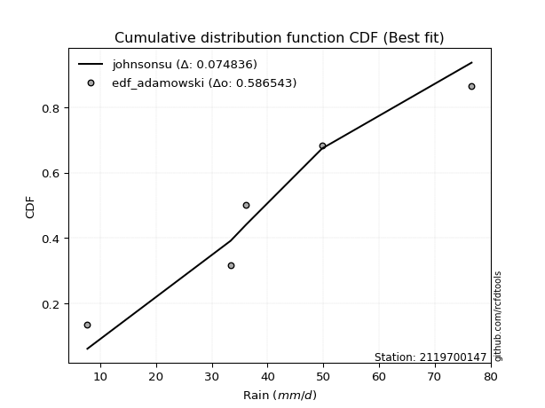</img>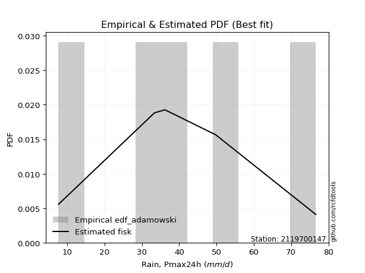</img>

</div>


## C. Best fit & Estimate extreme values for specific return periods - Tr

Best fit in probability distribution analysis means finding the theoretical distribution (like Normal, Poisson, Exponential, etc.) that most accurately mirrors your real-world data´s patterns (shape, center, spread) for better predictions, using methods like visual checks (Q-Q plots), goodness-of-fit tests (Kolmogorov-Smirnov, Chi-Squared), and information criteria (AIC) to score and select the simplest, most representative model.


### 1. Best fit (ordered by delta Δ)

:file_folder:Table: [bestfit_2119700147.csv](table/bestfit_2119700147.csv)

<div align="center">

|   id |    station | empirical_dist   | p_dist     |     delta |   deltao | eval   |   fit |   n |   best_fit |   best_fit_sort |
|-----:|-----------:|:-----------------|:-----------|----------:|---------:|:-------|------:|----:|-----------:|----------------:|
|    0 | 2119700147 | edf_jenkinson    | pearson3   | 0.0685776 | 0.586543 | Δo > Δ |     1 |   5 |          1 |               1 |
|    1 | 2119700147 | edf_beard        | pearson3   | 0.0685776 | 0.586543 | Δo > Δ |     1 |   5 |          1 |               2 |
|    2 | 2119700147 | edf_filliben     | pearson3   | 0.0688188 | 0.586543 | Δo > Δ |     1 |   5 |          1 |               3 |
|    3 | 2119700147 | edf_chegodayev   | pearson3   | 0.0693097 | 0.586543 | Δo > Δ |     1 |   5 |          1 |               4 |
|    4 | 2119700147 | edf_tukey        | pearson3   | 0.0699255 | 0.586543 | Δo > Δ |     1 |   5 |          1 |               5 |
|    5 | 2119700147 | edf_blom         | genextreme | 0.0716989 | 0.586543 | Δo > Δ |     1 |   5 |          1 |               6 |
|    6 | 2119700147 | edf_cunnane      | genextreme | 0.0723417 | 0.586543 | Δo > Δ |     1 |   5 |          1 |               7 |
|    7 | 2119700147 | edf_gringorten   | foldnorm   | 0.0746432 | 0.586543 | Δo > Δ |     1 |   5 |          1 |               8 |
|    8 | 2119700147 | edf_adamowski    | johnsonsu  | 0.0748361 | 0.586543 | Δo > Δ |     1 |   5 |          1 |               9 |
|    9 | 2119700147 | edf_hazen        | exponnorm  | 0.0787703 | 0.586543 | Δo > Δ |     1 |   5 |          1 |              10 |
|   10 | 2119700147 | edf_california   | dweibull   | 0.1       | 0.586543 | Δo > Δ |     1 |   5 |          1 |              11 |
|   11 | 2119700147 | edf_weibull      | dweibull   | 0.102364  | 0.586543 | Δo > Δ |     1 |   5 |          1 |              12 |

</div>


### 2. Extreme values and % difference analysis

In hydrology, a return period (or recurrence interval $Tr$) is the statistical average time between extreme events like floods or droughts of a specific magnitude, indicating how rare an event is, with a 100-year flood, for example, having a 1% chance of occurring in any given year, not that it happens exactly every century. It is a key tool for infrastructure design (like bridges or dams) and risk assessment, calculated from historical data to determine the probability of future events, although it is important to remember it is statistical average, and events can cluster or be missed.

The extreme value porcentage difference is evaluated as $pdiff = 1 - (ETrBf / ETr) * 100$, where _ETrBf_ correspond to the bestfit extreme value for a specific recurrence interval and _ETr_ correspond to the extreme value for one of the most used PDFsused in hydrology.

> risk_rate: assuming the return period as the project useful life.

:file_folder:Table: [extreme_2119700147.csv](table/extreme_2119700147.csv), all PDFs.  
:file_folder:Table: [extremepdiff_2119700147.csv](table/extremepdiff_2119700147.csv), % difference between bestfit and most used PDFs in Hydrology.

<div align="center">

Extreme values table for only best fit PDFs
|   id |      tr |   prob_l |     prob_g |      alpha |   anglit |   arcsine |   argus |    beta |   betaprime |   bradford |    burr |   burr12 |   cosine |   crystalball |   dgamma |   dweibull |   erlang |   exponnorm |   exponpow |   exponweib |        f |   fatiguelife |   foldnorm |    gamma |   gausshyper |   genexpon |   genextreme |   gengamma |   genhalflogistic |   genlogistic |   gennorm |   genpareto |   gompertz |   gumbel_l |   gumbel_r |   halfgennorm |   halflogistic |   halfnorm |   hypsecant |   invgamma |   invgauss |   invweibull |   johnsonsb |   johnsonsu |   kappa3 |   kappa4 |   ksone |   kstwobign |   laplace |   levy_l |   loggamma |   logistic |   loglaplace |    lomax |   maxwell |   mielke |    moyal |   nakagami |      ncf |      nct |     norm |   pearson3 |   powerlaw |   rayleigh |    rdist |     rice |   semicircular |   skewnorm |        t |   trapezoid |   triang |   truncexpon |   truncnorm |   truncpareto |   truncweibull_min |   tukeylambda |   uniform |   vonmises |   vonmises_line |     wald |   weibull_max |   weibull_min |   wrapcauchy |   logalpha |   loganglit |   logarcsine |   logargus |   logbeta |   logbetaprime |   logbradford |   logburr |   logburr12 |   logcosine |   logcrystalball |   logdgamma |   logdweibull |   logerlang |   logexponnorm |   logexponpow |     logexponweib |     logf |   logfatiguelife |   logfoldnorm |   loggausshyper |   loggenexpon |   loggenextreme |   loggengamma |   loggenhalflogistic |   loggenlogistic |   loggennorm |   loggenpareto |   loggompertz |   loggumbel_l |   loggumbel_r |   loghalfgennorm |   loghalflogistic |   loghalfnorm |   loghypsecant |   loginvgamma |   loginvgauss |   loginvweibull |   logjohnsonsb |   logjohnsonsu |   logkappa3 |   logkappa4 |   logksone |   logkstwobign |   loglevy_l |   logloggamma |   loglogistic |   logloglaplace |    loglomax |   logmaxwell |   logmielke |   logmoyal |   lognakagami |   logncf |   lognct |   lognorm |   logpearson3 |   logpowerlaw |   lograyleigh |   logrdist |   logrice |   logsemicircular |   logskewnorm |            logt |   logtrapezoid |   logtriang |   logtruncexpon |   logtruncnorm |   logtruncpareto |   logtruncweibull_min |   logtukeylambda |   loguniform |   logvonmises |   logvonmises_line |   logwald |   logweibull_max |   logweibull_min |   logwrapcauchy |    station |   n |   risk_rate |
|-----:|--------:|---------:|-----------:|-----------:|---------:|----------:|--------:|--------:|------------:|-----------:|--------:|---------:|---------:|--------------:|---------:|-----------:|---------:|------------:|-----------:|------------:|---------:|--------------:|-----------:|---------:|-------------:|-----------:|-------------:|-----------:|------------------:|--------------:|----------:|------------:|-----------:|-----------:|-----------:|--------------:|---------------:|-----------:|------------:|-----------:|-----------:|-------------:|------------:|------------:|---------:|---------:|--------:|------------:|----------:|---------:|-----------:|-----------:|-------------:|---------:|----------:|---------:|---------:|-----------:|---------:|---------:|---------:|-----------:|-----------:|-----------:|---------:|---------:|---------------:|-----------:|---------:|------------:|---------:|-------------:|------------:|--------------:|-------------------:|--------------:|----------:|-----------:|----------------:|---------:|--------------:|--------------:|-------------:|-----------:|------------:|-------------:|-----------:|----------:|---------------:|--------------:|----------:|------------:|------------:|-----------------:|------------:|--------------:|------------:|---------------:|--------------:|-----------------:|---------:|-----------------:|--------------:|----------------:|--------------:|----------------:|--------------:|---------------------:|-----------------:|-------------:|---------------:|--------------:|--------------:|--------------:|-----------------:|------------------:|--------------:|---------------:|--------------:|--------------:|----------------:|---------------:|---------------:|------------:|------------:|-----------:|---------------:|------------:|--------------:|--------------:|----------------:|------------:|-------------:|------------:|-----------:|--------------:|---------:|---------:|----------:|--------------:|--------------:|--------------:|-----------:|----------:|------------------:|--------------:|----------------:|---------------:|------------:|----------------:|---------------:|-----------------:|----------------------:|-----------------:|-------------:|--------------:|-------------------:|----------:|-----------------:|-----------------:|----------------:|-----------:|----:|------------:|
|    0 |    2    | 0.5      | 0.5        |    24.0794 |  40.74   |   40.74   | 45.489  | 50.3637 |     39.1065 |    35.9923 | 42.0204 |  21.5188 |  41.3088 |       40.74   |  36.2    |    36.2    |  39.2605 |     40.6654 |    25.647  |     29.3379 |  39.0661 |       39.3187 |    40.5022 |  39.0981 |      35.9873 |    29.3265 |      40.2909 |    29.8493 |           53.0176 |       38.822  |   36.2    |     48.9395 |    42.3454 |    44.4385 |    37.0415 |       23.8229 |        35.2028 |    36.1316 |     40.74   |    38.8272 |    38.4155 |      37.147  |     76.5717 |     39.4655 |   7.7    |  40.5395 | 40.74   |     36.4252 |   40.74   |  51.6568 |    31.6787 |    40.74   |      32.3654 |  30.6664 |   38.8146 |  43.2642 |  35.8475 |    35.1809 |  28.5353 |  40.7361 |  40.74   |    40.0628 |    7.92627 |    38.1317 |  1.87125 |  39.1794 |        40.74   |    39.1849 |  40.7393 |     59.2736 |  54.4172 |      33.5918 |     40.74   |       39.2242 |            27.711  |       42.2352 |   42.15   |   0.911418 |         42.15   |  33.4422 |       76.2599 |       38.0206 |      42.3251 |    31.5837 |     32.3654 |      32.3655 |    39.265  |   51.3294 |        31.8231 |       19.755  |   41.7985 |     36.673  |     29.1695 |          32.3654 |     36.2    |       36.2    |     31.9343 |        32.3654 |       13.4473 |     17.5959      |  32.3151 |          32.3466 |       32.543  |         27.2663 |       23.7305 |         43.6739 |       11.7649 |              36.2196 |         inf      |      36.2    |        23.6668 |       35.4458 |       36.76   |       28.4961 |          7.69991 |           26.7481 |       27.6171 |        32.3654 |       31.4721 |       30.0695 |         29.1008 |        72.6607 |        41.0909 |      7.7    |     24.4697 |    24.2862 |        26.701  |     47.4843 |       42.2447 |       32.3654 |         36.2    |     20.9253 |      30.2897 |     42.6336 |    27.3486 |       36.0099 |  31.8771 |  32.3837 |   32.3654 |       36.5808 |       7.80208 |       29.5859 |    14.9999 |   31.7367 |           32.3654 |       35.061  |    40.56        |        36.9682 |     33.1124 |         19.3276 |        43.7595 |          8.25734 |               18.919  |          19.5781 |      24.2862 |     0.066062  |            38.2214 |   25.1753 |          67.8287 |          37.1394 |         24.2862 | 2119700147 |   5 |    0.75     |
|    1 |    2.33 | 0.570815 | 0.429185   |    28.6596 |  45.4196 |   47.7648 | 49.9271 | 55.4199 |     43.1745 |    40.8911 | 47.2399 |  26.6934 |  45.514  |       44.7574 |  38.0308 |    38.2684 |  43.3196 |     44.6794 |    30.0351 |     33.568  |  43.1379 |       43.3665 |    44.6275 |  43.1628 |      41.1474 |    34.9925 |      44.3626 |    34.7722 |           57.5103 |       42.7548 |   37.1383 |     54.5206 |    46.7862 |    47.9337 |    40.7641 |       29.5251 |        39.0302 |    40.4675 |     43.9552 |    42.8942 |    42.5392 |      41.4388 |     76.5918 |     43.501  |   7.7    |  45.6786 | 46.2627 |     40.8055 |   43.1712 |  59.3613 |    36.5378 |    44.2796 |      35.1907 |  35.7405 |   42.9884 |  48.4206 |  39.3714 |    36.7782 |  32.624  |  44.7537 |  44.7574 |    44.0955 |    8.37489 |    42.3672 |  8.79889 |  43.3665 |        45.7589 |    43.1985 |  44.7563 |     63.2767 |  58.0841 |      38.2346 |     44.7574 |       44.1389 |            32.5943 |       47.263  |   47.0292 |   1.15361  |         46.4724 |  36.0765 |       76.4566 |       42.2847 |      47.2293 |    36.5126 |     38.0227 |      41.2196 |    44.1111 |   58.6618 |        36.7808 |       23.2601 |   46.9977 |     41.1041 |     33.7838 |          37.1658 |     38.1346 |       38.642  |     36.8965 |        37.1658 |       15.9178 |     22.2672      |  37.1255 |          37.1305 |       37.1058 |         32.4996 |       28.9387 |         49.2384 |       13.6352 |              41.7575 |         inf      |      37.0237 |        31.7527 |       39.8864 |       41.4601 |       32.3922 |          7.69991 |           30.5152 |       32.0629 |        36.1534 |       36.4182 |       34.8955 |         34.8894 |        75.1499 |        45.788  |      7.7    |     29.01   |    29.522  |        32.0319 |     55.0445 |       47.3332 |       36.5595 |         39.8268 |     26.1322 |      34.97   |     47.9931 |    30.8759 |       37.2992 |  36.8363 |  37.1857 |   37.1658 |       41.58   |       7.97678 |       34.2302 |    19.1904 |   36.5992 |           38.4695 |       39.7181 |    43.8334      |        43.3478 |     38.0365 |         22.6493 |        46.0645 |          8.53255 |               22.2138 |          22.4269 |      28.5769 |     0.0750263 |            42.4515 |   27.5651 |          73.2627 |          41.486  |         33.0758 | 2119700147 |   5 |    0.729209 |
|    2 |    5    | 0.8      | 0.2        |    64.1749 |  61.9302 |   66.4975 | 64.1628 | 69.1286 |     59.2242 |    58.5795 | 63.6935 |  75.7294 |  60.6681 |       59.6873 |  49.1942 |    52.7881 |  59.2547 |     59.6421 |    50.2676 |     50.2554 |  59.2237 |       59.2283 |    59.9588 |  59.1858 |      59.5142 |    63.3211 |      59.5886 |    57.3686 |           69.2637 |       58.9736 |   46.8632 |     69.4444 |    61.7595 |    59.2253 |    56.9368 |       69.1017 |        56.3486 |    58.8033 |     56.8519 |    59.0481 |    59.2153 |      60.0847 |     76.5999 |     59.2179 |  62.9946 |  62.8728 | 64.1361 |     59.4121 |   55.3265 |  72.1259 |    62.6203 |    57.9467 |      53.4756 |  61.1538 |   59.4163 |  64.3501 |  55.6945 |    51.1965 |  51.5344 |  59.6853 |  59.6873 |    59.4629 |   18.6316  |    59.3242 | 28.2688  |  59.5893 |        62.8865 |    59.0656 |  59.6843 |     74.7612 |  68.6043 |      55.9672 |     59.6873 |       60.8821 |            52.5685 |       63.4031 |   62.82   |   2.10114  |         61.4464 |  50.8233 |       76.5966 |       59.3654 |      63.1005 |    63.7417 |     67.1252 |      78.5525 |    60.9553 |   73.9642 |        63.5278 |       41.9662 |   63.555  |     59.4253 |     57.352  |          62.1374 |     55.5584 |       62.3823 |     63.7005 |        62.1375 |       37.4945 |     83.3998      |  62.1925 |          62.0156 |       60.4242 |         55.3167 |       69.4459 |         65.5541 |       32.5369 |              60.6252 |         inf      |      47.5025 |        62.1736 |       59.0737 |       61.1569 |       56.5237 |          7.69991 |           55.3911 |       60.2754 |        56.3588 |       63.6767 |       62.241  |         76.7347 |        76.5735 |        61.9207 |      7.7    |     49.9807 |    55.5323 |        69.405  |     70.3101 |       63.2462 |       58.5234 |         66.7594 |     80.22   |      61.5604 |     64.8978 |    54.1575 |       45.621  |  63.5834 |  62.1434 |   62.1374 |       62.6737 |      11.9093  |       61.3654 |    38.1019 |   62.4923 |           69.3716 |       57.1142 |    61.856       |        68.4414 |     56.6161 |         40.6486 |        56.8544 |         11.7007  |               40.2583 |          34.6892 |      48.3817 |     0.12181   |            64.0342 |   45.7965 |          76.5565 |          59.3176 |         59.2775 | 2119700147 |   5 |    0.67232  |
|    3 |   10    | 0.9      | 0.1        |   129.425  |  71.2755 |   71.0198 | 71.0275 | 73.6487 |     70.7016 |    67.2643 | 70.7035 | inf      |  69.8236 |       69.5914 |  59.9261 |    68.1201 |  70.5796 |     69.6164 |    66.107  |     61.0615 |  70.7421 |       70.4906 |    70.1292 |  70.6295 |      68.1724 |    89.037  |      69.4851 |    75.5024 |           73.2843 |       71.6258 |   61.7119 |     74.027  |    70.3951 |    65.512  |    70.1092 |      121.445  |        70.7307 |    72.3714 |     67.1503 |    70.7463 |    71.5259 |      75.2715 |     76.6    |     70.3039 |  69.9065 |  70.6916 | 71.9348 |     73.5786 |   66.3607 |  75.2076 |    90.1826 |    68.012  |      78.1849 |  84.2865 |   70.9775 |  71.013  |  69.9064 |    67.6344 |  67.3314 |  69.592  |  69.5914 |    69.9916 |   36.5872  |    71.4148 | 33.7859  |  70.7349 |        71.6749 |    70.4132 |  69.5872 |     79.2471 |  72.7135 |      65.4858 |     69.5914 |       68.6073 |            63.6747 |       70.2744 |   69.71   |   2.79622  |         68.8149 |  66.473  |       76.5998 |       71.5519 |      70.0255 |    93.8006 |     92.5979 |      91.7843 |    69.6798 |   76.177  |        91.9724 |       56.0817 |   70.6866 |     72.9677 |     78.9604 |          87.3824 |     81.2516 |      104.494  |     92.259  |        87.3827 |       78.3428 |    321.374       |  87.594  |          87.18   |       83.5014 |         67.1793 |      138.829  |         71.6656 |       80.7499 |              68.8976 |         inf      |      70.6441 |        72.3945 |       73.9066 |       75.9336 |       88.954  |          7.69991 |           90.8795 |       96.1601 |        80.3393 |       93.6138 |       93.4848 |        145.81   |        76.6034 |        70.8885 |      7.7    |     62.8222 |    73.1601 |       125.045  |     74.5903 |       69.977  |       82.7581 |        113.524  |    225.522  |      91.6529 |     72.1047 |    88.3349 |       54.5078 |  92.0187 |  87.3421 |   87.3824 |       78.006  |      21.967   |       93.0432 |    46.0187 |   89.409  |           93.88   |       66.221  |    89.6873      |        81.808  |     66.1321 |         54.8155 |        64.5744 |         18.9254  |               54.5638 |          41.7712 |      60.8772 |     0.172529  |            87.7205 |   78.4886 |          76.5988 |          72.3832 |         68.0372 | 2119700147 |   5 |    0.651322 |
|    4 |   15    | 0.933333 | 0.0666667  |   194.442  |  75.2661 |   71.8823 | 73.6373 | 74.8812 |     76.6828 |    70.3016 | 73.021  | inf      |  73.9941 |       74.5338 |  66.303  |    77.6429 |  76.4602 |     74.6117 |    74.4325 |     66.192  |  76.7485 |       76.3399 |    75.2044 |  76.5881 |      71.0823 |   104.08   |      74.248  |    85.315  |           74.4846 |       78.6595 |   72.9795 |     75.1855 |    74.3555 |    68.359  |    77.541  |      159.629  |        78.8698 |    79.4322 |     73.0275 |    76.9029 |    78.064  |      83.8398 |     76.6    |     76.0437 |  72.2104 |  73.3623 | 74.5343 |     81.0993 |   72.8153 |  76.1386 |   108.425  |    73.496  |      97.6388 |  97.8463 |   76.9093 |  73.2017 |  78.1543 |    77.0799 |  76.1891 |  74.536  |  74.5338 |    75.3462 |   46.6954  |    77.6444 | 35.0065  |  76.3718 |        75.1021 |    76.2896 |  74.5289 |     80.6865 |  74.0319 |      68.9879 |     74.5338 |       71.2413 |            67.7648 |       72.5122 |   72.0067 |   3.13567  |         71.3799 |  76.5226 |       76.6    |       77.8331 |      72.3337 |   114.345  |    106.234  |      94.5504 |    73.0849 |   76.4559 |       110.875  |       62.0685 |   73.0543 |     80.0785 |     91.3402 |         103.589  |    102.151  |      144.327  |    111.262  |       103.59   |      117.489  |    743.919       | 103.926  |         103.341  |       98.129  |         70.9449 |      202.488  |         73.506  |      142.173  |              71.5851 |         inf      |      96.0948 |        74.6127 |       81.8693 |       83.7528 |      114.888  |          7.69991 |          120.268  |      122.62   |        98.3547 |      113.981  |      115.337  |        209.451  |        76.6052 |        74.7763 |      7.7    |     67.6166 |    80.2017 |       170.922  |     75.9338 |       72.1966 |       99.9538 |        159.648  |    415.708  |     112.417  |     74.4962 |   117.339  |       60.0236 | 110.911  | 103.504  |  103.589  |       85.7423 |      30.4353  |      115.298  |    47.928  |  106.982  |          105.636  |       69.5241 |   118.905       |        86.6274 |     69.5122 |         61.0169 |        67.9319 |         25.5865  |               60.8358 |          44.3777 |      65.7223 |     0.208487  |           104.096  |  110.931  |          76.5998 |          79.212  |         70.8567 | 2119700147 |   5 |    0.644736 |
|    5 |   20    | 0.95     | 0.05       |   259.403  |  77.6136 |   72.1861 | 75.0698 | 75.428  |     80.6926 |    71.8479 | 74.1763 | inf      |  76.5589 |       77.7704 |  70.8557 |    84.5949 |  80.3949 |     77.8904 |    79.981  |     69.4437 |  80.7762 |       80.2551 |    78.5281 |  80.5808 |      72.5257 |   114.753  |      77.2744 |    91.9838 |           75.0561 |       83.5575 |   82.1382 |     75.6748 |    76.8336 |    70.1312 |    82.7445 |      190.226  |        84.5722 |    84.1397 |     77.1736 |    81.0561 |    82.4929 |      89.8391 |     76.6    |     79.8798 |  73.3624 |  74.7155 | 75.8341 |     86.1656 |   77.3949 |  76.6153 |   122.426  |    77.2864 |     114.311  | 107.48   |   80.8461 |  74.2904 |  83.9956 |    83.5423 |  82.3422 |  77.7738 |  77.7704 |    78.8894 |   52.8265  |    81.7851 | 35.4771  |  80.0847 |        77.003  |    80.2041 |  77.7651 |     81.3965 |  74.6823 |      70.8108 |     77.7704 |       72.5696 |            69.8892 |       73.6146 |   73.155  |   3.33632  |         72.6768 |  84.0116 |       76.6    |       82.0086 |      73.4879 |   130.435  |    115.175  |      95.5443 |    74.9734 |   76.5329 |       125.417  |       65.3581 |   74.2365 |     84.8508 |     99.899  |         115.799  |    120.389  |      182.865  |    125.892  |       115.799  |      154.845  |   1375.7         | 116.241  |         115.518  |      109.07   |         72.6955 |      262.207  |         74.3751 |      214.908  |              72.9028 |         inf      |     123.755  |        75.4384 |       87.273  |       89.0213 |      137.426  |          7.69991 |          146.355  |      144.192  |       113.444  |      129.883  |      132.691  |        269.908  |        76.6056 |        77.1124 |      7.7    |     70.0899 |    83.9727 |       210.976  |     76.6312 |       73.3022 |      113.885  |        206.356  |    643.565  |     128.732  |     75.7068 |   143.474  |       64.0513 | 125.443  | 115.673  |  115.799  |       90.766  |      36.9376  |      132.961  |    48.6726 |  120.349  |          112.78   |       71.232  |   151.49        |        89.1083 |     71.2427 |         64.4772 |        69.8199 |         31.1897  |               64.3364 |          45.7213 |      68.2876 |     0.237996  |           116.421  |  143.555  |          76.6    |          83.7842 |         72.2711 | 2119700147 |   5 |    0.641514 |
|    6 |   25    | 0.96     | 0.04       |   324.34   |  79.2044 |   72.327  | 75.9936 | 75.729  |     83.6917 |    72.7846 | 74.8685 | inf      |  78.3574 |       80.153  |  74.3998 |    90.0862 |  83.334  |     80.3081 |    84.1003 |     71.7819 |  83.7892 |       83.1805 |    80.9747 |  83.566  |      73.3834 |   123.032  |      79.4465 |    97.0073 |           75.3886 |       87.3194 |   89.9139 |     75.9344 |    78.6024 |    71.3923 |    86.7526 |      216.009  |        88.9657 |    87.6422 |     80.3824 |    84.1767 |    85.829  |      94.4601 |     76.6    |     82.7437 |  74.0536 |  75.5351 | 76.614  |     89.9604 |   80.9471 |  76.9145 |   133.929  |    80.186  |     129.181  | 114.959  |   83.7688 |  74.9419 |  88.5232 |    88.402  |  87.0501 |  80.1574 |  80.153  |    81.5162 |   56.8985  |    84.8615 | 35.7103  |  82.8274 |        78.2362 |    83.1157 |  80.1474 |     81.8195 |  75.0698 |      71.929  |     80.153  |       73.3702 |            71.1902 |       74.2688 |   73.844  |   3.46729  |         73.4584 |  90.01   |       76.6    |       85.1114 |      74.1804 |   143.854  |    121.659  |      96.0089 |    76.1982 |   76.563  |       137.384  |       67.4354 |   74.9454 |     88.4192 |    106.375  |         125.697  |    136.864  |      220.553  |    137.94   |       125.697  |      190.62   |   2238.79        | 126.232  |         125.392  |      117.897  |         73.6799 |      318.96   |         74.8762 |      297.833  |              73.6817 |         inf      |     153.657  |        75.8354 |       91.3427 |       92.9711 |      157.758  |          7.69991 |          170.253  |      162.67   |       126.694  |      143.112  |      147.309  |        328.132  |        76.6058 |        78.7288 |      7.7    |     71.5904 |    86.3199 |       247.013  |     77.0721 |       73.9642 |      125.84   |        254.048  |    904.893  |     142.358  |     76.4533 |   167.673  |       67.2363 | 137.402  | 125.535  |  125.697  |       94.4217 |      41.9463  |      147.815  |    49.0413 |  131.257  |          117.671  |       72.2756 |   188.364       |        90.62   |     72.2942 |         66.682  |        71.0316 |         35.8239  |               66.567  |          46.538  |      69.8746 |     0.263782  |           125.962  |  176.482  |          76.6    |          87.1976 |         73.1244 | 2119700147 |   5 |    0.639603 |
|    7 |   50    | 0.98     | 0.02       |   648.925  |  83.1205 |   72.5152 | 78.088  | 76.2533 |     92.5042 |    74.6786 | 76.2516 | inf      |  83.0671 |       86.9758 |  85.4634 |   107.626  |  91.9512 |     87.2528 |    95.9942 |     78.2223 |  92.6445 |       91.764  |    87.981  |  92.3322 |      75.0629 |   148.748  |      85.3578 |   111.887  |           76.0264 |       98.868  |  117.862  |     76.3607 |    83.4241 |    74.8156 |    99.0996 |      307.86   |       102.503  |    97.8229 |     90.3308 |    93.4208 |    95.746  |     108.695  |     76.6    |     91.1358 |  75.4359 |  77.1983 | 78.1737 |    101.104  |   91.9813 |  77.5883 |   173.536  |    89.0453 |     188.871  | 138.232  |   92.245  |  76.2419 | 102.579  |   102.647  | 101.37   |  86.9834 |  86.9758 |    89.1255 |   66.0219  |    93.7919 | 36.0542  |  90.7201 |        81.0534 |    91.5772 |  86.9694 |     82.659  |  75.8388 |      74.2235 |     86.9758 |       74.9796 |            73.8531 |       75.5541 |   75.222  |   3.75077  |         75.0272 | 109.595  |       76.6    |       94.1196 |      75.5653 |   191.345  |    139.216  |      96.633  |    78.9953 |   76.5941 |       178.711  |       71.8393 |   76.3653 |     98.8819 |    125.392  |         158.975  |    204.597  |      402.187  |    179.583  |       158.976  |      351.877  |  10694.7         | 159.858  |         158.603  |      147.326  |         75.4283 |      574.071  |         75.8177 |      843.818  |              75.2006 |          75.3192 |     337.812  |        76.3923 |      103.409  |      104.599  |      241.316  |          7.69991 |          271.32   |      230.95   |       178.439  |      189.712  |      199.96   |        598.929  |        76.6059 |        82.8943 |      7.7    |     74.5982 |    91.213  |       392.494  |     78.0743 |       75.2853 |      170.714  |        510.95   |   2634.7    |     190.593  |     78.1139 |   272.02   |       77.4573 | 178.692  | 158.665  |  158.975  |      104.582  |      55.5741  |      201.017  |    49.58   |  168.346  |          129.654  |       74.4071 |   462.529       |        93.6965 |     74.4269 |         71.4082 |        73.6592 |         49.9539  |               71.3484 |          48.1857 |      73.1601 |     0.366407  |           152.013  |  346.345  |          76.6    |          97.181  |         74.8472 | 2119700147 |   5 |    0.63583  |
|    8 |   75    | 0.986667 | 0.0133333  |   973.465  |  84.8439 |   72.5501 | 78.9187 | 76.3977 |     97.371  |    75.316  | 76.7175 | inf      |  85.3162 |       90.6367 |  91.965  |   118.183  |  96.6988 |     90.9936 |   102.4    |     81.529  |  97.5359 |       96.4975 |    91.7403 |  97.1699 |      75.6039 |   163.79   |      88.3135 |   120.15   |           76.2285 |      105.563  |  136.918  |     76.4684 |    85.8725 |    76.5467 |   106.276  |      370.1    |       110.372  |   103.365  |     96.1447 |    98.5765 |   101.294  |     116.969  |     76.6    |     95.7584 |  75.8967 |  77.7635 | 78.6937 |    107.235  |   98.436  |  77.8651 |   199.65   |    94.1621 |     235.865  | 151.874  |   96.8534 |  76.6788 | 110.798  |   110.422  | 109.566  |  90.6462 |  90.6367 |    93.2619 |   69.3771  |    98.6503 | 36.1282  |  94.9757 |        82.1789 |    96.1828 |  90.6299 |     82.937  |  76.0934 |      75.0062 |     90.6367 |       75.5185 |            74.7593 |       75.9723 |   75.6813 |   3.85024  |         75.5512 | 121.647  |       76.6    |       99.0213 |      76.027  |   223.674  |    147.726  |      96.7492 |    80.1121 |   76.598  |       206.049  |       73.3853 |   76.8494 |    104.636  |    135.639  |         180.328  |    259.354  |      578.203  |    207.16   |       180.328  |      493.153  |  27580.8         | 181.46   |         179.922  |      166.037  |         75.9162 |      799.83   |         76.1066 |     1577.68   |              75.6895 |          75.7589 |     582.109  |        76.5033 |      110.124  |      111.022  |      308.944  |          7.69991 |          355.738  |      279.495  |       217.976  |      221.253  |      236.511  |        849.705  |        76.6059 |        84.8627 |      7.7    |     75.5878 |    92.9049 |       506.389  |     78.4899 |       75.7249 |      203.595  |        800.322  |   4958.37   |     223.359  |     78.8213 |   360.983  |       83.6637 | 206      | 179.904  |  180.328  |      109.782  |      61.5632  |      237.612  |    49.6936 |  192.44   |          134.776  |       75.1311 |   963.953       |        94.7379 |     75.1468 |         73.0844 |        74.6031 |         56.9163  |               73.0439 |          48.7345 |      74.2892 |     0.448964  |           163.24   |  524.433  |          76.6    |         102.657  |         75.4276 | 2119700147 |   5 |    0.634587 |
|    9 |  100    | 0.99     | 0.01       |  1297.99   |  85.8687 |   72.5623 | 79.3823 | 76.4619 |    100.718  |    75.6359 | 76.9581 | inf      |  86.7259 |       93.1128 |  96.5883 |   125.792  |  99.9591 |     93.5303 |   106.731  |     83.7103 | 100.9    |       99.7505 |    94.283  | 100.495  |      75.8681 |   174.463  |      90.2175 |   125.841  |           76.3269 |      110.296  |  151.671  |     76.5139 |    87.4772 |    77.6789 |   111.355  |      418.191  |       115.941  |   107.14   |    100.269  |   102.144  |   105.138  |     122.825  |     76.6    |     98.9334 |  76.1271 |  78.0493 | 78.9536 |    111.435  |  103.016  |  78.0269 |   219.607  |    97.7747 |     276.142  | 161.566  |   99.9923 |  76.904  | 116.63   |   115.713  | 115.313  |  93.1236 |  93.1128 |    96.0809 |   71.1174  |   101.96   | 36.1566  |  97.8611 |        82.8091 |    99.3203 |  93.1056 |     83.0756 |  76.2204 |      75.4011 |     93.1128 |       75.7884 |            75.2159 |       76.1784 |   75.911  |   3.90059  |         75.8134 | 130.434  |       76.6    |      102.361  |      76.2578 |   248.889  |    153.031  |      96.7899 |    80.7374 |   76.5991 |       226.984  |       74.1737 |   77.1041 |    108.579  |    142.483  |         196.373  |    307.092  |      751.521  |    228.292  |       196.373  |      621.245  |  54741.9         | 197.706  |         195.947  |      180.023  |         76.1338 |     1007.48   |         76.2441 |     2475.19   |              75.9289 |          75.9786 |     889.957  |        76.5437 |      114.757  |      115.435  |      367.974  |          7.69991 |          430.922  |      318.287  |       251.226  |      245.761  |      265.366  |       1088.36   |        76.6059 |        86.0957 |      7.7    |     76.0753 |    93.7626 |       602.973  |     78.7339 |       75.9445 |      230.557  |       1121.89   |   7790.77   |     248.847  |     79.2595 |   441.233  |       88.1701 | 226.91   | 195.856  |  196.373  |      113.178  |      64.9057  |      266.29   |    49.7365 |  210.679  |          137.732  |       75.4957 |  1840.24        |        95.2615 |     75.5084 |         73.9425 |        75.089  |         61.0134  |               73.9119 |          49.0073 |      74.8603 |     0.521359  |           169.37   |  709.675  |          76.6    |         106.404  |         75.7192 | 2119700147 |   5 |    0.633968 |
|   10 |  200    | 0.995    | 0.005      |  2596.08   |  87.8049 |   72.5741 | 80.1883 | 76.545  |    108.477  |    76.1171 | 77.3622 | inf      |  89.5922 |       98.7294 | 107.757  |   144.49   | 107.503  |     99.3057 |   116.522  |     88.5048 | 108.699  |      107.285  |   100.051  | 108.2    |      76.2521 |   200.179  |      94.2321 |   139.035  |           76.4696 |      121.665  |  191.501  |     76.5691 |    90.9733 |    80.1401 |   123.567  |      547.875  |       129.331  |   115.775  |    110.204  |   110.486  |   114.138  |     136.904  |     76.6    |    106.283  |  76.4727 |  78.4845 | 79.3435 |    121.111  |  114.05   |  78.3336 |   272.965  |   106.441  |     403.737  | 184.961  |  107.174  |  77.2806 | 130.679  |   127.774  | 128.956  |  98.7436 |  98.7294 |   102.539  |   73.8088  |   109.534  | 36.1871  | 104.425  |        83.9078 |   106.496  |  98.7215 |     83.283  |  76.4105 |      75.9979 |     98.7294 |       76.1939 |            75.9052 |       76.482  |   76.2555 |   3.97664  |         76.2067 | 152.321  |       76.6    |      110.004  |      76.6041 |   318.326  |    163.578  |      96.8291 |    81.8272 |   76.5999 |       283.116  |       75.3757 |   77.5461 |    117.672  |    157.484  |         238.26   |    462.267  |     1433.76   |    285.003  |       238.261  |     1055.13   | 297777           | 240.162  |         237.802  |      216.269  |         76.4151 |     1734.32   |         76.4379 |     7466.73   |              76.2781 |          76.308  |    2832.08   |        76.5848 |      125.529  |      125.641  |      560.248  |          7.69991 |          683.262  |      428.465  |       353.672  |      312.865  |      346.186  |       1973.43   |        76.6059 |        88.6188 |      7.7    |     76.7888 |    95.064  |       901.393  |     79.1982 |       76.2737 |      310.697  |       2719.05   |  23401.5    |     318.639  |     80.1902 |   715.676  |       99.3859 | 282.966  | 237.469  |  238.26   |      120.469  |      70.4163  |      345.607  |    49.7817 |  258.776  |          143.041  |       76.0459 | 15604           |        96.0508 |     76.0529 |         75.2555 |        75.8364 |         68.1107  |               75.2399 |          49.4121 |      75.7251 |     0.748736  |           179.194  | 1507.6    |          76.6    |         115.028  |         76.1584 | 2119700147 |   5 |    0.633042 |
|   11 |  250    | 0.996    | 0.004      |  3245.12   |  88.2976 |   72.5755 | 80.3769 | 76.5591 |    110.894  |    76.2136 | 77.4607 | inf      |  90.378  |      100.446  | 111.36   |   150.611  | 109.85   |    101.077  |   119.499  |     89.9304 | 111.13   |      109.631  |   101.813  | 110.599  |      76.3263 |   208.458  |      95.3712 |   143.142  |           76.4972 |      125.318  |  205.632  |     76.5777 |    92.0038 |    80.8642 |   127.492  |      593.884  |       133.635  |   118.431  |    113.402  |   113.106  |   116.967  |     141.43   |     76.6    |    108.571  |  76.5418 |  78.573  | 79.4215 |    124.105  |  117.602  |  78.4133 |   291.837  |   109.223  |     456.254  | 192.505  |  109.384  |  77.3721 | 135.202  |   131.47   | 133.295  | 100.461  | 100.446  |   104.53   |   74.3589  |   111.865  | 36.1913  | 106.436  |        84.1655 |   108.704  | 100.438  |     83.3245 |  76.4484 |      76.1179 |    100.446  |       76.275  |            76.0438 |       76.5415 |   76.3244 |   3.99189  |         76.2854 | 159.562  |       76.6    |      112.357  |      76.6733 |   343.552  |    166.376  |      96.8338 |    82.0828 |   76.5999 |       303.02   |       75.619  |   77.6576 |    120.49   |    161.865  |         252.762  |    527.578  |     1772.2    |    305.128  |       252.763  |     1242.09   | 519812           | 254.875  |         252.299  |      228.739  |         76.4628 |     2058.71   |         76.4741 |    10708.7    |              76.3459 |          76.3738 |    4285.24   |        76.59   |      128.89   |      128.812  |      641.315  |          7.69991 |          792.402  |      469.495  |       394.835  |      337.114  |      375.985  |       2389.52   |        76.6059 |        89.3189 |      7.7    |     76.9274 |    95.3265 |      1020.83   |     79.3194 |       76.3395 |      341.925  |       3699.85   |  33456.6    |     343.835  |     80.4664 |   836.25   |      103.107  | 302.84   | 251.866  |  252.762  |      122.573  |      71.5962  |      374.487  |    49.7877 |  275.575  |          144.316  |       76.1564 | 38899.7         |        96.2092 |     76.1621 |         75.5219 |        75.9886 |         69.687   |               75.5093 |          49.4919 |      75.8993 |     0.834158  |           181.246  | 1934.38   |          76.6    |         117.696  |         76.2465 | 2119700147 |   5 |    0.632858 |
|   12 |  500    | 0.998    | 0.002      |  6490.29   |  89.5194 |   72.5774 | 80.8105 | 76.5837 |    118.192  |    76.4067 | 77.7171 | inf      |  92.469  |      105.536  | 122.57   |   169.909  | 116.924  |    106.351  |   128.276  |     94.0585 | 118.466  |      116.71   |   107.04   | 117.838  |      76.47   |   234.174  |      98.5003 |   155.513  |           76.5508 |      136.652  |  253.674  |     76.592  |    94.9626 |    82.94   |   139.677  |      750.466  |       146.996  |   126.351  |    123.337  |   121.08   |   125.575  |     155.478  |     76.6    |    115.473  |  76.6809 |  78.7522 | 79.5775 |    133.078  |  128.636  |  78.6194 |   356.208  |   117.851  |     667.074  | 215.98   |  115.981  |  77.6092 | 149.251  |   142.442  | 146.623  | 105.555  | 105.536  |   110.484  |   75.4713  |   118.821  | 36.1974  | 112.41   |        84.759  |   115.286  | 105.527  |     83.4073 |  76.5243 |      76.3585 |    105.536  |       76.4375 |            76.3214 |       76.6587 |   76.4622 |   4.02244  |         76.4427 | 182.585  |       76.6    |      119.378  |      76.8118 |   432.028  |    173.523  |      96.8401 |    82.6712 |   76.6    |       371.084  |       76.1084 |   77.9548 |    128.948  |    174.128  |         301.169  |    796.351  |     3461.64   |    373.999  |       301.17   |     2019.4    |      3.03575e+06 | 304.033  |         300.711  |      270.108  |         76.5457 |     3475.88   |         76.5426 |    33288.6    |              76.4781 |          76.5055 |   17718.9    |        76.5973 |      139.046  |      138.354  |      975.521  |         76.2562  |         1255.16   |      616.656  |       555.828  |      421.68   |      482.084  |       4327.12   |        76.6059 |        91.2162 |      7.7    |     77.197  |    95.8535 |      1482.18   |     79.6335 |       76.4711 |      460.18   |      10416.7    | 102637      |     431.492  |     81.2864 |  1356.37   |      115.016  | 370.79   | 299.891  |  301.169  |      128.45   |      74.0397  |      475.807  |    49.7965 |  332.129  |          147.295  |       76.3779 |     1.78145e+06 |        96.5265 |     76.3809 |         76.0585 |        76.2958 |         73.0163  |               76.0521 |          49.6493 |      76.2488 |     1.09316   |           185.432  | 4273.27   |          76.6    |         125.693  |         76.4231 | 2119700147 |   5 |    0.632489 |
|   13 |  750    | 0.998667 | 0.00133333 |  9735.47   |  90.0603 |   72.5778 | 80.9848 | 76.5905 |    122.33   |    76.4711 | 77.8462 | inf      |  93.4823 |      108.363  | 129.139  |   181.385  | 120.927  |    109.295  |   133.111  |     96.2921 | 122.626  |      120.721  |   109.944  | 121.94   |      76.5159 |   249.217  |     100.077  |   162.505  |           76.5681 |      143.276  |  284.734  |     76.5956 |    96.5465 |    84.0495 |   146.8    |      851.891  |       154.807  |   130.776  |    129.148  |   125.645  |   130.502  |     163.69   |     76.6    |    119.384  |  76.7293 |  78.8131 | 79.6295 |    138.119  |  135.091  |  78.7172 |   398.189  |   122.892  |     833.054  | 229.741  |  119.671  |  77.7283 | 157.47   |   148.54   | 154.328  | 108.384  | 108.363  |   113.824  |   75.8457  |   122.711  | 36.1987  | 115.736  |        84.9979 |   118.963  | 108.354  |     83.4349 |  76.5495 |      76.4389 |    108.363  |       76.4916 |            76.4142 |       76.6969 |   76.5081 |   4.03263  |         76.4952 | 196.39   |       76.6    |      123.305  |      76.858  |   491.647  |    176.785  |      96.8413 |    82.908  |   76.6    |       415.605  |       76.2724 |   78.108  |    133.709  |    180.4    |         331.958  |   1013.98   |     5158.98   |    419.086  |       331.96   |     2647.77   |      8.71806e+06 | 335.334  |         331.521  |      296.24   |         76.5684 |     4696.38   |         76.5637 |    65209.2    |              76.5207 |          76.5494 |   44722.1    |        76.5987 |      144.804  |      143.74   |     1246.61   |         76.3731  |         1642.39   |      718.117  |       678.923  |      478.276  |      554.802  |       6122.95   |        76.6059 |        92.1627 |     76.3708 |     77.2835 |    96.0298 |      1827.58   |     79.7829 |       76.515  |      547.384  |      20250.5    | 199220      |     489.929  |     81.7502 |  1799.89   |      122.236  | 415.229  | 330.414  |  331.958  |      131.47   |      74.8798  |      543.98   |    49.7983 |  368.451  |          148.511  |       76.4519 |     4.1831e+07  |        96.6325 |     76.4539 |         76.2385 |        76.3991 |         74.1814  |               76.2341 |          49.7009 |      76.3657 |     1.21602   |           186.851  | 6872.98   |          76.6    |         130.187  |         76.482  | 2119700147 |   5 |    0.632366 |
|   14 | 1000    | 0.999    | 0.001      | 12980.6    |  90.3827 |   72.5779 | 81.0826 | 76.5935 |    125.214  |    76.5034 | 77.9325 | inf      |  94.1215 |      110.31   | 133.804  |   189.605  | 123.715  |    111.329  |   136.42   |     97.807  | 125.526  |      123.516  |   111.943  | 124.798  |      76.5383 |   259.89   |     101.095  |   167.365  |           76.5765 |      147.974  |  308.117  |     76.5971 |    97.6134 |    84.7962 |   151.853  |      928.368  |       160.347  |   133.832  |    133.271  |   128.846  |   133.954  |     169.516  |     76.6    |    122.11   |  76.7553 |  78.8438 | 79.6555 |    141.611  |  139.67   |  78.7786 |   430.058  |   126.467  |     975.306  | 239.517  |  122.221  |  77.8078 | 163.301  |   152.738  | 159.758  | 110.332  | 110.31   |   116.136  |   76.0336  |   125.399  | 36.1992  | 118.029  |        85.1321 |   121.502  | 110.301  |     83.4486 |  76.5622 |      76.4792 |    110.31   |       76.5187 |            76.4606 |       76.7158 |   76.5311 |   4.03772  |         76.5214 | 206.32   |       76.6    |      126.018  |      76.8811 |   537.861  |    178.757  |      96.8417 |    83.041  |   76.6    |       449.465  |       76.3546 |   78.2113 |    137.012  |    184.472  |         354.967  |   1203.92   |     6868.26   |    453.394  |       354.969  |     3191.33   |      1.86056e+07 | 358.742  |         354.554  |      315.687  |         76.5785 |     5801.92   |         76.5738 |   105457      |              76.5415 |          76.5713 |   90122.7    |        76.5993 |      148.816  |      147.483  |     1483.44   |         76.4316  |         1987.52   |      797.775  |       782.462  |      521.951  |      611.766  |       7832.51   |        76.6059 |        92.7731 |     76.4293 |     77.3257 |    96.1181 |      2113.02   |     79.877  |       76.5369 |      619.067  |      33399      | 320013      |     534.882  |     82.0754 |  2200      |      127.475  | 449.022  | 353.213  |  354.967  |      133.446  |      75.3048  |      596.719  |    49.799  |  395.755  |          149.199  |       76.4889 |     6.80049e+08 |        96.6855 |     76.4904 |         76.3287 |        76.4509 |         74.7749  |               76.3254 |          49.7263 |      76.4242 |     1.2857    |           187.565  | 9673.94   |          76.6    |         133.301  |         76.5115 | 2119700147 |   5 |    0.632305 |


</div>


<div align="center">

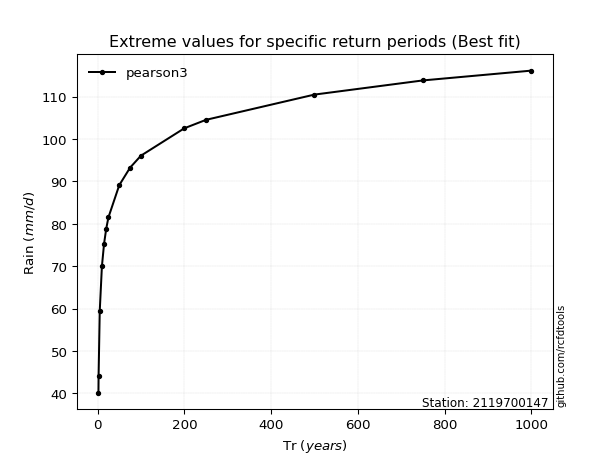</img>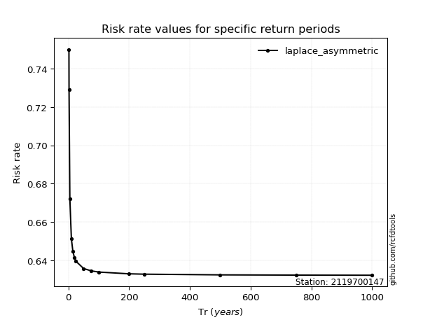</img>

</div>


<sub>**APP DISCLAIMER**: NO WARRANTY - This software is provided by [github.com/rcfdtools](https://github.com/rcfdtools) "as is", without any express or implied warranty, including warranties of merchantability, fitness for a particular purpose, or non-infringement. There is no guarantee that the software will be error-free or operate without interruption. LIMITATION OF LIABILITY - Neither the authors nor copyright holders will be liable for claims or damages arising from the software or its use. You are responsible for determining if the software is appropriate for your use and assume all associated risks, including errors, legal compliance, and data loss. NO PROFESSIONAL ADVICE - The software provides general information and does not offer professional advice. It should not replace consultation with professional advisors.</sub>