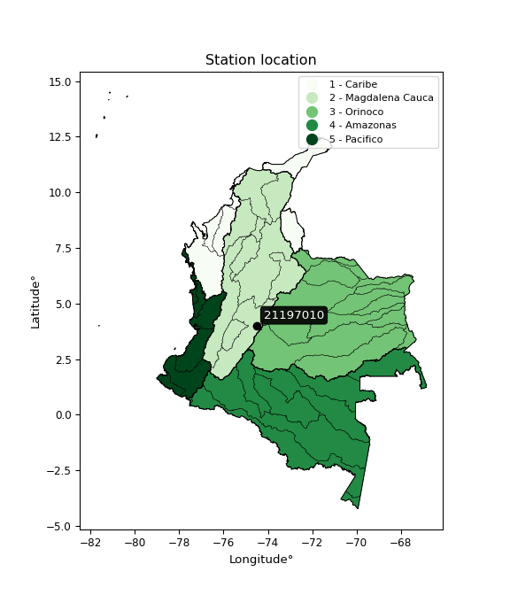

<div align="center">


</div>

# PMP Station (Rain, Pmax24h): 21197010

Probable Maximum Precipitation (PMP) is the greatest amount of rainfall for a specific duration that is meteorologically possible for a given location, acting as a "worst-case" scenario for extreme storms, crucial for designing safety-critical infrastructure like bridges, river deviations, dams, spillways, and nuclear plants to prevent catastrophic failure. PMP is calculated by hydrologists using meteorological data to determine the upper limit of extreme rainfall, often leading to the Probable Maximum Flood (PMF) for flood control design, and is increasingly being studied for climate change impacts.

<div align="center">

</img>

</div>


## A. General information


### 1. General running parameters

• app_version: _v20260103_. • runtime: _2026-01-03 07:24:50.581521_. • Python version: _3.14.0_. • SciPy version: _1.16.3_. • Pandas version: _2.3.3_. • NumPy version: _2.3.5_. • Stations dataset (station_dataset_file): _dataset/pmax24h_in/automatic_colombia_2003_2024.csv_. • Stations catalog (station_catalog_file): _dataset/CNE.xls_. • Minimum year to eval til year_max (date_min): _1900_. • Maximum year to eval since year_min (date_max): _2024_. • Creates, save and include plots into reports (create_plot): _False_. • Plot only fit distributions with Δo > Δ (plot_only_fit): _True_. • Eval low extreme values, if False, evaluates high extreme values (low_extreme): _False_. • Eval every SciPy distribution as logarithmic (pdist_logarithmic_on): _True_. • Standard deviation normalized (ddof): _1.0_. • Return periods to eval in years (Tr): _[2, 2.33, 5, 10, 15, 20, 25, 50, 75, 100, 200, 250, 500, 750, 1000]_. • Minimum data sample per station, 0 means any (minimum_sample): _5_. • Z-Score maximum threshold to adjust a value, 0 means disable (zscore_max): _3.5_. • Z-Score minimum threshold to adjust a value, 0 means disable (zscore_min): _-2.5_. • Avoid zeros, e.g. rain = 0 (avoid_zeros): _True_. • Avoid null values (avoid_nans): _True_. [:file_folder:Dataset file.](../../dataset/pmax24h_in/automatic_colombia_2003_2024.csv)

> Delta Degrees of Freedom (DDOF): is a parameter used in the formulas for calculating variance and standard deviation. When ddof=0, the divisor is $N$ (the total number of observations) and this is used when your data set is the entire population. When ddof=1, the divisor is $N-1$ and this is used when your data set is a sample drawn from a larger population. Using $N-1$ provides an unbiased estimate of the population variance (known as Bessel´s correction).


### 2. Station info and location

|   id |   CODIGO | NOMBRE                 | CATEGORIA    | TECNOLOGIA                              | ESTADO   | FECHA_INSTALACION   |   FECHA_SUSPENSION |   ALTITUD |   LATITUD |   LONGITUD | DEPARTAMENTO   | MUNICIPIO   | AREA_OPERATIVA                            | ENTIDAD                                                     | AREA_HIDROGRAFICA   | ZONA_HIDROGRAFICA   | SUBZONA_HIDROGRAFICA   | CORRIENTE   | Catalogo   |   Version |
|-----:|---------:|:-----------------------|:-------------|:----------------------------------------|:---------|:--------------------|-------------------:|----------:|----------:|-----------:|:---------------|:------------|:------------------------------------------|:------------------------------------------------------------|:--------------------|:--------------------|:-----------------------|:------------|:-----------|----------:|
|    0 | 21197010 | EL PROFUNDO [21197010] | Limnigráfica | Automática con Telemetría, Convencional | Activa   | 15/04/1954          |                nan |      1860 |   4.01169 |   -74.5044 | Cundinamarca   | Cabrera     | Area Operativa 11 - Cundinamarca-Amazonas | INSTITUTO DE HIDROLOGIA METEOROLOGIA Y ESTUDIOS AMBIENTALES | Magdalena Cauca     | Alto Magdalena      | Río Sumapaz            | Sumapaz     | CNE_IDEAM  |  20251226 |

<div align="center">

Dynamic map: [:earth_americas:Google](http://maps.google.com/maps?q=4.011694,-74.504444) [:earth_americas:OSM](https://www.openstreetmap.org/#map=18/4.011694/-74.504444&layers=P) [:earth_americas:Bing](https://www.bing.com/maps?cp=4.011694~-74.504444&lvl=18) [:earth_americas:Apple](https://maps.apple.com/frame?center=4.011694%2C-74.504444&span=0.003%2C0.006)

</div>


<div align="center">

```geojson
{
  "type": "Feature",
  "geometry": {
    "type": "Point", 
    "coordinates": [-74.504444, 4.011694]
  }, 
  "properties": {
    "Name": "21197010"
  }
}
```

</div>


### 3. Discrete values table and plot

<div align="center">

|               |           0 |           1 |          2 |           3 |           4 |           5 |          6 |           7 |           8 |            9 |          10 |         11 |          12 |          13 |         14 |         15 |
|:--------------|------------:|------------:|-----------:|------------:|------------:|------------:|-----------:|------------:|------------:|-------------:|------------:|-----------:|------------:|------------:|-----------:|-----------:|
| Date          | 2005        | 2009        | 2010       | 2011        | 2013        | 2014        | 2015       | 2016        | 2017        | 2018         | 2019        | 2020       | 2021        | 2022        | 2023       | 2024       |
| Value         |   25.4      |   27.3      |   60.7     |   43.2      |   49        |   35.8      |   62       |   40.6      |   24.9      |   37.8       |   34.8      |   12.6     |   44.8      |   28.4      |    3.1     |   53.8     |
| Value_initial |   25.4      |   27.3      |   60.7     |   43.2      |   49        |   35.8      |   62       |   40.6      |   24.9      |   37.8       |   34.8      |   12.6     |   44.8      |   28.4      |    3.1     |   53.8     |
| count         |   16        |   16        |   16       |   16        |   16        |   16        |   16       |   16        |   16        |   16         |   16        |   16       |   16        |   16        |   16       |   16       |
| mean          |   36.5125   |   36.5125   |   36.5125  |   36.5125   |   36.5125   |   36.5125   |   36.5125  |   36.5125   |   36.5125   |   36.5125    |   36.5125   |   36.5125  |   36.5125   |   36.5125   |   36.5125  |   36.5125  |
| std           |   16.1697   |   16.1697   |   16.1697  |   16.1697   |   16.1697   |   16.1697   |   16.1697  |   16.1697   |   16.1697   |   16.1697    |   16.1697   |   16.1697  |   16.1697   |   16.1697   |   16.1697  |   16.1697  |
| zscore        |   -0.687243 |   -0.569739 |    1.49586 |    0.413583 |    0.772279 |   -0.044064 |    1.57625 |    0.252788 |   -0.718165 |    0.0796243 |   -0.105908 |   -1.47885 |    0.512533 |   -0.501711 |   -2.06637 |    1.06913 |


</div>


> The initial value (value_initial) correspond to the initial obtained or null completed value, and value (value) is adjusted only when the initial value is outside the valid range definite through the Z-Score value. If Z-Score is active, values out of range or outliers are replaced with the station mean value


### 4. Active continuous probability distributions from SciPy (44 of 104 available)

A Probability Density Function (PDF) describes the relative likelihood of a continuous random variable falling within a specific range, where the total area under its curve equals 1, and the area over any interval gives the actual probability for that range. Unlike discrete probabilities (like rolling a die), a PDF shows density, not direct probability for a single point (which is zero), with higher points indicating higher likelihood, often visualized as a bell curve for normal distributions.

A log of a probability density function (log-PDF) is simply the logarithm of the PDF´s value, denoted as $log(f(x))$, useful for converting multiplication of probabilities into addition, improving numerical stability with tiny numbers, and connecting to information theory concepts like entropy. Instead of dealing with very small probabilities (e.g., 0.000001), log-PDFs use negative numbers (e.g., $log(0.00001) ≈ -11.51$ that are easier for computers to handle, preventing underflow errors and simplifying complex calculations. In this study, each active probability distribution from SciPy is also evaluated in the $log$ form.

[scipy.stats](https://docs.scipy.org/doc/scipy/reference/stats.html) is a Python´s powerful submodule within the SciPy library for comprehensive statistical analysis, offering over 130 probability distributions (like Normal, Poisson), functions for descriptive stats (mean, variance), hypothesis testing (t-tests, chi-square), random variable generation, and statistical tests, making it essential for data science, modeling, and research. It provides tools to explore, model, and draw conclusions from data efficiently, working seamlessly with NumPy.

<div align="center">

|   id | p_dist             |   n_parameter | fit_method   | label                                                                       | active   | ref                                                                                                        |
|-----:|:-------------------|--------------:|:-------------|:----------------------------------------------------------------------------|:---------|:-----------------------------------------------------------------------------------------------------------|
|    0 | alpha              |             3 | MLE          | Alpha                                                                       | True     | [:mortar_board:](https://docs.scipy.org/doc/scipy/reference/generated/scipy.stats.alpha.html)              |
|    1 | betaprime          |             4 | MLE          | Beta prime                                                                  | True     | [:mortar_board:](https://docs.scipy.org/doc/scipy/reference/generated/scipy.stats.betaprime.html)          |
|    2 | chi2               |             3 | MLE          | Chi²                                                                        | True     | [:mortar_board:](https://docs.scipy.org/doc/scipy/reference/generated/scipy.stats.chi2.html)               |
|    3 | crystalball        |             4 | MLE          | Crystalball                                                                 | True     | [:mortar_board:](https://docs.scipy.org/doc/scipy/reference/generated/scipy.stats.crystalball.html)        |
|    4 | erlang             |             3 | MLE          | Erlang                                                                      | True     | [:mortar_board:](https://docs.scipy.org/doc/scipy/reference/generated/scipy.stats.erlang.html)             |
|    5 | expon              |             2 | MLE          | Exponential                                                                 | True     | [:mortar_board:](https://docs.scipy.org/doc/scipy/reference/generated/scipy.stats.expon.html)              |
|    6 | exponnorm          |             3 | MLE          | Exponentially modified Normal                                               | True     | [:mortar_board:](https://docs.scipy.org/doc/scipy/reference/generated/scipy.stats.exponnorm.html)          |
|    7 | f                  |             4 | MLE          | F                                                                           | True     | [:mortar_board:](https://docs.scipy.org/doc/scipy/reference/generated/scipy.stats.f.html)                  |
|    8 | fatiguelife        |             3 | MLE          | Fatigue-life (Birnbaum-Saunders)                                            | True     | [:mortar_board:](https://docs.scipy.org/doc/scipy/reference/generated/scipy.stats.fatiguelife.html)        |
|    9 | fisk               |             3 | MLE          | Fisk                                                                        | True     | [:mortar_board:](https://docs.scipy.org/doc/scipy/reference/generated/scipy.stats.fisk.html)               |
|   10 | gamma              |             3 | MLE          | Gamma                                                                       | True     | [:mortar_board:](https://docs.scipy.org/doc/scipy/reference/generated/scipy.stats.gamma.html)              |
|   11 | genexpon           |             5 | MLE          | Generalized exponential                                                     | True     | [:mortar_board:](https://docs.scipy.org/doc/scipy/reference/generated/scipy.stats.genexpon.html)           |
|   12 | genlogistic        |             3 | MLE          | Generalized logistic                                                        | True     | [:mortar_board:](https://docs.scipy.org/doc/scipy/reference/generated/scipy.stats.genlogistic.html)        |
|   13 | gibrat             |             2 | MM           | Gibrat                                                                      | True     | [:mortar_board:](https://docs.scipy.org/doc/scipy/reference/generated/scipy.stats.gibrat.html)             |
|   14 | gompertz           |             3 | MLE          | Gompertz (or truncated Gumbel)                                              | True     | [:mortar_board:](https://docs.scipy.org/doc/scipy/reference/generated/scipy.stats.gompertz.html)           |
|   15 | gumbel_l           |             2 | MM           | Gumbel Left Skew                                                            | True     | [:mortar_board:](https://docs.scipy.org/doc/scipy/reference/generated/scipy.stats.gumbel_l.html)           |
|   16 | gumbel_r           |             2 | MM           | Gumbel Right Skew                                                           | True     | [:mortar_board:](https://docs.scipy.org/doc/scipy/reference/generated/scipy.stats.gumbel_r.html)           |
|   17 | halflogistic       |             2 | MM           | Half-logistic                                                               | True     | [:mortar_board:](https://docs.scipy.org/doc/scipy/reference/generated/scipy.stats.halflogistic.html)       |
|   18 | halfnorm           |             2 | MM           | Half Normal                                                                 | True     | [:mortar_board:](https://docs.scipy.org/doc/scipy/reference/generated/scipy.stats.halfnorm.html)           |
|   19 | hypsecant          |             2 | MM           | hyperbolic secant                                                           | True     | [:mortar_board:](https://docs.scipy.org/doc/scipy/reference/generated/scipy.stats.hypsecant.html)          |
|   20 | invgamma           |             3 | MLE          | Inverted gamma                                                              | True     | [:mortar_board:](https://docs.scipy.org/doc/scipy/reference/generated/scipy.stats.invgamma.html)           |
|   21 | invgauss           |             3 | MLE          | Inverse Gaussian                                                            | True     | [:mortar_board:](https://docs.scipy.org/doc/scipy/reference/generated/scipy.stats.invgauss.html)           |
|   22 | invweibull         |             3 | MLE          | Inverted Weibull                                                            | True     | [:mortar_board:](https://docs.scipy.org/doc/scipy/reference/generated/scipy.stats.invweibull.html)         |
|   23 | johnsonsu          |             4 | MLE          | Johnson Su                                                                  | True     | [:mortar_board:](https://docs.scipy.org/doc/scipy/reference/generated/scipy.stats.johnsonsu.html)          |
|   24 | kstwobign          |             2 | MLE          | Limiting distribution of scaled Kolmogorov-Smirnov two-sided test statistic | True     | [:mortar_board:](https://docs.scipy.org/doc/scipy/reference/generated/scipy.stats.kstwobign.html)          |
|   25 | laplace            |             2 | MM           | Laplace                                                                     | True     | [:mortar_board:](https://docs.scipy.org/doc/scipy/reference/generated/scipy.stats.laplace.html)            |
|   26 | laplace_asymmetric |             3 | MLE          | Asymmetric Laplace                                                          | True     | [:mortar_board:](https://docs.scipy.org/doc/scipy/reference/generated/scipy.stats.laplace_asymmetric.html) |
|   27 | loggamma           |             3 | MLE          | Log gamma                                                                   | True     | [:mortar_board:](https://docs.scipy.org/doc/scipy/reference/generated/scipy.stats.loggamma.html)           |
|   28 | logistic           |             2 | MM           | Logistic (or Sech-squared)                                                  | True     | [:mortar_board:](https://docs.scipy.org/doc/scipy/reference/generated/scipy.stats.logistic.html)           |
|   29 | lognorm            |             3 | MLE          | Log Normal                                                                  | True     | [:mortar_board:](https://docs.scipy.org/doc/scipy/reference/generated/scipy.stats.lognorm.html)            |
|   30 | maxwell            |             2 | MM           | Maxwell                                                                     | True     | [:mortar_board:](https://docs.scipy.org/doc/scipy/reference/generated/scipy.stats.maxwell.html)            |
|   31 | mielke             |             4 | MLE          | Mielke Beta-Kappa / Dagum                                                   | True     | [:mortar_board:](https://docs.scipy.org/doc/scipy/reference/generated/scipy.stats.mielke.html)             |
|   32 | moyal              |             2 | MM           | Moyal                                                                       | True     | [:mortar_board:](https://docs.scipy.org/doc/scipy/reference/generated/scipy.stats.moyal.html)              |
|   33 | nakagami           |             3 | MLE          | Nakagami                                                                    | True     | [:mortar_board:](https://docs.scipy.org/doc/scipy/reference/generated/scipy.stats.nakagami.html)           |
|   34 | ncf                |             5 | MLE          | Non-central F distribution                                                  | True     | [:mortar_board:](https://docs.scipy.org/doc/scipy/reference/generated/scipy.stats.ncf.html)                |
|   35 | nct                |             4 | MLE          | Non-central Student’s t                                                     | True     | [:mortar_board:](https://docs.scipy.org/doc/scipy/reference/generated/scipy.stats.nct.html)                |
|   36 | norm               |             2 | MM           | Normal                                                                      | True     | [:mortar_board:](https://docs.scipy.org/doc/scipy/reference/generated/scipy.stats.norm.html)               |
|   37 | pearson3           |             3 | MM           | Pearson type III                                                            | True     | [:mortar_board:](https://docs.scipy.org/doc/scipy/reference/generated/scipy.stats.pearson3.html)           |
|   38 | rayleigh           |             2 | MM           | Rayleigh                                                                    | True     | [:mortar_board:](https://docs.scipy.org/doc/scipy/reference/generated/scipy.stats.rayleigh.html)           |
|   39 | rice               |             3 | MLE          | Rice                                                                        | True     | [:mortar_board:](https://docs.scipy.org/doc/scipy/reference/generated/scipy.stats.rice.html)               |
|   40 | t                  |             3 | MLE          | Student’s t                                                                 | True     | [:mortar_board:](https://docs.scipy.org/doc/scipy/reference/generated/scipy.stats.t.html)                  |
|   41 | truncnorm          |             4 | MLE          | Truncated normal                                                            | True     | [:mortar_board:](https://docs.scipy.org/doc/scipy/reference/generated/scipy.stats.truncnorm.html)          |
|   42 | wald               |             2 | MM           | Wald                                                                        | True     | [:mortar_board:](https://docs.scipy.org/doc/scipy/reference/generated/scipy.stats.wald.html)               |
|   43 | weibull_min        |             3 | MLE          | Weibull minimum                                                             | True     | [:mortar_board:](https://docs.scipy.org/doc/scipy/reference/generated/scipy.stats.weibull_min.html)        |

</div>

> **n_parameter:** # arguments & localization & scale.
>
> **Fit methods:** (MLE) maximum likelihood, (MM) L-moments.
>
>**Inactive** (With the only purpose of prevent loops, zero divisions, infinite values, over high estimated values or horizontal trending for recurrence intervals estimations, the follow distributions were disabled.)**:** foldnorm, gennorm, norminvgauss, powernorm, powerlognorm, skewnorm, genextreme, anglit, arcsine, argus, beta, bradford, burr, burr12, cauchy, cosine, halfcauchy, foldcauchy, skewcauchy, wrapcauchy, dgamma, gengamma, exponweib, exponpow, truncexpon, gausshyper, genhalflogistic, genhyperbolic, geninvgauss, halfgennorm, johnsonsb, kappa4, kappa3, ksone, kstwo, loglaplace, levy, levy_l, levy_stable, ncx2, pareto, genpareto, truncpareto, lomax, powerlaw, rdist, rel_breitwigner, recipinvgauss, semicircular, studentized_range, trapezoid, triang, truncweibull_min, tukeylambda, uniform, loguniform, vonmises, vonmises_line, weibull_max, dweibull, 


## B. Probability distributions vs. Empirical distributions

A continuous probability distribution (CPD) describes probabilities for variables that can take any value within a range (like rain any time), unlike discrete variables with specific outcomes (like temperature). It uses a Probability Density Function (PDF), a curve where the total area under it equals 1, and the probability of the variable falling within an interval (a to b) is found by calculating the area under the curve between those points. A key feature is that the probability of hitting any single exact value is zero, so probabilities are always expressed for ranges, e.g., $P(a ≤ X ≤ b)$.

<div align="center">

Distributions parameters from station values
|    |   station | p_dist                |   n |              loc |           scale | shape                  | shape1              | shape2                 | shape3   |
|---:|----------:|:----------------------|----:|-----------------:|----------------:|:-----------------------|:--------------------|:-----------------------|:---------|
|  0 |  21197010 | alpha                 |  16 |     -0.0270612   |    11.6062      | 3.1248638750156626e-09 |                     |                        |          |
|  1 |  21197010 | betaprime             |  16 |   -383.748       | 22129.2         | 723.161400135748       | 38083.90594598769   |                        |          |
|  2 |  21197010 | chi2                  |  16 |   -110.913       |     0.880172    | 167.18511566787782     |                     |                        |          |
|  3 |  21197010 | crystalball           |  16 |     36.5125      |    15.6562      | 4008.613690458501      | 42.68600515400398   |                        |          |
|  4 |  21197010 | erlang                |  16 |   -252.789       |     0.863538    | 334.9095500117578      |                     |                        |          |
|  5 |  21197010 | expon                 |  16 |      3.1         |    33.4125      |                        |                     |                        |          |
|  6 |  21197010 | exponnorm             |  16 |     36.4982      |    15.6562      | 0.0009054853872338484  |                     |                        |          |
|  7 |  21197010 | f                     |  16 |  -3923.98        |  3960.53        | 151023.8657147574      | 812744.2864996968   |                        |          |
|  8 |  21197010 | fatiguelife           |  16 |  -1484.72        |  1521.29        | 0.010316789119365101   |                     |                        |          |
|  9 |  21197010 | fisk                  |  16 |     -1.14676e+09 |     1.14676e+09 | 127430265.14206699     |                     |                        |          |
| 10 |  21197010 | gamma                 |  16 |   -262.479       |     0.842104    | 354.9537180016298      |                     |                        |          |
| 11 |  21197010 | genexpon              |  16 |      3.1         |     1.38611     | 0.0085075232492117     | 0.03925987868697654 | 0.1383735037618981     |          |
| 12 |  21197010 | genlogistic           |  16 |     39.9017      |     8.26315     | 0.7968842913820551     |                     |                        |          |
| 13 |  21197010 | gibrat                |  16 |     24.5688      |     7.24422     |                        |                     |                        |          |
| 14 |  21197010 | gompertz              |  16 |     -8.49905     |    14.8648      | 0.030598482009354243   |                     |                        |          |
| 15 |  21197010 | gumbel_l              |  16 |     43.5586      |    12.2071      |                        |                     |                        |          |
| 16 |  21197010 | gumbel_r              |  16 |     29.4664      |    12.2071      |                        |                     |                        |          |
| 17 |  21197010 | halflogistic          |  16 |     17.9562      |    13.3855      |                        |                     |                        |          |
| 18 |  21197010 | halfnorm              |  16 |     15.7898      |    25.9721      |                        |                     |                        |          |
| 19 |  21197010 | hypsecant             |  16 |     36.5125      |     9.96706     |                        |                     |                        |          |
| 20 |  21197010 | invgamma              |  16 |   -173.445       | 34710.7         | 166.43454211211235     |                     |                        |          |
| 21 |  21197010 | invgauss              |  16 |    -69.8711      |  4368.96        | 0.024172575155279555   |                     |                        |          |
| 22 |  21197010 | invweibull            |  16 |     -1.61138e+10 |     1.61138e+10 | 1013000351.5317857     |                     |                        |          |
| 23 |  21197010 | johnsonsu             |  16 |    149.626       |    30.2731      | 15.130304417726727     | 7.489799425471768   |                        |          |
| 24 |  21197010 | kstwobign             |  16 |    -29.5149      |    75.7535      |                        |                     |                        |          |
| 25 |  21197010 | laplace               |  16 |     36.5125      |    11.0706      |                        |                     |                        |          |
| 26 |  21197010 | laplace_asymmetric    |  16 |     35.8         |    12.4598      | 0.9718130323667462     |                     |                        |          |
| 27 |  21197010 | loggamma              |  16 |    -47.7927      |    42.4275      | 7.788206582701355      |                     |                        |          |
| 28 |  21197010 | logistic              |  16 |     36.5125      |     8.63173     |                        |                     |                        |          |
| 29 |  21197010 | lognorm               |  16 |     -8.3886e+06  |     8.38864e+06 | 1.8663603497201604e-06 |                     |                        |          |
| 30 |  21197010 | maxwell               |  16 |     -0.586177    |    23.2481      |                        |                     |                        |          |
| 31 |  21197010 | mielke                |  16 |      2.03301     |    60.1343      | 1.287441362764382      | 1518.7454480649685  |                        |          |
| 32 |  21197010 | moyal                 |  16 |     27.5593      |     7.04778     |                        |                     |                        |          |
| 33 |  21197010 | nakagami              |  16 |  -3665.57        |  3702.12        | 13946.989526518388     |                     |                        |          |
| 34 |  21197010 | ncf                   |  16 |     -0.0904172   |     5.31503e-05 | 2.567311153243268e-05  | 145.6246679818252   | 17.579581128946863     |          |
| 35 |  21197010 | nct                   |  16 |   -829.093       |    15.5892      | 166835.031526278       | 55.52559588998727   |                        |          |
| 36 |  21197010 | norm                  |  16 |     36.5125      |    15.6562      |                        |                     |                        |          |
| 37 |  21197010 | pearson3              |  16 |     36.5125      |    15.6563      | -0.26834154350758166   |                     |                        |          |
| 38 |  21197010 | rayleigh              |  16 |      6.56122     |    23.8977      |                        |                     |                        |          |
| 39 |  21197010 | rice                  |  16 |     -5.38178     |    16.7391      | 2.2668720146729573     |                     |                        |          |
| 40 |  21197010 | t                     |  16 |     36.5115      |    15.6554      | 1117433.0509784375     |                     |                        |          |
| 41 |  21197010 | truncnorm             |  16 |     47.7695      |    23.0623      | -28.386903475315787    | 0.6170458601729798  |                        |          |
| 42 |  21197010 | wald                  |  16 |     20.8563      |    15.6562      |                        |                     |                        |          |
| 43 |  21197010 | weibull_min           |  16 |    -29.6916      |    72.2648      | 4.899037103161627      |                     |                        |          |
| 44 |  21197010 | logalpha              |  16 |    -23.7833      |   946.625       | 34.81801229118089      |                     |                        |          |
| 45 |  21197010 | logbetaprime          |  16 |    -19.6345      |    24.4442      | 1785.5312292573676     | 1893.0941743051526  |                        |          |
| 46 |  21197010 | logchi2               |  16 |      1.1314      |     0.913112    | 1.3360663451154107     |                     |                        |          |
| 47 |  21197010 | logcrystalball        |  16 |      3.74124     |     0.256177    | 0.7095460949003212     | 4.238450769847141   |                        |          |
| 48 |  21197010 | logerlang             |  16 |     -5.44134     |     0.0723683   | 122.08821219087059     |                     |                        |          |
| 49 |  21197010 | logexpon              |  16 |      1.1314      |     2.30046     |                        |                     |                        |          |
| 50 |  21197010 | logexponnorm          |  16 |      3.43144     |     0.709809    | 0.0006076875252940346  |                     |                        |          |
| 51 |  21197010 | logf                  |  16 |  -1811.43        |  1814.86        | 37480577.92633662      | 20030370.999955624  |                        |          |
| 52 |  21197010 | logfatiguelife        |  16 |   -699.338       |   702.77        | 0.001005995710175301   |                     |                        |          |
| 53 |  21197010 | logfisk               |  16 |     -1.18526e+08 |     1.18526e+08 | 363344841.7595769      |                     |                        |          |
| 54 |  21197010 | loggamma              |  16 |    -11.4117      |     0.0373673   | 397.1927709436042      |                     |                        |          |
| 55 |  21197010 | loggenexpon           |  16 |      1.12198     |     0.0082625   | 0.00044234725082241953 | 1.9727110291300143  | 1.0398149391860113e-05 |          |
| 56 |  21197010 | loggenlogistic        |  16 |      4.12715     |     7.64768e-07 | 1.1039857026502451e-06 |                     |                        |          |
| 57 |  21197010 | loggibrat             |  16 |      2.89034     |     0.328446    |                        |                     |                        |          |
| 58 |  21197010 | loggompertz           |  16 |      1.10349     |     0.420159    | 0.0020458639181448997  |                     |                        |          |
| 59 |  21197010 | loggumbel_l           |  16 |      3.75132     |     0.553438    |                        |                     |                        |          |
| 60 |  21197010 | loggumbel_r           |  16 |      3.11241     |     0.553438    |                        |                     |                        |          |
| 61 |  21197010 | loghalflogistic       |  16 |      2.59054     |     0.606885    |                        |                     |                        |          |
| 62 |  21197010 | loghalfnorm           |  16 |      2.49237     |     1.17749     |                        |                     |                        |          |
| 63 |  21197010 | loghypsecant          |  16 |      3.43187     |     0.45188     |                        |                     |                        |          |
| 64 |  21197010 | loginvgamma           |  16 |    -16.516       | 14340.4         | 720.1411169420148      |                     |                        |          |
| 65 |  21197010 | loginvgauss           |  16 |     -6.14578     |  1393.23        | 0.006889946942091583   |                     |                        |          |
| 66 |  21197010 | loginvweibull         |  16 |     -1.28534e+08 |     1.28534e+08 | 130331370.82264325     |                     |                        |          |
| 67 |  21197010 | logjohnsonsu          |  16 |      4.27168     |     0.00891333  | 6.437911485602115      | 1.3007602584934643  |                        |          |
| 68 |  21197010 | logkstwobign          |  16 |      1.63101     |     2.22786     |                        |                     |                        |          |
| 69 |  21197010 | loglaplace            |  16 |      3.43187     |     0.501912    |                        |                     |                        |          |
| 70 |  21197010 | loglaplace_asymmetric |  16 |      3.98527     |     0.274563    | 2.4275147257215823     |                     |                        |          |
| 71 |  21197010 | logloggamma           |  16 |      4.12715     |     1.54804e-06 | 2.230270953722536e-06  |                     |                        |          |
| 72 |  21197010 | loglogistic           |  16 |      3.43187     |     0.391339    |                        |                     |                        |          |
| 73 |  21197010 | loglognorm            |  16 | -91174           | 91177.4         | 7.785008357343779e-06  |                     |                        |          |
| 74 |  21197010 | logmaxwell            |  16 |      1.74986     |     1.05404     |                        |                     |                        |          |
| 75 |  21197010 | logmielke             |  16 |     -1.61722e+07 |     1.61722e+07 | 23003941.69502057      | 4775815597.491514   |                        |          |
| 76 |  21197010 | logmoyal              |  16 |      3.02595     |     0.319527    |                        |                     |                        |          |
| 77 |  21197010 | lognakagami           |  16 |      1.56542     |     2.05347     | 5.863548971731472      |                     |                        |          |
| 78 |  21197010 | logncf                |  16 |    -18.4378      |    20.1728      | 2834.219173256337      | 3831.269277486368   | 237.45556602160582     |          |
| 79 |  21197010 | lognct                |  16 |     30.0047      |     0.624732    | 3754.198217073539      | -42.52437797331774  |                        |          |
| 80 |  21197010 | lognorm               |  16 |      3.43187     |     0.709811    |                        |                     |                        |          |
| 81 |  21197010 | logpearson3           |  16 |      3.43187     |     0.709814    | -2.0778501896380623    |                     |                        |          |
| 82 |  21197010 | lograyleigh           |  16 |      2.07397     |     1.08344     |                        |                     |                        |          |
| 83 |  21197010 | logrice               |  16 |   -150.248       |     0.709573    | 216.57880835543358     |                     |                        |          |
| 84 |  21197010 | logt                  |  16 |      3.62827     |     0.315471    | 1.9279861465650883     |                     |                        |          |
| 85 |  21197010 | logtruncnorm          |  16 |     -0.230282    |     3.11749     | 0.43678843674084444    | 2.915743886060169   |                        |          |
| 86 |  21197010 | logwald               |  16 |      2.72204     |     0.709822    |                        |                     |                        |          |
| 87 |  21197010 | logweibull_min        |  16 |     -5.00227e+07 |     5.00227e+07 | 120134369.51138204     |                     |                        |          |

</div>

> **loc** (Location parameter): This shifts the distribution along the x-axis. For many common distributions, like the normal (Gaussian) distribution, loc represents the mean $μ$. For others, like the uniform distribution, it might represent the minimum value, or for the beta distribution, the left end of the support interval.
>
> **scale** (Scale parameter): This determines the width or spread of the distribution. For the normal distribution, scale represents the standard deviation $σ$. For a uniform distribution, it defines the length of the interval (from $loc$ to $loc + scale$).
>
> **shape** (Shape parameters): Refers to parameters that define the specific form of a probability distribution, distinct from its location (loc) and scale (scale). These parameters are required arguments for most distribution functions. For example, a normal (Gaussian) distribution is fully defined by its location (mean) and scale (standard deviation), so it has no specific shape parameters beyond loc and scale. However, other distributions have intrinsic properties that need specification, as Gamma distribution that takes a shape parameter, often named $a$ or $alpha$.


### 0. Cumulative distribution values - CDF (88 evaluated)

Cumulative Distribution Function (CDF), denoted as $F$<sub>$X$</sub>$(x)$, is a function that gives the probability that a random variable $X$ will take a value less than or equal to a specific value, $x$ (i.e., $(P(X≥x)$. It essentially "accumulates" probabilities from a given point up to the far right (positive infinity), providing a complete picture of the distribution´s probabilities for both discrete (like rain) and continuous (like temperature) variables, helping to find probabilities over ranges or above certain values. Each station is evaluated separately ordering the $x$ values ascending, calculating the CDF and PDF values for the activated distributions and their logarithmic forms.

<div align="center">

CDF ordered by x ascending and calculating $log(f(x))$ separately
|   id |   Station |   date |    x |   count |    mean |     std |     zscore |   Value_initial |   station |   m |       alpha |   alpha_pdf |   betaprime |   betaprime_pdf |      chi2 |   chi2_pdf |   crystalball |   crystalball_pdf |    erlang |   erlang_pdf |    expon |   expon_pdf |   exponnorm |   exponnorm_pdf |         f |      f_pdf |   fatiguelife |   fatiguelife_pdf |      fisk |   fisk_pdf |     gamma |   gamma_pdf |    genexpon |   genexpon_pdf |   genlogistic |   genlogistic_pdf |     gibrat |   gibrat_pdf |   gompertz |   gompertz_pdf |   gumbel_l |   gumbel_l_pdf |    gumbel_r |   gumbel_r_pdf |   halflogistic |   halflogistic_pdf |   halfnorm |   halfnorm_pdf |   hypsecant |   hypsecant_pdf |   invgamma |   invgamma_pdf |   invgauss |   invgauss_pdf |   invweibull |   invweibull_pdf |   johnsonsu |   johnsonsu_pdf |   kstwobign |   kstwobign_pdf |   laplace |   laplace_pdf |   laplace_asymmetric |   laplace_asymmetric_pdf |    loggamma |   loggamma_pdf |   logistic |   logistic_pdf |     lognorm |   lognorm_pdf |    maxwell |   maxwell_pdf |     mielke |   mielke_pdf |       moyal |   moyal_pdf |   nakagami |   nakagami_pdf |       ncf |    ncf_pdf |       nct |    nct_pdf |      norm |   norm_pdf |   pearson3 |   pearson3_pdf |   rayleigh |   rayleigh_pdf |      rice |   rice_pdf |         t |      t_pdf |   truncnorm |   truncnorm_pdf |     wald |   wald_pdf |   weibull_min |   weibull_min_pdf |    logalpha |   logalpha_pdf |   logbetaprime |   logbetaprime_pdf |     logchi2 |   logchi2_pdf |   logcrystalball |   logcrystalball_pdf |   logerlang |   logerlang_pdf |   logexpon |   logexpon_pdf |   logexponnorm |   logexponnorm_pdf |        logf |   logf_pdf |   logfatiguelife |   logfatiguelife_pdf |     logfisk |   logfisk_pdf |   loggenexpon |   loggenexpon_pdf |   loggenlogistic |   loggenlogistic_pdf |   loggibrat |   loggibrat_pdf |   loggompertz |   loggompertz_pdf |   loggumbel_l |   loggumbel_l_pdf |   loggumbel_r |   loggumbel_r_pdf |   loghalflogistic |   loghalflogistic_pdf |   loghalfnorm |   loghalfnorm_pdf |   loghypsecant |   loghypsecant_pdf |   loginvgamma |   loginvgamma_pdf |   loginvgauss |   loginvgauss_pdf |   loginvweibull |   loginvweibull_pdf |   logjohnsonsu |   logjohnsonsu_pdf |   logkstwobign |   logkstwobign_pdf |   loglaplace |   loglaplace_pdf |   loglaplace_asymmetric |   loglaplace_asymmetric_pdf |   logloggamma |   logloggamma_pdf |   loglogistic |   loglogistic_pdf |   loglognorm |   loglognorm_pdf |   logmaxwell |   logmaxwell_pdf |   logmielke |   logmielke_pdf |    logmoyal |   logmoyal_pdf |   lognakagami |   lognakagami_pdf |      logncf |   logncf_pdf |      lognct |   lognct_pdf |   logpearson3 |   logpearson3_pdf |   lograyleigh |   lograyleigh_pdf |     logrice |   logrice_pdf |       logt |   logt_pdf |   logtruncnorm |   logtruncnorm_pdf |   logwald |   logwald_pdf |   logweibull_min |   logweibull_min_pdf |
|-----:|----------:|-------:|-----:|--------:|--------:|--------:|-----------:|----------------:|----------:|----:|------------:|------------:|------------:|----------------:|----------:|-----------:|--------------:|------------------:|----------:|-------------:|---------:|------------:|------------:|----------------:|----------:|-----------:|--------------:|------------------:|----------:|-----------:|----------:|------------:|------------:|---------------:|--------------:|------------------:|-----------:|-------------:|-----------:|---------------:|-----------:|---------------:|------------:|---------------:|---------------:|-------------------:|-----------:|---------------:|------------:|----------------:|-----------:|---------------:|-----------:|---------------:|-------------:|-----------------:|------------:|----------------:|------------:|----------------:|----------:|--------------:|---------------------:|-------------------------:|------------:|---------------:|-----------:|---------------:|------------:|--------------:|-----------:|--------------:|-----------:|-------------:|------------:|------------:|-----------:|---------------:|----------:|-----------:|----------:|-----------:|----------:|-----------:|-----------:|---------------:|-----------:|---------------:|----------:|-----------:|----------:|-----------:|------------:|----------------:|---------:|-----------:|--------------:|------------------:|------------:|---------------:|---------------:|-------------------:|------------:|--------------:|-----------------:|---------------------:|------------:|----------------:|-----------:|---------------:|---------------:|-------------------:|------------:|-----------:|-----------------:|---------------------:|------------:|--------------:|--------------:|------------------:|-----------------:|---------------------:|------------:|----------------:|--------------:|------------------:|--------------:|------------------:|--------------:|------------------:|------------------:|----------------------:|--------------:|------------------:|---------------:|-------------------:|--------------:|------------------:|--------------:|------------------:|----------------:|--------------------:|---------------:|-------------------:|---------------:|-------------------:|-------------:|-----------------:|------------------------:|----------------------------:|--------------:|------------------:|--------------:|------------------:|-------------:|-----------------:|-------------:|-----------------:|------------:|----------------:|------------:|---------------:|--------------:|------------------:|------------:|-------------:|------------:|-------------:|--------------:|------------------:|--------------:|------------------:|------------:|--------------:|-----------:|-----------:|---------------:|-------------------:|----------:|--------------:|-----------------:|---------------------:|
|    0 |  21197010 |   2023 |  3.1 |      16 | 36.5125 | 16.1697 | -2.06637   |             3.1 |  21197010 |   1 | 0.000205996 | 0.000966114 |   0.0152991 |      0.00258331 | 0.0138848 | 0.0026137  |     0.0164159 |        0.00261348 | 0.0147479 |   0.00256336 | 0        |  0.0299289  |   0.016416  |      0.0026135  | 0.0163022 | 0.00260859 |     0.0155417 |        0.00254369 | 0.022869  | 0.00248314 | 0.0151376 |  0.00260388 | 1.78124e-08 |     0.0061377  |     0.0284868 |        0.00271562 | 0          |   0          |  0.0355251 |     0.00433224 |  0.0357047 |     0.00287206 | 0.000171584 |    0.000121872 |       0        |         0          |   0        |     0          |   0.0222752 |      0.00223305 |  0.0126613 |     0.00252904 |  0.0101319 |     0.00242467 |   0.00723292 |       0.00224127 |   0.0255359 |      0.00297815 |  0.00749223 |      0.00282808 | 0.0244464 |    0.00220823 |            0.0326237 |               0.00269427 | 0.000586012 |     0.00309415 |  0.0204143 |     0.00231675 | 0.000595658 |    0.00294377 | 0.00105223 |   0.000852056 | 0.00556855 |   0.00671904 | 1.42525e-08 | 3.34668e-08 |  0.0164046 |     0.00261689 | 0.0031215 | 0.00172309 | 0.0164182 | 0.00261477 | 0.0164159 | 0.00261348 |  0.0226077 |     0.00290384 |  0         |     0          | 0.010799  | 0.00276905 | 0.016414  | 0.00261335 |   0.0360655 |      0.00362411 | 0        | 0          |     0.0206211 |        0.00304879 | 0.000744977 |     0.00391692 |     0.00076932 |         0.00385522 | 2.58525e-11 | 77778.7       |        0.0197675 |            0.0161725 |  0.00102017 |      0.00523532 |   0        |       0.434695 |    0.000595631 |         0.00294366 | 0.000600294 | 0.00296672 |      0.000558673 |           0.00279468 | 0.000596363 |    0.00182708 |   0.000517826 |         0.0563396 |         0        |            0.0191125 |    0        |        0        |   0.000140507 |        0.00520296 |     0.0087536 |         0.0157474 |   2.68313e-16 |       1.73826e-14 |          0        |              0        |     0         |          0        |     0.00391684 |         0.00866766 |   0.000448936 |        0.00254724 |    0.00046868 |        0.00280022 |      0.00116427 |           0.0079754 |      0.0182175 |          0.0185253 |     0          |          0         |   0.00511006 |        0.0101812 |               0.0118127 |                   0.0177233 |     0.0133532 |          0.019238 |    0.00279135 |         0.0071129 |  0.000595635 |       0.00294372 |    0         |         0        |   0.0139365 |       0.0198238 | 9.90868e-84 |    5.84324e-81 |    0          |          0        | 0.000796419 |   0.00396508 | 0.000561942 |   0.00275071 |     0.0148352 |         0.0204199 |     0         |          0        | 0.000593354 |    0.00293425 | 0.00865479 | 0.00653376 |    7.22744e-10 |           0.35319  |  0        |      0        |       0.00205582 |           0.00493217 |
|    1 |  21197010 |   2020 | 12.6 |      16 | 36.5125 | 16.1697 | -1.47885   |            12.6 |  21197010 |   2 | 0.358014    | 0.0380689   |   0.0629605 |      0.00815937 | 0.0644148 | 0.00879628 |     0.0633373 |        0.00793714 | 0.0627232 |   0.00826509 | 0.247478 |  0.0225222  |   0.0633378 |      0.00793719 | 0.0632288 | 0.00794414 |     0.0618982 |        0.00790177 | 0.0630218 | 0.00656177 | 0.063502  |  0.00829623 | 0.142356    |     0.0201457  |     0.0698307 |        0.00649574 | 0          |   0          |  0.0914585 |     0.00773253 |  0.0761203 |     0.00599214 | 0.0186557   |    0.00608496  |       0        |         0          |   0        |     0          |   0.0576438 |      0.00575187 |  0.0633074 |     0.00894977 |  0.0639776 |     0.00987353 |   0.0663589  |       0.0113164  |   0.0721582 |      0.00733533 |  0.0832798  |      0.0138088  | 0.0576628 |    0.00520863 |            0.0714936 |               0.00590439 | 0.11269     |     0.267804   |  0.0589502 |     0.00642688 | 0.102871    |    0.252396   | 0.0441045  |   0.00940059  | 0.106601   |   0.0129879  | 0.00385174  | 0.00251223  |  0.0634134 |     0.00795274 | 0.0605948 | 0.0113803  | 0.0633653 | 0.00794131 | 0.0633373 | 0.00793714 |  0.0697081 |     0.00755289 |  0.0314227 |     0.0102417  | 0.0620497 | 0.00864292 | 0.0633354 | 0.00793736 |   0.0870004 |      0.00739374 | 0        | 0          |     0.0699021 |        0.00780756 | 0.124641    |     0.280795   |     0.117286   |         0.269002   | 0.700305    |     0.205198  |        0.0814852 |            0.10324   |  0.139519   |      0.297349   |   0.456416 |       0.236293 |    0.102869    |         0.252395   | 0.103331    | 0.253153   |      0.101835    |           0.25187    | 0.0420764   |    0.123559   |   0.31258     |         0.32813   |         0        |            0.144696  |    0        |        0        |   0.0577642   |        0.13802    |     0.104874  |         0.179193  |   0.0581156   |       0.298783    |          0        |              0        |     0.0280006 |          0.677196 |     0.0866899  |         0.18948    |   0.112921    |        0.273925   |    0.120269   |        0.278699   |      0.195964   |           0.323854  |      0.0929953 |          0.124522  |     0.00337174 |          0.0524029 |   0.0835224  |        0.166408  |               0.096846  |                   0.145304  |     0.100691  |          0.145066 |    0.0915284  |         0.212478  |  0.102872    |       0.252399   |    0.0929008 |         0.317493 |   0.102431  |       0.145702  | 0.0307433   |    0.261489    |    0.00282458 |          0.027886 | 0.117604    |   0.26824    | 0.0987165   |   0.246583   |     0.103049  |         0.143273  |     0.0860898 |          0.357923 | 0.102793    |    0.252345   | 0.0389568  | 0.0614676  |    0.435654    |           0.262267 |  0        |      0        |       0.0579595  |           0.135081   |
|    2 |  21197010 |   2017 | 24.9 |      16 | 36.5125 | 16.1697 | -0.718165  |            24.9 |  21197010 |   3 | 0.641496    | 0.0133725   |   0.233482  |      0.019783   | 0.246112  | 0.0206519  |     0.229129  |        0.0193535  | 0.235616  |   0.0200077  | 0.479232 |  0.015586   |   0.229131  |      0.0193536  | 0.229106  | 0.0193488  |     0.227825  |        0.019393   | 0.208766  | 0.0183555  | 0.236226  |  0.0199403  | 0.393304    |     0.0189578  |     0.20869   |        0.0173086  | 0.00101695 |   0.0103244  |  0.228023  |     0.0150294  |  0.194957  |     0.0143016  | 0.233717    |    0.0278314   |       0.253713 |         0.0349493  |   0.274239 |     0.0288879  |   0.192472  |      0.0181554  |  0.248666  |     0.0209561  |  0.26712   |     0.0224213  |   0.285951   |       0.0225054  |   0.219566  |      0.0172592  |  0.319431   |      0.0222014  | 0.175153  |    0.0158214  |            0.197437  |               0.0163055  | 0.392035    |     0.520978   |  0.206635  |     0.0189924  | 0.379912    |    0.53638    | 0.247428   |   0.022616    | 0.287996   |   0.0162146  | 0.22719     | 0.0329694   |  0.229427  |     0.019366   | 0.28081   | 0.0226574  | 0.229211  | 0.0193561  | 0.229129  | 0.0193535  |  0.222782  |     0.0178766  |  0.255053  |     0.0239213  | 0.23687   | 0.0198738  | 0.229137  | 0.0193549  |   0.219697  |      0.0144651  | 0.12132  | 0.0669197  |     0.223611  |        0.0176343  | 0.403398    |     0.502842   |     0.392976   |         0.510009   | 0.809601    |     0.123909  |        0.222312  |            0.384     |  0.422577   |      0.49611    |   0.59573  |       0.175734 |    0.37991     |         0.53638    | 0.380722    | 0.536374   |      0.379456    |           0.538494   | 0.261705    |    0.592308   |   0.536765    |         0.31572   |         0        |            0.386812  |    0.495207 |        1.22923  |   0.266061    |        0.543914   |     0.315691  |         0.46905   |   0.435613    |       0.654084    |          0.473341 |              0.639287 |     0.460516  |          0.561341 |     0.352701   |         0.630327   |   0.397476    |        0.526167   |    0.396613   |        0.496577   |      0.441794   |           0.365954  |      0.249692  |          0.390862  |     0.307034   |          0.752499  |   0.324493   |        0.646514  |               0.269111  |                   0.403763  |     0.268653  |          0.387051 |    0.364821   |         0.592137  |  0.379914    |       0.536378   |    0.413322  |         0.556623 |   0.269917  |       0.383941  | 0.456834    |    0.704359    |    0.19871    |          0.708205 | 0.391855    |   0.506987   | 0.375251    |   0.54325    |     0.267062  |         0.376106  |     0.425603  |          0.558273 | 0.379872    |    0.536546   | 0.162214   | 0.439223   |    0.596842    |           0.210982 |  0.512075 |      0.908277 |       0.264011   |           0.541824   |
|    3 |  21197010 |   2005 | 25.4 |      16 | 36.5125 | 16.1697 | -0.687243  |            25.4 |  21197010 |   4 | 0.648065    | 0.0129062   |   0.243485  |      0.0202258  | 0.25654   | 0.021058   |     0.23892   |        0.0198074  | 0.24573   |   0.0204461  | 0.486967 |  0.0153545  |   0.238921  |      0.0198074  | 0.238894  | 0.0198005  |     0.237635  |        0.0198462  | 0.218093  | 0.0189495  | 0.246305  |  0.0203746  | 0.402733    |     0.0187567  |     0.217487  |        0.0178821  | 0.0151904  |   0.0460578  |  0.235627  |     0.0153904  |  0.202223  |     0.0147651  | 0.247757    |    0.0283193   |       0.271103 |         0.0346083  |   0.288634 |     0.0286881  |   0.201738  |      0.0189124  |  0.259242  |     0.0213473  |  0.278417  |     0.0227635  |   0.297246   |       0.0226704  |   0.228309  |      0.0177135  |  0.330543   |      0.0222428  | 0.183245  |    0.0165524  |            0.20576   |               0.0169929  | 0.402425    |     0.524173   |  0.216293  |     0.0196381  | 0.39062     |    0.54078    | 0.258822   |   0.0229589   | 0.296129   |   0.0163157  | 0.243799    | 0.0334498   |  0.239223  |     0.0198185  | 0.292188  | 0.0228502  | 0.239003  | 0.0198095  | 0.23892   | 0.0198074  |  0.231834  |     0.0183296  |  0.267079  |     0.0241768  | 0.246911  | 0.0202895  | 0.238928  | 0.0198088  |   0.227007  |      0.014776   | 0.155236 | 0.0684212  |     0.232535  |        0.0180624  | 0.413418    |     0.505113   |     0.403147   |         0.513053   | 0.812047    |     0.122181  |        0.230122  |            0.401749  |  0.432456   |      0.497635   |   0.599209 |       0.174222 |    0.390618    |         0.540781   | 0.391429    | 0.540733   |      0.390206    |           0.542933   | 0.27365     |    0.609323   |   0.543026    |         0.314174  |         0        |            0.398075  |    0.518921 |        1.15705  |   0.277052    |        0.56173    |     0.32512   |         0.479506  |   0.448575    |       0.649781    |          0.485952 |              0.62932  |     0.471618  |          0.555476 |     0.365353   |         0.642325   |   0.407966    |        0.528981   |    0.406507   |        0.498689   |      0.449056   |           0.364546  |      0.257602  |          0.404934  |     0.322024   |          0.755302  |   0.337605   |        0.672637  |               0.277259  |                   0.415989  |     0.276459  |          0.398298 |    0.376672   |         0.599966  |  0.390622    |       0.540778   |    0.424392  |         0.556937 |   0.27766   |       0.394954  | 0.470739    |    0.694281    |    0.213055   |          0.734734 | 0.401966    |   0.510029   | 0.3861      |   0.548125   |     0.274647  |         0.387019  |     0.436691  |          0.557038 | 0.390584    |    0.540951   | 0.171242   | 0.469291   |    0.601022    |           0.209496 |  0.529728 |      0.867961 |       0.274962   |           0.559866   |
|    4 |  21197010 |   2009 | 27.3 |      16 | 36.5125 | 16.1697 | -0.569739  |            27.3 |  21197010 |   5 | 0.671044    | 0.0113312   |   0.283431  |      0.0217897  | 0.297912  | 0.0224484  |     0.278124  |        0.0214307  | 0.286074  |   0.0219849  | 0.515327 |  0.0145058  |   0.278125  |      0.0214308  | 0.278076  | 0.0214149  |     0.276908  |        0.0214632  | 0.256225  | 0.0211769  | 0.286499  |  0.0218993  | 0.43762     |     0.0179581  |     0.253552  |        0.020082   | 0.164665   |   0.0907684  |  0.266192  |     0.0167895  |  0.232008  |     0.0166076  | 0.302949    |    0.0296367   |       0.335512 |         0.0331489  |   0.342362 |     0.0278474  |   0.240486  |      0.0218973  |  0.301098  |     0.0226651  |  0.322754  |     0.0238489  |   0.34075    |       0.0230624  |   0.26359   |      0.0194148  |  0.372828   |      0.0222229  | 0.217555  |    0.0196515  |            0.240718  |               0.01988    | 0.440574    |     0.532663   |  0.25592   |     0.022061   | 0.430118    |    0.553395   | 0.303535   |   0.0240503   | 0.327484   |   0.0166865  | 0.30841     | 0.0343212   |  0.278443  |     0.0214362  | 0.336147  | 0.0233657  | 0.278209  | 0.0214314  | 0.278124  | 0.0214307  |  0.268265  |     0.0200042  |  0.313777  |     0.0249194  | 0.286882  | 0.0217522  | 0.278135  | 0.0214323  |   0.2562    |      0.015951   | 0.282174 | 0.0633684  |     0.268376  |        0.0196526  | 0.450079    |     0.510559   |     0.440479   |         0.52119    | 0.820641    |     0.116142  |        0.261664  |            0.475299  |  0.468484   |      0.500538   |   0.611582 |       0.168844 |    0.430116    |         0.553396   | 0.430858    | 0.553196   |      0.429863    |           0.555643   | 0.319724    |    0.666755   |   0.565476    |         0.308133  |         0        |            0.441763  |    0.593911 |        0.931088 |   0.319935    |        0.627386   |     0.361073  |         0.517162  |   0.494748    |       0.629082    |          0.530025 |              0.592429 |     0.510901  |          0.533428 |     0.413064   |         0.678304   |   0.446408    |        0.535985   |    0.442686   |        0.503643   |      0.475144   |           0.358518  |      0.288775  |          0.460569  |     0.376597   |          0.755148  |   0.389788   |        0.776605  |               0.308952  |                   0.463539  |     0.306738  |          0.44192  |    0.420831   |         0.622815  |  0.43012     |       0.553392   |    0.464521  |         0.55478  |   0.307664  |       0.437633  | 0.51939     |    0.653645    |    0.269288   |          0.821549 | 0.43908     |   0.51821    | 0.426187    |   0.562347   |     0.30407   |         0.429483  |     0.476636  |          0.5497   | 0.430094    |    0.553578   | 0.209449   | 0.594054   |    0.615941    |           0.204122 |  0.58749  |      0.737491 |       0.317745   |           0.626483   |
|    5 |  21197010 |   2022 | 28.4 |      16 | 36.5125 | 16.1697 | -0.501711  |            28.4 |  21197010 |   6 | 0.683067    | 0.0105432   |   0.307849  |      0.0225925  | 0.322988  | 0.0231287  |     0.302172  |        0.0222803  | 0.310696  |   0.0227674  | 0.531023 |  0.014036   |   0.302173  |      0.0222803  | 0.302104  | 0.0222586  |     0.300988  |        0.0223061  | 0.280204  | 0.0224122  | 0.311023  |  0.0226751  | 0.457111    |     0.0174785  |     0.276338  |        0.0213436  | 0.262054   |   0.0850073  |  0.285113  |     0.0176129  |  0.250888  |     0.0177269  | 0.335785    |    0.0300183   |       0.37146  |         0.0321996  |   0.3727   |     0.0273051  |   0.265542  |      0.0236575  |  0.326385  |     0.0232933  |  0.349255  |     0.0243138  |   0.366165   |       0.0231267  |   0.285472  |      0.0203668  |  0.39721    |      0.0220946  | 0.240282  |    0.0217045  |            0.26361   |               0.0217705  | 0.46167     |     0.535205   |  0.280931  |     0.0234031  | 0.452075    |    0.557979   | 0.330262   |   0.0245239   | 0.345953   |   0.0168921  | 0.346142    | 0.0342157   |  0.302495  |     0.022282   | 0.36194   | 0.0235114  | 0.302257  | 0.0222799  | 0.302172  | 0.0222803  |  0.29078   |     0.0209241  |  0.341346  |     0.0251869  | 0.311228  | 0.0224995  | 0.302185  | 0.0222819  |   0.274116  |      0.0166218  | 0.348794 | 0.0576601  |     0.290481  |        0.0205338  | 0.470273    |     0.511671   |     0.46112    |         0.52367    | 0.825166    |     0.11298   |        0.281356  |            0.522649  |  0.488258   |      0.500382   |   0.618194 |       0.165969 |    0.452073    |         0.557981   | 0.452445    | 0.5577     |      0.451909    |           0.560251   | 0.346617    |    0.694263   |   0.577578    |         0.304551  |         0        |            0.467687  |    0.628627 |        0.828915 |   0.345431    |        0.663394   |     0.381902  |         0.537318  |   0.519323    |       0.61484     |          0.553023 |              0.571908 |     0.531726  |          0.520898 |     0.440145   |         0.691996   |   0.467619    |        0.537661   |    0.462603   |        0.50455    |      0.489231   |           0.354653  |      0.307627  |          0.494265  |     0.406318   |          0.74896   |   0.421705   |        0.840196  |               0.327816  |                   0.491842  |     0.324701  |          0.4678   |    0.445611   |         0.631272  |  0.452076    |       0.557976   |    0.486376  |         0.551486 |   0.325446  |       0.462928  | 0.544736    |    0.629476    |    0.302545   |          0.861189 | 0.459605    |   0.520747   | 0.448513    |   0.567715   |     0.32153   |         0.454789  |     0.498239  |          0.543895 | 0.452058    |    0.558167   | 0.234435   | 0.67197    |    0.623946    |           0.201192 |  0.615382 |      0.675723 |       0.343216   |           0.66311    |
|    6 |  21197010 |   2019 | 34.8 |      16 | 36.5125 | 16.1697 | -0.105908  |            34.8 |  21197010 |   7 | 0.738943    | 0.00722241  |   0.462949  |      0.0252494  | 0.478782  | 0.0249067  |     0.45645   |        0.0253294  | 0.466386  |   0.0252469  | 0.612774 |  0.0115893  |   0.456452  |      0.0253294  | 0.45613   | 0.0252735  |     0.455235  |        0.0252879  | 0.442193  | 0.0274092  | 0.466061  |  0.0251439  | 0.55987     |     0.014641   |     0.433553  |        0.0271617  | 0.635042   |   0.0367368  |  0.412981  |     0.0222449  |  0.386128  |     0.024539   | 0.524129    |    0.0277377   |       0.557487 |         0.0257445  |   0.5358   |     0.0235016  |   0.445576  |      0.0314705  |  0.482064  |     0.0246979  |  0.507901  |     0.0245835  |   0.510748   |       0.021573   |   0.431257  |      0.0247878  |  0.533164   |      0.0200877  | 0.428341  |    0.0386917  |            0.447207  |               0.0369331  | 0.570023    |     0.52458    |  0.450563  |     0.0286798  | 0.565879    |    0.554359   | 0.490692   |   0.0249662   | 0.457636   |   0.0179809  | 0.54965     | 0.0283165   |  0.456706  |     0.0253064  | 0.510573  | 0.0224378  | 0.456513  | 0.0253228  | 0.45645   | 0.0253294  |  0.438987  |     0.024927   |  0.502497  |     0.0245998  | 0.464923  | 0.0249401  | 0.456474  | 0.0253309  |   0.392306  |      0.020192   | 0.620632 | 0.0301141  |     0.43596   |        0.0245353  | 0.573328    |     0.496931   |     0.567205   |         0.514184   | 0.846583    |     0.098178  |        0.420321  |            0.883822  |  0.588479   |      0.480855   |   0.650477 |       0.151936 |    0.565877    |         0.554361   | 0.566609    | 0.553717   |      0.566163    |           0.556416   | 0.497265    |    0.766361   |   0.637401    |         0.283497  |         0        |            0.62714   |    0.757025 |        0.474705 |   0.497753    |        0.825655   |     0.500715  |         0.626615  |   0.635175    |       0.520884    |          0.6585   |              0.466626 |     0.630753  |          0.452813 |     0.582023   |         0.681155   |   0.576005    |        0.52248    |    0.564172   |        0.489718   |      0.5589     |           0.329707  |      0.428567  |          0.707073  |     0.551519   |          0.668905  |   0.604559   |        0.787869  |               0.444686  |                   0.667189  |     0.435153  |          0.626929 |    0.574661   |         0.624587  |  0.56588     |       0.554354   |    0.595164  |         0.513693 |   0.434535  |       0.6181    | 0.659446    |    0.499292    |    0.489873   |          0.947123 | 0.565152    |   0.511901   | 0.564598    |   0.566593   |     0.429151  |         0.612773  |     0.604466  |          0.497227 | 0.565901    |    0.554543   | 0.413571   | 1.06532    |    0.663315    |           0.186297 |  0.726816 |      0.441215 |       0.495862   |           0.82924    |
|    7 |  21197010 |   2014 | 35.8 |      16 | 36.5125 | 16.1697 | -0.044064  |            35.8 |  21197010 |   8 | 0.745975    | 0.00684574  |   0.488235  |      0.0253067  | 0.503657  | 0.0248274  |     0.481851  |        0.025455   | 0.491654  |   0.0252728  | 0.624192 |  0.0112475  |   0.481853  |      0.025455   | 0.481473  | 0.0253951  |     0.480589  |        0.0254014  | 0.46975   | 0.0276788  | 0.491228  |  0.0251727  | 0.574295    |     0.0142096  |     0.460963  |        0.0276334  | 0.669485   |   0.032265   |  0.435546  |     0.0228783  |  0.411175  |     0.0255472  | 0.551449    |    0.0268881   |       0.582695 |         0.0246709  |   0.558968 |     0.0228316  |   0.477265  |      0.0318548  |  0.506702  |     0.024562   |  0.532337  |     0.0242751  |   0.532091   |       0.0211051  |   0.456266  |      0.0252162  |  0.553028   |      0.0196365  | 0.468834  |    0.0423494  |            0.485708  |               0.0401128  | 0.584823    |     0.520063   |  0.479376  |     0.0289136  | 0.581528    |    0.550262   | 0.515533   |   0.0247015   | 0.475695   |   0.0181369  | 0.577316    | 0.0270091   |  0.482082  |     0.0254284  | 0.532811  | 0.0220282  | 0.481907  | 0.0254476  | 0.481851  | 0.025455   |  0.46409   |     0.0252626  |  0.526913  |     0.0242209  | 0.489894  | 0.0249853  | 0.481876  | 0.0254564  |   0.41274   |      0.020671   | 0.649309 | 0.0272958  |     0.460689  |        0.0249101  | 0.587342    |     0.492309   |     0.581714   |         0.510004   | 0.849338    |     0.0962937 |        0.446352  |            0.953401  |  0.602032   |      0.475819   |   0.654755 |       0.150076 |    0.581526    |         0.550264   | 0.582214    | 0.549581   |      0.581869    |           0.552249   | 0.518968    |    0.765281   |   0.645387    |         0.280263  |         0        |            0.653319  |    0.769998 |        0.441606 |   0.521377    |        0.841702   |     0.518601  |         0.6359    |   0.649725    |       0.506227    |          0.671518 |              0.452362 |     0.643442  |          0.443007 |     0.601155   |         0.669142   |   0.590736    |        0.517369   |    0.577983   |        0.485227   |      0.568184   |           0.325692  |      0.449089  |          0.741867  |     0.570251   |          0.653413  |   0.626261   |        0.74463   |               0.463996  |                   0.69616   |     0.453282  |          0.653047 |    0.592253   |         0.617084  |  0.581529    |       0.550257   |    0.609609  |         0.506036 |   0.452404  |       0.643518  | 0.67334     |    0.481592    |    0.516643   |          0.94205  | 0.579598    |   0.507851   | 0.580595    |   0.562604   |     0.446882  |         0.639183  |     0.618435  |          0.488875 | 0.581555    |    0.550442   | 0.444197   | 1.09476    |    0.668564    |           0.184248 |  0.73897  |      0.417081 |       0.519596   |           0.845836   |
|    8 |  21197010 |   2018 | 37.8 |      16 | 36.5125 | 16.1697 |  0.0796243 |            37.8 |  21197010 |   9 | 0.758978    | 0.00617424  |   0.538726  |      0.0251171  | 0.552933  | 0.0243885  |     0.53277   |        0.0253954  | 0.542016  |   0.0250225  | 0.646027 |  0.010594   |   0.532772  |      0.0253954  | 0.532266  | 0.0253294  |     0.531378  |        0.0253196  | 0.525253  | 0.0277097  | 0.541398  |  0.0249318  | 0.601867    |     0.0133672  |     0.516785  |        0.028071   | 0.726537   |   0.0251488  |  0.482459  |     0.0239978  |  0.464156  |     0.0273873  | 0.60335     |    0.0249729   |       0.629894 |         0.022533   |   0.60326  |     0.0214527  |   0.541004  |      0.0316716  |  0.555344  |     0.0240222  |  0.580083  |     0.0234202  |   0.573271   |       0.020052   |   0.507336  |      0.0257874  |  0.591344   |      0.0186667  | 0.554895  |    0.0402059  |            0.559989  |               0.0343191  | 0.612817    |     0.509485   |  0.537221  |     0.0288024  | 0.611178    |    0.540071   | 0.564223   |   0.0239396   | 0.512274   |   0.0184394  | 0.628678    | 0.024353    |  0.532942  |     0.0253627  | 0.575934  | 0.0210666  | 0.53281   | 0.0253865  | 0.53277   | 0.0253954  |  0.515059  |     0.0256395  |  0.57445   |     0.0232774  | 0.539733  | 0.0247903  | 0.532798  | 0.0253966  |   0.454973  |      0.0215415  | 0.698983 | 0.0225624  |     0.511055  |        0.0253941  | 0.61383     |     0.481855   |     0.609182   |         0.500176   | 0.854476    |     0.0927901 |        0.501421  |            1.06719   |  0.627606   |      0.464749   |   0.662818 |       0.146571 |    0.611176    |         0.540073   | 0.611817    | 0.539323   |      0.611622    |           0.541899   | 0.560343    |    0.755221   |   0.66045     |         0.273887  |         0        |            0.706653  |    0.792444 |        0.38576  |   0.567815    |        0.865017   |     0.553587  |         0.650547  |   0.676472    |       0.477757    |          0.695375 |              0.425495 |     0.667011  |          0.424095 |     0.63678    |         0.640373   |   0.618555    |        0.505712   |    0.604095   |        0.475125   |      0.585674   |           0.317713  |      0.491292  |          0.811356  |     0.604927   |          0.622002  |   0.664625   |        0.668194  |               0.503426  |                   0.75532   |     0.490209  |          0.706249 |    0.625322   |         0.598699  |  0.611178    |       0.540065   |    0.63669   |         0.490015 |   0.488775  |       0.695252  | 0.698615    |    0.448511    |    0.567351   |          0.921129 | 0.606956    |   0.498293   | 0.610917    |   0.552442   |     0.483082  |         0.6935    |     0.644554  |          0.471871 | 0.611214    |    0.540241   | 0.504504   | 1.11584    |    0.678473    |           0.180337 |  0.760479 |      0.375173 |       0.566285   |           0.870126   |
|    9 |  21197010 |   2016 | 40.6 |      16 | 36.5125 | 16.1697 |  0.252788  |            40.6 |  21197010 |  10 | 0.775125    | 0.00538616  |   0.607938  |      0.0241977  | 0.619703  | 0.0231995  |     0.602984  |        0.0246276  | 0.610857  |   0.0240304  | 0.674481 |  0.00974243 |   0.602986  |      0.0246276  | 0.60229   | 0.0245592  |     0.601345  |        0.0245291  | 0.601625  | 0.0266329  | 0.61001   |  0.0239591  | 0.637705    |     0.0122423  |     0.594878  |        0.0274732  | 0.786499   |   0.0181523  |  0.551359  |     0.0251149  |  0.543774  |     0.0293297  | 0.669185    |    0.0220206   |       0.688885 |         0.019627   |   0.660556 |     0.0194661  |   0.627027  |      0.0294268  |  0.620931  |     0.0227305  |  0.643467  |     0.0217783  |   0.627136   |       0.0183955  |   0.579868  |      0.0258763  |  0.641588   |      0.017207   | 0.654363  |    0.0312211  |            0.646314  |               0.0275861  | 0.648624    |     0.492022   |  0.616222  |     0.027398   | 0.649163    |    0.52228    | 0.629244   |   0.0224262   | 0.564475   |   0.0188433  | 0.691762    | 0.0207458   |  0.603055  |     0.0245894  | 0.632749  | 0.0194756  | 0.602997  | 0.0246175  | 0.602984  | 0.0246276  |  0.586798  |     0.0254624  |  0.637378  |     0.0216131  | 0.608063  | 0.0239014  | 0.603014  | 0.0246284  |   0.516746  |      0.0225356  | 0.754722 | 0.0175135  |     0.582375  |        0.0254152  | 0.647686    |     0.465186   |     0.644364   |         0.483877   | 0.860949    |     0.0883988 |        0.581319  |            1.15573   |  0.660221   |      0.447623   |   0.673131 |       0.142088 |    0.649162    |         0.522282   | 0.649746    | 0.521466   |      0.64973     |           0.523859   | 0.613397    |    0.726965   |   0.679714    |         0.265204  |         0        |            0.78344   |    0.817765 |        0.325091 |   0.630206    |        0.87736    |     0.600551  |         0.662337  |   0.70927     |       0.440244    |          0.724552 |              0.391362 |     0.696426  |          0.399161 |     0.680921   |         0.593661   |   0.654046    |        0.486991   |    0.637492   |        0.459116   |      0.607989   |           0.306766  |      0.552634  |          0.905678  |     0.647829   |          0.578436  |   0.70913    |        0.579523  |               0.5604    |                   0.840801  |     0.543366  |          0.782833 |    0.667034   |         0.567537  |  0.649163    |       0.522274   |    0.670885  |         0.466648 |   0.541069  |       0.769639  | 0.729171    |    0.407131    |    0.631594   |          0.873357 | 0.642017    |   0.482387   | 0.649778    |   0.534337   |     0.535424  |         0.773118  |     0.677426  |          0.447869 | 0.649212    |    0.522432   | 0.583056   | 1.06917    |    0.691178    |           0.175242 |  0.785545 |      0.32769  |       0.629079   |           0.883468   |
|   10 |  21197010 |   2011 | 43.2 |      16 | 36.5125 | 16.1697 |  0.413583  |            43.2 |  21197010 |  11 | 0.788319    | 0.00478042  |   0.669068  |      0.0227372  | 0.678026  | 0.0215944  |     0.665364  |        0.0232597  | 0.671485  |   0.0225223  | 0.698851 |  0.00901307 |   0.665366  |      0.0232596  | 0.664497  | 0.023196   |     0.663455  |        0.0231532  | 0.668444  | 0.0246276  | 0.670482  |  0.0224733  | 0.668246    |     0.0112612  |     0.664258  |        0.0257211  | 0.827577   |   0.0137057  |  0.617331  |     0.0255163  |  0.621314  |     0.0301236  | 0.722791    |    0.0192219   |       0.736575 |         0.0170877  |   0.708745 |     0.0176024  |   0.699145  |      0.0258872  |  0.677965  |     0.0210798  |  0.697724  |     0.0199151  |   0.672849   |       0.0167603  |   0.646389  |      0.0251655  |  0.684502   |      0.0157997  | 0.72671   |    0.024686   |            0.711233  |               0.0225227  | 0.678616    |     0.47392    |  0.684549  |     0.0250172  | 0.681005    |    0.503147   | 0.68532    |   0.0206616   | 0.613934   |   0.0192     | 0.741639    | 0.0176747   |  0.665333  |     0.0232202  | 0.681276  | 0.0178341  | 0.66535   | 0.0232494  | 0.665364  | 0.0232597  |  0.651965  |     0.0245471  |  0.691267  |     0.0198067  | 0.668494  | 0.0224996  | 0.665396  | 0.02326    |   0.576251  |      0.0231915  | 0.795508 | 0.0140204  |     0.647682  |        0.0247027  | 0.676048    |     0.448317   |     0.673885   |         0.466916   | 0.866322    |     0.084771  |        0.65363   |            1.16279   |  0.687489   |      0.430665   |   0.681832 |       0.138306 |    0.681004    |         0.503149   | 0.681536    | 0.502295   |      0.681663    |           0.504481   | 0.657438    |    0.690399   |   0.695935    |         0.257424  |         0        |            0.856882  |    0.83656  |        0.281792 |   0.684474    |        0.867788   |     0.641772  |         0.664486  |   0.735597    |       0.408143    |          0.747957 |              0.362968 |     0.720532  |          0.377564 |     0.716367   |         0.547849   |   0.683696    |        0.46797    |    0.6655     |        0.442989   |      0.626727   |           0.29693   |      0.611357  |          0.9855    |     0.68253    |          0.539541  |   0.742967   |        0.512107  |               0.615098  |                   0.922868  |     0.594198  |          0.856066 |    0.701283   |         0.535303  |  0.681005    |       0.503141   |    0.699175  |         0.444621 |   0.591015  |       0.840684  | 0.753384    |    0.373376    |    0.6841     |          0.816317 | 0.671457    |   0.46579    | 0.682352    |   0.51462    |     0.585789  |         0.851188  |     0.704548  |          0.425837 | 0.681063    |    0.50328    | 0.646632   | 0.972411   |    0.701919    |           0.17086  |  0.804762 |      0.292329 |       0.683743   |           0.874361   |
|   11 |  21197010 |   2021 | 44.8 |      16 | 36.5125 | 16.1697 |  0.512533  |            44.8 |  21197010 |  12 | 0.795704    | 0.00445651  |   0.704558  |      0.0215983  | 0.711654  | 0.0204213  |     0.701716  |        0.0221502  | 0.706616  |   0.0213657  | 0.712932 |  0.00859164 |   0.701718  |      0.0221502  | 0.700752  | 0.0220927  |     0.699638  |        0.0220462  | 0.706605  | 0.0230372  | 0.705546  |  0.0213314  | 0.685803    |     0.0106892  |     0.704216  |        0.0241769  | 0.847795   |   0.0116372  |  0.658097  |     0.0253889  |  0.669465  |     0.0299757  | 0.752198    |    0.0175466   |       0.762733 |         0.0156228  |   0.735996 |     0.0164631  |   0.738574  |      0.0233782  |  0.710765  |     0.0199034  |  0.728595  |     0.0186639  |   0.698851   |       0.0157422  |   0.686039  |      0.0243507  |  0.709085   |      0.0149286  | 0.763487  |    0.0213641  |            0.745111  |               0.0198803  | 0.695641    |     0.462198   |  0.723146  |     0.0231942  | 0.699077    |    0.490518   | 0.717423   |   0.0194542   | 0.644824   |   0.0194115  | 0.768524    | 0.0159533   |  0.701623  |     0.0221117  | 0.708971  | 0.0167824  | 0.701687  | 0.0221404  | 0.701716  | 0.0221502  |  0.690549  |     0.0236415  |  0.72201   |     0.0186133  | 0.703639  | 0.0214059  | 0.701748  | 0.0221503  |   0.613583  |      0.023456   | 0.816522 | 0.0122937  |     0.686611  |        0.0239145  | 0.692158    |     0.437531   |     0.690668   |         0.455905   | 0.869368    |     0.0827222 |        0.695491  |            1.13555   |  0.702958   |      0.419953   |   0.686823 |       0.136137 |    0.699076    |         0.49052    | 0.699577    | 0.489652   |      0.69978     |           0.491701   | 0.682088    |    0.664743   |   0.705213    |         0.25278   |         0        |            0.903068  |    0.846401 |        0.259755 |   0.715776    |        0.852375   |     0.665899  |         0.661825  |   0.750104    |       0.389723    |          0.760865 |              0.346923 |     0.734034  |          0.364986 |     0.735783   |         0.519838   |   0.700496    |        0.455794   |    0.681425   |        0.432704   |      0.637419   |           0.291062  |      0.647988  |          1.02822   |     0.701735   |          0.516637  |   0.760933   |        0.476313  |               0.649593  |                   0.974623  |     0.626161  |          0.902116 |    0.72038    |         0.514727  |  0.699076    |       0.490513   |    0.715101  |         0.431123 |   0.622393  |       0.885317  | 0.766619    |    0.354599    |    0.713094   |          0.777633 | 0.688203    |   0.454999   | 0.700833    |   0.501525   |     0.617648  |         0.901476  |     0.719793  |          0.412544 | 0.699139    |    0.49064    | 0.680715   | 0.900674   |    0.708087    |           0.168312 |  0.815051 |      0.273783 |       0.715286   |           0.858998   |
|   12 |  21197010 |   2013 | 49   |      16 | 36.5125 | 16.1697 |  0.772279  |            49   |  21197010 |  13 | 0.812865    | 0.0037462   |   0.787976  |      0.0180105  | 0.790239  | 0.0169272  |     0.78745   |        0.0185387  | 0.789027  |   0.017774   | 0.746841 |  0.00757678 |   0.787452  |      0.0185386  | 0.786295  | 0.0185069  |     0.784991  |        0.0184667  | 0.79342   | 0.0182134  | 0.787892  |  0.0177765  | 0.72773     |     0.00930392 |     0.795519  |        0.0191444  | 0.887942   |   0.00779939 |  0.761558  |     0.0234872  |  0.790214  |     0.0268381  | 0.81721     |    0.0135135   |       0.82091  |         0.0121813  |   0.798994 |     0.013564   |   0.822848  |      0.0168703  |  0.787289  |     0.0164816  |  0.799797  |     0.0152274  |   0.759444   |       0.0131374  |   0.78184   |      0.0210028  |  0.767045   |      0.0126883  | 0.838158  |    0.0146191  |            0.816311  |               0.014327   | 0.735662    |     0.430369   |  0.80949   |     0.0178662  | 0.741506    |    0.455604   | 0.792065   |   0.0160557   | 0.727478   |   0.0199413  | 0.827062    | 0.012075    |  0.787212  |     0.0185091  | 0.773605  | 0.0140034  | 0.787384  | 0.0185313  | 0.78745   | 0.0185387  |  0.783134  |     0.0202238  |  0.793371  |     0.0153548  | 0.786514  | 0.0179443  | 0.787482  | 0.0185381  |   0.712711  |      0.0236176  | 0.860462 | 0.00885794 |     0.780852  |        0.0207107  | 0.730093    |     0.40859    |     0.730206   |         0.425906   | 0.876563    |     0.0779029 |        0.791215  |            0.98283   |  0.739337   |      0.391548   |   0.698788 |       0.130935 |    0.741505    |         0.455606   | 0.741928    | 0.454731   |      0.742298    |           0.4564     | 0.738482    |    0.592035   |   0.727344    |         0.241119  |         0        |            1.02778   |    0.867544 |        0.213981 |   0.789347    |        0.781922   |     0.724455  |         0.641768  |   0.78305     |       0.346022    |          0.790249 |              0.309372 |     0.765365  |          0.334389 |     0.779244   |         0.450297   |   0.739902    |        0.423127   |    0.718989   |        0.405172   |      0.662846   |           0.276383  |      0.743877  |          1.10182   |     0.745519   |          0.460776  |   0.800023   |        0.398431  |               0.743075  |                   1.11488   |     0.712452  |          1.02644  |    0.764108   |         0.46059   |  0.741505    |       0.455599   |    0.752196  |         0.396514 |   0.707007  |       1.00567   | 0.796432    |    0.311541    |    0.778103   |          0.671164 | 0.727685    |   0.425548   | 0.744185    |   0.46512    |     0.704581  |         1.04353   |     0.755266  |          0.379002 | 0.741577    |    0.455694   | 0.752897   | 0.709949   |    0.72289     |           0.162102 |  0.837741 |      0.233886 |       0.789429   |           0.787857   |
|   13 |  21197010 |   2024 | 53.8 |      16 | 36.5125 | 16.1697 |  1.06913   |            53.8 |  21197010 |  14 | 0.829283    | 0.00312273  |   0.863589  |      0.0134875  | 0.861395  | 0.0127411  |     0.865245  |        0.0138506  | 0.86362   |   0.0133071  | 0.780718 |  0.00656288 |   0.865247  |      0.0138505  | 0.864025  | 0.0138557  |     0.862593  |        0.0138455  | 0.867502  | 0.0127726  | 0.862578  |  0.0133407  | 0.768984    |     0.00791967 |     0.872892  |        0.0132025  | 0.918497   |   0.00515786 |  0.863538  |     0.0185652  |  0.901133  |     0.0187413  | 0.87264     |    0.00973869  |       0.871408 |         0.00898911 |   0.85667  |     0.0105278  |   0.888785  |      0.0109326  |  0.85671   |     0.0124747  |  0.863646  |     0.0114369  |   0.815876   |       0.0104373  |   0.870393  |      0.0157335  |  0.822138   |      0.0103072  | 0.895096  |    0.00947586 |            0.873675  |               0.00985289 | 0.774192    |     0.393769   |  0.881089  |     0.0121379  | 0.782203    |    0.414736   | 0.859718   |   0.0121723   | 0.82457    |   0.020507   | 0.876491    | 0.00869193  |  0.864903  |     0.0138375  | 0.833516  | 0.0110107  | 0.865154  | 0.0138476  | 0.865245  | 0.0138506  |  0.868357  |     0.0151707  |  0.85825   |     0.0117249  | 0.862104  | 0.0135349  | 0.865272  | 0.0138494  |   0.824642  |      0.0228564  | 0.89628  | 0.00624844 |     0.868513  |        0.0156531  | 0.766757    |     0.375691   |     0.768411   |         0.391245   | 0.883621    |     0.0732031 |        0.872181  |            0.742089  |  0.774453   |      0.359669   |   0.710779 |       0.125723 |    0.782202    |         0.414738   | 0.782544    | 0.413894   |      0.78305     |           0.415132   | 0.789942    |    0.508675   |   0.7493      |         0.228717  |         0        |            1.17622   |    0.885719 |        0.176484 |   0.857161    |        0.662277   |     0.782623  |         0.599424  |   0.813377    |       0.303578    |          0.817452 |              0.27334  |     0.795156  |          0.303332 |     0.81805    |         0.38108    |   0.777733    |        0.386088   |    0.75541    |        0.373941   |      0.687953   |           0.260917  |      0.846736  |          1.07368   |     0.785935   |          0.404647  |   0.833996   |        0.330742  |               0.854922  |                   1.28269   |     0.815133  |          1.17437  |    0.804418   |         0.402029  |  0.782201    |       0.414732   |    0.787515  |         0.35925  |   0.807523  |       1.14865   | 0.823635    |    0.271438    |    0.835303   |          0.552649 | 0.765882    |   0.391444   | 0.785682    |   0.422295   |     0.810505  |         1.2327    |     0.789027  |          0.343514 | 0.782281    |    0.414791   | 0.81054    | 0.529423   |    0.737741    |           0.155732 |  0.857943 |      0.19957  |       0.857717   |           0.666307   |
|   14 |  21197010 |   2010 | 60.7 |      16 | 36.5125 | 16.1697 |  1.49586   |            60.7 |  21197010 |  15 | 0.848431    | 0.00246567  |   0.935735  |      0.00767017 | 0.930419  | 0.00749725 |     0.938816  |        0.00772584 | 0.934936  |   0.00761001 | 0.821632 |  0.00533837 |   0.938817  |      0.00772577 | 0.937787  | 0.00777141 |     0.936469  |        0.00781273 | 0.933751  | 0.00687399 | 0.9342    |  0.00765958 | 0.81771     |     0.00626553 |     0.940027  |        0.00676969 | 0.945968   |   0.00303591 |  0.958676  |     0.00894295 |  0.982962  |     0.00568387 | 0.925511    |    0.005869    |       0.921161 |         0.00565766 |   0.916222 |     0.00688897 |   0.943917  |      0.00559779 |  0.924902  |     0.00751325 |  0.926265  |     0.0069407  |   0.87645    |       0.00726615 |   0.95155   |      0.00801901 |  0.882761   |      0.00736785 | 0.943752  |    0.00508084 |            0.926249  |               0.00575226 | 0.818702    |     0.343585   |  0.942793  |     0.00624843 | 0.828857    |    0.358041   | 0.926472   |   0.00738675  | 0.968697   |   0.021258   | 0.924109    | 0.00536781  |  0.938465  |     0.00773488 | 0.89649   | 0.00739642 | 0.938725  | 0.00772841 | 0.938816  | 0.00772584 |  0.947513  |     0.00800183 |  0.923167  |     0.00728363 | 0.93484   | 0.00777278 | 0.938834  | 0.00772449 |   0.97415   |      0.0202112  | 0.930657 | 0.003927   |     0.949893  |        0.00812964 | 0.809405    |     0.330897   |     0.812761   |         0.343434   | 0.89211     |     0.0675868 |        0.942034  |            0.424034  |  0.815273   |      0.316699   |   0.725559 |       0.119298 |    0.828856    |         0.358043   | 0.829101    | 0.357285   |      0.829723    |           0.357965   | 0.844815    |    0.401901   |   0.775923    |         0.212523  |         0        |            1.40004   |    0.904669 |        0.139398 |   0.925291    |        0.461634   |     0.850123  |         0.513984  |   0.846966    |       0.254186    |          0.847864 |              0.231614 |     0.829423  |          0.264978 |     0.859116   |         0.301694   |   0.821311    |        0.335956   |    0.797985   |        0.33144    |      0.718235   |           0.24103   |      0.958493  |          0.695943  |     0.83063    |          0.337202  |   0.869472   |        0.260062  |               0.950082  |                   0.441344  |     0.969909  |          1.39736  |    0.848449   |         0.328572  |  0.828855    |       0.358038   |    0.827948  |         0.311007 |   0.958737  |       1.36353   | 0.853604    |    0.226494    |    0.892951   |          0.405209 | 0.810297    |   0.344289   | 0.833078    |   0.362735   |     0.982476  |         1.76462   |     0.827733  |          0.298201 | 0.828939    |    0.358053   | 0.86319    | 0.354402   |    0.756045    |           0.14768  |  0.879783 |      0.163827 |       0.926128   |           0.462228   |
|   15 |  21197010 |   2015 | 62   |      16 | 36.5125 | 16.1697 |  1.57625   |            62   |  21197010 |  16 | 0.85157     | 0.00236519  |   0.94511   |      0.00676493 | 0.939628  | 0.00668149 |     0.948232  |        0.00677231 | 0.944246  |   0.00672511 | 0.828438 |  0.00513465 |   0.948233  |      0.00677225 | 0.947264  | 0.00682197 |     0.946006  |        0.00687049 | 0.942147  | 0.00605684 | 0.943574  |  0.00677435 | 0.825677    |     0.00599361 |     0.94825   |        0.00589893 | 0.949736   |   0.00276693 |  0.969202  |     0.00727408 |  0.989219  |     0.00400087 | 0.932776    |    0.00531753  |       0.928196 |         0.0051717  |   0.924797 |     0.00630988 |   0.950745  |      0.00492203 |  0.934161  |     0.00674059 |  0.934835  |     0.00625169 |   0.885567   |       0.0067656  |   0.961168  |      0.00679606 |  0.892023   |      0.0068845  | 0.949984  |    0.00451791 |            0.933361  |               0.0051976  | 0.825887    |     0.334625   |  0.950394  |     0.00546183 | 0.836336    |    0.347878   | 0.935582   |   0.00663723  | 0.996408   |   0.0210854  | 0.930777    | 0.00489863  |  0.947894  |     0.00678416 | 0.905728  | 0.0068214  | 0.948144  | 0.00677558 | 0.948232  | 0.00677231 |  0.957166  |     0.00686519 |  0.932175  |     0.006584   | 0.944348  | 0.00686548 | 0.948248  | 0.006771   |   1         |      0.0195513  | 0.935555 | 0.00361252 |     0.959664  |        0.00691903 | 0.816332    |     0.322915   |     0.819948   |         0.334863   | 0.893533    |     0.0666499 |        0.950501  |            0.37564   |  0.821904   |      0.30908    |   0.728075 |       0.118204 |    0.836336    |         0.347879   | 0.836565    | 0.347141   |      0.8372      |           0.347727   | 0.853142    |    0.384084   |   0.780396    |         0.209673  |         0.999983 |            1.44353   |    0.907564 |        0.133926 |   0.934679    |        0.424499   |     0.860824  |         0.495913  |   0.852267    |       0.246169    |          0.8527   |              0.224838 |     0.834969  |          0.258481 |     0.865375   |         0.28912    |   0.828336    |        0.32707    |    0.804928   |        0.323862   |      0.723306   |           0.237572  |      0.972005  |          0.577021  |     0.837657   |          0.326051  |   0.874868   |        0.24931   |               0.95861   |                   0.365941  |     0.999976  |          1.44066  |    0.855281   |         0.316286  |  0.836334    |       0.347875   |    0.83445   |         0.302652 |   0.987698  |       1.2974    | 0.858327    |    0.219346    |    0.901282   |          0.381139 | 0.817503    |   0.335821   | 0.840651    |   0.352055   |     1         |         0         |     0.833969  |          0.290403 | 0.836419    |    0.347883   | 0.870441   | 0.330309   |    0.75916     |           0.146287 |  0.883197 |      0.158374 |       0.935523   |           0.424505   |


</div>

An Empirical Distribution Function (EDF) is a step-function estimate of a true cumulative distribution function (CDF) based on observed sample data, representing the proportion of data points less than or equal to a given value. It is calculated by ordering your data and jumping up by $1/n$ (where $n$ is sample size) at each unique data point, allowing analysis without assuming an underlying population distribution, and it gets closer to the true CDF as the sample size grows. For the empirical probability calculations, the parameter $m$ correspond to the order number which means the position of the $x$ values in an ascending order list.


### 1. Empirical - EDF California (1923)

California´s estimates the true probability distribution of water-related data (like rainfall, streamflow) using observed samples, crucial for risk assessment.

<div align="center">


$P=m/n$


</div>


**1.1. Empirical values**

<div align="center">

|                | 0                  | 1                  | 2                  | 3                  | 4                  | 5              | 6                  | 7              | 8                  | 9                  | 10             | 11             | 12                | 13             | 14             | 15             |
|:---------------|:-------------------|:-------------------|:-------------------|:-------------------|:-------------------|:---------------|:-------------------|:---------------|:-------------------|:-------------------|:---------------|:---------------|:------------------|:---------------|:---------------|:---------------|
| date           | 2023               | 2020               | 2017               | 2005               | 2009               | 2022           | 2019               | 2014           | 2018               | 2016               | 2011           | 2021           | 2013              | 2024           | 2010           | 2015           |
| x              | 3.1                | 12.6               | 24.9               | 25.4               | 27.3               | 28.4           | 34.8               | 35.8           | 37.8               | 40.6               | 43.2           | 44.8           | 49.0              | 53.8           | 60.7           | 62.0           |
| m              | 1                  | 2                  | 3                  | 4                  | 5                  | 6              | 7                  | 8              | 9                  | 10                 | 11             | 12             | 13                | 14             | 15             | 16             |
| empirical_dist | edf_california     | edf_california     | edf_california     | edf_california     | edf_california     | edf_california | edf_california     | edf_california | edf_california     | edf_california     | edf_california | edf_california | edf_california    | edf_california | edf_california | edf_california |
| empirical      | 0.0625             | 0.125              | 0.1875             | 0.25               | 0.3125             | 0.375          | 0.4375             | 0.5            | 0.5625             | 0.625              | 0.6875         | 0.75           | 0.8125            | 0.875          | 0.9375         | 1.0            |
| empirical_tr   | 1.0666666666666667 | 1.1428571428571428 | 1.2307692307692308 | 1.3333333333333333 | 1.4545454545454546 | 1.6            | 1.7777777777777777 | 2.0            | 2.2857142857142856 | 2.6666666666666665 | 3.2            | 4.0            | 5.333333333333333 | 8.0            | 16.0           | inf            |

</div>


**1.2. Kolmogorov-Smirnov fit test (sorted by Δ)**


<div align="center">

|                | 0                   | 1                   | 2                   | 3                   | 4                   | 5                   | 6                   | 7                   | 8                   | 9                   | 10                  | 11                  | 12                  | 13                  | 14                  | 15                  | 16                 | 17                  | 18                  | 19                 | 20                  | 21                  | 22                  | 23                  | 24                  | 25                  | 26                 | 27                  | 28                    | 29                  | 30                | 31                  | 32                  | 33                 | 34                  | 35                  | 36                  | 37                 | 38                  | 39             | 40             | 41                  | 42                | 43                  | 44                  | 45                  | 46                  | 47                 | 48                  | 49                 | 50                  | 51                  | 52                 | 53                  | 54                  | 55                  | 56                  | 57                  | 58                  | 59                  | 60                | 61                 | 62                 | 63                  | 64                  | 65                 | 66                  | 67                 | 68                 | 69                 | 70                  | 71                  | 72                  | 73                  | 74                  | 75                  | 76                  | 77                  | 78                 | 79                 | 80                  | 81                | 82                  | 83                 | 84                  | 85                 | 86                 | 87             |
|:---------------|:--------------------|:--------------------|:--------------------|:--------------------|:--------------------|:--------------------|:--------------------|:--------------------|:--------------------|:--------------------|:--------------------|:--------------------|:--------------------|:--------------------|:--------------------|:--------------------|:-------------------|:--------------------|:--------------------|:-------------------|:--------------------|:--------------------|:--------------------|:--------------------|:--------------------|:--------------------|:-------------------|:--------------------|:----------------------|:--------------------|:------------------|:--------------------|:--------------------|:-------------------|:--------------------|:--------------------|:--------------------|:-------------------|:--------------------|:---------------|:---------------|:--------------------|:------------------|:--------------------|:--------------------|:--------------------|:--------------------|:-------------------|:--------------------|:-------------------|:--------------------|:--------------------|:-------------------|:--------------------|:--------------------|:--------------------|:--------------------|:--------------------|:--------------------|:--------------------|:------------------|:-------------------|:-------------------|:--------------------|:--------------------|:-------------------|:--------------------|:-------------------|:-------------------|:-------------------|:--------------------|:--------------------|:--------------------|:--------------------|:--------------------|:--------------------|:--------------------|:--------------------|:-------------------|:-------------------|:--------------------|:------------------|:--------------------|:-------------------|:--------------------|:-------------------|:-------------------|:---------------|
| station        | 21197010            | 21197010            | 21197010            | 21197010            | 21197010            | 21197010            | 21197010            | 21197010            | 21197010            | 21197010            | 21197010            | 21197010            | 21197010            | 21197010            | 21197010            | 21197010            | 21197010           | 21197010            | 21197010            | 21197010           | 21197010            | 21197010            | 21197010            | 21197010            | 21197010            | 21197010            | 21197010           | 21197010            | 21197010              | 21197010            | 21197010          | 21197010            | 21197010            | 21197010           | 21197010            | 21197010            | 21197010            | 21197010           | 21197010            | 21197010       | 21197010       | 21197010            | 21197010          | 21197010            | 21197010            | 21197010            | 21197010            | 21197010           | 21197010            | 21197010           | 21197010            | 21197010            | 21197010           | 21197010            | 21197010            | 21197010            | 21197010            | 21197010            | 21197010            | 21197010            | 21197010          | 21197010           | 21197010           | 21197010            | 21197010            | 21197010           | 21197010            | 21197010           | 21197010           | 21197010           | 21197010            | 21197010            | 21197010            | 21197010            | 21197010            | 21197010            | 21197010            | 21197010            | 21197010           | 21197010           | 21197010            | 21197010          | 21197010            | 21197010           | 21197010            | 21197010           | 21197010           | 21197010       |
| empirical_dist | edf_california      | edf_california      | edf_california      | edf_california      | edf_california      | edf_california      | edf_california      | edf_california      | edf_california      | edf_california      | edf_california      | edf_california      | edf_california      | edf_california      | edf_california      | edf_california      | edf_california     | edf_california      | edf_california      | edf_california     | edf_california      | edf_california      | edf_california      | edf_california      | edf_california      | edf_california      | edf_california     | edf_california      | edf_california        | edf_california      | edf_california    | edf_california      | edf_california      | edf_california     | edf_california      | edf_california      | edf_california      | edf_california     | edf_california      | edf_california | edf_california | edf_california      | edf_california    | edf_california      | edf_california      | edf_california      | edf_california      | edf_california     | edf_california      | edf_california     | edf_california      | edf_california      | edf_california     | edf_california      | edf_california      | edf_california      | edf_california      | edf_california      | edf_california      | edf_california      | edf_california    | edf_california     | edf_california     | edf_california      | edf_california      | edf_california     | edf_california      | edf_california     | edf_california     | edf_california     | edf_california      | edf_california      | edf_california      | edf_california      | edf_california      | edf_california      | edf_california      | edf_california      | edf_california     | edf_california     | edf_california      | edf_california    | edf_california      | edf_california     | edf_california      | edf_california     | edf_california     | edf_california |
| p_dist         | chi2                | rice                | gamma               | erlang              | invgamma            | betaprime           | nakagami            | nct                 | t                   | exponnorm           | norm                | crystalball         | f                   | fatiguelife         | logweibull_min      | loggompertz         | invgauss           | maxwell             | pearson3            | weibull_min        | johnsonsu           | gompertz            | rayleigh            | logcrystalball      | logistic            | ncf                 | fisk               | genlogistic         | loglaplace_asymmetric | logjohnsonsu        | mielke            | gumbel_r            | hypsecant           | laplace_asymmetric | invweibull          | moyal               | lognakagami         | logloggamma        | gumbel_l            | halfnorm       | halflogistic   | logmielke           | kstwobign         | logpearson3         | laplace             | truncnorm           | loggumbel_l         | logt               | logfisk             | logkstwobign       | loghypsecant        | loglaplace          | loglogistic        | wald                | lognct              | logfatiguelife      | logrice             | logexponnorm        | lognorm             | lognorm             | loglognorm        | logf               | logncf             | loggamma            | loggamma            | logbetaprime       | genexpon            | loginvgauss        | loginvgamma        | logalpha           | logmaxwell          | gibrat              | logerlang           | lograyleigh         | loggumbel_r         | logmoyal            | loghalfnorm         | loginvweibull       | loghalflogistic    | expon              | loggibrat           | logwald           | loggenexpon         | logexpon           | logtruncnorm        | alpha              | logchi2            | loggenlogistic |
| delta          | 0.06058519631859967 | 0.06377223072340721 | 0.06397704003253629 | 0.06430423082135545 | 0.06583858452065583 | 0.06715068322984058 | 0.07250468693975765 | 0.07274255203251623 | 0.07281510868981395 | 0.07282657094517658 | 0.07282826329257042 | 0.07282827323436208 | 0.07289634285374347 | 0.07401156423144273 | 0.07651068632192276 | 0.07856100723907616 | 0.0796199337752102 | 0.08089551825573046 | 0.08422023011431501 | 0.0845185752544792 | 0.08952763377664558 | 0.09190332765669873 | 0.09357734546168162 | 0.09364367987712552 | 0.09406865264975739 | 0.09427236513157033 | 0.0947959276297291 | 0.09866212550796599 | 0.10040703774569237   | 0.10201200097364138 | 0.105175577506475 | 0.10634425840494151 | 0.10945839804966245 | 0.1113902220593439 | 0.11443259821028773 | 0.12114825522607608 | 0.12217541777129469 | 0.1238391489985885 | 0.12411152832276412 | 0.125          | 0.125          | 0.12760652863163924 | 0.131930744594349 | 0.13235153522644816 | 0.13471810926398498 | 0.13641686999201297 | 0.13917586159872308 | 0.1405646296428738 | 0.14685835514848655 | 0.1623425596465632 | 0.16520113043708706 | 0.16705865164582345 | 0.1773207891994001 | 0.18313184186383724 | 0.18775058359354935 | 0.19195569738262208 | 0.19237216907789728 | 0.19240984328242572 | 0.19241181990611494 | 0.19241181990611494 | 0.192414104780312 | 0.1932221654367623 | 0.2043551135570389 | 0.20453522755718506 | 0.20453522755718506 | 0.2054764122576227 | 0.20580448440817511 | 0.2091129788153795 | 0.2099762792713572 | 0.2158978155566817 | 0.22582177508152945 | 0.23480956252699897 | 0.23507743593314478 | 0.23810310653566125 | 0.24811302368703425 | 0.26933420465685354 | 0.27301616578773763 | 0.27669391642353025 | 0.2858414199315635 | 0.2917318939300999 | 0.31952542442182175 | 0.324574525249819 | 0.34926481893005623 | 0.4082298819967406 | 0.40934240538387734 | 0.4539962007170508 | 0.6221009099963635 | 0.9375         |
| deltao         | 0.331107277296      | 0.331107277296      | 0.331107277296      | 0.331107277296      | 0.331107277296      | 0.331107277296      | 0.331107277296      | 0.331107277296      | 0.331107277296      | 0.331107277296      | 0.331107277296      | 0.331107277296      | 0.331107277296      | 0.331107277296      | 0.331107277296      | 0.331107277296      | 0.331107277296     | 0.331107277296      | 0.331107277296      | 0.331107277296     | 0.331107277296      | 0.331107277296      | 0.331107277296      | 0.331107277296      | 0.331107277296      | 0.331107277296      | 0.331107277296     | 0.331107277296      | 0.331107277296        | 0.331107277296      | 0.331107277296    | 0.331107277296      | 0.331107277296      | 0.331107277296     | 0.331107277296      | 0.331107277296      | 0.331107277296      | 0.331107277296     | 0.331107277296      | 0.331107277296 | 0.331107277296 | 0.331107277296      | 0.331107277296    | 0.331107277296      | 0.331107277296      | 0.331107277296      | 0.331107277296      | 0.331107277296     | 0.331107277296      | 0.331107277296     | 0.331107277296      | 0.331107277296      | 0.331107277296     | 0.331107277296      | 0.331107277296      | 0.331107277296      | 0.331107277296      | 0.331107277296      | 0.331107277296      | 0.331107277296      | 0.331107277296    | 0.331107277296     | 0.331107277296     | 0.331107277296      | 0.331107277296      | 0.331107277296     | 0.331107277296      | 0.331107277296     | 0.331107277296     | 0.331107277296     | 0.331107277296      | 0.331107277296      | 0.331107277296      | 0.331107277296      | 0.331107277296      | 0.331107277296      | 0.331107277296      | 0.331107277296      | 0.331107277296     | 0.331107277296     | 0.331107277296      | 0.331107277296    | 0.331107277296      | 0.331107277296     | 0.331107277296      | 0.331107277296     | 0.331107277296     | 0.331107277296 |
| eval           | Δo > Δ              | Δo > Δ              | Δo > Δ              | Δo > Δ              | Δo > Δ              | Δo > Δ              | Δo > Δ              | Δo > Δ              | Δo > Δ              | Δo > Δ              | Δo > Δ              | Δo > Δ              | Δo > Δ              | Δo > Δ              | Δo > Δ              | Δo > Δ              | Δo > Δ             | Δo > Δ              | Δo > Δ              | Δo > Δ             | Δo > Δ              | Δo > Δ              | Δo > Δ              | Δo > Δ              | Δo > Δ              | Δo > Δ              | Δo > Δ             | Δo > Δ              | Δo > Δ                | Δo > Δ              | Δo > Δ            | Δo > Δ              | Δo > Δ              | Δo > Δ             | Δo > Δ              | Δo > Δ              | Δo > Δ              | Δo > Δ             | Δo > Δ              | Δo > Δ         | Δo > Δ         | Δo > Δ              | Δo > Δ            | Δo > Δ              | Δo > Δ              | Δo > Δ              | Δo > Δ              | Δo > Δ             | Δo > Δ              | Δo > Δ             | Δo > Δ              | Δo > Δ              | Δo > Δ             | Δo > Δ              | Δo > Δ              | Δo > Δ              | Δo > Δ              | Δo > Δ              | Δo > Δ              | Δo > Δ              | Δo > Δ            | Δo > Δ             | Δo > Δ             | Δo > Δ              | Δo > Δ              | Δo > Δ             | Δo > Δ              | Δo > Δ             | Δo > Δ             | Δo > Δ             | Δo > Δ              | Δo > Δ              | Δo > Δ              | Δo > Δ              | Δo > Δ              | Δo > Δ              | Δo > Δ              | Δo > Δ              | Δo > Δ             | Δo > Δ             | Δo > Δ              | Δo > Δ            | Δo <= Δ             | Δo <= Δ            | Δo <= Δ             | Δo <= Δ            | Δo <= Δ            | Δo <= Δ        |
| fit            | 1                   | 1                   | 1                   | 1                   | 1                   | 1                   | 1                   | 1                   | 1                   | 1                   | 1                   | 1                   | 1                   | 1                   | 1                   | 1                   | 1                  | 1                   | 1                   | 1                  | 1                   | 1                   | 1                   | 1                   | 1                   | 1                   | 1                  | 1                   | 1                     | 1                   | 1                 | 1                   | 1                   | 1                  | 1                   | 1                   | 1                   | 1                  | 1                   | 1              | 1              | 1                   | 1                 | 1                   | 1                   | 1                   | 1                   | 1                  | 1                   | 1                  | 1                   | 1                   | 1                  | 1                   | 1                   | 1                   | 1                   | 1                   | 1                   | 1                   | 1                 | 1                  | 1                  | 1                   | 1                   | 1                  | 1                   | 1                  | 1                  | 1                  | 1                   | 1                   | 1                   | 1                   | 1                   | 1                   | 1                   | 1                   | 1                  | 1                  | 1                   | 1                 | 0                   | 0                  | 0                   | 0                  | 0                  | 0              |
| n              | 16                  | 16                  | 16                  | 16                  | 16                  | 16                  | 16                  | 16                  | 16                  | 16                  | 16                  | 16                  | 16                  | 16                  | 16                  | 16                  | 16                 | 16                  | 16                  | 16                 | 16                  | 16                  | 16                  | 16                  | 16                  | 16                  | 16                 | 16                  | 16                    | 16                  | 16                | 16                  | 16                  | 16                 | 16                  | 16                  | 16                  | 16                 | 16                  | 16             | 16             | 16                  | 16                | 16                  | 16                  | 16                  | 16                  | 16                 | 16                  | 16                 | 16                  | 16                  | 16                 | 16                  | 16                  | 16                  | 16                  | 16                  | 16                  | 16                  | 16                | 16                 | 16                 | 16                  | 16                  | 16                 | 16                  | 16                 | 16                 | 16                 | 16                  | 16                  | 16                  | 16                  | 16                  | 16                  | 16                  | 16                  | 16                 | 16                 | 16                  | 16                | 16                  | 16                 | 16                  | 16                 | 16                 | 16             |
| best_fit       | 1                   | 0                   | 0                   | 0                   | 0                   | 0                   | 0                   | 0                   | 0                   | 0                   | 0                   | 0                   | 0                   | 0                   | 0                   | 0                   | 0                  | 0                   | 0                   | 0                  | 0                   | 0                   | 0                   | 0                   | 0                   | 0                   | 0                  | 0                   | 0                     | 0                   | 0                 | 0                   | 0                   | 0                  | 0                   | 0                   | 0                   | 0                  | 0                   | 0              | 0              | 0                   | 0                 | 0                   | 0                   | 0                   | 0                   | 0                  | 0                   | 0                  | 0                   | 0                   | 0                  | 0                   | 0                   | 0                   | 0                   | 0                   | 0                   | 0                   | 0                 | 0                  | 0                  | 0                   | 0                   | 0                  | 0                   | 0                  | 0                  | 0                  | 0                   | 0                   | 0                   | 0                   | 0                   | 0                   | 0                   | 0                   | 0                  | 0                  | 0                   | 0                 | 0                   | 0                  | 0                   | 0                  | 0                  | 0              |
| best_fit_sort  | 1                   | 2                   | 3                   | 4                   | 5                   | 6                   | 7                   | 8                   | 9                   | 10                  | 11                  | 12                  | 13                  | 14                  | 15                  | 16                  | 17                 | 18                  | 19                  | 20                 | 21                  | 22                  | 23                  | 24                  | 25                  | 26                  | 27                 | 28                  | 29                    | 30                  | 31                | 32                  | 33                  | 34                 | 35                  | 36                  | 37                  | 38                 | 39                  | 40             | 41             | 42                  | 43                | 44                  | 45                  | 46                  | 47                  | 48                 | 49                  | 50                 | 51                  | 52                  | 53                 | 54                  | 55                  | 56                  | 57                  | 58                  | 59                  | 60                  | 61                | 62                 | 63                 | 64                  | 65                  | 66                 | 67                  | 68                 | 69                 | 70                 | 71                  | 72                  | 73                  | 74                  | 75                  | 76                  | 77                  | 78                  | 79                 | 80                 | 81                  | 82                | 83                  | 84                 | 85                  | 86                 | 87                 | 88             |

</div>


**1.3. Best fit**

<div align="center">

|   id |   station | empirical_dist   | p_dist   |     delta |   deltao | eval   |   fit |   n |   best_fit |   best_fit_sort |
|-----:|----------:|:-----------------|:---------|----------:|---------:|:-------|------:|----:|-----------:|----------------:|
|    0 |  21197010 | edf_california   | chi2     | 0.0605852 | 0.331107 | Δo > Δ |     1 |  16 |          1 |               1 |

</div>


### 2. Empirical - EDF Hazen (1930)

Hazen method for plotting positions is a formula used to estimate the empirical cumulative probability distribution of flood events or other hydrological data. This formula often results in biased estimations, particularly when extrapolating to extreme events (high return periods).

<div align="center">


$P=(m-0.5)/n$


</div>


**2.1. Empirical values**

<div align="center">

|                | 0                 | 1                 | 2                  | 3         | 4                 | 5                  | 6                  | 7                  | 8                  | 9                  | 10                | 11                 | 12                | 13        | 14                 | 15        |
|:---------------|:------------------|:------------------|:-------------------|:----------|:------------------|:-------------------|:-------------------|:-------------------|:-------------------|:-------------------|:------------------|:-------------------|:------------------|:----------|:-------------------|:----------|
| date           | 2023              | 2020              | 2017               | 2005      | 2009              | 2022               | 2019               | 2014               | 2018               | 2016               | 2011              | 2021               | 2013              | 2024      | 2010               | 2015      |
| x              | 3.1               | 12.6              | 24.9               | 25.4      | 27.3              | 28.4               | 34.8               | 35.8               | 37.8               | 40.6               | 43.2              | 44.8               | 49.0              | 53.8      | 60.7               | 62.0      |
| m              | 1                 | 2                 | 3                  | 4         | 5                 | 6                  | 7                  | 8                  | 9                  | 10                 | 11                | 12                 | 13                | 14        | 15                 | 16        |
| empirical_dist | edf_hazen         | edf_hazen         | edf_hazen          | edf_hazen | edf_hazen         | edf_hazen          | edf_hazen          | edf_hazen          | edf_hazen          | edf_hazen          | edf_hazen         | edf_hazen          | edf_hazen         | edf_hazen | edf_hazen          | edf_hazen |
| empirical      | 0.03125           | 0.09375           | 0.15625            | 0.21875   | 0.28125           | 0.34375            | 0.40625            | 0.46875            | 0.53125            | 0.59375            | 0.65625           | 0.71875            | 0.78125           | 0.84375   | 0.90625            | 0.96875   |
| empirical_tr   | 1.032258064516129 | 1.103448275862069 | 1.1851851851851851 | 1.28      | 1.391304347826087 | 1.5238095238095237 | 1.6842105263157894 | 1.8823529411764706 | 2.1333333333333333 | 2.4615384615384617 | 2.909090909090909 | 3.5555555555555554 | 4.571428571428571 | 6.4       | 10.666666666666666 | 32.0      |

</div>


**2.2. Kolmogorov-Smirnov fit test (sorted by Δ)**


<div align="center">

|                | 0                   | 1                   | 2                  | 3                   | 4                   | 5                   | 6                   | 7                   | 8                  | 9                  | 10                  | 11                  | 12                  | 13                 | 14                  | 15                  | 16                  | 17                  | 18                  | 19                  | 20                 | 21                  | 22                  | 23                  | 24                 | 25                  | 26                  | 27                  | 28                  | 29                  | 30                  | 31                  | 32                 | 33                  | 34                  | 35                 | 36                  | 37                    | 38                  | 39                  | 40                  | 41                  | 42                  | 43                  | 44                  | 45                  | 46                 | 47                  | 48                 | 49                | 50                  | 51                  | 52                 | 53                  | 54                  | 55                  | 56                  | 57                  | 58                  | 59                  | 60                | 61                 | 62                | 63                 | 64                  | 65                  | 66                 | 67                  | 68                 | 69                 | 70                 | 71                  | 72                 | 73                  | 74                  | 75                 | 76                  | 77                  | 78                 | 79                 | 80                  | 81                | 82                  | 83                 | 84                  | 85                 | 86                 | 87             |
|:---------------|:--------------------|:--------------------|:-------------------|:--------------------|:--------------------|:--------------------|:--------------------|:--------------------|:-------------------|:-------------------|:--------------------|:--------------------|:--------------------|:-------------------|:--------------------|:--------------------|:--------------------|:--------------------|:--------------------|:--------------------|:-------------------|:--------------------|:--------------------|:--------------------|:-------------------|:--------------------|:--------------------|:--------------------|:--------------------|:--------------------|:--------------------|:--------------------|:-------------------|:--------------------|:--------------------|:-------------------|:--------------------|:----------------------|:--------------------|:--------------------|:--------------------|:--------------------|:--------------------|:--------------------|:--------------------|:--------------------|:-------------------|:--------------------|:-------------------|:------------------|:--------------------|:--------------------|:-------------------|:--------------------|:--------------------|:--------------------|:--------------------|:--------------------|:--------------------|:--------------------|:------------------|:-------------------|:------------------|:-------------------|:--------------------|:--------------------|:-------------------|:--------------------|:-------------------|:-------------------|:-------------------|:--------------------|:-------------------|:--------------------|:--------------------|:-------------------|:--------------------|:--------------------|:-------------------|:-------------------|:--------------------|:------------------|:--------------------|:-------------------|:--------------------|:-------------------|:-------------------|:---------------|
| station        | 21197010            | 21197010            | 21197010           | 21197010            | 21197010            | 21197010            | 21197010            | 21197010            | 21197010           | 21197010           | 21197010            | 21197010            | 21197010            | 21197010           | 21197010            | 21197010            | 21197010            | 21197010            | 21197010            | 21197010            | 21197010           | 21197010            | 21197010            | 21197010            | 21197010           | 21197010            | 21197010            | 21197010            | 21197010            | 21197010            | 21197010            | 21197010            | 21197010           | 21197010            | 21197010            | 21197010           | 21197010            | 21197010              | 21197010            | 21197010            | 21197010            | 21197010            | 21197010            | 21197010            | 21197010            | 21197010            | 21197010           | 21197010            | 21197010           | 21197010          | 21197010            | 21197010            | 21197010           | 21197010            | 21197010            | 21197010            | 21197010            | 21197010            | 21197010            | 21197010            | 21197010          | 21197010           | 21197010          | 21197010           | 21197010            | 21197010            | 21197010           | 21197010            | 21197010           | 21197010           | 21197010           | 21197010            | 21197010           | 21197010            | 21197010            | 21197010           | 21197010            | 21197010            | 21197010           | 21197010           | 21197010            | 21197010          | 21197010            | 21197010           | 21197010            | 21197010           | 21197010           | 21197010       |
| empirical_dist | edf_hazen           | edf_hazen           | edf_hazen          | edf_hazen           | edf_hazen           | edf_hazen           | edf_hazen           | edf_hazen           | edf_hazen          | edf_hazen          | edf_hazen           | edf_hazen           | edf_hazen           | edf_hazen          | edf_hazen           | edf_hazen           | edf_hazen           | edf_hazen           | edf_hazen           | edf_hazen           | edf_hazen          | edf_hazen           | edf_hazen           | edf_hazen           | edf_hazen          | edf_hazen           | edf_hazen           | edf_hazen           | edf_hazen           | edf_hazen           | edf_hazen           | edf_hazen           | edf_hazen          | edf_hazen           | edf_hazen           | edf_hazen          | edf_hazen           | edf_hazen             | edf_hazen           | edf_hazen           | edf_hazen           | edf_hazen           | edf_hazen           | edf_hazen           | edf_hazen           | edf_hazen           | edf_hazen          | edf_hazen           | edf_hazen          | edf_hazen         | edf_hazen           | edf_hazen           | edf_hazen          | edf_hazen           | edf_hazen           | edf_hazen           | edf_hazen           | edf_hazen           | edf_hazen           | edf_hazen           | edf_hazen         | edf_hazen          | edf_hazen         | edf_hazen          | edf_hazen           | edf_hazen           | edf_hazen          | edf_hazen           | edf_hazen          | edf_hazen          | edf_hazen          | edf_hazen           | edf_hazen          | edf_hazen           | edf_hazen           | edf_hazen          | edf_hazen           | edf_hazen           | edf_hazen          | edf_hazen          | edf_hazen           | edf_hazen         | edf_hazen           | edf_hazen          | edf_hazen           | edf_hazen          | edf_hazen          | edf_hazen      |
| p_dist         | logistic            | johnsonsu           | fisk               | logcrystalball      | pearson3            | weibull_min         | genlogistic         | fatiguelife         | gompertz           | f                  | crystalball         | norm                | exponnorm           | t                  | nct                 | nakagami            | betaprime           | hypsecant           | erlang              | gamma               | laplace_asymmetric | rice                | chi2                | lognakagami         | maxwell            | invgamma            | gumbel_l            | logjohnsonsu        | rayleigh            | laplace             | truncnorm           | logweibull_min      | logt               | loggompertz         | logpearson3         | invgauss           | logloggamma         | loglaplace_asymmetric | logmielke           | logfisk             | gumbel_r            | ncf                 | halfnorm            | invweibull          | mielke              | moyal               | logkstwobign       | halflogistic        | loggumbel_l        | kstwobign         | loghypsecant        | loglaplace          | loglogistic        | wald                | lognct              | logfatiguelife      | logrice             | logexponnorm        | lognorm             | lognorm             | loglognorm        | logf               | gibrat            | logncf             | loggamma            | loggamma            | logbetaprime       | genexpon            | loginvgauss        | loginvgamma        | logalpha           | logmaxwell          | logerlang          | lograyleigh         | loggumbel_r         | loginvweibull      | logmoyal            | loghalfnorm         | loghalflogistic    | expon              | loggibrat           | logwald           | loggenexpon         | logexpon           | logtruncnorm        | alpha              | logchi2            | loggenlogistic |
| delta          | 0.06281865264975739 | 0.06331597678054718 | 0.0635459276297291 | 0.06606249283485652 | 0.06653239978596243 | 0.06736097034286076 | 0.06741212550796599 | 0.07157525486855193 | 0.0717726414723803 | 0.0728559367415404 | 0.07287915428947131 | 0.07287916399313449 | 0.07288058575949877 | 0.0728869982143861 | 0.07296084784636117 | 0.07317687083300412 | 0.07723191546336158 | 0.07820839804966245 | 0.07936624608590165 | 0.07997571861123143 | 0.0801402220593439 | 0.08061959008124353 | 0.08986187328889528 | 0.09092541777129469 | 0.0911776741912825 | 0.09241565252912182 | 0.09286152832276412 | 0.09344198291368605 | 0.09880294463151024 | 0.10346810926398498 | 0.10516686999201297 | 0.10776068632192276 | 0.1093146296428738 | 0.10981100723907616 | 0.11081191315073391 | 0.1108699337752102 | 0.11240306546223122 | 0.11286102652094804   | 0.11366743202141294 | 0.11560835514848655 | 0.11787892097230557 | 0.12456045375025038 | 0.12955010304274983 | 0.12970098382534234 | 0.13174611752138687 | 0.14340024698510545 | 0.1507836761998786 | 0.15123690240939625 | 0.1594410757035961 | 0.163180744594349 | 0.19645113043708706 | 0.19830865164582345 | 0.2085707891994001 | 0.21438184186383724 | 0.21900058359354935 | 0.22320569738262208 | 0.22362216907789728 | 0.22365984328242572 | 0.22366181990611494 | 0.22366181990611494 | 0.223664104780312 | 0.2244721654367623 | 0.228792147425384 | 0.2356051135570389 | 0.23578522755718506 | 0.23578522755718506 | 0.2367264122576227 | 0.23705448440817511 | 0.2403629788153795 | 0.2412262792713572 | 0.2471478155566817 | 0.25707177508152945 | 0.2663274359331448 | 0.26935310653566125 | 0.27936302368703425 | 0.2855439607387071 | 0.30058420465685354 | 0.30426616578773763 | 0.3170914199315635 | 0.3229818939300999 | 0.35077542442182175 | 0.355824525249819 | 0.38051481893005623 | 0.4394798819967406 | 0.44059240538387734 | 0.4852462007170508 | 0.6533509099963635 | 0.90625        |
| deltao         | 0.331107277296      | 0.331107277296      | 0.331107277296     | 0.331107277296      | 0.331107277296      | 0.331107277296      | 0.331107277296      | 0.331107277296      | 0.331107277296     | 0.331107277296     | 0.331107277296      | 0.331107277296      | 0.331107277296      | 0.331107277296     | 0.331107277296      | 0.331107277296      | 0.331107277296      | 0.331107277296      | 0.331107277296      | 0.331107277296      | 0.331107277296     | 0.331107277296      | 0.331107277296      | 0.331107277296      | 0.331107277296     | 0.331107277296      | 0.331107277296      | 0.331107277296      | 0.331107277296      | 0.331107277296      | 0.331107277296      | 0.331107277296      | 0.331107277296     | 0.331107277296      | 0.331107277296      | 0.331107277296     | 0.331107277296      | 0.331107277296        | 0.331107277296      | 0.331107277296      | 0.331107277296      | 0.331107277296      | 0.331107277296      | 0.331107277296      | 0.331107277296      | 0.331107277296      | 0.331107277296     | 0.331107277296      | 0.331107277296     | 0.331107277296    | 0.331107277296      | 0.331107277296      | 0.331107277296     | 0.331107277296      | 0.331107277296      | 0.331107277296      | 0.331107277296      | 0.331107277296      | 0.331107277296      | 0.331107277296      | 0.331107277296    | 0.331107277296     | 0.331107277296    | 0.331107277296     | 0.331107277296      | 0.331107277296      | 0.331107277296     | 0.331107277296      | 0.331107277296     | 0.331107277296     | 0.331107277296     | 0.331107277296      | 0.331107277296     | 0.331107277296      | 0.331107277296      | 0.331107277296     | 0.331107277296      | 0.331107277296      | 0.331107277296     | 0.331107277296     | 0.331107277296      | 0.331107277296    | 0.331107277296      | 0.331107277296     | 0.331107277296      | 0.331107277296     | 0.331107277296     | 0.331107277296 |
| eval           | Δo > Δ              | Δo > Δ              | Δo > Δ             | Δo > Δ              | Δo > Δ              | Δo > Δ              | Δo > Δ              | Δo > Δ              | Δo > Δ             | Δo > Δ             | Δo > Δ              | Δo > Δ              | Δo > Δ              | Δo > Δ             | Δo > Δ              | Δo > Δ              | Δo > Δ              | Δo > Δ              | Δo > Δ              | Δo > Δ              | Δo > Δ             | Δo > Δ              | Δo > Δ              | Δo > Δ              | Δo > Δ             | Δo > Δ              | Δo > Δ              | Δo > Δ              | Δo > Δ              | Δo > Δ              | Δo > Δ              | Δo > Δ              | Δo > Δ             | Δo > Δ              | Δo > Δ              | Δo > Δ             | Δo > Δ              | Δo > Δ                | Δo > Δ              | Δo > Δ              | Δo > Δ              | Δo > Δ              | Δo > Δ              | Δo > Δ              | Δo > Δ              | Δo > Δ              | Δo > Δ             | Δo > Δ              | Δo > Δ             | Δo > Δ            | Δo > Δ              | Δo > Δ              | Δo > Δ             | Δo > Δ              | Δo > Δ              | Δo > Δ              | Δo > Δ              | Δo > Δ              | Δo > Δ              | Δo > Δ              | Δo > Δ            | Δo > Δ             | Δo > Δ            | Δo > Δ             | Δo > Δ              | Δo > Δ              | Δo > Δ             | Δo > Δ              | Δo > Δ             | Δo > Δ             | Δo > Δ             | Δo > Δ              | Δo > Δ             | Δo > Δ              | Δo > Δ              | Δo > Δ             | Δo > Δ              | Δo > Δ              | Δo > Δ             | Δo > Δ             | Δo <= Δ             | Δo <= Δ           | Δo <= Δ             | Δo <= Δ            | Δo <= Δ             | Δo <= Δ            | Δo <= Δ            | Δo <= Δ        |
| fit            | 1                   | 1                   | 1                  | 1                   | 1                   | 1                   | 1                   | 1                   | 1                  | 1                  | 1                   | 1                   | 1                   | 1                  | 1                   | 1                   | 1                   | 1                   | 1                   | 1                   | 1                  | 1                   | 1                   | 1                   | 1                  | 1                   | 1                   | 1                   | 1                   | 1                   | 1                   | 1                   | 1                  | 1                   | 1                   | 1                  | 1                   | 1                     | 1                   | 1                   | 1                   | 1                   | 1                   | 1                   | 1                   | 1                   | 1                  | 1                   | 1                  | 1                 | 1                   | 1                   | 1                  | 1                   | 1                   | 1                   | 1                   | 1                   | 1                   | 1                   | 1                 | 1                  | 1                 | 1                  | 1                   | 1                   | 1                  | 1                   | 1                  | 1                  | 1                  | 1                   | 1                  | 1                   | 1                   | 1                  | 1                   | 1                   | 1                  | 1                  | 0                   | 0                 | 0                   | 0                  | 0                   | 0                  | 0                  | 0              |
| n              | 16                  | 16                  | 16                 | 16                  | 16                  | 16                  | 16                  | 16                  | 16                 | 16                 | 16                  | 16                  | 16                  | 16                 | 16                  | 16                  | 16                  | 16                  | 16                  | 16                  | 16                 | 16                  | 16                  | 16                  | 16                 | 16                  | 16                  | 16                  | 16                  | 16                  | 16                  | 16                  | 16                 | 16                  | 16                  | 16                 | 16                  | 16                    | 16                  | 16                  | 16                  | 16                  | 16                  | 16                  | 16                  | 16                  | 16                 | 16                  | 16                 | 16                | 16                  | 16                  | 16                 | 16                  | 16                  | 16                  | 16                  | 16                  | 16                  | 16                  | 16                | 16                 | 16                | 16                 | 16                  | 16                  | 16                 | 16                  | 16                 | 16                 | 16                 | 16                  | 16                 | 16                  | 16                  | 16                 | 16                  | 16                  | 16                 | 16                 | 16                  | 16                | 16                  | 16                 | 16                  | 16                 | 16                 | 16             |
| best_fit       | 1                   | 0                   | 0                  | 0                   | 0                   | 0                   | 0                   | 0                   | 0                  | 0                  | 0                   | 0                   | 0                   | 0                  | 0                   | 0                   | 0                   | 0                   | 0                   | 0                   | 0                  | 0                   | 0                   | 0                   | 0                  | 0                   | 0                   | 0                   | 0                   | 0                   | 0                   | 0                   | 0                  | 0                   | 0                   | 0                  | 0                   | 0                     | 0                   | 0                   | 0                   | 0                   | 0                   | 0                   | 0                   | 0                   | 0                  | 0                   | 0                  | 0                 | 0                   | 0                   | 0                  | 0                   | 0                   | 0                   | 0                   | 0                   | 0                   | 0                   | 0                 | 0                  | 0                 | 0                  | 0                   | 0                   | 0                  | 0                   | 0                  | 0                  | 0                  | 0                   | 0                  | 0                   | 0                   | 0                  | 0                   | 0                   | 0                  | 0                  | 0                   | 0                 | 0                   | 0                  | 0                   | 0                  | 0                  | 0              |
| best_fit_sort  | 1                   | 2                   | 3                  | 4                   | 5                   | 6                   | 7                   | 8                   | 9                  | 10                 | 11                  | 12                  | 13                  | 14                 | 15                  | 16                  | 17                  | 18                  | 19                  | 20                  | 21                 | 22                  | 23                  | 24                  | 25                 | 26                  | 27                  | 28                  | 29                  | 30                  | 31                  | 32                  | 33                 | 34                  | 35                  | 36                 | 37                  | 38                    | 39                  | 40                  | 41                  | 42                  | 43                  | 44                  | 45                  | 46                  | 47                 | 48                  | 49                 | 50                | 51                  | 52                  | 53                 | 54                  | 55                  | 56                  | 57                  | 58                  | 59                  | 60                  | 61                | 62                 | 63                | 64                 | 65                  | 66                  | 67                 | 68                  | 69                 | 70                 | 71                 | 72                  | 73                 | 74                  | 75                  | 76                 | 77                  | 78                  | 79                 | 80                 | 81                  | 82                | 83                  | 84                 | 85                  | 86                 | 87                 | 88             |

</div>


**2.3. Best fit**

<div align="center">

|   id |   station | empirical_dist   | p_dist   |     delta |   deltao | eval   |   fit |   n |   best_fit |   best_fit_sort |
|-----:|----------:|:-----------------|:---------|----------:|---------:|:-------|------:|----:|-----------:|----------------:|
|    0 |  21197010 | edf_hazen        | logistic | 0.0628187 | 0.331107 | Δo > Δ |     1 |  16 |          1 |               1 |

</div>


### 3. Empirical - EDF Weibull (1939)

Weibull plotting position formula is an empirical method used to estimate the non-exceedance probability or plotting position for a set of observed data, is often recommended or widely used in practice, particularly in flood frequency analysis.

<div align="center">


$P=m/(n+1)$


</div>


**3.1. Empirical values**

<div align="center">

|                | 0                    | 1                   | 2                   | 3                   | 4                   | 5                   | 6                  | 7                   | 8                  | 9                  | 10                 | 11                 | 12                 | 13                 | 14                 | 15                 |
|:---------------|:---------------------|:--------------------|:--------------------|:--------------------|:--------------------|:--------------------|:-------------------|:--------------------|:-------------------|:-------------------|:-------------------|:-------------------|:-------------------|:-------------------|:-------------------|:-------------------|
| date           | 2023                 | 2020                | 2017                | 2005                | 2009                | 2022                | 2019               | 2014                | 2018               | 2016               | 2011               | 2021               | 2013               | 2024               | 2010               | 2015               |
| x              | 3.1                  | 12.6                | 24.9                | 25.4                | 27.3                | 28.4                | 34.8               | 35.8                | 37.8               | 40.6               | 43.2               | 44.8               | 49.0               | 53.8               | 60.7               | 62.0               |
| m              | 1                    | 2                   | 3                   | 4                   | 5                   | 6                   | 7                  | 8                   | 9                  | 10                 | 11                 | 12                 | 13                 | 14                 | 15                 | 16                 |
| empirical_dist | edf_weibull          | edf_weibull         | edf_weibull         | edf_weibull         | edf_weibull         | edf_weibull         | edf_weibull        | edf_weibull         | edf_weibull        | edf_weibull        | edf_weibull        | edf_weibull        | edf_weibull        | edf_weibull        | edf_weibull        | edf_weibull        |
| empirical      | 0.058823529411764705 | 0.11764705882352941 | 0.17647058823529413 | 0.23529411764705882 | 0.29411764705882354 | 0.35294117647058826 | 0.4117647058823529 | 0.47058823529411764 | 0.5294117647058824 | 0.5882352941176471 | 0.6470588235294118 | 0.7058823529411765 | 0.7647058823529411 | 0.8235294117647058 | 0.8823529411764706 | 0.9411764705882353 |
| empirical_tr   | 1.0625               | 1.1333333333333333  | 1.2142857142857144  | 1.3076923076923077  | 1.4166666666666667  | 1.5454545454545456  | 1.7                | 1.8888888888888888  | 2.125              | 2.428571428571429  | 2.8333333333333335 | 3.4000000000000004 | 4.249999999999999  | 5.666666666666665  | 8.499999999999998  | 16.999999999999996 |

</div>


**3.2. Kolmogorov-Smirnov fit test (sorted by Δ)**


<div align="center">

|                | 0                    | 1                   | 2                   | 3                   | 4                   | 5                   | 6                    | 7                   | 8                    | 9                   | 10                 | 11                 | 12                  | 13                  | 14                  | 15                  | 16                  | 17                  | 18                  | 19                  | 20                  | 21                  | 22                  | 23                  | 24                  | 25                  | 26                  | 27                  | 28                  | 29                  | 30                  | 31                  | 32                    | 33                  | 34                  | 35                  | 36                  | 37                  | 38                  | 39                  | 40                  | 41                  | 42                 | 43                  | 44                  | 45                  | 46                  | 47                  | 48                  | 49                  | 50                  | 51                  | 52                  | 53                  | 54                  | 55                  | 56                 | 57                  | 58                  | 59                  | 60                  | 61                  | 62                  | 63                  | 64                  | 65                  | 66                  | 67                  | 68                  | 69                  | 70                  | 71                  | 72                  | 73                  | 74                 | 75                | 76                 | 77                  | 78                 | 79                  | 80                  | 81                 | 82                 | 83                  | 84                 | 85                  | 86                 | 87                 |
|:---------------|:---------------------|:--------------------|:--------------------|:--------------------|:--------------------|:--------------------|:---------------------|:--------------------|:---------------------|:--------------------|:-------------------|:-------------------|:--------------------|:--------------------|:--------------------|:--------------------|:--------------------|:--------------------|:--------------------|:--------------------|:--------------------|:--------------------|:--------------------|:--------------------|:--------------------|:--------------------|:--------------------|:--------------------|:--------------------|:--------------------|:--------------------|:--------------------|:----------------------|:--------------------|:--------------------|:--------------------|:--------------------|:--------------------|:--------------------|:--------------------|:--------------------|:--------------------|:-------------------|:--------------------|:--------------------|:--------------------|:--------------------|:--------------------|:--------------------|:--------------------|:--------------------|:--------------------|:--------------------|:--------------------|:--------------------|:--------------------|:-------------------|:--------------------|:--------------------|:--------------------|:--------------------|:--------------------|:--------------------|:--------------------|:--------------------|:--------------------|:--------------------|:--------------------|:--------------------|:--------------------|:--------------------|:--------------------|:--------------------|:--------------------|:-------------------|:------------------|:-------------------|:--------------------|:-------------------|:--------------------|:--------------------|:-------------------|:-------------------|:--------------------|:-------------------|:--------------------|:-------------------|:-------------------|
| station        | 21197010             | 21197010            | 21197010            | 21197010            | 21197010            | 21197010            | 21197010             | 21197010            | 21197010             | 21197010            | 21197010           | 21197010           | 21197010            | 21197010            | 21197010            | 21197010            | 21197010            | 21197010            | 21197010            | 21197010            | 21197010            | 21197010            | 21197010            | 21197010            | 21197010            | 21197010            | 21197010            | 21197010            | 21197010            | 21197010            | 21197010            | 21197010            | 21197010              | 21197010            | 21197010            | 21197010            | 21197010            | 21197010            | 21197010            | 21197010            | 21197010            | 21197010            | 21197010           | 21197010            | 21197010            | 21197010            | 21197010            | 21197010            | 21197010            | 21197010            | 21197010            | 21197010            | 21197010            | 21197010            | 21197010            | 21197010            | 21197010           | 21197010            | 21197010            | 21197010            | 21197010            | 21197010            | 21197010            | 21197010            | 21197010            | 21197010            | 21197010            | 21197010            | 21197010            | 21197010            | 21197010            | 21197010            | 21197010            | 21197010            | 21197010           | 21197010          | 21197010           | 21197010            | 21197010           | 21197010            | 21197010            | 21197010           | 21197010           | 21197010            | 21197010           | 21197010            | 21197010           | 21197010           |
| empirical_dist | edf_weibull          | edf_weibull         | edf_weibull         | edf_weibull         | edf_weibull         | edf_weibull         | edf_weibull          | edf_weibull         | edf_weibull          | edf_weibull         | edf_weibull        | edf_weibull        | edf_weibull         | edf_weibull         | edf_weibull         | edf_weibull         | edf_weibull         | edf_weibull         | edf_weibull         | edf_weibull         | edf_weibull         | edf_weibull         | edf_weibull         | edf_weibull         | edf_weibull         | edf_weibull         | edf_weibull         | edf_weibull         | edf_weibull         | edf_weibull         | edf_weibull         | edf_weibull         | edf_weibull           | edf_weibull         | edf_weibull         | edf_weibull         | edf_weibull         | edf_weibull         | edf_weibull         | edf_weibull         | edf_weibull         | edf_weibull         | edf_weibull        | edf_weibull         | edf_weibull         | edf_weibull         | edf_weibull         | edf_weibull         | edf_weibull         | edf_weibull         | edf_weibull         | edf_weibull         | edf_weibull         | edf_weibull         | edf_weibull         | edf_weibull         | edf_weibull        | edf_weibull         | edf_weibull         | edf_weibull         | edf_weibull         | edf_weibull         | edf_weibull         | edf_weibull         | edf_weibull         | edf_weibull         | edf_weibull         | edf_weibull         | edf_weibull         | edf_weibull         | edf_weibull         | edf_weibull         | edf_weibull         | edf_weibull         | edf_weibull        | edf_weibull       | edf_weibull        | edf_weibull         | edf_weibull        | edf_weibull         | edf_weibull         | edf_weibull        | edf_weibull        | edf_weibull         | edf_weibull        | edf_weibull         | edf_weibull        | edf_weibull        |
| p_dist         | f                    | fatiguelife         | nakagami            | nct                 | norm                | crystalball         | exponnorm            | t                   | betaprime            | erlang              | gamma              | rice               | pearson3            | weibull_min         | johnsonsu           | chi2                | logcrystalball      | logistic            | invgamma            | fisk                | logjohnsonsu        | gompertz            | genlogistic         | maxwell             | hypsecant           | logweibull_min      | logfisk             | laplace_asymmetric  | loggompertz         | rayleigh            | logloggamma         | truncnorm           | loglaplace_asymmetric | logmielke           | invgauss            | logpearson3         | gumbel_l            | ncf                 | invweibull          | mielke              | gumbel_r            | laplace             | lognakagami        | logt                | halfnorm            | moyal               | loggumbel_l         | logkstwobign        | kstwobign           | halflogistic        | loghypsecant        | loglogistic         | loglaplace          | lognct              | logfatiguelife      | logrice             | logexponnorm       | lognorm             | lognorm             | loglognorm          | logf                | wald                | logncf              | loggamma            | loggamma            | logbetaprime        | genexpon            | loginvgauss         | loginvgamma         | gibrat              | logalpha            | logmaxwell          | logerlang           | lograyleigh         | loggumbel_r        | loginvweibull     | logmoyal           | loghalfnorm         | loghalflogistic    | expon               | logwald             | loggibrat          | loggenexpon        | logexpon            | logtruncnorm       | alpha               | logchi2            | loggenlogistic     |
| delta          | 0.055433727516030484 | 0.05574887654932291 | 0.05611221204388739 | 0.05637186258166216 | 0.05646337609508634 | 0.05646337658153211 | 0.056464140633804116 | 0.05648113335930327 | 0.057011327228067454 | 0.05914565785060752 | 0.0597551303759373 | 0.0603990018459494 | 0.06515979128544636 | 0.06754049405568374 | 0.06919686886529819 | 0.06964128505360115 | 0.07158485634771378 | 0.07200982912034565 | 0.07219506429382769 | 0.07273710410031736 | 0.07613966451039655 | 0.07632323553303899 | 0.07660330197855425 | 0.07892722937311986 | 0.08739957452025071 | 0.08754009808662863 | 0.08803482573672183 | 0.08933139852993216 | 0.08959041900378203 | 0.09073223552293641 | 0.09218247722693709 | 0.09229922293318948 | 0.09264043828565391   | 0.09344684378611881 | 0.09613614920210212 | 0.10012278799915175 | 0.10205270479335238 | 0.10433986551495625 | 0.10948039559004821 | 0.11152552928609274 | 0.11236421508995265 | 0.11265928573457323 | 0.1148224765948241 | 0.11850580611346206 | 0.12403539716039691 | 0.13788554110275253 | 0.13922048746830198 | 0.13975409683885098 | 0.14296015635905487 | 0.14572219652704332 | 0.17623054220179293 | 0.18835020096410596 | 0.19279394576347053 | 0.19877999535825522 | 0.20298510914732795 | 0.20340158084260315 | 0.2034392550471316 | 0.20344123167082082 | 0.20344123167082082 | 0.20344351654501788 | 0.20425157720146817 | 0.20886713598148432 | 0.21538452532174476 | 0.21556463932189093 | 0.21556463932189093 | 0.21650582402232857 | 0.21683389617288099 | 0.22014239058008536 | 0.22100569103606307 | 0.22327744154303109 | 0.22692722732138756 | 0.23685118684623532 | 0.24610684769785066 | 0.24913251830036712 | 0.2591424354517401 | 0.265323372503413 | 0.2803636164215594 | 0.28404557755244353 | 0.2968708316962694 | 0.30276130569480575 | 0.33560393701452484 | 0.3452607185394688 | 0.3602942306947621 | 0.41925929376144644 | 0.4203718171485832 | 0.46502561248175667 | 0.6331303217610693 | 0.8823529411764706 |
| deltao         | 0.331107277296       | 0.331107277296      | 0.331107277296      | 0.331107277296      | 0.331107277296      | 0.331107277296      | 0.331107277296       | 0.331107277296      | 0.331107277296       | 0.331107277296      | 0.331107277296     | 0.331107277296     | 0.331107277296      | 0.331107277296      | 0.331107277296      | 0.331107277296      | 0.331107277296      | 0.331107277296      | 0.331107277296      | 0.331107277296      | 0.331107277296      | 0.331107277296      | 0.331107277296      | 0.331107277296      | 0.331107277296      | 0.331107277296      | 0.331107277296      | 0.331107277296      | 0.331107277296      | 0.331107277296      | 0.331107277296      | 0.331107277296      | 0.331107277296        | 0.331107277296      | 0.331107277296      | 0.331107277296      | 0.331107277296      | 0.331107277296      | 0.331107277296      | 0.331107277296      | 0.331107277296      | 0.331107277296      | 0.331107277296     | 0.331107277296      | 0.331107277296      | 0.331107277296      | 0.331107277296      | 0.331107277296      | 0.331107277296      | 0.331107277296      | 0.331107277296      | 0.331107277296      | 0.331107277296      | 0.331107277296      | 0.331107277296      | 0.331107277296      | 0.331107277296     | 0.331107277296      | 0.331107277296      | 0.331107277296      | 0.331107277296      | 0.331107277296      | 0.331107277296      | 0.331107277296      | 0.331107277296      | 0.331107277296      | 0.331107277296      | 0.331107277296      | 0.331107277296      | 0.331107277296      | 0.331107277296      | 0.331107277296      | 0.331107277296      | 0.331107277296      | 0.331107277296     | 0.331107277296    | 0.331107277296     | 0.331107277296      | 0.331107277296     | 0.331107277296      | 0.331107277296      | 0.331107277296     | 0.331107277296     | 0.331107277296      | 0.331107277296     | 0.331107277296      | 0.331107277296     | 0.331107277296     |
| eval           | Δo > Δ               | Δo > Δ              | Δo > Δ              | Δo > Δ              | Δo > Δ              | Δo > Δ              | Δo > Δ               | Δo > Δ              | Δo > Δ               | Δo > Δ              | Δo > Δ             | Δo > Δ             | Δo > Δ              | Δo > Δ              | Δo > Δ              | Δo > Δ              | Δo > Δ              | Δo > Δ              | Δo > Δ              | Δo > Δ              | Δo > Δ              | Δo > Δ              | Δo > Δ              | Δo > Δ              | Δo > Δ              | Δo > Δ              | Δo > Δ              | Δo > Δ              | Δo > Δ              | Δo > Δ              | Δo > Δ              | Δo > Δ              | Δo > Δ                | Δo > Δ              | Δo > Δ              | Δo > Δ              | Δo > Δ              | Δo > Δ              | Δo > Δ              | Δo > Δ              | Δo > Δ              | Δo > Δ              | Δo > Δ             | Δo > Δ              | Δo > Δ              | Δo > Δ              | Δo > Δ              | Δo > Δ              | Δo > Δ              | Δo > Δ              | Δo > Δ              | Δo > Δ              | Δo > Δ              | Δo > Δ              | Δo > Δ              | Δo > Δ              | Δo > Δ             | Δo > Δ              | Δo > Δ              | Δo > Δ              | Δo > Δ              | Δo > Δ              | Δo > Δ              | Δo > Δ              | Δo > Δ              | Δo > Δ              | Δo > Δ              | Δo > Δ              | Δo > Δ              | Δo > Δ              | Δo > Δ              | Δo > Δ              | Δo > Δ              | Δo > Δ              | Δo > Δ             | Δo > Δ            | Δo > Δ             | Δo > Δ              | Δo > Δ             | Δo > Δ              | Δo <= Δ             | Δo <= Δ            | Δo <= Δ            | Δo <= Δ             | Δo <= Δ            | Δo <= Δ             | Δo <= Δ            | Δo <= Δ            |
| fit            | 1                    | 1                   | 1                   | 1                   | 1                   | 1                   | 1                    | 1                   | 1                    | 1                   | 1                  | 1                  | 1                   | 1                   | 1                   | 1                   | 1                   | 1                   | 1                   | 1                   | 1                   | 1                   | 1                   | 1                   | 1                   | 1                   | 1                   | 1                   | 1                   | 1                   | 1                   | 1                   | 1                     | 1                   | 1                   | 1                   | 1                   | 1                   | 1                   | 1                   | 1                   | 1                   | 1                  | 1                   | 1                   | 1                   | 1                   | 1                   | 1                   | 1                   | 1                   | 1                   | 1                   | 1                   | 1                   | 1                   | 1                  | 1                   | 1                   | 1                   | 1                   | 1                   | 1                   | 1                   | 1                   | 1                   | 1                   | 1                   | 1                   | 1                   | 1                   | 1                   | 1                   | 1                   | 1                  | 1                 | 1                  | 1                   | 1                  | 1                   | 0                   | 0                  | 0                  | 0                   | 0                  | 0                   | 0                  | 0                  |
| n              | 16                   | 16                  | 16                  | 16                  | 16                  | 16                  | 16                   | 16                  | 16                   | 16                  | 16                 | 16                 | 16                  | 16                  | 16                  | 16                  | 16                  | 16                  | 16                  | 16                  | 16                  | 16                  | 16                  | 16                  | 16                  | 16                  | 16                  | 16                  | 16                  | 16                  | 16                  | 16                  | 16                    | 16                  | 16                  | 16                  | 16                  | 16                  | 16                  | 16                  | 16                  | 16                  | 16                 | 16                  | 16                  | 16                  | 16                  | 16                  | 16                  | 16                  | 16                  | 16                  | 16                  | 16                  | 16                  | 16                  | 16                 | 16                  | 16                  | 16                  | 16                  | 16                  | 16                  | 16                  | 16                  | 16                  | 16                  | 16                  | 16                  | 16                  | 16                  | 16                  | 16                  | 16                  | 16                 | 16                | 16                 | 16                  | 16                 | 16                  | 16                  | 16                 | 16                 | 16                  | 16                 | 16                  | 16                 | 16                 |
| best_fit       | 1                    | 0                   | 0                   | 0                   | 0                   | 0                   | 0                    | 0                   | 0                    | 0                   | 0                  | 0                  | 0                   | 0                   | 0                   | 0                   | 0                   | 0                   | 0                   | 0                   | 0                   | 0                   | 0                   | 0                   | 0                   | 0                   | 0                   | 0                   | 0                   | 0                   | 0                   | 0                   | 0                     | 0                   | 0                   | 0                   | 0                   | 0                   | 0                   | 0                   | 0                   | 0                   | 0                  | 0                   | 0                   | 0                   | 0                   | 0                   | 0                   | 0                   | 0                   | 0                   | 0                   | 0                   | 0                   | 0                   | 0                  | 0                   | 0                   | 0                   | 0                   | 0                   | 0                   | 0                   | 0                   | 0                   | 0                   | 0                   | 0                   | 0                   | 0                   | 0                   | 0                   | 0                   | 0                  | 0                 | 0                  | 0                   | 0                  | 0                   | 0                   | 0                  | 0                  | 0                   | 0                  | 0                   | 0                  | 0                  |
| best_fit_sort  | 1                    | 2                   | 3                   | 4                   | 5                   | 6                   | 7                    | 8                   | 9                    | 10                  | 11                 | 12                 | 13                  | 14                  | 15                  | 16                  | 17                  | 18                  | 19                  | 20                  | 21                  | 22                  | 23                  | 24                  | 25                  | 26                  | 27                  | 28                  | 29                  | 30                  | 31                  | 32                  | 33                    | 34                  | 35                  | 36                  | 37                  | 38                  | 39                  | 40                  | 41                  | 42                  | 43                 | 44                  | 45                  | 46                  | 47                  | 48                  | 49                  | 50                  | 51                  | 52                  | 53                  | 54                  | 55                  | 56                  | 57                 | 58                  | 59                  | 60                  | 61                  | 62                  | 63                  | 64                  | 65                  | 66                  | 67                  | 68                  | 69                  | 70                  | 71                  | 72                  | 73                  | 74                  | 75                 | 76                | 77                 | 78                  | 79                 | 80                  | 81                  | 82                 | 83                 | 84                  | 85                 | 86                  | 87                 | 88                 |

</div>


**3.3. Best fit**

<div align="center">

|   id |   station | empirical_dist   | p_dist   |     delta |   deltao | eval   |   fit |   n |   best_fit |   best_fit_sort |
|-----:|----------:|:-----------------|:---------|----------:|---------:|:-------|------:|----:|-----------:|----------------:|
|    0 |  21197010 | edf_weibull      | f        | 0.0554337 | 0.331107 | Δo > Δ |     1 |  16 |          1 |               1 |

</div>


### 4. Empirical - EDF Beard (1943)

The Beard formula (or Beard´s plotting position formula) in hydrology is used to estimate the empirical non-exceedance probability _(P)_ of a flood event (or other extreme hydrological data point) within a given dataset.

<div align="center">


$P=(m-0.31)/(n+0.38)$


</div>


**4.1. Empirical values**

<div align="center">

|                | 0                   | 1                   | 2                   | 3                   | 4                   | 5                  | 6                  | 7                   | 8                  | 9                  | 10                 | 11                 | 12                 | 13                 | 14                 | 15                 |
|:---------------|:--------------------|:--------------------|:--------------------|:--------------------|:--------------------|:-------------------|:-------------------|:--------------------|:-------------------|:-------------------|:-------------------|:-------------------|:-------------------|:-------------------|:-------------------|:-------------------|
| date           | 2023                | 2020                | 2017                | 2005                | 2009                | 2022               | 2019               | 2014                | 2018               | 2016               | 2011               | 2021               | 2013               | 2024               | 2010               | 2015               |
| x              | 3.1                 | 12.6                | 24.9                | 25.4                | 27.3                | 28.4               | 34.8               | 35.8                | 37.8               | 40.6               | 43.2               | 44.8               | 49.0               | 53.8               | 60.7               | 62.0               |
| m              | 1                   | 2                   | 3                   | 4                   | 5                   | 6                  | 7                  | 8                   | 9                  | 10                 | 11                 | 12                 | 13                 | 14                 | 15                 | 16                 |
| empirical_dist | edf_beard           | edf_beard           | edf_beard           | edf_beard           | edf_beard           | edf_beard          | edf_beard          | edf_beard           | edf_beard          | edf_beard          | edf_beard          | edf_beard          | edf_beard          | edf_beard          | edf_beard          | edf_beard          |
| empirical      | 0.04212454212454212 | 0.10317460317460318 | 0.16422466422466422 | 0.22527472527472528 | 0.28632478632478636 | 0.3473748473748474 | 0.4084249084249085 | 0.46947496947496953 | 0.5305250305250305 | 0.5915750915750916 | 0.6526251526251526 | 0.7136752136752137 | 0.7747252747252747 | 0.8357753357753358 | 0.8968253968253969 | 0.9578754578754579 |
| empirical_tr   | 1.0439770554493308  | 1.1150442477876106  | 1.1964937910883857  | 1.2907801418439715  | 1.4011976047904193  | 1.5322731524789526 | 1.690402476780186  | 1.884925201380898   | 2.130039011703511  | 2.4484304932735426 | 2.878734622144113  | 3.492537313432836  | 4.439024390243903  | 6.08921933085502   | 9.692307692307695  | 23.73913043478263  |

</div>


**4.2. Kolmogorov-Smirnov fit test (sorted by Δ)**


<div align="center">

|                | 0                  | 1                    | 2                    | 3                  | 4                   | 5                   | 6                   | 7                   | 8                   | 9                   | 10                  | 11                  | 12                  | 13                 | 14                  | 15                  | 16                  | 17                  | 18                 | 19                 | 20                  | 21                  | 22                  | 23                  | 24                  | 25                  | 26                  | 27                  | 28                  | 29                  | 30                  | 31                  | 32                  | 33                  | 34                | 35                  | 36                    | 37                  | 38                  | 39                  | 40                 | 41                  | 42                  | 43                  | 44                  | 45                  | 46                  | 47                  | 48                 | 49                  | 50                  | 51                  | 52                  | 53                  | 54                  | 55                  | 56                  | 57                 | 58                  | 59                  | 60                 | 61                  | 62                  | 63                  | 64                  | 65                  | 66                  | 67                 | 68                  | 69                  | 70                  | 71                  | 72                 | 73                  | 74                  | 75                  | 76                  | 77                 | 78                 | 79                 | 80                 | 81                 | 82                  | 83                 | 84                  | 85                 | 86                 | 87                 |
|:---------------|:-------------------|:---------------------|:---------------------|:-------------------|:--------------------|:--------------------|:--------------------|:--------------------|:--------------------|:--------------------|:--------------------|:--------------------|:--------------------|:-------------------|:--------------------|:--------------------|:--------------------|:--------------------|:-------------------|:-------------------|:--------------------|:--------------------|:--------------------|:--------------------|:--------------------|:--------------------|:--------------------|:--------------------|:--------------------|:--------------------|:--------------------|:--------------------|:--------------------|:--------------------|:------------------|:--------------------|:----------------------|:--------------------|:--------------------|:--------------------|:-------------------|:--------------------|:--------------------|:--------------------|:--------------------|:--------------------|:--------------------|:--------------------|:-------------------|:--------------------|:--------------------|:--------------------|:--------------------|:--------------------|:--------------------|:--------------------|:--------------------|:-------------------|:--------------------|:--------------------|:-------------------|:--------------------|:--------------------|:--------------------|:--------------------|:--------------------|:--------------------|:-------------------|:--------------------|:--------------------|:--------------------|:--------------------|:-------------------|:--------------------|:--------------------|:--------------------|:--------------------|:-------------------|:-------------------|:-------------------|:-------------------|:-------------------|:--------------------|:-------------------|:--------------------|:-------------------|:-------------------|:-------------------|
| station        | 21197010           | 21197010             | 21197010             | 21197010           | 21197010            | 21197010            | 21197010            | 21197010            | 21197010            | 21197010            | 21197010            | 21197010            | 21197010            | 21197010           | 21197010            | 21197010            | 21197010            | 21197010            | 21197010           | 21197010           | 21197010            | 21197010            | 21197010            | 21197010            | 21197010            | 21197010            | 21197010            | 21197010            | 21197010            | 21197010            | 21197010            | 21197010            | 21197010            | 21197010            | 21197010          | 21197010            | 21197010              | 21197010            | 21197010            | 21197010            | 21197010           | 21197010            | 21197010            | 21197010            | 21197010            | 21197010            | 21197010            | 21197010            | 21197010           | 21197010            | 21197010            | 21197010            | 21197010            | 21197010            | 21197010            | 21197010            | 21197010            | 21197010           | 21197010            | 21197010            | 21197010           | 21197010            | 21197010            | 21197010            | 21197010            | 21197010            | 21197010            | 21197010           | 21197010            | 21197010            | 21197010            | 21197010            | 21197010           | 21197010            | 21197010            | 21197010            | 21197010            | 21197010           | 21197010           | 21197010           | 21197010           | 21197010           | 21197010            | 21197010           | 21197010            | 21197010           | 21197010           | 21197010           |
| empirical_dist | edf_beard          | edf_beard            | edf_beard            | edf_beard          | edf_beard           | edf_beard           | edf_beard           | edf_beard           | edf_beard           | edf_beard           | edf_beard           | edf_beard           | edf_beard           | edf_beard          | edf_beard           | edf_beard           | edf_beard           | edf_beard           | edf_beard          | edf_beard          | edf_beard           | edf_beard           | edf_beard           | edf_beard           | edf_beard           | edf_beard           | edf_beard           | edf_beard           | edf_beard           | edf_beard           | edf_beard           | edf_beard           | edf_beard           | edf_beard           | edf_beard         | edf_beard           | edf_beard             | edf_beard           | edf_beard           | edf_beard           | edf_beard          | edf_beard           | edf_beard           | edf_beard           | edf_beard           | edf_beard           | edf_beard           | edf_beard           | edf_beard          | edf_beard           | edf_beard           | edf_beard           | edf_beard           | edf_beard           | edf_beard           | edf_beard           | edf_beard           | edf_beard          | edf_beard           | edf_beard           | edf_beard          | edf_beard           | edf_beard           | edf_beard           | edf_beard           | edf_beard           | edf_beard           | edf_beard          | edf_beard           | edf_beard           | edf_beard           | edf_beard           | edf_beard          | edf_beard           | edf_beard           | edf_beard           | edf_beard           | edf_beard          | edf_beard          | edf_beard          | edf_beard          | edf_beard          | edf_beard           | edf_beard          | edf_beard           | edf_beard          | edf_beard          | edf_beard          |
| p_dist         | pearson3           | weibull_min          | johnsonsu            | fatiguelife        | gompertz            | f                   | crystalball         | norm                | exponnorm           | t                   | nct                 | nakagami            | logcrystalball      | logistic           | fisk                | betaprime           | genlogistic         | erlang              | gamma              | rice               | hypsecant           | chi2                | maxwell             | laplace_asymmetric  | invgamma            | logjohnsonsu        | rayleigh            | gumbel_l            | logweibull_min      | truncnorm           | lognakagami         | loggompertz         | logpearson3         | invgauss            | logloggamma       | logfisk             | loglaplace_asymmetric | logmielke           | laplace             | logt                | gumbel_r           | ncf                 | invweibull          | mielke              | halfnorm            | moyal               | logkstwobign        | halflogistic        | loggumbel_l        | kstwobign           | loghypsecant        | loglaplace          | loglogistic         | lognct              | wald                | logfatiguelife      | logrice             | logexponnorm       | lognorm             | lognorm             | loglognorm         | logf                | gibrat              | logncf              | loggamma            | loggamma            | logbetaprime        | genexpon           | loginvgauss         | loginvgamma         | logalpha            | logmaxwell          | logerlang          | lograyleigh         | loggumbel_r         | loginvweibull       | logmoyal            | loghalfnorm        | loghalflogistic    | expon              | logwald            | loggibrat          | loggenexpon         | logexpon           | logtruncnorm        | alpha              | logchi2            | loggenlogistic     |
| delta          | 0.0585577355612982 | 0.059386306118196536 | 0.061902481151492994 | 0.0636005906438877 | 0.06379797724771608 | 0.06488127251687617 | 0.06490449006480709 | 0.06490449976847026 | 0.06490592153483454 | 0.06491233398972188 | 0.06498618362169695 | 0.06520220660833989 | 0.06601852725197294 | 0.0664435000246048 | 0.06717077500457652 | 0.06925725123869736 | 0.07103697288281341 | 0.07139158186123742 | 0.0720010543865672 | 0.0726449258565793 | 0.08183324542450987 | 0.08188720906423105 | 0.08320300996661828 | 0.08376506943419132 | 0.08444098830445759 | 0.08546731868902183 | 0.09407203298038086 | 0.09648637569761154 | 0.09978602209725854 | 0.10009208366722666 | 0.10035002094589787 | 0.10183634301441194 | 0.10283724892606969 | 0.10289526955054598 | 0.104428401237567 | 0.10473381302394447 | 0.10488636229628381   | 0.10569276779674872 | 0.10709295663883239 | 0.11293947701772122 | 0.1157040125473971 | 0.11658578952558615 | 0.12172631960067812 | 0.12377145329672265 | 0.12737519461784136 | 0.14122533856019698 | 0.14309389429629543 | 0.14906199398448777 | 0.1514664114789319 | 0.15520608036968478 | 0.18847646621242284 | 0.19613374322091498 | 0.20059612497473586 | 0.21102591936888512 | 0.21220693343892877 | 0.21523103315795786 | 0.21564750485323306 | 0.2156851790577615 | 0.21568715568145072 | 0.21568715568145072 | 0.2156894405556478 | 0.21649750121209807 | 0.22661723900047553 | 0.22763044933237467 | 0.22781056333252084 | 0.22781056333252084 | 0.22875174803295847 | 0.2290798201835109 | 0.23238831459071527 | 0.23325161504669298 | 0.23917315133201747 | 0.24909711085686523 | 0.2583527717084806 | 0.26137844231099705 | 0.27138835946237005 | 0.27756929651404283 | 0.29260954043218934 | 0.2962915015630734 | 0.3091167557068992 | 0.3150072297054357 | 0.3478498610251548 | 0.3486005159969133 | 0.37254015470539203 | 0.4315052177720764 | 0.43261774115921314 | 0.4772715364923866 | 0.6453762457716993 | 0.8968253968253969 |
| deltao         | 0.331107277296     | 0.331107277296       | 0.331107277296       | 0.331107277296     | 0.331107277296      | 0.331107277296      | 0.331107277296      | 0.331107277296      | 0.331107277296      | 0.331107277296      | 0.331107277296      | 0.331107277296      | 0.331107277296      | 0.331107277296     | 0.331107277296      | 0.331107277296      | 0.331107277296      | 0.331107277296      | 0.331107277296     | 0.331107277296     | 0.331107277296      | 0.331107277296      | 0.331107277296      | 0.331107277296      | 0.331107277296      | 0.331107277296      | 0.331107277296      | 0.331107277296      | 0.331107277296      | 0.331107277296      | 0.331107277296      | 0.331107277296      | 0.331107277296      | 0.331107277296      | 0.331107277296    | 0.331107277296      | 0.331107277296        | 0.331107277296      | 0.331107277296      | 0.331107277296      | 0.331107277296     | 0.331107277296      | 0.331107277296      | 0.331107277296      | 0.331107277296      | 0.331107277296      | 0.331107277296      | 0.331107277296      | 0.331107277296     | 0.331107277296      | 0.331107277296      | 0.331107277296      | 0.331107277296      | 0.331107277296      | 0.331107277296      | 0.331107277296      | 0.331107277296      | 0.331107277296     | 0.331107277296      | 0.331107277296      | 0.331107277296     | 0.331107277296      | 0.331107277296      | 0.331107277296      | 0.331107277296      | 0.331107277296      | 0.331107277296      | 0.331107277296     | 0.331107277296      | 0.331107277296      | 0.331107277296      | 0.331107277296      | 0.331107277296     | 0.331107277296      | 0.331107277296      | 0.331107277296      | 0.331107277296      | 0.331107277296     | 0.331107277296     | 0.331107277296     | 0.331107277296     | 0.331107277296     | 0.331107277296      | 0.331107277296     | 0.331107277296      | 0.331107277296     | 0.331107277296     | 0.331107277296     |
| eval           | Δo > Δ             | Δo > Δ               | Δo > Δ               | Δo > Δ             | Δo > Δ              | Δo > Δ              | Δo > Δ              | Δo > Δ              | Δo > Δ              | Δo > Δ              | Δo > Δ              | Δo > Δ              | Δo > Δ              | Δo > Δ             | Δo > Δ              | Δo > Δ              | Δo > Δ              | Δo > Δ              | Δo > Δ             | Δo > Δ             | Δo > Δ              | Δo > Δ              | Δo > Δ              | Δo > Δ              | Δo > Δ              | Δo > Δ              | Δo > Δ              | Δo > Δ              | Δo > Δ              | Δo > Δ              | Δo > Δ              | Δo > Δ              | Δo > Δ              | Δo > Δ              | Δo > Δ            | Δo > Δ              | Δo > Δ                | Δo > Δ              | Δo > Δ              | Δo > Δ              | Δo > Δ             | Δo > Δ              | Δo > Δ              | Δo > Δ              | Δo > Δ              | Δo > Δ              | Δo > Δ              | Δo > Δ              | Δo > Δ             | Δo > Δ              | Δo > Δ              | Δo > Δ              | Δo > Δ              | Δo > Δ              | Δo > Δ              | Δo > Δ              | Δo > Δ              | Δo > Δ             | Δo > Δ              | Δo > Δ              | Δo > Δ             | Δo > Δ              | Δo > Δ              | Δo > Δ              | Δo > Δ              | Δo > Δ              | Δo > Δ              | Δo > Δ             | Δo > Δ              | Δo > Δ              | Δo > Δ              | Δo > Δ              | Δo > Δ             | Δo > Δ              | Δo > Δ              | Δo > Δ              | Δo > Δ              | Δo > Δ             | Δo > Δ             | Δo > Δ             | Δo <= Δ            | Δo <= Δ            | Δo <= Δ             | Δo <= Δ            | Δo <= Δ             | Δo <= Δ            | Δo <= Δ            | Δo <= Δ            |
| fit            | 1                  | 1                    | 1                    | 1                  | 1                   | 1                   | 1                   | 1                   | 1                   | 1                   | 1                   | 1                   | 1                   | 1                  | 1                   | 1                   | 1                   | 1                   | 1                  | 1                  | 1                   | 1                   | 1                   | 1                   | 1                   | 1                   | 1                   | 1                   | 1                   | 1                   | 1                   | 1                   | 1                   | 1                   | 1                 | 1                   | 1                     | 1                   | 1                   | 1                   | 1                  | 1                   | 1                   | 1                   | 1                   | 1                   | 1                   | 1                   | 1                  | 1                   | 1                   | 1                   | 1                   | 1                   | 1                   | 1                   | 1                   | 1                  | 1                   | 1                   | 1                  | 1                   | 1                   | 1                   | 1                   | 1                   | 1                   | 1                  | 1                   | 1                   | 1                   | 1                   | 1                  | 1                   | 1                   | 1                   | 1                   | 1                  | 1                  | 1                  | 0                  | 0                  | 0                   | 0                  | 0                   | 0                  | 0                  | 0                  |
| n              | 16                 | 16                   | 16                   | 16                 | 16                  | 16                  | 16                  | 16                  | 16                  | 16                  | 16                  | 16                  | 16                  | 16                 | 16                  | 16                  | 16                  | 16                  | 16                 | 16                 | 16                  | 16                  | 16                  | 16                  | 16                  | 16                  | 16                  | 16                  | 16                  | 16                  | 16                  | 16                  | 16                  | 16                  | 16                | 16                  | 16                    | 16                  | 16                  | 16                  | 16                 | 16                  | 16                  | 16                  | 16                  | 16                  | 16                  | 16                  | 16                 | 16                  | 16                  | 16                  | 16                  | 16                  | 16                  | 16                  | 16                  | 16                 | 16                  | 16                  | 16                 | 16                  | 16                  | 16                  | 16                  | 16                  | 16                  | 16                 | 16                  | 16                  | 16                  | 16                  | 16                 | 16                  | 16                  | 16                  | 16                  | 16                 | 16                 | 16                 | 16                 | 16                 | 16                  | 16                 | 16                  | 16                 | 16                 | 16                 |
| best_fit       | 1                  | 0                    | 0                    | 0                  | 0                   | 0                   | 0                   | 0                   | 0                   | 0                   | 0                   | 0                   | 0                   | 0                  | 0                   | 0                   | 0                   | 0                   | 0                  | 0                  | 0                   | 0                   | 0                   | 0                   | 0                   | 0                   | 0                   | 0                   | 0                   | 0                   | 0                   | 0                   | 0                   | 0                   | 0                 | 0                   | 0                     | 0                   | 0                   | 0                   | 0                  | 0                   | 0                   | 0                   | 0                   | 0                   | 0                   | 0                   | 0                  | 0                   | 0                   | 0                   | 0                   | 0                   | 0                   | 0                   | 0                   | 0                  | 0                   | 0                   | 0                  | 0                   | 0                   | 0                   | 0                   | 0                   | 0                   | 0                  | 0                   | 0                   | 0                   | 0                   | 0                  | 0                   | 0                   | 0                   | 0                   | 0                  | 0                  | 0                  | 0                  | 0                  | 0                   | 0                  | 0                   | 0                  | 0                  | 0                  |
| best_fit_sort  | 1                  | 2                    | 3                    | 4                  | 5                   | 6                   | 7                   | 8                   | 9                   | 10                  | 11                  | 12                  | 13                  | 14                 | 15                  | 16                  | 17                  | 18                  | 19                 | 20                 | 21                  | 22                  | 23                  | 24                  | 25                  | 26                  | 27                  | 28                  | 29                  | 30                  | 31                  | 32                  | 33                  | 34                  | 35                | 36                  | 37                    | 38                  | 39                  | 40                  | 41                 | 42                  | 43                  | 44                  | 45                  | 46                  | 47                  | 48                  | 49                 | 50                  | 51                  | 52                  | 53                  | 54                  | 55                  | 56                  | 57                  | 58                 | 59                  | 60                  | 61                 | 62                  | 63                  | 64                  | 65                  | 66                  | 67                  | 68                 | 69                  | 70                  | 71                  | 72                  | 73                 | 74                  | 75                  | 76                  | 77                  | 78                 | 79                 | 80                 | 81                 | 82                 | 83                  | 84                 | 85                  | 86                 | 87                 | 88                 |

</div>


**4.3. Best fit**

<div align="center">

|   id |   station | empirical_dist   | p_dist   |     delta |   deltao | eval   |   fit |   n |   best_fit |   best_fit_sort |
|-----:|----------:|:-----------------|:---------|----------:|---------:|:-------|------:|----:|-----------:|----------------:|
|    0 |  21197010 | edf_beard        | pearson3 | 0.0585577 | 0.331107 | Δo > Δ |     1 |  16 |          1 |               1 |

</div>


### 5. Empirical - EDF Chegodayev (1955)

The Chegodayev formula is an empirical plotting position formula used in hydrological frequency analysis to estimate the exceedance probability or return period of a specific event from a set of observed data. It is primarily used for plotting observed data points on probability paper to fit a theoretical distribution, particularly for analyzing extreme events like maximum flood flows or rainfall intensities. The constant _b_ value in the generalized plotting position formula is 0.3.

<div align="center">


$P=(m-b)/(n+1-2b)$


</div>


**5.1. Empirical values**

<div align="center">

|                | 0                    | 1                   | 2                   | 3                  | 4                   | 5                   | 6                  | 7                   | 8                  | 9                  | 10                 | 11                 | 12                 | 13                 | 14                 | 15                 |
|:---------------|:---------------------|:--------------------|:--------------------|:-------------------|:--------------------|:--------------------|:-------------------|:--------------------|:-------------------|:-------------------|:-------------------|:-------------------|:-------------------|:-------------------|:-------------------|:-------------------|
| date           | 2023                 | 2020                | 2017                | 2005               | 2009                | 2022                | 2019               | 2014                | 2018               | 2016               | 2011               | 2021               | 2013               | 2024               | 2010               | 2015               |
| x              | 3.1                  | 12.6                | 24.9                | 25.4               | 27.3                | 28.4                | 34.8               | 35.8                | 37.8               | 40.6               | 43.2               | 44.8               | 49.0               | 53.8               | 60.7               | 62.0               |
| m              | 1                    | 2                   | 3                   | 4                  | 5                   | 6                   | 7                  | 8                   | 9                  | 10                 | 11                 | 12                 | 13                 | 14                 | 15                 | 16                 |
| empirical_dist | edf_chegodayev       | edf_chegodayev      | edf_chegodayev      | edf_chegodayev     | edf_chegodayev      | edf_chegodayev      | edf_chegodayev     | edf_chegodayev      | edf_chegodayev     | edf_chegodayev     | edf_chegodayev     | edf_chegodayev     | edf_chegodayev     | edf_chegodayev     | edf_chegodayev     | edf_chegodayev     |
| empirical      | 0.042682926829268296 | 0.10365853658536586 | 0.16463414634146345 | 0.225609756097561  | 0.28658536585365857 | 0.34756097560975613 | 0.4085365853658537 | 0.46951219512195125 | 0.5304878048780488 | 0.5914634146341463 | 0.6524390243902439 | 0.7134146341463414 | 0.774390243902439  | 0.8353658536585367 | 0.8963414634146342 | 0.9573170731707318 |
| empirical_tr   | 1.0445859872611465   | 1.1156462585034013  | 1.197080291970803   | 1.2913385826771653 | 1.4017094017094018  | 1.532710280373832   | 1.690721649484536  | 1.8850574712643677  | 2.12987012987013   | 2.4477611940298507 | 2.8771929824561404 | 3.4893617021276593 | 4.4324324324324325 | 6.074074074074077  | 9.647058823529413  | 23.42857142857147  |

</div>


**5.2. Kolmogorov-Smirnov fit test (sorted by Δ)**


<div align="center">

|                | 0                    | 1                   | 2                    | 3                   | 4                   | 5                   | 6                   | 7                   | 8                   | 9                   | 10                  | 11                  | 12                  | 13                  | 14                  | 15                  | 16                 | 17                  | 18                  | 19                  | 20                  | 21                  | 22                  | 23                  | 24                  | 25                 | 26                  | 27                  | 28                  | 29                 | 30                  | 31                  | 32                  | 33                  | 34                  | 35                  | 36                    | 37                  | 38                 | 39                  | 40                  | 41                  | 42                  | 43                  | 44                  | 45                  | 46                  | 47                  | 48                  | 49                  | 50                 | 51                  | 52                  | 53                 | 54                  | 55                  | 56                  | 57                  | 58                 | 59                 | 60                  | 61                  | 62                  | 63                  | 64                 | 65                 | 66                  | 67                  | 68                  | 69                  | 70                  | 71                | 72                  | 73                 | 74                 | 75                  | 76                 | 77                 | 78                  | 79                  | 80                  | 81                  | 82                 | 83                  | 84                 | 85                 | 86              | 87                 |
|:---------------|:---------------------|:--------------------|:---------------------|:--------------------|:--------------------|:--------------------|:--------------------|:--------------------|:--------------------|:--------------------|:--------------------|:--------------------|:--------------------|:--------------------|:--------------------|:--------------------|:-------------------|:--------------------|:--------------------|:--------------------|:--------------------|:--------------------|:--------------------|:--------------------|:--------------------|:-------------------|:--------------------|:--------------------|:--------------------|:-------------------|:--------------------|:--------------------|:--------------------|:--------------------|:--------------------|:--------------------|:----------------------|:--------------------|:-------------------|:--------------------|:--------------------|:--------------------|:--------------------|:--------------------|:--------------------|:--------------------|:--------------------|:--------------------|:--------------------|:--------------------|:-------------------|:--------------------|:--------------------|:-------------------|:--------------------|:--------------------|:--------------------|:--------------------|:-------------------|:-------------------|:--------------------|:--------------------|:--------------------|:--------------------|:-------------------|:-------------------|:--------------------|:--------------------|:--------------------|:--------------------|:--------------------|:------------------|:--------------------|:-------------------|:-------------------|:--------------------|:-------------------|:-------------------|:--------------------|:--------------------|:--------------------|:--------------------|:-------------------|:--------------------|:-------------------|:-------------------|:----------------|:-------------------|
| station        | 21197010             | 21197010            | 21197010             | 21197010            | 21197010            | 21197010            | 21197010            | 21197010            | 21197010            | 21197010            | 21197010            | 21197010            | 21197010            | 21197010            | 21197010            | 21197010            | 21197010           | 21197010            | 21197010            | 21197010            | 21197010            | 21197010            | 21197010            | 21197010            | 21197010            | 21197010           | 21197010            | 21197010            | 21197010            | 21197010           | 21197010            | 21197010            | 21197010            | 21197010            | 21197010            | 21197010            | 21197010              | 21197010            | 21197010           | 21197010            | 21197010            | 21197010            | 21197010            | 21197010            | 21197010            | 21197010            | 21197010            | 21197010            | 21197010            | 21197010            | 21197010           | 21197010            | 21197010            | 21197010           | 21197010            | 21197010            | 21197010            | 21197010            | 21197010           | 21197010           | 21197010            | 21197010            | 21197010            | 21197010            | 21197010           | 21197010           | 21197010            | 21197010            | 21197010            | 21197010            | 21197010            | 21197010          | 21197010            | 21197010           | 21197010           | 21197010            | 21197010           | 21197010           | 21197010            | 21197010            | 21197010            | 21197010            | 21197010           | 21197010            | 21197010           | 21197010           | 21197010        | 21197010           |
| empirical_dist | edf_chegodayev       | edf_chegodayev      | edf_chegodayev       | edf_chegodayev      | edf_chegodayev      | edf_chegodayev      | edf_chegodayev      | edf_chegodayev      | edf_chegodayev      | edf_chegodayev      | edf_chegodayev      | edf_chegodayev      | edf_chegodayev      | edf_chegodayev      | edf_chegodayev      | edf_chegodayev      | edf_chegodayev     | edf_chegodayev      | edf_chegodayev      | edf_chegodayev      | edf_chegodayev      | edf_chegodayev      | edf_chegodayev      | edf_chegodayev      | edf_chegodayev      | edf_chegodayev     | edf_chegodayev      | edf_chegodayev      | edf_chegodayev      | edf_chegodayev     | edf_chegodayev      | edf_chegodayev      | edf_chegodayev      | edf_chegodayev      | edf_chegodayev      | edf_chegodayev      | edf_chegodayev        | edf_chegodayev      | edf_chegodayev     | edf_chegodayev      | edf_chegodayev      | edf_chegodayev      | edf_chegodayev      | edf_chegodayev      | edf_chegodayev      | edf_chegodayev      | edf_chegodayev      | edf_chegodayev      | edf_chegodayev      | edf_chegodayev      | edf_chegodayev     | edf_chegodayev      | edf_chegodayev      | edf_chegodayev     | edf_chegodayev      | edf_chegodayev      | edf_chegodayev      | edf_chegodayev      | edf_chegodayev     | edf_chegodayev     | edf_chegodayev      | edf_chegodayev      | edf_chegodayev      | edf_chegodayev      | edf_chegodayev     | edf_chegodayev     | edf_chegodayev      | edf_chegodayev      | edf_chegodayev      | edf_chegodayev      | edf_chegodayev      | edf_chegodayev    | edf_chegodayev      | edf_chegodayev     | edf_chegodayev     | edf_chegodayev      | edf_chegodayev     | edf_chegodayev     | edf_chegodayev      | edf_chegodayev      | edf_chegodayev      | edf_chegodayev      | edf_chegodayev     | edf_chegodayev      | edf_chegodayev     | edf_chegodayev     | edf_chegodayev  | edf_chegodayev     |
| p_dist         | pearson3             | weibull_min         | johnsonsu            | fatiguelife         | gompertz            | f                   | crystalball         | norm                | exponnorm           | t                   | nct                 | nakagami            | logcrystalball      | logistic            | fisk                | betaprime           | erlang             | genlogistic         | gamma               | rice                | chi2                | hypsecant           | maxwell             | laplace_asymmetric  | invgamma            | logjohnsonsu       | rayleigh            | gumbel_l            | logweibull_min      | truncnorm          | lognakagami         | loggompertz         | logpearson3         | invgauss            | logloggamma         | logfisk             | loglaplace_asymmetric | logmielke           | laplace            | logt                | gumbel_r            | ncf                 | invweibull          | mielke              | halfnorm            | moyal               | logkstwobign        | halflogistic        | loggumbel_l         | kstwobign           | loghypsecant       | loglaplace          | loglogistic         | lognct             | wald                | logfatiguelife      | logrice             | logexponnorm        | lognorm            | lognorm            | loglognorm          | logf                | gibrat              | logncf              | loggamma           | loggamma           | logbetaprime        | genexpon            | loginvgauss         | loginvgamma         | logalpha            | logmaxwell        | logerlang           | lograyleigh        | loggumbel_r        | loginvweibull       | logmoyal           | loghalfnorm        | loghalflogistic     | expon               | logwald             | loggibrat           | loggenexpon        | logexpon            | logtruncnorm       | alpha              | logchi2         | loggenlogistic     |
| delta          | 0.058148253444498976 | 0.05897682400139731 | 0.062088609386401705 | 0.06319110852708848 | 0.06338849513091685 | 0.06447179040007694 | 0.06449500794800786 | 0.06449501765167104 | 0.06449643941803532 | 0.06450285187292265 | 0.06457670150489772 | 0.06479272449154067 | 0.06620465548688165 | 0.06662962825951352 | 0.06735690323948523 | 0.06884776912189813 | 0.0709820997444382 | 0.07122310111772212 | 0.07159157226976798 | 0.07223544373978008 | 0.08147772694743183 | 0.08201937365941858 | 0.08279352784981905 | 0.08395119766910003 | 0.08403150618765837 | 0.0850578365722226 | 0.09396035603943564 | 0.09667250393252025 | 0.09937653998045931 | 0.0998315041383544 | 0.10083395435666055 | 0.10142686089761271 | 0.10242776680927046 | 0.10248578743374676 | 0.10401891912076777 | 0.10417542831921833 | 0.10447688017948459   | 0.10528328567994949 | 0.1072790848737411 | 0.11312560525262993 | 0.11559233560645188 | 0.11617630740878693 | 0.12131683748387889 | 0.12336197117992342 | 0.12726351767689614 | 0.14111366161925176 | 0.14298221735535022 | 0.14895031704354256 | 0.15105692936213266 | 0.15479659825288555 | 0.1880669840956236 | 0.19602206627996976 | 0.20018664285793664 | 0.2106164372520859 | 0.21209525649798355 | 0.21482155104115863 | 0.21523802273643383 | 0.21527569694096227 | 0.2152776735646515 | 0.2152776735646515 | 0.21527995843884856 | 0.21608801909529884 | 0.22650556205953032 | 0.22722096721557544 | 0.2274010812157216 | 0.2274010812157216 | 0.22834226591615925 | 0.22867033806671166 | 0.23197883247391604 | 0.23284213292989375 | 0.23876366921521824 | 0.248687628740066 | 0.25794328959168134 | 0.2609689601941978 | 0.2709788773455708 | 0.27715981439724363 | 0.2922000583153901 | 0.2958820194462742 | 0.30870727359010003 | 0.31459774758863646 | 0.34744037890835555 | 0.34848883905596806 | 0.3721306725885928 | 0.43109573565527715 | 0.4322082590424139 | 0.4768620543755874 | 0.6449667636549 | 0.8963414634146342 |
| deltao         | 0.331107277296       | 0.331107277296      | 0.331107277296       | 0.331107277296      | 0.331107277296      | 0.331107277296      | 0.331107277296      | 0.331107277296      | 0.331107277296      | 0.331107277296      | 0.331107277296      | 0.331107277296      | 0.331107277296      | 0.331107277296      | 0.331107277296      | 0.331107277296      | 0.331107277296     | 0.331107277296      | 0.331107277296      | 0.331107277296      | 0.331107277296      | 0.331107277296      | 0.331107277296      | 0.331107277296      | 0.331107277296      | 0.331107277296     | 0.331107277296      | 0.331107277296      | 0.331107277296      | 0.331107277296     | 0.331107277296      | 0.331107277296      | 0.331107277296      | 0.331107277296      | 0.331107277296      | 0.331107277296      | 0.331107277296        | 0.331107277296      | 0.331107277296     | 0.331107277296      | 0.331107277296      | 0.331107277296      | 0.331107277296      | 0.331107277296      | 0.331107277296      | 0.331107277296      | 0.331107277296      | 0.331107277296      | 0.331107277296      | 0.331107277296      | 0.331107277296     | 0.331107277296      | 0.331107277296      | 0.331107277296     | 0.331107277296      | 0.331107277296      | 0.331107277296      | 0.331107277296      | 0.331107277296     | 0.331107277296     | 0.331107277296      | 0.331107277296      | 0.331107277296      | 0.331107277296      | 0.331107277296     | 0.331107277296     | 0.331107277296      | 0.331107277296      | 0.331107277296      | 0.331107277296      | 0.331107277296      | 0.331107277296    | 0.331107277296      | 0.331107277296     | 0.331107277296     | 0.331107277296      | 0.331107277296     | 0.331107277296     | 0.331107277296      | 0.331107277296      | 0.331107277296      | 0.331107277296      | 0.331107277296     | 0.331107277296      | 0.331107277296     | 0.331107277296     | 0.331107277296  | 0.331107277296     |
| eval           | Δo > Δ               | Δo > Δ              | Δo > Δ               | Δo > Δ              | Δo > Δ              | Δo > Δ              | Δo > Δ              | Δo > Δ              | Δo > Δ              | Δo > Δ              | Δo > Δ              | Δo > Δ              | Δo > Δ              | Δo > Δ              | Δo > Δ              | Δo > Δ              | Δo > Δ             | Δo > Δ              | Δo > Δ              | Δo > Δ              | Δo > Δ              | Δo > Δ              | Δo > Δ              | Δo > Δ              | Δo > Δ              | Δo > Δ             | Δo > Δ              | Δo > Δ              | Δo > Δ              | Δo > Δ             | Δo > Δ              | Δo > Δ              | Δo > Δ              | Δo > Δ              | Δo > Δ              | Δo > Δ              | Δo > Δ                | Δo > Δ              | Δo > Δ             | Δo > Δ              | Δo > Δ              | Δo > Δ              | Δo > Δ              | Δo > Δ              | Δo > Δ              | Δo > Δ              | Δo > Δ              | Δo > Δ              | Δo > Δ              | Δo > Δ              | Δo > Δ             | Δo > Δ              | Δo > Δ              | Δo > Δ             | Δo > Δ              | Δo > Δ              | Δo > Δ              | Δo > Δ              | Δo > Δ             | Δo > Δ             | Δo > Δ              | Δo > Δ              | Δo > Δ              | Δo > Δ              | Δo > Δ             | Δo > Δ             | Δo > Δ              | Δo > Δ              | Δo > Δ              | Δo > Δ              | Δo > Δ              | Δo > Δ            | Δo > Δ              | Δo > Δ             | Δo > Δ             | Δo > Δ              | Δo > Δ             | Δo > Δ             | Δo > Δ              | Δo > Δ              | Δo <= Δ             | Δo <= Δ             | Δo <= Δ            | Δo <= Δ             | Δo <= Δ            | Δo <= Δ            | Δo <= Δ         | Δo <= Δ            |
| fit            | 1                    | 1                   | 1                    | 1                   | 1                   | 1                   | 1                   | 1                   | 1                   | 1                   | 1                   | 1                   | 1                   | 1                   | 1                   | 1                   | 1                  | 1                   | 1                   | 1                   | 1                   | 1                   | 1                   | 1                   | 1                   | 1                  | 1                   | 1                   | 1                   | 1                  | 1                   | 1                   | 1                   | 1                   | 1                   | 1                   | 1                     | 1                   | 1                  | 1                   | 1                   | 1                   | 1                   | 1                   | 1                   | 1                   | 1                   | 1                   | 1                   | 1                   | 1                  | 1                   | 1                   | 1                  | 1                   | 1                   | 1                   | 1                   | 1                  | 1                  | 1                   | 1                   | 1                   | 1                   | 1                  | 1                  | 1                   | 1                   | 1                   | 1                   | 1                   | 1                 | 1                   | 1                  | 1                  | 1                   | 1                  | 1                  | 1                   | 1                   | 0                   | 0                   | 0                  | 0                   | 0                  | 0                  | 0               | 0                  |
| n              | 16                   | 16                  | 16                   | 16                  | 16                  | 16                  | 16                  | 16                  | 16                  | 16                  | 16                  | 16                  | 16                  | 16                  | 16                  | 16                  | 16                 | 16                  | 16                  | 16                  | 16                  | 16                  | 16                  | 16                  | 16                  | 16                 | 16                  | 16                  | 16                  | 16                 | 16                  | 16                  | 16                  | 16                  | 16                  | 16                  | 16                    | 16                  | 16                 | 16                  | 16                  | 16                  | 16                  | 16                  | 16                  | 16                  | 16                  | 16                  | 16                  | 16                  | 16                 | 16                  | 16                  | 16                 | 16                  | 16                  | 16                  | 16                  | 16                 | 16                 | 16                  | 16                  | 16                  | 16                  | 16                 | 16                 | 16                  | 16                  | 16                  | 16                  | 16                  | 16                | 16                  | 16                 | 16                 | 16                  | 16                 | 16                 | 16                  | 16                  | 16                  | 16                  | 16                 | 16                  | 16                 | 16                 | 16              | 16                 |
| best_fit       | 1                    | 0                   | 0                    | 0                   | 0                   | 0                   | 0                   | 0                   | 0                   | 0                   | 0                   | 0                   | 0                   | 0                   | 0                   | 0                   | 0                  | 0                   | 0                   | 0                   | 0                   | 0                   | 0                   | 0                   | 0                   | 0                  | 0                   | 0                   | 0                   | 0                  | 0                   | 0                   | 0                   | 0                   | 0                   | 0                   | 0                     | 0                   | 0                  | 0                   | 0                   | 0                   | 0                   | 0                   | 0                   | 0                   | 0                   | 0                   | 0                   | 0                   | 0                  | 0                   | 0                   | 0                  | 0                   | 0                   | 0                   | 0                   | 0                  | 0                  | 0                   | 0                   | 0                   | 0                   | 0                  | 0                  | 0                   | 0                   | 0                   | 0                   | 0                   | 0                 | 0                   | 0                  | 0                  | 0                   | 0                  | 0                  | 0                   | 0                   | 0                   | 0                   | 0                  | 0                   | 0                  | 0                  | 0               | 0                  |
| best_fit_sort  | 1                    | 2                   | 3                    | 4                   | 5                   | 6                   | 7                   | 8                   | 9                   | 10                  | 11                  | 12                  | 13                  | 14                  | 15                  | 16                  | 17                 | 18                  | 19                  | 20                  | 21                  | 22                  | 23                  | 24                  | 25                  | 26                 | 27                  | 28                  | 29                  | 30                 | 31                  | 32                  | 33                  | 34                  | 35                  | 36                  | 37                    | 38                  | 39                 | 40                  | 41                  | 42                  | 43                  | 44                  | 45                  | 46                  | 47                  | 48                  | 49                  | 50                  | 51                 | 52                  | 53                  | 54                 | 55                  | 56                  | 57                  | 58                  | 59                 | 60                 | 61                  | 62                  | 63                  | 64                  | 65                 | 66                 | 67                  | 68                  | 69                  | 70                  | 71                  | 72                | 73                  | 74                 | 75                 | 76                  | 77                 | 78                 | 79                  | 80                  | 81                  | 82                  | 83                 | 84                  | 85                 | 86                 | 87              | 88                 |

</div>


**5.3. Best fit**

<div align="center">

|   id |   station | empirical_dist   | p_dist   |     delta |   deltao | eval   |   fit |   n |   best_fit |   best_fit_sort |
|-----:|----------:|:-----------------|:---------|----------:|---------:|:-------|------:|----:|-----------:|----------------:|
|    0 |  21197010 | edf_chegodayev   | pearson3 | 0.0581483 | 0.331107 | Δo > Δ |     1 |  16 |          1 |               1 |

</div>


### 6. Empirical - EDF Blom (1958)

The Blom formula is a specific "plotting position" formula used in hydrology and statistical analysis to estimate the empirical cumulative probability (or non-exceedance probability) of a data series. It is particularly recommended for data that are approximately normally distributed. The constant _a_ is set to 0.375 (or 3/8).

<div align="center">


$P=(m-a)/(n+1-2a)$


</div>


**6.1. Empirical values**

<div align="center">

|                | 0                    | 1                  | 2                   | 3                  | 4                  | 5                   | 6                  | 7                   | 8                  | 9                  | 10                 | 11                 | 12                 | 13                 | 14                 | 15                 |
|:---------------|:---------------------|:-------------------|:--------------------|:-------------------|:-------------------|:--------------------|:-------------------|:--------------------|:-------------------|:-------------------|:-------------------|:-------------------|:-------------------|:-------------------|:-------------------|:-------------------|
| date           | 2023                 | 2020               | 2017                | 2005               | 2009               | 2022                | 2019               | 2014                | 2018               | 2016               | 2011               | 2021               | 2013               | 2024               | 2010               | 2015               |
| x              | 3.1                  | 12.6               | 24.9                | 25.4               | 27.3               | 28.4                | 34.8               | 35.8                | 37.8               | 40.6               | 43.2               | 44.8               | 49.0               | 53.8               | 60.7               | 62.0               |
| m              | 1                    | 2                  | 3                   | 4                  | 5                  | 6                   | 7                  | 8                   | 9                  | 10                 | 11                 | 12                 | 13                 | 14                 | 15                 | 16                 |
| empirical_dist | edf_blom             | edf_blom           | edf_blom            | edf_blom           | edf_blom           | edf_blom            | edf_blom           | edf_blom            | edf_blom           | edf_blom           | edf_blom           | edf_blom           | edf_blom           | edf_blom           | edf_blom           | edf_blom           |
| empirical      | 0.038461538461538464 | 0.1                | 0.16153846153846155 | 0.2230769230769231 | 0.2846153846153846 | 0.34615384615384615 | 0.4076923076923077 | 0.46923076923076923 | 0.5307692307692308 | 0.5923076923076923 | 0.6538461538461539 | 0.7153846153846154 | 0.7769230769230769 | 0.8384615384615385 | 0.9                | 0.9615384615384616 |
| empirical_tr   | 1.04                 | 1.1111111111111112 | 1.1926605504587156  | 1.2871287128712872 | 1.3978494623655913 | 1.5294117647058822  | 1.6883116883116882 | 1.8840579710144927  | 2.1311475409836067 | 2.452830188679245  | 2.888888888888889  | 3.5135135135135136 | 4.482758620689656  | 6.190476190476192  | 10.000000000000002 | 26.000000000000018 |

</div>


**6.2. Kolmogorov-Smirnov fit test (sorted by Δ)**


<div align="center">

|                | 0                   | 1                   | 2                   | 3                   | 4                   | 5                   | 6                   | 7                   | 8                   | 9                   | 10                  | 11                  | 12                  | 13                  | 14                  | 15                  | 16                  | 17                 | 18                  | 19                  | 20                 | 21                  | 22                  | 23                  | 24                  | 25                 | 26                  | 27                  | 28                 | 29                  | 30                  | 31                  | 32                  | 33                  | 34                  | 35                  | 36                    | 37                  | 38                  | 39                  | 40                  | 41                  | 42                 | 43                  | 44                  | 45                  | 46                  | 47                  | 48                  | 49                  | 50                  | 51                  | 52                  | 53                  | 54                 | 55                  | 56                  | 57                  | 58                 | 59                 | 60                  | 61                  | 62                  | 63                  | 64                  | 65                  | 66                  | 67                  | 68                  | 69                  | 70                  | 71                  | 72                  | 73                 | 74                  | 75                 | 76                | 77                  | 78                 | 79                 | 80                  | 81                 | 82                 | 83                 | 84                 | 85                 | 86                | 87             |
|:---------------|:--------------------|:--------------------|:--------------------|:--------------------|:--------------------|:--------------------|:--------------------|:--------------------|:--------------------|:--------------------|:--------------------|:--------------------|:--------------------|:--------------------|:--------------------|:--------------------|:--------------------|:-------------------|:--------------------|:--------------------|:-------------------|:--------------------|:--------------------|:--------------------|:--------------------|:-------------------|:--------------------|:--------------------|:-------------------|:--------------------|:--------------------|:--------------------|:--------------------|:--------------------|:--------------------|:--------------------|:----------------------|:--------------------|:--------------------|:--------------------|:--------------------|:--------------------|:-------------------|:--------------------|:--------------------|:--------------------|:--------------------|:--------------------|:--------------------|:--------------------|:--------------------|:--------------------|:--------------------|:--------------------|:-------------------|:--------------------|:--------------------|:--------------------|:-------------------|:-------------------|:--------------------|:--------------------|:--------------------|:--------------------|:--------------------|:--------------------|:--------------------|:--------------------|:--------------------|:--------------------|:--------------------|:--------------------|:--------------------|:-------------------|:--------------------|:-------------------|:------------------|:--------------------|:-------------------|:-------------------|:--------------------|:-------------------|:-------------------|:-------------------|:-------------------|:-------------------|:------------------|:---------------|
| station        | 21197010            | 21197010            | 21197010            | 21197010            | 21197010            | 21197010            | 21197010            | 21197010            | 21197010            | 21197010            | 21197010            | 21197010            | 21197010            | 21197010            | 21197010            | 21197010            | 21197010            | 21197010           | 21197010            | 21197010            | 21197010           | 21197010            | 21197010            | 21197010            | 21197010            | 21197010           | 21197010            | 21197010            | 21197010           | 21197010            | 21197010            | 21197010            | 21197010            | 21197010            | 21197010            | 21197010            | 21197010              | 21197010            | 21197010            | 21197010            | 21197010            | 21197010            | 21197010           | 21197010            | 21197010            | 21197010            | 21197010            | 21197010            | 21197010            | 21197010            | 21197010            | 21197010            | 21197010            | 21197010            | 21197010           | 21197010            | 21197010            | 21197010            | 21197010           | 21197010           | 21197010            | 21197010            | 21197010            | 21197010            | 21197010            | 21197010            | 21197010            | 21197010            | 21197010            | 21197010            | 21197010            | 21197010            | 21197010            | 21197010           | 21197010            | 21197010           | 21197010          | 21197010            | 21197010           | 21197010           | 21197010            | 21197010           | 21197010           | 21197010           | 21197010           | 21197010           | 21197010          | 21197010       |
| empirical_dist | edf_blom            | edf_blom            | edf_blom            | edf_blom            | edf_blom            | edf_blom            | edf_blom            | edf_blom            | edf_blom            | edf_blom            | edf_blom            | edf_blom            | edf_blom            | edf_blom            | edf_blom            | edf_blom            | edf_blom            | edf_blom           | edf_blom            | edf_blom            | edf_blom           | edf_blom            | edf_blom            | edf_blom            | edf_blom            | edf_blom           | edf_blom            | edf_blom            | edf_blom           | edf_blom            | edf_blom            | edf_blom            | edf_blom            | edf_blom            | edf_blom            | edf_blom            | edf_blom              | edf_blom            | edf_blom            | edf_blom            | edf_blom            | edf_blom            | edf_blom           | edf_blom            | edf_blom            | edf_blom            | edf_blom            | edf_blom            | edf_blom            | edf_blom            | edf_blom            | edf_blom            | edf_blom            | edf_blom            | edf_blom           | edf_blom            | edf_blom            | edf_blom            | edf_blom           | edf_blom           | edf_blom            | edf_blom            | edf_blom            | edf_blom            | edf_blom            | edf_blom            | edf_blom            | edf_blom            | edf_blom            | edf_blom            | edf_blom            | edf_blom            | edf_blom            | edf_blom           | edf_blom            | edf_blom           | edf_blom          | edf_blom            | edf_blom           | edf_blom           | edf_blom            | edf_blom           | edf_blom           | edf_blom           | edf_blom           | edf_blom           | edf_blom          | edf_blom       |
| p_dist         | johnsonsu           | pearson3            | weibull_min         | logcrystalball      | logistic            | fisk                | fatiguelife         | gompertz            | f                   | crystalball         | norm                | exponnorm           | t                   | nct                 | nakagami            | genlogistic         | betaprime           | erlang             | gamma               | rice                | hypsecant          | laplace_asymmetric  | chi2                | maxwell             | invgamma            | logjohnsonsu       | rayleigh            | gumbel_l            | lognakagami        | truncnorm           | logweibull_min      | loggompertz         | logpearson3         | invgauss            | laplace             | logloggamma         | loglaplace_asymmetric | logmielke           | logfisk             | logt                | gumbel_r            | ncf                 | invweibull         | mielke              | halfnorm            | moyal               | logkstwobign        | halflogistic        | loggumbel_l         | kstwobign           | loghypsecant        | loglaplace          | loglogistic         | wald                | lognct             | logfatiguelife      | logrice             | logexponnorm        | lognorm            | lognorm            | loglognorm          | logf                | gibrat              | logncf              | loggamma            | loggamma            | logbetaprime        | genexpon            | loginvgauss         | loginvgamma         | logalpha            | logmaxwell          | logerlang           | lograyleigh        | loggumbel_r         | loginvweibull      | logmoyal          | loghalfnorm         | loghalflogistic    | expon              | loggibrat           | logwald            | loggenexpon        | logexpon           | logtruncnorm       | alpha              | logchi2           | loggenlogistic |
| delta          | 0.06068147993049172 | 0.06124393824750088 | 0.06207250880439921 | 0.06479752603097166 | 0.06522249880360353 | 0.06594977378357525 | 0.06628679333009038 | 0.06648417993391875 | 0.06756747520307885 | 0.06759069275100976 | 0.06759070245467294 | 0.06759212422103722 | 0.06759853667592455 | 0.06767238630789962 | 0.06788840929454257 | 0.06981597166181214 | 0.07194345392490004 | 0.0740777845474401 | 0.07468725707276988 | 0.07533112854278198 | 0.0806122442035086 | 0.08254406821319005 | 0.08457341175043373 | 0.08588921265282096 | 0.08712719099066027 | 0.0881535213752245 | 0.09480463371298165 | 0.09526537447661027 | 0.0971754177712947 | 0.10180148537662836 | 0.10247222478346121 | 0.10452254570061462 | 0.10552345161227236 | 0.10558147223674866 | 0.10587195541783112 | 0.10711460392376967 | 0.10757256498248649   | 0.10837897048295139 | 0.10839681668694812 | 0.11171847579671995 | 0.11643661327999788 | 0.11927199221178883 | 0.1244125222868808 | 0.12645765598292533 | 0.12810779535044214 | 0.14195793929279776 | 0.14549521466141704 | 0.14979459471708856 | 0.15415261416513457 | 0.15789228305588746 | 0.19116266889862552 | 0.19686634395351577 | 0.20328232766093854 | 0.21293953417152955 | 0.2137121220550878 | 0.21791723584416053 | 0.21833370753943573 | 0.21837138174396417 | 0.2183733583676534 | 0.2183733583676534 | 0.21837564324185046 | 0.21918370389830075 | 0.22734983973307632 | 0.23031665201857734 | 0.23049676601872351 | 0.23049676601872351 | 0.23143795071916115 | 0.23176602286971357 | 0.23507451727691794 | 0.23593781773289565 | 0.24185935401822015 | 0.25178331354306793 | 0.26103897439468327 | 0.2640646449971997 | 0.27407456214857273 | 0.2802554992002455 | 0.295295743118392 | 0.29897770424927606 | 0.3118029583931019 | 0.3176934323916384 | 0.34933311672951406 | 0.3505360637113575 | 0.3752263573915947 | 0.4341914204582791 | 0.4353039438454158 | 0.4799577391785893 | 0.648062448457902 | 0.9            |
| deltao         | 0.331107277296      | 0.331107277296      | 0.331107277296      | 0.331107277296      | 0.331107277296      | 0.331107277296      | 0.331107277296      | 0.331107277296      | 0.331107277296      | 0.331107277296      | 0.331107277296      | 0.331107277296      | 0.331107277296      | 0.331107277296      | 0.331107277296      | 0.331107277296      | 0.331107277296      | 0.331107277296     | 0.331107277296      | 0.331107277296      | 0.331107277296     | 0.331107277296      | 0.331107277296      | 0.331107277296      | 0.331107277296      | 0.331107277296     | 0.331107277296      | 0.331107277296      | 0.331107277296     | 0.331107277296      | 0.331107277296      | 0.331107277296      | 0.331107277296      | 0.331107277296      | 0.331107277296      | 0.331107277296      | 0.331107277296        | 0.331107277296      | 0.331107277296      | 0.331107277296      | 0.331107277296      | 0.331107277296      | 0.331107277296     | 0.331107277296      | 0.331107277296      | 0.331107277296      | 0.331107277296      | 0.331107277296      | 0.331107277296      | 0.331107277296      | 0.331107277296      | 0.331107277296      | 0.331107277296      | 0.331107277296      | 0.331107277296     | 0.331107277296      | 0.331107277296      | 0.331107277296      | 0.331107277296     | 0.331107277296     | 0.331107277296      | 0.331107277296      | 0.331107277296      | 0.331107277296      | 0.331107277296      | 0.331107277296      | 0.331107277296      | 0.331107277296      | 0.331107277296      | 0.331107277296      | 0.331107277296      | 0.331107277296      | 0.331107277296      | 0.331107277296     | 0.331107277296      | 0.331107277296     | 0.331107277296    | 0.331107277296      | 0.331107277296     | 0.331107277296     | 0.331107277296      | 0.331107277296     | 0.331107277296     | 0.331107277296     | 0.331107277296     | 0.331107277296     | 0.331107277296    | 0.331107277296 |
| eval           | Δo > Δ              | Δo > Δ              | Δo > Δ              | Δo > Δ              | Δo > Δ              | Δo > Δ              | Δo > Δ              | Δo > Δ              | Δo > Δ              | Δo > Δ              | Δo > Δ              | Δo > Δ              | Δo > Δ              | Δo > Δ              | Δo > Δ              | Δo > Δ              | Δo > Δ              | Δo > Δ             | Δo > Δ              | Δo > Δ              | Δo > Δ             | Δo > Δ              | Δo > Δ              | Δo > Δ              | Δo > Δ              | Δo > Δ             | Δo > Δ              | Δo > Δ              | Δo > Δ             | Δo > Δ              | Δo > Δ              | Δo > Δ              | Δo > Δ              | Δo > Δ              | Δo > Δ              | Δo > Δ              | Δo > Δ                | Δo > Δ              | Δo > Δ              | Δo > Δ              | Δo > Δ              | Δo > Δ              | Δo > Δ             | Δo > Δ              | Δo > Δ              | Δo > Δ              | Δo > Δ              | Δo > Δ              | Δo > Δ              | Δo > Δ              | Δo > Δ              | Δo > Δ              | Δo > Δ              | Δo > Δ              | Δo > Δ             | Δo > Δ              | Δo > Δ              | Δo > Δ              | Δo > Δ             | Δo > Δ             | Δo > Δ              | Δo > Δ              | Δo > Δ              | Δo > Δ              | Δo > Δ              | Δo > Δ              | Δo > Δ              | Δo > Δ              | Δo > Δ              | Δo > Δ              | Δo > Δ              | Δo > Δ              | Δo > Δ              | Δo > Δ             | Δo > Δ              | Δo > Δ             | Δo > Δ            | Δo > Δ              | Δo > Δ             | Δo > Δ             | Δo <= Δ             | Δo <= Δ            | Δo <= Δ            | Δo <= Δ            | Δo <= Δ            | Δo <= Δ            | Δo <= Δ           | Δo <= Δ        |
| fit            | 1                   | 1                   | 1                   | 1                   | 1                   | 1                   | 1                   | 1                   | 1                   | 1                   | 1                   | 1                   | 1                   | 1                   | 1                   | 1                   | 1                   | 1                  | 1                   | 1                   | 1                  | 1                   | 1                   | 1                   | 1                   | 1                  | 1                   | 1                   | 1                  | 1                   | 1                   | 1                   | 1                   | 1                   | 1                   | 1                   | 1                     | 1                   | 1                   | 1                   | 1                   | 1                   | 1                  | 1                   | 1                   | 1                   | 1                   | 1                   | 1                   | 1                   | 1                   | 1                   | 1                   | 1                   | 1                  | 1                   | 1                   | 1                   | 1                  | 1                  | 1                   | 1                   | 1                   | 1                   | 1                   | 1                   | 1                   | 1                   | 1                   | 1                   | 1                   | 1                   | 1                   | 1                  | 1                   | 1                  | 1                 | 1                   | 1                  | 1                  | 0                   | 0                  | 0                  | 0                  | 0                  | 0                  | 0                 | 0              |
| n              | 16                  | 16                  | 16                  | 16                  | 16                  | 16                  | 16                  | 16                  | 16                  | 16                  | 16                  | 16                  | 16                  | 16                  | 16                  | 16                  | 16                  | 16                 | 16                  | 16                  | 16                 | 16                  | 16                  | 16                  | 16                  | 16                 | 16                  | 16                  | 16                 | 16                  | 16                  | 16                  | 16                  | 16                  | 16                  | 16                  | 16                    | 16                  | 16                  | 16                  | 16                  | 16                  | 16                 | 16                  | 16                  | 16                  | 16                  | 16                  | 16                  | 16                  | 16                  | 16                  | 16                  | 16                  | 16                 | 16                  | 16                  | 16                  | 16                 | 16                 | 16                  | 16                  | 16                  | 16                  | 16                  | 16                  | 16                  | 16                  | 16                  | 16                  | 16                  | 16                  | 16                  | 16                 | 16                  | 16                 | 16                | 16                  | 16                 | 16                 | 16                  | 16                 | 16                 | 16                 | 16                 | 16                 | 16                | 16             |
| best_fit       | 1                   | 0                   | 0                   | 0                   | 0                   | 0                   | 0                   | 0                   | 0                   | 0                   | 0                   | 0                   | 0                   | 0                   | 0                   | 0                   | 0                   | 0                  | 0                   | 0                   | 0                  | 0                   | 0                   | 0                   | 0                   | 0                  | 0                   | 0                   | 0                  | 0                   | 0                   | 0                   | 0                   | 0                   | 0                   | 0                   | 0                     | 0                   | 0                   | 0                   | 0                   | 0                   | 0                  | 0                   | 0                   | 0                   | 0                   | 0                   | 0                   | 0                   | 0                   | 0                   | 0                   | 0                   | 0                  | 0                   | 0                   | 0                   | 0                  | 0                  | 0                   | 0                   | 0                   | 0                   | 0                   | 0                   | 0                   | 0                   | 0                   | 0                   | 0                   | 0                   | 0                   | 0                  | 0                   | 0                  | 0                 | 0                   | 0                  | 0                  | 0                   | 0                  | 0                  | 0                  | 0                  | 0                  | 0                 | 0              |
| best_fit_sort  | 1                   | 2                   | 3                   | 4                   | 5                   | 6                   | 7                   | 8                   | 9                   | 10                  | 11                  | 12                  | 13                  | 14                  | 15                  | 16                  | 17                  | 18                 | 19                  | 20                  | 21                 | 22                  | 23                  | 24                  | 25                  | 26                 | 27                  | 28                  | 29                 | 30                  | 31                  | 32                  | 33                  | 34                  | 35                  | 36                  | 37                    | 38                  | 39                  | 40                  | 41                  | 42                  | 43                 | 44                  | 45                  | 46                  | 47                  | 48                  | 49                  | 50                  | 51                  | 52                  | 53                  | 54                  | 55                 | 56                  | 57                  | 58                  | 59                 | 60                 | 61                  | 62                  | 63                  | 64                  | 65                  | 66                  | 67                  | 68                  | 69                  | 70                  | 71                  | 72                  | 73                  | 74                 | 75                  | 76                 | 77                | 78                  | 79                 | 80                 | 81                  | 82                 | 83                 | 84                 | 85                 | 86                 | 87                | 88             |

</div>


**6.3. Best fit**

<div align="center">

|   id |   station | empirical_dist   | p_dist    |     delta |   deltao | eval   |   fit |   n |   best_fit |   best_fit_sort |
|-----:|----------:|:-----------------|:----------|----------:|---------:|:-------|------:|----:|-----------:|----------------:|
|    0 |  21197010 | edf_blom         | johnsonsu | 0.0606815 | 0.331107 | Δo > Δ |     1 |  16 |          1 |               1 |

</div>


### 7. Empirical - EDF Tukey (1962)

In hydrology, the Tukey formula is used as a plotting position formula to estimate the empirical probability or frequency of a flood event (or other hydrological data). The formula parameter is given as _c=0.333_ (or 1/3).

<div align="center">


$P=(m-c)/(n+1-2c)$


</div>


**7.1. Empirical values**

<div align="center">

|                | 0                   | 1                   | 2                   | 3                   | 4                  | 5                  | 6                   | 7                   | 8                  | 9                  | 10                 | 11                 | 12                 | 13                 | 14                 | 15                 |
|:---------------|:--------------------|:--------------------|:--------------------|:--------------------|:-------------------|:-------------------|:--------------------|:--------------------|:-------------------|:-------------------|:-------------------|:-------------------|:-------------------|:-------------------|:-------------------|:-------------------|
| date           | 2023                | 2020                | 2017                | 2005                | 2009               | 2022               | 2019                | 2014                | 2018               | 2016               | 2011               | 2021               | 2013               | 2024               | 2010               | 2015               |
| x              | 3.1                 | 12.6                | 24.9                | 25.4                | 27.3               | 28.4               | 34.8                | 35.8                | 37.8               | 40.6               | 43.2               | 44.8               | 49.0               | 53.8               | 60.7               | 62.0               |
| m              | 1                   | 2                   | 3                   | 4                   | 5                  | 6                  | 7                   | 8                   | 9                  | 10                 | 11                 | 12                 | 13                 | 14                 | 15                 | 16                 |
| empirical_dist | edf_tukey           | edf_tukey           | edf_tukey           | edf_tukey           | edf_tukey          | edf_tukey          | edf_tukey           | edf_tukey           | edf_tukey          | edf_tukey          | edf_tukey          | edf_tukey          | edf_tukey          | edf_tukey          | edf_tukey          | edf_tukey          |
| empirical      | 0.04081632653061224 | 0.10204081632653061 | 0.16326530612244897 | 0.22448979591836735 | 0.2857142857142857 | 0.3469387755102041 | 0.40816326530612246 | 0.46938775510204084 | 0.5306122448979592 | 0.5918367346938775 | 0.6530612244897959 | 0.7142857142857143 | 0.7755102040816326 | 0.8367346938775511 | 0.8979591836734694 | 0.9591836734693877 |
| empirical_tr   | 1.0425531914893618  | 1.1136363636363635  | 1.1951219512195121  | 1.2894736842105263  | 1.4                | 1.5312499999999998 | 1.6896551724137931  | 1.8846153846153848  | 2.130434782608696  | 2.4499999999999997 | 2.88235294117647   | 3.5                | 4.454545454545454  | 6.125000000000002  | 9.799999999999999  | 24.49999999999997  |

</div>


**7.2. Kolmogorov-Smirnov fit test (sorted by Δ)**


<div align="center">

|                | 0                   | 1                   | 2                    | 3                   | 4                   | 5                  | 6                   | 7                   | 8                   | 9                  | 10                  | 11                 | 12                  | 13                  | 14                  | 15                  | 16                  | 17                  | 18                  | 19                  | 20                  | 21                  | 22                  | 23                  | 24                  | 25                  | 26                  | 27                 | 28                 | 29                  | 30                 | 31                 | 32                  | 33                  | 34                  | 35                    | 36                  | 37                  | 38                  | 39                  | 40                  | 41                  | 42                  | 43                  | 44                  | 45                | 46                  | 47                 | 48                  | 49                  | 50                 | 51                | 52                  | 53                  | 54                  | 55                  | 56                  | 57                  | 58                  | 59                  | 60                  | 61                  | 62                  | 63                  | 64                 | 65                 | 66                  | 67                  | 68                  | 69                  | 70                  | 71                 | 72                  | 73                 | 74                 | 75                 | 76                 | 77                  | 78                 | 79                  | 80                  | 81                 | 82                 | 83                  | 84                 | 85                 | 86                 | 87                 |
|:---------------|:--------------------|:--------------------|:---------------------|:--------------------|:--------------------|:-------------------|:--------------------|:--------------------|:--------------------|:-------------------|:--------------------|:-------------------|:--------------------|:--------------------|:--------------------|:--------------------|:--------------------|:--------------------|:--------------------|:--------------------|:--------------------|:--------------------|:--------------------|:--------------------|:--------------------|:--------------------|:--------------------|:-------------------|:-------------------|:--------------------|:-------------------|:-------------------|:--------------------|:--------------------|:--------------------|:----------------------|:--------------------|:--------------------|:--------------------|:--------------------|:--------------------|:--------------------|:--------------------|:--------------------|:--------------------|:------------------|:--------------------|:-------------------|:--------------------|:--------------------|:-------------------|:------------------|:--------------------|:--------------------|:--------------------|:--------------------|:--------------------|:--------------------|:--------------------|:--------------------|:--------------------|:--------------------|:--------------------|:--------------------|:-------------------|:-------------------|:--------------------|:--------------------|:--------------------|:--------------------|:--------------------|:-------------------|:--------------------|:-------------------|:-------------------|:-------------------|:-------------------|:--------------------|:-------------------|:--------------------|:--------------------|:-------------------|:-------------------|:--------------------|:-------------------|:-------------------|:-------------------|:-------------------|
| station        | 21197010            | 21197010            | 21197010             | 21197010            | 21197010            | 21197010           | 21197010            | 21197010            | 21197010            | 21197010           | 21197010            | 21197010           | 21197010            | 21197010            | 21197010            | 21197010            | 21197010            | 21197010            | 21197010            | 21197010            | 21197010            | 21197010            | 21197010            | 21197010            | 21197010            | 21197010            | 21197010            | 21197010           | 21197010           | 21197010            | 21197010           | 21197010           | 21197010            | 21197010            | 21197010            | 21197010              | 21197010            | 21197010            | 21197010            | 21197010            | 21197010            | 21197010            | 21197010            | 21197010            | 21197010            | 21197010          | 21197010            | 21197010           | 21197010            | 21197010            | 21197010           | 21197010          | 21197010            | 21197010            | 21197010            | 21197010            | 21197010            | 21197010            | 21197010            | 21197010            | 21197010            | 21197010            | 21197010            | 21197010            | 21197010           | 21197010           | 21197010            | 21197010            | 21197010            | 21197010            | 21197010            | 21197010           | 21197010            | 21197010           | 21197010           | 21197010           | 21197010           | 21197010            | 21197010           | 21197010            | 21197010            | 21197010           | 21197010           | 21197010            | 21197010           | 21197010           | 21197010           | 21197010           |
| empirical_dist | edf_tukey           | edf_tukey           | edf_tukey            | edf_tukey           | edf_tukey           | edf_tukey          | edf_tukey           | edf_tukey           | edf_tukey           | edf_tukey          | edf_tukey           | edf_tukey          | edf_tukey           | edf_tukey           | edf_tukey           | edf_tukey           | edf_tukey           | edf_tukey           | edf_tukey           | edf_tukey           | edf_tukey           | edf_tukey           | edf_tukey           | edf_tukey           | edf_tukey           | edf_tukey           | edf_tukey           | edf_tukey          | edf_tukey          | edf_tukey           | edf_tukey          | edf_tukey          | edf_tukey           | edf_tukey           | edf_tukey           | edf_tukey             | edf_tukey           | edf_tukey           | edf_tukey           | edf_tukey           | edf_tukey           | edf_tukey           | edf_tukey           | edf_tukey           | edf_tukey           | edf_tukey         | edf_tukey           | edf_tukey          | edf_tukey           | edf_tukey           | edf_tukey          | edf_tukey         | edf_tukey           | edf_tukey           | edf_tukey           | edf_tukey           | edf_tukey           | edf_tukey           | edf_tukey           | edf_tukey           | edf_tukey           | edf_tukey           | edf_tukey           | edf_tukey           | edf_tukey          | edf_tukey          | edf_tukey           | edf_tukey           | edf_tukey           | edf_tukey           | edf_tukey           | edf_tukey          | edf_tukey           | edf_tukey          | edf_tukey          | edf_tukey          | edf_tukey          | edf_tukey           | edf_tukey          | edf_tukey           | edf_tukey           | edf_tukey          | edf_tukey          | edf_tukey           | edf_tukey          | edf_tukey          | edf_tukey          | edf_tukey          |
| p_dist         | pearson3            | weibull_min         | johnsonsu            | fatiguelife         | gompertz            | logcrystalball     | f                   | crystalball         | norm                | exponnorm          | t                   | nct                | logistic            | nakagami            | fisk                | betaprime           | genlogistic         | erlang              | gamma               | rice                | hypsecant           | chi2                | laplace_asymmetric  | maxwell             | invgamma            | logjohnsonsu        | rayleigh            | gumbel_l           | lognakagami        | truncnorm           | logweibull_min     | loggompertz        | logpearson3         | invgauss            | logloggamma         | loglaplace_asymmetric | logfisk             | logmielke           | laplace             | logt                | gumbel_r            | ncf                 | invweibull          | mielke              | halfnorm            | moyal             | logkstwobign        | halflogistic       | loggumbel_l         | kstwobign           | loghypsecant       | loglaplace        | loglogistic         | lognct              | wald                | logfatiguelife      | logrice             | logexponnorm        | lognorm             | lognorm             | loglognorm          | logf                | gibrat              | logncf              | loggamma           | loggamma           | logbetaprime        | genexpon            | loginvgauss         | loginvgamma         | logalpha            | logmaxwell         | logerlang           | lograyleigh        | loggumbel_r        | loginvweibull      | logmoyal           | loghalfnorm         | loghalflogistic    | expon               | logwald             | loggibrat          | loggenexpon        | logexpon            | logtruncnorm       | alpha              | logchi2            | loggenlogistic     |
| delta          | 0.05951709366351346 | 0.06034566422041179 | 0.061466409286849655 | 0.06455994874610296 | 0.06475733534993133 | 0.0655824553873296 | 0.06584063061909143 | 0.06586384816702234 | 0.06586385787068552 | 0.0658652796370498 | 0.06587169209193713 | 0.0659455417239122 | 0.06600742815996147 | 0.06616156471055515 | 0.06673470313993318 | 0.07021660934091262 | 0.07060090101817007 | 0.07235093996345268 | 0.07296041248878246 | 0.07360428395879456 | 0.08139717355986653 | 0.08284656716644631 | 0.08332899756954798 | 0.08416236806883354 | 0.08540034640667285 | 0.08642667679123708 | 0.09433367609916687 | 0.0960503038329682 | 0.0992162340978253 | 0.10070258427772727 | 0.1007453801994738 | 0.1027957011166272 | 0.10379660702828494 | 0.10385462765276124 | 0.10538775933978226 | 0.10584572039849907   | 0.10604202861787426 | 0.10665212589896397 | 0.10665688477418905 | 0.11250340515307788 | 0.11596565566618311 | 0.11754514762780141 | 0.12268567770289338 | 0.12473081139893791 | 0.12763683773662737 | 0.141486981678983 | 0.14376837007742962 | 0.1493236371032738 | 0.15242576958114715 | 0.15616543847190004 | 0.1894358243146381 | 0.196395386339701 | 0.20155548307695112 | 0.21198527747110038 | 0.21246857655771478 | 0.21619039126017311 | 0.21660686295544831 | 0.21664453715997675 | 0.21664651378366598 | 0.21664651378366598 | 0.21664879865786305 | 0.21745685931431333 | 0.22687888211926155 | 0.22858980743458993 | 0.2287699214347361 | 0.2287699214347361 | 0.22971110613517373 | 0.23003917828572615 | 0.23334767269293052 | 0.23421097314890824 | 0.24013250943423273 | 0.2500564689590805 | 0.25931212981069585 | 0.2623378004132123 | 0.2723477175645853 | 0.2785286546162581 | 0.2935688985344046 | 0.29725085966528864 | 0.3100761138091145 | 0.31596658780765097 | 0.34880921912737006 | 0.3488621591156993 | 0.3734995128076073 | 0.43246457587429166 | 0.4335770992614284 | 0.4782308945946019 | 0.6463356038739145 | 0.8979591836734694 |
| deltao         | 0.331107277296      | 0.331107277296      | 0.331107277296       | 0.331107277296      | 0.331107277296      | 0.331107277296     | 0.331107277296      | 0.331107277296      | 0.331107277296      | 0.331107277296     | 0.331107277296      | 0.331107277296     | 0.331107277296      | 0.331107277296      | 0.331107277296      | 0.331107277296      | 0.331107277296      | 0.331107277296      | 0.331107277296      | 0.331107277296      | 0.331107277296      | 0.331107277296      | 0.331107277296      | 0.331107277296      | 0.331107277296      | 0.331107277296      | 0.331107277296      | 0.331107277296     | 0.331107277296     | 0.331107277296      | 0.331107277296     | 0.331107277296     | 0.331107277296      | 0.331107277296      | 0.331107277296      | 0.331107277296        | 0.331107277296      | 0.331107277296      | 0.331107277296      | 0.331107277296      | 0.331107277296      | 0.331107277296      | 0.331107277296      | 0.331107277296      | 0.331107277296      | 0.331107277296    | 0.331107277296      | 0.331107277296     | 0.331107277296      | 0.331107277296      | 0.331107277296     | 0.331107277296    | 0.331107277296      | 0.331107277296      | 0.331107277296      | 0.331107277296      | 0.331107277296      | 0.331107277296      | 0.331107277296      | 0.331107277296      | 0.331107277296      | 0.331107277296      | 0.331107277296      | 0.331107277296      | 0.331107277296     | 0.331107277296     | 0.331107277296      | 0.331107277296      | 0.331107277296      | 0.331107277296      | 0.331107277296      | 0.331107277296     | 0.331107277296      | 0.331107277296     | 0.331107277296     | 0.331107277296     | 0.331107277296     | 0.331107277296      | 0.331107277296     | 0.331107277296      | 0.331107277296      | 0.331107277296     | 0.331107277296     | 0.331107277296      | 0.331107277296     | 0.331107277296     | 0.331107277296     | 0.331107277296     |
| eval           | Δo > Δ              | Δo > Δ              | Δo > Δ               | Δo > Δ              | Δo > Δ              | Δo > Δ             | Δo > Δ              | Δo > Δ              | Δo > Δ              | Δo > Δ             | Δo > Δ              | Δo > Δ             | Δo > Δ              | Δo > Δ              | Δo > Δ              | Δo > Δ              | Δo > Δ              | Δo > Δ              | Δo > Δ              | Δo > Δ              | Δo > Δ              | Δo > Δ              | Δo > Δ              | Δo > Δ              | Δo > Δ              | Δo > Δ              | Δo > Δ              | Δo > Δ             | Δo > Δ             | Δo > Δ              | Δo > Δ             | Δo > Δ             | Δo > Δ              | Δo > Δ              | Δo > Δ              | Δo > Δ                | Δo > Δ              | Δo > Δ              | Δo > Δ              | Δo > Δ              | Δo > Δ              | Δo > Δ              | Δo > Δ              | Δo > Δ              | Δo > Δ              | Δo > Δ            | Δo > Δ              | Δo > Δ             | Δo > Δ              | Δo > Δ              | Δo > Δ             | Δo > Δ            | Δo > Δ              | Δo > Δ              | Δo > Δ              | Δo > Δ              | Δo > Δ              | Δo > Δ              | Δo > Δ              | Δo > Δ              | Δo > Δ              | Δo > Δ              | Δo > Δ              | Δo > Δ              | Δo > Δ             | Δo > Δ             | Δo > Δ              | Δo > Δ              | Δo > Δ              | Δo > Δ              | Δo > Δ              | Δo > Δ             | Δo > Δ              | Δo > Δ             | Δo > Δ             | Δo > Δ             | Δo > Δ             | Δo > Δ              | Δo > Δ             | Δo > Δ              | Δo <= Δ             | Δo <= Δ            | Δo <= Δ            | Δo <= Δ             | Δo <= Δ            | Δo <= Δ            | Δo <= Δ            | Δo <= Δ            |
| fit            | 1                   | 1                   | 1                    | 1                   | 1                   | 1                  | 1                   | 1                   | 1                   | 1                  | 1                   | 1                  | 1                   | 1                   | 1                   | 1                   | 1                   | 1                   | 1                   | 1                   | 1                   | 1                   | 1                   | 1                   | 1                   | 1                   | 1                   | 1                  | 1                  | 1                   | 1                  | 1                  | 1                   | 1                   | 1                   | 1                     | 1                   | 1                   | 1                   | 1                   | 1                   | 1                   | 1                   | 1                   | 1                   | 1                 | 1                   | 1                  | 1                   | 1                   | 1                  | 1                 | 1                   | 1                   | 1                   | 1                   | 1                   | 1                   | 1                   | 1                   | 1                   | 1                   | 1                   | 1                   | 1                  | 1                  | 1                   | 1                   | 1                   | 1                   | 1                   | 1                  | 1                   | 1                  | 1                  | 1                  | 1                  | 1                   | 1                  | 1                   | 0                   | 0                  | 0                  | 0                   | 0                  | 0                  | 0                  | 0                  |
| n              | 16                  | 16                  | 16                   | 16                  | 16                  | 16                 | 16                  | 16                  | 16                  | 16                 | 16                  | 16                 | 16                  | 16                  | 16                  | 16                  | 16                  | 16                  | 16                  | 16                  | 16                  | 16                  | 16                  | 16                  | 16                  | 16                  | 16                  | 16                 | 16                 | 16                  | 16                 | 16                 | 16                  | 16                  | 16                  | 16                    | 16                  | 16                  | 16                  | 16                  | 16                  | 16                  | 16                  | 16                  | 16                  | 16                | 16                  | 16                 | 16                  | 16                  | 16                 | 16                | 16                  | 16                  | 16                  | 16                  | 16                  | 16                  | 16                  | 16                  | 16                  | 16                  | 16                  | 16                  | 16                 | 16                 | 16                  | 16                  | 16                  | 16                  | 16                  | 16                 | 16                  | 16                 | 16                 | 16                 | 16                 | 16                  | 16                 | 16                  | 16                  | 16                 | 16                 | 16                  | 16                 | 16                 | 16                 | 16                 |
| best_fit       | 1                   | 0                   | 0                    | 0                   | 0                   | 0                  | 0                   | 0                   | 0                   | 0                  | 0                   | 0                  | 0                   | 0                   | 0                   | 0                   | 0                   | 0                   | 0                   | 0                   | 0                   | 0                   | 0                   | 0                   | 0                   | 0                   | 0                   | 0                  | 0                  | 0                   | 0                  | 0                  | 0                   | 0                   | 0                   | 0                     | 0                   | 0                   | 0                   | 0                   | 0                   | 0                   | 0                   | 0                   | 0                   | 0                 | 0                   | 0                  | 0                   | 0                   | 0                  | 0                 | 0                   | 0                   | 0                   | 0                   | 0                   | 0                   | 0                   | 0                   | 0                   | 0                   | 0                   | 0                   | 0                  | 0                  | 0                   | 0                   | 0                   | 0                   | 0                   | 0                  | 0                   | 0                  | 0                  | 0                  | 0                  | 0                   | 0                  | 0                   | 0                   | 0                  | 0                  | 0                   | 0                  | 0                  | 0                  | 0                  |
| best_fit_sort  | 1                   | 2                   | 3                    | 4                   | 5                   | 6                  | 7                   | 8                   | 9                   | 10                 | 11                  | 12                 | 13                  | 14                  | 15                  | 16                  | 17                  | 18                  | 19                  | 20                  | 21                  | 22                  | 23                  | 24                  | 25                  | 26                  | 27                  | 28                 | 29                 | 30                  | 31                 | 32                 | 33                  | 34                  | 35                  | 36                    | 37                  | 38                  | 39                  | 40                  | 41                  | 42                  | 43                  | 44                  | 45                  | 46                | 47                  | 48                 | 49                  | 50                  | 51                 | 52                | 53                  | 54                  | 55                  | 56                  | 57                  | 58                  | 59                  | 60                  | 61                  | 62                  | 63                  | 64                  | 65                 | 66                 | 67                  | 68                  | 69                  | 70                  | 71                  | 72                 | 73                  | 74                 | 75                 | 76                 | 77                 | 78                  | 79                 | 80                  | 81                  | 82                 | 83                 | 84                  | 85                 | 86                 | 87                 | 88                 |

</div>


**7.3. Best fit**

<div align="center">

|   id |   station | empirical_dist   | p_dist   |     delta |   deltao | eval   |   fit |   n |   best_fit |   best_fit_sort |
|-----:|----------:|:-----------------|:---------|----------:|---------:|:-------|------:|----:|-----------:|----------------:|
|    0 |  21197010 | edf_tukey        | pearson3 | 0.0595171 | 0.331107 | Δo > Δ |     1 |  16 |          1 |               1 |

</div>


### 8. Empirical - EDF Gringorten (1963)

Gringorten plotting position formula is essential for estimating the probability and return periods of extreme events like floods and heavy rainfall. The constant _a=0.44_.

<div align="center">


$P=(m-a)/(n+1-2a)$


</div>


**8.1. Empirical values**

<div align="center">

|                | 0                    | 1                  | 2                  | 3                   | 4                  | 5                   | 6                  | 7                  | 8                  | 9                  | 10                 | 11                 | 12                 | 13                 | 14                 | 15                 |
|:---------------|:---------------------|:-------------------|:-------------------|:--------------------|:-------------------|:--------------------|:-------------------|:-------------------|:-------------------|:-------------------|:-------------------|:-------------------|:-------------------|:-------------------|:-------------------|:-------------------|
| date           | 2023                 | 2020               | 2017               | 2005                | 2009               | 2022                | 2019               | 2014               | 2018               | 2016               | 2011               | 2021               | 2013               | 2024               | 2010               | 2015               |
| x              | 3.1                  | 12.6               | 24.9               | 25.4                | 27.3               | 28.4                | 34.8               | 35.8               | 37.8               | 40.6               | 43.2               | 44.8               | 49.0               | 53.8               | 60.7               | 62.0               |
| m              | 1                    | 2                  | 3                  | 4                   | 5                  | 6                   | 7                  | 8                  | 9                  | 10                 | 11                 | 12                 | 13                 | 14                 | 15                 | 16                 |
| empirical_dist | edf_gringorten       | edf_gringorten     | edf_gringorten     | edf_gringorten      | edf_gringorten     | edf_gringorten      | edf_gringorten     | edf_gringorten     | edf_gringorten     | edf_gringorten     | edf_gringorten     | edf_gringorten     | edf_gringorten     | edf_gringorten     | edf_gringorten     | edf_gringorten     |
| empirical      | 0.034739454094292806 | 0.0967741935483871 | 0.1588089330024814 | 0.22084367245657568 | 0.2828784119106699 | 0.34491315136476425 | 0.4069478908188585 | 0.4689826302729528 | 0.5310173697270472 | 0.5930521091811415 | 0.6550868486352357 | 0.71712158808933   | 0.7791563275434243 | 0.8411910669975186 | 0.9032258064516129 | 0.9652605459057072 |
| empirical_tr   | 1.0359897172236503   | 1.1071428571428572 | 1.1887905604719764 | 1.28343949044586    | 1.3944636678200693 | 1.5265151515151516  | 1.6861924686192467 | 1.8831775700934574 | 2.1322751322751325 | 2.457317073170732  | 2.899280575539568  | 3.5350877192982457 | 4.52808988764045   | 6.296874999999998  | 10.33333333333333  | 28.785714285714292 |

</div>


**8.2. Kolmogorov-Smirnov fit test (sorted by Δ)**


<div align="center">

|                | 0                   | 1                   | 2                   | 3                   | 4                   | 5                   | 6                   | 7                   | 8                   | 9                 | 10                  | 11                 | 12                  | 13                  | 14                  | 15                  | 16                 | 17                  | 18                  | 19                  | 20                 | 21                  | 22                  | 23                  | 24                  | 25                  | 26                  | 27                  | 28                  | 29                  | 30                  | 31                  | 32                  | 33                  | 34                  | 35                  | 36                    | 37                  | 38                  | 39                  | 40                  | 41                  | 42                  | 43                  | 44                  | 45                  | 46                 | 47                  | 48                  | 49                 | 50                  | 51                  | 52                 | 53                  | 54                  | 55                 | 56                 | 57                  | 58                  | 59                  | 60                  | 61                 | 62                 | 63                 | 64                  | 65                  | 66                 | 67                  | 68                 | 69                 | 70                 | 71                  | 72                 | 73                  | 74                  | 75                 | 76                  | 77                  | 78                 | 79                 | 80                  | 81                 | 82                  | 83                 | 84                  | 85                  | 86                 | 87                 |
|:---------------|:--------------------|:--------------------|:--------------------|:--------------------|:--------------------|:--------------------|:--------------------|:--------------------|:--------------------|:------------------|:--------------------|:-------------------|:--------------------|:--------------------|:--------------------|:--------------------|:-------------------|:--------------------|:--------------------|:--------------------|:-------------------|:--------------------|:--------------------|:--------------------|:--------------------|:--------------------|:--------------------|:--------------------|:--------------------|:--------------------|:--------------------|:--------------------|:--------------------|:--------------------|:--------------------|:--------------------|:----------------------|:--------------------|:--------------------|:--------------------|:--------------------|:--------------------|:--------------------|:--------------------|:--------------------|:--------------------|:-------------------|:--------------------|:--------------------|:-------------------|:--------------------|:--------------------|:-------------------|:--------------------|:--------------------|:-------------------|:-------------------|:--------------------|:--------------------|:--------------------|:--------------------|:-------------------|:-------------------|:-------------------|:--------------------|:--------------------|:-------------------|:--------------------|:-------------------|:-------------------|:-------------------|:--------------------|:-------------------|:--------------------|:--------------------|:-------------------|:--------------------|:--------------------|:-------------------|:-------------------|:--------------------|:-------------------|:--------------------|:-------------------|:--------------------|:--------------------|:-------------------|:-------------------|
| station        | 21197010            | 21197010            | 21197010            | 21197010            | 21197010            | 21197010            | 21197010            | 21197010            | 21197010            | 21197010          | 21197010            | 21197010           | 21197010            | 21197010            | 21197010            | 21197010            | 21197010           | 21197010            | 21197010            | 21197010            | 21197010           | 21197010            | 21197010            | 21197010            | 21197010            | 21197010            | 21197010            | 21197010            | 21197010            | 21197010            | 21197010            | 21197010            | 21197010            | 21197010            | 21197010            | 21197010            | 21197010              | 21197010            | 21197010            | 21197010            | 21197010            | 21197010            | 21197010            | 21197010            | 21197010            | 21197010            | 21197010           | 21197010            | 21197010            | 21197010           | 21197010            | 21197010            | 21197010           | 21197010            | 21197010            | 21197010           | 21197010           | 21197010            | 21197010            | 21197010            | 21197010            | 21197010           | 21197010           | 21197010           | 21197010            | 21197010            | 21197010           | 21197010            | 21197010           | 21197010           | 21197010           | 21197010            | 21197010           | 21197010            | 21197010            | 21197010           | 21197010            | 21197010            | 21197010           | 21197010           | 21197010            | 21197010           | 21197010            | 21197010           | 21197010            | 21197010            | 21197010           | 21197010           |
| empirical_dist | edf_gringorten      | edf_gringorten      | edf_gringorten      | edf_gringorten      | edf_gringorten      | edf_gringorten      | edf_gringorten      | edf_gringorten      | edf_gringorten      | edf_gringorten    | edf_gringorten      | edf_gringorten     | edf_gringorten      | edf_gringorten      | edf_gringorten      | edf_gringorten      | edf_gringorten     | edf_gringorten      | edf_gringorten      | edf_gringorten      | edf_gringorten     | edf_gringorten      | edf_gringorten      | edf_gringorten      | edf_gringorten      | edf_gringorten      | edf_gringorten      | edf_gringorten      | edf_gringorten      | edf_gringorten      | edf_gringorten      | edf_gringorten      | edf_gringorten      | edf_gringorten      | edf_gringorten      | edf_gringorten      | edf_gringorten        | edf_gringorten      | edf_gringorten      | edf_gringorten      | edf_gringorten      | edf_gringorten      | edf_gringorten      | edf_gringorten      | edf_gringorten      | edf_gringorten      | edf_gringorten     | edf_gringorten      | edf_gringorten      | edf_gringorten     | edf_gringorten      | edf_gringorten      | edf_gringorten     | edf_gringorten      | edf_gringorten      | edf_gringorten     | edf_gringorten     | edf_gringorten      | edf_gringorten      | edf_gringorten      | edf_gringorten      | edf_gringorten     | edf_gringorten     | edf_gringorten     | edf_gringorten      | edf_gringorten      | edf_gringorten     | edf_gringorten      | edf_gringorten     | edf_gringorten     | edf_gringorten     | edf_gringorten      | edf_gringorten     | edf_gringorten      | edf_gringorten      | edf_gringorten     | edf_gringorten      | edf_gringorten      | edf_gringorten     | edf_gringorten     | edf_gringorten      | edf_gringorten     | edf_gringorten      | edf_gringorten     | edf_gringorten      | edf_gringorten      | edf_gringorten     | edf_gringorten     |
| p_dist         | johnsonsu           | logcrystalball      | pearson3            | logistic            | fisk                | weibull_min         | genlogistic         | fatiguelife         | gompertz            | f                 | crystalball         | norm               | exponnorm           | t                   | nct                 | nakagami            | betaprime          | erlang              | gamma               | rice                | hypsecant          | laplace_asymmetric  | chi2                | maxwell             | invgamma            | logjohnsonsu        | lognakagami         | gumbel_l            | rayleigh            | truncnorm           | laplace             | logweibull_min      | loggompertz         | logpearson3         | invgauss            | logloggamma         | loglaplace_asymmetric | logt                | logmielke           | logfisk             | gumbel_r            | ncf                 | invweibull          | halfnorm            | mielke              | moyal               | logkstwobign       | halflogistic        | loggumbel_l         | kstwobign          | loghypsecant        | loglaplace          | loglogistic        | wald                | lognct              | logfatiguelife     | logrice            | logexponnorm        | lognorm             | lognorm             | loglognorm          | logf               | gibrat             | logncf             | loggamma            | loggamma            | logbetaprime       | genexpon            | loginvgauss        | loginvgamma        | logalpha           | logmaxwell          | logerlang          | lograyleigh         | loggumbel_r         | loginvweibull      | logmoyal            | loghalfnorm         | loghalflogistic    | expon              | loggibrat           | logwald            | loggenexpon         | logexpon           | logtruncnorm        | alpha               | logchi2            | loggenlogistic     |
| delta          | 0.06075704377806579 | 0.06355683124188977 | 0.06397346678348104 | 0.06398180401452164 | 0.06470907899449335 | 0.06480203734037937 | 0.06857527687273024 | 0.06901632186607054 | 0.06921370846989891 | 0.070297003739059 | 0.07032022128698992 | 0.0703202309906531 | 0.07032165275701738 | 0.07032806521190471 | 0.07040191484387978 | 0.07061793783052273 | 0.0746729824608802 | 0.07680731308342026 | 0.07741678560875004 | 0.07806065707876214 | 0.0793715494144267 | 0.08130337342410815 | 0.08730294028641389 | 0.08861874118880111 | 0.08985671952664043 | 0.09088304991120466 | 0.09394961131968178 | 0.09402467968752837 | 0.09624401162902885 | 0.10353845808134299 | 0.10463126062874922 | 0.10520175331944137 | 0.10725207423659477 | 0.10825298014825252 | 0.10831100077272882 | 0.10984413245974983 | 0.11030209351846665   | 0.11047778100763805 | 0.11110849901893155 | 0.11211890105419375 | 0.11718103015344705 | 0.12200152074776899 | 0.12714205082286095 | 0.12885221222389132 | 0.12918718451890548 | 0.14270235616624694 | 0.1482247431973972 | 0.15053901159053773 | 0.15688214270111472 | 0.1606218115918676 | 0.19389219743460567 | 0.19761076082696494 | 0.2060118561969187 | 0.21368395104497873 | 0.21644165059106796 | 0.2206467643801407 | 0.2210632360754159 | 0.22110091027994433 | 0.22110288690363356 | 0.22110288690363356 | 0.22110517177783062 | 0.2219132324342809 | 0.2280942566065255 | 0.2330461805545575 | 0.23322629455470367 | 0.23322629455470367 | 0.2341674792551413 | 0.23449555140569373 | 0.2378040458128981 | 0.2386673462688758 | 0.2445888825542003 | 0.25451284207904806 | 0.2637685029306634 | 0.26679417353317986 | 0.27680409068455286 | 0.2829850277362257 | 0.29802527165437215 | 0.30170723278525624 | 0.3145324869290821 | 0.3204229609276185 | 0.35007753360296323 | 0.3532655922473376 | 0.37795588592757484 | 0.4369209489942592 | 0.43803347238139595 | 0.48268726771456943 | 0.6507919769938821 | 0.9032258064516129 |
| deltao         | 0.331107277296      | 0.331107277296      | 0.331107277296      | 0.331107277296      | 0.331107277296      | 0.331107277296      | 0.331107277296      | 0.331107277296      | 0.331107277296      | 0.331107277296    | 0.331107277296      | 0.331107277296     | 0.331107277296      | 0.331107277296      | 0.331107277296      | 0.331107277296      | 0.331107277296     | 0.331107277296      | 0.331107277296      | 0.331107277296      | 0.331107277296     | 0.331107277296      | 0.331107277296      | 0.331107277296      | 0.331107277296      | 0.331107277296      | 0.331107277296      | 0.331107277296      | 0.331107277296      | 0.331107277296      | 0.331107277296      | 0.331107277296      | 0.331107277296      | 0.331107277296      | 0.331107277296      | 0.331107277296      | 0.331107277296        | 0.331107277296      | 0.331107277296      | 0.331107277296      | 0.331107277296      | 0.331107277296      | 0.331107277296      | 0.331107277296      | 0.331107277296      | 0.331107277296      | 0.331107277296     | 0.331107277296      | 0.331107277296      | 0.331107277296     | 0.331107277296      | 0.331107277296      | 0.331107277296     | 0.331107277296      | 0.331107277296      | 0.331107277296     | 0.331107277296     | 0.331107277296      | 0.331107277296      | 0.331107277296      | 0.331107277296      | 0.331107277296     | 0.331107277296     | 0.331107277296     | 0.331107277296      | 0.331107277296      | 0.331107277296     | 0.331107277296      | 0.331107277296     | 0.331107277296     | 0.331107277296     | 0.331107277296      | 0.331107277296     | 0.331107277296      | 0.331107277296      | 0.331107277296     | 0.331107277296      | 0.331107277296      | 0.331107277296     | 0.331107277296     | 0.331107277296      | 0.331107277296     | 0.331107277296      | 0.331107277296     | 0.331107277296      | 0.331107277296      | 0.331107277296     | 0.331107277296     |
| eval           | Δo > Δ              | Δo > Δ              | Δo > Δ              | Δo > Δ              | Δo > Δ              | Δo > Δ              | Δo > Δ              | Δo > Δ              | Δo > Δ              | Δo > Δ            | Δo > Δ              | Δo > Δ             | Δo > Δ              | Δo > Δ              | Δo > Δ              | Δo > Δ              | Δo > Δ             | Δo > Δ              | Δo > Δ              | Δo > Δ              | Δo > Δ             | Δo > Δ              | Δo > Δ              | Δo > Δ              | Δo > Δ              | Δo > Δ              | Δo > Δ              | Δo > Δ              | Δo > Δ              | Δo > Δ              | Δo > Δ              | Δo > Δ              | Δo > Δ              | Δo > Δ              | Δo > Δ              | Δo > Δ              | Δo > Δ                | Δo > Δ              | Δo > Δ              | Δo > Δ              | Δo > Δ              | Δo > Δ              | Δo > Δ              | Δo > Δ              | Δo > Δ              | Δo > Δ              | Δo > Δ             | Δo > Δ              | Δo > Δ              | Δo > Δ             | Δo > Δ              | Δo > Δ              | Δo > Δ             | Δo > Δ              | Δo > Δ              | Δo > Δ             | Δo > Δ             | Δo > Δ              | Δo > Δ              | Δo > Δ              | Δo > Δ              | Δo > Δ             | Δo > Δ             | Δo > Δ             | Δo > Δ              | Δo > Δ              | Δo > Δ             | Δo > Δ              | Δo > Δ             | Δo > Δ             | Δo > Δ             | Δo > Δ              | Δo > Δ             | Δo > Δ              | Δo > Δ              | Δo > Δ             | Δo > Δ              | Δo > Δ              | Δo > Δ             | Δo > Δ             | Δo <= Δ             | Δo <= Δ            | Δo <= Δ             | Δo <= Δ            | Δo <= Δ             | Δo <= Δ             | Δo <= Δ            | Δo <= Δ            |
| fit            | 1                   | 1                   | 1                   | 1                   | 1                   | 1                   | 1                   | 1                   | 1                   | 1                 | 1                   | 1                  | 1                   | 1                   | 1                   | 1                   | 1                  | 1                   | 1                   | 1                   | 1                  | 1                   | 1                   | 1                   | 1                   | 1                   | 1                   | 1                   | 1                   | 1                   | 1                   | 1                   | 1                   | 1                   | 1                   | 1                   | 1                     | 1                   | 1                   | 1                   | 1                   | 1                   | 1                   | 1                   | 1                   | 1                   | 1                  | 1                   | 1                   | 1                  | 1                   | 1                   | 1                  | 1                   | 1                   | 1                  | 1                  | 1                   | 1                   | 1                   | 1                   | 1                  | 1                  | 1                  | 1                   | 1                   | 1                  | 1                   | 1                  | 1                  | 1                  | 1                   | 1                  | 1                   | 1                   | 1                  | 1                   | 1                   | 1                  | 1                  | 0                   | 0                  | 0                   | 0                  | 0                   | 0                   | 0                  | 0                  |
| n              | 16                  | 16                  | 16                  | 16                  | 16                  | 16                  | 16                  | 16                  | 16                  | 16                | 16                  | 16                 | 16                  | 16                  | 16                  | 16                  | 16                 | 16                  | 16                  | 16                  | 16                 | 16                  | 16                  | 16                  | 16                  | 16                  | 16                  | 16                  | 16                  | 16                  | 16                  | 16                  | 16                  | 16                  | 16                  | 16                  | 16                    | 16                  | 16                  | 16                  | 16                  | 16                  | 16                  | 16                  | 16                  | 16                  | 16                 | 16                  | 16                  | 16                 | 16                  | 16                  | 16                 | 16                  | 16                  | 16                 | 16                 | 16                  | 16                  | 16                  | 16                  | 16                 | 16                 | 16                 | 16                  | 16                  | 16                 | 16                  | 16                 | 16                 | 16                 | 16                  | 16                 | 16                  | 16                  | 16                 | 16                  | 16                  | 16                 | 16                 | 16                  | 16                 | 16                  | 16                 | 16                  | 16                  | 16                 | 16                 |
| best_fit       | 1                   | 0                   | 0                   | 0                   | 0                   | 0                   | 0                   | 0                   | 0                   | 0                 | 0                   | 0                  | 0                   | 0                   | 0                   | 0                   | 0                  | 0                   | 0                   | 0                   | 0                  | 0                   | 0                   | 0                   | 0                   | 0                   | 0                   | 0                   | 0                   | 0                   | 0                   | 0                   | 0                   | 0                   | 0                   | 0                   | 0                     | 0                   | 0                   | 0                   | 0                   | 0                   | 0                   | 0                   | 0                   | 0                   | 0                  | 0                   | 0                   | 0                  | 0                   | 0                   | 0                  | 0                   | 0                   | 0                  | 0                  | 0                   | 0                   | 0                   | 0                   | 0                  | 0                  | 0                  | 0                   | 0                   | 0                  | 0                   | 0                  | 0                  | 0                  | 0                   | 0                  | 0                   | 0                   | 0                  | 0                   | 0                   | 0                  | 0                  | 0                   | 0                  | 0                   | 0                  | 0                   | 0                   | 0                  | 0                  |
| best_fit_sort  | 1                   | 2                   | 3                   | 4                   | 5                   | 6                   | 7                   | 8                   | 9                   | 10                | 11                  | 12                 | 13                  | 14                  | 15                  | 16                  | 17                 | 18                  | 19                  | 20                  | 21                 | 22                  | 23                  | 24                  | 25                  | 26                  | 27                  | 28                  | 29                  | 30                  | 31                  | 32                  | 33                  | 34                  | 35                  | 36                  | 37                    | 38                  | 39                  | 40                  | 41                  | 42                  | 43                  | 44                  | 45                  | 46                  | 47                 | 48                  | 49                  | 50                 | 51                  | 52                  | 53                 | 54                  | 55                  | 56                 | 57                 | 58                  | 59                  | 60                  | 61                  | 62                 | 63                 | 64                 | 65                  | 66                  | 67                 | 68                  | 69                 | 70                 | 71                 | 72                  | 73                 | 74                  | 75                  | 76                 | 77                  | 78                  | 79                 | 80                 | 81                  | 82                 | 83                  | 84                 | 85                  | 86                  | 87                 | 88                 |

</div>


**8.3. Best fit**

<div align="center">

|   id |   station | empirical_dist   | p_dist    |    delta |   deltao | eval   |   fit |   n |   best_fit |   best_fit_sort |
|-----:|----------:|:-----------------|:----------|---------:|---------:|:-------|------:|----:|-----------:|----------------:|
|    0 |  21197010 | edf_gringorten   | johnsonsu | 0.060757 | 0.331107 | Δo > Δ |     1 |  16 |          1 |               1 |

</div>


### 9. Empirical - EDF Filliben (1975)

The specific values of the constants (0.3175) (often denoted as $alpha$) and (0.365) are derived from a method proposed by James J. Filliben in a 1975 paper. This particular formula is the mean value of the $i$-th order statistic of the normal distribution and is considered a robust and effective plotting position formula for the normal probability plot correlation coefficient test for normality.

<div align="center">


$P=(m-0.3175)/(n+0.365)$


</div>


**9.1. Empirical values**

<div align="center">

|                | 0                    | 1                   | 2                  | 3                  | 4                  | 5                  | 6                   | 7                   | 8                  | 9                  | 10                 | 11                 | 12                 | 13                 | 14                 | 15                 |
|:---------------|:---------------------|:--------------------|:-------------------|:-------------------|:-------------------|:-------------------|:--------------------|:--------------------|:-------------------|:-------------------|:-------------------|:-------------------|:-------------------|:-------------------|:-------------------|:-------------------|
| date           | 2023                 | 2020                | 2017               | 2005               | 2009               | 2022               | 2019                | 2014                | 2018               | 2016               | 2011               | 2021               | 2013               | 2024               | 2010               | 2015               |
| x              | 3.1                  | 12.6                | 24.9               | 25.4               | 27.3               | 28.4               | 34.8                | 35.8                | 37.8               | 40.6               | 43.2               | 44.8               | 49.0               | 53.8               | 60.7               | 62.0               |
| m              | 1                    | 2                   | 3                  | 4                  | 5                  | 6                  | 7                   | 8                   | 9                  | 10                 | 11                 | 12                 | 13                 | 14                 | 15                 | 16                 |
| empirical_dist | edf_filliben         | edf_filliben        | edf_filliben       | edf_filliben       | edf_filliben       | edf_filliben       | edf_filliben        | edf_filliben        | edf_filliben       | edf_filliben       | edf_filliben       | edf_filliben       | edf_filliben       | edf_filliben       | edf_filliben       | edf_filliben       |
| empirical      | 0.041704857928505965 | 0.10281087687137185 | 0.1639168958142377 | 0.2250229147571036 | 0.2861289336999695 | 0.3472349526428354 | 0.40834097158570126 | 0.46944699052856714 | 0.5305530094714329 | 0.5916590284142988 | 0.6527650473571647 | 0.7138710663000306 | 0.7749770852428964 | 0.8360831041857624 | 0.8971891231286282 | 0.9582951420714941 |
| empirical_tr   | 1.0435198469631755   | 1.1145922016005447  | 1.1960533528229491 | 1.2903607332939089 | 1.4008131821099936 | 1.531944769482799  | 1.6901626646010846  | 1.8848257990210198  | 2.1301659616010413 | 2.4489337822671158 | 2.8798944126704793 | 3.4949279231179933 | 4.443991853360489  | 6.100652376514448  | 9.72659732540862   | 23.97802197802203  |

</div>


**9.2. Kolmogorov-Smirnov fit test (sorted by Δ)**


<div align="center">

|                | 0                    | 1                   | 2                   | 3                   | 4                   | 5                   | 6                  | 7                   | 8                   | 9                   | 10                  | 11                 | 12                 | 13                  | 14                  | 15                  | 16                  | 17                  | 18                  | 19                  | 20                  | 21                  | 22                  | 23                  | 24                 | 25                  | 26                  | 27                 | 28                  | 29                  | 30                  | 31                  | 32                 | 33                 | 34                  | 35                  | 36                    | 37                  | 38                  | 39                  | 40                 | 41                  | 42                  | 43                  | 44                  | 45                 | 46                  | 47                  | 48                 | 49                 | 50                  | 51                 | 52                  | 53                  | 54                  | 55                  | 56                  | 57                | 58                  | 59                  | 60                 | 61                  | 62                  | 63                  | 64                  | 65                  | 66                | 67                 | 68                  | 69                 | 70                  | 71                  | 72                  | 73                 | 74                 | 75                 | 76                 | 77                  | 78                 | 79                  | 80                  | 81                 | 82                 | 83                  | 84                 | 85                 | 86                 | 87                 |
|:---------------|:---------------------|:--------------------|:--------------------|:--------------------|:--------------------|:--------------------|:-------------------|:--------------------|:--------------------|:--------------------|:--------------------|:-------------------|:-------------------|:--------------------|:--------------------|:--------------------|:--------------------|:--------------------|:--------------------|:--------------------|:--------------------|:--------------------|:--------------------|:--------------------|:-------------------|:--------------------|:--------------------|:-------------------|:--------------------|:--------------------|:--------------------|:--------------------|:-------------------|:-------------------|:--------------------|:--------------------|:----------------------|:--------------------|:--------------------|:--------------------|:-------------------|:--------------------|:--------------------|:--------------------|:--------------------|:-------------------|:--------------------|:--------------------|:-------------------|:-------------------|:--------------------|:-------------------|:--------------------|:--------------------|:--------------------|:--------------------|:--------------------|:------------------|:--------------------|:--------------------|:-------------------|:--------------------|:--------------------|:--------------------|:--------------------|:--------------------|:------------------|:-------------------|:--------------------|:-------------------|:--------------------|:--------------------|:--------------------|:-------------------|:-------------------|:-------------------|:-------------------|:--------------------|:-------------------|:--------------------|:--------------------|:-------------------|:-------------------|:--------------------|:-------------------|:-------------------|:-------------------|:-------------------|
| station        | 21197010             | 21197010            | 21197010            | 21197010            | 21197010            | 21197010            | 21197010           | 21197010            | 21197010            | 21197010            | 21197010            | 21197010           | 21197010           | 21197010            | 21197010            | 21197010            | 21197010            | 21197010            | 21197010            | 21197010            | 21197010            | 21197010            | 21197010            | 21197010            | 21197010           | 21197010            | 21197010            | 21197010           | 21197010            | 21197010            | 21197010            | 21197010            | 21197010           | 21197010           | 21197010            | 21197010            | 21197010              | 21197010            | 21197010            | 21197010            | 21197010           | 21197010            | 21197010            | 21197010            | 21197010            | 21197010           | 21197010            | 21197010            | 21197010           | 21197010           | 21197010            | 21197010           | 21197010            | 21197010            | 21197010            | 21197010            | 21197010            | 21197010          | 21197010            | 21197010            | 21197010           | 21197010            | 21197010            | 21197010            | 21197010            | 21197010            | 21197010          | 21197010           | 21197010            | 21197010           | 21197010            | 21197010            | 21197010            | 21197010           | 21197010           | 21197010           | 21197010           | 21197010            | 21197010           | 21197010            | 21197010            | 21197010           | 21197010           | 21197010            | 21197010           | 21197010           | 21197010           | 21197010           |
| empirical_dist | edf_filliben         | edf_filliben        | edf_filliben        | edf_filliben        | edf_filliben        | edf_filliben        | edf_filliben       | edf_filliben        | edf_filliben        | edf_filliben        | edf_filliben        | edf_filliben       | edf_filliben       | edf_filliben        | edf_filliben        | edf_filliben        | edf_filliben        | edf_filliben        | edf_filliben        | edf_filliben        | edf_filliben        | edf_filliben        | edf_filliben        | edf_filliben        | edf_filliben       | edf_filliben        | edf_filliben        | edf_filliben       | edf_filliben        | edf_filliben        | edf_filliben        | edf_filliben        | edf_filliben       | edf_filliben       | edf_filliben        | edf_filliben        | edf_filliben          | edf_filliben        | edf_filliben        | edf_filliben        | edf_filliben       | edf_filliben        | edf_filliben        | edf_filliben        | edf_filliben        | edf_filliben       | edf_filliben        | edf_filliben        | edf_filliben       | edf_filliben       | edf_filliben        | edf_filliben       | edf_filliben        | edf_filliben        | edf_filliben        | edf_filliben        | edf_filliben        | edf_filliben      | edf_filliben        | edf_filliben        | edf_filliben       | edf_filliben        | edf_filliben        | edf_filliben        | edf_filliben        | edf_filliben        | edf_filliben      | edf_filliben       | edf_filliben        | edf_filliben       | edf_filliben        | edf_filliben        | edf_filliben        | edf_filliben       | edf_filliben       | edf_filliben       | edf_filliben       | edf_filliben        | edf_filliben       | edf_filliben        | edf_filliben        | edf_filliben       | edf_filliben       | edf_filliben        | edf_filliben       | edf_filliben       | edf_filliben       | edf_filliben       |
| p_dist         | pearson3             | weibull_min         | johnsonsu           | fatiguelife         | gompertz            | f                   | crystalball        | norm                | exponnorm           | t                   | nct                 | nakagami           | logcrystalball     | logistic            | fisk                | betaprime           | genlogistic         | erlang              | gamma               | rice                | hypsecant           | chi2                | maxwell             | laplace_asymmetric  | invgamma           | logjohnsonsu        | rayleigh            | gumbel_l           | lognakagami         | logweibull_min      | truncnorm           | loggompertz         | logpearson3        | invgauss           | logloggamma         | logfisk             | loglaplace_asymmetric | logmielke           | laplace             | logt                | gumbel_r           | ncf                 | invweibull          | mielke              | halfnorm            | moyal              | logkstwobign        | halflogistic        | loggumbel_l        | kstwobign          | loghypsecant        | loglaplace         | loglogistic         | lognct              | wald                | logfatiguelife      | logrice             | logexponnorm      | lognorm             | lognorm             | loglognorm         | logf                | gibrat              | logncf              | loggamma            | loggamma            | logbetaprime      | genexpon           | loginvgauss         | loginvgamma        | logalpha            | logmaxwell          | logerlang           | lograyleigh        | loggumbel_r        | loginvweibull      | logmoyal           | loghalfnorm         | loghalflogistic    | expon               | logwald             | loggibrat          | loggenexpon        | logexpon            | logtruncnorm       | alpha              | logchi2            | loggenlogistic     |
| delta          | 0.058865503971724714 | 0.05969407452862305 | 0.06176258641948096 | 0.06390835905431422 | 0.06410574565814259 | 0.06518904092730268 | 0.0652122584752336 | 0.06521226817889678 | 0.06521368994526106 | 0.06522010240014839 | 0.06529395203212346 | 0.0655099750187664 | 0.0658786325199609 | 0.06630360529259277 | 0.06703088027256449 | 0.06956501964912387 | 0.07089707815080137 | 0.07169935027166394 | 0.07230882279699372 | 0.07295269426700582 | 0.08169335069249783 | 0.08219497747465757 | 0.08351077837704479 | 0.08362517470217928 | 0.0847487567148841 | 0.08577508709944834 | 0.09415596981958807 | 0.0963464809655995 | 0.09998629464266653 | 0.10009379050768505 | 0.10028793629204358 | 0.10214411142483845 | 0.1031450173364962 | 0.1032030379609725 | 0.10473616964799351 | 0.10515349721998068 | 0.10519413070671033   | 0.10600053620717523 | 0.10695306190682036 | 0.11279958228570919 | 0.1157879493866043 | 0.11689355793601267 | 0.12203408801110463 | 0.12407922170714916 | 0.12745913145704857 | 0.1413092753994042 | 0.14317783113550264 | 0.14914593082369498 | 0.1517741798893584 | 0.1555138487801113 | 0.18878423462284935 | 0.1962176800601222 | 0.20090389338516237 | 0.21133368777931164 | 0.21229087027813598 | 0.21553880156838437 | 0.21595527326365957 | 0.215992947468188 | 0.21599492409187723 | 0.21599492409187723 | 0.2159972089660743 | 0.21680526962252458 | 0.22670117583968274 | 0.22793821774280118 | 0.22811833174294735 | 0.22811833174294735 | 0.229059516443385 | 0.2293875885939374 | 0.23269608300114178 | 0.2335593834571195 | 0.23948091974244398 | 0.24940487926729174 | 0.25866054011890705 | 0.2616862107214235 | 0.2716961278727965 | 0.2778770649244694 | 0.2929173088426158 | 0.29659926997349995 | 0.3094245241173258 | 0.31531499811586217 | 0.34815762943558126 | 0.3486844528361205 | 0.3728479231158185 | 0.43181298618250286 | 0.4329255095696396 | 0.4775793049028131 | 0.6456840141821257 | 0.8971891231286282 |
| deltao         | 0.331107277296       | 0.331107277296      | 0.331107277296      | 0.331107277296      | 0.331107277296      | 0.331107277296      | 0.331107277296     | 0.331107277296      | 0.331107277296      | 0.331107277296      | 0.331107277296      | 0.331107277296     | 0.331107277296     | 0.331107277296      | 0.331107277296      | 0.331107277296      | 0.331107277296      | 0.331107277296      | 0.331107277296      | 0.331107277296      | 0.331107277296      | 0.331107277296      | 0.331107277296      | 0.331107277296      | 0.331107277296     | 0.331107277296      | 0.331107277296      | 0.331107277296     | 0.331107277296      | 0.331107277296      | 0.331107277296      | 0.331107277296      | 0.331107277296     | 0.331107277296     | 0.331107277296      | 0.331107277296      | 0.331107277296        | 0.331107277296      | 0.331107277296      | 0.331107277296      | 0.331107277296     | 0.331107277296      | 0.331107277296      | 0.331107277296      | 0.331107277296      | 0.331107277296     | 0.331107277296      | 0.331107277296      | 0.331107277296     | 0.331107277296     | 0.331107277296      | 0.331107277296     | 0.331107277296      | 0.331107277296      | 0.331107277296      | 0.331107277296      | 0.331107277296      | 0.331107277296    | 0.331107277296      | 0.331107277296      | 0.331107277296     | 0.331107277296      | 0.331107277296      | 0.331107277296      | 0.331107277296      | 0.331107277296      | 0.331107277296    | 0.331107277296     | 0.331107277296      | 0.331107277296     | 0.331107277296      | 0.331107277296      | 0.331107277296      | 0.331107277296     | 0.331107277296     | 0.331107277296     | 0.331107277296     | 0.331107277296      | 0.331107277296     | 0.331107277296      | 0.331107277296      | 0.331107277296     | 0.331107277296     | 0.331107277296      | 0.331107277296     | 0.331107277296     | 0.331107277296     | 0.331107277296     |
| eval           | Δo > Δ               | Δo > Δ              | Δo > Δ              | Δo > Δ              | Δo > Δ              | Δo > Δ              | Δo > Δ             | Δo > Δ              | Δo > Δ              | Δo > Δ              | Δo > Δ              | Δo > Δ             | Δo > Δ             | Δo > Δ              | Δo > Δ              | Δo > Δ              | Δo > Δ              | Δo > Δ              | Δo > Δ              | Δo > Δ              | Δo > Δ              | Δo > Δ              | Δo > Δ              | Δo > Δ              | Δo > Δ             | Δo > Δ              | Δo > Δ              | Δo > Δ             | Δo > Δ              | Δo > Δ              | Δo > Δ              | Δo > Δ              | Δo > Δ             | Δo > Δ             | Δo > Δ              | Δo > Δ              | Δo > Δ                | Δo > Δ              | Δo > Δ              | Δo > Δ              | Δo > Δ             | Δo > Δ              | Δo > Δ              | Δo > Δ              | Δo > Δ              | Δo > Δ             | Δo > Δ              | Δo > Δ              | Δo > Δ             | Δo > Δ             | Δo > Δ              | Δo > Δ             | Δo > Δ              | Δo > Δ              | Δo > Δ              | Δo > Δ              | Δo > Δ              | Δo > Δ            | Δo > Δ              | Δo > Δ              | Δo > Δ             | Δo > Δ              | Δo > Δ              | Δo > Δ              | Δo > Δ              | Δo > Δ              | Δo > Δ            | Δo > Δ             | Δo > Δ              | Δo > Δ             | Δo > Δ              | Δo > Δ              | Δo > Δ              | Δo > Δ             | Δo > Δ             | Δo > Δ             | Δo > Δ             | Δo > Δ              | Δo > Δ             | Δo > Δ              | Δo <= Δ             | Δo <= Δ            | Δo <= Δ            | Δo <= Δ             | Δo <= Δ            | Δo <= Δ            | Δo <= Δ            | Δo <= Δ            |
| fit            | 1                    | 1                   | 1                   | 1                   | 1                   | 1                   | 1                  | 1                   | 1                   | 1                   | 1                   | 1                  | 1                  | 1                   | 1                   | 1                   | 1                   | 1                   | 1                   | 1                   | 1                   | 1                   | 1                   | 1                   | 1                  | 1                   | 1                   | 1                  | 1                   | 1                   | 1                   | 1                   | 1                  | 1                  | 1                   | 1                   | 1                     | 1                   | 1                   | 1                   | 1                  | 1                   | 1                   | 1                   | 1                   | 1                  | 1                   | 1                   | 1                  | 1                  | 1                   | 1                  | 1                   | 1                   | 1                   | 1                   | 1                   | 1                 | 1                   | 1                   | 1                  | 1                   | 1                   | 1                   | 1                   | 1                   | 1                 | 1                  | 1                   | 1                  | 1                   | 1                   | 1                   | 1                  | 1                  | 1                  | 1                  | 1                   | 1                  | 1                   | 0                   | 0                  | 0                  | 0                   | 0                  | 0                  | 0                  | 0                  |
| n              | 16                   | 16                  | 16                  | 16                  | 16                  | 16                  | 16                 | 16                  | 16                  | 16                  | 16                  | 16                 | 16                 | 16                  | 16                  | 16                  | 16                  | 16                  | 16                  | 16                  | 16                  | 16                  | 16                  | 16                  | 16                 | 16                  | 16                  | 16                 | 16                  | 16                  | 16                  | 16                  | 16                 | 16                 | 16                  | 16                  | 16                    | 16                  | 16                  | 16                  | 16                 | 16                  | 16                  | 16                  | 16                  | 16                 | 16                  | 16                  | 16                 | 16                 | 16                  | 16                 | 16                  | 16                  | 16                  | 16                  | 16                  | 16                | 16                  | 16                  | 16                 | 16                  | 16                  | 16                  | 16                  | 16                  | 16                | 16                 | 16                  | 16                 | 16                  | 16                  | 16                  | 16                 | 16                 | 16                 | 16                 | 16                  | 16                 | 16                  | 16                  | 16                 | 16                 | 16                  | 16                 | 16                 | 16                 | 16                 |
| best_fit       | 1                    | 0                   | 0                   | 0                   | 0                   | 0                   | 0                  | 0                   | 0                   | 0                   | 0                   | 0                  | 0                  | 0                   | 0                   | 0                   | 0                   | 0                   | 0                   | 0                   | 0                   | 0                   | 0                   | 0                   | 0                  | 0                   | 0                   | 0                  | 0                   | 0                   | 0                   | 0                   | 0                  | 0                  | 0                   | 0                   | 0                     | 0                   | 0                   | 0                   | 0                  | 0                   | 0                   | 0                   | 0                   | 0                  | 0                   | 0                   | 0                  | 0                  | 0                   | 0                  | 0                   | 0                   | 0                   | 0                   | 0                   | 0                 | 0                   | 0                   | 0                  | 0                   | 0                   | 0                   | 0                   | 0                   | 0                 | 0                  | 0                   | 0                  | 0                   | 0                   | 0                   | 0                  | 0                  | 0                  | 0                  | 0                   | 0                  | 0                   | 0                   | 0                  | 0                  | 0                   | 0                  | 0                  | 0                  | 0                  |
| best_fit_sort  | 1                    | 2                   | 3                   | 4                   | 5                   | 6                   | 7                  | 8                   | 9                   | 10                  | 11                  | 12                 | 13                 | 14                  | 15                  | 16                  | 17                  | 18                  | 19                  | 20                  | 21                  | 22                  | 23                  | 24                  | 25                 | 26                  | 27                  | 28                 | 29                  | 30                  | 31                  | 32                  | 33                 | 34                 | 35                  | 36                  | 37                    | 38                  | 39                  | 40                  | 41                 | 42                  | 43                  | 44                  | 45                  | 46                 | 47                  | 48                  | 49                 | 50                 | 51                  | 52                 | 53                  | 54                  | 55                  | 56                  | 57                  | 58                | 59                  | 60                  | 61                 | 62                  | 63                  | 64                  | 65                  | 66                  | 67                | 68                 | 69                  | 70                 | 71                  | 72                  | 73                  | 74                 | 75                 | 76                 | 77                 | 78                  | 79                 | 80                  | 81                  | 82                 | 83                 | 84                  | 85                 | 86                 | 87                 | 88                 |

</div>


**9.3. Best fit**

<div align="center">

|   id |   station | empirical_dist   | p_dist   |     delta |   deltao | eval   |   fit |   n |   best_fit |   best_fit_sort |
|-----:|----------:|:-----------------|:---------|----------:|---------:|:-------|------:|----:|-----------:|----------------:|
|    0 |  21197010 | edf_filliben     | pearson3 | 0.0588655 | 0.331107 | Δo > Δ |     1 |  16 |          1 |               1 |

</div>


### 10. Empirical - EDF Jenkinson (1977)

The Jenkinson formula in hydrology is an empirical plotting position formula used to estimate the non-exceedance probability _(P)_ or return period _(T)_ of a given ordered observation within a sample. It is a widely used method in the frequency analysis of extreme events such as floods and rainfall, as it provides a distribution-free way to plot data. _a≈0.31_ and _b≈0.38_ are constants derived to approximate the median of the probability distribution for the given rank.

<div align="center">


$P=(m-a)/(n+b)$


</div>


**10.1. Empirical values**

<div align="center">

|                | 0                   | 1                   | 2                   | 3                   | 4                   | 5                  | 6                  | 7                   | 8                  | 9                  | 10                 | 11                 | 12                 | 13                 | 14                 | 15                 |
|:---------------|:--------------------|:--------------------|:--------------------|:--------------------|:--------------------|:-------------------|:-------------------|:--------------------|:-------------------|:-------------------|:-------------------|:-------------------|:-------------------|:-------------------|:-------------------|:-------------------|
| date           | 2023                | 2020                | 2017                | 2005                | 2009                | 2022               | 2019               | 2014                | 2018               | 2016               | 2011               | 2021               | 2013               | 2024               | 2010               | 2015               |
| x              | 3.1                 | 12.6                | 24.9                | 25.4                | 27.3                | 28.4               | 34.8               | 35.8                | 37.8               | 40.6               | 43.2               | 44.8               | 49.0               | 53.8               | 60.7               | 62.0               |
| m              | 1                   | 2                   | 3                   | 4                   | 5                   | 6                  | 7                  | 8                   | 9                  | 10                 | 11                 | 12                 | 13                 | 14                 | 15                 | 16                 |
| empirical_dist | edf_jenkinson       | edf_jenkinson       | edf_jenkinson       | edf_jenkinson       | edf_jenkinson       | edf_jenkinson      | edf_jenkinson      | edf_jenkinson       | edf_jenkinson      | edf_jenkinson      | edf_jenkinson      | edf_jenkinson      | edf_jenkinson      | edf_jenkinson      | edf_jenkinson      | edf_jenkinson      |
| empirical      | 0.04212454212454212 | 0.10317460317460318 | 0.16422466422466422 | 0.22527472527472528 | 0.28632478632478636 | 0.3473748473748474 | 0.4084249084249085 | 0.46947496947496953 | 0.5305250305250305 | 0.5915750915750916 | 0.6526251526251526 | 0.7136752136752137 | 0.7747252747252747 | 0.8357753357753358 | 0.8968253968253969 | 0.9578754578754579 |
| empirical_tr   | 1.0439770554493308  | 1.1150442477876106  | 1.1964937910883857  | 1.2907801418439715  | 1.4011976047904193  | 1.5322731524789526 | 1.690402476780186  | 1.884925201380898   | 2.130039011703511  | 2.4484304932735426 | 2.878734622144113  | 3.492537313432836  | 4.439024390243903  | 6.08921933085502   | 9.692307692307695  | 23.73913043478263  |

</div>


**10.2. Kolmogorov-Smirnov fit test (sorted by Δ)**


<div align="center">

|                | 0                  | 1                    | 2                    | 3                  | 4                   | 5                   | 6                   | 7                   | 8                   | 9                   | 10                  | 11                  | 12                  | 13                 | 14                  | 15                  | 16                  | 17                  | 18                 | 19                 | 20                  | 21                  | 22                  | 23                  | 24                  | 25                  | 26                  | 27                  | 28                  | 29                  | 30                  | 31                  | 32                  | 33                  | 34                | 35                  | 36                    | 37                  | 38                  | 39                  | 40                 | 41                  | 42                  | 43                  | 44                  | 45                  | 46                  | 47                  | 48                 | 49                  | 50                  | 51                  | 52                  | 53                  | 54                  | 55                  | 56                  | 57                 | 58                  | 59                  | 60                 | 61                  | 62                  | 63                  | 64                  | 65                  | 66                  | 67                 | 68                  | 69                  | 70                  | 71                  | 72                 | 73                  | 74                  | 75                  | 76                  | 77                 | 78                 | 79                 | 80                 | 81                 | 82                  | 83                 | 84                  | 85                 | 86                 | 87                 |
|:---------------|:-------------------|:---------------------|:---------------------|:-------------------|:--------------------|:--------------------|:--------------------|:--------------------|:--------------------|:--------------------|:--------------------|:--------------------|:--------------------|:-------------------|:--------------------|:--------------------|:--------------------|:--------------------|:-------------------|:-------------------|:--------------------|:--------------------|:--------------------|:--------------------|:--------------------|:--------------------|:--------------------|:--------------------|:--------------------|:--------------------|:--------------------|:--------------------|:--------------------|:--------------------|:------------------|:--------------------|:----------------------|:--------------------|:--------------------|:--------------------|:-------------------|:--------------------|:--------------------|:--------------------|:--------------------|:--------------------|:--------------------|:--------------------|:-------------------|:--------------------|:--------------------|:--------------------|:--------------------|:--------------------|:--------------------|:--------------------|:--------------------|:-------------------|:--------------------|:--------------------|:-------------------|:--------------------|:--------------------|:--------------------|:--------------------|:--------------------|:--------------------|:-------------------|:--------------------|:--------------------|:--------------------|:--------------------|:-------------------|:--------------------|:--------------------|:--------------------|:--------------------|:-------------------|:-------------------|:-------------------|:-------------------|:-------------------|:--------------------|:-------------------|:--------------------|:-------------------|:-------------------|:-------------------|
| station        | 21197010           | 21197010             | 21197010             | 21197010           | 21197010            | 21197010            | 21197010            | 21197010            | 21197010            | 21197010            | 21197010            | 21197010            | 21197010            | 21197010           | 21197010            | 21197010            | 21197010            | 21197010            | 21197010           | 21197010           | 21197010            | 21197010            | 21197010            | 21197010            | 21197010            | 21197010            | 21197010            | 21197010            | 21197010            | 21197010            | 21197010            | 21197010            | 21197010            | 21197010            | 21197010          | 21197010            | 21197010              | 21197010            | 21197010            | 21197010            | 21197010           | 21197010            | 21197010            | 21197010            | 21197010            | 21197010            | 21197010            | 21197010            | 21197010           | 21197010            | 21197010            | 21197010            | 21197010            | 21197010            | 21197010            | 21197010            | 21197010            | 21197010           | 21197010            | 21197010            | 21197010           | 21197010            | 21197010            | 21197010            | 21197010            | 21197010            | 21197010            | 21197010           | 21197010            | 21197010            | 21197010            | 21197010            | 21197010           | 21197010            | 21197010            | 21197010            | 21197010            | 21197010           | 21197010           | 21197010           | 21197010           | 21197010           | 21197010            | 21197010           | 21197010            | 21197010           | 21197010           | 21197010           |
| empirical_dist | edf_jenkinson      | edf_jenkinson        | edf_jenkinson        | edf_jenkinson      | edf_jenkinson       | edf_jenkinson       | edf_jenkinson       | edf_jenkinson       | edf_jenkinson       | edf_jenkinson       | edf_jenkinson       | edf_jenkinson       | edf_jenkinson       | edf_jenkinson      | edf_jenkinson       | edf_jenkinson       | edf_jenkinson       | edf_jenkinson       | edf_jenkinson      | edf_jenkinson      | edf_jenkinson       | edf_jenkinson       | edf_jenkinson       | edf_jenkinson       | edf_jenkinson       | edf_jenkinson       | edf_jenkinson       | edf_jenkinson       | edf_jenkinson       | edf_jenkinson       | edf_jenkinson       | edf_jenkinson       | edf_jenkinson       | edf_jenkinson       | edf_jenkinson     | edf_jenkinson       | edf_jenkinson         | edf_jenkinson       | edf_jenkinson       | edf_jenkinson       | edf_jenkinson      | edf_jenkinson       | edf_jenkinson       | edf_jenkinson       | edf_jenkinson       | edf_jenkinson       | edf_jenkinson       | edf_jenkinson       | edf_jenkinson      | edf_jenkinson       | edf_jenkinson       | edf_jenkinson       | edf_jenkinson       | edf_jenkinson       | edf_jenkinson       | edf_jenkinson       | edf_jenkinson       | edf_jenkinson      | edf_jenkinson       | edf_jenkinson       | edf_jenkinson      | edf_jenkinson       | edf_jenkinson       | edf_jenkinson       | edf_jenkinson       | edf_jenkinson       | edf_jenkinson       | edf_jenkinson      | edf_jenkinson       | edf_jenkinson       | edf_jenkinson       | edf_jenkinson       | edf_jenkinson      | edf_jenkinson       | edf_jenkinson       | edf_jenkinson       | edf_jenkinson       | edf_jenkinson      | edf_jenkinson      | edf_jenkinson      | edf_jenkinson      | edf_jenkinson      | edf_jenkinson       | edf_jenkinson      | edf_jenkinson       | edf_jenkinson      | edf_jenkinson      | edf_jenkinson      |
| p_dist         | pearson3           | weibull_min          | johnsonsu            | fatiguelife        | gompertz            | f                   | crystalball         | norm                | exponnorm           | t                   | nct                 | nakagami            | logcrystalball      | logistic           | fisk                | betaprime           | genlogistic         | erlang              | gamma              | rice               | hypsecant           | chi2                | maxwell             | laplace_asymmetric  | invgamma            | logjohnsonsu        | rayleigh            | gumbel_l            | logweibull_min      | truncnorm           | lognakagami         | loggompertz         | logpearson3         | invgauss            | logloggamma       | logfisk             | loglaplace_asymmetric | logmielke           | laplace             | logt                | gumbel_r           | ncf                 | invweibull          | mielke              | halfnorm            | moyal               | logkstwobign        | halflogistic        | loggumbel_l        | kstwobign           | loghypsecant        | loglaplace          | loglogistic         | lognct              | wald                | logfatiguelife      | logrice             | logexponnorm       | lognorm             | lognorm             | loglognorm         | logf                | gibrat              | logncf              | loggamma            | loggamma            | logbetaprime        | genexpon           | loginvgauss         | loginvgamma         | logalpha            | logmaxwell          | logerlang          | lograyleigh         | loggumbel_r         | loginvweibull       | logmoyal            | loghalfnorm        | loghalflogistic    | expon              | logwald            | loggibrat          | loggenexpon         | logexpon           | logtruncnorm        | alpha              | logchi2            | loggenlogistic     |
| delta          | 0.0585577355612982 | 0.059386306118196536 | 0.061902481151492994 | 0.0636005906438877 | 0.06379797724771608 | 0.06488127251687617 | 0.06490449006480709 | 0.06490449976847026 | 0.06490592153483454 | 0.06491233398972188 | 0.06498618362169695 | 0.06520220660833989 | 0.06601852725197294 | 0.0664435000246048 | 0.06717077500457652 | 0.06925725123869736 | 0.07103697288281341 | 0.07139158186123742 | 0.0720010543865672 | 0.0726449258565793 | 0.08183324542450987 | 0.08188720906423105 | 0.08320300996661828 | 0.08376506943419132 | 0.08444098830445759 | 0.08546731868902183 | 0.09407203298038086 | 0.09648637569761154 | 0.09978602209725854 | 0.10009208366722666 | 0.10035002094589787 | 0.10183634301441194 | 0.10283724892606969 | 0.10289526955054598 | 0.104428401237567 | 0.10473381302394447 | 0.10488636229628381   | 0.10569276779674872 | 0.10709295663883239 | 0.11293947701772122 | 0.1157040125473971 | 0.11658578952558615 | 0.12172631960067812 | 0.12377145329672265 | 0.12737519461784136 | 0.14122533856019698 | 0.14309389429629543 | 0.14906199398448777 | 0.1514664114789319 | 0.15520608036968478 | 0.18847646621242284 | 0.19613374322091498 | 0.20059612497473586 | 0.21102591936888512 | 0.21220693343892877 | 0.21523103315795786 | 0.21564750485323306 | 0.2156851790577615 | 0.21568715568145072 | 0.21568715568145072 | 0.2156894405556478 | 0.21649750121209807 | 0.22661723900047553 | 0.22763044933237467 | 0.22781056333252084 | 0.22781056333252084 | 0.22875174803295847 | 0.2290798201835109 | 0.23238831459071527 | 0.23325161504669298 | 0.23917315133201747 | 0.24909711085686523 | 0.2583527717084806 | 0.26137844231099705 | 0.27138835946237005 | 0.27756929651404283 | 0.29260954043218934 | 0.2962915015630734 | 0.3091167557068992 | 0.3150072297054357 | 0.3478498610251548 | 0.3486005159969133 | 0.37254015470539203 | 0.4315052177720764 | 0.43261774115921314 | 0.4772715364923866 | 0.6453762457716993 | 0.8968253968253969 |
| deltao         | 0.331107277296     | 0.331107277296       | 0.331107277296       | 0.331107277296     | 0.331107277296      | 0.331107277296      | 0.331107277296      | 0.331107277296      | 0.331107277296      | 0.331107277296      | 0.331107277296      | 0.331107277296      | 0.331107277296      | 0.331107277296     | 0.331107277296      | 0.331107277296      | 0.331107277296      | 0.331107277296      | 0.331107277296     | 0.331107277296     | 0.331107277296      | 0.331107277296      | 0.331107277296      | 0.331107277296      | 0.331107277296      | 0.331107277296      | 0.331107277296      | 0.331107277296      | 0.331107277296      | 0.331107277296      | 0.331107277296      | 0.331107277296      | 0.331107277296      | 0.331107277296      | 0.331107277296    | 0.331107277296      | 0.331107277296        | 0.331107277296      | 0.331107277296      | 0.331107277296      | 0.331107277296     | 0.331107277296      | 0.331107277296      | 0.331107277296      | 0.331107277296      | 0.331107277296      | 0.331107277296      | 0.331107277296      | 0.331107277296     | 0.331107277296      | 0.331107277296      | 0.331107277296      | 0.331107277296      | 0.331107277296      | 0.331107277296      | 0.331107277296      | 0.331107277296      | 0.331107277296     | 0.331107277296      | 0.331107277296      | 0.331107277296     | 0.331107277296      | 0.331107277296      | 0.331107277296      | 0.331107277296      | 0.331107277296      | 0.331107277296      | 0.331107277296     | 0.331107277296      | 0.331107277296      | 0.331107277296      | 0.331107277296      | 0.331107277296     | 0.331107277296      | 0.331107277296      | 0.331107277296      | 0.331107277296      | 0.331107277296     | 0.331107277296     | 0.331107277296     | 0.331107277296     | 0.331107277296     | 0.331107277296      | 0.331107277296     | 0.331107277296      | 0.331107277296     | 0.331107277296     | 0.331107277296     |
| eval           | Δo > Δ             | Δo > Δ               | Δo > Δ               | Δo > Δ             | Δo > Δ              | Δo > Δ              | Δo > Δ              | Δo > Δ              | Δo > Δ              | Δo > Δ              | Δo > Δ              | Δo > Δ              | Δo > Δ              | Δo > Δ             | Δo > Δ              | Δo > Δ              | Δo > Δ              | Δo > Δ              | Δo > Δ             | Δo > Δ             | Δo > Δ              | Δo > Δ              | Δo > Δ              | Δo > Δ              | Δo > Δ              | Δo > Δ              | Δo > Δ              | Δo > Δ              | Δo > Δ              | Δo > Δ              | Δo > Δ              | Δo > Δ              | Δo > Δ              | Δo > Δ              | Δo > Δ            | Δo > Δ              | Δo > Δ                | Δo > Δ              | Δo > Δ              | Δo > Δ              | Δo > Δ             | Δo > Δ              | Δo > Δ              | Δo > Δ              | Δo > Δ              | Δo > Δ              | Δo > Δ              | Δo > Δ              | Δo > Δ             | Δo > Δ              | Δo > Δ              | Δo > Δ              | Δo > Δ              | Δo > Δ              | Δo > Δ              | Δo > Δ              | Δo > Δ              | Δo > Δ             | Δo > Δ              | Δo > Δ              | Δo > Δ             | Δo > Δ              | Δo > Δ              | Δo > Δ              | Δo > Δ              | Δo > Δ              | Δo > Δ              | Δo > Δ             | Δo > Δ              | Δo > Δ              | Δo > Δ              | Δo > Δ              | Δo > Δ             | Δo > Δ              | Δo > Δ              | Δo > Δ              | Δo > Δ              | Δo > Δ             | Δo > Δ             | Δo > Δ             | Δo <= Δ            | Δo <= Δ            | Δo <= Δ             | Δo <= Δ            | Δo <= Δ             | Δo <= Δ            | Δo <= Δ            | Δo <= Δ            |
| fit            | 1                  | 1                    | 1                    | 1                  | 1                   | 1                   | 1                   | 1                   | 1                   | 1                   | 1                   | 1                   | 1                   | 1                  | 1                   | 1                   | 1                   | 1                   | 1                  | 1                  | 1                   | 1                   | 1                   | 1                   | 1                   | 1                   | 1                   | 1                   | 1                   | 1                   | 1                   | 1                   | 1                   | 1                   | 1                 | 1                   | 1                     | 1                   | 1                   | 1                   | 1                  | 1                   | 1                   | 1                   | 1                   | 1                   | 1                   | 1                   | 1                  | 1                   | 1                   | 1                   | 1                   | 1                   | 1                   | 1                   | 1                   | 1                  | 1                   | 1                   | 1                  | 1                   | 1                   | 1                   | 1                   | 1                   | 1                   | 1                  | 1                   | 1                   | 1                   | 1                   | 1                  | 1                   | 1                   | 1                   | 1                   | 1                  | 1                  | 1                  | 0                  | 0                  | 0                   | 0                  | 0                   | 0                  | 0                  | 0                  |
| n              | 16                 | 16                   | 16                   | 16                 | 16                  | 16                  | 16                  | 16                  | 16                  | 16                  | 16                  | 16                  | 16                  | 16                 | 16                  | 16                  | 16                  | 16                  | 16                 | 16                 | 16                  | 16                  | 16                  | 16                  | 16                  | 16                  | 16                  | 16                  | 16                  | 16                  | 16                  | 16                  | 16                  | 16                  | 16                | 16                  | 16                    | 16                  | 16                  | 16                  | 16                 | 16                  | 16                  | 16                  | 16                  | 16                  | 16                  | 16                  | 16                 | 16                  | 16                  | 16                  | 16                  | 16                  | 16                  | 16                  | 16                  | 16                 | 16                  | 16                  | 16                 | 16                  | 16                  | 16                  | 16                  | 16                  | 16                  | 16                 | 16                  | 16                  | 16                  | 16                  | 16                 | 16                  | 16                  | 16                  | 16                  | 16                 | 16                 | 16                 | 16                 | 16                 | 16                  | 16                 | 16                  | 16                 | 16                 | 16                 |
| best_fit       | 1                  | 0                    | 0                    | 0                  | 0                   | 0                   | 0                   | 0                   | 0                   | 0                   | 0                   | 0                   | 0                   | 0                  | 0                   | 0                   | 0                   | 0                   | 0                  | 0                  | 0                   | 0                   | 0                   | 0                   | 0                   | 0                   | 0                   | 0                   | 0                   | 0                   | 0                   | 0                   | 0                   | 0                   | 0                 | 0                   | 0                     | 0                   | 0                   | 0                   | 0                  | 0                   | 0                   | 0                   | 0                   | 0                   | 0                   | 0                   | 0                  | 0                   | 0                   | 0                   | 0                   | 0                   | 0                   | 0                   | 0                   | 0                  | 0                   | 0                   | 0                  | 0                   | 0                   | 0                   | 0                   | 0                   | 0                   | 0                  | 0                   | 0                   | 0                   | 0                   | 0                  | 0                   | 0                   | 0                   | 0                   | 0                  | 0                  | 0                  | 0                  | 0                  | 0                   | 0                  | 0                   | 0                  | 0                  | 0                  |
| best_fit_sort  | 1                  | 2                    | 3                    | 4                  | 5                   | 6                   | 7                   | 8                   | 9                   | 10                  | 11                  | 12                  | 13                  | 14                 | 15                  | 16                  | 17                  | 18                  | 19                 | 20                 | 21                  | 22                  | 23                  | 24                  | 25                  | 26                  | 27                  | 28                  | 29                  | 30                  | 31                  | 32                  | 33                  | 34                  | 35                | 36                  | 37                    | 38                  | 39                  | 40                  | 41                 | 42                  | 43                  | 44                  | 45                  | 46                  | 47                  | 48                  | 49                 | 50                  | 51                  | 52                  | 53                  | 54                  | 55                  | 56                  | 57                  | 58                 | 59                  | 60                  | 61                 | 62                  | 63                  | 64                  | 65                  | 66                  | 67                  | 68                 | 69                  | 70                  | 71                  | 72                  | 73                 | 74                  | 75                  | 76                  | 77                  | 78                 | 79                 | 80                 | 81                 | 82                 | 83                  | 84                 | 85                  | 86                 | 87                 | 88                 |

</div>


**10.3. Best fit**

<div align="center">

|   id |   station | empirical_dist   | p_dist   |     delta |   deltao | eval   |   fit |   n |   best_fit |   best_fit_sort |
|-----:|----------:|:-----------------|:---------|----------:|---------:|:-------|------:|----:|-----------:|----------------:|
|    0 |  21197010 | edf_jenkinson    | pearson3 | 0.0585577 | 0.331107 | Δo > Δ |     1 |  16 |          1 |               1 |

</div>


### 11. Empirical - EDF Cunnane (1978)

Cunnane´s work in statistical hydrology has focused on the performance and evaluation of different probability distributions (such as GEV, Gumbel, Lognormal) for flood frequency estimation. _b_ is a constant, typically set to 0.4.

<div align="center">


$P=(m-b)/(n+1-2b)$


</div>


**11.1. Empirical values**

<div align="center">

|                | 0                    | 1                   | 2                   | 3                   | 4                  | 5                  | 6                  | 7                  | 8                  | 9                  | 10                 | 11                 | 12                 | 13                 | 14                 | 15                 |
|:---------------|:---------------------|:--------------------|:--------------------|:--------------------|:-------------------|:-------------------|:-------------------|:-------------------|:-------------------|:-------------------|:-------------------|:-------------------|:-------------------|:-------------------|:-------------------|:-------------------|
| date           | 2023                 | 2020                | 2017                | 2005                | 2009               | 2022               | 2019               | 2014               | 2018               | 2016               | 2011               | 2021               | 2013               | 2024               | 2010               | 2015               |
| x              | 3.1                  | 12.6                | 24.9                | 25.4                | 27.3               | 28.4               | 34.8               | 35.8               | 37.8               | 40.6               | 43.2               | 44.8               | 49.0               | 53.8               | 60.7               | 62.0               |
| m              | 1                    | 2                   | 3                   | 4                   | 5                  | 6                  | 7                  | 8                  | 9                  | 10                 | 11                 | 12                 | 13                 | 14                 | 15                 | 16                 |
| empirical_dist | edf_cunnane          | edf_cunnane         | edf_cunnane         | edf_cunnane         | edf_cunnane        | edf_cunnane        | edf_cunnane        | edf_cunnane        | edf_cunnane        | edf_cunnane        | edf_cunnane        | edf_cunnane        | edf_cunnane        | edf_cunnane        | edf_cunnane        | edf_cunnane        |
| empirical      | 0.037037037037037035 | 0.09876543209876544 | 0.16049382716049385 | 0.22222222222222224 | 0.2839506172839506 | 0.345679012345679  | 0.4074074074074074 | 0.4691358024691358 | 0.5308641975308642 | 0.5925925925925926 | 0.654320987654321  | 0.7160493827160493 | 0.7777777777777778 | 0.8395061728395062 | 0.9012345679012346 | 0.962962962962963  |
| empirical_tr   | 1.0384615384615383   | 1.1095890410958904  | 1.1911764705882353  | 1.2857142857142856  | 1.3965517241379308 | 1.5283018867924527 | 1.6875             | 1.8837209302325582 | 2.1315789473684212 | 2.454545454545454  | 2.8928571428571432 | 3.5217391304347823 | 4.5                | 6.2307692307692335 | 10.125             | 27.000000000000043 |

</div>


**11.2. Kolmogorov-Smirnov fit test (sorted by Δ)**


<div align="center">

|                | 0                   | 1                   | 2                   | 3                   | 4                   | 5                  | 6                   | 7                   | 8                   | 9                   | 10                  | 11                  | 12                  | 13                  | 14                  | 15                  | 16                  | 17                 | 18                  | 19                  | 20                  | 21                 | 22                  | 23                  | 24                  | 25                 | 26                  | 27                  | 28                  | 29                  | 30                  | 31                  | 32                  | 33                  | 34                  | 35                  | 36                    | 37                 | 38                  | 39                 | 40                  | 41                  | 42                 | 43                  | 44                  | 45                  | 46                  | 47                  | 48                  | 49                  | 50                  | 51                  | 52                  | 53                  | 54                 | 55                  | 56                  | 57                  | 58                 | 59                 | 60                  | 61                  | 62                  | 63                  | 64                  | 65                  | 66                  | 67                  | 68                  | 69                  | 70                  | 71                 | 72                 | 73                 | 74                 | 75                  | 76                  | 77                 | 78                  | 79                  | 80                  | 81                 | 82                  | 83                 | 84                  | 85                  | 86                 | 87                 |
|:---------------|:--------------------|:--------------------|:--------------------|:--------------------|:--------------------|:-------------------|:--------------------|:--------------------|:--------------------|:--------------------|:--------------------|:--------------------|:--------------------|:--------------------|:--------------------|:--------------------|:--------------------|:-------------------|:--------------------|:--------------------|:--------------------|:-------------------|:--------------------|:--------------------|:--------------------|:-------------------|:--------------------|:--------------------|:--------------------|:--------------------|:--------------------|:--------------------|:--------------------|:--------------------|:--------------------|:--------------------|:----------------------|:-------------------|:--------------------|:-------------------|:--------------------|:--------------------|:-------------------|:--------------------|:--------------------|:--------------------|:--------------------|:--------------------|:--------------------|:--------------------|:--------------------|:--------------------|:--------------------|:--------------------|:-------------------|:--------------------|:--------------------|:--------------------|:-------------------|:-------------------|:--------------------|:--------------------|:--------------------|:--------------------|:--------------------|:--------------------|:--------------------|:--------------------|:--------------------|:--------------------|:--------------------|:-------------------|:-------------------|:-------------------|:-------------------|:--------------------|:--------------------|:-------------------|:--------------------|:--------------------|:--------------------|:-------------------|:--------------------|:-------------------|:--------------------|:--------------------|:-------------------|:-------------------|
| station        | 21197010            | 21197010            | 21197010            | 21197010            | 21197010            | 21197010           | 21197010            | 21197010            | 21197010            | 21197010            | 21197010            | 21197010            | 21197010            | 21197010            | 21197010            | 21197010            | 21197010            | 21197010           | 21197010            | 21197010            | 21197010            | 21197010           | 21197010            | 21197010            | 21197010            | 21197010           | 21197010            | 21197010            | 21197010            | 21197010            | 21197010            | 21197010            | 21197010            | 21197010            | 21197010            | 21197010            | 21197010              | 21197010           | 21197010            | 21197010           | 21197010            | 21197010            | 21197010           | 21197010            | 21197010            | 21197010            | 21197010            | 21197010            | 21197010            | 21197010            | 21197010            | 21197010            | 21197010            | 21197010            | 21197010           | 21197010            | 21197010            | 21197010            | 21197010           | 21197010           | 21197010            | 21197010            | 21197010            | 21197010            | 21197010            | 21197010            | 21197010            | 21197010            | 21197010            | 21197010            | 21197010            | 21197010           | 21197010           | 21197010           | 21197010           | 21197010            | 21197010            | 21197010           | 21197010            | 21197010            | 21197010            | 21197010           | 21197010            | 21197010           | 21197010            | 21197010            | 21197010           | 21197010           |
| empirical_dist | edf_cunnane         | edf_cunnane         | edf_cunnane         | edf_cunnane         | edf_cunnane         | edf_cunnane        | edf_cunnane         | edf_cunnane         | edf_cunnane         | edf_cunnane         | edf_cunnane         | edf_cunnane         | edf_cunnane         | edf_cunnane         | edf_cunnane         | edf_cunnane         | edf_cunnane         | edf_cunnane        | edf_cunnane         | edf_cunnane         | edf_cunnane         | edf_cunnane        | edf_cunnane         | edf_cunnane         | edf_cunnane         | edf_cunnane        | edf_cunnane         | edf_cunnane         | edf_cunnane         | edf_cunnane         | edf_cunnane         | edf_cunnane         | edf_cunnane         | edf_cunnane         | edf_cunnane         | edf_cunnane         | edf_cunnane           | edf_cunnane        | edf_cunnane         | edf_cunnane        | edf_cunnane         | edf_cunnane         | edf_cunnane        | edf_cunnane         | edf_cunnane         | edf_cunnane         | edf_cunnane         | edf_cunnane         | edf_cunnane         | edf_cunnane         | edf_cunnane         | edf_cunnane         | edf_cunnane         | edf_cunnane         | edf_cunnane        | edf_cunnane         | edf_cunnane         | edf_cunnane         | edf_cunnane        | edf_cunnane        | edf_cunnane         | edf_cunnane         | edf_cunnane         | edf_cunnane         | edf_cunnane         | edf_cunnane         | edf_cunnane         | edf_cunnane         | edf_cunnane         | edf_cunnane         | edf_cunnane         | edf_cunnane        | edf_cunnane        | edf_cunnane        | edf_cunnane        | edf_cunnane         | edf_cunnane         | edf_cunnane        | edf_cunnane         | edf_cunnane         | edf_cunnane         | edf_cunnane        | edf_cunnane         | edf_cunnane        | edf_cunnane         | edf_cunnane         | edf_cunnane        | edf_cunnane        |
| p_dist         | johnsonsu           | pearson3            | weibull_min         | logcrystalball      | logistic            | fisk               | fatiguelife         | gompertz            | f                   | crystalball         | norm                | exponnorm           | t                   | nct                 | nakagami            | genlogistic         | betaprime           | erlang             | gamma               | rice                | hypsecant           | laplace_asymmetric | chi2                | maxwell             | invgamma            | logjohnsonsu       | gumbel_l            | rayleigh            | lognakagami         | truncnorm           | logweibull_min      | laplace             | loggompertz         | logpearson3         | invgauss            | logloggamma         | loglaplace_asymmetric | logmielke          | logfisk             | logt               | gumbel_r            | ncf                 | invweibull         | mielke              | halfnorm            | moyal               | logkstwobign        | halflogistic        | loggumbel_l         | kstwobign           | loghypsecant        | loglaplace          | loglogistic         | wald                | lognct             | logfatiguelife      | logrice             | logexponnorm        | lognorm            | lognorm            | loglognorm          | logf                | gibrat              | logncf              | loggamma            | loggamma            | logbetaprime        | genexpon            | loginvgauss         | loginvgamma         | logalpha            | logmaxwell         | logerlang          | lograyleigh        | loggumbel_r        | loginvweibull       | logmoyal            | loghalfnorm        | loghalflogistic     | expon               | loggibrat           | logwald            | loggenexpon         | logexpon           | logtruncnorm        | alpha               | logchi2            | loggenlogistic     |
| delta          | 0.06020664612232457 | 0.06228857262546858 | 0.06311714318236691 | 0.06432269222280451 | 0.06474766499543638 | 0.0654749399754081 | 0.06733142770805808 | 0.06752881431188645 | 0.06861210958104655 | 0.06863532712897746 | 0.06863533683264064 | 0.06863675859900492 | 0.06864317105389225 | 0.06871702068586732 | 0.06893304367251027 | 0.06934113785364499 | 0.07298808830286774 | 0.0751224189254078 | 0.07573189145073758 | 0.07637576292074968 | 0.08013741039534145 | 0.0820692344050229 | 0.08561804612840143 | 0.08693384703078866 | 0.08817182536862797 | 0.0891981557531922 | 0.09479054066844311 | 0.09508953399788195 | 0.09594084987006013 | 0.10246625270806231 | 0.10351685916142891 | 0.10539712160966397 | 0.10556718007858232 | 0.10656808599024006 | 0.10662610661471636 | 0.10815923830173738 | 0.10861719936045419   | 0.1094236048609191 | 0.10982131811144957 | 0.1112436419885528 | 0.11672151356489818 | 0.12031662658975653 | 0.1254571566648485 | 0.12750229036089303 | 0.12839269563534245 | 0.14224283957769807 | 0.14653984903938475 | 0.15007949500198886 | 0.15519724854310227 | 0.15893691743385516 | 0.19220730327659322 | 0.19715124423841607 | 0.20432696203890624 | 0.21322443445642986 | 0.2147567564330555 | 0.21896187022212824 | 0.21937834191740344 | 0.21941601612193187 | 0.2194179927456211 | 0.2194179927456211 | 0.21942027761981817 | 0.22022833827626845 | 0.22763474001797662 | 0.23136128639654505 | 0.23154140039669122 | 0.23154140039669122 | 0.23248258509712885 | 0.23281065724768127 | 0.23611915165488565 | 0.23698245211086336 | 0.24290398839618785 | 0.2528279479210356 | 0.2620836087726509 | 0.2651092793751674 | 0.2751191965265404 | 0.28130013357821326 | 0.29634037749635966 | 0.3000223386272438 | 0.31284759277106966 | 0.31873806676960603 | 0.34961801701441436 | 0.3515806980893251 | 0.37627099176956236 | 0.4352360548362467 | 0.43634857822338347 | 0.48100237355655695 | 0.6491070828358696 | 0.9012345679012346 |
| deltao         | 0.331107277296      | 0.331107277296      | 0.331107277296      | 0.331107277296      | 0.331107277296      | 0.331107277296     | 0.331107277296      | 0.331107277296      | 0.331107277296      | 0.331107277296      | 0.331107277296      | 0.331107277296      | 0.331107277296      | 0.331107277296      | 0.331107277296      | 0.331107277296      | 0.331107277296      | 0.331107277296     | 0.331107277296      | 0.331107277296      | 0.331107277296      | 0.331107277296     | 0.331107277296      | 0.331107277296      | 0.331107277296      | 0.331107277296     | 0.331107277296      | 0.331107277296      | 0.331107277296      | 0.331107277296      | 0.331107277296      | 0.331107277296      | 0.331107277296      | 0.331107277296      | 0.331107277296      | 0.331107277296      | 0.331107277296        | 0.331107277296     | 0.331107277296      | 0.331107277296     | 0.331107277296      | 0.331107277296      | 0.331107277296     | 0.331107277296      | 0.331107277296      | 0.331107277296      | 0.331107277296      | 0.331107277296      | 0.331107277296      | 0.331107277296      | 0.331107277296      | 0.331107277296      | 0.331107277296      | 0.331107277296      | 0.331107277296     | 0.331107277296      | 0.331107277296      | 0.331107277296      | 0.331107277296     | 0.331107277296     | 0.331107277296      | 0.331107277296      | 0.331107277296      | 0.331107277296      | 0.331107277296      | 0.331107277296      | 0.331107277296      | 0.331107277296      | 0.331107277296      | 0.331107277296      | 0.331107277296      | 0.331107277296     | 0.331107277296     | 0.331107277296     | 0.331107277296     | 0.331107277296      | 0.331107277296      | 0.331107277296     | 0.331107277296      | 0.331107277296      | 0.331107277296      | 0.331107277296     | 0.331107277296      | 0.331107277296     | 0.331107277296      | 0.331107277296      | 0.331107277296     | 0.331107277296     |
| eval           | Δo > Δ              | Δo > Δ              | Δo > Δ              | Δo > Δ              | Δo > Δ              | Δo > Δ             | Δo > Δ              | Δo > Δ              | Δo > Δ              | Δo > Δ              | Δo > Δ              | Δo > Δ              | Δo > Δ              | Δo > Δ              | Δo > Δ              | Δo > Δ              | Δo > Δ              | Δo > Δ             | Δo > Δ              | Δo > Δ              | Δo > Δ              | Δo > Δ             | Δo > Δ              | Δo > Δ              | Δo > Δ              | Δo > Δ             | Δo > Δ              | Δo > Δ              | Δo > Δ              | Δo > Δ              | Δo > Δ              | Δo > Δ              | Δo > Δ              | Δo > Δ              | Δo > Δ              | Δo > Δ              | Δo > Δ                | Δo > Δ             | Δo > Δ              | Δo > Δ             | Δo > Δ              | Δo > Δ              | Δo > Δ             | Δo > Δ              | Δo > Δ              | Δo > Δ              | Δo > Δ              | Δo > Δ              | Δo > Δ              | Δo > Δ              | Δo > Δ              | Δo > Δ              | Δo > Δ              | Δo > Δ              | Δo > Δ             | Δo > Δ              | Δo > Δ              | Δo > Δ              | Δo > Δ             | Δo > Δ             | Δo > Δ              | Δo > Δ              | Δo > Δ              | Δo > Δ              | Δo > Δ              | Δo > Δ              | Δo > Δ              | Δo > Δ              | Δo > Δ              | Δo > Δ              | Δo > Δ              | Δo > Δ             | Δo > Δ             | Δo > Δ             | Δo > Δ             | Δo > Δ              | Δo > Δ              | Δo > Δ             | Δo > Δ              | Δo > Δ              | Δo <= Δ             | Δo <= Δ            | Δo <= Δ             | Δo <= Δ            | Δo <= Δ             | Δo <= Δ             | Δo <= Δ            | Δo <= Δ            |
| fit            | 1                   | 1                   | 1                   | 1                   | 1                   | 1                  | 1                   | 1                   | 1                   | 1                   | 1                   | 1                   | 1                   | 1                   | 1                   | 1                   | 1                   | 1                  | 1                   | 1                   | 1                   | 1                  | 1                   | 1                   | 1                   | 1                  | 1                   | 1                   | 1                   | 1                   | 1                   | 1                   | 1                   | 1                   | 1                   | 1                   | 1                     | 1                  | 1                   | 1                  | 1                   | 1                   | 1                  | 1                   | 1                   | 1                   | 1                   | 1                   | 1                   | 1                   | 1                   | 1                   | 1                   | 1                   | 1                  | 1                   | 1                   | 1                   | 1                  | 1                  | 1                   | 1                   | 1                   | 1                   | 1                   | 1                   | 1                   | 1                   | 1                   | 1                   | 1                   | 1                  | 1                  | 1                  | 1                  | 1                   | 1                   | 1                  | 1                   | 1                   | 0                   | 0                  | 0                   | 0                  | 0                   | 0                   | 0                  | 0                  |
| n              | 16                  | 16                  | 16                  | 16                  | 16                  | 16                 | 16                  | 16                  | 16                  | 16                  | 16                  | 16                  | 16                  | 16                  | 16                  | 16                  | 16                  | 16                 | 16                  | 16                  | 16                  | 16                 | 16                  | 16                  | 16                  | 16                 | 16                  | 16                  | 16                  | 16                  | 16                  | 16                  | 16                  | 16                  | 16                  | 16                  | 16                    | 16                 | 16                  | 16                 | 16                  | 16                  | 16                 | 16                  | 16                  | 16                  | 16                  | 16                  | 16                  | 16                  | 16                  | 16                  | 16                  | 16                  | 16                 | 16                  | 16                  | 16                  | 16                 | 16                 | 16                  | 16                  | 16                  | 16                  | 16                  | 16                  | 16                  | 16                  | 16                  | 16                  | 16                  | 16                 | 16                 | 16                 | 16                 | 16                  | 16                  | 16                 | 16                  | 16                  | 16                  | 16                 | 16                  | 16                 | 16                  | 16                  | 16                 | 16                 |
| best_fit       | 1                   | 0                   | 0                   | 0                   | 0                   | 0                  | 0                   | 0                   | 0                   | 0                   | 0                   | 0                   | 0                   | 0                   | 0                   | 0                   | 0                   | 0                  | 0                   | 0                   | 0                   | 0                  | 0                   | 0                   | 0                   | 0                  | 0                   | 0                   | 0                   | 0                   | 0                   | 0                   | 0                   | 0                   | 0                   | 0                   | 0                     | 0                  | 0                   | 0                  | 0                   | 0                   | 0                  | 0                   | 0                   | 0                   | 0                   | 0                   | 0                   | 0                   | 0                   | 0                   | 0                   | 0                   | 0                  | 0                   | 0                   | 0                   | 0                  | 0                  | 0                   | 0                   | 0                   | 0                   | 0                   | 0                   | 0                   | 0                   | 0                   | 0                   | 0                   | 0                  | 0                  | 0                  | 0                  | 0                   | 0                   | 0                  | 0                   | 0                   | 0                   | 0                  | 0                   | 0                  | 0                   | 0                   | 0                  | 0                  |
| best_fit_sort  | 1                   | 2                   | 3                   | 4                   | 5                   | 6                  | 7                   | 8                   | 9                   | 10                  | 11                  | 12                  | 13                  | 14                  | 15                  | 16                  | 17                  | 18                 | 19                  | 20                  | 21                  | 22                 | 23                  | 24                  | 25                  | 26                 | 27                  | 28                  | 29                  | 30                  | 31                  | 32                  | 33                  | 34                  | 35                  | 36                  | 37                    | 38                 | 39                  | 40                 | 41                  | 42                  | 43                 | 44                  | 45                  | 46                  | 47                  | 48                  | 49                  | 50                  | 51                  | 52                  | 53                  | 54                  | 55                 | 56                  | 57                  | 58                  | 59                 | 60                 | 61                  | 62                  | 63                  | 64                  | 65                  | 66                  | 67                  | 68                  | 69                  | 70                  | 71                  | 72                 | 73                 | 74                 | 75                 | 76                  | 77                  | 78                 | 79                  | 80                  | 81                  | 82                 | 83                  | 84                 | 85                  | 86                  | 87                 | 88                 |

</div>


**11.3. Best fit**

<div align="center">

|   id |   station | empirical_dist   | p_dist    |     delta |   deltao | eval   |   fit |   n |   best_fit |   best_fit_sort |
|-----:|----------:|:-----------------|:----------|----------:|---------:|:-------|------:|----:|-----------:|----------------:|
|    0 |  21197010 | edf_cunnane      | johnsonsu | 0.0602066 | 0.331107 | Δo > Δ |     1 |  16 |          1 |               1 |

</div>


### 12. Empirical - EDF Adamowski (1981)

The Adamowski formula in hydrology refers to a specific plotting position formula used for estimating the non-parametric empirical distribution of hydrological events (like flood peaks) to calculate their return periods. This formula provides an alternative to traditional parametric methods (like the Gumbel or Log Pearson Type III distributions). 

<div align="center">


$P=(m-0.25)/(n+0.5)$


</div>


**12.1. Empirical values**

<div align="center">

|                | 0                    | 1                   | 2                   | 3                   | 4                  | 5                  | 6                  | 7                  | 8                  | 9                  | 10                 | 11                 | 12                 | 13                 | 14                 | 15                 |
|:---------------|:---------------------|:--------------------|:--------------------|:--------------------|:-------------------|:-------------------|:-------------------|:-------------------|:-------------------|:-------------------|:-------------------|:-------------------|:-------------------|:-------------------|:-------------------|:-------------------|
| date           | 2023                 | 2020                | 2017                | 2005                | 2009               | 2022               | 2019               | 2014               | 2018               | 2016               | 2011               | 2021               | 2013               | 2024               | 2010               | 2015               |
| x              | 3.1                  | 12.6                | 24.9                | 25.4                | 27.3               | 28.4               | 34.8               | 35.8               | 37.8               | 40.6               | 43.2               | 44.8               | 49.0               | 53.8               | 60.7               | 62.0               |
| m              | 1                    | 2                   | 3                   | 4                   | 5                  | 6                  | 7                  | 8                  | 9                  | 10                 | 11                 | 12                 | 13                 | 14                 | 15                 | 16                 |
| empirical_dist | edf_adamowski        | edf_adamowski       | edf_adamowski       | edf_adamowski       | edf_adamowski      | edf_adamowski      | edf_adamowski      | edf_adamowski      | edf_adamowski      | edf_adamowski      | edf_adamowski      | edf_adamowski      | edf_adamowski      | edf_adamowski      | edf_adamowski      | edf_adamowski      |
| empirical      | 0.045454545454545456 | 0.10606060606060606 | 0.16666666666666666 | 0.22727272727272727 | 0.2878787878787879 | 0.3484848484848485 | 0.4090909090909091 | 0.4696969696969697 | 0.5303030303030303 | 0.5909090909090909 | 0.6515151515151515 | 0.7121212121212122 | 0.7727272727272727 | 0.8333333333333334 | 0.8939393939393939 | 0.9545454545454546 |
| empirical_tr   | 1.0476190476190477   | 1.1186440677966103  | 1.2                 | 1.2941176470588236  | 1.4042553191489362 | 1.5348837209302326 | 1.6923076923076925 | 1.885714285714286  | 2.129032258064516  | 2.4444444444444446 | 2.869565217391304  | 3.4736842105263164 | 4.3999999999999995 | 6.000000000000002  | 9.428571428571427  | 22.00000000000002  |

</div>


**12.2. Kolmogorov-Smirnov fit test (sorted by Δ)**


<div align="center">

|                | 0                   | 1                   | 2                   | 3                   | 4                   | 5                   | 6                   | 7                   | 8                   | 9                   | 10                  | 11                  | 12                  | 13                  | 14                 | 15                  | 16                  | 17                  | 18                  | 19                 | 20                  | 21                  | 22                  | 23                  | 24                  | 25                  | 26                  | 27                 | 28                  | 29                  | 30                 | 31                  | 32                  | 33                  | 34                  | 35                    | 36                  | 37                  | 38                  | 39                  | 40                  | 41                  | 42                  | 43                  | 44                  | 45                  | 46                 | 47                  | 48                  | 49                  | 50                 | 51                  | 52                  | 53                 | 54                  | 55                  | 56                  | 57                  | 58                 | 59                 | 60                  | 61                  | 62                  | 63                 | 64                 | 65                 | 66                  | 67                  | 68                  | 69                  | 70                  | 71                 | 72                  | 73                 | 74                 | 75                 | 76                 | 77                  | 78                 | 79                 | 80                  | 81                  | 82                 | 83                  | 84                 | 85                 | 86                 | 87                 |
|:---------------|:--------------------|:--------------------|:--------------------|:--------------------|:--------------------|:--------------------|:--------------------|:--------------------|:--------------------|:--------------------|:--------------------|:--------------------|:--------------------|:--------------------|:-------------------|:--------------------|:--------------------|:--------------------|:--------------------|:-------------------|:--------------------|:--------------------|:--------------------|:--------------------|:--------------------|:--------------------|:--------------------|:-------------------|:--------------------|:--------------------|:-------------------|:--------------------|:--------------------|:--------------------|:--------------------|:----------------------|:--------------------|:--------------------|:--------------------|:--------------------|:--------------------|:--------------------|:--------------------|:--------------------|:--------------------|:--------------------|:-------------------|:--------------------|:--------------------|:--------------------|:-------------------|:--------------------|:--------------------|:-------------------|:--------------------|:--------------------|:--------------------|:--------------------|:-------------------|:-------------------|:--------------------|:--------------------|:--------------------|:-------------------|:-------------------|:-------------------|:--------------------|:--------------------|:--------------------|:--------------------|:--------------------|:-------------------|:--------------------|:-------------------|:-------------------|:-------------------|:-------------------|:--------------------|:-------------------|:-------------------|:--------------------|:--------------------|:-------------------|:--------------------|:-------------------|:-------------------|:-------------------|:-------------------|
| station        | 21197010            | 21197010            | 21197010            | 21197010            | 21197010            | 21197010            | 21197010            | 21197010            | 21197010            | 21197010            | 21197010            | 21197010            | 21197010            | 21197010            | 21197010           | 21197010            | 21197010            | 21197010            | 21197010            | 21197010           | 21197010            | 21197010            | 21197010            | 21197010            | 21197010            | 21197010            | 21197010            | 21197010           | 21197010            | 21197010            | 21197010           | 21197010            | 21197010            | 21197010            | 21197010            | 21197010              | 21197010            | 21197010            | 21197010            | 21197010            | 21197010            | 21197010            | 21197010            | 21197010            | 21197010            | 21197010            | 21197010           | 21197010            | 21197010            | 21197010            | 21197010           | 21197010            | 21197010            | 21197010           | 21197010            | 21197010            | 21197010            | 21197010            | 21197010           | 21197010           | 21197010            | 21197010            | 21197010            | 21197010           | 21197010           | 21197010           | 21197010            | 21197010            | 21197010            | 21197010            | 21197010            | 21197010           | 21197010            | 21197010           | 21197010           | 21197010           | 21197010           | 21197010            | 21197010           | 21197010           | 21197010            | 21197010            | 21197010           | 21197010            | 21197010           | 21197010           | 21197010           | 21197010           |
| empirical_dist | edf_adamowski       | edf_adamowski       | edf_adamowski       | edf_adamowski       | edf_adamowski       | edf_adamowski       | edf_adamowski       | edf_adamowski       | edf_adamowski       | edf_adamowski       | edf_adamowski       | edf_adamowski       | edf_adamowski       | edf_adamowski       | edf_adamowski      | edf_adamowski       | edf_adamowski       | edf_adamowski       | edf_adamowski       | edf_adamowski      | edf_adamowski       | edf_adamowski       | edf_adamowski       | edf_adamowski       | edf_adamowski       | edf_adamowski       | edf_adamowski       | edf_adamowski      | edf_adamowski       | edf_adamowski       | edf_adamowski      | edf_adamowski       | edf_adamowski       | edf_adamowski       | edf_adamowski       | edf_adamowski         | edf_adamowski       | edf_adamowski       | edf_adamowski       | edf_adamowski       | edf_adamowski       | edf_adamowski       | edf_adamowski       | edf_adamowski       | edf_adamowski       | edf_adamowski       | edf_adamowski      | edf_adamowski       | edf_adamowski       | edf_adamowski       | edf_adamowski      | edf_adamowski       | edf_adamowski       | edf_adamowski      | edf_adamowski       | edf_adamowski       | edf_adamowski       | edf_adamowski       | edf_adamowski      | edf_adamowski      | edf_adamowski       | edf_adamowski       | edf_adamowski       | edf_adamowski      | edf_adamowski      | edf_adamowski      | edf_adamowski       | edf_adamowski       | edf_adamowski       | edf_adamowski       | edf_adamowski       | edf_adamowski      | edf_adamowski       | edf_adamowski      | edf_adamowski      | edf_adamowski      | edf_adamowski      | edf_adamowski       | edf_adamowski      | edf_adamowski      | edf_adamowski       | edf_adamowski       | edf_adamowski      | edf_adamowski       | edf_adamowski      | edf_adamowski      | edf_adamowski      | edf_adamowski      |
| p_dist         | pearson3            | weibull_min         | fatiguelife         | f                   | crystalball         | norm                | exponnorm           | t                   | nct                 | nakagami            | johnsonsu           | gompertz            | betaprime           | logcrystalball      | logistic           | fisk                | erlang              | gamma               | rice                | genlogistic        | chi2                | maxwell             | invgamma            | hypsecant           | logjohnsonsu        | laplace_asymmetric  | rayleigh            | logweibull_min     | gumbel_l            | truncnorm           | loggompertz        | logpearson3         | invgauss            | logfisk             | logloggamma         | loglaplace_asymmetric | lognakagami         | logmielke           | laplace             | logt                | ncf                 | gumbel_r            | invweibull          | mielke              | halfnorm            | moyal               | logkstwobign       | halflogistic        | loggumbel_l         | kstwobign           | loghypsecant       | loglaplace          | loglogistic         | lognct             | wald                | logfatiguelife      | logrice             | logexponnorm        | lognorm            | lognorm            | loglognorm          | logf                | logncf              | loggamma           | loggamma           | gibrat             | logbetaprime        | genexpon            | loginvgauss         | loginvgamma         | logalpha            | logmaxwell         | logerlang           | lograyleigh        | loggumbel_r        | loginvweibull      | logmoyal           | loghalfnorm         | loghalflogistic    | expon              | logwald             | loggibrat           | loggenexpon        | logexpon            | logtruncnorm       | alpha              | logchi2            | loggenlogistic     |
| delta          | 0.05770507859916352 | 0.05800342373932771 | 0.06115858820188527 | 0.06243927007487374 | 0.06246248762280465 | 0.06246249732646783 | 0.06246391909283211 | 0.06247033154771944 | 0.06254418117969451 | 0.06276020416633746 | 0.06301248226149408 | 0.06473678277011563 | 0.06681524879669493 | 0.06712852836197403 | 0.0675535011346059 | 0.06828077611457761 | 0.06894957941923499 | 0.06955905194456477 | 0.07020292341457687 | 0.0721469739928145 | 0.07944520662222862 | 0.08160102616456366 | 0.08199898586245516 | 0.08294324653451096 | 0.08302531624701939 | 0.08487507054419241 | 0.09340603231438022 | 0.0973440196552561 | 0.09759637680761263 | 0.09853808211322512 | 0.0993943405724095 | 0.10039524648406725 | 0.10045326710854355 | 0.10140380969394114 | 0.10198639879556456 | 0.10244435985428138   | 0.10323602383190075 | 0.10325076535474628 | 0.10820295774883348 | 0.11404947812772231 | 0.11414378708358372 | 0.11503801188139645 | 0.11928431715867568 | 0.12132945085472022 | 0.12670919395184072 | 0.14055933789419633 | 0.1424278936302948 | 0.14839599331848713 | 0.14902440903692946 | 0.15276407792768235 | 0.1860344637704204 | 0.19546774255491434 | 0.19815412253273343 | 0.2085839169268827 | 0.21154093277292813 | 0.21278903071595542 | 0.21320550241123062 | 0.21324317661575906 | 0.2132451532394483 | 0.2132451532394483 | 0.21324743811364535 | 0.21405549877009564 | 0.22518844689037223 | 0.2253685608905184 | 0.2253685608905184 | 0.2259512383344749 | 0.22630974559095604 | 0.22663781774150846 | 0.22994631214871283 | 0.23080961260469054 | 0.23673114889001504 | 0.2466551084148628 | 0.25591076926647816 | 0.2589364398689946 | 0.2689463570203676 | 0.2751272940720404 | 0.2901675379901869 | 0.29384949912107095 | 0.3066747532648968 | 0.3125652272634333 | 0.34540785858315237 | 0.34793451533091263 | 0.3700981522633896 | 0.42906321533007397 | 0.4301757387172107 | 0.4748295340503842 | 0.6429342433296968 | 0.8939393939393939 |
| deltao         | 0.331107277296      | 0.331107277296      | 0.331107277296      | 0.331107277296      | 0.331107277296      | 0.331107277296      | 0.331107277296      | 0.331107277296      | 0.331107277296      | 0.331107277296      | 0.331107277296      | 0.331107277296      | 0.331107277296      | 0.331107277296      | 0.331107277296     | 0.331107277296      | 0.331107277296      | 0.331107277296      | 0.331107277296      | 0.331107277296     | 0.331107277296      | 0.331107277296      | 0.331107277296      | 0.331107277296      | 0.331107277296      | 0.331107277296      | 0.331107277296      | 0.331107277296     | 0.331107277296      | 0.331107277296      | 0.331107277296     | 0.331107277296      | 0.331107277296      | 0.331107277296      | 0.331107277296      | 0.331107277296        | 0.331107277296      | 0.331107277296      | 0.331107277296      | 0.331107277296      | 0.331107277296      | 0.331107277296      | 0.331107277296      | 0.331107277296      | 0.331107277296      | 0.331107277296      | 0.331107277296     | 0.331107277296      | 0.331107277296      | 0.331107277296      | 0.331107277296     | 0.331107277296      | 0.331107277296      | 0.331107277296     | 0.331107277296      | 0.331107277296      | 0.331107277296      | 0.331107277296      | 0.331107277296     | 0.331107277296     | 0.331107277296      | 0.331107277296      | 0.331107277296      | 0.331107277296     | 0.331107277296     | 0.331107277296     | 0.331107277296      | 0.331107277296      | 0.331107277296      | 0.331107277296      | 0.331107277296      | 0.331107277296     | 0.331107277296      | 0.331107277296     | 0.331107277296     | 0.331107277296     | 0.331107277296     | 0.331107277296      | 0.331107277296     | 0.331107277296     | 0.331107277296      | 0.331107277296      | 0.331107277296     | 0.331107277296      | 0.331107277296     | 0.331107277296     | 0.331107277296     | 0.331107277296     |
| eval           | Δo > Δ              | Δo > Δ              | Δo > Δ              | Δo > Δ              | Δo > Δ              | Δo > Δ              | Δo > Δ              | Δo > Δ              | Δo > Δ              | Δo > Δ              | Δo > Δ              | Δo > Δ              | Δo > Δ              | Δo > Δ              | Δo > Δ             | Δo > Δ              | Δo > Δ              | Δo > Δ              | Δo > Δ              | Δo > Δ             | Δo > Δ              | Δo > Δ              | Δo > Δ              | Δo > Δ              | Δo > Δ              | Δo > Δ              | Δo > Δ              | Δo > Δ             | Δo > Δ              | Δo > Δ              | Δo > Δ             | Δo > Δ              | Δo > Δ              | Δo > Δ              | Δo > Δ              | Δo > Δ                | Δo > Δ              | Δo > Δ              | Δo > Δ              | Δo > Δ              | Δo > Δ              | Δo > Δ              | Δo > Δ              | Δo > Δ              | Δo > Δ              | Δo > Δ              | Δo > Δ             | Δo > Δ              | Δo > Δ              | Δo > Δ              | Δo > Δ             | Δo > Δ              | Δo > Δ              | Δo > Δ             | Δo > Δ              | Δo > Δ              | Δo > Δ              | Δo > Δ              | Δo > Δ             | Δo > Δ             | Δo > Δ              | Δo > Δ              | Δo > Δ              | Δo > Δ             | Δo > Δ             | Δo > Δ             | Δo > Δ              | Δo > Δ              | Δo > Δ              | Δo > Δ              | Δo > Δ              | Δo > Δ             | Δo > Δ              | Δo > Δ             | Δo > Δ             | Δo > Δ             | Δo > Δ             | Δo > Δ              | Δo > Δ             | Δo > Δ             | Δo <= Δ             | Δo <= Δ             | Δo <= Δ            | Δo <= Δ             | Δo <= Δ            | Δo <= Δ            | Δo <= Δ            | Δo <= Δ            |
| fit            | 1                   | 1                   | 1                   | 1                   | 1                   | 1                   | 1                   | 1                   | 1                   | 1                   | 1                   | 1                   | 1                   | 1                   | 1                  | 1                   | 1                   | 1                   | 1                   | 1                  | 1                   | 1                   | 1                   | 1                   | 1                   | 1                   | 1                   | 1                  | 1                   | 1                   | 1                  | 1                   | 1                   | 1                   | 1                   | 1                     | 1                   | 1                   | 1                   | 1                   | 1                   | 1                   | 1                   | 1                   | 1                   | 1                   | 1                  | 1                   | 1                   | 1                   | 1                  | 1                   | 1                   | 1                  | 1                   | 1                   | 1                   | 1                   | 1                  | 1                  | 1                   | 1                   | 1                   | 1                  | 1                  | 1                  | 1                   | 1                   | 1                   | 1                   | 1                   | 1                  | 1                   | 1                  | 1                  | 1                  | 1                  | 1                   | 1                  | 1                  | 0                   | 0                   | 0                  | 0                   | 0                  | 0                  | 0                  | 0                  |
| n              | 16                  | 16                  | 16                  | 16                  | 16                  | 16                  | 16                  | 16                  | 16                  | 16                  | 16                  | 16                  | 16                  | 16                  | 16                 | 16                  | 16                  | 16                  | 16                  | 16                 | 16                  | 16                  | 16                  | 16                  | 16                  | 16                  | 16                  | 16                 | 16                  | 16                  | 16                 | 16                  | 16                  | 16                  | 16                  | 16                    | 16                  | 16                  | 16                  | 16                  | 16                  | 16                  | 16                  | 16                  | 16                  | 16                  | 16                 | 16                  | 16                  | 16                  | 16                 | 16                  | 16                  | 16                 | 16                  | 16                  | 16                  | 16                  | 16                 | 16                 | 16                  | 16                  | 16                  | 16                 | 16                 | 16                 | 16                  | 16                  | 16                  | 16                  | 16                  | 16                 | 16                  | 16                 | 16                 | 16                 | 16                 | 16                  | 16                 | 16                 | 16                  | 16                  | 16                 | 16                  | 16                 | 16                 | 16                 | 16                 |
| best_fit       | 1                   | 0                   | 0                   | 0                   | 0                   | 0                   | 0                   | 0                   | 0                   | 0                   | 0                   | 0                   | 0                   | 0                   | 0                  | 0                   | 0                   | 0                   | 0                   | 0                  | 0                   | 0                   | 0                   | 0                   | 0                   | 0                   | 0                   | 0                  | 0                   | 0                   | 0                  | 0                   | 0                   | 0                   | 0                   | 0                     | 0                   | 0                   | 0                   | 0                   | 0                   | 0                   | 0                   | 0                   | 0                   | 0                   | 0                  | 0                   | 0                   | 0                   | 0                  | 0                   | 0                   | 0                  | 0                   | 0                   | 0                   | 0                   | 0                  | 0                  | 0                   | 0                   | 0                   | 0                  | 0                  | 0                  | 0                   | 0                   | 0                   | 0                   | 0                   | 0                  | 0                   | 0                  | 0                  | 0                  | 0                  | 0                   | 0                  | 0                  | 0                   | 0                   | 0                  | 0                   | 0                  | 0                  | 0                  | 0                  |
| best_fit_sort  | 1                   | 2                   | 3                   | 4                   | 5                   | 6                   | 7                   | 8                   | 9                   | 10                  | 11                  | 12                  | 13                  | 14                  | 15                 | 16                  | 17                  | 18                  | 19                  | 20                 | 21                  | 22                  | 23                  | 24                  | 25                  | 26                  | 27                  | 28                 | 29                  | 30                  | 31                 | 32                  | 33                  | 34                  | 35                  | 36                    | 37                  | 38                  | 39                  | 40                  | 41                  | 42                  | 43                  | 44                  | 45                  | 46                  | 47                 | 48                  | 49                  | 50                  | 51                 | 52                  | 53                  | 54                 | 55                  | 56                  | 57                  | 58                  | 59                 | 60                 | 61                  | 62                  | 63                  | 64                 | 65                 | 66                 | 67                  | 68                  | 69                  | 70                  | 71                  | 72                 | 73                  | 74                 | 75                 | 76                 | 77                 | 78                  | 79                 | 80                 | 81                  | 82                  | 83                 | 84                  | 85                 | 86                 | 87                 | 88                 |

</div>


**12.3. Best fit**

<div align="center">

|   id |   station | empirical_dist   | p_dist   |     delta |   deltao | eval   |   fit |   n |   best_fit |   best_fit_sort |
|-----:|----------:|:-----------------|:---------|----------:|---------:|:-------|------:|----:|-----------:|----------------:|
|    0 |  21197010 | edf_adamowski    | pearson3 | 0.0577051 | 0.331107 | Δo > Δ |     1 |  16 |          1 |               1 |

</div>


## C. Best fit & Estimate extreme values for specific return periods - Tr

Best fit in probability distribution analysis means finding the theoretical distribution (like Normal, Poisson, Exponential) that most accurately mirrors your real-world data´s patterns (shape, center, spread) for better predictions, using methods like visual checks (Q-Q plots), goodness-of-fit tests (Kolmogorov-Smirnov, Chi-Squared), and information criteria (AIC) to score and select the simplest, most representative model.


### 1. Best fit (ordered by delta Δ)

<div align="center">

|   id |   station | empirical_dist   | p_dist    |     delta |   deltao | eval   |   fit |   n |   best_fit |   best_fit_sort |
|-----:|----------:|:-----------------|:----------|----------:|---------:|:-------|------:|----:|-----------:|----------------:|
|    0 |  21197010 | edf_weibull      | f         | 0.0554337 | 0.331107 | Δo > Δ |     1 |  16 |          1 |               1 |
|    1 |  21197010 | edf_adamowski    | pearson3  | 0.0577051 | 0.331107 | Δo > Δ |     1 |  16 |          1 |               2 |
|    2 |  21197010 | edf_chegodayev   | pearson3  | 0.0581483 | 0.331107 | Δo > Δ |     1 |  16 |          1 |               3 |
|    3 |  21197010 | edf_jenkinson    | pearson3  | 0.0585577 | 0.331107 | Δo > Δ |     1 |  16 |          1 |               4 |
|    4 |  21197010 | edf_beard        | pearson3  | 0.0585577 | 0.331107 | Δo > Δ |     1 |  16 |          1 |               5 |
|    5 |  21197010 | edf_filliben     | pearson3  | 0.0588655 | 0.331107 | Δo > Δ |     1 |  16 |          1 |               6 |
|    6 |  21197010 | edf_tukey        | pearson3  | 0.0595171 | 0.331107 | Δo > Δ |     1 |  16 |          1 |               7 |
|    7 |  21197010 | edf_cunnane      | johnsonsu | 0.0602066 | 0.331107 | Δo > Δ |     1 |  16 |          1 |               8 |
|    8 |  21197010 | edf_california   | chi2      | 0.0605852 | 0.331107 | Δo > Δ |     1 |  16 |          1 |               9 |
|    9 |  21197010 | edf_blom         | johnsonsu | 0.0606815 | 0.331107 | Δo > Δ |     1 |  16 |          1 |              10 |
|   10 |  21197010 | edf_gringorten   | johnsonsu | 0.060757  | 0.331107 | Δo > Δ |     1 |  16 |          1 |              11 |
|   11 |  21197010 | edf_hazen        | logistic  | 0.0628187 | 0.331107 | Δo > Δ |     1 |  16 |          1 |              12 |

</div>

:file_folder:Tables: [bestfit_21197010.csv](table/bestfit_21197010.csv) | [extreme_21197010.csv](table/extreme_21197010.csv)


### 2. Extreme values

In hydrology, a return period (or recurrence interval $Tr$) is the statistical average time between extreme events like floods or droughts of a specific magnitude, indicating how rare an event is, with a 100-year flood, for example, having a 1% chance of occurring in any given year, not that it happens exactly every century. It is a key tool for infrastructure design (like bridges or dams) and risk assessment, calculated from historical data to determine the probability of future events, although it is important to remember it is statistical average, and events can cluster or be missed.

> risk_rate: assuming the return period as the project useful life.

|   id |      tr |   prob_l |     prob_g |     alpha |   betaprime |    chi2 |   crystalball |   erlang |    expon |   exponnorm |       f |   fatiguelife |    fisk |   gamma |   genexpon |   genlogistic |   gibrat |   gompertz |   gumbel_l |   gumbel_r |   halflogistic |   halfnorm |   hypsecant |   invgamma |   invgauss |   invweibull |   johnsonsu |   kstwobign |   laplace |   laplace_asymmetric |   loggamma |   logistic |   lognorm |   maxwell |   mielke |    moyal |   nakagami |      ncf |     nct |    norm |   pearson3 |   rayleigh |    rice |       t |   truncnorm |     wald |   weibull_min |   logalpha |   logbetaprime |      logchi2 |   logcrystalball |   logerlang |         logexpon |   logexponnorm |     logf |   logfatiguelife |   logfisk |   loggenexpon |   loggenlogistic |   loggibrat |   loggompertz |   loggumbel_l |   loggumbel_r |   loghalflogistic |   loghalfnorm |   loghypsecant |   loginvgamma |   loginvgauss |   loginvweibull |   logjohnsonsu |   logkstwobign |   loglaplace |   loglaplace_asymmetric |   logloggamma |   loglogistic |   loglognorm |   logmaxwell |   logmielke |   logmoyal |   lognakagami |   logncf |   lognct |   logpearson3 |   lograyleigh |   logrice |       logt |   logtruncnorm |   logwald |   logweibull_min |   station |   n |   risk_rate |
|-----:|--------:|---------:|-----------:|----------:|------------:|--------:|--------------:|---------:|---------:|------------:|--------:|--------------:|--------:|--------:|-----------:|--------------:|---------:|-----------:|-----------:|-----------:|---------------:|-----------:|------------:|-----------:|-----------:|-------------:|------------:|------------:|----------:|---------------------:|-----------:|-----------:|----------:|----------:|---------:|---------:|-----------:|---------:|--------:|--------:|-----------:|-----------:|--------:|--------:|------------:|---------:|--------------:|-----------:|---------------:|-------------:|-----------------:|------------:|-----------------:|---------------:|---------:|-----------------:|----------:|--------------:|-----------------:|------------:|--------------:|--------------:|--------------:|------------------:|--------------:|---------------:|--------------:|--------------:|----------------:|---------------:|---------------:|-------------:|------------------------:|--------------:|--------------:|-------------:|-------------:|------------:|-----------:|--------------:|---------:|---------:|--------------:|--------------:|----------:|-----------:|---------------:|----------:|-----------------:|----------:|----:|------------:|
|    0 |    2    | 0.5      | 0.5        |   17.1804 |     36.2649 | 35.6528 |       36.5125 |  36.1303 |  26.2598 |     36.5124 | 36.5291 |       36.5638 | 36.8902 | 36.1486 |    30.9354 |       37.2016 |  31.813  |    38.5256 |    39.0846 |    33.9404 |        32.6617 |    33.3077 |     36.5125 |    35.5274 |    34.4791 |      34.3042 |     37.5152 |     33.1767 |   36.5125 |              36.1613 |    30.5053 |    36.5125 |   30.9343 |   35.1735 |  2.03301 |  33.1101 |    36.5042 |  34.3306 | 36.5105 | 36.5125 |    37.2119 |    34.6986 | 36.2045 | 36.5115 |     39.853  |  31.4374 |       37.3641 |    30.0993 |        30.5852 |      6.18038 |          37.7496 |     29.0747 |     15.2711      |        30.9344 |  30.8915 |          30.9327 |   34.9244 |       22.1958 |              inf |     24.9979 |       34.8947 |       34.7603 |       27.5294 |           25.9786 |       26.751  |        30.9343 |       30.1626 |       30.5872 |         29.2796 |        38.2044 |        32.289  |      30.9343 |                 37.6284 |       38.3224 |       30.9343 |      30.9342 |      29.1121 |     38.4083 |    26.5123 |       35.1744 |  30.6866 |  31.0786 |       38.7165 |       28.4921 |   30.9343 |    37.6477 |        16.2535 |   24.576  |          34.9738 |  21197010 |  16 |    0.75     |
|    1 |    2.33 | 0.570815 | 0.429185   |   20.4479 |     39.0854 | 38.5369 |       39.3064 |  38.9579 |  31.3626 |     39.3063 | 39.3306 |       39.3671 | 39.4566 | 38.9871 |    35.556  |       39.7298 |  33.2283 |    41.3716 |    41.5153 |    36.5293 |        35.3234 |    36.323  |     38.7484 |    38.4473 |    37.4059 |      37.6777 |     40.2504 |     36.7159 |   38.2032 |              38.1194 |    34.8526 |    38.9741 |   35.1116 |   38.0761 | 40.9361  |  35.5607 |    39.3016 |  37.5577 | 39.3053 | 39.3064 |    39.9738 |    37.6441 | 39.0612 | 39.3052 |     42.9654 |  33.2694 |       40.1457 |    34.6246 |        35.0455 |      7.57784 |          40.2316 |     33.5523 |     21.6995      |        35.1117 |  35.0663 |          35.0925 |   38.3293 |       27.7784 |              inf |     26.6545 |       37.9313 |       38.81   |       30.9578 |           29.3108 |       30.6698 |        34.2346 |       34.4566 |       35.2763 |         36.0909 |        41.4115 |        35.8309 |      33.3988 |                 41.1014 |       42.0128 |       34.5866 |      35.1116 |      33.2068 |     42.1567 |    29.6279 |       37.9426 |  35.1877 |  35.1845 |       42.4362 |       32.5628 |   35.1101 |    40.1406 |        22.0673 |   26.7044 |          37.9971 |  21197010 |  16 |    0.729209 |
|    2 |    5    | 0.8      | 0.2        |   45.7845 |     49.6795 | 49.5855 |       49.6891 |  49.6275 |  56.8753 |     49.689  | 49.7551 |       49.8303 | 49.3656 | 49.6935 |    58.0014 |       49.2359 |  41.3763 |    50.6855 |    49.3678 |    47.7763 |        47.3672 |    49.0743 |     47.7172 |    49.7871 |    49.0133 |      52.3336 |     49.8831 |     51.7496 |   46.6564 |              47.9092 |    57.5824 |    48.4786 |   56.2192 |   49.5006 | 52.5979  |  46.9124 |    49.7036 |  50.9748 | 49.6931 | 49.6891 |    49.8515 |    49.4366 | 49.7662 | 49.6874 |     52.728  |  43.5247 |       49.9451 |    59.0253 |        58.5314 |     23.0909  |          49.4447 |     57.9145 |    125.695       |        56.2193 |  56.1757 |          56.0968 |   54.8941 |       68.2796 |              inf |     38.5663 |       49.6785 |       55.4062 |       51.5492 |           50.6028 |       54.6737 |        51.4114 |       57.1018 |       61.0714 |         89.5398 |        51.5482 |        55.7536 |      48.9972 |                 51.471  |       53.1048 |       53.217  |      56.2194 |      55.7417 |     53.4471 |    49.5692 |       50.6788 |  58.941  |  55.6934 |       53.3397 |       55.5787 |   56.2078 |    52.7722 |        83.5852 |   42.5121 |          49.6682 |  21197010 |  16 |    0.67232  |
|    3 |   10    | 0.9      | 0.1        |   92.3342 |     56.8058 | 57.2054 |       56.5768 |  56.8466 |  80.0351 |     56.5767 | 56.6821 |       56.8108 | 56.6633 | 56.9333 |    78.1448 |       56.0685 |  50.6641 |    55.9256 |    53.7398 |    56.9368 |        57.3691 |    58.51   |     54.8791 |    57.7583 |    57.3793 |      64.2707 |     55.837  |     63.1958 |   54.33   |              56.7962 |    80.8336 |    55.4783 |   76.8247 |   57.5406 | 57.4421  |  56.7958 |    56.6094 |  61.1817 | 56.5853 | 56.5768 |    56.0734 |    57.8448 | 56.9238 | 56.5747 |     57.1723 |  54.4081 |       55.9851 |    85.0678 |        82.7662 |     68.5389  |          56.0263 |     84.1822 |    619.192       |        76.8247 |  76.7952 |          76.5876 |   71.5172 |      129.747  |              inf |     58.7611 |       57.7366 |       67.5524 |       78.0891 |           79.6371 |       83.8616 |        71.1335 |       80.585  |       89.3779 |        187.684  |        56.6568 |        78.0671 |      69.3844 |                 56.1126 |       57.6287 |       73.0926 |      76.8254 |      80.2583 |     58.0611 |    77.5913 |       61.7929 |  83.5187 |  75.4077 |       57.5659 |       81.3696 |   76.8009 |    68.9267 |       228.166  |   69.6316 |          57.6559 |  21197010 |  16 |    0.651322 |
|    4 |   15    | 0.933333 | 0.0666667  |  138.718  |     60.3914 | 61.0955 |       60.0138 |  60.4914 |  93.5827 |     60.0137 | 60.1423 |       60.3061 | 60.6394 | 60.5875 |    89.9137 |       59.759  |  57.0704 |    58.3074 |    55.7197 |    62.1051 |        63.0293 |    63.4203 |     58.9663 |    61.8778 |    61.7622 |      71.0054 |     58.6858 |     69.2724 |   58.8187 |              61.9947 |    95.9165 |    59.2921 |   89.7792 |   61.6659 | 59.0296  |  62.5316 |    60.0571 |  66.6887 | 60.0251 | 60.0138 |    59.0813 |    62.1771 | 60.5079 | 60.0116 |     58.7261 |  61.3969 |       58.8691 |   102.457  |        98.5723 |    132.037   |          59.5309 |    101.82   |   1573.68        |        89.7793 |  89.7642 |          89.4661 |   82.6047 |      180.644  |              inf |     78.5657 |       61.805  |       73.8968 |       98.7082 |          102.936  |      104.772  |        85.6151 |       95.9751 |      108.64   |        284.948  |        58.7614 |        93.3426 |      85.0442 |                 58.7458 |       59.1019 |       86.8892 |      89.7803 |      96.7647 |     59.5647 |   100.635  |       68.3361 |  99.5756 |  87.6775 |       58.8851 |       99.0291 |   89.7467 |    83.1197 |       383.387  |   95.5908 |          61.6843 |  21197010 |  16 |    0.644736 |
|    5 |   20    | 0.95     | 0.05       |  185.06   |     62.7503 | 63.6749 |       62.2647 |  62.8937 | 103.195  |     62.2646 | 62.4096 |       62.5994 | 63.3875 | 62.9954 |    98.2624 |       62.3014 |  62.0957 |    59.7922 |    56.9521 |    65.7239 |        66.9949 |    66.6941 |     61.8497 |    64.6284 |    64.7095 |      75.7209 |     60.509  |     73.3658 |   62.0035 |              65.6831 |   107.359  |    61.9281 |   99.4248 |   64.4036 | 59.8186  |  66.5939 |    62.3155 |  70.4501 | 62.2779 | 62.2647 |    61.0165 |    65.0566 | 62.8588 | 62.2623 |     59.5216 |  66.6049 |       60.7131 |   115.883  |       110.601  |    211.562   |          61.9177 |    115.478  |   3050.24        |        99.4248 |  99.4231 |          99.0537 |   91.2574 |      225.1    |              inf |     98.6695 |       64.4811 |       78.1433 |      116.307  |          123.212  |      121.536  |        97.5715 |      107.727  |      123.684  |        381.709  |        59.994  |       105.284  |      98.2546 |                 60.6888 |       59.8324 |       97.9191 |      99.4262 |     109.553  |     60.3105 |   120.986  |       73.0345 | 111.807  |  96.7591 |       59.5221 |      112.839  |   99.3853 |    96.8673 |       539.11   |  121.049  |          64.3327 |  21197010 |  16 |    0.641514 |
|    6 |   25    | 0.96     | 0.04       |  231.387  |     64.4921 | 65.5898 |       63.9216 |  64.6698 | 110.651  |     63.9215 | 64.0792 |       64.2897 | 65.4899 | 64.7755 |   104.738  |       64.243  |  66.285  |    60.8497 |    57.8291 |    68.5112 |        70.0503 |    69.1299 |     64.0812 |    66.6805 |    66.9187 |      79.3531 |     61.83   |     76.4319 |   64.4739 |              68.5441 |   116.685  |    63.9446 |  107.181  |   66.4361 | 60.2905  |  69.7425 |    63.9783 |  73.2993 | 63.9363 | 63.9216 |    62.4236 |    67.1961 | 64.5911 | 63.9192 |     60.0057 |  70.7764 |       62.0487 |   126.965  |       120.426  |    305.865   |          63.7243 |    126.774  |   5096.5         |       107.181  | 107.192  |         106.763  |   98.4837 |      265.081  |              inf |    119.309  |       66.4559 |       81.3129 |      131.974  |          141.519  |      135.726  |       107.959  |      117.351  |      136.205  |        478.114  |        60.8327 |       115.219  |     109.899  |                 62.2399 |       60.2689 |      107.293  |     107.183  |     120.128  |     60.7562 |   139.551  |       76.7201 | 121.805  | 104.031  |       59.8952 |      124.332  |  107.136  |   110.631  |       691.733  |  146.251  |          66.2863 |  21197010 |  16 |    0.639603 |
|    7 |   50    | 0.98     | 0.02       |  462.946  |     69.5054 | 71.1495 |       68.6665 |  69.7925 | 133.81   |     68.6663 | 68.8634 |       69.1402 | 71.9131 | 69.9088 |   124.852  |       70.163  |  81.0526 |    63.7238 |    60.2098 |    77.0978 |        79.4644 |    76.2099 |     70.9996 |    72.6882 |    73.434  |      90.5421 |     65.5169 |     85.4355 |   72.1475 |              77.4311 |   148.353  |    70.1056 |  132.906  |   72.3308 | 61.231   |  79.5173 |    68.7412 |  81.8457 | 68.6857 | 68.6665 |    66.372  |    73.4066 | 69.5591 | 68.6637 |     60.9905 |  84.3964 |       65.7743 |   165.456  |       153.913  |    974.11    |          69.1478 |    166.126  |  25106.2         |       132.906  | 132.965  |         132.328  |  124.304  |      426.125  |              inf |    233.052  |       72.1272 |       90.5804 |      194.784  |          216.86   |      187.096  |       147.735  |      150.32   |      180.339  |        956.758  |        62.9397 |       150.148  |     155.627  |                 67.3158 |       61.1377 |      141.867  |     132.908  |     156.932  |     61.6464 |   217.367  |       88.4493 | 155.921  | 127.973  |       60.6144 |      164.765  |  132.84   |   184.867  |      1378.97   |  271.194  |          71.8937 |  21197010 |  16 |    0.63583  |
|    8 |   75    | 0.986667 | 0.0133333  |  694.473  |     72.2109 | 74.1794 |       71.2124 |  72.5635 | 147.358  |     71.2123 | 71.4323 |       71.7491 | 75.623  | 72.6849 |   136.618  |       73.5766 |  91.0266 |    65.179  |    61.4136 |    82.0886 |        84.9367 |    80.0639 |     75.0428 |    75.994  |    77.0475 |      97.0456 |     67.4381 |     90.3892 |   76.6362 |              82.6296 |   168.916  |    73.664  |  149.167  |   75.5356 | 61.5436  |  85.2333 |    71.2976 |  86.6753 | 71.2342 | 71.2124 |    68.4414 |    76.7853 | 72.2288 | 71.2095 |     61.3241 |  92.7776 |       67.7156 |   191.104  |       175.748  |   1932.74    |          72.2213 |    192.425  |  63807.6         |       149.167  | 149.263  |         148.487  |  142.196  |      551.726  |              inf |    366.307  |       75.1771 |       95.6616 |      244.243  |          277.929  |      222.817  |       177.456  |      171.949  |      210.239  |       1431.9    |        63.9073 |       173.696  |     190.751  |                 70.4748 |       61.426  |      166.703  |     149.17   |     181.475  |     61.9511 |   281.671  |       95.5373 | 178.195  | 142.982  |       60.8426 |      192.039  |  149.087  |   273.379  |      1941.66   |  396.557  |          74.9074 |  21197010 |  16 |    0.634587 |
|    9 |  100    | 0.99     | 0.01       |  925.992  |     74.047  | 76.2472 |       72.9343 |  74.4466 | 156.97   |     72.9342 | 73.1705 |       73.5161 | 78.2422 | 74.5712 |   144.966  |       75.9852 |  98.7531 |    66.1313 |    62.2011 |    85.6209 |        88.8099 |    82.6894 |     77.9107 |    78.2632 |    79.5388 |     101.649  |     68.7154 |     93.7833 |   79.821  |              86.318  |   184.487  |    76.1763 |  161.279  |   77.7186 | 61.6997  |  89.2887 |    73.027  |  90.0415 | 72.958  | 72.9343 |    69.8218 |    79.0871 | 74.0359 | 72.9314 |     61.492  |  98.8882 |       69.0066 |   210.841  |       192.324  |   3151.32    |          74.3689 |    212.695  | 123677           |       161.279  | 161.405  |         160.522  |  156.358  |      657.905  |              inf |    519.976  |       77.2415 |       99.1385 |      286.663  |          331.283  |      250.983  |       202.098  |      188.435  |      233.486  |       1904.8    |        64.5039 |       191.929  |     220.381  |                 72.8056 |       61.57   |      186.815  |     161.283  |     200.355  |     62.1127 |   338.524  |      100.679  | 195.118  | 154.104  |       60.9535 |      213.164  |  161.188  |   380.164  |      2405.03   |  523.149  |          76.9466 |  21197010 |  16 |    0.633968 |
|   10 |  200    | 0.995    | 0.005      | 1852.05   |     78.2304 | 80.9936 |       76.8403 |  78.7447 | 180.13   |     76.8401 | 77.1154 |       77.5316 | 84.5252 | 78.8759 |   165.079  |       81.7597 | 119.774  |    68.2026 |    63.9126 |    94.1129 |        98.1217 |    88.6943 |     84.82   |    83.5127 |    85.3337 |     112.714  |     71.5486 |    101.601  |   87.4946 |              95.205  |   225.595  |    82.2029 |  192.524  |   82.7128 | 61.9337  |  99.0592 |    76.9509 |  97.9837 | 76.8685 | 76.8403 |    72.8956 |    84.354  | 78.1391 | 76.8371 |     61.7451 | 114.109  |       71.8722 |   264.155  |       236.238  |  10314.8     |          79.4578 |    267.553  | 609253           |       192.523  | 192.737  |         191.569  |  196.351  |      984.229  |              inf |   1348.63   |       81.9265 |      107.138  |      421.287  |          505.302  |      329.517  |       276.441  |      232.373  |      297.202  |       3782.72   |        65.701  |       241.538  |     312.079  |                 78.7432 |       61.7857 |      245.512  |     192.529  |     251.268  |     62.3971 |   527.194  |      113.486  | 240.001  | 182.597  |       61.1137 |      270.654  |  192.404  |  1057.38   |      3643.8    | 1043.1    |          81.5726 |  21197010 |  16 |    0.633042 |
|   11 |  250    | 0.996    | 0.004      | 2315.07   |     79.5139 | 82.4596 |       78.0339 |  80.0656 | 187.586  |     78.0338 | 78.3216 |       78.7607 | 86.5424 | 80.1986 |   171.554  |       83.6129 | 127.316  |    68.8124 |    64.4162 |    96.843  |       101.115  |    90.5416 |     87.0442 |    85.1458 |    87.1449 |     116.272  |     72.397  |    104.02   |   89.9649 |              98.0659 |   239.975  |    84.1377 |  203.229  |   84.2502 | 61.9807  | 102.205  |    78.1502 | 100.498  | 78.0636 | 78.0339 |    73.8192 |    85.9753 | 79.394  | 78.0307 |     61.796  | 119.145  |       72.731  |   283.193  |       251.647  |  15140       |          81.0759 |    287.169  |      1.01797e+06 |       203.229  | 203.476  |         202.206  |  211.245  |     1114.17   |              inf |   1898.48   |       83.3584 |      109.612  |      476.796  |          578.757  |      358.303  |       305.771  |      247.876  |      320.248  |       4716.2    |        66.0274 |       259.349  |     349.064  |                 80.7558 |       61.8288 |      268.02   |     203.236  |     269.407  |     62.4698 |   607.997  |      117.742  | 255.765  | 192.299  |       61.1444 |      291.298  |  203.099  |  1600      |      4044.45   | 1310.62   |          82.986  |  21197010 |  16 |    0.632858 |
|   12 |  500    | 0.998    | 0.002      | 4630.19   |     83.3344 | 86.8498 |       81.5736 |  84.003  | 210.746  |     81.5735 | 81.9001 |       82.4115 | 92.7981 | 84.1409 |   191.668  |       89.3592 | 153.382  |    70.5612 |    65.8598 |   105.317  |       110.407  |    96.0495 |     93.9529 |    90.07   |    92.6288 |     127.314  |     74.8662 |    111.27   |   97.6385 |             106.953  |   288.491  |    90.138  |  238.607  |   88.8377 | 62.0778  | 111.975  |    81.7077 | 108.201  | 81.6078 | 81.5736 |    76.5151 |    90.8127 | 83.1182 | 81.5703 |     61.8978 | 135.156  |       75.2335 |   348.782  |       303.794  |  50132.7     |          86.0569 |    354.827  |      5.01469e+06 |       238.606  | 238.972  |         237.36   |  265.014  |     1613.12   |              inf |   6189.56   |       87.6034 |      117.026  |      700.124  |          881.964  |      459.938  |       418.242  |      300.65   |      400.693  |       9351.89   |        66.8984 |       320.986  |     494.306  |                 87.3417 |       61.9149 |      351.814  |     238.616  |     331.694  |     62.6655 |   946.841  |      131.402  | 309.164  | 224.16   |       61.204  |      362.729  |  238.441  |  8216.56   |      5155.91   | 2708.58   |          87.1747 |  21197010 |  16 |    0.632489 |
|   13 |  750    | 0.998667 | 0.00133333 | 6945.3    |     85.4659 | 89.3164 |       83.54   |  86.2035 | 224.293  |     83.5399 | 83.8891 |       84.4432 | 96.453  | 86.3438 |   203.434  |       92.7159 | 170.621  |    71.4962 |    66.6314 |   110.27   |       115.839  |    99.1266 |     97.9942 |    92.859  |    95.7488 |     133.769  |     76.2083 |    115.343  |  102.127  |             112.151  |   319.744  |    93.6437 |  260.856  |   91.4035 | 62.1142  | 117.69   |    83.6845 | 112.643  | 83.5768 | 83.54   |    77.985  |    93.5177 | 85.1886 | 83.5366 |     61.9319 | 144.756  |       76.596  |   392.075  |       337.504  | 101321       |          88.9468 |    399.528  |      1.27449e+07 |       260.855  | 261.303  |         259.468  |  302.556  |     1984.04   |              inf |  13523.6    |       89.9602 |      121.192  |      876.416  |         1128.25   |      528.791  |       502.343  |      335.003  |      454.591  |      13954.2    |        67.3252 |       361.831  |     605.869  |                 91.4405 |       61.9436 |      412.419  |     260.866  |     372.615  |     62.7673 |  1226.9    |      139.715  | 343.72   | 244.054  |       61.2229 |      410.055  |  260.666  | 29145.6    |      5665.87   | 4185.69   |          89.4993 |  21197010 |  16 |    0.632366 |
|   14 | 1000    | 0.999    | 0.001      | 9260.41   |     86.9372 | 91.0262 |       84.8939 |  87.724  | 233.905  |     84.8938 | 85.259  |       85.8436 | 99.0449 | 87.8658 |   211.782  |       95.0961 | 183.813  |    72.1257 |    67.1506 |   113.784  |       119.692  |   101.252  |    100.862  |    94.8019 |    97.9278 |     138.348  |     77.1203 |    118.165  |  105.312  |             115.84   |   343.289  |    96.1297 |  277.369  |   93.1769 | 62.1351  | 121.745  |    85.0456 | 115.772  | 84.9325 | 84.8939 |    78.9856 |    95.387  | 86.6147 | 84.8904 |     61.9489 | 151.662  |       77.5229 |   425.195  |       362.955  | 167130       |          90.9897 |    433.741  |      2.47032e+07 |       277.368  | 277.88   |         275.878  |  332.361  |     2289.13   |              inf |  24595      |       91.582  |      124.079  |     1027.77   |         1343.61   |      582.271  |       572.081  |      361.058  |      496.212  |      18535      |        67.5977 |       393.138  |     699.982  |                 94.4647 |       61.958  |      461.625  |     277.38   |     403.812  |     62.8362 |  1474.52   |      145.763  | 369.827  | 258.754  |       61.2321 |      446.322  |  277.162  | 85279.4    |      5958.65   | 5724.51   |          91.0987 |  21197010 |  16 |    0.632305 |

<sub>**APP DISCLAIMER**: NO WARRANTY - This software is provided by [github.com/rcfdtools](https://github.com/rcfdtools) "as is", without any express or implied warranty, including warranties of merchantability, fitness for a particular purpose, or non-infringement. There is no guarantee that the software will be error-free or operate without interruption. LIMITATION OF LIABILITY - Neither the authors nor copyright holders will be liable for claims or damages arising from the software or its use. You are responsible for determining if the software is appropriate for your use and assume all associated risks, including errors, legal compliance, and data loss. NO PROFESSIONAL ADVICE - The software provides general information and does not offer professional advice. It should not replace consultation with professional advisors.</sub>