<div align="center">


</div>

# PMP Station (Rain, Pmax24h): 21197430

Probable Maximum Precipitation (PMP) is the greatest amount of rainfall for a specific duration that is meteorologically possible for a given location, acting as a "worst-case" scenario for extreme storms, crucial for designing safety-critical infrastructure like bridges, river deviations, dams, spillways, and nuclear plants to prevent catastrophic failure. PMP is calculated by hydrologists using meteorological data to determine the upper limit of extreme rainfall, often leading to the Probable Maximum Flood (PMF) for flood control design, and is increasingly being studied for climate change impacts. Probable Maximum Precipitation (PMP) is the theoretical upper limit of rainfall, a deterministic estimate for extreme events, while probability distributions (like GEV, Gumbel) describe the likelihood and frequency of various precipitation amounts, including rare ones, showing how often events occur, with PMP representing the extreme end of these distributions, used for critical infrastructure design to ensure safety against the worst conceivable weather, unlike standard statistical forecasts which cover typical probabilities.

The most common probability distributions in hydrology, used for analyzing floods, rainfall, and streamflow, include the Normal, Log-Normal, Gumbel, Gamma (including Log-Pearson Type III), and Generalized Extreme Value (GEV) distributions, often chosen based on the data´s skewness and whether modeling extremes or general conditions, with Gumbel and GEV popular for extreme events like floods, while the Normal distribution serves as a baseline, though often requiring transformations for skewed hydrological data. These distributions help in designing water infrastructure, managing water resources, and forecasting hydrologic events.

> Hydrological data often isn´t perfectly normal (it´s skewed), so different distributions are needed for different applications, such as: **Flood Frequency Analysis**: Using Gumbel, GEV, or Log-Pearson Type III for predicting extreme flood magnitudes and their return periods, **Rainfall Analysis**: Normal for annual totals, but Log-Normal, Weibull, or GEV for intensity or extreme daily rainfall, **Streamflow Modeling**: Gamma and Log-Normal for maximum flows, GEV for minimum flows, and Kappa for daily flows.

<div align="center">

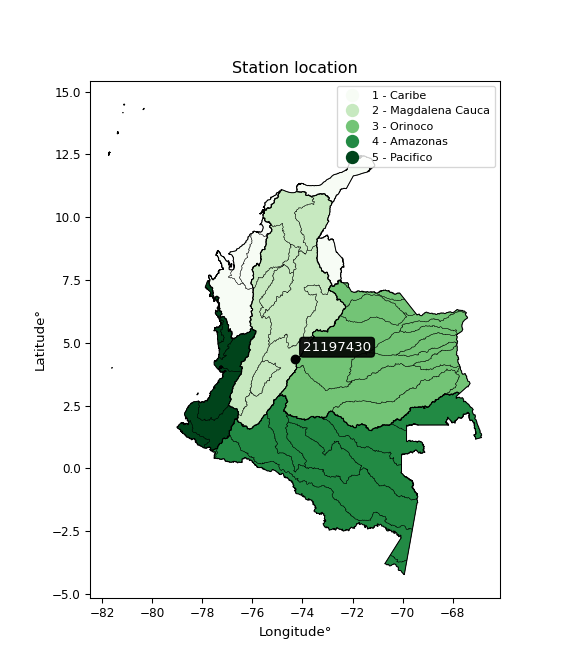</img>

</div>


## A. General information


### 1. General running parameters

• app_version: _v20260103_. • runtime: _2026-01-05 16:20:51.132608_. • Python version: _3.14.0_. • SciPy version: _1.16.3_. • Pandas version: _2.3.3_. • NumPy version: _2.3.5_. • Stations dataset (station_dataset_file): _dataset/pmax24h_in/automatic_colombia_2003_2024.csv_. • Stations catalog (station_catalog_file): _dataset/CNE.xls_. • Minimum year to eval til year_max (date_min): _1900_. • Maximum year to eval since year_min (date_max): _2024_. • Creates, save and include plots into reports (create_plot): _True_. • Plot only fit distributions with Δo > Δ (plot_only_fit): _True_. • Plot only simple graphs avoiding multiple CDFs and multiple Extreme values plots (plot_only_simple): _True_. • Eval low extreme values, if False, evaluates high extreme values (low_extreme): _False_. • Eval every SciPy distribution as logarithmic (pdist_logarithmic_on): _True_. • Standard deviation normalized (ddof): _1.0_. • Return periods to eval in years (Tr): _[2, 2.33, 5, 10, 15, 20, 25, 50, 75, 100, 200, 250, 500, 750, 1000]_. • Minimum data sample per station, 0 means any (minimum_sample): _5_. • Z-Score maximum threshold to adjust a value, 0 means disable (zscore_max): _3.5_. • Z-Score minimum threshold to adjust a value, 0 means disable (zscore_min): _-2.5_. • Avoid zeros, e.g. rain = 0 (avoid_zeros): _True_. • Avoid null values (avoid_nans): _True_. 

[:file_folder:Dataset file](../../dataset/pmax24h_in/automatic_colombia_2003_2024.csv)

> Delta Degrees of Freedom (DDOF): is a parameter used in the formulas for calculating variance and standard deviation. When ddof=0, the divisor is $N$ (the total number of observations) and this is used when your data set is the entire population. When ddof=1, the divisor is $N-1$ and this is used when your data set is a sample drawn from a larger population. Using $N-1$ provides an unbiased estimate of the population variance (known as Bessel´s correction).


### 2. Station info and location

|   id |   CODIGO | NOMBRE                       | CATEGORIA    | TECNOLOGIA                | ESTADO   | FECHA_INSTALACION   |   FECHA_SUSPENSION |   ALTITUD |   LATITUD |   LONGITUD | DEPARTAMENTO   | MUNICIPIO   | AREA_OPERATIVA                            | ENTIDAD                                       | AREA_HIDROGRAFICA   | ZONA_HIDROGRAFICA   | SUBZONA_HIDROGRAFICA   | CORRIENTE   | Catalogo   |   Version |
|-----:|---------:|:-----------------------------|:-------------|:--------------------------|:---------|:--------------------|-------------------:|----------:|----------:|-----------:|:---------------|:------------|:------------------------------------------|:----------------------------------------------|:--------------------|:--------------------|:-----------------------|:------------|:-----------|----------:|
|    0 | 21197430 | PROVIDENCIA - AUT [21197430] | Limnigráfica | Automática con Telemetría | Activa   | 01/06/2006          |                nan |      2140 |   4.36667 |      -74.3 | Cundinamarca   | Fusagasugá  | Area Operativa 11 - Cundinamarca-Amazonas | CORPORACION AUTONOMA REGIONAL DE CUNDINAMARCA | Magdalena Cauca     | Alto Magdalena      | Río Sumapaz            | Barroblanco | CNE_OE     |  20251226 |

<div align="center">

Dynamic map: [:earth_americas:Google](http://maps.google.com/maps?q=4.366666667,-74.3) [:earth_americas:OSM](https://www.openstreetmap.org/#map=18/4.366666667/-74.3&layers=P) [:earth_americas:Bing](https://www.bing.com/maps?cp=4.366666667~-74.3&lvl=18) [:earth_americas:Apple](https://maps.apple.com/frame?center=4.366666667%2C-74.3&span=0.003%2C0.006)

</div>


<div align="center">

```geojson
{
  "type": "Feature",
  "geometry": {
    "type": "Point", 
    "coordinates": [-74.3, 4.366666667]
  }, 
  "properties": {
    "Name": "21197430"
  }
}
```

</div>


### 3. Discrete values table and plot

<div align="center">

|               |           0 |           1 |           2 |          3 |           4 |           5 |           6 |           7 |           8 |          9 |          10 |         11 |
|:--------------|------------:|------------:|------------:|-----------:|------------:|------------:|------------:|------------:|------------:|-----------:|------------:|-----------:|
| Date          | 2006        | 2007        | 2008        | 2009       | 2010        | 2011        | 2012        | 2013        | 2015        | 2016       | 2017        | 2018       |
| Value         |   89.7      |   23        |   76        |  103.2     |   44.6      |    6.7      |   73.5      |   43.4      |   33.4      |  451       |  173.5      |  319.8     |
| Value_initial |   89.7      |   23        |   76        |  103.2     |   44.6      |    6.7      |   73.5      |   43.4      |   33.4      |  451       |  173.5      |  319.8     |
| count         |   12        |   12        |   12        |   12       |   12        |   12        |   12        |   12        |   12        |   12       |   12        |   12       |
| mean          |  119.817    |  119.817    |  119.817    |  119.817   |  119.817    |  119.817    |  119.817    |  119.817    |  119.817    |  119.817   |  119.817    |  119.817   |
| std           |  134.482    |  134.482    |  134.482    |  134.482   |  134.482    |  134.482    |  134.482    |  134.482    |  134.482    |  134.482   |  134.482    |  134.482   |
| zscore        |   -0.223946 |   -0.719923 |   -0.325818 |   -0.12356 |   -0.559306 |   -0.841128 |   -0.344408 |   -0.568229 |   -0.642589 |    2.46266 |    0.399186 |    1.48706 |


</div>


<div align="center">

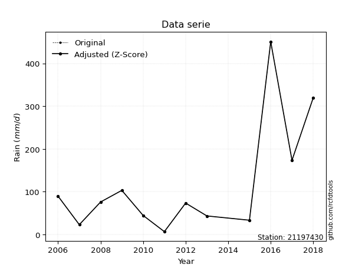</img>

</div>


> The initial value (value_initial) correspond to the initial obtained or null completed value, and value (value) is adjusted only when the initial value is outside the valid range (outlier) definite through the Z-Score value. If Z-Score is active, values out of range or outliers are replaced with the station mean value. A Z-Score (or standard score) measures how many standard deviations a data point is from the mean of a dataset, indicating its relative position; positive scores mean above the mean, negative mean below, and a score of zero is exactly at the mean, allowing for comparison of values from different distributions. It´s calculated using the formula $z=(x–μ)/σ$, where $x$ is the data point, $μ$ is the mean, and $σ$ is the standard deviation, helping identify outliers and understand probability.
>
> <sub>**Note**: In this study, "completing" (filling gaps in) and "extending" (forecasting or lengthening the historical record) rainfall data series are avoided for certain critical analyses because they introduce artificial bias and uncertainty, which can distort the statistics of rare events (extremes), alter day-to-day variability, and compromise the integrity and homogeneity of the original data. Some reasons against Completing/Extending rainfall data are: **Distortion of Extremes and Variability**: The primary issue is that most gap-filling or extension methods rely on averaging or regression with nearby stations, which inherently smooths the data. Rainfall is highly variable in space and time, with a large percentage of zero values and occasional large storms. Infilling methods often underestimate the highest values and overestimate the lowest (zero) values, which severely distorts analyses focused on flood frequency, drought severity, and intensity-duration-frequency (IDF) curves, **Loss of Data Homogeneity**: Infilled or extended data are synthetic estimates, not actual measurements. Combining these estimates with observed data can violate the assumption of data homogeneity, which requires that the data properties do not change over time. Inhomogeneity can lead to incorrect conclusions about long-term trends or changes in climate patterns, **Propagation of Errors**: Errors and biases from the original data (e.g., wind-induced undercatch, instrument errors, site changes) or the data used for imputation can propagate through the analysis, leading to unreliable hydrological models and inaccurate predictions, **Compromised Statistical Integrity**: For statistical analyses, especially those involving the frequency of events, using artificial data can introduce time bias or autocorrelation that doesn´t exist in reality, making it difficult to assess the true probability of events, **Difficulty in Validation**: It is difficult to accurately validate the quality of filled or extended data, especially for past periods where ground-truth measurements are unavailable. The reliability of imputation techniques heavily depends on the density of the surrounding station network and the complexity of the local topography.</sub>


### 4. Active continuous probability distributions from SciPy (44 of 104 available)

A Probability Density Function (PDF) describes the relative likelihood of a continuous random variable falling within a specific range, where the total area under its curve equals 1, and the area over any interval gives the actual probability for that range. Unlike discrete probabilities (like rolling a die), a PDF shows density, not direct probability for a single point (which is zero), with higher points indicating higher likelihood, often visualized as a bell curve for normal distributions.

A log of a probability density function (log-PDF) is simply the logarithm of the PDF´s value, denoted as $log(f(x))$, useful for converting multiplication of probabilities into addition, improving numerical stability with tiny numbers, and connecting to information theory concepts like entropy. Instead of dealing with very small probabilities (e.g., 0.000001), log-PDFs use negative numbers (e.g., $log(0.00001) ≈ -11.51$ that are easier for computers to handle, preventing underflow errors and simplifying complex calculations. In this study, each active probability distribution from SciPy is also evaluated in the $log$ form.

[scipy.stats](https://docs.scipy.org/doc/scipy/reference/stats.html) is a Python´s powerful submodule within the SciPy library for comprehensive statistical analysis, offering over 130 probability distributions (like Normal, Poisson), functions for descriptive stats (mean, variance), hypothesis testing (t-tests, chi-square), random variable generation, and statistical tests, making it essential for data science, modeling, and research. It provides tools to explore, model, and draw conclusions from data efficiently, working seamlessly with NumPy.

<div align="center">

|   id | p_dist             |   n_parameter | fit_method   | label                                                                       | active   | ref                                                                                                        |
|-----:|:-------------------|--------------:|:-------------|:----------------------------------------------------------------------------|:---------|:-----------------------------------------------------------------------------------------------------------|
|    0 | alpha              |             3 | MLE          | Alpha                                                                       | True     | [:mortar_board:](https://docs.scipy.org/doc/scipy/reference/generated/scipy.stats.alpha.html)              |
|    1 | betaprime          |             4 | MLE          | Beta prime                                                                  | True     | [:mortar_board:](https://docs.scipy.org/doc/scipy/reference/generated/scipy.stats.betaprime.html)          |
|    2 | chi2               |             3 | MLE          | Chi²                                                                        | True     | [:mortar_board:](https://docs.scipy.org/doc/scipy/reference/generated/scipy.stats.chi2.html)               |
|    3 | crystalball        |             4 | MLE          | Crystalball                                                                 | True     | [:mortar_board:](https://docs.scipy.org/doc/scipy/reference/generated/scipy.stats.crystalball.html)        |
|    4 | erlang             |             3 | MLE          | Erlang                                                                      | True     | [:mortar_board:](https://docs.scipy.org/doc/scipy/reference/generated/scipy.stats.erlang.html)             |
|    5 | expon              |             2 | MLE          | Exponential                                                                 | True     | [:mortar_board:](https://docs.scipy.org/doc/scipy/reference/generated/scipy.stats.expon.html)              |
|    6 | exponnorm          |             3 | MLE          | Exponentially modified Normal                                               | True     | [:mortar_board:](https://docs.scipy.org/doc/scipy/reference/generated/scipy.stats.exponnorm.html)          |
|    7 | f                  |             4 | MLE          | F                                                                           | True     | [:mortar_board:](https://docs.scipy.org/doc/scipy/reference/generated/scipy.stats.f.html)                  |
|    8 | fatiguelife        |             3 | MLE          | Fatigue-life (Birnbaum-Saunders)                                            | True     | [:mortar_board:](https://docs.scipy.org/doc/scipy/reference/generated/scipy.stats.fatiguelife.html)        |
|    9 | fisk               |             3 | MLE          | Fisk                                                                        | True     | [:mortar_board:](https://docs.scipy.org/doc/scipy/reference/generated/scipy.stats.fisk.html)               |
|   10 | gamma              |             3 | MLE          | Gamma                                                                       | True     | [:mortar_board:](https://docs.scipy.org/doc/scipy/reference/generated/scipy.stats.gamma.html)              |
|   11 | genexpon           |             5 | MLE          | Generalized exponential                                                     | True     | [:mortar_board:](https://docs.scipy.org/doc/scipy/reference/generated/scipy.stats.genexpon.html)           |
|   12 | genlogistic        |             3 | MLE          | Generalized logistic                                                        | True     | [:mortar_board:](https://docs.scipy.org/doc/scipy/reference/generated/scipy.stats.genlogistic.html)        |
|   13 | gibrat             |             2 | MM           | Gibrat                                                                      | True     | [:mortar_board:](https://docs.scipy.org/doc/scipy/reference/generated/scipy.stats.gibrat.html)             |
|   14 | gompertz           |             3 | MLE          | Gompertz (or truncated Gumbel)                                              | True     | [:mortar_board:](https://docs.scipy.org/doc/scipy/reference/generated/scipy.stats.gompertz.html)           |
|   15 | gumbel_l           |             2 | MM           | Gumbel Left Skew                                                            | True     | [:mortar_board:](https://docs.scipy.org/doc/scipy/reference/generated/scipy.stats.gumbel_l.html)           |
|   16 | gumbel_r           |             2 | MM           | Gumbel Right Skew                                                           | True     | [:mortar_board:](https://docs.scipy.org/doc/scipy/reference/generated/scipy.stats.gumbel_r.html)           |
|   17 | halflogistic       |             2 | MM           | Half-logistic                                                               | True     | [:mortar_board:](https://docs.scipy.org/doc/scipy/reference/generated/scipy.stats.halflogistic.html)       |
|   18 | halfnorm           |             2 | MM           | Half Normal                                                                 | True     | [:mortar_board:](https://docs.scipy.org/doc/scipy/reference/generated/scipy.stats.halfnorm.html)           |
|   19 | hypsecant          |             2 | MM           | hyperbolic secant                                                           | True     | [:mortar_board:](https://docs.scipy.org/doc/scipy/reference/generated/scipy.stats.hypsecant.html)          |
|   20 | invgamma           |             3 | MLE          | Inverted gamma                                                              | True     | [:mortar_board:](https://docs.scipy.org/doc/scipy/reference/generated/scipy.stats.invgamma.html)           |
|   21 | invgauss           |             3 | MLE          | Inverse Gaussian                                                            | True     | [:mortar_board:](https://docs.scipy.org/doc/scipy/reference/generated/scipy.stats.invgauss.html)           |
|   22 | invweibull         |             3 | MLE          | Inverted Weibull                                                            | True     | [:mortar_board:](https://docs.scipy.org/doc/scipy/reference/generated/scipy.stats.invweibull.html)         |
|   23 | johnsonsu          |             4 | MLE          | Johnson Su                                                                  | True     | [:mortar_board:](https://docs.scipy.org/doc/scipy/reference/generated/scipy.stats.johnsonsu.html)          |
|   24 | kstwobign          |             2 | MLE          | Limiting distribution of scaled Kolmogorov-Smirnov two-sided test statistic | True     | [:mortar_board:](https://docs.scipy.org/doc/scipy/reference/generated/scipy.stats.kstwobign.html)          |
|   25 | laplace            |             2 | MM           | Laplace                                                                     | True     | [:mortar_board:](https://docs.scipy.org/doc/scipy/reference/generated/scipy.stats.laplace.html)            |
|   26 | laplace_asymmetric |             3 | MLE          | Asymmetric Laplace                                                          | True     | [:mortar_board:](https://docs.scipy.org/doc/scipy/reference/generated/scipy.stats.laplace_asymmetric.html) |
|   27 | loggamma           |             3 | MLE          | Log gamma                                                                   | True     | [:mortar_board:](https://docs.scipy.org/doc/scipy/reference/generated/scipy.stats.loggamma.html)           |
|   28 | logistic           |             2 | MM           | Logistic (or Sech-squared)                                                  | True     | [:mortar_board:](https://docs.scipy.org/doc/scipy/reference/generated/scipy.stats.logistic.html)           |
|   29 | lognorm            |             3 | MLE          | Log Normal                                                                  | True     | [:mortar_board:](https://docs.scipy.org/doc/scipy/reference/generated/scipy.stats.lognorm.html)            |
|   30 | maxwell            |             2 | MM           | Maxwell                                                                     | True     | [:mortar_board:](https://docs.scipy.org/doc/scipy/reference/generated/scipy.stats.maxwell.html)            |
|   31 | mielke             |             4 | MLE          | Mielke Beta-Kappa / Dagum                                                   | True     | [:mortar_board:](https://docs.scipy.org/doc/scipy/reference/generated/scipy.stats.mielke.html)             |
|   32 | moyal              |             2 | MM           | Moyal                                                                       | True     | [:mortar_board:](https://docs.scipy.org/doc/scipy/reference/generated/scipy.stats.moyal.html)              |
|   33 | nakagami           |             3 | MLE          | Nakagami                                                                    | True     | [:mortar_board:](https://docs.scipy.org/doc/scipy/reference/generated/scipy.stats.nakagami.html)           |
|   34 | ncf                |             5 | MLE          | Non-central F distribution                                                  | True     | [:mortar_board:](https://docs.scipy.org/doc/scipy/reference/generated/scipy.stats.ncf.html)                |
|   35 | nct                |             4 | MLE          | Non-central Student’s t                                                     | True     | [:mortar_board:](https://docs.scipy.org/doc/scipy/reference/generated/scipy.stats.nct.html)                |
|   36 | norm               |             2 | MM           | Normal                                                                      | True     | [:mortar_board:](https://docs.scipy.org/doc/scipy/reference/generated/scipy.stats.norm.html)               |
|   37 | pearson3           |             3 | MM           | Pearson type III                                                            | True     | [:mortar_board:](https://docs.scipy.org/doc/scipy/reference/generated/scipy.stats.pearson3.html)           |
|   38 | rayleigh           |             2 | MM           | Rayleigh                                                                    | True     | [:mortar_board:](https://docs.scipy.org/doc/scipy/reference/generated/scipy.stats.rayleigh.html)           |
|   39 | rice               |             3 | MLE          | Rice                                                                        | True     | [:mortar_board:](https://docs.scipy.org/doc/scipy/reference/generated/scipy.stats.rice.html)               |
|   40 | t                  |             3 | MLE          | Student’s t                                                                 | True     | [:mortar_board:](https://docs.scipy.org/doc/scipy/reference/generated/scipy.stats.t.html)                  |
|   41 | truncnorm          |             4 | MLE          | Truncated normal                                                            | True     | [:mortar_board:](https://docs.scipy.org/doc/scipy/reference/generated/scipy.stats.truncnorm.html)          |
|   42 | wald               |             2 | MM           | Wald                                                                        | True     | [:mortar_board:](https://docs.scipy.org/doc/scipy/reference/generated/scipy.stats.wald.html)               |
|   43 | weibull_min        |             3 | MLE          | Weibull minimum                                                             | True     | [:mortar_board:](https://docs.scipy.org/doc/scipy/reference/generated/scipy.stats.weibull_min.html)        |

</div>

> **n_parameter:** # arguments & localization & scale.
>
> **Fit methods:** (MLE) maximum likelihood, (MM) L-moments.
>
>**Inactive** (With the only purpose of prevent loops, zero divisions, infinite values, over high estimated values or horizontal trending for recurrence intervals estimations, the follow distributions were disabled.)**:** foldnorm, gennorm, norminvgauss, powernorm, powerlognorm, skewnorm, genextreme, anglit, arcsine, argus, beta, bradford, burr, burr12, cauchy, cosine, halfcauchy, foldcauchy, skewcauchy, wrapcauchy, dgamma, gengamma, exponweib, exponpow, truncexpon, gausshyper, genhalflogistic, genhyperbolic, geninvgauss, halfgennorm, johnsonsb, kappa4, kappa3, ksone, kstwo, loglaplace, levy, levy_l, levy_stable, ncx2, pareto, genpareto, truncpareto, lomax, powerlaw, rdist, rel_breitwigner, recipinvgauss, semicircular, studentized_range, trapezoid, triang, truncweibull_min, tukeylambda, uniform, loguniform, vonmises, vonmises_line, weibull_max, dweibull, 


## B. Probability (PDF) vs. Empirical (EDF) distributions functions

A continuous probability distribution (CPD) describes probabilities for variables that can take any value within a range (like rain any time), unlike discrete variables with specific outcomes (like temperature). It uses a Probability Density Function (PDF), a curve where the total area under it equals 1, and the probability of the variable falling within an interval (a to b) is found by calculating the area under the curve between those points. A key feature is that the probability of hitting any single exact value is zero, so probabilities are always expressed for ranges, e.g., $P(a ≤ X ≤ b)$.

<div align="center">

Distributions parameters from station values
|    |   station | p_dist                |   n |              loc |           scale | shape                  | shape1             | shape2                | shape3   |
|---:|----------:|:----------------------|----:|-----------------:|----------------:|:-----------------------|:-------------------|:----------------------|:---------|
|  0 |  21197430 | alpha                 |  12 |     -0.0532968   |    21.3842      | 8.1338894103336e-11    |                    |                       |          |
|  1 |  21197430 | betaprime             |  12 |      6.7         |   225.425       | 0.9000614245382802     | 3.259939327024169  |                       |          |
|  2 |  21197430 | chi2                  |  12 |      6.7         |    42.2096      | 1.0633395627982396     |                    |                       |          |
|  3 |  21197430 | crystalball           |  12 |     14.6111      |   157.892       | 1357.5596917691873     | 295.88563000372926 |                       |          |
|  4 |  21197430 | erlang                |  12 |      6.7         |   255.532       | 0.2284917866648214     |                    |                       |          |
|  5 |  21197430 | expon                 |  12 |      6.7         |   113.117       |                        |                    |                       |          |
|  6 |  21197430 | exponnorm             |  12 |      6.5673      |     0.0438671   | 2575.6622066103564     |                    |                       |          |
|  7 |  21197430 | f                     |  12 |    -19.5891      |    74.776       | 2807.0721195220463     | 3.862655678895101  |                       |          |
|  8 |  21197430 | fatiguelife           |  12 |     -4.90035     |    78.277       | 1.0911608132527255     |                    |                       |          |
|  9 |  21197430 | fisk                  |  12 |      2.49009     |    67.3756      | 1.5027520245108101     |                    |                       |          |
| 10 |  21197430 | gamma                 |  12 |      6.7         |   126.485       | 0.7645540529470765     |                    |                       |          |
| 11 |  21197430 | genexpon              |  12 |      6.7         |   376.924       | 3.3321702835420153     | 1.1832426019436872 | 4.601349060646167e-12 |          |
| 12 |  21197430 | genlogistic           |  12 |   -492.425       |    73.6772      | 2016.4098178243994     |                    |                       |          |
| 13 |  21197430 | gibrat                |  12 |     21.5914      |    59.5766      |                        |                    |                       |          |
| 14 |  21197430 | gompertz              |  12 |      6.7         |     3.6572e+11  | 3239648989.9020133     |                    |                       |          |
| 15 |  21197430 | gumbel_l              |  12 |    177.764       |   100.391       |                        |                    |                       |          |
| 16 |  21197430 | gumbel_r              |  12 |     61.8693      |   100.391       |                        |                    |                       |          |
| 17 |  21197430 | halflogistic          |  12 |    -32.79        |   110.082       |                        |                    |                       |          |
| 18 |  21197430 | halfnorm              |  12 |    -50.6068      |   213.594       |                        |                    |                       |          |
| 19 |  21197430 | hypsecant             |  12 |    119.817       |    81.9691      |                        |                    |                       |          |
| 20 |  21197430 | invgamma              |  12 |    -19.6405      |   144.465       | 1.931330001505445      |                    |                       |          |
| 21 |  21197430 | invgauss              |  12 |     -8.69845     |   101.176       | 1.270210879796395      |                    |                       |          |
| 22 |  21197430 | invweibull            |  12 |    -31.0611      |    81.2033      | 1.7035668352489632     |                    |                       |          |
| 23 |  21197430 | johnsonsu             |  12 |     -1.66259     |     0.342717    | -5.743312012136769     | 0.9494881226321299 |                       |          |
| 24 |  21197430 | kstwobign             |  12 |   -213.804       |   389.194       |                        |                    |                       |          |
| 25 |  21197430 | laplace               |  12 |    119.817       |    91.0448      |                        |                    |                       |          |
| 26 |  21197430 | laplace_asymmetric    |  12 |      6.7         |     0.000159841 | 1.4130645482543892e-06 |                    |                       |          |
| 27 |  21197430 | loggamma              |  12 | -47430           |  6198.72        | 2145.273713924925      |                    |                       |          |
| 28 |  21197430 | logistic              |  12 |    119.817       |    70.9873      |                        |                    |                       |          |
| 29 |  21197430 | lognorm               |  12 |      6.7         |     2.9655      | 10.817123904529563     |                    |                       |          |
| 30 |  21197430 | maxwell               |  12 |   -185.283       |   191.193       |                        |                    |                       |          |
| 31 |  21197430 | mielke                |  12 |      6.7         |   150.339       | 0.6460944955722763     | 2.0602701874311125 |                       |          |
| 32 |  21197430 | moyal                 |  12 |     46.1853      |    57.9609      |                        |                    |                       |          |
| 33 |  21197430 | nakagami              |  12 |      6.7         |   260.132       | 0.09787541898381037    |                    |                       |          |
| 34 |  21197430 | ncf                   |  12 |     -0.578772    |    60.1671      | 3.634979819716108      | 5.019388140074996  | 0.9763844939703752    |          |
| 35 |  21197430 | nct                   |  12 |    -33.0529      |    10.3997      | 1.6991779964695013     | 7.962834206895964  |                       |          |
| 36 |  21197430 | norm                  |  12 |    119.817       |   128.757       |                        |                    |                       |          |
| 37 |  21197430 | pearson3              |  12 |    119.817       |   128.757       | 1.576834533532634      |                    |                       |          |
| 38 |  21197430 | rayleigh              |  12 |   -126.503       |   196.534       |                        |                    |                       |          |
| 39 |  21197430 | rice                  |  12 |    -68.01        |   161.024       | 0.0003439214709993886  |                    |                       |          |
| 40 |  21197430 | t                     |  12 |     61.1521      |    38.688       | 1.1709035034206035     |                    |                       |          |
| 41 |  21197430 | truncnorm             |  12 |  -5928.69        |   850.799       | 6.976252592540629      | 274.19048354594906 |                       |          |
| 42 |  21197430 | wald                  |  12 |     -8.94009     |   128.757       |                        |                    |                       |          |
| 43 |  21197430 | weibull_min           |  12 |      6.7         |   150.391       | 0.7028377461256147     |                    |                       |          |
| 44 |  21197430 | logalpha              |  12 |    -17.0999      |   403.941       | 18.987403729776602     |                    |                       |          |
| 45 |  21197430 | logbetaprime          |  12 |    -21.2107      |   520.3         | 543.5095019124246      | 11112.450003886526 |                       |          |
| 46 |  21197430 | logchi2               |  12 |      1.90211     |     1.2853      | 1.6772876488758879     |                    |                       |          |
| 47 |  21197430 | logcrystalball        |  12 |      4.24257     |     1.10102     | 34.37376231075866      | 1.3634981894009668 |                       |          |
| 48 |  21197430 | logerlang             |  12 |    -17.1649      |     0.0574583   | 372.46855504482323     |                    |                       |          |
| 49 |  21197430 | logexpon              |  12 |      1.90211     |     2.34046     |                        |                    |                       |          |
| 50 |  21197430 | logexponnorm          |  12 |      4.2417      |     1.10102     | 0.0007956409861044149  |                    |                       |          |
| 51 |  21197430 | logf                  |  12 |   -377.797       |   382.038       | 1156813.2048808476     | 305326.97011636593 |                       |          |
| 52 |  21197430 | logfatiguelife        |  12 |   -329.336       |   333.575       | 0.003298177198241609   |                    |                       |          |
| 53 |  21197430 | logfisk               |  12 |     -5.17688e+07 |     5.17688e+07 | 83216169.21672106      |                    |                       |          |
| 54 |  21197430 | loggamma              |  12 |    -17.1745      |     0.0578152   | 370.4626034076555      |                    |                       |          |
| 55 |  21197430 | loggenexpon           |  12 |      1.67215     |     0.0124946   | 0.00021903551466801374 | 1.2583871019291535 | 3.026695923167048e-05 |          |
| 56 |  21197430 | loggenlogistic        |  12 |      4.36337     |     0.596267    | 0.8900955931960635     |                    |                       |          |
| 57 |  21197430 | loggibrat             |  12 |      3.4026      |     0.509464    |                        |                    |                       |          |
| 58 |  21197430 | loggompertz           |  12 |      1.90211     |     1.22731     | 0.1144057850671426     |                    |                       |          |
| 59 |  21197430 | loggumbel_l           |  12 |      4.73809     |     0.858462    |                        |                    |                       |          |
| 60 |  21197430 | loggumbel_r           |  12 |      3.74705     |     0.858462    |                        |                    |                       |          |
| 61 |  21197430 | loghalflogistic       |  12 |      2.93759     |     0.941344    |                        |                    |                       |          |
| 62 |  21197430 | loghalfnorm           |  12 |      2.78523     |     1.8265      |                        |                    |                       |          |
| 63 |  21197430 | loghypsecant          |  12 |      4.24257     |     0.700931    |                        |                    |                       |          |
| 64 |  21197430 | loginvgamma           |  12 |    -15.3081      |  6063.41        | 311.2299130788749      |                    |                       |          |
| 65 |  21197430 | loginvgauss           |  12 |     -4.9465      |   580.608       | 0.015795873592873697   |                    |                       |          |
| 66 |  21197430 | loginvweibull         |  12 |     -2.44078e+08 |     2.44078e+08 | 214105392.9445144      |                    |                       |          |
| 67 |  21197430 | logjohnsonsu          |  12 |     13.8974      |     4.29705     | 14.842855280873458     | 9.614812619731847  |                       |          |
| 68 |  21197430 | logkstwobign          |  12 |     -0.477094    |     5.4209      |                        |                    |                       |          |
| 69 |  21197430 | loglaplace            |  12 |      4.24257     |     0.778539    |                        |                    |                       |          |
| 70 |  21197430 | loglaplace_asymmetric |  12 |      4.33073     |     0.83805     | 1.0540578716975277     |                    |                       |          |
| 71 |  21197430 | logloggamma           |  12 |     -5.80477     |     3.94196     | 13.28869714762624      |                    |                       |          |
| 72 |  21197430 | loglogistic           |  12 |      4.24257     |     0.607024    |                        |                    |                       |          |
| 73 |  21197430 | loglognorm            |  12 | -65534.1         | 65538.3         | 1.6799663608127355e-05 |                    |                       |          |
| 74 |  21197430 | logmaxwell            |  12 |      1.63362     |     1.63492     |                        |                    |                       |          |
| 75 |  21197430 | logmielke             |  12 |     -0.0147565   |     5.00158     | 4.0050908780900265     | 10.151712981756692 |                       |          |
| 76 |  21197430 | logmoyal              |  12 |      3.61294     |     0.495633    |                        |                    |                       |          |
| 77 |  21197430 | lognakagami           |  12 |      3.13549     |     1.60444     | 0.4063173515408005     |                    |                       |          |
| 78 |  21197430 | logncf                |  12 |     -1.62225     |     4.26679e-07 | 9.648700167189336e-06  | 270.7913275257537  | 131.74024510651327    |          |
| 79 |  21197430 | lognct                |  12 |    -45.2758      |     1.03532     | 8405.242040694178      | 47.82424421465183  |                       |          |
| 80 |  21197430 | lognorm               |  12 |      4.24257     |     1.10102     |                        |                    |                       |          |
| 81 |  21197430 | logpearson3           |  12 |      4.24257     |     1.10102     | -0.2403953480945829    |                    |                       |          |
| 82 |  21197430 | lograyleigh           |  12 |      2.13628     |     1.68058     |                        |                    |                       |          |
| 83 |  21197430 | logrice               |  12 |      1.23113     |     1.17185     | 2.342350225906907      |                    |                       |          |
| 84 |  21197430 | logt                  |  12 |      4.24257     |     1.10102     | 1403490629.9810774     |                    |                       |          |
| 85 |  21197430 | logtruncnorm          |  12 |      3.73675     |     1.5474      | -1.1856272508128212    | 53.72329545034168  |                       |          |
| 86 |  21197430 | logwald               |  12 |      3.14154     |     1.10103     |                        |                    |                       |          |
| 87 |  21197430 | logweibull_min        |  12 |     -0.229221    |     4.89229     | 4.647590938549501      |                    |                       |          |

</div>

> **loc** (Location parameter): This shifts the distribution along the x-axis. For many common distributions, like the normal (Gaussian) distribution, loc represents the mean $μ$. For others, like the uniform distribution, it might represent the minimum value, or for the beta distribution, the left end of the support interval.
>
> **scale** (Scale parameter): This determines the width or spread of the distribution. For the normal distribution, scale represents the standard deviation $σ$. For a uniform distribution, it defines the length of the interval (from $loc$ to $loc + scale$).
>
> **shape** (Shape parameters): Refers to parameters that define the specific form of a probability distribution, distinct from its location (loc) and scale (scale). These parameters are required arguments for most distribution functions. For example, a normal (Gaussian) distribution is fully defined by its location (mean) and scale (standard deviation), so it has no specific shape parameters beyond loc and scale. However, other distributions have intrinsic properties that need specification, as Gamma distribution that takes a shape parameter, often named $a$ or $alpha$.


### 0. Cumulative distribution values - CDF (88 evaluated)

Cumulative Distribution Function (CDF), denoted as $F$<sub>$X$</sub>$(x)$, is a function that gives the probability that a random variable $X$ will take a value less than or equal to a specific value, $x$ (i.e., $(P(X≥x)$. It essentially "accumulates" probabilities from a given point up to the far right (positive infinity), providing a complete picture of the distribution´s probabilities for both discrete (like rain) and continuous (like temperature) variables, helping to find probabilities over ranges or above certain values. Each station is evaluated separately ordering the $x$ values ascending, calculating the CDF and PDF values for the activated distributions and their logarithmic forms.

<div align="center">

CDF ordered by x ascending and calculating $log(f(x))$ separately
|   id |   Station |   date |     x |   count |    mean |     std |    zscore |   Value_initial |   station |   m |      alpha |   alpha_pdf |   betaprime |   betaprime_pdf |        chi2 |         chi2_pdf |   crystalball |   crystalball_pdf |      erlang |   erlang_pdf |    expon |   expon_pdf |   exponnorm |   exponnorm_pdf |         f |       f_pdf |   fatiguelife |   fatiguelife_pdf |      fisk |    fisk_pdf |       gamma |    gamma_pdf |    genexpon |   genexpon_pdf |   genlogistic |   genlogistic_pdf |      gibrat |   gibrat_pdf |   gompertz |   gompertz_pdf |   gumbel_l |   gumbel_l_pdf |   gumbel_r |   gumbel_r_pdf |   halflogistic |   halflogistic_pdf |   halfnorm |   halfnorm_pdf |   hypsecant |   hypsecant_pdf |   invgamma |   invgamma_pdf |   invgauss |   invgauss_pdf |   invweibull |   invweibull_pdf |   johnsonsu |   johnsonsu_pdf |   kstwobign |   kstwobign_pdf |   laplace |   laplace_pdf |   laplace_asymmetric |   laplace_asymmetric_pdf |   loggamma |   loggamma_pdf |   logistic |   logistic_pdf |   lognorm |   lognorm_pdf |   maxwell |   maxwell_pdf |      mielke |   mielke_pdf |    moyal |   moyal_pdf |    nakagami |   nakagami_pdf |       ncf |     ncf_pdf |       nct |     nct_pdf |     norm |    norm_pdf |   pearson3 |   pearson3_pdf |   rayleigh |   rayleigh_pdf |     rice |    rice_pdf |        t |       t_pdf |   truncnorm |   truncnorm_pdf |      wald |    wald_pdf |   weibull_min |   weibull_min_pdf |   logalpha |   logalpha_pdf |   logbetaprime |   logbetaprime_pdf |     logchi2 |   logchi2_pdf |   logcrystalball |   logcrystalball_pdf |   logerlang |   logerlang_pdf |   logexpon |   logexpon_pdf |   logexponnorm |   logexponnorm_pdf |      logf |   logf_pdf |   logfatiguelife |   logfatiguelife_pdf |   logfisk |   logfisk_pdf |   loggenexpon |   loggenexpon_pdf |   loggenlogistic |   loggenlogistic_pdf |   loggibrat |   loggibrat_pdf |   loggompertz |   loggompertz_pdf |   loggumbel_l |   loggumbel_l_pdf |   loggumbel_r |   loggumbel_r_pdf |   loghalflogistic |   loghalflogistic_pdf |   loghalfnorm |   loghalfnorm_pdf |   loghypsecant |   loghypsecant_pdf |   loginvgamma |   loginvgamma_pdf |   loginvgauss |   loginvgauss_pdf |   loginvweibull |   loginvweibull_pdf |   logjohnsonsu |   logjohnsonsu_pdf |   logkstwobign |   logkstwobign_pdf |   loglaplace |   loglaplace_pdf |   loglaplace_asymmetric |   loglaplace_asymmetric_pdf |   logloggamma |   logloggamma_pdf |   loglogistic |   loglogistic_pdf |   loglognorm |   loglognorm_pdf |   logmaxwell |   logmaxwell_pdf |   logmielke |   logmielke_pdf |    logmoyal |   logmoyal_pdf |   lognakagami |   lognakagami_pdf |     logncf |   logncf_pdf |    lognct |   lognct_pdf |   logpearson3 |   logpearson3_pdf |   lograyleigh |   lograyleigh_pdf |   logrice |   logrice_pdf |     logt |   logt_pdf |   logtruncnorm |   logtruncnorm_pdf |   logwald |   logwald_pdf |   logweibull_min |   logweibull_min_pdf |
|-----:|----------:|-------:|------:|--------:|--------:|--------:|----------:|----------------:|----------:|----:|-----------:|------------:|------------:|----------------:|------------:|-----------------:|--------------:|------------------:|------------:|-------------:|---------:|------------:|------------:|----------------:|----------:|------------:|--------------:|------------------:|----------:|------------:|------------:|-------------:|------------:|---------------:|--------------:|------------------:|------------:|-------------:|-----------:|---------------:|-----------:|---------------:|-----------:|---------------:|---------------:|-------------------:|-----------:|---------------:|------------:|----------------:|-----------:|---------------:|-----------:|---------------:|-------------:|-----------------:|------------:|----------------:|------------:|----------------:|----------:|--------------:|---------------------:|-------------------------:|-----------:|---------------:|-----------:|---------------:|----------:|--------------:|----------:|--------------:|------------:|-------------:|---------:|------------:|------------:|---------------:|----------:|------------:|----------:|------------:|---------:|------------:|-----------:|---------------:|-----------:|---------------:|---------:|------------:|---------:|------------:|------------:|----------------:|----------:|------------:|--------------:|------------------:|-----------:|---------------:|---------------:|-------------------:|------------:|--------------:|-----------------:|---------------------:|------------:|----------------:|-----------:|---------------:|---------------:|-------------------:|----------:|-----------:|-----------------:|---------------------:|----------:|--------------:|--------------:|------------------:|-----------------:|---------------------:|------------:|----------------:|--------------:|------------------:|--------------:|------------------:|--------------:|------------------:|------------------:|----------------------:|--------------:|------------------:|---------------:|-------------------:|--------------:|------------------:|--------------:|------------------:|----------------:|--------------------:|---------------:|-------------------:|---------------:|-------------------:|-------------:|-----------------:|------------------------:|----------------------------:|--------------:|------------------:|--------------:|------------------:|-------------:|-----------------:|-------------:|-----------------:|------------:|----------------:|------------:|---------------:|--------------:|------------------:|-----------:|-------------:|----------:|-------------:|--------------:|------------------:|--------------:|------------------:|----------:|--------------:|---------:|-----------:|---------------:|-------------------:|----------:|--------------:|-----------------:|---------------------:|
|    0 |  21197430 |   2011 |   6.7 |      12 | 119.817 | 134.482 | -0.841128 |             6.7 |  21197430 |   1 | 0.00154295 | 0.00248743  | 4.57933e-09 |     0.11294     | 1.53159e-09 | 458410           |      0.48002  |       0.00252352  | 0.000112514 |  2.89453e+10 | 0        | 0.00884043  |  0.00117388 |     0.0088292   | 0.0243146 | 0.00433451  |     0.0212886 |       0.0060143   | 0.0152637 | 0.00536532  | 8.32239e-14 | 71.6401      | 1.24437e-13 |    0.00884043  |      0.100004 |       0.00312352  | 0           |  0           | 1.5738e-11 |    0.00885829  |   0.166364 |    0.00151096  |   0.176849 |    0.00305189  |       0.177467 |        0.004399    |   0.21153  |    0.00360346  |    0.156905 |     0.00183761  |  0.0243144 |    0.00433449  |  0.0219259 |    0.00521053  |    0.0250868 |      0.00417106  |   0.0201079 |     0.0055179   |   0.0947757 |     0.00287403  |  0.144341 |   0.00158539  |          9.58753e-11 |              0.00884043  |  0.0150452 |      0.0368692 |   0.168895 |    0.00197739  | 0.0167632 |     0.0378348 |  0.200752 |   0.00254159  | 2.82892e-08 | 58.605       | 0.159778 | 0.00360206  | 0.000318683 |    7.02364e+10 | 0.0249083 | 0.00564373  | 0.0255959 | 0.00399697  | 0.189828 | 0.00210641  |   0.166321 |    0.00437462  |   0.20521  |    0.00274087  | 0.102044 | 0.00258735  | 0.183794 | 0.00289083  | 9.42218e-06 |     0.00836175  | 0.0106293 | 0.00305276  |   7.78045e-13 |     615.686       |  0.0115925 |      0.0339096 |      0.0159403 |          0.0381713 | 3.58275e-14 |   135.318     |        0.0167633 |            0.037835  |   0.0150227 |       0.0369434 |   0        |      0.427266  |      0.0167633 |          0.0378351 | 0.0163186 |  0.0373059 |        0.0165318 |            0.0376799 | 0.0221885 |     0.0348756 |     0.0104262 |         0.0728508 |        0.0250131 |            0.0367468 |   0         |       0         |   8.08001e-09 |         0.0932164 |     0.0360849 |         0.0412667 |   0.000188315 |        0.00188157 |          0        |             0         |      0        |         0         |      0.0225712 |          0.0321748 |     0.0121522 |         0.0337459 |     0.0114859 |         0.0353808 |      0.00851424 |           0.0355959 |      0.0234798 |          0.0418385 |     0.00944625 |          0.0468864 |     0.024739 |        0.0317762 |               0.0336679 |                   0.0381138 |     0.0233817 |         0.0417762 |     0.0207217 |         0.0334291 |    0.0167621 |        0.0378341 |   0.00116845 |        0.0129854 |   0.0214687 |       0.044854  | 1.93636e-08 |    6.34904e-07 |   0           |         0         | 0.00958312 |    0.0313278 | 0.0166202 |    0.0378795 |     0.0223786 |         0.0415972 |      0        |         0         | 0.0120216 |     0.0401125 | 0.016763 |  0.0378346 |    6.50483e-11 |          0.144722  |  0        |     0         |        0.0208115 |            0.0449062 |
|    1 |  21197430 |   2007 |  23   |      12 | 119.817 | 134.482 | -0.719923 |            23   |  21197430 |   2 | 0.353616   | 0.0208797   | 0.244007    |     0.0115412   | 0.440163    |      0.0126358   |      0.521186 |       0.00252312  | 0.578407    |  0.00769673  | 0.134198 | 0.00765406  |  0.135357   |     0.0076526   | 0.137428  | 0.00859463  |     0.161598  |       0.00913823  | 0.1434    | 0.00900015  | 0.214183    |  0.00933189  | 0.134198    |    0.00765406  |      0.157904 |       0.00395402  | 9.03062e-05 |  0.000255349 | 0.13445    |    0.00766729  |   0.192681 |    0.00172122  |   0.229278 |    0.00336369  |       0.248113 |        0.00426244  |   0.269613 |    0.00352017  |    0.189587 |     0.00217856  |  0.137428  |    0.00859462  |  0.151772  |    0.00908941  |    0.135353  |      0.00852989  |   0.152684  |     0.00908204  |   0.147096  |     0.00351889  |  0.172641 |   0.00189622  |          0.134198    |              0.00765406  |  0.159542  |      0.22611   |   0.203614 |    0.00228429  | 0.157328  |     0.218561  |  0.243819 |   0.00273609  | 0.237247    |  0.00930822  | 0.22193  | 0.00398737  | 0.486379    |    0.005839    | 0.148251  | 0.00842855  | 0.132213  | 0.00837542  | 0.226045 | 0.00233541  |   0.238295 |    0.00442133  |   0.251233 |    0.00289813  | 0.147621 | 0.00299187  | 0.242245 | 0.00439339  | 0.127583    |     0.00731429  | 0.110689  | 0.00802335  |   0.189227    |       0.00733339  |  0.164861  |      0.244746  |      0.161741  |          0.226051  | 0.465223    |     0.241257  |        0.157328  |            0.218561  |   0.160337  |       0.227592  |   0.409617 |      0.25225   |      0.157328  |          0.21856   | 0.156623  |  0.21902   |        0.157586  |            0.219689  | 0.141471  |     0.195236  |     0.24916   |         0.280748  |        0.143733  |            0.190291  |   0         |       0         |   0.179732    |         0.208877  |     0.143255  |         0.154305  |   0.130177    |        0.309173   |          0.104731 |             0.525329  |      0.152075 |         0.428879  |      0.12939   |          0.179556  |     0.160091  |         0.237108  |     0.172072  |         0.252079  |      0.198811   |           0.281721  |      0.156009  |          0.198559  |     0.23384    |          0.294893  |     0.120616 |        0.154927  |               0.13602   |                   0.153981  |     0.156213  |         0.19932   |     0.138981  |         0.197135  |    0.157328  |        0.218564  |   0.161053   |        0.27007   |   0.156447  |       0.197095  | 0.105503    |    0.351504    |   1.77964e-13 |       325.654     | 0.16433    |    0.249813  | 0.158044  |    0.219847  |     0.156891  |         0.202174  |      0.162015 |         0.296468  | 0.162026  |     0.228062  | 0.157327 |  0.21856   |    0.261776    |          0.271017  |  0        |     0         |        0.161028  |            0.203469  |
|    2 |  21197430 |   2015 |  33.4 |      12 | 119.817 | 134.482 | -0.642589 |            33.4 |  21197430 |   3 | 0.522676   | 0.0124287   | 0.351231    |     0.00921996  | 0.549771    |      0.00886597  |      0.547362 |       0.00250886  | 0.642712    |  0.00504985  | 0.210251 | 0.00698173  |  0.211391   |     0.00697965  | 0.229057  | 0.00880811  |     0.251712  |       0.00812391  | 0.236683  | 0.00878337  | 0.301794    |  0.00765242  | 0.210251    |    0.00698173  |      0.201317 |       0.00437799  | 0.0527841   |  0.00911864  | 0.210627   |    0.00699249  |   0.211323 |    0.00186501  |   0.265039 |    0.00350568  |       0.291897 |        0.00415505  |   0.305903 |    0.00345749  |    0.213455 |     0.00241326  |  0.229057  |    0.00880811  |  0.244164  |    0.00853261  |    0.227199  |      0.00889806  |   0.244802  |     0.00850883  |   0.185416  |     0.00383721  |  0.193532 |   0.00212568  |          0.210251    |              0.00698173  |  0.257485  |      0.296847  |   0.228403 |    0.00248262  | 0.252492  |     0.290138  |  0.272822 |   0.00283841  | 0.324527    |  0.00763597  | 0.264163 | 0.00412035  | 0.535678    |    0.00392363  | 0.235326  | 0.00819711  | 0.22332   | 0.00890255  | 0.251059 | 0.00247357  |   0.284006 |    0.00435992  |   0.281782 |    0.00297328  | 0.179887 | 0.00320757  | 0.294537 | 0.00570297  | 0.200488    |     0.00671434  | 0.196611  | 0.00828339  |   0.256761    |       0.00580557  |  0.269835  |      0.31438   |      0.259464  |          0.295756  | 0.547205    |     0.199956  |        0.252492  |            0.290138  |   0.258908  |       0.298672  |   0.496605 |      0.215083  |      0.252492  |          0.290137  | 0.25204   |  0.290993  |        0.253216  |            0.291433  | 0.230862  |     0.285428  |     0.357871  |         0.298311  |        0.230754  |            0.278143  |   0.0581687 |       1.09726   |   0.265923    |         0.253331  |     0.212405  |         0.21906   |   0.267069    |        0.410732   |          0.294303 |             0.48515   |      0.307907 |         0.403892  |      0.214855  |          0.283776  |     0.26255   |         0.309183  |     0.279025  |         0.31714   |      0.312064   |           0.318786  |      0.242981  |          0.267654  |     0.347948   |          0.311173  |     0.194766 |        0.250168  |               0.207499  |                   0.234899  |     0.243531  |         0.268725  |     0.229842  |         0.291611  |    0.252494  |        0.290142  |   0.274466   |        0.332537  |   0.243098  |       0.268673  | 0.266549    |    0.482426    |   0.237463    |         0.509235  | 0.271027   |    0.317998  | 0.253661  |    0.291179  |     0.245264  |         0.271312  |      0.283501 |         0.348129  | 0.260085  |     0.295591  | 0.252491 |  0.290138  |    0.366727    |          0.289107  |  0.201408 |     0.966635  |        0.248904  |            0.267308  |
|    3 |  21197430 |   2013 |  43.4 |      12 | 119.817 | 134.482 | -0.568229 |            43.4 |  21197430 |   4 | 0.622635   | 0.00800569  | 0.43494     |     0.00759712  | 0.627259    |      0.00678546  |      0.57234  |       0.00248503  | 0.686376    |  0.00379923  | 0.277071 | 0.00639101  |  0.278188   |     0.00638846  | 0.314386  | 0.00817777  |     0.327514  |       0.00705112  | 0.320878  | 0.00800473  | 0.372578    |  0.00656048  | 0.277071    |    0.00639101  |      0.246718 |       0.00468482  | 0.157458    |  0.0110402   | 0.277544   |    0.00639972  |   0.230692 |    0.00200975  |   0.300597 |    0.00359905  |       0.332876 |        0.00403876  |   0.340149 |    0.00339069  |    0.238752 |     0.00264718  |  0.314385  |    0.00817778  |  0.324785  |    0.00757029  |    0.313761  |      0.00832067  |   0.325381  |     0.00758698  |   0.225002  |     0.00406746  |  0.216    |   0.00237246  |          0.277071    |              0.00639101  |  0.34045   |      0.334363  |   0.254172 |    0.00267046  | 0.334036  |     0.330513  |  0.301627 |   0.0029197   | 0.395431    |  0.00660019  | 0.305685 | 0.00417227  | 0.570049    |    0.00303514  | 0.314216  | 0.00754283  | 0.310422  | 0.00841232  | 0.276425 | 0.00259808  |   0.327117 |    0.00425617  |   0.311799 |    0.00302718  | 0.212863 | 0.00338217  | 0.35847  | 0.00707731  | 0.264939    |     0.00618304  | 0.277129  | 0.00775147  |   0.310015    |       0.00490345  |  0.356682  |      0.345832  |      0.34207   |          0.332764  | 0.596388    |     0.176239  |        0.334037  |            0.330513  |   0.342353  |       0.336169  |   0.549899 |      0.192313  |      0.334036  |          0.330512  | 0.333823  |  0.331446  |        0.335082  |            0.331635  | 0.313792  |     0.346128  |     0.436149  |         0.297802  |        0.311839  |            0.339797  |   0.372342  |       1.02849   |   0.336278    |         0.283536  |     0.276714  |         0.27294   |   0.377909    |        0.428376   |          0.415617 |             0.439405  |      0.410394 |         0.377693  |      0.300187  |          0.367551  |     0.348493  |         0.344331  |     0.366026  |         0.344208  |      0.396329   |           0.321763  |      0.319064  |          0.312168  |     0.428878   |          0.304819  |     0.272653 |        0.350212  |               0.279112  |                   0.315969  |     0.319906  |         0.313288  |     0.314806  |         0.355345  |    0.334039  |        0.330516  |   0.3649     |        0.354857  |   0.320245  |       0.319944  | 0.393619    |    0.477211    |   0.361515    |         0.442125  | 0.358497   |    0.346827  | 0.335414  |    0.331023  |     0.322201  |         0.314892  |      0.376729 |         0.360628  | 0.342496  |     0.331547  | 0.334036 |  0.330513  |    0.443032    |          0.292199  |  0.424249 |     0.714532  |        0.324364  |            0.307831  |
|    4 |  21197430 |   2010 |  44.6 |      12 | 119.817 | 134.482 | -0.559306 |            44.6 |  21197430 |   5 | 0.632014   | 0.00763002  | 0.443956    |     0.0074302   | 0.635283    |      0.00658964  |      0.575319 |       0.00248152  | 0.690869    |  0.00368872  | 0.284699 | 0.00632357  |  0.285814   |     0.00632097  | 0.324139  | 0.00807644  |     0.335903  |       0.00693008  | 0.330418  | 0.00789534  | 0.380384    |  0.00644949  | 0.284699    |    0.00632357  |      0.252358 |       0.00471455  | 0.170702    |  0.0110273   | 0.285183   |    0.00633205  |   0.233114 |    0.00202752  |   0.304921 |    0.00360744  |       0.337713 |        0.00402403  |   0.344213 |    0.00338226  |    0.241946 |     0.00267555  |  0.324138  |    0.00807645  |  0.333797  |    0.00745034  |    0.323686  |      0.00822077  |   0.334417  |     0.00747182  |   0.229897  |     0.00409007  |  0.218866 |   0.00240393  |          0.284699    |              0.00632357  |  0.349611  |      0.337401  |   0.25739  |    0.0026926   | 0.343098  |     0.33394   |  0.305136 |   0.0029283   | 0.403288    |  0.0064951   | 0.310693 | 0.00417394  | 0.573644    |    0.00295723  | 0.323213  | 0.00745235  | 0.32046   | 0.00831839  | 0.279551 | 0.00261238  |   0.332215 |    0.00424142  |   0.315435 |    0.00303246  | 0.216933 | 0.00340092  | 0.367057 | 0.00723349  | 0.272322    |     0.00612212  | 0.28638   | 0.00766595  |   0.315846    |       0.00481575  |  0.366145  |      0.348034  |      0.351187  |          0.335767  | 0.601164    |     0.173972  |        0.343098  |            0.33394   |   0.351564  |       0.339191  |   0.555114 |      0.190085  |      0.343098  |          0.333939  | 0.34291   |  0.334869  |        0.344174  |            0.33503   | 0.323309  |     0.35168   |     0.444264  |         0.297196  |        0.321187  |            0.345614  |   0.399696  |       0.977555  |   0.344052    |         0.286512  |     0.284238  |         0.27882   |   0.389585    |        0.427802   |          0.427529 |             0.43407   |      0.420654 |         0.374622  |      0.310326  |          0.375858  |     0.357921  |         0.346975  |     0.375439  |         0.345953  |      0.405096   |           0.321106  |      0.327635  |          0.316324  |     0.437174   |          0.303505  |     0.282374 |        0.362698  |               0.287864  |                   0.325877  |     0.328507  |         0.317436  |     0.324577  |         0.36115   |    0.343101  |        0.333943  |   0.374595   |        0.356074  |   0.329041  |       0.325008  | 0.406584    |    0.473393    |   0.373493    |         0.436212  | 0.367983   |    0.348718  | 0.344489  |    0.33438   |     0.330845  |         0.318903  |      0.386568 |         0.360859  | 0.351579  |     0.334481  | 0.343097 |  0.33394   |    0.450999    |          0.292041  |  0.443357 |     0.686733  |        0.332811  |            0.311612  |
|    5 |  21197430 |   2012 |  73.5 |      12 | 119.817 | 134.482 | -0.344408 |            73.5 |  21197430 |   6 | 0.771257   | 0.00302325  | 0.61264     |     0.00455265  | 0.776216    |      0.00358849  |      0.645415 |       0.00235692  | 0.771181    |  0.00212746  | 0.445972 | 0.00489784  |  0.446998   |     0.00489439  | 0.519157  | 0.00546195  |     0.500576  |       0.0046634   | 0.519727  | 0.00528241  | 0.535789    |  0.004491    | 0.445972    |    0.00489784  |      0.394455 |       0.00497925  | 0.445208    |  0.00761288  | 0.446633   |    0.00490189  |   0.298095 |    0.00247476  |   0.410407 |    0.00364086  |       0.448463 |        0.00362856  |   0.438787 |    0.0031553   |    0.32901  |     0.00333635  |  0.519157  |    0.00546196  |  0.510986  |    0.00497093  |    0.522013  |      0.00552873  |   0.513182  |     0.00503682  |   0.352949  |     0.00433388  |  0.300631 |   0.00330201  |          0.445972    |              0.00489784  |  0.526029  |      0.357122  |   0.342435 |    0.00317202  | 0.519817  |     0.361892  |  0.392006 |   0.00305901  | 0.560946    |  0.0045669   | 0.429485 | 0.00398011  | 0.6407      |    0.0018665   | 0.506257  | 0.00526215  | 0.522061  | 0.00562765  | 0.359527 | 0.0029043   |   0.448653 |    0.00379211  |   0.404172 |    0.00308518  | 0.320337 | 0.00370939  | 0.601448 | 0.00773559  | 0.429707    |     0.00482036  | 0.475678  | 0.00546641  |   0.431817    |       0.00337952  |  0.543476  |      0.349884  |      0.52673   |          0.355445  | 0.678667    |     0.13794   |        0.519817  |            0.361891  |   0.528714  |       0.358123  |   0.640621 |      0.15355   |      0.519816  |          0.361891  | 0.520011  |  0.362398  |        0.521223  |            0.362036  | 0.516094  |     0.401448  |     0.587238  |         0.270753  |        0.512908  |            0.404023  |   0.713321  |       0.380525  |   0.498911    |         0.32882   |     0.450315  |         0.38317   |   0.590497    |        0.362356   |          0.618276 |             0.328114  |      0.59224  |         0.310102  |      0.524822  |          0.452744  |     0.536764  |         0.356676  |     0.549925  |         0.341368  |      0.558213   |           0.285482  |      0.500222  |          0.364686  |     0.580128   |          0.265006  |     0.533933 |        0.598643  |               0.506745  |                   0.57366   |     0.501538  |         0.365205  |     0.522519  |         0.41101   |    0.51982   |        0.361891  |   0.551969   |        0.343569  |   0.510094  |       0.387771  | 0.616099    |    0.355905    |   0.566694    |         0.340014  | 0.544275   |    0.345397  | 0.521074  |    0.360907  |     0.503867  |         0.363626  |      0.562523 |         0.334729  | 0.526428  |     0.35441   | 0.519816 |  0.361892  |    0.593493    |          0.273708  |  0.687211 |     0.336515  |        0.501856  |            0.356426  |
|    6 |  21197430 |   2008 |  76   |      12 | 119.817 | 134.482 | -0.325818 |            76   |  21197430 |   7 | 0.778577   | 0.0028355   | 0.623802    |     0.00437804  | 0.78498     |      0.00342435  |      0.65129  |       0.00234275  | 0.776399    |  0.00204786  | 0.458083 | 0.00479078  |  0.4591     |     0.00478729  | 0.532562  | 0.00526303  |     0.512051  |       0.00451785  | 0.53269   | 0.00508887  | 0.546859    |  0.00436518  | 0.458083    |    0.00479078  |      0.406886 |       0.00496489  | 0.463849    |  0.00730222  | 0.458753   |    0.00479452  |   0.304332 |    0.00251462  |   0.419496 |    0.00362997  |       0.457488 |        0.00359142  |   0.446648 |    0.0031337   |    0.337416 |     0.00338765  |  0.532562  |    0.00526304  |  0.523202  |    0.00480268  |    0.535574  |      0.00532134  |   0.52556   |     0.00486733  |   0.36378   |     0.0043307   |  0.309001 |   0.00339394  |          0.458083    |              0.00479078  |  0.537954  |      0.355894  |   0.350408 |    0.00320652  | 0.531911  |     0.361179  |  0.399659 |   0.00306343  | 0.572198    |  0.00443525  | 0.439395 | 0.00394686  | 0.645296    |    0.00181126  | 0.519201  | 0.00509424  | 0.535863  | 0.00541523  | 0.366813 | 0.0029241   |   0.458078 |    0.00374779  |   0.411883 |    0.00308332  | 0.329628 | 0.00372331  | 0.620432 | 0.00744668  | 0.441634    |     0.00472144  | 0.489131  | 0.00529671  |   0.440158    |       0.00329375  |  0.55514   |      0.347521  |      0.5386    |          0.354252  | 0.683246    |     0.135852  |        0.531911  |            0.361179  |   0.540671  |       0.356815  |   0.64572  |      0.151372  |      0.53191   |          0.361178  | 0.532121  |  0.36164   |        0.53332   |            0.361247  | 0.529507  |     0.400465  |     0.59625   |         0.268115  |        0.526418  |            0.403663  |   0.725686  |       0.359066  |   0.509938    |         0.330469  |     0.46323   |         0.389034  |   0.602504    |        0.355596   |          0.62913  |             0.320922  |      0.602534 |         0.305385  |      0.539932  |          0.450556  |     0.548663  |         0.354723  |     0.5613    |         0.338772  |      0.567703   |           0.28194   |      0.512436  |          0.36557   |     0.588938   |          0.261758  |     0.553532 |        0.573469  |               0.5263    |                   0.595796  |     0.513768  |         0.36602   |     0.536246  |         0.409681  |    0.531914  |        0.361178  |   0.563412   |        0.340633  |   0.523083  |       0.388825  | 0.627853    |    0.34693     |   0.577967    |         0.334028  | 0.555785   |    0.342799  | 0.533133  |    0.360107  |     0.516041  |         0.364243  |      0.573662 |         0.331255  | 0.538265  |     0.353321  | 0.53191  |  0.361179  |    0.602612    |          0.27151   |  0.698219 |     0.321841  |        0.513794  |            0.357353  |
|    7 |  21197430 |   2006 |  89.7 |      12 | 119.817 | 134.482 | -0.223946 |            89.7 |  21197430 |   8 | 0.811683   | 0.00205876  | 0.677926    |     0.00355928  | 0.8265      |      0.00267551  |      0.682811 |       0.00225652  | 0.801863    |  0.00168878  | 0.519898 | 0.00424431  |  0.520865   |     0.00424063  | 0.597803  | 0.00429542  |     0.569006  |       0.00382394  | 0.595744  | 0.0041499   | 0.602336    |  0.00375419  | 0.519898    |    0.00424431  |      0.473943 |       0.0048022   | 0.553235    |  0.00580522  | 0.520609   |    0.00424659  |   0.340282 |    0.00273335  |   0.468656 |    0.00353804  |       0.505269 |        0.00338248  |   0.488745 |    0.00301059  |    0.385594 |     0.00363516  |  0.597803  |    0.00429542  |  0.583265  |    0.00399673  |    0.601331  |      0.0043145   |   0.586429  |     0.00404831  |   0.422715  |     0.00425824  |  0.359178 |   0.00394507  |          0.519898    |              0.00424431  |  0.596162  |      0.345305  |   0.395499 |    0.00336792  | 0.591189  |     0.352832  |  0.441701 |   0.0030687   | 0.62835     |  0.00377971  | 0.492065 | 0.00373469  | 0.668311    |    0.00156193  | 0.583119  | 0.00426143  | 0.602716  | 0.00438103  | 0.40753  | 0.00301481  |   0.507724 |    0.00349832  |   0.453971 |    0.00305633  | 0.38099  | 0.00376512  | 0.709958 | 0.00559503  | 0.502775    |     0.00421369  | 0.555779  | 0.00445869  |   0.482382    |       0.00288638  |  0.611531  |      0.331922  |      0.596554  |          0.343889  | 0.704935    |     0.12602   |        0.591189  |            0.352831  |   0.598998  |       0.345806  |   0.669941 |      0.141023  |      0.591188  |          0.352831  | 0.591457  |  0.353057  |        0.592579  |            0.352532  | 0.594978  |     0.387364  |     0.639531  |         0.253853  |        0.592648  |            0.393179  |   0.777602  |       0.272368  |   0.565207    |         0.335591  |     0.529842  |         0.413323  |   0.658556    |        0.320437   |          0.679404 |             0.285979  |      0.651188 |         0.281653  |      0.61286   |          0.425877  |     0.606392  |         0.340762  |     0.616171  |         0.322452  |      0.612902   |           0.263201  |      0.573083  |          0.364845  |     0.630947   |          0.245018  |     0.639142 |        0.463507  |               0.615433  |                   0.483689  |     0.574459  |         0.364922  |     0.603069  |         0.394345  |    0.591192  |        0.352829  |   0.618475   |        0.323016  |   0.587488  |       0.386119  | 0.681722    |    0.303482    |   0.630903    |         0.304912  | 0.611314   |    0.326344  | 0.592201  |    0.351383  |     0.576363  |         0.362272  |      0.626993 |         0.311706  | 0.596113  |     0.343559  | 0.591188 |  0.352832  |    0.646615    |          0.259083  |  0.746188 |     0.259746  |        0.573129  |            0.357378  |
|    8 |  21197430 |   2009 | 103.2 |      12 | 119.817 | 134.482 | -0.12356  |           103.2 |  21197430 |   9 | 0.835928   | 0.00156643  | 0.721582    |     0.00293376  | 0.858731    |      0.00212473  |      0.712627 |       0.0021587   | 0.822807    |  0.00142605  | 0.573909 | 0.00376683  |  0.574826   |     0.00376304  | 0.650434  | 0.00353066  |     0.616814  |       0.00327836  | 0.646582  | 0.00340979  | 0.649557    |  0.00325652  | 0.573909    |    0.00376683  |      0.537043 |       0.00453079  | 0.623494    |  0.00465236  | 0.574642   |    0.00376794  |   0.378619 |    0.00294508  |   0.515548 |    0.00340232  |       0.549506 |        0.00317055  |   0.52853  |    0.0028824   |    0.43591  |     0.00380484  |  0.650434  |    0.00353067  |  0.632795  |    0.00336458  |    0.65403   |      0.00352361  |   0.636539  |     0.00339855  |   0.479282  |     0.00411111  |  0.416588 |   0.00457564  |          0.573909    |              0.00376683  |  0.643622  |      0.330959  |   0.441746 |    0.00347395  | 0.639806  |     0.339855  |  0.482992 |   0.00304366  | 0.675556    |  0.00322809  | 0.540868 | 0.00349119  | 0.688106    |    0.0013788   | 0.635898  | 0.00357927  | 0.656155  | 0.00356751  | 0.448657 | 0.00307272  |   0.553263 |    0.00324809  |   0.494904 |    0.00300375  | 0.431788 | 0.00375198  | 0.774036 | 0.00397182  | 0.556582    |     0.00376583  | 0.611213  | 0.00377573  |   0.5191      |       0.00256419  |  0.656875  |      0.314349  |      0.643831  |          0.329779  | 0.722057    |     0.118322  |        0.639806  |            0.339855  |   0.646501  |       0.331084  |   0.689131 |      0.132824  |      0.639804  |          0.339855  | 0.640091  |  0.339885  |        0.641133  |            0.339273  | 0.647928  |     0.366689  |     0.674197  |         0.240507  |        0.646519  |            0.373862  |   0.811844  |       0.218578  |   0.612298    |         0.335456  |     0.588757  |         0.425667  |   0.701336    |        0.289834   |          0.7175   |             0.257713  |      0.689252 |         0.261338  |      0.670223  |          0.390722  |     0.653039  |         0.324012  |     0.660178  |         0.30482   |      0.648626   |           0.246309  |      0.623789  |          0.357482  |     0.664271   |          0.230314  |     0.69861  |        0.387123  |               0.677603  |                   0.405495  |     0.625153  |         0.35722   |     0.656837  |         0.371323  |    0.639808  |        0.339852  |   0.662512   |        0.304749  |   0.640827  |       0.373169  | 0.721821    |    0.268972    |   0.671966    |         0.280989  | 0.655851   |    0.308472  | 0.640597  |    0.338181  |     0.626645  |         0.354034  |      0.669384 |         0.292694  | 0.643383  |     0.330015  | 0.639805 |  0.339856  |    0.682094    |          0.246796  |  0.779604 |     0.218426  |        0.622871  |            0.351265  |
|    9 |  21197430 |   2017 | 173.5 |      12 | 119.817 | 134.482 |  0.399186 |           173.5 |  21197430 |  10 | 0.901938   | 0.000562174 | 0.856786    |     0.00122131  | 0.948677    |      0.000715054 |      0.842868 |       0.00152283  | 0.893616    |  0.000710054 | 0.771126 | 0.00202334  |  0.771782   |     0.00201987  | 0.811353  | 0.00143767  |     0.781268  |       0.00164643  | 0.80214   | 0.00139468  | 0.814351    |  0.00164216  | 0.771126    |    0.00202334  |      0.787059 |       0.0025578   | 0.825368    |  0.00169465  | 0.771807   |    0.0020214   |   0.6165   |    0.0036612   |   0.719704 |    0.00235799  |       0.733831 |        0.00209612  |   0.705922 |    0.00215428  |    0.694988 |     0.0031772   |  0.811353  |    0.00143768  |  0.795065  |    0.0015545   |    0.812836  |      0.00140276  |   0.798526  |     0.00152426  |   0.724759  |     0.00279286  |  0.722736 |   0.00304536  |          0.771126    |              0.00202334  |  0.795527  |      0.247938  |   0.680536 |    0.00306261  | 0.796669  |     0.256803  |  0.682008 |   0.00252649  | 0.830609    |  0.00143714  | 0.738799 | 0.00217097  | 0.764108    |    0.00086443  | 0.804625  | 0.0015548   | 0.815865  | 0.0013991   | 0.661637 | 0.00284048  |   0.738218 |    0.00206244  |   0.688092 |    0.00242256  | 0.675271 | 0.00302467  | 0.909568 | 0.00086258  | 0.756742    |     0.00208913  | 0.793252  | 0.00172772  |   0.658873    |       0.00154592  |  0.798909  |      0.229054  |      0.795366  |          0.247661  | 0.776943    |     0.0939959 |        0.796669  |            0.256803  |   0.798134  |       0.246847  |   0.751013 |      0.106384  |      0.796668  |          0.256804  | 0.796825  |  0.256363  |        0.79751   |            0.255659  | 0.809233  |     0.248151  |     0.785111  |         0.185654  |        0.811444  |            0.253433  |   0.891781  |       0.105979  |   0.778454    |         0.292707  |     0.803572  |         0.372385  |   0.823906    |        0.185902   |          0.826951 |             0.167926  |      0.805741 |         0.188115  |      0.831166  |          0.229735  |     0.80002   |         0.237403  |     0.79788   |         0.22257   |      0.759985   |           0.182969  |      0.792843  |          0.28221   |     0.769652   |          0.175815  |     0.845357 |        0.198632  |               0.832267  |                   0.210966  |     0.793781  |         0.280962  |     0.818328  |         0.244912  |    0.796669  |        0.256799  |   0.800049   |        0.222396  |   0.808651  |       0.260732  | 0.833042    |    0.165949    |   0.796162    |         0.199107  | 0.795129   |    0.224953  | 0.796546  |    0.255187  |     0.793513  |         0.277945  |      0.801009 |         0.212769  | 0.7955    |     0.249401  | 0.796669 |  0.256804  |    0.796519    |          0.191896  |  0.86484  |     0.121284  |        0.790397  |            0.282643  |
|   10 |  21197430 |   2018 | 319.8 |      12 | 119.817 | 134.482 |  1.48706  |           319.8 |  21197430 |  11 | 0.946696   | 0.000166403 | 0.950078    |     0.000306749 | 0.992807    |      9.41057e-05 |      0.973376 |       0.00039018  | 0.956103    |  0.000246404 | 0.937209 | 0.000555102 |  0.937482   |     0.000553325 | 0.922363  | 0.000380028 |     0.921694  |       0.000521788 | 0.911223  | 0.000383115 | 0.947499    |  0.000445342 | 0.937209    |    0.000555102 |      0.967659 |       0.00043177  | 0.946359    |  0.000365723 | 0.937559   |    0.000553122 |   0.983687 |    0.000668808 |   0.926267 |    0.000706687 |       0.921891 |        0.000681837 |   0.917111 |    0.000830463 |    0.944637 |     0.00067201  |  0.922364  |    0.000380027 |  0.923027  |    0.000464195 |    0.920667  |      0.000369492 |   0.921152  |     0.000434312 |   0.953412  |     0.000656451 |  0.944406 |   0.000610619 |          0.937209    |              0.000555102 |  0.912357  |      0.136675  |   0.943597 |    0.00074974  | 0.917003  |     0.138823  |  0.927424 |   0.000888829 | 0.939405    |  0.000350325 | 0.924801 | 0.000646783 | 0.85686     |    0.000470626 | 0.925653  | 0.000410475 | 0.922608  | 0.000362717 | 0.939811 | 0.000927462 |   0.921612 |    0.000667926 |   0.924105 |    0.000876927 | 0.944988 | 0.000822802 | 0.96447  | 0.000158023 | 0.931752    |     0.000599681 | 0.931164  | 0.000473526 |   0.812556    |       0.000704483 |  0.907096  |      0.128428  |      0.912217  |          0.13689   | 0.827401    |     0.0720655 |        0.917003  |            0.138823  |   0.914087  |       0.135091  |   0.808264 |      0.0819224 |      0.917002  |          0.138824  | 0.9169    |  0.138514  |        0.917212  |            0.138032  | 0.918939  |     0.119739  |     0.878904  |         0.122523  |        0.92249   |            0.119329  |   0.937634  |       0.0519123 |   0.92226     |         0.169045  |     0.963775  |         0.140012  |   0.909366    |        0.100642   |          0.905729 |             0.0954244 |      0.897507 |         0.11517   |      0.928045  |          0.101785  |     0.911526  |         0.130751  |     0.903798  |         0.127302  |      0.851708   |           0.119921  |      0.924719  |          0.148434  |     0.859329   |          0.119449  |     0.929497 |        0.0905576 |               0.922271  |                   0.0977642 |     0.924883  |         0.147406  |     0.925011  |         0.114272  |    0.917002  |        0.138822  |   0.906057   |        0.127583  |   0.921783  |       0.119087  | 0.909435    |    0.0909693   |   0.892876    |         0.120928  | 0.90212    |    0.128556  | 0.916244  |    0.138434  |     0.923621  |         0.14727   |      0.903146 |         0.12453   | 0.913341  |     0.138006  | 0.917003 |  0.138823  |    0.892669    |          0.123515  |  0.91999  |     0.0657879 |        0.923911  |            0.151894  |
|   11 |  21197430 |   2016 | 451   |      12 | 119.817 | 134.482 |  2.46266  |           451   |  21197430 |  12 | 0.962187   | 8.37701e-05 | 0.975698    |     0.000119586 | 0.998677    |      1.6884e-05  |      0.997144 |       5.54357e-05 | 0.978341    |  0.000112564 | 0.980313 | 0.00017404  |  0.980425   |     0.000173252 | 0.955454  | 0.000164176 |     0.966522  |       0.000211731 | 0.945251  | 0.000173396 | 0.982567    |  0.000145353 | 0.980313    |    0.00017404  |      0.994475 |       7.47763e-05 | 0.975874    |  0.0001321   | 0.980469   |    0.000173014 |   1        |    3.7697e-08  |   0.979483 |    0.000202262 |       0.975618 |        0.000218787 |   0.981146 |    0.000237015 |    0.988802 |     0.000136583 |  0.955454  |    0.000164176 |  0.963372  |    0.000196044 |    0.953028  |      0.000162034 |   0.958881  |     0.00018485  |   0.994157  |     0.000102585 |  0.986842 |   0.000144521 |          0.980313    |              0.00017404  |  0.950433  |      0.0870616 |   0.990672 |    0.000130175 | 0.955192  |     0.0857947 |  0.988675 |   0.000181905 | 0.968554    |  0.000136434 | 0.975719 | 0.000209391 | 0.906953    |    0.00030762  | 0.960718  | 0.000169021 | 0.954287  | 0.000158173 | 0.994947 | 0.000113368 |   0.97491  |    0.000221282 |   0.986663 |    0.000199409 | 0.994453 | 0.000111035 | 0.977896 | 6.5869e-05  | 0.978702    |     0.000190941 | 0.970712  | 0.000181787 |   0.882484    |       0.000398042 |  0.943483  |      0.0852139 |      0.95037   |          0.0872732 | 0.850433    |     0.0621839 |        0.955192  |            0.0857947 |   0.95164   |       0.0856403 |   0.834456 |      0.0707315 |      0.955191  |          0.0857955 | 0.955018  |  0.0856978 |        0.955194  |            0.0853776 | 0.951691  |     0.0739035 |     0.915691  |         0.0923012 |        0.954827  |            0.0721324 |   0.952632  |       0.0364626 |   0.967193    |         0.0944    |     0.992932  |         0.0407751 |   0.938327    |        0.0695792  |          0.933613 |             0.0681828 |      0.931408 |         0.0832095 |      0.955821  |          0.0628275 |     0.94819   |         0.08468   |     0.940166  |         0.0860583 |      0.888052   |           0.0924869 |      0.96431   |          0.0848905 |     0.895794   |          0.0934147 |     0.954665 |        0.0582315 |               0.949556  |                   0.0634454 |     0.964214  |         0.0844169 |     0.956009  |         0.0692818 |    0.95519   |        0.0857949 |   0.942479   |        0.0860333 |   0.953733  |       0.0705469 | 0.935907    |    0.0645189   |   0.928431    |         0.0871727 | 0.93886    |    0.0869963 | 0.954411  |    0.0860148 |     0.96312   |         0.0853795 |      0.939037 |         0.0858041 | 0.951719  |     0.0874594 | 0.955192 |  0.0857949 |    0.929221    |          0.0900263 |  0.939351 |     0.0479454 |        0.964477  |            0.0869021 |


</div>

An Empirical Distribution Function (EDF) is a step-function estimate of a true cumulative distribution function (CDF) based on observed sample data, representing the proportion of data points less than or equal to a given value. It is calculated by ordering your data and jumping up by $1/n$ (where $n$ is sample size) at each unique data point, allowing analysis without assuming an underlying population distribution, and it gets closer to the true CDF as the sample size grows. For the empirical probability calculations, the parameter $m$ correspond to the order number which means the position of the $x$ values in an ascending order list.

The Kolmogorov-Smirnov (K-S) test is a non-parametric statistical test used to determine if a sample data set comes from a specific theoretical distribution (one-sample) or if two different samples come from the same underlying distribution (two-sample), by comparing their cumulative distribution functions (CDFs). It calculates the maximum vertical difference (D statistic) between these functions, with a small p-value indicating a significant difference and rejection of the null hypothesis (that the data/samples match).


### 1. EDF California (1923)

California´s estimates the true probability distribution of water-related data (like rainfall, streamflow) using observed samples, crucial for risk assessment.

<div align="center">


$P=m/n$


</div>


**1.1. Empirical values**

<div align="center">

|                | 0                   | 1                   | 2                  | 3                  | 4                  | 5              | 6                  | 7                  | 8              | 9                  | 10                 | 11             |
|:---------------|:--------------------|:--------------------|:-------------------|:-------------------|:-------------------|:---------------|:-------------------|:-------------------|:---------------|:-------------------|:-------------------|:---------------|
| date           | 2011                | 2007                | 2015               | 2013               | 2010               | 2012           | 2008               | 2006               | 2009           | 2017               | 2018               | 2016           |
| x              | 6.7                 | 23.0                | 33.4               | 43.4               | 44.6               | 73.5           | 76.0               | 89.7               | 103.2          | 173.5              | 319.8              | 451.0          |
| m              | 1                   | 2                   | 3                  | 4                  | 5                  | 6              | 7                  | 8                  | 9              | 10                 | 11                 | 12             |
| empirical_dist | edf_california      | edf_california      | edf_california     | edf_california     | edf_california     | edf_california | edf_california     | edf_california     | edf_california | edf_california     | edf_california     | edf_california |
| empirical      | 0.08333333333333333 | 0.16666666666666666 | 0.25               | 0.3333333333333333 | 0.4166666666666667 | 0.5            | 0.5833333333333334 | 0.6666666666666666 | 0.75           | 0.8333333333333334 | 0.9166666666666666 | 1.0            |
| empirical_tr   | 1.090909090909091   | 1.2                 | 1.3333333333333333 | 1.4999999999999998 | 1.7142857142857144 | 2.0            | 2.4000000000000004 | 2.9999999999999996 | 4.0            | 6.000000000000002  | 11.999999999999995 | inf            |

</div>


**1.2. Kolmogorov-Smirnov fit test (sorted by Δ)**


<div align="center">

|                | 0                   | 1                   | 2                   | 3                   | 4                   | 5                   | 6                   | 7                   | 8                   | 9                   | 10                  | 11                  | 12                  | 13                  | 14                  | 15                  | 16                  | 17                  | 18                  | 19                  | 20                  | 21                  | 22                  | 23                  | 24                  | 25                  | 26                  | 27                  | 28                  | 29                  | 30                  | 31                  | 32                  | 33                  | 34                  | 35                  | 36                  | 37                  | 38                  | 39                  | 40                  | 41                  | 42                  | 43                  | 44                  | 45                  | 46                  | 47                  | 48                  | 49                    | 50                  | 51                  | 52                  | 53                  | 54                  | 55                  | 56                  | 57                  | 58                  | 59                  | 60                  | 61                  | 62                  | 63                  | 64                  | 65                  | 66                  | 67                  | 68                  | 69                  | 70                  | 71                  | 72                  | 73                  | 74                  | 75                  | 76                  | 77                  | 78                  | 79                  | 80                  | 81                  | 82                  | 83                  | 84                  | 85                  | 86                  | 87                  |
|:---------------|:--------------------|:--------------------|:--------------------|:--------------------|:--------------------|:--------------------|:--------------------|:--------------------|:--------------------|:--------------------|:--------------------|:--------------------|:--------------------|:--------------------|:--------------------|:--------------------|:--------------------|:--------------------|:--------------------|:--------------------|:--------------------|:--------------------|:--------------------|:--------------------|:--------------------|:--------------------|:--------------------|:--------------------|:--------------------|:--------------------|:--------------------|:--------------------|:--------------------|:--------------------|:--------------------|:--------------------|:--------------------|:--------------------|:--------------------|:--------------------|:--------------------|:--------------------|:--------------------|:--------------------|:--------------------|:--------------------|:--------------------|:--------------------|:--------------------|:----------------------|:--------------------|:--------------------|:--------------------|:--------------------|:--------------------|:--------------------|:--------------------|:--------------------|:--------------------|:--------------------|:--------------------|:--------------------|:--------------------|:--------------------|:--------------------|:--------------------|:--------------------|:--------------------|:--------------------|:--------------------|:--------------------|:--------------------|:--------------------|:--------------------|:--------------------|:--------------------|:--------------------|:--------------------|:--------------------|:--------------------|:--------------------|:--------------------|:--------------------|:--------------------|:--------------------|:--------------------|:--------------------|:--------------------|
| station        | 21197430            | 21197430            | 21197430            | 21197430            | 21197430            | 21197430            | 21197430            | 21197430            | 21197430            | 21197430            | 21197430            | 21197430            | 21197430            | 21197430            | 21197430            | 21197430            | 21197430            | 21197430            | 21197430            | 21197430            | 21197430            | 21197430            | 21197430            | 21197430            | 21197430            | 21197430            | 21197430            | 21197430            | 21197430            | 21197430            | 21197430            | 21197430            | 21197430            | 21197430            | 21197430            | 21197430            | 21197430            | 21197430            | 21197430            | 21197430            | 21197430            | 21197430            | 21197430            | 21197430            | 21197430            | 21197430            | 21197430            | 21197430            | 21197430            | 21197430              | 21197430            | 21197430            | 21197430            | 21197430            | 21197430            | 21197430            | 21197430            | 21197430            | 21197430            | 21197430            | 21197430            | 21197430            | 21197430            | 21197430            | 21197430            | 21197430            | 21197430            | 21197430            | 21197430            | 21197430            | 21197430            | 21197430            | 21197430            | 21197430            | 21197430            | 21197430            | 21197430            | 21197430            | 21197430            | 21197430            | 21197430            | 21197430            | 21197430            | 21197430            | 21197430            | 21197430            | 21197430            | 21197430            |
| empirical_dist | edf_california      | edf_california      | edf_california      | edf_california      | edf_california      | edf_california      | edf_california      | edf_california      | edf_california      | edf_california      | edf_california      | edf_california      | edf_california      | edf_california      | edf_california      | edf_california      | edf_california      | edf_california      | edf_california      | edf_california      | edf_california      | edf_california      | edf_california      | edf_california      | edf_california      | edf_california      | edf_california      | edf_california      | edf_california      | edf_california      | edf_california      | edf_california      | edf_california      | edf_california      | edf_california      | edf_california      | edf_california      | edf_california      | edf_california      | edf_california      | edf_california      | edf_california      | edf_california      | edf_california      | edf_california      | edf_california      | edf_california      | edf_california      | edf_california      | edf_california        | edf_california      | edf_california      | edf_california      | edf_california      | edf_california      | edf_california      | edf_california      | edf_california      | edf_california      | edf_california      | edf_california      | edf_california      | edf_california      | edf_california      | edf_california      | edf_california      | edf_california      | edf_california      | edf_california      | edf_california      | edf_california      | edf_california      | edf_california      | edf_california      | edf_california      | edf_california      | edf_california      | edf_california      | edf_california      | edf_california      | edf_california      | edf_california      | edf_california      | edf_california      | edf_california      | edf_california      | edf_california      | edf_california      |
| p_dist         | mielke              | lograyleigh         | logmaxwell          | loginvgauss         | loggumbel_r         | loghalfnorm         | logalpha            | loglogistic         | logncf              | invweibull          | nct                 | loginvgamma         | invgamma            | f                   | gamma               | t                   | logfisk             | fisk                | loggenlogistic      | logerlang           | logkstwobign        | logbetaprime        | loghypsecant        | loggamma            | loggamma            | logrice             | loggenexpon         | logfatiguelife      | logmielke           | lognct              | logf                | loglognorm          | logcrystalball      | lognorm             | lognorm             | logt                | logexponnorm        | loginvweibull       | betaprime           | johnsonsu           | ncf                 | logmoyal            | logtruncnorm        | invgauss            | loghalflogistic     | logpearson3         | logloggamma         | logjohnsonsu        | logweibull_min      | loglaplace_asymmetric | fatiguelife         | loglaplace          | loggompertz         | wald                | loggumbel_l         | lognakagami         | exponnorm           | gompertz            | laplace_asymmetric  | genexpon            | expon               | logwald             | truncnorm           | pearson3            | halflogistic        | moyal               | genlogistic         | loggibrat           | halfnorm            | weibull_min         | gumbel_r            | gibrat              | logexpon            | rayleigh            | maxwell             | kstwobign           | alpha               | logchi2             | chi2                | norm                | logistic            | hypsecant           | rice                | nakagami            | laplace             | gumbel_l            | crystalball         | erlang              |
| delta          | 0.08333330504415579 | 0.08333333333333333 | 0.08748808932144536 | 0.08982206934564751 | 0.09049679689102996 | 0.09224036296005222 | 0.09312498003436631 | 0.0931631553469896  | 0.09414885516323779 | 0.0959696094428637  | 0.09620622321864325 | 0.09696066419435234 | 0.09956560112123047 | 0.09956567744724465 | 0.10044254935163266 | 0.10144792283035076 | 0.10207206785219936 | 0.10341823692924446 | 0.1034807010560228  | 0.10349898319816397 | 0.1042058219122961  | 0.10616911208330682 | 0.10634108505521578 | 0.10637845634709708 | 0.10637845634709708 | 0.10661682888900703 | 0.10787122252854414 | 0.10886669348313605 | 0.10917301961853476 | 0.10940266077955974 | 0.10990906894525954 | 0.11019198776999706 | 0.11019424209894935 | 0.11019445770981195 | 0.11019445770981195 | 0.11019513119290214 | 0.11019564319993747 | 0.11194812037919899 | 0.11264037823193818 | 0.11346130817656386 | 0.11410207897275437 | 0.11609915771810275 | 0.11672739849939273 | 0.11720535760705186 | 0.11827554483467295 | 0.12335523466210785 | 0.12484682227932709 | 0.12621057451757556 | 0.12712922536073368 | 0.1288022215862793    | 0.13318589441066342 | 0.1342922919403473  | 0.1377023869150803  | 0.1387867298710248  | 0.16124309195519682 | 0.1666666666664887  | 0.17517423535913323 | 0.17535772774746738 | 0.17609122131436528 | 0.17609129311625793 | 0.17609135062810277 | 0.18721123616098057 | 0.19341842900811812 | 0.19673702542915095 | 0.20049392802314714 | 0.20913245298506944 | 0.21295704404207638 | 0.21332113252886087 | 0.22147016683902376 | 0.23090038750779218 | 0.23445221297861563 | 0.24596510289199502 | 0.24660518597485503 | 0.2550960697924176  | 0.26700809582774715 | 0.27071848354749195 | 0.2893018459631584  | 0.2985562856116579  | 0.2997713683708729  | 0.30134282214118285 | 0.30825408815261496 | 0.31408988663544724 | 0.31821150614038435 | 0.3197119127129693  | 0.333412229698145   | 0.3713809722351583  | 0.3966862934858235  | 0.41174012395535    |
| deltao         | 0.36218414519599995 | 0.36218414519599995 | 0.36218414519599995 | 0.36218414519599995 | 0.36218414519599995 | 0.36218414519599995 | 0.36218414519599995 | 0.36218414519599995 | 0.36218414519599995 | 0.36218414519599995 | 0.36218414519599995 | 0.36218414519599995 | 0.36218414519599995 | 0.36218414519599995 | 0.36218414519599995 | 0.36218414519599995 | 0.36218414519599995 | 0.36218414519599995 | 0.36218414519599995 | 0.36218414519599995 | 0.36218414519599995 | 0.36218414519599995 | 0.36218414519599995 | 0.36218414519599995 | 0.36218414519599995 | 0.36218414519599995 | 0.36218414519599995 | 0.36218414519599995 | 0.36218414519599995 | 0.36218414519599995 | 0.36218414519599995 | 0.36218414519599995 | 0.36218414519599995 | 0.36218414519599995 | 0.36218414519599995 | 0.36218414519599995 | 0.36218414519599995 | 0.36218414519599995 | 0.36218414519599995 | 0.36218414519599995 | 0.36218414519599995 | 0.36218414519599995 | 0.36218414519599995 | 0.36218414519599995 | 0.36218414519599995 | 0.36218414519599995 | 0.36218414519599995 | 0.36218414519599995 | 0.36218414519599995 | 0.36218414519599995   | 0.36218414519599995 | 0.36218414519599995 | 0.36218414519599995 | 0.36218414519599995 | 0.36218414519599995 | 0.36218414519599995 | 0.36218414519599995 | 0.36218414519599995 | 0.36218414519599995 | 0.36218414519599995 | 0.36218414519599995 | 0.36218414519599995 | 0.36218414519599995 | 0.36218414519599995 | 0.36218414519599995 | 0.36218414519599995 | 0.36218414519599995 | 0.36218414519599995 | 0.36218414519599995 | 0.36218414519599995 | 0.36218414519599995 | 0.36218414519599995 | 0.36218414519599995 | 0.36218414519599995 | 0.36218414519599995 | 0.36218414519599995 | 0.36218414519599995 | 0.36218414519599995 | 0.36218414519599995 | 0.36218414519599995 | 0.36218414519599995 | 0.36218414519599995 | 0.36218414519599995 | 0.36218414519599995 | 0.36218414519599995 | 0.36218414519599995 | 0.36218414519599995 | 0.36218414519599995 |
| eval           | Δo > Δ              | Δo > Δ              | Δo > Δ              | Δo > Δ              | Δo > Δ              | Δo > Δ              | Δo > Δ              | Δo > Δ              | Δo > Δ              | Δo > Δ              | Δo > Δ              | Δo > Δ              | Δo > Δ              | Δo > Δ              | Δo > Δ              | Δo > Δ              | Δo > Δ              | Δo > Δ              | Δo > Δ              | Δo > Δ              | Δo > Δ              | Δo > Δ              | Δo > Δ              | Δo > Δ              | Δo > Δ              | Δo > Δ              | Δo > Δ              | Δo > Δ              | Δo > Δ              | Δo > Δ              | Δo > Δ              | Δo > Δ              | Δo > Δ              | Δo > Δ              | Δo > Δ              | Δo > Δ              | Δo > Δ              | Δo > Δ              | Δo > Δ              | Δo > Δ              | Δo > Δ              | Δo > Δ              | Δo > Δ              | Δo > Δ              | Δo > Δ              | Δo > Δ              | Δo > Δ              | Δo > Δ              | Δo > Δ              | Δo > Δ                | Δo > Δ              | Δo > Δ              | Δo > Δ              | Δo > Δ              | Δo > Δ              | Δo > Δ              | Δo > Δ              | Δo > Δ              | Δo > Δ              | Δo > Δ              | Δo > Δ              | Δo > Δ              | Δo > Δ              | Δo > Δ              | Δo > Δ              | Δo > Δ              | Δo > Δ              | Δo > Δ              | Δo > Δ              | Δo > Δ              | Δo > Δ              | Δo > Δ              | Δo > Δ              | Δo > Δ              | Δo > Δ              | Δo > Δ              | Δo > Δ              | Δo > Δ              | Δo > Δ              | Δo > Δ              | Δo > Δ              | Δo > Δ              | Δo > Δ              | Δo > Δ              | Δo > Δ              | Δo <= Δ             | Δo <= Δ             | Δo <= Δ             |
| fit            | 1                   | 1                   | 1                   | 1                   | 1                   | 1                   | 1                   | 1                   | 1                   | 1                   | 1                   | 1                   | 1                   | 1                   | 1                   | 1                   | 1                   | 1                   | 1                   | 1                   | 1                   | 1                   | 1                   | 1                   | 1                   | 1                   | 1                   | 1                   | 1                   | 1                   | 1                   | 1                   | 1                   | 1                   | 1                   | 1                   | 1                   | 1                   | 1                   | 1                   | 1                   | 1                   | 1                   | 1                   | 1                   | 1                   | 1                   | 1                   | 1                   | 1                     | 1                   | 1                   | 1                   | 1                   | 1                   | 1                   | 1                   | 1                   | 1                   | 1                   | 1                   | 1                   | 1                   | 1                   | 1                   | 1                   | 1                   | 1                   | 1                   | 1                   | 1                   | 1                   | 1                   | 1                   | 1                   | 1                   | 1                   | 1                   | 1                   | 1                   | 1                   | 1                   | 1                   | 1                   | 1                   | 0                   | 0                   | 0                   |
| n              | 12                  | 12                  | 12                  | 12                  | 12                  | 12                  | 12                  | 12                  | 12                  | 12                  | 12                  | 12                  | 12                  | 12                  | 12                  | 12                  | 12                  | 12                  | 12                  | 12                  | 12                  | 12                  | 12                  | 12                  | 12                  | 12                  | 12                  | 12                  | 12                  | 12                  | 12                  | 12                  | 12                  | 12                  | 12                  | 12                  | 12                  | 12                  | 12                  | 12                  | 12                  | 12                  | 12                  | 12                  | 12                  | 12                  | 12                  | 12                  | 12                  | 12                    | 12                  | 12                  | 12                  | 12                  | 12                  | 12                  | 12                  | 12                  | 12                  | 12                  | 12                  | 12                  | 12                  | 12                  | 12                  | 12                  | 12                  | 12                  | 12                  | 12                  | 12                  | 12                  | 12                  | 12                  | 12                  | 12                  | 12                  | 12                  | 12                  | 12                  | 12                  | 12                  | 12                  | 12                  | 12                  | 12                  | 12                  | 12                  |
| best_fit       | 1                   | 0                   | 0                   | 0                   | 0                   | 0                   | 0                   | 0                   | 0                   | 0                   | 0                   | 0                   | 0                   | 0                   | 0                   | 0                   | 0                   | 0                   | 0                   | 0                   | 0                   | 0                   | 0                   | 0                   | 0                   | 0                   | 0                   | 0                   | 0                   | 0                   | 0                   | 0                   | 0                   | 0                   | 0                   | 0                   | 0                   | 0                   | 0                   | 0                   | 0                   | 0                   | 0                   | 0                   | 0                   | 0                   | 0                   | 0                   | 0                   | 0                     | 0                   | 0                   | 0                   | 0                   | 0                   | 0                   | 0                   | 0                   | 0                   | 0                   | 0                   | 0                   | 0                   | 0                   | 0                   | 0                   | 0                   | 0                   | 0                   | 0                   | 0                   | 0                   | 0                   | 0                   | 0                   | 0                   | 0                   | 0                   | 0                   | 0                   | 0                   | 0                   | 0                   | 0                   | 0                   | 0                   | 0                   | 0                   |
| best_fit_sort  | 1                   | 2                   | 3                   | 4                   | 5                   | 6                   | 7                   | 8                   | 9                   | 10                  | 11                  | 12                  | 13                  | 14                  | 15                  | 16                  | 17                  | 18                  | 19                  | 20                  | 21                  | 22                  | 23                  | 24                  | 25                  | 26                  | 27                  | 28                  | 29                  | 30                  | 31                  | 32                  | 33                  | 34                  | 35                  | 36                  | 37                  | 38                  | 39                  | 40                  | 41                  | 42                  | 43                  | 44                  | 45                  | 46                  | 47                  | 48                  | 49                  | 50                    | 51                  | 52                  | 53                  | 54                  | 55                  | 56                  | 57                  | 58                  | 59                  | 60                  | 61                  | 62                  | 63                  | 64                  | 65                  | 66                  | 67                  | 68                  | 69                  | 70                  | 71                  | 72                  | 73                  | 74                  | 75                  | 76                  | 77                  | 78                  | 79                  | 80                  | 81                  | 82                  | 83                  | 84                  | 85                  | 86                  | 87                  | 88                  |

</div>


**1.3. Best fit**

<div align="center">

|   id |   station | empirical_dist   | p_dist   |     delta |   deltao | eval   |   fit |   n |   best_fit |   best_fit_sort |
|-----:|----------:|:-----------------|:---------|----------:|---------:|:-------|------:|----:|-----------:|----------------:|
|    0 |  21197430 | edf_california   | mielke   | 0.0833333 | 0.362184 | Δo > Δ |     1 |  12 |          1 |               1 |

</div>


<div align="center">

</img>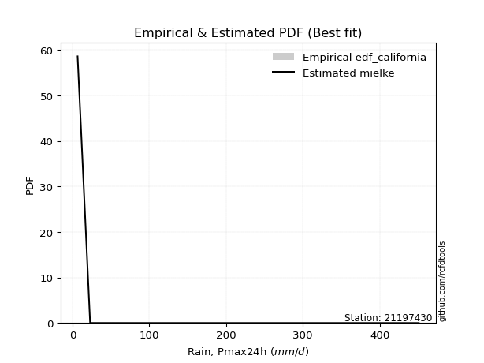</img>

</div>


### 2. EDF Hazen (1930)

Hazen method for plotting positions is a formula used to estimate the empirical cumulative probability distribution of flood events or other hydrological data. This formula often results in biased estimations, particularly when extrapolating to extreme events (high return periods).

<div align="center">


$P=(m-0.5)/n$


</div>


**2.1. Empirical values**

<div align="center">

|                | 0                    | 1                  | 2                   | 3                  | 4         | 5                  | 6                  | 7                  | 8                  | 9                  | 10        | 11                 |
|:---------------|:---------------------|:-------------------|:--------------------|:-------------------|:----------|:-------------------|:-------------------|:-------------------|:-------------------|:-------------------|:----------|:-------------------|
| date           | 2011                 | 2007               | 2015                | 2013               | 2010      | 2012               | 2008               | 2006               | 2009               | 2017               | 2018      | 2016               |
| x              | 6.7                  | 23.0               | 33.4                | 43.4               | 44.6      | 73.5               | 76.0               | 89.7               | 103.2              | 173.5              | 319.8     | 451.0              |
| m              | 1                    | 2                  | 3                   | 4                  | 5         | 6                  | 7                  | 8                  | 9                  | 10                 | 11        | 12                 |
| empirical_dist | edf_hazen            | edf_hazen          | edf_hazen           | edf_hazen          | edf_hazen | edf_hazen          | edf_hazen          | edf_hazen          | edf_hazen          | edf_hazen          | edf_hazen | edf_hazen          |
| empirical      | 0.041666666666666664 | 0.125              | 0.20833333333333334 | 0.2916666666666667 | 0.375     | 0.4583333333333333 | 0.5416666666666666 | 0.625              | 0.7083333333333334 | 0.7916666666666666 | 0.875     | 0.9583333333333334 |
| empirical_tr   | 1.0434782608695652   | 1.1428571428571428 | 1.2631578947368423  | 1.411764705882353  | 1.6       | 1.8461538461538458 | 2.1818181818181817 | 2.6666666666666665 | 3.428571428571429  | 4.799999999999999  | 8.0       | 24.00000000000002  |

</div>


**2.2. Kolmogorov-Smirnov fit test (sorted by Δ)**


<div align="center">

|                | 0                    | 1                   | 2                   | 3                    | 4                    | 5                   | 6                   | 7                   | 8                   | 9                   | 10                  | 11                  | 12                  | 13                  | 14                  | 15                  | 16                  | 17                  | 18                  | 19                  | 20                  | 21                  | 22                  | 23                  | 24                  | 25                  | 26                  | 27                  | 28                  | 29                  | 30                  | 31                  | 32                  | 33                  | 34                    | 35                  | 36                  | 37                  | 38                  | 39                  | 40                  | 41                  | 42                  | 43                  | 44                  | 45                  | 46                  | 47                  | 48                  | 49                  | 50                  | 51                  | 52                  | 53                  | 54                  | 55                  | 56                  | 57                  | 58                  | 59                  | 60                  | 61                  | 62                  | 63                  | 64                  | 65                  | 66                  | 67                  | 68                  | 69                  | 70                  | 71                  | 72                  | 73                  | 74                  | 75                  | 76                  | 77                  | 78                  | 79                  | 80                  | 81                  | 82                  | 83                  | 84                  | 85                  | 86                  | 87                  |
|:---------------|:---------------------|:--------------------|:--------------------|:---------------------|:---------------------|:--------------------|:--------------------|:--------------------|:--------------------|:--------------------|:--------------------|:--------------------|:--------------------|:--------------------|:--------------------|:--------------------|:--------------------|:--------------------|:--------------------|:--------------------|:--------------------|:--------------------|:--------------------|:--------------------|:--------------------|:--------------------|:--------------------|:--------------------|:--------------------|:--------------------|:--------------------|:--------------------|:--------------------|:--------------------|:----------------------|:--------------------|:--------------------|:--------------------|:--------------------|:--------------------|:--------------------|:--------------------|:--------------------|:--------------------|:--------------------|:--------------------|:--------------------|:--------------------|:--------------------|:--------------------|:--------------------|:--------------------|:--------------------|:--------------------|:--------------------|:--------------------|:--------------------|:--------------------|:--------------------|:--------------------|:--------------------|:--------------------|:--------------------|:--------------------|:--------------------|:--------------------|:--------------------|:--------------------|:--------------------|:--------------------|:--------------------|:--------------------|:--------------------|:--------------------|:--------------------|:--------------------|:--------------------|:--------------------|:--------------------|:--------------------|:--------------------|:--------------------|:--------------------|:--------------------|:--------------------|:--------------------|:--------------------|:--------------------|
| station        | 21197430             | 21197430            | 21197430            | 21197430             | 21197430             | 21197430            | 21197430            | 21197430            | 21197430            | 21197430            | 21197430            | 21197430            | 21197430            | 21197430            | 21197430            | 21197430            | 21197430            | 21197430            | 21197430            | 21197430            | 21197430            | 21197430            | 21197430            | 21197430            | 21197430            | 21197430            | 21197430            | 21197430            | 21197430            | 21197430            | 21197430            | 21197430            | 21197430            | 21197430            | 21197430              | 21197430            | 21197430            | 21197430            | 21197430            | 21197430            | 21197430            | 21197430            | 21197430            | 21197430            | 21197430            | 21197430            | 21197430            | 21197430            | 21197430            | 21197430            | 21197430            | 21197430            | 21197430            | 21197430            | 21197430            | 21197430            | 21197430            | 21197430            | 21197430            | 21197430            | 21197430            | 21197430            | 21197430            | 21197430            | 21197430            | 21197430            | 21197430            | 21197430            | 21197430            | 21197430            | 21197430            | 21197430            | 21197430            | 21197430            | 21197430            | 21197430            | 21197430            | 21197430            | 21197430            | 21197430            | 21197430            | 21197430            | 21197430            | 21197430            | 21197430            | 21197430            | 21197430            | 21197430            |
| empirical_dist | edf_hazen            | edf_hazen           | edf_hazen           | edf_hazen            | edf_hazen            | edf_hazen           | edf_hazen           | edf_hazen           | edf_hazen           | edf_hazen           | edf_hazen           | edf_hazen           | edf_hazen           | edf_hazen           | edf_hazen           | edf_hazen           | edf_hazen           | edf_hazen           | edf_hazen           | edf_hazen           | edf_hazen           | edf_hazen           | edf_hazen           | edf_hazen           | edf_hazen           | edf_hazen           | edf_hazen           | edf_hazen           | edf_hazen           | edf_hazen           | edf_hazen           | edf_hazen           | edf_hazen           | edf_hazen           | edf_hazen             | edf_hazen           | edf_hazen           | edf_hazen           | edf_hazen           | edf_hazen           | edf_hazen           | edf_hazen           | edf_hazen           | edf_hazen           | edf_hazen           | edf_hazen           | edf_hazen           | edf_hazen           | edf_hazen           | edf_hazen           | edf_hazen           | edf_hazen           | edf_hazen           | edf_hazen           | edf_hazen           | edf_hazen           | edf_hazen           | edf_hazen           | edf_hazen           | edf_hazen           | edf_hazen           | edf_hazen           | edf_hazen           | edf_hazen           | edf_hazen           | edf_hazen           | edf_hazen           | edf_hazen           | edf_hazen           | edf_hazen           | edf_hazen           | edf_hazen           | edf_hazen           | edf_hazen           | edf_hazen           | edf_hazen           | edf_hazen           | edf_hazen           | edf_hazen           | edf_hazen           | edf_hazen           | edf_hazen           | edf_hazen           | edf_hazen           | edf_hazen           | edf_hazen           | edf_hazen           | edf_hazen           |
| p_dist         | logfisk              | invgamma            | f                   | fisk                 | loggenlogistic       | invweibull          | nct                 | loglogistic         | loghypsecant        | logfatiguelife      | logmielke           | loggamma            | loggamma            | lognct              | logrice             | logf                | logbetaprime        | loglognorm          | logcrystalball      | lognorm             | lognorm             | logt                | logexponnorm        | logerlang           | johnsonsu           | ncf                 | invgauss            | loginvgamma         | logpearson3         | logloggamma         | logjohnsonsu        | logalpha            | logweibull_min      | logncf              | loglaplace_asymmetric | fatiguelife         | loginvgauss         | loglaplace          | gamma               | logmaxwell          | loggompertz         | wald                | lograyleigh         | loginvweibull       | mielke              | loggumbel_l         | lognakagami         | loggumbel_r         | exponnorm           | gompertz            | loghalfnorm         | laplace_asymmetric  | genexpon            | expon               | logkstwobign        | t                   | loggenexpon         | truncnorm           | betaprime           | pearson3            | logmoyal            | logtruncnorm        | halflogistic        | loghalflogistic     | moyal               | genlogistic         | halfnorm            | weibull_min         | gumbel_r            | gibrat              | rayleigh            | maxwell             | logwald             | kstwobign           | loggibrat           | norm                | logistic            | hypsecant           | rice                | logexpon            | laplace             | gumbel_l            | alpha               | logchi2             | chi2                | nakagami            | crystalball         | erlang              |
| delta          | 0.060405401185532726 | 0.06082356022185226 | 0.06082365472611179 | 0.061751570262577826 | 0.061814034389356176 | 0.06367999355072756 | 0.06372794022998501 | 0.06418536020955251 | 0.06648869300279664 | 0.06720002681646942 | 0.06750635295186813 | 0.06769523098955704 | 0.06769523098955704 | 0.0677359941128931  | 0.06809490265235735 | 0.0682424022785929  | 0.06839682344818238 | 0.06852532110333043 | 0.06852757543228272 | 0.06852779104314533 | 0.06852779104314533 | 0.06852846452623551 | 0.06852897653327084 | 0.07038016905548466 | 0.07179464150989723 | 0.07243541230608774 | 0.07553869094038523 | 0.0784310137785495  | 0.08168856799544122 | 0.08318015561266046 | 0.08454390785090893 | 0.08514294267299244 | 0.08546255869406705 | 0.0859416963210961  | 0.08713555491961261   | 0.09151922774399679 | 0.09159180884743451 | 0.09262562527368062 | 0.0934611453625612  | 0.0936357651682656  | 0.09603572024841367 | 0.09712006320435818 | 0.1041899601649699  | 0.10466235067406798 | 0.11619352562929339 | 0.11957642528853019 | 0.12499999999982203 | 0.13216346355769665 | 0.1335075686924666  | 0.13369106108080075 | 0.1339070296267189  | 0.13442455464769865 | 0.1344246264495913  | 0.13442468396143614 | 0.13961427909193305 | 0.14311458949701744 | 0.1495378891952108  | 0.1517517623414515  | 0.15430704489860486 | 0.15507035876248432 | 0.15776582438476944 | 0.1583940651660594  | 0.1588272613564805  | 0.15994221150133964 | 0.1674657863184028  | 0.17129037737540975 | 0.17980350017235713 | 0.18923372084112555 | 0.192785546311949   | 0.20429843622532834 | 0.21342940312575098 | 0.22534142916108052 | 0.22887790282764725 | 0.22905181688082532 | 0.25498779919552755 | 0.2596761554745162  | 0.26658742148594833 | 0.2724232199687806  | 0.2765448394737177  | 0.28827185264152166 | 0.29174556303147836 | 0.3297143055684917  | 0.330968512629825   | 0.34022295227832455 | 0.34143803503753956 | 0.36137857937963597 | 0.43835296015249015 | 0.4534067906220166  |
| deltao         | 0.36218414519599995  | 0.36218414519599995 | 0.36218414519599995 | 0.36218414519599995  | 0.36218414519599995  | 0.36218414519599995 | 0.36218414519599995 | 0.36218414519599995 | 0.36218414519599995 | 0.36218414519599995 | 0.36218414519599995 | 0.36218414519599995 | 0.36218414519599995 | 0.36218414519599995 | 0.36218414519599995 | 0.36218414519599995 | 0.36218414519599995 | 0.36218414519599995 | 0.36218414519599995 | 0.36218414519599995 | 0.36218414519599995 | 0.36218414519599995 | 0.36218414519599995 | 0.36218414519599995 | 0.36218414519599995 | 0.36218414519599995 | 0.36218414519599995 | 0.36218414519599995 | 0.36218414519599995 | 0.36218414519599995 | 0.36218414519599995 | 0.36218414519599995 | 0.36218414519599995 | 0.36218414519599995 | 0.36218414519599995   | 0.36218414519599995 | 0.36218414519599995 | 0.36218414519599995 | 0.36218414519599995 | 0.36218414519599995 | 0.36218414519599995 | 0.36218414519599995 | 0.36218414519599995 | 0.36218414519599995 | 0.36218414519599995 | 0.36218414519599995 | 0.36218414519599995 | 0.36218414519599995 | 0.36218414519599995 | 0.36218414519599995 | 0.36218414519599995 | 0.36218414519599995 | 0.36218414519599995 | 0.36218414519599995 | 0.36218414519599995 | 0.36218414519599995 | 0.36218414519599995 | 0.36218414519599995 | 0.36218414519599995 | 0.36218414519599995 | 0.36218414519599995 | 0.36218414519599995 | 0.36218414519599995 | 0.36218414519599995 | 0.36218414519599995 | 0.36218414519599995 | 0.36218414519599995 | 0.36218414519599995 | 0.36218414519599995 | 0.36218414519599995 | 0.36218414519599995 | 0.36218414519599995 | 0.36218414519599995 | 0.36218414519599995 | 0.36218414519599995 | 0.36218414519599995 | 0.36218414519599995 | 0.36218414519599995 | 0.36218414519599995 | 0.36218414519599995 | 0.36218414519599995 | 0.36218414519599995 | 0.36218414519599995 | 0.36218414519599995 | 0.36218414519599995 | 0.36218414519599995 | 0.36218414519599995 | 0.36218414519599995 |
| eval           | Δo > Δ               | Δo > Δ              | Δo > Δ              | Δo > Δ               | Δo > Δ               | Δo > Δ              | Δo > Δ              | Δo > Δ              | Δo > Δ              | Δo > Δ              | Δo > Δ              | Δo > Δ              | Δo > Δ              | Δo > Δ              | Δo > Δ              | Δo > Δ              | Δo > Δ              | Δo > Δ              | Δo > Δ              | Δo > Δ              | Δo > Δ              | Δo > Δ              | Δo > Δ              | Δo > Δ              | Δo > Δ              | Δo > Δ              | Δo > Δ              | Δo > Δ              | Δo > Δ              | Δo > Δ              | Δo > Δ              | Δo > Δ              | Δo > Δ              | Δo > Δ              | Δo > Δ                | Δo > Δ              | Δo > Δ              | Δo > Δ              | Δo > Δ              | Δo > Δ              | Δo > Δ              | Δo > Δ              | Δo > Δ              | Δo > Δ              | Δo > Δ              | Δo > Δ              | Δo > Δ              | Δo > Δ              | Δo > Δ              | Δo > Δ              | Δo > Δ              | Δo > Δ              | Δo > Δ              | Δo > Δ              | Δo > Δ              | Δo > Δ              | Δo > Δ              | Δo > Δ              | Δo > Δ              | Δo > Δ              | Δo > Δ              | Δo > Δ              | Δo > Δ              | Δo > Δ              | Δo > Δ              | Δo > Δ              | Δo > Δ              | Δo > Δ              | Δo > Δ              | Δo > Δ              | Δo > Δ              | Δo > Δ              | Δo > Δ              | Δo > Δ              | Δo > Δ              | Δo > Δ              | Δo > Δ              | Δo > Δ              | Δo > Δ              | Δo > Δ              | Δo > Δ              | Δo > Δ              | Δo > Δ              | Δo > Δ              | Δo > Δ              | Δo > Δ              | Δo <= Δ             | Δo <= Δ             |
| fit            | 1                    | 1                   | 1                   | 1                    | 1                    | 1                   | 1                   | 1                   | 1                   | 1                   | 1                   | 1                   | 1                   | 1                   | 1                   | 1                   | 1                   | 1                   | 1                   | 1                   | 1                   | 1                   | 1                   | 1                   | 1                   | 1                   | 1                   | 1                   | 1                   | 1                   | 1                   | 1                   | 1                   | 1                   | 1                     | 1                   | 1                   | 1                   | 1                   | 1                   | 1                   | 1                   | 1                   | 1                   | 1                   | 1                   | 1                   | 1                   | 1                   | 1                   | 1                   | 1                   | 1                   | 1                   | 1                   | 1                   | 1                   | 1                   | 1                   | 1                   | 1                   | 1                   | 1                   | 1                   | 1                   | 1                   | 1                   | 1                   | 1                   | 1                   | 1                   | 1                   | 1                   | 1                   | 1                   | 1                   | 1                   | 1                   | 1                   | 1                   | 1                   | 1                   | 1                   | 1                   | 1                   | 1                   | 0                   | 0                   |
| n              | 12                   | 12                  | 12                  | 12                   | 12                   | 12                  | 12                  | 12                  | 12                  | 12                  | 12                  | 12                  | 12                  | 12                  | 12                  | 12                  | 12                  | 12                  | 12                  | 12                  | 12                  | 12                  | 12                  | 12                  | 12                  | 12                  | 12                  | 12                  | 12                  | 12                  | 12                  | 12                  | 12                  | 12                  | 12                    | 12                  | 12                  | 12                  | 12                  | 12                  | 12                  | 12                  | 12                  | 12                  | 12                  | 12                  | 12                  | 12                  | 12                  | 12                  | 12                  | 12                  | 12                  | 12                  | 12                  | 12                  | 12                  | 12                  | 12                  | 12                  | 12                  | 12                  | 12                  | 12                  | 12                  | 12                  | 12                  | 12                  | 12                  | 12                  | 12                  | 12                  | 12                  | 12                  | 12                  | 12                  | 12                  | 12                  | 12                  | 12                  | 12                  | 12                  | 12                  | 12                  | 12                  | 12                  | 12                  | 12                  |
| best_fit       | 1                    | 0                   | 0                   | 0                    | 0                    | 0                   | 0                   | 0                   | 0                   | 0                   | 0                   | 0                   | 0                   | 0                   | 0                   | 0                   | 0                   | 0                   | 0                   | 0                   | 0                   | 0                   | 0                   | 0                   | 0                   | 0                   | 0                   | 0                   | 0                   | 0                   | 0                   | 0                   | 0                   | 0                   | 0                     | 0                   | 0                   | 0                   | 0                   | 0                   | 0                   | 0                   | 0                   | 0                   | 0                   | 0                   | 0                   | 0                   | 0                   | 0                   | 0                   | 0                   | 0                   | 0                   | 0                   | 0                   | 0                   | 0                   | 0                   | 0                   | 0                   | 0                   | 0                   | 0                   | 0                   | 0                   | 0                   | 0                   | 0                   | 0                   | 0                   | 0                   | 0                   | 0                   | 0                   | 0                   | 0                   | 0                   | 0                   | 0                   | 0                   | 0                   | 0                   | 0                   | 0                   | 0                   | 0                   | 0                   |
| best_fit_sort  | 1                    | 2                   | 3                   | 4                    | 5                    | 6                   | 7                   | 8                   | 9                   | 10                  | 11                  | 12                  | 13                  | 14                  | 15                  | 16                  | 17                  | 18                  | 19                  | 20                  | 21                  | 22                  | 23                  | 24                  | 25                  | 26                  | 27                  | 28                  | 29                  | 30                  | 31                  | 32                  | 33                  | 34                  | 35                    | 36                  | 37                  | 38                  | 39                  | 40                  | 41                  | 42                  | 43                  | 44                  | 45                  | 46                  | 47                  | 48                  | 49                  | 50                  | 51                  | 52                  | 53                  | 54                  | 55                  | 56                  | 57                  | 58                  | 59                  | 60                  | 61                  | 62                  | 63                  | 64                  | 65                  | 66                  | 67                  | 68                  | 69                  | 70                  | 71                  | 72                  | 73                  | 74                  | 75                  | 76                  | 77                  | 78                  | 79                  | 80                  | 81                  | 82                  | 83                  | 84                  | 85                  | 86                  | 87                  | 88                  |

</div>


**2.3. Best fit**

<div align="center">

|   id |   station | empirical_dist   | p_dist   |     delta |   deltao | eval   |   fit |   n |   best_fit |   best_fit_sort |
|-----:|----------:|:-----------------|:---------|----------:|---------:|:-------|------:|----:|-----------:|----------------:|
|    0 |  21197430 | edf_hazen        | logfisk  | 0.0604054 | 0.362184 | Δo > Δ |     1 |  12 |          1 |               1 |

</div>


<div align="center">

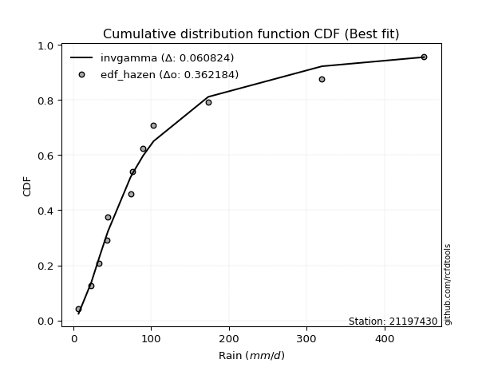</img></img>

</div>


### 3. EDF Weibull (1939)

Weibull plotting position formula is an empirical method used to estimate the non-exceedance probability or plotting position for a set of observed data, is often recommended or widely used in practice, particularly in flood frequency analysis.

<div align="center">


$P=m/(n+1)$


</div>


**3.1. Empirical values**

<div align="center">

|                | 0                   | 1                   | 2                   | 3                  | 4                   | 5                   | 6                  | 7                  | 8                  | 9                  | 10                 | 11                 |
|:---------------|:--------------------|:--------------------|:--------------------|:-------------------|:--------------------|:--------------------|:-------------------|:-------------------|:-------------------|:-------------------|:-------------------|:-------------------|
| date           | 2011                | 2007                | 2015                | 2013               | 2010                | 2012                | 2008               | 2006               | 2009               | 2017               | 2018               | 2016               |
| x              | 6.7                 | 23.0                | 33.4                | 43.4               | 44.6                | 73.5                | 76.0               | 89.7               | 103.2              | 173.5              | 319.8              | 451.0              |
| m              | 1                   | 2                   | 3                   | 4                  | 5                   | 6                   | 7                  | 8                  | 9                  | 10                 | 11                 | 12                 |
| empirical_dist | edf_weibull         | edf_weibull         | edf_weibull         | edf_weibull        | edf_weibull         | edf_weibull         | edf_weibull        | edf_weibull        | edf_weibull        | edf_weibull        | edf_weibull        | edf_weibull        |
| empirical      | 0.07692307692307693 | 0.15384615384615385 | 0.23076923076923078 | 0.3076923076923077 | 0.38461538461538464 | 0.46153846153846156 | 0.5384615384615384 | 0.6153846153846154 | 0.6923076923076923 | 0.7692307692307693 | 0.8461538461538461 | 0.9230769230769231 |
| empirical_tr   | 1.0833333333333333  | 1.1818181818181819  | 1.3                 | 1.4444444444444444 | 1.625               | 1.8571428571428572  | 2.1666666666666665 | 2.6                | 3.25               | 4.333333333333334  | 6.5                | 13.000000000000009 |

</div>


**3.2. Kolmogorov-Smirnov fit test (sorted by Δ)**


<div align="center">

|                | 0                   | 1                   | 2                   | 3                   | 4                   | 5                   | 6                   | 7                   | 8                   | 9                   | 10                  | 11                  | 12                  | 13                  | 14                  | 15                  | 16                  | 17                  | 18                  | 19                  | 20                  | 21                  | 22                  | 23                  | 24                  | 25                  | 26                  | 27                  | 28                  | 29                  | 30                  | 31                  | 32                  | 33                  | 34                  | 35                  | 36                  | 37                  | 38                  | 39                    | 40                  | 41                  | 42                  | 43                  | 44                  | 45                  | 46                  | 47                  | 48                  | 49                  | 50                  | 51                  | 52                  | 53                  | 54                  | 55                  | 56                  | 57                  | 58                  | 59                  | 60                  | 61                  | 62                  | 63                  | 64                  | 65                  | 66                  | 67                  | 68                  | 69                  | 70                  | 71                  | 72                  | 73                  | 74                  | 75                  | 76                  | 77                  | 78                  | 79                  | 80                  | 81                  | 82                  | 83                  | 84                  | 85                  | 86                  | 87                  |
|:---------------|:--------------------|:--------------------|:--------------------|:--------------------|:--------------------|:--------------------|:--------------------|:--------------------|:--------------------|:--------------------|:--------------------|:--------------------|:--------------------|:--------------------|:--------------------|:--------------------|:--------------------|:--------------------|:--------------------|:--------------------|:--------------------|:--------------------|:--------------------|:--------------------|:--------------------|:--------------------|:--------------------|:--------------------|:--------------------|:--------------------|:--------------------|:--------------------|:--------------------|:--------------------|:--------------------|:--------------------|:--------------------|:--------------------|:--------------------|:----------------------|:--------------------|:--------------------|:--------------------|:--------------------|:--------------------|:--------------------|:--------------------|:--------------------|:--------------------|:--------------------|:--------------------|:--------------------|:--------------------|:--------------------|:--------------------|:--------------------|:--------------------|:--------------------|:--------------------|:--------------------|:--------------------|:--------------------|:--------------------|:--------------------|:--------------------|:--------------------|:--------------------|:--------------------|:--------------------|:--------------------|:--------------------|:--------------------|:--------------------|:--------------------|:--------------------|:--------------------|:--------------------|:--------------------|:--------------------|:--------------------|:--------------------|:--------------------|:--------------------|:--------------------|:--------------------|:--------------------|:--------------------|:--------------------|
| station        | 21197430            | 21197430            | 21197430            | 21197430            | 21197430            | 21197430            | 21197430            | 21197430            | 21197430            | 21197430            | 21197430            | 21197430            | 21197430            | 21197430            | 21197430            | 21197430            | 21197430            | 21197430            | 21197430            | 21197430            | 21197430            | 21197430            | 21197430            | 21197430            | 21197430            | 21197430            | 21197430            | 21197430            | 21197430            | 21197430            | 21197430            | 21197430            | 21197430            | 21197430            | 21197430            | 21197430            | 21197430            | 21197430            | 21197430            | 21197430              | 21197430            | 21197430            | 21197430            | 21197430            | 21197430            | 21197430            | 21197430            | 21197430            | 21197430            | 21197430            | 21197430            | 21197430            | 21197430            | 21197430            | 21197430            | 21197430            | 21197430            | 21197430            | 21197430            | 21197430            | 21197430            | 21197430            | 21197430            | 21197430            | 21197430            | 21197430            | 21197430            | 21197430            | 21197430            | 21197430            | 21197430            | 21197430            | 21197430            | 21197430            | 21197430            | 21197430            | 21197430            | 21197430            | 21197430            | 21197430            | 21197430            | 21197430            | 21197430            | 21197430            | 21197430            | 21197430            | 21197430            | 21197430            |
| empirical_dist | edf_weibull         | edf_weibull         | edf_weibull         | edf_weibull         | edf_weibull         | edf_weibull         | edf_weibull         | edf_weibull         | edf_weibull         | edf_weibull         | edf_weibull         | edf_weibull         | edf_weibull         | edf_weibull         | edf_weibull         | edf_weibull         | edf_weibull         | edf_weibull         | edf_weibull         | edf_weibull         | edf_weibull         | edf_weibull         | edf_weibull         | edf_weibull         | edf_weibull         | edf_weibull         | edf_weibull         | edf_weibull         | edf_weibull         | edf_weibull         | edf_weibull         | edf_weibull         | edf_weibull         | edf_weibull         | edf_weibull         | edf_weibull         | edf_weibull         | edf_weibull         | edf_weibull         | edf_weibull           | edf_weibull         | edf_weibull         | edf_weibull         | edf_weibull         | edf_weibull         | edf_weibull         | edf_weibull         | edf_weibull         | edf_weibull         | edf_weibull         | edf_weibull         | edf_weibull         | edf_weibull         | edf_weibull         | edf_weibull         | edf_weibull         | edf_weibull         | edf_weibull         | edf_weibull         | edf_weibull         | edf_weibull         | edf_weibull         | edf_weibull         | edf_weibull         | edf_weibull         | edf_weibull         | edf_weibull         | edf_weibull         | edf_weibull         | edf_weibull         | edf_weibull         | edf_weibull         | edf_weibull         | edf_weibull         | edf_weibull         | edf_weibull         | edf_weibull         | edf_weibull         | edf_weibull         | edf_weibull         | edf_weibull         | edf_weibull         | edf_weibull         | edf_weibull         | edf_weibull         | edf_weibull         | edf_weibull         | edf_weibull         |
| p_dist         | fisk                | logbetaprime        | loggamma            | loggamma            | logrice             | logerlang           | lognct              | logf                | loglognorm          | logexponnorm        | logt                | logcrystalball      | lognorm             | lognorm             | logfatiguelife      | logfisk             | invweibull          | johnsonsu           | loginvgamma         | fatiguelife         | logmielke           | f                   | invgamma            | loggenlogistic      | nct                 | invgauss            | logpearson3         | logweibull_min      | logjohnsonsu        | logloggamma         | loglogistic         | ncf                 | loggompertz         | loghypsecant        | logalpha            | logncf              | loginvgauss         | logmaxwell          | loginvweibull       | loglaplace_asymmetric | wald                | mielke              | lograyleigh         | gamma               | loglaplace          | exponnorm           | loggumbel_l         | gompertz            | laplace_asymmetric  | genexpon            | expon               | logkstwobign        | loggenexpon         | loggumbel_r         | loghalfnorm         | truncnorm           | logtruncnorm        | pearson3            | t                   | halflogistic        | betaprime           | moyal               | lognakagami         | logmoyal            | genlogistic         | loghalflogistic     | halfnorm            | weibull_min         | gumbel_r            | rayleigh            | maxwell             | kstwobign           | gibrat              | logwald             | norm                | logistic            | loggibrat           | hypsecant           | rice                | logexpon            | laplace             | gumbel_l            | alpha               | logchi2             | chi2                | nakagami            | crystalball         | erlang              |
| delta          | 0.0650689791598631  | 0.06606278865682624 | 0.06620311419391567 | 0.06620311419391567 | 0.06718731748197371 | 0.06793353937655211 | 0.07009021161688944 | 0.0707458806392951  | 0.07084781276172814 | 0.0708484546658058  | 0.07084923484340666 | 0.07084939512809407 | 0.07084941987312399 | 0.07084941987312399 | 0.07105833802314032 | 0.07278532329595522 | 0.07451316896730642 | 0.07499847283907535 | 0.07522588557342125 | 0.0755402864931285  | 0.0756292685798925  | 0.07620960087340667 | 0.0762097765277453  | 0.07633649288334365 | 0.0764544107610946  | 0.07687281170645144 | 0.0774676042518947  | 0.07775732177908168 | 0.07856475570177812 | 0.07872870811559696 | 0.07885701135024559 | 0.07949867981568348 | 0.08001007922277259 | 0.08189083056492696 | 0.08193781446786419 | 0.08273656811596786 | 0.08838668064230626 | 0.09043063696313736 | 0.09667424210029107 | 0.09675093953499725   | 0.0982356341671653  | 0.09940772746580351 | 0.10098483195984165 | 0.10134492731497224 | 0.10224100988906526 | 0.11748192766682553 | 0.11762108341164301 | 0.11766542005515968 | 0.11839891362205757 | 0.11839898542395022 | 0.11839904293579506 | 0.12118596296615747 | 0.12845718463753186 | 0.1289583353525684  | 0.13070190142159066 | 0.1357261213158104  | 0.13595816773016195 | 0.13904471773684324 | 0.14033707251409833 | 0.14280162033083943 | 0.1511019166934766  | 0.15144014529276173 | 0.15384615384597589 | 0.1545606961796412  | 0.15526473634976867 | 0.1567370832962114  | 0.16377785914671605 | 0.17320807981548447 | 0.17675990528630792 | 0.1974037621001099  | 0.20931578813543944 | 0.21302617585518424 | 0.21391382084071298 | 0.225672774622519   | 0.24365051444887514 | 0.25056178046030725 | 0.2517826709903993  | 0.2563975789431395  | 0.26051919844807664 | 0.26583595520562425 | 0.2757199220058373  | 0.3136886645428506  | 0.314942871604184   | 0.31643554842878024 | 0.319566608033805   | 0.3325324255334821  | 0.4030965498960799  | 0.42456063677586275 |
| deltao         | 0.36218414519599995 | 0.36218414519599995 | 0.36218414519599995 | 0.36218414519599995 | 0.36218414519599995 | 0.36218414519599995 | 0.36218414519599995 | 0.36218414519599995 | 0.36218414519599995 | 0.36218414519599995 | 0.36218414519599995 | 0.36218414519599995 | 0.36218414519599995 | 0.36218414519599995 | 0.36218414519599995 | 0.36218414519599995 | 0.36218414519599995 | 0.36218414519599995 | 0.36218414519599995 | 0.36218414519599995 | 0.36218414519599995 | 0.36218414519599995 | 0.36218414519599995 | 0.36218414519599995 | 0.36218414519599995 | 0.36218414519599995 | 0.36218414519599995 | 0.36218414519599995 | 0.36218414519599995 | 0.36218414519599995 | 0.36218414519599995 | 0.36218414519599995 | 0.36218414519599995 | 0.36218414519599995 | 0.36218414519599995 | 0.36218414519599995 | 0.36218414519599995 | 0.36218414519599995 | 0.36218414519599995 | 0.36218414519599995   | 0.36218414519599995 | 0.36218414519599995 | 0.36218414519599995 | 0.36218414519599995 | 0.36218414519599995 | 0.36218414519599995 | 0.36218414519599995 | 0.36218414519599995 | 0.36218414519599995 | 0.36218414519599995 | 0.36218414519599995 | 0.36218414519599995 | 0.36218414519599995 | 0.36218414519599995 | 0.36218414519599995 | 0.36218414519599995 | 0.36218414519599995 | 0.36218414519599995 | 0.36218414519599995 | 0.36218414519599995 | 0.36218414519599995 | 0.36218414519599995 | 0.36218414519599995 | 0.36218414519599995 | 0.36218414519599995 | 0.36218414519599995 | 0.36218414519599995 | 0.36218414519599995 | 0.36218414519599995 | 0.36218414519599995 | 0.36218414519599995 | 0.36218414519599995 | 0.36218414519599995 | 0.36218414519599995 | 0.36218414519599995 | 0.36218414519599995 | 0.36218414519599995 | 0.36218414519599995 | 0.36218414519599995 | 0.36218414519599995 | 0.36218414519599995 | 0.36218414519599995 | 0.36218414519599995 | 0.36218414519599995 | 0.36218414519599995 | 0.36218414519599995 | 0.36218414519599995 | 0.36218414519599995 |
| eval           | Δo > Δ              | Δo > Δ              | Δo > Δ              | Δo > Δ              | Δo > Δ              | Δo > Δ              | Δo > Δ              | Δo > Δ              | Δo > Δ              | Δo > Δ              | Δo > Δ              | Δo > Δ              | Δo > Δ              | Δo > Δ              | Δo > Δ              | Δo > Δ              | Δo > Δ              | Δo > Δ              | Δo > Δ              | Δo > Δ              | Δo > Δ              | Δo > Δ              | Δo > Δ              | Δo > Δ              | Δo > Δ              | Δo > Δ              | Δo > Δ              | Δo > Δ              | Δo > Δ              | Δo > Δ              | Δo > Δ              | Δo > Δ              | Δo > Δ              | Δo > Δ              | Δo > Δ              | Δo > Δ              | Δo > Δ              | Δo > Δ              | Δo > Δ              | Δo > Δ                | Δo > Δ              | Δo > Δ              | Δo > Δ              | Δo > Δ              | Δo > Δ              | Δo > Δ              | Δo > Δ              | Δo > Δ              | Δo > Δ              | Δo > Δ              | Δo > Δ              | Δo > Δ              | Δo > Δ              | Δo > Δ              | Δo > Δ              | Δo > Δ              | Δo > Δ              | Δo > Δ              | Δo > Δ              | Δo > Δ              | Δo > Δ              | Δo > Δ              | Δo > Δ              | Δo > Δ              | Δo > Δ              | Δo > Δ              | Δo > Δ              | Δo > Δ              | Δo > Δ              | Δo > Δ              | Δo > Δ              | Δo > Δ              | Δo > Δ              | Δo > Δ              | Δo > Δ              | Δo > Δ              | Δo > Δ              | Δo > Δ              | Δo > Δ              | Δo > Δ              | Δo > Δ              | Δo > Δ              | Δo > Δ              | Δo > Δ              | Δo > Δ              | Δo > Δ              | Δo <= Δ             | Δo <= Δ             |
| fit            | 1                   | 1                   | 1                   | 1                   | 1                   | 1                   | 1                   | 1                   | 1                   | 1                   | 1                   | 1                   | 1                   | 1                   | 1                   | 1                   | 1                   | 1                   | 1                   | 1                   | 1                   | 1                   | 1                   | 1                   | 1                   | 1                   | 1                   | 1                   | 1                   | 1                   | 1                   | 1                   | 1                   | 1                   | 1                   | 1                   | 1                   | 1                   | 1                   | 1                     | 1                   | 1                   | 1                   | 1                   | 1                   | 1                   | 1                   | 1                   | 1                   | 1                   | 1                   | 1                   | 1                   | 1                   | 1                   | 1                   | 1                   | 1                   | 1                   | 1                   | 1                   | 1                   | 1                   | 1                   | 1                   | 1                   | 1                   | 1                   | 1                   | 1                   | 1                   | 1                   | 1                   | 1                   | 1                   | 1                   | 1                   | 1                   | 1                   | 1                   | 1                   | 1                   | 1                   | 1                   | 1                   | 1                   | 0                   | 0                   |
| n              | 12                  | 12                  | 12                  | 12                  | 12                  | 12                  | 12                  | 12                  | 12                  | 12                  | 12                  | 12                  | 12                  | 12                  | 12                  | 12                  | 12                  | 12                  | 12                  | 12                  | 12                  | 12                  | 12                  | 12                  | 12                  | 12                  | 12                  | 12                  | 12                  | 12                  | 12                  | 12                  | 12                  | 12                  | 12                  | 12                  | 12                  | 12                  | 12                  | 12                    | 12                  | 12                  | 12                  | 12                  | 12                  | 12                  | 12                  | 12                  | 12                  | 12                  | 12                  | 12                  | 12                  | 12                  | 12                  | 12                  | 12                  | 12                  | 12                  | 12                  | 12                  | 12                  | 12                  | 12                  | 12                  | 12                  | 12                  | 12                  | 12                  | 12                  | 12                  | 12                  | 12                  | 12                  | 12                  | 12                  | 12                  | 12                  | 12                  | 12                  | 12                  | 12                  | 12                  | 12                  | 12                  | 12                  | 12                  | 12                  |
| best_fit       | 1                   | 0                   | 0                   | 0                   | 0                   | 0                   | 0                   | 0                   | 0                   | 0                   | 0                   | 0                   | 0                   | 0                   | 0                   | 0                   | 0                   | 0                   | 0                   | 0                   | 0                   | 0                   | 0                   | 0                   | 0                   | 0                   | 0                   | 0                   | 0                   | 0                   | 0                   | 0                   | 0                   | 0                   | 0                   | 0                   | 0                   | 0                   | 0                   | 0                     | 0                   | 0                   | 0                   | 0                   | 0                   | 0                   | 0                   | 0                   | 0                   | 0                   | 0                   | 0                   | 0                   | 0                   | 0                   | 0                   | 0                   | 0                   | 0                   | 0                   | 0                   | 0                   | 0                   | 0                   | 0                   | 0                   | 0                   | 0                   | 0                   | 0                   | 0                   | 0                   | 0                   | 0                   | 0                   | 0                   | 0                   | 0                   | 0                   | 0                   | 0                   | 0                   | 0                   | 0                   | 0                   | 0                   | 0                   | 0                   |
| best_fit_sort  | 1                   | 2                   | 3                   | 4                   | 5                   | 6                   | 7                   | 8                   | 9                   | 10                  | 11                  | 12                  | 13                  | 14                  | 15                  | 16                  | 17                  | 18                  | 19                  | 20                  | 21                  | 22                  | 23                  | 24                  | 25                  | 26                  | 27                  | 28                  | 29                  | 30                  | 31                  | 32                  | 33                  | 34                  | 35                  | 36                  | 37                  | 38                  | 39                  | 40                    | 41                  | 42                  | 43                  | 44                  | 45                  | 46                  | 47                  | 48                  | 49                  | 50                  | 51                  | 52                  | 53                  | 54                  | 55                  | 56                  | 57                  | 58                  | 59                  | 60                  | 61                  | 62                  | 63                  | 64                  | 65                  | 66                  | 67                  | 68                  | 69                  | 70                  | 71                  | 72                  | 73                  | 74                  | 75                  | 76                  | 77                  | 78                  | 79                  | 80                  | 81                  | 82                  | 83                  | 84                  | 85                  | 86                  | 87                  | 88                  |

</div>


**3.3. Best fit**

<div align="center">

|   id |   station | empirical_dist   | p_dist   |    delta |   deltao | eval   |   fit |   n |   best_fit |   best_fit_sort |
|-----:|----------:|:-----------------|:---------|---------:|---------:|:-------|------:|----:|-----------:|----------------:|
|    0 |  21197430 | edf_weibull      | fisk     | 0.065069 | 0.362184 | Δo > Δ |     1 |  12 |          1 |               1 |

</div>


<div align="center">

</img>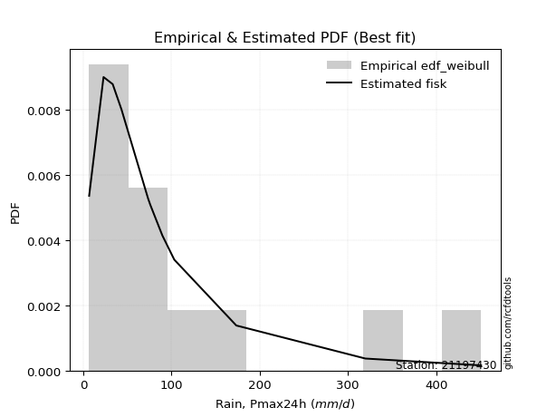</img>

</div>


### 4. EDF Beard (1943)

The Beard formula (or Beard´s plotting position formula) in hydrology is used to estimate the empirical non-exceedance probability _(P)_ of a flood event (or other extreme hydrological data point) within a given dataset.

<div align="center">


$P=(m-0.31)/(n+0.38)$


</div>


**4.1. Empirical values**

<div align="center">

|                | 0                    | 1                   | 2                   | 3                  | 4                  | 5                  | 6                  | 7                  | 8                  | 9                  | 10                 | 11                 |
|:---------------|:---------------------|:--------------------|:--------------------|:-------------------|:-------------------|:-------------------|:-------------------|:-------------------|:-------------------|:-------------------|:-------------------|:-------------------|
| date           | 2011                 | 2007                | 2015                | 2013               | 2010               | 2012               | 2008               | 2006               | 2009               | 2017               | 2018               | 2016               |
| x              | 6.7                  | 23.0                | 33.4                | 43.4               | 44.6               | 73.5               | 76.0               | 89.7               | 103.2              | 173.5              | 319.8              | 451.0              |
| m              | 1                    | 2                   | 3                   | 4                  | 5                  | 6                  | 7                  | 8                  | 9                  | 10                 | 11                 | 12                 |
| empirical_dist | edf_beard            | edf_beard           | edf_beard           | edf_beard          | edf_beard          | edf_beard          | edf_beard          | edf_beard          | edf_beard          | edf_beard          | edf_beard          | edf_beard          |
| empirical      | 0.055735056542810975 | 0.13651050080775443 | 0.21728594507269788 | 0.2980613893376413 | 0.3788368336025848 | 0.4596122778675283 | 0.5403877221324718 | 0.6211631663974152 | 0.7019386106623585 | 0.7827140549273021 | 0.8634894991922455 | 0.9442649434571889 |
| empirical_tr   | 1.0590248075278015   | 1.1580916744621141  | 1.2776057791537667  | 1.424626006904488  | 1.6098829648894668 | 1.850523168908819  | 2.1757469244288226 | 2.6396588486140726 | 3.3550135501355    | 4.6022304832713745 | 7.325443786982245  | 17.942028985507218 |

</div>


**4.2. Kolmogorov-Smirnov fit test (sorted by Δ)**


<div align="center">

|                | 0                   | 1                   | 2                   | 3                    | 4                   | 5                   | 6                   | 7                    | 8                    | 9                   | 10                   | 11                   | 12                   | 13                  | 14                   | 15                   | 16                   | 17                  | 18                  | 19                  | 20                  | 21                  | 22                  | 23                  | 24                  | 25                  | 26                  | 27                  | 28                  | 29                  | 30                  | 31                  | 32                  | 33                  | 34                  | 35                  | 36                  | 37                  | 38                    | 39                  | 40                  | 41                  | 42                  | 43                  | 44                  | 45                  | 46                  | 47                  | 48                  | 49                  | 50                  | 51                  | 52                  | 53                  | 54                  | 55                  | 56                  | 57                  | 58                  | 59                  | 60                  | 61                  | 62                  | 63                  | 64                  | 65                  | 66                  | 67                  | 68                  | 69                  | 70                  | 71                  | 72                  | 73                  | 74                  | 75                  | 76                  | 77                  | 78                  | 79                  | 80                  | 81                  | 82                  | 83                  | 84                  | 85                  | 86                  | 87                  |
|:---------------|:--------------------|:--------------------|:--------------------|:---------------------|:--------------------|:--------------------|:--------------------|:---------------------|:---------------------|:--------------------|:---------------------|:---------------------|:---------------------|:--------------------|:---------------------|:---------------------|:---------------------|:--------------------|:--------------------|:--------------------|:--------------------|:--------------------|:--------------------|:--------------------|:--------------------|:--------------------|:--------------------|:--------------------|:--------------------|:--------------------|:--------------------|:--------------------|:--------------------|:--------------------|:--------------------|:--------------------|:--------------------|:--------------------|:----------------------|:--------------------|:--------------------|:--------------------|:--------------------|:--------------------|:--------------------|:--------------------|:--------------------|:--------------------|:--------------------|:--------------------|:--------------------|:--------------------|:--------------------|:--------------------|:--------------------|:--------------------|:--------------------|:--------------------|:--------------------|:--------------------|:--------------------|:--------------------|:--------------------|:--------------------|:--------------------|:--------------------|:--------------------|:--------------------|:--------------------|:--------------------|:--------------------|:--------------------|:--------------------|:--------------------|:--------------------|:--------------------|:--------------------|:--------------------|:--------------------|:--------------------|:--------------------|:--------------------|:--------------------|:--------------------|:--------------------|:--------------------|:--------------------|:--------------------|
| station        | 21197430            | 21197430            | 21197430            | 21197430             | 21197430            | 21197430            | 21197430            | 21197430             | 21197430             | 21197430            | 21197430             | 21197430             | 21197430             | 21197430            | 21197430             | 21197430             | 21197430             | 21197430            | 21197430            | 21197430            | 21197430            | 21197430            | 21197430            | 21197430            | 21197430            | 21197430            | 21197430            | 21197430            | 21197430            | 21197430            | 21197430            | 21197430            | 21197430            | 21197430            | 21197430            | 21197430            | 21197430            | 21197430            | 21197430              | 21197430            | 21197430            | 21197430            | 21197430            | 21197430            | 21197430            | 21197430            | 21197430            | 21197430            | 21197430            | 21197430            | 21197430            | 21197430            | 21197430            | 21197430            | 21197430            | 21197430            | 21197430            | 21197430            | 21197430            | 21197430            | 21197430            | 21197430            | 21197430            | 21197430            | 21197430            | 21197430            | 21197430            | 21197430            | 21197430            | 21197430            | 21197430            | 21197430            | 21197430            | 21197430            | 21197430            | 21197430            | 21197430            | 21197430            | 21197430            | 21197430            | 21197430            | 21197430            | 21197430            | 21197430            | 21197430            | 21197430            | 21197430            | 21197430            |
| empirical_dist | edf_beard           | edf_beard           | edf_beard           | edf_beard            | edf_beard           | edf_beard           | edf_beard           | edf_beard            | edf_beard            | edf_beard           | edf_beard            | edf_beard            | edf_beard            | edf_beard           | edf_beard            | edf_beard            | edf_beard            | edf_beard           | edf_beard           | edf_beard           | edf_beard           | edf_beard           | edf_beard           | edf_beard           | edf_beard           | edf_beard           | edf_beard           | edf_beard           | edf_beard           | edf_beard           | edf_beard           | edf_beard           | edf_beard           | edf_beard           | edf_beard           | edf_beard           | edf_beard           | edf_beard           | edf_beard             | edf_beard           | edf_beard           | edf_beard           | edf_beard           | edf_beard           | edf_beard           | edf_beard           | edf_beard           | edf_beard           | edf_beard           | edf_beard           | edf_beard           | edf_beard           | edf_beard           | edf_beard           | edf_beard           | edf_beard           | edf_beard           | edf_beard           | edf_beard           | edf_beard           | edf_beard           | edf_beard           | edf_beard           | edf_beard           | edf_beard           | edf_beard           | edf_beard           | edf_beard           | edf_beard           | edf_beard           | edf_beard           | edf_beard           | edf_beard           | edf_beard           | edf_beard           | edf_beard           | edf_beard           | edf_beard           | edf_beard           | edf_beard           | edf_beard           | edf_beard           | edf_beard           | edf_beard           | edf_beard           | edf_beard           | edf_beard           | edf_beard           |
| p_dist         | logfisk             | loggenlogistic      | invgamma            | f                    | fisk                | logmielke           | lognct              | logfatiguelife       | logf                 | loglognorm          | logcrystalball       | lognorm              | lognorm              | logt                | logexponnorm         | invweibull           | nct                  | loglogistic         | johnsonsu           | ncf                 | loggamma            | loggamma            | logrice             | logbetaprime        | loghypsecant        | logerlang           | invgauss            | logpearson3         | logloggamma         | loginvgamma         | logjohnsonsu        | logweibull_min      | logalpha            | gamma               | logncf              | fatiguelife         | loggompertz         | loginvgauss         | loglaplace_asymmetric | logmaxwell          | wald                | loglaplace          | loginvweibull       | lograyleigh         | mielke              | loggumbel_l         | exponnorm           | gompertz            | laplace_asymmetric  | genexpon            | expon               | logkstwobign        | loggumbel_r         | loghalfnorm         | lognakagami         | loggenexpon         | t                   | truncnorm           | pearson3            | logtruncnorm        | halflogistic        | betaprime           | logmoyal            | loghalflogistic     | moyal               | genlogistic         | halfnorm            | weibull_min         | gumbel_r            | rayleigh            | gibrat              | maxwell             | kstwobign           | logwald             | norm                | loggibrat           | logistic            | hypsecant           | rice                | logexpon            | laplace             | gumbel_l            | alpha               | logchi2             | chi2                | nakagami            | crystalball         | erlang              |
| delta          | 0.05648203550066516 | 0.05900083984494431 | 0.05954461568765729 | 0.059544710191916816 | 0.06011466203291943 | 0.06111163028089328 | 0.06146128267156553 | 0.061610660127984496 | 0.061847679607618056 | 0.06213059843235558 | 0.062132852761307866 | 0.062133068372170475 | 0.062133068372170475 | 0.06213374185526066 | 0.062134253862295985 | 0.062401049016532595 | 0.062448995695790044 | 0.06290641567535754 | 0.06539991883892238 | 0.06604068963511289 | 0.06641628645536207 | 0.06641628645536207 | 0.06681595811816238 | 0.0671178789139874  | 0.06851125199113389 | 0.0691012245212897  | 0.06914396826941038 | 0.07529384532446637 | 0.0767854329416856  | 0.07715206924435453 | 0.07814918517993408 | 0.0790678360230922  | 0.08386399813879747 | 0.08450853362319666 | 0.08466275178690114 | 0.08512450507302194 | 0.08964099757743882 | 0.09031286431323954 | 0.09097238852219741   | 0.09235682063407064 | 0.09245708315436546 | 0.09646245887626542 | 0.09860042577122435 | 0.10291101563077493 | 0.10724091388992885 | 0.11318170261755534 | 0.12711284602149175 | 0.1272963384098259  | 0.1280298319767238  | 0.12802990377861645 | 0.1280299612904613  | 0.13081688132082386 | 0.13088451902350168 | 0.13262808509252394 | 0.13651050080757646 | 0.14058527745584626 | 0.14183564496282247 | 0.14535703967047664 | 0.14867563609150947 | 0.14944145342669485 | 0.15243253868550566 | 0.1530281003644099  | 0.15648687985057447 | 0.15866326696714467 | 0.16107106364742796 | 0.1648956547044349  | 0.17340877750138228 | 0.1828389981701507  | 0.18639082364097415 | 0.20703468045477613 | 0.20813526982791314 | 0.21894670649010567 | 0.22265709420985047 | 0.22759895829345228 | 0.2532814328035414  | 0.2537088546613326  | 0.2601926988149735  | 0.26602849729780575 | 0.27015011680274287 | 0.27931924090215715 | 0.2853508403605035  | 0.32331958289751683 | 0.3245737899588504  | 0.32991883412531314 | 0.33248542329817504 | 0.3498680785718815  | 0.42428457027634586 | 0.4418962898142622  |
| deltao         | 0.36218414519599995 | 0.36218414519599995 | 0.36218414519599995 | 0.36218414519599995  | 0.36218414519599995 | 0.36218414519599995 | 0.36218414519599995 | 0.36218414519599995  | 0.36218414519599995  | 0.36218414519599995 | 0.36218414519599995  | 0.36218414519599995  | 0.36218414519599995  | 0.36218414519599995 | 0.36218414519599995  | 0.36218414519599995  | 0.36218414519599995  | 0.36218414519599995 | 0.36218414519599995 | 0.36218414519599995 | 0.36218414519599995 | 0.36218414519599995 | 0.36218414519599995 | 0.36218414519599995 | 0.36218414519599995 | 0.36218414519599995 | 0.36218414519599995 | 0.36218414519599995 | 0.36218414519599995 | 0.36218414519599995 | 0.36218414519599995 | 0.36218414519599995 | 0.36218414519599995 | 0.36218414519599995 | 0.36218414519599995 | 0.36218414519599995 | 0.36218414519599995 | 0.36218414519599995 | 0.36218414519599995   | 0.36218414519599995 | 0.36218414519599995 | 0.36218414519599995 | 0.36218414519599995 | 0.36218414519599995 | 0.36218414519599995 | 0.36218414519599995 | 0.36218414519599995 | 0.36218414519599995 | 0.36218414519599995 | 0.36218414519599995 | 0.36218414519599995 | 0.36218414519599995 | 0.36218414519599995 | 0.36218414519599995 | 0.36218414519599995 | 0.36218414519599995 | 0.36218414519599995 | 0.36218414519599995 | 0.36218414519599995 | 0.36218414519599995 | 0.36218414519599995 | 0.36218414519599995 | 0.36218414519599995 | 0.36218414519599995 | 0.36218414519599995 | 0.36218414519599995 | 0.36218414519599995 | 0.36218414519599995 | 0.36218414519599995 | 0.36218414519599995 | 0.36218414519599995 | 0.36218414519599995 | 0.36218414519599995 | 0.36218414519599995 | 0.36218414519599995 | 0.36218414519599995 | 0.36218414519599995 | 0.36218414519599995 | 0.36218414519599995 | 0.36218414519599995 | 0.36218414519599995 | 0.36218414519599995 | 0.36218414519599995 | 0.36218414519599995 | 0.36218414519599995 | 0.36218414519599995 | 0.36218414519599995 | 0.36218414519599995 |
| eval           | Δo > Δ              | Δo > Δ              | Δo > Δ              | Δo > Δ               | Δo > Δ              | Δo > Δ              | Δo > Δ              | Δo > Δ               | Δo > Δ               | Δo > Δ              | Δo > Δ               | Δo > Δ               | Δo > Δ               | Δo > Δ              | Δo > Δ               | Δo > Δ               | Δo > Δ               | Δo > Δ              | Δo > Δ              | Δo > Δ              | Δo > Δ              | Δo > Δ              | Δo > Δ              | Δo > Δ              | Δo > Δ              | Δo > Δ              | Δo > Δ              | Δo > Δ              | Δo > Δ              | Δo > Δ              | Δo > Δ              | Δo > Δ              | Δo > Δ              | Δo > Δ              | Δo > Δ              | Δo > Δ              | Δo > Δ              | Δo > Δ              | Δo > Δ                | Δo > Δ              | Δo > Δ              | Δo > Δ              | Δo > Δ              | Δo > Δ              | Δo > Δ              | Δo > Δ              | Δo > Δ              | Δo > Δ              | Δo > Δ              | Δo > Δ              | Δo > Δ              | Δo > Δ              | Δo > Δ              | Δo > Δ              | Δo > Δ              | Δo > Δ              | Δo > Δ              | Δo > Δ              | Δo > Δ              | Δo > Δ              | Δo > Δ              | Δo > Δ              | Δo > Δ              | Δo > Δ              | Δo > Δ              | Δo > Δ              | Δo > Δ              | Δo > Δ              | Δo > Δ              | Δo > Δ              | Δo > Δ              | Δo > Δ              | Δo > Δ              | Δo > Δ              | Δo > Δ              | Δo > Δ              | Δo > Δ              | Δo > Δ              | Δo > Δ              | Δo > Δ              | Δo > Δ              | Δo > Δ              | Δo > Δ              | Δo > Δ              | Δo > Δ              | Δo > Δ              | Δo <= Δ             | Δo <= Δ             |
| fit            | 1                   | 1                   | 1                   | 1                    | 1                   | 1                   | 1                   | 1                    | 1                    | 1                   | 1                    | 1                    | 1                    | 1                   | 1                    | 1                    | 1                    | 1                   | 1                   | 1                   | 1                   | 1                   | 1                   | 1                   | 1                   | 1                   | 1                   | 1                   | 1                   | 1                   | 1                   | 1                   | 1                   | 1                   | 1                   | 1                   | 1                   | 1                   | 1                     | 1                   | 1                   | 1                   | 1                   | 1                   | 1                   | 1                   | 1                   | 1                   | 1                   | 1                   | 1                   | 1                   | 1                   | 1                   | 1                   | 1                   | 1                   | 1                   | 1                   | 1                   | 1                   | 1                   | 1                   | 1                   | 1                   | 1                   | 1                   | 1                   | 1                   | 1                   | 1                   | 1                   | 1                   | 1                   | 1                   | 1                   | 1                   | 1                   | 1                   | 1                   | 1                   | 1                   | 1                   | 1                   | 1                   | 1                   | 0                   | 0                   |
| n              | 12                  | 12                  | 12                  | 12                   | 12                  | 12                  | 12                  | 12                   | 12                   | 12                  | 12                   | 12                   | 12                   | 12                  | 12                   | 12                   | 12                   | 12                  | 12                  | 12                  | 12                  | 12                  | 12                  | 12                  | 12                  | 12                  | 12                  | 12                  | 12                  | 12                  | 12                  | 12                  | 12                  | 12                  | 12                  | 12                  | 12                  | 12                  | 12                    | 12                  | 12                  | 12                  | 12                  | 12                  | 12                  | 12                  | 12                  | 12                  | 12                  | 12                  | 12                  | 12                  | 12                  | 12                  | 12                  | 12                  | 12                  | 12                  | 12                  | 12                  | 12                  | 12                  | 12                  | 12                  | 12                  | 12                  | 12                  | 12                  | 12                  | 12                  | 12                  | 12                  | 12                  | 12                  | 12                  | 12                  | 12                  | 12                  | 12                  | 12                  | 12                  | 12                  | 12                  | 12                  | 12                  | 12                  | 12                  | 12                  |
| best_fit       | 1                   | 0                   | 0                   | 0                    | 0                   | 0                   | 0                   | 0                    | 0                    | 0                   | 0                    | 0                    | 0                    | 0                   | 0                    | 0                    | 0                    | 0                   | 0                   | 0                   | 0                   | 0                   | 0                   | 0                   | 0                   | 0                   | 0                   | 0                   | 0                   | 0                   | 0                   | 0                   | 0                   | 0                   | 0                   | 0                   | 0                   | 0                   | 0                     | 0                   | 0                   | 0                   | 0                   | 0                   | 0                   | 0                   | 0                   | 0                   | 0                   | 0                   | 0                   | 0                   | 0                   | 0                   | 0                   | 0                   | 0                   | 0                   | 0                   | 0                   | 0                   | 0                   | 0                   | 0                   | 0                   | 0                   | 0                   | 0                   | 0                   | 0                   | 0                   | 0                   | 0                   | 0                   | 0                   | 0                   | 0                   | 0                   | 0                   | 0                   | 0                   | 0                   | 0                   | 0                   | 0                   | 0                   | 0                   | 0                   |
| best_fit_sort  | 1                   | 2                   | 3                   | 4                    | 5                   | 6                   | 7                   | 8                    | 9                    | 10                  | 11                   | 12                   | 13                   | 14                  | 15                   | 16                   | 17                   | 18                  | 19                  | 20                  | 21                  | 22                  | 23                  | 24                  | 25                  | 26                  | 27                  | 28                  | 29                  | 30                  | 31                  | 32                  | 33                  | 34                  | 35                  | 36                  | 37                  | 38                  | 39                    | 40                  | 41                  | 42                  | 43                  | 44                  | 45                  | 46                  | 47                  | 48                  | 49                  | 50                  | 51                  | 52                  | 53                  | 54                  | 55                  | 56                  | 57                  | 58                  | 59                  | 60                  | 61                  | 62                  | 63                  | 64                  | 65                  | 66                  | 67                  | 68                  | 69                  | 70                  | 71                  | 72                  | 73                  | 74                  | 75                  | 76                  | 77                  | 78                  | 79                  | 80                  | 81                  | 82                  | 83                  | 84                  | 85                  | 86                  | 87                  | 88                  |

</div>


**4.3. Best fit**

<div align="center">

|   id |   station | empirical_dist   | p_dist   |    delta |   deltao | eval   |   fit |   n |   best_fit |   best_fit_sort |
|-----:|----------:|:-----------------|:---------|---------:|---------:|:-------|------:|----:|-----------:|----------------:|
|    0 |  21197430 | edf_beard        | logfisk  | 0.056482 | 0.362184 | Δo > Δ |     1 |  12 |          1 |               1 |

</div>


<div align="center">

</img>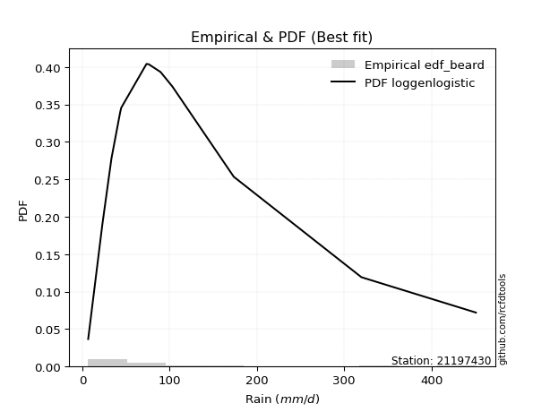</img>

</div>


### 5. EDF Chegodayev (1955)

The Chegodayev formula is an empirical plotting position formula used in hydrological frequency analysis to estimate the exceedance probability or return period of a specific event from a set of observed data. It is primarily used for plotting observed data points on probability paper to fit a theoretical distribution, particularly for analyzing extreme events like maximum flood flows or rainfall intensities. The constant _b_ value in the generalized plotting position formula is 0.3.

<div align="center">


$P=(m-b)/(n+1-2b)$


</div>


**5.1. Empirical values**

<div align="center">

|                | 0                  | 1                   | 2                   | 3                   | 4                  | 5                  | 6                  | 7                  | 8                  | 9                 | 10                 | 11                 |
|:---------------|:-------------------|:--------------------|:--------------------|:--------------------|:-------------------|:-------------------|:-------------------|:-------------------|:-------------------|:------------------|:-------------------|:-------------------|
| date           | 2011               | 2007                | 2015                | 2013                | 2010               | 2012               | 2008               | 2006               | 2009               | 2017              | 2018               | 2016               |
| x              | 6.7                | 23.0                | 33.4                | 43.4                | 44.6               | 73.5               | 76.0               | 89.7               | 103.2              | 173.5             | 319.8              | 451.0              |
| m              | 1                  | 2                   | 3                   | 4                   | 5                  | 6                  | 7                  | 8                  | 9                  | 10                | 11                 | 12                 |
| empirical_dist | edf_chegodayev     | edf_chegodayev      | edf_chegodayev      | edf_chegodayev      | edf_chegodayev     | edf_chegodayev     | edf_chegodayev     | edf_chegodayev     | edf_chegodayev     | edf_chegodayev    | edf_chegodayev     | edf_chegodayev     |
| empirical      | 0.0564516129032258 | 0.13709677419354838 | 0.21774193548387097 | 0.29838709677419356 | 0.3790322580645161 | 0.4596774193548387 | 0.5403225806451613 | 0.6209677419354839 | 0.7016129032258064 | 0.782258064516129 | 0.8629032258064515 | 0.9435483870967741 |
| empirical_tr   | 1.0598290598290598 | 1.158878504672897   | 1.2783505154639176  | 1.425287356321839   | 1.6103896103896105 | 1.8507462686567164 | 2.1754385964912277 | 2.6382978723404253 | 3.3513513513513504 | 4.592592592592592 | 7.294117647058818  | 17.714285714285694 |

</div>


**5.2. Kolmogorov-Smirnov fit test (sorted by Δ)**


<div align="center">

|                | 0                   | 1                   | 2                   | 3                   | 4                    | 5                    | 6                    | 7                   | 8                   | 9                   | 10                  | 11                  | 12                  | 13                   | 14                  | 15                  | 16                  | 17                  | 18                  | 19                  | 20                  | 21                  | 22                  | 23                  | 24                  | 25                  | 26                  | 27                  | 28                  | 29                  | 30                  | 31                  | 32                  | 33                  | 34                  | 35                  | 36                  | 37                  | 38                    | 39                  | 40                  | 41                  | 42                  | 43                  | 44                  | 45                  | 46                  | 47                  | 48                  | 49                  | 50                  | 51                  | 52                  | 53                  | 54                  | 55                  | 56                  | 57                  | 58                  | 59                  | 60                  | 61                  | 62                  | 63                  | 64                  | 65                  | 66                  | 67                  | 68                  | 69                  | 70                  | 71                  | 72                  | 73                  | 74                  | 75                  | 76                  | 77                  | 78                  | 79                  | 80                  | 81                  | 82                  | 83                  | 84                  | 85                  | 86                  | 87                  |
|:---------------|:--------------------|:--------------------|:--------------------|:--------------------|:---------------------|:---------------------|:---------------------|:--------------------|:--------------------|:--------------------|:--------------------|:--------------------|:--------------------|:---------------------|:--------------------|:--------------------|:--------------------|:--------------------|:--------------------|:--------------------|:--------------------|:--------------------|:--------------------|:--------------------|:--------------------|:--------------------|:--------------------|:--------------------|:--------------------|:--------------------|:--------------------|:--------------------|:--------------------|:--------------------|:--------------------|:--------------------|:--------------------|:--------------------|:----------------------|:--------------------|:--------------------|:--------------------|:--------------------|:--------------------|:--------------------|:--------------------|:--------------------|:--------------------|:--------------------|:--------------------|:--------------------|:--------------------|:--------------------|:--------------------|:--------------------|:--------------------|:--------------------|:--------------------|:--------------------|:--------------------|:--------------------|:--------------------|:--------------------|:--------------------|:--------------------|:--------------------|:--------------------|:--------------------|:--------------------|:--------------------|:--------------------|:--------------------|:--------------------|:--------------------|:--------------------|:--------------------|:--------------------|:--------------------|:--------------------|:--------------------|:--------------------|:--------------------|:--------------------|:--------------------|:--------------------|:--------------------|:--------------------|:--------------------|
| station        | 21197430            | 21197430            | 21197430            | 21197430            | 21197430             | 21197430             | 21197430             | 21197430            | 21197430            | 21197430            | 21197430            | 21197430            | 21197430            | 21197430             | 21197430            | 21197430            | 21197430            | 21197430            | 21197430            | 21197430            | 21197430            | 21197430            | 21197430            | 21197430            | 21197430            | 21197430            | 21197430            | 21197430            | 21197430            | 21197430            | 21197430            | 21197430            | 21197430            | 21197430            | 21197430            | 21197430            | 21197430            | 21197430            | 21197430              | 21197430            | 21197430            | 21197430            | 21197430            | 21197430            | 21197430            | 21197430            | 21197430            | 21197430            | 21197430            | 21197430            | 21197430            | 21197430            | 21197430            | 21197430            | 21197430            | 21197430            | 21197430            | 21197430            | 21197430            | 21197430            | 21197430            | 21197430            | 21197430            | 21197430            | 21197430            | 21197430            | 21197430            | 21197430            | 21197430            | 21197430            | 21197430            | 21197430            | 21197430            | 21197430            | 21197430            | 21197430            | 21197430            | 21197430            | 21197430            | 21197430            | 21197430            | 21197430            | 21197430            | 21197430            | 21197430            | 21197430            | 21197430            | 21197430            |
| empirical_dist | edf_chegodayev      | edf_chegodayev      | edf_chegodayev      | edf_chegodayev      | edf_chegodayev       | edf_chegodayev       | edf_chegodayev       | edf_chegodayev      | edf_chegodayev      | edf_chegodayev      | edf_chegodayev      | edf_chegodayev      | edf_chegodayev      | edf_chegodayev       | edf_chegodayev      | edf_chegodayev      | edf_chegodayev      | edf_chegodayev      | edf_chegodayev      | edf_chegodayev      | edf_chegodayev      | edf_chegodayev      | edf_chegodayev      | edf_chegodayev      | edf_chegodayev      | edf_chegodayev      | edf_chegodayev      | edf_chegodayev      | edf_chegodayev      | edf_chegodayev      | edf_chegodayev      | edf_chegodayev      | edf_chegodayev      | edf_chegodayev      | edf_chegodayev      | edf_chegodayev      | edf_chegodayev      | edf_chegodayev      | edf_chegodayev        | edf_chegodayev      | edf_chegodayev      | edf_chegodayev      | edf_chegodayev      | edf_chegodayev      | edf_chegodayev      | edf_chegodayev      | edf_chegodayev      | edf_chegodayev      | edf_chegodayev      | edf_chegodayev      | edf_chegodayev      | edf_chegodayev      | edf_chegodayev      | edf_chegodayev      | edf_chegodayev      | edf_chegodayev      | edf_chegodayev      | edf_chegodayev      | edf_chegodayev      | edf_chegodayev      | edf_chegodayev      | edf_chegodayev      | edf_chegodayev      | edf_chegodayev      | edf_chegodayev      | edf_chegodayev      | edf_chegodayev      | edf_chegodayev      | edf_chegodayev      | edf_chegodayev      | edf_chegodayev      | edf_chegodayev      | edf_chegodayev      | edf_chegodayev      | edf_chegodayev      | edf_chegodayev      | edf_chegodayev      | edf_chegodayev      | edf_chegodayev      | edf_chegodayev      | edf_chegodayev      | edf_chegodayev      | edf_chegodayev      | edf_chegodayev      | edf_chegodayev      | edf_chegodayev      | edf_chegodayev      | edf_chegodayev      |
| p_dist         | logfisk             | invgamma            | f                   | loggenlogistic      | fisk                 | logmielke            | lognct               | logf                | logfatiguelife      | loglognorm          | logcrystalball      | lognorm             | lognorm             | logt                 | logexponnorm        | invweibull          | nct                 | loglogistic         | johnsonsu           | ncf                 | loggamma            | loggamma            | logrice             | logbetaprime        | loghypsecant        | invgauss            | logerlang           | logpearson3         | logloggamma         | loginvgamma         | logjohnsonsu        | logweibull_min      | logalpha            | gamma               | logncf              | fatiguelife         | loggompertz         | loginvgauss         | loglaplace_asymmetric | logmaxwell          | wald                | loglaplace          | loginvweibull       | lograyleigh         | mielke              | loggumbel_l         | exponnorm           | gompertz            | laplace_asymmetric  | genexpon            | expon               | logkstwobign        | loggumbel_r         | loghalfnorm         | lognakagami         | loggenexpon         | t                   | truncnorm           | pearson3            | logtruncnorm        | halflogistic        | betaprime           | logmoyal            | loghalflogistic     | moyal               | genlogistic         | halfnorm            | weibull_min         | gumbel_r            | rayleigh            | gibrat              | maxwell             | kstwobign           | logwald             | norm                | loggibrat           | logistic            | hypsecant           | rice                | logexpon            | laplace             | gumbel_l            | alpha               | logchi2             | chi2                | nakagami            | crystalball         | erlang              |
| delta          | 0.05641689401335476 | 0.05947947420034688 | 0.05947956870460641 | 0.05958711323073829 | 0.060049520545609025 | 0.060785922844341145 | 0.061396141184255126 | 0.06152197217106592 | 0.06154551864067409 | 0.06180489099580344 | 0.06180714532475573 | 0.06180736093561834 | 0.06180736093561834 | 0.061808034418708524 | 0.06180854642574385 | 0.06233590752922219 | 0.06238385420847964 | 0.06284127418804714 | 0.06507421140237024 | 0.06571498219856076 | 0.06635114496805167 | 0.06635114496805167 | 0.06675081663085197 | 0.067052737426677   | 0.06870667645306522 | 0.06881826083285825 | 0.06903608303397929 | 0.07496813788791423 | 0.07645972550513347 | 0.07708692775704412 | 0.07782347774338194 | 0.07874212858654006 | 0.08379885665148706 | 0.08459554766236688 | 0.08459761029959073 | 0.0847987976364698  | 0.08931529014088668 | 0.09024772282592913 | 0.09116781298412874   | 0.09229167914676023 | 0.09265250761629679 | 0.09665788333819675 | 0.09853528428391395 | 0.10284587414346452 | 0.10678492347875576 | 0.1128559951810032  | 0.12678713858493962 | 0.12697063097327377 | 0.12770412454017166 | 0.1277041963420643  | 0.12770425385390916 | 0.13049117388427162 | 0.13081937753619127 | 0.13256294360521353 | 0.1370967741933704  | 0.14012928704467317 | 0.14177050347551207 | 0.1450313322339245  | 0.14834992865495733 | 0.14898546301552176 | 0.15210683124895352 | 0.1529629588770995  | 0.15642173836326406 | 0.15859812547983426 | 0.16074535621087582 | 0.16456994726788277 | 0.17308307006483015 | 0.18251329073359857 | 0.186065116204422   | 0.206708973018224   | 0.20833069428984446 | 0.21862099905355353 | 0.22233138677329833 | 0.22753381680614188 | 0.25295572536698924 | 0.2536437131740222  | 0.25986699137842134 | 0.2657027898612536  | 0.26982440936619073 | 0.27886325049098404 | 0.2850251329239514  | 0.3229938754609647  | 0.32424808252229814 | 0.32946284371414003 | 0.33202943288700193 | 0.3492818051860876  | 0.423568013915931   | 0.44131001642846823 |
| deltao         | 0.36218414519599995 | 0.36218414519599995 | 0.36218414519599995 | 0.36218414519599995 | 0.36218414519599995  | 0.36218414519599995  | 0.36218414519599995  | 0.36218414519599995 | 0.36218414519599995 | 0.36218414519599995 | 0.36218414519599995 | 0.36218414519599995 | 0.36218414519599995 | 0.36218414519599995  | 0.36218414519599995 | 0.36218414519599995 | 0.36218414519599995 | 0.36218414519599995 | 0.36218414519599995 | 0.36218414519599995 | 0.36218414519599995 | 0.36218414519599995 | 0.36218414519599995 | 0.36218414519599995 | 0.36218414519599995 | 0.36218414519599995 | 0.36218414519599995 | 0.36218414519599995 | 0.36218414519599995 | 0.36218414519599995 | 0.36218414519599995 | 0.36218414519599995 | 0.36218414519599995 | 0.36218414519599995 | 0.36218414519599995 | 0.36218414519599995 | 0.36218414519599995 | 0.36218414519599995 | 0.36218414519599995   | 0.36218414519599995 | 0.36218414519599995 | 0.36218414519599995 | 0.36218414519599995 | 0.36218414519599995 | 0.36218414519599995 | 0.36218414519599995 | 0.36218414519599995 | 0.36218414519599995 | 0.36218414519599995 | 0.36218414519599995 | 0.36218414519599995 | 0.36218414519599995 | 0.36218414519599995 | 0.36218414519599995 | 0.36218414519599995 | 0.36218414519599995 | 0.36218414519599995 | 0.36218414519599995 | 0.36218414519599995 | 0.36218414519599995 | 0.36218414519599995 | 0.36218414519599995 | 0.36218414519599995 | 0.36218414519599995 | 0.36218414519599995 | 0.36218414519599995 | 0.36218414519599995 | 0.36218414519599995 | 0.36218414519599995 | 0.36218414519599995 | 0.36218414519599995 | 0.36218414519599995 | 0.36218414519599995 | 0.36218414519599995 | 0.36218414519599995 | 0.36218414519599995 | 0.36218414519599995 | 0.36218414519599995 | 0.36218414519599995 | 0.36218414519599995 | 0.36218414519599995 | 0.36218414519599995 | 0.36218414519599995 | 0.36218414519599995 | 0.36218414519599995 | 0.36218414519599995 | 0.36218414519599995 | 0.36218414519599995 |
| eval           | Δo > Δ              | Δo > Δ              | Δo > Δ              | Δo > Δ              | Δo > Δ               | Δo > Δ               | Δo > Δ               | Δo > Δ              | Δo > Δ              | Δo > Δ              | Δo > Δ              | Δo > Δ              | Δo > Δ              | Δo > Δ               | Δo > Δ              | Δo > Δ              | Δo > Δ              | Δo > Δ              | Δo > Δ              | Δo > Δ              | Δo > Δ              | Δo > Δ              | Δo > Δ              | Δo > Δ              | Δo > Δ              | Δo > Δ              | Δo > Δ              | Δo > Δ              | Δo > Δ              | Δo > Δ              | Δo > Δ              | Δo > Δ              | Δo > Δ              | Δo > Δ              | Δo > Δ              | Δo > Δ              | Δo > Δ              | Δo > Δ              | Δo > Δ                | Δo > Δ              | Δo > Δ              | Δo > Δ              | Δo > Δ              | Δo > Δ              | Δo > Δ              | Δo > Δ              | Δo > Δ              | Δo > Δ              | Δo > Δ              | Δo > Δ              | Δo > Δ              | Δo > Δ              | Δo > Δ              | Δo > Δ              | Δo > Δ              | Δo > Δ              | Δo > Δ              | Δo > Δ              | Δo > Δ              | Δo > Δ              | Δo > Δ              | Δo > Δ              | Δo > Δ              | Δo > Δ              | Δo > Δ              | Δo > Δ              | Δo > Δ              | Δo > Δ              | Δo > Δ              | Δo > Δ              | Δo > Δ              | Δo > Δ              | Δo > Δ              | Δo > Δ              | Δo > Δ              | Δo > Δ              | Δo > Δ              | Δo > Δ              | Δo > Δ              | Δo > Δ              | Δo > Δ              | Δo > Δ              | Δo > Δ              | Δo > Δ              | Δo > Δ              | Δo > Δ              | Δo <= Δ             | Δo <= Δ             |
| fit            | 1                   | 1                   | 1                   | 1                   | 1                    | 1                    | 1                    | 1                   | 1                   | 1                   | 1                   | 1                   | 1                   | 1                    | 1                   | 1                   | 1                   | 1                   | 1                   | 1                   | 1                   | 1                   | 1                   | 1                   | 1                   | 1                   | 1                   | 1                   | 1                   | 1                   | 1                   | 1                   | 1                   | 1                   | 1                   | 1                   | 1                   | 1                   | 1                     | 1                   | 1                   | 1                   | 1                   | 1                   | 1                   | 1                   | 1                   | 1                   | 1                   | 1                   | 1                   | 1                   | 1                   | 1                   | 1                   | 1                   | 1                   | 1                   | 1                   | 1                   | 1                   | 1                   | 1                   | 1                   | 1                   | 1                   | 1                   | 1                   | 1                   | 1                   | 1                   | 1                   | 1                   | 1                   | 1                   | 1                   | 1                   | 1                   | 1                   | 1                   | 1                   | 1                   | 1                   | 1                   | 1                   | 1                   | 0                   | 0                   |
| n              | 12                  | 12                  | 12                  | 12                  | 12                   | 12                   | 12                   | 12                  | 12                  | 12                  | 12                  | 12                  | 12                  | 12                   | 12                  | 12                  | 12                  | 12                  | 12                  | 12                  | 12                  | 12                  | 12                  | 12                  | 12                  | 12                  | 12                  | 12                  | 12                  | 12                  | 12                  | 12                  | 12                  | 12                  | 12                  | 12                  | 12                  | 12                  | 12                    | 12                  | 12                  | 12                  | 12                  | 12                  | 12                  | 12                  | 12                  | 12                  | 12                  | 12                  | 12                  | 12                  | 12                  | 12                  | 12                  | 12                  | 12                  | 12                  | 12                  | 12                  | 12                  | 12                  | 12                  | 12                  | 12                  | 12                  | 12                  | 12                  | 12                  | 12                  | 12                  | 12                  | 12                  | 12                  | 12                  | 12                  | 12                  | 12                  | 12                  | 12                  | 12                  | 12                  | 12                  | 12                  | 12                  | 12                  | 12                  | 12                  |
| best_fit       | 1                   | 0                   | 0                   | 0                   | 0                    | 0                    | 0                    | 0                   | 0                   | 0                   | 0                   | 0                   | 0                   | 0                    | 0                   | 0                   | 0                   | 0                   | 0                   | 0                   | 0                   | 0                   | 0                   | 0                   | 0                   | 0                   | 0                   | 0                   | 0                   | 0                   | 0                   | 0                   | 0                   | 0                   | 0                   | 0                   | 0                   | 0                   | 0                     | 0                   | 0                   | 0                   | 0                   | 0                   | 0                   | 0                   | 0                   | 0                   | 0                   | 0                   | 0                   | 0                   | 0                   | 0                   | 0                   | 0                   | 0                   | 0                   | 0                   | 0                   | 0                   | 0                   | 0                   | 0                   | 0                   | 0                   | 0                   | 0                   | 0                   | 0                   | 0                   | 0                   | 0                   | 0                   | 0                   | 0                   | 0                   | 0                   | 0                   | 0                   | 0                   | 0                   | 0                   | 0                   | 0                   | 0                   | 0                   | 0                   |
| best_fit_sort  | 1                   | 2                   | 3                   | 4                   | 5                    | 6                    | 7                    | 8                   | 9                   | 10                  | 11                  | 12                  | 13                  | 14                   | 15                  | 16                  | 17                  | 18                  | 19                  | 20                  | 21                  | 22                  | 23                  | 24                  | 25                  | 26                  | 27                  | 28                  | 29                  | 30                  | 31                  | 32                  | 33                  | 34                  | 35                  | 36                  | 37                  | 38                  | 39                    | 40                  | 41                  | 42                  | 43                  | 44                  | 45                  | 46                  | 47                  | 48                  | 49                  | 50                  | 51                  | 52                  | 53                  | 54                  | 55                  | 56                  | 57                  | 58                  | 59                  | 60                  | 61                  | 62                  | 63                  | 64                  | 65                  | 66                  | 67                  | 68                  | 69                  | 70                  | 71                  | 72                  | 73                  | 74                  | 75                  | 76                  | 77                  | 78                  | 79                  | 80                  | 81                  | 82                  | 83                  | 84                  | 85                  | 86                  | 87                  | 88                  |

</div>


**5.3. Best fit**

<div align="center">

|   id |   station | empirical_dist   | p_dist   |     delta |   deltao | eval   |   fit |   n |   best_fit |   best_fit_sort |
|-----:|----------:|:-----------------|:---------|----------:|---------:|:-------|------:|----:|-----------:|----------------:|
|    0 |  21197430 | edf_chegodayev   | logfisk  | 0.0564169 | 0.362184 | Δo > Δ |     1 |  12 |          1 |               1 |

</div>


<div align="center">

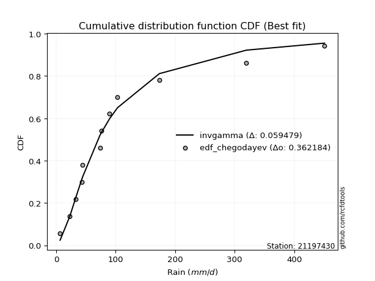</img></img>

</div>


### 6. EDF Blom (1958)

The Blom formula is a specific "plotting position" formula used in hydrology and statistical analysis to estimate the empirical cumulative probability (or non-exceedance probability) of a data series. It is particularly recommended for data that are approximately normally distributed. The constant _a_ is set to 0.375 (or 3/8).

<div align="center">


$P=(m-a)/(n+1-2a)$


</div>


**6.1. Empirical values**

<div align="center">

|                | 0                   | 1                  | 2                   | 3                   | 4                   | 5                   | 6                  | 7                  | 8                  | 9                  | 10                 | 11                 |
|:---------------|:--------------------|:-------------------|:--------------------|:--------------------|:--------------------|:--------------------|:-------------------|:-------------------|:-------------------|:-------------------|:-------------------|:-------------------|
| date           | 2011                | 2007               | 2015                | 2013                | 2010                | 2012                | 2008               | 2006               | 2009               | 2017               | 2018               | 2016               |
| x              | 6.7                 | 23.0               | 33.4                | 43.4                | 44.6                | 73.5                | 76.0               | 89.7               | 103.2              | 173.5              | 319.8              | 451.0              |
| m              | 1                   | 2                  | 3                   | 4                   | 5                   | 6                   | 7                  | 8                  | 9                  | 10                 | 11                 | 12                 |
| empirical_dist | edf_blom            | edf_blom           | edf_blom            | edf_blom            | edf_blom            | edf_blom            | edf_blom           | edf_blom           | edf_blom           | edf_blom           | edf_blom           | edf_blom           |
| empirical      | 0.05102040816326531 | 0.1326530612244898 | 0.21428571428571427 | 0.29591836734693877 | 0.37755102040816324 | 0.45918367346938777 | 0.5408163265306123 | 0.6224489795918368 | 0.7040816326530612 | 0.7857142857142857 | 0.8673469387755102 | 0.9489795918367347 |
| empirical_tr   | 1.053763440860215   | 1.1529411764705884 | 1.2727272727272727  | 1.4202898550724639  | 1.6065573770491803  | 1.8490566037735847  | 2.177777777777778  | 2.6486486486486487 | 3.3793103448275863 | 4.666666666666666  | 7.5384615384615365 | 19.60000000000002  |

</div>


**6.2. Kolmogorov-Smirnov fit test (sorted by Δ)**


<div align="center">

|                | 0                   | 1                    | 2                   | 3                    | 4                   | 5                   | 6                   | 7                   | 8                   | 9                   | 10                  | 11                  | 12                  | 13                  | 14                  | 15                  | 16                  | 17                  | 18                  | 19                  | 20                  | 21                  | 22                  | 23                  | 24                  | 25                  | 26                  | 27                  | 28                  | 29                  | 30                  | 31                  | 32                  | 33                  | 34                  | 35                  | 36                    | 37                  | 38                  | 39                  | 40                  | 41                  | 42                  | 43                  | 44                  | 45                  | 46                  | 47                  | 48                  | 49                  | 50                  | 51                  | 52                  | 53                  | 54                  | 55                  | 56                  | 57                  | 58                  | 59                  | 60                  | 61                  | 62                  | 63                  | 64                  | 65                  | 66                  | 67                  | 68                  | 69                  | 70                  | 71                  | 72                  | 73                  | 74                  | 75                  | 76                  | 77                  | 78                  | 79                  | 80                  | 81                  | 82                  | 83                  | 84                  | 85                  | 86                  | 87                  |
|:---------------|:--------------------|:---------------------|:--------------------|:---------------------|:--------------------|:--------------------|:--------------------|:--------------------|:--------------------|:--------------------|:--------------------|:--------------------|:--------------------|:--------------------|:--------------------|:--------------------|:--------------------|:--------------------|:--------------------|:--------------------|:--------------------|:--------------------|:--------------------|:--------------------|:--------------------|:--------------------|:--------------------|:--------------------|:--------------------|:--------------------|:--------------------|:--------------------|:--------------------|:--------------------|:--------------------|:--------------------|:----------------------|:--------------------|:--------------------|:--------------------|:--------------------|:--------------------|:--------------------|:--------------------|:--------------------|:--------------------|:--------------------|:--------------------|:--------------------|:--------------------|:--------------------|:--------------------|:--------------------|:--------------------|:--------------------|:--------------------|:--------------------|:--------------------|:--------------------|:--------------------|:--------------------|:--------------------|:--------------------|:--------------------|:--------------------|:--------------------|:--------------------|:--------------------|:--------------------|:--------------------|:--------------------|:--------------------|:--------------------|:--------------------|:--------------------|:--------------------|:--------------------|:--------------------|:--------------------|:--------------------|:--------------------|:--------------------|:--------------------|:--------------------|:--------------------|:--------------------|:--------------------|:--------------------|
| station        | 21197430            | 21197430             | 21197430            | 21197430             | 21197430            | 21197430            | 21197430            | 21197430            | 21197430            | 21197430            | 21197430            | 21197430            | 21197430            | 21197430            | 21197430            | 21197430            | 21197430            | 21197430            | 21197430            | 21197430            | 21197430            | 21197430            | 21197430            | 21197430            | 21197430            | 21197430            | 21197430            | 21197430            | 21197430            | 21197430            | 21197430            | 21197430            | 21197430            | 21197430            | 21197430            | 21197430            | 21197430              | 21197430            | 21197430            | 21197430            | 21197430            | 21197430            | 21197430            | 21197430            | 21197430            | 21197430            | 21197430            | 21197430            | 21197430            | 21197430            | 21197430            | 21197430            | 21197430            | 21197430            | 21197430            | 21197430            | 21197430            | 21197430            | 21197430            | 21197430            | 21197430            | 21197430            | 21197430            | 21197430            | 21197430            | 21197430            | 21197430            | 21197430            | 21197430            | 21197430            | 21197430            | 21197430            | 21197430            | 21197430            | 21197430            | 21197430            | 21197430            | 21197430            | 21197430            | 21197430            | 21197430            | 21197430            | 21197430            | 21197430            | 21197430            | 21197430            | 21197430            | 21197430            |
| empirical_dist | edf_blom            | edf_blom             | edf_blom            | edf_blom             | edf_blom            | edf_blom            | edf_blom            | edf_blom            | edf_blom            | edf_blom            | edf_blom            | edf_blom            | edf_blom            | edf_blom            | edf_blom            | edf_blom            | edf_blom            | edf_blom            | edf_blom            | edf_blom            | edf_blom            | edf_blom            | edf_blom            | edf_blom            | edf_blom            | edf_blom            | edf_blom            | edf_blom            | edf_blom            | edf_blom            | edf_blom            | edf_blom            | edf_blom            | edf_blom            | edf_blom            | edf_blom            | edf_blom              | edf_blom            | edf_blom            | edf_blom            | edf_blom            | edf_blom            | edf_blom            | edf_blom            | edf_blom            | edf_blom            | edf_blom            | edf_blom            | edf_blom            | edf_blom            | edf_blom            | edf_blom            | edf_blom            | edf_blom            | edf_blom            | edf_blom            | edf_blom            | edf_blom            | edf_blom            | edf_blom            | edf_blom            | edf_blom            | edf_blom            | edf_blom            | edf_blom            | edf_blom            | edf_blom            | edf_blom            | edf_blom            | edf_blom            | edf_blom            | edf_blom            | edf_blom            | edf_blom            | edf_blom            | edf_blom            | edf_blom            | edf_blom            | edf_blom            | edf_blom            | edf_blom            | edf_blom            | edf_blom            | edf_blom            | edf_blom            | edf_blom            | edf_blom            | edf_blom            |
| p_dist         | logfisk             | loggenlogistic       | invgamma            | f                    | fisk                | invweibull          | nct                 | logfatiguelife      | logmielke           | loglogistic         | lognct              | logf                | loglognorm          | logcrystalball      | lognorm             | lognorm             | logt                | logexponnorm        | loggamma            | loggamma            | loghypsecant        | logrice             | johnsonsu           | logbetaprime        | ncf                 | logerlang           | invgauss            | logpearson3         | loginvgamma         | logloggamma         | logjohnsonsu        | logweibull_min      | logalpha            | logncf              | fatiguelife         | gamma               | loglaplace_asymmetric | loginvgauss         | loggompertz         | logmaxwell          | wald                | loglaplace          | loginvweibull       | lograyleigh         | mielke              | loggumbel_l         | exponnorm           | gompertz            | laplace_asymmetric  | genexpon            | expon               | loggumbel_r         | lognakagami         | loghalfnorm         | logkstwobign        | t                   | loggenexpon         | truncnorm           | pearson3            | logtruncnorm        | betaprime           | halflogistic        | logmoyal            | loghalflogistic     | moyal               | genlogistic         | halfnorm            | weibull_min         | gumbel_r            | gibrat              | rayleigh            | maxwell             | kstwobign           | logwald             | loggibrat           | norm                | logistic            | hypsecant           | rice                | logexpon            | laplace             | gumbel_l            | alpha               | logchi2             | chi2                | nakagami            | crystalball         | erlang              |
| delta          | 0.05691063989880568 | 0.057562333709084035 | 0.05997322008579781 | 0.059973314590057336 | 0.06054326643105995 | 0.06282965341467311 | 0.06287760009393056 | 0.06294832613619727 | 0.06325465227159599 | 0.06333502007349806 | 0.06348429343262096 | 0.06399070159832076 | 0.06427362042305829 | 0.06427587475201058 | 0.06427609036287318 | 0.06427609036287318 | 0.06427676384596337 | 0.0642772758529987  | 0.06684489085350259 | 0.06684489085350259 | 0.06722543879671233 | 0.0672445625163029  | 0.06754294082962509 | 0.06754648331212793 | 0.0681837116258156  | 0.06952982891943021 | 0.07128699026011309 | 0.07743686731516908 | 0.07758067364249505 | 0.07892845493238831 | 0.08029220717063679 | 0.0812108580137949  | 0.08429260253693799 | 0.08509135618504166 | 0.08726752706372465 | 0.08750876441018027 | 0.08968657532777585   | 0.09074146871138006 | 0.09178401956814153 | 0.09278542503221116 | 0.09286836252408603 | 0.09517664568184386 | 0.1004106499937959  | 0.10333962002891545 | 0.11024114467691246 | 0.11532472460825804 | 0.12925586801219446 | 0.1294393604005286  | 0.1301728539674265  | 0.13017292576931916 | 0.130172983281164   | 0.1313131234216422  | 0.13265306122431184 | 0.13305668949066446 | 0.13366189813955212 | 0.142264249360963   | 0.14358550824282987 | 0.14750006166117935 | 0.15081865808221218 | 0.15244168421367846 | 0.1534567047625504  | 0.15457556067620837 | 0.156915484248715   | 0.1590918713652852  | 0.16321408563813067 | 0.1670386766951376  | 0.175551799492085   | 0.1849820201608534  | 0.18853384563167686 | 0.20684945663349158 | 0.20917770244547884 | 0.22108972848080838 | 0.22480011620055318 | 0.2280275626915928  | 0.2541374590594731  | 0.2554244547942441  | 0.2623357208056762  | 0.26817151928850846 | 0.2722931387934456  | 0.28231947168914073 | 0.2874938623512062  | 0.32546260488821954 | 0.32671681194955293 | 0.3329190649122967  | 0.3354856540851586  | 0.3537255181551462  | 0.4289992186558915  | 0.4457537293975268  |
| deltao         | 0.36218414519599995 | 0.36218414519599995  | 0.36218414519599995 | 0.36218414519599995  | 0.36218414519599995 | 0.36218414519599995 | 0.36218414519599995 | 0.36218414519599995 | 0.36218414519599995 | 0.36218414519599995 | 0.36218414519599995 | 0.36218414519599995 | 0.36218414519599995 | 0.36218414519599995 | 0.36218414519599995 | 0.36218414519599995 | 0.36218414519599995 | 0.36218414519599995 | 0.36218414519599995 | 0.36218414519599995 | 0.36218414519599995 | 0.36218414519599995 | 0.36218414519599995 | 0.36218414519599995 | 0.36218414519599995 | 0.36218414519599995 | 0.36218414519599995 | 0.36218414519599995 | 0.36218414519599995 | 0.36218414519599995 | 0.36218414519599995 | 0.36218414519599995 | 0.36218414519599995 | 0.36218414519599995 | 0.36218414519599995 | 0.36218414519599995 | 0.36218414519599995   | 0.36218414519599995 | 0.36218414519599995 | 0.36218414519599995 | 0.36218414519599995 | 0.36218414519599995 | 0.36218414519599995 | 0.36218414519599995 | 0.36218414519599995 | 0.36218414519599995 | 0.36218414519599995 | 0.36218414519599995 | 0.36218414519599995 | 0.36218414519599995 | 0.36218414519599995 | 0.36218414519599995 | 0.36218414519599995 | 0.36218414519599995 | 0.36218414519599995 | 0.36218414519599995 | 0.36218414519599995 | 0.36218414519599995 | 0.36218414519599995 | 0.36218414519599995 | 0.36218414519599995 | 0.36218414519599995 | 0.36218414519599995 | 0.36218414519599995 | 0.36218414519599995 | 0.36218414519599995 | 0.36218414519599995 | 0.36218414519599995 | 0.36218414519599995 | 0.36218414519599995 | 0.36218414519599995 | 0.36218414519599995 | 0.36218414519599995 | 0.36218414519599995 | 0.36218414519599995 | 0.36218414519599995 | 0.36218414519599995 | 0.36218414519599995 | 0.36218414519599995 | 0.36218414519599995 | 0.36218414519599995 | 0.36218414519599995 | 0.36218414519599995 | 0.36218414519599995 | 0.36218414519599995 | 0.36218414519599995 | 0.36218414519599995 | 0.36218414519599995 |
| eval           | Δo > Δ              | Δo > Δ               | Δo > Δ              | Δo > Δ               | Δo > Δ              | Δo > Δ              | Δo > Δ              | Δo > Δ              | Δo > Δ              | Δo > Δ              | Δo > Δ              | Δo > Δ              | Δo > Δ              | Δo > Δ              | Δo > Δ              | Δo > Δ              | Δo > Δ              | Δo > Δ              | Δo > Δ              | Δo > Δ              | Δo > Δ              | Δo > Δ              | Δo > Δ              | Δo > Δ              | Δo > Δ              | Δo > Δ              | Δo > Δ              | Δo > Δ              | Δo > Δ              | Δo > Δ              | Δo > Δ              | Δo > Δ              | Δo > Δ              | Δo > Δ              | Δo > Δ              | Δo > Δ              | Δo > Δ                | Δo > Δ              | Δo > Δ              | Δo > Δ              | Δo > Δ              | Δo > Δ              | Δo > Δ              | Δo > Δ              | Δo > Δ              | Δo > Δ              | Δo > Δ              | Δo > Δ              | Δo > Δ              | Δo > Δ              | Δo > Δ              | Δo > Δ              | Δo > Δ              | Δo > Δ              | Δo > Δ              | Δo > Δ              | Δo > Δ              | Δo > Δ              | Δo > Δ              | Δo > Δ              | Δo > Δ              | Δo > Δ              | Δo > Δ              | Δo > Δ              | Δo > Δ              | Δo > Δ              | Δo > Δ              | Δo > Δ              | Δo > Δ              | Δo > Δ              | Δo > Δ              | Δo > Δ              | Δo > Δ              | Δo > Δ              | Δo > Δ              | Δo > Δ              | Δo > Δ              | Δo > Δ              | Δo > Δ              | Δo > Δ              | Δo > Δ              | Δo > Δ              | Δo > Δ              | Δo > Δ              | Δo > Δ              | Δo > Δ              | Δo <= Δ             | Δo <= Δ             |
| fit            | 1                   | 1                    | 1                   | 1                    | 1                   | 1                   | 1                   | 1                   | 1                   | 1                   | 1                   | 1                   | 1                   | 1                   | 1                   | 1                   | 1                   | 1                   | 1                   | 1                   | 1                   | 1                   | 1                   | 1                   | 1                   | 1                   | 1                   | 1                   | 1                   | 1                   | 1                   | 1                   | 1                   | 1                   | 1                   | 1                   | 1                     | 1                   | 1                   | 1                   | 1                   | 1                   | 1                   | 1                   | 1                   | 1                   | 1                   | 1                   | 1                   | 1                   | 1                   | 1                   | 1                   | 1                   | 1                   | 1                   | 1                   | 1                   | 1                   | 1                   | 1                   | 1                   | 1                   | 1                   | 1                   | 1                   | 1                   | 1                   | 1                   | 1                   | 1                   | 1                   | 1                   | 1                   | 1                   | 1                   | 1                   | 1                   | 1                   | 1                   | 1                   | 1                   | 1                   | 1                   | 1                   | 1                   | 0                   | 0                   |
| n              | 12                  | 12                   | 12                  | 12                   | 12                  | 12                  | 12                  | 12                  | 12                  | 12                  | 12                  | 12                  | 12                  | 12                  | 12                  | 12                  | 12                  | 12                  | 12                  | 12                  | 12                  | 12                  | 12                  | 12                  | 12                  | 12                  | 12                  | 12                  | 12                  | 12                  | 12                  | 12                  | 12                  | 12                  | 12                  | 12                  | 12                    | 12                  | 12                  | 12                  | 12                  | 12                  | 12                  | 12                  | 12                  | 12                  | 12                  | 12                  | 12                  | 12                  | 12                  | 12                  | 12                  | 12                  | 12                  | 12                  | 12                  | 12                  | 12                  | 12                  | 12                  | 12                  | 12                  | 12                  | 12                  | 12                  | 12                  | 12                  | 12                  | 12                  | 12                  | 12                  | 12                  | 12                  | 12                  | 12                  | 12                  | 12                  | 12                  | 12                  | 12                  | 12                  | 12                  | 12                  | 12                  | 12                  | 12                  | 12                  |
| best_fit       | 1                   | 0                    | 0                   | 0                    | 0                   | 0                   | 0                   | 0                   | 0                   | 0                   | 0                   | 0                   | 0                   | 0                   | 0                   | 0                   | 0                   | 0                   | 0                   | 0                   | 0                   | 0                   | 0                   | 0                   | 0                   | 0                   | 0                   | 0                   | 0                   | 0                   | 0                   | 0                   | 0                   | 0                   | 0                   | 0                   | 0                     | 0                   | 0                   | 0                   | 0                   | 0                   | 0                   | 0                   | 0                   | 0                   | 0                   | 0                   | 0                   | 0                   | 0                   | 0                   | 0                   | 0                   | 0                   | 0                   | 0                   | 0                   | 0                   | 0                   | 0                   | 0                   | 0                   | 0                   | 0                   | 0                   | 0                   | 0                   | 0                   | 0                   | 0                   | 0                   | 0                   | 0                   | 0                   | 0                   | 0                   | 0                   | 0                   | 0                   | 0                   | 0                   | 0                   | 0                   | 0                   | 0                   | 0                   | 0                   |
| best_fit_sort  | 1                   | 2                    | 3                   | 4                    | 5                   | 6                   | 7                   | 8                   | 9                   | 10                  | 11                  | 12                  | 13                  | 14                  | 15                  | 16                  | 17                  | 18                  | 19                  | 20                  | 21                  | 22                  | 23                  | 24                  | 25                  | 26                  | 27                  | 28                  | 29                  | 30                  | 31                  | 32                  | 33                  | 34                  | 35                  | 36                  | 37                    | 38                  | 39                  | 40                  | 41                  | 42                  | 43                  | 44                  | 45                  | 46                  | 47                  | 48                  | 49                  | 50                  | 51                  | 52                  | 53                  | 54                  | 55                  | 56                  | 57                  | 58                  | 59                  | 60                  | 61                  | 62                  | 63                  | 64                  | 65                  | 66                  | 67                  | 68                  | 69                  | 70                  | 71                  | 72                  | 73                  | 74                  | 75                  | 76                  | 77                  | 78                  | 79                  | 80                  | 81                  | 82                  | 83                  | 84                  | 85                  | 86                  | 87                  | 88                  |

</div>


**6.3. Best fit**

<div align="center">

|   id |   station | empirical_dist   | p_dist   |     delta |   deltao | eval   |   fit |   n |   best_fit |   best_fit_sort |
|-----:|----------:|:-----------------|:---------|----------:|---------:|:-------|------:|----:|-----------:|----------------:|
|    0 |  21197430 | edf_blom         | logfisk  | 0.0569106 | 0.362184 | Δo > Δ |     1 |  12 |          1 |               1 |

</div>


<div align="center">

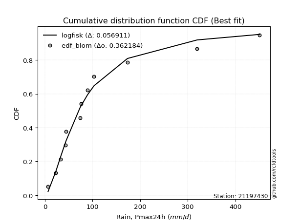</img>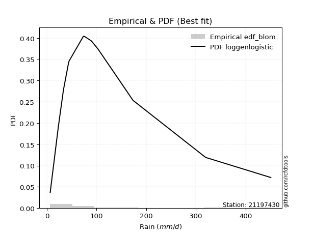</img>

</div>


### 7. EDF Tukey (1962)

In hydrology, the Tukey formula is used as a plotting position formula to estimate the empirical probability or frequency of a flood event (or other hydrological data). The formula parameter is given as _c=0.333_ (or 1/3).

<div align="center">


$P=(m-c)/(n+1-2c)$


</div>


**7.1. Empirical values**

<div align="center">

|                | 0                   | 1                   | 2                   | 3                  | 4                  | 5                  | 6                  | 7                  | 8                  | 9                  | 10                 | 11                 |
|:---------------|:--------------------|:--------------------|:--------------------|:-------------------|:-------------------|:-------------------|:-------------------|:-------------------|:-------------------|:-------------------|:-------------------|:-------------------|
| date           | 2011                | 2007                | 2015                | 2013               | 2010               | 2012               | 2008               | 2006               | 2009               | 2017               | 2018               | 2016               |
| x              | 6.7                 | 23.0                | 33.4                | 43.4               | 44.6               | 73.5               | 76.0               | 89.7               | 103.2              | 173.5              | 319.8              | 451.0              |
| m              | 1                   | 2                   | 3                   | 4                  | 5                  | 6                  | 7                  | 8                  | 9                  | 10                 | 11                 | 12                 |
| empirical_dist | edf_tukey           | edf_tukey           | edf_tukey           | edf_tukey          | edf_tukey          | edf_tukey          | edf_tukey          | edf_tukey          | edf_tukey          | edf_tukey          | edf_tukey          | edf_tukey          |
| empirical      | 0.05405405405405406 | 0.13513513513513514 | 0.21621621621621623 | 0.2972972972972973 | 0.3783783783783784 | 0.4594594594594595 | 0.5405405405405406 | 0.6216216216216216 | 0.7027027027027027 | 0.7837837837837838 | 0.8648648648648649 | 0.9459459459459459 |
| empirical_tr   | 1.0571428571428572  | 1.15625             | 1.2758620689655173  | 1.4230769230769231 | 1.608695652173913  | 1.8499999999999999 | 2.1764705882352944 | 2.642857142857143  | 3.363636363636364  | 4.625              | 7.400000000000003  | 18.5               |

</div>


**7.2. Kolmogorov-Smirnov fit test (sorted by Δ)**


<div align="center">

|                | 0                   | 1                    | 2                   | 3                    | 4                   | 5                    | 6                   | 7                   | 8                   | 9                   | 10                  | 11                  | 12                  | 13                  | 14                  | 15                  | 16                  | 17                  | 18                  | 19                  | 20                  | 21                  | 22                  | 23                  | 24                  | 25                  | 26                  | 27                  | 28                  | 29                  | 30                  | 31                  | 32                  | 33                  | 34                  | 35                  | 36                  | 37                  | 38                    | 39                  | 40                  | 41                  | 42                  | 43                  | 44                  | 45                  | 46                  | 47                  | 48                  | 49                  | 50                  | 51                  | 52                  | 53                  | 54                  | 55                  | 56                  | 57                  | 58                  | 59                  | 60                  | 61                  | 62                  | 63                  | 64                  | 65                  | 66                  | 67                  | 68                  | 69                  | 70                  | 71                  | 72                  | 73                  | 74                  | 75                  | 76                  | 77                  | 78                  | 79                  | 80                  | 81                  | 82                  | 83                  | 84                  | 85                  | 86                  | 87                  |
|:---------------|:--------------------|:---------------------|:--------------------|:---------------------|:--------------------|:---------------------|:--------------------|:--------------------|:--------------------|:--------------------|:--------------------|:--------------------|:--------------------|:--------------------|:--------------------|:--------------------|:--------------------|:--------------------|:--------------------|:--------------------|:--------------------|:--------------------|:--------------------|:--------------------|:--------------------|:--------------------|:--------------------|:--------------------|:--------------------|:--------------------|:--------------------|:--------------------|:--------------------|:--------------------|:--------------------|:--------------------|:--------------------|:--------------------|:----------------------|:--------------------|:--------------------|:--------------------|:--------------------|:--------------------|:--------------------|:--------------------|:--------------------|:--------------------|:--------------------|:--------------------|:--------------------|:--------------------|:--------------------|:--------------------|:--------------------|:--------------------|:--------------------|:--------------------|:--------------------|:--------------------|:--------------------|:--------------------|:--------------------|:--------------------|:--------------------|:--------------------|:--------------------|:--------------------|:--------------------|:--------------------|:--------------------|:--------------------|:--------------------|:--------------------|:--------------------|:--------------------|:--------------------|:--------------------|:--------------------|:--------------------|:--------------------|:--------------------|:--------------------|:--------------------|:--------------------|:--------------------|:--------------------|:--------------------|
| station        | 21197430            | 21197430             | 21197430            | 21197430             | 21197430            | 21197430             | 21197430            | 21197430            | 21197430            | 21197430            | 21197430            | 21197430            | 21197430            | 21197430            | 21197430            | 21197430            | 21197430            | 21197430            | 21197430            | 21197430            | 21197430            | 21197430            | 21197430            | 21197430            | 21197430            | 21197430            | 21197430            | 21197430            | 21197430            | 21197430            | 21197430            | 21197430            | 21197430            | 21197430            | 21197430            | 21197430            | 21197430            | 21197430            | 21197430              | 21197430            | 21197430            | 21197430            | 21197430            | 21197430            | 21197430            | 21197430            | 21197430            | 21197430            | 21197430            | 21197430            | 21197430            | 21197430            | 21197430            | 21197430            | 21197430            | 21197430            | 21197430            | 21197430            | 21197430            | 21197430            | 21197430            | 21197430            | 21197430            | 21197430            | 21197430            | 21197430            | 21197430            | 21197430            | 21197430            | 21197430            | 21197430            | 21197430            | 21197430            | 21197430            | 21197430            | 21197430            | 21197430            | 21197430            | 21197430            | 21197430            | 21197430            | 21197430            | 21197430            | 21197430            | 21197430            | 21197430            | 21197430            | 21197430            |
| empirical_dist | edf_tukey           | edf_tukey            | edf_tukey           | edf_tukey            | edf_tukey           | edf_tukey            | edf_tukey           | edf_tukey           | edf_tukey           | edf_tukey           | edf_tukey           | edf_tukey           | edf_tukey           | edf_tukey           | edf_tukey           | edf_tukey           | edf_tukey           | edf_tukey           | edf_tukey           | edf_tukey           | edf_tukey           | edf_tukey           | edf_tukey           | edf_tukey           | edf_tukey           | edf_tukey           | edf_tukey           | edf_tukey           | edf_tukey           | edf_tukey           | edf_tukey           | edf_tukey           | edf_tukey           | edf_tukey           | edf_tukey           | edf_tukey           | edf_tukey           | edf_tukey           | edf_tukey             | edf_tukey           | edf_tukey           | edf_tukey           | edf_tukey           | edf_tukey           | edf_tukey           | edf_tukey           | edf_tukey           | edf_tukey           | edf_tukey           | edf_tukey           | edf_tukey           | edf_tukey           | edf_tukey           | edf_tukey           | edf_tukey           | edf_tukey           | edf_tukey           | edf_tukey           | edf_tukey           | edf_tukey           | edf_tukey           | edf_tukey           | edf_tukey           | edf_tukey           | edf_tukey           | edf_tukey           | edf_tukey           | edf_tukey           | edf_tukey           | edf_tukey           | edf_tukey           | edf_tukey           | edf_tukey           | edf_tukey           | edf_tukey           | edf_tukey           | edf_tukey           | edf_tukey           | edf_tukey           | edf_tukey           | edf_tukey           | edf_tukey           | edf_tukey           | edf_tukey           | edf_tukey           | edf_tukey           | edf_tukey           | edf_tukey           |
| p_dist         | logfisk             | loggenlogistic       | invgamma            | f                    | fisk                | logfatiguelife       | logmielke           | lognct              | invweibull          | nct                 | logf                | loglognorm          | logcrystalball      | lognorm             | lognorm             | logt                | logexponnorm        | loglogistic         | johnsonsu           | loggamma            | loggamma            | ncf                 | logrice             | logbetaprime        | loghypsecant        | logerlang           | invgauss            | logpearson3         | loginvgamma         | logloggamma         | logjohnsonsu        | logweibull_min      | logalpha            | logncf              | gamma               | fatiguelife         | loggompertz         | loginvgauss         | loglaplace_asymmetric | wald                | logmaxwell          | loglaplace          | loginvweibull       | lograyleigh         | mielke              | loggumbel_l         | exponnorm           | gompertz            | laplace_asymmetric  | genexpon            | expon               | loggumbel_r         | logkstwobign        | loghalfnorm         | lognakagami         | loggenexpon         | t                   | truncnorm           | pearson3            | logtruncnorm        | betaprime           | halflogistic        | logmoyal            | loghalflogistic     | moyal               | genlogistic         | halfnorm            | weibull_min         | gumbel_r            | gibrat              | rayleigh            | maxwell             | kstwobign           | logwald             | loggibrat           | norm                | logistic            | hypsecant           | rice                | logexpon            | laplace             | gumbel_l            | alpha               | logchi2             | chi2                | nakagami            | crystalball         | erlang              |
| delta          | 0.05663485390873396 | 0.057625474172324886 | 0.05969743409572609 | 0.059697528599985616 | 0.06026748044098823 | 0.061763478536053296 | 0.0618757223212375  | 0.06210536348226248 | 0.0625538674246014  | 0.06260181410385884 | 0.06261177164796228 | 0.0628946904726998  | 0.06289694480165209 | 0.0628971604125147  | 0.0628971604125147  | 0.06289783389560488 | 0.06289834590264021 | 0.06305923408342634 | 0.0661640108792666  | 0.06656910486343087 | 0.06656910486343087 | 0.06680478167545711 | 0.06696877652623118 | 0.0672706973220562  | 0.06805279676692749 | 0.0692540429293585  | 0.0699080603097546  | 0.07605793736481059 | 0.07730488765242333 | 0.07754952498202983 | 0.0789132772202783  | 0.07983192806343642 | 0.08401681654686627 | 0.08481557019496994 | 0.08557826247967831 | 0.08588859711336616 | 0.09040508961778304 | 0.09046568272130834 | 0.09051393329799101   | 0.09199862793015906 | 0.09250963904213944 | 0.09600400365205902 | 0.09903172004343735 | 0.10306383403884373 | 0.1083106427464105  | 0.11394579465789956 | 0.12787693806183598 | 0.12806043045017013 | 0.12879392401706802 | 0.12879399581896067 | 0.1287940533308055  | 0.13103733743157048 | 0.13173139620905017 | 0.13278090350059274 | 0.13513513513495717 | 0.1416550063123279  | 0.14198846337089127 | 0.14612113171082086 | 0.1494397281318537  | 0.1505111822831765  | 0.1531809187724787  | 0.15319663072584988 | 0.15663969825864327 | 0.15881608537521347 | 0.16183515568777218 | 0.16565974674477912 | 0.1741728695417265  | 0.18360309021049492 | 0.18715491568131837 | 0.20767681460370674 | 0.20779877249512035 | 0.2197107985304499  | 0.2234211862501947  | 0.22775177670152108 | 0.2538616730694014  | 0.2540455248438856  | 0.2609567908553177  | 0.26679258933815    | 0.2709142088430871  | 0.2803889697586388  | 0.28611493240084773 | 0.32408367493786105 | 0.3253378819991944  | 0.3309885629817948  | 0.3335551521546567  | 0.3512434442445008  | 0.4259655727651028  | 0.44327165548688147 |
| deltao         | 0.36218414519599995 | 0.36218414519599995  | 0.36218414519599995 | 0.36218414519599995  | 0.36218414519599995 | 0.36218414519599995  | 0.36218414519599995 | 0.36218414519599995 | 0.36218414519599995 | 0.36218414519599995 | 0.36218414519599995 | 0.36218414519599995 | 0.36218414519599995 | 0.36218414519599995 | 0.36218414519599995 | 0.36218414519599995 | 0.36218414519599995 | 0.36218414519599995 | 0.36218414519599995 | 0.36218414519599995 | 0.36218414519599995 | 0.36218414519599995 | 0.36218414519599995 | 0.36218414519599995 | 0.36218414519599995 | 0.36218414519599995 | 0.36218414519599995 | 0.36218414519599995 | 0.36218414519599995 | 0.36218414519599995 | 0.36218414519599995 | 0.36218414519599995 | 0.36218414519599995 | 0.36218414519599995 | 0.36218414519599995 | 0.36218414519599995 | 0.36218414519599995 | 0.36218414519599995 | 0.36218414519599995   | 0.36218414519599995 | 0.36218414519599995 | 0.36218414519599995 | 0.36218414519599995 | 0.36218414519599995 | 0.36218414519599995 | 0.36218414519599995 | 0.36218414519599995 | 0.36218414519599995 | 0.36218414519599995 | 0.36218414519599995 | 0.36218414519599995 | 0.36218414519599995 | 0.36218414519599995 | 0.36218414519599995 | 0.36218414519599995 | 0.36218414519599995 | 0.36218414519599995 | 0.36218414519599995 | 0.36218414519599995 | 0.36218414519599995 | 0.36218414519599995 | 0.36218414519599995 | 0.36218414519599995 | 0.36218414519599995 | 0.36218414519599995 | 0.36218414519599995 | 0.36218414519599995 | 0.36218414519599995 | 0.36218414519599995 | 0.36218414519599995 | 0.36218414519599995 | 0.36218414519599995 | 0.36218414519599995 | 0.36218414519599995 | 0.36218414519599995 | 0.36218414519599995 | 0.36218414519599995 | 0.36218414519599995 | 0.36218414519599995 | 0.36218414519599995 | 0.36218414519599995 | 0.36218414519599995 | 0.36218414519599995 | 0.36218414519599995 | 0.36218414519599995 | 0.36218414519599995 | 0.36218414519599995 | 0.36218414519599995 |
| eval           | Δo > Δ              | Δo > Δ               | Δo > Δ              | Δo > Δ               | Δo > Δ              | Δo > Δ               | Δo > Δ              | Δo > Δ              | Δo > Δ              | Δo > Δ              | Δo > Δ              | Δo > Δ              | Δo > Δ              | Δo > Δ              | Δo > Δ              | Δo > Δ              | Δo > Δ              | Δo > Δ              | Δo > Δ              | Δo > Δ              | Δo > Δ              | Δo > Δ              | Δo > Δ              | Δo > Δ              | Δo > Δ              | Δo > Δ              | Δo > Δ              | Δo > Δ              | Δo > Δ              | Δo > Δ              | Δo > Δ              | Δo > Δ              | Δo > Δ              | Δo > Δ              | Δo > Δ              | Δo > Δ              | Δo > Δ              | Δo > Δ              | Δo > Δ                | Δo > Δ              | Δo > Δ              | Δo > Δ              | Δo > Δ              | Δo > Δ              | Δo > Δ              | Δo > Δ              | Δo > Δ              | Δo > Δ              | Δo > Δ              | Δo > Δ              | Δo > Δ              | Δo > Δ              | Δo > Δ              | Δo > Δ              | Δo > Δ              | Δo > Δ              | Δo > Δ              | Δo > Δ              | Δo > Δ              | Δo > Δ              | Δo > Δ              | Δo > Δ              | Δo > Δ              | Δo > Δ              | Δo > Δ              | Δo > Δ              | Δo > Δ              | Δo > Δ              | Δo > Δ              | Δo > Δ              | Δo > Δ              | Δo > Δ              | Δo > Δ              | Δo > Δ              | Δo > Δ              | Δo > Δ              | Δo > Δ              | Δo > Δ              | Δo > Δ              | Δo > Δ              | Δo > Δ              | Δo > Δ              | Δo > Δ              | Δo > Δ              | Δo > Δ              | Δo > Δ              | Δo <= Δ             | Δo <= Δ             |
| fit            | 1                   | 1                    | 1                   | 1                    | 1                   | 1                    | 1                   | 1                   | 1                   | 1                   | 1                   | 1                   | 1                   | 1                   | 1                   | 1                   | 1                   | 1                   | 1                   | 1                   | 1                   | 1                   | 1                   | 1                   | 1                   | 1                   | 1                   | 1                   | 1                   | 1                   | 1                   | 1                   | 1                   | 1                   | 1                   | 1                   | 1                   | 1                   | 1                     | 1                   | 1                   | 1                   | 1                   | 1                   | 1                   | 1                   | 1                   | 1                   | 1                   | 1                   | 1                   | 1                   | 1                   | 1                   | 1                   | 1                   | 1                   | 1                   | 1                   | 1                   | 1                   | 1                   | 1                   | 1                   | 1                   | 1                   | 1                   | 1                   | 1                   | 1                   | 1                   | 1                   | 1                   | 1                   | 1                   | 1                   | 1                   | 1                   | 1                   | 1                   | 1                   | 1                   | 1                   | 1                   | 1                   | 1                   | 0                   | 0                   |
| n              | 12                  | 12                   | 12                  | 12                   | 12                  | 12                   | 12                  | 12                  | 12                  | 12                  | 12                  | 12                  | 12                  | 12                  | 12                  | 12                  | 12                  | 12                  | 12                  | 12                  | 12                  | 12                  | 12                  | 12                  | 12                  | 12                  | 12                  | 12                  | 12                  | 12                  | 12                  | 12                  | 12                  | 12                  | 12                  | 12                  | 12                  | 12                  | 12                    | 12                  | 12                  | 12                  | 12                  | 12                  | 12                  | 12                  | 12                  | 12                  | 12                  | 12                  | 12                  | 12                  | 12                  | 12                  | 12                  | 12                  | 12                  | 12                  | 12                  | 12                  | 12                  | 12                  | 12                  | 12                  | 12                  | 12                  | 12                  | 12                  | 12                  | 12                  | 12                  | 12                  | 12                  | 12                  | 12                  | 12                  | 12                  | 12                  | 12                  | 12                  | 12                  | 12                  | 12                  | 12                  | 12                  | 12                  | 12                  | 12                  |
| best_fit       | 1                   | 0                    | 0                   | 0                    | 0                   | 0                    | 0                   | 0                   | 0                   | 0                   | 0                   | 0                   | 0                   | 0                   | 0                   | 0                   | 0                   | 0                   | 0                   | 0                   | 0                   | 0                   | 0                   | 0                   | 0                   | 0                   | 0                   | 0                   | 0                   | 0                   | 0                   | 0                   | 0                   | 0                   | 0                   | 0                   | 0                   | 0                   | 0                     | 0                   | 0                   | 0                   | 0                   | 0                   | 0                   | 0                   | 0                   | 0                   | 0                   | 0                   | 0                   | 0                   | 0                   | 0                   | 0                   | 0                   | 0                   | 0                   | 0                   | 0                   | 0                   | 0                   | 0                   | 0                   | 0                   | 0                   | 0                   | 0                   | 0                   | 0                   | 0                   | 0                   | 0                   | 0                   | 0                   | 0                   | 0                   | 0                   | 0                   | 0                   | 0                   | 0                   | 0                   | 0                   | 0                   | 0                   | 0                   | 0                   |
| best_fit_sort  | 1                   | 2                    | 3                   | 4                    | 5                   | 6                    | 7                   | 8                   | 9                   | 10                  | 11                  | 12                  | 13                  | 14                  | 15                  | 16                  | 17                  | 18                  | 19                  | 20                  | 21                  | 22                  | 23                  | 24                  | 25                  | 26                  | 27                  | 28                  | 29                  | 30                  | 31                  | 32                  | 33                  | 34                  | 35                  | 36                  | 37                  | 38                  | 39                    | 40                  | 41                  | 42                  | 43                  | 44                  | 45                  | 46                  | 47                  | 48                  | 49                  | 50                  | 51                  | 52                  | 53                  | 54                  | 55                  | 56                  | 57                  | 58                  | 59                  | 60                  | 61                  | 62                  | 63                  | 64                  | 65                  | 66                  | 67                  | 68                  | 69                  | 70                  | 71                  | 72                  | 73                  | 74                  | 75                  | 76                  | 77                  | 78                  | 79                  | 80                  | 81                  | 82                  | 83                  | 84                  | 85                  | 86                  | 87                  | 88                  |

</div>


**7.3. Best fit**

<div align="center">

|   id |   station | empirical_dist   | p_dist   |     delta |   deltao | eval   |   fit |   n |   best_fit |   best_fit_sort |
|-----:|----------:|:-----------------|:---------|----------:|---------:|:-------|------:|----:|-----------:|----------------:|
|    0 |  21197430 | edf_tukey        | logfisk  | 0.0566349 | 0.362184 | Δo > Δ |     1 |  12 |          1 |               1 |

</div>


<div align="center">

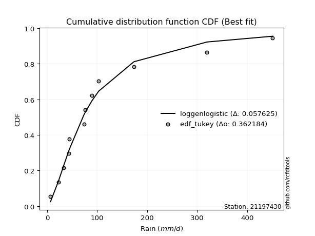</img>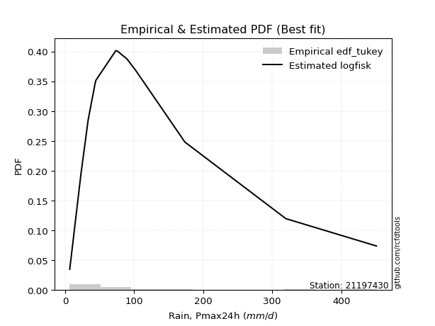</img>

</div>


### 8. EDF Gringorten (1963)

Gringorten plotting position formula is essential for estimating the probability and return periods of extreme events like floods and heavy rainfall. The constant _a=0.44_.

<div align="center">


$P=(m-a)/(n+1-2a)$


</div>


**8.1. Empirical values**

<div align="center">

|                | 0                   | 1                   | 2                   | 3                   | 4                   | 5                   | 6                  | 7                  | 8                  | 9                  | 10                 | 11                 |
|:---------------|:--------------------|:--------------------|:--------------------|:--------------------|:--------------------|:--------------------|:-------------------|:-------------------|:-------------------|:-------------------|:-------------------|:-------------------|
| date           | 2011                | 2007                | 2015                | 2013                | 2010                | 2012                | 2008               | 2006               | 2009               | 2017               | 2018               | 2016               |
| x              | 6.7                 | 23.0                | 33.4                | 43.4                | 44.6                | 73.5                | 76.0               | 89.7               | 103.2              | 173.5              | 319.8              | 451.0              |
| m              | 1                   | 2                   | 3                   | 4                   | 5                   | 6                   | 7                  | 8                  | 9                  | 10                 | 11                 | 12                 |
| empirical_dist | edf_gringorten      | edf_gringorten      | edf_gringorten      | edf_gringorten      | edf_gringorten      | edf_gringorten      | edf_gringorten     | edf_gringorten     | edf_gringorten     | edf_gringorten     | edf_gringorten     | edf_gringorten     |
| empirical      | 0.04620462046204621 | 0.12871287128712872 | 0.21122112211221125 | 0.29372937293729373 | 0.37623762376237624 | 0.45874587458745875 | 0.5412541254125413 | 0.6237623762376238 | 0.7062706270627064 | 0.7887788778877889 | 0.8712871287128714 | 0.9537953795379539 |
| empirical_tr   | 1.0484429065743945  | 1.1477272727272727  | 1.2677824267782427  | 1.4158878504672898  | 1.6031746031746033  | 1.8475609756097562  | 2.179856115107914  | 2.6578947368421053 | 3.4044943820224733 | 4.734375000000003  | 7.769230769230775  | 21.642857142857192 |

</div>


**8.2. Kolmogorov-Smirnov fit test (sorted by Δ)**


<div align="center">

|                | 0                    | 1                    | 2                    | 3                    | 4                   | 5                   | 6                   | 7                   | 8                   | 9                   | 10                  | 11                  | 12                  | 13                  | 14                  | 15                  | 16                  | 17                  | 18                  | 19                  | 20                  | 21                  | 22                  | 23                  | 24                  | 25                  | 26                  | 27                  | 28                  | 29                  | 30                  | 31                  | 32                  | 33                  | 34                    | 35                  | 36                  | 37                  | 38                  | 39                  | 40                  | 41                  | 42                  | 43                  | 44                  | 45                  | 46                  | 47                  | 48                  | 49                  | 50                  | 51                  | 52                  | 53                  | 54                  | 55                  | 56                  | 57                  | 58                  | 59                  | 60                  | 61                  | 62                  | 63                  | 64                  | 65                  | 66                  | 67                  | 68                  | 69                  | 70                  | 71                  | 72                  | 73                  | 74                  | 75                  | 76                  | 77                  | 78                  | 79                  | 80                  | 81                  | 82                  | 83                  | 84                  | 85                  | 86                  | 87                  |
|:---------------|:---------------------|:---------------------|:---------------------|:---------------------|:--------------------|:--------------------|:--------------------|:--------------------|:--------------------|:--------------------|:--------------------|:--------------------|:--------------------|:--------------------|:--------------------|:--------------------|:--------------------|:--------------------|:--------------------|:--------------------|:--------------------|:--------------------|:--------------------|:--------------------|:--------------------|:--------------------|:--------------------|:--------------------|:--------------------|:--------------------|:--------------------|:--------------------|:--------------------|:--------------------|:----------------------|:--------------------|:--------------------|:--------------------|:--------------------|:--------------------|:--------------------|:--------------------|:--------------------|:--------------------|:--------------------|:--------------------|:--------------------|:--------------------|:--------------------|:--------------------|:--------------------|:--------------------|:--------------------|:--------------------|:--------------------|:--------------------|:--------------------|:--------------------|:--------------------|:--------------------|:--------------------|:--------------------|:--------------------|:--------------------|:--------------------|:--------------------|:--------------------|:--------------------|:--------------------|:--------------------|:--------------------|:--------------------|:--------------------|:--------------------|:--------------------|:--------------------|:--------------------|:--------------------|:--------------------|:--------------------|:--------------------|:--------------------|:--------------------|:--------------------|:--------------------|:--------------------|:--------------------|:--------------------|
| station        | 21197430             | 21197430             | 21197430             | 21197430             | 21197430            | 21197430            | 21197430            | 21197430            | 21197430            | 21197430            | 21197430            | 21197430            | 21197430            | 21197430            | 21197430            | 21197430            | 21197430            | 21197430            | 21197430            | 21197430            | 21197430            | 21197430            | 21197430            | 21197430            | 21197430            | 21197430            | 21197430            | 21197430            | 21197430            | 21197430            | 21197430            | 21197430            | 21197430            | 21197430            | 21197430              | 21197430            | 21197430            | 21197430            | 21197430            | 21197430            | 21197430            | 21197430            | 21197430            | 21197430            | 21197430            | 21197430            | 21197430            | 21197430            | 21197430            | 21197430            | 21197430            | 21197430            | 21197430            | 21197430            | 21197430            | 21197430            | 21197430            | 21197430            | 21197430            | 21197430            | 21197430            | 21197430            | 21197430            | 21197430            | 21197430            | 21197430            | 21197430            | 21197430            | 21197430            | 21197430            | 21197430            | 21197430            | 21197430            | 21197430            | 21197430            | 21197430            | 21197430            | 21197430            | 21197430            | 21197430            | 21197430            | 21197430            | 21197430            | 21197430            | 21197430            | 21197430            | 21197430            | 21197430            |
| empirical_dist | edf_gringorten       | edf_gringorten       | edf_gringorten       | edf_gringorten       | edf_gringorten      | edf_gringorten      | edf_gringorten      | edf_gringorten      | edf_gringorten      | edf_gringorten      | edf_gringorten      | edf_gringorten      | edf_gringorten      | edf_gringorten      | edf_gringorten      | edf_gringorten      | edf_gringorten      | edf_gringorten      | edf_gringorten      | edf_gringorten      | edf_gringorten      | edf_gringorten      | edf_gringorten      | edf_gringorten      | edf_gringorten      | edf_gringorten      | edf_gringorten      | edf_gringorten      | edf_gringorten      | edf_gringorten      | edf_gringorten      | edf_gringorten      | edf_gringorten      | edf_gringorten      | edf_gringorten        | edf_gringorten      | edf_gringorten      | edf_gringorten      | edf_gringorten      | edf_gringorten      | edf_gringorten      | edf_gringorten      | edf_gringorten      | edf_gringorten      | edf_gringorten      | edf_gringorten      | edf_gringorten      | edf_gringorten      | edf_gringorten      | edf_gringorten      | edf_gringorten      | edf_gringorten      | edf_gringorten      | edf_gringorten      | edf_gringorten      | edf_gringorten      | edf_gringorten      | edf_gringorten      | edf_gringorten      | edf_gringorten      | edf_gringorten      | edf_gringorten      | edf_gringorten      | edf_gringorten      | edf_gringorten      | edf_gringorten      | edf_gringorten      | edf_gringorten      | edf_gringorten      | edf_gringorten      | edf_gringorten      | edf_gringorten      | edf_gringorten      | edf_gringorten      | edf_gringorten      | edf_gringorten      | edf_gringorten      | edf_gringorten      | edf_gringorten      | edf_gringorten      | edf_gringorten      | edf_gringorten      | edf_gringorten      | edf_gringorten      | edf_gringorten      | edf_gringorten      | edf_gringorten      | edf_gringorten      |
| p_dist         | logfisk              | loggenlogistic       | invgamma             | f                    | fisk                | invweibull          | nct                 | loglogistic         | logfatiguelife      | logmielke           | lognct              | loghypsecant        | logf                | loglognorm          | logcrystalball      | lognorm             | lognorm             | logt                | logexponnorm        | loggamma            | loggamma            | logrice             | logbetaprime        | johnsonsu           | logerlang           | ncf                 | invgauss            | loginvgamma         | logpearson3         | logloggamma         | logjohnsonsu        | logweibull_min      | logalpha            | logncf              | loglaplace_asymmetric | fatiguelife         | gamma               | loginvgauss         | logmaxwell          | loglaplace          | loggompertz         | wald                | loginvweibull       | lograyleigh         | mielke              | loggumbel_l         | lognakagami         | exponnorm           | gompertz            | loggumbel_r         | laplace_asymmetric  | genexpon            | expon               | loghalfnorm         | logkstwobign        | t                   | loggenexpon         | truncnorm           | pearson3            | betaprime           | logtruncnorm        | halflogistic        | logmoyal            | loghalflogistic     | moyal               | genlogistic         | halfnorm            | weibull_min         | gumbel_r            | gibrat              | rayleigh            | maxwell             | kstwobign           | logwald             | loggibrat           | norm                | logistic            | hypsecant           | rice                | logexpon            | laplace             | gumbel_l            | alpha               | logchi2             | chi2                | nakagami            | crystalball         | erlang              |
| delta          | 0.058342694914905735 | 0.059751328118729186 | 0.060411018967726826 | 0.060411113471986355 | 0.06098106531298897 | 0.06326745229660213 | 0.06331539897585958 | 0.06377281895542708 | 0.06513732054584243 | 0.06544364668124114 | 0.06567328784226611 | 0.06607615174867121 | 0.06617969600796592 | 0.06646261483270344 | 0.06646486916165573 | 0.06646508477251833 | 0.06646508477251833 | 0.06646575825560852 | 0.06646627026264385 | 0.06728268973543161 | 0.06728268973543161 | 0.06768236139823192 | 0.06798428219405694 | 0.06973193523927024 | 0.06996762780135923 | 0.07037270603546075 | 0.07347598466975824 | 0.07801847252442407 | 0.07962586172481423 | 0.08111744934203347 | 0.08248120158028194 | 0.08339985242344006 | 0.08473040141886701 | 0.08552915506697067 | 0.08837317868198885   | 0.0894565214733698  | 0.09057335658368329 | 0.09117926759330908 | 0.09322322391414017 | 0.09386324903605686 | 0.09397301397778668 | 0.09505735693373119 | 0.10259964440344094 | 0.10377741891084447 | 0.11330573685041548 | 0.1175137190179032  | 0.12871287128695075 | 0.13144486242183961 | 0.13162835481017376 | 0.13175092230357122 | 0.13236184837707166 | 0.1323619201789643  | 0.13236197769080915 | 0.13349448837259348 | 0.13672649031305514 | 0.142702048242892   | 0.1466501004163329  | 0.1496890560708245  | 0.15300765249185733 | 0.15389450364447943 | 0.15550627638718148 | 0.15676455508585352 | 0.157353283130644   | 0.1595296702472142  | 0.16540308004777582 | 0.16922767110478276 | 0.17774079390173014 | 0.18717101457049856 | 0.190722840041322   | 0.20553605998770458 | 0.211366696855124   | 0.22327872289045353 | 0.22698911061019833 | 0.22846536157352182 | 0.2545752579414021  | 0.25761344920388923 | 0.26452471521532134 | 0.2703605136981536  | 0.27448213320309073 | 0.2853840638626438  | 0.28968285676085137 | 0.3276515992978647  | 0.32890580635919797 | 0.33651008099119584 | 0.3385502462586617  | 0.35766570809250725 | 0.4338150063571106  | 0.4496939193348879  |
| deltao         | 0.36218414519599995  | 0.36218414519599995  | 0.36218414519599995  | 0.36218414519599995  | 0.36218414519599995 | 0.36218414519599995 | 0.36218414519599995 | 0.36218414519599995 | 0.36218414519599995 | 0.36218414519599995 | 0.36218414519599995 | 0.36218414519599995 | 0.36218414519599995 | 0.36218414519599995 | 0.36218414519599995 | 0.36218414519599995 | 0.36218414519599995 | 0.36218414519599995 | 0.36218414519599995 | 0.36218414519599995 | 0.36218414519599995 | 0.36218414519599995 | 0.36218414519599995 | 0.36218414519599995 | 0.36218414519599995 | 0.36218414519599995 | 0.36218414519599995 | 0.36218414519599995 | 0.36218414519599995 | 0.36218414519599995 | 0.36218414519599995 | 0.36218414519599995 | 0.36218414519599995 | 0.36218414519599995 | 0.36218414519599995   | 0.36218414519599995 | 0.36218414519599995 | 0.36218414519599995 | 0.36218414519599995 | 0.36218414519599995 | 0.36218414519599995 | 0.36218414519599995 | 0.36218414519599995 | 0.36218414519599995 | 0.36218414519599995 | 0.36218414519599995 | 0.36218414519599995 | 0.36218414519599995 | 0.36218414519599995 | 0.36218414519599995 | 0.36218414519599995 | 0.36218414519599995 | 0.36218414519599995 | 0.36218414519599995 | 0.36218414519599995 | 0.36218414519599995 | 0.36218414519599995 | 0.36218414519599995 | 0.36218414519599995 | 0.36218414519599995 | 0.36218414519599995 | 0.36218414519599995 | 0.36218414519599995 | 0.36218414519599995 | 0.36218414519599995 | 0.36218414519599995 | 0.36218414519599995 | 0.36218414519599995 | 0.36218414519599995 | 0.36218414519599995 | 0.36218414519599995 | 0.36218414519599995 | 0.36218414519599995 | 0.36218414519599995 | 0.36218414519599995 | 0.36218414519599995 | 0.36218414519599995 | 0.36218414519599995 | 0.36218414519599995 | 0.36218414519599995 | 0.36218414519599995 | 0.36218414519599995 | 0.36218414519599995 | 0.36218414519599995 | 0.36218414519599995 | 0.36218414519599995 | 0.36218414519599995 | 0.36218414519599995 |
| eval           | Δo > Δ               | Δo > Δ               | Δo > Δ               | Δo > Δ               | Δo > Δ              | Δo > Δ              | Δo > Δ              | Δo > Δ              | Δo > Δ              | Δo > Δ              | Δo > Δ              | Δo > Δ              | Δo > Δ              | Δo > Δ              | Δo > Δ              | Δo > Δ              | Δo > Δ              | Δo > Δ              | Δo > Δ              | Δo > Δ              | Δo > Δ              | Δo > Δ              | Δo > Δ              | Δo > Δ              | Δo > Δ              | Δo > Δ              | Δo > Δ              | Δo > Δ              | Δo > Δ              | Δo > Δ              | Δo > Δ              | Δo > Δ              | Δo > Δ              | Δo > Δ              | Δo > Δ                | Δo > Δ              | Δo > Δ              | Δo > Δ              | Δo > Δ              | Δo > Δ              | Δo > Δ              | Δo > Δ              | Δo > Δ              | Δo > Δ              | Δo > Δ              | Δo > Δ              | Δo > Δ              | Δo > Δ              | Δo > Δ              | Δo > Δ              | Δo > Δ              | Δo > Δ              | Δo > Δ              | Δo > Δ              | Δo > Δ              | Δo > Δ              | Δo > Δ              | Δo > Δ              | Δo > Δ              | Δo > Δ              | Δo > Δ              | Δo > Δ              | Δo > Δ              | Δo > Δ              | Δo > Δ              | Δo > Δ              | Δo > Δ              | Δo > Δ              | Δo > Δ              | Δo > Δ              | Δo > Δ              | Δo > Δ              | Δo > Δ              | Δo > Δ              | Δo > Δ              | Δo > Δ              | Δo > Δ              | Δo > Δ              | Δo > Δ              | Δo > Δ              | Δo > Δ              | Δo > Δ              | Δo > Δ              | Δo > Δ              | Δo > Δ              | Δo > Δ              | Δo <= Δ             | Δo <= Δ             |
| fit            | 1                    | 1                    | 1                    | 1                    | 1                   | 1                   | 1                   | 1                   | 1                   | 1                   | 1                   | 1                   | 1                   | 1                   | 1                   | 1                   | 1                   | 1                   | 1                   | 1                   | 1                   | 1                   | 1                   | 1                   | 1                   | 1                   | 1                   | 1                   | 1                   | 1                   | 1                   | 1                   | 1                   | 1                   | 1                     | 1                   | 1                   | 1                   | 1                   | 1                   | 1                   | 1                   | 1                   | 1                   | 1                   | 1                   | 1                   | 1                   | 1                   | 1                   | 1                   | 1                   | 1                   | 1                   | 1                   | 1                   | 1                   | 1                   | 1                   | 1                   | 1                   | 1                   | 1                   | 1                   | 1                   | 1                   | 1                   | 1                   | 1                   | 1                   | 1                   | 1                   | 1                   | 1                   | 1                   | 1                   | 1                   | 1                   | 1                   | 1                   | 1                   | 1                   | 1                   | 1                   | 1                   | 1                   | 0                   | 0                   |
| n              | 12                   | 12                   | 12                   | 12                   | 12                  | 12                  | 12                  | 12                  | 12                  | 12                  | 12                  | 12                  | 12                  | 12                  | 12                  | 12                  | 12                  | 12                  | 12                  | 12                  | 12                  | 12                  | 12                  | 12                  | 12                  | 12                  | 12                  | 12                  | 12                  | 12                  | 12                  | 12                  | 12                  | 12                  | 12                    | 12                  | 12                  | 12                  | 12                  | 12                  | 12                  | 12                  | 12                  | 12                  | 12                  | 12                  | 12                  | 12                  | 12                  | 12                  | 12                  | 12                  | 12                  | 12                  | 12                  | 12                  | 12                  | 12                  | 12                  | 12                  | 12                  | 12                  | 12                  | 12                  | 12                  | 12                  | 12                  | 12                  | 12                  | 12                  | 12                  | 12                  | 12                  | 12                  | 12                  | 12                  | 12                  | 12                  | 12                  | 12                  | 12                  | 12                  | 12                  | 12                  | 12                  | 12                  | 12                  | 12                  |
| best_fit       | 1                    | 0                    | 0                    | 0                    | 0                   | 0                   | 0                   | 0                   | 0                   | 0                   | 0                   | 0                   | 0                   | 0                   | 0                   | 0                   | 0                   | 0                   | 0                   | 0                   | 0                   | 0                   | 0                   | 0                   | 0                   | 0                   | 0                   | 0                   | 0                   | 0                   | 0                   | 0                   | 0                   | 0                   | 0                     | 0                   | 0                   | 0                   | 0                   | 0                   | 0                   | 0                   | 0                   | 0                   | 0                   | 0                   | 0                   | 0                   | 0                   | 0                   | 0                   | 0                   | 0                   | 0                   | 0                   | 0                   | 0                   | 0                   | 0                   | 0                   | 0                   | 0                   | 0                   | 0                   | 0                   | 0                   | 0                   | 0                   | 0                   | 0                   | 0                   | 0                   | 0                   | 0                   | 0                   | 0                   | 0                   | 0                   | 0                   | 0                   | 0                   | 0                   | 0                   | 0                   | 0                   | 0                   | 0                   | 0                   |
| best_fit_sort  | 1                    | 2                    | 3                    | 4                    | 5                   | 6                   | 7                   | 8                   | 9                   | 10                  | 11                  | 12                  | 13                  | 14                  | 15                  | 16                  | 17                  | 18                  | 19                  | 20                  | 21                  | 22                  | 23                  | 24                  | 25                  | 26                  | 27                  | 28                  | 29                  | 30                  | 31                  | 32                  | 33                  | 34                  | 35                    | 36                  | 37                  | 38                  | 39                  | 40                  | 41                  | 42                  | 43                  | 44                  | 45                  | 46                  | 47                  | 48                  | 49                  | 50                  | 51                  | 52                  | 53                  | 54                  | 55                  | 56                  | 57                  | 58                  | 59                  | 60                  | 61                  | 62                  | 63                  | 64                  | 65                  | 66                  | 67                  | 68                  | 69                  | 70                  | 71                  | 72                  | 73                  | 74                  | 75                  | 76                  | 77                  | 78                  | 79                  | 80                  | 81                  | 82                  | 83                  | 84                  | 85                  | 86                  | 87                  | 88                  |

</div>


**8.3. Best fit**

<div align="center">

|   id |   station | empirical_dist   | p_dist   |     delta |   deltao | eval   |   fit |   n |   best_fit |   best_fit_sort |
|-----:|----------:|:-----------------|:---------|----------:|---------:|:-------|------:|----:|-----------:|----------------:|
|    0 |  21197430 | edf_gringorten   | logfisk  | 0.0583427 | 0.362184 | Δo > Δ |     1 |  12 |          1 |               1 |

</div>


<div align="center">

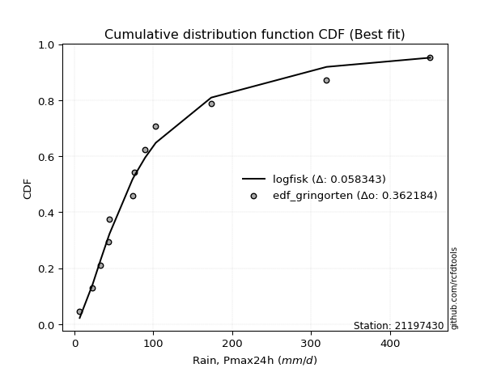</img>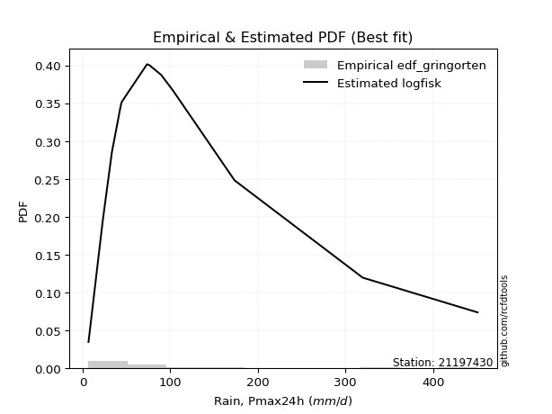</img>

</div>


### 9. EDF Filliben (1975)

The specific values of the constants (0.3175) (often denoted as $alpha$) and (0.365) are derived from a method proposed by James J. Filliben in a 1975 paper. This particular formula is the mean value of the $i$-th order statistic of the normal distribution and is considered a robust and effective plotting position formula for the normal probability plot correlation coefficient test for normality.

<div align="center">


$P=(m-0.3175)/(n+0.365)$


</div>


**9.1. Empirical values**

<div align="center">

|                | 0                   | 1                   | 2                   | 3                   | 4                  | 5                  | 6                  | 7                  | 8                  | 9                  | 10                 | 11                 |
|:---------------|:--------------------|:--------------------|:--------------------|:--------------------|:-------------------|:-------------------|:-------------------|:-------------------|:-------------------|:-------------------|:-------------------|:-------------------|
| date           | 2011                | 2007                | 2015                | 2013                | 2010               | 2012               | 2008               | 2006               | 2009               | 2017               | 2018               | 2016               |
| x              | 6.7                 | 23.0                | 33.4                | 43.4                | 44.6               | 73.5               | 76.0               | 89.7               | 103.2              | 173.5              | 319.8              | 451.0              |
| m              | 1                   | 2                   | 3                   | 4                   | 5                  | 6                  | 7                  | 8                  | 9                  | 10                 | 11                 | 12                 |
| empirical_dist | edf_filliben        | edf_filliben        | edf_filliben        | edf_filliben        | edf_filliben       | edf_filliben       | edf_filliben       | edf_filliben       | edf_filliben       | edf_filliben       | edf_filliben       | edf_filliben       |
| empirical      | 0.05519611807521229 | 0.13606955115244643 | 0.21694298422968056 | 0.29781641730691466 | 0.3786898503841488 | 0.4595632834613829 | 0.540436716538617  | 0.6213101496158512 | 0.7021835826930852 | 0.7830570157703194 | 0.8639304488475535 | 0.9448038819247876 |
| empirical_tr   | 1.0584207147442757  | 1.1575005850690383  | 1.2770462174025305  | 1.4241289951050964  | 1.609502115196876  | 1.8503554059109617 | 2.1759788825340958 | 2.6406833956219966 | 3.357773251866937  | 4.6095060577819185 | 7.349182763744426  | 18.117216117216078 |

</div>


**9.2. Kolmogorov-Smirnov fit test (sorted by Δ)**


<div align="center">

|                | 0                    | 1                    | 2                   | 3                   | 4                    | 5                   | 6                    | 7                   | 8                    | 9                    | 10                   | 11                   | 12                   | 13                  | 14                   | 15                  | 16                  | 17                  | 18                  | 19                  | 20                  | 21                  | 22                  | 23                  | 24                  | 25                  | 26                  | 27                  | 28                  | 29                  | 30                  | 31                  | 32                  | 33                  | 34                  | 35                  | 36                  | 37                  | 38                    | 39                  | 40                  | 41                  | 42                  | 43                  | 44                  | 45                  | 46                  | 47                  | 48                  | 49                  | 50                  | 51                  | 52                  | 53                  | 54                  | 55                  | 56                  | 57                  | 58                  | 59                  | 60                  | 61                  | 62                  | 63                  | 64                  | 65                  | 66                  | 67                  | 68                  | 69                  | 70                  | 71                  | 72                  | 73                  | 74                  | 75                  | 76                  | 77                  | 78                  | 79                  | 80                  | 81                  | 82                  | 83                  | 84                  | 85                  | 86                  | 87                  |
|:---------------|:---------------------|:---------------------|:--------------------|:--------------------|:---------------------|:--------------------|:---------------------|:--------------------|:---------------------|:---------------------|:---------------------|:---------------------|:---------------------|:--------------------|:---------------------|:--------------------|:--------------------|:--------------------|:--------------------|:--------------------|:--------------------|:--------------------|:--------------------|:--------------------|:--------------------|:--------------------|:--------------------|:--------------------|:--------------------|:--------------------|:--------------------|:--------------------|:--------------------|:--------------------|:--------------------|:--------------------|:--------------------|:--------------------|:----------------------|:--------------------|:--------------------|:--------------------|:--------------------|:--------------------|:--------------------|:--------------------|:--------------------|:--------------------|:--------------------|:--------------------|:--------------------|:--------------------|:--------------------|:--------------------|:--------------------|:--------------------|:--------------------|:--------------------|:--------------------|:--------------------|:--------------------|:--------------------|:--------------------|:--------------------|:--------------------|:--------------------|:--------------------|:--------------------|:--------------------|:--------------------|:--------------------|:--------------------|:--------------------|:--------------------|:--------------------|:--------------------|:--------------------|:--------------------|:--------------------|:--------------------|:--------------------|:--------------------|:--------------------|:--------------------|:--------------------|:--------------------|:--------------------|:--------------------|
| station        | 21197430             | 21197430             | 21197430            | 21197430            | 21197430             | 21197430            | 21197430             | 21197430            | 21197430             | 21197430             | 21197430             | 21197430             | 21197430             | 21197430            | 21197430             | 21197430            | 21197430            | 21197430            | 21197430            | 21197430            | 21197430            | 21197430            | 21197430            | 21197430            | 21197430            | 21197430            | 21197430            | 21197430            | 21197430            | 21197430            | 21197430            | 21197430            | 21197430            | 21197430            | 21197430            | 21197430            | 21197430            | 21197430            | 21197430              | 21197430            | 21197430            | 21197430            | 21197430            | 21197430            | 21197430            | 21197430            | 21197430            | 21197430            | 21197430            | 21197430            | 21197430            | 21197430            | 21197430            | 21197430            | 21197430            | 21197430            | 21197430            | 21197430            | 21197430            | 21197430            | 21197430            | 21197430            | 21197430            | 21197430            | 21197430            | 21197430            | 21197430            | 21197430            | 21197430            | 21197430            | 21197430            | 21197430            | 21197430            | 21197430            | 21197430            | 21197430            | 21197430            | 21197430            | 21197430            | 21197430            | 21197430            | 21197430            | 21197430            | 21197430            | 21197430            | 21197430            | 21197430            | 21197430            |
| empirical_dist | edf_filliben         | edf_filliben         | edf_filliben        | edf_filliben        | edf_filliben         | edf_filliben        | edf_filliben         | edf_filliben        | edf_filliben         | edf_filliben         | edf_filliben         | edf_filliben         | edf_filliben         | edf_filliben        | edf_filliben         | edf_filliben        | edf_filliben        | edf_filliben        | edf_filliben        | edf_filliben        | edf_filliben        | edf_filliben        | edf_filliben        | edf_filliben        | edf_filliben        | edf_filliben        | edf_filliben        | edf_filliben        | edf_filliben        | edf_filliben        | edf_filliben        | edf_filliben        | edf_filliben        | edf_filliben        | edf_filliben        | edf_filliben        | edf_filliben        | edf_filliben        | edf_filliben          | edf_filliben        | edf_filliben        | edf_filliben        | edf_filliben        | edf_filliben        | edf_filliben        | edf_filliben        | edf_filliben        | edf_filliben        | edf_filliben        | edf_filliben        | edf_filliben        | edf_filliben        | edf_filliben        | edf_filliben        | edf_filliben        | edf_filliben        | edf_filliben        | edf_filliben        | edf_filliben        | edf_filliben        | edf_filliben        | edf_filliben        | edf_filliben        | edf_filliben        | edf_filliben        | edf_filliben        | edf_filliben        | edf_filliben        | edf_filliben        | edf_filliben        | edf_filliben        | edf_filliben        | edf_filliben        | edf_filliben        | edf_filliben        | edf_filliben        | edf_filliben        | edf_filliben        | edf_filliben        | edf_filliben        | edf_filliben        | edf_filliben        | edf_filliben        | edf_filliben        | edf_filliben        | edf_filliben        | edf_filliben        | edf_filliben        |
| p_dist         | logfisk              | loggenlogistic       | invgamma            | f                   | fisk                 | logmielke           | lognct               | logfatiguelife      | logf                 | loglognorm           | logcrystalball       | lognorm              | lognorm              | logt                | logexponnorm         | invweibull          | nct                 | loglogistic         | johnsonsu           | ncf                 | loggamma            | loggamma            | logrice             | logbetaprime        | loghypsecant        | logerlang           | invgauss            | logpearson3         | logloggamma         | loginvgamma         | logjohnsonsu        | logweibull_min      | logalpha            | logncf              | gamma               | fatiguelife         | loggompertz         | loginvgauss         | loglaplace_asymmetric | wald                | logmaxwell          | loglaplace          | loginvweibull       | lograyleigh         | mielke              | loggumbel_l         | exponnorm           | gompertz            | laplace_asymmetric  | genexpon            | expon               | loggumbel_r         | logkstwobign        | loghalfnorm         | lognakagami         | loggenexpon         | t                   | truncnorm           | pearson3            | logtruncnorm        | halflogistic        | betaprime           | logmoyal            | loghalflogistic     | moyal               | genlogistic         | halfnorm            | weibull_min         | gumbel_r            | rayleigh            | gibrat              | maxwell             | kstwobign           | logwald             | norm                | loggibrat           | logistic            | hypsecant           | rice                | logexpon            | laplace             | gumbel_l            | alpha               | logchi2             | chi2                | nakagami            | crystalball         | erlang              |
| delta          | 0.056531029906810526 | 0.058559890189636254 | 0.05959361009380265 | 0.05959370459806218 | 0.060163656439064794 | 0.06135660231161999 | 0.061586243472644964 | 0.06165965453412986 | 0.062092651638344765 | 0.062375570463082286 | 0.062377824792034575 | 0.062378040402897184 | 0.062378040402897184 | 0.06237871388598737 | 0.062379225893022694 | 0.06245004342267796 | 0.06249799010193541 | 0.0629554100815029  | 0.06564489086964909 | 0.0662856616658396  | 0.06646528086150744 | 0.06646528086150744 | 0.06686495252430774 | 0.06716687332013277 | 0.06836426877269791 | 0.06915021892743506 | 0.06938894030013709 | 0.07553881735519308 | 0.07703040497241231 | 0.07720106365049989 | 0.07839415721066079 | 0.0793128080538189  | 0.08391299254494283 | 0.0847117461930465  | 0.08485149446621398 | 0.08536947710374865 | 0.08988596960816553 | 0.0903618587193849  | 0.09082540530376143   | 0.09231009993592948 | 0.092405815040216   | 0.09631547565782944 | 0.09864942017736972 | 0.10296001003692029 | 0.10758387473294617 | 0.11342667464828204 | 0.12735781805221846 | 0.1275413104405526  | 0.1282748040074505  | 0.12827487580934316 | 0.128274933321188   | 0.13093351342964704 | 0.13106185335155052 | 0.1326770794986693  | 0.13606955115226846 | 0.14092823829886358 | 0.14188463936896784 | 0.14560201170120335 | 0.14892060812223618 | 0.14978441426971217 | 0.15267751071623237 | 0.15307709477055526 | 0.15653587425671983 | 0.15871226137329003 | 0.16131603567815467 | 0.1651406267351616  | 0.173653749532109   | 0.1830839702008774  | 0.18663579567170085 | 0.20727965248550284 | 0.20798828660947716 | 0.21919167852083238 | 0.22290206624057718 | 0.22764795269959764 | 0.2535264048342681  | 0.25375784906747795 | 0.2604376708457002  | 0.26627346932853246 | 0.2703950888334696  | 0.2796622017451745  | 0.2855958123912302  | 0.32356455492824354 | 0.32481876198957704 | 0.33026179496833047 | 0.33282838414119237 | 0.35030902822718957 | 0.42482350874394453 | 0.44233723946957015 |
| deltao         | 0.36218414519599995  | 0.36218414519599995  | 0.36218414519599995 | 0.36218414519599995 | 0.36218414519599995  | 0.36218414519599995 | 0.36218414519599995  | 0.36218414519599995 | 0.36218414519599995  | 0.36218414519599995  | 0.36218414519599995  | 0.36218414519599995  | 0.36218414519599995  | 0.36218414519599995 | 0.36218414519599995  | 0.36218414519599995 | 0.36218414519599995 | 0.36218414519599995 | 0.36218414519599995 | 0.36218414519599995 | 0.36218414519599995 | 0.36218414519599995 | 0.36218414519599995 | 0.36218414519599995 | 0.36218414519599995 | 0.36218414519599995 | 0.36218414519599995 | 0.36218414519599995 | 0.36218414519599995 | 0.36218414519599995 | 0.36218414519599995 | 0.36218414519599995 | 0.36218414519599995 | 0.36218414519599995 | 0.36218414519599995 | 0.36218414519599995 | 0.36218414519599995 | 0.36218414519599995 | 0.36218414519599995   | 0.36218414519599995 | 0.36218414519599995 | 0.36218414519599995 | 0.36218414519599995 | 0.36218414519599995 | 0.36218414519599995 | 0.36218414519599995 | 0.36218414519599995 | 0.36218414519599995 | 0.36218414519599995 | 0.36218414519599995 | 0.36218414519599995 | 0.36218414519599995 | 0.36218414519599995 | 0.36218414519599995 | 0.36218414519599995 | 0.36218414519599995 | 0.36218414519599995 | 0.36218414519599995 | 0.36218414519599995 | 0.36218414519599995 | 0.36218414519599995 | 0.36218414519599995 | 0.36218414519599995 | 0.36218414519599995 | 0.36218414519599995 | 0.36218414519599995 | 0.36218414519599995 | 0.36218414519599995 | 0.36218414519599995 | 0.36218414519599995 | 0.36218414519599995 | 0.36218414519599995 | 0.36218414519599995 | 0.36218414519599995 | 0.36218414519599995 | 0.36218414519599995 | 0.36218414519599995 | 0.36218414519599995 | 0.36218414519599995 | 0.36218414519599995 | 0.36218414519599995 | 0.36218414519599995 | 0.36218414519599995 | 0.36218414519599995 | 0.36218414519599995 | 0.36218414519599995 | 0.36218414519599995 | 0.36218414519599995 |
| eval           | Δo > Δ               | Δo > Δ               | Δo > Δ              | Δo > Δ              | Δo > Δ               | Δo > Δ              | Δo > Δ               | Δo > Δ              | Δo > Δ               | Δo > Δ               | Δo > Δ               | Δo > Δ               | Δo > Δ               | Δo > Δ              | Δo > Δ               | Δo > Δ              | Δo > Δ              | Δo > Δ              | Δo > Δ              | Δo > Δ              | Δo > Δ              | Δo > Δ              | Δo > Δ              | Δo > Δ              | Δo > Δ              | Δo > Δ              | Δo > Δ              | Δo > Δ              | Δo > Δ              | Δo > Δ              | Δo > Δ              | Δo > Δ              | Δo > Δ              | Δo > Δ              | Δo > Δ              | Δo > Δ              | Δo > Δ              | Δo > Δ              | Δo > Δ                | Δo > Δ              | Δo > Δ              | Δo > Δ              | Δo > Δ              | Δo > Δ              | Δo > Δ              | Δo > Δ              | Δo > Δ              | Δo > Δ              | Δo > Δ              | Δo > Δ              | Δo > Δ              | Δo > Δ              | Δo > Δ              | Δo > Δ              | Δo > Δ              | Δo > Δ              | Δo > Δ              | Δo > Δ              | Δo > Δ              | Δo > Δ              | Δo > Δ              | Δo > Δ              | Δo > Δ              | Δo > Δ              | Δo > Δ              | Δo > Δ              | Δo > Δ              | Δo > Δ              | Δo > Δ              | Δo > Δ              | Δo > Δ              | Δo > Δ              | Δo > Δ              | Δo > Δ              | Δo > Δ              | Δo > Δ              | Δo > Δ              | Δo > Δ              | Δo > Δ              | Δo > Δ              | Δo > Δ              | Δo > Δ              | Δo > Δ              | Δo > Δ              | Δo > Δ              | Δo > Δ              | Δo <= Δ             | Δo <= Δ             |
| fit            | 1                    | 1                    | 1                   | 1                   | 1                    | 1                   | 1                    | 1                   | 1                    | 1                    | 1                    | 1                    | 1                    | 1                   | 1                    | 1                   | 1                   | 1                   | 1                   | 1                   | 1                   | 1                   | 1                   | 1                   | 1                   | 1                   | 1                   | 1                   | 1                   | 1                   | 1                   | 1                   | 1                   | 1                   | 1                   | 1                   | 1                   | 1                   | 1                     | 1                   | 1                   | 1                   | 1                   | 1                   | 1                   | 1                   | 1                   | 1                   | 1                   | 1                   | 1                   | 1                   | 1                   | 1                   | 1                   | 1                   | 1                   | 1                   | 1                   | 1                   | 1                   | 1                   | 1                   | 1                   | 1                   | 1                   | 1                   | 1                   | 1                   | 1                   | 1                   | 1                   | 1                   | 1                   | 1                   | 1                   | 1                   | 1                   | 1                   | 1                   | 1                   | 1                   | 1                   | 1                   | 1                   | 1                   | 0                   | 0                   |
| n              | 12                   | 12                   | 12                  | 12                  | 12                   | 12                  | 12                   | 12                  | 12                   | 12                   | 12                   | 12                   | 12                   | 12                  | 12                   | 12                  | 12                  | 12                  | 12                  | 12                  | 12                  | 12                  | 12                  | 12                  | 12                  | 12                  | 12                  | 12                  | 12                  | 12                  | 12                  | 12                  | 12                  | 12                  | 12                  | 12                  | 12                  | 12                  | 12                    | 12                  | 12                  | 12                  | 12                  | 12                  | 12                  | 12                  | 12                  | 12                  | 12                  | 12                  | 12                  | 12                  | 12                  | 12                  | 12                  | 12                  | 12                  | 12                  | 12                  | 12                  | 12                  | 12                  | 12                  | 12                  | 12                  | 12                  | 12                  | 12                  | 12                  | 12                  | 12                  | 12                  | 12                  | 12                  | 12                  | 12                  | 12                  | 12                  | 12                  | 12                  | 12                  | 12                  | 12                  | 12                  | 12                  | 12                  | 12                  | 12                  |
| best_fit       | 1                    | 0                    | 0                   | 0                   | 0                    | 0                   | 0                    | 0                   | 0                    | 0                    | 0                    | 0                    | 0                    | 0                   | 0                    | 0                   | 0                   | 0                   | 0                   | 0                   | 0                   | 0                   | 0                   | 0                   | 0                   | 0                   | 0                   | 0                   | 0                   | 0                   | 0                   | 0                   | 0                   | 0                   | 0                   | 0                   | 0                   | 0                   | 0                     | 0                   | 0                   | 0                   | 0                   | 0                   | 0                   | 0                   | 0                   | 0                   | 0                   | 0                   | 0                   | 0                   | 0                   | 0                   | 0                   | 0                   | 0                   | 0                   | 0                   | 0                   | 0                   | 0                   | 0                   | 0                   | 0                   | 0                   | 0                   | 0                   | 0                   | 0                   | 0                   | 0                   | 0                   | 0                   | 0                   | 0                   | 0                   | 0                   | 0                   | 0                   | 0                   | 0                   | 0                   | 0                   | 0                   | 0                   | 0                   | 0                   |
| best_fit_sort  | 1                    | 2                    | 3                   | 4                   | 5                    | 6                   | 7                    | 8                   | 9                    | 10                   | 11                   | 12                   | 13                   | 14                  | 15                   | 16                  | 17                  | 18                  | 19                  | 20                  | 21                  | 22                  | 23                  | 24                  | 25                  | 26                  | 27                  | 28                  | 29                  | 30                  | 31                  | 32                  | 33                  | 34                  | 35                  | 36                  | 37                  | 38                  | 39                    | 40                  | 41                  | 42                  | 43                  | 44                  | 45                  | 46                  | 47                  | 48                  | 49                  | 50                  | 51                  | 52                  | 53                  | 54                  | 55                  | 56                  | 57                  | 58                  | 59                  | 60                  | 61                  | 62                  | 63                  | 64                  | 65                  | 66                  | 67                  | 68                  | 69                  | 70                  | 71                  | 72                  | 73                  | 74                  | 75                  | 76                  | 77                  | 78                  | 79                  | 80                  | 81                  | 82                  | 83                  | 84                  | 85                  | 86                  | 87                  | 88                  |

</div>


**9.3. Best fit**

<div align="center">

|   id |   station | empirical_dist   | p_dist   |    delta |   deltao | eval   |   fit |   n |   best_fit |   best_fit_sort |
|-----:|----------:|:-----------------|:---------|---------:|---------:|:-------|------:|----:|-----------:|----------------:|
|    0 |  21197430 | edf_filliben     | logfisk  | 0.056531 | 0.362184 | Δo > Δ |     1 |  12 |          1 |               1 |

</div>


<div align="center">

</img></img>

</div>


### 10. EDF Jenkinson (1977)

The Jenkinson formula in hydrology is an empirical plotting position formula used to estimate the non-exceedance probability _(P)_ or return period _(T)_ of a given ordered observation within a sample. It is a widely used method in the frequency analysis of extreme events such as floods and rainfall, as it provides a distribution-free way to plot data. _a≈0.31_ and _b≈0.38_ are constants derived to approximate the median of the probability distribution for the given rank.

<div align="center">


$P=(m-a)/(n+b)$


</div>


**10.1. Empirical values**

<div align="center">

|                | 0                    | 1                   | 2                   | 3                  | 4                  | 5                  | 6                  | 7                  | 8                  | 9                  | 10                 | 11                 |
|:---------------|:---------------------|:--------------------|:--------------------|:-------------------|:-------------------|:-------------------|:-------------------|:-------------------|:-------------------|:-------------------|:-------------------|:-------------------|
| date           | 2011                 | 2007                | 2015                | 2013               | 2010               | 2012               | 2008               | 2006               | 2009               | 2017               | 2018               | 2016               |
| x              | 6.7                  | 23.0                | 33.4                | 43.4               | 44.6               | 73.5               | 76.0               | 89.7               | 103.2              | 173.5              | 319.8              | 451.0              |
| m              | 1                    | 2                   | 3                   | 4                  | 5                  | 6                  | 7                  | 8                  | 9                  | 10                 | 11                 | 12                 |
| empirical_dist | edf_jenkinson        | edf_jenkinson       | edf_jenkinson       | edf_jenkinson      | edf_jenkinson      | edf_jenkinson      | edf_jenkinson      | edf_jenkinson      | edf_jenkinson      | edf_jenkinson      | edf_jenkinson      | edf_jenkinson      |
| empirical      | 0.055735056542810975 | 0.13651050080775443 | 0.21728594507269788 | 0.2980613893376413 | 0.3788368336025848 | 0.4596122778675283 | 0.5403877221324718 | 0.6211631663974152 | 0.7019386106623585 | 0.7827140549273021 | 0.8634894991922455 | 0.9442649434571889 |
| empirical_tr   | 1.0590248075278015   | 1.1580916744621141  | 1.2776057791537667  | 1.424626006904488  | 1.6098829648894668 | 1.850523168908819  | 2.1757469244288226 | 2.6396588486140726 | 3.3550135501355    | 4.6022304832713745 | 7.325443786982245  | 17.942028985507218 |

</div>


**10.2. Kolmogorov-Smirnov fit test (sorted by Δ)**


<div align="center">

|                | 0                   | 1                   | 2                   | 3                    | 4                   | 5                   | 6                   | 7                    | 8                    | 9                   | 10                   | 11                   | 12                   | 13                  | 14                   | 15                   | 16                   | 17                  | 18                  | 19                  | 20                  | 21                  | 22                  | 23                  | 24                  | 25                  | 26                  | 27                  | 28                  | 29                  | 30                  | 31                  | 32                  | 33                  | 34                  | 35                  | 36                  | 37                  | 38                    | 39                  | 40                  | 41                  | 42                  | 43                  | 44                  | 45                  | 46                  | 47                  | 48                  | 49                  | 50                  | 51                  | 52                  | 53                  | 54                  | 55                  | 56                  | 57                  | 58                  | 59                  | 60                  | 61                  | 62                  | 63                  | 64                  | 65                  | 66                  | 67                  | 68                  | 69                  | 70                  | 71                  | 72                  | 73                  | 74                  | 75                  | 76                  | 77                  | 78                  | 79                  | 80                  | 81                  | 82                  | 83                  | 84                  | 85                  | 86                  | 87                  |
|:---------------|:--------------------|:--------------------|:--------------------|:---------------------|:--------------------|:--------------------|:--------------------|:---------------------|:---------------------|:--------------------|:---------------------|:---------------------|:---------------------|:--------------------|:---------------------|:---------------------|:---------------------|:--------------------|:--------------------|:--------------------|:--------------------|:--------------------|:--------------------|:--------------------|:--------------------|:--------------------|:--------------------|:--------------------|:--------------------|:--------------------|:--------------------|:--------------------|:--------------------|:--------------------|:--------------------|:--------------------|:--------------------|:--------------------|:----------------------|:--------------------|:--------------------|:--------------------|:--------------------|:--------------------|:--------------------|:--------------------|:--------------------|:--------------------|:--------------------|:--------------------|:--------------------|:--------------------|:--------------------|:--------------------|:--------------------|:--------------------|:--------------------|:--------------------|:--------------------|:--------------------|:--------------------|:--------------------|:--------------------|:--------------------|:--------------------|:--------------------|:--------------------|:--------------------|:--------------------|:--------------------|:--------------------|:--------------------|:--------------------|:--------------------|:--------------------|:--------------------|:--------------------|:--------------------|:--------------------|:--------------------|:--------------------|:--------------------|:--------------------|:--------------------|:--------------------|:--------------------|:--------------------|:--------------------|
| station        | 21197430            | 21197430            | 21197430            | 21197430             | 21197430            | 21197430            | 21197430            | 21197430             | 21197430             | 21197430            | 21197430             | 21197430             | 21197430             | 21197430            | 21197430             | 21197430             | 21197430             | 21197430            | 21197430            | 21197430            | 21197430            | 21197430            | 21197430            | 21197430            | 21197430            | 21197430            | 21197430            | 21197430            | 21197430            | 21197430            | 21197430            | 21197430            | 21197430            | 21197430            | 21197430            | 21197430            | 21197430            | 21197430            | 21197430              | 21197430            | 21197430            | 21197430            | 21197430            | 21197430            | 21197430            | 21197430            | 21197430            | 21197430            | 21197430            | 21197430            | 21197430            | 21197430            | 21197430            | 21197430            | 21197430            | 21197430            | 21197430            | 21197430            | 21197430            | 21197430            | 21197430            | 21197430            | 21197430            | 21197430            | 21197430            | 21197430            | 21197430            | 21197430            | 21197430            | 21197430            | 21197430            | 21197430            | 21197430            | 21197430            | 21197430            | 21197430            | 21197430            | 21197430            | 21197430            | 21197430            | 21197430            | 21197430            | 21197430            | 21197430            | 21197430            | 21197430            | 21197430            | 21197430            |
| empirical_dist | edf_jenkinson       | edf_jenkinson       | edf_jenkinson       | edf_jenkinson        | edf_jenkinson       | edf_jenkinson       | edf_jenkinson       | edf_jenkinson        | edf_jenkinson        | edf_jenkinson       | edf_jenkinson        | edf_jenkinson        | edf_jenkinson        | edf_jenkinson       | edf_jenkinson        | edf_jenkinson        | edf_jenkinson        | edf_jenkinson       | edf_jenkinson       | edf_jenkinson       | edf_jenkinson       | edf_jenkinson       | edf_jenkinson       | edf_jenkinson       | edf_jenkinson       | edf_jenkinson       | edf_jenkinson       | edf_jenkinson       | edf_jenkinson       | edf_jenkinson       | edf_jenkinson       | edf_jenkinson       | edf_jenkinson       | edf_jenkinson       | edf_jenkinson       | edf_jenkinson       | edf_jenkinson       | edf_jenkinson       | edf_jenkinson         | edf_jenkinson       | edf_jenkinson       | edf_jenkinson       | edf_jenkinson       | edf_jenkinson       | edf_jenkinson       | edf_jenkinson       | edf_jenkinson       | edf_jenkinson       | edf_jenkinson       | edf_jenkinson       | edf_jenkinson       | edf_jenkinson       | edf_jenkinson       | edf_jenkinson       | edf_jenkinson       | edf_jenkinson       | edf_jenkinson       | edf_jenkinson       | edf_jenkinson       | edf_jenkinson       | edf_jenkinson       | edf_jenkinson       | edf_jenkinson       | edf_jenkinson       | edf_jenkinson       | edf_jenkinson       | edf_jenkinson       | edf_jenkinson       | edf_jenkinson       | edf_jenkinson       | edf_jenkinson       | edf_jenkinson       | edf_jenkinson       | edf_jenkinson       | edf_jenkinson       | edf_jenkinson       | edf_jenkinson       | edf_jenkinson       | edf_jenkinson       | edf_jenkinson       | edf_jenkinson       | edf_jenkinson       | edf_jenkinson       | edf_jenkinson       | edf_jenkinson       | edf_jenkinson       | edf_jenkinson       | edf_jenkinson       |
| p_dist         | logfisk             | loggenlogistic      | invgamma            | f                    | fisk                | logmielke           | lognct              | logfatiguelife       | logf                 | loglognorm          | logcrystalball       | lognorm              | lognorm              | logt                | logexponnorm         | invweibull           | nct                  | loglogistic         | johnsonsu           | ncf                 | loggamma            | loggamma            | logrice             | logbetaprime        | loghypsecant        | logerlang           | invgauss            | logpearson3         | logloggamma         | loginvgamma         | logjohnsonsu        | logweibull_min      | logalpha            | gamma               | logncf              | fatiguelife         | loggompertz         | loginvgauss         | loglaplace_asymmetric | logmaxwell          | wald                | loglaplace          | loginvweibull       | lograyleigh         | mielke              | loggumbel_l         | exponnorm           | gompertz            | laplace_asymmetric  | genexpon            | expon               | logkstwobign        | loggumbel_r         | loghalfnorm         | lognakagami         | loggenexpon         | t                   | truncnorm           | pearson3            | logtruncnorm        | halflogistic        | betaprime           | logmoyal            | loghalflogistic     | moyal               | genlogistic         | halfnorm            | weibull_min         | gumbel_r            | rayleigh            | gibrat              | maxwell             | kstwobign           | logwald             | norm                | loggibrat           | logistic            | hypsecant           | rice                | logexpon            | laplace             | gumbel_l            | alpha               | logchi2             | chi2                | nakagami            | crystalball         | erlang              |
| delta          | 0.05648203550066516 | 0.05900083984494431 | 0.05954461568765729 | 0.059544710191916816 | 0.06011466203291943 | 0.06111163028089328 | 0.06146128267156553 | 0.061610660127984496 | 0.061847679607618056 | 0.06213059843235558 | 0.062132852761307866 | 0.062133068372170475 | 0.062133068372170475 | 0.06213374185526066 | 0.062134253862295985 | 0.062401049016532595 | 0.062448995695790044 | 0.06290641567535754 | 0.06539991883892238 | 0.06604068963511289 | 0.06641628645536207 | 0.06641628645536207 | 0.06681595811816238 | 0.0671178789139874  | 0.06851125199113389 | 0.0691012245212897  | 0.06914396826941038 | 0.07529384532446637 | 0.0767854329416856  | 0.07715206924435453 | 0.07814918517993408 | 0.0790678360230922  | 0.08386399813879747 | 0.08450853362319666 | 0.08466275178690114 | 0.08512450507302194 | 0.08964099757743882 | 0.09031286431323954 | 0.09097238852219741   | 0.09235682063407064 | 0.09245708315436546 | 0.09646245887626542 | 0.09860042577122435 | 0.10291101563077493 | 0.10724091388992885 | 0.11318170261755534 | 0.12711284602149175 | 0.1272963384098259  | 0.1280298319767238  | 0.12802990377861645 | 0.1280299612904613  | 0.13081688132082386 | 0.13088451902350168 | 0.13262808509252394 | 0.13651050080757646 | 0.14058527745584626 | 0.14183564496282247 | 0.14535703967047664 | 0.14867563609150947 | 0.14944145342669485 | 0.15243253868550566 | 0.1530281003644099  | 0.15648687985057447 | 0.15866326696714467 | 0.16107106364742796 | 0.1648956547044349  | 0.17340877750138228 | 0.1828389981701507  | 0.18639082364097415 | 0.20703468045477613 | 0.20813526982791314 | 0.21894670649010567 | 0.22265709420985047 | 0.22759895829345228 | 0.2532814328035414  | 0.2537088546613326  | 0.2601926988149735  | 0.26602849729780575 | 0.27015011680274287 | 0.27931924090215715 | 0.2853508403605035  | 0.32331958289751683 | 0.3245737899588504  | 0.32991883412531314 | 0.33248542329817504 | 0.3498680785718815  | 0.42428457027634586 | 0.4418962898142622  |
| deltao         | 0.36218414519599995 | 0.36218414519599995 | 0.36218414519599995 | 0.36218414519599995  | 0.36218414519599995 | 0.36218414519599995 | 0.36218414519599995 | 0.36218414519599995  | 0.36218414519599995  | 0.36218414519599995 | 0.36218414519599995  | 0.36218414519599995  | 0.36218414519599995  | 0.36218414519599995 | 0.36218414519599995  | 0.36218414519599995  | 0.36218414519599995  | 0.36218414519599995 | 0.36218414519599995 | 0.36218414519599995 | 0.36218414519599995 | 0.36218414519599995 | 0.36218414519599995 | 0.36218414519599995 | 0.36218414519599995 | 0.36218414519599995 | 0.36218414519599995 | 0.36218414519599995 | 0.36218414519599995 | 0.36218414519599995 | 0.36218414519599995 | 0.36218414519599995 | 0.36218414519599995 | 0.36218414519599995 | 0.36218414519599995 | 0.36218414519599995 | 0.36218414519599995 | 0.36218414519599995 | 0.36218414519599995   | 0.36218414519599995 | 0.36218414519599995 | 0.36218414519599995 | 0.36218414519599995 | 0.36218414519599995 | 0.36218414519599995 | 0.36218414519599995 | 0.36218414519599995 | 0.36218414519599995 | 0.36218414519599995 | 0.36218414519599995 | 0.36218414519599995 | 0.36218414519599995 | 0.36218414519599995 | 0.36218414519599995 | 0.36218414519599995 | 0.36218414519599995 | 0.36218414519599995 | 0.36218414519599995 | 0.36218414519599995 | 0.36218414519599995 | 0.36218414519599995 | 0.36218414519599995 | 0.36218414519599995 | 0.36218414519599995 | 0.36218414519599995 | 0.36218414519599995 | 0.36218414519599995 | 0.36218414519599995 | 0.36218414519599995 | 0.36218414519599995 | 0.36218414519599995 | 0.36218414519599995 | 0.36218414519599995 | 0.36218414519599995 | 0.36218414519599995 | 0.36218414519599995 | 0.36218414519599995 | 0.36218414519599995 | 0.36218414519599995 | 0.36218414519599995 | 0.36218414519599995 | 0.36218414519599995 | 0.36218414519599995 | 0.36218414519599995 | 0.36218414519599995 | 0.36218414519599995 | 0.36218414519599995 | 0.36218414519599995 |
| eval           | Δo > Δ              | Δo > Δ              | Δo > Δ              | Δo > Δ               | Δo > Δ              | Δo > Δ              | Δo > Δ              | Δo > Δ               | Δo > Δ               | Δo > Δ              | Δo > Δ               | Δo > Δ               | Δo > Δ               | Δo > Δ              | Δo > Δ               | Δo > Δ               | Δo > Δ               | Δo > Δ              | Δo > Δ              | Δo > Δ              | Δo > Δ              | Δo > Δ              | Δo > Δ              | Δo > Δ              | Δo > Δ              | Δo > Δ              | Δo > Δ              | Δo > Δ              | Δo > Δ              | Δo > Δ              | Δo > Δ              | Δo > Δ              | Δo > Δ              | Δo > Δ              | Δo > Δ              | Δo > Δ              | Δo > Δ              | Δo > Δ              | Δo > Δ                | Δo > Δ              | Δo > Δ              | Δo > Δ              | Δo > Δ              | Δo > Δ              | Δo > Δ              | Δo > Δ              | Δo > Δ              | Δo > Δ              | Δo > Δ              | Δo > Δ              | Δo > Δ              | Δo > Δ              | Δo > Δ              | Δo > Δ              | Δo > Δ              | Δo > Δ              | Δo > Δ              | Δo > Δ              | Δo > Δ              | Δo > Δ              | Δo > Δ              | Δo > Δ              | Δo > Δ              | Δo > Δ              | Δo > Δ              | Δo > Δ              | Δo > Δ              | Δo > Δ              | Δo > Δ              | Δo > Δ              | Δo > Δ              | Δo > Δ              | Δo > Δ              | Δo > Δ              | Δo > Δ              | Δo > Δ              | Δo > Δ              | Δo > Δ              | Δo > Δ              | Δo > Δ              | Δo > Δ              | Δo > Δ              | Δo > Δ              | Δo > Δ              | Δo > Δ              | Δo > Δ              | Δo <= Δ             | Δo <= Δ             |
| fit            | 1                   | 1                   | 1                   | 1                    | 1                   | 1                   | 1                   | 1                    | 1                    | 1                   | 1                    | 1                    | 1                    | 1                   | 1                    | 1                    | 1                    | 1                   | 1                   | 1                   | 1                   | 1                   | 1                   | 1                   | 1                   | 1                   | 1                   | 1                   | 1                   | 1                   | 1                   | 1                   | 1                   | 1                   | 1                   | 1                   | 1                   | 1                   | 1                     | 1                   | 1                   | 1                   | 1                   | 1                   | 1                   | 1                   | 1                   | 1                   | 1                   | 1                   | 1                   | 1                   | 1                   | 1                   | 1                   | 1                   | 1                   | 1                   | 1                   | 1                   | 1                   | 1                   | 1                   | 1                   | 1                   | 1                   | 1                   | 1                   | 1                   | 1                   | 1                   | 1                   | 1                   | 1                   | 1                   | 1                   | 1                   | 1                   | 1                   | 1                   | 1                   | 1                   | 1                   | 1                   | 1                   | 1                   | 0                   | 0                   |
| n              | 12                  | 12                  | 12                  | 12                   | 12                  | 12                  | 12                  | 12                   | 12                   | 12                  | 12                   | 12                   | 12                   | 12                  | 12                   | 12                   | 12                   | 12                  | 12                  | 12                  | 12                  | 12                  | 12                  | 12                  | 12                  | 12                  | 12                  | 12                  | 12                  | 12                  | 12                  | 12                  | 12                  | 12                  | 12                  | 12                  | 12                  | 12                  | 12                    | 12                  | 12                  | 12                  | 12                  | 12                  | 12                  | 12                  | 12                  | 12                  | 12                  | 12                  | 12                  | 12                  | 12                  | 12                  | 12                  | 12                  | 12                  | 12                  | 12                  | 12                  | 12                  | 12                  | 12                  | 12                  | 12                  | 12                  | 12                  | 12                  | 12                  | 12                  | 12                  | 12                  | 12                  | 12                  | 12                  | 12                  | 12                  | 12                  | 12                  | 12                  | 12                  | 12                  | 12                  | 12                  | 12                  | 12                  | 12                  | 12                  |
| best_fit       | 1                   | 0                   | 0                   | 0                    | 0                   | 0                   | 0                   | 0                    | 0                    | 0                   | 0                    | 0                    | 0                    | 0                   | 0                    | 0                    | 0                    | 0                   | 0                   | 0                   | 0                   | 0                   | 0                   | 0                   | 0                   | 0                   | 0                   | 0                   | 0                   | 0                   | 0                   | 0                   | 0                   | 0                   | 0                   | 0                   | 0                   | 0                   | 0                     | 0                   | 0                   | 0                   | 0                   | 0                   | 0                   | 0                   | 0                   | 0                   | 0                   | 0                   | 0                   | 0                   | 0                   | 0                   | 0                   | 0                   | 0                   | 0                   | 0                   | 0                   | 0                   | 0                   | 0                   | 0                   | 0                   | 0                   | 0                   | 0                   | 0                   | 0                   | 0                   | 0                   | 0                   | 0                   | 0                   | 0                   | 0                   | 0                   | 0                   | 0                   | 0                   | 0                   | 0                   | 0                   | 0                   | 0                   | 0                   | 0                   |
| best_fit_sort  | 1                   | 2                   | 3                   | 4                    | 5                   | 6                   | 7                   | 8                    | 9                    | 10                  | 11                   | 12                   | 13                   | 14                  | 15                   | 16                   | 17                   | 18                  | 19                  | 20                  | 21                  | 22                  | 23                  | 24                  | 25                  | 26                  | 27                  | 28                  | 29                  | 30                  | 31                  | 32                  | 33                  | 34                  | 35                  | 36                  | 37                  | 38                  | 39                    | 40                  | 41                  | 42                  | 43                  | 44                  | 45                  | 46                  | 47                  | 48                  | 49                  | 50                  | 51                  | 52                  | 53                  | 54                  | 55                  | 56                  | 57                  | 58                  | 59                  | 60                  | 61                  | 62                  | 63                  | 64                  | 65                  | 66                  | 67                  | 68                  | 69                  | 70                  | 71                  | 72                  | 73                  | 74                  | 75                  | 76                  | 77                  | 78                  | 79                  | 80                  | 81                  | 82                  | 83                  | 84                  | 85                  | 86                  | 87                  | 88                  |

</div>


**10.3. Best fit**

<div align="center">

|   id |   station | empirical_dist   | p_dist   |    delta |   deltao | eval   |   fit |   n |   best_fit |   best_fit_sort |
|-----:|----------:|:-----------------|:---------|---------:|---------:|:-------|------:|----:|-----------:|----------------:|
|    0 |  21197430 | edf_jenkinson    | logfisk  | 0.056482 | 0.362184 | Δo > Δ |     1 |  12 |          1 |               1 |

</div>


<div align="center">

</img></img>

</div>


### 11. EDF Cunnane (1978)

Cunnane´s work in statistical hydrology has focused on the performance and evaluation of different probability distributions (such as GEV, Gumbel, Lognormal) for flood frequency estimation. _b_ is a constant, typically set to 0.4.

<div align="center">


$P=(m-b)/(n+1-2b)$


</div>


**11.1. Empirical values**

<div align="center">

|                | 0                   | 1                   | 2                   | 3                  | 4                  | 5                   | 6                  | 7                  | 8                  | 9                  | 10                 | 11                 |
|:---------------|:--------------------|:--------------------|:--------------------|:-------------------|:-------------------|:--------------------|:-------------------|:-------------------|:-------------------|:-------------------|:-------------------|:-------------------|
| date           | 2011                | 2007                | 2015                | 2013               | 2010               | 2012                | 2008               | 2006               | 2009               | 2017               | 2018               | 2016               |
| x              | 6.7                 | 23.0                | 33.4                | 43.4               | 44.6               | 73.5                | 76.0               | 89.7               | 103.2              | 173.5              | 319.8              | 451.0              |
| m              | 1                   | 2                   | 3                   | 4                  | 5                  | 6                   | 7                  | 8                  | 9                  | 10                 | 11                 | 12                 |
| empirical_dist | edf_cunnane         | edf_cunnane         | edf_cunnane         | edf_cunnane        | edf_cunnane        | edf_cunnane         | edf_cunnane        | edf_cunnane        | edf_cunnane        | edf_cunnane        | edf_cunnane        | edf_cunnane        |
| empirical      | 0.04918032786885246 | 0.13114754098360656 | 0.21311475409836067 | 0.2950819672131148 | 0.3770491803278688 | 0.45901639344262296 | 0.5409836065573771 | 0.6229508196721312 | 0.7049180327868853 | 0.7868852459016393 | 0.8688524590163935 | 0.9508196721311476 |
| empirical_tr   | 1.0517241379310345  | 1.150943396226415   | 1.2708333333333333  | 1.418604651162791  | 1.6052631578947367 | 1.8484848484848486  | 2.178571428571429  | 2.6521739130434785 | 3.388888888888889  | 4.692307692307692  | 7.625000000000004  | 20.333333333333357 |

</div>


**11.2. Kolmogorov-Smirnov fit test (sorted by Δ)**


<div align="center">

|                | 0                    | 1                   | 2                   | 3                   | 4                    | 5                   | 6                   | 7                   | 8                   | 9                   | 10                  | 11                  | 12                  | 13                  | 14                  | 15                  | 16                  | 17                  | 18                  | 19                  | 20                  | 21                  | 22                  | 23                  | 24                  | 25                  | 26                  | 27                  | 28                  | 29                  | 30                  | 31                  | 32                  | 33                  | 34                  | 35                  | 36                    | 37                  | 38                  | 39                  | 40                  | 41                  | 42                  | 43                  | 44                  | 45                  | 46                  | 47                  | 48                  | 49                  | 50                  | 51                  | 52                  | 53                  | 54                  | 55                  | 56                  | 57                  | 58                  | 59                  | 60                  | 61                  | 62                  | 63                  | 64                  | 65                  | 66                  | 67                  | 68                  | 69                  | 70                  | 71                  | 72                  | 73                  | 74                  | 75                  | 76                  | 77                  | 78                  | 79                  | 80                  | 81                  | 82                  | 83                  | 84                  | 85                  | 86                  | 87                  |
|:---------------|:---------------------|:--------------------|:--------------------|:--------------------|:---------------------|:--------------------|:--------------------|:--------------------|:--------------------|:--------------------|:--------------------|:--------------------|:--------------------|:--------------------|:--------------------|:--------------------|:--------------------|:--------------------|:--------------------|:--------------------|:--------------------|:--------------------|:--------------------|:--------------------|:--------------------|:--------------------|:--------------------|:--------------------|:--------------------|:--------------------|:--------------------|:--------------------|:--------------------|:--------------------|:--------------------|:--------------------|:----------------------|:--------------------|:--------------------|:--------------------|:--------------------|:--------------------|:--------------------|:--------------------|:--------------------|:--------------------|:--------------------|:--------------------|:--------------------|:--------------------|:--------------------|:--------------------|:--------------------|:--------------------|:--------------------|:--------------------|:--------------------|:--------------------|:--------------------|:--------------------|:--------------------|:--------------------|:--------------------|:--------------------|:--------------------|:--------------------|:--------------------|:--------------------|:--------------------|:--------------------|:--------------------|:--------------------|:--------------------|:--------------------|:--------------------|:--------------------|:--------------------|:--------------------|:--------------------|:--------------------|:--------------------|:--------------------|:--------------------|:--------------------|:--------------------|:--------------------|:--------------------|:--------------------|
| station        | 21197430             | 21197430            | 21197430            | 21197430            | 21197430             | 21197430            | 21197430            | 21197430            | 21197430            | 21197430            | 21197430            | 21197430            | 21197430            | 21197430            | 21197430            | 21197430            | 21197430            | 21197430            | 21197430            | 21197430            | 21197430            | 21197430            | 21197430            | 21197430            | 21197430            | 21197430            | 21197430            | 21197430            | 21197430            | 21197430            | 21197430            | 21197430            | 21197430            | 21197430            | 21197430            | 21197430            | 21197430              | 21197430            | 21197430            | 21197430            | 21197430            | 21197430            | 21197430            | 21197430            | 21197430            | 21197430            | 21197430            | 21197430            | 21197430            | 21197430            | 21197430            | 21197430            | 21197430            | 21197430            | 21197430            | 21197430            | 21197430            | 21197430            | 21197430            | 21197430            | 21197430            | 21197430            | 21197430            | 21197430            | 21197430            | 21197430            | 21197430            | 21197430            | 21197430            | 21197430            | 21197430            | 21197430            | 21197430            | 21197430            | 21197430            | 21197430            | 21197430            | 21197430            | 21197430            | 21197430            | 21197430            | 21197430            | 21197430            | 21197430            | 21197430            | 21197430            | 21197430            | 21197430            |
| empirical_dist | edf_cunnane          | edf_cunnane         | edf_cunnane         | edf_cunnane         | edf_cunnane          | edf_cunnane         | edf_cunnane         | edf_cunnane         | edf_cunnane         | edf_cunnane         | edf_cunnane         | edf_cunnane         | edf_cunnane         | edf_cunnane         | edf_cunnane         | edf_cunnane         | edf_cunnane         | edf_cunnane         | edf_cunnane         | edf_cunnane         | edf_cunnane         | edf_cunnane         | edf_cunnane         | edf_cunnane         | edf_cunnane         | edf_cunnane         | edf_cunnane         | edf_cunnane         | edf_cunnane         | edf_cunnane         | edf_cunnane         | edf_cunnane         | edf_cunnane         | edf_cunnane         | edf_cunnane         | edf_cunnane         | edf_cunnane           | edf_cunnane         | edf_cunnane         | edf_cunnane         | edf_cunnane         | edf_cunnane         | edf_cunnane         | edf_cunnane         | edf_cunnane         | edf_cunnane         | edf_cunnane         | edf_cunnane         | edf_cunnane         | edf_cunnane         | edf_cunnane         | edf_cunnane         | edf_cunnane         | edf_cunnane         | edf_cunnane         | edf_cunnane         | edf_cunnane         | edf_cunnane         | edf_cunnane         | edf_cunnane         | edf_cunnane         | edf_cunnane         | edf_cunnane         | edf_cunnane         | edf_cunnane         | edf_cunnane         | edf_cunnane         | edf_cunnane         | edf_cunnane         | edf_cunnane         | edf_cunnane         | edf_cunnane         | edf_cunnane         | edf_cunnane         | edf_cunnane         | edf_cunnane         | edf_cunnane         | edf_cunnane         | edf_cunnane         | edf_cunnane         | edf_cunnane         | edf_cunnane         | edf_cunnane         | edf_cunnane         | edf_cunnane         | edf_cunnane         | edf_cunnane         | edf_cunnane         |
| p_dist         | logfisk              | loggenlogistic      | invgamma            | f                   | fisk                 | invweibull          | nct                 | loglogistic         | logfatiguelife      | logmielke           | lognct              | logf                | loglognorm          | logcrystalball      | lognorm             | lognorm             | logt                | logexponnorm        | loghypsecant        | loggamma            | loggamma            | logrice             | logbetaprime        | johnsonsu           | ncf                 | logerlang           | invgauss            | loginvgamma         | logpearson3         | logloggamma         | logjohnsonsu        | logweibull_min      | logalpha            | logncf              | fatiguelife         | gamma               | loglaplace_asymmetric | loginvgauss         | loggompertz         | logmaxwell          | wald                | loglaplace          | loginvweibull       | lograyleigh         | mielke              | loggumbel_l         | exponnorm           | gompertz            | laplace_asymmetric  | genexpon            | expon               | lognakagami         | loggumbel_r         | loghalfnorm         | logkstwobign        | t                   | loggenexpon         | truncnorm           | pearson3            | logtruncnorm        | betaprime           | halflogistic        | logmoyal            | loghalflogistic     | moyal               | genlogistic         | halfnorm            | weibull_min         | gumbel_r            | gibrat              | rayleigh            | maxwell             | kstwobign           | logwald             | loggibrat           | norm                | logistic            | hypsecant           | rice                | logexpon            | laplace             | gumbel_l            | alpha               | logchi2             | chi2                | nakagami            | crystalball         | erlang              |
| delta          | 0.057077919925570486 | 0.05839873384290806 | 0.06014050011256261 | 0.06014059461682214 | 0.060710546457824754 | 0.06299693344143792 | 0.06304488012069537 | 0.06350230010026287 | 0.0637847262700213  | 0.06409105240542001 | 0.06432069356644499 | 0.06482710173214479 | 0.06511002055688231 | 0.0651122748858346  | 0.0651124904966972  | 0.0651124904966972  | 0.06511316397978739 | 0.06511367598682272 | 0.06672359871641792 | 0.0670121708802674  | 0.0670121708802674  | 0.0674118425430677  | 0.06771376333889273 | 0.06837934096344911 | 0.06902011175963962 | 0.06969710894619502 | 0.07212339039393711 | 0.07774795366925985 | 0.0782732674489931  | 0.07976485506621234 | 0.08112860730446081 | 0.08204725814761893 | 0.08445988256370279 | 0.08525863621180646 | 0.08810392719754867 | 0.08867972459753387 | 0.08918473524748144   | 0.09090874873814486 | 0.09262041970196555 | 0.09295270505897596 | 0.09370476265791006 | 0.09467480560154945 | 0.10124705012761986 | 0.10350690005568025 | 0.11141210486426606 | 0.11616112474208207 | 0.13009226814601849 | 0.13027576053435264 | 0.13100925410125053 | 0.13100932590314318 | 0.13100938341498802 | 0.1311475409834286  | 0.131480403448407   | 0.13322396951742926 | 0.13483285832690572 | 0.1424315293877278  | 0.14475646843018347 | 0.14833646179500337 | 0.1516550582160362  | 0.15361264440103206 | 0.15362398478931522 | 0.1554119608100324  | 0.1570827642754798  | 0.15925915139205    | 0.1640504857719547  | 0.16787507682896163 | 0.17638819962590901 | 0.18581842029467743 | 0.18937024576550088 | 0.20634761655319717 | 0.21001410257930286 | 0.2219261286146324  | 0.2256365163343772  | 0.2281948427183576  | 0.2543047390862379  | 0.2562608549280681  | 0.2631721209395002  | 0.2690079194223325  | 0.2731295389272696  | 0.28349043187649436 | 0.28833026248503024 | 0.32629900502204356 | 0.3275532120833769  | 0.33409002509965036 | 0.33665661427251226 | 0.35523103839602943 | 0.4308392989503044  | 0.44725924963841    |
| deltao         | 0.36218414519599995  | 0.36218414519599995 | 0.36218414519599995 | 0.36218414519599995 | 0.36218414519599995  | 0.36218414519599995 | 0.36218414519599995 | 0.36218414519599995 | 0.36218414519599995 | 0.36218414519599995 | 0.36218414519599995 | 0.36218414519599995 | 0.36218414519599995 | 0.36218414519599995 | 0.36218414519599995 | 0.36218414519599995 | 0.36218414519599995 | 0.36218414519599995 | 0.36218414519599995 | 0.36218414519599995 | 0.36218414519599995 | 0.36218414519599995 | 0.36218414519599995 | 0.36218414519599995 | 0.36218414519599995 | 0.36218414519599995 | 0.36218414519599995 | 0.36218414519599995 | 0.36218414519599995 | 0.36218414519599995 | 0.36218414519599995 | 0.36218414519599995 | 0.36218414519599995 | 0.36218414519599995 | 0.36218414519599995 | 0.36218414519599995 | 0.36218414519599995   | 0.36218414519599995 | 0.36218414519599995 | 0.36218414519599995 | 0.36218414519599995 | 0.36218414519599995 | 0.36218414519599995 | 0.36218414519599995 | 0.36218414519599995 | 0.36218414519599995 | 0.36218414519599995 | 0.36218414519599995 | 0.36218414519599995 | 0.36218414519599995 | 0.36218414519599995 | 0.36218414519599995 | 0.36218414519599995 | 0.36218414519599995 | 0.36218414519599995 | 0.36218414519599995 | 0.36218414519599995 | 0.36218414519599995 | 0.36218414519599995 | 0.36218414519599995 | 0.36218414519599995 | 0.36218414519599995 | 0.36218414519599995 | 0.36218414519599995 | 0.36218414519599995 | 0.36218414519599995 | 0.36218414519599995 | 0.36218414519599995 | 0.36218414519599995 | 0.36218414519599995 | 0.36218414519599995 | 0.36218414519599995 | 0.36218414519599995 | 0.36218414519599995 | 0.36218414519599995 | 0.36218414519599995 | 0.36218414519599995 | 0.36218414519599995 | 0.36218414519599995 | 0.36218414519599995 | 0.36218414519599995 | 0.36218414519599995 | 0.36218414519599995 | 0.36218414519599995 | 0.36218414519599995 | 0.36218414519599995 | 0.36218414519599995 | 0.36218414519599995 |
| eval           | Δo > Δ               | Δo > Δ              | Δo > Δ              | Δo > Δ              | Δo > Δ               | Δo > Δ              | Δo > Δ              | Δo > Δ              | Δo > Δ              | Δo > Δ              | Δo > Δ              | Δo > Δ              | Δo > Δ              | Δo > Δ              | Δo > Δ              | Δo > Δ              | Δo > Δ              | Δo > Δ              | Δo > Δ              | Δo > Δ              | Δo > Δ              | Δo > Δ              | Δo > Δ              | Δo > Δ              | Δo > Δ              | Δo > Δ              | Δo > Δ              | Δo > Δ              | Δo > Δ              | Δo > Δ              | Δo > Δ              | Δo > Δ              | Δo > Δ              | Δo > Δ              | Δo > Δ              | Δo > Δ              | Δo > Δ                | Δo > Δ              | Δo > Δ              | Δo > Δ              | Δo > Δ              | Δo > Δ              | Δo > Δ              | Δo > Δ              | Δo > Δ              | Δo > Δ              | Δo > Δ              | Δo > Δ              | Δo > Δ              | Δo > Δ              | Δo > Δ              | Δo > Δ              | Δo > Δ              | Δo > Δ              | Δo > Δ              | Δo > Δ              | Δo > Δ              | Δo > Δ              | Δo > Δ              | Δo > Δ              | Δo > Δ              | Δo > Δ              | Δo > Δ              | Δo > Δ              | Δo > Δ              | Δo > Δ              | Δo > Δ              | Δo > Δ              | Δo > Δ              | Δo > Δ              | Δo > Δ              | Δo > Δ              | Δo > Δ              | Δo > Δ              | Δo > Δ              | Δo > Δ              | Δo > Δ              | Δo > Δ              | Δo > Δ              | Δo > Δ              | Δo > Δ              | Δo > Δ              | Δo > Δ              | Δo > Δ              | Δo > Δ              | Δo > Δ              | Δo <= Δ             | Δo <= Δ             |
| fit            | 1                    | 1                   | 1                   | 1                   | 1                    | 1                   | 1                   | 1                   | 1                   | 1                   | 1                   | 1                   | 1                   | 1                   | 1                   | 1                   | 1                   | 1                   | 1                   | 1                   | 1                   | 1                   | 1                   | 1                   | 1                   | 1                   | 1                   | 1                   | 1                   | 1                   | 1                   | 1                   | 1                   | 1                   | 1                   | 1                   | 1                     | 1                   | 1                   | 1                   | 1                   | 1                   | 1                   | 1                   | 1                   | 1                   | 1                   | 1                   | 1                   | 1                   | 1                   | 1                   | 1                   | 1                   | 1                   | 1                   | 1                   | 1                   | 1                   | 1                   | 1                   | 1                   | 1                   | 1                   | 1                   | 1                   | 1                   | 1                   | 1                   | 1                   | 1                   | 1                   | 1                   | 1                   | 1                   | 1                   | 1                   | 1                   | 1                   | 1                   | 1                   | 1                   | 1                   | 1                   | 1                   | 1                   | 0                   | 0                   |
| n              | 12                   | 12                  | 12                  | 12                  | 12                   | 12                  | 12                  | 12                  | 12                  | 12                  | 12                  | 12                  | 12                  | 12                  | 12                  | 12                  | 12                  | 12                  | 12                  | 12                  | 12                  | 12                  | 12                  | 12                  | 12                  | 12                  | 12                  | 12                  | 12                  | 12                  | 12                  | 12                  | 12                  | 12                  | 12                  | 12                  | 12                    | 12                  | 12                  | 12                  | 12                  | 12                  | 12                  | 12                  | 12                  | 12                  | 12                  | 12                  | 12                  | 12                  | 12                  | 12                  | 12                  | 12                  | 12                  | 12                  | 12                  | 12                  | 12                  | 12                  | 12                  | 12                  | 12                  | 12                  | 12                  | 12                  | 12                  | 12                  | 12                  | 12                  | 12                  | 12                  | 12                  | 12                  | 12                  | 12                  | 12                  | 12                  | 12                  | 12                  | 12                  | 12                  | 12                  | 12                  | 12                  | 12                  | 12                  | 12                  |
| best_fit       | 1                    | 0                   | 0                   | 0                   | 0                    | 0                   | 0                   | 0                   | 0                   | 0                   | 0                   | 0                   | 0                   | 0                   | 0                   | 0                   | 0                   | 0                   | 0                   | 0                   | 0                   | 0                   | 0                   | 0                   | 0                   | 0                   | 0                   | 0                   | 0                   | 0                   | 0                   | 0                   | 0                   | 0                   | 0                   | 0                   | 0                     | 0                   | 0                   | 0                   | 0                   | 0                   | 0                   | 0                   | 0                   | 0                   | 0                   | 0                   | 0                   | 0                   | 0                   | 0                   | 0                   | 0                   | 0                   | 0                   | 0                   | 0                   | 0                   | 0                   | 0                   | 0                   | 0                   | 0                   | 0                   | 0                   | 0                   | 0                   | 0                   | 0                   | 0                   | 0                   | 0                   | 0                   | 0                   | 0                   | 0                   | 0                   | 0                   | 0                   | 0                   | 0                   | 0                   | 0                   | 0                   | 0                   | 0                   | 0                   |
| best_fit_sort  | 1                    | 2                   | 3                   | 4                   | 5                    | 6                   | 7                   | 8                   | 9                   | 10                  | 11                  | 12                  | 13                  | 14                  | 15                  | 16                  | 17                  | 18                  | 19                  | 20                  | 21                  | 22                  | 23                  | 24                  | 25                  | 26                  | 27                  | 28                  | 29                  | 30                  | 31                  | 32                  | 33                  | 34                  | 35                  | 36                  | 37                    | 38                  | 39                  | 40                  | 41                  | 42                  | 43                  | 44                  | 45                  | 46                  | 47                  | 48                  | 49                  | 50                  | 51                  | 52                  | 53                  | 54                  | 55                  | 56                  | 57                  | 58                  | 59                  | 60                  | 61                  | 62                  | 63                  | 64                  | 65                  | 66                  | 67                  | 68                  | 69                  | 70                  | 71                  | 72                  | 73                  | 74                  | 75                  | 76                  | 77                  | 78                  | 79                  | 80                  | 81                  | 82                  | 83                  | 84                  | 85                  | 86                  | 87                  | 88                  |

</div>


**11.3. Best fit**

<div align="center">

|   id |   station | empirical_dist   | p_dist   |     delta |   deltao | eval   |   fit |   n |   best_fit |   best_fit_sort |
|-----:|----------:|:-----------------|:---------|----------:|---------:|:-------|------:|----:|-----------:|----------------:|
|    0 |  21197430 | edf_cunnane      | logfisk  | 0.0570779 | 0.362184 | Δo > Δ |     1 |  12 |          1 |               1 |

</div>


<div align="center">

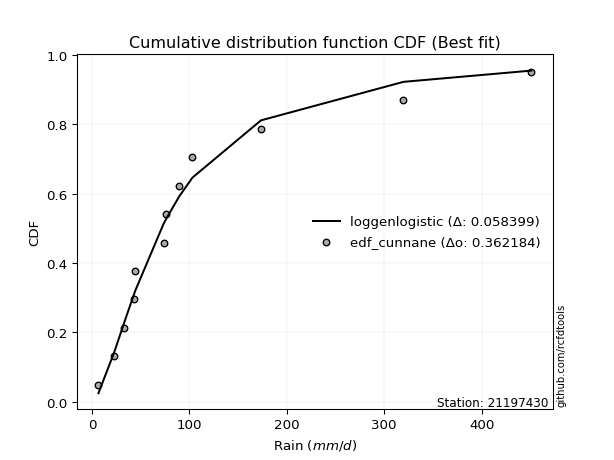</img>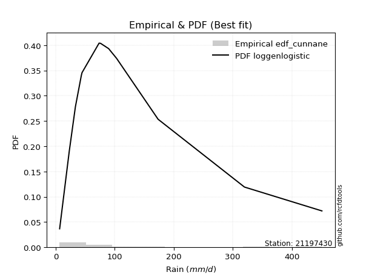</img>

</div>


### 12. EDF Adamowski (1981)

The Adamowski formula in hydrology refers to a specific plotting position formula used for estimating the non-parametric empirical distribution of hydrological events (like flood peaks) to calculate their return periods. This formula provides an alternative to traditional parametric methods (like the Gumbel or Log Pearson Type III distributions). 

<div align="center">


$P=(m-0.25)/(n+0.5)$


</div>


**12.1. Empirical values**

<div align="center">

|                | 0                  | 1                  | 2                 | 3                  | 4                  | 5                  | 6                 | 7                  | 8                 | 9                 | 10                | 11                 |
|:---------------|:-------------------|:-------------------|:------------------|:-------------------|:-------------------|:-------------------|:------------------|:-------------------|:------------------|:------------------|:------------------|:-------------------|
| date           | 2011               | 2007               | 2015              | 2013               | 2010               | 2012               | 2008              | 2006               | 2009              | 2017              | 2018              | 2016               |
| x              | 6.7                | 23.0               | 33.4              | 43.4               | 44.6               | 73.5               | 76.0              | 89.7               | 103.2             | 173.5             | 319.8             | 451.0              |
| m              | 1                  | 2                  | 3                 | 4                  | 5                  | 6                  | 7                 | 8                  | 9                 | 10                | 11                | 12                 |
| empirical_dist | edf_adamowski      | edf_adamowski      | edf_adamowski     | edf_adamowski      | edf_adamowski      | edf_adamowski      | edf_adamowski     | edf_adamowski      | edf_adamowski     | edf_adamowski     | edf_adamowski     | edf_adamowski      |
| empirical      | 0.06               | 0.14               | 0.22              | 0.3                | 0.38               | 0.46               | 0.54              | 0.62               | 0.7               | 0.78              | 0.86              | 0.94               |
| empirical_tr   | 1.0638297872340425 | 1.1627906976744187 | 1.282051282051282 | 1.4285714285714286 | 1.6129032258064517 | 1.8518518518518516 | 2.173913043478261 | 2.6315789473684212 | 3.333333333333333 | 4.545454545454546 | 7.142857142857142 | 16.666666666666654 |

</div>


**12.2. Kolmogorov-Smirnov fit test (sorted by Δ)**


<div align="center">

|                | 0                    | 1                    | 2                    | 3                   | 4                   | 5                   | 6                   | 7                    | 8                   | 9                    | 10                  | 11                  | 12                  | 13                  | 14                  | 15                  | 16                  | 17                  | 18                  | 19                  | 20                  | 21                  | 22                  | 23                  | 24                  | 25                  | 26                  | 27                  | 28                  | 29                  | 30                  | 31                  | 32                  | 33                  | 34                  | 35                  | 36                  | 37                  | 38                  | 39                    | 40                  | 41                  | 42                  | 43                  | 44                  | 45                  | 46                  | 47                  | 48                  | 49                  | 50                  | 51                  | 52                  | 53                  | 54                  | 55                  | 56                  | 57                  | 58                  | 59                  | 60                  | 61                  | 62                  | 63                  | 64                  | 65                  | 66                  | 67                  | 68                  | 69                  | 70                  | 71                  | 72                  | 73                  | 74                  | 75                  | 76                  | 77                  | 78                  | 79                  | 80                  | 81                  | 82                  | 83                  | 84                  | 85                  | 86                  | 87                  |
|:---------------|:---------------------|:---------------------|:---------------------|:--------------------|:--------------------|:--------------------|:--------------------|:---------------------|:--------------------|:---------------------|:--------------------|:--------------------|:--------------------|:--------------------|:--------------------|:--------------------|:--------------------|:--------------------|:--------------------|:--------------------|:--------------------|:--------------------|:--------------------|:--------------------|:--------------------|:--------------------|:--------------------|:--------------------|:--------------------|:--------------------|:--------------------|:--------------------|:--------------------|:--------------------|:--------------------|:--------------------|:--------------------|:--------------------|:--------------------|:----------------------|:--------------------|:--------------------|:--------------------|:--------------------|:--------------------|:--------------------|:--------------------|:--------------------|:--------------------|:--------------------|:--------------------|:--------------------|:--------------------|:--------------------|:--------------------|:--------------------|:--------------------|:--------------------|:--------------------|:--------------------|:--------------------|:--------------------|:--------------------|:--------------------|:--------------------|:--------------------|:--------------------|:--------------------|:--------------------|:--------------------|:--------------------|:--------------------|:--------------------|:--------------------|:--------------------|:--------------------|:--------------------|:--------------------|:--------------------|:--------------------|:--------------------|:--------------------|:--------------------|:--------------------|:--------------------|:--------------------|:--------------------|:--------------------|
| station        | 21197430             | 21197430             | 21197430             | 21197430            | 21197430            | 21197430            | 21197430            | 21197430             | 21197430            | 21197430             | 21197430            | 21197430            | 21197430            | 21197430            | 21197430            | 21197430            | 21197430            | 21197430            | 21197430            | 21197430            | 21197430            | 21197430            | 21197430            | 21197430            | 21197430            | 21197430            | 21197430            | 21197430            | 21197430            | 21197430            | 21197430            | 21197430            | 21197430            | 21197430            | 21197430            | 21197430            | 21197430            | 21197430            | 21197430            | 21197430              | 21197430            | 21197430            | 21197430            | 21197430            | 21197430            | 21197430            | 21197430            | 21197430            | 21197430            | 21197430            | 21197430            | 21197430            | 21197430            | 21197430            | 21197430            | 21197430            | 21197430            | 21197430            | 21197430            | 21197430            | 21197430            | 21197430            | 21197430            | 21197430            | 21197430            | 21197430            | 21197430            | 21197430            | 21197430            | 21197430            | 21197430            | 21197430            | 21197430            | 21197430            | 21197430            | 21197430            | 21197430            | 21197430            | 21197430            | 21197430            | 21197430            | 21197430            | 21197430            | 21197430            | 21197430            | 21197430            | 21197430            | 21197430            |
| empirical_dist | edf_adamowski        | edf_adamowski        | edf_adamowski        | edf_adamowski       | edf_adamowski       | edf_adamowski       | edf_adamowski       | edf_adamowski        | edf_adamowski       | edf_adamowski        | edf_adamowski       | edf_adamowski       | edf_adamowski       | edf_adamowski       | edf_adamowski       | edf_adamowski       | edf_adamowski       | edf_adamowski       | edf_adamowski       | edf_adamowski       | edf_adamowski       | edf_adamowski       | edf_adamowski       | edf_adamowski       | edf_adamowski       | edf_adamowski       | edf_adamowski       | edf_adamowski       | edf_adamowski       | edf_adamowski       | edf_adamowski       | edf_adamowski       | edf_adamowski       | edf_adamowski       | edf_adamowski       | edf_adamowski       | edf_adamowski       | edf_adamowski       | edf_adamowski       | edf_adamowski         | edf_adamowski       | edf_adamowski       | edf_adamowski       | edf_adamowski       | edf_adamowski       | edf_adamowski       | edf_adamowski       | edf_adamowski       | edf_adamowski       | edf_adamowski       | edf_adamowski       | edf_adamowski       | edf_adamowski       | edf_adamowski       | edf_adamowski       | edf_adamowski       | edf_adamowski       | edf_adamowski       | edf_adamowski       | edf_adamowski       | edf_adamowski       | edf_adamowski       | edf_adamowski       | edf_adamowski       | edf_adamowski       | edf_adamowski       | edf_adamowski       | edf_adamowski       | edf_adamowski       | edf_adamowski       | edf_adamowski       | edf_adamowski       | edf_adamowski       | edf_adamowski       | edf_adamowski       | edf_adamowski       | edf_adamowski       | edf_adamowski       | edf_adamowski       | edf_adamowski       | edf_adamowski       | edf_adamowski       | edf_adamowski       | edf_adamowski       | edf_adamowski       | edf_adamowski       | edf_adamowski       | edf_adamowski       |
| p_dist         | logfisk              | fisk                 | logf                 | loglognorm          | logcrystalball      | lognorm             | lognorm             | logt                 | logexponnorm        | lognct               | logfatiguelife      | logmielke           | invweibull          | f                   | invgamma            | loggenlogistic      | nct                 | johnsonsu           | loglogistic         | ncf                 | loggamma            | loggamma            | logrice             | logbetaprime        | invgauss            | logerlang           | loghypsecant        | logpearson3         | logloggamma         | logjohnsonsu        | loginvgamma         | logweibull_min      | fatiguelife         | logalpha            | logncf              | gamma               | loggompertz         | loginvgauss         | logmaxwell          | loglaplace_asymmetric | wald                | loglaplace          | loginvweibull       | lograyleigh         | mielke              | loggumbel_l         | exponnorm           | gompertz            | laplace_asymmetric  | genexpon            | expon               | logkstwobign        | loggumbel_r         | loghalfnorm         | loggenexpon         | lognakagami         | t                   | truncnorm           | logtruncnorm        | pearson3            | halflogistic        | betaprime           | logmoyal            | loghalflogistic     | moyal               | genlogistic         | halfnorm            | weibull_min         | gumbel_r            | rayleigh            | gibrat              | maxwell             | kstwobign           | logwald             | norm                | loggibrat           | logistic            | hypsecant           | rice                | logexpon            | laplace             | gumbel_l            | alpha               | logchi2             | chi2                | nakagami            | crystalball         | erlang              |
| delta          | 0.058939169449801376 | 0.059726939900447695 | 0.060011494849196045 | 0.06019198776999701 | 0.0601942420989493  | 0.06019445770981191 | 0.06019445770981191 | 0.060195131192902096 | 0.06019564319993742 | 0.061073560539093796 | 0.06122293799551276 | 0.06178311473373865 | 0.06201332688406086 | 0.06236344702725283 | 0.06236362268159146 | 0.06249033903718981 | 0.06260825691494076 | 0.06346130817656381 | 0.06501085750409175 | 0.06565252596952964 | 0.06602856432289034 | 0.06602856432289034 | 0.06642823598569064 | 0.06673015678151567 | 0.06720535760705182 | 0.06871350238881796 | 0.0696744183885491  | 0.0733552346621078  | 0.07484682227932704 | 0.07621057451757551 | 0.07676434711188279 | 0.07712922536073363 | 0.08318589441066337 | 0.08347627600632573 | 0.0842750296544294  | 0.0874987734688184  | 0.08770238691508025 | 0.0899251421807678  | 0.0919690985015989  | 0.09213555491961262   | 0.09362024955178067 | 0.09762562527368063 | 0.09821270363875262 | 0.10252329349830319 | 0.10452685896262673 | 0.11124309195519677 | 0.1251742353591332  | 0.12535772774746734 | 0.12609122131436523 | 0.12609129311625789 | 0.12609135062810273 | 0.1288782706584652  | 0.13049679689102994 | 0.1322403629600522  | 0.13787122252854414 | 0.13999999999982204 | 0.14144792283035074 | 0.14341842900811808 | 0.14672739849939273 | 0.1467370254291509  | 0.1504939280231471  | 0.15264037823193816 | 0.15609915771810273 | 0.15827554483467293 | 0.1591324529850694  | 0.16295704404207634 | 0.17147016683902372 | 0.18090038750779214 | 0.18445221297861558 | 0.20509606979241757 | 0.20929843622532834 | 0.2170080958277471  | 0.2207184835474919  | 0.22721123616098055 | 0.2513428221411828  | 0.25332113252886085 | 0.2582540881526149  | 0.2640898866354472  | 0.2682115061403843  | 0.27660518597485506 | 0.28341222969814495 | 0.32138097223515827 | 0.3226351792964917  | 0.32720477919801105 | 0.32977136837087295 | 0.34637857937963595 | 0.42001962681915683 | 0.4384067906220166  |
| deltao         | 0.36218414519599995  | 0.36218414519599995  | 0.36218414519599995  | 0.36218414519599995 | 0.36218414519599995 | 0.36218414519599995 | 0.36218414519599995 | 0.36218414519599995  | 0.36218414519599995 | 0.36218414519599995  | 0.36218414519599995 | 0.36218414519599995 | 0.36218414519599995 | 0.36218414519599995 | 0.36218414519599995 | 0.36218414519599995 | 0.36218414519599995 | 0.36218414519599995 | 0.36218414519599995 | 0.36218414519599995 | 0.36218414519599995 | 0.36218414519599995 | 0.36218414519599995 | 0.36218414519599995 | 0.36218414519599995 | 0.36218414519599995 | 0.36218414519599995 | 0.36218414519599995 | 0.36218414519599995 | 0.36218414519599995 | 0.36218414519599995 | 0.36218414519599995 | 0.36218414519599995 | 0.36218414519599995 | 0.36218414519599995 | 0.36218414519599995 | 0.36218414519599995 | 0.36218414519599995 | 0.36218414519599995 | 0.36218414519599995   | 0.36218414519599995 | 0.36218414519599995 | 0.36218414519599995 | 0.36218414519599995 | 0.36218414519599995 | 0.36218414519599995 | 0.36218414519599995 | 0.36218414519599995 | 0.36218414519599995 | 0.36218414519599995 | 0.36218414519599995 | 0.36218414519599995 | 0.36218414519599995 | 0.36218414519599995 | 0.36218414519599995 | 0.36218414519599995 | 0.36218414519599995 | 0.36218414519599995 | 0.36218414519599995 | 0.36218414519599995 | 0.36218414519599995 | 0.36218414519599995 | 0.36218414519599995 | 0.36218414519599995 | 0.36218414519599995 | 0.36218414519599995 | 0.36218414519599995 | 0.36218414519599995 | 0.36218414519599995 | 0.36218414519599995 | 0.36218414519599995 | 0.36218414519599995 | 0.36218414519599995 | 0.36218414519599995 | 0.36218414519599995 | 0.36218414519599995 | 0.36218414519599995 | 0.36218414519599995 | 0.36218414519599995 | 0.36218414519599995 | 0.36218414519599995 | 0.36218414519599995 | 0.36218414519599995 | 0.36218414519599995 | 0.36218414519599995 | 0.36218414519599995 | 0.36218414519599995 | 0.36218414519599995 |
| eval           | Δo > Δ               | Δo > Δ               | Δo > Δ               | Δo > Δ              | Δo > Δ              | Δo > Δ              | Δo > Δ              | Δo > Δ               | Δo > Δ              | Δo > Δ               | Δo > Δ              | Δo > Δ              | Δo > Δ              | Δo > Δ              | Δo > Δ              | Δo > Δ              | Δo > Δ              | Δo > Δ              | Δo > Δ              | Δo > Δ              | Δo > Δ              | Δo > Δ              | Δo > Δ              | Δo > Δ              | Δo > Δ              | Δo > Δ              | Δo > Δ              | Δo > Δ              | Δo > Δ              | Δo > Δ              | Δo > Δ              | Δo > Δ              | Δo > Δ              | Δo > Δ              | Δo > Δ              | Δo > Δ              | Δo > Δ              | Δo > Δ              | Δo > Δ              | Δo > Δ                | Δo > Δ              | Δo > Δ              | Δo > Δ              | Δo > Δ              | Δo > Δ              | Δo > Δ              | Δo > Δ              | Δo > Δ              | Δo > Δ              | Δo > Δ              | Δo > Δ              | Δo > Δ              | Δo > Δ              | Δo > Δ              | Δo > Δ              | Δo > Δ              | Δo > Δ              | Δo > Δ              | Δo > Δ              | Δo > Δ              | Δo > Δ              | Δo > Δ              | Δo > Δ              | Δo > Δ              | Δo > Δ              | Δo > Δ              | Δo > Δ              | Δo > Δ              | Δo > Δ              | Δo > Δ              | Δo > Δ              | Δo > Δ              | Δo > Δ              | Δo > Δ              | Δo > Δ              | Δo > Δ              | Δo > Δ              | Δo > Δ              | Δo > Δ              | Δo > Δ              | Δo > Δ              | Δo > Δ              | Δo > Δ              | Δo > Δ              | Δo > Δ              | Δo > Δ              | Δo <= Δ             | Δo <= Δ             |
| fit            | 1                    | 1                    | 1                    | 1                   | 1                   | 1                   | 1                   | 1                    | 1                   | 1                    | 1                   | 1                   | 1                   | 1                   | 1                   | 1                   | 1                   | 1                   | 1                   | 1                   | 1                   | 1                   | 1                   | 1                   | 1                   | 1                   | 1                   | 1                   | 1                   | 1                   | 1                   | 1                   | 1                   | 1                   | 1                   | 1                   | 1                   | 1                   | 1                   | 1                     | 1                   | 1                   | 1                   | 1                   | 1                   | 1                   | 1                   | 1                   | 1                   | 1                   | 1                   | 1                   | 1                   | 1                   | 1                   | 1                   | 1                   | 1                   | 1                   | 1                   | 1                   | 1                   | 1                   | 1                   | 1                   | 1                   | 1                   | 1                   | 1                   | 1                   | 1                   | 1                   | 1                   | 1                   | 1                   | 1                   | 1                   | 1                   | 1                   | 1                   | 1                   | 1                   | 1                   | 1                   | 1                   | 1                   | 0                   | 0                   |
| n              | 12                   | 12                   | 12                   | 12                  | 12                  | 12                  | 12                  | 12                   | 12                  | 12                   | 12                  | 12                  | 12                  | 12                  | 12                  | 12                  | 12                  | 12                  | 12                  | 12                  | 12                  | 12                  | 12                  | 12                  | 12                  | 12                  | 12                  | 12                  | 12                  | 12                  | 12                  | 12                  | 12                  | 12                  | 12                  | 12                  | 12                  | 12                  | 12                  | 12                    | 12                  | 12                  | 12                  | 12                  | 12                  | 12                  | 12                  | 12                  | 12                  | 12                  | 12                  | 12                  | 12                  | 12                  | 12                  | 12                  | 12                  | 12                  | 12                  | 12                  | 12                  | 12                  | 12                  | 12                  | 12                  | 12                  | 12                  | 12                  | 12                  | 12                  | 12                  | 12                  | 12                  | 12                  | 12                  | 12                  | 12                  | 12                  | 12                  | 12                  | 12                  | 12                  | 12                  | 12                  | 12                  | 12                  | 12                  | 12                  |
| best_fit       | 1                    | 0                    | 0                    | 0                   | 0                   | 0                   | 0                   | 0                    | 0                   | 0                    | 0                   | 0                   | 0                   | 0                   | 0                   | 0                   | 0                   | 0                   | 0                   | 0                   | 0                   | 0                   | 0                   | 0                   | 0                   | 0                   | 0                   | 0                   | 0                   | 0                   | 0                   | 0                   | 0                   | 0                   | 0                   | 0                   | 0                   | 0                   | 0                   | 0                     | 0                   | 0                   | 0                   | 0                   | 0                   | 0                   | 0                   | 0                   | 0                   | 0                   | 0                   | 0                   | 0                   | 0                   | 0                   | 0                   | 0                   | 0                   | 0                   | 0                   | 0                   | 0                   | 0                   | 0                   | 0                   | 0                   | 0                   | 0                   | 0                   | 0                   | 0                   | 0                   | 0                   | 0                   | 0                   | 0                   | 0                   | 0                   | 0                   | 0                   | 0                   | 0                   | 0                   | 0                   | 0                   | 0                   | 0                   | 0                   |
| best_fit_sort  | 1                    | 2                    | 3                    | 4                   | 5                   | 6                   | 7                   | 8                    | 9                   | 10                   | 11                  | 12                  | 13                  | 14                  | 15                  | 16                  | 17                  | 18                  | 19                  | 20                  | 21                  | 22                  | 23                  | 24                  | 25                  | 26                  | 27                  | 28                  | 29                  | 30                  | 31                  | 32                  | 33                  | 34                  | 35                  | 36                  | 37                  | 38                  | 39                  | 40                    | 41                  | 42                  | 43                  | 44                  | 45                  | 46                  | 47                  | 48                  | 49                  | 50                  | 51                  | 52                  | 53                  | 54                  | 55                  | 56                  | 57                  | 58                  | 59                  | 60                  | 61                  | 62                  | 63                  | 64                  | 65                  | 66                  | 67                  | 68                  | 69                  | 70                  | 71                  | 72                  | 73                  | 74                  | 75                  | 76                  | 77                  | 78                  | 79                  | 80                  | 81                  | 82                  | 83                  | 84                  | 85                  | 86                  | 87                  | 88                  |

</div>


**12.3. Best fit**

<div align="center">

|   id |   station | empirical_dist   | p_dist   |     delta |   deltao | eval   |   fit |   n |   best_fit |   best_fit_sort |
|-----:|----------:|:-----------------|:---------|----------:|---------:|:-------|------:|----:|-----------:|----------------:|
|    0 |  21197430 | edf_adamowski    | logfisk  | 0.0589392 | 0.362184 | Δo > Δ |     1 |  12 |          1 |               1 |

</div>


<div align="center">

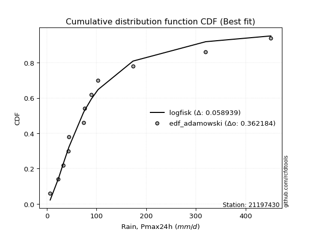</img>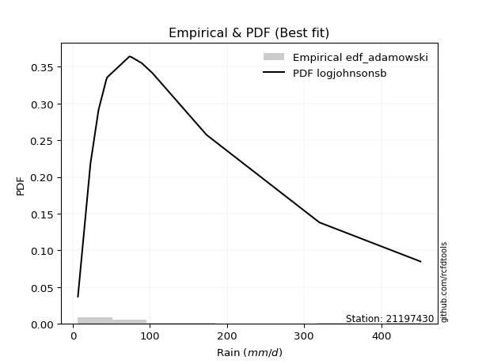</img>

</div>


## C. Best fit & Estimate extreme values for specific return periods - Tr

Best fit in probability distribution analysis means finding the theoretical distribution (like Normal, Poisson, Exponential) that most accurately mirrors your real-world data´s patterns (shape, center, spread) for better predictions, using methods like visual checks (Q-Q plots), goodness-of-fit tests (Kolmogorov-Smirnov, Chi-Squared), and information criteria (AIC) to score and select the simplest, most representative model.


### 1. Best fit (ordered by delta Δ)

<div align="center">

|   id |   station | empirical_dist   | p_dist   |     delta |   deltao | eval   |   fit |   n |   best_fit |   best_fit_sort |
|-----:|----------:|:-----------------|:---------|----------:|---------:|:-------|------:|----:|-----------:|----------------:|
|    0 |  21197430 | edf_chegodayev   | logfisk  | 0.0564169 | 0.362184 | Δo > Δ |     1 |  12 |          1 |               1 |
|    1 |  21197430 | edf_jenkinson    | logfisk  | 0.056482  | 0.362184 | Δo > Δ |     1 |  12 |          1 |               2 |
|    2 |  21197430 | edf_beard        | logfisk  | 0.056482  | 0.362184 | Δo > Δ |     1 |  12 |          1 |               3 |
|    3 |  21197430 | edf_filliben     | logfisk  | 0.056531  | 0.362184 | Δo > Δ |     1 |  12 |          1 |               4 |
|    4 |  21197430 | edf_tukey        | logfisk  | 0.0566349 | 0.362184 | Δo > Δ |     1 |  12 |          1 |               5 |
|    5 |  21197430 | edf_blom         | logfisk  | 0.0569106 | 0.362184 | Δo > Δ |     1 |  12 |          1 |               6 |
|    6 |  21197430 | edf_cunnane      | logfisk  | 0.0570779 | 0.362184 | Δo > Δ |     1 |  12 |          1 |               7 |
|    7 |  21197430 | edf_gringorten   | logfisk  | 0.0583427 | 0.362184 | Δo > Δ |     1 |  12 |          1 |               8 |
|    8 |  21197430 | edf_adamowski    | logfisk  | 0.0589392 | 0.362184 | Δo > Δ |     1 |  12 |          1 |               9 |
|    9 |  21197430 | edf_hazen        | logfisk  | 0.0604054 | 0.362184 | Δo > Δ |     1 |  12 |          1 |              10 |
|   10 |  21197430 | edf_weibull      | fisk     | 0.065069  | 0.362184 | Δo > Δ |     1 |  12 |          1 |              11 |
|   11 |  21197430 | edf_california   | mielke   | 0.0833333 | 0.362184 | Δo > Δ |     1 |  12 |          1 |              12 |

</div>

:file_folder:Tables: [bestfit_21197430.csv](table/bestfit_21197430.csv) | [extreme_21197430.csv](table/extreme_21197430.csv)


### 2. Extreme values

In hydrology, a return period (or recurrence interval $Tr$) is the statistical average time between extreme events like floods or droughts of a specific magnitude, indicating how rare an event is, with a 100-year flood, for example, having a 1% chance of occurring in any given year, not that it happens exactly every century. It is a key tool for infrastructure design (like bridges or dams) and risk assessment, calculated from historical data to determine the probability of future events, although it is important to remember it is statistical average, and events can cluster or be missed.

> risk_rate: assuming the return period as the project useful life.

|   id |      tr |   prob_l |     prob_g |      alpha |   betaprime |     chi2 |   crystalball |    erlang |    expon |   exponnorm |         f |   fatiguelife |      fisk |    gamma |   genexpon |   genlogistic |    gibrat |   gompertz |   gumbel_l |   gumbel_r |   halflogistic |   halfnorm |   hypsecant |   invgamma |   invgauss |   invweibull |   johnsonsu |   kstwobign |   laplace |   laplace_asymmetric |   loggamma |   logistic |   lognorm |   maxwell |    mielke |    moyal |   nakagami |       ncf |       nct |    norm |   pearson3 |   rayleigh |    rice |         t |   truncnorm |      wald |   weibull_min |   logalpha |   logbetaprime |          logchi2 |   logcrystalball |   logerlang |         logexpon |   logexponnorm |      logf |   logfatiguelife |   logfisk |   loggenexpon |   loggenlogistic |        loggibrat |   loggompertz |   loggumbel_l |   loggumbel_r |   loghalflogistic |   loghalfnorm |   loghypsecant |   loginvgamma |   loginvgauss |   loginvweibull |   logjohnsonsu |   logkstwobign |   loglaplace |   loglaplace_asymmetric |   logloggamma |   loglogistic |   loglognorm |   logmaxwell |   logmielke |   logmoyal |   lognakagami |    logncf |    lognct |   logpearson3 |   lograyleigh |   logrice |      logt |   logtruncnorm |     logwald |   logweibull_min |   station |   n |   risk_rate |
|-----:|--------:|---------:|-----------:|-----------:|------------:|---------:|--------------:|----------:|---------:|------------:|----------:|--------------:|----------:|---------:|-----------:|--------------:|----------:|-----------:|-----------:|-----------:|---------------:|-----------:|------------:|-----------:|-----------:|-------------:|------------:|------------:|----------:|---------------------:|-----------:|-----------:|----------:|----------:|----------:|---------:|-----------:|----------:|----------:|--------:|-----------:|-----------:|--------:|----------:|------------:|----------:|--------------:|-----------:|---------------:|-----------------:|-----------------:|------------:|-----------------:|---------------:|----------:|-----------------:|----------:|--------------:|-----------------:|-----------------:|--------------:|--------------:|--------------:|------------------:|--------------:|---------------:|--------------:|--------------:|----------------:|---------------:|---------------:|-------------:|------------------------:|--------------:|--------------:|-------------:|-------------:|------------:|-----------:|--------------:|----------:|----------:|--------------:|--------------:|----------:|----------:|---------------:|------------:|-----------------:|----------:|----:|------------:|
|    0 |    2    | 0.5      | 0.5        |    31.651  |     52.7102 |  28.2203 |       14.6111 |   15.1059 |  85.1065 |     84.8838 |   70.0806 |       73.3766 |   69.8657 |  65.8772 |    85.1082 |        95.181 |   81.168  |    84.9484 |    140.969 |     98.664 |        88.1479 |    93.4603 |     119.817 |    70.0806 |    71.3231 |      69.6344 |     70.9289 |     108.283 |   119.817 |              85.1065 |    68.3463 |    119.817 |   69.5865 |   108.805 |   61.1044 |  91.8352 |    25.4712 |   72.32   |   69.6929 | 119.817 |    87.5048 |    104.899 | 121.581 |   61.1521 |     89.0432 |   78.079  |       95.9785 |    64.9899 |        68.1883 |     26.7163      |          69.5865 |     67.8531 |     33.9332      |        69.5867 |   69.5549 |          69.3194 |   70.6136 |       53.9044 |          71.1885 |     50.002       |       73.7437 |       83.3836 |       58.0724 |           53.0781 |       55.5446 |        69.5865 |       66.3445 |       63.6208 |         60.3423 |        73.4553 |        55.0973 |      69.5865 |                 72.6352 |       73.1911 |       69.5865 |      69.5859 |      63.3329 |     71.6087 |    54.7784 |       60.9752 |   64.7526 |   69.3355 |       72.7222 |       61.2527 |   68.2298 |   69.5867 |        52.7843 |     48.6991 |          73.1182 |  21197430 |  12 |    0.75     |
|    1 |    2.33 | 0.570815 | 0.429185   |    37.6713 |     64.9267 |  35.8588 |       42.7869 |   22.0382 | 102.382  |    102.139  |   83.6918 |       90.1746 |   83.9454 |  81.6643 |   102.388  |       110.809 |   92.8071 |   102.189  |    160.959 |    119.954 |       110.038  |   118.258  |     138.205 |    83.6918 |    86.6472 |      82.9835 |     85.9385 |     126.466 |   133.721 |             102.382  |    83.4022 |    140.061 |   84.6943 |   132.676 |   75.6888 | 111.989  |    43.6534 |   86.8657 |   82.7997 | 142.793 |   108.69   |    129.123 | 141.428 |   69.6371 |    107.041  |   93.1451 |      125.219  |    79.5249 |        83.2833 |     37.7191      |          84.6943 |     82.743  |     48.513       |        84.6946 |   84.6345 |          84.3616 |   84.3211 |       69.2095 |          84.8865 |     55.2349      |       91.2113 |       98.9277 |       69.6686 |           64.0043 |       68.665  |        81.4355 |       80.9285 |       78.1725 |         76.8456 |        89.1444 |        70.9776 |      78.3723 |                 82.2034 |       88.8091 |       82.7382 |      84.6936 |      77.6748 |     85.9195 |    65.0814 |       74.3992 |   79.4255 |   84.4345 |       88.338  |       75.3507 |   83.3802 |   84.6945 |        67.7068 |     55.3952 |          89.1213 |  21197430 |  12 |    0.729209 |
|    2 |    5    | 0.8      | 0.2        |    84.3534 |    136.327  |  80.5741 |      147.496  |   88.605  | 188.754  |    188.413  |  165.939  |      185.485  |  171.979  | 165.099  |   188.749  |       178.697 |  159.817  |   188.387  |    225.539 |    212.45  |       209.086  |   223.125  |     211.964 |   165.939  |   176.725  |     164.804  |    174.472  |     203.703 |   203.24  |             188.754  |   176.681  |    218.226 |  175.776  |   226.631 |  154.399  | 205.345  |   219.993  |  170.572  |  162.859  | 228.181 |   207.228  |    226.104 | 220.886 |  110.361  |    196.258  |  177.485  |      302.691  |   174.33   |       176.8    |    224.9         |         175.776  |    174.82   |    289.727       |       175.777  |  175.673  |         175.204  |  167.275  |      188.358  |         166.004  |     97.966       |      187.031  |      171.849  |      153.653  |          149.297  |      168.34   |       153.016  |      173.485  |      175.167  |        219.671  |       177.998  |       208.132  |     142.016  |                150.85   |      177.415  |      161.432  |     175.776  |     173.462  |    167.929  |   144.596  |      176.902  |  177.33   |  175.877  |      177.632  |      172.681  |  176.681  |  175.777  |       176.694  |    113.944  |         179.568  |  21197430 |  12 |    0.67232  |
|    3 |   10    | 0.9      | 0.1        |   170.12   |    218.077  | 126.573  |      216.957  |  182.85   | 267.161  |    266.729  |  271.267  |      283.474  |  293.227  | 244.419  |   267.166  |       233.989 |  236.2    |   266.636  |    261.494 |    287.786 |       291.341  |   300.724  |     270.864 |   271.267  |   277.49   |     273.213  |    278.279  |     262.51  |   266.348 |             267.161  |   293.466  |    275.792 |  285.312  |   292.752 |  241.441  | 286.626  |   429.156  |  269.072  |  268.922  | 284.825 |   291.073  |    295.253 | 277.541 |  163.356  |    276.176  |  266.99   |      499.4    |   303.099  |       293.773  |   1193.51        |         285.312  |    289.849  |   1467.36        |       285.314  |  285.428  |         284.763  |  277.028  |      384.827  |         270.462  |    188.256       |      283.175  |      233.708  |      292.63   |          301.666  |      326.868  |       253.204  |      294.042  |      310.544  |        516.775  |       275.181  |       472.135  |     243.613  |                261.75   |      274.671  |      264.103  |     285.315  |     305.323  |    271.897  |   289.741  |      339.761  |  314.615  |  286.578  |      276.503  |      311.919  |  291.818  |  285.313  |       339.886  |    244.956  |         277.194  |  21197430 |  12 |    0.651322 |
|    4 |   15    | 0.933333 | 0.0666667  |   255.58   |    274.772  | 154.86   |      251.62   |  247.656  | 313.026  |    312.541  |  352.158  |      344.098  |  392.602  | 291.713  |   313.03   |       265.183 |  288.885  |   312.408  |    277.777 |    330.291 |       337.89   |   341.107  |     304.477 |   352.157  |   343.955  |     359.061  |    351.1    |     293.729 |   303.263 |             313.026  |   379.103  |    307.156 |  363.324  |   326.678 |  303.609  | 333.798  |   550.525  |  339.975  |  353.029  | 313.092 |   338.747  |    330.882 | 306.732 |  209.647  |    322.467  |  324.466  |      627.293  |   403.622  |       379.452  |   3206.58        |         363.325  |    374.084  |   3790.3         |       363.327  |  363.753  |         362.961  |  364.666  |      556.176  |         352.468  |    295.403       |      342.544  |      268.624  |      420.888  |          449.158  |      461.681  |       337.522  |      385.213  |      418.065  |        837.367  |       339.776  |       729.312  |     334.037  |                361.319  |      339.514  |      345.344  |     363.33   |     408.085  |    355.108  |   433.703  |      477.878  |  424.218  |  365.798  |      342.715  |      423.016  |  375.154  |  363.325  |       472.588  |    400.442  |         341.253  |  21197430 |  12 |    0.644736 |
|    5 |   20    | 0.95     | 0.05       |   340.966  |    319.547  | 175.376  |      274.32   |  296.82   | 345.567  |    345.046  |  420.57   |      388.221  |  480.508  | 325.557  |   345.561  |       287.025 |  330.213  |   344.884  |    287.912 |    360.051 |       370.504  |   368.03   |     328.19  |   420.569  |   394.131  |     433.212  |    408.77   |     314.76  |   329.455 |             345.567  |   448.77   |    328.835 |  425.637  |   349.193 |  354.437  | 367.206  |   633.776  |  397.502  |  425.752  | 331.603 |   372.131  |    354.564 | 326.135 |  252.975  |    355.112  |  367.297  |      723.159  |   488.813  |       449.099  |   6490.22        |         425.637  |    442.558  |   7431.69        |       425.641  |  426.397  |         425.51   |  440.963  |      710.48   |         423.145  |    420.629       |      385.879  |      292.944  |      542.86   |          593.634  |      581.205  |       413.394  |      460.893  |      510.102  |       1174.04   |       389.198  |       977.525  |     417.892  |                454.178  |      389.226  |      415.68   |     425.645  |     494.728  |    428.641  |   577.112  |      600.076  |  518.411  |  429.265  |      393.583  |      517.967  |  442.345  |  425.638  |       586.946  |    577.568  |         389.843  |  21197430 |  12 |    0.641514 |
|    6 |   25    | 0.96     | 0.04       |   426.321  |    357.125  | 191.501  |      291.03   |  336.466  | 370.809  |    370.258  |  481.027  |      422.979  |  560.907  | 351.947  |   370.812  |       303.848 |  364.666  |   370.075  |    295.125 |    382.974 |       395.631  |   388.062  |     346.541 |   481.026  |   434.646  |     499.804  |    457.165  |     330.512 |   349.771 |             370.808  |   508.374  |    345.418 |  478.239  |   365.909 |  398.432  | 393.1    |   696.445  |  446.804  |  491.114  | 345.229 |   397.815  |    372.159 | 340.551 |  294.434  |    380.321  |  401.604  |      800.269  |   563.964  |       508.648  |  11235.2         |         478.239  |    501.111  |  12528.6         |       478.243  |  479.33   |         478.367  |  509.94   |      852.265  |         486.581  |    564.745       |      420.13   |      311.58   |      660.418  |          735.929  |      689.8    |       483.634  |      526.626  |      591.86   |       1523.11   |       429.628  |      1217.35   |     497.178  |                542.346  |      429.958  |      479.012  |     478.25   |     570.745  |    496.262  |   720.154  |      710.919  |  602.354  |  482.96   |      435.312  |      602.066  |  499.439  |  478.24   |       688.715  |    774.478  |         429.341  |  21197430 |  12 |    0.639603 |
|    7 |   50    | 0.98     | 0.02       |   852.963  |    491.804  | 242.543  |      338.881  |  466.385  | 449.215  |    448.574  |  719.841  |      533.373  |  900.408  | 434.539  |   449.216  |       355.674 |  486.115  |   448.323  |    314.703 |    453.59  |       473.052  |   446.288  |     403.439 |   719.84   |   568.499  |     771.18   |    629.687  |     376.769 |   412.879 |             449.215  |   728.345  |    396.087 |  667.667  |   414.386 |  566.852  | 473.488  |   880.321  |  630.73   |  757.841  | 384.251 |   476.644  |    423.233 | 382.397 |  486.023  |    458.012  |  513.615  |     1054.05   |   857.831  |       728.144  |  62298.9         |         667.667  |    716.997  |  63452.9         |       667.673  |  670.298  |         669.079  |  794.988  |     1445.55   |         745.285  |   1595.48        |      529.764  |      368.366  |     1208      |         1426.79   |     1134.9    |       786.718  |      776.212  |      915.425  |       3396.1    |       567.209  |      2318.62   |     852.855  |                941.058  |      568.967  |      738.779  |     667.69   |     863.924  |    789.112  |  1432.06   |     1163.79   |  936.802  |  677.096  |      577.947  |      931.794  |  707.401  |  667.667  |      1090.24   |   2018.33   |         562.209  |  21197430 |  12 |    0.63583  |
|    8 |   75    | 0.986667 | 0.0133333  |  1279.55   |    584.989  | 272.94   |      364.556  |  546.178  | 495.08   |    494.387  |  904.635  |      599.331  | 1183.83   | 483.204  |   495.088  |       385.796 |  568.141  |   494.095  |    324.604 |    494.634 |       518.057  |   477.983  |     436.689 |   904.632  |   651.787  |     988.78   |    747.626  |     402.22  |   449.794 |             495.08   |   884.656  |    425.351 |  798.576  |   440.743 |  693.432  | 520.497  |   980.723  |  764.141  |  972.016  | 405.188 |   522.212  |    451.02  | 405.163 |  662.832  |    503.038  |  582.542  |     1211.82   |  1081.07   |       883.886  | 170486           |         798.577  |    870.25   | 163903           |       798.584  |  802.551  |         801.168  | 1027.4    |     1927.12   |         953.201  |   3217.54        |      595.969  |      400.91   |     1715.91   |         2096.5    |     1488.23   |      1045.45   |      959.488  |     1164.28   |       5412.47   |       656.339  |      3305.07   |    1169.42   |               1299.04   |      659.336  |      948.842  |     798.609  |    1082.32   |   1044.81   |  2140.62   |     1521.96   | 1196.16   |  811.872  |      670.774  |     1181.71   |  852.907  |  798.577  |      1395.99   |   3638.88   |         647.153  |  21197430 |  12 |    0.634587 |
|    9 |  100    | 0.99     | 0.01       |  1706.11   |    658.517  | 294.704  |      381.922  |  604.154  | 527.622  |    526.891  | 1061.31   |      646.633  | 1436.29   | 517.861  |   527.619  |       407.116 |  631.684  |   526.571  |    331.08  |    523.684 |       549.91   |   499.575  |     460.276 |  1061.31   |   712.851  |    1177.59   |    839.648  |     419.657 |   475.986 |             527.621  |  1009.58   |    446.012 |  901.379  |   458.695 |  799.064  | 553.848  |  1049.05   |  872.682  | 1158.01   | 419.35  |   554.344  |    469.95  | 420.673 |  830.898  |    534.8    |  632.796  |     1327.66   |  1267.37   |      1008.24   | 348851           |         901.38   |    992.659  | 321367           |       901.388  |  906.55   |         905.045  | 1231.33   |     2344.24   |        1133.99   |   5540.01        |      643.793  |      423.737  |     2199.76   |         2752.9    |     1790.02   |      1279.07   |     1109.11   |     1373.47   |       7527.62   |       723.562  |      4213.68   |    1462.98   |               1632.89   |      727.646  |     1132.2    |     901.421  |    1261.9    |   1281.84   |  2847.06   |     1827.17   | 1415.45   |  918.015  |      740.961  |     1389.35   |  968.027  |  901.38   |      1650.45   |   5592.41   |         710.699  |  21197430 |  12 |    0.633968 |
|   10 |  200    | 0.995    | 0.005      |  3412.35   |    864.816  | 347.697  |      421.313  |  747.658  | 606.028  |    605.207  | 1549.91   |      762.03   | 2284.22   | 601.73   |   606.032  |       458.37  |  804.56   |   604.82   |    345.155 |    593.522 |       626.49   |   548.959  |     517.097 |  1549.91   |   865.936  |    1787.17   |   1092.47   |     459.82  |   539.093 |             606.028  |  1364.72   |    495.574 | 1186.32   |   499.768 | 1121.68   | 634.201  |  1204.77   | 1191.27   | 1759.13   | 451.472 |   631.193  |    513.265 | 456.161 | 1453.49   |    610.715  |  757.973  |     1619.3    |  1832.17   |      1361.21   |      1.96784e+06 |        1186.32   |   1340.35   |      1.62761e+06 |      1186.33   | 1195.37   |        1193.55   | 1901.11   |     3670.75   |        1719.84   |  24296.4         |      761.706  |      477.937  |     3997.02   |         5298.95   |     2730.6    |      2079.29   |     1547.97   |     2013.78   |      16637      |       899.504  |      7372.42   |    2509.59   |               2833.33   |      907.015  |     1729.75   |    1186.39   |    1792.91   |   2142.06   |  5659.86   |     2775.02   | 2092.84   | 1213.43   |      925.221  |     2012.19   | 1290.41   | 1186.32   |      2414.53   |  16310.9    |         875.136  |  21197430 |  12 |    0.633042 |
|   11 |  250    | 0.996    | 0.004      |  4265.46   |    941.135  | 364.9    |      433.351  |  794.834  | 631.269  |    630.42   | 1748.32   |      799.55   | 2651.26   | 628.825  |   631.269  |       474.848 |  866.588  |   630.01   |    349.297 |    615.974 |       651.109  |   564.152  |     535.389 |  1748.31   |   916.832  |    2042.24   |   1183.94   |     472.249 |   559.409 |             631.269  |  1497.13   |    511.486 | 1290.2    |   512.411 | 1250.49   | 660.068  |  1252.49   | 1313.97   | 2010.89   | 461.289 |   655.784  |    526.598 | 467.086 | 1745.97   |    634.973  |  799.385  |     1716.79   |  2055.2    |      1492.64   |      3.43895e+06 |        1290.2    |   1469.89   |      2.74388e+06 |      1290.21   | 1300.86   |        1298.92   | 2185.58   |     4214.23   |        1965.84   |  41295.7         |      800.424  |      495.166  |     4843.03   |         6540.64   |     3109.42   |      2431.34   |     1716.25   |     2268.59   |      21468.4    |       960.446  |      8765.9    |    2985.73   |               3383.35   |      969.33   |     1981.87   |    1290.28   |    1997.62   |   2544.46   |  7061.06   |     3155.59   | 2364.69   | 1321.53   |      989.199  |     2255.2    | 1408.99   | 1290.2    |      2712.65   |  23241.9    |         931.524  |  21197430 |  12 |    0.632858 |
|   12 |  500    | 0.998    | 0.002      |  8531      |   1214.47   | 418.712  |      469.049  |  943.866  | 709.676  |    708.736  | 2533.29   |      917.051  | 4209.2    | 713.235  |   709.668  |       525.991 | 1080.96   |   708.259  |    361.169 |    685.661 |       727.522  |   609.449  |     592.206 |  2533.28   |  1079.31   |    3085.13   |   1502.71   |     509.498 |   622.517 |             709.676  |  1972.95   |    560.833 | 1654.88   |   550.139 | 1751.51   | 740.42   |  1394.11   | 1772.63   | 3041.12   | 490.399 |   731.779  |    566.381 | 499.68  | 3107      |    709.777  |  931.063  |     2030.15   |  2907.9    |      1964.25   |      1.95409e+07 |        1654.88   |   1935.06   |      1.38968e+07 |      1654.9    | 1671.86   |        1669.55   | 3368.05   |     6363.17   |        2975.74   | 258244           |      922.883  |      548.076  |     8788.48   |        12571.9    |     4580.38   |      3952.3    |     2339.31   |     3249.91   |      47366      |      1163.54   |     14727      |    5121.7    |               5870.66   |     1177.64   |     3022.3    |    1655      |    2758.18   |   4446.09   | 14036.9    |     4628.45   | 3421.93   | 1702.46   |     1202.83   |     3169.02   | 1828.98   | 1654.88   |      3832.63   |  71662      |        1117.59   |  21197430 |  12 |    0.632489 |
|   13 |  750    | 0.998667 | 0.00133333 | 12796.5    |   1403.5    | 450.418  |      488.879  | 1032.55   | 755.541  |    754.548  | 3141.33   |      986.367  | 5514.56   | 762.763  |   755.536  |       555.889 | 1222.73   |   754.031  |    367.514 |    726.4   |       772.194  |   634.754  |     625.442 |  3141.32   |  1177.11   |    3923.29   |   1715.47   |     530.423 |   659.432 |             755.54   |  2301.86   |    589.663 | 1900.3    |   571.24  | 2132.45   | 787.422  |  1472.8    | 2105.81   | 3869.88   | 506.571 |   775.993  |    588.627 | 517.906 | 4367.52   |    753.159  | 1010.01   |     2220.55   |  3541.21   |      2289.71   |      5.40996e+07 |        1900.31   |   2256.36   |      3.58963e+07 |      1900.33   | 1922.07   |        1919.53   | 4336.17   |     8012.53   |        3791.19   | 868039           |      995.967  |      578.635  |    12451      |        18420.5    |     5686.96   |      5251.43   |     2785.2    |     3984.15   |      75227.1    |      1292.25   |     19710.3    |    7022.76   |               8103.86   |     1310.13   |     3867.27   |    1900.46   |    3303.6    |   6270.94   | 20981      |     5732.29   | 4222.25   | 1959.94   |     1338.48   |     3833.01   | 2114.43   | 1900.3    |      4644.87   | 140764      |        1234.19   |  21197430 |  12 |    0.632366 |
|   14 | 1000    | 0.999    | 0.001      | 17062.1    |   1552.62   | 473.001  |      502.533  | 1096.05   | 788.082  |    787.053  | 3657.06   |     1035.77   | 6679.02   | 797.963  |   788.086  |       577.097 | 1331.22   |   786.507  |    371.785 |    755.297 |       803.881  |   652.23   |     649.023 |  3657.04   |  1247.61   |    4651.22   |   1879.19   |     544.919 |   685.624 |             788.082  |  2560.61   |    610.109 | 2090.12   |   585.825 | 2451.83   | 820.771  |  1526.96   | 2377.04   | 4590.05   | 517.705 |   807.269  |    604     | 530.502 | 5566.94   |    783.773  | 1066.81   |     2358.67   |  4063.07   |      2545.47   |      1.11512e+08 |        2090.13   |   2508.99   |      7.03825e+07 |      2090.15   | 2115.86   |        2113.15   | 5187.05   |     9396.2    |        4501.58   |      2.19508e+06 |     1048.43   |      600.156  |    15941.3    |        24153.5    |     6603.63   |      6424.68   |     3143.88   |     4591.69   |     104444      |      1388.12   |     24120.4    |    8785.72   |              10186.5    |     1409.05   |     4606.1    |    2090.3    |    3742.39   |   8070.36   | 27904.4    |     6644.51   | 4889.69   | 2159.64   |     1439.62   |     4371.51   | 2336.55   | 2090.12   |      5302.52   | 228771      |        1320.45   |  21197430 |  12 |    0.632305 |

<div align="center">

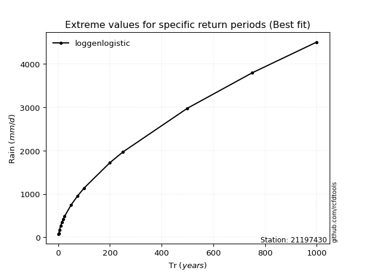</img>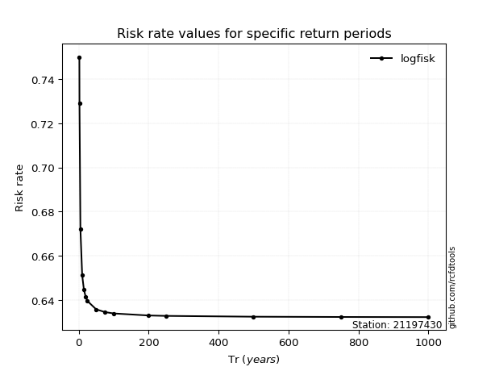</img>

</div>


<sub>**APP DISCLAIMER**: NO WARRANTY - This software is provided by [github.com/rcfdtools](https://github.com/rcfdtools) "as is", without any express or implied warranty, including warranties of merchantability, fitness for a particular purpose, or non-infringement. There is no guarantee that the software will be error-free or operate without interruption. LIMITATION OF LIABILITY - Neither the authors nor copyright holders will be liable for claims or damages arising from the software or its use. You are responsible for determining if the software is appropriate for your use and assume all associated risks, including errors, legal compliance, and data loss. NO PROFESSIONAL ADVICE - The software provides general information and does not offer professional advice. It should not replace consultation with professional advisors.</sub>