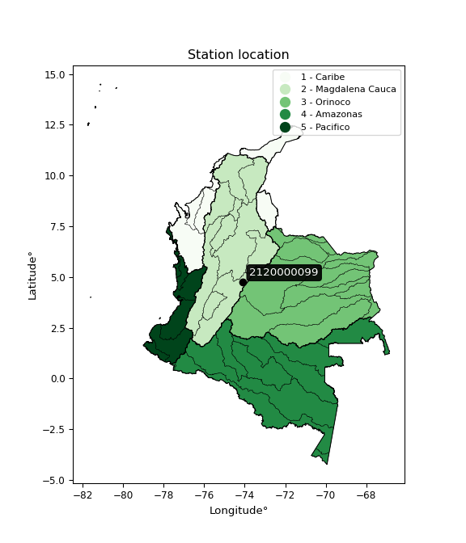

<div align="center">


</div>

# PMax24h Station (Rain, Pmax24h): 2120000099

Maximum Precipitation in 24 hours (PMax24h) is the greatest amount of rainfall for a specific duration that is meteorologically possible for a given location, acting as a "worst-case" scenario for extreme storms, crucial for designing safety-critical infrastructure like bridges, river deviations, dams, spillways, and nuclear plants to prevent catastrophic failure. The PMax24h is related with the Probable Maximum Precipitation (PMP) and it is calculated by hydrologists using meteorological data to determine the upper limit of extreme rainfall, often leading to the Probable Maximum Flood (PMF) for flood control design, and is increasingly being studied for climate change impacts. Probable Maximum Precipitation (PMP) is the theoretical upper limit of rainfall, a deterministic estimate for extreme events, while probability distributions (like GEV, Gumbel) describe the likelihood and frequency of various precipitation amounts, including rare ones, showing how often events occur, with PMP representing the extreme end of these distributions, used for critical infrastructure design to ensure safety against the worst conceivable weather, unlike standard statistical forecasts which cover typical probabilities.

The most common probability distributions in hydrology, used for analyzing floods, rainfall, and streamflow, include the Normal, Log-Normal, Gumbel, Gamma (including Log-Pearson Type III), and Generalized Extreme Value (GEV) distributions, often chosen based on the data´s skewness and whether modeling extremes or general conditions, with Gumbel and GEV popular for extreme events like floods, while the Normal distribution serves as a baseline, though often requiring transformations for skewed hydrological data. These distributions help in designing water infrastructure, managing water resources, and forecasting hydrologic events.

> Hydrological data often isn´t perfectly normal (it´s skewed), so different distributions are needed for different applications, such as: **Flood Frequency Analysis**: Using Gumbel, GEV, or Log-Pearson Type III for predicting extreme flood magnitudes and their return periods, **Rainfall Analysis**: Normal for annual totals, but Log-Normal, Weibull, or GEV for intensity or extreme daily rainfall, **Streamflow Modeling**: Gamma and Log-Normal for maximum flows, GEV for minimum flows, and Kappa for daily flows.

<div align="center">

</img>

</div>


## A. General information


### 1. General running parameters

• app_version: _v20260225_. • runtime: _2026-02-27 14:50:08.749431_. • Python version: _3.14.0_. • SciPy version: _1.16.3_. • Pandas version: _2.3.3_. • NumPy version: _2.3.5_. • Stations dataset (station_dataset_file): _dataset/pmax24h_in/automatic_colombia_2003_2025.csv_. • Stations catalog (station_catalog_file): _dataset/CNE.xls_. • Minimum year to eval til year_max (date_min): _1900_. • Maximum year to eval since year_min (date_max): _2025_. • Creates, save and include plots into reports (create_plot): _False_. • Plot only fit distributions with Δo > Δ (plot_only_fit): _True_. • Plot only simple graphs avoiding multiple CDFs and multiple Extreme values plots (plot_only_simple): _False_. • Eval low extreme values, if False, evaluates high extreme values (low_extreme): _False_. • Eval every SciPy distribution as logarithmic (pdist_logarithmic_on): _True_. • Standard deviation normalized (ddof): _1.0_. • Return periods to eval in years (Tr): _[2, 2.33, 5, 10, 15, 20, 25, 50, 75, 100, 200, 250, 500, 750, 1000]_. • Minimum data sample per station, 0 means any (minimum_sample): _5_. • Z-Score maximum threshold to adjust a value, 0 means disable (zscore_max): _3.5_. • Z-Score minimum threshold to adjust a value, 0 means disable (zscore_min): _-2.5_. • Avoid zeros, e.g. rain = 0 (avoid_zeros): _True_. • Avoid null values (avoid_nans): _True_. 

:file_folder:Table: [dataset.csv](../../dataset/pmax24h_in/automatic_colombia_2003_2025.csv)

> Delta Degrees of Freedom (DDOF): is a parameter used in the formulas for calculating variance and standard deviation. When ddof=0, the divisor is $N$ (the total number of observations) and this is used when your data set is the entire population. When ddof=1, the divisor is $N-1$ and this is used when your data set is a sample drawn from a larger population. Using $N-1$ provides an unbiased estimate of the population variance (known as Bessel´s correction).


### 2. Station info and location

|   id |     CODIGO | NOMBRE                                | CATEGORIA     | TECNOLOGIA                | ESTADO   | FECHA_INSTALACION   |   FECHA_SUSPENSION |   ALTITUD |   LATITUD |   LONGITUD | DEPARTAMENTO   | MUNICIPIO   | AREA_OPERATIVA                            | ENTIDAD                                                      | AREA_HIDROGRAFICA   | ZONA_HIDROGRAFICA   | SUBZONA_HIDROGRAFICA   |   CORRIENTE | Catalogo   |   Version |
|-----:|-----------:|:--------------------------------------|:--------------|:--------------------------|:---------|:--------------------|-------------------:|----------:|----------:|-----------:|:---------------|:------------|:------------------------------------------|:-------------------------------------------------------------|:--------------------|:--------------------|:-----------------------|------------:|:-----------|----------:|
|    0 | 2120000099 | COLEGIO VEINTIUN ANGELES [2120000099] | Pluviométrica | Automática con Telemetría | Activa   | 01/02/2015          |                nan |      2614 |   4.74923 |   -74.0807 | Bogotá         | Bogotá, D.C | Area Operativa 11 - Cundinamarca-Amazonas | INSTITUTO DISTRITAL DE GESTIÓN DE RIESGOS Y CAMBIO CLIMÁTICO | Magdalena Cauca     | Alto Magdalena      | Río Bogotá             |         nan | CNE_OE     |  20251226 |

<div align="center">

Dynamic map: [:earth_americas:Google](http://maps.google.com/maps?q=4.749234,-74.08073) [:earth_americas:OSM](https://www.openstreetmap.org/#map=18/4.749234/-74.08073&layers=P) [:earth_americas:Bing](https://www.bing.com/maps?cp=4.749234~-74.08073&lvl=18) [:earth_americas:Apple](https://maps.apple.com/frame?center=4.749234%2C-74.08073&span=0.003%2C0.006)

</div>


<div align="center">

```geojson
{
  "type": "Feature",
  "geometry": {
    "type": "Point", 
    "coordinates": [-74.08073, 4.749234]
  }, 
  "properties": {
    "Name": "2120000099"
  }
}
```

</div>


### 3. Discrete values table and plot

<div align="center">

|               |           0 |          1 |           2 |          3 |           4 |           5 |
|:--------------|------------:|-----------:|------------:|-----------:|------------:|------------:|
| Date          | 2018        | 2019       | 2020        | 2023       | 2024        | 2025        |
| Value         |   25.8      |   63.1     |   24.3      |    0.6     |   41.2      |   24.3      |
| Value_initial |   25.8      |   63.1     |   24.3      |    0.6     |   41.2      |   24.3      |
| count         |    6        |    6       |    6        |    6       |    6        |    6        |
| mean          |   29.8833   |   29.8833  |   29.8833   |   29.8833  |   29.8833   |   29.8833   |
| std           |   20.8228   |   20.8228  |   20.8228   |   20.8228  |   20.8228   |   20.8228   |
| zscore        |   -0.196099 |    1.59521 |   -0.268135 |   -1.40631 |    0.543474 |   -0.268135 |


</div>


> The initial value (value_initial) correspond to the initial obtained or null completed value, and value (value) is adjusted only when the initial value is outside the valid range (outlier) definite through the Z-Score value. If Z-Score is active, values out of range or outliers are replaced with the station mean value. A Z-Score (or standard score) measures how many standard deviations a data point is from the mean of a dataset, indicating its relative position; positive scores mean above the mean, negative mean below, and a score of zero is exactly at the mean, allowing for comparison of values from different distributions. It´s calculated using the formula $z=(x–μ)/σ$, where $x$ is the data point, $μ$ is the mean, and $σ$ is the standard deviation, helping identify outliers and understand probability.
>
> <sub>**Note**: In this study, "completing" (filling gaps in) and "extending" (forecasting or lengthening the historical record) rainfall data series are avoided for certain critical analyses because they introduce artificial bias and uncertainty, which can distort the statistics of rare events (extremes), alter day-to-day variability, and compromise the integrity and homogeneity of the original data. Some reasons against Completing/Extending rainfall data are: **Distortion of Extremes and Variability**: The primary issue is that most gap-filling or extension methods rely on averaging or regression with nearby stations, which inherently smooths the data. Rainfall is highly variable in space and time, with a large percentage of zero values and occasional large storms. Infilling methods often underestimate the highest values and overestimate the lowest (zero) values, which severely distorts analyses focused on flood frequency, drought severity, and intensity-duration-frequency (IDF) curves, **Loss of Data Homogeneity**: Infilled or extended data are synthetic estimates, not actual measurements. Combining these estimates with observed data can violate the assumption of data homogeneity, which requires that the data properties do not change over time. Inhomogeneity can lead to incorrect conclusions about long-term trends or changes in climate patterns, **Propagation of Errors**: Errors and biases from the original data (e.g., wind-induced undercatch, instrument errors, site changes) or the data used for imputation can propagate through the analysis, leading to unreliable hydrological models and inaccurate predictions, **Compromised Statistical Integrity**: For statistical analyses, especially those involving the frequency of events, using artificial data can introduce time bias or autocorrelation that doesn´t exist in reality, making it difficult to assess the true probability of events, **Difficulty in Validation**: It is difficult to accurately validate the quality of filled or extended data, especially for past periods where ground-truth measurements are unavailable. The reliability of imputation techniques heavily depends on the density of the surrounding station network and the complexity of the local topography.</sub>


### 4. Active continuous probability distributions from SciPy (80 of 104 available)

A Probability Density Function (PDF) describes the relative likelihood of a continuous random variable falling within a specific range, where the total area under its curve equals 1, and the area over any interval gives the actual probability for that range. Unlike discrete probabilities (like rolling a die), a PDF shows density, not direct probability for a single point (which is zero), with higher points indicating higher likelihood, often visualized as a bell curve for normal distributions.

A log of a probability density function (log-PDF) is simply the logarithm of the PDF´s value, denoted as $log(f(x))$, useful for converting multiplication of probabilities into addition, improving numerical stability with tiny numbers, and connecting to information theory concepts like entropy. Instead of dealing with very small probabilities (e.g., 0.000001), log-PDFs use negative numbers (e.g., $log(0.00001) ≈ -11.51$ that are easier for computers to handle, preventing underflow errors and simplifying complex calculations. In this study, each active probability distribution from SciPy is also evaluated in the $log$ form.

[scipy.stats](https://docs.scipy.org/doc/scipy/reference/stats.html) is a Python´s powerful submodule within the SciPy library for comprehensive statistical analysis, offering over 130 probability distributions (like Normal, Poisson, etc.), functions for descriptive stats (mean, variance), hypothesis testing (t-tests, chi-square), random variable generation, and statistical tests, making it essential for data science, modeling, and research. It provides tools to explore, model, and draw conclusions from data efficiently, working seamlessly with [NumPy](https://numpy.org/).

<div align="center">

|   id | p_dist           |   n_parameter | fit_method   | label                                                                       | active   | ref                                                                                                      |
|-----:|:-----------------|--------------:|:-------------|:----------------------------------------------------------------------------|:---------|:---------------------------------------------------------------------------------------------------------|
|    0 | alpha            |             3 | MLE          | Alpha                                                                       | True     | [:mortar_board:](https://docs.scipy.org/doc/scipy/reference/generated/scipy.stats.alpha.html)            |
|    1 | anglit           |             2 | MM           | Anglit                                                                      | True     | [:mortar_board:](https://docs.scipy.org/doc/scipy/reference/generated/scipy.stats.anglit.html)           |
|    2 | arcsine          |             2 | MM           | Arcsine                                                                     | True     | [:mortar_board:](https://docs.scipy.org/doc/scipy/reference/generated/scipy.stats.arcsine.html)          |
|    3 | argus            |             3 | MLE          | Argus                                                                       | True     | [:mortar_board:](https://docs.scipy.org/doc/scipy/reference/generated/scipy.stats.argus.html)            |
|    4 | beta             |             4 | MLE          | Beta                                                                        | True     | [:mortar_board:](https://docs.scipy.org/doc/scipy/reference/generated/scipy.stats.beta.html)             |
|    5 | betaprime        |             4 | MLE          | Beta prime                                                                  | True     | [:mortar_board:](https://docs.scipy.org/doc/scipy/reference/generated/scipy.stats.betaprime.html)        |
|    6 | bradford         |             3 | MLE          | Bradford                                                                    | True     | [:mortar_board:](https://docs.scipy.org/doc/scipy/reference/generated/scipy.stats.bradford.html)         |
|    7 | burr             |             4 | MLE          | Burr (Type III)                                                             | True     | [:mortar_board:](https://docs.scipy.org/doc/scipy/reference/generated/scipy.stats.burr.html)             |
|    8 | burr12           |             4 | MLE          | Burr (Type III) 12                                                          | True     | [:mortar_board:](https://docs.scipy.org/doc/scipy/reference/generated/scipy.stats.burr12.html)           |
|    9 | cosine           |             2 | MLE          | Cosine                                                                      | True     | [:mortar_board:](https://docs.scipy.org/doc/scipy/reference/generated/scipy.stats.cosine.html)           |
|   10 | crystalball      |             4 | MLE          | Crystalball                                                                 | True     | [:mortar_board:](https://docs.scipy.org/doc/scipy/reference/generated/scipy.stats.crystalball.html)      |
|   11 | dgamma           |             3 | MLE          | Double gamma                                                                | True     | [:mortar_board:](https://docs.scipy.org/doc/scipy/reference/generated/scipy.stats.dgamma.html)           |
|   12 | dweibull         |             3 | MLE          | Double Weibull                                                              | True     | [:mortar_board:](https://docs.scipy.org/doc/scipy/reference/generated/scipy.stats.dweibull.html)         |
|   13 | erlang           |             3 | MLE          | Erlang                                                                      | True     | [:mortar_board:](https://docs.scipy.org/doc/scipy/reference/generated/scipy.stats.erlang.html)           |
|   14 | exponnorm        |             3 | MLE          | Exponentially modified Normal                                               | True     | [:mortar_board:](https://docs.scipy.org/doc/scipy/reference/generated/scipy.stats.exponnorm.html)        |
|   15 | exponpow         |             3 | MLE          | Exponential power                                                           | True     | [:mortar_board:](https://docs.scipy.org/doc/scipy/reference/generated/scipy.stats.exponpow.html)         |
|   16 | exponweib        |             4 | MLE          | Exponentiated Weibull                                                       | True     | [:mortar_board:](https://docs.scipy.org/doc/scipy/reference/generated/scipy.stats.exponweib.html)        |
|   17 | f                |             4 | MLE          | F                                                                           | True     | [:mortar_board:](https://docs.scipy.org/doc/scipy/reference/generated/scipy.stats.f.html)                |
|   18 | fatiguelife      |             3 | MLE          | Fatigue-life (Birnbaum-Saunders)                                            | True     | [:mortar_board:](https://docs.scipy.org/doc/scipy/reference/generated/scipy.stats.fatiguelife.html)      |
|   19 | foldnorm         |             3 | MM           | Fold Normal                                                                 | True     | [:mortar_board:](https://docs.scipy.org/doc/scipy/reference/generated/scipy.stats.foldnorm.html)         |
|   20 | gamma            |             3 | MLE          | Gamma                                                                       | True     | [:mortar_board:](https://docs.scipy.org/doc/scipy/reference/generated/scipy.stats.gamma.html)            |
|   21 | gausshyper       |             6 | MLE          | Gauss hypergeometric                                                        | True     | [:mortar_board:](https://docs.scipy.org/doc/scipy/reference/generated/scipy.stats.gausshyper.html)       |
|   22 | genexpon         |             5 | MLE          | Generalized exponential                                                     | True     | [:mortar_board:](https://docs.scipy.org/doc/scipy/reference/generated/scipy.stats.genexpon.html)         |
|   23 | genextreme       |             3 | MLE          | Generalized exponential                                                     | True     | [:mortar_board:](https://docs.scipy.org/doc/scipy/reference/generated/scipy.stats.genextreme.html)       |
|   24 | gengamma         |             4 | MLE          | Generalized gamma                                                           | True     | [:mortar_board:](https://docs.scipy.org/doc/scipy/reference/generated/scipy.stats.gengamma.html)         |
|   25 | genhalflogistic  |             3 | MLE          | Generalized half-logistic                                                   | True     | [:mortar_board:](https://docs.scipy.org/doc/scipy/reference/generated/scipy.stats.genhalflogistic.html)  |
|   26 | genlogistic      |             3 | MLE          | Generalized logistic                                                        | True     | [:mortar_board:](https://docs.scipy.org/doc/scipy/reference/generated/scipy.stats.genlogistic.html)      |
|   27 | gennorm          |             3 | MLE          | Generalized Normal                                                          | True     | [:mortar_board:](https://docs.scipy.org/doc/scipy/reference/generated/scipy.stats.gennorm.html)          |
|   28 | genpareto        |             3 | MLE          | Generalized Pareto                                                          | True     | [:mortar_board:](https://docs.scipy.org/doc/scipy/reference/generated/scipy.stats.genpareto.html)        |
|   29 | gompertz         |             3 | MLE          | Gompertz (or truncated Gumbel)                                              | True     | [:mortar_board:](https://docs.scipy.org/doc/scipy/reference/generated/scipy.stats.gompertz.html)         |
|   30 | gumbel_l         |             2 | MM           | Gumbel Left Skew                                                            | True     | [:mortar_board:](https://docs.scipy.org/doc/scipy/reference/generated/scipy.stats.gumbel_l.html)         |
|   31 | gumbel_r         |             2 | MM           | Gumbel Right Skew                                                           | True     | [:mortar_board:](https://docs.scipy.org/doc/scipy/reference/generated/scipy.stats.gumbel_r.html)         |
|   32 | halfgennorm      |             3 | MLE          | Upper half of a generalized normal                                          | True     | [:mortar_board:](https://docs.scipy.org/doc/scipy/reference/generated/scipy.stats.halfgennorm.html)      |
|   33 | halflogistic     |             2 | MM           | Half-logistic                                                               | True     | [:mortar_board:](https://docs.scipy.org/doc/scipy/reference/generated/scipy.stats.halflogistic.html)     |
|   34 | halfnorm         |             2 | MM           | Half Normal                                                                 | True     | [:mortar_board:](https://docs.scipy.org/doc/scipy/reference/generated/scipy.stats.halfnorm.html)         |
|   35 | hypsecant        |             2 | MM           | hyperbolic secant                                                           | True     | [:mortar_board:](https://docs.scipy.org/doc/scipy/reference/generated/scipy.stats.hypsecant.html)        |
|   36 | invgamma         |             3 | MLE          | Inverted gamma                                                              | True     | [:mortar_board:](https://docs.scipy.org/doc/scipy/reference/generated/scipy.stats.invgamma.html)         |
|   37 | invgauss         |             3 | MLE          | Inverse Gaussian                                                            | True     | [:mortar_board:](https://docs.scipy.org/doc/scipy/reference/generated/scipy.stats.invgauss.html)         |
|   38 | invweibull       |             3 | MLE          | Inverted Weibull                                                            | True     | [:mortar_board:](https://docs.scipy.org/doc/scipy/reference/generated/scipy.stats.invweibull.html)       |
|   39 | johnsonsb        |             4 | MLE          | Johnson SB                                                                  | True     | [:mortar_board:](https://docs.scipy.org/doc/scipy/reference/generated/scipy.stats.johnsonsb.html)        |
|   40 | johnsonsu        |             4 | MLE          | Johnson Su                                                                  | True     | [:mortar_board:](https://docs.scipy.org/doc/scipy/reference/generated/scipy.stats.johnsonsu.html)        |
|   41 | kappa3           |             3 | MLE          | Kappa 3                                                                     | True     | [:mortar_board:](https://docs.scipy.org/doc/scipy/reference/generated/scipy.stats.kappa3.html)           |
|   42 | kappa4           |             4 | MLE          | Kappa 4                                                                     | True     | [:mortar_board:](https://docs.scipy.org/doc/scipy/reference/generated/scipy.stats.kappa4.html)           |
|   43 | ksone            |             3 | MLE          | Kolmogorov-Smirnov one-sided test statistic distribution                    | True     | [:mortar_board:](https://docs.scipy.org/doc/scipy/reference/generated/scipy.stats.ksone.html)            |
|   44 | kstwobign        |             2 | MLE          | Limiting distribution of scaled Kolmogorov-Smirnov two-sided test statistic | True     | [:mortar_board:](https://docs.scipy.org/doc/scipy/reference/generated/scipy.stats.kstwobign.html)        |
|   45 | laplace          |             2 | MM           | Laplace                                                                     | True     | [:mortar_board:](https://docs.scipy.org/doc/scipy/reference/generated/scipy.stats.laplace.html)          |
|   46 | levy_l           |             2 | MLE          | Left-skewed Levy                                                            | True     | [:mortar_board:](https://docs.scipy.org/doc/scipy/reference/generated/scipy.stats.levy_l.html)           |
|   47 | loggamma         |             3 | MLE          | Log gamma                                                                   | True     | [:mortar_board:](https://docs.scipy.org/doc/scipy/reference/generated/scipy.stats.loggamma.html)         |
|   48 | logistic         |             2 | MM           | Logistic (or Sech-squared)                                                  | True     | [:mortar_board:](https://docs.scipy.org/doc/scipy/reference/generated/scipy.stats.logistic.html)         |
|   49 | loglaplace       |             3 | MLE          | Log-Laplace                                                                 | True     | [:mortar_board:](https://docs.scipy.org/doc/scipy/reference/generated/scipy.stats.loglaplace.html)       |
|   50 | lomax            |             3 | MLE          | Lomax (Pareto of the second kind)                                           | True     | [:mortar_board:](https://docs.scipy.org/doc/scipy/reference/generated/scipy.stats.lomax.html)            |
|   51 | maxwell          |             2 | MM           | Maxwell                                                                     | True     | [:mortar_board:](https://docs.scipy.org/doc/scipy/reference/generated/scipy.stats.maxwell.html)          |
|   52 | mielke           |             4 | MLE          | Mielke Beta-Kappa / Dagum                                                   | True     | [:mortar_board:](https://docs.scipy.org/doc/scipy/reference/generated/scipy.stats.mielke.html)           |
|   53 | moyal            |             2 | MM           | Moyal                                                                       | True     | [:mortar_board:](https://docs.scipy.org/doc/scipy/reference/generated/scipy.stats.moyal.html)            |
|   54 | nakagami         |             3 | MLE          | Nakagami                                                                    | True     | [:mortar_board:](https://docs.scipy.org/doc/scipy/reference/generated/scipy.stats.nakagami.html)         |
|   55 | ncf              |             5 | MLE          | Non-central F distribution                                                  | True     | [:mortar_board:](https://docs.scipy.org/doc/scipy/reference/generated/scipy.stats.ncf.html)              |
|   56 | nct              |             4 | MLE          | Non-central Student’s t                                                     | True     | [:mortar_board:](https://docs.scipy.org/doc/scipy/reference/generated/scipy.stats.nct.html)              |
|   57 | norm             |             2 | MM           | Normal                                                                      | True     | [:mortar_board:](https://docs.scipy.org/doc/scipy/reference/generated/scipy.stats.norm.html)             |
|   58 | pearson3         |             3 | MM           | Pearson type III                                                            | True     | [:mortar_board:](https://docs.scipy.org/doc/scipy/reference/generated/scipy.stats.pearson3.html)         |
|   59 | powerlaw         |             3 | MLE          | Power-function                                                              | True     | [:mortar_board:](https://docs.scipy.org/doc/scipy/reference/generated/scipy.stats.powerlaw.html)         |
|   60 | rayleigh         |             2 | MM           | Rayleigh                                                                    | True     | [:mortar_board:](https://docs.scipy.org/doc/scipy/reference/generated/scipy.stats.rayleigh.html)         |
|   61 | rdist            |             3 | MLE          | R-distributed (symmetric beta)                                              | True     | [:mortar_board:](https://docs.scipy.org/doc/scipy/reference/generated/scipy.stats.rdist.html)            |
|   62 | rice             |             3 | MLE          | Rice                                                                        | True     | [:mortar_board:](https://docs.scipy.org/doc/scipy/reference/generated/scipy.stats.rice.html)             |
|   63 | semicircular     |             2 | MM           | Semicircular                                                                | True     | [:mortar_board:](https://docs.scipy.org/doc/scipy/reference/generated/scipy.stats.semicircular.html)     |
|   64 | skewnorm         |             3 | MLE          | Skew normal                                                                 | True     | [:mortar_board:](https://docs.scipy.org/doc/scipy/reference/generated/scipy.stats.skewnorm.html)         |
|   65 | t                |             3 | MLE          | Student’s t                                                                 | True     | [:mortar_board:](https://docs.scipy.org/doc/scipy/reference/generated/scipy.stats.t.html)                |
|   66 | trapezoid        |             4 | MLE          | Trapezoid                                                                   | True     | [:mortar_board:](https://docs.scipy.org/doc/scipy/reference/generated/scipy.stats.trapezoid.html)        |
|   67 | triang           |             3 | MLE          | Triangular                                                                  | True     | [:mortar_board:](https://docs.scipy.org/doc/scipy/reference/generated/scipy.stats.triang.html)           |
|   68 | truncexpon       |             3 | MLE          | Truncated exponential                                                       | True     | [:mortar_board:](https://docs.scipy.org/doc/scipy/reference/generated/scipy.stats.truncexpon.html)       |
|   69 | truncnorm        |             4 | MLE          | Truncated normal                                                            | True     | [:mortar_board:](https://docs.scipy.org/doc/scipy/reference/generated/scipy.stats.truncnorm.html)        |
|   70 | truncpareto      |             4 | MLE          | Upper truncated Pareto                                                      | True     | [:mortar_board:](https://docs.scipy.org/doc/scipy/reference/generated/scipy.stats.truncpareto.html)      |
|   71 | truncweibull_min |             5 | MLE          | Doubly truncated Weibull minimum                                            | True     | [:mortar_board:](https://docs.scipy.org/doc/scipy/reference/generated/scipy.stats.truncweibull_min.html) |
|   72 | tukeylambda      |             3 | MLE          | Tukey-Lamdba                                                                | True     | [:mortar_board:](https://docs.scipy.org/doc/scipy/reference/generated/scipy.stats.tukeylambda.html)      |
|   73 | uniform          |             2 | MLE          | Uniform                                                                     | True     | [:mortar_board:](https://docs.scipy.org/doc/scipy/reference/generated/scipy.stats.uniform.html)          |
|   74 | vonmises         |             3 | MLE          | Von Mises                                                                   | True     | [:mortar_board:](https://docs.scipy.org/doc/scipy/reference/generated/scipy.stats.vonmises.html)         |
|   75 | vonmises_line    |             3 | MLE          | Von Mises line                                                              | True     | [:mortar_board:](https://docs.scipy.org/doc/scipy/reference/generated/scipy.stats.vonmises_line.html)    |
|   76 | wald             |             2 | MM           | Wald                                                                        | True     | [:mortar_board:](https://docs.scipy.org/doc/scipy/reference/generated/scipy.stats.wald.html)             |
|   77 | weibull_max      |             3 | MLE          | Weibull maximum                                                             | True     | [:mortar_board:](https://docs.scipy.org/doc/scipy/reference/generated/scipy.stats.weibull_max.html)      |
|   78 | weibull_min      |             3 | MLE          | Weibull minimum                                                             | True     | [:mortar_board:](https://docs.scipy.org/doc/scipy/reference/generated/scipy.stats.weibull_min.html)      |
|   79 | wrapcauchy       |             3 | MLE          | Wrapped  Cauchy                                                             | True     | [:mortar_board:](https://docs.scipy.org/doc/scipy/reference/generated/scipy.stats.wrapcauchy.html)       |

</div>

> **n_parameter:** # arguments & localization & scale.
>
> **Fit methods:** (MLE) maximum likelihood, (MM) L-moments.
>
>**Inactive** (With the only purpose of prevent loops, zero divisions, infinite values, over high estimated values or horizontal trending for recurrence intervals estimations, the follow distributions were disabled.)**:** lognorm, norminvgauss, powernorm, powerlognorm, cauchy, halfcauchy, foldcauchy, skewcauchy, chi2, expon, fisk, genhyperbolic, geninvgauss, gibrat, kstwo, laplace_asymmetric, levy, levy_stable, ncx2, pareto, rel_breitwigner, recipinvgauss, studentized_range, loguniform, 


## B. Probability (PDF) vs. Empirical (EDF) distributions functions

A continuous probability distribution (CPD) describes probabilities for variables that can take any value within a range (like rain any time), unlike discrete variables with specific outcomes (like temperature). It uses a Probability Density Function (PDF), a curve where the total area under it equals 1, and the probability of the variable falling within an interval (a to b) is found by calculating the area under the curve between those points. A key feature is that the probability of hitting any single exact value is zero, so probabilities are always expressed for ranges, e.g., $P(a ≤ X ≤ b)$.

<div align="center">

Distributions parameters from station values
|     |    station | p_dist              |   n |            loc |           scale | shape                  | shape1                | shape2             | shape3             |
|----:|-----------:|:--------------------|----:|---------------:|----------------:|:-----------------------|:----------------------|:-------------------|:-------------------|
|   0 | 2120000099 | alpha               |   6 |  -123.982      |  1242.75        | 8.215255288371054      |                       |                    |                    |
|   1 | 2120000099 | anglit              |   6 |    29.8833     |    55.6076      |                        |                       |                    |                    |
|   2 | 2120000099 | arcsine             |   6 |     3.00118    |    53.7643      |                        |                       |                    |                    |
|   3 | 2120000099 | argus               |   6 |   -14.6978     |    81.538       | 1.3301966825810507e-05 |                       |                    |                    |
|   4 | 2120000099 | beta                |   6 |    -4.21784    |    67.3178      | 0.23815407661848043    | 0.12309337966305367   |                    |                    |
|   5 | 2120000099 | betaprime           |   6 |   -49.3218     | 13892.6         | 17.21313852780589      | 3020.185926658006     |                    |                    |
|   6 | 2120000099 | bradford            |   6 |     0.599995   |    62.5001      | 2.07222454373985       |                       |                    |                    |
|   7 | 2120000099 | burr                |   6 |     0.599966   |    66.7867      | 20.599513349754695     | 0.025756009725015058  |                    |                    |
|   8 | 2120000099 | burr12              |   6 |    -8.53367    |  1409.03        | 2.116184335730385      | 1586.4881113944584    |                    |                    |
|   9 | 2120000099 | cosine              |   6 |    30.7054     |    16.2205      |                        |                       |                    |                    |
|  10 | 2120000099 | crystalball         |   6 |    29.8833     |    19.0085      | 2447.2743950871777     | 2453.127683411795     |                    |                    |
|  11 | 2120000099 | dgamma              |   6 |    24.3        |    12.7497      | 0.6641511369955044     |                       |                    |                    |
|  12 | 2120000099 | dweibull            |   6 |    24.3        |    16.6943      | 0.6475465660410527     |                       |                    |                    |
|  13 | 2120000099 | erlang              |   6 |   -48.6407     |     4.6702      | 16.813848039645244     |                       |                    |                    |
|  14 | 2120000099 | exponnorm           |   6 |    17.3776     |    14.819       | 0.8439006263492115     |                       |                    |                    |
|  15 | 2120000099 | exponpow            |   6 |     0.6        |     2.6775      | 0.1468432497039841     |                       |                    |                    |
|  16 | 2120000099 | exponweib           |   6 |     0.6        |     2.68375     | 1.9000798841548199     | 0.31827006414616077   |                    |                    |
|  17 | 2120000099 | f                   |   6 |   -48.9178     |    78.7891      | 33.96056096594703      | 12895.1594543052      |                    |                    |
|  18 | 2120000099 | fatiguelife         |   6 |     0.6        |     0.000432478 | 229.6507571880245      |                       |                    |                    |
|  19 | 2120000099 | foldnorm            |   6 |     6.20578    |    24.8559      | 0.6723050601623717     |                       |                    |                    |
|  20 | 2120000099 | gamma               |   6 |   -48.6406     |     4.67021     | 16.813816833900198     |                       |                    |                    |
|  21 | 2120000099 | gausshyper          |   6 |    -3.76027    |    66.8603      | 1.3905042986940872     | 0.7201241109322027    | 1.166552090799529  | 0.6871006032883127 |
|  22 | 2120000099 | genexpon            |   6 |     0.599986   |     2.0202      | 0.06795654373989515    | 5.437587505967333e-07 | 1.5437925868267826 |                    |
|  23 | 2120000099 | genextreme          |   6 |    22.5627     |    17.798       | 0.20569958324452942    |                       |                    |                    |
|  24 | 2120000099 | gengamma            |   6 |     0.6        |    47.8661      | 0.31266942741804077    | 2.1903822026970907    |                    |                    |
|  25 | 2120000099 | genhalflogistic     |   6 |    -5.83339    |    71.7379      | 1.040685081750977      |                       |                    |                    |
|  26 | 2120000099 | genlogistic         |   6 |    15.3765     |    13.165       | 2.1763221135835566     |                       |                    |                    |
|  27 | 2120000099 | gennorm             |   6 |    24.3        |     0.0835893   | 0.31154425062975344    |                       |                    |                    |
|  28 | 2120000099 | genpareto           |   6 |    -0.57039    |    83.7534      | -1.3154221925620027    |                       |                    |                    |
|  29 | 2120000099 | gompertz            |   6 |    24.3        |    38.1239      | 2.1142957859007168     |                       |                    |                    |
|  30 | 2120000099 | gumbel_l            |   6 |    38.4382     |    14.8209      |                        |                       |                    |                    |
|  31 | 2120000099 | gumbel_r            |   6 |    21.3285     |    14.8209      |                        |                       |                    |                    |
|  32 | 2120000099 | halfgennorm         |   6 |     0.6        |     1.67627     | 0.381283014313334      |                       |                    |                    |
|  33 | 2120000099 | halflogistic        |   6 |     7.35382    |    16.2516      |                        |                       |                    |                    |
|  34 | 2120000099 | halfnorm            |   6 |     4.72344    |    31.5332      |                        |                       |                    |                    |
|  35 | 2120000099 | hypsecant           |   6 |    29.8833     |    12.1012      |                        |                       |                    |                    |
|  36 | 2120000099 | invgamma            |   6 |  -126.914      | 10560.4         | 68.36382152303796      |                       |                    |                    |
|  37 | 2120000099 | invgauss            |   6 |   -78.3702     |  3407.09        | 0.03173895540007135    |                       |                    |                    |
|  38 | 2120000099 | invweibull          |   6 |     0.6        |     3.64619     | 0.04124367755507808    |                       |                    |                    |
|  39 | 2120000099 | johnsonsb           |   6 |    -6.00934    |    69.1093      | -0.4399361229056555    | 0.12346770084664972   |                    |                    |
|  40 | 2120000099 | johnsonsu           |   6 |   -90.22       |    33.6919      | -12.950671759139823    | 6.566553857670968     |                    |                    |
|  41 | 2120000099 | kappa3              |   6 |     0.599999   |    40.7386      | 6.067301663861766      |                       |                    |                    |
|  42 | 2120000099 | kappa4              |   6 |    -5.58945    |    70.0742      | 1.0969330757850395     | 1.0100093680684574    |                    |                    |
|  43 | 2120000099 | ksone               |   6 |    -5.65       |    75           | 1.0                    |                       |                    |                    |
|  44 | 2120000099 | kstwobign           |   6 |   -39.6302     |    79.7339      |                        |                       |                    |                    |
|  45 | 2120000099 | laplace             |   6 |    29.8833     |    13.4411      |                        |                       |                    |                    |
|  46 | 2120000099 | levy_l              |   6 |    66.6213     |    14.626       |                        |                       |                    |                    |
|  47 | 2120000099 | loggamma            |   6 | -4395.06       |   633.353       | 1082.2633389397724     |                       |                    |                    |
|  48 | 2120000099 | logistic            |   6 |    29.8833     |    10.48        |                        |                       |                    |                    |
|  49 | 2120000099 | loglaplace          |   6 |    -0.212873   |    26.0129      | 1.2145550524597968     |                       |                    |                    |
|  50 | 2120000099 | lomax               |   6 |     0.6        |     1.20334e+11 | 3882995567.5783024     |                       |                    |                    |
|  51 | 2120000099 | maxwell             |   6 |   -15.1589     |    28.2261      |                        |                       |                    |                    |
|  52 | 2120000099 | mielke              |   6 |     0.6        |    65.786       | 0.7414583398962882     | 64.60075260097534     |                    |                    |
|  53 | 2120000099 | moyal               |   6 |    19.013      |     8.55685     |                        |                       |                    |                    |
|  54 | 2120000099 | nakagami            |   6 |     0.6        |    15.0714      | 0.059308732219209584   |                       |                    |                    |
|  55 | 2120000099 | ncf                 |   6 |     0.6        |     2.98118     | 0.4338962883914134     | 2915.987384450304     | 5.174864543890047  |                    |
|  56 | 2120000099 | nct                 |   6 |    -0.597596   |     0.0534118   | 0.3910993989247348     | 54.736162909126655    |                    |                    |
|  57 | 2120000099 | norm                |   6 |    29.8833     |    19.0085      |                        |                       |                    |                    |
|  58 | 2120000099 | pearson3            |   6 |    29.8833     |    19.0085      | 0.3050854288400368     |                       |                    |                    |
|  59 | 2120000099 | powerlaw            |   6 |     0.6        |    62.5         | 0.13589704252851925    |                       |                    |                    |
|  60 | 2120000099 | rayleigh            |   6 |    -6.48112    |    29.0146      |                        |                       |                    |                    |
|  61 | 2120000099 | rdist               |   6 |    -4.94503    |    30.745       | 1.1361099233895664     |                       |                    |                    |
|  62 | 2120000099 | rice                |   6 |    -8.47456    |    23.083       | 1.1997962181174215     |                       |                    |                    |
|  63 | 2120000099 | semicircular        |   6 |    29.8833     |    38.0171      |                        |                       |                    |                    |
|  64 | 2120000099 | skewnorm            |   6 |    10.8411     |    26.906       | 1.9073433489177103     |                       |                    |                    |
|  65 | 2120000099 | t                   |   6 |    29.8833     |    19.0086      | 86069896.64598651      |                       |                    |                    |
|  66 | 2120000099 | trapezoid           |   6 |    -5.9325     |    75           | 1.0                    | 1.0                   |                    |                    |
|  67 | 2120000099 | triang              |   6 |   -19.611      |    82.7568      | 0.9994461250677158     |                       |                    |                    |
|  68 | 2120000099 | truncexpon          |   6 |     0.599995   |    90.031       | 0.6942050934789581     |                       |                    |                    |
|  69 | 2120000099 | truncnorm           |   6 |     5.38105    |     9.2832      | -0.8564594098571217    | 6.217571255222001     |                    |                    |
|  70 | 2120000099 | truncpareto         |   6 |     0.510494   |     0.0895063   | 0.20353693247596436    | 699.2750991646947     |                    |                    |
|  71 | 2120000099 | truncweibull_min    |   6 |    -3.10193    |    88.8067      | 1.2635322668475464     | 0.0012040461496889534 | 0.745460669656536  |                    |
|  72 | 2120000099 | tukeylambda         |   6 |    -1.57165    |    35.9194      | 1.3122839320369855     |                       |                    |                    |
|  73 | 2120000099 | uniform             |   6 |     0.6        |    62.5         |                        |                       |                    |                    |
|  74 | 2120000099 | vonmises            |   6 |    -0.127542   |     1           | 1.1640957750911238     |                       |                    |                    |
|  75 | 2120000099 | vonmises_line       |   6 |    31.8989     |     9.96276     | 0.29790719960132456    |                       |                    |                    |
|  76 | 2120000099 | wald                |   6 |    10.8748     |    19.0085      |                        |                       |                    |                    |
|  77 | 2120000099 | weibull_max         |   6 |    63.1        |     1.58657     | 0.24996924509804488    |                       |                    |                    |
|  78 | 2120000099 | weibull_min         |   6 |    -8.50889    |    43.2849      | 2.113458481737169      |                       |                    |                    |
|  79 | 2120000099 | wrapcauchy          |   6 |     0.592727   |     9.94846     | 9.151429200758485e-06  |                       |                    |                    |
|  80 | 2120000099 | logalpha            |   6 |   -39.7161     |  1100.28        | 25.90192452883241      |                       |                    |                    |
|  81 | 2120000099 | loganglit           |   6 |     2.83061    |     4.48702     |                        |                       |                    |                    |
|  82 | 2120000099 | logarcsine          |   6 |     0.66144    |     4.33833     |                        |                       |                    |                    |
|  83 | 2120000099 | logargus            |   6 |    -2.74625    |     6.99348     | 2.9321873365250157     |                       |                    |                    |
|  84 | 2120000099 | logbeta             |   6 |    -0.984404   |     5.12912     | 0.32674765019904795    | 0.08108451833935232   |                    |                    |
|  85 | 2120000099 | logbetaprime        |   6 |    -0.510826   |     1.81425     | 0.712490354660666      | 0.9967863548506053    |                    |                    |
|  86 | 2120000099 | logbradford         |   6 |    -0.510846   |     5.05012     | 6.610096764931428e-06  |                       |                    |                    |
|  87 | 2120000099 | logburr             |   6 |    -0.510826   |     1.7186      | 0.7211425515364754     | 1.122103972540206     |                    |                    |
|  88 | 2120000099 | logburr12           |   6 |    -0.510826   |     1.43267     | 0.8654258436909459     | 0.9116643966416016    |                    |                    |
|  89 | 2120000099 | logcosine           |   6 |     2.49788    |     1.3672      |                        |                       |                    |                    |
|  90 | 2120000099 | logcrystalball      |   6 |     2.83061    |     1.53381     | 459.02653764292916     | 25.75060437272203     |                    |                    |
|  91 | 2120000099 | logdgamma           |   6 |     3.25037    |     1.56628     | 0.6066792157665124     |                       |                    |                    |
|  92 | 2120000099 | logdweibull         |   6 |     3.19048    |     1.49331     | 0.19856544204412951    |                       |                    |                    |
|  93 | 2120000099 | logerlang           |   6 |   -21.6754     |     0.103923    | 235.9507548293077      |                       |                    |                    |
|  94 | 2120000099 | logexponnorm        |   6 |     2.82967    |     1.53381     | 0.0006102060390458443  |                       |                    |                    |
|  95 | 2120000099 | logexponpow         |   6 |    -0.510826   |     2.49683     | 0.5619507843657152     |                       |                    |                    |
|  96 | 2120000099 | logexponweib        |   6 |    -0.510826   |     1.53255     | 1.798039770313291      | 0.4808556426393701    |                    |                    |
|  97 | 2120000099 | logf                |   6 |    -0.510826   |     1.06659     | 1.1902118685167813     | 1.1839189197305662    |                    |                    |
|  98 | 2120000099 | logfatiguelife      |   6 |  -849.952      |   852.777       | 0.0018048250826359627  |                       |                    |                    |
|  99 | 2120000099 | logfoldnorm         |   6 |    -4.73226    |     1.2227      | 6.247195694117249      |                       |                    |                    |
| 100 | 2120000099 | loggamma            |   6 |   -23.6085     |     0.103326    | 255.58690061785398     |                       |                    |                    |
| 101 | 2120000099 | loggausshyper       |   6 |    -0.943852   |     5.08857     | 1.2484067304138904     | 0.5274499989950694    | 1.2106480460468088 | 1.0343631394970991 |
| 102 | 2120000099 | loggenexpon         |   6 |    -0.524282   |     3.96786     | 0.3939471606707897     | 73.63323014009643     | 0.0210136480495796 |                    |
| 103 | 2120000099 | loggenextreme       |   6 |     3.0882     |     1.08543     | 1.0273588713047093     |                       |                    |                    |
| 104 | 2120000099 | loggengamma         |   6 |    -0.510826   |     2.14706     | 1.7511041974902115     | 0.22259609508476663   |                    |                    |
| 105 | 2120000099 | loggenhalflogistic  |   6 |    -0.583177   |     5.1812      | 1.095877588122209      |                       |                    |                    |
| 106 | 2120000099 | loggenlogistic      |   6 |     4.14474    |     2.43067e-06 | 1.8517045159937763e-06 |                       |                    |                    |
| 107 | 2120000099 | loggennorm          |   6 |     3.19048    |     5.03372e-11 | 0.1092977420396676     |                       |                    |                    |
| 108 | 2120000099 | loggenpareto        |   6 |    -0.510826   |     1.90291     | -0.07767324559084382   |                       |                    |                    |
| 109 | 2120000099 | loggompertz         |   6 |    -0.510826   |     0.888581    | 0.012027795302514877   |                       |                    |                    |
| 110 | 2120000099 | loggumbel_l         |   6 |     3.52091    |     1.19591     |                        |                       |                    |                    |
| 111 | 2120000099 | loggumbel_r         |   6 |     2.14031    |     1.19591     |                        |                       |                    |                    |
| 112 | 2120000099 | loghalfgennorm      |   6 |    -0.510826   |     1.63443     | 0.694405556746666      |                       |                    |                    |
| 113 | 2120000099 | loghalflogistic     |   6 |     1.0127     |     1.31135     |                        |                       |                    |                    |
| 114 | 2120000099 | loghalfnorm         |   6 |     0.800444   |     2.54445     |                        |                       |                    |                    |
| 115 | 2120000099 | loghypsecant        |   6 |     2.83061    |     0.976457    |                        |                       |                    |                    |
| 116 | 2120000099 | loginvgamma         |   6 |   -37.1181     | 24311.3         | 609.9363979331474      |                       |                    |                    |
| 117 | 2120000099 | loginvgauss         |   6 |   -14.7411     |  1786.34        | 0.009829881058395155   |                       |                    |                    |
| 118 | 2120000099 | loginvweibull       |   6 |    -1.2527e+08 |     1.2527e+08  | 67028082.702321365     |                       |                    |                    |
| 119 | 2120000099 | logjohnsonsb        |   6 |    -1.94805    |     6.09277     | -0.49229267668794907   | 0.16376699237876807   |                    |                    |
| 120 | 2120000099 | logjohnsonsu        |   6 |     4.28398    |     0.00361194  | 5.908256187354107      | 0.9545197047241474    |                    |                    |
| 121 | 2120000099 | logkappa3           |   6 |    -0.510826   |     4.34142     | 3.7013335934925475     |                       |                    |                    |
| 122 | 2120000099 | logkappa4           |   6 |    -0.913128   |     5.35034     | 1.0814883583282868     | 1.0537903938542765    |                    |                    |
| 123 | 2120000099 | logksone            |   6 |    -0.97638    |     5.58666     | 1.0                    |                       |                    |                    |
| 124 | 2120000099 | logkstwobign        |   6 |    -4.69747    |     8.59827     |                        |                       |                    |                    |
| 125 | 2120000099 | loglaplace          |   6 |     2.83061    |     1.08457     |                        |                       |                    |                    |
| 126 | 2120000099 | loglevy_l           |   6 |     4.23334    |     0.366493    |                        |                       |                    |                    |
| 127 | 2120000099 | logloggamma         |   6 |     4.14487    |     7.94033e-06 | 6.037758080855573e-06  |                       |                    |                    |
| 128 | 2120000099 | loglogistic         |   6 |     2.83061    |     0.845636    |                        |                       |                    |                    |
| 129 | 2120000099 | logloglaplace       |   6 |    -0.510826   |     1.80906     | 0.6035715179443049     |                       |                    |                    |
| 130 | 2120000099 | loglomax            |   6 |    -0.510826   |     1.66403e+12 | 557840728607.8616      |                       |                    |                    |
| 131 | 2120000099 | logmaxwell          |   6 |    -0.803887   |     2.27758     |                        |                       |                    |                    |
| 132 | 2120000099 | logmielke           |   6 |    -0.510826   |     1.82855     | 0.31756144816737414    | 0.7216041465642693    |                    |                    |
| 133 | 2120000099 | logmoyal            |   6 |     1.95348    |     0.690459    |                        |                       |                    |                    |
| 134 | 2120000099 | lognakagami         |   6 | -1271.14       |  1273.97        | 172886.56515596074     |                       |                    |                    |
| 135 | 2120000099 | logncf              |   6 |    -0.510826   |     1.03251     | 0.9966084081760456     | 1.264409771123479     | 1.1501182488157915 |                    |
| 136 | 2120000099 | lognct              |   6 |   123.622      |     1.5252      | 289151.2751903932      | -79.19683886628695    |                    |                    |
| 137 | 2120000099 | lognorm             |   6 |     2.83061    |     1.53381     |                        |                       |                    |                    |
| 138 | 2120000099 | logpearson3         |   6 |     2.8306     |     1.53381     | -1.578275031646251     |                       |                    |                    |
| 139 | 2120000099 | logpowerlaw         |   6 |    -0.510826   |     4.65555     | 0.15367686635868139    |                       |                    |                    |
| 140 | 2120000099 | lograyleigh         |   6 |    -0.103639   |     2.34119     |                        |                       |                    |                    |
| 141 | 2120000099 | logrdist            |   6 |     0.0258985  |     0.536724    | 1.558016080105249      |                       |                    |                    |
| 142 | 2120000099 | logrice             |   6 |  -849.327      |     1.53243     | 556.0813560532207      |                       |                    |                    |
| 143 | 2120000099 | logsemicircular     |   6 |     2.83061    |     3.06765     |                        |                       |                    |                    |
| 144 | 2120000099 | logskewnorm         |   6 |     4.14472    |     2.01971     | -54910302.99371642     |                       |                    |                    |
| 145 | 2120000099 | logt                |   6 |     3.19048    |     1.85332e-10 | 0.2094619716858263     |                       |                    |                    |
| 146 | 2120000099 | logtrapezoid        |   6 |    -1.58306    |     6.50743     | 1.0                    | 1.0                   |                    |                    |
| 147 | 2120000099 | logtriang           |   6 |    -1.64762    |     5.79237     | 0.999995242793821      |                       |                    |                    |
| 148 | 2120000099 | logtruncexpon       |   6 |    -0.510936   |     6.69084     | 0.6958268876941684     |                       |                    |                    |
| 149 | 2120000099 | logtruncnorm        |   6 |     1.62785    |     6.2272      | -0.3434422719907343    | 0.40417513859550647   |                    |                    |
| 150 | 2120000099 | logtruncpareto      |   6 |    -0.521739   |     0.0109135   | 0.00018024875414662903 | 427.5854182216091     |                    |                    |
| 151 | 2120000099 | logtruncweibull_min |   6 |    -0.624243   |     8.35755     | 1.2636825126735596     | 1.242811620631495e-11 | 0.5706170593800501 |                    |
| 152 | 2120000099 | logtukeylambda      |   6 |     0.0239201  |     5.31212     | 1.2891001674324531     |                       |                    |                    |
| 153 | 2120000099 | loguniform          |   6 |    -0.510826   |     4.65555     |                        |                       |                    |                    |
| 154 | 2120000099 | logvonmises         |   6 |    -2.604      |     1           | 1.8863640824955386     |                       |                    |                    |
| 155 | 2120000099 | logvonmises_line    |   6 |     3.24894    |     1.19677     | 1.471039375943239      |                       |                    |                    |
| 156 | 2120000099 | logwald             |   6 |     1.29681    |     1.53382     |                        |                       |                    |                    |
| 157 | 2120000099 | logweibull_max      |   6 |     4.14472    |     3.45257     | 0.1622827167317027     |                       |                    |                    |
| 158 | 2120000099 | logweibull_min      |   6 |    -0.510826   |     1.78171     | 0.9022514490152018     |                       |                    |                    |
| 159 | 2120000099 | logwrapcauchy       |   6 |    -0.510826   |     0.740953    | 0.5218620427744143     |                       |                    |                    |

</div>

> **loc** (Location parameter): This shifts the distribution along the x-axis. For many common distributions, like the normal (Gaussian) distribution, loc represents the mean $μ$. For others, like the uniform distribution, it might represent the minimum value, or for the beta distribution, the left end of the support interval.
>
> **scale** (Scale parameter): This determines the width or spread of the distribution. For the normal distribution, scale represents the standard deviation $σ$. For a uniform distribution, it defines the length of the interval (from $loc$ to $loc + scale$).
>
> **shape** (Shape parameters): Refers to parameters that define the specific form of a probability distribution, distinct from its location (loc) and scale (scale). These parameters are required arguments for most distribution functions. For example, a normal (Gaussian) distribution is fully defined by its location (mean) and scale (standard deviation), so it has no specific shape parameters beyond loc and scale. However, other distributions have intrinsic properties that need specification, as Gamma distribution that takes a shape parameter, often named $a$ or $alpha$.


### 0. Cumulative distribution values - CDF (160 evaluated)

Cumulative Distribution Function (CDF), denoted as $F$<sub>$X$</sub>$(x)$, is a function that gives the probability that a random variable $X$ will take a value less than or equal to a specific value, $x$ (i.e., $(P(X≥x)$. It essentially "accumulates" probabilities from a given point up to the far right (positive infinity), providing a complete picture of the distribution´s probabilities for both discrete (like rain) and continuous (like temperature) variables, helping to find probabilities over ranges or above certain values. Each station is evaluated separately ordering the $x$ values ascending, calculating the CDF and PDF values for the activated distributions and their logarithmic forms.

<div align="center">

CDF ordered by x ascending and calculating $log(f(x))$ separately
|   id |    Station |   date |    x |   count |    mean |     std |    zscore |   Value_initial |    station |   m |     alpha |   alpha_pdf |    anglit |   anglit_pdf |   arcsine |   arcsine_pdf |     argus |   argus_pdf |     beta |    beta_pdf |   betaprime |   betaprime_pdf |    bradford |   bradford_pdf |        burr |   burr_pdf |    burr12 |   burr12_pdf |   cosine |   cosine_pdf |   crystalball |   crystalball_pdf |    dgamma |     dgamma_pdf |   dweibull |   dweibull_pdf |    erlang |   erlang_pdf |   exponnorm |   exponnorm_pdf |   exponpow |   exponpow_pdf |   exponweib |   exponweib_pdf |         f |      f_pdf |   fatiguelife |   fatiguelife_pdf |   foldnorm |   foldnorm_pdf |     gamma |   gamma_pdf |   gausshyper |   gausshyper_pdf |    genexpon |   genexpon_pdf |   genextreme |   genextreme_pdf |    gengamma |   gengamma_pdf |   genhalflogistic |   genhalflogistic_pdf |   genlogistic |   genlogistic_pdf |   gennorm |   gennorm_pdf |   genpareto |   genpareto_pdf |    gompertz |   gompertz_pdf |   gumbel_l |   gumbel_l_pdf |   gumbel_r |   gumbel_r_pdf |   halfgennorm |   halfgennorm_pdf |   halflogistic |   halflogistic_pdf |   halfnorm |   halfnorm_pdf |   hypsecant |   hypsecant_pdf |   invgamma |   invgamma_pdf |   invgauss |   invgauss_pdf |   invweibull |   invweibull_pdf |   johnsonsb |   johnsonsb_pdf |   johnsonsu |   johnsonsu_pdf |      kappa3 |   kappa3_pdf |      kappa4 |   kappa4_pdf |     ksone |   ksone_pdf |   kstwobign |   kstwobign_pdf |   laplace |   laplace_pdf |   levy_l |   levy_l_pdf |   loggamma |   loggamma_pdf |   logistic |   logistic_pdf |   loglaplace |   loglaplace_pdf |       lomax |   lomax_pdf |   maxwell |   maxwell_pdf |      mielke |   mielke_pdf |     moyal |   moyal_pdf |   nakagami |   nakagami_pdf |         ncf |     ncf_pdf |       nct |    nct_pdf |     norm |   norm_pdf |   pearson3 |   pearson3_pdf |   powerlaw |   powerlaw_pdf |   rayleigh |   rayleigh_pdf |    rdist |     rdist_pdf |     rice |   rice_pdf |   semicircular |   semicircular_pdf |   skewnorm |   skewnorm_pdf |         t |      t_pdf |   trapezoid |   trapezoid_pdf |    triang |   triang_pdf |   truncexpon |   truncexpon_pdf |   truncnorm |   truncnorm_pdf |   truncpareto |   truncpareto_pdf |   truncweibull_min |   truncweibull_min_pdf |   tukeylambda |   tukeylambda_pdf |   uniform |   uniform_pdf |   vonmises |   vonmises_pdf |   vonmises_line |   vonmises_line_pdf |     wald |   wald_pdf |   weibull_max |   weibull_max_pdf |   weibull_min |   weibull_min_pdf |   wrapcauchy |   wrapcauchy_pdf |   logalpha |   logalpha_pdf |   loganglit |   loganglit_pdf |   logarcsine |   logarcsine_pdf |   logargus |   logargus_pdf |   logbeta |   logbeta_pdf |   logbetaprime |   logbetaprime_pdf |   logbradford |   logbradford_pdf |     logburr |   logburr_pdf |   logburr12 |   logburr12_pdf |   logcosine |   logcosine_pdf |   logcrystalball |   logcrystalball_pdf |   logdgamma |   logdgamma_pdf |   logdweibull |   logdweibull_pdf |   logerlang |   logerlang_pdf |   logexponnorm |   logexponnorm_pdf |   logexponpow |   logexponpow_pdf |   logexponweib |   logexponweib_pdf |        logf |    logf_pdf |   logfatiguelife |   logfatiguelife_pdf |   logfoldnorm |   logfoldnorm_pdf |   loggausshyper |   loggausshyper_pdf |   loggenexpon |   loggenexpon_pdf |   loggenextreme |   loggenextreme_pdf |   loggengamma |   loggengamma_pdf |   loggenhalflogistic |   loggenhalflogistic_pdf |   loggenlogistic |   loggenlogistic_pdf |   loggennorm |   loggennorm_pdf |   loggenpareto |   loggenpareto_pdf |   loggompertz |   loggompertz_pdf |   loggumbel_l |   loggumbel_l_pdf |   loggumbel_r |   loggumbel_r_pdf |   loghalfgennorm |   loghalfgennorm_pdf |   loghalflogistic |   loghalflogistic_pdf |   loghalfnorm |   loghalfnorm_pdf |   loghypsecant |   loghypsecant_pdf |   loginvgamma |   loginvgamma_pdf |   loginvgauss |   loginvgauss_pdf |   loginvweibull |   loginvweibull_pdf |   logjohnsonsb |   logjohnsonsb_pdf |   logjohnsonsu |   logjohnsonsu_pdf |   logkappa3 |   logkappa3_pdf |   logkappa4 |   logkappa4_pdf |   logksone |   logksone_pdf |   logkstwobign |   logkstwobign_pdf |   loglevy_l |   loglevy_l_pdf |   logloggamma |   logloggamma_pdf |   loglogistic |   loglogistic_pdf |   logloglaplace |   logloglaplace_pdf |    loglomax |   loglomax_pdf |   logmaxwell |   logmaxwell_pdf |   logmielke |   logmielke_pdf |   logmoyal |   logmoyal_pdf |   lognakagami |   lognakagami_pdf |      logncf |   logncf_pdf |    lognct |   lognct_pdf |   lognorm |   lognorm_pdf |   logpearson3 |   logpearson3_pdf |   logpowerlaw |   logpowerlaw_pdf |   lograyleigh |   lograyleigh_pdf |    logrdist |   logrdist_pdf |   logrice |   logrice_pdf |   logsemicircular |   logsemicircular_pdf |   logskewnorm |   logskewnorm_pdf |       logt |    logt_pdf |   logtrapezoid |   logtrapezoid_pdf |   logtriang |   logtriang_pdf |   logtruncexpon |   logtruncexpon_pdf |   logtruncnorm |   logtruncnorm_pdf |   logtruncpareto |   logtruncpareto_pdf |   logtruncweibull_min |   logtruncweibull_min_pdf |   logtukeylambda |   logtukeylambda_pdf |   loguniform |   loguniform_pdf |   logvonmises |   logvonmises_pdf |   logvonmises_line |   logvonmises_line_pdf |   logwald |   logwald_pdf |   logweibull_max |   logweibull_max_pdf |   logweibull_min |   logweibull_min_pdf |   logwrapcauchy |   logwrapcauchy_pdf |
|-----:|-----------:|-------:|-----:|--------:|--------:|--------:|----------:|----------------:|-----------:|----:|----------:|------------:|----------:|-------------:|----------:|--------------:|----------:|------------:|---------:|------------:|------------:|----------------:|------------:|---------------:|------------:|-----------:|----------:|-------------:|---------:|-------------:|--------------:|------------------:|----------:|---------------:|-----------:|---------------:|----------:|-------------:|------------:|----------------:|-----------:|---------------:|------------:|----------------:|----------:|-----------:|--------------:|------------------:|-----------:|---------------:|----------:|------------:|-------------:|-----------------:|------------:|---------------:|-------------:|-----------------:|------------:|---------------:|------------------:|----------------------:|--------------:|------------------:|----------:|--------------:|------------:|----------------:|------------:|---------------:|-----------:|---------------:|-----------:|---------------:|--------------:|------------------:|---------------:|-------------------:|-----------:|---------------:|------------:|----------------:|-----------:|---------------:|-----------:|---------------:|-------------:|-----------------:|------------:|----------------:|------------:|----------------:|------------:|-------------:|------------:|-------------:|----------:|------------:|------------:|----------------:|----------:|--------------:|---------:|-------------:|-----------:|---------------:|-----------:|---------------:|-------------:|-----------------:|------------:|------------:|----------:|--------------:|------------:|-------------:|----------:|------------:|-----------:|---------------:|------------:|------------:|----------:|-----------:|---------:|-----------:|-----------:|---------------:|-----------:|---------------:|-----------:|---------------:|---------:|--------------:|---------:|-----------:|---------------:|-------------------:|-----------:|---------------:|----------:|-----------:|------------:|----------------:|----------:|-------------:|-------------:|-----------------:|------------:|----------------:|--------------:|------------------:|-------------------:|-----------------------:|--------------:|------------------:|----------:|--------------:|-----------:|---------------:|----------------:|--------------------:|---------:|-----------:|--------------:|------------------:|--------------:|------------------:|-------------:|-----------------:|-----------:|---------------:|------------:|----------------:|-------------:|-----------------:|-----------:|---------------:|----------:|--------------:|---------------:|-------------------:|--------------:|------------------:|------------:|--------------:|------------:|----------------:|------------:|----------------:|-----------------:|---------------------:|------------:|----------------:|--------------:|------------------:|------------:|----------------:|---------------:|-------------------:|--------------:|------------------:|---------------:|-------------------:|------------:|------------:|-----------------:|---------------------:|--------------:|------------------:|----------------:|--------------------:|--------------:|------------------:|----------------:|--------------------:|--------------:|------------------:|---------------------:|-------------------------:|-----------------:|---------------------:|-------------:|-----------------:|---------------:|-------------------:|--------------:|------------------:|--------------:|------------------:|--------------:|------------------:|-----------------:|---------------------:|------------------:|----------------------:|--------------:|------------------:|---------------:|-------------------:|--------------:|------------------:|--------------:|------------------:|----------------:|--------------------:|---------------:|-------------------:|---------------:|-------------------:|------------:|----------------:|------------:|----------------:|-----------:|---------------:|---------------:|-------------------:|------------:|----------------:|--------------:|------------------:|--------------:|------------------:|----------------:|--------------------:|------------:|---------------:|-------------:|-----------------:|------------:|----------------:|-----------:|---------------:|--------------:|------------------:|------------:|-------------:|----------:|-------------:|----------:|--------------:|--------------:|------------------:|--------------:|------------------:|--------------:|------------------:|------------:|---------------:|----------:|--------------:|------------------:|----------------------:|--------------:|------------------:|-----------:|------------:|---------------:|-------------------:|------------:|----------------:|----------------:|--------------------:|---------------:|-------------------:|-----------------:|---------------------:|----------------------:|--------------------------:|-----------------:|---------------------:|-------------:|-----------------:|--------------:|------------------:|-------------------:|-----------------------:|----------:|--------------:|-----------------:|---------------------:|-----------------:|---------------------:|----------------:|--------------------:|
|    0 | 2120000099 |   2023 |  0.6 |       6 | 29.8833 | 20.8228 | -1.40631  |             0.6 | 2120000099 |   1 | 0.0391931 |  0.00678662 | 0.0654911 |   0.00889772 |  0        |     0         | 0.0523318 |  0.00678029 | 0.191308 | 0.00996792  |   0.0454364 |      0.00682728 | 1.43542e-07 |     0.0295398  | 0.000458239 | 7.14989    | 0.0364422 |   0.00828746 | 0.051881 |   0.00705122 |      0.061715 |        0.00640644 | 0.0411627 |    0.00365299  |   0.142579 |     0.0048879  | 0.0453793 |   0.00683282 |   0.0496791 |      0.00632538 | 0.00392976 |    5.19766e+12 | 1.23699e-10 | 673786          | 0.0454004 | 0.00683069 |     0.0706341 |       2.62454e+07 |   0        |      0         | 0.0453793 |  0.00683282 |    0.0223865 |        0.0070453 | 4.61545e-07 |     0.0336386  |     0.049627 |       0.00667873 | 9.34392e-13 |  5764          |         0.0470372 |            0.00767024 |     0.0470765 |        0.00587124 | 0.0437447 |   0.00228444  |   0.0140053 |       0.011993  | 0           |     0          |  0.0748927 |     0.00485905 |  0.0174308 |     0.00476262 |   1.66685e-15 |        0.156392   |       0        |         0          |   0        |     0          |   0.0564682 |      0.00464189 |  0.0466899 |     0.00675302 |  0.0454783 |     0.00690773 |   0.00823366 |      1.46804e+13 |    0.236586 |     0.00637128  |   0.0472168 |      0.00667851 | 2.59708e-08 |   0.0182365  | 2.85283e-15 |    0.367036  | 0.0833333 |   0.0133333 |   0.0390434 |      0.00843578 | 0.0565973 |    0.00421078 | 0.362127 |   0.0025459  |  0.0190466 |      0.0307589 |  0.0576372 |     0.00518276 |    0.0229594 |        0.0211691 | 2.82571e-12 |  0.0322686  |  0.042189 |    0.00753973 | 1.35963e-07 |    2.79437   | 0.0033603 |  0.00185456 | 0.00810287 |    8.6572e+12  | 0.000201328 | 3.46434e+06 | 0.0398857 | 0.114144   | 0.061715 | 0.00640644 |   0.051646 |     0.00666521 | 0.00387047 |    4.73765e+12 |  0.0293419 |     0.00816458 | 0.562951 |     0.0114615 | 0.037209 | 0.00810818 |      0.0637638 |         0.010679   |  0.0461245 |     0.00645222 | 0.0617158 | 0.00640648 |  0.00758641 |      0.00232267 | 0.0596771 |   0.00590541 |  1.17887e-07 |        0.0221911 |    0.133557 |     0.0468047   |      0        |        3.08815    |          0.0354813 |              0.0121405 |      0.537543 |         0.0172946 |    0      |         0.016 |   0.746151 |      0.277402  |     4.65758e-09 |           0.0116005 | 0        | 0          |     0.0816762 |       0.000818293 |     0.0364274 |        0.00829609 |  0.000116357 |        0.0159982 |  0.0152842 |      0.0275498 |  0.00165631 |       0.0181252 |     0        |         0        |  0.0176586 |      0.0190285 |  0.096503 |   0.0712135   |    2.79947e-12 |      17965.7       |   4.06693e-06 |          0.198016 | 7.93036e-14 |   578.012     | 1.04037e-14 |      81.0973    |   0.0211418 |        0.047843 |        0.0146839 |            0.0242423 |   0.0193395 |        0.013901 |      0.150974 |       0.009699    |   0.0144491 |       0.0253529 |      0.0146839 |          0.0242423 |   6.47132e-10 |       3.27553e+06 |    1.11018e-14 |         86.4563    | 2.11548e-10 | 1.13395e+06 |        0.0149478 |            0.0246281 |    0.00259773 |        0.00657117 |       0.0401657 |         0.112846    |    0.00134395 |          0.100472 |       0.0144678 |           0.0128129 |   2.78539e-07 |       9.77841e+08 |             0.007036 |                0.0979977 |         0        |            0.0219562 |    0.0167757 |       0.00398288 |     4.1437e-09 |          0.52551   |   4.55568e-09 |          0.013536 |      0.033763 |          0.02775  |   0.000103262 |       0.000792502 |       3.7523e-11 |            0.479633  |          0        |              0        |      0        |          0        |      0.0207764 |          0.0212622 |     0.0159669 |         0.0277364 |      0.018881 |         0.0329027 |        0.023326 |            0.046906 |       0.246743 |        0.0470578   |      0.0529002 |          0.0214732 | 6.70832e-10 |        0.161738 | 1.76833e-15 |        2.98951  |  0.0833333 |       0.178998 |      0.0282986 |          0.0635849 |    0.218942 |       0.0224868 |     0.0290092 |         0.0220583 |     0.0188653 |         0.0218881 |     8.20055e-11 |      445822         | 1.56318e-15 |      0.335234  |  0.000563788 |       0.00575227 | 7.08276e-06 |     2.02591e+10 | 2.5718e-09 |    6.78541e-08 |     0.0145916 |         0.0241615 | 4.11983e-09 |  1.84911e+07 | 0.0146814 |    0.0242298 | 0.0146839 |     0.0242423 |     0.0391482 |          0.02865  |    0.00278931 |       3.86096e+12 |      0        |          0        | 3.01108e-13 |        1968.21 | 0.0145986 |     0.0241428 |          0        |              0        |     0.0211633 |         0.0277258 | 0.00259464 | 0.000146834 |      0.0271493 |          0.0506408 |    0.038517 |       0.0677643 |     3.30351e-05 |            0.298114 |    2.67389e-06 |           0.207313 |      4.22323e-08 |           15.1332    |             0.0112111 |                  0.12464  |         0.438468 |             0.115189 |     0        |         0.214798 |      0.982629 |         0.0294561 |        1.87051e-10 |              0.0188702 |  0        |     0         |         0.35004  |          0.0128082   |      2.39128e-15 |           19.4334    |     1.34306e-08 |            0.683678 |
|    1 | 2120000099 |   2020 | 24.3 |       6 | 29.8833 | 20.8228 | -0.268135 |            24.3 | 2120000099 |   2 | 0.434176  |  0.0222409  | 0.400267  |   0.0176218  |  0.433403 |     0.0121049 | 0.322681  |  0.0154539  | 0.315593 | 0.00390679  |   0.414012  |      0.0213441  | 0.516623    |     0.0165416  | 0.577137    | 0.0129201  | 0.426798  |   0.0205563  | 0.375921 |   0.0188688  |      0.384483 |        0.0201014  | 0.5       | 4835.9         |   0.5      |  6476.27       | 0.414153  |   0.0213421  |   0.405508  |      0.021933   | 0.94842    |    0.00174523  | 0.758645    |      0.00605868 | 0.414105  | 0.0213431  |     0.845978  |       0.00510316  |   0.441478 |      0.0220469 | 0.414153  |  0.0213422  |    0.275934  |        0.0130449 | 0.549429    |     0.0151567  |     0.404097 |       0.0209942  | 0.656716    |     0.0160886  |         0.269316  |            0.0114847  |     0.409182  |        0.0227784  | 0.5       |   0.761031    |   0.313763  |       0.0134455 | 9.83466e-12 |     0.0554585  |  0.3197    |     0.0176822  |  0.44117   |     0.0243589  |   0.610758    |        0.0100424  |       0.478756 |         0.0237143  |   0.465284 |     0.0208679  |   0.358086  |      0.0237327  |  0.414019  |     0.0214487  |  0.419218  |     0.0214544  |   0.396252   |      0.000638341 |    0.319025 |     0.00259141  |   0.410107  |      0.0213858  | 0.431769    |   0.0181065  | 0.406107    |    0.0156604 | 0.399333  |   0.0133333 |   0.458774  |      0.0203666  | 0.33004   |    0.0245546  | 0.443383 |   0.00466219 |  0.600984  |      0.231431  |  0.369873  |     0.0222393  |    0.641186  |        0.330835  | 0.534557    |  0.0150192  |  0.418053 |    0.0207927  | 0.469082    |    0.0146753 | 0.462808  |  0.0261436  | 0.91359    |    0.00398023  | 0.392114    | 0.0144314   | 0.658106  | 0.00535847 | 0.384483 | 0.0201014  |   0.40239  |     0.0209756  | 0.876535   |    0.0050261   |  0.430352  |     0.0208285  | 0.918162 |     0.0312045 | 0.413741 | 0.0204185  |      0.406841  |         0.016564   |  0.411786  |     0.0217183  | 0.384484  | 0.0201013  |  0.16249    |      0.0107493  | 0.281695  |   0.0128303  |  0.4624      |        0.0170551 |    0.974163 |     0.00669882  |      0.922088 |        0.0037298  |          0.40617   |              0.0167062 |      0.966801 |         0.0208573 |    0.3792 |         0.016 |   4.2601   |      0.28218   |     0.344426    |           0.0193817 | 0.519724 | 0.0332643  |     0.108222  |       0.00155032  |     0.426928  |        0.0205526  |  0.37927     |        0.0159977 |  0.601922  |      0.230608  |  0.579858   |       0.220004  |     0.553054 |         0.148805 |  0.474801  |      0.402457  |  0.26948  |   0.0705779   |    0.751587    |          0.0477029 |   0.732919    |          0.198015 | 0.600628    |     0.0479437 | 0.6608      |       0.0502182 |   0.657844  |        0.218198 |        0.592749  |            0.253037  |   0.423913  |        0.752471 |      0.500413 |       1.84494e+11 |   0.593619  |       0.240718  |      0.59275   |          0.253037  |   0.916422    |       0.0551236   |    0.644203    |          0.0637102 | 0.706551    | 0.0389445   |        0.593888  |            0.251883  |    0.591919   |        0.317579   |       0.617611  |         0.221209    |    0.647426   |          0.162467 |       0.404281  |           0.373473  |   0.389997    |       0.0261591   |             0.623159 |                0.292461  |         0        |            0.368237  |    0.499721  |    1909.99       |     0.878605   |          0.0751473 |   0.533636    |          0.406656 |      0.531671 |          0.297068 |   0.659971    |       0.229329    |       0.70138    |            0.0821867 |          0.680668 |              0.204633 |      0.65243  |          0.201723 |      0.614742  |          0.305034  |     0.603767  |         0.235223  |      0.603049 |         0.217144  |        0.59532  |            0.165211 |       0.41427  |        0.079299    |      0.418222  |          0.340892  | 0.5765      |        0.135475 | 0.789433    |        0.207299 |  0.745859  |       0.178998 |      0.630825  |          0.154507  |    0.446695 |       0.190234  |     0.483983  |         0.368016  |     0.604812  |         0.282644  |     0.675423    |           0.0529288 | 0.710848    |      0.0969377 |  0.619902    |       0.231488   | 0.812886    |     0.0261861   | 0.683062   |    0.217041    |     0.593284  |         0.253237  | 0.593344    |  0.0481928   | 0.592694  |    0.253122  | 0.592749  |     0.253037  |     0.492508  |          0.293846 |    0.965364   |       0.0400816   |      0.628371 |          0.223344 | 1           |           0    | 0.592702  |     0.253273  |          0.574511 |              0.206094 |     0.636594  |         0.353328  | 0.53234    | 1.00753e+09 |      0.538098  |          0.225451  |    0.697651 |       0.288399  |     0.847526    |            0.171449 |    0.801288    |           0.213091 |      0.962257    |            0.0444434 |             0.797735  |                  0.218246 |         0.872479 |             0.124448 |     0.795031 |         0.214798 |      1.27357  |         0.399265  |        0.479099    |              0.357061  |  0.747331 |     0.185422  |         0.444125 |          0.0613036   |      0.855447    |            0.0681524 |     0.626171    |            0.159334 |
|    2 | 2120000099 |   2025 | 24.3 |       6 | 29.8833 | 20.8228 | -0.268135 |            24.3 | 2120000099 |   3 | 0.434176  |  0.0222409  | 0.400267  |   0.0176218  |  0.433403 |     0.0121049 | 0.322681  |  0.0154539  | 0.315593 | 0.00390679  |   0.414012  |      0.0213441  | 0.516623    |     0.0165416  | 0.577137    | 0.0129201  | 0.426798  |   0.0205563  | 0.375921 |   0.0188688  |      0.384483 |        0.0201014  | 0.5       | 4835.9         |   0.5      |  6476.27       | 0.414153  |   0.0213421  |   0.405508  |      0.021933   | 0.94842    |    0.00174523  | 0.758645    |      0.00605868 | 0.414105  | 0.0213431  |     0.845978  |       0.00510316  |   0.441478 |      0.0220469 | 0.414153  |  0.0213422  |    0.275934  |        0.0130449 | 0.549429    |     0.0151567  |     0.404097 |       0.0209942  | 0.656716    |     0.0160886  |         0.269316  |            0.0114847  |     0.409182  |        0.0227784  | 0.5       |   0.761031    |   0.313763  |       0.0134455 | 9.83466e-12 |     0.0554585  |  0.3197    |     0.0176822  |  0.44117   |     0.0243589  |   0.610758    |        0.0100424  |       0.478756 |         0.0237143  |   0.465284 |     0.0208679  |   0.358086  |      0.0237327  |  0.414019  |     0.0214487  |  0.419218  |     0.0214544  |   0.396252   |      0.000638341 |    0.319025 |     0.00259141  |   0.410107  |      0.0213858  | 0.431769    |   0.0181065  | 0.406107    |    0.0156604 | 0.399333  |   0.0133333 |   0.458774  |      0.0203666  | 0.33004   |    0.0245546  | 0.443383 |   0.00466219 |  0.600984  |      0.231431  |  0.369873  |     0.0222393  |    0.641186  |        0.330835  | 0.534557    |  0.0150192  |  0.418053 |    0.0207927  | 0.469082    |    0.0146753 | 0.462808  |  0.0261436  | 0.91359    |    0.00398023  | 0.392114    | 0.0144314   | 0.658106  | 0.00535847 | 0.384483 | 0.0201014  |   0.40239  |     0.0209756  | 0.876535   |    0.0050261   |  0.430352  |     0.0208285  | 0.918162 |     0.0312045 | 0.413741 | 0.0204185  |      0.406841  |         0.016564   |  0.411786  |     0.0217183  | 0.384484  | 0.0201013  |  0.16249    |      0.0107493  | 0.281695  |   0.0128303  |  0.4624      |        0.0170551 |    0.974163 |     0.00669882  |      0.922088 |        0.0037298  |          0.40617   |              0.0167062 |      0.966801 |         0.0208573 |    0.3792 |         0.016 |   4.2601   |      0.28218   |     0.344426    |           0.0193817 | 0.519724 | 0.0332643  |     0.108222  |       0.00155032  |     0.426928  |        0.0205526  |  0.37927     |        0.0159977 |  0.601922  |      0.230608  |  0.579858   |       0.220004  |     0.553054 |         0.148805 |  0.474801  |      0.402457  |  0.26948  |   0.0705779   |    0.751587    |          0.0477029 |   0.732919    |          0.198015 | 0.600628    |     0.0479437 | 0.6608      |       0.0502182 |   0.657844  |        0.218198 |        0.592749  |            0.253037  |   0.423913  |        0.752471 |      0.500413 |       1.84494e+11 |   0.593619  |       0.240718  |      0.59275   |          0.253037  |   0.916422    |       0.0551236   |    0.644203    |          0.0637102 | 0.706551    | 0.0389445   |        0.593888  |            0.251883  |    0.591919   |        0.317579   |       0.617611  |         0.221209    |    0.647426   |          0.162467 |       0.404281  |           0.373473  |   0.389997    |       0.0261591   |             0.623159 |                0.292461  |         0        |            0.368237  |    0.499721  |    1909.99       |     0.878605   |          0.0751473 |   0.533636    |          0.406656 |      0.531671 |          0.297068 |   0.659971    |       0.229329    |       0.70138    |            0.0821867 |          0.680668 |              0.204633 |      0.65243  |          0.201723 |      0.614742  |          0.305034  |     0.603767  |         0.235223  |      0.603049 |         0.217144  |        0.59532  |            0.165211 |       0.41427  |        0.079299    |      0.418222  |          0.340892  | 0.5765      |        0.135475 | 0.789433    |        0.207299 |  0.745859  |       0.178998 |      0.630825  |          0.154507  |    0.446695 |       0.190234  |     0.483983  |         0.368016  |     0.604812  |         0.282644  |     0.675423    |           0.0529288 | 0.710848    |      0.0969377 |  0.619902    |       0.231488   | 0.812886    |     0.0261861   | 0.683062   |    0.217041    |     0.593284  |         0.253237  | 0.593344    |  0.0481928   | 0.592694  |    0.253122  | 0.592749  |     0.253037  |     0.492508  |          0.293846 |    0.965364   |       0.0400816   |      0.628371 |          0.223344 | 1           |           0    | 0.592702  |     0.253273  |          0.574511 |              0.206094 |     0.636594  |         0.353328  | 0.53234    | 1.00753e+09 |      0.538098  |          0.225451  |    0.697651 |       0.288399  |     0.847526    |            0.171449 |    0.801288    |           0.213091 |      0.962257    |            0.0444434 |             0.797735  |                  0.218246 |         0.872479 |             0.124448 |     0.795031 |         0.214798 |      1.27357  |         0.399265  |        0.479099    |              0.357061  |  0.747331 |     0.185422  |         0.444125 |          0.0613036   |      0.855447    |            0.0681524 |     0.626171    |            0.159334 |
|    3 | 2120000099 |   2018 | 25.8 |       6 | 29.8833 | 20.8228 | -0.196099 |            25.8 | 2120000099 |   4 | 0.467395  |  0.0220254  | 0.426832  |   0.0177896  |  0.451462 |     0.0119799 | 0.34617   |  0.0158606  | 0.321438 | 0.00388933  |   0.446059  |      0.0213614  | 0.541096    |     0.0160934  | 0.596237    | 0.0125532  | 0.457563  |   0.0204468  | 0.404466 |   0.0191787  |      0.414956 |        0.0205088  | 0.627706  |    0.052652    |   0.594735 |     0.0367516  | 0.446195  |   0.0213576  |   0.438564  |      0.0221129  | 0.950923   |    0.0015956   | 0.767394    |      0.00561608 | 0.446149  | 0.0213591  |     0.853393  |       0.00478886  |   0.474117 |      0.0214661 | 0.446195  |  0.0213576  |    0.295675  |        0.0132752 | 0.5716      |     0.0144109  |     0.435706 |       0.0211287  | 0.680256    |     0.015301   |         0.286793  |            0.0118213  |     0.443433  |        0.0228557  | 0.697466  |   0.0651424   |   0.334027  |       0.0135732 | 0.0813462   |     0.0529916  |  0.347047  |     0.018779   |  0.477325  |     0.0238183  |   0.625339    |        0.00941044 |       0.513535 |         0.0226526  |   0.496117 |     0.0202377  |   0.394574  |      0.0248744  |  0.44623   |     0.0214762  |  0.451396  |     0.0214253  |   0.39718    |      0.00060023  |    0.322903 |     0.00258148  |   0.442257  |      0.0214562  | 0.458887    |   0.0180485  | 0.429538    |    0.0155815 | 0.419333  |   0.0133333 |   0.488991  |      0.0199104  | 0.369006  |    0.0274536  | 0.450545 |   0.00489036 |  0.61477   |      0.228828  |  0.403806  |     0.0229721  |    0.660466  |        0.313059  | 0.556549    |  0.0143095  |  0.44924  |    0.0207701  | 0.490919    |    0.0144443 | 0.501192  |  0.0250105  | 0.919346   |    0.00369913  | 0.413602    | 0.0142144   | 0.665823  | 0.00494114 | 0.414956 | 0.0205088  |   0.434003 |     0.0211516  | 0.883876   |    0.00476651  |  0.461473  |     0.0206501  | 1        | 48360         | 0.444398 | 0.0204409  |      0.431754  |         0.0166487  |  0.444397  |     0.0217372  | 0.414956  | 0.0205087  |  0.179014   |      0.0112827  | 0.301269  |   0.0132686  |  0.487771    |        0.0167733 |    0.98269  |     0.0047568   |      0.92748  |        0.00346518 |          0.43121   |              0.0166774 |      1        |         0.0278346 |    0.4032 |         0.016 |   4.76432  |      0.262821  |     0.373929    |           0.0199408 | 0.566571 | 0.0292916  |     0.110608  |       0.00163206  |     0.457687  |        0.0204421  |  0.403266    |        0.0159977 |  0.615649  |      0.227706  |  0.593006   |       0.218975  |     0.561989 |         0.14957  |  0.499473  |      0.421402  |  0.273814 |   0.074195    |    0.754411    |          0.0466146 |   0.74478     |          0.198015 | 0.603473    |     0.0470558 | 0.663777    |       0.0491921 |   0.670837  |        0.215627 |        0.607832  |            0.250538  |   0.5       |   282292        |      0.705116 |       0.516175    |   0.60796   |       0.238064  |      0.607833  |          0.250538  |   0.919666    |       0.0532109   |    0.647985    |          0.0626002 | 0.708858    | 0.0381223   |        0.608901  |            0.24936   |    0.610826   |        0.313606   |       0.631034  |         0.227086    |    0.657083   |          0.159996 |       0.427302  |           0.395422  |   0.391553    |       0.0257997   |             0.640918 |                0.300596  |         0        |            0.385429  |    0.813723  |       1.066      |     0.88303    |          0.0726172 |   0.558165    |          0.412133 |      0.549567 |          0.300391 |   0.673506    |       0.222599    |       0.706254   |            0.0805774 |          0.692735 |              0.198314 |      0.664379 |          0.197257 |      0.632807  |          0.298021  |     0.617772  |         0.232358  |      0.615975 |         0.214407  |        0.605139 |            0.162639 |       0.419153 |        0.0838555   |      0.439328  |          0.364146  | 0.584574    |        0.134116 | 0.801862    |        0.207707 |  0.756581  |       0.178998 |      0.640006  |          0.152032  |    0.458542 |       0.205671  |     0.506536  |         0.385166  |     0.62161   |         0.278147  |     0.678552    |           0.0515837 | 0.716596    |      0.0950119 |  0.633654    |       0.227654   | 0.814438    |     0.0256318   | 0.695829   |    0.209272    |     0.608378  |         0.250716  | 0.596204    |  0.047316    | 0.607782  |    0.250625  | 0.607832  |     0.250538  |     0.510342  |          0.301626 |    0.967749   |       0.0395407   |      0.641628 |          0.219293 | 1           |           0    | 0.607799  |     0.25077   |          0.58684  |              0.205575 |     0.657903  |         0.358157  | 0.993845   | 0.021523    |      0.551687  |          0.22828   |    0.715033 |       0.29197   |     0.85775     |            0.169921 |    0.814036    |           0.212568 |      0.964898    |            0.0437375 |             0.810786  |                  0.217533 |         0.879951 |             0.12504  |     0.807897 |         0.214798 |      1.29811  |         0.419748  |        0.500512    |              0.357688  |  0.758143 |     0.175706  |         0.447914 |          0.065277    |      0.859469    |            0.0661522 |     0.636129    |            0.173478 |
|    4 | 2120000099 |   2024 | 41.2 |       6 | 29.8833 | 20.8228 |  0.543474 |            41.2 | 2120000099 |   5 | 0.755444  |  0.0143044  | 0.697937  |   0.016514   |  0.638311 |     0.013054  | 0.61412   |  0.0183631  | 0.384109 | 0.0045254   |   0.740594  |      0.0154561  | 0.759764    |     0.0125909  | 0.767912    | 0.0100347  | 0.738058  |   0.0149249  | 0.69891  |   0.0176409  |      0.724194 |        0.0175791  | 0.92402   |    0.0069759   |   0.817519 |     0.00704768 | 0.740603  |   0.0154478  |   0.746697  |      0.0159396  | 0.967943   |    0.000767454 | 0.830533    |      0.00301504 | 0.740601  | 0.0154504  |     0.908925  |       0.00269186  |   0.750253 |      0.0140902 | 0.740603  |  0.0154478  |    0.51908   |        0.0158797 | 0.744807    |     0.00858438 |     0.735286 |       0.016191   | 0.859916    |     0.00837863 |         0.501204  |            0.0164274  |     0.750973  |        0.0153072  | 0.935428  |   0.00408355  |   0.55573   |       0.0154219 | 0.692539    |     0.0265629  |  0.70026   |     0.0243669  |  0.769786  |     0.0135895  |   0.734767    |        0.00537266 |       0.778408 |         0.0121244  |   0.752632 |     0.01296    |   0.761878  |      0.0178929  |  0.741933  |     0.0154464  |  0.743779  |     0.0151881  |   0.404388   |      0.00037193  |    0.36501  |     0.00310218  |   0.740293  |      0.0156904  | 0.722363    |   0.015319   | 0.664644    |    0.015013  | 0.624667  |   0.0133333 |   0.744448  |      0.0129145  | 0.784565  |    0.0160281  | 0.551858 |   0.00892777 |  0.715767  |      0.20062   |  0.746463  |     0.0180588  |    0.779475  |        0.203329  | 0.730208    |  0.0087058  |  0.737108 |    0.0153529  | 0.699174    |    0.0127687 | 0.784467  |  0.0122833  | 0.960324   |    0.00186482  | 0.610333    | 0.0111572   | 0.720733  | 0.00261101 | 0.724194 | 0.0175791  |   0.735235 |     0.0162467  | 0.94306    |    0.00315663  |  0.740836  |     0.0146787  | 1        |     0         | 0.732672 | 0.0156998  |      0.686668  |         0.0159865  |  0.741837  |     0.0154441  | 0.724193  | 0.017579   |  0.394928   |      0.0167582  | 0.540253  |   0.0177683  |  0.725195    |        0.0141362 |    0.999929 |     3.12639e-05 |      0.967203 |        0.00195499 |          0.681811  |              0.0156959 |      1        |         0         |    0.6496 |         0.016 |   7.01851  |      0.0415651 |     0.687959    |           0.0186566 | 0.828712 | 0.00932042 |     0.145533  |       0.00320158  |     0.73808   |        0.014919   |  0.649631    |        0.0159978 |  0.715672  |      0.197781  |  0.692742   |       0.205641  |     0.634226 |         0.160832 |  0.731352  |      0.56234   |  0.319679 |   0.136595    |    0.774436    |          0.0392677 |   0.837463    |          0.198015 | 0.624018    |     0.0409674 | 0.6851      |       0.0422058 |   0.766032  |        0.18943  |        0.71865   |            0.219979  |   0.740973  |        0.258299 |      0.77834  |       0.0678151   |   0.713013  |       0.208442  |      0.718651  |          0.219979  |   0.941395    |       0.0401762   |    0.675415    |          0.0548682 | 0.725347    | 0.0325684   |        0.719155  |            0.218803  |    0.746745   |        0.261678   |       0.753361  |         0.311417    |    0.727249   |          0.139541 |       0.661433  |           0.624282  |   0.403026    |       0.0233086   |             0.799711 |                0.385806  |         0        |            0.550557  |    0.931097  |       0.0763704  |     0.912818   |          0.0553744 |   0.751314    |          0.392821 |      0.692597 |          0.303209 |   0.765488    |       0.171058    |       0.741238   |            0.069259  |          0.774574 |              0.152528 |      0.74854  |          0.162465 |      0.756209  |          0.225966  |     0.719913  |         0.201968  |      0.710323 |         0.187218  |        0.67637  |            0.14151  |       0.472658 |        0.164406    |      0.663822  |          0.615717  | 0.64468     |        0.122414 | 0.900197    |        0.213439 |  0.840363  |       0.178998 |      0.706568  |          0.13233   |    0.601143 |       0.457926  |     0.723071  |         0.549817  |     0.740754  |         0.227092  |     0.700522    |           0.0427395 | 0.757752    |      0.0812121 |  0.732263    |       0.192367   | 0.825522    |     0.0218924   | 0.780579   |    0.154827    |     0.719237  |         0.219973  | 0.616885    |  0.0412735   | 0.718643  |    0.220069  | 0.71865   |     0.219979  |     0.664837  |          0.355524 |    0.985351   |       0.0358042   |      0.736205 |          0.183946 | 1           |           0    | 0.718714  |     0.220154  |          0.681643 |              0.198645 |     0.832839  |         0.386347  | 0.996099   | 0.00154786  |      0.66371   |          0.250386  |    0.858223 |       0.319871  |     0.934565    |            0.15844  |    0.912471    |           0.207857 |      0.984196    |            0.0389086 |             0.911206  |                  0.211398 |         0.939903 |             0.132029 |     0.908436 |         0.214798 |      1.51953  |         0.497201  |        0.661851    |              0.319869  |  0.825755 |     0.117911  |         0.490585 |          0.133004    |      0.887114    |            0.0525331 |     0.759554    |            0.394065 |
|    5 | 2120000099 |   2019 | 63.1 |       6 | 29.8833 | 20.8228 |  1.59521  |            63.1 | 2120000099 |   6 | 0.942075  |  0.00411455 | 0.965049  |   0.00660539 |  1        |     0         | 0.973163  |  0.0105102  | 0.991893 | 6.67589e+10 |   0.946972  |      0.00447048 | 0.999999    |     0.00961513 | 0.959785    | 0.00649213 | 0.944873  |   0.0047154  | 0.962763 |   0.00575428 |      0.959721 |        0.00455908 | 0.988903  |    0.000947102 |   0.911049 |     0.00256308 | 0.946922  |   0.004472   |   0.94835   |      0.00404885 | 0.979655   |    0.000371609 | 0.878957    |      0.00162737 | 0.946935  | 0.00447139 |     0.951072  |       0.00134239  |   0.945492 |      0.0045447 | 0.946922  |  0.004472   |    1         |      276.055     | 0.87784     |     0.0041093  |     0.954762 |       0.00467242 | 0.969719    |     0.00244302 |         1         |            0.11409    |     0.944372  |        0.00405219 | 0.9778    |   0.000870995 |   1         |      79.9306    | 0.976145    |     0.00366045 |  0.994909  |     0.00181371 |  0.942047  |     0.00379467 |   0.821966    |        0.00294064 |       0.93727  |         0.00373886 |   0.935869 |     0.00455999 |   0.95915   |      0.0033664  |  0.946741  |     0.00440767 |  0.945955  |     0.00440767 |   0.410897   |      0.000241165 |    0.99997  |     1.03331e+09 |   0.948332  |      0.00442847 | 0.940372    |   0.00468448 | 0.98958     |    0.0149529 | 0.916667  |   0.0133333 |   0.927699  |      0.00467258 | 0.957762  |    0.00314248 | 0.958455 |   0.0289385  |  0.794246  |      0.166757  |  0.959672  |     0.00369293 |    0.851146  |        0.137247  | 0.866917    |  0.00429439 |  0.947061 |    0.00465378 | 0.962324    |    0.0110142 | 0.939365  |  0.00353626 | 0.986651   |    0.000707081 | 0.802608    | 0.00655775  | 0.763136  | 0.00145383 | 0.959721 | 0.00455908 |   0.951788 |     0.0045061  | 1          |    0.00217435  |  0.943614  |     0.00466046 | 1        |     0         | 0.949461 | 0.0047504  |      0.973585  |         0.00814526 |  0.947898  |     0.00449643 | 0.959721  | 0.00455911 |  0.847198   |      0.0245449  | 0.999446  |   0.0241672  |  1           |        0.0110838 |    1        |     2.1546e-10  |      1        |        0.00116429 |          1         |              0.0132586 |      1        |         0         |    1      |         0.016 |  10.6431   |      0.340445  |     0.998865    |           0.0116007 | 0.941929 | 0.00264375 |     0.999741  |       9.10769e+09 |     0.944855  |        0.0047163  |  0.999988    |        0.0159982 |  0.792816  |      0.163527  |  0.776408   |       0.185714  |     0.707153 |         0.184442 |  0.96798   |      0.442149  |  0.955418 |   3.17408e+12 |    0.790011    |          0.0339976 |   0.921874    |          0.198015 | 0.640495    |     0.0364806 | 0.701971    |       0.0371205 |   0.840305  |        0.158099 |        0.804211  |            0.180195  |   0.825399  |        0.152518 |      0.799725 |       0.0381287   |   0.794356  |       0.172278  |      0.804212  |          0.180195  |   0.956455    |       0.0308382   |    0.697524    |          0.0490273 | 0.738348    | 0.0285731   |        0.804261  |            0.179269  |    0.844451   |        0.195341   |       1         |         2.33398e+06 |    0.782599   |          0.12012  |       1         |           2.40579   |   0.412551    |       0.0214365   |             1        |                9.60409   |         0.999983 |            0.761733  |    0.952407  |       0.0332285  |     0.933689   |          0.0430227 |   0.895197    |          0.267461 |      0.81451  |          0.261311 |   0.829352    |       0.12976     |       0.768868   |            0.0606068 |          0.831876 |              0.117429 |      0.811269 |          0.132198 |      0.837866  |          0.158956  |     0.798575  |         0.166347  |      0.783769 |         0.156855  |        0.732517 |            0.122001 |       1        |        2.28453e+07 |      0.960836  |          0.580401  | 0.694353    |        0.110487 | 0.994926    |        0.248446 |  0.916667  |       0.178998 |      0.759177  |          0.114604  |    0.958008 |       1.15777   |     0.999894  |         0.76031   |     0.825489  |         0.170353  |     0.717387    |           0.0366396 | 0.790011    |      0.0703951 |  0.806581    |       0.156088   | 0.834262    |     0.019207    | 0.837901   |    0.115756    |     0.804762  |         0.180043  | 0.633493    |  0.036789    | 0.804238  |    0.180264  | 0.804211  |     0.180195  |     0.821474  |          0.369637 |    1          |       0.0330094   |      0.80726  |          0.149389 | 1           |           0    | 0.804333  |     0.18029   |          0.764126 |              0.187521 |     1         |         0.395049  | 0.996553   | 0.000756539 |      0.774736  |          0.270519  |    0.999994 |       0.345282  |     0.999999    |            0.14866  |    0.999999    |           0.202659 |      1           |            0.0353537 |             1         |                  0.205102 |         1        |             0.188224 |     1        |         0.214798 |      1.71708  |         0.407363  |        0.78226     |              0.241405  |  0.868385 |     0.0843652 |         0.997053 |          5.37726e+11 |      0.907339    |            0.0427181 |     1           |            0.683678 |


</div>

An Empirical Distribution Function (EDF) is a step-function estimate of a true cumulative distribution function (CDF) based on observed sample data, representing the proportion of data points less than or equal to a given value. It is calculated by ordering your data and jumping up by $1/n$ (where $n$ is sample size) at each unique data point, allowing analysis without assuming an underlying population distribution, and it gets closer to the true CDF as the sample size grows. For the empirical probability calculations, the parameter $m$ correspond to the order number which means the position of the $x$ values in an ascending order list.

The Kolmogorov-Smirnov (K-S) test is a non-parametric statistical test used to determine if a sample data set comes from a specific theoretical distribution (one-sample) or if two different samples come from the same underlying distribution (two-sample), by comparing their cumulative distribution functions (CDFs). It calculates the maximum vertical difference (D statistic) between these functions, with a small p-value indicating a significant difference and rejection of the null hypothesis (that the data/samples match).


### 1. EDF California (1923)

California´s estimates the true probability distribution of water-related data (like rainfall, streamflow) using observed samples, crucial for risk assessment.

<div align="center">


$P=m/n$


</div>


**1.1. Empirical values**

<div align="center">

|                | 0                   | 1                  | 2              | 3                  | 4                  | 5              |
|:---------------|:--------------------|:-------------------|:---------------|:-------------------|:-------------------|:---------------|
| date           | 2023                | 2020               | 2025           | 2018               | 2024               | 2019           |
| x              | 0.6                 | 24.3               | 24.3           | 25.8               | 41.2               | 63.1           |
| m              | 1                   | 2                  | 3              | 4                  | 5                  | 6              |
| empirical_dist | edf_california      | edf_california     | edf_california | edf_california     | edf_california     | edf_california |
| empirical      | 0.16666666666666666 | 0.3333333333333333 | 0.5            | 0.6666666666666666 | 0.8333333333333334 | 1.0            |
| empirical_tr   | 1.2                 | 1.4999999999999998 | 2.0            | 2.9999999999999996 | 6.000000000000002  | inf            |

</div>


**1.2. Kolmogorov-Smirnov fit test (sorted by Δ)**


<div align="center">

|                | 0                  | 1                   | 2                   | 3                  | 4                   | 5                   | 6                   | 7                  | 8                   | 9                  | 10                  | 11                 | 12                  | 13                  | 14                  | 15                 | 16                  | 17                  | 18                  | 19                 | 20                  | 21                  | 22                  | 23                  | 24                  | 25                  | 26                  | 27                  | 28                  | 29                  | 30                 | 31                  | 32                  | 33                  | 34                  | 35                  | 36                  | 37                  | 38                 | 39                  | 40                  | 41                 | 42                  | 43                  | 44                 | 45                 | 46                  | 47                  | 48                  | 49                 | 50                  | 51                 | 52                  | 53                  | 54                 | 55                  | 56                 | 57                 | 58                  | 59                 | 60                | 61                 | 62                  | 63                 | 64                  | 65                | 66                 | 67                 | 68                  | 69                 | 70                  | 71                 | 72                 | 73                  | 74                 | 75                 | 76                 | 77                  | 78                  | 79                 | 80                  | 81                | 82                 | 83                  | 84                  | 85                 | 86                 | 87                 | 88                 | 89                  | 90                 | 91                 | 92                 | 93                  | 94                | 95                 | 96                 | 97                 | 98                 | 99                  | 100                | 101                | 102                | 103                 | 104                 | 105                | 106                | 107                 | 108                 | 109                 | 110                 | 111                | 112                | 113                | 114                 | 115                | 116                 | 117                | 118                 | 119                 | 120                | 121                | 122                | 123                | 124                | 125                | 126                 | 127                 | 128                 | 129                | 130                 | 131                 | 132                | 133                | 134                 | 135                | 136                | 137                | 138                | 139                | 140                | 141                | 142                | 143                | 144                | 145                | 146                | 147               | 148                | 149                | 150                | 151                | 152                | 153                | 154                | 155                | 156                | 157                | 158                | 159               |
|:---------------|:-------------------|:--------------------|:--------------------|:-------------------|:--------------------|:--------------------|:--------------------|:-------------------|:--------------------|:-------------------|:--------------------|:-------------------|:--------------------|:--------------------|:--------------------|:-------------------|:--------------------|:--------------------|:--------------------|:-------------------|:--------------------|:--------------------|:--------------------|:--------------------|:--------------------|:--------------------|:--------------------|:--------------------|:--------------------|:--------------------|:-------------------|:--------------------|:--------------------|:--------------------|:--------------------|:--------------------|:--------------------|:--------------------|:-------------------|:--------------------|:--------------------|:-------------------|:--------------------|:--------------------|:-------------------|:-------------------|:--------------------|:--------------------|:--------------------|:-------------------|:--------------------|:-------------------|:--------------------|:--------------------|:-------------------|:--------------------|:-------------------|:-------------------|:--------------------|:-------------------|:------------------|:-------------------|:--------------------|:-------------------|:--------------------|:------------------|:-------------------|:-------------------|:--------------------|:-------------------|:--------------------|:-------------------|:-------------------|:--------------------|:-------------------|:-------------------|:-------------------|:--------------------|:--------------------|:-------------------|:--------------------|:------------------|:-------------------|:--------------------|:--------------------|:-------------------|:-------------------|:-------------------|:-------------------|:--------------------|:-------------------|:-------------------|:-------------------|:--------------------|:------------------|:-------------------|:-------------------|:-------------------|:-------------------|:--------------------|:-------------------|:-------------------|:-------------------|:--------------------|:--------------------|:-------------------|:-------------------|:--------------------|:--------------------|:--------------------|:--------------------|:-------------------|:-------------------|:-------------------|:--------------------|:-------------------|:--------------------|:-------------------|:--------------------|:--------------------|:-------------------|:-------------------|:-------------------|:-------------------|:-------------------|:-------------------|:--------------------|:--------------------|:--------------------|:-------------------|:--------------------|:--------------------|:-------------------|:-------------------|:--------------------|:-------------------|:-------------------|:-------------------|:-------------------|:-------------------|:-------------------|:-------------------|:-------------------|:-------------------|:-------------------|:-------------------|:-------------------|:------------------|:-------------------|:-------------------|:-------------------|:-------------------|:-------------------|:-------------------|:-------------------|:-------------------|:-------------------|:-------------------|:-------------------|:------------------|
| station        | 2120000099         | 2120000099          | 2120000099          | 2120000099         | 2120000099          | 2120000099          | 2120000099          | 2120000099         | 2120000099          | 2120000099         | 2120000099          | 2120000099         | 2120000099          | 2120000099          | 2120000099          | 2120000099         | 2120000099          | 2120000099          | 2120000099          | 2120000099         | 2120000099          | 2120000099          | 2120000099          | 2120000099          | 2120000099          | 2120000099          | 2120000099          | 2120000099          | 2120000099          | 2120000099          | 2120000099         | 2120000099          | 2120000099          | 2120000099          | 2120000099          | 2120000099          | 2120000099          | 2120000099          | 2120000099         | 2120000099          | 2120000099          | 2120000099         | 2120000099          | 2120000099          | 2120000099         | 2120000099         | 2120000099          | 2120000099          | 2120000099          | 2120000099         | 2120000099          | 2120000099         | 2120000099          | 2120000099          | 2120000099         | 2120000099          | 2120000099         | 2120000099         | 2120000099          | 2120000099         | 2120000099        | 2120000099         | 2120000099          | 2120000099         | 2120000099          | 2120000099        | 2120000099         | 2120000099         | 2120000099          | 2120000099         | 2120000099          | 2120000099         | 2120000099         | 2120000099          | 2120000099         | 2120000099         | 2120000099         | 2120000099          | 2120000099          | 2120000099         | 2120000099          | 2120000099        | 2120000099         | 2120000099          | 2120000099          | 2120000099         | 2120000099         | 2120000099         | 2120000099         | 2120000099          | 2120000099         | 2120000099         | 2120000099         | 2120000099          | 2120000099        | 2120000099         | 2120000099         | 2120000099         | 2120000099         | 2120000099          | 2120000099         | 2120000099         | 2120000099         | 2120000099          | 2120000099          | 2120000099         | 2120000099         | 2120000099          | 2120000099          | 2120000099          | 2120000099          | 2120000099         | 2120000099         | 2120000099         | 2120000099          | 2120000099         | 2120000099          | 2120000099         | 2120000099          | 2120000099          | 2120000099         | 2120000099         | 2120000099         | 2120000099         | 2120000099         | 2120000099         | 2120000099          | 2120000099          | 2120000099          | 2120000099         | 2120000099          | 2120000099          | 2120000099         | 2120000099         | 2120000099          | 2120000099         | 2120000099         | 2120000099         | 2120000099         | 2120000099         | 2120000099         | 2120000099         | 2120000099         | 2120000099         | 2120000099         | 2120000099         | 2120000099         | 2120000099        | 2120000099         | 2120000099         | 2120000099         | 2120000099         | 2120000099         | 2120000099         | 2120000099         | 2120000099         | 2120000099         | 2120000099         | 2120000099         | 2120000099        |
| empirical_dist | edf_california     | edf_california      | edf_california      | edf_california     | edf_california      | edf_california      | edf_california      | edf_california     | edf_california      | edf_california     | edf_california      | edf_california     | edf_california      | edf_california      | edf_california      | edf_california     | edf_california      | edf_california      | edf_california      | edf_california     | edf_california      | edf_california      | edf_california      | edf_california      | edf_california      | edf_california      | edf_california      | edf_california      | edf_california      | edf_california      | edf_california     | edf_california      | edf_california      | edf_california      | edf_california      | edf_california      | edf_california      | edf_california      | edf_california     | edf_california      | edf_california      | edf_california     | edf_california      | edf_california      | edf_california     | edf_california     | edf_california      | edf_california      | edf_california      | edf_california     | edf_california      | edf_california     | edf_california      | edf_california      | edf_california     | edf_california      | edf_california     | edf_california     | edf_california      | edf_california     | edf_california    | edf_california     | edf_california      | edf_california     | edf_california      | edf_california    | edf_california     | edf_california     | edf_california      | edf_california     | edf_california      | edf_california     | edf_california     | edf_california      | edf_california     | edf_california     | edf_california     | edf_california      | edf_california      | edf_california     | edf_california      | edf_california    | edf_california     | edf_california      | edf_california      | edf_california     | edf_california     | edf_california     | edf_california     | edf_california      | edf_california     | edf_california     | edf_california     | edf_california      | edf_california    | edf_california     | edf_california     | edf_california     | edf_california     | edf_california      | edf_california     | edf_california     | edf_california     | edf_california      | edf_california      | edf_california     | edf_california     | edf_california      | edf_california      | edf_california      | edf_california      | edf_california     | edf_california     | edf_california     | edf_california      | edf_california     | edf_california      | edf_california     | edf_california      | edf_california      | edf_california     | edf_california     | edf_california     | edf_california     | edf_california     | edf_california     | edf_california      | edf_california      | edf_california      | edf_california     | edf_california      | edf_california      | edf_california     | edf_california     | edf_california      | edf_california     | edf_california     | edf_california     | edf_california     | edf_california     | edf_california     | edf_california     | edf_california     | edf_california     | edf_california     | edf_california     | edf_california     | edf_california    | edf_california     | edf_california     | edf_california     | edf_california     | edf_california     | edf_california     | edf_california     | edf_california     | edf_california     | edf_california     | edf_california     | edf_california    |
| p_dist         | logloggamma        | moyal               | loggennorm          | dgamma             | halflogistic        | gennorm             | dweibull            | logargus           | halfnorm            | logdgamma          | mielke              | kstwobign          | logpearson3         | truncexpon          | bradford            | wald               | gumbel_r            | foldnorm            | loggumbel_l         | alpha              | logdweibull         | loggompertz         | lomax               | rayleigh            | kappa3              | weibull_min         | burr12              | arcsine             | invgauss            | genexpon            | maxwell            | logvonmises_line    | invgamma            | gamma               | erlang              | f                   | betaprime           | rice                | skewnorm           | genlogistic         | johnsonsu           | logtrapezoid       | logjohnsonsu        | exponnorm           | genextreme         | loglevy_l          | pearson3            | semicircular        | truncweibull_min    | kappa4             | loggenextreme       | anglit             | logsemicircular     | burr                | loganglit          | ksone               | t                  | crystalball        | norm                | ncf                | logfoldnorm       | lognct             | logrice             | logcrystalball     | lognorm             | logexponnorm      | lognakagami        | logerlang          | logfatiguelife      | cosine             | logistic            | wrapcauchy         | uniform            | loginvweibull       | loggamma           | loggamma           | logalpha           | loginvgauss         | loginvgamma         | loglogistic        | hypsecant           | halfgennorm       | loghypsecant       | levy_l              | loggausshyper       | logmaxwell         | loggenhalflogistic | vonmises_line      | logwrapcauchy      | logarcsine          | lograyleigh        | logkstwobign       | laplace            | logskewnorm         | logkappa3         | loglaplace         | loglaplace         | logexponweib       | loggenexpon        | loghalfnorm         | gumbel_l           | argus              | gengamma           | logcosine           | nct                 | loggumbel_r        | logt               | logburr12           | genpareto           | logloglaplace       | logweibull_max      | loghalflogistic    | logmoyal           | logburr            | logjohnsonsb        | logtriang          | triang              | logncf             | loghalfgennorm      | gausshyper          | logf               | loglomax           | genhalflogistic    | logbradford        | logksone           | logwald            | logbetaprime        | exponweib           | beta                | logkappa4          | loguniform          | logtruncweibull_min | logtruncnorm       | johnsonsb          | logmielke           | trapezoid          | fatiguelife        | logbeta            | logtruncexpon      | logweibull_min     | logtukeylambda     | powerlaw           | loggenpareto       | nakagami           | logexponpow        | rdist              | gompertz           | loggengamma       | truncpareto        | invweibull         | exponpow           | logtruncpareto     | logpowerlaw        | tukeylambda        | truncnorm          | logrdist           | weibull_max        | loggenlogistic     | logvonmises        | vonmises          |
| delta          | 0.1601302522264736 | 0.16547483610041736 | 0.16638778367124157 | 0.1666666666407982 | 0.16666666666666666 | 0.16666666666709656 | 0.16666666670219826 | 0.1671936987946412 | 0.17055003461589413 | 0.1746014883705751 | 0.17574736928892365 | 0.1776752027417754 | 0.17852588794535262 | 0.17889575803221858 | 0.18328994156271644 | 0.1863908803196172 | 0.18934137119613964 | 0.19254973172360607 | 0.19833759082848107 | 0.1992714358657482 | 0.20027526239061078 | 0.20030290165377646 | 0.20122324425955102 | 0.20519360583241553 | 0.20777931572246527 | 0.20898003866607384 | 0.20910363731174675 | 0.21520502221236698 | 0.21527105619169945 | 0.21609608077161852 | 0.2174267322845745 | 0.21773950199483993 | 0.22043620366319905 | 0.22047174425078664 | 0.22047183574632223 | 0.22051798789851812 | 0.22060792815995628 | 0.22226832422441567 | 0.2222696075881948 | 0.22323360647109403 | 0.22440990136223238 | 0.2252636154517479 | 0.22733879391858597 | 0.22810301483897338 | 0.2309604971263926 | 0.2321899765539538 | 0.23266387152888518 | 0.23491292240202027 | 0.23545708679908078 | 0.2371285320017691 | 0.23936422055677348 | 0.2398342236279778 | 0.24117725463182732 | 0.24380331867288635 | 0.2465247919276073 | 0.24733333333333324 | 0.2517105113496979 | 0.2517111484899142 | 0.25171115618223383 | 0.2530650860724183 | 0.258585879301012 | 0.2593605810303056 | 0.25936819001439176 | 0.2594154193703851 | 0.25941548485471627 | 0.259416446941552 | 0.2599503493699881 | 0.2602859346574336 | 0.26055424848401404 | 0.2622003028295486 | 0.26286090884171687 | 0.2634002436139836 | 0.2634666666666666 | 0.26748261319164235 | 0.2676505615454113 | 0.2676505615454113 | 0.2685882356549087 | 0.26971581293850627 | 0.27043325567227733 | 0.2714788171725047 | 0.27209243152216533 | 0.277424485049704 | 0.2814086771516913 | 0.28147535524945877 | 0.28427716925077645 | 0.2865691096511402 | 0.2898254855115587 | 0.2927380050593571 | 0.2928381045344279 | 0.29284665858802295 | 0.2950374930323664 | 0.2974920275189467 | 0.2976606907944957 | 0.30326060797408977 | 0.305647199319541 | 0.3078531128408169 | 0.3078531128408169 | 0.3108692130948237 | 0.3140922111623317 | 0.31909682586619875 | 0.3196192599864521 | 0.3204970845213868 | 0.3233830435209721 | 0.32451017234858187 | 0.32477257948169397 | 0.3266376494106767 | 0.3271785805850045 | 0.32746637520443617 | 0.33264012935444254 | 0.34208931884555266 | 0.34274801484644735 | 0.3473342806513688 | 0.3497283577235321 | 0.3595051053413174 | 0.36067573471352327 | 0.3643177515861011 | 0.36539744592907375 | 0.3665066510406928 | 0.36804651961041673 | 0.37099202139430176 | 0.3732172147335762 | 0.3775147615766527 | 0.3798732590764903 | 0.3995857311531667 | 0.4125255235756247 | 0.4139972069942069 | 0.41825338305267973 | 0.42531201124048407 | 0.44922438984143587 | 0.4560997527473361 | 0.46169729495741635 | 0.4644016177672797  | 0.4679546936206674 | 0.4683237166233817 | 0.47955267928722495 | 0.4876530566666666 | 0.5126443631195925 | 0.5136538812009461 | 0.5141927419987478 | 0.5221138415974185 | 0.5391459665827962 | 0.5432020485627402 | 0.5452720733080658 | 0.5802570110307788 | 0.5830881709794737 | 0.5848282429636056 | 0.5853204839261402 | 0.587448779022943 | 0.5887550618807529 | 0.5891032470592241 | 0.6150867248505352 | 0.6289238475276484 | 0.6320311213168739 | 0.6334680420551873 | 0.6408298718152148 | 0.6666666666666667 | 0.6878005188212157 | 0.8333333333333334 | 0.9402408320610987 | 9.643064462089804 |
| deltao         | 0.530385761606     | 0.530385761606      | 0.530385761606      | 0.530385761606     | 0.530385761606      | 0.530385761606      | 0.530385761606      | 0.530385761606     | 0.530385761606      | 0.530385761606     | 0.530385761606      | 0.530385761606     | 0.530385761606      | 0.530385761606      | 0.530385761606      | 0.530385761606     | 0.530385761606      | 0.530385761606      | 0.530385761606      | 0.530385761606     | 0.530385761606      | 0.530385761606      | 0.530385761606      | 0.530385761606      | 0.530385761606      | 0.530385761606      | 0.530385761606      | 0.530385761606      | 0.530385761606      | 0.530385761606      | 0.530385761606     | 0.530385761606      | 0.530385761606      | 0.530385761606      | 0.530385761606      | 0.530385761606      | 0.530385761606      | 0.530385761606      | 0.530385761606     | 0.530385761606      | 0.530385761606      | 0.530385761606     | 0.530385761606      | 0.530385761606      | 0.530385761606     | 0.530385761606     | 0.530385761606      | 0.530385761606      | 0.530385761606      | 0.530385761606     | 0.530385761606      | 0.530385761606     | 0.530385761606      | 0.530385761606      | 0.530385761606     | 0.530385761606      | 0.530385761606     | 0.530385761606     | 0.530385761606      | 0.530385761606     | 0.530385761606    | 0.530385761606     | 0.530385761606      | 0.530385761606     | 0.530385761606      | 0.530385761606    | 0.530385761606     | 0.530385761606     | 0.530385761606      | 0.530385761606     | 0.530385761606      | 0.530385761606     | 0.530385761606     | 0.530385761606      | 0.530385761606     | 0.530385761606     | 0.530385761606     | 0.530385761606      | 0.530385761606      | 0.530385761606     | 0.530385761606      | 0.530385761606    | 0.530385761606     | 0.530385761606      | 0.530385761606      | 0.530385761606     | 0.530385761606     | 0.530385761606     | 0.530385761606     | 0.530385761606      | 0.530385761606     | 0.530385761606     | 0.530385761606     | 0.530385761606      | 0.530385761606    | 0.530385761606     | 0.530385761606     | 0.530385761606     | 0.530385761606     | 0.530385761606      | 0.530385761606     | 0.530385761606     | 0.530385761606     | 0.530385761606      | 0.530385761606      | 0.530385761606     | 0.530385761606     | 0.530385761606      | 0.530385761606      | 0.530385761606      | 0.530385761606      | 0.530385761606     | 0.530385761606     | 0.530385761606     | 0.530385761606      | 0.530385761606     | 0.530385761606      | 0.530385761606     | 0.530385761606      | 0.530385761606      | 0.530385761606     | 0.530385761606     | 0.530385761606     | 0.530385761606     | 0.530385761606     | 0.530385761606     | 0.530385761606      | 0.530385761606      | 0.530385761606      | 0.530385761606     | 0.530385761606      | 0.530385761606      | 0.530385761606     | 0.530385761606     | 0.530385761606      | 0.530385761606     | 0.530385761606     | 0.530385761606     | 0.530385761606     | 0.530385761606     | 0.530385761606     | 0.530385761606     | 0.530385761606     | 0.530385761606     | 0.530385761606     | 0.530385761606     | 0.530385761606     | 0.530385761606    | 0.530385761606     | 0.530385761606     | 0.530385761606     | 0.530385761606     | 0.530385761606     | 0.530385761606     | 0.530385761606     | 0.530385761606     | 0.530385761606     | 0.530385761606     | 0.530385761606     | 0.530385761606    |
| eval           | Δo > Δ             | Δo > Δ              | Δo > Δ              | Δo > Δ             | Δo > Δ              | Δo > Δ              | Δo > Δ              | Δo > Δ             | Δo > Δ              | Δo > Δ             | Δo > Δ              | Δo > Δ             | Δo > Δ              | Δo > Δ              | Δo > Δ              | Δo > Δ             | Δo > Δ              | Δo > Δ              | Δo > Δ              | Δo > Δ             | Δo > Δ              | Δo > Δ              | Δo > Δ              | Δo > Δ              | Δo > Δ              | Δo > Δ              | Δo > Δ              | Δo > Δ              | Δo > Δ              | Δo > Δ              | Δo > Δ             | Δo > Δ              | Δo > Δ              | Δo > Δ              | Δo > Δ              | Δo > Δ              | Δo > Δ              | Δo > Δ              | Δo > Δ             | Δo > Δ              | Δo > Δ              | Δo > Δ             | Δo > Δ              | Δo > Δ              | Δo > Δ             | Δo > Δ             | Δo > Δ              | Δo > Δ              | Δo > Δ              | Δo > Δ             | Δo > Δ              | Δo > Δ             | Δo > Δ              | Δo > Δ              | Δo > Δ             | Δo > Δ              | Δo > Δ             | Δo > Δ             | Δo > Δ              | Δo > Δ             | Δo > Δ            | Δo > Δ             | Δo > Δ              | Δo > Δ             | Δo > Δ              | Δo > Δ            | Δo > Δ             | Δo > Δ             | Δo > Δ              | Δo > Δ             | Δo > Δ              | Δo > Δ             | Δo > Δ             | Δo > Δ              | Δo > Δ             | Δo > Δ             | Δo > Δ             | Δo > Δ              | Δo > Δ              | Δo > Δ             | Δo > Δ              | Δo > Δ            | Δo > Δ             | Δo > Δ              | Δo > Δ              | Δo > Δ             | Δo > Δ             | Δo > Δ             | Δo > Δ             | Δo > Δ              | Δo > Δ             | Δo > Δ             | Δo > Δ             | Δo > Δ              | Δo > Δ            | Δo > Δ             | Δo > Δ             | Δo > Δ             | Δo > Δ             | Δo > Δ              | Δo > Δ             | Δo > Δ             | Δo > Δ             | Δo > Δ              | Δo > Δ              | Δo > Δ             | Δo > Δ             | Δo > Δ              | Δo > Δ              | Δo > Δ              | Δo > Δ              | Δo > Δ             | Δo > Δ             | Δo > Δ             | Δo > Δ              | Δo > Δ             | Δo > Δ              | Δo > Δ             | Δo > Δ              | Δo > Δ              | Δo > Δ             | Δo > Δ             | Δo > Δ             | Δo > Δ             | Δo > Δ             | Δo > Δ             | Δo > Δ              | Δo > Δ              | Δo > Δ              | Δo > Δ             | Δo > Δ              | Δo > Δ              | Δo > Δ             | Δo > Δ             | Δo > Δ              | Δo > Δ             | Δo > Δ             | Δo > Δ             | Δo > Δ             | Δo > Δ             | Δo <= Δ            | Δo <= Δ            | Δo <= Δ            | Δo <= Δ            | Δo <= Δ            | Δo <= Δ            | Δo <= Δ            | Δo <= Δ           | Δo <= Δ            | Δo <= Δ            | Δo <= Δ            | Δo <= Δ            | Δo <= Δ            | Δo <= Δ            | Δo <= Δ            | Δo <= Δ            | Δo <= Δ            | Δo <= Δ            | Δo <= Δ            | Δo <= Δ           |
| fit            | 1                  | 1                   | 1                   | 1                  | 1                   | 1                   | 1                   | 1                  | 1                   | 1                  | 1                   | 1                  | 1                   | 1                   | 1                   | 1                  | 1                   | 1                   | 1                   | 1                  | 1                   | 1                   | 1                   | 1                   | 1                   | 1                   | 1                   | 1                   | 1                   | 1                   | 1                  | 1                   | 1                   | 1                   | 1                   | 1                   | 1                   | 1                   | 1                  | 1                   | 1                   | 1                  | 1                   | 1                   | 1                  | 1                  | 1                   | 1                   | 1                   | 1                  | 1                   | 1                  | 1                   | 1                   | 1                  | 1                   | 1                  | 1                  | 1                   | 1                  | 1                 | 1                  | 1                   | 1                  | 1                   | 1                 | 1                  | 1                  | 1                   | 1                  | 1                   | 1                  | 1                  | 1                   | 1                  | 1                  | 1                  | 1                   | 1                   | 1                  | 1                   | 1                 | 1                  | 1                   | 1                   | 1                  | 1                  | 1                  | 1                  | 1                   | 1                  | 1                  | 1                  | 1                   | 1                 | 1                  | 1                  | 1                  | 1                  | 1                   | 1                  | 1                  | 1                  | 1                   | 1                   | 1                  | 1                  | 1                   | 1                   | 1                   | 1                   | 1                  | 1                  | 1                  | 1                   | 1                  | 1                   | 1                  | 1                   | 1                   | 1                  | 1                  | 1                  | 1                  | 1                  | 1                  | 1                   | 1                   | 1                   | 1                  | 1                   | 1                   | 1                  | 1                  | 1                   | 1                  | 1                  | 1                  | 1                  | 1                  | 0                  | 0                  | 0                  | 0                  | 0                  | 0                  | 0                  | 0                 | 0                  | 0                  | 0                  | 0                  | 0                  | 0                  | 0                  | 0                  | 0                  | 0                  | 0                  | 0                 |
| n              | 6                  | 6                   | 6                   | 6                  | 6                   | 6                   | 6                   | 6                  | 6                   | 6                  | 6                   | 6                  | 6                   | 6                   | 6                   | 6                  | 6                   | 6                   | 6                   | 6                  | 6                   | 6                   | 6                   | 6                   | 6                   | 6                   | 6                   | 6                   | 6                   | 6                   | 6                  | 6                   | 6                   | 6                   | 6                   | 6                   | 6                   | 6                   | 6                  | 6                   | 6                   | 6                  | 6                   | 6                   | 6                  | 6                  | 6                   | 6                   | 6                   | 6                  | 6                   | 6                  | 6                   | 6                   | 6                  | 6                   | 6                  | 6                  | 6                   | 6                  | 6                 | 6                  | 6                   | 6                  | 6                   | 6                 | 6                  | 6                  | 6                   | 6                  | 6                   | 6                  | 6                  | 6                   | 6                  | 6                  | 6                  | 6                   | 6                   | 6                  | 6                   | 6                 | 6                  | 6                   | 6                   | 6                  | 6                  | 6                  | 6                  | 6                   | 6                  | 6                  | 6                  | 6                   | 6                 | 6                  | 6                  | 6                  | 6                  | 6                   | 6                  | 6                  | 6                  | 6                   | 6                   | 6                  | 6                  | 6                   | 6                   | 6                   | 6                   | 6                  | 6                  | 6                  | 6                   | 6                  | 6                   | 6                  | 6                   | 6                   | 6                  | 6                  | 6                  | 6                  | 6                  | 6                  | 6                   | 6                   | 6                   | 6                  | 6                   | 6                   | 6                  | 6                  | 6                   | 6                  | 6                  | 6                  | 6                  | 6                  | 6                  | 6                  | 6                  | 6                  | 6                  | 6                  | 6                  | 6                 | 6                  | 6                  | 6                  | 6                  | 6                  | 6                  | 6                  | 6                  | 6                  | 6                  | 6                  | 6                 |
| best_fit       | 1                  | 0                   | 0                   | 0                  | 0                   | 0                   | 0                   | 0                  | 0                   | 0                  | 0                   | 0                  | 0                   | 0                   | 0                   | 0                  | 0                   | 0                   | 0                   | 0                  | 0                   | 0                   | 0                   | 0                   | 0                   | 0                   | 0                   | 0                   | 0                   | 0                   | 0                  | 0                   | 0                   | 0                   | 0                   | 0                   | 0                   | 0                   | 0                  | 0                   | 0                   | 0                  | 0                   | 0                   | 0                  | 0                  | 0                   | 0                   | 0                   | 0                  | 0                   | 0                  | 0                   | 0                   | 0                  | 0                   | 0                  | 0                  | 0                   | 0                  | 0                 | 0                  | 0                   | 0                  | 0                   | 0                 | 0                  | 0                  | 0                   | 0                  | 0                   | 0                  | 0                  | 0                   | 0                  | 0                  | 0                  | 0                   | 0                   | 0                  | 0                   | 0                 | 0                  | 0                   | 0                   | 0                  | 0                  | 0                  | 0                  | 0                   | 0                  | 0                  | 0                  | 0                   | 0                 | 0                  | 0                  | 0                  | 0                  | 0                   | 0                  | 0                  | 0                  | 0                   | 0                   | 0                  | 0                  | 0                   | 0                   | 0                   | 0                   | 0                  | 0                  | 0                  | 0                   | 0                  | 0                   | 0                  | 0                   | 0                   | 0                  | 0                  | 0                  | 0                  | 0                  | 0                  | 0                   | 0                   | 0                   | 0                  | 0                   | 0                   | 0                  | 0                  | 0                   | 0                  | 0                  | 0                  | 0                  | 0                  | 0                  | 0                  | 0                  | 0                  | 0                  | 0                  | 0                  | 0                 | 0                  | 0                  | 0                  | 0                  | 0                  | 0                  | 0                  | 0                  | 0                  | 0                  | 0                  | 0                 |
| best_fit_sort  | 1                  | 2                   | 3                   | 4                  | 5                   | 6                   | 7                   | 8                  | 9                   | 10                 | 11                  | 12                 | 13                  | 14                  | 15                  | 16                 | 17                  | 18                  | 19                  | 20                 | 21                  | 22                  | 23                  | 24                  | 25                  | 26                  | 27                  | 28                  | 29                  | 30                  | 31                 | 32                  | 33                  | 34                  | 35                  | 36                  | 37                  | 38                  | 39                 | 40                  | 41                  | 42                 | 43                  | 44                  | 45                 | 46                 | 47                  | 48                  | 49                  | 50                 | 51                  | 52                 | 53                  | 54                  | 55                 | 56                  | 57                 | 58                 | 59                  | 60                 | 61                | 62                 | 63                  | 64                 | 65                  | 66                | 67                 | 68                 | 69                  | 70                 | 71                  | 72                 | 73                 | 74                  | 75                 | 76                 | 77                 | 78                  | 79                  | 80                 | 81                  | 82                | 83                 | 84                  | 85                  | 86                 | 87                 | 88                 | 89                 | 90                  | 91                 | 92                 | 93                 | 94                  | 95                | 96                 | 97                 | 98                 | 99                 | 100                 | 101                | 102                | 103                | 104                 | 105                 | 106                | 107                | 108                 | 109                 | 110                 | 111                 | 112                | 113                | 114                | 115                 | 116                | 117                 | 118                | 119                 | 120                 | 121                | 122                | 123                | 124                | 125                | 126                | 127                 | 128                 | 129                 | 130                | 131                 | 132                 | 133                | 134                | 135                 | 136                | 137                | 138                | 139                | 140                | 141                | 142                | 143                | 144                | 145                | 146                | 147                | 148               | 149                | 150                | 151                | 152                | 153                | 154                | 155                | 156                | 157                | 158                | 159                | 160               |

</div>


**1.3. Best fit**

<div align="center">

|   id |    station | empirical_dist   | p_dist      |   delta |   deltao | eval   |   fit |   n |   best_fit |   best_fit_sort |
|-----:|-----------:|:-----------------|:------------|--------:|---------:|:-------|------:|----:|-----------:|----------------:|
|    0 | 2120000099 | edf_california   | logloggamma | 0.16013 | 0.530386 | Δo > Δ |     1 |   6 |          1 |               1 |

</div>


### 2. EDF Hazen (1930)

Hazen method for plotting positions is a formula used to estimate the empirical cumulative probability distribution of flood events or other hydrological data. This formula often results in biased estimations, particularly when extrapolating to extreme events (high return periods).

<div align="center">


$P=(m-0.5)/n$


</div>


**2.1. Empirical values**

<div align="center">

|                | 0                   | 1                  | 2                  | 3                  | 4         | 5                  |
|:---------------|:--------------------|:-------------------|:-------------------|:-------------------|:----------|:-------------------|
| date           | 2023                | 2020               | 2025               | 2018               | 2024      | 2019               |
| x              | 0.6                 | 24.3               | 24.3               | 25.8               | 41.2      | 63.1               |
| m              | 1                   | 2                  | 3                  | 4                  | 5         | 6                  |
| empirical_dist | edf_hazen           | edf_hazen          | edf_hazen          | edf_hazen          | edf_hazen | edf_hazen          |
| empirical      | 0.08333333333333333 | 0.25               | 0.4166666666666667 | 0.5833333333333334 | 0.75      | 0.9166666666666666 |
| empirical_tr   | 1.090909090909091   | 1.3333333333333333 | 1.7142857142857144 | 2.4000000000000004 | 4.0       | 11.999999999999995 |

</div>


**2.2. Kolmogorov-Smirnov fit test (sorted by Δ)**


<div align="center">

|                | 0                   | 1                   | 2                   | 3                   | 4                   | 5                   | 6                   | 7                   | 8                   | 9                  | 10                | 11                  | 12                  | 13                  | 14                  | 15                  | 16                  | 17                  | 18                  | 19                 | 20                  | 21                  | 22                  | 23                  | 24                  | 25                  | 26                  | 27                  | 28                  | 29                 | 30                  | 31                  | 32                  | 33                 | 34                  | 35                 | 36                  | 37                  | 38                 | 39                  | 40                  | 41                  | 42                  | 43                  | 44                  | 45                  | 46                  | 47                  | 48                  | 49                  | 50                  | 51                  | 52                  | 53                  | 54                  | 55                 | 56                  | 57                 | 58                 | 59                | 60                  | 61                  | 62                 | 63                 | 64                 | 65                 | 66                 | 67                  | 68                  | 69                 | 70                 | 71                | 72                  | 73                 | 74                  | 75                 | 76                  | 77                 | 78                 | 79                  | 80                 | 81                 | 82                 | 83                  | 84                  | 85                | 86                 | 87                  | 88                  | 89                 | 90                 | 91                 | 92                | 93                 | 94                  | 95                  | 96                  | 97                  | 98                 | 99                  | 100                | 101                | 102                | 103                 | 104              | 105                | 106                | 107                | 108                | 109               | 110                 | 111                 | 112                | 113                | 114                | 115                | 116              | 117                 | 118                | 119               | 120                 | 121                | 122                | 123                | 124                 | 125                 | 126               | 127             | 128                 | 129                | 130               | 131               | 132                | 133                | 134                | 135                | 136                | 137                 | 138                | 139                | 140                | 141               | 142                | 143                | 144                | 145                | 146                | 147                | 148               | 149                | 150                | 151                | 152                | 153                | 154                | 155                | 156            | 157            | 158               | 159               |
|:---------------|:--------------------|:--------------------|:--------------------|:--------------------|:--------------------|:--------------------|:--------------------|:--------------------|:--------------------|:-------------------|:------------------|:--------------------|:--------------------|:--------------------|:--------------------|:--------------------|:--------------------|:--------------------|:--------------------|:-------------------|:--------------------|:--------------------|:--------------------|:--------------------|:--------------------|:--------------------|:--------------------|:--------------------|:--------------------|:-------------------|:--------------------|:--------------------|:--------------------|:-------------------|:--------------------|:-------------------|:--------------------|:--------------------|:-------------------|:--------------------|:--------------------|:--------------------|:--------------------|:--------------------|:--------------------|:--------------------|:--------------------|:--------------------|:--------------------|:--------------------|:--------------------|:--------------------|:--------------------|:--------------------|:--------------------|:-------------------|:--------------------|:-------------------|:-------------------|:------------------|:--------------------|:--------------------|:-------------------|:-------------------|:-------------------|:-------------------|:-------------------|:--------------------|:--------------------|:-------------------|:-------------------|:------------------|:--------------------|:-------------------|:--------------------|:-------------------|:--------------------|:-------------------|:-------------------|:--------------------|:-------------------|:-------------------|:-------------------|:--------------------|:--------------------|:------------------|:-------------------|:--------------------|:--------------------|:-------------------|:-------------------|:-------------------|:------------------|:-------------------|:--------------------|:--------------------|:--------------------|:--------------------|:-------------------|:--------------------|:-------------------|:-------------------|:-------------------|:--------------------|:-----------------|:-------------------|:-------------------|:-------------------|:-------------------|:------------------|:--------------------|:--------------------|:-------------------|:-------------------|:-------------------|:-------------------|:-----------------|:--------------------|:-------------------|:------------------|:--------------------|:-------------------|:-------------------|:-------------------|:--------------------|:--------------------|:------------------|:----------------|:--------------------|:-------------------|:------------------|:------------------|:-------------------|:-------------------|:-------------------|:-------------------|:-------------------|:--------------------|:-------------------|:-------------------|:-------------------|:------------------|:-------------------|:-------------------|:-------------------|:-------------------|:-------------------|:-------------------|:------------------|:-------------------|:-------------------|:-------------------|:-------------------|:-------------------|:-------------------|:-------------------|:---------------|:---------------|:------------------|:------------------|
| station        | 2120000099          | 2120000099          | 2120000099          | 2120000099          | 2120000099          | 2120000099          | 2120000099          | 2120000099          | 2120000099          | 2120000099         | 2120000099        | 2120000099          | 2120000099          | 2120000099          | 2120000099          | 2120000099          | 2120000099          | 2120000099          | 2120000099          | 2120000099         | 2120000099          | 2120000099          | 2120000099          | 2120000099          | 2120000099          | 2120000099          | 2120000099          | 2120000099          | 2120000099          | 2120000099         | 2120000099          | 2120000099          | 2120000099          | 2120000099         | 2120000099          | 2120000099         | 2120000099          | 2120000099          | 2120000099         | 2120000099          | 2120000099          | 2120000099          | 2120000099          | 2120000099          | 2120000099          | 2120000099          | 2120000099          | 2120000099          | 2120000099          | 2120000099          | 2120000099          | 2120000099          | 2120000099          | 2120000099          | 2120000099          | 2120000099         | 2120000099          | 2120000099         | 2120000099         | 2120000099        | 2120000099          | 2120000099          | 2120000099         | 2120000099         | 2120000099         | 2120000099         | 2120000099         | 2120000099          | 2120000099          | 2120000099         | 2120000099         | 2120000099        | 2120000099          | 2120000099         | 2120000099          | 2120000099         | 2120000099          | 2120000099         | 2120000099         | 2120000099          | 2120000099         | 2120000099         | 2120000099         | 2120000099          | 2120000099          | 2120000099        | 2120000099         | 2120000099          | 2120000099          | 2120000099         | 2120000099         | 2120000099         | 2120000099        | 2120000099         | 2120000099          | 2120000099          | 2120000099          | 2120000099          | 2120000099         | 2120000099          | 2120000099         | 2120000099         | 2120000099         | 2120000099          | 2120000099       | 2120000099         | 2120000099         | 2120000099         | 2120000099         | 2120000099        | 2120000099          | 2120000099          | 2120000099         | 2120000099         | 2120000099         | 2120000099         | 2120000099       | 2120000099          | 2120000099         | 2120000099        | 2120000099          | 2120000099         | 2120000099         | 2120000099         | 2120000099          | 2120000099          | 2120000099        | 2120000099      | 2120000099          | 2120000099         | 2120000099        | 2120000099        | 2120000099         | 2120000099         | 2120000099         | 2120000099         | 2120000099         | 2120000099          | 2120000099         | 2120000099         | 2120000099         | 2120000099        | 2120000099         | 2120000099         | 2120000099         | 2120000099         | 2120000099         | 2120000099         | 2120000099        | 2120000099         | 2120000099         | 2120000099         | 2120000099         | 2120000099         | 2120000099         | 2120000099         | 2120000099     | 2120000099     | 2120000099        | 2120000099        |
| empirical_dist | edf_hazen           | edf_hazen           | edf_hazen           | edf_hazen           | edf_hazen           | edf_hazen           | edf_hazen           | edf_hazen           | edf_hazen           | edf_hazen          | edf_hazen         | edf_hazen           | edf_hazen           | edf_hazen           | edf_hazen           | edf_hazen           | edf_hazen           | edf_hazen           | edf_hazen           | edf_hazen          | edf_hazen           | edf_hazen           | edf_hazen           | edf_hazen           | edf_hazen           | edf_hazen           | edf_hazen           | edf_hazen           | edf_hazen           | edf_hazen          | edf_hazen           | edf_hazen           | edf_hazen           | edf_hazen          | edf_hazen           | edf_hazen          | edf_hazen           | edf_hazen           | edf_hazen          | edf_hazen           | edf_hazen           | edf_hazen           | edf_hazen           | edf_hazen           | edf_hazen           | edf_hazen           | edf_hazen           | edf_hazen           | edf_hazen           | edf_hazen           | edf_hazen           | edf_hazen           | edf_hazen           | edf_hazen           | edf_hazen           | edf_hazen          | edf_hazen           | edf_hazen          | edf_hazen          | edf_hazen         | edf_hazen           | edf_hazen           | edf_hazen          | edf_hazen          | edf_hazen          | edf_hazen          | edf_hazen          | edf_hazen           | edf_hazen           | edf_hazen          | edf_hazen          | edf_hazen         | edf_hazen           | edf_hazen          | edf_hazen           | edf_hazen          | edf_hazen           | edf_hazen          | edf_hazen          | edf_hazen           | edf_hazen          | edf_hazen          | edf_hazen          | edf_hazen           | edf_hazen           | edf_hazen         | edf_hazen          | edf_hazen           | edf_hazen           | edf_hazen          | edf_hazen          | edf_hazen          | edf_hazen         | edf_hazen          | edf_hazen           | edf_hazen           | edf_hazen           | edf_hazen           | edf_hazen          | edf_hazen           | edf_hazen          | edf_hazen          | edf_hazen          | edf_hazen           | edf_hazen        | edf_hazen          | edf_hazen          | edf_hazen          | edf_hazen          | edf_hazen         | edf_hazen           | edf_hazen           | edf_hazen          | edf_hazen          | edf_hazen          | edf_hazen          | edf_hazen        | edf_hazen           | edf_hazen          | edf_hazen         | edf_hazen           | edf_hazen          | edf_hazen          | edf_hazen          | edf_hazen           | edf_hazen           | edf_hazen         | edf_hazen       | edf_hazen           | edf_hazen          | edf_hazen         | edf_hazen         | edf_hazen          | edf_hazen          | edf_hazen          | edf_hazen          | edf_hazen          | edf_hazen           | edf_hazen          | edf_hazen          | edf_hazen          | edf_hazen         | edf_hazen          | edf_hazen          | edf_hazen          | edf_hazen          | edf_hazen          | edf_hazen          | edf_hazen         | edf_hazen          | edf_hazen          | edf_hazen          | edf_hazen          | edf_hazen          | edf_hazen          | edf_hazen          | edf_hazen      | edf_hazen      | edf_hazen         | edf_hazen         |
| p_dist         | pearson3            | genextreme          | exponnorm           | loggenextreme       | kappa4              | truncweibull_min    | anglit              | semicircular        | genlogistic         | johnsonsu          | skewnorm          | rice                | ksone               | betaprime           | invgamma            | f                   | erlang              | gamma               | maxwell             | logjohnsonsu       | t                   | crystalball         | norm                | invgauss            | ncf                 | logdgamma           | burr12              | weibull_min         | cosine              | logistic           | wrapcauchy          | uniform             | rayleigh            | kappa3             | arcsine             | alpha              | hypsecant           | gumbel_r            | foldnorm           | loglevy_l           | kstwobign           | vonmises_line       | truncexpon          | moyal               | laplace             | halfnorm            | mielke              | logargus            | halflogistic        | logvonmises_line    | logloggamma         | gumbel_l            | argus               | logpearson3         | genpareto           | loggennorm         | dgamma              | gennorm            | dweibull           | logdweibull       | bradford            | logweibull_max      | wald               | logjohnsonsb       | levy_l             | loggumbel_l        | triang             | loggompertz         | lomax               | gausshyper         | logtrapezoid       | genhalflogistic   | genexpon            | logarcsine         | logsemicircular     | logkappa3          | burr                | loganglit          | logfoldnorm        | lognct              | logrice            | logcrystalball     | lognorm            | logexponnorm        | lognakagami         | logncf            | logerlang          | logfatiguelife      | loginvweibull       | logburr            | loggamma           | loggamma           | logalpha          | loginvgauss        | loginvgamma         | loglogistic         | halfgennorm         | loghypsecant        | beta               | loggausshyper       | logmaxwell         | loggenhalflogistic | logwrapcauchy      | lograyleigh         | logkstwobign     | johnsonsb          | logskewnorm        | loglaplace         | loglaplace         | logexponweib      | loggenexpon         | loghalfnorm         | trapezoid          | gengamma           | logcosine          | nct                | loggumbel_r      | logt                | logburr12          | logloglaplace     | logbeta             | loghalflogistic    | logmoyal           | logtriang          | loghalfgennorm      | logf                | loglomax          | logbradford     | logksone            | logwald            | logbetaprime      | gompertz          | loggengamma        | invweibull         | exponweib          | logkappa4          | loguniform         | logtruncweibull_min | logtruncnorm       | logmielke          | fatiguelife        | logtruncexpon     | weibull_max        | logweibull_min     | logtukeylambda     | powerlaw           | loggenpareto       | nakagami           | logexponpow       | rdist              | truncpareto        | exponpow           | logtruncpareto     | logpowerlaw        | tukeylambda        | truncnorm          | logrdist       | loggenlogistic | logvonmises       | vonmises          |
| delta          | 0.15239024211000268 | 0.15409721057058418 | 0.15550806169675357 | 0.15603088722344022 | 0.15610747475584053 | 0.15616987168761254 | 0.15650089029464453 | 0.15684080881587065 | 0.15918173135680258 | 0.1601071774282089 | 0.161785735336892 | 0.16374101030805566 | 0.16399999999999998 | 0.16401206469059998 | 0.16401858360044574 | 0.16410451204046905 | 0.16415255149341818 | 0.16415264172792338 | 0.16805325924012293 | 0.1682217549587398 | 0.16837717801636465 | 0.16837781515658096 | 0.16837782284890057 | 0.16921810580907093 | 0.16973175273908503 | 0.17391310381690628 | 0.17679804108409358 | 0.17692792411555291 | 0.17886696949621533 | 0.1795275755083836 | 0.18006691028065036 | 0.18013333333333337 | 0.18035154794869157 | 0.1817688844860158 | 0.18340333446899226 | 0.1841762572753779 | 0.18875909818883208 | 0.19116988897015413 | 0.1914776759899024 | 0.19669460163461228 | 0.20877352018996737 | 0.20940467172602384 | 0.21240021448879493 | 0.21280820024666336 | 0.21432735746116244 | 0.21528403150675302 | 0.21908183122880143 | 0.22480106582784054 | 0.22875610043931655 | 0.22909919680134128 | 0.23398320849793208 | 0.23628592665311882 | 0.23716375118805355 | 0.24250759197673044 | 0.24930679602110928 | 0.2497211170045749 | 0.24999999997413153 | 0.2500000000004299 | 0.2500000000355316 | 0.250412789484024 | 0.26662327489604976 | 0.26670622222034635 | 0.2697242136529505 | 0.2773424013801899 | 0.2787941137259599 | 0.2816709241618144 | 0.2820641125957405 | 0.28363623498710977 | 0.28455657759288433 | 0.2876586880609685 | 0.2880982239962736 | 0.296539925743157 | 0.29942941410495183 | 0.3030538685126518 | 0.32451058796516064 | 0.3264996544402301 | 0.32713665200621966 | 0.3298581252609406 | 0.3419192126343453 | 0.34269391436363894 | 0.3427015233477251 | 0.3427487527037184 | 0.3427488181880496 | 0.34274978027488534 | 0.34328368270332144 | 0.343344098268318 | 0.3436192679907669 | 0.34388758181734735 | 0.34532001174089766 | 0.3506277728246655 | 0.3509838948787446 | 0.3509838948787446 | 0.351921568988242 | 0.3530491462718396 | 0.35376658900561064 | 0.35481215050583803 | 0.36075781838303733 | 0.36474201048502464 | 0.3658910565081025 | 0.36761050258410977 | 0.3699024429844735 | 0.373158818844892  | 0.3761714378677612 | 0.37837082636569974 | 0.38082536085228 | 0.3849903832900483 | 0.3865939413074231 | 0.3911864461741502 | 0.3911864461741502 | 0.394202546428157 | 0.39742554449566503 | 0.40243015919953207 | 0.4043197233333333 | 0.4067163768543054 | 0.4078435056819152 | 0.4081059128150273 | 0.40997098274401 | 0.41051191391833775 | 0.4107997085377695 | 0.425422652178886 | 0.43032054786761276 | 0.4306676139847021 | 0.4330616910568654 | 0.4476510849194344 | 0.45137985294375005 | 0.45655054806690953 | 0.460848094909986 | 0.4829190644865 | 0.49585885690895803 | 0.4973305403275402 | 0.501586716386013 | 0.501987150592807 | 0.5041154456896095 | 0.5057699137258906 | 0.5086453445738174 | 0.5394330860806694 | 0.5450306282907497 | 0.547734951100613   | 0.5512880269540007 | 0.5628860126205583 | 0.5959776964529259 | 0.597526075332081 | 0.6044671854878823 | 0.6054471749307518 | 0.6224792999161295 | 0.6265353818960735 | 0.6286054066413991 | 0.6635903443641121 | 0.666421504312807 | 0.6681615762969388 | 0.6720883952140863 | 0.6984200581838684 | 0.7122571808609818 | 0.7153644546502073 | 0.7168013753885205 | 0.7241632051485482 | 0.75           | 0.75           | 1.023574165394432 | 9.726397795423138 |
| deltao         | 0.530385761606      | 0.530385761606      | 0.530385761606      | 0.530385761606      | 0.530385761606      | 0.530385761606      | 0.530385761606      | 0.530385761606      | 0.530385761606      | 0.530385761606     | 0.530385761606    | 0.530385761606      | 0.530385761606      | 0.530385761606      | 0.530385761606      | 0.530385761606      | 0.530385761606      | 0.530385761606      | 0.530385761606      | 0.530385761606     | 0.530385761606      | 0.530385761606      | 0.530385761606      | 0.530385761606      | 0.530385761606      | 0.530385761606      | 0.530385761606      | 0.530385761606      | 0.530385761606      | 0.530385761606     | 0.530385761606      | 0.530385761606      | 0.530385761606      | 0.530385761606     | 0.530385761606      | 0.530385761606     | 0.530385761606      | 0.530385761606      | 0.530385761606     | 0.530385761606      | 0.530385761606      | 0.530385761606      | 0.530385761606      | 0.530385761606      | 0.530385761606      | 0.530385761606      | 0.530385761606      | 0.530385761606      | 0.530385761606      | 0.530385761606      | 0.530385761606      | 0.530385761606      | 0.530385761606      | 0.530385761606      | 0.530385761606      | 0.530385761606     | 0.530385761606      | 0.530385761606     | 0.530385761606     | 0.530385761606    | 0.530385761606      | 0.530385761606      | 0.530385761606     | 0.530385761606     | 0.530385761606     | 0.530385761606     | 0.530385761606     | 0.530385761606      | 0.530385761606      | 0.530385761606     | 0.530385761606     | 0.530385761606    | 0.530385761606      | 0.530385761606     | 0.530385761606      | 0.530385761606     | 0.530385761606      | 0.530385761606     | 0.530385761606     | 0.530385761606      | 0.530385761606     | 0.530385761606     | 0.530385761606     | 0.530385761606      | 0.530385761606      | 0.530385761606    | 0.530385761606     | 0.530385761606      | 0.530385761606      | 0.530385761606     | 0.530385761606     | 0.530385761606     | 0.530385761606    | 0.530385761606     | 0.530385761606      | 0.530385761606      | 0.530385761606      | 0.530385761606      | 0.530385761606     | 0.530385761606      | 0.530385761606     | 0.530385761606     | 0.530385761606     | 0.530385761606      | 0.530385761606   | 0.530385761606     | 0.530385761606     | 0.530385761606     | 0.530385761606     | 0.530385761606    | 0.530385761606      | 0.530385761606      | 0.530385761606     | 0.530385761606     | 0.530385761606     | 0.530385761606     | 0.530385761606   | 0.530385761606      | 0.530385761606     | 0.530385761606    | 0.530385761606      | 0.530385761606     | 0.530385761606     | 0.530385761606     | 0.530385761606      | 0.530385761606      | 0.530385761606    | 0.530385761606  | 0.530385761606      | 0.530385761606     | 0.530385761606    | 0.530385761606    | 0.530385761606     | 0.530385761606     | 0.530385761606     | 0.530385761606     | 0.530385761606     | 0.530385761606      | 0.530385761606     | 0.530385761606     | 0.530385761606     | 0.530385761606    | 0.530385761606     | 0.530385761606     | 0.530385761606     | 0.530385761606     | 0.530385761606     | 0.530385761606     | 0.530385761606    | 0.530385761606     | 0.530385761606     | 0.530385761606     | 0.530385761606     | 0.530385761606     | 0.530385761606     | 0.530385761606     | 0.530385761606 | 0.530385761606 | 0.530385761606    | 0.530385761606    |
| eval           | Δo > Δ              | Δo > Δ              | Δo > Δ              | Δo > Δ              | Δo > Δ              | Δo > Δ              | Δo > Δ              | Δo > Δ              | Δo > Δ              | Δo > Δ             | Δo > Δ            | Δo > Δ              | Δo > Δ              | Δo > Δ              | Δo > Δ              | Δo > Δ              | Δo > Δ              | Δo > Δ              | Δo > Δ              | Δo > Δ             | Δo > Δ              | Δo > Δ              | Δo > Δ              | Δo > Δ              | Δo > Δ              | Δo > Δ              | Δo > Δ              | Δo > Δ              | Δo > Δ              | Δo > Δ             | Δo > Δ              | Δo > Δ              | Δo > Δ              | Δo > Δ             | Δo > Δ              | Δo > Δ             | Δo > Δ              | Δo > Δ              | Δo > Δ             | Δo > Δ              | Δo > Δ              | Δo > Δ              | Δo > Δ              | Δo > Δ              | Δo > Δ              | Δo > Δ              | Δo > Δ              | Δo > Δ              | Δo > Δ              | Δo > Δ              | Δo > Δ              | Δo > Δ              | Δo > Δ              | Δo > Δ              | Δo > Δ              | Δo > Δ             | Δo > Δ              | Δo > Δ             | Δo > Δ             | Δo > Δ            | Δo > Δ              | Δo > Δ              | Δo > Δ             | Δo > Δ             | Δo > Δ             | Δo > Δ             | Δo > Δ             | Δo > Δ              | Δo > Δ              | Δo > Δ             | Δo > Δ             | Δo > Δ            | Δo > Δ              | Δo > Δ             | Δo > Δ              | Δo > Δ             | Δo > Δ              | Δo > Δ             | Δo > Δ             | Δo > Δ              | Δo > Δ             | Δo > Δ             | Δo > Δ             | Δo > Δ              | Δo > Δ              | Δo > Δ            | Δo > Δ             | Δo > Δ              | Δo > Δ              | Δo > Δ             | Δo > Δ             | Δo > Δ             | Δo > Δ            | Δo > Δ             | Δo > Δ              | Δo > Δ              | Δo > Δ              | Δo > Δ              | Δo > Δ             | Δo > Δ              | Δo > Δ             | Δo > Δ             | Δo > Δ             | Δo > Δ              | Δo > Δ           | Δo > Δ             | Δo > Δ             | Δo > Δ             | Δo > Δ             | Δo > Δ            | Δo > Δ              | Δo > Δ              | Δo > Δ             | Δo > Δ             | Δo > Δ             | Δo > Δ             | Δo > Δ           | Δo > Δ              | Δo > Δ             | Δo > Δ            | Δo > Δ              | Δo > Δ             | Δo > Δ             | Δo > Δ             | Δo > Δ              | Δo > Δ              | Δo > Δ            | Δo > Δ          | Δo > Δ              | Δo > Δ             | Δo > Δ            | Δo > Δ            | Δo > Δ             | Δo > Δ             | Δo > Δ             | Δo <= Δ            | Δo <= Δ            | Δo <= Δ             | Δo <= Δ            | Δo <= Δ            | Δo <= Δ            | Δo <= Δ           | Δo <= Δ            | Δo <= Δ            | Δo <= Δ            | Δo <= Δ            | Δo <= Δ            | Δo <= Δ            | Δo <= Δ           | Δo <= Δ            | Δo <= Δ            | Δo <= Δ            | Δo <= Δ            | Δo <= Δ            | Δo <= Δ            | Δo <= Δ            | Δo <= Δ        | Δo <= Δ        | Δo <= Δ           | Δo <= Δ           |
| fit            | 1                   | 1                   | 1                   | 1                   | 1                   | 1                   | 1                   | 1                   | 1                   | 1                  | 1                 | 1                   | 1                   | 1                   | 1                   | 1                   | 1                   | 1                   | 1                   | 1                  | 1                   | 1                   | 1                   | 1                   | 1                   | 1                   | 1                   | 1                   | 1                   | 1                  | 1                   | 1                   | 1                   | 1                  | 1                   | 1                  | 1                   | 1                   | 1                  | 1                   | 1                   | 1                   | 1                   | 1                   | 1                   | 1                   | 1                   | 1                   | 1                   | 1                   | 1                   | 1                   | 1                   | 1                   | 1                   | 1                  | 1                   | 1                  | 1                  | 1                 | 1                   | 1                   | 1                  | 1                  | 1                  | 1                  | 1                  | 1                   | 1                   | 1                  | 1                  | 1                 | 1                   | 1                  | 1                   | 1                  | 1                   | 1                  | 1                  | 1                   | 1                  | 1                  | 1                  | 1                   | 1                   | 1                 | 1                  | 1                   | 1                   | 1                  | 1                  | 1                  | 1                 | 1                  | 1                   | 1                   | 1                   | 1                   | 1                  | 1                   | 1                  | 1                  | 1                  | 1                   | 1                | 1                  | 1                  | 1                  | 1                  | 1                 | 1                   | 1                   | 1                  | 1                  | 1                  | 1                  | 1                | 1                   | 1                  | 1                 | 1                   | 1                  | 1                  | 1                  | 1                   | 1                   | 1                 | 1               | 1                   | 1                  | 1                 | 1                 | 1                  | 1                  | 1                  | 0                  | 0                  | 0                   | 0                  | 0                  | 0                  | 0                 | 0                  | 0                  | 0                  | 0                  | 0                  | 0                  | 0                 | 0                  | 0                  | 0                  | 0                  | 0                  | 0                  | 0                  | 0              | 0              | 0                 | 0                 |
| n              | 6                   | 6                   | 6                   | 6                   | 6                   | 6                   | 6                   | 6                   | 6                   | 6                  | 6                 | 6                   | 6                   | 6                   | 6                   | 6                   | 6                   | 6                   | 6                   | 6                  | 6                   | 6                   | 6                   | 6                   | 6                   | 6                   | 6                   | 6                   | 6                   | 6                  | 6                   | 6                   | 6                   | 6                  | 6                   | 6                  | 6                   | 6                   | 6                  | 6                   | 6                   | 6                   | 6                   | 6                   | 6                   | 6                   | 6                   | 6                   | 6                   | 6                   | 6                   | 6                   | 6                   | 6                   | 6                   | 6                  | 6                   | 6                  | 6                  | 6                 | 6                   | 6                   | 6                  | 6                  | 6                  | 6                  | 6                  | 6                   | 6                   | 6                  | 6                  | 6                 | 6                   | 6                  | 6                   | 6                  | 6                   | 6                  | 6                  | 6                   | 6                  | 6                  | 6                  | 6                   | 6                   | 6                 | 6                  | 6                   | 6                   | 6                  | 6                  | 6                  | 6                 | 6                  | 6                   | 6                   | 6                   | 6                   | 6                  | 6                   | 6                  | 6                  | 6                  | 6                   | 6                | 6                  | 6                  | 6                  | 6                  | 6                 | 6                   | 6                   | 6                  | 6                  | 6                  | 6                  | 6                | 6                   | 6                  | 6                 | 6                   | 6                  | 6                  | 6                  | 6                   | 6                   | 6                 | 6               | 6                   | 6                  | 6                 | 6                 | 6                  | 6                  | 6                  | 6                  | 6                  | 6                   | 6                  | 6                  | 6                  | 6                 | 6                  | 6                  | 6                  | 6                  | 6                  | 6                  | 6                 | 6                  | 6                  | 6                  | 6                  | 6                  | 6                  | 6                  | 6              | 6              | 6                 | 6                 |
| best_fit       | 1                   | 0                   | 0                   | 0                   | 0                   | 0                   | 0                   | 0                   | 0                   | 0                  | 0                 | 0                   | 0                   | 0                   | 0                   | 0                   | 0                   | 0                   | 0                   | 0                  | 0                   | 0                   | 0                   | 0                   | 0                   | 0                   | 0                   | 0                   | 0                   | 0                  | 0                   | 0                   | 0                   | 0                  | 0                   | 0                  | 0                   | 0                   | 0                  | 0                   | 0                   | 0                   | 0                   | 0                   | 0                   | 0                   | 0                   | 0                   | 0                   | 0                   | 0                   | 0                   | 0                   | 0                   | 0                   | 0                  | 0                   | 0                  | 0                  | 0                 | 0                   | 0                   | 0                  | 0                  | 0                  | 0                  | 0                  | 0                   | 0                   | 0                  | 0                  | 0                 | 0                   | 0                  | 0                   | 0                  | 0                   | 0                  | 0                  | 0                   | 0                  | 0                  | 0                  | 0                   | 0                   | 0                 | 0                  | 0                   | 0                   | 0                  | 0                  | 0                  | 0                 | 0                  | 0                   | 0                   | 0                   | 0                   | 0                  | 0                   | 0                  | 0                  | 0                  | 0                   | 0                | 0                  | 0                  | 0                  | 0                  | 0                 | 0                   | 0                   | 0                  | 0                  | 0                  | 0                  | 0                | 0                   | 0                  | 0                 | 0                   | 0                  | 0                  | 0                  | 0                   | 0                   | 0                 | 0               | 0                   | 0                  | 0                 | 0                 | 0                  | 0                  | 0                  | 0                  | 0                  | 0                   | 0                  | 0                  | 0                  | 0                 | 0                  | 0                  | 0                  | 0                  | 0                  | 0                  | 0                 | 0                  | 0                  | 0                  | 0                  | 0                  | 0                  | 0                  | 0              | 0              | 0                 | 0                 |
| best_fit_sort  | 1                   | 2                   | 3                   | 4                   | 5                   | 6                   | 7                   | 8                   | 9                   | 10                 | 11                | 12                  | 13                  | 14                  | 15                  | 16                  | 17                  | 18                  | 19                  | 20                 | 21                  | 22                  | 23                  | 24                  | 25                  | 26                  | 27                  | 28                  | 29                  | 30                 | 31                  | 32                  | 33                  | 34                 | 35                  | 36                 | 37                  | 38                  | 39                 | 40                  | 41                  | 42                  | 43                  | 44                  | 45                  | 46                  | 47                  | 48                  | 49                  | 50                  | 51                  | 52                  | 53                  | 54                  | 55                  | 56                 | 57                  | 58                 | 59                 | 60                | 61                  | 62                  | 63                 | 64                 | 65                 | 66                 | 67                 | 68                  | 69                  | 70                 | 71                 | 72                | 73                  | 74                 | 75                  | 76                 | 77                  | 78                 | 79                 | 80                  | 81                 | 82                 | 83                 | 84                  | 85                  | 86                | 87                 | 88                  | 89                  | 90                 | 91                 | 92                 | 93                | 94                 | 95                  | 96                  | 97                  | 98                  | 99                 | 100                 | 101                | 102                | 103                | 104                 | 105              | 106                | 107                | 108                | 109                | 110               | 111                 | 112                 | 113                | 114                | 115                | 116                | 117              | 118                 | 119                | 120               | 121                 | 122                | 123                | 124                | 125                 | 126                 | 127               | 128             | 129                 | 130                | 131               | 132               | 133                | 134                | 135                | 136                | 137                | 138                 | 139                | 140                | 141                | 142               | 143                | 144                | 145                | 146                | 147                | 148                | 149               | 150                | 151                | 152                | 153                | 154                | 155                | 156                | 157            | 158            | 159               | 160               |

</div>


**2.3. Best fit**

<div align="center">

|   id |    station | empirical_dist   | p_dist   |   delta |   deltao | eval   |   fit |   n |   best_fit |   best_fit_sort |
|-----:|-----------:|:-----------------|:---------|--------:|---------:|:-------|------:|----:|-----------:|----------------:|
|    0 | 2120000099 | edf_hazen        | pearson3 | 0.15239 | 0.530386 | Δo > Δ |     1 |   6 |          1 |               1 |

</div>


### 3. EDF Weibull (1939)

Weibull plotting position formula is an empirical method used to estimate the non-exceedance probability or plotting position for a set of observed data, is often recommended or widely used in practice, particularly in flood frequency analysis.

<div align="center">


$P=m/(n+1)$


</div>


**3.1. Empirical values**

<div align="center">

|                | 0                   | 1                  | 2                   | 3                  | 4                  | 5                  |
|:---------------|:--------------------|:-------------------|:--------------------|:-------------------|:-------------------|:-------------------|
| date           | 2023                | 2020               | 2025                | 2018               | 2024               | 2019               |
| x              | 0.6                 | 24.3               | 24.3                | 25.8               | 41.2               | 63.1               |
| m              | 1                   | 2                  | 3                   | 4                  | 5                  | 6                  |
| empirical_dist | edf_weibull         | edf_weibull        | edf_weibull         | edf_weibull        | edf_weibull        | edf_weibull        |
| empirical      | 0.14285714285714285 | 0.2857142857142857 | 0.42857142857142855 | 0.5714285714285714 | 0.7142857142857143 | 0.8571428571428571 |
| empirical_tr   | 1.1666666666666665  | 1.4                | 1.75                | 2.333333333333333  | 3.5                | 6.999999999999997  |

</div>


**3.2. Kolmogorov-Smirnov fit test (sorted by Δ)**


<div align="center">

|                | 0                   | 1                  | 2                   | 3                   | 4                   | 5                   | 6                   | 7                   | 8                   | 9                   | 10                 | 11                  | 12                  | 13                  | 14                  | 15                  | 16                  | 17                  | 18                  | 19                  | 20               | 21                  | 22                  | 23                  | 24                 | 25                  | 26                 | 27                | 28                  | 29                 | 30                  | 31                  | 32                 | 33                  | 34                  | 35                  | 36                  | 37                 | 38                 | 39                  | 40                  | 41                 | 42                  | 43                  | 44                  | 45                  | 46                  | 47                  | 48                  | 49                  | 50                  | 51                  | 52                  | 53                  | 54                 | 55                  | 56                  | 57                  | 58                  | 59                  | 60                  | 61                  | 62                 | 63                 | 64                 | 65                  | 66                  | 67                  | 68                 | 69                  | 70                 | 71                 | 72                  | 73                  | 74                  | 75                 | 76                  | 77                 | 78                  | 79                  | 80                 | 81                 | 82                 | 83                  | 84                  | 85                 | 86                 | 87                  | 88                  | 89                 | 90                 | 91                 | 92                 | 93                 | 94                  | 95                  | 96                  | 97                  | 98                 | 99                  | 100                | 101                | 102                | 103                 | 104                | 105                | 106                | 107                | 108                | 109                | 110                 | 111                 | 112                | 113                | 114                | 115                | 116                | 117                | 118                 | 119                 | 120                | 121                 | 122                | 123                 | 124                 | 125                | 126                | 127                 | 128                 | 129                | 130                 | 131                | 132                 | 133                | 134               | 135                | 136               | 137                 | 138               | 139                | 140                | 141                | 142                | 143                | 144                | 145                | 146                | 147                | 148                | 149                | 150                | 151                | 152                | 153                | 154                | 155                | 156                | 157                | 158                | 159               |
|:---------------|:--------------------|:-------------------|:--------------------|:--------------------|:--------------------|:--------------------|:--------------------|:--------------------|:--------------------|:--------------------|:-------------------|:--------------------|:--------------------|:--------------------|:--------------------|:--------------------|:--------------------|:--------------------|:--------------------|:--------------------|:-----------------|:--------------------|:--------------------|:--------------------|:-------------------|:--------------------|:-------------------|:------------------|:--------------------|:-------------------|:--------------------|:--------------------|:-------------------|:--------------------|:--------------------|:--------------------|:--------------------|:-------------------|:-------------------|:--------------------|:--------------------|:-------------------|:--------------------|:--------------------|:--------------------|:--------------------|:--------------------|:--------------------|:--------------------|:--------------------|:--------------------|:--------------------|:--------------------|:--------------------|:-------------------|:--------------------|:--------------------|:--------------------|:--------------------|:--------------------|:--------------------|:--------------------|:-------------------|:-------------------|:-------------------|:--------------------|:--------------------|:--------------------|:-------------------|:--------------------|:-------------------|:-------------------|:--------------------|:--------------------|:--------------------|:-------------------|:--------------------|:-------------------|:--------------------|:--------------------|:-------------------|:-------------------|:-------------------|:--------------------|:--------------------|:-------------------|:-------------------|:--------------------|:--------------------|:-------------------|:-------------------|:-------------------|:-------------------|:-------------------|:--------------------|:--------------------|:--------------------|:--------------------|:-------------------|:--------------------|:-------------------|:-------------------|:-------------------|:--------------------|:-------------------|:-------------------|:-------------------|:-------------------|:-------------------|:-------------------|:--------------------|:--------------------|:-------------------|:-------------------|:-------------------|:-------------------|:-------------------|:-------------------|:--------------------|:--------------------|:-------------------|:--------------------|:-------------------|:--------------------|:--------------------|:-------------------|:-------------------|:--------------------|:--------------------|:-------------------|:--------------------|:-------------------|:--------------------|:-------------------|:------------------|:-------------------|:------------------|:--------------------|:------------------|:-------------------|:-------------------|:-------------------|:-------------------|:-------------------|:-------------------|:-------------------|:-------------------|:-------------------|:-------------------|:-------------------|:-------------------|:-------------------|:-------------------|:-------------------|:-------------------|:-------------------|:-------------------|:-------------------|:-------------------|:------------------|
| station        | 2120000099          | 2120000099         | 2120000099          | 2120000099          | 2120000099          | 2120000099          | 2120000099          | 2120000099          | 2120000099          | 2120000099          | 2120000099         | 2120000099          | 2120000099          | 2120000099          | 2120000099          | 2120000099          | 2120000099          | 2120000099          | 2120000099          | 2120000099          | 2120000099       | 2120000099          | 2120000099          | 2120000099          | 2120000099         | 2120000099          | 2120000099         | 2120000099        | 2120000099          | 2120000099         | 2120000099          | 2120000099          | 2120000099         | 2120000099          | 2120000099          | 2120000099          | 2120000099          | 2120000099         | 2120000099         | 2120000099          | 2120000099          | 2120000099         | 2120000099          | 2120000099          | 2120000099          | 2120000099          | 2120000099          | 2120000099          | 2120000099          | 2120000099          | 2120000099          | 2120000099          | 2120000099          | 2120000099          | 2120000099         | 2120000099          | 2120000099          | 2120000099          | 2120000099          | 2120000099          | 2120000099          | 2120000099          | 2120000099         | 2120000099         | 2120000099         | 2120000099          | 2120000099          | 2120000099          | 2120000099         | 2120000099          | 2120000099         | 2120000099         | 2120000099          | 2120000099          | 2120000099          | 2120000099         | 2120000099          | 2120000099         | 2120000099          | 2120000099          | 2120000099         | 2120000099         | 2120000099         | 2120000099          | 2120000099          | 2120000099         | 2120000099         | 2120000099          | 2120000099          | 2120000099         | 2120000099         | 2120000099         | 2120000099         | 2120000099         | 2120000099          | 2120000099          | 2120000099          | 2120000099          | 2120000099         | 2120000099          | 2120000099         | 2120000099         | 2120000099         | 2120000099          | 2120000099         | 2120000099         | 2120000099         | 2120000099         | 2120000099         | 2120000099         | 2120000099          | 2120000099          | 2120000099         | 2120000099         | 2120000099         | 2120000099         | 2120000099         | 2120000099         | 2120000099          | 2120000099          | 2120000099         | 2120000099          | 2120000099         | 2120000099          | 2120000099          | 2120000099         | 2120000099         | 2120000099          | 2120000099          | 2120000099         | 2120000099          | 2120000099         | 2120000099          | 2120000099         | 2120000099        | 2120000099         | 2120000099        | 2120000099          | 2120000099        | 2120000099         | 2120000099         | 2120000099         | 2120000099         | 2120000099         | 2120000099         | 2120000099         | 2120000099         | 2120000099         | 2120000099         | 2120000099         | 2120000099         | 2120000099         | 2120000099         | 2120000099         | 2120000099         | 2120000099         | 2120000099         | 2120000099         | 2120000099         | 2120000099        |
| empirical_dist | edf_weibull         | edf_weibull        | edf_weibull         | edf_weibull         | edf_weibull         | edf_weibull         | edf_weibull         | edf_weibull         | edf_weibull         | edf_weibull         | edf_weibull        | edf_weibull         | edf_weibull         | edf_weibull         | edf_weibull         | edf_weibull         | edf_weibull         | edf_weibull         | edf_weibull         | edf_weibull         | edf_weibull      | edf_weibull         | edf_weibull         | edf_weibull         | edf_weibull        | edf_weibull         | edf_weibull        | edf_weibull       | edf_weibull         | edf_weibull        | edf_weibull         | edf_weibull         | edf_weibull        | edf_weibull         | edf_weibull         | edf_weibull         | edf_weibull         | edf_weibull        | edf_weibull        | edf_weibull         | edf_weibull         | edf_weibull        | edf_weibull         | edf_weibull         | edf_weibull         | edf_weibull         | edf_weibull         | edf_weibull         | edf_weibull         | edf_weibull         | edf_weibull         | edf_weibull         | edf_weibull         | edf_weibull         | edf_weibull        | edf_weibull         | edf_weibull         | edf_weibull         | edf_weibull         | edf_weibull         | edf_weibull         | edf_weibull         | edf_weibull        | edf_weibull        | edf_weibull        | edf_weibull         | edf_weibull         | edf_weibull         | edf_weibull        | edf_weibull         | edf_weibull        | edf_weibull        | edf_weibull         | edf_weibull         | edf_weibull         | edf_weibull        | edf_weibull         | edf_weibull        | edf_weibull         | edf_weibull         | edf_weibull        | edf_weibull        | edf_weibull        | edf_weibull         | edf_weibull         | edf_weibull        | edf_weibull        | edf_weibull         | edf_weibull         | edf_weibull        | edf_weibull        | edf_weibull        | edf_weibull        | edf_weibull        | edf_weibull         | edf_weibull         | edf_weibull         | edf_weibull         | edf_weibull        | edf_weibull         | edf_weibull        | edf_weibull        | edf_weibull        | edf_weibull         | edf_weibull        | edf_weibull        | edf_weibull        | edf_weibull        | edf_weibull        | edf_weibull        | edf_weibull         | edf_weibull         | edf_weibull        | edf_weibull        | edf_weibull        | edf_weibull        | edf_weibull        | edf_weibull        | edf_weibull         | edf_weibull         | edf_weibull        | edf_weibull         | edf_weibull        | edf_weibull         | edf_weibull         | edf_weibull        | edf_weibull        | edf_weibull         | edf_weibull         | edf_weibull        | edf_weibull         | edf_weibull        | edf_weibull         | edf_weibull        | edf_weibull       | edf_weibull        | edf_weibull       | edf_weibull         | edf_weibull       | edf_weibull        | edf_weibull        | edf_weibull        | edf_weibull        | edf_weibull        | edf_weibull        | edf_weibull        | edf_weibull        | edf_weibull        | edf_weibull        | edf_weibull        | edf_weibull        | edf_weibull        | edf_weibull        | edf_weibull        | edf_weibull        | edf_weibull        | edf_weibull        | edf_weibull        | edf_weibull        | edf_weibull       |
| p_dist         | skewnorm            | genlogistic        | rice                | betaprime           | invgamma            | f                   | erlang              | gamma               | johnsonsu           | maxwell             | logjohnsonsu       | exponnorm           | invgauss            | genextreme          | pearson3            | logdgamma           | semicircular        | burr12              | weibull_min         | truncweibull_min    | kappa4           | loggenextreme       | anglit              | rayleigh            | kappa3             | arcsine             | alpha              | ksone             | gumbel_r            | foldnorm           | t                   | crystalball         | norm               | ncf                 | loglevy_l           | cosine              | logistic            | wrapcauchy         | uniform            | kstwobign           | truncexpon          | hypsecant          | moyal               | halfnorm            | mielke              | logargus            | halflogistic        | logvonmises_line    | vonmises_line       | logloggamma         | laplace             | logpearson3         | dgamma              | dweibull            | logdweibull        | levy_l              | gennorm             | logweibull_max      | gumbel_l            | argus               | bradford            | wald                | genpareto          | logjohnsonsb       | loggennorm         | loggumbel_l         | loggompertz         | lomax               | logtrapezoid       | genexpon            | logarcsine         | triang             | gausshyper          | genhalflogistic     | logsemicircular     | logkappa3          | burr                | loganglit          | logfoldnorm         | lognct              | logrice            | logcrystalball     | lognorm            | logexponnorm        | lognakagami         | logncf             | logerlang          | logfatiguelife      | loginvweibull       | logburr            | loggamma           | loggamma           | logalpha           | loginvgauss        | loginvgamma         | loglogistic         | halfgennorm         | loghypsecant        | beta               | loggausshyper       | logmaxwell         | loggenhalflogistic | logwrapcauchy      | lograyleigh         | logkstwobign       | johnsonsb          | logskewnorm        | loglaplace         | loglaplace         | logexponweib       | loggenexpon         | loghalfnorm         | gengamma           | logcosine          | nct                | loggumbel_r        | logburr12          | logloglaplace      | trapezoid           | logbeta             | loghalflogistic    | logmoyal            | logtriang          | loghalfgennorm      | logf                | logt               | loglomax           | loggengamma         | invweibull          | logbradford        | logksone            | logwald            | logbetaprime        | exponweib          | gompertz          | logkappa4          | loguniform        | logtruncweibull_min | logtruncnorm      | logmielke          | fatiguelife        | logtruncexpon      | weibull_max        | logweibull_min     | logtukeylambda     | powerlaw           | loggenpareto       | nakagami           | logexponpow        | rdist              | truncpareto        | exponpow           | logtruncpareto     | logpowerlaw        | tukeylambda        | truncnorm          | logrdist           | loggenlogistic     | logvonmises        | vonmises          |
| delta          | 0.12703151235009957 | 0.1279955112329988 | 0.12802672459376996 | 0.12829777897631428 | 0.12830429788616005 | 0.12839022632618335 | 0.12843826577913248 | 0.12843835601363768 | 0.12917180612413715 | 0.13233897352583723 | 0.1325074692444541 | 0.13286491960087815 | 0.13350382009478523 | 0.13572240188829737 | 0.13742577629078995 | 0.13819881810262058 | 0.13967482716392504 | 0.14108375536980788 | 0.14121363840126722 | 0.14285714202669786 | 0.14285714285714 | 0.14412612531867824 | 0.14459612838988256 | 0.14463726223440587 | 0.1460545987717301 | 0.14768904875470656 | 0.1484619715610922 | 0.152095238095238 | 0.15545560325586844 | 0.1557633902756167 | 0.15647241611160267 | 0.15647305325181898 | 0.1564730609441386 | 0.15782699083432306 | 0.16098031592032658 | 0.16696220759145336 | 0.16762281360362163 | 0.1681621483758884 | 0.1682285714285714 | 0.17305923447568167 | 0.17668592877450923 | 0.1768543362840701 | 0.17709391453237766 | 0.17956974579246732 | 0.18336754551451573 | 0.18908678011355484 | 0.19304181472503085 | 0.19338491108705558 | 0.19749990982126187 | 0.19826892278364638 | 0.20242259555640046 | 0.20679330626244474 | 0.21428571425984583 | 0.21428571432124588 | 0.2146985037697383 | 0.21927030420215038 | 0.22114254840857406 | 0.22370039579882828 | 0.22438116474835684 | 0.22525898928329158 | 0.23090898918176406 | 0.23400992793866482 | 0.2374020341163473 | 0.2416281156659042 | 0.2422942282061652 | 0.24595663844752869 | 0.24792194927282407 | 0.24884229187859863 | 0.2523839382819879 | 0.26371512839066613 | 0.2673395827983661 | 0.2701593506909785 | 0.27575392615620653 | 0.28463516383839504 | 0.28879630225087494 | 0.2907853687259444 | 0.29142236629193397 | 0.2941438395466549 | 0.30620492692005963 | 0.30697962864935324 | 0.3069872376334394 | 0.3070344669894327 | 0.3070345324737639 | 0.30703549456059964 | 0.30756939698903574 | 0.3076298125540323 | 0.3079049822764812 | 0.30817329610306166 | 0.30960572602661196 | 0.3149134871103798 | 0.3152696091644589 | 0.3152696091644589 | 0.3162072832739563 | 0.3173348605575539 | 0.31805230329132494 | 0.31909786479155233 | 0.32504353266875163 | 0.32902772477073894 | 0.3301767707938168 | 0.33189621686982407 | 0.3341881572701878 | 0.3374445331306063 | 0.3404571521534755 | 0.34265654065141404 | 0.3451110751379943 | 0.3492760975757626 | 0.3508796555931374 | 0.3554721604598645 | 0.3554721604598645 | 0.3584882607138713 | 0.36171125878137933 | 0.36671587348524637 | 0.3710020911400197 | 0.3721292199676295 | 0.3723916271007416 | 0.3742566970297243 | 0.3750854228234838 | 0.3897083664646003 | 0.39241496142857135 | 0.39460626215332706 | 0.3949533282704164 | 0.39734740534257973 | 0.4119367992051487 | 0.41566556722946435 | 0.42083626235262384 | 0.4224166758230997 | 0.4251338091957003 | 0.44459163616580005 | 0.44624610420208116 | 0.4472047787722143 | 0.46014457119467234 | 0.4616162546132545 | 0.46587243067172734 | 0.4729310588595317 | 0.490082388688045 | 0.5037188003663837 | 0.509316342576464 | 0.5120206653863273  | 0.515573741239715 | 0.5271717269062726 | 0.5602634107386402 | 0.5618117896177953 | 0.5687528997735967 | 0.5697328892164661 | 0.5867650142018438 | 0.5908210961817878 | 0.5928911209271134 | 0.6278760586498264 | 0.6307072185985213 | 0.6324472905826531 | 0.6363741094998006 | 0.6627057724695827 | 0.6765428951466961 | 0.6796501689359216 | 0.6810870896742348 | 0.6884489194342625 | 0.7142857142857143 | 0.7142857142857143 | 0.9878598796801462 | 9.785921604946946 |
| deltao         | 0.530385761606      | 0.530385761606     | 0.530385761606      | 0.530385761606      | 0.530385761606      | 0.530385761606      | 0.530385761606      | 0.530385761606      | 0.530385761606      | 0.530385761606      | 0.530385761606     | 0.530385761606      | 0.530385761606      | 0.530385761606      | 0.530385761606      | 0.530385761606      | 0.530385761606      | 0.530385761606      | 0.530385761606      | 0.530385761606      | 0.530385761606   | 0.530385761606      | 0.530385761606      | 0.530385761606      | 0.530385761606     | 0.530385761606      | 0.530385761606     | 0.530385761606    | 0.530385761606      | 0.530385761606     | 0.530385761606      | 0.530385761606      | 0.530385761606     | 0.530385761606      | 0.530385761606      | 0.530385761606      | 0.530385761606      | 0.530385761606     | 0.530385761606     | 0.530385761606      | 0.530385761606      | 0.530385761606     | 0.530385761606      | 0.530385761606      | 0.530385761606      | 0.530385761606      | 0.530385761606      | 0.530385761606      | 0.530385761606      | 0.530385761606      | 0.530385761606      | 0.530385761606      | 0.530385761606      | 0.530385761606      | 0.530385761606     | 0.530385761606      | 0.530385761606      | 0.530385761606      | 0.530385761606      | 0.530385761606      | 0.530385761606      | 0.530385761606      | 0.530385761606     | 0.530385761606     | 0.530385761606     | 0.530385761606      | 0.530385761606      | 0.530385761606      | 0.530385761606     | 0.530385761606      | 0.530385761606     | 0.530385761606     | 0.530385761606      | 0.530385761606      | 0.530385761606      | 0.530385761606     | 0.530385761606      | 0.530385761606     | 0.530385761606      | 0.530385761606      | 0.530385761606     | 0.530385761606     | 0.530385761606     | 0.530385761606      | 0.530385761606      | 0.530385761606     | 0.530385761606     | 0.530385761606      | 0.530385761606      | 0.530385761606     | 0.530385761606     | 0.530385761606     | 0.530385761606     | 0.530385761606     | 0.530385761606      | 0.530385761606      | 0.530385761606      | 0.530385761606      | 0.530385761606     | 0.530385761606      | 0.530385761606     | 0.530385761606     | 0.530385761606     | 0.530385761606      | 0.530385761606     | 0.530385761606     | 0.530385761606     | 0.530385761606     | 0.530385761606     | 0.530385761606     | 0.530385761606      | 0.530385761606      | 0.530385761606     | 0.530385761606     | 0.530385761606     | 0.530385761606     | 0.530385761606     | 0.530385761606     | 0.530385761606      | 0.530385761606      | 0.530385761606     | 0.530385761606      | 0.530385761606     | 0.530385761606      | 0.530385761606      | 0.530385761606     | 0.530385761606     | 0.530385761606      | 0.530385761606      | 0.530385761606     | 0.530385761606      | 0.530385761606     | 0.530385761606      | 0.530385761606     | 0.530385761606    | 0.530385761606     | 0.530385761606    | 0.530385761606      | 0.530385761606    | 0.530385761606     | 0.530385761606     | 0.530385761606     | 0.530385761606     | 0.530385761606     | 0.530385761606     | 0.530385761606     | 0.530385761606     | 0.530385761606     | 0.530385761606     | 0.530385761606     | 0.530385761606     | 0.530385761606     | 0.530385761606     | 0.530385761606     | 0.530385761606     | 0.530385761606     | 0.530385761606     | 0.530385761606     | 0.530385761606     | 0.530385761606    |
| eval           | Δo > Δ              | Δo > Δ             | Δo > Δ              | Δo > Δ              | Δo > Δ              | Δo > Δ              | Δo > Δ              | Δo > Δ              | Δo > Δ              | Δo > Δ              | Δo > Δ             | Δo > Δ              | Δo > Δ              | Δo > Δ              | Δo > Δ              | Δo > Δ              | Δo > Δ              | Δo > Δ              | Δo > Δ              | Δo > Δ              | Δo > Δ           | Δo > Δ              | Δo > Δ              | Δo > Δ              | Δo > Δ             | Δo > Δ              | Δo > Δ             | Δo > Δ            | Δo > Δ              | Δo > Δ             | Δo > Δ              | Δo > Δ              | Δo > Δ             | Δo > Δ              | Δo > Δ              | Δo > Δ              | Δo > Δ              | Δo > Δ             | Δo > Δ             | Δo > Δ              | Δo > Δ              | Δo > Δ             | Δo > Δ              | Δo > Δ              | Δo > Δ              | Δo > Δ              | Δo > Δ              | Δo > Δ              | Δo > Δ              | Δo > Δ              | Δo > Δ              | Δo > Δ              | Δo > Δ              | Δo > Δ              | Δo > Δ             | Δo > Δ              | Δo > Δ              | Δo > Δ              | Δo > Δ              | Δo > Δ              | Δo > Δ              | Δo > Δ              | Δo > Δ             | Δo > Δ             | Δo > Δ             | Δo > Δ              | Δo > Δ              | Δo > Δ              | Δo > Δ             | Δo > Δ              | Δo > Δ             | Δo > Δ             | Δo > Δ              | Δo > Δ              | Δo > Δ              | Δo > Δ             | Δo > Δ              | Δo > Δ             | Δo > Δ              | Δo > Δ              | Δo > Δ             | Δo > Δ             | Δo > Δ             | Δo > Δ              | Δo > Δ              | Δo > Δ             | Δo > Δ             | Δo > Δ              | Δo > Δ              | Δo > Δ             | Δo > Δ             | Δo > Δ             | Δo > Δ             | Δo > Δ             | Δo > Δ              | Δo > Δ              | Δo > Δ              | Δo > Δ              | Δo > Δ             | Δo > Δ              | Δo > Δ             | Δo > Δ             | Δo > Δ             | Δo > Δ              | Δo > Δ             | Δo > Δ             | Δo > Δ             | Δo > Δ             | Δo > Δ             | Δo > Δ             | Δo > Δ              | Δo > Δ              | Δo > Δ             | Δo > Δ             | Δo > Δ             | Δo > Δ             | Δo > Δ             | Δo > Δ             | Δo > Δ              | Δo > Δ              | Δo > Δ             | Δo > Δ              | Δo > Δ             | Δo > Δ              | Δo > Δ              | Δo > Δ             | Δo > Δ             | Δo > Δ              | Δo > Δ              | Δo > Δ             | Δo > Δ              | Δo > Δ             | Δo > Δ              | Δo > Δ             | Δo > Δ            | Δo > Δ             | Δo > Δ            | Δo > Δ              | Δo > Δ            | Δo > Δ             | Δo <= Δ            | Δo <= Δ            | Δo <= Δ            | Δo <= Δ            | Δo <= Δ            | Δo <= Δ            | Δo <= Δ            | Δo <= Δ            | Δo <= Δ            | Δo <= Δ            | Δo <= Δ            | Δo <= Δ            | Δo <= Δ            | Δo <= Δ            | Δo <= Δ            | Δo <= Δ            | Δo <= Δ            | Δo <= Δ            | Δo <= Δ            | Δo <= Δ           |
| fit            | 1                   | 1                  | 1                   | 1                   | 1                   | 1                   | 1                   | 1                   | 1                   | 1                   | 1                  | 1                   | 1                   | 1                   | 1                   | 1                   | 1                   | 1                   | 1                   | 1                   | 1                | 1                   | 1                   | 1                   | 1                  | 1                   | 1                  | 1                 | 1                   | 1                  | 1                   | 1                   | 1                  | 1                   | 1                   | 1                   | 1                   | 1                  | 1                  | 1                   | 1                   | 1                  | 1                   | 1                   | 1                   | 1                   | 1                   | 1                   | 1                   | 1                   | 1                   | 1                   | 1                   | 1                   | 1                  | 1                   | 1                   | 1                   | 1                   | 1                   | 1                   | 1                   | 1                  | 1                  | 1                  | 1                   | 1                   | 1                   | 1                  | 1                   | 1                  | 1                  | 1                   | 1                   | 1                   | 1                  | 1                   | 1                  | 1                   | 1                   | 1                  | 1                  | 1                  | 1                   | 1                   | 1                  | 1                  | 1                   | 1                   | 1                  | 1                  | 1                  | 1                  | 1                  | 1                   | 1                   | 1                   | 1                   | 1                  | 1                   | 1                  | 1                  | 1                  | 1                   | 1                  | 1                  | 1                  | 1                  | 1                  | 1                  | 1                   | 1                   | 1                  | 1                  | 1                  | 1                  | 1                  | 1                  | 1                   | 1                   | 1                  | 1                   | 1                  | 1                   | 1                   | 1                  | 1                  | 1                   | 1                   | 1                  | 1                   | 1                  | 1                   | 1                  | 1                 | 1                  | 1                 | 1                   | 1                 | 1                  | 0                  | 0                  | 0                  | 0                  | 0                  | 0                  | 0                  | 0                  | 0                  | 0                  | 0                  | 0                  | 0                  | 0                  | 0                  | 0                  | 0                  | 0                  | 0                  | 0                 |
| n              | 6                   | 6                  | 6                   | 6                   | 6                   | 6                   | 6                   | 6                   | 6                   | 6                   | 6                  | 6                   | 6                   | 6                   | 6                   | 6                   | 6                   | 6                   | 6                   | 6                   | 6                | 6                   | 6                   | 6                   | 6                  | 6                   | 6                  | 6                 | 6                   | 6                  | 6                   | 6                   | 6                  | 6                   | 6                   | 6                   | 6                   | 6                  | 6                  | 6                   | 6                   | 6                  | 6                   | 6                   | 6                   | 6                   | 6                   | 6                   | 6                   | 6                   | 6                   | 6                   | 6                   | 6                   | 6                  | 6                   | 6                   | 6                   | 6                   | 6                   | 6                   | 6                   | 6                  | 6                  | 6                  | 6                   | 6                   | 6                   | 6                  | 6                   | 6                  | 6                  | 6                   | 6                   | 6                   | 6                  | 6                   | 6                  | 6                   | 6                   | 6                  | 6                  | 6                  | 6                   | 6                   | 6                  | 6                  | 6                   | 6                   | 6                  | 6                  | 6                  | 6                  | 6                  | 6                   | 6                   | 6                   | 6                   | 6                  | 6                   | 6                  | 6                  | 6                  | 6                   | 6                  | 6                  | 6                  | 6                  | 6                  | 6                  | 6                   | 6                   | 6                  | 6                  | 6                  | 6                  | 6                  | 6                  | 6                   | 6                   | 6                  | 6                   | 6                  | 6                   | 6                   | 6                  | 6                  | 6                   | 6                   | 6                  | 6                   | 6                  | 6                   | 6                  | 6                 | 6                  | 6                 | 6                   | 6                 | 6                  | 6                  | 6                  | 6                  | 6                  | 6                  | 6                  | 6                  | 6                  | 6                  | 6                  | 6                  | 6                  | 6                  | 6                  | 6                  | 6                  | 6                  | 6                  | 6                  | 6                 |
| best_fit       | 1                   | 0                  | 0                   | 0                   | 0                   | 0                   | 0                   | 0                   | 0                   | 0                   | 0                  | 0                   | 0                   | 0                   | 0                   | 0                   | 0                   | 0                   | 0                   | 0                   | 0                | 0                   | 0                   | 0                   | 0                  | 0                   | 0                  | 0                 | 0                   | 0                  | 0                   | 0                   | 0                  | 0                   | 0                   | 0                   | 0                   | 0                  | 0                  | 0                   | 0                   | 0                  | 0                   | 0                   | 0                   | 0                   | 0                   | 0                   | 0                   | 0                   | 0                   | 0                   | 0                   | 0                   | 0                  | 0                   | 0                   | 0                   | 0                   | 0                   | 0                   | 0                   | 0                  | 0                  | 0                  | 0                   | 0                   | 0                   | 0                  | 0                   | 0                  | 0                  | 0                   | 0                   | 0                   | 0                  | 0                   | 0                  | 0                   | 0                   | 0                  | 0                  | 0                  | 0                   | 0                   | 0                  | 0                  | 0                   | 0                   | 0                  | 0                  | 0                  | 0                  | 0                  | 0                   | 0                   | 0                   | 0                   | 0                  | 0                   | 0                  | 0                  | 0                  | 0                   | 0                  | 0                  | 0                  | 0                  | 0                  | 0                  | 0                   | 0                   | 0                  | 0                  | 0                  | 0                  | 0                  | 0                  | 0                   | 0                   | 0                  | 0                   | 0                  | 0                   | 0                   | 0                  | 0                  | 0                   | 0                   | 0                  | 0                   | 0                  | 0                   | 0                  | 0                 | 0                  | 0                 | 0                   | 0                 | 0                  | 0                  | 0                  | 0                  | 0                  | 0                  | 0                  | 0                  | 0                  | 0                  | 0                  | 0                  | 0                  | 0                  | 0                  | 0                  | 0                  | 0                  | 0                  | 0                  | 0                 |
| best_fit_sort  | 1                   | 2                  | 3                   | 4                   | 5                   | 6                   | 7                   | 8                   | 9                   | 10                  | 11                 | 12                  | 13                  | 14                  | 15                  | 16                  | 17                  | 18                  | 19                  | 20                  | 21               | 22                  | 23                  | 24                  | 25                 | 26                  | 27                 | 28                | 29                  | 30                 | 31                  | 32                  | 33                 | 34                  | 35                  | 36                  | 37                  | 38                 | 39                 | 40                  | 41                  | 42                 | 43                  | 44                  | 45                  | 46                  | 47                  | 48                  | 49                  | 50                  | 51                  | 52                  | 53                  | 54                  | 55                 | 56                  | 57                  | 58                  | 59                  | 60                  | 61                  | 62                  | 63                 | 64                 | 65                 | 66                  | 67                  | 68                  | 69                 | 70                  | 71                 | 72                 | 73                  | 74                  | 75                  | 76                 | 77                  | 78                 | 79                  | 80                  | 81                 | 82                 | 83                 | 84                  | 85                  | 86                 | 87                 | 88                  | 89                  | 90                 | 91                 | 92                 | 93                 | 94                 | 95                  | 96                  | 97                  | 98                  | 99                 | 100                 | 101                | 102                | 103                | 104                 | 105                | 106                | 107                | 108                | 109                | 110                | 111                 | 112                 | 113                | 114                | 115                | 116                | 117                | 118                | 119                 | 120                 | 121                | 122                 | 123                | 124                 | 125                 | 126                | 127                | 128                 | 129                 | 130                | 131                 | 132                | 133                 | 134                | 135               | 136                | 137               | 138                 | 139               | 140                | 141                | 142                | 143                | 144                | 145                | 146                | 147                | 148                | 149                | 150                | 151                | 152                | 153                | 154                | 155                | 156                | 157                | 158                | 159                | 160               |

</div>


**3.3. Best fit**

<div align="center">

|   id |    station | empirical_dist   | p_dist   |    delta |   deltao | eval   |   fit |   n |   best_fit |   best_fit_sort |
|-----:|-----------:|:-----------------|:---------|---------:|---------:|:-------|------:|----:|-----------:|----------------:|
|    0 | 2120000099 | edf_weibull      | skewnorm | 0.127032 | 0.530386 | Δo > Δ |     1 |   6 |          1 |               1 |

</div>


### 4. EDF Beard (1943)

The Beard formula (or Beard´s plotting position formula) in hydrology is used to estimate the empirical non-exceedance probability _(P)_ of a flood event (or other extreme hydrological data point) within a given dataset.

<div align="center">


$P=(m-0.31)/(n+0.38)$


</div>


**4.1. Empirical values**

<div align="center">

|                | 0                   | 1                   | 2                  | 3                  | 4                  | 5                  |
|:---------------|:--------------------|:--------------------|:-------------------|:-------------------|:-------------------|:-------------------|
| date           | 2023                | 2020                | 2025               | 2018               | 2024               | 2019               |
| x              | 0.6                 | 24.3                | 24.3               | 25.8               | 41.2               | 63.1               |
| m              | 1                   | 2                   | 3                  | 4                  | 5                  | 6                  |
| empirical_dist | edf_beard           | edf_beard           | edf_beard          | edf_beard          | edf_beard          | edf_beard          |
| empirical      | 0.10815047021943573 | 0.26489028213166144 | 0.4216300940438871 | 0.5783699059561128 | 0.7351097178683387 | 0.8918495297805643 |
| empirical_tr   | 1.1212653778558874  | 1.3603411513859276  | 1.7289972899728996 | 2.3717472118959106 | 3.7751479289940844 | 9.246376811594207  |

</div>


**4.2. Kolmogorov-Smirnov fit test (sorted by Δ)**


<div align="center">

|                | 0                   | 1                  | 2                   | 3                   | 4                   | 5                   | 6                   | 7                   | 8                   | 9                   | 10                  | 11                 | 12                  | 13                  | 14                  | 15                  | 16                  | 17                 | 18                  | 19                 | 20                  | 21                  | 22                  | 23                  | 24                 | 25                 | 26                  | 27                  | 28                  | 29                  | 30                  | 31                  | 32                  | 33                  | 34                 | 35                  | 36                 | 37                  | 38                  | 39                  | 40                  | 41                 | 42                  | 43                  | 44               | 45                  | 46                  | 47                 | 48                 | 49                  | 50                  | 51                | 52                  | 53                | 54                 | 55                  | 56                  | 57                  | 58                  | 59                  | 60                  | 61                 | 62                 | 63                 | 64                  | 65                  | 66                  | 67                 | 68                  | 69                  | 70                  | 71                 | 72                 | 73                  | 74                 | 75                  | 76                 | 77                  | 78                 | 79                 | 80                  | 81                  | 82                  | 83                 | 84               | 85                 | 86                 | 87                 | 88                 | 89                  | 90                  | 91                  | 92                  | 93                  | 94                 | 95                 | 96                 | 97                 | 98                  | 99                  | 100                 | 101                 | 102                 | 103                | 104                | 105               | 106                 | 107                | 108                | 109                 | 110                | 111                 | 112                 | 113                 | 114                 | 115                 | 116                 | 117                | 118                 | 119                 | 120                | 121                 | 122               | 123                 | 124                | 125                | 126                | 127                | 128                 | 129                | 130                | 131                 | 132                | 133                 | 134                | 135               | 136                | 137                 | 138                | 139                | 140                | 141                | 142               | 143                | 144               | 145                | 146                | 147                | 148                | 149                | 150                | 151               | 152                | 153                | 154                | 155                | 156                | 157                | 158                | 159               |
|:---------------|:--------------------|:-------------------|:--------------------|:--------------------|:--------------------|:--------------------|:--------------------|:--------------------|:--------------------|:--------------------|:--------------------|:-------------------|:--------------------|:--------------------|:--------------------|:--------------------|:--------------------|:-------------------|:--------------------|:-------------------|:--------------------|:--------------------|:--------------------|:--------------------|:-------------------|:-------------------|:--------------------|:--------------------|:--------------------|:--------------------|:--------------------|:--------------------|:--------------------|:--------------------|:-------------------|:--------------------|:-------------------|:--------------------|:--------------------|:--------------------|:--------------------|:-------------------|:--------------------|:--------------------|:-----------------|:--------------------|:--------------------|:-------------------|:-------------------|:--------------------|:--------------------|:------------------|:--------------------|:------------------|:-------------------|:--------------------|:--------------------|:--------------------|:--------------------|:--------------------|:--------------------|:-------------------|:-------------------|:-------------------|:--------------------|:--------------------|:--------------------|:-------------------|:--------------------|:--------------------|:--------------------|:-------------------|:-------------------|:--------------------|:-------------------|:--------------------|:-------------------|:--------------------|:-------------------|:-------------------|:--------------------|:--------------------|:--------------------|:-------------------|:-----------------|:-------------------|:-------------------|:-------------------|:-------------------|:--------------------|:--------------------|:--------------------|:--------------------|:--------------------|:-------------------|:-------------------|:-------------------|:-------------------|:--------------------|:--------------------|:--------------------|:--------------------|:--------------------|:-------------------|:-------------------|:------------------|:--------------------|:-------------------|:-------------------|:--------------------|:-------------------|:--------------------|:--------------------|:--------------------|:--------------------|:--------------------|:--------------------|:-------------------|:--------------------|:--------------------|:-------------------|:--------------------|:------------------|:--------------------|:-------------------|:-------------------|:-------------------|:-------------------|:--------------------|:-------------------|:-------------------|:--------------------|:-------------------|:--------------------|:-------------------|:------------------|:-------------------|:--------------------|:-------------------|:-------------------|:-------------------|:-------------------|:------------------|:-------------------|:------------------|:-------------------|:-------------------|:-------------------|:-------------------|:-------------------|:-------------------|:------------------|:-------------------|:-------------------|:-------------------|:-------------------|:-------------------|:-------------------|:-------------------|:------------------|
| station        | 2120000099          | 2120000099         | 2120000099          | 2120000099          | 2120000099          | 2120000099          | 2120000099          | 2120000099          | 2120000099          | 2120000099          | 2120000099          | 2120000099         | 2120000099          | 2120000099          | 2120000099          | 2120000099          | 2120000099          | 2120000099         | 2120000099          | 2120000099         | 2120000099          | 2120000099          | 2120000099          | 2120000099          | 2120000099         | 2120000099         | 2120000099          | 2120000099          | 2120000099          | 2120000099          | 2120000099          | 2120000099          | 2120000099          | 2120000099          | 2120000099         | 2120000099          | 2120000099         | 2120000099          | 2120000099          | 2120000099          | 2120000099          | 2120000099         | 2120000099          | 2120000099          | 2120000099       | 2120000099          | 2120000099          | 2120000099         | 2120000099         | 2120000099          | 2120000099          | 2120000099        | 2120000099          | 2120000099        | 2120000099         | 2120000099          | 2120000099          | 2120000099          | 2120000099          | 2120000099          | 2120000099          | 2120000099         | 2120000099         | 2120000099         | 2120000099          | 2120000099          | 2120000099          | 2120000099         | 2120000099          | 2120000099          | 2120000099          | 2120000099         | 2120000099         | 2120000099          | 2120000099         | 2120000099          | 2120000099         | 2120000099          | 2120000099         | 2120000099         | 2120000099          | 2120000099          | 2120000099          | 2120000099         | 2120000099       | 2120000099         | 2120000099         | 2120000099         | 2120000099         | 2120000099          | 2120000099          | 2120000099          | 2120000099          | 2120000099          | 2120000099         | 2120000099         | 2120000099         | 2120000099         | 2120000099          | 2120000099          | 2120000099          | 2120000099          | 2120000099          | 2120000099         | 2120000099         | 2120000099        | 2120000099          | 2120000099         | 2120000099         | 2120000099          | 2120000099         | 2120000099          | 2120000099          | 2120000099          | 2120000099          | 2120000099          | 2120000099          | 2120000099         | 2120000099          | 2120000099          | 2120000099         | 2120000099          | 2120000099        | 2120000099          | 2120000099         | 2120000099         | 2120000099         | 2120000099         | 2120000099          | 2120000099         | 2120000099         | 2120000099          | 2120000099         | 2120000099          | 2120000099         | 2120000099        | 2120000099         | 2120000099          | 2120000099         | 2120000099         | 2120000099         | 2120000099         | 2120000099        | 2120000099         | 2120000099        | 2120000099         | 2120000099         | 2120000099         | 2120000099         | 2120000099         | 2120000099         | 2120000099        | 2120000099         | 2120000099         | 2120000099         | 2120000099         | 2120000099         | 2120000099         | 2120000099         | 2120000099        |
| empirical_dist | edf_beard           | edf_beard          | edf_beard           | edf_beard           | edf_beard           | edf_beard           | edf_beard           | edf_beard           | edf_beard           | edf_beard           | edf_beard           | edf_beard          | edf_beard           | edf_beard           | edf_beard           | edf_beard           | edf_beard           | edf_beard          | edf_beard           | edf_beard          | edf_beard           | edf_beard           | edf_beard           | edf_beard           | edf_beard          | edf_beard          | edf_beard           | edf_beard           | edf_beard           | edf_beard           | edf_beard           | edf_beard           | edf_beard           | edf_beard           | edf_beard          | edf_beard           | edf_beard          | edf_beard           | edf_beard           | edf_beard           | edf_beard           | edf_beard          | edf_beard           | edf_beard           | edf_beard        | edf_beard           | edf_beard           | edf_beard          | edf_beard          | edf_beard           | edf_beard           | edf_beard         | edf_beard           | edf_beard         | edf_beard          | edf_beard           | edf_beard           | edf_beard           | edf_beard           | edf_beard           | edf_beard           | edf_beard          | edf_beard          | edf_beard          | edf_beard           | edf_beard           | edf_beard           | edf_beard          | edf_beard           | edf_beard           | edf_beard           | edf_beard          | edf_beard          | edf_beard           | edf_beard          | edf_beard           | edf_beard          | edf_beard           | edf_beard          | edf_beard          | edf_beard           | edf_beard           | edf_beard           | edf_beard          | edf_beard        | edf_beard          | edf_beard          | edf_beard          | edf_beard          | edf_beard           | edf_beard           | edf_beard           | edf_beard           | edf_beard           | edf_beard          | edf_beard          | edf_beard          | edf_beard          | edf_beard           | edf_beard           | edf_beard           | edf_beard           | edf_beard           | edf_beard          | edf_beard          | edf_beard         | edf_beard           | edf_beard          | edf_beard          | edf_beard           | edf_beard          | edf_beard           | edf_beard           | edf_beard           | edf_beard           | edf_beard           | edf_beard           | edf_beard          | edf_beard           | edf_beard           | edf_beard          | edf_beard           | edf_beard         | edf_beard           | edf_beard          | edf_beard          | edf_beard          | edf_beard          | edf_beard           | edf_beard          | edf_beard          | edf_beard           | edf_beard          | edf_beard           | edf_beard          | edf_beard         | edf_beard          | edf_beard           | edf_beard          | edf_beard          | edf_beard          | edf_beard          | edf_beard         | edf_beard          | edf_beard         | edf_beard          | edf_beard          | edf_beard          | edf_beard          | edf_beard          | edf_beard          | edf_beard         | edf_beard          | edf_beard          | edf_beard          | edf_beard          | edf_beard          | edf_beard          | edf_beard          | edf_beard         |
| p_dist         | exponnorm           | genextreme         | genlogistic         | pearson3            | johnsonsu           | semicircular        | skewnorm            | truncweibull_min    | kappa4              | rice                | betaprime           | invgamma           | f                   | erlang              | gamma               | loggenextreme       | anglit              | maxwell            | logjohnsonsu        | invgauss           | logdgamma           | ksone               | burr12              | weibull_min         | t                  | crystalball        | norm                | ncf                 | rayleigh            | kappa3              | arcsine             | alpha               | cosine              | logistic            | wrapcauchy         | uniform             | gumbel_r           | foldnorm            | loglevy_l           | hypsecant           | kstwobign           | truncexpon         | moyal               | halfnorm            | mielke           | vonmises_line       | laplace             | logargus           | halflogistic       | logvonmises_line    | logloggamma         | logpearson3       | gumbel_l            | argus             | dgamma             | gennorm             | dweibull            | loggennorm          | logdweibull         | genpareto           | logweibull_max      | bradford           | levy_l             | wald               | logjohnsonsb        | loggumbel_l         | loggompertz         | lomax              | logtrapezoid        | triang              | gausshyper          | genexpon           | logarcsine         | genhalflogistic     | logsemicircular    | logkappa3           | burr               | loganglit           | logfoldnorm        | lognct             | logrice             | logcrystalball      | lognorm             | logexponnorm       | lognakagami      | logncf             | logerlang          | logfatiguelife     | loginvweibull      | logburr             | loggamma            | loggamma            | logalpha            | loginvgauss         | loginvgamma        | loglogistic        | halfgennorm        | loghypsecant       | beta                | loggausshyper       | logmaxwell          | loggenhalflogistic  | logwrapcauchy       | lograyleigh        | logkstwobign       | johnsonsb         | logskewnorm         | loglaplace         | loglaplace         | logexponweib        | loggenexpon        | loghalfnorm         | gengamma            | logcosine           | nct                 | loggumbel_r         | logburr12           | trapezoid          | logloglaplace       | logbeta             | logt               | loghalflogistic     | logmoyal          | logtriang           | loghalfgennorm     | logf               | loglomax           | logbradford        | loggengamma         | invweibull         | logksone           | logwald             | logbetaprime       | exponweib           | gompertz           | logkappa4         | loguniform         | logtruncweibull_min | logtruncnorm       | logmielke          | fatiguelife        | logtruncexpon      | weibull_max       | logweibull_min     | logtukeylambda    | powerlaw           | loggenpareto       | nakagami           | logexponpow        | rdist              | truncpareto        | exponpow          | logtruncpareto     | logpowerlaw        | tukeylambda        | truncnorm          | logrdist           | loggenlogistic     | logvonmises        | vonmises          |
| delta          | 0.14061777956509214 | 0.1426637364158388 | 0.14429144922514114 | 0.14436711081833137 | 0.14521689529654747 | 0.14661616169146646 | 0.14689545320523056 | 0.14716032608852697 | 0.14883177129121528 | 0.14885072817639422 | 0.14912178255893854 | 0.1491283014687843 | 0.14921422990880762 | 0.14926226936175674 | 0.14926235959626194 | 0.15106745984621966 | 0.15153746291742398 | 0.1531629771084615 | 0.15333147282707837 | 0.1543278236774095 | 0.15902282168524484 | 0.15903657262277943 | 0.16190775895243215 | 0.16203764198389148 | 0.1634137506391441 | 0.1634143877793604 | 0.16341439547168002 | 0.16476832536186448 | 0.16546126581703013 | 0.16687860235435437 | 0.16851305233733083 | 0.16928597514371646 | 0.17390354211899478 | 0.17456414813116305 | 0.1751034829034298 | 0.17516990595611281 | 0.1762796068384927 | 0.17658739385824096 | 0.18180431950295084 | 0.18379567081161152 | 0.19388323805830593 | 0.1975099323571335 | 0.19791791811500192 | 0.20039374937509158 | 0.20419154909714 | 0.20444124434880329 | 0.20936393008394188 | 0.2099107836961791 | 0.2138658183076551 | 0.21420891466967984 | 0.21909292636627065 | 0.227617309845069 | 0.23132249927589826 | 0.232200323810833 | 0.2351097178424701 | 0.23510971786876844 | 0.23510971790387014 | 0.23535289367862378 | 0.23552250735236258 | 0.24434336864388873 | 0.24452439938145265 | 0.2517329927643883 | 0.2539769768398575 | 0.2548339315212891 | 0.26245211924852857 | 0.26678064203015295 | 0.26874595285544833 | 0.2696662954612229 | 0.27320794186461217 | 0.27710068521851994 | 0.28269526068374795 | 0.2845391319732904 | 0.2881635863809904 | 0.29157649836593647 | 0.3096203058334992 | 0.31160937230856867 | 0.3122463698745582 | 0.31496784312927917 | 0.3270289305026839 | 0.3278036322319775 | 0.32781124121606364 | 0.32785847057205697 | 0.32785853605638815 | 0.3278594981432239 | 0.32839340057166 | 0.3284538161366566 | 0.3287289858591055 | 0.3289972996856859 | 0.3304297296092362 | 0.33573749069300407 | 0.33609361274708316 | 0.33609361274708316 | 0.33703128685658057 | 0.33815886414017815 | 0.3388763068739492 | 0.3399218683741766 | 0.3458675362513759 | 0.3498517283533632 | 0.35100077437644117 | 0.35272022045244833 | 0.35501216085281206 | 0.35826853671323056 | 0.36128115573609976 | 0.3634805442340383 | 0.3659350787206186 | 0.370100101158387 | 0.37170365917576165 | 0.3762961640424888 | 0.3762961640424888 | 0.37931226429649556 | 0.3825352623640036 | 0.38753987706787063 | 0.39182609472264396 | 0.39295322355025375 | 0.39321563068336585 | 0.39508070061234857 | 0.39590942640610804 | 0.3993562959561128 | 0.41053237004722454 | 0.41543026573595143 | 0.4154753412955583 | 0.41577733185304067 | 0.418171408925204 | 0.43276080278777296 | 0.4364895708120886 | 0.4416602659352481 | 0.4459578127783246 | 0.4680287823548386 | 0.47929830880350727 | 0.4809527768397884 | 0.4809685747772966 | 0.48244025819587877 | 0.4866964342543516 | 0.49375506244215595 | 0.4970237232155864 | 0.524542803949008 | 0.5301403461590882 | 0.5328446689689516  | 0.5363977448223393 | 0.5479957304888968 | 0.5810874143212644 | 0.5826357932004196 | 0.589576903356221 | 0.5905568927990904 | 0.607589017784468 | 0.6116450997644121 | 0.6137151245097376 | 0.6487000622324507 | 0.6515312221811456 | 0.6532712941652774 | 0.6571981130824248 | 0.683529776052207 | 0.6973668987293203 | 0.7004741725185458 | 0.7019110932568591 | 0.7092729230168867 | 0.7351097178683386 | 0.7351097178683387 | 1.0086838832627705 | 9.751214932309239 |
| deltao         | 0.530385761606      | 0.530385761606     | 0.530385761606      | 0.530385761606      | 0.530385761606      | 0.530385761606      | 0.530385761606      | 0.530385761606      | 0.530385761606      | 0.530385761606      | 0.530385761606      | 0.530385761606     | 0.530385761606      | 0.530385761606      | 0.530385761606      | 0.530385761606      | 0.530385761606      | 0.530385761606     | 0.530385761606      | 0.530385761606     | 0.530385761606      | 0.530385761606      | 0.530385761606      | 0.530385761606      | 0.530385761606     | 0.530385761606     | 0.530385761606      | 0.530385761606      | 0.530385761606      | 0.530385761606      | 0.530385761606      | 0.530385761606      | 0.530385761606      | 0.530385761606      | 0.530385761606     | 0.530385761606      | 0.530385761606     | 0.530385761606      | 0.530385761606      | 0.530385761606      | 0.530385761606      | 0.530385761606     | 0.530385761606      | 0.530385761606      | 0.530385761606   | 0.530385761606      | 0.530385761606      | 0.530385761606     | 0.530385761606     | 0.530385761606      | 0.530385761606      | 0.530385761606    | 0.530385761606      | 0.530385761606    | 0.530385761606     | 0.530385761606      | 0.530385761606      | 0.530385761606      | 0.530385761606      | 0.530385761606      | 0.530385761606      | 0.530385761606     | 0.530385761606     | 0.530385761606     | 0.530385761606      | 0.530385761606      | 0.530385761606      | 0.530385761606     | 0.530385761606      | 0.530385761606      | 0.530385761606      | 0.530385761606     | 0.530385761606     | 0.530385761606      | 0.530385761606     | 0.530385761606      | 0.530385761606     | 0.530385761606      | 0.530385761606     | 0.530385761606     | 0.530385761606      | 0.530385761606      | 0.530385761606      | 0.530385761606     | 0.530385761606   | 0.530385761606     | 0.530385761606     | 0.530385761606     | 0.530385761606     | 0.530385761606      | 0.530385761606      | 0.530385761606      | 0.530385761606      | 0.530385761606      | 0.530385761606     | 0.530385761606     | 0.530385761606     | 0.530385761606     | 0.530385761606      | 0.530385761606      | 0.530385761606      | 0.530385761606      | 0.530385761606      | 0.530385761606     | 0.530385761606     | 0.530385761606    | 0.530385761606      | 0.530385761606     | 0.530385761606     | 0.530385761606      | 0.530385761606     | 0.530385761606      | 0.530385761606      | 0.530385761606      | 0.530385761606      | 0.530385761606      | 0.530385761606      | 0.530385761606     | 0.530385761606      | 0.530385761606      | 0.530385761606     | 0.530385761606      | 0.530385761606    | 0.530385761606      | 0.530385761606     | 0.530385761606     | 0.530385761606     | 0.530385761606     | 0.530385761606      | 0.530385761606     | 0.530385761606     | 0.530385761606      | 0.530385761606     | 0.530385761606      | 0.530385761606     | 0.530385761606    | 0.530385761606     | 0.530385761606      | 0.530385761606     | 0.530385761606     | 0.530385761606     | 0.530385761606     | 0.530385761606    | 0.530385761606     | 0.530385761606    | 0.530385761606     | 0.530385761606     | 0.530385761606     | 0.530385761606     | 0.530385761606     | 0.530385761606     | 0.530385761606    | 0.530385761606     | 0.530385761606     | 0.530385761606     | 0.530385761606     | 0.530385761606     | 0.530385761606     | 0.530385761606     | 0.530385761606    |
| eval           | Δo > Δ              | Δo > Δ             | Δo > Δ              | Δo > Δ              | Δo > Δ              | Δo > Δ              | Δo > Δ              | Δo > Δ              | Δo > Δ              | Δo > Δ              | Δo > Δ              | Δo > Δ             | Δo > Δ              | Δo > Δ              | Δo > Δ              | Δo > Δ              | Δo > Δ              | Δo > Δ             | Δo > Δ              | Δo > Δ             | Δo > Δ              | Δo > Δ              | Δo > Δ              | Δo > Δ              | Δo > Δ             | Δo > Δ             | Δo > Δ              | Δo > Δ              | Δo > Δ              | Δo > Δ              | Δo > Δ              | Δo > Δ              | Δo > Δ              | Δo > Δ              | Δo > Δ             | Δo > Δ              | Δo > Δ             | Δo > Δ              | Δo > Δ              | Δo > Δ              | Δo > Δ              | Δo > Δ             | Δo > Δ              | Δo > Δ              | Δo > Δ           | Δo > Δ              | Δo > Δ              | Δo > Δ             | Δo > Δ             | Δo > Δ              | Δo > Δ              | Δo > Δ            | Δo > Δ              | Δo > Δ            | Δo > Δ             | Δo > Δ              | Δo > Δ              | Δo > Δ              | Δo > Δ              | Δo > Δ              | Δo > Δ              | Δo > Δ             | Δo > Δ             | Δo > Δ             | Δo > Δ              | Δo > Δ              | Δo > Δ              | Δo > Δ             | Δo > Δ              | Δo > Δ              | Δo > Δ              | Δo > Δ             | Δo > Δ             | Δo > Δ              | Δo > Δ             | Δo > Δ              | Δo > Δ             | Δo > Δ              | Δo > Δ             | Δo > Δ             | Δo > Δ              | Δo > Δ              | Δo > Δ              | Δo > Δ             | Δo > Δ           | Δo > Δ             | Δo > Δ             | Δo > Δ             | Δo > Δ             | Δo > Δ              | Δo > Δ              | Δo > Δ              | Δo > Δ              | Δo > Δ              | Δo > Δ             | Δo > Δ             | Δo > Δ             | Δo > Δ             | Δo > Δ              | Δo > Δ              | Δo > Δ              | Δo > Δ              | Δo > Δ              | Δo > Δ             | Δo > Δ             | Δo > Δ            | Δo > Δ              | Δo > Δ             | Δo > Δ             | Δo > Δ              | Δo > Δ             | Δo > Δ              | Δo > Δ              | Δo > Δ              | Δo > Δ              | Δo > Δ              | Δo > Δ              | Δo > Δ             | Δo > Δ              | Δo > Δ              | Δo > Δ             | Δo > Δ              | Δo > Δ            | Δo > Δ              | Δo > Δ             | Δo > Δ             | Δo > Δ             | Δo > Δ             | Δo > Δ              | Δo > Δ             | Δo > Δ             | Δo > Δ              | Δo > Δ             | Δo > Δ              | Δo > Δ             | Δo > Δ            | Δo > Δ             | Δo <= Δ             | Δo <= Δ            | Δo <= Δ            | Δo <= Δ            | Δo <= Δ            | Δo <= Δ           | Δo <= Δ            | Δo <= Δ           | Δo <= Δ            | Δo <= Δ            | Δo <= Δ            | Δo <= Δ            | Δo <= Δ            | Δo <= Δ            | Δo <= Δ           | Δo <= Δ            | Δo <= Δ            | Δo <= Δ            | Δo <= Δ            | Δo <= Δ            | Δo <= Δ            | Δo <= Δ            | Δo <= Δ           |
| fit            | 1                   | 1                  | 1                   | 1                   | 1                   | 1                   | 1                   | 1                   | 1                   | 1                   | 1                   | 1                  | 1                   | 1                   | 1                   | 1                   | 1                   | 1                  | 1                   | 1                  | 1                   | 1                   | 1                   | 1                   | 1                  | 1                  | 1                   | 1                   | 1                   | 1                   | 1                   | 1                   | 1                   | 1                   | 1                  | 1                   | 1                  | 1                   | 1                   | 1                   | 1                   | 1                  | 1                   | 1                   | 1                | 1                   | 1                   | 1                  | 1                  | 1                   | 1                   | 1                 | 1                   | 1                 | 1                  | 1                   | 1                   | 1                   | 1                   | 1                   | 1                   | 1                  | 1                  | 1                  | 1                   | 1                   | 1                   | 1                  | 1                   | 1                   | 1                   | 1                  | 1                  | 1                   | 1                  | 1                   | 1                  | 1                   | 1                  | 1                  | 1                   | 1                   | 1                   | 1                  | 1                | 1                  | 1                  | 1                  | 1                  | 1                   | 1                   | 1                   | 1                   | 1                   | 1                  | 1                  | 1                  | 1                  | 1                   | 1                   | 1                   | 1                   | 1                   | 1                  | 1                  | 1                 | 1                   | 1                  | 1                  | 1                   | 1                  | 1                   | 1                   | 1                   | 1                   | 1                   | 1                   | 1                  | 1                   | 1                   | 1                  | 1                   | 1                 | 1                   | 1                  | 1                  | 1                  | 1                  | 1                   | 1                  | 1                  | 1                   | 1                  | 1                   | 1                  | 1                 | 1                  | 0                   | 0                  | 0                  | 0                  | 0                  | 0                 | 0                  | 0                 | 0                  | 0                  | 0                  | 0                  | 0                  | 0                  | 0                 | 0                  | 0                  | 0                  | 0                  | 0                  | 0                  | 0                  | 0                 |
| n              | 6                   | 6                  | 6                   | 6                   | 6                   | 6                   | 6                   | 6                   | 6                   | 6                   | 6                   | 6                  | 6                   | 6                   | 6                   | 6                   | 6                   | 6                  | 6                   | 6                  | 6                   | 6                   | 6                   | 6                   | 6                  | 6                  | 6                   | 6                   | 6                   | 6                   | 6                   | 6                   | 6                   | 6                   | 6                  | 6                   | 6                  | 6                   | 6                   | 6                   | 6                   | 6                  | 6                   | 6                   | 6                | 6                   | 6                   | 6                  | 6                  | 6                   | 6                   | 6                 | 6                   | 6                 | 6                  | 6                   | 6                   | 6                   | 6                   | 6                   | 6                   | 6                  | 6                  | 6                  | 6                   | 6                   | 6                   | 6                  | 6                   | 6                   | 6                   | 6                  | 6                  | 6                   | 6                  | 6                   | 6                  | 6                   | 6                  | 6                  | 6                   | 6                   | 6                   | 6                  | 6                | 6                  | 6                  | 6                  | 6                  | 6                   | 6                   | 6                   | 6                   | 6                   | 6                  | 6                  | 6                  | 6                  | 6                   | 6                   | 6                   | 6                   | 6                   | 6                  | 6                  | 6                 | 6                   | 6                  | 6                  | 6                   | 6                  | 6                   | 6                   | 6                   | 6                   | 6                   | 6                   | 6                  | 6                   | 6                   | 6                  | 6                   | 6                 | 6                   | 6                  | 6                  | 6                  | 6                  | 6                   | 6                  | 6                  | 6                   | 6                  | 6                   | 6                  | 6                 | 6                  | 6                   | 6                  | 6                  | 6                  | 6                  | 6                 | 6                  | 6                 | 6                  | 6                  | 6                  | 6                  | 6                  | 6                  | 6                 | 6                  | 6                  | 6                  | 6                  | 6                  | 6                  | 6                  | 6                 |
| best_fit       | 1                   | 0                  | 0                   | 0                   | 0                   | 0                   | 0                   | 0                   | 0                   | 0                   | 0                   | 0                  | 0                   | 0                   | 0                   | 0                   | 0                   | 0                  | 0                   | 0                  | 0                   | 0                   | 0                   | 0                   | 0                  | 0                  | 0                   | 0                   | 0                   | 0                   | 0                   | 0                   | 0                   | 0                   | 0                  | 0                   | 0                  | 0                   | 0                   | 0                   | 0                   | 0                  | 0                   | 0                   | 0                | 0                   | 0                   | 0                  | 0                  | 0                   | 0                   | 0                 | 0                   | 0                 | 0                  | 0                   | 0                   | 0                   | 0                   | 0                   | 0                   | 0                  | 0                  | 0                  | 0                   | 0                   | 0                   | 0                  | 0                   | 0                   | 0                   | 0                  | 0                  | 0                   | 0                  | 0                   | 0                  | 0                   | 0                  | 0                  | 0                   | 0                   | 0                   | 0                  | 0                | 0                  | 0                  | 0                  | 0                  | 0                   | 0                   | 0                   | 0                   | 0                   | 0                  | 0                  | 0                  | 0                  | 0                   | 0                   | 0                   | 0                   | 0                   | 0                  | 0                  | 0                 | 0                   | 0                  | 0                  | 0                   | 0                  | 0                   | 0                   | 0                   | 0                   | 0                   | 0                   | 0                  | 0                   | 0                   | 0                  | 0                   | 0                 | 0                   | 0                  | 0                  | 0                  | 0                  | 0                   | 0                  | 0                  | 0                   | 0                  | 0                   | 0                  | 0                 | 0                  | 0                   | 0                  | 0                  | 0                  | 0                  | 0                 | 0                  | 0                 | 0                  | 0                  | 0                  | 0                  | 0                  | 0                  | 0                 | 0                  | 0                  | 0                  | 0                  | 0                  | 0                  | 0                  | 0                 |
| best_fit_sort  | 1                   | 2                  | 3                   | 4                   | 5                   | 6                   | 7                   | 8                   | 9                   | 10                  | 11                  | 12                 | 13                  | 14                  | 15                  | 16                  | 17                  | 18                 | 19                  | 20                 | 21                  | 22                  | 23                  | 24                  | 25                 | 26                 | 27                  | 28                  | 29                  | 30                  | 31                  | 32                  | 33                  | 34                  | 35                 | 36                  | 37                 | 38                  | 39                  | 40                  | 41                  | 42                 | 43                  | 44                  | 45               | 46                  | 47                  | 48                 | 49                 | 50                  | 51                  | 52                | 53                  | 54                | 55                 | 56                  | 57                  | 58                  | 59                  | 60                  | 61                  | 62                 | 63                 | 64                 | 65                  | 66                  | 67                  | 68                 | 69                  | 70                  | 71                  | 72                 | 73                 | 74                  | 75                 | 76                  | 77                 | 78                  | 79                 | 80                 | 81                  | 82                  | 83                  | 84                 | 85               | 86                 | 87                 | 88                 | 89                 | 90                  | 91                  | 92                  | 93                  | 94                  | 95                 | 96                 | 97                 | 98                 | 99                  | 100                 | 101                 | 102                 | 103                 | 104                | 105                | 106               | 107                 | 108                | 109                | 110                 | 111                | 112                 | 113                 | 114                 | 115                 | 116                 | 117                 | 118                | 119                 | 120                 | 121                | 122                 | 123               | 124                 | 125                | 126                | 127                | 128                | 129                 | 130                | 131                | 132                 | 133                | 134                 | 135                | 136               | 137                | 138                 | 139                | 140                | 141                | 142                | 143               | 144                | 145               | 146                | 147                | 148                | 149                | 150                | 151                | 152               | 153                | 154                | 155                | 156                | 157                | 158                | 159                | 160               |

</div>


**4.3. Best fit**

<div align="center">

|   id |    station | empirical_dist   | p_dist    |    delta |   deltao | eval   |   fit |   n |   best_fit |   best_fit_sort |
|-----:|-----------:|:-----------------|:----------|---------:|---------:|:-------|------:|----:|-----------:|----------------:|
|    0 | 2120000099 | edf_beard        | exponnorm | 0.140618 | 0.530386 | Δo > Δ |     1 |   6 |          1 |               1 |

</div>


### 5. EDF Chegodayev (1955)

The Chegodayev formula is an empirical plotting position formula used in hydrological frequency analysis to estimate the exceedance probability or return period of a specific event from a set of observed data. It is primarily used for plotting observed data points on probability paper to fit a theoretical distribution, particularly for analyzing extreme events like maximum flood flows or rainfall intensities. The constant _b_ value in the generalized plotting position formula is 0.3.

<div align="center">


$P=(m-b)/(n+1-2b)$


</div>


**5.1. Empirical values**

<div align="center">

|                | 0                   | 1                  | 2                  | 3                  | 4                 | 5                 |
|:---------------|:--------------------|:-------------------|:-------------------|:-------------------|:------------------|:------------------|
| date           | 2023                | 2020               | 2025               | 2018               | 2024              | 2019              |
| x              | 0.6                 | 24.3               | 24.3               | 25.8               | 41.2              | 63.1              |
| m              | 1                   | 2                  | 3                  | 4                  | 5                 | 6                 |
| empirical_dist | edf_chegodayev      | edf_chegodayev     | edf_chegodayev     | edf_chegodayev     | edf_chegodayev    | edf_chegodayev    |
| empirical      | 0.10937499999999999 | 0.265625           | 0.421875           | 0.578125           | 0.734375          | 0.890625          |
| empirical_tr   | 1.1228070175438596  | 1.3617021276595744 | 1.7297297297297298 | 2.3703703703703702 | 3.764705882352941 | 9.142857142857142 |

</div>


**5.2. Kolmogorov-Smirnov fit test (sorted by Δ)**


<div align="center">

|                | 0                   | 1                   | 2                   | 3                   | 4                  | 5                 | 6                   | 7                   | 8                   | 9                   | 10                  | 11                  | 12                  | 13                  | 14                  | 15                  | 16                  | 17                  | 18                 | 19                  | 20                  | 21                 | 22                  | 23                  | 24                  | 25                 | 26                 | 27                  | 28                  | 29                 | 30                  | 31                 | 32                  | 33                  | 34                | 35             | 36                  | 37                 | 38                  | 39                 | 40                  | 41                  | 42                  | 43                  | 44                  | 45                  | 46                  | 47                  | 48                  | 49                  | 50                  | 51                  | 52                  | 53                  | 54                  | 55                  | 56                  | 57                | 58                 | 59                  | 60                 | 61                  | 62                  | 63                 | 64                 | 65                 | 66                  | 67                  | 68                 | 69                 | 70                  | 71                  | 72                 | 73                  | 74                  | 75                 | 76                  | 77                 | 78                 | 79                  | 80                 | 81                 | 82                 | 83                  | 84                  | 85                | 86                 | 87                  | 88                  | 89                 | 90                 | 91                 | 92                | 93                 | 94                  | 95                  | 96                  | 97                  | 98                 | 99                  | 100                | 101                | 102                | 103                 | 104              | 105                | 106                | 107                | 108                | 109               | 110                 | 111                 | 112                | 113                | 114                | 115              | 116                | 117                 | 118               | 119                 | 120                | 121                | 122                | 123                | 124                 | 125                 | 126               | 127             | 128                 | 129                 | 130                 | 131                | 132                 | 133                | 134                | 135                | 136                | 137                 | 138                | 139                | 140                | 141               | 142                | 143                | 144                | 145                | 146                | 147                | 148               | 149                | 150                | 151                | 152                | 153                | 154                | 155                | 156            | 157            | 158               | 159               |
|:---------------|:--------------------|:--------------------|:--------------------|:--------------------|:-------------------|:------------------|:--------------------|:--------------------|:--------------------|:--------------------|:--------------------|:--------------------|:--------------------|:--------------------|:--------------------|:--------------------|:--------------------|:--------------------|:-------------------|:--------------------|:--------------------|:-------------------|:--------------------|:--------------------|:--------------------|:-------------------|:-------------------|:--------------------|:--------------------|:-------------------|:--------------------|:-------------------|:--------------------|:--------------------|:------------------|:---------------|:--------------------|:-------------------|:--------------------|:-------------------|:--------------------|:--------------------|:--------------------|:--------------------|:--------------------|:--------------------|:--------------------|:--------------------|:--------------------|:--------------------|:--------------------|:--------------------|:--------------------|:--------------------|:--------------------|:--------------------|:--------------------|:------------------|:-------------------|:--------------------|:-------------------|:--------------------|:--------------------|:-------------------|:-------------------|:-------------------|:--------------------|:--------------------|:-------------------|:-------------------|:--------------------|:--------------------|:-------------------|:--------------------|:--------------------|:-------------------|:--------------------|:-------------------|:-------------------|:--------------------|:-------------------|:-------------------|:-------------------|:--------------------|:--------------------|:------------------|:-------------------|:--------------------|:--------------------|:-------------------|:-------------------|:-------------------|:------------------|:-------------------|:--------------------|:--------------------|:--------------------|:--------------------|:-------------------|:--------------------|:-------------------|:-------------------|:-------------------|:--------------------|:-----------------|:-------------------|:-------------------|:-------------------|:-------------------|:------------------|:--------------------|:--------------------|:-------------------|:-------------------|:-------------------|:-----------------|:-------------------|:--------------------|:------------------|:--------------------|:-------------------|:-------------------|:-------------------|:-------------------|:--------------------|:--------------------|:------------------|:----------------|:--------------------|:--------------------|:--------------------|:-------------------|:--------------------|:-------------------|:-------------------|:-------------------|:-------------------|:--------------------|:-------------------|:-------------------|:-------------------|:------------------|:-------------------|:-------------------|:-------------------|:-------------------|:-------------------|:-------------------|:------------------|:-------------------|:-------------------|:-------------------|:-------------------|:-------------------|:-------------------|:-------------------|:---------------|:---------------|:------------------|:------------------|
| station        | 2120000099          | 2120000099          | 2120000099          | 2120000099          | 2120000099         | 2120000099        | 2120000099          | 2120000099          | 2120000099          | 2120000099          | 2120000099          | 2120000099          | 2120000099          | 2120000099          | 2120000099          | 2120000099          | 2120000099          | 2120000099          | 2120000099         | 2120000099          | 2120000099          | 2120000099         | 2120000099          | 2120000099          | 2120000099          | 2120000099         | 2120000099         | 2120000099          | 2120000099          | 2120000099         | 2120000099          | 2120000099         | 2120000099          | 2120000099          | 2120000099        | 2120000099     | 2120000099          | 2120000099         | 2120000099          | 2120000099         | 2120000099          | 2120000099          | 2120000099          | 2120000099          | 2120000099          | 2120000099          | 2120000099          | 2120000099          | 2120000099          | 2120000099          | 2120000099          | 2120000099          | 2120000099          | 2120000099          | 2120000099          | 2120000099          | 2120000099          | 2120000099        | 2120000099         | 2120000099          | 2120000099         | 2120000099          | 2120000099          | 2120000099         | 2120000099         | 2120000099         | 2120000099          | 2120000099          | 2120000099         | 2120000099         | 2120000099          | 2120000099          | 2120000099         | 2120000099          | 2120000099          | 2120000099         | 2120000099          | 2120000099         | 2120000099         | 2120000099          | 2120000099         | 2120000099         | 2120000099         | 2120000099          | 2120000099          | 2120000099        | 2120000099         | 2120000099          | 2120000099          | 2120000099         | 2120000099         | 2120000099         | 2120000099        | 2120000099         | 2120000099          | 2120000099          | 2120000099          | 2120000099          | 2120000099         | 2120000099          | 2120000099         | 2120000099         | 2120000099         | 2120000099          | 2120000099       | 2120000099         | 2120000099         | 2120000099         | 2120000099         | 2120000099        | 2120000099          | 2120000099          | 2120000099         | 2120000099         | 2120000099         | 2120000099       | 2120000099         | 2120000099          | 2120000099        | 2120000099          | 2120000099         | 2120000099         | 2120000099         | 2120000099         | 2120000099          | 2120000099          | 2120000099        | 2120000099      | 2120000099          | 2120000099          | 2120000099          | 2120000099         | 2120000099          | 2120000099         | 2120000099         | 2120000099         | 2120000099         | 2120000099          | 2120000099         | 2120000099         | 2120000099         | 2120000099        | 2120000099         | 2120000099         | 2120000099         | 2120000099         | 2120000099         | 2120000099         | 2120000099        | 2120000099         | 2120000099         | 2120000099         | 2120000099         | 2120000099         | 2120000099         | 2120000099         | 2120000099     | 2120000099     | 2120000099        | 2120000099        |
| empirical_dist | edf_chegodayev      | edf_chegodayev      | edf_chegodayev      | edf_chegodayev      | edf_chegodayev     | edf_chegodayev    | edf_chegodayev      | edf_chegodayev      | edf_chegodayev      | edf_chegodayev      | edf_chegodayev      | edf_chegodayev      | edf_chegodayev      | edf_chegodayev      | edf_chegodayev      | edf_chegodayev      | edf_chegodayev      | edf_chegodayev      | edf_chegodayev     | edf_chegodayev      | edf_chegodayev      | edf_chegodayev     | edf_chegodayev      | edf_chegodayev      | edf_chegodayev      | edf_chegodayev     | edf_chegodayev     | edf_chegodayev      | edf_chegodayev      | edf_chegodayev     | edf_chegodayev      | edf_chegodayev     | edf_chegodayev      | edf_chegodayev      | edf_chegodayev    | edf_chegodayev | edf_chegodayev      | edf_chegodayev     | edf_chegodayev      | edf_chegodayev     | edf_chegodayev      | edf_chegodayev      | edf_chegodayev      | edf_chegodayev      | edf_chegodayev      | edf_chegodayev      | edf_chegodayev      | edf_chegodayev      | edf_chegodayev      | edf_chegodayev      | edf_chegodayev      | edf_chegodayev      | edf_chegodayev      | edf_chegodayev      | edf_chegodayev      | edf_chegodayev      | edf_chegodayev      | edf_chegodayev    | edf_chegodayev     | edf_chegodayev      | edf_chegodayev     | edf_chegodayev      | edf_chegodayev      | edf_chegodayev     | edf_chegodayev     | edf_chegodayev     | edf_chegodayev      | edf_chegodayev      | edf_chegodayev     | edf_chegodayev     | edf_chegodayev      | edf_chegodayev      | edf_chegodayev     | edf_chegodayev      | edf_chegodayev      | edf_chegodayev     | edf_chegodayev      | edf_chegodayev     | edf_chegodayev     | edf_chegodayev      | edf_chegodayev     | edf_chegodayev     | edf_chegodayev     | edf_chegodayev      | edf_chegodayev      | edf_chegodayev    | edf_chegodayev     | edf_chegodayev      | edf_chegodayev      | edf_chegodayev     | edf_chegodayev     | edf_chegodayev     | edf_chegodayev    | edf_chegodayev     | edf_chegodayev      | edf_chegodayev      | edf_chegodayev      | edf_chegodayev      | edf_chegodayev     | edf_chegodayev      | edf_chegodayev     | edf_chegodayev     | edf_chegodayev     | edf_chegodayev      | edf_chegodayev   | edf_chegodayev     | edf_chegodayev     | edf_chegodayev     | edf_chegodayev     | edf_chegodayev    | edf_chegodayev      | edf_chegodayev      | edf_chegodayev     | edf_chegodayev     | edf_chegodayev     | edf_chegodayev   | edf_chegodayev     | edf_chegodayev      | edf_chegodayev    | edf_chegodayev      | edf_chegodayev     | edf_chegodayev     | edf_chegodayev     | edf_chegodayev     | edf_chegodayev      | edf_chegodayev      | edf_chegodayev    | edf_chegodayev  | edf_chegodayev      | edf_chegodayev      | edf_chegodayev      | edf_chegodayev     | edf_chegodayev      | edf_chegodayev     | edf_chegodayev     | edf_chegodayev     | edf_chegodayev     | edf_chegodayev      | edf_chegodayev     | edf_chegodayev     | edf_chegodayev     | edf_chegodayev    | edf_chegodayev     | edf_chegodayev     | edf_chegodayev     | edf_chegodayev     | edf_chegodayev     | edf_chegodayev     | edf_chegodayev    | edf_chegodayev     | edf_chegodayev     | edf_chegodayev     | edf_chegodayev     | edf_chegodayev     | edf_chegodayev     | edf_chegodayev     | edf_chegodayev | edf_chegodayev | edf_chegodayev    | edf_chegodayev    |
| p_dist         | exponnorm           | genextreme          | genlogistic         | pearson3            | johnsonsu          | skewnorm          | semicircular        | truncweibull_min    | rice                | betaprime           | invgamma            | f                   | erlang              | gamma               | kappa4              | loggenextreme       | anglit              | maxwell             | logjohnsonsu       | invgauss            | logdgamma           | ksone              | burr12              | weibull_min         | t                   | crystalball        | norm               | ncf                 | rayleigh            | kappa3             | arcsine             | alpha              | cosine              | logistic            | wrapcauchy        | uniform        | gumbel_r            | foldnorm           | loglevy_l           | hypsecant          | kstwobign           | truncexpon          | moyal               | halfnorm            | mielke              | vonmises_line       | laplace             | logargus            | halflogistic        | logvonmises_line    | logloggamma         | logpearson3         | gumbel_l            | argus               | dgamma              | gennorm             | dweibull            | logdweibull       | loggennorm         | logweibull_max      | genpareto          | bradford            | levy_l              | wald               | logjohnsonsb       | loggumbel_l        | loggompertz         | lomax               | logtrapezoid       | triang             | gausshyper          | genexpon            | logarcsine         | genhalflogistic     | logsemicircular     | logkappa3          | burr                | loganglit          | logfoldnorm        | lognct              | logrice            | logcrystalball     | lognorm            | logexponnorm        | lognakagami         | logncf            | logerlang          | logfatiguelife      | loginvweibull       | logburr            | loggamma           | loggamma           | logalpha          | loginvgauss        | loginvgamma         | loglogistic         | halfgennorm         | loghypsecant        | beta               | loggausshyper       | logmaxwell         | loggenhalflogistic | logwrapcauchy      | lograyleigh         | logkstwobign     | johnsonsb          | logskewnorm        | loglaplace         | loglaplace         | logexponweib      | loggenexpon         | loghalfnorm         | gengamma           | logcosine          | nct                | loggumbel_r      | logburr12          | trapezoid           | logloglaplace     | logbeta             | loghalflogistic    | logt               | logmoyal           | logtriang          | loghalfgennorm      | logf                | loglomax          | logbradford     | loggengamma         | invweibull          | logksone            | logwald            | logbetaprime        | exponweib          | gompertz           | logkappa4          | loguniform         | logtruncweibull_min | logtruncnorm       | logmielke          | fatiguelife        | logtruncexpon     | weibull_max        | logweibull_min     | logtukeylambda     | powerlaw           | loggenpareto       | nakagami           | logexponpow       | rdist              | truncpareto        | exponpow           | logtruncpareto     | logpowerlaw        | tukeylambda        | truncnorm          | logrdist       | loggenlogistic | logvonmises       | vonmises          |
| delta          | 0.13988306169675357 | 0.14241883045972598 | 0.14355673135680258 | 0.14412220486221855 | 0.1444821774282089 | 0.146160735336892 | 0.14637125573535364 | 0.14691542013241415 | 0.14811601030805566 | 0.14838706469059998 | 0.14839358360044574 | 0.14847951204046905 | 0.14852755149341818 | 0.14852764172792338 | 0.14858686533510246 | 0.15082255389010685 | 0.15129255696131116 | 0.15242825924012293 | 0.1525967549587398 | 0.15359310580907093 | 0.15828810381690628 | 0.1587916666666666 | 0.16117304108409358 | 0.16130292411555291 | 0.16316884468303128 | 0.1631694818232476 | 0.1631694895155672 | 0.16452341940575166 | 0.16472654794869157 | 0.1661438844860158 | 0.16777833446899226 | 0.1685512572753779 | 0.17365863616288196 | 0.17431924217505024 | 0.174858576947317 | 0.174925       | 0.17554488897015413 | 0.1758526759899024 | 0.18106960163461228 | 0.1835507648554987 | 0.19314852018996737 | 0.19677521448879493 | 0.19718320024666336 | 0.19965903150675302 | 0.20345683122880143 | 0.20419633839269047 | 0.20911902412782907 | 0.20917606582784054 | 0.21313110043931655 | 0.21347419680134128 | 0.21835820849793208 | 0.22688259197673044 | 0.23107759331978545 | 0.23195541785472018 | 0.23437499997413153 | 0.23437500000042988 | 0.23437500003553158 | 0.234787789484024 | 0.2355977996347366 | 0.24378968151311398 | 0.2440984626877759 | 0.25099827489604976 | 0.25275244705929323 | 0.2540992136529505 | 0.2617174013801899 | 0.2660459241618144 | 0.26801123498710977 | 0.26893157759288433 | 0.2724732239962736 | 0.2768557792624071 | 0.28245035472763513 | 0.28380441410495183 | 0.2874288685126518 | 0.29133159240982365 | 0.30888558796516064 | 0.3108746544402301 | 0.31151165200621966 | 0.3142331252609406 | 0.3262942126343453 | 0.32706891436363894 | 0.3270765233477251 | 0.3271237527037184 | 0.3271238181880496 | 0.32712478027488534 | 0.32765868270332144 | 0.327719098268318 | 0.3279942679907669 | 0.32826258181734735 | 0.32969501174089766 | 0.3350027728246655 | 0.3353588948787446 | 0.3353588948787446 | 0.336296568988242 | 0.3374241462718396 | 0.33814158900561064 | 0.33918715050583803 | 0.34513281838303733 | 0.34911701048502464 | 0.3502660565081025 | 0.35198550258410977 | 0.3542774429844735 | 0.357533818844892  | 0.3605464378677612 | 0.36274582636569974 | 0.36520036085228 | 0.3693653832900483 | 0.3709689413074231 | 0.3755614461741502 | 0.3755614461741502 | 0.378577546428157 | 0.38180054449566503 | 0.38680515919953207 | 0.3910913768543054 | 0.3922185056819152 | 0.3924809128150273 | 0.39434598274401 | 0.3951747085377695 | 0.39911138999999995 | 0.409797652178886 | 0.41469554786761276 | 0.4150426139847021 | 0.4157202472516711 | 0.4174366910568654 | 0.4320260849194344 | 0.43575485294375005 | 0.44092554806690953 | 0.445223094909986 | 0.4672940644865 | 0.47807377902294296 | 0.47972824705922407 | 0.48023385690895803 | 0.4817055403275402 | 0.48596171638601304 | 0.4930203445738174 | 0.4967788172594736 | 0.5238080860806694 | 0.5294056282907497 | 0.532109951100613   | 0.5356630269540007 | 0.5472610126205583 | 0.5803526964529259 | 0.581901075332081 | 0.5888421854878823 | 0.5898221749307518 | 0.6068542999161295 | 0.6109103818960735 | 0.6129804066413991 | 0.6479653443641121 | 0.650796504312807 | 0.6525365762969388 | 0.6564633952140863 | 0.6827950581838684 | 0.6966321808609818 | 0.6997394546502073 | 0.7011763753885205 | 0.7085382051485482 | 0.734375       | 0.734375       | 1.007949165394432 | 9.752439462089804 |
| deltao         | 0.530385761606      | 0.530385761606      | 0.530385761606      | 0.530385761606      | 0.530385761606     | 0.530385761606    | 0.530385761606      | 0.530385761606      | 0.530385761606      | 0.530385761606      | 0.530385761606      | 0.530385761606      | 0.530385761606      | 0.530385761606      | 0.530385761606      | 0.530385761606      | 0.530385761606      | 0.530385761606      | 0.530385761606     | 0.530385761606      | 0.530385761606      | 0.530385761606     | 0.530385761606      | 0.530385761606      | 0.530385761606      | 0.530385761606     | 0.530385761606     | 0.530385761606      | 0.530385761606      | 0.530385761606     | 0.530385761606      | 0.530385761606     | 0.530385761606      | 0.530385761606      | 0.530385761606    | 0.530385761606 | 0.530385761606      | 0.530385761606     | 0.530385761606      | 0.530385761606     | 0.530385761606      | 0.530385761606      | 0.530385761606      | 0.530385761606      | 0.530385761606      | 0.530385761606      | 0.530385761606      | 0.530385761606      | 0.530385761606      | 0.530385761606      | 0.530385761606      | 0.530385761606      | 0.530385761606      | 0.530385761606      | 0.530385761606      | 0.530385761606      | 0.530385761606      | 0.530385761606    | 0.530385761606     | 0.530385761606      | 0.530385761606     | 0.530385761606      | 0.530385761606      | 0.530385761606     | 0.530385761606     | 0.530385761606     | 0.530385761606      | 0.530385761606      | 0.530385761606     | 0.530385761606     | 0.530385761606      | 0.530385761606      | 0.530385761606     | 0.530385761606      | 0.530385761606      | 0.530385761606     | 0.530385761606      | 0.530385761606     | 0.530385761606     | 0.530385761606      | 0.530385761606     | 0.530385761606     | 0.530385761606     | 0.530385761606      | 0.530385761606      | 0.530385761606    | 0.530385761606     | 0.530385761606      | 0.530385761606      | 0.530385761606     | 0.530385761606     | 0.530385761606     | 0.530385761606    | 0.530385761606     | 0.530385761606      | 0.530385761606      | 0.530385761606      | 0.530385761606      | 0.530385761606     | 0.530385761606      | 0.530385761606     | 0.530385761606     | 0.530385761606     | 0.530385761606      | 0.530385761606   | 0.530385761606     | 0.530385761606     | 0.530385761606     | 0.530385761606     | 0.530385761606    | 0.530385761606      | 0.530385761606      | 0.530385761606     | 0.530385761606     | 0.530385761606     | 0.530385761606   | 0.530385761606     | 0.530385761606      | 0.530385761606    | 0.530385761606      | 0.530385761606     | 0.530385761606     | 0.530385761606     | 0.530385761606     | 0.530385761606      | 0.530385761606      | 0.530385761606    | 0.530385761606  | 0.530385761606      | 0.530385761606      | 0.530385761606      | 0.530385761606     | 0.530385761606      | 0.530385761606     | 0.530385761606     | 0.530385761606     | 0.530385761606     | 0.530385761606      | 0.530385761606     | 0.530385761606     | 0.530385761606     | 0.530385761606    | 0.530385761606     | 0.530385761606     | 0.530385761606     | 0.530385761606     | 0.530385761606     | 0.530385761606     | 0.530385761606    | 0.530385761606     | 0.530385761606     | 0.530385761606     | 0.530385761606     | 0.530385761606     | 0.530385761606     | 0.530385761606     | 0.530385761606 | 0.530385761606 | 0.530385761606    | 0.530385761606    |
| eval           | Δo > Δ              | Δo > Δ              | Δo > Δ              | Δo > Δ              | Δo > Δ             | Δo > Δ            | Δo > Δ              | Δo > Δ              | Δo > Δ              | Δo > Δ              | Δo > Δ              | Δo > Δ              | Δo > Δ              | Δo > Δ              | Δo > Δ              | Δo > Δ              | Δo > Δ              | Δo > Δ              | Δo > Δ             | Δo > Δ              | Δo > Δ              | Δo > Δ             | Δo > Δ              | Δo > Δ              | Δo > Δ              | Δo > Δ             | Δo > Δ             | Δo > Δ              | Δo > Δ              | Δo > Δ             | Δo > Δ              | Δo > Δ             | Δo > Δ              | Δo > Δ              | Δo > Δ            | Δo > Δ         | Δo > Δ              | Δo > Δ             | Δo > Δ              | Δo > Δ             | Δo > Δ              | Δo > Δ              | Δo > Δ              | Δo > Δ              | Δo > Δ              | Δo > Δ              | Δo > Δ              | Δo > Δ              | Δo > Δ              | Δo > Δ              | Δo > Δ              | Δo > Δ              | Δo > Δ              | Δo > Δ              | Δo > Δ              | Δo > Δ              | Δo > Δ              | Δo > Δ            | Δo > Δ             | Δo > Δ              | Δo > Δ             | Δo > Δ              | Δo > Δ              | Δo > Δ             | Δo > Δ             | Δo > Δ             | Δo > Δ              | Δo > Δ              | Δo > Δ             | Δo > Δ             | Δo > Δ              | Δo > Δ              | Δo > Δ             | Δo > Δ              | Δo > Δ              | Δo > Δ             | Δo > Δ              | Δo > Δ             | Δo > Δ             | Δo > Δ              | Δo > Δ             | Δo > Δ             | Δo > Δ             | Δo > Δ              | Δo > Δ              | Δo > Δ            | Δo > Δ             | Δo > Δ              | Δo > Δ              | Δo > Δ             | Δo > Δ             | Δo > Δ             | Δo > Δ            | Δo > Δ             | Δo > Δ              | Δo > Δ              | Δo > Δ              | Δo > Δ              | Δo > Δ             | Δo > Δ              | Δo > Δ             | Δo > Δ             | Δo > Δ             | Δo > Δ              | Δo > Δ           | Δo > Δ             | Δo > Δ             | Δo > Δ             | Δo > Δ             | Δo > Δ            | Δo > Δ              | Δo > Δ              | Δo > Δ             | Δo > Δ             | Δo > Δ             | Δo > Δ           | Δo > Δ             | Δo > Δ              | Δo > Δ            | Δo > Δ              | Δo > Δ             | Δo > Δ             | Δo > Δ             | Δo > Δ             | Δo > Δ              | Δo > Δ              | Δo > Δ            | Δo > Δ          | Δo > Δ              | Δo > Δ              | Δo > Δ              | Δo > Δ             | Δo > Δ              | Δo > Δ             | Δo > Δ             | Δo > Δ             | Δo > Δ             | Δo <= Δ             | Δo <= Δ            | Δo <= Δ            | Δo <= Δ            | Δo <= Δ           | Δo <= Δ            | Δo <= Δ            | Δo <= Δ            | Δo <= Δ            | Δo <= Δ            | Δo <= Δ            | Δo <= Δ           | Δo <= Δ            | Δo <= Δ            | Δo <= Δ            | Δo <= Δ            | Δo <= Δ            | Δo <= Δ            | Δo <= Δ            | Δo <= Δ        | Δo <= Δ        | Δo <= Δ           | Δo <= Δ           |
| fit            | 1                   | 1                   | 1                   | 1                   | 1                  | 1                 | 1                   | 1                   | 1                   | 1                   | 1                   | 1                   | 1                   | 1                   | 1                   | 1                   | 1                   | 1                   | 1                  | 1                   | 1                   | 1                  | 1                   | 1                   | 1                   | 1                  | 1                  | 1                   | 1                   | 1                  | 1                   | 1                  | 1                   | 1                   | 1                 | 1              | 1                   | 1                  | 1                   | 1                  | 1                   | 1                   | 1                   | 1                   | 1                   | 1                   | 1                   | 1                   | 1                   | 1                   | 1                   | 1                   | 1                   | 1                   | 1                   | 1                   | 1                   | 1                 | 1                  | 1                   | 1                  | 1                   | 1                   | 1                  | 1                  | 1                  | 1                   | 1                   | 1                  | 1                  | 1                   | 1                   | 1                  | 1                   | 1                   | 1                  | 1                   | 1                  | 1                  | 1                   | 1                  | 1                  | 1                  | 1                   | 1                   | 1                 | 1                  | 1                   | 1                   | 1                  | 1                  | 1                  | 1                 | 1                  | 1                   | 1                   | 1                   | 1                   | 1                  | 1                   | 1                  | 1                  | 1                  | 1                   | 1                | 1                  | 1                  | 1                  | 1                  | 1                 | 1                   | 1                   | 1                  | 1                  | 1                  | 1                | 1                  | 1                   | 1                 | 1                   | 1                  | 1                  | 1                  | 1                  | 1                   | 1                   | 1                 | 1               | 1                   | 1                   | 1                   | 1                  | 1                   | 1                  | 1                  | 1                  | 1                  | 0                   | 0                  | 0                  | 0                  | 0                 | 0                  | 0                  | 0                  | 0                  | 0                  | 0                  | 0                 | 0                  | 0                  | 0                  | 0                  | 0                  | 0                  | 0                  | 0              | 0              | 0                 | 0                 |
| n              | 6                   | 6                   | 6                   | 6                   | 6                  | 6                 | 6                   | 6                   | 6                   | 6                   | 6                   | 6                   | 6                   | 6                   | 6                   | 6                   | 6                   | 6                   | 6                  | 6                   | 6                   | 6                  | 6                   | 6                   | 6                   | 6                  | 6                  | 6                   | 6                   | 6                  | 6                   | 6                  | 6                   | 6                   | 6                 | 6              | 6                   | 6                  | 6                   | 6                  | 6                   | 6                   | 6                   | 6                   | 6                   | 6                   | 6                   | 6                   | 6                   | 6                   | 6                   | 6                   | 6                   | 6                   | 6                   | 6                   | 6                   | 6                 | 6                  | 6                   | 6                  | 6                   | 6                   | 6                  | 6                  | 6                  | 6                   | 6                   | 6                  | 6                  | 6                   | 6                   | 6                  | 6                   | 6                   | 6                  | 6                   | 6                  | 6                  | 6                   | 6                  | 6                  | 6                  | 6                   | 6                   | 6                 | 6                  | 6                   | 6                   | 6                  | 6                  | 6                  | 6                 | 6                  | 6                   | 6                   | 6                   | 6                   | 6                  | 6                   | 6                  | 6                  | 6                  | 6                   | 6                | 6                  | 6                  | 6                  | 6                  | 6                 | 6                   | 6                   | 6                  | 6                  | 6                  | 6                | 6                  | 6                   | 6                 | 6                   | 6                  | 6                  | 6                  | 6                  | 6                   | 6                   | 6                 | 6               | 6                   | 6                   | 6                   | 6                  | 6                   | 6                  | 6                  | 6                  | 6                  | 6                   | 6                  | 6                  | 6                  | 6                 | 6                  | 6                  | 6                  | 6                  | 6                  | 6                  | 6                 | 6                  | 6                  | 6                  | 6                  | 6                  | 6                  | 6                  | 6              | 6              | 6                 | 6                 |
| best_fit       | 1                   | 0                   | 0                   | 0                   | 0                  | 0                 | 0                   | 0                   | 0                   | 0                   | 0                   | 0                   | 0                   | 0                   | 0                   | 0                   | 0                   | 0                   | 0                  | 0                   | 0                   | 0                  | 0                   | 0                   | 0                   | 0                  | 0                  | 0                   | 0                   | 0                  | 0                   | 0                  | 0                   | 0                   | 0                 | 0              | 0                   | 0                  | 0                   | 0                  | 0                   | 0                   | 0                   | 0                   | 0                   | 0                   | 0                   | 0                   | 0                   | 0                   | 0                   | 0                   | 0                   | 0                   | 0                   | 0                   | 0                   | 0                 | 0                  | 0                   | 0                  | 0                   | 0                   | 0                  | 0                  | 0                  | 0                   | 0                   | 0                  | 0                  | 0                   | 0                   | 0                  | 0                   | 0                   | 0                  | 0                   | 0                  | 0                  | 0                   | 0                  | 0                  | 0                  | 0                   | 0                   | 0                 | 0                  | 0                   | 0                   | 0                  | 0                  | 0                  | 0                 | 0                  | 0                   | 0                   | 0                   | 0                   | 0                  | 0                   | 0                  | 0                  | 0                  | 0                   | 0                | 0                  | 0                  | 0                  | 0                  | 0                 | 0                   | 0                   | 0                  | 0                  | 0                  | 0                | 0                  | 0                   | 0                 | 0                   | 0                  | 0                  | 0                  | 0                  | 0                   | 0                   | 0                 | 0               | 0                   | 0                   | 0                   | 0                  | 0                   | 0                  | 0                  | 0                  | 0                  | 0                   | 0                  | 0                  | 0                  | 0                 | 0                  | 0                  | 0                  | 0                  | 0                  | 0                  | 0                 | 0                  | 0                  | 0                  | 0                  | 0                  | 0                  | 0                  | 0              | 0              | 0                 | 0                 |
| best_fit_sort  | 1                   | 2                   | 3                   | 4                   | 5                  | 6                 | 7                   | 8                   | 9                   | 10                  | 11                  | 12                  | 13                  | 14                  | 15                  | 16                  | 17                  | 18                  | 19                 | 20                  | 21                  | 22                 | 23                  | 24                  | 25                  | 26                 | 27                 | 28                  | 29                  | 30                 | 31                  | 32                 | 33                  | 34                  | 35                | 36             | 37                  | 38                 | 39                  | 40                 | 41                  | 42                  | 43                  | 44                  | 45                  | 46                  | 47                  | 48                  | 49                  | 50                  | 51                  | 52                  | 53                  | 54                  | 55                  | 56                  | 57                  | 58                | 59                 | 60                  | 61                 | 62                  | 63                  | 64                 | 65                 | 66                 | 67                  | 68                  | 69                 | 70                 | 71                  | 72                  | 73                 | 74                  | 75                  | 76                 | 77                  | 78                 | 79                 | 80                  | 81                 | 82                 | 83                 | 84                  | 85                  | 86                | 87                 | 88                  | 89                  | 90                 | 91                 | 92                 | 93                | 94                 | 95                  | 96                  | 97                  | 98                  | 99                 | 100                 | 101                | 102                | 103                | 104                 | 105              | 106                | 107                | 108                | 109                | 110               | 111                 | 112                 | 113                | 114                | 115                | 116              | 117                | 118                 | 119               | 120                 | 121                | 122                | 123                | 124                | 125                 | 126                 | 127               | 128             | 129                 | 130                 | 131                 | 132                | 133                 | 134                | 135                | 136                | 137                | 138                 | 139                | 140                | 141                | 142               | 143                | 144                | 145                | 146                | 147                | 148                | 149               | 150                | 151                | 152                | 153                | 154                | 155                | 156                | 157            | 158            | 159               | 160               |

</div>


**5.3. Best fit**

<div align="center">

|   id |    station | empirical_dist   | p_dist    |    delta |   deltao | eval   |   fit |   n |   best_fit |   best_fit_sort |
|-----:|-----------:|:-----------------|:----------|---------:|---------:|:-------|------:|----:|-----------:|----------------:|
|    0 | 2120000099 | edf_chegodayev   | exponnorm | 0.139883 | 0.530386 | Δo > Δ |     1 |   6 |          1 |               1 |

</div>


### 6. EDF Blom (1958)

The Blom formula is a specific "plotting position" formula used in hydrology and statistical analysis to estimate the empirical cumulative probability (or non-exceedance probability) of a data series. It is particularly recommended for data that are approximately normally distributed. The constant _a_ is set to 0.375 (or 3/8).

<div align="center">


$P=(m-a)/(n+1-2a)$


</div>


**6.1. Empirical values**

<div align="center">

|                | 0                  | 1                  | 2                  | 3                 | 4                 | 5                  |
|:---------------|:-------------------|:-------------------|:-------------------|:------------------|:------------------|:-------------------|
| date           | 2023               | 2020               | 2025               | 2018              | 2024              | 2019               |
| x              | 0.6                | 24.3               | 24.3               | 25.8              | 41.2              | 63.1               |
| m              | 1                  | 2                  | 3                  | 4                 | 5                 | 6                  |
| empirical_dist | edf_blom           | edf_blom           | edf_blom           | edf_blom          | edf_blom          | edf_blom           |
| empirical      | 0.1                | 0.26               | 0.42               | 0.58              | 0.74              | 0.9                |
| empirical_tr   | 1.1111111111111112 | 1.3513513513513513 | 1.7241379310344827 | 2.380952380952381 | 3.846153846153846 | 10.000000000000002 |

</div>


**6.2. Kolmogorov-Smirnov fit test (sorted by Δ)**


<div align="center">

|                | 0                   | 1                   | 2                  | 3                  | 4                   | 5                   | 6                  | 7                   | 8                 | 9                  | 10                  | 11                  | 12                  | 13                  | 14                  | 15                  | 16                  | 17                  | 18                 | 19                  | 20                  | 21                  | 22                  | 23                  | 24                  | 25                  | 26                  | 27                 | 28                  | 29                 | 30                  | 31                 | 32                  | 33                 | 34                  | 35                  | 36                  | 37                 | 38                  | 39                  | 40                  | 41                  | 42                  | 43                | 44                  | 45                  | 46                  | 47                  | 48                  | 49                  | 50                  | 51                  | 52                 | 53                  | 54                  | 55                  | 56                  | 57                  | 58                | 59                  | 60                 | 61                  | 62                 | 63                  | 64                 | 65                 | 66                  | 67                 | 68                 | 69                 | 70                 | 71                 | 72                 | 73                 | 74                 | 75                 | 76                  | 77                 | 78                 | 79                  | 80                  | 81                 | 82                 | 83                  | 84                 | 85                | 86                 | 87                  | 88                  | 89                 | 90                 | 91                 | 92                | 93                 | 94                  | 95                | 96                 | 97                  | 98                 | 99                  | 100                | 101                | 102                | 103                 | 104              | 105                | 106                | 107                | 108                | 109               | 110               | 111                 | 112                | 113                | 114                | 115              | 116                | 117                | 118                 | 119                 | 120                 | 121                | 122                | 123                | 124                 | 125                | 126               | 127             | 128               | 129                | 130               | 131                | 132                 | 133                | 134                 | 135                | 136                | 137                 | 138                | 139                | 140                | 141               | 142                | 143                | 144                | 145                | 146                | 147                | 148               | 149                | 150                | 151                | 152                | 153                | 154                | 155                | 156            | 157            | 158               | 159               |
|:---------------|:--------------------|:--------------------|:-------------------|:-------------------|:--------------------|:--------------------|:-------------------|:--------------------|:------------------|:-------------------|:--------------------|:--------------------|:--------------------|:--------------------|:--------------------|:--------------------|:--------------------|:--------------------|:-------------------|:--------------------|:--------------------|:--------------------|:--------------------|:--------------------|:--------------------|:--------------------|:--------------------|:-------------------|:--------------------|:-------------------|:--------------------|:-------------------|:--------------------|:-------------------|:--------------------|:--------------------|:--------------------|:-------------------|:--------------------|:--------------------|:--------------------|:--------------------|:--------------------|:------------------|:--------------------|:--------------------|:--------------------|:--------------------|:--------------------|:--------------------|:--------------------|:--------------------|:-------------------|:--------------------|:--------------------|:--------------------|:--------------------|:--------------------|:------------------|:--------------------|:-------------------|:--------------------|:-------------------|:--------------------|:-------------------|:-------------------|:--------------------|:-------------------|:-------------------|:-------------------|:-------------------|:-------------------|:-------------------|:-------------------|:-------------------|:-------------------|:--------------------|:-------------------|:-------------------|:--------------------|:--------------------|:-------------------|:-------------------|:--------------------|:-------------------|:------------------|:-------------------|:--------------------|:--------------------|:-------------------|:-------------------|:-------------------|:------------------|:-------------------|:--------------------|:------------------|:-------------------|:--------------------|:-------------------|:--------------------|:-------------------|:-------------------|:-------------------|:--------------------|:-----------------|:-------------------|:-------------------|:-------------------|:-------------------|:------------------|:------------------|:--------------------|:-------------------|:-------------------|:-------------------|:-----------------|:-------------------|:-------------------|:--------------------|:--------------------|:--------------------|:-------------------|:-------------------|:-------------------|:--------------------|:-------------------|:------------------|:----------------|:------------------|:-------------------|:------------------|:-------------------|:--------------------|:-------------------|:--------------------|:-------------------|:-------------------|:--------------------|:-------------------|:-------------------|:-------------------|:------------------|:-------------------|:-------------------|:-------------------|:-------------------|:-------------------|:-------------------|:------------------|:-------------------|:-------------------|:-------------------|:-------------------|:-------------------|:-------------------|:-------------------|:---------------|:---------------|:------------------|:------------------|
| station        | 2120000099          | 2120000099          | 2120000099         | 2120000099         | 2120000099          | 2120000099          | 2120000099         | 2120000099          | 2120000099        | 2120000099         | 2120000099          | 2120000099          | 2120000099          | 2120000099          | 2120000099          | 2120000099          | 2120000099          | 2120000099          | 2120000099         | 2120000099          | 2120000099          | 2120000099          | 2120000099          | 2120000099          | 2120000099          | 2120000099          | 2120000099          | 2120000099         | 2120000099          | 2120000099         | 2120000099          | 2120000099         | 2120000099          | 2120000099         | 2120000099          | 2120000099          | 2120000099          | 2120000099         | 2120000099          | 2120000099          | 2120000099          | 2120000099          | 2120000099          | 2120000099        | 2120000099          | 2120000099          | 2120000099          | 2120000099          | 2120000099          | 2120000099          | 2120000099          | 2120000099          | 2120000099         | 2120000099          | 2120000099          | 2120000099          | 2120000099          | 2120000099          | 2120000099        | 2120000099          | 2120000099         | 2120000099          | 2120000099         | 2120000099          | 2120000099         | 2120000099         | 2120000099          | 2120000099         | 2120000099         | 2120000099         | 2120000099         | 2120000099         | 2120000099         | 2120000099         | 2120000099         | 2120000099         | 2120000099          | 2120000099         | 2120000099         | 2120000099          | 2120000099          | 2120000099         | 2120000099         | 2120000099          | 2120000099         | 2120000099        | 2120000099         | 2120000099          | 2120000099          | 2120000099         | 2120000099         | 2120000099         | 2120000099        | 2120000099         | 2120000099          | 2120000099        | 2120000099         | 2120000099          | 2120000099         | 2120000099          | 2120000099         | 2120000099         | 2120000099         | 2120000099          | 2120000099       | 2120000099         | 2120000099         | 2120000099         | 2120000099         | 2120000099        | 2120000099        | 2120000099          | 2120000099         | 2120000099         | 2120000099         | 2120000099       | 2120000099         | 2120000099         | 2120000099          | 2120000099          | 2120000099          | 2120000099         | 2120000099         | 2120000099         | 2120000099          | 2120000099         | 2120000099        | 2120000099      | 2120000099        | 2120000099         | 2120000099        | 2120000099         | 2120000099          | 2120000099         | 2120000099          | 2120000099         | 2120000099         | 2120000099          | 2120000099         | 2120000099         | 2120000099         | 2120000099        | 2120000099         | 2120000099         | 2120000099         | 2120000099         | 2120000099         | 2120000099         | 2120000099        | 2120000099         | 2120000099         | 2120000099         | 2120000099         | 2120000099         | 2120000099         | 2120000099         | 2120000099     | 2120000099     | 2120000099        | 2120000099        |
| empirical_dist | edf_blom            | edf_blom            | edf_blom           | edf_blom           | edf_blom            | edf_blom            | edf_blom           | edf_blom            | edf_blom          | edf_blom           | edf_blom            | edf_blom            | edf_blom            | edf_blom            | edf_blom            | edf_blom            | edf_blom            | edf_blom            | edf_blom           | edf_blom            | edf_blom            | edf_blom            | edf_blom            | edf_blom            | edf_blom            | edf_blom            | edf_blom            | edf_blom           | edf_blom            | edf_blom           | edf_blom            | edf_blom           | edf_blom            | edf_blom           | edf_blom            | edf_blom            | edf_blom            | edf_blom           | edf_blom            | edf_blom            | edf_blom            | edf_blom            | edf_blom            | edf_blom          | edf_blom            | edf_blom            | edf_blom            | edf_blom            | edf_blom            | edf_blom            | edf_blom            | edf_blom            | edf_blom           | edf_blom            | edf_blom            | edf_blom            | edf_blom            | edf_blom            | edf_blom          | edf_blom            | edf_blom           | edf_blom            | edf_blom           | edf_blom            | edf_blom           | edf_blom           | edf_blom            | edf_blom           | edf_blom           | edf_blom           | edf_blom           | edf_blom           | edf_blom           | edf_blom           | edf_blom           | edf_blom           | edf_blom            | edf_blom           | edf_blom           | edf_blom            | edf_blom            | edf_blom           | edf_blom           | edf_blom            | edf_blom           | edf_blom          | edf_blom           | edf_blom            | edf_blom            | edf_blom           | edf_blom           | edf_blom           | edf_blom          | edf_blom           | edf_blom            | edf_blom          | edf_blom           | edf_blom            | edf_blom           | edf_blom            | edf_blom           | edf_blom           | edf_blom           | edf_blom            | edf_blom         | edf_blom           | edf_blom           | edf_blom           | edf_blom           | edf_blom          | edf_blom          | edf_blom            | edf_blom           | edf_blom           | edf_blom           | edf_blom         | edf_blom           | edf_blom           | edf_blom            | edf_blom            | edf_blom            | edf_blom           | edf_blom           | edf_blom           | edf_blom            | edf_blom           | edf_blom          | edf_blom        | edf_blom          | edf_blom           | edf_blom          | edf_blom           | edf_blom            | edf_blom           | edf_blom            | edf_blom           | edf_blom           | edf_blom            | edf_blom           | edf_blom           | edf_blom           | edf_blom          | edf_blom           | edf_blom           | edf_blom           | edf_blom           | edf_blom           | edf_blom           | edf_blom          | edf_blom           | edf_blom           | edf_blom           | edf_blom           | edf_blom           | edf_blom           | edf_blom           | edf_blom       | edf_blom       | edf_blom          | edf_blom          |
| p_dist         | genextreme          | exponnorm           | pearson3           | semicircular       | truncweibull_min    | genlogistic         | johnsonsu          | kappa4              | skewnorm          | loggenextreme      | anglit              | rice                | betaprime           | invgamma            | f                   | erlang              | gamma               | maxwell             | logjohnsonsu       | invgauss            | ksone               | logdgamma           | t                   | crystalball         | norm                | ncf                 | burr12              | weibull_min        | rayleigh            | kappa3             | arcsine             | alpha              | cosine              | logistic           | wrapcauchy          | uniform             | gumbel_r            | foldnorm           | hypsecant           | loglevy_l           | kstwobign           | truncexpon          | moyal               | halfnorm          | vonmises_line       | mielke              | laplace             | logargus            | halflogistic        | logvonmises_line    | logloggamma         | logpearson3         | gumbel_l           | argus               | loggennorm          | dgamma              | gennorm             | dweibull            | logdweibull       | genpareto           | logweibull_max     | bradford            | wald               | levy_l              | logjohnsonsb       | loggumbel_l        | loggompertz         | lomax              | logtrapezoid       | triang             | gausshyper         | genexpon           | logarcsine         | genhalflogistic    | logsemicircular    | logkappa3          | burr                | loganglit          | logfoldnorm        | lognct              | logrice             | logcrystalball     | lognorm            | logexponnorm        | lognakagami        | logncf            | logerlang          | logfatiguelife      | loginvweibull       | logburr            | loggamma           | loggamma           | logalpha          | loginvgauss        | loginvgamma         | loglogistic       | halfgennorm        | loghypsecant        | beta               | loggausshyper       | logmaxwell         | loggenhalflogistic | logwrapcauchy      | lograyleigh         | logkstwobign     | johnsonsb          | logskewnorm        | loglaplace         | loglaplace         | logexponweib      | loggenexpon       | loghalfnorm         | gengamma           | logcosine          | nct                | loggumbel_r      | logburr12          | trapezoid          | logt                | logloglaplace       | logbeta             | loghalflogistic    | logmoyal           | logtriang          | loghalfgennorm      | logf               | loglomax          | logbradford     | logksone          | logwald            | loggengamma       | invweibull         | logbetaprime        | exponweib          | gompertz            | logkappa4          | loguniform         | logtruncweibull_min | logtruncnorm       | logmielke          | fatiguelife        | logtruncexpon     | weibull_max        | logweibull_min     | logtukeylambda     | powerlaw           | loggenpareto       | nakagami           | logexponpow       | rdist              | truncpareto        | exponpow           | logtruncpareto     | logpowerlaw        | tukeylambda        | truncnorm          | logrdist       | loggenlogistic | logvonmises       | vonmises          |
| delta          | 0.14429383045972594 | 0.14550806169675357 | 0.1459972048622185 | 0.1482462557353536 | 0.14879042013241411 | 0.14918173135680257 | 0.1501071774282089 | 0.15046186533510242 | 0.151785735336892 | 0.1526975538901068 | 0.15316755696131112 | 0.15374101030805565 | 0.15401206469059997 | 0.15401858360044574 | 0.15410451204046904 | 0.15415255149341817 | 0.15415264172792337 | 0.15805325924012292 | 0.1582217549587398 | 0.15921810580907092 | 0.16066666666666657 | 0.16391310381690627 | 0.16504384468303124 | 0.16504448182324755 | 0.16504448951556716 | 0.16639841940575162 | 0.16679804108409357 | 0.1669279241155529 | 0.17035154794869156 | 0.1717688844860158 | 0.17340333446899225 | 0.1741762572753779 | 0.17553363616288192 | 0.1761942421750502 | 0.17673357694731695 | 0.17679999999999996 | 0.18116988897015412 | 0.1814776759899024 | 0.18542576485549866 | 0.18669460163461227 | 0.19877352018996736 | 0.20240021448879492 | 0.20280820024666335 | 0.205284031506753 | 0.20607133839269043 | 0.20908183122880142 | 0.21099402412782903 | 0.21480106582784053 | 0.21875610043931654 | 0.21909919680134127 | 0.22398320849793207 | 0.23250759197673043 | 0.2329525933197854 | 0.23383041785472014 | 0.23972111700457488 | 0.23999999997413152 | 0.24000000000042987 | 0.24000000003553157 | 0.240412789484024 | 0.24597346268777587 | 0.2500395555536796 | 0.25662327489604975 | 0.2597242136529505 | 0.26212744705929325 | 0.2673424013801899 | 0.2716709241618144 | 0.27363623498710976 | 0.2745565775928843 | 0.2780982239962736 | 0.2787307792624071 | 0.2843253547276351 | 0.2894294141049518 | 0.2930538685126518 | 0.2932065924098236 | 0.3145105879651606 | 0.3164996544402301 | 0.31713665200621965 | 0.3198581252609406 | 0.3319192126343453 | 0.33269391436363893 | 0.33270152334772507 | 0.3327487527037184 | 0.3327488181880496 | 0.33274978027488533 | 0.3332836827033214 | 0.333344098268318 | 0.3336192679907669 | 0.33388758181734735 | 0.33532001174089765 | 0.3406277728246655 | 0.3409838948787446 | 0.3409838948787446 | 0.341921568988242 | 0.3430491462718396 | 0.34376658900561063 | 0.344812150505838 | 0.3507578183830373 | 0.35474201048502463 | 0.3558910565081025 | 0.35761050258410976 | 0.3599024429844735 | 0.363158818844892  | 0.3661714378677612 | 0.36837082636569973 | 0.37082536085228 | 0.3749903832900483 | 0.3765939413074231 | 0.3811864461741502 | 0.3811864461741502 | 0.384202546428157 | 0.387425544495665 | 0.39243015919953206 | 0.3967163768543054 | 0.3978435056819152 | 0.3981059128150273 | 0.39997098274401 | 0.4007997085377695 | 0.4009863899999999 | 0.41384524725167116 | 0.41542265217888596 | 0.42032054786761275 | 0.4206676139847021 | 0.4230616910568654 | 0.4376510849194344 | 0.44137985294375004 | 0.4465505480669095 | 0.450848094909986 | 0.4729190644865 | 0.485858856908958 | 0.4873305403275402 | 0.487448779022943 | 0.4891032470592241 | 0.49158671638601303 | 0.4986453445738174 | 0.49865381725947355 | 0.5294330860806694 | 0.5350306282907497 | 0.537734951100613   | 0.5412880269540007 | 0.5528860126205583 | 0.5859776964529259 | 0.587526075332081 | 0.5944671854878822 | 0.5954471749307518 | 0.6124792999161295 | 0.6165353818960735 | 0.6186054066413991 | 0.6535903443641121 | 0.656421504312807 | 0.6581615762969388 | 0.6620883952140862 | 0.6884200581838684 | 0.7022571808609818 | 0.7053644546502073 | 0.7068013753885205 | 0.7141632051485481 | 0.74           | 0.74           | 1.013574165394432 | 9.743064462089803 |
| deltao         | 0.530385761606      | 0.530385761606      | 0.530385761606     | 0.530385761606     | 0.530385761606      | 0.530385761606      | 0.530385761606     | 0.530385761606      | 0.530385761606    | 0.530385761606     | 0.530385761606      | 0.530385761606      | 0.530385761606      | 0.530385761606      | 0.530385761606      | 0.530385761606      | 0.530385761606      | 0.530385761606      | 0.530385761606     | 0.530385761606      | 0.530385761606      | 0.530385761606      | 0.530385761606      | 0.530385761606      | 0.530385761606      | 0.530385761606      | 0.530385761606      | 0.530385761606     | 0.530385761606      | 0.530385761606     | 0.530385761606      | 0.530385761606     | 0.530385761606      | 0.530385761606     | 0.530385761606      | 0.530385761606      | 0.530385761606      | 0.530385761606     | 0.530385761606      | 0.530385761606      | 0.530385761606      | 0.530385761606      | 0.530385761606      | 0.530385761606    | 0.530385761606      | 0.530385761606      | 0.530385761606      | 0.530385761606      | 0.530385761606      | 0.530385761606      | 0.530385761606      | 0.530385761606      | 0.530385761606     | 0.530385761606      | 0.530385761606      | 0.530385761606      | 0.530385761606      | 0.530385761606      | 0.530385761606    | 0.530385761606      | 0.530385761606     | 0.530385761606      | 0.530385761606     | 0.530385761606      | 0.530385761606     | 0.530385761606     | 0.530385761606      | 0.530385761606     | 0.530385761606     | 0.530385761606     | 0.530385761606     | 0.530385761606     | 0.530385761606     | 0.530385761606     | 0.530385761606     | 0.530385761606     | 0.530385761606      | 0.530385761606     | 0.530385761606     | 0.530385761606      | 0.530385761606      | 0.530385761606     | 0.530385761606     | 0.530385761606      | 0.530385761606     | 0.530385761606    | 0.530385761606     | 0.530385761606      | 0.530385761606      | 0.530385761606     | 0.530385761606     | 0.530385761606     | 0.530385761606    | 0.530385761606     | 0.530385761606      | 0.530385761606    | 0.530385761606     | 0.530385761606      | 0.530385761606     | 0.530385761606      | 0.530385761606     | 0.530385761606     | 0.530385761606     | 0.530385761606      | 0.530385761606   | 0.530385761606     | 0.530385761606     | 0.530385761606     | 0.530385761606     | 0.530385761606    | 0.530385761606    | 0.530385761606      | 0.530385761606     | 0.530385761606     | 0.530385761606     | 0.530385761606   | 0.530385761606     | 0.530385761606     | 0.530385761606      | 0.530385761606      | 0.530385761606      | 0.530385761606     | 0.530385761606     | 0.530385761606     | 0.530385761606      | 0.530385761606     | 0.530385761606    | 0.530385761606  | 0.530385761606    | 0.530385761606     | 0.530385761606    | 0.530385761606     | 0.530385761606      | 0.530385761606     | 0.530385761606      | 0.530385761606     | 0.530385761606     | 0.530385761606      | 0.530385761606     | 0.530385761606     | 0.530385761606     | 0.530385761606    | 0.530385761606     | 0.530385761606     | 0.530385761606     | 0.530385761606     | 0.530385761606     | 0.530385761606     | 0.530385761606    | 0.530385761606     | 0.530385761606     | 0.530385761606     | 0.530385761606     | 0.530385761606     | 0.530385761606     | 0.530385761606     | 0.530385761606 | 0.530385761606 | 0.530385761606    | 0.530385761606    |
| eval           | Δo > Δ              | Δo > Δ              | Δo > Δ             | Δo > Δ             | Δo > Δ              | Δo > Δ              | Δo > Δ             | Δo > Δ              | Δo > Δ            | Δo > Δ             | Δo > Δ              | Δo > Δ              | Δo > Δ              | Δo > Δ              | Δo > Δ              | Δo > Δ              | Δo > Δ              | Δo > Δ              | Δo > Δ             | Δo > Δ              | Δo > Δ              | Δo > Δ              | Δo > Δ              | Δo > Δ              | Δo > Δ              | Δo > Δ              | Δo > Δ              | Δo > Δ             | Δo > Δ              | Δo > Δ             | Δo > Δ              | Δo > Δ             | Δo > Δ              | Δo > Δ             | Δo > Δ              | Δo > Δ              | Δo > Δ              | Δo > Δ             | Δo > Δ              | Δo > Δ              | Δo > Δ              | Δo > Δ              | Δo > Δ              | Δo > Δ            | Δo > Δ              | Δo > Δ              | Δo > Δ              | Δo > Δ              | Δo > Δ              | Δo > Δ              | Δo > Δ              | Δo > Δ              | Δo > Δ             | Δo > Δ              | Δo > Δ              | Δo > Δ              | Δo > Δ              | Δo > Δ              | Δo > Δ            | Δo > Δ              | Δo > Δ             | Δo > Δ              | Δo > Δ             | Δo > Δ              | Δo > Δ             | Δo > Δ             | Δo > Δ              | Δo > Δ             | Δo > Δ             | Δo > Δ             | Δo > Δ             | Δo > Δ             | Δo > Δ             | Δo > Δ             | Δo > Δ             | Δo > Δ             | Δo > Δ              | Δo > Δ             | Δo > Δ             | Δo > Δ              | Δo > Δ              | Δo > Δ             | Δo > Δ             | Δo > Δ              | Δo > Δ             | Δo > Δ            | Δo > Δ             | Δo > Δ              | Δo > Δ              | Δo > Δ             | Δo > Δ             | Δo > Δ             | Δo > Δ            | Δo > Δ             | Δo > Δ              | Δo > Δ            | Δo > Δ             | Δo > Δ              | Δo > Δ             | Δo > Δ              | Δo > Δ             | Δo > Δ             | Δo > Δ             | Δo > Δ              | Δo > Δ           | Δo > Δ             | Δo > Δ             | Δo > Δ             | Δo > Δ             | Δo > Δ            | Δo > Δ            | Δo > Δ              | Δo > Δ             | Δo > Δ             | Δo > Δ             | Δo > Δ           | Δo > Δ             | Δo > Δ             | Δo > Δ              | Δo > Δ              | Δo > Δ              | Δo > Δ             | Δo > Δ             | Δo > Δ             | Δo > Δ              | Δo > Δ             | Δo > Δ            | Δo > Δ          | Δo > Δ            | Δo > Δ             | Δo > Δ            | Δo > Δ             | Δo > Δ              | Δo > Δ             | Δo > Δ              | Δo > Δ             | Δo <= Δ            | Δo <= Δ             | Δo <= Δ            | Δo <= Δ            | Δo <= Δ            | Δo <= Δ           | Δo <= Δ            | Δo <= Δ            | Δo <= Δ            | Δo <= Δ            | Δo <= Δ            | Δo <= Δ            | Δo <= Δ           | Δo <= Δ            | Δo <= Δ            | Δo <= Δ            | Δo <= Δ            | Δo <= Δ            | Δo <= Δ            | Δo <= Δ            | Δo <= Δ        | Δo <= Δ        | Δo <= Δ           | Δo <= Δ           |
| fit            | 1                   | 1                   | 1                  | 1                  | 1                   | 1                   | 1                  | 1                   | 1                 | 1                  | 1                   | 1                   | 1                   | 1                   | 1                   | 1                   | 1                   | 1                   | 1                  | 1                   | 1                   | 1                   | 1                   | 1                   | 1                   | 1                   | 1                   | 1                  | 1                   | 1                  | 1                   | 1                  | 1                   | 1                  | 1                   | 1                   | 1                   | 1                  | 1                   | 1                   | 1                   | 1                   | 1                   | 1                 | 1                   | 1                   | 1                   | 1                   | 1                   | 1                   | 1                   | 1                   | 1                  | 1                   | 1                   | 1                   | 1                   | 1                   | 1                 | 1                   | 1                  | 1                   | 1                  | 1                   | 1                  | 1                  | 1                   | 1                  | 1                  | 1                  | 1                  | 1                  | 1                  | 1                  | 1                  | 1                  | 1                   | 1                  | 1                  | 1                   | 1                   | 1                  | 1                  | 1                   | 1                  | 1                 | 1                  | 1                   | 1                   | 1                  | 1                  | 1                  | 1                 | 1                  | 1                   | 1                 | 1                  | 1                   | 1                  | 1                   | 1                  | 1                  | 1                  | 1                   | 1                | 1                  | 1                  | 1                  | 1                  | 1                 | 1                 | 1                   | 1                  | 1                  | 1                  | 1                | 1                  | 1                  | 1                   | 1                   | 1                   | 1                  | 1                  | 1                  | 1                   | 1                  | 1                 | 1               | 1                 | 1                  | 1                 | 1                  | 1                   | 1                  | 1                   | 1                  | 0                  | 0                   | 0                  | 0                  | 0                  | 0                 | 0                  | 0                  | 0                  | 0                  | 0                  | 0                  | 0                 | 0                  | 0                  | 0                  | 0                  | 0                  | 0                  | 0                  | 0              | 0              | 0                 | 0                 |
| n              | 6                   | 6                   | 6                  | 6                  | 6                   | 6                   | 6                  | 6                   | 6                 | 6                  | 6                   | 6                   | 6                   | 6                   | 6                   | 6                   | 6                   | 6                   | 6                  | 6                   | 6                   | 6                   | 6                   | 6                   | 6                   | 6                   | 6                   | 6                  | 6                   | 6                  | 6                   | 6                  | 6                   | 6                  | 6                   | 6                   | 6                   | 6                  | 6                   | 6                   | 6                   | 6                   | 6                   | 6                 | 6                   | 6                   | 6                   | 6                   | 6                   | 6                   | 6                   | 6                   | 6                  | 6                   | 6                   | 6                   | 6                   | 6                   | 6                 | 6                   | 6                  | 6                   | 6                  | 6                   | 6                  | 6                  | 6                   | 6                  | 6                  | 6                  | 6                  | 6                  | 6                  | 6                  | 6                  | 6                  | 6                   | 6                  | 6                  | 6                   | 6                   | 6                  | 6                  | 6                   | 6                  | 6                 | 6                  | 6                   | 6                   | 6                  | 6                  | 6                  | 6                 | 6                  | 6                   | 6                 | 6                  | 6                   | 6                  | 6                   | 6                  | 6                  | 6                  | 6                   | 6                | 6                  | 6                  | 6                  | 6                  | 6                 | 6                 | 6                   | 6                  | 6                  | 6                  | 6                | 6                  | 6                  | 6                   | 6                   | 6                   | 6                  | 6                  | 6                  | 6                   | 6                  | 6                 | 6               | 6                 | 6                  | 6                 | 6                  | 6                   | 6                  | 6                   | 6                  | 6                  | 6                   | 6                  | 6                  | 6                  | 6                 | 6                  | 6                  | 6                  | 6                  | 6                  | 6                  | 6                 | 6                  | 6                  | 6                  | 6                  | 6                  | 6                  | 6                  | 6              | 6              | 6                 | 6                 |
| best_fit       | 1                   | 0                   | 0                  | 0                  | 0                   | 0                   | 0                  | 0                   | 0                 | 0                  | 0                   | 0                   | 0                   | 0                   | 0                   | 0                   | 0                   | 0                   | 0                  | 0                   | 0                   | 0                   | 0                   | 0                   | 0                   | 0                   | 0                   | 0                  | 0                   | 0                  | 0                   | 0                  | 0                   | 0                  | 0                   | 0                   | 0                   | 0                  | 0                   | 0                   | 0                   | 0                   | 0                   | 0                 | 0                   | 0                   | 0                   | 0                   | 0                   | 0                   | 0                   | 0                   | 0                  | 0                   | 0                   | 0                   | 0                   | 0                   | 0                 | 0                   | 0                  | 0                   | 0                  | 0                   | 0                  | 0                  | 0                   | 0                  | 0                  | 0                  | 0                  | 0                  | 0                  | 0                  | 0                  | 0                  | 0                   | 0                  | 0                  | 0                   | 0                   | 0                  | 0                  | 0                   | 0                  | 0                 | 0                  | 0                   | 0                   | 0                  | 0                  | 0                  | 0                 | 0                  | 0                   | 0                 | 0                  | 0                   | 0                  | 0                   | 0                  | 0                  | 0                  | 0                   | 0                | 0                  | 0                  | 0                  | 0                  | 0                 | 0                 | 0                   | 0                  | 0                  | 0                  | 0                | 0                  | 0                  | 0                   | 0                   | 0                   | 0                  | 0                  | 0                  | 0                   | 0                  | 0                 | 0               | 0                 | 0                  | 0                 | 0                  | 0                   | 0                  | 0                   | 0                  | 0                  | 0                   | 0                  | 0                  | 0                  | 0                 | 0                  | 0                  | 0                  | 0                  | 0                  | 0                  | 0                 | 0                  | 0                  | 0                  | 0                  | 0                  | 0                  | 0                  | 0              | 0              | 0                 | 0                 |
| best_fit_sort  | 1                   | 2                   | 3                  | 4                  | 5                   | 6                   | 7                  | 8                   | 9                 | 10                 | 11                  | 12                  | 13                  | 14                  | 15                  | 16                  | 17                  | 18                  | 19                 | 20                  | 21                  | 22                  | 23                  | 24                  | 25                  | 26                  | 27                  | 28                 | 29                  | 30                 | 31                  | 32                 | 33                  | 34                 | 35                  | 36                  | 37                  | 38                 | 39                  | 40                  | 41                  | 42                  | 43                  | 44                | 45                  | 46                  | 47                  | 48                  | 49                  | 50                  | 51                  | 52                  | 53                 | 54                  | 55                  | 56                  | 57                  | 58                  | 59                | 60                  | 61                 | 62                  | 63                 | 64                  | 65                 | 66                 | 67                  | 68                 | 69                 | 70                 | 71                 | 72                 | 73                 | 74                 | 75                 | 76                 | 77                  | 78                 | 79                 | 80                  | 81                  | 82                 | 83                 | 84                  | 85                 | 86                | 87                 | 88                  | 89                  | 90                 | 91                 | 92                 | 93                | 94                 | 95                  | 96                | 97                 | 98                  | 99                 | 100                 | 101                | 102                | 103                | 104                 | 105              | 106                | 107                | 108                | 109                | 110               | 111               | 112                 | 113                | 114                | 115                | 116              | 117                | 118                | 119                 | 120                 | 121                 | 122                | 123                | 124                | 125                 | 126                | 127               | 128             | 129               | 130                | 131               | 132                | 133                 | 134                | 135                 | 136                | 137                | 138                 | 139                | 140                | 141                | 142               | 143                | 144                | 145                | 146                | 147                | 148                | 149               | 150                | 151                | 152                | 153                | 154                | 155                | 156                | 157            | 158            | 159               | 160               |

</div>


**6.3. Best fit**

<div align="center">

|   id |    station | empirical_dist   | p_dist     |    delta |   deltao | eval   |   fit |   n |   best_fit |   best_fit_sort |
|-----:|-----------:|:-----------------|:-----------|---------:|---------:|:-------|------:|----:|-----------:|----------------:|
|    0 | 2120000099 | edf_blom         | genextreme | 0.144294 | 0.530386 | Δo > Δ |     1 |   6 |          1 |               1 |

</div>


### 7. EDF Tukey (1962)

In hydrology, the Tukey formula is used as a plotting position formula to estimate the empirical probability or frequency of a flood event (or other hydrological data). The formula parameter is given as _c=0.333_ (or 1/3).

<div align="center">


$P=(m-c)/(n+1-2c)$


</div>


**7.1. Empirical values**

<div align="center">

|                | 0                   | 1                  | 2                   | 3                  | 4                  | 5                  |
|:---------------|:--------------------|:-------------------|:--------------------|:-------------------|:-------------------|:-------------------|
| date           | 2023                | 2020               | 2025                | 2018               | 2024               | 2019               |
| x              | 0.6                 | 24.3               | 24.3                | 25.8               | 41.2               | 63.1               |
| m              | 1                   | 2                  | 3                   | 4                  | 5                  | 6                  |
| empirical_dist | edf_tukey           | edf_tukey          | edf_tukey           | edf_tukey          | edf_tukey          | edf_tukey          |
| empirical      | 0.10526315789473684 | 0.2631578947368421 | 0.42105263157894735 | 0.5789473684210527 | 0.7368421052631579 | 0.8947368421052632 |
| empirical_tr   | 1.1176470588235294  | 1.357142857142857  | 1.7272727272727273  | 2.375              | 3.7999999999999994 | 9.5                |

</div>


**7.2. Kolmogorov-Smirnov fit test (sorted by Δ)**


<div align="center">

|                | 0                   | 1                   | 2                  | 3                  | 4                  | 5                  | 6                  | 7                  | 8                  | 9                   | 10                 | 11                  | 12                  | 13                  | 14                  | 15                 | 16                  | 17                  | 18                  | 19                  | 20                  | 21                 | 22                 | 23                  | 24                  | 25                  | 26                  | 27                 | 28                  | 29                 | 30                  | 31                 | 32                  | 33                 | 34                  | 35                  | 36                  | 37                 | 38                  | 39                  | 40                  | 41                  | 42                  | 43                  | 44                  | 45                  | 46                  | 47                  | 48                  | 49                  | 50               | 51                  | 52                 | 53                  | 54                 | 55                  | 56                 | 57                 | 58                  | 59                  | 60                  | 61                  | 62                 | 63                 | 64                  | 65                 | 66                 | 67                  | 68                 | 69                 | 70                 | 71                  | 72                 | 73                 | 74                  | 75                | 76                 | 77                 | 78                  | 79                  | 80                | 81                 | 82                 | 83                  | 84                  | 85                  | 86                  | 87                  | 88                  | 89                 | 90                 | 91                 | 92                 | 93                 | 94                  | 95                  | 96                  | 97                  | 98                  | 99                 | 100                | 101                | 102                | 103                 | 104                 | 105                 | 106               | 107                | 108                | 109                | 110                 | 111              | 112                | 113                | 114                | 115                | 116                | 117                | 118                | 119                 | 120                | 121              | 122                 | 123                | 124                 | 125                 | 126                | 127                | 128                | 129                 | 130                 | 131                | 132                 | 133                | 134                 | 135                | 136                | 137                 | 138                | 139                | 140                | 141               | 142                | 143                | 144                | 145                | 146               | 147              | 148               | 149                | 150                | 151                | 152                | 153                | 154                | 155               | 156                | 157               | 158                | 159              |
|:---------------|:--------------------|:--------------------|:-------------------|:-------------------|:-------------------|:-------------------|:-------------------|:-------------------|:-------------------|:--------------------|:-------------------|:--------------------|:--------------------|:--------------------|:--------------------|:-------------------|:--------------------|:--------------------|:--------------------|:--------------------|:--------------------|:-------------------|:-------------------|:--------------------|:--------------------|:--------------------|:--------------------|:-------------------|:--------------------|:-------------------|:--------------------|:-------------------|:--------------------|:-------------------|:--------------------|:--------------------|:--------------------|:-------------------|:--------------------|:--------------------|:--------------------|:--------------------|:--------------------|:--------------------|:--------------------|:--------------------|:--------------------|:--------------------|:--------------------|:--------------------|:-----------------|:--------------------|:-------------------|:--------------------|:-------------------|:--------------------|:-------------------|:-------------------|:--------------------|:--------------------|:--------------------|:--------------------|:-------------------|:-------------------|:--------------------|:-------------------|:-------------------|:--------------------|:-------------------|:-------------------|:-------------------|:--------------------|:-------------------|:-------------------|:--------------------|:------------------|:-------------------|:-------------------|:--------------------|:--------------------|:------------------|:-------------------|:-------------------|:--------------------|:--------------------|:--------------------|:--------------------|:--------------------|:--------------------|:-------------------|:-------------------|:-------------------|:-------------------|:-------------------|:--------------------|:--------------------|:--------------------|:--------------------|:--------------------|:-------------------|:-------------------|:-------------------|:-------------------|:--------------------|:--------------------|:--------------------|:------------------|:-------------------|:-------------------|:-------------------|:--------------------|:-----------------|:-------------------|:-------------------|:-------------------|:-------------------|:-------------------|:-------------------|:-------------------|:--------------------|:-------------------|:-----------------|:--------------------|:-------------------|:--------------------|:--------------------|:-------------------|:-------------------|:-------------------|:--------------------|:--------------------|:-------------------|:--------------------|:-------------------|:--------------------|:-------------------|:-------------------|:--------------------|:-------------------|:-------------------|:-------------------|:------------------|:-------------------|:-------------------|:-------------------|:-------------------|:------------------|:-----------------|:------------------|:-------------------|:-------------------|:-------------------|:-------------------|:-------------------|:-------------------|:------------------|:-------------------|:------------------|:-------------------|:-----------------|
| station        | 2120000099          | 2120000099          | 2120000099         | 2120000099         | 2120000099         | 2120000099         | 2120000099         | 2120000099         | 2120000099         | 2120000099          | 2120000099         | 2120000099          | 2120000099          | 2120000099          | 2120000099          | 2120000099         | 2120000099          | 2120000099          | 2120000099          | 2120000099          | 2120000099          | 2120000099         | 2120000099         | 2120000099          | 2120000099          | 2120000099          | 2120000099          | 2120000099         | 2120000099          | 2120000099         | 2120000099          | 2120000099         | 2120000099          | 2120000099         | 2120000099          | 2120000099          | 2120000099          | 2120000099         | 2120000099          | 2120000099          | 2120000099          | 2120000099          | 2120000099          | 2120000099          | 2120000099          | 2120000099          | 2120000099          | 2120000099          | 2120000099          | 2120000099          | 2120000099       | 2120000099          | 2120000099         | 2120000099          | 2120000099         | 2120000099          | 2120000099         | 2120000099         | 2120000099          | 2120000099          | 2120000099          | 2120000099          | 2120000099         | 2120000099         | 2120000099          | 2120000099         | 2120000099         | 2120000099          | 2120000099         | 2120000099         | 2120000099         | 2120000099          | 2120000099         | 2120000099         | 2120000099          | 2120000099        | 2120000099         | 2120000099         | 2120000099          | 2120000099          | 2120000099        | 2120000099         | 2120000099         | 2120000099          | 2120000099          | 2120000099          | 2120000099          | 2120000099          | 2120000099          | 2120000099         | 2120000099         | 2120000099         | 2120000099         | 2120000099         | 2120000099          | 2120000099          | 2120000099          | 2120000099          | 2120000099          | 2120000099         | 2120000099         | 2120000099         | 2120000099         | 2120000099          | 2120000099          | 2120000099          | 2120000099        | 2120000099         | 2120000099         | 2120000099         | 2120000099          | 2120000099       | 2120000099         | 2120000099         | 2120000099         | 2120000099         | 2120000099         | 2120000099         | 2120000099         | 2120000099          | 2120000099         | 2120000099       | 2120000099          | 2120000099         | 2120000099          | 2120000099          | 2120000099         | 2120000099         | 2120000099         | 2120000099          | 2120000099          | 2120000099         | 2120000099          | 2120000099         | 2120000099          | 2120000099         | 2120000099         | 2120000099          | 2120000099         | 2120000099         | 2120000099         | 2120000099        | 2120000099         | 2120000099         | 2120000099         | 2120000099         | 2120000099        | 2120000099       | 2120000099        | 2120000099         | 2120000099         | 2120000099         | 2120000099         | 2120000099         | 2120000099         | 2120000099        | 2120000099         | 2120000099        | 2120000099         | 2120000099       |
| empirical_dist | edf_tukey           | edf_tukey           | edf_tukey          | edf_tukey          | edf_tukey          | edf_tukey          | edf_tukey          | edf_tukey          | edf_tukey          | edf_tukey           | edf_tukey          | edf_tukey           | edf_tukey           | edf_tukey           | edf_tukey           | edf_tukey          | edf_tukey           | edf_tukey           | edf_tukey           | edf_tukey           | edf_tukey           | edf_tukey          | edf_tukey          | edf_tukey           | edf_tukey           | edf_tukey           | edf_tukey           | edf_tukey          | edf_tukey           | edf_tukey          | edf_tukey           | edf_tukey          | edf_tukey           | edf_tukey          | edf_tukey           | edf_tukey           | edf_tukey           | edf_tukey          | edf_tukey           | edf_tukey           | edf_tukey           | edf_tukey           | edf_tukey           | edf_tukey           | edf_tukey           | edf_tukey           | edf_tukey           | edf_tukey           | edf_tukey           | edf_tukey           | edf_tukey        | edf_tukey           | edf_tukey          | edf_tukey           | edf_tukey          | edf_tukey           | edf_tukey          | edf_tukey          | edf_tukey           | edf_tukey           | edf_tukey           | edf_tukey           | edf_tukey          | edf_tukey          | edf_tukey           | edf_tukey          | edf_tukey          | edf_tukey           | edf_tukey          | edf_tukey          | edf_tukey          | edf_tukey           | edf_tukey          | edf_tukey          | edf_tukey           | edf_tukey         | edf_tukey          | edf_tukey          | edf_tukey           | edf_tukey           | edf_tukey         | edf_tukey          | edf_tukey          | edf_tukey           | edf_tukey           | edf_tukey           | edf_tukey           | edf_tukey           | edf_tukey           | edf_tukey          | edf_tukey          | edf_tukey          | edf_tukey          | edf_tukey          | edf_tukey           | edf_tukey           | edf_tukey           | edf_tukey           | edf_tukey           | edf_tukey          | edf_tukey          | edf_tukey          | edf_tukey          | edf_tukey           | edf_tukey           | edf_tukey           | edf_tukey         | edf_tukey          | edf_tukey          | edf_tukey          | edf_tukey           | edf_tukey        | edf_tukey          | edf_tukey          | edf_tukey          | edf_tukey          | edf_tukey          | edf_tukey          | edf_tukey          | edf_tukey           | edf_tukey          | edf_tukey        | edf_tukey           | edf_tukey          | edf_tukey           | edf_tukey           | edf_tukey          | edf_tukey          | edf_tukey          | edf_tukey           | edf_tukey           | edf_tukey          | edf_tukey           | edf_tukey          | edf_tukey           | edf_tukey          | edf_tukey          | edf_tukey           | edf_tukey          | edf_tukey          | edf_tukey          | edf_tukey         | edf_tukey          | edf_tukey          | edf_tukey          | edf_tukey          | edf_tukey         | edf_tukey        | edf_tukey         | edf_tukey          | edf_tukey          | edf_tukey          | edf_tukey          | edf_tukey          | edf_tukey          | edf_tukey         | edf_tukey          | edf_tukey         | edf_tukey          | edf_tukey        |
| p_dist         | exponnorm           | genextreme          | pearson3           | genlogistic        | johnsonsu          | semicircular       | truncweibull_min   | skewnorm           | kappa4             | rice                | betaprime          | invgamma            | f                   | erlang              | gamma               | loggenextreme      | anglit              | maxwell             | logjohnsonsu        | invgauss            | ksone               | logdgamma          | burr12             | weibull_min         | t                   | crystalball         | norm                | ncf                | rayleigh            | kappa3             | arcsine             | alpha              | cosine              | logistic           | wrapcauchy          | uniform             | gumbel_r            | foldnorm           | loglevy_l           | hypsecant           | kstwobign           | truncexpon          | moyal               | halfnorm            | vonmises_line       | mielke              | laplace             | logargus            | halflogistic        | logvonmises_line    | logloggamma      | logpearson3         | gumbel_l           | argus               | loggennorm         | dgamma              | gennorm            | dweibull           | logdweibull         | genpareto           | logweibull_max      | bradford            | wald               | levy_l             | logjohnsonsb        | loggumbel_l        | loggompertz        | lomax               | logtrapezoid       | triang             | gausshyper         | genexpon            | logarcsine         | genhalflogistic    | logsemicircular     | logkappa3         | burr               | loganglit          | logfoldnorm         | lognct              | logrice           | logcrystalball     | lognorm            | logexponnorm        | lognakagami         | logncf              | logerlang           | logfatiguelife      | loginvweibull       | logburr            | loggamma           | loggamma           | logalpha           | loginvgauss        | loginvgamma         | loglogistic         | halfgennorm         | loghypsecant        | beta                | loggausshyper      | logmaxwell         | loggenhalflogistic | logwrapcauchy      | lograyleigh         | logkstwobign        | johnsonsb           | logskewnorm       | loglaplace         | loglaplace         | logexponweib       | loggenexpon         | loghalfnorm      | gengamma           | logcosine          | nct                | loggumbel_r        | logburr12          | trapezoid          | logloglaplace      | logt                | logbeta            | loghalflogistic  | logmoyal            | logtriang          | loghalfgennorm      | logf                | loglomax           | logbradford        | loggengamma        | logksone            | invweibull          | logwald            | logbetaprime        | exponweib          | gompertz            | logkappa4          | loguniform         | logtruncweibull_min | logtruncnorm       | logmielke          | fatiguelife        | logtruncexpon     | weibull_max        | logweibull_min     | logtukeylambda     | powerlaw           | loggenpareto      | nakagami         | logexponpow       | rdist              | truncpareto        | exponpow           | logtruncpareto     | logpowerlaw        | tukeylambda        | truncnorm         | loggenlogistic     | logrdist          | logvonmises        | vonmises         |
| delta          | 0.14235016695991148 | 0.14324119888077863 | 0.1449445732832712 | 0.1460238366199605 | 0.1469492826913668 | 0.1471936241564063 | 0.1477377885534668 | 0.1486278406000499 | 0.1494092337561551 | 0.15058311557121357 | 0.1508541699537579 | 0.15086068886360365 | 0.15094661730362696 | 0.15099465675657608 | 0.15099474699108129 | 0.1516449223111595 | 0.15211492538236382 | 0.15489536450328084 | 0.15506386022189772 | 0.15606021107222884 | 0.15961403508771926 | 0.1607552090800642 | 0.1636401463472515 | 0.16377002937871082 | 0.16399121310408393 | 0.16399185024430024 | 0.16399185793661986 | 0.1653457878268043 | 0.16719365321184948 | 0.1686109897491737 | 0.17024543973215017 | 0.1710183625385358 | 0.17448100458393462 | 0.1751416105961029 | 0.17568094536836965 | 0.17574736842105265 | 0.17801199423331204 | 0.1783197812530603 | 0.18353670689777019 | 0.18437313327655136 | 0.19561562545312527 | 0.19924231975195283 | 0.19965030550982127 | 0.20212613676991092 | 0.20501870681374312 | 0.20592393649195934 | 0.20994139254888172 | 0.21164317109099845 | 0.21559820570247445 | 0.21594130206449919 | 0.22082531376109 | 0.22934969723988835 | 0.2318999617408381 | 0.23277778627577284 | 0.2365632222677328 | 0.23684210523728944 | 0.2368421052635878 | 0.2368421052986895 | 0.23725489474718192 | 0.24492083110882856 | 0.24625678677627183 | 0.25346538015920766 | 0.2565663189161084 | 0.2568642891645564 | 0.26418450664334775 | 0.2685130294249723 | 0.2704783402502677 | 0.27139868285604224 | 0.2749403292594315 | 0.2776781476834598 | 0.2832727231486878 | 0.28627151936810974 | 0.2898959737758097 | 0.2921539608308763 | 0.31135269322831854 | 0.313341759703388 | 0.3139787572693776 | 0.3167002305240985 | 0.32876131789750324 | 0.32953601962679685 | 0.329543628610883 | 0.3295908579668763 | 0.3295909234512075 | 0.32959188553804325 | 0.33012578796647934 | 0.33018620353147593 | 0.33046137325392483 | 0.33072968708050526 | 0.33216211700405557 | 0.3374698780878234 | 0.3378260001419025 | 0.3378260001419025 | 0.3387636742513999 | 0.3398912515349975 | 0.34060869426876855 | 0.34165425576899594 | 0.34759992364619524 | 0.35158411574818255 | 0.35273316177126035 | 0.3544526078472677 | 0.3567445482476314 | 0.3600009241080499 | 0.3630135431309191 | 0.36521293162885765 | 0.36766746611543794 | 0.37183248855320616 | 0.373436046570581 | 0.3780285514373081 | 0.3780285514373081 | 0.3810446516913149 | 0.38426764975882294 | 0.38927226446269 | 0.3935584821174633 | 0.3946856109450731 | 0.3949480180781852 | 0.3968130880071679 | 0.3976418138009274 | 0.3999337584210526 | 0.4122647574420439 | 0.41489787883061846 | 0.4171626531307706 | 0.41750971924786 | 0.41990379632002334 | 0.4344931901825923 | 0.43822195820690796 | 0.44339265333006744 | 0.4476902001731439 | 0.4697611697496579 | 0.4821856211282061 | 0.48270096217211594 | 0.48384008916448723 | 0.4841726455906981 | 0.48842882164917095 | 0.4954874498369753 | 0.49760118568052625 | 0.5262751913438273 | 0.5318727335539075 | 0.5345770563637708  | 0.5381301322171586 | 0.5497281178837161 | 0.5828198017160837 | 0.584368180595239 | 0.5913092907510402 | 0.5922892801939097 | 0.6093214051792875 | 0.6133774871592315 | 0.615447511904557 | 0.65043244962727 | 0.653263609575965 | 0.6550036815600968 | 0.6589305004772441 | 0.6852621634470264 | 0.6990992861241396 | 0.7022065599133651 | 0.7036434806516785 | 0.711005310411706 | 0.7368421052631579 | 0.736842105263158 | 1.0104162706575899 | 9.74832761998454 |
| deltao         | 0.530385761606      | 0.530385761606      | 0.530385761606     | 0.530385761606     | 0.530385761606     | 0.530385761606     | 0.530385761606     | 0.530385761606     | 0.530385761606     | 0.530385761606      | 0.530385761606     | 0.530385761606      | 0.530385761606      | 0.530385761606      | 0.530385761606      | 0.530385761606     | 0.530385761606      | 0.530385761606      | 0.530385761606      | 0.530385761606      | 0.530385761606      | 0.530385761606     | 0.530385761606     | 0.530385761606      | 0.530385761606      | 0.530385761606      | 0.530385761606      | 0.530385761606     | 0.530385761606      | 0.530385761606     | 0.530385761606      | 0.530385761606     | 0.530385761606      | 0.530385761606     | 0.530385761606      | 0.530385761606      | 0.530385761606      | 0.530385761606     | 0.530385761606      | 0.530385761606      | 0.530385761606      | 0.530385761606      | 0.530385761606      | 0.530385761606      | 0.530385761606      | 0.530385761606      | 0.530385761606      | 0.530385761606      | 0.530385761606      | 0.530385761606      | 0.530385761606   | 0.530385761606      | 0.530385761606     | 0.530385761606      | 0.530385761606     | 0.530385761606      | 0.530385761606     | 0.530385761606     | 0.530385761606      | 0.530385761606      | 0.530385761606      | 0.530385761606      | 0.530385761606     | 0.530385761606     | 0.530385761606      | 0.530385761606     | 0.530385761606     | 0.530385761606      | 0.530385761606     | 0.530385761606     | 0.530385761606     | 0.530385761606      | 0.530385761606     | 0.530385761606     | 0.530385761606      | 0.530385761606    | 0.530385761606     | 0.530385761606     | 0.530385761606      | 0.530385761606      | 0.530385761606    | 0.530385761606     | 0.530385761606     | 0.530385761606      | 0.530385761606      | 0.530385761606      | 0.530385761606      | 0.530385761606      | 0.530385761606      | 0.530385761606     | 0.530385761606     | 0.530385761606     | 0.530385761606     | 0.530385761606     | 0.530385761606      | 0.530385761606      | 0.530385761606      | 0.530385761606      | 0.530385761606      | 0.530385761606     | 0.530385761606     | 0.530385761606     | 0.530385761606     | 0.530385761606      | 0.530385761606      | 0.530385761606      | 0.530385761606    | 0.530385761606     | 0.530385761606     | 0.530385761606     | 0.530385761606      | 0.530385761606   | 0.530385761606     | 0.530385761606     | 0.530385761606     | 0.530385761606     | 0.530385761606     | 0.530385761606     | 0.530385761606     | 0.530385761606      | 0.530385761606     | 0.530385761606   | 0.530385761606      | 0.530385761606     | 0.530385761606      | 0.530385761606      | 0.530385761606     | 0.530385761606     | 0.530385761606     | 0.530385761606      | 0.530385761606      | 0.530385761606     | 0.530385761606      | 0.530385761606     | 0.530385761606      | 0.530385761606     | 0.530385761606     | 0.530385761606      | 0.530385761606     | 0.530385761606     | 0.530385761606     | 0.530385761606    | 0.530385761606     | 0.530385761606     | 0.530385761606     | 0.530385761606     | 0.530385761606    | 0.530385761606   | 0.530385761606    | 0.530385761606     | 0.530385761606     | 0.530385761606     | 0.530385761606     | 0.530385761606     | 0.530385761606     | 0.530385761606    | 0.530385761606     | 0.530385761606    | 0.530385761606     | 0.530385761606   |
| eval           | Δo > Δ              | Δo > Δ              | Δo > Δ             | Δo > Δ             | Δo > Δ             | Δo > Δ             | Δo > Δ             | Δo > Δ             | Δo > Δ             | Δo > Δ              | Δo > Δ             | Δo > Δ              | Δo > Δ              | Δo > Δ              | Δo > Δ              | Δo > Δ             | Δo > Δ              | Δo > Δ              | Δo > Δ              | Δo > Δ              | Δo > Δ              | Δo > Δ             | Δo > Δ             | Δo > Δ              | Δo > Δ              | Δo > Δ              | Δo > Δ              | Δo > Δ             | Δo > Δ              | Δo > Δ             | Δo > Δ              | Δo > Δ             | Δo > Δ              | Δo > Δ             | Δo > Δ              | Δo > Δ              | Δo > Δ              | Δo > Δ             | Δo > Δ              | Δo > Δ              | Δo > Δ              | Δo > Δ              | Δo > Δ              | Δo > Δ              | Δo > Δ              | Δo > Δ              | Δo > Δ              | Δo > Δ              | Δo > Δ              | Δo > Δ              | Δo > Δ           | Δo > Δ              | Δo > Δ             | Δo > Δ              | Δo > Δ             | Δo > Δ              | Δo > Δ             | Δo > Δ             | Δo > Δ              | Δo > Δ              | Δo > Δ              | Δo > Δ              | Δo > Δ             | Δo > Δ             | Δo > Δ              | Δo > Δ             | Δo > Δ             | Δo > Δ              | Δo > Δ             | Δo > Δ             | Δo > Δ             | Δo > Δ              | Δo > Δ             | Δo > Δ             | Δo > Δ              | Δo > Δ            | Δo > Δ             | Δo > Δ             | Δo > Δ              | Δo > Δ              | Δo > Δ            | Δo > Δ             | Δo > Δ             | Δo > Δ              | Δo > Δ              | Δo > Δ              | Δo > Δ              | Δo > Δ              | Δo > Δ              | Δo > Δ             | Δo > Δ             | Δo > Δ             | Δo > Δ             | Δo > Δ             | Δo > Δ              | Δo > Δ              | Δo > Δ              | Δo > Δ              | Δo > Δ              | Δo > Δ             | Δo > Δ             | Δo > Δ             | Δo > Δ             | Δo > Δ              | Δo > Δ              | Δo > Δ              | Δo > Δ            | Δo > Δ             | Δo > Δ             | Δo > Δ             | Δo > Δ              | Δo > Δ           | Δo > Δ             | Δo > Δ             | Δo > Δ             | Δo > Δ             | Δo > Δ             | Δo > Δ             | Δo > Δ             | Δo > Δ              | Δo > Δ             | Δo > Δ           | Δo > Δ              | Δo > Δ             | Δo > Δ              | Δo > Δ              | Δo > Δ             | Δo > Δ             | Δo > Δ             | Δo > Δ              | Δo > Δ              | Δo > Δ             | Δo > Δ              | Δo > Δ             | Δo > Δ              | Δo > Δ             | Δo <= Δ            | Δo <= Δ             | Δo <= Δ            | Δo <= Δ            | Δo <= Δ            | Δo <= Δ           | Δo <= Δ            | Δo <= Δ            | Δo <= Δ            | Δo <= Δ            | Δo <= Δ           | Δo <= Δ          | Δo <= Δ           | Δo <= Δ            | Δo <= Δ            | Δo <= Δ            | Δo <= Δ            | Δo <= Δ            | Δo <= Δ            | Δo <= Δ           | Δo <= Δ            | Δo <= Δ           | Δo <= Δ            | Δo <= Δ          |
| fit            | 1                   | 1                   | 1                  | 1                  | 1                  | 1                  | 1                  | 1                  | 1                  | 1                   | 1                  | 1                   | 1                   | 1                   | 1                   | 1                  | 1                   | 1                   | 1                   | 1                   | 1                   | 1                  | 1                  | 1                   | 1                   | 1                   | 1                   | 1                  | 1                   | 1                  | 1                   | 1                  | 1                   | 1                  | 1                   | 1                   | 1                   | 1                  | 1                   | 1                   | 1                   | 1                   | 1                   | 1                   | 1                   | 1                   | 1                   | 1                   | 1                   | 1                   | 1                | 1                   | 1                  | 1                   | 1                  | 1                   | 1                  | 1                  | 1                   | 1                   | 1                   | 1                   | 1                  | 1                  | 1                   | 1                  | 1                  | 1                   | 1                  | 1                  | 1                  | 1                   | 1                  | 1                  | 1                   | 1                 | 1                  | 1                  | 1                   | 1                   | 1                 | 1                  | 1                  | 1                   | 1                   | 1                   | 1                   | 1                   | 1                   | 1                  | 1                  | 1                  | 1                  | 1                  | 1                   | 1                   | 1                   | 1                   | 1                   | 1                  | 1                  | 1                  | 1                  | 1                   | 1                   | 1                   | 1                 | 1                  | 1                  | 1                  | 1                   | 1                | 1                  | 1                  | 1                  | 1                  | 1                  | 1                  | 1                  | 1                   | 1                  | 1                | 1                   | 1                  | 1                   | 1                   | 1                  | 1                  | 1                  | 1                   | 1                   | 1                  | 1                   | 1                  | 1                   | 1                  | 0                  | 0                   | 0                  | 0                  | 0                  | 0                 | 0                  | 0                  | 0                  | 0                  | 0                 | 0                | 0                 | 0                  | 0                  | 0                  | 0                  | 0                  | 0                  | 0                 | 0                  | 0                 | 0                  | 0                |
| n              | 6                   | 6                   | 6                  | 6                  | 6                  | 6                  | 6                  | 6                  | 6                  | 6                   | 6                  | 6                   | 6                   | 6                   | 6                   | 6                  | 6                   | 6                   | 6                   | 6                   | 6                   | 6                  | 6                  | 6                   | 6                   | 6                   | 6                   | 6                  | 6                   | 6                  | 6                   | 6                  | 6                   | 6                  | 6                   | 6                   | 6                   | 6                  | 6                   | 6                   | 6                   | 6                   | 6                   | 6                   | 6                   | 6                   | 6                   | 6                   | 6                   | 6                   | 6                | 6                   | 6                  | 6                   | 6                  | 6                   | 6                  | 6                  | 6                   | 6                   | 6                   | 6                   | 6                  | 6                  | 6                   | 6                  | 6                  | 6                   | 6                  | 6                  | 6                  | 6                   | 6                  | 6                  | 6                   | 6                 | 6                  | 6                  | 6                   | 6                   | 6                 | 6                  | 6                  | 6                   | 6                   | 6                   | 6                   | 6                   | 6                   | 6                  | 6                  | 6                  | 6                  | 6                  | 6                   | 6                   | 6                   | 6                   | 6                   | 6                  | 6                  | 6                  | 6                  | 6                   | 6                   | 6                   | 6                 | 6                  | 6                  | 6                  | 6                   | 6                | 6                  | 6                  | 6                  | 6                  | 6                  | 6                  | 6                  | 6                   | 6                  | 6                | 6                   | 6                  | 6                   | 6                   | 6                  | 6                  | 6                  | 6                   | 6                   | 6                  | 6                   | 6                  | 6                   | 6                  | 6                  | 6                   | 6                  | 6                  | 6                  | 6                 | 6                  | 6                  | 6                  | 6                  | 6                 | 6                | 6                 | 6                  | 6                  | 6                  | 6                  | 6                  | 6                  | 6                 | 6                  | 6                 | 6                  | 6                |
| best_fit       | 1                   | 0                   | 0                  | 0                  | 0                  | 0                  | 0                  | 0                  | 0                  | 0                   | 0                  | 0                   | 0                   | 0                   | 0                   | 0                  | 0                   | 0                   | 0                   | 0                   | 0                   | 0                  | 0                  | 0                   | 0                   | 0                   | 0                   | 0                  | 0                   | 0                  | 0                   | 0                  | 0                   | 0                  | 0                   | 0                   | 0                   | 0                  | 0                   | 0                   | 0                   | 0                   | 0                   | 0                   | 0                   | 0                   | 0                   | 0                   | 0                   | 0                   | 0                | 0                   | 0                  | 0                   | 0                  | 0                   | 0                  | 0                  | 0                   | 0                   | 0                   | 0                   | 0                  | 0                  | 0                   | 0                  | 0                  | 0                   | 0                  | 0                  | 0                  | 0                   | 0                  | 0                  | 0                   | 0                 | 0                  | 0                  | 0                   | 0                   | 0                 | 0                  | 0                  | 0                   | 0                   | 0                   | 0                   | 0                   | 0                   | 0                  | 0                  | 0                  | 0                  | 0                  | 0                   | 0                   | 0                   | 0                   | 0                   | 0                  | 0                  | 0                  | 0                  | 0                   | 0                   | 0                   | 0                 | 0                  | 0                  | 0                  | 0                   | 0                | 0                  | 0                  | 0                  | 0                  | 0                  | 0                  | 0                  | 0                   | 0                  | 0                | 0                   | 0                  | 0                   | 0                   | 0                  | 0                  | 0                  | 0                   | 0                   | 0                  | 0                   | 0                  | 0                   | 0                  | 0                  | 0                   | 0                  | 0                  | 0                  | 0                 | 0                  | 0                  | 0                  | 0                  | 0                 | 0                | 0                 | 0                  | 0                  | 0                  | 0                  | 0                  | 0                  | 0                 | 0                  | 0                 | 0                  | 0                |
| best_fit_sort  | 1                   | 2                   | 3                  | 4                  | 5                  | 6                  | 7                  | 8                  | 9                  | 10                  | 11                 | 12                  | 13                  | 14                  | 15                  | 16                 | 17                  | 18                  | 19                  | 20                  | 21                  | 22                 | 23                 | 24                  | 25                  | 26                  | 27                  | 28                 | 29                  | 30                 | 31                  | 32                 | 33                  | 34                 | 35                  | 36                  | 37                  | 38                 | 39                  | 40                  | 41                  | 42                  | 43                  | 44                  | 45                  | 46                  | 47                  | 48                  | 49                  | 50                  | 51               | 52                  | 53                 | 54                  | 55                 | 56                  | 57                 | 58                 | 59                  | 60                  | 61                  | 62                  | 63                 | 64                 | 65                  | 66                 | 67                 | 68                  | 69                 | 70                 | 71                 | 72                  | 73                 | 74                 | 75                  | 76                | 77                 | 78                 | 79                  | 80                  | 81                | 82                 | 83                 | 84                  | 85                  | 86                  | 87                  | 88                  | 89                  | 90                 | 91                 | 92                 | 93                 | 94                 | 95                  | 96                  | 97                  | 98                  | 99                  | 100                | 101                | 102                | 103                | 104                 | 105                 | 106                 | 107               | 108                | 109                | 110                | 111                 | 112              | 113                | 114                | 115                | 116                | 117                | 118                | 119                | 120                 | 121                | 122              | 123                 | 124                | 125                 | 126                 | 127                | 128                | 129                | 130                 | 131                 | 132                | 133                 | 134                | 135                 | 136                | 137                | 138                 | 139                | 140                | 141                | 142               | 143                | 144                | 145                | 146                | 147               | 148              | 149               | 150                | 151                | 152                | 153                | 154                | 155                | 156               | 157                | 158               | 159                | 160              |

</div>


**7.3. Best fit**

<div align="center">

|   id |    station | empirical_dist   | p_dist    |   delta |   deltao | eval   |   fit |   n |   best_fit |   best_fit_sort |
|-----:|-----------:|:-----------------|:----------|--------:|---------:|:-------|------:|----:|-----------:|----------------:|
|    0 | 2120000099 | edf_tukey        | exponnorm | 0.14235 | 0.530386 | Δo > Δ |     1 |   6 |          1 |               1 |

</div>


### 8. EDF Gringorten (1963)

Gringorten plotting position formula is essential for estimating the probability and return periods of extreme events like floods and heavy rainfall. The constant _a=0.44_.

<div align="center">


$P=(m-a)/(n+1-2a)$


</div>


**8.1. Empirical values**

<div align="center">

|                | 0                   | 1                  | 2                   | 3                  | 4                  | 5                  |
|:---------------|:--------------------|:-------------------|:--------------------|:-------------------|:-------------------|:-------------------|
| date           | 2023                | 2020               | 2025                | 2018               | 2024               | 2019               |
| x              | 0.6                 | 24.3               | 24.3                | 25.8               | 41.2               | 63.1               |
| m              | 1                   | 2                  | 3                   | 4                  | 5                  | 6                  |
| empirical_dist | edf_gringorten      | edf_gringorten     | edf_gringorten      | edf_gringorten     | edf_gringorten     | edf_gringorten     |
| empirical      | 0.09150326797385622 | 0.2549019607843137 | 0.41830065359477125 | 0.5816993464052288 | 0.7450980392156862 | 0.9084967320261437 |
| empirical_tr   | 1.1007194244604317  | 1.3421052631578947 | 1.7191011235955058  | 2.3906250000000004 | 3.9230769230769216 | 10.928571428571415 |

</div>


**8.2. Kolmogorov-Smirnov fit test (sorted by Δ)**


<div align="center">

|                | 0                   | 1                   | 2                   | 3                   | 4                   | 5                   | 6                   | 7                   | 8                   | 9                  | 10                 | 11                  | 12                  | 13                  | 14                  | 15                  | 16                  | 17                 | 18                  | 19                 | 20                  | 21                  | 22                 | 23                | 24                  | 25                  | 26                  | 27                 | 28                  | 29                 | 30                  | 31                  | 32                 | 33                 | 34                  | 35                 | 36                  | 37                 | 38                 | 39                  | 40                  | 41                  | 42                  | 43                  | 44                 | 45                  | 46                  | 47                  | 48                  | 49                  | 50                  | 51                  | 52                  | 53                  | 54                  | 55                  | 56                  | 57                  | 58                 | 59                 | 60                  | 61                  | 62                 | 63                | 64                 | 65                 | 66                  | 67                 | 68                 | 69                 | 70                  | 71                 | 72                  | 73                 | 74                 | 75                 | 76                  | 77                 | 78                 | 79                  | 80                  | 81                 | 82                 | 83                  | 84                 | 85                 | 86                 | 87                  | 88                  | 89                 | 90                 | 91                 | 92                 | 93                 | 94                  | 95                 | 96                 | 97                  | 98                 | 99                  | 100                | 101                | 102                | 103                 | 104                | 105                | 106                | 107                | 108                | 109                | 110                | 111                 | 112                | 113                 | 114                | 115                | 116                | 117                | 118                | 119                 | 120                 | 121                | 122                | 123                | 124                 | 125                | 126                | 127                | 128                | 129                | 130                 | 131                 | 132                 | 133                | 134                | 135                | 136               | 137                 | 138               | 139                | 140                | 141                | 142                | 143                | 144                | 145                | 146                | 147                | 148                | 149                | 150                | 151                | 152                | 153                | 154                | 155                | 156                | 157                | 158                | 159              |
|:---------------|:--------------------|:--------------------|:--------------------|:--------------------|:--------------------|:--------------------|:--------------------|:--------------------|:--------------------|:-------------------|:-------------------|:--------------------|:--------------------|:--------------------|:--------------------|:--------------------|:--------------------|:-------------------|:--------------------|:-------------------|:--------------------|:--------------------|:-------------------|:------------------|:--------------------|:--------------------|:--------------------|:-------------------|:--------------------|:-------------------|:--------------------|:--------------------|:-------------------|:-------------------|:--------------------|:-------------------|:--------------------|:-------------------|:-------------------|:--------------------|:--------------------|:--------------------|:--------------------|:--------------------|:-------------------|:--------------------|:--------------------|:--------------------|:--------------------|:--------------------|:--------------------|:--------------------|:--------------------|:--------------------|:--------------------|:--------------------|:--------------------|:--------------------|:-------------------|:-------------------|:--------------------|:--------------------|:-------------------|:------------------|:-------------------|:-------------------|:--------------------|:-------------------|:-------------------|:-------------------|:--------------------|:-------------------|:--------------------|:-------------------|:-------------------|:-------------------|:--------------------|:-------------------|:-------------------|:--------------------|:--------------------|:-------------------|:-------------------|:--------------------|:-------------------|:-------------------|:-------------------|:--------------------|:--------------------|:-------------------|:-------------------|:-------------------|:-------------------|:-------------------|:--------------------|:-------------------|:-------------------|:--------------------|:-------------------|:--------------------|:-------------------|:-------------------|:-------------------|:--------------------|:-------------------|:-------------------|:-------------------|:-------------------|:-------------------|:-------------------|:-------------------|:--------------------|:-------------------|:--------------------|:-------------------|:-------------------|:-------------------|:-------------------|:-------------------|:--------------------|:--------------------|:-------------------|:-------------------|:-------------------|:--------------------|:-------------------|:-------------------|:-------------------|:-------------------|:-------------------|:--------------------|:--------------------|:--------------------|:-------------------|:-------------------|:-------------------|:------------------|:--------------------|:------------------|:-------------------|:-------------------|:-------------------|:-------------------|:-------------------|:-------------------|:-------------------|:-------------------|:-------------------|:-------------------|:-------------------|:-------------------|:-------------------|:-------------------|:-------------------|:-------------------|:-------------------|:-------------------|:-------------------|:-------------------|:-----------------|
| station        | 2120000099          | 2120000099          | 2120000099          | 2120000099          | 2120000099          | 2120000099          | 2120000099          | 2120000099          | 2120000099          | 2120000099         | 2120000099         | 2120000099          | 2120000099          | 2120000099          | 2120000099          | 2120000099          | 2120000099          | 2120000099         | 2120000099          | 2120000099         | 2120000099          | 2120000099          | 2120000099         | 2120000099        | 2120000099          | 2120000099          | 2120000099          | 2120000099         | 2120000099          | 2120000099         | 2120000099          | 2120000099          | 2120000099         | 2120000099         | 2120000099          | 2120000099         | 2120000099          | 2120000099         | 2120000099         | 2120000099          | 2120000099          | 2120000099          | 2120000099          | 2120000099          | 2120000099         | 2120000099          | 2120000099          | 2120000099          | 2120000099          | 2120000099          | 2120000099          | 2120000099          | 2120000099          | 2120000099          | 2120000099          | 2120000099          | 2120000099          | 2120000099          | 2120000099         | 2120000099         | 2120000099          | 2120000099          | 2120000099         | 2120000099        | 2120000099         | 2120000099         | 2120000099          | 2120000099         | 2120000099         | 2120000099         | 2120000099          | 2120000099         | 2120000099          | 2120000099         | 2120000099         | 2120000099         | 2120000099          | 2120000099         | 2120000099         | 2120000099          | 2120000099          | 2120000099         | 2120000099         | 2120000099          | 2120000099         | 2120000099         | 2120000099         | 2120000099          | 2120000099          | 2120000099         | 2120000099         | 2120000099         | 2120000099         | 2120000099         | 2120000099          | 2120000099         | 2120000099         | 2120000099          | 2120000099         | 2120000099          | 2120000099         | 2120000099         | 2120000099         | 2120000099          | 2120000099         | 2120000099         | 2120000099         | 2120000099         | 2120000099         | 2120000099         | 2120000099         | 2120000099          | 2120000099         | 2120000099          | 2120000099         | 2120000099         | 2120000099         | 2120000099         | 2120000099         | 2120000099          | 2120000099          | 2120000099         | 2120000099         | 2120000099         | 2120000099          | 2120000099         | 2120000099         | 2120000099         | 2120000099         | 2120000099         | 2120000099          | 2120000099          | 2120000099          | 2120000099         | 2120000099         | 2120000099         | 2120000099        | 2120000099          | 2120000099        | 2120000099         | 2120000099         | 2120000099         | 2120000099         | 2120000099         | 2120000099         | 2120000099         | 2120000099         | 2120000099         | 2120000099         | 2120000099         | 2120000099         | 2120000099         | 2120000099         | 2120000099         | 2120000099         | 2120000099         | 2120000099         | 2120000099         | 2120000099         | 2120000099       |
| empirical_dist | edf_gringorten      | edf_gringorten      | edf_gringorten      | edf_gringorten      | edf_gringorten      | edf_gringorten      | edf_gringorten      | edf_gringorten      | edf_gringorten      | edf_gringorten     | edf_gringorten     | edf_gringorten      | edf_gringorten      | edf_gringorten      | edf_gringorten      | edf_gringorten      | edf_gringorten      | edf_gringorten     | edf_gringorten      | edf_gringorten     | edf_gringorten      | edf_gringorten      | edf_gringorten     | edf_gringorten    | edf_gringorten      | edf_gringorten      | edf_gringorten      | edf_gringorten     | edf_gringorten      | edf_gringorten     | edf_gringorten      | edf_gringorten      | edf_gringorten     | edf_gringorten     | edf_gringorten      | edf_gringorten     | edf_gringorten      | edf_gringorten     | edf_gringorten     | edf_gringorten      | edf_gringorten      | edf_gringorten      | edf_gringorten      | edf_gringorten      | edf_gringorten     | edf_gringorten      | edf_gringorten      | edf_gringorten      | edf_gringorten      | edf_gringorten      | edf_gringorten      | edf_gringorten      | edf_gringorten      | edf_gringorten      | edf_gringorten      | edf_gringorten      | edf_gringorten      | edf_gringorten      | edf_gringorten     | edf_gringorten     | edf_gringorten      | edf_gringorten      | edf_gringorten     | edf_gringorten    | edf_gringorten     | edf_gringorten     | edf_gringorten      | edf_gringorten     | edf_gringorten     | edf_gringorten     | edf_gringorten      | edf_gringorten     | edf_gringorten      | edf_gringorten     | edf_gringorten     | edf_gringorten     | edf_gringorten      | edf_gringorten     | edf_gringorten     | edf_gringorten      | edf_gringorten      | edf_gringorten     | edf_gringorten     | edf_gringorten      | edf_gringorten     | edf_gringorten     | edf_gringorten     | edf_gringorten      | edf_gringorten      | edf_gringorten     | edf_gringorten     | edf_gringorten     | edf_gringorten     | edf_gringorten     | edf_gringorten      | edf_gringorten     | edf_gringorten     | edf_gringorten      | edf_gringorten     | edf_gringorten      | edf_gringorten     | edf_gringorten     | edf_gringorten     | edf_gringorten      | edf_gringorten     | edf_gringorten     | edf_gringorten     | edf_gringorten     | edf_gringorten     | edf_gringorten     | edf_gringorten     | edf_gringorten      | edf_gringorten     | edf_gringorten      | edf_gringorten     | edf_gringorten     | edf_gringorten     | edf_gringorten     | edf_gringorten     | edf_gringorten      | edf_gringorten      | edf_gringorten     | edf_gringorten     | edf_gringorten     | edf_gringorten      | edf_gringorten     | edf_gringorten     | edf_gringorten     | edf_gringorten     | edf_gringorten     | edf_gringorten      | edf_gringorten      | edf_gringorten      | edf_gringorten     | edf_gringorten     | edf_gringorten     | edf_gringorten    | edf_gringorten      | edf_gringorten    | edf_gringorten     | edf_gringorten     | edf_gringorten     | edf_gringorten     | edf_gringorten     | edf_gringorten     | edf_gringorten     | edf_gringorten     | edf_gringorten     | edf_gringorten     | edf_gringorten     | edf_gringorten     | edf_gringorten     | edf_gringorten     | edf_gringorten     | edf_gringorten     | edf_gringorten     | edf_gringorten     | edf_gringorten     | edf_gringorten     | edf_gringorten   |
| p_dist         | pearson3            | genextreme          | exponnorm           | truncweibull_min    | semicircular        | kappa4              | genlogistic         | loggenextreme       | anglit              | johnsonsu          | skewnorm           | rice                | betaprime           | invgamma            | f                   | erlang              | gamma               | ksone              | maxwell             | logjohnsonsu       | invgauss            | t                   | crystalball        | norm              | ncf                 | logdgamma           | burr12              | weibull_min        | rayleigh            | kappa3             | cosine              | logistic            | wrapcauchy         | uniform            | arcsine             | alpha              | gumbel_r            | foldnorm           | hypsecant          | loglevy_l           | kstwobign           | truncexpon          | vonmises_line       | moyal               | halfnorm           | laplace             | mielke              | logargus            | halflogistic        | logvonmises_line    | logloggamma         | gumbel_l            | argus               | logpearson3         | loggennorm          | dgamma              | gennorm             | dweibull            | logdweibull        | genpareto          | logweibull_max      | bradford            | wald               | levy_l            | logjohnsonsb       | loggumbel_l        | loggompertz         | lomax              | triang             | logtrapezoid       | gausshyper          | genexpon           | genhalflogistic     | logarcsine         | logsemicircular    | logkappa3          | burr                | loganglit          | logfoldnorm        | lognct              | logrice             | logcrystalball     | lognorm            | logexponnorm        | lognakagami        | logncf             | logerlang          | logfatiguelife      | loginvweibull       | logburr            | loggamma           | loggamma           | logalpha           | loginvgauss        | loginvgamma         | loglogistic        | halfgennorm        | loghypsecant        | beta               | loggausshyper       | logmaxwell         | loggenhalflogistic | logwrapcauchy      | lograyleigh         | logkstwobign       | johnsonsb          | logskewnorm        | loglaplace         | loglaplace         | logexponweib       | loggenexpon        | loghalfnorm         | gengamma           | trapezoid           | logcosine          | nct                | loggumbel_r        | logburr12          | logt               | logloglaplace       | logbeta             | loghalflogistic    | logmoyal           | logtriang          | loghalfgennorm      | logf               | loglomax           | logbradford        | logksone           | logwald            | loggengamma         | logbetaprime        | invweibull          | gompertz           | exponweib          | logkappa4          | loguniform        | logtruncweibull_min | logtruncnorm      | logmielke          | fatiguelife        | logtruncexpon      | weibull_max        | logweibull_min     | logtukeylambda     | powerlaw           | loggenpareto       | nakagami           | logexponpow        | rdist              | truncpareto        | exponpow           | logtruncpareto     | logpowerlaw        | tukeylambda        | truncnorm          | loggenlogistic     | logrdist           | logvonmises        | vonmises         |
| delta          | 0.14769655126744735 | 0.14919524978627047 | 0.15060610091243987 | 0.15126791090329883 | 0.15193884803155694 | 0.15216121174033126 | 0.15427977057248887 | 0.15439690029533565 | 0.15486690336653997 | 0.1552052166438952 | 0.1568837745525783 | 0.15883904952374195 | 0.15911010390628627 | 0.15911662281613204 | 0.15920255125615534 | 0.15925059070910447 | 0.15925068094360967 | 0.1623660130718954 | 0.16315129845580922 | 0.1633197941744261 | 0.16431614502475722 | 0.16674319108826008 | 0.1667438282284764 | 0.166743835920796 | 0.16809776581098046 | 0.16901114303259257 | 0.17189608029977987 | 0.1720259633312392 | 0.17544958716437786 | 0.1768669237017021 | 0.17723298256811076 | 0.17789358858027904 | 0.1784329233525458 | 0.1784993464052288 | 0.17850137368467855 | 0.1792742964910642 | 0.18626792818584043 | 0.1865757152055887 | 0.1871251112607275 | 0.19179264085029857 | 0.20387155940565366 | 0.20749825370448122 | 0.20777068479791927 | 0.20790623946234965 | 0.2103820707224393 | 0.21269337053305787 | 0.21417987044448772 | 0.21989910504352683 | 0.22385413965500284 | 0.22419723601702757 | 0.22908124771361837 | 0.23465193972501425 | 0.23552976425994898 | 0.23760563119241673 | 0.24481915622026118 | 0.24509803918981782 | 0.24509803921611617 | 0.24509803925121787 | 0.2455108286997103 | 0.2476728090930047 | 0.25853628757982344 | 0.26172131411173605 | 0.2648222528686368 | 0.270624179085437 | 0.2724404405958761 | 0.2767689633775007 | 0.27873427420279606 | 0.2796546168085706 | 0.2804301256676359 | 0.2831962632119599 | 0.28602470113286393 | 0.2945274533206381 | 0.29490593881505245 | 0.2981519077283381 | 0.3196086271808469 | 0.3215976936559164 | 0.32223469122190596 | 0.3249561644766269 | 0.3370172518500316 | 0.33779195357932523 | 0.33779956256341137 | 0.3378467919194047 | 0.3378468574037359 | 0.33784781949057163 | 0.3383817219190077 | 0.3384421374840043 | 0.3387173072064532 | 0.33898562103303365 | 0.34041805095658395 | 0.3457258120403518 | 0.3460819340944309 | 0.3460819340944309 | 0.3470196082039283 | 0.3481471854875259 | 0.34886462822129694 | 0.3499101897215243 | 0.3558558575987236 | 0.35984004970071093 | 0.3609890957237887 | 0.36270854179979606 | 0.3650004822001598 | 0.3682568580605783 | 0.3712694770834475 | 0.37346886558138603 | 0.3759234000679663 | 0.3800884225057345 | 0.3816919805231094 | 0.3862844853898365 | 0.3862844853898365 | 0.3893005856438433 | 0.3925235837113513 | 0.39752819841521836 | 0.4018144160699917 | 0.40268573640522876 | 0.4029415448976015 | 0.4032039520307136 | 0.4050690219596963 | 0.4058977477534558 | 0.4121459008464423 | 0.42052069139457227 | 0.42541858708329894 | 0.4257656532003884 | 0.4281597302725517 | 0.4427491241351207 | 0.44647789215943634 | 0.4516485872825958 | 0.4559461341256723 | 0.4780171037021863 | 0.4909568961246443 | 0.4924285795432265 | 0.49594551104908663 | 0.49668475560169933 | 0.49759997908536774 | 0.5003531636647024 | 0.5037433837895037 | 0.5345311252963557 | 0.540128667506436 | 0.5428329903162993  | 0.546386066169687 | 0.5579840518362446 | 0.5910757356686122 | 0.5926241145477673 | 0.5995652247035685 | 0.6005452141464381 | 0.6175773391318158 | 0.6216334211117598 | 0.6237034458570854 | 0.6586883835797984 | 0.6615195435284933 | 0.6632596155126251 | 0.6671864344297725 | 0.6935180973995547 | 0.7073552200766681 | 0.7104624938658936 | 0.7118994146042068 | 0.7192612443642344 | 0.7450980392156862 | 0.7450980392156863 | 1.0186722046101182 | 9.73456773006366 |
| deltao         | 0.530385761606      | 0.530385761606      | 0.530385761606      | 0.530385761606      | 0.530385761606      | 0.530385761606      | 0.530385761606      | 0.530385761606      | 0.530385761606      | 0.530385761606     | 0.530385761606     | 0.530385761606      | 0.530385761606      | 0.530385761606      | 0.530385761606      | 0.530385761606      | 0.530385761606      | 0.530385761606     | 0.530385761606      | 0.530385761606     | 0.530385761606      | 0.530385761606      | 0.530385761606     | 0.530385761606    | 0.530385761606      | 0.530385761606      | 0.530385761606      | 0.530385761606     | 0.530385761606      | 0.530385761606     | 0.530385761606      | 0.530385761606      | 0.530385761606     | 0.530385761606     | 0.530385761606      | 0.530385761606     | 0.530385761606      | 0.530385761606     | 0.530385761606     | 0.530385761606      | 0.530385761606      | 0.530385761606      | 0.530385761606      | 0.530385761606      | 0.530385761606     | 0.530385761606      | 0.530385761606      | 0.530385761606      | 0.530385761606      | 0.530385761606      | 0.530385761606      | 0.530385761606      | 0.530385761606      | 0.530385761606      | 0.530385761606      | 0.530385761606      | 0.530385761606      | 0.530385761606      | 0.530385761606     | 0.530385761606     | 0.530385761606      | 0.530385761606      | 0.530385761606     | 0.530385761606    | 0.530385761606     | 0.530385761606     | 0.530385761606      | 0.530385761606     | 0.530385761606     | 0.530385761606     | 0.530385761606      | 0.530385761606     | 0.530385761606      | 0.530385761606     | 0.530385761606     | 0.530385761606     | 0.530385761606      | 0.530385761606     | 0.530385761606     | 0.530385761606      | 0.530385761606      | 0.530385761606     | 0.530385761606     | 0.530385761606      | 0.530385761606     | 0.530385761606     | 0.530385761606     | 0.530385761606      | 0.530385761606      | 0.530385761606     | 0.530385761606     | 0.530385761606     | 0.530385761606     | 0.530385761606     | 0.530385761606      | 0.530385761606     | 0.530385761606     | 0.530385761606      | 0.530385761606     | 0.530385761606      | 0.530385761606     | 0.530385761606     | 0.530385761606     | 0.530385761606      | 0.530385761606     | 0.530385761606     | 0.530385761606     | 0.530385761606     | 0.530385761606     | 0.530385761606     | 0.530385761606     | 0.530385761606      | 0.530385761606     | 0.530385761606      | 0.530385761606     | 0.530385761606     | 0.530385761606     | 0.530385761606     | 0.530385761606     | 0.530385761606      | 0.530385761606      | 0.530385761606     | 0.530385761606     | 0.530385761606     | 0.530385761606      | 0.530385761606     | 0.530385761606     | 0.530385761606     | 0.530385761606     | 0.530385761606     | 0.530385761606      | 0.530385761606      | 0.530385761606      | 0.530385761606     | 0.530385761606     | 0.530385761606     | 0.530385761606    | 0.530385761606      | 0.530385761606    | 0.530385761606     | 0.530385761606     | 0.530385761606     | 0.530385761606     | 0.530385761606     | 0.530385761606     | 0.530385761606     | 0.530385761606     | 0.530385761606     | 0.530385761606     | 0.530385761606     | 0.530385761606     | 0.530385761606     | 0.530385761606     | 0.530385761606     | 0.530385761606     | 0.530385761606     | 0.530385761606     | 0.530385761606     | 0.530385761606     | 0.530385761606   |
| eval           | Δo > Δ              | Δo > Δ              | Δo > Δ              | Δo > Δ              | Δo > Δ              | Δo > Δ              | Δo > Δ              | Δo > Δ              | Δo > Δ              | Δo > Δ             | Δo > Δ             | Δo > Δ              | Δo > Δ              | Δo > Δ              | Δo > Δ              | Δo > Δ              | Δo > Δ              | Δo > Δ             | Δo > Δ              | Δo > Δ             | Δo > Δ              | Δo > Δ              | Δo > Δ             | Δo > Δ            | Δo > Δ              | Δo > Δ              | Δo > Δ              | Δo > Δ             | Δo > Δ              | Δo > Δ             | Δo > Δ              | Δo > Δ              | Δo > Δ             | Δo > Δ             | Δo > Δ              | Δo > Δ             | Δo > Δ              | Δo > Δ             | Δo > Δ             | Δo > Δ              | Δo > Δ              | Δo > Δ              | Δo > Δ              | Δo > Δ              | Δo > Δ             | Δo > Δ              | Δo > Δ              | Δo > Δ              | Δo > Δ              | Δo > Δ              | Δo > Δ              | Δo > Δ              | Δo > Δ              | Δo > Δ              | Δo > Δ              | Δo > Δ              | Δo > Δ              | Δo > Δ              | Δo > Δ             | Δo > Δ             | Δo > Δ              | Δo > Δ              | Δo > Δ             | Δo > Δ            | Δo > Δ             | Δo > Δ             | Δo > Δ              | Δo > Δ             | Δo > Δ             | Δo > Δ             | Δo > Δ              | Δo > Δ             | Δo > Δ              | Δo > Δ             | Δo > Δ             | Δo > Δ             | Δo > Δ              | Δo > Δ             | Δo > Δ             | Δo > Δ              | Δo > Δ              | Δo > Δ             | Δo > Δ             | Δo > Δ              | Δo > Δ             | Δo > Δ             | Δo > Δ             | Δo > Δ              | Δo > Δ              | Δo > Δ             | Δo > Δ             | Δo > Δ             | Δo > Δ             | Δo > Δ             | Δo > Δ              | Δo > Δ             | Δo > Δ             | Δo > Δ              | Δo > Δ             | Δo > Δ              | Δo > Δ             | Δo > Δ             | Δo > Δ             | Δo > Δ              | Δo > Δ             | Δo > Δ             | Δo > Δ             | Δo > Δ             | Δo > Δ             | Δo > Δ             | Δo > Δ             | Δo > Δ              | Δo > Δ             | Δo > Δ              | Δo > Δ             | Δo > Δ             | Δo > Δ             | Δo > Δ             | Δo > Δ             | Δo > Δ              | Δo > Δ              | Δo > Δ             | Δo > Δ             | Δo > Δ             | Δo > Δ              | Δo > Δ             | Δo > Δ             | Δo > Δ             | Δo > Δ             | Δo > Δ             | Δo > Δ              | Δo > Δ              | Δo > Δ              | Δo > Δ             | Δo > Δ             | Δo <= Δ            | Δo <= Δ           | Δo <= Δ             | Δo <= Δ           | Δo <= Δ            | Δo <= Δ            | Δo <= Δ            | Δo <= Δ            | Δo <= Δ            | Δo <= Δ            | Δo <= Δ            | Δo <= Δ            | Δo <= Δ            | Δo <= Δ            | Δo <= Δ            | Δo <= Δ            | Δo <= Δ            | Δo <= Δ            | Δo <= Δ            | Δo <= Δ            | Δo <= Δ            | Δo <= Δ            | Δo <= Δ            | Δo <= Δ            | Δo <= Δ          |
| fit            | 1                   | 1                   | 1                   | 1                   | 1                   | 1                   | 1                   | 1                   | 1                   | 1                  | 1                  | 1                   | 1                   | 1                   | 1                   | 1                   | 1                   | 1                  | 1                   | 1                  | 1                   | 1                   | 1                  | 1                 | 1                   | 1                   | 1                   | 1                  | 1                   | 1                  | 1                   | 1                   | 1                  | 1                  | 1                   | 1                  | 1                   | 1                  | 1                  | 1                   | 1                   | 1                   | 1                   | 1                   | 1                  | 1                   | 1                   | 1                   | 1                   | 1                   | 1                   | 1                   | 1                   | 1                   | 1                   | 1                   | 1                   | 1                   | 1                  | 1                  | 1                   | 1                   | 1                  | 1                 | 1                  | 1                  | 1                   | 1                  | 1                  | 1                  | 1                   | 1                  | 1                   | 1                  | 1                  | 1                  | 1                   | 1                  | 1                  | 1                   | 1                   | 1                  | 1                  | 1                   | 1                  | 1                  | 1                  | 1                   | 1                   | 1                  | 1                  | 1                  | 1                  | 1                  | 1                   | 1                  | 1                  | 1                   | 1                  | 1                   | 1                  | 1                  | 1                  | 1                   | 1                  | 1                  | 1                  | 1                  | 1                  | 1                  | 1                  | 1                   | 1                  | 1                   | 1                  | 1                  | 1                  | 1                  | 1                  | 1                   | 1                   | 1                  | 1                  | 1                  | 1                   | 1                  | 1                  | 1                  | 1                  | 1                  | 1                   | 1                   | 1                   | 1                  | 1                  | 0                  | 0                 | 0                   | 0                 | 0                  | 0                  | 0                  | 0                  | 0                  | 0                  | 0                  | 0                  | 0                  | 0                  | 0                  | 0                  | 0                  | 0                  | 0                  | 0                  | 0                  | 0                  | 0                  | 0                  | 0                |
| n              | 6                   | 6                   | 6                   | 6                   | 6                   | 6                   | 6                   | 6                   | 6                   | 6                  | 6                  | 6                   | 6                   | 6                   | 6                   | 6                   | 6                   | 6                  | 6                   | 6                  | 6                   | 6                   | 6                  | 6                 | 6                   | 6                   | 6                   | 6                  | 6                   | 6                  | 6                   | 6                   | 6                  | 6                  | 6                   | 6                  | 6                   | 6                  | 6                  | 6                   | 6                   | 6                   | 6                   | 6                   | 6                  | 6                   | 6                   | 6                   | 6                   | 6                   | 6                   | 6                   | 6                   | 6                   | 6                   | 6                   | 6                   | 6                   | 6                  | 6                  | 6                   | 6                   | 6                  | 6                 | 6                  | 6                  | 6                   | 6                  | 6                  | 6                  | 6                   | 6                  | 6                   | 6                  | 6                  | 6                  | 6                   | 6                  | 6                  | 6                   | 6                   | 6                  | 6                  | 6                   | 6                  | 6                  | 6                  | 6                   | 6                   | 6                  | 6                  | 6                  | 6                  | 6                  | 6                   | 6                  | 6                  | 6                   | 6                  | 6                   | 6                  | 6                  | 6                  | 6                   | 6                  | 6                  | 6                  | 6                  | 6                  | 6                  | 6                  | 6                   | 6                  | 6                   | 6                  | 6                  | 6                  | 6                  | 6                  | 6                   | 6                   | 6                  | 6                  | 6                  | 6                   | 6                  | 6                  | 6                  | 6                  | 6                  | 6                   | 6                   | 6                   | 6                  | 6                  | 6                  | 6                 | 6                   | 6                 | 6                  | 6                  | 6                  | 6                  | 6                  | 6                  | 6                  | 6                  | 6                  | 6                  | 6                  | 6                  | 6                  | 6                  | 6                  | 6                  | 6                  | 6                  | 6                  | 6                  | 6                |
| best_fit       | 1                   | 0                   | 0                   | 0                   | 0                   | 0                   | 0                   | 0                   | 0                   | 0                  | 0                  | 0                   | 0                   | 0                   | 0                   | 0                   | 0                   | 0                  | 0                   | 0                  | 0                   | 0                   | 0                  | 0                 | 0                   | 0                   | 0                   | 0                  | 0                   | 0                  | 0                   | 0                   | 0                  | 0                  | 0                   | 0                  | 0                   | 0                  | 0                  | 0                   | 0                   | 0                   | 0                   | 0                   | 0                  | 0                   | 0                   | 0                   | 0                   | 0                   | 0                   | 0                   | 0                   | 0                   | 0                   | 0                   | 0                   | 0                   | 0                  | 0                  | 0                   | 0                   | 0                  | 0                 | 0                  | 0                  | 0                   | 0                  | 0                  | 0                  | 0                   | 0                  | 0                   | 0                  | 0                  | 0                  | 0                   | 0                  | 0                  | 0                   | 0                   | 0                  | 0                  | 0                   | 0                  | 0                  | 0                  | 0                   | 0                   | 0                  | 0                  | 0                  | 0                  | 0                  | 0                   | 0                  | 0                  | 0                   | 0                  | 0                   | 0                  | 0                  | 0                  | 0                   | 0                  | 0                  | 0                  | 0                  | 0                  | 0                  | 0                  | 0                   | 0                  | 0                   | 0                  | 0                  | 0                  | 0                  | 0                  | 0                   | 0                   | 0                  | 0                  | 0                  | 0                   | 0                  | 0                  | 0                  | 0                  | 0                  | 0                   | 0                   | 0                   | 0                  | 0                  | 0                  | 0                 | 0                   | 0                 | 0                  | 0                  | 0                  | 0                  | 0                  | 0                  | 0                  | 0                  | 0                  | 0                  | 0                  | 0                  | 0                  | 0                  | 0                  | 0                  | 0                  | 0                  | 0                  | 0                  | 0                |
| best_fit_sort  | 1                   | 2                   | 3                   | 4                   | 5                   | 6                   | 7                   | 8                   | 9                   | 10                 | 11                 | 12                  | 13                  | 14                  | 15                  | 16                  | 17                  | 18                 | 19                  | 20                 | 21                  | 22                  | 23                 | 24                | 25                  | 26                  | 27                  | 28                 | 29                  | 30                 | 31                  | 32                  | 33                 | 34                 | 35                  | 36                 | 37                  | 38                 | 39                 | 40                  | 41                  | 42                  | 43                  | 44                  | 45                 | 46                  | 47                  | 48                  | 49                  | 50                  | 51                  | 52                  | 53                  | 54                  | 55                  | 56                  | 57                  | 58                  | 59                 | 60                 | 61                  | 62                  | 63                 | 64                | 65                 | 66                 | 67                  | 68                 | 69                 | 70                 | 71                  | 72                 | 73                  | 74                 | 75                 | 76                 | 77                  | 78                 | 79                 | 80                  | 81                  | 82                 | 83                 | 84                  | 85                 | 86                 | 87                 | 88                  | 89                  | 90                 | 91                 | 92                 | 93                 | 94                 | 95                  | 96                 | 97                 | 98                  | 99                 | 100                 | 101                | 102                | 103                | 104                 | 105                | 106                | 107                | 108                | 109                | 110                | 111                | 112                 | 113                | 114                 | 115                | 116                | 117                | 118                | 119                | 120                 | 121                 | 122                | 123                | 124                | 125                 | 126                | 127                | 128                | 129                | 130                | 131                 | 132                 | 133                 | 134                | 135                | 136                | 137               | 138                 | 139               | 140                | 141                | 142                | 143                | 144                | 145                | 146                | 147                | 148                | 149                | 150                | 151                | 152                | 153                | 154                | 155                | 156                | 157                | 158                | 159                | 160              |

</div>


**8.3. Best fit**

<div align="center">

|   id |    station | empirical_dist   | p_dist   |    delta |   deltao | eval   |   fit |   n |   best_fit |   best_fit_sort |
|-----:|-----------:|:-----------------|:---------|---------:|---------:|:-------|------:|----:|-----------:|----------------:|
|    0 | 2120000099 | edf_gringorten   | pearson3 | 0.147697 | 0.530386 | Δo > Δ |     1 |   6 |          1 |               1 |

</div>


### 9. EDF Filliben (1975)

The specific values of the constants (0.3175) (often denoted as $alpha$) and (0.365) are derived from a method proposed by James J. Filliben in a 1975 paper. This particular formula is the mean value of the $i$-th order statistic of the normal distribution and is considered a robust and effective plotting position formula for the normal probability plot correlation coefficient test for normality.

<div align="center">


$P=(m-0.3175)/(n+0.365)$


</div>


**9.1. Empirical values**

<div align="center">

|                | 0                   | 1                   | 2                  | 3                  | 4                  | 5                  |
|:---------------|:--------------------|:--------------------|:-------------------|:-------------------|:-------------------|:-------------------|
| date           | 2023                | 2020                | 2025               | 2018               | 2024               | 2019               |
| x              | 0.6                 | 24.3                | 24.3               | 25.8               | 41.2               | 63.1               |
| m              | 1                   | 2                   | 3                  | 4                  | 5                  | 6                  |
| empirical_dist | edf_filliben        | edf_filliben        | edf_filliben       | edf_filliben       | edf_filliben       | edf_filliben       |
| empirical      | 0.10722702278083267 | 0.26433621366849963 | 0.4214454045561665 | 0.5785545954438335 | 0.7356637863315004 | 0.8927729772191673 |
| empirical_tr   | 1.1201055873295205  | 1.3593166043780034  | 1.7284453496266123 | 2.3727865796831313 | 3.783060921248143  | 9.326007326007321  |

</div>


**9.2. Kolmogorov-Smirnov fit test (sorted by Δ)**


<div align="center">

|                | 0                   | 1                   | 2                   | 3                   | 4                   | 5                   | 6                   | 7                   | 8                   | 9                   | 10                  | 11                 | 12                  | 13                  | 14                  | 15                  | 16                  | 17                 | 18                  | 19                 | 20                  | 21                  | 22                  | 23                  | 24                  | 25                  | 26                  | 27                  | 28                  | 29                  | 30                  | 31                  | 32                  | 33                 | 34                  | 35                  | 36                 | 37                  | 38                  | 39                  | 40                  | 41                 | 42                  | 43                  | 44                  | 45                 | 46                  | 47                 | 48                  | 49                  | 50                  | 51                 | 52                  | 53                  | 54                  | 55                 | 56                  | 57                  | 58                  | 59                  | 60                 | 61                 | 62                  | 63                 | 64                 | 65                  | 66                  | 67                 | 68                | 69                 | 70                 | 71                 | 72                 | 73                 | 74                | 75                  | 76                  | 77                | 78                 | 79                 | 80                  | 81                 | 82                  | 83                 | 84                 | 85                 | 86                 | 87                 | 88                | 89                 | 90                  | 91                  | 92                 | 93                  | 94                | 95                 | 96                 | 97                | 98                 | 99                  | 100                 | 101                 | 102                 | 103                | 104                | 105                 | 106                 | 107                | 108                | 109                 | 110                | 111                 | 112                 | 113                 | 114                 | 115                | 116                 | 117                 | 118                 | 119                 | 120                | 121                 | 122                | 123                 | 124                | 125                | 126                | 127                | 128                | 129                | 130                 | 131                | 132                | 133                 | 134                 | 135                | 136                | 137                 | 138                | 139                | 140                | 141                | 142                | 143                | 144                | 145                | 146                | 147                | 148                | 149                | 150                | 151                | 152                | 153                | 154                | 155                | 156                | 157                | 158                | 159               |
|:---------------|:--------------------|:--------------------|:--------------------|:--------------------|:--------------------|:--------------------|:--------------------|:--------------------|:--------------------|:--------------------|:--------------------|:-------------------|:--------------------|:--------------------|:--------------------|:--------------------|:--------------------|:-------------------|:--------------------|:-------------------|:--------------------|:--------------------|:--------------------|:--------------------|:--------------------|:--------------------|:--------------------|:--------------------|:--------------------|:--------------------|:--------------------|:--------------------|:--------------------|:-------------------|:--------------------|:--------------------|:-------------------|:--------------------|:--------------------|:--------------------|:--------------------|:-------------------|:--------------------|:--------------------|:--------------------|:-------------------|:--------------------|:-------------------|:--------------------|:--------------------|:--------------------|:-------------------|:--------------------|:--------------------|:--------------------|:-------------------|:--------------------|:--------------------|:--------------------|:--------------------|:-------------------|:-------------------|:--------------------|:-------------------|:-------------------|:--------------------|:--------------------|:-------------------|:------------------|:-------------------|:-------------------|:-------------------|:-------------------|:-------------------|:------------------|:--------------------|:--------------------|:------------------|:-------------------|:-------------------|:--------------------|:-------------------|:--------------------|:-------------------|:-------------------|:-------------------|:-------------------|:-------------------|:------------------|:-------------------|:--------------------|:--------------------|:-------------------|:--------------------|:------------------|:-------------------|:-------------------|:------------------|:-------------------|:--------------------|:--------------------|:--------------------|:--------------------|:-------------------|:-------------------|:--------------------|:--------------------|:-------------------|:-------------------|:--------------------|:-------------------|:--------------------|:--------------------|:--------------------|:--------------------|:-------------------|:--------------------|:--------------------|:--------------------|:--------------------|:-------------------|:--------------------|:-------------------|:--------------------|:-------------------|:-------------------|:-------------------|:-------------------|:-------------------|:-------------------|:--------------------|:-------------------|:-------------------|:--------------------|:--------------------|:-------------------|:-------------------|:--------------------|:-------------------|:-------------------|:-------------------|:-------------------|:-------------------|:-------------------|:-------------------|:-------------------|:-------------------|:-------------------|:-------------------|:-------------------|:-------------------|:-------------------|:-------------------|:-------------------|:-------------------|:-------------------|:-------------------|:-------------------|:-------------------|:------------------|
| station        | 2120000099          | 2120000099          | 2120000099          | 2120000099          | 2120000099          | 2120000099          | 2120000099          | 2120000099          | 2120000099          | 2120000099          | 2120000099          | 2120000099         | 2120000099          | 2120000099          | 2120000099          | 2120000099          | 2120000099          | 2120000099         | 2120000099          | 2120000099         | 2120000099          | 2120000099          | 2120000099          | 2120000099          | 2120000099          | 2120000099          | 2120000099          | 2120000099          | 2120000099          | 2120000099          | 2120000099          | 2120000099          | 2120000099          | 2120000099         | 2120000099          | 2120000099          | 2120000099         | 2120000099          | 2120000099          | 2120000099          | 2120000099          | 2120000099         | 2120000099          | 2120000099          | 2120000099          | 2120000099         | 2120000099          | 2120000099         | 2120000099          | 2120000099          | 2120000099          | 2120000099         | 2120000099          | 2120000099          | 2120000099          | 2120000099         | 2120000099          | 2120000099          | 2120000099          | 2120000099          | 2120000099         | 2120000099         | 2120000099          | 2120000099         | 2120000099         | 2120000099          | 2120000099          | 2120000099         | 2120000099        | 2120000099         | 2120000099         | 2120000099         | 2120000099         | 2120000099         | 2120000099        | 2120000099          | 2120000099          | 2120000099        | 2120000099         | 2120000099         | 2120000099          | 2120000099         | 2120000099          | 2120000099         | 2120000099         | 2120000099         | 2120000099         | 2120000099         | 2120000099        | 2120000099         | 2120000099          | 2120000099          | 2120000099         | 2120000099          | 2120000099        | 2120000099         | 2120000099         | 2120000099        | 2120000099         | 2120000099          | 2120000099          | 2120000099          | 2120000099          | 2120000099         | 2120000099         | 2120000099          | 2120000099          | 2120000099         | 2120000099         | 2120000099          | 2120000099         | 2120000099          | 2120000099          | 2120000099          | 2120000099          | 2120000099         | 2120000099          | 2120000099          | 2120000099          | 2120000099          | 2120000099         | 2120000099          | 2120000099         | 2120000099          | 2120000099         | 2120000099         | 2120000099         | 2120000099         | 2120000099         | 2120000099         | 2120000099          | 2120000099         | 2120000099         | 2120000099          | 2120000099          | 2120000099         | 2120000099         | 2120000099          | 2120000099         | 2120000099         | 2120000099         | 2120000099         | 2120000099         | 2120000099         | 2120000099         | 2120000099         | 2120000099         | 2120000099         | 2120000099         | 2120000099         | 2120000099         | 2120000099         | 2120000099         | 2120000099         | 2120000099         | 2120000099         | 2120000099         | 2120000099         | 2120000099         | 2120000099        |
| empirical_dist | edf_filliben        | edf_filliben        | edf_filliben        | edf_filliben        | edf_filliben        | edf_filliben        | edf_filliben        | edf_filliben        | edf_filliben        | edf_filliben        | edf_filliben        | edf_filliben       | edf_filliben        | edf_filliben        | edf_filliben        | edf_filliben        | edf_filliben        | edf_filliben       | edf_filliben        | edf_filliben       | edf_filliben        | edf_filliben        | edf_filliben        | edf_filliben        | edf_filliben        | edf_filliben        | edf_filliben        | edf_filliben        | edf_filliben        | edf_filliben        | edf_filliben        | edf_filliben        | edf_filliben        | edf_filliben       | edf_filliben        | edf_filliben        | edf_filliben       | edf_filliben        | edf_filliben        | edf_filliben        | edf_filliben        | edf_filliben       | edf_filliben        | edf_filliben        | edf_filliben        | edf_filliben       | edf_filliben        | edf_filliben       | edf_filliben        | edf_filliben        | edf_filliben        | edf_filliben       | edf_filliben        | edf_filliben        | edf_filliben        | edf_filliben       | edf_filliben        | edf_filliben        | edf_filliben        | edf_filliben        | edf_filliben       | edf_filliben       | edf_filliben        | edf_filliben       | edf_filliben       | edf_filliben        | edf_filliben        | edf_filliben       | edf_filliben      | edf_filliben       | edf_filliben       | edf_filliben       | edf_filliben       | edf_filliben       | edf_filliben      | edf_filliben        | edf_filliben        | edf_filliben      | edf_filliben       | edf_filliben       | edf_filliben        | edf_filliben       | edf_filliben        | edf_filliben       | edf_filliben       | edf_filliben       | edf_filliben       | edf_filliben       | edf_filliben      | edf_filliben       | edf_filliben        | edf_filliben        | edf_filliben       | edf_filliben        | edf_filliben      | edf_filliben       | edf_filliben       | edf_filliben      | edf_filliben       | edf_filliben        | edf_filliben        | edf_filliben        | edf_filliben        | edf_filliben       | edf_filliben       | edf_filliben        | edf_filliben        | edf_filliben       | edf_filliben       | edf_filliben        | edf_filliben       | edf_filliben        | edf_filliben        | edf_filliben        | edf_filliben        | edf_filliben       | edf_filliben        | edf_filliben        | edf_filliben        | edf_filliben        | edf_filliben       | edf_filliben        | edf_filliben       | edf_filliben        | edf_filliben       | edf_filliben       | edf_filliben       | edf_filliben       | edf_filliben       | edf_filliben       | edf_filliben        | edf_filliben       | edf_filliben       | edf_filliben        | edf_filliben        | edf_filliben       | edf_filliben       | edf_filliben        | edf_filliben       | edf_filliben       | edf_filliben       | edf_filliben       | edf_filliben       | edf_filliben       | edf_filliben       | edf_filliben       | edf_filliben       | edf_filliben       | edf_filliben       | edf_filliben       | edf_filliben       | edf_filliben       | edf_filliben       | edf_filliben       | edf_filliben       | edf_filliben       | edf_filliben       | edf_filliben       | edf_filliben       | edf_filliben      |
| p_dist         | exponnorm           | genextreme          | pearson3            | genlogistic         | johnsonsu           | semicircular        | truncweibull_min    | skewnorm            | kappa4              | rice                | betaprime           | invgamma           | f                   | erlang              | gamma               | loggenextreme       | anglit              | maxwell            | logjohnsonsu        | invgauss           | ksone               | logdgamma           | burr12              | weibull_min         | t                   | crystalball         | norm                | ncf                 | rayleigh            | kappa3              | arcsine             | alpha               | cosine              | logistic           | wrapcauchy          | uniform             | gumbel_r           | foldnorm            | loglevy_l           | hypsecant           | kstwobign           | truncexpon         | moyal               | halfnorm            | vonmises_line       | mielke             | laplace             | logargus           | halflogistic        | logvonmises_line    | logloggamma         | logpearson3        | gumbel_l            | argus               | loggennorm          | dgamma             | gennorm             | dweibull            | logdweibull         | genpareto           | logweibull_max     | bradford           | levy_l              | wald               | logjohnsonsb       | loggumbel_l         | loggompertz         | lomax              | logtrapezoid      | triang             | gausshyper         | genexpon           | logarcsine         | genhalflogistic    | logsemicircular   | logkappa3           | burr                | loganglit         | logfoldnorm        | lognct             | logrice             | logcrystalball     | lognorm             | logexponnorm       | lognakagami        | logncf             | logerlang          | logfatiguelife     | loginvweibull     | logburr            | loggamma            | loggamma            | logalpha           | loginvgauss         | loginvgamma       | loglogistic        | halfgennorm        | loghypsecant      | beta               | loggausshyper       | logmaxwell          | loggenhalflogistic  | logwrapcauchy       | lograyleigh        | logkstwobign       | johnsonsb           | logskewnorm         | loglaplace         | loglaplace         | logexponweib        | loggenexpon        | loghalfnorm         | gengamma            | logcosine           | nct                 | loggumbel_r        | logburr12           | trapezoid           | logloglaplace       | logt                | logbeta            | loghalflogistic     | logmoyal           | logtriang           | loghalfgennorm     | logf               | loglomax           | logbradford        | loggengamma        | logksone           | invweibull          | logwald            | logbetaprime       | exponweib           | gompertz            | logkappa4          | loguniform         | logtruncweibull_min | logtruncnorm       | logmielke          | fatiguelife        | logtruncexpon      | weibull_max        | logweibull_min     | logtukeylambda     | powerlaw           | loggenpareto       | nakagami           | logexponpow        | rdist              | truncpareto        | exponpow           | logtruncpareto     | logpowerlaw        | tukeylambda        | truncnorm          | logrdist           | loggenlogistic     | logvonmises        | vonmises          |
| delta          | 0.14117184802825394 | 0.14284842590355945 | 0.14455180030605203 | 0.14484551768830295 | 0.14577096375970927 | 0.14680085117918712 | 0.14734501557624763 | 0.14744952166839237 | 0.14901646077893593 | 0.14940479663955603 | 0.14967585102210035 | 0.1496823699319461 | 0.14976829837196942 | 0.14981633782491854 | 0.14981642805942375 | 0.15125214933394032 | 0.15172215240514464 | 0.1537170455716233 | 0.15388554129024018 | 0.1548818921405713 | 0.15922126211050008 | 0.15957689014840665 | 0.16246182741559395 | 0.16259171044705328 | 0.16359844012686475 | 0.16359907726708106 | 0.16359908495940068 | 0.16495301484958513 | 0.16601533428019194 | 0.16743267081751617 | 0.16906712080049263 | 0.16984004360687827 | 0.17408823160671544 | 0.1747488376188837 | 0.17528817239115047 | 0.17535459544383347 | 0.1768336753016545 | 0.17714146232140277 | 0.18235838796611265 | 0.18398036029933218 | 0.19443730652146773 | 0.1980640008202953 | 0.19847198657816373 | 0.20094781783825338 | 0.20462593383652394 | 0.2047456175603018 | 0.20954861957166254 | 0.2104648521593409 | 0.21441988677081691 | 0.21476298313284164 | 0.21964699482943245 | 0.2281713783082308 | 0.23150718876361892 | 0.23238501329855366 | 0.23538490333607526 | 0.2356637863056319 | 0.23566378633193025 | 0.23566378636703195 | 0.23607657581552438 | 0.24452805813160938 | 0.2450784678446144 | 0.2522870612275501 | 0.25490042427846055 | 0.2553879999844509 | 0.2630061877116903 | 0.26733471049331475 | 0.26930002131861014 | 0.2702203639243847 | 0.273762010327774 | 0.2772853747062406 | 0.2828799501714686 | 0.2850932004364522 | 0.2887176548441522 | 0.2917611878536571 | 0.310174374296661 | 0.31216344077173047 | 0.31280043833772003 | 0.315521911592441 | 0.3275829989658457 | 0.3283577006951393 | 0.32836530967922545 | 0.3284125390352188 | 0.32841260451954996 | 0.3284135666063857 | 0.3289474690348218 | 0.3290078845998184 | 0.3292830543222673 | 0.3295513681488477 | 0.330983798072398 | 0.3362915591561659 | 0.33664768121024496 | 0.33664768121024496 | 0.3375853553197424 | 0.33871293260333996 | 0.339430375337111 | 0.3404759368373384 | 0.3464216047145377 | 0.350405796816525 | 0.3515548428396029 | 0.35327428891561014 | 0.35556622931597387 | 0.35882260517639236 | 0.36183522419926156 | 0.3640346126972001 | 0.3664891471837804 | 0.37065416962154873 | 0.37225772763892345 | 0.3768502325056506 | 0.3768502325056506 | 0.37986633275965737 | 0.3830893308271654 | 0.38809394553103244 | 0.39238016318580576 | 0.39350729201341555 | 0.39376969914652765 | 0.3956347690755104 | 0.39646349486926985 | 0.39954098544383343 | 0.41108643851038634 | 0.41529065180783764 | 0.4159843341991132 | 0.41633140031620247 | 0.4187254773883658 | 0.43331487125093476 | 0.4370436392752504 | 0.4422143343984099 | 0.4465118812414864 | 0.4685828508180004 | 0.4802217562421102 | 0.4815226432404584 | 0.48187622427839133 | 0.4829943266590406 | 0.4872505027175134 | 0.49430913090531775 | 0.49720841270330707 | 0.5250968724121698 | 0.5306944146222501 | 0.5333987374321134  | 0.5369518132855011 | 0.5485497989520587 | 0.5816414827844263 | 0.5831898616635813 | 0.5901309718193828 | 0.5911109612622523 | 0.6081430862476298 | 0.6121991682275738 | 0.6142691929728994 | 0.6492541306956126 | 0.6520852906443073 | 0.6538253626284392 | 0.6577521815455867 | 0.6840838445153687 | 0.6979209671924822 | 0.7010282409817077 | 0.7024651617200208 | 0.7098269914800486 | 0.7356637863315003 | 0.7356637863315004 | 1.0092379517259322 | 9.750291484870637 |
| deltao         | 0.530385761606      | 0.530385761606      | 0.530385761606      | 0.530385761606      | 0.530385761606      | 0.530385761606      | 0.530385761606      | 0.530385761606      | 0.530385761606      | 0.530385761606      | 0.530385761606      | 0.530385761606     | 0.530385761606      | 0.530385761606      | 0.530385761606      | 0.530385761606      | 0.530385761606      | 0.530385761606     | 0.530385761606      | 0.530385761606     | 0.530385761606      | 0.530385761606      | 0.530385761606      | 0.530385761606      | 0.530385761606      | 0.530385761606      | 0.530385761606      | 0.530385761606      | 0.530385761606      | 0.530385761606      | 0.530385761606      | 0.530385761606      | 0.530385761606      | 0.530385761606     | 0.530385761606      | 0.530385761606      | 0.530385761606     | 0.530385761606      | 0.530385761606      | 0.530385761606      | 0.530385761606      | 0.530385761606     | 0.530385761606      | 0.530385761606      | 0.530385761606      | 0.530385761606     | 0.530385761606      | 0.530385761606     | 0.530385761606      | 0.530385761606      | 0.530385761606      | 0.530385761606     | 0.530385761606      | 0.530385761606      | 0.530385761606      | 0.530385761606     | 0.530385761606      | 0.530385761606      | 0.530385761606      | 0.530385761606      | 0.530385761606     | 0.530385761606     | 0.530385761606      | 0.530385761606     | 0.530385761606     | 0.530385761606      | 0.530385761606      | 0.530385761606     | 0.530385761606    | 0.530385761606     | 0.530385761606     | 0.530385761606     | 0.530385761606     | 0.530385761606     | 0.530385761606    | 0.530385761606      | 0.530385761606      | 0.530385761606    | 0.530385761606     | 0.530385761606     | 0.530385761606      | 0.530385761606     | 0.530385761606      | 0.530385761606     | 0.530385761606     | 0.530385761606     | 0.530385761606     | 0.530385761606     | 0.530385761606    | 0.530385761606     | 0.530385761606      | 0.530385761606      | 0.530385761606     | 0.530385761606      | 0.530385761606    | 0.530385761606     | 0.530385761606     | 0.530385761606    | 0.530385761606     | 0.530385761606      | 0.530385761606      | 0.530385761606      | 0.530385761606      | 0.530385761606     | 0.530385761606     | 0.530385761606      | 0.530385761606      | 0.530385761606     | 0.530385761606     | 0.530385761606      | 0.530385761606     | 0.530385761606      | 0.530385761606      | 0.530385761606      | 0.530385761606      | 0.530385761606     | 0.530385761606      | 0.530385761606      | 0.530385761606      | 0.530385761606      | 0.530385761606     | 0.530385761606      | 0.530385761606     | 0.530385761606      | 0.530385761606     | 0.530385761606     | 0.530385761606     | 0.530385761606     | 0.530385761606     | 0.530385761606     | 0.530385761606      | 0.530385761606     | 0.530385761606     | 0.530385761606      | 0.530385761606      | 0.530385761606     | 0.530385761606     | 0.530385761606      | 0.530385761606     | 0.530385761606     | 0.530385761606     | 0.530385761606     | 0.530385761606     | 0.530385761606     | 0.530385761606     | 0.530385761606     | 0.530385761606     | 0.530385761606     | 0.530385761606     | 0.530385761606     | 0.530385761606     | 0.530385761606     | 0.530385761606     | 0.530385761606     | 0.530385761606     | 0.530385761606     | 0.530385761606     | 0.530385761606     | 0.530385761606     | 0.530385761606    |
| eval           | Δo > Δ              | Δo > Δ              | Δo > Δ              | Δo > Δ              | Δo > Δ              | Δo > Δ              | Δo > Δ              | Δo > Δ              | Δo > Δ              | Δo > Δ              | Δo > Δ              | Δo > Δ             | Δo > Δ              | Δo > Δ              | Δo > Δ              | Δo > Δ              | Δo > Δ              | Δo > Δ             | Δo > Δ              | Δo > Δ             | Δo > Δ              | Δo > Δ              | Δo > Δ              | Δo > Δ              | Δo > Δ              | Δo > Δ              | Δo > Δ              | Δo > Δ              | Δo > Δ              | Δo > Δ              | Δo > Δ              | Δo > Δ              | Δo > Δ              | Δo > Δ             | Δo > Δ              | Δo > Δ              | Δo > Δ             | Δo > Δ              | Δo > Δ              | Δo > Δ              | Δo > Δ              | Δo > Δ             | Δo > Δ              | Δo > Δ              | Δo > Δ              | Δo > Δ             | Δo > Δ              | Δo > Δ             | Δo > Δ              | Δo > Δ              | Δo > Δ              | Δo > Δ             | Δo > Δ              | Δo > Δ              | Δo > Δ              | Δo > Δ             | Δo > Δ              | Δo > Δ              | Δo > Δ              | Δo > Δ              | Δo > Δ             | Δo > Δ             | Δo > Δ              | Δo > Δ             | Δo > Δ             | Δo > Δ              | Δo > Δ              | Δo > Δ             | Δo > Δ            | Δo > Δ             | Δo > Δ             | Δo > Δ             | Δo > Δ             | Δo > Δ             | Δo > Δ            | Δo > Δ              | Δo > Δ              | Δo > Δ            | Δo > Δ             | Δo > Δ             | Δo > Δ              | Δo > Δ             | Δo > Δ              | Δo > Δ             | Δo > Δ             | Δo > Δ             | Δo > Δ             | Δo > Δ             | Δo > Δ            | Δo > Δ             | Δo > Δ              | Δo > Δ              | Δo > Δ             | Δo > Δ              | Δo > Δ            | Δo > Δ             | Δo > Δ             | Δo > Δ            | Δo > Δ             | Δo > Δ              | Δo > Δ              | Δo > Δ              | Δo > Δ              | Δo > Δ             | Δo > Δ             | Δo > Δ              | Δo > Δ              | Δo > Δ             | Δo > Δ             | Δo > Δ              | Δo > Δ             | Δo > Δ              | Δo > Δ              | Δo > Δ              | Δo > Δ              | Δo > Δ             | Δo > Δ              | Δo > Δ              | Δo > Δ              | Δo > Δ              | Δo > Δ             | Δo > Δ              | Δo > Δ             | Δo > Δ              | Δo > Δ             | Δo > Δ             | Δo > Δ             | Δo > Δ             | Δo > Δ             | Δo > Δ             | Δo > Δ              | Δo > Δ             | Δo > Δ             | Δo > Δ              | Δo > Δ              | Δo > Δ             | Δo <= Δ            | Δo <= Δ             | Δo <= Δ            | Δo <= Δ            | Δo <= Δ            | Δo <= Δ            | Δo <= Δ            | Δo <= Δ            | Δo <= Δ            | Δo <= Δ            | Δo <= Δ            | Δo <= Δ            | Δo <= Δ            | Δo <= Δ            | Δo <= Δ            | Δo <= Δ            | Δo <= Δ            | Δo <= Δ            | Δo <= Δ            | Δo <= Δ            | Δo <= Δ            | Δo <= Δ            | Δo <= Δ            | Δo <= Δ           |
| fit            | 1                   | 1                   | 1                   | 1                   | 1                   | 1                   | 1                   | 1                   | 1                   | 1                   | 1                   | 1                  | 1                   | 1                   | 1                   | 1                   | 1                   | 1                  | 1                   | 1                  | 1                   | 1                   | 1                   | 1                   | 1                   | 1                   | 1                   | 1                   | 1                   | 1                   | 1                   | 1                   | 1                   | 1                  | 1                   | 1                   | 1                  | 1                   | 1                   | 1                   | 1                   | 1                  | 1                   | 1                   | 1                   | 1                  | 1                   | 1                  | 1                   | 1                   | 1                   | 1                  | 1                   | 1                   | 1                   | 1                  | 1                   | 1                   | 1                   | 1                   | 1                  | 1                  | 1                   | 1                  | 1                  | 1                   | 1                   | 1                  | 1                 | 1                  | 1                  | 1                  | 1                  | 1                  | 1                 | 1                   | 1                   | 1                 | 1                  | 1                  | 1                   | 1                  | 1                   | 1                  | 1                  | 1                  | 1                  | 1                  | 1                 | 1                  | 1                   | 1                   | 1                  | 1                   | 1                 | 1                  | 1                  | 1                 | 1                  | 1                   | 1                   | 1                   | 1                   | 1                  | 1                  | 1                   | 1                   | 1                  | 1                  | 1                   | 1                  | 1                   | 1                   | 1                   | 1                   | 1                  | 1                   | 1                   | 1                   | 1                   | 1                  | 1                   | 1                  | 1                   | 1                  | 1                  | 1                  | 1                  | 1                  | 1                  | 1                   | 1                  | 1                  | 1                   | 1                   | 1                  | 0                  | 0                   | 0                  | 0                  | 0                  | 0                  | 0                  | 0                  | 0                  | 0                  | 0                  | 0                  | 0                  | 0                  | 0                  | 0                  | 0                  | 0                  | 0                  | 0                  | 0                  | 0                  | 0                  | 0                 |
| n              | 6                   | 6                   | 6                   | 6                   | 6                   | 6                   | 6                   | 6                   | 6                   | 6                   | 6                   | 6                  | 6                   | 6                   | 6                   | 6                   | 6                   | 6                  | 6                   | 6                  | 6                   | 6                   | 6                   | 6                   | 6                   | 6                   | 6                   | 6                   | 6                   | 6                   | 6                   | 6                   | 6                   | 6                  | 6                   | 6                   | 6                  | 6                   | 6                   | 6                   | 6                   | 6                  | 6                   | 6                   | 6                   | 6                  | 6                   | 6                  | 6                   | 6                   | 6                   | 6                  | 6                   | 6                   | 6                   | 6                  | 6                   | 6                   | 6                   | 6                   | 6                  | 6                  | 6                   | 6                  | 6                  | 6                   | 6                   | 6                  | 6                 | 6                  | 6                  | 6                  | 6                  | 6                  | 6                 | 6                   | 6                   | 6                 | 6                  | 6                  | 6                   | 6                  | 6                   | 6                  | 6                  | 6                  | 6                  | 6                  | 6                 | 6                  | 6                   | 6                   | 6                  | 6                   | 6                 | 6                  | 6                  | 6                 | 6                  | 6                   | 6                   | 6                   | 6                   | 6                  | 6                  | 6                   | 6                   | 6                  | 6                  | 6                   | 6                  | 6                   | 6                   | 6                   | 6                   | 6                  | 6                   | 6                   | 6                   | 6                   | 6                  | 6                   | 6                  | 6                   | 6                  | 6                  | 6                  | 6                  | 6                  | 6                  | 6                   | 6                  | 6                  | 6                   | 6                   | 6                  | 6                  | 6                   | 6                  | 6                  | 6                  | 6                  | 6                  | 6                  | 6                  | 6                  | 6                  | 6                  | 6                  | 6                  | 6                  | 6                  | 6                  | 6                  | 6                  | 6                  | 6                  | 6                  | 6                  | 6                 |
| best_fit       | 1                   | 0                   | 0                   | 0                   | 0                   | 0                   | 0                   | 0                   | 0                   | 0                   | 0                   | 0                  | 0                   | 0                   | 0                   | 0                   | 0                   | 0                  | 0                   | 0                  | 0                   | 0                   | 0                   | 0                   | 0                   | 0                   | 0                   | 0                   | 0                   | 0                   | 0                   | 0                   | 0                   | 0                  | 0                   | 0                   | 0                  | 0                   | 0                   | 0                   | 0                   | 0                  | 0                   | 0                   | 0                   | 0                  | 0                   | 0                  | 0                   | 0                   | 0                   | 0                  | 0                   | 0                   | 0                   | 0                  | 0                   | 0                   | 0                   | 0                   | 0                  | 0                  | 0                   | 0                  | 0                  | 0                   | 0                   | 0                  | 0                 | 0                  | 0                  | 0                  | 0                  | 0                  | 0                 | 0                   | 0                   | 0                 | 0                  | 0                  | 0                   | 0                  | 0                   | 0                  | 0                  | 0                  | 0                  | 0                  | 0                 | 0                  | 0                   | 0                   | 0                  | 0                   | 0                 | 0                  | 0                  | 0                 | 0                  | 0                   | 0                   | 0                   | 0                   | 0                  | 0                  | 0                   | 0                   | 0                  | 0                  | 0                   | 0                  | 0                   | 0                   | 0                   | 0                   | 0                  | 0                   | 0                   | 0                   | 0                   | 0                  | 0                   | 0                  | 0                   | 0                  | 0                  | 0                  | 0                  | 0                  | 0                  | 0                   | 0                  | 0                  | 0                   | 0                   | 0                  | 0                  | 0                   | 0                  | 0                  | 0                  | 0                  | 0                  | 0                  | 0                  | 0                  | 0                  | 0                  | 0                  | 0                  | 0                  | 0                  | 0                  | 0                  | 0                  | 0                  | 0                  | 0                  | 0                  | 0                 |
| best_fit_sort  | 1                   | 2                   | 3                   | 4                   | 5                   | 6                   | 7                   | 8                   | 9                   | 10                  | 11                  | 12                 | 13                  | 14                  | 15                  | 16                  | 17                  | 18                 | 19                  | 20                 | 21                  | 22                  | 23                  | 24                  | 25                  | 26                  | 27                  | 28                  | 29                  | 30                  | 31                  | 32                  | 33                  | 34                 | 35                  | 36                  | 37                 | 38                  | 39                  | 40                  | 41                  | 42                 | 43                  | 44                  | 45                  | 46                 | 47                  | 48                 | 49                  | 50                  | 51                  | 52                 | 53                  | 54                  | 55                  | 56                 | 57                  | 58                  | 59                  | 60                  | 61                 | 62                 | 63                  | 64                 | 65                 | 66                  | 67                  | 68                 | 69                | 70                 | 71                 | 72                 | 73                 | 74                 | 75                | 76                  | 77                  | 78                | 79                 | 80                 | 81                  | 82                 | 83                  | 84                 | 85                 | 86                 | 87                 | 88                 | 89                | 90                 | 91                  | 92                  | 93                 | 94                  | 95                | 96                 | 97                 | 98                | 99                 | 100                 | 101                 | 102                 | 103                 | 104                | 105                | 106                 | 107                 | 108                | 109                | 110                 | 111                | 112                 | 113                 | 114                 | 115                 | 116                | 117                 | 118                 | 119                 | 120                 | 121                | 122                 | 123                | 124                 | 125                | 126                | 127                | 128                | 129                | 130                | 131                 | 132                | 133                | 134                 | 135                 | 136                | 137                | 138                 | 139                | 140                | 141                | 142                | 143                | 144                | 145                | 146                | 147                | 148                | 149                | 150                | 151                | 152                | 153                | 154                | 155                | 156                | 157                | 158                | 159                | 160               |

</div>


**9.3. Best fit**

<div align="center">

|   id |    station | empirical_dist   | p_dist    |    delta |   deltao | eval   |   fit |   n |   best_fit |   best_fit_sort |
|-----:|-----------:|:-----------------|:----------|---------:|---------:|:-------|------:|----:|-----------:|----------------:|
|    0 | 2120000099 | edf_filliben     | exponnorm | 0.141172 | 0.530386 | Δo > Δ |     1 |   6 |          1 |               1 |

</div>


### 10. EDF Jenkinson (1977)

The Jenkinson formula in hydrology is an empirical plotting position formula used to estimate the non-exceedance probability _(P)_ or return period _(T)_ of a given ordered observation within a sample. It is a widely used method in the frequency analysis of extreme events such as floods and rainfall, as it provides a distribution-free way to plot data. _a≈0.31_ and _b≈0.38_ are constants derived to approximate the median of the probability distribution for the given rank.

<div align="center">


$P=(m-a)/(n+b)$


</div>


**10.1. Empirical values**

<div align="center">

|                | 0                   | 1                   | 2                  | 3                  | 4                  | 5                  |
|:---------------|:--------------------|:--------------------|:-------------------|:-------------------|:-------------------|:-------------------|
| date           | 2023                | 2020                | 2025               | 2018               | 2024               | 2019               |
| x              | 0.6                 | 24.3                | 24.3               | 25.8               | 41.2               | 63.1               |
| m              | 1                   | 2                   | 3                  | 4                  | 5                  | 6                  |
| empirical_dist | edf_jenkinson       | edf_jenkinson       | edf_jenkinson      | edf_jenkinson      | edf_jenkinson      | edf_jenkinson      |
| empirical      | 0.10815047021943573 | 0.26489028213166144 | 0.4216300940438871 | 0.5783699059561128 | 0.7351097178683387 | 0.8918495297805643 |
| empirical_tr   | 1.1212653778558874  | 1.3603411513859276  | 1.7289972899728996 | 2.3717472118959106 | 3.7751479289940844 | 9.246376811594207  |

</div>


**10.2. Kolmogorov-Smirnov fit test (sorted by Δ)**


<div align="center">

|                | 0                   | 1                  | 2                   | 3                   | 4                   | 5                   | 6                   | 7                   | 8                   | 9                   | 10                  | 11                 | 12                  | 13                  | 14                  | 15                  | 16                  | 17                 | 18                  | 19                 | 20                  | 21                  | 22                  | 23                  | 24                 | 25                 | 26                  | 27                  | 28                  | 29                  | 30                  | 31                  | 32                  | 33                  | 34                 | 35                  | 36                 | 37                  | 38                  | 39                  | 40                  | 41                 | 42                  | 43                  | 44               | 45                  | 46                  | 47                 | 48                 | 49                  | 50                  | 51                | 52                  | 53                | 54                 | 55                  | 56                  | 57                  | 58                  | 59                  | 60                  | 61                 | 62                 | 63                 | 64                  | 65                  | 66                  | 67                 | 68                  | 69                  | 70                  | 71                 | 72                 | 73                  | 74                 | 75                  | 76                 | 77                  | 78                 | 79                 | 80                  | 81                  | 82                  | 83                 | 84               | 85                 | 86                 | 87                 | 88                 | 89                  | 90                  | 91                  | 92                  | 93                  | 94                 | 95                 | 96                 | 97                 | 98                  | 99                  | 100                 | 101                 | 102                 | 103                | 104                | 105               | 106                 | 107                | 108                | 109                 | 110                | 111                 | 112                 | 113                 | 114                 | 115                 | 116                 | 117                | 118                 | 119                 | 120                | 121                 | 122               | 123                 | 124                | 125                | 126                | 127                | 128                 | 129                | 130                | 131                 | 132                | 133                 | 134                | 135               | 136                | 137                 | 138                | 139                | 140                | 141                | 142               | 143                | 144               | 145                | 146                | 147                | 148                | 149                | 150                | 151               | 152                | 153                | 154                | 155                | 156                | 157                | 158                | 159               |
|:---------------|:--------------------|:-------------------|:--------------------|:--------------------|:--------------------|:--------------------|:--------------------|:--------------------|:--------------------|:--------------------|:--------------------|:-------------------|:--------------------|:--------------------|:--------------------|:--------------------|:--------------------|:-------------------|:--------------------|:-------------------|:--------------------|:--------------------|:--------------------|:--------------------|:-------------------|:-------------------|:--------------------|:--------------------|:--------------------|:--------------------|:--------------------|:--------------------|:--------------------|:--------------------|:-------------------|:--------------------|:-------------------|:--------------------|:--------------------|:--------------------|:--------------------|:-------------------|:--------------------|:--------------------|:-----------------|:--------------------|:--------------------|:-------------------|:-------------------|:--------------------|:--------------------|:------------------|:--------------------|:------------------|:-------------------|:--------------------|:--------------------|:--------------------|:--------------------|:--------------------|:--------------------|:-------------------|:-------------------|:-------------------|:--------------------|:--------------------|:--------------------|:-------------------|:--------------------|:--------------------|:--------------------|:-------------------|:-------------------|:--------------------|:-------------------|:--------------------|:-------------------|:--------------------|:-------------------|:-------------------|:--------------------|:--------------------|:--------------------|:-------------------|:-----------------|:-------------------|:-------------------|:-------------------|:-------------------|:--------------------|:--------------------|:--------------------|:--------------------|:--------------------|:-------------------|:-------------------|:-------------------|:-------------------|:--------------------|:--------------------|:--------------------|:--------------------|:--------------------|:-------------------|:-------------------|:------------------|:--------------------|:-------------------|:-------------------|:--------------------|:-------------------|:--------------------|:--------------------|:--------------------|:--------------------|:--------------------|:--------------------|:-------------------|:--------------------|:--------------------|:-------------------|:--------------------|:------------------|:--------------------|:-------------------|:-------------------|:-------------------|:-------------------|:--------------------|:-------------------|:-------------------|:--------------------|:-------------------|:--------------------|:-------------------|:------------------|:-------------------|:--------------------|:-------------------|:-------------------|:-------------------|:-------------------|:------------------|:-------------------|:------------------|:-------------------|:-------------------|:-------------------|:-------------------|:-------------------|:-------------------|:------------------|:-------------------|:-------------------|:-------------------|:-------------------|:-------------------|:-------------------|:-------------------|:------------------|
| station        | 2120000099          | 2120000099         | 2120000099          | 2120000099          | 2120000099          | 2120000099          | 2120000099          | 2120000099          | 2120000099          | 2120000099          | 2120000099          | 2120000099         | 2120000099          | 2120000099          | 2120000099          | 2120000099          | 2120000099          | 2120000099         | 2120000099          | 2120000099         | 2120000099          | 2120000099          | 2120000099          | 2120000099          | 2120000099         | 2120000099         | 2120000099          | 2120000099          | 2120000099          | 2120000099          | 2120000099          | 2120000099          | 2120000099          | 2120000099          | 2120000099         | 2120000099          | 2120000099         | 2120000099          | 2120000099          | 2120000099          | 2120000099          | 2120000099         | 2120000099          | 2120000099          | 2120000099       | 2120000099          | 2120000099          | 2120000099         | 2120000099         | 2120000099          | 2120000099          | 2120000099        | 2120000099          | 2120000099        | 2120000099         | 2120000099          | 2120000099          | 2120000099          | 2120000099          | 2120000099          | 2120000099          | 2120000099         | 2120000099         | 2120000099         | 2120000099          | 2120000099          | 2120000099          | 2120000099         | 2120000099          | 2120000099          | 2120000099          | 2120000099         | 2120000099         | 2120000099          | 2120000099         | 2120000099          | 2120000099         | 2120000099          | 2120000099         | 2120000099         | 2120000099          | 2120000099          | 2120000099          | 2120000099         | 2120000099       | 2120000099         | 2120000099         | 2120000099         | 2120000099         | 2120000099          | 2120000099          | 2120000099          | 2120000099          | 2120000099          | 2120000099         | 2120000099         | 2120000099         | 2120000099         | 2120000099          | 2120000099          | 2120000099          | 2120000099          | 2120000099          | 2120000099         | 2120000099         | 2120000099        | 2120000099          | 2120000099         | 2120000099         | 2120000099          | 2120000099         | 2120000099          | 2120000099          | 2120000099          | 2120000099          | 2120000099          | 2120000099          | 2120000099         | 2120000099          | 2120000099          | 2120000099         | 2120000099          | 2120000099        | 2120000099          | 2120000099         | 2120000099         | 2120000099         | 2120000099         | 2120000099          | 2120000099         | 2120000099         | 2120000099          | 2120000099         | 2120000099          | 2120000099         | 2120000099        | 2120000099         | 2120000099          | 2120000099         | 2120000099         | 2120000099         | 2120000099         | 2120000099        | 2120000099         | 2120000099        | 2120000099         | 2120000099         | 2120000099         | 2120000099         | 2120000099         | 2120000099         | 2120000099        | 2120000099         | 2120000099         | 2120000099         | 2120000099         | 2120000099         | 2120000099         | 2120000099         | 2120000099        |
| empirical_dist | edf_jenkinson       | edf_jenkinson      | edf_jenkinson       | edf_jenkinson       | edf_jenkinson       | edf_jenkinson       | edf_jenkinson       | edf_jenkinson       | edf_jenkinson       | edf_jenkinson       | edf_jenkinson       | edf_jenkinson      | edf_jenkinson       | edf_jenkinson       | edf_jenkinson       | edf_jenkinson       | edf_jenkinson       | edf_jenkinson      | edf_jenkinson       | edf_jenkinson      | edf_jenkinson       | edf_jenkinson       | edf_jenkinson       | edf_jenkinson       | edf_jenkinson      | edf_jenkinson      | edf_jenkinson       | edf_jenkinson       | edf_jenkinson       | edf_jenkinson       | edf_jenkinson       | edf_jenkinson       | edf_jenkinson       | edf_jenkinson       | edf_jenkinson      | edf_jenkinson       | edf_jenkinson      | edf_jenkinson       | edf_jenkinson       | edf_jenkinson       | edf_jenkinson       | edf_jenkinson      | edf_jenkinson       | edf_jenkinson       | edf_jenkinson    | edf_jenkinson       | edf_jenkinson       | edf_jenkinson      | edf_jenkinson      | edf_jenkinson       | edf_jenkinson       | edf_jenkinson     | edf_jenkinson       | edf_jenkinson     | edf_jenkinson      | edf_jenkinson       | edf_jenkinson       | edf_jenkinson       | edf_jenkinson       | edf_jenkinson       | edf_jenkinson       | edf_jenkinson      | edf_jenkinson      | edf_jenkinson      | edf_jenkinson       | edf_jenkinson       | edf_jenkinson       | edf_jenkinson      | edf_jenkinson       | edf_jenkinson       | edf_jenkinson       | edf_jenkinson      | edf_jenkinson      | edf_jenkinson       | edf_jenkinson      | edf_jenkinson       | edf_jenkinson      | edf_jenkinson       | edf_jenkinson      | edf_jenkinson      | edf_jenkinson       | edf_jenkinson       | edf_jenkinson       | edf_jenkinson      | edf_jenkinson    | edf_jenkinson      | edf_jenkinson      | edf_jenkinson      | edf_jenkinson      | edf_jenkinson       | edf_jenkinson       | edf_jenkinson       | edf_jenkinson       | edf_jenkinson       | edf_jenkinson      | edf_jenkinson      | edf_jenkinson      | edf_jenkinson      | edf_jenkinson       | edf_jenkinson       | edf_jenkinson       | edf_jenkinson       | edf_jenkinson       | edf_jenkinson      | edf_jenkinson      | edf_jenkinson     | edf_jenkinson       | edf_jenkinson      | edf_jenkinson      | edf_jenkinson       | edf_jenkinson      | edf_jenkinson       | edf_jenkinson       | edf_jenkinson       | edf_jenkinson       | edf_jenkinson       | edf_jenkinson       | edf_jenkinson      | edf_jenkinson       | edf_jenkinson       | edf_jenkinson      | edf_jenkinson       | edf_jenkinson     | edf_jenkinson       | edf_jenkinson      | edf_jenkinson      | edf_jenkinson      | edf_jenkinson      | edf_jenkinson       | edf_jenkinson      | edf_jenkinson      | edf_jenkinson       | edf_jenkinson      | edf_jenkinson       | edf_jenkinson      | edf_jenkinson     | edf_jenkinson      | edf_jenkinson       | edf_jenkinson      | edf_jenkinson      | edf_jenkinson      | edf_jenkinson      | edf_jenkinson     | edf_jenkinson      | edf_jenkinson     | edf_jenkinson      | edf_jenkinson      | edf_jenkinson      | edf_jenkinson      | edf_jenkinson      | edf_jenkinson      | edf_jenkinson     | edf_jenkinson      | edf_jenkinson      | edf_jenkinson      | edf_jenkinson      | edf_jenkinson      | edf_jenkinson      | edf_jenkinson      | edf_jenkinson     |
| p_dist         | exponnorm           | genextreme         | genlogistic         | pearson3            | johnsonsu           | semicircular        | skewnorm            | truncweibull_min    | kappa4              | rice                | betaprime           | invgamma           | f                   | erlang              | gamma               | loggenextreme       | anglit              | maxwell            | logjohnsonsu        | invgauss           | logdgamma           | ksone               | burr12              | weibull_min         | t                  | crystalball        | norm                | ncf                 | rayleigh            | kappa3              | arcsine             | alpha               | cosine              | logistic            | wrapcauchy         | uniform             | gumbel_r           | foldnorm            | loglevy_l           | hypsecant           | kstwobign           | truncexpon         | moyal               | halfnorm            | mielke           | vonmises_line       | laplace             | logargus           | halflogistic       | logvonmises_line    | logloggamma         | logpearson3       | gumbel_l            | argus             | dgamma             | gennorm             | dweibull            | loggennorm          | logdweibull         | genpareto           | logweibull_max      | bradford           | levy_l             | wald               | logjohnsonsb        | loggumbel_l         | loggompertz         | lomax              | logtrapezoid        | triang              | gausshyper          | genexpon           | logarcsine         | genhalflogistic     | logsemicircular    | logkappa3           | burr               | loganglit           | logfoldnorm        | lognct             | logrice             | logcrystalball      | lognorm             | logexponnorm       | lognakagami      | logncf             | logerlang          | logfatiguelife     | loginvweibull      | logburr             | loggamma            | loggamma            | logalpha            | loginvgauss         | loginvgamma        | loglogistic        | halfgennorm        | loghypsecant       | beta                | loggausshyper       | logmaxwell          | loggenhalflogistic  | logwrapcauchy       | lograyleigh        | logkstwobign       | johnsonsb         | logskewnorm         | loglaplace         | loglaplace         | logexponweib        | loggenexpon        | loghalfnorm         | gengamma            | logcosine           | nct                 | loggumbel_r         | logburr12           | trapezoid          | logloglaplace       | logbeta             | logt               | loghalflogistic     | logmoyal          | logtriang           | loghalfgennorm     | logf               | loglomax           | logbradford        | loggengamma         | invweibull         | logksone           | logwald             | logbetaprime       | exponweib           | gompertz           | logkappa4         | loguniform         | logtruncweibull_min | logtruncnorm       | logmielke          | fatiguelife        | logtruncexpon      | weibull_max       | logweibull_min     | logtukeylambda    | powerlaw           | loggenpareto       | nakagami           | logexponpow        | rdist              | truncpareto        | exponpow          | logtruncpareto     | logpowerlaw        | tukeylambda        | truncnorm          | logrdist           | loggenlogistic     | logvonmises        | vonmises          |
| delta          | 0.14061777956509214 | 0.1426637364158388 | 0.14429144922514114 | 0.14436711081833137 | 0.14521689529654747 | 0.14661616169146646 | 0.14689545320523056 | 0.14716032608852697 | 0.14883177129121528 | 0.14885072817639422 | 0.14912178255893854 | 0.1491283014687843 | 0.14921422990880762 | 0.14926226936175674 | 0.14926235959626194 | 0.15106745984621966 | 0.15153746291742398 | 0.1531629771084615 | 0.15333147282707837 | 0.1543278236774095 | 0.15902282168524484 | 0.15903657262277943 | 0.16190775895243215 | 0.16203764198389148 | 0.1634137506391441 | 0.1634143877793604 | 0.16341439547168002 | 0.16476832536186448 | 0.16546126581703013 | 0.16687860235435437 | 0.16851305233733083 | 0.16928597514371646 | 0.17390354211899478 | 0.17456414813116305 | 0.1751034829034298 | 0.17516990595611281 | 0.1762796068384927 | 0.17658739385824096 | 0.18180431950295084 | 0.18379567081161152 | 0.19388323805830593 | 0.1975099323571335 | 0.19791791811500192 | 0.20039374937509158 | 0.20419154909714 | 0.20444124434880329 | 0.20936393008394188 | 0.2099107836961791 | 0.2138658183076551 | 0.21420891466967984 | 0.21909292636627065 | 0.227617309845069 | 0.23132249927589826 | 0.232200323810833 | 0.2351097178424701 | 0.23510971786876844 | 0.23510971790387014 | 0.23535289367862378 | 0.23552250735236258 | 0.24434336864388873 | 0.24452439938145265 | 0.2517329927643883 | 0.2539769768398575 | 0.2548339315212891 | 0.26245211924852857 | 0.26678064203015295 | 0.26874595285544833 | 0.2696662954612229 | 0.27320794186461217 | 0.27710068521851994 | 0.28269526068374795 | 0.2845391319732904 | 0.2881635863809904 | 0.29157649836593647 | 0.3096203058334992 | 0.31160937230856867 | 0.3122463698745582 | 0.31496784312927917 | 0.3270289305026839 | 0.3278036322319775 | 0.32781124121606364 | 0.32785847057205697 | 0.32785853605638815 | 0.3278594981432239 | 0.32839340057166 | 0.3284538161366566 | 0.3287289858591055 | 0.3289972996856859 | 0.3304297296092362 | 0.33573749069300407 | 0.33609361274708316 | 0.33609361274708316 | 0.33703128685658057 | 0.33815886414017815 | 0.3388763068739492 | 0.3399218683741766 | 0.3458675362513759 | 0.3498517283533632 | 0.35100077437644117 | 0.35272022045244833 | 0.35501216085281206 | 0.35826853671323056 | 0.36128115573609976 | 0.3634805442340383 | 0.3659350787206186 | 0.370100101158387 | 0.37170365917576165 | 0.3762961640424888 | 0.3762961640424888 | 0.37931226429649556 | 0.3825352623640036 | 0.38753987706787063 | 0.39182609472264396 | 0.39295322355025375 | 0.39321563068336585 | 0.39508070061234857 | 0.39590942640610804 | 0.3993562959561128 | 0.41053237004722454 | 0.41543026573595143 | 0.4154753412955583 | 0.41577733185304067 | 0.418171408925204 | 0.43276080278777296 | 0.4364895708120886 | 0.4416602659352481 | 0.4459578127783246 | 0.4680287823548386 | 0.47929830880350727 | 0.4809527768397884 | 0.4809685747772966 | 0.48244025819587877 | 0.4866964342543516 | 0.49375506244215595 | 0.4970237232155864 | 0.524542803949008 | 0.5301403461590882 | 0.5328446689689516  | 0.5363977448223393 | 0.5479957304888968 | 0.5810874143212644 | 0.5826357932004196 | 0.589576903356221 | 0.5905568927990904 | 0.607589017784468 | 0.6116450997644121 | 0.6137151245097376 | 0.6487000622324507 | 0.6515312221811456 | 0.6532712941652774 | 0.6571981130824248 | 0.683529776052207 | 0.6973668987293203 | 0.7004741725185458 | 0.7019110932568591 | 0.7092729230168867 | 0.7351097178683386 | 0.7351097178683387 | 1.0086838832627705 | 9.751214932309239 |
| deltao         | 0.530385761606      | 0.530385761606     | 0.530385761606      | 0.530385761606      | 0.530385761606      | 0.530385761606      | 0.530385761606      | 0.530385761606      | 0.530385761606      | 0.530385761606      | 0.530385761606      | 0.530385761606     | 0.530385761606      | 0.530385761606      | 0.530385761606      | 0.530385761606      | 0.530385761606      | 0.530385761606     | 0.530385761606      | 0.530385761606     | 0.530385761606      | 0.530385761606      | 0.530385761606      | 0.530385761606      | 0.530385761606     | 0.530385761606     | 0.530385761606      | 0.530385761606      | 0.530385761606      | 0.530385761606      | 0.530385761606      | 0.530385761606      | 0.530385761606      | 0.530385761606      | 0.530385761606     | 0.530385761606      | 0.530385761606     | 0.530385761606      | 0.530385761606      | 0.530385761606      | 0.530385761606      | 0.530385761606     | 0.530385761606      | 0.530385761606      | 0.530385761606   | 0.530385761606      | 0.530385761606      | 0.530385761606     | 0.530385761606     | 0.530385761606      | 0.530385761606      | 0.530385761606    | 0.530385761606      | 0.530385761606    | 0.530385761606     | 0.530385761606      | 0.530385761606      | 0.530385761606      | 0.530385761606      | 0.530385761606      | 0.530385761606      | 0.530385761606     | 0.530385761606     | 0.530385761606     | 0.530385761606      | 0.530385761606      | 0.530385761606      | 0.530385761606     | 0.530385761606      | 0.530385761606      | 0.530385761606      | 0.530385761606     | 0.530385761606     | 0.530385761606      | 0.530385761606     | 0.530385761606      | 0.530385761606     | 0.530385761606      | 0.530385761606     | 0.530385761606     | 0.530385761606      | 0.530385761606      | 0.530385761606      | 0.530385761606     | 0.530385761606   | 0.530385761606     | 0.530385761606     | 0.530385761606     | 0.530385761606     | 0.530385761606      | 0.530385761606      | 0.530385761606      | 0.530385761606      | 0.530385761606      | 0.530385761606     | 0.530385761606     | 0.530385761606     | 0.530385761606     | 0.530385761606      | 0.530385761606      | 0.530385761606      | 0.530385761606      | 0.530385761606      | 0.530385761606     | 0.530385761606     | 0.530385761606    | 0.530385761606      | 0.530385761606     | 0.530385761606     | 0.530385761606      | 0.530385761606     | 0.530385761606      | 0.530385761606      | 0.530385761606      | 0.530385761606      | 0.530385761606      | 0.530385761606      | 0.530385761606     | 0.530385761606      | 0.530385761606      | 0.530385761606     | 0.530385761606      | 0.530385761606    | 0.530385761606      | 0.530385761606     | 0.530385761606     | 0.530385761606     | 0.530385761606     | 0.530385761606      | 0.530385761606     | 0.530385761606     | 0.530385761606      | 0.530385761606     | 0.530385761606      | 0.530385761606     | 0.530385761606    | 0.530385761606     | 0.530385761606      | 0.530385761606     | 0.530385761606     | 0.530385761606     | 0.530385761606     | 0.530385761606    | 0.530385761606     | 0.530385761606    | 0.530385761606     | 0.530385761606     | 0.530385761606     | 0.530385761606     | 0.530385761606     | 0.530385761606     | 0.530385761606    | 0.530385761606     | 0.530385761606     | 0.530385761606     | 0.530385761606     | 0.530385761606     | 0.530385761606     | 0.530385761606     | 0.530385761606    |
| eval           | Δo > Δ              | Δo > Δ             | Δo > Δ              | Δo > Δ              | Δo > Δ              | Δo > Δ              | Δo > Δ              | Δo > Δ              | Δo > Δ              | Δo > Δ              | Δo > Δ              | Δo > Δ             | Δo > Δ              | Δo > Δ              | Δo > Δ              | Δo > Δ              | Δo > Δ              | Δo > Δ             | Δo > Δ              | Δo > Δ             | Δo > Δ              | Δo > Δ              | Δo > Δ              | Δo > Δ              | Δo > Δ             | Δo > Δ             | Δo > Δ              | Δo > Δ              | Δo > Δ              | Δo > Δ              | Δo > Δ              | Δo > Δ              | Δo > Δ              | Δo > Δ              | Δo > Δ             | Δo > Δ              | Δo > Δ             | Δo > Δ              | Δo > Δ              | Δo > Δ              | Δo > Δ              | Δo > Δ             | Δo > Δ              | Δo > Δ              | Δo > Δ           | Δo > Δ              | Δo > Δ              | Δo > Δ             | Δo > Δ             | Δo > Δ              | Δo > Δ              | Δo > Δ            | Δo > Δ              | Δo > Δ            | Δo > Δ             | Δo > Δ              | Δo > Δ              | Δo > Δ              | Δo > Δ              | Δo > Δ              | Δo > Δ              | Δo > Δ             | Δo > Δ             | Δo > Δ             | Δo > Δ              | Δo > Δ              | Δo > Δ              | Δo > Δ             | Δo > Δ              | Δo > Δ              | Δo > Δ              | Δo > Δ             | Δo > Δ             | Δo > Δ              | Δo > Δ             | Δo > Δ              | Δo > Δ             | Δo > Δ              | Δo > Δ             | Δo > Δ             | Δo > Δ              | Δo > Δ              | Δo > Δ              | Δo > Δ             | Δo > Δ           | Δo > Δ             | Δo > Δ             | Δo > Δ             | Δo > Δ             | Δo > Δ              | Δo > Δ              | Δo > Δ              | Δo > Δ              | Δo > Δ              | Δo > Δ             | Δo > Δ             | Δo > Δ             | Δo > Δ             | Δo > Δ              | Δo > Δ              | Δo > Δ              | Δo > Δ              | Δo > Δ              | Δo > Δ             | Δo > Δ             | Δo > Δ            | Δo > Δ              | Δo > Δ             | Δo > Δ             | Δo > Δ              | Δo > Δ             | Δo > Δ              | Δo > Δ              | Δo > Δ              | Δo > Δ              | Δo > Δ              | Δo > Δ              | Δo > Δ             | Δo > Δ              | Δo > Δ              | Δo > Δ             | Δo > Δ              | Δo > Δ            | Δo > Δ              | Δo > Δ             | Δo > Δ             | Δo > Δ             | Δo > Δ             | Δo > Δ              | Δo > Δ             | Δo > Δ             | Δo > Δ              | Δo > Δ             | Δo > Δ              | Δo > Δ             | Δo > Δ            | Δo > Δ             | Δo <= Δ             | Δo <= Δ            | Δo <= Δ            | Δo <= Δ            | Δo <= Δ            | Δo <= Δ           | Δo <= Δ            | Δo <= Δ           | Δo <= Δ            | Δo <= Δ            | Δo <= Δ            | Δo <= Δ            | Δo <= Δ            | Δo <= Δ            | Δo <= Δ           | Δo <= Δ            | Δo <= Δ            | Δo <= Δ            | Δo <= Δ            | Δo <= Δ            | Δo <= Δ            | Δo <= Δ            | Δo <= Δ           |
| fit            | 1                   | 1                  | 1                   | 1                   | 1                   | 1                   | 1                   | 1                   | 1                   | 1                   | 1                   | 1                  | 1                   | 1                   | 1                   | 1                   | 1                   | 1                  | 1                   | 1                  | 1                   | 1                   | 1                   | 1                   | 1                  | 1                  | 1                   | 1                   | 1                   | 1                   | 1                   | 1                   | 1                   | 1                   | 1                  | 1                   | 1                  | 1                   | 1                   | 1                   | 1                   | 1                  | 1                   | 1                   | 1                | 1                   | 1                   | 1                  | 1                  | 1                   | 1                   | 1                 | 1                   | 1                 | 1                  | 1                   | 1                   | 1                   | 1                   | 1                   | 1                   | 1                  | 1                  | 1                  | 1                   | 1                   | 1                   | 1                  | 1                   | 1                   | 1                   | 1                  | 1                  | 1                   | 1                  | 1                   | 1                  | 1                   | 1                  | 1                  | 1                   | 1                   | 1                   | 1                  | 1                | 1                  | 1                  | 1                  | 1                  | 1                   | 1                   | 1                   | 1                   | 1                   | 1                  | 1                  | 1                  | 1                  | 1                   | 1                   | 1                   | 1                   | 1                   | 1                  | 1                  | 1                 | 1                   | 1                  | 1                  | 1                   | 1                  | 1                   | 1                   | 1                   | 1                   | 1                   | 1                   | 1                  | 1                   | 1                   | 1                  | 1                   | 1                 | 1                   | 1                  | 1                  | 1                  | 1                  | 1                   | 1                  | 1                  | 1                   | 1                  | 1                   | 1                  | 1                 | 1                  | 0                   | 0                  | 0                  | 0                  | 0                  | 0                 | 0                  | 0                 | 0                  | 0                  | 0                  | 0                  | 0                  | 0                  | 0                 | 0                  | 0                  | 0                  | 0                  | 0                  | 0                  | 0                  | 0                 |
| n              | 6                   | 6                  | 6                   | 6                   | 6                   | 6                   | 6                   | 6                   | 6                   | 6                   | 6                   | 6                  | 6                   | 6                   | 6                   | 6                   | 6                   | 6                  | 6                   | 6                  | 6                   | 6                   | 6                   | 6                   | 6                  | 6                  | 6                   | 6                   | 6                   | 6                   | 6                   | 6                   | 6                   | 6                   | 6                  | 6                   | 6                  | 6                   | 6                   | 6                   | 6                   | 6                  | 6                   | 6                   | 6                | 6                   | 6                   | 6                  | 6                  | 6                   | 6                   | 6                 | 6                   | 6                 | 6                  | 6                   | 6                   | 6                   | 6                   | 6                   | 6                   | 6                  | 6                  | 6                  | 6                   | 6                   | 6                   | 6                  | 6                   | 6                   | 6                   | 6                  | 6                  | 6                   | 6                  | 6                   | 6                  | 6                   | 6                  | 6                  | 6                   | 6                   | 6                   | 6                  | 6                | 6                  | 6                  | 6                  | 6                  | 6                   | 6                   | 6                   | 6                   | 6                   | 6                  | 6                  | 6                  | 6                  | 6                   | 6                   | 6                   | 6                   | 6                   | 6                  | 6                  | 6                 | 6                   | 6                  | 6                  | 6                   | 6                  | 6                   | 6                   | 6                   | 6                   | 6                   | 6                   | 6                  | 6                   | 6                   | 6                  | 6                   | 6                 | 6                   | 6                  | 6                  | 6                  | 6                  | 6                   | 6                  | 6                  | 6                   | 6                  | 6                   | 6                  | 6                 | 6                  | 6                   | 6                  | 6                  | 6                  | 6                  | 6                 | 6                  | 6                 | 6                  | 6                  | 6                  | 6                  | 6                  | 6                  | 6                 | 6                  | 6                  | 6                  | 6                  | 6                  | 6                  | 6                  | 6                 |
| best_fit       | 1                   | 0                  | 0                   | 0                   | 0                   | 0                   | 0                   | 0                   | 0                   | 0                   | 0                   | 0                  | 0                   | 0                   | 0                   | 0                   | 0                   | 0                  | 0                   | 0                  | 0                   | 0                   | 0                   | 0                   | 0                  | 0                  | 0                   | 0                   | 0                   | 0                   | 0                   | 0                   | 0                   | 0                   | 0                  | 0                   | 0                  | 0                   | 0                   | 0                   | 0                   | 0                  | 0                   | 0                   | 0                | 0                   | 0                   | 0                  | 0                  | 0                   | 0                   | 0                 | 0                   | 0                 | 0                  | 0                   | 0                   | 0                   | 0                   | 0                   | 0                   | 0                  | 0                  | 0                  | 0                   | 0                   | 0                   | 0                  | 0                   | 0                   | 0                   | 0                  | 0                  | 0                   | 0                  | 0                   | 0                  | 0                   | 0                  | 0                  | 0                   | 0                   | 0                   | 0                  | 0                | 0                  | 0                  | 0                  | 0                  | 0                   | 0                   | 0                   | 0                   | 0                   | 0                  | 0                  | 0                  | 0                  | 0                   | 0                   | 0                   | 0                   | 0                   | 0                  | 0                  | 0                 | 0                   | 0                  | 0                  | 0                   | 0                  | 0                   | 0                   | 0                   | 0                   | 0                   | 0                   | 0                  | 0                   | 0                   | 0                  | 0                   | 0                 | 0                   | 0                  | 0                  | 0                  | 0                  | 0                   | 0                  | 0                  | 0                   | 0                  | 0                   | 0                  | 0                 | 0                  | 0                   | 0                  | 0                  | 0                  | 0                  | 0                 | 0                  | 0                 | 0                  | 0                  | 0                  | 0                  | 0                  | 0                  | 0                 | 0                  | 0                  | 0                  | 0                  | 0                  | 0                  | 0                  | 0                 |
| best_fit_sort  | 1                   | 2                  | 3                   | 4                   | 5                   | 6                   | 7                   | 8                   | 9                   | 10                  | 11                  | 12                 | 13                  | 14                  | 15                  | 16                  | 17                  | 18                 | 19                  | 20                 | 21                  | 22                  | 23                  | 24                  | 25                 | 26                 | 27                  | 28                  | 29                  | 30                  | 31                  | 32                  | 33                  | 34                  | 35                 | 36                  | 37                 | 38                  | 39                  | 40                  | 41                  | 42                 | 43                  | 44                  | 45               | 46                  | 47                  | 48                 | 49                 | 50                  | 51                  | 52                | 53                  | 54                | 55                 | 56                  | 57                  | 58                  | 59                  | 60                  | 61                  | 62                 | 63                 | 64                 | 65                  | 66                  | 67                  | 68                 | 69                  | 70                  | 71                  | 72                 | 73                 | 74                  | 75                 | 76                  | 77                 | 78                  | 79                 | 80                 | 81                  | 82                  | 83                  | 84                 | 85               | 86                 | 87                 | 88                 | 89                 | 90                  | 91                  | 92                  | 93                  | 94                  | 95                 | 96                 | 97                 | 98                 | 99                  | 100                 | 101                 | 102                 | 103                 | 104                | 105                | 106               | 107                 | 108                | 109                | 110                 | 111                | 112                 | 113                 | 114                 | 115                 | 116                 | 117                 | 118                | 119                 | 120                 | 121                | 122                 | 123               | 124                 | 125                | 126                | 127                | 128                | 129                 | 130                | 131                | 132                 | 133                | 134                 | 135                | 136               | 137                | 138                 | 139                | 140                | 141                | 142                | 143               | 144                | 145               | 146                | 147                | 148                | 149                | 150                | 151                | 152               | 153                | 154                | 155                | 156                | 157                | 158                | 159                | 160               |

</div>


**10.3. Best fit**

<div align="center">

|   id |    station | empirical_dist   | p_dist    |    delta |   deltao | eval   |   fit |   n |   best_fit |   best_fit_sort |
|-----:|-----------:|:-----------------|:----------|---------:|---------:|:-------|------:|----:|-----------:|----------------:|
|    0 | 2120000099 | edf_jenkinson    | exponnorm | 0.140618 | 0.530386 | Δo > Δ |     1 |   6 |          1 |               1 |

</div>


### 11. EDF Cunnane (1978)

Cunnane´s work in statistical hydrology has focused on the performance and evaluation of different probability distributions (such as GEV, Gumbel, Lognormal) for flood frequency estimation. _b_ is a constant, typically set to 0.4.

<div align="center">


$P=(m-b)/(n+1-2b)$


</div>


**11.1. Empirical values**

<div align="center">

|                | 0                  | 1                   | 2                   | 3                  | 4                  | 5                  |
|:---------------|:-------------------|:--------------------|:--------------------|:-------------------|:-------------------|:-------------------|
| date           | 2023               | 2020                | 2025                | 2018               | 2024               | 2019               |
| x              | 0.6                | 24.3                | 24.3                | 25.8               | 41.2               | 63.1               |
| m              | 1                  | 2                   | 3                   | 4                  | 5                  | 6                  |
| empirical_dist | edf_cunnane        | edf_cunnane         | edf_cunnane         | edf_cunnane        | edf_cunnane        | edf_cunnane        |
| empirical      | 0.0967741935483871 | 0.25806451612903225 | 0.41935483870967744 | 0.5806451612903226 | 0.7419354838709676 | 0.9032258064516128 |
| empirical_tr   | 1.1071428571428572 | 1.3478260869565217  | 1.7222222222222225  | 2.384615384615385  | 3.8749999999999982 | 10.333333333333318 |

</div>


**11.2. Kolmogorov-Smirnov fit test (sorted by Δ)**


<div align="center">

|                | 0                   | 1                   | 2                   | 3                   | 4                   | 5                   | 6                   | 7                   | 8                   | 9                   | 10                  | 11                 | 12                  | 13                 | 14                 | 15                  | 16                  | 17                  | 18                  | 19                  | 20                  | 21                 | 22                 | 23                  | 24                  | 25                  | 26                  | 27                  | 28                  | 29                  | 30               | 31                  | 32                  | 33                  | 34                 | 35                  | 36                  | 37                  | 38                  | 39                  | 40                  | 41                  | 42                 | 43                 | 44                  | 45                  | 46                 | 47                 | 48                 | 49                  | 50                  | 51                  | 52                 | 53                 | 54                  | 55                  | 56                  | 57                  | 58                  | 59                  | 60                 | 61                 | 62                  | 63                 | 64                  | 65                  | 66                 | 67                 | 68                  | 69                  | 70                  | 71                 | 72                  | 73                  | 74                 | 75                  | 76                 | 77                  | 78                 | 79                 | 80                  | 81                  | 82                  | 83                 | 84                 | 85                  | 86                  | 87                 | 88                 | 89                  | 90                  | 91                  | 92                  | 93                  | 94                 | 95                 | 96                 | 97                 | 98                  | 99                 | 100                 | 101                 | 102                 | 103                | 104                | 105                 | 106                 | 107                 | 108                 | 109                 | 110                | 111                | 112                 | 113                 | 114                 | 115                | 116                 | 117                 | 118                | 119                | 120                | 121                 | 122                | 123                 | 124                | 125                | 126                 | 127                 | 128                | 129                 | 130                | 131                 | 132                | 133                | 134                | 135                | 136                | 137                 | 138                | 139               | 140                | 141                | 142              | 143                | 144                | 145                | 146                | 147                | 148                | 149                | 150               | 151                | 152                | 153               | 154                | 155                | 156                | 157                | 158                | 159               |
|:---------------|:--------------------|:--------------------|:--------------------|:--------------------|:--------------------|:--------------------|:--------------------|:--------------------|:--------------------|:--------------------|:--------------------|:-------------------|:--------------------|:-------------------|:-------------------|:--------------------|:--------------------|:--------------------|:--------------------|:--------------------|:--------------------|:-------------------|:-------------------|:--------------------|:--------------------|:--------------------|:--------------------|:--------------------|:--------------------|:--------------------|:-----------------|:--------------------|:--------------------|:--------------------|:-------------------|:--------------------|:--------------------|:--------------------|:--------------------|:--------------------|:--------------------|:--------------------|:-------------------|:-------------------|:--------------------|:--------------------|:-------------------|:-------------------|:-------------------|:--------------------|:--------------------|:--------------------|:-------------------|:-------------------|:--------------------|:--------------------|:--------------------|:--------------------|:--------------------|:--------------------|:-------------------|:-------------------|:--------------------|:-------------------|:--------------------|:--------------------|:-------------------|:-------------------|:--------------------|:--------------------|:--------------------|:-------------------|:--------------------|:--------------------|:-------------------|:--------------------|:-------------------|:--------------------|:-------------------|:-------------------|:--------------------|:--------------------|:--------------------|:-------------------|:-------------------|:--------------------|:--------------------|:-------------------|:-------------------|:--------------------|:--------------------|:--------------------|:--------------------|:--------------------|:-------------------|:-------------------|:-------------------|:-------------------|:--------------------|:-------------------|:--------------------|:--------------------|:--------------------|:-------------------|:-------------------|:--------------------|:--------------------|:--------------------|:--------------------|:--------------------|:-------------------|:-------------------|:--------------------|:--------------------|:--------------------|:-------------------|:--------------------|:--------------------|:-------------------|:-------------------|:-------------------|:--------------------|:-------------------|:--------------------|:-------------------|:-------------------|:--------------------|:--------------------|:-------------------|:--------------------|:-------------------|:--------------------|:-------------------|:-------------------|:-------------------|:-------------------|:-------------------|:--------------------|:-------------------|:------------------|:-------------------|:-------------------|:-----------------|:-------------------|:-------------------|:-------------------|:-------------------|:-------------------|:-------------------|:-------------------|:------------------|:-------------------|:-------------------|:------------------|:-------------------|:-------------------|:-------------------|:-------------------|:-------------------|:------------------|
| station        | 2120000099          | 2120000099          | 2120000099          | 2120000099          | 2120000099          | 2120000099          | 2120000099          | 2120000099          | 2120000099          | 2120000099          | 2120000099          | 2120000099         | 2120000099          | 2120000099         | 2120000099         | 2120000099          | 2120000099          | 2120000099          | 2120000099          | 2120000099          | 2120000099          | 2120000099         | 2120000099         | 2120000099          | 2120000099          | 2120000099          | 2120000099          | 2120000099          | 2120000099          | 2120000099          | 2120000099       | 2120000099          | 2120000099          | 2120000099          | 2120000099         | 2120000099          | 2120000099          | 2120000099          | 2120000099          | 2120000099          | 2120000099          | 2120000099          | 2120000099         | 2120000099         | 2120000099          | 2120000099          | 2120000099         | 2120000099         | 2120000099         | 2120000099          | 2120000099          | 2120000099          | 2120000099         | 2120000099         | 2120000099          | 2120000099          | 2120000099          | 2120000099          | 2120000099          | 2120000099          | 2120000099         | 2120000099         | 2120000099          | 2120000099         | 2120000099          | 2120000099          | 2120000099         | 2120000099         | 2120000099          | 2120000099          | 2120000099          | 2120000099         | 2120000099          | 2120000099          | 2120000099         | 2120000099          | 2120000099         | 2120000099          | 2120000099         | 2120000099         | 2120000099          | 2120000099          | 2120000099          | 2120000099         | 2120000099         | 2120000099          | 2120000099          | 2120000099         | 2120000099         | 2120000099          | 2120000099          | 2120000099          | 2120000099          | 2120000099          | 2120000099         | 2120000099         | 2120000099         | 2120000099         | 2120000099          | 2120000099         | 2120000099          | 2120000099          | 2120000099          | 2120000099         | 2120000099         | 2120000099          | 2120000099          | 2120000099          | 2120000099          | 2120000099          | 2120000099         | 2120000099         | 2120000099          | 2120000099          | 2120000099          | 2120000099         | 2120000099          | 2120000099          | 2120000099         | 2120000099         | 2120000099         | 2120000099          | 2120000099         | 2120000099          | 2120000099         | 2120000099         | 2120000099          | 2120000099          | 2120000099         | 2120000099          | 2120000099         | 2120000099          | 2120000099         | 2120000099         | 2120000099         | 2120000099         | 2120000099         | 2120000099          | 2120000099         | 2120000099        | 2120000099         | 2120000099         | 2120000099       | 2120000099         | 2120000099         | 2120000099         | 2120000099         | 2120000099         | 2120000099         | 2120000099         | 2120000099        | 2120000099         | 2120000099         | 2120000099        | 2120000099         | 2120000099         | 2120000099         | 2120000099         | 2120000099         | 2120000099        |
| empirical_dist | edf_cunnane         | edf_cunnane         | edf_cunnane         | edf_cunnane         | edf_cunnane         | edf_cunnane         | edf_cunnane         | edf_cunnane         | edf_cunnane         | edf_cunnane         | edf_cunnane         | edf_cunnane        | edf_cunnane         | edf_cunnane        | edf_cunnane        | edf_cunnane         | edf_cunnane         | edf_cunnane         | edf_cunnane         | edf_cunnane         | edf_cunnane         | edf_cunnane        | edf_cunnane        | edf_cunnane         | edf_cunnane         | edf_cunnane         | edf_cunnane         | edf_cunnane         | edf_cunnane         | edf_cunnane         | edf_cunnane      | edf_cunnane         | edf_cunnane         | edf_cunnane         | edf_cunnane        | edf_cunnane         | edf_cunnane         | edf_cunnane         | edf_cunnane         | edf_cunnane         | edf_cunnane         | edf_cunnane         | edf_cunnane        | edf_cunnane        | edf_cunnane         | edf_cunnane         | edf_cunnane        | edf_cunnane        | edf_cunnane        | edf_cunnane         | edf_cunnane         | edf_cunnane         | edf_cunnane        | edf_cunnane        | edf_cunnane         | edf_cunnane         | edf_cunnane         | edf_cunnane         | edf_cunnane         | edf_cunnane         | edf_cunnane        | edf_cunnane        | edf_cunnane         | edf_cunnane        | edf_cunnane         | edf_cunnane         | edf_cunnane        | edf_cunnane        | edf_cunnane         | edf_cunnane         | edf_cunnane         | edf_cunnane        | edf_cunnane         | edf_cunnane         | edf_cunnane        | edf_cunnane         | edf_cunnane        | edf_cunnane         | edf_cunnane        | edf_cunnane        | edf_cunnane         | edf_cunnane         | edf_cunnane         | edf_cunnane        | edf_cunnane        | edf_cunnane         | edf_cunnane         | edf_cunnane        | edf_cunnane        | edf_cunnane         | edf_cunnane         | edf_cunnane         | edf_cunnane         | edf_cunnane         | edf_cunnane        | edf_cunnane        | edf_cunnane        | edf_cunnane        | edf_cunnane         | edf_cunnane        | edf_cunnane         | edf_cunnane         | edf_cunnane         | edf_cunnane        | edf_cunnane        | edf_cunnane         | edf_cunnane         | edf_cunnane         | edf_cunnane         | edf_cunnane         | edf_cunnane        | edf_cunnane        | edf_cunnane         | edf_cunnane         | edf_cunnane         | edf_cunnane        | edf_cunnane         | edf_cunnane         | edf_cunnane        | edf_cunnane        | edf_cunnane        | edf_cunnane         | edf_cunnane        | edf_cunnane         | edf_cunnane        | edf_cunnane        | edf_cunnane         | edf_cunnane         | edf_cunnane        | edf_cunnane         | edf_cunnane        | edf_cunnane         | edf_cunnane        | edf_cunnane        | edf_cunnane        | edf_cunnane        | edf_cunnane        | edf_cunnane         | edf_cunnane        | edf_cunnane       | edf_cunnane        | edf_cunnane        | edf_cunnane      | edf_cunnane        | edf_cunnane        | edf_cunnane        | edf_cunnane        | edf_cunnane        | edf_cunnane        | edf_cunnane        | edf_cunnane       | edf_cunnane        | edf_cunnane        | edf_cunnane       | edf_cunnane        | edf_cunnane        | edf_cunnane        | edf_cunnane        | edf_cunnane        | edf_cunnane       |
| p_dist         | genextreme          | pearson3            | exponnorm           | semicircular        | truncweibull_min    | kappa4              | genlogistic         | johnsonsu           | loggenextreme       | skewnorm            | anglit              | rice               | betaprime           | invgamma           | f                  | erlang              | gamma               | maxwell             | logjohnsonsu        | invgauss            | ksone               | t                  | crystalball        | norm                | logdgamma           | ncf                 | burr12              | weibull_min         | rayleigh            | kappa3              | arcsine          | alpha               | cosine              | logistic            | wrapcauchy         | uniform             | gumbel_r            | foldnorm            | hypsecant           | loglevy_l           | kstwobign           | truncexpon          | moyal              | vonmises_line      | halfnorm            | mielke              | laplace            | logargus           | halflogistic       | logvonmises_line    | logloggamma         | gumbel_l            | logpearson3        | argus              | loggennorm          | dgamma              | gennorm             | dweibull            | logdweibull         | genpareto           | logweibull_max     | bradford           | wald                | levy_l             | logjohnsonsb        | loggumbel_l         | loggompertz        | lomax              | triang              | logtrapezoid        | gausshyper          | genexpon           | genhalflogistic     | logarcsine          | logsemicircular    | logkappa3           | burr               | loganglit           | logfoldnorm        | lognct             | logrice             | logcrystalball      | lognorm             | logexponnorm       | lognakagami        | logncf              | logerlang           | logfatiguelife     | loginvweibull      | logburr             | loggamma            | loggamma            | logalpha            | loginvgauss         | loginvgamma        | loglogistic        | halfgennorm        | loghypsecant       | beta                | loggausshyper      | logmaxwell          | loggenhalflogistic  | logwrapcauchy       | lograyleigh        | logkstwobign       | johnsonsb           | logskewnorm         | loglaplace          | loglaplace          | logexponweib        | loggenexpon        | loghalfnorm        | gengamma            | logcosine           | nct                 | trapezoid          | loggumbel_r         | logburr12           | logt               | logloglaplace      | logbeta            | loghalflogistic     | logmoyal           | logtriang           | loghalfgennorm     | logf               | loglomax            | logbradford         | logksone           | logwald             | loggengamma        | invweibull          | logbetaprime       | gompertz           | exponweib          | logkappa4          | loguniform         | logtruncweibull_min | logtruncnorm       | logmielke         | fatiguelife        | logtruncexpon      | weibull_max      | logweibull_min     | logtukeylambda     | powerlaw           | loggenpareto       | nakagami           | logexponpow        | rdist              | truncpareto       | exponpow           | logtruncpareto     | logpowerlaw       | tukeylambda        | truncnorm          | loggenlogistic     | logrdist           | logvonmises        | vonmises          |
| delta          | 0.14603269444155192 | 0.14664236615254117 | 0.14744354556772132 | 0.14889141702567626 | 0.14943558142273677 | 0.15110702662542508 | 0.15111721522777033 | 0.15204266129917665 | 0.15334271518042947 | 0.15372121920785975 | 0.15381271825163378 | 0.1556764941790234 | 0.15594754856156773 | 0.1559540674714135 | 0.1560399959114368 | 0.15608803536438592 | 0.15608812559889113 | 0.15998874311109068 | 0.16015723882970756 | 0.16115358968003868 | 0.16131182795698923 | 0.1656890059733539 | 0.1656896431135702 | 0.16568965080588982 | 0.16584858768787403 | 0.16704358069607428 | 0.16873352495506133 | 0.16886340798652066 | 0.17228703181965932 | 0.17370436835698355 | 0.17533881833996 | 0.17611174114634565 | 0.17617879745320458 | 0.17683940346537286 | 0.1773787382376396 | 0.17744516129032262 | 0.18310537284112188 | 0.18341315986087015 | 0.18607092614582132 | 0.18863008550558003 | 0.20070900406093511 | 0.20433569835976267 | 0.2047436841176311 | 0.2067164996830131 | 0.20721951537772076 | 0.21101731509976918 | 0.2116391854181517 | 0.2167365496988083 | 0.2206915843102843 | 0.22103468067230903 | 0.22591869236889983 | 0.23359775461010807 | 0.2344430758476982 | 0.2344755791450428 | 0.24165660087554264 | 0.24193548384509928 | 0.24193548387139763 | 0.24193548390649933 | 0.24234827335499176 | 0.24661862397809853 | 0.2532653620052926 | 0.2585587587670175 | 0.26165969752391827 | 0.2653532535109061 | 0.26927788525115753 | 0.27360640803278213 | 0.2755717188580775 | 0.2764920614638521 | 0.27937594055272974 | 0.28003370786724135 | 0.28497051601795775 | 0.2913648979759196 | 0.29385175370014627 | 0.29498935238361956 | 0.3164460718361284 | 0.31843513831119785 | 0.3190721358771874 | 0.32179360913190835 | 0.3338546965053131 | 0.3346293982346067 | 0.33463700721869283 | 0.33468423657468616 | 0.33468430205901734 | 0.3346852641458531 | 0.3352191665742892 | 0.33527958213928577 | 0.33555475186173467 | 0.3358230656883151 | 0.3372554956118654 | 0.34256325669563326 | 0.34291937874971234 | 0.34291937874971234 | 0.34385705285920976 | 0.34498463014280734 | 0.3457020728765784 | 0.3467476343768058 | 0.3526933022540051 | 0.3566774943559924 | 0.35782654037907013 | 0.3595459864550775 | 0.36183792685544125 | 0.36509430271585974 | 0.36810692173872894 | 0.3703063102366675 | 0.3727608447232478 | 0.37692586716101595 | 0.37852942517839083 | 0.38312193004511796 | 0.38312193004511796 | 0.38613803029912475 | 0.3893610283666328 | 0.3943656430704998 | 0.39865186072527314 | 0.39977898955288294 | 0.40004139668599503 | 0.4016315512903226 | 0.40190646661497775 | 0.40273519240873723 | 0.4132000859613485 | 0.4173581360498537 | 0.4222560317385804 | 0.42260309785566985 | 0.4249971749278332 | 0.43958656879040214 | 0.4433153368147178 | 0.4484860319378773 | 0.45278357878095377 | 0.47485454835746777 | 0.4877943407799258 | 0.48926602419850795 | 0.4906745854745557 | 0.49232905351083683 | 0.4935222002569808 | 0.4992989785497962 | 0.5005808284447851 | 0.5313685699516372 | 0.5369661121617174 | 0.5396704349715807  | 0.5432235108249684 | 0.554821496491526 | 0.5879131803238936 | 0.5894615592030488 | 0.59640266935885 | 0.5973826588017196 | 0.6144147837870972 | 0.6184708657670412 | 0.6205408905123668 | 0.6555258282350799 | 0.6583569881837747 | 0.6600970601679066 | 0.664023879085054 | 0.6903555420548362 | 0.7041926647319495 | 0.707299938521175 | 0.7087368592594883 | 0.7160986890195159 | 0.7419354838709676 | 0.7419354838709677 | 1.0155096492653997 | 9.739838655638192 |
| deltao         | 0.530385761606      | 0.530385761606      | 0.530385761606      | 0.530385761606      | 0.530385761606      | 0.530385761606      | 0.530385761606      | 0.530385761606      | 0.530385761606      | 0.530385761606      | 0.530385761606      | 0.530385761606     | 0.530385761606      | 0.530385761606     | 0.530385761606     | 0.530385761606      | 0.530385761606      | 0.530385761606      | 0.530385761606      | 0.530385761606      | 0.530385761606      | 0.530385761606     | 0.530385761606     | 0.530385761606      | 0.530385761606      | 0.530385761606      | 0.530385761606      | 0.530385761606      | 0.530385761606      | 0.530385761606      | 0.530385761606   | 0.530385761606      | 0.530385761606      | 0.530385761606      | 0.530385761606     | 0.530385761606      | 0.530385761606      | 0.530385761606      | 0.530385761606      | 0.530385761606      | 0.530385761606      | 0.530385761606      | 0.530385761606     | 0.530385761606     | 0.530385761606      | 0.530385761606      | 0.530385761606     | 0.530385761606     | 0.530385761606     | 0.530385761606      | 0.530385761606      | 0.530385761606      | 0.530385761606     | 0.530385761606     | 0.530385761606      | 0.530385761606      | 0.530385761606      | 0.530385761606      | 0.530385761606      | 0.530385761606      | 0.530385761606     | 0.530385761606     | 0.530385761606      | 0.530385761606     | 0.530385761606      | 0.530385761606      | 0.530385761606     | 0.530385761606     | 0.530385761606      | 0.530385761606      | 0.530385761606      | 0.530385761606     | 0.530385761606      | 0.530385761606      | 0.530385761606     | 0.530385761606      | 0.530385761606     | 0.530385761606      | 0.530385761606     | 0.530385761606     | 0.530385761606      | 0.530385761606      | 0.530385761606      | 0.530385761606     | 0.530385761606     | 0.530385761606      | 0.530385761606      | 0.530385761606     | 0.530385761606     | 0.530385761606      | 0.530385761606      | 0.530385761606      | 0.530385761606      | 0.530385761606      | 0.530385761606     | 0.530385761606     | 0.530385761606     | 0.530385761606     | 0.530385761606      | 0.530385761606     | 0.530385761606      | 0.530385761606      | 0.530385761606      | 0.530385761606     | 0.530385761606     | 0.530385761606      | 0.530385761606      | 0.530385761606      | 0.530385761606      | 0.530385761606      | 0.530385761606     | 0.530385761606     | 0.530385761606      | 0.530385761606      | 0.530385761606      | 0.530385761606     | 0.530385761606      | 0.530385761606      | 0.530385761606     | 0.530385761606     | 0.530385761606     | 0.530385761606      | 0.530385761606     | 0.530385761606      | 0.530385761606     | 0.530385761606     | 0.530385761606      | 0.530385761606      | 0.530385761606     | 0.530385761606      | 0.530385761606     | 0.530385761606      | 0.530385761606     | 0.530385761606     | 0.530385761606     | 0.530385761606     | 0.530385761606     | 0.530385761606      | 0.530385761606     | 0.530385761606    | 0.530385761606     | 0.530385761606     | 0.530385761606   | 0.530385761606     | 0.530385761606     | 0.530385761606     | 0.530385761606     | 0.530385761606     | 0.530385761606     | 0.530385761606     | 0.530385761606    | 0.530385761606     | 0.530385761606     | 0.530385761606    | 0.530385761606     | 0.530385761606     | 0.530385761606     | 0.530385761606     | 0.530385761606     | 0.530385761606    |
| eval           | Δo > Δ              | Δo > Δ              | Δo > Δ              | Δo > Δ              | Δo > Δ              | Δo > Δ              | Δo > Δ              | Δo > Δ              | Δo > Δ              | Δo > Δ              | Δo > Δ              | Δo > Δ             | Δo > Δ              | Δo > Δ             | Δo > Δ             | Δo > Δ              | Δo > Δ              | Δo > Δ              | Δo > Δ              | Δo > Δ              | Δo > Δ              | Δo > Δ             | Δo > Δ             | Δo > Δ              | Δo > Δ              | Δo > Δ              | Δo > Δ              | Δo > Δ              | Δo > Δ              | Δo > Δ              | Δo > Δ           | Δo > Δ              | Δo > Δ              | Δo > Δ              | Δo > Δ             | Δo > Δ              | Δo > Δ              | Δo > Δ              | Δo > Δ              | Δo > Δ              | Δo > Δ              | Δo > Δ              | Δo > Δ             | Δo > Δ             | Δo > Δ              | Δo > Δ              | Δo > Δ             | Δo > Δ             | Δo > Δ             | Δo > Δ              | Δo > Δ              | Δo > Δ              | Δo > Δ             | Δo > Δ             | Δo > Δ              | Δo > Δ              | Δo > Δ              | Δo > Δ              | Δo > Δ              | Δo > Δ              | Δo > Δ             | Δo > Δ             | Δo > Δ              | Δo > Δ             | Δo > Δ              | Δo > Δ              | Δo > Δ             | Δo > Δ             | Δo > Δ              | Δo > Δ              | Δo > Δ              | Δo > Δ             | Δo > Δ              | Δo > Δ              | Δo > Δ             | Δo > Δ              | Δo > Δ             | Δo > Δ              | Δo > Δ             | Δo > Δ             | Δo > Δ              | Δo > Δ              | Δo > Δ              | Δo > Δ             | Δo > Δ             | Δo > Δ              | Δo > Δ              | Δo > Δ             | Δo > Δ             | Δo > Δ              | Δo > Δ              | Δo > Δ              | Δo > Δ              | Δo > Δ              | Δo > Δ             | Δo > Δ             | Δo > Δ             | Δo > Δ             | Δo > Δ              | Δo > Δ             | Δo > Δ              | Δo > Δ              | Δo > Δ              | Δo > Δ             | Δo > Δ             | Δo > Δ              | Δo > Δ              | Δo > Δ              | Δo > Δ              | Δo > Δ              | Δo > Δ             | Δo > Δ             | Δo > Δ              | Δo > Δ              | Δo > Δ              | Δo > Δ             | Δo > Δ              | Δo > Δ              | Δo > Δ             | Δo > Δ             | Δo > Δ             | Δo > Δ              | Δo > Δ             | Δo > Δ              | Δo > Δ             | Δo > Δ             | Δo > Δ              | Δo > Δ              | Δo > Δ             | Δo > Δ              | Δo > Δ             | Δo > Δ              | Δo > Δ             | Δo > Δ             | Δo > Δ             | Δo <= Δ            | Δo <= Δ            | Δo <= Δ             | Δo <= Δ            | Δo <= Δ           | Δo <= Δ            | Δo <= Δ            | Δo <= Δ          | Δo <= Δ            | Δo <= Δ            | Δo <= Δ            | Δo <= Δ            | Δo <= Δ            | Δo <= Δ            | Δo <= Δ            | Δo <= Δ           | Δo <= Δ            | Δo <= Δ            | Δo <= Δ           | Δo <= Δ            | Δo <= Δ            | Δo <= Δ            | Δo <= Δ            | Δo <= Δ            | Δo <= Δ           |
| fit            | 1                   | 1                   | 1                   | 1                   | 1                   | 1                   | 1                   | 1                   | 1                   | 1                   | 1                   | 1                  | 1                   | 1                  | 1                  | 1                   | 1                   | 1                   | 1                   | 1                   | 1                   | 1                  | 1                  | 1                   | 1                   | 1                   | 1                   | 1                   | 1                   | 1                   | 1                | 1                   | 1                   | 1                   | 1                  | 1                   | 1                   | 1                   | 1                   | 1                   | 1                   | 1                   | 1                  | 1                  | 1                   | 1                   | 1                  | 1                  | 1                  | 1                   | 1                   | 1                   | 1                  | 1                  | 1                   | 1                   | 1                   | 1                   | 1                   | 1                   | 1                  | 1                  | 1                   | 1                  | 1                   | 1                   | 1                  | 1                  | 1                   | 1                   | 1                   | 1                  | 1                   | 1                   | 1                  | 1                   | 1                  | 1                   | 1                  | 1                  | 1                   | 1                   | 1                   | 1                  | 1                  | 1                   | 1                   | 1                  | 1                  | 1                   | 1                   | 1                   | 1                   | 1                   | 1                  | 1                  | 1                  | 1                  | 1                   | 1                  | 1                   | 1                   | 1                   | 1                  | 1                  | 1                   | 1                   | 1                   | 1                   | 1                   | 1                  | 1                  | 1                   | 1                   | 1                   | 1                  | 1                   | 1                   | 1                  | 1                  | 1                  | 1                   | 1                  | 1                   | 1                  | 1                  | 1                   | 1                   | 1                  | 1                   | 1                  | 1                   | 1                  | 1                  | 1                  | 0                  | 0                  | 0                   | 0                  | 0                 | 0                  | 0                  | 0                | 0                  | 0                  | 0                  | 0                  | 0                  | 0                  | 0                  | 0                 | 0                  | 0                  | 0                 | 0                  | 0                  | 0                  | 0                  | 0                  | 0                 |
| n              | 6                   | 6                   | 6                   | 6                   | 6                   | 6                   | 6                   | 6                   | 6                   | 6                   | 6                   | 6                  | 6                   | 6                  | 6                  | 6                   | 6                   | 6                   | 6                   | 6                   | 6                   | 6                  | 6                  | 6                   | 6                   | 6                   | 6                   | 6                   | 6                   | 6                   | 6                | 6                   | 6                   | 6                   | 6                  | 6                   | 6                   | 6                   | 6                   | 6                   | 6                   | 6                   | 6                  | 6                  | 6                   | 6                   | 6                  | 6                  | 6                  | 6                   | 6                   | 6                   | 6                  | 6                  | 6                   | 6                   | 6                   | 6                   | 6                   | 6                   | 6                  | 6                  | 6                   | 6                  | 6                   | 6                   | 6                  | 6                  | 6                   | 6                   | 6                   | 6                  | 6                   | 6                   | 6                  | 6                   | 6                  | 6                   | 6                  | 6                  | 6                   | 6                   | 6                   | 6                  | 6                  | 6                   | 6                   | 6                  | 6                  | 6                   | 6                   | 6                   | 6                   | 6                   | 6                  | 6                  | 6                  | 6                  | 6                   | 6                  | 6                   | 6                   | 6                   | 6                  | 6                  | 6                   | 6                   | 6                   | 6                   | 6                   | 6                  | 6                  | 6                   | 6                   | 6                   | 6                  | 6                   | 6                   | 6                  | 6                  | 6                  | 6                   | 6                  | 6                   | 6                  | 6                  | 6                   | 6                   | 6                  | 6                   | 6                  | 6                   | 6                  | 6                  | 6                  | 6                  | 6                  | 6                   | 6                  | 6                 | 6                  | 6                  | 6                | 6                  | 6                  | 6                  | 6                  | 6                  | 6                  | 6                  | 6                 | 6                  | 6                  | 6                 | 6                  | 6                  | 6                  | 6                  | 6                  | 6                 |
| best_fit       | 1                   | 0                   | 0                   | 0                   | 0                   | 0                   | 0                   | 0                   | 0                   | 0                   | 0                   | 0                  | 0                   | 0                  | 0                  | 0                   | 0                   | 0                   | 0                   | 0                   | 0                   | 0                  | 0                  | 0                   | 0                   | 0                   | 0                   | 0                   | 0                   | 0                   | 0                | 0                   | 0                   | 0                   | 0                  | 0                   | 0                   | 0                   | 0                   | 0                   | 0                   | 0                   | 0                  | 0                  | 0                   | 0                   | 0                  | 0                  | 0                  | 0                   | 0                   | 0                   | 0                  | 0                  | 0                   | 0                   | 0                   | 0                   | 0                   | 0                   | 0                  | 0                  | 0                   | 0                  | 0                   | 0                   | 0                  | 0                  | 0                   | 0                   | 0                   | 0                  | 0                   | 0                   | 0                  | 0                   | 0                  | 0                   | 0                  | 0                  | 0                   | 0                   | 0                   | 0                  | 0                  | 0                   | 0                   | 0                  | 0                  | 0                   | 0                   | 0                   | 0                   | 0                   | 0                  | 0                  | 0                  | 0                  | 0                   | 0                  | 0                   | 0                   | 0                   | 0                  | 0                  | 0                   | 0                   | 0                   | 0                   | 0                   | 0                  | 0                  | 0                   | 0                   | 0                   | 0                  | 0                   | 0                   | 0                  | 0                  | 0                  | 0                   | 0                  | 0                   | 0                  | 0                  | 0                   | 0                   | 0                  | 0                   | 0                  | 0                   | 0                  | 0                  | 0                  | 0                  | 0                  | 0                   | 0                  | 0                 | 0                  | 0                  | 0                | 0                  | 0                  | 0                  | 0                  | 0                  | 0                  | 0                  | 0                 | 0                  | 0                  | 0                 | 0                  | 0                  | 0                  | 0                  | 0                  | 0                 |
| best_fit_sort  | 1                   | 2                   | 3                   | 4                   | 5                   | 6                   | 7                   | 8                   | 9                   | 10                  | 11                  | 12                 | 13                  | 14                 | 15                 | 16                  | 17                  | 18                  | 19                  | 20                  | 21                  | 22                 | 23                 | 24                  | 25                  | 26                  | 27                  | 28                  | 29                  | 30                  | 31               | 32                  | 33                  | 34                  | 35                 | 36                  | 37                  | 38                  | 39                  | 40                  | 41                  | 42                  | 43                 | 44                 | 45                  | 46                  | 47                 | 48                 | 49                 | 50                  | 51                  | 52                  | 53                 | 54                 | 55                  | 56                  | 57                  | 58                  | 59                  | 60                  | 61                 | 62                 | 63                  | 64                 | 65                  | 66                  | 67                 | 68                 | 69                  | 70                  | 71                  | 72                 | 73                  | 74                  | 75                 | 76                  | 77                 | 78                  | 79                 | 80                 | 81                  | 82                  | 83                  | 84                 | 85                 | 86                  | 87                  | 88                 | 89                 | 90                  | 91                  | 92                  | 93                  | 94                  | 95                 | 96                 | 97                 | 98                 | 99                  | 100                | 101                 | 102                 | 103                 | 104                | 105                | 106                 | 107                 | 108                 | 109                 | 110                 | 111                | 112                | 113                 | 114                 | 115                 | 116                | 117                 | 118                 | 119                | 120                | 121                | 122                 | 123                | 124                 | 125                | 126                | 127                 | 128                 | 129                | 130                 | 131                | 132                 | 133                | 134                | 135                | 136                | 137                | 138                 | 139                | 140               | 141                | 142                | 143              | 144                | 145                | 146                | 147                | 148                | 149                | 150                | 151               | 152                | 153                | 154               | 155                | 156                | 157                | 158                | 159                | 160               |

</div>


**11.3. Best fit**

<div align="center">

|   id |    station | empirical_dist   | p_dist     |    delta |   deltao | eval   |   fit |   n |   best_fit |   best_fit_sort |
|-----:|-----------:|:-----------------|:-----------|---------:|---------:|:-------|------:|----:|-----------:|----------------:|
|    0 | 2120000099 | edf_cunnane      | genextreme | 0.146033 | 0.530386 | Δo > Δ |     1 |   6 |          1 |               1 |

</div>


### 12. EDF Adamowski (1981)

The Adamowski formula in hydrology refers to a specific plotting position formula used for estimating the non-parametric empirical distribution of hydrological events (like flood peaks) to calculate their return periods. This formula provides an alternative to traditional parametric methods (like the Gumbel or Log Pearson Type III distributions). 

<div align="center">


$P=(m-0.25)/(n+0.5)$


</div>


**12.1. Empirical values**

<div align="center">

|                | 0                   | 1                  | 2                  | 3                  | 4                  | 5                  |
|:---------------|:--------------------|:-------------------|:-------------------|:-------------------|:-------------------|:-------------------|
| date           | 2023                | 2020               | 2025               | 2018               | 2024               | 2019               |
| x              | 0.6                 | 24.3               | 24.3               | 25.8               | 41.2               | 63.1               |
| m              | 1                   | 2                  | 3                  | 4                  | 5                  | 6                  |
| empirical_dist | edf_adamowski       | edf_adamowski      | edf_adamowski      | edf_adamowski      | edf_adamowski      | edf_adamowski      |
| empirical      | 0.11538461538461539 | 0.2692307692307692 | 0.4230769230769231 | 0.5769230769230769 | 0.7307692307692307 | 0.8846153846153846 |
| empirical_tr   | 1.1304347826086958  | 1.3684210526315788 | 1.7333333333333334 | 2.3636363636363633 | 3.7142857142857135 | 8.666666666666664  |

</div>


**12.2. Kolmogorov-Smirnov fit test (sorted by Δ)**


<div align="center">

|                | 0                   | 1                   | 2                   | 3                   | 4                   | 5                   | 6                   | 7                   | 8                   | 9                   | 10                  | 11                  | 12                  | 13                  | 14                  | 15                  | 16                 | 17                  | 18                 | 19                  | 20                  | 21                  | 22                  | 23                 | 24                  | 25                  | 26                  | 27                  | 28                  | 29                  | 30                  | 31                  | 32                  | 33                  | 34                  | 35                 | 36                  | 37                  | 38                  | 39                  | 40                  | 41                 | 42                  | 43                 | 44                 | 45                  | 46                  | 47                  | 48                  | 49                  | 50                  | 51                  | 52                  | 53                  | 54                 | 55                  | 56                  | 57                 | 58                  | 59                 | 60                  | 61                  | 62                  | 63                 | 64                 | 65                  | 66                  | 67                 | 68                 | 69                | 70                 | 71                | 72                 | 73                 | 74                 | 75                 | 76                  | 77                 | 78                 | 79                 | 80                  | 81                 | 82                  | 83                 | 84                 | 85                 | 86                 | 87                  | 88                  | 89                 | 90                 | 91                 | 92                 | 93                  | 94                 | 95                 | 96                 | 97                 | 98                 | 99                  | 100                | 101                | 102               | 103                | 104                | 105                 | 106                 | 107               | 108               | 109                | 110                | 111                 | 112                | 113                 | 114                 | 115                | 116                 | 117                | 118                 | 119                | 120                | 121                | 122                 | 123                | 124                 | 125                | 126                | 127                | 128                 | 129                 | 130                | 131               | 132                | 133                 | 134                 | 135                | 136                | 137                 | 138                | 139               | 140                | 141                | 142                | 143                | 144                | 145                | 146                | 147                | 148                | 149                | 150               | 151                | 152                | 153               | 154                | 155                | 156                | 157                | 158                | 159               |
|:---------------|:--------------------|:--------------------|:--------------------|:--------------------|:--------------------|:--------------------|:--------------------|:--------------------|:--------------------|:--------------------|:--------------------|:--------------------|:--------------------|:--------------------|:--------------------|:--------------------|:-------------------|:--------------------|:-------------------|:--------------------|:--------------------|:--------------------|:--------------------|:-------------------|:--------------------|:--------------------|:--------------------|:--------------------|:--------------------|:--------------------|:--------------------|:--------------------|:--------------------|:--------------------|:--------------------|:-------------------|:--------------------|:--------------------|:--------------------|:--------------------|:--------------------|:-------------------|:--------------------|:-------------------|:-------------------|:--------------------|:--------------------|:--------------------|:--------------------|:--------------------|:--------------------|:--------------------|:--------------------|:--------------------|:-------------------|:--------------------|:--------------------|:-------------------|:--------------------|:-------------------|:--------------------|:--------------------|:--------------------|:-------------------|:-------------------|:--------------------|:--------------------|:-------------------|:-------------------|:------------------|:-------------------|:------------------|:-------------------|:-------------------|:-------------------|:-------------------|:--------------------|:-------------------|:-------------------|:-------------------|:--------------------|:-------------------|:--------------------|:-------------------|:-------------------|:-------------------|:-------------------|:--------------------|:--------------------|:-------------------|:-------------------|:-------------------|:-------------------|:--------------------|:-------------------|:-------------------|:-------------------|:-------------------|:-------------------|:--------------------|:-------------------|:-------------------|:------------------|:-------------------|:-------------------|:--------------------|:--------------------|:------------------|:------------------|:-------------------|:-------------------|:--------------------|:-------------------|:--------------------|:--------------------|:-------------------|:--------------------|:-------------------|:--------------------|:-------------------|:-------------------|:-------------------|:--------------------|:-------------------|:--------------------|:-------------------|:-------------------|:-------------------|:--------------------|:--------------------|:-------------------|:------------------|:-------------------|:--------------------|:--------------------|:-------------------|:-------------------|:--------------------|:-------------------|:------------------|:-------------------|:-------------------|:-------------------|:-------------------|:-------------------|:-------------------|:-------------------|:-------------------|:-------------------|:-------------------|:------------------|:-------------------|:-------------------|:------------------|:-------------------|:-------------------|:-------------------|:-------------------|:-------------------|:------------------|
| station        | 2120000099          | 2120000099          | 2120000099          | 2120000099          | 2120000099          | 2120000099          | 2120000099          | 2120000099          | 2120000099          | 2120000099          | 2120000099          | 2120000099          | 2120000099          | 2120000099          | 2120000099          | 2120000099          | 2120000099         | 2120000099          | 2120000099         | 2120000099          | 2120000099          | 2120000099          | 2120000099          | 2120000099         | 2120000099          | 2120000099          | 2120000099          | 2120000099          | 2120000099          | 2120000099          | 2120000099          | 2120000099          | 2120000099          | 2120000099          | 2120000099          | 2120000099         | 2120000099          | 2120000099          | 2120000099          | 2120000099          | 2120000099          | 2120000099         | 2120000099          | 2120000099         | 2120000099         | 2120000099          | 2120000099          | 2120000099          | 2120000099          | 2120000099          | 2120000099          | 2120000099          | 2120000099          | 2120000099          | 2120000099         | 2120000099          | 2120000099          | 2120000099         | 2120000099          | 2120000099         | 2120000099          | 2120000099          | 2120000099          | 2120000099         | 2120000099         | 2120000099          | 2120000099          | 2120000099         | 2120000099         | 2120000099        | 2120000099         | 2120000099        | 2120000099         | 2120000099         | 2120000099         | 2120000099         | 2120000099          | 2120000099         | 2120000099         | 2120000099         | 2120000099          | 2120000099         | 2120000099          | 2120000099         | 2120000099         | 2120000099         | 2120000099         | 2120000099          | 2120000099          | 2120000099         | 2120000099         | 2120000099         | 2120000099         | 2120000099          | 2120000099         | 2120000099         | 2120000099         | 2120000099         | 2120000099         | 2120000099          | 2120000099         | 2120000099         | 2120000099        | 2120000099         | 2120000099         | 2120000099          | 2120000099          | 2120000099        | 2120000099        | 2120000099         | 2120000099         | 2120000099          | 2120000099         | 2120000099          | 2120000099          | 2120000099         | 2120000099          | 2120000099         | 2120000099          | 2120000099         | 2120000099         | 2120000099         | 2120000099          | 2120000099         | 2120000099          | 2120000099         | 2120000099         | 2120000099         | 2120000099          | 2120000099          | 2120000099         | 2120000099        | 2120000099         | 2120000099          | 2120000099          | 2120000099         | 2120000099         | 2120000099          | 2120000099         | 2120000099        | 2120000099         | 2120000099         | 2120000099         | 2120000099         | 2120000099         | 2120000099         | 2120000099         | 2120000099         | 2120000099         | 2120000099         | 2120000099        | 2120000099         | 2120000099         | 2120000099        | 2120000099         | 2120000099         | 2120000099         | 2120000099         | 2120000099         | 2120000099        |
| empirical_dist | edf_adamowski       | edf_adamowski       | edf_adamowski       | edf_adamowski       | edf_adamowski       | edf_adamowski       | edf_adamowski       | edf_adamowski       | edf_adamowski       | edf_adamowski       | edf_adamowski       | edf_adamowski       | edf_adamowski       | edf_adamowski       | edf_adamowski       | edf_adamowski       | edf_adamowski      | edf_adamowski       | edf_adamowski      | edf_adamowski       | edf_adamowski       | edf_adamowski       | edf_adamowski       | edf_adamowski      | edf_adamowski       | edf_adamowski       | edf_adamowski       | edf_adamowski       | edf_adamowski       | edf_adamowski       | edf_adamowski       | edf_adamowski       | edf_adamowski       | edf_adamowski       | edf_adamowski       | edf_adamowski      | edf_adamowski       | edf_adamowski       | edf_adamowski       | edf_adamowski       | edf_adamowski       | edf_adamowski      | edf_adamowski       | edf_adamowski      | edf_adamowski      | edf_adamowski       | edf_adamowski       | edf_adamowski       | edf_adamowski       | edf_adamowski       | edf_adamowski       | edf_adamowski       | edf_adamowski       | edf_adamowski       | edf_adamowski      | edf_adamowski       | edf_adamowski       | edf_adamowski      | edf_adamowski       | edf_adamowski      | edf_adamowski       | edf_adamowski       | edf_adamowski       | edf_adamowski      | edf_adamowski      | edf_adamowski       | edf_adamowski       | edf_adamowski      | edf_adamowski      | edf_adamowski     | edf_adamowski      | edf_adamowski     | edf_adamowski      | edf_adamowski      | edf_adamowski      | edf_adamowski      | edf_adamowski       | edf_adamowski      | edf_adamowski      | edf_adamowski      | edf_adamowski       | edf_adamowski      | edf_adamowski       | edf_adamowski      | edf_adamowski      | edf_adamowski      | edf_adamowski      | edf_adamowski       | edf_adamowski       | edf_adamowski      | edf_adamowski      | edf_adamowski      | edf_adamowski      | edf_adamowski       | edf_adamowski      | edf_adamowski      | edf_adamowski      | edf_adamowski      | edf_adamowski      | edf_adamowski       | edf_adamowski      | edf_adamowski      | edf_adamowski     | edf_adamowski      | edf_adamowski      | edf_adamowski       | edf_adamowski       | edf_adamowski     | edf_adamowski     | edf_adamowski      | edf_adamowski      | edf_adamowski       | edf_adamowski      | edf_adamowski       | edf_adamowski       | edf_adamowski      | edf_adamowski       | edf_adamowski      | edf_adamowski       | edf_adamowski      | edf_adamowski      | edf_adamowski      | edf_adamowski       | edf_adamowski      | edf_adamowski       | edf_adamowski      | edf_adamowski      | edf_adamowski      | edf_adamowski       | edf_adamowski       | edf_adamowski      | edf_adamowski     | edf_adamowski      | edf_adamowski       | edf_adamowski       | edf_adamowski      | edf_adamowski      | edf_adamowski       | edf_adamowski      | edf_adamowski     | edf_adamowski      | edf_adamowski      | edf_adamowski      | edf_adamowski      | edf_adamowski      | edf_adamowski      | edf_adamowski      | edf_adamowski      | edf_adamowski      | edf_adamowski      | edf_adamowski     | edf_adamowski      | edf_adamowski      | edf_adamowski     | edf_adamowski      | edf_adamowski      | edf_adamowski      | edf_adamowski      | edf_adamowski      | edf_adamowski     |
| p_dist         | exponnorm           | genlogistic         | johnsonsu           | genextreme          | skewnorm            | pearson3            | rice                | betaprime           | invgamma            | f                   | erlang              | gamma               | semicircular        | truncweibull_min    | kappa4              | maxwell             | logjohnsonsu       | loggenextreme       | invgauss           | anglit              | logdgamma           | burr12              | ksone               | weibull_min        | rayleigh            | t                   | crystalball         | norm                | kappa3              | ncf                 | arcsine             | alpha               | gumbel_r            | foldnorm            | cosine              | logistic           | wrapcauchy          | uniform             | loglevy_l           | hypsecant           | kstwobign           | truncexpon         | moyal               | halfnorm           | mielke             | vonmises_line       | logargus            | laplace             | halflogistic        | logvonmises_line    | logloggamma         | logpearson3         | gumbel_l            | argus               | dgamma             | gennorm             | dweibull            | logdweibull        | loggennorm          | logweibull_max     | genpareto           | levy_l              | bradford            | wald               | logjohnsonsb       | loggumbel_l         | loggompertz         | lomax              | logtrapezoid       | triang            | genexpon           | gausshyper        | logarcsine         | genhalflogistic    | logsemicircular    | logkappa3          | burr                | loganglit          | logfoldnorm        | lognct             | logrice             | logcrystalball     | lognorm             | logexponnorm       | lognakagami        | logncf             | logerlang          | logfatiguelife      | loginvweibull       | logburr            | loggamma           | loggamma           | logalpha           | loginvgauss         | loginvgamma        | loglogistic        | halfgennorm        | loghypsecant       | beta               | loggausshyper       | logmaxwell         | loggenhalflogistic | logwrapcauchy     | lograyleigh        | logkstwobign       | johnsonsb           | logskewnorm         | loglaplace        | loglaplace        | logexponweib       | loggenexpon        | loghalfnorm         | gengamma           | logcosine           | nct                 | loggumbel_r        | logburr12           | trapezoid          | logloglaplace       | logbeta            | loghalflogistic    | logmoyal           | logt                | logtriang          | loghalfgennorm      | logf               | loglomax           | logbradford        | loggengamma         | invweibull          | logksone           | logwald           | logbetaprime       | exponweib           | gompertz            | logkappa4          | loguniform         | logtruncweibull_min | logtruncnorm       | logmielke         | fatiguelife        | logtruncexpon      | weibull_max        | logweibull_min     | logtukeylambda     | powerlaw           | loggenpareto       | nakagami           | logexponpow        | rdist              | truncpareto       | exponpow           | logtruncpareto     | logpowerlaw       | tukeylambda        | truncnorm          | loggenlogistic     | logrdist           | logvonmises        | vonmises          |
| delta          | 0.13835942509538363 | 0.13995096212603336 | 0.14087640819743968 | 0.14121690738280285 | 0.14255496610612278 | 0.14292028178529542 | 0.14451024107728644 | 0.14478129545983076 | 0.14478781436967653 | 0.14487374280969983 | 0.14492178226264896 | 0.14492187249715416 | 0.14516933265843052 | 0.14571349705549103 | 0.14738494225817933 | 0.14882249000935371 | 0.1489909857279706 | 0.14962063081318372 | 0.1499873365783017 | 0.15009063388438804 | 0.15468233458613706 | 0.15756727185332436 | 0.15758974358974348 | 0.1576971548847837 | 0.16112077871792235 | 0.16196692160610815 | 0.16196755874632446 | 0.16196756643864407 | 0.16253811525524658 | 0.16332149632882853 | 0.16417256523822304 | 0.16494548804460868 | 0.17193911973938492 | 0.17224690675913318 | 0.17245671308595883 | 0.1731173190981271 | 0.17365665387039386 | 0.17372307692307687 | 0.17746383240384306 | 0.18234884177857558 | 0.18954275095919815 | 0.1931694452580257 | 0.19357743101589414 | 0.1960532622759838 | 0.1998510619980322 | 0.20299441531576734 | 0.20557029659707132 | 0.20791710105090594 | 0.20952533120854733 | 0.20986842757057206 | 0.21475243926716286 | 0.22327682274596122 | 0.22987567024286232 | 0.23075349477779705 | 0.2307692307433623 | 0.23076923076966066 | 0.23076923080476236 | 0.2311820202532548 | 0.23679972271165972 | 0.2401839122823447 | 0.24289653961085278 | 0.24674283167467784 | 0.24739250566528054 | 0.2504934444221813 | 0.2581116321494206 | 0.26244015493104517 | 0.26440546575634055 | 0.2653258083621151 | 0.2688674547655044 | 0.275653856185484 | 0.2801986448741826 | 0.281248431650712 | 0.2838230992818826 | 0.2901296693329005 | 0.3052798187343914 | 0.3072688852094609 | 0.30790588277545045 | 0.3106273560301714 | 0.3226884434035761 | 0.3234631451328697 | 0.32347075411695586 | 0.3235179834729492 | 0.32351804895728037 | 0.3235190110441161 | 0.3240529134725522 | 0.3241133290375488 | 0.3243884987599977 | 0.32465681258657814 | 0.32608924251012844 | 0.3313970035938963 | 0.3317531256479754 | 0.3317531256479754 | 0.3326907997574728 | 0.33381837704107037 | 0.3345358197748414 | 0.3355813812750688 | 0.3415270491522681 | 0.3455112412542554 | 0.3466602872773332 | 0.34837973335334055 | 0.3506716737537043 | 0.3539280496141228 | 0.356940668636992 | 0.3591400571349305 | 0.3615945916215108 | 0.36575961405927904 | 0.36736317207665387 | 0.371955676943381 | 0.371955676943381 | 0.3749717771973878 | 0.3781947752648958 | 0.38319938996876285 | 0.3874856076235362 | 0.38861273645114597 | 0.38887514358425807 | 0.3907402135132408 | 0.39156893930700026 | 0.3979094669230768 | 0.40619188294811676 | 0.4110897786368435 | 0.4114368447539329 | 0.4138309218260962 | 0.41692217032859424 | 0.4284203156886652 | 0.43214908371298083 | 0.4373197788361403 | 0.4416173256792168 | 0.4636882952557308 | 0.47206416363832754 | 0.47371863167460865 | 0.4766280876781888 | 0.478099771096771 | 0.4823559471552438 | 0.48941457534304816 | 0.49557689418255046 | 0.5202023168499001 | 0.5257998590599804 | 0.5285041818698437  | 0.5320572577232314 | 0.543655243389789 | 0.5767469272221566 | 0.5782953061013119 | 0.5852364162571131 | 0.5862164056999826 | 0.6032485306853603 | 0.6073046126653043 | 0.6093746374106299 | 0.6443595751333429 | 0.6471907350820378 | 0.6489308070661697 | 0.652857625983317 | 0.6791892889530993 | 0.6930264116302125 | 0.696133685419438 | 0.6975706061577513 | 0.7049324359177789 | 0.7307692307692307 | 0.7307692307692308 | 1.0043433961636627 | 9.758449077474419 |
| deltao         | 0.530385761606      | 0.530385761606      | 0.530385761606      | 0.530385761606      | 0.530385761606      | 0.530385761606      | 0.530385761606      | 0.530385761606      | 0.530385761606      | 0.530385761606      | 0.530385761606      | 0.530385761606      | 0.530385761606      | 0.530385761606      | 0.530385761606      | 0.530385761606      | 0.530385761606     | 0.530385761606      | 0.530385761606     | 0.530385761606      | 0.530385761606      | 0.530385761606      | 0.530385761606      | 0.530385761606     | 0.530385761606      | 0.530385761606      | 0.530385761606      | 0.530385761606      | 0.530385761606      | 0.530385761606      | 0.530385761606      | 0.530385761606      | 0.530385761606      | 0.530385761606      | 0.530385761606      | 0.530385761606     | 0.530385761606      | 0.530385761606      | 0.530385761606      | 0.530385761606      | 0.530385761606      | 0.530385761606     | 0.530385761606      | 0.530385761606     | 0.530385761606     | 0.530385761606      | 0.530385761606      | 0.530385761606      | 0.530385761606      | 0.530385761606      | 0.530385761606      | 0.530385761606      | 0.530385761606      | 0.530385761606      | 0.530385761606     | 0.530385761606      | 0.530385761606      | 0.530385761606     | 0.530385761606      | 0.530385761606     | 0.530385761606      | 0.530385761606      | 0.530385761606      | 0.530385761606     | 0.530385761606     | 0.530385761606      | 0.530385761606      | 0.530385761606     | 0.530385761606     | 0.530385761606    | 0.530385761606     | 0.530385761606    | 0.530385761606     | 0.530385761606     | 0.530385761606     | 0.530385761606     | 0.530385761606      | 0.530385761606     | 0.530385761606     | 0.530385761606     | 0.530385761606      | 0.530385761606     | 0.530385761606      | 0.530385761606     | 0.530385761606     | 0.530385761606     | 0.530385761606     | 0.530385761606      | 0.530385761606      | 0.530385761606     | 0.530385761606     | 0.530385761606     | 0.530385761606     | 0.530385761606      | 0.530385761606     | 0.530385761606     | 0.530385761606     | 0.530385761606     | 0.530385761606     | 0.530385761606      | 0.530385761606     | 0.530385761606     | 0.530385761606    | 0.530385761606     | 0.530385761606     | 0.530385761606      | 0.530385761606      | 0.530385761606    | 0.530385761606    | 0.530385761606     | 0.530385761606     | 0.530385761606      | 0.530385761606     | 0.530385761606      | 0.530385761606      | 0.530385761606     | 0.530385761606      | 0.530385761606     | 0.530385761606      | 0.530385761606     | 0.530385761606     | 0.530385761606     | 0.530385761606      | 0.530385761606     | 0.530385761606      | 0.530385761606     | 0.530385761606     | 0.530385761606     | 0.530385761606      | 0.530385761606      | 0.530385761606     | 0.530385761606    | 0.530385761606     | 0.530385761606      | 0.530385761606      | 0.530385761606     | 0.530385761606     | 0.530385761606      | 0.530385761606     | 0.530385761606    | 0.530385761606     | 0.530385761606     | 0.530385761606     | 0.530385761606     | 0.530385761606     | 0.530385761606     | 0.530385761606     | 0.530385761606     | 0.530385761606     | 0.530385761606     | 0.530385761606    | 0.530385761606     | 0.530385761606     | 0.530385761606    | 0.530385761606     | 0.530385761606     | 0.530385761606     | 0.530385761606     | 0.530385761606     | 0.530385761606    |
| eval           | Δo > Δ              | Δo > Δ              | Δo > Δ              | Δo > Δ              | Δo > Δ              | Δo > Δ              | Δo > Δ              | Δo > Δ              | Δo > Δ              | Δo > Δ              | Δo > Δ              | Δo > Δ              | Δo > Δ              | Δo > Δ              | Δo > Δ              | Δo > Δ              | Δo > Δ             | Δo > Δ              | Δo > Δ             | Δo > Δ              | Δo > Δ              | Δo > Δ              | Δo > Δ              | Δo > Δ             | Δo > Δ              | Δo > Δ              | Δo > Δ              | Δo > Δ              | Δo > Δ              | Δo > Δ              | Δo > Δ              | Δo > Δ              | Δo > Δ              | Δo > Δ              | Δo > Δ              | Δo > Δ             | Δo > Δ              | Δo > Δ              | Δo > Δ              | Δo > Δ              | Δo > Δ              | Δo > Δ             | Δo > Δ              | Δo > Δ             | Δo > Δ             | Δo > Δ              | Δo > Δ              | Δo > Δ              | Δo > Δ              | Δo > Δ              | Δo > Δ              | Δo > Δ              | Δo > Δ              | Δo > Δ              | Δo > Δ             | Δo > Δ              | Δo > Δ              | Δo > Δ             | Δo > Δ              | Δo > Δ             | Δo > Δ              | Δo > Δ              | Δo > Δ              | Δo > Δ             | Δo > Δ             | Δo > Δ              | Δo > Δ              | Δo > Δ             | Δo > Δ             | Δo > Δ            | Δo > Δ             | Δo > Δ            | Δo > Δ             | Δo > Δ             | Δo > Δ             | Δo > Δ             | Δo > Δ              | Δo > Δ             | Δo > Δ             | Δo > Δ             | Δo > Δ              | Δo > Δ             | Δo > Δ              | Δo > Δ             | Δo > Δ             | Δo > Δ             | Δo > Δ             | Δo > Δ              | Δo > Δ              | Δo > Δ             | Δo > Δ             | Δo > Δ             | Δo > Δ             | Δo > Δ              | Δo > Δ             | Δo > Δ             | Δo > Δ             | Δo > Δ             | Δo > Δ             | Δo > Δ              | Δo > Δ             | Δo > Δ             | Δo > Δ            | Δo > Δ             | Δo > Δ             | Δo > Δ              | Δo > Δ              | Δo > Δ            | Δo > Δ            | Δo > Δ             | Δo > Δ             | Δo > Δ              | Δo > Δ             | Δo > Δ              | Δo > Δ              | Δo > Δ             | Δo > Δ              | Δo > Δ             | Δo > Δ              | Δo > Δ             | Δo > Δ             | Δo > Δ             | Δo > Δ              | Δo > Δ             | Δo > Δ              | Δo > Δ             | Δo > Δ             | Δo > Δ             | Δo > Δ              | Δo > Δ              | Δo > Δ             | Δo > Δ            | Δo > Δ             | Δo > Δ              | Δo > Δ              | Δo > Δ             | Δo > Δ             | Δo > Δ              | Δo <= Δ            | Δo <= Δ           | Δo <= Δ            | Δo <= Δ            | Δo <= Δ            | Δo <= Δ            | Δo <= Δ            | Δo <= Δ            | Δo <= Δ            | Δo <= Δ            | Δo <= Δ            | Δo <= Δ            | Δo <= Δ           | Δo <= Δ            | Δo <= Δ            | Δo <= Δ           | Δo <= Δ            | Δo <= Δ            | Δo <= Δ            | Δo <= Δ            | Δo <= Δ            | Δo <= Δ           |
| fit            | 1                   | 1                   | 1                   | 1                   | 1                   | 1                   | 1                   | 1                   | 1                   | 1                   | 1                   | 1                   | 1                   | 1                   | 1                   | 1                   | 1                  | 1                   | 1                  | 1                   | 1                   | 1                   | 1                   | 1                  | 1                   | 1                   | 1                   | 1                   | 1                   | 1                   | 1                   | 1                   | 1                   | 1                   | 1                   | 1                  | 1                   | 1                   | 1                   | 1                   | 1                   | 1                  | 1                   | 1                  | 1                  | 1                   | 1                   | 1                   | 1                   | 1                   | 1                   | 1                   | 1                   | 1                   | 1                  | 1                   | 1                   | 1                  | 1                   | 1                  | 1                   | 1                   | 1                   | 1                  | 1                  | 1                   | 1                   | 1                  | 1                  | 1                 | 1                  | 1                 | 1                  | 1                  | 1                  | 1                  | 1                   | 1                  | 1                  | 1                  | 1                   | 1                  | 1                   | 1                  | 1                  | 1                  | 1                  | 1                   | 1                   | 1                  | 1                  | 1                  | 1                  | 1                   | 1                  | 1                  | 1                  | 1                  | 1                  | 1                   | 1                  | 1                  | 1                 | 1                  | 1                  | 1                   | 1                   | 1                 | 1                 | 1                  | 1                  | 1                   | 1                  | 1                   | 1                   | 1                  | 1                   | 1                  | 1                   | 1                  | 1                  | 1                  | 1                   | 1                  | 1                   | 1                  | 1                  | 1                  | 1                   | 1                   | 1                  | 1                 | 1                  | 1                   | 1                   | 1                  | 1                  | 1                   | 0                  | 0                 | 0                  | 0                  | 0                  | 0                  | 0                  | 0                  | 0                  | 0                  | 0                  | 0                  | 0                 | 0                  | 0                  | 0                 | 0                  | 0                  | 0                  | 0                  | 0                  | 0                 |
| n              | 6                   | 6                   | 6                   | 6                   | 6                   | 6                   | 6                   | 6                   | 6                   | 6                   | 6                   | 6                   | 6                   | 6                   | 6                   | 6                   | 6                  | 6                   | 6                  | 6                   | 6                   | 6                   | 6                   | 6                  | 6                   | 6                   | 6                   | 6                   | 6                   | 6                   | 6                   | 6                   | 6                   | 6                   | 6                   | 6                  | 6                   | 6                   | 6                   | 6                   | 6                   | 6                  | 6                   | 6                  | 6                  | 6                   | 6                   | 6                   | 6                   | 6                   | 6                   | 6                   | 6                   | 6                   | 6                  | 6                   | 6                   | 6                  | 6                   | 6                  | 6                   | 6                   | 6                   | 6                  | 6                  | 6                   | 6                   | 6                  | 6                  | 6                 | 6                  | 6                 | 6                  | 6                  | 6                  | 6                  | 6                   | 6                  | 6                  | 6                  | 6                   | 6                  | 6                   | 6                  | 6                  | 6                  | 6                  | 6                   | 6                   | 6                  | 6                  | 6                  | 6                  | 6                   | 6                  | 6                  | 6                  | 6                  | 6                  | 6                   | 6                  | 6                  | 6                 | 6                  | 6                  | 6                   | 6                   | 6                 | 6                 | 6                  | 6                  | 6                   | 6                  | 6                   | 6                   | 6                  | 6                   | 6                  | 6                   | 6                  | 6                  | 6                  | 6                   | 6                  | 6                   | 6                  | 6                  | 6                  | 6                   | 6                   | 6                  | 6                 | 6                  | 6                   | 6                   | 6                  | 6                  | 6                   | 6                  | 6                 | 6                  | 6                  | 6                  | 6                  | 6                  | 6                  | 6                  | 6                  | 6                  | 6                  | 6                 | 6                  | 6                  | 6                 | 6                  | 6                  | 6                  | 6                  | 6                  | 6                 |
| best_fit       | 1                   | 0                   | 0                   | 0                   | 0                   | 0                   | 0                   | 0                   | 0                   | 0                   | 0                   | 0                   | 0                   | 0                   | 0                   | 0                   | 0                  | 0                   | 0                  | 0                   | 0                   | 0                   | 0                   | 0                  | 0                   | 0                   | 0                   | 0                   | 0                   | 0                   | 0                   | 0                   | 0                   | 0                   | 0                   | 0                  | 0                   | 0                   | 0                   | 0                   | 0                   | 0                  | 0                   | 0                  | 0                  | 0                   | 0                   | 0                   | 0                   | 0                   | 0                   | 0                   | 0                   | 0                   | 0                  | 0                   | 0                   | 0                  | 0                   | 0                  | 0                   | 0                   | 0                   | 0                  | 0                  | 0                   | 0                   | 0                  | 0                  | 0                 | 0                  | 0                 | 0                  | 0                  | 0                  | 0                  | 0                   | 0                  | 0                  | 0                  | 0                   | 0                  | 0                   | 0                  | 0                  | 0                  | 0                  | 0                   | 0                   | 0                  | 0                  | 0                  | 0                  | 0                   | 0                  | 0                  | 0                  | 0                  | 0                  | 0                   | 0                  | 0                  | 0                 | 0                  | 0                  | 0                   | 0                   | 0                 | 0                 | 0                  | 0                  | 0                   | 0                  | 0                   | 0                   | 0                  | 0                   | 0                  | 0                   | 0                  | 0                  | 0                  | 0                   | 0                  | 0                   | 0                  | 0                  | 0                  | 0                   | 0                   | 0                  | 0                 | 0                  | 0                   | 0                   | 0                  | 0                  | 0                   | 0                  | 0                 | 0                  | 0                  | 0                  | 0                  | 0                  | 0                  | 0                  | 0                  | 0                  | 0                  | 0                 | 0                  | 0                  | 0                 | 0                  | 0                  | 0                  | 0                  | 0                  | 0                 |
| best_fit_sort  | 1                   | 2                   | 3                   | 4                   | 5                   | 6                   | 7                   | 8                   | 9                   | 10                  | 11                  | 12                  | 13                  | 14                  | 15                  | 16                  | 17                 | 18                  | 19                 | 20                  | 21                  | 22                  | 23                  | 24                 | 25                  | 26                  | 27                  | 28                  | 29                  | 30                  | 31                  | 32                  | 33                  | 34                  | 35                  | 36                 | 37                  | 38                  | 39                  | 40                  | 41                  | 42                 | 43                  | 44                 | 45                 | 46                  | 47                  | 48                  | 49                  | 50                  | 51                  | 52                  | 53                  | 54                  | 55                 | 56                  | 57                  | 58                 | 59                  | 60                 | 61                  | 62                  | 63                  | 64                 | 65                 | 66                  | 67                  | 68                 | 69                 | 70                | 71                 | 72                | 73                 | 74                 | 75                 | 76                 | 77                  | 78                 | 79                 | 80                 | 81                  | 82                 | 83                  | 84                 | 85                 | 86                 | 87                 | 88                  | 89                  | 90                 | 91                 | 92                 | 93                 | 94                  | 95                 | 96                 | 97                 | 98                 | 99                 | 100                 | 101                | 102                | 103               | 104                | 105                | 106                 | 107                 | 108               | 109               | 110                | 111                | 112                 | 113                | 114                 | 115                 | 116                | 117                 | 118                | 119                 | 120                | 121                | 122                | 123                 | 124                | 125                 | 126                | 127                | 128                | 129                 | 130                 | 131                | 132               | 133                | 134                 | 135                 | 136                | 137                | 138                 | 139                | 140               | 141                | 142                | 143                | 144                | 145                | 146                | 147                | 148                | 149                | 150                | 151               | 152                | 153                | 154               | 155                | 156                | 157                | 158                | 159                | 160               |

</div>


**12.3. Best fit**

<div align="center">

|   id |    station | empirical_dist   | p_dist    |    delta |   deltao | eval   |   fit |   n |   best_fit |   best_fit_sort |
|-----:|-----------:|:-----------------|:----------|---------:|---------:|:-------|------:|----:|-----------:|----------------:|
|    0 | 2120000099 | edf_adamowski    | exponnorm | 0.138359 | 0.530386 | Δo > Δ |     1 |   6 |          1 |               1 |

</div>


## C. Best fit & Estimate extreme values for specific return periods - Tr

Best fit in probability distribution analysis means finding the theoretical distribution (like Normal, Poisson, Exponential, etc.) that most accurately mirrors your real-world data´s patterns (shape, center, spread) for better predictions, using methods like visual checks (Q-Q plots), goodness-of-fit tests (Kolmogorov-Smirnov, Chi-Squared), and information criteria (AIC) to score and select the simplest, most representative model.


### 1. Best fit (ordered by delta Δ)

:file_folder:Table: [bestfit_2120000099.csv](table/bestfit_2120000099.csv)

<div align="center">

|   id |    station | empirical_dist   | p_dist      |    delta |   deltao | eval   |   fit |   n |   best_fit |   best_fit_sort |
|-----:|-----------:|:-----------------|:------------|---------:|---------:|:-------|------:|----:|-----------:|----------------:|
|    0 | 2120000099 | edf_weibull      | skewnorm    | 0.127032 | 0.530386 | Δo > Δ |     1 |   6 |          1 |               1 |
|    1 | 2120000099 | edf_adamowski    | exponnorm   | 0.138359 | 0.530386 | Δo > Δ |     1 |   6 |          1 |               2 |
|    2 | 2120000099 | edf_chegodayev   | exponnorm   | 0.139883 | 0.530386 | Δo > Δ |     1 |   6 |          1 |               3 |
|    3 | 2120000099 | edf_jenkinson    | exponnorm   | 0.140618 | 0.530386 | Δo > Δ |     1 |   6 |          1 |               4 |
|    4 | 2120000099 | edf_beard        | exponnorm   | 0.140618 | 0.530386 | Δo > Δ |     1 |   6 |          1 |               5 |
|    5 | 2120000099 | edf_filliben     | exponnorm   | 0.141172 | 0.530386 | Δo > Δ |     1 |   6 |          1 |               6 |
|    6 | 2120000099 | edf_tukey        | exponnorm   | 0.14235  | 0.530386 | Δo > Δ |     1 |   6 |          1 |               7 |
|    7 | 2120000099 | edf_blom         | genextreme  | 0.144294 | 0.530386 | Δo > Δ |     1 |   6 |          1 |               8 |
|    8 | 2120000099 | edf_cunnane      | genextreme  | 0.146033 | 0.530386 | Δo > Δ |     1 |   6 |          1 |               9 |
|    9 | 2120000099 | edf_gringorten   | pearson3    | 0.147697 | 0.530386 | Δo > Δ |     1 |   6 |          1 |              10 |
|   10 | 2120000099 | edf_hazen        | pearson3    | 0.15239  | 0.530386 | Δo > Δ |     1 |   6 |          1 |              11 |
|   11 | 2120000099 | edf_california   | logloggamma | 0.16013  | 0.530386 | Δo > Δ |     1 |   6 |          1 |              12 |

</div>


### 2. Extreme values and % difference analysis

In hydrology, a return period (or recurrence interval $Tr$) is the statistical average time between extreme events like floods or droughts of a specific magnitude, indicating how rare an event is, with a 100-year flood, for example, having a 1% chance of occurring in any given year, not that it happens exactly every century. It is a key tool for infrastructure design (like bridges or dams) and risk assessment, calculated from historical data to determine the probability of future events, although it is important to remember it is statistical average, and events can cluster or be missed.

The extreme value porcentage difference is evaluated as $pdiff = 1 - (ETrBf / ETr) * 100$, where _ETrBf_ correspond to the bestfit extreme value for a specific recurrence interval and _ETr_ correspond to the extreme value for one of the most used PDFsused in hydrology.

> risk_rate: assuming the return period as the project useful life.

:file_folder:Table: [extreme_2120000099.csv](table/extreme_2120000099.csv), all PDFs.  
:file_folder:Table: [extremepdiff_2120000099.csv](table/extremepdiff_2120000099.csv), % difference between bestfit and most used PDFs in Hydrology.

<div align="center">

Extreme values table for only best fit PDFs
|   id |      tr |   prob_l |     prob_g |    alpha |   anglit |   arcsine |   argus |    beta |   betaprime |   bradford |    burr |   burr12 |   cosine |   crystalball |   dgamma |   dweibull |   erlang |   exponnorm |   exponpow |   exponweib |        f |   fatiguelife |   foldnorm |    gamma |   gausshyper |   genexpon |   genextreme |   gengamma |   genhalflogistic |   genlogistic |   gennorm |   genpareto |   gompertz |   gumbel_l |   gumbel_r |   halfgennorm |   halflogistic |   halfnorm |   hypsecant |   invgamma |   invgauss |      invweibull |   johnsonsb |   johnsonsu |   kappa3 |   kappa4 |   ksone |   kstwobign |   laplace |   levy_l |   loggamma |   logistic |   loglaplace |    lomax |   maxwell |   mielke |    moyal |   nakagami |      ncf |              nct |    norm |   pearson3 |   powerlaw |   rayleigh |    rdist |    rice |   semicircular |   skewnorm |       t |   trapezoid |   triang |   truncexpon |   truncnorm |   truncpareto |   truncweibull_min |   tukeylambda |   uniform |   vonmises |   vonmises_line |     wald |   weibull_max |   weibull_min |   wrapcauchy |   logalpha |   loganglit |   logarcsine |   logargus |   logbeta |     logbetaprime |   logbradford |           logburr |       logburr12 |   logcosine |   logcrystalball |   logdgamma |    logdweibull |   logerlang |   logexponnorm |   logexponpow |     logexponweib |            logf |   logfatiguelife |   logfoldnorm |   loggausshyper |   loggenexpon |   loggenextreme |     loggengamma |   loggenhalflogistic |   loggenlogistic |      loggennorm |   loggenpareto |   loggompertz |   loggumbel_l |   loggumbel_r |   loghalfgennorm |   loghalflogistic |   loghalfnorm |   loghypsecant |   loginvgamma |   loginvgauss |    loginvweibull |   logjohnsonsb |   logjohnsonsu |        logkappa3 |   logkappa4 |   logksone |   logkstwobign |   loglevy_l |   logloggamma |   loglogistic |   logloglaplace |         loglomax |   logmaxwell |        logmielke |   logmoyal |   lognakagami |         logncf |    lognct |   lognorm |   logpearson3 |   logpowerlaw |   lograyleigh |   logrdist |   logrice |   logsemicircular |   logskewnorm |          logt |   logtrapezoid |   logtriang |   logtruncexpon |   logtruncnorm |   logtruncpareto |   logtruncweibull_min |   logtukeylambda |   loguniform |   logvonmises |   logvonmises_line |          logwald |   logweibull_max |   logweibull_min |   logwrapcauchy |    station |   n |   risk_rate |
|-----:|--------:|---------:|-----------:|---------:|---------:|----------:|--------:|--------:|------------:|-----------:|--------:|---------:|---------:|--------------:|---------:|-----------:|---------:|------------:|-----------:|------------:|---------:|--------------:|-----------:|---------:|-------------:|-----------:|-------------:|-----------:|------------------:|--------------:|----------:|------------:|-----------:|-----------:|-----------:|--------------:|---------------:|-----------:|------------:|-----------:|-----------:|----------------:|------------:|------------:|---------:|---------:|--------:|------------:|----------:|---------:|-----------:|-----------:|-------------:|---------:|----------:|---------:|---------:|-----------:|---------:|-----------------:|--------:|-----------:|-----------:|-----------:|---------:|--------:|---------------:|-----------:|--------:|------------:|---------:|-------------:|------------:|--------------:|-------------------:|--------------:|----------:|-----------:|----------------:|---------:|--------------:|--------------:|-------------:|-----------:|------------:|-------------:|-----------:|----------:|-----------------:|--------------:|------------------:|----------------:|------------:|-----------------:|------------:|---------------:|------------:|---------------:|--------------:|-----------------:|----------------:|-----------------:|--------------:|----------------:|--------------:|----------------:|----------------:|---------------------:|-----------------:|----------------:|---------------:|--------------:|--------------:|--------------:|-----------------:|------------------:|--------------:|---------------:|--------------:|--------------:|-----------------:|---------------:|---------------:|-----------------:|------------:|-----------:|---------------:|------------:|--------------:|--------------:|----------------:|-----------------:|-------------:|-----------------:|-----------:|--------------:|---------------:|----------:|----------:|--------------:|--------------:|--------------:|-----------:|----------:|------------------:|--------------:|--------------:|---------------:|------------:|----------------:|---------------:|-----------------:|----------------------:|-----------------:|-------------:|--------------:|-------------------:|-----------------:|-----------------:|-----------------:|----------------:|-----------:|----:|------------:|
|    0 |    2    | 0.5      | 0.5        |  27.2917 |  29.8833 |   29.8833 | 34.9025 | 58.1455 |     28.338  |    23.3044 | 18.6846 |  27.8901 |  30.7054 |       29.8833 |  24.3    |    24.3    |  28.3322 |     28.5793 |   0.633959 |     5.17798 |  28.3342 |      0.600432 |    27.0198 |  28.3322 |      39.9889 |    21.2056 |      28.8461 |    15.8306 |           41.1266 |       28.2871 |   24.3    |     37.5167 |    35.1101 |    33.0061 |    26.7605 |       15.4612 |        25.208  |    25.9923 |     29.8833 |    28.3157 |    28.0821 | 26376.5         |     61.1948 |     28.5009 |  28.0855 |  30.3536 | 31.85   |     26.3555 |   29.8833 |  34.4716 |    15.8923 |    29.8833 |      16.9558 |  22.0806 |   28.2576 |  26.4307 |  25.7524 |   0.737635 |  32.116  |      8.75865     | 29.8833 |    28.9181 |   0.980844 |    27.681  | -4.94503 | 28.5309 |        29.8833 |    28.3727 | 29.8833 |     47.1005 |  38.8907 |      26.532  |     7.68336 |       1.3647  |            29.9419 |      -1.57165 |   31.85   | -0.127542  |         31.8989 |  23.7216 |       62.7338 |       27.8845 |      31.8467 |    15.8404 |     16.9558 |      16.9557 |    25.8323 |   62.4678 |     1.81609      |       7.49478 |      5.08252      |    3.17163      |     12.1568 |          16.9558 |     25.8    |  24.3          |     16.622  |        16.9557 |       1.33202 |      4.48589     |    1.75009      |          16.8571 |       18.2875 |         13.5079 |       10.5926 |         30.5603 | 28094.6         |              15.2764 |         inf      |    24.3         |        2.1669  |       22.3492 |       21.8149 |       13.1791 |      4.14927     |           11.6274 |       12.387  |        16.9558 |       15.839  |       15.3719 |     14.1326      |        47.3434 |        30.0588 |     14.1275      |     5.9398  |    6.15305 |        11.2259 |     30.8072 |       25.3631 |       16.9558 |     3.66281     |      4.74373     |      14.8712 |     0.797284     |    12.1494 |       16.9271 |   5.51406      |   16.9611 |   16.9558 |       24.924  |      0.631509 |       14.1952 |    1.02624 |   16.9645 |           16.9558 |       16.1585 | 24.3          |        20.4583 |     11.5675 |         4.13658 |        6.07501 |         0.743598 |               6.43738 |          1.02421 |      6.15305 |     0.0739774 |            25.7631 |     10.3132      |          43.9871 |      1.96616     |         6.15305 | 2120000099 |   6 |    0.75     |
|    1 |    2.33 | 0.570815 | 0.429185   |  30.6506 |  33.8345 |   35.8147 | 38.8337 | 61.6141 |     31.7643 |    27.6778 | 23.8131 |  31.4847 |  34.3291 |       33.2754 |  24.8919 |    25.2168 |  31.7596 |     31.8507 |   0.69552  |     7.72408 |  31.7611 |      1.3272   |    30.5238 |  31.7596 |      44.3868 |    25.7456 |      32.2712 |    19.3768 |           45.2342 |       31.4989 |   24.5676 |     42.1729 |    37.1296 |    35.9573 |    29.9037 |       20.6455 |        28.4397 |    29.6532 |     32.598  |    31.7218 |    31.5071 |     4.51184e+06 |     62.6413 |     31.8989 |  32.0759 |  34.9871 | 37.1612 |     30.0807 |   31.9361 |  43.2207 |    21.3593 |    32.872  |      20.0103 |  26.8134 |   31.7817 |  31.4831 |  28.7278 |   1.02044  |  37.7746 |     13.2883      | 33.2754 |    32.3257 |   1.60937  |    31.2573 |  1.28492 | 32.0909 |        34.121  |    31.7507 | 33.2754 |     50.7317 |  42.8964 |      30.8923 |     9.08069 |       1.81474 |            34.2598 |       2.52252 |   36.276  |  0.0639236 |         35.2824 |  25.9458 |       62.9432 |       31.48   |      36.2733 |    21.2689 |     23.3228 |      27.3637 |    30.2629 |   63.0034 |     2.75235      |      10.717   |     13.798        |    6.22934      |     16.4993 |          22.2941 |     27.2062 |  24.3028       |     22.1196 |        22.294  |       1.706   |      9.08789     |    2.95822      |          22.1862 |       22.7464 |         19.4872 |       15.5304 |         35.221  |     4.46011e+08 |              20.167  |         inf      |    24.3164      |        2.84924 |       26.6019 |       27.6804 |       16.9837 |      6.84452     |           15.0914 |       16.644  |        21.1082 |       21.1597 |       20.9903 |     21.0067      |        57.1097 |        34.9302 |     23.3049      |     8.38756 |    9.13917 |        16.7758 |     38.3587 |       30.1894 |       21.58   |     6.16628     |      7.48118     |      19.7627 |     0.982238     |    15.4463 |       22.2492 |  15.7149       |   22.2995 |   22.2941 |       31.2819 |      0.6773   |       18.9438 |    1.12143 |   22.3    |           23.8683 |       20.0825 | 24.3          |        28.035  |     15.3121 |         5.72378 |        8.38729 |         0.839081 |               8.79016 |          1.89503 |      8.55599 |     0.0853616 |            31.4459 |     12.3407      |          57.2286 |      2.63578     |        15.5136  | 2120000099 |   6 |    0.729209 |
|    2 |    5    | 0.8      | 0.2        |  44.558  |  47.7751 |   51.6314 | 51.4438 | 63.0969 |     45.3801 |    44.4689 | 44.4569 |  45.707  |  47.3874 |       45.8813 |  31.1605 |    38.886  |  45.3818 |     44.8289 |   2.61525  |    32.5607  |  45.3812 |     16.7568   |    44.9933 |  45.3818 |      56.5814 |    48.4446 |      45.5331 |    34.9736 |           56.0957 |       44.68   |   28.2757 |     55.4353 |    45.8783 |    45.4912 |    43.5589 |       56.2474 |        43.0623 |    45.1349 |     43.4872 |    45.2875 |    45.219  |     2.27067e+16 |     63.0979 |     45.3378 |  46.6819 |  50.2787 | 54.35   |     45.9043 |   42.1993 |  57.7158 |    65.3352 |    44.4116 |      45.805  |  50.4764 |   45.6525 |  49.289  |  42.5101 |   7.88425  |  62.7044 |     97.5813      | 45.8813 |    45.5351 |  12.6995   |    45.5747 | 18.7549  | 45.8575 |        48.5825 |    45.2949 | 45.8814 |     61.1495 |  54.3885 |      46.6536 |    14.5814  |       7.5827  |            48.9171 |      15.54    |   50.6    |  0.811708  |         47.7514 |  38.397  |       63.0961 |       45.707  |      50.5993 |    65.9673 |     71.8307 |      98.0519 |    46.4454 |   63.1    |    85.9098       |      34.0982  | 741981            | 4265.52         |     49.6    |          61.6517 |     54.1562 |  63.5589       |     65.2203 |        61.6514 |       6.09416 |   1101.44        | 1424.52         |          61.6273 |       51.176  |         47.2916 |       73.2432 |         50.322  |     4.85662e+75 |              41.2308 |         inf      |    25.5047      |       10.6771  |       46.8362 |       59.7413 |       51.1164 |    110.321       |           49.1083 |       58.0487 |        50.8216 |       63.6439 |       70.1661 |    117.539       |        62.9886 |        50.3635 |    194.069       |    25.5697  |   32.8826  |        92.4172 |     55.1575 |       47.059  |       54.7573 |  2310.01        |     72.9745      |      60.5239 |    15.4672       |    46.9682 |       61.4647 |   1.59772e+06  |   61.6431 |   61.6517 |       59.5494 |      1.78427  |       60.1444 |    1.47352 |   61.6115 |           76.6669 |       37.8274 | 24.3          |        69.2249 |     34.2341 |        18.5202  |       24.1536  |         2.37925  |              24.5536  |         13.4244  |     24.8687  |     0.147821  |            68.0754 |     33.7035      |          63.0789 |     12.2858      |        45.2477  | 2120000099 |   6 |    0.67232  |
|    3 |   10    | 0.9      | 0.1        |  55.2515 |  55.6657 |   55.4498 | 57.5246 | 63.1    |     55.1995 |    53.2622 | 55.4027 |  55.716  |  55.2768 |       54.2438 |  38.2395 |    59.1124 |  55.2066 |     54.517  |   9.59237  |    78.3862  |  55.2045 |     38.0612   |    55.3501 |  55.2066 |      60.6038 |    69.0502 |      54.6238 |    46.6195 |           59.8815 |       54.9201 |   35.0561 |     60.0203 |    52.3864 |    50.7993 |    54.6809 |      102.783  |        55.2057 |    56.591  |     52.1826 |    55.147  |    55.2175 |     1.81188e+24 |     63.0999 |     55.0072 |  56.4461 |  57.0447 | 61.85   |     57.952  |   51.5159 |  61.2153 |   139.508  |    52.9102 |      97.1406 |  71.9569 |   55.414  |  57.6717 |  54.5097 |  21.1513   |  82.6323 |    577.167       | 54.2438 |    54.78   |  29.3854   |    55.7833 | 23.6715  | 55.2994 |        56.0029 |    55.0948 | 54.2439 |     65.2187 |  58.8773 |      54.5018 |    18.3989  |      19.1709  |            55.8001 |      20.9319  |   56.85   |  1.38592   |         54.8655 |  51.6107 |       63.0998 |       55.7188 |      56.85   |   144.558  |    135.776  |     133.434  |    55.2516 |   63.1    | 57764.8          |      56.5009  |      2.29011e+18  |    1.7321e+10   |     96.4457 |         121.058  |    123.545  |   3.23879e+08  |    135.924  |       121.058  |      18.4648  | 529940           |    2.62231e+11  |         121.45   |       87.6345 |         58.3496 |      223.93   |         56.8293 |     1.1891e+264 |              52.3047 |         inf      |    31.6862      |       33.1593  |       64.2585 |       91.683  |      125.405  |   1917.79        |          130.828  |      146.304  |       102.51   |      135.109  |      163.278  |    477.832       |        63.0924 |        57.625  |   1142.63        |    41.1621  |   57.4899  |       338.831  |     60.2126 |       54.9432 |      108.708  |     1.21266e+11 |    576.953       |     133.047  | 43633            |   123.684  |      120.627  |   2.85941e+20  |  120.999  |  121.058  |       78.5339 |      6.26255  |      137.069  |    1.63203 |  120.906  |          139.524  |       48.956  | 24.3          |        98.5367 |     46.8754 |        33.2402  |       38.8045  |         7.56597  |              39.0765  |         30.2531  |     39.6133  |     0.221394  |           122.194  |     97.8884      |          63.0998 |     53.4992      |        54.2697  | 2120000099 |   6 |    0.651322 |
|    4 |   15    | 0.933333 | 0.0666667  |  61.1119 |  59.0351 |   56.178  | 59.8364 | 63.1    |     60.3402 |    56.4196 | 59.4457 |  60.8382 |  58.8706 |       58.4168 |  42.6306 |    73.5522 |  60.35   |     59.8261 |  17.4844   |   118.575   |  60.3473 |     51.9947   |    60.6368 |  60.35   |      61.6774 |    81.1037 |      59.1663 |    52.6339 |           61.0273 |       60.6047 |   40.6993 |     61.2933 |    55.7347 |    53.2032 |    60.9559 |      136.494  |        62.0778 |    62.5527 |     57.145  |    60.3475 |    60.4906 |     5.20422e+28 |     63.1    |     60.0735 |  61.6785 |  59.3037 | 64.35   |     64.3479 |   56.9658 |  62.2725 |   204.743  |    57.5405 |     150.794  |  84.5223 |   60.4226 |  60.543  |  61.4737 |  29.964    |  93.5885 |   1628.69        | 58.4168 |    59.5394 |  38.218    |    61.0432 | 24.7523  | 60.0716 |        58.8966 |    60.1837 | 58.4169 |     66.5244 |  60.3176 |      57.2776 |    20.3347  |      27.5592  |            58.1822 |      22.6474  |   58.9333 |  1.70708   |         57.5413 |  60.096  |       63.1    |       60.842  |      58.9336 |   216.103  |    178.197  |     141.51   |    58.7605 |   63.1    |     3.96034e+07  |      66.8595  |      9.37329e+33  |    7.91531e+17  |    130.568  |         169.525  |    207.724  |   2.98955e+23  |    197.089  |       169.524  |      34.0931  |      4.43491e+07 |    1.60576e+23  |         170.416  |      114.618  |         60.847  |      399.288  |         58.9665 |   inf           |              56.074  |         inf      |    42.4731      |       62.5818  |       74.169  |      111.309  |      208.071  |  11542.7         |          227.784  |      236.688  |       152.99   |      198.061  |      252.261  |   1054.19        |        63.098  |        60.4142 |   3361.23        |    48.0558  |   69.2575  |       675.337  |     61.8289 |       57.6348 |      157.952  |     8.15144e+21 |   1933.83        |     199.307  |     1.12863e+09  |   216.949  |      168.884  |   5.01025e+39  |  169.406  |  169.525  |       86.9175 |     11.7143   |      209.538  |    1.6807  |  169.259  |          176.22   |       53.2911 | 24.3          |       110.356  |     51.8487 |        40.8811  |       45.5624  |        13.377    |              45.7631  |         39.1922  |     46.2634  |     0.277315  |           170.427  |    194.127       |          63.1    |    129.545       |        57.1629  | 2120000099 |   6 |    0.644736 |
|    5 |   20    | 0.95     | 0.05       |  65.162  |  61.0172 |   56.4345 | 61.1053 | 63.1    |     63.7947 |    58.0432 | 61.6657 |  64.2312 |  61.0806 |       61.1496 |  45.8181 |    84.8251 |  63.8061 |     63.514  |  25.2311   |   154.164   |  63.8032 |     62.3107   |    64.1269 |  63.8061 |      62.1456 |    89.6558 |      62.1194 |    56.6192 |           61.5772 |       64.5611 |   45.5191 |     61.8625 |    57.9437 |    54.6995 |    65.3494 |      163.402  |        66.8926 |    66.5274 |     60.6457 |    63.8601 |    64.0493 |     6.8848e+31  |     63.1    |     63.482  |  65.3417 |  60.4322 | 65.6    |     68.6564 |   60.8325 |  62.8138 |   263.704  |    60.7409 |     206.01   |  93.4375 |   63.7465 |  61.9998 |  66.4058 |  36.234    | 101.129  |   3399.21        | 61.1496 |    62.7093 |  43.4508   |    64.5394 | 25.1674  | 63.2139 |        60.5017 |    63.5756 | 61.1497 |     67.1685 |  61.028  |      58.6983 |    21.6108  |      33.4389  |            59.3918 |      23.4812  |   59.975  |  1.92543   |         58.9266 |  66.4192 |       63.1    |       64.2352 |      59.9754 |   282.31   |    209.103  |     144.469  |    60.7233 |   63.1    |     2.74002e+10  |      72.7306  |      8.50266e+51  |    2.05348e+26  |    157.303  |         211.349  |    303.572  |   4.43267e+44  |    251.849  |       211.348  |      51.835   |      1.48454e+09 |    1.20349e+38  |         212.756  |      136.645  |         61.7833 |      586.919  |         60.0248 |   inf           |              57.9395 |         inf      |    58.9147      |       97.0421  |       81.0998 |      125.593  |      296.604  |  43395.6         |          335.932  |      326.186  |       202.928  |      255.078  |      337.079  |   1834.56        |        63.0992 |        61.9783 |   7524.87        |    51.8574  |   76.0159  |      1074.73   |     62.6734 |       58.9921 |      204.493  |     2.67072e+35 |   4561.52        |     260.619  |     1.47469e+14  |   322.994  |      210.523  |   1.32843e+63  |  211.171  |  211.349  |       91.8409 |     16.8365   |      277.83   |    1.7033  |  210.976  |          200.587  |       55.5938 | 24.3001       |       116.699  |     54.493  |        45.4481  |       49.3975  |        18.6283   |              49.5559  |         44.4514  |     49.996   |     0.325465  |           215.873  |    323.35        |          63.1    |    244.79        |        58.6179  | 2120000099 |   6 |    0.641514 |
|    6 |   25    | 0.96     | 0.04       |  68.2585 |  62.3604 |   56.5535 | 61.9236 | 63.1    |     66.3825 |    59.032  | 63.1332 |  66.7465 |  62.6305 |       63.1613 |  48.3231 |    94.1186 |  66.3951 |     66.3471 |  32.6102   |   186.235   |  66.392  |     70.5072   |    66.7071 |  66.3951 |      62.3998 |    96.2893 |      64.2745 |    59.5707 |           61.8992 |       67.599  |   49.7493 |     62.1773 |    59.5732 |    55.7643 |    68.7336 |      186.016  |        70.6022 |    69.4848 |     63.355  |    66.5017 |    66.7232 |     1.747e+34   |     63.1    |     66.0381 |  68.194  |  61.1085 | 66.35   |     71.8836 |   63.8318 |  63.1536 |   318.001  |    63.1892 |     262.419  | 100.353  |   66.2142 |  62.8898 |  70.2286 |  41.0271   | 106.864  |   6014.5         | 63.1613 |    65.0699 |  46.8831   |    67.1369 | 25.3725  | 65.5348 |        61.5429 |    66.0991 | 63.1615 |     67.5522 |  61.4514 |      59.5616 |    22.5539  |      37.7081  |            60.1236 |      23.9716  |   60.6    |  2.08506   |         59.7699 |  71.4839 |       63.1    |       66.7506 |      60.6005 |   344.39   |    233.04   |     145.863  |    62.0028 |   63.1    |     1.90729e+13  |      76.4979  |      6.66574e+71  |    2.13459e+35  |    179.255  |         248.598  |    409.432  |   2.06447e+70  |    301.946  |       248.597  |      71.0998  |      2.79828e+10 |    5.94165e+55  |         250.519  |      155.522  |         62.2341 |      781.691  |         60.6552 |   inf           |              59.044  |         inf      |    83.1413      |      135.466   |       86.4246 |      136.861  |      389.737  | 124603           |          453.155  |      414.096  |       252.514  |      307.69   |      418.313  |   2811.03        |        63.0996 |        63.0095 |  14481.9         |    54.25    |   80.3835  |      1522.09   |     63.2093 |       59.8101 |      249.158  |     2.35763e+51 |   8875.46        |     318.041  |     7.23179e+19  |   439.705  |      247.605  |   1.75178e+90  |  248.361  |  248.598  |       95.1499 |     21.2992   |      342.614  |    1.71606 |  248.124  |          218.168  |       57.0213 | 24.3002       |       120.65   |     56.1321 |        48.4691  |       51.8613  |        23.1047   |              51.9919  |         47.8695  |     52.3786  |     0.369067  |           259.176  |    486.585       |          63.1    |    402.875       |        59.4975  | 2120000099 |   6 |    0.639603 |
|    7 |   50    | 0.98     | 0.02       |  77.7141 |  65.6669 |   56.7124 | 63.7788 | 63.1    |     74.0055 |    61.0432 | 66.8222 |  74.0223 |  66.6888 |       68.9221 |  56.2439 |   125.834  |  74.0208 |     75.0692 |  64.0416   |   313.891   |  74.0177 |     96.8052   |    74.1351 |  74.0208 |      62.8325 |   116.895  |      70.3111 |    68.0811 |           62.5224 |       76.9218 |   65.814  |     62.7293 |    64.2316 |    58.6547 |    79.1587 |      266.215  |        82.0319 |    78.0807 |     71.7549 |    74.3383 |    74.6398 |     4.45776e+41 |     63.1    |     73.5846 |  77.3137 |  62.4573 | 67.85   |     81.3602 |   73.1485 |  63.9187 |   545.981  |    70.6695 |     556.523  | 121.833  |   73.3711 |  64.805  |  82.0963 |  55.2836   | 124.156  |  35394.6         | 68.9221 |    71.9569 |  54.4663   |    74.6772 | 25.6737  | 72.2122 |        63.9216 |    73.4337 | 68.9223 |     68.3137 |  62.2914 |      61.3134 |    25.2689  |      48.4306  |            61.6018 |      24.9225  |   61.85   |  2.49178   |         61.4763 |  88.0203 |       63.1    |       74.0257 |      61.8506 |   614.447  |    304.3    |     147.745  |    64.9428 |   63.1    |     3.2947e+27   |      84.6281  |      2.09663e+193 |    8.98872e+86  |    252.367  |         395.71   |   1058.79   |   1.44253e+235 |    509.883  |       395.707  |     181.028   |      8.52143e+14 |    1.34586e+181 |         400.049  |      225.28   |         62.866  |     1798.97   |         61.9011 |   inf           |              61.1898 |         inf      |   496.957       |      368.253   |      102.717  |      172.811  |      903.866  |      3.8132e+06  |         1139.68   |      828.578  |       497.333  |      529.633  |      785.71   |  10466.3         |        63.0999 |        65.4689 | 136169           |    59.2581  |   89.886   |      4229.22   |     64.4327 |       61.4542 |      455.627  |     2.9107e+162 |  70171.4         |     566.611  |     6.04924e+54  |  1145.64   |      394.046  |   1.05365e+272 |  395.194  |  395.71   |      103.097  |     35.5598   |      629.564  |    1.73903 |  394.788  |          264.332  |       59.9847 | 24.3052       |       128.891  |     59.5324 |        55.2312  |       57.1883  |        37.0386   |              57.2576  |         55.2677  |     57.4899  |     0.552086  |           443.044  |   1847.8         |          63.1    |   1937.77        |        61.2787  | 2120000099 |   6 |    0.63583  |
|    8 |   75    | 0.986667 | 0.0133333  |  83.1815 |  67.1221 |   56.7419 | 64.5146 | 63.1    |     78.2267 |    61.7237 | 68.6296 |  77.9659 |  68.6269 |       72.0132 |  60.9532 |   146.25   |  78.243  |     80.1476 |  88.9479   |   410.702   |  78.2402 |    112.643    |    78.1384 |  78.243  |      62.9476 |   128.948  |      73.4388 |    72.6709 |           62.7226 |       82.3247 |   77.4064 |     62.8825 |    66.714  |    60.1163 |    85.2182 |      320.299  |        88.676  |    82.76   |     76.6637 |    78.7163 |    79.0492 |     9.00006e+45 |     63.1    |     77.7766 |  82.9446 |  62.905  | 68.35   |     86.5742 |   78.5984 |  64.2331 |   731.649  |    74.9898 |     863.907  | 134.399  |   77.2621 |  65.5786 |  89.0363 |  63.1226   | 133.965  |  99813.4         | 72.0132 |    75.7307 |  57.2217   |    78.7793 | 25.7381  | 75.8118 |        64.8718 |    77.4263 | 72.0133 |     68.5658 |  62.5695 |      61.905  |    26.7332  |      52.8082  |            62.099  |      25.2273  |   62.2667 |  2.65587   |         62.0492 |  98.196  |       63.1    |       77.9683 |      62.2673 |   843.43   |    342.213  |     148.097  |    66.1237 |   63.1    |     6.02387e+41  |      87.5258  |    inf            |    2.28744e+146 |    297.151  |         507.807  |   1866.83   | inf            |    677.23   |       507.803  |     303.305   |      8.38928e+17 |  inf            |         514.313  |      274.836  |         62.9914 |     2833.81   |         62.3097 |   inf           |              61.8729 |         inf      |  2882.99        |      645.023   |      112.096  |      194.442  |     1473.84   |      3.10408e+07 |         1948.12   |     1208.68   |       739.044  |      711.492  |     1110.19   |  22471.7         |        63.1    |        66.5283 | 602727           |    60.9754  |   93.2969  |      7420.75   |     64.9423 |       62.0045 |      645.667  |   inf           | 235201           |     775.605  |     5.67272e+97  |  2005.63   |      505.627  | inf            |  507.043  |  507.806  |      106.45   |     42.7484   |      876.585  |    1.7456  |  506.51   |          285.397  |       61.0058 | 24.3364       |       131.741  |     60.7029 |        57.7217  |       59.0907  |        43.9222   |              59.1378  |         57.8735  |     59.3022  |     0.700272  |           574.177  |   4200           |          63.1    |   4927.32        |        61.8807  | 2120000099 |   6 |    0.634587 |
|    9 |  100    | 0.99     | 0.01       |  87.0506 |  67.9874 |   56.7522 | 64.9254 | 63.1    |     81.1341 |    62.0659 | 69.8282 |  80.647  |  69.8416 |       74.1038 |  64.321  |   161.517  |  81.1509 |     83.7474 | 109.747    |   490.481   |  81.1483 |    124.039    |    80.8512 |  81.1509 |      62.9978 |   137.5    |      75.4988 |    75.7807 |           62.8207 |       86.1444 |   86.6816 |     62.951  |    68.3822 |    61.0724 |    89.5068 |      361.972  |        93.3786 |    85.9477 |     80.1458 |    81.7487 |    82.0967 |     1.00288e+49 |     63.1    |     80.6702 |  87.1144 |  63.1281 | 68.6    |     90.1467 |   82.4651 |  64.4169 |   892.789  |    78.04   |    1180.24   | 143.314  |   79.9125 |  66.0439 |  93.96   |  68.4625   | 140.81   | 208279           | 74.1038 |    78.3142 |  58.6446   |    81.5741 | 25.7627  | 78.2521 |        65.404  |    80.1463 | 74.104  |     68.6916 |  62.7082 |      62.2023 |    27.726   |      55.1771  |            62.3484 |      25.3764  |   62.475  |  2.74254   |         62.3361 | 105.615  |       63.1    |       80.6484 |      62.4757 |  1047.53   |    366.961  |     148.22   |    66.7866 |   63.1    |     1.14215e+56  |      89.0117  |    inf            |    2.72858e+211 |    329.188  |         601.122  |   2802.69   | inf            |    821.438  |       601.117  |     431.962   |      1.6409e+20  |  inf            |         609.603  |      314.396  |         63.037  |     3863.42   |         62.512  |   inf           |              62.2039 |         inf      | 15601.4         |      949.948   |      118.691  |      210.036  |     2083.24   |      1.43092e+08 |         2847.14   |     1563.22   |       978.801  |      870.027  |     1406.82   |  38592.4         |        63.1    |        67.1571 |      1.90199e+06 |    61.8364  |   95.0505  |     10908.2    |     65.242  |       62.2802 |      825.848  |   inf           | 554791           |     960.546  |     7.40839e+146 |  2983.96   |      598.511  | inf            |  600.133  |  601.121  |      108.381  |     46.9928   |     1098.32   |    1.74858 |  599.496  |          297.918  |       61.5227 | 24.4439       |       133.186  |     61.2953 |        59.0153  |       60.0671  |        47.9553   |              60.1026  |         59.1924  |     60.2297  |     0.822426  |           666.32   |   7642.59        |          63.1    |   9609.91        |        62.1835  | 2120000099 |   6 |    0.633968 |
|   10 |  200    | 0.995    | 0.005      |  96.3864 |  69.6221 |   56.7622 | 65.6393 | 63.1    |     87.8866 |    62.5815 | 72.5634 |  86.7658 |  72.3116 |       78.8461 |  72.5092 |   200.828  |  87.9036 |     92.4171 | 171.046    |   724.609   |  87.9023 |    151.934    |    87.0163 |  87.9036 |      63.061  |   158.106  |      79.9771 |    82.8428 |           62.9646 |       95.318  |  112.841  |     63.0401 |    72.125  |    63.1504 |    99.8172 |      473.927  |       104.684  |    93.2383 |     88.5345 |    88.8487 |    89.208  |     2.12107e+56 |     63.1    |     87.4127 |  97.8716 |  63.4614 | 68.975  |     98.3748 |   91.7817 |  64.765  |  1406.77   |    85.357  |    2503      | 164.794  |   85.9761 |  67.002  | 105.823  |  80.6272   | 156.966  |      1.2256e+06  | 78.8461 |    84.2684 |  60.8367   |    87.9687 | 25.789   | 83.803  |        66.3316 |    86.3671 | 78.8463 |     68.8798 |  62.9158 |      62.65   |    29.9846  |      58.9773  |            62.7235 |      25.5944  |   62.7875 |  2.87684   |         62.7669 | 124.095  |       63.1    |       86.7638 |      62.7882 |  1725.63   |    418.703  |     148.339  |    67.945  |   63.1    |     1.84468e+113 |      91.2879  |    inf            |  inf            |    405.377  |         881.351  |   7542.71   | inf            |   1276.87   |       881.343  |     973.641   |      2.05516e+26 |  inf            |         896.492  |      426.535  |         63.0831 |     7859.5    |         62.8116 |   inf           |              62.6803 |         inf      |     7.08065e+06 |     2331.75    |      134.398  |      248.379  |     4786.86   |      6.48166e+09 |         7089.12   |     2815.2    |      1926.03   |     1379.4    |     2429.12   | 141627           |        63.1    |        68.3577 |      4.39871e+07 |    63.1189  |   97.7431  |     26491.3    |     65.8137 |       62.6942 |     1490.43   |   inf           |      4.3863e+06  |    1566.78   |   inf            |  7771.45   |      877.445  | inf            |  879.601  |  881.35   |      111.864  |     54.3432   |     1840      |    1.75252 |  878.663  |          321.075  |       62.3064 | 28.5598       |       135.379  |     62.1928 |        61.0186  |       61.5638  |        54.8946   |              61.5817  |         61.1742  |     61.6481  |     1.13197   |           851.367  |  33950.8         |          63.1    |  48934.1         |        62.6402  | 2120000099 |   6 |    0.633042 |
|   11 |  250    | 0.996    | 0.004      |  99.4064 |  70.0381 |   56.7634 | 65.8063 | 63.1    |     89.9942 |    62.685  | 73.4199 |  88.645  |  72.9886 |       80.2953 |  75.1638 |   214.21   |  90.011  |     95.2078 | 194.25     |   813.666   |  90.0101 |    161.025    |    88.9029 |  90.011  |      63.0714 |   164.739  |      81.2859 |    85.0018 |           62.9927 |       98.2654 |  122.469  |     63.0554 |    73.2557 |    63.7618 |   103.132  |      513.518  |       108.319  |    95.4812 |     91.2349 |    91.0816 |    91.4369 |     4.80324e+58 |     63.1    |     89.5239 | 101.575  |  63.5278 | 69.05   |    100.921  |   94.781  |  64.8556 |  1617.92   |    87.706  |    3188.35   | 171.71   |   87.8426 |  67.2804 | 109.641  |  84.3493   | 162.078  |      2.16839e+06 | 80.2953 |    86.114  |  61.2836   |    89.9371 | 25.7926  | 85.5031 |        66.5493 |    88.2808 | 80.2955 |     68.9173 |  62.9573 |      62.7398 |    30.6764  |      59.775   |            62.7987 |      25.6369  |   62.85   |  2.90414   |         62.8531 | 130.209  |       63.1    |       88.6417 |      62.8507 |  2014.3    |    432.998  |     148.354  |    68.2173 |   63.1    |     8.1111e+141  |      91.7501  |    inf            |  inf            |    429.185  |         990.683  |  10402.8    | inf            |   1462.44   |       990.674  |    1251.04    |      2.82266e+28 |  inf            |        1008.67   |      468.209  |         63.0889 |     9782.57   |         62.8707 |   inf           |              62.7713 |         inf      |     1.11736e+08 |     3081.95    |      139.404  |      260.94   |     6254.7    |      2.29766e+10 |         9505.19   |     3373.72   |      2394.94   |     1590.06   |     2877.65   | 215114           |        63.1    |        68.6699 |      1.37222e+08 |    63.3718  |   98.2906  |     34862.5    |     65.9633 |       62.777  |     1801.49   |   inf           |      8.53453e+06 |    1821.46   |   inf            | 10576.2    |      986.274  | inf            |  988.609  |  990.683  |      112.707  |     55.973    |     2156.74   |    1.7532  |  987.558  |          326.763  |       62.4643 | 38.8294       |       135.821  |     62.3735 |        61.4285  |       61.8679  |        56.4266   |              61.8822  |         61.5681  |     61.9358  |     1.22204   |           896.358  |  55603           |          63.1    |  83059.4         |        62.7319  | 2120000099 |   6 |    0.632858 |
|   12 |  500    | 0.998    | 0.002      | 108.87   |  71.0697 |   56.765  | 66.1904 | 63.1    |     96.366  |    62.8923 | 76.0608 |  94.2409 |  74.7905 |       84.593  |  83.4572 |   257.923  |  96.3814 |    103.876  | 277.418    |  1137.36    |  96.3825 |    189.544    |    94.5028 |  96.3814 |      63.0891 |   185.345  |      84.9852 |    91.4027 |           63.0479 |      107.41   |  156.375  |     63.0821 |    76.5683 |    65.5145 |   113.42   |      647.846  |       119.6    |   102.168  |     99.6229 |    97.8846 |    98.2024 |     9.79279e+65 |     63.1    |     95.9282 | 113.928  |  63.66   | 69.2    |    108.552  |  104.098  |  65.0897 |  2455.42   |    94.9912 |    6761.67   | 193.19   |   93.4124 |  68.096  | 121.504  |  95.3769   | 177.719  |      1.27597e+07 | 84.593  |    91.6595 |  62.186    |    95.8103 | 25.7978  | 90.5546 |        67.0504 |    93.9868 | 84.5932 |     68.9925 |  63.0401 |      62.9197 |    32.7317  |      61.4102  |            62.9493 |      25.7203  |   62.975  |  2.959     |         63.0254 | 149.649  |       63.1    |       94.2328 |      62.9757 |  3205.89   |    470.584  |     148.373  |    68.8448 |   63.1    |     2.25517e+285 |      92.6815  |    inf            |  inf            |    499.578  |        1401.33   |  28438.3    | inf            |   2192.36   |      1401.32   |    2643.01    |      4.35404e+35 |  inf            |        1430.97   |      617.301  |         63.097  |    18810.2    |         62.9875 |   inf           |              62.9462 |         inf      |     1.66948e+13 |     7112.39    |      154.818  |      300.582  |    14346.1    |      1.30972e+12 |        23620.3    |     5787.02   |      4712.4    |     2432.23   |     4789.82   | 787197           |        63.1    |        69.4682 |      7.44564e+09 |    63.8693  |   99.395   |     79386      |     66.3513 |       62.9429 |     3242.88   |   inf           |      6.74759e+07 |    2854.99   |   inf            | 27544.1    |     1395.04   | inf            | 1397.93   | 1401.33   |      114.699  |     59.4101   |     3464.27   |    1.75442 | 1396.47   |          340.247  |       62.7814 |  9.02384e+06  |       136.709  |     62.7364 |        62.258   |       62.4809  |        59.6499   |              62.4879  |         62.3481  |     62.5152  |     1.43982   |           995.185  | 266893           |          63.1    | 435933           |        62.9157  | 2120000099 |   6 |    0.632489 |
|   13 |  750    | 0.998667 | 0.00133333 | 114.481  |  71.5265 |   56.7652 | 66.3448 | 63.1    |     99.9849 |    62.9615 | 77.6111 |  97.3632 |  75.6637 |       86.9804 |  88.3369 |   284.941  |  99.9989 |    108.947  | 333.962    |  1362.37    | 100.001  |    206.394    |    97.6163 |  99.9989 |      63.0938 |   197.399  |      86.9153 |    94.9557 |           63.0658 |      112.754  |  179.159  |     63.0895 |    78.3805 |    66.4513 |   119.434  |      734.56   |       126.195  |   105.904  |    104.53   |   101.784  |   102.063  |     1.83635e+70 |     63.1    |     99.5807 | 121.808  |  63.7038 | 69.25   |    112.839  |  109.548  |  65.2007 |  3100.68   |    99.2474 |   10496.3    | 205.756  |   96.5276 |  68.5526 | 128.443  | 101.489    | 186.718  |      3.59821e+07 | 86.9804 |    94.7868 |  62.4894   |    99.0945 | 25.7989  | 93.3664 |        67.2521 |    97.1745 | 86.9806 |     69.0175 |  63.0677 |      62.9798 |    33.8756  |      61.9673  |            62.9995 |      25.7475  |   63.0167 |  2.97734   |         63.0829 | 161.304  |       63.1    |       97.3518 |      63.0174 |  4166.66   |    488.251  |     148.376  |    69.0976 |   63.1    |   inf            |      92.9941  |    inf            |  inf            |    537.732  |        1699.04   |  51430.8    | inf            |   2749.7    |      1699.03   |    4012.84    |      1.699e+40   |  inf            |        1737.92   |      719.766  |         63.0986 |    27125.1    |         63.0258 |   inf           |              63.0014 |         inf      |     3.51334e+17 |    11365.2     |      163.744  |      324.182  |    23307.5    |      1.50387e+13 |        40215.5    |     7823.02   |      7001.46   |     3087.16   |     6386.09   |      1.68056e+06 |        63.1    |        69.8398 |      1.10981e+11 |    64.0309  |   99.7659  |    126042      |     66.5361 |       62.9982 |     4571.78   |   inf           |      2.26166e+08 |    3670.91   |   inf            | 48216.6    |     1691.41   | inf            | 1694.58   | 1699.04   |      115.526  |     60.611    |     4515.46   |    1.75477 | 1692.86   |          345.829  |       62.8874 |  9.54582e+39  |       137.007  |     62.8578 |        62.5374  |       62.6867  |        60.7738   |              62.6912  |         62.604   |     62.7095  |     1.52441   |          1030.83   | 683582           |          63.1    |      1.16073e+06 |        62.9771  | 2120000099 |   6 |    0.632366 |
|   14 | 1000    | 0.999    | 0.001      | 118.505  |  71.7987 |   56.7654 | 66.4315 | 63.1    |    102.51   |    62.9961 | 78.7195 |  99.518  |  76.2145 |       88.6241 |  91.8101 |   304.734  | 102.522  |    112.545  | 377.65     |  1539.22    | 102.526  |    218.413    |    99.7608 | 102.522  |      63.0958 |   205.951  |      88.19   |    97.4003 |           63.0747 |      116.545  |  196.712  |     63.0928 |    79.6159 |    67.0817 |   123.7    |      799.81   |       130.873  |   108.484  |    108.011  |   104.521  |   104.763  |     1.97239e+73 |     63.1    |    102.136  | 127.718  |  63.7256 | 69.275  |    115.809  |  113.414  |  65.2704 |  3643.42   |   102.266  |   14339.8    | 214.671  |   98.6808 |  68.8717 | 133.366  | 105.69     | 193.044  |      7.50829e+07 | 88.6241 |    96.9596 |  62.6416   |   101.364  | 25.7994  | 95.3045 |        67.3654 |    99.3759 | 88.6244 |     69.03   |  63.0815 |      63.0098 |    34.664   |      62.2482  |            63.0246 |      25.7609  |   63.0375 |  2.98651   |         63.1116 | 169.688  |       63.1    |       99.5041 |      63.0382 |  4999.13   |    499.093  |     148.377  |    69.2397 |   63.1    |   inf            |      93.1507  |    inf            |  inf            |    563.286  |        1940.02   |  78433.1    | inf            |   3215.9    |      1940      |    5352.45    |      4.58998e+43 |  inf            |        1986.78   |      800.036  |         63.0992 |    34939.3    |         63.0448 |   inf           |              63.028  |          63.0186 |     2.22315e+21 |    15709.8     |      170.04   |      341.101  |    32885      |      8.78035e+13 |        58657.9    |     9633.59   |      9272.27   |     3641.5    |     7799.61   |      2.878e+06   |        63.1    |        70.0698 |      9.08832e+11 |    64.1103  |   99.9519  |    173622      |     66.6525 |       63.0258 |     5832.57   |   inf           |      5.3348e+08  |    4367.43   |   inf            | 71734.3    |     1931.31   | inf            | 1934.66   | 1940.02   |      115.999  |     61.2222   |     5422.93   |    1.75492 | 1932.73   |          349.006  |       62.9405 |  6.16191e+153 |       137.155  |     62.9185 |        62.6776  |       62.7899  |        61.3455   |              62.7932  |         62.7306  |     62.8069  |     1.56901   |          1049.16   |      1.34463e+06 |          63.1    |      2.33465e+06 |        63.0078  | 2120000099 |   6 |    0.632305 |


</div>


<sub>**APP DISCLAIMER**: NO WARRANTY - This software is provided by [github.com/rcfdtools](https://github.com/rcfdtools) "as is", without any express or implied warranty, including warranties of merchantability, fitness for a particular purpose, or non-infringement. There is no guarantee that the software will be error-free or operate without interruption. LIMITATION OF LIABILITY - Neither the authors nor copyright holders will be liable for claims or damages arising from the software or its use. You are responsible for determining if the software is appropriate for your use and assume all associated risks, including errors, legal compliance, and data loss. NO PROFESSIONAL ADVICE - The software provides general information and does not offer professional advice. It should not replace consultation with professional advisors.</sub>