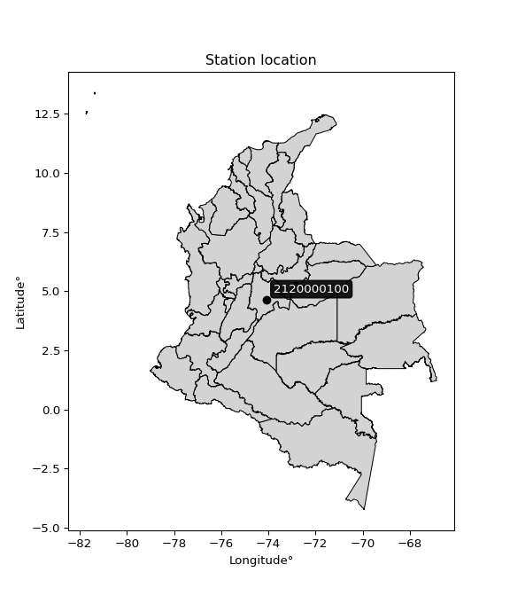

<div align="center">


</div>

# PMax24h Station (Rain, Pmax24h): 2120000100

Maximum Precipitation in 24 hours (PMax24h) is the greatest amount of rainfall for a specific duration that is meteorologically possible for a given location, acting as a "worst-case" scenario for extreme storms, crucial for designing safety-critical infrastructure like bridges, river deviations, dams, spillways, and nuclear plants to prevent catastrophic failure. The PMax24h is related with the Probable Maximum Precipitation (PMP) and it is calculated by hydrologists using meteorological data to determine the upper limit of extreme rainfall, often leading to the Probable Maximum Flood (PMF) for flood control design, and is increasingly being studied for climate change impacts. Probable Maximum Precipitation (PMP) is the theoretical upper limit of rainfall, a deterministic estimate for extreme events, while probability distributions (like GEV, Gumbel) describe the likelihood and frequency of various precipitation amounts, including rare ones, showing how often events occur, with PMP representing the extreme end of these distributions, used for critical infrastructure design to ensure safety against the worst conceivable weather, unlike standard statistical forecasts which cover typical probabilities.

The most common probability distributions in hydrology, used for analyzing floods, rainfall, and streamflow, include the Normal, Log-Normal, Gumbel, Gamma (including Log-Pearson Type III), and Generalized Extreme Value (GEV) distributions, often chosen based on the data´s skewness and whether modeling extremes or general conditions, with Gumbel and GEV popular for extreme events like floods, while the Normal distribution serves as a baseline, though often requiring transformations for skewed hydrological data. These distributions help in designing water infrastructure, managing water resources, and forecasting hydrologic events.

> Hydrological data often isn´t perfectly normal (it´s skewed), so different distributions are needed for different applications, such as: **Flood Frequency Analysis**: Using Gumbel, GEV, or Log-Pearson Type III for predicting extreme flood magnitudes and their return periods, **Rainfall Analysis**: Normal for annual totals, but Log-Normal, Weibull, or GEV for intensity or extreme daily rainfall, **Streamflow Modeling**: Gamma and Log-Normal for maximum flows, GEV for minimum flows, and Kappa for daily flows.

<div align="center">

</img>

</div>


## A. General information


### 1. General running parameters

• app_version: _v20260225_. • runtime: _2026-02-27 14:50:08.749431_. • Python version: _3.14.0_. • SciPy version: _1.16.3_. • Pandas version: _2.3.3_. • NumPy version: _2.3.5_. • Stations dataset (station_dataset_file): _dataset/pmax24h_in/automatic_colombia_2003_2025.csv_. • Stations catalog (station_catalog_file): _dataset/CNE.xls_. • Minimum year to eval til year_max (date_min): _1900_. • Maximum year to eval since year_min (date_max): _2025_. • Creates, save and include plots into reports (create_plot): _False_. • Plot only fit distributions with Δo > Δ (plot_only_fit): _True_. • Plot only simple graphs avoiding multiple CDFs and multiple Extreme values plots (plot_only_simple): _False_. • Eval low extreme values, if False, evaluates high extreme values (low_extreme): _False_. • Eval every SciPy distribution as logarithmic (pdist_logarithmic_on): _True_. • Standard deviation normalized (ddof): _1.0_. • Return periods to eval in years (Tr): _[2, 2.33, 5, 10, 15, 20, 25, 50, 75, 100, 200, 250, 500, 750, 1000]_. • Minimum data sample per station, 0 means any (minimum_sample): _5_. • Z-Score maximum threshold to adjust a value, 0 means disable (zscore_max): _3.5_. • Z-Score minimum threshold to adjust a value, 0 means disable (zscore_min): _-2.5_. • Avoid zeros, e.g. rain = 0 (avoid_zeros): _True_. • Avoid null values (avoid_nans): _True_. 

:file_folder:Table: [dataset.csv](../../dataset/pmax24h_in/automatic_colombia_2003_2025.csv)

> Delta Degrees of Freedom (DDOF): is a parameter used in the formulas for calculating variance and standard deviation. When ddof=0, the divisor is $N$ (the total number of observations) and this is used when your data set is the entire population. When ddof=1, the divisor is $N-1$ and this is used when your data set is a sample drawn from a larger population. Using $N-1$ provides an unbiased estimate of the population variance (known as Bessel´s correction).


### 2. Station info and location

|   id |     CODIGO | NOMBRE                                  | CATEGORIA     | TECNOLOGIA                | ESTADO   | FECHA_INSTALACION   |   FECHA_SUSPENSION |   ALTITUD |   LATITUD |   LONGITUD | DEPARTAMENTO   | MUNICIPIO   | AREA_OPERATIVA                            | ENTIDAD                                                      | AREA_HIDROGRAFICA   | ZONA_HIDROGRAFICA   | SUBZONA_HIDROGRAFICA   |   CORRIENTE | Catalogo   |   Version |
|-----:|-----------:|:----------------------------------------|:--------------|:--------------------------|:---------|:--------------------|-------------------:|----------:|----------:|-----------:|:---------------|:------------|:------------------------------------------|:-------------------------------------------------------------|:--------------------|:--------------------|:-----------------------|------------:|:-----------|----------:|
|    0 | 2120000100 | COLEGIO ALEMANIA SOLIDARIA [2120000100] | Pluviométrica | Automática con Telemetría | Activa   | 01/10/2015          |                nan |      2556 |   4.65239 |   -74.0754 | Bogotá         | Bogotá, D.C | Area Operativa 11 - Cundinamarca-Amazonas | INSTITUTO DISTRITAL DE GESTIÓN DE RIESGOS Y CAMBIO CLIMÁTICO | Magdalena Cauca     | Alto Magdalena      | Río Bogotá             |         nan | CNE_OE     |  20251226 |

<div align="center">

Dynamic map: [:earth_americas:Google](http://maps.google.com/maps?q=4.652389,-74.075434) [:earth_americas:OSM](https://www.openstreetmap.org/#map=18/4.652389/-74.075434&layers=P) [:earth_americas:Bing](https://www.bing.com/maps?cp=4.652389~-74.075434&lvl=18) [:earth_americas:Apple](https://maps.apple.com/frame?center=4.652389%2C-74.075434&span=0.003%2C0.006)

</div>


<div align="center">

```geojson
{
  "type": "Feature",
  "geometry": {
    "type": "Point", 
    "coordinates": [-74.075434, 4.652389]
  }, 
  "properties": {
    "Name": "2120000100"
  }
}
```

</div>


### 3. Discrete values table and plot

<div align="center">

|               |           0 |          1 |            2 |          3 |           4 |           5 |
|:--------------|------------:|-----------:|-------------:|-----------:|------------:|------------:|
| Date          | 2018        | 2019       | 2020         | 2023       | 2024        | 2025        |
| Value         |   31        |   58.5     |   35         |    2.3     |   43.2      |   47.8      |
| Value_initial |   31        |   58.5     |   35         |    2.3     |   43.2      |   47.8      |
| count         |    6        |    6       |    6         |    6       |    6        |    6        |
| mean          |   36.3      |   36.3     |   36.3       |   36.3     |   36.3      |   36.3      |
| std           |   19.2794   |   19.2794  |   19.2794    |   19.2794  |   19.2794   |   19.2794   |
| zscore        |   -0.274905 |    1.15149 |   -0.0674294 |   -1.76354 |    0.357895 |    0.596491 |


</div>


> The initial value (value_initial) correspond to the initial obtained or null completed value, and value (value) is adjusted only when the initial value is outside the valid range (outlier) definite through the Z-Score value. If Z-Score is active, values out of range or outliers are replaced with the station mean value. A Z-Score (or standard score) measures how many standard deviations a data point is from the mean of a dataset, indicating its relative position; positive scores mean above the mean, negative mean below, and a score of zero is exactly at the mean, allowing for comparison of values from different distributions. It´s calculated using the formula $z=(x–μ)/σ$, where $x$ is the data point, $μ$ is the mean, and $σ$ is the standard deviation, helping identify outliers and understand probability.
>
> <sub>**Note**: In this study, "completing" (filling gaps in) and "extending" (forecasting or lengthening the historical record) rainfall data series are avoided for certain critical analyses because they introduce artificial bias and uncertainty, which can distort the statistics of rare events (extremes), alter day-to-day variability, and compromise the integrity and homogeneity of the original data. Some reasons against Completing/Extending rainfall data are: **Distortion of Extremes and Variability**: The primary issue is that most gap-filling or extension methods rely on averaging or regression with nearby stations, which inherently smooths the data. Rainfall is highly variable in space and time, with a large percentage of zero values and occasional large storms. Infilling methods often underestimate the highest values and overestimate the lowest (zero) values, which severely distorts analyses focused on flood frequency, drought severity, and intensity-duration-frequency (IDF) curves, **Loss of Data Homogeneity**: Infilled or extended data are synthetic estimates, not actual measurements. Combining these estimates with observed data can violate the assumption of data homogeneity, which requires that the data properties do not change over time. Inhomogeneity can lead to incorrect conclusions about long-term trends or changes in climate patterns, **Propagation of Errors**: Errors and biases from the original data (e.g., wind-induced undercatch, instrument errors, site changes) or the data used for imputation can propagate through the analysis, leading to unreliable hydrological models and inaccurate predictions, **Compromised Statistical Integrity**: For statistical analyses, especially those involving the frequency of events, using artificial data can introduce time bias or autocorrelation that doesn´t exist in reality, making it difficult to assess the true probability of events, **Difficulty in Validation**: It is difficult to accurately validate the quality of filled or extended data, especially for past periods where ground-truth measurements are unavailable. The reliability of imputation techniques heavily depends on the density of the surrounding station network and the complexity of the local topography.</sub>


### 4. Active continuous probability distributions from SciPy (80 of 104 available)

A Probability Density Function (PDF) describes the relative likelihood of a continuous random variable falling within a specific range, where the total area under its curve equals 1, and the area over any interval gives the actual probability for that range. Unlike discrete probabilities (like rolling a die), a PDF shows density, not direct probability for a single point (which is zero), with higher points indicating higher likelihood, often visualized as a bell curve for normal distributions.

A log of a probability density function (log-PDF) is simply the logarithm of the PDF´s value, denoted as $log(f(x))$, useful for converting multiplication of probabilities into addition, improving numerical stability with tiny numbers, and connecting to information theory concepts like entropy. Instead of dealing with very small probabilities (e.g., 0.000001), log-PDFs use negative numbers (e.g., $log(0.00001) ≈ -11.51$ that are easier for computers to handle, preventing underflow errors and simplifying complex calculations. In this study, each active probability distribution from SciPy is also evaluated in the $log$ form.

[scipy.stats](https://docs.scipy.org/doc/scipy/reference/stats.html) is a Python´s powerful submodule within the SciPy library for comprehensive statistical analysis, offering over 130 probability distributions (like Normal, Poisson, etc.), functions for descriptive stats (mean, variance), hypothesis testing (t-tests, chi-square), random variable generation, and statistical tests, making it essential for data science, modeling, and research. It provides tools to explore, model, and draw conclusions from data efficiently, working seamlessly with [NumPy](https://numpy.org/).

<div align="center">

|   id | p_dist           |   n_parameter | fit_method   | label                                                                       | active   | ref                                                                                                      |
|-----:|:-----------------|--------------:|:-------------|:----------------------------------------------------------------------------|:---------|:---------------------------------------------------------------------------------------------------------|
|    0 | alpha            |             3 | MLE          | Alpha                                                                       | True     | [:mortar_board:](https://docs.scipy.org/doc/scipy/reference/generated/scipy.stats.alpha.html)            |
|    1 | anglit           |             2 | MM           | Anglit                                                                      | True     | [:mortar_board:](https://docs.scipy.org/doc/scipy/reference/generated/scipy.stats.anglit.html)           |
|    2 | arcsine          |             2 | MM           | Arcsine                                                                     | True     | [:mortar_board:](https://docs.scipy.org/doc/scipy/reference/generated/scipy.stats.arcsine.html)          |
|    3 | argus            |             3 | MLE          | Argus                                                                       | True     | [:mortar_board:](https://docs.scipy.org/doc/scipy/reference/generated/scipy.stats.argus.html)            |
|    4 | beta             |             4 | MLE          | Beta                                                                        | True     | [:mortar_board:](https://docs.scipy.org/doc/scipy/reference/generated/scipy.stats.beta.html)             |
|    5 | betaprime        |             4 | MLE          | Beta prime                                                                  | True     | [:mortar_board:](https://docs.scipy.org/doc/scipy/reference/generated/scipy.stats.betaprime.html)        |
|    6 | bradford         |             3 | MLE          | Bradford                                                                    | True     | [:mortar_board:](https://docs.scipy.org/doc/scipy/reference/generated/scipy.stats.bradford.html)         |
|    7 | burr             |             4 | MLE          | Burr (Type III)                                                             | True     | [:mortar_board:](https://docs.scipy.org/doc/scipy/reference/generated/scipy.stats.burr.html)             |
|    8 | burr12           |             4 | MLE          | Burr (Type III) 12                                                          | True     | [:mortar_board:](https://docs.scipy.org/doc/scipy/reference/generated/scipy.stats.burr12.html)           |
|    9 | cosine           |             2 | MLE          | Cosine                                                                      | True     | [:mortar_board:](https://docs.scipy.org/doc/scipy/reference/generated/scipy.stats.cosine.html)           |
|   10 | crystalball      |             4 | MLE          | Crystalball                                                                 | True     | [:mortar_board:](https://docs.scipy.org/doc/scipy/reference/generated/scipy.stats.crystalball.html)      |
|   11 | dgamma           |             3 | MLE          | Double gamma                                                                | True     | [:mortar_board:](https://docs.scipy.org/doc/scipy/reference/generated/scipy.stats.dgamma.html)           |
|   12 | dweibull         |             3 | MLE          | Double Weibull                                                              | True     | [:mortar_board:](https://docs.scipy.org/doc/scipy/reference/generated/scipy.stats.dweibull.html)         |
|   13 | erlang           |             3 | MLE          | Erlang                                                                      | True     | [:mortar_board:](https://docs.scipy.org/doc/scipy/reference/generated/scipy.stats.erlang.html)           |
|   14 | exponnorm        |             3 | MLE          | Exponentially modified Normal                                               | True     | [:mortar_board:](https://docs.scipy.org/doc/scipy/reference/generated/scipy.stats.exponnorm.html)        |
|   15 | exponpow         |             3 | MLE          | Exponential power                                                           | True     | [:mortar_board:](https://docs.scipy.org/doc/scipy/reference/generated/scipy.stats.exponpow.html)         |
|   16 | exponweib        |             4 | MLE          | Exponentiated Weibull                                                       | True     | [:mortar_board:](https://docs.scipy.org/doc/scipy/reference/generated/scipy.stats.exponweib.html)        |
|   17 | f                |             4 | MLE          | F                                                                           | True     | [:mortar_board:](https://docs.scipy.org/doc/scipy/reference/generated/scipy.stats.f.html)                |
|   18 | fatiguelife      |             3 | MLE          | Fatigue-life (Birnbaum-Saunders)                                            | True     | [:mortar_board:](https://docs.scipy.org/doc/scipy/reference/generated/scipy.stats.fatiguelife.html)      |
|   19 | foldnorm         |             3 | MM           | Fold Normal                                                                 | True     | [:mortar_board:](https://docs.scipy.org/doc/scipy/reference/generated/scipy.stats.foldnorm.html)         |
|   20 | gamma            |             3 | MLE          | Gamma                                                                       | True     | [:mortar_board:](https://docs.scipy.org/doc/scipy/reference/generated/scipy.stats.gamma.html)            |
|   21 | gausshyper       |             6 | MLE          | Gauss hypergeometric                                                        | True     | [:mortar_board:](https://docs.scipy.org/doc/scipy/reference/generated/scipy.stats.gausshyper.html)       |
|   22 | genexpon         |             5 | MLE          | Generalized exponential                                                     | True     | [:mortar_board:](https://docs.scipy.org/doc/scipy/reference/generated/scipy.stats.genexpon.html)         |
|   23 | genextreme       |             3 | MLE          | Generalized exponential                                                     | True     | [:mortar_board:](https://docs.scipy.org/doc/scipy/reference/generated/scipy.stats.genextreme.html)       |
|   24 | gengamma         |             4 | MLE          | Generalized gamma                                                           | True     | [:mortar_board:](https://docs.scipy.org/doc/scipy/reference/generated/scipy.stats.gengamma.html)         |
|   25 | genhalflogistic  |             3 | MLE          | Generalized half-logistic                                                   | True     | [:mortar_board:](https://docs.scipy.org/doc/scipy/reference/generated/scipy.stats.genhalflogistic.html)  |
|   26 | genlogistic      |             3 | MLE          | Generalized logistic                                                        | True     | [:mortar_board:](https://docs.scipy.org/doc/scipy/reference/generated/scipy.stats.genlogistic.html)      |
|   27 | gennorm          |             3 | MLE          | Generalized Normal                                                          | True     | [:mortar_board:](https://docs.scipy.org/doc/scipy/reference/generated/scipy.stats.gennorm.html)          |
|   28 | genpareto        |             3 | MLE          | Generalized Pareto                                                          | True     | [:mortar_board:](https://docs.scipy.org/doc/scipy/reference/generated/scipy.stats.genpareto.html)        |
|   29 | gompertz         |             3 | MLE          | Gompertz (or truncated Gumbel)                                              | True     | [:mortar_board:](https://docs.scipy.org/doc/scipy/reference/generated/scipy.stats.gompertz.html)         |
|   30 | gumbel_l         |             2 | MM           | Gumbel Left Skew                                                            | True     | [:mortar_board:](https://docs.scipy.org/doc/scipy/reference/generated/scipy.stats.gumbel_l.html)         |
|   31 | gumbel_r         |             2 | MM           | Gumbel Right Skew                                                           | True     | [:mortar_board:](https://docs.scipy.org/doc/scipy/reference/generated/scipy.stats.gumbel_r.html)         |
|   32 | halfgennorm      |             3 | MLE          | Upper half of a generalized normal                                          | True     | [:mortar_board:](https://docs.scipy.org/doc/scipy/reference/generated/scipy.stats.halfgennorm.html)      |
|   33 | halflogistic     |             2 | MM           | Half-logistic                                                               | True     | [:mortar_board:](https://docs.scipy.org/doc/scipy/reference/generated/scipy.stats.halflogistic.html)     |
|   34 | halfnorm         |             2 | MM           | Half Normal                                                                 | True     | [:mortar_board:](https://docs.scipy.org/doc/scipy/reference/generated/scipy.stats.halfnorm.html)         |
|   35 | hypsecant        |             2 | MM           | hyperbolic secant                                                           | True     | [:mortar_board:](https://docs.scipy.org/doc/scipy/reference/generated/scipy.stats.hypsecant.html)        |
|   36 | invgamma         |             3 | MLE          | Inverted gamma                                                              | True     | [:mortar_board:](https://docs.scipy.org/doc/scipy/reference/generated/scipy.stats.invgamma.html)         |
|   37 | invgauss         |             3 | MLE          | Inverse Gaussian                                                            | True     | [:mortar_board:](https://docs.scipy.org/doc/scipy/reference/generated/scipy.stats.invgauss.html)         |
|   38 | invweibull       |             3 | MLE          | Inverted Weibull                                                            | True     | [:mortar_board:](https://docs.scipy.org/doc/scipy/reference/generated/scipy.stats.invweibull.html)       |
|   39 | johnsonsb        |             4 | MLE          | Johnson SB                                                                  | True     | [:mortar_board:](https://docs.scipy.org/doc/scipy/reference/generated/scipy.stats.johnsonsb.html)        |
|   40 | johnsonsu        |             4 | MLE          | Johnson Su                                                                  | True     | [:mortar_board:](https://docs.scipy.org/doc/scipy/reference/generated/scipy.stats.johnsonsu.html)        |
|   41 | kappa3           |             3 | MLE          | Kappa 3                                                                     | True     | [:mortar_board:](https://docs.scipy.org/doc/scipy/reference/generated/scipy.stats.kappa3.html)           |
|   42 | kappa4           |             4 | MLE          | Kappa 4                                                                     | True     | [:mortar_board:](https://docs.scipy.org/doc/scipy/reference/generated/scipy.stats.kappa4.html)           |
|   43 | ksone            |             3 | MLE          | Kolmogorov-Smirnov one-sided test statistic distribution                    | True     | [:mortar_board:](https://docs.scipy.org/doc/scipy/reference/generated/scipy.stats.ksone.html)            |
|   44 | kstwobign        |             2 | MLE          | Limiting distribution of scaled Kolmogorov-Smirnov two-sided test statistic | True     | [:mortar_board:](https://docs.scipy.org/doc/scipy/reference/generated/scipy.stats.kstwobign.html)        |
|   45 | laplace          |             2 | MM           | Laplace                                                                     | True     | [:mortar_board:](https://docs.scipy.org/doc/scipy/reference/generated/scipy.stats.laplace.html)          |
|   46 | levy_l           |             2 | MLE          | Left-skewed Levy                                                            | True     | [:mortar_board:](https://docs.scipy.org/doc/scipy/reference/generated/scipy.stats.levy_l.html)           |
|   47 | loggamma         |             3 | MLE          | Log gamma                                                                   | True     | [:mortar_board:](https://docs.scipy.org/doc/scipy/reference/generated/scipy.stats.loggamma.html)         |
|   48 | logistic         |             2 | MM           | Logistic (or Sech-squared)                                                  | True     | [:mortar_board:](https://docs.scipy.org/doc/scipy/reference/generated/scipy.stats.logistic.html)         |
|   49 | loglaplace       |             3 | MLE          | Log-Laplace                                                                 | True     | [:mortar_board:](https://docs.scipy.org/doc/scipy/reference/generated/scipy.stats.loglaplace.html)       |
|   50 | lomax            |             3 | MLE          | Lomax (Pareto of the second kind)                                           | True     | [:mortar_board:](https://docs.scipy.org/doc/scipy/reference/generated/scipy.stats.lomax.html)            |
|   51 | maxwell          |             2 | MM           | Maxwell                                                                     | True     | [:mortar_board:](https://docs.scipy.org/doc/scipy/reference/generated/scipy.stats.maxwell.html)          |
|   52 | mielke           |             4 | MLE          | Mielke Beta-Kappa / Dagum                                                   | True     | [:mortar_board:](https://docs.scipy.org/doc/scipy/reference/generated/scipy.stats.mielke.html)           |
|   53 | moyal            |             2 | MM           | Moyal                                                                       | True     | [:mortar_board:](https://docs.scipy.org/doc/scipy/reference/generated/scipy.stats.moyal.html)            |
|   54 | nakagami         |             3 | MLE          | Nakagami                                                                    | True     | [:mortar_board:](https://docs.scipy.org/doc/scipy/reference/generated/scipy.stats.nakagami.html)         |
|   55 | ncf              |             5 | MLE          | Non-central F distribution                                                  | True     | [:mortar_board:](https://docs.scipy.org/doc/scipy/reference/generated/scipy.stats.ncf.html)              |
|   56 | nct              |             4 | MLE          | Non-central Student’s t                                                     | True     | [:mortar_board:](https://docs.scipy.org/doc/scipy/reference/generated/scipy.stats.nct.html)              |
|   57 | norm             |             2 | MM           | Normal                                                                      | True     | [:mortar_board:](https://docs.scipy.org/doc/scipy/reference/generated/scipy.stats.norm.html)             |
|   58 | pearson3         |             3 | MM           | Pearson type III                                                            | True     | [:mortar_board:](https://docs.scipy.org/doc/scipy/reference/generated/scipy.stats.pearson3.html)         |
|   59 | powerlaw         |             3 | MLE          | Power-function                                                              | True     | [:mortar_board:](https://docs.scipy.org/doc/scipy/reference/generated/scipy.stats.powerlaw.html)         |
|   60 | rayleigh         |             2 | MM           | Rayleigh                                                                    | True     | [:mortar_board:](https://docs.scipy.org/doc/scipy/reference/generated/scipy.stats.rayleigh.html)         |
|   61 | rdist            |             3 | MLE          | R-distributed (symmetric beta)                                              | True     | [:mortar_board:](https://docs.scipy.org/doc/scipy/reference/generated/scipy.stats.rdist.html)            |
|   62 | rice             |             3 | MLE          | Rice                                                                        | True     | [:mortar_board:](https://docs.scipy.org/doc/scipy/reference/generated/scipy.stats.rice.html)             |
|   63 | semicircular     |             2 | MM           | Semicircular                                                                | True     | [:mortar_board:](https://docs.scipy.org/doc/scipy/reference/generated/scipy.stats.semicircular.html)     |
|   64 | skewnorm         |             3 | MLE          | Skew normal                                                                 | True     | [:mortar_board:](https://docs.scipy.org/doc/scipy/reference/generated/scipy.stats.skewnorm.html)         |
|   65 | t                |             3 | MLE          | Student’s t                                                                 | True     | [:mortar_board:](https://docs.scipy.org/doc/scipy/reference/generated/scipy.stats.t.html)                |
|   66 | trapezoid        |             4 | MLE          | Trapezoid                                                                   | True     | [:mortar_board:](https://docs.scipy.org/doc/scipy/reference/generated/scipy.stats.trapezoid.html)        |
|   67 | triang           |             3 | MLE          | Triangular                                                                  | True     | [:mortar_board:](https://docs.scipy.org/doc/scipy/reference/generated/scipy.stats.triang.html)           |
|   68 | truncexpon       |             3 | MLE          | Truncated exponential                                                       | True     | [:mortar_board:](https://docs.scipy.org/doc/scipy/reference/generated/scipy.stats.truncexpon.html)       |
|   69 | truncnorm        |             4 | MLE          | Truncated normal                                                            | True     | [:mortar_board:](https://docs.scipy.org/doc/scipy/reference/generated/scipy.stats.truncnorm.html)        |
|   70 | truncpareto      |             4 | MLE          | Upper truncated Pareto                                                      | True     | [:mortar_board:](https://docs.scipy.org/doc/scipy/reference/generated/scipy.stats.truncpareto.html)      |
|   71 | truncweibull_min |             5 | MLE          | Doubly truncated Weibull minimum                                            | True     | [:mortar_board:](https://docs.scipy.org/doc/scipy/reference/generated/scipy.stats.truncweibull_min.html) |
|   72 | tukeylambda      |             3 | MLE          | Tukey-Lamdba                                                                | True     | [:mortar_board:](https://docs.scipy.org/doc/scipy/reference/generated/scipy.stats.tukeylambda.html)      |
|   73 | uniform          |             2 | MLE          | Uniform                                                                     | True     | [:mortar_board:](https://docs.scipy.org/doc/scipy/reference/generated/scipy.stats.uniform.html)          |
|   74 | vonmises         |             3 | MLE          | Von Mises                                                                   | True     | [:mortar_board:](https://docs.scipy.org/doc/scipy/reference/generated/scipy.stats.vonmises.html)         |
|   75 | vonmises_line    |             3 | MLE          | Von Mises line                                                              | True     | [:mortar_board:](https://docs.scipy.org/doc/scipy/reference/generated/scipy.stats.vonmises_line.html)    |
|   76 | wald             |             2 | MM           | Wald                                                                        | True     | [:mortar_board:](https://docs.scipy.org/doc/scipy/reference/generated/scipy.stats.wald.html)             |
|   77 | weibull_max      |             3 | MLE          | Weibull maximum                                                             | True     | [:mortar_board:](https://docs.scipy.org/doc/scipy/reference/generated/scipy.stats.weibull_max.html)      |
|   78 | weibull_min      |             3 | MLE          | Weibull minimum                                                             | True     | [:mortar_board:](https://docs.scipy.org/doc/scipy/reference/generated/scipy.stats.weibull_min.html)      |
|   79 | wrapcauchy       |             3 | MLE          | Wrapped  Cauchy                                                             | True     | [:mortar_board:](https://docs.scipy.org/doc/scipy/reference/generated/scipy.stats.wrapcauchy.html)       |

</div>

> **n_parameter:** # arguments & localization & scale.
>
> **Fit methods:** (MLE) maximum likelihood, (MM) L-moments.
>
>**Inactive** (With the only purpose of prevent loops, zero divisions, infinite values, over high estimated values or horizontal trending for recurrence intervals estimations, the follow distributions were disabled.)**:** lognorm, norminvgauss, powernorm, powerlognorm, cauchy, halfcauchy, foldcauchy, skewcauchy, chi2, expon, fisk, genhyperbolic, geninvgauss, gibrat, kstwo, laplace_asymmetric, levy, levy_stable, ncx2, pareto, rel_breitwigner, recipinvgauss, studentized_range, loguniform, 


## B. Probability (PDF) vs. Empirical (EDF) distributions functions

A continuous probability distribution (CPD) describes probabilities for variables that can take any value within a range (like rain any time), unlike discrete variables with specific outcomes (like temperature). It uses a Probability Density Function (PDF), a curve where the total area under it equals 1, and the probability of the variable falling within an interval (a to b) is found by calculating the area under the curve between those points. A key feature is that the probability of hitting any single exact value is zero, so probabilities are always expressed for ranges, e.g., $P(a ≤ X ≤ b)$.

<div align="center">

Distributions parameters from station values
|     |    station | p_dist              |   n |               loc |            scale | shape                 | shape1                 | shape2                | shape3             |
|----:|-----------:|:--------------------|----:|------------------:|-----------------:|:----------------------|:-----------------------|:----------------------|:-------------------|
|   0 | 2120000100 | alpha               |   6 |     -53.8111      |    235.75        | 2.7009023100863203    |                        |                       |                    |
|   1 | 2120000100 | anglit              |   6 |      36.3         |     51.4859      |                       |                        |                       |                    |
|   2 | 2120000100 | arcsine             |   6 |      11.4104      |     49.7793      |                       |                        |                       |                    |
|   3 | 2120000100 | argus               |   6 |     -14.01        |     74.6876      | 1.7513334533414426    |                        |                       |                    |
|   4 | 2120000100 | beta                |   6 |      -3.45356     |     61.9536      | 1.9719178964737725    | 0.8399829629928109     |                       |                    |
|   5 | 2120000100 | betaprime           |   6 |    -594.673       |  24018.4         | 1265.4984448534706    | 48184.340925306984     |                       |                    |
|   6 | 2120000100 | bradford            |   6 |      -4.46731     |     62.9674      | 2.562986899722148e-06 |                        |                       |                    |
|   7 | 2120000100 | burr                |   6 |      -1.06494     |     60.3969      | 245.809837892645      | 0.0053378317996480885  |                       |                    |
|   8 | 2120000100 | burr12              |   6 |    -336.853       |    556.365       | 26.818153879054083    | 26477.220597394567     |                       |                    |
|   9 | 2120000100 | cosine              |   6 |      34.1588      |     15.1383      |                       |                        |                       |                    |
|  10 | 2120000100 | crystalball         |   6 |      36.3         |     17.5996      | 2740.3868932803543    | 3876.1677366342815     |                       |                    |
|  11 | 2120000100 | dgamma              |   6 |      38.9949      |      8.14973     | 1.6605923720108522    |                        |                       |                    |
|  12 | 2120000100 | dweibull            |   6 |      38.7362      |     14.6951      | 1.26767756954356      |                        |                       |                    |
|  13 | 2120000100 | erlang              |   6 |    -250.522       |      1.16016     | 247.10986457432074    |                        |                       |                    |
|  14 | 2120000100 | exponnorm           |   6 |      36.2829      |     17.5996      | 0.0009659406946667402 |                        |                       |                    |
|  15 | 2120000100 | exponpow            |   6 |       2.3         |      3.30798     | 0.17815887277200154   |                        |                       |                    |
|  16 | 2120000100 | exponweib           |   6 | -285925           | 285897           | 18.022033601246065    | 5283.17558204577       |                       |                    |
|  17 | 2120000100 | f                   |   6 |   -6974.47        |   7010.7         | 427931.3789401938     | 1179467.8934924142     |                       |                    |
|  18 | 2120000100 | fatiguelife         |   6 |       2.3         |      6.86625e-06 | 2248.469050172851     |                        |                       |                    |
|  19 | 2120000100 | foldnorm            |   6 |     -62.8636      |     16.0431      | 6.204248908973522     |                        |                       |                    |
|  20 | 2120000100 | gamma               |   6 |    -244.467       |      1.20304     | 233.1131339068781     |                        |                       |                    |
|  21 | 2120000100 | gausshyper          |   6 |      -3.78251     |     62.2825      | 1.2422398661532028    | 0.6456790441524254     | 1.1009331424565492    | 0.8731676541113176 |
|  22 | 2120000100 | genexpon            |   6 |       2.3         |      2.50849     | 0.07379178975862645   | 1.9918701695367584e-09 | 1.1941672941442456    |                    |
|  23 | 2120000100 | genextreme          |   6 |      37.4809      |     26.0979      | 1.241627386300813     |                        |                       |                    |
|  24 | 2120000100 | gengamma            |   6 |     -10.428       |     63.3647      | 0.5390458362133344    | 4.246033022875441      |                       |                    |
|  25 | 2120000100 | genhalflogistic     |   6 |      -3.9739      |     82.2849      | 1.3171084946431482    |                        |                       |                    |
|  26 | 2120000100 | genlogistic         |   6 |      51.4325      |      4.85353     | 0.28603426207789806   |                        |                       |                    |
|  27 | 2120000100 | gennorm             |   6 |      37.6962      |     20.0552      | 1.4566406299033399    |                        |                       |                    |
|  28 | 2120000100 | genpareto           |   6 |      -0.252225    |     98.2253      | -1.6718559459067854   |                        |                       |                    |
|  29 | 2120000100 | gompertz            |   6 |     -10.805       |     14.0734      | 0.020660809064031227  |                        |                       |                    |
|  30 | 2120000100 | gumbel_l            |   6 |      44.2208      |     13.7224      |                       |                        |                       |                    |
|  31 | 2120000100 | gumbel_r            |   6 |      28.3792      |     13.7224      |                       |                        |                       |                    |
|  32 | 2120000100 | halfgennorm         |   6 |       2.3         |      3.34544     | 0.422158857480213     |                        |                       |                    |
|  33 | 2120000100 | halflogistic        |   6 |      15.4404      |     15.047       |                       |                        |                       |                    |
|  34 | 2120000100 | halfnorm            |   6 |      13.005       |     29.1959      |                       |                        |                       |                    |
|  35 | 2120000100 | hypsecant           |   6 |      36.3         |     11.2043      |                       |                        |                       |                    |
|  36 | 2120000100 | invgamma            |   6 |    -238.38        |  59493.5         | 217.41528244022072    |                        |                       |                    |
|  37 | 2120000100 | invgauss            |   6 |    -122.519       |  10823.3         | 0.01469624565071994   |                        |                       |                    |
|  38 | 2120000100 | invweibull          |   6 |  -41065.5         |  41092.6         | 2119.455399948558     |                        |                       |                    |
|  39 | 2120000100 | johnsonsb           |   6 |      -8.72276     |     67.2228      | -0.7701626654217126   | 0.12625971960081134    |                       |                    |
|  40 | 2120000100 | johnsonsu           |   6 |      73.3564      |      1.18197     | 8.392515979103283     | 2.0843240707163053     |                       |                    |
|  41 | 2120000100 | kappa3              |   6 |       2.29999     |     56.1999      | 1290724.6023509067    |                        |                       |                    |
|  42 | 2120000100 | kappa4              |   6 |      -3.13792     |     66.2275      | 1.0897507364408399    | 1.0715846013633892     |                       |                    |
|  43 | 2120000100 | ksone               |   6 |      -3.32        |     67.44        | 1.0                   |                        |                       |                    |
|  44 | 2120000100 | kstwobign           |   6 |     -41.4399      |     88.8161      |                       |                        |                       |                    |
|  45 | 2120000100 | laplace             |   6 |      36.3         |     12.4448      |                       |                        |                       |                    |
|  46 | 2120000100 | levy_l              |   6 |      60.474       |      8.17701     |                       |                        |                       |                    |
|  47 | 2120000100 | loggamma            |   6 |      52.4678      |      8.76432     | 0.5250932895934532    |                        |                       |                    |
|  48 | 2120000100 | logistic            |   6 |      36.3         |      9.70318     |                       |                        |                       |                    |
|  49 | 2120000100 | loglaplace          |   6 |      -0.10335     |     43.3033      | 1.5640752923333898    |                        |                       |                    |
|  50 | 2120000100 | lomax               |   6 |       2.3         |      9.66959e+07 | 2838864.122563494     |                        |                       |                    |
|  51 | 2120000100 | maxwell             |   6 |      -5.40371     |     26.1339      |                       |                        |                       |                    |
|  52 | 2120000100 | mielke              |   6 |       2.3         |     56.3929      | 0.8094646671631671    | 1183.6975678018975     |                       |                    |
|  53 | 2120000100 | moyal               |   6 |      26.2354      |      7.92261     |                       |                        |                       |                    |
|  54 | 2120000100 | nakagami            |   6 |  -11000.2         |  11036.5         | 97858.97874804394     |                        |                       |                    |
|  55 | 2120000100 | ncf                 |   6 |       2.3         |      2.99205     | 0.31819914229327767   | 160.41835247042025     | 4.132875419992401     |                    |
|  56 | 2120000100 | nct                 |   6 |    -746.775       |     17.5687      | 161233.63135304878    | 44.5722547687497       |                       |                    |
|  57 | 2120000100 | norm                |   6 |      36.3         |     17.5996      |                       |                        |                       |                    |
|  58 | 2120000100 | pearson3            |   6 |      36.3         |     17.5996      | -0.8152057509909217   |                        |                       |                    |
|  59 | 2120000100 | powerlaw            |   6 |       2.3         |     56.2         | 0.14590738750129906   |                        |                       |                    |
|  60 | 2120000100 | rayleigh            |   6 |       2.63088     |     26.8641      |                       |                        |                       |                    |
|  61 | 2120000100 | rdist               |   6 |      -2.44434     |     33.4443      | 0.9166143851546975    |                        |                       |                    |
|  62 | 2120000100 | rice                |   6 |     -10.3489      |     18.9474      | 2.2190946316182334    |                        |                       |                    |
|  63 | 2120000100 | semicircular        |   6 |      36.3         |     35.1992      |                       |                        |                       |                    |
|  64 | 2120000100 | skewnorm            |   6 |      58.5         |     28.3295      | -36132015.02961391    |                        |                       |                    |
|  65 | 2120000100 | t                   |   6 |      36.3         |     17.5997      | 283409596.192726      |                        |                       |                    |
|  66 | 2120000100 | trapezoid           |   6 |     -14.1532      |     74.6689      | 1.0                   | 1.0                    |                       |                    |
|  67 | 2120000100 | triang              |   6 |     -10.6982      |     69.1982      | 0.9999999941659742    |                        |                       |                    |
|  68 | 2120000100 | truncexpon          |   6 |      -3.1448      |     90.624       | 0.6802262212685868    |                        |                       |                    |
|  69 | 2120000100 | truncnorm           |   6 |      36.3         |     17.5996      | -14.122434761937587   | 2416.042157007294      |                       |                    |
|  70 | 2120000100 | truncpareto         |   6 |       2.19104     |      0.10896     | 0.20338976120795313   | 516.7857472025946      |                       |                    |
|  71 | 2120000100 | truncweibull_min    |   6 |      -1.14991     |     91.6225      | 1.4837023724736471    | 0.0024403122855702736  | 0.6510402687537444    |                    |
|  72 | 2120000100 | tukeylambda         |   6 |      17.137       |     14.9352      | 1.0066205655996234    |                        |                       |                    |
|  73 | 2120000100 | uniform             |   6 |       2.3         |     56.2         |                       |                        |                       |                    |
|  74 | 2120000100 | vonmises            |   6 |      -2.7226      |      1           | 0.4087276855499516    |                        |                       |                    |
|  75 | 2120000100 | vonmises_line       |   6 |      39.4353      |     11.8205      | 1.0263319986702686    |                        |                       |                    |
|  76 | 2120000100 | wald                |   6 |      18.7004      |     17.5996      |                       |                        |                       |                    |
|  77 | 2120000100 | weibull_max         |   6 |      58.5         |      1.56374     | 0.34868624156057276   |                        |                       |                    |
|  78 | 2120000100 | weibull_min         |   6 |      -4.70284e+08 |      4.70284e+08 | 34929687.85510416     |                        |                       |                    |
|  79 | 2120000100 | wrapcauchy          |   6 |       2.3         |      8.94451     | 0.08612303097153143   |                        |                       |                    |
|  80 | 2120000100 | logalpha            |   6 |       0.000809604 |      1.82295     | 9.452274691414891e-08 |                        |                       |                    |
|  81 | 2120000100 | loganglit           |   6 |       3.25402     |      3.2239      |                       |                        |                       |                    |
|  82 | 2120000100 | logarcsine          |   6 |       1.69549     |      3.11706     |                       |                        |                       |                    |
|  83 | 2120000100 | logargus            |   6 |      -0.571001    |      4.70613     | 3.148789670904476     |                        |                       |                    |
|  84 | 2120000100 | logbeta             |   6 |       0.52032     |      3.54871     | 0.18512662605159547   | 0.04358813256869508    |                       |                    |
|  85 | 2120000100 | logbetaprime        |   6 |     -20.948       |    114.138       | 505.4277194266775     | 2384.7800755866974     |                       |                    |
|  86 | 2120000100 | logbradford         |   6 |       0.816185    |      3.61978     | 1.874919531626699e-05 |                        |                       |                    |
|  87 | 2120000100 | logburr             |   6 |   -2686.1         |   2690.2         | 260749.67470735777    | 0.012243664223423205   |                       |                    |
|  88 | 2120000100 | logburr12           |   6 |   -5370.47        |   5381.95        | 9493.021698264689     | 957807.2237270256      |                       |                    |
|  89 | 2120000100 | logcosine           |   6 |       3.00553     |      0.984526    |                       |                        |                       |                    |
|  90 | 2120000100 | logcrystalball      |   6 |       3.25402     |      1.10204     | 24.196943417189008    | 2286.844747906458      |                       |                    |
|  91 | 2120000100 | logdgamma           |   6 |       3.76584     |      0.789084    | 0.8204804269508545    |                        |                       |                    |
|  92 | 2120000100 | logdweibull         |   6 |       3.76584     |      0.770173    | 0.8984367504104946    |                        |                       |                    |
|  93 | 2120000100 | logerlang           |   6 |     -15.4021      |      0.0727932   | 255.89619688191306    |                        |                       |                    |
|  94 | 2120000100 | logexponnorm        |   6 |       3.2533      |      1.10204     | 0.0006572802176000787 |                        |                       |                    |
|  95 | 2120000100 | logexponpow         |   6 |      -1.56119e+08 |      1.56119e+08 | 268198958.02585575    |                        |                       |                    |
|  96 | 2120000100 | logexponweib        |   6 |       0.832909    |      1.34804     | 1.5866023012439046    | 0.10551267997171497    |                       |                    |
|  97 | 2120000100 | logf                |   6 |   -1919.07        |   1922.32        | 33155370.25707154     | 7408963.807370227      |                       |                    |
|  98 | 2120000100 | logfatiguelife      |   6 |    -814.276       |    817.527       | 0.001342039164208086  |                        |                       |                    |
|  99 | 2120000100 | logfoldnorm         |   6 |      -2.55433     |      0.951504    | 6.134168104304751     |                        |                       |                    |
| 100 | 2120000100 | loggamma            |   6 |     -16.9806      |      0.0672932   | 300.43376087125944    |                        |                       |                    |
| 101 | 2120000100 | loggausshyper       |   6 |       0.475107    |      3.59392     | 1.3694916307367182    | 0.35808471353553806    | 0.9668825828964233    | 0.8647821743282307 |
| 102 | 2120000100 | loggenexpon         |   6 |       0.814379    |      0.0140481   | 0.0018830205742698244 | 4.2034001528155525     | 8.794433254512091e-06 |                    |
| 103 | 2120000100 | loggenextreme       |   6 |       3.16195     |      1.20044     | 1.3234132253892499    |                        |                       |                    |
| 104 | 2120000100 | loggengamma         |   6 |      -4.96944e+07 |      4.96944e+07 | 0.13666845833306251   | 443373995.5238306      |                       |                    |
| 105 | 2120000100 | loggenhalflogistic  |   6 |       0.427202    |      4.13878     | 1.136456603328542     |                        |                       |                    |
| 106 | 2120000100 | loggenlogistic      |   6 |       4.06909     |      3.25906e-06 | 4.012350260508637e-06 |                        |                       |                    |
| 107 | 2120000100 | loggennorm          |   6 |       3.76584     |      0.00574637  | 0.31523040499225974   |                        |                       |                    |
| 108 | 2120000100 | loggenpareto        |   6 |      -0.00276232  |      9.17816     | -2.2540851967178117   |                        |                       |                    |
| 109 | 2120000100 | loggompertz         |   6 |       0.759063    |      0.585939    | 0.006945887225094351  |                        |                       |                    |
| 110 | 2120000100 | loggumbel_l         |   6 |       3.75        |      0.859256    |                       |                        |                       |                    |
| 111 | 2120000100 | loggumbel_r         |   6 |       2.75805     |      0.859256    |                       |                        |                       |                    |
| 112 | 2120000100 | loghalfgennorm      |   6 |       0.832734    |      3.26892     | 476.1762823997899     |                        |                       |                    |
| 113 | 2120000100 | loghalflogistic     |   6 |       1.94784     |      0.94221     |                       |                        |                       |                    |
| 114 | 2120000100 | loghalfnorm         |   6 |       1.79536     |      1.82816     |                       |                        |                       |                    |
| 115 | 2120000100 | loghypsecant        |   6 |       3.25402     |      0.70158     |                       |                        |                       |                    |
| 116 | 2120000100 | loginvgamma         |   6 |     -21.7563      |  11017.8         | 441.239417934713      |                        |                       |                    |
| 117 | 2120000100 | loginvgauss         |   6 |      -8.73486     |   1114.03        | 0.010772110862496631  |                        |                       |                    |
| 118 | 2120000100 | loginvweibull       |   6 |      -4.01533e+08 |      4.01533e+08 | 298391117.1805297     |                        |                       |                    |
| 119 | 2120000100 | logjohnsonsb        |   6 |      -0.37079     |      4.43982     | -0.7193521424488616   | 0.17850705683498194    |                       |                    |
| 120 | 2120000100 | logjohnsonsu        |   6 |       4.06903     |      9.81254e-15 | 3.6359666197478786    | 0.14070536085374138    |                       |                    |
| 121 | 2120000100 | logkappa3           |   6 |       0.832909    |      3.22888     | 536.7831136023547     |                        |                       |                    |
| 122 | 2120000100 | logkappa4           |   6 |       0.295586    |      4.78211     | 1.128850909674701     | 1.265783026421262      |                       |                    |
| 123 | 2120000100 | logksone            |   6 |       0.509297    |      3.88334     | 1.0                   |                        |                       |                    |
| 124 | 2120000100 | logkstwobign        |   6 |      -2.19627     |      6.22467     |                       |                        |                       |                    |
| 125 | 2120000100 | loglaplace          |   6 |       3.25402     |      0.779259    |                       |                        |                       |                    |
| 126 | 2120000100 | loglevy_l           |   6 |       4.11203     |      0.177498    |                       |                        |                       |                    |
| 127 | 2120000100 | logloggamma         |   6 |       4.06912     |      5.56637e-06 | 6.902201672028025e-06 |                        |                       |                    |
| 128 | 2120000100 | loglogistic         |   6 |       3.25402     |      0.607586    |                       |                        |                       |                    |
| 129 | 2120000100 | logloglaplace       |   6 |      -5.52148e+07 |      5.52148e+07 | 85281298.3462376      |                        |                       |                    |
| 130 | 2120000100 | loglomax            |   6 |       0.832909    |      1.67175e+12 | 598855532867.1548     |                        |                       |                    |
| 131 | 2120000100 | logmaxwell          |   6 |       0.642654    |      1.63643     |                       |                        |                       |                    |
| 132 | 2120000100 | logmielke           |   6 |      -1.31277e+08 |      1.31277e+08 | 147829464.63011238    | 29610666018.551544     |                       |                    |
| 133 | 2120000100 | logmoyal            |   6 |       2.62381     |      0.496092    |                       |                        |                       |                    |
| 134 | 2120000100 | lognakagami         |   6 |       3.43399     |      0.345421    | 0.21399083603230745   |                        |                       |                    |
| 135 | 2120000100 | logncf              |   6 |     -13.2794      |     16.5022      | 603.0622417017987     | 849.7838539781137      | 7.913902748443595e-06 |                    |
| 136 | 2120000100 | lognct              |   6 |     -57.2102      |      1.00705     | 7787.583631030993     | 60.03258730161198      |                       |                    |
| 137 | 2120000100 | lognorm             |   6 |       3.25402     |      1.10204     |                       |                        |                       |                    |
| 138 | 2120000100 | logpearson3         |   6 |       3.25402     |      1.10204     | -1.6503338413208009   |                        |                       |                    |
| 139 | 2120000100 | logpowerlaw         |   6 |       0.832909    |      3.23612     | 0.15598476298701325   |                        |                       |                    |
| 140 | 2120000100 | lograyleigh         |   6 |       1.14577     |      1.68214     |                       |                        |                       |                    |
| 141 | 2120000100 | logrdist            |   6 |       1.54035     |      1.89363     | 1.0031149789676646    |                        |                       |                    |
| 142 | 2120000100 | logrice             |   6 |   -1026.86        |      1.10874     | 929.0835285709577     |                        |                       |                    |
| 143 | 2120000100 | logsemicircular     |   6 |       3.25402     |      2.20411     |                       |                        |                       |                    |
| 144 | 2120000100 | logskewnorm         |   6 |       4.06903     |      1.3705      | -19416410.430638492   |                        |                       |                    |
| 145 | 2120000100 | logt                |   6 |       3.73196     |      0.226547    | 1.03653376095683      |                        |                       |                    |
| 146 | 2120000100 | logtrapezoid        |   6 |       0.136987    |      4.67555     | 1.0                   | 1.0                    |                       |                    |
| 147 | 2120000100 | logtriang           |   6 |       0.14841     |      3.92063     | 0.9999970255535305    |                        |                       |                    |
| 148 | 2120000100 | logtruncexpon       |   6 |       0.832898    |      6.42117     | 0.5039807359483999    |                        |                       |                    |
| 149 | 2120000100 | logtruncnorm        |   6 |       1.21786     |      2.47882     | -0.15529623482509505  | 19.982095711245307     |                       |                    |
| 150 | 2120000100 | logtruncpareto      |   6 |       0.824973    |      0.00793565  | 0.203297356853682     | 408.79467047130345     |                       |                    |
| 151 | 2120000100 | logtruncweibull_min |   6 |       0.644717    |      7.02161     | 1.5803627542139096    | 0.00011535014508031876 | 0.48768132151663945   |                    |
| 152 | 2120000100 | logtukeylambda      |   6 |       2.35917     |      1.9952      | 1.166883174019671     |                        |                       |                    |
| 153 | 2120000100 | loguniform          |   6 |       0.832909    |      3.23612     |                       |                        |                       |                    |
| 154 | 2120000100 | logvonmises         |   6 |      -2.60502     |      1           | 1.7471156145415303    |                        |                       |                    |
| 155 | 2120000100 | logvonmises_line    |   6 |       3.55401     |      0.866153    | 1.603716344566142     |                        |                       |                    |
| 156 | 2120000100 | logwald             |   6 |       2.15196     |      1.10206     |                       |                        |                       |                    |
| 157 | 2120000100 | logweibull_max      |   6 |       4.06903     |      1.31432     | 0.8928915012824366    |                        |                       |                    |
| 158 | 2120000100 | logweibull_min      |   6 |       0.832909    |      2.0331      | 0.9703107677584693    |                        |                       |                    |
| 159 | 2120000100 | logwrapcauchy       |   6 |       0.832836    |      0.515056    | 0.6665689230965535    |                        |                       |                    |

</div>

> **loc** (Location parameter): This shifts the distribution along the x-axis. For many common distributions, like the normal (Gaussian) distribution, loc represents the mean $μ$. For others, like the uniform distribution, it might represent the minimum value, or for the beta distribution, the left end of the support interval.
>
> **scale** (Scale parameter): This determines the width or spread of the distribution. For the normal distribution, scale represents the standard deviation $σ$. For a uniform distribution, it defines the length of the interval (from $loc$ to $loc + scale$).
>
> **shape** (Shape parameters): Refers to parameters that define the specific form of a probability distribution, distinct from its location (loc) and scale (scale). These parameters are required arguments for most distribution functions. For example, a normal (Gaussian) distribution is fully defined by its location (mean) and scale (standard deviation), so it has no specific shape parameters beyond loc and scale. However, other distributions have intrinsic properties that need specification, as Gamma distribution that takes a shape parameter, often named $a$ or $alpha$.


### 0. Cumulative distribution values - CDF (160 evaluated)

Cumulative Distribution Function (CDF), denoted as $F$<sub>$X$</sub>$(x)$, is a function that gives the probability that a random variable $X$ will take a value less than or equal to a specific value, $x$ (i.e., $(P(X≥x)$. It essentially "accumulates" probabilities from a given point up to the far right (positive infinity), providing a complete picture of the distribution´s probabilities for both discrete (like rain) and continuous (like temperature) variables, helping to find probabilities over ranges or above certain values. Each station is evaluated separately ordering the $x$ values ascending, calculating the CDF and PDF values for the activated distributions and their logarithmic forms.

<div align="center">

CDF ordered by x ascending and calculating $log(f(x))$ separately
|   id |    Station |   date |    x |   count |   mean |     std |     zscore |   Value_initial |    station |   m |    alpha |   alpha_pdf |    anglit |   anglit_pdf |   arcsine |   arcsine_pdf |     argus |   argus_pdf |       beta |   beta_pdf |   betaprime |   betaprime_pdf |   bradford |   bradford_pdf |     burr |    burr_pdf |    burr12 |   burr12_pdf |    cosine |   cosine_pdf |   crystalball |   crystalball_pdf |   dgamma |   dgamma_pdf |   dweibull |   dweibull_pdf |    erlang |   erlang_pdf |   exponnorm |   exponnorm_pdf |   exponpow |   exponpow_pdf |   exponweib |   exponweib_pdf |        f |      f_pdf |   fatiguelife |   fatiguelife_pdf |   foldnorm |   foldnorm_pdf |    gamma |   gamma_pdf |   gausshyper |   gausshyper_pdf |    genexpon |   genexpon_pdf |   genextreme |   genextreme_pdf |   gengamma |   gengamma_pdf |   genhalflogistic |   genhalflogistic_pdf |   genlogistic |   genlogistic_pdf |   gennorm |   gennorm_pdf |   genpareto |   genpareto_pdf |   gompertz |   gompertz_pdf |   gumbel_l |   gumbel_l_pdf |   gumbel_r |   gumbel_r_pdf |   halfgennorm |   halfgennorm_pdf |   halflogistic |   halflogistic_pdf |   halfnorm |   halfnorm_pdf |   hypsecant |   hypsecant_pdf |   invgamma |   invgamma_pdf |   invgauss |   invgauss_pdf |   invweibull |   invweibull_pdf |   johnsonsb |   johnsonsb_pdf |   johnsonsu |   johnsonsu_pdf |      kappa3 |   kappa3_pdf |      kappa4 |   kappa4_pdf |     ksone |   ksone_pdf |   kstwobign |   kstwobign_pdf |   laplace |   laplace_pdf |   levy_l |   levy_l_pdf |   loggamma |   loggamma_pdf |   logistic |   logistic_pdf |   loglaplace |   loglaplace_pdf |       lomax |   lomax_pdf |    maxwell |   maxwell_pdf |      mielke |   mielke_pdf |       moyal |   moyal_pdf |   nakagami |   nakagami_pdf |         ncf |     ncf_pdf |       nct |    nct_pdf |      norm |   norm_pdf |   pearson3 |   pearson3_pdf |   powerlaw |   powerlaw_pdf |   rayleigh |   rayleigh_pdf |    rdist |   rdist_pdf |      rice |   rice_pdf |   semicircular |   semicircular_pdf |   skewnorm |   skewnorm_pdf |         t |      t_pdf |   trapezoid |   trapezoid_pdf |    triang |   triang_pdf |   truncexpon |   truncexpon_pdf |   truncnorm |   truncnorm_pdf |   truncpareto |   truncpareto_pdf |   truncweibull_min |   truncweibull_min_pdf |   tukeylambda |   tukeylambda_pdf |   uniform |   uniform_pdf |   vonmises |   vonmises_pdf |   vonmises_line |   vonmises_line_pdf |     wald |   wald_pdf |   weibull_max |   weibull_max_pdf |   weibull_min |   weibull_min_pdf |   wrapcauchy |   wrapcauchy_pdf |   logalpha |   logalpha_pdf |   loganglit |   loganglit_pdf |   logarcsine |   logarcsine_pdf |   logargus |   logargus_pdf |   logbeta |   logbeta_pdf |   logbetaprime |   logbetaprime_pdf |   logbradford |   logbradford_pdf |   logburr |   logburr_pdf |   logburr12 |   logburr12_pdf |   logcosine |   logcosine_pdf |   logcrystalball |   logcrystalball_pdf |   logdgamma |   logdgamma_pdf |   logdweibull |   logdweibull_pdf |   logerlang |   logerlang_pdf |   logexponnorm |   logexponnorm_pdf |   logexponpow |   logexponpow_pdf |   logexponweib |   logexponweib_pdf |      logf |   logf_pdf |   logfatiguelife |   logfatiguelife_pdf |   logfoldnorm |   logfoldnorm_pdf |   loggausshyper |   loggausshyper_pdf |   loggenexpon |   loggenexpon_pdf |   loggenextreme |   loggenextreme_pdf |   loggengamma |   loggengamma_pdf |   loggenhalflogistic |   loggenhalflogistic_pdf |   loggenlogistic |   loggenlogistic_pdf |   loggennorm |   loggennorm_pdf |   loggenpareto |   loggenpareto_pdf |   loggompertz |   loggompertz_pdf |   loggumbel_l |   loggumbel_l_pdf |   loggumbel_r |   loggumbel_r_pdf |   loghalfgennorm |   loghalfgennorm_pdf |   loghalflogistic |   loghalflogistic_pdf |   loghalfnorm |   loghalfnorm_pdf |   loghypsecant |   loghypsecant_pdf |   loginvgamma |   loginvgamma_pdf |   loginvgauss |   loginvgauss_pdf |   loginvweibull |   loginvweibull_pdf |   logjohnsonsb |   logjohnsonsb_pdf |   logjohnsonsu |   logjohnsonsu_pdf |   logkappa3 |   logkappa3_pdf |   logkappa4 |   logkappa4_pdf |   logksone |   logksone_pdf |   logkstwobign |   logkstwobign_pdf |   loglevy_l |   loglevy_l_pdf |   logloggamma |   logloggamma_pdf |   loglogistic |   loglogistic_pdf |   logloglaplace |   logloglaplace_pdf |    loglomax |   loglomax_pdf |   logmaxwell |   logmaxwell_pdf |   logmielke |   logmielke_pdf |    logmoyal |   logmoyal_pdf |   lognakagami |   lognakagami_pdf |    logncf |   logncf_pdf |    lognct |   lognct_pdf |   lognorm |   lognorm_pdf |   logpearson3 |   logpearson3_pdf |   logpowerlaw |   logpowerlaw_pdf |   lograyleigh |   lograyleigh_pdf |   logrdist |   logrdist_pdf |   logrice |   logrice_pdf |   logsemicircular |   logsemicircular_pdf |   logskewnorm |   logskewnorm_pdf |     logt |   logt_pdf |   logtrapezoid |   logtrapezoid_pdf |   logtriang |   logtriang_pdf |   logtruncexpon |   logtruncexpon_pdf |   logtruncnorm |   logtruncnorm_pdf |   logtruncpareto |   logtruncpareto_pdf |   logtruncweibull_min |   logtruncweibull_min_pdf |   logtukeylambda |   logtukeylambda_pdf |   loguniform |   loguniform_pdf |   logvonmises |   logvonmises_pdf |   logvonmises_line |   logvonmises_line_pdf |   logwald |   logwald_pdf |   logweibull_max |   logweibull_max_pdf |   logweibull_min |   logweibull_min_pdf |   logwrapcauchy |   logwrapcauchy_pdf |
|-----:|-----------:|-------:|-----:|--------:|-------:|--------:|-----------:|----------------:|-----------:|----:|---------:|------------:|----------:|-------------:|----------:|--------------:|----------:|------------:|-----------:|-----------:|------------:|----------------:|-----------:|---------------:|---------:|------------:|----------:|-------------:|----------:|-------------:|--------------:|------------------:|---------:|-------------:|-----------:|---------------:|----------:|-------------:|------------:|----------------:|-----------:|---------------:|------------:|----------------:|---------:|-----------:|--------------:|------------------:|-----------:|---------------:|---------:|------------:|-------------:|-----------------:|------------:|---------------:|-------------:|-----------------:|-----------:|---------------:|------------------:|----------------------:|--------------:|------------------:|----------:|--------------:|------------:|----------------:|-----------:|---------------:|-----------:|---------------:|-----------:|---------------:|--------------:|------------------:|---------------:|-------------------:|-----------:|---------------:|------------:|----------------:|-----------:|---------------:|-----------:|---------------:|-------------:|-----------------:|------------:|----------------:|------------:|----------------:|------------:|-------------:|------------:|-------------:|----------:|------------:|------------:|----------------:|----------:|--------------:|---------:|-------------:|-----------:|---------------:|-----------:|---------------:|-------------:|-----------------:|------------:|------------:|-----------:|--------------:|------------:|-------------:|------------:|------------:|-----------:|---------------:|------------:|------------:|----------:|-----------:|----------:|-----------:|-----------:|---------------:|-----------:|---------------:|-----------:|---------------:|---------:|------------:|----------:|-----------:|---------------:|-------------------:|-----------:|---------------:|----------:|-----------:|------------:|----------------:|----------:|-------------:|-------------:|-----------------:|------------:|----------------:|--------------:|------------------:|-------------------:|-----------------------:|--------------:|------------------:|----------:|--------------:|-----------:|---------------:|----------------:|--------------------:|---------:|-----------:|--------------:|------------------:|--------------:|------------------:|-------------:|-----------------:|-----------:|---------------:|------------:|----------------:|-------------:|-----------------:|-----------:|---------------:|----------:|--------------:|---------------:|-------------------:|--------------:|------------------:|----------:|--------------:|------------:|----------------:|------------:|----------------:|-----------------:|---------------------:|------------:|----------------:|--------------:|------------------:|------------:|----------------:|---------------:|-------------------:|--------------:|------------------:|---------------:|-------------------:|----------:|-----------:|-----------------:|---------------------:|--------------:|------------------:|----------------:|--------------------:|--------------:|------------------:|----------------:|--------------------:|--------------:|------------------:|---------------------:|-------------------------:|-----------------:|---------------------:|-------------:|-----------------:|---------------:|-------------------:|--------------:|------------------:|--------------:|------------------:|--------------:|------------------:|-----------------:|---------------------:|------------------:|----------------------:|--------------:|------------------:|---------------:|-------------------:|--------------:|------------------:|--------------:|------------------:|----------------:|--------------------:|---------------:|-------------------:|---------------:|-------------------:|------------:|----------------:|------------:|----------------:|-----------:|---------------:|---------------:|-------------------:|------------:|----------------:|--------------:|------------------:|--------------:|------------------:|----------------:|--------------------:|------------:|---------------:|-------------:|-----------------:|------------:|----------------:|------------:|---------------:|--------------:|------------------:|----------:|-------------:|----------:|-------------:|----------:|--------------:|--------------:|------------------:|--------------:|------------------:|--------------:|------------------:|-----------:|---------------:|----------:|--------------:|------------------:|----------------------:|--------------:|------------------:|---------:|-----------:|---------------:|-------------------:|------------:|----------------:|----------------:|--------------------:|---------------:|-------------------:|-----------------:|---------------------:|----------------------:|--------------------------:|-----------------:|---------------------:|-------------:|-----------------:|--------------:|------------------:|-------------------:|-----------------------:|----------:|--------------:|-----------------:|---------------------:|-----------------:|---------------------:|----------------:|--------------------:|
|    0 | 2120000100 |   2023 |  2.3 |       6 |   36.3 | 19.2794 | -1.76354   |             2.3 | 2120000100 |   1 | 0.066964 |  0.00972322 | 0.0155496 |   0.00480616 |  0        |     0         | 0.0365291 |  0.00458887 | 0.00721143 | 0.00248488 |   0.0280479 |      0.00371947 |   0.107473 |      0.0158813 | 0.022625 | nan         | 0.0444712 |   0.00343713 | 0.0280362 |   0.00516483 |     0.0266884 |        0.00350748 | 0.018889 |   0.00203683 |  0.0211768 |     0.00232947 | 0.0278039 |   0.00380986 |   0.0266887 |      0.00350751 | 0.00148678 |    5.96462e+11 |   0.0323089 |      0.00395477 | 0.02733  | 0.00357338 |     0.0565309 |       1.66511e+11 |  0.0160777 |     0.00250537 | 0.029351 |  0.00396295 |    0.0524675 |        0.0104708 | 4.10985e-09 |     0.0294169  |     0.109919 |       0.00347813 |   0.028567 |      0.0051334 |         0.0401543 |             0.0067439 |     0.0552689 |        0.00325704 | 0.0268717 |    0.00279261 |   0.0262149 |       0.010364  |  0.0312673 |      0.0036088 |  0.0460332 |     0.00327618 | 0.00124431 |    0.000606556 |   3.19712e-12 |        0.103652   |       0        |         0          |   0        |     0          |   0.0305952 |      0.00272647 |  0.0252212 |     0.00376603 |  0.0257098 |     0.00399088 |    0.0276928 |       0.0051259  |    0.164573 |     0.00339536  |   0.0558759 |       0.0033036 | 1.23595e-07 |    0.0177934 | 2.28778e-15 |    0.313067  | 0.0833333 |    0.014828 |   0.0314466 |      0.00659518 | 0.0325425 |    0.00261494 | 0.292276 |   0.00239658 |  0.0166214 |       0.038591 |  0.0291985 |      0.0029213 |    0.0223687 |        0.0287052 | 4.36702e-09 |  0.0293587  | 0.00663761 |    0.00254014 | 1.42927e-14 |   26.0521    | 5.91694e-06 | 8.00435e-06 |  0.0269988 |     0.00353703 | 0.000307857 | 1.10293e+11 | 0.0268046 | 0.00351741 | 0.0266884 | 0.00350748 |  0.0439638 |     0.00360558 | 0.00319634 |    1.05017e+12 |   0        |     0          | 0.542645 | 0.00905494  | 0.0219488 | 0.00391469 |     0.00375519 |         0.00468077 |  0.0472784 |     0.00393666 | 0.0266891 | 0.00350753 |   0.0485537 |      0.00590203 | 0.0352839 |   0.00542905 |     0.11816  |        0.0210562 |   0.0266884 |      0.00350748 |      0        |        2.59485    |          0.0183725 |             0.00800977 |   7.10543e-15 |         0.0370743 |  0        |     0.0177936 |    1.2369  |       0.173003 |     9.78268e-12 |          0.00376564 | 0        | 0          |     0.0306036 |       0.00066203  |     0.0431673 |        0.00313597 |  1.73809e-08 |        0.0211473 |  0.0284676 |      0.190617  |  0.00118357 |       0.0213298 |     0        |         0        | 0.00974583 |      0.0167965 |  0.124641 |   0.0795237   |      0.0175408 |          0.0396728 |    0.00462035 |          0.276262 | 0.0207692 |     0.0246773 |  0.00651878 |       0.0114834 |   0.0207424 |       0.0656386 |        0.0140123 |            0.0324072 |  0.00808823 |       0.0106563 |     0.0179941 |         0.0183253 |   0.0166392 |       0.0389753 |      0.0140126 |          0.0324076 |    0.00489181 |        0.00840366 |     0.00199744 |        2.98172e+12 | 0.0142772 |  0.0329042 |        0.0136583 |            0.0319355 |    0.00502238 |         0.0152573 |       0.0206631 |         0.0787628   |    0.00251275 |          0.137167 |       0.0732036 |           0.0446892 |     0.0194746 |         0.0237465 |            0.0519176 |                 0.135588 |         0        |            0.0229086 |    0.0163112 |       0.00923361 |      0.0968869 |        0.123808    |    0.00093251 |          0.013434 |     0.0329875 |         0.0377505 |   8.29105e-05 |       0.000906799 |         0        |             0.306281 |          0        |              0        |      0        |          0        |       0.020184 |          0.0287501 |     0.0155258 |         0.0375135 |     0.0162312 |         0.0411274 |       0.0227136 |           0.0638841 |       0.185155 |        0.0543377   |       0.121955 |        0.00879714  | 4.87969e-08 |        0.306099 | 7.35397e-15 |       14.3048   |  0.0833333 |        0.25751 |       0.028148 |          0.0875229 |    0.183973 |       0.0275497 |     0.0180819 |         0.0224212 |     0.0182565 |          0.029499 |      0.00546984 |          0.00844836 | 1.06983e-14 |       0.358221 |   0.00041627 |       0.00654613 |    0.025693 |       0.0289325 | 1.20176e-09 |    4.59281e-08 |   0           |       0           | 0.0195756 |    0.0442681 | 0.0147629 |    0.0339071 | 0.0140123 |     0.0324072 |     0.0388774 |         0.0387819 |    0.00270253 |       3.79702e+12 |      0        |          0        |   0.377873 |    0.181564    | 0.0144996 |     0.0331739 |          0        |              0        |     0.0182126 |         0.0358375 | 0.022783 |  0.0081115 |      0.0221542 |          0.0636685 |   0.0304814 |       0.0890619 |     4.43453e-06 |            0.39339  |    1.23224e-11 |           0.283086 |         0        |           36.3122    |             0.0119106 |                 0.0998751 |        0.0601033 |             0.310305 |     0        |         0.309012 |       1.00439 |         0.0155761 |        1.24874e-12 |               0.021072 |  0        |      0        |         0.10692  |            0.0659541 |      1.65989e-16 |            1.45071   |     0.000113631 |            1.54448  |
|    1 | 2120000100 |   2018 | 31   |       6 |   36.3 | 19.2794 | -0.274905  |            31   | 2120000100 |   2 | 0.470222 |  0.0130801  | 0.397785  |   0.0190126  |  0.431696 |     0.0130891 | 0.32457   |  0.0167999  | 0.263053   | 0.0158652  |   0.390577  |      0.0214867  |   0.563265 |      0.0158812 | 0.435708 |   0.0178291 | 0.330895  |   0.0196007  | 0.433822  |   0.0207988  |     0.381653  |        0.0216628  | 0.319005 |   0.0251876  |  0.320935  |     0.0233166  | 0.396005  |   0.0213829  |   0.381655  |      0.0216628  | 0.964813   |    0.00139534  |   0.38987   |      0.0207386  | 0.383749 | 0.0215971  |     0.818397  |       0.00417985  |  0.361839  |     0.0233603  | 0.401011 |  0.0212977  |    0.420294  |        0.0145421 | 0.570126    |     0.0126455  |     0.288903 |       0.0105059  |   0.402356 |      0.0199509 |         0.301803  |             0.012547  |     0.298685  |        0.0173449  | 0.33002   |    0.0224736  |   0.364963  |       0.0138123 |  0.317681  |      0.0195346 |  0.317215  |     0.0189861  | 0.437733   |    0.0263534   |   0.613051    |        0.00869998 |       0.475406 |         0.025719   |   0.462338 |     0.0226009  |   0.354749  |      0.0255028  |  0.399533  |     0.021249   |  0.408019  |     0.0209055  |    0.442237  |       0.0186087  |    0.234615 |     0.0023855   |   0.304222  |       0.0172107 | 0.510671    |    0.0177934 | 0.515055    |    0.01691   | 0.508897  |    0.014828 |   0.481045  |      0.0179901  | 0.326597  |    0.0262436  | 0.40161  |   0.00620592 |  0.574546  |       0.333841 |  0.366744  |      0.0239347 |    0.603108  |        0.50932   | 0.569408    |  0.0126416  | 0.415123   |    0.022453   | 0.578828    |    0.0163255 | 0.459116    | 0.0283429   |  0.382504  |     0.0216311  | 0.46147     | 0.0112978   | 0.381739  | 0.0216376  | 0.381653  | 0.0216628  |  0.335532  |     0.0190942  | 0.906601   |    0.00460905  |   0.427415 |     0.0225083  | 1        | 1.85549e+06 | 0.392436  | 0.0214889  |     0.404507   |         0.01788    |  0.331688  |     0.0175826  | 0.381654  | 0.0216627  |   0.365677  |      0.0161972  | 0.363116  |   0.0174164  |     0.636131 |        0.0153405 |   0.381653  |      0.0216628  |      0.943031 |        0.00315638 |          0.463746  |             0.0192322  |   0.966915    |         0.0338594 |  0.510676 |     0.0177936 |    5.91123 |       0.116069 |     0.27211     |          0.0228319  | 0.515008 | 0.0363618  |     0.0660381 |       0.00227546  |     0.310601  |        0.0190446  |  0.508984    |        0.0149767 |  0.595433  |      0.107176  |  0.555706   |       0.308252  |     0.536838 |         0.205613 | 0.423303   |      0.614678  |  0.235391 |   0.0612212   |      0.568232  |          0.329767  |    0.723195   |          0.276259 | 0.456001  |     0.541282  |  0.476906   |       0.598777  |   0.636359  |       0.308245  |        0.564859  |            0.357209  |  0.281416   |       0.425668  |     0.312705  |         0.397348  |   0.57899   |       0.333343  |      0.56486   |          0.357208  |    0.412654   |        0.659604   |     0.51427    |        0.0184704   | 0.566145  |  0.356105  |        0.56633   |            0.358498  |    0.563309   |         0.413985  |       0.44571   |         0.314932    |    0.629721   |          0.231178 |       0.465879  |           0.423422  |     0.464276  |         0.564984  |            0.64601   |                 0.403682 |         0        |            0.563288  |    0.170037  |       0.320482   |      0.561479  |        0.306351    |    0.483367   |          0.588431 |     0.499563  |         0.403185  |   0.634217    |       0.336104    |         0.796716 |             0.306281 |          0.657644 |              0.301156 |      0.629921 |          0.292058 |       0.58077  |          0.439176  |     0.566807  |         0.327016  |     0.57386   |         0.310864  |       0.578253  |           0.235375  |       0.344664 |        0.120809    |       0.1746   |        0.0570323   | 0.796188    |        0.306099 | 0.749822    |        0.315108 |  0.753137  |        0.25751 |       0.613463 |          0.219663  |    0.3911   |       0.264105  |     0.454956  |         0.564137  |     0.573512  |          0.40257  |      0.303902   |          0.469388   | 0.60614     |       0.141092 |   0.594219   |       0.331182   |    0.480706 |       0.541317  | 0.658527    |    0.322334    |   3.33018e-07 |       3.20939e+08 | 0.568701  |    0.312399  | 0.566159  |    0.351665  | 0.564859  |     0.357209  |     0.456334  |         0.389853  |    0.966499   |       0.0579603   |      0.603551 |          0.320597 |   1        |    7.56561e+06 | 0.564536  |     0.355097  |          0.551923 |              0.287869 |     0.643104  |         0.522923  | 0.204038 |  0.520623  |      0.497247  |          0.301636  |   0.702283  |       0.427495  |     0.84136     |            0.262361 |    0.669481    |           0.19213  |         0.981097 |            0.0340002 |             0.75449   |                 0.37972   |        0.805328  |             0.290463 |     0.803765 |         0.309012 |       1.38593 |         0.451236  |        0.437811    |               0.512862 |  0.726006 |      0.285224 |         0.593144 |            0.435605  |      0.71918     |            0.133046  |     0.587593    |            0.171292 |
|    2 | 2120000100 |   2020 | 35   |       6 |   36.3 | 19.2794 | -0.0674294 |            35   | 2120000100 |   3 | 0.520302 |  0.0119526  | 0.474761  |   0.019398   |  0.483367 |     0.0128063 | 0.396484  |  0.0191816  | 0.330933   | 0.0181022  |   0.478312  |      0.0222021  |   0.62679  |      0.0158812 | 0.508375 |   0.0184954 | 0.415511  |   0.022637   | 0.517684  |   0.0210106  |     0.470559  |        0.0226059  | 0.424148 |   0.0260199  |  0.419217  |     0.0250654  | 0.482945  |   0.0219119  |   0.470561  |      0.0226059  | 0.9698     |    0.00111361  |   0.474457  |      0.0213911  | 0.472302 | 0.0224966  |     0.834119  |       0.00369662  |  0.458497  |     0.0247322  | 0.487464 |  0.0217567  |    0.479644  |        0.0151556 | 0.617846    |     0.0112418  |     0.334868 |       0.0125557  |   0.48401  |      0.0207642 |         0.355017  |             0.014118  |     0.376085  |        0.0214381  | 0.427415  |    0.0260729  |   0.421948  |       0.014713  |  0.402326  |      0.0227363 |  0.399931  |     0.022333   | 0.539425   |    0.0242641   |   0.645492    |        0.00756107 |       0.571636 |         0.0223709  |   0.548765 |     0.0205767  |   0.46315   |      0.0282195  |  0.485386  |     0.021507   |  0.491997  |     0.020926   |    0.514876  |       0.0176253  |    0.24454  |     0.00259418  |   0.379946  |       0.0206799 | 0.581845    |    0.0177934 | 0.582656    |    0.0168992 | 0.568209  |    0.014828 |   0.550721  |      0.0167947  | 0.450405  |    0.0361922  | 0.42899  |   0.00755718 |  0.614522  |       0.324409 |  0.466556  |      0.0256495 |    0.660346  |        0.435867  | 0.617118    |  0.0112409  | 0.504537   |    0.0220874  | 0.643307    |    0.0159246 | 0.565195    | 0.0245464   |  0.471249  |     0.0225578  | 0.505441    | 0.0106838   | 0.470535  | 0.0225766  | 0.470559  | 0.0226059  |  0.417156  |     0.0216449  | 0.924026   |    0.004123    |   0.51612  |     0.0217032  | 1        | 0           | 0.479986  | 0.0221136  |     0.476493   |         0.0180738  |  0.406808  |     0.0199655  | 0.470559  | 0.0226058  |   0.433336  |      0.017632   | 0.436123  |   0.0190871  |     0.696159 |        0.0146782 |   0.470559  |      0.0226059  |      0.954699 |        0.00269923 |          0.541373  |             0.019553   |   1           |         0         |  0.581851 |     0.0177936 |    6.5054  |       0.229788 |     0.372963    |          0.027308   | 0.636925 | 0.0253581  |     0.0763377 |       0.00291391  |     0.393835  |        0.0225382  |  0.569313    |        0.01526   |  0.608056  |      0.100933  |  0.592923   |       0.304779  |     0.561933 |         0.208165 | 0.504394   |      0.723229  |  0.243458 |   0.0725361   |      0.60776   |          0.321137  |    0.756722   |          0.276258 | 0.526657  |     0.625123  |  0.551984   |       0.635439  |   0.673214  |       0.298753  |        0.607737  |            0.348722  |  0.339486   |       0.538714  |     0.366067  |         0.487165  |   0.618875  |       0.323434  |      0.607737  |          0.348721  |    0.49914    |        0.764902   |     0.516462   |        0.0176685   | 0.60888   |  0.34752   |        0.609348  |            0.34974   |    0.61291    |         0.402369  |       0.486526  |         0.360322    |    0.657213   |          0.221793 |       0.521668  |           0.499349  |     0.538037  |         0.652185  |            0.697149  |                 0.440225 |         0        |            0.654062  |    0.219344  |       0.518      |      0.600858  |        0.344719    |    0.556921   |          0.620794 |     0.549453  |         0.418057  |   0.673421    |       0.309873    |         0.833886 |             0.306281 |          0.692661 |              0.276064 |      0.664307 |          0.274582 |       0.632693 |          0.41485   |     0.605969  |         0.317864  |     0.611011  |         0.300986  |       0.606223  |           0.22548   |       0.360807 |        0.147132    |       0.182389 |        0.0724719   | 0.833336    |        0.306099 | 0.788763    |        0.327201 |  0.784389  |        0.25751 |       0.639548 |          0.210178  |    0.4277   |       0.345031  |     0.52884   |         0.655752  |     0.621504  |          0.387166 |      0.366556   |          0.566159   | 0.622896    |       0.135088 |   0.633568   |       0.316884   |    0.551102 |       0.620588  | 0.695749    |    0.291332    |   0.500103    |       1.72562     | 0.606115  |    0.303743  | 0.608356  |    0.343093  | 0.607737  |     0.348722  |     0.505651  |         0.422939  |    0.973399   |       0.0557718   |      0.641545 |          0.305247 |   1        |    0           | 0.607165  |     0.346755  |          0.586762 |              0.286121 |     0.707801  |         0.542694  | 0.287343 |  0.884311  |      0.534527  |          0.312739  |   0.755123  |       0.443285  |     0.872902    |            0.257449 |    0.692286    |           0.183681 |         0.985111 |            0.03219   |             0.800776  |                 0.382974  |        0.840757  |             0.293548 |     0.841267 |         0.309012 |       1.44189 |         0.469025  |        0.500698    |               0.520805 |  0.758079 |      0.244622 |         0.649075 |            0.487634  |      0.734861    |            0.125447  |     0.612072    |            0.238149 |
|    3 | 2120000100 |   2024 | 43.2 |       6 |   36.3 | 19.2794 |  0.357895  |            43.2 | 2120000100 |   4 | 0.608822 |  0.00966723 | 0.632418  |   0.0187293  |  0.589414 |     0.0133106 | 0.574624  |  0.0242365  | 0.500245   | 0.0233962  |   0.655648  |      0.0203397  |   0.757016 |      0.0158812 | 0.665162 |   0.0197166 | 0.618596  |   0.0259413  | 0.684557  |   0.0192068  |     0.652491  |        0.0209908  | 0.581342 |   0.0262309  |  0.599066  |     0.0251417  | 0.656816  |   0.0198373  |   0.652493  |      0.0209908  | 0.977263   |    0.000741585 |   0.645588  |      0.0197068  | 0.653138 | 0.0208479  |     0.861142  |       0.00293713  |  0.65796   |     0.0228912  | 0.659714 |  0.0196173  |    0.610967  |        0.0170784 | 0.699753    |     0.00883233 |     0.461019 |       0.0187912  |   0.653687 |      0.0200469 |         0.488498  |             0.0188909 |     0.58665   |        0.0292155  | 0.642486  |    0.0236323  |   0.552814  |       0.0174823 |  0.60862   |      0.0266624 |  0.60478   |     0.0267365  | 0.712069   |    0.0176212   |   0.699952    |        0.00583372 |       0.727044 |         0.0156645  |   0.698966 |     0.0160087  |   0.684695  |      0.02376    |  0.654345  |     0.0191219  |  0.655176  |     0.0183729  |    0.647303  |       0.0145154  |    0.268985 |     0.00352594  |   0.57746   |       0.0270316 | 0.727751    |    0.0177934 | 0.721685    |    0.0170556 | 0.689798  |    0.014828 |   0.676159  |      0.013719   | 0.712805  |    0.0230775  | 0.50856  |   0.0125409  |  0.680499  |       0.301139 |  0.670646  |      0.0227637 |    0.740746  |        0.332693  | 0.699037    |  0.00883586 | 0.673859   |    0.0187322  | 0.771043    |    0.01526   | 0.731758    | 0.0162761   |  0.652722  |     0.0209332  | 0.587723    | 0.0093807   | 0.652235  | 0.0209667  | 0.652491  | 0.0209908  |  0.609071  |     0.0244117  | 0.954691   |    0.00340578  |   0.680276 |     0.0179733  | 1        | 0           | 0.656262  | 0.0201998  |     0.623991   |         0.0177353  |  0.589147  |     0.0243424  | 0.65249   | 0.0209907  |   0.589979  |      0.0205735  | 0.606679  |   0.022512   |     0.811235 |        0.0134083 |   0.652491  |      0.0209908  |      0.974014 |        0.0020637  |          0.702879  |             0.019744   |   1           |         0         |  0.727758 |     0.0177936 |    7.866   |       0.131753 |     0.60854     |          0.0278537  | 0.787625 | 0.0130601  |     0.109148  |       0.00550989  |     0.601658  |        0.0272326  |  0.700996    |        0.0171238 |  0.628259  |      0.0912582 |  0.656103   |       0.294678  |     0.606509 |         0.21623  | 0.677195   |      0.914585  |  0.262309 |   0.113717    |      0.67321   |          0.299421  |    0.814872   |          0.276258 | 0.676131  |     0.802481  |  0.687934   |       0.641931  |   0.73396   |       0.277457  |        0.678829  |            0.324994  |  0.5        |     267.766     |     0.5       |        20.5875    |   0.68457   |       0.299454  |      0.678829  |          0.324994  |    0.675872   |        0.893482   |     0.520048   |        0.016432    | 0.67971   |  0.323726  |        0.6806    |            0.325483  |    0.69432    |         0.368496  |       0.575306  |         0.503785    |    0.702096   |          0.204478 |       0.646042  |           0.703443  |     0.692394  |         0.812163  |            0.798226  |                 0.526523 |         0        |            0.847548  |    0.5       |      11.6253     |      0.684106  |        0.462234    |    0.689278   |          0.623526 |     0.638903  |         0.428064  |   0.73383     |       0.264303    |         0.898356 |             0.306281 |          0.74639  |              0.235033 |      0.718899 |          0.244148 |       0.713994 |          0.35498   |     0.670667  |         0.295643  |     0.672134  |         0.278825  |       0.65179   |           0.207324  |       0.400188 |        0.244169    |       0.202673 |        0.130965    | 0.897768    |        0.306099 | 0.860789    |        0.360953 |  0.838593  |        0.25751 |       0.68202  |          0.193318  |    0.526036 |       0.638558  |     0.686559  |         0.851321  |     0.698966  |          0.346309 |      0.507275   |          0.761031   | 0.650285    |       0.125278 |   0.697255   |       0.287397   |    0.698512 |       0.786585  | 0.751767    |    0.241955    |   0.747247    |       0.817983    | 0.668004  |    0.283242  | 0.678289  |    0.319706  | 0.678829  |     0.324994  |     0.600663  |         0.479168  |    0.984773   |       0.0523741   |      0.702704 |          0.275281 |   1        |    0           | 0.677882  |     0.323426  |          0.646492 |              0.280938 |     0.824919  |         0.568112  | 0.547579 |  1.38429   |      0.602383  |          0.331996  |   0.851313  |       0.470673  |     0.926214    |            0.249146 |    0.729399    |           0.168936 |         0.99159  |            0.0294382 |             0.881882  |                 0.387409  |        0.903333  |             0.301877 |     0.906312 |         0.309012 |       1.54157 |         0.47206   |        0.60859     |               0.496536 |  0.803496 |      0.189767 |         0.76344  |            0.606875  |      0.759967    |            0.113318  |     0.685698    |            0.511721 |
|    4 | 2120000100 |   2025 | 47.8 |       6 |   36.3 | 19.2794 |  0.596491  |            47.8 | 2120000100 |   5 | 0.650568 |  0.00850153 | 0.716007  |   0.0175168  |  0.652882 |     0.0144204 | 0.691823  |  0.0265795  | 0.616161   | 0.027145   |   0.743481  |      0.0177074  |   0.83007  |      0.0158812 | 0.757295 |   0.0203344 | 0.735765  |   0.0245183  | 0.768196  |   0.0170395  |     0.743258  |        0.0183102  | 0.701051 |   0.0243056  |  0.709195  |     0.0220426  | 0.74237   |   0.0172372  |   0.74326   |      0.0183101  | 0.980346   |    0.000605157 |   0.731069  |      0.0173314  | 0.743284 | 0.018187   |     0.87387   |       0.00260617  |  0.756042  |     0.01955    | 0.744276 |  0.0170313  |    0.693591  |        0.0190136 | 0.737753    |     0.00771449 |     0.559595 |       0.024453   |   0.741913 |      0.018141  |         0.584875  |             0.023342  |     0.722616  |        0.0289089  | 0.740722  |    0.0190352  |   0.638929  |       0.0201842 |  0.729837  |      0.0255199 |  0.726925  |     0.0258304  | 0.78438    |    0.0138821   |   0.725069    |        0.00511016 |       0.791443 |         0.012415   |   0.766651 |     0.0134338  |   0.780973  |      0.018042   |  0.736661  |     0.0165717  |  0.734236  |     0.0159244  |    0.709558  |       0.0125507  |    0.287734 |     0.00478611  |   0.705423  |       0.0280916 | 0.809601    |    0.0177934 | 0.800643    |    0.0173006 | 0.758007  |    0.014828 |   0.735081  |      0.0119037  | 0.801552  |    0.0159463  | 0.57816  |   0.0183122  |  0.710285  |       0.287373 |  0.765878  |      0.0184794 |    0.772316  |        0.29218   | 0.737057    |  0.00771964 | 0.753725   |    0.0159308  | 0.840518    |    0.0149532 | 0.797629    | 0.0124943   |  0.743244  |     0.0182624  | 0.629193    | 0.00865167  | 0.742912  | 0.0182957  | 0.743258  | 0.0183102  |  0.720038  |     0.0234713  | 0.969654   |    0.00310944  |   0.756721 |     0.0152266  | 1        | 0           | 0.743523  | 0.0176037  |     0.704229   |         0.0170937  |  0.705655  |     0.0262255  | 0.743257  | 0.0183101  |   0.688412  |      0.0222236  | 0.714653  |   0.0244333  |     0.871374 |        0.0127447 |   0.743258  |      0.0183102  |      0.982915 |        0.00181587 |          0.793484  |             0.0196259  |   1           |         0         |  0.809609 |     0.0177936 |    8.55883 |       0.226747 |     0.726277    |          0.0229233  | 0.838641 | 0.00937038 |     0.141512  |       0.00901722  |     0.726191  |        0.0263427  |  0.783325    |        0.0187013 |  0.637279  |      0.0870695 |  0.685593   |       0.288023  |     0.628675 |         0.222142 | 0.773298   |      0.978222  |  0.276002 |   0.163542    |      0.702862  |          0.286431  |    0.842826   |          0.276258 | 0.762405  |     0.904844  |  0.751532   |       0.61112   |   0.761427  |       0.265274  |        0.710978  |            0.310117  |  0.59345    |       0.705712  |     0.574548  |         0.609923  |   0.714172  |       0.285417  |      0.710978  |          0.310117  |    0.766401   |        0.884187   |     0.521683   |        0.0158974   | 0.711731  |  0.308861  |        0.712784  |            0.310344  |    0.730549   |         0.347144  |       0.632977  |         0.652593    |    0.72235    |          0.195828 |       0.725096  |           0.871889  |     0.777445  |         0.861368  |            0.854436  |                 0.587934 |         0        |            0.959987  |    0.703363  |       0.983899   |      0.736183  |        0.579401    |    0.751047   |          0.593742 |     0.682064  |         0.424     |   0.759497    |       0.24316     |         0.929347 |             0.306281 |          0.769235 |              0.21666  |      0.742868 |          0.229657 |       0.748279 |          0.322548  |     0.699933  |         0.282607  |     0.699725  |         0.266374  |       0.672316  |           0.198362  |       0.430123 |        0.363667    |       0.219177 |        0.205803    | 0.92874     |        0.306099 | 0.898673    |        0.390301 |  0.864649  |        0.25751 |       0.701168 |          0.185155  |    0.605318 |       0.964782  |     0.778337  |         0.965124  |     0.732808  |          0.32226  |      0.578565   |          0.650922   | 0.662734    |       0.120812 |   0.725547   |       0.271704   |    0.782814 |       0.881516  | 0.775152    |    0.220523    |   0.819035    |       0.61143     | 0.696071  |    0.271346  | 0.70992   |    0.305193  | 0.710978  |     0.310117  |     0.65041   |         0.503658  |    0.989997   |       0.050896    |      0.729783 |          0.259871 |   1        |    0           | 0.709884  |     0.30879   |          0.674747 |              0.277438 |     0.882822  |         0.575895  | 0.672551 |  1.04781   |      0.636444  |          0.341254  |   0.899605  |       0.483838  |     0.951226    |            0.245251 |    0.746134    |           0.16186  |         0.994508 |            0.028264  |             0.921166  |                 0.389023  |        0.934198  |             0.308676 |     0.937579 |         0.309012 |       1.58883 |         0.460702  |        0.657539    |               0.469557 |  0.821613 |      0.168817 |         0.828754 |            0.688081  |      0.771158    |            0.107926  |     0.751135    |            0.808438 |
|    5 | 2120000100 |   2019 | 58.5 |       6 |   36.3 | 19.2794 |  1.15149   |            58.5 | 2120000100 |   6 | 0.728875 |  0.00624267 | 0.879694  |   0.0126372  |  0.850654 |     0.028284  | 0.969818  |  0.0197675  | 1          | 8.80407    |   0.892331  |      0.0100649  |   0.999999 |      0.0158812 | 0.981795 |   0.0209348 | 0.937825  |   0.0117149  | 0.914954  |   0.0101231  |     0.896416  |        0.0102306  | 0.887439 |   0.0110583  |  0.883411  |     0.0108879  | 0.887876  |   0.00994313 |   0.896417  |      0.0102305  | 0.985599   |    0.000396285 |   0.8796    |      0.0103528  | 0.895627 | 0.0102052  |     0.898383  |       0.00201005  |  0.913177  |     0.00985468 | 0.888105 |  0.00984339 |    1         |     4375.04      | 0.808569    |     0.0056313  |     1        |      48.7803     |   0.899274 |      0.0108535 |         1         |           168.638     |     0.941821  |        0.0104934  | 0.890807  |    0.00958152 |   1         |   26261.9       |  0.94056   |      0.0120095 |  0.941038  |     0.0121636  | 0.894619   |    0.00725985  |   0.772609    |        0.00385951 |       0.891837 |         0.00679955 |   0.880829 |     0.00811603 |   0.912774  |      0.00768798 |  0.877596  |     0.00980544 |  0.870718  |     0.00963985 |    0.820652  |       0.00835986 |    0.999922 |     2.65696e+09 |   0.952396  |       0.0138691 | 0.99999     |    0.0177934 | 0.996024    |    0.0224372 | 0.916667  |    0.014828 |   0.841137  |      0.00803868 | 0.916007  |    0.00674923 | 0.958179 |   0.0518418  |  0.765264  |       0.256298 |  0.907871  |      0.00862   |    0.824307  |        0.225462  | 0.807942    |  0.00563857 | 0.887373   |    0.00918358 | 0.997218    |    0.0141188 | 0.896156    | 0.00651654  |  0.896101  |     0.0102228  | 0.712999    | 0.00703759  | 0.896049  | 0.0102398  | 0.896416  | 0.0102306  |  0.924785  |     0.0131812  | 1          |    0.00259622  |   0.884971 |     0.00890504 | 1        | 0           | 0.891899  | 0.0100724  |     0.873023   |         0.0140354  |  1         |     0.0281644  | 0.896415  | 0.0102306  |   0.946739  |      0.0260619  | 1         |   0.0289025  |     1        |        0.0113254 |   0.896416  |      0.0102306  |      1        |        0.0014091  |          1         |             0.018878   |   1           |         0         |  1        |     0.0177936 |   10.1806  |       0.150329 |     0.898173    |          0.0100654  | 0.910415 | 0.00468878 |     0.999987  |       3.11685e+08 |     0.943167  |        0.0121048  |  1           |        0.0211473 |  0.654085  |      0.0794887 |  0.742167   |       0.271374  |     0.675162 |         0.23961  | 0.963669   |      0.773998  |  0.834919 |   1.82636e+13 |      0.757804  |          0.256855  |    0.89863    |          0.276258 | 0.968078  |     1.06767   |  0.863229   |       0.480605  |   0.812304  |       0.23782   |        0.770211  |            0.275392  |  0.706057   |       0.448634  |     0.67564   |         0.415956  |   0.768712  |       0.253954  |      0.770211  |          0.275391  |    0.922822   |        0.599825   |     0.524794   |        0.0149285   | 0.770719  |  0.274238  |        0.772012  |            0.275124  |    0.795817   |         0.297899  |       1         |         1.78566e+09 |    0.760135   |          0.178236 |       1         |        6601.05      |     0.939734  |         0.635898  |            1         |                39.7977   |         0.999919 |            1.23104   |    0.820301  |       0.354487   |      1         |        8.19892e+07 |    0.859945   |          0.471519 |     0.765335  |         0.395889  |   0.804555    |       0.203622    |         0.991199 |             0.303712 |          0.809524 |              0.182906 |      0.786387 |          0.201395 |       0.806909 |          0.258652  |     0.754123  |         0.25332   |     0.750826  |         0.239146  |       0.710571  |           0.180426  |       1        |        5.88782e+06 |       0.999756 |        8.11052e+09 | 0.990561    |        0.304212 | 0.995064    |        0.858534 |  0.916667  |        0.25751 |       0.736932 |          0.16898   |    0.957809 |       2.39315   |     0.999883  |         1.23984   |     0.792717  |          0.270442 |      0.691516   |          0.476464   | 0.686277    |       0.112381 |   0.777129   |       0.238746   |    0.982613 |       1.07354   | 0.815741    |    0.182373    |   0.912141    |       0.333568    | 0.74825   |    0.244731  | 0.768257  |    0.271503  | 0.770211  |     0.275391  |     0.756156  |         0.539346  |    1          |       0.0482012   |      0.779091 |          0.228221 |   1        |    0           | 0.768902  |     0.274597  |          0.729922 |              0.268362 |     1         |         0.582185  | 0.81472  |  0.441853  |      0.707245  |          0.359734  |   0.999995  |       0.510121  |     0.999996    |            0.237656 |    0.777413    |           0.147868 |         1        |            0.0261599 |             1         |                 0.3913    |        1         |             0.499031 |     1        |         0.309012 |       1.67787 |         0.416569  |        0.74526     |               0.395493 |  0.852124 |      0.134829 |         1        |           28.6388    |      0.791934    |            0.0979399 |     1           |            1.54448  |


</div>

An Empirical Distribution Function (EDF) is a step-function estimate of a true cumulative distribution function (CDF) based on observed sample data, representing the proportion of data points less than or equal to a given value. It is calculated by ordering your data and jumping up by $1/n$ (where $n$ is sample size) at each unique data point, allowing analysis without assuming an underlying population distribution, and it gets closer to the true CDF as the sample size grows. For the empirical probability calculations, the parameter $m$ correspond to the order number which means the position of the $x$ values in an ascending order list.

The Kolmogorov-Smirnov (K-S) test is a non-parametric statistical test used to determine if a sample data set comes from a specific theoretical distribution (one-sample) or if two different samples come from the same underlying distribution (two-sample), by comparing their cumulative distribution functions (CDFs). It calculates the maximum vertical difference (D statistic) between these functions, with a small p-value indicating a significant difference and rejection of the null hypothesis (that the data/samples match).


### 1. EDF California (1923)

California´s estimates the true probability distribution of water-related data (like rainfall, streamflow) using observed samples, crucial for risk assessment.

<div align="center">


$P=m/n$


</div>


**1.1. Empirical values**

<div align="center">

|                | 0                   | 1                  | 2              | 3                  | 4                  | 5              |
|:---------------|:--------------------|:-------------------|:---------------|:-------------------|:-------------------|:---------------|
| date           | 2023                | 2018               | 2020           | 2024               | 2025               | 2019           |
| x              | 2.3                 | 31.0               | 35.0           | 43.2               | 47.8               | 58.5           |
| m              | 1                   | 2                  | 3              | 4                  | 5                  | 6              |
| empirical_dist | edf_california      | edf_california     | edf_california | edf_california     | edf_california     | edf_california |
| empirical      | 0.16666666666666666 | 0.3333333333333333 | 0.5            | 0.6666666666666666 | 0.8333333333333334 | 1.0            |
| empirical_tr   | 1.2                 | 1.4999999999999998 | 2.0            | 2.9999999999999996 | 6.000000000000002  | inf            |

</div>


**1.2. Kolmogorov-Smirnov fit test (sorted by Δ)**


<div align="center">

|                | 0                   | 1                   | 2                   | 3                  | 4                   | 5                  | 6                   | 7                   | 8                  | 9                  | 10                  | 11                  | 12                 | 13                  | 14                  | 15                  | 16                  | 17                  | 18                  | 19                  | 20                 | 21                  | 22                | 23                  | 24                  | 25                  | 26                  | 27                  | 28                  | 29                  | 30                  | 31                | 32                  | 33                  | 34                 | 35                  | 36                  | 37                  | 38                 | 39                 | 40                  | 41                  | 42                  | 43                 | 44                  | 45                  | 46                  | 47                  | 48                  | 49                  | 50                  | 51                  | 52                 | 53                  | 54                  | 55                  | 56                  | 57                  | 58                  | 59                 | 60                  | 61                  | 62                  | 63                  | 64                  | 65                  | 66                  | 67                 | 68                  | 69                  | 70                  | 71                  | 72                  | 73                  | 74                 | 75                  | 76                  | 77                 | 78                  | 79                  | 80                  | 81                  | 82                 | 83                  | 84                 | 85                 | 86                  | 87                  | 88                  | 89                 | 90                  | 91                  | 92                 | 93                  | 94                 | 95                 | 96                 | 97                  | 98                  | 99                  | 100                 | 101                 | 102                 | 103                | 104                | 105                | 106                 | 107                | 108                 | 109                 | 110               | 111                 | 112                | 113                | 114                 | 115               | 116                 | 117                 | 118                 | 119                | 120                | 121                 | 122                 | 123                | 124                 | 125                | 126                | 127                | 128                | 129                | 130                 | 131                 | 132                | 133                | 134                | 135                 | 136                | 137                 | 138                 | 139                | 140                | 141                 | 142                 | 143                 | 144                | 145               | 146                | 147               | 148                | 149                | 150                | 151                | 152                | 153                | 154                | 155                | 156                | 157                | 158                | 159              |
|:---------------|:--------------------|:--------------------|:--------------------|:-------------------|:--------------------|:-------------------|:--------------------|:--------------------|:-------------------|:-------------------|:--------------------|:--------------------|:-------------------|:--------------------|:--------------------|:--------------------|:--------------------|:--------------------|:--------------------|:--------------------|:-------------------|:--------------------|:------------------|:--------------------|:--------------------|:--------------------|:--------------------|:--------------------|:--------------------|:--------------------|:--------------------|:------------------|:--------------------|:--------------------|:-------------------|:--------------------|:--------------------|:--------------------|:-------------------|:-------------------|:--------------------|:--------------------|:--------------------|:-------------------|:--------------------|:--------------------|:--------------------|:--------------------|:--------------------|:--------------------|:--------------------|:--------------------|:-------------------|:--------------------|:--------------------|:--------------------|:--------------------|:--------------------|:--------------------|:-------------------|:--------------------|:--------------------|:--------------------|:--------------------|:--------------------|:--------------------|:--------------------|:-------------------|:--------------------|:--------------------|:--------------------|:--------------------|:--------------------|:--------------------|:-------------------|:--------------------|:--------------------|:-------------------|:--------------------|:--------------------|:--------------------|:--------------------|:-------------------|:--------------------|:-------------------|:-------------------|:--------------------|:--------------------|:--------------------|:-------------------|:--------------------|:--------------------|:-------------------|:--------------------|:-------------------|:-------------------|:-------------------|:--------------------|:--------------------|:--------------------|:--------------------|:--------------------|:--------------------|:-------------------|:-------------------|:-------------------|:--------------------|:-------------------|:--------------------|:--------------------|:------------------|:--------------------|:-------------------|:-------------------|:--------------------|:------------------|:--------------------|:--------------------|:--------------------|:-------------------|:-------------------|:--------------------|:--------------------|:-------------------|:--------------------|:-------------------|:-------------------|:-------------------|:-------------------|:-------------------|:--------------------|:--------------------|:-------------------|:-------------------|:-------------------|:--------------------|:-------------------|:--------------------|:--------------------|:-------------------|:-------------------|:--------------------|:--------------------|:--------------------|:-------------------|:------------------|:-------------------|:------------------|:-------------------|:-------------------|:-------------------|:-------------------|:-------------------|:-------------------|:-------------------|:-------------------|:-------------------|:-------------------|:-------------------|:-----------------|
| station        | 2120000100          | 2120000100          | 2120000100          | 2120000100         | 2120000100          | 2120000100         | 2120000100          | 2120000100          | 2120000100         | 2120000100         | 2120000100          | 2120000100          | 2120000100         | 2120000100          | 2120000100          | 2120000100          | 2120000100          | 2120000100          | 2120000100          | 2120000100          | 2120000100         | 2120000100          | 2120000100        | 2120000100          | 2120000100          | 2120000100          | 2120000100          | 2120000100          | 2120000100          | 2120000100          | 2120000100          | 2120000100        | 2120000100          | 2120000100          | 2120000100         | 2120000100          | 2120000100          | 2120000100          | 2120000100         | 2120000100         | 2120000100          | 2120000100          | 2120000100          | 2120000100         | 2120000100          | 2120000100          | 2120000100          | 2120000100          | 2120000100          | 2120000100          | 2120000100          | 2120000100          | 2120000100         | 2120000100          | 2120000100          | 2120000100          | 2120000100          | 2120000100          | 2120000100          | 2120000100         | 2120000100          | 2120000100          | 2120000100          | 2120000100          | 2120000100          | 2120000100          | 2120000100          | 2120000100         | 2120000100          | 2120000100          | 2120000100          | 2120000100          | 2120000100          | 2120000100          | 2120000100         | 2120000100          | 2120000100          | 2120000100         | 2120000100          | 2120000100          | 2120000100          | 2120000100          | 2120000100         | 2120000100          | 2120000100         | 2120000100         | 2120000100          | 2120000100          | 2120000100          | 2120000100         | 2120000100          | 2120000100          | 2120000100         | 2120000100          | 2120000100         | 2120000100         | 2120000100         | 2120000100          | 2120000100          | 2120000100          | 2120000100          | 2120000100          | 2120000100          | 2120000100         | 2120000100         | 2120000100         | 2120000100          | 2120000100         | 2120000100          | 2120000100          | 2120000100        | 2120000100          | 2120000100         | 2120000100         | 2120000100          | 2120000100        | 2120000100          | 2120000100          | 2120000100          | 2120000100         | 2120000100         | 2120000100          | 2120000100          | 2120000100         | 2120000100          | 2120000100         | 2120000100         | 2120000100         | 2120000100         | 2120000100         | 2120000100          | 2120000100          | 2120000100         | 2120000100         | 2120000100         | 2120000100          | 2120000100         | 2120000100          | 2120000100          | 2120000100         | 2120000100         | 2120000100          | 2120000100          | 2120000100          | 2120000100         | 2120000100        | 2120000100         | 2120000100        | 2120000100         | 2120000100         | 2120000100         | 2120000100         | 2120000100         | 2120000100         | 2120000100         | 2120000100         | 2120000100         | 2120000100         | 2120000100         | 2120000100       |
| empirical_dist | edf_california      | edf_california      | edf_california      | edf_california     | edf_california      | edf_california     | edf_california      | edf_california      | edf_california     | edf_california     | edf_california      | edf_california      | edf_california     | edf_california      | edf_california      | edf_california      | edf_california      | edf_california      | edf_california      | edf_california      | edf_california     | edf_california      | edf_california    | edf_california      | edf_california      | edf_california      | edf_california      | edf_california      | edf_california      | edf_california      | edf_california      | edf_california    | edf_california      | edf_california      | edf_california     | edf_california      | edf_california      | edf_california      | edf_california     | edf_california     | edf_california      | edf_california      | edf_california      | edf_california     | edf_california      | edf_california      | edf_california      | edf_california      | edf_california      | edf_california      | edf_california      | edf_california      | edf_california     | edf_california      | edf_california      | edf_california      | edf_california      | edf_california      | edf_california      | edf_california     | edf_california      | edf_california      | edf_california      | edf_california      | edf_california      | edf_california      | edf_california      | edf_california     | edf_california      | edf_california      | edf_california      | edf_california      | edf_california      | edf_california      | edf_california     | edf_california      | edf_california      | edf_california     | edf_california      | edf_california      | edf_california      | edf_california      | edf_california     | edf_california      | edf_california     | edf_california     | edf_california      | edf_california      | edf_california      | edf_california     | edf_california      | edf_california      | edf_california     | edf_california      | edf_california     | edf_california     | edf_california     | edf_california      | edf_california      | edf_california      | edf_california      | edf_california      | edf_california      | edf_california     | edf_california     | edf_california     | edf_california      | edf_california     | edf_california      | edf_california      | edf_california    | edf_california      | edf_california     | edf_california     | edf_california      | edf_california    | edf_california      | edf_california      | edf_california      | edf_california     | edf_california     | edf_california      | edf_california      | edf_california     | edf_california      | edf_california     | edf_california     | edf_california     | edf_california     | edf_california     | edf_california      | edf_california      | edf_california     | edf_california     | edf_california     | edf_california      | edf_california     | edf_california      | edf_california      | edf_california     | edf_california     | edf_california      | edf_california      | edf_california      | edf_california     | edf_california    | edf_california     | edf_california    | edf_california     | edf_california     | edf_california     | edf_california     | edf_california     | edf_california     | edf_california     | edf_california     | edf_california     | edf_california     | edf_california     | edf_california   |
| p_dist         | gumbel_l            | burr12              | pearson3            | weibull_min        | genlogistic         | skewnorm           | johnsonsu           | triang              | loggenextreme      | laplace            | exponweib           | gompertz            | hypsecant          | gamma               | logistic            | gengamma            | betaprime           | cosine              | erlang              | f                   | nakagami           | gausshyper          | gennorm           | nct                 | t                   | exponnorm           | truncnorm           | norm                | crystalball         | invgauss            | invgamma            | argus             | burr                | rice                | trapezoid          | dweibull            | logburr             | loggengamma         | logmielke          | dgamma             | truncweibull_min    | logloggamma         | foldnorm            | anglit             | logargus            | kstwobign           | maxwell             | logburr12           | logexponpow         | semicircular        | gumbel_r            | loggompertz         | moyal              | vonmises_line       | halflogistic        | rayleigh            | halfnorm            | ksone               | wrapcauchy          | kappa3             | uniform             | invweibull          | arcsine             | wald                | kappa4              | genpareto           | loggausshyper       | logt               | beta                | loglevy_l           | loggenpareto        | bradford            | logfoldnorm         | logrice             | logcrystalball     | lognorm             | logexponnorm        | logf               | lognct              | logfatiguelife      | loggumbel_l         | lomax               | genexpon           | loglogistic         | loggamma           | loggamma           | logbetaprime        | logpearson3         | mielke              | logerlang          | loginvgamma         | loghypsecant        | genhalflogistic    | loginvgauss         | logncf             | logwrapcauchy      | logvonmises_line   | levy_l              | loganglit           | logweibull_max      | logmaxwell          | loglaplace          | loglaplace          | logsemicircular    | lograyleigh        | alpha              | genextreme          | halfgennorm        | logkstwobign        | loggennorm          | ncf               | loginvweibull       | logtrapezoid       | logdgamma          | loggenexpon         | loghalfnorm       | loggumbel_r         | truncexpon          | logcosine           | logloglaplace      | logskewnorm        | loggenhalflogistic  | loglomax            | loghalflogistic    | logdweibull         | logarcsine         | logmoyal           | lognakagami        | logtruncnorm       | logalpha           | logtriang           | logweibull_min      | logbradford        | logwald            | logjohnsonsb       | logkappa4           | logksone           | logtruncweibull_min | logkappa3           | loghalfgennorm     | loguniform         | logtukeylambda      | logexponweib        | fatiguelife         | logtruncexpon      | johnsonsb         | logbeta            | powerlaw          | truncpareto        | logjohnsonsu       | exponpow           | logpowerlaw        | tukeylambda        | logtruncpareto     | rdist              | logrdist           | weibull_max        | loggenlogistic     | logvonmises        | vonmises         |
| delta          | 0.12063348180994363 | 0.12219546678268225 | 0.12270284223753138 | 0.1234993891240091 | 0.12391549233546129 | 0.1276785485931532 | 0.12791046426743347 | 0.13138275867082408 | 0.1325451801848036 | 0.1341242025247349 | 0.13435775717136347 | 0.13539939442647392 | 0.1360714383684195 | 0.13731568285118853 | 0.13746820417640743 | 0.13809964768066404 | 0.13861878589784002 | 0.13863050528355417 | 0.13886278100832777 | 0.13933666838891673 | 0.1396678593187441 | 0.13974243333944603 | 0.139794966041835 | 0.13986209540200797 | 0.13997761433591216 | 0.13997799623066828 | 0.13997825669230402 | 0.13997825782535941 | 0.13997825912308426 | 0.14095687579314425 | 0.14144542149689093 | 0.141510374907854 | 0.14404168109540666 | 0.14471784300192753 | 0.1449212941083987 | 0.14548985128927844 | 0.14589745433646364 | 0.14719210064685997 | 0.1473731070424375 | 0.1477777050583397 | 0.14829412152458646 | 0.14858479182799303 | 0.15058898041058313 | 0.1511170869005675 | 0.15692083947187366 | 0.15886325797208745 | 0.16002905422953165 | 0.16014788428551718 | 0.16177485643654138 | 0.16291147277261456 | 0.16542235937534996 | 0.16573415704267885 | 0.1666607497222515 | 0.16666666665688398 | 0.16666666666666666 | 0.16666666666666666 | 0.16666666666666666 | 0.17556346381969162 | 0.17565070209033257 | 0.1773378366597091 | 0.17734282325029654 | 0.17934844226813917 | 0.18045105020486418 | 0.18167443171084613 | 0.18172157356373114 | 0.19440477411060098 | 0.20035660845682024 | 0.2126565028466494 | 0.21717204009119273 | 0.22801554123457757 | 0.22814582342254813 | 0.22993178768719563 | 0.22997598569198235 | 0.23120235833837627 | 0.2315260250464189 | 0.23152604705443997 | 0.23152627139953702 | 0.2328115647112276 | 0.23282562398303236 | 0.23299643660162933 | 0.23466548099583096 | 0.23607448512981727 | 0.2367928848625946 | 0.24017893516888394 | 0.2412129917442571 | 0.2412129917442571 | 0.24219643188810802 | 0.24384413950824302 | 0.24549450606576623 | 0.2456566362538612 | 0.24587676283525206 | 0.24743633125541337 | 0.2484584099138225 | 0.24917357160242903 | 0.2517501206853898 | 0.2542597381680353 | 0.2547401274900476 | 0.25517381395905436 | 0.25783346723934897 | 0.25981079821929526 | 0.26088589272957347 | 0.26977425642868097 | 0.26977425642868097 | 0.2700784025793823 | 0.2702174170122564 | 0.2711250078892131 | 0.27373865753935267 | 0.2797181313063785 | 0.28012953026725723 | 0.28065578712364986 | 0.287000783403359 | 0.28942881849323343 | 0.2927553829701799 | 0.2939434334233685 | 0.29638777675090994 | 0.296587914641034 | 0.30088359105816503 | 0.30279784970571083 | 0.30302570610610075 | 0.3084836227566856 | 0.3097704486371912 | 0.31267663366937676 | 0.31372294403565615 | 0.3243111246645232 | 0.32435964382263216 | 0.3248375123900622 | 0.3251936525014389 | 0.3333330003151735 | 0.3361479307686371 | 0.3459154359168537 | 0.36895009717269517 | 0.38584648613452815 | 0.3898618865880166 | 0.3926725218712261 | 0.4032101458687312 | 0.41648873519644397 | 0.4198041650253023 | 0.4211563416446637  | 0.46285424871960007 | 0.4633822520059449 | 0.4704316646970294 | 0.47199427733824234 | 0.47520571367682307 | 0.48506348940430816 | 0.5080269663999335 | 0.545599083259489 | 0.5573309407515281 | 0.573267855500464 | 0.6096978409444753 | 0.6141560469368049 | 0.6314791750086073 | 0.6331660551066949 | 0.6335812021353628 | 0.6477634173104794 | 0.6666666366014562 | 0.6666666603241869 | 0.6918217256001233 | 0.8333333333333334 | 1.0526014012795908 | 9.18059019105862 |
| deltao         | 0.530385761606      | 0.530385761606      | 0.530385761606      | 0.530385761606     | 0.530385761606      | 0.530385761606     | 0.530385761606      | 0.530385761606      | 0.530385761606     | 0.530385761606     | 0.530385761606      | 0.530385761606      | 0.530385761606     | 0.530385761606      | 0.530385761606      | 0.530385761606      | 0.530385761606      | 0.530385761606      | 0.530385761606      | 0.530385761606      | 0.530385761606     | 0.530385761606      | 0.530385761606    | 0.530385761606      | 0.530385761606      | 0.530385761606      | 0.530385761606      | 0.530385761606      | 0.530385761606      | 0.530385761606      | 0.530385761606      | 0.530385761606    | 0.530385761606      | 0.530385761606      | 0.530385761606     | 0.530385761606      | 0.530385761606      | 0.530385761606      | 0.530385761606     | 0.530385761606     | 0.530385761606      | 0.530385761606      | 0.530385761606      | 0.530385761606     | 0.530385761606      | 0.530385761606      | 0.530385761606      | 0.530385761606      | 0.530385761606      | 0.530385761606      | 0.530385761606      | 0.530385761606      | 0.530385761606     | 0.530385761606      | 0.530385761606      | 0.530385761606      | 0.530385761606      | 0.530385761606      | 0.530385761606      | 0.530385761606     | 0.530385761606      | 0.530385761606      | 0.530385761606      | 0.530385761606      | 0.530385761606      | 0.530385761606      | 0.530385761606      | 0.530385761606     | 0.530385761606      | 0.530385761606      | 0.530385761606      | 0.530385761606      | 0.530385761606      | 0.530385761606      | 0.530385761606     | 0.530385761606      | 0.530385761606      | 0.530385761606     | 0.530385761606      | 0.530385761606      | 0.530385761606      | 0.530385761606      | 0.530385761606     | 0.530385761606      | 0.530385761606     | 0.530385761606     | 0.530385761606      | 0.530385761606      | 0.530385761606      | 0.530385761606     | 0.530385761606      | 0.530385761606      | 0.530385761606     | 0.530385761606      | 0.530385761606     | 0.530385761606     | 0.530385761606     | 0.530385761606      | 0.530385761606      | 0.530385761606      | 0.530385761606      | 0.530385761606      | 0.530385761606      | 0.530385761606     | 0.530385761606     | 0.530385761606     | 0.530385761606      | 0.530385761606     | 0.530385761606      | 0.530385761606      | 0.530385761606    | 0.530385761606      | 0.530385761606     | 0.530385761606     | 0.530385761606      | 0.530385761606    | 0.530385761606      | 0.530385761606      | 0.530385761606      | 0.530385761606     | 0.530385761606     | 0.530385761606      | 0.530385761606      | 0.530385761606     | 0.530385761606      | 0.530385761606     | 0.530385761606     | 0.530385761606     | 0.530385761606     | 0.530385761606     | 0.530385761606      | 0.530385761606      | 0.530385761606     | 0.530385761606     | 0.530385761606     | 0.530385761606      | 0.530385761606     | 0.530385761606      | 0.530385761606      | 0.530385761606     | 0.530385761606     | 0.530385761606      | 0.530385761606      | 0.530385761606      | 0.530385761606     | 0.530385761606    | 0.530385761606     | 0.530385761606    | 0.530385761606     | 0.530385761606     | 0.530385761606     | 0.530385761606     | 0.530385761606     | 0.530385761606     | 0.530385761606     | 0.530385761606     | 0.530385761606     | 0.530385761606     | 0.530385761606     | 0.530385761606   |
| eval           | Δo > Δ              | Δo > Δ              | Δo > Δ              | Δo > Δ             | Δo > Δ              | Δo > Δ             | Δo > Δ              | Δo > Δ              | Δo > Δ             | Δo > Δ             | Δo > Δ              | Δo > Δ              | Δo > Δ             | Δo > Δ              | Δo > Δ              | Δo > Δ              | Δo > Δ              | Δo > Δ              | Δo > Δ              | Δo > Δ              | Δo > Δ             | Δo > Δ              | Δo > Δ            | Δo > Δ              | Δo > Δ              | Δo > Δ              | Δo > Δ              | Δo > Δ              | Δo > Δ              | Δo > Δ              | Δo > Δ              | Δo > Δ            | Δo > Δ              | Δo > Δ              | Δo > Δ             | Δo > Δ              | Δo > Δ              | Δo > Δ              | Δo > Δ             | Δo > Δ             | Δo > Δ              | Δo > Δ              | Δo > Δ              | Δo > Δ             | Δo > Δ              | Δo > Δ              | Δo > Δ              | Δo > Δ              | Δo > Δ              | Δo > Δ              | Δo > Δ              | Δo > Δ              | Δo > Δ             | Δo > Δ              | Δo > Δ              | Δo > Δ              | Δo > Δ              | Δo > Δ              | Δo > Δ              | Δo > Δ             | Δo > Δ              | Δo > Δ              | Δo > Δ              | Δo > Δ              | Δo > Δ              | Δo > Δ              | Δo > Δ              | Δo > Δ             | Δo > Δ              | Δo > Δ              | Δo > Δ              | Δo > Δ              | Δo > Δ              | Δo > Δ              | Δo > Δ             | Δo > Δ              | Δo > Δ              | Δo > Δ             | Δo > Δ              | Δo > Δ              | Δo > Δ              | Δo > Δ              | Δo > Δ             | Δo > Δ              | Δo > Δ             | Δo > Δ             | Δo > Δ              | Δo > Δ              | Δo > Δ              | Δo > Δ             | Δo > Δ              | Δo > Δ              | Δo > Δ             | Δo > Δ              | Δo > Δ             | Δo > Δ             | Δo > Δ             | Δo > Δ              | Δo > Δ              | Δo > Δ              | Δo > Δ              | Δo > Δ              | Δo > Δ              | Δo > Δ             | Δo > Δ             | Δo > Δ             | Δo > Δ              | Δo > Δ             | Δo > Δ              | Δo > Δ              | Δo > Δ            | Δo > Δ              | Δo > Δ             | Δo > Δ             | Δo > Δ              | Δo > Δ            | Δo > Δ              | Δo > Δ              | Δo > Δ              | Δo > Δ             | Δo > Δ             | Δo > Δ              | Δo > Δ              | Δo > Δ             | Δo > Δ              | Δo > Δ             | Δo > Δ             | Δo > Δ             | Δo > Δ             | Δo > Δ             | Δo > Δ              | Δo > Δ              | Δo > Δ             | Δo > Δ             | Δo > Δ             | Δo > Δ              | Δo > Δ             | Δo > Δ              | Δo > Δ              | Δo > Δ             | Δo > Δ             | Δo > Δ              | Δo > Δ              | Δo > Δ              | Δo > Δ             | Δo <= Δ           | Δo <= Δ            | Δo <= Δ           | Δo <= Δ            | Δo <= Δ            | Δo <= Δ            | Δo <= Δ            | Δo <= Δ            | Δo <= Δ            | Δo <= Δ            | Δo <= Δ            | Δo <= Δ            | Δo <= Δ            | Δo <= Δ            | Δo <= Δ          |
| fit            | 1                   | 1                   | 1                   | 1                  | 1                   | 1                  | 1                   | 1                   | 1                  | 1                  | 1                   | 1                   | 1                  | 1                   | 1                   | 1                   | 1                   | 1                   | 1                   | 1                   | 1                  | 1                   | 1                 | 1                   | 1                   | 1                   | 1                   | 1                   | 1                   | 1                   | 1                   | 1                 | 1                   | 1                   | 1                  | 1                   | 1                   | 1                   | 1                  | 1                  | 1                   | 1                   | 1                   | 1                  | 1                   | 1                   | 1                   | 1                   | 1                   | 1                   | 1                   | 1                   | 1                  | 1                   | 1                   | 1                   | 1                   | 1                   | 1                   | 1                  | 1                   | 1                   | 1                   | 1                   | 1                   | 1                   | 1                   | 1                  | 1                   | 1                   | 1                   | 1                   | 1                   | 1                   | 1                  | 1                   | 1                   | 1                  | 1                   | 1                   | 1                   | 1                   | 1                  | 1                   | 1                  | 1                  | 1                   | 1                   | 1                   | 1                  | 1                   | 1                   | 1                  | 1                   | 1                  | 1                  | 1                  | 1                   | 1                   | 1                   | 1                   | 1                   | 1                   | 1                  | 1                  | 1                  | 1                   | 1                  | 1                   | 1                   | 1                 | 1                   | 1                  | 1                  | 1                   | 1                 | 1                   | 1                   | 1                   | 1                  | 1                  | 1                   | 1                   | 1                  | 1                   | 1                  | 1                  | 1                  | 1                  | 1                  | 1                   | 1                   | 1                  | 1                  | 1                  | 1                   | 1                  | 1                   | 1                   | 1                  | 1                  | 1                   | 1                   | 1                   | 1                  | 0                 | 0                  | 0                 | 0                  | 0                  | 0                  | 0                  | 0                  | 0                  | 0                  | 0                  | 0                  | 0                  | 0                  | 0                |
| n              | 6                   | 6                   | 6                   | 6                  | 6                   | 6                  | 6                   | 6                   | 6                  | 6                  | 6                   | 6                   | 6                  | 6                   | 6                   | 6                   | 6                   | 6                   | 6                   | 6                   | 6                  | 6                   | 6                 | 6                   | 6                   | 6                   | 6                   | 6                   | 6                   | 6                   | 6                   | 6                 | 6                   | 6                   | 6                  | 6                   | 6                   | 6                   | 6                  | 6                  | 6                   | 6                   | 6                   | 6                  | 6                   | 6                   | 6                   | 6                   | 6                   | 6                   | 6                   | 6                   | 6                  | 6                   | 6                   | 6                   | 6                   | 6                   | 6                   | 6                  | 6                   | 6                   | 6                   | 6                   | 6                   | 6                   | 6                   | 6                  | 6                   | 6                   | 6                   | 6                   | 6                   | 6                   | 6                  | 6                   | 6                   | 6                  | 6                   | 6                   | 6                   | 6                   | 6                  | 6                   | 6                  | 6                  | 6                   | 6                   | 6                   | 6                  | 6                   | 6                   | 6                  | 6                   | 6                  | 6                  | 6                  | 6                   | 6                   | 6                   | 6                   | 6                   | 6                   | 6                  | 6                  | 6                  | 6                   | 6                  | 6                   | 6                   | 6                 | 6                   | 6                  | 6                  | 6                   | 6                 | 6                   | 6                   | 6                   | 6                  | 6                  | 6                   | 6                   | 6                  | 6                   | 6                  | 6                  | 6                  | 6                  | 6                  | 6                   | 6                   | 6                  | 6                  | 6                  | 6                   | 6                  | 6                   | 6                   | 6                  | 6                  | 6                   | 6                   | 6                   | 6                  | 6                 | 6                  | 6                 | 6                  | 6                  | 6                  | 6                  | 6                  | 6                  | 6                  | 6                  | 6                  | 6                  | 6                  | 6                |
| best_fit       | 1                   | 0                   | 0                   | 0                  | 0                   | 0                  | 0                   | 0                   | 0                  | 0                  | 0                   | 0                   | 0                  | 0                   | 0                   | 0                   | 0                   | 0                   | 0                   | 0                   | 0                  | 0                   | 0                 | 0                   | 0                   | 0                   | 0                   | 0                   | 0                   | 0                   | 0                   | 0                 | 0                   | 0                   | 0                  | 0                   | 0                   | 0                   | 0                  | 0                  | 0                   | 0                   | 0                   | 0                  | 0                   | 0                   | 0                   | 0                   | 0                   | 0                   | 0                   | 0                   | 0                  | 0                   | 0                   | 0                   | 0                   | 0                   | 0                   | 0                  | 0                   | 0                   | 0                   | 0                   | 0                   | 0                   | 0                   | 0                  | 0                   | 0                   | 0                   | 0                   | 0                   | 0                   | 0                  | 0                   | 0                   | 0                  | 0                   | 0                   | 0                   | 0                   | 0                  | 0                   | 0                  | 0                  | 0                   | 0                   | 0                   | 0                  | 0                   | 0                   | 0                  | 0                   | 0                  | 0                  | 0                  | 0                   | 0                   | 0                   | 0                   | 0                   | 0                   | 0                  | 0                  | 0                  | 0                   | 0                  | 0                   | 0                   | 0                 | 0                   | 0                  | 0                  | 0                   | 0                 | 0                   | 0                   | 0                   | 0                  | 0                  | 0                   | 0                   | 0                  | 0                   | 0                  | 0                  | 0                  | 0                  | 0                  | 0                   | 0                   | 0                  | 0                  | 0                  | 0                   | 0                  | 0                   | 0                   | 0                  | 0                  | 0                   | 0                   | 0                   | 0                  | 0                 | 0                  | 0                 | 0                  | 0                  | 0                  | 0                  | 0                  | 0                  | 0                  | 0                  | 0                  | 0                  | 0                  | 0                |
| best_fit_sort  | 1                   | 2                   | 3                   | 4                  | 5                   | 6                  | 7                   | 8                   | 9                  | 10                 | 11                  | 12                  | 13                 | 14                  | 15                  | 16                  | 17                  | 18                  | 19                  | 20                  | 21                 | 22                  | 23                | 24                  | 25                  | 26                  | 27                  | 28                  | 29                  | 30                  | 31                  | 32                | 33                  | 34                  | 35                 | 36                  | 37                  | 38                  | 39                 | 40                 | 41                  | 42                  | 43                  | 44                 | 45                  | 46                  | 47                  | 48                  | 49                  | 50                  | 51                  | 52                  | 53                 | 54                  | 55                  | 56                  | 57                  | 58                  | 59                  | 60                 | 61                  | 62                  | 63                  | 64                  | 65                  | 66                  | 67                  | 68                 | 69                  | 70                  | 71                  | 72                  | 73                  | 74                  | 75                 | 76                  | 77                  | 78                 | 79                  | 80                  | 81                  | 82                  | 83                 | 84                  | 85                 | 86                 | 87                  | 88                  | 89                  | 90                 | 91                  | 92                  | 93                 | 94                  | 95                 | 96                 | 97                 | 98                  | 99                  | 100                 | 101                 | 102                 | 103                 | 104                | 105                | 106                | 107                 | 108                | 109                 | 110                 | 111               | 112                 | 113                | 114                | 115                 | 116               | 117                 | 118                 | 119                 | 120                | 121                | 122                 | 123                 | 124                | 125                 | 126                | 127                | 128                | 129                | 130                | 131                 | 132                 | 133                | 134                | 135                | 136                 | 137                | 138                 | 139                 | 140                | 141                | 142                 | 143                 | 144                 | 145                | 146               | 147                | 148               | 149                | 150                | 151                | 152                | 153                | 154                | 155                | 156                | 157                | 158                | 159                | 160              |

</div>


**1.3. Best fit**

<div align="center">

|   id |    station | empirical_dist   | p_dist   |    delta |   deltao | eval   |   fit |   n |   best_fit |   best_fit_sort |
|-----:|-----------:|:-----------------|:---------|---------:|---------:|:-------|------:|----:|-----------:|----------------:|
|    0 | 2120000100 | edf_california   | gumbel_l | 0.120633 | 0.530386 | Δo > Δ |     1 |   6 |          1 |               1 |

</div>


### 2. EDF Hazen (1930)

Hazen method for plotting positions is a formula used to estimate the empirical cumulative probability distribution of flood events or other hydrological data. This formula often results in biased estimations, particularly when extrapolating to extreme events (high return periods).

<div align="center">


$P=(m-0.5)/n$


</div>


**2.1. Empirical values**

<div align="center">

|                | 0                   | 1                  | 2                  | 3                  | 4         | 5                  |
|:---------------|:--------------------|:-------------------|:-------------------|:-------------------|:----------|:-------------------|
| date           | 2023                | 2018               | 2020               | 2024               | 2025      | 2019               |
| x              | 2.3                 | 31.0               | 35.0               | 43.2               | 47.8      | 58.5               |
| m              | 1                   | 2                  | 3                  | 4                  | 5         | 6                  |
| empirical_dist | edf_hazen           | edf_hazen          | edf_hazen          | edf_hazen          | edf_hazen | edf_hazen          |
| empirical      | 0.08333333333333333 | 0.25               | 0.4166666666666667 | 0.5833333333333334 | 0.75      | 0.9166666666666666 |
| empirical_tr   | 1.090909090909091   | 1.3333333333333333 | 1.7142857142857144 | 2.4000000000000004 | 4.0       | 11.999999999999995 |

</div>


**2.2. Kolmogorov-Smirnov fit test (sorted by Δ)**


<div align="center">

|                | 0                   | 1                   | 2                    | 3                   | 4                   | 5                   | 6                   | 7                   | 8                   | 9                   | 10                  | 11                  | 12                  | 13                  | 14                  | 15                  | 16                 | 17                 | 18                  | 19                  | 20                 | 21                  | 22                 | 23                  | 24                 | 25                  | 26                  | 27                 | 28                  | 29                  | 30                  | 31                  | 32                  | 33                 | 34                | 35                 | 36                  | 37                  | 38                  | 39                | 40                  | 41                  | 42                  | 43                  | 44                 | 45                  | 46                  | 47                  | 48                 | 49                 | 50                  | 51                 | 52                 | 53                  | 54                  | 55                  | 56                  | 57                 | 58                  | 59                  | 60                | 61                 | 62                  | 63                  | 64                 | 65                  | 66                  | 67                  | 68                  | 69                 | 70                  | 71                  | 72                  | 73                 | 74                 | 75                  | 76                 | 77                  | 78                  | 79                 | 80                 | 81                  | 82                  | 83                  | 84                 | 85                  | 86                 | 87                  | 88                  | 89                  | 90                 | 91                 | 92                 | 93                  | 94                 | 95                 | 96                  | 97                 | 98                  | 99                 | 100                | 101                 | 102                | 103                 | 104                 | 105                | 106                | 107                | 108                 | 109                | 110                | 111                 | 112                | 113                | 114                 | 115                | 116                | 117                | 118                 | 119                 | 120                 | 121                 | 122                | 123                 | 124                 | 125                 | 126                | 127                 | 128                | 129                 | 130                | 131                | 132                | 133                 | 134                 | 135                 | 136                 | 137                | 138                | 139                | 140                 | 141                | 142                | 143                | 144                | 145                | 146                | 147                | 148                | 149                | 150                | 151                | 152                | 153                | 154                | 155                | 156                | 157            | 158               | 159               |
|:---------------|:--------------------|:--------------------|:---------------------|:--------------------|:--------------------|:--------------------|:--------------------|:--------------------|:--------------------|:--------------------|:--------------------|:--------------------|:--------------------|:--------------------|:--------------------|:--------------------|:-------------------|:-------------------|:--------------------|:--------------------|:-------------------|:--------------------|:-------------------|:--------------------|:-------------------|:--------------------|:--------------------|:-------------------|:--------------------|:--------------------|:--------------------|:--------------------|:--------------------|:-------------------|:------------------|:-------------------|:--------------------|:--------------------|:--------------------|:------------------|:--------------------|:--------------------|:--------------------|:--------------------|:-------------------|:--------------------|:--------------------|:--------------------|:-------------------|:-------------------|:--------------------|:-------------------|:-------------------|:--------------------|:--------------------|:--------------------|:--------------------|:-------------------|:--------------------|:--------------------|:------------------|:-------------------|:--------------------|:--------------------|:-------------------|:--------------------|:--------------------|:--------------------|:--------------------|:-------------------|:--------------------|:--------------------|:--------------------|:-------------------|:-------------------|:--------------------|:-------------------|:--------------------|:--------------------|:-------------------|:-------------------|:--------------------|:--------------------|:--------------------|:-------------------|:--------------------|:-------------------|:--------------------|:--------------------|:--------------------|:-------------------|:-------------------|:-------------------|:--------------------|:-------------------|:-------------------|:--------------------|:-------------------|:--------------------|:-------------------|:-------------------|:--------------------|:-------------------|:--------------------|:--------------------|:-------------------|:-------------------|:-------------------|:--------------------|:-------------------|:-------------------|:--------------------|:-------------------|:-------------------|:--------------------|:-------------------|:-------------------|:-------------------|:--------------------|:--------------------|:--------------------|:--------------------|:-------------------|:--------------------|:--------------------|:--------------------|:-------------------|:--------------------|:-------------------|:--------------------|:-------------------|:-------------------|:-------------------|:--------------------|:--------------------|:--------------------|:--------------------|:-------------------|:-------------------|:-------------------|:--------------------|:-------------------|:-------------------|:-------------------|:-------------------|:-------------------|:-------------------|:-------------------|:-------------------|:-------------------|:-------------------|:-------------------|:-------------------|:-------------------|:-------------------|:-------------------|:-------------------|:---------------|:------------------|:------------------|
| station        | 2120000100          | 2120000100          | 2120000100           | 2120000100          | 2120000100          | 2120000100          | 2120000100          | 2120000100          | 2120000100          | 2120000100          | 2120000100          | 2120000100          | 2120000100          | 2120000100          | 2120000100          | 2120000100          | 2120000100         | 2120000100         | 2120000100          | 2120000100          | 2120000100         | 2120000100          | 2120000100         | 2120000100          | 2120000100         | 2120000100          | 2120000100          | 2120000100         | 2120000100          | 2120000100          | 2120000100          | 2120000100          | 2120000100          | 2120000100         | 2120000100        | 2120000100         | 2120000100          | 2120000100          | 2120000100          | 2120000100        | 2120000100          | 2120000100          | 2120000100          | 2120000100          | 2120000100         | 2120000100          | 2120000100          | 2120000100          | 2120000100         | 2120000100         | 2120000100          | 2120000100         | 2120000100         | 2120000100          | 2120000100          | 2120000100          | 2120000100          | 2120000100         | 2120000100          | 2120000100          | 2120000100        | 2120000100         | 2120000100          | 2120000100          | 2120000100         | 2120000100          | 2120000100          | 2120000100          | 2120000100          | 2120000100         | 2120000100          | 2120000100          | 2120000100          | 2120000100         | 2120000100         | 2120000100          | 2120000100         | 2120000100          | 2120000100          | 2120000100         | 2120000100         | 2120000100          | 2120000100          | 2120000100          | 2120000100         | 2120000100          | 2120000100         | 2120000100          | 2120000100          | 2120000100          | 2120000100         | 2120000100         | 2120000100         | 2120000100          | 2120000100         | 2120000100         | 2120000100          | 2120000100         | 2120000100          | 2120000100         | 2120000100         | 2120000100          | 2120000100         | 2120000100          | 2120000100          | 2120000100         | 2120000100         | 2120000100         | 2120000100          | 2120000100         | 2120000100         | 2120000100          | 2120000100         | 2120000100         | 2120000100          | 2120000100         | 2120000100         | 2120000100         | 2120000100          | 2120000100          | 2120000100          | 2120000100          | 2120000100         | 2120000100          | 2120000100          | 2120000100          | 2120000100         | 2120000100          | 2120000100         | 2120000100          | 2120000100         | 2120000100         | 2120000100         | 2120000100          | 2120000100          | 2120000100          | 2120000100          | 2120000100         | 2120000100         | 2120000100         | 2120000100          | 2120000100         | 2120000100         | 2120000100         | 2120000100         | 2120000100         | 2120000100         | 2120000100         | 2120000100         | 2120000100         | 2120000100         | 2120000100         | 2120000100         | 2120000100         | 2120000100         | 2120000100         | 2120000100         | 2120000100     | 2120000100        | 2120000100        |
| empirical_dist | edf_hazen           | edf_hazen           | edf_hazen            | edf_hazen           | edf_hazen           | edf_hazen           | edf_hazen           | edf_hazen           | edf_hazen           | edf_hazen           | edf_hazen           | edf_hazen           | edf_hazen           | edf_hazen           | edf_hazen           | edf_hazen           | edf_hazen          | edf_hazen          | edf_hazen           | edf_hazen           | edf_hazen          | edf_hazen           | edf_hazen          | edf_hazen           | edf_hazen          | edf_hazen           | edf_hazen           | edf_hazen          | edf_hazen           | edf_hazen           | edf_hazen           | edf_hazen           | edf_hazen           | edf_hazen          | edf_hazen         | edf_hazen          | edf_hazen           | edf_hazen           | edf_hazen           | edf_hazen         | edf_hazen           | edf_hazen           | edf_hazen           | edf_hazen           | edf_hazen          | edf_hazen           | edf_hazen           | edf_hazen           | edf_hazen          | edf_hazen          | edf_hazen           | edf_hazen          | edf_hazen          | edf_hazen           | edf_hazen           | edf_hazen           | edf_hazen           | edf_hazen          | edf_hazen           | edf_hazen           | edf_hazen         | edf_hazen          | edf_hazen           | edf_hazen           | edf_hazen          | edf_hazen           | edf_hazen           | edf_hazen           | edf_hazen           | edf_hazen          | edf_hazen           | edf_hazen           | edf_hazen           | edf_hazen          | edf_hazen          | edf_hazen           | edf_hazen          | edf_hazen           | edf_hazen           | edf_hazen          | edf_hazen          | edf_hazen           | edf_hazen           | edf_hazen           | edf_hazen          | edf_hazen           | edf_hazen          | edf_hazen           | edf_hazen           | edf_hazen           | edf_hazen          | edf_hazen          | edf_hazen          | edf_hazen           | edf_hazen          | edf_hazen          | edf_hazen           | edf_hazen          | edf_hazen           | edf_hazen          | edf_hazen          | edf_hazen           | edf_hazen          | edf_hazen           | edf_hazen           | edf_hazen          | edf_hazen          | edf_hazen          | edf_hazen           | edf_hazen          | edf_hazen          | edf_hazen           | edf_hazen          | edf_hazen          | edf_hazen           | edf_hazen          | edf_hazen          | edf_hazen          | edf_hazen           | edf_hazen           | edf_hazen           | edf_hazen           | edf_hazen          | edf_hazen           | edf_hazen           | edf_hazen           | edf_hazen          | edf_hazen           | edf_hazen          | edf_hazen           | edf_hazen          | edf_hazen          | edf_hazen          | edf_hazen           | edf_hazen           | edf_hazen           | edf_hazen           | edf_hazen          | edf_hazen          | edf_hazen          | edf_hazen           | edf_hazen          | edf_hazen          | edf_hazen          | edf_hazen          | edf_hazen          | edf_hazen          | edf_hazen          | edf_hazen          | edf_hazen          | edf_hazen          | edf_hazen          | edf_hazen          | edf_hazen          | edf_hazen          | edf_hazen          | edf_hazen          | edf_hazen      | edf_hazen         | edf_hazen         |
| p_dist         | genlogistic         | johnsonsu           | weibull_min          | gumbel_l            | gompertz            | dgamma              | dweibull            | argus               | gennorm             | burr12              | skewnorm            | vonmises_line       | pearson3            | hypsecant           | foldnorm            | triang              | genpareto          | trapezoid          | logistic            | logt                | laplace            | norm                | crystalball        | truncnorm           | t                  | exponnorm           | nct                 | nakagami           | f                   | beta                | exponweib           | betaprime           | rice                | loglevy_l          | erlang            | anglit             | invgamma            | gamma               | gengamma            | semicircular      | invgauss            | logexponpow         | maxwell             | genhalflogistic     | gausshyper         | logargus            | rayleigh            | arcsine             | cosine             | burr               | gumbel_r            | logvonmises_line   | genextreme         | invweibull          | loggausshyper       | loggennorm          | logloggamma         | logburr            | logpearson3         | levy_l              | moyal             | logdgamma          | ncf                 | halfnorm            | truncweibull_min   | loggengamma         | loggenextreme       | alpha               | logloglaplace       | halflogistic       | logburr12           | logmielke           | kstwobign           | loggompertz        | logdweibull        | logtrapezoid        | loggumbel_l        | lognakagami         | ksone               | wrapcauchy         | kappa3             | uniform             | wald                | kappa4              | logarcsine         | logsemicircular     | loganglit          | loggenpareto        | bradford            | logfoldnorm         | logrice            | logcrystalball     | lognorm            | logexponnorm        | logf               | lognct             | logfatiguelife      | loginvgamma        | logbetaprime        | logncf             | lomax              | logjohnsonsb        | genexpon           | loglogistic         | loginvgauss         | loggamma           | loggamma           | loginvweibull      | mielke              | logerlang          | loghypsecant       | logwrapcauchy       | logweibull_max     | logmaxwell         | logalpha            | loglaplace         | loglaplace         | lograyleigh        | loglomax            | halfgennorm         | logkstwobign        | loggenexpon         | loghalfnorm        | loggumbel_r         | truncexpon          | logcosine           | logexponweib       | logskewnorm         | loggenhalflogistic | loghalflogistic     | logmoyal           | logtruncnorm       | logtriang          | johnsonsb           | logweibull_min      | logbradford         | logbeta             | logwald            | logkappa4          | logksone           | logtruncweibull_min | logjohnsonsu       | logkappa3          | loghalfgennorm     | loguniform         | logtukeylambda     | fatiguelife        | logtruncexpon      | weibull_max        | powerlaw           | truncpareto        | exponpow           | logpowerlaw        | tukeylambda        | logtruncpareto     | rdist              | logrdist           | loggenlogistic | logvonmises       | vonmises          |
| delta          | 0.04868464974476128 | 0.05422197617701635 | 0.060600955326380046 | 0.06721521182051582 | 0.06768083279942999 | 0.06900534730410735 | 0.07093503442364729 | 0.07456993879508167 | 0.08002049980592219 | 0.08089469106006614 | 0.08333321477683453 | 0.08333333332355065 | 0.08553185097216981 | 0.10474887069985322 | 0.11183891119711281 | 0.11311567324703226 | 0.1149630093136837 | 0.1156773673001949 | 0.11674353694227241 | 0.12932316951331607 | 0.1294720288172283 | 0.13165278549147114 | 0.1316527876488548 | 0.13165279350743941 | 0.1316536450281729 | 0.13165502900664572 | 0.13173931843228448 | 0.1325043817603091 | 0.13374935960537138 | 0.13383870675785936 | 0.13986987578776688 | 0.14057666221342302 | 0.14243641163065318 | 0.1446822079012442 | 0.146005315678708 | 0.1477849175585494 | 0.14953311046727907 | 0.15101124239910063 | 0.15235647121680396 | 0.154506703918791 | 0.15801908902637257 | 0.16265396345476457 | 0.16512272359066432 | 0.16512507658048914 | 0.1702936755855785 | 0.17330309767135077 | 0.17741509327851235 | 0.18169607378648517 | 0.1838216501399248 | 0.1857083230407327 | 0.18773349485434893 | 0.1878111547428703 | 0.1904053242060193 | 0.19223666841288017 | 0.19570980385978398 | 0.19732245379031654 | 0.20495579604660435 | 0.2060008124453172 | 0.20633406517645092 | 0.20894307601806855 | 0.209116207606722 | 0.2106101000900351 | 0.21146967155634944 | 0.21233794884033225 | 0.2137462358252737 | 0.21427612944306984 | 0.21587851351813692 | 0.22022155394130644 | 0.22515028942335225 | 0.2254063047524436 | 0.22690591761823764 | 0.23070644037577082 | 0.23104508250891304 | 0.2333673991043037 | 0.2410263104892988 | 0.24724659712809238 | 0.2495631465384558 | 0.24999966698184017 | 0.25889679715302494 | 0.2589840354236659 | 0.2606711699930424 | 0.26067615658362986 | 0.26500776504417944 | 0.26505490689706446 | 0.2868382429911869 | 0.30192342676842354 | 0.3057059828362977 | 0.31147915675588145 | 0.31326512102052895 | 0.31330931902531567 | 0.3145356916717096 | 0.3148593583797522 | 0.3148593803877733 | 0.31485960473287034 | 0.3161448980445609 | 0.3161589573163657 | 0.31632976993496265 | 0.3168073824350568 | 0.31823191150724184 | 0.3187009542280317 | 0.3194078184631506 | 0.31987681253539785 | 0.3201262181959279 | 0.32351226850221726 | 0.32385992633669414 | 0.3245463250775904 | 0.3245463250775904 | 0.3282525718735986 | 0.32882783939909954 | 0.3289899695871945 | 0.3307696645887467 | 0.33759307150136864 | 0.3431441315526286 | 0.3442192260629068 | 0.34543273270121577 | 0.3531075897620143 | 0.3531075897620143 | 0.3535507503455897 | 0.35614032043895794 | 0.36305146463971183 | 0.36346286360059055 | 0.37972111008424325 | 0.3799212479743673 | 0.38421692439149835 | 0.38613118303904415 | 0.38635903943943406 | 0.3918723803434897 | 0.39310378197052454 | 0.3960099670027101 | 0.40764445799785654 | 0.4085269858347722 | 0.4194812641019704 | 0.4522834305060285 | 0.46226574992615566 | 0.46917981946786147 | 0.47319521992134994 | 0.47399760741819474 | 0.4760058552045594 | 0.4998220685297773 | 0.5031374983586356 | 0.504489674977997   | 0.5308227136034716 | 0.5461875820529334 | 0.5467155853392782 | 0.5537649980303627 | 0.5553276106715757 | 0.5683968227376415 | 0.5913602997332669 | 0.6084883922667899 | 0.6566011888337974 | 0.6930311742778087 | 0.7148125083419407 | 0.7164993884400283 | 0.7169145354686961 | 0.7310967506438126 | 0.7499999699347896 | 0.7499999936575202 | 0.75           | 1.135934734612924 | 9.263923524391954 |
| deltao         | 0.530385761606      | 0.530385761606      | 0.530385761606       | 0.530385761606      | 0.530385761606      | 0.530385761606      | 0.530385761606      | 0.530385761606      | 0.530385761606      | 0.530385761606      | 0.530385761606      | 0.530385761606      | 0.530385761606      | 0.530385761606      | 0.530385761606      | 0.530385761606      | 0.530385761606     | 0.530385761606     | 0.530385761606      | 0.530385761606      | 0.530385761606     | 0.530385761606      | 0.530385761606     | 0.530385761606      | 0.530385761606     | 0.530385761606      | 0.530385761606      | 0.530385761606     | 0.530385761606      | 0.530385761606      | 0.530385761606      | 0.530385761606      | 0.530385761606      | 0.530385761606     | 0.530385761606    | 0.530385761606     | 0.530385761606      | 0.530385761606      | 0.530385761606      | 0.530385761606    | 0.530385761606      | 0.530385761606      | 0.530385761606      | 0.530385761606      | 0.530385761606     | 0.530385761606      | 0.530385761606      | 0.530385761606      | 0.530385761606     | 0.530385761606     | 0.530385761606      | 0.530385761606     | 0.530385761606     | 0.530385761606      | 0.530385761606      | 0.530385761606      | 0.530385761606      | 0.530385761606     | 0.530385761606      | 0.530385761606      | 0.530385761606    | 0.530385761606     | 0.530385761606      | 0.530385761606      | 0.530385761606     | 0.530385761606      | 0.530385761606      | 0.530385761606      | 0.530385761606      | 0.530385761606     | 0.530385761606      | 0.530385761606      | 0.530385761606      | 0.530385761606     | 0.530385761606     | 0.530385761606      | 0.530385761606     | 0.530385761606      | 0.530385761606      | 0.530385761606     | 0.530385761606     | 0.530385761606      | 0.530385761606      | 0.530385761606      | 0.530385761606     | 0.530385761606      | 0.530385761606     | 0.530385761606      | 0.530385761606      | 0.530385761606      | 0.530385761606     | 0.530385761606     | 0.530385761606     | 0.530385761606      | 0.530385761606     | 0.530385761606     | 0.530385761606      | 0.530385761606     | 0.530385761606      | 0.530385761606     | 0.530385761606     | 0.530385761606      | 0.530385761606     | 0.530385761606      | 0.530385761606      | 0.530385761606     | 0.530385761606     | 0.530385761606     | 0.530385761606      | 0.530385761606     | 0.530385761606     | 0.530385761606      | 0.530385761606     | 0.530385761606     | 0.530385761606      | 0.530385761606     | 0.530385761606     | 0.530385761606     | 0.530385761606      | 0.530385761606      | 0.530385761606      | 0.530385761606      | 0.530385761606     | 0.530385761606      | 0.530385761606      | 0.530385761606      | 0.530385761606     | 0.530385761606      | 0.530385761606     | 0.530385761606      | 0.530385761606     | 0.530385761606     | 0.530385761606     | 0.530385761606      | 0.530385761606      | 0.530385761606      | 0.530385761606      | 0.530385761606     | 0.530385761606     | 0.530385761606     | 0.530385761606      | 0.530385761606     | 0.530385761606     | 0.530385761606     | 0.530385761606     | 0.530385761606     | 0.530385761606     | 0.530385761606     | 0.530385761606     | 0.530385761606     | 0.530385761606     | 0.530385761606     | 0.530385761606     | 0.530385761606     | 0.530385761606     | 0.530385761606     | 0.530385761606     | 0.530385761606 | 0.530385761606    | 0.530385761606    |
| eval           | Δo > Δ              | Δo > Δ              | Δo > Δ               | Δo > Δ              | Δo > Δ              | Δo > Δ              | Δo > Δ              | Δo > Δ              | Δo > Δ              | Δo > Δ              | Δo > Δ              | Δo > Δ              | Δo > Δ              | Δo > Δ              | Δo > Δ              | Δo > Δ              | Δo > Δ             | Δo > Δ             | Δo > Δ              | Δo > Δ              | Δo > Δ             | Δo > Δ              | Δo > Δ             | Δo > Δ              | Δo > Δ             | Δo > Δ              | Δo > Δ              | Δo > Δ             | Δo > Δ              | Δo > Δ              | Δo > Δ              | Δo > Δ              | Δo > Δ              | Δo > Δ             | Δo > Δ            | Δo > Δ             | Δo > Δ              | Δo > Δ              | Δo > Δ              | Δo > Δ            | Δo > Δ              | Δo > Δ              | Δo > Δ              | Δo > Δ              | Δo > Δ             | Δo > Δ              | Δo > Δ              | Δo > Δ              | Δo > Δ             | Δo > Δ             | Δo > Δ              | Δo > Δ             | Δo > Δ             | Δo > Δ              | Δo > Δ              | Δo > Δ              | Δo > Δ              | Δo > Δ             | Δo > Δ              | Δo > Δ              | Δo > Δ            | Δo > Δ             | Δo > Δ              | Δo > Δ              | Δo > Δ             | Δo > Δ              | Δo > Δ              | Δo > Δ              | Δo > Δ              | Δo > Δ             | Δo > Δ              | Δo > Δ              | Δo > Δ              | Δo > Δ             | Δo > Δ             | Δo > Δ              | Δo > Δ             | Δo > Δ              | Δo > Δ              | Δo > Δ             | Δo > Δ             | Δo > Δ              | Δo > Δ              | Δo > Δ              | Δo > Δ             | Δo > Δ              | Δo > Δ             | Δo > Δ              | Δo > Δ              | Δo > Δ              | Δo > Δ             | Δo > Δ             | Δo > Δ             | Δo > Δ              | Δo > Δ             | Δo > Δ             | Δo > Δ              | Δo > Δ             | Δo > Δ              | Δo > Δ             | Δo > Δ             | Δo > Δ              | Δo > Δ             | Δo > Δ              | Δo > Δ              | Δo > Δ             | Δo > Δ             | Δo > Δ             | Δo > Δ              | Δo > Δ             | Δo > Δ             | Δo > Δ              | Δo > Δ             | Δo > Δ             | Δo > Δ              | Δo > Δ             | Δo > Δ             | Δo > Δ             | Δo > Δ              | Δo > Δ              | Δo > Δ              | Δo > Δ              | Δo > Δ             | Δo > Δ              | Δo > Δ              | Δo > Δ              | Δo > Δ             | Δo > Δ              | Δo > Δ             | Δo > Δ              | Δo > Δ             | Δo > Δ             | Δo > Δ             | Δo > Δ              | Δo > Δ              | Δo > Δ              | Δo > Δ              | Δo > Δ             | Δo > Δ             | Δo > Δ             | Δo > Δ              | Δo <= Δ            | Δo <= Δ            | Δo <= Δ            | Δo <= Δ            | Δo <= Δ            | Δo <= Δ            | Δo <= Δ            | Δo <= Δ            | Δo <= Δ            | Δo <= Δ            | Δo <= Δ            | Δo <= Δ            | Δo <= Δ            | Δo <= Δ            | Δo <= Δ            | Δo <= Δ            | Δo <= Δ        | Δo <= Δ           | Δo <= Δ           |
| fit            | 1                   | 1                   | 1                    | 1                   | 1                   | 1                   | 1                   | 1                   | 1                   | 1                   | 1                   | 1                   | 1                   | 1                   | 1                   | 1                   | 1                  | 1                  | 1                   | 1                   | 1                  | 1                   | 1                  | 1                   | 1                  | 1                   | 1                   | 1                  | 1                   | 1                   | 1                   | 1                   | 1                   | 1                  | 1                 | 1                  | 1                   | 1                   | 1                   | 1                 | 1                   | 1                   | 1                   | 1                   | 1                  | 1                   | 1                   | 1                   | 1                  | 1                  | 1                   | 1                  | 1                  | 1                   | 1                   | 1                   | 1                   | 1                  | 1                   | 1                   | 1                 | 1                  | 1                   | 1                   | 1                  | 1                   | 1                   | 1                   | 1                   | 1                  | 1                   | 1                   | 1                   | 1                  | 1                  | 1                   | 1                  | 1                   | 1                   | 1                  | 1                  | 1                   | 1                   | 1                   | 1                  | 1                   | 1                  | 1                   | 1                   | 1                   | 1                  | 1                  | 1                  | 1                   | 1                  | 1                  | 1                   | 1                  | 1                   | 1                  | 1                  | 1                   | 1                  | 1                   | 1                   | 1                  | 1                  | 1                  | 1                   | 1                  | 1                  | 1                   | 1                  | 1                  | 1                   | 1                  | 1                  | 1                  | 1                   | 1                   | 1                   | 1                   | 1                  | 1                   | 1                   | 1                   | 1                  | 1                   | 1                  | 1                   | 1                  | 1                  | 1                  | 1                   | 1                   | 1                   | 1                   | 1                  | 1                  | 1                  | 1                   | 0                  | 0                  | 0                  | 0                  | 0                  | 0                  | 0                  | 0                  | 0                  | 0                  | 0                  | 0                  | 0                  | 0                  | 0                  | 0                  | 0              | 0                 | 0                 |
| n              | 6                   | 6                   | 6                    | 6                   | 6                   | 6                   | 6                   | 6                   | 6                   | 6                   | 6                   | 6                   | 6                   | 6                   | 6                   | 6                   | 6                  | 6                  | 6                   | 6                   | 6                  | 6                   | 6                  | 6                   | 6                  | 6                   | 6                   | 6                  | 6                   | 6                   | 6                   | 6                   | 6                   | 6                  | 6                 | 6                  | 6                   | 6                   | 6                   | 6                 | 6                   | 6                   | 6                   | 6                   | 6                  | 6                   | 6                   | 6                   | 6                  | 6                  | 6                   | 6                  | 6                  | 6                   | 6                   | 6                   | 6                   | 6                  | 6                   | 6                   | 6                 | 6                  | 6                   | 6                   | 6                  | 6                   | 6                   | 6                   | 6                   | 6                  | 6                   | 6                   | 6                   | 6                  | 6                  | 6                   | 6                  | 6                   | 6                   | 6                  | 6                  | 6                   | 6                   | 6                   | 6                  | 6                   | 6                  | 6                   | 6                   | 6                   | 6                  | 6                  | 6                  | 6                   | 6                  | 6                  | 6                   | 6                  | 6                   | 6                  | 6                  | 6                   | 6                  | 6                   | 6                   | 6                  | 6                  | 6                  | 6                   | 6                  | 6                  | 6                   | 6                  | 6                  | 6                   | 6                  | 6                  | 6                  | 6                   | 6                   | 6                   | 6                   | 6                  | 6                   | 6                   | 6                   | 6                  | 6                   | 6                  | 6                   | 6                  | 6                  | 6                  | 6                   | 6                   | 6                   | 6                   | 6                  | 6                  | 6                  | 6                   | 6                  | 6                  | 6                  | 6                  | 6                  | 6                  | 6                  | 6                  | 6                  | 6                  | 6                  | 6                  | 6                  | 6                  | 6                  | 6                  | 6              | 6                 | 6                 |
| best_fit       | 1                   | 0                   | 0                    | 0                   | 0                   | 0                   | 0                   | 0                   | 0                   | 0                   | 0                   | 0                   | 0                   | 0                   | 0                   | 0                   | 0                  | 0                  | 0                   | 0                   | 0                  | 0                   | 0                  | 0                   | 0                  | 0                   | 0                   | 0                  | 0                   | 0                   | 0                   | 0                   | 0                   | 0                  | 0                 | 0                  | 0                   | 0                   | 0                   | 0                 | 0                   | 0                   | 0                   | 0                   | 0                  | 0                   | 0                   | 0                   | 0                  | 0                  | 0                   | 0                  | 0                  | 0                   | 0                   | 0                   | 0                   | 0                  | 0                   | 0                   | 0                 | 0                  | 0                   | 0                   | 0                  | 0                   | 0                   | 0                   | 0                   | 0                  | 0                   | 0                   | 0                   | 0                  | 0                  | 0                   | 0                  | 0                   | 0                   | 0                  | 0                  | 0                   | 0                   | 0                   | 0                  | 0                   | 0                  | 0                   | 0                   | 0                   | 0                  | 0                  | 0                  | 0                   | 0                  | 0                  | 0                   | 0                  | 0                   | 0                  | 0                  | 0                   | 0                  | 0                   | 0                   | 0                  | 0                  | 0                  | 0                   | 0                  | 0                  | 0                   | 0                  | 0                  | 0                   | 0                  | 0                  | 0                  | 0                   | 0                   | 0                   | 0                   | 0                  | 0                   | 0                   | 0                   | 0                  | 0                   | 0                  | 0                   | 0                  | 0                  | 0                  | 0                   | 0                   | 0                   | 0                   | 0                  | 0                  | 0                  | 0                   | 0                  | 0                  | 0                  | 0                  | 0                  | 0                  | 0                  | 0                  | 0                  | 0                  | 0                  | 0                  | 0                  | 0                  | 0                  | 0                  | 0              | 0                 | 0                 |
| best_fit_sort  | 1                   | 2                   | 3                    | 4                   | 5                   | 6                   | 7                   | 8                   | 9                   | 10                  | 11                  | 12                  | 13                  | 14                  | 15                  | 16                  | 17                 | 18                 | 19                  | 20                  | 21                 | 22                  | 23                 | 24                  | 25                 | 26                  | 27                  | 28                 | 29                  | 30                  | 31                  | 32                  | 33                  | 34                 | 35                | 36                 | 37                  | 38                  | 39                  | 40                | 41                  | 42                  | 43                  | 44                  | 45                 | 46                  | 47                  | 48                  | 49                 | 50                 | 51                  | 52                 | 53                 | 54                  | 55                  | 56                  | 57                  | 58                 | 59                  | 60                  | 61                | 62                 | 63                  | 64                  | 65                 | 66                  | 67                  | 68                  | 69                  | 70                 | 71                  | 72                  | 73                  | 74                 | 75                 | 76                  | 77                 | 78                  | 79                  | 80                 | 81                 | 82                  | 83                  | 84                  | 85                 | 86                  | 87                 | 88                  | 89                  | 90                  | 91                 | 92                 | 93                 | 94                  | 95                 | 96                 | 97                  | 98                 | 99                  | 100                | 101                | 102                 | 103                | 104                 | 105                 | 106                | 107                | 108                | 109                 | 110                | 111                | 112                 | 113                | 114                | 115                 | 116                | 117                | 118                | 119                 | 120                 | 121                 | 122                 | 123                | 124                 | 125                 | 126                 | 127                | 128                 | 129                | 130                 | 131                | 132                | 133                | 134                 | 135                 | 136                 | 137                 | 138                | 139                | 140                | 141                 | 142                | 143                | 144                | 145                | 146                | 147                | 148                | 149                | 150                | 151                | 152                | 153                | 154                | 155                | 156                | 157                | 158            | 159               | 160               |

</div>


**2.3. Best fit**

<div align="center">

|   id |    station | empirical_dist   | p_dist      |     delta |   deltao | eval   |   fit |   n |   best_fit |   best_fit_sort |
|-----:|-----------:|:-----------------|:------------|----------:|---------:|:-------|------:|----:|-----------:|----------------:|
|    0 | 2120000100 | edf_hazen        | genlogistic | 0.0486846 | 0.530386 | Δo > Δ |     1 |   6 |          1 |               1 |

</div>


### 3. EDF Weibull (1939)

Weibull plotting position formula is an empirical method used to estimate the non-exceedance probability or plotting position for a set of observed data, is often recommended or widely used in practice, particularly in flood frequency analysis.

<div align="center">


$P=m/(n+1)$


</div>


**3.1. Empirical values**

<div align="center">

|                | 0                   | 1                  | 2                   | 3                  | 4                  | 5                  |
|:---------------|:--------------------|:-------------------|:--------------------|:-------------------|:-------------------|:-------------------|
| date           | 2023                | 2018               | 2020                | 2024               | 2025               | 2019               |
| x              | 2.3                 | 31.0               | 35.0                | 43.2               | 47.8               | 58.5               |
| m              | 1                   | 2                  | 3                   | 4                  | 5                  | 6                  |
| empirical_dist | edf_weibull         | edf_weibull        | edf_weibull         | edf_weibull        | edf_weibull        | edf_weibull        |
| empirical      | 0.14285714285714285 | 0.2857142857142857 | 0.42857142857142855 | 0.5714285714285714 | 0.7142857142857143 | 0.8571428571428571 |
| empirical_tr   | 1.1666666666666665  | 1.4                | 1.75                | 2.333333333333333  | 3.5                | 6.999999999999997  |

</div>


**3.2. Kolmogorov-Smirnov fit test (sorted by Δ)**


<div align="center">

|                | 0                   | 1                   | 2                   | 3                   | 4                   | 5                   | 6                   | 7                  | 8                   | 9                   | 10                  | 11                 | 12                  | 13                 | 14                  | 15                  | 16                  | 17                  | 18                  | 19                  | 20                  | 21                  | 22                 | 23                 | 24                  | 25                  | 26                  | 27                  | 28                  | 29                  | 30                  | 31                  | 32                  | 33                  | 34                  | 35                  | 36                  | 37                  | 38                  | 39                  | 40                  | 41                 | 42                  | 43                  | 44                  | 45                  | 46                 | 47                  | 48                 | 49                  | 50                | 51                  | 52                  | 53                 | 54                 | 55                  | 56                  | 57                 | 58                  | 59                 | 60                  | 61                 | 62                  | 63                  | 64                | 65                  | 66                  | 67                  | 68                  | 69                 | 70                  | 71                  | 72                  | 73                | 74                 | 75                  | 76                 | 77                  | 78                  | 79                 | 80                  | 81                  | 82                  | 83                 | 84                  | 85                | 86                  | 87                  | 88                  | 89                 | 90                 | 91                 | 92                  | 93                 | 94               | 95                  | 96                 | 97                  | 98                | 99                 | 100                 | 101                | 102                | 103                 | 104                 | 105                | 106                | 107                | 108                 | 109                | 110               | 111                 | 112                | 113                | 114                | 115                | 116                | 117               | 118                 | 119                 | 120                 | 121                 | 122                 | 123                 | 124                 | 125                 | 126                 | 127                 | 128                | 129                 | 130                | 131                | 132                | 133                 | 134                 | 135                 | 136                 | 137                | 138                | 139                 | 140                 | 141                 | 142                | 143                | 144               | 145              | 146                | 147                | 148                | 149                | 150               | 151               | 152                | 153                | 154                | 155                | 156                | 157                | 158                | 159               |
|:---------------|:--------------------|:--------------------|:--------------------|:--------------------|:--------------------|:--------------------|:--------------------|:-------------------|:--------------------|:--------------------|:--------------------|:-------------------|:--------------------|:-------------------|:--------------------|:--------------------|:--------------------|:--------------------|:--------------------|:--------------------|:--------------------|:--------------------|:-------------------|:-------------------|:--------------------|:--------------------|:--------------------|:--------------------|:--------------------|:--------------------|:--------------------|:--------------------|:--------------------|:--------------------|:--------------------|:--------------------|:--------------------|:--------------------|:--------------------|:--------------------|:--------------------|:-------------------|:--------------------|:--------------------|:--------------------|:--------------------|:-------------------|:--------------------|:-------------------|:--------------------|:------------------|:--------------------|:--------------------|:-------------------|:-------------------|:--------------------|:--------------------|:-------------------|:--------------------|:-------------------|:--------------------|:-------------------|:--------------------|:--------------------|:------------------|:--------------------|:--------------------|:--------------------|:--------------------|:-------------------|:--------------------|:--------------------|:--------------------|:------------------|:-------------------|:--------------------|:-------------------|:--------------------|:--------------------|:-------------------|:--------------------|:--------------------|:--------------------|:-------------------|:--------------------|:------------------|:--------------------|:--------------------|:--------------------|:-------------------|:-------------------|:-------------------|:--------------------|:-------------------|:-----------------|:--------------------|:-------------------|:--------------------|:------------------|:-------------------|:--------------------|:-------------------|:-------------------|:--------------------|:--------------------|:-------------------|:-------------------|:-------------------|:--------------------|:-------------------|:------------------|:--------------------|:-------------------|:-------------------|:-------------------|:-------------------|:-------------------|:------------------|:--------------------|:--------------------|:--------------------|:--------------------|:--------------------|:--------------------|:--------------------|:--------------------|:--------------------|:--------------------|:-------------------|:--------------------|:-------------------|:-------------------|:-------------------|:--------------------|:--------------------|:--------------------|:--------------------|:-------------------|:-------------------|:--------------------|:--------------------|:--------------------|:-------------------|:-------------------|:------------------|:-----------------|:-------------------|:-------------------|:-------------------|:-------------------|:------------------|:------------------|:-------------------|:-------------------|:-------------------|:-------------------|:-------------------|:-------------------|:-------------------|:------------------|
| station        | 2120000100          | 2120000100          | 2120000100          | 2120000100          | 2120000100          | 2120000100          | 2120000100          | 2120000100         | 2120000100          | 2120000100          | 2120000100          | 2120000100         | 2120000100          | 2120000100         | 2120000100          | 2120000100          | 2120000100          | 2120000100          | 2120000100          | 2120000100          | 2120000100          | 2120000100          | 2120000100         | 2120000100         | 2120000100          | 2120000100          | 2120000100          | 2120000100          | 2120000100          | 2120000100          | 2120000100          | 2120000100          | 2120000100          | 2120000100          | 2120000100          | 2120000100          | 2120000100          | 2120000100          | 2120000100          | 2120000100          | 2120000100          | 2120000100         | 2120000100          | 2120000100          | 2120000100          | 2120000100          | 2120000100         | 2120000100          | 2120000100         | 2120000100          | 2120000100        | 2120000100          | 2120000100          | 2120000100         | 2120000100         | 2120000100          | 2120000100          | 2120000100         | 2120000100          | 2120000100         | 2120000100          | 2120000100         | 2120000100          | 2120000100          | 2120000100        | 2120000100          | 2120000100          | 2120000100          | 2120000100          | 2120000100         | 2120000100          | 2120000100          | 2120000100          | 2120000100        | 2120000100         | 2120000100          | 2120000100         | 2120000100          | 2120000100          | 2120000100         | 2120000100          | 2120000100          | 2120000100          | 2120000100         | 2120000100          | 2120000100        | 2120000100          | 2120000100          | 2120000100          | 2120000100         | 2120000100         | 2120000100         | 2120000100          | 2120000100         | 2120000100       | 2120000100          | 2120000100         | 2120000100          | 2120000100        | 2120000100         | 2120000100          | 2120000100         | 2120000100         | 2120000100          | 2120000100          | 2120000100         | 2120000100         | 2120000100         | 2120000100          | 2120000100         | 2120000100        | 2120000100          | 2120000100         | 2120000100         | 2120000100         | 2120000100         | 2120000100         | 2120000100        | 2120000100          | 2120000100          | 2120000100          | 2120000100          | 2120000100          | 2120000100          | 2120000100          | 2120000100          | 2120000100          | 2120000100          | 2120000100         | 2120000100          | 2120000100         | 2120000100         | 2120000100         | 2120000100          | 2120000100          | 2120000100          | 2120000100          | 2120000100         | 2120000100         | 2120000100          | 2120000100          | 2120000100          | 2120000100         | 2120000100         | 2120000100        | 2120000100       | 2120000100         | 2120000100         | 2120000100         | 2120000100         | 2120000100        | 2120000100        | 2120000100         | 2120000100         | 2120000100         | 2120000100         | 2120000100         | 2120000100         | 2120000100         | 2120000100        |
| empirical_dist | edf_weibull         | edf_weibull         | edf_weibull         | edf_weibull         | edf_weibull         | edf_weibull         | edf_weibull         | edf_weibull        | edf_weibull         | edf_weibull         | edf_weibull         | edf_weibull        | edf_weibull         | edf_weibull        | edf_weibull         | edf_weibull         | edf_weibull         | edf_weibull         | edf_weibull         | edf_weibull         | edf_weibull         | edf_weibull         | edf_weibull        | edf_weibull        | edf_weibull         | edf_weibull         | edf_weibull         | edf_weibull         | edf_weibull         | edf_weibull         | edf_weibull         | edf_weibull         | edf_weibull         | edf_weibull         | edf_weibull         | edf_weibull         | edf_weibull         | edf_weibull         | edf_weibull         | edf_weibull         | edf_weibull         | edf_weibull        | edf_weibull         | edf_weibull         | edf_weibull         | edf_weibull         | edf_weibull        | edf_weibull         | edf_weibull        | edf_weibull         | edf_weibull       | edf_weibull         | edf_weibull         | edf_weibull        | edf_weibull        | edf_weibull         | edf_weibull         | edf_weibull        | edf_weibull         | edf_weibull        | edf_weibull         | edf_weibull        | edf_weibull         | edf_weibull         | edf_weibull       | edf_weibull         | edf_weibull         | edf_weibull         | edf_weibull         | edf_weibull        | edf_weibull         | edf_weibull         | edf_weibull         | edf_weibull       | edf_weibull        | edf_weibull         | edf_weibull        | edf_weibull         | edf_weibull         | edf_weibull        | edf_weibull         | edf_weibull         | edf_weibull         | edf_weibull        | edf_weibull         | edf_weibull       | edf_weibull         | edf_weibull         | edf_weibull         | edf_weibull        | edf_weibull        | edf_weibull        | edf_weibull         | edf_weibull        | edf_weibull      | edf_weibull         | edf_weibull        | edf_weibull         | edf_weibull       | edf_weibull        | edf_weibull         | edf_weibull        | edf_weibull        | edf_weibull         | edf_weibull         | edf_weibull        | edf_weibull        | edf_weibull        | edf_weibull         | edf_weibull        | edf_weibull       | edf_weibull         | edf_weibull        | edf_weibull        | edf_weibull        | edf_weibull        | edf_weibull        | edf_weibull       | edf_weibull         | edf_weibull         | edf_weibull         | edf_weibull         | edf_weibull         | edf_weibull         | edf_weibull         | edf_weibull         | edf_weibull         | edf_weibull         | edf_weibull        | edf_weibull         | edf_weibull        | edf_weibull        | edf_weibull        | edf_weibull         | edf_weibull         | edf_weibull         | edf_weibull         | edf_weibull        | edf_weibull        | edf_weibull         | edf_weibull         | edf_weibull         | edf_weibull        | edf_weibull        | edf_weibull       | edf_weibull      | edf_weibull        | edf_weibull        | edf_weibull        | edf_weibull        | edf_weibull       | edf_weibull       | edf_weibull        | edf_weibull        | edf_weibull        | edf_weibull        | edf_weibull        | edf_weibull        | edf_weibull        | edf_weibull       |
| p_dist         | genlogistic         | trapezoid           | johnsonsu           | gumbel_l            | burr12              | pearson3            | weibull_min         | loglevy_l          | exponweib           | gompertz            | argus               | hypsecant          | logistic            | betaprime          | erlang              | gamma               | f                   | nakagami            | gennorm             | nct                 | t                   | exponnorm           | truncnorm          | norm               | crystalball         | gengamma            | invgamma            | rice                | dweibull            | invgauss            | dgamma              | foldnorm            | anglit              | maxwell             | logargus            | logexponpow         | semicircular        | logt                | laplace             | skewnorm            | triang              | genpareto          | vonmises_line       | genhalflogistic     | beta                | rayleigh            | gausshyper         | arcsine             | cosine             | levy_l              | burr              | logdgamma           | gumbel_r            | logvonmises_line   | genextreme         | invweibull          | loggausshyper       | logloglaplace      | logloggamma         | logburr            | logpearson3         | moyal              | ncf                 | halfnorm            | truncweibull_min  | loggengamma         | loggenextreme       | logdweibull         | alpha               | halflogistic       | logburr12           | logmielke           | kstwobign           | loggompertz       | loggennorm         | logtrapezoid        | loggumbel_l        | ksone               | wrapcauchy          | kappa3             | uniform             | wald                | kappa4              | logarcsine         | logsemicircular     | loganglit         | loggenpareto        | bradford            | logfoldnorm         | logrice            | logcrystalball     | lognorm            | logexponnorm        | logf               | lognct           | logfatiguelife      | loginvgamma        | logbetaprime        | logncf            | lomax              | logjohnsonsb        | genexpon           | lognakagami        | loglogistic         | loginvgauss         | loggamma           | loggamma           | loginvweibull      | mielke              | logerlang          | loghypsecant      | logwrapcauchy       | logweibull_max     | logmaxwell         | logalpha           | loglaplace         | loglaplace         | lograyleigh       | loglomax            | halfgennorm         | logkstwobign        | logexponweib        | loggenexpon         | loghalfnorm         | loggumbel_r         | truncexpon          | logcosine           | logskewnorm         | loggenhalflogistic | loghalflogistic     | logmoyal           | logtruncnorm       | logtriang          | johnsonsb           | logweibull_min      | logbradford         | logbeta             | logwald            | logkappa4          | logksone            | logtruncweibull_min | logjohnsonsu        | logkappa3          | loghalfgennorm     | loguniform        | logtukeylambda   | fatiguelife        | logtruncexpon      | weibull_max        | powerlaw           | truncpareto       | exponpow          | logpowerlaw        | tukeylambda        | logtruncpareto     | rdist              | logrdist           | loggenlogistic     | logvonmises        | vonmises          |
| delta          | 0.08758823548990745 | 0.09430347467814534 | 0.09525286117039544 | 0.09682395800041982 | 0.09838594297315845 | 0.09889331842800757 | 0.09968986531448529 | 0.1089679221869585 | 0.11054823336183967 | 0.11158987061695012 | 0.11267517333841037 | 0.1132668171128488 | 0.11365868036688363 | 0.1148092620883162 | 0.11505325719880398 | 0.11529695668481493 | 0.11552714457939292 | 0.11585833550922028 | 0.11598544223231118 | 0.11605257159248415 | 0.11616809052638837 | 0.11616847242114448 | 0.1161687328827802 | 0.1161687340158356 | 0.11616873531356044 | 0.11664218550251826 | 0.11763589768736712 | 0.12090831919240372 | 0.12168032747975463 | 0.12230480331208687 | 0.12396818124881588 | 0.12677945660105933 | 0.12730756309104369 | 0.13621953042000784 | 0.13758881195706507 | 0.13796533262701757 | 0.13910194896309075 | 0.14122793141807793 | 0.14137679072199028 | 0.14285702430064406 | 0.14285713612149897 | 0.1428571425707521 | 0.14285714284736017 | 0.14285714285560236 | 0.14285714285707085 | 0.14285714285714285 | 0.1428571428648292 | 0.14598178807219947 | 0.1481073644256391 | 0.14941926649425902 | 0.149994037326447 | 0.15108629056622558 | 0.15201920914006323 | 0.1520968690285846 | 0.1546910384917336 | 0.15652238269859448 | 0.15999551814549828 | 0.1656264798995427 | 0.16924151033231866 | 0.1702865267310315 | 0.17061977946216522 | 0.1734019218924363 | 0.17575538584206374 | 0.17662366312604655 | 0.178031950110988 | 0.17856184372878414 | 0.18016422780385122 | 0.18150250096548926 | 0.18450726822702074 | 0.1896920190381579 | 0.19119163190395194 | 0.19499215466148512 | 0.19533079679462734 | 0.197653113390018 | 0.2092272156950784 | 0.21153231141380668 | 0.2138488608241701 | 0.22318251143873924 | 0.22326974970938018 | 0.2249568842787567 | 0.22496187086934416 | 0.22929347932989375 | 0.22934062118277876 | 0.2511239572769012 | 0.26620914105413784 | 0.269991697122012 | 0.27576487104159575 | 0.27755083530624325 | 0.27759503331102997 | 0.2788214059574239 | 0.2791450726654665 | 0.2791450946734876 | 0.27914531901858464 | 0.2804306123302752 | 0.28044467160208 | 0.28061548422067695 | 0.2810930967207711 | 0.28251762579295614 | 0.282986668513746 | 0.2836935327488649 | 0.28416252682111215 | 0.2844119324816422 | 0.2857139526961259 | 0.28779798278793156 | 0.28814564062240844 | 0.2888320393633047 | 0.2888320393633047 | 0.2925382861593129 | 0.29311355368481384 | 0.2932756838729088 | 0.295055378874461 | 0.30187878578708294 | 0.3074298458383429 | 0.3085049403486211 | 0.3097184469869301 | 0.3173933040477286 | 0.3173933040477286 | 0.317836464631304 | 0.32042603472467224 | 0.32733717892542613 | 0.32774857788630485 | 0.33234857081968017 | 0.34400682436995755 | 0.34420696226008163 | 0.34850263867721265 | 0.35041689732475845 | 0.35064475372514836 | 0.35738949625623884 | 0.3602956812884244 | 0.37193017228357084 | 0.3728127001204865 | 0.3837669783876847 | 0.4165691447917428 | 0.42655146421186996 | 0.43346553375357577 | 0.43748093420706424 | 0.43828332170390905 | 0.4402915694902737 | 0.4641077828154916 | 0.46742321264434994 | 0.4687753892637113  | 0.49510842788918585 | 0.5104732963386477 | 0.5110012996249925 | 0.518050712316077 | 0.51961332495729 | 0.5326825370233558 | 0.5556460140189812 | 0.5727741065525043 | 0.6208869031195117 | 0.657316888563523 | 0.679098222627655 | 0.6807851027257426 | 0.6812002497544104 | 0.6953824649295269 | 0.7142856842205039 | 0.7142857079432345 | 0.7142857142857143 | 1.1002204488986385 | 9.323447333915762 |
| deltao         | 0.530385761606      | 0.530385761606      | 0.530385761606      | 0.530385761606      | 0.530385761606      | 0.530385761606      | 0.530385761606      | 0.530385761606     | 0.530385761606      | 0.530385761606      | 0.530385761606      | 0.530385761606     | 0.530385761606      | 0.530385761606     | 0.530385761606      | 0.530385761606      | 0.530385761606      | 0.530385761606      | 0.530385761606      | 0.530385761606      | 0.530385761606      | 0.530385761606      | 0.530385761606     | 0.530385761606     | 0.530385761606      | 0.530385761606      | 0.530385761606      | 0.530385761606      | 0.530385761606      | 0.530385761606      | 0.530385761606      | 0.530385761606      | 0.530385761606      | 0.530385761606      | 0.530385761606      | 0.530385761606      | 0.530385761606      | 0.530385761606      | 0.530385761606      | 0.530385761606      | 0.530385761606      | 0.530385761606     | 0.530385761606      | 0.530385761606      | 0.530385761606      | 0.530385761606      | 0.530385761606     | 0.530385761606      | 0.530385761606     | 0.530385761606      | 0.530385761606    | 0.530385761606      | 0.530385761606      | 0.530385761606     | 0.530385761606     | 0.530385761606      | 0.530385761606      | 0.530385761606     | 0.530385761606      | 0.530385761606     | 0.530385761606      | 0.530385761606     | 0.530385761606      | 0.530385761606      | 0.530385761606    | 0.530385761606      | 0.530385761606      | 0.530385761606      | 0.530385761606      | 0.530385761606     | 0.530385761606      | 0.530385761606      | 0.530385761606      | 0.530385761606    | 0.530385761606     | 0.530385761606      | 0.530385761606     | 0.530385761606      | 0.530385761606      | 0.530385761606     | 0.530385761606      | 0.530385761606      | 0.530385761606      | 0.530385761606     | 0.530385761606      | 0.530385761606    | 0.530385761606      | 0.530385761606      | 0.530385761606      | 0.530385761606     | 0.530385761606     | 0.530385761606     | 0.530385761606      | 0.530385761606     | 0.530385761606   | 0.530385761606      | 0.530385761606     | 0.530385761606      | 0.530385761606    | 0.530385761606     | 0.530385761606      | 0.530385761606     | 0.530385761606     | 0.530385761606      | 0.530385761606      | 0.530385761606     | 0.530385761606     | 0.530385761606     | 0.530385761606      | 0.530385761606     | 0.530385761606    | 0.530385761606      | 0.530385761606     | 0.530385761606     | 0.530385761606     | 0.530385761606     | 0.530385761606     | 0.530385761606    | 0.530385761606      | 0.530385761606      | 0.530385761606      | 0.530385761606      | 0.530385761606      | 0.530385761606      | 0.530385761606      | 0.530385761606      | 0.530385761606      | 0.530385761606      | 0.530385761606     | 0.530385761606      | 0.530385761606     | 0.530385761606     | 0.530385761606     | 0.530385761606      | 0.530385761606      | 0.530385761606      | 0.530385761606      | 0.530385761606     | 0.530385761606     | 0.530385761606      | 0.530385761606      | 0.530385761606      | 0.530385761606     | 0.530385761606     | 0.530385761606    | 0.530385761606   | 0.530385761606     | 0.530385761606     | 0.530385761606     | 0.530385761606     | 0.530385761606    | 0.530385761606    | 0.530385761606     | 0.530385761606     | 0.530385761606     | 0.530385761606     | 0.530385761606     | 0.530385761606     | 0.530385761606     | 0.530385761606    |
| eval           | Δo > Δ              | Δo > Δ              | Δo > Δ              | Δo > Δ              | Δo > Δ              | Δo > Δ              | Δo > Δ              | Δo > Δ             | Δo > Δ              | Δo > Δ              | Δo > Δ              | Δo > Δ             | Δo > Δ              | Δo > Δ             | Δo > Δ              | Δo > Δ              | Δo > Δ              | Δo > Δ              | Δo > Δ              | Δo > Δ              | Δo > Δ              | Δo > Δ              | Δo > Δ             | Δo > Δ             | Δo > Δ              | Δo > Δ              | Δo > Δ              | Δo > Δ              | Δo > Δ              | Δo > Δ              | Δo > Δ              | Δo > Δ              | Δo > Δ              | Δo > Δ              | Δo > Δ              | Δo > Δ              | Δo > Δ              | Δo > Δ              | Δo > Δ              | Δo > Δ              | Δo > Δ              | Δo > Δ             | Δo > Δ              | Δo > Δ              | Δo > Δ              | Δo > Δ              | Δo > Δ             | Δo > Δ              | Δo > Δ             | Δo > Δ              | Δo > Δ            | Δo > Δ              | Δo > Δ              | Δo > Δ             | Δo > Δ             | Δo > Δ              | Δo > Δ              | Δo > Δ             | Δo > Δ              | Δo > Δ             | Δo > Δ              | Δo > Δ             | Δo > Δ              | Δo > Δ              | Δo > Δ            | Δo > Δ              | Δo > Δ              | Δo > Δ              | Δo > Δ              | Δo > Δ             | Δo > Δ              | Δo > Δ              | Δo > Δ              | Δo > Δ            | Δo > Δ             | Δo > Δ              | Δo > Δ             | Δo > Δ              | Δo > Δ              | Δo > Δ             | Δo > Δ              | Δo > Δ              | Δo > Δ              | Δo > Δ             | Δo > Δ              | Δo > Δ            | Δo > Δ              | Δo > Δ              | Δo > Δ              | Δo > Δ             | Δo > Δ             | Δo > Δ             | Δo > Δ              | Δo > Δ             | Δo > Δ           | Δo > Δ              | Δo > Δ             | Δo > Δ              | Δo > Δ            | Δo > Δ             | Δo > Δ              | Δo > Δ             | Δo > Δ             | Δo > Δ              | Δo > Δ              | Δo > Δ             | Δo > Δ             | Δo > Δ             | Δo > Δ              | Δo > Δ             | Δo > Δ            | Δo > Δ              | Δo > Δ             | Δo > Δ             | Δo > Δ             | Δo > Δ             | Δo > Δ             | Δo > Δ            | Δo > Δ              | Δo > Δ              | Δo > Δ              | Δo > Δ              | Δo > Δ              | Δo > Δ              | Δo > Δ              | Δo > Δ              | Δo > Δ              | Δo > Δ              | Δo > Δ             | Δo > Δ              | Δo > Δ             | Δo > Δ             | Δo > Δ             | Δo > Δ              | Δo > Δ              | Δo > Δ              | Δo > Δ              | Δo > Δ             | Δo > Δ             | Δo > Δ              | Δo > Δ              | Δo > Δ              | Δo > Δ             | Δo > Δ             | Δo > Δ            | Δo > Δ           | Δo <= Δ            | Δo <= Δ            | Δo <= Δ            | Δo <= Δ            | Δo <= Δ           | Δo <= Δ           | Δo <= Δ            | Δo <= Δ            | Δo <= Δ            | Δo <= Δ            | Δo <= Δ            | Δo <= Δ            | Δo <= Δ            | Δo <= Δ           |
| fit            | 1                   | 1                   | 1                   | 1                   | 1                   | 1                   | 1                   | 1                  | 1                   | 1                   | 1                   | 1                  | 1                   | 1                  | 1                   | 1                   | 1                   | 1                   | 1                   | 1                   | 1                   | 1                   | 1                  | 1                  | 1                   | 1                   | 1                   | 1                   | 1                   | 1                   | 1                   | 1                   | 1                   | 1                   | 1                   | 1                   | 1                   | 1                   | 1                   | 1                   | 1                   | 1                  | 1                   | 1                   | 1                   | 1                   | 1                  | 1                   | 1                  | 1                   | 1                 | 1                   | 1                   | 1                  | 1                  | 1                   | 1                   | 1                  | 1                   | 1                  | 1                   | 1                  | 1                   | 1                   | 1                 | 1                   | 1                   | 1                   | 1                   | 1                  | 1                   | 1                   | 1                   | 1                 | 1                  | 1                   | 1                  | 1                   | 1                   | 1                  | 1                   | 1                   | 1                   | 1                  | 1                   | 1                 | 1                   | 1                   | 1                   | 1                  | 1                  | 1                  | 1                   | 1                  | 1                | 1                   | 1                  | 1                   | 1                 | 1                  | 1                   | 1                  | 1                  | 1                   | 1                   | 1                  | 1                  | 1                  | 1                   | 1                  | 1                 | 1                   | 1                  | 1                  | 1                  | 1                  | 1                  | 1                 | 1                   | 1                   | 1                   | 1                   | 1                   | 1                   | 1                   | 1                   | 1                   | 1                   | 1                  | 1                   | 1                  | 1                  | 1                  | 1                   | 1                   | 1                   | 1                   | 1                  | 1                  | 1                   | 1                   | 1                   | 1                  | 1                  | 1                 | 1                | 0                  | 0                  | 0                  | 0                  | 0                 | 0                 | 0                  | 0                  | 0                  | 0                  | 0                  | 0                  | 0                  | 0                 |
| n              | 6                   | 6                   | 6                   | 6                   | 6                   | 6                   | 6                   | 6                  | 6                   | 6                   | 6                   | 6                  | 6                   | 6                  | 6                   | 6                   | 6                   | 6                   | 6                   | 6                   | 6                   | 6                   | 6                  | 6                  | 6                   | 6                   | 6                   | 6                   | 6                   | 6                   | 6                   | 6                   | 6                   | 6                   | 6                   | 6                   | 6                   | 6                   | 6                   | 6                   | 6                   | 6                  | 6                   | 6                   | 6                   | 6                   | 6                  | 6                   | 6                  | 6                   | 6                 | 6                   | 6                   | 6                  | 6                  | 6                   | 6                   | 6                  | 6                   | 6                  | 6                   | 6                  | 6                   | 6                   | 6                 | 6                   | 6                   | 6                   | 6                   | 6                  | 6                   | 6                   | 6                   | 6                 | 6                  | 6                   | 6                  | 6                   | 6                   | 6                  | 6                   | 6                   | 6                   | 6                  | 6                   | 6                 | 6                   | 6                   | 6                   | 6                  | 6                  | 6                  | 6                   | 6                  | 6                | 6                   | 6                  | 6                   | 6                 | 6                  | 6                   | 6                  | 6                  | 6                   | 6                   | 6                  | 6                  | 6                  | 6                   | 6                  | 6                 | 6                   | 6                  | 6                  | 6                  | 6                  | 6                  | 6                 | 6                   | 6                   | 6                   | 6                   | 6                   | 6                   | 6                   | 6                   | 6                   | 6                   | 6                  | 6                   | 6                  | 6                  | 6                  | 6                   | 6                   | 6                   | 6                   | 6                  | 6                  | 6                   | 6                   | 6                   | 6                  | 6                  | 6                 | 6                | 6                  | 6                  | 6                  | 6                  | 6                 | 6                 | 6                  | 6                  | 6                  | 6                  | 6                  | 6                  | 6                  | 6                 |
| best_fit       | 1                   | 0                   | 0                   | 0                   | 0                   | 0                   | 0                   | 0                  | 0                   | 0                   | 0                   | 0                  | 0                   | 0                  | 0                   | 0                   | 0                   | 0                   | 0                   | 0                   | 0                   | 0                   | 0                  | 0                  | 0                   | 0                   | 0                   | 0                   | 0                   | 0                   | 0                   | 0                   | 0                   | 0                   | 0                   | 0                   | 0                   | 0                   | 0                   | 0                   | 0                   | 0                  | 0                   | 0                   | 0                   | 0                   | 0                  | 0                   | 0                  | 0                   | 0                 | 0                   | 0                   | 0                  | 0                  | 0                   | 0                   | 0                  | 0                   | 0                  | 0                   | 0                  | 0                   | 0                   | 0                 | 0                   | 0                   | 0                   | 0                   | 0                  | 0                   | 0                   | 0                   | 0                 | 0                  | 0                   | 0                  | 0                   | 0                   | 0                  | 0                   | 0                   | 0                   | 0                  | 0                   | 0                 | 0                   | 0                   | 0                   | 0                  | 0                  | 0                  | 0                   | 0                  | 0                | 0                   | 0                  | 0                   | 0                 | 0                  | 0                   | 0                  | 0                  | 0                   | 0                   | 0                  | 0                  | 0                  | 0                   | 0                  | 0                 | 0                   | 0                  | 0                  | 0                  | 0                  | 0                  | 0                 | 0                   | 0                   | 0                   | 0                   | 0                   | 0                   | 0                   | 0                   | 0                   | 0                   | 0                  | 0                   | 0                  | 0                  | 0                  | 0                   | 0                   | 0                   | 0                   | 0                  | 0                  | 0                   | 0                   | 0                   | 0                  | 0                  | 0                 | 0                | 0                  | 0                  | 0                  | 0                  | 0                 | 0                 | 0                  | 0                  | 0                  | 0                  | 0                  | 0                  | 0                  | 0                 |
| best_fit_sort  | 1                   | 2                   | 3                   | 4                   | 5                   | 6                   | 7                   | 8                  | 9                   | 10                  | 11                  | 12                 | 13                  | 14                 | 15                  | 16                  | 17                  | 18                  | 19                  | 20                  | 21                  | 22                  | 23                 | 24                 | 25                  | 26                  | 27                  | 28                  | 29                  | 30                  | 31                  | 32                  | 33                  | 34                  | 35                  | 36                  | 37                  | 38                  | 39                  | 40                  | 41                  | 42                 | 43                  | 44                  | 45                  | 46                  | 47                 | 48                  | 49                 | 50                  | 51                | 52                  | 53                  | 54                 | 55                 | 56                  | 57                  | 58                 | 59                  | 60                 | 61                  | 62                 | 63                  | 64                  | 65                | 66                  | 67                  | 68                  | 69                  | 70                 | 71                  | 72                  | 73                  | 74                | 75                 | 76                  | 77                 | 78                  | 79                  | 80                 | 81                  | 82                  | 83                  | 84                 | 85                  | 86                | 87                  | 88                  | 89                  | 90                 | 91                 | 92                 | 93                  | 94                 | 95               | 96                  | 97                 | 98                  | 99                | 100                | 101                 | 102                | 103                | 104                 | 105                 | 106                | 107                | 108                | 109                 | 110                | 111               | 112                 | 113                | 114                | 115                | 116                | 117                | 118               | 119                 | 120                 | 121                 | 122                 | 123                 | 124                 | 125                 | 126                 | 127                 | 128                 | 129                | 130                 | 131                | 132                | 133                | 134                 | 135                 | 136                 | 137                 | 138                | 139                | 140                 | 141                 | 142                 | 143                | 144                | 145               | 146              | 147                | 148                | 149                | 150                | 151               | 152               | 153                | 154                | 155                | 156                | 157                | 158                | 159                | 160               |

</div>


**3.3. Best fit**

<div align="center">

|   id |    station | empirical_dist   | p_dist      |     delta |   deltao | eval   |   fit |   n |   best_fit |   best_fit_sort |
|-----:|-----------:|:-----------------|:------------|----------:|---------:|:-------|------:|----:|-----------:|----------------:|
|    0 | 2120000100 | edf_weibull      | genlogistic | 0.0875882 | 0.530386 | Δo > Δ |     1 |   6 |          1 |               1 |

</div>


### 4. EDF Beard (1943)

The Beard formula (or Beard´s plotting position formula) in hydrology is used to estimate the empirical non-exceedance probability _(P)_ of a flood event (or other extreme hydrological data point) within a given dataset.

<div align="center">


$P=(m-0.31)/(n+0.38)$


</div>


**4.1. Empirical values**

<div align="center">

|                | 0                   | 1                   | 2                  | 3                  | 4                  | 5                  |
|:---------------|:--------------------|:--------------------|:-------------------|:-------------------|:-------------------|:-------------------|
| date           | 2023                | 2018                | 2020               | 2024               | 2025               | 2019               |
| x              | 2.3                 | 31.0                | 35.0               | 43.2               | 47.8               | 58.5               |
| m              | 1                   | 2                   | 3                  | 4                  | 5                  | 6                  |
| empirical_dist | edf_beard           | edf_beard           | edf_beard          | edf_beard          | edf_beard          | edf_beard          |
| empirical      | 0.10815047021943573 | 0.26489028213166144 | 0.4216300940438871 | 0.5783699059561128 | 0.7351097178683387 | 0.8918495297805643 |
| empirical_tr   | 1.1212653778558874  | 1.3603411513859276  | 1.7289972899728996 | 2.3717472118959106 | 3.7751479289940844 | 9.246376811594207  |

</div>


**4.2. Kolmogorov-Smirnov fit test (sorted by Δ)**


<div align="center">

|                | 0                   | 1                   | 2                  | 3                   | 4                  | 5                   | 6                 | 7                   | 8                   | 9                   | 10                  | 11                  | 12                  | 13                  | 14                  | 15                  | 16                  | 17                  | 18                  | 19                 | 20                  | 21                  | 22                  | 23                  | 24                  | 25                  | 26                  | 27                  | 28                  | 29                  | 30                  | 31                  | 32                  | 33                  | 34                 | 35                  | 36                  | 37                 | 38                  | 39                  | 40                  | 41                  | 42                  | 43                 | 44                  | 45                  | 46                 | 47                  | 48                  | 49                  | 50                 | 51                  | 52                  | 53                  | 54                  | 55                  | 56                 | 57                  | 58                  | 59                  | 60                  | 61                | 62                 | 63                  | 64                 | 65                  | 66                  | 67                  | 68                | 69                  | 70                 | 71                  | 72                 | 73                  | 74                  | 75                  | 76                  | 77                 | 78                  | 79                  | 80                  | 81                | 82                | 83                 | 84                  | 85                 | 86                  | 87               | 88                 | 89                  | 90                  | 91                  | 92                  | 93                 | 94                 | 95                  | 96                 | 97                  | 98                 | 99                  | 100                 | 101                | 102                 | 103                | 104                | 105                 | 106                 | 107                 | 108                | 109                 | 110                 | 111                | 112                 | 113                 | 114                 | 115                 | 116                 | 117                 | 118                | 119                | 120                | 121                | 122                | 123                | 124                | 125                | 126                | 127                | 128                 | 129                | 130                 | 131                 | 132                 | 133                 | 134                 | 135                | 136                | 137                 | 138                 | 139                | 140                 | 141                | 142               | 143                | 144                | 145                | 146              | 147                | 148                | 149                | 150                | 151                | 152                | 153                | 154                | 155                | 156                | 157                | 158                | 159               |
|:---------------|:--------------------|:--------------------|:-------------------|:--------------------|:-------------------|:--------------------|:------------------|:--------------------|:--------------------|:--------------------|:--------------------|:--------------------|:--------------------|:--------------------|:--------------------|:--------------------|:--------------------|:--------------------|:--------------------|:-------------------|:--------------------|:--------------------|:--------------------|:--------------------|:--------------------|:--------------------|:--------------------|:--------------------|:--------------------|:--------------------|:--------------------|:--------------------|:--------------------|:--------------------|:-------------------|:--------------------|:--------------------|:-------------------|:--------------------|:--------------------|:--------------------|:--------------------|:--------------------|:-------------------|:--------------------|:--------------------|:-------------------|:--------------------|:--------------------|:--------------------|:-------------------|:--------------------|:--------------------|:--------------------|:--------------------|:--------------------|:-------------------|:--------------------|:--------------------|:--------------------|:--------------------|:------------------|:-------------------|:--------------------|:-------------------|:--------------------|:--------------------|:--------------------|:------------------|:--------------------|:-------------------|:--------------------|:-------------------|:--------------------|:--------------------|:--------------------|:--------------------|:-------------------|:--------------------|:--------------------|:--------------------|:------------------|:------------------|:-------------------|:--------------------|:-------------------|:--------------------|:-----------------|:-------------------|:--------------------|:--------------------|:--------------------|:--------------------|:-------------------|:-------------------|:--------------------|:-------------------|:--------------------|:-------------------|:--------------------|:--------------------|:-------------------|:--------------------|:-------------------|:-------------------|:--------------------|:--------------------|:--------------------|:-------------------|:--------------------|:--------------------|:-------------------|:--------------------|:--------------------|:--------------------|:--------------------|:--------------------|:--------------------|:-------------------|:-------------------|:-------------------|:-------------------|:-------------------|:-------------------|:-------------------|:-------------------|:-------------------|:-------------------|:--------------------|:-------------------|:--------------------|:--------------------|:--------------------|:--------------------|:--------------------|:-------------------|:-------------------|:--------------------|:--------------------|:-------------------|:--------------------|:-------------------|:------------------|:-------------------|:-------------------|:-------------------|:-----------------|:-------------------|:-------------------|:-------------------|:-------------------|:-------------------|:-------------------|:-------------------|:-------------------|:-------------------|:-------------------|:-------------------|:-------------------|:------------------|
| station        | 2120000100          | 2120000100          | 2120000100         | 2120000100          | 2120000100         | 2120000100          | 2120000100        | 2120000100          | 2120000100          | 2120000100          | 2120000100          | 2120000100          | 2120000100          | 2120000100          | 2120000100          | 2120000100          | 2120000100          | 2120000100          | 2120000100          | 2120000100         | 2120000100          | 2120000100          | 2120000100          | 2120000100          | 2120000100          | 2120000100          | 2120000100          | 2120000100          | 2120000100          | 2120000100          | 2120000100          | 2120000100          | 2120000100          | 2120000100          | 2120000100         | 2120000100          | 2120000100          | 2120000100         | 2120000100          | 2120000100          | 2120000100          | 2120000100          | 2120000100          | 2120000100         | 2120000100          | 2120000100          | 2120000100         | 2120000100          | 2120000100          | 2120000100          | 2120000100         | 2120000100          | 2120000100          | 2120000100          | 2120000100          | 2120000100          | 2120000100         | 2120000100          | 2120000100          | 2120000100          | 2120000100          | 2120000100        | 2120000100         | 2120000100          | 2120000100         | 2120000100          | 2120000100          | 2120000100          | 2120000100        | 2120000100          | 2120000100         | 2120000100          | 2120000100         | 2120000100          | 2120000100          | 2120000100          | 2120000100          | 2120000100         | 2120000100          | 2120000100          | 2120000100          | 2120000100        | 2120000100        | 2120000100         | 2120000100          | 2120000100         | 2120000100          | 2120000100       | 2120000100         | 2120000100          | 2120000100          | 2120000100          | 2120000100          | 2120000100         | 2120000100         | 2120000100          | 2120000100         | 2120000100          | 2120000100         | 2120000100          | 2120000100          | 2120000100         | 2120000100          | 2120000100         | 2120000100         | 2120000100          | 2120000100          | 2120000100          | 2120000100         | 2120000100          | 2120000100          | 2120000100         | 2120000100          | 2120000100          | 2120000100          | 2120000100          | 2120000100          | 2120000100          | 2120000100         | 2120000100         | 2120000100         | 2120000100         | 2120000100         | 2120000100         | 2120000100         | 2120000100         | 2120000100         | 2120000100         | 2120000100          | 2120000100         | 2120000100          | 2120000100          | 2120000100          | 2120000100          | 2120000100          | 2120000100         | 2120000100         | 2120000100          | 2120000100          | 2120000100         | 2120000100          | 2120000100         | 2120000100        | 2120000100         | 2120000100         | 2120000100         | 2120000100       | 2120000100         | 2120000100         | 2120000100         | 2120000100         | 2120000100         | 2120000100         | 2120000100         | 2120000100         | 2120000100         | 2120000100         | 2120000100         | 2120000100         | 2120000100        |
| empirical_dist | edf_beard           | edf_beard           | edf_beard          | edf_beard           | edf_beard          | edf_beard           | edf_beard         | edf_beard           | edf_beard           | edf_beard           | edf_beard           | edf_beard           | edf_beard           | edf_beard           | edf_beard           | edf_beard           | edf_beard           | edf_beard           | edf_beard           | edf_beard          | edf_beard           | edf_beard           | edf_beard           | edf_beard           | edf_beard           | edf_beard           | edf_beard           | edf_beard           | edf_beard           | edf_beard           | edf_beard           | edf_beard           | edf_beard           | edf_beard           | edf_beard          | edf_beard           | edf_beard           | edf_beard          | edf_beard           | edf_beard           | edf_beard           | edf_beard           | edf_beard           | edf_beard          | edf_beard           | edf_beard           | edf_beard          | edf_beard           | edf_beard           | edf_beard           | edf_beard          | edf_beard           | edf_beard           | edf_beard           | edf_beard           | edf_beard           | edf_beard          | edf_beard           | edf_beard           | edf_beard           | edf_beard           | edf_beard         | edf_beard          | edf_beard           | edf_beard          | edf_beard           | edf_beard           | edf_beard           | edf_beard         | edf_beard           | edf_beard          | edf_beard           | edf_beard          | edf_beard           | edf_beard           | edf_beard           | edf_beard           | edf_beard          | edf_beard           | edf_beard           | edf_beard           | edf_beard         | edf_beard         | edf_beard          | edf_beard           | edf_beard          | edf_beard           | edf_beard        | edf_beard          | edf_beard           | edf_beard           | edf_beard           | edf_beard           | edf_beard          | edf_beard          | edf_beard           | edf_beard          | edf_beard           | edf_beard          | edf_beard           | edf_beard           | edf_beard          | edf_beard           | edf_beard          | edf_beard          | edf_beard           | edf_beard           | edf_beard           | edf_beard          | edf_beard           | edf_beard           | edf_beard          | edf_beard           | edf_beard           | edf_beard           | edf_beard           | edf_beard           | edf_beard           | edf_beard          | edf_beard          | edf_beard          | edf_beard          | edf_beard          | edf_beard          | edf_beard          | edf_beard          | edf_beard          | edf_beard          | edf_beard           | edf_beard          | edf_beard           | edf_beard           | edf_beard           | edf_beard           | edf_beard           | edf_beard          | edf_beard          | edf_beard           | edf_beard           | edf_beard          | edf_beard           | edf_beard          | edf_beard         | edf_beard          | edf_beard          | edf_beard          | edf_beard        | edf_beard          | edf_beard          | edf_beard          | edf_beard          | edf_beard          | edf_beard          | edf_beard          | edf_beard          | edf_beard          | edf_beard          | edf_beard          | edf_beard          | edf_beard         |
| p_dist         | genlogistic         | johnsonsu           | gumbel_l           | weibull_min         | burr12             | pearson3            | gompertz          | argus               | gennorm             | dweibull            | dgamma              | foldnorm            | trapezoid           | logistic            | hypsecant           | skewnorm            | triang              | genpareto           | vonmises_line       | norm               | crystalball         | truncnorm           | t                   | exponnorm           | nct                 | nakagami            | f                   | beta                | exponweib           | betaprime           | rice                | loglevy_l           | erlang              | anglit              | logt               | laplace             | invgamma            | gamma              | gengamma            | semicircular        | invgauss            | logexponpow         | maxwell             | genhalflogistic    | gausshyper          | logargus            | rayleigh           | arcsine             | cosine              | burr                | gumbel_r           | logvonmises_line    | genextreme          | invweibull          | loggausshyper       | levy_l              | logdgamma          | logloggamma         | logburr             | logpearson3         | moyal               | ncf               | halfnorm           | truncweibull_min    | loggengamma        | logloglaplace       | loggenextreme       | loggennorm          | alpha             | halflogistic        | logburr12          | logmielke           | kstwobign          | logdweibull         | loggompertz         | logtrapezoid        | loggumbel_l         | ksone              | wrapcauchy          | kappa3              | uniform             | wald              | kappa4            | lognakagami        | logarcsine          | logsemicircular    | loganglit           | loggenpareto     | bradford           | logfoldnorm         | logrice             | logcrystalball      | lognorm             | logexponnorm       | logf               | lognct              | logfatiguelife     | loginvgamma         | logbetaprime       | logncf              | lomax               | logjohnsonsb       | genexpon            | loglogistic        | loginvgauss        | loggamma            | loggamma            | loginvweibull       | mielke             | logerlang           | loghypsecant        | logwrapcauchy      | logweibull_max      | logmaxwell          | logalpha            | loglaplace          | loglaplace          | lograyleigh         | loglomax           | halfgennorm        | logkstwobign       | loggenexpon        | loghalfnorm        | logexponweib       | loggumbel_r        | truncexpon         | logcosine          | logskewnorm        | loggenhalflogistic  | loghalflogistic    | logmoyal            | logtruncnorm        | logtriang           | johnsonsb           | logweibull_min      | logbradford        | logbeta            | logwald             | logkappa4           | logksone           | logtruncweibull_min | logjohnsonsu       | logkappa3         | loghalfgennorm     | loguniform         | logtukeylambda     | fatiguelife      | logtruncexpon      | weibull_max        | powerlaw           | truncpareto        | exponpow           | logpowerlaw        | tukeylambda        | logtruncpareto     | rdist              | logrdist           | loggenlogistic     | logvonmises        | vonmises          |
| delta          | 0.05288156285220033 | 0.06054618853268823 | 0.0621172853627127 | 0.06498319267677816 | 0.0660044089284047 | 0.07064156884050837 | 0.076883197979243 | 0.07796850070070316 | 0.08127876959460406 | 0.08697365484204753 | 0.08926150861110876 | 0.09694862906545137 | 0.10078708516853346 | 0.10185325481061097 | 0.10632548258530738 | 0.10815035166293685 | 0.10815046348379176 | 0.10815046993304489 | 0.10815047020965306 | 0.1167625033598097 | 0.11676250551719336 | 0.11676251137577798 | 0.11676336289651146 | 0.11676474687498428 | 0.11684903630062304 | 0.11761409962864766 | 0.11885907747370994 | 0.11894842462619803 | 0.12497959365610545 | 0.12568638008176158 | 0.12754612949899174 | 0.12979192576958287 | 0.13111503354704657 | 0.13289463542688795 | 0.1342865968905365 | 0.13443545619444885 | 0.13464282833561764 | 0.1361209602674392 | 0.13746618908514252 | 0.13961642178712957 | 0.14312880689471114 | 0.14776368132310314 | 0.15023244145900289 | 0.1502347944488278 | 0.15540339345391707 | 0.15841281553968933 | 0.1625248111468509 | 0.16680579165482373 | 0.16893136800826336 | 0.17081804090907127 | 0.1728432127226875 | 0.17292087261120886 | 0.17551504207435797 | 0.17734638628121874 | 0.18081952172812255 | 0.18412593913196612 | 0.1857929632039328 | 0.19006551391494292 | 0.19111053031365577 | 0.19144378304478948 | 0.19422592547506057 | 0.196579389424688 | 0.1974476667086708 | 0.19885595369361225 | 0.1993858473114084 | 0.20033315253724993 | 0.20098823138647548 | 0.20228588116753699 | 0.205331271809645 | 0.21051602262078217 | 0.2120156354865762 | 0.21581615824410938 | 0.2161548003772516 | 0.21620917360319647 | 0.21847711697264227 | 0.23235631499643095 | 0.23467286440679436 | 0.2440065150213635 | 0.24409375329200445 | 0.24578088786138097 | 0.24578587445196842 | 0.250117482912518 | 0.250164624765403 | 0.2648899491135016 | 0.27194796085952544 | 0.2870331446367621 | 0.29081570070463625 | 0.29658887462422 | 0.2983748388888675 | 0.29841903689365423 | 0.29964540954004815 | 0.29996907624809077 | 0.29996909825611184 | 0.2999693226012089 | 0.3012546159128995 | 0.30126867518470424 | 0.3014394878033012 | 0.30191710030339536 | 0.3033416293755804 | 0.30381067209637025 | 0.30451753633148915 | 0.3049865304037365 | 0.30523593606426647 | 0.3086219863705558 | 0.3089696442050327 | 0.30965604294592897 | 0.30965604294592897 | 0.31336228974193714 | 0.3139375572674381 | 0.31409968745553307 | 0.31587938245708524 | 0.3227027893697072 | 0.32825384942096714 | 0.32932894393124534 | 0.33054245056955434 | 0.33821730763035285 | 0.33821730763035285 | 0.33866046821392826 | 0.3412500383072965 | 0.3481611825080504 | 0.3485725814689291 | 0.3648308279525818 | 0.3650309658427059 | 0.3670552434573874 | 0.3693266422598369 | 0.3712409009073827 | 0.3714687573077726 | 0.3782134998388631 | 0.38111968487104864 | 0.3927541758661951 | 0.39363670370311077 | 0.40459098197030896 | 0.43739314837436705 | 0.44737546779449433 | 0.45428953733620003 | 0.4583049377896885 | 0.4591073252865334 | 0.46111557307289797 | 0.48493178639811585 | 0.4882472162269742 | 0.4895993928463356  | 0.5159324314718102 | 0.531297299921272 | 0.5318253032076168 | 0.5388747158987013 | 0.5404373285399142 | 0.55350654060598 | 0.5764700176016054 | 0.5935981101351286 | 0.6417109067021359 | 0.6781408921461473 | 0.6999222262102792 | 0.7016091063083668 | 0.7020242533370347 | 0.7162064685121512 | 0.7351096878031281 | 0.7351097115258588 | 0.7351097178683387 | 1.1210444524812626 | 9.288740661278055 |
| deltao         | 0.530385761606      | 0.530385761606      | 0.530385761606     | 0.530385761606      | 0.530385761606     | 0.530385761606      | 0.530385761606    | 0.530385761606      | 0.530385761606      | 0.530385761606      | 0.530385761606      | 0.530385761606      | 0.530385761606      | 0.530385761606      | 0.530385761606      | 0.530385761606      | 0.530385761606      | 0.530385761606      | 0.530385761606      | 0.530385761606     | 0.530385761606      | 0.530385761606      | 0.530385761606      | 0.530385761606      | 0.530385761606      | 0.530385761606      | 0.530385761606      | 0.530385761606      | 0.530385761606      | 0.530385761606      | 0.530385761606      | 0.530385761606      | 0.530385761606      | 0.530385761606      | 0.530385761606     | 0.530385761606      | 0.530385761606      | 0.530385761606     | 0.530385761606      | 0.530385761606      | 0.530385761606      | 0.530385761606      | 0.530385761606      | 0.530385761606     | 0.530385761606      | 0.530385761606      | 0.530385761606     | 0.530385761606      | 0.530385761606      | 0.530385761606      | 0.530385761606     | 0.530385761606      | 0.530385761606      | 0.530385761606      | 0.530385761606      | 0.530385761606      | 0.530385761606     | 0.530385761606      | 0.530385761606      | 0.530385761606      | 0.530385761606      | 0.530385761606    | 0.530385761606     | 0.530385761606      | 0.530385761606     | 0.530385761606      | 0.530385761606      | 0.530385761606      | 0.530385761606    | 0.530385761606      | 0.530385761606     | 0.530385761606      | 0.530385761606     | 0.530385761606      | 0.530385761606      | 0.530385761606      | 0.530385761606      | 0.530385761606     | 0.530385761606      | 0.530385761606      | 0.530385761606      | 0.530385761606    | 0.530385761606    | 0.530385761606     | 0.530385761606      | 0.530385761606     | 0.530385761606      | 0.530385761606   | 0.530385761606     | 0.530385761606      | 0.530385761606      | 0.530385761606      | 0.530385761606      | 0.530385761606     | 0.530385761606     | 0.530385761606      | 0.530385761606     | 0.530385761606      | 0.530385761606     | 0.530385761606      | 0.530385761606      | 0.530385761606     | 0.530385761606      | 0.530385761606     | 0.530385761606     | 0.530385761606      | 0.530385761606      | 0.530385761606      | 0.530385761606     | 0.530385761606      | 0.530385761606      | 0.530385761606     | 0.530385761606      | 0.530385761606      | 0.530385761606      | 0.530385761606      | 0.530385761606      | 0.530385761606      | 0.530385761606     | 0.530385761606     | 0.530385761606     | 0.530385761606     | 0.530385761606     | 0.530385761606     | 0.530385761606     | 0.530385761606     | 0.530385761606     | 0.530385761606     | 0.530385761606      | 0.530385761606     | 0.530385761606      | 0.530385761606      | 0.530385761606      | 0.530385761606      | 0.530385761606      | 0.530385761606     | 0.530385761606     | 0.530385761606      | 0.530385761606      | 0.530385761606     | 0.530385761606      | 0.530385761606     | 0.530385761606    | 0.530385761606     | 0.530385761606     | 0.530385761606     | 0.530385761606   | 0.530385761606     | 0.530385761606     | 0.530385761606     | 0.530385761606     | 0.530385761606     | 0.530385761606     | 0.530385761606     | 0.530385761606     | 0.530385761606     | 0.530385761606     | 0.530385761606     | 0.530385761606     | 0.530385761606    |
| eval           | Δo > Δ              | Δo > Δ              | Δo > Δ             | Δo > Δ              | Δo > Δ             | Δo > Δ              | Δo > Δ            | Δo > Δ              | Δo > Δ              | Δo > Δ              | Δo > Δ              | Δo > Δ              | Δo > Δ              | Δo > Δ              | Δo > Δ              | Δo > Δ              | Δo > Δ              | Δo > Δ              | Δo > Δ              | Δo > Δ             | Δo > Δ              | Δo > Δ              | Δo > Δ              | Δo > Δ              | Δo > Δ              | Δo > Δ              | Δo > Δ              | Δo > Δ              | Δo > Δ              | Δo > Δ              | Δo > Δ              | Δo > Δ              | Δo > Δ              | Δo > Δ              | Δo > Δ             | Δo > Δ              | Δo > Δ              | Δo > Δ             | Δo > Δ              | Δo > Δ              | Δo > Δ              | Δo > Δ              | Δo > Δ              | Δo > Δ             | Δo > Δ              | Δo > Δ              | Δo > Δ             | Δo > Δ              | Δo > Δ              | Δo > Δ              | Δo > Δ             | Δo > Δ              | Δo > Δ              | Δo > Δ              | Δo > Δ              | Δo > Δ              | Δo > Δ             | Δo > Δ              | Δo > Δ              | Δo > Δ              | Δo > Δ              | Δo > Δ            | Δo > Δ             | Δo > Δ              | Δo > Δ             | Δo > Δ              | Δo > Δ              | Δo > Δ              | Δo > Δ            | Δo > Δ              | Δo > Δ             | Δo > Δ              | Δo > Δ             | Δo > Δ              | Δo > Δ              | Δo > Δ              | Δo > Δ              | Δo > Δ             | Δo > Δ              | Δo > Δ              | Δo > Δ              | Δo > Δ            | Δo > Δ            | Δo > Δ             | Δo > Δ              | Δo > Δ             | Δo > Δ              | Δo > Δ           | Δo > Δ             | Δo > Δ              | Δo > Δ              | Δo > Δ              | Δo > Δ              | Δo > Δ             | Δo > Δ             | Δo > Δ              | Δo > Δ             | Δo > Δ              | Δo > Δ             | Δo > Δ              | Δo > Δ              | Δo > Δ             | Δo > Δ              | Δo > Δ             | Δo > Δ             | Δo > Δ              | Δo > Δ              | Δo > Δ              | Δo > Δ             | Δo > Δ              | Δo > Δ              | Δo > Δ             | Δo > Δ              | Δo > Δ              | Δo > Δ              | Δo > Δ              | Δo > Δ              | Δo > Δ              | Δo > Δ             | Δo > Δ             | Δo > Δ             | Δo > Δ             | Δo > Δ             | Δo > Δ             | Δo > Δ             | Δo > Δ             | Δo > Δ             | Δo > Δ             | Δo > Δ              | Δo > Δ             | Δo > Δ              | Δo > Δ              | Δo > Δ              | Δo > Δ              | Δo > Δ              | Δo > Δ             | Δo > Δ             | Δo > Δ              | Δo > Δ              | Δo > Δ             | Δo > Δ              | Δo > Δ             | Δo <= Δ           | Δo <= Δ            | Δo <= Δ            | Δo <= Δ            | Δo <= Δ          | Δo <= Δ            | Δo <= Δ            | Δo <= Δ            | Δo <= Δ            | Δo <= Δ            | Δo <= Δ            | Δo <= Δ            | Δo <= Δ            | Δo <= Δ            | Δo <= Δ            | Δo <= Δ            | Δo <= Δ            | Δo <= Δ           |
| fit            | 1                   | 1                   | 1                  | 1                   | 1                  | 1                   | 1                 | 1                   | 1                   | 1                   | 1                   | 1                   | 1                   | 1                   | 1                   | 1                   | 1                   | 1                   | 1                   | 1                  | 1                   | 1                   | 1                   | 1                   | 1                   | 1                   | 1                   | 1                   | 1                   | 1                   | 1                   | 1                   | 1                   | 1                   | 1                  | 1                   | 1                   | 1                  | 1                   | 1                   | 1                   | 1                   | 1                   | 1                  | 1                   | 1                   | 1                  | 1                   | 1                   | 1                   | 1                  | 1                   | 1                   | 1                   | 1                   | 1                   | 1                  | 1                   | 1                   | 1                   | 1                   | 1                 | 1                  | 1                   | 1                  | 1                   | 1                   | 1                   | 1                 | 1                   | 1                  | 1                   | 1                  | 1                   | 1                   | 1                   | 1                   | 1                  | 1                   | 1                   | 1                   | 1                 | 1                 | 1                  | 1                   | 1                  | 1                   | 1                | 1                  | 1                   | 1                   | 1                   | 1                   | 1                  | 1                  | 1                   | 1                  | 1                   | 1                  | 1                   | 1                   | 1                  | 1                   | 1                  | 1                  | 1                   | 1                   | 1                   | 1                  | 1                   | 1                   | 1                  | 1                   | 1                   | 1                   | 1                   | 1                   | 1                   | 1                  | 1                  | 1                  | 1                  | 1                  | 1                  | 1                  | 1                  | 1                  | 1                  | 1                   | 1                  | 1                   | 1                   | 1                   | 1                   | 1                   | 1                  | 1                  | 1                   | 1                   | 1                  | 1                   | 1                  | 0                 | 0                  | 0                  | 0                  | 0                | 0                  | 0                  | 0                  | 0                  | 0                  | 0                  | 0                  | 0                  | 0                  | 0                  | 0                  | 0                  | 0                 |
| n              | 6                   | 6                   | 6                  | 6                   | 6                  | 6                   | 6                 | 6                   | 6                   | 6                   | 6                   | 6                   | 6                   | 6                   | 6                   | 6                   | 6                   | 6                   | 6                   | 6                  | 6                   | 6                   | 6                   | 6                   | 6                   | 6                   | 6                   | 6                   | 6                   | 6                   | 6                   | 6                   | 6                   | 6                   | 6                  | 6                   | 6                   | 6                  | 6                   | 6                   | 6                   | 6                   | 6                   | 6                  | 6                   | 6                   | 6                  | 6                   | 6                   | 6                   | 6                  | 6                   | 6                   | 6                   | 6                   | 6                   | 6                  | 6                   | 6                   | 6                   | 6                   | 6                 | 6                  | 6                   | 6                  | 6                   | 6                   | 6                   | 6                 | 6                   | 6                  | 6                   | 6                  | 6                   | 6                   | 6                   | 6                   | 6                  | 6                   | 6                   | 6                   | 6                 | 6                 | 6                  | 6                   | 6                  | 6                   | 6                | 6                  | 6                   | 6                   | 6                   | 6                   | 6                  | 6                  | 6                   | 6                  | 6                   | 6                  | 6                   | 6                   | 6                  | 6                   | 6                  | 6                  | 6                   | 6                   | 6                   | 6                  | 6                   | 6                   | 6                  | 6                   | 6                   | 6                   | 6                   | 6                   | 6                   | 6                  | 6                  | 6                  | 6                  | 6                  | 6                  | 6                  | 6                  | 6                  | 6                  | 6                   | 6                  | 6                   | 6                   | 6                   | 6                   | 6                   | 6                  | 6                  | 6                   | 6                   | 6                  | 6                   | 6                  | 6                 | 6                  | 6                  | 6                  | 6                | 6                  | 6                  | 6                  | 6                  | 6                  | 6                  | 6                  | 6                  | 6                  | 6                  | 6                  | 6                  | 6                 |
| best_fit       | 1                   | 0                   | 0                  | 0                   | 0                  | 0                   | 0                 | 0                   | 0                   | 0                   | 0                   | 0                   | 0                   | 0                   | 0                   | 0                   | 0                   | 0                   | 0                   | 0                  | 0                   | 0                   | 0                   | 0                   | 0                   | 0                   | 0                   | 0                   | 0                   | 0                   | 0                   | 0                   | 0                   | 0                   | 0                  | 0                   | 0                   | 0                  | 0                   | 0                   | 0                   | 0                   | 0                   | 0                  | 0                   | 0                   | 0                  | 0                   | 0                   | 0                   | 0                  | 0                   | 0                   | 0                   | 0                   | 0                   | 0                  | 0                   | 0                   | 0                   | 0                   | 0                 | 0                  | 0                   | 0                  | 0                   | 0                   | 0                   | 0                 | 0                   | 0                  | 0                   | 0                  | 0                   | 0                   | 0                   | 0                   | 0                  | 0                   | 0                   | 0                   | 0                 | 0                 | 0                  | 0                   | 0                  | 0                   | 0                | 0                  | 0                   | 0                   | 0                   | 0                   | 0                  | 0                  | 0                   | 0                  | 0                   | 0                  | 0                   | 0                   | 0                  | 0                   | 0                  | 0                  | 0                   | 0                   | 0                   | 0                  | 0                   | 0                   | 0                  | 0                   | 0                   | 0                   | 0                   | 0                   | 0                   | 0                  | 0                  | 0                  | 0                  | 0                  | 0                  | 0                  | 0                  | 0                  | 0                  | 0                   | 0                  | 0                   | 0                   | 0                   | 0                   | 0                   | 0                  | 0                  | 0                   | 0                   | 0                  | 0                   | 0                  | 0                 | 0                  | 0                  | 0                  | 0                | 0                  | 0                  | 0                  | 0                  | 0                  | 0                  | 0                  | 0                  | 0                  | 0                  | 0                  | 0                  | 0                 |
| best_fit_sort  | 1                   | 2                   | 3                  | 4                   | 5                  | 6                   | 7                 | 8                   | 9                   | 10                  | 11                  | 12                  | 13                  | 14                  | 15                  | 16                  | 17                  | 18                  | 19                  | 20                 | 21                  | 22                  | 23                  | 24                  | 25                  | 26                  | 27                  | 28                  | 29                  | 30                  | 31                  | 32                  | 33                  | 34                  | 35                 | 36                  | 37                  | 38                 | 39                  | 40                  | 41                  | 42                  | 43                  | 44                 | 45                  | 46                  | 47                 | 48                  | 49                  | 50                  | 51                 | 52                  | 53                  | 54                  | 55                  | 56                  | 57                 | 58                  | 59                  | 60                  | 61                  | 62                | 63                 | 64                  | 65                 | 66                  | 67                  | 68                  | 69                | 70                  | 71                 | 72                  | 73                 | 74                  | 75                  | 76                  | 77                  | 78                 | 79                  | 80                  | 81                  | 82                | 83                | 84                 | 85                  | 86                 | 87                  | 88               | 89                 | 90                  | 91                  | 92                  | 93                  | 94                 | 95                 | 96                  | 97                 | 98                  | 99                 | 100                 | 101                 | 102                | 103                 | 104                | 105                | 106                 | 107                 | 108                 | 109                | 110                 | 111                 | 112                | 113                 | 114                 | 115                 | 116                 | 117                 | 118                 | 119                | 120                | 121                | 122                | 123                | 124                | 125                | 126                | 127                | 128                | 129                 | 130                | 131                 | 132                 | 133                 | 134                 | 135                 | 136                | 137                | 138                 | 139                 | 140                | 141                 | 142                | 143               | 144                | 145                | 146                | 147              | 148                | 149                | 150                | 151                | 152                | 153                | 154                | 155                | 156                | 157                | 158                | 159                | 160               |

</div>


**4.3. Best fit**

<div align="center">

|   id |    station | empirical_dist   | p_dist      |     delta |   deltao | eval   |   fit |   n |   best_fit |   best_fit_sort |
|-----:|-----------:|:-----------------|:------------|----------:|---------:|:-------|------:|----:|-----------:|----------------:|
|    0 | 2120000100 | edf_beard        | genlogistic | 0.0528816 | 0.530386 | Δo > Δ |     1 |   6 |          1 |               1 |

</div>


### 5. EDF Chegodayev (1955)

The Chegodayev formula is an empirical plotting position formula used in hydrological frequency analysis to estimate the exceedance probability or return period of a specific event from a set of observed data. It is primarily used for plotting observed data points on probability paper to fit a theoretical distribution, particularly for analyzing extreme events like maximum flood flows or rainfall intensities. The constant _b_ value in the generalized plotting position formula is 0.3.

<div align="center">


$P=(m-b)/(n+1-2b)$


</div>


**5.1. Empirical values**

<div align="center">

|                | 0                   | 1                  | 2                  | 3                  | 4                 | 5                 |
|:---------------|:--------------------|:-------------------|:-------------------|:-------------------|:------------------|:------------------|
| date           | 2023                | 2018               | 2020               | 2024               | 2025              | 2019              |
| x              | 2.3                 | 31.0               | 35.0               | 43.2               | 47.8              | 58.5              |
| m              | 1                   | 2                  | 3                  | 4                  | 5                 | 6                 |
| empirical_dist | edf_chegodayev      | edf_chegodayev     | edf_chegodayev     | edf_chegodayev     | edf_chegodayev    | edf_chegodayev    |
| empirical      | 0.10937499999999999 | 0.265625           | 0.421875           | 0.578125           | 0.734375          | 0.890625          |
| empirical_tr   | 1.1228070175438596  | 1.3617021276595744 | 1.7297297297297298 | 2.3703703703703702 | 3.764705882352941 | 9.142857142857142 |

</div>


**5.2. Kolmogorov-Smirnov fit test (sorted by Δ)**


<div align="center">

|                | 0                    | 1                   | 2                   | 3                   | 4                   | 5                   | 6                   | 7                   | 8                   | 9                   | 10                  | 11                  | 12                 | 13                  | 14                 | 15                  | 16                  | 17                 | 18                  | 19                  | 20                 | 21                  | 22                 | 23                  | 24                  | 25                 | 26                  | 27                  | 28                  | 29                  | 30                  | 31                 | 32                | 33                 | 34                  | 35                 | 36                  | 37                  | 38                  | 39                | 40                  | 41                  | 42                  | 43                  | 44                 | 45                  | 46                  | 47                  | 48                 | 49                 | 50                  | 51                 | 52                 | 53                  | 54                  | 55                  | 56                  | 57                  | 58                 | 59                  | 60                | 61                  | 62                  | 63                 | 64                  | 65                  | 66                  | 67                  | 68                  | 69                 | 70                  | 71                  | 72                  | 73                  | 74                 | 75                  | 76                 | 77                  | 78                  | 79                 | 80                  | 81                  | 82                  | 83                 | 84                 | 85                  | 86                 | 87                  | 88                  | 89                  | 90                 | 91                 | 92                 | 93                  | 94                 | 95                 | 96                  | 97                 | 98                  | 99                 | 100                | 101                 | 102                | 103                 | 104                 | 105                | 106                | 107                | 108                 | 109                | 110                | 111                 | 112                | 113                | 114                 | 115                | 116                | 117                | 118                 | 119                 | 120                 | 121                 | 122                | 123                 | 124                 | 125                 | 126                 | 127                 | 128                | 129                 | 130                | 131                | 132                | 133                 | 134                 | 135                 | 136                 | 137                | 138                | 139                 | 140                 | 141                | 142                | 143                | 144                | 145                | 146                | 147                | 148                | 149                | 150                | 151                | 152                | 153                | 154                | 155                | 156                | 157            | 158               | 159              |
|:---------------|:---------------------|:--------------------|:--------------------|:--------------------|:--------------------|:--------------------|:--------------------|:--------------------|:--------------------|:--------------------|:--------------------|:--------------------|:-------------------|:--------------------|:-------------------|:--------------------|:--------------------|:-------------------|:--------------------|:--------------------|:-------------------|:--------------------|:-------------------|:--------------------|:--------------------|:-------------------|:--------------------|:--------------------|:--------------------|:--------------------|:--------------------|:-------------------|:------------------|:-------------------|:--------------------|:-------------------|:--------------------|:--------------------|:--------------------|:------------------|:--------------------|:--------------------|:--------------------|:--------------------|:-------------------|:--------------------|:--------------------|:--------------------|:-------------------|:-------------------|:--------------------|:-------------------|:-------------------|:--------------------|:--------------------|:--------------------|:--------------------|:--------------------|:-------------------|:--------------------|:------------------|:--------------------|:--------------------|:-------------------|:--------------------|:--------------------|:--------------------|:--------------------|:--------------------|:-------------------|:--------------------|:--------------------|:--------------------|:--------------------|:-------------------|:--------------------|:-------------------|:--------------------|:--------------------|:-------------------|:--------------------|:--------------------|:--------------------|:-------------------|:-------------------|:--------------------|:-------------------|:--------------------|:--------------------|:--------------------|:-------------------|:-------------------|:-------------------|:--------------------|:-------------------|:-------------------|:--------------------|:-------------------|:--------------------|:-------------------|:-------------------|:--------------------|:-------------------|:--------------------|:--------------------|:-------------------|:-------------------|:-------------------|:--------------------|:-------------------|:-------------------|:--------------------|:-------------------|:-------------------|:--------------------|:-------------------|:-------------------|:-------------------|:--------------------|:--------------------|:--------------------|:--------------------|:-------------------|:--------------------|:--------------------|:--------------------|:--------------------|:--------------------|:-------------------|:--------------------|:-------------------|:-------------------|:-------------------|:--------------------|:--------------------|:--------------------|:--------------------|:-------------------|:-------------------|:--------------------|:--------------------|:-------------------|:-------------------|:-------------------|:-------------------|:-------------------|:-------------------|:-------------------|:-------------------|:-------------------|:-------------------|:-------------------|:-------------------|:-------------------|:-------------------|:-------------------|:-------------------|:---------------|:------------------|:-----------------|
| station        | 2120000100           | 2120000100          | 2120000100          | 2120000100          | 2120000100          | 2120000100          | 2120000100          | 2120000100          | 2120000100          | 2120000100          | 2120000100          | 2120000100          | 2120000100         | 2120000100          | 2120000100         | 2120000100          | 2120000100          | 2120000100         | 2120000100          | 2120000100          | 2120000100         | 2120000100          | 2120000100         | 2120000100          | 2120000100          | 2120000100         | 2120000100          | 2120000100          | 2120000100          | 2120000100          | 2120000100          | 2120000100         | 2120000100        | 2120000100         | 2120000100          | 2120000100         | 2120000100          | 2120000100          | 2120000100          | 2120000100        | 2120000100          | 2120000100          | 2120000100          | 2120000100          | 2120000100         | 2120000100          | 2120000100          | 2120000100          | 2120000100         | 2120000100         | 2120000100          | 2120000100         | 2120000100         | 2120000100          | 2120000100          | 2120000100          | 2120000100          | 2120000100          | 2120000100         | 2120000100          | 2120000100        | 2120000100          | 2120000100          | 2120000100         | 2120000100          | 2120000100          | 2120000100          | 2120000100          | 2120000100          | 2120000100         | 2120000100          | 2120000100          | 2120000100          | 2120000100          | 2120000100         | 2120000100          | 2120000100         | 2120000100          | 2120000100          | 2120000100         | 2120000100          | 2120000100          | 2120000100          | 2120000100         | 2120000100         | 2120000100          | 2120000100         | 2120000100          | 2120000100          | 2120000100          | 2120000100         | 2120000100         | 2120000100         | 2120000100          | 2120000100         | 2120000100         | 2120000100          | 2120000100         | 2120000100          | 2120000100         | 2120000100         | 2120000100          | 2120000100         | 2120000100          | 2120000100          | 2120000100         | 2120000100         | 2120000100         | 2120000100          | 2120000100         | 2120000100         | 2120000100          | 2120000100         | 2120000100         | 2120000100          | 2120000100         | 2120000100         | 2120000100         | 2120000100          | 2120000100          | 2120000100          | 2120000100          | 2120000100         | 2120000100          | 2120000100          | 2120000100          | 2120000100          | 2120000100          | 2120000100         | 2120000100          | 2120000100         | 2120000100         | 2120000100         | 2120000100          | 2120000100          | 2120000100          | 2120000100          | 2120000100         | 2120000100         | 2120000100          | 2120000100          | 2120000100         | 2120000100         | 2120000100         | 2120000100         | 2120000100         | 2120000100         | 2120000100         | 2120000100         | 2120000100         | 2120000100         | 2120000100         | 2120000100         | 2120000100         | 2120000100         | 2120000100         | 2120000100         | 2120000100     | 2120000100        | 2120000100       |
| empirical_dist | edf_chegodayev       | edf_chegodayev      | edf_chegodayev      | edf_chegodayev      | edf_chegodayev      | edf_chegodayev      | edf_chegodayev      | edf_chegodayev      | edf_chegodayev      | edf_chegodayev      | edf_chegodayev      | edf_chegodayev      | edf_chegodayev     | edf_chegodayev      | edf_chegodayev     | edf_chegodayev      | edf_chegodayev      | edf_chegodayev     | edf_chegodayev      | edf_chegodayev      | edf_chegodayev     | edf_chegodayev      | edf_chegodayev     | edf_chegodayev      | edf_chegodayev      | edf_chegodayev     | edf_chegodayev      | edf_chegodayev      | edf_chegodayev      | edf_chegodayev      | edf_chegodayev      | edf_chegodayev     | edf_chegodayev    | edf_chegodayev     | edf_chegodayev      | edf_chegodayev     | edf_chegodayev      | edf_chegodayev      | edf_chegodayev      | edf_chegodayev    | edf_chegodayev      | edf_chegodayev      | edf_chegodayev      | edf_chegodayev      | edf_chegodayev     | edf_chegodayev      | edf_chegodayev      | edf_chegodayev      | edf_chegodayev     | edf_chegodayev     | edf_chegodayev      | edf_chegodayev     | edf_chegodayev     | edf_chegodayev      | edf_chegodayev      | edf_chegodayev      | edf_chegodayev      | edf_chegodayev      | edf_chegodayev     | edf_chegodayev      | edf_chegodayev    | edf_chegodayev      | edf_chegodayev      | edf_chegodayev     | edf_chegodayev      | edf_chegodayev      | edf_chegodayev      | edf_chegodayev      | edf_chegodayev      | edf_chegodayev     | edf_chegodayev      | edf_chegodayev      | edf_chegodayev      | edf_chegodayev      | edf_chegodayev     | edf_chegodayev      | edf_chegodayev     | edf_chegodayev      | edf_chegodayev      | edf_chegodayev     | edf_chegodayev      | edf_chegodayev      | edf_chegodayev      | edf_chegodayev     | edf_chegodayev     | edf_chegodayev      | edf_chegodayev     | edf_chegodayev      | edf_chegodayev      | edf_chegodayev      | edf_chegodayev     | edf_chegodayev     | edf_chegodayev     | edf_chegodayev      | edf_chegodayev     | edf_chegodayev     | edf_chegodayev      | edf_chegodayev     | edf_chegodayev      | edf_chegodayev     | edf_chegodayev     | edf_chegodayev      | edf_chegodayev     | edf_chegodayev      | edf_chegodayev      | edf_chegodayev     | edf_chegodayev     | edf_chegodayev     | edf_chegodayev      | edf_chegodayev     | edf_chegodayev     | edf_chegodayev      | edf_chegodayev     | edf_chegodayev     | edf_chegodayev      | edf_chegodayev     | edf_chegodayev     | edf_chegodayev     | edf_chegodayev      | edf_chegodayev      | edf_chegodayev      | edf_chegodayev      | edf_chegodayev     | edf_chegodayev      | edf_chegodayev      | edf_chegodayev      | edf_chegodayev      | edf_chegodayev      | edf_chegodayev     | edf_chegodayev      | edf_chegodayev     | edf_chegodayev     | edf_chegodayev     | edf_chegodayev      | edf_chegodayev      | edf_chegodayev      | edf_chegodayev      | edf_chegodayev     | edf_chegodayev     | edf_chegodayev      | edf_chegodayev      | edf_chegodayev     | edf_chegodayev     | edf_chegodayev     | edf_chegodayev     | edf_chegodayev     | edf_chegodayev     | edf_chegodayev     | edf_chegodayev     | edf_chegodayev     | edf_chegodayev     | edf_chegodayev     | edf_chegodayev     | edf_chegodayev     | edf_chegodayev     | edf_chegodayev     | edf_chegodayev     | edf_chegodayev | edf_chegodayev    | edf_chegodayev   |
| p_dist         | genlogistic          | johnsonsu           | gumbel_l            | burr12              | weibull_min         | pearson3            | gompertz            | argus               | gennorm             | dweibull            | dgamma              | foldnorm            | trapezoid          | logistic            | hypsecant          | skewnorm            | triang              | genpareto          | vonmises_line       | norm                | crystalball        | truncnorm           | t                  | exponnorm           | nct                 | nakagami           | f                   | beta                | exponweib           | betaprime           | rice                | loglevy_l          | erlang            | anglit             | invgamma            | logt               | laplace             | gamma               | gengamma            | semicircular      | invgauss            | logexponpow         | maxwell             | genhalflogistic     | gausshyper         | logargus            | rayleigh            | arcsine             | cosine             | burr               | gumbel_r            | logvonmises_line   | genextreme         | invweibull          | loggausshyper       | levy_l              | logdgamma           | logloggamma         | logburr            | logpearson3         | moyal             | ncf                 | halfnorm            | truncweibull_min   | loggengamma         | logloglaplace       | loggenextreme       | loggennorm          | alpha               | halflogistic       | logburr12           | logdweibull         | logmielke           | kstwobign           | loggompertz        | logtrapezoid        | loggumbel_l        | ksone               | wrapcauchy          | kappa3             | uniform             | wald                | kappa4              | lognakagami        | logarcsine         | logsemicircular     | loganglit          | loggenpareto        | bradford            | logfoldnorm         | logrice            | logcrystalball     | lognorm            | logexponnorm        | logf               | lognct             | logfatiguelife      | loginvgamma        | logbetaprime        | logncf             | lomax              | logjohnsonsb        | genexpon           | loglogistic         | loginvgauss         | loggamma           | loggamma           | loginvweibull      | mielke              | logerlang          | loghypsecant       | logwrapcauchy       | logweibull_max     | logmaxwell         | logalpha            | loglaplace         | loglaplace         | lograyleigh        | loglomax            | halfgennorm         | logkstwobign        | loggenexpon         | loghalfnorm        | logexponweib        | loggumbel_r         | truncexpon          | logcosine           | logskewnorm         | loggenhalflogistic | loghalflogistic     | logmoyal           | logtruncnorm       | logtriang          | johnsonsb           | logweibull_min      | logbradford         | logbeta             | logwald            | logkappa4          | logksone            | logtruncweibull_min | logjohnsonsu       | logkappa3          | loghalfgennorm     | loguniform         | logtukeylambda     | fatiguelife        | logtruncexpon      | weibull_max        | powerlaw           | truncpareto        | exponpow           | logpowerlaw        | tukeylambda        | logtruncpareto     | rdist              | logrdist           | loggenlogistic | logvonmises       | vonmises         |
| delta          | 0.054106092632764585 | 0.06177071831325254 | 0.06334181514327696 | 0.06526969106006614 | 0.06620772245734241 | 0.06990685097216981 | 0.07810772775980726 | 0.07919303048126747 | 0.08250329937516832 | 0.08819818462261178 | 0.09048603839167302 | 0.09621391119711281 | 0.1000523673001949 | 0.10111853694227241 | 0.1065703885414202 | 0.10937488144350116 | 0.10937499326435607 | 0.1093749997136092 | 0.10937499999021731 | 0.11602778549147114 | 0.1160277876488548 | 0.11602779350743941 | 0.1160286450281729 | 0.11603002900664572 | 0.11611431843228448 | 0.1168793817603091 | 0.11812435960537138 | 0.11821370675785936 | 0.12424487578776688 | 0.12495166221342302 | 0.12681141163065318 | 0.1290572079012442 | 0.130380315678708 | 0.1321599175585494 | 0.13390811046727907 | 0.1345315028466494 | 0.13468036215056167 | 0.13538624239910063 | 0.13673147121680396 | 0.138881703918791 | 0.14239408902637257 | 0.14702896345476457 | 0.14949772359066432 | 0.14950007658048914 | 0.1546686755855785 | 0.15767809767135077 | 0.16179009327851235 | 0.16607107378648517 | 0.1681966501399248 | 0.1700833230407327 | 0.17210849485434893 | 0.1721861547428703 | 0.1747803242060193 | 0.17661166841288017 | 0.18008480385978398 | 0.18290140935140187 | 0.18456843342336848 | 0.18933079604660435 | 0.1903758124453172 | 0.19070906517645092 | 0.193491207606722 | 0.19584467155634944 | 0.19671294884033225 | 0.1981212358252737 | 0.19865112944306984 | 0.19910862275668562 | 0.20025351351813692 | 0.20253078712364986 | 0.20459655394130644 | 0.2097813047524436 | 0.21128091761823764 | 0.21498464382263216 | 0.21508144037577082 | 0.21542008250891304 | 0.2177423991043037 | 0.23162159712809238 | 0.2339381465384558 | 0.24327179715302494 | 0.24335903542366588 | 0.2450461699930424 | 0.24505115658362986 | 0.24938276504417944 | 0.24942990689706446 | 0.2656246669818402 | 0.2712132429911869 | 0.28629842676842354 | 0.2900809828362977 | 0.29585415675588145 | 0.29764012102052895 | 0.29768431902531567 | 0.2989106916717096 | 0.2992343583797522 | 0.2992343803877733 | 0.29923460473287034 | 0.3005198980445609 | 0.3005339573163657 | 0.30070476993496265 | 0.3011823824350568 | 0.30260691150724184 | 0.3030759542280317 | 0.3037828184631506 | 0.30425181253539785 | 0.3045012181959279 | 0.30788726850221726 | 0.30823492633669414 | 0.3089213250775904 | 0.3089213250775904 | 0.3126275718735986 | 0.31320283939909954 | 0.3133649695871945 | 0.3151446645887467 | 0.32196807150136864 | 0.3275191315526286 | 0.3285942260629068 | 0.32980773270121577 | 0.3374825897620143 | 0.3374825897620143 | 0.3379257503455897 | 0.34051532043895794 | 0.34742646463971183 | 0.34783786360059055 | 0.36409611008424325 | 0.3642962479743673 | 0.36583071367682307 | 0.36859192439149835 | 0.37050618303904415 | 0.37073403943943406 | 0.37747878197052454 | 0.3803849670027101 | 0.39201945799785654 | 0.3929019858347722 | 0.4038562641019704 | 0.4366584305060285 | 0.44664074992615566 | 0.45355481946786147 | 0.45757021992134994 | 0.45837260741819474 | 0.4603808552045594 | 0.4841970685297773 | 0.48751249835863564 | 0.488864674977997   | 0.5151977136034716 | 0.5305625820529334 | 0.5310905853392782 | 0.5381399980303627 | 0.5397026106715757 | 0.5527718227376415 | 0.5757352997332669 | 0.5928633922667899 | 0.6409761888337974 | 0.6774061742778087 | 0.6991875083419407 | 0.7008743884400283 | 0.7012895354686961 | 0.7154717506438126 | 0.7343749699347896 | 0.7343749936575202 | 0.734375       | 1.120309734612924 | 9.28996519105862 |
| deltao         | 0.530385761606       | 0.530385761606      | 0.530385761606      | 0.530385761606      | 0.530385761606      | 0.530385761606      | 0.530385761606      | 0.530385761606      | 0.530385761606      | 0.530385761606      | 0.530385761606      | 0.530385761606      | 0.530385761606     | 0.530385761606      | 0.530385761606     | 0.530385761606      | 0.530385761606      | 0.530385761606     | 0.530385761606      | 0.530385761606      | 0.530385761606     | 0.530385761606      | 0.530385761606     | 0.530385761606      | 0.530385761606      | 0.530385761606     | 0.530385761606      | 0.530385761606      | 0.530385761606      | 0.530385761606      | 0.530385761606      | 0.530385761606     | 0.530385761606    | 0.530385761606     | 0.530385761606      | 0.530385761606     | 0.530385761606      | 0.530385761606      | 0.530385761606      | 0.530385761606    | 0.530385761606      | 0.530385761606      | 0.530385761606      | 0.530385761606      | 0.530385761606     | 0.530385761606      | 0.530385761606      | 0.530385761606      | 0.530385761606     | 0.530385761606     | 0.530385761606      | 0.530385761606     | 0.530385761606     | 0.530385761606      | 0.530385761606      | 0.530385761606      | 0.530385761606      | 0.530385761606      | 0.530385761606     | 0.530385761606      | 0.530385761606    | 0.530385761606      | 0.530385761606      | 0.530385761606     | 0.530385761606      | 0.530385761606      | 0.530385761606      | 0.530385761606      | 0.530385761606      | 0.530385761606     | 0.530385761606      | 0.530385761606      | 0.530385761606      | 0.530385761606      | 0.530385761606     | 0.530385761606      | 0.530385761606     | 0.530385761606      | 0.530385761606      | 0.530385761606     | 0.530385761606      | 0.530385761606      | 0.530385761606      | 0.530385761606     | 0.530385761606     | 0.530385761606      | 0.530385761606     | 0.530385761606      | 0.530385761606      | 0.530385761606      | 0.530385761606     | 0.530385761606     | 0.530385761606     | 0.530385761606      | 0.530385761606     | 0.530385761606     | 0.530385761606      | 0.530385761606     | 0.530385761606      | 0.530385761606     | 0.530385761606     | 0.530385761606      | 0.530385761606     | 0.530385761606      | 0.530385761606      | 0.530385761606     | 0.530385761606     | 0.530385761606     | 0.530385761606      | 0.530385761606     | 0.530385761606     | 0.530385761606      | 0.530385761606     | 0.530385761606     | 0.530385761606      | 0.530385761606     | 0.530385761606     | 0.530385761606     | 0.530385761606      | 0.530385761606      | 0.530385761606      | 0.530385761606      | 0.530385761606     | 0.530385761606      | 0.530385761606      | 0.530385761606      | 0.530385761606      | 0.530385761606      | 0.530385761606     | 0.530385761606      | 0.530385761606     | 0.530385761606     | 0.530385761606     | 0.530385761606      | 0.530385761606      | 0.530385761606      | 0.530385761606      | 0.530385761606     | 0.530385761606     | 0.530385761606      | 0.530385761606      | 0.530385761606     | 0.530385761606     | 0.530385761606     | 0.530385761606     | 0.530385761606     | 0.530385761606     | 0.530385761606     | 0.530385761606     | 0.530385761606     | 0.530385761606     | 0.530385761606     | 0.530385761606     | 0.530385761606     | 0.530385761606     | 0.530385761606     | 0.530385761606     | 0.530385761606 | 0.530385761606    | 0.530385761606   |
| eval           | Δo > Δ               | Δo > Δ              | Δo > Δ              | Δo > Δ              | Δo > Δ              | Δo > Δ              | Δo > Δ              | Δo > Δ              | Δo > Δ              | Δo > Δ              | Δo > Δ              | Δo > Δ              | Δo > Δ             | Δo > Δ              | Δo > Δ             | Δo > Δ              | Δo > Δ              | Δo > Δ             | Δo > Δ              | Δo > Δ              | Δo > Δ             | Δo > Δ              | Δo > Δ             | Δo > Δ              | Δo > Δ              | Δo > Δ             | Δo > Δ              | Δo > Δ              | Δo > Δ              | Δo > Δ              | Δo > Δ              | Δo > Δ             | Δo > Δ            | Δo > Δ             | Δo > Δ              | Δo > Δ             | Δo > Δ              | Δo > Δ              | Δo > Δ              | Δo > Δ            | Δo > Δ              | Δo > Δ              | Δo > Δ              | Δo > Δ              | Δo > Δ             | Δo > Δ              | Δo > Δ              | Δo > Δ              | Δo > Δ             | Δo > Δ             | Δo > Δ              | Δo > Δ             | Δo > Δ             | Δo > Δ              | Δo > Δ              | Δo > Δ              | Δo > Δ              | Δo > Δ              | Δo > Δ             | Δo > Δ              | Δo > Δ            | Δo > Δ              | Δo > Δ              | Δo > Δ             | Δo > Δ              | Δo > Δ              | Δo > Δ              | Δo > Δ              | Δo > Δ              | Δo > Δ             | Δo > Δ              | Δo > Δ              | Δo > Δ              | Δo > Δ              | Δo > Δ             | Δo > Δ              | Δo > Δ             | Δo > Δ              | Δo > Δ              | Δo > Δ             | Δo > Δ              | Δo > Δ              | Δo > Δ              | Δo > Δ             | Δo > Δ             | Δo > Δ              | Δo > Δ             | Δo > Δ              | Δo > Δ              | Δo > Δ              | Δo > Δ             | Δo > Δ             | Δo > Δ             | Δo > Δ              | Δo > Δ             | Δo > Δ             | Δo > Δ              | Δo > Δ             | Δo > Δ              | Δo > Δ             | Δo > Δ             | Δo > Δ              | Δo > Δ             | Δo > Δ              | Δo > Δ              | Δo > Δ             | Δo > Δ             | Δo > Δ             | Δo > Δ              | Δo > Δ             | Δo > Δ             | Δo > Δ              | Δo > Δ             | Δo > Δ             | Δo > Δ              | Δo > Δ             | Δo > Δ             | Δo > Δ             | Δo > Δ              | Δo > Δ              | Δo > Δ              | Δo > Δ              | Δo > Δ             | Δo > Δ              | Δo > Δ              | Δo > Δ              | Δo > Δ              | Δo > Δ              | Δo > Δ             | Δo > Δ              | Δo > Δ             | Δo > Δ             | Δo > Δ             | Δo > Δ              | Δo > Δ              | Δo > Δ              | Δo > Δ              | Δo > Δ             | Δo > Δ             | Δo > Δ              | Δo > Δ              | Δo > Δ             | Δo <= Δ            | Δo <= Δ            | Δo <= Δ            | Δo <= Δ            | Δo <= Δ            | Δo <= Δ            | Δo <= Δ            | Δo <= Δ            | Δo <= Δ            | Δo <= Δ            | Δo <= Δ            | Δo <= Δ            | Δo <= Δ            | Δo <= Δ            | Δo <= Δ            | Δo <= Δ        | Δo <= Δ           | Δo <= Δ          |
| fit            | 1                    | 1                   | 1                   | 1                   | 1                   | 1                   | 1                   | 1                   | 1                   | 1                   | 1                   | 1                   | 1                  | 1                   | 1                  | 1                   | 1                   | 1                  | 1                   | 1                   | 1                  | 1                   | 1                  | 1                   | 1                   | 1                  | 1                   | 1                   | 1                   | 1                   | 1                   | 1                  | 1                 | 1                  | 1                   | 1                  | 1                   | 1                   | 1                   | 1                 | 1                   | 1                   | 1                   | 1                   | 1                  | 1                   | 1                   | 1                   | 1                  | 1                  | 1                   | 1                  | 1                  | 1                   | 1                   | 1                   | 1                   | 1                   | 1                  | 1                   | 1                 | 1                   | 1                   | 1                  | 1                   | 1                   | 1                   | 1                   | 1                   | 1                  | 1                   | 1                   | 1                   | 1                   | 1                  | 1                   | 1                  | 1                   | 1                   | 1                  | 1                   | 1                   | 1                   | 1                  | 1                  | 1                   | 1                  | 1                   | 1                   | 1                   | 1                  | 1                  | 1                  | 1                   | 1                  | 1                  | 1                   | 1                  | 1                   | 1                  | 1                  | 1                   | 1                  | 1                   | 1                   | 1                  | 1                  | 1                  | 1                   | 1                  | 1                  | 1                   | 1                  | 1                  | 1                   | 1                  | 1                  | 1                  | 1                   | 1                   | 1                   | 1                   | 1                  | 1                   | 1                   | 1                   | 1                   | 1                   | 1                  | 1                   | 1                  | 1                  | 1                  | 1                   | 1                   | 1                   | 1                   | 1                  | 1                  | 1                   | 1                   | 1                  | 0                  | 0                  | 0                  | 0                  | 0                  | 0                  | 0                  | 0                  | 0                  | 0                  | 0                  | 0                  | 0                  | 0                  | 0                  | 0              | 0                 | 0                |
| n              | 6                    | 6                   | 6                   | 6                   | 6                   | 6                   | 6                   | 6                   | 6                   | 6                   | 6                   | 6                   | 6                  | 6                   | 6                  | 6                   | 6                   | 6                  | 6                   | 6                   | 6                  | 6                   | 6                  | 6                   | 6                   | 6                  | 6                   | 6                   | 6                   | 6                   | 6                   | 6                  | 6                 | 6                  | 6                   | 6                  | 6                   | 6                   | 6                   | 6                 | 6                   | 6                   | 6                   | 6                   | 6                  | 6                   | 6                   | 6                   | 6                  | 6                  | 6                   | 6                  | 6                  | 6                   | 6                   | 6                   | 6                   | 6                   | 6                  | 6                   | 6                 | 6                   | 6                   | 6                  | 6                   | 6                   | 6                   | 6                   | 6                   | 6                  | 6                   | 6                   | 6                   | 6                   | 6                  | 6                   | 6                  | 6                   | 6                   | 6                  | 6                   | 6                   | 6                   | 6                  | 6                  | 6                   | 6                  | 6                   | 6                   | 6                   | 6                  | 6                  | 6                  | 6                   | 6                  | 6                  | 6                   | 6                  | 6                   | 6                  | 6                  | 6                   | 6                  | 6                   | 6                   | 6                  | 6                  | 6                  | 6                   | 6                  | 6                  | 6                   | 6                  | 6                  | 6                   | 6                  | 6                  | 6                  | 6                   | 6                   | 6                   | 6                   | 6                  | 6                   | 6                   | 6                   | 6                   | 6                   | 6                  | 6                   | 6                  | 6                  | 6                  | 6                   | 6                   | 6                   | 6                   | 6                  | 6                  | 6                   | 6                   | 6                  | 6                  | 6                  | 6                  | 6                  | 6                  | 6                  | 6                  | 6                  | 6                  | 6                  | 6                  | 6                  | 6                  | 6                  | 6                  | 6              | 6                 | 6                |
| best_fit       | 1                    | 0                   | 0                   | 0                   | 0                   | 0                   | 0                   | 0                   | 0                   | 0                   | 0                   | 0                   | 0                  | 0                   | 0                  | 0                   | 0                   | 0                  | 0                   | 0                   | 0                  | 0                   | 0                  | 0                   | 0                   | 0                  | 0                   | 0                   | 0                   | 0                   | 0                   | 0                  | 0                 | 0                  | 0                   | 0                  | 0                   | 0                   | 0                   | 0                 | 0                   | 0                   | 0                   | 0                   | 0                  | 0                   | 0                   | 0                   | 0                  | 0                  | 0                   | 0                  | 0                  | 0                   | 0                   | 0                   | 0                   | 0                   | 0                  | 0                   | 0                 | 0                   | 0                   | 0                  | 0                   | 0                   | 0                   | 0                   | 0                   | 0                  | 0                   | 0                   | 0                   | 0                   | 0                  | 0                   | 0                  | 0                   | 0                   | 0                  | 0                   | 0                   | 0                   | 0                  | 0                  | 0                   | 0                  | 0                   | 0                   | 0                   | 0                  | 0                  | 0                  | 0                   | 0                  | 0                  | 0                   | 0                  | 0                   | 0                  | 0                  | 0                   | 0                  | 0                   | 0                   | 0                  | 0                  | 0                  | 0                   | 0                  | 0                  | 0                   | 0                  | 0                  | 0                   | 0                  | 0                  | 0                  | 0                   | 0                   | 0                   | 0                   | 0                  | 0                   | 0                   | 0                   | 0                   | 0                   | 0                  | 0                   | 0                  | 0                  | 0                  | 0                   | 0                   | 0                   | 0                   | 0                  | 0                  | 0                   | 0                   | 0                  | 0                  | 0                  | 0                  | 0                  | 0                  | 0                  | 0                  | 0                  | 0                  | 0                  | 0                  | 0                  | 0                  | 0                  | 0                  | 0              | 0                 | 0                |
| best_fit_sort  | 1                    | 2                   | 3                   | 4                   | 5                   | 6                   | 7                   | 8                   | 9                   | 10                  | 11                  | 12                  | 13                 | 14                  | 15                 | 16                  | 17                  | 18                 | 19                  | 20                  | 21                 | 22                  | 23                 | 24                  | 25                  | 26                 | 27                  | 28                  | 29                  | 30                  | 31                  | 32                 | 33                | 34                 | 35                  | 36                 | 37                  | 38                  | 39                  | 40                | 41                  | 42                  | 43                  | 44                  | 45                 | 46                  | 47                  | 48                  | 49                 | 50                 | 51                  | 52                 | 53                 | 54                  | 55                  | 56                  | 57                  | 58                  | 59                 | 60                  | 61                | 62                  | 63                  | 64                 | 65                  | 66                  | 67                  | 68                  | 69                  | 70                 | 71                  | 72                  | 73                  | 74                  | 75                 | 76                  | 77                 | 78                  | 79                  | 80                 | 81                  | 82                  | 83                  | 84                 | 85                 | 86                  | 87                 | 88                  | 89                  | 90                  | 91                 | 92                 | 93                 | 94                  | 95                 | 96                 | 97                  | 98                 | 99                  | 100                | 101                | 102                 | 103                | 104                 | 105                 | 106                | 107                | 108                | 109                 | 110                | 111                | 112                 | 113                | 114                | 115                 | 116                | 117                | 118                | 119                 | 120                 | 121                 | 122                 | 123                | 124                 | 125                 | 126                 | 127                 | 128                 | 129                | 130                 | 131                | 132                | 133                | 134                 | 135                 | 136                 | 137                 | 138                | 139                | 140                 | 141                 | 142                | 143                | 144                | 145                | 146                | 147                | 148                | 149                | 150                | 151                | 152                | 153                | 154                | 155                | 156                | 157                | 158            | 159               | 160              |

</div>


**5.3. Best fit**

<div align="center">

|   id |    station | empirical_dist   | p_dist      |     delta |   deltao | eval   |   fit |   n |   best_fit |   best_fit_sort |
|-----:|-----------:|:-----------------|:------------|----------:|---------:|:-------|------:|----:|-----------:|----------------:|
|    0 | 2120000100 | edf_chegodayev   | genlogistic | 0.0541061 | 0.530386 | Δo > Δ |     1 |   6 |          1 |               1 |

</div>


### 6. EDF Blom (1958)

The Blom formula is a specific "plotting position" formula used in hydrology and statistical analysis to estimate the empirical cumulative probability (or non-exceedance probability) of a data series. It is particularly recommended for data that are approximately normally distributed. The constant _a_ is set to 0.375 (or 3/8).

<div align="center">


$P=(m-a)/(n+1-2a)$


</div>


**6.1. Empirical values**

<div align="center">

|                | 0                  | 1                  | 2                  | 3                 | 4                 | 5                  |
|:---------------|:-------------------|:-------------------|:-------------------|:------------------|:------------------|:-------------------|
| date           | 2023               | 2018               | 2020               | 2024              | 2025              | 2019               |
| x              | 2.3                | 31.0               | 35.0               | 43.2              | 47.8              | 58.5               |
| m              | 1                  | 2                  | 3                  | 4                 | 5                 | 6                  |
| empirical_dist | edf_blom           | edf_blom           | edf_blom           | edf_blom          | edf_blom          | edf_blom           |
| empirical      | 0.1                | 0.26               | 0.42               | 0.58              | 0.74              | 0.9                |
| empirical_tr   | 1.1111111111111112 | 1.3513513513513513 | 1.7241379310344827 | 2.380952380952381 | 3.846153846153846 | 10.000000000000002 |

</div>


**6.2. Kolmogorov-Smirnov fit test (sorted by Δ)**


<div align="center">

|                | 0                    | 1                    | 2                   | 3                   | 4                   | 5                   | 6                   | 7                   | 8                  | 9                   | 10                  | 11                  | 12                  | 13                 | 14                  | 15                  | 16                  | 17                  | 18                 | 19                  | 20                  | 21                 | 22                  | 23                  | 24                  | 25                  | 26                  | 27                  | 28                  | 29                | 30                  | 31                  | 32                 | 33                 | 34                | 35                  | 36                  | 37                  | 38                  | 39                | 40                  | 41                  | 42                 | 43                  | 44                 | 45                  | 46                  | 47                  | 48                 | 49                 | 50                  | 51                 | 52                 | 53                  | 54                  | 55                  | 56                 | 57                  | 58                 | 59                 | 60                | 61                  | 62                  | 63                  | 64                  | 65                  | 66                 | 67                  | 68                  | 69                 | 70                  | 71                 | 72                  | 73                 | 74                  | 75                  | 76                  | 77                  | 78                  | 79                 | 80                  | 81                  | 82                  | 83                 | 84                  | 85                  | 86                 | 87                  | 88                  | 89                  | 90                 | 91                 | 92                  | 93                 | 94                 | 95                  | 96                  | 97                 | 98                  | 99                 | 100                | 101                 | 102                | 103                 | 104                 | 105                | 106                | 107                 | 108                 | 109                | 110                | 111                | 112                 | 113                 | 114                 | 115                | 116                | 117                | 118                | 119                | 120                 | 121                 | 122                | 123                 | 124                | 125                 | 126                 | 127                | 128                 | 129                | 130                | 131                | 132                | 133                 | 134                 | 135                 | 136                 | 137                | 138                | 139                 | 140                 | 141                | 142                | 143                | 144                | 145                | 146                | 147                | 148                | 149                | 150                | 151                | 152                | 153                | 154                | 155                | 156                | 157            | 158               | 159              |
|:---------------|:---------------------|:---------------------|:--------------------|:--------------------|:--------------------|:--------------------|:--------------------|:--------------------|:-------------------|:--------------------|:--------------------|:--------------------|:--------------------|:-------------------|:--------------------|:--------------------|:--------------------|:--------------------|:-------------------|:--------------------|:--------------------|:-------------------|:--------------------|:--------------------|:--------------------|:--------------------|:--------------------|:--------------------|:--------------------|:------------------|:--------------------|:--------------------|:-------------------|:-------------------|:------------------|:--------------------|:--------------------|:--------------------|:--------------------|:------------------|:--------------------|:--------------------|:-------------------|:--------------------|:-------------------|:--------------------|:--------------------|:--------------------|:-------------------|:-------------------|:--------------------|:-------------------|:-------------------|:--------------------|:--------------------|:--------------------|:-------------------|:--------------------|:-------------------|:-------------------|:------------------|:--------------------|:--------------------|:--------------------|:--------------------|:--------------------|:-------------------|:--------------------|:--------------------|:-------------------|:--------------------|:-------------------|:--------------------|:-------------------|:--------------------|:--------------------|:--------------------|:--------------------|:--------------------|:-------------------|:--------------------|:--------------------|:--------------------|:-------------------|:--------------------|:--------------------|:-------------------|:--------------------|:--------------------|:--------------------|:-------------------|:-------------------|:--------------------|:-------------------|:-------------------|:--------------------|:--------------------|:-------------------|:--------------------|:-------------------|:-------------------|:--------------------|:-------------------|:--------------------|:--------------------|:-------------------|:-------------------|:--------------------|:--------------------|:-------------------|:-------------------|:-------------------|:--------------------|:--------------------|:--------------------|:-------------------|:-------------------|:-------------------|:-------------------|:-------------------|:--------------------|:--------------------|:-------------------|:--------------------|:-------------------|:--------------------|:--------------------|:-------------------|:--------------------|:-------------------|:-------------------|:-------------------|:-------------------|:--------------------|:--------------------|:--------------------|:--------------------|:-------------------|:-------------------|:--------------------|:--------------------|:-------------------|:-------------------|:-------------------|:-------------------|:-------------------|:-------------------|:-------------------|:-------------------|:-------------------|:-------------------|:-------------------|:-------------------|:-------------------|:-------------------|:-------------------|:-------------------|:---------------|:------------------|:-----------------|
| station        | 2120000100           | 2120000100           | 2120000100          | 2120000100          | 2120000100          | 2120000100          | 2120000100          | 2120000100          | 2120000100         | 2120000100          | 2120000100          | 2120000100          | 2120000100          | 2120000100         | 2120000100          | 2120000100          | 2120000100          | 2120000100          | 2120000100         | 2120000100          | 2120000100          | 2120000100         | 2120000100          | 2120000100          | 2120000100          | 2120000100          | 2120000100          | 2120000100          | 2120000100          | 2120000100        | 2120000100          | 2120000100          | 2120000100         | 2120000100         | 2120000100        | 2120000100          | 2120000100          | 2120000100          | 2120000100          | 2120000100        | 2120000100          | 2120000100          | 2120000100         | 2120000100          | 2120000100         | 2120000100          | 2120000100          | 2120000100          | 2120000100         | 2120000100         | 2120000100          | 2120000100         | 2120000100         | 2120000100          | 2120000100          | 2120000100          | 2120000100         | 2120000100          | 2120000100         | 2120000100         | 2120000100        | 2120000100          | 2120000100          | 2120000100          | 2120000100          | 2120000100          | 2120000100         | 2120000100          | 2120000100          | 2120000100         | 2120000100          | 2120000100         | 2120000100          | 2120000100         | 2120000100          | 2120000100          | 2120000100          | 2120000100          | 2120000100          | 2120000100         | 2120000100          | 2120000100          | 2120000100          | 2120000100         | 2120000100          | 2120000100          | 2120000100         | 2120000100          | 2120000100          | 2120000100          | 2120000100         | 2120000100         | 2120000100          | 2120000100         | 2120000100         | 2120000100          | 2120000100          | 2120000100         | 2120000100          | 2120000100         | 2120000100         | 2120000100          | 2120000100         | 2120000100          | 2120000100          | 2120000100         | 2120000100         | 2120000100          | 2120000100          | 2120000100         | 2120000100         | 2120000100         | 2120000100          | 2120000100          | 2120000100          | 2120000100         | 2120000100         | 2120000100         | 2120000100         | 2120000100         | 2120000100          | 2120000100          | 2120000100         | 2120000100          | 2120000100         | 2120000100          | 2120000100          | 2120000100         | 2120000100          | 2120000100         | 2120000100         | 2120000100         | 2120000100         | 2120000100          | 2120000100          | 2120000100          | 2120000100          | 2120000100         | 2120000100         | 2120000100          | 2120000100          | 2120000100         | 2120000100         | 2120000100         | 2120000100         | 2120000100         | 2120000100         | 2120000100         | 2120000100         | 2120000100         | 2120000100         | 2120000100         | 2120000100         | 2120000100         | 2120000100         | 2120000100         | 2120000100         | 2120000100     | 2120000100        | 2120000100       |
| empirical_dist | edf_blom             | edf_blom             | edf_blom            | edf_blom            | edf_blom            | edf_blom            | edf_blom            | edf_blom            | edf_blom           | edf_blom            | edf_blom            | edf_blom            | edf_blom            | edf_blom           | edf_blom            | edf_blom            | edf_blom            | edf_blom            | edf_blom           | edf_blom            | edf_blom            | edf_blom           | edf_blom            | edf_blom            | edf_blom            | edf_blom            | edf_blom            | edf_blom            | edf_blom            | edf_blom          | edf_blom            | edf_blom            | edf_blom           | edf_blom           | edf_blom          | edf_blom            | edf_blom            | edf_blom            | edf_blom            | edf_blom          | edf_blom            | edf_blom            | edf_blom           | edf_blom            | edf_blom           | edf_blom            | edf_blom            | edf_blom            | edf_blom           | edf_blom           | edf_blom            | edf_blom           | edf_blom           | edf_blom            | edf_blom            | edf_blom            | edf_blom           | edf_blom            | edf_blom           | edf_blom           | edf_blom          | edf_blom            | edf_blom            | edf_blom            | edf_blom            | edf_blom            | edf_blom           | edf_blom            | edf_blom            | edf_blom           | edf_blom            | edf_blom           | edf_blom            | edf_blom           | edf_blom            | edf_blom            | edf_blom            | edf_blom            | edf_blom            | edf_blom           | edf_blom            | edf_blom            | edf_blom            | edf_blom           | edf_blom            | edf_blom            | edf_blom           | edf_blom            | edf_blom            | edf_blom            | edf_blom           | edf_blom           | edf_blom            | edf_blom           | edf_blom           | edf_blom            | edf_blom            | edf_blom           | edf_blom            | edf_blom           | edf_blom           | edf_blom            | edf_blom           | edf_blom            | edf_blom            | edf_blom           | edf_blom           | edf_blom            | edf_blom            | edf_blom           | edf_blom           | edf_blom           | edf_blom            | edf_blom            | edf_blom            | edf_blom           | edf_blom           | edf_blom           | edf_blom           | edf_blom           | edf_blom            | edf_blom            | edf_blom           | edf_blom            | edf_blom           | edf_blom            | edf_blom            | edf_blom           | edf_blom            | edf_blom           | edf_blom           | edf_blom           | edf_blom           | edf_blom            | edf_blom            | edf_blom            | edf_blom            | edf_blom           | edf_blom           | edf_blom            | edf_blom            | edf_blom           | edf_blom           | edf_blom           | edf_blom           | edf_blom           | edf_blom           | edf_blom           | edf_blom           | edf_blom           | edf_blom           | edf_blom           | edf_blom           | edf_blom           | edf_blom           | edf_blom           | edf_blom           | edf_blom       | edf_blom          | edf_blom         |
| p_dist         | genlogistic          | johnsonsu            | weibull_min         | gumbel_l            | gompertz            | argus               | burr12              | gennorm             | pearson3           | dweibull            | dgamma              | skewnorm            | vonmises_line       | foldnorm           | triang              | hypsecant           | genpareto           | trapezoid           | logistic           | norm                | crystalball         | truncnorm          | t                   | exponnorm           | nct                 | nakagami            | f                   | beta                | exponweib           | betaprime         | rice                | logt                | laplace            | loglevy_l          | erlang            | anglit              | invgamma            | gamma               | gengamma            | semicircular      | invgauss            | logexponpow         | maxwell            | genhalflogistic     | gausshyper         | logargus            | rayleigh            | arcsine             | cosine             | burr               | gumbel_r            | logvonmises_line   | genextreme         | invweibull          | loggausshyper       | levy_l              | logdgamma          | logloggamma         | logburr            | logpearson3        | moyal             | loggennorm          | ncf                 | halfnorm            | truncweibull_min    | loggengamma         | loggenextreme      | logloglaplace       | alpha               | halflogistic       | logburr12           | logmielke          | kstwobign           | loggompertz        | logdweibull         | logtrapezoid        | loggumbel_l         | ksone               | wrapcauchy          | kappa3             | uniform             | wald                | kappa4              | lognakagami        | logarcsine          | logsemicircular     | loganglit          | loggenpareto        | bradford            | logfoldnorm         | logrice            | logcrystalball     | lognorm             | logexponnorm       | logf               | lognct              | logfatiguelife      | loginvgamma        | logbetaprime        | logncf             | lomax              | logjohnsonsb        | genexpon           | loglogistic         | loginvgauss         | loggamma           | loggamma           | loginvweibull       | mielke              | logerlang          | loghypsecant       | logwrapcauchy      | logweibull_max      | logmaxwell          | logalpha            | loglaplace         | loglaplace         | lograyleigh        | loglomax           | halfgennorm        | logkstwobign        | loggenexpon         | loghalfnorm        | loggumbel_r         | logexponweib       | truncexpon          | logcosine           | logskewnorm        | loggenhalflogistic  | loghalflogistic    | logmoyal           | logtruncnorm       | logtriang          | johnsonsb           | logweibull_min      | logbradford         | logbeta             | logwald            | logkappa4          | logksone            | logtruncweibull_min | logjohnsonsu       | logkappa3          | loghalfgennorm     | loguniform         | logtukeylambda     | fatiguelife        | logtruncexpon      | weibull_max        | powerlaw           | truncpareto        | exponpow           | logpowerlaw        | tukeylambda        | logtruncpareto     | rdist              | logrdist           | loggenlogistic | logvonmises       | vonmises         |
| delta          | 0.044731092632764605 | 0.052395718313252515 | 0.05683272245734244 | 0.05721521182051581 | 0.06873272775980728 | 0.06981803048126745 | 0.07089469106006613 | 0.07312829937516833 | 0.0755318509721698 | 0.07882318462261179 | 0.08111103839167304 | 0.09999988144350114 | 0.09999999999021733 | 0.1018389111971128 | 0.10311567324703225 | 0.10469538854142024 | 0.10496300931368369 | 0.10567736730019489 | 0.1067435369422724 | 0.12165278549147113 | 0.12165278764885479 | 0.1216527935074394 | 0.12165364502817289 | 0.12165502900664571 | 0.12173931843228447 | 0.12250438176030909 | 0.12374935960537137 | 0.12383870675785935 | 0.12986987578776688 | 0.130576662213423 | 0.13243641163065317 | 0.13265650284664937 | 0.1328053621505617 | 0.1346822079012442 | 0.136005315678708 | 0.13778491755854938 | 0.13953311046727906 | 0.14101124239910062 | 0.14235647121680395 | 0.144506703918791 | 0.14801908902637256 | 0.15265396345476456 | 0.1551227235906643 | 0.15512507658048913 | 0.1602936755855785 | 0.16330309767135076 | 0.16741509327851234 | 0.17169607378648516 | 0.1738216501399248 | 0.1757083230407327 | 0.17773349485434892 | 0.1778111547428703 | 0.1804053242060193 | 0.18223666841288017 | 0.18570980385978397 | 0.19227640935140186 | 0.1939434334233685 | 0.19495579604660435 | 0.1960008124453172 | 0.1963340651764509 | 0.199116207606722 | 0.20065578712364984 | 0.20146967155634943 | 0.20233794884033224 | 0.20374623582527368 | 0.20427612944306983 | 0.2058785135181369 | 0.20848362275668564 | 0.21022155394130643 | 0.2154063047524436 | 0.21690591761823763 | 0.2207064403757708 | 0.22104508250891303 | 0.2233673991043037 | 0.22435964382263218 | 0.23724659712809237 | 0.23956314653845578 | 0.24889679715302493 | 0.24898403542366587 | 0.2506711699930424 | 0.25067615658362985 | 0.25500776504417944 | 0.25505490689706445 | 0.2599996669818402 | 0.27683824299118687 | 0.29192342676842353 | 0.2957059828362977 | 0.30147915675588144 | 0.30326512102052894 | 0.30330931902531566 | 0.3045356916717096 | 0.3048593583797522 | 0.30485938038777327 | 0.3048596047328703 | 0.3061448980445609 | 0.30615895731636567 | 0.30632976993496264 | 0.3068073824350568 | 0.30823191150724183 | 0.3087009542280317 | 0.3094078184631506 | 0.30987681253539784 | 0.3101262181959279 | 0.31351226850221725 | 0.31385992633669413 | 0.3145463250775904 | 0.3145463250775904 | 0.31825257187359857 | 0.31882783939909953 | 0.3189899695871945 | 0.3207696645887467 | 0.3275930715013686 | 0.33314413155262856 | 0.33421922606290677 | 0.33543273270121576 | 0.3431075897620143 | 0.3431075897620143 | 0.3435507503455897 | 0.3461403204389579 | 0.3530514646397118 | 0.35346286360059054 | 0.36972111008424324 | 0.3699212479743673 | 0.37421692439149834 | 0.3752057136768231 | 0.37613118303904414 | 0.37635903943943405 | 0.3831037819705245 | 0.38600996700271006 | 0.3976444579978565 | 0.3985269858347722 | 0.4094812641019704 | 0.4422834305060285 | 0.45226574992615565 | 0.45917981946786146 | 0.46319521992134993 | 0.46399760741819474 | 0.4660058552045594 | 0.4898220685297773 | 0.49313749835863563 | 0.494489674977997   | 0.5208227136034715 | 0.5361875820529334 | 0.5367155853392782 | 0.5437649980303627 | 0.5453276106715756 | 0.5583968227376415 | 0.5813602997332669 | 0.5984883922667898 | 0.6466011888337974 | 0.6830311742778087 | 0.7048125083419406 | 0.7064993884400282 | 0.7069145354686961 | 0.7210967506438126 | 0.7399999699347896 | 0.7399999936575202 | 0.74           | 1.125934734612924 | 9.28059019105862 |
| deltao         | 0.530385761606       | 0.530385761606       | 0.530385761606      | 0.530385761606      | 0.530385761606      | 0.530385761606      | 0.530385761606      | 0.530385761606      | 0.530385761606     | 0.530385761606      | 0.530385761606      | 0.530385761606      | 0.530385761606      | 0.530385761606     | 0.530385761606      | 0.530385761606      | 0.530385761606      | 0.530385761606      | 0.530385761606     | 0.530385761606      | 0.530385761606      | 0.530385761606     | 0.530385761606      | 0.530385761606      | 0.530385761606      | 0.530385761606      | 0.530385761606      | 0.530385761606      | 0.530385761606      | 0.530385761606    | 0.530385761606      | 0.530385761606      | 0.530385761606     | 0.530385761606     | 0.530385761606    | 0.530385761606      | 0.530385761606      | 0.530385761606      | 0.530385761606      | 0.530385761606    | 0.530385761606      | 0.530385761606      | 0.530385761606     | 0.530385761606      | 0.530385761606     | 0.530385761606      | 0.530385761606      | 0.530385761606      | 0.530385761606     | 0.530385761606     | 0.530385761606      | 0.530385761606     | 0.530385761606     | 0.530385761606      | 0.530385761606      | 0.530385761606      | 0.530385761606     | 0.530385761606      | 0.530385761606     | 0.530385761606     | 0.530385761606    | 0.530385761606      | 0.530385761606      | 0.530385761606      | 0.530385761606      | 0.530385761606      | 0.530385761606     | 0.530385761606      | 0.530385761606      | 0.530385761606     | 0.530385761606      | 0.530385761606     | 0.530385761606      | 0.530385761606     | 0.530385761606      | 0.530385761606      | 0.530385761606      | 0.530385761606      | 0.530385761606      | 0.530385761606     | 0.530385761606      | 0.530385761606      | 0.530385761606      | 0.530385761606     | 0.530385761606      | 0.530385761606      | 0.530385761606     | 0.530385761606      | 0.530385761606      | 0.530385761606      | 0.530385761606     | 0.530385761606     | 0.530385761606      | 0.530385761606     | 0.530385761606     | 0.530385761606      | 0.530385761606      | 0.530385761606     | 0.530385761606      | 0.530385761606     | 0.530385761606     | 0.530385761606      | 0.530385761606     | 0.530385761606      | 0.530385761606      | 0.530385761606     | 0.530385761606     | 0.530385761606      | 0.530385761606      | 0.530385761606     | 0.530385761606     | 0.530385761606     | 0.530385761606      | 0.530385761606      | 0.530385761606      | 0.530385761606     | 0.530385761606     | 0.530385761606     | 0.530385761606     | 0.530385761606     | 0.530385761606      | 0.530385761606      | 0.530385761606     | 0.530385761606      | 0.530385761606     | 0.530385761606      | 0.530385761606      | 0.530385761606     | 0.530385761606      | 0.530385761606     | 0.530385761606     | 0.530385761606     | 0.530385761606     | 0.530385761606      | 0.530385761606      | 0.530385761606      | 0.530385761606      | 0.530385761606     | 0.530385761606     | 0.530385761606      | 0.530385761606      | 0.530385761606     | 0.530385761606     | 0.530385761606     | 0.530385761606     | 0.530385761606     | 0.530385761606     | 0.530385761606     | 0.530385761606     | 0.530385761606     | 0.530385761606     | 0.530385761606     | 0.530385761606     | 0.530385761606     | 0.530385761606     | 0.530385761606     | 0.530385761606     | 0.530385761606 | 0.530385761606    | 0.530385761606   |
| eval           | Δo > Δ               | Δo > Δ               | Δo > Δ              | Δo > Δ              | Δo > Δ              | Δo > Δ              | Δo > Δ              | Δo > Δ              | Δo > Δ             | Δo > Δ              | Δo > Δ              | Δo > Δ              | Δo > Δ              | Δo > Δ             | Δo > Δ              | Δo > Δ              | Δo > Δ              | Δo > Δ              | Δo > Δ             | Δo > Δ              | Δo > Δ              | Δo > Δ             | Δo > Δ              | Δo > Δ              | Δo > Δ              | Δo > Δ              | Δo > Δ              | Δo > Δ              | Δo > Δ              | Δo > Δ            | Δo > Δ              | Δo > Δ              | Δo > Δ             | Δo > Δ             | Δo > Δ            | Δo > Δ              | Δo > Δ              | Δo > Δ              | Δo > Δ              | Δo > Δ            | Δo > Δ              | Δo > Δ              | Δo > Δ             | Δo > Δ              | Δo > Δ             | Δo > Δ              | Δo > Δ              | Δo > Δ              | Δo > Δ             | Δo > Δ             | Δo > Δ              | Δo > Δ             | Δo > Δ             | Δo > Δ              | Δo > Δ              | Δo > Δ              | Δo > Δ             | Δo > Δ              | Δo > Δ             | Δo > Δ             | Δo > Δ            | Δo > Δ              | Δo > Δ              | Δo > Δ              | Δo > Δ              | Δo > Δ              | Δo > Δ             | Δo > Δ              | Δo > Δ              | Δo > Δ             | Δo > Δ              | Δo > Δ             | Δo > Δ              | Δo > Δ             | Δo > Δ              | Δo > Δ              | Δo > Δ              | Δo > Δ              | Δo > Δ              | Δo > Δ             | Δo > Δ              | Δo > Δ              | Δo > Δ              | Δo > Δ             | Δo > Δ              | Δo > Δ              | Δo > Δ             | Δo > Δ              | Δo > Δ              | Δo > Δ              | Δo > Δ             | Δo > Δ             | Δo > Δ              | Δo > Δ             | Δo > Δ             | Δo > Δ              | Δo > Δ              | Δo > Δ             | Δo > Δ              | Δo > Δ             | Δo > Δ             | Δo > Δ              | Δo > Δ             | Δo > Δ              | Δo > Δ              | Δo > Δ             | Δo > Δ             | Δo > Δ              | Δo > Δ              | Δo > Δ             | Δo > Δ             | Δo > Δ             | Δo > Δ              | Δo > Δ              | Δo > Δ              | Δo > Δ             | Δo > Δ             | Δo > Δ             | Δo > Δ             | Δo > Δ             | Δo > Δ              | Δo > Δ              | Δo > Δ             | Δo > Δ              | Δo > Δ             | Δo > Δ              | Δo > Δ              | Δo > Δ             | Δo > Δ              | Δo > Δ             | Δo > Δ             | Δo > Δ             | Δo > Δ             | Δo > Δ              | Δo > Δ              | Δo > Δ              | Δo > Δ              | Δo > Δ             | Δo > Δ             | Δo > Δ              | Δo > Δ              | Δo > Δ             | Δo <= Δ            | Δo <= Δ            | Δo <= Δ            | Δo <= Δ            | Δo <= Δ            | Δo <= Δ            | Δo <= Δ            | Δo <= Δ            | Δo <= Δ            | Δo <= Δ            | Δo <= Δ            | Δo <= Δ            | Δo <= Δ            | Δo <= Δ            | Δo <= Δ            | Δo <= Δ        | Δo <= Δ           | Δo <= Δ          |
| fit            | 1                    | 1                    | 1                   | 1                   | 1                   | 1                   | 1                   | 1                   | 1                  | 1                   | 1                   | 1                   | 1                   | 1                  | 1                   | 1                   | 1                   | 1                   | 1                  | 1                   | 1                   | 1                  | 1                   | 1                   | 1                   | 1                   | 1                   | 1                   | 1                   | 1                 | 1                   | 1                   | 1                  | 1                  | 1                 | 1                   | 1                   | 1                   | 1                   | 1                 | 1                   | 1                   | 1                  | 1                   | 1                  | 1                   | 1                   | 1                   | 1                  | 1                  | 1                   | 1                  | 1                  | 1                   | 1                   | 1                   | 1                  | 1                   | 1                  | 1                  | 1                 | 1                   | 1                   | 1                   | 1                   | 1                   | 1                  | 1                   | 1                   | 1                  | 1                   | 1                  | 1                   | 1                  | 1                   | 1                   | 1                   | 1                   | 1                   | 1                  | 1                   | 1                   | 1                   | 1                  | 1                   | 1                   | 1                  | 1                   | 1                   | 1                   | 1                  | 1                  | 1                   | 1                  | 1                  | 1                   | 1                   | 1                  | 1                   | 1                  | 1                  | 1                   | 1                  | 1                   | 1                   | 1                  | 1                  | 1                   | 1                   | 1                  | 1                  | 1                  | 1                   | 1                   | 1                   | 1                  | 1                  | 1                  | 1                  | 1                  | 1                   | 1                   | 1                  | 1                   | 1                  | 1                   | 1                   | 1                  | 1                   | 1                  | 1                  | 1                  | 1                  | 1                   | 1                   | 1                   | 1                   | 1                  | 1                  | 1                   | 1                   | 1                  | 0                  | 0                  | 0                  | 0                  | 0                  | 0                  | 0                  | 0                  | 0                  | 0                  | 0                  | 0                  | 0                  | 0                  | 0                  | 0              | 0                 | 0                |
| n              | 6                    | 6                    | 6                   | 6                   | 6                   | 6                   | 6                   | 6                   | 6                  | 6                   | 6                   | 6                   | 6                   | 6                  | 6                   | 6                   | 6                   | 6                   | 6                  | 6                   | 6                   | 6                  | 6                   | 6                   | 6                   | 6                   | 6                   | 6                   | 6                   | 6                 | 6                   | 6                   | 6                  | 6                  | 6                 | 6                   | 6                   | 6                   | 6                   | 6                 | 6                   | 6                   | 6                  | 6                   | 6                  | 6                   | 6                   | 6                   | 6                  | 6                  | 6                   | 6                  | 6                  | 6                   | 6                   | 6                   | 6                  | 6                   | 6                  | 6                  | 6                 | 6                   | 6                   | 6                   | 6                   | 6                   | 6                  | 6                   | 6                   | 6                  | 6                   | 6                  | 6                   | 6                  | 6                   | 6                   | 6                   | 6                   | 6                   | 6                  | 6                   | 6                   | 6                   | 6                  | 6                   | 6                   | 6                  | 6                   | 6                   | 6                   | 6                  | 6                  | 6                   | 6                  | 6                  | 6                   | 6                   | 6                  | 6                   | 6                  | 6                  | 6                   | 6                  | 6                   | 6                   | 6                  | 6                  | 6                   | 6                   | 6                  | 6                  | 6                  | 6                   | 6                   | 6                   | 6                  | 6                  | 6                  | 6                  | 6                  | 6                   | 6                   | 6                  | 6                   | 6                  | 6                   | 6                   | 6                  | 6                   | 6                  | 6                  | 6                  | 6                  | 6                   | 6                   | 6                   | 6                   | 6                  | 6                  | 6                   | 6                   | 6                  | 6                  | 6                  | 6                  | 6                  | 6                  | 6                  | 6                  | 6                  | 6                  | 6                  | 6                  | 6                  | 6                  | 6                  | 6                  | 6              | 6                 | 6                |
| best_fit       | 1                    | 0                    | 0                   | 0                   | 0                   | 0                   | 0                   | 0                   | 0                  | 0                   | 0                   | 0                   | 0                   | 0                  | 0                   | 0                   | 0                   | 0                   | 0                  | 0                   | 0                   | 0                  | 0                   | 0                   | 0                   | 0                   | 0                   | 0                   | 0                   | 0                 | 0                   | 0                   | 0                  | 0                  | 0                 | 0                   | 0                   | 0                   | 0                   | 0                 | 0                   | 0                   | 0                  | 0                   | 0                  | 0                   | 0                   | 0                   | 0                  | 0                  | 0                   | 0                  | 0                  | 0                   | 0                   | 0                   | 0                  | 0                   | 0                  | 0                  | 0                 | 0                   | 0                   | 0                   | 0                   | 0                   | 0                  | 0                   | 0                   | 0                  | 0                   | 0                  | 0                   | 0                  | 0                   | 0                   | 0                   | 0                   | 0                   | 0                  | 0                   | 0                   | 0                   | 0                  | 0                   | 0                   | 0                  | 0                   | 0                   | 0                   | 0                  | 0                  | 0                   | 0                  | 0                  | 0                   | 0                   | 0                  | 0                   | 0                  | 0                  | 0                   | 0                  | 0                   | 0                   | 0                  | 0                  | 0                   | 0                   | 0                  | 0                  | 0                  | 0                   | 0                   | 0                   | 0                  | 0                  | 0                  | 0                  | 0                  | 0                   | 0                   | 0                  | 0                   | 0                  | 0                   | 0                   | 0                  | 0                   | 0                  | 0                  | 0                  | 0                  | 0                   | 0                   | 0                   | 0                   | 0                  | 0                  | 0                   | 0                   | 0                  | 0                  | 0                  | 0                  | 0                  | 0                  | 0                  | 0                  | 0                  | 0                  | 0                  | 0                  | 0                  | 0                  | 0                  | 0                  | 0              | 0                 | 0                |
| best_fit_sort  | 1                    | 2                    | 3                   | 4                   | 5                   | 6                   | 7                   | 8                   | 9                  | 10                  | 11                  | 12                  | 13                  | 14                 | 15                  | 16                  | 17                  | 18                  | 19                 | 20                  | 21                  | 22                 | 23                  | 24                  | 25                  | 26                  | 27                  | 28                  | 29                  | 30                | 31                  | 32                  | 33                 | 34                 | 35                | 36                  | 37                  | 38                  | 39                  | 40                | 41                  | 42                  | 43                 | 44                  | 45                 | 46                  | 47                  | 48                  | 49                 | 50                 | 51                  | 52                 | 53                 | 54                  | 55                  | 56                  | 57                 | 58                  | 59                 | 60                 | 61                | 62                  | 63                  | 64                  | 65                  | 66                  | 67                 | 68                  | 69                  | 70                 | 71                  | 72                 | 73                  | 74                 | 75                  | 76                  | 77                  | 78                  | 79                  | 80                 | 81                  | 82                  | 83                  | 84                 | 85                  | 86                  | 87                 | 88                  | 89                  | 90                  | 91                 | 92                 | 93                  | 94                 | 95                 | 96                  | 97                  | 98                 | 99                  | 100                | 101                | 102                 | 103                | 104                 | 105                 | 106                | 107                | 108                 | 109                 | 110                | 111                | 112                | 113                 | 114                 | 115                 | 116                | 117                | 118                | 119                | 120                | 121                 | 122                 | 123                | 124                 | 125                | 126                 | 127                 | 128                | 129                 | 130                | 131                | 132                | 133                | 134                 | 135                 | 136                 | 137                 | 138                | 139                | 140                 | 141                 | 142                | 143                | 144                | 145                | 146                | 147                | 148                | 149                | 150                | 151                | 152                | 153                | 154                | 155                | 156                | 157                | 158            | 159               | 160              |

</div>


**6.3. Best fit**

<div align="center">

|   id |    station | empirical_dist   | p_dist      |     delta |   deltao | eval   |   fit |   n |   best_fit |   best_fit_sort |
|-----:|-----------:|:-----------------|:------------|----------:|---------:|:-------|------:|----:|-----------:|----------------:|
|    0 | 2120000100 | edf_blom         | genlogistic | 0.0447311 | 0.530386 | Δo > Δ |     1 |   6 |          1 |               1 |

</div>


### 7. EDF Tukey (1962)

In hydrology, the Tukey formula is used as a plotting position formula to estimate the empirical probability or frequency of a flood event (or other hydrological data). The formula parameter is given as _c=0.333_ (or 1/3).

<div align="center">


$P=(m-c)/(n+1-2c)$


</div>


**7.1. Empirical values**

<div align="center">

|                | 0                   | 1                  | 2                   | 3                  | 4                  | 5                  |
|:---------------|:--------------------|:-------------------|:--------------------|:-------------------|:-------------------|:-------------------|
| date           | 2023                | 2018               | 2020                | 2024               | 2025               | 2019               |
| x              | 2.3                 | 31.0               | 35.0                | 43.2               | 47.8               | 58.5               |
| m              | 1                   | 2                  | 3                   | 4                  | 5                  | 6                  |
| empirical_dist | edf_tukey           | edf_tukey          | edf_tukey           | edf_tukey          | edf_tukey          | edf_tukey          |
| empirical      | 0.10526315789473684 | 0.2631578947368421 | 0.42105263157894735 | 0.5789473684210527 | 0.7368421052631579 | 0.8947368421052632 |
| empirical_tr   | 1.1176470588235294  | 1.357142857142857  | 1.7272727272727273  | 2.375              | 3.7999999999999994 | 9.5                |

</div>


**7.2. Kolmogorov-Smirnov fit test (sorted by Δ)**


<div align="center">

|                | 0                    | 1                    | 2                    | 3                   | 4                   | 5                   | 6                   | 7                  | 8                   | 9                   | 10                  | 11                  | 12                  | 13                  | 14                | 15                 | 16                  | 17                  | 18                  | 19                  | 20                 | 21                  | 22                 | 23                  | 24                  | 25                  | 26                  | 27                  | 28                 | 29                  | 30                 | 31                  | 32                 | 33                  | 34                  | 35                 | 36                  | 37                  | 38                  | 39                  | 40                  | 41                  | 42                  | 43                | 44                  | 45                  | 46                  | 47                  | 48                 | 49                 | 50                  | 51                 | 52                  | 53                  | 54                 | 55                  | 56                  | 57                  | 58                  | 59                  | 60                 | 61                  | 62                  | 63                 | 64                  | 65                 | 66                  | 67                  | 68                  | 69                  | 70                  | 71                  | 72                  | 73                  | 74                  | 75                 | 76                 | 77                  | 78                 | 79                  | 80                  | 81                  | 82                  | 83                  | 84                 | 85                  | 86                 | 87                  | 88                  | 89                 | 90                 | 91                 | 92                 | 93                  | 94                 | 95                 | 96                  | 97                 | 98                  | 99                 | 100                | 101                | 102                | 103                 | 104                 | 105                | 106                | 107                | 108                 | 109                | 110                | 111                 | 112                | 113                | 114                | 115                | 116                | 117                | 118                 | 119                 | 120                 | 121                 | 122                 | 123                 | 124                 | 125                 | 126                 | 127                 | 128                | 129                 | 130                | 131                | 132                | 133                | 134                | 135                 | 136                | 137                | 138                | 139                 | 140                 | 141                | 142                | 143                | 144                | 145                | 146                | 147                | 148                | 149                | 150                | 151                | 152                | 153                | 154                | 155                | 156                | 157                | 158               | 159               |
|:---------------|:---------------------|:---------------------|:---------------------|:--------------------|:--------------------|:--------------------|:--------------------|:-------------------|:--------------------|:--------------------|:--------------------|:--------------------|:--------------------|:--------------------|:------------------|:-------------------|:--------------------|:--------------------|:--------------------|:--------------------|:-------------------|:--------------------|:-------------------|:--------------------|:--------------------|:--------------------|:--------------------|:--------------------|:-------------------|:--------------------|:-------------------|:--------------------|:-------------------|:--------------------|:--------------------|:-------------------|:--------------------|:--------------------|:--------------------|:--------------------|:--------------------|:--------------------|:--------------------|:------------------|:--------------------|:--------------------|:--------------------|:--------------------|:-------------------|:-------------------|:--------------------|:-------------------|:--------------------|:--------------------|:-------------------|:--------------------|:--------------------|:--------------------|:--------------------|:--------------------|:-------------------|:--------------------|:--------------------|:-------------------|:--------------------|:-------------------|:--------------------|:--------------------|:--------------------|:--------------------|:--------------------|:--------------------|:--------------------|:--------------------|:--------------------|:-------------------|:-------------------|:--------------------|:-------------------|:--------------------|:--------------------|:--------------------|:--------------------|:--------------------|:-------------------|:--------------------|:-------------------|:--------------------|:--------------------|:-------------------|:-------------------|:-------------------|:-------------------|:--------------------|:-------------------|:-------------------|:--------------------|:-------------------|:--------------------|:-------------------|:-------------------|:-------------------|:-------------------|:--------------------|:--------------------|:-------------------|:-------------------|:-------------------|:--------------------|:-------------------|:-------------------|:--------------------|:-------------------|:-------------------|:-------------------|:-------------------|:-------------------|:-------------------|:--------------------|:--------------------|:--------------------|:--------------------|:--------------------|:--------------------|:--------------------|:--------------------|:--------------------|:--------------------|:-------------------|:--------------------|:-------------------|:-------------------|:-------------------|:-------------------|:-------------------|:--------------------|:-------------------|:-------------------|:-------------------|:--------------------|:--------------------|:-------------------|:-------------------|:-------------------|:-------------------|:-------------------|:-------------------|:-------------------|:-------------------|:-------------------|:-------------------|:-------------------|:-------------------|:-------------------|:-------------------|:-------------------|:-------------------|:-------------------|:------------------|:------------------|
| station        | 2120000100           | 2120000100           | 2120000100           | 2120000100          | 2120000100          | 2120000100          | 2120000100          | 2120000100         | 2120000100          | 2120000100          | 2120000100          | 2120000100          | 2120000100          | 2120000100          | 2120000100        | 2120000100         | 2120000100          | 2120000100          | 2120000100          | 2120000100          | 2120000100         | 2120000100          | 2120000100         | 2120000100          | 2120000100          | 2120000100          | 2120000100          | 2120000100          | 2120000100         | 2120000100          | 2120000100         | 2120000100          | 2120000100         | 2120000100          | 2120000100          | 2120000100         | 2120000100          | 2120000100          | 2120000100          | 2120000100          | 2120000100          | 2120000100          | 2120000100          | 2120000100        | 2120000100          | 2120000100          | 2120000100          | 2120000100          | 2120000100         | 2120000100         | 2120000100          | 2120000100         | 2120000100          | 2120000100          | 2120000100         | 2120000100          | 2120000100          | 2120000100          | 2120000100          | 2120000100          | 2120000100         | 2120000100          | 2120000100          | 2120000100         | 2120000100          | 2120000100         | 2120000100          | 2120000100          | 2120000100          | 2120000100          | 2120000100          | 2120000100          | 2120000100          | 2120000100          | 2120000100          | 2120000100         | 2120000100         | 2120000100          | 2120000100         | 2120000100          | 2120000100          | 2120000100          | 2120000100          | 2120000100          | 2120000100         | 2120000100          | 2120000100         | 2120000100          | 2120000100          | 2120000100         | 2120000100         | 2120000100         | 2120000100         | 2120000100          | 2120000100         | 2120000100         | 2120000100          | 2120000100         | 2120000100          | 2120000100         | 2120000100         | 2120000100         | 2120000100         | 2120000100          | 2120000100          | 2120000100         | 2120000100         | 2120000100         | 2120000100          | 2120000100         | 2120000100         | 2120000100          | 2120000100         | 2120000100         | 2120000100         | 2120000100         | 2120000100         | 2120000100         | 2120000100          | 2120000100          | 2120000100          | 2120000100          | 2120000100          | 2120000100          | 2120000100          | 2120000100          | 2120000100          | 2120000100          | 2120000100         | 2120000100          | 2120000100         | 2120000100         | 2120000100         | 2120000100         | 2120000100         | 2120000100          | 2120000100         | 2120000100         | 2120000100         | 2120000100          | 2120000100          | 2120000100         | 2120000100         | 2120000100         | 2120000100         | 2120000100         | 2120000100         | 2120000100         | 2120000100         | 2120000100         | 2120000100         | 2120000100         | 2120000100         | 2120000100         | 2120000100         | 2120000100         | 2120000100         | 2120000100         | 2120000100        | 2120000100        |
| empirical_dist | edf_tukey            | edf_tukey            | edf_tukey            | edf_tukey           | edf_tukey           | edf_tukey           | edf_tukey           | edf_tukey          | edf_tukey           | edf_tukey           | edf_tukey           | edf_tukey           | edf_tukey           | edf_tukey           | edf_tukey         | edf_tukey          | edf_tukey           | edf_tukey           | edf_tukey           | edf_tukey           | edf_tukey          | edf_tukey           | edf_tukey          | edf_tukey           | edf_tukey           | edf_tukey           | edf_tukey           | edf_tukey           | edf_tukey          | edf_tukey           | edf_tukey          | edf_tukey           | edf_tukey          | edf_tukey           | edf_tukey           | edf_tukey          | edf_tukey           | edf_tukey           | edf_tukey           | edf_tukey           | edf_tukey           | edf_tukey           | edf_tukey           | edf_tukey         | edf_tukey           | edf_tukey           | edf_tukey           | edf_tukey           | edf_tukey          | edf_tukey          | edf_tukey           | edf_tukey          | edf_tukey           | edf_tukey           | edf_tukey          | edf_tukey           | edf_tukey           | edf_tukey           | edf_tukey           | edf_tukey           | edf_tukey          | edf_tukey           | edf_tukey           | edf_tukey          | edf_tukey           | edf_tukey          | edf_tukey           | edf_tukey           | edf_tukey           | edf_tukey           | edf_tukey           | edf_tukey           | edf_tukey           | edf_tukey           | edf_tukey           | edf_tukey          | edf_tukey          | edf_tukey           | edf_tukey          | edf_tukey           | edf_tukey           | edf_tukey           | edf_tukey           | edf_tukey           | edf_tukey          | edf_tukey           | edf_tukey          | edf_tukey           | edf_tukey           | edf_tukey          | edf_tukey          | edf_tukey          | edf_tukey          | edf_tukey           | edf_tukey          | edf_tukey          | edf_tukey           | edf_tukey          | edf_tukey           | edf_tukey          | edf_tukey          | edf_tukey          | edf_tukey          | edf_tukey           | edf_tukey           | edf_tukey          | edf_tukey          | edf_tukey          | edf_tukey           | edf_tukey          | edf_tukey          | edf_tukey           | edf_tukey          | edf_tukey          | edf_tukey          | edf_tukey          | edf_tukey          | edf_tukey          | edf_tukey           | edf_tukey           | edf_tukey           | edf_tukey           | edf_tukey           | edf_tukey           | edf_tukey           | edf_tukey           | edf_tukey           | edf_tukey           | edf_tukey          | edf_tukey           | edf_tukey          | edf_tukey          | edf_tukey          | edf_tukey          | edf_tukey          | edf_tukey           | edf_tukey          | edf_tukey          | edf_tukey          | edf_tukey           | edf_tukey           | edf_tukey          | edf_tukey          | edf_tukey          | edf_tukey          | edf_tukey          | edf_tukey          | edf_tukey          | edf_tukey          | edf_tukey          | edf_tukey          | edf_tukey          | edf_tukey          | edf_tukey          | edf_tukey          | edf_tukey          | edf_tukey          | edf_tukey          | edf_tukey         | edf_tukey         |
| p_dist         | genlogistic          | johnsonsu            | gumbel_l             | weibull_min         | burr12              | pearson3            | gompertz            | argus              | gennorm             | dweibull            | dgamma              | foldnorm            | trapezoid           | logistic            | skewnorm          | triang             | genpareto           | vonmises_line       | hypsecant           | norm                | crystalball        | truncnorm           | t                  | exponnorm           | nct                 | nakagami            | f                   | beta                | exponweib          | betaprime           | rice               | loglevy_l           | erlang             | logt                | laplace             | anglit             | invgamma            | gamma               | gengamma            | semicircular        | invgauss            | logexponpow         | maxwell             | genhalflogistic   | gausshyper          | logargus            | rayleigh            | arcsine             | cosine             | burr               | gumbel_r            | logvonmises_line   | genextreme          | invweibull          | loggausshyper      | levy_l              | logdgamma           | logloggamma         | logburr             | logpearson3         | moyal              | ncf                 | halfnorm            | truncweibull_min   | loggengamma         | loggennorm         | loggenextreme       | logloglaplace       | alpha               | halflogistic        | logburr12           | logmielke           | kstwobign           | logdweibull         | loggompertz         | logtrapezoid       | loggumbel_l        | ksone               | wrapcauchy         | kappa3              | uniform             | wald                | kappa4              | lognakagami         | logarcsine         | logsemicircular     | loganglit          | loggenpareto        | bradford            | logfoldnorm        | logrice            | logcrystalball     | lognorm            | logexponnorm        | logf               | lognct             | logfatiguelife      | loginvgamma        | logbetaprime        | logncf             | lomax              | logjohnsonsb       | genexpon           | loglogistic         | loginvgauss         | loggamma           | loggamma           | loginvweibull      | mielke              | logerlang          | loghypsecant       | logwrapcauchy       | logweibull_max     | logmaxwell         | logalpha           | loglaplace         | loglaplace         | lograyleigh        | loglomax            | halfgennorm         | logkstwobign        | loggenexpon         | loghalfnorm         | logexponweib        | loggumbel_r         | truncexpon          | logcosine           | logskewnorm         | loggenhalflogistic | loghalflogistic     | logmoyal           | logtruncnorm       | logtriang          | johnsonsb          | logweibull_min     | logbradford         | logbeta            | logwald            | logkappa4          | logksone            | logtruncweibull_min | logjohnsonsu       | logkappa3          | loghalfgennorm     | loguniform         | logtukeylambda     | fatiguelife        | logtruncexpon      | weibull_max        | powerlaw           | truncpareto        | exponpow           | logpowerlaw        | tukeylambda        | logtruncpareto     | rdist              | logrdist           | loggenlogistic     | logvonmises       | vonmises          |
| delta          | 0.049994250527501435 | 0.057658876207989374 | 0.059229973038013806 | 0.06209588035207927 | 0.06773679632322405 | 0.07237395623532772 | 0.07399588565454411 | 0.0750811883760043 | 0.07839145726990517 | 0.08408634251734862 | 0.08637419628640987 | 0.09868101646027072 | 0.10251947256335281 | 0.10358564220543032 | 0.105263039338238 | 0.1052631511590929 | 0.10526315760834604 | 0.10526315788495416 | 0.10574802012036755 | 0.11849489075462905 | 0.1184948929120127 | 0.11849489877059732 | 0.1184957502913308 | 0.11849713426980363 | 0.11858142369544239 | 0.11934648702346701 | 0.12059146486852929 | 0.12068081202101721 | 0.1267119810509248 | 0.12741876747658093 | 0.1292785168938111 | 0.13152431316440205 | 0.1328474209418659 | 0.13370913442559673 | 0.13385799372950902 | 0.1346270228217073 | 0.13637521573043698 | 0.13785334766225854 | 0.13919857647996187 | 0.14134880918194892 | 0.14486119428953048 | 0.14949606871792248 | 0.15196482885382223 | 0.151967181843647 | 0.15713578084873642 | 0.16014520293450868 | 0.16425719854167026 | 0.16853817904964308 | 0.1706637554030827 | 0.1725504283038906 | 0.17457560011750684 | 0.1746532600060282 | 0.17724742946917715 | 0.17907877367603808 | 0.1825519091229419 | 0.18701325145666503 | 0.18868027552863165 | 0.19179790130976226 | 0.19284291770847511 | 0.19317617043960883 | 0.1959583128698799 | 0.19831177681950735 | 0.19918005410349016 | 0.2005883410884316 | 0.20111823470622775 | 0.2017084187025972 | 0.20272061878129483 | 0.20322046486194878 | 0.20706365920446435 | 0.21224841001560152 | 0.21374802288139555 | 0.21754854563892873 | 0.21788718777207094 | 0.21909648592789532 | 0.22020950436746162 | 0.2340887023912503 | 0.2364052518016137 | 0.24573890241618285 | 0.2458261406868238 | 0.24751327525620032 | 0.24751826184678777 | 0.25184987030733735 | 0.25189701216022237 | 0.26315756171868226 | 0.2736803482543448 | 0.28876553203158145 | 0.2925480880994556 | 0.29832126201903936 | 0.30010722628368686 | 0.3001514242884736 | 0.3013777969348675 | 0.3017014636429101 | 0.3017014856509312 | 0.30170170999602824 | 0.3029870033077188 | 0.3030010625795236 | 0.30317187519812056 | 0.3036494876982147 | 0.30507401677039975 | 0.3055430594911896 | 0.3062499237263085 | 0.3067189177985557 | 0.3069683234590858 | 0.31035437376537517 | 0.31070203159985205 | 0.3113884303407483 | 0.3113884303407483 | 0.3150946771367565 | 0.31566994466225745 | 0.3158320748503524 | 0.3176117698519046 | 0.32443517676452654 | 0.3299862368157865 | 0.3310613313260647 | 0.3322748379643737 | 0.3399496950251722 | 0.3399496950251722 | 0.3403928556087476 | 0.34298242570211585 | 0.34989356990286974 | 0.35030496886374846 | 0.36656321534740116 | 0.36676335323752524 | 0.36994255578208624 | 0.37105902965465626 | 0.37297328830220206 | 0.37320114470259197 | 0.37994588723368244 | 0.382852072265868  | 0.39448656326101444 | 0.3953690910979301 | 0.4063233693651283 | 0.4391255357691864 | 0.4491078551893135 | 0.4560219247310194 | 0.46003732518450785 | 0.4608397126813526 | 0.4628479604677173 | 0.4866641737929352 | 0.48997960362179355 | 0.4913317802411549  | 0.5176648188666294 | 0.5330296873160913 | 0.5335576906024362 | 0.5406071032935207 | 0.5421697159347336 | 0.5552389280007994 | 0.5782024049964247 | 0.5953304975299478 | 0.6434432940969552 | 0.6798732795409665 | 0.7016546136050985 | 0.7033414937031861 | 0.7037566407318541 | 0.7179388559069706 | 0.7368420751979474 | 0.7368420989206781 | 0.7368421052631579 | 1.122776839876082 | 9.285853348953356 |
| deltao         | 0.530385761606       | 0.530385761606       | 0.530385761606       | 0.530385761606      | 0.530385761606      | 0.530385761606      | 0.530385761606      | 0.530385761606     | 0.530385761606      | 0.530385761606      | 0.530385761606      | 0.530385761606      | 0.530385761606      | 0.530385761606      | 0.530385761606    | 0.530385761606     | 0.530385761606      | 0.530385761606      | 0.530385761606      | 0.530385761606      | 0.530385761606     | 0.530385761606      | 0.530385761606     | 0.530385761606      | 0.530385761606      | 0.530385761606      | 0.530385761606      | 0.530385761606      | 0.530385761606     | 0.530385761606      | 0.530385761606     | 0.530385761606      | 0.530385761606     | 0.530385761606      | 0.530385761606      | 0.530385761606     | 0.530385761606      | 0.530385761606      | 0.530385761606      | 0.530385761606      | 0.530385761606      | 0.530385761606      | 0.530385761606      | 0.530385761606    | 0.530385761606      | 0.530385761606      | 0.530385761606      | 0.530385761606      | 0.530385761606     | 0.530385761606     | 0.530385761606      | 0.530385761606     | 0.530385761606      | 0.530385761606      | 0.530385761606     | 0.530385761606      | 0.530385761606      | 0.530385761606      | 0.530385761606      | 0.530385761606      | 0.530385761606     | 0.530385761606      | 0.530385761606      | 0.530385761606     | 0.530385761606      | 0.530385761606     | 0.530385761606      | 0.530385761606      | 0.530385761606      | 0.530385761606      | 0.530385761606      | 0.530385761606      | 0.530385761606      | 0.530385761606      | 0.530385761606      | 0.530385761606     | 0.530385761606     | 0.530385761606      | 0.530385761606     | 0.530385761606      | 0.530385761606      | 0.530385761606      | 0.530385761606      | 0.530385761606      | 0.530385761606     | 0.530385761606      | 0.530385761606     | 0.530385761606      | 0.530385761606      | 0.530385761606     | 0.530385761606     | 0.530385761606     | 0.530385761606     | 0.530385761606      | 0.530385761606     | 0.530385761606     | 0.530385761606      | 0.530385761606     | 0.530385761606      | 0.530385761606     | 0.530385761606     | 0.530385761606     | 0.530385761606     | 0.530385761606      | 0.530385761606      | 0.530385761606     | 0.530385761606     | 0.530385761606     | 0.530385761606      | 0.530385761606     | 0.530385761606     | 0.530385761606      | 0.530385761606     | 0.530385761606     | 0.530385761606     | 0.530385761606     | 0.530385761606     | 0.530385761606     | 0.530385761606      | 0.530385761606      | 0.530385761606      | 0.530385761606      | 0.530385761606      | 0.530385761606      | 0.530385761606      | 0.530385761606      | 0.530385761606      | 0.530385761606      | 0.530385761606     | 0.530385761606      | 0.530385761606     | 0.530385761606     | 0.530385761606     | 0.530385761606     | 0.530385761606     | 0.530385761606      | 0.530385761606     | 0.530385761606     | 0.530385761606     | 0.530385761606      | 0.530385761606      | 0.530385761606     | 0.530385761606     | 0.530385761606     | 0.530385761606     | 0.530385761606     | 0.530385761606     | 0.530385761606     | 0.530385761606     | 0.530385761606     | 0.530385761606     | 0.530385761606     | 0.530385761606     | 0.530385761606     | 0.530385761606     | 0.530385761606     | 0.530385761606     | 0.530385761606     | 0.530385761606    | 0.530385761606    |
| eval           | Δo > Δ               | Δo > Δ               | Δo > Δ               | Δo > Δ              | Δo > Δ              | Δo > Δ              | Δo > Δ              | Δo > Δ             | Δo > Δ              | Δo > Δ              | Δo > Δ              | Δo > Δ              | Δo > Δ              | Δo > Δ              | Δo > Δ            | Δo > Δ             | Δo > Δ              | Δo > Δ              | Δo > Δ              | Δo > Δ              | Δo > Δ             | Δo > Δ              | Δo > Δ             | Δo > Δ              | Δo > Δ              | Δo > Δ              | Δo > Δ              | Δo > Δ              | Δo > Δ             | Δo > Δ              | Δo > Δ             | Δo > Δ              | Δo > Δ             | Δo > Δ              | Δo > Δ              | Δo > Δ             | Δo > Δ              | Δo > Δ              | Δo > Δ              | Δo > Δ              | Δo > Δ              | Δo > Δ              | Δo > Δ              | Δo > Δ            | Δo > Δ              | Δo > Δ              | Δo > Δ              | Δo > Δ              | Δo > Δ             | Δo > Δ             | Δo > Δ              | Δo > Δ             | Δo > Δ              | Δo > Δ              | Δo > Δ             | Δo > Δ              | Δo > Δ              | Δo > Δ              | Δo > Δ              | Δo > Δ              | Δo > Δ             | Δo > Δ              | Δo > Δ              | Δo > Δ             | Δo > Δ              | Δo > Δ             | Δo > Δ              | Δo > Δ              | Δo > Δ              | Δo > Δ              | Δo > Δ              | Δo > Δ              | Δo > Δ              | Δo > Δ              | Δo > Δ              | Δo > Δ             | Δo > Δ             | Δo > Δ              | Δo > Δ             | Δo > Δ              | Δo > Δ              | Δo > Δ              | Δo > Δ              | Δo > Δ              | Δo > Δ             | Δo > Δ              | Δo > Δ             | Δo > Δ              | Δo > Δ              | Δo > Δ             | Δo > Δ             | Δo > Δ             | Δo > Δ             | Δo > Δ              | Δo > Δ             | Δo > Δ             | Δo > Δ              | Δo > Δ             | Δo > Δ              | Δo > Δ             | Δo > Δ             | Δo > Δ             | Δo > Δ             | Δo > Δ              | Δo > Δ              | Δo > Δ             | Δo > Δ             | Δo > Δ             | Δo > Δ              | Δo > Δ             | Δo > Δ             | Δo > Δ              | Δo > Δ             | Δo > Δ             | Δo > Δ             | Δo > Δ             | Δo > Δ             | Δo > Δ             | Δo > Δ              | Δo > Δ              | Δo > Δ              | Δo > Δ              | Δo > Δ              | Δo > Δ              | Δo > Δ              | Δo > Δ              | Δo > Δ              | Δo > Δ              | Δo > Δ             | Δo > Δ              | Δo > Δ             | Δo > Δ             | Δo > Δ             | Δo > Δ             | Δo > Δ             | Δo > Δ              | Δo > Δ             | Δo > Δ             | Δo > Δ             | Δo > Δ              | Δo > Δ              | Δo > Δ             | Δo <= Δ            | Δo <= Δ            | Δo <= Δ            | Δo <= Δ            | Δo <= Δ            | Δo <= Δ            | Δo <= Δ            | Δo <= Δ            | Δo <= Δ            | Δo <= Δ            | Δo <= Δ            | Δo <= Δ            | Δo <= Δ            | Δo <= Δ            | Δo <= Δ            | Δo <= Δ            | Δo <= Δ           | Δo <= Δ           |
| fit            | 1                    | 1                    | 1                    | 1                   | 1                   | 1                   | 1                   | 1                  | 1                   | 1                   | 1                   | 1                   | 1                   | 1                   | 1                 | 1                  | 1                   | 1                   | 1                   | 1                   | 1                  | 1                   | 1                  | 1                   | 1                   | 1                   | 1                   | 1                   | 1                  | 1                   | 1                  | 1                   | 1                  | 1                   | 1                   | 1                  | 1                   | 1                   | 1                   | 1                   | 1                   | 1                   | 1                   | 1                 | 1                   | 1                   | 1                   | 1                   | 1                  | 1                  | 1                   | 1                  | 1                   | 1                   | 1                  | 1                   | 1                   | 1                   | 1                   | 1                   | 1                  | 1                   | 1                   | 1                  | 1                   | 1                  | 1                   | 1                   | 1                   | 1                   | 1                   | 1                   | 1                   | 1                   | 1                   | 1                  | 1                  | 1                   | 1                  | 1                   | 1                   | 1                   | 1                   | 1                   | 1                  | 1                   | 1                  | 1                   | 1                   | 1                  | 1                  | 1                  | 1                  | 1                   | 1                  | 1                  | 1                   | 1                  | 1                   | 1                  | 1                  | 1                  | 1                  | 1                   | 1                   | 1                  | 1                  | 1                  | 1                   | 1                  | 1                  | 1                   | 1                  | 1                  | 1                  | 1                  | 1                  | 1                  | 1                   | 1                   | 1                   | 1                   | 1                   | 1                   | 1                   | 1                   | 1                   | 1                   | 1                  | 1                   | 1                  | 1                  | 1                  | 1                  | 1                  | 1                   | 1                  | 1                  | 1                  | 1                   | 1                   | 1                  | 0                  | 0                  | 0                  | 0                  | 0                  | 0                  | 0                  | 0                  | 0                  | 0                  | 0                  | 0                  | 0                  | 0                  | 0                  | 0                  | 0                 | 0                 |
| n              | 6                    | 6                    | 6                    | 6                   | 6                   | 6                   | 6                   | 6                  | 6                   | 6                   | 6                   | 6                   | 6                   | 6                   | 6                 | 6                  | 6                   | 6                   | 6                   | 6                   | 6                  | 6                   | 6                  | 6                   | 6                   | 6                   | 6                   | 6                   | 6                  | 6                   | 6                  | 6                   | 6                  | 6                   | 6                   | 6                  | 6                   | 6                   | 6                   | 6                   | 6                   | 6                   | 6                   | 6                 | 6                   | 6                   | 6                   | 6                   | 6                  | 6                  | 6                   | 6                  | 6                   | 6                   | 6                  | 6                   | 6                   | 6                   | 6                   | 6                   | 6                  | 6                   | 6                   | 6                  | 6                   | 6                  | 6                   | 6                   | 6                   | 6                   | 6                   | 6                   | 6                   | 6                   | 6                   | 6                  | 6                  | 6                   | 6                  | 6                   | 6                   | 6                   | 6                   | 6                   | 6                  | 6                   | 6                  | 6                   | 6                   | 6                  | 6                  | 6                  | 6                  | 6                   | 6                  | 6                  | 6                   | 6                  | 6                   | 6                  | 6                  | 6                  | 6                  | 6                   | 6                   | 6                  | 6                  | 6                  | 6                   | 6                  | 6                  | 6                   | 6                  | 6                  | 6                  | 6                  | 6                  | 6                  | 6                   | 6                   | 6                   | 6                   | 6                   | 6                   | 6                   | 6                   | 6                   | 6                   | 6                  | 6                   | 6                  | 6                  | 6                  | 6                  | 6                  | 6                   | 6                  | 6                  | 6                  | 6                   | 6                   | 6                  | 6                  | 6                  | 6                  | 6                  | 6                  | 6                  | 6                  | 6                  | 6                  | 6                  | 6                  | 6                  | 6                  | 6                  | 6                  | 6                  | 6                 | 6                 |
| best_fit       | 1                    | 0                    | 0                    | 0                   | 0                   | 0                   | 0                   | 0                  | 0                   | 0                   | 0                   | 0                   | 0                   | 0                   | 0                 | 0                  | 0                   | 0                   | 0                   | 0                   | 0                  | 0                   | 0                  | 0                   | 0                   | 0                   | 0                   | 0                   | 0                  | 0                   | 0                  | 0                   | 0                  | 0                   | 0                   | 0                  | 0                   | 0                   | 0                   | 0                   | 0                   | 0                   | 0                   | 0                 | 0                   | 0                   | 0                   | 0                   | 0                  | 0                  | 0                   | 0                  | 0                   | 0                   | 0                  | 0                   | 0                   | 0                   | 0                   | 0                   | 0                  | 0                   | 0                   | 0                  | 0                   | 0                  | 0                   | 0                   | 0                   | 0                   | 0                   | 0                   | 0                   | 0                   | 0                   | 0                  | 0                  | 0                   | 0                  | 0                   | 0                   | 0                   | 0                   | 0                   | 0                  | 0                   | 0                  | 0                   | 0                   | 0                  | 0                  | 0                  | 0                  | 0                   | 0                  | 0                  | 0                   | 0                  | 0                   | 0                  | 0                  | 0                  | 0                  | 0                   | 0                   | 0                  | 0                  | 0                  | 0                   | 0                  | 0                  | 0                   | 0                  | 0                  | 0                  | 0                  | 0                  | 0                  | 0                   | 0                   | 0                   | 0                   | 0                   | 0                   | 0                   | 0                   | 0                   | 0                   | 0                  | 0                   | 0                  | 0                  | 0                  | 0                  | 0                  | 0                   | 0                  | 0                  | 0                  | 0                   | 0                   | 0                  | 0                  | 0                  | 0                  | 0                  | 0                  | 0                  | 0                  | 0                  | 0                  | 0                  | 0                  | 0                  | 0                  | 0                  | 0                  | 0                  | 0                 | 0                 |
| best_fit_sort  | 1                    | 2                    | 3                    | 4                   | 5                   | 6                   | 7                   | 8                  | 9                   | 10                  | 11                  | 12                  | 13                  | 14                  | 15                | 16                 | 17                  | 18                  | 19                  | 20                  | 21                 | 22                  | 23                 | 24                  | 25                  | 26                  | 27                  | 28                  | 29                 | 30                  | 31                 | 32                  | 33                 | 34                  | 35                  | 36                 | 37                  | 38                  | 39                  | 40                  | 41                  | 42                  | 43                  | 44                | 45                  | 46                  | 47                  | 48                  | 49                 | 50                 | 51                  | 52                 | 53                  | 54                  | 55                 | 56                  | 57                  | 58                  | 59                  | 60                  | 61                 | 62                  | 63                  | 64                 | 65                  | 66                 | 67                  | 68                  | 69                  | 70                  | 71                  | 72                  | 73                  | 74                  | 75                  | 76                 | 77                 | 78                  | 79                 | 80                  | 81                  | 82                  | 83                  | 84                  | 85                 | 86                  | 87                 | 88                  | 89                  | 90                 | 91                 | 92                 | 93                 | 94                  | 95                 | 96                 | 97                  | 98                 | 99                  | 100                | 101                | 102                | 103                | 104                 | 105                 | 106                | 107                | 108                | 109                 | 110                | 111                | 112                 | 113                | 114                | 115                | 116                | 117                | 118                | 119                 | 120                 | 121                 | 122                 | 123                 | 124                 | 125                 | 126                 | 127                 | 128                 | 129                | 130                 | 131                | 132                | 133                | 134                | 135                | 136                 | 137                | 138                | 139                | 140                 | 141                 | 142                | 143                | 144                | 145                | 146                | 147                | 148                | 149                | 150                | 151                | 152                | 153                | 154                | 155                | 156                | 157                | 158                | 159               | 160               |

</div>


**7.3. Best fit**

<div align="center">

|   id |    station | empirical_dist   | p_dist      |     delta |   deltao | eval   |   fit |   n |   best_fit |   best_fit_sort |
|-----:|-----------:|:-----------------|:------------|----------:|---------:|:-------|------:|----:|-----------:|----------------:|
|    0 | 2120000100 | edf_tukey        | genlogistic | 0.0499943 | 0.530386 | Δo > Δ |     1 |   6 |          1 |               1 |

</div>


### 8. EDF Gringorten (1963)

Gringorten plotting position formula is essential for estimating the probability and return periods of extreme events like floods and heavy rainfall. The constant _a=0.44_.

<div align="center">


$P=(m-a)/(n+1-2a)$


</div>


**8.1. Empirical values**

<div align="center">

|                | 0                   | 1                  | 2                   | 3                  | 4                  | 5                  |
|:---------------|:--------------------|:-------------------|:--------------------|:-------------------|:-------------------|:-------------------|
| date           | 2023                | 2018               | 2020                | 2024               | 2025               | 2019               |
| x              | 2.3                 | 31.0               | 35.0                | 43.2               | 47.8               | 58.5               |
| m              | 1                   | 2                  | 3                   | 4                  | 5                  | 6                  |
| empirical_dist | edf_gringorten      | edf_gringorten     | edf_gringorten      | edf_gringorten     | edf_gringorten     | edf_gringorten     |
| empirical      | 0.09150326797385622 | 0.2549019607843137 | 0.41830065359477125 | 0.5816993464052288 | 0.7450980392156862 | 0.9084967320261437 |
| empirical_tr   | 1.1007194244604317  | 1.3421052631578947 | 1.7191011235955058  | 2.3906250000000004 | 3.9230769230769216 | 10.928571428571415 |

</div>


**8.2. Kolmogorov-Smirnov fit test (sorted by Δ)**


<div align="center">

|                | 0                   | 1                   | 2                   | 3                   | 4                   | 5                   | 6                 | 7                   | 8                   | 9                   | 10                 | 11                  | 12                  | 13                 | 14                 | 15                  | 16                  | 17                  | 18                 | 19                  | 20                 | 21                 | 22                 | 23                | 24                  | 25                 | 26                  | 27                  | 28                  | 29                  | 30                  | 31                 | 32                  | 33                  | 34                 | 35                  | 36                  | 37                  | 38                  | 39                 | 40                  | 41                  | 42                  | 43                  | 44                 | 45                  | 46                  | 47                  | 48                 | 49                | 50                  | 51                 | 52                  | 53                  | 54                  | 55                 | 56                  | 57                  | 58                 | 59                 | 60                  | 61                 | 62                  | 63                  | 64                  | 65                  | 66                 | 67                  | 68                 | 69                 | 70                  | 71                 | 72                  | 73               | 74                  | 75                  | 76                  | 77                  | 78                 | 79                 | 80                 | 81                  | 82                  | 83                  | 84                  | 85                  | 86                | 87                  | 88                  | 89                  | 90                 | 91                 | 92                  | 93                 | 94                 | 95                  | 96                  | 97                 | 98                  | 99                | 100                | 101                 | 102                | 103                 | 104                 | 105                | 106                | 107                 | 108                 | 109                | 110               | 111                | 112                 | 113                 | 114                 | 115                | 116                | 117               | 118                | 119                | 120                 | 121                 | 122                | 123                 | 124                 | 125                 | 126                 | 127                | 128                 | 129                | 130                | 131                | 132                | 133                 | 134                 | 135                 | 136                | 137                | 138                | 139                 | 140                 | 141                | 142                | 143                | 144               | 145               | 146                | 147                | 148                | 149                | 150               | 151               | 152                | 153                | 154                | 155                | 156                | 157                | 158                | 159               |
|:---------------|:--------------------|:--------------------|:--------------------|:--------------------|:--------------------|:--------------------|:------------------|:--------------------|:--------------------|:--------------------|:-------------------|:--------------------|:--------------------|:-------------------|:-------------------|:--------------------|:--------------------|:--------------------|:-------------------|:--------------------|:-------------------|:-------------------|:-------------------|:------------------|:--------------------|:-------------------|:--------------------|:--------------------|:--------------------|:--------------------|:--------------------|:-------------------|:--------------------|:--------------------|:-------------------|:--------------------|:--------------------|:--------------------|:--------------------|:-------------------|:--------------------|:--------------------|:--------------------|:--------------------|:-------------------|:--------------------|:--------------------|:--------------------|:-------------------|:------------------|:--------------------|:-------------------|:--------------------|:--------------------|:--------------------|:-------------------|:--------------------|:--------------------|:-------------------|:-------------------|:--------------------|:-------------------|:--------------------|:--------------------|:--------------------|:--------------------|:-------------------|:--------------------|:-------------------|:-------------------|:--------------------|:-------------------|:--------------------|:-----------------|:--------------------|:--------------------|:--------------------|:--------------------|:-------------------|:-------------------|:-------------------|:--------------------|:--------------------|:--------------------|:--------------------|:--------------------|:------------------|:--------------------|:--------------------|:--------------------|:-------------------|:-------------------|:--------------------|:-------------------|:-------------------|:--------------------|:--------------------|:-------------------|:--------------------|:------------------|:-------------------|:--------------------|:-------------------|:--------------------|:--------------------|:-------------------|:-------------------|:--------------------|:--------------------|:-------------------|:------------------|:-------------------|:--------------------|:--------------------|:--------------------|:-------------------|:-------------------|:------------------|:-------------------|:-------------------|:--------------------|:--------------------|:-------------------|:--------------------|:--------------------|:--------------------|:--------------------|:-------------------|:--------------------|:-------------------|:-------------------|:-------------------|:-------------------|:--------------------|:--------------------|:--------------------|:-------------------|:-------------------|:-------------------|:--------------------|:--------------------|:-------------------|:-------------------|:-------------------|:------------------|:------------------|:-------------------|:-------------------|:-------------------|:-------------------|:------------------|:------------------|:-------------------|:-------------------|:-------------------|:-------------------|:-------------------|:-------------------|:-------------------|:------------------|
| station        | 2120000100          | 2120000100          | 2120000100          | 2120000100          | 2120000100          | 2120000100          | 2120000100        | 2120000100          | 2120000100          | 2120000100          | 2120000100         | 2120000100          | 2120000100          | 2120000100         | 2120000100         | 2120000100          | 2120000100          | 2120000100          | 2120000100         | 2120000100          | 2120000100         | 2120000100         | 2120000100         | 2120000100        | 2120000100          | 2120000100         | 2120000100          | 2120000100          | 2120000100          | 2120000100          | 2120000100          | 2120000100         | 2120000100          | 2120000100          | 2120000100         | 2120000100          | 2120000100          | 2120000100          | 2120000100          | 2120000100         | 2120000100          | 2120000100          | 2120000100          | 2120000100          | 2120000100         | 2120000100          | 2120000100          | 2120000100          | 2120000100         | 2120000100        | 2120000100          | 2120000100         | 2120000100          | 2120000100          | 2120000100          | 2120000100         | 2120000100          | 2120000100          | 2120000100         | 2120000100         | 2120000100          | 2120000100         | 2120000100          | 2120000100          | 2120000100          | 2120000100          | 2120000100         | 2120000100          | 2120000100         | 2120000100         | 2120000100          | 2120000100         | 2120000100          | 2120000100       | 2120000100          | 2120000100          | 2120000100          | 2120000100          | 2120000100         | 2120000100         | 2120000100         | 2120000100          | 2120000100          | 2120000100          | 2120000100          | 2120000100          | 2120000100        | 2120000100          | 2120000100          | 2120000100          | 2120000100         | 2120000100         | 2120000100          | 2120000100         | 2120000100         | 2120000100          | 2120000100          | 2120000100         | 2120000100          | 2120000100        | 2120000100         | 2120000100          | 2120000100         | 2120000100          | 2120000100          | 2120000100         | 2120000100         | 2120000100          | 2120000100          | 2120000100         | 2120000100        | 2120000100         | 2120000100          | 2120000100          | 2120000100          | 2120000100         | 2120000100         | 2120000100        | 2120000100         | 2120000100         | 2120000100          | 2120000100          | 2120000100         | 2120000100          | 2120000100          | 2120000100          | 2120000100          | 2120000100         | 2120000100          | 2120000100         | 2120000100         | 2120000100         | 2120000100         | 2120000100          | 2120000100          | 2120000100          | 2120000100         | 2120000100         | 2120000100         | 2120000100          | 2120000100          | 2120000100         | 2120000100         | 2120000100         | 2120000100        | 2120000100        | 2120000100         | 2120000100         | 2120000100         | 2120000100         | 2120000100        | 2120000100        | 2120000100         | 2120000100         | 2120000100         | 2120000100         | 2120000100         | 2120000100         | 2120000100         | 2120000100        |
| empirical_dist | edf_gringorten      | edf_gringorten      | edf_gringorten      | edf_gringorten      | edf_gringorten      | edf_gringorten      | edf_gringorten    | edf_gringorten      | edf_gringorten      | edf_gringorten      | edf_gringorten     | edf_gringorten      | edf_gringorten      | edf_gringorten     | edf_gringorten     | edf_gringorten      | edf_gringorten      | edf_gringorten      | edf_gringorten     | edf_gringorten      | edf_gringorten     | edf_gringorten     | edf_gringorten     | edf_gringorten    | edf_gringorten      | edf_gringorten     | edf_gringorten      | edf_gringorten      | edf_gringorten      | edf_gringorten      | edf_gringorten      | edf_gringorten     | edf_gringorten      | edf_gringorten      | edf_gringorten     | edf_gringorten      | edf_gringorten      | edf_gringorten      | edf_gringorten      | edf_gringorten     | edf_gringorten      | edf_gringorten      | edf_gringorten      | edf_gringorten      | edf_gringorten     | edf_gringorten      | edf_gringorten      | edf_gringorten      | edf_gringorten     | edf_gringorten    | edf_gringorten      | edf_gringorten     | edf_gringorten      | edf_gringorten      | edf_gringorten      | edf_gringorten     | edf_gringorten      | edf_gringorten      | edf_gringorten     | edf_gringorten     | edf_gringorten      | edf_gringorten     | edf_gringorten      | edf_gringorten      | edf_gringorten      | edf_gringorten      | edf_gringorten     | edf_gringorten      | edf_gringorten     | edf_gringorten     | edf_gringorten      | edf_gringorten     | edf_gringorten      | edf_gringorten   | edf_gringorten      | edf_gringorten      | edf_gringorten      | edf_gringorten      | edf_gringorten     | edf_gringorten     | edf_gringorten     | edf_gringorten      | edf_gringorten      | edf_gringorten      | edf_gringorten      | edf_gringorten      | edf_gringorten    | edf_gringorten      | edf_gringorten      | edf_gringorten      | edf_gringorten     | edf_gringorten     | edf_gringorten      | edf_gringorten     | edf_gringorten     | edf_gringorten      | edf_gringorten      | edf_gringorten     | edf_gringorten      | edf_gringorten    | edf_gringorten     | edf_gringorten      | edf_gringorten     | edf_gringorten      | edf_gringorten      | edf_gringorten     | edf_gringorten     | edf_gringorten      | edf_gringorten      | edf_gringorten     | edf_gringorten    | edf_gringorten     | edf_gringorten      | edf_gringorten      | edf_gringorten      | edf_gringorten     | edf_gringorten     | edf_gringorten    | edf_gringorten     | edf_gringorten     | edf_gringorten      | edf_gringorten      | edf_gringorten     | edf_gringorten      | edf_gringorten      | edf_gringorten      | edf_gringorten      | edf_gringorten     | edf_gringorten      | edf_gringorten     | edf_gringorten     | edf_gringorten     | edf_gringorten     | edf_gringorten      | edf_gringorten      | edf_gringorten      | edf_gringorten     | edf_gringorten     | edf_gringorten     | edf_gringorten      | edf_gringorten      | edf_gringorten     | edf_gringorten     | edf_gringorten     | edf_gringorten    | edf_gringorten    | edf_gringorten     | edf_gringorten     | edf_gringorten     | edf_gringorten     | edf_gringorten    | edf_gringorten    | edf_gringorten     | edf_gringorten     | edf_gringorten     | edf_gringorten     | edf_gringorten     | edf_gringorten     | edf_gringorten     | edf_gringorten    |
| p_dist         | genlogistic         | johnsonsu           | weibull_min         | gumbel_l            | gompertz            | argus               | dweibull          | dgamma              | gennorm             | burr12              | pearson3           | skewnorm            | vonmises_line       | hypsecant          | foldnorm           | triang              | genpareto           | trapezoid           | logistic           | norm                | crystalball        | truncnorm          | t                  | exponnorm         | nct                 | nakagami           | f                   | beta                | logt                | laplace             | exponweib           | betaprime          | rice                | loglevy_l           | erlang             | anglit              | invgamma            | gamma               | gengamma            | semicircular       | invgauss            | logexponpow         | maxwell             | genhalflogistic     | gausshyper         | logargus            | rayleigh            | arcsine             | cosine             | burr              | gumbel_r            | logvonmises_line   | genextreme          | invweibull          | loggausshyper       | loggennorm         | logloggamma         | levy_l              | logburr            | logpearson3        | logdgamma           | moyal              | ncf                 | halfnorm            | truncweibull_min    | loggengamma         | loggenextreme      | alpha               | logloglaplace      | halflogistic       | logburr12           | logmielke          | kstwobign           | loggompertz      | logdweibull         | logtrapezoid        | loggumbel_l         | ksone               | wrapcauchy         | lognakagami        | kappa3             | uniform             | wald                | kappa4              | logarcsine          | logsemicircular     | loganglit         | loggenpareto        | bradford            | logfoldnorm         | logrice            | logcrystalball     | lognorm             | logexponnorm       | logf               | lognct              | logfatiguelife      | loginvgamma        | logbetaprime        | logncf            | lomax              | logjohnsonsb        | genexpon           | loglogistic         | loginvgauss         | loggamma           | loggamma           | loginvweibull       | mielke              | logerlang          | loghypsecant      | logwrapcauchy      | logweibull_max      | logmaxwell          | logalpha            | loglaplace         | loglaplace         | lograyleigh       | loglomax           | halfgennorm        | logkstwobign        | loggenexpon         | loghalfnorm        | loggumbel_r         | truncexpon          | logcosine           | logexponweib        | logskewnorm        | loggenhalflogistic  | loghalflogistic    | logmoyal           | logtruncnorm       | logtriang          | johnsonsb           | logweibull_min      | logbradford         | logbeta            | logwald            | logkappa4          | logksone            | logtruncweibull_min | logjohnsonsu       | logkappa3          | loghalfgennorm     | loguniform        | logtukeylambda    | fatiguelife        | logtruncexpon      | weibull_max        | powerlaw           | truncpareto       | exponpow          | logpowerlaw        | tukeylambda        | logtruncpareto     | rdist              | logrdist           | loggenlogistic     | logvonmises        | vonmises          |
| delta          | 0.04378268896044757 | 0.04932001539270264 | 0.05569899454206634 | 0.06231325103620211 | 0.06277887201511628 | 0.06966797801076796 | 0.070326452596468 | 0.07261430636552925 | 0.07511853902160848 | 0.07599273027575243 | 0.0806298901878561 | 0.09150314941735749 | 0.09150326796407354 | 0.1029960421361914 | 0.1069369504127991 | 0.10821371246271855 | 0.11006104852936999 | 0.11077540651588119 | 0.1118415761579587 | 0.12675082470715743 | 0.1267508268645411 | 0.1267508327231257 | 0.1267516842438592 | 0.126753068222332 | 0.12683735764797077 | 0.1276024209759954 | 0.12884739882105767 | 0.12893674597354554 | 0.13095715644142064 | 0.13110601574533287 | 0.13496791500345318 | 0.1356747014291093 | 0.13753445084633947 | 0.13978024711693038 | 0.1411033548943943 | 0.14288295677423568 | 0.14463114968296537 | 0.14610928161478692 | 0.14745451043249025 | 0.1496047431344773 | 0.15311712824205886 | 0.15775200267045086 | 0.16022076280635061 | 0.16022311579617532 | 0.1653917148012648 | 0.16840113688703706 | 0.17251313249419864 | 0.17679411300217146 | 0.1789196893556111 | 0.180806362256419 | 0.18283153407003522 | 0.1829091939585566 | 0.18550336342170548 | 0.18733470762856647 | 0.19080784307547027 | 0.1989564407184211 | 0.20005383526229065 | 0.20077314137754565 | 0.2010988516610035 | 0.2014321043921372 | 0.20244016544951215 | 0.2042142468224083 | 0.20656771077203573 | 0.20743598805601854 | 0.20884427504095998 | 0.20937416865875613 | 0.2109765527338232 | 0.21531959315699273 | 0.2169803547828293 | 0.2205043439681299 | 0.22200395683392393 | 0.2258044795914571 | 0.22614312172459933 | 0.22846543831999 | 0.23285637584877583 | 0.24234463634377867 | 0.24466118575414209 | 0.25399483636871123 | 0.2540820746393522 | 0.2549016277661539 | 0.2557692092087287 | 0.25577419579931615 | 0.26010580425986574 | 0.26015294611275075 | 0.28193628220687317 | 0.29702146598410983 | 0.300804022051984 | 0.30657719597156774 | 0.30836316023621524 | 0.30840735824100196 | 0.3096337308873959 | 0.3099573975954385 | 0.30995741960345957 | 0.3099576439485566 | 0.3112429372602472 | 0.31125699653205197 | 0.31142780915064894 | 0.3119054216507431 | 0.31332995072292813 | 0.313798993443718 | 0.3145058576788369 | 0.31497485175108403 | 0.3152242574116142 | 0.31861030771790355 | 0.31895796555238043 | 0.3196443642932767 | 0.3196443642932767 | 0.32335061108928487 | 0.32392587861478583 | 0.3240880088028808 | 0.325867703804433 | 0.3326911107170549 | 0.33824217076831486 | 0.33931726527859307 | 0.34053077191690206 | 0.3482056289777006 | 0.3482056289777006 | 0.348648789561276 | 0.3512383596546442 | 0.3581495038553981 | 0.35856090281627684 | 0.37481914929992954 | 0.3750192871900536 | 0.37931496360718464 | 0.38122922225473044 | 0.38145707865512035 | 0.38370244570296674 | 0.3882018211862108 | 0.39110800621839636 | 0.4027424972135428 | 0.4036250250504585 | 0.4145793033176567 | 0.4473814697217148 | 0.45736378914184184 | 0.46427785868354776 | 0.46829325913703623 | 0.4690956466338809 | 0.4711038944202457 | 0.4949201077454636 | 0.49823553757432193 | 0.4995877141936833  | 0.5259207528191577 | 0.5412856212686197 | 0.5418136245549645 | 0.548863037246049 | 0.550425649887262 | 0.5634948619533278 | 0.5864583389489532 | 0.6035864314824761 | 0.6516992280494837 | 0.688129213493495 | 0.709910547557627 | 0.7115974276557145 | 0.7120125746843824 | 0.7261947898594989 | 0.7450980091504759 | 0.7450980328732065 | 0.7450980392156862 | 1.1310327738286103 | 9.272093459032476 |
| deltao         | 0.530385761606      | 0.530385761606      | 0.530385761606      | 0.530385761606      | 0.530385761606      | 0.530385761606      | 0.530385761606    | 0.530385761606      | 0.530385761606      | 0.530385761606      | 0.530385761606     | 0.530385761606      | 0.530385761606      | 0.530385761606     | 0.530385761606     | 0.530385761606      | 0.530385761606      | 0.530385761606      | 0.530385761606     | 0.530385761606      | 0.530385761606     | 0.530385761606     | 0.530385761606     | 0.530385761606    | 0.530385761606      | 0.530385761606     | 0.530385761606      | 0.530385761606      | 0.530385761606      | 0.530385761606      | 0.530385761606      | 0.530385761606     | 0.530385761606      | 0.530385761606      | 0.530385761606     | 0.530385761606      | 0.530385761606      | 0.530385761606      | 0.530385761606      | 0.530385761606     | 0.530385761606      | 0.530385761606      | 0.530385761606      | 0.530385761606      | 0.530385761606     | 0.530385761606      | 0.530385761606      | 0.530385761606      | 0.530385761606     | 0.530385761606    | 0.530385761606      | 0.530385761606     | 0.530385761606      | 0.530385761606      | 0.530385761606      | 0.530385761606     | 0.530385761606      | 0.530385761606      | 0.530385761606     | 0.530385761606     | 0.530385761606      | 0.530385761606     | 0.530385761606      | 0.530385761606      | 0.530385761606      | 0.530385761606      | 0.530385761606     | 0.530385761606      | 0.530385761606     | 0.530385761606     | 0.530385761606      | 0.530385761606     | 0.530385761606      | 0.530385761606   | 0.530385761606      | 0.530385761606      | 0.530385761606      | 0.530385761606      | 0.530385761606     | 0.530385761606     | 0.530385761606     | 0.530385761606      | 0.530385761606      | 0.530385761606      | 0.530385761606      | 0.530385761606      | 0.530385761606    | 0.530385761606      | 0.530385761606      | 0.530385761606      | 0.530385761606     | 0.530385761606     | 0.530385761606      | 0.530385761606     | 0.530385761606     | 0.530385761606      | 0.530385761606      | 0.530385761606     | 0.530385761606      | 0.530385761606    | 0.530385761606     | 0.530385761606      | 0.530385761606     | 0.530385761606      | 0.530385761606      | 0.530385761606     | 0.530385761606     | 0.530385761606      | 0.530385761606      | 0.530385761606     | 0.530385761606    | 0.530385761606     | 0.530385761606      | 0.530385761606      | 0.530385761606      | 0.530385761606     | 0.530385761606     | 0.530385761606    | 0.530385761606     | 0.530385761606     | 0.530385761606      | 0.530385761606      | 0.530385761606     | 0.530385761606      | 0.530385761606      | 0.530385761606      | 0.530385761606      | 0.530385761606     | 0.530385761606      | 0.530385761606     | 0.530385761606     | 0.530385761606     | 0.530385761606     | 0.530385761606      | 0.530385761606      | 0.530385761606      | 0.530385761606     | 0.530385761606     | 0.530385761606     | 0.530385761606      | 0.530385761606      | 0.530385761606     | 0.530385761606     | 0.530385761606     | 0.530385761606    | 0.530385761606    | 0.530385761606     | 0.530385761606     | 0.530385761606     | 0.530385761606     | 0.530385761606    | 0.530385761606    | 0.530385761606     | 0.530385761606     | 0.530385761606     | 0.530385761606     | 0.530385761606     | 0.530385761606     | 0.530385761606     | 0.530385761606    |
| eval           | Δo > Δ              | Δo > Δ              | Δo > Δ              | Δo > Δ              | Δo > Δ              | Δo > Δ              | Δo > Δ            | Δo > Δ              | Δo > Δ              | Δo > Δ              | Δo > Δ             | Δo > Δ              | Δo > Δ              | Δo > Δ             | Δo > Δ             | Δo > Δ              | Δo > Δ              | Δo > Δ              | Δo > Δ             | Δo > Δ              | Δo > Δ             | Δo > Δ             | Δo > Δ             | Δo > Δ            | Δo > Δ              | Δo > Δ             | Δo > Δ              | Δo > Δ              | Δo > Δ              | Δo > Δ              | Δo > Δ              | Δo > Δ             | Δo > Δ              | Δo > Δ              | Δo > Δ             | Δo > Δ              | Δo > Δ              | Δo > Δ              | Δo > Δ              | Δo > Δ             | Δo > Δ              | Δo > Δ              | Δo > Δ              | Δo > Δ              | Δo > Δ             | Δo > Δ              | Δo > Δ              | Δo > Δ              | Δo > Δ             | Δo > Δ            | Δo > Δ              | Δo > Δ             | Δo > Δ              | Δo > Δ              | Δo > Δ              | Δo > Δ             | Δo > Δ              | Δo > Δ              | Δo > Δ             | Δo > Δ             | Δo > Δ              | Δo > Δ             | Δo > Δ              | Δo > Δ              | Δo > Δ              | Δo > Δ              | Δo > Δ             | Δo > Δ              | Δo > Δ             | Δo > Δ             | Δo > Δ              | Δo > Δ             | Δo > Δ              | Δo > Δ           | Δo > Δ              | Δo > Δ              | Δo > Δ              | Δo > Δ              | Δo > Δ             | Δo > Δ             | Δo > Δ             | Δo > Δ              | Δo > Δ              | Δo > Δ              | Δo > Δ              | Δo > Δ              | Δo > Δ            | Δo > Δ              | Δo > Δ              | Δo > Δ              | Δo > Δ             | Δo > Δ             | Δo > Δ              | Δo > Δ             | Δo > Δ             | Δo > Δ              | Δo > Δ              | Δo > Δ             | Δo > Δ              | Δo > Δ            | Δo > Δ             | Δo > Δ              | Δo > Δ             | Δo > Δ              | Δo > Δ              | Δo > Δ             | Δo > Δ             | Δo > Δ              | Δo > Δ              | Δo > Δ             | Δo > Δ            | Δo > Δ             | Δo > Δ              | Δo > Δ              | Δo > Δ              | Δo > Δ             | Δo > Δ             | Δo > Δ            | Δo > Δ             | Δo > Δ             | Δo > Δ              | Δo > Δ              | Δo > Δ             | Δo > Δ              | Δo > Δ              | Δo > Δ              | Δo > Δ              | Δo > Δ             | Δo > Δ              | Δo > Δ             | Δo > Δ             | Δo > Δ             | Δo > Δ             | Δo > Δ              | Δo > Δ              | Δo > Δ              | Δo > Δ             | Δo > Δ             | Δo > Δ             | Δo > Δ              | Δo > Δ              | Δo > Δ             | Δo <= Δ            | Δo <= Δ            | Δo <= Δ           | Δo <= Δ           | Δo <= Δ            | Δo <= Δ            | Δo <= Δ            | Δo <= Δ            | Δo <= Δ           | Δo <= Δ           | Δo <= Δ            | Δo <= Δ            | Δo <= Δ            | Δo <= Δ            | Δo <= Δ            | Δo <= Δ            | Δo <= Δ            | Δo <= Δ           |
| fit            | 1                   | 1                   | 1                   | 1                   | 1                   | 1                   | 1                 | 1                   | 1                   | 1                   | 1                  | 1                   | 1                   | 1                  | 1                  | 1                   | 1                   | 1                   | 1                  | 1                   | 1                  | 1                  | 1                  | 1                 | 1                   | 1                  | 1                   | 1                   | 1                   | 1                   | 1                   | 1                  | 1                   | 1                   | 1                  | 1                   | 1                   | 1                   | 1                   | 1                  | 1                   | 1                   | 1                   | 1                   | 1                  | 1                   | 1                   | 1                   | 1                  | 1                 | 1                   | 1                  | 1                   | 1                   | 1                   | 1                  | 1                   | 1                   | 1                  | 1                  | 1                   | 1                  | 1                   | 1                   | 1                   | 1                   | 1                  | 1                   | 1                  | 1                  | 1                   | 1                  | 1                   | 1                | 1                   | 1                   | 1                   | 1                   | 1                  | 1                  | 1                  | 1                   | 1                   | 1                   | 1                   | 1                   | 1                 | 1                   | 1                   | 1                   | 1                  | 1                  | 1                   | 1                  | 1                  | 1                   | 1                   | 1                  | 1                   | 1                 | 1                  | 1                   | 1                  | 1                   | 1                   | 1                  | 1                  | 1                   | 1                   | 1                  | 1                 | 1                  | 1                   | 1                   | 1                   | 1                  | 1                  | 1                 | 1                  | 1                  | 1                   | 1                   | 1                  | 1                   | 1                   | 1                   | 1                   | 1                  | 1                   | 1                  | 1                  | 1                  | 1                  | 1                   | 1                   | 1                   | 1                  | 1                  | 1                  | 1                   | 1                   | 1                  | 0                  | 0                  | 0                 | 0                 | 0                  | 0                  | 0                  | 0                  | 0                 | 0                 | 0                  | 0                  | 0                  | 0                  | 0                  | 0                  | 0                  | 0                 |
| n              | 6                   | 6                   | 6                   | 6                   | 6                   | 6                   | 6                 | 6                   | 6                   | 6                   | 6                  | 6                   | 6                   | 6                  | 6                  | 6                   | 6                   | 6                   | 6                  | 6                   | 6                  | 6                  | 6                  | 6                 | 6                   | 6                  | 6                   | 6                   | 6                   | 6                   | 6                   | 6                  | 6                   | 6                   | 6                  | 6                   | 6                   | 6                   | 6                   | 6                  | 6                   | 6                   | 6                   | 6                   | 6                  | 6                   | 6                   | 6                   | 6                  | 6                 | 6                   | 6                  | 6                   | 6                   | 6                   | 6                  | 6                   | 6                   | 6                  | 6                  | 6                   | 6                  | 6                   | 6                   | 6                   | 6                   | 6                  | 6                   | 6                  | 6                  | 6                   | 6                  | 6                   | 6                | 6                   | 6                   | 6                   | 6                   | 6                  | 6                  | 6                  | 6                   | 6                   | 6                   | 6                   | 6                   | 6                 | 6                   | 6                   | 6                   | 6                  | 6                  | 6                   | 6                  | 6                  | 6                   | 6                   | 6                  | 6                   | 6                 | 6                  | 6                   | 6                  | 6                   | 6                   | 6                  | 6                  | 6                   | 6                   | 6                  | 6                 | 6                  | 6                   | 6                   | 6                   | 6                  | 6                  | 6                 | 6                  | 6                  | 6                   | 6                   | 6                  | 6                   | 6                   | 6                   | 6                   | 6                  | 6                   | 6                  | 6                  | 6                  | 6                  | 6                   | 6                   | 6                   | 6                  | 6                  | 6                  | 6                   | 6                   | 6                  | 6                  | 6                  | 6                 | 6                 | 6                  | 6                  | 6                  | 6                  | 6                 | 6                 | 6                  | 6                  | 6                  | 6                  | 6                  | 6                  | 6                  | 6                 |
| best_fit       | 1                   | 0                   | 0                   | 0                   | 0                   | 0                   | 0                 | 0                   | 0                   | 0                   | 0                  | 0                   | 0                   | 0                  | 0                  | 0                   | 0                   | 0                   | 0                  | 0                   | 0                  | 0                  | 0                  | 0                 | 0                   | 0                  | 0                   | 0                   | 0                   | 0                   | 0                   | 0                  | 0                   | 0                   | 0                  | 0                   | 0                   | 0                   | 0                   | 0                  | 0                   | 0                   | 0                   | 0                   | 0                  | 0                   | 0                   | 0                   | 0                  | 0                 | 0                   | 0                  | 0                   | 0                   | 0                   | 0                  | 0                   | 0                   | 0                  | 0                  | 0                   | 0                  | 0                   | 0                   | 0                   | 0                   | 0                  | 0                   | 0                  | 0                  | 0                   | 0                  | 0                   | 0                | 0                   | 0                   | 0                   | 0                   | 0                  | 0                  | 0                  | 0                   | 0                   | 0                   | 0                   | 0                   | 0                 | 0                   | 0                   | 0                   | 0                  | 0                  | 0                   | 0                  | 0                  | 0                   | 0                   | 0                  | 0                   | 0                 | 0                  | 0                   | 0                  | 0                   | 0                   | 0                  | 0                  | 0                   | 0                   | 0                  | 0                 | 0                  | 0                   | 0                   | 0                   | 0                  | 0                  | 0                 | 0                  | 0                  | 0                   | 0                   | 0                  | 0                   | 0                   | 0                   | 0                   | 0                  | 0                   | 0                  | 0                  | 0                  | 0                  | 0                   | 0                   | 0                   | 0                  | 0                  | 0                  | 0                   | 0                   | 0                  | 0                  | 0                  | 0                 | 0                 | 0                  | 0                  | 0                  | 0                  | 0                 | 0                 | 0                  | 0                  | 0                  | 0                  | 0                  | 0                  | 0                  | 0                 |
| best_fit_sort  | 1                   | 2                   | 3                   | 4                   | 5                   | 6                   | 7                 | 8                   | 9                   | 10                  | 11                 | 12                  | 13                  | 14                 | 15                 | 16                  | 17                  | 18                  | 19                 | 20                  | 21                 | 22                 | 23                 | 24                | 25                  | 26                 | 27                  | 28                  | 29                  | 30                  | 31                  | 32                 | 33                  | 34                  | 35                 | 36                  | 37                  | 38                  | 39                  | 40                 | 41                  | 42                  | 43                  | 44                  | 45                 | 46                  | 47                  | 48                  | 49                 | 50                | 51                  | 52                 | 53                  | 54                  | 55                  | 56                 | 57                  | 58                  | 59                 | 60                 | 61                  | 62                 | 63                  | 64                  | 65                  | 66                  | 67                 | 68                  | 69                 | 70                 | 71                  | 72                 | 73                  | 74               | 75                  | 76                  | 77                  | 78                  | 79                 | 80                 | 81                 | 82                  | 83                  | 84                  | 85                  | 86                  | 87                | 88                  | 89                  | 90                  | 91                 | 92                 | 93                  | 94                 | 95                 | 96                  | 97                  | 98                 | 99                  | 100               | 101                | 102                 | 103                | 104                 | 105                 | 106                | 107                | 108                 | 109                 | 110                | 111               | 112                | 113                 | 114                 | 115                 | 116                | 117                | 118               | 119                | 120                | 121                 | 122                 | 123                | 124                 | 125                 | 126                 | 127                 | 128                | 129                 | 130                | 131                | 132                | 133                | 134                 | 135                 | 136                 | 137                | 138                | 139                | 140                 | 141                 | 142                | 143                | 144                | 145               | 146               | 147                | 148                | 149                | 150                | 151               | 152               | 153                | 154                | 155                | 156                | 157                | 158                | 159                | 160               |

</div>


**8.3. Best fit**

<div align="center">

|   id |    station | empirical_dist   | p_dist      |     delta |   deltao | eval   |   fit |   n |   best_fit |   best_fit_sort |
|-----:|-----------:|:-----------------|:------------|----------:|---------:|:-------|------:|----:|-----------:|----------------:|
|    0 | 2120000100 | edf_gringorten   | genlogistic | 0.0437827 | 0.530386 | Δo > Δ |     1 |   6 |          1 |               1 |

</div>


### 9. EDF Filliben (1975)

The specific values of the constants (0.3175) (often denoted as $alpha$) and (0.365) are derived from a method proposed by James J. Filliben in a 1975 paper. This particular formula is the mean value of the $i$-th order statistic of the normal distribution and is considered a robust and effective plotting position formula for the normal probability plot correlation coefficient test for normality.

<div align="center">


$P=(m-0.3175)/(n+0.365)$


</div>


**9.1. Empirical values**

<div align="center">

|                | 0                   | 1                   | 2                  | 3                  | 4                  | 5                  |
|:---------------|:--------------------|:--------------------|:-------------------|:-------------------|:-------------------|:-------------------|
| date           | 2023                | 2018                | 2020               | 2024               | 2025               | 2019               |
| x              | 2.3                 | 31.0                | 35.0               | 43.2               | 47.8               | 58.5               |
| m              | 1                   | 2                   | 3                  | 4                  | 5                  | 6                  |
| empirical_dist | edf_filliben        | edf_filliben        | edf_filliben       | edf_filliben       | edf_filliben       | edf_filliben       |
| empirical      | 0.10722702278083267 | 0.26433621366849963 | 0.4214454045561665 | 0.5785545954438335 | 0.7356637863315004 | 0.8927729772191673 |
| empirical_tr   | 1.1201055873295205  | 1.3593166043780034  | 1.7284453496266123 | 2.3727865796831313 | 3.783060921248143  | 9.326007326007321  |

</div>


**9.2. Kolmogorov-Smirnov fit test (sorted by Δ)**


<div align="center">

|                | 0                   | 1                    | 2                   | 3                   | 4                  | 5                   | 6                   | 7                  | 8                 | 9                   | 10                 | 11                  | 12                  | 13                  | 14                  | 15                 | 16                 | 17                  | 18                  | 19                 | 20                  | 21                  | 22                  | 23                  | 24                  | 25                  | 26                  | 27                  | 28                  | 29                 | 30                  | 31                  | 32                  | 33                  | 34                 | 35                 | 36                  | 37                | 38                  | 39                  | 40                  | 41                  | 42                 | 43                  | 44                  | 45                  | 46                  | 47                  | 48                  | 49                  | 50                 | 51                  | 52                  | 53                  | 54                  | 55                  | 56                  | 57                  | 58                  | 59                 | 60                  | 61                 | 62                  | 63                  | 64                 | 65                  | 66                  | 67                  | 68                 | 69                  | 70                | 71                  | 72                 | 73                  | 74                  | 75                  | 76                  | 77                 | 78                  | 79                  | 80                  | 81                 | 82                 | 83                 | 84                  | 85                 | 86                  | 87                 | 88                 | 89                  | 90                  | 91                 | 92                  | 93                 | 94                 | 95                  | 96                | 97                  | 98                 | 99                  | 100                 | 101                 | 102                 | 103                 | 104                | 105                 | 106                 | 107                 | 108                | 109                | 110                 | 111               | 112                 | 113                 | 114                 | 115                 | 116                 | 117                 | 118                | 119                | 120                | 121                | 122                | 123                 | 124                | 125                | 126                 | 127                | 128                 | 129                | 130                | 131                 | 132                 | 133                | 134                 | 135                | 136                 | 137                 | 138                 | 139               | 140                 | 141               | 142                | 143                | 144               | 145               | 146                | 147                | 148                | 149                | 150                | 151                | 152                | 153                | 154               | 155              | 156                | 157                | 158                | 159               |
|:---------------|:--------------------|:---------------------|:--------------------|:--------------------|:-------------------|:--------------------|:--------------------|:-------------------|:------------------|:--------------------|:-------------------|:--------------------|:--------------------|:--------------------|:--------------------|:-------------------|:-------------------|:--------------------|:--------------------|:-------------------|:--------------------|:--------------------|:--------------------|:--------------------|:--------------------|:--------------------|:--------------------|:--------------------|:--------------------|:-------------------|:--------------------|:--------------------|:--------------------|:--------------------|:-------------------|:-------------------|:--------------------|:------------------|:--------------------|:--------------------|:--------------------|:--------------------|:-------------------|:--------------------|:--------------------|:--------------------|:--------------------|:--------------------|:--------------------|:--------------------|:-------------------|:--------------------|:--------------------|:--------------------|:--------------------|:--------------------|:--------------------|:--------------------|:--------------------|:-------------------|:--------------------|:-------------------|:--------------------|:--------------------|:-------------------|:--------------------|:--------------------|:--------------------|:-------------------|:--------------------|:------------------|:--------------------|:-------------------|:--------------------|:--------------------|:--------------------|:--------------------|:-------------------|:--------------------|:--------------------|:--------------------|:-------------------|:-------------------|:-------------------|:--------------------|:-------------------|:--------------------|:-------------------|:-------------------|:--------------------|:--------------------|:-------------------|:--------------------|:-------------------|:-------------------|:--------------------|:------------------|:--------------------|:-------------------|:--------------------|:--------------------|:--------------------|:--------------------|:--------------------|:-------------------|:--------------------|:--------------------|:--------------------|:-------------------|:-------------------|:--------------------|:------------------|:--------------------|:--------------------|:--------------------|:--------------------|:--------------------|:--------------------|:-------------------|:-------------------|:-------------------|:-------------------|:-------------------|:--------------------|:-------------------|:-------------------|:--------------------|:-------------------|:--------------------|:-------------------|:-------------------|:--------------------|:--------------------|:-------------------|:--------------------|:-------------------|:--------------------|:--------------------|:--------------------|:------------------|:--------------------|:------------------|:-------------------|:-------------------|:------------------|:------------------|:-------------------|:-------------------|:-------------------|:-------------------|:-------------------|:-------------------|:-------------------|:-------------------|:------------------|:-----------------|:-------------------|:-------------------|:-------------------|:------------------|
| station        | 2120000100          | 2120000100           | 2120000100          | 2120000100          | 2120000100         | 2120000100          | 2120000100          | 2120000100         | 2120000100        | 2120000100          | 2120000100         | 2120000100          | 2120000100          | 2120000100          | 2120000100          | 2120000100         | 2120000100         | 2120000100          | 2120000100          | 2120000100         | 2120000100          | 2120000100          | 2120000100          | 2120000100          | 2120000100          | 2120000100          | 2120000100          | 2120000100          | 2120000100          | 2120000100         | 2120000100          | 2120000100          | 2120000100          | 2120000100          | 2120000100         | 2120000100         | 2120000100          | 2120000100        | 2120000100          | 2120000100          | 2120000100          | 2120000100          | 2120000100         | 2120000100          | 2120000100          | 2120000100          | 2120000100          | 2120000100          | 2120000100          | 2120000100          | 2120000100         | 2120000100          | 2120000100          | 2120000100          | 2120000100          | 2120000100          | 2120000100          | 2120000100          | 2120000100          | 2120000100         | 2120000100          | 2120000100         | 2120000100          | 2120000100          | 2120000100         | 2120000100          | 2120000100          | 2120000100          | 2120000100         | 2120000100          | 2120000100        | 2120000100          | 2120000100         | 2120000100          | 2120000100          | 2120000100          | 2120000100          | 2120000100         | 2120000100          | 2120000100          | 2120000100          | 2120000100         | 2120000100         | 2120000100         | 2120000100          | 2120000100         | 2120000100          | 2120000100         | 2120000100         | 2120000100          | 2120000100          | 2120000100         | 2120000100          | 2120000100         | 2120000100         | 2120000100          | 2120000100        | 2120000100          | 2120000100         | 2120000100          | 2120000100          | 2120000100          | 2120000100          | 2120000100          | 2120000100         | 2120000100          | 2120000100          | 2120000100          | 2120000100         | 2120000100         | 2120000100          | 2120000100        | 2120000100          | 2120000100          | 2120000100          | 2120000100          | 2120000100          | 2120000100          | 2120000100         | 2120000100         | 2120000100         | 2120000100         | 2120000100         | 2120000100          | 2120000100         | 2120000100         | 2120000100          | 2120000100         | 2120000100          | 2120000100         | 2120000100         | 2120000100          | 2120000100          | 2120000100         | 2120000100          | 2120000100         | 2120000100          | 2120000100          | 2120000100          | 2120000100        | 2120000100          | 2120000100        | 2120000100         | 2120000100         | 2120000100        | 2120000100        | 2120000100         | 2120000100         | 2120000100         | 2120000100         | 2120000100         | 2120000100         | 2120000100         | 2120000100         | 2120000100        | 2120000100       | 2120000100         | 2120000100         | 2120000100         | 2120000100        |
| empirical_dist | edf_filliben        | edf_filliben         | edf_filliben        | edf_filliben        | edf_filliben       | edf_filliben        | edf_filliben        | edf_filliben       | edf_filliben      | edf_filliben        | edf_filliben       | edf_filliben        | edf_filliben        | edf_filliben        | edf_filliben        | edf_filliben       | edf_filliben       | edf_filliben        | edf_filliben        | edf_filliben       | edf_filliben        | edf_filliben        | edf_filliben        | edf_filliben        | edf_filliben        | edf_filliben        | edf_filliben        | edf_filliben        | edf_filliben        | edf_filliben       | edf_filliben        | edf_filliben        | edf_filliben        | edf_filliben        | edf_filliben       | edf_filliben       | edf_filliben        | edf_filliben      | edf_filliben        | edf_filliben        | edf_filliben        | edf_filliben        | edf_filliben       | edf_filliben        | edf_filliben        | edf_filliben        | edf_filliben        | edf_filliben        | edf_filliben        | edf_filliben        | edf_filliben       | edf_filliben        | edf_filliben        | edf_filliben        | edf_filliben        | edf_filliben        | edf_filliben        | edf_filliben        | edf_filliben        | edf_filliben       | edf_filliben        | edf_filliben       | edf_filliben        | edf_filliben        | edf_filliben       | edf_filliben        | edf_filliben        | edf_filliben        | edf_filliben       | edf_filliben        | edf_filliben      | edf_filliben        | edf_filliben       | edf_filliben        | edf_filliben        | edf_filliben        | edf_filliben        | edf_filliben       | edf_filliben        | edf_filliben        | edf_filliben        | edf_filliben       | edf_filliben       | edf_filliben       | edf_filliben        | edf_filliben       | edf_filliben        | edf_filliben       | edf_filliben       | edf_filliben        | edf_filliben        | edf_filliben       | edf_filliben        | edf_filliben       | edf_filliben       | edf_filliben        | edf_filliben      | edf_filliben        | edf_filliben       | edf_filliben        | edf_filliben        | edf_filliben        | edf_filliben        | edf_filliben        | edf_filliben       | edf_filliben        | edf_filliben        | edf_filliben        | edf_filliben       | edf_filliben       | edf_filliben        | edf_filliben      | edf_filliben        | edf_filliben        | edf_filliben        | edf_filliben        | edf_filliben        | edf_filliben        | edf_filliben       | edf_filliben       | edf_filliben       | edf_filliben       | edf_filliben       | edf_filliben        | edf_filliben       | edf_filliben       | edf_filliben        | edf_filliben       | edf_filliben        | edf_filliben       | edf_filliben       | edf_filliben        | edf_filliben        | edf_filliben       | edf_filliben        | edf_filliben       | edf_filliben        | edf_filliben        | edf_filliben        | edf_filliben      | edf_filliben        | edf_filliben      | edf_filliben       | edf_filliben       | edf_filliben      | edf_filliben      | edf_filliben       | edf_filliben       | edf_filliben       | edf_filliben       | edf_filliben       | edf_filliben       | edf_filliben       | edf_filliben       | edf_filliben      | edf_filliben     | edf_filliben       | edf_filliben       | edf_filliben       | edf_filliben      |
| p_dist         | genlogistic         | johnsonsu            | gumbel_l            | weibull_min         | burr12             | pearson3            | gompertz            | argus              | gennorm           | dweibull            | dgamma             | foldnorm            | trapezoid           | logistic            | hypsecant           | skewnorm           | triang             | genpareto           | vonmises_line       | norm               | crystalball         | truncnorm           | t                   | exponnorm           | nct                 | nakagami            | f                   | beta                | exponweib           | betaprime          | rice                | loglevy_l           | erlang              | anglit              | logt               | laplace            | invgamma            | gamma             | gengamma            | semicircular        | invgauss            | logexponpow         | maxwell            | genhalflogistic     | gausshyper          | logargus            | rayleigh            | arcsine             | cosine              | burr                | gumbel_r           | logvonmises_line    | genextreme          | invweibull          | loggausshyper       | levy_l              | logdgamma           | logloggamma         | logburr             | logpearson3        | moyal               | ncf                | halfnorm            | truncweibull_min    | loggengamma        | logloglaplace       | loggenextreme       | loggennorm          | alpha              | halflogistic        | logburr12         | logmielke           | kstwobign          | logdweibull         | loggompertz         | logtrapezoid        | loggumbel_l         | ksone              | wrapcauchy          | kappa3              | uniform             | wald               | kappa4             | lognakagami        | logarcsine          | logsemicircular    | loganglit           | loggenpareto       | bradford           | logfoldnorm         | logrice             | logcrystalball     | lognorm             | logexponnorm       | logf               | lognct              | logfatiguelife    | loginvgamma         | logbetaprime       | logncf              | lomax               | logjohnsonsb        | genexpon            | loglogistic         | loginvgauss        | loggamma            | loggamma            | loginvweibull       | mielke             | logerlang          | loghypsecant        | logwrapcauchy     | logweibull_max      | logmaxwell          | logalpha            | loglaplace          | loglaplace          | lograyleigh         | loglomax           | halfgennorm        | logkstwobign       | loggenexpon        | loghalfnorm        | logexponweib        | loggumbel_r        | truncexpon         | logcosine           | logskewnorm        | loggenhalflogistic  | loghalflogistic    | logmoyal           | logtruncnorm        | logtriang           | johnsonsb          | logweibull_min      | logbradford        | logbeta             | logwald             | logkappa4           | logksone          | logtruncweibull_min | logjohnsonsu      | logkappa3          | loghalfgennorm     | loguniform        | logtukeylambda    | fatiguelife        | logtruncexpon      | weibull_max        | powerlaw           | truncpareto        | exponpow           | logpowerlaw        | tukeylambda        | logtruncpareto    | rdist            | logrdist           | loggenlogistic     | logvonmises        | vonmises          |
| delta          | 0.05195811541359727 | 0.059622741094085274 | 0.06119383792410964 | 0.06405974523817509 | 0.0665584773915665 | 0.07119563730367018 | 0.07595975054063994 | 0.0770450532621002 | 0.080355322156001 | 0.08605020740344446 | 0.0883380611725057 | 0.09750269752861318 | 0.10134115363169527 | 0.10240732327377278 | 0.10614079309758673 | 0.1072269042243339 | 0.1072270160451888 | 0.10722702249444194 | 0.10722702277104999 | 0.1173165718229715 | 0.11731657398035517 | 0.11731657983893978 | 0.11731743135967326 | 0.11731881533814609 | 0.11740310476378485 | 0.11816816809180947 | 0.11941314593687175 | 0.11950249308935978 | 0.12553366211926725 | 0.1262404485449234 | 0.12810019796215355 | 0.13034599423274462 | 0.13166910201020837 | 0.13344870389004976 | 0.1341019074028159 | 0.1342507667067282 | 0.13519689679877944 | 0.136675028730601 | 0.13802025754830433 | 0.14017049025029138 | 0.14368287535787294 | 0.14831774978626494 | 0.1507865099221647 | 0.15078886291198956 | 0.15595746191707888 | 0.15896688400285114 | 0.16307887961001272 | 0.16735986011798554 | 0.16948543647142517 | 0.17137210937223307 | 0.1733972811858493 | 0.17347494107437067 | 0.17606911053751972 | 0.17790045474438054 | 0.18137359019128435 | 0.18504938657056919 | 0.18671641064253575 | 0.19061958237810472 | 0.19166459877681757 | 0.1919978515079513 | 0.19477999393822237 | 0.1971334578878498 | 0.19800173517183262 | 0.19941002215677406 | 0.1999399157745702 | 0.20125659997585288 | 0.20154229984963729 | 0.20210119167981638 | 0.2058853402728068 | 0.21107009108394398 | 0.212569703949738 | 0.21637022670727118 | 0.2167088688404134 | 0.21713262104179942 | 0.21903118543580408 | 0.23291038345959275 | 0.23522693286995616 | 0.2445605834845253 | 0.24464782175516625 | 0.24633495632454278 | 0.24633994291513023 | 0.2506715513756798 | 0.2507186932285648 | 0.2643358806503398 | 0.27250202932268724 | 0.2875872130999239 | 0.29136976916779805 | 0.2971429430873818 | 0.2989289073520293 | 0.29897310535681604 | 0.30019947800320995 | 0.3005231447112526 | 0.30052316671927365 | 0.3005233910643707 | 0.3018086843760613 | 0.30182274364786604 | 0.301993556266463 | 0.30247116876655716 | 0.3038956978387422 | 0.30436474055953205 | 0.30507160479465095 | 0.30554059886689827 | 0.30579000452742827 | 0.30917605483371763 | 0.3095237126681945 | 0.31021011140909077 | 0.31021011140909077 | 0.31391635820509894 | 0.3144916257305999 | 0.3146537559186949 | 0.31643345092024705 | 0.323256857832869 | 0.32880791788412894 | 0.32988301239440715 | 0.33109651903271614 | 0.33877137609351465 | 0.33877137609351465 | 0.33921453667709006 | 0.3418041067704583 | 0.3487152509712122 | 0.3491266499320909 | 0.3653848964157436 | 0.3655850343058677 | 0.36797869089599033 | 0.3698807107229987 | 0.3717949693705445 | 0.37202282577093443 | 0.3787675683020249 | 0.38167375333421044 | 0.3933082443293569 | 0.3941907721662726 | 0.40514505043347077 | 0.43794721683752885 | 0.4479295362576561 | 0.45484360579936184 | 0.4588590062528503 | 0.45966139374969517 | 0.46166964153605977 | 0.48548585486127765 | 0.488801284690136 | 0.4901534613094974  | 0.516486499934972 | 0.5318513683844337 | 0.5323793716707785 | 0.539428784361863 | 0.540991397003076 | 0.5540606090691418 | 0.5770240860647673 | 0.5941521785982904 | 0.6422649751652978 | 0.6786949606093091 | 0.7004762946734411 | 0.7021631747715287 | 0.7025783218001964 | 0.716760536975313 | 0.73566375626629 | 0.7356637799890207 | 0.7356637863315004 | 1.1215985209444244 | 9.287817213839453 |
| deltao         | 0.530385761606      | 0.530385761606       | 0.530385761606      | 0.530385761606      | 0.530385761606     | 0.530385761606      | 0.530385761606      | 0.530385761606     | 0.530385761606    | 0.530385761606      | 0.530385761606     | 0.530385761606      | 0.530385761606      | 0.530385761606      | 0.530385761606      | 0.530385761606     | 0.530385761606     | 0.530385761606      | 0.530385761606      | 0.530385761606     | 0.530385761606      | 0.530385761606      | 0.530385761606      | 0.530385761606      | 0.530385761606      | 0.530385761606      | 0.530385761606      | 0.530385761606      | 0.530385761606      | 0.530385761606     | 0.530385761606      | 0.530385761606      | 0.530385761606      | 0.530385761606      | 0.530385761606     | 0.530385761606     | 0.530385761606      | 0.530385761606    | 0.530385761606      | 0.530385761606      | 0.530385761606      | 0.530385761606      | 0.530385761606     | 0.530385761606      | 0.530385761606      | 0.530385761606      | 0.530385761606      | 0.530385761606      | 0.530385761606      | 0.530385761606      | 0.530385761606     | 0.530385761606      | 0.530385761606      | 0.530385761606      | 0.530385761606      | 0.530385761606      | 0.530385761606      | 0.530385761606      | 0.530385761606      | 0.530385761606     | 0.530385761606      | 0.530385761606     | 0.530385761606      | 0.530385761606      | 0.530385761606     | 0.530385761606      | 0.530385761606      | 0.530385761606      | 0.530385761606     | 0.530385761606      | 0.530385761606    | 0.530385761606      | 0.530385761606     | 0.530385761606      | 0.530385761606      | 0.530385761606      | 0.530385761606      | 0.530385761606     | 0.530385761606      | 0.530385761606      | 0.530385761606      | 0.530385761606     | 0.530385761606     | 0.530385761606     | 0.530385761606      | 0.530385761606     | 0.530385761606      | 0.530385761606     | 0.530385761606     | 0.530385761606      | 0.530385761606      | 0.530385761606     | 0.530385761606      | 0.530385761606     | 0.530385761606     | 0.530385761606      | 0.530385761606    | 0.530385761606      | 0.530385761606     | 0.530385761606      | 0.530385761606      | 0.530385761606      | 0.530385761606      | 0.530385761606      | 0.530385761606     | 0.530385761606      | 0.530385761606      | 0.530385761606      | 0.530385761606     | 0.530385761606     | 0.530385761606      | 0.530385761606    | 0.530385761606      | 0.530385761606      | 0.530385761606      | 0.530385761606      | 0.530385761606      | 0.530385761606      | 0.530385761606     | 0.530385761606     | 0.530385761606     | 0.530385761606     | 0.530385761606     | 0.530385761606      | 0.530385761606     | 0.530385761606     | 0.530385761606      | 0.530385761606     | 0.530385761606      | 0.530385761606     | 0.530385761606     | 0.530385761606      | 0.530385761606      | 0.530385761606     | 0.530385761606      | 0.530385761606     | 0.530385761606      | 0.530385761606      | 0.530385761606      | 0.530385761606    | 0.530385761606      | 0.530385761606    | 0.530385761606     | 0.530385761606     | 0.530385761606    | 0.530385761606    | 0.530385761606     | 0.530385761606     | 0.530385761606     | 0.530385761606     | 0.530385761606     | 0.530385761606     | 0.530385761606     | 0.530385761606     | 0.530385761606    | 0.530385761606   | 0.530385761606     | 0.530385761606     | 0.530385761606     | 0.530385761606    |
| eval           | Δo > Δ              | Δo > Δ               | Δo > Δ              | Δo > Δ              | Δo > Δ             | Δo > Δ              | Δo > Δ              | Δo > Δ             | Δo > Δ            | Δo > Δ              | Δo > Δ             | Δo > Δ              | Δo > Δ              | Δo > Δ              | Δo > Δ              | Δo > Δ             | Δo > Δ             | Δo > Δ              | Δo > Δ              | Δo > Δ             | Δo > Δ              | Δo > Δ              | Δo > Δ              | Δo > Δ              | Δo > Δ              | Δo > Δ              | Δo > Δ              | Δo > Δ              | Δo > Δ              | Δo > Δ             | Δo > Δ              | Δo > Δ              | Δo > Δ              | Δo > Δ              | Δo > Δ             | Δo > Δ             | Δo > Δ              | Δo > Δ            | Δo > Δ              | Δo > Δ              | Δo > Δ              | Δo > Δ              | Δo > Δ             | Δo > Δ              | Δo > Δ              | Δo > Δ              | Δo > Δ              | Δo > Δ              | Δo > Δ              | Δo > Δ              | Δo > Δ             | Δo > Δ              | Δo > Δ              | Δo > Δ              | Δo > Δ              | Δo > Δ              | Δo > Δ              | Δo > Δ              | Δo > Δ              | Δo > Δ             | Δo > Δ              | Δo > Δ             | Δo > Δ              | Δo > Δ              | Δo > Δ             | Δo > Δ              | Δo > Δ              | Δo > Δ              | Δo > Δ             | Δo > Δ              | Δo > Δ            | Δo > Δ              | Δo > Δ             | Δo > Δ              | Δo > Δ              | Δo > Δ              | Δo > Δ              | Δo > Δ             | Δo > Δ              | Δo > Δ              | Δo > Δ              | Δo > Δ             | Δo > Δ             | Δo > Δ             | Δo > Δ              | Δo > Δ             | Δo > Δ              | Δo > Δ             | Δo > Δ             | Δo > Δ              | Δo > Δ              | Δo > Δ             | Δo > Δ              | Δo > Δ             | Δo > Δ             | Δo > Δ              | Δo > Δ            | Δo > Δ              | Δo > Δ             | Δo > Δ              | Δo > Δ              | Δo > Δ              | Δo > Δ              | Δo > Δ              | Δo > Δ             | Δo > Δ              | Δo > Δ              | Δo > Δ              | Δo > Δ             | Δo > Δ             | Δo > Δ              | Δo > Δ            | Δo > Δ              | Δo > Δ              | Δo > Δ              | Δo > Δ              | Δo > Δ              | Δo > Δ              | Δo > Δ             | Δo > Δ             | Δo > Δ             | Δo > Δ             | Δo > Δ             | Δo > Δ              | Δo > Δ             | Δo > Δ             | Δo > Δ              | Δo > Δ             | Δo > Δ              | Δo > Δ             | Δo > Δ             | Δo > Δ              | Δo > Δ              | Δo > Δ             | Δo > Δ              | Δo > Δ             | Δo > Δ              | Δo > Δ              | Δo > Δ              | Δo > Δ            | Δo > Δ              | Δo > Δ            | Δo <= Δ            | Δo <= Δ            | Δo <= Δ           | Δo <= Δ           | Δo <= Δ            | Δo <= Δ            | Δo <= Δ            | Δo <= Δ            | Δo <= Δ            | Δo <= Δ            | Δo <= Δ            | Δo <= Δ            | Δo <= Δ           | Δo <= Δ          | Δo <= Δ            | Δo <= Δ            | Δo <= Δ            | Δo <= Δ           |
| fit            | 1                   | 1                    | 1                   | 1                   | 1                  | 1                   | 1                   | 1                  | 1                 | 1                   | 1                  | 1                   | 1                   | 1                   | 1                   | 1                  | 1                  | 1                   | 1                   | 1                  | 1                   | 1                   | 1                   | 1                   | 1                   | 1                   | 1                   | 1                   | 1                   | 1                  | 1                   | 1                   | 1                   | 1                   | 1                  | 1                  | 1                   | 1                 | 1                   | 1                   | 1                   | 1                   | 1                  | 1                   | 1                   | 1                   | 1                   | 1                   | 1                   | 1                   | 1                  | 1                   | 1                   | 1                   | 1                   | 1                   | 1                   | 1                   | 1                   | 1                  | 1                   | 1                  | 1                   | 1                   | 1                  | 1                   | 1                   | 1                   | 1                  | 1                   | 1                 | 1                   | 1                  | 1                   | 1                   | 1                   | 1                   | 1                  | 1                   | 1                   | 1                   | 1                  | 1                  | 1                  | 1                   | 1                  | 1                   | 1                  | 1                  | 1                   | 1                   | 1                  | 1                   | 1                  | 1                  | 1                   | 1                 | 1                   | 1                  | 1                   | 1                   | 1                   | 1                   | 1                   | 1                  | 1                   | 1                   | 1                   | 1                  | 1                  | 1                   | 1                 | 1                   | 1                   | 1                   | 1                   | 1                   | 1                   | 1                  | 1                  | 1                  | 1                  | 1                  | 1                   | 1                  | 1                  | 1                   | 1                  | 1                   | 1                  | 1                  | 1                   | 1                   | 1                  | 1                   | 1                  | 1                   | 1                   | 1                   | 1                 | 1                   | 1                 | 0                  | 0                  | 0                 | 0                 | 0                  | 0                  | 0                  | 0                  | 0                  | 0                  | 0                  | 0                  | 0                 | 0                | 0                  | 0                  | 0                  | 0                 |
| n              | 6                   | 6                    | 6                   | 6                   | 6                  | 6                   | 6                   | 6                  | 6                 | 6                   | 6                  | 6                   | 6                   | 6                   | 6                   | 6                  | 6                  | 6                   | 6                   | 6                  | 6                   | 6                   | 6                   | 6                   | 6                   | 6                   | 6                   | 6                   | 6                   | 6                  | 6                   | 6                   | 6                   | 6                   | 6                  | 6                  | 6                   | 6                 | 6                   | 6                   | 6                   | 6                   | 6                  | 6                   | 6                   | 6                   | 6                   | 6                   | 6                   | 6                   | 6                  | 6                   | 6                   | 6                   | 6                   | 6                   | 6                   | 6                   | 6                   | 6                  | 6                   | 6                  | 6                   | 6                   | 6                  | 6                   | 6                   | 6                   | 6                  | 6                   | 6                 | 6                   | 6                  | 6                   | 6                   | 6                   | 6                   | 6                  | 6                   | 6                   | 6                   | 6                  | 6                  | 6                  | 6                   | 6                  | 6                   | 6                  | 6                  | 6                   | 6                   | 6                  | 6                   | 6                  | 6                  | 6                   | 6                 | 6                   | 6                  | 6                   | 6                   | 6                   | 6                   | 6                   | 6                  | 6                   | 6                   | 6                   | 6                  | 6                  | 6                   | 6                 | 6                   | 6                   | 6                   | 6                   | 6                   | 6                   | 6                  | 6                  | 6                  | 6                  | 6                  | 6                   | 6                  | 6                  | 6                   | 6                  | 6                   | 6                  | 6                  | 6                   | 6                   | 6                  | 6                   | 6                  | 6                   | 6                   | 6                   | 6                 | 6                   | 6                 | 6                  | 6                  | 6                 | 6                 | 6                  | 6                  | 6                  | 6                  | 6                  | 6                  | 6                  | 6                  | 6                 | 6                | 6                  | 6                  | 6                  | 6                 |
| best_fit       | 1                   | 0                    | 0                   | 0                   | 0                  | 0                   | 0                   | 0                  | 0                 | 0                   | 0                  | 0                   | 0                   | 0                   | 0                   | 0                  | 0                  | 0                   | 0                   | 0                  | 0                   | 0                   | 0                   | 0                   | 0                   | 0                   | 0                   | 0                   | 0                   | 0                  | 0                   | 0                   | 0                   | 0                   | 0                  | 0                  | 0                   | 0                 | 0                   | 0                   | 0                   | 0                   | 0                  | 0                   | 0                   | 0                   | 0                   | 0                   | 0                   | 0                   | 0                  | 0                   | 0                   | 0                   | 0                   | 0                   | 0                   | 0                   | 0                   | 0                  | 0                   | 0                  | 0                   | 0                   | 0                  | 0                   | 0                   | 0                   | 0                  | 0                   | 0                 | 0                   | 0                  | 0                   | 0                   | 0                   | 0                   | 0                  | 0                   | 0                   | 0                   | 0                  | 0                  | 0                  | 0                   | 0                  | 0                   | 0                  | 0                  | 0                   | 0                   | 0                  | 0                   | 0                  | 0                  | 0                   | 0                 | 0                   | 0                  | 0                   | 0                   | 0                   | 0                   | 0                   | 0                  | 0                   | 0                   | 0                   | 0                  | 0                  | 0                   | 0                 | 0                   | 0                   | 0                   | 0                   | 0                   | 0                   | 0                  | 0                  | 0                  | 0                  | 0                  | 0                   | 0                  | 0                  | 0                   | 0                  | 0                   | 0                  | 0                  | 0                   | 0                   | 0                  | 0                   | 0                  | 0                   | 0                   | 0                   | 0                 | 0                   | 0                 | 0                  | 0                  | 0                 | 0                 | 0                  | 0                  | 0                  | 0                  | 0                  | 0                  | 0                  | 0                  | 0                 | 0                | 0                  | 0                  | 0                  | 0                 |
| best_fit_sort  | 1                   | 2                    | 3                   | 4                   | 5                  | 6                   | 7                   | 8                  | 9                 | 10                  | 11                 | 12                  | 13                  | 14                  | 15                  | 16                 | 17                 | 18                  | 19                  | 20                 | 21                  | 22                  | 23                  | 24                  | 25                  | 26                  | 27                  | 28                  | 29                  | 30                 | 31                  | 32                  | 33                  | 34                  | 35                 | 36                 | 37                  | 38                | 39                  | 40                  | 41                  | 42                  | 43                 | 44                  | 45                  | 46                  | 47                  | 48                  | 49                  | 50                  | 51                 | 52                  | 53                  | 54                  | 55                  | 56                  | 57                  | 58                  | 59                  | 60                 | 61                  | 62                 | 63                  | 64                  | 65                 | 66                  | 67                  | 68                  | 69                 | 70                  | 71                | 72                  | 73                 | 74                  | 75                  | 76                  | 77                  | 78                 | 79                  | 80                  | 81                  | 82                 | 83                 | 84                 | 85                  | 86                 | 87                  | 88                 | 89                 | 90                  | 91                  | 92                 | 93                  | 94                 | 95                 | 96                  | 97                | 98                  | 99                 | 100                 | 101                 | 102                 | 103                 | 104                 | 105                | 106                 | 107                 | 108                 | 109                | 110                | 111                 | 112               | 113                 | 114                 | 115                 | 116                 | 117                 | 118                 | 119                | 120                | 121                | 122                | 123                | 124                 | 125                | 126                | 127                 | 128                | 129                 | 130                | 131                | 132                 | 133                 | 134                | 135                 | 136                | 137                 | 138                 | 139                 | 140               | 141                 | 142               | 143                | 144                | 145               | 146               | 147                | 148                | 149                | 150                | 151                | 152                | 153                | 154                | 155               | 156              | 157                | 158                | 159                | 160               |

</div>


**9.3. Best fit**

<div align="center">

|   id |    station | empirical_dist   | p_dist      |     delta |   deltao | eval   |   fit |   n |   best_fit |   best_fit_sort |
|-----:|-----------:|:-----------------|:------------|----------:|---------:|:-------|------:|----:|-----------:|----------------:|
|    0 | 2120000100 | edf_filliben     | genlogistic | 0.0519581 | 0.530386 | Δo > Δ |     1 |   6 |          1 |               1 |

</div>


### 10. EDF Jenkinson (1977)

The Jenkinson formula in hydrology is an empirical plotting position formula used to estimate the non-exceedance probability _(P)_ or return period _(T)_ of a given ordered observation within a sample. It is a widely used method in the frequency analysis of extreme events such as floods and rainfall, as it provides a distribution-free way to plot data. _a≈0.31_ and _b≈0.38_ are constants derived to approximate the median of the probability distribution for the given rank.

<div align="center">


$P=(m-a)/(n+b)$


</div>


**10.1. Empirical values**

<div align="center">

|                | 0                   | 1                   | 2                  | 3                  | 4                  | 5                  |
|:---------------|:--------------------|:--------------------|:-------------------|:-------------------|:-------------------|:-------------------|
| date           | 2023                | 2018                | 2020               | 2024               | 2025               | 2019               |
| x              | 2.3                 | 31.0                | 35.0               | 43.2               | 47.8               | 58.5               |
| m              | 1                   | 2                   | 3                  | 4                  | 5                  | 6                  |
| empirical_dist | edf_jenkinson       | edf_jenkinson       | edf_jenkinson      | edf_jenkinson      | edf_jenkinson      | edf_jenkinson      |
| empirical      | 0.10815047021943573 | 0.26489028213166144 | 0.4216300940438871 | 0.5783699059561128 | 0.7351097178683387 | 0.8918495297805643 |
| empirical_tr   | 1.1212653778558874  | 1.3603411513859276  | 1.7289972899728996 | 2.3717472118959106 | 3.7751479289940844 | 9.246376811594207  |

</div>


**10.2. Kolmogorov-Smirnov fit test (sorted by Δ)**


<div align="center">

|                | 0                   | 1                   | 2                  | 3                   | 4                  | 5                   | 6                 | 7                   | 8                   | 9                   | 10                  | 11                  | 12                  | 13                  | 14                  | 15                  | 16                  | 17                  | 18                  | 19                 | 20                  | 21                  | 22                  | 23                  | 24                  | 25                  | 26                  | 27                  | 28                  | 29                  | 30                  | 31                  | 32                  | 33                  | 34                 | 35                  | 36                  | 37                 | 38                  | 39                  | 40                  | 41                  | 42                  | 43                 | 44                  | 45                  | 46                 | 47                  | 48                  | 49                  | 50                 | 51                  | 52                  | 53                  | 54                  | 55                  | 56                 | 57                  | 58                  | 59                  | 60                  | 61                | 62                 | 63                  | 64                 | 65                  | 66                  | 67                  | 68                | 69                  | 70                 | 71                  | 72                 | 73                  | 74                  | 75                  | 76                  | 77                 | 78                  | 79                  | 80                  | 81                | 82                | 83                 | 84                  | 85                 | 86                  | 87               | 88                 | 89                  | 90                  | 91                  | 92                  | 93                 | 94                 | 95                  | 96                 | 97                  | 98                 | 99                  | 100                 | 101                | 102                 | 103                | 104                | 105                 | 106                 | 107                 | 108                | 109                 | 110                 | 111                | 112                 | 113                 | 114                 | 115                 | 116                 | 117                 | 118                | 119                | 120                | 121                | 122                | 123                | 124                | 125                | 126                | 127                | 128                 | 129                | 130                 | 131                 | 132                 | 133                 | 134                 | 135                | 136                | 137                 | 138                 | 139                | 140                 | 141                | 142               | 143                | 144                | 145                | 146              | 147                | 148                | 149                | 150                | 151                | 152                | 153                | 154                | 155                | 156                | 157                | 158                | 159               |
|:---------------|:--------------------|:--------------------|:-------------------|:--------------------|:-------------------|:--------------------|:------------------|:--------------------|:--------------------|:--------------------|:--------------------|:--------------------|:--------------------|:--------------------|:--------------------|:--------------------|:--------------------|:--------------------|:--------------------|:-------------------|:--------------------|:--------------------|:--------------------|:--------------------|:--------------------|:--------------------|:--------------------|:--------------------|:--------------------|:--------------------|:--------------------|:--------------------|:--------------------|:--------------------|:-------------------|:--------------------|:--------------------|:-------------------|:--------------------|:--------------------|:--------------------|:--------------------|:--------------------|:-------------------|:--------------------|:--------------------|:-------------------|:--------------------|:--------------------|:--------------------|:-------------------|:--------------------|:--------------------|:--------------------|:--------------------|:--------------------|:-------------------|:--------------------|:--------------------|:--------------------|:--------------------|:------------------|:-------------------|:--------------------|:-------------------|:--------------------|:--------------------|:--------------------|:------------------|:--------------------|:-------------------|:--------------------|:-------------------|:--------------------|:--------------------|:--------------------|:--------------------|:-------------------|:--------------------|:--------------------|:--------------------|:------------------|:------------------|:-------------------|:--------------------|:-------------------|:--------------------|:-----------------|:-------------------|:--------------------|:--------------------|:--------------------|:--------------------|:-------------------|:-------------------|:--------------------|:-------------------|:--------------------|:-------------------|:--------------------|:--------------------|:-------------------|:--------------------|:-------------------|:-------------------|:--------------------|:--------------------|:--------------------|:-------------------|:--------------------|:--------------------|:-------------------|:--------------------|:--------------------|:--------------------|:--------------------|:--------------------|:--------------------|:-------------------|:-------------------|:-------------------|:-------------------|:-------------------|:-------------------|:-------------------|:-------------------|:-------------------|:-------------------|:--------------------|:-------------------|:--------------------|:--------------------|:--------------------|:--------------------|:--------------------|:-------------------|:-------------------|:--------------------|:--------------------|:-------------------|:--------------------|:-------------------|:------------------|:-------------------|:-------------------|:-------------------|:-----------------|:-------------------|:-------------------|:-------------------|:-------------------|:-------------------|:-------------------|:-------------------|:-------------------|:-------------------|:-------------------|:-------------------|:-------------------|:------------------|
| station        | 2120000100          | 2120000100          | 2120000100         | 2120000100          | 2120000100         | 2120000100          | 2120000100        | 2120000100          | 2120000100          | 2120000100          | 2120000100          | 2120000100          | 2120000100          | 2120000100          | 2120000100          | 2120000100          | 2120000100          | 2120000100          | 2120000100          | 2120000100         | 2120000100          | 2120000100          | 2120000100          | 2120000100          | 2120000100          | 2120000100          | 2120000100          | 2120000100          | 2120000100          | 2120000100          | 2120000100          | 2120000100          | 2120000100          | 2120000100          | 2120000100         | 2120000100          | 2120000100          | 2120000100         | 2120000100          | 2120000100          | 2120000100          | 2120000100          | 2120000100          | 2120000100         | 2120000100          | 2120000100          | 2120000100         | 2120000100          | 2120000100          | 2120000100          | 2120000100         | 2120000100          | 2120000100          | 2120000100          | 2120000100          | 2120000100          | 2120000100         | 2120000100          | 2120000100          | 2120000100          | 2120000100          | 2120000100        | 2120000100         | 2120000100          | 2120000100         | 2120000100          | 2120000100          | 2120000100          | 2120000100        | 2120000100          | 2120000100         | 2120000100          | 2120000100         | 2120000100          | 2120000100          | 2120000100          | 2120000100          | 2120000100         | 2120000100          | 2120000100          | 2120000100          | 2120000100        | 2120000100        | 2120000100         | 2120000100          | 2120000100         | 2120000100          | 2120000100       | 2120000100         | 2120000100          | 2120000100          | 2120000100          | 2120000100          | 2120000100         | 2120000100         | 2120000100          | 2120000100         | 2120000100          | 2120000100         | 2120000100          | 2120000100          | 2120000100         | 2120000100          | 2120000100         | 2120000100         | 2120000100          | 2120000100          | 2120000100          | 2120000100         | 2120000100          | 2120000100          | 2120000100         | 2120000100          | 2120000100          | 2120000100          | 2120000100          | 2120000100          | 2120000100          | 2120000100         | 2120000100         | 2120000100         | 2120000100         | 2120000100         | 2120000100         | 2120000100         | 2120000100         | 2120000100         | 2120000100         | 2120000100          | 2120000100         | 2120000100          | 2120000100          | 2120000100          | 2120000100          | 2120000100          | 2120000100         | 2120000100         | 2120000100          | 2120000100          | 2120000100         | 2120000100          | 2120000100         | 2120000100        | 2120000100         | 2120000100         | 2120000100         | 2120000100       | 2120000100         | 2120000100         | 2120000100         | 2120000100         | 2120000100         | 2120000100         | 2120000100         | 2120000100         | 2120000100         | 2120000100         | 2120000100         | 2120000100         | 2120000100        |
| empirical_dist | edf_jenkinson       | edf_jenkinson       | edf_jenkinson      | edf_jenkinson       | edf_jenkinson      | edf_jenkinson       | edf_jenkinson     | edf_jenkinson       | edf_jenkinson       | edf_jenkinson       | edf_jenkinson       | edf_jenkinson       | edf_jenkinson       | edf_jenkinson       | edf_jenkinson       | edf_jenkinson       | edf_jenkinson       | edf_jenkinson       | edf_jenkinson       | edf_jenkinson      | edf_jenkinson       | edf_jenkinson       | edf_jenkinson       | edf_jenkinson       | edf_jenkinson       | edf_jenkinson       | edf_jenkinson       | edf_jenkinson       | edf_jenkinson       | edf_jenkinson       | edf_jenkinson       | edf_jenkinson       | edf_jenkinson       | edf_jenkinson       | edf_jenkinson      | edf_jenkinson       | edf_jenkinson       | edf_jenkinson      | edf_jenkinson       | edf_jenkinson       | edf_jenkinson       | edf_jenkinson       | edf_jenkinson       | edf_jenkinson      | edf_jenkinson       | edf_jenkinson       | edf_jenkinson      | edf_jenkinson       | edf_jenkinson       | edf_jenkinson       | edf_jenkinson      | edf_jenkinson       | edf_jenkinson       | edf_jenkinson       | edf_jenkinson       | edf_jenkinson       | edf_jenkinson      | edf_jenkinson       | edf_jenkinson       | edf_jenkinson       | edf_jenkinson       | edf_jenkinson     | edf_jenkinson      | edf_jenkinson       | edf_jenkinson      | edf_jenkinson       | edf_jenkinson       | edf_jenkinson       | edf_jenkinson     | edf_jenkinson       | edf_jenkinson      | edf_jenkinson       | edf_jenkinson      | edf_jenkinson       | edf_jenkinson       | edf_jenkinson       | edf_jenkinson       | edf_jenkinson      | edf_jenkinson       | edf_jenkinson       | edf_jenkinson       | edf_jenkinson     | edf_jenkinson     | edf_jenkinson      | edf_jenkinson       | edf_jenkinson      | edf_jenkinson       | edf_jenkinson    | edf_jenkinson      | edf_jenkinson       | edf_jenkinson       | edf_jenkinson       | edf_jenkinson       | edf_jenkinson      | edf_jenkinson      | edf_jenkinson       | edf_jenkinson      | edf_jenkinson       | edf_jenkinson      | edf_jenkinson       | edf_jenkinson       | edf_jenkinson      | edf_jenkinson       | edf_jenkinson      | edf_jenkinson      | edf_jenkinson       | edf_jenkinson       | edf_jenkinson       | edf_jenkinson      | edf_jenkinson       | edf_jenkinson       | edf_jenkinson      | edf_jenkinson       | edf_jenkinson       | edf_jenkinson       | edf_jenkinson       | edf_jenkinson       | edf_jenkinson       | edf_jenkinson      | edf_jenkinson      | edf_jenkinson      | edf_jenkinson      | edf_jenkinson      | edf_jenkinson      | edf_jenkinson      | edf_jenkinson      | edf_jenkinson      | edf_jenkinson      | edf_jenkinson       | edf_jenkinson      | edf_jenkinson       | edf_jenkinson       | edf_jenkinson       | edf_jenkinson       | edf_jenkinson       | edf_jenkinson      | edf_jenkinson      | edf_jenkinson       | edf_jenkinson       | edf_jenkinson      | edf_jenkinson       | edf_jenkinson      | edf_jenkinson     | edf_jenkinson      | edf_jenkinson      | edf_jenkinson      | edf_jenkinson    | edf_jenkinson      | edf_jenkinson      | edf_jenkinson      | edf_jenkinson      | edf_jenkinson      | edf_jenkinson      | edf_jenkinson      | edf_jenkinson      | edf_jenkinson      | edf_jenkinson      | edf_jenkinson      | edf_jenkinson      | edf_jenkinson     |
| p_dist         | genlogistic         | johnsonsu           | gumbel_l           | weibull_min         | burr12             | pearson3            | gompertz          | argus               | gennorm             | dweibull            | dgamma              | foldnorm            | trapezoid           | logistic            | hypsecant           | skewnorm            | triang              | genpareto           | vonmises_line       | norm               | crystalball         | truncnorm           | t                   | exponnorm           | nct                 | nakagami            | f                   | beta                | exponweib           | betaprime           | rice                | loglevy_l           | erlang              | anglit              | logt               | laplace             | invgamma            | gamma              | gengamma            | semicircular        | invgauss            | logexponpow         | maxwell             | genhalflogistic    | gausshyper          | logargus            | rayleigh           | arcsine             | cosine              | burr                | gumbel_r           | logvonmises_line    | genextreme          | invweibull          | loggausshyper       | levy_l              | logdgamma          | logloggamma         | logburr             | logpearson3         | moyal               | ncf               | halfnorm           | truncweibull_min    | loggengamma        | logloglaplace       | loggenextreme       | loggennorm          | alpha             | halflogistic        | logburr12          | logmielke           | kstwobign          | logdweibull         | loggompertz         | logtrapezoid        | loggumbel_l         | ksone              | wrapcauchy          | kappa3              | uniform             | wald              | kappa4            | lognakagami        | logarcsine          | logsemicircular    | loganglit           | loggenpareto     | bradford           | logfoldnorm         | logrice             | logcrystalball      | lognorm             | logexponnorm       | logf               | lognct              | logfatiguelife     | loginvgamma         | logbetaprime       | logncf              | lomax               | logjohnsonsb       | genexpon            | loglogistic        | loginvgauss        | loggamma            | loggamma            | loginvweibull       | mielke             | logerlang           | loghypsecant        | logwrapcauchy      | logweibull_max      | logmaxwell          | logalpha            | loglaplace          | loglaplace          | lograyleigh         | loglomax           | halfgennorm        | logkstwobign       | loggenexpon        | loghalfnorm        | logexponweib       | loggumbel_r        | truncexpon         | logcosine          | logskewnorm        | loggenhalflogistic  | loghalflogistic    | logmoyal            | logtruncnorm        | logtriang           | johnsonsb           | logweibull_min      | logbradford        | logbeta            | logwald             | logkappa4           | logksone           | logtruncweibull_min | logjohnsonsu       | logkappa3         | loghalfgennorm     | loguniform         | logtukeylambda     | fatiguelife      | logtruncexpon      | weibull_max        | powerlaw           | truncpareto        | exponpow           | logpowerlaw        | tukeylambda        | logtruncpareto     | rdist              | logrdist           | loggenlogistic     | logvonmises        | vonmises          |
| delta          | 0.05288156285220033 | 0.06054618853268823 | 0.0621172853627127 | 0.06498319267677816 | 0.0660044089284047 | 0.07064156884050837 | 0.076883197979243 | 0.07796850070070316 | 0.08127876959460406 | 0.08697365484204753 | 0.08926150861110876 | 0.09694862906545137 | 0.10078708516853346 | 0.10185325481061097 | 0.10632548258530738 | 0.10815035166293685 | 0.10815046348379176 | 0.10815046993304489 | 0.10815047020965306 | 0.1167625033598097 | 0.11676250551719336 | 0.11676251137577798 | 0.11676336289651146 | 0.11676474687498428 | 0.11684903630062304 | 0.11761409962864766 | 0.11885907747370994 | 0.11894842462619803 | 0.12497959365610545 | 0.12568638008176158 | 0.12754612949899174 | 0.12979192576958287 | 0.13111503354704657 | 0.13289463542688795 | 0.1342865968905365 | 0.13443545619444885 | 0.13464282833561764 | 0.1361209602674392 | 0.13746618908514252 | 0.13961642178712957 | 0.14312880689471114 | 0.14776368132310314 | 0.15023244145900289 | 0.1502347944488278 | 0.15540339345391707 | 0.15841281553968933 | 0.1625248111468509 | 0.16680579165482373 | 0.16893136800826336 | 0.17081804090907127 | 0.1728432127226875 | 0.17292087261120886 | 0.17551504207435797 | 0.17734638628121874 | 0.18081952172812255 | 0.18412593913196612 | 0.1857929632039328 | 0.19006551391494292 | 0.19111053031365577 | 0.19144378304478948 | 0.19422592547506057 | 0.196579389424688 | 0.1974476667086708 | 0.19885595369361225 | 0.1993858473114084 | 0.20033315253724993 | 0.20098823138647548 | 0.20228588116753699 | 0.205331271809645 | 0.21051602262078217 | 0.2120156354865762 | 0.21581615824410938 | 0.2161548003772516 | 0.21620917360319647 | 0.21847711697264227 | 0.23235631499643095 | 0.23467286440679436 | 0.2440065150213635 | 0.24409375329200445 | 0.24578088786138097 | 0.24578587445196842 | 0.250117482912518 | 0.250164624765403 | 0.2648899491135016 | 0.27194796085952544 | 0.2870331446367621 | 0.29081570070463625 | 0.29658887462422 | 0.2983748388888675 | 0.29841903689365423 | 0.29964540954004815 | 0.29996907624809077 | 0.29996909825611184 | 0.2999693226012089 | 0.3012546159128995 | 0.30126867518470424 | 0.3014394878033012 | 0.30191710030339536 | 0.3033416293755804 | 0.30381067209637025 | 0.30451753633148915 | 0.3049865304037365 | 0.30523593606426647 | 0.3086219863705558 | 0.3089696442050327 | 0.30965604294592897 | 0.30965604294592897 | 0.31336228974193714 | 0.3139375572674381 | 0.31409968745553307 | 0.31587938245708524 | 0.3227027893697072 | 0.32825384942096714 | 0.32932894393124534 | 0.33054245056955434 | 0.33821730763035285 | 0.33821730763035285 | 0.33866046821392826 | 0.3412500383072965 | 0.3481611825080504 | 0.3485725814689291 | 0.3648308279525818 | 0.3650309658427059 | 0.3670552434573874 | 0.3693266422598369 | 0.3712409009073827 | 0.3714687573077726 | 0.3782134998388631 | 0.38111968487104864 | 0.3927541758661951 | 0.39363670370311077 | 0.40459098197030896 | 0.43739314837436705 | 0.44737546779449433 | 0.45428953733620003 | 0.4583049377896885 | 0.4591073252865334 | 0.46111557307289797 | 0.48493178639811585 | 0.4882472162269742 | 0.4895993928463356  | 0.5159324314718102 | 0.531297299921272 | 0.5318253032076168 | 0.5388747158987013 | 0.5404373285399142 | 0.55350654060598 | 0.5764700176016054 | 0.5935981101351286 | 0.6417109067021359 | 0.6781408921461473 | 0.6999222262102792 | 0.7016091063083668 | 0.7020242533370347 | 0.7162064685121512 | 0.7351096878031281 | 0.7351097115258588 | 0.7351097178683387 | 1.1210444524812626 | 9.288740661278055 |
| deltao         | 0.530385761606      | 0.530385761606      | 0.530385761606     | 0.530385761606      | 0.530385761606     | 0.530385761606      | 0.530385761606    | 0.530385761606      | 0.530385761606      | 0.530385761606      | 0.530385761606      | 0.530385761606      | 0.530385761606      | 0.530385761606      | 0.530385761606      | 0.530385761606      | 0.530385761606      | 0.530385761606      | 0.530385761606      | 0.530385761606     | 0.530385761606      | 0.530385761606      | 0.530385761606      | 0.530385761606      | 0.530385761606      | 0.530385761606      | 0.530385761606      | 0.530385761606      | 0.530385761606      | 0.530385761606      | 0.530385761606      | 0.530385761606      | 0.530385761606      | 0.530385761606      | 0.530385761606     | 0.530385761606      | 0.530385761606      | 0.530385761606     | 0.530385761606      | 0.530385761606      | 0.530385761606      | 0.530385761606      | 0.530385761606      | 0.530385761606     | 0.530385761606      | 0.530385761606      | 0.530385761606     | 0.530385761606      | 0.530385761606      | 0.530385761606      | 0.530385761606     | 0.530385761606      | 0.530385761606      | 0.530385761606      | 0.530385761606      | 0.530385761606      | 0.530385761606     | 0.530385761606      | 0.530385761606      | 0.530385761606      | 0.530385761606      | 0.530385761606    | 0.530385761606     | 0.530385761606      | 0.530385761606     | 0.530385761606      | 0.530385761606      | 0.530385761606      | 0.530385761606    | 0.530385761606      | 0.530385761606     | 0.530385761606      | 0.530385761606     | 0.530385761606      | 0.530385761606      | 0.530385761606      | 0.530385761606      | 0.530385761606     | 0.530385761606      | 0.530385761606      | 0.530385761606      | 0.530385761606    | 0.530385761606    | 0.530385761606     | 0.530385761606      | 0.530385761606     | 0.530385761606      | 0.530385761606   | 0.530385761606     | 0.530385761606      | 0.530385761606      | 0.530385761606      | 0.530385761606      | 0.530385761606     | 0.530385761606     | 0.530385761606      | 0.530385761606     | 0.530385761606      | 0.530385761606     | 0.530385761606      | 0.530385761606      | 0.530385761606     | 0.530385761606      | 0.530385761606     | 0.530385761606     | 0.530385761606      | 0.530385761606      | 0.530385761606      | 0.530385761606     | 0.530385761606      | 0.530385761606      | 0.530385761606     | 0.530385761606      | 0.530385761606      | 0.530385761606      | 0.530385761606      | 0.530385761606      | 0.530385761606      | 0.530385761606     | 0.530385761606     | 0.530385761606     | 0.530385761606     | 0.530385761606     | 0.530385761606     | 0.530385761606     | 0.530385761606     | 0.530385761606     | 0.530385761606     | 0.530385761606      | 0.530385761606     | 0.530385761606      | 0.530385761606      | 0.530385761606      | 0.530385761606      | 0.530385761606      | 0.530385761606     | 0.530385761606     | 0.530385761606      | 0.530385761606      | 0.530385761606     | 0.530385761606      | 0.530385761606     | 0.530385761606    | 0.530385761606     | 0.530385761606     | 0.530385761606     | 0.530385761606   | 0.530385761606     | 0.530385761606     | 0.530385761606     | 0.530385761606     | 0.530385761606     | 0.530385761606     | 0.530385761606     | 0.530385761606     | 0.530385761606     | 0.530385761606     | 0.530385761606     | 0.530385761606     | 0.530385761606    |
| eval           | Δo > Δ              | Δo > Δ              | Δo > Δ             | Δo > Δ              | Δo > Δ             | Δo > Δ              | Δo > Δ            | Δo > Δ              | Δo > Δ              | Δo > Δ              | Δo > Δ              | Δo > Δ              | Δo > Δ              | Δo > Δ              | Δo > Δ              | Δo > Δ              | Δo > Δ              | Δo > Δ              | Δo > Δ              | Δo > Δ             | Δo > Δ              | Δo > Δ              | Δo > Δ              | Δo > Δ              | Δo > Δ              | Δo > Δ              | Δo > Δ              | Δo > Δ              | Δo > Δ              | Δo > Δ              | Δo > Δ              | Δo > Δ              | Δo > Δ              | Δo > Δ              | Δo > Δ             | Δo > Δ              | Δo > Δ              | Δo > Δ             | Δo > Δ              | Δo > Δ              | Δo > Δ              | Δo > Δ              | Δo > Δ              | Δo > Δ             | Δo > Δ              | Δo > Δ              | Δo > Δ             | Δo > Δ              | Δo > Δ              | Δo > Δ              | Δo > Δ             | Δo > Δ              | Δo > Δ              | Δo > Δ              | Δo > Δ              | Δo > Δ              | Δo > Δ             | Δo > Δ              | Δo > Δ              | Δo > Δ              | Δo > Δ              | Δo > Δ            | Δo > Δ             | Δo > Δ              | Δo > Δ             | Δo > Δ              | Δo > Δ              | Δo > Δ              | Δo > Δ            | Δo > Δ              | Δo > Δ             | Δo > Δ              | Δo > Δ             | Δo > Δ              | Δo > Δ              | Δo > Δ              | Δo > Δ              | Δo > Δ             | Δo > Δ              | Δo > Δ              | Δo > Δ              | Δo > Δ            | Δo > Δ            | Δo > Δ             | Δo > Δ              | Δo > Δ             | Δo > Δ              | Δo > Δ           | Δo > Δ             | Δo > Δ              | Δo > Δ              | Δo > Δ              | Δo > Δ              | Δo > Δ             | Δo > Δ             | Δo > Δ              | Δo > Δ             | Δo > Δ              | Δo > Δ             | Δo > Δ              | Δo > Δ              | Δo > Δ             | Δo > Δ              | Δo > Δ             | Δo > Δ             | Δo > Δ              | Δo > Δ              | Δo > Δ              | Δo > Δ             | Δo > Δ              | Δo > Δ              | Δo > Δ             | Δo > Δ              | Δo > Δ              | Δo > Δ              | Δo > Δ              | Δo > Δ              | Δo > Δ              | Δo > Δ             | Δo > Δ             | Δo > Δ             | Δo > Δ             | Δo > Δ             | Δo > Δ             | Δo > Δ             | Δo > Δ             | Δo > Δ             | Δo > Δ             | Δo > Δ              | Δo > Δ             | Δo > Δ              | Δo > Δ              | Δo > Δ              | Δo > Δ              | Δo > Δ              | Δo > Δ             | Δo > Δ             | Δo > Δ              | Δo > Δ              | Δo > Δ             | Δo > Δ              | Δo > Δ             | Δo <= Δ           | Δo <= Δ            | Δo <= Δ            | Δo <= Δ            | Δo <= Δ          | Δo <= Δ            | Δo <= Δ            | Δo <= Δ            | Δo <= Δ            | Δo <= Δ            | Δo <= Δ            | Δo <= Δ            | Δo <= Δ            | Δo <= Δ            | Δo <= Δ            | Δo <= Δ            | Δo <= Δ            | Δo <= Δ           |
| fit            | 1                   | 1                   | 1                  | 1                   | 1                  | 1                   | 1                 | 1                   | 1                   | 1                   | 1                   | 1                   | 1                   | 1                   | 1                   | 1                   | 1                   | 1                   | 1                   | 1                  | 1                   | 1                   | 1                   | 1                   | 1                   | 1                   | 1                   | 1                   | 1                   | 1                   | 1                   | 1                   | 1                   | 1                   | 1                  | 1                   | 1                   | 1                  | 1                   | 1                   | 1                   | 1                   | 1                   | 1                  | 1                   | 1                   | 1                  | 1                   | 1                   | 1                   | 1                  | 1                   | 1                   | 1                   | 1                   | 1                   | 1                  | 1                   | 1                   | 1                   | 1                   | 1                 | 1                  | 1                   | 1                  | 1                   | 1                   | 1                   | 1                 | 1                   | 1                  | 1                   | 1                  | 1                   | 1                   | 1                   | 1                   | 1                  | 1                   | 1                   | 1                   | 1                 | 1                 | 1                  | 1                   | 1                  | 1                   | 1                | 1                  | 1                   | 1                   | 1                   | 1                   | 1                  | 1                  | 1                   | 1                  | 1                   | 1                  | 1                   | 1                   | 1                  | 1                   | 1                  | 1                  | 1                   | 1                   | 1                   | 1                  | 1                   | 1                   | 1                  | 1                   | 1                   | 1                   | 1                   | 1                   | 1                   | 1                  | 1                  | 1                  | 1                  | 1                  | 1                  | 1                  | 1                  | 1                  | 1                  | 1                   | 1                  | 1                   | 1                   | 1                   | 1                   | 1                   | 1                  | 1                  | 1                   | 1                   | 1                  | 1                   | 1                  | 0                 | 0                  | 0                  | 0                  | 0                | 0                  | 0                  | 0                  | 0                  | 0                  | 0                  | 0                  | 0                  | 0                  | 0                  | 0                  | 0                  | 0                 |
| n              | 6                   | 6                   | 6                  | 6                   | 6                  | 6                   | 6                 | 6                   | 6                   | 6                   | 6                   | 6                   | 6                   | 6                   | 6                   | 6                   | 6                   | 6                   | 6                   | 6                  | 6                   | 6                   | 6                   | 6                   | 6                   | 6                   | 6                   | 6                   | 6                   | 6                   | 6                   | 6                   | 6                   | 6                   | 6                  | 6                   | 6                   | 6                  | 6                   | 6                   | 6                   | 6                   | 6                   | 6                  | 6                   | 6                   | 6                  | 6                   | 6                   | 6                   | 6                  | 6                   | 6                   | 6                   | 6                   | 6                   | 6                  | 6                   | 6                   | 6                   | 6                   | 6                 | 6                  | 6                   | 6                  | 6                   | 6                   | 6                   | 6                 | 6                   | 6                  | 6                   | 6                  | 6                   | 6                   | 6                   | 6                   | 6                  | 6                   | 6                   | 6                   | 6                 | 6                 | 6                  | 6                   | 6                  | 6                   | 6                | 6                  | 6                   | 6                   | 6                   | 6                   | 6                  | 6                  | 6                   | 6                  | 6                   | 6                  | 6                   | 6                   | 6                  | 6                   | 6                  | 6                  | 6                   | 6                   | 6                   | 6                  | 6                   | 6                   | 6                  | 6                   | 6                   | 6                   | 6                   | 6                   | 6                   | 6                  | 6                  | 6                  | 6                  | 6                  | 6                  | 6                  | 6                  | 6                  | 6                  | 6                   | 6                  | 6                   | 6                   | 6                   | 6                   | 6                   | 6                  | 6                  | 6                   | 6                   | 6                  | 6                   | 6                  | 6                 | 6                  | 6                  | 6                  | 6                | 6                  | 6                  | 6                  | 6                  | 6                  | 6                  | 6                  | 6                  | 6                  | 6                  | 6                  | 6                  | 6                 |
| best_fit       | 1                   | 0                   | 0                  | 0                   | 0                  | 0                   | 0                 | 0                   | 0                   | 0                   | 0                   | 0                   | 0                   | 0                   | 0                   | 0                   | 0                   | 0                   | 0                   | 0                  | 0                   | 0                   | 0                   | 0                   | 0                   | 0                   | 0                   | 0                   | 0                   | 0                   | 0                   | 0                   | 0                   | 0                   | 0                  | 0                   | 0                   | 0                  | 0                   | 0                   | 0                   | 0                   | 0                   | 0                  | 0                   | 0                   | 0                  | 0                   | 0                   | 0                   | 0                  | 0                   | 0                   | 0                   | 0                   | 0                   | 0                  | 0                   | 0                   | 0                   | 0                   | 0                 | 0                  | 0                   | 0                  | 0                   | 0                   | 0                   | 0                 | 0                   | 0                  | 0                   | 0                  | 0                   | 0                   | 0                   | 0                   | 0                  | 0                   | 0                   | 0                   | 0                 | 0                 | 0                  | 0                   | 0                  | 0                   | 0                | 0                  | 0                   | 0                   | 0                   | 0                   | 0                  | 0                  | 0                   | 0                  | 0                   | 0                  | 0                   | 0                   | 0                  | 0                   | 0                  | 0                  | 0                   | 0                   | 0                   | 0                  | 0                   | 0                   | 0                  | 0                   | 0                   | 0                   | 0                   | 0                   | 0                   | 0                  | 0                  | 0                  | 0                  | 0                  | 0                  | 0                  | 0                  | 0                  | 0                  | 0                   | 0                  | 0                   | 0                   | 0                   | 0                   | 0                   | 0                  | 0                  | 0                   | 0                   | 0                  | 0                   | 0                  | 0                 | 0                  | 0                  | 0                  | 0                | 0                  | 0                  | 0                  | 0                  | 0                  | 0                  | 0                  | 0                  | 0                  | 0                  | 0                  | 0                  | 0                 |
| best_fit_sort  | 1                   | 2                   | 3                  | 4                   | 5                  | 6                   | 7                 | 8                   | 9                   | 10                  | 11                  | 12                  | 13                  | 14                  | 15                  | 16                  | 17                  | 18                  | 19                  | 20                 | 21                  | 22                  | 23                  | 24                  | 25                  | 26                  | 27                  | 28                  | 29                  | 30                  | 31                  | 32                  | 33                  | 34                  | 35                 | 36                  | 37                  | 38                 | 39                  | 40                  | 41                  | 42                  | 43                  | 44                 | 45                  | 46                  | 47                 | 48                  | 49                  | 50                  | 51                 | 52                  | 53                  | 54                  | 55                  | 56                  | 57                 | 58                  | 59                  | 60                  | 61                  | 62                | 63                 | 64                  | 65                 | 66                  | 67                  | 68                  | 69                | 70                  | 71                 | 72                  | 73                 | 74                  | 75                  | 76                  | 77                  | 78                 | 79                  | 80                  | 81                  | 82                | 83                | 84                 | 85                  | 86                 | 87                  | 88               | 89                 | 90                  | 91                  | 92                  | 93                  | 94                 | 95                 | 96                  | 97                 | 98                  | 99                 | 100                 | 101                 | 102                | 103                 | 104                | 105                | 106                 | 107                 | 108                 | 109                | 110                 | 111                 | 112                | 113                 | 114                 | 115                 | 116                 | 117                 | 118                 | 119                | 120                | 121                | 122                | 123                | 124                | 125                | 126                | 127                | 128                | 129                 | 130                | 131                 | 132                 | 133                 | 134                 | 135                 | 136                | 137                | 138                 | 139                 | 140                | 141                 | 142                | 143               | 144                | 145                | 146                | 147              | 148                | 149                | 150                | 151                | 152                | 153                | 154                | 155                | 156                | 157                | 158                | 159                | 160               |

</div>


**10.3. Best fit**

<div align="center">

|   id |    station | empirical_dist   | p_dist      |     delta |   deltao | eval   |   fit |   n |   best_fit |   best_fit_sort |
|-----:|-----------:|:-----------------|:------------|----------:|---------:|:-------|------:|----:|-----------:|----------------:|
|    0 | 2120000100 | edf_jenkinson    | genlogistic | 0.0528816 | 0.530386 | Δo > Δ |     1 |   6 |          1 |               1 |

</div>


### 11. EDF Cunnane (1978)

Cunnane´s work in statistical hydrology has focused on the performance and evaluation of different probability distributions (such as GEV, Gumbel, Lognormal) for flood frequency estimation. _b_ is a constant, typically set to 0.4.

<div align="center">


$P=(m-b)/(n+1-2b)$


</div>


**11.1. Empirical values**

<div align="center">

|                | 0                  | 1                   | 2                   | 3                  | 4                  | 5                  |
|:---------------|:-------------------|:--------------------|:--------------------|:-------------------|:-------------------|:-------------------|
| date           | 2023               | 2018                | 2020                | 2024               | 2025               | 2019               |
| x              | 2.3                | 31.0                | 35.0                | 43.2               | 47.8               | 58.5               |
| m              | 1                  | 2                   | 3                   | 4                  | 5                  | 6                  |
| empirical_dist | edf_cunnane        | edf_cunnane         | edf_cunnane         | edf_cunnane        | edf_cunnane        | edf_cunnane        |
| empirical      | 0.0967741935483871 | 0.25806451612903225 | 0.41935483870967744 | 0.5806451612903226 | 0.7419354838709676 | 0.9032258064516128 |
| empirical_tr   | 1.1071428571428572 | 1.3478260869565217  | 1.7222222222222225  | 2.384615384615385  | 3.8749999999999982 | 10.333333333333318 |

</div>


**11.2. Kolmogorov-Smirnov fit test (sorted by Δ)**


<div align="center">

|                | 0                   | 1                   | 2                    | 3                   | 4                   | 5                  | 6                   | 7                   | 8                   | 9                   | 10                  | 11                  | 12                  | 13                  | 14                  | 15             | 16                  | 17                  | 18                  | 19                  | 20                  | 21                  | 22                  | 23                  | 24                  | 25                  | 26                  | 27                | 28                  | 29                  | 30                  | 31                  | 32                  | 33                  | 34                  | 35                  | 36                  | 37                  | 38                 | 39                  | 40                  | 41                  | 42                  | 43                  | 44                  | 45                  | 46                 | 47                  | 48                  | 49                  | 50                  | 51                  | 52                  | 53                  | 54                  | 55                  | 56                 | 57                  | 58                  | 59                  | 60                 | 61                  | 62                  | 63              | 64                  | 65                 | 66                  | 67                  | 68                  | 69                  | 70                 | 71                  | 72                  | 73                  | 74                  | 75                  | 76                  | 77                 | 78                  | 79                  | 80                 | 81                 | 82                 | 83                 | 84                 | 85                 | 86                  | 87                 | 88                 | 89                 | 90                  | 91                  | 92                  | 93                 | 94                  | 95                 | 96                 | 97                  | 98                 | 99                  | 100                 | 101                | 102                 | 103               | 104                | 105                 | 106                 | 107                | 108                | 109                 | 110                 | 111                | 112                | 113                 | 114                | 115                 | 116                 | 117                 | 118                | 119                | 120                | 121               | 122                | 123                | 124                | 125                | 126                 | 127                | 128                | 129                | 130                 | 131                 | 132                 | 133                | 134                | 135                | 136                | 137                 | 138                 | 139                | 140                 | 141                | 142                | 143               | 144                | 145                | 146                | 147                | 148                | 149                | 150                | 151                | 152               | 153                | 154                | 155                | 156               | 157                | 158                | 159               |
|:---------------|:--------------------|:--------------------|:---------------------|:--------------------|:--------------------|:-------------------|:--------------------|:--------------------|:--------------------|:--------------------|:--------------------|:--------------------|:--------------------|:--------------------|:--------------------|:---------------|:--------------------|:--------------------|:--------------------|:--------------------|:--------------------|:--------------------|:--------------------|:--------------------|:--------------------|:--------------------|:--------------------|:------------------|:--------------------|:--------------------|:--------------------|:--------------------|:--------------------|:--------------------|:--------------------|:--------------------|:--------------------|:--------------------|:-------------------|:--------------------|:--------------------|:--------------------|:--------------------|:--------------------|:--------------------|:--------------------|:-------------------|:--------------------|:--------------------|:--------------------|:--------------------|:--------------------|:--------------------|:--------------------|:--------------------|:--------------------|:-------------------|:--------------------|:--------------------|:--------------------|:-------------------|:--------------------|:--------------------|:----------------|:--------------------|:-------------------|:--------------------|:--------------------|:--------------------|:--------------------|:-------------------|:--------------------|:--------------------|:--------------------|:--------------------|:--------------------|:--------------------|:-------------------|:--------------------|:--------------------|:-------------------|:-------------------|:-------------------|:-------------------|:-------------------|:-------------------|:--------------------|:-------------------|:-------------------|:-------------------|:--------------------|:--------------------|:--------------------|:-------------------|:--------------------|:-------------------|:-------------------|:--------------------|:-------------------|:--------------------|:--------------------|:-------------------|:--------------------|:------------------|:-------------------|:--------------------|:--------------------|:-------------------|:-------------------|:--------------------|:--------------------|:-------------------|:-------------------|:--------------------|:-------------------|:--------------------|:--------------------|:--------------------|:-------------------|:-------------------|:-------------------|:------------------|:-------------------|:-------------------|:-------------------|:-------------------|:--------------------|:-------------------|:-------------------|:-------------------|:--------------------|:--------------------|:--------------------|:-------------------|:-------------------|:-------------------|:-------------------|:--------------------|:--------------------|:-------------------|:--------------------|:-------------------|:-------------------|:------------------|:-------------------|:-------------------|:-------------------|:-------------------|:-------------------|:-------------------|:-------------------|:-------------------|:------------------|:-------------------|:-------------------|:-------------------|:------------------|:-------------------|:-------------------|:------------------|
| station        | 2120000100          | 2120000100          | 2120000100           | 2120000100          | 2120000100          | 2120000100         | 2120000100          | 2120000100          | 2120000100          | 2120000100          | 2120000100          | 2120000100          | 2120000100          | 2120000100          | 2120000100          | 2120000100     | 2120000100          | 2120000100          | 2120000100          | 2120000100          | 2120000100          | 2120000100          | 2120000100          | 2120000100          | 2120000100          | 2120000100          | 2120000100          | 2120000100        | 2120000100          | 2120000100          | 2120000100          | 2120000100          | 2120000100          | 2120000100          | 2120000100          | 2120000100          | 2120000100          | 2120000100          | 2120000100         | 2120000100          | 2120000100          | 2120000100          | 2120000100          | 2120000100          | 2120000100          | 2120000100          | 2120000100         | 2120000100          | 2120000100          | 2120000100          | 2120000100          | 2120000100          | 2120000100          | 2120000100          | 2120000100          | 2120000100          | 2120000100         | 2120000100          | 2120000100          | 2120000100          | 2120000100         | 2120000100          | 2120000100          | 2120000100      | 2120000100          | 2120000100         | 2120000100          | 2120000100          | 2120000100          | 2120000100          | 2120000100         | 2120000100          | 2120000100          | 2120000100          | 2120000100          | 2120000100          | 2120000100          | 2120000100         | 2120000100          | 2120000100          | 2120000100         | 2120000100         | 2120000100         | 2120000100         | 2120000100         | 2120000100         | 2120000100          | 2120000100         | 2120000100         | 2120000100         | 2120000100          | 2120000100          | 2120000100          | 2120000100         | 2120000100          | 2120000100         | 2120000100         | 2120000100          | 2120000100         | 2120000100          | 2120000100          | 2120000100         | 2120000100          | 2120000100        | 2120000100         | 2120000100          | 2120000100          | 2120000100         | 2120000100         | 2120000100          | 2120000100          | 2120000100         | 2120000100         | 2120000100          | 2120000100         | 2120000100          | 2120000100          | 2120000100          | 2120000100         | 2120000100         | 2120000100         | 2120000100        | 2120000100         | 2120000100         | 2120000100         | 2120000100         | 2120000100          | 2120000100         | 2120000100         | 2120000100         | 2120000100          | 2120000100          | 2120000100          | 2120000100         | 2120000100         | 2120000100         | 2120000100         | 2120000100          | 2120000100          | 2120000100         | 2120000100          | 2120000100         | 2120000100         | 2120000100        | 2120000100         | 2120000100         | 2120000100         | 2120000100         | 2120000100         | 2120000100         | 2120000100         | 2120000100         | 2120000100        | 2120000100         | 2120000100         | 2120000100         | 2120000100        | 2120000100         | 2120000100         | 2120000100        |
| empirical_dist | edf_cunnane         | edf_cunnane         | edf_cunnane          | edf_cunnane         | edf_cunnane         | edf_cunnane        | edf_cunnane         | edf_cunnane         | edf_cunnane         | edf_cunnane         | edf_cunnane         | edf_cunnane         | edf_cunnane         | edf_cunnane         | edf_cunnane         | edf_cunnane    | edf_cunnane         | edf_cunnane         | edf_cunnane         | edf_cunnane         | edf_cunnane         | edf_cunnane         | edf_cunnane         | edf_cunnane         | edf_cunnane         | edf_cunnane         | edf_cunnane         | edf_cunnane       | edf_cunnane         | edf_cunnane         | edf_cunnane         | edf_cunnane         | edf_cunnane         | edf_cunnane         | edf_cunnane         | edf_cunnane         | edf_cunnane         | edf_cunnane         | edf_cunnane        | edf_cunnane         | edf_cunnane         | edf_cunnane         | edf_cunnane         | edf_cunnane         | edf_cunnane         | edf_cunnane         | edf_cunnane        | edf_cunnane         | edf_cunnane         | edf_cunnane         | edf_cunnane         | edf_cunnane         | edf_cunnane         | edf_cunnane         | edf_cunnane         | edf_cunnane         | edf_cunnane        | edf_cunnane         | edf_cunnane         | edf_cunnane         | edf_cunnane        | edf_cunnane         | edf_cunnane         | edf_cunnane     | edf_cunnane         | edf_cunnane        | edf_cunnane         | edf_cunnane         | edf_cunnane         | edf_cunnane         | edf_cunnane        | edf_cunnane         | edf_cunnane         | edf_cunnane         | edf_cunnane         | edf_cunnane         | edf_cunnane         | edf_cunnane        | edf_cunnane         | edf_cunnane         | edf_cunnane        | edf_cunnane        | edf_cunnane        | edf_cunnane        | edf_cunnane        | edf_cunnane        | edf_cunnane         | edf_cunnane        | edf_cunnane        | edf_cunnane        | edf_cunnane         | edf_cunnane         | edf_cunnane         | edf_cunnane        | edf_cunnane         | edf_cunnane        | edf_cunnane        | edf_cunnane         | edf_cunnane        | edf_cunnane         | edf_cunnane         | edf_cunnane        | edf_cunnane         | edf_cunnane       | edf_cunnane        | edf_cunnane         | edf_cunnane         | edf_cunnane        | edf_cunnane        | edf_cunnane         | edf_cunnane         | edf_cunnane        | edf_cunnane        | edf_cunnane         | edf_cunnane        | edf_cunnane         | edf_cunnane         | edf_cunnane         | edf_cunnane        | edf_cunnane        | edf_cunnane        | edf_cunnane       | edf_cunnane        | edf_cunnane        | edf_cunnane        | edf_cunnane        | edf_cunnane         | edf_cunnane        | edf_cunnane        | edf_cunnane        | edf_cunnane         | edf_cunnane         | edf_cunnane         | edf_cunnane        | edf_cunnane        | edf_cunnane        | edf_cunnane        | edf_cunnane         | edf_cunnane         | edf_cunnane        | edf_cunnane         | edf_cunnane        | edf_cunnane        | edf_cunnane       | edf_cunnane        | edf_cunnane        | edf_cunnane        | edf_cunnane        | edf_cunnane        | edf_cunnane        | edf_cunnane        | edf_cunnane        | edf_cunnane       | edf_cunnane        | edf_cunnane        | edf_cunnane        | edf_cunnane       | edf_cunnane        | edf_cunnane        | edf_cunnane       |
| p_dist         | genlogistic         | johnsonsu           | weibull_min          | gumbel_l            | gompertz            | argus              | gennorm             | burr12              | dweibull            | pearson3            | dgamma              | skewnorm            | vonmises_line       | foldnorm            | hypsecant           | triang         | genpareto           | trapezoid           | logistic            | norm                | crystalball         | truncnorm           | t                   | exponnorm           | nct                 | nakagami            | f                   | beta              | exponweib           | logt                | laplace             | betaprime           | rice                | loglevy_l           | erlang              | anglit              | invgamma            | gamma               | gengamma           | semicircular        | invgauss            | logexponpow         | maxwell             | genhalflogistic     | gausshyper          | logargus            | rayleigh           | arcsine             | cosine              | burr                | gumbel_r            | logvonmises_line    | genextreme          | invweibull          | loggausshyper       | levy_l              | logloggamma        | logdgamma           | logburr             | logpearson3         | loggennorm         | moyal               | ncf                 | halfnorm        | truncweibull_min    | loggengamma        | loggenextreme       | logloglaplace       | alpha               | halflogistic        | logburr12          | logmielke           | kstwobign           | loggompertz         | logdweibull         | logtrapezoid        | loggumbel_l         | ksone              | wrapcauchy          | kappa3              | uniform            | wald               | kappa4             | lognakagami        | logarcsine         | logsemicircular    | loganglit           | loggenpareto       | bradford           | logfoldnorm        | logrice             | logcrystalball      | lognorm             | logexponnorm       | logf                | lognct             | logfatiguelife     | loginvgamma         | logbetaprime       | logncf              | lomax               | logjohnsonsb       | genexpon            | loglogistic       | loginvgauss        | loggamma            | loggamma            | loginvweibull      | mielke             | logerlang           | loghypsecant        | logwrapcauchy      | logweibull_max     | logmaxwell          | logalpha           | loglaplace          | loglaplace          | lograyleigh         | loglomax           | halfgennorm        | logkstwobign       | loggenexpon       | loghalfnorm        | loggumbel_r        | truncexpon         | logcosine          | logexponweib        | logskewnorm        | loggenhalflogistic | loghalflogistic    | logmoyal            | logtruncnorm        | logtriang           | johnsonsb          | logweibull_min     | logbradford        | logbeta            | logwald             | logkappa4           | logksone           | logtruncweibull_min | logjohnsonsu       | logkappa3          | loghalfgennorm    | loguniform         | logtukeylambda     | fatiguelife        | logtruncexpon      | weibull_max        | powerlaw           | truncpareto        | exponpow           | logpowerlaw       | tukeylambda        | logtruncpareto     | rdist              | logrdist          | loggenlogistic     | logvonmises        | vonmises          |
| delta          | 0.04327033104513872 | 0.04916991186163977 | 0.053606916005729525 | 0.05915069569148357 | 0.06550692130819437 | 0.0665922240296547 | 0.07195598367688993 | 0.07283017493103389 | 0.07559737817099887 | 0.07746733484313756 | 0.07788523194006013 | 0.09677407499188839 | 0.09677419353860442 | 0.10377439506808056 | 0.10405022725109758 | 0.105051157118 | 0.10689849318465144 | 0.10761285117116265 | 0.10867902081324016 | 0.12358826936243889 | 0.12358827151982255 | 0.12358827737840716 | 0.12358912889914064 | 0.12359051287761347 | 0.12367480230325223 | 0.12443986563127685 | 0.12568484347633913 | 0.125774190628827 | 0.13180535965873463 | 0.13201134155632682 | 0.13216020086023905 | 0.13251214608439077 | 0.13437189550162093 | 0.13661769177221184 | 0.13794079954967575 | 0.13972040142951714 | 0.14146859433824682 | 0.14294672627006838 | 0.1442919550877717 | 0.14644218778975876 | 0.14995457289734032 | 0.15458944732573232 | 0.15705820746163207 | 0.15706056045145678 | 0.16222915945654626 | 0.16523858154231852 | 0.1693505771494801 | 0.17363155765745292 | 0.17575713401089255 | 0.17764380691170045 | 0.17966897872531667 | 0.17974663861383805 | 0.18234080807698694 | 0.18417215228384792 | 0.18764528773075173 | 0.19550221580301477 | 0.1968912799175721 | 0.19716923987498125 | 0.19793629631628495 | 0.19826954904741867 | 0.2000106258333273 | 0.20105169147768975 | 0.20340515542731719 | 0.2042734327113 | 0.20568171969624144 | 0.2062116133140376 | 0.20781399738910467 | 0.21170942920829838 | 0.21215703781227419 | 0.21734178862341136 | 0.2188414014892054 | 0.22264192424673857 | 0.22298056637988078 | 0.22530288297527146 | 0.22758545027424493 | 0.23918208099906013 | 0.24149863040942354 | 0.2508322810239927 | 0.25091951929463363 | 0.25260665386401016 | 0.2526116404545976 | 0.2569432489151472 | 0.2569903907680322 | 0.2580641831108724 | 0.2787737268621546 | 0.2938589106393913 | 0.29764146670726543 | 0.3034146406268492 | 0.3052006048914967 | 0.3052448028962834 | 0.30647117554267733 | 0.30679484225071996 | 0.30679486425874103 | 0.3067950886038381 | 0.30808038191552867 | 0.3080944411873334 | 0.3082652538059304 | 0.30874286630602454 | 0.3101673953782096 | 0.31063643809899943 | 0.31134330233411833 | 0.3118122964063655 | 0.31206170206689565 | 0.315447752373185 | 0.3157954102076619 | 0.31648180894855815 | 0.31648180894855815 | 0.3201880557445663 | 0.3207633232700673 | 0.32092545345816226 | 0.32270514845971443 | 0.3295285553723364 | 0.3350796154235963 | 0.33615470993387453 | 0.3373682165721835 | 0.34504307363298203 | 0.34504307363298203 | 0.34548623421655744 | 0.3480758043099257 | 0.3549869485106796 | 0.3553983474715583 | 0.371656593955211 | 0.3718567318453351 | 0.3761524082624661 | 0.3780666669100119 | 0.3782945233104018 | 0.37843152012843584 | 0.3850392658414923 | 0.3879454508736778 | 0.3995799418688243 | 0.40046246970573995 | 0.41141674797293815 | 0.44421891437699623 | 0.4542012337971233 | 0.4611153033388292 | 0.4651307037923177 | 0.4659330912891624 | 0.46794133907552715 | 0.49175755240074503 | 0.4950729822296034 | 0.49642515884896476 | 0.5227581974744392 | 0.5381230659239011 | 0.538651069210246 | 0.5457004819013305 | 0.5472630945425434 | 0.5603323066086092 | 0.5832957836042346 | 0.6004238761377576 | 0.6485366727047651 | 0.6849666581487764 | 0.7067479922129084 | 0.708434872310996 | 0.7088500193396639 | 0.7230322345147804 | 0.7419354538057573 | 0.741935477528488 | 0.7419354838709676 | 1.1278702184838918 | 9.277364384607008 |
| deltao         | 0.530385761606      | 0.530385761606      | 0.530385761606       | 0.530385761606      | 0.530385761606      | 0.530385761606     | 0.530385761606      | 0.530385761606      | 0.530385761606      | 0.530385761606      | 0.530385761606      | 0.530385761606      | 0.530385761606      | 0.530385761606      | 0.530385761606      | 0.530385761606 | 0.530385761606      | 0.530385761606      | 0.530385761606      | 0.530385761606      | 0.530385761606      | 0.530385761606      | 0.530385761606      | 0.530385761606      | 0.530385761606      | 0.530385761606      | 0.530385761606      | 0.530385761606    | 0.530385761606      | 0.530385761606      | 0.530385761606      | 0.530385761606      | 0.530385761606      | 0.530385761606      | 0.530385761606      | 0.530385761606      | 0.530385761606      | 0.530385761606      | 0.530385761606     | 0.530385761606      | 0.530385761606      | 0.530385761606      | 0.530385761606      | 0.530385761606      | 0.530385761606      | 0.530385761606      | 0.530385761606     | 0.530385761606      | 0.530385761606      | 0.530385761606      | 0.530385761606      | 0.530385761606      | 0.530385761606      | 0.530385761606      | 0.530385761606      | 0.530385761606      | 0.530385761606     | 0.530385761606      | 0.530385761606      | 0.530385761606      | 0.530385761606     | 0.530385761606      | 0.530385761606      | 0.530385761606  | 0.530385761606      | 0.530385761606     | 0.530385761606      | 0.530385761606      | 0.530385761606      | 0.530385761606      | 0.530385761606     | 0.530385761606      | 0.530385761606      | 0.530385761606      | 0.530385761606      | 0.530385761606      | 0.530385761606      | 0.530385761606     | 0.530385761606      | 0.530385761606      | 0.530385761606     | 0.530385761606     | 0.530385761606     | 0.530385761606     | 0.530385761606     | 0.530385761606     | 0.530385761606      | 0.530385761606     | 0.530385761606     | 0.530385761606     | 0.530385761606      | 0.530385761606      | 0.530385761606      | 0.530385761606     | 0.530385761606      | 0.530385761606     | 0.530385761606     | 0.530385761606      | 0.530385761606     | 0.530385761606      | 0.530385761606      | 0.530385761606     | 0.530385761606      | 0.530385761606    | 0.530385761606     | 0.530385761606      | 0.530385761606      | 0.530385761606     | 0.530385761606     | 0.530385761606      | 0.530385761606      | 0.530385761606     | 0.530385761606     | 0.530385761606      | 0.530385761606     | 0.530385761606      | 0.530385761606      | 0.530385761606      | 0.530385761606     | 0.530385761606     | 0.530385761606     | 0.530385761606    | 0.530385761606     | 0.530385761606     | 0.530385761606     | 0.530385761606     | 0.530385761606      | 0.530385761606     | 0.530385761606     | 0.530385761606     | 0.530385761606      | 0.530385761606      | 0.530385761606      | 0.530385761606     | 0.530385761606     | 0.530385761606     | 0.530385761606     | 0.530385761606      | 0.530385761606      | 0.530385761606     | 0.530385761606      | 0.530385761606     | 0.530385761606     | 0.530385761606    | 0.530385761606     | 0.530385761606     | 0.530385761606     | 0.530385761606     | 0.530385761606     | 0.530385761606     | 0.530385761606     | 0.530385761606     | 0.530385761606    | 0.530385761606     | 0.530385761606     | 0.530385761606     | 0.530385761606    | 0.530385761606     | 0.530385761606     | 0.530385761606    |
| eval           | Δo > Δ              | Δo > Δ              | Δo > Δ               | Δo > Δ              | Δo > Δ              | Δo > Δ             | Δo > Δ              | Δo > Δ              | Δo > Δ              | Δo > Δ              | Δo > Δ              | Δo > Δ              | Δo > Δ              | Δo > Δ              | Δo > Δ              | Δo > Δ         | Δo > Δ              | Δo > Δ              | Δo > Δ              | Δo > Δ              | Δo > Δ              | Δo > Δ              | Δo > Δ              | Δo > Δ              | Δo > Δ              | Δo > Δ              | Δo > Δ              | Δo > Δ            | Δo > Δ              | Δo > Δ              | Δo > Δ              | Δo > Δ              | Δo > Δ              | Δo > Δ              | Δo > Δ              | Δo > Δ              | Δo > Δ              | Δo > Δ              | Δo > Δ             | Δo > Δ              | Δo > Δ              | Δo > Δ              | Δo > Δ              | Δo > Δ              | Δo > Δ              | Δo > Δ              | Δo > Δ             | Δo > Δ              | Δo > Δ              | Δo > Δ              | Δo > Δ              | Δo > Δ              | Δo > Δ              | Δo > Δ              | Δo > Δ              | Δo > Δ              | Δo > Δ             | Δo > Δ              | Δo > Δ              | Δo > Δ              | Δo > Δ             | Δo > Δ              | Δo > Δ              | Δo > Δ          | Δo > Δ              | Δo > Δ             | Δo > Δ              | Δo > Δ              | Δo > Δ              | Δo > Δ              | Δo > Δ             | Δo > Δ              | Δo > Δ              | Δo > Δ              | Δo > Δ              | Δo > Δ              | Δo > Δ              | Δo > Δ             | Δo > Δ              | Δo > Δ              | Δo > Δ             | Δo > Δ             | Δo > Δ             | Δo > Δ             | Δo > Δ             | Δo > Δ             | Δo > Δ              | Δo > Δ             | Δo > Δ             | Δo > Δ             | Δo > Δ              | Δo > Δ              | Δo > Δ              | Δo > Δ             | Δo > Δ              | Δo > Δ             | Δo > Δ             | Δo > Δ              | Δo > Δ             | Δo > Δ              | Δo > Δ              | Δo > Δ             | Δo > Δ              | Δo > Δ            | Δo > Δ             | Δo > Δ              | Δo > Δ              | Δo > Δ             | Δo > Δ             | Δo > Δ              | Δo > Δ              | Δo > Δ             | Δo > Δ             | Δo > Δ              | Δo > Δ             | Δo > Δ              | Δo > Δ              | Δo > Δ              | Δo > Δ             | Δo > Δ             | Δo > Δ             | Δo > Δ            | Δo > Δ             | Δo > Δ             | Δo > Δ             | Δo > Δ             | Δo > Δ              | Δo > Δ             | Δo > Δ             | Δo > Δ             | Δo > Δ              | Δo > Δ              | Δo > Δ              | Δo > Δ             | Δo > Δ             | Δo > Δ             | Δo > Δ             | Δo > Δ              | Δo > Δ              | Δo > Δ             | Δo > Δ              | Δo > Δ             | Δo <= Δ            | Δo <= Δ           | Δo <= Δ            | Δo <= Δ            | Δo <= Δ            | Δo <= Δ            | Δo <= Δ            | Δo <= Δ            | Δo <= Δ            | Δo <= Δ            | Δo <= Δ           | Δo <= Δ            | Δo <= Δ            | Δo <= Δ            | Δo <= Δ           | Δo <= Δ            | Δo <= Δ            | Δo <= Δ           |
| fit            | 1                   | 1                   | 1                    | 1                   | 1                   | 1                  | 1                   | 1                   | 1                   | 1                   | 1                   | 1                   | 1                   | 1                   | 1                   | 1              | 1                   | 1                   | 1                   | 1                   | 1                   | 1                   | 1                   | 1                   | 1                   | 1                   | 1                   | 1                 | 1                   | 1                   | 1                   | 1                   | 1                   | 1                   | 1                   | 1                   | 1                   | 1                   | 1                  | 1                   | 1                   | 1                   | 1                   | 1                   | 1                   | 1                   | 1                  | 1                   | 1                   | 1                   | 1                   | 1                   | 1                   | 1                   | 1                   | 1                   | 1                  | 1                   | 1                   | 1                   | 1                  | 1                   | 1                   | 1               | 1                   | 1                  | 1                   | 1                   | 1                   | 1                   | 1                  | 1                   | 1                   | 1                   | 1                   | 1                   | 1                   | 1                  | 1                   | 1                   | 1                  | 1                  | 1                  | 1                  | 1                  | 1                  | 1                   | 1                  | 1                  | 1                  | 1                   | 1                   | 1                   | 1                  | 1                   | 1                  | 1                  | 1                   | 1                  | 1                   | 1                   | 1                  | 1                   | 1                 | 1                  | 1                   | 1                   | 1                  | 1                  | 1                   | 1                   | 1                  | 1                  | 1                   | 1                  | 1                   | 1                   | 1                   | 1                  | 1                  | 1                  | 1                 | 1                  | 1                  | 1                  | 1                  | 1                   | 1                  | 1                  | 1                  | 1                   | 1                   | 1                   | 1                  | 1                  | 1                  | 1                  | 1                   | 1                   | 1                  | 1                   | 1                  | 0                  | 0                 | 0                  | 0                  | 0                  | 0                  | 0                  | 0                  | 0                  | 0                  | 0                 | 0                  | 0                  | 0                  | 0                 | 0                  | 0                  | 0                 |
| n              | 6                   | 6                   | 6                    | 6                   | 6                   | 6                  | 6                   | 6                   | 6                   | 6                   | 6                   | 6                   | 6                   | 6                   | 6                   | 6              | 6                   | 6                   | 6                   | 6                   | 6                   | 6                   | 6                   | 6                   | 6                   | 6                   | 6                   | 6                 | 6                   | 6                   | 6                   | 6                   | 6                   | 6                   | 6                   | 6                   | 6                   | 6                   | 6                  | 6                   | 6                   | 6                   | 6                   | 6                   | 6                   | 6                   | 6                  | 6                   | 6                   | 6                   | 6                   | 6                   | 6                   | 6                   | 6                   | 6                   | 6                  | 6                   | 6                   | 6                   | 6                  | 6                   | 6                   | 6               | 6                   | 6                  | 6                   | 6                   | 6                   | 6                   | 6                  | 6                   | 6                   | 6                   | 6                   | 6                   | 6                   | 6                  | 6                   | 6                   | 6                  | 6                  | 6                  | 6                  | 6                  | 6                  | 6                   | 6                  | 6                  | 6                  | 6                   | 6                   | 6                   | 6                  | 6                   | 6                  | 6                  | 6                   | 6                  | 6                   | 6                   | 6                  | 6                   | 6                 | 6                  | 6                   | 6                   | 6                  | 6                  | 6                   | 6                   | 6                  | 6                  | 6                   | 6                  | 6                   | 6                   | 6                   | 6                  | 6                  | 6                  | 6                 | 6                  | 6                  | 6                  | 6                  | 6                   | 6                  | 6                  | 6                  | 6                   | 6                   | 6                   | 6                  | 6                  | 6                  | 6                  | 6                   | 6                   | 6                  | 6                   | 6                  | 6                  | 6                 | 6                  | 6                  | 6                  | 6                  | 6                  | 6                  | 6                  | 6                  | 6                 | 6                  | 6                  | 6                  | 6                 | 6                  | 6                  | 6                 |
| best_fit       | 1                   | 0                   | 0                    | 0                   | 0                   | 0                  | 0                   | 0                   | 0                   | 0                   | 0                   | 0                   | 0                   | 0                   | 0                   | 0              | 0                   | 0                   | 0                   | 0                   | 0                   | 0                   | 0                   | 0                   | 0                   | 0                   | 0                   | 0                 | 0                   | 0                   | 0                   | 0                   | 0                   | 0                   | 0                   | 0                   | 0                   | 0                   | 0                  | 0                   | 0                   | 0                   | 0                   | 0                   | 0                   | 0                   | 0                  | 0                   | 0                   | 0                   | 0                   | 0                   | 0                   | 0                   | 0                   | 0                   | 0                  | 0                   | 0                   | 0                   | 0                  | 0                   | 0                   | 0               | 0                   | 0                  | 0                   | 0                   | 0                   | 0                   | 0                  | 0                   | 0                   | 0                   | 0                   | 0                   | 0                   | 0                  | 0                   | 0                   | 0                  | 0                  | 0                  | 0                  | 0                  | 0                  | 0                   | 0                  | 0                  | 0                  | 0                   | 0                   | 0                   | 0                  | 0                   | 0                  | 0                  | 0                   | 0                  | 0                   | 0                   | 0                  | 0                   | 0                 | 0                  | 0                   | 0                   | 0                  | 0                  | 0                   | 0                   | 0                  | 0                  | 0                   | 0                  | 0                   | 0                   | 0                   | 0                  | 0                  | 0                  | 0                 | 0                  | 0                  | 0                  | 0                  | 0                   | 0                  | 0                  | 0                  | 0                   | 0                   | 0                   | 0                  | 0                  | 0                  | 0                  | 0                   | 0                   | 0                  | 0                   | 0                  | 0                  | 0                 | 0                  | 0                  | 0                  | 0                  | 0                  | 0                  | 0                  | 0                  | 0                 | 0                  | 0                  | 0                  | 0                 | 0                  | 0                  | 0                 |
| best_fit_sort  | 1                   | 2                   | 3                    | 4                   | 5                   | 6                  | 7                   | 8                   | 9                   | 10                  | 11                  | 12                  | 13                  | 14                  | 15                  | 16             | 17                  | 18                  | 19                  | 20                  | 21                  | 22                  | 23                  | 24                  | 25                  | 26                  | 27                  | 28                | 29                  | 30                  | 31                  | 32                  | 33                  | 34                  | 35                  | 36                  | 37                  | 38                  | 39                 | 40                  | 41                  | 42                  | 43                  | 44                  | 45                  | 46                  | 47                 | 48                  | 49                  | 50                  | 51                  | 52                  | 53                  | 54                  | 55                  | 56                  | 57                 | 58                  | 59                  | 60                  | 61                 | 62                  | 63                  | 64              | 65                  | 66                 | 67                  | 68                  | 69                  | 70                  | 71                 | 72                  | 73                  | 74                  | 75                  | 76                  | 77                  | 78                 | 79                  | 80                  | 81                 | 82                 | 83                 | 84                 | 85                 | 86                 | 87                  | 88                 | 89                 | 90                 | 91                  | 92                  | 93                  | 94                 | 95                  | 96                 | 97                 | 98                  | 99                 | 100                 | 101                 | 102                | 103                 | 104               | 105                | 106                 | 107                 | 108                | 109                | 110                 | 111                 | 112                | 113                | 114                 | 115                | 116                 | 117                 | 118                 | 119                | 120                | 121                | 122               | 123                | 124                | 125                | 126                | 127                 | 128                | 129                | 130                | 131                 | 132                 | 133                 | 134                | 135                | 136                | 137                | 138                 | 139                 | 140                | 141                 | 142                | 143                | 144               | 145                | 146                | 147                | 148                | 149                | 150                | 151                | 152                | 153               | 154                | 155                | 156                | 157               | 158                | 159                | 160               |

</div>


**11.3. Best fit**

<div align="center">

|   id |    station | empirical_dist   | p_dist      |     delta |   deltao | eval   |   fit |   n |   best_fit |   best_fit_sort |
|-----:|-----------:|:-----------------|:------------|----------:|---------:|:-------|------:|----:|-----------:|----------------:|
|    0 | 2120000100 | edf_cunnane      | genlogistic | 0.0432703 | 0.530386 | Δo > Δ |     1 |   6 |          1 |               1 |

</div>


### 12. EDF Adamowski (1981)

The Adamowski formula in hydrology refers to a specific plotting position formula used for estimating the non-parametric empirical distribution of hydrological events (like flood peaks) to calculate their return periods. This formula provides an alternative to traditional parametric methods (like the Gumbel or Log Pearson Type III distributions). 

<div align="center">


$P=(m-0.25)/(n+0.5)$


</div>


**12.1. Empirical values**

<div align="center">

|                | 0                   | 1                  | 2                  | 3                  | 4                  | 5                  |
|:---------------|:--------------------|:-------------------|:-------------------|:-------------------|:-------------------|:-------------------|
| date           | 2023                | 2018               | 2020               | 2024               | 2025               | 2019               |
| x              | 2.3                 | 31.0               | 35.0               | 43.2               | 47.8               | 58.5               |
| m              | 1                   | 2                  | 3                  | 4                  | 5                  | 6                  |
| empirical_dist | edf_adamowski       | edf_adamowski      | edf_adamowski      | edf_adamowski      | edf_adamowski      | edf_adamowski      |
| empirical      | 0.11538461538461539 | 0.2692307692307692 | 0.4230769230769231 | 0.5769230769230769 | 0.7307692307692307 | 0.8846153846153846 |
| empirical_tr   | 1.1304347826086958  | 1.3684210526315788 | 1.7333333333333334 | 2.3636363636363633 | 3.7142857142857135 | 8.666666666666664  |

</div>


**12.2. Kolmogorov-Smirnov fit test (sorted by Δ)**


<div align="center">

|                | 0                   | 1                   | 2                   | 3                   | 4                   | 5                   | 6                   | 7                   | 8                   | 9                   | 10                  | 11                  | 12                  | 13                  | 14                  | 15                  | 16                  | 17                 | 18                  | 19                 | 20                  | 21                  | 22                  | 23                  | 24                  | 25                  | 26                  | 27                  | 28                  | 29                 | 30                  | 31                  | 32                  | 33                  | 34                  | 35                 | 36                  | 37                 | 38                  | 39                 | 40                  | 41                  | 42                 | 43                  | 44                 | 45                  | 46                  | 47                  | 48                  | 49                  | 50                 | 51                  | 52                  | 53                  | 54                  | 55                  | 56                  | 57                  | 58                | 59                 | 60                 | 61                  | 62                 | 63                  | 64                  | 65                  | 66                 | 67                  | 68                  | 69                 | 70                  | 71                  | 72                 | 73                  | 74                 | 75                  | 76                  | 77                  | 78                  | 79                 | 80                  | 81                  | 82                  | 83                  | 84                 | 85                 | 86                  | 87                  | 88                  | 89                  | 90                  | 91                | 92                  | 93                 | 94                 | 95                  | 96                  | 97                 | 98                 | 99                  | 100                 | 101                | 102                | 103                 | 104                | 105                | 106                | 107                 | 108                | 109                | 110                 | 111                | 112                 | 113                 | 114                 | 115                 | 116                 | 117                | 118                | 119                | 120                 | 121                 | 122                 | 123                | 124                 | 125                 | 126                 | 127                | 128                 | 129                | 130               | 131                | 132                 | 133                | 134                 | 135                | 136                 | 137                | 138                 | 139                | 140                 | 141                | 142                | 143                | 144                | 145                | 146                | 147                | 148                | 149                | 150                | 151                | 152               | 153                | 154                | 155                | 156               | 157                | 158                | 159               |
|:---------------|:--------------------|:--------------------|:--------------------|:--------------------|:--------------------|:--------------------|:--------------------|:--------------------|:--------------------|:--------------------|:--------------------|:--------------------|:--------------------|:--------------------|:--------------------|:--------------------|:--------------------|:-------------------|:--------------------|:-------------------|:--------------------|:--------------------|:--------------------|:--------------------|:--------------------|:--------------------|:--------------------|:--------------------|:--------------------|:-------------------|:--------------------|:--------------------|:--------------------|:--------------------|:--------------------|:-------------------|:--------------------|:-------------------|:--------------------|:-------------------|:--------------------|:--------------------|:-------------------|:--------------------|:-------------------|:--------------------|:--------------------|:--------------------|:--------------------|:--------------------|:-------------------|:--------------------|:--------------------|:--------------------|:--------------------|:--------------------|:--------------------|:--------------------|:------------------|:-------------------|:-------------------|:--------------------|:-------------------|:--------------------|:--------------------|:--------------------|:-------------------|:--------------------|:--------------------|:-------------------|:--------------------|:--------------------|:-------------------|:--------------------|:-------------------|:--------------------|:--------------------|:--------------------|:--------------------|:-------------------|:--------------------|:--------------------|:--------------------|:--------------------|:-------------------|:-------------------|:--------------------|:--------------------|:--------------------|:--------------------|:--------------------|:------------------|:--------------------|:-------------------|:-------------------|:--------------------|:--------------------|:-------------------|:-------------------|:--------------------|:--------------------|:-------------------|:-------------------|:--------------------|:-------------------|:-------------------|:-------------------|:--------------------|:-------------------|:-------------------|:--------------------|:-------------------|:--------------------|:--------------------|:--------------------|:--------------------|:--------------------|:-------------------|:-------------------|:-------------------|:--------------------|:--------------------|:--------------------|:-------------------|:--------------------|:--------------------|:--------------------|:-------------------|:--------------------|:-------------------|:------------------|:-------------------|:--------------------|:-------------------|:--------------------|:-------------------|:--------------------|:-------------------|:--------------------|:-------------------|:--------------------|:-------------------|:-------------------|:-------------------|:-------------------|:-------------------|:-------------------|:-------------------|:-------------------|:-------------------|:-------------------|:-------------------|:------------------|:-------------------|:-------------------|:-------------------|:------------------|:-------------------|:-------------------|:------------------|
| station        | 2120000100          | 2120000100          | 2120000100          | 2120000100          | 2120000100          | 2120000100          | 2120000100          | 2120000100          | 2120000100          | 2120000100          | 2120000100          | 2120000100          | 2120000100          | 2120000100          | 2120000100          | 2120000100          | 2120000100          | 2120000100         | 2120000100          | 2120000100         | 2120000100          | 2120000100          | 2120000100          | 2120000100          | 2120000100          | 2120000100          | 2120000100          | 2120000100          | 2120000100          | 2120000100         | 2120000100          | 2120000100          | 2120000100          | 2120000100          | 2120000100          | 2120000100         | 2120000100          | 2120000100         | 2120000100          | 2120000100         | 2120000100          | 2120000100          | 2120000100         | 2120000100          | 2120000100         | 2120000100          | 2120000100          | 2120000100          | 2120000100          | 2120000100          | 2120000100         | 2120000100          | 2120000100          | 2120000100          | 2120000100          | 2120000100          | 2120000100          | 2120000100          | 2120000100        | 2120000100         | 2120000100         | 2120000100          | 2120000100         | 2120000100          | 2120000100          | 2120000100          | 2120000100         | 2120000100          | 2120000100          | 2120000100         | 2120000100          | 2120000100          | 2120000100         | 2120000100          | 2120000100         | 2120000100          | 2120000100          | 2120000100          | 2120000100          | 2120000100         | 2120000100          | 2120000100          | 2120000100          | 2120000100          | 2120000100         | 2120000100         | 2120000100          | 2120000100          | 2120000100          | 2120000100          | 2120000100          | 2120000100        | 2120000100          | 2120000100         | 2120000100         | 2120000100          | 2120000100          | 2120000100         | 2120000100         | 2120000100          | 2120000100          | 2120000100         | 2120000100         | 2120000100          | 2120000100         | 2120000100         | 2120000100         | 2120000100          | 2120000100         | 2120000100         | 2120000100          | 2120000100         | 2120000100          | 2120000100          | 2120000100          | 2120000100          | 2120000100          | 2120000100         | 2120000100         | 2120000100         | 2120000100          | 2120000100          | 2120000100          | 2120000100         | 2120000100          | 2120000100          | 2120000100          | 2120000100         | 2120000100          | 2120000100         | 2120000100        | 2120000100         | 2120000100          | 2120000100         | 2120000100          | 2120000100         | 2120000100          | 2120000100         | 2120000100          | 2120000100         | 2120000100          | 2120000100         | 2120000100         | 2120000100         | 2120000100         | 2120000100         | 2120000100         | 2120000100         | 2120000100         | 2120000100         | 2120000100         | 2120000100         | 2120000100        | 2120000100         | 2120000100         | 2120000100         | 2120000100        | 2120000100         | 2120000100         | 2120000100        |
| empirical_dist | edf_adamowski       | edf_adamowski       | edf_adamowski       | edf_adamowski       | edf_adamowski       | edf_adamowski       | edf_adamowski       | edf_adamowski       | edf_adamowski       | edf_adamowski       | edf_adamowski       | edf_adamowski       | edf_adamowski       | edf_adamowski       | edf_adamowski       | edf_adamowski       | edf_adamowski       | edf_adamowski      | edf_adamowski       | edf_adamowski      | edf_adamowski       | edf_adamowski       | edf_adamowski       | edf_adamowski       | edf_adamowski       | edf_adamowski       | edf_adamowski       | edf_adamowski       | edf_adamowski       | edf_adamowski      | edf_adamowski       | edf_adamowski       | edf_adamowski       | edf_adamowski       | edf_adamowski       | edf_adamowski      | edf_adamowski       | edf_adamowski      | edf_adamowski       | edf_adamowski      | edf_adamowski       | edf_adamowski       | edf_adamowski      | edf_adamowski       | edf_adamowski      | edf_adamowski       | edf_adamowski       | edf_adamowski       | edf_adamowski       | edf_adamowski       | edf_adamowski      | edf_adamowski       | edf_adamowski       | edf_adamowski       | edf_adamowski       | edf_adamowski       | edf_adamowski       | edf_adamowski       | edf_adamowski     | edf_adamowski      | edf_adamowski      | edf_adamowski       | edf_adamowski      | edf_adamowski       | edf_adamowski       | edf_adamowski       | edf_adamowski      | edf_adamowski       | edf_adamowski       | edf_adamowski      | edf_adamowski       | edf_adamowski       | edf_adamowski      | edf_adamowski       | edf_adamowski      | edf_adamowski       | edf_adamowski       | edf_adamowski       | edf_adamowski       | edf_adamowski      | edf_adamowski       | edf_adamowski       | edf_adamowski       | edf_adamowski       | edf_adamowski      | edf_adamowski      | edf_adamowski       | edf_adamowski       | edf_adamowski       | edf_adamowski       | edf_adamowski       | edf_adamowski     | edf_adamowski       | edf_adamowski      | edf_adamowski      | edf_adamowski       | edf_adamowski       | edf_adamowski      | edf_adamowski      | edf_adamowski       | edf_adamowski       | edf_adamowski      | edf_adamowski      | edf_adamowski       | edf_adamowski      | edf_adamowski      | edf_adamowski      | edf_adamowski       | edf_adamowski      | edf_adamowski      | edf_adamowski       | edf_adamowski      | edf_adamowski       | edf_adamowski       | edf_adamowski       | edf_adamowski       | edf_adamowski       | edf_adamowski      | edf_adamowski      | edf_adamowski      | edf_adamowski       | edf_adamowski       | edf_adamowski       | edf_adamowski      | edf_adamowski       | edf_adamowski       | edf_adamowski       | edf_adamowski      | edf_adamowski       | edf_adamowski      | edf_adamowski     | edf_adamowski      | edf_adamowski       | edf_adamowski      | edf_adamowski       | edf_adamowski      | edf_adamowski       | edf_adamowski      | edf_adamowski       | edf_adamowski      | edf_adamowski       | edf_adamowski      | edf_adamowski      | edf_adamowski      | edf_adamowski      | edf_adamowski      | edf_adamowski      | edf_adamowski      | edf_adamowski      | edf_adamowski      | edf_adamowski      | edf_adamowski      | edf_adamowski     | edf_adamowski      | edf_adamowski      | edf_adamowski      | edf_adamowski     | edf_adamowski      | edf_adamowski      | edf_adamowski     |
| p_dist         | genlogistic         | johnsonsu           | gumbel_l            | burr12              | pearson3            | weibull_min         | gompertz            | argus               | gennorm             | dweibull            | trapezoid           | dgamma              | logistic            | foldnorm            | hypsecant           | norm                | crystalball         | truncnorm          | t                   | exponnorm          | nct                 | nakagami            | f                   | skewnorm            | triang              | genpareto           | vonmises_line       | beta                | exponweib           | betaprime          | rice                | loglevy_l           | erlang              | anglit              | invgamma            | gamma              | gengamma            | semicircular       | logt                | laplace            | invgauss            | logexponpow         | maxwell            | genhalflogistic     | gausshyper         | logargus            | rayleigh            | arcsine             | cosine              | burr                | gumbel_r           | logvonmises_line    | genextreme          | invweibull          | loggausshyper       | levy_l              | logdgamma           | logloggamma         | logburr           | logpearson3        | moyal              | ncf                 | logloglaplace      | halfnorm            | truncweibull_min    | loggengamma         | loggenextreme      | alpha               | loggennorm          | halflogistic       | logburr12           | logdweibull         | logmielke          | kstwobign           | loggompertz        | logtrapezoid        | loggumbel_l         | ksone               | wrapcauchy          | kappa3             | uniform             | wald                | kappa4              | logarcsine          | lognakagami        | logsemicircular    | loganglit           | loggenpareto        | bradford            | logfoldnorm         | logrice             | logcrystalball    | lognorm             | logexponnorm       | logf               | lognct              | logfatiguelife      | loginvgamma        | logbetaprime       | logncf              | lomax               | logjohnsonsb       | genexpon           | loglogistic         | loginvgauss        | loggamma           | loggamma           | loginvweibull       | mielke             | logerlang          | loghypsecant        | logwrapcauchy      | logweibull_max      | logmaxwell          | logalpha            | loglaplace          | loglaplace          | lograyleigh        | loglomax           | halfgennorm        | logkstwobign        | logexponweib        | loggenexpon         | loghalfnorm        | loggumbel_r         | truncexpon          | logcosine           | logskewnorm        | loggenhalflogistic  | loghalflogistic    | logmoyal          | logtruncnorm       | logtriang           | johnsonsb          | logweibull_min      | logbradford        | logbeta             | logwald            | logkappa4           | logksone           | logtruncweibull_min | logjohnsonsu       | logkappa3          | loghalfgennorm     | loguniform         | logtukeylambda     | fatiguelife        | logtruncexpon      | weibull_max        | powerlaw           | truncpareto        | exponpow           | logpowerlaw       | tukeylambda        | logtruncpareto     | rdist              | logrdist          | loggenlogistic     | logvonmises        | vonmises          |
| delta          | 0.06011570801737999 | 0.06778033369786796 | 0.06935143052789236 | 0.07091341550063099 | 0.07142079095548011 | 0.07221733784195783 | 0.08411734314442267 | 0.08520264586588289 | 0.08851291475978372 | 0.09420780000722717 | 0.09644659806942568 | 0.09649565377628842 | 0.09751276771150319 | 0.09930692912853187 | 0.10777231161834333 | 0.11242201626070192 | 0.11242201841808558 | 0.1124220242766702 | 0.11242287579740368 | 0.1124242597758765 | 0.11250854920151526 | 0.11327361252953988 | 0.11451859037460216 | 0.11538449682811658 | 0.11538460864897149 | 0.11538461509822462 | 0.11538461537483272 | 0.11538461538454337 | 0.12063910655699767 | 0.1213458929826538 | 0.12320564239988396 | 0.12545143867047492 | 0.12677454644793879 | 0.12855414832778017 | 0.13030234123650986 | 0.1317804731683314 | 0.13312570198603474 | 0.1352759346880218 | 0.13573342592357246 | 0.1358822852274848 | 0.13878831979560335 | 0.14342319422399535 | 0.1458919543598951 | 0.14589430734971987 | 0.1510629063548093 | 0.15407232844058155 | 0.15818432404774313 | 0.16246530455571595 | 0.16459088090915558 | 0.16647755380996349 | 0.1685027256235797 | 0.16858038551210108 | 0.17117455497525003 | 0.17300589918211096 | 0.17647903462901476 | 0.17689179396678648 | 0.17855881803875306 | 0.18572502681583514 | 0.186770043214548 | 0.1871032959456817 | 0.1898854383759528 | 0.19223890232558022 | 0.1930990073720702 | 0.19310717960956303 | 0.19451546659450447 | 0.19504536021230062 | 0.1966477442873677 | 0.20099078471053722 | 0.20373271020057293 | 0.2061755355216744 | 0.20767514838746842 | 0.20897502843801674 | 0.2114756711450016 | 0.21181431327814382 | 0.2141366298735345 | 0.22801582789732316 | 0.23033237730768658 | 0.23966602792225572 | 0.23975326619289666 | 0.2414404007622732 | 0.24144538735286064 | 0.24577699581341023 | 0.24582413766629524 | 0.26760747376041766 | 0.2692304362126094 | 0.2826926575376543 | 0.28647521360552847 | 0.29224838752511223 | 0.29403435178975973 | 0.29407854979454645 | 0.29530492244094037 | 0.295628589148983 | 0.29562861115700406 | 0.2956288355021011 | 0.2969141288137917 | 0.29692818808559646 | 0.29709900070419343 | 0.2975766132042876 | 0.2990011422764726 | 0.29947018499726247 | 0.30017704923238137 | 0.3006460433046286 | 0.3008954489651587 | 0.30428149927144804 | 0.3046291571059249 | 0.3053155558468212 | 0.3053155558468212 | 0.30902180264282936 | 0.3095970701683303 | 0.3097592003564253 | 0.31153889535797746 | 0.3183623022705994 | 0.32391336232185935 | 0.32498845683213756 | 0.32620196347044655 | 0.33387682053124507 | 0.33387682053124507 | 0.3343199811148205 | 0.3369095512081887 | 0.3438206954089426 | 0.34423209436982133 | 0.35982109829220765 | 0.36049034085347403 | 0.3606904787435981 | 0.36498615516072913 | 0.36690041380827493 | 0.36712827020866484 | 0.3738730127397553 | 0.37677919777194085 | 0.3884136887670873 | 0.389296216604003 | 0.4002504948712012 | 0.43305266127525927 | 0.4430349806953864 | 0.44994905023709225 | 0.4539644506905807 | 0.45476683818742547 | 0.4567750859737902 | 0.48059129929900807 | 0.4839067291278664 | 0.4852589057472278  | 0.5115919443727023 | 0.5269568128221642 | 0.5274848161085091 | 0.5345342287995936 | 0.5360968414408065 | 0.5491660535068723 | 0.5721295305024976 | 0.5892576230360207 | 0.6373704196030281 | 0.6738004050470394 | 0.6955817391111714 | 0.697268619209259 | 0.6976837662379269 | 0.7118659814130435 | 0.7307692007040203 | 0.730769224426751 | 0.7307692307692307 | 1.1167039653821549 | 9.295974806443235 |
| deltao         | 0.530385761606      | 0.530385761606      | 0.530385761606      | 0.530385761606      | 0.530385761606      | 0.530385761606      | 0.530385761606      | 0.530385761606      | 0.530385761606      | 0.530385761606      | 0.530385761606      | 0.530385761606      | 0.530385761606      | 0.530385761606      | 0.530385761606      | 0.530385761606      | 0.530385761606      | 0.530385761606     | 0.530385761606      | 0.530385761606     | 0.530385761606      | 0.530385761606      | 0.530385761606      | 0.530385761606      | 0.530385761606      | 0.530385761606      | 0.530385761606      | 0.530385761606      | 0.530385761606      | 0.530385761606     | 0.530385761606      | 0.530385761606      | 0.530385761606      | 0.530385761606      | 0.530385761606      | 0.530385761606     | 0.530385761606      | 0.530385761606     | 0.530385761606      | 0.530385761606     | 0.530385761606      | 0.530385761606      | 0.530385761606     | 0.530385761606      | 0.530385761606     | 0.530385761606      | 0.530385761606      | 0.530385761606      | 0.530385761606      | 0.530385761606      | 0.530385761606     | 0.530385761606      | 0.530385761606      | 0.530385761606      | 0.530385761606      | 0.530385761606      | 0.530385761606      | 0.530385761606      | 0.530385761606    | 0.530385761606     | 0.530385761606     | 0.530385761606      | 0.530385761606     | 0.530385761606      | 0.530385761606      | 0.530385761606      | 0.530385761606     | 0.530385761606      | 0.530385761606      | 0.530385761606     | 0.530385761606      | 0.530385761606      | 0.530385761606     | 0.530385761606      | 0.530385761606     | 0.530385761606      | 0.530385761606      | 0.530385761606      | 0.530385761606      | 0.530385761606     | 0.530385761606      | 0.530385761606      | 0.530385761606      | 0.530385761606      | 0.530385761606     | 0.530385761606     | 0.530385761606      | 0.530385761606      | 0.530385761606      | 0.530385761606      | 0.530385761606      | 0.530385761606    | 0.530385761606      | 0.530385761606     | 0.530385761606     | 0.530385761606      | 0.530385761606      | 0.530385761606     | 0.530385761606     | 0.530385761606      | 0.530385761606      | 0.530385761606     | 0.530385761606     | 0.530385761606      | 0.530385761606     | 0.530385761606     | 0.530385761606     | 0.530385761606      | 0.530385761606     | 0.530385761606     | 0.530385761606      | 0.530385761606     | 0.530385761606      | 0.530385761606      | 0.530385761606      | 0.530385761606      | 0.530385761606      | 0.530385761606     | 0.530385761606     | 0.530385761606     | 0.530385761606      | 0.530385761606      | 0.530385761606      | 0.530385761606     | 0.530385761606      | 0.530385761606      | 0.530385761606      | 0.530385761606     | 0.530385761606      | 0.530385761606     | 0.530385761606    | 0.530385761606     | 0.530385761606      | 0.530385761606     | 0.530385761606      | 0.530385761606     | 0.530385761606      | 0.530385761606     | 0.530385761606      | 0.530385761606     | 0.530385761606      | 0.530385761606     | 0.530385761606     | 0.530385761606     | 0.530385761606     | 0.530385761606     | 0.530385761606     | 0.530385761606     | 0.530385761606     | 0.530385761606     | 0.530385761606     | 0.530385761606     | 0.530385761606    | 0.530385761606     | 0.530385761606     | 0.530385761606     | 0.530385761606    | 0.530385761606     | 0.530385761606     | 0.530385761606    |
| eval           | Δo > Δ              | Δo > Δ              | Δo > Δ              | Δo > Δ              | Δo > Δ              | Δo > Δ              | Δo > Δ              | Δo > Δ              | Δo > Δ              | Δo > Δ              | Δo > Δ              | Δo > Δ              | Δo > Δ              | Δo > Δ              | Δo > Δ              | Δo > Δ              | Δo > Δ              | Δo > Δ             | Δo > Δ              | Δo > Δ             | Δo > Δ              | Δo > Δ              | Δo > Δ              | Δo > Δ              | Δo > Δ              | Δo > Δ              | Δo > Δ              | Δo > Δ              | Δo > Δ              | Δo > Δ             | Δo > Δ              | Δo > Δ              | Δo > Δ              | Δo > Δ              | Δo > Δ              | Δo > Δ             | Δo > Δ              | Δo > Δ             | Δo > Δ              | Δo > Δ             | Δo > Δ              | Δo > Δ              | Δo > Δ             | Δo > Δ              | Δo > Δ             | Δo > Δ              | Δo > Δ              | Δo > Δ              | Δo > Δ              | Δo > Δ              | Δo > Δ             | Δo > Δ              | Δo > Δ              | Δo > Δ              | Δo > Δ              | Δo > Δ              | Δo > Δ              | Δo > Δ              | Δo > Δ            | Δo > Δ             | Δo > Δ             | Δo > Δ              | Δo > Δ             | Δo > Δ              | Δo > Δ              | Δo > Δ              | Δo > Δ             | Δo > Δ              | Δo > Δ              | Δo > Δ             | Δo > Δ              | Δo > Δ              | Δo > Δ             | Δo > Δ              | Δo > Δ             | Δo > Δ              | Δo > Δ              | Δo > Δ              | Δo > Δ              | Δo > Δ             | Δo > Δ              | Δo > Δ              | Δo > Δ              | Δo > Δ              | Δo > Δ             | Δo > Δ             | Δo > Δ              | Δo > Δ              | Δo > Δ              | Δo > Δ              | Δo > Δ              | Δo > Δ            | Δo > Δ              | Δo > Δ             | Δo > Δ             | Δo > Δ              | Δo > Δ              | Δo > Δ             | Δo > Δ             | Δo > Δ              | Δo > Δ              | Δo > Δ             | Δo > Δ             | Δo > Δ              | Δo > Δ             | Δo > Δ             | Δo > Δ             | Δo > Δ              | Δo > Δ             | Δo > Δ             | Δo > Δ              | Δo > Δ             | Δo > Δ              | Δo > Δ              | Δo > Δ              | Δo > Δ              | Δo > Δ              | Δo > Δ             | Δo > Δ             | Δo > Δ             | Δo > Δ              | Δo > Δ              | Δo > Δ              | Δo > Δ             | Δo > Δ              | Δo > Δ              | Δo > Δ              | Δo > Δ             | Δo > Δ              | Δo > Δ             | Δo > Δ            | Δo > Δ             | Δo > Δ              | Δo > Δ             | Δo > Δ              | Δo > Δ             | Δo > Δ              | Δo > Δ             | Δo > Δ              | Δo > Δ             | Δo > Δ              | Δo > Δ             | Δo > Δ             | Δo > Δ             | Δo <= Δ            | Δo <= Δ            | Δo <= Δ            | Δo <= Δ            | Δo <= Δ            | Δo <= Δ            | Δo <= Δ            | Δo <= Δ            | Δo <= Δ           | Δo <= Δ            | Δo <= Δ            | Δo <= Δ            | Δo <= Δ           | Δo <= Δ            | Δo <= Δ            | Δo <= Δ           |
| fit            | 1                   | 1                   | 1                   | 1                   | 1                   | 1                   | 1                   | 1                   | 1                   | 1                   | 1                   | 1                   | 1                   | 1                   | 1                   | 1                   | 1                   | 1                  | 1                   | 1                  | 1                   | 1                   | 1                   | 1                   | 1                   | 1                   | 1                   | 1                   | 1                   | 1                  | 1                   | 1                   | 1                   | 1                   | 1                   | 1                  | 1                   | 1                  | 1                   | 1                  | 1                   | 1                   | 1                  | 1                   | 1                  | 1                   | 1                   | 1                   | 1                   | 1                   | 1                  | 1                   | 1                   | 1                   | 1                   | 1                   | 1                   | 1                   | 1                 | 1                  | 1                  | 1                   | 1                  | 1                   | 1                   | 1                   | 1                  | 1                   | 1                   | 1                  | 1                   | 1                   | 1                  | 1                   | 1                  | 1                   | 1                   | 1                   | 1                   | 1                  | 1                   | 1                   | 1                   | 1                   | 1                  | 1                  | 1                   | 1                   | 1                   | 1                   | 1                   | 1                 | 1                   | 1                  | 1                  | 1                   | 1                   | 1                  | 1                  | 1                   | 1                   | 1                  | 1                  | 1                   | 1                  | 1                  | 1                  | 1                   | 1                  | 1                  | 1                   | 1                  | 1                   | 1                   | 1                   | 1                   | 1                   | 1                  | 1                  | 1                  | 1                   | 1                   | 1                   | 1                  | 1                   | 1                   | 1                   | 1                  | 1                   | 1                  | 1                 | 1                  | 1                   | 1                  | 1                   | 1                  | 1                   | 1                  | 1                   | 1                  | 1                   | 1                  | 1                  | 1                  | 0                  | 0                  | 0                  | 0                  | 0                  | 0                  | 0                  | 0                  | 0                 | 0                  | 0                  | 0                  | 0                 | 0                  | 0                  | 0                 |
| n              | 6                   | 6                   | 6                   | 6                   | 6                   | 6                   | 6                   | 6                   | 6                   | 6                   | 6                   | 6                   | 6                   | 6                   | 6                   | 6                   | 6                   | 6                  | 6                   | 6                  | 6                   | 6                   | 6                   | 6                   | 6                   | 6                   | 6                   | 6                   | 6                   | 6                  | 6                   | 6                   | 6                   | 6                   | 6                   | 6                  | 6                   | 6                  | 6                   | 6                  | 6                   | 6                   | 6                  | 6                   | 6                  | 6                   | 6                   | 6                   | 6                   | 6                   | 6                  | 6                   | 6                   | 6                   | 6                   | 6                   | 6                   | 6                   | 6                 | 6                  | 6                  | 6                   | 6                  | 6                   | 6                   | 6                   | 6                  | 6                   | 6                   | 6                  | 6                   | 6                   | 6                  | 6                   | 6                  | 6                   | 6                   | 6                   | 6                   | 6                  | 6                   | 6                   | 6                   | 6                   | 6                  | 6                  | 6                   | 6                   | 6                   | 6                   | 6                   | 6                 | 6                   | 6                  | 6                  | 6                   | 6                   | 6                  | 6                  | 6                   | 6                   | 6                  | 6                  | 6                   | 6                  | 6                  | 6                  | 6                   | 6                  | 6                  | 6                   | 6                  | 6                   | 6                   | 6                   | 6                   | 6                   | 6                  | 6                  | 6                  | 6                   | 6                   | 6                   | 6                  | 6                   | 6                   | 6                   | 6                  | 6                   | 6                  | 6                 | 6                  | 6                   | 6                  | 6                   | 6                  | 6                   | 6                  | 6                   | 6                  | 6                   | 6                  | 6                  | 6                  | 6                  | 6                  | 6                  | 6                  | 6                  | 6                  | 6                  | 6                  | 6                 | 6                  | 6                  | 6                  | 6                 | 6                  | 6                  | 6                 |
| best_fit       | 1                   | 0                   | 0                   | 0                   | 0                   | 0                   | 0                   | 0                   | 0                   | 0                   | 0                   | 0                   | 0                   | 0                   | 0                   | 0                   | 0                   | 0                  | 0                   | 0                  | 0                   | 0                   | 0                   | 0                   | 0                   | 0                   | 0                   | 0                   | 0                   | 0                  | 0                   | 0                   | 0                   | 0                   | 0                   | 0                  | 0                   | 0                  | 0                   | 0                  | 0                   | 0                   | 0                  | 0                   | 0                  | 0                   | 0                   | 0                   | 0                   | 0                   | 0                  | 0                   | 0                   | 0                   | 0                   | 0                   | 0                   | 0                   | 0                 | 0                  | 0                  | 0                   | 0                  | 0                   | 0                   | 0                   | 0                  | 0                   | 0                   | 0                  | 0                   | 0                   | 0                  | 0                   | 0                  | 0                   | 0                   | 0                   | 0                   | 0                  | 0                   | 0                   | 0                   | 0                   | 0                  | 0                  | 0                   | 0                   | 0                   | 0                   | 0                   | 0                 | 0                   | 0                  | 0                  | 0                   | 0                   | 0                  | 0                  | 0                   | 0                   | 0                  | 0                  | 0                   | 0                  | 0                  | 0                  | 0                   | 0                  | 0                  | 0                   | 0                  | 0                   | 0                   | 0                   | 0                   | 0                   | 0                  | 0                  | 0                  | 0                   | 0                   | 0                   | 0                  | 0                   | 0                   | 0                   | 0                  | 0                   | 0                  | 0                 | 0                  | 0                   | 0                  | 0                   | 0                  | 0                   | 0                  | 0                   | 0                  | 0                   | 0                  | 0                  | 0                  | 0                  | 0                  | 0                  | 0                  | 0                  | 0                  | 0                  | 0                  | 0                 | 0                  | 0                  | 0                  | 0                 | 0                  | 0                  | 0                 |
| best_fit_sort  | 1                   | 2                   | 3                   | 4                   | 5                   | 6                   | 7                   | 8                   | 9                   | 10                  | 11                  | 12                  | 13                  | 14                  | 15                  | 16                  | 17                  | 18                 | 19                  | 20                 | 21                  | 22                  | 23                  | 24                  | 25                  | 26                  | 27                  | 28                  | 29                  | 30                 | 31                  | 32                  | 33                  | 34                  | 35                  | 36                 | 37                  | 38                 | 39                  | 40                 | 41                  | 42                  | 43                 | 44                  | 45                 | 46                  | 47                  | 48                  | 49                  | 50                  | 51                 | 52                  | 53                  | 54                  | 55                  | 56                  | 57                  | 58                  | 59                | 60                 | 61                 | 62                  | 63                 | 64                  | 65                  | 66                  | 67                 | 68                  | 69                  | 70                 | 71                  | 72                  | 73                 | 74                  | 75                 | 76                  | 77                  | 78                  | 79                  | 80                 | 81                  | 82                  | 83                  | 84                  | 85                 | 86                 | 87                  | 88                  | 89                  | 90                  | 91                  | 92                | 93                  | 94                 | 95                 | 96                  | 97                  | 98                 | 99                 | 100                 | 101                 | 102                | 103                | 104                 | 105                | 106                | 107                | 108                 | 109                | 110                | 111                 | 112                | 113                 | 114                 | 115                 | 116                 | 117                 | 118                | 119                | 120                | 121                 | 122                 | 123                 | 124                | 125                 | 126                 | 127                 | 128                | 129                 | 130                | 131               | 132                | 133                 | 134                | 135                 | 136                | 137                 | 138                | 139                 | 140                | 141                 | 142                | 143                | 144                | 145                | 146                | 147                | 148                | 149                | 150                | 151                | 152                | 153               | 154                | 155                | 156                | 157               | 158                | 159                | 160               |

</div>


**12.3. Best fit**

<div align="center">

|   id |    station | empirical_dist   | p_dist      |     delta |   deltao | eval   |   fit |   n |   best_fit |   best_fit_sort |
|-----:|-----------:|:-----------------|:------------|----------:|---------:|:-------|------:|----:|-----------:|----------------:|
|    0 | 2120000100 | edf_adamowski    | genlogistic | 0.0601157 | 0.530386 | Δo > Δ |     1 |   6 |          1 |               1 |

</div>


## C. Best fit & Estimate extreme values for specific return periods - Tr

Best fit in probability distribution analysis means finding the theoretical distribution (like Normal, Poisson, Exponential, etc.) that most accurately mirrors your real-world data´s patterns (shape, center, spread) for better predictions, using methods like visual checks (Q-Q plots), goodness-of-fit tests (Kolmogorov-Smirnov, Chi-Squared), and information criteria (AIC) to score and select the simplest, most representative model.


### 1. Best fit (ordered by delta Δ)

:file_folder:Table: [bestfit_2120000100.csv](table/bestfit_2120000100.csv)

<div align="center">

|   id |    station | empirical_dist   | p_dist      |     delta |   deltao | eval   |   fit |   n |   best_fit |   best_fit_sort |
|-----:|-----------:|:-----------------|:------------|----------:|---------:|:-------|------:|----:|-----------:|----------------:|
|    0 | 2120000100 | edf_cunnane      | genlogistic | 0.0432703 | 0.530386 | Δo > Δ |     1 |   6 |          1 |               1 |
|    1 | 2120000100 | edf_gringorten   | genlogistic | 0.0437827 | 0.530386 | Δo > Δ |     1 |   6 |          1 |               2 |
|    2 | 2120000100 | edf_blom         | genlogistic | 0.0447311 | 0.530386 | Δo > Δ |     1 |   6 |          1 |               3 |
|    3 | 2120000100 | edf_hazen        | genlogistic | 0.0486846 | 0.530386 | Δo > Δ |     1 |   6 |          1 |               4 |
|    4 | 2120000100 | edf_tukey        | genlogistic | 0.0499943 | 0.530386 | Δo > Δ |     1 |   6 |          1 |               5 |
|    5 | 2120000100 | edf_filliben     | genlogistic | 0.0519581 | 0.530386 | Δo > Δ |     1 |   6 |          1 |               6 |
|    6 | 2120000100 | edf_beard        | genlogistic | 0.0528816 | 0.530386 | Δo > Δ |     1 |   6 |          1 |               7 |
|    7 | 2120000100 | edf_jenkinson    | genlogistic | 0.0528816 | 0.530386 | Δo > Δ |     1 |   6 |          1 |               8 |
|    8 | 2120000100 | edf_chegodayev   | genlogistic | 0.0541061 | 0.530386 | Δo > Δ |     1 |   6 |          1 |               9 |
|    9 | 2120000100 | edf_adamowski    | genlogistic | 0.0601157 | 0.530386 | Δo > Δ |     1 |   6 |          1 |              10 |
|   10 | 2120000100 | edf_weibull      | genlogistic | 0.0875882 | 0.530386 | Δo > Δ |     1 |   6 |          1 |              11 |
|   11 | 2120000100 | edf_california   | gumbel_l    | 0.120633  | 0.530386 | Δo > Δ |     1 |   6 |          1 |              12 |

</div>


### 2. Extreme values and % difference analysis

In hydrology, a return period (or recurrence interval $Tr$) is the statistical average time between extreme events like floods or droughts of a specific magnitude, indicating how rare an event is, with a 100-year flood, for example, having a 1% chance of occurring in any given year, not that it happens exactly every century. It is a key tool for infrastructure design (like bridges or dams) and risk assessment, calculated from historical data to determine the probability of future events, although it is important to remember it is statistical average, and events can cluster or be missed.

The extreme value porcentage difference is evaluated as $pdiff = 1 - (ETrBf / ETr) * 100$, where _ETrBf_ correspond to the bestfit extreme value for a specific recurrence interval and _ETr_ correspond to the extreme value for one of the most used PDFsused in hydrology.

> risk_rate: assuming the return period as the project useful life.

:file_folder:Table: [extreme_2120000100.csv](table/extreme_2120000100.csv), all PDFs.  
:file_folder:Table: [extremepdiff_2120000100.csv](table/extremepdiff_2120000100.csv), % difference between bestfit and most used PDFs in Hydrology.

<div align="center">

Extreme values table for only best fit PDFs
|   id |      tr |   prob_l |     prob_g |     alpha |   anglit |   arcsine |   argus |    beta |   betaprime |   bradford |    burr |   burr12 |   cosine |   crystalball |   dgamma |   dweibull |   erlang |   exponnorm |   exponpow |   exponweib |       f |   fatiguelife |   foldnorm |   gamma |   gausshyper |   genexpon |   genextreme |   gengamma |   genhalflogistic |   genlogistic |   gennorm |   genpareto |   gompertz |   gumbel_l |   gumbel_r |   halfgennorm |   halflogistic |   halfnorm |   hypsecant |   invgamma |   invgauss |   invweibull |   johnsonsb |   johnsonsu |   kappa3 |   kappa4 |   ksone |   kstwobign |   laplace |   levy_l |   loggamma |   logistic |   loglaplace |    lomax |   maxwell |   mielke |    moyal |   nakagami |      ncf |     nct |    norm |   pearson3 |   powerlaw |   rayleigh |    rdist |    rice |   semicircular |   skewnorm |       t |   trapezoid |   triang |   truncexpon |   truncnorm |   truncpareto |   truncweibull_min |   tukeylambda |   uniform |   vonmises |   vonmises_line |     wald |   weibull_max |   weibull_min |   wrapcauchy |        logalpha |   loganglit |   logarcsine |   logargus |   logbeta |   logbetaprime |   logbradford |   logburr |   logburr12 |   logcosine |   logcrystalball |   logdgamma |   logdweibull |   logerlang |   logexponnorm |   logexponpow |   logexponweib |     logf |   logfatiguelife |   logfoldnorm |   loggausshyper |   loggenexpon |   loggenextreme |   loggengamma |   loggenhalflogistic |   loggenlogistic |       loggennorm |   loggenpareto |   loggompertz |   loggumbel_l |   loggumbel_r |   loghalfgennorm |   loghalflogistic |   loghalfnorm |   loghypsecant |   loginvgamma |   loginvgauss |   loginvweibull |   logjohnsonsb |   logjohnsonsu |   logkappa3 |   logkappa4 |   logksone |   logkstwobign |   loglevy_l |   logloggamma |   loglogistic |   logloglaplace |         loglomax |   logmaxwell |   logmielke |   logmoyal |   lognakagami |    logncf |   lognct |   lognorm |   logpearson3 |   logpowerlaw |   lograyleigh |   logrdist |   logrice |   logsemicircular |   logskewnorm |            logt |   logtrapezoid |   logtriang |   logtruncexpon |   logtruncnorm |   logtruncpareto |   logtruncweibull_min |   logtukeylambda |   loguniform |   logvonmises |   logvonmises_line |    logwald |   logweibull_max |   logweibull_min |   logwrapcauchy |    station |   n |   risk_rate |
|-----:|--------:|---------:|-----------:|----------:|---------:|----------:|--------:|--------:|------------:|-----------:|--------:|---------:|---------:|--------------:|---------:|-----------:|---------:|------------:|-----------:|------------:|--------:|--------------:|-----------:|--------:|-------------:|-----------:|-------------:|-----------:|------------------:|--------------:|----------:|------------:|-----------:|-----------:|-----------:|--------------:|---------------:|-----------:|------------:|-----------:|-----------:|-------------:|------------:|------------:|---------:|---------:|--------:|------------:|----------:|---------:|-----------:|-----------:|-------------:|---------:|----------:|---------:|---------:|-----------:|---------:|--------:|--------:|-----------:|-----------:|-----------:|---------:|--------:|---------------:|-----------:|--------:|------------:|---------:|-------------:|------------:|--------------:|-------------------:|--------------:|----------:|-----------:|----------------:|---------:|--------------:|--------------:|-------------:|----------------:|------------:|-------------:|-----------:|----------:|---------------:|--------------:|----------:|------------:|------------:|-----------------:|------------:|--------------:|------------:|---------------:|--------------:|---------------:|---------:|-----------------:|--------------:|----------------:|--------------:|----------------:|--------------:|---------------------:|-----------------:|-----------------:|---------------:|--------------:|--------------:|--------------:|-----------------:|------------------:|--------------:|---------------:|--------------:|--------------:|----------------:|---------------:|---------------:|------------:|------------:|-----------:|---------------:|------------:|--------------:|--------------:|----------------:|-----------------:|-------------:|------------:|-----------:|--------------:|----------:|---------:|----------:|--------------:|--------------:|--------------:|-----------:|----------:|------------------:|--------------:|----------------:|---------------:|------------:|----------------:|---------------:|-----------------:|----------------------:|-----------------:|-------------:|--------------:|-------------------:|-----------:|-----------------:|-----------------:|----------------:|-----------:|----:|------------:|
|    0 |    2    | 0.5      | 0.5        |   33.3346 |  36.3    |   36.3    | 39.9934 | 43.1895 |     35.9764 |    27.0164 | 34.5463 |  38.5556 |  34.1588 |       36.3    |  38.9949 |    38.7362 |  35.7786 |     36.2999 |    2.39041 |     36.1936 | 36.2293 |       2.30001 |    36.672  | 35.5764 |      36.3328 |    25.8629 |      45.1654 |    35.7686 |           43.8013 |       40.1213 |   37.6962 |     40.0607 |    39.0483 |    39.1913 |    33.4087 |       20.516  |        31.9713 |    32.6974 |     36.3    |    35.6803 |    35.3829 |      34.1619 |     58.3495 |     40.234  |  2.29999 |  30.1099 | 30.4    |     32.0619 |   36.3    |  42.5    |    24.8809 |    36.3    |      25.8943 |  25.9096 |   34.7948 |   2.3    |  32.4752 |    36.2724 |  34.4926 | 36.3027 | 36.3    |    38.6662 |    2.78594 |    34.2609 | -2.44434 | 35.9049 |        36.3    |    39.392  | 36.3    |     38.6457 |  38.2323 |      22.5341 |     36.3    |       3.16639 |            32.8764 |       17.137  |   30.4    | -2.7226    |         39.4353 |  30.5949 |       57.9534 |       39.3815 |      30.4    |   14.9322       |     25.8943 |      25.8942 |    34.7872 |   58.4975 |        25.2741 |       13.8193 |   33.5015 |     32.2049 |     20.197  |          25.8943 |     43.2    |       43.2    |     24.5598 |        25.8943 |       35.0394 |        15.8499 |  25.7861 |          25.8084 |       26.6383 |         36.3024 |       18.3957 |         33.4673 |       32.9484 |              20.5752 |         inf      |     43.2         |        24.9147 |       31.8818 |       31.0336 |       21.6061 |          11.7661 |           19.7462 |       20.6649 |        25.8943 |       25.3478 |       24.5663 |         22.5825 |        54.1348 |        58.4521 |     11.7796 |     13.1772 |    11.5996 |        19.2036 |     41.3416 |       33.4524 |       25.8943 |         42.792  |     15.9248      |      23.5652 |     32.1025 |    20.3794 |       34.9979 |   24.968  |  25.731  |   25.8943 |       34.5334 |       2.38916 |       22.7904 |    4.66624 |   25.8896 |           25.8942 |       23.2113 |    41.761       |        31.2839 |     18.5545 |         9.48036 |        14.2441 |          2.44101 |               15.4816 |          10.5822 |      11.5996 |     0.0739017 |            34.9531 |    18.1156 |          24.4638 |      9.26675     |         11.5991 | 2120000100 |   6 |    0.75     |
|    1 |    2.33 | 0.570815 | 0.429185   |   39.4636 |  39.9583 |   41.7917 | 43.0426 | 46.0811 |     39.1871 |    31.4754 | 38.329  |  41.3534 |  37.5407 |       39.4407 |  42.7955 |    42.0735 |  39.0428 |     39.4406 |    2.51202 |     39.5309 | 39.3873 |       3.40544 |    39.5349 | 38.8642 |      40.798  |    31.0545 |      48.2524 |    39.1596 |           47.1882 |       42.6552 |   40.3246 |     44.2157 |    41.7769 |    41.9238 |    36.3188 |       26.5411 |        34.9634 |    36.087  |     38.8135 |    39.0262 |    38.8296 |      38.2746 |     58.4633 |     42.9536 |  2.29999 |  34.2993 | 35.1758 |     36.2114 |   38.2006 |  47.3913 |    30.6558 |    39.0671 |      29.1668 |  31.1115 |   38.0577 |   2.3    |  35.2301 |    39.4204 |  41.4244 | 39.4476 | 39.4407 |    41.6292 |    3.50459 |    37.5721 |  5.38344 | 39.1325 |        40.2236 |    42.4414 | 39.4407 |     42.2609 |  41.5827 |      26.8393 |     39.4407 |       3.65718 |            36.5026 |       19.2426 |   34.3798 | -2.41245   |         41.8672 |  32.6543 |       58.2025 |       42.0624 |      35.0984 |   24.9464       |     32.5603 |      36.5214 |    38.1794 |   58.4999 |        31.244  |       17.8572 |   37.4566 |     36.0477 |     25.1656 |          31.5219 |     46.3638 |       47.5105 |     30.2508 |        31.5219 |       38.2778 |      9422.27   |  31.4097 |          31.3907 |       31.5681 |         42.813  |       24.252  |         38.3684 |       36.7526 |              25.4177 |         inf      |     43.9469      |        31.9463 |       35.7896 |       36.8246 |       25.9249 |          14.8267 |           23.8151 |       25.5511 |        30.3079 |       31.3828 |       30.6982 |         30.0408 |        56.836  |        58.4865 |     14.8458 |     16.9599 |    15.2712 |        25.6852 |     45.9727 |       37.2237 |       30.7932 |         47.2394 |     24.391       |      28.907  |     36.1096 |    24.2164 |       36.6304 |   31.2107 |  31.4136 |   31.5219 |       40.5473 |       2.51386 |       28.0413 |    7.08016 |   31.5538 |           33.1057 |       26.9008 |    43.9405      |        39.2314 |     22.433  |        11.9136  |        19.2998 |          2.52209 |               18.8947 |          13.6095 |      14.5871 |     0.0858603 |            40.0804 |    20.609  |          29.4152 |     12.7287      |         27.7458 | 2120000100 |   6 |    0.729209 |
|    2 |    5    | 0.8      | 0.2        |   72.3175 |  52.8656 |   56.4361 | 51.7848 | 53.8376 |     51.217  |    45.9066 | 49.8864 |  50.5352 |  49.7278 |       51.1122 |  52.4437 |    52.452  |  51.3906 |     51.1121 |    4.9173  |     52.1113 | 51.1337 |      26.8882  |    50.1743 | 51.3077 |      52.8984 |    57.0114 |      55.2356 |    51.181  |           55.0417 |       50.6219 |   51.2201 |     54.5148 |    50.6699 |    50.751  |    48.962  |       66.2836 |        48.5021 |    50.4211 |     48.8956 |    51.9481 |    52.3057 |      56.1468 |     58.4998 |     51.2464 |  2.29999 |  47.7629 | 50.632  |     53.8374 |   47.7031 |  55.4952 |    67.4291 |    49.7515 |      52.8814 |  57.1199 |   50.9004 |  45.1059 |  47.9908 |    51.1219 |  72.8314 | 51.1362 | 51.1122 |    51.3625 |   14.4772  |    50.8283 | 25.4504  | 51.2332 |        53.6132 |    51.3228 | 51.1123 |     52.6327 |  51.1946 |      42.3659 |     51.1122 |       9.55027 |            48.1321 |       26.0531 |   47.26   | -1.23918   |         51.3907 |  44.1827 |       58.4788 |       50.7233 |      48.6842 | 1334.44         |     73.0625 |      91.368  |    49.1166 |   58.5    |        69.5927 |       40.9358 |   49.7785 |     51.8844 |     55.5939 |          65.4654 |     75.9085 |       86.8865 |     66.5302 |        65.4655 |       49.6752 |       inf      |  65.3664 |          65.0144 |       59.3325 |         56.3657 |       74.1832 |         51.6462 |       49.0653 |              43.3456 |         inf      |     55.5449      |        52.5005 |       52.0555 |       64.0015 |       57.2186 |          31.3342 |           55.5944 |       62.6925 |        56.9813 |       70.9218 |       72.9013 |        103.791  |        58.4586 |        58.4999 |     31.3885 |     36.2153 |    37.1874 |        88.3438 |     54.8146 |       48.87   |       60.1184 |         77.4473 |    205.567       |      64.6027 |     48.7308 |    53.8428 |       46.3957 |   73.3616 |  66.0844 |   65.4654 |       63.4233 |       4.98741 |       64.3115 |   21.555   |   65.8237 |           76.5646 |       41.3394 |    56.7031      |        75.1082 |     38.6724 |        26.5292  |        68.5507 |          3.66189 |               34.9292 |          30.4362 |      30.6246 |     0.152914  |            67.9957 |    42.4197 |          45.7888 |     63.6281      |         50.4172 | 2120000100 |   6 |    0.67232  |
|    3 |   10    | 0.9      | 0.1        |  110.259  |  60.1713 |   59.9714 | 55.5048 | 56.5042 |     59.2828 |    52.2033 | 54.6717 |  55.7435 |  57.0909 |       58.8548 |  59.6978 |    60.126  |  59.7717 |     58.8547 |   11.279   |     60.6053 | 58.9352 |      59.312   |    57.2321 | 59.7594 |      56.5666 |    80.5744 |      57.2143 |    58.5671 |           57.2075 |       55.3585 |   59.4954 |     57.2493 |    55.6564 |    55.6657 |    59.2596 |      115.949  |        59.7455 |    61.0281 |     56.9464 |    60.965  |    61.8472 |      70.7092 |     58.5    |     55.4602 |  2.29999 |  53.4502 | 57.376  |     67.2574 |   56.3292 |  57.4516 |   115.006  |    57.6201 |      90.7576 |  80.7295 |   59.9384 |  51.8104 |  59.101  |    58.8867 |  98.7153 | 58.8913 | 58.8548 |    56.7678 |   29.5979  |    60.2803 | 29.7463  | 59.3273 |        60.4836 |    54.9401 | 58.8549 |     56.6839 |  54.949  |      50.0744 |     58.8548 |      20.5272  |            53.2665 |       29.0198 |   52.88   | -0.511232  |         58.683  |  56.417  |       58.4975 |       55.5453 |      53.726  |    1.99797e+06  |    115.443  |     114.008  |    54.4028 |   58.5    |       119.725  |       58.7908 |   54.9723 |     63.5473 |     89.7414 |         106.308  |    124.261  |      159.795  |    113.567  |       106.308  |       56.4496 |       inf      | 106.311  |         105.422  |       90.175  |         58.1869 |      165.693  |         55.8612 |       55.3083 |              51.4583 |         inf      |     84.9321      |        57.188  |       64.1616 |       87.0643 |      109.037  |          43.4325 |          112.406  |      121.804  |        94.3343 |      124.201  |      133.74   |        284.919  |        58.4965 |        58.5    |     43.5162 |     47.9626 |    54.8337 |       226.28   |     57.1926 |       53.7397 |       98.3985 |        121.313  |   1423.32        |     113.771  |     54.1039 |   107.96   |       56.5187 |  132.301  | 108.434  |  106.308  |       76.414  |      11.9395  |      116.232  |   28.2322  |  107.206  |          117.725  |       49.245  |    81.7366      |        96.7961 |     47.8391 |        38.9188  |       173.058  |          7.04982 |               45.2662 |          42.7251 |      42.3266 |     0.234759  |           101.099  |    91.2592 |          52.6313 |    280.144       |         54.716  | 2120000100 |   6 |    0.651322 |
|    4 |   15    | 0.933333 | 0.0666667  |  138.745  |  63.291  |   60.6457 | 56.8448 | 57.2766 |     63.3334 |    54.3022 | 56.2382 |  58.1252 |  60.4448 |       62.7185 |  63.7184 |    64.2739 |  64.0111 |     62.7184 |   17.3919  |     64.8763 | 62.831  |      80.5177  |    60.7542 | 64.0362 |      57.4658 |    94.3578 |      57.74   |    62.0755 |           57.7594 |       57.7376 |   63.9239 |     57.865  |    57.9203 |    57.8914 |    65.0694 |      150.984  |        66.1082 |    66.5479 |     61.541  |    65.604  |    66.7948 |      78.9274 |     58.5    |     57.2534 |  2.29999 |  55.2823 | 59.624  |     74.3818 |   61.3751 |  58.0427 |   150.615  |    61.9072 |     124.481  |  94.5402 |   64.5756 |  54.0855 |  65.5489 |    62.7622 | 113.192  | 62.7616 | 62.7185 |    59.1711 |   37.325   |    65.1503 | 30.4803  | 63.381  |        63.1628 |    56.1302 | 62.7187 |     57.9838 |  56.1536 |      52.7968 |     62.7185 |      28.1152  |            54.9979 |       30.007  |   54.7533 | -0.220127  |         62.6494 |  64.2733 |       58.4993 |       57.7291 |      55.3341 |    2.91438e+09  |    140.348  |     118.925  |    56.4125 |   58.5    |       157.488  |       66.3303 |   56.685  |     69.6593 |    111.615  |         135.406  |    167.059  |      231.727  |    148.832  |       135.406  |       59.5729 |       inf      | 135.522  |         134.193  |      111.123  |         58.3989 |      250.986  |         56.9782 |       57.9269 |              54.0392 |         inf      |    120.753       |        57.9704 |       70.5399 |      100.084  |      156.881  |          48.4262 |          167.425  |      172.096  |       125.781  |      165.261  |      182.889  |        503.677  |        58.499  |        58.5    |     48.5227 |     52.0198 |    62.4115 |       372.817  |     57.9311 |       55.3392 |      128.699  |        157.73   |   4414.41        |     152.104  |     55.8797 |   161.662  |       62.8114 |  178.816  | 138.91   |  135.406  |       81.6758 |      18.3988  |      157.675  |   29.729   |  136.75   |          139.228  |       52.1635 |   115.092       |       105.004  |     51.2182 |        44.4551  |       279.477  |         10.9154  |               49.3178 |          47.6663 |      47.1477 |     0.298757  |           126.572  |   149.255  |          54.7747 |    671.197       |         55.9941 | 2120000100 |   6 |    0.644736 |
|    5 |   20    | 0.95     | 0.05       |  163.051  |  65.1262 |   60.8832 | 57.564  | 57.634  |     65.9953 |    55.3517 | 57.0164 |  59.6151 |  62.5074 |       65.2488 |  66.5085 |    67.1092 |  66.808  |     65.2487 |   22.9023  |     67.6801 | 65.3832 |      96.2179  |    63.0606 | 66.8584 |      57.8369 |   104.137  |      57.974  |    64.3115 |           57.9987 |       59.3318 |   66.9273 |     58.1075 |    59.3309 |    59.2768 |    69.1373 |      178.536  |        70.5661 |    70.228  |     64.7823 |    68.6938 |    70.1036 |      84.6826 |     58.5    |     58.3297 |  2.29999 |  56.1777 | 60.748  |     79.1811 |   64.9552 |  58.3453 |   179.929  |    64.8704 |     155.763  | 104.339  |   67.6532 |  55.2303 |  70.1154 |    65.3004 | 123.249  | 65.2963 | 65.2488 |    60.6435 |   41.8423  |    68.3873 | 30.7222  | 66.0401 |        64.6489 |    56.7236 | 65.2489 |     58.625  |  56.7479 |      54.1893 |     65.2488 |      33.3134  |            55.8682 |       30.5001 |   55.69   | -0.0659522 |         65.2432 |  70.1278 |       58.4997 |       59.0884 |      56.13   |    4.22398e+12  |    157.439  |     120.706  |    57.5154 |   58.5    |       188.694  |       70.4552 |   57.5437 |     73.7571 |    127.638  |         158.652  |    206.546  |      303.252  |    177.898  |       158.653  |       61.5272 |       inf      | 158.878  |         157.173  |      127.413  |         58.4547 |      330.879  |         57.4677 |       59.4927 |              55.2785 |         inf      |    162.975       |        58.2225 |       74.8279 |      109.155  |      202.392  |          51.1343 |          221.336  |      216.694  |       154.085  |      199.695  |      225.333  |        750.581  |        58.4995 |        58.5    |     51.2379 |     53.9859 |    66.5845 |       521.882  |     58.313  |       56.1348 |      154.938  |        190.023  |   9854.82        |     184.431  |     56.7649 |   215.174  |       67.4261 |  218.38   | 163.405  |  158.652  |       84.6353 |      23.6211  |      193.104  |   30.2761  |  160.382  |          152.806  |       53.6825 |   160.742       |       109.306  |     52.972  |        47.5617  |       384.402  |         14.6515  |               51.4725 |          50.2913 |      49.7605 |     0.354831  |           148.596  |   215.348  |          55.8024 |   1250.73        |         56.6219 | 2120000100 |   6 |    0.641514 |
|    6 |   25    | 0.96     | 0.04       |  184.923  |  66.3698 |   60.9934 | 58.0218 | 57.8372 |     67.9594 |    55.9814 | 57.4819 |  60.6786 |  63.9539 |       67.1114 |  68.6446 |    69.2568 |  68.8774 |     67.1113 |   27.8692  |     69.7456 | 67.2625 |     108.692   |    64.7585 | 68.9467 |      58.0305 |   111.723  |      58.1038 |    65.9273 |           58.1289 |       60.5313 |   69.189  |     58.2297 |    60.3353 |    60.2627 |    72.2707 |      201.456  |        74.0007 |    72.9661 |     67.2907 |    70.9949 |    72.5745 |      89.1161 |     58.5    |     59.076  |  2.29999 |  56.7058 | 61.4224 |     82.7759 |   67.7322 |  58.5353 |   205.22   |    67.1372 |     185.345  | 111.94   |   69.938  |  55.9195 |  73.6549 |    67.1689 | 130.948  | 67.1622 | 67.1114 |    61.6775 |   44.7844  |    70.7923 | 30.8292  | 67.9996 |        65.613  |    57.0792 | 67.1116 |     59.007  |  57.1019 |      55.0352 |     67.1114 |      37.0368  |            56.392  |       30.7957 |   56.252  |  0.0288576 |         67.0692 |  74.8172 |       58.4998 |       60.0556 |      56.6056 |    6.10647e+15  |    170.189  |     121.542  |    58.2266 |   58.5    |       215.689  |       73.0522 |   58.0663 |     76.8191 |    140.228  |         178.278  |    243.736  |      374.609  |    202.996  |       178.279  |       62.9209 |       inf      | 178.607  |         176.572  |      140.912  |         58.4757 |      406.355  |         57.7351 |       60.5784 |              55.9986 |         inf      |    211.947       |        58.332  |       78.0377 |      116.105  |      246.265  |          52.8314 |          274.444  |      257.223  |       180.292  |      229.808  |      263.256  |       1020.57   |        58.4997 |        58.5    |     52.9394 |     55.1219 |    69.221  |       671.412  |     58.5539 |       56.6108 |      178.567  |        219.558  |  18373           |     212.798  |     57.2953 |   268.561  |       71.0893 |  253.333  | 184.176  |  178.278  |       86.569  |      27.7677  |      224.488  |   30.5338  |  180.35   |          162.315  |       54.6141 |   223.468       |       111.953  |     54.0454 |        49.5459  |       487.121  |         18.052   |               52.8089 |          51.9104 |      51.3971 |     0.40615   |           168.448  |   288.846  |          56.4001 |   2029.48        |         56.9969 | 2120000100 |   6 |    0.639603 |
|    7 |   50    | 0.98     | 0.02       |  277.025  |  69.4312 |   61.1405 | 59.0427 | 58.2105 |     73.6061 |    57.2407 | 58.4147 |  63.5802 |  67.7415 |       72.4452 |  75.1594 |    75.6911 |  74.8525 |     72.4451 |   47.2347  |     75.657  | 72.6465 |     148.716   |    69.6206 | 74.9781 |      58.3394 |   135.286  |      58.3346 |    70.4188 |           58.353  |       64.1234 |   75.8963 |     58.4152 |    63.0641 |    62.9388 |    81.9231 |      281.366  |        84.5833 |    80.9249 |     75.068  |    77.7124 |    79.8174 |     102.777  |     58.5    |     61.0156 |  2.29999 |  57.7321 | 62.7712 |     93.332  |   76.3583 |  58.963  |   299.931  |    74.063  |     318.099  | 135.549  |   76.5644 |  57.3029 |  84.6429 |    72.5204 | 154.413  | 72.5059 | 72.4452 |    64.4125 |   51.2331  |    77.7737 | 30.9623  | 73.6196 |        67.8153 |    57.7898 | 72.4454 |     59.7652 |  57.8045 |      56.751  |     72.4452 |      46.2284  |            57.4433 |       31.3862 |   57.376  |  0.222416  |         71.429  |  90.1279 |       58.5    |       62.6814 |      57.5539 |    3.81204e+31  |    206.151  |     122.667  |    59.8387 |   58.5    |       317.253  |       78.5371 |   59.1919 |     85.7876 |    179.397  |         248.97   |    409.365  |      731.562  |    297.14   |       248.972  |       66.7097 |       inf      | 249.744  |         246.432  |      188.011  |         58.4965 |      738.267  |         58.1973 |       63.4146 |              57.3617 |         inf      |    573.376       |        58.4647 |       87.4651 |      137.287  |      450.704  |          56.3964 |          532.405  |      423.391  |       293.409  |      345.453  |      414.732  |       2629.79   |        58.5    |        58.5    |     56.5139 |     57.2198 |    74.8115 |      1406.99   |     59.1001 |       57.56   |      275.514  |        343.914  | 127212           |     322.231  |     58.3586 |   534.387  |       82.9348 |  389.999  | 259.573  |  248.97   |       91.02   |      39.4842  |      347.572  |   30.8822  |  252.375  |          186.316  |       56.5243 |  1119.73        |       117.396  |     56.2402 |        53.8086  |       968.178  |         30.0231  |               55.5835 |          55.2235 |      54.8337 |     0.62204   |           247.296  |   753.421  |          57.5353 |   9185.96        |         57.7464 | 2120000100 |   6 |    0.63583  |
|    8 |   75    | 0.986667 | 0.0133333  |  356.375  |  70.7786 |   61.1678 | 59.4412 | 58.3215 |     76.6494 |    57.6605 | 58.7377 |  65.0556 |  69.5502 |       75.3071 |  78.9046 |    79.3167 |  78.0888 |     75.307  |   61.337   |     78.8189 | 75.5368 |     172.82    |    72.2294 | 78.2457 |      58.4143 |   149.069  |      58.4004 |    72.7499 |           58.4142 |       66.1658 |   79.6314 |     58.4569 |    64.445  |    64.2921 |    87.5334 |      334.285  |        90.7349 |    85.2573 |     79.613  |    81.3966 |    83.8074 |     110.719  |     58.5    |     61.9462 |  2.29999 |  58.0608 | 63.2208 |     99.1399 |   81.4042 |  59.1388 |   368.305  |    78.0631 |     436.297  | 149.36   |   80.1671 |  57.7655 |  91.0685 |    75.3922 | 167.888  | 75.3734 | 75.3071 |    65.7471 |   53.5605  |    81.5718 | 30.9844  | 76.6398 |        68.6951 |    58.0266 | 75.3073 |     60.0162 |  58.0371 |      57.3303 |     75.3071 |      49.9239  |            57.795  |       31.5826 |   57.7507 |  0.28775   |         73.0822 |  99.5494 |       58.5    |       64.0091 |      57.8694 |    2.36765e+47  |    224.298  |     122.877  |    60.478  |   58.5    |       390.946  |       80.4554 |   59.6499 |     90.7141 |    201.791  |         297.835  |    555.699  |     1090.72   |    365.233  |       297.837  |       68.625  |       inf      | 298.971  |         294.715  |      219.473  |         58.4989 |     1021.95   |         58.3236 |       64.7923 |              57.7821 |         inf      |   1173.5         |        58.4859 |       92.6591 |      149.427  |      640.414  |          57.6378 |          782.586  |      555.34   |       390.006  |      431.347  |      532.258  |       4558.85   |        58.5    |        58.5    |     57.7585 |     57.8352 |    76.7736 |      2113.83   |     59.326  |       57.8756 |      353.934  |        447.156  | 394547           |     403.774  |     58.7247 |   799.09   |       90.1953 |  493.513  | 312.142  |  297.835  |       92.8069 |      44.7993  |      440.891  |   30.9474  |  302.237  |          196.869  |       57.1754 |  5429.66        |       119.255  |     56.9863 |        55.3226  |      1406.08   |         36.7516  |               56.5395 |          56.3376 |      56.0295 |     0.790395  |           302.324  |  1359.11   |          57.8879 |  22305.2         |         57.9969 | 2120000100 |   6 |    0.634587 |
|    9 |  100    | 0.99     | 0.01       |  430.123  |  71.5797 |   61.1773 | 59.6621 | 58.3733 |     78.7131 |    57.8704 | 58.9113 |  66.0235 |  70.6839 |       77.2428 |  81.5387 |    81.837  |  80.2897 |     77.2427 |   72.5748  |     80.9505 | 77.4922 |     190.164   |    73.994  | 80.4682 |      58.4451 |   158.849  |      58.4305 |    74.2968 |           58.4414 |       67.599  |   82.2098 |     58.4734 |    65.3487 |    65.1773 |    91.5042 |      374.628  |        95.0889 |    88.2088 |     82.837  |    83.9208 |    86.5478 |     116.341  |     58.5    |     62.5359 |  2.29999 |  58.2211 | 63.4456 |    103.119  |   84.9844 |  59.2415 |   423.478  |    80.8873 |     545.936  | 159.159  |   82.6209 |  57.9971 |  95.6272 |    77.3347 | 177.36   | 77.3129 | 77.2428 |    66.5993 |   54.7592  |    84.1594 | 30.9917  | 78.6843 |        69.1878 |    58.1449 | 77.243  |     60.1414 |  58.1531 |      57.6213 |     77.2428 |      51.9112  |            57.971  |       31.6808 |   57.938  |  0.32051   |         73.9374 | 106.419  |       58.5    |       64.8776 |      58.0271 |    1.46867e+63  |    235.837  |     122.95   |    60.8348 |   58.5    |       450.596  |       81.432  |   59.9267 |     94.0885 |    217.232  |         336.214  |    690.817  |     1452.58   |    420.248  |       336.216  |       69.8764 |       inf      | 337.661  |         332.635  |      243.686  |         58.4995 |     1275.51   |         58.3797 |       65.6749 |              57.9824 |         inf      |   2079.51        |        58.4926 |       96.2226 |      157.944  |      821.189  |          58.27   |         1027.87   |      668.067  |       477.249  |      501.925  |      631.521  |       6729.21   |        58.5    |        58.5    |     58.3923 |     58.1177 |    77.7738 |      2793.77   |     59.4585 |       58.0333 |      422.4    |        538.704  | 880795           |     470.836  |     58.9199 |  1063.08   |       95.4982 |  579.599  | 353.652  |  336.214  |       93.8082 |      47.8033  |      518.44   |   30.9704  |  341.435  |          203.037  |       57.5037 | 25816.5         |       120.194  |     57.3621 |        56.0981  |      1812.55   |         40.9534  |               57.0235 |          56.8925 |      56.6372 |     0.921622  |           341.353  |  2089.58   |          58.0567 |  41922.5         |         58.1223 | 2120000100 |   6 |    0.633968 |
|   10 |  200    | 0.995    | 0.005      |  702.757  |  73.0933 |   61.1866 | 60.0435 | 58.4445 |     83.4103 |    58.1852 | 59.2231 |  68.1356 |  72.9891 |       81.6336 |  87.8209 |    87.7559 |  85.3179 |     81.6335 |  103.773   |     85.7565 | 81.9294 |     232.618   |    77.9964 | 85.5468 |      58.4812 |   182.412  |      58.4707 |    77.721  |           58.4766 |       71.0184 |   88.2096 |     58.4916 |    67.3137 |    67.1013 |   101.05   |      481.479  |       105.556  |    94.959  |     90.6039 |    89.7449 |    92.8899 |     129.86   |     58.5    |     63.7643 |  2.29999 |  58.454  | 63.7828 |    112.285  |   93.6105 |  59.4362 |   582.431  |    87.6619 |     936.963  | 182.769  |   88.2351 |  58.3448 | 106.611  |    81.7413 | 199.938  | 81.7125 | 81.6336 |    68.3873 |   56.6021  |    90.0801 | 30.9982  | 83.3266 |        70.0467 |    58.3225 | 81.6338 |     60.3288 |  58.3268 |      58.0596 |     81.6336 |      55.0823  |            58.2353 |       31.8277 |   58.219  |  0.369726  |         75.2456 | 123.529  |       58.5    |       66.7654 |      58.2636 |    2.1676e+126  |    259.282  |     123.021  |    61.4549 |   58.5    |       623.2    |       82.9193 |   60.4997 |    101.863  |    252.366  |         442.609  |   1169.72   |     2924.74   |    579.033  |       442.612  |       72.59   |       inf      | 445.022  |         437.759  |      308.976  |         58.4999 |     2118.65   |         58.452  |       67.5473 |              58.2647 |         inf      |  10406.1         |        58.4985 |      104.449  |      178.166  |     1492.94   |          59.2489 |         1979.69   |     1019.5    |       776.176  |      710.712  |      937.144  |      17160.1    |        58.5    |        58.5    |     59.3775 |     58.4956 |    79.2987 |      5310.81   |     59.7102 |       58.2695 |      645.587  |        843.82   |      6.09849e+06 |     669.181  |     59.2663 |  2114.72   |      108.806  |  838.669  | 469.601  |  442.609  |       95.552  |      52.8093  |      751.113  |   30.9926  |  450.234  |          214.256  |       57.9998 |     1.17499e+07 |       121.612  |     57.9293 |        57.2849  |      3237.48   |         48.642   |               57.7571 |          57.7154 |      57.5611 |     1.22311   |           420.893  |  6100.6    |          58.2962 | 192675           |         58.3109 | 2120000100 |   6 |    0.633042 |
|   11 |  250    | 0.996    | 0.004      |  833.139  |  73.4785 |   61.1877 | 60.1323 | 58.4575 |     84.8502 |    58.2482 | 59.3043 |  68.7591 |  73.621  |       82.9754 |  89.8268 |    89.6202 |  86.8644 |     82.9753 |  115.03    |     87.2152 | 83.2859 |     246.454   |    79.2196 | 87.1092 |      58.4867 |   189.997  |      58.4778 |    78.7449 |           58.4825 |       72.1124 |   90.084  |     58.4942 |    67.892  |    67.6674 |   104.119  |      518.808  |       108.922  |    97.0356 |     93.1041 |    91.5525 |    94.8634 |     134.207  |     58.5    |     64.1115 |  2.29999 |  58.4989 | 63.8502 |    115.121  |   96.3875 |  59.4868 |   642.382  |    89.8368 |    1114.91   | 190.369  |   89.9633 |  58.4145 | 110.146  |    83.088  | 207.146  | 83.0571 | 82.9754 |    68.8949 |   56.9772  |    91.9026 | 30.9989  | 84.7464 |        70.2482 |    58.358  | 82.9756 |     60.3662 |  58.3615 |      58.1475 |     82.9754 |      55.7454  |            58.2882 |       31.8571 |   58.2752 |  0.379577  |         75.5097 | 129.19   |       58.5    |       67.3208 |      58.3108 |    8.32257e+157 |    265.612  |     123.03   |    61.6    |   58.5    |       688.545  |       83.22   |   60.6667 |    104.27   |    262.953  |         481.404  |   1386.63   |     3673.52   |    639.018  |       481.407  |       73.3863 |       inf      | 484.203  |         476.091  |      332.223  |         58.5    |     2477.01   |         58.4643 |       68.0872 |              58.3174 |         inf      |  18803.1         |        58.4991 |      107.002  |      184.594  |     1809.26   |          59.4569 |         2444.06   |     1161.07   |       907.721  |      791.319  |     1059.3    |      23185.7    |        58.5    |        58.5    |     59.5912 |     58.5621 |    79.6072 |      6478.81   |     59.7759 |       58.3167 |      739.777  |        974.976  |      1.13698e+07 |     745.659  |     59.3555 |  2638.8    |      113.254  |  940.17   | 512.163  |  481.404  |       95.9601 |      53.8894  |      841.912  |   30.9952  |  489.947  |          216.977  |       58.0995 |     2.39472e+08 |       121.898  |     58.0432 |        57.5258  |      3869.27   |         50.4187  |               57.905  |          57.8774 |      57.7476 |     1.30389   |           440.386  |  8695.83   |          58.3413 | 315243           |         58.3487 | 2120000100 |   6 |    0.632858 |
|   12 |  500    | 0.998    | 0.002      | 1466.6    |  74.4337 |   61.1891 | 60.3357 | 58.4814 |     89.1324 |    58.3741 | 59.5257 |  70.5519 |  75.3026 |       86.9546 |  96.0157 |    95.2999 |  91.4783 |     86.9544 |  153.635   |     91.5078 | 87.3099 |     289.857   |    82.8468 | 91.7709 |      58.4955 |   213.56   |      58.4906 |    81.7225 |           58.493  |       75.4985 |   95.7515 |     58.4982 |    69.5505 |    69.2902 |   113.645  |      643.995  |       119.367  |   103.227  |    100.87   |    96.991  |   100.814  |     147.703  |     58.5    |     65.07   |  2.29999 |  58.5862 | 63.9851 |    123.621  |  105.014  |  59.6177 |   860.328  |    96.582  |    1913.47   | 213.979  |   95.1203 |  58.5562 | 121.13   |    87.0822 | 229.391  | 87.0446 | 86.9546 |    70.2984 |   57.7341  |    97.3404 | 30.9998  | 88.9601 |        70.7122 |    58.429  | 86.9548 |     60.441  |  58.4308 |      58.3236 |     86.9546 |      57.1019  |            58.3941 |       31.9157 |   58.3876 |  0.399282  |         76.0396 | 147.188  |       58.5    |       68.913  |      58.4054 |  inf            |    281.983  |     123.041  |    61.9336 |   58.5    |       927.014  |       83.8247 |   61.1565 |    111.491  |    293.343  |         617.617  |   2355.47   |     7512.95   |    857.464  |       617.622  |       75.6622 |       inf      | 621.885  |         610.689  |      411.963  |         58.5    |     3949.22   |         58.4858 |       69.6096 |              58.417  |          58.4088 | 150504           |        58.4998 |      114.67   |      204.338  |     3285.02   |          59.9178 |         4700.62   |     1710.94   |      1476.22   |     1091.7    |     1531.53   |      59005.2    |        58.5    |        58.5    |     60.0892 |     58.6813 |    80.2279 |     11755      |     59.9459 |       58.4112 |     1128.58   |       1527.19   |      7.87229e+07 |    1029.87   |     59.5968 |  5249.09   |      127.595  | 1324.22   | 662.621  |  617.617  |       96.8964 |      56.1349  |     1183.43   |   30.9988  |  629.531  |          223.373  |       58.2994 |     6.48971e+14 |       122.47   |     58.2715 |        58.011   |      6580.78   |         54.2523  |               58.2017 |          58.1965 |      58.1226 |     1.49      |           483.232  | 26840.2    |          58.427  |      1.46042e+06 |         58.4243 | 2120000100 |   6 |    0.632489 |
|   13 |  750    | 0.998667 | 0.00133333 | 2089.27   |  74.8565 |   61.1894 | 60.4172 | 58.4885 |     91.5191 |    58.4161 | 59.642  |  71.5133 |  76.1175 |       89.165  |  99.6105 |    98.5519 |  94.0592 |     89.1649 |  178.689   |     93.8683 | 89.546  |     315.501   |    84.8618 | 94.3791 |      58.4976 |   227.344  |      58.4943 |    83.3401 |           58.4959 |       77.4738 |   98.9686 |     58.4991 |    70.4371 |    70.1575 |   119.213  |      723.769  |       125.473  |   106.686  |    105.413  |   100.063  |   104.184  |     155.595  |     58.5    |     65.5596 |  2.29999 |  58.6141 | 64.0301 |    128.397  |  110.059  |  59.6797 |  1012.95   |   100.523  |    2624.47   | 227.79   |   98.0046 |  58.6073 | 127.554  |    89.3012 | 242.321  | 89.2599 | 89.165  |    71.0148 |   57.9884  |   100.381  | 30.9999  | 91.3027 |        70.8989 |    58.4527 | 89.1653 |     60.4659 |  58.4539 |      58.3823 |     89.165  |      57.5633  |            58.4294 |       31.9352 |   58.4251 |  0.405852  |         76.2165 | 157.98   |       58.5    |       69.764  |      58.437  |  inf            |    289.549  |     123.043  |    62.0677 |   58.5    |      1094.74   |       84.0272 |   61.4308 |    115.553  |    309.309  |         709.302  |   3214.14   |    11472.8    |   1010.74   |       709.308  |       76.8739 |       inf      | 714.649  |         701.297  |      464.257  |         58.5    |     5126.76   |         58.4917 |       70.4091 |              58.4476 |          58.4405 | 607311           |        58.4999 |      118.991  |      215.742  |     4655.53   |          60.1042 |         6889.8    |     2124.71   |      1961.98   |     1308.12   |     1886.12   |     101870      |        58.5    |        58.5    |     60.313  |     58.7155 |    80.4359 |     16427.4    |     60.0268 |       58.4426 |     1444.44   |       1985.65   |      2.44159e+08 |    1233.72   |     59.7228 |  7848.73   |      136.363  | 1605.66   | 764.684  |  709.302  |       97.2711 |      56.9096  |     1431.65   |   30.9995  |  723.593  |          226      |       58.3662 |     1.34088e+21 |       122.661  |     58.3478 |        58.1738  |      8851.55   |         55.6196  |               58.301  |          58.3005 |      58.2481 |     1.5596    |           498.659  | 52755      |          58.4536 |      3.58952e+06 |         58.4495 | 2120000100 |   6 |    0.632366 |
|   14 | 1000    | 0.999    | 0.001      | 2708.44   |  75.1085 |   61.1895 | 60.4629 | 58.4918 |     93.1657 |    58.4371 | 59.7212 |  72.1616 |  76.6316 |       90.6869 | 102.151  |   100.831  |  95.8436 |     90.6868 |  197.533   |     95.4824 | 91.086  |     333.794   |    86.2491 | 96.1825 |      58.4984 |   237.123  |      58.496  |    84.4392 |           58.4972 |       78.8737 |  101.211  |     58.4994 |    71.034  |    70.7412 |   123.163  |      783.332  |       129.804  |   109.075  |    108.637  |   102.2    |   106.531  |     161.193  |     58.5    |     65.8802 |  2.29999 |  58.6277 | 64.0526 |    131.705  |  113.64   |  59.7188 |  1133.99   |   103.317  |    3283.98   | 237.589  |   99.9981 |  58.6358 | 132.113  |    90.829  | 251.465  | 90.7851 | 90.6869 |    71.4827 |   58.1159  |   102.483  | 30.9999  | 92.9163 |        71.0039 |    58.4645 | 90.6872 |     60.4783 |  58.4654 |      58.4117 |     90.6869 |      57.7957  |            58.447  |       31.9449 |   58.4438 |  0.409136  |         76.305  | 165.743  |       58.5    |       70.3367 |      58.4527 |  inf            |    294.154  |     123.044  |    62.1429 |   58.5    |      1228.1    |       84.1287 |   61.6223 |    118.37   |    319.824  |         780.222  |   4008.54   |    15523.5    |   1132.45   |       780.228  |       77.6874 |       inf      | 786.446  |         771.391  |      504.072  |         58.5    |     6140.15   |         58.4943 |       70.9422 |              58.4622 |          58.4563 |      1.77695e+06 |        58.5    |      121.991  |      223.774  |     5961.92   |          60.2129 |         9036.35   |     2467.52   |      2400.76   |     1482.87   |     2180.06   |     150061      |        58.5    |        58.5    |     60.4552 |     58.731  |    80.5401 |     20713.9    |     60.0776 |       58.4583 |     1720.67   |       2392.18   |      5.45065e+08 |    1397.75   |     59.8083 | 10441.5    |      142.757  | 1835.35   | 844.015  |  780.222  |       97.4809 |      57.3021  |     1632.97   |   30.9997  |  796.403  |          227.49   |       58.3996 |     2.32971e+27 |       122.756  |     58.386  |        58.2554  |     10861.5    |         56.3211  |               58.3507 |          58.3519 |      58.311  |     1.59582   |           506.584  | 85776.9    |          58.4664 |      6.80127e+06 |         58.4621 | 2120000100 |   6 |    0.632305 |


</div>


<sub>**APP DISCLAIMER**: NO WARRANTY - This software is provided by [github.com/rcfdtools](https://github.com/rcfdtools) "as is", without any express or implied warranty, including warranties of merchantability, fitness for a particular purpose, or non-infringement. There is no guarantee that the software will be error-free or operate without interruption. LIMITATION OF LIABILITY - Neither the authors nor copyright holders will be liable for claims or damages arising from the software or its use. You are responsible for determining if the software is appropriate for your use and assume all associated risks, including errors, legal compliance, and data loss. NO PROFESSIONAL ADVICE - The software provides general information and does not offer professional advice. It should not replace consultation with professional advisors.</sub>