<div align="center">


</div>

# PMax24h Station (Rain): 2120000101

Maximum Precipitation in 24 hours (PMax24h) is the greatest amount of rainfall for a specific duration that is meteorologically possible for a given location, acting as a "worst-case" scenario for extreme storms, crucial for designing safety-critical infrastructure like bridges, river deviations, dams, spillways, and nuclear plants to prevent catastrophic failure. The PMax24h is related with the Probable Maximum Precipitation (PMP) and it is calculated by hydrologists using meteorological data to determine the upper limit of extreme rainfall, often leading to the Probable Maximum Flood (PMF) for flood control design, and is increasingly being studied for climate change impacts. Probable Maximum Precipitation (PMP) is the theoretical upper limit of rainfall, a deterministic estimate for extreme events, while probability distributions (like GEV, Gumbel) describe the likelihood and frequency of various precipitation amounts, including rare ones, showing how often events occur, with PMP representing the extreme end of these distributions, used for critical infrastructure design to ensure safety against the worst conceivable weather, unlike standard statistical forecasts which cover typical probabilities.

The most common probability distributions in hydrology, used for analyzing floods, rainfall, and streamflow, include the Normal, Log-Normal, Gumbel, Gamma (including Log-Pearson Type III), and Generalized Extreme Value (GEV) distributions, often chosen based on the data´s skewness and whether modeling extremes or general conditions, with Gumbel and GEV popular for extreme events like floods, while the Normal distribution serves as a baseline, though often requiring transformations for skewed hydrological data. These distributions help in designing water infrastructure, managing water resources, and forecasting hydrologic events.

> Hydrological data often isn´t perfectly normal (it´s skewed), so different distributions are needed for different applications, such as: **Flood Frequency Analysis**: Using Gumbel, GEV, or Log-Pearson Type III for predicting extreme flood magnitudes and their return periods, **Rainfall Analysis**: Normal for annual totals, but Log-Normal, Weibull, or GEV for intensity or extreme daily rainfall, **Streamflow Modeling**: Gamma and Log-Normal for maximum flows, GEV for minimum flows, and Kappa for daily flows.

<div align="center">

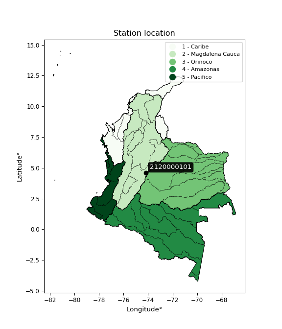</img>

</div>


## A. General information


### 1. General running parameters

• app_version: _v20260312_. • runtime: _2026-03-12 07:15:23.203550_. • Python version: _3.14.0_. • SciPy version: _1.16.3_. • Pandas version: _2.3.3_. • NumPy version: _2.3.5_. • Stations dataset (station_dataset_file): _dataset/pmax24h_in/automatic_colombia_2003_2025.csv_. • Stations catalog (station_catalog_file): _dataset/CNE.xls_. • Minimum year to eval til year_max (date_min): _1900_. • Maximum year to eval since year_min (date_max): _2025_. • Creates, save and include plots into reports (create_plot): _True_. • Plot only fit distributions with Δo > Δ (plot_only_fit): _True_. • Plot only simple graphs avoiding multiple CDFs and multiple Extreme values plots (plot_only_simple): _True_. • Eval low extreme values, if False, evaluates high extreme values (low_extreme): _False_. • Eval every SciPy distribution as logarithmic (pdist_logarithmic_on): _True_. • Standard deviation normalized (ddof): _1.0_. • Return periods to eval in years (Tr): _[2, 2.33, 5, 10, 15, 20, 25, 50, 75, 100, 200, 250, 500, 750, 1000]_. • Minimum data sample per station, 0 means any (minimum_sample): _5_. • Z-Score maximum threshold to adjust a value, 0 means disable (zscore_max): _3.5_. • Z-Score minimum threshold to adjust a value, 0 means disable (zscore_min): _-2.5_. • Avoid zeros, e.g. rain = 0 (avoid_zeros): _True_. • Avoid null values (avoid_nans): _True_. 

:file_folder:Table: [dataset.csv](../../dataset/pmax24h_in/automatic_colombia_2003_2025.csv)

> Delta Degrees of Freedom (DDOF): is a parameter used in the formulas for calculating variance and standard deviation. When ddof=0, the divisor is $N$ (the total number of observations) and this is used when your data set is the entire population. When ddof=1, the divisor is $N-1$ and this is used when your data set is a sample drawn from a larger population. Using $N-1$ provides an unbiased estimate of the population variance (known as Bessel´s correction).


### 2. Station info and location

|   id |     CODIGO | NOMBRE                            | CATEGORIA     | TECNOLOGIA                | ESTADO   | FECHA_INSTALACION   |   FECHA_SUSPENSION |   ALTITUD |   LATITUD |   LONGITUD | DEPARTAMENTO   | MUNICIPIO   | AREA_OPERATIVA                            | ENTIDAD                                                      | AREA_HIDROGRAFICA   | ZONA_HIDROGRAFICA   | SUBZONA_HIDROGRAFICA   |   CORRIENTE | Catalogo   |   Version |
|-----:|-----------:|:----------------------------------|:--------------|:--------------------------|:---------|:--------------------|-------------------:|----------:|----------:|-----------:|:---------------|:------------|:------------------------------------------|:-------------------------------------------------------------|:--------------------|:--------------------|:-----------------------|------------:|:-----------|----------:|
|    0 | 2120000101 | ALTOS DE LA ESTANCIA [2120000101] | Pluviométrica | Automática con Telemetría | Activa   | 19/06/2018          |                nan |      2960 |   4.58074 |   -74.1783 | Bogotá         | Bogotá, D.C | Area Operativa 11 - Cundinamarca-Amazonas | INSTITUTO DISTRITAL DE GESTIÓN DE RIESGOS Y CAMBIO CLIMÁTICO | Magdalena Cauca     | Alto Magdalena      | Río Bogotá             |         nan | CNE_OE     |  20251226 |

<div align="center">

Dynamic map: [:earth_americas:Google](http://maps.google.com/maps?q=4.58074,-74.17828) [:earth_americas:OSM](https://www.openstreetmap.org/#map=18/4.58074/-74.17828&layers=P) [:earth_americas:Bing](https://www.bing.com/maps?cp=4.58074~-74.17828&lvl=18) [:earth_americas:Apple](https://maps.apple.com/frame?center=4.58074%2C-74.17828&span=0.003%2C0.006)

</div>


<div align="center">

```geojson
{
  "type": "Feature",
  "geometry": {
    "type": "Point", 
    "coordinates": [-74.17828, 4.58074]
  }, 
  "properties": {
    "Name": "2120000101"
  }
}
```

</div>


### 3. Discrete values table and plot

<div align="center">

|               |           0 |           1 |           2 |          3 |         4 |           5 |
|:--------------|------------:|------------:|------------:|-----------:|----------:|------------:|
| Date          | 2018        | 2019        | 2020        | 2023       | 2024      | 2025        |
| Value         |   14.2      |   30.3      |   15.5      |    0.2     |   67.8    |   19.7      |
| Value_initial |   14.2      |   30.3      |   15.5      |    0.2     |   67.8    |   19.7      |
| count         |    6        |    6        |    6        |    6       |    6      |    6        |
| mean          |   24.6167   |   24.6167   |   24.6167   |   24.6167  |   24.6167 |   24.6167   |
| std           |   23.2769   |   23.2769   |   23.2769   |   23.2769  |   23.2769 |   23.2769   |
| zscore        |   -0.447511 |    0.244162 |   -0.391662 |   -1.04897 |    1.8552 |   -0.211225 |


</div>


<div align="center">

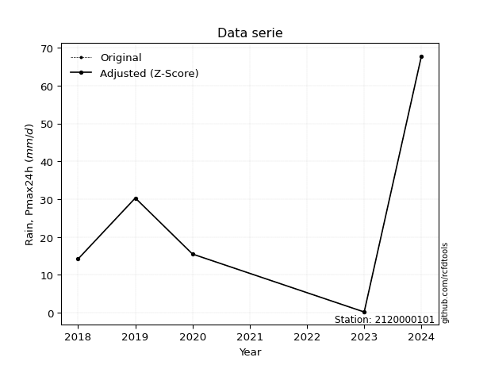</img>

</div>


> The initial value (value_initial) correspond to the initial obtained or null completed value, and value (value) is adjusted only when the initial value is outside the valid range (outlier) definite through the Z-Score value. If Z-Score is active, values out of range or outliers are replaced with the station mean value. A Z-Score (or standard score) measures how many standard deviations a data point is from the mean of a dataset, indicating its relative position; positive scores mean above the mean, negative mean below, and a score of zero is exactly at the mean, allowing for comparison of values from different distributions. It´s calculated using the formula $z=(x–μ)/σ$, where $x$ is the data point, $μ$ is the mean, and $σ$ is the standard deviation, helping identify outliers and understand probability.
>
> <sub>**Note**: In this study, "completing" (filling gaps in) and "extending" (forecasting or lengthening the historical record) rainfall data series are avoided for certain critical analyses because they introduce artificial bias and uncertainty, which can distort the statistics of rare events (extremes), alter day-to-day variability, and compromise the integrity and homogeneity of the original data. Some reasons against Completing/Extending rainfall data are: **Distortion of Extremes and Variability**: The primary issue is that most gap-filling or extension methods rely on averaging or regression with nearby stations, which inherently smooths the data. Rainfall is highly variable in space and time, with a large percentage of zero values and occasional large storms. Infilling methods often underestimate the highest values and overestimate the lowest (zero) values, which severely distorts analyses focused on flood frequency, drought severity, and intensity-duration-frequency (IDF) curves, **Loss of Data Homogeneity**: Infilled or extended data are synthetic estimates, not actual measurements. Combining these estimates with observed data can violate the assumption of data homogeneity, which requires that the data properties do not change over time. Inhomogeneity can lead to incorrect conclusions about long-term trends or changes in climate patterns, **Propagation of Errors**: Errors and biases from the original data (e.g., wind-induced undercatch, instrument errors, site changes) or the data used for imputation can propagate through the analysis, leading to unreliable hydrological models and inaccurate predictions, **Compromised Statistical Integrity**: For statistical analyses, especially those involving the frequency of events, using artificial data can introduce time bias or autocorrelation that doesn´t exist in reality, making it difficult to assess the true probability of events, **Difficulty in Validation**: It is difficult to accurately validate the quality of filled or extended data, especially for past periods where ground-truth measurements are unavailable. The reliability of imputation techniques heavily depends on the density of the surrounding station network and the complexity of the local topography.</sub>


### 4. Active continuous probability distributions from SciPy (80 of 104 available)

A Probability Density Function (PDF) describes the relative likelihood of a continuous random variable falling within a specific range, where the total area under its curve equals 1, and the area over any interval gives the actual probability for that range. Unlike discrete probabilities (like rolling a die), a PDF shows density, not direct probability for a single point (which is zero), with higher points indicating higher likelihood, often visualized as a bell curve for normal distributions.

A log of a probability density function (log-PDF) is simply the logarithm of the PDF´s value, denoted as $log(f(x))$, useful for converting multiplication of probabilities into addition, improving numerical stability with tiny numbers, and connecting to information theory concepts like entropy. Instead of dealing with very small probabilities (e.g., 0.000001), log-PDFs use negative numbers (e.g., $log(0.00001) ≈ -11.51$ that are easier for computers to handle, preventing underflow errors and simplifying complex calculations. In this study, each active probability distribution from SciPy is also evaluated in the $log$ form.

[scipy.stats](https://docs.scipy.org/doc/scipy/reference/stats.html) is a Python´s powerful submodule within the SciPy library for comprehensive statistical analysis, offering over 130 probability distributions (like Normal, Poisson, etc.), functions for descriptive stats (mean, variance), hypothesis testing (t-tests, chi-square), random variable generation, and statistical tests, making it essential for data science, modeling, and research. It provides tools to explore, model, and draw conclusions from data efficiently, working seamlessly with [NumPy](https://numpy.org/).

<div align="center">

|   id | p_dist           |   n_parameter | fit_method   | label                                                                       | active   | ref                                                                                                      |
|-----:|:-----------------|--------------:|:-------------|:----------------------------------------------------------------------------|:---------|:---------------------------------------------------------------------------------------------------------|
|    0 | alpha            |             3 | MLE          | Alpha                                                                       | True     | [:mortar_board:](https://docs.scipy.org/doc/scipy/reference/generated/scipy.stats.alpha.html)            |
|    1 | anglit           |             2 | MM           | Anglit                                                                      | True     | [:mortar_board:](https://docs.scipy.org/doc/scipy/reference/generated/scipy.stats.anglit.html)           |
|    2 | arcsine          |             2 | MM           | Arcsine                                                                     | True     | [:mortar_board:](https://docs.scipy.org/doc/scipy/reference/generated/scipy.stats.arcsine.html)          |
|    3 | argus            |             3 | MLE          | Argus                                                                       | True     | [:mortar_board:](https://docs.scipy.org/doc/scipy/reference/generated/scipy.stats.argus.html)            |
|    4 | beta             |             4 | MLE          | Beta                                                                        | True     | [:mortar_board:](https://docs.scipy.org/doc/scipy/reference/generated/scipy.stats.beta.html)             |
|    5 | betaprime        |             4 | MLE          | Beta prime                                                                  | True     | [:mortar_board:](https://docs.scipy.org/doc/scipy/reference/generated/scipy.stats.betaprime.html)        |
|    6 | bradford         |             3 | MLE          | Bradford                                                                    | True     | [:mortar_board:](https://docs.scipy.org/doc/scipy/reference/generated/scipy.stats.bradford.html)         |
|    7 | burr             |             4 | MLE          | Burr (Type III)                                                             | True     | [:mortar_board:](https://docs.scipy.org/doc/scipy/reference/generated/scipy.stats.burr.html)             |
|    8 | burr12           |             4 | MLE          | Burr (Type III) 12                                                          | True     | [:mortar_board:](https://docs.scipy.org/doc/scipy/reference/generated/scipy.stats.burr12.html)           |
|    9 | cosine           |             2 | MLE          | Cosine                                                                      | True     | [:mortar_board:](https://docs.scipy.org/doc/scipy/reference/generated/scipy.stats.cosine.html)           |
|   10 | crystalball      |             4 | MLE          | Crystalball                                                                 | True     | [:mortar_board:](https://docs.scipy.org/doc/scipy/reference/generated/scipy.stats.crystalball.html)      |
|   11 | dgamma           |             3 | MLE          | Double gamma                                                                | True     | [:mortar_board:](https://docs.scipy.org/doc/scipy/reference/generated/scipy.stats.dgamma.html)           |
|   12 | dweibull         |             3 | MLE          | Double Weibull                                                              | True     | [:mortar_board:](https://docs.scipy.org/doc/scipy/reference/generated/scipy.stats.dweibull.html)         |
|   13 | erlang           |             3 | MLE          | Erlang                                                                      | True     | [:mortar_board:](https://docs.scipy.org/doc/scipy/reference/generated/scipy.stats.erlang.html)           |
|   14 | exponnorm        |             3 | MLE          | Exponentially modified Normal                                               | True     | [:mortar_board:](https://docs.scipy.org/doc/scipy/reference/generated/scipy.stats.exponnorm.html)        |
|   15 | exponpow         |             3 | MLE          | Exponential power                                                           | True     | [:mortar_board:](https://docs.scipy.org/doc/scipy/reference/generated/scipy.stats.exponpow.html)         |
|   16 | exponweib        |             4 | MLE          | Exponentiated Weibull                                                       | True     | [:mortar_board:](https://docs.scipy.org/doc/scipy/reference/generated/scipy.stats.exponweib.html)        |
|   17 | f                |             4 | MLE          | F                                                                           | True     | [:mortar_board:](https://docs.scipy.org/doc/scipy/reference/generated/scipy.stats.f.html)                |
|   18 | fatiguelife      |             3 | MLE          | Fatigue-life (Birnbaum-Saunders)                                            | True     | [:mortar_board:](https://docs.scipy.org/doc/scipy/reference/generated/scipy.stats.fatiguelife.html)      |
|   19 | foldnorm         |             3 | MM           | Fold Normal                                                                 | True     | [:mortar_board:](https://docs.scipy.org/doc/scipy/reference/generated/scipy.stats.foldnorm.html)         |
|   20 | gamma            |             3 | MLE          | Gamma                                                                       | True     | [:mortar_board:](https://docs.scipy.org/doc/scipy/reference/generated/scipy.stats.gamma.html)            |
|   21 | gausshyper       |             6 | MLE          | Gauss hypergeometric                                                        | True     | [:mortar_board:](https://docs.scipy.org/doc/scipy/reference/generated/scipy.stats.gausshyper.html)       |
|   22 | genexpon         |             5 | MLE          | Generalized exponential                                                     | True     | [:mortar_board:](https://docs.scipy.org/doc/scipy/reference/generated/scipy.stats.genexpon.html)         |
|   23 | genextreme       |             3 | MLE          | Generalized exponential                                                     | True     | [:mortar_board:](https://docs.scipy.org/doc/scipy/reference/generated/scipy.stats.genextreme.html)       |
|   24 | gengamma         |             4 | MLE          | Generalized gamma                                                           | True     | [:mortar_board:](https://docs.scipy.org/doc/scipy/reference/generated/scipy.stats.gengamma.html)         |
|   25 | genhalflogistic  |             3 | MLE          | Generalized half-logistic                                                   | True     | [:mortar_board:](https://docs.scipy.org/doc/scipy/reference/generated/scipy.stats.genhalflogistic.html)  |
|   26 | genlogistic      |             3 | MLE          | Generalized logistic                                                        | True     | [:mortar_board:](https://docs.scipy.org/doc/scipy/reference/generated/scipy.stats.genlogistic.html)      |
|   27 | gennorm          |             3 | MLE          | Generalized Normal                                                          | True     | [:mortar_board:](https://docs.scipy.org/doc/scipy/reference/generated/scipy.stats.gennorm.html)          |
|   28 | genpareto        |             3 | MLE          | Generalized Pareto                                                          | True     | [:mortar_board:](https://docs.scipy.org/doc/scipy/reference/generated/scipy.stats.genpareto.html)        |
|   29 | gompertz         |             3 | MLE          | Gompertz (or truncated Gumbel)                                              | True     | [:mortar_board:](https://docs.scipy.org/doc/scipy/reference/generated/scipy.stats.gompertz.html)         |
|   30 | gumbel_l         |             2 | MM           | Gumbel Left Skew                                                            | True     | [:mortar_board:](https://docs.scipy.org/doc/scipy/reference/generated/scipy.stats.gumbel_l.html)         |
|   31 | gumbel_r         |             2 | MM           | Gumbel Right Skew                                                           | True     | [:mortar_board:](https://docs.scipy.org/doc/scipy/reference/generated/scipy.stats.gumbel_r.html)         |
|   32 | halfgennorm      |             3 | MLE          | Upper half of a generalized normal                                          | True     | [:mortar_board:](https://docs.scipy.org/doc/scipy/reference/generated/scipy.stats.halfgennorm.html)      |
|   33 | halflogistic     |             2 | MM           | Half-logistic                                                               | True     | [:mortar_board:](https://docs.scipy.org/doc/scipy/reference/generated/scipy.stats.halflogistic.html)     |
|   34 | halfnorm         |             2 | MM           | Half Normal                                                                 | True     | [:mortar_board:](https://docs.scipy.org/doc/scipy/reference/generated/scipy.stats.halfnorm.html)         |
|   35 | hypsecant        |             2 | MM           | hyperbolic secant                                                           | True     | [:mortar_board:](https://docs.scipy.org/doc/scipy/reference/generated/scipy.stats.hypsecant.html)        |
|   36 | invgamma         |             3 | MLE          | Inverted gamma                                                              | True     | [:mortar_board:](https://docs.scipy.org/doc/scipy/reference/generated/scipy.stats.invgamma.html)         |
|   37 | invgauss         |             3 | MLE          | Inverse Gaussian                                                            | True     | [:mortar_board:](https://docs.scipy.org/doc/scipy/reference/generated/scipy.stats.invgauss.html)         |
|   38 | invweibull       |             3 | MLE          | Inverted Weibull                                                            | True     | [:mortar_board:](https://docs.scipy.org/doc/scipy/reference/generated/scipy.stats.invweibull.html)       |
|   39 | johnsonsb        |             4 | MLE          | Johnson SB                                                                  | True     | [:mortar_board:](https://docs.scipy.org/doc/scipy/reference/generated/scipy.stats.johnsonsb.html)        |
|   40 | johnsonsu        |             4 | MLE          | Johnson Su                                                                  | True     | [:mortar_board:](https://docs.scipy.org/doc/scipy/reference/generated/scipy.stats.johnsonsu.html)        |
|   41 | kappa3           |             3 | MLE          | Kappa 3                                                                     | True     | [:mortar_board:](https://docs.scipy.org/doc/scipy/reference/generated/scipy.stats.kappa3.html)           |
|   42 | kappa4           |             4 | MLE          | Kappa 4                                                                     | True     | [:mortar_board:](https://docs.scipy.org/doc/scipy/reference/generated/scipy.stats.kappa4.html)           |
|   43 | ksone            |             3 | MLE          | Kolmogorov-Smirnov one-sided test statistic distribution                    | True     | [:mortar_board:](https://docs.scipy.org/doc/scipy/reference/generated/scipy.stats.ksone.html)            |
|   44 | kstwobign        |             2 | MLE          | Limiting distribution of scaled Kolmogorov-Smirnov two-sided test statistic | True     | [:mortar_board:](https://docs.scipy.org/doc/scipy/reference/generated/scipy.stats.kstwobign.html)        |
|   45 | laplace          |             2 | MM           | Laplace                                                                     | True     | [:mortar_board:](https://docs.scipy.org/doc/scipy/reference/generated/scipy.stats.laplace.html)          |
|   46 | levy_l           |             2 | MLE          | Left-skewed Levy                                                            | True     | [:mortar_board:](https://docs.scipy.org/doc/scipy/reference/generated/scipy.stats.levy_l.html)           |
|   47 | loggamma         |             3 | MLE          | Log gamma                                                                   | True     | [:mortar_board:](https://docs.scipy.org/doc/scipy/reference/generated/scipy.stats.loggamma.html)         |
|   48 | logistic         |             2 | MM           | Logistic (or Sech-squared)                                                  | True     | [:mortar_board:](https://docs.scipy.org/doc/scipy/reference/generated/scipy.stats.logistic.html)         |
|   49 | loglaplace       |             3 | MLE          | Log-Laplace                                                                 | True     | [:mortar_board:](https://docs.scipy.org/doc/scipy/reference/generated/scipy.stats.loglaplace.html)       |
|   50 | lomax            |             3 | MLE          | Lomax (Pareto of the second kind)                                           | True     | [:mortar_board:](https://docs.scipy.org/doc/scipy/reference/generated/scipy.stats.lomax.html)            |
|   51 | maxwell          |             2 | MM           | Maxwell                                                                     | True     | [:mortar_board:](https://docs.scipy.org/doc/scipy/reference/generated/scipy.stats.maxwell.html)          |
|   52 | mielke           |             4 | MLE          | Mielke Beta-Kappa / Dagum                                                   | True     | [:mortar_board:](https://docs.scipy.org/doc/scipy/reference/generated/scipy.stats.mielke.html)           |
|   53 | moyal            |             2 | MM           | Moyal                                                                       | True     | [:mortar_board:](https://docs.scipy.org/doc/scipy/reference/generated/scipy.stats.moyal.html)            |
|   54 | nakagami         |             3 | MLE          | Nakagami                                                                    | True     | [:mortar_board:](https://docs.scipy.org/doc/scipy/reference/generated/scipy.stats.nakagami.html)         |
|   55 | ncf              |             5 | MLE          | Non-central F distribution                                                  | True     | [:mortar_board:](https://docs.scipy.org/doc/scipy/reference/generated/scipy.stats.ncf.html)              |
|   56 | nct              |             4 | MLE          | Non-central Student’s t                                                     | True     | [:mortar_board:](https://docs.scipy.org/doc/scipy/reference/generated/scipy.stats.nct.html)              |
|   57 | norm             |             2 | MM           | Normal                                                                      | True     | [:mortar_board:](https://docs.scipy.org/doc/scipy/reference/generated/scipy.stats.norm.html)             |
|   58 | pearson3         |             3 | MM           | Pearson type III                                                            | True     | [:mortar_board:](https://docs.scipy.org/doc/scipy/reference/generated/scipy.stats.pearson3.html)         |
|   59 | powerlaw         |             3 | MLE          | Power-function                                                              | True     | [:mortar_board:](https://docs.scipy.org/doc/scipy/reference/generated/scipy.stats.powerlaw.html)         |
|   60 | rayleigh         |             2 | MM           | Rayleigh                                                                    | True     | [:mortar_board:](https://docs.scipy.org/doc/scipy/reference/generated/scipy.stats.rayleigh.html)         |
|   61 | rdist            |             3 | MLE          | R-distributed (symmetric beta)                                              | True     | [:mortar_board:](https://docs.scipy.org/doc/scipy/reference/generated/scipy.stats.rdist.html)            |
|   62 | rice             |             3 | MLE          | Rice                                                                        | True     | [:mortar_board:](https://docs.scipy.org/doc/scipy/reference/generated/scipy.stats.rice.html)             |
|   63 | semicircular     |             2 | MM           | Semicircular                                                                | True     | [:mortar_board:](https://docs.scipy.org/doc/scipy/reference/generated/scipy.stats.semicircular.html)     |
|   64 | skewnorm         |             3 | MLE          | Skew normal                                                                 | True     | [:mortar_board:](https://docs.scipy.org/doc/scipy/reference/generated/scipy.stats.skewnorm.html)         |
|   65 | t                |             3 | MLE          | Student’s t                                                                 | True     | [:mortar_board:](https://docs.scipy.org/doc/scipy/reference/generated/scipy.stats.t.html)                |
|   66 | trapezoid        |             4 | MLE          | Trapezoid                                                                   | True     | [:mortar_board:](https://docs.scipy.org/doc/scipy/reference/generated/scipy.stats.trapezoid.html)        |
|   67 | triang           |             3 | MLE          | Triangular                                                                  | True     | [:mortar_board:](https://docs.scipy.org/doc/scipy/reference/generated/scipy.stats.triang.html)           |
|   68 | truncexpon       |             3 | MLE          | Truncated exponential                                                       | True     | [:mortar_board:](https://docs.scipy.org/doc/scipy/reference/generated/scipy.stats.truncexpon.html)       |
|   69 | truncnorm        |             4 | MLE          | Truncated normal                                                            | True     | [:mortar_board:](https://docs.scipy.org/doc/scipy/reference/generated/scipy.stats.truncnorm.html)        |
|   70 | truncpareto      |             4 | MLE          | Upper truncated Pareto                                                      | True     | [:mortar_board:](https://docs.scipy.org/doc/scipy/reference/generated/scipy.stats.truncpareto.html)      |
|   71 | truncweibull_min |             5 | MLE          | Doubly truncated Weibull minimum                                            | True     | [:mortar_board:](https://docs.scipy.org/doc/scipy/reference/generated/scipy.stats.truncweibull_min.html) |
|   72 | tukeylambda      |             3 | MLE          | Tukey-Lamdba                                                                | True     | [:mortar_board:](https://docs.scipy.org/doc/scipy/reference/generated/scipy.stats.tukeylambda.html)      |
|   73 | uniform          |             2 | MLE          | Uniform                                                                     | True     | [:mortar_board:](https://docs.scipy.org/doc/scipy/reference/generated/scipy.stats.uniform.html)          |
|   74 | vonmises         |             3 | MLE          | Von Mises                                                                   | True     | [:mortar_board:](https://docs.scipy.org/doc/scipy/reference/generated/scipy.stats.vonmises.html)         |
|   75 | vonmises_line    |             3 | MLE          | Von Mises line                                                              | True     | [:mortar_board:](https://docs.scipy.org/doc/scipy/reference/generated/scipy.stats.vonmises_line.html)    |
|   76 | wald             |             2 | MM           | Wald                                                                        | True     | [:mortar_board:](https://docs.scipy.org/doc/scipy/reference/generated/scipy.stats.wald.html)             |
|   77 | weibull_max      |             3 | MLE          | Weibull maximum                                                             | True     | [:mortar_board:](https://docs.scipy.org/doc/scipy/reference/generated/scipy.stats.weibull_max.html)      |
|   78 | weibull_min      |             3 | MLE          | Weibull minimum                                                             | True     | [:mortar_board:](https://docs.scipy.org/doc/scipy/reference/generated/scipy.stats.weibull_min.html)      |
|   79 | wrapcauchy       |             3 | MLE          | Wrapped  Cauchy                                                             | True     | [:mortar_board:](https://docs.scipy.org/doc/scipy/reference/generated/scipy.stats.wrapcauchy.html)       |

</div>

> **n_parameter:** # arguments & localization & scale.
>
> **Fit methods:** (MLE) maximum likelihood, (MM) L-moments.
>
>**Inactive** (With the only purpose of prevent loops, zero divisions, infinite values, over high estimated values or horizontal trending for recurrence intervals estimations, the follow distributions were disabled.)**:** lognorm, norminvgauss, powernorm, powerlognorm, cauchy, halfcauchy, foldcauchy, skewcauchy, chi2, expon, fisk, genhyperbolic, geninvgauss, gibrat, kstwo, laplace_asymmetric, levy, levy_stable, ncx2, pareto, rel_breitwigner, recipinvgauss, studentized_range, loguniform, 


## B. Probability (PDF) vs. Empirical (EDF) distributions functions

A continuous probability distribution (CPD) describes probabilities for variables that can take any value within a range (like rain any time), unlike discrete variables with specific outcomes (like temperature). It uses a Probability Density Function (PDF), a curve where the total area under it equals 1, and the probability of the variable falling within an interval (a to b) is found by calculating the area under the curve between those points. A key feature is that the probability of hitting any single exact value is zero, so probabilities are always expressed for ranges, e.g., $P(a ≤ X ≤ b)$.

<div align="center">

Distributions parameters from station values
|     |    station | p_dist              |   n |             loc |           scale | shape                  | shape1                 | shape2                | shape3             |
|----:|-----------:|:--------------------|----:|----------------:|----------------:|:-----------------------|:-----------------------|:----------------------|:-------------------|
|   0 | 2120000101 | alpha               |   6 |     0.00531439  |     0.476257    | 7.143813974730269e-09  |                        |                       |                    |
|   1 | 2120000101 | anglit              |   6 |    24.6167      |    62.1612      |                        |                        |                       |                    |
|   2 | 2120000101 | arcsine             |   6 |    -5.43368     |    60.1007      |                        |                        |                       |                    |
|   3 | 2120000101 | argus               |   6 |   -23.8915      |    95.8385      | 2.2801249758688687e-06 |                        |                       |                    |
|   4 | 2120000101 | beta                |   6 |     0.197602    |    67.6024      | 0.8282611763100525     | 0.5578828513934765     |                       |                    |
|   5 | 2120000101 | betaprime           |   6 |     0.2         |    77.7623      | 0.8970281023384903     | 3.2423526477237443     |                       |                    |
|   6 | 2120000101 | bradford            |   6 |     0.199896    |    67.6001      | 1.0885553067040534     |                        |                       |                    |
|   7 | 2120000101 | burr                |   6 |     0.2         |    92.8108      | 5.3915724776829625     | 0.06098102930770825    |                       |                    |
|   8 | 2120000101 | burr12              |   6 |     0.2         |   155.173       | 0.8265311078537295     | 5.554697222876426      |                       |                    |
|   9 | 2120000101 | cosine              |   6 |    28.0218      |    18.5237      |                        |                        |                       |                    |
|  10 | 2120000101 | crystalball         |   6 |    24.6167      |    21.2488      | 1369.4097605375512     | 2573.7496924685847     |                       |                    |
|  11 | 2120000101 | dgamma              |   6 |    19.7         |    18.9238      | 0.734972267648957      |                        |                       |                    |
|  12 | 2120000101 | dweibull            |   6 |    19.7         |    17.5504      | 0.759874172435588      |                        |                       |                    |
|  13 | 2120000101 | erlang              |   6 |     0.2         |    20.2761      | 0.8158270618159875     |                        |                       |                    |
|  14 | 2120000101 | exponnorm           |   6 |     4.78992     |     7.19039     | 2.7573933908939754     |                        |                       |                    |
|  15 | 2120000101 | exponpow            |   6 |     0.2         |    61.8113      | 0.4702432428610369     |                        |                       |                    |
|  16 | 2120000101 | exponweib           |   6 |     0.2         |     2.62834     | 1.5993849657297923     | 0.4099144334348858     |                       |                    |
|  17 | 2120000101 | f                   |   6 |     0.2         |    20.492       | 1.1343653244874705     | 8.128840241707582      |                       |                    |
|  18 | 2120000101 | fatiguelife         |   6 |     0.2         |     0.000134982 | 375.92337778911775     |                        |                       |                    |
|  19 | 2120000101 | foldnorm            |   6 |    -3.92503     |    35.657       | 0.03411158992854246    |                        |                       |                    |
|  20 | 2120000101 | gamma               |   6 |     0.2         |    26.1647      | 0.7107848127140022     |                        |                       |                    |
|  21 | 2120000101 | gausshyper          |   6 |    -7.68666     |    75.4867      | 0.9306283907870079     | 0.6921619119464335     | 1.080484292743694     | 1.289036565330357  |
|  22 | 2120000101 | genexpon            |   6 |     0.198885    |     0.850816    | 0.029057336705404953   | 3.712151551486469      | 6.159403159274717e-05 |                    |
|  23 | 2120000101 | genextreme          |   6 |     0.896018    |     4.93545     | -7.090983182268815     |                        |                       |                    |
|  24 | 2120000101 | gengamma            |   6 |     0.2         |     0.0256888   | 3.7217537807378056     | 0.22627157958639188    |                       |                    |
|  25 | 2120000101 | genhalflogistic     |   6 |    -6.81397     |    78.7156      | 1.0549720142524412     |                        |                       |                    |
|  26 | 2120000101 | genlogistic         |   6 |   -86.8148      |    14.7872      | 1003.6224330810004     |                        |                       |                    |
|  27 | 2120000101 | gennorm             |   6 |    15.5         |     0.933545    | 0.4250519910652056     |                        |                       |                    |
|  28 | 2120000101 | genpareto           |   6 |     0.2         |    31.2736      | -0.26465689941094156   |                        |                       |                    |
|  29 | 2120000101 | gompertz            |   6 |     0.2         |    52.4072      | 1.2572092159562165     |                        |                       |                    |
|  30 | 2120000101 | gumbel_l            |   6 |    34.1798      |    16.5676      |                        |                        |                       |                    |
|  31 | 2120000101 | gumbel_r            |   6 |    15.0536      |    16.5676      |                        |                        |                       |                    |
|  32 | 2120000101 | halfgennorm         |   6 |     0.2         |     3.0216      | 0.45031350217936383    |                        |                       |                    |
|  33 | 2120000101 | halflogistic        |   6 |    -0.568096    |    18.167       |                        |                        |                       |                    |
|  34 | 2120000101 | halfnorm            |   6 |    -3.50841     |    35.2496      |                        |                        |                       |                    |
|  35 | 2120000101 | hypsecant           |   6 |    24.6167      |    13.5274      |                        |                        |                       |                    |
|  36 | 2120000101 | invgamma            |   6 |   -20.3592      |   208.457       | 5.611261699833509      |                        |                       |                    |
|  37 | 2120000101 | invgauss            |   6 |   -11.5499      |    94.4746      | 0.38281803854354396    |                        |                       |                    |
|  38 | 2120000101 | invweibull          |   6 |     0.2         |     2.52915     | 0.04375460351098362    |                        |                       |                    |
|  39 | 2120000101 | johnsonsb           |   6 |    -2.28787     |    70.0879      | -0.7637492285595102    | 0.08147861971316578    |                       |                    |
|  40 | 2120000101 | johnsonsu           |   6 |   -10.0662      |     0.676348    | -7.334976101641388     | 1.6474148714803958     |                       |                    |
|  41 | 2120000101 | kappa3              |   6 |     0.2         |    24.219       | 2.7801344741688565     |                        |                       |                    |
|  42 | 2120000101 | kappa4              |   6 |    -7.15858     |    70.5938      | 1.1159129041108788     | 0.9347684298893292     |                       |                    |
|  43 | 2120000101 | ksone               |   6 |    -6.56        |    81.12        | 1.0                    |                        |                       |                    |
|  44 | 2120000101 | kstwobign           |   6 |   -38.6678      |    73.1921      |                        |                        |                       |                    |
|  45 | 2120000101 | laplace             |   6 |    24.6167      |    15.0252      |                        |                        |                       |                    |
|  46 | 2120000101 | levy_l              |   6 |    72.669       |    20.2526      |                        |                        |                       |                    |
|  47 | 2120000101 | loggamma            |   6 | -6399.74        |   868.082       | 1637.7385756872768     |                        |                       |                    |
|  48 | 2120000101 | logistic            |   6 |    24.6167      |    11.7151      |                        |                        |                       |                    |
|  49 | 2120000101 | loglaplace          |   6 |     0.2         |    17.2883      | 0.8287688125825771     |                        |                       |                    |
|  50 | 2120000101 | lomax               |   6 |     0.2         |     4.79666e+12 | 197354368102.0918      |                        |                       |                    |
|  51 | 2120000101 | maxwell             |   6 |   -25.7341      |    31.5526      |                        |                        |                       |                    |
|  52 | 2120000101 | mielke              |   6 |     0.2         |    51.8845      | 0.7016023274422363     | 2.5614097099081343     |                       |                    |
|  53 | 2120000101 | moyal               |   6 |    12.4652      |     9.56532     |                        |                        |                       |                    |
|  54 | 2120000101 | nakagami            |   6 |    14.2         |    24.9105      | 0.1213620452194147     |                        |                       |                    |
|  55 | 2120000101 | ncf                 |   6 |     0.2         |     6.53084     | 1.1207859980041555     | 11.333534302467008     | 1.9599048280595985    |                    |
|  56 | 2120000101 | nct                 |   6 |    -0.0658348   |    10.6929      | 2.8068813579078133     | 1.6364200800830604     |                       |                    |
|  57 | 2120000101 | norm                |   6 |    24.6167      |    21.2488      |                        |                        |                       |                    |
|  58 | 2120000101 | pearson3            |   6 |    24.6167      |    21.2488      | 1.1143685344993524     |                        |                       |                    |
|  59 | 2120000101 | powerlaw            |   6 |     0.2         |    67.6         | 0.12645079886005686    |                        |                       |                    |
|  60 | 2120000101 | rayleigh            |   6 |   -16.0335      |    32.4342      |                        |                        |                       |                    |
|  61 | 2120000101 | rdist               |   6 |    -5.7834      |    36.0834      | 1.0776106314021727     |                        |                       |                    |
|  62 | 2120000101 | rice                |   6 |    -9.83972     |    28.6248      | 0.0004672208553237213  |                        |                       |                    |
|  63 | 2120000101 | semicircular        |   6 |    24.6167      |    42.4976      |                        |                        |                       |                    |
|  64 | 2120000101 | skewnorm            |   6 |     0.199998    |    32.3681      | 97569412.50959334      |                        |                       |                    |
|  65 | 2120000101 | t                   |   6 |    17.009       |     7.17972     | 1.1180698517827774     |                        |                       |                    |
|  66 | 2120000101 | trapezoid           |   6 |    -6.888       |    81.12        | 0.9999999999999999     | 1.0                    |                       |                    |
|  67 | 2120000101 | triang              |   6 |   -31.376       |    99.176       | 0.9999999958735081     |                        |                       |                    |
|  68 | 2120000101 | truncexpon          |   6 |     0.199994    |    70.2603      | 0.9621365333339024     |                        |                       |                    |
|  69 | 2120000101 | truncnorm           |   6 |    -8.72059     |    35.4447      | 0.25167606799996434    | 2.15967458354047       |                       |                    |
|  70 | 2120000101 | truncpareto         |   6 |     0.097642    |     0.101056    | 8.537413268413478e-06  | 669.9475043524822      |                       |                    |
|  71 | 2120000101 | truncweibull_min    |   6 |     0.2         |    69.535       | 0.535506314030674      | 2.1889745533921552e-19 | 1.0026421702078676    |                    |
|  72 | 2120000101 | tukeylambda         |   6 |    -5.2063      |    38.4706      | 1.083487159656698      |                        |                       |                    |
|  73 | 2120000101 | uniform             |   6 |     0.2         |    67.6         |                        |                        |                       |                    |
|  74 | 2120000101 | vonmises            |   6 |     0.220221    |     1           | 0.4520828975985433     |                        |                       |                    |
|  75 | 2120000101 | vonmises_line       |   6 |    20.3096      |    15.1167      | 1.106109885502796      |                        |                       |                    |
|  76 | 2120000101 | wald                |   6 |     3.36786     |    21.2488      |                        |                        |                       |                    |
|  77 | 2120000101 | weibull_max         |   6 |    67.8         |     1.70472     | 0.2275694482246109     |                        |                       |                    |
|  78 | 2120000101 | weibull_min         |   6 |     0.2         |     8.73086     | 0.2173172674961067     |                        |                       |                    |
|  79 | 2120000101 | wrapcauchy          |   6 |     0.188742    |    10.7607      | 0.21348411641119297    |                        |                       |                    |
|  80 | 2120000101 | logalpha            |   6 |   -65.7673      |  2355.44        | 34.606394174738256     |                        |                       |                    |
|  81 | 2120000101 | loganglit           |   6 |     2.39883     |     5.46188     |                        |                        |                       |                    |
|  82 | 2120000101 | logarcsine          |   6 |    -0.241578    |     5.2808      |                        |                        |                       |                    |
|  83 | 2120000101 | logargus            |   6 |    -4.29809     |     8.65726     | 2.676560866636675      |                        |                       |                    |
|  84 | 2120000101 | logbeta             |   6 |    -2.32946     |     6.54603     | 0.5424956412082258     | 0.14013203370451804    |                       |                    |
|  85 | 2120000101 | logbetaprime        |   6 |    -1.60944     |     2.27644     | 0.14752292410924456    | 0.8812185154885499     |                       |                    |
|  86 | 2120000101 | logbradford         |   6 |    -1.6714      |     5.93465     | 1.2156993531289991e-05 |                        |                       |                    |
|  87 | 2120000101 | logburr             |   6 |    -1.60944     |     2.09286     | 0.9774449218751284     | 0.16710810154237907    |                       |                    |
|  88 | 2120000101 | logburr12           |   6 |    -1.60944     |     1.71263     | 0.7935382640144678     | 0.8390716766620908     |                       |                    |
|  89 | 2120000101 | logcosine           |   6 |     2.01962     |     1.65735     |                        |                        |                       |                    |
|  90 | 2120000101 | logcrystalball      |   6 |     2.39883     |     1.86705     | 82.6869240749018       | 68.94388401348195      |                       |                    |
|  91 | 2120000101 | logdgamma           |   6 |     2.98062     |     1.27501     | 0.8306598887476246     |                        |                       |                    |
|  92 | 2120000101 | logdweibull         |   6 |     2.98062     |     1.26443     | 0.784949997680213      |                        |                       |                    |
|  93 | 2120000101 | logerlang           |   6 |   -29.6668      |     0.123457    | 259.4959701648732      |                        |                       |                    |
|  94 | 2120000101 | logexponnorm        |   6 |     2.39758     |     1.86706     | 0.000660778319853133   |                        |                       |                    |
|  95 | 2120000101 | logexponpow         |   6 |    -1.60944     |     1.63393     | 0.27183067024371743    |                        |                       |                    |
|  96 | 2120000101 | logexponweib        |   6 |    -1.60944     |     1.72579     | 1.5830997800308535     | 0.5225179136025009     |                       |                    |
|  97 | 2120000101 | logf                |   6 |    -1.60944     |     1.04865     | 1.1995386629355764     | 1.0447582367968562     |                       |                    |
|  98 | 2120000101 | logfatiguelife      |   6 |  -977.752       |   980.154       | 0.0018970024007829087  |                        |                       |                    |
|  99 | 2120000101 | logfoldnorm         |   6 |   -10.5953      |     1.40313     | 9.340844409117995      |                        |                       |                    |
| 100 | 2120000101 | loggamma            |   6 |   -32.4429      |     0.110887    | 313.84560642395354     |                        |                       |                    |
| 101 | 2120000101 | loggausshyper       |   6 |    -2.20382     |     6.42038     | 1.1680615405047994     | 0.5987693152178214     | 1.2060513987703732    | 0.9285494984071347 |
| 102 | 2120000101 | loggenexpon         |   6 |    -1.60944     | 79881.8         | 10523.863575536348     | 67929.85269706207      | 5364.001672410584     |                    |
| 103 | 2120000101 | loggenextreme       |   6 |     1.6695      |     2.94618     | 1.1567002737872465     |                        |                       |                    |
| 104 | 2120000101 | loggengamma         |   6 |    -1.60944     |     1.89566     | 1.6644217028917518     | 0.10808487661136457    |                       |                    |
| 105 | 2120000101 | loggenhalflogistic  |   6 |    -1.65224     |     6.63684     | 1.130867720486131      |                        |                       |                    |
| 106 | 2120000101 | loggenlogistic      |   6 |     3.9854      |     0.272295    | 0.16518615341073511    |                        |                       |                    |
| 107 | 2120000101 | loggennorm          |   6 |     2.98062     |     2.93574e-05 | 0.1841909013026045     |                        |                       |                    |
| 108 | 2120000101 | loggenpareto        |   6 |    -1.71129     |    13.985       | -2.359195595048458     |                        |                       |                    |
| 109 | 2120000101 | loggompertz         |   6 |    -1.60944     |     9.17026e+12 | 12342453033624.3       |                        |                       |                    |
| 110 | 2120000101 | loggumbel_l         |   6 |     3.2391      |     1.45574     |                        |                        |                       |                    |
| 111 | 2120000101 | loggumbel_r         |   6 |     1.55856     |     1.45574     |                        |                        |                       |                    |
| 112 | 2120000101 | loghalfgennorm      |   6 |    -1.60944     |     1.87634     | 0.6723689694083468     |                        |                       |                    |
| 113 | 2120000101 | loghalflogistic     |   6 |     0.185949    |     1.59625     |                        |                        |                       |                    |
| 114 | 2120000101 | loghalfnorm         |   6 |    -0.0724048   |     3.09724     |                        |                        |                       |                    |
| 115 | 2120000101 | loghypsecant        |   6 |     2.39883     |     1.1886      |                        |                        |                       |                    |
| 116 | 2120000101 | loginvgamma         |   6 |   -40.8561      | 20638.9         | 478.10696266910804     |                        |                       |                    |
| 117 | 2120000101 | loginvgauss         |   6 |   -16.7382      |  1644.65        | 0.011609812824166295   |                        |                       |                    |
| 118 | 2120000101 | loginvweibull       |   6 |    -5.26574e+08 |     5.26574e+08 | 245638524.5425715      |                        |                       |                    |
| 119 | 2120000101 | logjohnsonsb        |   6 |    -4.34527     |     8.56183     | -0.0588117719856671    | 0.12808438557616803    |                       |                    |
| 120 | 2120000101 | logjohnsonsu        |   6 |     2.88468     |     0.224674    | 0.059944565774915706   | 0.504767453276687      |                       |                    |
| 121 | 2120000101 | logkappa3           |   6 |    -1.60944     |     1.39669     | 0.07960529417577135    |                        |                       |                    |
| 122 | 2120000101 | logkappa4           |   6 |    -2.08862     |     6.67168     | 1.0775486150422255     | 1.054600388914882      |                       |                    |
| 123 | 2120000101 | logksone            |   6 |    -2.19204     |     6.9912      | 1.0                    |                        |                       |                    |
| 124 | 2120000101 | logkstwobign        |   6 |    -6.64492     |    10.3302      |                        |                        |                       |                    |
| 125 | 2120000101 | loglaplace          |   6 |     2.39883     |     1.32021     |                        |                        |                       |                    |
| 126 | 2120000101 | loglevy_l           |   6 |     4.35865     |     0.588752    |                        |                        |                       |                    |
| 127 | 2120000101 | logloggamma         |   6 |     4.21661     |     4.1653e-06  | 2.297701556250106e-06  |                        |                       |                    |
| 128 | 2120000101 | loglogistic         |   6 |     2.39883     |     1.02936     |                        |                        |                       |                    |
| 129 | 2120000101 | logloglaplace       |   6 |    -1.60944     |     1.62116     | 0.14258064394967346    |                        |                       |                    |
| 130 | 2120000101 | loglomax            |   6 |    -1.60944     |     6.59653e+07 | 18662474.521183804     |                        |                       |                    |
| 131 | 2120000101 | logmaxwell          |   6 |    -2.0253      |     2.77241     |                        |                        |                       |                    |
| 132 | 2120000101 | logmielke           |   6 |    -1.60944     |     3.46392     | 0.14290327511849296    | 0.7706839044167628     |                       |                    |
| 133 | 2120000101 | logmoyal            |   6 |     1.33113     |     0.840469    |                        |                        |                       |                    |
| 134 | 2120000101 | lognakagami         |   6 | -1835.55        |  1837.95        | 242077.89050581818     |                        |                       |                    |
| 135 | 2120000101 | logncf              |   6 |    -1.60944     |     1.09322     | 1.0931918833553516     | 1.1248571334392796     | 1.0318662398129788    |                    |
| 136 | 2120000101 | lognct              |   6 |  -141.267       |     1.86        | 349887.50715712854     | 77.2395213562425       |                       |                    |
| 137 | 2120000101 | lognorm             |   6 |     2.39883     |     1.86705     |                        |                        |                       |                    |
| 138 | 2120000101 | logpearson3         |   6 |     2.39881     |     1.86707     | -1.462233371456232     |                        |                       |                    |
| 139 | 2120000101 | logpowerlaw         |   6 |    -1.60944     |     5.826       | 0.1546482227098438     |                        |                       |                    |
| 140 | 2120000101 | lograyleigh         |   6 |    -1.17295     |     2.84987     |                        |                        |                       |                    |
| 141 | 2120000101 | logrdist            |   6 |    -1.60944     |     2.34303e-16 | 1.409609409374358      |                        |                       |                    |
| 142 | 2120000101 | logrice             |   6 |  -962.839       |     1.86705     | 516.9833866893343      |                        |                       |                    |
| 143 | 2120000101 | logsemicircular     |   6 |     2.39882     |     3.73411     |                        |                        |                       |                    |
| 144 | 2120000101 | logskewnorm         |   6 |     4.21656     |     2.6056      | -20326902.541279305    |                        |                       |                    |
| 145 | 2120000101 | logt                |   6 |     2.8962      |     0.359733    | 0.8620713080992595     |                        |                       |                    |
| 146 | 2120000101 | logtrapezoid        |   6 |    -3.02609     |     7.92124     | 1.0                    | 1.0                    |                       |                    |
| 147 | 2120000101 | logtriang           |   6 |    -3.12468     |     7.34127     | 0.9999972239259074     |                        |                       |                    |
| 148 | 2120000101 | logtruncexpon       |   6 |    -1.60988     |     7.86175     | 0.7411125321903602     |                        |                       |                    |
| 149 | 2120000101 | logtruncnorm        |   6 |     1.55696     |     6.51502     | -0.48601681582781076   | 0.4082283734084745     |                       |                    |
| 150 | 2120000101 | logtruncpareto      |   6 |    -1.62811     |     0.0130365   | 8.662744267570562e-09  | 448.33178313537763     |                       |                    |
| 151 | 2120000101 | logtruncweibull_min |   6 |  -178.567       |   260.999       | 101.99389100868852     | 0.6116458442133121     | 0.700324904218798     |                    |
| 152 | 2120000101 | logtukeylambda      |   6 |    -1.60944     |     2.67289e-16 | 1.4009840817044312     |                        |                       |                    |
| 153 | 2120000101 | loguniform          |   6 |    -1.60944     |     5.826       |                        |                        |                       |                    |
| 154 | 2120000101 | logvonmises         |   6 |    -2.88381     |     1           | 2.257605841847564      |                        |                       |                    |
| 155 | 2120000101 | logvonmises_line    |   6 |     2.88108     |     1.42937     | 1.3531512786370787     |                        |                       |                    |
| 156 | 2120000101 | logwald             |   6 |     0.531799    |     1.86704     |                        |                        |                       |                    |
| 157 | 2120000101 | logweibull_max      |   6 |     4.21656     |     2.08788     | 0.7198440818322343     |                        |                       |                    |
| 158 | 2120000101 | logweibull_min      |   6 |    -1.60944     |     1.70509     | 0.4447023212591194     |                        |                       |                    |
| 159 | 2120000101 | logwrapcauchy       |   6 |    -1.63835     |     0.931838    | 0.3928644068823264     |                        |                       |                    |

</div>

> **loc** (Location parameter): This shifts the distribution along the x-axis. For many common distributions, like the normal (Gaussian) distribution, loc represents the mean $μ$. For others, like the uniform distribution, it might represent the minimum value, or for the beta distribution, the left end of the support interval.
>
> **scale** (Scale parameter): This determines the width or spread of the distribution. For the normal distribution, scale represents the standard deviation $σ$. For a uniform distribution, it defines the length of the interval (from $loc$ to $loc + scale$).
>
> **shape** (Shape parameters): Refers to parameters that define the specific form of a probability distribution, distinct from its location (loc) and scale (scale). These parameters are required arguments for most distribution functions. For example, a normal (Gaussian) distribution is fully defined by its location (mean) and scale (standard deviation), so it has no specific shape parameters beyond loc and scale. However, other distributions have intrinsic properties that need specification, as Gamma distribution that takes a shape parameter, often named $a$ or $alpha$.


### 0. Cumulative distribution values - CDF (160 evaluated)

Cumulative Distribution Function (CDF), denoted as $F$<sub>$X$</sub>$(x)$, is a function that gives the probability that a random variable $X$ will take a value less than or equal to a specific value, $x$ (i.e., $(P(X≥x)$. It essentially "accumulates" probabilities from a given point up to the far right (positive infinity), providing a complete picture of the distribution´s probabilities for both discrete (like rain) and continuous (like temperature) variables, helping to find probabilities over ranges or above certain values. Each station is evaluated separately ordering the $x$ values ascending, calculating the CDF and PDF values for the activated distributions and their logarithmic forms.

<div align="center">

CDF ordered by x ascending and calculating $log(f(x))$ separately
|   id |    Station |   date |    x |   count |    mean |     std |    zscore |   Value_initial |    station |   m |     alpha |   alpha_pdf |   anglit |   anglit_pdf |   arcsine |   arcsine_pdf |     argus |   argus_pdf |        beta |      beta_pdf |   betaprime |   betaprime_pdf |    bradford |   bradford_pdf |        burr |    burr_pdf |      burr12 |   burr12_pdf |   cosine |   cosine_pdf |   crystalball |   crystalball_pdf |   dgamma |   dgamma_pdf |   dweibull |   dweibull_pdf |      erlang |   erlang_pdf |   exponnorm |   exponnorm_pdf |    exponpow |   exponpow_pdf |   exponweib |    exponweib_pdf |           f |       f_pdf |   fatiguelife |   fatiguelife_pdf |   foldnorm |   foldnorm_pdf |       gamma |     gamma_pdf |   gausshyper |   gausshyper_pdf |    genexpon |   genexpon_pdf |   genextreme |   genextreme_pdf |    gengamma |   gengamma_pdf |   genhalflogistic |   genhalflogistic_pdf |   genlogistic |   genlogistic_pdf |   gennorm |   gennorm_pdf |   genpareto |   genpareto_pdf |    gompertz |   gompertz_pdf |   gumbel_l |   gumbel_l_pdf |   gumbel_r |   gumbel_r_pdf |   halfgennorm |   halfgennorm_pdf |   halflogistic |   halflogistic_pdf |   halfnorm |   halfnorm_pdf |   hypsecant |   hypsecant_pdf |   invgamma |   invgamma_pdf |   invgauss |   invgauss_pdf |   invweibull |   invweibull_pdf |   johnsonsb |   johnsonsb_pdf |   johnsonsu |   johnsonsu_pdf |      kappa3 |   kappa3_pdf |      kappa4 |   kappa4_pdf |     ksone |   ksone_pdf |   kstwobign |   kstwobign_pdf |   laplace |   laplace_pdf |   levy_l |   levy_l_pdf |   loggamma |   loggamma_pdf |   logistic |   logistic_pdf |   loglaplace |   loglaplace_pdf |       lomax |   lomax_pdf |   maxwell |   maxwell_pdf |      mielke |   mielke_pdf |     moyal |   moyal_pdf |    nakagami |   nakagami_pdf |         ncf |     ncf_pdf |       nct |    nct_pdf |     norm |   norm_pdf |   pearson3 |   pearson3_pdf |   powerlaw |   powerlaw_pdf |   rayleigh |   rayleigh_pdf |    rdist |       rdist_pdf |      rice |   rice_pdf |   semicircular |   semicircular_pdf |   skewnorm |   skewnorm_pdf |        t |       t_pdf |   trapezoid |   trapezoid_pdf |   triang |   triang_pdf |   truncexpon |   truncexpon_pdf |   truncnorm |   truncnorm_pdf |   truncpareto |   truncpareto_pdf |   truncweibull_min |   truncweibull_min_pdf |   tukeylambda |   tukeylambda_pdf |   uniform |   uniform_pdf |   vonmises |   vonmises_pdf |   vonmises_line |   vonmises_line_pdf |     wald |   wald_pdf |   weibull_max |   weibull_max_pdf |   weibull_min |   weibull_min_pdf |   wrapcauchy |   wrapcauchy_pdf |   logalpha |   logalpha_pdf |   loganglit |   loganglit_pdf |   logarcsine |   logarcsine_pdf |   logargus |   logargus_pdf |   logbeta |   logbeta_pdf |   logbetaprime |   logbetaprime_pdf |   logbradford |   logbradford_pdf |    logburr |   logburr_pdf |   logburr12 |   logburr12_pdf |   logcosine |   logcosine_pdf |   logcrystalball |   logcrystalball_pdf |   logdgamma |   logdgamma_pdf |   logdweibull |   logdweibull_pdf |   logerlang |   logerlang_pdf |   logexponnorm |   logexponnorm_pdf |   logexponpow |   logexponpow_pdf |   logexponweib |   logexponweib_pdf |        logf |       logf_pdf |   logfatiguelife |   logfatiguelife_pdf |   logfoldnorm |   logfoldnorm_pdf |   loggausshyper |   loggausshyper_pdf |   loggenexpon |   loggenexpon_pdf |   loggenextreme |   loggenextreme_pdf |   loggengamma |   loggengamma_pdf |   loggenhalflogistic |   loggenhalflogistic_pdf |   loggenlogistic |   loggenlogistic_pdf |   loggennorm |   loggennorm_pdf |   loggenpareto |   loggenpareto_pdf |   loggompertz |   loggompertz_pdf |   loggumbel_l |   loggumbel_l_pdf |   loggumbel_r |   loggumbel_r_pdf |   loghalfgennorm |   loghalfgennorm_pdf |   loghalflogistic |   loghalflogistic_pdf |   loghalfnorm |   loghalfnorm_pdf |   loghypsecant |   loghypsecant_pdf |   loginvgamma |   loginvgamma_pdf |   loginvgauss |   loginvgauss_pdf |   loginvweibull |   loginvweibull_pdf |   logjohnsonsb |   logjohnsonsb_pdf |   logjohnsonsu |   logjohnsonsu_pdf |   logkappa3 |   logkappa3_pdf |   logkappa4 |   logkappa4_pdf |   logksone |   logksone_pdf |   logkstwobign |   logkstwobign_pdf |   loglevy_l |   loglevy_l_pdf |   logloggamma |   logloggamma_pdf |   loglogistic |   loglogistic_pdf |   logloglaplace |   logloglaplace_pdf |    loglomax |   loglomax_pdf |   logmaxwell |   logmaxwell_pdf |   logmielke |   logmielke_pdf |    logmoyal |   logmoyal_pdf |   lognakagami |   lognakagami_pdf |     logncf |   logncf_pdf |    lognct |   lognct_pdf |   lognorm |   lognorm_pdf |   logpearson3 |   logpearson3_pdf |   logpowerlaw |   logpowerlaw_pdf |   lograyleigh |   lograyleigh_pdf |   logrdist |   logrdist_pdf |   logrice |   logrice_pdf |   logsemicircular |   logsemicircular_pdf |   logskewnorm |   logskewnorm_pdf |      logt |   logt_pdf |   logtrapezoid |   logtrapezoid_pdf |   logtriang |   logtriang_pdf |   logtruncexpon |   logtruncexpon_pdf |   logtruncnorm |   logtruncnorm_pdf |   logtruncpareto |   logtruncpareto_pdf |   logtruncweibull_min |   logtruncweibull_min_pdf |   logtukeylambda |   logtukeylambda_pdf |   loguniform |   loguniform_pdf |   logvonmises |   logvonmises_pdf |   logvonmises_line |   logvonmises_line_pdf |   logwald |   logwald_pdf |   logweibull_max |   logweibull_max_pdf |   logweibull_min |   logweibull_min_pdf |   logwrapcauchy |   logwrapcauchy_pdf |
|-----:|-----------:|-------:|-----:|--------:|--------:|--------:|----------:|----------------:|-----------:|----:|----------:|------------:|---------:|-------------:|----------:|--------------:|----------:|------------:|------------:|--------------:|------------:|----------------:|------------:|---------------:|------------:|------------:|------------:|-------------:|---------:|-------------:|--------------:|------------------:|---------:|-------------:|-----------:|---------------:|------------:|-------------:|------------:|----------------:|------------:|---------------:|------------:|-----------------:|------------:|------------:|--------------:|------------------:|-----------:|---------------:|------------:|--------------:|-------------:|-----------------:|------------:|---------------:|-------------:|-----------------:|------------:|---------------:|------------------:|----------------------:|--------------:|------------------:|----------:|--------------:|------------:|----------------:|------------:|---------------:|-----------:|---------------:|-----------:|---------------:|--------------:|------------------:|---------------:|-------------------:|-----------:|---------------:|------------:|----------------:|-----------:|---------------:|-----------:|---------------:|-------------:|-----------------:|------------:|----------------:|------------:|----------------:|------------:|-------------:|------------:|-------------:|----------:|------------:|------------:|----------------:|----------:|--------------:|---------:|-------------:|-----------:|---------------:|-----------:|---------------:|-------------:|-----------------:|------------:|------------:|----------:|--------------:|------------:|-------------:|----------:|------------:|------------:|---------------:|------------:|------------:|----------:|-----------:|---------:|-----------:|-----------:|---------------:|-----------:|---------------:|-----------:|---------------:|---------:|----------------:|----------:|-----------:|---------------:|-------------------:|-----------:|---------------:|---------:|------------:|------------:|----------------:|---------:|-------------:|-------------:|-----------------:|------------:|----------------:|--------------:|------------------:|-------------------:|-----------------------:|--------------:|------------------:|----------:|--------------:|-----------:|---------------:|----------------:|--------------------:|---------:|-----------:|--------------:|------------------:|--------------:|------------------:|-------------:|-----------------:|-----------:|---------------:|------------:|----------------:|-------------:|-----------------:|-----------:|---------------:|----------:|--------------:|---------------:|-------------------:|--------------:|------------------:|-----------:|--------------:|------------:|----------------:|------------:|----------------:|-----------------:|---------------------:|------------:|----------------:|--------------:|------------------:|------------:|----------------:|---------------:|-------------------:|--------------:|------------------:|---------------:|-------------------:|------------:|---------------:|-----------------:|---------------------:|--------------:|------------------:|----------------:|--------------------:|--------------:|------------------:|----------------:|--------------------:|--------------:|------------------:|---------------------:|-------------------------:|-----------------:|---------------------:|-------------:|-----------------:|---------------:|-------------------:|--------------:|------------------:|--------------:|------------------:|--------------:|------------------:|-----------------:|---------------------:|------------------:|----------------------:|--------------:|------------------:|---------------:|-------------------:|--------------:|------------------:|--------------:|------------------:|----------------:|--------------------:|---------------:|-------------------:|---------------:|-------------------:|------------:|----------------:|------------:|----------------:|-----------:|---------------:|---------------:|-------------------:|------------:|----------------:|--------------:|------------------:|--------------:|------------------:|----------------:|--------------------:|------------:|---------------:|-------------:|-----------------:|------------:|----------------:|------------:|---------------:|--------------:|------------------:|-----------:|-------------:|----------:|-------------:|----------:|--------------:|--------------:|------------------:|--------------:|------------------:|--------------:|------------------:|-----------:|---------------:|----------:|--------------:|------------------:|----------------------:|--------------:|------------------:|----------:|-----------:|---------------:|-------------------:|------------:|----------------:|----------------:|--------------------:|---------------:|-------------------:|-----------------:|---------------------:|----------------------:|--------------------------:|-----------------:|---------------------:|-------------:|-----------------:|--------------:|------------------:|-------------------:|-----------------------:|----------:|--------------:|-----------------:|---------------------:|-----------------:|---------------------:|----------------:|--------------------:|
|    0 | 2120000101 |   2023 |  0.2 |       6 | 24.6167 | 23.2769 | -1.04897  |             0.2 | 2120000101 |   1 | 0.0144336 | 0.503076    | 0.146378 |   0.0113732  |  0.198092 |     0.0181714 | 0.0932714 |  0.00761608 | 0.000122237 |     0.0422286 | 8.35342e-17 |      2.69973    | 2.26418e-06 |      0.0218648 | 8.11952e-07 | 9.61812e+09 | 1.77541e-15 |  52.8697     | 0.102178 |   0.00918296 |      0.125261 |        0.00970187 | 0.122401 |   0.00750748 |   0.169232 |     0.0071442  | 2.85257e-15 |  83.8462     |   0.0483754 |      0.0107557  | 2.35565e-09 |     3.991e+07  | 7.41534e-12 | 175157           | 5.79753e-11 | 1.18472e+06 |     0.0167257 |       2.09326e+08 |  0.0920456 |     0.0222147  | 1.83952e-13 | 4710.79       |     0.139014 |        0.015575  | 3.80942e-05 |     0.0341514  |  0.000448826 |   1365.78        | 1.56402e-14 |   474.496      |         0.0467537 |            0.00699571 |      0.061513 |        0.0115838  |  0.112711 |   0.00708842  | 2.03405e-12 |      0.0319758  | 3.33793e-13 |     0.0239893  |   0.120683 |    0.00682588  |  0.0861975 |     0.0127526  |   1.52531e-11 |        0.133729   |      0.0211368 |         0.0275102  |  0.0837865 |      0.0225104 |    0.103781 |      0.00753669 |   0.04569  |     0.0135295  |  0.0437726 |      0.0154077 |   0.00399961 |      3.48139e+13 |    0.150847 |     0.00794682  |   0.0435889 |      0.0147927  | 3.88077e-11 |   0.0285835  | 5.04263e-15 |    0.638812  | 0.0833333 |   0.0123274 |   0.0594306 |      0.0118495  | 0.0984508 |    0.00655239 | 0.402949 |   0.00253068 |  0.0186199 |      0.0251518 |   0.110641 |     0.0083994  |    0.0240111 |        0.0181874 | 4.48946e-13 |  0.0411442  |  0.121065 |    0.0121864  | 2.82916e-11 | 414.34       | 0.0576136 |  0.0130581  | 0           |    0           | 5.49429e-11 | 1.10931e+06 | 0.0533115 | 0.00936532 | 0.125261 | 0.00970187 |  0.0853438 |     0.0148545  | 0.00473151 |    2.15562e+13 |   0.117727 |     0.0136148  | 0.555807 |      0.00940745 | 0.0596543 | 0.0115219  |       0.155496 |          0.0122609 |   0        |     0.0246503  | 0.11768  | 0.0069059   |  0.00763469 |      0.00215426 | 0.101368 |   0.00642057 |   1.2883e-07 |       0.0230332  | 2.27051e-08 |      0.0283051  |    0.00196705 |        1.5014     |        6.10406e-11 |             4.2811e+06 |      0.574473 |         0.0137831 |  0        |     0.0147929 |   0.495191 |       0.237796 |        0.131694 |          0.0103017  | 0        | 0          |     0.0992028 |       0.000771638 |   0.000157548 |       1.23345e+12 |  0.000256906 |       0.0228196  |  0.0175662 |      0.0248099 |  0.00265355 |       0.0188376 |     0        |         0        |  0.0255934 |      0.0219723 | 0.0698702 |   0.0561961   |     0.00422383 |        2.80625e+12 |     0.0104408 |          0.168503 | 0.00245909 |   1.80894e+12 | 2.07338e-13 |     740.98      |    0.021866 |       0.0403207 |         0.015903 |            0.0213274 |  0.00936024 |      0.00762312 |      0.031928 |         0.0150212 |   0.0192537 |       0.0257614 |      0.0159035 |          0.0213279 |   4.86316e-05 |       5.95357e+10 |    7.16755e-14 |        267.018     | 2.68163e-10 | 724342         |        0.0152948 |            0.0207962 |    0.00165842 |          0.003811 |       0.0585622 |            0.112017 |   1.04204e-08 |         0.131743  |        0.129405 |           0.0392656 |   0.000895738 |       7.20563e+11 |           0.00323616 |                0.0758898 |        0.0335714 |            0.0203659 |    0.0375579 |       0.00787288 |     0.00731938 |        0.0722229   |   4.21385e-14 |       1.34592     |     0.0351378 |         0.0237084 |   0.000148803 |       0.000900838 |      1.43089e-10 |            0.404501  |          0        |             0         |      0        |         0         |      0.0218353 |          0.0183562 |      0.016544 |         0.0236933 |     0.0172252 |         0.0263732 |       0.0207328 |           0.0374872 |       0.438162 |        0.0271178   |      0.0357358 |          0.0088171 |    0        |     4.58398e+13 |  1.5618e-15 |        2.11714  |  0.0833333 |       0.143037 |      0.0285915 |          0.0532842 |    0.246544 |       0.0199849 |     0.0402029 |         0.0221771 |     0.0199585 |         0.0190023 |      0.00273627 |         1.75703e+12 | 2.30473e-08 |      0.282914  |  0.000891606 |       0.00640303 |  0.00485231 |     3.12285e+12 | 8.87595e-09 |    1.79638e-07 |     0.0159483 |         0.0213867 | 1.0485e-09 |  2.58104e+06 | 0.0159333 |    0.0213623 |  0.015903 |     0.0213274 |     0.0396462 |         0.0246741 |    0.00288963 |       2.01255e+12 |      0        |          0        |  0.0581238 |    3.35735e+15 | 0.0159029 |     0.0213274 |          0        |              0        |     0.0253547 |         0.0251423 | 0.0352526 | 0.00672094 |      0.0319848 |          0.0451553 |   0.0426012 |       0.0562303 |     0.000106362 |            0.243002 |    1.39482e-06 |           0.157732 |        0.0588702 |            8.77032   |                     0 |                 0.0317609 |              0.5 |             2.47e+15 |     0        |         0.171644 |      0.947605 |          0.112225 |        1.81491e-10 |              0.0190197 |  0        |     0         |         0.123293 |            0.0318871 |      8.62516e-08 |          1.72741e+08 |       0.0113238 |            0.391433 |
|    1 | 2120000101 |   2018 | 14.2 |       6 | 24.6167 | 23.2769 | -0.447511 |            14.2 | 2120000101 |   2 | 0.973235  | 0.00188489  | 0.335545 |   0.0151921  |  0.387322 |     0.0112927 | 0.227336  |  0.0114165  | 0.168405    |     0.0105517 | 0.463176    |      0.0204564  | 0.276047    |      0.0178424 | 0.536924    | 0.012609    | 0.509778    |   0.0193633  | 0.273205 |   0.014901   |      0.311988 |        0.0166491  | 0.304595 |   0.0220023  |   0.330475 |     0.018906   | 0.591376    |   0.0230805  |   0.354592  |      0.0277448  | 0.475059    |     0.0144229  | 0.789515    |      0.0116874   | 0.549433    | 0.016919    |     0.804191  |       0.00845699  |  0.388561  |     0.0196562  | 0.570808    |    0.0209316  |     0.333994 |        0.0126761 | 0.398975    |     0.023183   |  0.519495    |      0.00342705  | 0.652219    |     0.0118756  |         0.155499  |            0.00862847 |      0.338631 |        0.0247841  |  0.386761 |   0.0597499   | 0.379035    |      0.0225245  | 0.319539    |     0.0213224  |   0.258742 |    0.0133959   |  0.348934  |     0.0221748  |   0.527996    |        0.0181963  |      0.385458  |         0.0234332  |  0.384595  |      0.0199518 |    0.276043 |      0.0179429  |   0.37686  |     0.0265406  |  0.387266  |      0.0254867 |   0.395398   |      0.0011466   |    0.194948 |     0.0017813   |   0.384077  |      0.0259222  | 0.389454    |   0.0257963  | 0.255415    |    0.0162131 | 0.255917  |   0.0123274 |   0.326162  |      0.0230068  | 0.249967  |    0.0166365  | 0.443832 |   0.00337712 |  0.566903  |      0.19908   |   0.291282 |     0.0176215  |    0.587638  |        0.312347  | 0.437868    |  0.0231281  |  0.341024 |    0.0181839  | 0.395158    |   0.0191354  | 0.361079  |  0.0251014  | 9.88695e-05 |    1.35097e+10 | 0.523038    | 0.0211084   | 0.354586  | 0.0295681  | 0.311988 | 0.0166491  |  0.36229   |     0.0217141  | 0.819465   |    0.00740157  |   0.352381 |     0.0186124  | 0.695786 |      0.0109965  | 0.297178  | 0.0206201  |       0.345534 |          0.0145232 |   0.33464  |     0.0224491  | 0.378525 | 0.0395135   |  0.0675795  |      0.00640928 | 0.211183 |   0.0092673  |   0.29237    |       0.018872   | 0.367865    |      0.0237037  |    0.758921   |        0.010897   |        0.546124    |             0.016774   |      0.768326 |         0.0139504 |  0.207101 |     0.0147929 |   2.79529  |       0.162435 |        0.358073 |          0.0218859  | 0.373504 | 0.040751   |     0.111723  |       0.00103963  |   0.669803    |       0.00567943  |  0.275613    |       0.0151428  |  0.571599  |      0.197487  |  0.546512   |       0.182293  |     0.530719 |         0.121117 |  0.429012  |      0.253882  | 0.281688  |   0.0718805   |     0.924349   |        0.0124624   |     0.728712  |          0.168502 | 0.934601   |   0.0119202   | 0.608956    |       0.0411322 |    0.620221 |       0.185127  |         0.554194 |            0.2117    |  0.346513   |      0.337509   |      0.353678 |         0.2936    |   0.564639  |       0.196781  |      0.554196  |          0.211699  |   0.930135    |       0.0211691   |    0.700866    |          0.0549129 | 0.704185    |      0.0314415 |        0.553536  |            0.21257   |    0.540317   |          0.282869 |       0.615363  |            0.157161 |   0.644495    |         0.122086  |        0.519061 |           0.188225  |   0.40516     |       0.0109133   |           0.526201   |                0.204511  |        0.445133  |            0.268027  |    0.210124  |       0.257087   |     0.431617   |        0.154109    |   0.996776    |       0.00433881  |     0.487616  |         0.23536   |   0.624108    |       0.202114    |      0.679649    |            0.0712648 |          0.648577 |             0.181471  |      0.621154 |         0.174903  |      0.567618  |          0.261782  |      0.562284 |         0.19751   |     0.578233  |         0.187527  |       0.588225  |           0.145608  |       0.552971 |        0.039634    |      0.346195  |          0.577312  |    0.41345  |     0.00658525  |  0.727789   |        0.165043 |  0.693054  |       0.143037 |      0.607398  |          0.133632  |    0.443173 |       0.115657  |     0.422148  |         0.232869  |     0.561477  |         0.239198  |      0.564381   |         0.0145708   | 0.700599    |      0.0847047 |  0.584304    |       0.197334   |  0.891997   |     0.0137588   | 0.648806    |    0.194878    |     0.554597  |         0.211578  | 0.604415   |  0.0395453   | 0.554275  |    0.21159   |  0.554194 |     0.2117    |     0.45745   |         0.224819  |    0.952832   |       0.0345683   |      0.593944 |          0.191294 |  1         |    0           | 0.554194  |     0.2117    |          0.543343 |              0.170092 |     0.548516  |         0.255778  | 0.317923  | 0.578192   |      0.514055  |          0.181026  |   0.619444  |       0.214418  |     0.799684    |            0.141297 |    0.734375    |           0.175011 |        0.94902   |            0.0382556 |                     1 |                 0.351499  |              1   |             0        |     0.731665 |         0.171644 |      1.15702  |          0.304557 |        0.435483    |              0.279953  |  0.717338 |     0.174982  |         0.443978 |            0.165996  |      0.777541    |          0.0348818   |       0.618815  |            0.116653 |
|    2 | 2120000101 |   2020 | 15.5 |       6 | 24.6167 | 23.2769 | -0.391662 |            15.5 | 2120000101 |   3 | 0.975479  | 0.00158202  | 0.355432 |   0.0154001  |  0.401885 |     0.0111165 | 0.242381  |  0.011729   | 0.18209     |     0.0105054 | 0.48889     |      0.0191236  | 0.299047    |      0.0175427 | 0.55283     | 0.0118791   | 0.534021    |   0.0179597  | 0.292835 |   0.0152944  |      0.333946 |        0.0171239  | 0.33525  |   0.0253129  |   0.356827 |     0.0217791  | 0.620202    |   0.021296   |   0.39041   |      0.0273071  | 0.493242    |     0.0135683  | 0.803829    |      0.0103736   | 0.570609    | 0.0156853   |     0.814762  |       0.00781871  |  0.413874  |     0.0192829  | 0.597014    |    0.0194121  |     0.350359 |        0.0125028 | 0.428522    |     0.0222777  |  0.523746    |      0.00312218  | 0.666913    |     0.010762   |         0.166834  |            0.00880984 |      0.370925 |        0.0248651  |  0.5      |   0.188914    | 0.407813    |      0.0217521  | 0.347034    |     0.0209748  |   0.276639 |    0.0141395   |  0.377791  |     0.0221967  |   0.550706    |        0.0167742  |      0.415494  |         0.0227711  |  0.410287  |      0.0195723 |    0.300086 |      0.0190405  |   0.410948 |     0.0258735  |  0.419878  |      0.0246677 |   0.396823   |      0.00104888  |    0.197212 |     0.00170405  |   0.417283  |      0.0251434  | 0.422544    |   0.0250993  | 0.276377    |    0.0160383 | 0.271943  |   0.0123274 |   0.35611   |      0.023042   | 0.272557  |    0.01814    | 0.448288 |   0.00347924 |  0.584257  |      0.197078  |   0.314708 |     0.0184093  |    0.614111  |        0.292294  | 0.467145    |  0.0219241  |  0.364802 |    0.0183864  | 0.419573    |   0.0184326  | 0.393488  |  0.0247289  | 0.400865    |    0.0748238   | 0.549627    | 0.019813    | 0.392934  | 0.02936    | 0.333946 | 0.0171239  |  0.390416  |     0.021541   | 0.828718   |    0.00684916  |   0.376631 |     0.0186858  | 0.710281 |      0.0113117  | 0.324176  | 0.0209003  |       0.364486 |          0.0146314 |   0.363564 |     0.0220447  | 0.432627 | 0.0434447   |  0.0761684  |      0.00680439 | 0.223402 |   0.00953163 |   0.316678   |       0.018526   | 0.39831     |      0.0231325  |    0.772472   |        0.00997728 |        0.567262    |             0.0157674  |      0.786481 |         0.0139812 |  0.226331 |     0.0147929 |   2.9582   |       0.100299 |        0.387027 |          0.0226338  | 0.424049 | 0.0370392  |     0.113096  |       0.00107255  |   0.676855    |       0.00518496  |  0.294786    |       0.0143655  |  0.588803  |      0.195235  |  0.562454   |       0.181653  |     0.541347 |         0.121578 |  0.45179   |      0.266242  | 0.288116  |   0.0749346   |     0.925423   |        0.0120816   |     0.743472  |          0.168501 | 0.935628   |   0.0115384   | 0.612516    |       0.0401471 |    0.636351 |       0.18311   |         0.572672 |            0.21012   |  0.377905   |      0.381087   |      0.381254 |         0.338411  |   0.581794  |       0.194846  |      0.572675  |          0.210119  |   0.931958    |       0.0204603   |    0.705618    |          0.0535912 | 0.706903    |      0.0306047 |        0.57209   |            0.210974  |    0.565002   |          0.28054  |       0.629247  |            0.159888 |   0.655087    |         0.11974   |        0.53588  |           0.195848  |   0.406107    |       0.010707    |           0.54439    |                0.210816  |        0.469209  |            0.281727  |    0.236356  |       0.350595   |     0.445341   |        0.159315    |   0.997135    |       0.00385627  |     0.508431  |         0.239803  |   0.64153     |       0.195623    |      0.685818    |            0.069581  |          0.664192 |             0.17505   |      0.636284 |         0.170535  |      0.590353  |          0.257085  |      0.579497 |         0.195444  |     0.594551  |         0.184987  |       0.600857  |           0.14278   |       0.55652  |        0.0414164   |      0.403447  |          0.732627  |    0.414021 |     0.00645182  |  0.742257   |        0.165277 |  0.705584  |       0.143037 |      0.618997  |          0.131183  |    0.453663 |       0.124012  |     0.443048  |         0.244398  |     0.582308  |         0.236288  |      0.565643   |         0.0142361   | 0.707927    |      0.0826313 |  0.601449    |       0.194062   |  0.893186   |     0.0133856   | 0.665527    |    0.186891    |     0.573065  |         0.209986  | 0.607837   |  0.0385979   | 0.572744  |    0.210007  |  0.572673 |     0.21012   |     0.477448  |         0.231746  |    0.955834   |       0.033979    |      0.610544 |          0.187674 |  1         |    0           | 0.572673  |     0.21012   |          0.558229 |              0.169771 |     0.571145  |         0.260842  | 0.374586  | 0.715484   |      0.530035  |          0.183818  |   0.638369  |       0.217668  |     0.811993    |            0.139731 |    0.749687    |           0.1746   |        0.952337  |            0.0374886 |                     1 |                 0.36908   |              1   |             0        |     0.746701 |         0.171644 |      1.18551  |          0.346046 |        0.460148    |              0.28295   |  0.732164 |     0.163691  |         0.45888  |            0.174362  |      0.780559    |          0.0340221   |       0.62935   |            0.124037 |
|    3 | 2120000101 |   2025 | 19.7 |       6 | 24.6167 | 23.2769 | -0.211225 |            19.7 | 2120000101 |   4 | 0.980707  | 0.000979392 | 0.421234 |   0.0158863  |  0.447685 |     0.0107372 | 0.293672  |  0.0126798  | 0.226062    |     0.0104568 | 0.561332    |      0.015537   | 0.370797    |      0.0166398 | 0.598718    | 0.0100926   | 0.601394    |   0.0143216  | 0.35938  |   0.0163313  |      0.408508 |        0.0182789  | 0.5      | 312.184      |   0.5      |   127.027      | 0.699201    |   0.0165553  |   0.499408  |      0.0242871  | 0.545403    |     0.0113962  | 0.840555    |      0.00737178  | 0.629507    | 0.0125446   |     0.844006  |       0.00620371  |  0.492143  |     0.0179609  | 0.669721    |    0.0154131  |     0.401808 |        0.0120136 | 0.516179    |     0.0195017  |  0.535262    |      0.00241938  | 0.7062      |     0.0081517  |         0.205132  |            0.00943873 |      0.473961 |        0.0239222  |  0.73055  |   0.0283977   | 0.494114    |      0.0193731  | 0.432604    |     0.0197469  |   0.341169 |    0.0165939   |  0.469803  |     0.0214218  |   0.613187    |        0.0132003  |      0.506364  |         0.0204656  |  0.489721  |      0.0182244 |    0.386773 |      0.0220577  |   0.513671 |     0.0228843  |  0.517161  |      0.0215855 |   0.400714   |      0.000822263 |    0.203968 |     0.00152955  |   0.516611  |      0.0220547  | 0.522482    |   0.022386   | 0.342683    |    0.0155534 | 0.323718  |   0.0123274 |   0.451719  |      0.0222882  | 0.360459  |    0.0239904  | 0.463651 |   0.00384674 |  0.630691  |      0.189814  |   0.396592 |     0.0204272  |    0.678201  |        0.243749  | 0.551708    |  0.0184443  |  0.442696 |    0.0185932  | 0.492597    |   0.0163872  | 0.493275  |  0.0225968  | 0.568569    |    0.0249598   | 0.624965    | 0.0161946   | 0.511091  | 0.026445   | 0.408508 | 0.0182789  |  0.478764  |     0.020398   | 0.854531   |    0.00554134  |   0.454962 |     0.0185139  | 0.760568 |      0.0127711  | 0.41285   | 0.0211676  |       0.426513 |          0.0148795 |   0.453122 |     0.0205594  | 0.61679  | 0.039932    |  0.107427   |      0.0080809  | 0.265229 |   0.0103857  |   0.392207   |       0.017451   | 0.491424    |      0.0211841  |    0.809527   |        0.00783953 |        0.62786     |             0.0132449  |      0.84546  |         0.0141138 |  0.288462 |     0.0147929 |   3.64559  |       0.218035 |        0.485418 |          0.0239044  | 0.557222 | 0.0269083  |     0.117844  |       0.00119224  |   0.696022    |       0.00403404  |  0.350537    |       0.0122958  |  0.634721  |      0.187374  |  0.605714   |       0.178948  |     0.570718 |         0.123591 |  0.519839  |      0.301684  | 0.307272  |   0.0854509   |     0.928203   |        0.0111271   |     0.783875  |          0.168501 | 0.938278   |   0.0105839   | 0.621836    |       0.0376414 |    0.679483 |       0.176363  |         0.622331 |            0.203549  |  0.5        |    127.79       |      0.5      |       653.717     |   0.627722  |       0.18783   |      0.622333  |          0.203548  |   0.936646    |       0.0186754   |    0.718055    |          0.0502049 | 0.713983    |      0.028494  |        0.621946  |            0.204335  |    0.631018   |          0.268848 |       0.668616  |            0.168921 |   0.683022    |         0.113257  |        0.585561 |           0.219208  |   0.40861     |       0.0101811   |           0.597191   |                0.230152  |        0.541388  |            0.320429  |    0.5       |      61.7159     |     0.4855     |        0.17645     |   0.997925    |       0.00279261  |     0.567126  |         0.24898   |   0.686267    |       0.177485    |      0.701972    |            0.0652245 |          0.704099 |             0.157946  |      0.675731 |         0.15848   |      0.649931  |          0.238639  |      0.625526 |         0.188082  |     0.637951  |         0.1767    |       0.634136  |           0.134741  |       0.567151 |        0.0476325   |      0.606196  |          0.794909  |    0.415527 |     0.00611263  |  0.78198    |        0.166105 |  0.739881  |       0.143037 |      0.649634  |          0.124329  |    0.486655 |       0.152832  |     0.505702  |         0.27896   |     0.637654  |         0.224461  |      0.568953   |         0.0133896   | 0.727083    |      0.0772118 |  0.646788    |       0.183814   |  0.896281   |     0.0124446   | 0.707789    |    0.165848    |     0.622688  |         0.203388  | 0.616798   |  0.0361874   | 0.622375  |    0.203434  |  0.622331 |     0.203549  |     0.535229  |         0.249978  |    0.963798   |       0.0324723   |      0.654268 |          0.176812 |  1         |    0           | 0.622331  |     0.203549  |          0.598787 |              0.168406 |     0.635256  |         0.273637  | 0.571096  | 0.810508   |      0.575027  |          0.191461  |   0.691628  |       0.226567  |     0.844991    |            0.135534 |    0.791404    |           0.173318 |        0.961088  |            0.0355382 |                     1 |                 0.421782  |              1   |             0        |     0.787857 |         0.171644 |      1.28201  |          0.456502 |        0.528319    |              0.283864  |  0.768107 |     0.137081  |         0.503775 |            0.20117   |      0.78845     |          0.031836    |       0.662001  |            0.149801 |
|    4 | 2120000101 |   2019 | 30.3 |       6 | 24.6167 | 23.2769 |  0.244162 |            30.3 | 2120000101 |   5 | 0.987457  | 0.000413995 | 0.59092  |   0.015819   |  0.560566 |     0.0107872 | 0.438923  |  0.0145987  | 0.338337    |     0.0108348 | 0.691866    |      0.00968258 | 0.536627    |      0.0147268 | 0.690483    | 0.00752481  | 0.720319    |   0.00874389 | 0.539099 |   0.017119   |      0.605445 |        0.0181151  | 0.785187 |   0.0141224  |   0.747125 |     0.0123579  | 0.83062     |   0.00906093 |   0.705051  |      0.0148665  | 0.646533    |     0.00803112 | 0.896412    |      0.00375368  | 0.734535    | 0.00780907  |     0.895471  |       0.00378197  |  0.662584  |     0.0141162  | 0.795926    |    0.00906611 |     0.524272 |        0.0111821 | 0.689948    |     0.0135337  |  0.555501    |      0.00153004  | 0.772205    |     0.00479138 |         0.314984  |            0.0113846  |      0.694443 |        0.0171215  |  0.883662 |   0.00742238  | 0.670731    |      0.0141272  | 0.623019    |     0.016061   |   0.546709 |    0.0216479   |  0.671382  |     0.0161454  |   0.722215    |        0.00800685 |      0.690843  |         0.014387   |  0.6625    |      0.01429   |    0.629964 |      0.0215965  |   0.710216 |     0.0143997  |  0.703921  |      0.013929  |   0.407669   |      0.000531744 |    0.219114 |     0.00138045  |   0.706568  |      0.0140448  | 0.717253    |   0.0143698  | 0.502377    |    0.0146259 | 0.454389  |   0.0123274 |   0.662949  |      0.0171029  | 0.657472  |    0.022797   | 0.510673 |   0.00512603 |  0.70863   |      0.171189  |   0.618958 |     0.0201321  |    0.767749  |        0.17592   | 0.710164    |  0.0119251  |  0.631484 |    0.0164778  | 0.642311    |   0.0119973  | 0.69383   |  0.0151944  | 0.734387    |    0.0105816   | 0.760079    | 0.00985546  | 0.730477  | 0.0151199  | 0.605445 | 0.0181151  |  0.670033  |     0.0154134  | 0.90275    |    0.00379248  |   0.639537 |     0.0158764  | 1        | 111787          | 0.625882  | 0.0183273  |       0.584883 |          0.0148456 |   0.647591 |     0.0159971  | 0.852664 | 0.0102504   |  0.21016    |      0.0113026  | 0.38674  |   0.012541   |   0.56391    |       0.0150072  | 0.688318    |      0.0159385  |    0.875956   |        0.0050881  |        0.746081    |             0.00948297 |      1        |         0.0243871 |  0.445266 |     0.0147929 |   5.21747  |       0.168095 |        0.721451 |          0.018955   | 0.756466 | 0.0127913  |     0.132574  |       0.00162564  |   0.729805    |       0.00255279  |  0.464382    |       0.00975138 |  0.711445  |      0.168083  |  0.681127   |       0.170652  |     0.625246 |         0.130528 |  0.663698  |      0.365535  | 0.350338  |   0.119164    |     0.932672   |        0.0096832   |     0.85642   |          0.168501 | 0.942514   |   0.00914778  | 0.637178    |       0.0337447 |    0.752099 |       0.160154  |         0.70616  |            0.184466  |  0.686143   |      0.297171   |      0.674507 |         0.254747  |   0.704935  |       0.169836  |      0.706162  |          0.184465  |   0.94408     |       0.0159549   |    0.738489    |          0.0448661 | 0.725531    |      0.0252617 |        0.706076  |            0.185064  |    0.739363   |          0.231463 |       0.746321  |            0.194901 |   0.729262    |         0.101556  |        0.691018 |           0.274137  |   0.412811    |       0.0093586   |           0.70547    |                0.275748  |        0.69261   |            0.374693  |    0.812795  |       0.192759   |     0.570905   |        0.225824    |   0.998838    |       0.00156443  |     0.675494  |         0.250881  |   0.75571     |       0.145406    |      0.728513    |            0.0582329 |          0.765861 |             0.129508  |      0.739296 |         0.136858  |      0.743248  |          0.193338  |      0.702733 |         0.169594  |     0.710132  |         0.157913  |       0.688931  |           0.119749  |       0.591455 |        0.068183    |      0.805438  |          0.242799  |    0.418042 |     0.00558497  |  0.85397    |        0.168595 |  0.801463  |       0.143037 |      0.700459  |          0.111755  |    0.569464 |       0.243265  |     0.641263  |         0.353739  |     0.727791  |         0.19246   |      0.574428   |         0.0120859   | 0.758381    |      0.0683574 |  0.721324    |       0.161819   |  0.901318   |     0.0110052   | 0.771714    |    0.13204     |     0.706441  |         0.184278  | 0.631546   |  0.0324364   | 0.706156  |    0.18436   |  0.70616  |     0.184466  |     0.648968  |         0.276517  |    0.977253   |       0.0301022   |      0.72574  |          0.154798 |  1         |    0           | 0.70616   |     0.184466  |          0.670452 |              0.164103 |     0.757238  |         0.291934  | 0.792945  | 0.276515   |      0.66041   |          0.205184  |   0.792611  |       0.242543  |     0.901774    |            0.128311 |    0.865432    |           0.170461 |        0.975715  |            0.032502  |                     1 |                 0.53577   |              1   |             0        |     0.861755 |         0.171644 |      1.50653  |          0.554742 |        0.646439    |              0.259769  |  0.818976 |     0.101427  |         0.604264 |            0.272054  |      0.801402    |          0.0284353   |       0.741007  |            0.224179 |
|    5 | 2120000101 |   2024 | 67.8 |       6 | 24.6167 | 23.2769 |  1.8552   |            67.8 | 2120000101 |   6 | 0.994395  | 8.2676e-05  | 0.991796 |   0.00290221 |  1        |     0         | 0.975363  |  0.00871426 | 1           | 60539.1       | 0.886518    |      0.00259071 | 1           |      0.0104689 | 0.891939    | 0.00367302  | 0.896069    |   0.00236284 | 0.975193 |   0.00390766 |      0.978937 |        0.00238084 | 0.977164 |   0.00130381 |   0.941838 |     0.00197675 | 0.97616     |   0.00122813 |   0.9555    |      0.00224443 | 0.840818    |     0.00327733 | 0.963935    |      0.000822092 | 0.896165    | 0.00225882  |     0.970116  |       0.000944368 |  0.955607  |     0.00296438 | 0.958795    |    0.00171141 |     1        |      397.26      | 0.95165     |     0.00268115 |  0.591856    |      0.000647592 | 0.873941    |     0.00156068 |         1         |            0.172315   |      0.971534 |        0.00189735 |  0.979153 |   0.000745225 | 0.959529    |      0.00302406 | 0.963466    |     0.00318356 |   0.999504 |    0.000227869 |  0.959415  |     0.00239928 |   0.886856    |        0.0023226  |      0.95464   |         0.00244024 |  0.956923  |      0.0029251 |    0.973864 |      0.00192993 |   0.949575 |     0.00212708 |  0.949369  |      0.0023478 |   0.420593   |      0.000235777 |    0.985111 |     1.97007e+11 |   0.947988  |      0.00225155 | 0.94795     |   0.00193646 | 0.994717    |    0.0100682 | 0.916667  |   0.0123274 |   0.970951  |      0.00230926 | 0.971766  |    0.00187914 | 0.958599 |   0.0208816  |  0.828519  |      0.125118  |   0.975544 |     0.00203649 |    0.873815  |        0.0955801 | 0.938045    |  0.00254908 |  0.967747 |    0.00274523 | 0.893617    |   0.00312342 | 0.955789  |  0.00230866 | 0.936484    |    0.00255265  | 0.940701    | 0.0019962   | 0.952635  | 0.00174465 | 0.978937 | 0.00238084 |  0.958047  |     0.00256303 | 1          |    0.00187057  |   0.964578 |     0.00282286 | 1        |      0          | 0.974736  | 0.00239392 |       1        |          0         |   0.963245 |     0.00278411 | 0.963602 | 0.000789305 |  0.847707   |      0.0227     | 1        |   0.0201662  |   1          |       0.00880043 | 0.999919    |      0.00284156 |    1          |        0.00226981 |        0.99039     |             0.00460593 |      1        |         0         |  1        |     0.0147929 |  11.1854   |       0.153774 |        1        |          0.00261886 | 0.954441 | 0.00179952 |     0.999375  |       1.00061e+10 |   0.789899    |       0.00105377  |  1           |       0.0228196  |  0.828808  |      0.122245  |  0.808769   |       0.144006  |     0.741701 |         0.166212 |  0.969899  |      0.299497  | 0.994973  |   9.69292e+11 |     0.939606   |        0.00765876  |     0.992133  |          0.168501 | 0.949028   |   0.00715207  | 0.661937    |       0.0280276 |    0.865365 |       0.119343  |         0.834868 |            0.133023  |  0.847614   |      0.132162   |      0.81277  |         0.116802  |   0.824303  |       0.125175  |      0.834869  |          0.133022  |   0.955289    |       0.0121063   |    0.771254    |          0.0368695 | 0.74391     |      0.0206335 |        0.835097  |            0.133208  |    0.887892   |          0.135845 |       1         |       202633        |   0.802438    |         0.0804202 |        1        |          49.2195    |   0.419833    |       0.00813574  |           1          |               21.1537    |        0.942861  |            0.171397  |    0.893732  |       0.0549581  |     1          |        1.11225e+08 |   0.999607    |       0.000529138 |     0.85873   |         0.189923  |   0.851228    |       0.0941871   |      0.770906    |            0.0474904 |          0.851758 |             0.0859851 |      0.833877 |         0.0987566 |      0.864153  |          0.110853  |      0.821752 |         0.124706  |     0.820766  |         0.116193  |       0.774211  |           0.0924241 |       0.999997 |        8.28797e+08 |      0.905191  |          0.0630701 |    0.422211 |     0.00480745  |  0.995522   |        0.201452 |  0.916667  |       0.143037 |      0.781107  |          0.088765  |    0.958211 |       0.719889  |     0.999974  |         0.551611  |     0.853945  |         0.121165  |      0.583361   |         0.0101965   | 0.807615    |      0.0544284 |  0.833178    |       0.115691   |  0.909306   |     0.0089471   | 0.857402    |    0.0839236   |     0.835001  |         0.132858  | 0.655341   |  0.0269312   | 0.834798  |    0.13297   |  0.834868 |     0.133023  |     0.874518  |         0.262059  |    1          |       0.0265445   |      0.83274  |          0.110992 |  1         |    0           | 0.834869  |     0.133023  |          0.797187 |              0.148924 |     1         |         0.306219  | 0.900044  | 0.0626856  |      0.836007  |          0.230856  |   0.999996  |       0.272432  |     1           |            0.115817 |    0.999997    |           0.163315 |        1         |            0.0280231 |                     1 |                 0.8369    |              1   |             0        |     1        |         0.171644 |      1.86346  |          0.27202  |        0.819202    |              0.164498  |  0.88253  |     0.0606154 |         1        |         6980.18      |      0.822191    |          0.0234399   |       1         |            0.391835 |


</div>

An Empirical Distribution Function (EDF) is a step-function estimate of a true cumulative distribution function (CDF) based on observed sample data, representing the proportion of data points less than or equal to a given value. It is calculated by ordering your data and jumping up by $1/n$ (where $n$ is sample size) at each unique data point, allowing analysis without assuming an underlying population distribution, and it gets closer to the true CDF as the sample size grows. For the empirical probability calculations, the parameter $m$ correspond to the order number which means the position of the $x$ values in an ascending order list.

The Kolmogorov-Smirnov (K-S) test is a non-parametric statistical test used to determine if a sample data set comes from a specific theoretical distribution (one-sample) or if two different samples come from the same underlying distribution (two-sample), by comparing their cumulative distribution functions (CDFs). It calculates the maximum vertical difference (D statistic) between these functions, with a small p-value indicating a significant difference and rejection of the null hypothesis (that the data/samples match).


### 1. EDF California (1923)

California´s estimates the true probability distribution of water-related data (like rainfall, streamflow) using observed samples, crucial for risk assessment.

<div align="center">


$P=m/n$


</div>


**1.1. Empirical values**

<div align="center">

|                | 0                   | 1                  | 2              | 3                  | 4                  | 5              |
|:---------------|:--------------------|:-------------------|:---------------|:-------------------|:-------------------|:---------------|
| date           | 2023                | 2018               | 2020           | 2025               | 2019               | 2024           |
| x              | 0.2                 | 14.2               | 15.5           | 19.7               | 30.3               | 67.8           |
| m              | 1                   | 2                  | 3              | 4                  | 5                  | 6              |
| empirical_dist | edf_california      | edf_california     | edf_california | edf_california     | edf_california     | edf_california |
| empirical      | 0.16666666666666666 | 0.3333333333333333 | 0.5            | 0.6666666666666666 | 0.8333333333333334 | 1.0            |
| empirical_tr   | 1.2                 | 1.4999999999999998 | 2.0            | 2.9999999999999996 | 6.000000000000002  | inf            |

</div>


**1.2. Kolmogorov-Smirnov fit test (sorted by Δ)**


<div align="center">

|                | 0                   | 1                   | 2                  | 3                  | 4                  | 5                  | 6                   | 7                  | 8                   | 9                   | 10                  | 11                 | 12                  | 13                  | 14                 | 15                  | 16                  | 17                  | 18                  | 19                 | 20                  | 21                 | 22                  | 23                  | 24                  | 25                  | 26                  | 27                 | 28                  | 29                  | 30                  | 31                 | 32                 | 33                  | 34                 | 35                  | 36                  | 37                  | 38                  | 39                 | 40                 | 41                 | 42                  | 43                  | 44                  | 45                  | 46                  | 47                  | 48                  | 49                  | 50                  | 51                  | 52                 | 53                  | 54                  | 55                  | 56                  | 57                  | 58                  | 59                 | 60                  | 61                  | 62                  | 63                 | 64                 | 65                 | 66                  | 67                  | 68                  | 69                | 70                 | 71                 | 72                 | 73                  | 74                 | 75                 | 76                 | 77                 | 78                 | 79                  | 80                 | 81                 | 82                 | 83                 | 84                 | 85                 | 86                 | 87                  | 88                  | 89                  | 90                  | 91                  | 92                 | 93                  | 94                 | 95                  | 96                 | 97                 | 98                 | 99                 | 100                | 101                | 102                | 103                 | 104                | 105                 | 106                | 107                | 108                | 109                 | 110                 | 111                | 112                | 113                | 114                 | 115                | 116                 | 117                | 118                 | 119                 | 120                | 121                | 122                 | 123                 | 124                | 125             | 126                 | 127                | 128                | 129                 | 130                 | 131               | 132                | 133                | 134                 | 135                | 136                | 137               | 138                 | 139                 | 140                | 141                | 142                | 143                | 144                | 145                | 146               | 147                | 148                | 149                | 150                | 151                | 152                | 153                | 154                | 155                 | 156                | 157                | 158                | 159                |
|:---------------|:--------------------|:--------------------|:-------------------|:-------------------|:-------------------|:-------------------|:--------------------|:-------------------|:--------------------|:--------------------|:--------------------|:-------------------|:--------------------|:--------------------|:-------------------|:--------------------|:--------------------|:--------------------|:--------------------|:-------------------|:--------------------|:-------------------|:--------------------|:--------------------|:--------------------|:--------------------|:--------------------|:-------------------|:--------------------|:--------------------|:--------------------|:-------------------|:-------------------|:--------------------|:-------------------|:--------------------|:--------------------|:--------------------|:--------------------|:-------------------|:-------------------|:-------------------|:--------------------|:--------------------|:--------------------|:--------------------|:--------------------|:--------------------|:--------------------|:--------------------|:--------------------|:--------------------|:-------------------|:--------------------|:--------------------|:--------------------|:--------------------|:--------------------|:--------------------|:-------------------|:--------------------|:--------------------|:--------------------|:-------------------|:-------------------|:-------------------|:--------------------|:--------------------|:--------------------|:------------------|:-------------------|:-------------------|:-------------------|:--------------------|:-------------------|:-------------------|:-------------------|:-------------------|:-------------------|:--------------------|:-------------------|:-------------------|:-------------------|:-------------------|:-------------------|:-------------------|:-------------------|:--------------------|:--------------------|:--------------------|:--------------------|:--------------------|:-------------------|:--------------------|:-------------------|:--------------------|:-------------------|:-------------------|:-------------------|:-------------------|:-------------------|:-------------------|:-------------------|:--------------------|:-------------------|:--------------------|:-------------------|:-------------------|:-------------------|:--------------------|:--------------------|:-------------------|:-------------------|:-------------------|:--------------------|:-------------------|:--------------------|:-------------------|:--------------------|:--------------------|:-------------------|:-------------------|:--------------------|:--------------------|:-------------------|:----------------|:--------------------|:-------------------|:-------------------|:--------------------|:--------------------|:------------------|:-------------------|:-------------------|:--------------------|:-------------------|:-------------------|:------------------|:--------------------|:--------------------|:-------------------|:-------------------|:-------------------|:-------------------|:-------------------|:-------------------|:------------------|:-------------------|:-------------------|:-------------------|:-------------------|:-------------------|:-------------------|:-------------------|:-------------------|:--------------------|:-------------------|:-------------------|:-------------------|:-------------------|
| station        | 2120000101          | 2120000101          | 2120000101         | 2120000101         | 2120000101         | 2120000101         | 2120000101          | 2120000101         | 2120000101          | 2120000101          | 2120000101          | 2120000101         | 2120000101          | 2120000101          | 2120000101         | 2120000101          | 2120000101          | 2120000101          | 2120000101          | 2120000101         | 2120000101          | 2120000101         | 2120000101          | 2120000101          | 2120000101          | 2120000101          | 2120000101          | 2120000101         | 2120000101          | 2120000101          | 2120000101          | 2120000101         | 2120000101         | 2120000101          | 2120000101         | 2120000101          | 2120000101          | 2120000101          | 2120000101          | 2120000101         | 2120000101         | 2120000101         | 2120000101          | 2120000101          | 2120000101          | 2120000101          | 2120000101          | 2120000101          | 2120000101          | 2120000101          | 2120000101          | 2120000101          | 2120000101         | 2120000101          | 2120000101          | 2120000101          | 2120000101          | 2120000101          | 2120000101          | 2120000101         | 2120000101          | 2120000101          | 2120000101          | 2120000101         | 2120000101         | 2120000101         | 2120000101          | 2120000101          | 2120000101          | 2120000101        | 2120000101         | 2120000101         | 2120000101         | 2120000101          | 2120000101         | 2120000101         | 2120000101         | 2120000101         | 2120000101         | 2120000101          | 2120000101         | 2120000101         | 2120000101         | 2120000101         | 2120000101         | 2120000101         | 2120000101         | 2120000101          | 2120000101          | 2120000101          | 2120000101          | 2120000101          | 2120000101         | 2120000101          | 2120000101         | 2120000101          | 2120000101         | 2120000101         | 2120000101         | 2120000101         | 2120000101         | 2120000101         | 2120000101         | 2120000101          | 2120000101         | 2120000101          | 2120000101         | 2120000101         | 2120000101         | 2120000101          | 2120000101          | 2120000101         | 2120000101         | 2120000101         | 2120000101          | 2120000101         | 2120000101          | 2120000101         | 2120000101          | 2120000101          | 2120000101         | 2120000101         | 2120000101          | 2120000101          | 2120000101         | 2120000101      | 2120000101          | 2120000101         | 2120000101         | 2120000101          | 2120000101          | 2120000101        | 2120000101         | 2120000101         | 2120000101          | 2120000101         | 2120000101         | 2120000101        | 2120000101          | 2120000101          | 2120000101         | 2120000101         | 2120000101         | 2120000101         | 2120000101         | 2120000101         | 2120000101        | 2120000101         | 2120000101         | 2120000101         | 2120000101         | 2120000101         | 2120000101         | 2120000101         | 2120000101         | 2120000101          | 2120000101         | 2120000101         | 2120000101         | 2120000101         |
| empirical_dist | edf_california      | edf_california      | edf_california     | edf_california     | edf_california     | edf_california     | edf_california      | edf_california     | edf_california      | edf_california      | edf_california      | edf_california     | edf_california      | edf_california      | edf_california     | edf_california      | edf_california      | edf_california      | edf_california      | edf_california     | edf_california      | edf_california     | edf_california      | edf_california      | edf_california      | edf_california      | edf_california      | edf_california     | edf_california      | edf_california      | edf_california      | edf_california     | edf_california     | edf_california      | edf_california     | edf_california      | edf_california      | edf_california      | edf_california      | edf_california     | edf_california     | edf_california     | edf_california      | edf_california      | edf_california      | edf_california      | edf_california      | edf_california      | edf_california      | edf_california      | edf_california      | edf_california      | edf_california     | edf_california      | edf_california      | edf_california      | edf_california      | edf_california      | edf_california      | edf_california     | edf_california      | edf_california      | edf_california      | edf_california     | edf_california     | edf_california     | edf_california      | edf_california      | edf_california      | edf_california    | edf_california     | edf_california     | edf_california     | edf_california      | edf_california     | edf_california     | edf_california     | edf_california     | edf_california     | edf_california      | edf_california     | edf_california     | edf_california     | edf_california     | edf_california     | edf_california     | edf_california     | edf_california      | edf_california      | edf_california      | edf_california      | edf_california      | edf_california     | edf_california      | edf_california     | edf_california      | edf_california     | edf_california     | edf_california     | edf_california     | edf_california     | edf_california     | edf_california     | edf_california      | edf_california     | edf_california      | edf_california     | edf_california     | edf_california     | edf_california      | edf_california      | edf_california     | edf_california     | edf_california     | edf_california      | edf_california     | edf_california      | edf_california     | edf_california      | edf_california      | edf_california     | edf_california     | edf_california      | edf_california      | edf_california     | edf_california  | edf_california      | edf_california     | edf_california     | edf_california      | edf_california      | edf_california    | edf_california     | edf_california     | edf_california      | edf_california     | edf_california     | edf_california    | edf_california      | edf_california      | edf_california     | edf_california     | edf_california     | edf_california     | edf_california     | edf_california     | edf_california    | edf_california     | edf_california     | edf_california     | edf_california     | edf_california     | edf_california     | edf_california     | edf_california     | edf_california      | edf_california     | edf_california     | edf_california     | edf_california     |
| p_dist         | gennorm             | t                   | logjohnsonsu       | logt               | loggenlogistic     | invgauss           | johnsonsu           | invgamma           | nct                 | loggumbel_l         | halflogistic        | genexpon           | kappa3              | dgamma              | lomax              | betaprime           | wald                | logdgamma           | dweibull            | exponnorm          | logargus            | genpareto          | moyal               | foldnorm            | truncnorm           | burr12              | halfnorm            | logtrapezoid       | vonmises_line       | logpearson3         | loggenextreme       | exponpow           | logvonmises_line   | logdweibull         | pearson3           | ncf                 | mielke              | logloggamma         | genlogistic         | loggenhalflogistic | halfgennorm        | gumbel_r           | burr                | logfoldnorm         | logsemicircular     | rayleigh            | truncweibull_min    | loganglit           | skewnorm            | kstwobign           | logskewnorm         | f                   | logfatiguelife     | logcrystalball      | lognorm             | logrice             | logexponnorm        | lognct              | lognakagami         | maxwell            | loglogistic         | loginvgamma         | logweibull_max      | logerlang          | loggamma           | loggamma           | gompertz            | loghypsecant        | gamma               | logalpha          | loginvgauss        | anglit             | semicircular       | logmaxwell          | rice               | loglaplace         | loglaplace         | loginvweibull      | erlang             | crystalball         | norm               | logarcsine         | lograyleigh        | loggenpareto       | loggennorm         | loglevy_l          | logistic           | logjohnsonsb        | arcsine             | logkstwobign        | truncexpon          | hypsecant           | loggausshyper      | logwrapcauchy       | logtriang          | logcosine           | loghalfnorm        | loggumbel_r        | bradford           | laplace            | cosine             | gausshyper         | loggenexpon        | loghalflogistic     | logmoyal           | gengamma            | levy_l             | gumbel_l           | kappa4             | nakagami            | weibull_min         | logburr12          | logncf             | loghalfgennorm     | logksone            | loglomax           | logexponweib        | wrapcauchy         | logf                | ksone               | logwald            | uniform            | rdist               | argus               | logkappa4          | logbradford     | loguniform          | logtruncnorm       | genextreme         | logloglaplace       | truncpareto         | tukeylambda       | logweibull_min     | triang             | exponweib           | logtruncexpon      | fatiguelife        | logbeta           | powerlaw            | beta                | genhalflogistic    | logmielke          | logkappa3          | invweibull         | loggengamma        | logbetaprime       | logexponpow       | logburr            | johnsonsb          | logtruncpareto     | logpowerlaw        | trapezoid          | alpha              | loggompertz        | logrdist           | logtruncweibull_min | logtukeylambda     | weibull_max        | logvonmises        | vonmises           |
| delta          | 0.06388297952083188 | 0.06737295947086797 | 0.1309309012237986 | 0.1314140312842487 | 0.1407235895043586 | 0.1495058528589931 | 0.15005539209865348 | 0.1529953405943898 | 0.15557529982966234 | 0.15783908580992112 | 0.16030231572890363 | 0.1666285724691405 | 0.16666666662785898 | 0.16666666666515761 | 0.1666666666662177 | 0.16666666666666657 | 0.16666666666666666 | 0.16666666666680324 | 0.16666666666726054 | 0.1672582807689344 | 0.16963537436461607 | 0.1725527412770801 | 0.17339184489821902 | 0.17452355107199868 | 0.17524251425529885 | 0.17644497545201693 | 0.17694592823064437 | 0.1807214076394334 | 0.18124833942238694 | 0.18436532763948388 | 0.18572745084727577 | 0.1868003987492065 | 0.1868947328737688 | 0.18723009654678147 | 0.1879021679093646 | 0.18970509332414737 | 0.19102269373753866 | 0.19207055556970787 | 0.19270559649057384 | 0.1928681086100807 | 0.1946622794168133 | 0.1968638304060586 | 0.20359084643793496 | 0.20698359062583188 | 0.21000933977601471 | 0.21170509794715164 | 0.21279111398872058 | 0.21317914331777316 | 0.21354506074965773 | 0.21494733122623055 | 0.21518249603216283 | 0.21609983659552096 | 0.2202028881720562 | 0.22086052079501833 | 0.22086060257507728 | 0.22086084509059062 | 0.22086279168636752 | 0.22094182282486435 | 0.22126399038826855 | 0.2239711123706737 | 0.22814318621417512 | 0.22895053159381135 | 0.22906959480648237 | 0.2313053668709642 | 0.2335693311152322 | 0.2335693311152322 | 0.23406286059142545 | 0.23428459001518526 | 0.23747491766778667 | 0.238265968147562 | 0.2448999772954648 | 0.2454326039534236 | 0.2484504858899087 | 0.25097104529056463 | 0.2538167976355172 | 0.2543049615294763 | 0.2543049615294763 | 0.2548918190744282 | 0.2580426202999056 | 0.25815904896614617 | 0.2581590582935025 | 0.2582993504387051 | 0.2606109168119551 | 0.2624284601940158 | 0.2636437601956241 | 0.2638696637231813 | 0.2700750481653488 | 0.27149554854031255 | 0.27276740332467153 | 0.27406476583283984 | 0.27445970656579705 | 0.27989328614772924 | 0.2820295496439647 | 0.28548117972976844 | 0.2861109480965324 | 0.28688740577942456 | 0.2878205358342924 | 0.2907749734585415 | 0.2967061478132512 | 0.3062072475503039 | 0.3072869288373157 | 0.3090609107835447 | 0.3111614874896908 | 0.31524378675142567 | 0.3154731543886024 | 0.31888543941606967 | 0.3226601582357643 | 0.3254979906724187 | 0.3309558705323161 | 0.33323446379518656 | 0.33646962207105163 | 0.3380632078928749 | 0.3446593664946416 | 0.3463158422950861 | 0.35972076302706374 | 0.3672652270001108 | 0.36753234515819116 | 0.3689515695723933 | 0.37085203494090907 | 0.37894477317554237 | 0.3840043273531442 | 0.3880670611439842 | 0.38914049430135556 | 0.39441025104141014 | 0.3944557672098206 | 0.3953786580668 | 0.39833158229914306 | 0.4010412425743603 | 0.4081441183403628 | 0.41663917134346407 | 0.42558814711815546 | 0.434992833423325 | 0.4442081104926388 | 0.4465933911853672 | 0.45618200303134165 | 0.4663505986807173 | 0.4708580804983688 | 0.482995263378879 | 0.48613199667092594 | 0.49499617263306256 | 0.5183493692567325 | 0.5586639057072711 | 0.5777888834112426 | 0.5794074629500601 | 0.5801672966937541 | 0.5910152361450216 | 0.596801520279431 | 0.6012676902794671 | 0.6142193063123982 | 0.6156864169927618 | 0.6194982136028051 | 0.6231734781111771 | 0.6399012332181304 | 0.6634429915198101 | 0.6666666666666667 | 0.6666666666666667  | 0.6666666666666667 | 0.7007598180535487 | 0.8634557158071954 | 10.185443791466602 |
| deltao         | 0.530385761606      | 0.530385761606      | 0.530385761606     | 0.530385761606     | 0.530385761606     | 0.530385761606     | 0.530385761606      | 0.530385761606     | 0.530385761606      | 0.530385761606      | 0.530385761606      | 0.530385761606     | 0.530385761606      | 0.530385761606      | 0.530385761606     | 0.530385761606      | 0.530385761606      | 0.530385761606      | 0.530385761606      | 0.530385761606     | 0.530385761606      | 0.530385761606     | 0.530385761606      | 0.530385761606      | 0.530385761606      | 0.530385761606      | 0.530385761606      | 0.530385761606     | 0.530385761606      | 0.530385761606      | 0.530385761606      | 0.530385761606     | 0.530385761606     | 0.530385761606      | 0.530385761606     | 0.530385761606      | 0.530385761606      | 0.530385761606      | 0.530385761606      | 0.530385761606     | 0.530385761606     | 0.530385761606     | 0.530385761606      | 0.530385761606      | 0.530385761606      | 0.530385761606      | 0.530385761606      | 0.530385761606      | 0.530385761606      | 0.530385761606      | 0.530385761606      | 0.530385761606      | 0.530385761606     | 0.530385761606      | 0.530385761606      | 0.530385761606      | 0.530385761606      | 0.530385761606      | 0.530385761606      | 0.530385761606     | 0.530385761606      | 0.530385761606      | 0.530385761606      | 0.530385761606     | 0.530385761606     | 0.530385761606     | 0.530385761606      | 0.530385761606      | 0.530385761606      | 0.530385761606    | 0.530385761606     | 0.530385761606     | 0.530385761606     | 0.530385761606      | 0.530385761606     | 0.530385761606     | 0.530385761606     | 0.530385761606     | 0.530385761606     | 0.530385761606      | 0.530385761606     | 0.530385761606     | 0.530385761606     | 0.530385761606     | 0.530385761606     | 0.530385761606     | 0.530385761606     | 0.530385761606      | 0.530385761606      | 0.530385761606      | 0.530385761606      | 0.530385761606      | 0.530385761606     | 0.530385761606      | 0.530385761606     | 0.530385761606      | 0.530385761606     | 0.530385761606     | 0.530385761606     | 0.530385761606     | 0.530385761606     | 0.530385761606     | 0.530385761606     | 0.530385761606      | 0.530385761606     | 0.530385761606      | 0.530385761606     | 0.530385761606     | 0.530385761606     | 0.530385761606      | 0.530385761606      | 0.530385761606     | 0.530385761606     | 0.530385761606     | 0.530385761606      | 0.530385761606     | 0.530385761606      | 0.530385761606     | 0.530385761606      | 0.530385761606      | 0.530385761606     | 0.530385761606     | 0.530385761606      | 0.530385761606      | 0.530385761606     | 0.530385761606  | 0.530385761606      | 0.530385761606     | 0.530385761606     | 0.530385761606      | 0.530385761606      | 0.530385761606    | 0.530385761606     | 0.530385761606     | 0.530385761606      | 0.530385761606     | 0.530385761606     | 0.530385761606    | 0.530385761606      | 0.530385761606      | 0.530385761606     | 0.530385761606     | 0.530385761606     | 0.530385761606     | 0.530385761606     | 0.530385761606     | 0.530385761606    | 0.530385761606     | 0.530385761606     | 0.530385761606     | 0.530385761606     | 0.530385761606     | 0.530385761606     | 0.530385761606     | 0.530385761606     | 0.530385761606      | 0.530385761606     | 0.530385761606     | 0.530385761606     | 0.530385761606     |
| eval           | Δo > Δ              | Δo > Δ              | Δo > Δ             | Δo > Δ             | Δo > Δ             | Δo > Δ             | Δo > Δ              | Δo > Δ             | Δo > Δ              | Δo > Δ              | Δo > Δ              | Δo > Δ             | Δo > Δ              | Δo > Δ              | Δo > Δ             | Δo > Δ              | Δo > Δ              | Δo > Δ              | Δo > Δ              | Δo > Δ             | Δo > Δ              | Δo > Δ             | Δo > Δ              | Δo > Δ              | Δo > Δ              | Δo > Δ              | Δo > Δ              | Δo > Δ             | Δo > Δ              | Δo > Δ              | Δo > Δ              | Δo > Δ             | Δo > Δ             | Δo > Δ              | Δo > Δ             | Δo > Δ              | Δo > Δ              | Δo > Δ              | Δo > Δ              | Δo > Δ             | Δo > Δ             | Δo > Δ             | Δo > Δ              | Δo > Δ              | Δo > Δ              | Δo > Δ              | Δo > Δ              | Δo > Δ              | Δo > Δ              | Δo > Δ              | Δo > Δ              | Δo > Δ              | Δo > Δ             | Δo > Δ              | Δo > Δ              | Δo > Δ              | Δo > Δ              | Δo > Δ              | Δo > Δ              | Δo > Δ             | Δo > Δ              | Δo > Δ              | Δo > Δ              | Δo > Δ             | Δo > Δ             | Δo > Δ             | Δo > Δ              | Δo > Δ              | Δo > Δ              | Δo > Δ            | Δo > Δ             | Δo > Δ             | Δo > Δ             | Δo > Δ              | Δo > Δ             | Δo > Δ             | Δo > Δ             | Δo > Δ             | Δo > Δ             | Δo > Δ              | Δo > Δ             | Δo > Δ             | Δo > Δ             | Δo > Δ             | Δo > Δ             | Δo > Δ             | Δo > Δ             | Δo > Δ              | Δo > Δ              | Δo > Δ              | Δo > Δ              | Δo > Δ              | Δo > Δ             | Δo > Δ              | Δo > Δ             | Δo > Δ              | Δo > Δ             | Δo > Δ             | Δo > Δ             | Δo > Δ             | Δo > Δ             | Δo > Δ             | Δo > Δ             | Δo > Δ              | Δo > Δ             | Δo > Δ              | Δo > Δ             | Δo > Δ             | Δo > Δ             | Δo > Δ              | Δo > Δ              | Δo > Δ             | Δo > Δ             | Δo > Δ             | Δo > Δ              | Δo > Δ             | Δo > Δ              | Δo > Δ             | Δo > Δ              | Δo > Δ              | Δo > Δ             | Δo > Δ             | Δo > Δ              | Δo > Δ              | Δo > Δ             | Δo > Δ          | Δo > Δ              | Δo > Δ             | Δo > Δ             | Δo > Δ              | Δo > Δ              | Δo > Δ            | Δo > Δ             | Δo > Δ             | Δo > Δ              | Δo > Δ             | Δo > Δ             | Δo > Δ            | Δo > Δ              | Δo > Δ              | Δo > Δ             | Δo <= Δ            | Δo <= Δ            | Δo <= Δ            | Δo <= Δ            | Δo <= Δ            | Δo <= Δ           | Δo <= Δ            | Δo <= Δ            | Δo <= Δ            | Δo <= Δ            | Δo <= Δ            | Δo <= Δ            | Δo <= Δ            | Δo <= Δ            | Δo <= Δ             | Δo <= Δ            | Δo <= Δ            | Δo <= Δ            | Δo <= Δ            |
| fit            | 1                   | 1                   | 1                  | 1                  | 1                  | 1                  | 1                   | 1                  | 1                   | 1                   | 1                   | 1                  | 1                   | 1                   | 1                  | 1                   | 1                   | 1                   | 1                   | 1                  | 1                   | 1                  | 1                   | 1                   | 1                   | 1                   | 1                   | 1                  | 1                   | 1                   | 1                   | 1                  | 1                  | 1                   | 1                  | 1                   | 1                   | 1                   | 1                   | 1                  | 1                  | 1                  | 1                   | 1                   | 1                   | 1                   | 1                   | 1                   | 1                   | 1                   | 1                   | 1                   | 1                  | 1                   | 1                   | 1                   | 1                   | 1                   | 1                   | 1                  | 1                   | 1                   | 1                   | 1                  | 1                  | 1                  | 1                   | 1                   | 1                   | 1                 | 1                  | 1                  | 1                  | 1                   | 1                  | 1                  | 1                  | 1                  | 1                  | 1                   | 1                  | 1                  | 1                  | 1                  | 1                  | 1                  | 1                  | 1                   | 1                   | 1                   | 1                   | 1                   | 1                  | 1                   | 1                  | 1                   | 1                  | 1                  | 1                  | 1                  | 1                  | 1                  | 1                  | 1                   | 1                  | 1                   | 1                  | 1                  | 1                  | 1                   | 1                   | 1                  | 1                  | 1                  | 1                   | 1                  | 1                   | 1                  | 1                   | 1                   | 1                  | 1                  | 1                   | 1                   | 1                  | 1               | 1                   | 1                  | 1                  | 1                   | 1                   | 1                 | 1                  | 1                  | 1                   | 1                  | 1                  | 1                 | 1                   | 1                   | 1                  | 0                  | 0                  | 0                  | 0                  | 0                  | 0                 | 0                  | 0                  | 0                  | 0                  | 0                  | 0                  | 0                  | 0                  | 0                   | 0                  | 0                  | 0                  | 0                  |
| n              | 6                   | 6                   | 6                  | 6                  | 6                  | 6                  | 6                   | 6                  | 6                   | 6                   | 6                   | 6                  | 6                   | 6                   | 6                  | 6                   | 6                   | 6                   | 6                   | 6                  | 6                   | 6                  | 6                   | 6                   | 6                   | 6                   | 6                   | 6                  | 6                   | 6                   | 6                   | 6                  | 6                  | 6                   | 6                  | 6                   | 6                   | 6                   | 6                   | 6                  | 6                  | 6                  | 6                   | 6                   | 6                   | 6                   | 6                   | 6                   | 6                   | 6                   | 6                   | 6                   | 6                  | 6                   | 6                   | 6                   | 6                   | 6                   | 6                   | 6                  | 6                   | 6                   | 6                   | 6                  | 6                  | 6                  | 6                   | 6                   | 6                   | 6                 | 6                  | 6                  | 6                  | 6                   | 6                  | 6                  | 6                  | 6                  | 6                  | 6                   | 6                  | 6                  | 6                  | 6                  | 6                  | 6                  | 6                  | 6                   | 6                   | 6                   | 6                   | 6                   | 6                  | 6                   | 6                  | 6                   | 6                  | 6                  | 6                  | 6                  | 6                  | 6                  | 6                  | 6                   | 6                  | 6                   | 6                  | 6                  | 6                  | 6                   | 6                   | 6                  | 6                  | 6                  | 6                   | 6                  | 6                   | 6                  | 6                   | 6                   | 6                  | 6                  | 6                   | 6                   | 6                  | 6               | 6                   | 6                  | 6                  | 6                   | 6                   | 6                 | 6                  | 6                  | 6                   | 6                  | 6                  | 6                 | 6                   | 6                   | 6                  | 6                  | 6                  | 6                  | 6                  | 6                  | 6                 | 6                  | 6                  | 6                  | 6                  | 6                  | 6                  | 6                  | 6                  | 6                   | 6                  | 6                  | 6                  | 6                  |
| best_fit       | 1                   | 0                   | 0                  | 0                  | 0                  | 0                  | 0                   | 0                  | 0                   | 0                   | 0                   | 0                  | 0                   | 0                   | 0                  | 0                   | 0                   | 0                   | 0                   | 0                  | 0                   | 0                  | 0                   | 0                   | 0                   | 0                   | 0                   | 0                  | 0                   | 0                   | 0                   | 0                  | 0                  | 0                   | 0                  | 0                   | 0                   | 0                   | 0                   | 0                  | 0                  | 0                  | 0                   | 0                   | 0                   | 0                   | 0                   | 0                   | 0                   | 0                   | 0                   | 0                   | 0                  | 0                   | 0                   | 0                   | 0                   | 0                   | 0                   | 0                  | 0                   | 0                   | 0                   | 0                  | 0                  | 0                  | 0                   | 0                   | 0                   | 0                 | 0                  | 0                  | 0                  | 0                   | 0                  | 0                  | 0                  | 0                  | 0                  | 0                   | 0                  | 0                  | 0                  | 0                  | 0                  | 0                  | 0                  | 0                   | 0                   | 0                   | 0                   | 0                   | 0                  | 0                   | 0                  | 0                   | 0                  | 0                  | 0                  | 0                  | 0                  | 0                  | 0                  | 0                   | 0                  | 0                   | 0                  | 0                  | 0                  | 0                   | 0                   | 0                  | 0                  | 0                  | 0                   | 0                  | 0                   | 0                  | 0                   | 0                   | 0                  | 0                  | 0                   | 0                   | 0                  | 0               | 0                   | 0                  | 0                  | 0                   | 0                   | 0                 | 0                  | 0                  | 0                   | 0                  | 0                  | 0                 | 0                   | 0                   | 0                  | 0                  | 0                  | 0                  | 0                  | 0                  | 0                 | 0                  | 0                  | 0                  | 0                  | 0                  | 0                  | 0                  | 0                  | 0                   | 0                  | 0                  | 0                  | 0                  |
| best_fit_sort  | 1                   | 2                   | 3                  | 4                  | 5                  | 6                  | 7                   | 8                  | 9                   | 10                  | 11                  | 12                 | 13                  | 14                  | 15                 | 16                  | 17                  | 18                  | 19                  | 20                 | 21                  | 22                 | 23                  | 24                  | 25                  | 26                  | 27                  | 28                 | 29                  | 30                  | 31                  | 32                 | 33                 | 34                  | 35                 | 36                  | 37                  | 38                  | 39                  | 40                 | 41                 | 42                 | 43                  | 44                  | 45                  | 46                  | 47                  | 48                  | 49                  | 50                  | 51                  | 52                  | 53                 | 54                  | 55                  | 56                  | 57                  | 58                  | 59                  | 60                 | 61                  | 62                  | 63                  | 64                 | 65                 | 66                 | 67                  | 68                  | 69                  | 70                | 71                 | 72                 | 73                 | 74                  | 75                 | 76                 | 77                 | 78                 | 79                 | 80                  | 81                 | 82                 | 83                 | 84                 | 85                 | 86                 | 87                 | 88                  | 89                  | 90                  | 91                  | 92                  | 93                 | 94                  | 95                 | 96                  | 97                 | 98                 | 99                 | 100                | 101                | 102                | 103                | 104                 | 105                | 106                 | 107                | 108                | 109                | 110                 | 111                 | 112                | 113                | 114                | 115                 | 116                | 117                 | 118                | 119                 | 120                 | 121                | 122                | 123                 | 124                 | 125                | 126             | 127                 | 128                | 129                | 130                 | 131                 | 132               | 133                | 134                | 135                 | 136                | 137                | 138               | 139                 | 140                 | 141                | 142                | 143                | 144                | 145                | 146                | 147               | 148                | 149                | 150                | 151                | 152                | 153                | 154                | 155                | 156                 | 157                | 158                | 159                | 160                |

</div>


**1.3. Best fit**

<div align="center">

|   id |    station | empirical_dist   | p_dist   |    delta |   deltao | eval   |   fit |   n |   best_fit |   best_fit_sort |
|-----:|-----------:|:-----------------|:---------|---------:|---------:|:-------|------:|----:|-----------:|----------------:|
|    0 | 2120000101 | edf_california   | gennorm  | 0.063883 | 0.530386 | Δo > Δ |     1 |   6 |          1 |               1 |

</div>


<div align="center">

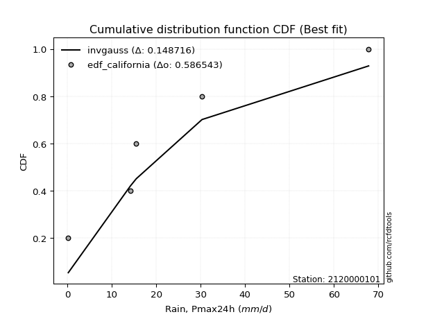</img>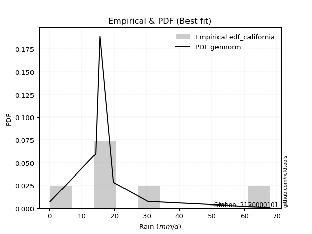</img>

</div>


### 2. EDF Hazen (1930)

Hazen method for plotting positions is a formula used to estimate the empirical cumulative probability distribution of flood events or other hydrological data. This formula often results in biased estimations, particularly when extrapolating to extreme events (high return periods).

<div align="center">


$P=(m-0.5)/n$


</div>


**2.1. Empirical values**

<div align="center">

|                | 0                   | 1                  | 2                  | 3                  | 4         | 5                  |
|:---------------|:--------------------|:-------------------|:-------------------|:-------------------|:----------|:-------------------|
| date           | 2023                | 2018               | 2020               | 2025               | 2019      | 2024               |
| x              | 0.2                 | 14.2               | 15.5               | 19.7               | 30.3      | 67.8               |
| m              | 1                   | 2                  | 3                  | 4                  | 5         | 6                  |
| empirical_dist | edf_hazen           | edf_hazen          | edf_hazen          | edf_hazen          | edf_hazen | edf_hazen          |
| empirical      | 0.08333333333333333 | 0.25               | 0.4166666666666667 | 0.5833333333333334 | 0.75      | 0.9166666666666666 |
| empirical_tr   | 1.090909090909091   | 1.3333333333333333 | 1.7142857142857144 | 2.4000000000000004 | 4.0       | 11.999999999999995 |

</div>


**2.2. Kolmogorov-Smirnov fit test (sorted by Δ)**


<div align="center">

|                | 0                   | 1                   | 2                  | 3                  | 4                   | 5                  | 6                  | 7                   | 8                   | 9                   | 10                  | 11                  | 12                  | 13                  | 14                  | 15                  | 16                  | 17                  | 18                  | 19                  | 20                 | 21                 | 22                 | 23                 | 24                  | 25                 | 26                 | 27                  | 28                  | 29                  | 30                  | 31                 | 32                  | 33                  | 34                  | 35                 | 36                 | 37                  | 38                  | 39                  | 40                  | 41                  | 42                  | 43                  | 44                  | 45                 | 46                  | 47                  | 48                  | 49                  | 50                  | 51                 | 52                  | 53                  | 54                  | 55                  | 56                  | 57                  | 58                  | 59                  | 60                  | 61                  | 62                 | 63                 | 64                 | 65                 | 66                 | 67                | 68                 | 69                 | 70                 | 71                  | 72                | 73                 | 74                  | 75                  | 76                  | 77                 | 78                  | 79                 | 80                  | 81                  | 82                  | 83                  | 84                  | 85                  | 86                  | 87                  | 88                 | 89                 | 90                 | 91                  | 92                 | 93               | 94                 | 95                 | 96                 | 97                 | 98                  | 99                 | 100                | 101                | 102                | 103                | 104                 | 105                 | 106                 | 107                | 108                | 109               | 110                 | 111                 | 112                | 113                | 114                | 115                | 116               | 117                | 118                | 119               | 120                | 121                 | 122                | 123                | 124                 | 125                 | 126                | 127                | 128                 | 129                 | 130                 | 131                | 132                | 133                | 134                | 135                 | 136                | 137                | 138                | 139                | 140                | 141               | 142                | 143                | 144                | 145                | 146                | 147                | 148               | 149                | 150                | 151                | 152                | 153                | 154                | 155            | 156            | 157                 | 158                | 159                |
|:---------------|:--------------------|:--------------------|:-------------------|:-------------------|:--------------------|:-------------------|:-------------------|:--------------------|:--------------------|:--------------------|:--------------------|:--------------------|:--------------------|:--------------------|:--------------------|:--------------------|:--------------------|:--------------------|:--------------------|:--------------------|:-------------------|:-------------------|:-------------------|:-------------------|:--------------------|:-------------------|:-------------------|:--------------------|:--------------------|:--------------------|:--------------------|:-------------------|:--------------------|:--------------------|:--------------------|:-------------------|:-------------------|:--------------------|:--------------------|:--------------------|:--------------------|:--------------------|:--------------------|:--------------------|:--------------------|:-------------------|:--------------------|:--------------------|:--------------------|:--------------------|:--------------------|:-------------------|:--------------------|:--------------------|:--------------------|:--------------------|:--------------------|:--------------------|:--------------------|:--------------------|:--------------------|:--------------------|:-------------------|:-------------------|:-------------------|:-------------------|:-------------------|:------------------|:-------------------|:-------------------|:-------------------|:--------------------|:------------------|:-------------------|:--------------------|:--------------------|:--------------------|:-------------------|:--------------------|:-------------------|:--------------------|:--------------------|:--------------------|:--------------------|:--------------------|:--------------------|:--------------------|:--------------------|:-------------------|:-------------------|:-------------------|:--------------------|:-------------------|:-----------------|:-------------------|:-------------------|:-------------------|:-------------------|:--------------------|:-------------------|:-------------------|:-------------------|:-------------------|:-------------------|:--------------------|:--------------------|:--------------------|:-------------------|:-------------------|:------------------|:--------------------|:--------------------|:-------------------|:-------------------|:-------------------|:-------------------|:------------------|:-------------------|:-------------------|:------------------|:-------------------|:--------------------|:-------------------|:-------------------|:--------------------|:--------------------|:-------------------|:-------------------|:--------------------|:--------------------|:--------------------|:-------------------|:-------------------|:-------------------|:-------------------|:--------------------|:-------------------|:-------------------|:-------------------|:-------------------|:-------------------|:------------------|:-------------------|:-------------------|:-------------------|:-------------------|:-------------------|:-------------------|:------------------|:-------------------|:-------------------|:-------------------|:-------------------|:-------------------|:-------------------|:---------------|:---------------|:--------------------|:-------------------|:-------------------|
| station        | 2120000101          | 2120000101          | 2120000101         | 2120000101         | 2120000101          | 2120000101         | 2120000101         | 2120000101          | 2120000101          | 2120000101          | 2120000101          | 2120000101          | 2120000101          | 2120000101          | 2120000101          | 2120000101          | 2120000101          | 2120000101          | 2120000101          | 2120000101          | 2120000101         | 2120000101         | 2120000101         | 2120000101         | 2120000101          | 2120000101         | 2120000101         | 2120000101          | 2120000101          | 2120000101          | 2120000101          | 2120000101         | 2120000101          | 2120000101          | 2120000101          | 2120000101         | 2120000101         | 2120000101          | 2120000101          | 2120000101          | 2120000101          | 2120000101          | 2120000101          | 2120000101          | 2120000101          | 2120000101         | 2120000101          | 2120000101          | 2120000101          | 2120000101          | 2120000101          | 2120000101         | 2120000101          | 2120000101          | 2120000101          | 2120000101          | 2120000101          | 2120000101          | 2120000101          | 2120000101          | 2120000101          | 2120000101          | 2120000101         | 2120000101         | 2120000101         | 2120000101         | 2120000101         | 2120000101        | 2120000101         | 2120000101         | 2120000101         | 2120000101          | 2120000101        | 2120000101         | 2120000101          | 2120000101          | 2120000101          | 2120000101         | 2120000101          | 2120000101         | 2120000101          | 2120000101          | 2120000101          | 2120000101          | 2120000101          | 2120000101          | 2120000101          | 2120000101          | 2120000101         | 2120000101         | 2120000101         | 2120000101          | 2120000101         | 2120000101       | 2120000101         | 2120000101         | 2120000101         | 2120000101         | 2120000101          | 2120000101         | 2120000101         | 2120000101         | 2120000101         | 2120000101         | 2120000101          | 2120000101          | 2120000101          | 2120000101         | 2120000101         | 2120000101        | 2120000101          | 2120000101          | 2120000101         | 2120000101         | 2120000101         | 2120000101         | 2120000101        | 2120000101         | 2120000101         | 2120000101        | 2120000101         | 2120000101          | 2120000101         | 2120000101         | 2120000101          | 2120000101          | 2120000101         | 2120000101         | 2120000101          | 2120000101          | 2120000101          | 2120000101         | 2120000101         | 2120000101         | 2120000101         | 2120000101          | 2120000101         | 2120000101         | 2120000101         | 2120000101         | 2120000101         | 2120000101        | 2120000101         | 2120000101         | 2120000101         | 2120000101         | 2120000101         | 2120000101         | 2120000101        | 2120000101         | 2120000101         | 2120000101         | 2120000101         | 2120000101         | 2120000101         | 2120000101     | 2120000101     | 2120000101          | 2120000101         | 2120000101         |
| empirical_dist | edf_hazen           | edf_hazen           | edf_hazen          | edf_hazen          | edf_hazen           | edf_hazen          | edf_hazen          | edf_hazen           | edf_hazen           | edf_hazen           | edf_hazen           | edf_hazen           | edf_hazen           | edf_hazen           | edf_hazen           | edf_hazen           | edf_hazen           | edf_hazen           | edf_hazen           | edf_hazen           | edf_hazen          | edf_hazen          | edf_hazen          | edf_hazen          | edf_hazen           | edf_hazen          | edf_hazen          | edf_hazen           | edf_hazen           | edf_hazen           | edf_hazen           | edf_hazen          | edf_hazen           | edf_hazen           | edf_hazen           | edf_hazen          | edf_hazen          | edf_hazen           | edf_hazen           | edf_hazen           | edf_hazen           | edf_hazen           | edf_hazen           | edf_hazen           | edf_hazen           | edf_hazen          | edf_hazen           | edf_hazen           | edf_hazen           | edf_hazen           | edf_hazen           | edf_hazen          | edf_hazen           | edf_hazen           | edf_hazen           | edf_hazen           | edf_hazen           | edf_hazen           | edf_hazen           | edf_hazen           | edf_hazen           | edf_hazen           | edf_hazen          | edf_hazen          | edf_hazen          | edf_hazen          | edf_hazen          | edf_hazen         | edf_hazen          | edf_hazen          | edf_hazen          | edf_hazen           | edf_hazen         | edf_hazen          | edf_hazen           | edf_hazen           | edf_hazen           | edf_hazen          | edf_hazen           | edf_hazen          | edf_hazen           | edf_hazen           | edf_hazen           | edf_hazen           | edf_hazen           | edf_hazen           | edf_hazen           | edf_hazen           | edf_hazen          | edf_hazen          | edf_hazen          | edf_hazen           | edf_hazen          | edf_hazen        | edf_hazen          | edf_hazen          | edf_hazen          | edf_hazen          | edf_hazen           | edf_hazen          | edf_hazen          | edf_hazen          | edf_hazen          | edf_hazen          | edf_hazen           | edf_hazen           | edf_hazen           | edf_hazen          | edf_hazen          | edf_hazen         | edf_hazen           | edf_hazen           | edf_hazen          | edf_hazen          | edf_hazen          | edf_hazen          | edf_hazen         | edf_hazen          | edf_hazen          | edf_hazen         | edf_hazen          | edf_hazen           | edf_hazen          | edf_hazen          | edf_hazen           | edf_hazen           | edf_hazen          | edf_hazen          | edf_hazen           | edf_hazen           | edf_hazen           | edf_hazen          | edf_hazen          | edf_hazen          | edf_hazen          | edf_hazen           | edf_hazen          | edf_hazen          | edf_hazen          | edf_hazen          | edf_hazen          | edf_hazen         | edf_hazen          | edf_hazen          | edf_hazen          | edf_hazen          | edf_hazen          | edf_hazen          | edf_hazen         | edf_hazen          | edf_hazen          | edf_hazen          | edf_hazen          | edf_hazen          | edf_hazen          | edf_hazen      | edf_hazen      | edf_hazen           | edf_hazen          | edf_hazen          |
| p_dist         | logt                | dgamma              | dweibull           | logjohnsonsu       | logdgamma           | logdweibull        | nct                | exponnorm           | vonmises_line       | genlogistic         | moyal               | pearson3            | gumbel_r            | truncnorm           | wald                | invgamma            | rayleigh            | t                   | genpareto           | skewnorm            | kstwobign          | johnsonsu          | halfnorm           | halflogistic       | invgauss            | foldnorm           | kappa3             | maxwell             | mielke              | gennorm             | genexpon            | gompertz           | anglit              | semicircular        | rice                | logloggamma        | crystalball        | norm                | logargus            | loggennorm          | loggenpareto        | logvonmises_line    | logistic            | lomax               | arcsine             | truncexpon         | loglevy_l           | logweibull_max      | loggenlogistic      | hypsecant           | logpearson3         | betaprime          | bradford            | laplace             | cosine              | exponpow            | gausshyper          | loggumbel_l         | gumbel_l            | kappa4              | nakagami            | burr12              | logtrapezoid       | loggenextreme      | ncf                | loggenhalflogistic | halfgennorm        | logarcsine        | wrapcauchy         | burr               | logfoldnorm        | logsemicircular     | ksone             | truncweibull_min   | loganglit           | logskewnorm         | f                   | logfatiguelife     | logcrystalball      | lognorm            | logrice             | logexponnorm        | lognct              | lognakagami         | uniform             | argus               | loglogistic         | loginvgamma         | logerlang          | loggamma           | loggamma           | loghypsecant        | levy_l             | gamma            | logalpha           | genextreme         | loginvgauss        | logloglaplace      | logmaxwell          | loglaplace         | loglaplace         | loginvweibull      | erlang             | lograyleigh        | logncf              | logjohnsonsb        | logkstwobign        | logburr12          | triang             | loggausshyper     | logwrapcauchy       | logtriang           | logcosine          | loghalfnorm        | loggumbel_r        | loggenexpon        | loghalflogistic   | logmoyal           | logbeta            | gengamma          | beta               | weibull_min         | loghalfgennorm     | genhalflogistic    | logksone            | loglomax            | logexponweib       | logf               | logwald             | rdist               | logkappa4           | logbradford        | loguniform         | logtruncnorm       | logkappa3          | invweibull          | loggengamma        | truncpareto        | tukeylambda        | logweibull_min     | johnsonsb          | exponweib         | trapezoid          | logtruncexpon      | fatiguelife        | powerlaw           | weibull_max        | logmielke          | logbetaprime      | logexponpow        | logburr            | logtruncpareto     | logpowerlaw        | alpha              | loggompertz        | logrdist       | logtukeylambda | logtruncweibull_min | logvonmises        | vonmises           |
| delta          | 0.06792348514668634 | 0.08333333333182436 | 0.0858989954972685 | 0.0961954197276289 | 0.09651317597546843 | 0.1038967632134481 | 0.1045857570650493 | 0.10459225291611296 | 0.10807329740345162 | 0.10937226315724058 | 0.11107940066892286 | 0.11228970876237465 | 0.11353049707272533 | 0.11786496177606742 | 0.12350423760073864 | 0.12685998002634985 | 0.12837176461381838 | 0.12852509956101466 | 0.12903487407237146 | 0.13021172741632447 | 0.1316139978928973 | 0.1340767099127541 | 0.1345945532257677 | 0.1354582299786536 | 0.13726639611325714 | 0.1385611443613448 | 0.1394536497401605 | 0.14063777903734043 | 0.14515833719121107 | 0.14721631285416514 | 0.14897528290148443 | 0.1507295272580922 | 0.16209927062009033 | 0.16511715255657533 | 0.17048346430218392 | 0.1721483351860083 | 0.1748257156328129 | 0.17482572496016924 | 0.17901205544550713 | 0.18031042686229076 | 0.18161687412071786 | 0.18548304848758923 | 0.18674171483201552 | 0.18786773082247132 | 0.18943406999133816 | 0.1911263732324638 | 0.19317287344296385 | 0.19397759905115536 | 0.19513329282167352 | 0.19655995281439598 | 0.20744982523415412 | 0.2131764161153995 | 0.21337281447991785 | 0.22287391421697061 | 0.22395359550398242 | 0.22505924633562624 | 0.22572757745021133 | 0.23761555548192925 | 0.24216465733908543 | 0.24762253719898275 | 0.24990113046185322 | 0.25977830878535024 | 0.2640547409727667 | 0.2690607841806091 | 0.2730384266574807 | 0.276201441943414  | 0.2779956127501466 | 0.280718564804432 | 0.2856182362390599 | 0.2869241797712683 | 0.2903169239591652 | 0.29334267310934803 | 0.295611439842209 | 0.2961244473220539 | 0.29651247665110647 | 0.29851582936549614 | 0.29943316992885427 | 0.3035362215053895 | 0.30419385412835165 | 0.3041939359084106 | 0.30419417842392393 | 0.30419612501970084 | 0.30427515615819767 | 0.30459732372160186 | 0.30473372781065083 | 0.31107691770807677 | 0.31147651954750843 | 0.31228386492714466 | 0.3146387002042975 | 0.3169026644485655 | 0.3169026644485655 | 0.31761792334851857 | 0.3196153955220488 | 0.32080825100112 | 0.3215993014808953 | 0.3248107850070294 | 0.3282333106287981 | 0.3333058380101307 | 0.33430437862389795 | 0.3376382948628096 | 0.3376382948628096 | 0.3382251524077615 | 0.3413759536332389 | 0.3439442501452884 | 0.35441473323336903 | 0.35482888187364586 | 0.35739809916617316 | 0.3589560729686463 | 0.3632600578520338 | 0.365362882977298 | 0.36881451306310176 | 0.36944428142986574 | 0.3702207391127579 | 0.3711538691676257 | 0.3741083067918748 | 0.3944948208230241 | 0.398577120084759 | 0.3988064877219357 | 0.3996619300455456 | 0.402218772749403 | 0.4116628392997292 | 0.41980295540438495 | 0.4296491756284194 | 0.4350160359233991 | 0.44305409636039705 | 0.45059856033344414 | 0.4508656784915245 | 0.4541853682742424 | 0.46733766068647753 | 0.47247382763468887 | 0.47778910054315393 | 0.4787119914001333 | 0.4816649156324764 | 0.4843745759076936 | 0.4944555500779092 | 0.49607412961672676 | 0.4968339633604207 | 0.5089214804514888 | 0.5183261667566583 | 0.5275414438259721 | 0.5308859729790648 | 0.539515336364675 | 0.5398401447778437 | 0.5496839320140506 | 0.5541914138317021 | 0.5694653300042593 | 0.6174264847202153 | 0.6419972390406045 | 0.674348569478355 | 0.6801348536127644 | 0.6846010236128005 | 0.6990197503260952 | 0.7028315469361384 | 0.7232345665514637 | 0.7467763248531435 | 0.75           | 0.75           | 0.75                | 0.9467890491405287 | 10.268777124799936 |
| deltao         | 0.530385761606      | 0.530385761606      | 0.530385761606     | 0.530385761606     | 0.530385761606      | 0.530385761606     | 0.530385761606     | 0.530385761606      | 0.530385761606      | 0.530385761606      | 0.530385761606      | 0.530385761606      | 0.530385761606      | 0.530385761606      | 0.530385761606      | 0.530385761606      | 0.530385761606      | 0.530385761606      | 0.530385761606      | 0.530385761606      | 0.530385761606     | 0.530385761606     | 0.530385761606     | 0.530385761606     | 0.530385761606      | 0.530385761606     | 0.530385761606     | 0.530385761606      | 0.530385761606      | 0.530385761606      | 0.530385761606      | 0.530385761606     | 0.530385761606      | 0.530385761606      | 0.530385761606      | 0.530385761606     | 0.530385761606     | 0.530385761606      | 0.530385761606      | 0.530385761606      | 0.530385761606      | 0.530385761606      | 0.530385761606      | 0.530385761606      | 0.530385761606      | 0.530385761606     | 0.530385761606      | 0.530385761606      | 0.530385761606      | 0.530385761606      | 0.530385761606      | 0.530385761606     | 0.530385761606      | 0.530385761606      | 0.530385761606      | 0.530385761606      | 0.530385761606      | 0.530385761606      | 0.530385761606      | 0.530385761606      | 0.530385761606      | 0.530385761606      | 0.530385761606     | 0.530385761606     | 0.530385761606     | 0.530385761606     | 0.530385761606     | 0.530385761606    | 0.530385761606     | 0.530385761606     | 0.530385761606     | 0.530385761606      | 0.530385761606    | 0.530385761606     | 0.530385761606      | 0.530385761606      | 0.530385761606      | 0.530385761606     | 0.530385761606      | 0.530385761606     | 0.530385761606      | 0.530385761606      | 0.530385761606      | 0.530385761606      | 0.530385761606      | 0.530385761606      | 0.530385761606      | 0.530385761606      | 0.530385761606     | 0.530385761606     | 0.530385761606     | 0.530385761606      | 0.530385761606     | 0.530385761606   | 0.530385761606     | 0.530385761606     | 0.530385761606     | 0.530385761606     | 0.530385761606      | 0.530385761606     | 0.530385761606     | 0.530385761606     | 0.530385761606     | 0.530385761606     | 0.530385761606      | 0.530385761606      | 0.530385761606      | 0.530385761606     | 0.530385761606     | 0.530385761606    | 0.530385761606      | 0.530385761606      | 0.530385761606     | 0.530385761606     | 0.530385761606     | 0.530385761606     | 0.530385761606    | 0.530385761606     | 0.530385761606     | 0.530385761606    | 0.530385761606     | 0.530385761606      | 0.530385761606     | 0.530385761606     | 0.530385761606      | 0.530385761606      | 0.530385761606     | 0.530385761606     | 0.530385761606      | 0.530385761606      | 0.530385761606      | 0.530385761606     | 0.530385761606     | 0.530385761606     | 0.530385761606     | 0.530385761606      | 0.530385761606     | 0.530385761606     | 0.530385761606     | 0.530385761606     | 0.530385761606     | 0.530385761606    | 0.530385761606     | 0.530385761606     | 0.530385761606     | 0.530385761606     | 0.530385761606     | 0.530385761606     | 0.530385761606    | 0.530385761606     | 0.530385761606     | 0.530385761606     | 0.530385761606     | 0.530385761606     | 0.530385761606     | 0.530385761606 | 0.530385761606 | 0.530385761606      | 0.530385761606     | 0.530385761606     |
| eval           | Δo > Δ              | Δo > Δ              | Δo > Δ             | Δo > Δ             | Δo > Δ              | Δo > Δ             | Δo > Δ             | Δo > Δ              | Δo > Δ              | Δo > Δ              | Δo > Δ              | Δo > Δ              | Δo > Δ              | Δo > Δ              | Δo > Δ              | Δo > Δ              | Δo > Δ              | Δo > Δ              | Δo > Δ              | Δo > Δ              | Δo > Δ             | Δo > Δ             | Δo > Δ             | Δo > Δ             | Δo > Δ              | Δo > Δ             | Δo > Δ             | Δo > Δ              | Δo > Δ              | Δo > Δ              | Δo > Δ              | Δo > Δ             | Δo > Δ              | Δo > Δ              | Δo > Δ              | Δo > Δ             | Δo > Δ             | Δo > Δ              | Δo > Δ              | Δo > Δ              | Δo > Δ              | Δo > Δ              | Δo > Δ              | Δo > Δ              | Δo > Δ              | Δo > Δ             | Δo > Δ              | Δo > Δ              | Δo > Δ              | Δo > Δ              | Δo > Δ              | Δo > Δ             | Δo > Δ              | Δo > Δ              | Δo > Δ              | Δo > Δ              | Δo > Δ              | Δo > Δ              | Δo > Δ              | Δo > Δ              | Δo > Δ              | Δo > Δ              | Δo > Δ             | Δo > Δ             | Δo > Δ             | Δo > Δ             | Δo > Δ             | Δo > Δ            | Δo > Δ             | Δo > Δ             | Δo > Δ             | Δo > Δ              | Δo > Δ            | Δo > Δ             | Δo > Δ              | Δo > Δ              | Δo > Δ              | Δo > Δ             | Δo > Δ              | Δo > Δ             | Δo > Δ              | Δo > Δ              | Δo > Δ              | Δo > Δ              | Δo > Δ              | Δo > Δ              | Δo > Δ              | Δo > Δ              | Δo > Δ             | Δo > Δ             | Δo > Δ             | Δo > Δ              | Δo > Δ             | Δo > Δ           | Δo > Δ             | Δo > Δ             | Δo > Δ             | Δo > Δ             | Δo > Δ              | Δo > Δ             | Δo > Δ             | Δo > Δ             | Δo > Δ             | Δo > Δ             | Δo > Δ              | Δo > Δ              | Δo > Δ              | Δo > Δ             | Δo > Δ             | Δo > Δ            | Δo > Δ              | Δo > Δ              | Δo > Δ             | Δo > Δ             | Δo > Δ             | Δo > Δ             | Δo > Δ            | Δo > Δ             | Δo > Δ             | Δo > Δ            | Δo > Δ             | Δo > Δ              | Δo > Δ             | Δo > Δ             | Δo > Δ              | Δo > Δ              | Δo > Δ             | Δo > Δ             | Δo > Δ              | Δo > Δ              | Δo > Δ              | Δo > Δ             | Δo > Δ             | Δo > Δ             | Δo > Δ             | Δo > Δ              | Δo > Δ             | Δo > Δ             | Δo > Δ             | Δo > Δ             | Δo <= Δ            | Δo <= Δ           | Δo <= Δ            | Δo <= Δ            | Δo <= Δ            | Δo <= Δ            | Δo <= Δ            | Δo <= Δ            | Δo <= Δ           | Δo <= Δ            | Δo <= Δ            | Δo <= Δ            | Δo <= Δ            | Δo <= Δ            | Δo <= Δ            | Δo <= Δ        | Δo <= Δ        | Δo <= Δ             | Δo <= Δ            | Δo <= Δ            |
| fit            | 1                   | 1                   | 1                  | 1                  | 1                   | 1                  | 1                  | 1                   | 1                   | 1                   | 1                   | 1                   | 1                   | 1                   | 1                   | 1                   | 1                   | 1                   | 1                   | 1                   | 1                  | 1                  | 1                  | 1                  | 1                   | 1                  | 1                  | 1                   | 1                   | 1                   | 1                   | 1                  | 1                   | 1                   | 1                   | 1                  | 1                  | 1                   | 1                   | 1                   | 1                   | 1                   | 1                   | 1                   | 1                   | 1                  | 1                   | 1                   | 1                   | 1                   | 1                   | 1                  | 1                   | 1                   | 1                   | 1                   | 1                   | 1                   | 1                   | 1                   | 1                   | 1                   | 1                  | 1                  | 1                  | 1                  | 1                  | 1                 | 1                  | 1                  | 1                  | 1                   | 1                 | 1                  | 1                   | 1                   | 1                   | 1                  | 1                   | 1                  | 1                   | 1                   | 1                   | 1                   | 1                   | 1                   | 1                   | 1                   | 1                  | 1                  | 1                  | 1                   | 1                  | 1                | 1                  | 1                  | 1                  | 1                  | 1                   | 1                  | 1                  | 1                  | 1                  | 1                  | 1                   | 1                   | 1                   | 1                  | 1                  | 1                 | 1                   | 1                   | 1                  | 1                  | 1                  | 1                  | 1                 | 1                  | 1                  | 1                 | 1                  | 1                   | 1                  | 1                  | 1                   | 1                   | 1                  | 1                  | 1                   | 1                   | 1                   | 1                  | 1                  | 1                  | 1                  | 1                   | 1                  | 1                  | 1                  | 1                  | 0                  | 0                 | 0                  | 0                  | 0                  | 0                  | 0                  | 0                  | 0                 | 0                  | 0                  | 0                  | 0                  | 0                  | 0                  | 0              | 0              | 0                   | 0                  | 0                  |
| n              | 6                   | 6                   | 6                  | 6                  | 6                   | 6                  | 6                  | 6                   | 6                   | 6                   | 6                   | 6                   | 6                   | 6                   | 6                   | 6                   | 6                   | 6                   | 6                   | 6                   | 6                  | 6                  | 6                  | 6                  | 6                   | 6                  | 6                  | 6                   | 6                   | 6                   | 6                   | 6                  | 6                   | 6                   | 6                   | 6                  | 6                  | 6                   | 6                   | 6                   | 6                   | 6                   | 6                   | 6                   | 6                   | 6                  | 6                   | 6                   | 6                   | 6                   | 6                   | 6                  | 6                   | 6                   | 6                   | 6                   | 6                   | 6                   | 6                   | 6                   | 6                   | 6                   | 6                  | 6                  | 6                  | 6                  | 6                  | 6                 | 6                  | 6                  | 6                  | 6                   | 6                 | 6                  | 6                   | 6                   | 6                   | 6                  | 6                   | 6                  | 6                   | 6                   | 6                   | 6                   | 6                   | 6                   | 6                   | 6                   | 6                  | 6                  | 6                  | 6                   | 6                  | 6                | 6                  | 6                  | 6                  | 6                  | 6                   | 6                  | 6                  | 6                  | 6                  | 6                  | 6                   | 6                   | 6                   | 6                  | 6                  | 6                 | 6                   | 6                   | 6                  | 6                  | 6                  | 6                  | 6                 | 6                  | 6                  | 6                 | 6                  | 6                   | 6                  | 6                  | 6                   | 6                   | 6                  | 6                  | 6                   | 6                   | 6                   | 6                  | 6                  | 6                  | 6                  | 6                   | 6                  | 6                  | 6                  | 6                  | 6                  | 6                 | 6                  | 6                  | 6                  | 6                  | 6                  | 6                  | 6                 | 6                  | 6                  | 6                  | 6                  | 6                  | 6                  | 6              | 6              | 6                   | 6                  | 6                  |
| best_fit       | 1                   | 0                   | 0                  | 0                  | 0                   | 0                  | 0                  | 0                   | 0                   | 0                   | 0                   | 0                   | 0                   | 0                   | 0                   | 0                   | 0                   | 0                   | 0                   | 0                   | 0                  | 0                  | 0                  | 0                  | 0                   | 0                  | 0                  | 0                   | 0                   | 0                   | 0                   | 0                  | 0                   | 0                   | 0                   | 0                  | 0                  | 0                   | 0                   | 0                   | 0                   | 0                   | 0                   | 0                   | 0                   | 0                  | 0                   | 0                   | 0                   | 0                   | 0                   | 0                  | 0                   | 0                   | 0                   | 0                   | 0                   | 0                   | 0                   | 0                   | 0                   | 0                   | 0                  | 0                  | 0                  | 0                  | 0                  | 0                 | 0                  | 0                  | 0                  | 0                   | 0                 | 0                  | 0                   | 0                   | 0                   | 0                  | 0                   | 0                  | 0                   | 0                   | 0                   | 0                   | 0                   | 0                   | 0                   | 0                   | 0                  | 0                  | 0                  | 0                   | 0                  | 0                | 0                  | 0                  | 0                  | 0                  | 0                   | 0                  | 0                  | 0                  | 0                  | 0                  | 0                   | 0                   | 0                   | 0                  | 0                  | 0                 | 0                   | 0                   | 0                  | 0                  | 0                  | 0                  | 0                 | 0                  | 0                  | 0                 | 0                  | 0                   | 0                  | 0                  | 0                   | 0                   | 0                  | 0                  | 0                   | 0                   | 0                   | 0                  | 0                  | 0                  | 0                  | 0                   | 0                  | 0                  | 0                  | 0                  | 0                  | 0                 | 0                  | 0                  | 0                  | 0                  | 0                  | 0                  | 0                 | 0                  | 0                  | 0                  | 0                  | 0                  | 0                  | 0              | 0              | 0                   | 0                  | 0                  |
| best_fit_sort  | 1                   | 2                   | 3                  | 4                  | 5                   | 6                  | 7                  | 8                   | 9                   | 10                  | 11                  | 12                  | 13                  | 14                  | 15                  | 16                  | 17                  | 18                  | 19                  | 20                  | 21                 | 22                 | 23                 | 24                 | 25                  | 26                 | 27                 | 28                  | 29                  | 30                  | 31                  | 32                 | 33                  | 34                  | 35                  | 36                 | 37                 | 38                  | 39                  | 40                  | 41                  | 42                  | 43                  | 44                  | 45                  | 46                 | 47                  | 48                  | 49                  | 50                  | 51                  | 52                 | 53                  | 54                  | 55                  | 56                  | 57                  | 58                  | 59                  | 60                  | 61                  | 62                  | 63                 | 64                 | 65                 | 66                 | 67                 | 68                | 69                 | 70                 | 71                 | 72                  | 73                | 74                 | 75                  | 76                  | 77                  | 78                 | 79                  | 80                 | 81                  | 82                  | 83                  | 84                  | 85                  | 86                  | 87                  | 88                  | 89                 | 90                 | 91                 | 92                  | 93                 | 94               | 95                 | 96                 | 97                 | 98                 | 99                  | 100                | 101                | 102                | 103                | 104                | 105                 | 106                 | 107                 | 108                | 109                | 110               | 111                 | 112                 | 113                | 114                | 115                | 116                | 117               | 118                | 119                | 120               | 121                | 122                 | 123                | 124                | 125                 | 126                 | 127                | 128                | 129                 | 130                 | 131                 | 132                | 133                | 134                | 135                | 136                 | 137                | 138                | 139                | 140                | 141                | 142               | 143                | 144                | 145                | 146                | 147                | 148                | 149               | 150                | 151                | 152                | 153                | 154                | 155                | 156            | 157            | 158                 | 159                | 160                |

</div>


**2.3. Best fit**

<div align="center">

|   id |    station | empirical_dist   | p_dist   |     delta |   deltao | eval   |   fit |   n |   best_fit |   best_fit_sort |
|-----:|-----------:|:-----------------|:---------|----------:|---------:|:-------|------:|----:|-----------:|----------------:|
|    0 | 2120000101 | edf_hazen        | logt     | 0.0679235 | 0.530386 | Δo > Δ |     1 |   6 |          1 |               1 |

</div>


<div align="center">

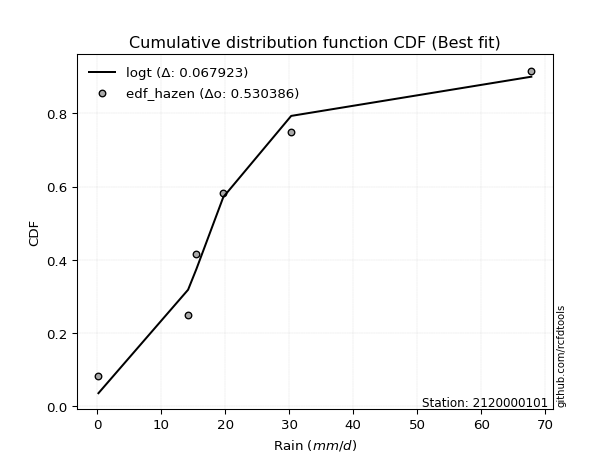</img></img>

</div>


### 3. EDF Weibull (1939)

Weibull plotting position formula is an empirical method used to estimate the non-exceedance probability or plotting position for a set of observed data, is often recommended or widely used in practice, particularly in flood frequency analysis.

<div align="center">


$P=m/(n+1)$


</div>


**3.1. Empirical values**

<div align="center">

|                | 0                   | 1                  | 2                   | 3                  | 4                  | 5                  |
|:---------------|:--------------------|:-------------------|:--------------------|:-------------------|:-------------------|:-------------------|
| date           | 2023                | 2018               | 2020                | 2025               | 2019               | 2024               |
| x              | 0.2                 | 14.2               | 15.5                | 19.7               | 30.3               | 67.8               |
| m              | 1                   | 2                  | 3                   | 4                  | 5                  | 6                  |
| empirical_dist | edf_weibull         | edf_weibull        | edf_weibull         | edf_weibull        | edf_weibull        | edf_weibull        |
| empirical      | 0.14285714285714285 | 0.2857142857142857 | 0.42857142857142855 | 0.5714285714285714 | 0.7142857142857143 | 0.8571428571428571 |
| empirical_tr   | 1.1666666666666665  | 1.4                | 1.75                | 2.333333333333333  | 3.5                | 6.999999999999997  |

</div>


**3.2. Kolmogorov-Smirnov fit test (sorted by Δ)**


<div align="center">

|                | 0                  | 1                   | 2                   | 3                   | 4                   | 5                   | 6                   | 7                   | 8                   | 9                   | 10                  | 11                 | 12                  | 13                  | 14                  | 15                  | 16                  | 17                  | 18                  | 19                  | 20                 | 21                  | 22                 | 23                  | 24                  | 25                  | 26                  | 27                  | 28                 | 29                  | 30                  | 31                  | 32                  | 33                  | 34                  | 35                  | 36                  | 37                  | 38                  | 39                  | 40                  | 41                  | 42                  | 43                  | 44                  | 45                  | 46                  | 47                  | 48                 | 49                 | 50                | 51                  | 52                  | 53                  | 54                  | 55                  | 56                  | 57                  | 58                  | 59                | 60                  | 61                  | 62                  | 63                  | 64                 | 65                  | 66                  | 67                 | 68                 | 69                 | 70                  | 71                 | 72                 | 73                 | 74                 | 75                  | 76                  | 77                 | 78                 | 79                  | 80                 | 81                  | 82                  | 83                  | 84                  | 85                  | 86                  | 87                  | 88                 | 89                 | 90                 | 91                 | 92                 | 93                 | 94                 | 95                  | 96                  | 97                 | 98                  | 99                  | 100                | 101                | 102                | 103                | 104                | 105                 | 106                 | 107                | 108                | 109                | 110                 | 111                 | 112                | 113              | 114                | 115                | 116                | 117              | 118                | 119                | 120                | 121                 | 122                | 123                | 124                 | 125                 | 126                 | 127                | 128                | 129                 | 130                 | 131                | 132                 | 133                 | 134                | 135                | 136                | 137                | 138                | 139                | 140                | 141                | 142               | 143                | 144                | 145                | 146                | 147                | 148                | 149                | 150                | 151                | 152                | 153               | 154                | 155                | 156                | 157                 | 158                | 159                |
|:---------------|:-------------------|:--------------------|:--------------------|:--------------------|:--------------------|:--------------------|:--------------------|:--------------------|:--------------------|:--------------------|:--------------------|:-------------------|:--------------------|:--------------------|:--------------------|:--------------------|:--------------------|:--------------------|:--------------------|:--------------------|:-------------------|:--------------------|:-------------------|:--------------------|:--------------------|:--------------------|:--------------------|:--------------------|:-------------------|:--------------------|:--------------------|:--------------------|:--------------------|:--------------------|:--------------------|:--------------------|:--------------------|:--------------------|:--------------------|:--------------------|:--------------------|:--------------------|:--------------------|:--------------------|:--------------------|:--------------------|:--------------------|:--------------------|:-------------------|:-------------------|:------------------|:--------------------|:--------------------|:--------------------|:--------------------|:--------------------|:--------------------|:--------------------|:--------------------|:------------------|:--------------------|:--------------------|:--------------------|:--------------------|:-------------------|:--------------------|:--------------------|:-------------------|:-------------------|:-------------------|:--------------------|:-------------------|:-------------------|:-------------------|:-------------------|:--------------------|:--------------------|:-------------------|:-------------------|:--------------------|:-------------------|:--------------------|:--------------------|:--------------------|:--------------------|:--------------------|:--------------------|:--------------------|:-------------------|:-------------------|:-------------------|:-------------------|:-------------------|:-------------------|:-------------------|:--------------------|:--------------------|:-------------------|:--------------------|:--------------------|:-------------------|:-------------------|:-------------------|:-------------------|:-------------------|:--------------------|:--------------------|:-------------------|:-------------------|:-------------------|:--------------------|:--------------------|:-------------------|:-----------------|:-------------------|:-------------------|:-------------------|:-----------------|:-------------------|:-------------------|:-------------------|:--------------------|:-------------------|:-------------------|:--------------------|:--------------------|:--------------------|:-------------------|:-------------------|:--------------------|:--------------------|:-------------------|:--------------------|:--------------------|:-------------------|:-------------------|:-------------------|:-------------------|:-------------------|:-------------------|:-------------------|:-------------------|:------------------|:-------------------|:-------------------|:-------------------|:-------------------|:-------------------|:-------------------|:-------------------|:-------------------|:-------------------|:-------------------|:------------------|:-------------------|:-------------------|:-------------------|:--------------------|:-------------------|:-------------------|
| station        | 2120000101         | 2120000101          | 2120000101          | 2120000101          | 2120000101          | 2120000101          | 2120000101          | 2120000101          | 2120000101          | 2120000101          | 2120000101          | 2120000101         | 2120000101          | 2120000101          | 2120000101          | 2120000101          | 2120000101          | 2120000101          | 2120000101          | 2120000101          | 2120000101         | 2120000101          | 2120000101         | 2120000101          | 2120000101          | 2120000101          | 2120000101          | 2120000101          | 2120000101         | 2120000101          | 2120000101          | 2120000101          | 2120000101          | 2120000101          | 2120000101          | 2120000101          | 2120000101          | 2120000101          | 2120000101          | 2120000101          | 2120000101          | 2120000101          | 2120000101          | 2120000101          | 2120000101          | 2120000101          | 2120000101          | 2120000101          | 2120000101         | 2120000101         | 2120000101        | 2120000101          | 2120000101          | 2120000101          | 2120000101          | 2120000101          | 2120000101          | 2120000101          | 2120000101          | 2120000101        | 2120000101          | 2120000101          | 2120000101          | 2120000101          | 2120000101         | 2120000101          | 2120000101          | 2120000101         | 2120000101         | 2120000101         | 2120000101          | 2120000101         | 2120000101         | 2120000101         | 2120000101         | 2120000101          | 2120000101          | 2120000101         | 2120000101         | 2120000101          | 2120000101         | 2120000101          | 2120000101          | 2120000101          | 2120000101          | 2120000101          | 2120000101          | 2120000101          | 2120000101         | 2120000101         | 2120000101         | 2120000101         | 2120000101         | 2120000101         | 2120000101         | 2120000101          | 2120000101          | 2120000101         | 2120000101          | 2120000101          | 2120000101         | 2120000101         | 2120000101         | 2120000101         | 2120000101         | 2120000101          | 2120000101          | 2120000101         | 2120000101         | 2120000101         | 2120000101          | 2120000101          | 2120000101         | 2120000101       | 2120000101         | 2120000101         | 2120000101         | 2120000101       | 2120000101         | 2120000101         | 2120000101         | 2120000101          | 2120000101         | 2120000101         | 2120000101          | 2120000101          | 2120000101          | 2120000101         | 2120000101         | 2120000101          | 2120000101          | 2120000101         | 2120000101          | 2120000101          | 2120000101         | 2120000101         | 2120000101         | 2120000101         | 2120000101         | 2120000101         | 2120000101         | 2120000101         | 2120000101        | 2120000101         | 2120000101         | 2120000101         | 2120000101         | 2120000101         | 2120000101         | 2120000101         | 2120000101         | 2120000101         | 2120000101         | 2120000101        | 2120000101         | 2120000101         | 2120000101         | 2120000101          | 2120000101         | 2120000101         |
| empirical_dist | edf_weibull        | edf_weibull         | edf_weibull         | edf_weibull         | edf_weibull         | edf_weibull         | edf_weibull         | edf_weibull         | edf_weibull         | edf_weibull         | edf_weibull         | edf_weibull        | edf_weibull         | edf_weibull         | edf_weibull         | edf_weibull         | edf_weibull         | edf_weibull         | edf_weibull         | edf_weibull         | edf_weibull        | edf_weibull         | edf_weibull        | edf_weibull         | edf_weibull         | edf_weibull         | edf_weibull         | edf_weibull         | edf_weibull        | edf_weibull         | edf_weibull         | edf_weibull         | edf_weibull         | edf_weibull         | edf_weibull         | edf_weibull         | edf_weibull         | edf_weibull         | edf_weibull         | edf_weibull         | edf_weibull         | edf_weibull         | edf_weibull         | edf_weibull         | edf_weibull         | edf_weibull         | edf_weibull         | edf_weibull         | edf_weibull        | edf_weibull        | edf_weibull       | edf_weibull         | edf_weibull         | edf_weibull         | edf_weibull         | edf_weibull         | edf_weibull         | edf_weibull         | edf_weibull         | edf_weibull       | edf_weibull         | edf_weibull         | edf_weibull         | edf_weibull         | edf_weibull        | edf_weibull         | edf_weibull         | edf_weibull        | edf_weibull        | edf_weibull        | edf_weibull         | edf_weibull        | edf_weibull        | edf_weibull        | edf_weibull        | edf_weibull         | edf_weibull         | edf_weibull        | edf_weibull        | edf_weibull         | edf_weibull        | edf_weibull         | edf_weibull         | edf_weibull         | edf_weibull         | edf_weibull         | edf_weibull         | edf_weibull         | edf_weibull        | edf_weibull        | edf_weibull        | edf_weibull        | edf_weibull        | edf_weibull        | edf_weibull        | edf_weibull         | edf_weibull         | edf_weibull        | edf_weibull         | edf_weibull         | edf_weibull        | edf_weibull        | edf_weibull        | edf_weibull        | edf_weibull        | edf_weibull         | edf_weibull         | edf_weibull        | edf_weibull        | edf_weibull        | edf_weibull         | edf_weibull         | edf_weibull        | edf_weibull      | edf_weibull        | edf_weibull        | edf_weibull        | edf_weibull      | edf_weibull        | edf_weibull        | edf_weibull        | edf_weibull         | edf_weibull        | edf_weibull        | edf_weibull         | edf_weibull         | edf_weibull         | edf_weibull        | edf_weibull        | edf_weibull         | edf_weibull         | edf_weibull        | edf_weibull         | edf_weibull         | edf_weibull        | edf_weibull        | edf_weibull        | edf_weibull        | edf_weibull        | edf_weibull        | edf_weibull        | edf_weibull        | edf_weibull       | edf_weibull        | edf_weibull        | edf_weibull        | edf_weibull        | edf_weibull        | edf_weibull        | edf_weibull        | edf_weibull        | edf_weibull        | edf_weibull        | edf_weibull       | edf_weibull        | edf_weibull        | edf_weibull        | edf_weibull         | edf_weibull        | edf_weibull        |
| p_dist         | dweibull           | nct                 | invgamma            | exponnorm           | moyal               | johnsonsu           | halfnorm            | pearson3            | invgauss            | gumbel_r            | foldnorm            | logjohnsonsu       | logt                | logdweibull         | genlogistic         | rayleigh            | kstwobign           | dgamma              | halflogistic        | maxwell             | logdgamma          | t                   | genexpon           | logloggamma         | truncnorm           | vonmises_line       | kappa3              | mielke              | genpareto          | gompertz            | wald                | skewnorm            | logargus            | semicircular        | loggenpareto        | logvonmises_line    | anglit              | lomax               | arcsine             | loglevy_l           | logweibull_max      | rice                | loggenlogistic      | crystalball         | norm                | gennorm             | logpearson3         | logistic            | betaprime          | truncexpon         | hypsecant         | exponpow            | gausshyper          | loggennorm          | bradford            | loggumbel_l         | laplace             | cosine              | burr12              | logtrapezoid      | kappa4              | gumbel_l            | loggenextreme       | ncf                 | loggenhalflogistic | halfgennorm         | logarcsine          | wrapcauchy         | burr               | logfoldnorm        | logsemicircular     | ksone              | levy_l             | truncweibull_min   | loganglit          | logskewnorm         | f                   | genextreme         | logfatiguelife     | logcrystalball      | lognorm            | logrice             | logexponnorm        | lognct              | lognakagami         | loglogistic         | loginvgamma         | argus               | logloglaplace      | logerlang          | loggamma           | loggamma           | loghypsecant       | uniform            | gamma              | nakagami            | logalpha            | loginvgauss        | logjohnsonsb        | logmaxwell          | loglaplace         | loglaplace         | loginvweibull      | erlang             | lograyleigh        | logncf              | logkstwobign        | logburr12          | triang             | loggausshyper      | logwrapcauchy       | logtriang           | logcosine          | loghalfnorm      | loggumbel_r        | loggenexpon        | loghalflogistic    | logmoyal         | logbeta            | gengamma           | beta               | weibull_min         | loghalfgennorm     | genhalflogistic    | logksone            | rdist               | loglomax            | logexponweib       | logf               | logwald             | logkappa3           | invweibull         | loggengamma         | logkappa4           | logbradford        | loguniform         | logtruncnorm       | truncpareto        | tukeylambda        | logweibull_min     | johnsonsb          | exponweib          | trapezoid         | logtruncexpon      | fatiguelife        | powerlaw           | weibull_max        | logmielke          | logbetaprime       | logexponpow        | logburr            | logtruncpareto     | logpowerlaw        | alpha             | loggompertz        | logrdist           | logtukeylambda     | logtruncweibull_min | logvonmises        | vonmises           |
| delta          | 0.0846955276436534 | 0.09549242607962038 | 0.09716710450731501 | 0.09835743188960466 | 0.09864569121729982 | 0.09926828751857988 | 0.09977976099131436 | 0.10090385304855909 | 0.10155211039897144 | 0.10227186996923121 | 0.10284685864705911 | 0.1071213774142748 | 0.10760450747472489 | 0.11092919028944756 | 0.11439123850972333 | 0.11646700270905641 | 0.11970923598813532 | 0.12002120942988104 | 0.12172038468807174 | 0.12873301713257845 | 0.1334968992650808 | 0.13837814268971316 | 0.1428190486596167 | 0.14283093363309307 | 0.14285712015201052 | 0.14285714105611613 | 0.14285714281833517 | 0.14285714282885129 | 0.1428571428551088 | 0.14285714285680906 | 0.14285714285714285 | 0.14285714285714285 | 0.14329776973122144 | 0.14491602509118895 | 0.14590258840643217 | 0.14976876277330353 | 0.15019450871532836 | 0.15215344510818563 | 0.15371978427705246 | 0.15745858772867816 | 0.15826331333686966 | 0.15857870239742194 | 0.15941900710738782 | 0.16292095372805093 | 0.16292096305540726 | 0.16937673150350563 | 0.17173553951986842 | 0.17483695292725354 | 0.1774621304011138 | 0.1792216113277018 | 0.184655190909634 | 0.18934496062134054 | 0.19001329173592563 | 0.19221518876705262 | 0.20063191185550078 | 0.20190126976764355 | 0.21096915231220864 | 0.21204883359922044 | 0.22406402307106454 | 0.228340455258481 | 0.22874534720834555 | 0.23025989543432346 | 0.23334649846632338 | 0.23732414094319498 | 0.2404871562291283 | 0.24228132703586092 | 0.24500427909014633 | 0.2499039505247742 | 0.2512098940569826 | 0.2546026382448795 | 0.25762838739506233 | 0.2598971541279233 | 0.2600915859982393 | 0.2604101616077682 | 0.2607981909368208 | 0.26280154365121045 | 0.26371888421456857 | 0.2652869754832199 | 0.2678219357911038 | 0.26847956841406595 | 0.2684796501941249 | 0.26847989270963823 | 0.26848183930541514 | 0.26856087044391197 | 0.26888303800731617 | 0.27576223383322274 | 0.27656957921285896 | 0.27775616924803637 | 0.2786669804882488 | 0.2789244144900118 | 0.2811883787342798 | 0.2811883787342798 | 0.2819036376342329 | 0.2829670329670329 | 0.2850939652868343 | 0.28561541617613895 | 0.28588501576660963 | 0.2925190249145124 | 0.29530507234983633 | 0.29859009290961225 | 0.3019240091485239 | 0.3019240091485239 | 0.3025108666934758 | 0.3056616679189532 | 0.3082299644310027 | 0.31870044751908333 | 0.32168381345188746 | 0.3232417872543606 | 0.3275457721377481 | 0.3296485972630123 | 0.33310022734881606 | 0.33372999571558004 | 0.3345064533984722 | 0.33543958345334 | 0.3383940210775891 | 0.3587805351087384 | 0.3628628343704733 | 0.36309220200765 | 0.3639476443312599 | 0.3665044870351173 | 0.3759485535854435 | 0.38408866969009925 | 0.3939348899141337 | 0.3993017502091134 | 0.40733981064611136 | 0.41295001811087934 | 0.41488427461915844 | 0.4151513927772388 | 0.4184710825599567 | 0.43162337497219183 | 0.43493174055409967 | 0.4365503200929172 | 0.43731015383661115 | 0.44207481482886823 | 0.4429977056858476 | 0.4459506299181907 | 0.4486602901934079 | 0.4732071947372031 | 0.4826118810423726 | 0.4918271581116864 | 0.4951716872647791 | 0.5038010506503893 | 0.504125859063558 | 0.5139696462997649 | 0.5184771281174164 | 0.5337510442899736 | 0.5817121990059296 | 0.6062829533263188 | 0.6386342837640693 | 0.6444205678984787 | 0.6488867378985148 | 0.6633054646118095 | 0.6671172612218527 | 0.687520280837178 | 0.7110620391388578 | 0.7142857142857143 | 0.7142857142857143 | 0.7142857142857143  | 1.0063128586643382 | 10.328300934323744 |
| deltao         | 0.530385761606     | 0.530385761606      | 0.530385761606      | 0.530385761606      | 0.530385761606      | 0.530385761606      | 0.530385761606      | 0.530385761606      | 0.530385761606      | 0.530385761606      | 0.530385761606      | 0.530385761606     | 0.530385761606      | 0.530385761606      | 0.530385761606      | 0.530385761606      | 0.530385761606      | 0.530385761606      | 0.530385761606      | 0.530385761606      | 0.530385761606     | 0.530385761606      | 0.530385761606     | 0.530385761606      | 0.530385761606      | 0.530385761606      | 0.530385761606      | 0.530385761606      | 0.530385761606     | 0.530385761606      | 0.530385761606      | 0.530385761606      | 0.530385761606      | 0.530385761606      | 0.530385761606      | 0.530385761606      | 0.530385761606      | 0.530385761606      | 0.530385761606      | 0.530385761606      | 0.530385761606      | 0.530385761606      | 0.530385761606      | 0.530385761606      | 0.530385761606      | 0.530385761606      | 0.530385761606      | 0.530385761606      | 0.530385761606     | 0.530385761606     | 0.530385761606    | 0.530385761606      | 0.530385761606      | 0.530385761606      | 0.530385761606      | 0.530385761606      | 0.530385761606      | 0.530385761606      | 0.530385761606      | 0.530385761606    | 0.530385761606      | 0.530385761606      | 0.530385761606      | 0.530385761606      | 0.530385761606     | 0.530385761606      | 0.530385761606      | 0.530385761606     | 0.530385761606     | 0.530385761606     | 0.530385761606      | 0.530385761606     | 0.530385761606     | 0.530385761606     | 0.530385761606     | 0.530385761606      | 0.530385761606      | 0.530385761606     | 0.530385761606     | 0.530385761606      | 0.530385761606     | 0.530385761606      | 0.530385761606      | 0.530385761606      | 0.530385761606      | 0.530385761606      | 0.530385761606      | 0.530385761606      | 0.530385761606     | 0.530385761606     | 0.530385761606     | 0.530385761606     | 0.530385761606     | 0.530385761606     | 0.530385761606     | 0.530385761606      | 0.530385761606      | 0.530385761606     | 0.530385761606      | 0.530385761606      | 0.530385761606     | 0.530385761606     | 0.530385761606     | 0.530385761606     | 0.530385761606     | 0.530385761606      | 0.530385761606      | 0.530385761606     | 0.530385761606     | 0.530385761606     | 0.530385761606      | 0.530385761606      | 0.530385761606     | 0.530385761606   | 0.530385761606     | 0.530385761606     | 0.530385761606     | 0.530385761606   | 0.530385761606     | 0.530385761606     | 0.530385761606     | 0.530385761606      | 0.530385761606     | 0.530385761606     | 0.530385761606      | 0.530385761606      | 0.530385761606      | 0.530385761606     | 0.530385761606     | 0.530385761606      | 0.530385761606      | 0.530385761606     | 0.530385761606      | 0.530385761606      | 0.530385761606     | 0.530385761606     | 0.530385761606     | 0.530385761606     | 0.530385761606     | 0.530385761606     | 0.530385761606     | 0.530385761606     | 0.530385761606    | 0.530385761606     | 0.530385761606     | 0.530385761606     | 0.530385761606     | 0.530385761606     | 0.530385761606     | 0.530385761606     | 0.530385761606     | 0.530385761606     | 0.530385761606     | 0.530385761606    | 0.530385761606     | 0.530385761606     | 0.530385761606     | 0.530385761606      | 0.530385761606     | 0.530385761606     |
| eval           | Δo > Δ             | Δo > Δ              | Δo > Δ              | Δo > Δ              | Δo > Δ              | Δo > Δ              | Δo > Δ              | Δo > Δ              | Δo > Δ              | Δo > Δ              | Δo > Δ              | Δo > Δ             | Δo > Δ              | Δo > Δ              | Δo > Δ              | Δo > Δ              | Δo > Δ              | Δo > Δ              | Δo > Δ              | Δo > Δ              | Δo > Δ             | Δo > Δ              | Δo > Δ             | Δo > Δ              | Δo > Δ              | Δo > Δ              | Δo > Δ              | Δo > Δ              | Δo > Δ             | Δo > Δ              | Δo > Δ              | Δo > Δ              | Δo > Δ              | Δo > Δ              | Δo > Δ              | Δo > Δ              | Δo > Δ              | Δo > Δ              | Δo > Δ              | Δo > Δ              | Δo > Δ              | Δo > Δ              | Δo > Δ              | Δo > Δ              | Δo > Δ              | Δo > Δ              | Δo > Δ              | Δo > Δ              | Δo > Δ             | Δo > Δ             | Δo > Δ            | Δo > Δ              | Δo > Δ              | Δo > Δ              | Δo > Δ              | Δo > Δ              | Δo > Δ              | Δo > Δ              | Δo > Δ              | Δo > Δ            | Δo > Δ              | Δo > Δ              | Δo > Δ              | Δo > Δ              | Δo > Δ             | Δo > Δ              | Δo > Δ              | Δo > Δ             | Δo > Δ             | Δo > Δ             | Δo > Δ              | Δo > Δ             | Δo > Δ             | Δo > Δ             | Δo > Δ             | Δo > Δ              | Δo > Δ              | Δo > Δ             | Δo > Δ             | Δo > Δ              | Δo > Δ             | Δo > Δ              | Δo > Δ              | Δo > Δ              | Δo > Δ              | Δo > Δ              | Δo > Δ              | Δo > Δ              | Δo > Δ             | Δo > Δ             | Δo > Δ             | Δo > Δ             | Δo > Δ             | Δo > Δ             | Δo > Δ             | Δo > Δ              | Δo > Δ              | Δo > Δ             | Δo > Δ              | Δo > Δ              | Δo > Δ             | Δo > Δ             | Δo > Δ             | Δo > Δ             | Δo > Δ             | Δo > Δ              | Δo > Δ              | Δo > Δ             | Δo > Δ             | Δo > Δ             | Δo > Δ              | Δo > Δ              | Δo > Δ             | Δo > Δ           | Δo > Δ             | Δo > Δ             | Δo > Δ             | Δo > Δ           | Δo > Δ             | Δo > Δ             | Δo > Δ             | Δo > Δ              | Δo > Δ             | Δo > Δ             | Δo > Δ              | Δo > Δ              | Δo > Δ              | Δo > Δ             | Δo > Δ             | Δo > Δ              | Δo > Δ              | Δo > Δ             | Δo > Δ              | Δo > Δ              | Δo > Δ             | Δo > Δ             | Δo > Δ             | Δo > Δ             | Δo > Δ             | Δo > Δ             | Δo > Δ             | Δo > Δ             | Δo > Δ            | Δo > Δ             | Δo > Δ             | Δo <= Δ            | Δo <= Δ            | Δo <= Δ            | Δo <= Δ            | Δo <= Δ            | Δo <= Δ            | Δo <= Δ            | Δo <= Δ            | Δo <= Δ           | Δo <= Δ            | Δo <= Δ            | Δo <= Δ            | Δo <= Δ             | Δo <= Δ            | Δo <= Δ            |
| fit            | 1                  | 1                   | 1                   | 1                   | 1                   | 1                   | 1                   | 1                   | 1                   | 1                   | 1                   | 1                  | 1                   | 1                   | 1                   | 1                   | 1                   | 1                   | 1                   | 1                   | 1                  | 1                   | 1                  | 1                   | 1                   | 1                   | 1                   | 1                   | 1                  | 1                   | 1                   | 1                   | 1                   | 1                   | 1                   | 1                   | 1                   | 1                   | 1                   | 1                   | 1                   | 1                   | 1                   | 1                   | 1                   | 1                   | 1                   | 1                   | 1                  | 1                  | 1                 | 1                   | 1                   | 1                   | 1                   | 1                   | 1                   | 1                   | 1                   | 1                 | 1                   | 1                   | 1                   | 1                   | 1                  | 1                   | 1                   | 1                  | 1                  | 1                  | 1                   | 1                  | 1                  | 1                  | 1                  | 1                   | 1                   | 1                  | 1                  | 1                   | 1                  | 1                   | 1                   | 1                   | 1                   | 1                   | 1                   | 1                   | 1                  | 1                  | 1                  | 1                  | 1                  | 1                  | 1                  | 1                   | 1                   | 1                  | 1                   | 1                   | 1                  | 1                  | 1                  | 1                  | 1                  | 1                   | 1                   | 1                  | 1                  | 1                  | 1                   | 1                   | 1                  | 1                | 1                  | 1                  | 1                  | 1                | 1                  | 1                  | 1                  | 1                   | 1                  | 1                  | 1                   | 1                   | 1                   | 1                  | 1                  | 1                   | 1                   | 1                  | 1                   | 1                   | 1                  | 1                  | 1                  | 1                  | 1                  | 1                  | 1                  | 1                  | 1                 | 1                  | 1                  | 0                  | 0                  | 0                  | 0                  | 0                  | 0                  | 0                  | 0                  | 0                 | 0                  | 0                  | 0                  | 0                   | 0                  | 0                  |
| n              | 6                  | 6                   | 6                   | 6                   | 6                   | 6                   | 6                   | 6                   | 6                   | 6                   | 6                   | 6                  | 6                   | 6                   | 6                   | 6                   | 6                   | 6                   | 6                   | 6                   | 6                  | 6                   | 6                  | 6                   | 6                   | 6                   | 6                   | 6                   | 6                  | 6                   | 6                   | 6                   | 6                   | 6                   | 6                   | 6                   | 6                   | 6                   | 6                   | 6                   | 6                   | 6                   | 6                   | 6                   | 6                   | 6                   | 6                   | 6                   | 6                  | 6                  | 6                 | 6                   | 6                   | 6                   | 6                   | 6                   | 6                   | 6                   | 6                   | 6                 | 6                   | 6                   | 6                   | 6                   | 6                  | 6                   | 6                   | 6                  | 6                  | 6                  | 6                   | 6                  | 6                  | 6                  | 6                  | 6                   | 6                   | 6                  | 6                  | 6                   | 6                  | 6                   | 6                   | 6                   | 6                   | 6                   | 6                   | 6                   | 6                  | 6                  | 6                  | 6                  | 6                  | 6                  | 6                  | 6                   | 6                   | 6                  | 6                   | 6                   | 6                  | 6                  | 6                  | 6                  | 6                  | 6                   | 6                   | 6                  | 6                  | 6                  | 6                   | 6                   | 6                  | 6                | 6                  | 6                  | 6                  | 6                | 6                  | 6                  | 6                  | 6                   | 6                  | 6                  | 6                   | 6                   | 6                   | 6                  | 6                  | 6                   | 6                   | 6                  | 6                   | 6                   | 6                  | 6                  | 6                  | 6                  | 6                  | 6                  | 6                  | 6                  | 6                 | 6                  | 6                  | 6                  | 6                  | 6                  | 6                  | 6                  | 6                  | 6                  | 6                  | 6                 | 6                  | 6                  | 6                  | 6                   | 6                  | 6                  |
| best_fit       | 1                  | 0                   | 0                   | 0                   | 0                   | 0                   | 0                   | 0                   | 0                   | 0                   | 0                   | 0                  | 0                   | 0                   | 0                   | 0                   | 0                   | 0                   | 0                   | 0                   | 0                  | 0                   | 0                  | 0                   | 0                   | 0                   | 0                   | 0                   | 0                  | 0                   | 0                   | 0                   | 0                   | 0                   | 0                   | 0                   | 0                   | 0                   | 0                   | 0                   | 0                   | 0                   | 0                   | 0                   | 0                   | 0                   | 0                   | 0                   | 0                  | 0                  | 0                 | 0                   | 0                   | 0                   | 0                   | 0                   | 0                   | 0                   | 0                   | 0                 | 0                   | 0                   | 0                   | 0                   | 0                  | 0                   | 0                   | 0                  | 0                  | 0                  | 0                   | 0                  | 0                  | 0                  | 0                  | 0                   | 0                   | 0                  | 0                  | 0                   | 0                  | 0                   | 0                   | 0                   | 0                   | 0                   | 0                   | 0                   | 0                  | 0                  | 0                  | 0                  | 0                  | 0                  | 0                  | 0                   | 0                   | 0                  | 0                   | 0                   | 0                  | 0                  | 0                  | 0                  | 0                  | 0                   | 0                   | 0                  | 0                  | 0                  | 0                   | 0                   | 0                  | 0                | 0                  | 0                  | 0                  | 0                | 0                  | 0                  | 0                  | 0                   | 0                  | 0                  | 0                   | 0                   | 0                   | 0                  | 0                  | 0                   | 0                   | 0                  | 0                   | 0                   | 0                  | 0                  | 0                  | 0                  | 0                  | 0                  | 0                  | 0                  | 0                 | 0                  | 0                  | 0                  | 0                  | 0                  | 0                  | 0                  | 0                  | 0                  | 0                  | 0                 | 0                  | 0                  | 0                  | 0                   | 0                  | 0                  |
| best_fit_sort  | 1                  | 2                   | 3                   | 4                   | 5                   | 6                   | 7                   | 8                   | 9                   | 10                  | 11                  | 12                 | 13                  | 14                  | 15                  | 16                  | 17                  | 18                  | 19                  | 20                  | 21                 | 22                  | 23                 | 24                  | 25                  | 26                  | 27                  | 28                  | 29                 | 30                  | 31                  | 32                  | 33                  | 34                  | 35                  | 36                  | 37                  | 38                  | 39                  | 40                  | 41                  | 42                  | 43                  | 44                  | 45                  | 46                  | 47                  | 48                  | 49                 | 50                 | 51                | 52                  | 53                  | 54                  | 55                  | 56                  | 57                  | 58                  | 59                  | 60                | 61                  | 62                  | 63                  | 64                  | 65                 | 66                  | 67                  | 68                 | 69                 | 70                 | 71                  | 72                 | 73                 | 74                 | 75                 | 76                  | 77                  | 78                 | 79                 | 80                  | 81                 | 82                  | 83                  | 84                  | 85                  | 86                  | 87                  | 88                  | 89                 | 90                 | 91                 | 92                 | 93                 | 94                 | 95                 | 96                  | 97                  | 98                 | 99                  | 100                 | 101                | 102                | 103                | 104                | 105                | 106                 | 107                 | 108                | 109                | 110                | 111                 | 112                 | 113                | 114              | 115                | 116                | 117                | 118              | 119                | 120                | 121                | 122                 | 123                | 124                | 125                 | 126                 | 127                 | 128                | 129                | 130                 | 131                 | 132                | 133                 | 134                 | 135                | 136                | 137                | 138                | 139                | 140                | 141                | 142                | 143               | 144                | 145                | 146                | 147                | 148                | 149                | 150                | 151                | 152                | 153                | 154               | 155                | 156                | 157                | 158                 | 159                | 160                |

</div>


**3.3. Best fit**

<div align="center">

|   id |    station | empirical_dist   | p_dist   |     delta |   deltao | eval   |   fit |   n |   best_fit |   best_fit_sort |
|-----:|-----------:|:-----------------|:---------|----------:|---------:|:-------|------:|----:|-----------:|----------------:|
|    0 | 2120000101 | edf_weibull      | dweibull | 0.0846955 | 0.530386 | Δo > Δ |     1 |   6 |          1 |               1 |

</div>


<div align="center">

</img>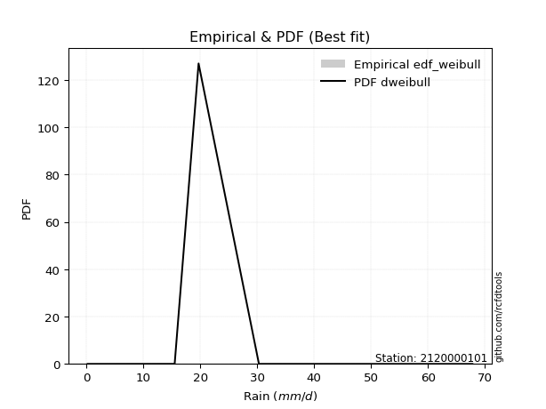</img>

</div>


### 4. EDF Beard (1943)

The Beard formula (or Beard´s plotting position formula) in hydrology is used to estimate the empirical non-exceedance probability _(P)_ of a flood event (or other extreme hydrological data point) within a given dataset.

<div align="center">


$P=(m-0.31)/(n+0.38)$


</div>


**4.1. Empirical values**

<div align="center">

|                | 0                   | 1                   | 2                  | 3                  | 4                  | 5                  |
|:---------------|:--------------------|:--------------------|:-------------------|:-------------------|:-------------------|:-------------------|
| date           | 2023                | 2018                | 2020               | 2025               | 2019               | 2024               |
| x              | 0.2                 | 14.2                | 15.5               | 19.7               | 30.3               | 67.8               |
| m              | 1                   | 2                   | 3                  | 4                  | 5                  | 6                  |
| empirical_dist | edf_beard           | edf_beard           | edf_beard          | edf_beard          | edf_beard          | edf_beard          |
| empirical      | 0.10815047021943573 | 0.26489028213166144 | 0.4216300940438871 | 0.5783699059561128 | 0.7351097178683387 | 0.8918495297805643 |
| empirical_tr   | 1.1212653778558874  | 1.3603411513859276  | 1.7289972899728996 | 2.3717472118959106 | 3.7751479289940844 | 9.246376811594207  |

</div>


**4.2. Kolmogorov-Smirnov fit test (sorted by Δ)**


<div align="center">

|                | 0                   | 1                   | 2                   | 3                   | 4                   | 5                   | 6                   | 7                   | 8                   | 9                   | 10                  | 11                  | 12                  | 13                  | 14                 | 15                  | 16                  | 17                  | 18                  | 19                  | 20                  | 21                 | 22                  | 23                  | 24                  | 25                  | 26                  | 27                  | 28                | 29                  | 30                  | 31                  | 32                 | 33                  | 34                  | 35                 | 36                  | 37                  | 38                  | 39                  | 40                 | 41                 | 42                  | 43                  | 44                  | 45                  | 46                  | 47                 | 48                  | 49                  | 50                  | 51                  | 52                 | 53                 | 54               | 55                  | 56                  | 57                  | 58                  | 59                  | 60                 | 61                  | 62                  | 63                  | 64                  | 65                 | 66                 | 67                 | 68                 | 69                  | 70                  | 71                 | 72                 | 73                  | 74                  | 75                 | 76                  | 77                  | 78                 | 79                  | 80                 | 81                 | 82                  | 83                  | 84                 | 85                 | 86                  | 87                | 88                 | 89                 | 90                 | 91                 | 92                 | 93                  | 94                  | 95                 | 96                 | 97                 | 98                 | 99                  | 100                 | 101                | 102                | 103                 | 104                 | 105                | 106                | 107                 | 108                | 109                | 110                | 111                | 112                 | 113                | 114                 | 115                | 116                 | 117                | 118                | 119                 | 120                 | 121                | 122               | 123                | 124                | 125                | 126                 | 127                 | 128                 | 129                | 130                | 131                | 132                 | 133                | 134                | 135                 | 136                 | 137                 | 138                | 139                | 140                | 141                | 142                | 143                | 144                | 145                | 146               | 147               | 148                | 149                | 150                | 151                | 152                | 153                | 154               | 155                | 156                | 157                 | 158                | 159                |
|:---------------|:--------------------|:--------------------|:--------------------|:--------------------|:--------------------|:--------------------|:--------------------|:--------------------|:--------------------|:--------------------|:--------------------|:--------------------|:--------------------|:--------------------|:-------------------|:--------------------|:--------------------|:--------------------|:--------------------|:--------------------|:--------------------|:-------------------|:--------------------|:--------------------|:--------------------|:--------------------|:--------------------|:--------------------|:------------------|:--------------------|:--------------------|:--------------------|:-------------------|:--------------------|:--------------------|:-------------------|:--------------------|:--------------------|:--------------------|:--------------------|:-------------------|:-------------------|:--------------------|:--------------------|:--------------------|:--------------------|:--------------------|:-------------------|:--------------------|:--------------------|:--------------------|:--------------------|:-------------------|:-------------------|:-----------------|:--------------------|:--------------------|:--------------------|:--------------------|:--------------------|:-------------------|:--------------------|:--------------------|:--------------------|:--------------------|:-------------------|:-------------------|:-------------------|:-------------------|:--------------------|:--------------------|:-------------------|:-------------------|:--------------------|:--------------------|:-------------------|:--------------------|:--------------------|:-------------------|:--------------------|:-------------------|:-------------------|:--------------------|:--------------------|:-------------------|:-------------------|:--------------------|:------------------|:-------------------|:-------------------|:-------------------|:-------------------|:-------------------|:--------------------|:--------------------|:-------------------|:-------------------|:-------------------|:-------------------|:--------------------|:--------------------|:-------------------|:-------------------|:--------------------|:--------------------|:-------------------|:-------------------|:--------------------|:-------------------|:-------------------|:-------------------|:-------------------|:--------------------|:-------------------|:--------------------|:-------------------|:--------------------|:-------------------|:-------------------|:--------------------|:--------------------|:-------------------|:------------------|:-------------------|:-------------------|:-------------------|:--------------------|:--------------------|:--------------------|:-------------------|:-------------------|:-------------------|:--------------------|:-------------------|:-------------------|:--------------------|:--------------------|:--------------------|:-------------------|:-------------------|:-------------------|:-------------------|:-------------------|:-------------------|:-------------------|:-------------------|:------------------|:------------------|:-------------------|:-------------------|:-------------------|:-------------------|:-------------------|:-------------------|:------------------|:-------------------|:-------------------|:--------------------|:-------------------|:-------------------|
| station        | 2120000101          | 2120000101          | 2120000101          | 2120000101          | 2120000101          | 2120000101          | 2120000101          | 2120000101          | 2120000101          | 2120000101          | 2120000101          | 2120000101          | 2120000101          | 2120000101          | 2120000101         | 2120000101          | 2120000101          | 2120000101          | 2120000101          | 2120000101          | 2120000101          | 2120000101         | 2120000101          | 2120000101          | 2120000101          | 2120000101          | 2120000101          | 2120000101          | 2120000101        | 2120000101          | 2120000101          | 2120000101          | 2120000101         | 2120000101          | 2120000101          | 2120000101         | 2120000101          | 2120000101          | 2120000101          | 2120000101          | 2120000101         | 2120000101         | 2120000101          | 2120000101          | 2120000101          | 2120000101          | 2120000101          | 2120000101         | 2120000101          | 2120000101          | 2120000101          | 2120000101          | 2120000101         | 2120000101         | 2120000101       | 2120000101          | 2120000101          | 2120000101          | 2120000101          | 2120000101          | 2120000101         | 2120000101          | 2120000101          | 2120000101          | 2120000101          | 2120000101         | 2120000101         | 2120000101         | 2120000101         | 2120000101          | 2120000101          | 2120000101         | 2120000101         | 2120000101          | 2120000101          | 2120000101         | 2120000101          | 2120000101          | 2120000101         | 2120000101          | 2120000101         | 2120000101         | 2120000101          | 2120000101          | 2120000101         | 2120000101         | 2120000101          | 2120000101        | 2120000101         | 2120000101         | 2120000101         | 2120000101         | 2120000101         | 2120000101          | 2120000101          | 2120000101         | 2120000101         | 2120000101         | 2120000101         | 2120000101          | 2120000101          | 2120000101         | 2120000101         | 2120000101          | 2120000101          | 2120000101         | 2120000101         | 2120000101          | 2120000101         | 2120000101         | 2120000101         | 2120000101         | 2120000101          | 2120000101         | 2120000101          | 2120000101         | 2120000101          | 2120000101         | 2120000101         | 2120000101          | 2120000101          | 2120000101         | 2120000101        | 2120000101         | 2120000101         | 2120000101         | 2120000101          | 2120000101          | 2120000101          | 2120000101         | 2120000101         | 2120000101         | 2120000101          | 2120000101         | 2120000101         | 2120000101          | 2120000101          | 2120000101          | 2120000101         | 2120000101         | 2120000101         | 2120000101         | 2120000101         | 2120000101         | 2120000101         | 2120000101         | 2120000101        | 2120000101        | 2120000101         | 2120000101         | 2120000101         | 2120000101         | 2120000101         | 2120000101         | 2120000101        | 2120000101         | 2120000101         | 2120000101          | 2120000101         | 2120000101         |
| empirical_dist | edf_beard           | edf_beard           | edf_beard           | edf_beard           | edf_beard           | edf_beard           | edf_beard           | edf_beard           | edf_beard           | edf_beard           | edf_beard           | edf_beard           | edf_beard           | edf_beard           | edf_beard          | edf_beard           | edf_beard           | edf_beard           | edf_beard           | edf_beard           | edf_beard           | edf_beard          | edf_beard           | edf_beard           | edf_beard           | edf_beard           | edf_beard           | edf_beard           | edf_beard         | edf_beard           | edf_beard           | edf_beard           | edf_beard          | edf_beard           | edf_beard           | edf_beard          | edf_beard           | edf_beard           | edf_beard           | edf_beard           | edf_beard          | edf_beard          | edf_beard           | edf_beard           | edf_beard           | edf_beard           | edf_beard           | edf_beard          | edf_beard           | edf_beard           | edf_beard           | edf_beard           | edf_beard          | edf_beard          | edf_beard        | edf_beard           | edf_beard           | edf_beard           | edf_beard           | edf_beard           | edf_beard          | edf_beard           | edf_beard           | edf_beard           | edf_beard           | edf_beard          | edf_beard          | edf_beard          | edf_beard          | edf_beard           | edf_beard           | edf_beard          | edf_beard          | edf_beard           | edf_beard           | edf_beard          | edf_beard           | edf_beard           | edf_beard          | edf_beard           | edf_beard          | edf_beard          | edf_beard           | edf_beard           | edf_beard          | edf_beard          | edf_beard           | edf_beard         | edf_beard          | edf_beard          | edf_beard          | edf_beard          | edf_beard          | edf_beard           | edf_beard           | edf_beard          | edf_beard          | edf_beard          | edf_beard          | edf_beard           | edf_beard           | edf_beard          | edf_beard          | edf_beard           | edf_beard           | edf_beard          | edf_beard          | edf_beard           | edf_beard          | edf_beard          | edf_beard          | edf_beard          | edf_beard           | edf_beard          | edf_beard           | edf_beard          | edf_beard           | edf_beard          | edf_beard          | edf_beard           | edf_beard           | edf_beard          | edf_beard         | edf_beard          | edf_beard          | edf_beard          | edf_beard           | edf_beard           | edf_beard           | edf_beard          | edf_beard          | edf_beard          | edf_beard           | edf_beard          | edf_beard          | edf_beard           | edf_beard           | edf_beard           | edf_beard          | edf_beard          | edf_beard          | edf_beard          | edf_beard          | edf_beard          | edf_beard          | edf_beard          | edf_beard         | edf_beard         | edf_beard          | edf_beard          | edf_beard          | edf_beard          | edf_beard          | edf_beard          | edf_beard         | edf_beard          | edf_beard          | edf_beard           | edf_beard          | edf_beard          |
| p_dist         | logt                | dweibull            | logjohnsonsu        | dgamma              | logdweibull         | nct                 | exponnorm           | moyal               | logdgamma           | pearson3            | genlogistic         | truncnorm           | vonmises_line       | gumbel_r            | wald               | invgamma            | genpareto           | t                   | johnsonsu           | halfnorm            | halflogistic        | invgauss           | rayleigh            | foldnorm            | kappa3              | skewnorm            | kstwobign           | mielke              | genexpon          | maxwell             | gompertz            | semicircular        | gennorm            | anglit              | logloggamma         | logargus           | rice                | loggenpareto        | crystalball         | norm                | logvonmises_line   | lomax              | arcsine             | loglevy_l           | logweibull_max      | loggenlogistic      | logistic            | loggennorm         | truncexpon          | hypsecant           | logpearson3         | betaprime           | bradford           | exponpow           | gausshyper       | laplace             | cosine              | loggumbel_l         | kappa4              | gumbel_l            | burr12             | logtrapezoid        | loggenextreme       | ncf                 | loggenhalflogistic  | halfgennorm        | nakagami           | logarcsine         | wrapcauchy         | burr                | logfoldnorm         | logsemicircular    | ksone              | truncweibull_min    | loganglit           | logskewnorm        | f                   | logfatiguelife      | logcrystalball     | lognorm             | logrice            | logexponnorm       | lognct              | lognakagami         | uniform            | levy_l             | argus               | loglogistic       | loginvgamma        | logerlang          | genextreme         | loggamma           | loggamma           | loghypsecant        | gamma               | logalpha           | logloglaplace      | loginvgauss        | logmaxwell         | loglaplace          | loglaplace          | loginvweibull      | erlang             | lograyleigh         | logjohnsonsb        | logncf             | logkstwobign       | logburr12           | triang             | loggausshyper      | logwrapcauchy      | logtriang          | logcosine           | loghalfnorm        | loggumbel_r         | loggenexpon        | loghalflogistic     | logmoyal           | logbeta            | gengamma            | beta                | weibull_min        | loghalfgennorm    | genhalflogistic    | logksone           | loglomax           | logexponweib        | logf                | rdist               | logwald            | logkappa4          | logbradford        | loguniform          | logtruncnorm       | logkappa3          | invweibull          | loggengamma         | truncpareto         | tukeylambda        | logweibull_min     | johnsonsb          | exponweib          | trapezoid          | logtruncexpon      | fatiguelife        | powerlaw           | weibull_max       | logmielke         | logbetaprime       | logexponpow        | logburr            | logtruncpareto     | logpowerlaw        | alpha              | loggompertz       | logrdist           | logtukeylambda     | logtruncweibull_min | logvonmises        | vonmises           |
| delta          | 0.07289783483701777 | 0.07836990595670673 | 0.08130513759596747 | 0.08637982994055132 | 0.08878785796309291 | 0.08969547493338786 | 0.08970197078445152 | 0.09618911853726142 | 0.09879022662737369 | 0.09960540719881078 | 0.10440883578002003 | 0.10815044751430342 | 0.10815046841840892 | 0.10856706969550478 | 0.1086139554690772 | 0.11196969789468841 | 0.11414459194071003 | 0.11755413910708878 | 0.11918642778109267 | 0.11970427109410625 | 0.12056794784699215 | 0.1223761139815957 | 0.12340833723659783 | 0.12367086222968338 | 0.12456336760849906 | 0.12524830003910392 | 0.12665057051567674 | 0.13026805505954964 | 0.134085000769823 | 0.13567435166011987 | 0.14576609988087164 | 0.15185735961873037 | 0.1521797402313857 | 0.15713584324286978 | 0.15725805305434687 | 0.1641217733138457 | 0.16552003692496337 | 0.16672659198905643 | 0.16986228825559235 | 0.16986229758294868 | 0.1705927663559278 | 0.1729774486908099 | 0.17454378785967684 | 0.17828259131130242 | 0.17908731691949392 | 0.18024301069001208 | 0.18177828745479496 | 0.1852738542395112 | 0.18616294585524323 | 0.19159652543717542 | 0.19255954310249268 | 0.19828613398373807 | 0.2075732463830422 | 0.2101689642039648 | 0.21083729531855 | 0.21791048683975006 | 0.21899016812676186 | 0.22272527335026782 | 0.23568668173588697 | 0.23720122996186488 | 0.2448880266536888 | 0.24916445884110527 | 0.25417050204894764 | 0.25814814452581925 | 0.26131115981175257 | 0.2631053306184852 | 0.2647914125935147 | 0.2658282826727706 | 0.2707279541073986 | 0.27203389763960684 | 0.27542664182750376 | 0.2784523909776866 | 0.2807211577105477 | 0.28123416519039246 | 0.28162219451944503 | 0.2836255472338347 | 0.28454288779719283 | 0.28864593937372807 | 0.2893035719966902 | 0.28930365377674916 | 0.2893038962922625 | 0.2893058428880394 | 0.28938487402653623 | 0.28970704158994043 | 0.2899083674945743 | 0.2947982586359464 | 0.29618663557641545 | 0.296586237415847 | 0.2973935827954832 | 0.2997484180726361 | 0.2999936481209271 | 0.3020123823169041 | 0.3020123823169041 | 0.30272764121685714 | 0.30591796886945855 | 0.3067090193492339 | 0.3084887011240284 | 0.3133430284971367 | 0.3194140964922365 | 0.32274801273114817 | 0.32274801273114817 | 0.3233348702761001 | 0.3264856715015775 | 0.32905396801362696 | 0.33001174498754343 | 0.3395244511017076 | 0.3425078170345117 | 0.34406579083698485 | 0.3483697757203725 | 0.3504726008456366 | 0.3539242309314403 | 0.3545539992982043 | 0.35533045698109644 | 0.3562635870359643 | 0.35921802466021335 | 0.3796045386913627 | 0.38368683795309755 | 0.3839162055902743 | 0.3847716479138843 | 0.38732849061774155 | 0.39677255716806786 | 0.4049126732727235 | 0.414758893496758 | 0.4201257537917378 | 0.4281638142287356 | 0.4357082782017827 | 0.43597539635986304 | 0.43929508614258095 | 0.44765669074858644 | 0.4524473785548161 | 0.4628988184114925 | 0.4638217092684719 | 0.46677463350081494 | 0.4694842937760322 | 0.4696384131918069 | 0.47125699273062444 | 0.47201682647431836 | 0.49403119831982734 | 0.5034358846249969 | 0.5126511616943107 | 0.5159956908474035 | 0.5246250542330135 | 0.5249498626461824 | 0.5347936498823892 | 0.5393011317000407 | 0.5545750478725978 | 0.602536202588554 | 0.627106956908943 | 0.6594582873466935 | 0.6652445714811029 | 0.6697107414811391 | 0.6841294681944338 | 0.6879412648044769 | 0.7083442844198022 | 0.731886042721482 | 0.7351097178683386 | 0.7351097178683386 | 0.7351097178683386  | 0.9716061860266311 | 10.293594261686037 |
| deltao         | 0.530385761606      | 0.530385761606      | 0.530385761606      | 0.530385761606      | 0.530385761606      | 0.530385761606      | 0.530385761606      | 0.530385761606      | 0.530385761606      | 0.530385761606      | 0.530385761606      | 0.530385761606      | 0.530385761606      | 0.530385761606      | 0.530385761606     | 0.530385761606      | 0.530385761606      | 0.530385761606      | 0.530385761606      | 0.530385761606      | 0.530385761606      | 0.530385761606     | 0.530385761606      | 0.530385761606      | 0.530385761606      | 0.530385761606      | 0.530385761606      | 0.530385761606      | 0.530385761606    | 0.530385761606      | 0.530385761606      | 0.530385761606      | 0.530385761606     | 0.530385761606      | 0.530385761606      | 0.530385761606     | 0.530385761606      | 0.530385761606      | 0.530385761606      | 0.530385761606      | 0.530385761606     | 0.530385761606     | 0.530385761606      | 0.530385761606      | 0.530385761606      | 0.530385761606      | 0.530385761606      | 0.530385761606     | 0.530385761606      | 0.530385761606      | 0.530385761606      | 0.530385761606      | 0.530385761606     | 0.530385761606     | 0.530385761606   | 0.530385761606      | 0.530385761606      | 0.530385761606      | 0.530385761606      | 0.530385761606      | 0.530385761606     | 0.530385761606      | 0.530385761606      | 0.530385761606      | 0.530385761606      | 0.530385761606     | 0.530385761606     | 0.530385761606     | 0.530385761606     | 0.530385761606      | 0.530385761606      | 0.530385761606     | 0.530385761606     | 0.530385761606      | 0.530385761606      | 0.530385761606     | 0.530385761606      | 0.530385761606      | 0.530385761606     | 0.530385761606      | 0.530385761606     | 0.530385761606     | 0.530385761606      | 0.530385761606      | 0.530385761606     | 0.530385761606     | 0.530385761606      | 0.530385761606    | 0.530385761606     | 0.530385761606     | 0.530385761606     | 0.530385761606     | 0.530385761606     | 0.530385761606      | 0.530385761606      | 0.530385761606     | 0.530385761606     | 0.530385761606     | 0.530385761606     | 0.530385761606      | 0.530385761606      | 0.530385761606     | 0.530385761606     | 0.530385761606      | 0.530385761606      | 0.530385761606     | 0.530385761606     | 0.530385761606      | 0.530385761606     | 0.530385761606     | 0.530385761606     | 0.530385761606     | 0.530385761606      | 0.530385761606     | 0.530385761606      | 0.530385761606     | 0.530385761606      | 0.530385761606     | 0.530385761606     | 0.530385761606      | 0.530385761606      | 0.530385761606     | 0.530385761606    | 0.530385761606     | 0.530385761606     | 0.530385761606     | 0.530385761606      | 0.530385761606      | 0.530385761606      | 0.530385761606     | 0.530385761606     | 0.530385761606     | 0.530385761606      | 0.530385761606     | 0.530385761606     | 0.530385761606      | 0.530385761606      | 0.530385761606      | 0.530385761606     | 0.530385761606     | 0.530385761606     | 0.530385761606     | 0.530385761606     | 0.530385761606     | 0.530385761606     | 0.530385761606     | 0.530385761606    | 0.530385761606    | 0.530385761606     | 0.530385761606     | 0.530385761606     | 0.530385761606     | 0.530385761606     | 0.530385761606     | 0.530385761606    | 0.530385761606     | 0.530385761606     | 0.530385761606      | 0.530385761606     | 0.530385761606     |
| eval           | Δo > Δ              | Δo > Δ              | Δo > Δ              | Δo > Δ              | Δo > Δ              | Δo > Δ              | Δo > Δ              | Δo > Δ              | Δo > Δ              | Δo > Δ              | Δo > Δ              | Δo > Δ              | Δo > Δ              | Δo > Δ              | Δo > Δ             | Δo > Δ              | Δo > Δ              | Δo > Δ              | Δo > Δ              | Δo > Δ              | Δo > Δ              | Δo > Δ             | Δo > Δ              | Δo > Δ              | Δo > Δ              | Δo > Δ              | Δo > Δ              | Δo > Δ              | Δo > Δ            | Δo > Δ              | Δo > Δ              | Δo > Δ              | Δo > Δ             | Δo > Δ              | Δo > Δ              | Δo > Δ             | Δo > Δ              | Δo > Δ              | Δo > Δ              | Δo > Δ              | Δo > Δ             | Δo > Δ             | Δo > Δ              | Δo > Δ              | Δo > Δ              | Δo > Δ              | Δo > Δ              | Δo > Δ             | Δo > Δ              | Δo > Δ              | Δo > Δ              | Δo > Δ              | Δo > Δ             | Δo > Δ             | Δo > Δ           | Δo > Δ              | Δo > Δ              | Δo > Δ              | Δo > Δ              | Δo > Δ              | Δo > Δ             | Δo > Δ              | Δo > Δ              | Δo > Δ              | Δo > Δ              | Δo > Δ             | Δo > Δ             | Δo > Δ             | Δo > Δ             | Δo > Δ              | Δo > Δ              | Δo > Δ             | Δo > Δ             | Δo > Δ              | Δo > Δ              | Δo > Δ             | Δo > Δ              | Δo > Δ              | Δo > Δ             | Δo > Δ              | Δo > Δ             | Δo > Δ             | Δo > Δ              | Δo > Δ              | Δo > Δ             | Δo > Δ             | Δo > Δ              | Δo > Δ            | Δo > Δ             | Δo > Δ             | Δo > Δ             | Δo > Δ             | Δo > Δ             | Δo > Δ              | Δo > Δ              | Δo > Δ             | Δo > Δ             | Δo > Δ             | Δo > Δ             | Δo > Δ              | Δo > Δ              | Δo > Δ             | Δo > Δ             | Δo > Δ              | Δo > Δ              | Δo > Δ             | Δo > Δ             | Δo > Δ              | Δo > Δ             | Δo > Δ             | Δo > Δ             | Δo > Δ             | Δo > Δ              | Δo > Δ             | Δo > Δ              | Δo > Δ             | Δo > Δ              | Δo > Δ             | Δo > Δ             | Δo > Δ              | Δo > Δ              | Δo > Δ             | Δo > Δ            | Δo > Δ             | Δo > Δ             | Δo > Δ             | Δo > Δ              | Δo > Δ              | Δo > Δ              | Δo > Δ             | Δo > Δ             | Δo > Δ             | Δo > Δ              | Δo > Δ             | Δo > Δ             | Δo > Δ              | Δo > Δ              | Δo > Δ              | Δo > Δ             | Δo > Δ             | Δo > Δ             | Δo > Δ             | Δo > Δ             | Δo <= Δ            | Δo <= Δ            | Δo <= Δ            | Δo <= Δ           | Δo <= Δ           | Δo <= Δ            | Δo <= Δ            | Δo <= Δ            | Δo <= Δ            | Δo <= Δ            | Δo <= Δ            | Δo <= Δ           | Δo <= Δ            | Δo <= Δ            | Δo <= Δ             | Δo <= Δ            | Δo <= Δ            |
| fit            | 1                   | 1                   | 1                   | 1                   | 1                   | 1                   | 1                   | 1                   | 1                   | 1                   | 1                   | 1                   | 1                   | 1                   | 1                  | 1                   | 1                   | 1                   | 1                   | 1                   | 1                   | 1                  | 1                   | 1                   | 1                   | 1                   | 1                   | 1                   | 1                 | 1                   | 1                   | 1                   | 1                  | 1                   | 1                   | 1                  | 1                   | 1                   | 1                   | 1                   | 1                  | 1                  | 1                   | 1                   | 1                   | 1                   | 1                   | 1                  | 1                   | 1                   | 1                   | 1                   | 1                  | 1                  | 1                | 1                   | 1                   | 1                   | 1                   | 1                   | 1                  | 1                   | 1                   | 1                   | 1                   | 1                  | 1                  | 1                  | 1                  | 1                   | 1                   | 1                  | 1                  | 1                   | 1                   | 1                  | 1                   | 1                   | 1                  | 1                   | 1                  | 1                  | 1                   | 1                   | 1                  | 1                  | 1                   | 1                 | 1                  | 1                  | 1                  | 1                  | 1                  | 1                   | 1                   | 1                  | 1                  | 1                  | 1                  | 1                   | 1                   | 1                  | 1                  | 1                   | 1                   | 1                  | 1                  | 1                   | 1                  | 1                  | 1                  | 1                  | 1                   | 1                  | 1                   | 1                  | 1                   | 1                  | 1                  | 1                   | 1                   | 1                  | 1                 | 1                  | 1                  | 1                  | 1                   | 1                   | 1                   | 1                  | 1                  | 1                  | 1                   | 1                  | 1                  | 1                   | 1                   | 1                   | 1                  | 1                  | 1                  | 1                  | 1                  | 0                  | 0                  | 0                  | 0                 | 0                 | 0                  | 0                  | 0                  | 0                  | 0                  | 0                  | 0                 | 0                  | 0                  | 0                   | 0                  | 0                  |
| n              | 6                   | 6                   | 6                   | 6                   | 6                   | 6                   | 6                   | 6                   | 6                   | 6                   | 6                   | 6                   | 6                   | 6                   | 6                  | 6                   | 6                   | 6                   | 6                   | 6                   | 6                   | 6                  | 6                   | 6                   | 6                   | 6                   | 6                   | 6                   | 6                 | 6                   | 6                   | 6                   | 6                  | 6                   | 6                   | 6                  | 6                   | 6                   | 6                   | 6                   | 6                  | 6                  | 6                   | 6                   | 6                   | 6                   | 6                   | 6                  | 6                   | 6                   | 6                   | 6                   | 6                  | 6                  | 6                | 6                   | 6                   | 6                   | 6                   | 6                   | 6                  | 6                   | 6                   | 6                   | 6                   | 6                  | 6                  | 6                  | 6                  | 6                   | 6                   | 6                  | 6                  | 6                   | 6                   | 6                  | 6                   | 6                   | 6                  | 6                   | 6                  | 6                  | 6                   | 6                   | 6                  | 6                  | 6                   | 6                 | 6                  | 6                  | 6                  | 6                  | 6                  | 6                   | 6                   | 6                  | 6                  | 6                  | 6                  | 6                   | 6                   | 6                  | 6                  | 6                   | 6                   | 6                  | 6                  | 6                   | 6                  | 6                  | 6                  | 6                  | 6                   | 6                  | 6                   | 6                  | 6                   | 6                  | 6                  | 6                   | 6                   | 6                  | 6                 | 6                  | 6                  | 6                  | 6                   | 6                   | 6                   | 6                  | 6                  | 6                  | 6                   | 6                  | 6                  | 6                   | 6                   | 6                   | 6                  | 6                  | 6                  | 6                  | 6                  | 6                  | 6                  | 6                  | 6                 | 6                 | 6                  | 6                  | 6                  | 6                  | 6                  | 6                  | 6                 | 6                  | 6                  | 6                   | 6                  | 6                  |
| best_fit       | 1                   | 0                   | 0                   | 0                   | 0                   | 0                   | 0                   | 0                   | 0                   | 0                   | 0                   | 0                   | 0                   | 0                   | 0                  | 0                   | 0                   | 0                   | 0                   | 0                   | 0                   | 0                  | 0                   | 0                   | 0                   | 0                   | 0                   | 0                   | 0                 | 0                   | 0                   | 0                   | 0                  | 0                   | 0                   | 0                  | 0                   | 0                   | 0                   | 0                   | 0                  | 0                  | 0                   | 0                   | 0                   | 0                   | 0                   | 0                  | 0                   | 0                   | 0                   | 0                   | 0                  | 0                  | 0                | 0                   | 0                   | 0                   | 0                   | 0                   | 0                  | 0                   | 0                   | 0                   | 0                   | 0                  | 0                  | 0                  | 0                  | 0                   | 0                   | 0                  | 0                  | 0                   | 0                   | 0                  | 0                   | 0                   | 0                  | 0                   | 0                  | 0                  | 0                   | 0                   | 0                  | 0                  | 0                   | 0                 | 0                  | 0                  | 0                  | 0                  | 0                  | 0                   | 0                   | 0                  | 0                  | 0                  | 0                  | 0                   | 0                   | 0                  | 0                  | 0                   | 0                   | 0                  | 0                  | 0                   | 0                  | 0                  | 0                  | 0                  | 0                   | 0                  | 0                   | 0                  | 0                   | 0                  | 0                  | 0                   | 0                   | 0                  | 0                 | 0                  | 0                  | 0                  | 0                   | 0                   | 0                   | 0                  | 0                  | 0                  | 0                   | 0                  | 0                  | 0                   | 0                   | 0                   | 0                  | 0                  | 0                  | 0                  | 0                  | 0                  | 0                  | 0                  | 0                 | 0                 | 0                  | 0                  | 0                  | 0                  | 0                  | 0                  | 0                 | 0                  | 0                  | 0                   | 0                  | 0                  |
| best_fit_sort  | 1                   | 2                   | 3                   | 4                   | 5                   | 6                   | 7                   | 8                   | 9                   | 10                  | 11                  | 12                  | 13                  | 14                  | 15                 | 16                  | 17                  | 18                  | 19                  | 20                  | 21                  | 22                 | 23                  | 24                  | 25                  | 26                  | 27                  | 28                  | 29                | 30                  | 31                  | 32                  | 33                 | 34                  | 35                  | 36                 | 37                  | 38                  | 39                  | 40                  | 41                 | 42                 | 43                  | 44                  | 45                  | 46                  | 47                  | 48                 | 49                  | 50                  | 51                  | 52                  | 53                 | 54                 | 55               | 56                  | 57                  | 58                  | 59                  | 60                  | 61                 | 62                  | 63                  | 64                  | 65                  | 66                 | 67                 | 68                 | 69                 | 70                  | 71                  | 72                 | 73                 | 74                  | 75                  | 76                 | 77                  | 78                  | 79                 | 80                  | 81                 | 82                 | 83                  | 84                  | 85                 | 86                 | 87                  | 88                | 89                 | 90                 | 91                 | 92                 | 93                 | 94                  | 95                  | 96                 | 97                 | 98                 | 99                 | 100                 | 101                 | 102                | 103                | 104                 | 105                 | 106                | 107                | 108                 | 109                | 110                | 111                | 112                | 113                 | 114                | 115                 | 116                | 117                 | 118                | 119                | 120                 | 121                 | 122                | 123               | 124                | 125                | 126                | 127                 | 128                 | 129                 | 130                | 131                | 132                | 133                 | 134                | 135                | 136                 | 137                 | 138                 | 139                | 140                | 141                | 142                | 143                | 144                | 145                | 146                | 147               | 148               | 149                | 150                | 151                | 152                | 153                | 154                | 155               | 156                | 157                | 158                 | 159                | 160                |

</div>


**4.3. Best fit**

<div align="center">

|   id |    station | empirical_dist   | p_dist   |     delta |   deltao | eval   |   fit |   n |   best_fit |   best_fit_sort |
|-----:|-----------:|:-----------------|:---------|----------:|---------:|:-------|------:|----:|-----------:|----------------:|
|    0 | 2120000101 | edf_beard        | logt     | 0.0728978 | 0.530386 | Δo > Δ |     1 |   6 |          1 |               1 |

</div>


<div align="center">

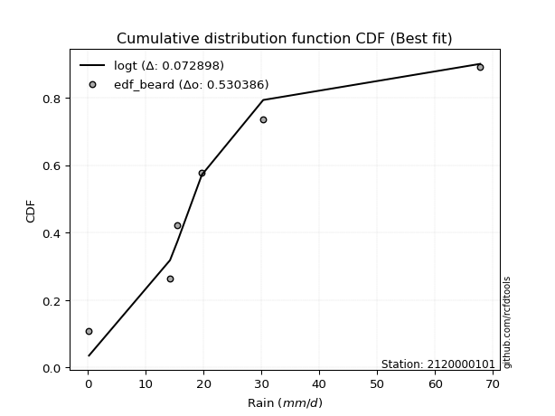</img></img>

</div>


### 5. EDF Chegodayev (1955)

The Chegodayev formula is an empirical plotting position formula used in hydrological frequency analysis to estimate the exceedance probability or return period of a specific event from a set of observed data. It is primarily used for plotting observed data points on probability paper to fit a theoretical distribution, particularly for analyzing extreme events like maximum flood flows or rainfall intensities. The constant _b_ value in the generalized plotting position formula is 0.3.

<div align="center">


$P=(m-b)/(n+1-2b)$


</div>


**5.1. Empirical values**

<div align="center">

|                | 0                   | 1                  | 2                  | 3                  | 4                 | 5                 |
|:---------------|:--------------------|:-------------------|:-------------------|:-------------------|:------------------|:------------------|
| date           | 2023                | 2018               | 2020               | 2025               | 2019              | 2024              |
| x              | 0.2                 | 14.2               | 15.5               | 19.7               | 30.3              | 67.8              |
| m              | 1                   | 2                  | 3                  | 4                  | 5                 | 6                 |
| empirical_dist | edf_chegodayev      | edf_chegodayev     | edf_chegodayev     | edf_chegodayev     | edf_chegodayev    | edf_chegodayev    |
| empirical      | 0.10937499999999999 | 0.265625           | 0.421875           | 0.578125           | 0.734375          | 0.890625          |
| empirical_tr   | 1.1228070175438596  | 1.3617021276595744 | 1.7297297297297298 | 2.3703703703703702 | 3.764705882352941 | 9.142857142857142 |

</div>


**5.2. Kolmogorov-Smirnov fit test (sorted by Δ)**


<div align="center">

|                | 0                   | 1                   | 2                  | 3                  | 4                   | 5                  | 6                   | 7                   | 8                   | 9                   | 10                  | 11                  | 12                  | 13                  | 14                  | 15                  | 16                  | 17                  | 18                  | 19                  | 20                  | 21                  | 22                  | 23                  | 24                 | 25                 | 26                  | 27                  | 28                  | 29                  | 30                  | 31                  | 32                 | 33                 | 34                  | 35                  | 36                  | 37                  | 38                  | 39                  | 40                  | 41                  | 42                  | 43                  | 44                  | 45                  | 46                  | 47                  | 48                  | 49                 | 50                  | 51                 | 52                  | 53                  | 54                  | 55                  | 56                  | 57                  | 58                  | 59                  | 60                  | 61                 | 62                 | 63                 | 64                 | 65                 | 66                | 67                  | 68                 | 69                 | 70                 | 71                  | 72                | 73                 | 74                  | 75                  | 76                  | 77                 | 78                  | 79                 | 80                  | 81                  | 82                  | 83                  | 84                 | 85                  | 86                  | 87                  | 88                  | 89                 | 90                 | 91                 | 92                 | 93                  | 94               | 95                 | 96                  | 97                 | 98                  | 99                 | 100                | 101                | 102                | 103                | 104                | 105                 | 106                 | 107                | 108                | 109               | 110                 | 111                 | 112                | 113                | 114                | 115                | 116               | 117                | 118                | 119               | 120                | 121                 | 122                | 123                | 124                 | 125                 | 126                | 127                | 128                | 129                 | 130                 | 131                | 132                | 133                 | 134                | 135                | 136                 | 137                | 138                | 139                | 140                | 141               | 142                | 143                | 144                | 145                | 146                | 147                | 148               | 149                | 150                | 151                | 152                | 153                | 154                | 155            | 156            | 157                 | 158                | 159                |
|:---------------|:--------------------|:--------------------|:-------------------|:-------------------|:--------------------|:-------------------|:--------------------|:--------------------|:--------------------|:--------------------|:--------------------|:--------------------|:--------------------|:--------------------|:--------------------|:--------------------|:--------------------|:--------------------|:--------------------|:--------------------|:--------------------|:--------------------|:--------------------|:--------------------|:-------------------|:-------------------|:--------------------|:--------------------|:--------------------|:--------------------|:--------------------|:--------------------|:-------------------|:-------------------|:--------------------|:--------------------|:--------------------|:--------------------|:--------------------|:--------------------|:--------------------|:--------------------|:--------------------|:--------------------|:--------------------|:--------------------|:--------------------|:--------------------|:--------------------|:-------------------|:--------------------|:-------------------|:--------------------|:--------------------|:--------------------|:--------------------|:--------------------|:--------------------|:--------------------|:--------------------|:--------------------|:-------------------|:-------------------|:-------------------|:-------------------|:-------------------|:------------------|:--------------------|:-------------------|:-------------------|:-------------------|:--------------------|:------------------|:-------------------|:--------------------|:--------------------|:--------------------|:-------------------|:--------------------|:-------------------|:--------------------|:--------------------|:--------------------|:--------------------|:-------------------|:--------------------|:--------------------|:--------------------|:--------------------|:-------------------|:-------------------|:-------------------|:-------------------|:--------------------|:-----------------|:-------------------|:--------------------|:-------------------|:--------------------|:-------------------|:-------------------|:-------------------|:-------------------|:-------------------|:-------------------|:--------------------|:--------------------|:-------------------|:-------------------|:------------------|:--------------------|:--------------------|:-------------------|:-------------------|:-------------------|:-------------------|:------------------|:-------------------|:-------------------|:------------------|:-------------------|:--------------------|:-------------------|:-------------------|:--------------------|:--------------------|:-------------------|:-------------------|:-------------------|:--------------------|:--------------------|:-------------------|:-------------------|:--------------------|:-------------------|:-------------------|:--------------------|:-------------------|:-------------------|:-------------------|:-------------------|:------------------|:-------------------|:-------------------|:-------------------|:-------------------|:-------------------|:-------------------|:------------------|:-------------------|:-------------------|:-------------------|:-------------------|:-------------------|:-------------------|:---------------|:---------------|:--------------------|:-------------------|:-------------------|
| station        | 2120000101          | 2120000101          | 2120000101         | 2120000101         | 2120000101          | 2120000101         | 2120000101          | 2120000101          | 2120000101          | 2120000101          | 2120000101          | 2120000101          | 2120000101          | 2120000101          | 2120000101          | 2120000101          | 2120000101          | 2120000101          | 2120000101          | 2120000101          | 2120000101          | 2120000101          | 2120000101          | 2120000101          | 2120000101         | 2120000101         | 2120000101          | 2120000101          | 2120000101          | 2120000101          | 2120000101          | 2120000101          | 2120000101         | 2120000101         | 2120000101          | 2120000101          | 2120000101          | 2120000101          | 2120000101          | 2120000101          | 2120000101          | 2120000101          | 2120000101          | 2120000101          | 2120000101          | 2120000101          | 2120000101          | 2120000101          | 2120000101          | 2120000101         | 2120000101          | 2120000101         | 2120000101          | 2120000101          | 2120000101          | 2120000101          | 2120000101          | 2120000101          | 2120000101          | 2120000101          | 2120000101          | 2120000101         | 2120000101         | 2120000101         | 2120000101         | 2120000101         | 2120000101        | 2120000101          | 2120000101         | 2120000101         | 2120000101         | 2120000101          | 2120000101        | 2120000101         | 2120000101          | 2120000101          | 2120000101          | 2120000101         | 2120000101          | 2120000101         | 2120000101          | 2120000101          | 2120000101          | 2120000101          | 2120000101         | 2120000101          | 2120000101          | 2120000101          | 2120000101          | 2120000101         | 2120000101         | 2120000101         | 2120000101         | 2120000101          | 2120000101       | 2120000101         | 2120000101          | 2120000101         | 2120000101          | 2120000101         | 2120000101         | 2120000101         | 2120000101         | 2120000101         | 2120000101         | 2120000101          | 2120000101          | 2120000101         | 2120000101         | 2120000101        | 2120000101          | 2120000101          | 2120000101         | 2120000101         | 2120000101         | 2120000101         | 2120000101        | 2120000101         | 2120000101         | 2120000101        | 2120000101         | 2120000101          | 2120000101         | 2120000101         | 2120000101          | 2120000101          | 2120000101         | 2120000101         | 2120000101         | 2120000101          | 2120000101          | 2120000101         | 2120000101         | 2120000101          | 2120000101         | 2120000101         | 2120000101          | 2120000101         | 2120000101         | 2120000101         | 2120000101         | 2120000101        | 2120000101         | 2120000101         | 2120000101         | 2120000101         | 2120000101         | 2120000101         | 2120000101        | 2120000101         | 2120000101         | 2120000101         | 2120000101         | 2120000101         | 2120000101         | 2120000101     | 2120000101     | 2120000101          | 2120000101         | 2120000101         |
| empirical_dist | edf_chegodayev      | edf_chegodayev      | edf_chegodayev     | edf_chegodayev     | edf_chegodayev      | edf_chegodayev     | edf_chegodayev      | edf_chegodayev      | edf_chegodayev      | edf_chegodayev      | edf_chegodayev      | edf_chegodayev      | edf_chegodayev      | edf_chegodayev      | edf_chegodayev      | edf_chegodayev      | edf_chegodayev      | edf_chegodayev      | edf_chegodayev      | edf_chegodayev      | edf_chegodayev      | edf_chegodayev      | edf_chegodayev      | edf_chegodayev      | edf_chegodayev     | edf_chegodayev     | edf_chegodayev      | edf_chegodayev      | edf_chegodayev      | edf_chegodayev      | edf_chegodayev      | edf_chegodayev      | edf_chegodayev     | edf_chegodayev     | edf_chegodayev      | edf_chegodayev      | edf_chegodayev      | edf_chegodayev      | edf_chegodayev      | edf_chegodayev      | edf_chegodayev      | edf_chegodayev      | edf_chegodayev      | edf_chegodayev      | edf_chegodayev      | edf_chegodayev      | edf_chegodayev      | edf_chegodayev      | edf_chegodayev      | edf_chegodayev     | edf_chegodayev      | edf_chegodayev     | edf_chegodayev      | edf_chegodayev      | edf_chegodayev      | edf_chegodayev      | edf_chegodayev      | edf_chegodayev      | edf_chegodayev      | edf_chegodayev      | edf_chegodayev      | edf_chegodayev     | edf_chegodayev     | edf_chegodayev     | edf_chegodayev     | edf_chegodayev     | edf_chegodayev    | edf_chegodayev      | edf_chegodayev     | edf_chegodayev     | edf_chegodayev     | edf_chegodayev      | edf_chegodayev    | edf_chegodayev     | edf_chegodayev      | edf_chegodayev      | edf_chegodayev      | edf_chegodayev     | edf_chegodayev      | edf_chegodayev     | edf_chegodayev      | edf_chegodayev      | edf_chegodayev      | edf_chegodayev      | edf_chegodayev     | edf_chegodayev      | edf_chegodayev      | edf_chegodayev      | edf_chegodayev      | edf_chegodayev     | edf_chegodayev     | edf_chegodayev     | edf_chegodayev     | edf_chegodayev      | edf_chegodayev   | edf_chegodayev     | edf_chegodayev      | edf_chegodayev     | edf_chegodayev      | edf_chegodayev     | edf_chegodayev     | edf_chegodayev     | edf_chegodayev     | edf_chegodayev     | edf_chegodayev     | edf_chegodayev      | edf_chegodayev      | edf_chegodayev     | edf_chegodayev     | edf_chegodayev    | edf_chegodayev      | edf_chegodayev      | edf_chegodayev     | edf_chegodayev     | edf_chegodayev     | edf_chegodayev     | edf_chegodayev    | edf_chegodayev     | edf_chegodayev     | edf_chegodayev    | edf_chegodayev     | edf_chegodayev      | edf_chegodayev     | edf_chegodayev     | edf_chegodayev      | edf_chegodayev      | edf_chegodayev     | edf_chegodayev     | edf_chegodayev     | edf_chegodayev      | edf_chegodayev      | edf_chegodayev     | edf_chegodayev     | edf_chegodayev      | edf_chegodayev     | edf_chegodayev     | edf_chegodayev      | edf_chegodayev     | edf_chegodayev     | edf_chegodayev     | edf_chegodayev     | edf_chegodayev    | edf_chegodayev     | edf_chegodayev     | edf_chegodayev     | edf_chegodayev     | edf_chegodayev     | edf_chegodayev     | edf_chegodayev    | edf_chegodayev     | edf_chegodayev     | edf_chegodayev     | edf_chegodayev     | edf_chegodayev     | edf_chegodayev     | edf_chegodayev | edf_chegodayev | edf_chegodayev      | edf_chegodayev     | edf_chegodayev     |
| p_dist         | logt                | dweibull            | logjohnsonsu       | dgamma             | logdweibull         | nct                | exponnorm           | moyal               | pearson3            | logdgamma           | genlogistic         | gumbel_r            | truncnorm           | vonmises_line       | wald                | invgamma            | genpareto           | t                   | johnsonsu           | halfnorm            | halflogistic        | invgauss            | foldnorm            | rayleigh            | kappa3             | skewnorm           | kstwobign           | mielke              | genexpon            | maxwell             | gompertz            | semicircular        | gennorm            | logloggamma        | anglit              | logargus            | rice                | loggenpareto        | crystalball         | norm                | logvonmises_line    | lomax               | arcsine             | loglevy_l           | logweibull_max      | loggenlogistic      | logistic            | loggennorm          | truncexpon          | hypsecant          | logpearson3         | betaprime          | bradford            | exponpow            | gausshyper          | laplace             | cosine              | loggumbel_l         | kappa4              | gumbel_l            | burr12              | logtrapezoid       | loggenextreme      | ncf                | loggenhalflogistic | halfgennorm        | logarcsine        | nakagami            | wrapcauchy         | burr               | logfoldnorm        | logsemicircular     | ksone             | truncweibull_min   | loganglit           | logskewnorm         | f                   | logfatiguelife     | logcrystalball      | lognorm            | logrice             | logexponnorm        | lognct              | lognakagami         | uniform            | levy_l              | argus               | loglogistic         | loginvgamma         | genextreme         | logerlang          | loggamma           | loggamma           | loghypsecant        | gamma            | logalpha           | logloglaplace       | loginvgauss        | logmaxwell          | loglaplace         | loglaplace         | loginvweibull      | erlang             | lograyleigh        | logjohnsonsb       | logncf              | logkstwobign        | logburr12          | triang             | loggausshyper     | logwrapcauchy       | logtriang           | logcosine          | loghalfnorm        | loggumbel_r        | loggenexpon        | loghalflogistic   | logmoyal           | logbeta            | gengamma          | beta               | weibull_min         | loghalfgennorm     | genhalflogistic    | logksone            | loglomax            | logexponweib       | logf               | rdist              | logwald             | logkappa4           | logbradford        | loguniform         | logkappa3           | logtruncnorm       | invweibull         | loggengamma         | truncpareto        | tukeylambda        | logweibull_min     | johnsonsb          | exponweib         | trapezoid          | logtruncexpon      | fatiguelife        | powerlaw           | weibull_max        | logmielke          | logbetaprime      | logexponpow        | logburr            | logtruncpareto     | logpowerlaw        | alpha              | loggompertz        | logrdist       | logtukeylambda | logtruncweibull_min | logvonmises        | vonmises           |
| delta          | 0.07412236461758202 | 0.07812500000059391 | 0.0805704197276289 | 0.0866247358966642 | 0.08805314009475435 | 0.0889607570650493 | 0.08896725291611296 | 0.09545440066892286 | 0.09936050124269796 | 0.10001475640793794 | 0.10416392982390721 | 0.10832216373939196 | 0.10937497729486767 | 0.10937499819897323 | 0.10937499999999999 | 0.11123498002634985 | 0.11340987407237146 | 0.11828885697542746 | 0.11845170991275411 | 0.11896955322576769 | 0.11983322997865359 | 0.12164139611325714 | 0.12293614436134481 | 0.12316343128048501 | 0.1238286497401605 | 0.1250033940829911 | 0.12640566455956392 | 0.12953333719121107 | 0.13335028290148443 | 0.13542944570400706 | 0.14552119392475882 | 0.15161245366261755 | 0.1524246461874985 | 0.1565233351860083 | 0.15689093728675696 | 0.16338705544550713 | 0.16527513096885055 | 0.16599187412071786 | 0.16961738229947954 | 0.16961739162683587 | 0.16985804848758923 | 0.17224273082247132 | 0.17380906999133816 | 0.17754787344296385 | 0.17835259905115536 | 0.17950829282167352 | 0.18153338149868214 | 0.18551876019562408 | 0.18591803989913042 | 0.1913516194810626 | 0.19182482523415412 | 0.1975514161153995 | 0.20732834042692938 | 0.20943424633562624 | 0.21010257745021133 | 0.21766558088363724 | 0.21874526217064905 | 0.22199055548192925 | 0.23544177577977415 | 0.23695632400575206 | 0.24415330878535024 | 0.2484297409727667 | 0.2534357841806091 | 0.2574134266574807 | 0.260576441943414  | 0.2623706127501466 | 0.265093564804432 | 0.26552613046185325 | 0.2699932362390599 | 0.2712991797712683 | 0.2746919239591652 | 0.27771767310934803 | 0.279986439842209 | 0.2804994473220539 | 0.28088747665110647 | 0.28289082936549614 | 0.28380816992885427 | 0.2879112215053895 | 0.28856885412835165 | 0.2885689359084106 | 0.28856917842392393 | 0.28857112501970084 | 0.28865015615819767 | 0.28897232372160186 | 0.2896634615384615 | 0.29357372885538213 | 0.29545191770807677 | 0.29585151954750843 | 0.29665886492714466 | 0.2987691183403628 | 0.2990137002042975 | 0.3012776644485655 | 0.3012776644485655 | 0.30199292334851857 | 0.30518325100112 | 0.3059743014808953 | 0.30726417134346407 | 0.3126083106287981 | 0.31867937862389795 | 0.3220132948628096 | 0.3220132948628096 | 0.3226001524077615 | 0.3257509536332389 | 0.3283192501452884 | 0.3287872152069792 | 0.33878973323336903 | 0.34177309916617316 | 0.3433310729686463 | 0.3476350578520338 | 0.349737882977298 | 0.35318951306310176 | 0.35381928142986574 | 0.3545957391127579 | 0.3555288691676257 | 0.3584833067918748 | 0.3788698208230241 | 0.382952120084759 | 0.3831814877219357 | 0.3840369300455456 | 0.386593772749403 | 0.3960378392997292 | 0.40417795540438495 | 0.4140241756284194 | 0.4193910359233991 | 0.42742909636039705 | 0.43497356033344414 | 0.4352406784915245 | 0.4385603682742424 | 0.4464321609680222 | 0.45171266068647753 | 0.46216410054315393 | 0.4630869914001333 | 0.4660399156324764 | 0.46841388341124257 | 0.4687495759076936 | 0.4700324629500601 | 0.47079229669375405 | 0.4932964804514888 | 0.5027011667566583 | 0.5119164438259721 | 0.5152609729790648 | 0.523890336364675 | 0.5242151447778437 | 0.5340589320140506 | 0.5385664138317021 | 0.5538403300042593 | 0.6018014847202153 | 0.6263722390406045 | 0.658723569478355 | 0.6645098536127644 | 0.6689760236128005 | 0.6833947503260952 | 0.6872065469361384 | 0.7076095665514637 | 0.7311513248531435 | 0.734375       | 0.734375       | 0.734375            | 0.9728307158071954 | 10.294818791466602 |
| deltao         | 0.530385761606      | 0.530385761606      | 0.530385761606     | 0.530385761606     | 0.530385761606      | 0.530385761606     | 0.530385761606      | 0.530385761606      | 0.530385761606      | 0.530385761606      | 0.530385761606      | 0.530385761606      | 0.530385761606      | 0.530385761606      | 0.530385761606      | 0.530385761606      | 0.530385761606      | 0.530385761606      | 0.530385761606      | 0.530385761606      | 0.530385761606      | 0.530385761606      | 0.530385761606      | 0.530385761606      | 0.530385761606     | 0.530385761606     | 0.530385761606      | 0.530385761606      | 0.530385761606      | 0.530385761606      | 0.530385761606      | 0.530385761606      | 0.530385761606     | 0.530385761606     | 0.530385761606      | 0.530385761606      | 0.530385761606      | 0.530385761606      | 0.530385761606      | 0.530385761606      | 0.530385761606      | 0.530385761606      | 0.530385761606      | 0.530385761606      | 0.530385761606      | 0.530385761606      | 0.530385761606      | 0.530385761606      | 0.530385761606      | 0.530385761606     | 0.530385761606      | 0.530385761606     | 0.530385761606      | 0.530385761606      | 0.530385761606      | 0.530385761606      | 0.530385761606      | 0.530385761606      | 0.530385761606      | 0.530385761606      | 0.530385761606      | 0.530385761606     | 0.530385761606     | 0.530385761606     | 0.530385761606     | 0.530385761606     | 0.530385761606    | 0.530385761606      | 0.530385761606     | 0.530385761606     | 0.530385761606     | 0.530385761606      | 0.530385761606    | 0.530385761606     | 0.530385761606      | 0.530385761606      | 0.530385761606      | 0.530385761606     | 0.530385761606      | 0.530385761606     | 0.530385761606      | 0.530385761606      | 0.530385761606      | 0.530385761606      | 0.530385761606     | 0.530385761606      | 0.530385761606      | 0.530385761606      | 0.530385761606      | 0.530385761606     | 0.530385761606     | 0.530385761606     | 0.530385761606     | 0.530385761606      | 0.530385761606   | 0.530385761606     | 0.530385761606      | 0.530385761606     | 0.530385761606      | 0.530385761606     | 0.530385761606     | 0.530385761606     | 0.530385761606     | 0.530385761606     | 0.530385761606     | 0.530385761606      | 0.530385761606      | 0.530385761606     | 0.530385761606     | 0.530385761606    | 0.530385761606      | 0.530385761606      | 0.530385761606     | 0.530385761606     | 0.530385761606     | 0.530385761606     | 0.530385761606    | 0.530385761606     | 0.530385761606     | 0.530385761606    | 0.530385761606     | 0.530385761606      | 0.530385761606     | 0.530385761606     | 0.530385761606      | 0.530385761606      | 0.530385761606     | 0.530385761606     | 0.530385761606     | 0.530385761606      | 0.530385761606      | 0.530385761606     | 0.530385761606     | 0.530385761606      | 0.530385761606     | 0.530385761606     | 0.530385761606      | 0.530385761606     | 0.530385761606     | 0.530385761606     | 0.530385761606     | 0.530385761606    | 0.530385761606     | 0.530385761606     | 0.530385761606     | 0.530385761606     | 0.530385761606     | 0.530385761606     | 0.530385761606    | 0.530385761606     | 0.530385761606     | 0.530385761606     | 0.530385761606     | 0.530385761606     | 0.530385761606     | 0.530385761606 | 0.530385761606 | 0.530385761606      | 0.530385761606     | 0.530385761606     |
| eval           | Δo > Δ              | Δo > Δ              | Δo > Δ             | Δo > Δ             | Δo > Δ              | Δo > Δ             | Δo > Δ              | Δo > Δ              | Δo > Δ              | Δo > Δ              | Δo > Δ              | Δo > Δ              | Δo > Δ              | Δo > Δ              | Δo > Δ              | Δo > Δ              | Δo > Δ              | Δo > Δ              | Δo > Δ              | Δo > Δ              | Δo > Δ              | Δo > Δ              | Δo > Δ              | Δo > Δ              | Δo > Δ             | Δo > Δ             | Δo > Δ              | Δo > Δ              | Δo > Δ              | Δo > Δ              | Δo > Δ              | Δo > Δ              | Δo > Δ             | Δo > Δ             | Δo > Δ              | Δo > Δ              | Δo > Δ              | Δo > Δ              | Δo > Δ              | Δo > Δ              | Δo > Δ              | Δo > Δ              | Δo > Δ              | Δo > Δ              | Δo > Δ              | Δo > Δ              | Δo > Δ              | Δo > Δ              | Δo > Δ              | Δo > Δ             | Δo > Δ              | Δo > Δ             | Δo > Δ              | Δo > Δ              | Δo > Δ              | Δo > Δ              | Δo > Δ              | Δo > Δ              | Δo > Δ              | Δo > Δ              | Δo > Δ              | Δo > Δ             | Δo > Δ             | Δo > Δ             | Δo > Δ             | Δo > Δ             | Δo > Δ            | Δo > Δ              | Δo > Δ             | Δo > Δ             | Δo > Δ             | Δo > Δ              | Δo > Δ            | Δo > Δ             | Δo > Δ              | Δo > Δ              | Δo > Δ              | Δo > Δ             | Δo > Δ              | Δo > Δ             | Δo > Δ              | Δo > Δ              | Δo > Δ              | Δo > Δ              | Δo > Δ             | Δo > Δ              | Δo > Δ              | Δo > Δ              | Δo > Δ              | Δo > Δ             | Δo > Δ             | Δo > Δ             | Δo > Δ             | Δo > Δ              | Δo > Δ           | Δo > Δ             | Δo > Δ              | Δo > Δ             | Δo > Δ              | Δo > Δ             | Δo > Δ             | Δo > Δ             | Δo > Δ             | Δo > Δ             | Δo > Δ             | Δo > Δ              | Δo > Δ              | Δo > Δ             | Δo > Δ             | Δo > Δ            | Δo > Δ              | Δo > Δ              | Δo > Δ             | Δo > Δ             | Δo > Δ             | Δo > Δ             | Δo > Δ            | Δo > Δ             | Δo > Δ             | Δo > Δ            | Δo > Δ             | Δo > Δ              | Δo > Δ             | Δo > Δ             | Δo > Δ              | Δo > Δ              | Δo > Δ             | Δo > Δ             | Δo > Δ             | Δo > Δ              | Δo > Δ              | Δo > Δ             | Δo > Δ             | Δo > Δ              | Δo > Δ             | Δo > Δ             | Δo > Δ              | Δo > Δ             | Δo > Δ             | Δo > Δ             | Δo > Δ             | Δo > Δ            | Δo > Δ             | Δo <= Δ            | Δo <= Δ            | Δo <= Δ            | Δo <= Δ            | Δo <= Δ            | Δo <= Δ           | Δo <= Δ            | Δo <= Δ            | Δo <= Δ            | Δo <= Δ            | Δo <= Δ            | Δo <= Δ            | Δo <= Δ        | Δo <= Δ        | Δo <= Δ             | Δo <= Δ            | Δo <= Δ            |
| fit            | 1                   | 1                   | 1                  | 1                  | 1                   | 1                  | 1                   | 1                   | 1                   | 1                   | 1                   | 1                   | 1                   | 1                   | 1                   | 1                   | 1                   | 1                   | 1                   | 1                   | 1                   | 1                   | 1                   | 1                   | 1                  | 1                  | 1                   | 1                   | 1                   | 1                   | 1                   | 1                   | 1                  | 1                  | 1                   | 1                   | 1                   | 1                   | 1                   | 1                   | 1                   | 1                   | 1                   | 1                   | 1                   | 1                   | 1                   | 1                   | 1                   | 1                  | 1                   | 1                  | 1                   | 1                   | 1                   | 1                   | 1                   | 1                   | 1                   | 1                   | 1                   | 1                  | 1                  | 1                  | 1                  | 1                  | 1                 | 1                   | 1                  | 1                  | 1                  | 1                   | 1                 | 1                  | 1                   | 1                   | 1                   | 1                  | 1                   | 1                  | 1                   | 1                   | 1                   | 1                   | 1                  | 1                   | 1                   | 1                   | 1                   | 1                  | 1                  | 1                  | 1                  | 1                   | 1                | 1                  | 1                   | 1                  | 1                   | 1                  | 1                  | 1                  | 1                  | 1                  | 1                  | 1                   | 1                   | 1                  | 1                  | 1                 | 1                   | 1                   | 1                  | 1                  | 1                  | 1                  | 1                 | 1                  | 1                  | 1                 | 1                  | 1                   | 1                  | 1                  | 1                   | 1                   | 1                  | 1                  | 1                  | 1                   | 1                   | 1                  | 1                  | 1                   | 1                  | 1                  | 1                   | 1                  | 1                  | 1                  | 1                  | 1                 | 1                  | 0                  | 0                  | 0                  | 0                  | 0                  | 0                 | 0                  | 0                  | 0                  | 0                  | 0                  | 0                  | 0              | 0              | 0                   | 0                  | 0                  |
| n              | 6                   | 6                   | 6                  | 6                  | 6                   | 6                  | 6                   | 6                   | 6                   | 6                   | 6                   | 6                   | 6                   | 6                   | 6                   | 6                   | 6                   | 6                   | 6                   | 6                   | 6                   | 6                   | 6                   | 6                   | 6                  | 6                  | 6                   | 6                   | 6                   | 6                   | 6                   | 6                   | 6                  | 6                  | 6                   | 6                   | 6                   | 6                   | 6                   | 6                   | 6                   | 6                   | 6                   | 6                   | 6                   | 6                   | 6                   | 6                   | 6                   | 6                  | 6                   | 6                  | 6                   | 6                   | 6                   | 6                   | 6                   | 6                   | 6                   | 6                   | 6                   | 6                  | 6                  | 6                  | 6                  | 6                  | 6                 | 6                   | 6                  | 6                  | 6                  | 6                   | 6                 | 6                  | 6                   | 6                   | 6                   | 6                  | 6                   | 6                  | 6                   | 6                   | 6                   | 6                   | 6                  | 6                   | 6                   | 6                   | 6                   | 6                  | 6                  | 6                  | 6                  | 6                   | 6                | 6                  | 6                   | 6                  | 6                   | 6                  | 6                  | 6                  | 6                  | 6                  | 6                  | 6                   | 6                   | 6                  | 6                  | 6                 | 6                   | 6                   | 6                  | 6                  | 6                  | 6                  | 6                 | 6                  | 6                  | 6                 | 6                  | 6                   | 6                  | 6                  | 6                   | 6                   | 6                  | 6                  | 6                  | 6                   | 6                   | 6                  | 6                  | 6                   | 6                  | 6                  | 6                   | 6                  | 6                  | 6                  | 6                  | 6                 | 6                  | 6                  | 6                  | 6                  | 6                  | 6                  | 6                 | 6                  | 6                  | 6                  | 6                  | 6                  | 6                  | 6              | 6              | 6                   | 6                  | 6                  |
| best_fit       | 1                   | 0                   | 0                  | 0                  | 0                   | 0                  | 0                   | 0                   | 0                   | 0                   | 0                   | 0                   | 0                   | 0                   | 0                   | 0                   | 0                   | 0                   | 0                   | 0                   | 0                   | 0                   | 0                   | 0                   | 0                  | 0                  | 0                   | 0                   | 0                   | 0                   | 0                   | 0                   | 0                  | 0                  | 0                   | 0                   | 0                   | 0                   | 0                   | 0                   | 0                   | 0                   | 0                   | 0                   | 0                   | 0                   | 0                   | 0                   | 0                   | 0                  | 0                   | 0                  | 0                   | 0                   | 0                   | 0                   | 0                   | 0                   | 0                   | 0                   | 0                   | 0                  | 0                  | 0                  | 0                  | 0                  | 0                 | 0                   | 0                  | 0                  | 0                  | 0                   | 0                 | 0                  | 0                   | 0                   | 0                   | 0                  | 0                   | 0                  | 0                   | 0                   | 0                   | 0                   | 0                  | 0                   | 0                   | 0                   | 0                   | 0                  | 0                  | 0                  | 0                  | 0                   | 0                | 0                  | 0                   | 0                  | 0                   | 0                  | 0                  | 0                  | 0                  | 0                  | 0                  | 0                   | 0                   | 0                  | 0                  | 0                 | 0                   | 0                   | 0                  | 0                  | 0                  | 0                  | 0                 | 0                  | 0                  | 0                 | 0                  | 0                   | 0                  | 0                  | 0                   | 0                   | 0                  | 0                  | 0                  | 0                   | 0                   | 0                  | 0                  | 0                   | 0                  | 0                  | 0                   | 0                  | 0                  | 0                  | 0                  | 0                 | 0                  | 0                  | 0                  | 0                  | 0                  | 0                  | 0                 | 0                  | 0                  | 0                  | 0                  | 0                  | 0                  | 0              | 0              | 0                   | 0                  | 0                  |
| best_fit_sort  | 1                   | 2                   | 3                  | 4                  | 5                   | 6                  | 7                   | 8                   | 9                   | 10                  | 11                  | 12                  | 13                  | 14                  | 15                  | 16                  | 17                  | 18                  | 19                  | 20                  | 21                  | 22                  | 23                  | 24                  | 25                 | 26                 | 27                  | 28                  | 29                  | 30                  | 31                  | 32                  | 33                 | 34                 | 35                  | 36                  | 37                  | 38                  | 39                  | 40                  | 41                  | 42                  | 43                  | 44                  | 45                  | 46                  | 47                  | 48                  | 49                  | 50                 | 51                  | 52                 | 53                  | 54                  | 55                  | 56                  | 57                  | 58                  | 59                  | 60                  | 61                  | 62                 | 63                 | 64                 | 65                 | 66                 | 67                | 68                  | 69                 | 70                 | 71                 | 72                  | 73                | 74                 | 75                  | 76                  | 77                  | 78                 | 79                  | 80                 | 81                  | 82                  | 83                  | 84                  | 85                 | 86                  | 87                  | 88                  | 89                  | 90                 | 91                 | 92                 | 93                 | 94                  | 95               | 96                 | 97                  | 98                 | 99                  | 100                | 101                | 102                | 103                | 104                | 105                | 106                 | 107                 | 108                | 109                | 110               | 111                 | 112                 | 113                | 114                | 115                | 116                | 117               | 118                | 119                | 120               | 121                | 122                 | 123                | 124                | 125                 | 126                 | 127                | 128                | 129                | 130                 | 131                 | 132                | 133                | 134                 | 135                | 136                | 137                 | 138                | 139                | 140                | 141                | 142               | 143                | 144                | 145                | 146                | 147                | 148                | 149               | 150                | 151                | 152                | 153                | 154                | 155                | 156            | 157            | 158                 | 159                | 160                |

</div>


**5.3. Best fit**

<div align="center">

|   id |    station | empirical_dist   | p_dist   |     delta |   deltao | eval   |   fit |   n |   best_fit |   best_fit_sort |
|-----:|-----------:|:-----------------|:---------|----------:|---------:|:-------|------:|----:|-----------:|----------------:|
|    0 | 2120000101 | edf_chegodayev   | logt     | 0.0741224 | 0.530386 | Δo > Δ |     1 |   6 |          1 |               1 |

</div>


<div align="center">

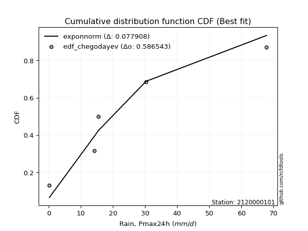</img>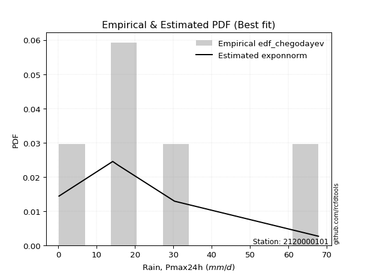</img>

</div>


### 6. EDF Blom (1958)

The Blom formula is a specific "plotting position" formula used in hydrology and statistical analysis to estimate the empirical cumulative probability (or non-exceedance probability) of a data series. It is particularly recommended for data that are approximately normally distributed. The constant _a_ is set to 0.375 (or 3/8).

<div align="center">


$P=(m-a)/(n+1-2a)$


</div>


**6.1. Empirical values**

<div align="center">

|                | 0                  | 1                  | 2                  | 3                 | 4                 | 5                  |
|:---------------|:-------------------|:-------------------|:-------------------|:------------------|:------------------|:-------------------|
| date           | 2023               | 2018               | 2020               | 2025              | 2019              | 2024               |
| x              | 0.2                | 14.2               | 15.5               | 19.7              | 30.3              | 67.8               |
| m              | 1                  | 2                  | 3                  | 4                 | 5                 | 6                  |
| empirical_dist | edf_blom           | edf_blom           | edf_blom           | edf_blom          | edf_blom          | edf_blom           |
| empirical      | 0.1                | 0.26               | 0.42               | 0.58              | 0.74              | 0.9                |
| empirical_tr   | 1.1111111111111112 | 1.3513513513513513 | 1.7241379310344827 | 2.380952380952381 | 3.846153846153846 | 10.000000000000002 |

</div>


**6.2. Kolmogorov-Smirnov fit test (sorted by Δ)**


<div align="center">

|                | 0                   | 1                   | 2                   | 3                  | 4                   | 5                   | 6                   | 7                   | 8                  | 9                   | 10                  | 11                  | 12                  | 13                  | 14                  | 15                  | 16                  | 17                  | 18                 | 19                  | 20                  | 21                  | 22                  | 23                  | 24                  | 25                 | 26                 | 27                  | 28                  | 29                  | 30                  | 31                  | 32                  | 33                  | 34                 | 35                 | 36                  | 37                 | 38                  | 39                  | 40                  | 41                  | 42                  | 43                  | 44                 | 45                  | 46                  | 47                 | 48                  | 49                  | 50                 | 51                 | 52                  | 53                  | 54                  | 55                 | 56                | 57                  | 58                  | 59                  | 60                  | 61                 | 62                  | 63                  | 64                 | 65                 | 66                 | 67                | 68                 | 69                  | 70                 | 71                | 72                | 73                 | 74                  | 75                  | 76                  | 77                 | 78                  | 79                 | 80                 | 81                 | 82                  | 83                  | 84                 | 85                  | 86                 | 87                  | 88                  | 89                 | 90                 | 91                 | 92                  | 93                 | 94               | 95                 | 96                 | 97                 | 98                  | 99                 | 100                | 101                | 102                | 103                | 104                | 105               | 106                 | 107                | 108                | 109               | 110                 | 111                 | 112                 | 113                | 114                | 115                | 116               | 117                | 118                | 119               | 120                | 121                 | 122                | 123                | 124                 | 125                 | 126                 | 127                | 128                | 129                | 130                | 131                | 132                 | 133                | 134                | 135                 | 136                | 137                 | 138                | 139                | 140                | 141               | 142                | 143                | 144                | 145                | 146                | 147                | 148               | 149                | 150                | 151                | 152                | 153                | 154                | 155            | 156            | 157                 | 158                | 159                |
|:---------------|:--------------------|:--------------------|:--------------------|:-------------------|:--------------------|:--------------------|:--------------------|:--------------------|:-------------------|:--------------------|:--------------------|:--------------------|:--------------------|:--------------------|:--------------------|:--------------------|:--------------------|:--------------------|:-------------------|:--------------------|:--------------------|:--------------------|:--------------------|:--------------------|:--------------------|:-------------------|:-------------------|:--------------------|:--------------------|:--------------------|:--------------------|:--------------------|:--------------------|:--------------------|:-------------------|:-------------------|:--------------------|:-------------------|:--------------------|:--------------------|:--------------------|:--------------------|:--------------------|:--------------------|:-------------------|:--------------------|:--------------------|:-------------------|:--------------------|:--------------------|:-------------------|:-------------------|:--------------------|:--------------------|:--------------------|:-------------------|:------------------|:--------------------|:--------------------|:--------------------|:--------------------|:-------------------|:--------------------|:--------------------|:-------------------|:-------------------|:-------------------|:------------------|:-------------------|:--------------------|:-------------------|:------------------|:------------------|:-------------------|:--------------------|:--------------------|:--------------------|:-------------------|:--------------------|:-------------------|:-------------------|:-------------------|:--------------------|:--------------------|:-------------------|:--------------------|:-------------------|:--------------------|:--------------------|:-------------------|:-------------------|:-------------------|:--------------------|:-------------------|:-----------------|:-------------------|:-------------------|:-------------------|:--------------------|:-------------------|:-------------------|:-------------------|:-------------------|:-------------------|:-------------------|:------------------|:--------------------|:-------------------|:-------------------|:------------------|:--------------------|:--------------------|:--------------------|:-------------------|:-------------------|:-------------------|:------------------|:-------------------|:-------------------|:------------------|:-------------------|:--------------------|:-------------------|:-------------------|:--------------------|:--------------------|:--------------------|:-------------------|:-------------------|:-------------------|:-------------------|:-------------------|:--------------------|:-------------------|:-------------------|:--------------------|:-------------------|:--------------------|:-------------------|:-------------------|:-------------------|:------------------|:-------------------|:-------------------|:-------------------|:-------------------|:-------------------|:-------------------|:------------------|:-------------------|:-------------------|:-------------------|:-------------------|:-------------------|:-------------------|:---------------|:---------------|:--------------------|:-------------------|:-------------------|
| station        | 2120000101          | 2120000101          | 2120000101          | 2120000101         | 2120000101          | 2120000101          | 2120000101          | 2120000101          | 2120000101         | 2120000101          | 2120000101          | 2120000101          | 2120000101          | 2120000101          | 2120000101          | 2120000101          | 2120000101          | 2120000101          | 2120000101         | 2120000101          | 2120000101          | 2120000101          | 2120000101          | 2120000101          | 2120000101          | 2120000101         | 2120000101         | 2120000101          | 2120000101          | 2120000101          | 2120000101          | 2120000101          | 2120000101          | 2120000101          | 2120000101         | 2120000101         | 2120000101          | 2120000101         | 2120000101          | 2120000101          | 2120000101          | 2120000101          | 2120000101          | 2120000101          | 2120000101         | 2120000101          | 2120000101          | 2120000101         | 2120000101          | 2120000101          | 2120000101         | 2120000101         | 2120000101          | 2120000101          | 2120000101          | 2120000101         | 2120000101        | 2120000101          | 2120000101          | 2120000101          | 2120000101          | 2120000101         | 2120000101          | 2120000101          | 2120000101         | 2120000101         | 2120000101         | 2120000101        | 2120000101         | 2120000101          | 2120000101         | 2120000101        | 2120000101        | 2120000101         | 2120000101          | 2120000101          | 2120000101          | 2120000101         | 2120000101          | 2120000101         | 2120000101         | 2120000101         | 2120000101          | 2120000101          | 2120000101         | 2120000101          | 2120000101         | 2120000101          | 2120000101          | 2120000101         | 2120000101         | 2120000101         | 2120000101          | 2120000101         | 2120000101       | 2120000101         | 2120000101         | 2120000101         | 2120000101          | 2120000101         | 2120000101         | 2120000101         | 2120000101         | 2120000101         | 2120000101         | 2120000101        | 2120000101          | 2120000101         | 2120000101         | 2120000101        | 2120000101          | 2120000101          | 2120000101          | 2120000101         | 2120000101         | 2120000101         | 2120000101        | 2120000101         | 2120000101         | 2120000101        | 2120000101         | 2120000101          | 2120000101         | 2120000101         | 2120000101          | 2120000101          | 2120000101          | 2120000101         | 2120000101         | 2120000101         | 2120000101         | 2120000101         | 2120000101          | 2120000101         | 2120000101         | 2120000101          | 2120000101         | 2120000101          | 2120000101         | 2120000101         | 2120000101         | 2120000101        | 2120000101         | 2120000101         | 2120000101         | 2120000101         | 2120000101         | 2120000101         | 2120000101        | 2120000101         | 2120000101         | 2120000101         | 2120000101         | 2120000101         | 2120000101         | 2120000101     | 2120000101     | 2120000101          | 2120000101         | 2120000101         |
| empirical_dist | edf_blom            | edf_blom            | edf_blom            | edf_blom           | edf_blom            | edf_blom            | edf_blom            | edf_blom            | edf_blom           | edf_blom            | edf_blom            | edf_blom            | edf_blom            | edf_blom            | edf_blom            | edf_blom            | edf_blom            | edf_blom            | edf_blom           | edf_blom            | edf_blom            | edf_blom            | edf_blom            | edf_blom            | edf_blom            | edf_blom           | edf_blom           | edf_blom            | edf_blom            | edf_blom            | edf_blom            | edf_blom            | edf_blom            | edf_blom            | edf_blom           | edf_blom           | edf_blom            | edf_blom           | edf_blom            | edf_blom            | edf_blom            | edf_blom            | edf_blom            | edf_blom            | edf_blom           | edf_blom            | edf_blom            | edf_blom           | edf_blom            | edf_blom            | edf_blom           | edf_blom           | edf_blom            | edf_blom            | edf_blom            | edf_blom           | edf_blom          | edf_blom            | edf_blom            | edf_blom            | edf_blom            | edf_blom           | edf_blom            | edf_blom            | edf_blom           | edf_blom           | edf_blom           | edf_blom          | edf_blom           | edf_blom            | edf_blom           | edf_blom          | edf_blom          | edf_blom           | edf_blom            | edf_blom            | edf_blom            | edf_blom           | edf_blom            | edf_blom           | edf_blom           | edf_blom           | edf_blom            | edf_blom            | edf_blom           | edf_blom            | edf_blom           | edf_blom            | edf_blom            | edf_blom           | edf_blom           | edf_blom           | edf_blom            | edf_blom           | edf_blom         | edf_blom           | edf_blom           | edf_blom           | edf_blom            | edf_blom           | edf_blom           | edf_blom           | edf_blom           | edf_blom           | edf_blom           | edf_blom          | edf_blom            | edf_blom           | edf_blom           | edf_blom          | edf_blom            | edf_blom            | edf_blom            | edf_blom           | edf_blom           | edf_blom           | edf_blom          | edf_blom           | edf_blom           | edf_blom          | edf_blom           | edf_blom            | edf_blom           | edf_blom           | edf_blom            | edf_blom            | edf_blom            | edf_blom           | edf_blom           | edf_blom           | edf_blom           | edf_blom           | edf_blom            | edf_blom           | edf_blom           | edf_blom            | edf_blom           | edf_blom            | edf_blom           | edf_blom           | edf_blom           | edf_blom          | edf_blom           | edf_blom           | edf_blom           | edf_blom           | edf_blom           | edf_blom           | edf_blom          | edf_blom           | edf_blom           | edf_blom           | edf_blom           | edf_blom           | edf_blom           | edf_blom       | edf_blom       | edf_blom            | edf_blom           | edf_blom           |
| p_dist         | logt                | dweibull            | dgamma              | logjohnsonsu       | logdgamma           | logdweibull         | nct                 | exponnorm           | vonmises_line      | moyal               | pearson3            | genlogistic         | truncnorm           | gumbel_r            | wald                | invgamma            | t                   | genpareto           | johnsonsu          | halfnorm            | rayleigh            | halflogistic        | skewnorm            | invgauss            | kstwobign           | foldnorm           | kappa3             | mielke              | maxwell             | genexpon            | gompertz            | gennorm             | semicircular        | anglit              | logloggamma        | rice               | logargus            | crystalball        | norm                | loggenpareto        | logvonmises_line    | lomax               | arcsine             | loglevy_l           | logistic           | loggennorm          | logweibull_max      | loggenlogistic     | truncexpon          | hypsecant           | logpearson3        | betaprime          | bradford            | exponpow            | gausshyper          | laplace            | cosine            | loggumbel_l         | kappa4              | gumbel_l            | burr12              | logtrapezoid       | loggenextreme       | nakagami            | ncf                | loggenhalflogistic | halfgennorm        | logarcsine        | wrapcauchy         | burr                | logfoldnorm        | logsemicircular   | ksone             | truncweibull_min   | loganglit           | logskewnorm         | f                   | logfatiguelife     | logcrystalball      | lognorm            | logrice            | logexponnorm       | lognct              | lognakagami         | uniform            | argus               | loglogistic        | loginvgamma         | levy_l              | logerlang          | loggamma           | loggamma           | loghypsecant        | genextreme         | gamma            | logalpha           | logloglaplace      | loginvgauss        | logmaxwell          | loglaplace         | loglaplace         | loginvweibull      | erlang             | lograyleigh        | logjohnsonsb       | logncf            | logkstwobign        | logburr12          | triang             | loggausshyper     | logwrapcauchy       | logtriang           | logcosine           | loghalfnorm        | loggumbel_r        | loggenexpon        | loghalflogistic   | logmoyal           | logbeta            | gengamma          | beta               | weibull_min         | loghalfgennorm     | genhalflogistic    | logksone            | loglomax            | logexponweib        | logf               | rdist              | logwald            | logkappa4          | logbradford        | loguniform          | logtruncnorm       | logkappa3          | invweibull          | loggengamma        | truncpareto         | tukeylambda        | logweibull_min     | johnsonsb          | exponweib         | trapezoid          | logtruncexpon      | fatiguelife        | powerlaw           | weibull_max        | logmielke          | logbetaprime      | logexponpow        | logburr            | logtruncpareto     | logpowerlaw        | alpha              | loggompertz        | logrdist       | logtukeylambda | logtruncweibull_min | logvonmises        | vonmises           |
| delta          | 0.06474736461758204 | 0.08000000000059387 | 0.08474973589666418 | 0.0861954197276289 | 0.09063975640793796 | 0.09367814009475434 | 0.09458575706504929 | 0.09459225291611295 | 0.0999999981989732 | 0.10107940066892285 | 0.10228970876237464 | 0.10603892982390717 | 0.10786496177606741 | 0.11019716373939192 | 0.11350423760073863 | 0.11685998002634984 | 0.11852509956101465 | 0.11903487407237145 | 0.1240767099127541 | 0.12459455322576768 | 0.12503843128048497 | 0.12545822997865358 | 0.12687839408299106 | 0.12726639611325713 | 0.12828066455956388 | 0.1285611443613448 | 0.1294536497401605 | 0.13515833719121106 | 0.13730444570400702 | 0.13897528290148442 | 0.14739619392475878 | 0.15054964618749855 | 0.15511715255657532 | 0.15876593728675692 | 0.1621483351860083 | 0.1671501309688505 | 0.16901205544550713 | 0.1714923822994795 | 0.17149239162683583 | 0.17161687412071785 | 0.17548304848758922 | 0.17786773082247131 | 0.17943406999133815 | 0.18317287344296385 | 0.1834083814986821 | 0.18364376019562406 | 0.18397759905115535 | 0.1851332928216735 | 0.18779303989913038 | 0.19322661948106257 | 0.1974498252341541 | 0.2031764161153995 | 0.20920334042692934 | 0.21505924633562623 | 0.21572757745021132 | 0.2195405808836372 | 0.220620262170649 | 0.22761555548192924 | 0.23762253719898274 | 0.23883132400575202 | 0.24977830878535023 | 0.2540547409727667 | 0.25906078418060907 | 0.25990113046185326 | 0.2630384266574807 | 0.266201441943414  | 0.2679956127501466 | 0.270718564804432 | 0.2756182362390599 | 0.27692417977126826 | 0.2803169239591652 | 0.283342673109348 | 0.285611439842209 | 0.2861244473220539 | 0.28651247665110646 | 0.28851582936549613 | 0.28943316992885426 | 0.2935362215053895 | 0.29419385412835164 | 0.2941939359084106 | 0.2941941784239239 | 0.2941961250197008 | 0.29427515615819766 | 0.29459732372160186 | 0.2947337278106508 | 0.30107691770807676 | 0.3014765195475084 | 0.30228386492714465 | 0.30294872885538215 | 0.3046387002042975 | 0.3069026644485655 | 0.3069026644485655 | 0.30761792334851856 | 0.3081441183403628 | 0.31080825100112 | 0.3115993014808953 | 0.3166391713434641 | 0.3182333106287981 | 0.32430437862389794 | 0.3276382948628096 | 0.3276382948628096 | 0.3282251524077615 | 0.3313759536332389 | 0.3339442501452884 | 0.3381622152069792 | 0.344414733233369 | 0.34739809916617315 | 0.3489560729686463 | 0.3532600578520338 | 0.355362882977298 | 0.35881451306310175 | 0.35944428142986573 | 0.36022073911275787 | 0.3611538691676257 | 0.3641083067918748 | 0.3844948208230241 | 0.388577120084759 | 0.3888064877219357 | 0.3896619300455456 | 0.392218772749403 | 0.4016628392997292 | 0.40980295540438494 | 0.4196491756284194 | 0.4250160359233991 | 0.43305409636039705 | 0.44059856033344413 | 0.44086567849152447 | 0.4441853682742424 | 0.4558071609680222 | 0.4573376606864775 | 0.4677891005431539 | 0.4687119914001333 | 0.47166491563247637 | 0.4743745759076936 | 0.4777888834112426 | 0.47940746295006015 | 0.4801672966937541 | 0.49892148045148876 | 0.5083261667566583 | 0.5175414438259721 | 0.5208859729790648 | 0.529515336364675 | 0.5298401447778437 | 0.5396839320140506 | 0.5441914138317021 | 0.5594653300042592 | 0.6074264847202153 | 0.6319972390406045 | 0.664348569478355 | 0.6701348536127644 | 0.6746010236128005 | 0.6890197503260952 | 0.6928315469361384 | 0.7132345665514637 | 0.7367763248531435 | 0.74           | 0.74           | 0.74                | 0.9634557158071954 | 10.285443791466601 |
| deltao         | 0.530385761606      | 0.530385761606      | 0.530385761606      | 0.530385761606     | 0.530385761606      | 0.530385761606      | 0.530385761606      | 0.530385761606      | 0.530385761606     | 0.530385761606      | 0.530385761606      | 0.530385761606      | 0.530385761606      | 0.530385761606      | 0.530385761606      | 0.530385761606      | 0.530385761606      | 0.530385761606      | 0.530385761606     | 0.530385761606      | 0.530385761606      | 0.530385761606      | 0.530385761606      | 0.530385761606      | 0.530385761606      | 0.530385761606     | 0.530385761606     | 0.530385761606      | 0.530385761606      | 0.530385761606      | 0.530385761606      | 0.530385761606      | 0.530385761606      | 0.530385761606      | 0.530385761606     | 0.530385761606     | 0.530385761606      | 0.530385761606     | 0.530385761606      | 0.530385761606      | 0.530385761606      | 0.530385761606      | 0.530385761606      | 0.530385761606      | 0.530385761606     | 0.530385761606      | 0.530385761606      | 0.530385761606     | 0.530385761606      | 0.530385761606      | 0.530385761606     | 0.530385761606     | 0.530385761606      | 0.530385761606      | 0.530385761606      | 0.530385761606     | 0.530385761606    | 0.530385761606      | 0.530385761606      | 0.530385761606      | 0.530385761606      | 0.530385761606     | 0.530385761606      | 0.530385761606      | 0.530385761606     | 0.530385761606     | 0.530385761606     | 0.530385761606    | 0.530385761606     | 0.530385761606      | 0.530385761606     | 0.530385761606    | 0.530385761606    | 0.530385761606     | 0.530385761606      | 0.530385761606      | 0.530385761606      | 0.530385761606     | 0.530385761606      | 0.530385761606     | 0.530385761606     | 0.530385761606     | 0.530385761606      | 0.530385761606      | 0.530385761606     | 0.530385761606      | 0.530385761606     | 0.530385761606      | 0.530385761606      | 0.530385761606     | 0.530385761606     | 0.530385761606     | 0.530385761606      | 0.530385761606     | 0.530385761606   | 0.530385761606     | 0.530385761606     | 0.530385761606     | 0.530385761606      | 0.530385761606     | 0.530385761606     | 0.530385761606     | 0.530385761606     | 0.530385761606     | 0.530385761606     | 0.530385761606    | 0.530385761606      | 0.530385761606     | 0.530385761606     | 0.530385761606    | 0.530385761606      | 0.530385761606      | 0.530385761606      | 0.530385761606     | 0.530385761606     | 0.530385761606     | 0.530385761606    | 0.530385761606     | 0.530385761606     | 0.530385761606    | 0.530385761606     | 0.530385761606      | 0.530385761606     | 0.530385761606     | 0.530385761606      | 0.530385761606      | 0.530385761606      | 0.530385761606     | 0.530385761606     | 0.530385761606     | 0.530385761606     | 0.530385761606     | 0.530385761606      | 0.530385761606     | 0.530385761606     | 0.530385761606      | 0.530385761606     | 0.530385761606      | 0.530385761606     | 0.530385761606     | 0.530385761606     | 0.530385761606    | 0.530385761606     | 0.530385761606     | 0.530385761606     | 0.530385761606     | 0.530385761606     | 0.530385761606     | 0.530385761606    | 0.530385761606     | 0.530385761606     | 0.530385761606     | 0.530385761606     | 0.530385761606     | 0.530385761606     | 0.530385761606 | 0.530385761606 | 0.530385761606      | 0.530385761606     | 0.530385761606     |
| eval           | Δo > Δ              | Δo > Δ              | Δo > Δ              | Δo > Δ             | Δo > Δ              | Δo > Δ              | Δo > Δ              | Δo > Δ              | Δo > Δ             | Δo > Δ              | Δo > Δ              | Δo > Δ              | Δo > Δ              | Δo > Δ              | Δo > Δ              | Δo > Δ              | Δo > Δ              | Δo > Δ              | Δo > Δ             | Δo > Δ              | Δo > Δ              | Δo > Δ              | Δo > Δ              | Δo > Δ              | Δo > Δ              | Δo > Δ             | Δo > Δ             | Δo > Δ              | Δo > Δ              | Δo > Δ              | Δo > Δ              | Δo > Δ              | Δo > Δ              | Δo > Δ              | Δo > Δ             | Δo > Δ             | Δo > Δ              | Δo > Δ             | Δo > Δ              | Δo > Δ              | Δo > Δ              | Δo > Δ              | Δo > Δ              | Δo > Δ              | Δo > Δ             | Δo > Δ              | Δo > Δ              | Δo > Δ             | Δo > Δ              | Δo > Δ              | Δo > Δ             | Δo > Δ             | Δo > Δ              | Δo > Δ              | Δo > Δ              | Δo > Δ             | Δo > Δ            | Δo > Δ              | Δo > Δ              | Δo > Δ              | Δo > Δ              | Δo > Δ             | Δo > Δ              | Δo > Δ              | Δo > Δ             | Δo > Δ             | Δo > Δ             | Δo > Δ            | Δo > Δ             | Δo > Δ              | Δo > Δ             | Δo > Δ            | Δo > Δ            | Δo > Δ             | Δo > Δ              | Δo > Δ              | Δo > Δ              | Δo > Δ             | Δo > Δ              | Δo > Δ             | Δo > Δ             | Δo > Δ             | Δo > Δ              | Δo > Δ              | Δo > Δ             | Δo > Δ              | Δo > Δ             | Δo > Δ              | Δo > Δ              | Δo > Δ             | Δo > Δ             | Δo > Δ             | Δo > Δ              | Δo > Δ             | Δo > Δ           | Δo > Δ             | Δo > Δ             | Δo > Δ             | Δo > Δ              | Δo > Δ             | Δo > Δ             | Δo > Δ             | Δo > Δ             | Δo > Δ             | Δo > Δ             | Δo > Δ            | Δo > Δ              | Δo > Δ             | Δo > Δ             | Δo > Δ            | Δo > Δ              | Δo > Δ              | Δo > Δ              | Δo > Δ             | Δo > Δ             | Δo > Δ             | Δo > Δ            | Δo > Δ             | Δo > Δ             | Δo > Δ            | Δo > Δ             | Δo > Δ              | Δo > Δ             | Δo > Δ             | Δo > Δ              | Δo > Δ              | Δo > Δ              | Δo > Δ             | Δo > Δ             | Δo > Δ             | Δo > Δ             | Δo > Δ             | Δo > Δ              | Δo > Δ             | Δo > Δ             | Δo > Δ              | Δo > Δ             | Δo > Δ              | Δo > Δ             | Δo > Δ             | Δo > Δ             | Δo > Δ            | Δo > Δ             | Δo <= Δ            | Δo <= Δ            | Δo <= Δ            | Δo <= Δ            | Δo <= Δ            | Δo <= Δ           | Δo <= Δ            | Δo <= Δ            | Δo <= Δ            | Δo <= Δ            | Δo <= Δ            | Δo <= Δ            | Δo <= Δ        | Δo <= Δ        | Δo <= Δ             | Δo <= Δ            | Δo <= Δ            |
| fit            | 1                   | 1                   | 1                   | 1                  | 1                   | 1                   | 1                   | 1                   | 1                  | 1                   | 1                   | 1                   | 1                   | 1                   | 1                   | 1                   | 1                   | 1                   | 1                  | 1                   | 1                   | 1                   | 1                   | 1                   | 1                   | 1                  | 1                  | 1                   | 1                   | 1                   | 1                   | 1                   | 1                   | 1                   | 1                  | 1                  | 1                   | 1                  | 1                   | 1                   | 1                   | 1                   | 1                   | 1                   | 1                  | 1                   | 1                   | 1                  | 1                   | 1                   | 1                  | 1                  | 1                   | 1                   | 1                   | 1                  | 1                 | 1                   | 1                   | 1                   | 1                   | 1                  | 1                   | 1                   | 1                  | 1                  | 1                  | 1                 | 1                  | 1                   | 1                  | 1                 | 1                 | 1                  | 1                   | 1                   | 1                   | 1                  | 1                   | 1                  | 1                  | 1                  | 1                   | 1                   | 1                  | 1                   | 1                  | 1                   | 1                   | 1                  | 1                  | 1                  | 1                   | 1                  | 1                | 1                  | 1                  | 1                  | 1                   | 1                  | 1                  | 1                  | 1                  | 1                  | 1                  | 1                 | 1                   | 1                  | 1                  | 1                 | 1                   | 1                   | 1                   | 1                  | 1                  | 1                  | 1                 | 1                  | 1                  | 1                 | 1                  | 1                   | 1                  | 1                  | 1                   | 1                   | 1                   | 1                  | 1                  | 1                  | 1                  | 1                  | 1                   | 1                  | 1                  | 1                   | 1                  | 1                   | 1                  | 1                  | 1                  | 1                 | 1                  | 0                  | 0                  | 0                  | 0                  | 0                  | 0                 | 0                  | 0                  | 0                  | 0                  | 0                  | 0                  | 0              | 0              | 0                   | 0                  | 0                  |
| n              | 6                   | 6                   | 6                   | 6                  | 6                   | 6                   | 6                   | 6                   | 6                  | 6                   | 6                   | 6                   | 6                   | 6                   | 6                   | 6                   | 6                   | 6                   | 6                  | 6                   | 6                   | 6                   | 6                   | 6                   | 6                   | 6                  | 6                  | 6                   | 6                   | 6                   | 6                   | 6                   | 6                   | 6                   | 6                  | 6                  | 6                   | 6                  | 6                   | 6                   | 6                   | 6                   | 6                   | 6                   | 6                  | 6                   | 6                   | 6                  | 6                   | 6                   | 6                  | 6                  | 6                   | 6                   | 6                   | 6                  | 6                 | 6                   | 6                   | 6                   | 6                   | 6                  | 6                   | 6                   | 6                  | 6                  | 6                  | 6                 | 6                  | 6                   | 6                  | 6                 | 6                 | 6                  | 6                   | 6                   | 6                   | 6                  | 6                   | 6                  | 6                  | 6                  | 6                   | 6                   | 6                  | 6                   | 6                  | 6                   | 6                   | 6                  | 6                  | 6                  | 6                   | 6                  | 6                | 6                  | 6                  | 6                  | 6                   | 6                  | 6                  | 6                  | 6                  | 6                  | 6                  | 6                 | 6                   | 6                  | 6                  | 6                 | 6                   | 6                   | 6                   | 6                  | 6                  | 6                  | 6                 | 6                  | 6                  | 6                 | 6                  | 6                   | 6                  | 6                  | 6                   | 6                   | 6                   | 6                  | 6                  | 6                  | 6                  | 6                  | 6                   | 6                  | 6                  | 6                   | 6                  | 6                   | 6                  | 6                  | 6                  | 6                 | 6                  | 6                  | 6                  | 6                  | 6                  | 6                  | 6                 | 6                  | 6                  | 6                  | 6                  | 6                  | 6                  | 6              | 6              | 6                   | 6                  | 6                  |
| best_fit       | 1                   | 0                   | 0                   | 0                  | 0                   | 0                   | 0                   | 0                   | 0                  | 0                   | 0                   | 0                   | 0                   | 0                   | 0                   | 0                   | 0                   | 0                   | 0                  | 0                   | 0                   | 0                   | 0                   | 0                   | 0                   | 0                  | 0                  | 0                   | 0                   | 0                   | 0                   | 0                   | 0                   | 0                   | 0                  | 0                  | 0                   | 0                  | 0                   | 0                   | 0                   | 0                   | 0                   | 0                   | 0                  | 0                   | 0                   | 0                  | 0                   | 0                   | 0                  | 0                  | 0                   | 0                   | 0                   | 0                  | 0                 | 0                   | 0                   | 0                   | 0                   | 0                  | 0                   | 0                   | 0                  | 0                  | 0                  | 0                 | 0                  | 0                   | 0                  | 0                 | 0                 | 0                  | 0                   | 0                   | 0                   | 0                  | 0                   | 0                  | 0                  | 0                  | 0                   | 0                   | 0                  | 0                   | 0                  | 0                   | 0                   | 0                  | 0                  | 0                  | 0                   | 0                  | 0                | 0                  | 0                  | 0                  | 0                   | 0                  | 0                  | 0                  | 0                  | 0                  | 0                  | 0                 | 0                   | 0                  | 0                  | 0                 | 0                   | 0                   | 0                   | 0                  | 0                  | 0                  | 0                 | 0                  | 0                  | 0                 | 0                  | 0                   | 0                  | 0                  | 0                   | 0                   | 0                   | 0                  | 0                  | 0                  | 0                  | 0                  | 0                   | 0                  | 0                  | 0                   | 0                  | 0                   | 0                  | 0                  | 0                  | 0                 | 0                  | 0                  | 0                  | 0                  | 0                  | 0                  | 0                 | 0                  | 0                  | 0                  | 0                  | 0                  | 0                  | 0              | 0              | 0                   | 0                  | 0                  |
| best_fit_sort  | 1                   | 2                   | 3                   | 4                  | 5                   | 6                   | 7                   | 8                   | 9                  | 10                  | 11                  | 12                  | 13                  | 14                  | 15                  | 16                  | 17                  | 18                  | 19                 | 20                  | 21                  | 22                  | 23                  | 24                  | 25                  | 26                 | 27                 | 28                  | 29                  | 30                  | 31                  | 32                  | 33                  | 34                  | 35                 | 36                 | 37                  | 38                 | 39                  | 40                  | 41                  | 42                  | 43                  | 44                  | 45                 | 46                  | 47                  | 48                 | 49                  | 50                  | 51                 | 52                 | 53                  | 54                  | 55                  | 56                 | 57                | 58                  | 59                  | 60                  | 61                  | 62                 | 63                  | 64                  | 65                 | 66                 | 67                 | 68                | 69                 | 70                  | 71                 | 72                | 73                | 74                 | 75                  | 76                  | 77                  | 78                 | 79                  | 80                 | 81                 | 82                 | 83                  | 84                  | 85                 | 86                  | 87                 | 88                  | 89                  | 90                 | 91                 | 92                 | 93                  | 94                 | 95               | 96                 | 97                 | 98                 | 99                  | 100                | 101                | 102                | 103                | 104                | 105                | 106               | 107                 | 108                | 109                | 110               | 111                 | 112                 | 113                 | 114                | 115                | 116                | 117               | 118                | 119                | 120               | 121                | 122                 | 123                | 124                | 125                 | 126                 | 127                 | 128                | 129                | 130                | 131                | 132                | 133                 | 134                | 135                | 136                 | 137                | 138                 | 139                | 140                | 141                | 142               | 143                | 144                | 145                | 146                | 147                | 148                | 149               | 150                | 151                | 152                | 153                | 154                | 155                | 156            | 157            | 158                 | 159                | 160                |

</div>


**6.3. Best fit**

<div align="center">

|   id |    station | empirical_dist   | p_dist   |     delta |   deltao | eval   |   fit |   n |   best_fit |   best_fit_sort |
|-----:|-----------:|:-----------------|:---------|----------:|---------:|:-------|------:|----:|-----------:|----------------:|
|    0 | 2120000101 | edf_blom         | logt     | 0.0647474 | 0.530386 | Δo > Δ |     1 |   6 |          1 |               1 |

</div>


<div align="center">

</img>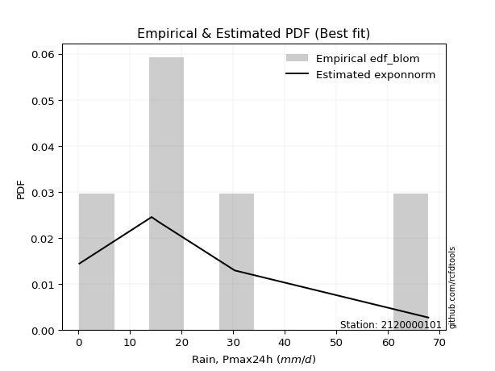</img>

</div>


### 7. EDF Tukey (1962)

In hydrology, the Tukey formula is used as a plotting position formula to estimate the empirical probability or frequency of a flood event (or other hydrological data). The formula parameter is given as _c=0.333_ (or 1/3).

<div align="center">


$P=(m-c)/(n+1-2c)$


</div>


**7.1. Empirical values**

<div align="center">

|                | 0                   | 1                  | 2                   | 3                  | 4                  | 5                  |
|:---------------|:--------------------|:-------------------|:--------------------|:-------------------|:-------------------|:-------------------|
| date           | 2023                | 2018               | 2020                | 2025               | 2019               | 2024               |
| x              | 0.2                 | 14.2               | 15.5                | 19.7               | 30.3               | 67.8               |
| m              | 1                   | 2                  | 3                   | 4                  | 5                  | 6                  |
| empirical_dist | edf_tukey           | edf_tukey          | edf_tukey           | edf_tukey          | edf_tukey          | edf_tukey          |
| empirical      | 0.10526315789473684 | 0.2631578947368421 | 0.42105263157894735 | 0.5789473684210527 | 0.7368421052631579 | 0.8947368421052632 |
| empirical_tr   | 1.1176470588235294  | 1.357142857142857  | 1.7272727272727273  | 2.375              | 3.7999999999999994 | 9.5                |

</div>


**7.2. Kolmogorov-Smirnov fit test (sorted by Δ)**


<div align="center">

|                | 0                   | 1                   | 2                   | 3                   | 4                   | 5                   | 6                   | 7                  | 8                   | 9                   | 10                  | 11                  | 12                  | 13                  | 14                  | 15                  | 16                 | 17                  | 18                  | 19                 | 20                 | 21                  | 22                  | 23                  | 24                  | 25                 | 26                  | 27                  | 28                  | 29                 | 30                  | 31                  | 32                 | 33                  | 34                  | 35                  | 36                 | 37                  | 38                 | 39                  | 40                  | 41                  | 42                  | 43                  | 44                  | 45                  | 46                 | 47                  | 48                  | 49                  | 50                  | 51                 | 52                  | 53                  | 54                  | 55                 | 56                 | 57                  | 58                 | 59                  | 60                  | 61                 | 62                | 63                 | 64                 | 65                  | 66                 | 67                  | 68                  | 69                 | 70                 | 71                  | 72                  | 73                 | 74                 | 75                  | 76                 | 77                 | 78                  | 79                 | 80                  | 81                  | 82                 | 83                 | 84                 | 85                 | 86                 | 87                  | 88                  | 89                 | 90                  | 91                  | 92                  | 93                 | 94                 | 95                  | 96                  | 97                  | 98                  | 99                 | 100                | 101                 | 102                | 103                | 104                 | 105                 | 106                 | 107                | 108                 | 109                 | 110                 | 111                 | 112                | 113                | 114                | 115               | 116                | 117                 | 118                | 119                | 120                 | 121                 | 122                 | 123                 | 124                 | 125                 | 126                | 127                | 128                 | 129                 | 130                 | 131                 | 132                | 133                | 134                 | 135                | 136                | 137                | 138                | 139              | 140                | 141                | 142                | 143                | 144                | 145                | 146                | 147                | 148                | 149                | 150                | 151               | 152                | 153                | 154                | 155               | 156               | 157                 | 158                | 159                |
|:---------------|:--------------------|:--------------------|:--------------------|:--------------------|:--------------------|:--------------------|:--------------------|:-------------------|:--------------------|:--------------------|:--------------------|:--------------------|:--------------------|:--------------------|:--------------------|:--------------------|:-------------------|:--------------------|:--------------------|:-------------------|:-------------------|:--------------------|:--------------------|:--------------------|:--------------------|:-------------------|:--------------------|:--------------------|:--------------------|:-------------------|:--------------------|:--------------------|:-------------------|:--------------------|:--------------------|:--------------------|:-------------------|:--------------------|:-------------------|:--------------------|:--------------------|:--------------------|:--------------------|:--------------------|:--------------------|:--------------------|:-------------------|:--------------------|:--------------------|:--------------------|:--------------------|:-------------------|:--------------------|:--------------------|:--------------------|:-------------------|:-------------------|:--------------------|:-------------------|:--------------------|:--------------------|:-------------------|:------------------|:-------------------|:-------------------|:--------------------|:-------------------|:--------------------|:--------------------|:-------------------|:-------------------|:--------------------|:--------------------|:-------------------|:-------------------|:--------------------|:-------------------|:-------------------|:--------------------|:-------------------|:--------------------|:--------------------|:-------------------|:-------------------|:-------------------|:-------------------|:-------------------|:--------------------|:--------------------|:-------------------|:--------------------|:--------------------|:--------------------|:-------------------|:-------------------|:--------------------|:--------------------|:--------------------|:--------------------|:-------------------|:-------------------|:--------------------|:-------------------|:-------------------|:--------------------|:--------------------|:--------------------|:-------------------|:--------------------|:--------------------|:--------------------|:--------------------|:-------------------|:-------------------|:-------------------|:------------------|:-------------------|:--------------------|:-------------------|:-------------------|:--------------------|:--------------------|:--------------------|:--------------------|:--------------------|:--------------------|:-------------------|:-------------------|:--------------------|:--------------------|:--------------------|:--------------------|:-------------------|:-------------------|:--------------------|:-------------------|:-------------------|:-------------------|:-------------------|:-----------------|:-------------------|:-------------------|:-------------------|:-------------------|:-------------------|:-------------------|:-------------------|:-------------------|:-------------------|:-------------------|:-------------------|:------------------|:-------------------|:-------------------|:-------------------|:------------------|:------------------|:--------------------|:-------------------|:-------------------|
| station        | 2120000101          | 2120000101          | 2120000101          | 2120000101          | 2120000101          | 2120000101          | 2120000101          | 2120000101         | 2120000101          | 2120000101          | 2120000101          | 2120000101          | 2120000101          | 2120000101          | 2120000101          | 2120000101          | 2120000101         | 2120000101          | 2120000101          | 2120000101         | 2120000101         | 2120000101          | 2120000101          | 2120000101          | 2120000101          | 2120000101         | 2120000101          | 2120000101          | 2120000101          | 2120000101         | 2120000101          | 2120000101          | 2120000101         | 2120000101          | 2120000101          | 2120000101          | 2120000101         | 2120000101          | 2120000101         | 2120000101          | 2120000101          | 2120000101          | 2120000101          | 2120000101          | 2120000101          | 2120000101          | 2120000101         | 2120000101          | 2120000101          | 2120000101          | 2120000101          | 2120000101         | 2120000101          | 2120000101          | 2120000101          | 2120000101         | 2120000101         | 2120000101          | 2120000101         | 2120000101          | 2120000101          | 2120000101         | 2120000101        | 2120000101         | 2120000101         | 2120000101          | 2120000101         | 2120000101          | 2120000101          | 2120000101         | 2120000101         | 2120000101          | 2120000101          | 2120000101         | 2120000101         | 2120000101          | 2120000101         | 2120000101         | 2120000101          | 2120000101         | 2120000101          | 2120000101          | 2120000101         | 2120000101         | 2120000101         | 2120000101         | 2120000101         | 2120000101          | 2120000101          | 2120000101         | 2120000101          | 2120000101          | 2120000101          | 2120000101         | 2120000101         | 2120000101          | 2120000101          | 2120000101          | 2120000101          | 2120000101         | 2120000101         | 2120000101          | 2120000101         | 2120000101         | 2120000101          | 2120000101          | 2120000101          | 2120000101         | 2120000101          | 2120000101          | 2120000101          | 2120000101          | 2120000101         | 2120000101         | 2120000101         | 2120000101        | 2120000101         | 2120000101          | 2120000101         | 2120000101         | 2120000101          | 2120000101          | 2120000101          | 2120000101          | 2120000101          | 2120000101          | 2120000101         | 2120000101         | 2120000101          | 2120000101          | 2120000101          | 2120000101          | 2120000101         | 2120000101         | 2120000101          | 2120000101         | 2120000101         | 2120000101         | 2120000101         | 2120000101       | 2120000101         | 2120000101         | 2120000101         | 2120000101         | 2120000101         | 2120000101         | 2120000101         | 2120000101         | 2120000101         | 2120000101         | 2120000101         | 2120000101        | 2120000101         | 2120000101         | 2120000101         | 2120000101        | 2120000101        | 2120000101          | 2120000101         | 2120000101         |
| empirical_dist | edf_tukey           | edf_tukey           | edf_tukey           | edf_tukey           | edf_tukey           | edf_tukey           | edf_tukey           | edf_tukey          | edf_tukey           | edf_tukey           | edf_tukey           | edf_tukey           | edf_tukey           | edf_tukey           | edf_tukey           | edf_tukey           | edf_tukey          | edf_tukey           | edf_tukey           | edf_tukey          | edf_tukey          | edf_tukey           | edf_tukey           | edf_tukey           | edf_tukey           | edf_tukey          | edf_tukey           | edf_tukey           | edf_tukey           | edf_tukey          | edf_tukey           | edf_tukey           | edf_tukey          | edf_tukey           | edf_tukey           | edf_tukey           | edf_tukey          | edf_tukey           | edf_tukey          | edf_tukey           | edf_tukey           | edf_tukey           | edf_tukey           | edf_tukey           | edf_tukey           | edf_tukey           | edf_tukey          | edf_tukey           | edf_tukey           | edf_tukey           | edf_tukey           | edf_tukey          | edf_tukey           | edf_tukey           | edf_tukey           | edf_tukey          | edf_tukey          | edf_tukey           | edf_tukey          | edf_tukey           | edf_tukey           | edf_tukey          | edf_tukey         | edf_tukey          | edf_tukey          | edf_tukey           | edf_tukey          | edf_tukey           | edf_tukey           | edf_tukey          | edf_tukey          | edf_tukey           | edf_tukey           | edf_tukey          | edf_tukey          | edf_tukey           | edf_tukey          | edf_tukey          | edf_tukey           | edf_tukey          | edf_tukey           | edf_tukey           | edf_tukey          | edf_tukey          | edf_tukey          | edf_tukey          | edf_tukey          | edf_tukey           | edf_tukey           | edf_tukey          | edf_tukey           | edf_tukey           | edf_tukey           | edf_tukey          | edf_tukey          | edf_tukey           | edf_tukey           | edf_tukey           | edf_tukey           | edf_tukey          | edf_tukey          | edf_tukey           | edf_tukey          | edf_tukey          | edf_tukey           | edf_tukey           | edf_tukey           | edf_tukey          | edf_tukey           | edf_tukey           | edf_tukey           | edf_tukey           | edf_tukey          | edf_tukey          | edf_tukey          | edf_tukey         | edf_tukey          | edf_tukey           | edf_tukey          | edf_tukey          | edf_tukey           | edf_tukey           | edf_tukey           | edf_tukey           | edf_tukey           | edf_tukey           | edf_tukey          | edf_tukey          | edf_tukey           | edf_tukey           | edf_tukey           | edf_tukey           | edf_tukey          | edf_tukey          | edf_tukey           | edf_tukey          | edf_tukey          | edf_tukey          | edf_tukey          | edf_tukey        | edf_tukey          | edf_tukey          | edf_tukey          | edf_tukey          | edf_tukey          | edf_tukey          | edf_tukey          | edf_tukey          | edf_tukey          | edf_tukey          | edf_tukey          | edf_tukey         | edf_tukey          | edf_tukey          | edf_tukey          | edf_tukey         | edf_tukey         | edf_tukey           | edf_tukey          | edf_tukey          |
| p_dist         | logt                | dweibull            | logjohnsonsu        | dgamma              | logdweibull         | nct                 | exponnorm           | logdgamma          | moyal               | pearson3            | genlogistic         | truncnorm           | vonmises_line       | gumbel_r            | wald                | invgamma            | t                  | genpareto           | johnsonsu           | halfnorm           | halflogistic       | rayleigh            | invgauss            | foldnorm            | skewnorm            | kappa3             | kstwobign           | mielke              | genexpon            | maxwell            | gompertz            | gennorm             | semicircular       | anglit              | logloggamma         | logargus            | rice               | loggenpareto        | crystalball        | norm                | logvonmises_line    | lomax               | arcsine             | loglevy_l           | logweibull_max      | loggenlogistic      | logistic           | loggennorm          | truncexpon          | hypsecant           | logpearson3         | betaprime          | bradford            | exponpow            | gausshyper          | laplace            | cosine             | loggumbel_l         | kappa4             | gumbel_l            | burr12              | logtrapezoid       | loggenextreme     | ncf                | loggenhalflogistic | nakagami            | halfgennorm        | logarcsine          | wrapcauchy          | burr               | logfoldnorm        | logsemicircular     | ksone               | truncweibull_min   | loganglit          | logskewnorm         | f                  | logfatiguelife     | logcrystalball      | lognorm            | logrice             | logexponnorm        | lognct             | lognakagami        | uniform            | levy_l             | argus              | loglogistic         | loginvgamma         | logerlang          | genextreme          | loggamma            | loggamma            | loghypsecant       | gamma              | logalpha            | logloglaplace       | loginvgauss         | logmaxwell          | loglaplace         | loglaplace         | loginvweibull       | erlang             | lograyleigh        | logjohnsonsb        | logncf              | logkstwobign        | logburr12          | triang              | loggausshyper       | logwrapcauchy       | logtriang           | logcosine          | loghalfnorm        | loggumbel_r        | loggenexpon       | loghalflogistic    | logmoyal            | logbeta            | gengamma           | beta                | weibull_min         | loghalfgennorm      | genhalflogistic     | logksone            | loglomax            | logexponweib       | logf               | rdist               | logwald             | logkappa4           | logbradford         | loguniform         | logtruncnorm       | logkappa3           | invweibull         | loggengamma        | truncpareto        | tukeylambda        | logweibull_min   | johnsonsb          | exponweib          | trapezoid          | logtruncexpon      | fatiguelife        | powerlaw           | weibull_max        | logmielke          | logbetaprime       | logexponpow        | logburr            | logtruncpareto    | logpowerlaw        | alpha              | loggompertz        | logrdist          | logtukeylambda    | logtruncweibull_min | logvonmises        | vonmises           |
| delta          | 0.07001052251231887 | 0.07894736842164657 | 0.08303752499078682 | 0.08580236747561154 | 0.09052024535791225 | 0.09142786232820721 | 0.09143435817927087 | 0.0959029143026748 | 0.09792150593208077 | 0.10018286966375062 | 0.10498629824495986 | 0.10526313518960452 | 0.10526315609371006 | 0.10914453216044462 | 0.11034634286389655 | 0.11370208528950776 | 0.1158217517122696 | 0.11587697933552937 | 0.12091881517591202 | 0.1214366584889256 | 0.1223003352418115 | 0.12398579970153767 | 0.12410850137641505 | 0.12540324962450272 | 0.12582576250404376 | 0.1262957550033184 | 0.12722803298061658 | 0.13200044245436898 | 0.13581738816464234 | 0.1362518141250597 | 0.14634356234581147 | 0.15160227776644586 | 0.1524348220836702 | 0.15771330570780961 | 0.15899044044916621 | 0.16585416070866504 | 0.1660974993899032 | 0.16845897938387577 | 0.1704397507205322 | 0.17043976004788852 | 0.17232515375074714 | 0.17470983608562923 | 0.17627617525449601 | 0.18001497870612176 | 0.18081970431431327 | 0.18197539808483143 | 0.1823557499197348 | 0.18469639177457142 | 0.18674040832018307 | 0.19217398790211526 | 0.19429193049731203 | 0.2000185213785574 | 0.20815070884798204 | 0.21190135159878415 | 0.21256968271336918 | 0.2184879493046899 | 0.2195676305917017 | 0.22445766074508716 | 0.2362641442008268 | 0.23777869242680472 | 0.24662041404850815 | 0.2508968462359246 | 0.255902889443767 | 0.2598805319206386 | 0.2630435472065719 | 0.26305902519869534 | 0.2648377180133045 | 0.26756067006758993 | 0.27246034150221776 | 0.2737662850344262 | 0.2771590292223231 | 0.28018477837250594 | 0.28245354510536685 | 0.2829665525852118 | 0.2833545819142644 | 0.28535793462865405 | 0.2862752751920122 | 0.2903783267685474 | 0.29103595939150956 | 0.2910360411715685 | 0.29103628368708184 | 0.29103823028285875 | 0.2911172614213556 | 0.2914394289847598 | 0.2915758330738087 | 0.2976855709606453 | 0.2979190229712346 | 0.29831862481066634 | 0.29912597019030257 | 0.3014808054674554 | 0.30288096044562596 | 0.30374476971172343 | 0.30374476971172343 | 0.3044600286116765 | 0.3076503562642779 | 0.30844140674405324 | 0.31137601344872723 | 0.31507541589195603 | 0.32114648388705586 | 0.3244804001259675 | 0.3244804001259675 | 0.32506725767091943 | 0.3282180588963968 | 0.3307863554084463 | 0.33289905731224234 | 0.34125683849652694 | 0.34424020442933106 | 0.3457981782318042 | 0.35010216311519166 | 0.35220498824045593 | 0.35565661832625967 | 0.35628638669302365 | 0.3570628443759158 | 0.3579959744307836 | 0.3609504120550327 | 0.381336926086182 | 0.3854192253479169 | 0.38564859298509363 | 0.3865040353087035 | 0.3890608780125609 | 0.39850494456288704 | 0.40664506066754286 | 0.41649128089157733 | 0.42185814118655696 | 0.42989620162355496 | 0.43744066559660205 | 0.4377077837546824 | 0.4410274735374003 | 0.45054400307328535 | 0.45417976594963544 | 0.46463120580631184 | 0.46555409666329123 | 0.4685070208956343 | 0.4712166811708515 | 0.47252572551650573 | 0.4741443050553233 | 0.4749041387990172 | 0.4957635857146467 | 0.5051682720198163 | 0.51438354908913 | 0.5177280782422227 | 0.5263574416278329 | 0.5266822500410016 | 0.5365260372772085 | 0.5410335190948601 | 0.5563074352674171 | 0.6042685899833732 | 0.6288393443037623 | 0.6611906747415128 | 0.6669769588759222 | 0.6714431288759584 | 0.685861855589253 | 0.6896736521992963 | 0.7100766718146216 | 0.7336184301163013 | 0.736842105263158 | 0.736842105263158 | 0.736842105263158   | 0.9687188737019322 | 10.290706949361338 |
| deltao         | 0.530385761606      | 0.530385761606      | 0.530385761606      | 0.530385761606      | 0.530385761606      | 0.530385761606      | 0.530385761606      | 0.530385761606     | 0.530385761606      | 0.530385761606      | 0.530385761606      | 0.530385761606      | 0.530385761606      | 0.530385761606      | 0.530385761606      | 0.530385761606      | 0.530385761606     | 0.530385761606      | 0.530385761606      | 0.530385761606     | 0.530385761606     | 0.530385761606      | 0.530385761606      | 0.530385761606      | 0.530385761606      | 0.530385761606     | 0.530385761606      | 0.530385761606      | 0.530385761606      | 0.530385761606     | 0.530385761606      | 0.530385761606      | 0.530385761606     | 0.530385761606      | 0.530385761606      | 0.530385761606      | 0.530385761606     | 0.530385761606      | 0.530385761606     | 0.530385761606      | 0.530385761606      | 0.530385761606      | 0.530385761606      | 0.530385761606      | 0.530385761606      | 0.530385761606      | 0.530385761606     | 0.530385761606      | 0.530385761606      | 0.530385761606      | 0.530385761606      | 0.530385761606     | 0.530385761606      | 0.530385761606      | 0.530385761606      | 0.530385761606     | 0.530385761606     | 0.530385761606      | 0.530385761606     | 0.530385761606      | 0.530385761606      | 0.530385761606     | 0.530385761606    | 0.530385761606     | 0.530385761606     | 0.530385761606      | 0.530385761606     | 0.530385761606      | 0.530385761606      | 0.530385761606     | 0.530385761606     | 0.530385761606      | 0.530385761606      | 0.530385761606     | 0.530385761606     | 0.530385761606      | 0.530385761606     | 0.530385761606     | 0.530385761606      | 0.530385761606     | 0.530385761606      | 0.530385761606      | 0.530385761606     | 0.530385761606     | 0.530385761606     | 0.530385761606     | 0.530385761606     | 0.530385761606      | 0.530385761606      | 0.530385761606     | 0.530385761606      | 0.530385761606      | 0.530385761606      | 0.530385761606     | 0.530385761606     | 0.530385761606      | 0.530385761606      | 0.530385761606      | 0.530385761606      | 0.530385761606     | 0.530385761606     | 0.530385761606      | 0.530385761606     | 0.530385761606     | 0.530385761606      | 0.530385761606      | 0.530385761606      | 0.530385761606     | 0.530385761606      | 0.530385761606      | 0.530385761606      | 0.530385761606      | 0.530385761606     | 0.530385761606     | 0.530385761606     | 0.530385761606    | 0.530385761606     | 0.530385761606      | 0.530385761606     | 0.530385761606     | 0.530385761606      | 0.530385761606      | 0.530385761606      | 0.530385761606      | 0.530385761606      | 0.530385761606      | 0.530385761606     | 0.530385761606     | 0.530385761606      | 0.530385761606      | 0.530385761606      | 0.530385761606      | 0.530385761606     | 0.530385761606     | 0.530385761606      | 0.530385761606     | 0.530385761606     | 0.530385761606     | 0.530385761606     | 0.530385761606   | 0.530385761606     | 0.530385761606     | 0.530385761606     | 0.530385761606     | 0.530385761606     | 0.530385761606     | 0.530385761606     | 0.530385761606     | 0.530385761606     | 0.530385761606     | 0.530385761606     | 0.530385761606    | 0.530385761606     | 0.530385761606     | 0.530385761606     | 0.530385761606    | 0.530385761606    | 0.530385761606      | 0.530385761606     | 0.530385761606     |
| eval           | Δo > Δ              | Δo > Δ              | Δo > Δ              | Δo > Δ              | Δo > Δ              | Δo > Δ              | Δo > Δ              | Δo > Δ             | Δo > Δ              | Δo > Δ              | Δo > Δ              | Δo > Δ              | Δo > Δ              | Δo > Δ              | Δo > Δ              | Δo > Δ              | Δo > Δ             | Δo > Δ              | Δo > Δ              | Δo > Δ             | Δo > Δ             | Δo > Δ              | Δo > Δ              | Δo > Δ              | Δo > Δ              | Δo > Δ             | Δo > Δ              | Δo > Δ              | Δo > Δ              | Δo > Δ             | Δo > Δ              | Δo > Δ              | Δo > Δ             | Δo > Δ              | Δo > Δ              | Δo > Δ              | Δo > Δ             | Δo > Δ              | Δo > Δ             | Δo > Δ              | Δo > Δ              | Δo > Δ              | Δo > Δ              | Δo > Δ              | Δo > Δ              | Δo > Δ              | Δo > Δ             | Δo > Δ              | Δo > Δ              | Δo > Δ              | Δo > Δ              | Δo > Δ             | Δo > Δ              | Δo > Δ              | Δo > Δ              | Δo > Δ             | Δo > Δ             | Δo > Δ              | Δo > Δ             | Δo > Δ              | Δo > Δ              | Δo > Δ             | Δo > Δ            | Δo > Δ             | Δo > Δ             | Δo > Δ              | Δo > Δ             | Δo > Δ              | Δo > Δ              | Δo > Δ             | Δo > Δ             | Δo > Δ              | Δo > Δ              | Δo > Δ             | Δo > Δ             | Δo > Δ              | Δo > Δ             | Δo > Δ             | Δo > Δ              | Δo > Δ             | Δo > Δ              | Δo > Δ              | Δo > Δ             | Δo > Δ             | Δo > Δ             | Δo > Δ             | Δo > Δ             | Δo > Δ              | Δo > Δ              | Δo > Δ             | Δo > Δ              | Δo > Δ              | Δo > Δ              | Δo > Δ             | Δo > Δ             | Δo > Δ              | Δo > Δ              | Δo > Δ              | Δo > Δ              | Δo > Δ             | Δo > Δ             | Δo > Δ              | Δo > Δ             | Δo > Δ             | Δo > Δ              | Δo > Δ              | Δo > Δ              | Δo > Δ             | Δo > Δ              | Δo > Δ              | Δo > Δ              | Δo > Δ              | Δo > Δ             | Δo > Δ             | Δo > Δ             | Δo > Δ            | Δo > Δ             | Δo > Δ              | Δo > Δ             | Δo > Δ             | Δo > Δ              | Δo > Δ              | Δo > Δ              | Δo > Δ              | Δo > Δ              | Δo > Δ              | Δo > Δ             | Δo > Δ             | Δo > Δ              | Δo > Δ              | Δo > Δ              | Δo > Δ              | Δo > Δ             | Δo > Δ             | Δo > Δ              | Δo > Δ             | Δo > Δ             | Δo > Δ             | Δo > Δ             | Δo > Δ           | Δo > Δ             | Δo > Δ             | Δo > Δ             | Δo <= Δ            | Δo <= Δ            | Δo <= Δ            | Δo <= Δ            | Δo <= Δ            | Δo <= Δ            | Δo <= Δ            | Δo <= Δ            | Δo <= Δ           | Δo <= Δ            | Δo <= Δ            | Δo <= Δ            | Δo <= Δ           | Δo <= Δ           | Δo <= Δ             | Δo <= Δ            | Δo <= Δ            |
| fit            | 1                   | 1                   | 1                   | 1                   | 1                   | 1                   | 1                   | 1                  | 1                   | 1                   | 1                   | 1                   | 1                   | 1                   | 1                   | 1                   | 1                  | 1                   | 1                   | 1                  | 1                  | 1                   | 1                   | 1                   | 1                   | 1                  | 1                   | 1                   | 1                   | 1                  | 1                   | 1                   | 1                  | 1                   | 1                   | 1                   | 1                  | 1                   | 1                  | 1                   | 1                   | 1                   | 1                   | 1                   | 1                   | 1                   | 1                  | 1                   | 1                   | 1                   | 1                   | 1                  | 1                   | 1                   | 1                   | 1                  | 1                  | 1                   | 1                  | 1                   | 1                   | 1                  | 1                 | 1                  | 1                  | 1                   | 1                  | 1                   | 1                   | 1                  | 1                  | 1                   | 1                   | 1                  | 1                  | 1                   | 1                  | 1                  | 1                   | 1                  | 1                   | 1                   | 1                  | 1                  | 1                  | 1                  | 1                  | 1                   | 1                   | 1                  | 1                   | 1                   | 1                   | 1                  | 1                  | 1                   | 1                   | 1                   | 1                   | 1                  | 1                  | 1                   | 1                  | 1                  | 1                   | 1                   | 1                   | 1                  | 1                   | 1                   | 1                   | 1                   | 1                  | 1                  | 1                  | 1                 | 1                  | 1                   | 1                  | 1                  | 1                   | 1                   | 1                   | 1                   | 1                   | 1                   | 1                  | 1                  | 1                   | 1                   | 1                   | 1                   | 1                  | 1                  | 1                   | 1                  | 1                  | 1                  | 1                  | 1                | 1                  | 1                  | 1                  | 0                  | 0                  | 0                  | 0                  | 0                  | 0                  | 0                  | 0                  | 0                 | 0                  | 0                  | 0                  | 0                 | 0                 | 0                   | 0                  | 0                  |
| n              | 6                   | 6                   | 6                   | 6                   | 6                   | 6                   | 6                   | 6                  | 6                   | 6                   | 6                   | 6                   | 6                   | 6                   | 6                   | 6                   | 6                  | 6                   | 6                   | 6                  | 6                  | 6                   | 6                   | 6                   | 6                   | 6                  | 6                   | 6                   | 6                   | 6                  | 6                   | 6                   | 6                  | 6                   | 6                   | 6                   | 6                  | 6                   | 6                  | 6                   | 6                   | 6                   | 6                   | 6                   | 6                   | 6                   | 6                  | 6                   | 6                   | 6                   | 6                   | 6                  | 6                   | 6                   | 6                   | 6                  | 6                  | 6                   | 6                  | 6                   | 6                   | 6                  | 6                 | 6                  | 6                  | 6                   | 6                  | 6                   | 6                   | 6                  | 6                  | 6                   | 6                   | 6                  | 6                  | 6                   | 6                  | 6                  | 6                   | 6                  | 6                   | 6                   | 6                  | 6                  | 6                  | 6                  | 6                  | 6                   | 6                   | 6                  | 6                   | 6                   | 6                   | 6                  | 6                  | 6                   | 6                   | 6                   | 6                   | 6                  | 6                  | 6                   | 6                  | 6                  | 6                   | 6                   | 6                   | 6                  | 6                   | 6                   | 6                   | 6                   | 6                  | 6                  | 6                  | 6                 | 6                  | 6                   | 6                  | 6                  | 6                   | 6                   | 6                   | 6                   | 6                   | 6                   | 6                  | 6                  | 6                   | 6                   | 6                   | 6                   | 6                  | 6                  | 6                   | 6                  | 6                  | 6                  | 6                  | 6                | 6                  | 6                  | 6                  | 6                  | 6                  | 6                  | 6                  | 6                  | 6                  | 6                  | 6                  | 6                 | 6                  | 6                  | 6                  | 6                 | 6                 | 6                   | 6                  | 6                  |
| best_fit       | 1                   | 0                   | 0                   | 0                   | 0                   | 0                   | 0                   | 0                  | 0                   | 0                   | 0                   | 0                   | 0                   | 0                   | 0                   | 0                   | 0                  | 0                   | 0                   | 0                  | 0                  | 0                   | 0                   | 0                   | 0                   | 0                  | 0                   | 0                   | 0                   | 0                  | 0                   | 0                   | 0                  | 0                   | 0                   | 0                   | 0                  | 0                   | 0                  | 0                   | 0                   | 0                   | 0                   | 0                   | 0                   | 0                   | 0                  | 0                   | 0                   | 0                   | 0                   | 0                  | 0                   | 0                   | 0                   | 0                  | 0                  | 0                   | 0                  | 0                   | 0                   | 0                  | 0                 | 0                  | 0                  | 0                   | 0                  | 0                   | 0                   | 0                  | 0                  | 0                   | 0                   | 0                  | 0                  | 0                   | 0                  | 0                  | 0                   | 0                  | 0                   | 0                   | 0                  | 0                  | 0                  | 0                  | 0                  | 0                   | 0                   | 0                  | 0                   | 0                   | 0                   | 0                  | 0                  | 0                   | 0                   | 0                   | 0                   | 0                  | 0                  | 0                   | 0                  | 0                  | 0                   | 0                   | 0                   | 0                  | 0                   | 0                   | 0                   | 0                   | 0                  | 0                  | 0                  | 0                 | 0                  | 0                   | 0                  | 0                  | 0                   | 0                   | 0                   | 0                   | 0                   | 0                   | 0                  | 0                  | 0                   | 0                   | 0                   | 0                   | 0                  | 0                  | 0                   | 0                  | 0                  | 0                  | 0                  | 0                | 0                  | 0                  | 0                  | 0                  | 0                  | 0                  | 0                  | 0                  | 0                  | 0                  | 0                  | 0                 | 0                  | 0                  | 0                  | 0                 | 0                 | 0                   | 0                  | 0                  |
| best_fit_sort  | 1                   | 2                   | 3                   | 4                   | 5                   | 6                   | 7                   | 8                  | 9                   | 10                  | 11                  | 12                  | 13                  | 14                  | 15                  | 16                  | 17                 | 18                  | 19                  | 20                 | 21                 | 22                  | 23                  | 24                  | 25                  | 26                 | 27                  | 28                  | 29                  | 30                 | 31                  | 32                  | 33                 | 34                  | 35                  | 36                  | 37                 | 38                  | 39                 | 40                  | 41                  | 42                  | 43                  | 44                  | 45                  | 46                  | 47                 | 48                  | 49                  | 50                  | 51                  | 52                 | 53                  | 54                  | 55                  | 56                 | 57                 | 58                  | 59                 | 60                  | 61                  | 62                 | 63                | 64                 | 65                 | 66                  | 67                 | 68                  | 69                  | 70                 | 71                 | 72                  | 73                  | 74                 | 75                 | 76                  | 77                 | 78                 | 79                  | 80                 | 81                  | 82                  | 83                 | 84                 | 85                 | 86                 | 87                 | 88                  | 89                  | 90                 | 91                  | 92                  | 93                  | 94                 | 95                 | 96                  | 97                  | 98                  | 99                  | 100                | 101                | 102                 | 103                | 104                | 105                 | 106                 | 107                 | 108                | 109                 | 110                 | 111                 | 112                 | 113                | 114                | 115                | 116               | 117                | 118                 | 119                | 120                | 121                 | 122                 | 123                 | 124                 | 125                 | 126                 | 127                | 128                | 129                 | 130                 | 131                 | 132                 | 133                | 134                | 135                 | 136                | 137                | 138                | 139                | 140              | 141                | 142                | 143                | 144                | 145                | 146                | 147                | 148                | 149                | 150                | 151                | 152               | 153                | 154                | 155                | 156               | 157               | 158                 | 159                | 160                |

</div>


**7.3. Best fit**

<div align="center">

|   id |    station | empirical_dist   | p_dist   |     delta |   deltao | eval   |   fit |   n |   best_fit |   best_fit_sort |
|-----:|-----------:|:-----------------|:---------|----------:|---------:|:-------|------:|----:|-----------:|----------------:|
|    0 | 2120000101 | edf_tukey        | logt     | 0.0700105 | 0.530386 | Δo > Δ |     1 |   6 |          1 |               1 |

</div>


<div align="center">

</img>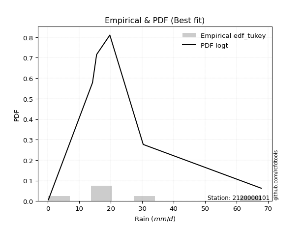</img>

</div>


### 8. EDF Gringorten (1963)

Gringorten plotting position formula is essential for estimating the probability and return periods of extreme events like floods and heavy rainfall. The constant _a=0.44_.

<div align="center">


$P=(m-a)/(n+1-2a)$


</div>


**8.1. Empirical values**

<div align="center">

|                | 0                   | 1                  | 2                   | 3                  | 4                  | 5                  |
|:---------------|:--------------------|:-------------------|:--------------------|:-------------------|:-------------------|:-------------------|
| date           | 2023                | 2018               | 2020                | 2025               | 2019               | 2024               |
| x              | 0.2                 | 14.2               | 15.5                | 19.7               | 30.3               | 67.8               |
| m              | 1                   | 2                  | 3                   | 4                  | 5                  | 6                  |
| empirical_dist | edf_gringorten      | edf_gringorten     | edf_gringorten      | edf_gringorten     | edf_gringorten     | edf_gringorten     |
| empirical      | 0.09150326797385622 | 0.2549019607843137 | 0.41830065359477125 | 0.5816993464052288 | 0.7450980392156862 | 0.9084967320261437 |
| empirical_tr   | 1.1007194244604317  | 1.3421052631578947 | 1.7191011235955058  | 2.3906250000000004 | 3.9230769230769216 | 10.928571428571415 |

</div>


**8.2. Kolmogorov-Smirnov fit test (sorted by Δ)**


<div align="center">

|                | 0                   | 1                   | 2                   | 3                  | 4                   | 5                   | 6                   | 7                   | 8                   | 9                   | 10                  | 11                  | 12                  | 13                  | 14                  | 15                  | 16                  | 17                  | 18                  | 19                 | 20                 | 21                  | 22                  | 23                  | 24                  | 25                 | 26                 | 27                  | 28                  | 29                  | 30                 | 31                  | 32                 | 33                  | 34                 | 35                  | 36                  | 37                  | 38                  | 39                  | 40                  | 41                  | 42                  | 43                  | 44                  | 45                  | 46                  | 47                  | 48                 | 49                 | 50                 | 51                 | 52                  | 53                  | 54                 | 55                  | 56                  | 57                  | 58                  | 59                  | 60                  | 61                  | 62                | 63                 | 64                | 65                 | 66                 | 67                 | 68                 | 69                  | 70                 | 71                 | 72                 | 73                 | 74                  | 75                  | 76                  | 77                 | 78                  | 79                 | 80                 | 81                  | 82                  | 83                  | 84                | 85                  | 86                 | 87                  | 88                 | 89                 | 90                 | 91                 | 92                  | 93                 | 94                  | 95                 | 96                 | 97                  | 98                  | 99                 | 100                | 101                | 102                | 103                | 104                 | 105                | 106                 | 107                | 108              | 109                | 110                 | 111                 | 112                 | 113               | 114                | 115                | 116                | 117               | 118                | 119                | 120                 | 121                 | 122                | 123                | 124                 | 125                 | 126                 | 127                | 128                | 129                 | 130                | 131                | 132                 | 133                | 134                 | 135                | 136                | 137                | 138                | 139                | 140               | 141                | 142                | 143                | 144                | 145                | 146                | 147                | 148                | 149                | 150                | 151                | 152                | 153              | 154                | 155                | 156                | 157                 | 158                | 159                |
|:---------------|:--------------------|:--------------------|:--------------------|:-------------------|:--------------------|:--------------------|:--------------------|:--------------------|:--------------------|:--------------------|:--------------------|:--------------------|:--------------------|:--------------------|:--------------------|:--------------------|:--------------------|:--------------------|:--------------------|:-------------------|:-------------------|:--------------------|:--------------------|:--------------------|:--------------------|:-------------------|:-------------------|:--------------------|:--------------------|:--------------------|:-------------------|:--------------------|:-------------------|:--------------------|:-------------------|:--------------------|:--------------------|:--------------------|:--------------------|:--------------------|:--------------------|:--------------------|:--------------------|:--------------------|:--------------------|:--------------------|:--------------------|:--------------------|:-------------------|:-------------------|:-------------------|:-------------------|:--------------------|:--------------------|:-------------------|:--------------------|:--------------------|:--------------------|:--------------------|:--------------------|:--------------------|:--------------------|:------------------|:-------------------|:------------------|:-------------------|:-------------------|:-------------------|:-------------------|:--------------------|:-------------------|:-------------------|:-------------------|:-------------------|:--------------------|:--------------------|:--------------------|:-------------------|:--------------------|:-------------------|:-------------------|:--------------------|:--------------------|:--------------------|:------------------|:--------------------|:-------------------|:--------------------|:-------------------|:-------------------|:-------------------|:-------------------|:--------------------|:-------------------|:--------------------|:-------------------|:-------------------|:--------------------|:--------------------|:-------------------|:-------------------|:-------------------|:-------------------|:-------------------|:--------------------|:-------------------|:--------------------|:-------------------|:-----------------|:-------------------|:--------------------|:--------------------|:--------------------|:------------------|:-------------------|:-------------------|:-------------------|:------------------|:-------------------|:-------------------|:--------------------|:--------------------|:-------------------|:-------------------|:--------------------|:--------------------|:--------------------|:-------------------|:-------------------|:--------------------|:-------------------|:-------------------|:--------------------|:-------------------|:--------------------|:-------------------|:-------------------|:-------------------|:-------------------|:-------------------|:------------------|:-------------------|:-------------------|:-------------------|:-------------------|:-------------------|:-------------------|:-------------------|:-------------------|:-------------------|:-------------------|:-------------------|:-------------------|:-----------------|:-------------------|:-------------------|:-------------------|:--------------------|:-------------------|:-------------------|
| station        | 2120000101          | 2120000101          | 2120000101          | 2120000101         | 2120000101          | 2120000101          | 2120000101          | 2120000101          | 2120000101          | 2120000101          | 2120000101          | 2120000101          | 2120000101          | 2120000101          | 2120000101          | 2120000101          | 2120000101          | 2120000101          | 2120000101          | 2120000101         | 2120000101         | 2120000101          | 2120000101          | 2120000101          | 2120000101          | 2120000101         | 2120000101         | 2120000101          | 2120000101          | 2120000101          | 2120000101         | 2120000101          | 2120000101         | 2120000101          | 2120000101         | 2120000101          | 2120000101          | 2120000101          | 2120000101          | 2120000101          | 2120000101          | 2120000101          | 2120000101          | 2120000101          | 2120000101          | 2120000101          | 2120000101          | 2120000101          | 2120000101         | 2120000101         | 2120000101         | 2120000101         | 2120000101          | 2120000101          | 2120000101         | 2120000101          | 2120000101          | 2120000101          | 2120000101          | 2120000101          | 2120000101          | 2120000101          | 2120000101        | 2120000101         | 2120000101        | 2120000101         | 2120000101         | 2120000101         | 2120000101         | 2120000101          | 2120000101         | 2120000101         | 2120000101         | 2120000101         | 2120000101          | 2120000101          | 2120000101          | 2120000101         | 2120000101          | 2120000101         | 2120000101         | 2120000101          | 2120000101          | 2120000101          | 2120000101        | 2120000101          | 2120000101         | 2120000101          | 2120000101         | 2120000101         | 2120000101         | 2120000101         | 2120000101          | 2120000101         | 2120000101          | 2120000101         | 2120000101         | 2120000101          | 2120000101          | 2120000101         | 2120000101         | 2120000101         | 2120000101         | 2120000101         | 2120000101          | 2120000101         | 2120000101          | 2120000101         | 2120000101       | 2120000101         | 2120000101          | 2120000101          | 2120000101          | 2120000101        | 2120000101         | 2120000101         | 2120000101         | 2120000101        | 2120000101         | 2120000101         | 2120000101          | 2120000101          | 2120000101         | 2120000101         | 2120000101          | 2120000101          | 2120000101          | 2120000101         | 2120000101         | 2120000101          | 2120000101         | 2120000101         | 2120000101          | 2120000101         | 2120000101          | 2120000101         | 2120000101         | 2120000101         | 2120000101         | 2120000101         | 2120000101        | 2120000101         | 2120000101         | 2120000101         | 2120000101         | 2120000101         | 2120000101         | 2120000101         | 2120000101         | 2120000101         | 2120000101         | 2120000101         | 2120000101         | 2120000101       | 2120000101         | 2120000101         | 2120000101         | 2120000101          | 2120000101         | 2120000101         |
| empirical_dist | edf_gringorten      | edf_gringorten      | edf_gringorten      | edf_gringorten     | edf_gringorten      | edf_gringorten      | edf_gringorten      | edf_gringorten      | edf_gringorten      | edf_gringorten      | edf_gringorten      | edf_gringorten      | edf_gringorten      | edf_gringorten      | edf_gringorten      | edf_gringorten      | edf_gringorten      | edf_gringorten      | edf_gringorten      | edf_gringorten     | edf_gringorten     | edf_gringorten      | edf_gringorten      | edf_gringorten      | edf_gringorten      | edf_gringorten     | edf_gringorten     | edf_gringorten      | edf_gringorten      | edf_gringorten      | edf_gringorten     | edf_gringorten      | edf_gringorten     | edf_gringorten      | edf_gringorten     | edf_gringorten      | edf_gringorten      | edf_gringorten      | edf_gringorten      | edf_gringorten      | edf_gringorten      | edf_gringorten      | edf_gringorten      | edf_gringorten      | edf_gringorten      | edf_gringorten      | edf_gringorten      | edf_gringorten      | edf_gringorten     | edf_gringorten     | edf_gringorten     | edf_gringorten     | edf_gringorten      | edf_gringorten      | edf_gringorten     | edf_gringorten      | edf_gringorten      | edf_gringorten      | edf_gringorten      | edf_gringorten      | edf_gringorten      | edf_gringorten      | edf_gringorten    | edf_gringorten     | edf_gringorten    | edf_gringorten     | edf_gringorten     | edf_gringorten     | edf_gringorten     | edf_gringorten      | edf_gringorten     | edf_gringorten     | edf_gringorten     | edf_gringorten     | edf_gringorten      | edf_gringorten      | edf_gringorten      | edf_gringorten     | edf_gringorten      | edf_gringorten     | edf_gringorten     | edf_gringorten      | edf_gringorten      | edf_gringorten      | edf_gringorten    | edf_gringorten      | edf_gringorten     | edf_gringorten      | edf_gringorten     | edf_gringorten     | edf_gringorten     | edf_gringorten     | edf_gringorten      | edf_gringorten     | edf_gringorten      | edf_gringorten     | edf_gringorten     | edf_gringorten      | edf_gringorten      | edf_gringorten     | edf_gringorten     | edf_gringorten     | edf_gringorten     | edf_gringorten     | edf_gringorten      | edf_gringorten     | edf_gringorten      | edf_gringorten     | edf_gringorten   | edf_gringorten     | edf_gringorten      | edf_gringorten      | edf_gringorten      | edf_gringorten    | edf_gringorten     | edf_gringorten     | edf_gringorten     | edf_gringorten    | edf_gringorten     | edf_gringorten     | edf_gringorten      | edf_gringorten      | edf_gringorten     | edf_gringorten     | edf_gringorten      | edf_gringorten      | edf_gringorten      | edf_gringorten     | edf_gringorten     | edf_gringorten      | edf_gringorten     | edf_gringorten     | edf_gringorten      | edf_gringorten     | edf_gringorten      | edf_gringorten     | edf_gringorten     | edf_gringorten     | edf_gringorten     | edf_gringorten     | edf_gringorten    | edf_gringorten     | edf_gringorten     | edf_gringorten     | edf_gringorten     | edf_gringorten     | edf_gringorten     | edf_gringorten     | edf_gringorten     | edf_gringorten     | edf_gringorten     | edf_gringorten     | edf_gringorten     | edf_gringorten   | edf_gringorten     | edf_gringorten     | edf_gringorten     | edf_gringorten      | edf_gringorten     | edf_gringorten     |
| p_dist         | logt                | dweibull            | dgamma              | logjohnsonsu       | logdgamma           | logdweibull         | nct                 | exponnorm           | vonmises_line       | moyal               | pearson3            | genlogistic         | gumbel_r            | truncnorm           | wald                | invgamma            | t                   | genpareto           | rayleigh            | skewnorm           | johnsonsu          | halfnorm            | kstwobign           | halflogistic        | invgauss            | foldnorm           | kappa3             | maxwell             | mielke              | genexpon            | gennorm            | gompertz            | semicircular       | anglit              | logloggamma        | rice                | crystalball         | norm                | logargus            | loggenpareto        | logvonmises_line    | loggennorm          | lomax               | arcsine             | logistic            | loglevy_l           | logweibull_max      | truncexpon          | loggenlogistic     | hypsecant          | logpearson3        | betaprime          | bradford            | exponpow            | gausshyper         | laplace             | cosine              | loggumbel_l         | gumbel_l            | kappa4              | nakagami            | burr12              | logtrapezoid      | loggenextreme      | ncf               | loggenhalflogistic | halfgennorm        | logarcsine         | wrapcauchy         | burr                | logfoldnorm        | logsemicircular    | ksone              | truncweibull_min   | loganglit           | logskewnorm         | f                   | logfatiguelife     | logcrystalball      | lognorm            | logrice            | logexponnorm        | lognct              | lognakagami         | uniform           | argus               | loglogistic        | loginvgamma         | logerlang          | levy_l             | loggamma           | loggamma           | loghypsecant        | gamma              | genextreme          | logalpha           | loginvgauss        | logloglaplace       | logmaxwell          | loglaplace         | loglaplace         | loginvweibull      | erlang             | lograyleigh        | logjohnsonsb        | logncf             | logkstwobign        | logburr12          | triang           | loggausshyper      | logwrapcauchy       | logtriang           | logcosine           | loghalfnorm       | loggumbel_r        | loggenexpon        | loghalflogistic    | logmoyal          | logbeta            | gengamma           | beta                | weibull_min         | loghalfgennorm     | genhalflogistic    | logksone            | loglomax            | logexponweib        | logf               | logwald            | rdist               | logkappa4          | logbradford        | loguniform          | logtruncnorm       | logkappa3           | invweibull         | loggengamma        | truncpareto        | tukeylambda        | logweibull_min     | johnsonsb         | exponweib          | trapezoid          | logtruncexpon      | fatiguelife        | powerlaw           | weibull_max        | logmielke          | logbetaprime       | logexponpow        | logburr            | logtruncpareto     | logpowerlaw        | alpha            | loggompertz        | logrdist           | logtukeylambda     | logtruncweibull_min | logvonmises        | vonmises           |
| delta          | 0.06302152436237263 | 0.08169934640582271 | 0.08305038949143545 | 0.0912934589433152 | 0.09161121519115473 | 0.09877617931044064 | 0.09968379628073559 | 0.09969029213179925 | 0.10317133661913791 | 0.10617743988460915 | 0.10738774797806094 | 0.10773827622913601 | 0.11189651014462076 | 0.11296300099175371 | 0.11860227681642493 | 0.12195801924203614 | 0.12362313877670095 | 0.12413291328805776 | 0.12673777768571381 | 0.1285777404882199 | 0.1291747491284404 | 0.12969259244145398 | 0.12998001096479272 | 0.13055626919433988 | 0.13236443532894343 | 0.1336591835770311 | 0.1345516889558468 | 0.13900379210923586 | 0.14025637640689737 | 0.14407332211717072 | 0.1488502997822697 | 0.14909554032998762 | 0.1602151917722615 | 0.16046528369198576 | 0.1672463744016946 | 0.16884947737407935 | 0.17319172870470834 | 0.17319173803206467 | 0.17411009466119343 | 0.17671491333640416 | 0.18058108770327552 | 0.18194441379039533 | 0.18296577003815762 | 0.18453210920702434 | 0.18510772790391095 | 0.18827091265865015 | 0.18907563826684165 | 0.18949238630435922 | 0.1902313320373598 | 0.1949259658862914 | 0.2025478644498404 | 0.2082744553310858 | 0.21090268683215818 | 0.22015728555131253 | 0.2208256166658975 | 0.22123992728886605 | 0.22231960857587785 | 0.23271359469761554 | 0.24053067041098086 | 0.24272057641466893 | 0.25480309124616696 | 0.25487634800103653 | 0.259152780188453 | 0.2641588233962954 | 0.268136465873167 | 0.2712994811591003 | 0.2730936519658329 | 0.2758166040201183 | 0.2807162754547461 | 0.28202221898695456 | 0.2854149631748515 | 0.2884407123250343 | 0.2907094790578952 | 0.2912224865377402 | 0.29161051586679276 | 0.29361386858118244 | 0.29453120914454056 | 0.2986342607210758 | 0.29929189334403794 | 0.2992919751240969 | 0.2992922176396102 | 0.29929416423538713 | 0.29937319537388396 | 0.29969536293728816 | 0.299831767026337 | 0.30617495692376295 | 0.3065745587631947 | 0.30738190414283095 | 0.3097367394199838 | 0.3114454608815259 | 0.3120007036642518 | 0.3120007036642518 | 0.31271596256420486 | 0.3159062902168063 | 0.31664085036650647 | 0.3166973406965816 | 0.3233313498444844 | 0.32513590336960774 | 0.32940241783958424 | 0.3327363340784959 | 0.3327363340784959 | 0.3333231916234478 | 0.3364739928489252 | 0.3390422893609747 | 0.34665894723312296 | 0.3495127724490553 | 0.35249613838185945 | 0.3540541121843326 | 0.35835809706772 | 0.3604609221929843 | 0.36391255227878805 | 0.36454232064555203 | 0.36531877832844417 | 0.366251908383312 | 0.3692063460075611 | 0.3895928600387104 | 0.3936751593004453 | 0.393904526937622 | 0.3947599692612318 | 0.3973168119650893 | 0.40676087851541537 | 0.41490099462007124 | 0.4247472148441057 | 0.4301140751390853 | 0.43815213557608335 | 0.44569659954913043 | 0.44596371770721077 | 0.4492834074899287 | 0.4624356999021638 | 0.46430389299416597 | 0.4728871397588402 | 0.4738100306158196 | 0.47676295484816267 | 0.4794726151233799 | 0.48628561543738624 | 0.4879041949762038 | 0.4886640287198977 | 0.5040195196671751 | 0.5134242059723446 | 0.5226394830416584 | 0.525984012194751 | 0.5346133755803613 | 0.5349381839935299 | 0.5447819712297369 | 0.5492894530473884 | 0.5645633692199455 | 0.6125245239359015 | 0.6370952782562908 | 0.6694466086940413 | 0.6752328928284507 | 0.6796990628284868 | 0.6941177895417815 | 0.6979295861518247 | 0.71833260576715 | 0.7418743640688298 | 0.7450980392156863 | 0.7450980392156863 | 0.7450980392156863  | 0.9549589837810517 | 10.276947059440458 |
| deltao         | 0.530385761606      | 0.530385761606      | 0.530385761606      | 0.530385761606     | 0.530385761606      | 0.530385761606      | 0.530385761606      | 0.530385761606      | 0.530385761606      | 0.530385761606      | 0.530385761606      | 0.530385761606      | 0.530385761606      | 0.530385761606      | 0.530385761606      | 0.530385761606      | 0.530385761606      | 0.530385761606      | 0.530385761606      | 0.530385761606     | 0.530385761606     | 0.530385761606      | 0.530385761606      | 0.530385761606      | 0.530385761606      | 0.530385761606     | 0.530385761606     | 0.530385761606      | 0.530385761606      | 0.530385761606      | 0.530385761606     | 0.530385761606      | 0.530385761606     | 0.530385761606      | 0.530385761606     | 0.530385761606      | 0.530385761606      | 0.530385761606      | 0.530385761606      | 0.530385761606      | 0.530385761606      | 0.530385761606      | 0.530385761606      | 0.530385761606      | 0.530385761606      | 0.530385761606      | 0.530385761606      | 0.530385761606      | 0.530385761606     | 0.530385761606     | 0.530385761606     | 0.530385761606     | 0.530385761606      | 0.530385761606      | 0.530385761606     | 0.530385761606      | 0.530385761606      | 0.530385761606      | 0.530385761606      | 0.530385761606      | 0.530385761606      | 0.530385761606      | 0.530385761606    | 0.530385761606     | 0.530385761606    | 0.530385761606     | 0.530385761606     | 0.530385761606     | 0.530385761606     | 0.530385761606      | 0.530385761606     | 0.530385761606     | 0.530385761606     | 0.530385761606     | 0.530385761606      | 0.530385761606      | 0.530385761606      | 0.530385761606     | 0.530385761606      | 0.530385761606     | 0.530385761606     | 0.530385761606      | 0.530385761606      | 0.530385761606      | 0.530385761606    | 0.530385761606      | 0.530385761606     | 0.530385761606      | 0.530385761606     | 0.530385761606     | 0.530385761606     | 0.530385761606     | 0.530385761606      | 0.530385761606     | 0.530385761606      | 0.530385761606     | 0.530385761606     | 0.530385761606      | 0.530385761606      | 0.530385761606     | 0.530385761606     | 0.530385761606     | 0.530385761606     | 0.530385761606     | 0.530385761606      | 0.530385761606     | 0.530385761606      | 0.530385761606     | 0.530385761606   | 0.530385761606     | 0.530385761606      | 0.530385761606      | 0.530385761606      | 0.530385761606    | 0.530385761606     | 0.530385761606     | 0.530385761606     | 0.530385761606    | 0.530385761606     | 0.530385761606     | 0.530385761606      | 0.530385761606      | 0.530385761606     | 0.530385761606     | 0.530385761606      | 0.530385761606      | 0.530385761606      | 0.530385761606     | 0.530385761606     | 0.530385761606      | 0.530385761606     | 0.530385761606     | 0.530385761606      | 0.530385761606     | 0.530385761606      | 0.530385761606     | 0.530385761606     | 0.530385761606     | 0.530385761606     | 0.530385761606     | 0.530385761606    | 0.530385761606     | 0.530385761606     | 0.530385761606     | 0.530385761606     | 0.530385761606     | 0.530385761606     | 0.530385761606     | 0.530385761606     | 0.530385761606     | 0.530385761606     | 0.530385761606     | 0.530385761606     | 0.530385761606   | 0.530385761606     | 0.530385761606     | 0.530385761606     | 0.530385761606      | 0.530385761606     | 0.530385761606     |
| eval           | Δo > Δ              | Δo > Δ              | Δo > Δ              | Δo > Δ             | Δo > Δ              | Δo > Δ              | Δo > Δ              | Δo > Δ              | Δo > Δ              | Δo > Δ              | Δo > Δ              | Δo > Δ              | Δo > Δ              | Δo > Δ              | Δo > Δ              | Δo > Δ              | Δo > Δ              | Δo > Δ              | Δo > Δ              | Δo > Δ             | Δo > Δ             | Δo > Δ              | Δo > Δ              | Δo > Δ              | Δo > Δ              | Δo > Δ             | Δo > Δ             | Δo > Δ              | Δo > Δ              | Δo > Δ              | Δo > Δ             | Δo > Δ              | Δo > Δ             | Δo > Δ              | Δo > Δ             | Δo > Δ              | Δo > Δ              | Δo > Δ              | Δo > Δ              | Δo > Δ              | Δo > Δ              | Δo > Δ              | Δo > Δ              | Δo > Δ              | Δo > Δ              | Δo > Δ              | Δo > Δ              | Δo > Δ              | Δo > Δ             | Δo > Δ             | Δo > Δ             | Δo > Δ             | Δo > Δ              | Δo > Δ              | Δo > Δ             | Δo > Δ              | Δo > Δ              | Δo > Δ              | Δo > Δ              | Δo > Δ              | Δo > Δ              | Δo > Δ              | Δo > Δ            | Δo > Δ             | Δo > Δ            | Δo > Δ             | Δo > Δ             | Δo > Δ             | Δo > Δ             | Δo > Δ              | Δo > Δ             | Δo > Δ             | Δo > Δ             | Δo > Δ             | Δo > Δ              | Δo > Δ              | Δo > Δ              | Δo > Δ             | Δo > Δ              | Δo > Δ             | Δo > Δ             | Δo > Δ              | Δo > Δ              | Δo > Δ              | Δo > Δ            | Δo > Δ              | Δo > Δ             | Δo > Δ              | Δo > Δ             | Δo > Δ             | Δo > Δ             | Δo > Δ             | Δo > Δ              | Δo > Δ             | Δo > Δ              | Δo > Δ             | Δo > Δ             | Δo > Δ              | Δo > Δ              | Δo > Δ             | Δo > Δ             | Δo > Δ             | Δo > Δ             | Δo > Δ             | Δo > Δ              | Δo > Δ             | Δo > Δ              | Δo > Δ             | Δo > Δ           | Δo > Δ             | Δo > Δ              | Δo > Δ              | Δo > Δ              | Δo > Δ            | Δo > Δ             | Δo > Δ             | Δo > Δ             | Δo > Δ            | Δo > Δ             | Δo > Δ             | Δo > Δ              | Δo > Δ              | Δo > Δ             | Δo > Δ             | Δo > Δ              | Δo > Δ              | Δo > Δ              | Δo > Δ             | Δo > Δ             | Δo > Δ              | Δo > Δ             | Δo > Δ             | Δo > Δ              | Δo > Δ             | Δo > Δ              | Δo > Δ             | Δo > Δ             | Δo > Δ             | Δo > Δ             | Δo > Δ             | Δo > Δ            | Δo <= Δ            | Δo <= Δ            | Δo <= Δ            | Δo <= Δ            | Δo <= Δ            | Δo <= Δ            | Δo <= Δ            | Δo <= Δ            | Δo <= Δ            | Δo <= Δ            | Δo <= Δ            | Δo <= Δ            | Δo <= Δ          | Δo <= Δ            | Δo <= Δ            | Δo <= Δ            | Δo <= Δ             | Δo <= Δ            | Δo <= Δ            |
| fit            | 1                   | 1                   | 1                   | 1                  | 1                   | 1                   | 1                   | 1                   | 1                   | 1                   | 1                   | 1                   | 1                   | 1                   | 1                   | 1                   | 1                   | 1                   | 1                   | 1                  | 1                  | 1                   | 1                   | 1                   | 1                   | 1                  | 1                  | 1                   | 1                   | 1                   | 1                  | 1                   | 1                  | 1                   | 1                  | 1                   | 1                   | 1                   | 1                   | 1                   | 1                   | 1                   | 1                   | 1                   | 1                   | 1                   | 1                   | 1                   | 1                  | 1                  | 1                  | 1                  | 1                   | 1                   | 1                  | 1                   | 1                   | 1                   | 1                   | 1                   | 1                   | 1                   | 1                 | 1                  | 1                 | 1                  | 1                  | 1                  | 1                  | 1                   | 1                  | 1                  | 1                  | 1                  | 1                   | 1                   | 1                   | 1                  | 1                   | 1                  | 1                  | 1                   | 1                   | 1                   | 1                 | 1                   | 1                  | 1                   | 1                  | 1                  | 1                  | 1                  | 1                   | 1                  | 1                   | 1                  | 1                  | 1                   | 1                   | 1                  | 1                  | 1                  | 1                  | 1                  | 1                   | 1                  | 1                   | 1                  | 1                | 1                  | 1                   | 1                   | 1                   | 1                 | 1                  | 1                  | 1                  | 1                 | 1                  | 1                  | 1                   | 1                   | 1                  | 1                  | 1                   | 1                   | 1                   | 1                  | 1                  | 1                   | 1                  | 1                  | 1                   | 1                  | 1                   | 1                  | 1                  | 1                  | 1                  | 1                  | 1                 | 0                  | 0                  | 0                  | 0                  | 0                  | 0                  | 0                  | 0                  | 0                  | 0                  | 0                  | 0                  | 0                | 0                  | 0                  | 0                  | 0                   | 0                  | 0                  |
| n              | 6                   | 6                   | 6                   | 6                  | 6                   | 6                   | 6                   | 6                   | 6                   | 6                   | 6                   | 6                   | 6                   | 6                   | 6                   | 6                   | 6                   | 6                   | 6                   | 6                  | 6                  | 6                   | 6                   | 6                   | 6                   | 6                  | 6                  | 6                   | 6                   | 6                   | 6                  | 6                   | 6                  | 6                   | 6                  | 6                   | 6                   | 6                   | 6                   | 6                   | 6                   | 6                   | 6                   | 6                   | 6                   | 6                   | 6                   | 6                   | 6                  | 6                  | 6                  | 6                  | 6                   | 6                   | 6                  | 6                   | 6                   | 6                   | 6                   | 6                   | 6                   | 6                   | 6                 | 6                  | 6                 | 6                  | 6                  | 6                  | 6                  | 6                   | 6                  | 6                  | 6                  | 6                  | 6                   | 6                   | 6                   | 6                  | 6                   | 6                  | 6                  | 6                   | 6                   | 6                   | 6                 | 6                   | 6                  | 6                   | 6                  | 6                  | 6                  | 6                  | 6                   | 6                  | 6                   | 6                  | 6                  | 6                   | 6                   | 6                  | 6                  | 6                  | 6                  | 6                  | 6                   | 6                  | 6                   | 6                  | 6                | 6                  | 6                   | 6                   | 6                   | 6                 | 6                  | 6                  | 6                  | 6                 | 6                  | 6                  | 6                   | 6                   | 6                  | 6                  | 6                   | 6                   | 6                   | 6                  | 6                  | 6                   | 6                  | 6                  | 6                   | 6                  | 6                   | 6                  | 6                  | 6                  | 6                  | 6                  | 6                 | 6                  | 6                  | 6                  | 6                  | 6                  | 6                  | 6                  | 6                  | 6                  | 6                  | 6                  | 6                  | 6                | 6                  | 6                  | 6                  | 6                   | 6                  | 6                  |
| best_fit       | 1                   | 0                   | 0                   | 0                  | 0                   | 0                   | 0                   | 0                   | 0                   | 0                   | 0                   | 0                   | 0                   | 0                   | 0                   | 0                   | 0                   | 0                   | 0                   | 0                  | 0                  | 0                   | 0                   | 0                   | 0                   | 0                  | 0                  | 0                   | 0                   | 0                   | 0                  | 0                   | 0                  | 0                   | 0                  | 0                   | 0                   | 0                   | 0                   | 0                   | 0                   | 0                   | 0                   | 0                   | 0                   | 0                   | 0                   | 0                   | 0                  | 0                  | 0                  | 0                  | 0                   | 0                   | 0                  | 0                   | 0                   | 0                   | 0                   | 0                   | 0                   | 0                   | 0                 | 0                  | 0                 | 0                  | 0                  | 0                  | 0                  | 0                   | 0                  | 0                  | 0                  | 0                  | 0                   | 0                   | 0                   | 0                  | 0                   | 0                  | 0                  | 0                   | 0                   | 0                   | 0                 | 0                   | 0                  | 0                   | 0                  | 0                  | 0                  | 0                  | 0                   | 0                  | 0                   | 0                  | 0                  | 0                   | 0                   | 0                  | 0                  | 0                  | 0                  | 0                  | 0                   | 0                  | 0                   | 0                  | 0                | 0                  | 0                   | 0                   | 0                   | 0                 | 0                  | 0                  | 0                  | 0                 | 0                  | 0                  | 0                   | 0                   | 0                  | 0                  | 0                   | 0                   | 0                   | 0                  | 0                  | 0                   | 0                  | 0                  | 0                   | 0                  | 0                   | 0                  | 0                  | 0                  | 0                  | 0                  | 0                 | 0                  | 0                  | 0                  | 0                  | 0                  | 0                  | 0                  | 0                  | 0                  | 0                  | 0                  | 0                  | 0                | 0                  | 0                  | 0                  | 0                   | 0                  | 0                  |
| best_fit_sort  | 1                   | 2                   | 3                   | 4                  | 5                   | 6                   | 7                   | 8                   | 9                   | 10                  | 11                  | 12                  | 13                  | 14                  | 15                  | 16                  | 17                  | 18                  | 19                  | 20                 | 21                 | 22                  | 23                  | 24                  | 25                  | 26                 | 27                 | 28                  | 29                  | 30                  | 31                 | 32                  | 33                 | 34                  | 35                 | 36                  | 37                  | 38                  | 39                  | 40                  | 41                  | 42                  | 43                  | 44                  | 45                  | 46                  | 47                  | 48                  | 49                 | 50                 | 51                 | 52                 | 53                  | 54                  | 55                 | 56                  | 57                  | 58                  | 59                  | 60                  | 61                  | 62                  | 63                | 64                 | 65                | 66                 | 67                 | 68                 | 69                 | 70                  | 71                 | 72                 | 73                 | 74                 | 75                  | 76                  | 77                  | 78                 | 79                  | 80                 | 81                 | 82                  | 83                  | 84                  | 85                | 86                  | 87                 | 88                  | 89                 | 90                 | 91                 | 92                 | 93                  | 94                 | 95                  | 96                 | 97                 | 98                  | 99                  | 100                | 101                | 102                | 103                | 104                | 105                 | 106                | 107                 | 108                | 109              | 110                | 111                 | 112                 | 113                 | 114               | 115                | 116                | 117                | 118               | 119                | 120                | 121                 | 122                 | 123                | 124                | 125                 | 126                 | 127                 | 128                | 129                | 130                 | 131                | 132                | 133                 | 134                | 135                 | 136                | 137                | 138                | 139                | 140                | 141               | 142                | 143                | 144                | 145                | 146                | 147                | 148                | 149                | 150                | 151                | 152                | 153                | 154              | 155                | 156                | 157                | 158                 | 159                | 160                |

</div>


**8.3. Best fit**

<div align="center">

|   id |    station | empirical_dist   | p_dist   |     delta |   deltao | eval   |   fit |   n |   best_fit |   best_fit_sort |
|-----:|-----------:|:-----------------|:---------|----------:|---------:|:-------|------:|----:|-----------:|----------------:|
|    0 | 2120000101 | edf_gringorten   | logt     | 0.0630215 | 0.530386 | Δo > Δ |     1 |   6 |          1 |               1 |

</div>


<div align="center">

</img>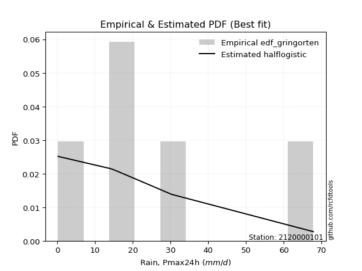</img>

</div>


### 9. EDF Filliben (1975)

The specific values of the constants (0.3175) (often denoted as $alpha$) and (0.365) are derived from a method proposed by James J. Filliben in a 1975 paper. This particular formula is the mean value of the $i$-th order statistic of the normal distribution and is considered a robust and effective plotting position formula for the normal probability plot correlation coefficient test for normality.

<div align="center">


$P=(m-0.3175)/(n+0.365)$


</div>


**9.1. Empirical values**

<div align="center">

|                | 0                   | 1                   | 2                  | 3                  | 4                  | 5                  |
|:---------------|:--------------------|:--------------------|:-------------------|:-------------------|:-------------------|:-------------------|
| date           | 2023                | 2018                | 2020               | 2025               | 2019               | 2024               |
| x              | 0.2                 | 14.2                | 15.5               | 19.7               | 30.3               | 67.8               |
| m              | 1                   | 2                   | 3                  | 4                  | 5                  | 6                  |
| empirical_dist | edf_filliben        | edf_filliben        | edf_filliben       | edf_filliben       | edf_filliben       | edf_filliben       |
| empirical      | 0.10722702278083267 | 0.26433621366849963 | 0.4214454045561665 | 0.5785545954438335 | 0.7356637863315004 | 0.8927729772191673 |
| empirical_tr   | 1.1201055873295205  | 1.3593166043780034  | 1.7284453496266123 | 2.3727865796831313 | 3.783060921248143  | 9.326007326007321  |

</div>


**9.2. Kolmogorov-Smirnov fit test (sorted by Δ)**


<div align="center">

|                | 0                  | 1                   | 2                   | 3                   | 4                   | 5                   | 6                   | 7                   | 8                   | 9                   | 10                  | 11                  | 12                  | 13                  | 14                  | 15                  | 16                  | 17                  | 18                  | 19                  | 20                  | 21                  | 22                  | 23                  | 24                  | 25                  | 26                 | 27                  | 28                 | 29                  | 30                 | 31                  | 32                  | 33                  | 34                  | 35                 | 36                  | 37                  | 38                | 39                  | 40                 | 41                 | 42                  | 43                  | 44                  | 45                 | 46                  | 47                 | 48                 | 49                  | 50                  | 51                  | 52                  | 53                 | 54                  | 55                  | 56                  | 57                  | 58                  | 59                  | 60                 | 61                  | 62                  | 63                  | 64                 | 65                | 66                 | 67                 | 68                  | 69                  | 70                  | 71                 | 72                 | 73                  | 74                  | 75                 | 76                  | 77                  | 78                | 79                  | 80                 | 81                 | 82                  | 83                  | 84                  | 85                  | 86                 | 87                 | 88                  | 89                 | 90                  | 91                 | 92                 | 93                  | 94                  | 95                 | 96                  | 97                 | 98                 | 99               | 100              | 101                | 102                | 103                 | 104                | 105                | 106                | 107                 | 108                | 109                | 110                | 111                | 112                 | 113                | 114                 | 115                | 116                 | 117                | 118                 | 119                 | 120                | 121                | 122                | 123                | 124                | 125                | 126                 | 127                 | 128                | 129                | 130                | 131                | 132                 | 133               | 134                 | 135                | 136                | 137                 | 138                | 139                | 140                | 141                | 142                | 143                | 144                | 145                | 146                | 147                | 148                | 149                | 150                | 151                | 152                | 153               | 154                | 155                | 156                | 157                 | 158                | 159                |
|:---------------|:-------------------|:--------------------|:--------------------|:--------------------|:--------------------|:--------------------|:--------------------|:--------------------|:--------------------|:--------------------|:--------------------|:--------------------|:--------------------|:--------------------|:--------------------|:--------------------|:--------------------|:--------------------|:--------------------|:--------------------|:--------------------|:--------------------|:--------------------|:--------------------|:--------------------|:--------------------|:-------------------|:--------------------|:-------------------|:--------------------|:-------------------|:--------------------|:--------------------|:--------------------|:--------------------|:-------------------|:--------------------|:--------------------|:------------------|:--------------------|:-------------------|:-------------------|:--------------------|:--------------------|:--------------------|:-------------------|:--------------------|:-------------------|:-------------------|:--------------------|:--------------------|:--------------------|:--------------------|:-------------------|:--------------------|:--------------------|:--------------------|:--------------------|:--------------------|:--------------------|:-------------------|:--------------------|:--------------------|:--------------------|:-------------------|:------------------|:-------------------|:-------------------|:--------------------|:--------------------|:--------------------|:-------------------|:-------------------|:--------------------|:--------------------|:-------------------|:--------------------|:--------------------|:------------------|:--------------------|:-------------------|:-------------------|:--------------------|:--------------------|:--------------------|:--------------------|:-------------------|:-------------------|:--------------------|:-------------------|:--------------------|:-------------------|:-------------------|:--------------------|:--------------------|:-------------------|:--------------------|:-------------------|:-------------------|:-----------------|:-----------------|:-------------------|:-------------------|:--------------------|:-------------------|:-------------------|:-------------------|:--------------------|:-------------------|:-------------------|:-------------------|:-------------------|:--------------------|:-------------------|:--------------------|:-------------------|:--------------------|:-------------------|:--------------------|:--------------------|:-------------------|:-------------------|:-------------------|:-------------------|:-------------------|:-------------------|:--------------------|:--------------------|:-------------------|:-------------------|:-------------------|:-------------------|:--------------------|:------------------|:--------------------|:-------------------|:-------------------|:--------------------|:-------------------|:-------------------|:-------------------|:-------------------|:-------------------|:-------------------|:-------------------|:-------------------|:-------------------|:-------------------|:-------------------|:-------------------|:-------------------|:-------------------|:-------------------|:------------------|:-------------------|:-------------------|:-------------------|:--------------------|:-------------------|:-------------------|
| station        | 2120000101         | 2120000101          | 2120000101          | 2120000101          | 2120000101          | 2120000101          | 2120000101          | 2120000101          | 2120000101          | 2120000101          | 2120000101          | 2120000101          | 2120000101          | 2120000101          | 2120000101          | 2120000101          | 2120000101          | 2120000101          | 2120000101          | 2120000101          | 2120000101          | 2120000101          | 2120000101          | 2120000101          | 2120000101          | 2120000101          | 2120000101         | 2120000101          | 2120000101         | 2120000101          | 2120000101         | 2120000101          | 2120000101          | 2120000101          | 2120000101          | 2120000101         | 2120000101          | 2120000101          | 2120000101        | 2120000101          | 2120000101         | 2120000101         | 2120000101          | 2120000101          | 2120000101          | 2120000101         | 2120000101          | 2120000101         | 2120000101         | 2120000101          | 2120000101          | 2120000101          | 2120000101          | 2120000101         | 2120000101          | 2120000101          | 2120000101          | 2120000101          | 2120000101          | 2120000101          | 2120000101         | 2120000101          | 2120000101          | 2120000101          | 2120000101         | 2120000101        | 2120000101         | 2120000101         | 2120000101          | 2120000101          | 2120000101          | 2120000101         | 2120000101         | 2120000101          | 2120000101          | 2120000101         | 2120000101          | 2120000101          | 2120000101        | 2120000101          | 2120000101         | 2120000101         | 2120000101          | 2120000101          | 2120000101          | 2120000101          | 2120000101         | 2120000101         | 2120000101          | 2120000101         | 2120000101          | 2120000101         | 2120000101         | 2120000101          | 2120000101          | 2120000101         | 2120000101          | 2120000101         | 2120000101         | 2120000101       | 2120000101       | 2120000101         | 2120000101         | 2120000101          | 2120000101         | 2120000101         | 2120000101         | 2120000101          | 2120000101         | 2120000101         | 2120000101         | 2120000101         | 2120000101          | 2120000101         | 2120000101          | 2120000101         | 2120000101          | 2120000101         | 2120000101          | 2120000101          | 2120000101         | 2120000101         | 2120000101         | 2120000101         | 2120000101         | 2120000101         | 2120000101          | 2120000101          | 2120000101         | 2120000101         | 2120000101         | 2120000101         | 2120000101          | 2120000101        | 2120000101          | 2120000101         | 2120000101         | 2120000101          | 2120000101         | 2120000101         | 2120000101         | 2120000101         | 2120000101         | 2120000101         | 2120000101         | 2120000101         | 2120000101         | 2120000101         | 2120000101         | 2120000101         | 2120000101         | 2120000101         | 2120000101         | 2120000101        | 2120000101         | 2120000101         | 2120000101         | 2120000101          | 2120000101         | 2120000101         |
| empirical_dist | edf_filliben       | edf_filliben        | edf_filliben        | edf_filliben        | edf_filliben        | edf_filliben        | edf_filliben        | edf_filliben        | edf_filliben        | edf_filliben        | edf_filliben        | edf_filliben        | edf_filliben        | edf_filliben        | edf_filliben        | edf_filliben        | edf_filliben        | edf_filliben        | edf_filliben        | edf_filliben        | edf_filliben        | edf_filliben        | edf_filliben        | edf_filliben        | edf_filliben        | edf_filliben        | edf_filliben       | edf_filliben        | edf_filliben       | edf_filliben        | edf_filliben       | edf_filliben        | edf_filliben        | edf_filliben        | edf_filliben        | edf_filliben       | edf_filliben        | edf_filliben        | edf_filliben      | edf_filliben        | edf_filliben       | edf_filliben       | edf_filliben        | edf_filliben        | edf_filliben        | edf_filliben       | edf_filliben        | edf_filliben       | edf_filliben       | edf_filliben        | edf_filliben        | edf_filliben        | edf_filliben        | edf_filliben       | edf_filliben        | edf_filliben        | edf_filliben        | edf_filliben        | edf_filliben        | edf_filliben        | edf_filliben       | edf_filliben        | edf_filliben        | edf_filliben        | edf_filliben       | edf_filliben      | edf_filliben       | edf_filliben       | edf_filliben        | edf_filliben        | edf_filliben        | edf_filliben       | edf_filliben       | edf_filliben        | edf_filliben        | edf_filliben       | edf_filliben        | edf_filliben        | edf_filliben      | edf_filliben        | edf_filliben       | edf_filliben       | edf_filliben        | edf_filliben        | edf_filliben        | edf_filliben        | edf_filliben       | edf_filliben       | edf_filliben        | edf_filliben       | edf_filliben        | edf_filliben       | edf_filliben       | edf_filliben        | edf_filliben        | edf_filliben       | edf_filliben        | edf_filliben       | edf_filliben       | edf_filliben     | edf_filliben     | edf_filliben       | edf_filliben       | edf_filliben        | edf_filliben       | edf_filliben       | edf_filliben       | edf_filliben        | edf_filliben       | edf_filliben       | edf_filliben       | edf_filliben       | edf_filliben        | edf_filliben       | edf_filliben        | edf_filliben       | edf_filliben        | edf_filliben       | edf_filliben        | edf_filliben        | edf_filliben       | edf_filliben       | edf_filliben       | edf_filliben       | edf_filliben       | edf_filliben       | edf_filliben        | edf_filliben        | edf_filliben       | edf_filliben       | edf_filliben       | edf_filliben       | edf_filliben        | edf_filliben      | edf_filliben        | edf_filliben       | edf_filliben       | edf_filliben        | edf_filliben       | edf_filliben       | edf_filliben       | edf_filliben       | edf_filliben       | edf_filliben       | edf_filliben       | edf_filliben       | edf_filliben       | edf_filliben       | edf_filliben       | edf_filliben       | edf_filliben       | edf_filliben       | edf_filliben       | edf_filliben      | edf_filliben       | edf_filliben       | edf_filliben       | edf_filliben        | edf_filliben       | edf_filliben       |
| p_dist         | logt               | dweibull            | logjohnsonsu        | dgamma              | logdweibull         | nct                 | exponnorm           | moyal               | logdgamma           | pearson3            | genlogistic         | truncnorm           | vonmises_line       | gumbel_r            | wald                | invgamma            | genpareto           | t                   | johnsonsu           | halfnorm            | halflogistic        | invgauss            | rayleigh            | foldnorm            | kappa3              | skewnorm            | kstwobign          | mielke              | genexpon           | maxwell             | gompertz           | gennorm             | semicircular        | anglit              | logloggamma         | logargus           | rice                | loggenpareto        | crystalball       | norm                | logvonmises_line   | lomax              | arcsine             | loglevy_l           | logweibull_max      | loggenlogistic     | logistic            | loggennorm         | truncexpon         | hypsecant           | logpearson3         | betaprime           | bradford            | exponpow           | gausshyper          | laplace             | cosine              | loggumbel_l         | kappa4              | gumbel_l            | burr12             | logtrapezoid        | loggenextreme       | ncf                 | loggenhalflogistic | halfgennorm       | nakagami           | logarcsine         | wrapcauchy          | burr                | logfoldnorm         | logsemicircular    | ksone              | truncweibull_min    | loganglit           | logskewnorm        | f                   | logfatiguelife      | logcrystalball    | lognorm             | logrice            | logexponnorm       | lognct              | lognakagami         | uniform             | levy_l              | argus              | loglogistic        | loginvgamma         | logerlang          | genextreme          | loggamma           | loggamma           | loghypsecant        | gamma               | logalpha           | logloglaplace       | loginvgauss        | logmaxwell         | loglaplace       | loglaplace       | loginvweibull      | erlang             | lograyleigh         | logjohnsonsb       | logncf             | logkstwobign       | logburr12           | triang             | loggausshyper      | logwrapcauchy      | logtriang          | logcosine           | loghalfnorm        | loggumbel_r         | loggenexpon        | loghalflogistic     | logmoyal           | logbeta             | gengamma            | beta               | weibull_min        | loghalfgennorm     | genhalflogistic    | logksone           | loglomax           | logexponweib        | logf                | rdist              | logwald            | logkappa4          | logbradford        | loguniform          | logtruncnorm      | logkappa3           | invweibull         | loggengamma        | truncpareto         | tukeylambda        | logweibull_min     | johnsonsb          | exponweib          | trapezoid          | logtruncexpon      | fatiguelife        | powerlaw           | weibull_max        | logmielke          | logbetaprime       | logexponpow        | logburr            | logtruncpareto     | logpowerlaw        | alpha             | loggompertz        | logrdist           | logtukeylambda     | logtruncweibull_min | logvonmises        | vonmises           |
| delta          | 0.0719743873984147 | 0.07855459544442739 | 0.08185920605912927 | 0.08619514045283072 | 0.08934192642625471 | 0.09024954339654967 | 0.09025603924761333 | 0.09674318700042323 | 0.09786677918877063 | 0.09979009668653144 | 0.10459352526774068 | 0.10722700007570035 | 0.10722702097980596 | 0.10875175918322544 | 0.10916802393223901 | 0.11252376635785022 | 0.11469866040387183 | 0.11700007064392703 | 0.11974049624425448 | 0.12025833955726806 | 0.12112201631015396 | 0.12293018244475751 | 0.12359302672431849 | 0.12422493069284518 | 0.12511743607166087 | 0.12543298952682458 | 0.1268352600033974 | 0.13082212352271144 | 0.1346390692329848 | 0.13585904114784053 | 0.1459507893685923 | 0.15199505074366504 | 0.15204204910645103 | 0.15732053273059043 | 0.15781212151750867 | 0.1646758417770075 | 0.16570472641268402 | 0.16728066045221823 | 0.170046977743313 | 0.17004698707066934 | 0.1711468348190896 | 0.1735315171539717 | 0.17509785632283859 | 0.17883665977446422 | 0.17964138538265573 | 0.1807970791531739 | 0.18196297694251562 | 0.1850891647517906 | 0.1863476353429639 | 0.19178121492489608 | 0.19311361156565449 | 0.19884020244689987 | 0.20775793587076286 | 0.2107230326671266 | 0.21139136378171175 | 0.21809517632747072 | 0.21917485761448252 | 0.22327934181342962 | 0.23587137122360763 | 0.23738591944958554 | 0.2454420951168506 | 0.24971852730426708 | 0.25472457051210945 | 0.25870221298898105 | 0.2618652282749144 | 0.263659399081647 | 0.2642373441303529 | 0.2663823511359324 | 0.27128202257056033 | 0.27258796610276864 | 0.27598071029066557 | 0.2790064594408484 | 0.2812752261737094 | 0.28178823365355427 | 0.28217626298260684 | 0.2841796156969965 | 0.28509695626035464 | 0.28920000783688987 | 0.289857640459852 | 0.28985772223991096 | 0.2898579647554243 | 0.2898599113512012 | 0.28993894248969804 | 0.29026111005310223 | 0.29039751414215126 | 0.29572170607454945 | 0.2967407040395772 | 0.2971403058790088 | 0.29794765125864503 | 0.3003024865357979 | 0.30091709555953006 | 0.3025664507800659 | 0.3025664507800659 | 0.30328170968001894 | 0.30647203733262035 | 0.3072630878123957 | 0.30941214856263133 | 0.3138970969602985 | 0.3199681649553983 | 0.32330208119431 | 0.32330208119431 | 0.3238889387392619 | 0.3270397399647393 | 0.32960803647678877 | 0.3309351924261465 | 0.3400785195648694 | 0.3430618854976735 | 0.34461985930014666 | 0.3489238441835342 | 0.3510266693087984 | 0.3544782993946021 | 0.3551080677613661 | 0.35588452544425825 | 0.3568176554991261 | 0.35977209312337516 | 0.3801586071545245 | 0.38424090641625935 | 0.3844702740534361 | 0.38532571637704605 | 0.38788255908090336 | 0.3973266256312296 | 0.4054667417358853 | 0.4153129619599198 | 0.4206798222548995 | 0.4287178826918974 | 0.4362623466649445 | 0.43652946482302485 | 0.43984915460574275 | 0.4485801381871895 | 0.4530014470179779 | 0.4634528868746543 | 0.4643757777316337 | 0.46732870196397674 | 0.470038362239194 | 0.47056186063040983 | 0.4721804401692274 | 0.4729402739129213 | 0.49458526678298914 | 0.5039899530881586 | 0.5132052301574725 | 0.5165497593105652 | 0.5251791226961753 | 0.5255039311093441 | 0.5353477183455511 | 0.5398552001632024 | 0.5551291163357597 | 0.6030902710517158 | 0.6276610253721049 | 0.6600123558098554 | 0.6657986399442648 | 0.6702648099443009 | 0.6846835366575956 | 0.6884953332676387 | 0.708898352882964 | 0.7324401111846439 | 0.7356637863315003 | 0.7356637863315003 | 0.7356637863315003  | 0.9706827385880281 | 10.292670814247435 |
| deltao         | 0.530385761606     | 0.530385761606      | 0.530385761606      | 0.530385761606      | 0.530385761606      | 0.530385761606      | 0.530385761606      | 0.530385761606      | 0.530385761606      | 0.530385761606      | 0.530385761606      | 0.530385761606      | 0.530385761606      | 0.530385761606      | 0.530385761606      | 0.530385761606      | 0.530385761606      | 0.530385761606      | 0.530385761606      | 0.530385761606      | 0.530385761606      | 0.530385761606      | 0.530385761606      | 0.530385761606      | 0.530385761606      | 0.530385761606      | 0.530385761606     | 0.530385761606      | 0.530385761606     | 0.530385761606      | 0.530385761606     | 0.530385761606      | 0.530385761606      | 0.530385761606      | 0.530385761606      | 0.530385761606     | 0.530385761606      | 0.530385761606      | 0.530385761606    | 0.530385761606      | 0.530385761606     | 0.530385761606     | 0.530385761606      | 0.530385761606      | 0.530385761606      | 0.530385761606     | 0.530385761606      | 0.530385761606     | 0.530385761606     | 0.530385761606      | 0.530385761606      | 0.530385761606      | 0.530385761606      | 0.530385761606     | 0.530385761606      | 0.530385761606      | 0.530385761606      | 0.530385761606      | 0.530385761606      | 0.530385761606      | 0.530385761606     | 0.530385761606      | 0.530385761606      | 0.530385761606      | 0.530385761606     | 0.530385761606    | 0.530385761606     | 0.530385761606     | 0.530385761606      | 0.530385761606      | 0.530385761606      | 0.530385761606     | 0.530385761606     | 0.530385761606      | 0.530385761606      | 0.530385761606     | 0.530385761606      | 0.530385761606      | 0.530385761606    | 0.530385761606      | 0.530385761606     | 0.530385761606     | 0.530385761606      | 0.530385761606      | 0.530385761606      | 0.530385761606      | 0.530385761606     | 0.530385761606     | 0.530385761606      | 0.530385761606     | 0.530385761606      | 0.530385761606     | 0.530385761606     | 0.530385761606      | 0.530385761606      | 0.530385761606     | 0.530385761606      | 0.530385761606     | 0.530385761606     | 0.530385761606   | 0.530385761606   | 0.530385761606     | 0.530385761606     | 0.530385761606      | 0.530385761606     | 0.530385761606     | 0.530385761606     | 0.530385761606      | 0.530385761606     | 0.530385761606     | 0.530385761606     | 0.530385761606     | 0.530385761606      | 0.530385761606     | 0.530385761606      | 0.530385761606     | 0.530385761606      | 0.530385761606     | 0.530385761606      | 0.530385761606      | 0.530385761606     | 0.530385761606     | 0.530385761606     | 0.530385761606     | 0.530385761606     | 0.530385761606     | 0.530385761606      | 0.530385761606      | 0.530385761606     | 0.530385761606     | 0.530385761606     | 0.530385761606     | 0.530385761606      | 0.530385761606    | 0.530385761606      | 0.530385761606     | 0.530385761606     | 0.530385761606      | 0.530385761606     | 0.530385761606     | 0.530385761606     | 0.530385761606     | 0.530385761606     | 0.530385761606     | 0.530385761606     | 0.530385761606     | 0.530385761606     | 0.530385761606     | 0.530385761606     | 0.530385761606     | 0.530385761606     | 0.530385761606     | 0.530385761606     | 0.530385761606    | 0.530385761606     | 0.530385761606     | 0.530385761606     | 0.530385761606      | 0.530385761606     | 0.530385761606     |
| eval           | Δo > Δ             | Δo > Δ              | Δo > Δ              | Δo > Δ              | Δo > Δ              | Δo > Δ              | Δo > Δ              | Δo > Δ              | Δo > Δ              | Δo > Δ              | Δo > Δ              | Δo > Δ              | Δo > Δ              | Δo > Δ              | Δo > Δ              | Δo > Δ              | Δo > Δ              | Δo > Δ              | Δo > Δ              | Δo > Δ              | Δo > Δ              | Δo > Δ              | Δo > Δ              | Δo > Δ              | Δo > Δ              | Δo > Δ              | Δo > Δ             | Δo > Δ              | Δo > Δ             | Δo > Δ              | Δo > Δ             | Δo > Δ              | Δo > Δ              | Δo > Δ              | Δo > Δ              | Δo > Δ             | Δo > Δ              | Δo > Δ              | Δo > Δ            | Δo > Δ              | Δo > Δ             | Δo > Δ             | Δo > Δ              | Δo > Δ              | Δo > Δ              | Δo > Δ             | Δo > Δ              | Δo > Δ             | Δo > Δ             | Δo > Δ              | Δo > Δ              | Δo > Δ              | Δo > Δ              | Δo > Δ             | Δo > Δ              | Δo > Δ              | Δo > Δ              | Δo > Δ              | Δo > Δ              | Δo > Δ              | Δo > Δ             | Δo > Δ              | Δo > Δ              | Δo > Δ              | Δo > Δ             | Δo > Δ            | Δo > Δ             | Δo > Δ             | Δo > Δ              | Δo > Δ              | Δo > Δ              | Δo > Δ             | Δo > Δ             | Δo > Δ              | Δo > Δ              | Δo > Δ             | Δo > Δ              | Δo > Δ              | Δo > Δ            | Δo > Δ              | Δo > Δ             | Δo > Δ             | Δo > Δ              | Δo > Δ              | Δo > Δ              | Δo > Δ              | Δo > Δ             | Δo > Δ             | Δo > Δ              | Δo > Δ             | Δo > Δ              | Δo > Δ             | Δo > Δ             | Δo > Δ              | Δo > Δ              | Δo > Δ             | Δo > Δ              | Δo > Δ             | Δo > Δ             | Δo > Δ           | Δo > Δ           | Δo > Δ             | Δo > Δ             | Δo > Δ              | Δo > Δ             | Δo > Δ             | Δo > Δ             | Δo > Δ              | Δo > Δ             | Δo > Δ             | Δo > Δ             | Δo > Δ             | Δo > Δ              | Δo > Δ             | Δo > Δ              | Δo > Δ             | Δo > Δ              | Δo > Δ             | Δo > Δ              | Δo > Δ              | Δo > Δ             | Δo > Δ             | Δo > Δ             | Δo > Δ             | Δo > Δ             | Δo > Δ             | Δo > Δ              | Δo > Δ              | Δo > Δ             | Δo > Δ             | Δo > Δ             | Δo > Δ             | Δo > Δ              | Δo > Δ            | Δo > Δ              | Δo > Δ             | Δo > Δ             | Δo > Δ              | Δo > Δ             | Δo > Δ             | Δo > Δ             | Δo > Δ             | Δo > Δ             | Δo <= Δ            | Δo <= Δ            | Δo <= Δ            | Δo <= Δ            | Δo <= Δ            | Δo <= Δ            | Δo <= Δ            | Δo <= Δ            | Δo <= Δ            | Δo <= Δ            | Δo <= Δ           | Δo <= Δ            | Δo <= Δ            | Δo <= Δ            | Δo <= Δ             | Δo <= Δ            | Δo <= Δ            |
| fit            | 1                  | 1                   | 1                   | 1                   | 1                   | 1                   | 1                   | 1                   | 1                   | 1                   | 1                   | 1                   | 1                   | 1                   | 1                   | 1                   | 1                   | 1                   | 1                   | 1                   | 1                   | 1                   | 1                   | 1                   | 1                   | 1                   | 1                  | 1                   | 1                  | 1                   | 1                  | 1                   | 1                   | 1                   | 1                   | 1                  | 1                   | 1                   | 1                 | 1                   | 1                  | 1                  | 1                   | 1                   | 1                   | 1                  | 1                   | 1                  | 1                  | 1                   | 1                   | 1                   | 1                   | 1                  | 1                   | 1                   | 1                   | 1                   | 1                   | 1                   | 1                  | 1                   | 1                   | 1                   | 1                  | 1                 | 1                  | 1                  | 1                   | 1                   | 1                   | 1                  | 1                  | 1                   | 1                   | 1                  | 1                   | 1                   | 1                 | 1                   | 1                  | 1                  | 1                   | 1                   | 1                   | 1                   | 1                  | 1                  | 1                   | 1                  | 1                   | 1                  | 1                  | 1                   | 1                   | 1                  | 1                   | 1                  | 1                  | 1                | 1                | 1                  | 1                  | 1                   | 1                  | 1                  | 1                  | 1                   | 1                  | 1                  | 1                  | 1                  | 1                   | 1                  | 1                   | 1                  | 1                   | 1                  | 1                   | 1                   | 1                  | 1                  | 1                  | 1                  | 1                  | 1                  | 1                   | 1                   | 1                  | 1                  | 1                  | 1                  | 1                   | 1                 | 1                   | 1                  | 1                  | 1                   | 1                  | 1                  | 1                  | 1                  | 1                  | 0                  | 0                  | 0                  | 0                  | 0                  | 0                  | 0                  | 0                  | 0                  | 0                  | 0                 | 0                  | 0                  | 0                  | 0                   | 0                  | 0                  |
| n              | 6                  | 6                   | 6                   | 6                   | 6                   | 6                   | 6                   | 6                   | 6                   | 6                   | 6                   | 6                   | 6                   | 6                   | 6                   | 6                   | 6                   | 6                   | 6                   | 6                   | 6                   | 6                   | 6                   | 6                   | 6                   | 6                   | 6                  | 6                   | 6                  | 6                   | 6                  | 6                   | 6                   | 6                   | 6                   | 6                  | 6                   | 6                   | 6                 | 6                   | 6                  | 6                  | 6                   | 6                   | 6                   | 6                  | 6                   | 6                  | 6                  | 6                   | 6                   | 6                   | 6                   | 6                  | 6                   | 6                   | 6                   | 6                   | 6                   | 6                   | 6                  | 6                   | 6                   | 6                   | 6                  | 6                 | 6                  | 6                  | 6                   | 6                   | 6                   | 6                  | 6                  | 6                   | 6                   | 6                  | 6                   | 6                   | 6                 | 6                   | 6                  | 6                  | 6                   | 6                   | 6                   | 6                   | 6                  | 6                  | 6                   | 6                  | 6                   | 6                  | 6                  | 6                   | 6                   | 6                  | 6                   | 6                  | 6                  | 6                | 6                | 6                  | 6                  | 6                   | 6                  | 6                  | 6                  | 6                   | 6                  | 6                  | 6                  | 6                  | 6                   | 6                  | 6                   | 6                  | 6                   | 6                  | 6                   | 6                   | 6                  | 6                  | 6                  | 6                  | 6                  | 6                  | 6                   | 6                   | 6                  | 6                  | 6                  | 6                  | 6                   | 6                 | 6                   | 6                  | 6                  | 6                   | 6                  | 6                  | 6                  | 6                  | 6                  | 6                  | 6                  | 6                  | 6                  | 6                  | 6                  | 6                  | 6                  | 6                  | 6                  | 6                 | 6                  | 6                  | 6                  | 6                   | 6                  | 6                  |
| best_fit       | 1                  | 0                   | 0                   | 0                   | 0                   | 0                   | 0                   | 0                   | 0                   | 0                   | 0                   | 0                   | 0                   | 0                   | 0                   | 0                   | 0                   | 0                   | 0                   | 0                   | 0                   | 0                   | 0                   | 0                   | 0                   | 0                   | 0                  | 0                   | 0                  | 0                   | 0                  | 0                   | 0                   | 0                   | 0                   | 0                  | 0                   | 0                   | 0                 | 0                   | 0                  | 0                  | 0                   | 0                   | 0                   | 0                  | 0                   | 0                  | 0                  | 0                   | 0                   | 0                   | 0                   | 0                  | 0                   | 0                   | 0                   | 0                   | 0                   | 0                   | 0                  | 0                   | 0                   | 0                   | 0                  | 0                 | 0                  | 0                  | 0                   | 0                   | 0                   | 0                  | 0                  | 0                   | 0                   | 0                  | 0                   | 0                   | 0                 | 0                   | 0                  | 0                  | 0                   | 0                   | 0                   | 0                   | 0                  | 0                  | 0                   | 0                  | 0                   | 0                  | 0                  | 0                   | 0                   | 0                  | 0                   | 0                  | 0                  | 0                | 0                | 0                  | 0                  | 0                   | 0                  | 0                  | 0                  | 0                   | 0                  | 0                  | 0                  | 0                  | 0                   | 0                  | 0                   | 0                  | 0                   | 0                  | 0                   | 0                   | 0                  | 0                  | 0                  | 0                  | 0                  | 0                  | 0                   | 0                   | 0                  | 0                  | 0                  | 0                  | 0                   | 0                 | 0                   | 0                  | 0                  | 0                   | 0                  | 0                  | 0                  | 0                  | 0                  | 0                  | 0                  | 0                  | 0                  | 0                  | 0                  | 0                  | 0                  | 0                  | 0                  | 0                 | 0                  | 0                  | 0                  | 0                   | 0                  | 0                  |
| best_fit_sort  | 1                  | 2                   | 3                   | 4                   | 5                   | 6                   | 7                   | 8                   | 9                   | 10                  | 11                  | 12                  | 13                  | 14                  | 15                  | 16                  | 17                  | 18                  | 19                  | 20                  | 21                  | 22                  | 23                  | 24                  | 25                  | 26                  | 27                 | 28                  | 29                 | 30                  | 31                 | 32                  | 33                  | 34                  | 35                  | 36                 | 37                  | 38                  | 39                | 40                  | 41                 | 42                 | 43                  | 44                  | 45                  | 46                 | 47                  | 48                 | 49                 | 50                  | 51                  | 52                  | 53                  | 54                 | 55                  | 56                  | 57                  | 58                  | 59                  | 60                  | 61                 | 62                  | 63                  | 64                  | 65                 | 66                | 67                 | 68                 | 69                  | 70                  | 71                  | 72                 | 73                 | 74                  | 75                  | 76                 | 77                  | 78                  | 79                | 80                  | 81                 | 82                 | 83                  | 84                  | 85                  | 86                  | 87                 | 88                 | 89                  | 90                 | 91                  | 92                 | 93                 | 94                  | 95                  | 96                 | 97                  | 98                 | 99                 | 100              | 101              | 102                | 103                | 104                 | 105                | 106                | 107                | 108                 | 109                | 110                | 111                | 112                | 113                 | 114                | 115                 | 116                | 117                 | 118                | 119                 | 120                 | 121                | 122                | 123                | 124                | 125                | 126                | 127                 | 128                 | 129                | 130                | 131                | 132                | 133                 | 134               | 135                 | 136                | 137                | 138                 | 139                | 140                | 141                | 142                | 143                | 144                | 145                | 146                | 147                | 148                | 149                | 150                | 151                | 152                | 153                | 154               | 155                | 156                | 157                | 158                 | 159                | 160                |

</div>


**9.3. Best fit**

<div align="center">

|   id |    station | empirical_dist   | p_dist   |     delta |   deltao | eval   |   fit |   n |   best_fit |   best_fit_sort |
|-----:|-----------:|:-----------------|:---------|----------:|---------:|:-------|------:|----:|-----------:|----------------:|
|    0 | 2120000101 | edf_filliben     | logt     | 0.0719744 | 0.530386 | Δo > Δ |     1 |   6 |          1 |               1 |

</div>


<div align="center">

</img></img>

</div>


### 10. EDF Jenkinson (1977)

The Jenkinson formula in hydrology is an empirical plotting position formula used to estimate the non-exceedance probability _(P)_ or return period _(T)_ of a given ordered observation within a sample. It is a widely used method in the frequency analysis of extreme events such as floods and rainfall, as it provides a distribution-free way to plot data. _a≈0.31_ and _b≈0.38_ are constants derived to approximate the median of the probability distribution for the given rank.

<div align="center">


$P=(m-a)/(n+b)$


</div>


**10.1. Empirical values**

<div align="center">

|                | 0                   | 1                   | 2                  | 3                  | 4                  | 5                  |
|:---------------|:--------------------|:--------------------|:-------------------|:-------------------|:-------------------|:-------------------|
| date           | 2023                | 2018                | 2020               | 2025               | 2019               | 2024               |
| x              | 0.2                 | 14.2                | 15.5               | 19.7               | 30.3               | 67.8               |
| m              | 1                   | 2                   | 3                  | 4                  | 5                  | 6                  |
| empirical_dist | edf_jenkinson       | edf_jenkinson       | edf_jenkinson      | edf_jenkinson      | edf_jenkinson      | edf_jenkinson      |
| empirical      | 0.10815047021943573 | 0.26489028213166144 | 0.4216300940438871 | 0.5783699059561128 | 0.7351097178683387 | 0.8918495297805643 |
| empirical_tr   | 1.1212653778558874  | 1.3603411513859276  | 1.7289972899728996 | 2.3717472118959106 | 3.7751479289940844 | 9.246376811594207  |

</div>


**10.2. Kolmogorov-Smirnov fit test (sorted by Δ)**


<div align="center">

|                | 0                   | 1                   | 2                   | 3                   | 4                   | 5                   | 6                   | 7                   | 8                   | 9                   | 10                  | 11                  | 12                  | 13                  | 14                 | 15                  | 16                  | 17                  | 18                  | 19                  | 20                  | 21                 | 22                  | 23                  | 24                  | 25                  | 26                  | 27                  | 28                | 29                  | 30                  | 31                  | 32                 | 33                  | 34                  | 35                 | 36                  | 37                  | 38                  | 39                  | 40                 | 41                 | 42                  | 43                  | 44                  | 45                  | 46                  | 47                 | 48                  | 49                  | 50                  | 51                  | 52                 | 53                 | 54               | 55                  | 56                  | 57                  | 58                  | 59                  | 60                 | 61                  | 62                  | 63                  | 64                  | 65                 | 66                 | 67                 | 68                 | 69                  | 70                  | 71                 | 72                 | 73                  | 74                  | 75                 | 76                  | 77                  | 78                 | 79                  | 80                 | 81                 | 82                  | 83                  | 84                 | 85                 | 86                  | 87                | 88                 | 89                 | 90                 | 91                 | 92                 | 93                  | 94                  | 95                 | 96                 | 97                 | 98                 | 99                  | 100                 | 101                | 102                | 103                 | 104                 | 105                | 106                | 107                 | 108                | 109                | 110                | 111                | 112                 | 113                | 114                 | 115                | 116                 | 117                | 118                | 119                 | 120                 | 121                | 122               | 123                | 124                | 125                | 126                 | 127                 | 128                 | 129                | 130                | 131                | 132                 | 133                | 134                | 135                 | 136                 | 137                 | 138                | 139                | 140                | 141                | 142                | 143                | 144                | 145                | 146               | 147               | 148                | 149                | 150                | 151                | 152                | 153                | 154               | 155                | 156                | 157                 | 158                | 159                |
|:---------------|:--------------------|:--------------------|:--------------------|:--------------------|:--------------------|:--------------------|:--------------------|:--------------------|:--------------------|:--------------------|:--------------------|:--------------------|:--------------------|:--------------------|:-------------------|:--------------------|:--------------------|:--------------------|:--------------------|:--------------------|:--------------------|:-------------------|:--------------------|:--------------------|:--------------------|:--------------------|:--------------------|:--------------------|:------------------|:--------------------|:--------------------|:--------------------|:-------------------|:--------------------|:--------------------|:-------------------|:--------------------|:--------------------|:--------------------|:--------------------|:-------------------|:-------------------|:--------------------|:--------------------|:--------------------|:--------------------|:--------------------|:-------------------|:--------------------|:--------------------|:--------------------|:--------------------|:-------------------|:-------------------|:-----------------|:--------------------|:--------------------|:--------------------|:--------------------|:--------------------|:-------------------|:--------------------|:--------------------|:--------------------|:--------------------|:-------------------|:-------------------|:-------------------|:-------------------|:--------------------|:--------------------|:-------------------|:-------------------|:--------------------|:--------------------|:-------------------|:--------------------|:--------------------|:-------------------|:--------------------|:-------------------|:-------------------|:--------------------|:--------------------|:-------------------|:-------------------|:--------------------|:------------------|:-------------------|:-------------------|:-------------------|:-------------------|:-------------------|:--------------------|:--------------------|:-------------------|:-------------------|:-------------------|:-------------------|:--------------------|:--------------------|:-------------------|:-------------------|:--------------------|:--------------------|:-------------------|:-------------------|:--------------------|:-------------------|:-------------------|:-------------------|:-------------------|:--------------------|:-------------------|:--------------------|:-------------------|:--------------------|:-------------------|:-------------------|:--------------------|:--------------------|:-------------------|:------------------|:-------------------|:-------------------|:-------------------|:--------------------|:--------------------|:--------------------|:-------------------|:-------------------|:-------------------|:--------------------|:-------------------|:-------------------|:--------------------|:--------------------|:--------------------|:-------------------|:-------------------|:-------------------|:-------------------|:-------------------|:-------------------|:-------------------|:-------------------|:------------------|:------------------|:-------------------|:-------------------|:-------------------|:-------------------|:-------------------|:-------------------|:------------------|:-------------------|:-------------------|:--------------------|:-------------------|:-------------------|
| station        | 2120000101          | 2120000101          | 2120000101          | 2120000101          | 2120000101          | 2120000101          | 2120000101          | 2120000101          | 2120000101          | 2120000101          | 2120000101          | 2120000101          | 2120000101          | 2120000101          | 2120000101         | 2120000101          | 2120000101          | 2120000101          | 2120000101          | 2120000101          | 2120000101          | 2120000101         | 2120000101          | 2120000101          | 2120000101          | 2120000101          | 2120000101          | 2120000101          | 2120000101        | 2120000101          | 2120000101          | 2120000101          | 2120000101         | 2120000101          | 2120000101          | 2120000101         | 2120000101          | 2120000101          | 2120000101          | 2120000101          | 2120000101         | 2120000101         | 2120000101          | 2120000101          | 2120000101          | 2120000101          | 2120000101          | 2120000101         | 2120000101          | 2120000101          | 2120000101          | 2120000101          | 2120000101         | 2120000101         | 2120000101       | 2120000101          | 2120000101          | 2120000101          | 2120000101          | 2120000101          | 2120000101         | 2120000101          | 2120000101          | 2120000101          | 2120000101          | 2120000101         | 2120000101         | 2120000101         | 2120000101         | 2120000101          | 2120000101          | 2120000101         | 2120000101         | 2120000101          | 2120000101          | 2120000101         | 2120000101          | 2120000101          | 2120000101         | 2120000101          | 2120000101         | 2120000101         | 2120000101          | 2120000101          | 2120000101         | 2120000101         | 2120000101          | 2120000101        | 2120000101         | 2120000101         | 2120000101         | 2120000101         | 2120000101         | 2120000101          | 2120000101          | 2120000101         | 2120000101         | 2120000101         | 2120000101         | 2120000101          | 2120000101          | 2120000101         | 2120000101         | 2120000101          | 2120000101          | 2120000101         | 2120000101         | 2120000101          | 2120000101         | 2120000101         | 2120000101         | 2120000101         | 2120000101          | 2120000101         | 2120000101          | 2120000101         | 2120000101          | 2120000101         | 2120000101         | 2120000101          | 2120000101          | 2120000101         | 2120000101        | 2120000101         | 2120000101         | 2120000101         | 2120000101          | 2120000101          | 2120000101          | 2120000101         | 2120000101         | 2120000101         | 2120000101          | 2120000101         | 2120000101         | 2120000101          | 2120000101          | 2120000101          | 2120000101         | 2120000101         | 2120000101         | 2120000101         | 2120000101         | 2120000101         | 2120000101         | 2120000101         | 2120000101        | 2120000101        | 2120000101         | 2120000101         | 2120000101         | 2120000101         | 2120000101         | 2120000101         | 2120000101        | 2120000101         | 2120000101         | 2120000101          | 2120000101         | 2120000101         |
| empirical_dist | edf_jenkinson       | edf_jenkinson       | edf_jenkinson       | edf_jenkinson       | edf_jenkinson       | edf_jenkinson       | edf_jenkinson       | edf_jenkinson       | edf_jenkinson       | edf_jenkinson       | edf_jenkinson       | edf_jenkinson       | edf_jenkinson       | edf_jenkinson       | edf_jenkinson      | edf_jenkinson       | edf_jenkinson       | edf_jenkinson       | edf_jenkinson       | edf_jenkinson       | edf_jenkinson       | edf_jenkinson      | edf_jenkinson       | edf_jenkinson       | edf_jenkinson       | edf_jenkinson       | edf_jenkinson       | edf_jenkinson       | edf_jenkinson     | edf_jenkinson       | edf_jenkinson       | edf_jenkinson       | edf_jenkinson      | edf_jenkinson       | edf_jenkinson       | edf_jenkinson      | edf_jenkinson       | edf_jenkinson       | edf_jenkinson       | edf_jenkinson       | edf_jenkinson      | edf_jenkinson      | edf_jenkinson       | edf_jenkinson       | edf_jenkinson       | edf_jenkinson       | edf_jenkinson       | edf_jenkinson      | edf_jenkinson       | edf_jenkinson       | edf_jenkinson       | edf_jenkinson       | edf_jenkinson      | edf_jenkinson      | edf_jenkinson    | edf_jenkinson       | edf_jenkinson       | edf_jenkinson       | edf_jenkinson       | edf_jenkinson       | edf_jenkinson      | edf_jenkinson       | edf_jenkinson       | edf_jenkinson       | edf_jenkinson       | edf_jenkinson      | edf_jenkinson      | edf_jenkinson      | edf_jenkinson      | edf_jenkinson       | edf_jenkinson       | edf_jenkinson      | edf_jenkinson      | edf_jenkinson       | edf_jenkinson       | edf_jenkinson      | edf_jenkinson       | edf_jenkinson       | edf_jenkinson      | edf_jenkinson       | edf_jenkinson      | edf_jenkinson      | edf_jenkinson       | edf_jenkinson       | edf_jenkinson      | edf_jenkinson      | edf_jenkinson       | edf_jenkinson     | edf_jenkinson      | edf_jenkinson      | edf_jenkinson      | edf_jenkinson      | edf_jenkinson      | edf_jenkinson       | edf_jenkinson       | edf_jenkinson      | edf_jenkinson      | edf_jenkinson      | edf_jenkinson      | edf_jenkinson       | edf_jenkinson       | edf_jenkinson      | edf_jenkinson      | edf_jenkinson       | edf_jenkinson       | edf_jenkinson      | edf_jenkinson      | edf_jenkinson       | edf_jenkinson      | edf_jenkinson      | edf_jenkinson      | edf_jenkinson      | edf_jenkinson       | edf_jenkinson      | edf_jenkinson       | edf_jenkinson      | edf_jenkinson       | edf_jenkinson      | edf_jenkinson      | edf_jenkinson       | edf_jenkinson       | edf_jenkinson      | edf_jenkinson     | edf_jenkinson      | edf_jenkinson      | edf_jenkinson      | edf_jenkinson       | edf_jenkinson       | edf_jenkinson       | edf_jenkinson      | edf_jenkinson      | edf_jenkinson      | edf_jenkinson       | edf_jenkinson      | edf_jenkinson      | edf_jenkinson       | edf_jenkinson       | edf_jenkinson       | edf_jenkinson      | edf_jenkinson      | edf_jenkinson      | edf_jenkinson      | edf_jenkinson      | edf_jenkinson      | edf_jenkinson      | edf_jenkinson      | edf_jenkinson     | edf_jenkinson     | edf_jenkinson      | edf_jenkinson      | edf_jenkinson      | edf_jenkinson      | edf_jenkinson      | edf_jenkinson      | edf_jenkinson     | edf_jenkinson      | edf_jenkinson      | edf_jenkinson       | edf_jenkinson      | edf_jenkinson      |
| p_dist         | logt                | dweibull            | logjohnsonsu        | dgamma              | logdweibull         | nct                 | exponnorm           | moyal               | logdgamma           | pearson3            | genlogistic         | truncnorm           | vonmises_line       | gumbel_r            | wald               | invgamma            | genpareto           | t                   | johnsonsu           | halfnorm            | halflogistic        | invgauss           | rayleigh            | foldnorm            | kappa3              | skewnorm            | kstwobign           | mielke              | genexpon          | maxwell             | gompertz            | semicircular        | gennorm            | anglit              | logloggamma         | logargus           | rice                | loggenpareto        | crystalball         | norm                | logvonmises_line   | lomax              | arcsine             | loglevy_l           | logweibull_max      | loggenlogistic      | logistic            | loggennorm         | truncexpon          | hypsecant           | logpearson3         | betaprime           | bradford           | exponpow           | gausshyper       | laplace             | cosine              | loggumbel_l         | kappa4              | gumbel_l            | burr12             | logtrapezoid        | loggenextreme       | ncf                 | loggenhalflogistic  | halfgennorm        | nakagami           | logarcsine         | wrapcauchy         | burr                | logfoldnorm         | logsemicircular    | ksone              | truncweibull_min    | loganglit           | logskewnorm        | f                   | logfatiguelife      | logcrystalball     | lognorm             | logrice            | logexponnorm       | lognct              | lognakagami         | uniform            | levy_l             | argus               | loglogistic       | loginvgamma        | logerlang          | genextreme         | loggamma           | loggamma           | loghypsecant        | gamma               | logalpha           | logloglaplace      | loginvgauss        | logmaxwell         | loglaplace          | loglaplace          | loginvweibull      | erlang             | lograyleigh         | logjohnsonsb        | logncf             | logkstwobign       | logburr12           | triang             | loggausshyper      | logwrapcauchy      | logtriang          | logcosine           | loghalfnorm        | loggumbel_r         | loggenexpon        | loghalflogistic     | logmoyal           | logbeta            | gengamma            | beta                | weibull_min        | loghalfgennorm    | genhalflogistic    | logksone           | loglomax           | logexponweib        | logf                | rdist               | logwald            | logkappa4          | logbradford        | loguniform          | logtruncnorm       | logkappa3          | invweibull          | loggengamma         | truncpareto         | tukeylambda        | logweibull_min     | johnsonsb          | exponweib          | trapezoid          | logtruncexpon      | fatiguelife        | powerlaw           | weibull_max       | logmielke         | logbetaprime       | logexponpow        | logburr            | logtruncpareto     | logpowerlaw        | alpha              | loggompertz       | logrdist           | logtukeylambda     | logtruncweibull_min | logvonmises        | vonmises           |
| delta          | 0.07289783483701777 | 0.07836990595670673 | 0.08130513759596747 | 0.08637982994055132 | 0.08878785796309291 | 0.08969547493338786 | 0.08970197078445152 | 0.09618911853726142 | 0.09879022662737369 | 0.09960540719881078 | 0.10440883578002003 | 0.10815044751430342 | 0.10815046841840892 | 0.10856706969550478 | 0.1086139554690772 | 0.11196969789468841 | 0.11414459194071003 | 0.11755413910708878 | 0.11918642778109267 | 0.11970427109410625 | 0.12056794784699215 | 0.1223761139815957 | 0.12340833723659783 | 0.12367086222968338 | 0.12456336760849906 | 0.12524830003910392 | 0.12665057051567674 | 0.13026805505954964 | 0.134085000769823 | 0.13567435166011987 | 0.14576609988087164 | 0.15185735961873037 | 0.1521797402313857 | 0.15713584324286978 | 0.15725805305434687 | 0.1641217733138457 | 0.16552003692496337 | 0.16672659198905643 | 0.16986228825559235 | 0.16986229758294868 | 0.1705927663559278 | 0.1729774486908099 | 0.17454378785967684 | 0.17828259131130242 | 0.17908731691949392 | 0.18024301069001208 | 0.18177828745479496 | 0.1852738542395112 | 0.18616294585524323 | 0.19159652543717542 | 0.19255954310249268 | 0.19828613398373807 | 0.2075732463830422 | 0.2101689642039648 | 0.21083729531855 | 0.21791048683975006 | 0.21899016812676186 | 0.22272527335026782 | 0.23568668173588697 | 0.23720122996186488 | 0.2448880266536888 | 0.24916445884110527 | 0.25417050204894764 | 0.25814814452581925 | 0.26131115981175257 | 0.2631053306184852 | 0.2647914125935147 | 0.2658282826727706 | 0.2707279541073986 | 0.27203389763960684 | 0.27542664182750376 | 0.2784523909776866 | 0.2807211577105477 | 0.28123416519039246 | 0.28162219451944503 | 0.2836255472338347 | 0.28454288779719283 | 0.28864593937372807 | 0.2893035719966902 | 0.28930365377674916 | 0.2893038962922625 | 0.2893058428880394 | 0.28938487402653623 | 0.28970704158994043 | 0.2899083674945743 | 0.2947982586359464 | 0.29618663557641545 | 0.296586237415847 | 0.2973935827954832 | 0.2997484180726361 | 0.2999936481209271 | 0.3020123823169041 | 0.3020123823169041 | 0.30272764121685714 | 0.30591796886945855 | 0.3067090193492339 | 0.3084887011240284 | 0.3133430284971367 | 0.3194140964922365 | 0.32274801273114817 | 0.32274801273114817 | 0.3233348702761001 | 0.3264856715015775 | 0.32905396801362696 | 0.33001174498754343 | 0.3395244511017076 | 0.3425078170345117 | 0.34406579083698485 | 0.3483697757203725 | 0.3504726008456366 | 0.3539242309314403 | 0.3545539992982043 | 0.35533045698109644 | 0.3562635870359643 | 0.35921802466021335 | 0.3796045386913627 | 0.38368683795309755 | 0.3839162055902743 | 0.3847716479138843 | 0.38732849061774155 | 0.39677255716806786 | 0.4049126732727235 | 0.414758893496758 | 0.4201257537917378 | 0.4281638142287356 | 0.4357082782017827 | 0.43597539635986304 | 0.43929508614258095 | 0.44765669074858644 | 0.4524473785548161 | 0.4628988184114925 | 0.4638217092684719 | 0.46677463350081494 | 0.4694842937760322 | 0.4696384131918069 | 0.47125699273062444 | 0.47201682647431836 | 0.49403119831982734 | 0.5034358846249969 | 0.5126511616943107 | 0.5159956908474035 | 0.5246250542330135 | 0.5249498626461824 | 0.5347936498823892 | 0.5393011317000407 | 0.5545750478725978 | 0.602536202588554 | 0.627106956908943 | 0.6594582873466935 | 0.6652445714811029 | 0.6697107414811391 | 0.6841294681944338 | 0.6879412648044769 | 0.7083442844198022 | 0.731886042721482 | 0.7351097178683386 | 0.7351097178683386 | 0.7351097178683386  | 0.9716061860266311 | 10.293594261686037 |
| deltao         | 0.530385761606      | 0.530385761606      | 0.530385761606      | 0.530385761606      | 0.530385761606      | 0.530385761606      | 0.530385761606      | 0.530385761606      | 0.530385761606      | 0.530385761606      | 0.530385761606      | 0.530385761606      | 0.530385761606      | 0.530385761606      | 0.530385761606     | 0.530385761606      | 0.530385761606      | 0.530385761606      | 0.530385761606      | 0.530385761606      | 0.530385761606      | 0.530385761606     | 0.530385761606      | 0.530385761606      | 0.530385761606      | 0.530385761606      | 0.530385761606      | 0.530385761606      | 0.530385761606    | 0.530385761606      | 0.530385761606      | 0.530385761606      | 0.530385761606     | 0.530385761606      | 0.530385761606      | 0.530385761606     | 0.530385761606      | 0.530385761606      | 0.530385761606      | 0.530385761606      | 0.530385761606     | 0.530385761606     | 0.530385761606      | 0.530385761606      | 0.530385761606      | 0.530385761606      | 0.530385761606      | 0.530385761606     | 0.530385761606      | 0.530385761606      | 0.530385761606      | 0.530385761606      | 0.530385761606     | 0.530385761606     | 0.530385761606   | 0.530385761606      | 0.530385761606      | 0.530385761606      | 0.530385761606      | 0.530385761606      | 0.530385761606     | 0.530385761606      | 0.530385761606      | 0.530385761606      | 0.530385761606      | 0.530385761606     | 0.530385761606     | 0.530385761606     | 0.530385761606     | 0.530385761606      | 0.530385761606      | 0.530385761606     | 0.530385761606     | 0.530385761606      | 0.530385761606      | 0.530385761606     | 0.530385761606      | 0.530385761606      | 0.530385761606     | 0.530385761606      | 0.530385761606     | 0.530385761606     | 0.530385761606      | 0.530385761606      | 0.530385761606     | 0.530385761606     | 0.530385761606      | 0.530385761606    | 0.530385761606     | 0.530385761606     | 0.530385761606     | 0.530385761606     | 0.530385761606     | 0.530385761606      | 0.530385761606      | 0.530385761606     | 0.530385761606     | 0.530385761606     | 0.530385761606     | 0.530385761606      | 0.530385761606      | 0.530385761606     | 0.530385761606     | 0.530385761606      | 0.530385761606      | 0.530385761606     | 0.530385761606     | 0.530385761606      | 0.530385761606     | 0.530385761606     | 0.530385761606     | 0.530385761606     | 0.530385761606      | 0.530385761606     | 0.530385761606      | 0.530385761606     | 0.530385761606      | 0.530385761606     | 0.530385761606     | 0.530385761606      | 0.530385761606      | 0.530385761606     | 0.530385761606    | 0.530385761606     | 0.530385761606     | 0.530385761606     | 0.530385761606      | 0.530385761606      | 0.530385761606      | 0.530385761606     | 0.530385761606     | 0.530385761606     | 0.530385761606      | 0.530385761606     | 0.530385761606     | 0.530385761606      | 0.530385761606      | 0.530385761606      | 0.530385761606     | 0.530385761606     | 0.530385761606     | 0.530385761606     | 0.530385761606     | 0.530385761606     | 0.530385761606     | 0.530385761606     | 0.530385761606    | 0.530385761606    | 0.530385761606     | 0.530385761606     | 0.530385761606     | 0.530385761606     | 0.530385761606     | 0.530385761606     | 0.530385761606    | 0.530385761606     | 0.530385761606     | 0.530385761606      | 0.530385761606     | 0.530385761606     |
| eval           | Δo > Δ              | Δo > Δ              | Δo > Δ              | Δo > Δ              | Δo > Δ              | Δo > Δ              | Δo > Δ              | Δo > Δ              | Δo > Δ              | Δo > Δ              | Δo > Δ              | Δo > Δ              | Δo > Δ              | Δo > Δ              | Δo > Δ             | Δo > Δ              | Δo > Δ              | Δo > Δ              | Δo > Δ              | Δo > Δ              | Δo > Δ              | Δo > Δ             | Δo > Δ              | Δo > Δ              | Δo > Δ              | Δo > Δ              | Δo > Δ              | Δo > Δ              | Δo > Δ            | Δo > Δ              | Δo > Δ              | Δo > Δ              | Δo > Δ             | Δo > Δ              | Δo > Δ              | Δo > Δ             | Δo > Δ              | Δo > Δ              | Δo > Δ              | Δo > Δ              | Δo > Δ             | Δo > Δ             | Δo > Δ              | Δo > Δ              | Δo > Δ              | Δo > Δ              | Δo > Δ              | Δo > Δ             | Δo > Δ              | Δo > Δ              | Δo > Δ              | Δo > Δ              | Δo > Δ             | Δo > Δ             | Δo > Δ           | Δo > Δ              | Δo > Δ              | Δo > Δ              | Δo > Δ              | Δo > Δ              | Δo > Δ             | Δo > Δ              | Δo > Δ              | Δo > Δ              | Δo > Δ              | Δo > Δ             | Δo > Δ             | Δo > Δ             | Δo > Δ             | Δo > Δ              | Δo > Δ              | Δo > Δ             | Δo > Δ             | Δo > Δ              | Δo > Δ              | Δo > Δ             | Δo > Δ              | Δo > Δ              | Δo > Δ             | Δo > Δ              | Δo > Δ             | Δo > Δ             | Δo > Δ              | Δo > Δ              | Δo > Δ             | Δo > Δ             | Δo > Δ              | Δo > Δ            | Δo > Δ             | Δo > Δ             | Δo > Δ             | Δo > Δ             | Δo > Δ             | Δo > Δ              | Δo > Δ              | Δo > Δ             | Δo > Δ             | Δo > Δ             | Δo > Δ             | Δo > Δ              | Δo > Δ              | Δo > Δ             | Δo > Δ             | Δo > Δ              | Δo > Δ              | Δo > Δ             | Δo > Δ             | Δo > Δ              | Δo > Δ             | Δo > Δ             | Δo > Δ             | Δo > Δ             | Δo > Δ              | Δo > Δ             | Δo > Δ              | Δo > Δ             | Δo > Δ              | Δo > Δ             | Δo > Δ             | Δo > Δ              | Δo > Δ              | Δo > Δ             | Δo > Δ            | Δo > Δ             | Δo > Δ             | Δo > Δ             | Δo > Δ              | Δo > Δ              | Δo > Δ              | Δo > Δ             | Δo > Δ             | Δo > Δ             | Δo > Δ              | Δo > Δ             | Δo > Δ             | Δo > Δ              | Δo > Δ              | Δo > Δ              | Δo > Δ             | Δo > Δ             | Δo > Δ             | Δo > Δ             | Δo > Δ             | Δo <= Δ            | Δo <= Δ            | Δo <= Δ            | Δo <= Δ           | Δo <= Δ           | Δo <= Δ            | Δo <= Δ            | Δo <= Δ            | Δo <= Δ            | Δo <= Δ            | Δo <= Δ            | Δo <= Δ           | Δo <= Δ            | Δo <= Δ            | Δo <= Δ             | Δo <= Δ            | Δo <= Δ            |
| fit            | 1                   | 1                   | 1                   | 1                   | 1                   | 1                   | 1                   | 1                   | 1                   | 1                   | 1                   | 1                   | 1                   | 1                   | 1                  | 1                   | 1                   | 1                   | 1                   | 1                   | 1                   | 1                  | 1                   | 1                   | 1                   | 1                   | 1                   | 1                   | 1                 | 1                   | 1                   | 1                   | 1                  | 1                   | 1                   | 1                  | 1                   | 1                   | 1                   | 1                   | 1                  | 1                  | 1                   | 1                   | 1                   | 1                   | 1                   | 1                  | 1                   | 1                   | 1                   | 1                   | 1                  | 1                  | 1                | 1                   | 1                   | 1                   | 1                   | 1                   | 1                  | 1                   | 1                   | 1                   | 1                   | 1                  | 1                  | 1                  | 1                  | 1                   | 1                   | 1                  | 1                  | 1                   | 1                   | 1                  | 1                   | 1                   | 1                  | 1                   | 1                  | 1                  | 1                   | 1                   | 1                  | 1                  | 1                   | 1                 | 1                  | 1                  | 1                  | 1                  | 1                  | 1                   | 1                   | 1                  | 1                  | 1                  | 1                  | 1                   | 1                   | 1                  | 1                  | 1                   | 1                   | 1                  | 1                  | 1                   | 1                  | 1                  | 1                  | 1                  | 1                   | 1                  | 1                   | 1                  | 1                   | 1                  | 1                  | 1                   | 1                   | 1                  | 1                 | 1                  | 1                  | 1                  | 1                   | 1                   | 1                   | 1                  | 1                  | 1                  | 1                   | 1                  | 1                  | 1                   | 1                   | 1                   | 1                  | 1                  | 1                  | 1                  | 1                  | 0                  | 0                  | 0                  | 0                 | 0                 | 0                  | 0                  | 0                  | 0                  | 0                  | 0                  | 0                 | 0                  | 0                  | 0                   | 0                  | 0                  |
| n              | 6                   | 6                   | 6                   | 6                   | 6                   | 6                   | 6                   | 6                   | 6                   | 6                   | 6                   | 6                   | 6                   | 6                   | 6                  | 6                   | 6                   | 6                   | 6                   | 6                   | 6                   | 6                  | 6                   | 6                   | 6                   | 6                   | 6                   | 6                   | 6                 | 6                   | 6                   | 6                   | 6                  | 6                   | 6                   | 6                  | 6                   | 6                   | 6                   | 6                   | 6                  | 6                  | 6                   | 6                   | 6                   | 6                   | 6                   | 6                  | 6                   | 6                   | 6                   | 6                   | 6                  | 6                  | 6                | 6                   | 6                   | 6                   | 6                   | 6                   | 6                  | 6                   | 6                   | 6                   | 6                   | 6                  | 6                  | 6                  | 6                  | 6                   | 6                   | 6                  | 6                  | 6                   | 6                   | 6                  | 6                   | 6                   | 6                  | 6                   | 6                  | 6                  | 6                   | 6                   | 6                  | 6                  | 6                   | 6                 | 6                  | 6                  | 6                  | 6                  | 6                  | 6                   | 6                   | 6                  | 6                  | 6                  | 6                  | 6                   | 6                   | 6                  | 6                  | 6                   | 6                   | 6                  | 6                  | 6                   | 6                  | 6                  | 6                  | 6                  | 6                   | 6                  | 6                   | 6                  | 6                   | 6                  | 6                  | 6                   | 6                   | 6                  | 6                 | 6                  | 6                  | 6                  | 6                   | 6                   | 6                   | 6                  | 6                  | 6                  | 6                   | 6                  | 6                  | 6                   | 6                   | 6                   | 6                  | 6                  | 6                  | 6                  | 6                  | 6                  | 6                  | 6                  | 6                 | 6                 | 6                  | 6                  | 6                  | 6                  | 6                  | 6                  | 6                 | 6                  | 6                  | 6                   | 6                  | 6                  |
| best_fit       | 1                   | 0                   | 0                   | 0                   | 0                   | 0                   | 0                   | 0                   | 0                   | 0                   | 0                   | 0                   | 0                   | 0                   | 0                  | 0                   | 0                   | 0                   | 0                   | 0                   | 0                   | 0                  | 0                   | 0                   | 0                   | 0                   | 0                   | 0                   | 0                 | 0                   | 0                   | 0                   | 0                  | 0                   | 0                   | 0                  | 0                   | 0                   | 0                   | 0                   | 0                  | 0                  | 0                   | 0                   | 0                   | 0                   | 0                   | 0                  | 0                   | 0                   | 0                   | 0                   | 0                  | 0                  | 0                | 0                   | 0                   | 0                   | 0                   | 0                   | 0                  | 0                   | 0                   | 0                   | 0                   | 0                  | 0                  | 0                  | 0                  | 0                   | 0                   | 0                  | 0                  | 0                   | 0                   | 0                  | 0                   | 0                   | 0                  | 0                   | 0                  | 0                  | 0                   | 0                   | 0                  | 0                  | 0                   | 0                 | 0                  | 0                  | 0                  | 0                  | 0                  | 0                   | 0                   | 0                  | 0                  | 0                  | 0                  | 0                   | 0                   | 0                  | 0                  | 0                   | 0                   | 0                  | 0                  | 0                   | 0                  | 0                  | 0                  | 0                  | 0                   | 0                  | 0                   | 0                  | 0                   | 0                  | 0                  | 0                   | 0                   | 0                  | 0                 | 0                  | 0                  | 0                  | 0                   | 0                   | 0                   | 0                  | 0                  | 0                  | 0                   | 0                  | 0                  | 0                   | 0                   | 0                   | 0                  | 0                  | 0                  | 0                  | 0                  | 0                  | 0                  | 0                  | 0                 | 0                 | 0                  | 0                  | 0                  | 0                  | 0                  | 0                  | 0                 | 0                  | 0                  | 0                   | 0                  | 0                  |
| best_fit_sort  | 1                   | 2                   | 3                   | 4                   | 5                   | 6                   | 7                   | 8                   | 9                   | 10                  | 11                  | 12                  | 13                  | 14                  | 15                 | 16                  | 17                  | 18                  | 19                  | 20                  | 21                  | 22                 | 23                  | 24                  | 25                  | 26                  | 27                  | 28                  | 29                | 30                  | 31                  | 32                  | 33                 | 34                  | 35                  | 36                 | 37                  | 38                  | 39                  | 40                  | 41                 | 42                 | 43                  | 44                  | 45                  | 46                  | 47                  | 48                 | 49                  | 50                  | 51                  | 52                  | 53                 | 54                 | 55               | 56                  | 57                  | 58                  | 59                  | 60                  | 61                 | 62                  | 63                  | 64                  | 65                  | 66                 | 67                 | 68                 | 69                 | 70                  | 71                  | 72                 | 73                 | 74                  | 75                  | 76                 | 77                  | 78                  | 79                 | 80                  | 81                 | 82                 | 83                  | 84                  | 85                 | 86                 | 87                  | 88                | 89                 | 90                 | 91                 | 92                 | 93                 | 94                  | 95                  | 96                 | 97                 | 98                 | 99                 | 100                 | 101                 | 102                | 103                | 104                 | 105                 | 106                | 107                | 108                 | 109                | 110                | 111                | 112                | 113                 | 114                | 115                 | 116                | 117                 | 118                | 119                | 120                 | 121                 | 122                | 123               | 124                | 125                | 126                | 127                 | 128                 | 129                 | 130                | 131                | 132                | 133                 | 134                | 135                | 136                 | 137                 | 138                 | 139                | 140                | 141                | 142                | 143                | 144                | 145                | 146                | 147               | 148               | 149                | 150                | 151                | 152                | 153                | 154                | 155               | 156                | 157                | 158                 | 159                | 160                |

</div>


**10.3. Best fit**

<div align="center">

|   id |    station | empirical_dist   | p_dist   |     delta |   deltao | eval   |   fit |   n |   best_fit |   best_fit_sort |
|-----:|-----------:|:-----------------|:---------|----------:|---------:|:-------|------:|----:|-----------:|----------------:|
|    0 | 2120000101 | edf_jenkinson    | logt     | 0.0728978 | 0.530386 | Δo > Δ |     1 |   6 |          1 |               1 |

</div>


<div align="center">

</img>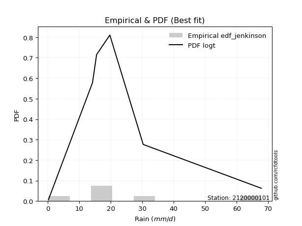</img>

</div>


### 11. EDF Cunnane (1978)

Cunnane´s work in statistical hydrology has focused on the performance and evaluation of different probability distributions (such as GEV, Gumbel, Lognormal) for flood frequency estimation. _b_ is a constant, typically set to 0.4.

<div align="center">


$P=(m-b)/(n+1-2b)$


</div>


**11.1. Empirical values**

<div align="center">

|                | 0                  | 1                   | 2                   | 3                  | 4                  | 5                  |
|:---------------|:-------------------|:--------------------|:--------------------|:-------------------|:-------------------|:-------------------|
| date           | 2023               | 2018                | 2020                | 2025               | 2019               | 2024               |
| x              | 0.2                | 14.2                | 15.5                | 19.7               | 30.3               | 67.8               |
| m              | 1                  | 2                   | 3                   | 4                  | 5                  | 6                  |
| empirical_dist | edf_cunnane        | edf_cunnane         | edf_cunnane         | edf_cunnane        | edf_cunnane        | edf_cunnane        |
| empirical      | 0.0967741935483871 | 0.25806451612903225 | 0.41935483870967744 | 0.5806451612903226 | 0.7419354838709676 | 0.9032258064516128 |
| empirical_tr   | 1.1071428571428572 | 1.3478260869565217  | 1.7222222222222225  | 2.384615384615385  | 3.8749999999999982 | 10.333333333333318 |

</div>


**11.2. Kolmogorov-Smirnov fit test (sorted by Δ)**


<div align="center">

|                | 0                   | 1                   | 2                   | 3                   | 4                   | 5                  | 6                   | 7                   | 8                   | 9                  | 10                 | 11                  | 12                  | 13                  | 14                  | 15                 | 16                 | 17                  | 18                  | 19                  | 20                  | 21                  | 22                  | 23                  | 24                 | 25                  | 26                  | 27                  | 28                  | 29                  | 30                  | 31                 | 32                  | 33                  | 34                  | 35                  | 36                  | 37                  | 38                 | 39                 | 40                  | 41                  | 42                 | 43                 | 44                  | 45                 | 46                 | 47                  | 48                  | 49                  | 50                  | 51                  | 52                | 53                | 54                  | 55                  | 56                  | 57                | 58                  | 59                 | 60                | 61                  | 62                 | 63                  | 64                  | 65                  | 66                  | 67                 | 68                  | 69                | 70                  | 71                 | 72                  | 73                  | 74                 | 75                 | 76                | 77                  | 78                 | 79                  | 80                 | 81                 | 82                 | 83                 | 84                  | 85                 | 86                 | 87                 | 88                | 89                  | 90                  | 91                  | 92                 | 93                  | 94                  | 95                 | 96                  | 97                 | 98                 | 99                  | 100                 | 101                 | 102                 | 103                 | 104                 | 105                | 106                | 107                 | 108                 | 109                 | 110                | 111                | 112                 | 113                 | 114                 | 115                 | 116                 | 117                 | 118                 | 119                 | 120                | 121                | 122                 | 123                 | 124                | 125                | 126                 | 127                 | 128                 | 129                | 130                | 131                 | 132                | 133                 | 134                 | 135                | 136                | 137                | 138                | 139                | 140                | 141                | 142                | 143                | 144                | 145               | 146               | 147                | 148                | 149                | 150                | 151               | 152                | 153                | 154                | 155                | 156                | 157                 | 158                | 159               |
|:---------------|:--------------------|:--------------------|:--------------------|:--------------------|:--------------------|:-------------------|:--------------------|:--------------------|:--------------------|:-------------------|:-------------------|:--------------------|:--------------------|:--------------------|:--------------------|:-------------------|:-------------------|:--------------------|:--------------------|:--------------------|:--------------------|:--------------------|:--------------------|:--------------------|:-------------------|:--------------------|:--------------------|:--------------------|:--------------------|:--------------------|:--------------------|:-------------------|:--------------------|:--------------------|:--------------------|:--------------------|:--------------------|:--------------------|:-------------------|:-------------------|:--------------------|:--------------------|:-------------------|:-------------------|:--------------------|:-------------------|:-------------------|:--------------------|:--------------------|:--------------------|:--------------------|:--------------------|:------------------|:------------------|:--------------------|:--------------------|:--------------------|:------------------|:--------------------|:-------------------|:------------------|:--------------------|:-------------------|:--------------------|:--------------------|:--------------------|:--------------------|:-------------------|:--------------------|:------------------|:--------------------|:-------------------|:--------------------|:--------------------|:-------------------|:-------------------|:------------------|:--------------------|:-------------------|:--------------------|:-------------------|:-------------------|:-------------------|:-------------------|:--------------------|:-------------------|:-------------------|:-------------------|:------------------|:--------------------|:--------------------|:--------------------|:-------------------|:--------------------|:--------------------|:-------------------|:--------------------|:-------------------|:-------------------|:--------------------|:--------------------|:--------------------|:--------------------|:--------------------|:--------------------|:-------------------|:-------------------|:--------------------|:--------------------|:--------------------|:-------------------|:-------------------|:--------------------|:--------------------|:--------------------|:--------------------|:--------------------|:--------------------|:--------------------|:--------------------|:-------------------|:-------------------|:--------------------|:--------------------|:-------------------|:-------------------|:--------------------|:--------------------|:--------------------|:-------------------|:-------------------|:--------------------|:-------------------|:--------------------|:--------------------|:-------------------|:-------------------|:-------------------|:-------------------|:-------------------|:-------------------|:-------------------|:-------------------|:-------------------|:-------------------|:------------------|:------------------|:-------------------|:-------------------|:-------------------|:-------------------|:------------------|:-------------------|:-------------------|:-------------------|:-------------------|:-------------------|:--------------------|:-------------------|:------------------|
| station        | 2120000101          | 2120000101          | 2120000101          | 2120000101          | 2120000101          | 2120000101         | 2120000101          | 2120000101          | 2120000101          | 2120000101         | 2120000101         | 2120000101          | 2120000101          | 2120000101          | 2120000101          | 2120000101         | 2120000101         | 2120000101          | 2120000101          | 2120000101          | 2120000101          | 2120000101          | 2120000101          | 2120000101          | 2120000101         | 2120000101          | 2120000101          | 2120000101          | 2120000101          | 2120000101          | 2120000101          | 2120000101         | 2120000101          | 2120000101          | 2120000101          | 2120000101          | 2120000101          | 2120000101          | 2120000101         | 2120000101         | 2120000101          | 2120000101          | 2120000101         | 2120000101         | 2120000101          | 2120000101         | 2120000101         | 2120000101          | 2120000101          | 2120000101          | 2120000101          | 2120000101          | 2120000101        | 2120000101        | 2120000101          | 2120000101          | 2120000101          | 2120000101        | 2120000101          | 2120000101         | 2120000101        | 2120000101          | 2120000101         | 2120000101          | 2120000101          | 2120000101          | 2120000101          | 2120000101         | 2120000101          | 2120000101        | 2120000101          | 2120000101         | 2120000101          | 2120000101          | 2120000101         | 2120000101         | 2120000101        | 2120000101          | 2120000101         | 2120000101          | 2120000101         | 2120000101         | 2120000101         | 2120000101         | 2120000101          | 2120000101         | 2120000101         | 2120000101         | 2120000101        | 2120000101          | 2120000101          | 2120000101          | 2120000101         | 2120000101          | 2120000101          | 2120000101         | 2120000101          | 2120000101         | 2120000101         | 2120000101          | 2120000101          | 2120000101          | 2120000101          | 2120000101          | 2120000101          | 2120000101         | 2120000101         | 2120000101          | 2120000101          | 2120000101          | 2120000101         | 2120000101         | 2120000101          | 2120000101          | 2120000101          | 2120000101          | 2120000101          | 2120000101          | 2120000101          | 2120000101          | 2120000101         | 2120000101         | 2120000101          | 2120000101          | 2120000101         | 2120000101         | 2120000101          | 2120000101          | 2120000101          | 2120000101         | 2120000101         | 2120000101          | 2120000101         | 2120000101          | 2120000101          | 2120000101         | 2120000101         | 2120000101         | 2120000101         | 2120000101         | 2120000101         | 2120000101         | 2120000101         | 2120000101         | 2120000101         | 2120000101        | 2120000101        | 2120000101         | 2120000101         | 2120000101         | 2120000101         | 2120000101        | 2120000101         | 2120000101         | 2120000101         | 2120000101         | 2120000101         | 2120000101          | 2120000101         | 2120000101        |
| empirical_dist | edf_cunnane         | edf_cunnane         | edf_cunnane         | edf_cunnane         | edf_cunnane         | edf_cunnane        | edf_cunnane         | edf_cunnane         | edf_cunnane         | edf_cunnane        | edf_cunnane        | edf_cunnane         | edf_cunnane         | edf_cunnane         | edf_cunnane         | edf_cunnane        | edf_cunnane        | edf_cunnane         | edf_cunnane         | edf_cunnane         | edf_cunnane         | edf_cunnane         | edf_cunnane         | edf_cunnane         | edf_cunnane        | edf_cunnane         | edf_cunnane         | edf_cunnane         | edf_cunnane         | edf_cunnane         | edf_cunnane         | edf_cunnane        | edf_cunnane         | edf_cunnane         | edf_cunnane         | edf_cunnane         | edf_cunnane         | edf_cunnane         | edf_cunnane        | edf_cunnane        | edf_cunnane         | edf_cunnane         | edf_cunnane        | edf_cunnane        | edf_cunnane         | edf_cunnane        | edf_cunnane        | edf_cunnane         | edf_cunnane         | edf_cunnane         | edf_cunnane         | edf_cunnane         | edf_cunnane       | edf_cunnane       | edf_cunnane         | edf_cunnane         | edf_cunnane         | edf_cunnane       | edf_cunnane         | edf_cunnane        | edf_cunnane       | edf_cunnane         | edf_cunnane        | edf_cunnane         | edf_cunnane         | edf_cunnane         | edf_cunnane         | edf_cunnane        | edf_cunnane         | edf_cunnane       | edf_cunnane         | edf_cunnane        | edf_cunnane         | edf_cunnane         | edf_cunnane        | edf_cunnane        | edf_cunnane       | edf_cunnane         | edf_cunnane        | edf_cunnane         | edf_cunnane        | edf_cunnane        | edf_cunnane        | edf_cunnane        | edf_cunnane         | edf_cunnane        | edf_cunnane        | edf_cunnane        | edf_cunnane       | edf_cunnane         | edf_cunnane         | edf_cunnane         | edf_cunnane        | edf_cunnane         | edf_cunnane         | edf_cunnane        | edf_cunnane         | edf_cunnane        | edf_cunnane        | edf_cunnane         | edf_cunnane         | edf_cunnane         | edf_cunnane         | edf_cunnane         | edf_cunnane         | edf_cunnane        | edf_cunnane        | edf_cunnane         | edf_cunnane         | edf_cunnane         | edf_cunnane        | edf_cunnane        | edf_cunnane         | edf_cunnane         | edf_cunnane         | edf_cunnane         | edf_cunnane         | edf_cunnane         | edf_cunnane         | edf_cunnane         | edf_cunnane        | edf_cunnane        | edf_cunnane         | edf_cunnane         | edf_cunnane        | edf_cunnane        | edf_cunnane         | edf_cunnane         | edf_cunnane         | edf_cunnane        | edf_cunnane        | edf_cunnane         | edf_cunnane        | edf_cunnane         | edf_cunnane         | edf_cunnane        | edf_cunnane        | edf_cunnane        | edf_cunnane        | edf_cunnane        | edf_cunnane        | edf_cunnane        | edf_cunnane        | edf_cunnane        | edf_cunnane        | edf_cunnane       | edf_cunnane       | edf_cunnane        | edf_cunnane        | edf_cunnane        | edf_cunnane        | edf_cunnane       | edf_cunnane        | edf_cunnane        | edf_cunnane        | edf_cunnane        | edf_cunnane        | edf_cunnane         | edf_cunnane        | edf_cunnane       |
| p_dist         | logt                | dweibull            | dgamma              | logjohnsonsu        | logdgamma           | logdweibull        | nct                 | exponnorm           | vonmises_line       | moyal              | pearson3           | genlogistic         | truncnorm           | gumbel_r            | wald                | invgamma           | t                  | genpareto           | rayleigh            | johnsonsu           | halfnorm            | halflogistic        | skewnorm            | kstwobign           | invgauss           | foldnorm            | kappa3              | mielke              | maxwell             | genexpon            | gompertz            | gennorm            | semicircular        | anglit              | logloggamma         | rice                | logargus            | crystalball         | norm               | loggenpareto       | logvonmises_line    | lomax               | arcsine            | loggennorm         | logistic            | loglevy_l          | logweibull_max     | loggenlogistic      | truncexpon          | hypsecant           | logpearson3         | betaprime           | bradford          | exponpow          | gausshyper          | laplace             | cosine              | loggumbel_l       | gumbel_l            | kappa4             | burr12            | logtrapezoid        | nakagami           | loggenextreme       | ncf                 | loggenhalflogistic  | halfgennorm         | logarcsine         | wrapcauchy          | burr              | logfoldnorm         | logsemicircular    | ksone               | truncweibull_min    | loganglit          | logskewnorm        | f                 | logfatiguelife      | logcrystalball     | lognorm             | logrice            | logexponnorm       | lognct             | lognakagami        | uniform             | argus              | loglogistic        | loginvgamma        | levy_l            | logerlang           | loggamma            | loggamma            | loghypsecant       | genextreme          | gamma               | logalpha           | logloglaplace       | loginvgauss        | logmaxwell         | loglaplace          | loglaplace          | loginvweibull       | erlang              | lograyleigh         | logjohnsonsb        | logncf             | logkstwobign       | logburr12           | triang              | loggausshyper       | logwrapcauchy      | logtriang          | logcosine           | loghalfnorm         | loggumbel_r         | loggenexpon         | loghalflogistic     | logmoyal            | logbeta             | gengamma            | beta               | weibull_min        | loghalfgennorm      | genhalflogistic     | logksone           | loglomax           | logexponweib        | logf                | rdist               | logwald            | logkappa4          | logbradford         | loguniform         | logtruncnorm        | logkappa3           | invweibull         | loggengamma        | truncpareto        | tukeylambda        | logweibull_min     | johnsonsb          | exponweib          | trapezoid          | logtruncexpon      | fatiguelife        | powerlaw          | weibull_max       | logmielke          | logbetaprime       | logexponpow        | logburr            | logtruncpareto    | logpowerlaw        | alpha              | loggompertz        | logrdist           | logtukeylambda     | logtruncweibull_min | logvonmises        | vonmises          |
| delta          | 0.06152155816596913 | 0.08064516129091653 | 0.08410457460634163 | 0.08813090359859665 | 0.08844865984643618 | 0.0956136239657221 | 0.09652124093601705 | 0.09652773678708071 | 0.10000878127441937 | 0.1030148845398906 | 0.1042251926333424 | 0.10668409111422983 | 0.10980044564703517 | 0.11084232502971458 | 0.11543972147170639 | 0.1187954638973176 | 0.1204605834319824 | 0.12097035794333921 | 0.12568359257080763 | 0.12601219378372186 | 0.12653003709673544 | 0.12739371384962134 | 0.12752355537331372 | 0.12892582584988654 | 0.1292018799842249 | 0.13049662823231256 | 0.13138913361112825 | 0.13709382106217882 | 0.13794960699432968 | 0.14091076677245218 | 0.14804135521508144 | 0.1499044848971759 | 0.15705263642754297 | 0.15941109857707958 | 0.16408381905697605 | 0.16779529225917317 | 0.17094753931647488 | 0.17213754358980216 | 0.1721375529171585 | 0.1735523579916856 | 0.17741853235855698 | 0.17980321469343907 | 0.1813695538623058 | 0.1829985989053015 | 0.18405354278900476 | 0.1851083573139316 | 0.1859130829221231 | 0.18706877669264127 | 0.18843820118945304 | 0.19387178077138523 | 0.19938530910512187 | 0.20511189998636725 | 0.209848501717252 | 0.216994730206594 | 0.21766306132117896 | 0.22018574217395986 | 0.22126542346097167 | 0.229551039352897 | 0.23947648529607468 | 0.2395580210699504 | 0.251713792656318 | 0.25599022484373446 | 0.2579656465908855 | 0.26099626805157683 | 0.26497391052844843 | 0.26813692581438175 | 0.26993109662111436 | 0.2726540486753998 | 0.27755372011002755 | 0.278859663642236 | 0.28225240783013295 | 0.2852781569803158 | 0.28754692371317664 | 0.28805993119302165 | 0.2884479605220742 | 0.2904513132364639 | 0.291368653799822 | 0.29547170537635725 | 0.2961293379993194 | 0.29612941977937834 | 0.2961296622948917 | 0.2961316088906686 | 0.2962106400291654 | 0.2965328075925696 | 0.29666921168161847 | 0.3030124015790444 | 0.3034120034184762 | 0.3042193487981124 | 0.306174535306995 | 0.30657418407526527 | 0.30883814831953327 | 0.30883814831953327 | 0.3095534072194863 | 0.31136992479197556 | 0.31274373487208773 | 0.3135347853518631 | 0.31986497779507683 | 0.3201687944997659 | 0.3262398624948657 | 0.32957377873377736 | 0.32957377873377736 | 0.33016063627872927 | 0.33331143750420666 | 0.33587973401625615 | 0.34138802165859206 | 0.3463502171043368 | 0.3493335830371409 | 0.35089155683961404 | 0.35519554172300144 | 0.35729836684826577 | 0.3607499969340695 | 0.3613797653008335 | 0.36215622298372563 | 0.36308935303859347 | 0.36604379066284254 | 0.38643030469399187 | 0.39051260395572673 | 0.39074197159290347 | 0.39159741391651326 | 0.39415425662037074 | 0.4035983231706968 | 0.4117384392753527 | 0.42158465949938717 | 0.42695151979436674 | 0.4349895802313648 | 0.4425340442044119 | 0.44280116236249223 | 0.44612085214521013 | 0.45903296741963506 | 0.4592731445574453 | 0.4697245844141217 | 0.47064747527110107 | 0.4736003995034441 | 0.47631005977866137 | 0.48101468986285534 | 0.4826332694016729 | 0.4833931031453668 | 0.5008569643224565 | 0.5102616506276261 | 0.5194769276969399 | 0.5228214568500325 | 0.5314508202356427 | 0.5317756286488113 | 0.5416194158850184 | 0.5461268977026699 | 0.561400813875227 | 0.609361968591183 | 0.6339327229115722 | 0.6662840533493227 | 0.6720703374837321 | 0.6765365074837683 | 0.690955234197063 | 0.6947670308071061 | 0.7151700504224314 | 0.7387118087241112 | 0.7419354838709677 | 0.7419354838709677 | 0.7419354838709677  | 0.9602299093555826 | 10.28221798501499 |
| deltao         | 0.530385761606      | 0.530385761606      | 0.530385761606      | 0.530385761606      | 0.530385761606      | 0.530385761606     | 0.530385761606      | 0.530385761606      | 0.530385761606      | 0.530385761606     | 0.530385761606     | 0.530385761606      | 0.530385761606      | 0.530385761606      | 0.530385761606      | 0.530385761606     | 0.530385761606     | 0.530385761606      | 0.530385761606      | 0.530385761606      | 0.530385761606      | 0.530385761606      | 0.530385761606      | 0.530385761606      | 0.530385761606     | 0.530385761606      | 0.530385761606      | 0.530385761606      | 0.530385761606      | 0.530385761606      | 0.530385761606      | 0.530385761606     | 0.530385761606      | 0.530385761606      | 0.530385761606      | 0.530385761606      | 0.530385761606      | 0.530385761606      | 0.530385761606     | 0.530385761606     | 0.530385761606      | 0.530385761606      | 0.530385761606     | 0.530385761606     | 0.530385761606      | 0.530385761606     | 0.530385761606     | 0.530385761606      | 0.530385761606      | 0.530385761606      | 0.530385761606      | 0.530385761606      | 0.530385761606    | 0.530385761606    | 0.530385761606      | 0.530385761606      | 0.530385761606      | 0.530385761606    | 0.530385761606      | 0.530385761606     | 0.530385761606    | 0.530385761606      | 0.530385761606     | 0.530385761606      | 0.530385761606      | 0.530385761606      | 0.530385761606      | 0.530385761606     | 0.530385761606      | 0.530385761606    | 0.530385761606      | 0.530385761606     | 0.530385761606      | 0.530385761606      | 0.530385761606     | 0.530385761606     | 0.530385761606    | 0.530385761606      | 0.530385761606     | 0.530385761606      | 0.530385761606     | 0.530385761606     | 0.530385761606     | 0.530385761606     | 0.530385761606      | 0.530385761606     | 0.530385761606     | 0.530385761606     | 0.530385761606    | 0.530385761606      | 0.530385761606      | 0.530385761606      | 0.530385761606     | 0.530385761606      | 0.530385761606      | 0.530385761606     | 0.530385761606      | 0.530385761606     | 0.530385761606     | 0.530385761606      | 0.530385761606      | 0.530385761606      | 0.530385761606      | 0.530385761606      | 0.530385761606      | 0.530385761606     | 0.530385761606     | 0.530385761606      | 0.530385761606      | 0.530385761606      | 0.530385761606     | 0.530385761606     | 0.530385761606      | 0.530385761606      | 0.530385761606      | 0.530385761606      | 0.530385761606      | 0.530385761606      | 0.530385761606      | 0.530385761606      | 0.530385761606     | 0.530385761606     | 0.530385761606      | 0.530385761606      | 0.530385761606     | 0.530385761606     | 0.530385761606      | 0.530385761606      | 0.530385761606      | 0.530385761606     | 0.530385761606     | 0.530385761606      | 0.530385761606     | 0.530385761606      | 0.530385761606      | 0.530385761606     | 0.530385761606     | 0.530385761606     | 0.530385761606     | 0.530385761606     | 0.530385761606     | 0.530385761606     | 0.530385761606     | 0.530385761606     | 0.530385761606     | 0.530385761606    | 0.530385761606    | 0.530385761606     | 0.530385761606     | 0.530385761606     | 0.530385761606     | 0.530385761606    | 0.530385761606     | 0.530385761606     | 0.530385761606     | 0.530385761606     | 0.530385761606     | 0.530385761606      | 0.530385761606     | 0.530385761606    |
| eval           | Δo > Δ              | Δo > Δ              | Δo > Δ              | Δo > Δ              | Δo > Δ              | Δo > Δ             | Δo > Δ              | Δo > Δ              | Δo > Δ              | Δo > Δ             | Δo > Δ             | Δo > Δ              | Δo > Δ              | Δo > Δ              | Δo > Δ              | Δo > Δ             | Δo > Δ             | Δo > Δ              | Δo > Δ              | Δo > Δ              | Δo > Δ              | Δo > Δ              | Δo > Δ              | Δo > Δ              | Δo > Δ             | Δo > Δ              | Δo > Δ              | Δo > Δ              | Δo > Δ              | Δo > Δ              | Δo > Δ              | Δo > Δ             | Δo > Δ              | Δo > Δ              | Δo > Δ              | Δo > Δ              | Δo > Δ              | Δo > Δ              | Δo > Δ             | Δo > Δ             | Δo > Δ              | Δo > Δ              | Δo > Δ             | Δo > Δ             | Δo > Δ              | Δo > Δ             | Δo > Δ             | Δo > Δ              | Δo > Δ              | Δo > Δ              | Δo > Δ              | Δo > Δ              | Δo > Δ            | Δo > Δ            | Δo > Δ              | Δo > Δ              | Δo > Δ              | Δo > Δ            | Δo > Δ              | Δo > Δ             | Δo > Δ            | Δo > Δ              | Δo > Δ             | Δo > Δ              | Δo > Δ              | Δo > Δ              | Δo > Δ              | Δo > Δ             | Δo > Δ              | Δo > Δ            | Δo > Δ              | Δo > Δ             | Δo > Δ              | Δo > Δ              | Δo > Δ             | Δo > Δ             | Δo > Δ            | Δo > Δ              | Δo > Δ             | Δo > Δ              | Δo > Δ             | Δo > Δ             | Δo > Δ             | Δo > Δ             | Δo > Δ              | Δo > Δ             | Δo > Δ             | Δo > Δ             | Δo > Δ            | Δo > Δ              | Δo > Δ              | Δo > Δ              | Δo > Δ             | Δo > Δ              | Δo > Δ              | Δo > Δ             | Δo > Δ              | Δo > Δ             | Δo > Δ             | Δo > Δ              | Δo > Δ              | Δo > Δ              | Δo > Δ              | Δo > Δ              | Δo > Δ              | Δo > Δ             | Δo > Δ             | Δo > Δ              | Δo > Δ              | Δo > Δ              | Δo > Δ             | Δo > Δ             | Δo > Δ              | Δo > Δ              | Δo > Δ              | Δo > Δ              | Δo > Δ              | Δo > Δ              | Δo > Δ              | Δo > Δ              | Δo > Δ             | Δo > Δ             | Δo > Δ              | Δo > Δ              | Δo > Δ             | Δo > Δ             | Δo > Δ              | Δo > Δ              | Δo > Δ              | Δo > Δ             | Δo > Δ             | Δo > Δ              | Δo > Δ             | Δo > Δ              | Δo > Δ              | Δo > Δ             | Δo > Δ             | Δo > Δ             | Δo > Δ             | Δo > Δ             | Δo > Δ             | Δo <= Δ            | Δo <= Δ            | Δo <= Δ            | Δo <= Δ            | Δo <= Δ           | Δo <= Δ           | Δo <= Δ            | Δo <= Δ            | Δo <= Δ            | Δo <= Δ            | Δo <= Δ           | Δo <= Δ            | Δo <= Δ            | Δo <= Δ            | Δo <= Δ            | Δo <= Δ            | Δo <= Δ             | Δo <= Δ            | Δo <= Δ           |
| fit            | 1                   | 1                   | 1                   | 1                   | 1                   | 1                  | 1                   | 1                   | 1                   | 1                  | 1                  | 1                   | 1                   | 1                   | 1                   | 1                  | 1                  | 1                   | 1                   | 1                   | 1                   | 1                   | 1                   | 1                   | 1                  | 1                   | 1                   | 1                   | 1                   | 1                   | 1                   | 1                  | 1                   | 1                   | 1                   | 1                   | 1                   | 1                   | 1                  | 1                  | 1                   | 1                   | 1                  | 1                  | 1                   | 1                  | 1                  | 1                   | 1                   | 1                   | 1                   | 1                   | 1                 | 1                 | 1                   | 1                   | 1                   | 1                 | 1                   | 1                  | 1                 | 1                   | 1                  | 1                   | 1                   | 1                   | 1                   | 1                  | 1                   | 1                 | 1                   | 1                  | 1                   | 1                   | 1                  | 1                  | 1                 | 1                   | 1                  | 1                   | 1                  | 1                  | 1                  | 1                  | 1                   | 1                  | 1                  | 1                  | 1                 | 1                   | 1                   | 1                   | 1                  | 1                   | 1                   | 1                  | 1                   | 1                  | 1                  | 1                   | 1                   | 1                   | 1                   | 1                   | 1                   | 1                  | 1                  | 1                   | 1                   | 1                   | 1                  | 1                  | 1                   | 1                   | 1                   | 1                   | 1                   | 1                   | 1                   | 1                   | 1                  | 1                  | 1                   | 1                   | 1                  | 1                  | 1                   | 1                   | 1                   | 1                  | 1                  | 1                   | 1                  | 1                   | 1                   | 1                  | 1                  | 1                  | 1                  | 1                  | 1                  | 0                  | 0                  | 0                  | 0                  | 0                 | 0                 | 0                  | 0                  | 0                  | 0                  | 0                 | 0                  | 0                  | 0                  | 0                  | 0                  | 0                   | 0                  | 0                 |
| n              | 6                   | 6                   | 6                   | 6                   | 6                   | 6                  | 6                   | 6                   | 6                   | 6                  | 6                  | 6                   | 6                   | 6                   | 6                   | 6                  | 6                  | 6                   | 6                   | 6                   | 6                   | 6                   | 6                   | 6                   | 6                  | 6                   | 6                   | 6                   | 6                   | 6                   | 6                   | 6                  | 6                   | 6                   | 6                   | 6                   | 6                   | 6                   | 6                  | 6                  | 6                   | 6                   | 6                  | 6                  | 6                   | 6                  | 6                  | 6                   | 6                   | 6                   | 6                   | 6                   | 6                 | 6                 | 6                   | 6                   | 6                   | 6                 | 6                   | 6                  | 6                 | 6                   | 6                  | 6                   | 6                   | 6                   | 6                   | 6                  | 6                   | 6                 | 6                   | 6                  | 6                   | 6                   | 6                  | 6                  | 6                 | 6                   | 6                  | 6                   | 6                  | 6                  | 6                  | 6                  | 6                   | 6                  | 6                  | 6                  | 6                 | 6                   | 6                   | 6                   | 6                  | 6                   | 6                   | 6                  | 6                   | 6                  | 6                  | 6                   | 6                   | 6                   | 6                   | 6                   | 6                   | 6                  | 6                  | 6                   | 6                   | 6                   | 6                  | 6                  | 6                   | 6                   | 6                   | 6                   | 6                   | 6                   | 6                   | 6                   | 6                  | 6                  | 6                   | 6                   | 6                  | 6                  | 6                   | 6                   | 6                   | 6                  | 6                  | 6                   | 6                  | 6                   | 6                   | 6                  | 6                  | 6                  | 6                  | 6                  | 6                  | 6                  | 6                  | 6                  | 6                  | 6                 | 6                 | 6                  | 6                  | 6                  | 6                  | 6                 | 6                  | 6                  | 6                  | 6                  | 6                  | 6                   | 6                  | 6                 |
| best_fit       | 1                   | 0                   | 0                   | 0                   | 0                   | 0                  | 0                   | 0                   | 0                   | 0                  | 0                  | 0                   | 0                   | 0                   | 0                   | 0                  | 0                  | 0                   | 0                   | 0                   | 0                   | 0                   | 0                   | 0                   | 0                  | 0                   | 0                   | 0                   | 0                   | 0                   | 0                   | 0                  | 0                   | 0                   | 0                   | 0                   | 0                   | 0                   | 0                  | 0                  | 0                   | 0                   | 0                  | 0                  | 0                   | 0                  | 0                  | 0                   | 0                   | 0                   | 0                   | 0                   | 0                 | 0                 | 0                   | 0                   | 0                   | 0                 | 0                   | 0                  | 0                 | 0                   | 0                  | 0                   | 0                   | 0                   | 0                   | 0                  | 0                   | 0                 | 0                   | 0                  | 0                   | 0                   | 0                  | 0                  | 0                 | 0                   | 0                  | 0                   | 0                  | 0                  | 0                  | 0                  | 0                   | 0                  | 0                  | 0                  | 0                 | 0                   | 0                   | 0                   | 0                  | 0                   | 0                   | 0                  | 0                   | 0                  | 0                  | 0                   | 0                   | 0                   | 0                   | 0                   | 0                   | 0                  | 0                  | 0                   | 0                   | 0                   | 0                  | 0                  | 0                   | 0                   | 0                   | 0                   | 0                   | 0                   | 0                   | 0                   | 0                  | 0                  | 0                   | 0                   | 0                  | 0                  | 0                   | 0                   | 0                   | 0                  | 0                  | 0                   | 0                  | 0                   | 0                   | 0                  | 0                  | 0                  | 0                  | 0                  | 0                  | 0                  | 0                  | 0                  | 0                  | 0                 | 0                 | 0                  | 0                  | 0                  | 0                  | 0                 | 0                  | 0                  | 0                  | 0                  | 0                  | 0                   | 0                  | 0                 |
| best_fit_sort  | 1                   | 2                   | 3                   | 4                   | 5                   | 6                  | 7                   | 8                   | 9                   | 10                 | 11                 | 12                  | 13                  | 14                  | 15                  | 16                 | 17                 | 18                  | 19                  | 20                  | 21                  | 22                  | 23                  | 24                  | 25                 | 26                  | 27                  | 28                  | 29                  | 30                  | 31                  | 32                 | 33                  | 34                  | 35                  | 36                  | 37                  | 38                  | 39                 | 40                 | 41                  | 42                  | 43                 | 44                 | 45                  | 46                 | 47                 | 48                  | 49                  | 50                  | 51                  | 52                  | 53                | 54                | 55                  | 56                  | 57                  | 58                | 59                  | 60                 | 61                | 62                  | 63                 | 64                  | 65                  | 66                  | 67                  | 68                 | 69                  | 70                | 71                  | 72                 | 73                  | 74                  | 75                 | 76                 | 77                | 78                  | 79                 | 80                  | 81                 | 82                 | 83                 | 84                 | 85                  | 86                 | 87                 | 88                 | 89                | 90                  | 91                  | 92                  | 93                 | 94                  | 95                  | 96                 | 97                  | 98                 | 99                 | 100                 | 101                 | 102                 | 103                 | 104                 | 105                 | 106                | 107                | 108                 | 109                 | 110                 | 111                | 112                | 113                 | 114                 | 115                 | 116                 | 117                 | 118                 | 119                 | 120                 | 121                | 122                | 123                 | 124                 | 125                | 126                | 127                 | 128                 | 129                 | 130                | 131                | 132                 | 133                | 134                 | 135                 | 136                | 137                | 138                | 139                | 140                | 141                | 142                | 143                | 144                | 145                | 146               | 147               | 148                | 149                | 150                | 151                | 152               | 153                | 154                | 155                | 156                | 157                | 158                 | 159                | 160               |

</div>


**11.3. Best fit**

<div align="center">

|   id |    station | empirical_dist   | p_dist   |     delta |   deltao | eval   |   fit |   n |   best_fit |   best_fit_sort |
|-----:|-----------:|:-----------------|:---------|----------:|---------:|:-------|------:|----:|-----------:|----------------:|
|    0 | 2120000101 | edf_cunnane      | logt     | 0.0615216 | 0.530386 | Δo > Δ |     1 |   6 |          1 |               1 |

</div>


<div align="center">

</img></img>

</div>


### 12. EDF Adamowski (1981)

The Adamowski formula in hydrology refers to a specific plotting position formula used for estimating the non-parametric empirical distribution of hydrological events (like flood peaks) to calculate their return periods. This formula provides an alternative to traditional parametric methods (like the Gumbel or Log Pearson Type III distributions). 

<div align="center">


$P=(m-0.25)/(n+0.5)$


</div>


**12.1. Empirical values**

<div align="center">

|                | 0                   | 1                  | 2                  | 3                  | 4                  | 5                  |
|:---------------|:--------------------|:-------------------|:-------------------|:-------------------|:-------------------|:-------------------|
| date           | 2023                | 2018               | 2020               | 2025               | 2019               | 2024               |
| x              | 0.2                 | 14.2               | 15.5               | 19.7               | 30.3               | 67.8               |
| m              | 1                   | 2                  | 3                  | 4                  | 5                  | 6                  |
| empirical_dist | edf_adamowski       | edf_adamowski      | edf_adamowski      | edf_adamowski      | edf_adamowski      | edf_adamowski      |
| empirical      | 0.11538461538461539 | 0.2692307692307692 | 0.4230769230769231 | 0.5769230769230769 | 0.7307692307692307 | 0.8846153846153846 |
| empirical_tr   | 1.1304347826086958  | 1.3684210526315788 | 1.7333333333333334 | 2.3636363636363633 | 3.7142857142857135 | 8.666666666666664  |

</div>


**12.2. Kolmogorov-Smirnov fit test (sorted by Δ)**


<div align="center">

|                | 0                   | 1                   | 2                   | 3                   | 4                   | 5                   | 6                   | 7                   | 8                   | 9                   | 10                  | 11                  | 12                  | 13                  | 14                  | 15                  | 16                  | 17                  | 18                  | 19                  | 20                  | 21                 | 22                  | 23                  | 24                  | 25                  | 26                 | 27                  | 28                 | 29                  | 30                 | 31                  | 32                 | 33                  | 34                  | 35                  | 36                  | 37                  | 38               | 39                 | 40                  | 41                 | 42                 | 43                  | 44                  | 45                 | 46                  | 47                 | 48                  | 49                 | 50                  | 51                  | 52                  | 53                  | 54                  | 55                  | 56                  | 57                  | 58                  | 59                  | 60                  | 61                 | 62                  | 63                  | 64                 | 65                 | 66                 | 67                  | 68                  | 69                  | 70                | 71                 | 72                 | 73                 | 74                  | 75                 | 76                  | 77                 | 78                  | 79                 | 80                 | 81                 | 82                  | 83                  | 84                 | 85                 | 86                 | 87                 | 88                 | 89                  | 90                 | 91                 | 92                 | 93                  | 94                  | 95                  | 96                 | 97                 | 98                  | 99                 | 100                | 101                | 102                | 103                 | 104                | 105                | 106                 | 107                 | 108                 | 109                | 110                 | 111                | 112                 | 113                | 114                 | 115                | 116                 | 117                | 118                 | 119                 | 120                | 121                 | 122                | 123                 | 124                 | 125                | 126                 | 127                 | 128                 | 129                | 130                | 131                | 132                 | 133                 | 134                | 135                 | 136                | 137                 | 138                | 139                | 140                | 141                | 142                | 143                | 144               | 145              | 146                | 147                | 148                | 149                | 150                | 151                | 152                | 153                | 154                | 155                | 156                | 157                 | 158                | 159                |
|:---------------|:--------------------|:--------------------|:--------------------|:--------------------|:--------------------|:--------------------|:--------------------|:--------------------|:--------------------|:--------------------|:--------------------|:--------------------|:--------------------|:--------------------|:--------------------|:--------------------|:--------------------|:--------------------|:--------------------|:--------------------|:--------------------|:-------------------|:--------------------|:--------------------|:--------------------|:--------------------|:-------------------|:--------------------|:-------------------|:--------------------|:-------------------|:--------------------|:-------------------|:--------------------|:--------------------|:--------------------|:--------------------|:--------------------|:-----------------|:-------------------|:--------------------|:-------------------|:-------------------|:--------------------|:--------------------|:-------------------|:--------------------|:-------------------|:--------------------|:-------------------|:--------------------|:--------------------|:--------------------|:--------------------|:--------------------|:--------------------|:--------------------|:--------------------|:--------------------|:--------------------|:--------------------|:-------------------|:--------------------|:--------------------|:-------------------|:-------------------|:-------------------|:--------------------|:--------------------|:--------------------|:------------------|:-------------------|:-------------------|:-------------------|:--------------------|:-------------------|:--------------------|:-------------------|:--------------------|:-------------------|:-------------------|:-------------------|:--------------------|:--------------------|:-------------------|:-------------------|:-------------------|:-------------------|:-------------------|:--------------------|:-------------------|:-------------------|:-------------------|:--------------------|:--------------------|:--------------------|:-------------------|:-------------------|:--------------------|:-------------------|:-------------------|:-------------------|:-------------------|:--------------------|:-------------------|:-------------------|:--------------------|:--------------------|:--------------------|:-------------------|:--------------------|:-------------------|:--------------------|:-------------------|:--------------------|:-------------------|:--------------------|:-------------------|:--------------------|:--------------------|:-------------------|:--------------------|:-------------------|:--------------------|:--------------------|:-------------------|:--------------------|:--------------------|:--------------------|:-------------------|:-------------------|:-------------------|:--------------------|:--------------------|:-------------------|:--------------------|:-------------------|:--------------------|:-------------------|:-------------------|:-------------------|:-------------------|:-------------------|:-------------------|:------------------|:-----------------|:-------------------|:-------------------|:-------------------|:-------------------|:-------------------|:-------------------|:-------------------|:-------------------|:-------------------|:-------------------|:-------------------|:--------------------|:-------------------|:-------------------|
| station        | 2120000101          | 2120000101          | 2120000101          | 2120000101          | 2120000101          | 2120000101          | 2120000101          | 2120000101          | 2120000101          | 2120000101          | 2120000101          | 2120000101          | 2120000101          | 2120000101          | 2120000101          | 2120000101          | 2120000101          | 2120000101          | 2120000101          | 2120000101          | 2120000101          | 2120000101         | 2120000101          | 2120000101          | 2120000101          | 2120000101          | 2120000101         | 2120000101          | 2120000101         | 2120000101          | 2120000101         | 2120000101          | 2120000101         | 2120000101          | 2120000101          | 2120000101          | 2120000101          | 2120000101          | 2120000101       | 2120000101         | 2120000101          | 2120000101         | 2120000101         | 2120000101          | 2120000101          | 2120000101         | 2120000101          | 2120000101         | 2120000101          | 2120000101         | 2120000101          | 2120000101          | 2120000101          | 2120000101          | 2120000101          | 2120000101          | 2120000101          | 2120000101          | 2120000101          | 2120000101          | 2120000101          | 2120000101         | 2120000101          | 2120000101          | 2120000101         | 2120000101         | 2120000101         | 2120000101          | 2120000101          | 2120000101          | 2120000101        | 2120000101         | 2120000101         | 2120000101         | 2120000101          | 2120000101         | 2120000101          | 2120000101         | 2120000101          | 2120000101         | 2120000101         | 2120000101         | 2120000101          | 2120000101          | 2120000101         | 2120000101         | 2120000101         | 2120000101         | 2120000101         | 2120000101          | 2120000101         | 2120000101         | 2120000101         | 2120000101          | 2120000101          | 2120000101          | 2120000101         | 2120000101         | 2120000101          | 2120000101         | 2120000101         | 2120000101         | 2120000101         | 2120000101          | 2120000101         | 2120000101         | 2120000101          | 2120000101          | 2120000101          | 2120000101         | 2120000101          | 2120000101         | 2120000101          | 2120000101         | 2120000101          | 2120000101         | 2120000101          | 2120000101         | 2120000101          | 2120000101          | 2120000101         | 2120000101          | 2120000101         | 2120000101          | 2120000101          | 2120000101         | 2120000101          | 2120000101          | 2120000101          | 2120000101         | 2120000101         | 2120000101         | 2120000101          | 2120000101          | 2120000101         | 2120000101          | 2120000101         | 2120000101          | 2120000101         | 2120000101         | 2120000101         | 2120000101         | 2120000101         | 2120000101         | 2120000101        | 2120000101       | 2120000101         | 2120000101         | 2120000101         | 2120000101         | 2120000101         | 2120000101         | 2120000101         | 2120000101         | 2120000101         | 2120000101         | 2120000101         | 2120000101          | 2120000101         | 2120000101         |
| empirical_dist | edf_adamowski       | edf_adamowski       | edf_adamowski       | edf_adamowski       | edf_adamowski       | edf_adamowski       | edf_adamowski       | edf_adamowski       | edf_adamowski       | edf_adamowski       | edf_adamowski       | edf_adamowski       | edf_adamowski       | edf_adamowski       | edf_adamowski       | edf_adamowski       | edf_adamowski       | edf_adamowski       | edf_adamowski       | edf_adamowski       | edf_adamowski       | edf_adamowski      | edf_adamowski       | edf_adamowski       | edf_adamowski       | edf_adamowski       | edf_adamowski      | edf_adamowski       | edf_adamowski      | edf_adamowski       | edf_adamowski      | edf_adamowski       | edf_adamowski      | edf_adamowski       | edf_adamowski       | edf_adamowski       | edf_adamowski       | edf_adamowski       | edf_adamowski    | edf_adamowski      | edf_adamowski       | edf_adamowski      | edf_adamowski      | edf_adamowski       | edf_adamowski       | edf_adamowski      | edf_adamowski       | edf_adamowski      | edf_adamowski       | edf_adamowski      | edf_adamowski       | edf_adamowski       | edf_adamowski       | edf_adamowski       | edf_adamowski       | edf_adamowski       | edf_adamowski       | edf_adamowski       | edf_adamowski       | edf_adamowski       | edf_adamowski       | edf_adamowski      | edf_adamowski       | edf_adamowski       | edf_adamowski      | edf_adamowski      | edf_adamowski      | edf_adamowski       | edf_adamowski       | edf_adamowski       | edf_adamowski     | edf_adamowski      | edf_adamowski      | edf_adamowski      | edf_adamowski       | edf_adamowski      | edf_adamowski       | edf_adamowski      | edf_adamowski       | edf_adamowski      | edf_adamowski      | edf_adamowski      | edf_adamowski       | edf_adamowski       | edf_adamowski      | edf_adamowski      | edf_adamowski      | edf_adamowski      | edf_adamowski      | edf_adamowski       | edf_adamowski      | edf_adamowski      | edf_adamowski      | edf_adamowski       | edf_adamowski       | edf_adamowski       | edf_adamowski      | edf_adamowski      | edf_adamowski       | edf_adamowski      | edf_adamowski      | edf_adamowski      | edf_adamowski      | edf_adamowski       | edf_adamowski      | edf_adamowski      | edf_adamowski       | edf_adamowski       | edf_adamowski       | edf_adamowski      | edf_adamowski       | edf_adamowski      | edf_adamowski       | edf_adamowski      | edf_adamowski       | edf_adamowski      | edf_adamowski       | edf_adamowski      | edf_adamowski       | edf_adamowski       | edf_adamowski      | edf_adamowski       | edf_adamowski      | edf_adamowski       | edf_adamowski       | edf_adamowski      | edf_adamowski       | edf_adamowski       | edf_adamowski       | edf_adamowski      | edf_adamowski      | edf_adamowski      | edf_adamowski       | edf_adamowski       | edf_adamowski      | edf_adamowski       | edf_adamowski      | edf_adamowski       | edf_adamowski      | edf_adamowski      | edf_adamowski      | edf_adamowski      | edf_adamowski      | edf_adamowski      | edf_adamowski     | edf_adamowski    | edf_adamowski      | edf_adamowski      | edf_adamowski      | edf_adamowski      | edf_adamowski      | edf_adamowski      | edf_adamowski      | edf_adamowski      | edf_adamowski      | edf_adamowski      | edf_adamowski      | edf_adamowski       | edf_adamowski      | edf_adamowski      |
| p_dist         | dweibull            | logjohnsonsu        | logt                | logdweibull         | nct                 | exponnorm           | moyal               | dgamma              | pearson3            | genlogistic         | logdgamma           | gumbel_r            | invgamma            | johnsonsu           | halfnorm            | truncnorm           | vonmises_line       | genpareto           | wald                | halflogistic        | invgauss            | foldnorm           | kappa3              | t                   | rayleigh            | skewnorm            | kstwobign          | mielke              | genexpon           | maxwell             | gompertz           | semicircular        | logloggamma        | gennorm             | anglit              | logargus            | loggenpareto        | rice                | logvonmises_line | crystalball        | norm                | lomax              | arcsine            | loglevy_l           | logweibull_max      | loggenlogistic     | logistic            | truncexpon         | loggennorm          | logpearson3        | hypsecant           | betaprime           | exponpow            | bradford            | gausshyper          | laplace             | cosine              | loggumbel_l         | kappa4              | gumbel_l            | burr12              | logtrapezoid       | loggenextreme       | ncf                 | loggenhalflogistic | halfgennorm        | logarcsine         | wrapcauchy          | burr                | nakagami            | logfoldnorm       | logsemicircular    | ksone              | truncweibull_min   | loganglit           | logskewnorm        | f                   | logfatiguelife     | logcrystalball      | lognorm            | logrice            | logexponnorm       | lognct              | lognakagami         | levy_l             | uniform            | argus              | loglogistic        | genextreme         | loginvgamma         | logerlang          | loggamma           | loggamma           | loghypsecant        | logloglaplace       | gamma               | logalpha           | loginvgauss        | logmaxwell          | loglaplace         | loglaplace         | loginvweibull      | erlang             | logjohnsonsb        | lograyleigh        | logncf             | logkstwobign        | logburr12           | triang              | loggausshyper      | logwrapcauchy       | logtriang          | logcosine           | loghalfnorm        | loggumbel_r         | loggenexpon        | loghalflogistic     | logmoyal           | logbeta             | gengamma            | beta               | weibull_min         | loghalfgennorm     | genhalflogistic     | logksone            | loglomax           | logexponweib        | logf                | rdist               | logwald            | logkappa4          | logbradford        | logkappa3           | loguniform          | invweibull         | loggengamma         | logtruncnorm       | truncpareto         | tukeylambda        | logweibull_min     | johnsonsb          | exponweib          | trapezoid          | logtruncexpon      | fatiguelife       | powerlaw         | weibull_max        | logmielke          | logbetaprime       | logexponpow        | logburr            | logtruncpareto     | logpowerlaw        | alpha              | loggompertz        | logrdist           | logtukeylambda     | logtruncweibull_min | logvonmises        | vonmises           |
| delta          | 0.07692307692367079 | 0.07964884994174734 | 0.08013198000219743 | 0.08444737086398513 | 0.08535498783428008 | 0.08536148368534374 | 0.09184863143815364 | 0.09254868195735355 | 0.09815857816577483 | 0.10296200674698408 | 0.10602437179255335 | 0.10712024066246884 | 0.10762921079558063 | 0.11484594068198489 | 0.11536378399499847 | 0.11538459267948308 | 0.11538461358358865 | 0.11538461538258134 | 0.11538461538461539 | 0.11622746074788437 | 0.11803562688248792 | 0.1193303751305756 | 0.12022288050939128 | 0.12189462620619673 | 0.12196150820356189 | 0.12380147100606798 | 0.1252037414826408 | 0.12592756796044186 | 0.1297445136707152 | 0.13422752262708393 | 0.1443192708478357 | 0.15041053058569442 | 0.1529175659552391 | 0.15362656926442164 | 0.15568901420983383 | 0.15978128621473792 | 0.16238610488994865 | 0.16407320789192742 | 0.16625227925682 | 0.1684154592225564 | 0.16841546854991274 | 0.1686369615917021 | 0.1702033007605689 | 0.17394210421219464 | 0.17474682982038614 | 0.1759025235909043 | 0.18033145842175902 | 0.1847161168222073 | 0.18672068327254715 | 0.1882190560033849 | 0.19014969640413948 | 0.19394564688463029 | 0.20582847710485702 | 0.20612641735000625 | 0.20649680821944205 | 0.21646365780671412 | 0.21754333909372592 | 0.21838478625116003 | 0.23423985270285103 | 0.23575440092882893 | 0.24054753955458102 | 0.2448239717419975 | 0.24983001494983986 | 0.25380765742671146 | 0.2569706727126448 | 0.2587648435193774 | 0.2614877955736628 | 0.26638746700829063 | 0.26769341054049905 | 0.26913189969262247 | 0.271086154728396 | 0.2741119038785788 | 0.2763806706114397 | 0.2768936780912847 | 0.27728170742033725 | 0.2792850601347269 | 0.28020240069808505 | 0.2843054522746203 | 0.28496308489758243 | 0.2849631666776414 | 0.2849634091931547 | 0.2849653557889316 | 0.28504438692742845 | 0.28536655449083265 | 0.2875641134707667 | 0.2884615384615384 | 0.2918461484773075 | 0.2922457503167392 | 0.2927595029557474 | 0.29305309569637544 | 0.2954079309735283 | 0.2976718952177963 | 0.2976718952177963 | 0.29838715411774935 | 0.30125455595884865 | 0.30157748177035076 | 0.3023685322501261 | 0.3090025413980289 | 0.31507360939312873 | 0.3184075256320404 | 0.3184075256320404 | 0.3189943831769923 | 0.3221451844024697 | 0.32277759982236376 | 0.3247134809145192 | 0.3351839640025998 | 0.33816732993540394 | 0.33972530373787707 | 0.34402928862126453 | 0.3461321137465288 | 0.34958374383233254 | 0.3502135121990965 | 0.35098996988198866 | 0.3519230999368565 | 0.35487753756110557 | 0.3752640515922549 | 0.37934635085398977 | 0.3795757184911665 | 0.38043116081477635 | 0.38298800351863377 | 0.3924320700689599 | 0.40057218617361573 | 0.4104184063976502 | 0.41578526669262983 | 0.42382332712962784 | 0.4313677911026749 | 0.43163490926075526 | 0.43495459904347317 | 0.44042254558340677 | 0.4481068914557083 | 0.4585583313123847 | 0.4594812221693641 | 0.46240426802662715 | 0.46243414640170716 | 0.4640228475654447 | 0.46478268130913863 | 0.4651438066769244 | 0.48969071122071955 | 0.4990953975258891 | 0.5083106745952028 | 0.5116552037482955 | 0.5202845671339058 | 0.5206093755470744 | 0.5304531627832814 | 0.534960644600933 | 0.55023456077349 | 0.5981957154894461 | 0.6227664698098352 | 0.6551178002475857 | 0.6609040843819951 | 0.6653702543820312 | 0.6797889810953259 | 0.6836007777053692 | 0.7040037973206945 | 0.7275455556223742 | 0.7307692307692308 | 0.7307692307692308 | 0.7307692307692308  | 0.9788403311918108 | 10.300828406851217 |
| deltao         | 0.530385761606      | 0.530385761606      | 0.530385761606      | 0.530385761606      | 0.530385761606      | 0.530385761606      | 0.530385761606      | 0.530385761606      | 0.530385761606      | 0.530385761606      | 0.530385761606      | 0.530385761606      | 0.530385761606      | 0.530385761606      | 0.530385761606      | 0.530385761606      | 0.530385761606      | 0.530385761606      | 0.530385761606      | 0.530385761606      | 0.530385761606      | 0.530385761606     | 0.530385761606      | 0.530385761606      | 0.530385761606      | 0.530385761606      | 0.530385761606     | 0.530385761606      | 0.530385761606     | 0.530385761606      | 0.530385761606     | 0.530385761606      | 0.530385761606     | 0.530385761606      | 0.530385761606      | 0.530385761606      | 0.530385761606      | 0.530385761606      | 0.530385761606   | 0.530385761606     | 0.530385761606      | 0.530385761606     | 0.530385761606     | 0.530385761606      | 0.530385761606      | 0.530385761606     | 0.530385761606      | 0.530385761606     | 0.530385761606      | 0.530385761606     | 0.530385761606      | 0.530385761606      | 0.530385761606      | 0.530385761606      | 0.530385761606      | 0.530385761606      | 0.530385761606      | 0.530385761606      | 0.530385761606      | 0.530385761606      | 0.530385761606      | 0.530385761606     | 0.530385761606      | 0.530385761606      | 0.530385761606     | 0.530385761606     | 0.530385761606     | 0.530385761606      | 0.530385761606      | 0.530385761606      | 0.530385761606    | 0.530385761606     | 0.530385761606     | 0.530385761606     | 0.530385761606      | 0.530385761606     | 0.530385761606      | 0.530385761606     | 0.530385761606      | 0.530385761606     | 0.530385761606     | 0.530385761606     | 0.530385761606      | 0.530385761606      | 0.530385761606     | 0.530385761606     | 0.530385761606     | 0.530385761606     | 0.530385761606     | 0.530385761606      | 0.530385761606     | 0.530385761606     | 0.530385761606     | 0.530385761606      | 0.530385761606      | 0.530385761606      | 0.530385761606     | 0.530385761606     | 0.530385761606      | 0.530385761606     | 0.530385761606     | 0.530385761606     | 0.530385761606     | 0.530385761606      | 0.530385761606     | 0.530385761606     | 0.530385761606      | 0.530385761606      | 0.530385761606      | 0.530385761606     | 0.530385761606      | 0.530385761606     | 0.530385761606      | 0.530385761606     | 0.530385761606      | 0.530385761606     | 0.530385761606      | 0.530385761606     | 0.530385761606      | 0.530385761606      | 0.530385761606     | 0.530385761606      | 0.530385761606     | 0.530385761606      | 0.530385761606      | 0.530385761606     | 0.530385761606      | 0.530385761606      | 0.530385761606      | 0.530385761606     | 0.530385761606     | 0.530385761606     | 0.530385761606      | 0.530385761606      | 0.530385761606     | 0.530385761606      | 0.530385761606     | 0.530385761606      | 0.530385761606     | 0.530385761606     | 0.530385761606     | 0.530385761606     | 0.530385761606     | 0.530385761606     | 0.530385761606    | 0.530385761606   | 0.530385761606     | 0.530385761606     | 0.530385761606     | 0.530385761606     | 0.530385761606     | 0.530385761606     | 0.530385761606     | 0.530385761606     | 0.530385761606     | 0.530385761606     | 0.530385761606     | 0.530385761606      | 0.530385761606     | 0.530385761606     |
| eval           | Δo > Δ              | Δo > Δ              | Δo > Δ              | Δo > Δ              | Δo > Δ              | Δo > Δ              | Δo > Δ              | Δo > Δ              | Δo > Δ              | Δo > Δ              | Δo > Δ              | Δo > Δ              | Δo > Δ              | Δo > Δ              | Δo > Δ              | Δo > Δ              | Δo > Δ              | Δo > Δ              | Δo > Δ              | Δo > Δ              | Δo > Δ              | Δo > Δ             | Δo > Δ              | Δo > Δ              | Δo > Δ              | Δo > Δ              | Δo > Δ             | Δo > Δ              | Δo > Δ             | Δo > Δ              | Δo > Δ             | Δo > Δ              | Δo > Δ             | Δo > Δ              | Δo > Δ              | Δo > Δ              | Δo > Δ              | Δo > Δ              | Δo > Δ           | Δo > Δ             | Δo > Δ              | Δo > Δ             | Δo > Δ             | Δo > Δ              | Δo > Δ              | Δo > Δ             | Δo > Δ              | Δo > Δ             | Δo > Δ              | Δo > Δ             | Δo > Δ              | Δo > Δ              | Δo > Δ              | Δo > Δ              | Δo > Δ              | Δo > Δ              | Δo > Δ              | Δo > Δ              | Δo > Δ              | Δo > Δ              | Δo > Δ              | Δo > Δ             | Δo > Δ              | Δo > Δ              | Δo > Δ             | Δo > Δ             | Δo > Δ             | Δo > Δ              | Δo > Δ              | Δo > Δ              | Δo > Δ            | Δo > Δ             | Δo > Δ             | Δo > Δ             | Δo > Δ              | Δo > Δ             | Δo > Δ              | Δo > Δ             | Δo > Δ              | Δo > Δ             | Δo > Δ             | Δo > Δ             | Δo > Δ              | Δo > Δ              | Δo > Δ             | Δo > Δ             | Δo > Δ             | Δo > Δ             | Δo > Δ             | Δo > Δ              | Δo > Δ             | Δo > Δ             | Δo > Δ             | Δo > Δ              | Δo > Δ              | Δo > Δ              | Δo > Δ             | Δo > Δ             | Δo > Δ              | Δo > Δ             | Δo > Δ             | Δo > Δ             | Δo > Δ             | Δo > Δ              | Δo > Δ             | Δo > Δ             | Δo > Δ              | Δo > Δ              | Δo > Δ              | Δo > Δ             | Δo > Δ              | Δo > Δ             | Δo > Δ              | Δo > Δ             | Δo > Δ              | Δo > Δ             | Δo > Δ              | Δo > Δ             | Δo > Δ              | Δo > Δ              | Δo > Δ             | Δo > Δ              | Δo > Δ             | Δo > Δ              | Δo > Δ              | Δo > Δ             | Δo > Δ              | Δo > Δ              | Δo > Δ              | Δo > Δ             | Δo > Δ             | Δo > Δ             | Δo > Δ              | Δo > Δ              | Δo > Δ             | Δo > Δ              | Δo > Δ             | Δo > Δ              | Δo > Δ             | Δo > Δ             | Δo > Δ             | Δo > Δ             | Δo > Δ             | Δo <= Δ            | Δo <= Δ           | Δo <= Δ          | Δo <= Δ            | Δo <= Δ            | Δo <= Δ            | Δo <= Δ            | Δo <= Δ            | Δo <= Δ            | Δo <= Δ            | Δo <= Δ            | Δo <= Δ            | Δo <= Δ            | Δo <= Δ            | Δo <= Δ             | Δo <= Δ            | Δo <= Δ            |
| fit            | 1                   | 1                   | 1                   | 1                   | 1                   | 1                   | 1                   | 1                   | 1                   | 1                   | 1                   | 1                   | 1                   | 1                   | 1                   | 1                   | 1                   | 1                   | 1                   | 1                   | 1                   | 1                  | 1                   | 1                   | 1                   | 1                   | 1                  | 1                   | 1                  | 1                   | 1                  | 1                   | 1                  | 1                   | 1                   | 1                   | 1                   | 1                   | 1                | 1                  | 1                   | 1                  | 1                  | 1                   | 1                   | 1                  | 1                   | 1                  | 1                   | 1                  | 1                   | 1                   | 1                   | 1                   | 1                   | 1                   | 1                   | 1                   | 1                   | 1                   | 1                   | 1                  | 1                   | 1                   | 1                  | 1                  | 1                  | 1                   | 1                   | 1                   | 1                 | 1                  | 1                  | 1                  | 1                   | 1                  | 1                   | 1                  | 1                   | 1                  | 1                  | 1                  | 1                   | 1                   | 1                  | 1                  | 1                  | 1                  | 1                  | 1                   | 1                  | 1                  | 1                  | 1                   | 1                   | 1                   | 1                  | 1                  | 1                   | 1                  | 1                  | 1                  | 1                  | 1                   | 1                  | 1                  | 1                   | 1                   | 1                   | 1                  | 1                   | 1                  | 1                   | 1                  | 1                   | 1                  | 1                   | 1                  | 1                   | 1                   | 1                  | 1                   | 1                  | 1                   | 1                   | 1                  | 1                   | 1                   | 1                   | 1                  | 1                  | 1                  | 1                   | 1                   | 1                  | 1                   | 1                  | 1                   | 1                  | 1                  | 1                  | 1                  | 1                  | 0                  | 0                 | 0                | 0                  | 0                  | 0                  | 0                  | 0                  | 0                  | 0                  | 0                  | 0                  | 0                  | 0                  | 0                   | 0                  | 0                  |
| n              | 6                   | 6                   | 6                   | 6                   | 6                   | 6                   | 6                   | 6                   | 6                   | 6                   | 6                   | 6                   | 6                   | 6                   | 6                   | 6                   | 6                   | 6                   | 6                   | 6                   | 6                   | 6                  | 6                   | 6                   | 6                   | 6                   | 6                  | 6                   | 6                  | 6                   | 6                  | 6                   | 6                  | 6                   | 6                   | 6                   | 6                   | 6                   | 6                | 6                  | 6                   | 6                  | 6                  | 6                   | 6                   | 6                  | 6                   | 6                  | 6                   | 6                  | 6                   | 6                   | 6                   | 6                   | 6                   | 6                   | 6                   | 6                   | 6                   | 6                   | 6                   | 6                  | 6                   | 6                   | 6                  | 6                  | 6                  | 6                   | 6                   | 6                   | 6                 | 6                  | 6                  | 6                  | 6                   | 6                  | 6                   | 6                  | 6                   | 6                  | 6                  | 6                  | 6                   | 6                   | 6                  | 6                  | 6                  | 6                  | 6                  | 6                   | 6                  | 6                  | 6                  | 6                   | 6                   | 6                   | 6                  | 6                  | 6                   | 6                  | 6                  | 6                  | 6                  | 6                   | 6                  | 6                  | 6                   | 6                   | 6                   | 6                  | 6                   | 6                  | 6                   | 6                  | 6                   | 6                  | 6                   | 6                  | 6                   | 6                   | 6                  | 6                   | 6                  | 6                   | 6                   | 6                  | 6                   | 6                   | 6                   | 6                  | 6                  | 6                  | 6                   | 6                   | 6                  | 6                   | 6                  | 6                   | 6                  | 6                  | 6                  | 6                  | 6                  | 6                  | 6                 | 6                | 6                  | 6                  | 6                  | 6                  | 6                  | 6                  | 6                  | 6                  | 6                  | 6                  | 6                  | 6                   | 6                  | 6                  |
| best_fit       | 1                   | 0                   | 0                   | 0                   | 0                   | 0                   | 0                   | 0                   | 0                   | 0                   | 0                   | 0                   | 0                   | 0                   | 0                   | 0                   | 0                   | 0                   | 0                   | 0                   | 0                   | 0                  | 0                   | 0                   | 0                   | 0                   | 0                  | 0                   | 0                  | 0                   | 0                  | 0                   | 0                  | 0                   | 0                   | 0                   | 0                   | 0                   | 0                | 0                  | 0                   | 0                  | 0                  | 0                   | 0                   | 0                  | 0                   | 0                  | 0                   | 0                  | 0                   | 0                   | 0                   | 0                   | 0                   | 0                   | 0                   | 0                   | 0                   | 0                   | 0                   | 0                  | 0                   | 0                   | 0                  | 0                  | 0                  | 0                   | 0                   | 0                   | 0                 | 0                  | 0                  | 0                  | 0                   | 0                  | 0                   | 0                  | 0                   | 0                  | 0                  | 0                  | 0                   | 0                   | 0                  | 0                  | 0                  | 0                  | 0                  | 0                   | 0                  | 0                  | 0                  | 0                   | 0                   | 0                   | 0                  | 0                  | 0                   | 0                  | 0                  | 0                  | 0                  | 0                   | 0                  | 0                  | 0                   | 0                   | 0                   | 0                  | 0                   | 0                  | 0                   | 0                  | 0                   | 0                  | 0                   | 0                  | 0                   | 0                   | 0                  | 0                   | 0                  | 0                   | 0                   | 0                  | 0                   | 0                   | 0                   | 0                  | 0                  | 0                  | 0                   | 0                   | 0                  | 0                   | 0                  | 0                   | 0                  | 0                  | 0                  | 0                  | 0                  | 0                  | 0                 | 0                | 0                  | 0                  | 0                  | 0                  | 0                  | 0                  | 0                  | 0                  | 0                  | 0                  | 0                  | 0                   | 0                  | 0                  |
| best_fit_sort  | 1                   | 2                   | 3                   | 4                   | 5                   | 6                   | 7                   | 8                   | 9                   | 10                  | 11                  | 12                  | 13                  | 14                  | 15                  | 16                  | 17                  | 18                  | 19                  | 20                  | 21                  | 22                 | 23                  | 24                  | 25                  | 26                  | 27                 | 28                  | 29                 | 30                  | 31                 | 32                  | 33                 | 34                  | 35                  | 36                  | 37                  | 38                  | 39               | 40                 | 41                  | 42                 | 43                 | 44                  | 45                  | 46                 | 47                  | 48                 | 49                  | 50                 | 51                  | 52                  | 53                  | 54                  | 55                  | 56                  | 57                  | 58                  | 59                  | 60                  | 61                  | 62                 | 63                  | 64                  | 65                 | 66                 | 67                 | 68                  | 69                  | 70                  | 71                | 72                 | 73                 | 74                 | 75                  | 76                 | 77                  | 78                 | 79                  | 80                 | 81                 | 82                 | 83                  | 84                  | 85                 | 86                 | 87                 | 88                 | 89                 | 90                  | 91                 | 92                 | 93                 | 94                  | 95                  | 96                  | 97                 | 98                 | 99                  | 100                | 101                | 102                | 103                | 104                 | 105                | 106                | 107                 | 108                 | 109                 | 110                | 111                 | 112                | 113                 | 114                | 115                 | 116                | 117                 | 118                | 119                 | 120                 | 121                | 122                 | 123                | 124                 | 125                 | 126                | 127                 | 128                 | 129                 | 130                | 131                | 132                | 133                 | 134                 | 135                | 136                 | 137                | 138                 | 139                | 140                | 141                | 142                | 143                | 144                | 145               | 146              | 147                | 148                | 149                | 150                | 151                | 152                | 153                | 154                | 155                | 156                | 157                | 158                 | 159                | 160                |

</div>


**12.3. Best fit**

<div align="center">

|   id |    station | empirical_dist   | p_dist   |     delta |   deltao | eval   |   fit |   n |   best_fit |   best_fit_sort |
|-----:|-----------:|:-----------------|:---------|----------:|---------:|:-------|------:|----:|-----------:|----------------:|
|    0 | 2120000101 | edf_adamowski    | dweibull | 0.0769231 | 0.530386 | Δo > Δ |     1 |   6 |          1 |               1 |

</div>


<div align="center">

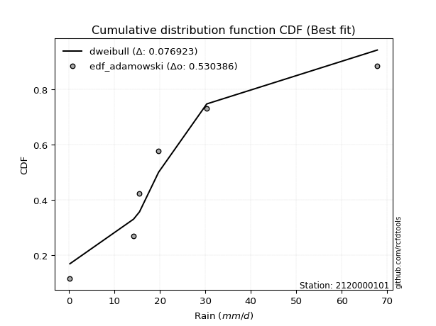</img>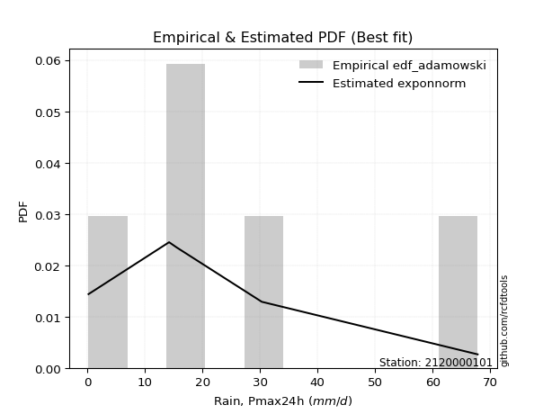</img>

</div>


## C. Best fit & Estimate extreme values for specific return periods - Tr

Best fit in probability distribution analysis means finding the theoretical distribution (like Normal, Poisson, Exponential, etc.) that most accurately mirrors your real-world data´s patterns (shape, center, spread) for better predictions, using methods like visual checks (Q-Q plots), goodness-of-fit tests (Kolmogorov-Smirnov, Chi-Squared), and information criteria (AIC) to score and select the simplest, most representative model.


### 1. Best fit (ordered by delta Δ)

:file_folder:Table: [bestfit_2120000101.csv](table/bestfit_2120000101.csv)

<div align="center">

|   id |    station | empirical_dist   | p_dist   |     delta |   deltao | eval   |   fit |   n |   best_fit |   best_fit_sort |
|-----:|-----------:|:-----------------|:---------|----------:|---------:|:-------|------:|----:|-----------:|----------------:|
|    0 | 2120000101 | edf_cunnane      | logt     | 0.0615216 | 0.530386 | Δo > Δ |     1 |   6 |          1 |               1 |
|    1 | 2120000101 | edf_gringorten   | logt     | 0.0630215 | 0.530386 | Δo > Δ |     1 |   6 |          1 |               2 |
|    2 | 2120000101 | edf_california   | gennorm  | 0.063883  | 0.530386 | Δo > Δ |     1 |   6 |          1 |               3 |
|    3 | 2120000101 | edf_blom         | logt     | 0.0647474 | 0.530386 | Δo > Δ |     1 |   6 |          1 |               4 |
|    4 | 2120000101 | edf_hazen        | logt     | 0.0679235 | 0.530386 | Δo > Δ |     1 |   6 |          1 |               5 |
|    5 | 2120000101 | edf_tukey        | logt     | 0.0700105 | 0.530386 | Δo > Δ |     1 |   6 |          1 |               6 |
|    6 | 2120000101 | edf_filliben     | logt     | 0.0719744 | 0.530386 | Δo > Δ |     1 |   6 |          1 |               7 |
|    7 | 2120000101 | edf_jenkinson    | logt     | 0.0728978 | 0.530386 | Δo > Δ |     1 |   6 |          1 |               8 |
|    8 | 2120000101 | edf_beard        | logt     | 0.0728978 | 0.530386 | Δo > Δ |     1 |   6 |          1 |               9 |
|    9 | 2120000101 | edf_chegodayev   | logt     | 0.0741224 | 0.530386 | Δo > Δ |     1 |   6 |          1 |              10 |
|   10 | 2120000101 | edf_adamowski    | dweibull | 0.0769231 | 0.530386 | Δo > Δ |     1 |   6 |          1 |              11 |
|   11 | 2120000101 | edf_weibull      | dweibull | 0.0846955 | 0.530386 | Δo > Δ |     1 |   6 |          1 |              12 |

</div>


### 2. Extreme values and % difference analysis

In hydrology, a return period (or recurrence interval $Tr$) is the statistical average time between extreme events like floods or droughts of a specific magnitude, indicating how rare an event is, with a 100-year flood, for example, having a 1% chance of occurring in any given year, not that it happens exactly every century. It is a key tool for infrastructure design (like bridges or dams) and risk assessment, calculated from historical data to determine the probability of future events, although it is important to remember it is statistical average, and events can cluster or be missed.

The extreme value porcentage difference is evaluated as $pdiff = 1 - (ETrBf / ETr) * 100$, where _ETrBf_ correspond to the bestfit extreme value for a specific recurrence interval and _ETr_ correspond to the extreme value for one of the most used PDFsused in hydrology.

> risk_rate: assuming the return period as the project useful life.

:file_folder:Table: [extreme_2120000101.csv](table/extreme_2120000101.csv), all PDFs.  
:file_folder:Table: [extremepdiff_2120000101.csv](table/extremepdiff_2120000101.csv), % difference between bestfit and most used PDFs in Hydrology.

<div align="center">

Extreme values table for only best fit PDFs
|   id |      tr |   prob_l |     prob_g |      alpha |   anglit |   arcsine |   argus |    beta |   betaprime |   bradford |     burr |   burr12 |   cosine |   crystalball |   dgamma |   dweibull |   erlang |   exponnorm |   exponpow |   exponweib |        f |   fatiguelife |   foldnorm |    gamma |   gausshyper |   genexpon |      genextreme |   gengamma |   genhalflogistic |   genlogistic |   gennorm |   genpareto |   gompertz |   gumbel_l |   gumbel_r |   halfgennorm |   halflogistic |   halfnorm |   hypsecant |   invgamma |   invgauss |      invweibull |   johnsonsb |   johnsonsu |   kappa3 |   kappa4 |   ksone |   kstwobign |   laplace |   levy_l |   loggamma |   logistic |   loglaplace |    lomax |   maxwell |   mielke |    moyal |   nakagami |      ncf |      nct |    norm |   pearson3 |   powerlaw |   rayleigh |    rdist |    rice |   semicircular |   skewnorm |         t |   trapezoid |   triang |   truncexpon |   truncnorm |   truncpareto |   truncweibull_min |   tukeylambda |   uniform |   vonmises |   vonmises_line |     wald |   weibull_max |   weibull_min |   wrapcauchy |   logalpha |   loganglit |   logarcsine |   logargus |   logbeta |    logbetaprime |   logbradford |        logburr |      logburr12 |   logcosine |   logcrystalball |   logdgamma |      logdweibull |   logerlang |   logexponnorm |      logexponpow |    logexponweib |           logf |   logfatiguelife |   logfoldnorm |   loggausshyper |   loggenexpon |   loggenextreme |   loggengamma |   loggenhalflogistic |   loggenlogistic |      loggennorm |   loggenpareto |   loggompertz |   loggumbel_l |   loggumbel_r |   loghalfgennorm |   loghalflogistic |   loghalfnorm |   loghypsecant |   loginvgamma |   loginvgauss |    loginvweibull |   logjohnsonsb |     logjohnsonsu |     logkappa3 |   logkappa4 |   logksone |   logkstwobign |   loglevy_l |   logloggamma |   loglogistic |   logloglaplace |         loglomax |   logmaxwell |         logmielke |     logmoyal |   lognakagami |         logncf |    lognct |   lognorm |   logpearson3 |   logpowerlaw |   lograyleigh |   logrdist |   logrice |   logsemicircular |   logskewnorm |              logt |   logtrapezoid |   logtriang |   logtruncexpon |   logtruncnorm |   logtruncpareto |   logtruncweibull_min |   logtukeylambda |   loguniform |   logvonmises |   logvonmises_line |          logwald |   logweibull_max |   logweibull_min |   logwrapcauchy |    station |   n |   risk_rate |
|-----:|--------:|---------:|-----------:|-----------:|---------:|----------:|--------:|--------:|------------:|-----------:|---------:|---------:|---------:|--------------:|---------:|-----------:|---------:|------------:|-----------:|------------:|---------:|--------------:|-----------:|---------:|-------------:|-----------:|----------------:|-----------:|------------------:|--------------:|----------:|------------:|-----------:|-----------:|-----------:|--------------:|---------------:|-----------:|------------:|-----------:|-----------:|----------------:|------------:|------------:|---------:|---------:|--------:|------------:|----------:|---------:|-----------:|-----------:|-------------:|---------:|----------:|---------:|---------:|-----------:|---------:|---------:|--------:|-----------:|-----------:|-----------:|---------:|--------:|---------------:|-----------:|----------:|------------:|---------:|-------------:|------------:|--------------:|-------------------:|--------------:|----------:|-----------:|----------------:|---------:|--------------:|--------------:|-------------:|-----------:|------------:|-------------:|-----------:|----------:|----------------:|--------------:|---------------:|---------------:|------------:|-----------------:|------------:|-----------------:|------------:|---------------:|-----------------:|----------------:|---------------:|-----------------:|--------------:|----------------:|--------------:|----------------:|--------------:|---------------------:|-----------------:|----------------:|---------------:|--------------:|--------------:|--------------:|-----------------:|------------------:|--------------:|---------------:|--------------:|--------------:|-----------------:|---------------:|-----------------:|--------------:|------------:|-----------:|---------------:|------------:|--------------:|--------------:|----------------:|-----------------:|-------------:|------------------:|-------------:|--------------:|---------------:|----------:|----------:|--------------:|--------------:|--------------:|-----------:|----------:|------------------:|--------------:|------------------:|---------------:|------------:|----------------:|---------------:|-----------------:|----------------------:|-----------------:|-------------:|--------------:|-------------------:|-----------------:|-----------------:|-----------------:|----------------:|-----------:|----:|------------:|
|    0 |    2    | 0.5      | 0.5        |   0.711414 |  24.6167 |   24.6167 | 34.4079 | 44.3316 |     16.0897 |    27.8461 |  11.4723 |  13.7024 |  28.0218 |       24.6167 |  19.7    |    19.7    |  10.6699 |     19.7244 |    16.0038 |     3.12635 |  11.5151 |      0.200135 |    20.1392 |  11.1228 |      28.1412 |    18.8813 |     9.56105     |    5.89314 |           44.3863 |       20.7995 |   15.5    |     20.0051 |    23.2129 |    28.1075 |    21.1258 |       12.7341 |        19.3904 |    20.2671 |     24.6167 |    19.1087 |    18.9159 | 10986.9         |     67.794  |     18.9567 |  18.7111 |  30.1375 | 34      |     21.9041 |   24.6167 |  28.1515 |    10.1899 |    24.6167 |      11.0103 |  17.0468 |   22.7993 |  20.1546 |  19.9989 |    17.4335 |  13.1368 |  19.2837 | 24.6167 |    20.7511 |   0.481408 |    22.1548 | -5.7834  | 23.8634 |        24.6167 |    22.032  |   17.009  |     50.4725 |  38.752  |      26.1655 |     20.1067 |       2.7132  |            11.6304 |    -5.2063    |   34      |   0.220221 |         20.3096 |  17.7287 |       67.4594 |       1.81661 |      33.9944 |    9.93912 |     11.0103 |      11.0102 |    18.4256 |   59.5428 |    0.205142     |       3.65434 |   0.206202     |   2.09217      |      7.5355 |          11.0103 |     19.7    |     19.7         |     10.265  |        11.0101 |      0.233387    |     1.27136     |    0.638463    |          11.0556 |       12.3197 |         6.51549 |       4.89109 |         12.8022 |   1.3388e+12  |              12.4568 |          17.2349 |    19.7         |        21.3537 |      0.334727 |       14.9626 |       8.10192 |      2.14195     |           6.95606 |       7.51313 |        11.0103 |       10.4016 |        9.4478 |      8.00894     |        2.46344 |     17.4255      |   1.20094e+42 |     3.55055 |    3.68239 |        6.71334 |     21.4238 |       19.2992 |       11.0103 |         1.01179 |      2.31774     |      9.38532 |      0.205672     |      7.3381  |       10.9881 |   2.09786      |   11.0047 |   11.0103 |       17.0579 |      0.213622 |       8.86863 |        0.2 |   11.0103 |           11.0101 |       11.6944 |     18.1052       |        13.1322 |     7.89614 |         2.17169 |        3.77224 |         0.258702 |           2.81316e-78 |              0.2 |      3.68239 |     0.0559212 |            17.8334 |      6.0112      |          19.3316 |      0.422488    |         3.62955 | 2120000101 |   6 |    0.75     |
|    1 |    2.33 | 0.570815 | 0.429185   |   0.845495 |  29.0335 |   31.247  | 39.0286 | 49.7514 |     20.3195 |    32.651  |  17.0649 |  17.6755 |  32.16   |       28.4085 |  20.9192 |    21.1801 |  13.3332 |     22.828  |    22.028  |     4.45546 |  15.5132 |      0.807719 |    24.2814 |  14.2003 |      34.4996 |    22.6391 |    42.314       |    8.84669 |           48.8171 |       23.9365 |   16.1787 |     23.9015 |    27.1639 |    31.4065 |    24.6394 |       16.7443 |        23.0029 |    24.3595 |     27.6513 |    22.3202 |    22.3075 |     1.39914e+06 |     67.7993 |     22.2779 |  21.9411 |  35.0362 | 39.7445 |     25.3236 |   26.9113 |  40.2663 |    14.4821 |    27.9576 |      13.4698 |  20.7587 |   26.7388 |  24.827  |  23.3249 |    19.7906 |  16.5981 |  22.0679 | 28.4085 |    24.4359 |   1.00216  |    26.1525 |  1.78932 | 27.3916 |        29.3538 |    25.7899 |   18.5974 |     54.4    |  43.5538 |      30.7617 |     23.6243 |       4.24424 |            15.7266 |    -0.0653511 |   38.7871 |   0.520002 |         23.2906 |  20.215  |       67.6659 |       4.24143 |      41.2213 |   14.1438  |     16.2309 |      19.7156 |    23.1722 |   64.8878 |    0.213054     |       5.56324 |   0.214524     |   6.2554       |     10.9122 |          15.3637 |     22.1742 |     22.1098      |     14.6535 |        15.3635 |      0.26197     |     2.40003     |    1.1679      |          15.4066 |       15.825  |        10.6181  |       8.03909 |         18.3979 |   1.88753e+49 |              17.5223 |          21.5516 |    19.9503      |        30.288  |      0.374947 |       19.9938 |      11.0323  |      3.99387     |           9.55466 |      10.7643  |        14.3747 |       14.8284 |       13.6508 |     12.6187      |       21.2348  |     18.8764      | inf           |     5.46414 |    6.04147 |       10.8778  |     30.4683 |       24.5371 |       14.7668 |        22.6953  |      3.97653     |     13.2672  |      0.215159     |      9.82891 |       15.3349 |   6.64964      |   15.3584 |   15.3637 |       22.6512 |      0.233571 |      12.6012  |        0.2 |   15.3637 |           16.694  |       15.4804 |     19.6932       |        19.2707 |    11.2663  |         3.25586 |        5.62197 |         0.30036  |          32.8381      |              0.2 |      5.56297 |     0.0635846 |            22.9071 |      7.47894     |          26.6275 |      0.644549    |         8.85762 | 2120000101 |   6 |    0.729209 |
|    2 |    5    | 0.8      | 0.2        |   1.88517  |  44.6171 |   48.9279 | 53.8503 | 63.0936 |     45.0706 |    50.0362 |  47.5093 |  41.6837 |  47.0726 |       42.5001 |  31.3937 |    35.3431 |  27.2035 |     38.0037 |    56.7631 |    15.1369  |  40.4366 |     13.7119   |    41.7978 |  30.7543 |      55.1938 |    40.0042 | 28960.2         |   36.9058  |           60.4528 |       37.5632 |   22.8669 |     41.1862 |    43.3966 |    42.064  |    39.904  |       42.5546 |        39.3488 |    41.6657 |     39.8239 |    37.7869 |    38.594  |     1.95393e+15 |     67.8    |     38.3118 |  37.1416 |  51.7793 | 58.336  |     39.849  |   38.3841 |  60.3377 |    54.5964 |    40.8572 |      36.9114 |  39.3171 |   42.2443 |  47.6317 |  38.7315 |    37.6768 |  34.7808 |  35.7215 | 42.5001 |    40.4166 |  11.7761   |    42.1573 | 22.608   | 41.5166 |        45.5196 |    41.6814 |   26.3404 |     65.6679 |  57.3297 |      48.1098 |     38.273  |      18.5216  |            36.4432 |    16.4661    |   54.28   |   1.66279  |         34.9476 |  34.1337 |       67.7977 |      78.1978  |      58.3284 |   54.2193  |     63.8279 |      93.2193 |    43.1554 |   67.7872 |    0.443957     |      21.6783  |   0.414839     |   1.34486e+06  |     41.4353 |          52.9941 |     49.7026 |     61.0559      |     56.2913 |        52.9938 |      0.812205    |   159.952       | 3436.38        |          52.9349 |       40.1293 |        39.2238  |      65.7844  |         43.261  | inf           |              41.5721 |          40.4147 |    28.5008      |        59.3558 |      0.661233 |       51.002  |      42.1853  |    131.656       |          40.1762  |      49.248   |        41.8892 |       57.3263 |       57.0875 |     90.9471      |       67.2887  |     29.6461      | inf           |    21.9541  |   29.9917  |       84.5053  |     54.6074 |       45.245  |       45.8706 |       inf       |     59.1076      |     51.8164  |      0.634738     |     38.0556  |       52.932  |   8.661e+06    |   53.0135 |   52.9941 |       51.6574 |      0.792068 |      51.4222  |        0.2 |   52.994  |           69.095  |       35.0383 |     31.1098       |        57.9091 |    31.2351  |        14.2318  |       20.7026  |         1.10021  |          32.8381      |              0.2 |     21.1441  |     0.103726  |            60.6207 |     25.4081      |          52.2838 |     28.8507      |        38.2817  | 2120000101 |   6 |    0.67232  |
|    3 |   10    | 0.9      | 0.1        |   3.79532  |  53.4376 |   53.1962 | 60.9976 | 66.4337 |     73.4515 |    58.5912 |  70.0529 |  69.5053 |  56.0823 |       51.8481 |  42.5214 |    52.53   |  40.2328 |     51.7465 |    90.4334 |    31.2817  |  69.5395 |     31.5292   |    54.7596 |  46.7154 |      62.961  |    54.1683 |     5.92646e+06 |   88.2853  |           64.4598 |       48.6607 |   32.7538 |     54.1219 |    54.7458 |    47.9977 |    52.3368 |       73.9327 |        52.9234 |    54.472  |     49.544  |    52.296  |    53.2398 |     5.48802e+22 |     67.8    |     53.1214 |  51.7535 |  59.6346 | 66.448  |     50.9082 |   48.7987 |  65.1834 |   134.079  |    50.3573 |      92.1685 |  56.1639 |   53.1563 |  69.9234 |  52.1453 |    56.1941 |  52.8846 |  49.6249 | 51.8481 |    53.1095 |  29.5824   |    53.5691 | 28.1232  | 51.588  |        53.8146 |    53.4408 |   36.7793 |     70.0692 |  62.7106 |      57.2674 |     48.2726 |      35.4154  |            50.6932 |    23.5398    |   61.04   |   2.39277  |         43.8976 |  48.9048 |       67.7999 |     405.537   |      63.333  |  136.178   |    138.548  |     135.639  |    55.5428 |   67.7999 |    3.35197      |      39.2433  |   2.18127      |   1.06043e+21  |     92.7814 |         120.488  |    110.799  |    200.145       |    140.267  |       120.488  |      4.63846     | 29513.6         |    1.16666e+16 |         120.145  |       74.395  |        56.9375  |     322.976   |         56.1457 | inf           |              54.9515 |          55.5013 |    76.5467      |        66.0649 |      1.10666  |       85.9042 |     125.775   |   4977.89        |         132.425   |     151.73    |        98.4061 |      145.004  |      156.098  |    454.394       |       67.7834  |     62.6894      | inf           |    39.7302  |   60.3428  |      402.501   |     62.8679 |       56.0145 |      105.696  |       inf       |    684.981       |    135.166   |     26.9322       |    123.677   |      120.421  |   9.03704e+26  |  120.602  |  120.488  |       74.9096 |      3.81257  |     140.159   |        0.2 |  120.488  |          143.213  |       48.8688 |     67.7527       |        89.0011 |    46.5185  |        29.8844  |       37.1466  |         4.69191  |          32.8381      |              0.2 |     37.8625  |     0.14751   |           127.368  |     93.0314      |          61.8638 |  13555.1         |        52.1621  | 2120000101 |   6 |    0.651322 |
|    4 |   15    | 0.933333 | 0.0666667  |   5.69865  |  57.2041 |   54.0103 | 63.7148 | 67.1387 |     93.1538 |    61.5857 |  81.0793 |  88.6312 |  60.1863 |       56.5129 |  49.3131 |    63.8252 |  47.9638 |     59.7856 |   110.052  |    43.8831  |  89.494  |     43.1821   |    61.5049 |  56.2865 |      65.0751 |    61.9087 |     1.193e+08   |  133.529   |           65.6619 |       54.9217 |   40.1339 |     60.6589 |    60.3989 |    50.6849 |    59.3513 |       95.7094 |        60.6055 |    61.1363 |     55.0912 |    61.3079 |    61.8862 |     8.74581e+26 |     67.8    |     62.1291 |  61.3803 |  62.3762 | 69.152  |     56.7794 |   54.8909 |  66.6472 |   211.076  |    55.5334 |     157.42   |  66.0186 |   58.7551 |  84.7312 |  59.9301 |    66.5918 |  64.3528 |  58.9894 | 56.5129 |    60.0955 |  39.3734   |    59.4489 | 29.2694  | 56.7773 |        57.0493 |    59.5604 |   46.132  |     71.4814 |  64.4371 |      60.6059 |     52.8918 |      43.9705  |            56.4574 |    25.8545    |   63.2933 |   2.69223  |         48.8546 |  58.39   |       67.8    |     855.18    |      64.8536 |  217.604   |    192.899  |     145.697  |    60.743  |   67.8    |   32.4654       |      47.8276  |  12.794        |   3.72949e+40  |    133.946  |         181.533  |    179.162  |    431.557       |    222.567  |       181.532  |     16.5925      |     1.14166e+06 |    1.19778e+36 |         180.904  |      101.233  |        62.0254  |     753.342   |         60.3996 | inf           |              59.5201 |          64.347  |   212.68        |        67.1281 |      1.49571  |      108.782  |     232.952   |  49597           |         260.084   |     272.508   |       160.215  |      232.62   |      262.421  |   1126.16        |       67.797   |    125.226       | inf           |    48.1767  |   76.1787  |      921.807   |     65.601  |       59.8319 |      166.562  |       inf       |   2871.44        |    221.063   |   3399.96         |    245.106   |      181.496  |   6.41232e+56  |  181.761  |  181.533  |       86.2923 |      8.32944  |     234.961   |        0.2 |  181.532  |          190.292  |       54.5218 |    153.669        |       102.161  |    52.8601  |        38.9018  |       45.2973  |         9.60442  |          32.8381      |              0.2 |     45.978   |     0.178714  |           194.211  |    214.084       |          64.4363 |      1.81293e+06 |        57.0759  | 2120000101 |   6 |    0.644736 |
|    5 |   20    | 0.95     | 0.05       |   7.6003   |  59.4198 |   54.297  | 65.2063 | 67.405  |    108.723  |    63.1108 |  88.365  | 103.576  |  62.7102 |       59.5678 |  54.2128 |    72.2975 |  53.4843 |     65.4894 |   123.8    |    54.3366  | 105.057  |     51.8096   |    66.002  |  63.1529 |      65.9928 |    67.1939 |     9.76246e+08 |  173.8     |           66.2358 |       59.3054 |   46.0804 |     64.8895 |    64.0695 |    52.3576 |    64.2626 |      112.68   |        65.9877 |    65.5795 |     59.0046 |    68.0007 |    68.0704 |     7.65953e+29 |     67.8    |     68.7129 |  68.8864 |  63.7832 | 70.504  |     60.7343 |   59.2134 |  67.3969 |   284.679  |    59.111  |     230.146  |  73.0106 |   62.4708 |  96.3519 |  65.4434 |    73.6629 |  72.9358 |  66.3423 | 59.5678 |    64.9111 |  45.2589   |    63.3571 | 29.6947  | 60.2265 |        58.8435 |    63.6404 |   55.0223 |     72.178  |  65.2888 |      62.3365 |     55.6581 |      48.9964  |            59.5657 |    26.9981    |   64.42   |   2.85253  |         52.1749 |  65.4585 |       67.8    |    1360.76    |      65.5984 |  296.786   |    234.358  |     149.414  |    63.7143 |   67.8    |  357.916        |      52.8001  |  77.8785       |   6.87646e+63  |    167.881  |         237.427  |    252.795  |    764.704       |    301.801  |       237.426  |     45.0946      |     1.99475e+07 |    2.02088e+63 |         236.532  |      123.86   |        64.1632  |    1335.89    |         62.4604 | inf           |              61.7686 |          70.8441 |   568.249       |        67.4583 |      1.85215  |      126.005  |     358.66    | 272183           |         417.348   |     402.653   |       225.962  |      318.125  |      371.138  |   2126.12        |       67.799   |    238.631       | inf           |    52.9643  |   85.5929  |     1610.88    |     67.0462 |       61.7828 |      228.085  |       inf       |   7938.05        |    306.413   | 861299            |    397.871   |      237.437  |   4.09985e+95  |  237.776  |  237.426  |       93.3585 |     13.0919   |     331.23    |        0.2 |  237.426  |          222.785  |       57.5799 |    362.655        |       109.352  |    56.3     |        44.5354  |       50.0595  |        14.5697   |          32.8381      |              0.2 |     50.6664  |     0.204418  |           261.27   |    398.395       |          65.5527 |      1.07539e+08 |        59.6266  | 2120000101 |   6 |    0.641514 |
|    6 |   25    | 0.96     | 0.04       |   9.50129  |  60.9213 |   54.43   | 66.1681 | 67.5351 |    121.796  |    64.0349 |  93.8413 | 115.998  |  64.4801 |       61.8166 |  58.0499 |    79.106  |  57.7831 |     69.9136 |   134.34   |    63.3454  | 117.979  |     58.6645   |    69.3481 |  68.5149 |      66.4874 |    71.1865 |     4.92886e+09 |  210.257   |           66.5706 |       62.6819 |   51.0995 |     67.9563 |    66.7495 |    53.5478 |    68.0457 |      126.711  |        70.1345 |    68.8853 |     62.0331 |    73.3829 |    72.8973 |     1.41457e+32 |     67.8    |     73.94   |  75.1657 |  64.6431 | 71.3152 |     63.6968 |   62.5662 |  67.8674 |   355.162  |    61.8478 |     308.991  |  78.4341 |   65.2294 | 106.127  |  69.7168 |    78.967  |  79.8676 |  72.5116 | 61.8166 |    68.5792 |  49.149    |    66.2608 | 29.8996  | 62.7891 |        60.0075 |    66.676  |   63.6241 |     72.593  |  65.7962 |      63.3958 |     57.5269 |      52.2843  |            61.5087 |    27.6782    |   65.096  |   2.95161  |         54.5654 |  71.1201 |       67.8    |    1893.82    |      66.0418 |  373.603   |    267.41   |     151.17   |    65.6746 |   67.8    | 4325.42         |      56.0285  | 483.759        |   1.99845e+90  |    196.687  |         289.297  |    330.67   |   1208.43        |    378.064  |       289.297  |    102.79        |     2.13542e+08 |    3.71416e+97 |         288.154  |      143.688  |        65.2715  |    2055       |         63.6611 | inf           |              63.0918 |          76.0726 |  1446.68        |        67.5979 |      2.18614  |      139.897  |     500.083   |      1.05994e+06 |         600.81    |     538.372   |       294.853  |      401.29   |      480.596  |   3468.73        |       67.7996  |    437.549       | inf           |    56.0212  |   91.791   |     2447.08    |     67.9696 |       62.9668 |      290.09   |       inf       |  17468.5         |    390.456   |      3.71442e+08  |    579.18    |      289.365  |   6.45037e+142 |  289.771  |  289.297  |       98.2904 |     17.5477   |     427.498   |        0.2 |  289.296  |          246.776  |       59.4944 |    884.712        |       113.875  |    58.4549  |        48.3546  |       53.1681  |        19.108    |          32.8381      |              0.2 |     53.7059  |     0.226944  |           327.43   |    655.179       |          66.1561 |      3.65041e+09 |        61.1935  | 2120000101 |   6 |    0.639603 |
|    7 |   50    | 0.98     | 0.02       |  19.0032   |  64.6175 |   54.6077 | 68.3487 | 67.7235 |    168.685  |    65.9036 | 110.576  | 159.583  |  69.1147 |       68.2564 |  70.1258 |   101.439  |  71.2121 |     83.6564 |   166.285  |    96.5968  | 163.269  |     80.6582   |    79.0738 |  85.3329 |      67.3157 |    83.0592 |     7.22658e+11 |  356.877   |           67.2146 |       73.0835 |   68.967  |     76.4052 |    74.2948 |    56.7789 |    79.6994 |      175.122  |        82.9113 |    78.4943 |     71.423  |    91.3001 |    88.0634 |     1.35642e+39 |     67.8    |     90.9074 |  97.7629 |  66.4142 | 72.9376 |     72.3959 |   72.9808 |  68.9267 |   672.315  |    70.2096 |     771.555  |  95.2809 |   73.2297 | 141.704  |  82.9832 |    94.4822 | 103.072  |  94.7566 | 68.2564 |    79.6689 |  57.8183   |    74.6897 | 30.1893  | 70.228  |        62.6665 |    75.4995 |  104.21   |     73.4167 |  66.8032 |      65.5634 |     61.9382 |      59.538   |            65.5809 |    29.019     |   66.448  |   3.15477  |         60.4872 |  89.6054 |       67.8    |    4645.69    |      66.9229 |  728.238   |    370.018  |     153.549  |    70.2485 |   67.8    |    2.74186e+09  |      63.0895  |   5.20997e+06  |   1.13274e+261 |    297.758  |         509.428  |    766.412  |   5362.33        |    724.486  |       509.428  |   1674.52        |     7.81638e+11 |  inf           |         507.265  |      219.837  |        66.9942  |    7351.19    |         65.9332 | inf           |              65.6326 |          93.76   | 84166.6         |        67.7606 |      3.65881  |      185.825  |    1392.35    |      8.87709e+07 |        1846.27    |    1252.45    |       672.853  |      787.046  |     1023.29   |  15668.8         |       67.8     |   6102.51        | inf           |    62.5231  |  105.566   |     8353.47    |     70.0954 |       65.3649 |      604.81   |       inf       | 202438           |    788.611   |      1.46755e+24  |   1858.04    |      509.846  | inf            |  510.519  |  509.427  |      110.861  |     33.218    |     896.561   |        0.2 |  509.425  |          311.724  |       63.5129 | 109450            |       123.412  |    62.9786  |        57.1538  |       60.0139  |        34.63     |          32.8381      |              0.2 |     60.3428  |     0.317099  |           614.826  |   3324.7         |          67.1765 |      1.62441e+15 |        64.4227  | 2120000101 |   6 |    0.63583  |
|    8 |   75    | 0.986667 | 0.0133333  |  28.5039   |  66.2442 |   54.6406 | 69.2135 | 67.763  |    201.157  |    66.5326 | 120.563  | 188.906  |  71.328  |       71.7117 |  77.2751 |   115.251  |  79.1106 |     91.6955 |   184.379  |   119.926   | 193.745  |     93.9037   |    84.368  |  95.2629 |      67.5301 |    89.6753 |     1.31221e+13 |  469.544   |           67.4197 |       79.1292 |   81.028  |     80.6749 |    78.2523 |    58.4128 |    86.473  |      206.828  |        90.3384 |    83.7251 |     76.9104 |   102.722  |    97.0542 |     1.55048e+43 |     67.8    |    101.383  | 113.606  |  67.028  | 73.4784 |     77.1821 |   79.073  |  69.3621 |   949.576  |    75.0391 |    1317.78   | 105.136  |   77.5793 | 167.005  |  90.7411 |   102.943  | 117.932  | 110.347  | 71.7117 |    85.9818 |  60.9919   |    79.2753 | 30.2478  | 74.2751 |        63.7287 |    80.3027 |  142.494  |     73.6894 |  67.1366 |      66.3011 |     63.6863 |      62.1734  |            66.9963 |    29.4572    |   66.8987 |   3.22354  |         62.8102 | 100.98   |       67.8    |    7313.54    |      67.2155 | 1047.23    |    426.871  |     153.994  |    72.1125 |   67.8    |    4.67191e+15  |      65.6356  |   6.434e+10    | inf            |    362.966  |         690.141  |   1257.57   |  13385.6         |   1030.35   |       690.143  |   9825.57        |     1.70698e+14 |  inf           |         687.195  |      276.18   |        67.3893  |   14932.5     |         66.6306 | inf           |              66.4267 |         105.398  |     2.42803e+06 |        67.7848 |      4.94508  |      214.512  |    2524.8     |      1.35586e+09 |        3545.78    |    1983.18    |      1089.73   |     1135.73   |     1549.95   |  37641.6         |       67.8     |  56079.9         | inf           |    64.7831  |  110.603   |    16415       |     70.9881 |       66.1732 |      924.509  |       inf       | 848619           |   1155.7     |      3.95404e+42  |   3673.65    |      690.942  | inf            |  691.817  |  690.141  |      116.551  |     41.7712   |    1341.43    |        0.2 |  690.138  |          342.219  |       64.9111 |      2.05047e+07  |       126.742  |    64.5521  |        60.4776  |       62.4985  |        42.932    |          32.8381      |              0.2 |     62.7327  |     0.389961  |           816.025  |   9032.74        |          67.446  |      1.44778e+19 |        65.5307  | 2120000101 |   6 |    0.634587 |
|    9 |  100    | 0.99     | 0.01       |  38.0041   |  67.2114 |   54.6522 | 69.6963 | 67.7779 |    226.794  |    66.8483 | 127.873  | 211.592  |  72.7152 |       74.0488 |  82.3775 |   125.355  |  84.7304 |     97.3993 |   196.949  |   138.295   | 217.348  |    103.434    |    87.9747 | 102.342  |      67.6218 |    94.2388 |     1.02123e+14 |  563.254   |           67.5197 |       83.4081 |   90.3126 |     83.4381 |    80.8893 |    59.4815 |    91.2671 |      230.844  |        95.5952 |    87.2884 |     80.8028 |   111.294  |   103.485  |     1.15509e+46 |     67.8    |    109.078  | 126.259  |  67.3423 | 73.7488 |     80.4615 |   83.3955 |  69.6165 |  1200.74   |    78.4488 |    1926.59   | 112.128  |   80.542  | 187.408  |  96.2451 |   108.7    | 129.106  | 122.783  | 74.0488 |    90.3967 |  62.6351   |    82.3994 | 30.2694  | 77.0323 |        64.3236 |    83.5748 |  179.397  |     73.8254 |  67.3029 |      66.6728 |     64.6309 |      63.5346  |            67.7153 |    29.6737    |   67.124  |   3.25804  |         64.0253 | 109.274  |       67.8    |    9840.91    |      67.3617 | 1341.68    |    464.738  |     154.15   |    73.1655 |   67.8    |    1.56375e+22  |      66.947   |   8.62112e+14  | inf            |    410.931  |         847.461  |   1789.19   |  26066.8         |   1309.15   |       847.463  |  36300.9         |     1.01223e+16 |  inf           |         843.873  |      322.266  |        67.5457  |   24349.9     |         66.9611 | inf           |              66.8072 |         114.36   |     4.47602e+07 |        67.7923 |      6.12351  |      235.632  |    3847.41    |      9.93859e+09 |        5627.4     |    2712.31    |      1534.1    |     1458.57   |     2060.46   |  69994.7         |       67.8     | 398310           | inf           |    65.9216  |  113.211   |    26076.4     |     71.5152 |       66.5791 |     1247.46   |       inf       |      2.346e+06   |   1499.34    |      1.20712e+63  |   5958.36    |      848.646  | inf            |  849.688  |  847.46   |      119.968  |     46.9922   |    1765.16    |        0.2 |  847.457  |          360.581  |       65.6217 |      5.13885e+09  |       128.437  |    65.3515  |        62.2208  |       63.7816  |        47.9611   |          32.8381      |              0.2 |     63.9628  |     0.453846  |           954.146  |  18719.5         |          67.563  |      1.82321e+22 |        66.0911  | 2120000101 |   6 |    0.633968 |
|   10 |  200    | 0.995    | 0.005      |  76.0045   |  69.0388 |   54.6633 | 70.5354 | 67.7936 |    298.786  |    67.3233 | 146.596  | 273.318  |  75.5359 |       79.3499 |  94.7541 |   150.655  |  98.3154 |    111.142  |   226.331  |   189.018   | 281.744  |    126.764    |    96.2235 | 119.494  |      67.7345 |   104.835  |     1.41733e+16 |  842.302   |           67.6655 |       93.695  |  115.188  |     89.2923 |    86.746  |    61.8044 |   102.793  |      293.904  |       108.233  |    95.4383 |     90.1801 |   133.709  |   119.145  |     9.27996e+52 |     67.8    |    128.559  | 162.51   |  67.8282 | 74.1544 |     88.0145 |   93.8101 |  70.0987 |  2051.75   |    86.6281 |    4810.72   | 128.975  |   87.3202 | 246.714  | 109.506  |   121.828  | 158.382  | 158.324  | 79.3499 |   100.85   |  65.1727   |    89.5477 | 30.2915  | 83.341  |        65.3606 |    91.0585 |  319.021  |     74.0289 |  67.5517 |      67.2342 |     66.1536 |      65.6326  |            68.8082 |    29.9936    |   67.462  |   3.3099   |         65.8964 | 129.932  |       67.8    |   18759.9     |      67.5809 | 2368.52    |    545.684  |     154.3    |    75.0167 |   67.8    |    1.62938e+50  |      68.9633  |   4.51798e+31  | inf            |    528.897  |        1350.24   |   4198.32   | 137132           |   2262.4    |      1350.25   | 980891           |     4.58705e+20 |  inf           |        1344.85   |      457.343  |        67.72    |   75972       |         67.4235 | inf           |              67.3461 |         138.79   |     4.25424e+11 |        67.7985 |     10.2485   |      288.986  |   10592       |      1.45681e+12 |       17083.1     |    5550.55    |      3496.95   |     2589.36   |     3976.85   | 310974           |       67.8     |      2.39857e+08 | inf           |    67.624   |  117.238   |    75721.1     |     72.5246 |       67.1899 |     2559.45   |       inf       |      2.71871e+07 |   2719.92    |      2.56926e+159 |  19105.3     |     1352.9    | inf            | 1354.43   | 1350.24   |      126.459  |     56.3034   |    3307.95    |        0.2 | 1350.24   |          394.981  |       66.702  |      1.40671e+20  |       131.015  |    66.5666  |        64.9429  |       65.7587  |        56.8738   |          32.8381      |              0.2 |     65.8535  |     0.652363  |          1224.97   | 114974           |          67.7097 |      5.90211e+30 |        66.9403  | 2120000101 |   6 |    0.633042 |
|   11 |  250    | 0.996    | 0.004      |  95.0045   |  69.5039 |   54.6646 | 70.7318 | 67.7957 |    325.439  |    67.4185 | 153.033  | 295.503  |  76.3091 |       80.97   |  98.7595 |   159.069  | 102.7    |    115.566  |   235.526  |   207.356   | 304.965  |    134.367    |    98.7612 | 125.04   |      67.7525 |   108.136  |     6.92155e+16 |  949.883   |           67.6937 |       97.0021 |  123.956  |     90.9596 |    88.5002 |    62.4879 |   106.498  |      315.772  |       112.296  |    97.9455 |     93.1988 |   141.5    |   124.234  |     1.5395e+55  |     67.8    |    135.125  | 176.195  |  67.9286 | 74.2355 |     90.352  |   97.1629 |  70.2241 |  2419.02   |    89.254  |    6458.79   | 134.398  |   89.4067 | 269.399  | 113.775  |   125.853  | 168.57   | 171.71   | 80.97   |   104.167  |  65.6909   |    91.7481 | 30.2944  | 85.2829 |        65.6039 |    93.3607 |  385.758  |     74.0696 |  67.6014 |      67.347  |     66.4754 |      66.0605  |            69.0289 |    30.0566    |   67.5296 |   3.32028  |         66.2755 | 136.766  |       67.8    |   22681.5     |      67.6247 | 2822.78    |    568.446  |     154.318  |    75.4538 |   67.8    |    1.0914e+65   |      69.3738  |   1.25575e+40  | inf            |    566.783  |        1556.8    |   5529.67   | 237632           |   2676.9    |      1556.8    |      2.94574e+06 |     1.88586e+22 |  inf           |        1550.76   |      508.98   |        67.7449  |  108416       |         67.5092 | inf           |              67.4473 |         147.627  |     1.69773e+13 |        67.7991 |     12.0966   |      306.873  |   14668       |      7.66282e+12 |       24412.3     |    6918.5     |      4559.12   |     3091.38   |     4877.95   | 502269           |       67.8     |      3.48414e+09 | inf           |    67.9606  |  118.061   |   105316       |     72.7896 |       67.3124 |     3223.67   |       inf       |      5.98282e+07 |   3267.21    |      1.18093e+214 |  27800.7     |     1560.14   | inf            | 1561.86   | 1556.79   |      128.113  |     58.4113   |    4013.53    |        0.2 | 1556.79   |          403.515  |       66.9202 |      5.36121e+25  |       131.536  |    66.8119  |        65.5033  |       66.1619  |        58.883    |          32.8381      |              0.2 |     66.2383  |     0.725577  |          1289.87   | 209602           |          67.7338 |      6.76146e+33 |        67.1114  | 2120000101 |   6 |    0.632858 |
|   12 |  500    | 0.998    | 0.002      | 190.004    |  70.6571 |   54.6664 | 71.1832 | 67.7988 |    420.971  |    67.6091 | 174.568  | 372.47   |  78.3668 |       85.7741 | 111.255  |   185.978  | 116.352  |    129.309  |   263.303  |   270.821   | 385.899  |    158.217    |   106.327  | 142.333  |      67.7826 |   118.085  |     9.50362e+18 | 1346.78    |           67.7489 |      107.267  |  153.586  |     95.5531 |    93.6024 |    64.4472 |   117.998  |      388.591  |       124.907  |   105.421  |    102.575  |   167.683  |   140.18   |     1.19479e+62 |     67.8    |    156.484  | 226.337  |  68.135  | 74.3978 |     97.3569 |  107.578  |  70.5482 |  3952.39   |    97.3978 |   16127.7    | 151.245  |   95.633  | 353.701  | 127.035  |   137.81   | 202.834  | 220.635  | 85.7741 |   114.343  |  66.7382   |    98.3134 | 30.2985  | 91.0771 |        66.164  |   100.225  |  702.522  |     74.1508 |  67.7008 |      67.5731 |     67.1381 |      66.9246  |            69.4723 |    30.1808    |   67.6648 |   3.34104  |         67.0367 | 158.497  |       67.8    |   39084.6     |      67.7124 | 4773.07    |    629.063  |     154.343  |    76.4644 |   67.8    |    1.9736e+144  |      70.2021  |   6.45971e+82  | inf            |    681.354  |        2374.42   |  13038.8    |      1.36947e+06 |   4421.53   |      2374.44   |      9.89293e+07 |     4.4046e+27  |  inf           |        2366.33   |      698.997  |        67.7827  |  318036       |         67.6695 | inf           |              67.6389 |         178.638  |     2.43248e+19 |        67.7998 |     20.2453   |      364.523  |   40292.6     |      1.56387e+15 |       73930.3     |   13343.5     |     10391.8    |     5255.01   |     9020.83   |      2.22426e+06 |       67.8     |      1.68331e+14 | inf           |    68.6233  |  119.723   |   283053       |     73.4785 |       67.5576 |     6593.5    |       inf       |      6.93332e+08 |   5646.38    |    inf            |  89139.5     |     2380.86   | inf            | 2383.23   | 2374.42   |      132.198  |     62.9051   |    7145.92    |        0.2 | 2374.41   |          423.872  |       67.3587 |      8.7393e+55   |       132.584  |    67.3049  |        66.6405  |       66.9762  |        63.1572   |          32.8381      |              0.2 |     67.0146  |     0.9424    |          1431.62   |      1.41461e+06 |          67.7748 |      2.23428e+44 |        67.4548  | 2120000101 |   6 |    0.632489 |
|   13 |  750    | 0.998667 | 0.00133333 | 285.004    |  71.1677 |   54.6667 | 71.3647 | 67.7994 |    487.095  |    67.6727 | 188.39   | 423.704  |  79.364  |       88.4429 | 118.596  |   202.231  | 124.356  |    137.348  |   279.026  |   312.648   | 440.114  |    172.309    |   110.554  | 152.488  |      67.7903 |   123.708  |     1.6888e+20  | 1627.57    |           67.7667 |      113.267  |  172.613  |     97.8744 |    96.3718 |    65.4943 |   124.721  |      434.633  |       132.279  |   109.597  |    108.06   |   184.512  |   149.599  |     1.27387e+66 |     67.8    |    169.678  | 261.963  |  68.2065 | 74.4518 |    101.292  |  113.67   |  70.7019 |  5200.47   |   102.156  |   27545.4    | 161.1    |   99.1154 | 414.583  | 134.792  |   144.459  | 224.867  | 255.299  | 88.4429 |   120.218  |  67.0905   |   101.985  | 30.2993  | 94.3172 |        66.3895 |   104.06   | 1002.2    |     74.1779 |  67.7339 |      67.6487 |     67.3651 |      67.2151  |            69.6208 |    30.2215    |   67.7099 |   3.34797  |         67.291  | 171.526  |       67.8    |   52277.4     |      67.7416 | 6411.11    |    657.926  |     154.347  |    76.8728 |   67.8    |    2.11464e+229 |      70.4804  |   1.10854e+126 | inf            |    744.937  |        3001.92   |  21564.1    |      3.92666e+06 |   5854.16   |      3001.94   |      8.19641e+08 |     1.07619e+31 |  inf           |        2992.69   |      833.702  |        67.7912  |  586374       |         67.7184 | inf           |              67.6981 |         199.619  |     8.61433e+23 |        67.7999 |     27.3627   |      399.653  |   72740.9     |      3.91693e+16 |      141299       |   19259       |     16826.5    |     7079.61   |    12769.3    |      5.30862e+06 |       67.8     |      7.7876e+17  | inf           |    68.8388  |  120.282   |   493263       |     73.8076 |       67.6394 |    10015.6    |       inf       |      2.90645e+09 |   7667.55    |    inf            | 176226       |     3011.04   | inf            | 3013.85   | 3001.92   |      133.993  |     64.4903   |    9866.29    |        0.2 | 3001.9    |          432.353  |       67.5055 |      6.04066e+88  |       132.935  |    67.47    |        67.0245  |       67.25    |        64.6622   |          32.8381      |              0.2 |     67.2754  |     1.04287   |          1482.56   |      4.44456e+06 |          67.7856 |      1.69421e+51 |        67.5697  | 2120000101 |   6 |    0.632366 |
|   14 | 1000    | 0.999    | 0.001      | 380.003    |  71.4719 |   54.6668 | 71.4666 | 67.7996 |    539.29   |    67.7045 | 198.812  | 463.126  |  79.993  |       90.2804 | 123.817  |   213.978  | 130.042  |    143.052  |   289.957  |   344.494   | 482.019  |    182.362    |   113.473  | 159.708  |      67.7936 |   127.616  |     1.30026e+21 | 1850.82    |           67.7754 |      117.524  |  186.88   |     99.3767 |    98.2516 |    66.1991 |   129.49   |      468.848  |       137.508  |   112.481  |    111.952  |   197.191  |   156.319  |     9.16693e+68 |     67.8    |    179.365  | 290.566  |  68.243  | 74.4789 |    104.018  |  117.992  |  70.7985 |  6286.46   |   105.53   |   40271.2    | 168.092  |  101.522  | 463.979  | 140.295  |   149.039  | 241.469  | 283.084  | 90.2804 |   124.355  |  67.2672   |   104.522  | 30.2996  | 96.5563 |        66.5162 |   106.708  | 1291.3    |     74.1914 |  67.7504 |      67.6865 |     67.4797 |      67.3609  |            69.6952 |    30.2416    |   67.7324 |   3.35143  |         67.4182 | 180.899  |       67.8    |   63580.4     |      67.7562 | 7865.88    |    675.753  |     154.349  |    77.1026 |   67.8    |  inf            |      70.62    |   4.18187e+169 | inf            |    788.064  |        3527.9    |  30830.2    |      8.39229e+06 |   7107.7    |      3527.93   |      3.75711e+09 |     3.51557e+33 |  inf           |        3517.99   |      941.251  |        67.7946  |  898720       |         67.7415 | inf           |              67.7264 |         215.954  |     4.43565e+27 |        67.8    |     33.8833   |      425.184  |  110602       |      4.03615e+17 |      223712       |   24813.6     |     23686.3    |     8704.18   |    16261.5    |      9.83937e+06 |       67.8     |      1.00136e+21 | inf           |    68.9447  |  120.563   |   724747       |     74.0152 |       67.6804 |    13472      |       inf       |      8.03483e+09 |   9473.32    |    inf            | 285814       |     3539.43   | inf            | 3542.58   | 3527.89   |      135.055  |     65.3      |   12330.1     |        0.2 | 3527.88   |          437.192  |       67.579  |      2.83458e+123 |       133.11   |    67.5526  |        67.2174  |       67.3873  |        65.4304   |          32.8381      |              0.2 |     67.4061  |     1.09932   |          1508.74   |      1.01268e+07 |          67.7904 |      2.76377e+56 |        67.6272  | 2120000101 |   6 |    0.632305 |


</div>


<div align="center">

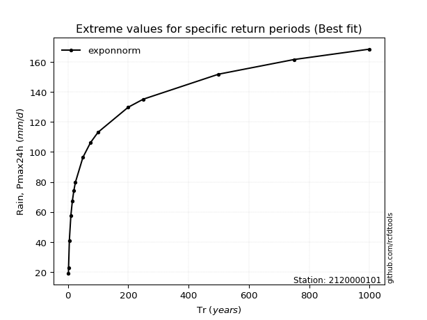</img>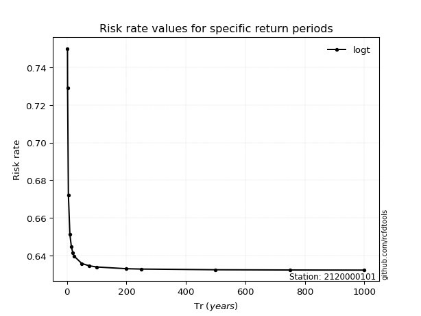</img>

</div>


<sub>**APP DISCLAIMER**: NO WARRANTY - This software is provided by [github.com/rcfdtools](https://github.com/rcfdtools) "as is", without any express or implied warranty, including warranties of merchantability, fitness for a particular purpose, or non-infringement. There is no guarantee that the software will be error-free or operate without interruption. LIMITATION OF LIABILITY - Neither the authors nor copyright holders will be liable for claims or damages arising from the software or its use. You are responsible for determining if the software is appropriate for your use and assume all associated risks, including errors, legal compliance, and data loss. NO PROFESSIONAL ADVICE - The software provides general information and does not offer professional advice. It should not replace consultation with professional advisors.</sub>