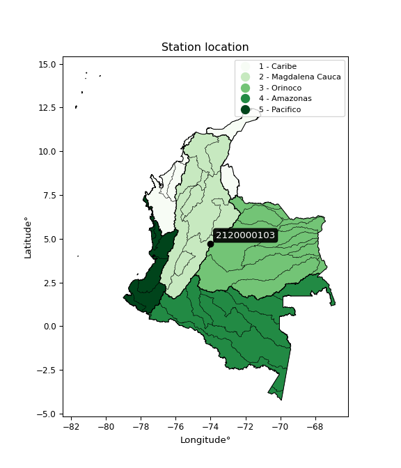

<div align="center">


</div>

# PMP Station (Rain, Pmax24h): 2120000103

Probable Maximum Precipitation (PMP) is the greatest amount of rainfall for a specific duration that is meteorologically possible for a given location, acting as a "worst-case" scenario for extreme storms, crucial for designing safety-critical infrastructure like bridges, river deviations, dams, spillways, and nuclear plants to prevent catastrophic failure. PMP is calculated by hydrologists using meteorological data to determine the upper limit of extreme rainfall, often leading to the Probable Maximum Flood (PMF) for flood control design, and is increasingly being studied for climate change impacts. Probable Maximum Precipitation (PMP) is the theoretical upper limit of rainfall, a deterministic estimate for extreme events, while probability distributions (like GEV, Gumbel) describe the likelihood and frequency of various precipitation amounts, including rare ones, showing how often events occur, with PMP representing the extreme end of these distributions, used for critical infrastructure design to ensure safety against the worst conceivable weather, unlike standard statistical forecasts which cover typical probabilities.

The most common probability distributions in hydrology, used for analyzing floods, rainfall, and streamflow, include the Normal, Log-Normal, Gumbel, Gamma (including Log-Pearson Type III), and Generalized Extreme Value (GEV) distributions, often chosen based on the data´s skewness and whether modeling extremes or general conditions, with Gumbel and GEV popular for extreme events like floods, while the Normal distribution serves as a baseline, though often requiring transformations for skewed hydrological data. These distributions help in designing water infrastructure, managing water resources, and forecasting hydrologic events.

> Hydrological data often isn´t perfectly normal (it´s skewed), so different distributions are needed for different applications, such as: **Flood Frequency Analysis**: Using Gumbel, GEV, or Log-Pearson Type III for predicting extreme flood magnitudes and their return periods, **Rainfall Analysis**: Normal for annual totals, but Log-Normal, Weibull, or GEV for intensity or extreme daily rainfall, **Streamflow Modeling**: Gamma and Log-Normal for maximum flows, GEV for minimum flows, and Kappa for daily flows.

<div align="center">

</img>

</div>


## A. General information


### 1. General running parameters

• app_version: _v20260113_. • runtime: _2026-01-17 18:24:04.630693_. • Python version: _3.14.0_. • SciPy version: _1.16.3_. • Pandas version: _2.3.3_. • NumPy version: _2.3.5_. • Stations dataset (station_dataset_file): _dataset/pmax24h_in/automatic_colombia_2003_2025.csv_. • Stations catalog (station_catalog_file): _dataset/CNE.xls_. • Minimum year to eval til year_max (date_min): _1900_. • Maximum year to eval since year_min (date_max): _2025_. • Creates, save and include plots into reports (create_plot): _False_. • Plot only fit distributions with Δo > Δ (plot_only_fit): _True_. • Plot only simple graphs avoiding multiple CDFs and multiple Extreme values plots (plot_only_simple): _True_. • Eval low extreme values, if False, evaluates high extreme values (low_extreme): _False_. • Eval every SciPy distribution as logarithmic (pdist_logarithmic_on): _True_. • Standard deviation normalized (ddof): _1.0_. • Return periods to eval in years (Tr): _[2, 2.33, 5, 10, 15, 20, 25, 50, 75, 100, 200, 250, 500, 750, 1000]_. • Minimum data sample per station, 0 means any (minimum_sample): _5_. • Z-Score maximum threshold to adjust a value, 0 means disable (zscore_max): _3.5_. • Z-Score minimum threshold to adjust a value, 0 means disable (zscore_min): _-2.5_. • Avoid zeros, e.g. rain = 0 (avoid_zeros): _True_. • Avoid null values (avoid_nans): _True_. 

:file_folder:Table: [dataset.csv](../../dataset/pmax24h_in/automatic_colombia_2003_2025.csv)

> Delta Degrees of Freedom (DDOF): is a parameter used in the formulas for calculating variance and standard deviation. When ddof=0, the divisor is $N$ (the total number of observations) and this is used when your data set is the entire population. When ddof=1, the divisor is $N-1$ and this is used when your data set is a sample drawn from a larger population. Using $N-1$ provides an unbiased estimate of the population variance (known as Bessel´s correction).


### 2. Station info and location

|   id |     CODIGO | NOMBRE                          | CATEGORIA     | TECNOLOGIA                | ESTADO   | FECHA_INSTALACION   |   FECHA_SUSPENSION |   ALTITUD |   LATITUD |   LONGITUD | DEPARTAMENTO   | MUNICIPIO   | AREA_OPERATIVA                            | ENTIDAD                                                      | AREA_HIDROGRAFICA   | ZONA_HIDROGRAFICA   | SUBZONA_HIDROGRAFICA   |   CORRIENTE | Catalogo   |   Version |
|-----:|-----------:|:--------------------------------|:--------------|:--------------------------|:---------|:--------------------|-------------------:|----------:|----------:|-----------:|:---------------|:------------|:------------------------------------------|:-------------------------------------------------------------|:--------------------|:--------------------|:-----------------------|------------:|:-----------|----------:|
|    0 | 2120000103 | CERRO NORTE - AUT  [2120000103] | Pluviométrica | Automática con Telemetría | Activa   | 01/11/2011          |                nan |      2766 |   4.73254 |   -74.0187 | Bogotá         | Bogotá, D.C | Area Operativa 11 - Cundinamarca-Amazonas | INSTITUTO DISTRITAL DE GESTIÓN DE RIESGOS Y CAMBIO CLIMÁTICO | Magdalena Cauca     | Alto Magdalena      | Río Bogotá             |         nan | CNE_OE     |  20251226 |

<div align="center">

Dynamic map: [:earth_americas:Google](http://maps.google.com/maps?q=4.73254,-74.01871) [:earth_americas:OSM](https://www.openstreetmap.org/#map=18/4.73254/-74.01871&layers=P) [:earth_americas:Bing](https://www.bing.com/maps?cp=4.73254~-74.01871&lvl=18) [:earth_americas:Apple](https://maps.apple.com/frame?center=4.73254%2C-74.01871&span=0.003%2C0.006)

</div>


<div align="center">

```geojson
{
  "type": "Feature",
  "geometry": {
    "type": "Point", 
    "coordinates": [-74.01871, 4.73254]
  }, 
  "properties": {
    "Name": "2120000103"
  }
}
```

</div>


### 3. Discrete values table and plot

<div align="center">

|               |           0 |           1 |            2 |          3 |          4 |           5 |
|:--------------|------------:|------------:|-------------:|-----------:|-----------:|------------:|
| Date          | 2018        | 2019        | 2020         | 2023       | 2024       | 2025        |
| Value         |   13        |   53.8      |   36         |    0.3     |   96.8     |   29        |
| Value_initial |   13        |   53.8      |   36         |    0.3     |   96.8     |   29        |
| count         |    6        |    6        |    6         |    6       |    6       |    6        |
| mean          |   38.15     |   38.15     |   38.15      |   38.15    |   38.15    |   38.15     |
| std           |   34.1709   |   34.1709   |   34.1709    |   34.1709  |   34.1709  |   34.1709   |
| zscore        |   -0.736007 |    0.457993 |   -0.0629191 |   -1.10767 |    1.71638 |   -0.267772 |


</div>


> The initial value (value_initial) correspond to the initial obtained or null completed value, and value (value) is adjusted only when the initial value is outside the valid range (outlier) definite through the Z-Score value. If Z-Score is active, values out of range or outliers are replaced with the station mean value. A Z-Score (or standard score) measures how many standard deviations a data point is from the mean of a dataset, indicating its relative position; positive scores mean above the mean, negative mean below, and a score of zero is exactly at the mean, allowing for comparison of values from different distributions. It´s calculated using the formula $z=(x–μ)/σ$, where $x$ is the data point, $μ$ is the mean, and $σ$ is the standard deviation, helping identify outliers and understand probability.
>
> <sub>**Note**: In this study, "completing" (filling gaps in) and "extending" (forecasting or lengthening the historical record) rainfall data series are avoided for certain critical analyses because they introduce artificial bias and uncertainty, which can distort the statistics of rare events (extremes), alter day-to-day variability, and compromise the integrity and homogeneity of the original data. Some reasons against Completing/Extending rainfall data are: **Distortion of Extremes and Variability**: The primary issue is that most gap-filling or extension methods rely on averaging or regression with nearby stations, which inherently smooths the data. Rainfall is highly variable in space and time, with a large percentage of zero values and occasional large storms. Infilling methods often underestimate the highest values and overestimate the lowest (zero) values, which severely distorts analyses focused on flood frequency, drought severity, and intensity-duration-frequency (IDF) curves, **Loss of Data Homogeneity**: Infilled or extended data are synthetic estimates, not actual measurements. Combining these estimates with observed data can violate the assumption of data homogeneity, which requires that the data properties do not change over time. Inhomogeneity can lead to incorrect conclusions about long-term trends or changes in climate patterns, **Propagation of Errors**: Errors and biases from the original data (e.g., wind-induced undercatch, instrument errors, site changes) or the data used for imputation can propagate through the analysis, leading to unreliable hydrological models and inaccurate predictions, **Compromised Statistical Integrity**: For statistical analyses, especially those involving the frequency of events, using artificial data can introduce time bias or autocorrelation that doesn´t exist in reality, making it difficult to assess the true probability of events, **Difficulty in Validation**: It is difficult to accurately validate the quality of filled or extended data, especially for past periods where ground-truth measurements are unavailable. The reliability of imputation techniques heavily depends on the density of the surrounding station network and the complexity of the local topography.</sub>


### 4. Active continuous probability distributions from SciPy (80 of 104 available)

A Probability Density Function (PDF) describes the relative likelihood of a continuous random variable falling within a specific range, where the total area under its curve equals 1, and the area over any interval gives the actual probability for that range. Unlike discrete probabilities (like rolling a die), a PDF shows density, not direct probability for a single point (which is zero), with higher points indicating higher likelihood, often visualized as a bell curve for normal distributions.

A log of a probability density function (log-PDF) is simply the logarithm of the PDF´s value, denoted as $log(f(x))$, useful for converting multiplication of probabilities into addition, improving numerical stability with tiny numbers, and connecting to information theory concepts like entropy. Instead of dealing with very small probabilities (e.g., 0.000001), log-PDFs use negative numbers (e.g., $log(0.00001) ≈ -11.51$ that are easier for computers to handle, preventing underflow errors and simplifying complex calculations. In this study, each active probability distribution from SciPy is also evaluated in the $log$ form.

[scipy.stats](https://docs.scipy.org/doc/scipy/reference/stats.html) is a Python´s powerful submodule within the SciPy library for comprehensive statistical analysis, offering over 130 probability distributions (like Normal, Poisson), functions for descriptive stats (mean, variance), hypothesis testing (t-tests, chi-square), random variable generation, and statistical tests, making it essential for data science, modeling, and research. It provides tools to explore, model, and draw conclusions from data efficiently, working seamlessly with NumPy.

<div align="center">

|   id | p_dist           |   n_parameter | fit_method   | label                                                                       | active   | ref                                                                                                      |
|-----:|:-----------------|--------------:|:-------------|:----------------------------------------------------------------------------|:---------|:---------------------------------------------------------------------------------------------------------|
|    0 | alpha            |             3 | MLE          | Alpha                                                                       | True     | [:mortar_board:](https://docs.scipy.org/doc/scipy/reference/generated/scipy.stats.alpha.html)            |
|    1 | anglit           |             2 | MM           | Anglit                                                                      | True     | [:mortar_board:](https://docs.scipy.org/doc/scipy/reference/generated/scipy.stats.anglit.html)           |
|    2 | arcsine          |             2 | MM           | Arcsine                                                                     | True     | [:mortar_board:](https://docs.scipy.org/doc/scipy/reference/generated/scipy.stats.arcsine.html)          |
|    3 | argus            |             3 | MLE          | Argus                                                                       | True     | [:mortar_board:](https://docs.scipy.org/doc/scipy/reference/generated/scipy.stats.argus.html)            |
|    4 | beta             |             4 | MLE          | Beta                                                                        | True     | [:mortar_board:](https://docs.scipy.org/doc/scipy/reference/generated/scipy.stats.beta.html)             |
|    5 | betaprime        |             4 | MLE          | Beta prime                                                                  | True     | [:mortar_board:](https://docs.scipy.org/doc/scipy/reference/generated/scipy.stats.betaprime.html)        |
|    6 | bradford         |             3 | MLE          | Bradford                                                                    | True     | [:mortar_board:](https://docs.scipy.org/doc/scipy/reference/generated/scipy.stats.bradford.html)         |
|    7 | burr             |             4 | MLE          | Burr (Type III)                                                             | True     | [:mortar_board:](https://docs.scipy.org/doc/scipy/reference/generated/scipy.stats.burr.html)             |
|    8 | burr12           |             4 | MLE          | Burr (Type III) 12                                                          | True     | [:mortar_board:](https://docs.scipy.org/doc/scipy/reference/generated/scipy.stats.burr12.html)           |
|    9 | cosine           |             2 | MLE          | Cosine                                                                      | True     | [:mortar_board:](https://docs.scipy.org/doc/scipy/reference/generated/scipy.stats.cosine.html)           |
|   10 | crystalball      |             4 | MLE          | Crystalball                                                                 | True     | [:mortar_board:](https://docs.scipy.org/doc/scipy/reference/generated/scipy.stats.crystalball.html)      |
|   11 | dgamma           |             3 | MLE          | Double gamma                                                                | True     | [:mortar_board:](https://docs.scipy.org/doc/scipy/reference/generated/scipy.stats.dgamma.html)           |
|   12 | dweibull         |             3 | MLE          | Double Weibull                                                              | True     | [:mortar_board:](https://docs.scipy.org/doc/scipy/reference/generated/scipy.stats.dweibull.html)         |
|   13 | erlang           |             3 | MLE          | Erlang                                                                      | True     | [:mortar_board:](https://docs.scipy.org/doc/scipy/reference/generated/scipy.stats.erlang.html)           |
|   14 | exponnorm        |             3 | MLE          | Exponentially modified Normal                                               | True     | [:mortar_board:](https://docs.scipy.org/doc/scipy/reference/generated/scipy.stats.exponnorm.html)        |
|   15 | exponpow         |             3 | MLE          | Exponential power                                                           | True     | [:mortar_board:](https://docs.scipy.org/doc/scipy/reference/generated/scipy.stats.exponpow.html)         |
|   16 | exponweib        |             4 | MLE          | Exponentiated Weibull                                                       | True     | [:mortar_board:](https://docs.scipy.org/doc/scipy/reference/generated/scipy.stats.exponweib.html)        |
|   17 | f                |             4 | MLE          | F                                                                           | True     | [:mortar_board:](https://docs.scipy.org/doc/scipy/reference/generated/scipy.stats.f.html)                |
|   18 | fatiguelife      |             3 | MLE          | Fatigue-life (Birnbaum-Saunders)                                            | True     | [:mortar_board:](https://docs.scipy.org/doc/scipy/reference/generated/scipy.stats.fatiguelife.html)      |
|   19 | foldnorm         |             3 | MM           | Fold Normal                                                                 | True     | [:mortar_board:](https://docs.scipy.org/doc/scipy/reference/generated/scipy.stats.foldnorm.html)         |
|   20 | gamma            |             3 | MLE          | Gamma                                                                       | True     | [:mortar_board:](https://docs.scipy.org/doc/scipy/reference/generated/scipy.stats.gamma.html)            |
|   21 | gausshyper       |             6 | MLE          | Gauss hypergeometric                                                        | True     | [:mortar_board:](https://docs.scipy.org/doc/scipy/reference/generated/scipy.stats.gausshyper.html)       |
|   22 | genexpon         |             5 | MLE          | Generalized exponential                                                     | True     | [:mortar_board:](https://docs.scipy.org/doc/scipy/reference/generated/scipy.stats.genexpon.html)         |
|   23 | genextreme       |             3 | MLE          | Generalized exponential                                                     | True     | [:mortar_board:](https://docs.scipy.org/doc/scipy/reference/generated/scipy.stats.genextreme.html)       |
|   24 | gengamma         |             4 | MLE          | Generalized gamma                                                           | True     | [:mortar_board:](https://docs.scipy.org/doc/scipy/reference/generated/scipy.stats.gengamma.html)         |
|   25 | genhalflogistic  |             3 | MLE          | Generalized half-logistic                                                   | True     | [:mortar_board:](https://docs.scipy.org/doc/scipy/reference/generated/scipy.stats.genhalflogistic.html)  |
|   26 | genlogistic      |             3 | MLE          | Generalized logistic                                                        | True     | [:mortar_board:](https://docs.scipy.org/doc/scipy/reference/generated/scipy.stats.genlogistic.html)      |
|   27 | gennorm          |             3 | MLE          | Generalized Normal                                                          | True     | [:mortar_board:](https://docs.scipy.org/doc/scipy/reference/generated/scipy.stats.gennorm.html)          |
|   28 | genpareto        |             3 | MLE          | Generalized Pareto                                                          | True     | [:mortar_board:](https://docs.scipy.org/doc/scipy/reference/generated/scipy.stats.genpareto.html)        |
|   29 | gompertz         |             3 | MLE          | Gompertz (or truncated Gumbel)                                              | True     | [:mortar_board:](https://docs.scipy.org/doc/scipy/reference/generated/scipy.stats.gompertz.html)         |
|   30 | gumbel_l         |             2 | MM           | Gumbel Left Skew                                                            | True     | [:mortar_board:](https://docs.scipy.org/doc/scipy/reference/generated/scipy.stats.gumbel_l.html)         |
|   31 | gumbel_r         |             2 | MM           | Gumbel Right Skew                                                           | True     | [:mortar_board:](https://docs.scipy.org/doc/scipy/reference/generated/scipy.stats.gumbel_r.html)         |
|   32 | halfgennorm      |             3 | MLE          | Upper half of a generalized normal                                          | True     | [:mortar_board:](https://docs.scipy.org/doc/scipy/reference/generated/scipy.stats.halfgennorm.html)      |
|   33 | halflogistic     |             2 | MM           | Half-logistic                                                               | True     | [:mortar_board:](https://docs.scipy.org/doc/scipy/reference/generated/scipy.stats.halflogistic.html)     |
|   34 | halfnorm         |             2 | MM           | Half Normal                                                                 | True     | [:mortar_board:](https://docs.scipy.org/doc/scipy/reference/generated/scipy.stats.halfnorm.html)         |
|   35 | hypsecant        |             2 | MM           | hyperbolic secant                                                           | True     | [:mortar_board:](https://docs.scipy.org/doc/scipy/reference/generated/scipy.stats.hypsecant.html)        |
|   36 | invgamma         |             3 | MLE          | Inverted gamma                                                              | True     | [:mortar_board:](https://docs.scipy.org/doc/scipy/reference/generated/scipy.stats.invgamma.html)         |
|   37 | invgauss         |             3 | MLE          | Inverse Gaussian                                                            | True     | [:mortar_board:](https://docs.scipy.org/doc/scipy/reference/generated/scipy.stats.invgauss.html)         |
|   38 | invweibull       |             3 | MLE          | Inverted Weibull                                                            | True     | [:mortar_board:](https://docs.scipy.org/doc/scipy/reference/generated/scipy.stats.invweibull.html)       |
|   39 | johnsonsb        |             4 | MLE          | Johnson SB                                                                  | True     | [:mortar_board:](https://docs.scipy.org/doc/scipy/reference/generated/scipy.stats.johnsonsb.html)        |
|   40 | johnsonsu        |             4 | MLE          | Johnson Su                                                                  | True     | [:mortar_board:](https://docs.scipy.org/doc/scipy/reference/generated/scipy.stats.johnsonsu.html)        |
|   41 | kappa3           |             3 | MLE          | Kappa 3                                                                     | True     | [:mortar_board:](https://docs.scipy.org/doc/scipy/reference/generated/scipy.stats.kappa3.html)           |
|   42 | kappa4           |             4 | MLE          | Kappa 4                                                                     | True     | [:mortar_board:](https://docs.scipy.org/doc/scipy/reference/generated/scipy.stats.kappa4.html)           |
|   43 | ksone            |             3 | MLE          | Kolmogorov-Smirnov one-sided test statistic distribution                    | True     | [:mortar_board:](https://docs.scipy.org/doc/scipy/reference/generated/scipy.stats.ksone.html)            |
|   44 | kstwobign        |             2 | MLE          | Limiting distribution of scaled Kolmogorov-Smirnov two-sided test statistic | True     | [:mortar_board:](https://docs.scipy.org/doc/scipy/reference/generated/scipy.stats.kstwobign.html)        |
|   45 | laplace          |             2 | MM           | Laplace                                                                     | True     | [:mortar_board:](https://docs.scipy.org/doc/scipy/reference/generated/scipy.stats.laplace.html)          |
|   46 | levy_l           |             2 | MLE          | Left-skewed Levy                                                            | True     | [:mortar_board:](https://docs.scipy.org/doc/scipy/reference/generated/scipy.stats.levy_l.html)           |
|   47 | loggamma         |             3 | MLE          | Log gamma                                                                   | True     | [:mortar_board:](https://docs.scipy.org/doc/scipy/reference/generated/scipy.stats.loggamma.html)         |
|   48 | logistic         |             2 | MM           | Logistic (or Sech-squared)                                                  | True     | [:mortar_board:](https://docs.scipy.org/doc/scipy/reference/generated/scipy.stats.logistic.html)         |
|   49 | loglaplace       |             3 | MLE          | Log-Laplace                                                                 | True     | [:mortar_board:](https://docs.scipy.org/doc/scipy/reference/generated/scipy.stats.loglaplace.html)       |
|   50 | lomax            |             3 | MLE          | Lomax (Pareto of the second kind)                                           | True     | [:mortar_board:](https://docs.scipy.org/doc/scipy/reference/generated/scipy.stats.lomax.html)            |
|   51 | maxwell          |             2 | MM           | Maxwell                                                                     | True     | [:mortar_board:](https://docs.scipy.org/doc/scipy/reference/generated/scipy.stats.maxwell.html)          |
|   52 | mielke           |             4 | MLE          | Mielke Beta-Kappa / Dagum                                                   | True     | [:mortar_board:](https://docs.scipy.org/doc/scipy/reference/generated/scipy.stats.mielke.html)           |
|   53 | moyal            |             2 | MM           | Moyal                                                                       | True     | [:mortar_board:](https://docs.scipy.org/doc/scipy/reference/generated/scipy.stats.moyal.html)            |
|   54 | nakagami         |             3 | MLE          | Nakagami                                                                    | True     | [:mortar_board:](https://docs.scipy.org/doc/scipy/reference/generated/scipy.stats.nakagami.html)         |
|   55 | ncf              |             5 | MLE          | Non-central F distribution                                                  | True     | [:mortar_board:](https://docs.scipy.org/doc/scipy/reference/generated/scipy.stats.ncf.html)              |
|   56 | nct              |             4 | MLE          | Non-central Student’s t                                                     | True     | [:mortar_board:](https://docs.scipy.org/doc/scipy/reference/generated/scipy.stats.nct.html)              |
|   57 | norm             |             2 | MM           | Normal                                                                      | True     | [:mortar_board:](https://docs.scipy.org/doc/scipy/reference/generated/scipy.stats.norm.html)             |
|   58 | pearson3         |             3 | MM           | Pearson type III                                                            | True     | [:mortar_board:](https://docs.scipy.org/doc/scipy/reference/generated/scipy.stats.pearson3.html)         |
|   59 | powerlaw         |             3 | MLE          | Power-function                                                              | True     | [:mortar_board:](https://docs.scipy.org/doc/scipy/reference/generated/scipy.stats.powerlaw.html)         |
|   60 | rayleigh         |             2 | MM           | Rayleigh                                                                    | True     | [:mortar_board:](https://docs.scipy.org/doc/scipy/reference/generated/scipy.stats.rayleigh.html)         |
|   61 | rdist            |             3 | MLE          | R-distributed (symmetric beta)                                              | True     | [:mortar_board:](https://docs.scipy.org/doc/scipy/reference/generated/scipy.stats.rdist.html)            |
|   62 | rice             |             3 | MLE          | Rice                                                                        | True     | [:mortar_board:](https://docs.scipy.org/doc/scipy/reference/generated/scipy.stats.rice.html)             |
|   63 | semicircular     |             2 | MM           | Semicircular                                                                | True     | [:mortar_board:](https://docs.scipy.org/doc/scipy/reference/generated/scipy.stats.semicircular.html)     |
|   64 | skewnorm         |             3 | MLE          | Skew normal                                                                 | True     | [:mortar_board:](https://docs.scipy.org/doc/scipy/reference/generated/scipy.stats.skewnorm.html)         |
|   65 | t                |             3 | MLE          | Student’s t                                                                 | True     | [:mortar_board:](https://docs.scipy.org/doc/scipy/reference/generated/scipy.stats.t.html)                |
|   66 | trapezoid        |             4 | MLE          | Trapezoid                                                                   | True     | [:mortar_board:](https://docs.scipy.org/doc/scipy/reference/generated/scipy.stats.trapezoid.html)        |
|   67 | triang           |             3 | MLE          | Triangular                                                                  | True     | [:mortar_board:](https://docs.scipy.org/doc/scipy/reference/generated/scipy.stats.triang.html)           |
|   68 | truncexpon       |             3 | MLE          | Truncated exponential                                                       | True     | [:mortar_board:](https://docs.scipy.org/doc/scipy/reference/generated/scipy.stats.truncexpon.html)       |
|   69 | truncnorm        |             4 | MLE          | Truncated normal                                                            | True     | [:mortar_board:](https://docs.scipy.org/doc/scipy/reference/generated/scipy.stats.truncnorm.html)        |
|   70 | truncpareto      |             4 | MLE          | Upper truncated Pareto                                                      | True     | [:mortar_board:](https://docs.scipy.org/doc/scipy/reference/generated/scipy.stats.truncpareto.html)      |
|   71 | truncweibull_min |             5 | MLE          | Doubly truncated Weibull minimum                                            | True     | [:mortar_board:](https://docs.scipy.org/doc/scipy/reference/generated/scipy.stats.truncweibull_min.html) |
|   72 | tukeylambda      |             3 | MLE          | Tukey-Lamdba                                                                | True     | [:mortar_board:](https://docs.scipy.org/doc/scipy/reference/generated/scipy.stats.tukeylambda.html)      |
|   73 | uniform          |             2 | MLE          | Uniform                                                                     | True     | [:mortar_board:](https://docs.scipy.org/doc/scipy/reference/generated/scipy.stats.uniform.html)          |
|   74 | vonmises         |             3 | MLE          | Von Mises                                                                   | True     | [:mortar_board:](https://docs.scipy.org/doc/scipy/reference/generated/scipy.stats.vonmises.html)         |
|   75 | vonmises_line    |             3 | MLE          | Von Mises line                                                              | True     | [:mortar_board:](https://docs.scipy.org/doc/scipy/reference/generated/scipy.stats.vonmises_line.html)    |
|   76 | wald             |             2 | MM           | Wald                                                                        | True     | [:mortar_board:](https://docs.scipy.org/doc/scipy/reference/generated/scipy.stats.wald.html)             |
|   77 | weibull_max      |             3 | MLE          | Weibull maximum                                                             | True     | [:mortar_board:](https://docs.scipy.org/doc/scipy/reference/generated/scipy.stats.weibull_max.html)      |
|   78 | weibull_min      |             3 | MLE          | Weibull minimum                                                             | True     | [:mortar_board:](https://docs.scipy.org/doc/scipy/reference/generated/scipy.stats.weibull_min.html)      |
|   79 | wrapcauchy       |             3 | MLE          | Wrapped  Cauchy                                                             | True     | [:mortar_board:](https://docs.scipy.org/doc/scipy/reference/generated/scipy.stats.wrapcauchy.html)       |

</div>

> **n_parameter:** # arguments & localization & scale.
>
> **Fit methods:** (MLE) maximum likelihood, (MM) L-moments.
>
>**Inactive** (With the only purpose of prevent loops, zero divisions, infinite values, over high estimated values or horizontal trending for recurrence intervals estimations, the follow distributions were disabled.)**:** lognorm, norminvgauss, powernorm, powerlognorm, cauchy, halfcauchy, foldcauchy, skewcauchy, chi2, expon, fisk, genhyperbolic, geninvgauss, gibrat, kstwo, laplace_asymmetric, levy, levy_stable, ncx2, pareto, rel_breitwigner, recipinvgauss, studentized_range, loguniform, 


## B. Probability (PDF) vs. Empirical (EDF) distributions functions

A continuous probability distribution (CPD) describes probabilities for variables that can take any value within a range (like rain any time), unlike discrete variables with specific outcomes (like temperature). It uses a Probability Density Function (PDF), a curve where the total area under it equals 1, and the probability of the variable falling within an interval (a to b) is found by calculating the area under the curve between those points. A key feature is that the probability of hitting any single exact value is zero, so probabilities are always expressed for ranges, e.g., $P(a ≤ X ≤ b)$.

<div align="center">

Distributions parameters from station values
|     |    station | p_dist              |   n |              loc |            scale | shape                  | shape1                | shape2                 | shape3             |
|----:|-----------:|:--------------------|----:|-----------------:|-----------------:|:-----------------------|:----------------------|:-----------------------|:-------------------|
|   0 | 2120000103 | alpha               |   6 |       0.00164079 |      0.730212    | 3.259859961416464e-09  |                       |                        |                    |
|   1 | 2120000103 | anglit              |   6 |      38.15       |     91.2537      |                        |                       |                        |                    |
|   2 | 2120000103 | arcsine             |   6 |      -5.9644     |     88.2288      |                        |                       |                        |                    |
|   3 | 2120000103 | argus               |   6 |     -32.0429     |    134.821       | 3.2511113704275437e-06 |                       |                        |                    |
|   4 | 2120000103 | beta                |   6 |     -12.4931     |    109.293       | 0.9516047402674076     | 0.3893443952339727    |                        |                    |
|   5 | 2120000103 | betaprime           |   6 |       0.3        |    469.041       | 0.4804746207131433     | 7.372255978580667     |                        |                    |
|   6 | 2120000103 | bradford            |   6 |       0.299975   |     96.5         | 1.5605303789459384     |                       |                        |                    |
|   7 | 2120000103 | burr                |   6 |       0.3        |    130.002       | 4.943310964716542      | 0.09410515674450859   |                        |                    |
|   8 | 2120000103 | burr12              |   6 |       0.3        |   1600.83        | 0.7797359621115492     | 22.274406456995266    |                        |                    |
|   9 | 2120000103 | cosine              |   6 |      41.6501     |     26.4839      |                        |                       |                        |                    |
|  10 | 2120000103 | crystalball         |   6 |      38.15       |     31.1936      | 3343.196254573528      | 217.11137372741626    |                        |                    |
|  11 | 2120000103 | dgamma              |   6 |      32.617      |     20.562       | 1.1696347510767033     |                       |                        |                    |
|  12 | 2120000103 | dweibull            |   6 |      32.7865     |     25.0023      | 1.110890324243221      |                       |                        |                    |
|  13 | 2120000103 | erlang              |   6 |       0.3        |     31.638       | 0.15557451992351967    |                       |                        |                    |
|  14 | 2120000103 | exponnorm           |   6 |       0.27347    |      0.00757392  | 4977.248024689683      |                       |                        |                    |
|  15 | 2120000103 | exponpow            |   6 |       0.3        |     37.6882      | 0.5346266044149275     |                       |                        |                    |
|  16 | 2120000103 | exponweib           |   6 |       0.3        |      3.53064     | 1.560401440422139      | 0.3503068423221923    |                        |                    |
|  17 | 2120000103 | f                   |   6 |       0.3        |     37.6809      | 1.4253736833358854     | 14.959188086903701    |                        |                    |
|  18 | 2120000103 | fatiguelife         |   6 |       0.3        |      7.89568e-05 | 731.2386741341734      |                       |                        |                    |
|  19 | 2120000103 | foldnorm            |   6 |      -6.66214    |     39.8154      | 0.9383754788184036     |                       |                        |                    |
|  20 | 2120000103 | gamma               |   6 |       0.3        |     50.2868      | 0.5071319484329955     |                       |                        |                    |
|  21 | 2120000103 | gausshyper          |   6 |      -9.9074     |    106.707       | 1.1463995846525905     | 0.624403926344419     | 1.1615765980060426     | 1.1104907131597805 |
|  22 | 2120000103 | genexpon            |   6 |       0.299986   |      2.45326     | 0.06488845394845542    | 8.617775446903893e-07 | 2.793671431463257      |                    |
|  23 | 2120000103 | genextreme          |   6 |      22.4285     |     22.6186      | -0.11282151481671268   |                       |                        |                    |
|  24 | 2120000103 | gengamma            |   6 |       0.3        |      6.16789     | 1.9346266168230666     | 0.33610243872381285   |                        |                    |
|  25 | 2120000103 | genhalflogistic     |   6 |      -9.72352    |    112.333       | 1.0545351363905717     |                       |                        |                    |
|  26 | 2120000103 | genlogistic         |   6 |    -141.137      |     23.7847      | 1027.0061901593926     |                       |                        |                    |
|  27 | 2120000103 | gennorm             |   6 |      48.55       |     48.2504      | 1738039.3016629834     |                       |                        |                    |
|  28 | 2120000103 | genpareto           |   6 |       0.3        |     61.8314      | -0.5372506936402839    |                       |                        |                    |
|  29 | 2120000103 | gompertz            |   6 |       0.3        |    114.892       | 2.2435843489146694     |                       |                        |                    |
|  30 | 2120000103 | gumbel_l            |   6 |      52.1888     |     24.3215      |                        |                       |                        |                    |
|  31 | 2120000103 | gumbel_r            |   6 |      24.1112     |     24.3215      |                        |                       |                        |                    |
|  32 | 2120000103 | halfgennorm         |   6 |       0.3        |      4.54735e-05 | 0.1518708615979501     |                       |                        |                    |
|  33 | 2120000103 | halflogistic        |   6 |       1.17842    |     26.6694      |                        |                       |                        |                    |
|  34 | 2120000103 | halfnorm            |   6 |      -3.13807    |     51.7469      |                        |                       |                        |                    |
|  35 | 2120000103 | hypsecant           |   6 |      38.15       |     19.8584      |                        |                       |                        |                    |
|  36 | 2120000103 | invgamma            |   6 |     -39.4557     |    451.169       | 6.778109157363614      |                       |                        |                    |
|  37 | 2120000103 | invgauss            |   6 |     -19.138      |    153.559       | 0.3730683795875983     |                       |                        |                    |
|  38 | 2120000103 | invweibull          |   6 |       0.3        |      2.16583     | 0.04102566392649845    |                       |                        |                    |
|  39 | 2120000103 | johnsonsb           |   6 |       0.3        |     96.5         | -0.3675300493201793    | 0.1620031494558253    |                        |                    |
|  40 | 2120000103 | johnsonsu           |   6 |     -17.7149     |      1.06286     | -7.61167570990804      | 1.694892458273304     |                        |                    |
|  41 | 2120000103 | kappa3              |   6 |       0.3        |     44.1863      | 3.4135292269500526     |                       |                        |                    |
|  42 | 2120000103 | kappa4              |   6 |      -9.19688    |    108.567       | 1.0958827078081042     | 1.004723924910993     |                        |                    |
|  43 | 2120000103 | ksone               |   6 |      -9.35       |    115.8         | 1.0                    |                       |                        |                    |
|  44 | 2120000103 | kstwobign           |   6 |     -60.4171     |    113.297       |                        |                       |                        |                    |
|  45 | 2120000103 | laplace             |   6 |      38.15       |     22.0572      |                        |                       |                        |                    |
|  46 | 2120000103 | levy_l              |   6 |     103.192      |     26.5643      |                        |                       |                        |                    |
|  47 | 2120000103 | loggamma            |   6 |   -8527.57       |   1180.12        | 1420.2553213174715     |                       |                        |                    |
|  48 | 2120000103 | logistic            |   6 |      38.15       |     17.1979      |                        |                       |                        |                    |
|  49 | 2120000103 | loglaplace          |   6 |       0.3        |     35.1854      | 0.7863303425508871     |                       |                        |                    |
|  50 | 2120000103 | lomax               |   6 |       0.3        |      5.27091e+09 | 148523044.42524773     |                       |                        |                    |
|  51 | 2120000103 | maxwell             |   6 |     -35.7657     |     46.3198      |                        |                       |                        |                    |
|  52 | 2120000103 | mielke              |   6 |       0.3        |    100.611       | 0.38913758563692796    | 120.57017256458643    |                        |                    |
|  53 | 2120000103 | moyal               |   6 |      20.3115     |     14.042       |                        |                       |                        |                    |
|  54 | 2120000103 | nakagami            |   6 |      13          |     48.5479      | 0.27840778343433237    |                       |                        |                    |
|  55 | 2120000103 | ncf                 |   6 |       0.3        |      2.76395     | 0.15261995906727577    | 3105.0163245005037    | 3.7909095799238024     |                    |
|  56 | 2120000103 | nct                 |   6 |      -0.435985   |      0.0331113   | 0.30835275448216765    | 54.736149916059006    |                        |                    |
|  57 | 2120000103 | norm                |   6 |      38.15       |     31.1936      |                        |                       |                        |                    |
|  58 | 2120000103 | pearson3            |   6 |      38.15       |     31.1936      | 0.7394740947599543     |                       |                        |                    |
|  59 | 2120000103 | powerlaw            |   6 |       0.3        |     96.5         | 0.12813850895860593    |                       |                        |                    |
|  60 | 2120000103 | rayleigh            |   6 |     -21.5251     |     47.6139      |                        |                       |                        |                    |
|  61 | 2120000103 | rdist               |   6 |      -8.55776    |     44.5578      | 1.1826595887411548     |                       |                        |                    |
|  62 | 2120000103 | rice                |   6 |     -14.8019     |     43.4565      | 0.0014831790005771562  |                       |                        |                    |
|  63 | 2120000103 | semicircular        |   6 |      38.15       |     62.3872      |                        |                       |                        |                    |
|  64 | 2120000103 | skewnorm            |   6 |       0.299989   |     49.0435      | 24137018.86814668      |                       |                        |                    |
|  65 | 2120000103 | t                   |   6 |      38.153      |     31.1838      | 44497.63359757332      |                       |                        |                    |
|  66 | 2120000103 | trapezoid           |   6 |      -9.8175     |    115.8         | 1.0                    | 1.0                   |                        |                    |
|  67 | 2120000103 | triang              |   6 |     -41.8971     |    138.698       | 0.99999999949695       |                       |                        |                    |
|  68 | 2120000103 | truncexpon          |   6 |       0.299991   |    115.461       | 0.8357777423694235     |                       |                        |                    |
|  69 | 2120000103 | truncnorm           |   6 |     -20.1439     |     56.3863      | 0.3625689655644744     | 114.34826441231328    |                        |                    |
|  70 | 2120000103 | truncpareto         |   6 |     -19.2477     |     19.5477      | 1.497402286589541e-08  | 5.9366348152484765    |                        |                    |
|  71 | 2120000103 | truncweibull_min    |   6 |      -4.84029    |     96.3125      | 1.1794503871448145     | 0.0008725235087917512 | 1.055317841619567      |                    |
|  72 | 2120000103 | tukeylambda         |   6 |      -8.29779    |     49.5187      | 1.1178589899764637     |                       |                        |                    |
|  73 | 2120000103 | uniform             |   6 |       0.3        |     96.5         |                        |                       |                        |                    |
|  74 | 2120000103 | vonmises            |   6 |      -2.3572     |      1           | 0.3679144080551326     |                       |                        |                    |
|  75 | 2120000103 | vonmises_line       |   6 |      48.5502     |     15.3586      | 1.5710771250629303e-06 |                       |                        |                    |
|  76 | 2120000103 | wald                |   6 |       6.9564     |     31.1936      |                        |                       |                        |                    |
|  77 | 2120000103 | weibull_max         |   6 |      96.8        |      1.65633     | 0.2613005510309321     |                       |                        |                    |
|  78 | 2120000103 | weibull_min         |   6 |       0.3        |     42.2868      | 0.9433431305805648     |                       |                        |                    |
|  79 | 2120000103 | wrapcauchy          |   6 |       0.3        |     15.3585      | 0.19104683589705243    |                       |                        |                    |
|  80 | 2120000103 | logalpha            |   6 |     -56.1062     |   1769.87        | 30.103883559157765     |                       |                        |                    |
|  81 | 2120000103 | loganglit           |   6 |       2.81162    |      5.54658     |                        |                       |                        |                    |
|  82 | 2120000103 | logarcsine          |   6 |       0.13028    |      5.36269     |                        |                       |                        |                    |
|  83 | 2120000103 | logargus            |   6 |      -3.89741    |      8.61243     | 2.7435894205499474     |                       |                        |                    |
|  84 | 2120000103 | logbeta             |   6 |      -1.8916     |      6.46424     | 0.5587778905957667     | 0.14988967479132387   |                        |                    |
|  85 | 2120000103 | logbetaprime        |   6 |      -1.20397    |      7.8216      | 0.1540372664486987     | 1.8527477322366135    |                        |                    |
|  86 | 2120000103 | logbradford         |   6 |      -1.20398    |      6.15962     | 0.0012761866991872115  |                       |                        |                    |
|  87 | 2120000103 | logburr             |   6 |      -1.20397    |      1.61528     | 0.1636051539942857     | 0.9859419279845296    |                        |                    |
|  88 | 2120000103 | logburr12           |   6 |      -1.20397    |      2.40441     | 0.16010310398729183    | 2.2317715408877516    |                        |                    |
|  89 | 2120000103 | logcosine           |   6 |       2.43969    |      1.67062     |                        |                       |                        |                    |
|  90 | 2120000103 | logcrystalball      |   6 |       4.57265    |      1.52508e-07 | 8.666761962054741e-08  | 1934.6506868102047    |                        |                    |
|  91 | 2120000103 | logdgamma           |   6 |       3.58352    |      1.55061     | 0.8050615134554318     |                       |                        |                    |
|  92 | 2120000103 | logdweibull         |   6 |       3.3673     |      1.47351     | 0.8385282408586456     |                       |                        |                    |
|  93 | 2120000103 | logerlang           |   6 |     -31.4177     |      0.116704    | 293.013199432977       |                       |                        |                    |
|  94 | 2120000103 | logexponnorm        |   6 |       2.81058    |      1.896       | 0.0005539140495629193  |                       |                        |                    |
|  95 | 2120000103 | logexponpow         |   6 |      -1.20397    |      1.73525     | 0.3767226839023021     |                       |                        |                    |
|  96 | 2120000103 | logexponweib        |   6 |      -1.20397    |      1.91453     | 1.7026890726244133     | 0.10087613742319157   |                        |                    |
|  97 | 2120000103 | logf                |   6 |      -1.20397    |      1.10378     | 1.1481334629061988     | 1.095830289854844     |                        |                    |
|  98 | 2120000103 | logfatiguelife      |   6 |   -1024.17       |   1026.98        | 0.0018377470822103902  |                       |                        |                    |
|  99 | 2120000103 | logfoldnorm         |   6 |      -8.4761     |      1.4986      | 7.598632321914122      |                       |                        |                    |
| 100 | 2120000103 | loggamma            |   6 |     -33.1191     |      0.111731    | 321.5942212794507      |                       |                        |                    |
| 101 | 2120000103 | loggausshyper       |   6 |      -1.76784    |      6.34049     | 1.1278137554480256     | 0.7559142967194221    | 1.1112298566133263     | 1.0039171749090956 |
| 102 | 2120000103 | loggenexpon         |   6 |      -1.20532    |      0.102466    | 0.008761609549284982   | 5.746519561863476     | 0.00012176021202382856 |                    |
| 103 | 2120000103 | loggenextreme       |   6 |       2.93426    |      1.93608     | 1.1816964695116836     |                       |                        |                    |
| 104 | 2120000103 | loggengamma         |   6 |      -1.20397    |      1.70172     | 1.5644498016185215     | 0.5636414434223994    |                        |                    |
| 105 | 2120000103 | loggenhalflogistic  |   6 |      -1.32936    |      6.29112     | 1.0659276477047266     |                       |                        |                    |
| 106 | 2120000103 | loggenlogistic      |   6 |       4.57271    |      3.10501e-06 | 1.773571749249155e-06  |                       |                        |                    |
| 107 | 2120000103 | loggennorm          |   6 |       3.58352    |      0.0916661   | 0.433423878876407      |                       |                        |                    |
| 108 | 2120000103 | loggenpareto        |   6 |      -1.24416    |      9.66924     | -1.6622933272135743    |                       |                        |                    |
| 109 | 2120000103 | loggompertz         |   6 |      -1.20397    |      1.22471     | 0.020736556623437902   |                       |                        |                    |
| 110 | 2120000103 | loggumbel_l         |   6 |       3.66492    |      1.47831     |                        |                       |                        |                    |
| 111 | 2120000103 | loggumbel_r         |   6 |       1.95831    |      1.47831     |                        |                       |                        |                    |
| 112 | 2120000103 | loghalfgennorm      |   6 |      -1.20397    |      1.76527     | 0.6569382358812874     |                       |                        |                    |
| 113 | 2120000103 | loghalflogistic     |   6 |       0.564395   |      1.62103     |                        |                       |                        |                    |
| 114 | 2120000103 | loghalfnorm         |   6 |       0.30205    |      3.14528     |                        |                       |                        |                    |
| 115 | 2120000103 | loghypsecant        |   6 |       2.81162    |      1.20704     |                        |                       |                        |                    |
| 116 | 2120000103 | loginvgamma         |   6 |     -41.8481     |  22351.6         | 501.58788290751886     |                       |                        |                    |
| 117 | 2120000103 | loginvgauss         |   6 |     -17.6128     |   1940.18        | 0.010542178495492473   |                       |                        |                    |
| 118 | 2120000103 | loginvweibull       |   6 | -762030          | 762032           | 338056.11085348134     |                       |                        |                    |
| 119 | 2120000103 | logjohnsonsb        |   6 |      -3.98425    |      8.55689     | -1.2562596069982983    | 0.15824770083251777   |                        |                    |
| 120 | 2120000103 | logjohnsonsu        |   6 |       4.79076    |      0.00550643  | 6.105867615200204      | 0.9965326862872561    |                        |                    |
| 121 | 2120000103 | logkappa3           |   6 |      -1.20397    |      5.77663     | 586625.712424749       |                       |                        |                    |
| 122 | 2120000103 | logkappa4           |   6 |      -1.67881    |      6.6078      | 1.0775945577814245     | 1.055454146822302     |                        |                    |
| 123 | 2120000103 | logksone            |   6 |      -1.78163    |      6.93194     | 1.0                    |                       |                        |                    |
| 124 | 2120000103 | logkstwobign        |   6 |      -6.26506    |     10.366       |                        |                       |                        |                    |
| 125 | 2120000103 | loglaplace          |   6 |       2.81162    |      1.34068     |                        |                       |                        |                    |
| 126 | 2120000103 | loglevy_l           |   6 |       4.69469    |      0.504383    |                        |                       |                        |                    |
| 127 | 2120000103 | logloggamma         |   6 |       4.57303    |      2.6996e-05  | 1.5468193874370505e-05 |                       |                        |                    |
| 128 | 2120000103 | loglogistic         |   6 |       2.81162    |      1.04532     |                        |                       |                        |                    |
| 129 | 2120000103 | logloglaplace       |   6 |      -1.20397    |      2.55439     | 0.14830424277412324    |                       |                        |                    |
| 130 | 2120000103 | loglomax            |   6 |      -1.20397    |      1.23556e+12 | 321423078720.18896     |                       |                        |                    |
| 131 | 2120000103 | logmaxwell          |   6 |      -1.68113    |      2.81541     |                        |                       |                        |                    |
| 132 | 2120000103 | logmielke           |   6 |      -1.20397    |      9.1009      | 0.1425522706283871     | 3.8040861891875664    |                        |                    |
| 133 | 2120000103 | logmoyal            |   6 |       1.72736    |      0.853504    |                        |                       |                        |                    |
| 134 | 2120000103 | lognakagami         |   6 |   -1271.27       |   1274.08        | 112347.62894566258     |                       |                        |                    |
| 135 | 2120000103 | logncf              |   6 |      -1.20397    |      1.07607     | 1.0458202396634448     | 1.153014491914385     | 1.0658346533092846     |                    |
| 136 | 2120000103 | lognct              |   6 |    -111.711      |      1.83003     | 24127.722264637923     | 62.57783354632812     |                        |                    |
| 137 | 2120000103 | lognorm             |   6 |       2.81162    |      1.89601     |                        |                       |                        |                    |
| 138 | 2120000103 | logpearson3         |   6 |       2.81162    |      1.89601     | -1.3951616001940232    |                       |                        |                    |
| 139 | 2120000103 | logpowerlaw         |   6 |      -1.20397    |      5.77662     | 0.154824437942783      |                       |                        |                    |
| 140 | 2120000103 | lograyleigh         |   6 |      -0.81553    |      2.89405     |                        |                       |                        |                    |
| 141 | 2120000103 | logrdist            |   6 |      -0.806456   |      3.3714      | 0.9947395685626694     |                       |                        |                    |
| 142 | 2120000103 | logrice             |   6 |    -403.659      |      1.89592     | 214.38949971972568     |                       |                        |                    |
| 143 | 2120000103 | logsemicircular     |   6 |       2.81163    |      3.79198     |                        |                       |                        |                    |
| 144 | 2120000103 | logskewnorm         |   6 |       4.57265    |      2.58776     | -23410396.793296814    |                       |                        |                    |
| 145 | 2120000103 | logt                |   6 |       3.59028    |      0.605127    | 1.1842269656913107     |                       |                        |                    |
| 146 | 2120000103 | logtrapezoid        |   6 |      -2.67866    |      8.04409     | 1.0                    | 1.0                   |                        |                    |
| 147 | 2120000103 | logtriang           |   6 |      -2.76003    |      7.33274     | 0.9999921462443467     |                       |                        |                    |
| 148 | 2120000103 | logtruncexpon       |   6 |      -1.20397    |      7.77941     | 0.7425523967984851     |                       |                        |                    |
| 149 | 2120000103 | logtruncnorm        |   6 |       1.39949    |      5.96804     | -0.4362348465243293    | 0.5316942240642204    |                        |                    |
| 150 | 2120000103 | logtruncpareto      |   6 |      -1.21706    |      0.0130897   | 2.228471145522037e-09  | 638.1202941127572     |                        |                    |
| 151 | 2120000103 | logtruncweibull_min |   6 |      -1.55358    |     10.0291      | 1.601200733966646      | 0.001392736438421532  | 0.6108475158222144     |                    |
| 152 | 2120000103 | logtukeylambda      |   6 |       1.67462    |      3.59074     | 1.2390288337858495     |                       |                        |                    |
| 153 | 2120000103 | loguniform          |   6 |      -1.20397    |      5.77662     |                        |                       |                        |                    |
| 154 | 2120000103 | logvonmises         |   6 |      -2.42095    |      1           | 2.0224224453430577     |                       |                        |                    |
| 155 | 2120000103 | logvonmises_line    |   6 |       3.29167    |      1.43101     | 1.3625555635972695     |                       |                        |                    |
| 156 | 2120000103 | logwald             |   6 |       0.915562   |      1.89603     |                        |                       |                        |                    |
| 157 | 2120000103 | logweibull_max      |   6 |       4.57265    |      0.444754    | 0.639531857186669      |                       |                        |                    |
| 158 | 2120000103 | logweibull_min      |   6 |      -1.20397    |      1.69584     | 0.6074626635230005     |                       |                        |                    |
| 159 | 2120000103 | logwrapcauchy       |   6 |      -1.20407    |      0.919393    | 0.47769537082418867    |                       |                        |                    |

</div>

> **loc** (Location parameter): This shifts the distribution along the x-axis. For many common distributions, like the normal (Gaussian) distribution, loc represents the mean $μ$. For others, like the uniform distribution, it might represent the minimum value, or for the beta distribution, the left end of the support interval.
>
> **scale** (Scale parameter): This determines the width or spread of the distribution. For the normal distribution, scale represents the standard deviation $σ$. For a uniform distribution, it defines the length of the interval (from $loc$ to $loc + scale$).
>
> **shape** (Shape parameters): Refers to parameters that define the specific form of a probability distribution, distinct from its location (loc) and scale (scale). These parameters are required arguments for most distribution functions. For example, a normal (Gaussian) distribution is fully defined by its location (mean) and scale (standard deviation), so it has no specific shape parameters beyond loc and scale. However, other distributions have intrinsic properties that need specification, as Gamma distribution that takes a shape parameter, often named $a$ or $alpha$.


### 0. Cumulative distribution values - CDF (160 evaluated)

Cumulative Distribution Function (CDF), denoted as $F$<sub>$X$</sub>$(x)$, is a function that gives the probability that a random variable $X$ will take a value less than or equal to a specific value, $x$ (i.e., $(P(X≥x)$. It essentially "accumulates" probabilities from a given point up to the far right (positive infinity), providing a complete picture of the distribution´s probabilities for both discrete (like rain) and continuous (like temperature) variables, helping to find probabilities over ranges or above certain values. Each station is evaluated separately ordering the $x$ values ascending, calculating the CDF and PDF values for the activated distributions and their logarithmic forms.

<div align="center">

CDF ordered by x ascending and calculating $log(f(x))$ separately
|   id |    Station |   date |    x |   count |   mean |     std |     zscore |   Value_initial |    station |   m |     alpha |   alpha_pdf |   anglit |   anglit_pdf |   arcsine |   arcsine_pdf |     argus |   argus_pdf |      beta |    beta_pdf |   betaprime |   betaprime_pdf |    bradford |   bradford_pdf |        burr |     burr_pdf |      burr12 |   burr12_pdf |    cosine |   cosine_pdf |   crystalball |   crystalball_pdf |   dgamma |   dgamma_pdf |   dweibull |   dweibull_pdf |     erlang |   erlang_pdf |   exponnorm |   exponnorm_pdf |    exponpow |   exponpow_pdf |   exponweib |   exponweib_pdf |           f |         f_pdf |   fatiguelife |   fatiguelife_pdf |   foldnorm |   foldnorm_pdf |       gamma |   gamma_pdf |   gausshyper |   gausshyper_pdf |   genexpon |   genexpon_pdf |   genextreme |   genextreme_pdf |    gengamma |   gengamma_pdf |   genhalflogistic |   genhalflogistic_pdf |   genlogistic |   genlogistic_pdf |     gennorm |   gennorm_pdf |   genpareto |   genpareto_pdf |   gompertz |   gompertz_pdf |   gumbel_l |   gumbel_l_pdf |   gumbel_r |   gumbel_r_pdf |   halfgennorm |   halfgennorm_pdf |   halflogistic |   halflogistic_pdf |   halfnorm |   halfnorm_pdf |   hypsecant |   hypsecant_pdf |   invgamma |   invgamma_pdf |   invgauss |   invgauss_pdf |   invweibull |   invweibull_pdf |   johnsonsb |   johnsonsb_pdf |   johnsonsu |   johnsonsu_pdf |      kappa3 |   kappa3_pdf |     kappa4 |   kappa4_pdf |     ksone |   ksone_pdf |   kstwobign |   kstwobign_pdf |   laplace |   laplace_pdf |   levy_l |   levy_l_pdf |   loggamma |   loggamma_pdf |   logistic |   logistic_pdf |   loglaplace |   loglaplace_pdf |       lomax |   lomax_pdf |   maxwell |   maxwell_pdf |      mielke |   mielke_pdf |     moyal |   moyal_pdf |    nakagami |    nakagami_pdf |        ncf |     ncf_pdf |       nct |     nct_pdf |     norm |   norm_pdf |   pearson3 |   pearson3_pdf |   powerlaw |   powerlaw_pdf |   rayleigh |   rayleigh_pdf |    rdist |      rdist_pdf |      rice |   rice_pdf |   semicircular |   semicircular_pdf |   skewnorm |   skewnorm_pdf |        t |      t_pdf |   trapezoid |   trapezoid_pdf |    triang |   triang_pdf |   truncexpon |   truncexpon_pdf |   truncnorm |   truncnorm_pdf |   truncpareto |   truncpareto_pdf |   truncweibull_min |   truncweibull_min_pdf |   tukeylambda |   tukeylambda_pdf |   uniform |   uniform_pdf |   vonmises |   vonmises_pdf |   vonmises_line |   vonmises_line_pdf |      wald |   wald_pdf |   weibull_max |   weibull_max_pdf |   weibull_min |   weibull_min_pdf |   wrapcauchy |   wrapcauchy_pdf |   logalpha |   logalpha_pdf |   loganglit |   loganglit_pdf |   logarcsine |   logarcsine_pdf |   logargus |   logargus_pdf |   logbeta |   logbeta_pdf |   logbetaprime |   logbetaprime_pdf |   logbradford |   logbradford_pdf |    logburr |   logburr_pdf |   logburr12 |   logburr12_pdf |   logcosine |   logcosine_pdf |   logcrystalball |   logcrystalball_pdf |   logdgamma |   logdgamma_pdf |   logdweibull |   logdweibull_pdf |   logerlang |   logerlang_pdf |   logexponnorm |   logexponnorm_pdf |   logexponpow |   logexponpow_pdf |   logexponweib |   logexponweib_pdf |        logf |    logf_pdf |   logfatiguelife |   logfatiguelife_pdf |   logfoldnorm |   logfoldnorm_pdf |   loggausshyper |   loggausshyper_pdf |   loggenexpon |   loggenexpon_pdf |   loggenextreme |   loggenextreme_pdf |   loggengamma |   loggengamma_pdf |   loggenhalflogistic |   loggenhalflogistic_pdf |   loggenlogistic |   loggenlogistic_pdf |   loggennorm |   loggennorm_pdf |   loggenpareto |   loggenpareto_pdf |   loggompertz |   loggompertz_pdf |   loggumbel_l |   loggumbel_l_pdf |   loggumbel_r |   loggumbel_r_pdf |   loghalfgennorm |   loghalfgennorm_pdf |   loghalflogistic |   loghalflogistic_pdf |   loghalfnorm |   loghalfnorm_pdf |   loghypsecant |   loghypsecant_pdf |   loginvgamma |   loginvgamma_pdf |   loginvgauss |   loginvgauss_pdf |   loginvweibull |   loginvweibull_pdf |   logjohnsonsb |   logjohnsonsb_pdf |   logjohnsonsu |   logjohnsonsu_pdf |   logkappa3 |   logkappa3_pdf |   logkappa4 |   logkappa4_pdf |   logksone |   logksone_pdf |   logkstwobign |   logkstwobign_pdf |   loglevy_l |   loglevy_l_pdf |   logloggamma |   logloggamma_pdf |   loglogistic |   loglogistic_pdf |   logloglaplace |   logloglaplace_pdf |    loglomax |   loglomax_pdf |   logmaxwell |   logmaxwell_pdf |   logmielke |   logmielke_pdf |    logmoyal |   logmoyal_pdf |   lognakagami |   lognakagami_pdf |      logncf |   logncf_pdf |    lognct |   lognct_pdf |   lognorm |   lognorm_pdf |   logpearson3 |   logpearson3_pdf |   logpowerlaw |   logpowerlaw_pdf |   lograyleigh |   lograyleigh_pdf |   logrdist |   logrdist_pdf |   logrice |   logrice_pdf |   logsemicircular |   logsemicircular_pdf |   logskewnorm |   logskewnorm_pdf |      logt |   logt_pdf |   logtrapezoid |   logtrapezoid_pdf |   logtriang |   logtriang_pdf |   logtruncexpon |   logtruncexpon_pdf |   logtruncnorm |   logtruncnorm_pdf |   logtruncpareto |   logtruncpareto_pdf |   logtruncweibull_min |   logtruncweibull_min_pdf |   logtukeylambda |   logtukeylambda_pdf |   loguniform |   loguniform_pdf |   logvonmises |   logvonmises_pdf |   logvonmises_line |   logvonmises_line_pdf |   logwald |   logwald_pdf |   logweibull_max |   logweibull_max_pdf |   logweibull_min |   logweibull_min_pdf |   logwrapcauchy |   logwrapcauchy_pdf |
|-----:|-----------:|-------:|-----:|--------:|-------:|--------:|-----------:|----------------:|-----------:|----:|----------:|------------:|---------:|-------------:|----------:|--------------:|----------:|------------:|----------:|------------:|------------:|----------------:|------------:|---------------:|------------:|-------------:|------------:|-------------:|----------:|-------------:|--------------:|------------------:|---------:|-------------:|-----------:|---------------:|-----------:|-------------:|------------:|----------------:|------------:|---------------:|------------:|----------------:|------------:|--------------:|--------------:|------------------:|-----------:|---------------:|------------:|------------:|-------------:|-----------------:|-----------:|---------------:|-------------:|-----------------:|------------:|---------------:|------------------:|----------------------:|--------------:|------------------:|------------:|--------------:|------------:|----------------:|-----------:|---------------:|-----------:|---------------:|-----------:|---------------:|--------------:|------------------:|---------------:|-------------------:|-----------:|---------------:|------------:|----------------:|-----------:|---------------:|-----------:|---------------:|-------------:|-----------------:|------------:|----------------:|------------:|----------------:|------------:|-------------:|-----------:|-------------:|----------:|------------:|------------:|----------------:|----------:|--------------:|---------:|-------------:|-----------:|---------------:|-----------:|---------------:|-------------:|-----------------:|------------:|------------:|----------:|--------------:|------------:|-------------:|----------:|------------:|------------:|----------------:|-----------:|------------:|----------:|------------:|---------:|-----------:|-----------:|---------------:|-----------:|---------------:|-----------:|---------------:|---------:|---------------:|----------:|-----------:|---------------:|-------------------:|-----------:|---------------:|---------:|-----------:|------------:|----------------:|----------:|-------------:|-------------:|-----------------:|------------:|----------------:|--------------:|------------------:|-------------------:|-----------------------:|--------------:|------------------:|----------:|--------------:|-----------:|---------------:|----------------:|--------------------:|----------:|-----------:|--------------:|------------------:|--------------:|------------------:|-------------:|-----------------:|-----------:|---------------:|------------:|----------------:|-------------:|-----------------:|-----------:|---------------:|----------:|--------------:|---------------:|-------------------:|--------------:|------------------:|-----------:|--------------:|------------:|----------------:|------------:|----------------:|-----------------:|---------------------:|------------:|----------------:|--------------:|------------------:|------------:|----------------:|---------------:|-------------------:|--------------:|------------------:|---------------:|-------------------:|------------:|------------:|-----------------:|---------------------:|--------------:|------------------:|----------------:|--------------------:|--------------:|------------------:|----------------:|--------------------:|--------------:|------------------:|---------------------:|-------------------------:|-----------------:|---------------------:|-------------:|-----------------:|---------------:|-------------------:|--------------:|------------------:|--------------:|------------------:|--------------:|------------------:|-----------------:|---------------------:|------------------:|----------------------:|--------------:|------------------:|---------------:|-------------------:|--------------:|------------------:|--------------:|------------------:|----------------:|--------------------:|---------------:|-------------------:|---------------:|-------------------:|------------:|----------------:|------------:|----------------:|-----------:|---------------:|---------------:|-------------------:|------------:|----------------:|--------------:|------------------:|--------------:|------------------:|----------------:|--------------------:|------------:|---------------:|-------------:|-----------------:|------------:|----------------:|------------:|---------------:|--------------:|------------------:|------------:|-------------:|----------:|-------------:|----------:|--------------:|--------------:|------------------:|--------------:|------------------:|--------------:|------------------:|-----------:|---------------:|----------:|--------------:|------------------:|----------------------:|--------------:|------------------:|----------:|-----------:|---------------:|-------------------:|------------:|----------------:|----------------:|--------------------:|---------------:|-------------------:|-----------------:|---------------------:|----------------------:|--------------------------:|-----------------:|---------------------:|-------------:|-----------------:|--------------:|------------------:|-------------------:|-----------------------:|----------:|--------------:|-----------------:|---------------------:|-----------------:|---------------------:|----------------:|--------------------:|
|    0 | 2120000103 |   2023 |  0.3 |       6 |  38.15 | 34.1709 | -1.10767   |             0.3 | 2120000103 |   1 | 0.0143881 | 0.327507    | 0.131184 |   0.00739919 |  0.171709 |    0.0140475  | 0.0850704 |  0.0051822  | 0.0537377 | 0.00415824  | 6.71152e-09 |     6.45459e+06 | 4.25101e-07 |     0.0171996  | 0.000118318 | 117.035      | 1.49338e-14 | 209.768      | 0.0923584 |   0.00606638 |      0.11249  |        0.00612541 | 0.130409 |   0.00588368 |   0.131235 |     0.00600275 | 0.00185607 |  5.20178e+12 | 0.000703503 |      0.0265023  | 2.92841e-10 |    2.82034e+06 | 6.52975e-10 |     6.42985e+06 | 1.66442e-13 | 2136.88       |     0.0805092 |       1.3929e+09  |  0.0897746 |     0.0128784  | 8.82522e-10 | 8.06244e+06 |    0.0695667 |       0.00753709 | 3.6218e-07 |     0.0264499  |     0.059619 |       0.00835465 | 4.37613e-12 | 51260          |         0.0468218 |            0.00490262 |     0.0684242 |        0.00770562 | 3.93977e-06 |     0.0103626 | 8.56871e-14 |      0.016173   | 4.5835e-14 |     0.0195277  |   0.111684 |    0.00432545  |  0.0698195 |     0.00764131 |      0        |        9.96349    |       0        |         0          |  0.0529725 |     0.015385   |   0.0939614 |      0.00466314 |  0.0558944 |     0.00878957 |  0.0494321 |     0.0102859  |   0.00828213 |      2.93416e+13 | 9.23211e-08 |  8221.79        |   0.0506639 |      0.0097888  | 1.10444e-11 |   0.0157946  | 2.7627e-15 |   0.229306   | 0.0833333 |  0.00863558 |   0.0637435 |      0.00796961 | 0.0898925 |    0.00407543 | 0.388625 |   0.00173152 |  0.0194146 |      0.0255084 |  0.0996744 |     0.00521804 |    0.0250136 |        0.0186574 | 1.47052e-11 |  0.0281779  |  0.105001 |    0.00771227 | 7.85278e-08 |  5.50486e+08 | 0.0414302 |  0.00724384 | 0           |      0          | 0.00683122 | 9.39073e+12 | 0.0432142 | 0.17474     | 0.11249  | 0.00612541 |  0.0907451 |     0.00784045 | 0.00459976 |    1.06178e+13 |   0.099725 |     0.00866693 | 0.571342 |     0.00814341 | 0.0585971 | 0.00752829 |       0.138979 |         0.00811178 |   0        |     0.0162689  | 0.112402 | 0.00612373 |   0.0076336 |      0.00150899 | 0.0925605 |   0.00438705 |  1.37815e-07 |       0.0152895  | 5.64101e-10 |      0.0184819  |      0        |        0.0287214  |          0.0470153 |             0.0107035  |      0.594262 |         0.0109773 |  0        |     0.0103627 |   0.947655 |       0.111133 |     2.00551e-06 |           0.0103626 | 0         | 0          |     0.0554295 |       0.000434159 |   1.35302e-17 |        0.229929   |  4.23053e-09 |       0.0152573  |  0.0164701 |      0.0240931 |    0.003768 |       0.0220923 |     0        |         0        |  0.0233285 |      0.0202006 | 0.0686099 |   0.0593009   |     0.00321395 |        2.22959e+12 |   1.08211e-06 |          0.162451 | 0.00275627 |   1.99723e+12 |   0.0060196 |     4.32143e+12 |    0.022449 |       0.0406738 |              nan |                  nan |   0.0150458 |        0.010191 |      0.037736 |         0.0178866 |   0.0198511 |       0.0261647 |      0.0170903 |          0.0223371 |   1.02985e-06 |       1.74726e+09 |     0.00179381 |        1.37053e+12 | 6.53738e-10 | 1.69015e+06 |        0.0164983 |            0.0218586 |    0.00301603 |        0.00613452 |       0.0750803 |            0.145251 |   0.000115055 |         0.0855875 |       0.0547617 |           0.0233028 |   7.07158e-15 |        28.0828    |            0.0100727 |                0.0811941 |         0        |            0.0210755 |    0.0193834 |       0.00781458 |     0.00416215 |           0.103707 |   1.05856e-08 |         0.0169319 |     0.0364413 |         0.0241959 |   0.000205113 |        0.00117824 |      1.06135e-10 |            0.419484  |          0        |             0         |      0        |          0        |      0.0228494 |          0.0189139 |     0.0175247 |         0.0245896 |     0.0177721 |         0.0261854 |       0.0244051 |           0.0401993 |      0.0850346 |         0.0131238  |      0.0601698 |          0.0198462 | 3.06955e-07 |        0.173107 | 1.56407e-15 |        2.14086  |  0.0833333 |        0.14426 |      0.0290266 |          0.0536296 |    0.230033 |       0.0189493 |     0.0365125 |         0.0209209 |     0.0210109 |         0.0196776 |      0.00207529 |         1.38609e+12 | 2.35098e-14 |      0.260145  |   0.00128361 |        0.0080241 |  0.00428381 |      2.7502e+12 | 2.56061e-08 |      4.794e-07 |     0.0173494 |         0.0225954 | 2.43032e-09 |  5.72334e+06 | 0.0172367 |    0.0225336 |  0.017091 |     0.0223378 |     0.0404217 |         0.0252755 |    0.00287422 |        2.0041e+12 |      0        |          0        |   0.462518 |    0.0947342   | 0.0170874 |     0.0223348 |          0        |              0        |     0.0255958 |         0.0255239 | 0.0285255 | 0.00695638 |      0.0336084 |          0.0455803 |   0.0450321 |       0.0578797 |     8.26603e-08 |            0.245266 |    3.52476e-07 |           0.163738 |      7.71382e-09 |           11.8287    |              0.012593 |                 0.0578773 |       0.00443468 |             0.218804 |     0        |         0.173112 |      0.928053 |          0.138509 |        3.84338e-10 |              0.0187215 |  0        |     0         |       0.00577563 |           0.00329565 |      2.24753e-10 |       614871         |     4.67309e-05 |            0.489756 |
|    1 | 2120000103 |   2018 | 13   |       6 |  38.15 | 34.1709 | -0.736007  |            13   | 2120000103 |   2 | 0.955201  | 0.00344292  | 0.23814  |   0.00933542 |  0.306901 |    0.00878265 | 0.162666  |  0.007007   | 0.107809  | 0.0043837   | 0.478851    |     0.0156981   | 0.198669    |     0.0142691  | 0.338913    |   0.012414   | 0.397685    |   0.0185362  | 0.187324  |   0.00883243 |      0.210048 |        0.00924036 | 0.229457 |   0.0100256  |   0.231248 |     0.0100115  | 0.886309   |  0.00763976  | 0.286518    |      0.0189266  | 0.527156    |    0.0194623   | 0.693734    |     0.0123468   | 0.352631    |    0.0169718  |     0.708312  |       0.00741152  |  0.252283  |     0.01267    | 0.517072    | 0.0174132   |    0.16783   |       0.00784662 | 0.285318   |     0.0189035  |     0.215972 |       0.0153562  | 0.384519    |     0.0121452  |         0.113274  |            0.00558543 |     0.207365  |        0.013706   | 0.5         |     0.0103626 | 0.195585    |      0.0146235  | 0.230665   |     0.0167793  |   0.180968 |    0.00672265  |  0.206163  |     0.0133852  |      0.571791 |        0.0120723  |       0.218073 |         0.0178565  |  0.244857  |     0.0146871  |   0.17488   |      0.00836997 |  0.220189  |     0.0158781  |  0.237239  |     0.0171219  |   0.394552   |      0.00118534  | 0.250409    |     0.00467199  |   0.231137  |      0.0167919  | 0.200348    |   0.0157102  | 0.153541   |   0.0110357  | 0.193005  |  0.00863558 |   0.204904  |      0.0136088  | 0.159875  |    0.00724819 | 0.412669 |   0.00207182 |  0.458007  |      0.1989    |  0.188103  |     0.00888015 |    0.415973  |        0.31027   | 0.300828    |  0.0197012  |  0.224953 |    0.0109694  | 0.446918    |  0.0136939   | 0.194502  |  0.0158872  | 8.05589e-10 | 126260          | 0.227763   | 0.00775427  | 0.566392  | 0.00992704  | 0.210048 | 0.00924036 |  0.21855   |     0.0119715  | 0.771162   |    0.00778075  |   0.231173 |     0.0117084  | 0.678822 |     0.00893265 | 0.185066  | 0.0119974  |       0.250492 |         0.00933844 |   0.204329 |     0.0157325  | 0.209949 | 0.00924056 |   0.0388257 |      0.00340315 | 0.15666   |   0.00570742 |  0.183878    |       0.0136969  | 0.223539    |      0.016606   |      0.281049 |        0.0174101  |          0.194852  |             0.0120437  |      0.734304 |         0.0110981 |  0.131606 |     0.0103627 |   2.96235  |       0.108941 |     0.131607    |           0.0103626 | 0.0582026 | 0.0280178  |     0.0615486 |       0.000535052 |   0.274948    |        0.0173154  |  0.182564    |       0.0128374  |  0.475286  |      0.204723  |    0.455586 |       0.179578  |     0.470675 |         0.119218 |  0.309907  |      0.194287  | 0.259399  |   0.0638447   |     0.92067    |        0.0188653   |   0.612028    |          0.162325 | 0.539327   |   0.0107426   |   0.803814  |     0.00963419  |    0.523855 |       0.190266  |              nan |                  nan |   0.20949   |        0.156616 |      0.274222 |         0.172145  |   0.465132  |       0.19975   |      0.448241  |          0.208639  |   0.940193    |       0.0305588   |     0.489369   |        0.0124535   | 0.692078    | 0.0374893   |        0.447886  |            0.209624  |    0.408627   |        0.259196   |       0.632552  |            0.150144 |   0.548573    |         0.151773  |       0.304921  |           0.152648  |   0.606454    |         0.0707993 |            0.466671  |                0.182756  |         0        |            0.181437  |    0.146574  |       0.117917   |     0.472674   |           0.158006 |   0.34903     |         0.239204  |     0.378223  |         0.199858  |   0.51509     |        0.231154   |      0.643959    |            0.0808944 |          0.54908  |             0.215453  |      0.528141 |          0.195831 |      0.435399  |          0.258299  |     0.464234  |         0.200578  |     0.467609  |         0.192185  |       0.497796  |           0.154046  |      0.1425    |         0.0231984  |      0.285688  |          0.152175  | 0.652429    |        0.173107 | 0.652813    |        0.16602  |  0.627037  |        0.14426 |      0.537445  |          0.14611   |    0.373494 |       0.0809793 |     0.316453  |         0.181321  |     0.441279  |         0.235861  |      0.528027   |         0.0185718   | 0.624863    |      0.0975878 |   0.482583   |        0.20672   |  0.880769   |      0.0321882  | 0.540398    |      0.237257  |     0.449192  |         0.208215  | 0.585731    |  0.0458561   | 0.448899  |    0.207997  |  0.448244 |     0.208638  |     0.359669  |         0.183821  |    0.936024   |        0.0384511  |      0.494498 |          0.204027 |   1        |    4.89887e+06 | 0.44825   |     0.208649  |          0.458616 |              0.16753  |     0.43784   |         0.228196  | 0.154743  | 0.141439   |      0.42492   |          0.162072  |   0.527359  |       0.19807   |     0.732641    |            0.151089 |    0.662938    |           0.176682 |      0.877318    |            0.0409396 |              0.58556  |                 0.2014    |       0.646707   |             0.165684 |     0.652444 |         0.173112 |      1.06164  |          0.118686 |        0.303815    |              0.240525  |  0.610713 |     0.256817  |       0.0726612  |           0.0606863  |      0.802967    |            0.0515858 |     0.557778    |            0.075153 |
|    2 | 2120000103 |   2025 | 29   |       6 |  38.15 | 34.1709 | -0.267772  |            29   | 2120000103 |   3 | 0.97991   | 0.000692635 | 0.400401 |   0.0107388  |  0.433495 |    0.00737596 | 0.291157  |  0.00898307 | 0.181554  | 0.00487295  | 0.655804    |     0.0079518   | 0.405495    |     0.0117474  | 0.495199    |   0.00802197 | 0.612437    |   0.00977129 | 0.350816  |   0.0113464  |      0.384635 |        0.0122507  | 0.444978 |   0.0163867  |   0.442201 |     0.0159371  | 0.954421   |  0.00231449  | 0.533283    |      0.0123807  | 0.746833    |    0.00967707  | 0.812642    |     0.00458554  | 0.558077    |    0.00979919 |     0.79517   |       0.00407918  |  0.449653  |     0.0118746  | 0.710345    | 0.00847587  |    0.294102  |       0.00793017 | 0.531923   |     0.0123808  |     0.471726 |       0.0151727  | 0.519932    |     0.00610992 |         0.211002  |            0.0066819  |     0.447899  |        0.0151192  | 0.5         |     0.0103626 | 0.413695    |      0.0126325  | 0.470942   |     0.013263   |   0.319834 |    0.0107785   |  0.441354  |     0.0148423  |      0.693629 |        0.00498134 |       0.478935 |         0.0144477  |  0.465441  |     0.0127145  |   0.358265  |      0.014466   |  0.477638  |     0.0149476  |  0.495589  |     0.0142117  |   0.406809   |      0.000523025 | 0.306148    |     0.00281888  |   0.490146  |      0.0144661  | 0.444756    |   0.0145215  | 0.32322    |   0.0102855  | 0.331174  |  0.00863558 |   0.438234  |      0.0145133  | 0.330226  |    0.0149714  | 0.450409 |   0.00269015 |  0.615554  |      0.188742  |  0.370041  |     0.0135546  |    0.669656  |        0.2464    | 0.554565    |  0.0125514  |  0.418211 |    0.0126706  | 0.61378     |  0.00832212  | 0.463006  |  0.015928   | 0.416307    |      0.0141487  | 0.346022   | 0.00705278  | 0.659436  | 0.00356573  | 0.384635 | 0.0122507  |  0.428615  |     0.0135395  | 0.856084   |    0.00382221  |   0.430509 |     0.0126919  | 0.845927 |     0.0132937  | 0.398289  | 0.0139563  |       0.406966 |         0.010094   |   0.441584 |     0.0137087  | 0.384564 | 0.0122538  |   0.112367  |      0.00578949 | 0.261287  |   0.00737087 |  0.388522    |       0.0119245  | 0.465148    |      0.0135003  |      0.507253 |        0.0116366  |          0.385229  |             0.0115775  |      0.915039 |         0.0116233 |  0.297409 |     0.0103627 |   5.48695  |       0.222205 |     0.297409    |           0.0103626 | 0.519977  | 0.0202572  |     0.07152   |       0.00072707  |   0.50031     |        0.0113947  |  0.351918    |       0.00869241 |  0.634943  |      0.188088  |    0.599515 |       0.176684  |     0.566447 |         0.121347 |  0.509703  |      0.310322  | 0.319896  |   0.0915744   |     0.933718   |        0.0140094   |   0.742258    |          0.162298 | 0.547131   |   0.00883374  |   0.810749  |     0.00777649  |    0.672269 |       0.176222  |              nan |                  nan |   0.396781  |        0.35544  |      0.5      |        91.2683    |   0.62272   |       0.188007  |      0.615267  |          0.201568  |   0.960137    |       0.0199794   |     0.498455   |        0.0103295   | 0.718536    | 0.0290545   |        0.615642  |            0.202326  |    0.619557   |        0.254164   |       0.756377  |            0.160312 |   0.662586    |         0.131394  |       0.462436  |           0.250395  |   0.657788    |         0.0578081 |            0.632238  |                0.233603  |         0        |            0.28692   |    0.332458  |       0.472996   |     0.612048   |           0.193623 |   0.570764    |         0.303686  |     0.558529  |         0.244174  |   0.680081    |        0.177365   |      0.70208     |            0.0647579 |          0.698591 |             0.157915  |      0.670218 |          0.157777 |      0.641621  |          0.238039  |     0.621889  |         0.187387  |     0.61753   |         0.177347  |       0.613451  |           0.132983  |      0.165992  |         0.0380807  |      0.452024  |          0.277266  | 0.791321    |        0.173107 | 0.786655    |        0.168054 |  0.742783  |        0.14426 |      0.646335  |          0.124661  |    0.462386 |       0.153207  |     0.501148  |         0.287148  |     0.629852  |         0.22303   |      0.541345   |         0.01488     | 0.695532    |      0.0792071 |   0.6404     |        0.182567  |  0.904119   |      0.0262801  | 0.702       |      0.16622   |     0.615789  |         0.200972  | 0.618555    |  0.0365432   | 0.615286  |    0.200692  |  0.615268 |     0.201566  |     0.530809  |         0.24169   |    0.964415   |        0.0326638  |      0.648122 |          0.175731 |   1        |    0           | 0.615283  |     0.201574  |          0.592954 |              0.166073 |     0.641365  |         0.276633  | 0.383744  | 0.481846   |      0.564907  |          0.186871  |   0.698253  |       0.227914  |     0.847825    |            0.136283 |    0.802436    |           0.170555 |      0.907108    |            0.0337744 |              0.749788 |                 0.207058  |       0.781107   |             0.170004 |     0.79134  |         0.173112 |      1.26246  |          0.407452 |        0.521589    |              0.285111  |  0.763309 |     0.138419  |       0.150775   |           0.151353   |      0.839015    |            0.0390729 |     0.637149    |            0.135945 |
|    3 | 2120000103 |   2020 | 36   |       6 |  38.15 | 34.1709 | -0.0629191 |            36   | 2120000103 |   4 | 0.983816  | 0.000449505 | 0.476448 |   0.0109463  |  0.48448  |    0.00722414 | 0.356593  |  0.00969506 | 0.216666  | 0.00516911  | 0.705586    |     0.006362    | 0.484703    |     0.0109043  | 0.54806     |   0.00712955 | 0.673516    |   0.00778484 | 0.432348  |   0.0118828  |      0.472525 |        0.0127589  | 0.551186 |   0.0163873  |   0.548655 |     0.0159733  | 0.967695   |  0.00154286  | 0.612377    |      0.0102825  | 0.806358    |    0.00744197  | 0.840319    |     0.00341301  | 0.620261    |    0.00804859 |     0.821098  |       0.00336648  |  0.53073   |     0.0112609  | 0.762819    | 0.00662236  |    0.349776  |       0.00798132 | 0.611038   |     0.0102881  |     0.571452 |       0.0132411  | 0.558509    |     0.00498266 |         0.259794  |            0.00727206 |     0.54965   |        0.0138263  | 0.5         |     0.0103626 | 0.499026    |      0.0117458  | 0.558508   |     0.0117631  |   0.401876 |    0.0126394   |  0.541533  |     0.0136566  |      0.724269 |        0.00385562 |       0.573578 |         0.0125801  |  0.550552  |     0.0115834  |   0.465605  |      0.0159355  |  0.575367  |     0.012919   |  0.58751   |     0.0120509  |   0.410084   |      0.000420078 | 0.324991    |     0.00259223  |   0.583906  |      0.0123062  | 0.542431    |   0.0133111  | 0.394527   |   0.0100957  | 0.391623  |  0.00863558 |   0.536215  |      0.0133864  | 0.453563  |    0.020563   | 0.4705   |   0.00306363 |  0.655577  |      0.181171  |  0.468787  |     0.01448    |    0.718859  |        0.2097    | 0.634303    |  0.0103046  |  0.506457 |    0.0124513  | 0.668187    |  0.00728337  | 0.567326  |  0.0137983  | 0.506023    |      0.0116644  | 0.394323   | 0.00674458  | 0.68111   | 0.00269783  | 0.472525 | 0.0127589  |  0.521678  |     0.0129438  | 0.880364   |    0.0031599   |   0.518006 |     0.0122302  | 1        | 11343.6        | 0.495058  | 0.0135835  |       0.478065 |         0.0101983  |   0.533341 |     0.0124824  | 0.472478 | 0.0127627  |   0.156547  |      0.00683352 | 0.31543   |   0.00809863 |  0.469514    |       0.011223   | 0.554494    |      0.0120228  |      0.583316 |        0.0101622  |          0.464787  |             0.0111395  |      1        |         0.0197693 |  0.369948 |     0.0103627 |   6.64261  |       0.205902 |     0.369947    |           0.0103626 | 0.639122  | 0.014199   |     0.0770171 |       0.000848586 |   0.573598    |        0.00960396 |  0.408968    |       0.00769238 |  0.674644  |      0.178869  |    0.637377 |       0.173353  |     0.592949 |         0.12396  |  0.580715  |      0.346557  | 0.341202  |   0.106425    |     0.936638   |        0.0130127   |   0.77735     |          0.16229  | 0.548997   |   0.00842883  |   0.812388  |     0.0073868   |    0.709621 |       0.169063  |              nan |                  nan |   0.5       |      298.175    |      0.590653 |         0.317567  |   0.662542  |       0.180056  |      0.658038  |          0.193678  |   0.964224    |       0.0178682   |     0.500639   |        0.00987648  | 0.724626    | 0.0273077   |        0.658564  |            0.194309  |    0.67314    |        0.240727   |       0.791585  |            0.165648 |   0.690313    |         0.125034  |       0.520779  |           0.290689  |   0.66997     |         0.054905  |            0.684681  |                0.251917  |         0        |            0.324638  |    0.5       |       2.01699    |     0.65555    |           0.209491 |   0.636895    |         0.306505  |     0.611873  |         0.248481  |   0.716711    |        0.161484   |      0.715686    |            0.0611335 |          0.73117  |             0.143548  |      0.70319  |          0.147205 |      0.690954  |          0.217666  |     0.661545  |         0.179145  |     0.655055  |         0.16953   |       0.641491  |           0.126342  |      0.175087  |         0.0466457  |      0.517402  |          0.328996  | 0.828751    |        0.173107 | 0.823109    |        0.169199 |  0.773975  |        0.14426 |      0.672616  |          0.118416  |    0.499521 |       0.192776  |     0.567246  |         0.325021  |     0.676653  |         0.209307  |      0.544478   |         0.0141109   | 0.712186    |      0.0748755 |   0.678806   |        0.172489  |  0.909653   |      0.0249215  | 0.736042    |      0.148863  |     0.658432  |         0.193089  | 0.626238    |  0.0345569   | 0.65787   |    0.192822  |  0.658039 |     0.193677  |     0.584511  |         0.254675  |    0.971341   |        0.0314125  |      0.68502  |          0.165436 |   1        |    0           | 0.658056  |     0.193684  |          0.628689 |              0.164371 |     0.702288  |         0.28661   | 0.49633   | 0.542433   |      0.606035  |          0.193554  |   0.748403  |       0.235957  |     0.876887    |            0.132547 |    0.839087    |           0.168419 |      0.914243    |            0.0322532 |              0.794633 |                 0.207692  |       0.818079   |             0.172064 |     0.82877  |         0.173112 |      1.35893  |          0.480378 |        0.582589    |              0.2777    |  0.791056 |     0.118846  |       0.188764   |           0.203485   |      0.847172    |            0.036426  |     0.670246    |            0.17253  |
|    4 | 2120000103 |   2019 | 53.8 |       6 |  38.15 | 34.1709 |  0.457993  |            53.8 | 2120000103 |   5 | 0.989171  | 0.000201285 | 0.668157 |   0.0103201  |  0.615437 |    0.00771752 | 0.541513  |  0.010925   | 0.317675  | 0.00629083  | 0.794725    |     0.00392756  | 0.662986    |     0.00922148 | 0.660876    |   0.00567597 | 0.781419    |   0.00468254 | 0.643495  |   0.0113976  |      0.692063 |        0.0112768  | 0.785759 |   0.00941229 |   0.780755 |     0.00955542 | 0.985565   |  0.000624643 | 0.758263    |      0.00641259 | 0.903677    |    0.00387722  | 0.885586    |     0.0018988   | 0.735174    |    0.00514412 |     0.869854  |       0.00222731  |  0.712099  |     0.00895749 | 0.852745    | 0.00380799  |    0.49424   |       0.00831448 | 0.757096   |     0.00642488 |     0.759073 |       0.00799923 | 0.630692    |     0.00332579 |         0.405426  |            0.00921413 |     0.753369  |        0.00896899 | 0.5         |     0.0103626 | 0.687687    |      0.00943871 | 0.735673   |     0.00822287 |   0.656473 |    0.0150918   |  0.744509  |     0.0090312  |      0.777567 |        0.00234358 |       0.755889 |         0.00803602 |  0.728806  |     0.00841696 |   0.728309  |      0.0120796  |  0.757865  |     0.00778798 |  0.757634  |     0.00733668 |   0.416144   |      0.000279775 | 0.369894    |     0.00256557  |   0.757076  |      0.00741544 | 0.741412    |   0.00886759 | 0.571003   |   0.00975939 | 0.545337  |  0.00863558 |   0.738603  |      0.00924079 | 0.75406   |    0.0111501  | 0.536666 |   0.00452679 |  0.724875  |      0.16303   |  0.712999  |     0.0118986  |    0.791656  |        0.155402  | 0.778541    |  0.00624025 |  0.708933 |    0.00993162 | 0.782102    |  0.0056887   | 0.761523  |  0.00823402 | 0.677085    |      0.0079119  | 0.506925   | 0.00589546  | 0.717913  | 0.00160354  | 0.692063 | 0.0112768  |  0.724248  |     0.00953413 | 0.927202   |    0.00222075  |   0.713885 |     0.00950634 | 1        |     0          | 0.712358  | 0.0104491  |       0.658007 |         0.00987806 |   0.724669 |     0.00897335 | 0.692083 | 0.0112799  |   0.301812  |      0.00948832 | 0.476056  |   0.00994922 |  0.654647    |       0.00961962 | 0.735358    |      0.00835332 |      0.740117 |        0.0076859  |          0.651415  |             0.00979591 |      1        |         0         |  0.554404 |     0.0103627 |   9.41376  |       0.216243 |     0.554402    |           0.0103626 | 0.811109  | 0.00639102 |     0.0961475 |       0.00136827  |   0.713043    |        0.00631676 |  0.537146    |       0.00714971 |  0.742481  |      0.158195  |    0.70534  |       0.164386  |     0.64421  |         0.132033 |  0.732633  |      0.406091  | 0.393091  |   0.160653    |     0.941534   |        0.0114137   |   0.842548    |          0.162277 | 0.552246   |   0.0077662   |   0.815224  |     0.00675277  |    0.774362 |       0.15259   |              nan |                  nan |   0.661473  |        0.279481 |      0.691401 |         0.202067  |   0.731269  |       0.161338  |      0.732045  |          0.173727  |   0.970713    |       0.0145538   |     0.504453   |        0.0091329   | 0.735014    | 0.0244887   |        0.732771  |            0.174088  |    0.763216   |        0.205915   |       0.861148  |            0.182857 |   0.738088    |         0.112716  |       0.657207  |           0.397447  |   0.69103     |         0.0500407 |            0.794064  |                0.295051  |         0        |            0.408377  |    0.737399  |       0.302559   |     0.748252   |           0.257836 |   0.756936    |         0.284834  |     0.711186  |         0.242641  |   0.775832    |        0.133207   |      0.738999    |            0.0550564 |          0.783803 |             0.118953  |      0.758414 |          0.127792 |      0.769818  |          0.174509  |     0.729831  |         0.160104  |     0.719771  |         0.152109  |       0.68971   |           0.113664  |      0.199448  |         0.0808507  |      0.672517  |          0.446654  | 0.898297    |        0.173107 | 0.891717    |        0.172762 |  0.831932  |        0.14426 |      0.717844  |          0.106745  |    0.600883 |       0.332317  |     0.714077  |         0.409153  |     0.754501  |         0.177198  |      0.549889   |         0.0128638   | 0.740748    |      0.0674421 |   0.74396    |        0.151471  |  0.919189   |      0.0225857  | 0.789926    |      0.120182  |     0.732213  |         0.173201  | 0.639451    |  0.031306    | 0.731554  |    0.172995  |  0.732046 |     0.173726  |     0.690447  |         0.270372  |    0.983535   |        0.0293444  |      0.747386 |          0.144796 |   1        |    0           | 0.732064  |     0.173729  |          0.693846 |              0.159642 |     0.820438  |         0.300489  | 0.691244  | 0.387821   |      0.68629   |          0.205972  |   0.846201  |       0.250901  |     0.928786    |            0.125876 |    0.905873    |           0.163949 |      0.926687    |            0.0297624 |              0.878169 |                 0.207976  |       0.888281   |             0.178032 |     0.898319 |         0.173112 |      1.56358  |          0.511492 |        0.688159    |              0.244164  |  0.832846 |     0.0907386 |       0.3028     |           0.393873   |      0.860917    |            0.0321179 |     0.760555    |            0.289672 |
|    5 | 2120000103 |   2024 | 96.8 |       6 |  38.15 | 34.1709 |  1.71638   |            96.8 | 2120000103 |   6 | 0.993981  | 6.21786e-05 | 0.979779 |   0.00308493 |  1        |    0          | 0.974464  |  0.00626205 | 0.999999  | 1.92118e+07 | 0.902715    |     0.00155361  | 1           |     0.0067172  | 0.853807    |   0.00334842 | 0.905846    |   0.00170553 | 0.970201  |   0.00306742 |      0.969959 |        0.00218374 | 0.969857 |   0.0014033  |   0.970835 |     0.00143825 | 0.997482   |  9.75106e-05 | 0.922739    |      0.0020495  | 0.985348    |    0.000700912 | 0.936264    |     0.000728454 | 0.877861    |    0.00205255 |     0.934714  |       0.000996621 |  0.951358  |     0.00254485 | 0.948838    | 0.0012108   |    1         |    4749.39       | 0.922109   |     0.00206023 |     0.940806 |       0.00185126 | 0.732834    |     0.00171972 |         1         |            0.119018   |     0.954612  |        0.00186427 | 0.999996    |     0.0103626 | 0.966409    |      0.00336358 | 0.947814   |     0.00236033 |   0.998089 |    0.000491803 |  0.950892  |     0.00196871 |      0.845215 |        0.00107108 |       0.946047 |         0.00196845 |  0.946552  |     0.0023885  |   0.966823  |      0.00166766 |  0.937206  |     0.00187761 |  0.934037  |     0.00197816 |   0.42496    |      0.000154607 | 1           |     1.02269e+06 |   0.93252   |      0.00193177 | 0.939539    |   0.00186694 | 0.980563   |   0.0094017  | 0.916667  |  0.00863558 |   0.95749   |      0.00208256 | 0.964991  |    0.0015872  | 0.958514 |   0.0159279  |  0.811331  |      0.130615  |  0.968025  |     0.0017998  |    0.865566  |        0.100273  | 0.93407     |  0.00185776 |  0.957772 |    0.00234899 | 0.983878    |  0.00394171  | 0.947664  |  0.00186089 | 0.900245    |      0.00305414 | 0.715447   | 0.00384933  | 0.764381  | 0.000747155 | 0.969959 | 0.00218374 |  0.953778  |     0.00219235 | 1          |    0.00132786  |   0.9544   |     0.00237997 | 1        |     0          | 0.96303   | 0.00218482 |       0.99128  |         0.00347872 |   0.950891 |     0.00234773 | 0.96999  | 0.00218245 |   0.847695  |      0.0159016  | 0.999989  |   0.0144197  |  1           |       0.00662855 | 0.946883    |      0.00229751 |      1        |        0.00483799 |          1         |             0.00650186 |      1        |         0         |  1        |     0.0103627 |  16.224    |       0.165396 |     0.999994    |           0.0103626 | 0.948186  | 0.0014164  |     0.999789  |       3.88005e+09 |   0.886711    |        0.00241185 |  1           |       0.0152573  |  0.825394  |      0.123733  |    0.796587 |       0.145148  |     0.728077 |         0.157425 |  0.967872  |      0.319325  | 0.996489  |   7.33361e+11 |     0.947665   |        0.00953995  |   0.937859    |          0.162257 | 0.556564   |   0.00696358  |   0.818959  |     0.00599139  |    0.855524 |       0.122878  |              nan |                  nan |   0.785842  |        0.160533 |      0.785218 |         0.126256  |   0.816571  |       0.128453  |      0.823505  |          0.136692  |   0.97811     |       0.0108282   |     0.509543   |        0.00822836  | 0.748378    | 0.0211501   |        0.82433   |            0.13668   |    0.866206   |        0.143991   |       1         |          770.318    |   0.798899    |         0.0943662 |       1         |         146.635     |   0.718583    |         0.0439637 |            1         |                3.08386   |         0.999963 |            0.571176  |    0.849891  |       0.122223   |     1          |      235103        |   0.899509    |         0.190235  |     0.842425  |         0.196965  |   0.843162    |        0.0973001  |      0.769041    |            0.0474726 |          0.844405 |             0.0885177 |      0.825466 |          0.100915 |      0.854584  |          0.116326  |     0.8144    |         0.127295  |     0.800661  |         0.122917  |       0.75106   |           0.0953815 |      0.999996  |         1.6832e+09 |      0.959823  |          0.39501   | 0.999976    |        0.173107 | 0.997936    |        0.21327  |  0.916667  |        0.14426 |      0.775622  |          0.0901361 |    0.957943 |       0.841557  |     0.99979   |         0.57286   |     0.843522  |         0.126269  |      0.556991   |         0.0113735   | 0.777484    |      0.0578854 |   0.823307   |        0.118629  |  0.931538   |      0.0195238  | 0.850214    |      0.0867095 |     0.823413  |         0.136345  | 0.656644    |  0.027379    | 0.822675  |    0.136289  |  0.823506 |     0.136691  |     0.847648  |         0.254419  |    1          |        0.0268019  |      0.823276 |          0.11369  |   1        |    0           | 0.823524  |     0.136689  |          0.784649 |              0.148683 |     1         |         0.308331  | 0.838976  | 0.150994   |      0.812604  |          0.224126  |   0.999991  |       0.272749  |     1           |            0.116721 |    0.999998    |           0.156346 |      0.943251    |            0.026743  |              1        |                 0.206506  |       1          |             0.278324 |     1        |         0.173112 |      1.81585  |          0.318424 |        0.810759    |              0.171462  |  0.877332 |     0.0628069 |       1          |      286080          |      0.87821     |            0.0269652 |     1           |            0.489756 |


</div>

An Empirical Distribution Function (EDF) is a step-function estimate of a true cumulative distribution function (CDF) based on observed sample data, representing the proportion of data points less than or equal to a given value. It is calculated by ordering your data and jumping up by $1/n$ (where $n$ is sample size) at each unique data point, allowing analysis without assuming an underlying population distribution, and it gets closer to the true CDF as the sample size grows. For the empirical probability calculations, the parameter $m$ correspond to the order number which means the position of the $x$ values in an ascending order list.

The Kolmogorov-Smirnov (K-S) test is a non-parametric statistical test used to determine if a sample data set comes from a specific theoretical distribution (one-sample) or if two different samples come from the same underlying distribution (two-sample), by comparing their cumulative distribution functions (CDFs). It calculates the maximum vertical difference (D statistic) between these functions, with a small p-value indicating a significant difference and rejection of the null hypothesis (that the data/samples match).


### 1. EDF California (1923)

California´s estimates the true probability distribution of water-related data (like rainfall, streamflow) using observed samples, crucial for risk assessment.

<div align="center">


$P=m/n$


</div>


**1.1. Empirical values**

<div align="center">

|                | 0                   | 1                  | 2              | 3                  | 4                  | 5              |
|:---------------|:--------------------|:-------------------|:---------------|:-------------------|:-------------------|:---------------|
| date           | 2023                | 2018               | 2025           | 2020               | 2019               | 2024           |
| x              | 0.3                 | 13.0               | 29.0           | 36.0               | 53.8               | 96.8           |
| m              | 1                   | 2                  | 3              | 4                  | 5                  | 6              |
| empirical_dist | edf_california      | edf_california     | edf_california | edf_california     | edf_california     | edf_california |
| empirical      | 0.16666666666666666 | 0.3333333333333333 | 0.5            | 0.6666666666666666 | 0.8333333333333334 | 1.0            |
| empirical_tr   | 1.2                 | 1.4999999999999998 | 2.0            | 2.9999999999999996 | 6.000000000000002  | inf            |

</div>


**1.2. Kolmogorov-Smirnov fit test (sorted by Δ)**


<div align="center">

|                | 0                   | 1                   | 2                   | 3                   | 4                   | 5                   | 6                   | 7                   | 8                   | 9                  | 10                  | 11                  | 12                  | 13                 | 14                  | 15                  | 16                  | 17                  | 18                  | 19                  | 20                  | 21                  | 22                 | 23                  | 24                  | 25                 | 26                  | 27                  | 28                  | 29                  | 30                  | 31                  | 32                  | 33                  | 34                 | 35                  | 36                  | 37                  | 38                  | 39                  | 40                  | 41                  | 42                 | 43                 | 44                  | 45                 | 46                  | 47                  | 48                  | 49                  | 50                  | 51                 | 52                  | 53                  | 54                  | 55                  | 56                 | 57                 | 58                  | 59                  | 60                  | 61                  | 62                  | 63                  | 64                  | 65                  | 66                  | 67                  | 68                  | 69                  | 70                  | 71                  | 72                  | 73                  | 74                  | 75                  | 76                  | 77                  | 78                  | 79                  | 80                  | 81                  | 82                 | 83                 | 84                  | 85                  | 86                  | 87                  | 88                 | 89                 | 90                | 91                  | 92                  | 93                 | 94                 | 95                  | 96                  | 97                  | 98                  | 99                 | 100                | 101                | 102                 | 103                 | 104                 | 105               | 106                | 107                 | 108                | 109                | 110                 | 111                | 112                | 113                | 114                 | 115                 | 116                 | 117                 | 118                | 119                 | 120                 | 121                 | 122                | 123                 | 124                 | 125               | 126                | 127                | 128                | 129                | 130                | 131                | 132                | 133               | 134                | 135                | 136                | 137                | 138               | 139                | 140                 | 141                 | 142                | 143                | 144                | 145                | 146                | 147               | 148               | 149                | 150                | 151                | 152                | 153               | 154                | 155               | 156                | 157                | 158                | 159            |
|:---------------|:--------------------|:--------------------|:--------------------|:--------------------|:--------------------|:--------------------|:--------------------|:--------------------|:--------------------|:-------------------|:--------------------|:--------------------|:--------------------|:-------------------|:--------------------|:--------------------|:--------------------|:--------------------|:--------------------|:--------------------|:--------------------|:--------------------|:-------------------|:--------------------|:--------------------|:-------------------|:--------------------|:--------------------|:--------------------|:--------------------|:--------------------|:--------------------|:--------------------|:--------------------|:-------------------|:--------------------|:--------------------|:--------------------|:--------------------|:--------------------|:--------------------|:--------------------|:-------------------|:-------------------|:--------------------|:-------------------|:--------------------|:--------------------|:--------------------|:--------------------|:--------------------|:-------------------|:--------------------|:--------------------|:--------------------|:--------------------|:-------------------|:-------------------|:--------------------|:--------------------|:--------------------|:--------------------|:--------------------|:--------------------|:--------------------|:--------------------|:--------------------|:--------------------|:--------------------|:--------------------|:--------------------|:--------------------|:--------------------|:--------------------|:--------------------|:--------------------|:--------------------|:--------------------|:--------------------|:--------------------|:--------------------|:--------------------|:-------------------|:-------------------|:--------------------|:--------------------|:--------------------|:--------------------|:-------------------|:-------------------|:------------------|:--------------------|:--------------------|:-------------------|:-------------------|:--------------------|:--------------------|:--------------------|:--------------------|:-------------------|:-------------------|:-------------------|:--------------------|:--------------------|:--------------------|:------------------|:-------------------|:--------------------|:-------------------|:-------------------|:--------------------|:-------------------|:-------------------|:-------------------|:--------------------|:--------------------|:--------------------|:--------------------|:-------------------|:--------------------|:--------------------|:--------------------|:-------------------|:--------------------|:--------------------|:------------------|:-------------------|:-------------------|:-------------------|:-------------------|:-------------------|:-------------------|:-------------------|:------------------|:-------------------|:-------------------|:-------------------|:-------------------|:------------------|:-------------------|:--------------------|:--------------------|:-------------------|:-------------------|:-------------------|:-------------------|:-------------------|:------------------|:------------------|:-------------------|:-------------------|:-------------------|:-------------------|:------------------|:-------------------|:------------------|:-------------------|:-------------------|:-------------------|:---------------|
| station        | 2120000103          | 2120000103          | 2120000103          | 2120000103          | 2120000103          | 2120000103          | 2120000103          | 2120000103          | 2120000103          | 2120000103         | 2120000103          | 2120000103          | 2120000103          | 2120000103         | 2120000103          | 2120000103          | 2120000103          | 2120000103          | 2120000103          | 2120000103          | 2120000103          | 2120000103          | 2120000103         | 2120000103          | 2120000103          | 2120000103         | 2120000103          | 2120000103          | 2120000103          | 2120000103          | 2120000103          | 2120000103          | 2120000103          | 2120000103          | 2120000103         | 2120000103          | 2120000103          | 2120000103          | 2120000103          | 2120000103          | 2120000103          | 2120000103          | 2120000103         | 2120000103         | 2120000103          | 2120000103         | 2120000103          | 2120000103          | 2120000103          | 2120000103          | 2120000103          | 2120000103         | 2120000103          | 2120000103          | 2120000103          | 2120000103          | 2120000103         | 2120000103         | 2120000103          | 2120000103          | 2120000103          | 2120000103          | 2120000103          | 2120000103          | 2120000103          | 2120000103          | 2120000103          | 2120000103          | 2120000103          | 2120000103          | 2120000103          | 2120000103          | 2120000103          | 2120000103          | 2120000103          | 2120000103          | 2120000103          | 2120000103          | 2120000103          | 2120000103          | 2120000103          | 2120000103          | 2120000103         | 2120000103         | 2120000103          | 2120000103          | 2120000103          | 2120000103          | 2120000103         | 2120000103         | 2120000103        | 2120000103          | 2120000103          | 2120000103         | 2120000103         | 2120000103          | 2120000103          | 2120000103          | 2120000103          | 2120000103         | 2120000103         | 2120000103         | 2120000103          | 2120000103          | 2120000103          | 2120000103        | 2120000103         | 2120000103          | 2120000103         | 2120000103         | 2120000103          | 2120000103         | 2120000103         | 2120000103         | 2120000103          | 2120000103          | 2120000103          | 2120000103          | 2120000103         | 2120000103          | 2120000103          | 2120000103          | 2120000103         | 2120000103          | 2120000103          | 2120000103        | 2120000103         | 2120000103         | 2120000103         | 2120000103         | 2120000103         | 2120000103         | 2120000103         | 2120000103        | 2120000103         | 2120000103         | 2120000103         | 2120000103         | 2120000103        | 2120000103         | 2120000103          | 2120000103          | 2120000103         | 2120000103         | 2120000103         | 2120000103         | 2120000103         | 2120000103        | 2120000103        | 2120000103         | 2120000103         | 2120000103         | 2120000103         | 2120000103        | 2120000103         | 2120000103        | 2120000103         | 2120000103         | 2120000103         | 2120000103     |
| empirical_dist | edf_california      | edf_california      | edf_california      | edf_california      | edf_california      | edf_california      | edf_california      | edf_california      | edf_california      | edf_california     | edf_california      | edf_california      | edf_california      | edf_california     | edf_california      | edf_california      | edf_california      | edf_california      | edf_california      | edf_california      | edf_california      | edf_california      | edf_california     | edf_california      | edf_california      | edf_california     | edf_california      | edf_california      | edf_california      | edf_california      | edf_california      | edf_california      | edf_california      | edf_california      | edf_california     | edf_california      | edf_california      | edf_california      | edf_california      | edf_california      | edf_california      | edf_california      | edf_california     | edf_california     | edf_california      | edf_california     | edf_california      | edf_california      | edf_california      | edf_california      | edf_california      | edf_california     | edf_california      | edf_california      | edf_california      | edf_california      | edf_california     | edf_california     | edf_california      | edf_california      | edf_california      | edf_california      | edf_california      | edf_california      | edf_california      | edf_california      | edf_california      | edf_california      | edf_california      | edf_california      | edf_california      | edf_california      | edf_california      | edf_california      | edf_california      | edf_california      | edf_california      | edf_california      | edf_california      | edf_california      | edf_california      | edf_california      | edf_california     | edf_california     | edf_california      | edf_california      | edf_california      | edf_california      | edf_california     | edf_california     | edf_california    | edf_california      | edf_california      | edf_california     | edf_california     | edf_california      | edf_california      | edf_california      | edf_california      | edf_california     | edf_california     | edf_california     | edf_california      | edf_california      | edf_california      | edf_california    | edf_california     | edf_california      | edf_california     | edf_california     | edf_california      | edf_california     | edf_california     | edf_california     | edf_california      | edf_california      | edf_california      | edf_california      | edf_california     | edf_california      | edf_california      | edf_california      | edf_california     | edf_california      | edf_california      | edf_california    | edf_california     | edf_california     | edf_california     | edf_california     | edf_california     | edf_california     | edf_california     | edf_california    | edf_california     | edf_california     | edf_california     | edf_california     | edf_california    | edf_california     | edf_california      | edf_california      | edf_california     | edf_california     | edf_california     | edf_california     | edf_california     | edf_california    | edf_california    | edf_california     | edf_california     | edf_california     | edf_california     | edf_california    | edf_california     | edf_california    | edf_california     | edf_california     | edf_california     | edf_california |
| p_dist         | invgamma            | dgamma              | johnsonsu           | halfnorm            | invgauss            | genextreme          | dweibull            | genlogistic         | gumbel_r            | logloggamma        | kstwobign           | foldnorm            | moyal               | logskewnorm        | logargus            | pearson3            | loghypsecant        | rayleigh            | logpearson3         | loglogistic         | loggenhalflogistic  | loggumbel_l         | maxwell            | logjohnsonsu        | loggenpareto        | logfoldnorm        | exponnorm           | genexpon            | mielke              | loggompertz         | betaprime           | truncnorm           | lomax               | kappa3              | f                  | gompertz            | burr12              | weibull_min         | truncpareto         | halflogistic        | skewnorm            | genpareto           | loglaplace         | loglaplace         | rice                | burr               | logalpha            | logfatiguelife      | loggenextreme       | logrice             | lognorm             | logexponnorm       | lognakagami         | logmaxwell          | lograyleigh         | lognct              | logt               | loggumbel_r        | bradford            | logerlang           | loginvgamma         | loggennorm          | logtrapezoid        | semicircular        | loggamma            | loggamma            | logvonmises_line    | anglit              | logcosine           | norm                | crystalball         | t                   | loghalfnorm         | truncexpon          | logistic            | logtriang           | loginvgauss         | hypsecant           | truncweibull_min    | loganglit           | logmoyal            | gamma               | laplace            | logdgamma          | logdweibull         | loggenexpon         | logsemicircular     | loghalflogistic     | arcsine            | logkstwobign       | logwrapcauchy     | loglevy_l           | cosine              | nct                | halfgennorm        | exponpow            | loginvweibull       | logtruncweibull_min | gumbel_l            | gengamma           | logarcsine         | kappa4             | wald                | logwald             | logbradford         | loggengamma       | ksone              | loglomax            | logksone           | wrapcauchy         | levy_l              | uniform            | vonmises_line      | loggausshyper      | argus               | loghalfgennorm      | logtukeylambda      | logkappa3           | loguniform         | logkappa4           | ncf                 | logtruncnorm        | nakagami           | gennorm             | gausshyper          | logncf            | triang             | logf               | exponweib          | fatiguelife        | logtruncexpon      | rdist              | tukeylambda        | genhalflogistic   | powerlaw           | logbeta            | logloglaplace      | logburr            | johnsonsb         | logweibull_min     | logburr12           | logexponweib        | beta               | logweibull_max     | trapezoid          | logtruncpareto     | logmielke          | erlang            | invweibull        | logbetaprime       | logpowerlaw        | logexponpow        | alpha              | logjohnsonsb      | logrdist           | weibull_max       | logvonmises        | loggenlogistic     | vonmises           | logcrystalball |
| delta          | 0.11314398068360376 | 0.11548074378246986 | 0.11600278499576265 | 0.11611431886726564 | 0.11723457741436455 | 0.11736086205337265 | 0.11801185491860255 | 0.12596787909930654 | 0.12717031761227435 | 0.1301541956402386 | 0.13045126538264296 | 0.13593674489392826 | 0.13883139810666728 | 0.1413654650472116 | 0.14333818703654191 | 0.14498869531945624 | 0.14541594074622843 | 0.14866030903697613 | 0.15235150489030147 | 0.15647795837848422 | 0.15659393040882447 | 0.15757450296431208 | 0.1602093958691776 | 0.16081676753406737 | 0.16250452113236677 | 0.1636506378598788 | 0.16596316336254327 | 0.16666630448701872 | 0.16666658813885202 | 0.16666665608102985 | 0.16666665995514568 | 0.16666666610256567 | 0.16666666665196148 | 0.16666666665562221 | 0.1666666666665002 | 0.16666666666662083 | 0.16666666666665172 | 0.16666666666666666 | 0.16666666666666666 | 0.16666666666666666 | 0.16666666666666666 | 0.16764115484169567 | 0.1696560668481193 | 0.1696560668481193 | 0.17160827905970683 | 0.1724574478270795 | 0.17460630879816574 | 0.17567038359076814 | 0.17612641041436894 | 0.17647611200144353 | 0.17649436835193766 | 0.1764947740013254 | 0.17658700757626822 | 0.17669289351106587 | 0.17672377086953894 | 0.17732493141649452 | 0.1785898361236052 | 0.1817568031228372 | 0.18196401032813775 | 0.18342947399096765 | 0.18560034669001368 | 0.18675908952762743 | 0.18739551274759458 | 0.18860165652210698 | 0.18866912802648228 | 0.18866912802648228 | 0.18924135606488512 | 0.19021864737122823 | 0.19052126363994987 | 0.19414178776677155 | 0.19414179310075574 | 0.19418839963879392 | 0.19480802291337979 | 0.19715315189018423 | 0.19787980547346629 | 0.19825291414189095 | 0.19933940046335497 | 0.20106176216027966 | 0.20187940437982027 | 0.20341303088195006 | 0.20706454488599352 | 0.21034455883213432 | 0.2131036533667343 | 0.2141579441611866 | 0.21478228841275016 | 0.21523929656939805 | 0.21535061168815472 | 0.21574633824527983 | 0.2178960294558443 | 0.2243780355606909 | 0.224445155047781 | 0.23245034849970947 | 0.23431867497953301 | 0.2356189808973309 | 0.2384573301923893 | 0.24683265534579402 | 0.24893982877743004 | 0.2522262970183817  | 0.26479048127954996 | 0.2671658174146587 | 0.2719232291581778 | 0.2721395120263352 | 0.27513070877099416 | 0.27737969988782446 | 0.27869512614414343 | 0.281416795718733 | 0.2879965457685665 | 0.29152981363047575 | 0.2937035113359561 | 0.2961877868992454 | 0.29666703543743356 | 0.2967184801381692 | 0.2967195807839311 | 0.2992185356504951 | 0.31007344976674067 | 0.31062608468783254 | 0.31337389117081454 | 0.31909538176272084 | 0.3191108802698141 | 0.31947997362167896 | 0.32640818841578245 | 0.32960494835471793 | 0.3333333325277443 | 0.33333333333333337 | 0.33909354082487764 | 0.343356183963744 | 0.3572775086124224 | 0.3587445704195678 | 0.3604008551723637 | 0.3749787826467819 | 0.3993077317362455 | 0.4046753167787309 | 0.4275953732640948 | 0.427906853408709 | 0.4378282601533085 | 0.4402426041283987 | 0.4430094076782263 | 0.4434363534951299 | 0.463439804930174 | 0.4696334622346457 | 0.47048103998473606 | 0.49045703044736044 | 0.5156578997633889 | 0.5305329923682728 | 0.5315216287499143 | 0.5439850238053507 | 0.5474359982648878 | 0.552976088081701 | 0.575040436937182 | 0.5873368645153354 | 0.6026902340696352 | 0.6068600092577836 | 0.6218672687714102 | 0.633885216060277 | 0.6666666592932666 | 0.737185819180954 | 0.8158500673135902 | 0.8333333333333334 | 15.223966689192928 | nan            |
| deltao         | 0.530385761606      | 0.530385761606      | 0.530385761606      | 0.530385761606      | 0.530385761606      | 0.530385761606      | 0.530385761606      | 0.530385761606      | 0.530385761606      | 0.530385761606     | 0.530385761606      | 0.530385761606      | 0.530385761606      | 0.530385761606     | 0.530385761606      | 0.530385761606      | 0.530385761606      | 0.530385761606      | 0.530385761606      | 0.530385761606      | 0.530385761606      | 0.530385761606      | 0.530385761606     | 0.530385761606      | 0.530385761606      | 0.530385761606     | 0.530385761606      | 0.530385761606      | 0.530385761606      | 0.530385761606      | 0.530385761606      | 0.530385761606      | 0.530385761606      | 0.530385761606      | 0.530385761606     | 0.530385761606      | 0.530385761606      | 0.530385761606      | 0.530385761606      | 0.530385761606      | 0.530385761606      | 0.530385761606      | 0.530385761606     | 0.530385761606     | 0.530385761606      | 0.530385761606     | 0.530385761606      | 0.530385761606      | 0.530385761606      | 0.530385761606      | 0.530385761606      | 0.530385761606     | 0.530385761606      | 0.530385761606      | 0.530385761606      | 0.530385761606      | 0.530385761606     | 0.530385761606     | 0.530385761606      | 0.530385761606      | 0.530385761606      | 0.530385761606      | 0.530385761606      | 0.530385761606      | 0.530385761606      | 0.530385761606      | 0.530385761606      | 0.530385761606      | 0.530385761606      | 0.530385761606      | 0.530385761606      | 0.530385761606      | 0.530385761606      | 0.530385761606      | 0.530385761606      | 0.530385761606      | 0.530385761606      | 0.530385761606      | 0.530385761606      | 0.530385761606      | 0.530385761606      | 0.530385761606      | 0.530385761606     | 0.530385761606     | 0.530385761606      | 0.530385761606      | 0.530385761606      | 0.530385761606      | 0.530385761606     | 0.530385761606     | 0.530385761606    | 0.530385761606      | 0.530385761606      | 0.530385761606     | 0.530385761606     | 0.530385761606      | 0.530385761606      | 0.530385761606      | 0.530385761606      | 0.530385761606     | 0.530385761606     | 0.530385761606     | 0.530385761606      | 0.530385761606      | 0.530385761606      | 0.530385761606    | 0.530385761606     | 0.530385761606      | 0.530385761606     | 0.530385761606     | 0.530385761606      | 0.530385761606     | 0.530385761606     | 0.530385761606     | 0.530385761606      | 0.530385761606      | 0.530385761606      | 0.530385761606      | 0.530385761606     | 0.530385761606      | 0.530385761606      | 0.530385761606      | 0.530385761606     | 0.530385761606      | 0.530385761606      | 0.530385761606    | 0.530385761606     | 0.530385761606     | 0.530385761606     | 0.530385761606     | 0.530385761606     | 0.530385761606     | 0.530385761606     | 0.530385761606    | 0.530385761606     | 0.530385761606     | 0.530385761606     | 0.530385761606     | 0.530385761606    | 0.530385761606     | 0.530385761606      | 0.530385761606      | 0.530385761606     | 0.530385761606     | 0.530385761606     | 0.530385761606     | 0.530385761606     | 0.530385761606    | 0.530385761606    | 0.530385761606     | 0.530385761606     | 0.530385761606     | 0.530385761606     | 0.530385761606    | 0.530385761606     | 0.530385761606    | 0.530385761606     | 0.530385761606     | 0.530385761606     | 0.530385761606 |
| eval           | Δo > Δ              | Δo > Δ              | Δo > Δ              | Δo > Δ              | Δo > Δ              | Δo > Δ              | Δo > Δ              | Δo > Δ              | Δo > Δ              | Δo > Δ             | Δo > Δ              | Δo > Δ              | Δo > Δ              | Δo > Δ             | Δo > Δ              | Δo > Δ              | Δo > Δ              | Δo > Δ              | Δo > Δ              | Δo > Δ              | Δo > Δ              | Δo > Δ              | Δo > Δ             | Δo > Δ              | Δo > Δ              | Δo > Δ             | Δo > Δ              | Δo > Δ              | Δo > Δ              | Δo > Δ              | Δo > Δ              | Δo > Δ              | Δo > Δ              | Δo > Δ              | Δo > Δ             | Δo > Δ              | Δo > Δ              | Δo > Δ              | Δo > Δ              | Δo > Δ              | Δo > Δ              | Δo > Δ              | Δo > Δ             | Δo > Δ             | Δo > Δ              | Δo > Δ             | Δo > Δ              | Δo > Δ              | Δo > Δ              | Δo > Δ              | Δo > Δ              | Δo > Δ             | Δo > Δ              | Δo > Δ              | Δo > Δ              | Δo > Δ              | Δo > Δ             | Δo > Δ             | Δo > Δ              | Δo > Δ              | Δo > Δ              | Δo > Δ              | Δo > Δ              | Δo > Δ              | Δo > Δ              | Δo > Δ              | Δo > Δ              | Δo > Δ              | Δo > Δ              | Δo > Δ              | Δo > Δ              | Δo > Δ              | Δo > Δ              | Δo > Δ              | Δo > Δ              | Δo > Δ              | Δo > Δ              | Δo > Δ              | Δo > Δ              | Δo > Δ              | Δo > Δ              | Δo > Δ              | Δo > Δ             | Δo > Δ             | Δo > Δ              | Δo > Δ              | Δo > Δ              | Δo > Δ              | Δo > Δ             | Δo > Δ             | Δo > Δ            | Δo > Δ              | Δo > Δ              | Δo > Δ             | Δo > Δ             | Δo > Δ              | Δo > Δ              | Δo > Δ              | Δo > Δ              | Δo > Δ             | Δo > Δ             | Δo > Δ             | Δo > Δ              | Δo > Δ              | Δo > Δ              | Δo > Δ            | Δo > Δ             | Δo > Δ              | Δo > Δ             | Δo > Δ             | Δo > Δ              | Δo > Δ             | Δo > Δ             | Δo > Δ             | Δo > Δ              | Δo > Δ              | Δo > Δ              | Δo > Δ              | Δo > Δ             | Δo > Δ              | Δo > Δ              | Δo > Δ              | Δo > Δ             | Δo > Δ              | Δo > Δ              | Δo > Δ            | Δo > Δ             | Δo > Δ             | Δo > Δ             | Δo > Δ             | Δo > Δ             | Δo > Δ             | Δo > Δ             | Δo > Δ            | Δo > Δ             | Δo > Δ             | Δo > Δ             | Δo > Δ             | Δo > Δ            | Δo > Δ             | Δo > Δ              | Δo > Δ              | Δo > Δ             | Δo <= Δ            | Δo <= Δ            | Δo <= Δ            | Δo <= Δ            | Δo <= Δ           | Δo <= Δ           | Δo <= Δ            | Δo <= Δ            | Δo <= Δ            | Δo <= Δ            | Δo <= Δ           | Δo <= Δ            | Δo <= Δ           | Δo <= Δ            | Δo <= Δ            | Δo <= Δ            | Δo <= Δ        |
| fit            | 1                   | 1                   | 1                   | 1                   | 1                   | 1                   | 1                   | 1                   | 1                   | 1                  | 1                   | 1                   | 1                   | 1                  | 1                   | 1                   | 1                   | 1                   | 1                   | 1                   | 1                   | 1                   | 1                  | 1                   | 1                   | 1                  | 1                   | 1                   | 1                   | 1                   | 1                   | 1                   | 1                   | 1                   | 1                  | 1                   | 1                   | 1                   | 1                   | 1                   | 1                   | 1                   | 1                  | 1                  | 1                   | 1                  | 1                   | 1                   | 1                   | 1                   | 1                   | 1                  | 1                   | 1                   | 1                   | 1                   | 1                  | 1                  | 1                   | 1                   | 1                   | 1                   | 1                   | 1                   | 1                   | 1                   | 1                   | 1                   | 1                   | 1                   | 1                   | 1                   | 1                   | 1                   | 1                   | 1                   | 1                   | 1                   | 1                   | 1                   | 1                   | 1                   | 1                  | 1                  | 1                   | 1                   | 1                   | 1                   | 1                  | 1                  | 1                 | 1                   | 1                   | 1                  | 1                  | 1                   | 1                   | 1                   | 1                   | 1                  | 1                  | 1                  | 1                   | 1                   | 1                   | 1                 | 1                  | 1                   | 1                  | 1                  | 1                   | 1                  | 1                  | 1                  | 1                   | 1                   | 1                   | 1                   | 1                  | 1                   | 1                   | 1                   | 1                  | 1                   | 1                   | 1                 | 1                  | 1                  | 1                  | 1                  | 1                  | 1                  | 1                  | 1                 | 1                  | 1                  | 1                  | 1                  | 1                 | 1                  | 1                   | 1                   | 1                  | 0                  | 0                  | 0                  | 0                  | 0                 | 0                 | 0                  | 0                  | 0                  | 0                  | 0                 | 0                  | 0                 | 0                  | 0                  | 0                  | 0              |
| n              | 6                   | 6                   | 6                   | 6                   | 6                   | 6                   | 6                   | 6                   | 6                   | 6                  | 6                   | 6                   | 6                   | 6                  | 6                   | 6                   | 6                   | 6                   | 6                   | 6                   | 6                   | 6                   | 6                  | 6                   | 6                   | 6                  | 6                   | 6                   | 6                   | 6                   | 6                   | 6                   | 6                   | 6                   | 6                  | 6                   | 6                   | 6                   | 6                   | 6                   | 6                   | 6                   | 6                  | 6                  | 6                   | 6                  | 6                   | 6                   | 6                   | 6                   | 6                   | 6                  | 6                   | 6                   | 6                   | 6                   | 6                  | 6                  | 6                   | 6                   | 6                   | 6                   | 6                   | 6                   | 6                   | 6                   | 6                   | 6                   | 6                   | 6                   | 6                   | 6                   | 6                   | 6                   | 6                   | 6                   | 6                   | 6                   | 6                   | 6                   | 6                   | 6                   | 6                  | 6                  | 6                   | 6                   | 6                   | 6                   | 6                  | 6                  | 6                 | 6                   | 6                   | 6                  | 6                  | 6                   | 6                   | 6                   | 6                   | 6                  | 6                  | 6                  | 6                   | 6                   | 6                   | 6                 | 6                  | 6                   | 6                  | 6                  | 6                   | 6                  | 6                  | 6                  | 6                   | 6                   | 6                   | 6                   | 6                  | 6                   | 6                   | 6                   | 6                  | 6                   | 6                   | 6                 | 6                  | 6                  | 6                  | 6                  | 6                  | 6                  | 6                  | 6                 | 6                  | 6                  | 6                  | 6                  | 6                 | 6                  | 6                   | 6                   | 6                  | 6                  | 6                  | 6                  | 6                  | 6                 | 6                 | 6                  | 6                  | 6                  | 6                  | 6                 | 6                  | 6                 | 6                  | 6                  | 6                  | 6              |
| best_fit       | 1                   | 0                   | 0                   | 0                   | 0                   | 0                   | 0                   | 0                   | 0                   | 0                  | 0                   | 0                   | 0                   | 0                  | 0                   | 0                   | 0                   | 0                   | 0                   | 0                   | 0                   | 0                   | 0                  | 0                   | 0                   | 0                  | 0                   | 0                   | 0                   | 0                   | 0                   | 0                   | 0                   | 0                   | 0                  | 0                   | 0                   | 0                   | 0                   | 0                   | 0                   | 0                   | 0                  | 0                  | 0                   | 0                  | 0                   | 0                   | 0                   | 0                   | 0                   | 0                  | 0                   | 0                   | 0                   | 0                   | 0                  | 0                  | 0                   | 0                   | 0                   | 0                   | 0                   | 0                   | 0                   | 0                   | 0                   | 0                   | 0                   | 0                   | 0                   | 0                   | 0                   | 0                   | 0                   | 0                   | 0                   | 0                   | 0                   | 0                   | 0                   | 0                   | 0                  | 0                  | 0                   | 0                   | 0                   | 0                   | 0                  | 0                  | 0                 | 0                   | 0                   | 0                  | 0                  | 0                   | 0                   | 0                   | 0                   | 0                  | 0                  | 0                  | 0                   | 0                   | 0                   | 0                 | 0                  | 0                   | 0                  | 0                  | 0                   | 0                  | 0                  | 0                  | 0                   | 0                   | 0                   | 0                   | 0                  | 0                   | 0                   | 0                   | 0                  | 0                   | 0                   | 0                 | 0                  | 0                  | 0                  | 0                  | 0                  | 0                  | 0                  | 0                 | 0                  | 0                  | 0                  | 0                  | 0                 | 0                  | 0                   | 0                   | 0                  | 0                  | 0                  | 0                  | 0                  | 0                 | 0                 | 0                  | 0                  | 0                  | 0                  | 0                 | 0                  | 0                 | 0                  | 0                  | 0                  | 0              |
| best_fit_sort  | 1                   | 2                   | 3                   | 4                   | 5                   | 6                   | 7                   | 8                   | 9                   | 10                 | 11                  | 12                  | 13                  | 14                 | 15                  | 16                  | 17                  | 18                  | 19                  | 20                  | 21                  | 22                  | 23                 | 24                  | 25                  | 26                 | 27                  | 28                  | 29                  | 30                  | 31                  | 32                  | 33                  | 34                  | 35                 | 36                  | 37                  | 38                  | 39                  | 40                  | 41                  | 42                  | 43                 | 44                 | 45                  | 46                 | 47                  | 48                  | 49                  | 50                  | 51                  | 52                 | 53                  | 54                  | 55                  | 56                  | 57                 | 58                 | 59                  | 60                  | 61                  | 62                  | 63                  | 64                  | 65                  | 66                  | 67                  | 68                  | 69                  | 70                  | 71                  | 72                  | 73                  | 74                  | 75                  | 76                  | 77                  | 78                  | 79                  | 80                  | 81                  | 82                  | 83                 | 84                 | 85                  | 86                  | 87                  | 88                  | 89                 | 90                 | 91                | 92                  | 93                  | 94                 | 95                 | 96                  | 97                  | 98                  | 99                  | 100                | 101                | 102                | 103                 | 104                 | 105                 | 106               | 107                | 108                 | 109                | 110                | 111                 | 112                | 113                | 114                | 115                 | 116                 | 117                 | 118                 | 119                | 120                 | 121                 | 122                 | 123                | 124                 | 125                 | 126               | 127                | 128                | 129                | 130                | 131                | 132                | 133                | 134               | 135                | 136                | 137                | 138                | 139               | 140                | 141                 | 142                 | 143                | 144                | 145                | 146                | 147                | 148               | 149               | 150                | 151                | 152                | 153                | 154               | 155                | 156               | 157                | 158                | 159                | 160            |

</div>


**1.3. Best fit**

<div align="center">

|   id |    station | empirical_dist   | p_dist   |    delta |   deltao | eval   |   fit |   n |   best_fit |   best_fit_sort |
|-----:|-----------:|:-----------------|:---------|---------:|---------:|:-------|------:|----:|-----------:|----------------:|
|    0 | 2120000103 | edf_california   | invgamma | 0.113144 | 0.530386 | Δo > Δ |     1 |   6 |          1 |               1 |

</div>


### 2. EDF Hazen (1930)

Hazen method for plotting positions is a formula used to estimate the empirical cumulative probability distribution of flood events or other hydrological data. This formula often results in biased estimations, particularly when extrapolating to extreme events (high return periods).

<div align="center">


$P=(m-0.5)/n$


</div>


**2.1. Empirical values**

<div align="center">

|                | 0                   | 1                  | 2                  | 3                  | 4         | 5                  |
|:---------------|:--------------------|:-------------------|:-------------------|:-------------------|:----------|:-------------------|
| date           | 2023                | 2018               | 2025               | 2020               | 2019      | 2024               |
| x              | 0.3                 | 13.0               | 29.0               | 36.0               | 53.8      | 96.8               |
| m              | 1                   | 2                  | 3                  | 4                  | 5         | 6                  |
| empirical_dist | edf_hazen           | edf_hazen          | edf_hazen          | edf_hazen          | edf_hazen | edf_hazen          |
| empirical      | 0.08333333333333333 | 0.25               | 0.4166666666666667 | 0.5833333333333334 | 0.75      | 0.9166666666666666 |
| empirical_tr   | 1.090909090909091   | 1.3333333333333333 | 1.7142857142857144 | 2.4000000000000004 | 4.0       | 11.999999999999995 |

</div>


**2.2. Kolmogorov-Smirnov fit test (sorted by Δ)**


<div align="center">

|                | 0                    | 1                   | 2                    | 3                   | 4                    | 5                   | 6                   | 7                   | 8                    | 9                    | 10                  | 11                  | 12                  | 13                  | 14                | 15                 | 16                  | 17                  | 18                  | 19                  | 20                  | 21                  | 22                  | 23                  | 24                  | 25                  | 26                  | 27                  | 28                  | 29                 | 30                  | 31                  | 32                  | 33                  | 34                  | 35                  | 36                  | 37                  | 38                  | 39                  | 40                  | 41                  | 42                 | 43                 | 44                  | 45                  | 46                  | 47                  | 48                  | 49                  | 50                 | 51                  | 52                 | 53                  | 54                 | 55                  | 56                 | 57                  | 58                  | 59                  | 60                  | 61                 | 62                  | 63                 | 64                  | 65                  | 66                 | 67                  | 68                 | 69                 | 70                  | 71                  | 72                  | 73                  | 74                  | 75                  | 76                  | 77                  | 78                  | 79                  | 80                  | 81                 | 82                 | 83                  | 84                 | 85                  | 86                  | 87                 | 88                 | 89                  | 90                  | 91                 | 92                 | 93                | 94             | 95                 | 96                 | 97                  | 98                 | 99                 | 100                 | 101                | 102                 | 103                | 104                 | 105                 | 106                 | 107                 | 108                | 109                | 110                | 111                | 112                 | 113                 | 114                 | 115                | 116                | 117                 | 118                | 119                | 120                | 121                 | 122                 | 123                 | 124                 | 125                | 126                 | 127                 | 128                 | 129                | 130                | 131                 | 132                 | 133                 | 134                | 135               | 136                | 137                 | 138                 | 139                | 140                 | 141                 | 142                | 143                | 144                | 145               | 146                | 147               | 148               | 149                | 150                | 151                | 152                | 153               | 154                | 155                | 156            | 157                | 158                | 159            |
|:---------------|:---------------------|:--------------------|:---------------------|:--------------------|:---------------------|:--------------------|:--------------------|:--------------------|:---------------------|:---------------------|:--------------------|:--------------------|:--------------------|:--------------------|:------------------|:-------------------|:--------------------|:--------------------|:--------------------|:--------------------|:--------------------|:--------------------|:--------------------|:--------------------|:--------------------|:--------------------|:--------------------|:--------------------|:--------------------|:-------------------|:--------------------|:--------------------|:--------------------|:--------------------|:--------------------|:--------------------|:--------------------|:--------------------|:--------------------|:--------------------|:--------------------|:--------------------|:-------------------|:-------------------|:--------------------|:--------------------|:--------------------|:--------------------|:--------------------|:--------------------|:-------------------|:--------------------|:-------------------|:--------------------|:-------------------|:--------------------|:-------------------|:--------------------|:--------------------|:--------------------|:--------------------|:-------------------|:--------------------|:-------------------|:--------------------|:--------------------|:-------------------|:--------------------|:-------------------|:-------------------|:--------------------|:--------------------|:--------------------|:--------------------|:--------------------|:--------------------|:--------------------|:--------------------|:--------------------|:--------------------|:--------------------|:-------------------|:-------------------|:--------------------|:-------------------|:--------------------|:--------------------|:-------------------|:-------------------|:--------------------|:--------------------|:-------------------|:-------------------|:------------------|:---------------|:-------------------|:-------------------|:--------------------|:-------------------|:-------------------|:--------------------|:-------------------|:--------------------|:-------------------|:--------------------|:--------------------|:--------------------|:--------------------|:-------------------|:-------------------|:-------------------|:-------------------|:--------------------|:--------------------|:--------------------|:-------------------|:-------------------|:--------------------|:-------------------|:-------------------|:-------------------|:--------------------|:--------------------|:--------------------|:--------------------|:-------------------|:--------------------|:--------------------|:--------------------|:-------------------|:-------------------|:--------------------|:--------------------|:--------------------|:-------------------|:------------------|:-------------------|:--------------------|:--------------------|:-------------------|:--------------------|:--------------------|:-------------------|:-------------------|:-------------------|:------------------|:-------------------|:------------------|:------------------|:-------------------|:-------------------|:-------------------|:-------------------|:------------------|:-------------------|:-------------------|:---------------|:-------------------|:-------------------|:---------------|
| station        | 2120000103           | 2120000103          | 2120000103           | 2120000103          | 2120000103           | 2120000103          | 2120000103          | 2120000103          | 2120000103           | 2120000103           | 2120000103          | 2120000103          | 2120000103          | 2120000103          | 2120000103        | 2120000103         | 2120000103          | 2120000103          | 2120000103          | 2120000103          | 2120000103          | 2120000103          | 2120000103          | 2120000103          | 2120000103          | 2120000103          | 2120000103          | 2120000103          | 2120000103          | 2120000103         | 2120000103          | 2120000103          | 2120000103          | 2120000103          | 2120000103          | 2120000103          | 2120000103          | 2120000103          | 2120000103          | 2120000103          | 2120000103          | 2120000103          | 2120000103         | 2120000103         | 2120000103          | 2120000103          | 2120000103          | 2120000103          | 2120000103          | 2120000103          | 2120000103         | 2120000103          | 2120000103         | 2120000103          | 2120000103         | 2120000103          | 2120000103         | 2120000103          | 2120000103          | 2120000103          | 2120000103          | 2120000103         | 2120000103          | 2120000103         | 2120000103          | 2120000103          | 2120000103         | 2120000103          | 2120000103         | 2120000103         | 2120000103          | 2120000103          | 2120000103          | 2120000103          | 2120000103          | 2120000103          | 2120000103          | 2120000103          | 2120000103          | 2120000103          | 2120000103          | 2120000103         | 2120000103         | 2120000103          | 2120000103         | 2120000103          | 2120000103          | 2120000103         | 2120000103         | 2120000103          | 2120000103          | 2120000103         | 2120000103         | 2120000103        | 2120000103     | 2120000103         | 2120000103         | 2120000103          | 2120000103         | 2120000103         | 2120000103          | 2120000103         | 2120000103          | 2120000103         | 2120000103          | 2120000103          | 2120000103          | 2120000103          | 2120000103         | 2120000103         | 2120000103         | 2120000103         | 2120000103          | 2120000103          | 2120000103          | 2120000103         | 2120000103         | 2120000103          | 2120000103         | 2120000103         | 2120000103         | 2120000103          | 2120000103          | 2120000103          | 2120000103          | 2120000103         | 2120000103          | 2120000103          | 2120000103          | 2120000103         | 2120000103         | 2120000103          | 2120000103          | 2120000103          | 2120000103         | 2120000103        | 2120000103         | 2120000103          | 2120000103          | 2120000103         | 2120000103          | 2120000103          | 2120000103         | 2120000103         | 2120000103         | 2120000103        | 2120000103         | 2120000103        | 2120000103        | 2120000103         | 2120000103         | 2120000103         | 2120000103         | 2120000103        | 2120000103         | 2120000103         | 2120000103     | 2120000103         | 2120000103         | 2120000103     |
| empirical_dist | edf_hazen            | edf_hazen           | edf_hazen            | edf_hazen           | edf_hazen            | edf_hazen           | edf_hazen           | edf_hazen           | edf_hazen            | edf_hazen            | edf_hazen           | edf_hazen           | edf_hazen           | edf_hazen           | edf_hazen         | edf_hazen          | edf_hazen           | edf_hazen           | edf_hazen           | edf_hazen           | edf_hazen           | edf_hazen           | edf_hazen           | edf_hazen           | edf_hazen           | edf_hazen           | edf_hazen           | edf_hazen           | edf_hazen           | edf_hazen          | edf_hazen           | edf_hazen           | edf_hazen           | edf_hazen           | edf_hazen           | edf_hazen           | edf_hazen           | edf_hazen           | edf_hazen           | edf_hazen           | edf_hazen           | edf_hazen           | edf_hazen          | edf_hazen          | edf_hazen           | edf_hazen           | edf_hazen           | edf_hazen           | edf_hazen           | edf_hazen           | edf_hazen          | edf_hazen           | edf_hazen          | edf_hazen           | edf_hazen          | edf_hazen           | edf_hazen          | edf_hazen           | edf_hazen           | edf_hazen           | edf_hazen           | edf_hazen          | edf_hazen           | edf_hazen          | edf_hazen           | edf_hazen           | edf_hazen          | edf_hazen           | edf_hazen          | edf_hazen          | edf_hazen           | edf_hazen           | edf_hazen           | edf_hazen           | edf_hazen           | edf_hazen           | edf_hazen           | edf_hazen           | edf_hazen           | edf_hazen           | edf_hazen           | edf_hazen          | edf_hazen          | edf_hazen           | edf_hazen          | edf_hazen           | edf_hazen           | edf_hazen          | edf_hazen          | edf_hazen           | edf_hazen           | edf_hazen          | edf_hazen          | edf_hazen         | edf_hazen      | edf_hazen          | edf_hazen          | edf_hazen           | edf_hazen          | edf_hazen          | edf_hazen           | edf_hazen          | edf_hazen           | edf_hazen          | edf_hazen           | edf_hazen           | edf_hazen           | edf_hazen           | edf_hazen          | edf_hazen          | edf_hazen          | edf_hazen          | edf_hazen           | edf_hazen           | edf_hazen           | edf_hazen          | edf_hazen          | edf_hazen           | edf_hazen          | edf_hazen          | edf_hazen          | edf_hazen           | edf_hazen           | edf_hazen           | edf_hazen           | edf_hazen          | edf_hazen           | edf_hazen           | edf_hazen           | edf_hazen          | edf_hazen          | edf_hazen           | edf_hazen           | edf_hazen           | edf_hazen          | edf_hazen         | edf_hazen          | edf_hazen           | edf_hazen           | edf_hazen          | edf_hazen           | edf_hazen           | edf_hazen          | edf_hazen          | edf_hazen          | edf_hazen         | edf_hazen          | edf_hazen         | edf_hazen         | edf_hazen          | edf_hazen          | edf_hazen          | edf_hazen          | edf_hazen         | edf_hazen          | edf_hazen          | edf_hazen      | edf_hazen          | edf_hazen          | edf_hazen      |
| p_dist         | genlogistic          | gumbel_r            | kstwobign            | halfnorm            | foldnorm             | dgamma              | dweibull            | genextreme          | moyal                | invgamma             | pearson3            | rayleigh            | johnsonsu           | maxwell             | logjohnsonsu      | invgauss           | truncnorm           | kappa3              | gompertz            | halflogistic        | skewnorm            | weibull_min         | genpareto           | logloggamma         | rice                | burr                | truncpareto         | loggenextreme       | logargus            | logt               | bradford            | loggennorm          | semicircular        | logvonmises_line    | anglit              | norm                | crystalball         | t                   | truncexpon          | logpearson3         | logistic            | genexpon            | exponnorm          | hypsecant          | truncweibull_min    | laplace             | logdgamma           | logdweibull         | arcsine             | lomax               | f                  | loggumbel_l         | loglevy_l          | cosine              | loggompertz        | logtrapezoid        | gumbel_l           | gengamma            | kappa4              | wald                | burr12              | mielke             | logexponnorm        | lognorm            | logrice             | lognct              | logfatiguelife     | lognakagami         | logfoldnorm        | ksone              | loganglit           | loggamma            | loggamma            | logsemicircular     | wrapcauchy          | loglogistic         | uniform             | vonmises_line       | loginvgamma         | logerlang           | loggenhalflogistic  | loginvgauss        | logarcsine         | loggenpareto        | logskewnorm        | loghypsecant        | logalpha            | argus              | logmaxwell         | betaprime           | ncf                 | lograyleigh        | loginvweibull      | nakagami          | gennorm        | loglaplace         | loglaplace         | gausshyper          | loggumbel_r        | logcosine          | triang              | loghalfnorm        | logtriang           | logkstwobign       | logmoyal            | gamma               | loggenexpon         | loghalflogistic     | levy_l             | logwrapcauchy      | nct                | halfgennorm        | exponpow            | logtruncweibull_min | logncf              | genhalflogistic    | loggengamma        | logbeta             | logloglaplace      | logburr            | logwald            | logbradford         | loglomax            | logksone            | johnsonsb           | loggausshyper      | loghalfgennorm      | logtukeylambda      | logkappa3           | loguniform         | logkappa4          | logexponweib        | logtruncnorm        | beta                | logf               | exponweib         | logweibull_max     | trapezoid           | fatiguelife         | logtruncexpon      | rdist               | invweibull          | tukeylambda        | powerlaw           | logjohnsonsb       | logweibull_min    | logburr12          | logtruncpareto    | logmielke         | erlang             | weibull_max        | logbetaprime       | logpowerlaw        | logexponpow       | alpha              | logrdist           | loggenlogistic | logvonmises        | vonmises           | logcrystalball |
| delta          | 0.042634545765973225 | 0.04383698427894103 | 0.047117932049309696 | 0.04877479655788303 | 0.052603411560595004 | 0.05319021237640709 | 0.05416786566990195 | 0.05505926740639089 | 0.055498064773333966 | 0.060971377675518024 | 0.06165536198612298 | 0.06532697570364288 | 0.07347930816783549 | 0.07687606253584434 | 0.077483434200734 | 0.0789227896474946 | 0.08333333276923234 | 0.08333333332228889 | 0.08333333333328749 | 0.08333333333333333 | 0.08333333333333333 | 0.08364332466516139 | 0.08430782150836241 | 0.08448172792962355 | 0.08827494572637357 | 0.08912411449374613 | 0.09058622154268031 | 0.09279307708103557 | 0.09303623093951102 | 0.0952565027902719 | 0.09863067699480449 | 0.10342575619429412 | 0.10526832318877372 | 0.10590802273155175 | 0.10688531403789497 | 0.11080845443343829 | 0.11080845976742248 | 0.11085506630546066 | 0.11381981855685097 | 0.11414183800947558 | 0.11454647214013303 | 0.11525596638211705 | 0.1166161090593279 | 0.1177284288269464 | 0.11854607104648701 | 0.12977032003340105 | 0.13082461082785324 | 0.13144895507941678 | 0.13456269612251093 | 0.13789875194077955 | 0.1414098877782874 | 0.14186233135967435 | 0.1491170151663761 | 0.15098534164619976 | 0.1540970709191452 | 0.17492018953584815 | 0.1814571479462167 | 0.18383248408132535 | 0.18880617869300192 | 0.19179737543766087 | 0.19577054086059925 | 0.1971134023876399 | 0.19859990002659206 | 0.1986017652388416 | 0.19861623907885523 | 0.19889939960137737 | 0.1989755077231567 | 0.19919162849985944 | 0.2028904526300777 | 0.2046632124352331 | 0.20558633458948572 | 0.20800749673424695 | 0.20800749673424695 | 0.20861560254807388 | 0.21285445356591204 | 0.21318563908196203 | 0.21338514680483595 | 0.21338624745059787 | 0.21423382404903918 | 0.21513225330505514 | 0.21667072211564864 | 0.2176086942456894 | 0.2206749076325445 | 0.22267442866871012 | 0.2246987983805449 | 0.22495423660079666 | 0.22528605040192295 | 0.2267401164334074 | 0.2325825635533083 | 0.23913716569417892 | 0.24307485508244908 | 0.2444976340530649 | 0.2477958818515859 | 0.249999999194411 | 0.25           | 0.2529894001814526 | 0.2529894001814526 | 0.25576020749154427 | 0.2650901364561705 | 0.2738545969732832 | 0.27394417527908904 | 0.2781413562467131 | 0.28158624747522426 | 0.2874445739496576 | 0.29039787821932683 | 0.29367789216546764 | 0.29857262990273137 | 0.29907967157861315 | 0.3052915596880334 | 0.3077784883811143 | 0.3163917236805348 | 0.3217906635257226 | 0.33016598867912733 | 0.335559630351715   | 0.33573091003655187 | 0.3445735200753756 | 0.3564540039512838 | 0.35690927079506535 | 0.3596760743448929 | 0.3601030201617965 | 0.3607130332211578 | 0.36202845947747675 | 0.37486314696380907 | 0.37703684466928944 | 0.38010647159684063 | 0.3825518689838284 | 0.39395941802116585 | 0.39670722450414786 | 0.40242871509605416 | 0.4024442136031474 | 0.4028133069550123 | 0.40712369711402707 | 0.41293828168805125 | 0.43232456643005557 | 0.4420779037529011 | 0.443734188505697 | 0.4471996590349394 | 0.44818829541658084 | 0.45831211598011523 | 0.4826410650695788 | 0.48800865011206424 | 0.49170710360384867 | 0.5109287065974281 | 0.5211615934866418 | 0.5505518827269436 | 0.552966795567979 | 0.5538143733180694 | 0.627318357138684 | 0.630769331598221 | 0.6363094214150342 | 0.6538524858476207 | 0.6706701978486687 | 0.6860235674029685 | 0.690193342591117 | 0.7052006021047434 | 0.7499999926265999 | 0.75           | 0.8991834006469236 | 15.307300022526261 | nan            |
| deltao         | 0.530385761606       | 0.530385761606      | 0.530385761606       | 0.530385761606      | 0.530385761606       | 0.530385761606      | 0.530385761606      | 0.530385761606      | 0.530385761606       | 0.530385761606       | 0.530385761606      | 0.530385761606      | 0.530385761606      | 0.530385761606      | 0.530385761606    | 0.530385761606     | 0.530385761606      | 0.530385761606      | 0.530385761606      | 0.530385761606      | 0.530385761606      | 0.530385761606      | 0.530385761606      | 0.530385761606      | 0.530385761606      | 0.530385761606      | 0.530385761606      | 0.530385761606      | 0.530385761606      | 0.530385761606     | 0.530385761606      | 0.530385761606      | 0.530385761606      | 0.530385761606      | 0.530385761606      | 0.530385761606      | 0.530385761606      | 0.530385761606      | 0.530385761606      | 0.530385761606      | 0.530385761606      | 0.530385761606      | 0.530385761606     | 0.530385761606     | 0.530385761606      | 0.530385761606      | 0.530385761606      | 0.530385761606      | 0.530385761606      | 0.530385761606      | 0.530385761606     | 0.530385761606      | 0.530385761606     | 0.530385761606      | 0.530385761606     | 0.530385761606      | 0.530385761606     | 0.530385761606      | 0.530385761606      | 0.530385761606      | 0.530385761606      | 0.530385761606     | 0.530385761606      | 0.530385761606     | 0.530385761606      | 0.530385761606      | 0.530385761606     | 0.530385761606      | 0.530385761606     | 0.530385761606     | 0.530385761606      | 0.530385761606      | 0.530385761606      | 0.530385761606      | 0.530385761606      | 0.530385761606      | 0.530385761606      | 0.530385761606      | 0.530385761606      | 0.530385761606      | 0.530385761606      | 0.530385761606     | 0.530385761606     | 0.530385761606      | 0.530385761606     | 0.530385761606      | 0.530385761606      | 0.530385761606     | 0.530385761606     | 0.530385761606      | 0.530385761606      | 0.530385761606     | 0.530385761606     | 0.530385761606    | 0.530385761606 | 0.530385761606     | 0.530385761606     | 0.530385761606      | 0.530385761606     | 0.530385761606     | 0.530385761606      | 0.530385761606     | 0.530385761606      | 0.530385761606     | 0.530385761606      | 0.530385761606      | 0.530385761606      | 0.530385761606      | 0.530385761606     | 0.530385761606     | 0.530385761606     | 0.530385761606     | 0.530385761606      | 0.530385761606      | 0.530385761606      | 0.530385761606     | 0.530385761606     | 0.530385761606      | 0.530385761606     | 0.530385761606     | 0.530385761606     | 0.530385761606      | 0.530385761606      | 0.530385761606      | 0.530385761606      | 0.530385761606     | 0.530385761606      | 0.530385761606      | 0.530385761606      | 0.530385761606     | 0.530385761606     | 0.530385761606      | 0.530385761606      | 0.530385761606      | 0.530385761606     | 0.530385761606    | 0.530385761606     | 0.530385761606      | 0.530385761606      | 0.530385761606     | 0.530385761606      | 0.530385761606      | 0.530385761606     | 0.530385761606     | 0.530385761606     | 0.530385761606    | 0.530385761606     | 0.530385761606    | 0.530385761606    | 0.530385761606     | 0.530385761606     | 0.530385761606     | 0.530385761606     | 0.530385761606    | 0.530385761606     | 0.530385761606     | 0.530385761606 | 0.530385761606     | 0.530385761606     | 0.530385761606 |
| eval           | Δo > Δ               | Δo > Δ              | Δo > Δ               | Δo > Δ              | Δo > Δ               | Δo > Δ              | Δo > Δ              | Δo > Δ              | Δo > Δ               | Δo > Δ               | Δo > Δ              | Δo > Δ              | Δo > Δ              | Δo > Δ              | Δo > Δ            | Δo > Δ             | Δo > Δ              | Δo > Δ              | Δo > Δ              | Δo > Δ              | Δo > Δ              | Δo > Δ              | Δo > Δ              | Δo > Δ              | Δo > Δ              | Δo > Δ              | Δo > Δ              | Δo > Δ              | Δo > Δ              | Δo > Δ             | Δo > Δ              | Δo > Δ              | Δo > Δ              | Δo > Δ              | Δo > Δ              | Δo > Δ              | Δo > Δ              | Δo > Δ              | Δo > Δ              | Δo > Δ              | Δo > Δ              | Δo > Δ              | Δo > Δ             | Δo > Δ             | Δo > Δ              | Δo > Δ              | Δo > Δ              | Δo > Δ              | Δo > Δ              | Δo > Δ              | Δo > Δ             | Δo > Δ              | Δo > Δ             | Δo > Δ              | Δo > Δ             | Δo > Δ              | Δo > Δ             | Δo > Δ              | Δo > Δ              | Δo > Δ              | Δo > Δ              | Δo > Δ             | Δo > Δ              | Δo > Δ             | Δo > Δ              | Δo > Δ              | Δo > Δ             | Δo > Δ              | Δo > Δ             | Δo > Δ             | Δo > Δ              | Δo > Δ              | Δo > Δ              | Δo > Δ              | Δo > Δ              | Δo > Δ              | Δo > Δ              | Δo > Δ              | Δo > Δ              | Δo > Δ              | Δo > Δ              | Δo > Δ             | Δo > Δ             | Δo > Δ              | Δo > Δ             | Δo > Δ              | Δo > Δ              | Δo > Δ             | Δo > Δ             | Δo > Δ              | Δo > Δ              | Δo > Δ             | Δo > Δ             | Δo > Δ            | Δo > Δ         | Δo > Δ             | Δo > Δ             | Δo > Δ              | Δo > Δ             | Δo > Δ             | Δo > Δ              | Δo > Δ             | Δo > Δ              | Δo > Δ             | Δo > Δ              | Δo > Δ              | Δo > Δ              | Δo > Δ              | Δo > Δ             | Δo > Δ             | Δo > Δ             | Δo > Δ             | Δo > Δ              | Δo > Δ              | Δo > Δ              | Δo > Δ             | Δo > Δ             | Δo > Δ              | Δo > Δ             | Δo > Δ             | Δo > Δ             | Δo > Δ              | Δo > Δ              | Δo > Δ              | Δo > Δ              | Δo > Δ             | Δo > Δ              | Δo > Δ              | Δo > Δ              | Δo > Δ             | Δo > Δ             | Δo > Δ              | Δo > Δ              | Δo > Δ              | Δo > Δ             | Δo > Δ            | Δo > Δ             | Δo > Δ              | Δo > Δ              | Δo > Δ             | Δo > Δ              | Δo > Δ              | Δo > Δ             | Δo > Δ             | Δo <= Δ            | Δo <= Δ           | Δo <= Δ            | Δo <= Δ           | Δo <= Δ           | Δo <= Δ            | Δo <= Δ            | Δo <= Δ            | Δo <= Δ            | Δo <= Δ           | Δo <= Δ            | Δo <= Δ            | Δo <= Δ        | Δo <= Δ            | Δo <= Δ            | Δo <= Δ        |
| fit            | 1                    | 1                   | 1                    | 1                   | 1                    | 1                   | 1                   | 1                   | 1                    | 1                    | 1                   | 1                   | 1                   | 1                   | 1                 | 1                  | 1                   | 1                   | 1                   | 1                   | 1                   | 1                   | 1                   | 1                   | 1                   | 1                   | 1                   | 1                   | 1                   | 1                  | 1                   | 1                   | 1                   | 1                   | 1                   | 1                   | 1                   | 1                   | 1                   | 1                   | 1                   | 1                   | 1                  | 1                  | 1                   | 1                   | 1                   | 1                   | 1                   | 1                   | 1                  | 1                   | 1                  | 1                   | 1                  | 1                   | 1                  | 1                   | 1                   | 1                   | 1                   | 1                  | 1                   | 1                  | 1                   | 1                   | 1                  | 1                   | 1                  | 1                  | 1                   | 1                   | 1                   | 1                   | 1                   | 1                   | 1                   | 1                   | 1                   | 1                   | 1                   | 1                  | 1                  | 1                   | 1                  | 1                   | 1                   | 1                  | 1                  | 1                   | 1                   | 1                  | 1                  | 1                 | 1              | 1                  | 1                  | 1                   | 1                  | 1                  | 1                   | 1                  | 1                   | 1                  | 1                   | 1                   | 1                   | 1                   | 1                  | 1                  | 1                  | 1                  | 1                   | 1                   | 1                   | 1                  | 1                  | 1                   | 1                  | 1                  | 1                  | 1                   | 1                   | 1                   | 1                   | 1                  | 1                   | 1                   | 1                   | 1                  | 1                  | 1                   | 1                   | 1                   | 1                  | 1                 | 1                  | 1                   | 1                   | 1                  | 1                   | 1                   | 1                  | 1                  | 0                  | 0                 | 0                  | 0                 | 0                 | 0                  | 0                  | 0                  | 0                  | 0                 | 0                  | 0                  | 0              | 0                  | 0                  | 0              |
| n              | 6                    | 6                   | 6                    | 6                   | 6                    | 6                   | 6                   | 6                   | 6                    | 6                    | 6                   | 6                   | 6                   | 6                   | 6                 | 6                  | 6                   | 6                   | 6                   | 6                   | 6                   | 6                   | 6                   | 6                   | 6                   | 6                   | 6                   | 6                   | 6                   | 6                  | 6                   | 6                   | 6                   | 6                   | 6                   | 6                   | 6                   | 6                   | 6                   | 6                   | 6                   | 6                   | 6                  | 6                  | 6                   | 6                   | 6                   | 6                   | 6                   | 6                   | 6                  | 6                   | 6                  | 6                   | 6                  | 6                   | 6                  | 6                   | 6                   | 6                   | 6                   | 6                  | 6                   | 6                  | 6                   | 6                   | 6                  | 6                   | 6                  | 6                  | 6                   | 6                   | 6                   | 6                   | 6                   | 6                   | 6                   | 6                   | 6                   | 6                   | 6                   | 6                  | 6                  | 6                   | 6                  | 6                   | 6                   | 6                  | 6                  | 6                   | 6                   | 6                  | 6                  | 6                 | 6              | 6                  | 6                  | 6                   | 6                  | 6                  | 6                   | 6                  | 6                   | 6                  | 6                   | 6                   | 6                   | 6                   | 6                  | 6                  | 6                  | 6                  | 6                   | 6                   | 6                   | 6                  | 6                  | 6                   | 6                  | 6                  | 6                  | 6                   | 6                   | 6                   | 6                   | 6                  | 6                   | 6                   | 6                   | 6                  | 6                  | 6                   | 6                   | 6                   | 6                  | 6                 | 6                  | 6                   | 6                   | 6                  | 6                   | 6                   | 6                  | 6                  | 6                  | 6                 | 6                  | 6                 | 6                 | 6                  | 6                  | 6                  | 6                  | 6                 | 6                  | 6                  | 6              | 6                  | 6                  | 6              |
| best_fit       | 1                    | 0                   | 0                    | 0                   | 0                    | 0                   | 0                   | 0                   | 0                    | 0                    | 0                   | 0                   | 0                   | 0                   | 0                 | 0                  | 0                   | 0                   | 0                   | 0                   | 0                   | 0                   | 0                   | 0                   | 0                   | 0                   | 0                   | 0                   | 0                   | 0                  | 0                   | 0                   | 0                   | 0                   | 0                   | 0                   | 0                   | 0                   | 0                   | 0                   | 0                   | 0                   | 0                  | 0                  | 0                   | 0                   | 0                   | 0                   | 0                   | 0                   | 0                  | 0                   | 0                  | 0                   | 0                  | 0                   | 0                  | 0                   | 0                   | 0                   | 0                   | 0                  | 0                   | 0                  | 0                   | 0                   | 0                  | 0                   | 0                  | 0                  | 0                   | 0                   | 0                   | 0                   | 0                   | 0                   | 0                   | 0                   | 0                   | 0                   | 0                   | 0                  | 0                  | 0                   | 0                  | 0                   | 0                   | 0                  | 0                  | 0                   | 0                   | 0                  | 0                  | 0                 | 0              | 0                  | 0                  | 0                   | 0                  | 0                  | 0                   | 0                  | 0                   | 0                  | 0                   | 0                   | 0                   | 0                   | 0                  | 0                  | 0                  | 0                  | 0                   | 0                   | 0                   | 0                  | 0                  | 0                   | 0                  | 0                  | 0                  | 0                   | 0                   | 0                   | 0                   | 0                  | 0                   | 0                   | 0                   | 0                  | 0                  | 0                   | 0                   | 0                   | 0                  | 0                 | 0                  | 0                   | 0                   | 0                  | 0                   | 0                   | 0                  | 0                  | 0                  | 0                 | 0                  | 0                 | 0                 | 0                  | 0                  | 0                  | 0                  | 0                 | 0                  | 0                  | 0              | 0                  | 0                  | 0              |
| best_fit_sort  | 1                    | 2                   | 3                    | 4                   | 5                    | 6                   | 7                   | 8                   | 9                    | 10                   | 11                  | 12                  | 13                  | 14                  | 15                | 16                 | 17                  | 18                  | 19                  | 20                  | 21                  | 22                  | 23                  | 24                  | 25                  | 26                  | 27                  | 28                  | 29                  | 30                 | 31                  | 32                  | 33                  | 34                  | 35                  | 36                  | 37                  | 38                  | 39                  | 40                  | 41                  | 42                  | 43                 | 44                 | 45                  | 46                  | 47                  | 48                  | 49                  | 50                  | 51                 | 52                  | 53                 | 54                  | 55                 | 56                  | 57                 | 58                  | 59                  | 60                  | 61                  | 62                 | 63                  | 64                 | 65                  | 66                  | 67                 | 68                  | 69                 | 70                 | 71                  | 72                  | 73                  | 74                  | 75                  | 76                  | 77                  | 78                  | 79                  | 80                  | 81                  | 82                 | 83                 | 84                  | 85                 | 86                  | 87                  | 88                 | 89                 | 90                  | 91                  | 92                 | 93                 | 94                | 95             | 96                 | 97                 | 98                  | 99                 | 100                | 101                 | 102                | 103                 | 104                | 105                 | 106                 | 107                 | 108                 | 109                | 110                | 111                | 112                | 113                 | 114                 | 115                 | 116                | 117                | 118                 | 119                | 120                | 121                | 122                 | 123                 | 124                 | 125                 | 126                | 127                 | 128                 | 129                 | 130                | 131                | 132                 | 133                 | 134                 | 135                | 136               | 137                | 138                 | 139                 | 140                | 141                 | 142                 | 143                | 144                | 145                | 146               | 147                | 148               | 149               | 150                | 151                | 152                | 153                | 154               | 155                | 156                | 157            | 158                | 159                | 160            |

</div>


**2.3. Best fit**

<div align="center">

|   id |    station | empirical_dist   | p_dist      |     delta |   deltao | eval   |   fit |   n |   best_fit |   best_fit_sort |
|-----:|-----------:|:-----------------|:------------|----------:|---------:|:-------|------:|----:|-----------:|----------------:|
|    0 | 2120000103 | edf_hazen        | genlogistic | 0.0426345 | 0.530386 | Δo > Δ |     1 |   6 |          1 |               1 |

</div>


### 3. EDF Weibull (1939)

Weibull plotting position formula is an empirical method used to estimate the non-exceedance probability or plotting position for a set of observed data, is often recommended or widely used in practice, particularly in flood frequency analysis.

<div align="center">


$P=m/(n+1)$


</div>


**3.1. Empirical values**

<div align="center">

|                | 0                   | 1                  | 2                   | 3                  | 4                  | 5                  |
|:---------------|:--------------------|:-------------------|:--------------------|:-------------------|:-------------------|:-------------------|
| date           | 2023                | 2018               | 2025                | 2020               | 2019               | 2024               |
| x              | 0.3                 | 13.0               | 29.0                | 36.0               | 53.8               | 96.8               |
| m              | 1                   | 2                  | 3                   | 4                  | 5                  | 6                  |
| empirical_dist | edf_weibull         | edf_weibull        | edf_weibull         | edf_weibull        | edf_weibull        | edf_weibull        |
| empirical      | 0.14285714285714285 | 0.2857142857142857 | 0.42857142857142855 | 0.5714285714285714 | 0.7142857142857143 | 0.8571428571428571 |
| empirical_tr   | 1.1666666666666665  | 1.4                | 1.75                | 2.333333333333333  | 3.5                | 6.999999999999997  |

</div>


**3.2. Kolmogorov-Smirnov fit test (sorted by Δ)**


<div align="center">

|                | 0                   | 1                   | 2                   | 3                   | 4                   | 5                   | 6                   | 7                  | 8                 | 9                   | 10                  | 11                 | 12                  | 13                  | 14                  | 15                  | 16                  | 17                  | 18                  | 19                  | 20                  | 21                 | 22                  | 23                 | 24                  | 25                 | 26                  | 27                  | 28                 | 29                 | 30                 | 31                  | 32                  | 33                  | 34                  | 35                  | 36                  | 37                  | 38                 | 39                 | 40                  | 41                  | 42                  | 43                  | 44                  | 45                  | 46                 | 47                 | 48                 | 49                  | 50                  | 51                  | 52                  | 53                  | 54                  | 55                 | 56                 | 57                  | 58                  | 59                  | 60                  | 61                  | 62                  | 63                 | 64                 | 65                  | 66                 | 67                  | 68                  | 69                  | 70                  | 71                  | 72                  | 73                  | 74                 | 75                  | 76                  | 77                  | 78                  | 79                  | 80                  | 81                 | 82                 | 83                  | 84                  | 85                | 86                 | 87                  | 88                 | 89                 | 90                  | 91                | 92                 | 93                  | 94                  | 95                  | 96                  | 97                 | 98                  | 99                  | 100                | 101                | 102                 | 103                 | 104                | 105                | 106                | 107                 | 108                | 109                | 110                 | 111                | 112                 | 113                 | 114               | 115                | 116                 | 117                | 118                 | 119                 | 120                 | 121                | 122                 | 123                 | 124                 | 125                | 126                 | 127                 | 128                 | 129                 | 130                | 131                | 132                 | 133                 | 134                | 135                | 136                | 137                 | 138                 | 139              | 140                 | 141                | 142                | 143                | 144               | 145                | 146                | 147                | 148                | 149                | 150               | 151               | 152                | 153                | 154                | 155                | 156                | 157                | 158               | 159            |
|:---------------|:--------------------|:--------------------|:--------------------|:--------------------|:--------------------|:--------------------|:--------------------|:-------------------|:------------------|:--------------------|:--------------------|:-------------------|:--------------------|:--------------------|:--------------------|:--------------------|:--------------------|:--------------------|:--------------------|:--------------------|:--------------------|:-------------------|:--------------------|:-------------------|:--------------------|:-------------------|:--------------------|:--------------------|:-------------------|:-------------------|:-------------------|:--------------------|:--------------------|:--------------------|:--------------------|:--------------------|:--------------------|:--------------------|:-------------------|:-------------------|:--------------------|:--------------------|:--------------------|:--------------------|:--------------------|:--------------------|:-------------------|:-------------------|:-------------------|:--------------------|:--------------------|:--------------------|:--------------------|:--------------------|:--------------------|:-------------------|:-------------------|:--------------------|:--------------------|:--------------------|:--------------------|:--------------------|:--------------------|:-------------------|:-------------------|:--------------------|:-------------------|:--------------------|:--------------------|:--------------------|:--------------------|:--------------------|:--------------------|:--------------------|:-------------------|:--------------------|:--------------------|:--------------------|:--------------------|:--------------------|:--------------------|:-------------------|:-------------------|:--------------------|:--------------------|:------------------|:-------------------|:--------------------|:-------------------|:-------------------|:--------------------|:------------------|:-------------------|:--------------------|:--------------------|:--------------------|:--------------------|:-------------------|:--------------------|:--------------------|:-------------------|:-------------------|:--------------------|:--------------------|:-------------------|:-------------------|:-------------------|:--------------------|:-------------------|:-------------------|:--------------------|:-------------------|:--------------------|:--------------------|:------------------|:-------------------|:--------------------|:-------------------|:--------------------|:--------------------|:--------------------|:-------------------|:--------------------|:--------------------|:--------------------|:-------------------|:--------------------|:--------------------|:--------------------|:--------------------|:-------------------|:-------------------|:--------------------|:--------------------|:-------------------|:-------------------|:-------------------|:--------------------|:--------------------|:-----------------|:--------------------|:-------------------|:-------------------|:-------------------|:------------------|:-------------------|:-------------------|:-------------------|:-------------------|:-------------------|:------------------|:------------------|:-------------------|:-------------------|:-------------------|:-------------------|:-------------------|:-------------------|:------------------|:---------------|
| station        | 2120000103          | 2120000103          | 2120000103          | 2120000103          | 2120000103          | 2120000103          | 2120000103          | 2120000103         | 2120000103        | 2120000103          | 2120000103          | 2120000103         | 2120000103          | 2120000103          | 2120000103          | 2120000103          | 2120000103          | 2120000103          | 2120000103          | 2120000103          | 2120000103          | 2120000103         | 2120000103          | 2120000103         | 2120000103          | 2120000103         | 2120000103          | 2120000103          | 2120000103         | 2120000103         | 2120000103         | 2120000103          | 2120000103          | 2120000103          | 2120000103          | 2120000103          | 2120000103          | 2120000103          | 2120000103         | 2120000103         | 2120000103          | 2120000103          | 2120000103          | 2120000103          | 2120000103          | 2120000103          | 2120000103         | 2120000103         | 2120000103         | 2120000103          | 2120000103          | 2120000103          | 2120000103          | 2120000103          | 2120000103          | 2120000103         | 2120000103         | 2120000103          | 2120000103          | 2120000103          | 2120000103          | 2120000103          | 2120000103          | 2120000103         | 2120000103         | 2120000103          | 2120000103         | 2120000103          | 2120000103          | 2120000103          | 2120000103          | 2120000103          | 2120000103          | 2120000103          | 2120000103         | 2120000103          | 2120000103          | 2120000103          | 2120000103          | 2120000103          | 2120000103          | 2120000103         | 2120000103         | 2120000103          | 2120000103          | 2120000103        | 2120000103         | 2120000103          | 2120000103         | 2120000103         | 2120000103          | 2120000103        | 2120000103         | 2120000103          | 2120000103          | 2120000103          | 2120000103          | 2120000103         | 2120000103          | 2120000103          | 2120000103         | 2120000103         | 2120000103          | 2120000103          | 2120000103         | 2120000103         | 2120000103         | 2120000103          | 2120000103         | 2120000103         | 2120000103          | 2120000103         | 2120000103          | 2120000103          | 2120000103        | 2120000103         | 2120000103          | 2120000103         | 2120000103          | 2120000103          | 2120000103          | 2120000103         | 2120000103          | 2120000103          | 2120000103          | 2120000103         | 2120000103          | 2120000103          | 2120000103          | 2120000103          | 2120000103         | 2120000103         | 2120000103          | 2120000103          | 2120000103         | 2120000103         | 2120000103         | 2120000103          | 2120000103          | 2120000103       | 2120000103          | 2120000103         | 2120000103         | 2120000103         | 2120000103        | 2120000103         | 2120000103         | 2120000103         | 2120000103         | 2120000103         | 2120000103        | 2120000103        | 2120000103         | 2120000103         | 2120000103         | 2120000103         | 2120000103         | 2120000103         | 2120000103        | 2120000103     |
| empirical_dist | edf_weibull         | edf_weibull         | edf_weibull         | edf_weibull         | edf_weibull         | edf_weibull         | edf_weibull         | edf_weibull        | edf_weibull       | edf_weibull         | edf_weibull         | edf_weibull        | edf_weibull         | edf_weibull         | edf_weibull         | edf_weibull         | edf_weibull         | edf_weibull         | edf_weibull         | edf_weibull         | edf_weibull         | edf_weibull        | edf_weibull         | edf_weibull        | edf_weibull         | edf_weibull        | edf_weibull         | edf_weibull         | edf_weibull        | edf_weibull        | edf_weibull        | edf_weibull         | edf_weibull         | edf_weibull         | edf_weibull         | edf_weibull         | edf_weibull         | edf_weibull         | edf_weibull        | edf_weibull        | edf_weibull         | edf_weibull         | edf_weibull         | edf_weibull         | edf_weibull         | edf_weibull         | edf_weibull        | edf_weibull        | edf_weibull        | edf_weibull         | edf_weibull         | edf_weibull         | edf_weibull         | edf_weibull         | edf_weibull         | edf_weibull        | edf_weibull        | edf_weibull         | edf_weibull         | edf_weibull         | edf_weibull         | edf_weibull         | edf_weibull         | edf_weibull        | edf_weibull        | edf_weibull         | edf_weibull        | edf_weibull         | edf_weibull         | edf_weibull         | edf_weibull         | edf_weibull         | edf_weibull         | edf_weibull         | edf_weibull        | edf_weibull         | edf_weibull         | edf_weibull         | edf_weibull         | edf_weibull         | edf_weibull         | edf_weibull        | edf_weibull        | edf_weibull         | edf_weibull         | edf_weibull       | edf_weibull        | edf_weibull         | edf_weibull        | edf_weibull        | edf_weibull         | edf_weibull       | edf_weibull        | edf_weibull         | edf_weibull         | edf_weibull         | edf_weibull         | edf_weibull        | edf_weibull         | edf_weibull         | edf_weibull        | edf_weibull        | edf_weibull         | edf_weibull         | edf_weibull        | edf_weibull        | edf_weibull        | edf_weibull         | edf_weibull        | edf_weibull        | edf_weibull         | edf_weibull        | edf_weibull         | edf_weibull         | edf_weibull       | edf_weibull        | edf_weibull         | edf_weibull        | edf_weibull         | edf_weibull         | edf_weibull         | edf_weibull        | edf_weibull         | edf_weibull         | edf_weibull         | edf_weibull        | edf_weibull         | edf_weibull         | edf_weibull         | edf_weibull         | edf_weibull        | edf_weibull        | edf_weibull         | edf_weibull         | edf_weibull        | edf_weibull        | edf_weibull        | edf_weibull         | edf_weibull         | edf_weibull      | edf_weibull         | edf_weibull        | edf_weibull        | edf_weibull        | edf_weibull       | edf_weibull        | edf_weibull        | edf_weibull        | edf_weibull        | edf_weibull        | edf_weibull       | edf_weibull       | edf_weibull        | edf_weibull        | edf_weibull        | edf_weibull        | edf_weibull        | edf_weibull        | edf_weibull       | edf_weibull    |
| p_dist         | genextreme          | invgamma            | halfnorm            | johnsonsu           | invgauss            | gumbel_r            | foldnorm            | pearson3           | rayleigh          | genlogistic         | kstwobign           | maxwell            | moyal               | logpearson3         | logjohnsonsu        | logdweibull         | rice                | hypsecant           | logistic            | dgamma              | crystalball         | norm               | t                   | loglevy_l          | dweibull            | logargus           | anglit              | laplace             | logdgamma          | loggumbel_l        | logt               | semicircular        | cosine              | loggennorm          | logtrapezoid        | exponnorm           | logloggamma         | burr                | genexpon           | truncexpon         | bradford            | loggompertz         | truncweibull_min    | truncnorm           | logvonmises_line    | lomax               | kappa3             | gengamma           | f                  | genpareto           | gompertz            | loggenextreme       | skewnorm            | weibull_min         | halflogistic        | arcsine            | truncpareto        | gumbel_l            | loganglit           | logsemicircular     | kappa4              | wrapcauchy          | ksone               | burr12             | logarcsine         | mielke              | logexponnorm       | lognorm             | logrice             | lognct              | loggenpareto        | loggamma            | loggamma            | logfatiguelife      | lognakagami        | loginvgauss         | logfoldnorm         | loginvgamma         | logerlang           | loglogistic         | uniform             | vonmises_line      | loggenhalflogistic | logalpha            | ncf                 | logmaxwell        | loginvweibull      | logskewnorm         | loghypsecant       | gennorm            | argus               | lograyleigh       | gausshyper         | betaprime           | wald                | loglaplace          | loglaplace          | loghalfnorm        | logcosine           | levy_l              | loggumbel_r        | logkstwobign       | triang              | loggenexpon         | logtriang          | loghalflogistic    | logwrapcauchy      | logmoyal            | nct                | gamma              | nakagami            | halfgennorm        | logncf              | logloglaplace       | logburr           | genhalflogistic    | exponpow            | loggengamma        | logbeta             | logtruncweibull_min | logbradford         | logwald            | loglomax            | logksone            | johnsonsb           | loggausshyper      | logexponweib        | loghalfgennorm      | logtukeylambda      | logkappa3           | loguniform         | logkappa4          | logtruncnorm        | beta                | logf               | exponweib          | logweibull_max     | trapezoid           | fatiguelife         | rdist            | invweibull          | logtruncexpon      | powerlaw           | tukeylambda        | logjohnsonsb      | logweibull_min     | logburr12          | logtruncpareto     | logmielke          | erlang             | weibull_max       | logbetaprime      | logpowerlaw        | logexponpow        | alpha              | logrdist           | loggenlogistic     | logvonmises        | vonmises          | logcrystalball |
| delta          | 0.08366317669510803 | 0.08696271303382469 | 0.08988460701512138 | 0.09219326118623884 | 0.09342505360484074 | 0.09374903051014916 | 0.09421477263218592 | 0.0966353310097604 | 0.097257548605864 | 0.09746885651616233 | 0.10034745313174442 | 0.1006294540869127 | 0.10142695027184524 | 0.10243548713604868 | 0.10268045426819838 | 0.10512115600032197 | 0.10588669024982267 | 0.11083379756565673 | 0.11088191480674159 | 0.11271402190021662 | 0.11281637802248179 | 0.1128163782861491 | 0.11284677633900875 | 0.1134027294520904 | 0.11369167519371148 | 0.1195286632270181 | 0.12263614314612536 | 0.12583960342347905 | 0.1278113918300964 | 0.1299575694549125 | 0.1309707885045576 | 0.13413685295227606 | 0.13908057974143778 | 0.13914004190857981 | 0.13920590382156245 | 0.14215363955301946 | 0.14264700889419513 | 0.14273882514465144 | 0.1428567806774949 | 0.1428570050421902 | 0.14285712125341898 | 0.14285713227150604 | 0.14285714144136585 | 0.14285714229304186 | 0.14285714247280526 | 0.14285714284243767 | 0.1428571428460984 | 0.1428571428527667 | 0.1428571428569764 | 0.14285714285705717 | 0.14285714285709702 | 0.14285714285711137 | 0.14285714285714285 | 0.14285714285714285 | 0.14285714285714285 | 0.1428571428571429 | 0.1428571428571429 | 0.16955238604145473 | 0.17094323462114475 | 0.17290131683378818 | 0.17690141678823995 | 0.17714016785162634 | 0.17980508265482353 | 0.1838657789558374 | 0.1849606219182588 | 0.18520864048287805 | 0.1866951381218302 | 0.18669700333407974 | 0.18671147717409337 | 0.18671491335928997 | 0.18696014295442442 | 0.18698212876716874 | 0.18698212876716874 | 0.18707074581839483 | 0.1872172898614472 | 0.18895889773225644 | 0.19098569072531585 | 0.19331725690759466 | 0.19414808343990847 | 0.20128087717720017 | 0.20148038490007397 | 0.2014814855458359 | 0.2036667524205445 | 0.20637158274220463 | 0.20736056936816338 | 0.211828993599201 | 0.2120815961373002 | 0.21279403647578304 | 0.2130494746960348 | 0.2142857142857143 | 0.21483535452864544 | 0.219550624977835 | 0.2216524696058519 | 0.22723240378941706 | 0.22751166115194657 | 0.24108463827669074 | 0.24108463827669074 | 0.2424270705324274 | 0.24369730969367193 | 0.24576775016422386 | 0.2515096244602419 | 0.2517302882353719 | 0.25599862154602226 | 0.26285834418844567 | 0.2696814855704624 | 0.2700196788469474 | 0.2720642026668286 | 0.27342880712419565 | 0.2806774379662491 | 0.2817731302607058 | 0.28571428490869666 | 0.2860763778114369 | 0.30001662432226617 | 0.30015226482108337 | 0.300579210637987 | 0.3116343122387004 | 0.31826122677436547 | 0.3207397182369981 | 0.32119498508077965 | 0.3212162200868915  | 0.32631417376319105 | 0.3347376405661064 | 0.33914886124952337 | 0.34132255895500374 | 0.34439218588255494 | 0.3468375832695427 | 0.34759988759021754 | 0.35824513230688015 | 0.36099293878986216 | 0.36671442938176846 | 0.3667299278888617 | 0.3670990212407266 | 0.37722399597376555 | 0.39661028071576987 | 0.4063636180386154 | 0.4080199027914113 | 0.4114853733206537 | 0.41488124381574953 | 0.42259783026582953 | 0.42857142819184 | 0.43218329408003914 | 0.4469267793552931 | 0.4854473077723561 | 0.4864680291670374 | 0.514837597012658 | 0.5172525098536933 | 0.5181000876037837 | 0.5916040714243983 | 0.5950550458839353 | 0.6005951357007485 | 0.618138200133335 | 0.634955912134383 | 0.6503092816886828 | 0.6544790568768313 | 0.6694863163904577 | 0.7142857069123142 | 0.7142857142857143 | 0.9587072101707331 | 15.36682383205007 | nan            |
| deltao         | 0.530385761606      | 0.530385761606      | 0.530385761606      | 0.530385761606      | 0.530385761606      | 0.530385761606      | 0.530385761606      | 0.530385761606     | 0.530385761606    | 0.530385761606      | 0.530385761606      | 0.530385761606     | 0.530385761606      | 0.530385761606      | 0.530385761606      | 0.530385761606      | 0.530385761606      | 0.530385761606      | 0.530385761606      | 0.530385761606      | 0.530385761606      | 0.530385761606     | 0.530385761606      | 0.530385761606     | 0.530385761606      | 0.530385761606     | 0.530385761606      | 0.530385761606      | 0.530385761606     | 0.530385761606     | 0.530385761606     | 0.530385761606      | 0.530385761606      | 0.530385761606      | 0.530385761606      | 0.530385761606      | 0.530385761606      | 0.530385761606      | 0.530385761606     | 0.530385761606     | 0.530385761606      | 0.530385761606      | 0.530385761606      | 0.530385761606      | 0.530385761606      | 0.530385761606      | 0.530385761606     | 0.530385761606     | 0.530385761606     | 0.530385761606      | 0.530385761606      | 0.530385761606      | 0.530385761606      | 0.530385761606      | 0.530385761606      | 0.530385761606     | 0.530385761606     | 0.530385761606      | 0.530385761606      | 0.530385761606      | 0.530385761606      | 0.530385761606      | 0.530385761606      | 0.530385761606     | 0.530385761606     | 0.530385761606      | 0.530385761606     | 0.530385761606      | 0.530385761606      | 0.530385761606      | 0.530385761606      | 0.530385761606      | 0.530385761606      | 0.530385761606      | 0.530385761606     | 0.530385761606      | 0.530385761606      | 0.530385761606      | 0.530385761606      | 0.530385761606      | 0.530385761606      | 0.530385761606     | 0.530385761606     | 0.530385761606      | 0.530385761606      | 0.530385761606    | 0.530385761606     | 0.530385761606      | 0.530385761606     | 0.530385761606     | 0.530385761606      | 0.530385761606    | 0.530385761606     | 0.530385761606      | 0.530385761606      | 0.530385761606      | 0.530385761606      | 0.530385761606     | 0.530385761606      | 0.530385761606      | 0.530385761606     | 0.530385761606     | 0.530385761606      | 0.530385761606      | 0.530385761606     | 0.530385761606     | 0.530385761606     | 0.530385761606      | 0.530385761606     | 0.530385761606     | 0.530385761606      | 0.530385761606     | 0.530385761606      | 0.530385761606      | 0.530385761606    | 0.530385761606     | 0.530385761606      | 0.530385761606     | 0.530385761606      | 0.530385761606      | 0.530385761606      | 0.530385761606     | 0.530385761606      | 0.530385761606      | 0.530385761606      | 0.530385761606     | 0.530385761606      | 0.530385761606      | 0.530385761606      | 0.530385761606      | 0.530385761606     | 0.530385761606     | 0.530385761606      | 0.530385761606      | 0.530385761606     | 0.530385761606     | 0.530385761606     | 0.530385761606      | 0.530385761606      | 0.530385761606   | 0.530385761606      | 0.530385761606     | 0.530385761606     | 0.530385761606     | 0.530385761606    | 0.530385761606     | 0.530385761606     | 0.530385761606     | 0.530385761606     | 0.530385761606     | 0.530385761606    | 0.530385761606    | 0.530385761606     | 0.530385761606     | 0.530385761606     | 0.530385761606     | 0.530385761606     | 0.530385761606     | 0.530385761606    | 0.530385761606 |
| eval           | Δo > Δ              | Δo > Δ              | Δo > Δ              | Δo > Δ              | Δo > Δ              | Δo > Δ              | Δo > Δ              | Δo > Δ             | Δo > Δ            | Δo > Δ              | Δo > Δ              | Δo > Δ             | Δo > Δ              | Δo > Δ              | Δo > Δ              | Δo > Δ              | Δo > Δ              | Δo > Δ              | Δo > Δ              | Δo > Δ              | Δo > Δ              | Δo > Δ             | Δo > Δ              | Δo > Δ             | Δo > Δ              | Δo > Δ             | Δo > Δ              | Δo > Δ              | Δo > Δ             | Δo > Δ             | Δo > Δ             | Δo > Δ              | Δo > Δ              | Δo > Δ              | Δo > Δ              | Δo > Δ              | Δo > Δ              | Δo > Δ              | Δo > Δ             | Δo > Δ             | Δo > Δ              | Δo > Δ              | Δo > Δ              | Δo > Δ              | Δo > Δ              | Δo > Δ              | Δo > Δ             | Δo > Δ             | Δo > Δ             | Δo > Δ              | Δo > Δ              | Δo > Δ              | Δo > Δ              | Δo > Δ              | Δo > Δ              | Δo > Δ             | Δo > Δ             | Δo > Δ              | Δo > Δ              | Δo > Δ              | Δo > Δ              | Δo > Δ              | Δo > Δ              | Δo > Δ             | Δo > Δ             | Δo > Δ              | Δo > Δ             | Δo > Δ              | Δo > Δ              | Δo > Δ              | Δo > Δ              | Δo > Δ              | Δo > Δ              | Δo > Δ              | Δo > Δ             | Δo > Δ              | Δo > Δ              | Δo > Δ              | Δo > Δ              | Δo > Δ              | Δo > Δ              | Δo > Δ             | Δo > Δ             | Δo > Δ              | Δo > Δ              | Δo > Δ            | Δo > Δ             | Δo > Δ              | Δo > Δ             | Δo > Δ             | Δo > Δ              | Δo > Δ            | Δo > Δ             | Δo > Δ              | Δo > Δ              | Δo > Δ              | Δo > Δ              | Δo > Δ             | Δo > Δ              | Δo > Δ              | Δo > Δ             | Δo > Δ             | Δo > Δ              | Δo > Δ              | Δo > Δ             | Δo > Δ             | Δo > Δ             | Δo > Δ              | Δo > Δ             | Δo > Δ             | Δo > Δ              | Δo > Δ             | Δo > Δ              | Δo > Δ              | Δo > Δ            | Δo > Δ             | Δo > Δ              | Δo > Δ             | Δo > Δ              | Δo > Δ              | Δo > Δ              | Δo > Δ             | Δo > Δ              | Δo > Δ              | Δo > Δ              | Δo > Δ             | Δo > Δ              | Δo > Δ              | Δo > Δ              | Δo > Δ              | Δo > Δ             | Δo > Δ             | Δo > Δ              | Δo > Δ              | Δo > Δ             | Δo > Δ             | Δo > Δ             | Δo > Δ              | Δo > Δ              | Δo > Δ           | Δo > Δ              | Δo > Δ             | Δo > Δ             | Δo > Δ             | Δo > Δ            | Δo > Δ             | Δo > Δ             | Δo <= Δ            | Δo <= Δ            | Δo <= Δ            | Δo <= Δ           | Δo <= Δ           | Δo <= Δ            | Δo <= Δ            | Δo <= Δ            | Δo <= Δ            | Δo <= Δ            | Δo <= Δ            | Δo <= Δ           | Δo <= Δ        |
| fit            | 1                   | 1                   | 1                   | 1                   | 1                   | 1                   | 1                   | 1                  | 1                 | 1                   | 1                   | 1                  | 1                   | 1                   | 1                   | 1                   | 1                   | 1                   | 1                   | 1                   | 1                   | 1                  | 1                   | 1                  | 1                   | 1                  | 1                   | 1                   | 1                  | 1                  | 1                  | 1                   | 1                   | 1                   | 1                   | 1                   | 1                   | 1                   | 1                  | 1                  | 1                   | 1                   | 1                   | 1                   | 1                   | 1                   | 1                  | 1                  | 1                  | 1                   | 1                   | 1                   | 1                   | 1                   | 1                   | 1                  | 1                  | 1                   | 1                   | 1                   | 1                   | 1                   | 1                   | 1                  | 1                  | 1                   | 1                  | 1                   | 1                   | 1                   | 1                   | 1                   | 1                   | 1                   | 1                  | 1                   | 1                   | 1                   | 1                   | 1                   | 1                   | 1                  | 1                  | 1                   | 1                   | 1                 | 1                  | 1                   | 1                  | 1                  | 1                   | 1                 | 1                  | 1                   | 1                   | 1                   | 1                   | 1                  | 1                   | 1                   | 1                  | 1                  | 1                   | 1                   | 1                  | 1                  | 1                  | 1                   | 1                  | 1                  | 1                   | 1                  | 1                   | 1                   | 1                 | 1                  | 1                   | 1                  | 1                   | 1                   | 1                   | 1                  | 1                   | 1                   | 1                   | 1                  | 1                   | 1                   | 1                   | 1                   | 1                  | 1                  | 1                   | 1                   | 1                  | 1                  | 1                  | 1                   | 1                   | 1                | 1                   | 1                  | 1                  | 1                  | 1                 | 1                  | 1                  | 0                  | 0                  | 0                  | 0                 | 0                 | 0                  | 0                  | 0                  | 0                  | 0                  | 0                  | 0                 | 0              |
| n              | 6                   | 6                   | 6                   | 6                   | 6                   | 6                   | 6                   | 6                  | 6                 | 6                   | 6                   | 6                  | 6                   | 6                   | 6                   | 6                   | 6                   | 6                   | 6                   | 6                   | 6                   | 6                  | 6                   | 6                  | 6                   | 6                  | 6                   | 6                   | 6                  | 6                  | 6                  | 6                   | 6                   | 6                   | 6                   | 6                   | 6                   | 6                   | 6                  | 6                  | 6                   | 6                   | 6                   | 6                   | 6                   | 6                   | 6                  | 6                  | 6                  | 6                   | 6                   | 6                   | 6                   | 6                   | 6                   | 6                  | 6                  | 6                   | 6                   | 6                   | 6                   | 6                   | 6                   | 6                  | 6                  | 6                   | 6                  | 6                   | 6                   | 6                   | 6                   | 6                   | 6                   | 6                   | 6                  | 6                   | 6                   | 6                   | 6                   | 6                   | 6                   | 6                  | 6                  | 6                   | 6                   | 6                 | 6                  | 6                   | 6                  | 6                  | 6                   | 6                 | 6                  | 6                   | 6                   | 6                   | 6                   | 6                  | 6                   | 6                   | 6                  | 6                  | 6                   | 6                   | 6                  | 6                  | 6                  | 6                   | 6                  | 6                  | 6                   | 6                  | 6                   | 6                   | 6                 | 6                  | 6                   | 6                  | 6                   | 6                   | 6                   | 6                  | 6                   | 6                   | 6                   | 6                  | 6                   | 6                   | 6                   | 6                   | 6                  | 6                  | 6                   | 6                   | 6                  | 6                  | 6                  | 6                   | 6                   | 6                | 6                   | 6                  | 6                  | 6                  | 6                 | 6                  | 6                  | 6                  | 6                  | 6                  | 6                 | 6                 | 6                  | 6                  | 6                  | 6                  | 6                  | 6                  | 6                 | 6              |
| best_fit       | 1                   | 0                   | 0                   | 0                   | 0                   | 0                   | 0                   | 0                  | 0                 | 0                   | 0                   | 0                  | 0                   | 0                   | 0                   | 0                   | 0                   | 0                   | 0                   | 0                   | 0                   | 0                  | 0                   | 0                  | 0                   | 0                  | 0                   | 0                   | 0                  | 0                  | 0                  | 0                   | 0                   | 0                   | 0                   | 0                   | 0                   | 0                   | 0                  | 0                  | 0                   | 0                   | 0                   | 0                   | 0                   | 0                   | 0                  | 0                  | 0                  | 0                   | 0                   | 0                   | 0                   | 0                   | 0                   | 0                  | 0                  | 0                   | 0                   | 0                   | 0                   | 0                   | 0                   | 0                  | 0                  | 0                   | 0                  | 0                   | 0                   | 0                   | 0                   | 0                   | 0                   | 0                   | 0                  | 0                   | 0                   | 0                   | 0                   | 0                   | 0                   | 0                  | 0                  | 0                   | 0                   | 0                 | 0                  | 0                   | 0                  | 0                  | 0                   | 0                 | 0                  | 0                   | 0                   | 0                   | 0                   | 0                  | 0                   | 0                   | 0                  | 0                  | 0                   | 0                   | 0                  | 0                  | 0                  | 0                   | 0                  | 0                  | 0                   | 0                  | 0                   | 0                   | 0                 | 0                  | 0                   | 0                  | 0                   | 0                   | 0                   | 0                  | 0                   | 0                   | 0                   | 0                  | 0                   | 0                   | 0                   | 0                   | 0                  | 0                  | 0                   | 0                   | 0                  | 0                  | 0                  | 0                   | 0                   | 0                | 0                   | 0                  | 0                  | 0                  | 0                 | 0                  | 0                  | 0                  | 0                  | 0                  | 0                 | 0                 | 0                  | 0                  | 0                  | 0                  | 0                  | 0                  | 0                 | 0              |
| best_fit_sort  | 1                   | 2                   | 3                   | 4                   | 5                   | 6                   | 7                   | 8                  | 9                 | 10                  | 11                  | 12                 | 13                  | 14                  | 15                  | 16                  | 17                  | 18                  | 19                  | 20                  | 21                  | 22                 | 23                  | 24                 | 25                  | 26                 | 27                  | 28                  | 29                 | 30                 | 31                 | 32                  | 33                  | 34                  | 35                  | 36                  | 37                  | 38                  | 39                 | 40                 | 41                  | 42                  | 43                  | 44                  | 45                  | 46                  | 47                 | 48                 | 49                 | 50                  | 51                  | 52                  | 53                  | 54                  | 55                  | 56                 | 57                 | 58                  | 59                  | 60                  | 61                  | 62                  | 63                  | 64                 | 65                 | 66                  | 67                 | 68                  | 69                  | 70                  | 71                  | 72                  | 73                  | 74                  | 75                 | 76                  | 77                  | 78                  | 79                  | 80                  | 81                  | 82                 | 83                 | 84                  | 85                  | 86                | 87                 | 88                  | 89                 | 90                 | 91                  | 92                | 93                 | 94                  | 95                  | 96                  | 97                  | 98                 | 99                  | 100                 | 101                | 102                | 103                 | 104                 | 105                | 106                | 107                | 108                 | 109                | 110                | 111                 | 112                | 113                 | 114                 | 115               | 116                | 117                 | 118                | 119                 | 120                 | 121                 | 122                | 123                 | 124                 | 125                 | 126                | 127                 | 128                 | 129                 | 130                 | 131                | 132                | 133                 | 134                 | 135                | 136                | 137                | 138                 | 139                 | 140              | 141                 | 142                | 143                | 144                | 145               | 146                | 147                | 148                | 149                | 150                | 151               | 152               | 153                | 154                | 155                | 156                | 157                | 158                | 159               | 160            |

</div>


**3.3. Best fit**

<div align="center">

|   id |    station | empirical_dist   | p_dist     |     delta |   deltao | eval   |   fit |   n |   best_fit |   best_fit_sort |
|-----:|-----------:|:-----------------|:-----------|----------:|---------:|:-------|------:|----:|-----------:|----------------:|
|    0 | 2120000103 | edf_weibull      | genextreme | 0.0836632 | 0.530386 | Δo > Δ |     1 |   6 |          1 |               1 |

</div>


### 4. EDF Beard (1943)

The Beard formula (or Beard´s plotting position formula) in hydrology is used to estimate the empirical non-exceedance probability _(P)_ of a flood event (or other extreme hydrological data point) within a given dataset.

<div align="center">


$P=(m-0.31)/(n+0.38)$


</div>


**4.1. Empirical values**

<div align="center">

|                | 0                   | 1                   | 2                  | 3                  | 4                  | 5                  |
|:---------------|:--------------------|:--------------------|:-------------------|:-------------------|:-------------------|:-------------------|
| date           | 2023                | 2018                | 2025               | 2020               | 2019               | 2024               |
| x              | 0.3                 | 13.0                | 29.0               | 36.0               | 53.8               | 96.8               |
| m              | 1                   | 2                   | 3                  | 4                  | 5                  | 6                  |
| empirical_dist | edf_beard           | edf_beard           | edf_beard          | edf_beard          | edf_beard          | edf_beard          |
| empirical      | 0.10815047021943573 | 0.26489028213166144 | 0.4216300940438871 | 0.5783699059561128 | 0.7351097178683387 | 0.8918495297805643 |
| empirical_tr   | 1.1212653778558874  | 1.3603411513859276  | 1.7289972899728996 | 2.3717472118959106 | 3.7751479289940844 | 9.246376811594207  |

</div>


**4.2. Kolmogorov-Smirnov fit test (sorted by Δ)**


<div align="center">

|                | 0                    | 1                    | 2                   | 3                   | 4                  | 5                   | 6                   | 7                   | 8                   | 9                   | 10                  | 11                 | 12                  | 13                  | 14                 | 15                  | 16                  | 17                  | 18                  | 19                  | 20                  | 21                  | 22                 | 23                  | 24                  | 25                  | 26                  | 27                  | 28                  | 29                  | 30                  | 31                  | 32                 | 33                  | 34                  | 35                  | 36                  | 37                  | 38                  | 39                  | 40                  | 41                  | 42                 | 43                  | 44                  | 45                  | 46                  | 47                 | 48                 | 49                 | 50                  | 51                  | 52                 | 53                 | 54                  | 55                  | 56                 | 57                  | 58                  | 59                  | 60                  | 61                 | 62                  | 63                  | 64                  | 65                  | 66                 | 67                  | 68                  | 69                  | 70                  | 71                  | 72                  | 73                 | 74                  | 75                 | 76                  | 77                  | 78                 | 79                 | 80                 | 81                 | 82                 | 83                  | 84                  | 85                 | 86                  | 87                  | 88                  | 89                  | 90                  | 91                  | 92                  | 93                  | 94                  | 95                  | 96                  | 97                 | 98                  | 99                 | 100                 | 101                | 102                | 103                | 104                 | 105                 | 106                 | 107                | 108                | 109                | 110                | 111                | 112                 | 113                | 114                 | 115                | 116                | 117                | 118                 | 119               | 120                 | 121                | 122                 | 123               | 124                | 125               | 126                | 127                | 128                 | 129                | 130               | 131                 | 132                | 133                 | 134                | 135                | 136                | 137                | 138                | 139                | 140                 | 141                | 142                 | 143                | 144                | 145                | 146                | 147                | 148                | 149                | 150                | 151                | 152                | 153                | 154               | 155                | 156                | 157                | 158                | 159            |
|:---------------|:---------------------|:---------------------|:--------------------|:--------------------|:-------------------|:--------------------|:--------------------|:--------------------|:--------------------|:--------------------|:--------------------|:-------------------|:--------------------|:--------------------|:-------------------|:--------------------|:--------------------|:--------------------|:--------------------|:--------------------|:--------------------|:--------------------|:-------------------|:--------------------|:--------------------|:--------------------|:--------------------|:--------------------|:--------------------|:--------------------|:--------------------|:--------------------|:-------------------|:--------------------|:--------------------|:--------------------|:--------------------|:--------------------|:--------------------|:--------------------|:--------------------|:--------------------|:-------------------|:--------------------|:--------------------|:--------------------|:--------------------|:-------------------|:-------------------|:-------------------|:--------------------|:--------------------|:-------------------|:-------------------|:--------------------|:--------------------|:-------------------|:--------------------|:--------------------|:--------------------|:--------------------|:-------------------|:--------------------|:--------------------|:--------------------|:--------------------|:-------------------|:--------------------|:--------------------|:--------------------|:--------------------|:--------------------|:--------------------|:-------------------|:--------------------|:-------------------|:--------------------|:--------------------|:-------------------|:-------------------|:-------------------|:-------------------|:-------------------|:--------------------|:--------------------|:-------------------|:--------------------|:--------------------|:--------------------|:--------------------|:--------------------|:--------------------|:--------------------|:--------------------|:--------------------|:--------------------|:--------------------|:-------------------|:--------------------|:-------------------|:--------------------|:-------------------|:-------------------|:-------------------|:--------------------|:--------------------|:--------------------|:-------------------|:-------------------|:-------------------|:-------------------|:-------------------|:--------------------|:-------------------|:--------------------|:-------------------|:-------------------|:-------------------|:--------------------|:------------------|:--------------------|:-------------------|:--------------------|:------------------|:-------------------|:------------------|:-------------------|:-------------------|:--------------------|:-------------------|:------------------|:--------------------|:-------------------|:--------------------|:-------------------|:-------------------|:-------------------|:-------------------|:-------------------|:-------------------|:--------------------|:-------------------|:--------------------|:-------------------|:-------------------|:-------------------|:-------------------|:-------------------|:-------------------|:-------------------|:-------------------|:-------------------|:-------------------|:-------------------|:------------------|:-------------------|:-------------------|:-------------------|:-------------------|:---------------|
| station        | 2120000103           | 2120000103           | 2120000103          | 2120000103          | 2120000103         | 2120000103          | 2120000103          | 2120000103          | 2120000103          | 2120000103          | 2120000103          | 2120000103         | 2120000103          | 2120000103          | 2120000103         | 2120000103          | 2120000103          | 2120000103          | 2120000103          | 2120000103          | 2120000103          | 2120000103          | 2120000103         | 2120000103          | 2120000103          | 2120000103          | 2120000103          | 2120000103          | 2120000103          | 2120000103          | 2120000103          | 2120000103          | 2120000103         | 2120000103          | 2120000103          | 2120000103          | 2120000103          | 2120000103          | 2120000103          | 2120000103          | 2120000103          | 2120000103          | 2120000103         | 2120000103          | 2120000103          | 2120000103          | 2120000103          | 2120000103         | 2120000103         | 2120000103         | 2120000103          | 2120000103          | 2120000103         | 2120000103         | 2120000103          | 2120000103          | 2120000103         | 2120000103          | 2120000103          | 2120000103          | 2120000103          | 2120000103         | 2120000103          | 2120000103          | 2120000103          | 2120000103          | 2120000103         | 2120000103          | 2120000103          | 2120000103          | 2120000103          | 2120000103          | 2120000103          | 2120000103         | 2120000103          | 2120000103         | 2120000103          | 2120000103          | 2120000103         | 2120000103         | 2120000103         | 2120000103         | 2120000103         | 2120000103          | 2120000103          | 2120000103         | 2120000103          | 2120000103          | 2120000103          | 2120000103          | 2120000103          | 2120000103          | 2120000103          | 2120000103          | 2120000103          | 2120000103          | 2120000103          | 2120000103         | 2120000103          | 2120000103         | 2120000103          | 2120000103         | 2120000103         | 2120000103         | 2120000103          | 2120000103          | 2120000103          | 2120000103         | 2120000103         | 2120000103         | 2120000103         | 2120000103         | 2120000103          | 2120000103         | 2120000103          | 2120000103         | 2120000103         | 2120000103         | 2120000103          | 2120000103        | 2120000103          | 2120000103         | 2120000103          | 2120000103        | 2120000103         | 2120000103        | 2120000103         | 2120000103         | 2120000103          | 2120000103         | 2120000103        | 2120000103          | 2120000103         | 2120000103          | 2120000103         | 2120000103         | 2120000103         | 2120000103         | 2120000103         | 2120000103         | 2120000103          | 2120000103         | 2120000103          | 2120000103         | 2120000103         | 2120000103         | 2120000103         | 2120000103         | 2120000103         | 2120000103         | 2120000103         | 2120000103         | 2120000103         | 2120000103         | 2120000103        | 2120000103         | 2120000103         | 2120000103         | 2120000103         | 2120000103     |
| empirical_dist | edf_beard            | edf_beard            | edf_beard           | edf_beard           | edf_beard          | edf_beard           | edf_beard           | edf_beard           | edf_beard           | edf_beard           | edf_beard           | edf_beard          | edf_beard           | edf_beard           | edf_beard          | edf_beard           | edf_beard           | edf_beard           | edf_beard           | edf_beard           | edf_beard           | edf_beard           | edf_beard          | edf_beard           | edf_beard           | edf_beard           | edf_beard           | edf_beard           | edf_beard           | edf_beard           | edf_beard           | edf_beard           | edf_beard          | edf_beard           | edf_beard           | edf_beard           | edf_beard           | edf_beard           | edf_beard           | edf_beard           | edf_beard           | edf_beard           | edf_beard          | edf_beard           | edf_beard           | edf_beard           | edf_beard           | edf_beard          | edf_beard          | edf_beard          | edf_beard           | edf_beard           | edf_beard          | edf_beard          | edf_beard           | edf_beard           | edf_beard          | edf_beard           | edf_beard           | edf_beard           | edf_beard           | edf_beard          | edf_beard           | edf_beard           | edf_beard           | edf_beard           | edf_beard          | edf_beard           | edf_beard           | edf_beard           | edf_beard           | edf_beard           | edf_beard           | edf_beard          | edf_beard           | edf_beard          | edf_beard           | edf_beard           | edf_beard          | edf_beard          | edf_beard          | edf_beard          | edf_beard          | edf_beard           | edf_beard           | edf_beard          | edf_beard           | edf_beard           | edf_beard           | edf_beard           | edf_beard           | edf_beard           | edf_beard           | edf_beard           | edf_beard           | edf_beard           | edf_beard           | edf_beard          | edf_beard           | edf_beard          | edf_beard           | edf_beard          | edf_beard          | edf_beard          | edf_beard           | edf_beard           | edf_beard           | edf_beard          | edf_beard          | edf_beard          | edf_beard          | edf_beard          | edf_beard           | edf_beard          | edf_beard           | edf_beard          | edf_beard          | edf_beard          | edf_beard           | edf_beard         | edf_beard           | edf_beard          | edf_beard           | edf_beard         | edf_beard          | edf_beard         | edf_beard          | edf_beard          | edf_beard           | edf_beard          | edf_beard         | edf_beard           | edf_beard          | edf_beard           | edf_beard          | edf_beard          | edf_beard          | edf_beard          | edf_beard          | edf_beard          | edf_beard           | edf_beard          | edf_beard           | edf_beard          | edf_beard          | edf_beard          | edf_beard          | edf_beard          | edf_beard          | edf_beard          | edf_beard          | edf_beard          | edf_beard          | edf_beard          | edf_beard         | edf_beard          | edf_beard          | edf_beard          | edf_beard          | edf_beard      |
| p_dist         | genextreme           | halfnorm             | invgamma            | gumbel_r            | foldnorm           | pearson3            | rayleigh            | genlogistic         | kstwobign           | logjohnsonsu        | johnsonsu           | moyal              | maxwell             | invgauss            | dgamma             | dweibull            | rice                | logargus            | semicircular        | anglit              | norm                | crystalball         | t                  | logdgamma           | logdweibull         | logloggamma         | burr                | bradford            | truncnorm           | logvonmises_line    | kappa3              | genpareto           | gompertz           | loggenextreme       | weibull_min         | skewnorm            | truncpareto         | halflogistic        | truncexpon          | logpearson3         | logistic            | logt                | genexpon           | exponnorm           | hypsecant           | truncweibull_min    | loggennorm          | arcsine            | laplace            | lomax              | loglevy_l           | f                   | loggumbel_l        | cosine             | loggompertz         | gengamma            | logtrapezoid       | gumbel_l            | kappa4              | ksone               | loganglit           | burr12             | mielke              | logexponnorm        | lognorm             | logrice             | lognct             | logsemicircular     | loggamma            | loggamma            | logfatiguelife      | lognakagami         | logfoldnorm         | wrapcauchy         | loginvgamma         | logerlang          | loginvgauss         | logarcsine          | wald               | loggenpareto       | loglogistic        | uniform            | vonmises_line      | loggenhalflogistic  | logalpha            | logmaxwell         | logskewnorm         | loghypsecant        | argus               | ncf                 | lograyleigh         | loginvweibull       | betaprime           | gennorm             | gausshyper          | loglaplace          | loglaplace          | loggumbel_r        | logcosine           | triang             | loghalfnorm         | nakagami           | logkstwobign       | logtriang          | logmoyal            | levy_l              | loggenexpon         | loghalflogistic    | gamma              | logwrapcauchy      | nct                | halfgennorm        | logncf              | exponpow           | logtruncweibull_min | genhalflogistic    | logloglaplace      | logburr            | loggengamma         | logbeta           | logwald             | logbradford        | loglomax            | logksone          | johnsonsb          | loggausshyper     | loghalfgennorm     | logtukeylambda     | logexponweib        | logkappa3          | loguniform        | logkappa4           | logtruncnorm       | beta                | logf               | exponweib          | logweibull_max     | trapezoid          | fatiguelife        | rdist              | invweibull          | logtruncexpon      | tukeylambda         | powerlaw           | logjohnsonsb       | logweibull_min     | logburr12          | logtruncpareto     | logmielke          | erlang             | weibull_max        | logbetaprime       | logpowerlaw        | logexponpow        | alpha             | logrdist           | loggenlogistic     | logvonmises        | vonmises           | logcrystalball |
| delta          | 0.050095840029170446 | 0.055177934377414264 | 0.05600795029829758 | 0.05904235787244194 | 0.0595080999944787 | 0.06192865837205319 | 0.06255087596815678 | 0.06276218387845511 | 0.06564078049403721 | 0.06797378163049117 | 0.06851588079061505 | 0.0703883469049954 | 0.07191263515862378 | 0.07395936227027416 | 0.0780073492625094 | 0.07898500255600427 | 0.08331151834915301 | 0.08807280356229058 | 0.10030489581155316 | 0.10192188666067442 | 0.10584502705621773 | 0.10584503239020193 | 0.1058916389282401 | 0.10600747394175092 | 0.10663181819331446 | 0.10794033625648791 | 0.10803215250694433 | 0.10815044861571177 | 0.10815046965533474 | 0.10815046983509816 | 0.10815047020839129 | 0.10815047021935005 | 0.1081504702193899 | 0.10815047021940416 | 0.10815047021943572 | 0.10815047021943573 | 0.10815047021943573 | 0.10815047021943573 | 0.10885639117963042 | 0.10917841063225514 | 0.10958304476291247 | 0.11014678492193333 | 0.1102925390048966 | 0.11165268168210746 | 0.11276500144972584 | 0.11358264366926646 | 0.11831603832595555 | 0.1196724139908496 | 0.1248068926561805 | 0.1329353245635591 | 0.13422673303471477 | 0.13644646040106695 | 0.1368989039824539 | 0.1460219142689792 | 0.14913364354192477 | 0.15901534719522303 | 0.1600299074041867 | 0.17649372056899615 | 0.18384275131578137 | 0.18977293030357179 | 0.19069605245782428 | 0.1908071134833788 | 0.19214997501041947 | 0.19363647264937162 | 0.19363833786162116 | 0.19365281170163479 | 0.1936562478868314 | 0.19372532041641244 | 0.19392346329471016 | 0.19392346329471016 | 0.19401208034593626 | 0.19415862438898862 | 0.19792702525285727 | 0.1979641714342507 | 0.20025859143513608 | 0.2010894179674499 | 0.20271841211402797 | 0.20578462550088306 | 0.2066876575693223 | 0.2077841465370487 | 0.2082222117047416 | 0.2084217194276154 | 0.2084228200733773 | 0.21060808694808592 | 0.21331291726974605 | 0.2187703281267424 | 0.21973537100332446 | 0.21999080922357622 | 0.22177668905618686 | 0.22818457295078776 | 0.22960735192140347 | 0.23290559971992447 | 0.23417373831695848 | 0.23510971786833867 | 0.24086992535988294 | 0.24802597280423216 | 0.24802597280423216 | 0.2584509589877833 | 0.25896431484162175 | 0.2629399560735637 | 0.26325107411505166 | 0.2648902813260724 | 0.2725542918179962 | 0.2766228200980038 | 0.28037014165173707 | 0.28047442280193097 | 0.28368234777106993 | 0.2841893894469517 | 0.2887144647882472 | 0.2928882062494529 | 0.3015014415488734 | 0.3069003813940612 | 0.32084062790489043 | 0.3252025613019069 | 0.3281575546144329  | 0.3296832379437143 | 0.3348589374587906 | 0.3352858832756942 | 0.34156372181962236 | 0.342018988663404 | 0.34582275108949634 | 0.3471381773458153 | 0.35997286483214763 | 0.362146562537628 | 0.3652161894651793 | 0.367661586852167 | 0.3790691358895044 | 0.3818169423724864 | 0.38230656022792475 | 0.3875384329643927 | 0.387553931471486 | 0.38792302482335084 | 0.3980479995563898 | 0.41743428429839424 | 0.4271876216212397 | 0.4288439063740356 | 0.4323093769032781 | 0.4332980132849195 | 0.4434218338484538 | 0.4631915132259618 | 0.46688996671774635 | 0.4677507829379174 | 0.49340936369457883 | 0.5062713113549804 | 0.5356616005952823 | 0.5380765134363176 | 0.5389240911864079 | 0.6124280750070226 | 0.6158790494665596 | 0.6214191392833728 | 0.6389622037159594 | 0.6557799157170072 | 0.6711332852713071 | 0.6753030604594555 | 0.690310319973082 | 0.7351097104949385 | 0.7351097178683387 | 0.9240005375330259 | 15.332117159412363 | nan            |
| deltao         | 0.530385761606       | 0.530385761606       | 0.530385761606      | 0.530385761606      | 0.530385761606     | 0.530385761606      | 0.530385761606      | 0.530385761606      | 0.530385761606      | 0.530385761606      | 0.530385761606      | 0.530385761606     | 0.530385761606      | 0.530385761606      | 0.530385761606     | 0.530385761606      | 0.530385761606      | 0.530385761606      | 0.530385761606      | 0.530385761606      | 0.530385761606      | 0.530385761606      | 0.530385761606     | 0.530385761606      | 0.530385761606      | 0.530385761606      | 0.530385761606      | 0.530385761606      | 0.530385761606      | 0.530385761606      | 0.530385761606      | 0.530385761606      | 0.530385761606     | 0.530385761606      | 0.530385761606      | 0.530385761606      | 0.530385761606      | 0.530385761606      | 0.530385761606      | 0.530385761606      | 0.530385761606      | 0.530385761606      | 0.530385761606     | 0.530385761606      | 0.530385761606      | 0.530385761606      | 0.530385761606      | 0.530385761606     | 0.530385761606     | 0.530385761606     | 0.530385761606      | 0.530385761606      | 0.530385761606     | 0.530385761606     | 0.530385761606      | 0.530385761606      | 0.530385761606     | 0.530385761606      | 0.530385761606      | 0.530385761606      | 0.530385761606      | 0.530385761606     | 0.530385761606      | 0.530385761606      | 0.530385761606      | 0.530385761606      | 0.530385761606     | 0.530385761606      | 0.530385761606      | 0.530385761606      | 0.530385761606      | 0.530385761606      | 0.530385761606      | 0.530385761606     | 0.530385761606      | 0.530385761606     | 0.530385761606      | 0.530385761606      | 0.530385761606     | 0.530385761606     | 0.530385761606     | 0.530385761606     | 0.530385761606     | 0.530385761606      | 0.530385761606      | 0.530385761606     | 0.530385761606      | 0.530385761606      | 0.530385761606      | 0.530385761606      | 0.530385761606      | 0.530385761606      | 0.530385761606      | 0.530385761606      | 0.530385761606      | 0.530385761606      | 0.530385761606      | 0.530385761606     | 0.530385761606      | 0.530385761606     | 0.530385761606      | 0.530385761606     | 0.530385761606     | 0.530385761606     | 0.530385761606      | 0.530385761606      | 0.530385761606      | 0.530385761606     | 0.530385761606     | 0.530385761606     | 0.530385761606     | 0.530385761606     | 0.530385761606      | 0.530385761606     | 0.530385761606      | 0.530385761606     | 0.530385761606     | 0.530385761606     | 0.530385761606      | 0.530385761606    | 0.530385761606      | 0.530385761606     | 0.530385761606      | 0.530385761606    | 0.530385761606     | 0.530385761606    | 0.530385761606     | 0.530385761606     | 0.530385761606      | 0.530385761606     | 0.530385761606    | 0.530385761606      | 0.530385761606     | 0.530385761606      | 0.530385761606     | 0.530385761606     | 0.530385761606     | 0.530385761606     | 0.530385761606     | 0.530385761606     | 0.530385761606      | 0.530385761606     | 0.530385761606      | 0.530385761606     | 0.530385761606     | 0.530385761606     | 0.530385761606     | 0.530385761606     | 0.530385761606     | 0.530385761606     | 0.530385761606     | 0.530385761606     | 0.530385761606     | 0.530385761606     | 0.530385761606    | 0.530385761606     | 0.530385761606     | 0.530385761606     | 0.530385761606     | 0.530385761606 |
| eval           | Δo > Δ               | Δo > Δ               | Δo > Δ              | Δo > Δ              | Δo > Δ             | Δo > Δ              | Δo > Δ              | Δo > Δ              | Δo > Δ              | Δo > Δ              | Δo > Δ              | Δo > Δ             | Δo > Δ              | Δo > Δ              | Δo > Δ             | Δo > Δ              | Δo > Δ              | Δo > Δ              | Δo > Δ              | Δo > Δ              | Δo > Δ              | Δo > Δ              | Δo > Δ             | Δo > Δ              | Δo > Δ              | Δo > Δ              | Δo > Δ              | Δo > Δ              | Δo > Δ              | Δo > Δ              | Δo > Δ              | Δo > Δ              | Δo > Δ             | Δo > Δ              | Δo > Δ              | Δo > Δ              | Δo > Δ              | Δo > Δ              | Δo > Δ              | Δo > Δ              | Δo > Δ              | Δo > Δ              | Δo > Δ             | Δo > Δ              | Δo > Δ              | Δo > Δ              | Δo > Δ              | Δo > Δ             | Δo > Δ             | Δo > Δ             | Δo > Δ              | Δo > Δ              | Δo > Δ             | Δo > Δ             | Δo > Δ              | Δo > Δ              | Δo > Δ             | Δo > Δ              | Δo > Δ              | Δo > Δ              | Δo > Δ              | Δo > Δ             | Δo > Δ              | Δo > Δ              | Δo > Δ              | Δo > Δ              | Δo > Δ             | Δo > Δ              | Δo > Δ              | Δo > Δ              | Δo > Δ              | Δo > Δ              | Δo > Δ              | Δo > Δ             | Δo > Δ              | Δo > Δ             | Δo > Δ              | Δo > Δ              | Δo > Δ             | Δo > Δ             | Δo > Δ             | Δo > Δ             | Δo > Δ             | Δo > Δ              | Δo > Δ              | Δo > Δ             | Δo > Δ              | Δo > Δ              | Δo > Δ              | Δo > Δ              | Δo > Δ              | Δo > Δ              | Δo > Δ              | Δo > Δ              | Δo > Δ              | Δo > Δ              | Δo > Δ              | Δo > Δ             | Δo > Δ              | Δo > Δ             | Δo > Δ              | Δo > Δ             | Δo > Δ             | Δo > Δ             | Δo > Δ              | Δo > Δ              | Δo > Δ              | Δo > Δ             | Δo > Δ             | Δo > Δ             | Δo > Δ             | Δo > Δ             | Δo > Δ              | Δo > Δ             | Δo > Δ              | Δo > Δ             | Δo > Δ             | Δo > Δ             | Δo > Δ              | Δo > Δ            | Δo > Δ              | Δo > Δ             | Δo > Δ              | Δo > Δ            | Δo > Δ             | Δo > Δ            | Δo > Δ             | Δo > Δ             | Δo > Δ              | Δo > Δ             | Δo > Δ            | Δo > Δ              | Δo > Δ             | Δo > Δ              | Δo > Δ             | Δo > Δ             | Δo > Δ             | Δo > Δ             | Δo > Δ             | Δo > Δ             | Δo > Δ              | Δo > Δ             | Δo > Δ              | Δo > Δ             | Δo <= Δ            | Δo <= Δ            | Δo <= Δ            | Δo <= Δ            | Δo <= Δ            | Δo <= Δ            | Δo <= Δ            | Δo <= Δ            | Δo <= Δ            | Δo <= Δ            | Δo <= Δ           | Δo <= Δ            | Δo <= Δ            | Δo <= Δ            | Δo <= Δ            | Δo <= Δ        |
| fit            | 1                    | 1                    | 1                   | 1                   | 1                  | 1                   | 1                   | 1                   | 1                   | 1                   | 1                   | 1                  | 1                   | 1                   | 1                  | 1                   | 1                   | 1                   | 1                   | 1                   | 1                   | 1                   | 1                  | 1                   | 1                   | 1                   | 1                   | 1                   | 1                   | 1                   | 1                   | 1                   | 1                  | 1                   | 1                   | 1                   | 1                   | 1                   | 1                   | 1                   | 1                   | 1                   | 1                  | 1                   | 1                   | 1                   | 1                   | 1                  | 1                  | 1                  | 1                   | 1                   | 1                  | 1                  | 1                   | 1                   | 1                  | 1                   | 1                   | 1                   | 1                   | 1                  | 1                   | 1                   | 1                   | 1                   | 1                  | 1                   | 1                   | 1                   | 1                   | 1                   | 1                   | 1                  | 1                   | 1                  | 1                   | 1                   | 1                  | 1                  | 1                  | 1                  | 1                  | 1                   | 1                   | 1                  | 1                   | 1                   | 1                   | 1                   | 1                   | 1                   | 1                   | 1                   | 1                   | 1                   | 1                   | 1                  | 1                   | 1                  | 1                   | 1                  | 1                  | 1                  | 1                   | 1                   | 1                   | 1                  | 1                  | 1                  | 1                  | 1                  | 1                   | 1                  | 1                   | 1                  | 1                  | 1                  | 1                   | 1                 | 1                   | 1                  | 1                   | 1                 | 1                  | 1                 | 1                  | 1                  | 1                   | 1                  | 1                 | 1                   | 1                  | 1                   | 1                  | 1                  | 1                  | 1                  | 1                  | 1                  | 1                   | 1                  | 1                   | 1                  | 0                  | 0                  | 0                  | 0                  | 0                  | 0                  | 0                  | 0                  | 0                  | 0                  | 0                 | 0                  | 0                  | 0                  | 0                  | 0              |
| n              | 6                    | 6                    | 6                   | 6                   | 6                  | 6                   | 6                   | 6                   | 6                   | 6                   | 6                   | 6                  | 6                   | 6                   | 6                  | 6                   | 6                   | 6                   | 6                   | 6                   | 6                   | 6                   | 6                  | 6                   | 6                   | 6                   | 6                   | 6                   | 6                   | 6                   | 6                   | 6                   | 6                  | 6                   | 6                   | 6                   | 6                   | 6                   | 6                   | 6                   | 6                   | 6                   | 6                  | 6                   | 6                   | 6                   | 6                   | 6                  | 6                  | 6                  | 6                   | 6                   | 6                  | 6                  | 6                   | 6                   | 6                  | 6                   | 6                   | 6                   | 6                   | 6                  | 6                   | 6                   | 6                   | 6                   | 6                  | 6                   | 6                   | 6                   | 6                   | 6                   | 6                   | 6                  | 6                   | 6                  | 6                   | 6                   | 6                  | 6                  | 6                  | 6                  | 6                  | 6                   | 6                   | 6                  | 6                   | 6                   | 6                   | 6                   | 6                   | 6                   | 6                   | 6                   | 6                   | 6                   | 6                   | 6                  | 6                   | 6                  | 6                   | 6                  | 6                  | 6                  | 6                   | 6                   | 6                   | 6                  | 6                  | 6                  | 6                  | 6                  | 6                   | 6                  | 6                   | 6                  | 6                  | 6                  | 6                   | 6                 | 6                   | 6                  | 6                   | 6                 | 6                  | 6                 | 6                  | 6                  | 6                   | 6                  | 6                 | 6                   | 6                  | 6                   | 6                  | 6                  | 6                  | 6                  | 6                  | 6                  | 6                   | 6                  | 6                   | 6                  | 6                  | 6                  | 6                  | 6                  | 6                  | 6                  | 6                  | 6                  | 6                  | 6                  | 6                 | 6                  | 6                  | 6                  | 6                  | 6              |
| best_fit       | 1                    | 0                    | 0                   | 0                   | 0                  | 0                   | 0                   | 0                   | 0                   | 0                   | 0                   | 0                  | 0                   | 0                   | 0                  | 0                   | 0                   | 0                   | 0                   | 0                   | 0                   | 0                   | 0                  | 0                   | 0                   | 0                   | 0                   | 0                   | 0                   | 0                   | 0                   | 0                   | 0                  | 0                   | 0                   | 0                   | 0                   | 0                   | 0                   | 0                   | 0                   | 0                   | 0                  | 0                   | 0                   | 0                   | 0                   | 0                  | 0                  | 0                  | 0                   | 0                   | 0                  | 0                  | 0                   | 0                   | 0                  | 0                   | 0                   | 0                   | 0                   | 0                  | 0                   | 0                   | 0                   | 0                   | 0                  | 0                   | 0                   | 0                   | 0                   | 0                   | 0                   | 0                  | 0                   | 0                  | 0                   | 0                   | 0                  | 0                  | 0                  | 0                  | 0                  | 0                   | 0                   | 0                  | 0                   | 0                   | 0                   | 0                   | 0                   | 0                   | 0                   | 0                   | 0                   | 0                   | 0                   | 0                  | 0                   | 0                  | 0                   | 0                  | 0                  | 0                  | 0                   | 0                   | 0                   | 0                  | 0                  | 0                  | 0                  | 0                  | 0                   | 0                  | 0                   | 0                  | 0                  | 0                  | 0                   | 0                 | 0                   | 0                  | 0                   | 0                 | 0                  | 0                 | 0                  | 0                  | 0                   | 0                  | 0                 | 0                   | 0                  | 0                   | 0                  | 0                  | 0                  | 0                  | 0                  | 0                  | 0                   | 0                  | 0                   | 0                  | 0                  | 0                  | 0                  | 0                  | 0                  | 0                  | 0                  | 0                  | 0                  | 0                  | 0                 | 0                  | 0                  | 0                  | 0                  | 0              |
| best_fit_sort  | 1                    | 2                    | 3                   | 4                   | 5                  | 6                   | 7                   | 8                   | 9                   | 10                  | 11                  | 12                 | 13                  | 14                  | 15                 | 16                  | 17                  | 18                  | 19                  | 20                  | 21                  | 22                  | 23                 | 24                  | 25                  | 26                  | 27                  | 28                  | 29                  | 30                  | 31                  | 32                  | 33                 | 34                  | 35                  | 36                  | 37                  | 38                  | 39                  | 40                  | 41                  | 42                  | 43                 | 44                  | 45                  | 46                  | 47                  | 48                 | 49                 | 50                 | 51                  | 52                  | 53                 | 54                 | 55                  | 56                  | 57                 | 58                  | 59                  | 60                  | 61                  | 62                 | 63                  | 64                  | 65                  | 66                  | 67                 | 68                  | 69                  | 70                  | 71                  | 72                  | 73                  | 74                 | 75                  | 76                 | 77                  | 78                  | 79                 | 80                 | 81                 | 82                 | 83                 | 84                  | 85                  | 86                 | 87                  | 88                  | 89                  | 90                  | 91                  | 92                  | 93                  | 94                  | 95                  | 96                  | 97                  | 98                 | 99                  | 100                | 101                 | 102                | 103                | 104                | 105                 | 106                 | 107                 | 108                | 109                | 110                | 111                | 112                | 113                 | 114                | 115                 | 116                | 117                | 118                | 119                 | 120               | 121                 | 122                | 123                 | 124               | 125                | 126               | 127                | 128                | 129                 | 130                | 131               | 132                 | 133                | 134                 | 135                | 136                | 137                | 138                | 139                | 140                | 141                 | 142                | 143                 | 144                | 145                | 146                | 147                | 148                | 149                | 150                | 151                | 152                | 153                | 154                | 155               | 156                | 157                | 158                | 159                | 160            |

</div>


**4.3. Best fit**

<div align="center">

|   id |    station | empirical_dist   | p_dist     |     delta |   deltao | eval   |   fit |   n |   best_fit |   best_fit_sort |
|-----:|-----------:|:-----------------|:-----------|----------:|---------:|:-------|------:|----:|-----------:|----------------:|
|    0 | 2120000103 | edf_beard        | genextreme | 0.0500958 | 0.530386 | Δo > Δ |     1 |   6 |          1 |               1 |

</div>


### 5. EDF Chegodayev (1955)

The Chegodayev formula is an empirical plotting position formula used in hydrological frequency analysis to estimate the exceedance probability or return period of a specific event from a set of observed data. It is primarily used for plotting observed data points on probability paper to fit a theoretical distribution, particularly for analyzing extreme events like maximum flood flows or rainfall intensities. The constant _b_ value in the generalized plotting position formula is 0.3.

<div align="center">


$P=(m-b)/(n+1-2b)$


</div>


**5.1. Empirical values**

<div align="center">

|                | 0                   | 1                  | 2                  | 3                  | 4                 | 5                 |
|:---------------|:--------------------|:-------------------|:-------------------|:-------------------|:------------------|:------------------|
| date           | 2023                | 2018               | 2025               | 2020               | 2019              | 2024              |
| x              | 0.3                 | 13.0               | 29.0               | 36.0               | 53.8              | 96.8              |
| m              | 1                   | 2                  | 3                  | 4                  | 5                 | 6                 |
| empirical_dist | edf_chegodayev      | edf_chegodayev     | edf_chegodayev     | edf_chegodayev     | edf_chegodayev    | edf_chegodayev    |
| empirical      | 0.10937499999999999 | 0.265625           | 0.421875           | 0.578125           | 0.734375          | 0.890625          |
| empirical_tr   | 1.1228070175438596  | 1.3617021276595744 | 1.7297297297297298 | 2.3703703703703702 | 3.764705882352941 | 9.142857142857142 |

</div>


**5.2. Kolmogorov-Smirnov fit test (sorted by Δ)**


<div align="center">

|                | 0                   | 1                   | 2                   | 3                   | 4                   | 5                  | 6                   | 7                   | 8                   | 9                   | 10                  | 11                  | 12                  | 13                  | 14                  | 15                  | 16                 | 17                  | 18                  | 19                 | 20                  | 21                  | 22                  | 23                  | 24                  | 25                  | 26                  | 27                  | 28                  | 29                  | 30                  | 31                | 32                  | 33                  | 34                 | 35                  | 36                  | 37                  | 38                  | 39                  | 40             | 41                  | 42                 | 43                  | 44                  | 45                  | 46                  | 47                  | 48                  | 49                  | 50                 | 51                  | 52                  | 53                  | 54                 | 55                  | 56                  | 57                  | 58                  | 59                 | 60                  | 61                  | 62                 | 63                  | 64                  | 65                  | 66                 | 67                  | 68                 | 69                 | 70                  | 71                  | 72                  | 73                 | 74                 | 75                  | 76                 | 77                 | 78                  | 79                  | 80                  | 81                  | 82                 | 83                  | 84                  | 85                  | 86                 | 87                  | 88                  | 89                  | 90                 | 91                 | 92                 | 93             | 94                  | 95                 | 96                 | 97                  | 98                 | 99                 | 100                 | 101                 | 102                | 103                 | 104                | 105                | 106                 | 107                 | 108                | 109                | 110                | 111                | 112                 | 113               | 114                 | 115                | 116                | 117                | 118                | 119                 | 120                | 121                 | 122                 | 123                 | 124                 | 125                | 126                 | 127                 | 128                 | 129                 | 130                | 131                | 132                 | 133                 | 134                | 135               | 136                | 137                 | 138                 | 139                 | 140                 | 141                | 142                 | 143                | 144                | 145               | 146                | 147               | 148               | 149                | 150                | 151                | 152                | 153               | 154                | 155                | 156            | 157                | 158                | 159            |
|:---------------|:--------------------|:--------------------|:--------------------|:--------------------|:--------------------|:-------------------|:--------------------|:--------------------|:--------------------|:--------------------|:--------------------|:--------------------|:--------------------|:--------------------|:--------------------|:--------------------|:-------------------|:--------------------|:--------------------|:-------------------|:--------------------|:--------------------|:--------------------|:--------------------|:--------------------|:--------------------|:--------------------|:--------------------|:--------------------|:--------------------|:--------------------|:------------------|:--------------------|:--------------------|:-------------------|:--------------------|:--------------------|:--------------------|:--------------------|:--------------------|:---------------|:--------------------|:-------------------|:--------------------|:--------------------|:--------------------|:--------------------|:--------------------|:--------------------|:--------------------|:-------------------|:--------------------|:--------------------|:--------------------|:-------------------|:--------------------|:--------------------|:--------------------|:--------------------|:-------------------|:--------------------|:--------------------|:-------------------|:--------------------|:--------------------|:--------------------|:-------------------|:--------------------|:-------------------|:-------------------|:--------------------|:--------------------|:--------------------|:-------------------|:-------------------|:--------------------|:-------------------|:-------------------|:--------------------|:--------------------|:--------------------|:--------------------|:-------------------|:--------------------|:--------------------|:--------------------|:-------------------|:--------------------|:--------------------|:--------------------|:-------------------|:-------------------|:-------------------|:---------------|:--------------------|:-------------------|:-------------------|:--------------------|:-------------------|:-------------------|:--------------------|:--------------------|:-------------------|:--------------------|:-------------------|:-------------------|:--------------------|:--------------------|:-------------------|:-------------------|:-------------------|:-------------------|:--------------------|:------------------|:--------------------|:-------------------|:-------------------|:-------------------|:-------------------|:--------------------|:-------------------|:--------------------|:--------------------|:--------------------|:--------------------|:-------------------|:--------------------|:--------------------|:--------------------|:--------------------|:-------------------|:-------------------|:--------------------|:--------------------|:-------------------|:------------------|:-------------------|:--------------------|:--------------------|:--------------------|:--------------------|:-------------------|:--------------------|:-------------------|:-------------------|:------------------|:-------------------|:------------------|:------------------|:-------------------|:-------------------|:-------------------|:-------------------|:------------------|:-------------------|:-------------------|:---------------|:-------------------|:-------------------|:---------------|
| station        | 2120000103          | 2120000103          | 2120000103          | 2120000103          | 2120000103          | 2120000103         | 2120000103          | 2120000103          | 2120000103          | 2120000103          | 2120000103          | 2120000103          | 2120000103          | 2120000103          | 2120000103          | 2120000103          | 2120000103         | 2120000103          | 2120000103          | 2120000103         | 2120000103          | 2120000103          | 2120000103          | 2120000103          | 2120000103          | 2120000103          | 2120000103          | 2120000103          | 2120000103          | 2120000103          | 2120000103          | 2120000103        | 2120000103          | 2120000103          | 2120000103         | 2120000103          | 2120000103          | 2120000103          | 2120000103          | 2120000103          | 2120000103     | 2120000103          | 2120000103         | 2120000103          | 2120000103          | 2120000103          | 2120000103          | 2120000103          | 2120000103          | 2120000103          | 2120000103         | 2120000103          | 2120000103          | 2120000103          | 2120000103         | 2120000103          | 2120000103          | 2120000103          | 2120000103          | 2120000103         | 2120000103          | 2120000103          | 2120000103         | 2120000103          | 2120000103          | 2120000103          | 2120000103         | 2120000103          | 2120000103         | 2120000103         | 2120000103          | 2120000103          | 2120000103          | 2120000103         | 2120000103         | 2120000103          | 2120000103         | 2120000103         | 2120000103          | 2120000103          | 2120000103          | 2120000103          | 2120000103         | 2120000103          | 2120000103          | 2120000103          | 2120000103         | 2120000103          | 2120000103          | 2120000103          | 2120000103         | 2120000103         | 2120000103         | 2120000103     | 2120000103          | 2120000103         | 2120000103         | 2120000103          | 2120000103         | 2120000103         | 2120000103          | 2120000103          | 2120000103         | 2120000103          | 2120000103         | 2120000103         | 2120000103          | 2120000103          | 2120000103         | 2120000103         | 2120000103         | 2120000103         | 2120000103          | 2120000103        | 2120000103          | 2120000103         | 2120000103         | 2120000103         | 2120000103         | 2120000103          | 2120000103         | 2120000103          | 2120000103          | 2120000103          | 2120000103          | 2120000103         | 2120000103          | 2120000103          | 2120000103          | 2120000103          | 2120000103         | 2120000103         | 2120000103          | 2120000103          | 2120000103         | 2120000103        | 2120000103         | 2120000103          | 2120000103          | 2120000103          | 2120000103          | 2120000103         | 2120000103          | 2120000103         | 2120000103         | 2120000103        | 2120000103         | 2120000103        | 2120000103        | 2120000103         | 2120000103         | 2120000103         | 2120000103         | 2120000103        | 2120000103         | 2120000103         | 2120000103     | 2120000103         | 2120000103         | 2120000103     |
| empirical_dist | edf_chegodayev      | edf_chegodayev      | edf_chegodayev      | edf_chegodayev      | edf_chegodayev      | edf_chegodayev     | edf_chegodayev      | edf_chegodayev      | edf_chegodayev      | edf_chegodayev      | edf_chegodayev      | edf_chegodayev      | edf_chegodayev      | edf_chegodayev      | edf_chegodayev      | edf_chegodayev      | edf_chegodayev     | edf_chegodayev      | edf_chegodayev      | edf_chegodayev     | edf_chegodayev      | edf_chegodayev      | edf_chegodayev      | edf_chegodayev      | edf_chegodayev      | edf_chegodayev      | edf_chegodayev      | edf_chegodayev      | edf_chegodayev      | edf_chegodayev      | edf_chegodayev      | edf_chegodayev    | edf_chegodayev      | edf_chegodayev      | edf_chegodayev     | edf_chegodayev      | edf_chegodayev      | edf_chegodayev      | edf_chegodayev      | edf_chegodayev      | edf_chegodayev | edf_chegodayev      | edf_chegodayev     | edf_chegodayev      | edf_chegodayev      | edf_chegodayev      | edf_chegodayev      | edf_chegodayev      | edf_chegodayev      | edf_chegodayev      | edf_chegodayev     | edf_chegodayev      | edf_chegodayev      | edf_chegodayev      | edf_chegodayev     | edf_chegodayev      | edf_chegodayev      | edf_chegodayev      | edf_chegodayev      | edf_chegodayev     | edf_chegodayev      | edf_chegodayev      | edf_chegodayev     | edf_chegodayev      | edf_chegodayev      | edf_chegodayev      | edf_chegodayev     | edf_chegodayev      | edf_chegodayev     | edf_chegodayev     | edf_chegodayev      | edf_chegodayev      | edf_chegodayev      | edf_chegodayev     | edf_chegodayev     | edf_chegodayev      | edf_chegodayev     | edf_chegodayev     | edf_chegodayev      | edf_chegodayev      | edf_chegodayev      | edf_chegodayev      | edf_chegodayev     | edf_chegodayev      | edf_chegodayev      | edf_chegodayev      | edf_chegodayev     | edf_chegodayev      | edf_chegodayev      | edf_chegodayev      | edf_chegodayev     | edf_chegodayev     | edf_chegodayev     | edf_chegodayev | edf_chegodayev      | edf_chegodayev     | edf_chegodayev     | edf_chegodayev      | edf_chegodayev     | edf_chegodayev     | edf_chegodayev      | edf_chegodayev      | edf_chegodayev     | edf_chegodayev      | edf_chegodayev     | edf_chegodayev     | edf_chegodayev      | edf_chegodayev      | edf_chegodayev     | edf_chegodayev     | edf_chegodayev     | edf_chegodayev     | edf_chegodayev      | edf_chegodayev    | edf_chegodayev      | edf_chegodayev     | edf_chegodayev     | edf_chegodayev     | edf_chegodayev     | edf_chegodayev      | edf_chegodayev     | edf_chegodayev      | edf_chegodayev      | edf_chegodayev      | edf_chegodayev      | edf_chegodayev     | edf_chegodayev      | edf_chegodayev      | edf_chegodayev      | edf_chegodayev      | edf_chegodayev     | edf_chegodayev     | edf_chegodayev      | edf_chegodayev      | edf_chegodayev     | edf_chegodayev    | edf_chegodayev     | edf_chegodayev      | edf_chegodayev      | edf_chegodayev      | edf_chegodayev      | edf_chegodayev     | edf_chegodayev      | edf_chegodayev     | edf_chegodayev     | edf_chegodayev    | edf_chegodayev     | edf_chegodayev    | edf_chegodayev    | edf_chegodayev     | edf_chegodayev     | edf_chegodayev     | edf_chegodayev     | edf_chegodayev    | edf_chegodayev     | edf_chegodayev     | edf_chegodayev | edf_chegodayev     | edf_chegodayev     | edf_chegodayev |
| p_dist         | genextreme          | invgamma            | halfnorm            | gumbel_r            | foldnorm            | pearson3           | rayleigh            | genlogistic         | kstwobign           | johnsonsu           | logjohnsonsu        | moyal               | maxwell             | invgauss            | dgamma              | dweibull            | rice               | logargus            | semicircular        | anglit             | logdgamma           | logdweibull         | norm                | crystalball         | t                   | logpearson3         | logloggamma         | burr                | logistic            | truncexpon          | bradford            | truncnorm         | logvonmises_line    | kappa3              | genpareto          | gompertz            | loggenextreme       | weibull_min         | halflogistic        | skewnorm            | truncpareto    | genexpon            | logt               | exponnorm           | hypsecant           | truncweibull_min    | arcsine             | loggennorm          | laplace             | lomax               | loglevy_l          | f                   | loggumbel_l         | cosine              | loggompertz        | gengamma            | logtrapezoid        | gumbel_l            | kappa4              | ksone              | loganglit           | burr12              | mielke             | logsemicircular     | logexponnorm        | lognorm             | logrice            | lognct              | loggamma           | loggamma           | logfatiguelife      | lognakagami         | wrapcauchy          | logfoldnorm        | loginvgamma        | logerlang           | loginvgauss        | logarcsine         | loggenpareto        | wald                | loglogistic         | uniform             | vonmises_line      | loggenhalflogistic  | logalpha            | logmaxwell          | logskewnorm        | loghypsecant        | argus               | ncf                 | lograyleigh        | loginvweibull      | betaprime          | gennorm        | gausshyper          | loglaplace         | loglaplace         | loggumbel_r         | logcosine          | loghalfnorm        | triang              | nakagami            | logkstwobign       | logtriang           | levy_l             | logmoyal           | loggenexpon         | loghalflogistic     | gamma              | logwrapcauchy      | nct                | halfgennorm        | logncf              | exponpow          | logtruncweibull_min | genhalflogistic    | logloglaplace      | logburr            | loggengamma        | logbeta             | logwald            | logbradford         | loglomax            | logksone            | johnsonsb           | loggausshyper      | loghalfgennorm      | logexponweib        | logtukeylambda      | logkappa3           | loguniform         | logkappa4          | logtruncnorm        | beta                | logf               | exponweib         | logweibull_max     | trapezoid           | fatiguelife         | rdist               | invweibull          | logtruncexpon      | tukeylambda         | powerlaw           | logjohnsonsb       | logweibull_min    | logburr12          | logtruncpareto    | logmielke         | erlang             | weibull_max        | logbetaprime       | logpowerlaw        | logexponpow       | alpha              | logrdist           | loggenlogistic | logvonmises        | vonmises           | logcrystalball |
| delta          | 0.05018103383796513 | 0.05576304434218471 | 0.05640246415797852 | 0.06026688765300625 | 0.06073262977504301 | 0.0631531881526175 | 0.06377540574872109 | 0.06398671365901942 | 0.06686531027460152 | 0.06827097483450217 | 0.06919831141105548 | 0.07112306477333397 | 0.07166772920251097 | 0.07371445631416129 | 0.07923187904307372 | 0.08020953233656858 | 0.0830666123930402 | 0.08782789760617771 | 0.10065471009513316 | 0.1016769807045616 | 0.10478294416118661 | 0.10540728841275016 | 0.10560012110010492 | 0.10560012643408911 | 0.10564673297212729 | 0.10893350467614227 | 0.10916486603705222 | 0.10925668228750858 | 0.10933813880679966 | 0.10937486218504736 | 0.10937497839627608 | 0.109374999435899 | 0.10937499961566241 | 0.10937499998895554 | 0.1093749999999143 | 0.10937499999995415 | 0.10937499999996847 | 0.10937499999999997 | 0.10937499999999999 | 0.10937499999999999 | 0.109375       | 0.11004763304878373 | 0.1108815027902719 | 0.11140777572599458 | 0.11252009549361303 | 0.11333773771315364 | 0.11893769612251093 | 0.11905075619429412 | 0.12456198670006768 | 0.13269041860744624 | 0.1334920151663761 | 0.13620155444495408 | 0.13665399802634104 | 0.14577700831286639 | 0.1488887375858119 | 0.15779081741465872 | 0.15929518953584815 | 0.17624881461288333 | 0.18359784535966855 | 0.1890382124352331 | 0.18996133458948572 | 0.19056220752726594 | 0.1919050690543066 | 0.19299060254807388 | 0.19339156669325874 | 0.19339343190550828 | 0.1934079057455219 | 0.19341134193071852 | 0.1936785573385973 | 0.1936785573385973 | 0.19376717438982338 | 0.19391371843287575 | 0.19722945356591204 | 0.1976821192967444 | 0.2000136854790232 | 0.20084451201133702 | 0.2019836942456894 | 0.2050499076325445 | 0.20704942866871012 | 0.20742237543766087 | 0.20797730574862872 | 0.20817681347150258 | 0.2081779141172645 | 0.21036318099197304 | 0.21306801131363318 | 0.21852542217062954 | 0.2194904650472116 | 0.21974590326746335 | 0.22153178310007404 | 0.22744985508244908 | 0.2288726340530649 | 0.2321708818515859 | 0.2339288323608456 | 0.234375       | 0.24013520749154427 | 0.2477810668481193 | 0.2477810668481193 | 0.25820605303167043 | 0.2582295969732832 | 0.2625163562467131 | 0.26269505011745087 | 0.26562499919441096 | 0.2718195739496576 | 0.27637791414189095 | 0.2792498930213667 | 0.2801252356956242 | 0.28294762990273137 | 0.28345467157861315 | 0.2884695588321343 | 0.2921534883811143 | 0.3007667236805348 | 0.3061656635257226 | 0.32010591003655187 | 0.324957655345794 | 0.32791264865832004 | 0.3289485200753756 | 0.3336344076782263 | 0.3340613534951299 | 0.3408290039512838 | 0.34128427079506535 | 0.3450880332211578 | 0.34640345947747675 | 0.35923814696380907 | 0.36141184466928944 | 0.36448147159684063 | 0.3669268689838284 | 0.37833441802116585 | 0.38108203044736044 | 0.38108222450414786 | 0.38680371509605416 | 0.3868192136031474 | 0.3871883069550123 | 0.39731328168805125 | 0.41669956643005557 | 0.4264529037529011 | 0.428109188505697 | 0.4315746590349394 | 0.43256329541658084 | 0.44268711598011523 | 0.46196698344539755 | 0.46566543693718204 | 0.4670160650695788 | 0.49316445773846596 | 0.5055365934866418 | 0.5349268827269436 | 0.537341795567979 | 0.5381893733180694 | 0.611693357138684 | 0.615144331598221 | 0.6206844214150342 | 0.6382274858476207 | 0.6550451978486687 | 0.6703985674029685 | 0.674568342591117 | 0.6895756021047434 | 0.7343749926265999 | 0.734375       | 0.9252250673135902 | 15.333341689192928 | nan            |
| deltao         | 0.530385761606      | 0.530385761606      | 0.530385761606      | 0.530385761606      | 0.530385761606      | 0.530385761606     | 0.530385761606      | 0.530385761606      | 0.530385761606      | 0.530385761606      | 0.530385761606      | 0.530385761606      | 0.530385761606      | 0.530385761606      | 0.530385761606      | 0.530385761606      | 0.530385761606     | 0.530385761606      | 0.530385761606      | 0.530385761606     | 0.530385761606      | 0.530385761606      | 0.530385761606      | 0.530385761606      | 0.530385761606      | 0.530385761606      | 0.530385761606      | 0.530385761606      | 0.530385761606      | 0.530385761606      | 0.530385761606      | 0.530385761606    | 0.530385761606      | 0.530385761606      | 0.530385761606     | 0.530385761606      | 0.530385761606      | 0.530385761606      | 0.530385761606      | 0.530385761606      | 0.530385761606 | 0.530385761606      | 0.530385761606     | 0.530385761606      | 0.530385761606      | 0.530385761606      | 0.530385761606      | 0.530385761606      | 0.530385761606      | 0.530385761606      | 0.530385761606     | 0.530385761606      | 0.530385761606      | 0.530385761606      | 0.530385761606     | 0.530385761606      | 0.530385761606      | 0.530385761606      | 0.530385761606      | 0.530385761606     | 0.530385761606      | 0.530385761606      | 0.530385761606     | 0.530385761606      | 0.530385761606      | 0.530385761606      | 0.530385761606     | 0.530385761606      | 0.530385761606     | 0.530385761606     | 0.530385761606      | 0.530385761606      | 0.530385761606      | 0.530385761606     | 0.530385761606     | 0.530385761606      | 0.530385761606     | 0.530385761606     | 0.530385761606      | 0.530385761606      | 0.530385761606      | 0.530385761606      | 0.530385761606     | 0.530385761606      | 0.530385761606      | 0.530385761606      | 0.530385761606     | 0.530385761606      | 0.530385761606      | 0.530385761606      | 0.530385761606     | 0.530385761606     | 0.530385761606     | 0.530385761606 | 0.530385761606      | 0.530385761606     | 0.530385761606     | 0.530385761606      | 0.530385761606     | 0.530385761606     | 0.530385761606      | 0.530385761606      | 0.530385761606     | 0.530385761606      | 0.530385761606     | 0.530385761606     | 0.530385761606      | 0.530385761606      | 0.530385761606     | 0.530385761606     | 0.530385761606     | 0.530385761606     | 0.530385761606      | 0.530385761606    | 0.530385761606      | 0.530385761606     | 0.530385761606     | 0.530385761606     | 0.530385761606     | 0.530385761606      | 0.530385761606     | 0.530385761606      | 0.530385761606      | 0.530385761606      | 0.530385761606      | 0.530385761606     | 0.530385761606      | 0.530385761606      | 0.530385761606      | 0.530385761606      | 0.530385761606     | 0.530385761606     | 0.530385761606      | 0.530385761606      | 0.530385761606     | 0.530385761606    | 0.530385761606     | 0.530385761606      | 0.530385761606      | 0.530385761606      | 0.530385761606      | 0.530385761606     | 0.530385761606      | 0.530385761606     | 0.530385761606     | 0.530385761606    | 0.530385761606     | 0.530385761606    | 0.530385761606    | 0.530385761606     | 0.530385761606     | 0.530385761606     | 0.530385761606     | 0.530385761606    | 0.530385761606     | 0.530385761606     | 0.530385761606 | 0.530385761606     | 0.530385761606     | 0.530385761606 |
| eval           | Δo > Δ              | Δo > Δ              | Δo > Δ              | Δo > Δ              | Δo > Δ              | Δo > Δ             | Δo > Δ              | Δo > Δ              | Δo > Δ              | Δo > Δ              | Δo > Δ              | Δo > Δ              | Δo > Δ              | Δo > Δ              | Δo > Δ              | Δo > Δ              | Δo > Δ             | Δo > Δ              | Δo > Δ              | Δo > Δ             | Δo > Δ              | Δo > Δ              | Δo > Δ              | Δo > Δ              | Δo > Δ              | Δo > Δ              | Δo > Δ              | Δo > Δ              | Δo > Δ              | Δo > Δ              | Δo > Δ              | Δo > Δ            | Δo > Δ              | Δo > Δ              | Δo > Δ             | Δo > Δ              | Δo > Δ              | Δo > Δ              | Δo > Δ              | Δo > Δ              | Δo > Δ         | Δo > Δ              | Δo > Δ             | Δo > Δ              | Δo > Δ              | Δo > Δ              | Δo > Δ              | Δo > Δ              | Δo > Δ              | Δo > Δ              | Δo > Δ             | Δo > Δ              | Δo > Δ              | Δo > Δ              | Δo > Δ             | Δo > Δ              | Δo > Δ              | Δo > Δ              | Δo > Δ              | Δo > Δ             | Δo > Δ              | Δo > Δ              | Δo > Δ             | Δo > Δ              | Δo > Δ              | Δo > Δ              | Δo > Δ             | Δo > Δ              | Δo > Δ             | Δo > Δ             | Δo > Δ              | Δo > Δ              | Δo > Δ              | Δo > Δ             | Δo > Δ             | Δo > Δ              | Δo > Δ             | Δo > Δ             | Δo > Δ              | Δo > Δ              | Δo > Δ              | Δo > Δ              | Δo > Δ             | Δo > Δ              | Δo > Δ              | Δo > Δ              | Δo > Δ             | Δo > Δ              | Δo > Δ              | Δo > Δ              | Δo > Δ             | Δo > Δ             | Δo > Δ             | Δo > Δ         | Δo > Δ              | Δo > Δ             | Δo > Δ             | Δo > Δ              | Δo > Δ             | Δo > Δ             | Δo > Δ              | Δo > Δ              | Δo > Δ             | Δo > Δ              | Δo > Δ             | Δo > Δ             | Δo > Δ              | Δo > Δ              | Δo > Δ             | Δo > Δ             | Δo > Δ             | Δo > Δ             | Δo > Δ              | Δo > Δ            | Δo > Δ              | Δo > Δ             | Δo > Δ             | Δo > Δ             | Δo > Δ             | Δo > Δ              | Δo > Δ             | Δo > Δ              | Δo > Δ              | Δo > Δ              | Δo > Δ              | Δo > Δ             | Δo > Δ              | Δo > Δ              | Δo > Δ              | Δo > Δ              | Δo > Δ             | Δo > Δ             | Δo > Δ              | Δo > Δ              | Δo > Δ             | Δo > Δ            | Δo > Δ             | Δo > Δ              | Δo > Δ              | Δo > Δ              | Δo > Δ              | Δo > Δ             | Δo > Δ              | Δo > Δ             | Δo <= Δ            | Δo <= Δ           | Δo <= Δ            | Δo <= Δ           | Δo <= Δ           | Δo <= Δ            | Δo <= Δ            | Δo <= Δ            | Δo <= Δ            | Δo <= Δ           | Δo <= Δ            | Δo <= Δ            | Δo <= Δ        | Δo <= Δ            | Δo <= Δ            | Δo <= Δ        |
| fit            | 1                   | 1                   | 1                   | 1                   | 1                   | 1                  | 1                   | 1                   | 1                   | 1                   | 1                   | 1                   | 1                   | 1                   | 1                   | 1                   | 1                  | 1                   | 1                   | 1                  | 1                   | 1                   | 1                   | 1                   | 1                   | 1                   | 1                   | 1                   | 1                   | 1                   | 1                   | 1                 | 1                   | 1                   | 1                  | 1                   | 1                   | 1                   | 1                   | 1                   | 1              | 1                   | 1                  | 1                   | 1                   | 1                   | 1                   | 1                   | 1                   | 1                   | 1                  | 1                   | 1                   | 1                   | 1                  | 1                   | 1                   | 1                   | 1                   | 1                  | 1                   | 1                   | 1                  | 1                   | 1                   | 1                   | 1                  | 1                   | 1                  | 1                  | 1                   | 1                   | 1                   | 1                  | 1                  | 1                   | 1                  | 1                  | 1                   | 1                   | 1                   | 1                   | 1                  | 1                   | 1                   | 1                   | 1                  | 1                   | 1                   | 1                   | 1                  | 1                  | 1                  | 1              | 1                   | 1                  | 1                  | 1                   | 1                  | 1                  | 1                   | 1                   | 1                  | 1                   | 1                  | 1                  | 1                   | 1                   | 1                  | 1                  | 1                  | 1                  | 1                   | 1                 | 1                   | 1                  | 1                  | 1                  | 1                  | 1                   | 1                  | 1                   | 1                   | 1                   | 1                   | 1                  | 1                   | 1                   | 1                   | 1                   | 1                  | 1                  | 1                   | 1                   | 1                  | 1                 | 1                  | 1                   | 1                   | 1                   | 1                   | 1                  | 1                   | 1                  | 0                  | 0                 | 0                  | 0                 | 0                 | 0                  | 0                  | 0                  | 0                  | 0                 | 0                  | 0                  | 0              | 0                  | 0                  | 0              |
| n              | 6                   | 6                   | 6                   | 6                   | 6                   | 6                  | 6                   | 6                   | 6                   | 6                   | 6                   | 6                   | 6                   | 6                   | 6                   | 6                   | 6                  | 6                   | 6                   | 6                  | 6                   | 6                   | 6                   | 6                   | 6                   | 6                   | 6                   | 6                   | 6                   | 6                   | 6                   | 6                 | 6                   | 6                   | 6                  | 6                   | 6                   | 6                   | 6                   | 6                   | 6              | 6                   | 6                  | 6                   | 6                   | 6                   | 6                   | 6                   | 6                   | 6                   | 6                  | 6                   | 6                   | 6                   | 6                  | 6                   | 6                   | 6                   | 6                   | 6                  | 6                   | 6                   | 6                  | 6                   | 6                   | 6                   | 6                  | 6                   | 6                  | 6                  | 6                   | 6                   | 6                   | 6                  | 6                  | 6                   | 6                  | 6                  | 6                   | 6                   | 6                   | 6                   | 6                  | 6                   | 6                   | 6                   | 6                  | 6                   | 6                   | 6                   | 6                  | 6                  | 6                  | 6              | 6                   | 6                  | 6                  | 6                   | 6                  | 6                  | 6                   | 6                   | 6                  | 6                   | 6                  | 6                  | 6                   | 6                   | 6                  | 6                  | 6                  | 6                  | 6                   | 6                 | 6                   | 6                  | 6                  | 6                  | 6                  | 6                   | 6                  | 6                   | 6                   | 6                   | 6                   | 6                  | 6                   | 6                   | 6                   | 6                   | 6                  | 6                  | 6                   | 6                   | 6                  | 6                 | 6                  | 6                   | 6                   | 6                   | 6                   | 6                  | 6                   | 6                  | 6                  | 6                 | 6                  | 6                 | 6                 | 6                  | 6                  | 6                  | 6                  | 6                 | 6                  | 6                  | 6              | 6                  | 6                  | 6              |
| best_fit       | 1                   | 0                   | 0                   | 0                   | 0                   | 0                  | 0                   | 0                   | 0                   | 0                   | 0                   | 0                   | 0                   | 0                   | 0                   | 0                   | 0                  | 0                   | 0                   | 0                  | 0                   | 0                   | 0                   | 0                   | 0                   | 0                   | 0                   | 0                   | 0                   | 0                   | 0                   | 0                 | 0                   | 0                   | 0                  | 0                   | 0                   | 0                   | 0                   | 0                   | 0              | 0                   | 0                  | 0                   | 0                   | 0                   | 0                   | 0                   | 0                   | 0                   | 0                  | 0                   | 0                   | 0                   | 0                  | 0                   | 0                   | 0                   | 0                   | 0                  | 0                   | 0                   | 0                  | 0                   | 0                   | 0                   | 0                  | 0                   | 0                  | 0                  | 0                   | 0                   | 0                   | 0                  | 0                  | 0                   | 0                  | 0                  | 0                   | 0                   | 0                   | 0                   | 0                  | 0                   | 0                   | 0                   | 0                  | 0                   | 0                   | 0                   | 0                  | 0                  | 0                  | 0              | 0                   | 0                  | 0                  | 0                   | 0                  | 0                  | 0                   | 0                   | 0                  | 0                   | 0                  | 0                  | 0                   | 0                   | 0                  | 0                  | 0                  | 0                  | 0                   | 0                 | 0                   | 0                  | 0                  | 0                  | 0                  | 0                   | 0                  | 0                   | 0                   | 0                   | 0                   | 0                  | 0                   | 0                   | 0                   | 0                   | 0                  | 0                  | 0                   | 0                   | 0                  | 0                 | 0                  | 0                   | 0                   | 0                   | 0                   | 0                  | 0                   | 0                  | 0                  | 0                 | 0                  | 0                 | 0                 | 0                  | 0                  | 0                  | 0                  | 0                 | 0                  | 0                  | 0              | 0                  | 0                  | 0              |
| best_fit_sort  | 1                   | 2                   | 3                   | 4                   | 5                   | 6                  | 7                   | 8                   | 9                   | 10                  | 11                  | 12                  | 13                  | 14                  | 15                  | 16                  | 17                 | 18                  | 19                  | 20                 | 21                  | 22                  | 23                  | 24                  | 25                  | 26                  | 27                  | 28                  | 29                  | 30                  | 31                  | 32                | 33                  | 34                  | 35                 | 36                  | 37                  | 38                  | 39                  | 40                  | 41             | 42                  | 43                 | 44                  | 45                  | 46                  | 47                  | 48                  | 49                  | 50                  | 51                 | 52                  | 53                  | 54                  | 55                 | 56                  | 57                  | 58                  | 59                  | 60                 | 61                  | 62                  | 63                 | 64                  | 65                  | 66                  | 67                 | 68                  | 69                 | 70                 | 71                  | 72                  | 73                  | 74                 | 75                 | 76                  | 77                 | 78                 | 79                  | 80                  | 81                  | 82                  | 83                 | 84                  | 85                  | 86                  | 87                 | 88                  | 89                  | 90                  | 91                 | 92                 | 93                 | 94             | 95                  | 96                 | 97                 | 98                  | 99                 | 100                | 101                 | 102                 | 103                | 104                 | 105                | 106                | 107                 | 108                 | 109                | 110                | 111                | 112                | 113                 | 114               | 115                 | 116                | 117                | 118                | 119                | 120                 | 121                | 122                 | 123                 | 124                 | 125                 | 126                | 127                 | 128                 | 129                 | 130                 | 131                | 132                | 133                 | 134                 | 135                | 136               | 137                | 138                 | 139                 | 140                 | 141                 | 142                | 143                 | 144                | 145                | 146               | 147                | 148               | 149               | 150                | 151                | 152                | 153                | 154               | 155                | 156                | 157            | 158                | 159                | 160            |

</div>


**5.3. Best fit**

<div align="center">

|   id |    station | empirical_dist   | p_dist     |    delta |   deltao | eval   |   fit |   n |   best_fit |   best_fit_sort |
|-----:|-----------:|:-----------------|:-----------|---------:|---------:|:-------|------:|----:|-----------:|----------------:|
|    0 | 2120000103 | edf_chegodayev   | genextreme | 0.050181 | 0.530386 | Δo > Δ |     1 |   6 |          1 |               1 |

</div>


### 6. EDF Blom (1958)

The Blom formula is a specific "plotting position" formula used in hydrology and statistical analysis to estimate the empirical cumulative probability (or non-exceedance probability) of a data series. It is particularly recommended for data that are approximately normally distributed. The constant _a_ is set to 0.375 (or 3/8).

<div align="center">


$P=(m-a)/(n+1-2a)$


</div>


**6.1. Empirical values**

<div align="center">

|                | 0                  | 1                  | 2                  | 3                 | 4                 | 5                  |
|:---------------|:-------------------|:-------------------|:-------------------|:------------------|:------------------|:-------------------|
| date           | 2023               | 2018               | 2025               | 2020              | 2019              | 2024               |
| x              | 0.3                | 13.0               | 29.0               | 36.0              | 53.8              | 96.8               |
| m              | 1                  | 2                  | 3                  | 4                 | 5                 | 6                  |
| empirical_dist | edf_blom           | edf_blom           | edf_blom           | edf_blom          | edf_blom          | edf_blom           |
| empirical      | 0.1                | 0.26               | 0.42               | 0.58              | 0.74              | 0.9                |
| empirical_tr   | 1.1111111111111112 | 1.3513513513513513 | 1.7241379310344827 | 2.380952380952381 | 3.846153846153846 | 10.000000000000002 |

</div>


**6.2. Kolmogorov-Smirnov fit test (sorted by Δ)**


<div align="center">

|                | 0                   | 1                   | 2                   | 3                   | 4                  | 5                  | 6                    | 7                   | 8                    | 9                   | 10                | 11                 | 12                  | 13                  | 14                  | 15                  | 16                  | 17                  | 18                 | 19                 | 20                  | 21                  | 22                  | 23                  | 24                  | 25                  | 26                  | 27             | 28             | 29             | 30                  | 31                 | 32                  | 33                 | 34                  | 35                  | 36                  | 37                  | 38                  | 39                  | 40                  | 41                 | 42                  | 43                  | 44                  | 45                  | 46                 | 47                  | 48                  | 49                  | 50                 | 51                  | 52                 | 53                  | 54                 | 55                  | 56                  | 57                 | 58                  | 59                  | 60                  | 61                 | 62                  | 63                 | 64                  | 65                  | 66                 | 67                 | 68                  | 69                  | 70                  | 71                  | 72                 | 73                  | 74                  | 75                  | 76                  | 77                 | 78                  | 79                  | 80                  | 81                  | 82                  | 83                 | 84                  | 85                 | 86                  | 87                 | 88                | 89                  | 90                 | 91                  | 92                 | 93             | 94                  | 95                 | 96                 | 97                  | 98                  | 99                 | 100                 | 101                | 102                | 103                 | 104                | 105                 | 106                 | 107                 | 108                 | 109                | 110                | 111                | 112                 | 113                 | 114                 | 115                | 116                | 117                | 118                | 119                 | 120                 | 121                 | 122                 | 123                 | 124                | 125                | 126                 | 127                 | 128                 | 129                 | 130                | 131                 | 132                 | 133                 | 134                | 135               | 136                | 137                 | 138                | 139                 | 140                | 141                 | 142                 | 143                | 144                | 145               | 146                | 147               | 148               | 149                | 150                | 151                | 152                | 153               | 154                | 155                | 156            | 157                | 158                | 159            |
|:---------------|:--------------------|:--------------------|:--------------------|:--------------------|:-------------------|:-------------------|:---------------------|:--------------------|:---------------------|:--------------------|:------------------|:-------------------|:--------------------|:--------------------|:--------------------|:--------------------|:--------------------|:--------------------|:-------------------|:-------------------|:--------------------|:--------------------|:--------------------|:--------------------|:--------------------|:--------------------|:--------------------|:---------------|:---------------|:---------------|:--------------------|:-------------------|:--------------------|:-------------------|:--------------------|:--------------------|:--------------------|:--------------------|:--------------------|:--------------------|:--------------------|:-------------------|:--------------------|:--------------------|:--------------------|:--------------------|:-------------------|:--------------------|:--------------------|:--------------------|:-------------------|:--------------------|:-------------------|:--------------------|:-------------------|:--------------------|:--------------------|:-------------------|:--------------------|:--------------------|:--------------------|:-------------------|:--------------------|:-------------------|:--------------------|:--------------------|:-------------------|:-------------------|:--------------------|:--------------------|:--------------------|:--------------------|:-------------------|:--------------------|:--------------------|:--------------------|:--------------------|:-------------------|:--------------------|:--------------------|:--------------------|:--------------------|:--------------------|:-------------------|:--------------------|:-------------------|:--------------------|:-------------------|:------------------|:--------------------|:-------------------|:--------------------|:-------------------|:---------------|:--------------------|:-------------------|:-------------------|:--------------------|:--------------------|:-------------------|:--------------------|:-------------------|:-------------------|:--------------------|:-------------------|:--------------------|:--------------------|:--------------------|:--------------------|:-------------------|:-------------------|:-------------------|:--------------------|:--------------------|:--------------------|:-------------------|:-------------------|:-------------------|:-------------------|:--------------------|:--------------------|:--------------------|:--------------------|:--------------------|:-------------------|:-------------------|:--------------------|:--------------------|:--------------------|:--------------------|:-------------------|:--------------------|:--------------------|:--------------------|:-------------------|:------------------|:-------------------|:--------------------|:-------------------|:--------------------|:-------------------|:--------------------|:--------------------|:-------------------|:-------------------|:------------------|:-------------------|:------------------|:------------------|:-------------------|:-------------------|:-------------------|:-------------------|:------------------|:-------------------|:-------------------|:---------------|:-------------------|:-------------------|:---------------|
| station        | 2120000103          | 2120000103          | 2120000103          | 2120000103          | 2120000103         | 2120000103         | 2120000103           | 2120000103          | 2120000103           | 2120000103          | 2120000103        | 2120000103         | 2120000103          | 2120000103          | 2120000103          | 2120000103          | 2120000103          | 2120000103          | 2120000103         | 2120000103         | 2120000103          | 2120000103          | 2120000103          | 2120000103          | 2120000103          | 2120000103          | 2120000103          | 2120000103     | 2120000103     | 2120000103     | 2120000103          | 2120000103         | 2120000103          | 2120000103         | 2120000103          | 2120000103          | 2120000103          | 2120000103          | 2120000103          | 2120000103          | 2120000103          | 2120000103         | 2120000103          | 2120000103          | 2120000103          | 2120000103          | 2120000103         | 2120000103          | 2120000103          | 2120000103          | 2120000103         | 2120000103          | 2120000103         | 2120000103          | 2120000103         | 2120000103          | 2120000103          | 2120000103         | 2120000103          | 2120000103          | 2120000103          | 2120000103         | 2120000103          | 2120000103         | 2120000103          | 2120000103          | 2120000103         | 2120000103         | 2120000103          | 2120000103          | 2120000103          | 2120000103          | 2120000103         | 2120000103          | 2120000103          | 2120000103          | 2120000103          | 2120000103         | 2120000103          | 2120000103          | 2120000103          | 2120000103          | 2120000103          | 2120000103         | 2120000103          | 2120000103         | 2120000103          | 2120000103         | 2120000103        | 2120000103          | 2120000103         | 2120000103          | 2120000103         | 2120000103     | 2120000103          | 2120000103         | 2120000103         | 2120000103          | 2120000103          | 2120000103         | 2120000103          | 2120000103         | 2120000103         | 2120000103          | 2120000103         | 2120000103          | 2120000103          | 2120000103          | 2120000103          | 2120000103         | 2120000103         | 2120000103         | 2120000103          | 2120000103          | 2120000103          | 2120000103         | 2120000103         | 2120000103         | 2120000103         | 2120000103          | 2120000103          | 2120000103          | 2120000103          | 2120000103          | 2120000103         | 2120000103         | 2120000103          | 2120000103          | 2120000103          | 2120000103          | 2120000103         | 2120000103          | 2120000103          | 2120000103          | 2120000103         | 2120000103        | 2120000103         | 2120000103          | 2120000103         | 2120000103          | 2120000103         | 2120000103          | 2120000103          | 2120000103         | 2120000103         | 2120000103        | 2120000103         | 2120000103        | 2120000103        | 2120000103         | 2120000103         | 2120000103         | 2120000103         | 2120000103        | 2120000103         | 2120000103         | 2120000103     | 2120000103         | 2120000103         | 2120000103     |
| empirical_dist | edf_blom            | edf_blom            | edf_blom            | edf_blom            | edf_blom           | edf_blom           | edf_blom             | edf_blom            | edf_blom             | edf_blom            | edf_blom          | edf_blom           | edf_blom            | edf_blom            | edf_blom            | edf_blom            | edf_blom            | edf_blom            | edf_blom           | edf_blom           | edf_blom            | edf_blom            | edf_blom            | edf_blom            | edf_blom            | edf_blom            | edf_blom            | edf_blom       | edf_blom       | edf_blom       | edf_blom            | edf_blom           | edf_blom            | edf_blom           | edf_blom            | edf_blom            | edf_blom            | edf_blom            | edf_blom            | edf_blom            | edf_blom            | edf_blom           | edf_blom            | edf_blom            | edf_blom            | edf_blom            | edf_blom           | edf_blom            | edf_blom            | edf_blom            | edf_blom           | edf_blom            | edf_blom           | edf_blom            | edf_blom           | edf_blom            | edf_blom            | edf_blom           | edf_blom            | edf_blom            | edf_blom            | edf_blom           | edf_blom            | edf_blom           | edf_blom            | edf_blom            | edf_blom           | edf_blom           | edf_blom            | edf_blom            | edf_blom            | edf_blom            | edf_blom           | edf_blom            | edf_blom            | edf_blom            | edf_blom            | edf_blom           | edf_blom            | edf_blom            | edf_blom            | edf_blom            | edf_blom            | edf_blom           | edf_blom            | edf_blom           | edf_blom            | edf_blom           | edf_blom          | edf_blom            | edf_blom           | edf_blom            | edf_blom           | edf_blom       | edf_blom            | edf_blom           | edf_blom           | edf_blom            | edf_blom            | edf_blom           | edf_blom            | edf_blom           | edf_blom           | edf_blom            | edf_blom           | edf_blom            | edf_blom            | edf_blom            | edf_blom            | edf_blom           | edf_blom           | edf_blom           | edf_blom            | edf_blom            | edf_blom            | edf_blom           | edf_blom           | edf_blom           | edf_blom           | edf_blom            | edf_blom            | edf_blom            | edf_blom            | edf_blom            | edf_blom           | edf_blom           | edf_blom            | edf_blom            | edf_blom            | edf_blom            | edf_blom           | edf_blom            | edf_blom            | edf_blom            | edf_blom           | edf_blom          | edf_blom           | edf_blom            | edf_blom           | edf_blom            | edf_blom           | edf_blom            | edf_blom            | edf_blom           | edf_blom           | edf_blom          | edf_blom           | edf_blom          | edf_blom          | edf_blom           | edf_blom           | edf_blom           | edf_blom           | edf_blom          | edf_blom           | edf_blom           | edf_blom       | edf_blom           | edf_blom           | edf_blom       |
| p_dist         | halfnorm            | foldnorm            | genextreme          | gumbel_r            | genlogistic        | kstwobign          | invgamma             | pearson3            | rayleigh             | moyal               | logjohnsonsu      | dgamma             | johnsonsu           | dweibull            | maxwell             | invgauss            | rice                | logargus            | logloggamma        | burr               | bradford            | truncnorm           | kappa3              | genpareto           | gompertz            | loggenextreme       | weibull_min         | skewnorm       | truncpareto    | halflogistic   | logvonmises_line    | semicircular       | anglit              | logt               | norm                | crystalball         | t                   | truncexpon          | logpearson3         | logistic            | genexpon            | exponnorm          | loggennorm          | logdgamma           | hypsecant           | logdweibull         | truncweibull_min   | arcsine             | laplace             | lomax               | f                  | loggumbel_l         | loglevy_l          | cosine              | loggompertz        | logtrapezoid        | gengamma            | gumbel_l           | kappa4              | burr12              | mielke              | ksone              | logexponnorm        | lognorm            | logrice             | lognct              | loganglit          | logfatiguelife     | lognakagami         | loggamma            | loggamma            | logsemicircular     | logfoldnorm        | wald                | wrapcauchy          | loginvgamma         | logerlang           | loginvgauss        | loglogistic         | uniform             | vonmises_line       | logarcsine          | loggenhalflogistic  | loggenpareto       | logalpha            | logskewnorm        | loghypsecant        | logmaxwell         | argus             | ncf                 | lograyleigh        | betaprime           | loginvweibull      | gennorm        | gausshyper          | loglaplace         | loglaplace         | nakagami            | loggumbel_r         | logcosine          | triang              | loghalfnorm        | logkstwobign       | logtriang           | logmoyal           | loggenexpon         | levy_l              | loghalflogistic     | gamma               | logwrapcauchy      | nct                | halfgennorm        | logncf              | exponpow            | logtruncweibull_min | genhalflogistic    | logloglaplace      | logburr            | loggengamma        | logbeta             | logwald             | logbradford         | loglomax            | logksone            | johnsonsb          | loggausshyper      | loghalfgennorm      | logtukeylambda      | logexponweib        | logkappa3           | loguniform         | logkappa4           | logtruncnorm        | beta                | logf               | exponweib         | logweibull_max     | trapezoid           | fatiguelife        | rdist               | logtruncexpon      | invweibull          | tukeylambda         | powerlaw           | logjohnsonsb       | logweibull_min    | logburr12          | logtruncpareto    | logmielke         | erlang             | weibull_max        | logbetaprime       | logpowerlaw        | logexponpow       | alpha              | logrdist           | loggenlogistic | logvonmises        | vonmises           | logcrystalball |
| delta          | 0.04702746415797854 | 0.05135762977504299 | 0.05172593407305759 | 0.05383698427894104 | 0.0546117136590194 | 0.0574903102746015 | 0.057638044342184724 | 0.05832202865278957 | 0.061993642370309465 | 0.06549806477333397 | 0.067483434200734 | 0.0698568790430737 | 0.07014597483450219 | 0.07083453233656856 | 0.07354272920251093 | 0.07558945631416131 | 0.08494161239304016 | 0.08970289760617772 | 0.0997898660370522 | 0.0998816822875086 | 0.09999997839627606 | 0.09999999943589902 | 0.09999999998895556 | 0.09999999999991432 | 0.09999999999995417 | 0.09999999999996845 | 0.09999999999999999 | 0.1            | 0.1            | 0.1            | 0.10158918892714491 | 0.1019349898554403 | 0.10355198070456156 | 0.1052565027902719 | 0.10747512110010488 | 0.10747512643408907 | 0.10752173297212725 | 0.11048648522351756 | 0.11080850467614228 | 0.11121313880679962 | 0.11192263304878375 | 0.1132827757259946 | 0.11342575619429413 | 0.11415794416118663 | 0.11439509549361299 | 0.11478228841275018 | 0.1152127377131536 | 0.12456269612251092 | 0.12643698670006764 | 0.13456541860744625 | 0.1380765544449541 | 0.13852899802634105 | 0.1391170151663761 | 0.14765200831286635 | 0.1507637375858119 | 0.16492018953584814 | 0.16716581741465875 | 0.1781238146128833 | 0.18547284535966851 | 0.19243720752726595 | 0.19378006905430661 | 0.1946632124352331 | 0.19526656669325876 | 0.1952684319055083 | 0.19528290574552193 | 0.19528634193071853 | 0.1955863345894857 | 0.1956421743898234 | 0.19578871843287576 | 0.19800749673424695 | 0.19800749673424695 | 0.19861560254807387 | 0.1995571192967444 | 0.20179737543766088 | 0.20285445356591203 | 0.20423382404903917 | 0.20513225330505513 | 0.2076086942456894 | 0.20985230574862873 | 0.21005181347150254 | 0.21005291411726446 | 0.21067490763254448 | 0.21223818099197306 | 0.2126744286687101 | 0.21528605040192295 | 0.2213654650472116 | 0.22162090326746336 | 0.2225825635533083 | 0.223406783100074 | 0.23307485508244907 | 0.2344976340530649 | 0.23580383236084562 | 0.2377958818515859 | 0.24           | 0.24576020749154426 | 0.2496560668481193 | 0.2496560668481193 | 0.25999999919441097 | 0.26008105303167045 | 0.2638545969732832 | 0.26457005011745083 | 0.2681413562467131 | 0.2774445739496576 | 0.27825291414189096 | 0.2820002356956242 | 0.28857262990273136 | 0.28862489302136674 | 0.28907967157861314 | 0.29034455883213434 | 0.2977784883811143 | 0.3063917236805348 | 0.3117906635257226 | 0.32573091003655186 | 0.32683265534579403 | 0.32978764865832005 | 0.3345735200753756 | 0.3430094076782263 | 0.3434363534951299 | 0.3464540039512838 | 0.34690927079506534 | 0.35071303322115777 | 0.35202845947747674 | 0.36486314696380906 | 0.36703684466928943 | 0.3701064715968406 | 0.3725518689838284 | 0.38395941802116584 | 0.38670722450414785 | 0.39045703044736046 | 0.39242871509605415 | 0.3924442136031474 | 0.39281330695501226 | 0.40293828168805124 | 0.42232456643005556 | 0.4320779037529011 | 0.433734188505697 | 0.4371996590349394 | 0.43818829541658083 | 0.4483121159801152 | 0.47134198344539757 | 0.4726410650695788 | 0.47504043693718206 | 0.49503945773846597 | 0.5111615934866418 | 0.5405518827269435 | 0.542966795567979 | 0.5438143733180694 | 0.617318357138684 | 0.620769331598221 | 0.6263094214150342 | 0.6438524858476207 | 0.6606701978486686 | 0.6760235674029685 | 0.680193342591117 | 0.6952006021047434 | 0.7399999926265999 | 0.74           | 0.9158500673135902 | 15.323966689192927 | nan            |
| deltao         | 0.530385761606      | 0.530385761606      | 0.530385761606      | 0.530385761606      | 0.530385761606     | 0.530385761606     | 0.530385761606       | 0.530385761606      | 0.530385761606       | 0.530385761606      | 0.530385761606    | 0.530385761606     | 0.530385761606      | 0.530385761606      | 0.530385761606      | 0.530385761606      | 0.530385761606      | 0.530385761606      | 0.530385761606     | 0.530385761606     | 0.530385761606      | 0.530385761606      | 0.530385761606      | 0.530385761606      | 0.530385761606      | 0.530385761606      | 0.530385761606      | 0.530385761606 | 0.530385761606 | 0.530385761606 | 0.530385761606      | 0.530385761606     | 0.530385761606      | 0.530385761606     | 0.530385761606      | 0.530385761606      | 0.530385761606      | 0.530385761606      | 0.530385761606      | 0.530385761606      | 0.530385761606      | 0.530385761606     | 0.530385761606      | 0.530385761606      | 0.530385761606      | 0.530385761606      | 0.530385761606     | 0.530385761606      | 0.530385761606      | 0.530385761606      | 0.530385761606     | 0.530385761606      | 0.530385761606     | 0.530385761606      | 0.530385761606     | 0.530385761606      | 0.530385761606      | 0.530385761606     | 0.530385761606      | 0.530385761606      | 0.530385761606      | 0.530385761606     | 0.530385761606      | 0.530385761606     | 0.530385761606      | 0.530385761606      | 0.530385761606     | 0.530385761606     | 0.530385761606      | 0.530385761606      | 0.530385761606      | 0.530385761606      | 0.530385761606     | 0.530385761606      | 0.530385761606      | 0.530385761606      | 0.530385761606      | 0.530385761606     | 0.530385761606      | 0.530385761606      | 0.530385761606      | 0.530385761606      | 0.530385761606      | 0.530385761606     | 0.530385761606      | 0.530385761606     | 0.530385761606      | 0.530385761606     | 0.530385761606    | 0.530385761606      | 0.530385761606     | 0.530385761606      | 0.530385761606     | 0.530385761606 | 0.530385761606      | 0.530385761606     | 0.530385761606     | 0.530385761606      | 0.530385761606      | 0.530385761606     | 0.530385761606      | 0.530385761606     | 0.530385761606     | 0.530385761606      | 0.530385761606     | 0.530385761606      | 0.530385761606      | 0.530385761606      | 0.530385761606      | 0.530385761606     | 0.530385761606     | 0.530385761606     | 0.530385761606      | 0.530385761606      | 0.530385761606      | 0.530385761606     | 0.530385761606     | 0.530385761606     | 0.530385761606     | 0.530385761606      | 0.530385761606      | 0.530385761606      | 0.530385761606      | 0.530385761606      | 0.530385761606     | 0.530385761606     | 0.530385761606      | 0.530385761606      | 0.530385761606      | 0.530385761606      | 0.530385761606     | 0.530385761606      | 0.530385761606      | 0.530385761606      | 0.530385761606     | 0.530385761606    | 0.530385761606     | 0.530385761606      | 0.530385761606     | 0.530385761606      | 0.530385761606     | 0.530385761606      | 0.530385761606      | 0.530385761606     | 0.530385761606     | 0.530385761606    | 0.530385761606     | 0.530385761606    | 0.530385761606    | 0.530385761606     | 0.530385761606     | 0.530385761606     | 0.530385761606     | 0.530385761606    | 0.530385761606     | 0.530385761606     | 0.530385761606 | 0.530385761606     | 0.530385761606     | 0.530385761606 |
| eval           | Δo > Δ              | Δo > Δ              | Δo > Δ              | Δo > Δ              | Δo > Δ             | Δo > Δ             | Δo > Δ               | Δo > Δ              | Δo > Δ               | Δo > Δ              | Δo > Δ            | Δo > Δ             | Δo > Δ              | Δo > Δ              | Δo > Δ              | Δo > Δ              | Δo > Δ              | Δo > Δ              | Δo > Δ             | Δo > Δ             | Δo > Δ              | Δo > Δ              | Δo > Δ              | Δo > Δ              | Δo > Δ              | Δo > Δ              | Δo > Δ              | Δo > Δ         | Δo > Δ         | Δo > Δ         | Δo > Δ              | Δo > Δ             | Δo > Δ              | Δo > Δ             | Δo > Δ              | Δo > Δ              | Δo > Δ              | Δo > Δ              | Δo > Δ              | Δo > Δ              | Δo > Δ              | Δo > Δ             | Δo > Δ              | Δo > Δ              | Δo > Δ              | Δo > Δ              | Δo > Δ             | Δo > Δ              | Δo > Δ              | Δo > Δ              | Δo > Δ             | Δo > Δ              | Δo > Δ             | Δo > Δ              | Δo > Δ             | Δo > Δ              | Δo > Δ              | Δo > Δ             | Δo > Δ              | Δo > Δ              | Δo > Δ              | Δo > Δ             | Δo > Δ              | Δo > Δ             | Δo > Δ              | Δo > Δ              | Δo > Δ             | Δo > Δ             | Δo > Δ              | Δo > Δ              | Δo > Δ              | Δo > Δ              | Δo > Δ             | Δo > Δ              | Δo > Δ              | Δo > Δ              | Δo > Δ              | Δo > Δ             | Δo > Δ              | Δo > Δ              | Δo > Δ              | Δo > Δ              | Δo > Δ              | Δo > Δ             | Δo > Δ              | Δo > Δ             | Δo > Δ              | Δo > Δ             | Δo > Δ            | Δo > Δ              | Δo > Δ             | Δo > Δ              | Δo > Δ             | Δo > Δ         | Δo > Δ              | Δo > Δ             | Δo > Δ             | Δo > Δ              | Δo > Δ              | Δo > Δ             | Δo > Δ              | Δo > Δ             | Δo > Δ             | Δo > Δ              | Δo > Δ             | Δo > Δ              | Δo > Δ              | Δo > Δ              | Δo > Δ              | Δo > Δ             | Δo > Δ             | Δo > Δ             | Δo > Δ              | Δo > Δ              | Δo > Δ              | Δo > Δ             | Δo > Δ             | Δo > Δ             | Δo > Δ             | Δo > Δ              | Δo > Δ              | Δo > Δ              | Δo > Δ              | Δo > Δ              | Δo > Δ             | Δo > Δ             | Δo > Δ              | Δo > Δ              | Δo > Δ              | Δo > Δ              | Δo > Δ             | Δo > Δ              | Δo > Δ              | Δo > Δ              | Δo > Δ             | Δo > Δ            | Δo > Δ             | Δo > Δ              | Δo > Δ             | Δo > Δ              | Δo > Δ             | Δo > Δ              | Δo > Δ              | Δo > Δ             | Δo <= Δ            | Δo <= Δ           | Δo <= Δ            | Δo <= Δ           | Δo <= Δ           | Δo <= Δ            | Δo <= Δ            | Δo <= Δ            | Δo <= Δ            | Δo <= Δ           | Δo <= Δ            | Δo <= Δ            | Δo <= Δ        | Δo <= Δ            | Δo <= Δ            | Δo <= Δ        |
| fit            | 1                   | 1                   | 1                   | 1                   | 1                  | 1                  | 1                    | 1                   | 1                    | 1                   | 1                 | 1                  | 1                   | 1                   | 1                   | 1                   | 1                   | 1                   | 1                  | 1                  | 1                   | 1                   | 1                   | 1                   | 1                   | 1                   | 1                   | 1              | 1              | 1              | 1                   | 1                  | 1                   | 1                  | 1                   | 1                   | 1                   | 1                   | 1                   | 1                   | 1                   | 1                  | 1                   | 1                   | 1                   | 1                   | 1                  | 1                   | 1                   | 1                   | 1                  | 1                   | 1                  | 1                   | 1                  | 1                   | 1                   | 1                  | 1                   | 1                   | 1                   | 1                  | 1                   | 1                  | 1                   | 1                   | 1                  | 1                  | 1                   | 1                   | 1                   | 1                   | 1                  | 1                   | 1                   | 1                   | 1                   | 1                  | 1                   | 1                   | 1                   | 1                   | 1                   | 1                  | 1                   | 1                  | 1                   | 1                  | 1                 | 1                   | 1                  | 1                   | 1                  | 1              | 1                   | 1                  | 1                  | 1                   | 1                   | 1                  | 1                   | 1                  | 1                  | 1                   | 1                  | 1                   | 1                   | 1                   | 1                   | 1                  | 1                  | 1                  | 1                   | 1                   | 1                   | 1                  | 1                  | 1                  | 1                  | 1                   | 1                   | 1                   | 1                   | 1                   | 1                  | 1                  | 1                   | 1                   | 1                   | 1                   | 1                  | 1                   | 1                   | 1                   | 1                  | 1                 | 1                  | 1                   | 1                  | 1                   | 1                  | 1                   | 1                   | 1                  | 0                  | 0                 | 0                  | 0                 | 0                 | 0                  | 0                  | 0                  | 0                  | 0                 | 0                  | 0                  | 0              | 0                  | 0                  | 0              |
| n              | 6                   | 6                   | 6                   | 6                   | 6                  | 6                  | 6                    | 6                   | 6                    | 6                   | 6                 | 6                  | 6                   | 6                   | 6                   | 6                   | 6                   | 6                   | 6                  | 6                  | 6                   | 6                   | 6                   | 6                   | 6                   | 6                   | 6                   | 6              | 6              | 6              | 6                   | 6                  | 6                   | 6                  | 6                   | 6                   | 6                   | 6                   | 6                   | 6                   | 6                   | 6                  | 6                   | 6                   | 6                   | 6                   | 6                  | 6                   | 6                   | 6                   | 6                  | 6                   | 6                  | 6                   | 6                  | 6                   | 6                   | 6                  | 6                   | 6                   | 6                   | 6                  | 6                   | 6                  | 6                   | 6                   | 6                  | 6                  | 6                   | 6                   | 6                   | 6                   | 6                  | 6                   | 6                   | 6                   | 6                   | 6                  | 6                   | 6                   | 6                   | 6                   | 6                   | 6                  | 6                   | 6                  | 6                   | 6                  | 6                 | 6                   | 6                  | 6                   | 6                  | 6              | 6                   | 6                  | 6                  | 6                   | 6                   | 6                  | 6                   | 6                  | 6                  | 6                   | 6                  | 6                   | 6                   | 6                   | 6                   | 6                  | 6                  | 6                  | 6                   | 6                   | 6                   | 6                  | 6                  | 6                  | 6                  | 6                   | 6                   | 6                   | 6                   | 6                   | 6                  | 6                  | 6                   | 6                   | 6                   | 6                   | 6                  | 6                   | 6                   | 6                   | 6                  | 6                 | 6                  | 6                   | 6                  | 6                   | 6                  | 6                   | 6                   | 6                  | 6                  | 6                 | 6                  | 6                 | 6                 | 6                  | 6                  | 6                  | 6                  | 6                 | 6                  | 6                  | 6              | 6                  | 6                  | 6              |
| best_fit       | 1                   | 0                   | 0                   | 0                   | 0                  | 0                  | 0                    | 0                   | 0                    | 0                   | 0                 | 0                  | 0                   | 0                   | 0                   | 0                   | 0                   | 0                   | 0                  | 0                  | 0                   | 0                   | 0                   | 0                   | 0                   | 0                   | 0                   | 0              | 0              | 0              | 0                   | 0                  | 0                   | 0                  | 0                   | 0                   | 0                   | 0                   | 0                   | 0                   | 0                   | 0                  | 0                   | 0                   | 0                   | 0                   | 0                  | 0                   | 0                   | 0                   | 0                  | 0                   | 0                  | 0                   | 0                  | 0                   | 0                   | 0                  | 0                   | 0                   | 0                   | 0                  | 0                   | 0                  | 0                   | 0                   | 0                  | 0                  | 0                   | 0                   | 0                   | 0                   | 0                  | 0                   | 0                   | 0                   | 0                   | 0                  | 0                   | 0                   | 0                   | 0                   | 0                   | 0                  | 0                   | 0                  | 0                   | 0                  | 0                 | 0                   | 0                  | 0                   | 0                  | 0              | 0                   | 0                  | 0                  | 0                   | 0                   | 0                  | 0                   | 0                  | 0                  | 0                   | 0                  | 0                   | 0                   | 0                   | 0                   | 0                  | 0                  | 0                  | 0                   | 0                   | 0                   | 0                  | 0                  | 0                  | 0                  | 0                   | 0                   | 0                   | 0                   | 0                   | 0                  | 0                  | 0                   | 0                   | 0                   | 0                   | 0                  | 0                   | 0                   | 0                   | 0                  | 0                 | 0                  | 0                   | 0                  | 0                   | 0                  | 0                   | 0                   | 0                  | 0                  | 0                 | 0                  | 0                 | 0                 | 0                  | 0                  | 0                  | 0                  | 0                 | 0                  | 0                  | 0              | 0                  | 0                  | 0              |
| best_fit_sort  | 1                   | 2                   | 3                   | 4                   | 5                  | 6                  | 7                    | 8                   | 9                    | 10                  | 11                | 12                 | 13                  | 14                  | 15                  | 16                  | 17                  | 18                  | 19                 | 20                 | 21                  | 22                  | 23                  | 24                  | 25                  | 26                  | 27                  | 28             | 29             | 30             | 31                  | 32                 | 33                  | 34                 | 35                  | 36                  | 37                  | 38                  | 39                  | 40                  | 41                  | 42                 | 43                  | 44                  | 45                  | 46                  | 47                 | 48                  | 49                  | 50                  | 51                 | 52                  | 53                 | 54                  | 55                 | 56                  | 57                  | 58                 | 59                  | 60                  | 61                  | 62                 | 63                  | 64                 | 65                  | 66                  | 67                 | 68                 | 69                  | 70                  | 71                  | 72                  | 73                 | 74                  | 75                  | 76                  | 77                  | 78                 | 79                  | 80                  | 81                  | 82                  | 83                  | 84                 | 85                  | 86                 | 87                  | 88                 | 89                | 90                  | 91                 | 92                  | 93                 | 94             | 95                  | 96                 | 97                 | 98                  | 99                  | 100                | 101                 | 102                | 103                | 104                 | 105                | 106                 | 107                 | 108                 | 109                 | 110                | 111                | 112                | 113                 | 114                 | 115                 | 116                | 117                | 118                | 119                | 120                 | 121                 | 122                 | 123                 | 124                 | 125                | 126                | 127                 | 128                 | 129                 | 130                 | 131                | 132                 | 133                 | 134                 | 135                | 136               | 137                | 138                 | 139                | 140                 | 141                | 142                 | 143                 | 144                | 145                | 146               | 147                | 148               | 149               | 150                | 151                | 152                | 153                | 154               | 155                | 156                | 157            | 158                | 159                | 160            |

</div>


**6.3. Best fit**

<div align="center">

|   id |    station | empirical_dist   | p_dist   |     delta |   deltao | eval   |   fit |   n |   best_fit |   best_fit_sort |
|-----:|-----------:|:-----------------|:---------|----------:|---------:|:-------|------:|----:|-----------:|----------------:|
|    0 | 2120000103 | edf_blom         | halfnorm | 0.0470275 | 0.530386 | Δo > Δ |     1 |   6 |          1 |               1 |

</div>


### 7. EDF Tukey (1962)

In hydrology, the Tukey formula is used as a plotting position formula to estimate the empirical probability or frequency of a flood event (or other hydrological data). The formula parameter is given as _c=0.333_ (or 1/3).

<div align="center">


$P=(m-c)/(n+1-2c)$


</div>


**7.1. Empirical values**

<div align="center">

|                | 0                   | 1                  | 2                   | 3                  | 4                  | 5                  |
|:---------------|:--------------------|:-------------------|:--------------------|:-------------------|:-------------------|:-------------------|
| date           | 2023                | 2018               | 2025                | 2020               | 2019               | 2024               |
| x              | 0.3                 | 13.0               | 29.0                | 36.0               | 53.8               | 96.8               |
| m              | 1                   | 2                  | 3                   | 4                  | 5                  | 6                  |
| empirical_dist | edf_tukey           | edf_tukey          | edf_tukey           | edf_tukey          | edf_tukey          | edf_tukey          |
| empirical      | 0.10526315789473684 | 0.2631578947368421 | 0.42105263157894735 | 0.5789473684210527 | 0.7368421052631579 | 0.8947368421052632 |
| empirical_tr   | 1.1176470588235294  | 1.357142857142857  | 1.7272727272727273  | 2.375              | 3.7999999999999994 | 9.5                |

</div>


**7.2. Kolmogorov-Smirnov fit test (sorted by Δ)**


<div align="center">

|                | 0                   | 1                   | 2                    | 3                   | 4                   | 5                   | 6                   | 7                   | 8                   | 9                   | 10                  | 11                  | 12                  | 13                  | 14                  | 15                  | 16                  | 17                  | 18                | 19                  | 20                  | 21                  | 22                  | 23                  | 24                  | 25                 | 26                  | 27                | 28                 | 29                  | 30                  | 31                  | 32                  | 33                  | 34                  | 35                  | 36                  | 37                  | 38                  | 39                  | 40                  | 41                  | 42                  | 43                  | 44                  | 45                 | 46                 | 47                  | 48                  | 49                 | 50                  | 51                  | 52                 | 53                  | 54                  | 55                  | 56                 | 57                  | 58                 | 59                 | 60                  | 61                  | 62                  | 63                 | 64                  | 65                  | 66                  | 67                  | 68                 | 69                  | 70                  | 71                  | 72                  | 73                 | 74                 | 75                  | 76                  | 77                  | 78                 | 79                  | 80                  | 81                  | 82                  | 83                 | 84                  | 85                  | 86                  | 87                | 88                 | 89                  | 90                  | 91                  | 92                  | 93                 | 94                  | 95                  | 96                  | 97                 | 98                 | 99                  | 100                | 101               | 102                | 103                | 104                 | 105                | 106                | 107                 | 108               | 109                 | 110                | 111                | 112                | 113                 | 114                 | 115                 | 116                 | 117                 | 118                | 119                | 120                | 121                 | 122               | 123                 | 124                | 125                 | 126                 | 127                 | 128                | 129                 | 130                | 131                | 132                 | 133                | 134                 | 135                | 136                 | 137                | 138                 | 139                | 140                 | 141                | 142                | 143                | 144                | 145                | 146                | 147               | 148               | 149                | 150                | 151                | 152                | 153                | 154                | 155                | 156                | 157                | 158                | 159            |
|:---------------|:--------------------|:--------------------|:---------------------|:--------------------|:--------------------|:--------------------|:--------------------|:--------------------|:--------------------|:--------------------|:--------------------|:--------------------|:--------------------|:--------------------|:--------------------|:--------------------|:--------------------|:--------------------|:------------------|:--------------------|:--------------------|:--------------------|:--------------------|:--------------------|:--------------------|:-------------------|:--------------------|:------------------|:-------------------|:--------------------|:--------------------|:--------------------|:--------------------|:--------------------|:--------------------|:--------------------|:--------------------|:--------------------|:--------------------|:--------------------|:--------------------|:--------------------|:--------------------|:--------------------|:--------------------|:-------------------|:-------------------|:--------------------|:--------------------|:-------------------|:--------------------|:--------------------|:-------------------|:--------------------|:--------------------|:--------------------|:-------------------|:--------------------|:-------------------|:-------------------|:--------------------|:--------------------|:--------------------|:-------------------|:--------------------|:--------------------|:--------------------|:--------------------|:-------------------|:--------------------|:--------------------|:--------------------|:--------------------|:-------------------|:-------------------|:--------------------|:--------------------|:--------------------|:-------------------|:--------------------|:--------------------|:--------------------|:--------------------|:-------------------|:--------------------|:--------------------|:--------------------|:------------------|:-------------------|:--------------------|:--------------------|:--------------------|:--------------------|:-------------------|:--------------------|:--------------------|:--------------------|:-------------------|:-------------------|:--------------------|:-------------------|:------------------|:-------------------|:-------------------|:--------------------|:-------------------|:-------------------|:--------------------|:------------------|:--------------------|:-------------------|:-------------------|:-------------------|:--------------------|:--------------------|:--------------------|:--------------------|:--------------------|:-------------------|:-------------------|:-------------------|:--------------------|:------------------|:--------------------|:-------------------|:--------------------|:--------------------|:--------------------|:-------------------|:--------------------|:-------------------|:-------------------|:--------------------|:-------------------|:--------------------|:-------------------|:--------------------|:-------------------|:--------------------|:-------------------|:--------------------|:-------------------|:-------------------|:-------------------|:-------------------|:-------------------|:-------------------|:------------------|:------------------|:-------------------|:-------------------|:-------------------|:-------------------|:-------------------|:-------------------|:-------------------|:-------------------|:-------------------|:-------------------|:---------------|
| station        | 2120000103          | 2120000103          | 2120000103           | 2120000103          | 2120000103          | 2120000103          | 2120000103          | 2120000103          | 2120000103          | 2120000103          | 2120000103          | 2120000103          | 2120000103          | 2120000103          | 2120000103          | 2120000103          | 2120000103          | 2120000103          | 2120000103        | 2120000103          | 2120000103          | 2120000103          | 2120000103          | 2120000103          | 2120000103          | 2120000103         | 2120000103          | 2120000103        | 2120000103         | 2120000103          | 2120000103          | 2120000103          | 2120000103          | 2120000103          | 2120000103          | 2120000103          | 2120000103          | 2120000103          | 2120000103          | 2120000103          | 2120000103          | 2120000103          | 2120000103          | 2120000103          | 2120000103          | 2120000103         | 2120000103         | 2120000103          | 2120000103          | 2120000103         | 2120000103          | 2120000103          | 2120000103         | 2120000103          | 2120000103          | 2120000103          | 2120000103         | 2120000103          | 2120000103         | 2120000103         | 2120000103          | 2120000103          | 2120000103          | 2120000103         | 2120000103          | 2120000103          | 2120000103          | 2120000103          | 2120000103         | 2120000103          | 2120000103          | 2120000103          | 2120000103          | 2120000103         | 2120000103         | 2120000103          | 2120000103          | 2120000103          | 2120000103         | 2120000103          | 2120000103          | 2120000103          | 2120000103          | 2120000103         | 2120000103          | 2120000103          | 2120000103          | 2120000103        | 2120000103         | 2120000103          | 2120000103          | 2120000103          | 2120000103          | 2120000103         | 2120000103          | 2120000103          | 2120000103          | 2120000103         | 2120000103         | 2120000103          | 2120000103         | 2120000103        | 2120000103         | 2120000103         | 2120000103          | 2120000103         | 2120000103         | 2120000103          | 2120000103        | 2120000103          | 2120000103         | 2120000103         | 2120000103         | 2120000103          | 2120000103          | 2120000103          | 2120000103          | 2120000103          | 2120000103         | 2120000103         | 2120000103         | 2120000103          | 2120000103        | 2120000103          | 2120000103         | 2120000103          | 2120000103          | 2120000103          | 2120000103         | 2120000103          | 2120000103         | 2120000103         | 2120000103          | 2120000103         | 2120000103          | 2120000103         | 2120000103          | 2120000103         | 2120000103          | 2120000103         | 2120000103          | 2120000103         | 2120000103         | 2120000103         | 2120000103         | 2120000103         | 2120000103         | 2120000103        | 2120000103        | 2120000103         | 2120000103         | 2120000103         | 2120000103         | 2120000103         | 2120000103         | 2120000103         | 2120000103         | 2120000103         | 2120000103         | 2120000103     |
| empirical_dist | edf_tukey           | edf_tukey           | edf_tukey            | edf_tukey           | edf_tukey           | edf_tukey           | edf_tukey           | edf_tukey           | edf_tukey           | edf_tukey           | edf_tukey           | edf_tukey           | edf_tukey           | edf_tukey           | edf_tukey           | edf_tukey           | edf_tukey           | edf_tukey           | edf_tukey         | edf_tukey           | edf_tukey           | edf_tukey           | edf_tukey           | edf_tukey           | edf_tukey           | edf_tukey          | edf_tukey           | edf_tukey         | edf_tukey          | edf_tukey           | edf_tukey           | edf_tukey           | edf_tukey           | edf_tukey           | edf_tukey           | edf_tukey           | edf_tukey           | edf_tukey           | edf_tukey           | edf_tukey           | edf_tukey           | edf_tukey           | edf_tukey           | edf_tukey           | edf_tukey           | edf_tukey          | edf_tukey          | edf_tukey           | edf_tukey           | edf_tukey          | edf_tukey           | edf_tukey           | edf_tukey          | edf_tukey           | edf_tukey           | edf_tukey           | edf_tukey          | edf_tukey           | edf_tukey          | edf_tukey          | edf_tukey           | edf_tukey           | edf_tukey           | edf_tukey          | edf_tukey           | edf_tukey           | edf_tukey           | edf_tukey           | edf_tukey          | edf_tukey           | edf_tukey           | edf_tukey           | edf_tukey           | edf_tukey          | edf_tukey          | edf_tukey           | edf_tukey           | edf_tukey           | edf_tukey          | edf_tukey           | edf_tukey           | edf_tukey           | edf_tukey           | edf_tukey          | edf_tukey           | edf_tukey           | edf_tukey           | edf_tukey         | edf_tukey          | edf_tukey           | edf_tukey           | edf_tukey           | edf_tukey           | edf_tukey          | edf_tukey           | edf_tukey           | edf_tukey           | edf_tukey          | edf_tukey          | edf_tukey           | edf_tukey          | edf_tukey         | edf_tukey          | edf_tukey          | edf_tukey           | edf_tukey          | edf_tukey          | edf_tukey           | edf_tukey         | edf_tukey           | edf_tukey          | edf_tukey          | edf_tukey          | edf_tukey           | edf_tukey           | edf_tukey           | edf_tukey           | edf_tukey           | edf_tukey          | edf_tukey          | edf_tukey          | edf_tukey           | edf_tukey         | edf_tukey           | edf_tukey          | edf_tukey           | edf_tukey           | edf_tukey           | edf_tukey          | edf_tukey           | edf_tukey          | edf_tukey          | edf_tukey           | edf_tukey          | edf_tukey           | edf_tukey          | edf_tukey           | edf_tukey          | edf_tukey           | edf_tukey          | edf_tukey           | edf_tukey          | edf_tukey          | edf_tukey          | edf_tukey          | edf_tukey          | edf_tukey          | edf_tukey         | edf_tukey         | edf_tukey          | edf_tukey          | edf_tukey          | edf_tukey          | edf_tukey          | edf_tukey          | edf_tukey          | edf_tukey          | edf_tukey          | edf_tukey          | edf_tukey      |
| p_dist         | genextreme          | halfnorm            | invgamma             | foldnorm            | gumbel_r            | pearson3            | genlogistic         | rayleigh            | kstwobign           | logjohnsonsu        | moyal               | johnsonsu           | maxwell             | invgauss            | dgamma              | dweibull            | rice                | logargus            | semicircular      | anglit              | logloggamma         | burr                | bradford            | truncnorm           | logvonmises_line    | kappa3             | genpareto           | gompertz          | loggenextreme      | weibull_min         | truncpareto         | skewnorm            | halflogistic        | norm                | crystalball         | t                   | logt                | logdgamma           | truncexpon          | logdweibull         | logpearson3         | logistic            | genexpon            | exponnorm           | hypsecant           | truncweibull_min   | loggennorm         | arcsine             | laplace             | lomax              | loglevy_l           | f                   | loggumbel_l        | cosine              | loggompertz         | logtrapezoid        | gengamma           | gumbel_l            | kappa4             | burr12             | ksone               | loganglit           | mielke              | logexponnorm       | lognorm             | logrice             | lognct              | logfatiguelife      | lognakagami        | loggamma            | loggamma            | logsemicircular     | logfoldnorm         | wrapcauchy         | loginvgamma        | logerlang           | loginvgauss         | wald                | logarcsine         | loglogistic         | uniform             | vonmises_line       | loggenpareto        | loggenhalflogistic | logalpha            | logmaxwell          | logskewnorm         | loghypsecant      | argus              | ncf                 | lograyleigh         | loginvweibull       | betaprime           | gennorm            | gausshyper          | loglaplace          | loglaplace          | loggumbel_r        | logcosine          | nakagami            | triang             | loghalfnorm       | logkstwobign       | logtriang          | logmoyal            | levy_l             | loggenexpon        | loghalflogistic     | gamma             | logwrapcauchy       | nct                | halfgennorm        | logncf             | exponpow            | logtruncweibull_min | genhalflogistic     | logloglaplace       | logburr             | loggengamma        | logbeta            | logwald            | logbradford         | loglomax          | logksone            | johnsonsb          | loggausshyper       | loghalfgennorm      | logtukeylambda      | logexponweib       | logkappa3           | loguniform         | logkappa4          | logtruncnorm        | beta               | logf                | exponweib          | logweibull_max      | trapezoid          | fatiguelife         | rdist              | logtruncexpon       | invweibull         | tukeylambda        | powerlaw           | logjohnsonsb       | logweibull_min     | logburr12          | logtruncpareto    | logmielke         | erlang             | weibull_max        | logbetaprime       | logpowerlaw        | logexponpow        | alpha              | logrdist           | loggenlogistic     | logvonmises        | vonmises           | logcrystalball |
| delta          | 0.05067330249411023 | 0.05229062205271537 | 0.056585412763237364 | 0.05662078766977985 | 0.05699487901578312 | 0.05904134604735434 | 0.05987487155375626 | 0.06094101079136216 | 0.06275346816933836 | 0.06508646930579232 | 0.06865595951017606 | 0.06909334325555483 | 0.07249009762356362 | 0.07453682473521395 | 0.07512003693781055 | 0.07609769023130541 | 0.08388898081409285 | 0.08865026602723036 | 0.100882358276493 | 0.10249934912561426 | 0.10505302393178906 | 0.10514484018224543 | 0.10526313629101292 | 0.10526315733063585 | 0.10526315751039926 | 0.1052631578836924 | 0.10526315789465115 | 0.105263157894691 | 0.1052631578947053 | 0.10526315789473682 | 0.10526315789473684 | 0.10526315789473684 | 0.10526315789473684 | 0.10642248952115757 | 0.10642249485514177 | 0.10646910139317994 | 0.10841439752711399 | 0.10889478626644977 | 0.10943385364457026 | 0.10951913051801332 | 0.10975587309719492 | 0.11016050722785231 | 0.11087000146983639 | 0.11223014414704724 | 0.11334246391466568 | 0.1141601061342063 | 0.1165836509311362 | 0.12140480138566878 | 0.12538435512112034 | 0.1335127870284989 | 0.13595912042953395 | 0.13702392286600673 | 0.1374763664473937 | 0.14659937673391904 | 0.14971110600686455 | 0.16176229479900606 | 0.1619026595199219 | 0.17707118303393599 | 0.1844202137807212 | 0.1913845759483186 | 0.19150531769839096 | 0.19242843985264363 | 0.19272743747535925 | 0.1942139351143114 | 0.19421580032656094 | 0.19423027416657457 | 0.19423371035177117 | 0.19458954281087604 | 0.1947360868539284 | 0.19484960199740486 | 0.19484960199740486 | 0.19545770781123178 | 0.19850448771779705 | 0.1996965588290699 | 0.2010759293121971 | 0.20197435856821305 | 0.20445079950884731 | 0.20495527017450296 | 0.2075170128957024 | 0.20879967416968137 | 0.20899918189255523 | 0.20900028253831715 | 0.20951653393186803 | 0.2111855494130257 | 0.21389037973468583 | 0.21942466881646622 | 0.22031283346826425 | 0.220568271688516 | 0.2223541515211267 | 0.22991696034560694 | 0.23133973931622281 | 0.23463798711474382 | 0.23475120078189826 | 0.2368421052631579 | 0.24260231275470212 | 0.24860343526917195 | 0.24860343526917195 | 0.2590284214527231 | 0.2606967022364411 | 0.26315789393125305 | 0.2635174185385035 | 0.264983461509871 | 0.2742866792128155 | 0.2772002825629436 | 0.28094760411667685 | 0.2833617351266299 | 0.2854147351658893 | 0.28592177684177106 | 0.289291927253187 | 0.29462059364427223 | 0.3032338289436927 | 0.3086327687888805 | 0.3225730152997098 | 0.32578002376684667 | 0.3287350170793727  | 0.33141562533853347 | 0.33774624978348944 | 0.33817319560039305 | 0.3432961092144417 | 0.3437513760582232 | 0.3475551384843157 | 0.34887056474063466 | 0.361705252226967 | 0.36387894993244735 | 0.3669485768599985 | 0.36939397424698633 | 0.38080152328432376 | 0.38354932976730577 | 0.3851938725526236 | 0.38927082035921207 | 0.3892863188663053 | 0.3896554122181702 | 0.39978038695120915 | 0.4191666716932134 | 0.42892000901605903 | 0.4305762937688549 | 0.43404176429809727 | 0.4350304006797387 | 0.44515422124327314 | 0.4660788255506607 | 0.46948317033273673 | 0.4697772790424452 | 0.4939868261595186 | 0.5080036987497998 | 0.5373939879901015 | 0.5398089008311369 | 0.5406564785812273 | 0.614160462401842 | 0.617611436861379 | 0.6231515266781922 | 0.6406945911107785 | 0.6575123031118266 | 0.6728656726661264 | 0.6770354478542748 | 0.6920427073679014 | 0.7368420978897579 | 0.7368421052631579 | 0.9211132252083271 | 15.329229847087664 | nan            |
| deltao         | 0.530385761606      | 0.530385761606      | 0.530385761606       | 0.530385761606      | 0.530385761606      | 0.530385761606      | 0.530385761606      | 0.530385761606      | 0.530385761606      | 0.530385761606      | 0.530385761606      | 0.530385761606      | 0.530385761606      | 0.530385761606      | 0.530385761606      | 0.530385761606      | 0.530385761606      | 0.530385761606      | 0.530385761606    | 0.530385761606      | 0.530385761606      | 0.530385761606      | 0.530385761606      | 0.530385761606      | 0.530385761606      | 0.530385761606     | 0.530385761606      | 0.530385761606    | 0.530385761606     | 0.530385761606      | 0.530385761606      | 0.530385761606      | 0.530385761606      | 0.530385761606      | 0.530385761606      | 0.530385761606      | 0.530385761606      | 0.530385761606      | 0.530385761606      | 0.530385761606      | 0.530385761606      | 0.530385761606      | 0.530385761606      | 0.530385761606      | 0.530385761606      | 0.530385761606     | 0.530385761606     | 0.530385761606      | 0.530385761606      | 0.530385761606     | 0.530385761606      | 0.530385761606      | 0.530385761606     | 0.530385761606      | 0.530385761606      | 0.530385761606      | 0.530385761606     | 0.530385761606      | 0.530385761606     | 0.530385761606     | 0.530385761606      | 0.530385761606      | 0.530385761606      | 0.530385761606     | 0.530385761606      | 0.530385761606      | 0.530385761606      | 0.530385761606      | 0.530385761606     | 0.530385761606      | 0.530385761606      | 0.530385761606      | 0.530385761606      | 0.530385761606     | 0.530385761606     | 0.530385761606      | 0.530385761606      | 0.530385761606      | 0.530385761606     | 0.530385761606      | 0.530385761606      | 0.530385761606      | 0.530385761606      | 0.530385761606     | 0.530385761606      | 0.530385761606      | 0.530385761606      | 0.530385761606    | 0.530385761606     | 0.530385761606      | 0.530385761606      | 0.530385761606      | 0.530385761606      | 0.530385761606     | 0.530385761606      | 0.530385761606      | 0.530385761606      | 0.530385761606     | 0.530385761606     | 0.530385761606      | 0.530385761606     | 0.530385761606    | 0.530385761606     | 0.530385761606     | 0.530385761606      | 0.530385761606     | 0.530385761606     | 0.530385761606      | 0.530385761606    | 0.530385761606      | 0.530385761606     | 0.530385761606     | 0.530385761606     | 0.530385761606      | 0.530385761606      | 0.530385761606      | 0.530385761606      | 0.530385761606      | 0.530385761606     | 0.530385761606     | 0.530385761606     | 0.530385761606      | 0.530385761606    | 0.530385761606      | 0.530385761606     | 0.530385761606      | 0.530385761606      | 0.530385761606      | 0.530385761606     | 0.530385761606      | 0.530385761606     | 0.530385761606     | 0.530385761606      | 0.530385761606     | 0.530385761606      | 0.530385761606     | 0.530385761606      | 0.530385761606     | 0.530385761606      | 0.530385761606     | 0.530385761606      | 0.530385761606     | 0.530385761606     | 0.530385761606     | 0.530385761606     | 0.530385761606     | 0.530385761606     | 0.530385761606    | 0.530385761606    | 0.530385761606     | 0.530385761606     | 0.530385761606     | 0.530385761606     | 0.530385761606     | 0.530385761606     | 0.530385761606     | 0.530385761606     | 0.530385761606     | 0.530385761606     | 0.530385761606 |
| eval           | Δo > Δ              | Δo > Δ              | Δo > Δ               | Δo > Δ              | Δo > Δ              | Δo > Δ              | Δo > Δ              | Δo > Δ              | Δo > Δ              | Δo > Δ              | Δo > Δ              | Δo > Δ              | Δo > Δ              | Δo > Δ              | Δo > Δ              | Δo > Δ              | Δo > Δ              | Δo > Δ              | Δo > Δ            | Δo > Δ              | Δo > Δ              | Δo > Δ              | Δo > Δ              | Δo > Δ              | Δo > Δ              | Δo > Δ             | Δo > Δ              | Δo > Δ            | Δo > Δ             | Δo > Δ              | Δo > Δ              | Δo > Δ              | Δo > Δ              | Δo > Δ              | Δo > Δ              | Δo > Δ              | Δo > Δ              | Δo > Δ              | Δo > Δ              | Δo > Δ              | Δo > Δ              | Δo > Δ              | Δo > Δ              | Δo > Δ              | Δo > Δ              | Δo > Δ             | Δo > Δ             | Δo > Δ              | Δo > Δ              | Δo > Δ             | Δo > Δ              | Δo > Δ              | Δo > Δ             | Δo > Δ              | Δo > Δ              | Δo > Δ              | Δo > Δ             | Δo > Δ              | Δo > Δ             | Δo > Δ             | Δo > Δ              | Δo > Δ              | Δo > Δ              | Δo > Δ             | Δo > Δ              | Δo > Δ              | Δo > Δ              | Δo > Δ              | Δo > Δ             | Δo > Δ              | Δo > Δ              | Δo > Δ              | Δo > Δ              | Δo > Δ             | Δo > Δ             | Δo > Δ              | Δo > Δ              | Δo > Δ              | Δo > Δ             | Δo > Δ              | Δo > Δ              | Δo > Δ              | Δo > Δ              | Δo > Δ             | Δo > Δ              | Δo > Δ              | Δo > Δ              | Δo > Δ            | Δo > Δ             | Δo > Δ              | Δo > Δ              | Δo > Δ              | Δo > Δ              | Δo > Δ             | Δo > Δ              | Δo > Δ              | Δo > Δ              | Δo > Δ             | Δo > Δ             | Δo > Δ              | Δo > Δ             | Δo > Δ            | Δo > Δ             | Δo > Δ             | Δo > Δ              | Δo > Δ             | Δo > Δ             | Δo > Δ              | Δo > Δ            | Δo > Δ              | Δo > Δ             | Δo > Δ             | Δo > Δ             | Δo > Δ              | Δo > Δ              | Δo > Δ              | Δo > Δ              | Δo > Δ              | Δo > Δ             | Δo > Δ             | Δo > Δ             | Δo > Δ              | Δo > Δ            | Δo > Δ              | Δo > Δ             | Δo > Δ              | Δo > Δ              | Δo > Δ              | Δo > Δ             | Δo > Δ              | Δo > Δ             | Δo > Δ             | Δo > Δ              | Δo > Δ             | Δo > Δ              | Δo > Δ             | Δo > Δ              | Δo > Δ             | Δo > Δ              | Δo > Δ             | Δo > Δ              | Δo > Δ             | Δo > Δ             | Δo > Δ             | Δo <= Δ            | Δo <= Δ            | Δo <= Δ            | Δo <= Δ           | Δo <= Δ           | Δo <= Δ            | Δo <= Δ            | Δo <= Δ            | Δo <= Δ            | Δo <= Δ            | Δo <= Δ            | Δo <= Δ            | Δo <= Δ            | Δo <= Δ            | Δo <= Δ            | Δo <= Δ        |
| fit            | 1                   | 1                   | 1                    | 1                   | 1                   | 1                   | 1                   | 1                   | 1                   | 1                   | 1                   | 1                   | 1                   | 1                   | 1                   | 1                   | 1                   | 1                   | 1                 | 1                   | 1                   | 1                   | 1                   | 1                   | 1                   | 1                  | 1                   | 1                 | 1                  | 1                   | 1                   | 1                   | 1                   | 1                   | 1                   | 1                   | 1                   | 1                   | 1                   | 1                   | 1                   | 1                   | 1                   | 1                   | 1                   | 1                  | 1                  | 1                   | 1                   | 1                  | 1                   | 1                   | 1                  | 1                   | 1                   | 1                   | 1                  | 1                   | 1                  | 1                  | 1                   | 1                   | 1                   | 1                  | 1                   | 1                   | 1                   | 1                   | 1                  | 1                   | 1                   | 1                   | 1                   | 1                  | 1                  | 1                   | 1                   | 1                   | 1                  | 1                   | 1                   | 1                   | 1                   | 1                  | 1                   | 1                   | 1                   | 1                 | 1                  | 1                   | 1                   | 1                   | 1                   | 1                  | 1                   | 1                   | 1                   | 1                  | 1                  | 1                   | 1                  | 1                 | 1                  | 1                  | 1                   | 1                  | 1                  | 1                   | 1                 | 1                   | 1                  | 1                  | 1                  | 1                   | 1                   | 1                   | 1                   | 1                   | 1                  | 1                  | 1                  | 1                   | 1                 | 1                   | 1                  | 1                   | 1                   | 1                   | 1                  | 1                   | 1                  | 1                  | 1                   | 1                  | 1                   | 1                  | 1                   | 1                  | 1                   | 1                  | 1                   | 1                  | 1                  | 1                  | 0                  | 0                  | 0                  | 0                 | 0                 | 0                  | 0                  | 0                  | 0                  | 0                  | 0                  | 0                  | 0                  | 0                  | 0                  | 0              |
| n              | 6                   | 6                   | 6                    | 6                   | 6                   | 6                   | 6                   | 6                   | 6                   | 6                   | 6                   | 6                   | 6                   | 6                   | 6                   | 6                   | 6                   | 6                   | 6                 | 6                   | 6                   | 6                   | 6                   | 6                   | 6                   | 6                  | 6                   | 6                 | 6                  | 6                   | 6                   | 6                   | 6                   | 6                   | 6                   | 6                   | 6                   | 6                   | 6                   | 6                   | 6                   | 6                   | 6                   | 6                   | 6                   | 6                  | 6                  | 6                   | 6                   | 6                  | 6                   | 6                   | 6                  | 6                   | 6                   | 6                   | 6                  | 6                   | 6                  | 6                  | 6                   | 6                   | 6                   | 6                  | 6                   | 6                   | 6                   | 6                   | 6                  | 6                   | 6                   | 6                   | 6                   | 6                  | 6                  | 6                   | 6                   | 6                   | 6                  | 6                   | 6                   | 6                   | 6                   | 6                  | 6                   | 6                   | 6                   | 6                 | 6                  | 6                   | 6                   | 6                   | 6                   | 6                  | 6                   | 6                   | 6                   | 6                  | 6                  | 6                   | 6                  | 6                 | 6                  | 6                  | 6                   | 6                  | 6                  | 6                   | 6                 | 6                   | 6                  | 6                  | 6                  | 6                   | 6                   | 6                   | 6                   | 6                   | 6                  | 6                  | 6                  | 6                   | 6                 | 6                   | 6                  | 6                   | 6                   | 6                   | 6                  | 6                   | 6                  | 6                  | 6                   | 6                  | 6                   | 6                  | 6                   | 6                  | 6                   | 6                  | 6                   | 6                  | 6                  | 6                  | 6                  | 6                  | 6                  | 6                 | 6                 | 6                  | 6                  | 6                  | 6                  | 6                  | 6                  | 6                  | 6                  | 6                  | 6                  | 6              |
| best_fit       | 1                   | 0                   | 0                    | 0                   | 0                   | 0                   | 0                   | 0                   | 0                   | 0                   | 0                   | 0                   | 0                   | 0                   | 0                   | 0                   | 0                   | 0                   | 0                 | 0                   | 0                   | 0                   | 0                   | 0                   | 0                   | 0                  | 0                   | 0                 | 0                  | 0                   | 0                   | 0                   | 0                   | 0                   | 0                   | 0                   | 0                   | 0                   | 0                   | 0                   | 0                   | 0                   | 0                   | 0                   | 0                   | 0                  | 0                  | 0                   | 0                   | 0                  | 0                   | 0                   | 0                  | 0                   | 0                   | 0                   | 0                  | 0                   | 0                  | 0                  | 0                   | 0                   | 0                   | 0                  | 0                   | 0                   | 0                   | 0                   | 0                  | 0                   | 0                   | 0                   | 0                   | 0                  | 0                  | 0                   | 0                   | 0                   | 0                  | 0                   | 0                   | 0                   | 0                   | 0                  | 0                   | 0                   | 0                   | 0                 | 0                  | 0                   | 0                   | 0                   | 0                   | 0                  | 0                   | 0                   | 0                   | 0                  | 0                  | 0                   | 0                  | 0                 | 0                  | 0                  | 0                   | 0                  | 0                  | 0                   | 0                 | 0                   | 0                  | 0                  | 0                  | 0                   | 0                   | 0                   | 0                   | 0                   | 0                  | 0                  | 0                  | 0                   | 0                 | 0                   | 0                  | 0                   | 0                   | 0                   | 0                  | 0                   | 0                  | 0                  | 0                   | 0                  | 0                   | 0                  | 0                   | 0                  | 0                   | 0                  | 0                   | 0                  | 0                  | 0                  | 0                  | 0                  | 0                  | 0                 | 0                 | 0                  | 0                  | 0                  | 0                  | 0                  | 0                  | 0                  | 0                  | 0                  | 0                  | 0              |
| best_fit_sort  | 1                   | 2                   | 3                    | 4                   | 5                   | 6                   | 7                   | 8                   | 9                   | 10                  | 11                  | 12                  | 13                  | 14                  | 15                  | 16                  | 17                  | 18                  | 19                | 20                  | 21                  | 22                  | 23                  | 24                  | 25                  | 26                 | 27                  | 28                | 29                 | 30                  | 31                  | 32                  | 33                  | 34                  | 35                  | 36                  | 37                  | 38                  | 39                  | 40                  | 41                  | 42                  | 43                  | 44                  | 45                  | 46                 | 47                 | 48                  | 49                  | 50                 | 51                  | 52                  | 53                 | 54                  | 55                  | 56                  | 57                 | 58                  | 59                 | 60                 | 61                  | 62                  | 63                  | 64                 | 65                  | 66                  | 67                  | 68                  | 69                 | 70                  | 71                  | 72                  | 73                  | 74                 | 75                 | 76                  | 77                  | 78                  | 79                 | 80                  | 81                  | 82                  | 83                  | 84                 | 85                  | 86                  | 87                  | 88                | 89                 | 90                  | 91                  | 92                  | 93                  | 94                 | 95                  | 96                  | 97                  | 98                 | 99                 | 100                 | 101                | 102               | 103                | 104                | 105                 | 106                | 107                | 108                 | 109               | 110                 | 111                | 112                | 113                | 114                 | 115                 | 116                 | 117                 | 118                 | 119                | 120                | 121                | 122                 | 123               | 124                 | 125                | 126                 | 127                 | 128                 | 129                | 130                 | 131                | 132                | 133                 | 134                | 135                 | 136                | 137                 | 138                | 139                 | 140                | 141                 | 142                | 143                | 144                | 145                | 146                | 147                | 148               | 149               | 150                | 151                | 152                | 153                | 154                | 155                | 156                | 157                | 158                | 159                | 160            |

</div>


**7.3. Best fit**

<div align="center">

|   id |    station | empirical_dist   | p_dist     |     delta |   deltao | eval   |   fit |   n |   best_fit |   best_fit_sort |
|-----:|-----------:|:-----------------|:-----------|----------:|---------:|:-------|------:|----:|-----------:|----------------:|
|    0 | 2120000103 | edf_tukey        | genextreme | 0.0506733 | 0.530386 | Δo > Δ |     1 |   6 |          1 |               1 |

</div>


### 8. EDF Gringorten (1963)

Gringorten plotting position formula is essential for estimating the probability and return periods of extreme events like floods and heavy rainfall. The constant _a=0.44_.

<div align="center">


$P=(m-a)/(n+1-2a)$


</div>


**8.1. Empirical values**

<div align="center">

|                | 0                   | 1                  | 2                   | 3                  | 4                  | 5                  |
|:---------------|:--------------------|:-------------------|:--------------------|:-------------------|:-------------------|:-------------------|
| date           | 2023                | 2018               | 2025                | 2020               | 2019               | 2024               |
| x              | 0.3                 | 13.0               | 29.0                | 36.0               | 53.8               | 96.8               |
| m              | 1                   | 2                  | 3                   | 4                  | 5                  | 6                  |
| empirical_dist | edf_gringorten      | edf_gringorten     | edf_gringorten      | edf_gringorten     | edf_gringorten     | edf_gringorten     |
| empirical      | 0.09150326797385622 | 0.2549019607843137 | 0.41830065359477125 | 0.5816993464052288 | 0.7450980392156862 | 0.9084967320261437 |
| empirical_tr   | 1.1007194244604317  | 1.3421052631578947 | 1.7191011235955058  | 2.3906250000000004 | 3.9230769230769216 | 10.928571428571415 |

</div>


**8.2. Kolmogorov-Smirnov fit test (sorted by Δ)**


<div align="center">

|                | 0                   | 1                   | 2                   | 3                    | 4                    | 5                   | 6                    | 7                   | 8                    | 9                    | 10                  | 11                 | 12                  | 13                  | 14                  | 15                  | 16                | 17                  | 18                  | 19                  | 20                  | 21                  | 22                  | 23                  | 24                 | 25                 | 26                  | 27                  | 28                  | 29                  | 30                 | 31                  | 32                  | 33                 | 34                  | 35                  | 36                  | 37                  | 38                 | 39                  | 40                  | 41                  | 42                  | 43                  | 44                  | 45                  | 46                  | 47                  | 48                 | 49                  | 50                  | 51                  | 52                  | 53                 | 54                  | 55                  | 56                 | 57                  | 58                  | 59                  | 60                  | 61                  | 62                 | 63                  | 64                  | 65                  | 66                  | 67                 | 68                 | 69                | 70                  | 71                  | 72                  | 73                  | 74                  | 75                  | 76                  | 77                  | 78                  | 79                 | 80                 | 81                 | 82                  | 83                  | 84                  | 85                  | 86                 | 87                  | 88                 | 89                  | 90                  | 91                 | 92                 | 93                 | 94                  | 95                  | 96                  | 97                  | 98                 | 99                 | 100                | 101                | 102                | 103                | 104                | 105                 | 106                 | 107                 | 108                | 109                | 110                | 111                | 112                 | 113                 | 114                 | 115                | 116                 | 117                | 118                 | 119                 | 120                 | 121                 | 122                 | 123                 | 124                | 125                | 126                 | 127                 | 128                 | 129                | 130                 | 131                | 132                 | 133                 | 134                | 135                | 136                | 137               | 138                | 139                | 140                 | 141                | 142                | 143                | 144                | 145                | 146                | 147                | 148                | 149                | 150                | 151               | 152                | 153                | 154                | 155                | 156                | 157                | 158                | 159            |
|:---------------|:--------------------|:--------------------|:--------------------|:---------------------|:---------------------|:--------------------|:---------------------|:--------------------|:---------------------|:---------------------|:--------------------|:-------------------|:--------------------|:--------------------|:--------------------|:--------------------|:------------------|:--------------------|:--------------------|:--------------------|:--------------------|:--------------------|:--------------------|:--------------------|:-------------------|:-------------------|:--------------------|:--------------------|:--------------------|:--------------------|:-------------------|:--------------------|:--------------------|:-------------------|:--------------------|:--------------------|:--------------------|:--------------------|:-------------------|:--------------------|:--------------------|:--------------------|:--------------------|:--------------------|:--------------------|:--------------------|:--------------------|:--------------------|:-------------------|:--------------------|:--------------------|:--------------------|:--------------------|:-------------------|:--------------------|:--------------------|:-------------------|:--------------------|:--------------------|:--------------------|:--------------------|:--------------------|:-------------------|:--------------------|:--------------------|:--------------------|:--------------------|:-------------------|:-------------------|:------------------|:--------------------|:--------------------|:--------------------|:--------------------|:--------------------|:--------------------|:--------------------|:--------------------|:--------------------|:-------------------|:-------------------|:-------------------|:--------------------|:--------------------|:--------------------|:--------------------|:-------------------|:--------------------|:-------------------|:--------------------|:--------------------|:-------------------|:-------------------|:-------------------|:--------------------|:--------------------|:--------------------|:--------------------|:-------------------|:-------------------|:-------------------|:-------------------|:-------------------|:-------------------|:-------------------|:--------------------|:--------------------|:--------------------|:-------------------|:-------------------|:-------------------|:-------------------|:--------------------|:--------------------|:--------------------|:-------------------|:--------------------|:-------------------|:--------------------|:--------------------|:--------------------|:--------------------|:--------------------|:--------------------|:-------------------|:-------------------|:--------------------|:--------------------|:--------------------|:-------------------|:--------------------|:-------------------|:--------------------|:--------------------|:-------------------|:-------------------|:-------------------|:------------------|:-------------------|:-------------------|:--------------------|:-------------------|:-------------------|:-------------------|:-------------------|:-------------------|:-------------------|:-------------------|:-------------------|:-------------------|:-------------------|:------------------|:-------------------|:-------------------|:-------------------|:-------------------|:-------------------|:-------------------|:-------------------|:---------------|
| station        | 2120000103          | 2120000103          | 2120000103          | 2120000103           | 2120000103           | 2120000103          | 2120000103           | 2120000103          | 2120000103           | 2120000103           | 2120000103          | 2120000103         | 2120000103          | 2120000103          | 2120000103          | 2120000103          | 2120000103        | 2120000103          | 2120000103          | 2120000103          | 2120000103          | 2120000103          | 2120000103          | 2120000103          | 2120000103         | 2120000103         | 2120000103          | 2120000103          | 2120000103          | 2120000103          | 2120000103         | 2120000103          | 2120000103          | 2120000103         | 2120000103          | 2120000103          | 2120000103          | 2120000103          | 2120000103         | 2120000103          | 2120000103          | 2120000103          | 2120000103          | 2120000103          | 2120000103          | 2120000103          | 2120000103          | 2120000103          | 2120000103         | 2120000103          | 2120000103          | 2120000103          | 2120000103          | 2120000103         | 2120000103          | 2120000103          | 2120000103         | 2120000103          | 2120000103          | 2120000103          | 2120000103          | 2120000103          | 2120000103         | 2120000103          | 2120000103          | 2120000103          | 2120000103          | 2120000103         | 2120000103         | 2120000103        | 2120000103          | 2120000103          | 2120000103          | 2120000103          | 2120000103          | 2120000103          | 2120000103          | 2120000103          | 2120000103          | 2120000103         | 2120000103         | 2120000103         | 2120000103          | 2120000103          | 2120000103          | 2120000103          | 2120000103         | 2120000103          | 2120000103         | 2120000103          | 2120000103          | 2120000103         | 2120000103         | 2120000103         | 2120000103          | 2120000103          | 2120000103          | 2120000103          | 2120000103         | 2120000103         | 2120000103         | 2120000103         | 2120000103         | 2120000103         | 2120000103         | 2120000103          | 2120000103          | 2120000103          | 2120000103         | 2120000103         | 2120000103         | 2120000103         | 2120000103          | 2120000103          | 2120000103          | 2120000103         | 2120000103          | 2120000103         | 2120000103          | 2120000103          | 2120000103          | 2120000103          | 2120000103          | 2120000103          | 2120000103         | 2120000103         | 2120000103          | 2120000103          | 2120000103          | 2120000103         | 2120000103          | 2120000103         | 2120000103          | 2120000103          | 2120000103         | 2120000103         | 2120000103         | 2120000103        | 2120000103         | 2120000103         | 2120000103          | 2120000103         | 2120000103         | 2120000103         | 2120000103         | 2120000103         | 2120000103         | 2120000103         | 2120000103         | 2120000103         | 2120000103         | 2120000103        | 2120000103         | 2120000103         | 2120000103         | 2120000103         | 2120000103         | 2120000103         | 2120000103         | 2120000103     |
| empirical_dist | edf_gringorten      | edf_gringorten      | edf_gringorten      | edf_gringorten       | edf_gringorten       | edf_gringorten      | edf_gringorten       | edf_gringorten      | edf_gringorten       | edf_gringorten       | edf_gringorten      | edf_gringorten     | edf_gringorten      | edf_gringorten      | edf_gringorten      | edf_gringorten      | edf_gringorten    | edf_gringorten      | edf_gringorten      | edf_gringorten      | edf_gringorten      | edf_gringorten      | edf_gringorten      | edf_gringorten      | edf_gringorten     | edf_gringorten     | edf_gringorten      | edf_gringorten      | edf_gringorten      | edf_gringorten      | edf_gringorten     | edf_gringorten      | edf_gringorten      | edf_gringorten     | edf_gringorten      | edf_gringorten      | edf_gringorten      | edf_gringorten      | edf_gringorten     | edf_gringorten      | edf_gringorten      | edf_gringorten      | edf_gringorten      | edf_gringorten      | edf_gringorten      | edf_gringorten      | edf_gringorten      | edf_gringorten      | edf_gringorten     | edf_gringorten      | edf_gringorten      | edf_gringorten      | edf_gringorten      | edf_gringorten     | edf_gringorten      | edf_gringorten      | edf_gringorten     | edf_gringorten      | edf_gringorten      | edf_gringorten      | edf_gringorten      | edf_gringorten      | edf_gringorten     | edf_gringorten      | edf_gringorten      | edf_gringorten      | edf_gringorten      | edf_gringorten     | edf_gringorten     | edf_gringorten    | edf_gringorten      | edf_gringorten      | edf_gringorten      | edf_gringorten      | edf_gringorten      | edf_gringorten      | edf_gringorten      | edf_gringorten      | edf_gringorten      | edf_gringorten     | edf_gringorten     | edf_gringorten     | edf_gringorten      | edf_gringorten      | edf_gringorten      | edf_gringorten      | edf_gringorten     | edf_gringorten      | edf_gringorten     | edf_gringorten      | edf_gringorten      | edf_gringorten     | edf_gringorten     | edf_gringorten     | edf_gringorten      | edf_gringorten      | edf_gringorten      | edf_gringorten      | edf_gringorten     | edf_gringorten     | edf_gringorten     | edf_gringorten     | edf_gringorten     | edf_gringorten     | edf_gringorten     | edf_gringorten      | edf_gringorten      | edf_gringorten      | edf_gringorten     | edf_gringorten     | edf_gringorten     | edf_gringorten     | edf_gringorten      | edf_gringorten      | edf_gringorten      | edf_gringorten     | edf_gringorten      | edf_gringorten     | edf_gringorten      | edf_gringorten      | edf_gringorten      | edf_gringorten      | edf_gringorten      | edf_gringorten      | edf_gringorten     | edf_gringorten     | edf_gringorten      | edf_gringorten      | edf_gringorten      | edf_gringorten     | edf_gringorten      | edf_gringorten     | edf_gringorten      | edf_gringorten      | edf_gringorten     | edf_gringorten     | edf_gringorten     | edf_gringorten    | edf_gringorten     | edf_gringorten     | edf_gringorten      | edf_gringorten     | edf_gringorten     | edf_gringorten     | edf_gringorten     | edf_gringorten     | edf_gringorten     | edf_gringorten     | edf_gringorten     | edf_gringorten     | edf_gringorten     | edf_gringorten    | edf_gringorten     | edf_gringorten     | edf_gringorten     | edf_gringorten     | edf_gringorten     | edf_gringorten     | edf_gringorten     | edf_gringorten |
| p_dist         | halfnorm            | genlogistic         | gumbel_r            | kstwobign            | foldnorm             | genextreme          | invgamma             | pearson3            | moyal                | dgamma               | dweibull            | rayleigh           | johnsonsu           | logjohnsonsu        | maxwell             | invgauss            | rice              | logloggamma         | burr                | logargus            | truncnorm           | kappa3              | genpareto           | gompertz            | loggenextreme      | weibull_min        | halflogistic        | skewnorm            | truncpareto         | bradford            | logt               | logvonmises_line    | semicircular        | anglit             | loggennorm          | norm                | crystalball         | t                   | truncexpon         | logpearson3         | logistic            | genexpon            | exponnorm           | hypsecant           | truncweibull_min    | logdgamma           | logdweibull         | laplace             | arcsine            | lomax               | f                   | loggumbel_l         | loglevy_l           | cosine             | loggompertz         | logtrapezoid        | gengamma           | gumbel_l            | kappa4              | burr12              | mielke              | wald                | logexponnorm       | lognorm             | logrice             | lognct              | logfatiguelife      | lognakagami        | ksone              | loganglit         | logfoldnorm         | loggamma            | loggamma            | logsemicircular     | wrapcauchy          | loginvgamma         | logerlang           | loglogistic         | uniform             | vonmises_line      | loginvgauss        | loggenhalflogistic | logarcsine          | loggenpareto        | logalpha            | logskewnorm         | loghypsecant       | argus               | logmaxwell         | betaprime           | ncf                 | lograyleigh        | loginvweibull      | gennorm            | gausshyper          | loglaplace          | loglaplace          | nakagami            | loggumbel_r        | logcosine          | triang             | loghalfnorm        | logtriang          | logkstwobign       | logmoyal           | gamma               | loggenexpon         | loghalflogistic     | levy_l             | logwrapcauchy      | nct                | halfgennorm        | exponpow            | logncf              | logtruncweibull_min | genhalflogistic    | logloglaplace       | loggengamma        | logburr             | logbeta             | logwald             | logbradford         | loglomax            | logksone            | johnsonsb          | loggausshyper      | loghalfgennorm      | logtukeylambda      | logkappa3           | loguniform         | logkappa4           | logexponweib       | logtruncnorm        | beta                | logf               | exponweib          | logweibull_max     | trapezoid         | fatiguelife        | logtruncexpon      | rdist               | invweibull         | tukeylambda        | powerlaw           | logjohnsonsb       | logweibull_min     | logburr12          | logtruncpareto     | logmielke          | erlang             | weibull_max        | logbetaprime      | logpowerlaw        | logexponpow        | alpha              | logrdist           | loggenlogistic     | logvonmises        | vonmises           | logcrystalball |
| delta          | 0.04714080962977846 | 0.04753650655028693 | 0.04873894506325474 | 0.049997763650523275 | 0.050969424632490434 | 0.05342528047828632 | 0.059337390747413454 | 0.06002137505801841 | 0.060400025557647674 | 0.061360147016930044 | 0.06233780031042491 | 0.0636929887755383 | 0.07184532123973092 | 0.07258147341642018 | 0.07524207560773977 | 0.07728880271939004 | 0.086640958798269 | 0.09129313401090855 | 0.09138495026136481 | 0.09140224401140645 | 0.09150326740975523 | 0.09150326796281177 | 0.09150326797377054 | 0.09150326797381038 | 0.0915032679738248 | 0.0915032679738562 | 0.09150326797385622 | 0.09150326797385622 | 0.09150326797385633 | 0.09699669006669992 | 0.1001584635745856 | 0.10328853533237364 | 0.10363433626066915 | 0.1052513271097904 | 0.10832771697860782 | 0.10917446750533372 | 0.10917447283931792 | 0.10922107937735609 | 0.1121858316287464 | 0.11250785108137101 | 0.11291248521202846 | 0.11362197945401248 | 0.11498212213122333 | 0.11609444189884183 | 0.11691208411838244 | 0.12265467618733028 | 0.12327902043889383 | 0.12813633310529648 | 0.1296607353381971 | 0.13626476501267498 | 0.13977590085018282 | 0.14022834443156978 | 0.14421505438206228 | 0.1493513547180952 | 0.15246308399104064 | 0.17001822875153444 | 0.1756625494408024 | 0.17982316101811213 | 0.18717219176489736 | 0.19413655393249468 | 0.19547941545953534 | 0.19669933622197458 | 0.1969659130984875 | 0.19696777831073703 | 0.19698225215075066 | 0.19698568833594726 | 0.19734152079505213 | 0.1974880648381045 | 0.1997612516509193 | 0.200684373805172 | 0.20125646570197314 | 0.20310553594993325 | 0.20310553594993325 | 0.20371364176376017 | 0.20795249278159822 | 0.20933186326472547 | 0.21023029252074144 | 0.21155165215385746 | 0.21175115987673138 | 0.2117522605224933 | 0.2127067334613757 | 0.2139375273972018 | 0.21577294684823078 | 0.21777246788439641 | 0.22038408961760925 | 0.22306481145244034 | 0.2233202496726921 | 0.22510612950530284 | 0.2276806027689946 | 0.23750317876607435 | 0.23817289429813526 | 0.2395956732687512 | 0.2428939210672722 | 0.2450980392156863 | 0.25085824670723045 | 0.25135541325334804 | 0.25135541325334804 | 0.25490195997872467 | 0.2617803994368992 | 0.2689526361889695 | 0.2690422144947752 | 0.2732393954623994 | 0.2799522605471197 | 0.2825426131653439 | 0.2854959174350131 | 0.29204390523736307 | 0.29367066911841766 | 0.29417771079429944 | 0.2971216250475105 | 0.3028765275968006 | 0.3114897628962211 | 0.3168887027414089 | 0.32853200175102276 | 0.33082894925223816 | 0.3314869950635488  | 0.3396715592910618 | 0.35150613970436995 | 0.3515520431669701 | 0.35193308552127356 | 0.35200731001075153 | 0.35581107243684407 | 0.35712649869316304 | 0.36996118617949536 | 0.37213488388497573 | 0.3752045108125268 | 0.3776499081995147 | 0.38905745723685214 | 0.39180526371983415 | 0.39752675431174045 | 0.3975422528188337 | 0.39791134617069857 | 0.3989537624735041 | 0.40803632090373754 | 0.42742260564574175 | 0.4371759429685874 | 0.4388322277213833 | 0.4422976982506256 | 0.443286334632267 | 0.4534101551958015 | 0.4777391042852651 | 0.47983871547154133 | 0.4835371689633257 | 0.5027587719569052 | 0.5162596327023281 | 0.5456499219426298 | 0.5480648347836653 | 0.5489124125337557 | 0.6224163963543703 | 0.6258673708139073 | 0.6314074606307205 | 0.6489505250633069 | 0.665768237064355 | 0.6811216066186548 | 0.6852913818068033 | 0.7002986413204297 | 0.7450980318422862 | 0.7450980392156862 | 0.9073533352874465 | 15.315469957166783 | nan            |
| deltao         | 0.530385761606      | 0.530385761606      | 0.530385761606      | 0.530385761606       | 0.530385761606       | 0.530385761606      | 0.530385761606       | 0.530385761606      | 0.530385761606       | 0.530385761606       | 0.530385761606      | 0.530385761606     | 0.530385761606      | 0.530385761606      | 0.530385761606      | 0.530385761606      | 0.530385761606    | 0.530385761606      | 0.530385761606      | 0.530385761606      | 0.530385761606      | 0.530385761606      | 0.530385761606      | 0.530385761606      | 0.530385761606     | 0.530385761606     | 0.530385761606      | 0.530385761606      | 0.530385761606      | 0.530385761606      | 0.530385761606     | 0.530385761606      | 0.530385761606      | 0.530385761606     | 0.530385761606      | 0.530385761606      | 0.530385761606      | 0.530385761606      | 0.530385761606     | 0.530385761606      | 0.530385761606      | 0.530385761606      | 0.530385761606      | 0.530385761606      | 0.530385761606      | 0.530385761606      | 0.530385761606      | 0.530385761606      | 0.530385761606     | 0.530385761606      | 0.530385761606      | 0.530385761606      | 0.530385761606      | 0.530385761606     | 0.530385761606      | 0.530385761606      | 0.530385761606     | 0.530385761606      | 0.530385761606      | 0.530385761606      | 0.530385761606      | 0.530385761606      | 0.530385761606     | 0.530385761606      | 0.530385761606      | 0.530385761606      | 0.530385761606      | 0.530385761606     | 0.530385761606     | 0.530385761606    | 0.530385761606      | 0.530385761606      | 0.530385761606      | 0.530385761606      | 0.530385761606      | 0.530385761606      | 0.530385761606      | 0.530385761606      | 0.530385761606      | 0.530385761606     | 0.530385761606     | 0.530385761606     | 0.530385761606      | 0.530385761606      | 0.530385761606      | 0.530385761606      | 0.530385761606     | 0.530385761606      | 0.530385761606     | 0.530385761606      | 0.530385761606      | 0.530385761606     | 0.530385761606     | 0.530385761606     | 0.530385761606      | 0.530385761606      | 0.530385761606      | 0.530385761606      | 0.530385761606     | 0.530385761606     | 0.530385761606     | 0.530385761606     | 0.530385761606     | 0.530385761606     | 0.530385761606     | 0.530385761606      | 0.530385761606      | 0.530385761606      | 0.530385761606     | 0.530385761606     | 0.530385761606     | 0.530385761606     | 0.530385761606      | 0.530385761606      | 0.530385761606      | 0.530385761606     | 0.530385761606      | 0.530385761606     | 0.530385761606      | 0.530385761606      | 0.530385761606      | 0.530385761606      | 0.530385761606      | 0.530385761606      | 0.530385761606     | 0.530385761606     | 0.530385761606      | 0.530385761606      | 0.530385761606      | 0.530385761606     | 0.530385761606      | 0.530385761606     | 0.530385761606      | 0.530385761606      | 0.530385761606     | 0.530385761606     | 0.530385761606     | 0.530385761606    | 0.530385761606     | 0.530385761606     | 0.530385761606      | 0.530385761606     | 0.530385761606     | 0.530385761606     | 0.530385761606     | 0.530385761606     | 0.530385761606     | 0.530385761606     | 0.530385761606     | 0.530385761606     | 0.530385761606     | 0.530385761606    | 0.530385761606     | 0.530385761606     | 0.530385761606     | 0.530385761606     | 0.530385761606     | 0.530385761606     | 0.530385761606     | 0.530385761606 |
| eval           | Δo > Δ              | Δo > Δ              | Δo > Δ              | Δo > Δ               | Δo > Δ               | Δo > Δ              | Δo > Δ               | Δo > Δ              | Δo > Δ               | Δo > Δ               | Δo > Δ              | Δo > Δ             | Δo > Δ              | Δo > Δ              | Δo > Δ              | Δo > Δ              | Δo > Δ            | Δo > Δ              | Δo > Δ              | Δo > Δ              | Δo > Δ              | Δo > Δ              | Δo > Δ              | Δo > Δ              | Δo > Δ             | Δo > Δ             | Δo > Δ              | Δo > Δ              | Δo > Δ              | Δo > Δ              | Δo > Δ             | Δo > Δ              | Δo > Δ              | Δo > Δ             | Δo > Δ              | Δo > Δ              | Δo > Δ              | Δo > Δ              | Δo > Δ             | Δo > Δ              | Δo > Δ              | Δo > Δ              | Δo > Δ              | Δo > Δ              | Δo > Δ              | Δo > Δ              | Δo > Δ              | Δo > Δ              | Δo > Δ             | Δo > Δ              | Δo > Δ              | Δo > Δ              | Δo > Δ              | Δo > Δ             | Δo > Δ              | Δo > Δ              | Δo > Δ             | Δo > Δ              | Δo > Δ              | Δo > Δ              | Δo > Δ              | Δo > Δ              | Δo > Δ             | Δo > Δ              | Δo > Δ              | Δo > Δ              | Δo > Δ              | Δo > Δ             | Δo > Δ             | Δo > Δ            | Δo > Δ              | Δo > Δ              | Δo > Δ              | Δo > Δ              | Δo > Δ              | Δo > Δ              | Δo > Δ              | Δo > Δ              | Δo > Δ              | Δo > Δ             | Δo > Δ             | Δo > Δ             | Δo > Δ              | Δo > Δ              | Δo > Δ              | Δo > Δ              | Δo > Δ             | Δo > Δ              | Δo > Δ             | Δo > Δ              | Δo > Δ              | Δo > Δ             | Δo > Δ             | Δo > Δ             | Δo > Δ              | Δo > Δ              | Δo > Δ              | Δo > Δ              | Δo > Δ             | Δo > Δ             | Δo > Δ             | Δo > Δ             | Δo > Δ             | Δo > Δ             | Δo > Δ             | Δo > Δ              | Δo > Δ              | Δo > Δ              | Δo > Δ             | Δo > Δ             | Δo > Δ             | Δo > Δ             | Δo > Δ              | Δo > Δ              | Δo > Δ              | Δo > Δ             | Δo > Δ              | Δo > Δ             | Δo > Δ              | Δo > Δ              | Δo > Δ              | Δo > Δ              | Δo > Δ              | Δo > Δ              | Δo > Δ             | Δo > Δ             | Δo > Δ              | Δo > Δ              | Δo > Δ              | Δo > Δ             | Δo > Δ              | Δo > Δ             | Δo > Δ              | Δo > Δ              | Δo > Δ             | Δo > Δ             | Δo > Δ             | Δo > Δ            | Δo > Δ             | Δo > Δ             | Δo > Δ              | Δo > Δ             | Δo > Δ             | Δo > Δ             | Δo <= Δ            | Δo <= Δ            | Δo <= Δ            | Δo <= Δ            | Δo <= Δ            | Δo <= Δ            | Δo <= Δ            | Δo <= Δ           | Δo <= Δ            | Δo <= Δ            | Δo <= Δ            | Δo <= Δ            | Δo <= Δ            | Δo <= Δ            | Δo <= Δ            | Δo <= Δ        |
| fit            | 1                   | 1                   | 1                   | 1                    | 1                    | 1                   | 1                    | 1                   | 1                    | 1                    | 1                   | 1                  | 1                   | 1                   | 1                   | 1                   | 1                 | 1                   | 1                   | 1                   | 1                   | 1                   | 1                   | 1                   | 1                  | 1                  | 1                   | 1                   | 1                   | 1                   | 1                  | 1                   | 1                   | 1                  | 1                   | 1                   | 1                   | 1                   | 1                  | 1                   | 1                   | 1                   | 1                   | 1                   | 1                   | 1                   | 1                   | 1                   | 1                  | 1                   | 1                   | 1                   | 1                   | 1                  | 1                   | 1                   | 1                  | 1                   | 1                   | 1                   | 1                   | 1                   | 1                  | 1                   | 1                   | 1                   | 1                   | 1                  | 1                  | 1                 | 1                   | 1                   | 1                   | 1                   | 1                   | 1                   | 1                   | 1                   | 1                   | 1                  | 1                  | 1                  | 1                   | 1                   | 1                   | 1                   | 1                  | 1                   | 1                  | 1                   | 1                   | 1                  | 1                  | 1                  | 1                   | 1                   | 1                   | 1                   | 1                  | 1                  | 1                  | 1                  | 1                  | 1                  | 1                  | 1                   | 1                   | 1                   | 1                  | 1                  | 1                  | 1                  | 1                   | 1                   | 1                   | 1                  | 1                   | 1                  | 1                   | 1                   | 1                   | 1                   | 1                   | 1                   | 1                  | 1                  | 1                   | 1                   | 1                   | 1                  | 1                   | 1                  | 1                   | 1                   | 1                  | 1                  | 1                  | 1                 | 1                  | 1                  | 1                   | 1                  | 1                  | 1                  | 0                  | 0                  | 0                  | 0                  | 0                  | 0                  | 0                  | 0                 | 0                  | 0                  | 0                  | 0                  | 0                  | 0                  | 0                  | 0              |
| n              | 6                   | 6                   | 6                   | 6                    | 6                    | 6                   | 6                    | 6                   | 6                    | 6                    | 6                   | 6                  | 6                   | 6                   | 6                   | 6                   | 6                 | 6                   | 6                   | 6                   | 6                   | 6                   | 6                   | 6                   | 6                  | 6                  | 6                   | 6                   | 6                   | 6                   | 6                  | 6                   | 6                   | 6                  | 6                   | 6                   | 6                   | 6                   | 6                  | 6                   | 6                   | 6                   | 6                   | 6                   | 6                   | 6                   | 6                   | 6                   | 6                  | 6                   | 6                   | 6                   | 6                   | 6                  | 6                   | 6                   | 6                  | 6                   | 6                   | 6                   | 6                   | 6                   | 6                  | 6                   | 6                   | 6                   | 6                   | 6                  | 6                  | 6                 | 6                   | 6                   | 6                   | 6                   | 6                   | 6                   | 6                   | 6                   | 6                   | 6                  | 6                  | 6                  | 6                   | 6                   | 6                   | 6                   | 6                  | 6                   | 6                  | 6                   | 6                   | 6                  | 6                  | 6                  | 6                   | 6                   | 6                   | 6                   | 6                  | 6                  | 6                  | 6                  | 6                  | 6                  | 6                  | 6                   | 6                   | 6                   | 6                  | 6                  | 6                  | 6                  | 6                   | 6                   | 6                   | 6                  | 6                   | 6                  | 6                   | 6                   | 6                   | 6                   | 6                   | 6                   | 6                  | 6                  | 6                   | 6                   | 6                   | 6                  | 6                   | 6                  | 6                   | 6                   | 6                  | 6                  | 6                  | 6                 | 6                  | 6                  | 6                   | 6                  | 6                  | 6                  | 6                  | 6                  | 6                  | 6                  | 6                  | 6                  | 6                  | 6                 | 6                  | 6                  | 6                  | 6                  | 6                  | 6                  | 6                  | 6              |
| best_fit       | 1                   | 0                   | 0                   | 0                    | 0                    | 0                   | 0                    | 0                   | 0                    | 0                    | 0                   | 0                  | 0                   | 0                   | 0                   | 0                   | 0                 | 0                   | 0                   | 0                   | 0                   | 0                   | 0                   | 0                   | 0                  | 0                  | 0                   | 0                   | 0                   | 0                   | 0                  | 0                   | 0                   | 0                  | 0                   | 0                   | 0                   | 0                   | 0                  | 0                   | 0                   | 0                   | 0                   | 0                   | 0                   | 0                   | 0                   | 0                   | 0                  | 0                   | 0                   | 0                   | 0                   | 0                  | 0                   | 0                   | 0                  | 0                   | 0                   | 0                   | 0                   | 0                   | 0                  | 0                   | 0                   | 0                   | 0                   | 0                  | 0                  | 0                 | 0                   | 0                   | 0                   | 0                   | 0                   | 0                   | 0                   | 0                   | 0                   | 0                  | 0                  | 0                  | 0                   | 0                   | 0                   | 0                   | 0                  | 0                   | 0                  | 0                   | 0                   | 0                  | 0                  | 0                  | 0                   | 0                   | 0                   | 0                   | 0                  | 0                  | 0                  | 0                  | 0                  | 0                  | 0                  | 0                   | 0                   | 0                   | 0                  | 0                  | 0                  | 0                  | 0                   | 0                   | 0                   | 0                  | 0                   | 0                  | 0                   | 0                   | 0                   | 0                   | 0                   | 0                   | 0                  | 0                  | 0                   | 0                   | 0                   | 0                  | 0                   | 0                  | 0                   | 0                   | 0                  | 0                  | 0                  | 0                 | 0                  | 0                  | 0                   | 0                  | 0                  | 0                  | 0                  | 0                  | 0                  | 0                  | 0                  | 0                  | 0                  | 0                 | 0                  | 0                  | 0                  | 0                  | 0                  | 0                  | 0                  | 0              |
| best_fit_sort  | 1                   | 2                   | 3                   | 4                    | 5                    | 6                   | 7                    | 8                   | 9                    | 10                   | 11                  | 12                 | 13                  | 14                  | 15                  | 16                  | 17                | 18                  | 19                  | 20                  | 21                  | 22                  | 23                  | 24                  | 25                 | 26                 | 27                  | 28                  | 29                  | 30                  | 31                 | 32                  | 33                  | 34                 | 35                  | 36                  | 37                  | 38                  | 39                 | 40                  | 41                  | 42                  | 43                  | 44                  | 45                  | 46                  | 47                  | 48                  | 49                 | 50                  | 51                  | 52                  | 53                  | 54                 | 55                  | 56                  | 57                 | 58                  | 59                  | 60                  | 61                  | 62                  | 63                 | 64                  | 65                  | 66                  | 67                  | 68                 | 69                 | 70                | 71                  | 72                  | 73                  | 74                  | 75                  | 76                  | 77                  | 78                  | 79                  | 80                 | 81                 | 82                 | 83                  | 84                  | 85                  | 86                  | 87                 | 88                  | 89                 | 90                  | 91                  | 92                 | 93                 | 94                 | 95                  | 96                  | 97                  | 98                  | 99                 | 100                | 101                | 102                | 103                | 104                | 105                | 106                 | 107                 | 108                 | 109                | 110                | 111                | 112                | 113                 | 114                 | 115                 | 116                | 117                 | 118                | 119                 | 120                 | 121                 | 122                 | 123                 | 124                 | 125                | 126                | 127                 | 128                 | 129                 | 130                | 131                 | 132                | 133                 | 134                 | 135                | 136                | 137                | 138               | 139                | 140                | 141                 | 142                | 143                | 144                | 145                | 146                | 147                | 148                | 149                | 150                | 151                | 152               | 153                | 154                | 155                | 156                | 157                | 158                | 159                | 160            |

</div>


**8.3. Best fit**

<div align="center">

|   id |    station | empirical_dist   | p_dist   |     delta |   deltao | eval   |   fit |   n |   best_fit |   best_fit_sort |
|-----:|-----------:|:-----------------|:---------|----------:|---------:|:-------|------:|----:|-----------:|----------------:|
|    0 | 2120000103 | edf_gringorten   | halfnorm | 0.0471408 | 0.530386 | Δo > Δ |     1 |   6 |          1 |               1 |

</div>


### 9. EDF Filliben (1975)

The specific values of the constants (0.3175) (often denoted as $alpha$) and (0.365) are derived from a method proposed by James J. Filliben in a 1975 paper. This particular formula is the mean value of the $i$-th order statistic of the normal distribution and is considered a robust and effective plotting position formula for the normal probability plot correlation coefficient test for normality.

<div align="center">


$P=(m-0.3175)/(n+0.365)$


</div>


**9.1. Empirical values**

<div align="center">

|                | 0                   | 1                   | 2                  | 3                  | 4                  | 5                  |
|:---------------|:--------------------|:--------------------|:-------------------|:-------------------|:-------------------|:-------------------|
| date           | 2023                | 2018                | 2025               | 2020               | 2019               | 2024               |
| x              | 0.3                 | 13.0                | 29.0               | 36.0               | 53.8               | 96.8               |
| m              | 1                   | 2                   | 3                  | 4                  | 5                  | 6                  |
| empirical_dist | edf_filliben        | edf_filliben        | edf_filliben       | edf_filliben       | edf_filliben       | edf_filliben       |
| empirical      | 0.10722702278083267 | 0.26433621366849963 | 0.4214454045561665 | 0.5785545954438335 | 0.7356637863315004 | 0.8927729772191673 |
| empirical_tr   | 1.1201055873295205  | 1.3593166043780034  | 1.7284453496266123 | 2.3727865796831313 | 3.783060921248143  | 9.326007326007321  |

</div>


**9.2. Kolmogorov-Smirnov fit test (sorted by Δ)**


<div align="center">

|                | 0                   | 1                  | 2                    | 3                    | 4                   | 5                   | 6                   | 7                   | 8                   | 9                   | 10                  | 11                 | 12                  | 13                  | 14                  | 15                  | 16                  | 17                  | 18                  | 19                  | 20                  | 21                  | 22                  | 23                  | 24                  | 25                  | 26                  | 27                  | 28                  | 29                  | 30                  | 31                  | 32                 | 33                  | 34                  | 35                  | 36                  | 37                  | 38                  | 39                  | 40                  | 41                  | 42                  | 43                  | 44                 | 45                  | 46                  | 47                  | 48                  | 49                 | 50                  | 51                  | 52                  | 53                  | 54                  | 55                | 56                  | 57                 | 58                  | 59                  | 60                 | 61                 | 62                  | 63                  | 64                  | 65                 | 66                | 67                  | 68                  | 69                  | 70                  | 71                  | 72                  | 73                  | 74                  | 75                 | 76                  | 77                 | 78                  | 79                 | 80                 | 81                  | 82                  | 83                  | 84                  | 85                | 86                  | 87                  | 88                  | 89                 | 90                  | 91                  | 92                  | 93                  | 94                 | 95                  | 96                  | 97                 | 98                  | 99                  | 100                 | 101                | 102               | 103                | 104                 | 105                 | 106                 | 107                | 108                | 109                | 110                | 111               | 112                 | 113                | 114                 | 115                 | 116                 | 117                 | 118                 | 119                 | 120                 | 121                | 122                 | 123                | 124                 | 125                | 126                | 127                 | 128                | 129                | 130                | 131                 | 132                | 133               | 134                | 135                | 136                 | 137                 | 138                | 139                 | 140                | 141                | 142                 | 143                | 144                | 145                | 146                | 147                | 148                | 149                | 150                | 151               | 152               | 153                | 154                | 155                | 156                | 157               | 158               | 159            |
|:---------------|:--------------------|:-------------------|:---------------------|:---------------------|:--------------------|:--------------------|:--------------------|:--------------------|:--------------------|:--------------------|:--------------------|:-------------------|:--------------------|:--------------------|:--------------------|:--------------------|:--------------------|:--------------------|:--------------------|:--------------------|:--------------------|:--------------------|:--------------------|:--------------------|:--------------------|:--------------------|:--------------------|:--------------------|:--------------------|:--------------------|:--------------------|:--------------------|:-------------------|:--------------------|:--------------------|:--------------------|:--------------------|:--------------------|:--------------------|:--------------------|:--------------------|:--------------------|:--------------------|:--------------------|:-------------------|:--------------------|:--------------------|:--------------------|:--------------------|:-------------------|:--------------------|:--------------------|:--------------------|:--------------------|:--------------------|:------------------|:--------------------|:-------------------|:--------------------|:--------------------|:-------------------|:-------------------|:--------------------|:--------------------|:--------------------|:-------------------|:------------------|:--------------------|:--------------------|:--------------------|:--------------------|:--------------------|:--------------------|:--------------------|:--------------------|:-------------------|:--------------------|:-------------------|:--------------------|:-------------------|:-------------------|:--------------------|:--------------------|:--------------------|:--------------------|:------------------|:--------------------|:--------------------|:--------------------|:-------------------|:--------------------|:--------------------|:--------------------|:--------------------|:-------------------|:--------------------|:--------------------|:-------------------|:--------------------|:--------------------|:--------------------|:-------------------|:------------------|:-------------------|:--------------------|:--------------------|:--------------------|:-------------------|:-------------------|:-------------------|:-------------------|:------------------|:--------------------|:-------------------|:--------------------|:--------------------|:--------------------|:--------------------|:--------------------|:--------------------|:--------------------|:-------------------|:--------------------|:-------------------|:--------------------|:-------------------|:-------------------|:--------------------|:-------------------|:-------------------|:-------------------|:--------------------|:-------------------|:------------------|:-------------------|:-------------------|:--------------------|:--------------------|:-------------------|:--------------------|:-------------------|:-------------------|:--------------------|:-------------------|:-------------------|:-------------------|:-------------------|:-------------------|:-------------------|:-------------------|:-------------------|:------------------|:------------------|:-------------------|:-------------------|:-------------------|:-------------------|:------------------|:------------------|:---------------|
| station        | 2120000103          | 2120000103         | 2120000103           | 2120000103           | 2120000103          | 2120000103          | 2120000103          | 2120000103          | 2120000103          | 2120000103          | 2120000103          | 2120000103         | 2120000103          | 2120000103          | 2120000103          | 2120000103          | 2120000103          | 2120000103          | 2120000103          | 2120000103          | 2120000103          | 2120000103          | 2120000103          | 2120000103          | 2120000103          | 2120000103          | 2120000103          | 2120000103          | 2120000103          | 2120000103          | 2120000103          | 2120000103          | 2120000103         | 2120000103          | 2120000103          | 2120000103          | 2120000103          | 2120000103          | 2120000103          | 2120000103          | 2120000103          | 2120000103          | 2120000103          | 2120000103          | 2120000103         | 2120000103          | 2120000103          | 2120000103          | 2120000103          | 2120000103         | 2120000103          | 2120000103          | 2120000103          | 2120000103          | 2120000103          | 2120000103        | 2120000103          | 2120000103         | 2120000103          | 2120000103          | 2120000103         | 2120000103         | 2120000103          | 2120000103          | 2120000103          | 2120000103         | 2120000103        | 2120000103          | 2120000103          | 2120000103          | 2120000103          | 2120000103          | 2120000103          | 2120000103          | 2120000103          | 2120000103         | 2120000103          | 2120000103         | 2120000103          | 2120000103         | 2120000103         | 2120000103          | 2120000103          | 2120000103          | 2120000103          | 2120000103        | 2120000103          | 2120000103          | 2120000103          | 2120000103         | 2120000103          | 2120000103          | 2120000103          | 2120000103          | 2120000103         | 2120000103          | 2120000103          | 2120000103         | 2120000103          | 2120000103          | 2120000103          | 2120000103         | 2120000103        | 2120000103         | 2120000103          | 2120000103          | 2120000103          | 2120000103         | 2120000103         | 2120000103         | 2120000103         | 2120000103        | 2120000103          | 2120000103         | 2120000103          | 2120000103          | 2120000103          | 2120000103          | 2120000103          | 2120000103          | 2120000103          | 2120000103         | 2120000103          | 2120000103         | 2120000103          | 2120000103         | 2120000103         | 2120000103          | 2120000103         | 2120000103         | 2120000103         | 2120000103          | 2120000103         | 2120000103        | 2120000103         | 2120000103         | 2120000103          | 2120000103          | 2120000103         | 2120000103          | 2120000103         | 2120000103         | 2120000103          | 2120000103         | 2120000103         | 2120000103         | 2120000103         | 2120000103         | 2120000103         | 2120000103         | 2120000103         | 2120000103        | 2120000103        | 2120000103         | 2120000103         | 2120000103         | 2120000103         | 2120000103        | 2120000103        | 2120000103     |
| empirical_dist | edf_filliben        | edf_filliben       | edf_filliben         | edf_filliben         | edf_filliben        | edf_filliben        | edf_filliben        | edf_filliben        | edf_filliben        | edf_filliben        | edf_filliben        | edf_filliben       | edf_filliben        | edf_filliben        | edf_filliben        | edf_filliben        | edf_filliben        | edf_filliben        | edf_filliben        | edf_filliben        | edf_filliben        | edf_filliben        | edf_filliben        | edf_filliben        | edf_filliben        | edf_filliben        | edf_filliben        | edf_filliben        | edf_filliben        | edf_filliben        | edf_filliben        | edf_filliben        | edf_filliben       | edf_filliben        | edf_filliben        | edf_filliben        | edf_filliben        | edf_filliben        | edf_filliben        | edf_filliben        | edf_filliben        | edf_filliben        | edf_filliben        | edf_filliben        | edf_filliben       | edf_filliben        | edf_filliben        | edf_filliben        | edf_filliben        | edf_filliben       | edf_filliben        | edf_filliben        | edf_filliben        | edf_filliben        | edf_filliben        | edf_filliben      | edf_filliben        | edf_filliben       | edf_filliben        | edf_filliben        | edf_filliben       | edf_filliben       | edf_filliben        | edf_filliben        | edf_filliben        | edf_filliben       | edf_filliben      | edf_filliben        | edf_filliben        | edf_filliben        | edf_filliben        | edf_filliben        | edf_filliben        | edf_filliben        | edf_filliben        | edf_filliben       | edf_filliben        | edf_filliben       | edf_filliben        | edf_filliben       | edf_filliben       | edf_filliben        | edf_filliben        | edf_filliben        | edf_filliben        | edf_filliben      | edf_filliben        | edf_filliben        | edf_filliben        | edf_filliben       | edf_filliben        | edf_filliben        | edf_filliben        | edf_filliben        | edf_filliben       | edf_filliben        | edf_filliben        | edf_filliben       | edf_filliben        | edf_filliben        | edf_filliben        | edf_filliben       | edf_filliben      | edf_filliben       | edf_filliben        | edf_filliben        | edf_filliben        | edf_filliben       | edf_filliben       | edf_filliben       | edf_filliben       | edf_filliben      | edf_filliben        | edf_filliben       | edf_filliben        | edf_filliben        | edf_filliben        | edf_filliben        | edf_filliben        | edf_filliben        | edf_filliben        | edf_filliben       | edf_filliben        | edf_filliben       | edf_filliben        | edf_filliben       | edf_filliben       | edf_filliben        | edf_filliben       | edf_filliben       | edf_filliben       | edf_filliben        | edf_filliben       | edf_filliben      | edf_filliben       | edf_filliben       | edf_filliben        | edf_filliben        | edf_filliben       | edf_filliben        | edf_filliben       | edf_filliben       | edf_filliben        | edf_filliben       | edf_filliben       | edf_filliben       | edf_filliben       | edf_filliben       | edf_filliben       | edf_filliben       | edf_filliben       | edf_filliben      | edf_filliben      | edf_filliben       | edf_filliben       | edf_filliben       | edf_filliben       | edf_filliben      | edf_filliben      | edf_filliben   |
| p_dist         | genextreme          | halfnorm           | invgamma             | gumbel_r             | foldnorm            | pearson3            | rayleigh            | genlogistic         | kstwobign           | logjohnsonsu        | johnsonsu           | moyal              | maxwell             | invgauss            | dgamma              | dweibull            | rice                | logargus            | semicircular        | anglit              | norm                | crystalball         | t                   | logdgamma           | logloggamma         | burr                | bradford            | truncnorm           | logvonmises_line    | kappa3              | genpareto           | gompertz            | loggenextreme      | weibull_min         | skewnorm            | halflogistic        | truncpareto         | logdweibull         | truncexpon          | logpearson3         | logt                | logistic            | genexpon            | exponnorm           | hypsecant          | truncweibull_min    | loggennorm          | arcsine             | laplace             | lomax              | loglevy_l           | f                   | loggumbel_l         | cosine              | loggompertz         | gengamma          | logtrapezoid        | gumbel_l           | kappa4              | ksone               | burr12             | loganglit          | mielke              | logexponnorm        | lognorm             | logrice            | lognct            | loggamma            | loggamma            | logfatiguelife      | logsemicircular     | lognakagami         | logfoldnorm         | wrapcauchy          | loginvgamma         | logerlang          | loginvgauss         | wald               | logarcsine          | loggenpareto       | loglogistic        | uniform             | vonmises_line       | loggenhalflogistic  | logalpha            | logmaxwell        | logskewnorm         | loghypsecant        | argus               | ncf                | lograyleigh         | loginvweibull       | betaprime           | gennorm             | gausshyper         | loglaplace          | loglaplace          | loggumbel_r        | logcosine           | triang              | loghalfnorm         | nakagami           | logkstwobign      | logtriang          | logmoyal            | levy_l              | loggenexpon         | loghalflogistic    | gamma              | logwrapcauchy      | nct                | halfgennorm       | logncf              | exponpow           | logtruncweibull_min | genhalflogistic     | logloglaplace       | logburr             | loggengamma         | logbeta             | logwald             | logbradford        | loglomax            | logksone           | johnsonsb           | loggausshyper      | loghalfgennorm     | logtukeylambda      | logexponweib       | logkappa3          | loguniform         | logkappa4           | logtruncnorm       | beta              | logf               | exponweib          | logweibull_max      | trapezoid           | fatiguelife        | rdist               | invweibull         | logtruncexpon      | tukeylambda         | powerlaw           | logjohnsonsb       | logweibull_min     | logburr12          | logtruncpareto     | logmielke          | erlang             | weibull_max        | logbetaprime      | logpowerlaw       | logexponpow        | alpha              | logrdist           | loggenlogistic     | logvonmises       | vonmises          | logcrystalball |
| delta          | 0.05028052951689105 | 0.0542544869388112 | 0.056192639786018184 | 0.058173197947440664 | 0.05858465255587575 | 0.06100521093345024 | 0.06162742852955383 | 0.06183873643985216 | 0.06471733305543426 | 0.06705033419188822 | 0.06870057027833565 | 0.0698342784418336 | 0.07209732464634444 | 0.07414405175799477 | 0.07708390182390645 | 0.07806155511740132 | 0.08349620783687367 | 0.08825749305001118 | 0.10048958529927382 | 0.10210657614839508 | 0.10602971654393839 | 0.10602972187792259 | 0.10607632841596076 | 0.10693092138035387 | 0.10701688881788496 | 0.10710870506834126 | 0.10722700117710882 | 0.10722702221673168 | 0.10722702239649509 | 0.10722702276978822 | 0.10722702278074699 | 0.10722702278078683 | 0.1072270227808012 | 0.10722702278083265 | 0.10722702278083267 | 0.10722702278083267 | 0.10722702278083274 | 0.10755526563191742 | 0.10904108066735108 | 0.10936310011997574 | 0.10959271645877153 | 0.10976773425063313 | 0.11047722849261721 | 0.11183737116982806 | 0.1129496909374465 | 0.11376733315698712 | 0.11776196986279375 | 0.12022648245401135 | 0.12499158214390116 | 0.1331200140512797 | 0.13478080149787652 | 0.13663114988878755 | 0.13708359347017451 | 0.14620660375669986 | 0.14931833302964537 | 0.159938794633826 | 0.16058397586734852 | 0.1766784100567168 | 0.18402744080350203 | 0.19032699876673354 | 0.1909918029710994 | 0.1912501209209861 | 0.19233466449814007 | 0.19382116213709222 | 0.19382302734934176 | 0.1938375011893554 | 0.193840937374552 | 0.19410815278243077 | 0.19410815278243077 | 0.19419676983365686 | 0.19427938887957424 | 0.19434331387670922 | 0.19811171474057787 | 0.19851823989741246 | 0.20044328092285668 | 0.2012741074551705 | 0.20327248057718977 | 0.2061335891061605 | 0.20633869396404486 | 0.2083382150002105 | 0.2084069011924622 | 0.20860640891533605 | 0.20860750956109797 | 0.21079277643580652 | 0.21349760675746665 | 0.218955017614463 | 0.21992006049104507 | 0.22017549871129682 | 0.22196137854390752 | 0.2287386414139495 | 0.23016142038456527 | 0.23345966818308628 | 0.23435842780467908 | 0.23566378633150042 | 0.2414239938230447 | 0.24821066229195277 | 0.24821066229195277 | 0.2586356484755039 | 0.25951838330478355 | 0.26312464556128434 | 0.26380514257821347 | 0.2643362128629106 | 0.273108360281158 | 0.2768075095857244 | 0.28055483113945767 | 0.28139787024053403 | 0.28423641623423174 | 0.2847434579101135 | 0.2888991542759678 | 0.2934422747126147 | 0.3020555100120352 | 0.307454449857223 | 0.32139469636805224 | 0.3253872507896275 | 0.3283422441021535  | 0.33023730640687604 | 0.33578238489739354 | 0.33620933071429715 | 0.34211779028278416 | 0.34257305712656577 | 0.34637681955265814 | 0.3476922458089771 | 0.36052693329530944 | 0.3627006310007898 | 0.36577025792834106 | 0.3682156553153288 | 0.3796232043526662 | 0.38237101083564823 | 0.3832300076665277 | 0.3880925014275545 | 0.3881079999346478 | 0.38847709328651264 | 0.3986020680195516 | 0.417988352761556 | 0.4277416900844015 | 0.4293979748371974 | 0.43286344536643984 | 0.43385208174808126 | 0.4439759023116156 | 0.46411496066456487 | 0.4678134141563493 | 0.4683048514010792 | 0.49359405318229943 | 0.5068253798181421 | 0.5362156690584441 | 0.5386305818994794 | 0.5394781596495697 | 0.6129821434701843 | 0.6164331179297213 | 0.6219732077465345 | 0.6395162721791211 | 0.656333984180169 | 0.671687353734469 | 0.6758571289226174 | 0.6908643884362438 | 0.7356637789581002 | 0.7356637863315004 | 0.923077090094423 | 15.33119371197376 | nan            |
| deltao         | 0.530385761606      | 0.530385761606     | 0.530385761606       | 0.530385761606       | 0.530385761606      | 0.530385761606      | 0.530385761606      | 0.530385761606      | 0.530385761606      | 0.530385761606      | 0.530385761606      | 0.530385761606     | 0.530385761606      | 0.530385761606      | 0.530385761606      | 0.530385761606      | 0.530385761606      | 0.530385761606      | 0.530385761606      | 0.530385761606      | 0.530385761606      | 0.530385761606      | 0.530385761606      | 0.530385761606      | 0.530385761606      | 0.530385761606      | 0.530385761606      | 0.530385761606      | 0.530385761606      | 0.530385761606      | 0.530385761606      | 0.530385761606      | 0.530385761606     | 0.530385761606      | 0.530385761606      | 0.530385761606      | 0.530385761606      | 0.530385761606      | 0.530385761606      | 0.530385761606      | 0.530385761606      | 0.530385761606      | 0.530385761606      | 0.530385761606      | 0.530385761606     | 0.530385761606      | 0.530385761606      | 0.530385761606      | 0.530385761606      | 0.530385761606     | 0.530385761606      | 0.530385761606      | 0.530385761606      | 0.530385761606      | 0.530385761606      | 0.530385761606    | 0.530385761606      | 0.530385761606     | 0.530385761606      | 0.530385761606      | 0.530385761606     | 0.530385761606     | 0.530385761606      | 0.530385761606      | 0.530385761606      | 0.530385761606     | 0.530385761606    | 0.530385761606      | 0.530385761606      | 0.530385761606      | 0.530385761606      | 0.530385761606      | 0.530385761606      | 0.530385761606      | 0.530385761606      | 0.530385761606     | 0.530385761606      | 0.530385761606     | 0.530385761606      | 0.530385761606     | 0.530385761606     | 0.530385761606      | 0.530385761606      | 0.530385761606      | 0.530385761606      | 0.530385761606    | 0.530385761606      | 0.530385761606      | 0.530385761606      | 0.530385761606     | 0.530385761606      | 0.530385761606      | 0.530385761606      | 0.530385761606      | 0.530385761606     | 0.530385761606      | 0.530385761606      | 0.530385761606     | 0.530385761606      | 0.530385761606      | 0.530385761606      | 0.530385761606     | 0.530385761606    | 0.530385761606     | 0.530385761606      | 0.530385761606      | 0.530385761606      | 0.530385761606     | 0.530385761606     | 0.530385761606     | 0.530385761606     | 0.530385761606    | 0.530385761606      | 0.530385761606     | 0.530385761606      | 0.530385761606      | 0.530385761606      | 0.530385761606      | 0.530385761606      | 0.530385761606      | 0.530385761606      | 0.530385761606     | 0.530385761606      | 0.530385761606     | 0.530385761606      | 0.530385761606     | 0.530385761606     | 0.530385761606      | 0.530385761606     | 0.530385761606     | 0.530385761606     | 0.530385761606      | 0.530385761606     | 0.530385761606    | 0.530385761606     | 0.530385761606     | 0.530385761606      | 0.530385761606      | 0.530385761606     | 0.530385761606      | 0.530385761606     | 0.530385761606     | 0.530385761606      | 0.530385761606     | 0.530385761606     | 0.530385761606     | 0.530385761606     | 0.530385761606     | 0.530385761606     | 0.530385761606     | 0.530385761606     | 0.530385761606    | 0.530385761606    | 0.530385761606     | 0.530385761606     | 0.530385761606     | 0.530385761606     | 0.530385761606    | 0.530385761606    | 0.530385761606 |
| eval           | Δo > Δ              | Δo > Δ             | Δo > Δ               | Δo > Δ               | Δo > Δ              | Δo > Δ              | Δo > Δ              | Δo > Δ              | Δo > Δ              | Δo > Δ              | Δo > Δ              | Δo > Δ             | Δo > Δ              | Δo > Δ              | Δo > Δ              | Δo > Δ              | Δo > Δ              | Δo > Δ              | Δo > Δ              | Δo > Δ              | Δo > Δ              | Δo > Δ              | Δo > Δ              | Δo > Δ              | Δo > Δ              | Δo > Δ              | Δo > Δ              | Δo > Δ              | Δo > Δ              | Δo > Δ              | Δo > Δ              | Δo > Δ              | Δo > Δ             | Δo > Δ              | Δo > Δ              | Δo > Δ              | Δo > Δ              | Δo > Δ              | Δo > Δ              | Δo > Δ              | Δo > Δ              | Δo > Δ              | Δo > Δ              | Δo > Δ              | Δo > Δ             | Δo > Δ              | Δo > Δ              | Δo > Δ              | Δo > Δ              | Δo > Δ             | Δo > Δ              | Δo > Δ              | Δo > Δ              | Δo > Δ              | Δo > Δ              | Δo > Δ            | Δo > Δ              | Δo > Δ             | Δo > Δ              | Δo > Δ              | Δo > Δ             | Δo > Δ             | Δo > Δ              | Δo > Δ              | Δo > Δ              | Δo > Δ             | Δo > Δ            | Δo > Δ              | Δo > Δ              | Δo > Δ              | Δo > Δ              | Δo > Δ              | Δo > Δ              | Δo > Δ              | Δo > Δ              | Δo > Δ             | Δo > Δ              | Δo > Δ             | Δo > Δ              | Δo > Δ             | Δo > Δ             | Δo > Δ              | Δo > Δ              | Δo > Δ              | Δo > Δ              | Δo > Δ            | Δo > Δ              | Δo > Δ              | Δo > Δ              | Δo > Δ             | Δo > Δ              | Δo > Δ              | Δo > Δ              | Δo > Δ              | Δo > Δ             | Δo > Δ              | Δo > Δ              | Δo > Δ             | Δo > Δ              | Δo > Δ              | Δo > Δ              | Δo > Δ             | Δo > Δ            | Δo > Δ             | Δo > Δ              | Δo > Δ              | Δo > Δ              | Δo > Δ             | Δo > Δ             | Δo > Δ             | Δo > Δ             | Δo > Δ            | Δo > Δ              | Δo > Δ             | Δo > Δ              | Δo > Δ              | Δo > Δ              | Δo > Δ              | Δo > Δ              | Δo > Δ              | Δo > Δ              | Δo > Δ             | Δo > Δ              | Δo > Δ             | Δo > Δ              | Δo > Δ             | Δo > Δ             | Δo > Δ              | Δo > Δ             | Δo > Δ             | Δo > Δ             | Δo > Δ              | Δo > Δ             | Δo > Δ            | Δo > Δ             | Δo > Δ             | Δo > Δ              | Δo > Δ              | Δo > Δ             | Δo > Δ              | Δo > Δ             | Δo > Δ             | Δo > Δ              | Δo > Δ             | Δo <= Δ            | Δo <= Δ            | Δo <= Δ            | Δo <= Δ            | Δo <= Δ            | Δo <= Δ            | Δo <= Δ            | Δo <= Δ           | Δo <= Δ           | Δo <= Δ            | Δo <= Δ            | Δo <= Δ            | Δo <= Δ            | Δo <= Δ           | Δo <= Δ           | Δo <= Δ        |
| fit            | 1                   | 1                  | 1                    | 1                    | 1                   | 1                   | 1                   | 1                   | 1                   | 1                   | 1                   | 1                  | 1                   | 1                   | 1                   | 1                   | 1                   | 1                   | 1                   | 1                   | 1                   | 1                   | 1                   | 1                   | 1                   | 1                   | 1                   | 1                   | 1                   | 1                   | 1                   | 1                   | 1                  | 1                   | 1                   | 1                   | 1                   | 1                   | 1                   | 1                   | 1                   | 1                   | 1                   | 1                   | 1                  | 1                   | 1                   | 1                   | 1                   | 1                  | 1                   | 1                   | 1                   | 1                   | 1                   | 1                 | 1                   | 1                  | 1                   | 1                   | 1                  | 1                  | 1                   | 1                   | 1                   | 1                  | 1                 | 1                   | 1                   | 1                   | 1                   | 1                   | 1                   | 1                   | 1                   | 1                  | 1                   | 1                  | 1                   | 1                  | 1                  | 1                   | 1                   | 1                   | 1                   | 1                 | 1                   | 1                   | 1                   | 1                  | 1                   | 1                   | 1                   | 1                   | 1                  | 1                   | 1                   | 1                  | 1                   | 1                   | 1                   | 1                  | 1                 | 1                  | 1                   | 1                   | 1                   | 1                  | 1                  | 1                  | 1                  | 1                 | 1                   | 1                  | 1                   | 1                   | 1                   | 1                   | 1                   | 1                   | 1                   | 1                  | 1                   | 1                  | 1                   | 1                  | 1                  | 1                   | 1                  | 1                  | 1                  | 1                   | 1                  | 1                 | 1                  | 1                  | 1                   | 1                   | 1                  | 1                   | 1                  | 1                  | 1                   | 1                  | 0                  | 0                  | 0                  | 0                  | 0                  | 0                  | 0                  | 0                 | 0                 | 0                  | 0                  | 0                  | 0                  | 0                 | 0                 | 0              |
| n              | 6                   | 6                  | 6                    | 6                    | 6                   | 6                   | 6                   | 6                   | 6                   | 6                   | 6                   | 6                  | 6                   | 6                   | 6                   | 6                   | 6                   | 6                   | 6                   | 6                   | 6                   | 6                   | 6                   | 6                   | 6                   | 6                   | 6                   | 6                   | 6                   | 6                   | 6                   | 6                   | 6                  | 6                   | 6                   | 6                   | 6                   | 6                   | 6                   | 6                   | 6                   | 6                   | 6                   | 6                   | 6                  | 6                   | 6                   | 6                   | 6                   | 6                  | 6                   | 6                   | 6                   | 6                   | 6                   | 6                 | 6                   | 6                  | 6                   | 6                   | 6                  | 6                  | 6                   | 6                   | 6                   | 6                  | 6                 | 6                   | 6                   | 6                   | 6                   | 6                   | 6                   | 6                   | 6                   | 6                  | 6                   | 6                  | 6                   | 6                  | 6                  | 6                   | 6                   | 6                   | 6                   | 6                 | 6                   | 6                   | 6                   | 6                  | 6                   | 6                   | 6                   | 6                   | 6                  | 6                   | 6                   | 6                  | 6                   | 6                   | 6                   | 6                  | 6                 | 6                  | 6                   | 6                   | 6                   | 6                  | 6                  | 6                  | 6                  | 6                 | 6                   | 6                  | 6                   | 6                   | 6                   | 6                   | 6                   | 6                   | 6                   | 6                  | 6                   | 6                  | 6                   | 6                  | 6                  | 6                   | 6                  | 6                  | 6                  | 6                   | 6                  | 6                 | 6                  | 6                  | 6                   | 6                   | 6                  | 6                   | 6                  | 6                  | 6                   | 6                  | 6                  | 6                  | 6                  | 6                  | 6                  | 6                  | 6                  | 6                 | 6                 | 6                  | 6                  | 6                  | 6                  | 6                 | 6                 | 6              |
| best_fit       | 1                   | 0                  | 0                    | 0                    | 0                   | 0                   | 0                   | 0                   | 0                   | 0                   | 0                   | 0                  | 0                   | 0                   | 0                   | 0                   | 0                   | 0                   | 0                   | 0                   | 0                   | 0                   | 0                   | 0                   | 0                   | 0                   | 0                   | 0                   | 0                   | 0                   | 0                   | 0                   | 0                  | 0                   | 0                   | 0                   | 0                   | 0                   | 0                   | 0                   | 0                   | 0                   | 0                   | 0                   | 0                  | 0                   | 0                   | 0                   | 0                   | 0                  | 0                   | 0                   | 0                   | 0                   | 0                   | 0                 | 0                   | 0                  | 0                   | 0                   | 0                  | 0                  | 0                   | 0                   | 0                   | 0                  | 0                 | 0                   | 0                   | 0                   | 0                   | 0                   | 0                   | 0                   | 0                   | 0                  | 0                   | 0                  | 0                   | 0                  | 0                  | 0                   | 0                   | 0                   | 0                   | 0                 | 0                   | 0                   | 0                   | 0                  | 0                   | 0                   | 0                   | 0                   | 0                  | 0                   | 0                   | 0                  | 0                   | 0                   | 0                   | 0                  | 0                 | 0                  | 0                   | 0                   | 0                   | 0                  | 0                  | 0                  | 0                  | 0                 | 0                   | 0                  | 0                   | 0                   | 0                   | 0                   | 0                   | 0                   | 0                   | 0                  | 0                   | 0                  | 0                   | 0                  | 0                  | 0                   | 0                  | 0                  | 0                  | 0                   | 0                  | 0                 | 0                  | 0                  | 0                   | 0                   | 0                  | 0                   | 0                  | 0                  | 0                   | 0                  | 0                  | 0                  | 0                  | 0                  | 0                  | 0                  | 0                  | 0                 | 0                 | 0                  | 0                  | 0                  | 0                  | 0                 | 0                 | 0              |
| best_fit_sort  | 1                   | 2                  | 3                    | 4                    | 5                   | 6                   | 7                   | 8                   | 9                   | 10                  | 11                  | 12                 | 13                  | 14                  | 15                  | 16                  | 17                  | 18                  | 19                  | 20                  | 21                  | 22                  | 23                  | 24                  | 25                  | 26                  | 27                  | 28                  | 29                  | 30                  | 31                  | 32                  | 33                 | 34                  | 35                  | 36                  | 37                  | 38                  | 39                  | 40                  | 41                  | 42                  | 43                  | 44                  | 45                 | 46                  | 47                  | 48                  | 49                  | 50                 | 51                  | 52                  | 53                  | 54                  | 55                  | 56                | 57                  | 58                 | 59                  | 60                  | 61                 | 62                 | 63                  | 64                  | 65                  | 66                 | 67                | 68                  | 69                  | 70                  | 71                  | 72                  | 73                  | 74                  | 75                  | 76                 | 77                  | 78                 | 79                  | 80                 | 81                 | 82                  | 83                  | 84                  | 85                  | 86                | 87                  | 88                  | 89                  | 90                 | 91                  | 92                  | 93                  | 94                  | 95                 | 96                  | 97                  | 98                 | 99                  | 100                 | 101                 | 102                | 103               | 104                | 105                 | 106                 | 107                 | 108                | 109                | 110                | 111                | 112               | 113                 | 114                | 115                 | 116                 | 117                 | 118                 | 119                 | 120                 | 121                 | 122                | 123                 | 124                | 125                 | 126                | 127                | 128                 | 129                | 130                | 131                | 132                 | 133                | 134               | 135                | 136                | 137                 | 138                 | 139                | 140                 | 141                | 142                | 143                 | 144                | 145                | 146                | 147                | 148                | 149                | 150                | 151                | 152               | 153               | 154                | 155                | 156                | 157                | 158               | 159               | 160            |

</div>


**9.3. Best fit**

<div align="center">

|   id |    station | empirical_dist   | p_dist     |     delta |   deltao | eval   |   fit |   n |   best_fit |   best_fit_sort |
|-----:|-----------:|:-----------------|:-----------|----------:|---------:|:-------|------:|----:|-----------:|----------------:|
|    0 | 2120000103 | edf_filliben     | genextreme | 0.0502805 | 0.530386 | Δo > Δ |     1 |   6 |          1 |               1 |

</div>


### 10. EDF Jenkinson (1977)

The Jenkinson formula in hydrology is an empirical plotting position formula used to estimate the non-exceedance probability _(P)_ or return period _(T)_ of a given ordered observation within a sample. It is a widely used method in the frequency analysis of extreme events such as floods and rainfall, as it provides a distribution-free way to plot data. _a≈0.31_ and _b≈0.38_ are constants derived to approximate the median of the probability distribution for the given rank.

<div align="center">


$P=(m-a)/(n+b)$


</div>


**10.1. Empirical values**

<div align="center">

|                | 0                   | 1                   | 2                  | 3                  | 4                  | 5                  |
|:---------------|:--------------------|:--------------------|:-------------------|:-------------------|:-------------------|:-------------------|
| date           | 2023                | 2018                | 2025               | 2020               | 2019               | 2024               |
| x              | 0.3                 | 13.0                | 29.0               | 36.0               | 53.8               | 96.8               |
| m              | 1                   | 2                   | 3                  | 4                  | 5                  | 6                  |
| empirical_dist | edf_jenkinson       | edf_jenkinson       | edf_jenkinson      | edf_jenkinson      | edf_jenkinson      | edf_jenkinson      |
| empirical      | 0.10815047021943573 | 0.26489028213166144 | 0.4216300940438871 | 0.5783699059561128 | 0.7351097178683387 | 0.8918495297805643 |
| empirical_tr   | 1.1212653778558874  | 1.3603411513859276  | 1.7289972899728996 | 2.3717472118959106 | 3.7751479289940844 | 9.246376811594207  |

</div>


**10.2. Kolmogorov-Smirnov fit test (sorted by Δ)**


<div align="center">

|                | 0                    | 1                    | 2                   | 3                   | 4                  | 5                   | 6                   | 7                   | 8                   | 9                   | 10                  | 11                 | 12                  | 13                  | 14                 | 15                  | 16                  | 17                  | 18                  | 19                  | 20                  | 21                  | 22                 | 23                  | 24                  | 25                  | 26                  | 27                  | 28                  | 29                  | 30                  | 31                  | 32                 | 33                  | 34                  | 35                  | 36                  | 37                  | 38                  | 39                  | 40                  | 41                  | 42                 | 43                  | 44                  | 45                  | 46                  | 47                 | 48                 | 49                 | 50                  | 51                  | 52                 | 53                 | 54                  | 55                  | 56                 | 57                  | 58                  | 59                  | 60                  | 61                 | 62                  | 63                  | 64                  | 65                  | 66                 | 67                  | 68                  | 69                  | 70                  | 71                  | 72                  | 73                 | 74                  | 75                 | 76                  | 77                  | 78                 | 79                 | 80                 | 81                 | 82                 | 83                  | 84                  | 85                 | 86                  | 87                  | 88                  | 89                  | 90                  | 91                  | 92                  | 93                  | 94                  | 95                  | 96                  | 97                 | 98                  | 99                 | 100                 | 101                | 102                | 103                | 104                 | 105                 | 106                 | 107                | 108                | 109                | 110                | 111                | 112                 | 113                | 114                 | 115                | 116                | 117                | 118                 | 119               | 120                 | 121                | 122                 | 123               | 124                | 125               | 126                | 127                | 128                 | 129                | 130               | 131                 | 132                | 133                 | 134                | 135                | 136                | 137                | 138                | 139                | 140                 | 141                | 142                 | 143                | 144                | 145                | 146                | 147                | 148                | 149                | 150                | 151                | 152                | 153                | 154               | 155                | 156                | 157                | 158                | 159            |
|:---------------|:---------------------|:---------------------|:--------------------|:--------------------|:-------------------|:--------------------|:--------------------|:--------------------|:--------------------|:--------------------|:--------------------|:-------------------|:--------------------|:--------------------|:-------------------|:--------------------|:--------------------|:--------------------|:--------------------|:--------------------|:--------------------|:--------------------|:-------------------|:--------------------|:--------------------|:--------------------|:--------------------|:--------------------|:--------------------|:--------------------|:--------------------|:--------------------|:-------------------|:--------------------|:--------------------|:--------------------|:--------------------|:--------------------|:--------------------|:--------------------|:--------------------|:--------------------|:-------------------|:--------------------|:--------------------|:--------------------|:--------------------|:-------------------|:-------------------|:-------------------|:--------------------|:--------------------|:-------------------|:-------------------|:--------------------|:--------------------|:-------------------|:--------------------|:--------------------|:--------------------|:--------------------|:-------------------|:--------------------|:--------------------|:--------------------|:--------------------|:-------------------|:--------------------|:--------------------|:--------------------|:--------------------|:--------------------|:--------------------|:-------------------|:--------------------|:-------------------|:--------------------|:--------------------|:-------------------|:-------------------|:-------------------|:-------------------|:-------------------|:--------------------|:--------------------|:-------------------|:--------------------|:--------------------|:--------------------|:--------------------|:--------------------|:--------------------|:--------------------|:--------------------|:--------------------|:--------------------|:--------------------|:-------------------|:--------------------|:-------------------|:--------------------|:-------------------|:-------------------|:-------------------|:--------------------|:--------------------|:--------------------|:-------------------|:-------------------|:-------------------|:-------------------|:-------------------|:--------------------|:-------------------|:--------------------|:-------------------|:-------------------|:-------------------|:--------------------|:------------------|:--------------------|:-------------------|:--------------------|:------------------|:-------------------|:------------------|:-------------------|:-------------------|:--------------------|:-------------------|:------------------|:--------------------|:-------------------|:--------------------|:-------------------|:-------------------|:-------------------|:-------------------|:-------------------|:-------------------|:--------------------|:-------------------|:--------------------|:-------------------|:-------------------|:-------------------|:-------------------|:-------------------|:-------------------|:-------------------|:-------------------|:-------------------|:-------------------|:-------------------|:------------------|:-------------------|:-------------------|:-------------------|:-------------------|:---------------|
| station        | 2120000103           | 2120000103           | 2120000103          | 2120000103          | 2120000103         | 2120000103          | 2120000103          | 2120000103          | 2120000103          | 2120000103          | 2120000103          | 2120000103         | 2120000103          | 2120000103          | 2120000103         | 2120000103          | 2120000103          | 2120000103          | 2120000103          | 2120000103          | 2120000103          | 2120000103          | 2120000103         | 2120000103          | 2120000103          | 2120000103          | 2120000103          | 2120000103          | 2120000103          | 2120000103          | 2120000103          | 2120000103          | 2120000103         | 2120000103          | 2120000103          | 2120000103          | 2120000103          | 2120000103          | 2120000103          | 2120000103          | 2120000103          | 2120000103          | 2120000103         | 2120000103          | 2120000103          | 2120000103          | 2120000103          | 2120000103         | 2120000103         | 2120000103         | 2120000103          | 2120000103          | 2120000103         | 2120000103         | 2120000103          | 2120000103          | 2120000103         | 2120000103          | 2120000103          | 2120000103          | 2120000103          | 2120000103         | 2120000103          | 2120000103          | 2120000103          | 2120000103          | 2120000103         | 2120000103          | 2120000103          | 2120000103          | 2120000103          | 2120000103          | 2120000103          | 2120000103         | 2120000103          | 2120000103         | 2120000103          | 2120000103          | 2120000103         | 2120000103         | 2120000103         | 2120000103         | 2120000103         | 2120000103          | 2120000103          | 2120000103         | 2120000103          | 2120000103          | 2120000103          | 2120000103          | 2120000103          | 2120000103          | 2120000103          | 2120000103          | 2120000103          | 2120000103          | 2120000103          | 2120000103         | 2120000103          | 2120000103         | 2120000103          | 2120000103         | 2120000103         | 2120000103         | 2120000103          | 2120000103          | 2120000103          | 2120000103         | 2120000103         | 2120000103         | 2120000103         | 2120000103         | 2120000103          | 2120000103         | 2120000103          | 2120000103         | 2120000103         | 2120000103         | 2120000103          | 2120000103        | 2120000103          | 2120000103         | 2120000103          | 2120000103        | 2120000103         | 2120000103        | 2120000103         | 2120000103         | 2120000103          | 2120000103         | 2120000103        | 2120000103          | 2120000103         | 2120000103          | 2120000103         | 2120000103         | 2120000103         | 2120000103         | 2120000103         | 2120000103         | 2120000103          | 2120000103         | 2120000103          | 2120000103         | 2120000103         | 2120000103         | 2120000103         | 2120000103         | 2120000103         | 2120000103         | 2120000103         | 2120000103         | 2120000103         | 2120000103         | 2120000103        | 2120000103         | 2120000103         | 2120000103         | 2120000103         | 2120000103     |
| empirical_dist | edf_jenkinson        | edf_jenkinson        | edf_jenkinson       | edf_jenkinson       | edf_jenkinson      | edf_jenkinson       | edf_jenkinson       | edf_jenkinson       | edf_jenkinson       | edf_jenkinson       | edf_jenkinson       | edf_jenkinson      | edf_jenkinson       | edf_jenkinson       | edf_jenkinson      | edf_jenkinson       | edf_jenkinson       | edf_jenkinson       | edf_jenkinson       | edf_jenkinson       | edf_jenkinson       | edf_jenkinson       | edf_jenkinson      | edf_jenkinson       | edf_jenkinson       | edf_jenkinson       | edf_jenkinson       | edf_jenkinson       | edf_jenkinson       | edf_jenkinson       | edf_jenkinson       | edf_jenkinson       | edf_jenkinson      | edf_jenkinson       | edf_jenkinson       | edf_jenkinson       | edf_jenkinson       | edf_jenkinson       | edf_jenkinson       | edf_jenkinson       | edf_jenkinson       | edf_jenkinson       | edf_jenkinson      | edf_jenkinson       | edf_jenkinson       | edf_jenkinson       | edf_jenkinson       | edf_jenkinson      | edf_jenkinson      | edf_jenkinson      | edf_jenkinson       | edf_jenkinson       | edf_jenkinson      | edf_jenkinson      | edf_jenkinson       | edf_jenkinson       | edf_jenkinson      | edf_jenkinson       | edf_jenkinson       | edf_jenkinson       | edf_jenkinson       | edf_jenkinson      | edf_jenkinson       | edf_jenkinson       | edf_jenkinson       | edf_jenkinson       | edf_jenkinson      | edf_jenkinson       | edf_jenkinson       | edf_jenkinson       | edf_jenkinson       | edf_jenkinson       | edf_jenkinson       | edf_jenkinson      | edf_jenkinson       | edf_jenkinson      | edf_jenkinson       | edf_jenkinson       | edf_jenkinson      | edf_jenkinson      | edf_jenkinson      | edf_jenkinson      | edf_jenkinson      | edf_jenkinson       | edf_jenkinson       | edf_jenkinson      | edf_jenkinson       | edf_jenkinson       | edf_jenkinson       | edf_jenkinson       | edf_jenkinson       | edf_jenkinson       | edf_jenkinson       | edf_jenkinson       | edf_jenkinson       | edf_jenkinson       | edf_jenkinson       | edf_jenkinson      | edf_jenkinson       | edf_jenkinson      | edf_jenkinson       | edf_jenkinson      | edf_jenkinson      | edf_jenkinson      | edf_jenkinson       | edf_jenkinson       | edf_jenkinson       | edf_jenkinson      | edf_jenkinson      | edf_jenkinson      | edf_jenkinson      | edf_jenkinson      | edf_jenkinson       | edf_jenkinson      | edf_jenkinson       | edf_jenkinson      | edf_jenkinson      | edf_jenkinson      | edf_jenkinson       | edf_jenkinson     | edf_jenkinson       | edf_jenkinson      | edf_jenkinson       | edf_jenkinson     | edf_jenkinson      | edf_jenkinson     | edf_jenkinson      | edf_jenkinson      | edf_jenkinson       | edf_jenkinson      | edf_jenkinson     | edf_jenkinson       | edf_jenkinson      | edf_jenkinson       | edf_jenkinson      | edf_jenkinson      | edf_jenkinson      | edf_jenkinson      | edf_jenkinson      | edf_jenkinson      | edf_jenkinson       | edf_jenkinson      | edf_jenkinson       | edf_jenkinson      | edf_jenkinson      | edf_jenkinson      | edf_jenkinson      | edf_jenkinson      | edf_jenkinson      | edf_jenkinson      | edf_jenkinson      | edf_jenkinson      | edf_jenkinson      | edf_jenkinson      | edf_jenkinson     | edf_jenkinson      | edf_jenkinson      | edf_jenkinson      | edf_jenkinson      | edf_jenkinson  |
| p_dist         | genextreme           | halfnorm             | invgamma            | gumbel_r            | foldnorm           | pearson3            | rayleigh            | genlogistic         | kstwobign           | logjohnsonsu        | johnsonsu           | moyal              | maxwell             | invgauss            | dgamma             | dweibull            | rice                | logargus            | semicircular        | anglit              | norm                | crystalball         | t                  | logdgamma           | logdweibull         | logloggamma         | burr                | bradford            | truncnorm           | logvonmises_line    | kappa3              | genpareto           | gompertz           | loggenextreme       | weibull_min         | skewnorm            | truncpareto         | halflogistic        | truncexpon          | logpearson3         | logistic            | logt                | genexpon           | exponnorm           | hypsecant           | truncweibull_min    | loggennorm          | arcsine            | laplace            | lomax              | loglevy_l           | f                   | loggumbel_l        | cosine             | loggompertz         | gengamma            | logtrapezoid       | gumbel_l            | kappa4              | ksone               | loganglit           | burr12             | mielke              | logexponnorm        | lognorm             | logrice             | lognct             | logsemicircular     | loggamma            | loggamma            | logfatiguelife      | lognakagami         | logfoldnorm         | wrapcauchy         | loginvgamma         | logerlang          | loginvgauss         | logarcsine          | wald               | loggenpareto       | loglogistic        | uniform            | vonmises_line      | loggenhalflogistic  | logalpha            | logmaxwell         | logskewnorm         | loghypsecant        | argus               | ncf                 | lograyleigh         | loginvweibull       | betaprime           | gennorm             | gausshyper          | loglaplace          | loglaplace          | loggumbel_r        | logcosine           | triang             | loghalfnorm         | nakagami           | logkstwobign       | logtriang          | logmoyal            | levy_l              | loggenexpon         | loghalflogistic    | gamma              | logwrapcauchy      | nct                | halfgennorm        | logncf              | exponpow           | logtruncweibull_min | genhalflogistic    | logloglaplace      | logburr            | loggengamma         | logbeta           | logwald             | logbradford        | loglomax            | logksone          | johnsonsb          | loggausshyper     | loghalfgennorm     | logtukeylambda     | logexponweib        | logkappa3          | loguniform        | logkappa4           | logtruncnorm       | beta                | logf               | exponweib          | logweibull_max     | trapezoid          | fatiguelife        | rdist              | invweibull          | logtruncexpon      | tukeylambda         | powerlaw           | logjohnsonsb       | logweibull_min     | logburr12          | logtruncpareto     | logmielke          | erlang             | weibull_max        | logbetaprime       | logpowerlaw        | logexponpow        | alpha             | logrdist           | loggenlogistic     | logvonmises        | vonmises           | logcrystalball |
| delta          | 0.050095840029170446 | 0.055177934377414264 | 0.05600795029829758 | 0.05904235787244194 | 0.0595080999944787 | 0.06192865837205319 | 0.06255087596815678 | 0.06276218387845511 | 0.06564078049403721 | 0.06797378163049117 | 0.06851588079061505 | 0.0703883469049954 | 0.07191263515862378 | 0.07395936227027416 | 0.0780073492625094 | 0.07898500255600427 | 0.08331151834915301 | 0.08807280356229058 | 0.10030489581155316 | 0.10192188666067442 | 0.10584502705621773 | 0.10584503239020193 | 0.1058916389282401 | 0.10600747394175092 | 0.10663181819331446 | 0.10794033625648791 | 0.10803215250694433 | 0.10815044861571177 | 0.10815046965533474 | 0.10815046983509816 | 0.10815047020839129 | 0.10815047021935005 | 0.1081504702193899 | 0.10815047021940416 | 0.10815047021943572 | 0.10815047021943573 | 0.10815047021943573 | 0.10815047021943573 | 0.10885639117963042 | 0.10917841063225514 | 0.10958304476291247 | 0.11014678492193333 | 0.1102925390048966 | 0.11165268168210746 | 0.11276500144972584 | 0.11358264366926646 | 0.11831603832595555 | 0.1196724139908496 | 0.1248068926561805 | 0.1329353245635591 | 0.13422673303471477 | 0.13644646040106695 | 0.1368989039824539 | 0.1460219142689792 | 0.14913364354192477 | 0.15901534719522303 | 0.1600299074041867 | 0.17649372056899615 | 0.18384275131578137 | 0.18977293030357179 | 0.19069605245782428 | 0.1908071134833788 | 0.19214997501041947 | 0.19363647264937162 | 0.19363833786162116 | 0.19365281170163479 | 0.1936562478868314 | 0.19372532041641244 | 0.19392346329471016 | 0.19392346329471016 | 0.19401208034593626 | 0.19415862438898862 | 0.19792702525285727 | 0.1979641714342507 | 0.20025859143513608 | 0.2010894179674499 | 0.20271841211402797 | 0.20578462550088306 | 0.2066876575693223 | 0.2077841465370487 | 0.2082222117047416 | 0.2084217194276154 | 0.2084228200733773 | 0.21060808694808592 | 0.21331291726974605 | 0.2187703281267424 | 0.21973537100332446 | 0.21999080922357622 | 0.22177668905618686 | 0.22818457295078776 | 0.22960735192140347 | 0.23290559971992447 | 0.23417373831695848 | 0.23510971786833867 | 0.24086992535988294 | 0.24802597280423216 | 0.24802597280423216 | 0.2584509589877833 | 0.25896431484162175 | 0.2629399560735637 | 0.26325107411505166 | 0.2648902813260724 | 0.2725542918179962 | 0.2766228200980038 | 0.28037014165173707 | 0.28047442280193097 | 0.28368234777106993 | 0.2841893894469517 | 0.2887144647882472 | 0.2928882062494529 | 0.3015014415488734 | 0.3069003813940612 | 0.32084062790489043 | 0.3252025613019069 | 0.3281575546144329  | 0.3296832379437143 | 0.3348589374587906 | 0.3352858832756942 | 0.34156372181962236 | 0.342018988663404 | 0.34582275108949634 | 0.3471381773458153 | 0.35997286483214763 | 0.362146562537628 | 0.3652161894651793 | 0.367661586852167 | 0.3790691358895044 | 0.3818169423724864 | 0.38230656022792475 | 0.3875384329643927 | 0.387553931471486 | 0.38792302482335084 | 0.3980479995563898 | 0.41743428429839424 | 0.4271876216212397 | 0.4288439063740356 | 0.4323093769032781 | 0.4332980132849195 | 0.4434218338484538 | 0.4631915132259618 | 0.46688996671774635 | 0.4677507829379174 | 0.49340936369457883 | 0.5062713113549804 | 0.5356616005952823 | 0.5380765134363176 | 0.5389240911864079 | 0.6124280750070226 | 0.6158790494665596 | 0.6214191392833728 | 0.6389622037159594 | 0.6557799157170072 | 0.6711332852713071 | 0.6753030604594555 | 0.690310319973082 | 0.7351097104949385 | 0.7351097178683387 | 0.9240005375330259 | 15.332117159412363 | nan            |
| deltao         | 0.530385761606       | 0.530385761606       | 0.530385761606      | 0.530385761606      | 0.530385761606     | 0.530385761606      | 0.530385761606      | 0.530385761606      | 0.530385761606      | 0.530385761606      | 0.530385761606      | 0.530385761606     | 0.530385761606      | 0.530385761606      | 0.530385761606     | 0.530385761606      | 0.530385761606      | 0.530385761606      | 0.530385761606      | 0.530385761606      | 0.530385761606      | 0.530385761606      | 0.530385761606     | 0.530385761606      | 0.530385761606      | 0.530385761606      | 0.530385761606      | 0.530385761606      | 0.530385761606      | 0.530385761606      | 0.530385761606      | 0.530385761606      | 0.530385761606     | 0.530385761606      | 0.530385761606      | 0.530385761606      | 0.530385761606      | 0.530385761606      | 0.530385761606      | 0.530385761606      | 0.530385761606      | 0.530385761606      | 0.530385761606     | 0.530385761606      | 0.530385761606      | 0.530385761606      | 0.530385761606      | 0.530385761606     | 0.530385761606     | 0.530385761606     | 0.530385761606      | 0.530385761606      | 0.530385761606     | 0.530385761606     | 0.530385761606      | 0.530385761606      | 0.530385761606     | 0.530385761606      | 0.530385761606      | 0.530385761606      | 0.530385761606      | 0.530385761606     | 0.530385761606      | 0.530385761606      | 0.530385761606      | 0.530385761606      | 0.530385761606     | 0.530385761606      | 0.530385761606      | 0.530385761606      | 0.530385761606      | 0.530385761606      | 0.530385761606      | 0.530385761606     | 0.530385761606      | 0.530385761606     | 0.530385761606      | 0.530385761606      | 0.530385761606     | 0.530385761606     | 0.530385761606     | 0.530385761606     | 0.530385761606     | 0.530385761606      | 0.530385761606      | 0.530385761606     | 0.530385761606      | 0.530385761606      | 0.530385761606      | 0.530385761606      | 0.530385761606      | 0.530385761606      | 0.530385761606      | 0.530385761606      | 0.530385761606      | 0.530385761606      | 0.530385761606      | 0.530385761606     | 0.530385761606      | 0.530385761606     | 0.530385761606      | 0.530385761606     | 0.530385761606     | 0.530385761606     | 0.530385761606      | 0.530385761606      | 0.530385761606      | 0.530385761606     | 0.530385761606     | 0.530385761606     | 0.530385761606     | 0.530385761606     | 0.530385761606      | 0.530385761606     | 0.530385761606      | 0.530385761606     | 0.530385761606     | 0.530385761606     | 0.530385761606      | 0.530385761606    | 0.530385761606      | 0.530385761606     | 0.530385761606      | 0.530385761606    | 0.530385761606     | 0.530385761606    | 0.530385761606     | 0.530385761606     | 0.530385761606      | 0.530385761606     | 0.530385761606    | 0.530385761606      | 0.530385761606     | 0.530385761606      | 0.530385761606     | 0.530385761606     | 0.530385761606     | 0.530385761606     | 0.530385761606     | 0.530385761606     | 0.530385761606      | 0.530385761606     | 0.530385761606      | 0.530385761606     | 0.530385761606     | 0.530385761606     | 0.530385761606     | 0.530385761606     | 0.530385761606     | 0.530385761606     | 0.530385761606     | 0.530385761606     | 0.530385761606     | 0.530385761606     | 0.530385761606    | 0.530385761606     | 0.530385761606     | 0.530385761606     | 0.530385761606     | 0.530385761606 |
| eval           | Δo > Δ               | Δo > Δ               | Δo > Δ              | Δo > Δ              | Δo > Δ             | Δo > Δ              | Δo > Δ              | Δo > Δ              | Δo > Δ              | Δo > Δ              | Δo > Δ              | Δo > Δ             | Δo > Δ              | Δo > Δ              | Δo > Δ             | Δo > Δ              | Δo > Δ              | Δo > Δ              | Δo > Δ              | Δo > Δ              | Δo > Δ              | Δo > Δ              | Δo > Δ             | Δo > Δ              | Δo > Δ              | Δo > Δ              | Δo > Δ              | Δo > Δ              | Δo > Δ              | Δo > Δ              | Δo > Δ              | Δo > Δ              | Δo > Δ             | Δo > Δ              | Δo > Δ              | Δo > Δ              | Δo > Δ              | Δo > Δ              | Δo > Δ              | Δo > Δ              | Δo > Δ              | Δo > Δ              | Δo > Δ             | Δo > Δ              | Δo > Δ              | Δo > Δ              | Δo > Δ              | Δo > Δ             | Δo > Δ             | Δo > Δ             | Δo > Δ              | Δo > Δ              | Δo > Δ             | Δo > Δ             | Δo > Δ              | Δo > Δ              | Δo > Δ             | Δo > Δ              | Δo > Δ              | Δo > Δ              | Δo > Δ              | Δo > Δ             | Δo > Δ              | Δo > Δ              | Δo > Δ              | Δo > Δ              | Δo > Δ             | Δo > Δ              | Δo > Δ              | Δo > Δ              | Δo > Δ              | Δo > Δ              | Δo > Δ              | Δo > Δ             | Δo > Δ              | Δo > Δ             | Δo > Δ              | Δo > Δ              | Δo > Δ             | Δo > Δ             | Δo > Δ             | Δo > Δ             | Δo > Δ             | Δo > Δ              | Δo > Δ              | Δo > Δ             | Δo > Δ              | Δo > Δ              | Δo > Δ              | Δo > Δ              | Δo > Δ              | Δo > Δ              | Δo > Δ              | Δo > Δ              | Δo > Δ              | Δo > Δ              | Δo > Δ              | Δo > Δ             | Δo > Δ              | Δo > Δ             | Δo > Δ              | Δo > Δ             | Δo > Δ             | Δo > Δ             | Δo > Δ              | Δo > Δ              | Δo > Δ              | Δo > Δ             | Δo > Δ             | Δo > Δ             | Δo > Δ             | Δo > Δ             | Δo > Δ              | Δo > Δ             | Δo > Δ              | Δo > Δ             | Δo > Δ             | Δo > Δ             | Δo > Δ              | Δo > Δ            | Δo > Δ              | Δo > Δ             | Δo > Δ              | Δo > Δ            | Δo > Δ             | Δo > Δ            | Δo > Δ             | Δo > Δ             | Δo > Δ              | Δo > Δ             | Δo > Δ            | Δo > Δ              | Δo > Δ             | Δo > Δ              | Δo > Δ             | Δo > Δ             | Δo > Δ             | Δo > Δ             | Δo > Δ             | Δo > Δ             | Δo > Δ              | Δo > Δ             | Δo > Δ              | Δo > Δ             | Δo <= Δ            | Δo <= Δ            | Δo <= Δ            | Δo <= Δ            | Δo <= Δ            | Δo <= Δ            | Δo <= Δ            | Δo <= Δ            | Δo <= Δ            | Δo <= Δ            | Δo <= Δ           | Δo <= Δ            | Δo <= Δ            | Δo <= Δ            | Δo <= Δ            | Δo <= Δ        |
| fit            | 1                    | 1                    | 1                   | 1                   | 1                  | 1                   | 1                   | 1                   | 1                   | 1                   | 1                   | 1                  | 1                   | 1                   | 1                  | 1                   | 1                   | 1                   | 1                   | 1                   | 1                   | 1                   | 1                  | 1                   | 1                   | 1                   | 1                   | 1                   | 1                   | 1                   | 1                   | 1                   | 1                  | 1                   | 1                   | 1                   | 1                   | 1                   | 1                   | 1                   | 1                   | 1                   | 1                  | 1                   | 1                   | 1                   | 1                   | 1                  | 1                  | 1                  | 1                   | 1                   | 1                  | 1                  | 1                   | 1                   | 1                  | 1                   | 1                   | 1                   | 1                   | 1                  | 1                   | 1                   | 1                   | 1                   | 1                  | 1                   | 1                   | 1                   | 1                   | 1                   | 1                   | 1                  | 1                   | 1                  | 1                   | 1                   | 1                  | 1                  | 1                  | 1                  | 1                  | 1                   | 1                   | 1                  | 1                   | 1                   | 1                   | 1                   | 1                   | 1                   | 1                   | 1                   | 1                   | 1                   | 1                   | 1                  | 1                   | 1                  | 1                   | 1                  | 1                  | 1                  | 1                   | 1                   | 1                   | 1                  | 1                  | 1                  | 1                  | 1                  | 1                   | 1                  | 1                   | 1                  | 1                  | 1                  | 1                   | 1                 | 1                   | 1                  | 1                   | 1                 | 1                  | 1                 | 1                  | 1                  | 1                   | 1                  | 1                 | 1                   | 1                  | 1                   | 1                  | 1                  | 1                  | 1                  | 1                  | 1                  | 1                   | 1                  | 1                   | 1                  | 0                  | 0                  | 0                  | 0                  | 0                  | 0                  | 0                  | 0                  | 0                  | 0                  | 0                 | 0                  | 0                  | 0                  | 0                  | 0              |
| n              | 6                    | 6                    | 6                   | 6                   | 6                  | 6                   | 6                   | 6                   | 6                   | 6                   | 6                   | 6                  | 6                   | 6                   | 6                  | 6                   | 6                   | 6                   | 6                   | 6                   | 6                   | 6                   | 6                  | 6                   | 6                   | 6                   | 6                   | 6                   | 6                   | 6                   | 6                   | 6                   | 6                  | 6                   | 6                   | 6                   | 6                   | 6                   | 6                   | 6                   | 6                   | 6                   | 6                  | 6                   | 6                   | 6                   | 6                   | 6                  | 6                  | 6                  | 6                   | 6                   | 6                  | 6                  | 6                   | 6                   | 6                  | 6                   | 6                   | 6                   | 6                   | 6                  | 6                   | 6                   | 6                   | 6                   | 6                  | 6                   | 6                   | 6                   | 6                   | 6                   | 6                   | 6                  | 6                   | 6                  | 6                   | 6                   | 6                  | 6                  | 6                  | 6                  | 6                  | 6                   | 6                   | 6                  | 6                   | 6                   | 6                   | 6                   | 6                   | 6                   | 6                   | 6                   | 6                   | 6                   | 6                   | 6                  | 6                   | 6                  | 6                   | 6                  | 6                  | 6                  | 6                   | 6                   | 6                   | 6                  | 6                  | 6                  | 6                  | 6                  | 6                   | 6                  | 6                   | 6                  | 6                  | 6                  | 6                   | 6                 | 6                   | 6                  | 6                   | 6                 | 6                  | 6                 | 6                  | 6                  | 6                   | 6                  | 6                 | 6                   | 6                  | 6                   | 6                  | 6                  | 6                  | 6                  | 6                  | 6                  | 6                   | 6                  | 6                   | 6                  | 6                  | 6                  | 6                  | 6                  | 6                  | 6                  | 6                  | 6                  | 6                  | 6                  | 6                 | 6                  | 6                  | 6                  | 6                  | 6              |
| best_fit       | 1                    | 0                    | 0                   | 0                   | 0                  | 0                   | 0                   | 0                   | 0                   | 0                   | 0                   | 0                  | 0                   | 0                   | 0                  | 0                   | 0                   | 0                   | 0                   | 0                   | 0                   | 0                   | 0                  | 0                   | 0                   | 0                   | 0                   | 0                   | 0                   | 0                   | 0                   | 0                   | 0                  | 0                   | 0                   | 0                   | 0                   | 0                   | 0                   | 0                   | 0                   | 0                   | 0                  | 0                   | 0                   | 0                   | 0                   | 0                  | 0                  | 0                  | 0                   | 0                   | 0                  | 0                  | 0                   | 0                   | 0                  | 0                   | 0                   | 0                   | 0                   | 0                  | 0                   | 0                   | 0                   | 0                   | 0                  | 0                   | 0                   | 0                   | 0                   | 0                   | 0                   | 0                  | 0                   | 0                  | 0                   | 0                   | 0                  | 0                  | 0                  | 0                  | 0                  | 0                   | 0                   | 0                  | 0                   | 0                   | 0                   | 0                   | 0                   | 0                   | 0                   | 0                   | 0                   | 0                   | 0                   | 0                  | 0                   | 0                  | 0                   | 0                  | 0                  | 0                  | 0                   | 0                   | 0                   | 0                  | 0                  | 0                  | 0                  | 0                  | 0                   | 0                  | 0                   | 0                  | 0                  | 0                  | 0                   | 0                 | 0                   | 0                  | 0                   | 0                 | 0                  | 0                 | 0                  | 0                  | 0                   | 0                  | 0                 | 0                   | 0                  | 0                   | 0                  | 0                  | 0                  | 0                  | 0                  | 0                  | 0                   | 0                  | 0                   | 0                  | 0                  | 0                  | 0                  | 0                  | 0                  | 0                  | 0                  | 0                  | 0                  | 0                  | 0                 | 0                  | 0                  | 0                  | 0                  | 0              |
| best_fit_sort  | 1                    | 2                    | 3                   | 4                   | 5                  | 6                   | 7                   | 8                   | 9                   | 10                  | 11                  | 12                 | 13                  | 14                  | 15                 | 16                  | 17                  | 18                  | 19                  | 20                  | 21                  | 22                  | 23                 | 24                  | 25                  | 26                  | 27                  | 28                  | 29                  | 30                  | 31                  | 32                  | 33                 | 34                  | 35                  | 36                  | 37                  | 38                  | 39                  | 40                  | 41                  | 42                  | 43                 | 44                  | 45                  | 46                  | 47                  | 48                 | 49                 | 50                 | 51                  | 52                  | 53                 | 54                 | 55                  | 56                  | 57                 | 58                  | 59                  | 60                  | 61                  | 62                 | 63                  | 64                  | 65                  | 66                  | 67                 | 68                  | 69                  | 70                  | 71                  | 72                  | 73                  | 74                 | 75                  | 76                 | 77                  | 78                  | 79                 | 80                 | 81                 | 82                 | 83                 | 84                  | 85                  | 86                 | 87                  | 88                  | 89                  | 90                  | 91                  | 92                  | 93                  | 94                  | 95                  | 96                  | 97                  | 98                 | 99                  | 100                | 101                 | 102                | 103                | 104                | 105                 | 106                 | 107                 | 108                | 109                | 110                | 111                | 112                | 113                 | 114                | 115                 | 116                | 117                | 118                | 119                 | 120               | 121                 | 122                | 123                 | 124               | 125                | 126               | 127                | 128                | 129                 | 130                | 131               | 132                 | 133                | 134                 | 135                | 136                | 137                | 138                | 139                | 140                | 141                 | 142                | 143                 | 144                | 145                | 146                | 147                | 148                | 149                | 150                | 151                | 152                | 153                | 154                | 155               | 156                | 157                | 158                | 159                | 160            |

</div>


**10.3. Best fit**

<div align="center">

|   id |    station | empirical_dist   | p_dist     |     delta |   deltao | eval   |   fit |   n |   best_fit |   best_fit_sort |
|-----:|-----------:|:-----------------|:-----------|----------:|---------:|:-------|------:|----:|-----------:|----------------:|
|    0 | 2120000103 | edf_jenkinson    | genextreme | 0.0500958 | 0.530386 | Δo > Δ |     1 |   6 |          1 |               1 |

</div>


### 11. EDF Cunnane (1978)

Cunnane´s work in statistical hydrology has focused on the performance and evaluation of different probability distributions (such as GEV, Gumbel, Lognormal) for flood frequency estimation. _b_ is a constant, typically set to 0.4.

<div align="center">


$P=(m-b)/(n+1-2b)$


</div>


**11.1. Empirical values**

<div align="center">

|                | 0                  | 1                   | 2                   | 3                  | 4                  | 5                  |
|:---------------|:-------------------|:--------------------|:--------------------|:-------------------|:-------------------|:-------------------|
| date           | 2023               | 2018                | 2025                | 2020               | 2019               | 2024               |
| x              | 0.3                | 13.0                | 29.0                | 36.0               | 53.8               | 96.8               |
| m              | 1                  | 2                   | 3                   | 4                  | 5                  | 6                  |
| empirical_dist | edf_cunnane        | edf_cunnane         | edf_cunnane         | edf_cunnane        | edf_cunnane        | edf_cunnane        |
| empirical      | 0.0967741935483871 | 0.25806451612903225 | 0.41935483870967744 | 0.5806451612903226 | 0.7419354838709676 | 0.9032258064516128 |
| empirical_tr   | 1.1071428571428572 | 1.3478260869565217  | 1.7222222222222225  | 2.384615384615385  | 3.8749999999999982 | 10.333333333333318 |

</div>


**11.2. Kolmogorov-Smirnov fit test (sorted by Δ)**


<div align="center">

|                | 0                    | 1                   | 2                    | 3                   | 4                   | 5                   | 6                   | 7                   | 8                   | 9                   | 10                  | 11                  | 12                  | 13                  | 14                  | 15                  | 16                  | 17                  | 18                  | 19                  | 20                  | 21                 | 22                  | 23                  | 24                  | 25                 | 26                  | 27                 | 28                 | 29                  | 30                  | 31                  | 32                  | 33                  | 34                  | 35                  | 36                  | 37                  | 38                  | 39                  | 40                  | 41                 | 42                  | 43                  | 44                  | 45                  | 46                  | 47                  | 48                 | 49                 | 50                  | 51                 | 52                  | 53                | 54                  | 55                 | 56                 | 57                  | 58                  | 59                 | 60                  | 61                 | 62                  | 63                  | 64                  | 65                  | 66                 | 67                  | 68                  | 69                  | 70                 | 71                 | 72                  | 73                  | 74                  | 75                  | 76                 | 77                  | 78                  | 79                 | 80                  | 81                  | 82                 | 83                  | 84                 | 85                  | 86                  | 87                  | 88                  | 89                  | 90                  | 91                  | 92                  | 93                  | 94                 | 95                  | 96                  | 97                 | 98                | 99                  | 100                | 101                 | 102                | 103                 | 104                 | 105                | 106                | 107                | 108                | 109                | 110                 | 111                 | 112                | 113                | 114                 | 115                 | 116                 | 117                 | 118                 | 119               | 120                | 121                | 122                | 123                | 124                 | 125                | 126                | 127                | 128                | 129                | 130                 | 131              | 132               | 133                | 134                | 135                 | 136                 | 137                | 138               | 139                 | 140                 | 141                | 142                | 143                | 144                | 145                | 146                | 147                | 148                | 149               | 150                | 151                | 152                | 153                | 154                | 155                | 156                | 157                | 158                | 159            |
|:---------------|:---------------------|:--------------------|:---------------------|:--------------------|:--------------------|:--------------------|:--------------------|:--------------------|:--------------------|:--------------------|:--------------------|:--------------------|:--------------------|:--------------------|:--------------------|:--------------------|:--------------------|:--------------------|:--------------------|:--------------------|:--------------------|:-------------------|:--------------------|:--------------------|:--------------------|:-------------------|:--------------------|:-------------------|:-------------------|:--------------------|:--------------------|:--------------------|:--------------------|:--------------------|:--------------------|:--------------------|:--------------------|:--------------------|:--------------------|:--------------------|:--------------------|:-------------------|:--------------------|:--------------------|:--------------------|:--------------------|:--------------------|:--------------------|:-------------------|:-------------------|:--------------------|:-------------------|:--------------------|:------------------|:--------------------|:-------------------|:-------------------|:--------------------|:--------------------|:-------------------|:--------------------|:-------------------|:--------------------|:--------------------|:--------------------|:--------------------|:-------------------|:--------------------|:--------------------|:--------------------|:-------------------|:-------------------|:--------------------|:--------------------|:--------------------|:--------------------|:-------------------|:--------------------|:--------------------|:-------------------|:--------------------|:--------------------|:-------------------|:--------------------|:-------------------|:--------------------|:--------------------|:--------------------|:--------------------|:--------------------|:--------------------|:--------------------|:--------------------|:--------------------|:-------------------|:--------------------|:--------------------|:-------------------|:------------------|:--------------------|:-------------------|:--------------------|:-------------------|:--------------------|:--------------------|:-------------------|:-------------------|:-------------------|:-------------------|:-------------------|:--------------------|:--------------------|:-------------------|:-------------------|:--------------------|:--------------------|:--------------------|:--------------------|:--------------------|:------------------|:-------------------|:-------------------|:-------------------|:-------------------|:--------------------|:-------------------|:-------------------|:-------------------|:-------------------|:-------------------|:--------------------|:-----------------|:------------------|:-------------------|:-------------------|:--------------------|:--------------------|:-------------------|:------------------|:--------------------|:--------------------|:-------------------|:-------------------|:-------------------|:-------------------|:-------------------|:-------------------|:-------------------|:-------------------|:------------------|:-------------------|:-------------------|:-------------------|:-------------------|:-------------------|:-------------------|:-------------------|:-------------------|:-------------------|:---------------|
| station        | 2120000103           | 2120000103          | 2120000103           | 2120000103          | 2120000103          | 2120000103          | 2120000103          | 2120000103          | 2120000103          | 2120000103          | 2120000103          | 2120000103          | 2120000103          | 2120000103          | 2120000103          | 2120000103          | 2120000103          | 2120000103          | 2120000103          | 2120000103          | 2120000103          | 2120000103         | 2120000103          | 2120000103          | 2120000103          | 2120000103         | 2120000103          | 2120000103         | 2120000103         | 2120000103          | 2120000103          | 2120000103          | 2120000103          | 2120000103          | 2120000103          | 2120000103          | 2120000103          | 2120000103          | 2120000103          | 2120000103          | 2120000103          | 2120000103         | 2120000103          | 2120000103          | 2120000103          | 2120000103          | 2120000103          | 2120000103          | 2120000103         | 2120000103         | 2120000103          | 2120000103         | 2120000103          | 2120000103        | 2120000103          | 2120000103         | 2120000103         | 2120000103          | 2120000103          | 2120000103         | 2120000103          | 2120000103         | 2120000103          | 2120000103          | 2120000103          | 2120000103          | 2120000103         | 2120000103          | 2120000103          | 2120000103          | 2120000103         | 2120000103         | 2120000103          | 2120000103          | 2120000103          | 2120000103          | 2120000103         | 2120000103          | 2120000103          | 2120000103         | 2120000103          | 2120000103          | 2120000103         | 2120000103          | 2120000103         | 2120000103          | 2120000103          | 2120000103          | 2120000103          | 2120000103          | 2120000103          | 2120000103          | 2120000103          | 2120000103          | 2120000103         | 2120000103          | 2120000103          | 2120000103         | 2120000103        | 2120000103          | 2120000103         | 2120000103          | 2120000103         | 2120000103          | 2120000103          | 2120000103         | 2120000103         | 2120000103         | 2120000103         | 2120000103         | 2120000103          | 2120000103          | 2120000103         | 2120000103         | 2120000103          | 2120000103          | 2120000103          | 2120000103          | 2120000103          | 2120000103        | 2120000103         | 2120000103         | 2120000103         | 2120000103         | 2120000103          | 2120000103         | 2120000103         | 2120000103         | 2120000103         | 2120000103         | 2120000103          | 2120000103       | 2120000103        | 2120000103         | 2120000103         | 2120000103          | 2120000103          | 2120000103         | 2120000103        | 2120000103          | 2120000103          | 2120000103         | 2120000103         | 2120000103         | 2120000103         | 2120000103         | 2120000103         | 2120000103         | 2120000103         | 2120000103        | 2120000103         | 2120000103         | 2120000103         | 2120000103         | 2120000103         | 2120000103         | 2120000103         | 2120000103         | 2120000103         | 2120000103     |
| empirical_dist | edf_cunnane          | edf_cunnane         | edf_cunnane          | edf_cunnane         | edf_cunnane         | edf_cunnane         | edf_cunnane         | edf_cunnane         | edf_cunnane         | edf_cunnane         | edf_cunnane         | edf_cunnane         | edf_cunnane         | edf_cunnane         | edf_cunnane         | edf_cunnane         | edf_cunnane         | edf_cunnane         | edf_cunnane         | edf_cunnane         | edf_cunnane         | edf_cunnane        | edf_cunnane         | edf_cunnane         | edf_cunnane         | edf_cunnane        | edf_cunnane         | edf_cunnane        | edf_cunnane        | edf_cunnane         | edf_cunnane         | edf_cunnane         | edf_cunnane         | edf_cunnane         | edf_cunnane         | edf_cunnane         | edf_cunnane         | edf_cunnane         | edf_cunnane         | edf_cunnane         | edf_cunnane         | edf_cunnane        | edf_cunnane         | edf_cunnane         | edf_cunnane         | edf_cunnane         | edf_cunnane         | edf_cunnane         | edf_cunnane        | edf_cunnane        | edf_cunnane         | edf_cunnane        | edf_cunnane         | edf_cunnane       | edf_cunnane         | edf_cunnane        | edf_cunnane        | edf_cunnane         | edf_cunnane         | edf_cunnane        | edf_cunnane         | edf_cunnane        | edf_cunnane         | edf_cunnane         | edf_cunnane         | edf_cunnane         | edf_cunnane        | edf_cunnane         | edf_cunnane         | edf_cunnane         | edf_cunnane        | edf_cunnane        | edf_cunnane         | edf_cunnane         | edf_cunnane         | edf_cunnane         | edf_cunnane        | edf_cunnane         | edf_cunnane         | edf_cunnane        | edf_cunnane         | edf_cunnane         | edf_cunnane        | edf_cunnane         | edf_cunnane        | edf_cunnane         | edf_cunnane         | edf_cunnane         | edf_cunnane         | edf_cunnane         | edf_cunnane         | edf_cunnane         | edf_cunnane         | edf_cunnane         | edf_cunnane        | edf_cunnane         | edf_cunnane         | edf_cunnane        | edf_cunnane       | edf_cunnane         | edf_cunnane        | edf_cunnane         | edf_cunnane        | edf_cunnane         | edf_cunnane         | edf_cunnane        | edf_cunnane        | edf_cunnane        | edf_cunnane        | edf_cunnane        | edf_cunnane         | edf_cunnane         | edf_cunnane        | edf_cunnane        | edf_cunnane         | edf_cunnane         | edf_cunnane         | edf_cunnane         | edf_cunnane         | edf_cunnane       | edf_cunnane        | edf_cunnane        | edf_cunnane        | edf_cunnane        | edf_cunnane         | edf_cunnane        | edf_cunnane        | edf_cunnane        | edf_cunnane        | edf_cunnane        | edf_cunnane         | edf_cunnane      | edf_cunnane       | edf_cunnane        | edf_cunnane        | edf_cunnane         | edf_cunnane         | edf_cunnane        | edf_cunnane       | edf_cunnane         | edf_cunnane         | edf_cunnane        | edf_cunnane        | edf_cunnane        | edf_cunnane        | edf_cunnane        | edf_cunnane        | edf_cunnane        | edf_cunnane        | edf_cunnane       | edf_cunnane        | edf_cunnane        | edf_cunnane        | edf_cunnane        | edf_cunnane        | edf_cunnane        | edf_cunnane        | edf_cunnane        | edf_cunnane        | edf_cunnane    |
| p_dist         | halfnorm             | foldnorm            | genlogistic          | gumbel_r            | genextreme          | kstwobign           | invgamma            | pearson3            | rayleigh            | moyal               | dgamma              | dweibull            | logjohnsonsu        | johnsonsu           | maxwell             | invgauss            | rice                | logargus            | logloggamma         | burr                | bradford            | truncnorm          | kappa3              | genpareto           | gompertz            | loggenextreme      | weibull_min         | skewnorm           | halflogistic       | truncpareto         | logvonmises_line    | semicircular        | logt                | anglit              | norm                | crystalball         | t                   | truncexpon          | logpearson3         | loggennorm          | logistic            | genexpon           | exponnorm           | hypsecant           | truncweibull_min    | logdgamma           | logdweibull         | arcsine             | laplace            | lomax              | f                   | loggumbel_l        | loglevy_l           | cosine            | loggompertz         | logtrapezoid       | gengamma           | gumbel_l            | kappa4              | burr12             | mielke              | logexponnorm       | lognorm             | logrice             | lognct              | logfatiguelife      | lognakagami        | ksone               | loganglit           | wald                | loggamma           | loggamma           | logfoldnorm         | logsemicircular     | wrapcauchy          | loginvgamma         | logerlang          | loginvgauss         | loglogistic         | uniform            | vonmises_line       | logarcsine          | loggenhalflogistic | loggenpareto        | logalpha           | logskewnorm         | loghypsecant        | argus               | logmaxwell          | ncf                 | lograyleigh         | betaprime           | loginvweibull       | gennorm             | gausshyper         | loglaplace          | loglaplace          | nakagami           | loggumbel_r       | logcosine           | triang             | loghalfnorm         | logtriang          | logkstwobign        | logmoyal            | loggenexpon        | gamma              | loghalflogistic    | levy_l             | logwrapcauchy      | nct                 | halfgennorm         | exponpow           | logncf             | logtruncweibull_min | genhalflogistic     | logloglaplace       | logburr             | loggengamma         | logbeta           | logwald            | logbradford        | loglomax           | logksone           | johnsonsb           | loggausshyper      | loghalfgennorm     | logtukeylambda     | logexponweib       | logkappa3          | loguniform          | logkappa4        | logtruncnorm      | beta               | logf               | exponweib           | logweibull_max      | trapezoid          | fatiguelife       | rdist               | logtruncexpon       | invweibull         | tukeylambda        | powerlaw           | logjohnsonsb       | logweibull_min     | logburr12          | logtruncpareto     | logmielke          | erlang            | weibull_max        | logbetaprime       | logpowerlaw        | logexponpow        | alpha              | logrdist           | loggenlogistic     | logvonmises        | vonmises           | logcrystalball |
| delta          | 0.046086624514872276 | 0.04991523951758425 | 0.051385907207406656 | 0.05190150040797328 | 0.05237109536338014 | 0.05426450382298875 | 0.05828320563250727 | 0.05896718994311223 | 0.06263880366063213 | 0.06356258090236622 | 0.06663107259146095 | 0.06760872588495581 | 0.06941891807170164 | 0.07079113612482474 | 0.07418789049283359 | 0.07623461760448386 | 0.08558677368336282 | 0.09034805889650027 | 0.09656405958543945 | 0.09665587583589569 | 0.09677417194466331 | 0.0967741929842861 | 0.09677419353734265 | 0.09677419354830141 | 0.09677419354834126 | 0.0967741935483557 | 0.09677419354838708 | 0.0967741935483871 | 0.0967741935483871 | 0.09677419354838723 | 0.10223435021746746 | 0.10258015114576297 | 0.10332101891930415 | 0.10419714199488422 | 0.10812028239042754 | 0.10812028772441173 | 0.10816689426244991 | 0.11113164651384022 | 0.11145366596646483 | 0.11149027232332637 | 0.11185830009712228 | 0.1125677943391063 | 0.11392793701631715 | 0.11504025678393565 | 0.11585789900347626 | 0.11738375061279938 | 0.11800809486436292 | 0.12649817999347857 | 0.1270821479903903 | 0.1352105798977688 | 0.13872171573527664 | 0.1391741593166636 | 0.14105249903734374 | 0.148297169603189 | 0.15140889887613446 | 0.1668556734068159 | 0.1703916238662715 | 0.17876897590320595 | 0.18611800664999117 | 0.1930823688175885 | 0.19442523034462916 | 0.1959117279835813 | 0.19591359319583085 | 0.19592806703584448 | 0.19593150322104108 | 0.19628733568014595 | 0.1964338797231983 | 0.19659869630620075 | 0.19752181846045347 | 0.19986189156669312 | 0.1999429806052147 | 0.1999429806052147 | 0.20020228058706696 | 0.20055108641904162 | 0.20478993743687968 | 0.20616930792000693 | 0.2070677371760229 | 0.20954417811665715 | 0.21049746703895128 | 0.2106969747618252 | 0.21069807540758712 | 0.21261039150351224 | 0.2128833422822956 | 0.21460991253967787 | 0.2172215342728907 | 0.22201062633753416 | 0.22226606455778591 | 0.22405194439039666 | 0.22451804742427606 | 0.23501033895341672 | 0.23643311792403265 | 0.23644899365116817 | 0.23973136572255366 | 0.24193548387096775 | 0.2476956913625119 | 0.25030122813844186 | 0.25030122813844186 | 0.2580645153234432 | 0.260726214321993 | 0.26579008084425093 | 0.2658796591500567 | 0.27007684011768085 | 0.2788980754322135 | 0.27938005782062536 | 0.28264539698594676 | 0.2905081137736991 | 0.2909897201224569 | 0.2910151554495809 | 0.2918506994729796 | 0.2997139722520821 | 0.30832720755150256 | 0.31372614739669036 | 0.3274778166361166 | 0.3276663939075196 | 0.3304328099486426  | 0.33650900394634325 | 0.34623521412983904 | 0.34666215994674265 | 0.34838948782225154 | 0.348844754666033 | 0.3526485170921255 | 0.3539639433484445 | 0.3667986308347768 | 0.3689723285402572 | 0.37204195546780827 | 0.3744873528547962 | 0.3858949018921336 | 0.3886427083751156 | 0.3936828368989732 | 0.3943641989670219 | 0.39437969747411517 | 0.39474879082598 | 0.404873765559019 | 0.4242600503010232 | 0.4340133876238689 | 0.43566967237666476 | 0.43913514290590705 | 0.4401237792875485 | 0.450247599851083 | 0.47456778989701043 | 0.47457654894054657 | 0.4782662433887948 | 0.4974878463823743 | 0.5130970773576096 | 0.5424873665979113 | 0.5449022794389468 | 0.5457498571890371 | 0.6192538410096518 | 0.6227048154691888 | 0.628244905286002 | 0.6457879697185883 | 0.6626056817196364 | 0.6779590512739363 | 0.6821288264620847 | 0.6971360859757112 | 0.7419354764975676 | 0.7419354838709676 | 0.9126242608619775 | 15.320740882741315 | nan            |
| deltao         | 0.530385761606       | 0.530385761606      | 0.530385761606       | 0.530385761606      | 0.530385761606      | 0.530385761606      | 0.530385761606      | 0.530385761606      | 0.530385761606      | 0.530385761606      | 0.530385761606      | 0.530385761606      | 0.530385761606      | 0.530385761606      | 0.530385761606      | 0.530385761606      | 0.530385761606      | 0.530385761606      | 0.530385761606      | 0.530385761606      | 0.530385761606      | 0.530385761606     | 0.530385761606      | 0.530385761606      | 0.530385761606      | 0.530385761606     | 0.530385761606      | 0.530385761606     | 0.530385761606     | 0.530385761606      | 0.530385761606      | 0.530385761606      | 0.530385761606      | 0.530385761606      | 0.530385761606      | 0.530385761606      | 0.530385761606      | 0.530385761606      | 0.530385761606      | 0.530385761606      | 0.530385761606      | 0.530385761606     | 0.530385761606      | 0.530385761606      | 0.530385761606      | 0.530385761606      | 0.530385761606      | 0.530385761606      | 0.530385761606     | 0.530385761606     | 0.530385761606      | 0.530385761606     | 0.530385761606      | 0.530385761606    | 0.530385761606      | 0.530385761606     | 0.530385761606     | 0.530385761606      | 0.530385761606      | 0.530385761606     | 0.530385761606      | 0.530385761606     | 0.530385761606      | 0.530385761606      | 0.530385761606      | 0.530385761606      | 0.530385761606     | 0.530385761606      | 0.530385761606      | 0.530385761606      | 0.530385761606     | 0.530385761606     | 0.530385761606      | 0.530385761606      | 0.530385761606      | 0.530385761606      | 0.530385761606     | 0.530385761606      | 0.530385761606      | 0.530385761606     | 0.530385761606      | 0.530385761606      | 0.530385761606     | 0.530385761606      | 0.530385761606     | 0.530385761606      | 0.530385761606      | 0.530385761606      | 0.530385761606      | 0.530385761606      | 0.530385761606      | 0.530385761606      | 0.530385761606      | 0.530385761606      | 0.530385761606     | 0.530385761606      | 0.530385761606      | 0.530385761606     | 0.530385761606    | 0.530385761606      | 0.530385761606     | 0.530385761606      | 0.530385761606     | 0.530385761606      | 0.530385761606      | 0.530385761606     | 0.530385761606     | 0.530385761606     | 0.530385761606     | 0.530385761606     | 0.530385761606      | 0.530385761606      | 0.530385761606     | 0.530385761606     | 0.530385761606      | 0.530385761606      | 0.530385761606      | 0.530385761606      | 0.530385761606      | 0.530385761606    | 0.530385761606     | 0.530385761606     | 0.530385761606     | 0.530385761606     | 0.530385761606      | 0.530385761606     | 0.530385761606     | 0.530385761606     | 0.530385761606     | 0.530385761606     | 0.530385761606      | 0.530385761606   | 0.530385761606    | 0.530385761606     | 0.530385761606     | 0.530385761606      | 0.530385761606      | 0.530385761606     | 0.530385761606    | 0.530385761606      | 0.530385761606      | 0.530385761606     | 0.530385761606     | 0.530385761606     | 0.530385761606     | 0.530385761606     | 0.530385761606     | 0.530385761606     | 0.530385761606     | 0.530385761606    | 0.530385761606     | 0.530385761606     | 0.530385761606     | 0.530385761606     | 0.530385761606     | 0.530385761606     | 0.530385761606     | 0.530385761606     | 0.530385761606     | 0.530385761606 |
| eval           | Δo > Δ               | Δo > Δ              | Δo > Δ               | Δo > Δ              | Δo > Δ              | Δo > Δ              | Δo > Δ              | Δo > Δ              | Δo > Δ              | Δo > Δ              | Δo > Δ              | Δo > Δ              | Δo > Δ              | Δo > Δ              | Δo > Δ              | Δo > Δ              | Δo > Δ              | Δo > Δ              | Δo > Δ              | Δo > Δ              | Δo > Δ              | Δo > Δ             | Δo > Δ              | Δo > Δ              | Δo > Δ              | Δo > Δ             | Δo > Δ              | Δo > Δ             | Δo > Δ             | Δo > Δ              | Δo > Δ              | Δo > Δ              | Δo > Δ              | Δo > Δ              | Δo > Δ              | Δo > Δ              | Δo > Δ              | Δo > Δ              | Δo > Δ              | Δo > Δ              | Δo > Δ              | Δo > Δ             | Δo > Δ              | Δo > Δ              | Δo > Δ              | Δo > Δ              | Δo > Δ              | Δo > Δ              | Δo > Δ             | Δo > Δ             | Δo > Δ              | Δo > Δ             | Δo > Δ              | Δo > Δ            | Δo > Δ              | Δo > Δ             | Δo > Δ             | Δo > Δ              | Δo > Δ              | Δo > Δ             | Δo > Δ              | Δo > Δ             | Δo > Δ              | Δo > Δ              | Δo > Δ              | Δo > Δ              | Δo > Δ             | Δo > Δ              | Δo > Δ              | Δo > Δ              | Δo > Δ             | Δo > Δ             | Δo > Δ              | Δo > Δ              | Δo > Δ              | Δo > Δ              | Δo > Δ             | Δo > Δ              | Δo > Δ              | Δo > Δ             | Δo > Δ              | Δo > Δ              | Δo > Δ             | Δo > Δ              | Δo > Δ             | Δo > Δ              | Δo > Δ              | Δo > Δ              | Δo > Δ              | Δo > Δ              | Δo > Δ              | Δo > Δ              | Δo > Δ              | Δo > Δ              | Δo > Δ             | Δo > Δ              | Δo > Δ              | Δo > Δ             | Δo > Δ            | Δo > Δ              | Δo > Δ             | Δo > Δ              | Δo > Δ             | Δo > Δ              | Δo > Δ              | Δo > Δ             | Δo > Δ             | Δo > Δ             | Δo > Δ             | Δo > Δ             | Δo > Δ              | Δo > Δ              | Δo > Δ             | Δo > Δ             | Δo > Δ              | Δo > Δ              | Δo > Δ              | Δo > Δ              | Δo > Δ              | Δo > Δ            | Δo > Δ             | Δo > Δ             | Δo > Δ             | Δo > Δ             | Δo > Δ              | Δo > Δ             | Δo > Δ             | Δo > Δ             | Δo > Δ             | Δo > Δ             | Δo > Δ              | Δo > Δ           | Δo > Δ            | Δo > Δ             | Δo > Δ             | Δo > Δ              | Δo > Δ              | Δo > Δ             | Δo > Δ            | Δo > Δ              | Δo > Δ              | Δo > Δ             | Δo > Δ             | Δo > Δ             | Δo <= Δ            | Δo <= Δ            | Δo <= Δ            | Δo <= Δ            | Δo <= Δ            | Δo <= Δ           | Δo <= Δ            | Δo <= Δ            | Δo <= Δ            | Δo <= Δ            | Δo <= Δ            | Δo <= Δ            | Δo <= Δ            | Δo <= Δ            | Δo <= Δ            | Δo <= Δ        |
| fit            | 1                    | 1                   | 1                    | 1                   | 1                   | 1                   | 1                   | 1                   | 1                   | 1                   | 1                   | 1                   | 1                   | 1                   | 1                   | 1                   | 1                   | 1                   | 1                   | 1                   | 1                   | 1                  | 1                   | 1                   | 1                   | 1                  | 1                   | 1                  | 1                  | 1                   | 1                   | 1                   | 1                   | 1                   | 1                   | 1                   | 1                   | 1                   | 1                   | 1                   | 1                   | 1                  | 1                   | 1                   | 1                   | 1                   | 1                   | 1                   | 1                  | 1                  | 1                   | 1                  | 1                   | 1                 | 1                   | 1                  | 1                  | 1                   | 1                   | 1                  | 1                   | 1                  | 1                   | 1                   | 1                   | 1                   | 1                  | 1                   | 1                   | 1                   | 1                  | 1                  | 1                   | 1                   | 1                   | 1                   | 1                  | 1                   | 1                   | 1                  | 1                   | 1                   | 1                  | 1                   | 1                  | 1                   | 1                   | 1                   | 1                   | 1                   | 1                   | 1                   | 1                   | 1                   | 1                  | 1                   | 1                   | 1                  | 1                 | 1                   | 1                  | 1                   | 1                  | 1                   | 1                   | 1                  | 1                  | 1                  | 1                  | 1                  | 1                   | 1                   | 1                  | 1                  | 1                   | 1                   | 1                   | 1                   | 1                   | 1                 | 1                  | 1                  | 1                  | 1                  | 1                   | 1                  | 1                  | 1                  | 1                  | 1                  | 1                   | 1                | 1                 | 1                  | 1                  | 1                   | 1                   | 1                  | 1                 | 1                   | 1                   | 1                  | 1                  | 1                  | 0                  | 0                  | 0                  | 0                  | 0                  | 0                 | 0                  | 0                  | 0                  | 0                  | 0                  | 0                  | 0                  | 0                  | 0                  | 0              |
| n              | 6                    | 6                   | 6                    | 6                   | 6                   | 6                   | 6                   | 6                   | 6                   | 6                   | 6                   | 6                   | 6                   | 6                   | 6                   | 6                   | 6                   | 6                   | 6                   | 6                   | 6                   | 6                  | 6                   | 6                   | 6                   | 6                  | 6                   | 6                  | 6                  | 6                   | 6                   | 6                   | 6                   | 6                   | 6                   | 6                   | 6                   | 6                   | 6                   | 6                   | 6                   | 6                  | 6                   | 6                   | 6                   | 6                   | 6                   | 6                   | 6                  | 6                  | 6                   | 6                  | 6                   | 6                 | 6                   | 6                  | 6                  | 6                   | 6                   | 6                  | 6                   | 6                  | 6                   | 6                   | 6                   | 6                   | 6                  | 6                   | 6                   | 6                   | 6                  | 6                  | 6                   | 6                   | 6                   | 6                   | 6                  | 6                   | 6                   | 6                  | 6                   | 6                   | 6                  | 6                   | 6                  | 6                   | 6                   | 6                   | 6                   | 6                   | 6                   | 6                   | 6                   | 6                   | 6                  | 6                   | 6                   | 6                  | 6                 | 6                   | 6                  | 6                   | 6                  | 6                   | 6                   | 6                  | 6                  | 6                  | 6                  | 6                  | 6                   | 6                   | 6                  | 6                  | 6                   | 6                   | 6                   | 6                   | 6                   | 6                 | 6                  | 6                  | 6                  | 6                  | 6                   | 6                  | 6                  | 6                  | 6                  | 6                  | 6                   | 6                | 6                 | 6                  | 6                  | 6                   | 6                   | 6                  | 6                 | 6                   | 6                   | 6                  | 6                  | 6                  | 6                  | 6                  | 6                  | 6                  | 6                  | 6                 | 6                  | 6                  | 6                  | 6                  | 6                  | 6                  | 6                  | 6                  | 6                  | 6              |
| best_fit       | 1                    | 0                   | 0                    | 0                   | 0                   | 0                   | 0                   | 0                   | 0                   | 0                   | 0                   | 0                   | 0                   | 0                   | 0                   | 0                   | 0                   | 0                   | 0                   | 0                   | 0                   | 0                  | 0                   | 0                   | 0                   | 0                  | 0                   | 0                  | 0                  | 0                   | 0                   | 0                   | 0                   | 0                   | 0                   | 0                   | 0                   | 0                   | 0                   | 0                   | 0                   | 0                  | 0                   | 0                   | 0                   | 0                   | 0                   | 0                   | 0                  | 0                  | 0                   | 0                  | 0                   | 0                 | 0                   | 0                  | 0                  | 0                   | 0                   | 0                  | 0                   | 0                  | 0                   | 0                   | 0                   | 0                   | 0                  | 0                   | 0                   | 0                   | 0                  | 0                  | 0                   | 0                   | 0                   | 0                   | 0                  | 0                   | 0                   | 0                  | 0                   | 0                   | 0                  | 0                   | 0                  | 0                   | 0                   | 0                   | 0                   | 0                   | 0                   | 0                   | 0                   | 0                   | 0                  | 0                   | 0                   | 0                  | 0                 | 0                   | 0                  | 0                   | 0                  | 0                   | 0                   | 0                  | 0                  | 0                  | 0                  | 0                  | 0                   | 0                   | 0                  | 0                  | 0                   | 0                   | 0                   | 0                   | 0                   | 0                 | 0                  | 0                  | 0                  | 0                  | 0                   | 0                  | 0                  | 0                  | 0                  | 0                  | 0                   | 0                | 0                 | 0                  | 0                  | 0                   | 0                   | 0                  | 0                 | 0                   | 0                   | 0                  | 0                  | 0                  | 0                  | 0                  | 0                  | 0                  | 0                  | 0                 | 0                  | 0                  | 0                  | 0                  | 0                  | 0                  | 0                  | 0                  | 0                  | 0              |
| best_fit_sort  | 1                    | 2                   | 3                    | 4                   | 5                   | 6                   | 7                   | 8                   | 9                   | 10                  | 11                  | 12                  | 13                  | 14                  | 15                  | 16                  | 17                  | 18                  | 19                  | 20                  | 21                  | 22                 | 23                  | 24                  | 25                  | 26                 | 27                  | 28                 | 29                 | 30                  | 31                  | 32                  | 33                  | 34                  | 35                  | 36                  | 37                  | 38                  | 39                  | 40                  | 41                  | 42                 | 43                  | 44                  | 45                  | 46                  | 47                  | 48                  | 49                 | 50                 | 51                  | 52                 | 53                  | 54                | 55                  | 56                 | 57                 | 58                  | 59                  | 60                 | 61                  | 62                 | 63                  | 64                  | 65                  | 66                  | 67                 | 68                  | 69                  | 70                  | 71                 | 72                 | 73                  | 74                  | 75                  | 76                  | 77                 | 78                  | 79                  | 80                 | 81                  | 82                  | 83                 | 84                  | 85                 | 86                  | 87                  | 88                  | 89                  | 90                  | 91                  | 92                  | 93                  | 94                  | 95                 | 96                  | 97                  | 98                 | 99                | 100                 | 101                | 102                 | 103                | 104                 | 105                 | 106                | 107                | 108                | 109                | 110                | 111                 | 112                 | 113                | 114                | 115                 | 116                 | 117                 | 118                 | 119                 | 120               | 121                | 122                | 123                | 124                | 125                 | 126                | 127                | 128                | 129                | 130                | 131                 | 132              | 133               | 134                | 135                | 136                 | 137                 | 138                | 139               | 140                 | 141                 | 142                | 143                | 144                | 145                | 146                | 147                | 148                | 149                | 150               | 151                | 152                | 153                | 154                | 155                | 156                | 157                | 158                | 159                | 160            |

</div>


**11.3. Best fit**

<div align="center">

|   id |    station | empirical_dist   | p_dist   |     delta |   deltao | eval   |   fit |   n |   best_fit |   best_fit_sort |
|-----:|-----------:|:-----------------|:---------|----------:|---------:|:-------|------:|----:|-----------:|----------------:|
|    0 | 2120000103 | edf_cunnane      | halfnorm | 0.0460866 | 0.530386 | Δo > Δ |     1 |   6 |          1 |               1 |

</div>


### 12. EDF Adamowski (1981)

The Adamowski formula in hydrology refers to a specific plotting position formula used for estimating the non-parametric empirical distribution of hydrological events (like flood peaks) to calculate their return periods. This formula provides an alternative to traditional parametric methods (like the Gumbel or Log Pearson Type III distributions). 

<div align="center">


$P=(m-0.25)/(n+0.5)$


</div>


**12.1. Empirical values**

<div align="center">

|                | 0                   | 1                  | 2                  | 3                  | 4                  | 5                  |
|:---------------|:--------------------|:-------------------|:-------------------|:-------------------|:-------------------|:-------------------|
| date           | 2023                | 2018               | 2025               | 2020               | 2019               | 2024               |
| x              | 0.3                 | 13.0               | 29.0               | 36.0               | 53.8               | 96.8               |
| m              | 1                   | 2                  | 3                  | 4                  | 5                  | 6                  |
| empirical_dist | edf_adamowski       | edf_adamowski      | edf_adamowski      | edf_adamowski      | edf_adamowski      | edf_adamowski      |
| empirical      | 0.11538461538461539 | 0.2692307692307692 | 0.4230769230769231 | 0.5769230769230769 | 0.7307692307692307 | 0.8846153846153846 |
| empirical_tr   | 1.1304347826086958  | 1.3684210526315788 | 1.7333333333333334 | 2.3636363636363633 | 3.7142857142857135 | 8.666666666666664  |

</div>


**12.2. Kolmogorov-Smirnov fit test (sorted by Δ)**


<div align="center">

|                | 0                    | 1                    | 2                   | 3                   | 4                   | 5                  | 6                   | 7                   | 8                   | 9                   | 10                  | 11                  | 12                  | 13                 | 14                  | 15                  | 16                | 17                  | 18                  | 19                  | 20                  | 21                  | 22                  | 23                  | 24                  | 25                 | 26                  | 27                 | 28                  | 29                | 30                  | 31                  | 32                  | 33                  | 34                 | 35                  | 36                 | 37                  | 38                  | 39                  | 40                  | 41                  | 42                  | 43                  | 44                  | 45                  | 46                  | 47                  | 48                  | 49                  | 50                  | 51                | 52                  | 53                  | 54                  | 55                 | 56                  | 57                 | 58                  | 59                  | 60                 | 61                  | 62                  | 63                  | 64                  | 65                 | 66                  | 67                  | 68                  | 69                  | 70                 | 71                  | 72                  | 73                  | 74                 | 75                  | 76                  | 77                  | 78                 | 79                  | 80                  | 81                  | 82                  | 83                 | 84                 | 85                  | 86                  | 87                  | 88                  | 89                 | 90                 | 91                 | 92                  | 93                  | 94                | 95                  | 96                  | 97                  | 98                  | 99                 | 100                 | 101                | 102                | 103                | 104                | 105                | 106                 | 107                 | 108                 | 109                | 110                | 111                | 112                 | 113                 | 114                 | 115                 | 116                 | 117                 | 118                | 119                | 120                 | 121                 | 122                 | 123                | 124                 | 125                | 126                 | 127               | 128                 | 129                 | 130                | 131                 | 132               | 133                | 134                | 135                | 136                 | 137                 | 138               | 139                 | 140                | 141                | 142                | 143                | 144                | 145                | 146                | 147                | 148                | 149               | 150                | 151                | 152                | 153                | 154                | 155                | 156                | 157                | 158                | 159            |
|:---------------|:---------------------|:---------------------|:--------------------|:--------------------|:--------------------|:-------------------|:--------------------|:--------------------|:--------------------|:--------------------|:--------------------|:--------------------|:--------------------|:-------------------|:--------------------|:--------------------|:------------------|:--------------------|:--------------------|:--------------------|:--------------------|:--------------------|:--------------------|:--------------------|:--------------------|:-------------------|:--------------------|:-------------------|:--------------------|:------------------|:--------------------|:--------------------|:--------------------|:--------------------|:-------------------|:--------------------|:-------------------|:--------------------|:--------------------|:--------------------|:--------------------|:--------------------|:--------------------|:--------------------|:--------------------|:--------------------|:--------------------|:--------------------|:--------------------|:--------------------|:--------------------|:------------------|:--------------------|:--------------------|:--------------------|:-------------------|:--------------------|:-------------------|:--------------------|:--------------------|:-------------------|:--------------------|:--------------------|:--------------------|:--------------------|:-------------------|:--------------------|:--------------------|:--------------------|:--------------------|:-------------------|:--------------------|:--------------------|:--------------------|:-------------------|:--------------------|:--------------------|:--------------------|:-------------------|:--------------------|:--------------------|:--------------------|:--------------------|:-------------------|:-------------------|:--------------------|:--------------------|:--------------------|:--------------------|:-------------------|:-------------------|:-------------------|:--------------------|:--------------------|:------------------|:--------------------|:--------------------|:--------------------|:--------------------|:-------------------|:--------------------|:-------------------|:-------------------|:-------------------|:-------------------|:-------------------|:--------------------|:--------------------|:--------------------|:-------------------|:-------------------|:-------------------|:--------------------|:--------------------|:--------------------|:--------------------|:--------------------|:--------------------|:-------------------|:-------------------|:--------------------|:--------------------|:--------------------|:-------------------|:--------------------|:-------------------|:--------------------|:------------------|:--------------------|:--------------------|:-------------------|:--------------------|:------------------|:-------------------|:-------------------|:-------------------|:--------------------|:--------------------|:------------------|:--------------------|:-------------------|:-------------------|:-------------------|:-------------------|:-------------------|:-------------------|:-------------------|:-------------------|:-------------------|:------------------|:-------------------|:-------------------|:-------------------|:-------------------|:-------------------|:-------------------|:-------------------|:-------------------|:-------------------|:---------------|
| station        | 2120000103           | 2120000103           | 2120000103          | 2120000103          | 2120000103          | 2120000103         | 2120000103          | 2120000103          | 2120000103          | 2120000103          | 2120000103          | 2120000103          | 2120000103          | 2120000103         | 2120000103          | 2120000103          | 2120000103        | 2120000103          | 2120000103          | 2120000103          | 2120000103          | 2120000103          | 2120000103          | 2120000103          | 2120000103          | 2120000103         | 2120000103          | 2120000103         | 2120000103          | 2120000103        | 2120000103          | 2120000103          | 2120000103          | 2120000103          | 2120000103         | 2120000103          | 2120000103         | 2120000103          | 2120000103          | 2120000103          | 2120000103          | 2120000103          | 2120000103          | 2120000103          | 2120000103          | 2120000103          | 2120000103          | 2120000103          | 2120000103          | 2120000103          | 2120000103          | 2120000103        | 2120000103          | 2120000103          | 2120000103          | 2120000103         | 2120000103          | 2120000103         | 2120000103          | 2120000103          | 2120000103         | 2120000103          | 2120000103          | 2120000103          | 2120000103          | 2120000103         | 2120000103          | 2120000103          | 2120000103          | 2120000103          | 2120000103         | 2120000103          | 2120000103          | 2120000103          | 2120000103         | 2120000103          | 2120000103          | 2120000103          | 2120000103         | 2120000103          | 2120000103          | 2120000103          | 2120000103          | 2120000103         | 2120000103         | 2120000103          | 2120000103          | 2120000103          | 2120000103          | 2120000103         | 2120000103         | 2120000103         | 2120000103          | 2120000103          | 2120000103        | 2120000103          | 2120000103          | 2120000103          | 2120000103          | 2120000103         | 2120000103          | 2120000103         | 2120000103         | 2120000103         | 2120000103         | 2120000103         | 2120000103          | 2120000103          | 2120000103          | 2120000103         | 2120000103         | 2120000103         | 2120000103          | 2120000103          | 2120000103          | 2120000103          | 2120000103          | 2120000103          | 2120000103         | 2120000103         | 2120000103          | 2120000103          | 2120000103          | 2120000103         | 2120000103          | 2120000103         | 2120000103          | 2120000103        | 2120000103          | 2120000103          | 2120000103         | 2120000103          | 2120000103        | 2120000103         | 2120000103         | 2120000103         | 2120000103          | 2120000103          | 2120000103        | 2120000103          | 2120000103         | 2120000103         | 2120000103         | 2120000103         | 2120000103         | 2120000103         | 2120000103         | 2120000103         | 2120000103         | 2120000103        | 2120000103         | 2120000103         | 2120000103         | 2120000103         | 2120000103         | 2120000103         | 2120000103         | 2120000103         | 2120000103         | 2120000103     |
| empirical_dist | edf_adamowski        | edf_adamowski        | edf_adamowski       | edf_adamowski       | edf_adamowski       | edf_adamowski      | edf_adamowski       | edf_adamowski       | edf_adamowski       | edf_adamowski       | edf_adamowski       | edf_adamowski       | edf_adamowski       | edf_adamowski      | edf_adamowski       | edf_adamowski       | edf_adamowski     | edf_adamowski       | edf_adamowski       | edf_adamowski       | edf_adamowski       | edf_adamowski       | edf_adamowski       | edf_adamowski       | edf_adamowski       | edf_adamowski      | edf_adamowski       | edf_adamowski      | edf_adamowski       | edf_adamowski     | edf_adamowski       | edf_adamowski       | edf_adamowski       | edf_adamowski       | edf_adamowski      | edf_adamowski       | edf_adamowski      | edf_adamowski       | edf_adamowski       | edf_adamowski       | edf_adamowski       | edf_adamowski       | edf_adamowski       | edf_adamowski       | edf_adamowski       | edf_adamowski       | edf_adamowski       | edf_adamowski       | edf_adamowski       | edf_adamowski       | edf_adamowski       | edf_adamowski     | edf_adamowski       | edf_adamowski       | edf_adamowski       | edf_adamowski      | edf_adamowski       | edf_adamowski      | edf_adamowski       | edf_adamowski       | edf_adamowski      | edf_adamowski       | edf_adamowski       | edf_adamowski       | edf_adamowski       | edf_adamowski      | edf_adamowski       | edf_adamowski       | edf_adamowski       | edf_adamowski       | edf_adamowski      | edf_adamowski       | edf_adamowski       | edf_adamowski       | edf_adamowski      | edf_adamowski       | edf_adamowski       | edf_adamowski       | edf_adamowski      | edf_adamowski       | edf_adamowski       | edf_adamowski       | edf_adamowski       | edf_adamowski      | edf_adamowski      | edf_adamowski       | edf_adamowski       | edf_adamowski       | edf_adamowski       | edf_adamowski      | edf_adamowski      | edf_adamowski      | edf_adamowski       | edf_adamowski       | edf_adamowski     | edf_adamowski       | edf_adamowski       | edf_adamowski       | edf_adamowski       | edf_adamowski      | edf_adamowski       | edf_adamowski      | edf_adamowski      | edf_adamowski      | edf_adamowski      | edf_adamowski      | edf_adamowski       | edf_adamowski       | edf_adamowski       | edf_adamowski      | edf_adamowski      | edf_adamowski      | edf_adamowski       | edf_adamowski       | edf_adamowski       | edf_adamowski       | edf_adamowski       | edf_adamowski       | edf_adamowski      | edf_adamowski      | edf_adamowski       | edf_adamowski       | edf_adamowski       | edf_adamowski      | edf_adamowski       | edf_adamowski      | edf_adamowski       | edf_adamowski     | edf_adamowski       | edf_adamowski       | edf_adamowski      | edf_adamowski       | edf_adamowski     | edf_adamowski      | edf_adamowski      | edf_adamowski      | edf_adamowski       | edf_adamowski       | edf_adamowski     | edf_adamowski       | edf_adamowski      | edf_adamowski      | edf_adamowski      | edf_adamowski      | edf_adamowski      | edf_adamowski      | edf_adamowski      | edf_adamowski      | edf_adamowski      | edf_adamowski     | edf_adamowski      | edf_adamowski      | edf_adamowski      | edf_adamowski      | edf_adamowski      | edf_adamowski      | edf_adamowski      | edf_adamowski      | edf_adamowski      | edf_adamowski  |
| p_dist         | genextreme           | invgamma             | halfnorm            | gumbel_r            | foldnorm            | johnsonsu          | pearson3            | rayleigh            | genlogistic         | invgauss            | kstwobign           | maxwell             | moyal               | logjohnsonsu       | rice                | dgamma              | dweibull          | logargus            | logdweibull         | logdgamma           | anglit              | norm                | crystalball         | t                   | semicircular        | logpearson3        | logistic            | hypsecant          | logt                | exponnorm         | logloggamma         | burr                | genexpon            | truncexpon          | bradford           | truncweibull_min    | truncnorm          | logvonmises_line    | kappa3              | genpareto           | gompertz            | loggenextreme       | weibull_min         | skewnorm            | halflogistic        | arcsine             | truncpareto         | loggennorm          | laplace             | loglevy_l           | lomax               | f                 | loggumbel_l         | cosine              | loggompertz         | gengamma           | logtrapezoid        | gumbel_l           | kappa4              | ksone               | loganglit          | burr12              | logsemicircular     | mielke              | logexponnorm        | lognorm            | logrice             | lognct              | loggamma            | loggamma            | logfatiguelife     | lognakagami         | wrapcauchy          | logfoldnorm         | loginvgauss        | loginvgamma         | logerlang           | logarcsine          | loggenpareto       | loglogistic         | uniform             | vonmises_line       | loggenhalflogistic  | wald               | logalpha           | logmaxwell          | logskewnorm         | loghypsecant        | argus               | ncf                | lograyleigh        | loginvweibull      | gennorm             | betaprime           | gausshyper        | loglaplace          | loglaplace          | logcosine           | loggumbel_r         | loghalfnorm        | triang              | logkstwobign       | nakagami           | levy_l             | logtriang          | logmoyal           | loggenexpon         | loghalflogistic     | gamma               | logwrapcauchy      | nct                | halfgennorm        | logncf              | exponpow            | genhalflogistic     | logtruncweibull_min | logloglaplace       | logburr             | loggengamma        | logbeta            | logwald             | logbradford         | loglomax            | logksone           | johnsonsb           | loggausshyper      | loghalfgennorm      | logexponweib      | logtukeylambda      | logkappa3           | loguniform         | logkappa4           | logtruncnorm      | beta               | logf               | exponweib          | logweibull_max      | trapezoid           | fatiguelife       | rdist               | invweibull         | logtruncexpon      | tukeylambda        | powerlaw           | logjohnsonsb       | logweibull_min     | logburr12          | logtruncpareto     | logmielke          | erlang            | weibull_max        | logbetaprime       | logpowerlaw        | logexponpow        | alpha              | logrdist           | loggenlogistic     | logvonmises        | vonmises           | logcrystalball |
| delta          | 0.056190649222580547 | 0.059490185561297225 | 0.06241207954259392 | 0.06627650303762167 | 0.06674224515965843 | 0.0670690517575791 | 0.06916280353723292 | 0.06978502113333651 | 0.06999632904363484 | 0.07251253323723822 | 0.07287492565921694 | 0.07315692661438522 | 0.07472883400410318 | 0.0752079267956709 | 0.08416462906677308 | 0.08524149442768914 | 0.086219147721184 | 0.09205613575449065 | 0.09939767302813474 | 0.10033886435756895 | 0.10047505762763848 | 0.10439819802318179 | 0.10439820335716599 | 0.10444480989520416 | 0.10666432547974858 | 0.1077315815992192 | 0.10813621572987653 | 0.1113181724166899 | 0.11448727202104111 | 0.114681112080492 | 0.11517448142166764 | 0.11526629767212399 | 0.11538425320496745 | 0.11538447756966276 | 0.1153845937808915 | 0.11538461396883837 | 0.1153846148205144 | 0.11538461500027782 | 0.11538461537357095 | 0.11538461538452971 | 0.11538461538456955 | 0.11538461538458389 | 0.11538461538461538 | 0.11538461538461539 | 0.11538461538461539 | 0.11538461538461542 | 0.11538461538461542 | 0.12265652542506333 | 0.12336006362314456 | 0.12988624593560683 | 0.13148849553052316 | 0.134999631368031 | 0.13545207494941797 | 0.14457508523594326 | 0.14768681450888882 | 0.1517812020300433 | 0.15568942030507893 | 0.1750468915359602 | 0.18239592228274543 | 0.18543244320446384 | 0.1863555653587165 | 0.18936028445034286 | 0.18938483331730466 | 0.19070314597738353 | 0.19218964361633567 | 0.1921915088285852 | 0.19220598266859884 | 0.19220941885379544 | 0.19247663426167422 | 0.19247663426167422 | 0.1925652513129003 | 0.19271179535595268 | 0.19362368433514277 | 0.19648019621982132 | 0.1983779250149202 | 0.19881176240210013 | 0.19964258893441394 | 0.20144413840177527 | 0.2034436594379409 | 0.20677538267170564 | 0.20697489039457945 | 0.20697599104034137 | 0.20916125791504997 | 0.2110281446684301 | 0.2118660882367101 | 0.21732349909370646 | 0.21828854197028852 | 0.21854398019054028 | 0.22032986002315091 | 0.2238440858516798 | 0.2252668648222957 | 0.2285651126208167 | 0.23076923076923078 | 0.23272690928392253 | 0.236529438260775 | 0.24657914377119622 | 0.24657914377119622 | 0.25462382774251396 | 0.25700412995474736 | 0.2589105870159439 | 0.26149312704052774 | 0.2682138047188884 | 0.2692307684251802 | 0.2732402776367513 | 0.2751759910649679 | 0.2789233126187011 | 0.27934186067196215 | 0.27984890234784393 | 0.28726763575521125 | 0.2885477191503451 | 0.2971609544497656 | 0.3025598942949534 | 0.31650014080578265 | 0.32375573226887094 | 0.32534275084460634 | 0.32671072558139697 | 0.32762479229361086 | 0.32805173811051447 | 0.3372232347205146 | 0.3376785015642961 | 0.34148226399038856 | 0.34279769024670753 | 0.35563237773303985 | 0.3578060754385202 | 0.36087570236607136 | 0.3633210997530592 | 0.37472864879039663 | 0.375072415062745 | 0.37747645527337864 | 0.38319794586528494 | 0.3832134443723782 | 0.38358253772424306 | 0.393707512457282 | 0.4130937971992863 | 0.4228471345221319 | 0.4245034192749278 | 0.42796888980417014 | 0.42895752618581157 | 0.439081346749346 | 0.45595736806078213 | 0.4596558215525666 | 0.4634102958388096 | 0.4919625346615429 | 0.5019308242558727 | 0.5313211134961744 | 0.5337360263372097 | 0.5345836040873002 | 0.6080875879079148 | 0.6115385623674519 | 0.617078652184265 | 0.6346217166168514 | 0.6514394286178995 | 0.6667927981721993 | 0.6709625733603477 | 0.6859698328739743 | 0.7307692233958307 | 0.7307692307692307 | 0.9312346826982056 | 15.339351304577542 | nan            |
| deltao         | 0.530385761606       | 0.530385761606       | 0.530385761606      | 0.530385761606      | 0.530385761606      | 0.530385761606     | 0.530385761606      | 0.530385761606      | 0.530385761606      | 0.530385761606      | 0.530385761606      | 0.530385761606      | 0.530385761606      | 0.530385761606     | 0.530385761606      | 0.530385761606      | 0.530385761606    | 0.530385761606      | 0.530385761606      | 0.530385761606      | 0.530385761606      | 0.530385761606      | 0.530385761606      | 0.530385761606      | 0.530385761606      | 0.530385761606     | 0.530385761606      | 0.530385761606     | 0.530385761606      | 0.530385761606    | 0.530385761606      | 0.530385761606      | 0.530385761606      | 0.530385761606      | 0.530385761606     | 0.530385761606      | 0.530385761606     | 0.530385761606      | 0.530385761606      | 0.530385761606      | 0.530385761606      | 0.530385761606      | 0.530385761606      | 0.530385761606      | 0.530385761606      | 0.530385761606      | 0.530385761606      | 0.530385761606      | 0.530385761606      | 0.530385761606      | 0.530385761606      | 0.530385761606    | 0.530385761606      | 0.530385761606      | 0.530385761606      | 0.530385761606     | 0.530385761606      | 0.530385761606     | 0.530385761606      | 0.530385761606      | 0.530385761606     | 0.530385761606      | 0.530385761606      | 0.530385761606      | 0.530385761606      | 0.530385761606     | 0.530385761606      | 0.530385761606      | 0.530385761606      | 0.530385761606      | 0.530385761606     | 0.530385761606      | 0.530385761606      | 0.530385761606      | 0.530385761606     | 0.530385761606      | 0.530385761606      | 0.530385761606      | 0.530385761606     | 0.530385761606      | 0.530385761606      | 0.530385761606      | 0.530385761606      | 0.530385761606     | 0.530385761606     | 0.530385761606      | 0.530385761606      | 0.530385761606      | 0.530385761606      | 0.530385761606     | 0.530385761606     | 0.530385761606     | 0.530385761606      | 0.530385761606      | 0.530385761606    | 0.530385761606      | 0.530385761606      | 0.530385761606      | 0.530385761606      | 0.530385761606     | 0.530385761606      | 0.530385761606     | 0.530385761606     | 0.530385761606     | 0.530385761606     | 0.530385761606     | 0.530385761606      | 0.530385761606      | 0.530385761606      | 0.530385761606     | 0.530385761606     | 0.530385761606     | 0.530385761606      | 0.530385761606      | 0.530385761606      | 0.530385761606      | 0.530385761606      | 0.530385761606      | 0.530385761606     | 0.530385761606     | 0.530385761606      | 0.530385761606      | 0.530385761606      | 0.530385761606     | 0.530385761606      | 0.530385761606     | 0.530385761606      | 0.530385761606    | 0.530385761606      | 0.530385761606      | 0.530385761606     | 0.530385761606      | 0.530385761606    | 0.530385761606     | 0.530385761606     | 0.530385761606     | 0.530385761606      | 0.530385761606      | 0.530385761606    | 0.530385761606      | 0.530385761606     | 0.530385761606     | 0.530385761606     | 0.530385761606     | 0.530385761606     | 0.530385761606     | 0.530385761606     | 0.530385761606     | 0.530385761606     | 0.530385761606    | 0.530385761606     | 0.530385761606     | 0.530385761606     | 0.530385761606     | 0.530385761606     | 0.530385761606     | 0.530385761606     | 0.530385761606     | 0.530385761606     | 0.530385761606 |
| eval           | Δo > Δ               | Δo > Δ               | Δo > Δ              | Δo > Δ              | Δo > Δ              | Δo > Δ             | Δo > Δ              | Δo > Δ              | Δo > Δ              | Δo > Δ              | Δo > Δ              | Δo > Δ              | Δo > Δ              | Δo > Δ             | Δo > Δ              | Δo > Δ              | Δo > Δ            | Δo > Δ              | Δo > Δ              | Δo > Δ              | Δo > Δ              | Δo > Δ              | Δo > Δ              | Δo > Δ              | Δo > Δ              | Δo > Δ             | Δo > Δ              | Δo > Δ             | Δo > Δ              | Δo > Δ            | Δo > Δ              | Δo > Δ              | Δo > Δ              | Δo > Δ              | Δo > Δ             | Δo > Δ              | Δo > Δ             | Δo > Δ              | Δo > Δ              | Δo > Δ              | Δo > Δ              | Δo > Δ              | Δo > Δ              | Δo > Δ              | Δo > Δ              | Δo > Δ              | Δo > Δ              | Δo > Δ              | Δo > Δ              | Δo > Δ              | Δo > Δ              | Δo > Δ            | Δo > Δ              | Δo > Δ              | Δo > Δ              | Δo > Δ             | Δo > Δ              | Δo > Δ             | Δo > Δ              | Δo > Δ              | Δo > Δ             | Δo > Δ              | Δo > Δ              | Δo > Δ              | Δo > Δ              | Δo > Δ             | Δo > Δ              | Δo > Δ              | Δo > Δ              | Δo > Δ              | Δo > Δ             | Δo > Δ              | Δo > Δ              | Δo > Δ              | Δo > Δ             | Δo > Δ              | Δo > Δ              | Δo > Δ              | Δo > Δ             | Δo > Δ              | Δo > Δ              | Δo > Δ              | Δo > Δ              | Δo > Δ             | Δo > Δ             | Δo > Δ              | Δo > Δ              | Δo > Δ              | Δo > Δ              | Δo > Δ             | Δo > Δ             | Δo > Δ             | Δo > Δ              | Δo > Δ              | Δo > Δ            | Δo > Δ              | Δo > Δ              | Δo > Δ              | Δo > Δ              | Δo > Δ             | Δo > Δ              | Δo > Δ             | Δo > Δ             | Δo > Δ             | Δo > Δ             | Δo > Δ             | Δo > Δ              | Δo > Δ              | Δo > Δ              | Δo > Δ             | Δo > Δ             | Δo > Δ             | Δo > Δ              | Δo > Δ              | Δo > Δ              | Δo > Δ              | Δo > Δ              | Δo > Δ              | Δo > Δ             | Δo > Δ             | Δo > Δ              | Δo > Δ              | Δo > Δ              | Δo > Δ             | Δo > Δ              | Δo > Δ             | Δo > Δ              | Δo > Δ            | Δo > Δ              | Δo > Δ              | Δo > Δ             | Δo > Δ              | Δo > Δ            | Δo > Δ             | Δo > Δ             | Δo > Δ             | Δo > Δ              | Δo > Δ              | Δo > Δ            | Δo > Δ              | Δo > Δ             | Δo > Δ             | Δo > Δ             | Δo > Δ             | Δo <= Δ            | Δo <= Δ            | Δo <= Δ            | Δo <= Δ            | Δo <= Δ            | Δo <= Δ           | Δo <= Δ            | Δo <= Δ            | Δo <= Δ            | Δo <= Δ            | Δo <= Δ            | Δo <= Δ            | Δo <= Δ            | Δo <= Δ            | Δo <= Δ            | Δo <= Δ        |
| fit            | 1                    | 1                    | 1                   | 1                   | 1                   | 1                  | 1                   | 1                   | 1                   | 1                   | 1                   | 1                   | 1                   | 1                  | 1                   | 1                   | 1                 | 1                   | 1                   | 1                   | 1                   | 1                   | 1                   | 1                   | 1                   | 1                  | 1                   | 1                  | 1                   | 1                 | 1                   | 1                   | 1                   | 1                   | 1                  | 1                   | 1                  | 1                   | 1                   | 1                   | 1                   | 1                   | 1                   | 1                   | 1                   | 1                   | 1                   | 1                   | 1                   | 1                   | 1                   | 1                 | 1                   | 1                   | 1                   | 1                  | 1                   | 1                  | 1                   | 1                   | 1                  | 1                   | 1                   | 1                   | 1                   | 1                  | 1                   | 1                   | 1                   | 1                   | 1                  | 1                   | 1                   | 1                   | 1                  | 1                   | 1                   | 1                   | 1                  | 1                   | 1                   | 1                   | 1                   | 1                  | 1                  | 1                   | 1                   | 1                   | 1                   | 1                  | 1                  | 1                  | 1                   | 1                   | 1                 | 1                   | 1                   | 1                   | 1                   | 1                  | 1                   | 1                  | 1                  | 1                  | 1                  | 1                  | 1                   | 1                   | 1                   | 1                  | 1                  | 1                  | 1                   | 1                   | 1                   | 1                   | 1                   | 1                   | 1                  | 1                  | 1                   | 1                   | 1                   | 1                  | 1                   | 1                  | 1                   | 1                 | 1                   | 1                   | 1                  | 1                   | 1                 | 1                  | 1                  | 1                  | 1                   | 1                   | 1                 | 1                   | 1                  | 1                  | 1                  | 1                  | 0                  | 0                  | 0                  | 0                  | 0                  | 0                 | 0                  | 0                  | 0                  | 0                  | 0                  | 0                  | 0                  | 0                  | 0                  | 0              |
| n              | 6                    | 6                    | 6                   | 6                   | 6                   | 6                  | 6                   | 6                   | 6                   | 6                   | 6                   | 6                   | 6                   | 6                  | 6                   | 6                   | 6                 | 6                   | 6                   | 6                   | 6                   | 6                   | 6                   | 6                   | 6                   | 6                  | 6                   | 6                  | 6                   | 6                 | 6                   | 6                   | 6                   | 6                   | 6                  | 6                   | 6                  | 6                   | 6                   | 6                   | 6                   | 6                   | 6                   | 6                   | 6                   | 6                   | 6                   | 6                   | 6                   | 6                   | 6                   | 6                 | 6                   | 6                   | 6                   | 6                  | 6                   | 6                  | 6                   | 6                   | 6                  | 6                   | 6                   | 6                   | 6                   | 6                  | 6                   | 6                   | 6                   | 6                   | 6                  | 6                   | 6                   | 6                   | 6                  | 6                   | 6                   | 6                   | 6                  | 6                   | 6                   | 6                   | 6                   | 6                  | 6                  | 6                   | 6                   | 6                   | 6                   | 6                  | 6                  | 6                  | 6                   | 6                   | 6                 | 6                   | 6                   | 6                   | 6                   | 6                  | 6                   | 6                  | 6                  | 6                  | 6                  | 6                  | 6                   | 6                   | 6                   | 6                  | 6                  | 6                  | 6                   | 6                   | 6                   | 6                   | 6                   | 6                   | 6                  | 6                  | 6                   | 6                   | 6                   | 6                  | 6                   | 6                  | 6                   | 6                 | 6                   | 6                   | 6                  | 6                   | 6                 | 6                  | 6                  | 6                  | 6                   | 6                   | 6                 | 6                   | 6                  | 6                  | 6                  | 6                  | 6                  | 6                  | 6                  | 6                  | 6                  | 6                 | 6                  | 6                  | 6                  | 6                  | 6                  | 6                  | 6                  | 6                  | 6                  | 6              |
| best_fit       | 1                    | 0                    | 0                   | 0                   | 0                   | 0                  | 0                   | 0                   | 0                   | 0                   | 0                   | 0                   | 0                   | 0                  | 0                   | 0                   | 0                 | 0                   | 0                   | 0                   | 0                   | 0                   | 0                   | 0                   | 0                   | 0                  | 0                   | 0                  | 0                   | 0                 | 0                   | 0                   | 0                   | 0                   | 0                  | 0                   | 0                  | 0                   | 0                   | 0                   | 0                   | 0                   | 0                   | 0                   | 0                   | 0                   | 0                   | 0                   | 0                   | 0                   | 0                   | 0                 | 0                   | 0                   | 0                   | 0                  | 0                   | 0                  | 0                   | 0                   | 0                  | 0                   | 0                   | 0                   | 0                   | 0                  | 0                   | 0                   | 0                   | 0                   | 0                  | 0                   | 0                   | 0                   | 0                  | 0                   | 0                   | 0                   | 0                  | 0                   | 0                   | 0                   | 0                   | 0                  | 0                  | 0                   | 0                   | 0                   | 0                   | 0                  | 0                  | 0                  | 0                   | 0                   | 0                 | 0                   | 0                   | 0                   | 0                   | 0                  | 0                   | 0                  | 0                  | 0                  | 0                  | 0                  | 0                   | 0                   | 0                   | 0                  | 0                  | 0                  | 0                   | 0                   | 0                   | 0                   | 0                   | 0                   | 0                  | 0                  | 0                   | 0                   | 0                   | 0                  | 0                   | 0                  | 0                   | 0                 | 0                   | 0                   | 0                  | 0                   | 0                 | 0                  | 0                  | 0                  | 0                   | 0                   | 0                 | 0                   | 0                  | 0                  | 0                  | 0                  | 0                  | 0                  | 0                  | 0                  | 0                  | 0                 | 0                  | 0                  | 0                  | 0                  | 0                  | 0                  | 0                  | 0                  | 0                  | 0              |
| best_fit_sort  | 1                    | 2                    | 3                   | 4                   | 5                   | 6                  | 7                   | 8                   | 9                   | 10                  | 11                  | 12                  | 13                  | 14                 | 15                  | 16                  | 17                | 18                  | 19                  | 20                  | 21                  | 22                  | 23                  | 24                  | 25                  | 26                 | 27                  | 28                 | 29                  | 30                | 31                  | 32                  | 33                  | 34                  | 35                 | 36                  | 37                 | 38                  | 39                  | 40                  | 41                  | 42                  | 43                  | 44                  | 45                  | 46                  | 47                  | 48                  | 49                  | 50                  | 51                  | 52                | 53                  | 54                  | 55                  | 56                 | 57                  | 58                 | 59                  | 60                  | 61                 | 62                  | 63                  | 64                  | 65                  | 66                 | 67                  | 68                  | 69                  | 70                  | 71                 | 72                  | 73                  | 74                  | 75                 | 76                  | 77                  | 78                  | 79                 | 80                  | 81                  | 82                  | 83                  | 84                 | 85                 | 86                  | 87                  | 88                  | 89                  | 90                 | 91                 | 92                 | 93                  | 94                  | 95                | 96                  | 97                  | 98                  | 99                  | 100                | 101                 | 102                | 103                | 104                | 105                | 106                | 107                 | 108                 | 109                 | 110                | 111                | 112                | 113                 | 114                 | 115                 | 116                 | 117                 | 118                 | 119                | 120                | 121                 | 122                 | 123                 | 124                | 125                 | 126                | 127                 | 128               | 129                 | 130                 | 131                | 132                 | 133               | 134                | 135                | 136                | 137                 | 138                 | 139               | 140                 | 141                | 142                | 143                | 144                | 145                | 146                | 147                | 148                | 149                | 150               | 151                | 152                | 153                | 154                | 155                | 156                | 157                | 158                | 159                | 160            |

</div>


**12.3. Best fit**

<div align="center">

|   id |    station | empirical_dist   | p_dist     |     delta |   deltao | eval   |   fit |   n |   best_fit |   best_fit_sort |
|-----:|-----------:|:-----------------|:-----------|----------:|---------:|:-------|------:|----:|-----------:|----------------:|
|    0 | 2120000103 | edf_adamowski    | genextreme | 0.0561906 | 0.530386 | Δo > Δ |     1 |   6 |          1 |               1 |

</div>


## C. Best fit & Estimate extreme values for specific return periods - Tr

Best fit in probability distribution analysis means finding the theoretical distribution (like Normal, Poisson, Exponential) that most accurately mirrors your real-world data´s patterns (shape, center, spread) for better predictions, using methods like visual checks (Q-Q plots), goodness-of-fit tests (Kolmogorov-Smirnov, Chi-Squared), and information criteria (AIC) to score and select the simplest, most representative model.


### 1. Best fit (ordered by delta Δ)

:file_folder:Table: [bestfit_2120000103.csv](table/bestfit_2120000103.csv)

<div align="center">

|   id |    station | empirical_dist   | p_dist      |     delta |   deltao | eval   |   fit |   n |   best_fit |   best_fit_sort |
|-----:|-----------:|:-----------------|:------------|----------:|---------:|:-------|------:|----:|-----------:|----------------:|
|    0 | 2120000103 | edf_hazen        | genlogistic | 0.0426345 | 0.530386 | Δo > Δ |     1 |   6 |          1 |               1 |
|    1 | 2120000103 | edf_cunnane      | halfnorm    | 0.0460866 | 0.530386 | Δo > Δ |     1 |   6 |          1 |               2 |
|    2 | 2120000103 | edf_blom         | halfnorm    | 0.0470275 | 0.530386 | Δo > Δ |     1 |   6 |          1 |               3 |
|    3 | 2120000103 | edf_gringorten   | halfnorm    | 0.0471408 | 0.530386 | Δo > Δ |     1 |   6 |          1 |               4 |
|    4 | 2120000103 | edf_beard        | genextreme  | 0.0500958 | 0.530386 | Δo > Δ |     1 |   6 |          1 |               5 |
|    5 | 2120000103 | edf_jenkinson    | genextreme  | 0.0500958 | 0.530386 | Δo > Δ |     1 |   6 |          1 |               6 |
|    6 | 2120000103 | edf_chegodayev   | genextreme  | 0.050181  | 0.530386 | Δo > Δ |     1 |   6 |          1 |               7 |
|    7 | 2120000103 | edf_filliben     | genextreme  | 0.0502805 | 0.530386 | Δo > Δ |     1 |   6 |          1 |               8 |
|    8 | 2120000103 | edf_tukey        | genextreme  | 0.0506733 | 0.530386 | Δo > Δ |     1 |   6 |          1 |               9 |
|    9 | 2120000103 | edf_adamowski    | genextreme  | 0.0561906 | 0.530386 | Δo > Δ |     1 |   6 |          1 |              10 |
|   10 | 2120000103 | edf_weibull      | genextreme  | 0.0836632 | 0.530386 | Δo > Δ |     1 |   6 |          1 |              11 |
|   11 | 2120000103 | edf_california   | invgamma    | 0.113144  | 0.530386 | Δo > Δ |     1 |   6 |          1 |              12 |

</div>


### 2. Extreme values and % difference analysis

In hydrology, a return period (or recurrence interval $Tr$) is the statistical average time between extreme events like floods or droughts of a specific magnitude, indicating how rare an event is, with a 100-year flood, for example, having a 1% chance of occurring in any given year, not that it happens exactly every century. It is a key tool for infrastructure design (like bridges or dams) and risk assessment, calculated from historical data to determine the probability of future events, although it is important to remember it is statistical average, and events can cluster or be missed.

The extreme value porcentage difference is evaluated as $pdiff = 1 - (ETrBf / ETr) * 100$, where _ETrBf_ correspond to the bestfit extreme value for a specific recurrence interval and _ETr_ correspond to the extreme value for one of the most used PDFsused in hydrology.

> risk_rate: assuming the return period as the project useful life.

:file_folder:Table: [extreme_2120000103.csv](table/extreme_2120000103.csv), all PDFs.  
:file_folder:Table: [extremepdiff_2120000103.csv](table/extremepdiff_2120000103.csv), % difference between bestfit and most used PDFs in Hydrology.

<div align="center">

Extreme values table for only best fit PDFs
|   id |      tr |   prob_l |     prob_g |     alpha |   anglit |   arcsine |    argus |    beta |   betaprime |   bradford |     burr |   burr12 |   cosine |   crystalball |   dgamma |   dweibull |     erlang |   exponnorm |   exponpow |   exponweib |        f |   fatiguelife |   foldnorm |    gamma |   gausshyper |   genexpon |   genextreme |   gengamma |   genhalflogistic |   genlogistic |   gennorm |   genpareto |   gompertz |   gumbel_l |   gumbel_r |   halfgennorm |   halflogistic |   halfnorm |   hypsecant |   invgamma |   invgauss |      invweibull |   johnsonsb |   johnsonsu |   kappa3 |   kappa4 |    ksone |   kstwobign |   laplace |   levy_l |   loggamma |   logistic |   loglaplace |    lomax |   maxwell |   mielke |    moyal |   nakagami |      ncf |              nct |     norm |   pearson3 |   powerlaw |   rayleigh |     rdist |     rice |   semicircular |   skewnorm |        t |   trapezoid |   triang |   truncexpon |   truncnorm |   truncpareto |   truncweibull_min |   tukeylambda |   uniform |   vonmises |   vonmises_line |     wald |   weibull_max |   weibull_min |   wrapcauchy |   logalpha |   loganglit |   logarcsine |   logargus |   logbeta |     logbetaprime |   logbradford |   logburr |      logburr12 |   logcosine |   logcrystalball |   logdgamma |      logdweibull |   logerlang |   logexponnorm |   logexponpow |   logexponweib |            logf |   logfatiguelife |   logfoldnorm |   loggausshyper |   loggenexpon |   loggenextreme |      loggengamma |   loggenhalflogistic |   loggenlogistic |       loggennorm |   loggenpareto |   loggompertz |   loggumbel_l |   loggumbel_r |   loghalfgennorm |   loghalflogistic |   loghalfnorm |   loghypsecant |   loginvgamma |   loginvgauss |    loginvweibull |   logjohnsonsb |   logjohnsonsu |   logkappa3 |   logkappa4 |   logksone |     logkstwobign |   loglevy_l |   logloggamma |   loglogistic |   logloglaplace |        loglomax |   logmaxwell |       logmielke |    logmoyal |   lognakagami |         logncf |    lognct |   lognorm |   logpearson3 |   logpowerlaw |   lograyleigh |   logrdist |   logrice |   logsemicircular |   logskewnorm |             logt |   logtrapezoid |   logtriang |   logtruncexpon |   logtruncnorm |   logtruncpareto |   logtruncweibull_min |   logtukeylambda |   loguniform |   logvonmises |   logvonmises_line |          logwald |   logweibull_max |   logweibull_min |   logwrapcauchy |    station |   n |   risk_rate |
|-----:|--------:|---------:|-----------:|----------:|---------:|----------:|---------:|--------:|------------:|-----------:|---------:|---------:|---------:|--------------:|---------:|-----------:|-----------:|------------:|-----------:|------------:|---------:|--------------:|-----------:|---------:|-------------:|-----------:|-------------:|-----------:|------------------:|--------------:|----------:|------------:|-----------:|-----------:|-----------:|--------------:|---------------:|-----------:|------------:|-----------:|-----------:|----------------:|------------:|------------:|---------:|---------:|---------:|------------:|----------:|---------:|-----------:|-----------:|-------------:|---------:|----------:|---------:|---------:|-----------:|---------:|-----------------:|---------:|-----------:|-----------:|-----------:|----------:|---------:|---------------:|-----------:|---------:|------------:|---------:|-------------:|------------:|--------------:|-------------------:|--------------:|----------:|-----------:|----------------:|---------:|--------------:|--------------:|-------------:|-----------:|------------:|-------------:|-----------:|----------:|-----------------:|--------------:|----------:|---------------:|------------:|-----------------:|------------:|-----------------:|------------:|---------------:|--------------:|---------------:|----------------:|-----------------:|--------------:|----------------:|--------------:|----------------:|-----------------:|---------------------:|-----------------:|-----------------:|---------------:|--------------:|--------------:|--------------:|-----------------:|------------------:|--------------:|---------------:|--------------:|--------------:|-----------------:|---------------:|---------------:|------------:|------------:|-----------:|-----------------:|------------:|--------------:|--------------:|----------------:|----------------:|-------------:|----------------:|------------:|--------------:|---------------:|----------:|----------:|--------------:|--------------:|--------------:|-----------:|----------:|------------------:|--------------:|-----------------:|---------------:|------------:|----------------:|---------------:|-----------------:|----------------------:|-----------------:|-------------:|--------------:|-------------------:|-----------------:|-----------------:|-----------------:|----------------:|-----------:|----:|------------:|
|    0 |    2    | 0.5      | 0.5        |   1.08425 |  38.15   |   38.15   |  49.9699 | 77.2728 |     14.4005 |    37.413  |  29.6019 |  19.3701 |  41.6501 |       38.15   |  32.617  |    32.7865 |   0.533937 |     26.4032 |    11.6561 |     4.09222 |  23.5468 |      0.300079 |    33.3024 |  12.0472 |      54.4919 |    26.5057 |      30.8923 |    25.9007 |           63.3571 |       32.5059 |     48.55 |     36.083  |    31.2316 |    43.2746 |    33.0254 |       8.24813 |        30.4777 |    31.7647 |     38.15   |    30.5164 |    29.3114 | 16425.1         |     87.7529 |     29.686  |  32.8836 |  46.5671 |  48.55   |     33.3446 |   38.15   |  44.8004 |    16.0499 |    38.15   |      16.6368 |  24.899  |   35.4821 |  17.2458 |  31.371  |    35.4869 |  52.6311 |      8.01309     |  38.15   |    34.3382 |    0.73179 |    34.5359 | -8.55776  |  36.3643 |        38.15   |    33.3793 |  38.153  |     72.0655 |  56.1771 |      38.7489 |     31.6354 |       28.3807 |            39.1928 |      -8.29779 |   48.55   |  -2.3572   |         48.5502 |  28.0383 |       96.3926 |       28.9728 |      48.55   |    14.6694 |     16.6368 |      16.6369 |    28.0998 |   82.0341 |      0.311625    |       6.51983 |    1.2565 |   0.301316     |     11.4695 |                0 |     36      |     29           |     15.4771 |        16.637  |      0.411588 |   33.7593      |    0.940039     |          16.646  |       18.3796 |         5.31099 |       9.49989 |         33.4538 |      3.71469     |              15.5299 |         inf      |     36           |        15.4083 |       22.8749 |       22.7168 |       12.1841 |      3.12838     |           10.4362 |       11.2854 |        16.6368 |       15.5376 |       15.3917 |     13.1875      |        96.5051 |        34.1063 |    0.299999 |     5.17549 |    5.38888 |     10.1106      |     36.0894 |       28.8841 |       16.6368 |         3.85903 |     4.3081      |      14.1464 |     0.321871    |     11.0185 |       16.571  |   3.06013      |   16.5986 |   16.6368 |       25.4703 |      0.320361 |       13.3559 |   0.446438 |   16.6361 |           16.637  |       16.8986 |     36.2444      |        20.2746 |     11.302  |         3.19006 |        5.22192 |         0.412136 |               8.45397 |          5.33676 |      5.38888 |     0.0888372 |            26.8877 |      8.99776     |          75.332  |      0.758516    |         5.38862 | 2120000103 |   6 |    0.75     |
|    1 |    2.33 | 0.570815 | 0.429185   |   1.28983 |  44.634  |   47.8835 |  56.4701 | 83.5795 |     19.9691 |    44.2256 |  39.2697 |  25.0275 |  47.5666 |       43.7165 |  37.2004 |    37.3927 |   0.852882 |     32.1604 |    15.3866 |     6.21062 |  30.3253 |      1.64461  |    39.6206 |  16.3865 |      62.8249 |    32.2796 |      35.952  |    38.5537 |           69.6834 |       37.5515 |     48.55 |     42.3302 |    37.0562 |    48.1175 |    38.1834 |      12.9195  |        35.7809 |    37.7724 |     42.6049 |    35.6491 |    34.6383 |     2.88745e+06 |     93.5923 |     34.9502 |  38.1695 |  53.7808 |  56.7504 |     38.6378 |   41.5186 |  60.6908 |    22.971  |    43.0545 |      20.417  |  30.3189 |   41.2654 |  24.1172 |  36.2537 |    41.956  |  65.1807 |     13.4554      |  43.7165 |    39.8783 |    1.51397 |    40.4047 |  0.235335 |  41.7206 |        45.1042 |    39.0732 |  43.7178 |     77.6721 |  62.8924 |      45.3986 |     37.3742 |       34.7835 |            45.8284 |      -1.83684 |   55.3837 |  -2.03671  |         55.3839 |  31.6883 |       96.6191 |       35.7112 |      58.4258 |    20.8291 |     24.6734 |      30.0615 |    34.9792 |   91.1511 |      0.328542    |      10.0851  | 1140.11   |   0.305765     |     16.6583 |                0 |     41.0576 |     33.9201      |     22.1282 |        23.3354 |      0.48156  |    2.69938e+08 |    1.69307      |          23.3131 |       24.0148 |         8.5888  |      15.0755  |         42.3382 |      8.11016     |              22.0272 |         inf      |     38.3082      |        23.2647 |       29.0049 |       30.4921 |       16.6706 |      5.83175     |           14.4057 |       16.2594 |        21.8106 |       22.2103 |       22.4112 |     21.2705      |        96.7044 |        41.9415 |    0.299999 |     7.92969 |    8.80417 |     16.41        |     48.7991 |       36.3962 |       22.4148 |       383.555   |     7.74897     |      20.1052 |     0.35852     |     14.8256 |       23.2621 |   9.53639      |   23.3118 |   23.3352 |       34.1042 |      0.350118 |       19.0806 |   0.941829 |   23.3338 |           25.3889 |       22.3265 |     41.3769      |        29.9292 |     16.1191 |         4.76588 |        7.74693 |         0.499248 |              12.0806  |          8.20929 |      8.11254 |     0.101903  |            34.5113 |     11.2328      |          80.8562 |      1.08699     |        15.3505  | 2120000103 |   6 |    0.729209 |
|    2 |    5    | 0.8      | 0.2        |   2.8839  |  67.5109 |   73.8393 |  77.3205 | 94.9329 |     55.1658 |    69.6576 |  82.3802 |  57.9905 |  68.8876 |       64.4032 |  55.3618 |    55.8967 |   5.81647  |     60.9449 |    35.1588 |    26.4082  |  68.6812 |     30.205    |    64.662  |  42.2086 |      86.1042 |    61.1478 |      59.3947 |   147.994  |           86.3006 |       59.4696 |     48.55 |     66.9144 |    62.4318 |    63.763  |    60.5921 |      64.5798  |        59.777  |    63.1783 |     60.4744 |    59.739  |    60.1356 |     1.63633e+16 |     96.7447 |     60.1741 |  61.1983 |  77.6324 |  83.29   |     61.1223 |   58.3608 |  87.0174 |    88.8993 |    61.9914 |      56.8305 |  57.4171 |   64.0277 |  57.0029 |  58.8708 |    72.5248 | 122.167  |    165.017       |  64.4032 |    62.671  |   17.2136  |    63.9    | 25.2443   |  63.1645 |        68.8359 |    63.1517 |  64.3982 |     93.7572 |  82.1581 |      69.9945 |     62.3661 |       62.022  |            70.0476 |      18.8918  |   77.5    |  -0.834571 |         77.5004 |  52.1212 |       96.7947 |       70.3312 |      82.7192 |    79.5748 |     99.1105 |     145.602  |    63.3215 |   96.7642 |      0.794089    |      41.392   |  inf      |   8.94511      |     63.9338 |                0 |    106.087  |    109.39        |     85.389  |        82.0513 |      1.41815  |  inf           | 2886.4          |          81.5984 |       64.8775 |        37.8673  |      97.938   |         73.2783 |    987.479       |              54.8885 |         inf      |     69.836       |        64.8432 |       62.885  |       78.9197 |       65.085  |    196.971       |           61.9397 |       76.1642 |        64.6212 |       86.6858 |       96.2817 |    169.729       |        96.7986 |        70.0168 |    0.299999 |    31.394   |   43.1171  |    128.392       |     80.4456 |       65.5996 |       70.8629 |       inf       |   145.873       |      80.1995 |     2.01287     |     58.6198 |       82.0681 |   7.40468e+06  |   82.4738 |   82.051  |       80.6519 |      1.17696  |       79.5796 |   6.8639   |   82.0407 |          107.421  |       50.2518 |     77.9483      |        91.4863 |     44.6363 |        20.5746  |       28.5889  |         2.9397   |              36.9423  |         32.3985  |     30.4877  |     0.172255  |            91.0404 |     38.8924      |          92.7618 |     12.2808      |        60.9729  | 2120000103 |   6 |    0.67232  |
|    3 |   10    | 0.9      | 0.1        |   5.81259 |  80.4595 |   80.1053 |  87.3751 | 96.4851 |     95.0811 |    82.5913 | 112.58   |  93.4916 |  81.7689 |       78.1262 |  70.7917 |    71.1594 |  14.9643   |     87.0747 |    52.8678 |    62.3059  | 108.9    |     69.6395   |    81.9029 |  69.0939 |      93.2061 |    87.3535 |      80.3736 |   325.758  |           92.0252 |       77.3197 |     48.55 |     81.9859 |    81.4381 |    72.4737 |    78.8436 |     176.408   |        79.7047 |    81.978  |     74.7438 |    81.5601 |    82.9826 |     1.43826e+24 |     96.7963 |     83.2593 |  81.2156 |  88.2239 |  94.87   |     78.2414 |   73.6497 |  93.3732 |   222.181  |    75.9377 |     143.935  |  82.0161 |   80.0466 |  77.0461 |  78.5625 |    96.7199 | 168.959  |   1566.06        |  78.1262 |    79.7755 |   42.7066  |    80.6526 | 32.5934   |  78.4544 |        81.013  |    80.9693 |  78.1172 |    100.04   |  89.6833 |      82.6211 |     81.4114 |       77.8664 |            82.5327 |      27.7013  |   87.15   |  -0.110313 |         87.1505 |  73.8053 |       96.7997 |      102.671  |      90.1282 |   200.313  |    217.735  |     213.095  |    80.5513 |   96.7996 |      5.28494     |      76.6556  |  inf      |   2.33278e+41  |    144.087  |                0 |    276.683  |    390.101       |    213.172  |       188.944  |      4.84827  |  inf           |    2.65826e+14  |         187.49   |      125.434  |        65.9631  |     376.668   |         86.3111 | 241846           |              74.9501 |         inf      |    167.785       |        85.2902 |       97.0507 |      134.006  |      197.366  |   7879.48        |          207.975  |      238.789  |       153.832  |      220.537  |      267.568  |    921.306       |        96.7999 |        84.9614 |    0.299999 |    56.4373  |   86.2383  |    614.851       |     90.7639 |       80.5705 |      165.411  |       inf       |  2094.78        |     212.339  |    24.8661      |    194.023  |      189.447  |   3.68455e+25  |  190.915  |  188.944  |      120.099  |      5.5904   |      220.305  |  11.0504   |  188.913  |          225.181  |       69.928  |    176.498       |       141.547  |     66.4461 |        42.9434  |       51.9092  |        23.6086   |              59.7558  |         57.4458  |     54.325   |     0.252594  |           190.747  |    145.302       |          95.5325 |    242.168       |        78.4445  | 2120000103 |   6 |    0.651322 |
|    4 |   15    | 0.933333 | 0.0666667  |   8.73083 |  85.9889 |   81.3004 |  91.1975 | 96.6888 |    121.379  |    87.1799 | 128.255  | 116.413  |  87.6366 |       84.9742 |  79.6524 |    79.7612 |  21.8212   |    102.36   |    62.7988 |    92.9177  | 134.66   |     95.4304   |    90.5775 |  85.7026 |      94.9139 |   102.683  |      93.0174 |   470.148  |           93.743  |       87.3902 |     48.55 |     88.5242 |    91.2537 |    76.4186 |    89.141  |     285.809   |        90.9821 |    91.7614 |     82.8872 |    94.8042 |    96.4461 |     4.36269e+28 |     96.7991 |     97.2238 |  93.6655 |  91.7707 |  98.73   |     87.3295 |   82.5931 |  95.2933 |   352.86   |    83.5363 |     247.884  |  96.4056 |   88.2658 |  84.5645 |  89.9907 |   109.508  | 194.988  |   5834.02        |  84.9742 |    88.9222 |   56.6239  |    89.2843 | 34.2754   |  86.3324 |        85.7617 |    90.2416 |  84.9634 |    102.056  |  92.0978 |      87.1567 |     91.455  |       83.8068 |            87.0603 |      30.5657  |   90.3667 |   0.172638 |         90.3672 |  87.7299 |       96.7999 |      121.876  |      92.3959 |   320.919  |    304.711  |     229.15   |    87.7279 |   96.8    |     28.218       |      94.1372  |  inf      |   1.74755e+225 |    208.627  |                0 |    492.792  |    867.031       |    338.449  |       286.486  |     10.5189   |  inf           |    1.47443e+31  |         284.04   |      174.3    |        77.2414  |     755.896   |         90.2972 |      9.52434e+06 |              82.2404 |         inf      |    321.433       |        90.7519 |      118.184  |      170.317  |      369.058  |  82309.1         |          412.766  |      432.78   |       252.355  |      354.751  |      453.223  |   2392.69        |        96.8    |        91.0241 |    0.299999 |    68.2816  |  108.655   |   1412.18        |     94.1339 |       85.8501 |      262.51   |       inf       |  9954.89        |     349.938  |   106.24        |    388.621  |      287.62   |   6.96312e+52  |  290.333  |  286.487  |      140.185  |     12.1282   |      372.286  |  12.0941   |  286.432  |          300.526  |       77.9586 |    358.83        |       162.823  |     75.4932 |        55.7837  |       63.6764  |        67.5882   |              70.1564  |         68.9976  |     65.8605  |     0.312112  |           290.422  |    338.724       |          96.1441 |   1878.45        |        84.3317  | 2120000103 |   6 |    0.644736 |
|    5 |   20    | 0.95     | 0.05       |  11.6465  |  89.2415 |   81.7213 |  93.2956 | 96.7469 |    141.297  |    89.5287 | 139.051  | 133.587  |  91.245  |       89.4589 |  85.8925 |    85.7577 |  27.1944   |    113.204  |    69.6291 |   119.556   | 153.944  |    114.525    |    96.2724 |  97.7718 |      95.608  |   113.559  |     102.237  |   592.562  |           94.5633 |       94.4412 |     48.55 |     92.3713 |    97.742  |    78.8741 |    96.3509 |     389.432   |        98.8833 |    98.284  |     88.632  |   104.506  |   106.067  |     5.99624e+31 |     96.7996 |    107.399  | 103.073  |  93.5457 | 100.66   |     93.4516 |   88.9386 |  96.2765 |   478.658  |    88.7882 |     364.545  | 106.615  |   93.7205 |  88.4857 |  98.0844 |   118.07   | 213      |  14830.9         |  89.4589 |    95.1367 |   64.9668  |    95.0216 | 34.9377   |  91.5687 |        88.3956 |    96.4235 |  89.4468 |    103.05   |  93.2889 |      89.4931 |     98.1921 |       86.912  |            89.4046 |      31.9755  |   91.975  |   0.321134 |         91.9755 |  98.1064 |       96.8    |      135.609  |      93.5083 |   438.683  |    371.321  |     235.088  |    91.8153 |   96.8    |    124.787       |     104.321   |  inf      | inf            |    261.955  |                0 |    745.706  |   1558.2         |    459.06   |       376.257  |     18.4904   |  inf           |    1.91194e+53  |         372.873  |      216.205  |        82.9265  |    1201.82    |         92.1721 |      1.56541e+08 |              85.9517 |         inf      |    541.769       |        93.005  |      133.619  |      197.732  |      572.029  | 470027           |          667.231  |      643.351  |       357.815  |      485.978  |      644.028  |   4667.65        |        96.8    |        94.5094 |    0.299999 |    74.982   |  121.962   |   2472.6         |     95.9078 |       88.5435 |      361.23   |       inf       | 30081.8         |     487.509  |   286.053       |    635.589  |      378.075  |   6.16605e+87  |  382.098  |  376.259  |      152.95   |     18.9837   |      527.622  |  12.4831   |  376.182  |          352.703  |       82.3005 |    695.424       |       174.469  |     80.3999 |        63.7937  |       70.6107  |       125.287    |              76.0247  |         75.4438  |     72.5166  |     0.362492  |           390.422  |    636.447       |          96.3869 |   9125.79        |        87.3405  | 2120000103 |   6 |    0.641514 |
|    6 |   25    | 0.96     | 0.04       |  14.5612  |  91.4458 |   81.9165 |  94.6486 | 96.7701 |    157.46   |    90.9557 | 147.39   | 147.415  |  93.7755 |       92.7602 |  90.7117 |    90.3571 |  31.6045   |    121.616  |    74.803  |   143.26    | 169.486  |    129.697    |   100.47   | 107.269  |      95.9654 |   121.996  |     109.551  |   699.625  |           95.0418 |       99.8723 |     48.55 |     94.9717 |   102.534  |    80.6214 |   101.904  |     487.431   |       104.971  |   103.137  |     93.078  |   112.232  |   113.572  |     1.56696e+34 |     96.7998 |    115.461  | 110.774  |  94.6108 | 101.818  |     98.0373 |   93.8605 |  96.8937 |   599.713  |    92.8059 |     491.674  | 114.534  |   97.7701 |  90.8909 | 104.358  |   124.451  | 226.748  |  30581.5         |  92.7602 |    99.8259 |   70.4732  |    99.2842 | 35.2709   |  95.4592 |        90.1043 |   101.023  |  92.7473 |    103.643  |  93.9985 |      90.9179 |    103.223  |       88.8198 |            90.8388 |      32.8115  |   92.94   |   0.412071 |         92.9405 | 106.418  |       96.8    |      146.316  |      94.1709 |   553.306  |    424.557  |     237.895  |    94.5072 |   96.8    |    480.019       |     110.953   |  inf      | inf            |    307.292  |                0 |   1030.46   |   2479.74        |    575.138  |       459.864  |     28.8024   |  inf           |    3.12679e+80  |         455.594  |      253.364  |        86.256   |    1696.69    |         93.2462 |      1.52845e+09 |              88.1867 |         inf      |    840.892       |        94.1649 |      145.823  |      219.888  |      801.71   |      1.8943e+06  |          965.988  |      864.084  |       468.837  |      613.772  |      836.792  |   7809.74        |        96.8    |        96.8433 |    0.299999 |    79.2555  |  130.717   |   3761.56        |     97.0383 |       90.1765 |      461.147  |       inf       | 70929.5         |     623.563  |   607.132       |    930.631  |      462.389  |   6.82221e+129 |  467.745  |  459.866  |      162.01   |     25.3759   |      683.668  |  12.6673   |  459.768  |          391.304  |       85.0179 |   1307.63        |       181.799  |     83.4736 |        69.2196  |       75.1596  |       187.557    |              79.7821  |         79.5198  |     76.829   |     0.407571  |           489.191  |   1054.78        |          96.5107 |  33351.2         |        89.1745  | 2120000103 |   6 |    0.639603 |
|    7 |   50    | 0.98     | 0.02       |  29.1298  |  96.8718 |   82.1773 |  97.7162 | 96.795  |    211.675  |    93.8504 | 173.89   | 193.131  | 100.402  |      102.214  | 105.591  |   104.402  |  46.3882   |    147.746  |    90.2027 |   235.515   | 221.133  |    178.375    |   112.505  | 137.378  |      96.5246 |   148.201  |     133.305  |  1104.71   |           95.9625 |      116.603  |     48.55 |    101.32   |   116.259  |    85.3647 |   119.012  |     913.229   |       123.727  |   117.243  |    106.862  |   137.512  |   137.131  |     4.37766e+41 |     96.8    |    141.537  | 137.486  |  96.7401 | 104.134  |    111.503  |  109.149  |  98.2832 |  1149.2    |   105.081  |    1245.27   | 139.133  |  109.515  |  95.822  | 123.833  |   143.024  | 268.412  | 289545           | 102.214  |   113.798  |   82.7243  |   111.658  | 35.7739   | 106.753  |        94.0078 |   114.392  | 102.199  |    104.819  |  95.4068 |      93.8215 |    117.927  |       92.7388 |            93.7729 |      34.4521  |   94.87   |   0.597052 |         94.8706 | 133.555  |       96.8    |      179.85   |      95.4882 |  1086.09   |    590.431  |     241.696  |   100.774  |   96.8    | 117092           |     125.508   |  inf      | inf            |    466.746  |                0 |   2839.97   |  11023.6         |   1102.24   |       816.917  |    116.19     |  inf           |    2.46804e+287 |         808.825  |      399.015  |        92.4274  |    4622.96    |         95.2359 |      3.2315e+12  |              92.6299 |         inf      |   3998.36        |        95.9596 |      184.906  |      293.367  |     2267.88   |      1.79892e+08 |         3020.63   |     2036.67   |      1083.66   |     1207.81   |     1798.12   |  38128.9         |        96.8    |       102.534  |    0.299999 |    88.3322  |  150.155   |  12895.4         |     99.6325 |       93.4807 |      972.466  |       inf       |     1.01857e+06 |    1273.23   |  6234.2         |   3039.99   |      822.989  | inf            |  834.955  |  816.924  |      185.758  |     47.7499   |     1450.37   |  12.9166   |  816.726  |          496.084  |       90.7198 |  23850.5         |       197.271  |     89.9257 |        81.7086  |       85.2385  |       456.502    |              87.8727  |         88.0806  |     86.2383  |     0.594304  |           920.536  |   5489.16        |          96.7036 |      2.71241e+06 |        92.9223  | 2120000103 |   6 |    0.63583  |
|    8 |   75    | 0.986667 | 0.0133333  |  43.6965  |  99.2598 |   82.2257 |  98.9329 | 96.7982 |    246.266  |    94.8274 | 190.278  | 221.778  | 103.566  |      107.286  | 114.246  |   112.473  |  55.6421   |    163.031  |    98.7637 |   303.818   | 253.808  |    207.691    |   118.97   | 155.336  |      96.6561 |   163.531  |     148.004  |  1396.35   |           96.2558 |      126.327  |     48.55 |    104.074  |   123.589  |    87.7632 |   128.956  |    1267.79    |       134.63   |   124.922  |    114.918  |   153.312  |   151.085  |     9.3164e+45  |     96.8    |    157.573  | 155.471  |  97.4488 | 104.906  |    118.912  |  118.093  |  98.8542 |  1633.84   |   112.171  |    2144.59   | 153.523  |  115.9    |  97.5119 | 135.222  |   153.135  | 292.169  |      1.07842e+06 | 107.286  |   121.63   |   87.2027  |   118.39   | 35.8861   | 112.897  |        95.5671 |   121.67   | 107.27   |    105.208  |  95.873  |      94.8058 |    125.975  |       94.0765 |            94.7712 |      34.9852  |   95.5133 |   0.65935  |         95.5139 | 150.253  |       96.8    |      199.637  |      95.9258 |  1569.1    |    682.662  |     242.407  |   103.322  |   96.8    |      9.20626e+06 |     130.772   |  inf      | inf            |    569.864  |                0 |   5164.32   |  27191.4         |   1567.38   |      1111.93   |    264.099    |  inf           |  inf            |        1100.69   |      509.125  |        94.2163  |    7981.23    |         95.8322 |      4.21795e+14 |              94.082  |         inf      |  11407.6         |        96.3708 |      208.517  |      339.411  |     4150.57   |      2.99608e+09 |         5860.21   |     3248.03   |      1768.23   |     1745.84   |     2736.12   |  95830.9         |        96.8    |       105.044  |    0.299999 |    91.4827  |  157.257   |  25399.6         |    100.719  |       94.5933 |     1496.32   |       inf       |     4.84049e+06 |    1876.99   | 25650.8         |   6074.41   |     1121.4    | inf            | 1139.65   | 1111.94   |      196.882  |     59.9146   |     2183.63   |  12.963    | 1111.65   |          545.403  |       92.7031 | 342880           |       202.678  |     92.1698 |        86.4223  |       88.9166  |       630.531    |              90.7513  |         91.02    |     89.6242  |     0.747467  |          1224.97   |  15146.5         |          96.7491 |      4.56574e+07 |        94.1989  | 2120000103 |   6 |    0.634587 |
|    9 |  100    | 0.99     | 0.01       |  58.2626  | 100.68   |   82.2426 |  99.612  | 96.7991 |    272.141  |    95.3183 | 202.477  | 242.947  | 105.55   |      110.717  | 120.37   |   118.145  |  62.4238   |    173.876  |   104.65   |   359.291   | 278.15   |    228.785    |   123.344  | 168.202  |      96.7092 |   174.407  |     158.824  |  1629.52   |           96.3989 |      133.21   |     48.55 |    105.694  |   128.519  |    89.3321 |   135.994  |    1577.39    |       142.347  |   130.153  |    120.632  |   165.027  |   161.061  |     1.07757e+49 |     96.8    |    169.325  | 169.486  |  97.8028 | 105.292  |    123.988  |  124.438  |  99.188  |  2075.22   |   117.177  |    3153.9    | 163.732  |  120.249  |  98.3823 | 143.302  |   160.02   | 308.793  |      2.74137e+06 | 110.717  |   127.062  |   89.5204  |   122.976  | 35.9299   | 117.082  |        96.4404 |   126.628  | 110.7    |    105.402  |  96.1056 |      95.3012 |    131.472  |       94.7513 |            95.2744 |      35.2477  |   95.835  |   0.690572 |         95.8356 | 162.428  |       96.8    |      213.744  |      96.1445 |  2017.36   |    744.199  |     242.657  |   104.76   |   96.8    |      3.90417e+08 |     133.487   |  inf      | inf            |    645.813  |                0 |   7907.28   |  52224           |   1991.18   |      1369.75   |    472.825    |  inf           |  inf            |        1355.79   |      600.353  |        95.026   |   11581       |         96.1115 |      1.58619e+16 |              94.7959 |         inf      |  25521.9         |        96.5337 |      225.576  |      373.371  |     6366.29   |      2.34872e+10 |         9367.48   |     4463.82   |      2502.52   |     2244.56   |     3648.19   | 183988           |        96.8    |       106.553  |    0.299999 |    93.0688  |  160.933   |  40413.9         |    101.359  |       95.1518 |     2028.42   |       inf       |     1.4627e+07  |    2444.95   | 73375           |   9926.37   |     1382.43   | inf            | 1406.66   | 1369.77   |      203.699  |     67.3278   |     2885.64   |  12.9792   | 1369.4    |          575.133  |       93.7109 |      4.28432e+06 |       205.43   |     93.3099 |        88.8937  |       90.8201  |       744.965    |              92.2263  |         92.494   |     91.3667  |     0.878538  |          1435.01   |  31746.8         |          96.7676 |      3.76878e+08 |        94.843   | 2120000103 |   6 |    0.633968 |
|   10 |  200    | 0.995    | 0.005      | 116.526   | 103.362  |   82.2589 | 100.792  | 96.7999 |    339.23   |    96.0574 | 234.309  | 296.821  | 109.582  |      118.499  | 135.076  |   131.646  |  79.365    |    200.006  |   118.241  |   518.842   | 340.966  |    280.419    |   133.269  | 199.557  |      96.7701 |   200.613  |     186.329  |  2286.83   |           96.6074 |      149.756  |     48.55 |    108.708  |   139.595  |    92.7422 |   152.913  |    2563.99    |       160.9    |   142.117  |    134.398  |   195.14   |   185.342  |     2.49275e+56 |     96.8    |    198.987  | 208.255  |  98.3328 | 105.871  |    135.68   |  139.727  |  99.8204 |  3582.11   |   129.184  |    7987.91   | 188.331  |  130.2    |  99.8189 | 162.769  |   175.753  | 348.163  |      2.5955e+07  | 118.499  |   139.788  |   93.098   |   133.47   | 35.9783   | 126.66   |        97.9627 |   137.967  | 118.481  |    105.693  |  96.4536 |      96.0482 |    144.085  |       95.7711 |            96.0341 |      35.6339  |   96.3175 |   0.737464 |         96.3181 | 192.755  |       96.8    |      247.948  |      96.4723 |  3593.89   |    876      |     242.898  |   107.286  |   96.8    |      5.57268e+13 |     137.665   |  inf      | inf            |    832.887  |                0 |  22176.6    | 261203           |   3439.03   |      2198.22   |   1911.76     |  inf           |  inf            |        2175.73   |      872.525  |        96.0866  |   27163.7     |         96.4968 |      1.74644e+20 |              95.84   |         inf      | 219339           |        96.7158 |      267.643  |      459.366  |    17804      |      4.12602e+12 |        28931.3    |     9236.92   |      5777.83   |     3994.12   |     7086.26   | 882735           |        96.8    |       109.478  |    0.299999 |    95.4389  |  166.609   | 117789           |    102.583  |       95.9921 |     4208.42   |       inf       |     2.10049e+08 |    4476.5    |     1.1642e+06  |  32409      |     2222.38   | inf            | 2268.01   | 2198.25   |      217.011  |     80.5292   |     5460.69   |  12.9948   | 2197.6    |          630.891  |       95.243  |      4.724e+10   |       209.619  |     95.0427 |        92.7518  |       93.7588  |       963.265    |              94.485   |         94.6911  |     94.0441  |     1.2422    |          1848.84   | 200560           |          96.7891 |      8.68012e+10 |        95.8167  | 2120000103 |   6 |    0.633042 |
|   11 |  250    | 0.996    | 0.004      | 145.657   | 104.045  |   82.2609 | 101.069  | 96.7999 |    362.316  |    96.2056 | 245.405  | 315.028  | 110.688  |      120.878  | 139.798  |   135.948  |  84.972    |    208.418  |   122.448  |   578.509   | 362.503  |    297.246    |   136.303  | 209.742  |      96.7791 |   209.049  |     195.64   |  2528.7    |           96.6479 |      155.075  |     48.55 |    109.463  |   142.945  |    93.7456 |   158.353  |    2966.47    |       166.865  |   145.798  |    138.83   |   205.446  |   193.23   |     5.80993e+58 |     96.8    |    208.957  | 222.448  |  98.4385 | 105.987  |    139.298  |  144.649  |  99.9849 |  4236.47   |   133.039  |   10773.5    | 196.25   |  133.263  | 100.162  | 169.035  |   180.587  | 360.656  |      5.35184e+07 | 120.878  |   143.79   |   93.8283  |   136.7    | 35.9851   | 129.608  |        98.3199 |   141.455  | 120.858  |    105.751  |  96.5231 |      96.1981 |    147.976  |       95.9761 |            96.1868 |      35.7095  |   96.414  |   0.746848 |         96.4146 | 202.787  |       96.8    |      259.018  |      96.5378 |  4296.47   |    913.118  |     242.927  |   107.882  |   96.8    |      7.31847e+15 |     138.516   |  inf      | inf            |    893.042  |                0 |  30946.2    | 443149           |   4068.14   |      2540.09   |   2988.72     |  inf           |  inf            |        2514.18   |      978.133  |        96.2684  |   35321.4     |         96.5671 |      4.1297e+21  |              96.0428 |         inf      | 467300           |        96.7419 |      281.458  |      488.252  |    24780.1    |      2.31367e+13 |        41573.3    |    11552.8    |      7563.84   |     4771.76   |     8707.85   |      1.46142e+06 |        96.8    |       110.248  |    0.299999 |    95.9072  |  167.768   | 164013           |    102.904  |       96.1605 |     5319.58   |       inf       |     4.95273e+08 |    5392.55   |     3.09149e+06 |  47434.4    |     2569.39   | inf            | 2624.63   | 2540.12   |      220.494  |     83.5148   |     6645.32   |  12.9967   | 2539.36   |          644.736  |       95.5524 |      3.67711e+12 |       210.465  |     95.3926 |        93.5459  |       94.3589  |      1015.09     |              94.9434  |         95.1252  |     94.5889  |     1.35794   |          1948.32   | 369051           |          96.7923 |      5.54517e+11 |        96.0126  | 2120000103 |   6 |    0.632858 |
|   12 |  500    | 0.998    | 0.002      | 291.314   | 105.738  |   82.2635 | 101.704  | 96.8    |    438.934  |    96.5025 | 282.969  | 374.281  | 113.63   |      127.93   | 154.435  |   149.189  | 102.776    |    234.547  |   135.044  |   791.755   | 433.764  |    350.034    |   145.301  | 241.619  |      96.7931 |   235.255  |     226.082  |  3380.41   |           96.7268 |      171.585  |     48.55 |    111.305  |   152.769  |    96.6218 |   175.236  |    4539       |       185.377  |   156.772  |    152.595  |   239.55   |   217.933  |     1.29535e+66 |     96.8    |    241.304  | 272.817  |  98.6497 | 106.218  |    150.141  |  159.938  | 100.41   |  6986      |   144.994  |   27286.2    | 220.849  |  142.403  | 101.037  | 188.502  |   194.984  | 398.97   |      5.06705e+08 | 127.93   |   155.972  |   95.304   |   146.338  | 35.9954   | 138.405  |        99.1422 |   151.856  | 127.91   |    105.867  |  96.662  |      96.4987 |    159.601  |       96.3873 |            96.4929 |      35.8584  |   96.607  |   0.765619 |         96.6076 | 234.689  |       96.8    |      293.572  |      96.6689 |  7338.91   |   1012.08   |     242.965  |   109.259  |   96.8    |      2.21479e+24 |     140.234   |  inf      | inf            |   1075.15   |                0 |  87393      |      2.35739e+06 |   6713.65   |      3899.58   |  11830.4      |  inf           |  inf            |        3860.62   |     1372.61   |        96.5871  |   77361.6     |         96.6974 |      1.26837e+26 |              96.438  |         inf      |      5.98313e+06 |        96.7816 |      325.157  |      581.527  |    69145.4    |      5.86093e+15 |       128085      |    22509.7    |     17462.3    |     8127.06   |    16186.1    |      6.98776e+06 |        96.8    |       112.24   |    0.299999 |    96.8289  |  170.11    | 442324           |    103.738  |       96.4978 |    11001.8    |       inf       |     7.11228e+09 |    9398.78   |     9.0011e+07  | 154866      |     3950.97   | inf            | 4047.89   | 3899.65   |      229.309  |     89.8761   |    11938      |  12.9992   | 3898.39   |          677.78   |       96.1742 |      2.11248e+21 |       212.168  |     96.0958 |        95.1573  |       95.5716  |      1128.4      |              95.8671  |         95.9815  |     95.6881  |     1.65568   |          2165.96   |      2.56567e+06 |          96.7974 |      2.40052e+14 |        96.4055  | 2120000103 |   6 |    0.632489 |
|   13 |  750    | 0.998667 | 0.00133333 | 436.97    | 106.488  |   82.264  | 101.959  | 96.8    |    487.379  |    96.6016 | 307.374  | 410.849  | 115.055  |      131.848  | 162.978  |   156.856  | 113.423    |    249.832  |   142.101  |   937.267   | 478.684  |    381.224    |   150.3    | 260.411  |      96.7964 |   250.584  |     245.015  |  3952.67   |           96.7523 |      181.237  |     48.55 |    112.105  |   158.149  |    98.1591 |   185.105  |    5723.25    |       196.2    |   162.903  |    160.647  |   261.078  |   232.519  |     2.55942e+70 |     96.8    |    261.228  | 307.321  |  98.7199 | 106.296  |    156.233  |  168.881  | 100.612  |  9239.36   |   151.979  |   46992.2    | 235.239  |  147.515  | 101.471  | 199.889  |   203.016  | 421.074  |      1.88724e+09 | 131.848  |   162.943  |   95.8004  |   151.728  | 35.9977   | 143.323  |        99.4732 |   157.666  | 131.827  |    105.905  |  96.7083 |      96.5991 |    166.111  |       96.5247 |            96.5952 |      35.9069  |   96.6713 |   0.771877 |         96.6719 | 253.816  |       96.8    |      313.894  |      96.7126 |  9919.17   |   1059.25   |     242.972  |   109.816  |   96.8    |      9.96911e+30 |     140.811   |  inf      | inf            |   1176.32   |                0 | 160706      |      6.3887e+06  |   8883.69   |      4948.09   |  26201.9      |  inf           |  inf            |        4899.6    |     1656.87   |        96.6754  |  119963       |         96.7365 |      7.58027e+28 |              96.5649 |         inf      |      3.0632e+07  |        96.7906 |      351.238  |      638.481  |   125978      |      1.68592e+17 |       247276      |    32674.2    |     28487.3    |    10959.8    |    22972.3    |      1.74425e+07 |        96.8    |       113.179  |    0.299999 |    97.1284  |  170.898   | 772302           |    104.136  |       96.6103 |    16820.5    |       inf       |     3.37992e+10 |   12823.9    |     8.52843e+08 | 309419      |     5017.92   | inf            | 5149.95   | 4948.17   |      233.299  |     92.1189   |    16565.3    |  12.9996   | 4946.52   |          691.553  |       96.3824 |      2.48994e+29 |       212.738  |     96.3311 |        95.7013  |       95.9796  |      1169.27     |              96.1771  |         96.2613  |     96.0573  |     1.7773    |          2244.26   |      8.20564e+06 |          96.7986 |      1.03384e+16 |        96.5368  | 2120000103 |   6 |    0.632366 |
|   14 | 1000    | 0.999    | 0.001      | 582.626   | 106.934  |   82.2642 | 102.102  | 96.8    |    523.469  |    96.6512 | 325.903  | 437.657  | 115.955  |      134.545  | 169.032  |   162.264  | 121.067    |    260.677  |   146.98   |  1050.37    | 512.092  |    403.472    |   153.742  | 273.8    |      96.7977 |   261.46   |     258.98   |  4393.54   |           96.7648 |      188.084  |     48.55 |    112.575  |   161.818  |    99.1936 |   192.106  |    6701.65    |       203.876  |   167.137  |    166.36   |   277.115  |   242.924  |     2.85291e+73 |     96.8    |    275.829  | 334.389  |  98.755  | 106.334  |    160.453  |  175.227  | 100.738  | 11208.4    |   156.932  |   69108.1    | 245.448  |  151.049  | 101.759  | 207.968  |   208.557  | 436.634  |      4.79742e+09 | 134.545  |   167.827  |   96.0495  |   155.452  | 35.9986   | 146.723  |        99.6591 |   161.679  | 134.524  |    105.925  |  96.7314 |      96.6493 |    170.612  |       96.5935 |            96.6463 |      35.9309  |   96.7035 |   0.775006 |         96.7041 | 267.575  |       96.8    |      328.359  |      96.7345 | 12225.6    |   1088.4    |     242.975  |   110.129  |   96.8    |      4.85835e+36 |     141.101   |  inf      | inf            |   1244.98   |                0 | 247770      |      1.30653e+07 |  10781.1    |      5829.64   |  45846.7      |  inf           |  inf            |        5773.47   |     1886.12   |        96.7149  |  162463       |         96.7548 |      8.24561e+30 |              96.627  |          96.6369 |      1.0403e+08  |        96.7942 |      369.962  |      679.921  |   192798      |      1.92675e+18 |       394302      |    42263.8    |     40314.2    |    13483.6    |    29305.4    |      3.33742e+07 |        96.8    |       113.764  |   96.2557   |    97.2755  |  171.293   |      1.13625e+06 |    104.387  |       96.6666 |    22729.6    |       inf       |     1.02135e+11 |   15896.1    |     4.8527e+09  | 505613      |     5915.73   | inf            | 6078.86   | 5829.75   |      235.706  |     93.2643   |    20773.7    |  12.9998   | 5827.74   |          699.414  |       96.4866 |      1.12513e+37 |       213.024  |     96.449  |        95.9747  |       96.1843  |      1190.32     |              96.3324  |         96.3995  |     96.2424  |     1.84253   |          2284.53   |      1.89369e+07 |          96.7991 |      1.63685e+17 |        96.6026  | 2120000103 |   6 |    0.632305 |


</div>


<sub>**APP DISCLAIMER**: NO WARRANTY - This software is provided by [github.com/rcfdtools](https://github.com/rcfdtools) "as is", without any express or implied warranty, including warranties of merchantability, fitness for a particular purpose, or non-infringement. There is no guarantee that the software will be error-free or operate without interruption. LIMITATION OF LIABILITY - Neither the authors nor copyright holders will be liable for claims or damages arising from the software or its use. You are responsible for determining if the software is appropriate for your use and assume all associated risks, including errors, legal compliance, and data loss. NO PROFESSIONAL ADVICE - The software provides general information and does not offer professional advice. It should not replace consultation with professional advisors.</sub>