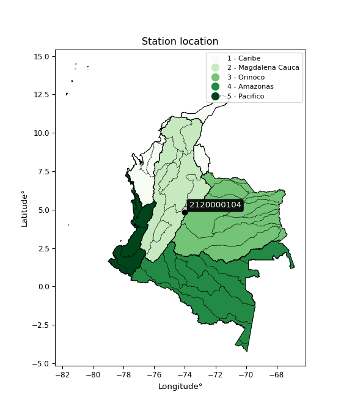

<div align="center">


</div>

# PMax24h Station (Rain): 2120000104

Maximum Precipitation in 24 hours (PMax24h) is the greatest amount of rainfall for a specific duration that is meteorologically possible for a given location, acting as a "worst-case" scenario for extreme storms, crucial for designing safety-critical infrastructure like bridges, river deviations, dams, spillways, and nuclear plants to prevent catastrophic failure. The PMax24h is related with the Probable Maximum Precipitation (PMP) and it is calculated by hydrologists using meteorological data to determine the upper limit of extreme rainfall, often leading to the Probable Maximum Flood (PMF) for flood control design, and is increasingly being studied for climate change impacts. Probable Maximum Precipitation (PMP) is the theoretical upper limit of rainfall, a deterministic estimate for extreme events, while probability distributions (like GEV, Gumbel) describe the likelihood and frequency of various precipitation amounts, including rare ones, showing how often events occur, with PMP representing the extreme end of these distributions, used for critical infrastructure design to ensure safety against the worst conceivable weather, unlike standard statistical forecasts which cover typical probabilities.

The most common probability distributions in hydrology, used for analyzing floods, rainfall, and streamflow, include the Normal, Log-Normal, Gumbel, Gamma (including Log-Pearson Type III), and Generalized Extreme Value (GEV) distributions, often chosen based on the data´s skewness and whether modeling extremes or general conditions, with Gumbel and GEV popular for extreme events like floods, while the Normal distribution serves as a baseline, though often requiring transformations for skewed hydrological data. These distributions help in designing water infrastructure, managing water resources, and forecasting hydrologic events.

> Hydrological data often isn´t perfectly normal (it´s skewed), so different distributions are needed for different applications, such as: **Flood Frequency Analysis**: Using Gumbel, GEV, or Log-Pearson Type III for predicting extreme flood magnitudes and their return periods, **Rainfall Analysis**: Normal for annual totals, but Log-Normal, Weibull, or GEV for intensity or extreme daily rainfall, **Streamflow Modeling**: Gamma and Log-Normal for maximum flows, GEV for minimum flows, and Kappa for daily flows.

<div align="center">

</img>

</div>


## A. General information


### 1. General running parameters

• app_version: _v20260225_. • runtime: _2026-02-28 16:54:07.457399_. • Python version: _3.14.0_. • SciPy version: _1.16.3_. • Pandas version: _2.3.3_. • NumPy version: _2.3.5_. • Stations dataset (station_dataset_file): _dataset/pmax24h_in/automatic_colombia_2003_2025.csv_. • Stations catalog (station_catalog_file): _dataset/CNE.xls_. • Minimum year to eval til year_max (date_min): _1900_. • Maximum year to eval since year_min (date_max): _2025_. • Creates, save and include plots into reports (create_plot): _False_. • Plot only fit distributions with Δo > Δ (plot_only_fit): _True_. • Plot only simple graphs avoiding multiple CDFs and multiple Extreme values plots (plot_only_simple): _False_. • Eval low extreme values, if False, evaluates high extreme values (low_extreme): _False_. • Eval every SciPy distribution as logarithmic (pdist_logarithmic_on): _True_. • Standard deviation normalized (ddof): _1.0_. • Return periods to eval in years (Tr): _[2, 2.33, 5, 10, 15, 20, 25, 50, 75, 100, 200, 250, 500, 750, 1000]_. • Minimum data sample per station, 0 means any (minimum_sample): _5_. • Z-Score maximum threshold to adjust a value, 0 means disable (zscore_max): _3.5_. • Z-Score minimum threshold to adjust a value, 0 means disable (zscore_min): _-2.5_. • Avoid zeros, e.g. rain = 0 (avoid_zeros): _True_. • Avoid null values (avoid_nans): _True_. 

:file_folder:Table: [dataset.csv](../../dataset/pmax24h_in/automatic_colombia_2003_2025.csv)

> Delta Degrees of Freedom (DDOF): is a parameter used in the formulas for calculating variance and standard deviation. When ddof=0, the divisor is $N$ (the total number of observations) and this is used when your data set is the entire population. When ddof=1, the divisor is $N-1$ and this is used when your data set is a sample drawn from a larger population. Using $N-1$ provides an unbiased estimate of the population variance (known as Bessel´s correction).


### 2. Station info and location

|   id |     CODIGO | NOMBRE                                   | CATEGORIA               | TECNOLOGIA                | ESTADO   | FECHA_INSTALACION   |   FECHA_SUSPENSION |   ALTITUD |   LATITUD |   LONGITUD | DEPARTAMENTO   | MUNICIPIO   | AREA_OPERATIVA                            | ENTIDAD                                                      | AREA_HIDROGRAFICA   | ZONA_HIDROGRAFICA   | SUBZONA_HIDROGRAFICA   |   CORRIENTE | Catalogo   |   Version |
|-----:|-----------:|:-----------------------------------------|:------------------------|:--------------------------|:---------|:--------------------|-------------------:|----------:|----------:|-----------:|:---------------|:------------|:------------------------------------------|:-------------------------------------------------------------|:--------------------|:--------------------|:-----------------------|------------:|:-----------|----------:|
|    0 | 2120000104 | COLEGIO MIGUEL ANTONIO CARO [2120000104] | Climatológica Ordinaria | Automática con Telemetría | Activa   | 01/11/2011          |                nan |      2575 |   4.81326 |   -74.0315 | Bogotá         | Bogotá, D.C | Area Operativa 11 - Cundinamarca-Amazonas | INSTITUTO DISTRITAL DE GESTIÓN DE RIESGOS Y CAMBIO CLIMÁTICO | Magdalena Cauca     | Alto Magdalena      | Río Bogotá             |         nan | CNE_OE     |  20251226 |

<div align="center">

Dynamic map: [:earth_americas:Google](http://maps.google.com/maps?q=4.81326,-74.03146) [:earth_americas:OSM](https://www.openstreetmap.org/#map=18/4.81326/-74.03146&layers=P) [:earth_americas:Bing](https://www.bing.com/maps?cp=4.81326~-74.03146&lvl=18) [:earth_americas:Apple](https://maps.apple.com/frame?center=4.81326%2C-74.03146&span=0.003%2C0.006)

</div>


<div align="center">

```geojson
{
  "type": "Feature",
  "geometry": {
    "type": "Point", 
    "coordinates": [-74.03146, 4.81326]
  }, 
  "properties": {
    "Name": "2120000104"
  }
}
```

</div>


### 3. Discrete values table and plot

<div align="center">

|               |           0 |           1 |           2 |          3 |          4 |
|:--------------|------------:|------------:|------------:|-----------:|-----------:|
| Date          | 2018        | 2019        | 2020        | 2023       | 2025       |
| Value         |   18.3      |   35.2      |   20.5      |    0.1     |   44.4     |
| Value_initial |   18.3      |   35.2      |   20.5      |    0.1     |   44.4     |
| count         |    5        |    5        |    5        |    5       |    5       |
| mean          |   23.7      |   23.7      |   23.7      |   23.7     |   23.7     |
| std           |   17.0081   |   17.0081   |   17.0081   |   17.0081  |   17.0081  |
| zscore        |   -0.317496 |    0.676149 |   -0.188146 |   -1.38758 |    1.21707 |


</div>


> The initial value (value_initial) correspond to the initial obtained or null completed value, and value (value) is adjusted only when the initial value is outside the valid range (outlier) definite through the Z-Score value. If Z-Score is active, values out of range or outliers are replaced with the station mean value. A Z-Score (or standard score) measures how many standard deviations a data point is from the mean of a dataset, indicating its relative position; positive scores mean above the mean, negative mean below, and a score of zero is exactly at the mean, allowing for comparison of values from different distributions. It´s calculated using the formula $z=(x–μ)/σ$, where $x$ is the data point, $μ$ is the mean, and $σ$ is the standard deviation, helping identify outliers and understand probability.
>
> <sub>**Note**: In this study, "completing" (filling gaps in) and "extending" (forecasting or lengthening the historical record) rainfall data series are avoided for certain critical analyses because they introduce artificial bias and uncertainty, which can distort the statistics of rare events (extremes), alter day-to-day variability, and compromise the integrity and homogeneity of the original data. Some reasons against Completing/Extending rainfall data are: **Distortion of Extremes and Variability**: The primary issue is that most gap-filling or extension methods rely on averaging or regression with nearby stations, which inherently smooths the data. Rainfall is highly variable in space and time, with a large percentage of zero values and occasional large storms. Infilling methods often underestimate the highest values and overestimate the lowest (zero) values, which severely distorts analyses focused on flood frequency, drought severity, and intensity-duration-frequency (IDF) curves, **Loss of Data Homogeneity**: Infilled or extended data are synthetic estimates, not actual measurements. Combining these estimates with observed data can violate the assumption of data homogeneity, which requires that the data properties do not change over time. Inhomogeneity can lead to incorrect conclusions about long-term trends or changes in climate patterns, **Propagation of Errors**: Errors and biases from the original data (e.g., wind-induced undercatch, instrument errors, site changes) or the data used for imputation can propagate through the analysis, leading to unreliable hydrological models and inaccurate predictions, **Compromised Statistical Integrity**: For statistical analyses, especially those involving the frequency of events, using artificial data can introduce time bias or autocorrelation that doesn´t exist in reality, making it difficult to assess the true probability of events, **Difficulty in Validation**: It is difficult to accurately validate the quality of filled or extended data, especially for past periods where ground-truth measurements are unavailable. The reliability of imputation techniques heavily depends on the density of the surrounding station network and the complexity of the local topography.</sub>


### 4. Active continuous probability distributions from SciPy (80 of 104 available)

A Probability Density Function (PDF) describes the relative likelihood of a continuous random variable falling within a specific range, where the total area under its curve equals 1, and the area over any interval gives the actual probability for that range. Unlike discrete probabilities (like rolling a die), a PDF shows density, not direct probability for a single point (which is zero), with higher points indicating higher likelihood, often visualized as a bell curve for normal distributions.

A log of a probability density function (log-PDF) is simply the logarithm of the PDF´s value, denoted as $log(f(x))$, useful for converting multiplication of probabilities into addition, improving numerical stability with tiny numbers, and connecting to information theory concepts like entropy. Instead of dealing with very small probabilities (e.g., 0.000001), log-PDFs use negative numbers (e.g., $log(0.00001) ≈ -11.51$ that are easier for computers to handle, preventing underflow errors and simplifying complex calculations. In this study, each active probability distribution from SciPy is also evaluated in the $log$ form.

[scipy.stats](https://docs.scipy.org/doc/scipy/reference/stats.html) is a Python´s powerful submodule within the SciPy library for comprehensive statistical analysis, offering over 130 probability distributions (like Normal, Poisson, etc.), functions for descriptive stats (mean, variance), hypothesis testing (t-tests, chi-square), random variable generation, and statistical tests, making it essential for data science, modeling, and research. It provides tools to explore, model, and draw conclusions from data efficiently, working seamlessly with [NumPy](https://numpy.org/).

<div align="center">

|   id | p_dist           |   n_parameter | fit_method   | label                                                                       | active   | ref                                                                                                      |
|-----:|:-----------------|--------------:|:-------------|:----------------------------------------------------------------------------|:---------|:---------------------------------------------------------------------------------------------------------|
|    0 | alpha            |             3 | MLE          | Alpha                                                                       | True     | [:mortar_board:](https://docs.scipy.org/doc/scipy/reference/generated/scipy.stats.alpha.html)            |
|    1 | anglit           |             2 | MM           | Anglit                                                                      | True     | [:mortar_board:](https://docs.scipy.org/doc/scipy/reference/generated/scipy.stats.anglit.html)           |
|    2 | arcsine          |             2 | MM           | Arcsine                                                                     | True     | [:mortar_board:](https://docs.scipy.org/doc/scipy/reference/generated/scipy.stats.arcsine.html)          |
|    3 | argus            |             3 | MLE          | Argus                                                                       | True     | [:mortar_board:](https://docs.scipy.org/doc/scipy/reference/generated/scipy.stats.argus.html)            |
|    4 | beta             |             4 | MLE          | Beta                                                                        | True     | [:mortar_board:](https://docs.scipy.org/doc/scipy/reference/generated/scipy.stats.beta.html)             |
|    5 | betaprime        |             4 | MLE          | Beta prime                                                                  | True     | [:mortar_board:](https://docs.scipy.org/doc/scipy/reference/generated/scipy.stats.betaprime.html)        |
|    6 | bradford         |             3 | MLE          | Bradford                                                                    | True     | [:mortar_board:](https://docs.scipy.org/doc/scipy/reference/generated/scipy.stats.bradford.html)         |
|    7 | burr             |             4 | MLE          | Burr (Type III)                                                             | True     | [:mortar_board:](https://docs.scipy.org/doc/scipy/reference/generated/scipy.stats.burr.html)             |
|    8 | burr12           |             4 | MLE          | Burr (Type III) 12                                                          | True     | [:mortar_board:](https://docs.scipy.org/doc/scipy/reference/generated/scipy.stats.burr12.html)           |
|    9 | cosine           |             2 | MLE          | Cosine                                                                      | True     | [:mortar_board:](https://docs.scipy.org/doc/scipy/reference/generated/scipy.stats.cosine.html)           |
|   10 | crystalball      |             4 | MLE          | Crystalball                                                                 | True     | [:mortar_board:](https://docs.scipy.org/doc/scipy/reference/generated/scipy.stats.crystalball.html)      |
|   11 | dgamma           |             3 | MLE          | Double gamma                                                                | True     | [:mortar_board:](https://docs.scipy.org/doc/scipy/reference/generated/scipy.stats.dgamma.html)           |
|   12 | dweibull         |             3 | MLE          | Double Weibull                                                              | True     | [:mortar_board:](https://docs.scipy.org/doc/scipy/reference/generated/scipy.stats.dweibull.html)         |
|   13 | erlang           |             3 | MLE          | Erlang                                                                      | True     | [:mortar_board:](https://docs.scipy.org/doc/scipy/reference/generated/scipy.stats.erlang.html)           |
|   14 | exponnorm        |             3 | MLE          | Exponentially modified Normal                                               | True     | [:mortar_board:](https://docs.scipy.org/doc/scipy/reference/generated/scipy.stats.exponnorm.html)        |
|   15 | exponpow         |             3 | MLE          | Exponential power                                                           | True     | [:mortar_board:](https://docs.scipy.org/doc/scipy/reference/generated/scipy.stats.exponpow.html)         |
|   16 | exponweib        |             4 | MLE          | Exponentiated Weibull                                                       | True     | [:mortar_board:](https://docs.scipy.org/doc/scipy/reference/generated/scipy.stats.exponweib.html)        |
|   17 | f                |             4 | MLE          | F                                                                           | True     | [:mortar_board:](https://docs.scipy.org/doc/scipy/reference/generated/scipy.stats.f.html)                |
|   18 | fatiguelife      |             3 | MLE          | Fatigue-life (Birnbaum-Saunders)                                            | True     | [:mortar_board:](https://docs.scipy.org/doc/scipy/reference/generated/scipy.stats.fatiguelife.html)      |
|   19 | foldnorm         |             3 | MM           | Fold Normal                                                                 | True     | [:mortar_board:](https://docs.scipy.org/doc/scipy/reference/generated/scipy.stats.foldnorm.html)         |
|   20 | gamma            |             3 | MLE          | Gamma                                                                       | True     | [:mortar_board:](https://docs.scipy.org/doc/scipy/reference/generated/scipy.stats.gamma.html)            |
|   21 | gausshyper       |             6 | MLE          | Gauss hypergeometric                                                        | True     | [:mortar_board:](https://docs.scipy.org/doc/scipy/reference/generated/scipy.stats.gausshyper.html)       |
|   22 | genexpon         |             5 | MLE          | Generalized exponential                                                     | True     | [:mortar_board:](https://docs.scipy.org/doc/scipy/reference/generated/scipy.stats.genexpon.html)         |
|   23 | genextreme       |             3 | MLE          | Generalized exponential                                                     | True     | [:mortar_board:](https://docs.scipy.org/doc/scipy/reference/generated/scipy.stats.genextreme.html)       |
|   24 | gengamma         |             4 | MLE          | Generalized gamma                                                           | True     | [:mortar_board:](https://docs.scipy.org/doc/scipy/reference/generated/scipy.stats.gengamma.html)         |
|   25 | genhalflogistic  |             3 | MLE          | Generalized half-logistic                                                   | True     | [:mortar_board:](https://docs.scipy.org/doc/scipy/reference/generated/scipy.stats.genhalflogistic.html)  |
|   26 | genlogistic      |             3 | MLE          | Generalized logistic                                                        | True     | [:mortar_board:](https://docs.scipy.org/doc/scipy/reference/generated/scipy.stats.genlogistic.html)      |
|   27 | gennorm          |             3 | MLE          | Generalized Normal                                                          | True     | [:mortar_board:](https://docs.scipy.org/doc/scipy/reference/generated/scipy.stats.gennorm.html)          |
|   28 | genpareto        |             3 | MLE          | Generalized Pareto                                                          | True     | [:mortar_board:](https://docs.scipy.org/doc/scipy/reference/generated/scipy.stats.genpareto.html)        |
|   29 | gompertz         |             3 | MLE          | Gompertz (or truncated Gumbel)                                              | True     | [:mortar_board:](https://docs.scipy.org/doc/scipy/reference/generated/scipy.stats.gompertz.html)         |
|   30 | gumbel_l         |             2 | MM           | Gumbel Left Skew                                                            | True     | [:mortar_board:](https://docs.scipy.org/doc/scipy/reference/generated/scipy.stats.gumbel_l.html)         |
|   31 | gumbel_r         |             2 | MM           | Gumbel Right Skew                                                           | True     | [:mortar_board:](https://docs.scipy.org/doc/scipy/reference/generated/scipy.stats.gumbel_r.html)         |
|   32 | halfgennorm      |             3 | MLE          | Upper half of a generalized normal                                          | True     | [:mortar_board:](https://docs.scipy.org/doc/scipy/reference/generated/scipy.stats.halfgennorm.html)      |
|   33 | halflogistic     |             2 | MM           | Half-logistic                                                               | True     | [:mortar_board:](https://docs.scipy.org/doc/scipy/reference/generated/scipy.stats.halflogistic.html)     |
|   34 | halfnorm         |             2 | MM           | Half Normal                                                                 | True     | [:mortar_board:](https://docs.scipy.org/doc/scipy/reference/generated/scipy.stats.halfnorm.html)         |
|   35 | hypsecant        |             2 | MM           | hyperbolic secant                                                           | True     | [:mortar_board:](https://docs.scipy.org/doc/scipy/reference/generated/scipy.stats.hypsecant.html)        |
|   36 | invgamma         |             3 | MLE          | Inverted gamma                                                              | True     | [:mortar_board:](https://docs.scipy.org/doc/scipy/reference/generated/scipy.stats.invgamma.html)         |
|   37 | invgauss         |             3 | MLE          | Inverse Gaussian                                                            | True     | [:mortar_board:](https://docs.scipy.org/doc/scipy/reference/generated/scipy.stats.invgauss.html)         |
|   38 | invweibull       |             3 | MLE          | Inverted Weibull                                                            | True     | [:mortar_board:](https://docs.scipy.org/doc/scipy/reference/generated/scipy.stats.invweibull.html)       |
|   39 | johnsonsb        |             4 | MLE          | Johnson SB                                                                  | True     | [:mortar_board:](https://docs.scipy.org/doc/scipy/reference/generated/scipy.stats.johnsonsb.html)        |
|   40 | johnsonsu        |             4 | MLE          | Johnson Su                                                                  | True     | [:mortar_board:](https://docs.scipy.org/doc/scipy/reference/generated/scipy.stats.johnsonsu.html)        |
|   41 | kappa3           |             3 | MLE          | Kappa 3                                                                     | True     | [:mortar_board:](https://docs.scipy.org/doc/scipy/reference/generated/scipy.stats.kappa3.html)           |
|   42 | kappa4           |             4 | MLE          | Kappa 4                                                                     | True     | [:mortar_board:](https://docs.scipy.org/doc/scipy/reference/generated/scipy.stats.kappa4.html)           |
|   43 | ksone            |             3 | MLE          | Kolmogorov-Smirnov one-sided test statistic distribution                    | True     | [:mortar_board:](https://docs.scipy.org/doc/scipy/reference/generated/scipy.stats.ksone.html)            |
|   44 | kstwobign        |             2 | MLE          | Limiting distribution of scaled Kolmogorov-Smirnov two-sided test statistic | True     | [:mortar_board:](https://docs.scipy.org/doc/scipy/reference/generated/scipy.stats.kstwobign.html)        |
|   45 | laplace          |             2 | MM           | Laplace                                                                     | True     | [:mortar_board:](https://docs.scipy.org/doc/scipy/reference/generated/scipy.stats.laplace.html)          |
|   46 | levy_l           |             2 | MLE          | Left-skewed Levy                                                            | True     | [:mortar_board:](https://docs.scipy.org/doc/scipy/reference/generated/scipy.stats.levy_l.html)           |
|   47 | loggamma         |             3 | MLE          | Log gamma                                                                   | True     | [:mortar_board:](https://docs.scipy.org/doc/scipy/reference/generated/scipy.stats.loggamma.html)         |
|   48 | logistic         |             2 | MM           | Logistic (or Sech-squared)                                                  | True     | [:mortar_board:](https://docs.scipy.org/doc/scipy/reference/generated/scipy.stats.logistic.html)         |
|   49 | loglaplace       |             3 | MLE          | Log-Laplace                                                                 | True     | [:mortar_board:](https://docs.scipy.org/doc/scipy/reference/generated/scipy.stats.loglaplace.html)       |
|   50 | lomax            |             3 | MLE          | Lomax (Pareto of the second kind)                                           | True     | [:mortar_board:](https://docs.scipy.org/doc/scipy/reference/generated/scipy.stats.lomax.html)            |
|   51 | maxwell          |             2 | MM           | Maxwell                                                                     | True     | [:mortar_board:](https://docs.scipy.org/doc/scipy/reference/generated/scipy.stats.maxwell.html)          |
|   52 | mielke           |             4 | MLE          | Mielke Beta-Kappa / Dagum                                                   | True     | [:mortar_board:](https://docs.scipy.org/doc/scipy/reference/generated/scipy.stats.mielke.html)           |
|   53 | moyal            |             2 | MM           | Moyal                                                                       | True     | [:mortar_board:](https://docs.scipy.org/doc/scipy/reference/generated/scipy.stats.moyal.html)            |
|   54 | nakagami         |             3 | MLE          | Nakagami                                                                    | True     | [:mortar_board:](https://docs.scipy.org/doc/scipy/reference/generated/scipy.stats.nakagami.html)         |
|   55 | ncf              |             5 | MLE          | Non-central F distribution                                                  | True     | [:mortar_board:](https://docs.scipy.org/doc/scipy/reference/generated/scipy.stats.ncf.html)              |
|   56 | nct              |             4 | MLE          | Non-central Student’s t                                                     | True     | [:mortar_board:](https://docs.scipy.org/doc/scipy/reference/generated/scipy.stats.nct.html)              |
|   57 | norm             |             2 | MM           | Normal                                                                      | True     | [:mortar_board:](https://docs.scipy.org/doc/scipy/reference/generated/scipy.stats.norm.html)             |
|   58 | pearson3         |             3 | MM           | Pearson type III                                                            | True     | [:mortar_board:](https://docs.scipy.org/doc/scipy/reference/generated/scipy.stats.pearson3.html)         |
|   59 | powerlaw         |             3 | MLE          | Power-function                                                              | True     | [:mortar_board:](https://docs.scipy.org/doc/scipy/reference/generated/scipy.stats.powerlaw.html)         |
|   60 | rayleigh         |             2 | MM           | Rayleigh                                                                    | True     | [:mortar_board:](https://docs.scipy.org/doc/scipy/reference/generated/scipy.stats.rayleigh.html)         |
|   61 | rdist            |             3 | MLE          | R-distributed (symmetric beta)                                              | True     | [:mortar_board:](https://docs.scipy.org/doc/scipy/reference/generated/scipy.stats.rdist.html)            |
|   62 | rice             |             3 | MLE          | Rice                                                                        | True     | [:mortar_board:](https://docs.scipy.org/doc/scipy/reference/generated/scipy.stats.rice.html)             |
|   63 | semicircular     |             2 | MM           | Semicircular                                                                | True     | [:mortar_board:](https://docs.scipy.org/doc/scipy/reference/generated/scipy.stats.semicircular.html)     |
|   64 | skewnorm         |             3 | MLE          | Skew normal                                                                 | True     | [:mortar_board:](https://docs.scipy.org/doc/scipy/reference/generated/scipy.stats.skewnorm.html)         |
|   65 | t                |             3 | MLE          | Student’s t                                                                 | True     | [:mortar_board:](https://docs.scipy.org/doc/scipy/reference/generated/scipy.stats.t.html)                |
|   66 | trapezoid        |             4 | MLE          | Trapezoid                                                                   | True     | [:mortar_board:](https://docs.scipy.org/doc/scipy/reference/generated/scipy.stats.trapezoid.html)        |
|   67 | triang           |             3 | MLE          | Triangular                                                                  | True     | [:mortar_board:](https://docs.scipy.org/doc/scipy/reference/generated/scipy.stats.triang.html)           |
|   68 | truncexpon       |             3 | MLE          | Truncated exponential                                                       | True     | [:mortar_board:](https://docs.scipy.org/doc/scipy/reference/generated/scipy.stats.truncexpon.html)       |
|   69 | truncnorm        |             4 | MLE          | Truncated normal                                                            | True     | [:mortar_board:](https://docs.scipy.org/doc/scipy/reference/generated/scipy.stats.truncnorm.html)        |
|   70 | truncpareto      |             4 | MLE          | Upper truncated Pareto                                                      | True     | [:mortar_board:](https://docs.scipy.org/doc/scipy/reference/generated/scipy.stats.truncpareto.html)      |
|   71 | truncweibull_min |             5 | MLE          | Doubly truncated Weibull minimum                                            | True     | [:mortar_board:](https://docs.scipy.org/doc/scipy/reference/generated/scipy.stats.truncweibull_min.html) |
|   72 | tukeylambda      |             3 | MLE          | Tukey-Lamdba                                                                | True     | [:mortar_board:](https://docs.scipy.org/doc/scipy/reference/generated/scipy.stats.tukeylambda.html)      |
|   73 | uniform          |             2 | MLE          | Uniform                                                                     | True     | [:mortar_board:](https://docs.scipy.org/doc/scipy/reference/generated/scipy.stats.uniform.html)          |
|   74 | vonmises         |             3 | MLE          | Von Mises                                                                   | True     | [:mortar_board:](https://docs.scipy.org/doc/scipy/reference/generated/scipy.stats.vonmises.html)         |
|   75 | vonmises_line    |             3 | MLE          | Von Mises line                                                              | True     | [:mortar_board:](https://docs.scipy.org/doc/scipy/reference/generated/scipy.stats.vonmises_line.html)    |
|   76 | wald             |             2 | MM           | Wald                                                                        | True     | [:mortar_board:](https://docs.scipy.org/doc/scipy/reference/generated/scipy.stats.wald.html)             |
|   77 | weibull_max      |             3 | MLE          | Weibull maximum                                                             | True     | [:mortar_board:](https://docs.scipy.org/doc/scipy/reference/generated/scipy.stats.weibull_max.html)      |
|   78 | weibull_min      |             3 | MLE          | Weibull minimum                                                             | True     | [:mortar_board:](https://docs.scipy.org/doc/scipy/reference/generated/scipy.stats.weibull_min.html)      |
|   79 | wrapcauchy       |             3 | MLE          | Wrapped  Cauchy                                                             | True     | [:mortar_board:](https://docs.scipy.org/doc/scipy/reference/generated/scipy.stats.wrapcauchy.html)       |

</div>

> **n_parameter:** # arguments & localization & scale.
>
> **Fit methods:** (MLE) maximum likelihood, (MM) L-moments.
>
>**Inactive** (With the only purpose of prevent loops, zero divisions, infinite values, over high estimated values or horizontal trending for recurrence intervals estimations, the follow distributions were disabled.)**:** lognorm, norminvgauss, powernorm, powerlognorm, cauchy, halfcauchy, foldcauchy, skewcauchy, chi2, expon, fisk, genhyperbolic, geninvgauss, gibrat, kstwo, laplace_asymmetric, levy, levy_stable, ncx2, pareto, rel_breitwigner, recipinvgauss, studentized_range, loguniform, 


## B. Probability (PDF) vs. Empirical (EDF) distributions functions

A continuous probability distribution (CPD) describes probabilities for variables that can take any value within a range (like rain any time), unlike discrete variables with specific outcomes (like temperature). It uses a Probability Density Function (PDF), a curve where the total area under it equals 1, and the probability of the variable falling within an interval (a to b) is found by calculating the area under the curve between those points. A key feature is that the probability of hitting any single exact value is zero, so probabilities are always expressed for ranges, e.g., $P(a ≤ X ≤ b)$.

<div align="center">

Distributions parameters from station values
|     |    station | p_dist              |   n |             loc |           scale | shape                  | shape1                | shape2             | shape3             |
|----:|-----------:|:--------------------|----:|----------------:|----------------:|:-----------------------|:----------------------|:-------------------|:-------------------|
|   0 | 2120000104 | alpha               |   5 |  -258.504       |  5166.68        | 18.381122362584065     |                       |                    |                    |
|   1 | 2120000104 | anglit              |   5 |    23.7         |    44.5026      |                        |                       |                    |                    |
|   2 | 2120000104 | arcsine             |   5 |     2.18627     |    43.0275      |                        |                       |                    |                    |
|   3 | 2120000104 | argus               |   5 |   -11.5642      |    59.0097      | 0.8237558504553041     |                       |                    |                    |
|   4 | 2120000104 | beta                |   5 |    -7.46708     |    51.8671      | 1.3138216019396176     | 0.3201251855204609    |                    |                    |
|   5 | 2120000104 | betaprime           |   5 |  -208.206       | 24546.4         | 229.1429984360302      | 24263.85887403565     |                    |                    |
|   6 | 2120000104 | bradford            |   5 |     0.0999825   |    44.3001      | 1.9248126645130776     |                       |                    |                    |
|   7 | 2120000104 | burr                |   5 |     0.1         |   142.276       | 5.6351777358672575     | 0.03422542423811774   |                    |                    |
|   8 | 2120000104 | burr12              |   5 |   -23.5319      |   593.097       | 3.571007751847171      | 5713.466402067403     |                    |                    |
|   9 | 2120000104 | cosine              |   5 |    23.2671      |    12.4752      |                        |                       |                    |                    |
|  10 | 2120000104 | crystalball         |   5 |    23.7         |    15.2125      | 924.7838748194143      | 5197.534116522511     |                    |                    |
|  11 | 2120000104 | dgamma              |   5 |    20.5         |    12.9826      | 0.8948475070575492     |                       |                    |                    |
|  12 | 2120000104 | dweibull            |   5 |    26.8506      |    15.3581      | 1.9097963517457155     |                       |                    |                    |
|  13 | 2120000104 | erlang              |   5 |  -297.218       |     0.727521    | 441.136006817099       |                       |                    |                    |
|  14 | 2120000104 | exponnorm           |   5 |    23.6836      |    15.2125      | 0.0010769073153959058  |                       |                    |                    |
|  15 | 2120000104 | exponpow            |   5 |     0.1         |     2.82864     | 0.15039132957410128    |                       |                    |                    |
|  16 | 2120000104 | exponweib           |   5 |     0.1         |     3.15509     | 1.6005971307785025     | 0.330821445112903     |                    |                    |
|  17 | 2120000104 | f                   |   5 |     0.1         |    24.4303      | 0.7661119773598718     | 4.390212910238231     |                    |                    |
|  18 | 2120000104 | fatiguelife         |   5 |  -555.438       |   578.992       | 0.026419019934909915   |                       |                    |                    |
|  19 | 2120000104 | foldnorm            |   5 |    16.0064      |    14.0595      | 1.4558334057914856e-08 |                       |                    |                    |
|  20 | 2120000104 | gamma               |   5 |  -300.861       |     0.717706    | 452.18483394498        |                       |                    |                    |
|  21 | 2120000104 | gausshyper          |   5 |    -3.26771     |    47.6677      | 1.380517315669591      | 0.8065862694414263    | 1.0624424453123937 | 1.0219010517934095 |
|  22 | 2120000104 | genexpon            |   5 |    -5.31165     |     2.23226     | 1.5009748865937644e-07 | 0.08349450134321376   | 0.9981128487974659 |                    |
|  23 | 2120000104 | genextreme          |   5 |    25.5128      |    22.0499      | 1.167452237257196      |                       |                    |                    |
|  24 | 2120000104 | gengamma            |   5 |     0.1         |     0.0178639   | 3.7356697872377653     | 0.20575652776123327   |                    |                    |
|  25 | 2120000104 | genhalflogistic     |   5 |    -8.02192     |    59.5379      | 1.1357451364341289     |                       |                    |                    |
|  26 | 2120000104 | genlogistic         |   5 |    24.0436      |     9.11188     | 0.9959206649794556     |                       |                    |                    |
|  27 | 2120000104 | gennorm             |   5 |    22.25        |    22.1516      | 142333.91744855605     |                       |                    |                    |
|  28 | 2120000104 | genpareto           |   5 |    -0.146303    |    78.1795      | -1.7550170436857466    |                       |                    |                    |
|  29 | 2120000104 | gompertz            |   5 |    18.3         |     8.41009     | 0.1353706013473221     |                       |                    |                    |
|  30 | 2120000104 | gumbel_l            |   5 |    30.5464      |    11.8611      |                        |                       |                    |                    |
|  31 | 2120000104 | gumbel_r            |   5 |    16.8536      |    11.8611      |                        |                       |                    |                    |
|  32 | 2120000104 | halfgennorm         |   5 |     0.1         |     1.19104     | 0.37367982861217175    |                       |                    |                    |
|  33 | 2120000104 | halflogistic        |   5 |     5.66968     |    13.0061      |                        |                       |                    |                    |
|  34 | 2120000104 | halfnorm            |   5 |     3.56464     |    25.2359      |                        |                       |                    |                    |
|  35 | 2120000104 | hypsecant           |   5 |    23.7         |     9.68458     |                        |                       |                    |                    |
|  36 | 2120000104 | invgamma            |   5 |     0.1         |     1.9529e-17  | 0.2071751017157223     |                       |                    |                    |
|  37 | 2120000104 | invgauss            |   5 |   -81.2751      |  4660.99        | 0.02248028653437762    |                       |                    |                    |
|  38 | 2120000104 | invweibull          |   5 |     0.1         |     2.14063     | 0.06290191156362598    |                       |                    |                    |
|  39 | 2120000104 | johnsonsb           |   5 |    -6.28377     |    50.6838      | -1.120500615640645     | 0.16822676535893566   |                    |                    |
|  40 | 2120000104 | johnsonsu           |   5 |   104.811       |     6.96883     | 16.591584640290705     | 5.2979635513981655    |                    |                    |
|  41 | 2120000104 | kappa3              |   5 |     0.0999967   |    44.3         | 4017952.0295163887     |                       |                    |                    |
|  42 | 2120000104 | kappa4              |   5 |    -2.5636      |    50.187       | 1.0534986037671967     | 1.0686352481513426    |                    |                    |
|  43 | 2120000104 | ksone               |   5 |    -2.64881     |    52.6976      | 1.0                    |                       |                    |                    |
|  44 | 2120000104 | kstwobign           |   5 |   -34.2456      |    66.1633      |                        |                       |                    |                    |
|  45 | 2120000104 | laplace             |   5 |    23.7         |    10.7569      |                        |                       |                    |                    |
|  46 | 2120000104 | levy_l              |   5 |    46.0469      |     6.27873     |                        |                       |                    |                    |
|  47 | 2120000104 | loggamma            |   5 |   -43.5475      |    37.5568      | 6.48583349391985       |                       |                    |                    |
|  48 | 2120000104 | logistic            |   5 |    23.7         |     8.38709     |                        |                       |                    |                    |
|  49 | 2120000104 | loglaplace          |   5 |    -0.153349    |    20.6533      | 0.8587930552721375     |                       |                    |                    |
|  50 | 2120000104 | lomax               |   5 |     0.0999999   | 96388           | 4092.9979997843757     |                       |                    |                    |
|  51 | 2120000104 | maxwell             |   5 |   -12.3472      |    22.5892      |                        |                       |                    |                    |
|  52 | 2120000104 | mielke              |   5 |     0.1         |    46.2819      | 0.6243742518231508     | 89.89668159655277     |                    |                    |
|  53 | 2120000104 | moyal               |   5 |    15.0005      |     6.84803     |                        |                       |                    |                    |
|  54 | 2120000104 | nakagami            |   5 |     0.1         |    31.1787      | 0.2129037985204278     |                       |                    |                    |
|  55 | 2120000104 | ncf                 |   5 |     0.1         |     1.74587     | 0.331002755623642      | 23.54477247129526     | 5.026556177271283  |                    |
|  56 | 2120000104 | nct                 |   5 |     0.1         |     1.24847e-18 | 0.12516994038987897    | 28.581181844883883    |                    |                    |
|  57 | 2120000104 | norm                |   5 |    23.7         |    15.2125      |                        |                       |                    |                    |
|  58 | 2120000104 | pearson3            |   5 |    23.7         |    15.2124      | -0.16722019456382345   |                       |                    |                    |
|  59 | 2120000104 | powerlaw            |   5 |     0.1         |    44.3         | 0.11234686876101868    |                       |                    |                    |
|  60 | 2120000104 | rayleigh            |   5 |    -5.40239     |    23.2203      |                        |                       |                    |                    |
|  61 | 2120000104 | rdist               |   5 |    -3.77373     |    24.2737      | 0.9996446992095354     |                       |                    |                    |
|  62 | 2120000104 | rice                |   5 |    -8.68923     |    17.4761      | 1.4807517385710969     |                       |                    |                    |
|  63 | 2120000104 | semicircular        |   5 |    23.7         |    30.425       |                        |                       |                    |                    |
|  64 | 2120000104 | skewnorm            |   5 |    44.4         |    25.6834      | -8463573.92411554      |                       |                    |                    |
|  65 | 2120000104 | t                   |   5 |    23.7005      |    15.2122      | 38863862.20243223      |                       |                    |                    |
|  66 | 2120000104 | trapezoid           |   5 |   -19.8106      |    64.5411      | 0.9999999999999999     | 1.0                   |                    |                    |
|  67 | 2120000104 | triang              |   5 |   -13.4047      |    57.805       | 0.9999999999984699     |                       |                    |                    |
|  68 | 2120000104 | truncexpon          |   5 |     0.0999671   |    68.7187      | 0.6446580467328191     |                       |                    |                    |
|  69 | 2120000104 | truncnorm           |   5 |   -24.7771      |    29.9393      | -2.4731467875516016    | 2.3105777216914265    |                    |                    |
|  70 | 2120000104 | truncpareto         |   5 |    -0.176099    |     0.276099    | 0.00045148218211801187 | 161.4495055516821     |                    |                    |
|  71 | 2120000104 | truncweibull_min    |   5 |    -2.26137     |    78.3207      | 1.223600910505695      | 0.0010633665632412284 | 0.5957730012142771 |                    |
|  72 | 2120000104 | tukeylambda         |   5 |    22.2974      |    25.4269      | 1.1454912940647155     |                       |                    |                    |
|  73 | 2120000104 | uniform             |   5 |     0.1         |    44.3         |                        |                       |                    |                    |
|  74 | 2120000104 | vonmises            |   5 |     0.1997      |     1           | 0.8326039862011622     |                       |                    |                    |
|  75 | 2120000104 | vonmises_line       |   5 |    22.0817      |     7.10413     | 8.092555028494203e-06  |                       |                    |                    |
|  76 | 2120000104 | wald                |   5 |     8.48752     |    15.2125      |                        |                       |                    |                    |
|  77 | 2120000104 | weibull_max         |   5 |    44.4         |     1.6629      | 0.2594656305244482     |                       |                    |                    |
|  78 | 2120000104 | weibull_min         |   5 |   -23.4797      |    52.557       | 3.5664660504452863     |                       |                    |                    |
|  79 | 2120000104 | wrapcauchy          |   5 |     0.0999854   |     7.05057     | 0.1793219944614058     |                       |                    |                    |
|  80 | 2120000104 | logalpha            |   5 |   -69.2772      |  2130.47        | 29.846348404964317     |                       |                    |                    |
|  81 | 2120000104 | loganglit           |   5 |     2.19581     |     6.64997     |                        |                       |                    |                    |
|  82 | 2120000104 | logarcsine          |   5 |    -1.01896     |     6.42953     |                        |                       |                    |                    |
|  83 | 2120000104 | logargus            |   5 |    -5.00671     |     8.96704     | 3.1062480533934727     |                       |                    |                    |
|  84 | 2120000104 | logbeta             |   5 |    -2.97014     |     6.76338     | 0.10521178930931314    | 0.02974365003897758   |                    |                    |
|  85 | 2120000104 | logbetaprime        |   5 |    -2.30259     |     2.70196     | 0.11742069226051986    | 0.6502983221357924    |                    |                    |
|  86 | 2120000104 | logbradford         |   5 |    -2.30259     |     7.06088     | 2.0579779766347528e-05 |                       |                    |                    |
|  87 | 2120000104 | logburr             |   5 |    -2.30259     |     2.85215     | 0.7642213368401587     | 0.7268269111889836    |                    |                    |
|  88 | 2120000104 | logburr12           |   5 |    -2.30259     |     1.79712     | 0.1458103098896878     | 0.7595992946884765    |                    |                    |
|  89 | 2120000104 | logcosine           |   5 |     1.76099     |     1.95221     |                        |                       |                    |                    |
|  90 | 2120000104 | logcrystalball      |   5 |     2.19581     |     2.27319     | 397.58625151161505     | 63.64871218878704     |                    |                    |
|  91 | 2120000104 | logdgamma           |   5 |     3.02042     |     2.21887     | 0.4516249535440381     |                       |                    |                    |
|  92 | 2120000104 | logdweibull         |   5 |     3.02042     |     1.80303     | 0.6988369769510325     |                       |                    |                    |
|  93 | 2120000104 | logerlang           |   5 |    -2.30259     |     2.11258     | 0.14330060863765398    |                       |                    |                    |
|  94 | 2120000104 | logexponnorm        |   5 |     2.19476     |     2.2732      | 0.00044845522413971563 |                       |                    |                    |
|  95 | 2120000104 | logexponpow         |   5 |    -2.30259     |     1.75267     | 0.24979711577545338    |                       |                    |                    |
|  96 | 2120000104 | logexponweib        |   5 |    -2.30259     |     1.94027     | 1.5219356297738624     | 0.09503054549955281   |                    |                    |
|  97 | 2120000104 | logf                |   5 |    -2.30259     |     1.04016     | 1.1073054775527995     | 1.095725884656248     |                    |                    |
|  98 | 2120000104 | logfatiguelife      |   5 |    -2.30259     |     2.31927e-06 | 1108.6260258580721     |                       |                    |                    |
|  99 | 2120000104 | logfoldnorm         |   5 |    -9.93091     |     1.60159     | 7.646787476787157      |                       |                    |                    |
| 100 | 2120000104 | loggamma            |   5 |   -35.8786      |     0.15146     | 251.30870182864226     |                       |                    |                    |
| 101 | 2120000104 | loggausshyper       |   5 |    -2.97159     |     6.76483     | 1.7108369184392767     | 0.33665395873816867   | 0.9271058222822577 | 0.9896002523000129 |
| 102 | 2120000104 | loggenexpon         |   5 |    -2.30282     |  1976.66        | 298.0051078948759      | 322.1993368210724     | 354.43364934338115 |                    |
| 103 | 2120000104 | loggenextreme       |   5 |     1.42676     |     3.47087     | 1.4666799207106487     |                       |                    |                    |
| 104 | 2120000104 | loggengamma         |   5 |    -2.30259     |     2.09899     | 2.233564859150509      | -0.04529091154136278  |                    |                    |
| 105 | 2120000104 | loggenhalflogistic  |   5 |    -3.02868     |     7.33736     | 1.0755553696582614     |                       |                    |                    |
| 106 | 2120000104 | loggenlogistic      |   5 |     3.79336     |     1.07993e-05 | 6.766108273635462e-06  |                       |                    |                    |
| 107 | 2120000104 | loggennorm          |   5 |     3.02042     |     0.0974259   | 0.45598400002316297    |                       |                    |                    |
| 108 | 2120000104 | loggenpareto        |   5 |    -4.43649     |    10.1606      | -1.2346205668276322    |                       |                    |                    |
| 109 | 2120000104 | loggompertz         |   5 |    -2.30259     |     1.30225     | 0.016215893338650506   |                       |                    |                    |
| 110 | 2120000104 | loggumbel_l         |   5 |     3.21886     |     1.7724      |                        |                       |                    |                    |
| 111 | 2120000104 | loggumbel_r         |   5 |     1.17275     |     1.7724      |                        |                       |                    |                    |
| 112 | 2120000104 | loghalfgennorm      |   5 |    -2.30259     |     1.32547     | 0.5639113524104304     |                       |                    |                    |
| 113 | 2120000104 | loghalflogistic     |   5 |    -0.498432    |     1.94349     |                        |                       |                    |                    |
| 114 | 2120000104 | loghalfnorm         |   5 |    -0.812963    |     3.77095     |                        |                       |                    |                    |
| 115 | 2120000104 | loghypsecant        |   5 |     2.19581     |     1.44715     |                        |                       |                    |                    |
| 116 | 2120000104 | loginvgamma         |   5 |   -59.4681      | 42223.6         | 686.342776315749       |                       |                    |                    |
| 117 | 2120000104 | loginvgauss         |   5 |   -19.4256      |  1519.96        | 0.014205639055003154   |                       |                    |                    |
| 118 | 2120000104 | loginvweibull       |   5 |    -4.67855e+08 |     4.67855e+08 | 194963349.7687952      |                       |                    |                    |
| 119 | 2120000104 | logjohnsonsb        |   5 |   -15.7944      |    19.5876      | -0.520005573801209     | 0.07493377608720342   |                    |                    |
| 120 | 2120000104 | logjohnsonsu        |   5 |     3.79324     |     7.23991e-13 | 2.235108994566133      | 0.14021577769879784   |                    |                    |
| 121 | 2120000104 | logkappa3           |   5 |    -2.30259     |     1.85181     | 0.10289815020944654    |                       |                    |                    |
| 122 | 2120000104 | logkappa4           |   5 |    -2.32473     |     7.73169     | 1.0012968539831437     | 1.2637681424111087    |                    |                    |
| 123 | 2120000104 | logksone            |   5 |    -2.91217     |     7.31499     | 1.0                    |                       |                    |                    |
| 124 | 2120000104 | logkstwobign        |   5 |    -8.42272     |    12.1006      |                        |                       |                    |                    |
| 125 | 2120000104 | loglaplace          |   5 |     2.19581     |     1.60738     |                        |                       |                    |                    |
| 126 | 2120000104 | loglevy_l           |   5 |     3.84687     |     0.203387    |                        |                       |                    |                    |
| 127 | 2120000104 | logloggamma         |   5 |     3.79486     |     0.00021227  | 0.0001318578084228422  |                       |                    |                    |
| 128 | 2120000104 | loglogistic         |   5 |     2.19581     |     1.25327     |                        |                       |                    |                    |
| 129 | 2120000104 | logloglaplace       |   5 |    -2.30259     |     1.68412     | 0.44793145337593226    |                       |                    |                    |
| 130 | 2120000104 | loglomax            |   5 |    -2.30259     |     3.07858e+09 | 630814796.3385398      |                       |                    |                    |
| 131 | 2120000104 | logmaxwell          |   5 |    -3.19069     |     3.37548     |                        |                       |                    |                    |
| 132 | 2120000104 | logmielke           |   5 |    -2.30259     |     3.01713     | 0.12298923555617469    | 0.6026002630101968    |                    |                    |
| 133 | 2120000104 | logmoyal            |   5 |     0.895852    |     1.02329     |                        |                       |                    |                    |
| 134 | 2120000104 | lognakagami         |   5 | -2044.59        |  2046.78        | 202449.2180374338      |                       |                    |                    |
| 135 | 2120000104 | logncf              |   5 |    -2.30259     |     1.09142     | 1.0554796071074941     | 1.1062289925305848    | 0.9997958075123365 |                    |
| 136 | 2120000104 | lognct              |   5 |  -136.676       |     2.21769     | 34214.637156004246     | 62.618892665918935    |                    |                    |
| 137 | 2120000104 | lognorm             |   5 |     2.19581     |     2.27318     |                        |                       |                    |                    |
| 138 | 2120000104 | logpearson3         |   5 |     2.19581     |     2.27319     | -1.421463724221749     |                       |                    |                    |
| 139 | 2120000104 | logpowerlaw         |   5 |    -2.30259     |     6.09582     | 0.13337020345499948    |                       |                    |                    |
| 140 | 2120000104 | lograyleigh         |   5 |    -2.15289     |     3.46976     |                        |                       |                    |                    |
| 141 | 2120000104 | logrdist            |   5 |    -2.30249     |     9.21254e-05 | 1.606825715241615      |                       |                    |                    |
| 142 | 2120000104 | logrice             |   5 |  -900.174       |     2.27302     | 396.99050200941497     |                       |                    |                    |
| 143 | 2120000104 | logsemicircular     |   5 |     2.19581     |     4.54637     |                        |                       |                    |                    |
| 144 | 2120000104 | logskewnorm         |   5 |     3.79324     |     2.77851     | -14862096.01937617     |                       |                    |                    |
| 145 | 2120000104 | logt                |   5 |     3.24047     |     0.441586    | 0.9706857821104795     |                       |                    |                    |
| 146 | 2120000104 | logtrapezoid        |   5 |    -4.44542     |     9.64431     | 1.0                    | 1.0                   |                    |                    |
| 147 | 2120000104 | logtriang           |   5 |    -4.5484      |     8.34167     | 0.9999978473426911     |                       |                    |                    |
| 148 | 2120000104 | logtruncexpon       |   5 |    -2.30259     |    11.6051      | 0.5252768548801998     |                       |                    |                    |
| 149 | 2120000104 | logtruncnorm        |   5 |     1.94674     |     2.50772     | -1.6944931969348171    | 4.703761581939779     |                    |                    |
| 150 | 2120000104 | logtruncpareto      |   5 |    -2.36918     |     0.0459751   | 9.335461156945524e-08  | 134.03826078015408    |                    |                    |
| 151 | 2120000104 | logtruncweibull_min |   5 |    -2.51203     |     8.9009      | 1.313226719600029      | 1.607614463697809e-08 | 0.7083852537374488 |                    |
| 152 | 2120000104 | logtukeylambda      |   5 |    -2.30259     |     7.51955e-16 | 1.6045599298387576     |                       |                    |                    |
| 153 | 2120000104 | loguniform          |   5 |    -2.30259     |     6.09582     |                        |                       |                    |                    |
| 154 | 2120000104 | logvonmises         |   5 |    -2.82877     |     1           | 6.019573473530833      |                       |                    |                    |
| 155 | 2120000104 | logvonmises_line    |   5 |     2.8783      |     1.64913     | 1.3327587964859955     |                       |                    |                    |
| 156 | 2120000104 | logwald             |   5 |    -0.0773655   |     2.27318     |                        |                       |                    |                    |
| 157 | 2120000104 | logweibull_max      |   5 |     3.79324     |     2.879       | 0.6330016757255174     |                       |                    |                    |
| 158 | 2120000104 | logweibull_min      |   5 |    -2.30259     |     1.51089     | 0.5807462165874118     |                       |                    |                    |
| 159 | 2120000104 | logwrapcauchy       |   5 |    -2.30259     |     0.970181    | 0.525                  |                       |                    |                    |

</div>

> **loc** (Location parameter): This shifts the distribution along the x-axis. For many common distributions, like the normal (Gaussian) distribution, loc represents the mean $μ$. For others, like the uniform distribution, it might represent the minimum value, or for the beta distribution, the left end of the support interval.
>
> **scale** (Scale parameter): This determines the width or spread of the distribution. For the normal distribution, scale represents the standard deviation $σ$. For a uniform distribution, it defines the length of the interval (from $loc$ to $loc + scale$).
>
> **shape** (Shape parameters): Refers to parameters that define the specific form of a probability distribution, distinct from its location (loc) and scale (scale). These parameters are required arguments for most distribution functions. For example, a normal (Gaussian) distribution is fully defined by its location (mean) and scale (standard deviation), so it has no specific shape parameters beyond loc and scale. However, other distributions have intrinsic properties that need specification, as Gamma distribution that takes a shape parameter, often named $a$ or $alpha$.


### 0. Cumulative distribution values - CDF (160 evaluated)

Cumulative Distribution Function (CDF), denoted as $F$<sub>$X$</sub>$(x)$, is a function that gives the probability that a random variable $X$ will take a value less than or equal to a specific value, $x$ (i.e., $(P(X≥x)$. It essentially "accumulates" probabilities from a given point up to the far right (positive infinity), providing a complete picture of the distribution´s probabilities for both discrete (like rain) and continuous (like temperature) variables, helping to find probabilities over ranges or above certain values. Each station is evaluated separately ordering the $x$ values ascending, calculating the CDF and PDF values for the activated distributions and their logarithmic forms.

<div align="center">

CDF ordered by x ascending and calculating $log(f(x))$ separately
|   id |    Station |   date |    x |   count |   mean |     std |    zscore |   Value_initial |    station |   m |    alpha |   alpha_pdf |    anglit |   anglit_pdf |   arcsine |   arcsine_pdf |     argus |   argus_pdf |      beta |    beta_pdf |   betaprime |   betaprime_pdf |   bradford |   bradford_pdf |        burr |    burr_pdf |    burr12 |   burr12_pdf |    cosine |   cosine_pdf |   crystalball |   crystalball_pdf |    dgamma |   dgamma_pdf |   dweibull |   dweibull_pdf |    erlang |   erlang_pdf |   exponnorm |   exponnorm_pdf |   exponpow |   exponpow_pdf |   exponweib |   exponweib_pdf |           f |       f_pdf |   fatiguelife |   fatiguelife_pdf |   foldnorm |   foldnorm_pdf |     gamma |   gamma_pdf |   gausshyper |   gausshyper_pdf |   genexpon |   genexpon_pdf |   genextreme |   genextreme_pdf |   gengamma |   gengamma_pdf |   genhalflogistic |   genhalflogistic_pdf |   genlogistic |   genlogistic_pdf |     gennorm |   gennorm_pdf |   genpareto |   genpareto_pdf |    gompertz |   gompertz_pdf |   gumbel_l |   gumbel_l_pdf |   gumbel_r |   gumbel_r_pdf |   halfgennorm |   halfgennorm_pdf |   halflogistic |   halflogistic_pdf |   halfnorm |   halfnorm_pdf |   hypsecant |   hypsecant_pdf |   invgamma |   invgamma_pdf |   invgauss |   invgauss_pdf |   invweibull |   invweibull_pdf |   johnsonsb |   johnsonsb_pdf |   johnsonsu |   johnsonsu_pdf |      kappa3 |   kappa3_pdf |    kappa4 |   kappa4_pdf |    ksone |   ksone_pdf |   kstwobign |   kstwobign_pdf |   laplace |   laplace_pdf |   levy_l |   levy_l_pdf |   loggamma |   loggamma_pdf |   logistic |   logistic_pdf |   loglaplace |   loglaplace_pdf |       lomax |   lomax_pdf |   maxwell |   maxwell_pdf |      mielke |     mielke_pdf |      moyal |   moyal_pdf |    nakagami |   nakagami_pdf |        ncf |     ncf_pdf |       nct |     nct_pdf |      norm |   norm_pdf |   pearson3 |   pearson3_pdf |   powerlaw |   powerlaw_pdf |   rayleigh |   rayleigh_pdf |    rdist |      rdist_pdf |      rice |   rice_pdf |   semicircular |   semicircular_pdf |   skewnorm |   skewnorm_pdf |         t |      t_pdf |   trapezoid |   trapezoid_pdf |    triang |   triang_pdf |   truncexpon |   truncexpon_pdf |   truncnorm |   truncnorm_pdf |   truncpareto |   truncpareto_pdf |   truncweibull_min |   truncweibull_min_pdf |   tukeylambda |   tukeylambda_pdf |   uniform |   uniform_pdf |   vonmises |   vonmises_pdf |   vonmises_line |   vonmises_line_pdf |     wald |   wald_pdf |   weibull_max |   weibull_max_pdf |   weibull_min |   weibull_min_pdf |   wrapcauchy |   wrapcauchy_pdf |   logalpha |   logalpha_pdf |   loganglit |   loganglit_pdf |   logarcsine |   logarcsine_pdf |   logargus |   logargus_pdf |   logbeta |   logbeta_pdf |   logbetaprime |   logbetaprime_pdf |   logbradford |   logbradford_pdf |    logburr |   logburr_pdf |   logburr12 |   logburr12_pdf |   logcosine |   logcosine_pdf |   logcrystalball |   logcrystalball_pdf |   logdgamma |   logdgamma_pdf |   logdweibull |   logdweibull_pdf |   logerlang |   logerlang_pdf |   logexponnorm |   logexponnorm_pdf |   logexponpow |   logexponpow_pdf |   logexponweib |   logexponweib_pdf |        logf |    logf_pdf |   logfatiguelife |   logfatiguelife_pdf |   logfoldnorm |   logfoldnorm_pdf |   loggausshyper |   loggausshyper_pdf |   loggenexpon |   loggenexpon_pdf |   loggenextreme |   loggenextreme_pdf |   loggengamma |   loggengamma_pdf |   loggenhalflogistic |   loggenhalflogistic_pdf |   loggenlogistic |   loggenlogistic_pdf |   loggennorm |   loggennorm_pdf |   loggenpareto |   loggenpareto_pdf |   loggompertz |   loggompertz_pdf |   loggumbel_l |   loggumbel_l_pdf |   loggumbel_r |   loggumbel_r_pdf |   loghalfgennorm |   loghalfgennorm_pdf |   loghalflogistic |   loghalflogistic_pdf |   loghalfnorm |   loghalfnorm_pdf |   loghypsecant |   loghypsecant_pdf |   loginvgamma |   loginvgamma_pdf |   loginvgauss |   loginvgauss_pdf |   loginvweibull |   loginvweibull_pdf |   logjohnsonsb |   logjohnsonsb_pdf |   logjohnsonsu |   logjohnsonsu_pdf |   logkappa3 |   logkappa3_pdf |   logkappa4 |   logkappa4_pdf |   logksone |   logksone_pdf |   logkstwobign |   logkstwobign_pdf |   loglevy_l |   loglevy_l_pdf |   logloggamma |   logloggamma_pdf |   loglogistic |   loglogistic_pdf |   logloglaplace |   logloglaplace_pdf |    loglomax |   loglomax_pdf |   logmaxwell |   logmaxwell_pdf |   logmielke |   logmielke_pdf |    logmoyal |   logmoyal_pdf |   lognakagami |   lognakagami_pdf |      logncf |   logncf_pdf |    lognct |   lognct_pdf |   lognorm |   lognorm_pdf |   logpearson3 |   logpearson3_pdf |   logpowerlaw |   logpowerlaw_pdf |   lograyleigh |   lograyleigh_pdf |    logrdist |   logrdist_pdf |   logrice |   logrice_pdf |   logsemicircular |   logsemicircular_pdf |   logskewnorm |   logskewnorm_pdf |      logt |   logt_pdf |   logtrapezoid |   logtrapezoid_pdf |   logtriang |   logtriang_pdf |   logtruncexpon |   logtruncexpon_pdf |   logtruncnorm |   logtruncnorm_pdf |   logtruncpareto |   logtruncpareto_pdf |   logtruncweibull_min |   logtruncweibull_min_pdf |   logtukeylambda |   logtukeylambda_pdf |   loguniform |   loguniform_pdf |   logvonmises |   logvonmises_pdf |   logvonmises_line |   logvonmises_line_pdf |   logwald |   logwald_pdf |   logweibull_max |   logweibull_max_pdf |   logweibull_min |   logweibull_min_pdf |   logwrapcauchy |   logwrapcauchy_pdf |
|-----:|-----------:|-------:|-----:|--------:|-------:|--------:|----------:|----------------:|-----------:|----:|---------:|------------:|----------:|-------------:|----------:|--------------:|----------:|------------:|----------:|------------:|------------:|----------------:|-----------:|---------------:|------------:|------------:|----------:|-------------:|----------:|-------------:|--------------:|------------------:|----------:|-------------:|-----------:|---------------:|----------:|-------------:|------------:|----------------:|-----------:|---------------:|------------:|----------------:|------------:|------------:|--------------:|------------------:|-----------:|---------------:|----------:|------------:|-------------:|-----------------:|-----------:|---------------:|-------------:|-----------------:|-----------:|---------------:|------------------:|----------------------:|--------------:|------------------:|------------:|--------------:|------------:|----------------:|------------:|---------------:|-----------:|---------------:|-----------:|---------------:|--------------:|------------------:|---------------:|-------------------:|-----------:|---------------:|------------:|----------------:|-----------:|---------------:|-----------:|---------------:|-------------:|-----------------:|------------:|----------------:|------------:|----------------:|------------:|-------------:|----------:|-------------:|---------:|------------:|------------:|----------------:|----------:|--------------:|---------:|-------------:|-----------:|---------------:|-----------:|---------------:|-------------:|-----------------:|------------:|------------:|----------:|--------------:|------------:|---------------:|-----------:|------------:|------------:|---------------:|-----------:|------------:|----------:|------------:|----------:|-----------:|-----------:|---------------:|-----------:|---------------:|-----------:|---------------:|---------:|---------------:|----------:|-----------:|---------------:|-------------------:|-----------:|---------------:|----------:|-----------:|------------:|----------------:|----------:|-------------:|-------------:|-----------------:|------------:|----------------:|--------------:|------------------:|-------------------:|-----------------------:|--------------:|------------------:|----------:|--------------:|-----------:|---------------:|----------------:|--------------------:|---------:|-----------:|--------------:|------------------:|--------------:|------------------:|-------------:|-----------------:|-----------:|---------------:|------------:|----------------:|-------------:|-----------------:|-----------:|---------------:|----------:|--------------:|---------------:|-------------------:|--------------:|------------------:|-----------:|--------------:|------------:|----------------:|------------:|----------------:|-----------------:|---------------------:|------------:|----------------:|--------------:|------------------:|------------:|----------------:|---------------:|-------------------:|--------------:|------------------:|---------------:|-------------------:|------------:|------------:|-----------------:|---------------------:|--------------:|------------------:|----------------:|--------------------:|--------------:|------------------:|----------------:|--------------------:|--------------:|------------------:|---------------------:|-------------------------:|-----------------:|---------------------:|-------------:|-----------------:|---------------:|-------------------:|--------------:|------------------:|--------------:|------------------:|--------------:|------------------:|-----------------:|---------------------:|------------------:|----------------------:|--------------:|------------------:|---------------:|-------------------:|--------------:|------------------:|--------------:|------------------:|----------------:|--------------------:|---------------:|-------------------:|---------------:|-------------------:|------------:|----------------:|------------:|----------------:|-----------:|---------------:|---------------:|-------------------:|------------:|----------------:|--------------:|------------------:|--------------:|------------------:|----------------:|--------------------:|------------:|---------------:|-------------:|-----------------:|------------:|----------------:|------------:|---------------:|--------------:|------------------:|------------:|-------------:|----------:|-------------:|----------:|--------------:|--------------:|------------------:|--------------:|------------------:|--------------:|------------------:|------------:|---------------:|----------:|--------------:|------------------:|----------------------:|--------------:|------------------:|----------:|-----------:|---------------:|-------------------:|------------:|----------------:|----------------:|--------------------:|---------------:|-------------------:|-----------------:|---------------------:|----------------------:|--------------------------:|-----------------:|---------------------:|-------------:|-----------------:|--------------:|------------------:|-------------------:|-----------------------:|----------:|--------------:|-----------------:|---------------------:|-----------------:|---------------------:|----------------:|--------------------:|
|    0 | 2120000104 |   2023 |  0.1 |       5 |   23.7 | 17.0081 | -1.38758  |             0.1 | 2120000104 |   1 | 0.055021 |  0.00859686 | 0.0636728 |    0.0109732 |  0        |     0         | 0.0508005 |  0.00868088 | 0.0231181 | 0.00420852  |   0.0592366 |       0.0082381 | 7.1022e-07 |      0.0404847 | 0.000215503 | 2.99495e+12 | 0.0557724 |   0.00818817 | 0.0517628 |   0.00915542 |     0.0604082 |        0.00787227 | 0.0882785 |   0.00711249 |  0.0279078 |     0.00574951 | 0.0582862 |   0.00801988 |   0.0604084 |       0.0078723 | 0.00249366 |    2.70233e+13 |   6.448e-10 |     2.46026e+07 | 7.57022e-08 | 2.08954e+09 |     0.0587552 |        0.00798582 |   0        |     0          | 0.0584426 |  0.00804101 |    0.0314331 |        0.0125702 |   0.118564 |     0.0300363  |     0.125488 |       0.00503607 | 1.4967e-13 |  8288.27       |         0.0739746 |            0.00988331 |     0.0681203 |        0.00694385 | 3.36671e-05 |     0.0225709 |  0.00315423 |       0.0128216 | 0           |      0         |  0.0738996 |      0.0059943 |  0.0164717 |     0.00570221 |   1.63679e-14 |        0.206989   |       0        |          0         |   0        |     0          |   0.0555214 |      0.00570394 |  0.0301467 |    4.28127e+15 |  0.0525309 |     0.00888829 |  5.81463e-06 |      3.17715e+11 |   0.0740334 |     0.0042258   |   0.0745494 |      0.00711357 | 7.46367e-08 |    0.0225733 | 0.0034126 |    0.0271028 | 0.052162 |   0.0189762 |   0.0496043 |      0.0117802  | 0.0557378 |    0.00518161 | 0.288368 |   0.0029977  |  0.0270203 |      0.0282513 |  0.0565804 |     0.00636443 |    0.0304483 |        0.0189428 | 6.27047e-09 |  0.0424638  | 0.0406553 |    0.00921399 | 2.72056e-12 | 122401         | 0.00299588 |  0.00211237 | 1.20613e-08 |    3.70074e+08 | 9.5286e-05 | 1.13635e+12 | 0.0435836 | 5.83056e+15 | 0.0604082 | 0.00787227 |  0.0646923 |     0.00765744 |  0.0083392 |    6.75095e+13 |  0.0276855 |     0.00992249 | 0.551003 |      0.0132804 | 0.0424465 | 0.00968866 |      0.0615785 |          0.0132059 |  0.0845541 |     0.00701859 | 0.0604011 | 0.00787168 |   0.0951691 |      0.00955964 | 0.0545808 |   0.00808322 |   1.0086e-06 |        0.0306258 |    0.804063 |     0.00959945  |   2.09928e-08 |        0.713199   |          0.0326963 |              0.0171136 |   7.10543e-15 |         0.0389876 |  0        |     0.0225734 |   0.469149 |      0.308591  |      0.00753954 |           0.022403  | 0        | 0          |     0.0959844 |       0.00131751  |     0.0557376 |        0.00819095 |  4.74414e-07 |        0.0324381 |  0.0247807 |      0.0275546 |   0.0118223 |       0.0325071 |     0        |         0        |  0.0109291 |     0.00976289 |  0.175222 |   0.0302551   |      0.0128905 |        3.40835e+12 |    6.4742e-07 |          0.141627 | 1.6577e-09 |   2.07342e+06 |  0.00400763 |     1.30974e+12 |   0.0298699 |       0.0416746 |         0.023914 |            0.0247698 |   0.0121757 |     0.00645803  |     0.0593657 |         0.0166079 |  0.00606014 |     1.95551e+12 |      0.0239156 |           0.024771 |   0.000127089 |       7.14865e+10 |     0.00533541 |        1.70943e+12 | 2.05159e-09 | 2.55775e+06 |        0.0893168 |          1.04095e+11 |    0.00196449 |        0.00389481 |      0.00802986 |         0.0204289   |   3.59074e-05 |         0.150763  |        0.148639 |           0.0316914 |     0.0496209 |       2.07546e+13 |            0.0522682 |                0.0760531 |         0        |            0.0137479 |   0.00977889 |       0.00433451 |       0.215815 |           0.104196 |   3.35963e-09 |         0.0124522 |     0.0433978 |         0.0239462 |   0.000820903 |         0.0032908 |      1.59723e-10 |            0.460146  |          0        |             0         |      0        |          0        |      0.0284193 |           0.019612 |     0.0250227 |         0.0274719 |     0.0291012 |         0.0327887 |       0.0273057 |           0.040971  |       0.322589 |        0.0064036   |      0.020919  |        0.00115693  |    0        |      2.1388e+09 |  0.00158518 |        0.130522 |  0.0833333 |       0.136706 |      0.0398653 |          0.0563165 |    0.144309 |       0.0116047 |     0.0226515 |         0.0140707 |      0.026875 |         0.0208676 |     5.25641e-08 |         5.30189e+07 | 3.33612e-10 |      0.204904  |    0.0047446 |        0.0158062 |   0.0112933 |     3.12764e+12 | 1.82186e-06 |    2.10987e-05 |     0.0241493 |         0.0249785 | 3.00364e-09 |  3.56942e+06 | 0.0241101 |    0.0249467 |  0.023914 |     0.0247698 |     0.0478458 |         0.0245783 |    0.00704255 |       2.11504e+12 |      0        |          0        | 7.20018e-14 |    5.65578e+06 | 0.0239139 |     0.0247716 |       0.000649684 |             0.0202898 |     0.0282414 |         0.0258785 | 0.0271103 |  0.0047282 |      0.0493668 |          0.0460762 |   0.0724842 |       0.0645504 |     1.46062e-06 |            0.210884 |    2.12475e-11 |          0.0396433 |        0.0756353 |            3.06587   |             0.0153966 |                 0.0961869 |          0.96939 |           1.2058e+15 |     0        |         0.164047 |       0.89363 |          0.423742 |        3.66062e-12 |              0.0170163 |  0        |     0         |         0.200332 |            0.0334464 |      9.54967e-10 |          1.24883e+06 |        0        |            0.526676 |
|    1 | 2120000104 |   2018 | 18.3 |       5 |   23.7 | 17.0081 | -0.317496 |            18.3 | 2120000104 |   2 | 0.388064 |  0.0258355  | 0.379846  |    0.0218121 |  0.41924  |     0.015285  | 0.32529   |  0.0210497  | 0.139247  | 0.00885799  |   0.372314  |       0.0249726 | 0.542895   |      0.0226073 | 0.672602    | 0.00712753  | 0.356613  |   0.0242206  | 0.374923  |   0.0245174  |     0.361306  |        0.0246234  | 0.401689  |   0.0365218  |  0.360621  |     0.0263208  | 0.366662  |   0.0249159  |   0.361307  |       0.0246235 | 0.936392   |    0.00261135  |   0.745414  |     0.0078026   | 0.60554     | 0.010129    |     0.365038  |        0.024799   |   0.129587 |     0.0560005  | 0.367521  |  0.0249601  |    0.352033  |        0.0202983 |   0.550451 |     0.0168143  |     0.267338 |       0.0115746  | 0.649109   |     0.00833763 |         0.297722  |            0.0153723  |     0.348935  |        0.0248878  | 0.5         |     0.0225718 |  0.262588   |       0.0160986 | 4.09841e-12 |      0.0160962 |  0.299612  |      0.0210286 |  0.412634  |     0.0307948  |   0.603142    |        0.0129695  |       0.450679 |          0.0306351 |   0.440715 |     0.0266616  |   0.331055  |      0.0283459  |  0.999793  |    2.35191e-06 |  0.395038  |     0.0258725  |  0.417263    |      0.00126047  |   0.129118  |     0.00279789  |   0.332187  |      0.0221649  | 0.410834    |    0.0225733 | 0.411099  |    0.0216994 | 0.397529 |   0.0189762 |   0.446362  |      0.0247369  | 0.302658  |    0.0281363  | 0.365708 |   0.00610783 |  0.625504  |      0.15588   |  0.344377  |     0.0269201  |    0.678751  |        0.199858  | 0.538266    |  0.0196032  | 0.393878  |    0.0259011  | 0.558363    |      0.0191553 | 0.431918   |  0.0336199  | 0.617469    |    0.0136053   | 0.411578   | 0.0182155   | 0.994721  | 3.63033e-05 | 0.361306  | 0.0246234  |  0.352222  |     0.023929   |  0.904892  |    0.00558581  |  0.406059  |     0.0261095  | 0.863377 |      0.0315249 | 0.381756  | 0.025105   |      0.387605  |          0.020592  |  0.309524  |     0.018537   | 0.361291  | 0.0246235  |   0.348673  |      0.018298   | 0.300827  |   0.0189768  |   0.489685   |        0.0234998 |    0.9342   |     0.00481543  |   0.826937    |        0.0106376  |          0.429285  |              0.0231708 |   0.412999    |         0.0217923 |  0.410835 |     0.0225734 |   3.28429  |      0.247938  |      0.415276   |           0.0224033 | 0.479009 | 0.0459116  |     0.129643  |       0.002633    |     0.356679  |        0.0242242  |  0.437107    |        0.0163532 |  0.630051  |      0.154372  |   0.606119  |       0.146951  |     0.570997 |         0.10153  |  0.534953  |     0.389297   |  0.260003 |   0.028057    |      0.905011  |        0.00981501  |    0.737798   |          0.141625 | 0.700767   |   0.0289084   |  0.444417   |     0.00636339  |   0.681569  |       0.149405  |         0.622791 |            0.167119  |   0.354863  |     0.55733     |     0.432599  |         0.385594  |  0.995286   |     0.00284273  |      0.622794  |           0.167117 |   0.933883    |       0.0154667   |     0.539425   |        0.00822742  | 0.744794    | 0.023624    |        0.911792  |          0.0207573   |    0.643896   |        0.232707   |      0.428249   |         0.21106     |   0.661338    |         0.0845697 |        0.599342 |           0.236018  |     0.807894  |       0.00270598  |            0.739202  |                0.237898  |         0        |            0.359533  |   0.380473   |       0.729655   |       0.835515 |           0.150312 |   0.580824    |         0.285087  |     0.567689  |         0.204548  |   0.686668    |         0.145634  |      0.699444    |            0.0528693 |          0.704453 |             0.129598  |      0.676089 |          0.130073 |      0.650471  |           0.195834 |     0.636139  |         0.156977  |     0.634144  |         0.141592  |       0.663152  |           0.11351   |       0.385329 |        0.0338567   |      0.0388025 |        0.0132994   |    0.423224 |      0.00687918 |  0.783144   |        0.193632 |  0.795499  |       0.136706 |      0.65538   |          0.104989  |    0.358185 |       0.17718   |     0.576082  |         0.357849  |      0.638161 |         0.184247  |     0.698495    |         0.0259246   | 0.656114    |      0.0704636 |    0.647203  |        0.150887  |   0.895266  |     0.00884447  | 0.708164    |    0.13606     |     0.624141  |         0.166817  | 0.637207    |  0.0305342   | 0.622623  |    0.166524  |  0.622791 |     0.167119  |     0.538289  |         0.204317  |    0.979263   |       0.0250705   |      0.654669 |          0.145134 | 1           |    0           | 0.622855  |     0.167123  |       0.599166    |             0.138305  |     0.749728  |         0.272917  | 0.295607  |  0.454417  |      0.581175  |          0.158093  |   0.798777  |       0.214284  |     0.885121    |            0.134614 |    0.63253     |          0.154822  |        0.968297  |            0.0386954 |             0.863224  |                 0.159396  |          1       |           0          |     0.854599 |         0.164047 |       1.09762 |          0.39682  |        0.506996    |              0.244567  |  0.768417 |     0.112405  |         0.622268 |            0.210821  |      0.871529    |          0.029389    |        0.679809 |            0.187383 |
|    2 | 2120000104 |   2020 | 20.5 |       5 |   23.7 | 17.0081 | -0.188146 |            20.5 | 2120000104 |   3 | 0.445442 |  0.026231   | 0.428342  |    0.0222386 |  0.452478 |     0.0149621 | 0.372983  |  0.0222919  | 0.159588  | 0.00964944  |   0.428189  |       0.0257373 | 0.591349   |      0.0214617 | 0.687569    | 0.00650032  | 0.411149  |   0.0252896  | 0.429685  |   0.0252028  |     0.416696  |        0.0256508  | 0.5       |   1.44509    |  0.415486  |     0.0231353  | 0.422527  |   0.0257855  |   0.416697  |       0.0256509 | 0.941692   |    0.00222293  |   0.761439  |     0.00680311  | 0.626668    | 0.00911019  |     0.420678  |        0.0256992  |   0.250737 |     0.0539248  | 0.423479  |  0.0258248  |    0.397148  |        0.0207139 |   0.585961 |     0.0154864  |     0.294229 |       0.0129008  | 0.666333   |     0.00735649 |         0.332632  |            0.016382   |     0.405479  |        0.0264146  | 0.5         |     0.0225718 |  0.298675   |       0.0167202 | 0.0396669   |      0.0200795 |  0.348643  |      0.023542  |  0.479344  |     0.0297172  |   0.630002    |        0.0114952  |       0.515453 |          0.0282293 |   0.497831 |     0.0252423  |   0.396687  |      0.0311516  |  0.999798  |    2.04924e-06 |  0.452234  |     0.0260319  |  0.419879    |      0.0011235   |   0.135375  |     0.00289746  |   0.382904  |      0.0238996  | 0.460495    |    0.0225733 | 0.458828  |    0.0216946 | 0.439276 |   0.0189762 |   0.499778  |      0.0237716  | 0.371342  |    0.0345214  | 0.379932 |   0.00684652 |  0.643046  |      0.153106  |  0.405756  |     0.0287487  |    0.700657  |        0.18623   | 0.57944     |  0.0178548  | 0.451001  |    0.0259471  | 0.599597    |      0.0183516 | 0.50331    |  0.0311665  | 0.646163    |    0.0125076   | 0.45082    | 0.0174478   | 0.994796  | 3.19289e-05 | 0.416696  | 0.0256508  |  0.40634   |     0.0251993  |  0.916568  |    0.00504772  |  0.463224  |     0.0257867  | 1        | 442619         | 0.437515  | 0.025511   |      0.433166  |          0.0208082 |  0.352079  |     0.0201488  | 0.416682  | 0.025651   |   0.390091  |      0.0193542  | 0.344024  |   0.0202936  |   0.540566   |        0.0227594 |    0.944244 |     0.00432062  |   0.849048    |        0.00950521 |          0.480195  |              0.0231001 |   0.4609      |         0.021759  |  0.460497 |     0.0225734 |   3.85408  |      0.148898  |      0.464564   |           0.0224033 | 0.569047 | 0.0363407  |     0.135766  |       0.00294315  |     0.411221  |        0.0252913  |  0.472437    |        0.0158337 |  0.647408  |      0.151376  |   0.622736  |       0.145776  |     0.582573 |         0.102443 |  0.580731  |     0.417173   |  0.263375 |   0.0315036   |      0.906108  |        0.00952527  |    0.753876   |          0.141625 | 0.704004   |   0.028136    |  0.445132   |     0.00622869  |   0.698377  |       0.146666  |         0.641608 |            0.164324  |   0.5       |     4.66777e+07 |     0.5       |      9728.73      |  0.995597   |     0.00264471  |      0.641611  |           0.164322 |   0.935608    |       0.0149269   |     0.540349   |        0.00805504  | 0.747437    | 0.0229376   |        0.914113  |          0.0201299   |    0.66995    |        0.226132   |      0.453375   |         0.232389    |   0.670828    |         0.0826247 |        0.62735  |           0.258059  |     0.808197  |       0.00264498  |            0.766767  |                0.247874  |         0        |            0.386036  |   0.5        |       2.13186    |       0.852798 |           0.154278 |   0.613313    |         0.286947  |     0.591017  |         0.206311  |   0.702871    |         0.139822  |      0.705367    |            0.0514885 |          0.718865 |             0.124321  |      0.690636 |          0.126209 |      0.672293  |           0.188514 |     0.653786  |         0.15386   |     0.650056  |         0.138712  |       0.675858  |           0.11034   |       0.389436 |        0.0387145   |      0.0404457 |        0.0157763   |    0.423997 |      0.00673107 |  0.805435   |        0.199244 |  0.811019  |       0.136706 |      0.667162  |          0.10258   |    0.380164 |       0.211744  |     0.618173  |         0.383996  |      0.658805 |         0.179355  |     0.701392    |         0.0251278   | 0.664021    |      0.0688435 |    0.664127  |        0.147246  |   0.896256  |     0.00860002  | 0.723245    |    0.129669    |     0.642923  |         0.163997  | 0.640627    |  0.0297299   | 0.641373  |    0.163739  |  0.641608 |     0.164324  |     0.561774  |         0.209384  |    0.982082   |       0.0246065   |      0.670935 |          0.141401 | 1           |    0           | 0.641672  |     0.164326  |       0.614834    |             0.137706  |     0.780905  |         0.276267  | 0.353843  |  0.572591  |      0.599261  |          0.160534  |   0.823288  |       0.217547  |     0.900328    |            0.133304 |    0.649948    |          0.152006  |        0.972643  |            0.0378803 |             0.881248  |                 0.158143  |          1       |           0          |     0.873222 |         0.164047 |       1.15107 |          0.547504 |        0.534709    |              0.243409  |  0.780759 |     0.105119  |         0.647289 |            0.230611  |      0.874807    |          0.0283813   |        0.702837 |            0.219448 |
|    3 | 2120000104 |   2019 | 35.2 |       5 |   23.7 | 17.0081 |  0.676149 |            35.2 | 2120000104 |   4 | 0.785137 |  0.0174943  | 0.747061  |    0.0195358 |  0.679516 |     0.0175067 | 0.743084  |  0.0264431  | 0.364801  | 0.0210841   |   0.77724   |       0.0187546 | 0.863068   |      0.0160331 | 0.763423    | 0.00419326  | 0.772667  |   0.0204728  | 0.782296  |   0.0201107  |     0.775163  |        0.0197068  | 0.859918  |   0.0114199  |  0.634104  |     0.0261337  | 0.775912  |   0.0191281  |   0.775164  |       0.0197067 | 0.963407   |    0.000986424 |   0.831736  |     0.00339647  | 0.727467    | 0.00519931  |     0.774526  |        0.019244   |   0.8278   |     0.0223499  | 0.776986  |  0.0191023  |    0.725017  |        0.0244646 |   0.76108  |     0.00893645 |     0.582724 |       0.0292997  | 0.744743   |     0.00392403 |         0.644639  |            0.0279668  |     0.773647  |        0.0192089  | 0.5         |     0.0225718 |  0.592923   |       0.025212  | 0.5829      |      0.0500812 |  0.772462  |      0.0284    |  0.808209  |     0.0145092  |   0.752007    |        0.00600184 |       0.812807 |          0.0130456 |   0.790007 |     0.0144105  |   0.811539  |      0.0183428  |  0.99982   |    1.06436e-06 |  0.783069  |     0.0168869  |  0.432287    |      0.000649707 |   0.192934  |     0.0061197   |   0.762069  |      0.0234311  | 0.792322    |    0.0225733 | 0.7811    |    0.0224192 | 0.718226 |   0.0189762 |   0.779435  |      0.0139395  | 0.828339  |    0.0159583  | 0.553236 |   0.0209504  |  0.721564  |      0.136534  |  0.797567  |     0.0192503  |    0.786155  |        0.133039  | 0.774674    |  0.00956471 | 0.78142   |    0.0170776  | 0.841415    |      0.0149675 | 0.819012   |  0.0129856  | 0.790596    |    0.00766037  | 0.66564    | 0.0117876   | 0.995138  | 1.73384e-05 | 0.775163  | 0.0197068  |  0.771706  |     0.0207601  |  0.974187  |    0.00311814  |  0.783193  |     0.0163263  | 1        |      0         | 0.776816  | 0.0182035  |      0.73477   |          0.019372  |  0.720187  |     0.0291357  | 0.775156  | 0.0197074  |   0.726473  |      0.0264121  | 0.70701   |   0.0290923  |   0.841766   |        0.0183763 |    0.987643 |     0.00182273  |   0.954583    |        0.00555411 |          0.809625  |              0.0214582 |   0.7827      |         0.022272  |  0.792325 |     0.0225734 |   6.02667  |      0.0635126 |      0.793892   |           0.0224031 | 0.854541 | 0.00957787 |     0.210409  |       0.00924953  |     0.772689  |        0.020467   |  0.735151    |        0.023294  |  0.724763  |      0.134048  |   0.69958   |       0.137877  |     0.639613 |         0.109367 |  0.836273  |     0.505005   |  0.290833 |   0.0936433   |      0.91092   |        0.00831886  |    0.830441   |          0.141624 | 0.718306   |   0.0248829   |  0.44834    |     0.00565821  |   0.773573  |       0.130782  |         0.725942 |            0.146538  |   0.777295  |     0.195356    |     0.675056  |         0.181019  |  0.996809   |     0.00188473  |      0.725944  |           0.146536 |   0.943048    |       0.0126809   |     0.5445     |        0.00732447  | 0.759036    | 0.0200782   |        0.924248  |          0.0174443   |    0.781517   |        0.184141   |      0.63336    |         0.528055    |   0.713055    |         0.0736889 |        0.814337 |           0.491111  |     0.809556  |       0.00238772  |            0.917253  |                0.317627  |         0        |            0.541666  |   0.793781   |       0.239917   |       0.944419 |           0.193886 |   0.764822    |         0.264321  |     0.702684  |         0.203472  |   0.771136    |         0.113073  |      0.73155     |            0.0455391 |          0.77961  |             0.100903  |      0.75392  |          0.107978 |      0.763654  |           0.148719 |     0.732285  |         0.135743  |     0.720917  |         0.122945  |       0.731435  |           0.0953258 |       0.425218 |        0.127996    |      0.0574056 |        0.0694823   |    0.427461 |      0.00610449 |  0.924873   |        0.256038 |  0.884925  |       0.136706 |      0.719502  |          0.0910577 |    0.60108  |       0.824908  |     0.864879  |         0.537244  |      0.748258 |         0.150301  |     0.714054    |         0.0218438   | 0.699252    |      0.0616245 |    0.738634  |        0.127931  |   0.90062   |     0.00757912  | 0.785687    |    0.102162    |     0.727054  |         0.146127  | 0.655752    |  0.0263386   | 0.725416  |    0.14606   |  0.725942 |     0.146538  |     0.680353  |         0.227149  |    0.994834   |       0.0226278   |      0.742296 |          0.122309 | 1           |    0           | 0.726005  |     0.146532  |       0.688259    |             0.133565  |     0.9334    |         0.286162  | 0.698409  |  0.467435  |      0.689191  |          0.172159  |   0.945099  |       0.233086  |     0.970742    |            0.127236 |    0.727857    |          0.13542   |        0.992159  |            0.034427  |             0.965067  |                 0.151859  |          1       |           0          |     0.961909 |         0.164047 |       1.60086 |          0.924464 |        0.660914    |              0.218567  |  0.829637 |     0.0774327 |         0.816131 |            0.45206   |      0.888972    |          0.0241699   |        0.882732 |            0.464997 |
|    4 | 2120000104 |   2025 | 44.4 |       5 |   23.7 | 17.0081 |  1.21707  |            44.4 | 2120000104 |   5 | 0.907242 |  0.00935147 | 0.900894  |    0.0134286 |  0.912173 |     0.0543105 | 0.961857  |  0.0180406  | 0.999991  | 4.86444e+08 |   0.908951  |       0.0100483 | 0.999999   |      0.0138418 | 0.798451    | 0.00347133  | 0.917139  |   0.0108461  | 0.927555  |   0.01119    |     0.913199  |        0.0103907  | 0.933365  |   0.00534206 |  0.862379  |     0.0193212  | 0.910081  |   0.0101877  |   0.9132    |       0.0103907 | 0.970929   |    0.000677394 |   0.858325  |     0.00246241  | 0.769135    | 0.00394674  |     0.909704  |        0.0102739  |   0.956568 |     0.00738473 | 0.910803  |  0.0101428  |    1         |       21.0994    |   0.830642 |     0.00633459 |     1        |       8.81096    | 0.775974   |     0.00294385 |         1         |            2.71107    |     0.903641  |        0.00955414 | 0.999965    |     0.0225713 |  1          |   93465.4       | 0.943858    |      0.0201285 |  0.959864  |      0.0108806 |  0.906615  |     0.00749353 |   0.799037    |        0.00435049 |       0.903127 |          0.0070875 |   0.894368 |     0.00853778 |   0.92525   |      0.00764766 |  0.999828  |    8.03617e-07 |  0.901877  |     0.00924738 |  0.437589    |      0.000513519 |   1         |     3.29326e+07 |   0.927808  |      0.0119779  | 0.999996    |    0.0225733 | 1         |    0.210923  | 0.892807 |   0.0189762 |   0.881505  |      0.00850999 | 0.927015  |    0.00678498 | 0.949127 |   0.0703043  |  0.7523    |      0.128107  |  0.921874  |     0.00858733 |    0.814918  |        0.115145  | 0.847519    |  0.00647196 | 0.902571  |    0.00950051 | 0.972913    |      0.0134494 | 0.906951   |  0.00676295 | 0.851696    |    0.00571111  | 0.7595     | 0.00872187  | 0.995278  | 1.33431e-05 | 0.913199  | 0.0103907  |  0.917417  |     0.0108514  |  1         |    0.00253605  |  0.899744  |     0.00926027 | 1        |      0         | 0.906158  | 0.0100458  |      0.896893  |          0.0153349 |  1         |     0.0310662  | 0.913198  | 0.0103911  |   0.989784  |      0.0308293  | 0.99999   |   0.0345989  |   1          |        0.0160737 |    1        |     0.000939444 |   1           |        0.00440735 |          1         |              0.0198892 |   0.997278    |         0.0276367 |  1        |     0.0225734 |   7.56711  |      0.303823  |      1          |           0.022403  | 0.918195 | 0.0048846  |     0.999813  |       6.82457e+09 |     0.917123  |        0.0108443  |  1           |        0.0324381 |  0.754901  |      0.125464  |   0.731082  |       0.133353  |     0.665531 |         0.114098 |  0.947993  |     0.430209   |  0.737359 |   1.04036e+13 |      0.912799  |        0.00787518  |    0.863325   |          0.141624 | 0.723941   |   0.0236706   |  0.449629   |     0.00544402  |   0.803017  |       0.122725  |         0.758888 |            0.137101  |   0.816244  |     0.144638    |     0.712446  |         0.143847  |  0.997217   |     0.0016333   |      0.758889  |           0.1371   |   0.945896    |       0.0118562   |     0.546169   |        0.00704994  | 0.763574    | 0.019026    |        0.928179  |          0.016426    |    0.821815   |        0.162796   |      1          |         2.18039e+09 |   0.729739    |         0.0700323 |        1        |       34365.3       |     0.810099  |       0.00229161  |            1         |                3.59969   |         0.999923 |            0.626479  |   0.839696   |       0.162997   |       1        |         105.926    |   0.823263    |         0.23741   |     0.749111  |         0.195733  |   0.796141    |         0.102406  |      0.741857    |            0.0432657 |          0.801971 |             0.0918043 |      0.778102 |          0.100345 |      0.796165  |           0.131421 |     0.762769  |         0.126738  |     0.748599  |         0.115444  |       0.752839  |           0.0890667 |       0.985404 |        6.37324e+11 |      0.985692  |        6.67398e+09 |    0.428851 |      0.00586953 |  1          |      276.501    |  0.916667  |       0.136706 |      0.740076  |          0.0861634 |    0.948513 |       2.17496   |     0.999069  |         0.620303  |      0.781531 |         0.136236  |     0.718985    |         0.0206494   | 0.713226    |      0.0587612 |    0.767306  |        0.119004  |   0.902335  |     0.0072022   | 0.808198    |    0.0918916   |     0.759903  |         0.136673  | 0.661719    |  0.0250734   | 0.758259  |    0.136693  |  0.758888 |     0.137101  |     0.733468  |         0.22967   |    1          |       0.0218789   |      0.769703 |          0.113743 | 1           |    0           | 0.75895   |     0.137092  |       0.718994    |             0.1311    |     1         |         0.287162  | 0.783102  |  0.278019  |      0.729745  |          0.177151  |   0.999995  |       0.23976   |     0.999992    |            0.124716 |    0.758339    |          0.127038  |        1         |            0.0331298 |             1         |                 0.149027  |          1       |           0          |     1        |         0.164047 |       1.79054 |          0.679368 |        0.709606    |              0.200293  |  0.846532 |     0.0683254 |         1        |       139655         |      0.894401    |          0.0226168   |        1        |            0.526676 |


</div>

An Empirical Distribution Function (EDF) is a step-function estimate of a true cumulative distribution function (CDF) based on observed sample data, representing the proportion of data points less than or equal to a given value. It is calculated by ordering your data and jumping up by $1/n$ (where $n$ is sample size) at each unique data point, allowing analysis without assuming an underlying population distribution, and it gets closer to the true CDF as the sample size grows. For the empirical probability calculations, the parameter $m$ correspond to the order number which means the position of the $x$ values in an ascending order list.

The Kolmogorov-Smirnov (K-S) test is a non-parametric statistical test used to determine if a sample data set comes from a specific theoretical distribution (one-sample) or if two different samples come from the same underlying distribution (two-sample), by comparing their cumulative distribution functions (CDFs). It calculates the maximum vertical difference (D statistic) between these functions, with a small p-value indicating a significant difference and rejection of the null hypothesis (that the data/samples match).


### 1. EDF California (1923)

California´s estimates the true probability distribution of water-related data (like rainfall, streamflow) using observed samples, crucial for risk assessment.

<div align="center">


$P=m/n$


</div>


**1.1. Empirical values**

<div align="center">

|                | 0              | 1                  | 2              | 3                 | 4              |
|:---------------|:---------------|:-------------------|:---------------|:------------------|:---------------|
| date           | 2023           | 2018               | 2020           | 2019              | 2025           |
| x              | 0.1            | 18.3               | 20.5           | 35.2              | 44.4           |
| m              | 1              | 2                  | 3              | 4                 | 5              |
| empirical_dist | edf_california | edf_california     | edf_california | edf_california    | edf_california |
| empirical      | 0.2            | 0.4                | 0.6            | 0.8               | 1.0            |
| empirical_tr   | 1.25           | 1.6666666666666667 | 2.5            | 5.000000000000001 | inf            |

</div>


**1.2. Kolmogorov-Smirnov fit test (sorted by Δ)**


<div align="center">

|                | 0                   | 1                  | 2                   | 3                   | 4                   | 5                   | 6                   | 7                   | 8                   | 9                   | 10                  | 11                  | 12                  | 13                 | 14                 | 15                  | 16                  | 17                  | 18                  | 19                  | 20                  | 21                  | 22                  | 23                  | 24                  | 25                  | 26                 | 27                  | 28                 | 29                  | 30                  | 31                  | 32                 | 33                 | 34                  | 35                  | 36                 | 37                  | 38                 | 39                 | 40                  | 41                 | 42                 | 43                  | 44                 | 45                 | 46                 | 47                 | 48                 | 49                 | 50                  | 51                 | 52                  | 53                  | 54                 | 55                  | 56                  | 57                 | 58                  | 59                  | 60                 | 61                  | 62                  | 63                  | 64                 | 65                  | 66                  | 67                  | 68                  | 69                  | 70                 | 71                  | 72                  | 73                  | 74                  | 75                 | 76                 | 77                 | 78                 | 79                 | 80                  | 81                 | 82                  | 83                 | 84                 | 85                 | 86                 | 87                  | 88                 | 89                 | 90                  | 91                 | 92                 | 93                 | 94                 | 95                  | 96                  | 97                 | 98                  | 99                  | 100                | 101                | 102                | 103                 | 104                | 105                | 106                 | 107                 | 108                | 109                | 110                 | 111                | 112                 | 113                | 114                | 115                | 116                | 117                | 118                | 119                | 120                 | 121                 | 122                | 123                | 124                 | 125                 | 126                 | 127                 | 128                 | 129                 | 130                 | 131                 | 132                 | 133                 | 134                 | 135                | 136                | 137                | 138                | 139                | 140                | 141                | 142                | 143                | 144                | 145                | 146                | 147                | 148                | 149                | 150                | 151                | 152                | 153                | 154                | 155                | 156                | 157                | 158                | 159                |
|:---------------|:--------------------|:-------------------|:--------------------|:--------------------|:--------------------|:--------------------|:--------------------|:--------------------|:--------------------|:--------------------|:--------------------|:--------------------|:--------------------|:-------------------|:-------------------|:--------------------|:--------------------|:--------------------|:--------------------|:--------------------|:--------------------|:--------------------|:--------------------|:--------------------|:--------------------|:--------------------|:-------------------|:--------------------|:-------------------|:--------------------|:--------------------|:--------------------|:-------------------|:-------------------|:--------------------|:--------------------|:-------------------|:--------------------|:-------------------|:-------------------|:--------------------|:-------------------|:-------------------|:--------------------|:-------------------|:-------------------|:-------------------|:-------------------|:-------------------|:-------------------|:--------------------|:-------------------|:--------------------|:--------------------|:-------------------|:--------------------|:--------------------|:-------------------|:--------------------|:--------------------|:-------------------|:--------------------|:--------------------|:--------------------|:-------------------|:--------------------|:--------------------|:--------------------|:--------------------|:--------------------|:-------------------|:--------------------|:--------------------|:--------------------|:--------------------|:-------------------|:-------------------|:-------------------|:-------------------|:-------------------|:--------------------|:-------------------|:--------------------|:-------------------|:-------------------|:-------------------|:-------------------|:--------------------|:-------------------|:-------------------|:--------------------|:-------------------|:-------------------|:-------------------|:-------------------|:--------------------|:--------------------|:-------------------|:--------------------|:--------------------|:-------------------|:-------------------|:-------------------|:--------------------|:-------------------|:-------------------|:--------------------|:--------------------|:-------------------|:-------------------|:--------------------|:-------------------|:--------------------|:-------------------|:-------------------|:-------------------|:-------------------|:-------------------|:-------------------|:-------------------|:--------------------|:--------------------|:-------------------|:-------------------|:--------------------|:--------------------|:--------------------|:--------------------|:--------------------|:--------------------|:--------------------|:--------------------|:--------------------|:--------------------|:--------------------|:-------------------|:-------------------|:-------------------|:-------------------|:-------------------|:-------------------|:-------------------|:-------------------|:-------------------|:-------------------|:-------------------|:-------------------|:-------------------|:-------------------|:-------------------|:-------------------|:-------------------|:-------------------|:-------------------|:-------------------|:-------------------|:-------------------|:-------------------|:-------------------|:-------------------|
| station        | 2120000104          | 2120000104         | 2120000104          | 2120000104          | 2120000104          | 2120000104          | 2120000104          | 2120000104          | 2120000104          | 2120000104          | 2120000104          | 2120000104          | 2120000104          | 2120000104         | 2120000104         | 2120000104          | 2120000104          | 2120000104          | 2120000104          | 2120000104          | 2120000104          | 2120000104          | 2120000104          | 2120000104          | 2120000104          | 2120000104          | 2120000104         | 2120000104          | 2120000104         | 2120000104          | 2120000104          | 2120000104          | 2120000104         | 2120000104         | 2120000104          | 2120000104          | 2120000104         | 2120000104          | 2120000104         | 2120000104         | 2120000104          | 2120000104         | 2120000104         | 2120000104          | 2120000104         | 2120000104         | 2120000104         | 2120000104         | 2120000104         | 2120000104         | 2120000104          | 2120000104         | 2120000104          | 2120000104          | 2120000104         | 2120000104          | 2120000104          | 2120000104         | 2120000104          | 2120000104          | 2120000104         | 2120000104          | 2120000104          | 2120000104          | 2120000104         | 2120000104          | 2120000104          | 2120000104          | 2120000104          | 2120000104          | 2120000104         | 2120000104          | 2120000104          | 2120000104          | 2120000104          | 2120000104         | 2120000104         | 2120000104         | 2120000104         | 2120000104         | 2120000104          | 2120000104         | 2120000104          | 2120000104         | 2120000104         | 2120000104         | 2120000104         | 2120000104          | 2120000104         | 2120000104         | 2120000104          | 2120000104         | 2120000104         | 2120000104         | 2120000104         | 2120000104          | 2120000104          | 2120000104         | 2120000104          | 2120000104          | 2120000104         | 2120000104         | 2120000104         | 2120000104          | 2120000104         | 2120000104         | 2120000104          | 2120000104          | 2120000104         | 2120000104         | 2120000104          | 2120000104         | 2120000104          | 2120000104         | 2120000104         | 2120000104         | 2120000104         | 2120000104         | 2120000104         | 2120000104         | 2120000104          | 2120000104          | 2120000104         | 2120000104         | 2120000104          | 2120000104          | 2120000104          | 2120000104          | 2120000104          | 2120000104          | 2120000104          | 2120000104          | 2120000104          | 2120000104          | 2120000104          | 2120000104         | 2120000104         | 2120000104         | 2120000104         | 2120000104         | 2120000104         | 2120000104         | 2120000104         | 2120000104         | 2120000104         | 2120000104         | 2120000104         | 2120000104         | 2120000104         | 2120000104         | 2120000104         | 2120000104         | 2120000104         | 2120000104         | 2120000104         | 2120000104         | 2120000104         | 2120000104         | 2120000104         | 2120000104         |
| empirical_dist | edf_california      | edf_california     | edf_california      | edf_california      | edf_california      | edf_california      | edf_california      | edf_california      | edf_california      | edf_california      | edf_california      | edf_california      | edf_california      | edf_california     | edf_california     | edf_california      | edf_california      | edf_california      | edf_california      | edf_california      | edf_california      | edf_california      | edf_california      | edf_california      | edf_california      | edf_california      | edf_california     | edf_california      | edf_california     | edf_california      | edf_california      | edf_california      | edf_california     | edf_california     | edf_california      | edf_california      | edf_california     | edf_california      | edf_california     | edf_california     | edf_california      | edf_california     | edf_california     | edf_california      | edf_california     | edf_california     | edf_california     | edf_california     | edf_california     | edf_california     | edf_california      | edf_california     | edf_california      | edf_california      | edf_california     | edf_california      | edf_california      | edf_california     | edf_california      | edf_california      | edf_california     | edf_california      | edf_california      | edf_california      | edf_california     | edf_california      | edf_california      | edf_california      | edf_california      | edf_california      | edf_california     | edf_california      | edf_california      | edf_california      | edf_california      | edf_california     | edf_california     | edf_california     | edf_california     | edf_california     | edf_california      | edf_california     | edf_california      | edf_california     | edf_california     | edf_california     | edf_california     | edf_california      | edf_california     | edf_california     | edf_california      | edf_california     | edf_california     | edf_california     | edf_california     | edf_california      | edf_california      | edf_california     | edf_california      | edf_california      | edf_california     | edf_california     | edf_california     | edf_california      | edf_california     | edf_california     | edf_california      | edf_california      | edf_california     | edf_california     | edf_california      | edf_california     | edf_california      | edf_california     | edf_california     | edf_california     | edf_california     | edf_california     | edf_california     | edf_california     | edf_california      | edf_california      | edf_california     | edf_california     | edf_california      | edf_california      | edf_california      | edf_california      | edf_california      | edf_california      | edf_california      | edf_california      | edf_california      | edf_california      | edf_california      | edf_california     | edf_california     | edf_california     | edf_california     | edf_california     | edf_california     | edf_california     | edf_california     | edf_california     | edf_california     | edf_california     | edf_california     | edf_california     | edf_california     | edf_california     | edf_california     | edf_california     | edf_california     | edf_california     | edf_california     | edf_california     | edf_california     | edf_california     | edf_california     | edf_california     |
| p_dist         | dgamma              | invgauss           | kstwobign           | alpha               | maxwell             | ksone               | rice                | semicircular        | truncweibull_min    | genexpon            | cosine              | anglit              | betaprime           | rayleigh           | gamma              | logloggamma         | erlang              | fatiguelife         | exponnorm           | crystalball         | norm                | t                   | gumbel_r            | dweibull            | logdgamma           | weibull_min         | burr12             | logargus            | loggennorm         | loggausshyper       | vonmises_line       | pearson3            | logistic           | genlogistic        | kappa4              | moyal               | loggenextreme      | truncexpon          | bradford           | wrapcauchy         | kappa3              | lomax              | loggompertz        | mielke              | tukeylambda        | halflogistic       | halfnorm           | arcsine            | wald               | uniform            | gausshyper          | halfgennorm        | hypsecant           | trapezoid           | johnsonsu          | nakagami            | loglevy_l           | logweibull_max     | argus               | laplace             | f                  | loginvgamma         | loglogistic         | lognakagami         | ncf                | logrice             | logexponnorm        | lognorm             | logcrystalball      | logtruncnorm        | lognct             | logfoldnorm         | logalpha            | logt                | levy_l              | logmaxwell         | loggamma           | loggamma           | skewnorm           | gengamma           | loghypsecant        | loggumbel_l        | gumbel_l            | loginvgauss        | lograyleigh        | triang             | logkstwobign       | loginvweibull       | logpearson3        | genhalflogistic    | loganglit           | logtrapezoid       | loggenexpon        | burr               | loghalfnorm        | loglaplace          | loglaplace          | logwrapcauchy      | logsemicircular     | logcosine           | loggumbel_r        | loglomax           | logdweibull        | logvonmises_line    | logloglaplace      | loghalfgennorm     | gennorm             | logburr             | genpareto          | loghalflogistic    | genextreme          | logmoyal           | logarcsine          | logbradford        | logncf             | loggenhalflogistic | logf               | exponweib          | foldnorm           | logskewnorm        | logwald             | logjohnsonsb        | logkappa4          | logksone           | logtriang           | loggengamma         | truncpareto         | loggenpareto        | beta                | logexponweib        | loguniform          | logtruncweibull_min | rdist               | logweibull_min      | logtruncexpon       | logmielke          | powerlaw           | logbetaprime       | logbeta            | logfatiguelife     | logexponpow        | exponpow           | logburr12          | gompertz           | invweibull         | logtruncpareto     | logkappa3          | logpowerlaw        | weibull_max        | nct                | logerlang          | invgamma           | logrdist           | truncnorm          | johnsonsb          | logjohnsonsu       | logtukeylambda     | loggenlogistic     | logvonmises        | vonmises           |
| delta          | 0.11172145231543447 | 0.1477656782803523 | 0.15039566695445758 | 0.15455826766988107 | 0.15934474982210622 | 0.16072379573083462 | 0.16248454400236884 | 0.16683391182256635 | 0.16730370660150107 | 0.16935804262821608 | 0.17031535524204888 | 0.17165827834668207 | 0.17181105764008403 | 0.1723144571707723 | 0.1765214990806604 | 0.17734845225269866 | 0.17747341126461813 | 0.17932215912386795 | 0.18330254093057874 | 0.18330406925262943 | 0.18330406940021637 | 0.18331844150987164 | 0.18352827541755576 | 0.18451392350692092 | 0.18782433832007484 | 0.18877861322665856 | 0.1888505226284365 | 0.18907087348605583 | 0.1902211103858377 | 0.19197014051432784 | 0.19246046219814827 | 0.19365983577893203 | 0.1942442038459002 | 0.1945206624273063 | 0.19658739588743188 | 0.19700411581972083 | 0.1993420543803397 | 0.19999899139970015 | 0.1999992897803983 | 0.1999995255860724 | 0.19999992536332076 | 0.1999999937295307 | 0.199999996640373  | 0.19999999999727944 | 0.1999999999999929 | 0.2                | 0.2                | 0.2                | 0.2                | 0.2                | 0.20285178847673402 | 0.2031423692849953 | 0.20331348921148157 | 0.20990935213743728 | 0.2170963746909138 | 0.21746900088733023 | 0.21983581603092206 | 0.2222681877977306 | 0.22701727950421602 | 0.22865800074766912 | 0.2308654978316499 | 0.23723118763158402 | 0.23816098389231355 | 0.24009714628225276 | 0.2405003212449104 | 0.24105035715867962 | 0.24111064206172972 | 0.24111216096556443 | 0.24111219096467384 | 0.24166065589323849 | 0.2417414161738516 | 0.24389579904738523 | 0.24509891391980632 | 0.24615734602322836 | 0.24676351166739674 | 0.2472030494226568 | 0.2477001128052151 | 0.2477001128052151 | 0.2479207517103219 | 0.2491093308397364 | 0.25047056690824376 | 0.2508891532373383 | 0.25135711465890237 | 0.2514008262010273 | 0.2546693165002093 | 0.2559756283899383 | 0.2599242191775737 | 0.26315176993496026 | 0.266532479058442  | 0.2673681930046443 | 0.26891828298088793 | 0.2702552411116578 | 0.2702612799438795 | 0.2726022245745202 | 0.2760890171611111 | 0.27875148389097315 | 0.27875148389097315 | 0.2798091843953562 | 0.28100608113645964 | 0.28156888121173607 | 0.2866683332481089 | 0.2867739811033452 | 0.2875544852554245 | 0.29039359121737995 | 0.2984949064771606 | 0.2994436496514402 | 0.30000000000000004 | 0.30076677693090415 | 0.3013254189937033 | 0.3044527082584336 | 0.30577112130703593 | 0.3081639996058917 | 0.33446899307832023 | 0.3377978153391944 | 0.3382808657086348 | 0.3392021882136165 | 0.3447941234108035 | 0.3454143150364899 | 0.3492628366222589 | 0.3497281435867253 | 0.36841727215583797 | 0.37478180352280593 | 0.3831435362549559 | 0.3954992456293783 | 0.39877660636142154 | 0.40789378850981794 | 0.42693723910684667 | 0.43551485427328174 | 0.44041235903124454 | 0.45383132475240984 | 0.45459909475525395 | 0.4632239979714353  | 0.46337703603529745 | 0.47152868471412523 | 0.48512107195157383 | 0.4952663673632661 | 0.5048920474915589 | 0.5050105064203967 | 0.5091672827748932 | 0.5117922481266617 | 0.5338833107523162 | 0.5363921140947739 | 0.5503712664776674 | 0.5603330852387346 | 0.562410981557377  | 0.568296776877723  | 0.5711492231626502 | 0.5792625390119279 | 0.5895905853530029 | 0.594721411684669  | 0.5952855951376171 | 0.5997933889220501 | 0.6                | 0.6040625316494987 | 0.6070658412978531 | 0.7425943826640732 | 0.7693895764409817 | 0.8                | 0.8008571929208843 | 6.567110728934255  |
| deltao         | 0.5865427407550001  | 0.5865427407550001 | 0.5865427407550001  | 0.5865427407550001  | 0.5865427407550001  | 0.5865427407550001  | 0.5865427407550001  | 0.5865427407550001  | 0.5865427407550001  | 0.5865427407550001  | 0.5865427407550001  | 0.5865427407550001  | 0.5865427407550001  | 0.5865427407550001 | 0.5865427407550001 | 0.5865427407550001  | 0.5865427407550001  | 0.5865427407550001  | 0.5865427407550001  | 0.5865427407550001  | 0.5865427407550001  | 0.5865427407550001  | 0.5865427407550001  | 0.5865427407550001  | 0.5865427407550001  | 0.5865427407550001  | 0.5865427407550001 | 0.5865427407550001  | 0.5865427407550001 | 0.5865427407550001  | 0.5865427407550001  | 0.5865427407550001  | 0.5865427407550001 | 0.5865427407550001 | 0.5865427407550001  | 0.5865427407550001  | 0.5865427407550001 | 0.5865427407550001  | 0.5865427407550001 | 0.5865427407550001 | 0.5865427407550001  | 0.5865427407550001 | 0.5865427407550001 | 0.5865427407550001  | 0.5865427407550001 | 0.5865427407550001 | 0.5865427407550001 | 0.5865427407550001 | 0.5865427407550001 | 0.5865427407550001 | 0.5865427407550001  | 0.5865427407550001 | 0.5865427407550001  | 0.5865427407550001  | 0.5865427407550001 | 0.5865427407550001  | 0.5865427407550001  | 0.5865427407550001 | 0.5865427407550001  | 0.5865427407550001  | 0.5865427407550001 | 0.5865427407550001  | 0.5865427407550001  | 0.5865427407550001  | 0.5865427407550001 | 0.5865427407550001  | 0.5865427407550001  | 0.5865427407550001  | 0.5865427407550001  | 0.5865427407550001  | 0.5865427407550001 | 0.5865427407550001  | 0.5865427407550001  | 0.5865427407550001  | 0.5865427407550001  | 0.5865427407550001 | 0.5865427407550001 | 0.5865427407550001 | 0.5865427407550001 | 0.5865427407550001 | 0.5865427407550001  | 0.5865427407550001 | 0.5865427407550001  | 0.5865427407550001 | 0.5865427407550001 | 0.5865427407550001 | 0.5865427407550001 | 0.5865427407550001  | 0.5865427407550001 | 0.5865427407550001 | 0.5865427407550001  | 0.5865427407550001 | 0.5865427407550001 | 0.5865427407550001 | 0.5865427407550001 | 0.5865427407550001  | 0.5865427407550001  | 0.5865427407550001 | 0.5865427407550001  | 0.5865427407550001  | 0.5865427407550001 | 0.5865427407550001 | 0.5865427407550001 | 0.5865427407550001  | 0.5865427407550001 | 0.5865427407550001 | 0.5865427407550001  | 0.5865427407550001  | 0.5865427407550001 | 0.5865427407550001 | 0.5865427407550001  | 0.5865427407550001 | 0.5865427407550001  | 0.5865427407550001 | 0.5865427407550001 | 0.5865427407550001 | 0.5865427407550001 | 0.5865427407550001 | 0.5865427407550001 | 0.5865427407550001 | 0.5865427407550001  | 0.5865427407550001  | 0.5865427407550001 | 0.5865427407550001 | 0.5865427407550001  | 0.5865427407550001  | 0.5865427407550001  | 0.5865427407550001  | 0.5865427407550001  | 0.5865427407550001  | 0.5865427407550001  | 0.5865427407550001  | 0.5865427407550001  | 0.5865427407550001  | 0.5865427407550001  | 0.5865427407550001 | 0.5865427407550001 | 0.5865427407550001 | 0.5865427407550001 | 0.5865427407550001 | 0.5865427407550001 | 0.5865427407550001 | 0.5865427407550001 | 0.5865427407550001 | 0.5865427407550001 | 0.5865427407550001 | 0.5865427407550001 | 0.5865427407550001 | 0.5865427407550001 | 0.5865427407550001 | 0.5865427407550001 | 0.5865427407550001 | 0.5865427407550001 | 0.5865427407550001 | 0.5865427407550001 | 0.5865427407550001 | 0.5865427407550001 | 0.5865427407550001 | 0.5865427407550001 | 0.5865427407550001 |
| eval           | Δo > Δ              | Δo > Δ             | Δo > Δ              | Δo > Δ              | Δo > Δ              | Δo > Δ              | Δo > Δ              | Δo > Δ              | Δo > Δ              | Δo > Δ              | Δo > Δ              | Δo > Δ              | Δo > Δ              | Δo > Δ             | Δo > Δ             | Δo > Δ              | Δo > Δ              | Δo > Δ              | Δo > Δ              | Δo > Δ              | Δo > Δ              | Δo > Δ              | Δo > Δ              | Δo > Δ              | Δo > Δ              | Δo > Δ              | Δo > Δ             | Δo > Δ              | Δo > Δ             | Δo > Δ              | Δo > Δ              | Δo > Δ              | Δo > Δ             | Δo > Δ             | Δo > Δ              | Δo > Δ              | Δo > Δ             | Δo > Δ              | Δo > Δ             | Δo > Δ             | Δo > Δ              | Δo > Δ             | Δo > Δ             | Δo > Δ              | Δo > Δ             | Δo > Δ             | Δo > Δ             | Δo > Δ             | Δo > Δ             | Δo > Δ             | Δo > Δ              | Δo > Δ             | Δo > Δ              | Δo > Δ              | Δo > Δ             | Δo > Δ              | Δo > Δ              | Δo > Δ             | Δo > Δ              | Δo > Δ              | Δo > Δ             | Δo > Δ              | Δo > Δ              | Δo > Δ              | Δo > Δ             | Δo > Δ              | Δo > Δ              | Δo > Δ              | Δo > Δ              | Δo > Δ              | Δo > Δ             | Δo > Δ              | Δo > Δ              | Δo > Δ              | Δo > Δ              | Δo > Δ             | Δo > Δ             | Δo > Δ             | Δo > Δ             | Δo > Δ             | Δo > Δ              | Δo > Δ             | Δo > Δ              | Δo > Δ             | Δo > Δ             | Δo > Δ             | Δo > Δ             | Δo > Δ              | Δo > Δ             | Δo > Δ             | Δo > Δ              | Δo > Δ             | Δo > Δ             | Δo > Δ             | Δo > Δ             | Δo > Δ              | Δo > Δ              | Δo > Δ             | Δo > Δ              | Δo > Δ              | Δo > Δ             | Δo > Δ             | Δo > Δ             | Δo > Δ              | Δo > Δ             | Δo > Δ             | Δo > Δ              | Δo > Δ              | Δo > Δ             | Δo > Δ             | Δo > Δ              | Δo > Δ             | Δo > Δ              | Δo > Δ             | Δo > Δ             | Δo > Δ             | Δo > Δ             | Δo > Δ             | Δo > Δ             | Δo > Δ             | Δo > Δ              | Δo > Δ              | Δo > Δ             | Δo > Δ             | Δo > Δ              | Δo > Δ              | Δo > Δ              | Δo > Δ              | Δo > Δ              | Δo > Δ              | Δo > Δ              | Δo > Δ              | Δo > Δ              | Δo > Δ              | Δo > Δ              | Δo > Δ             | Δo > Δ             | Δo > Δ             | Δo > Δ             | Δo > Δ             | Δo > Δ             | Δo > Δ             | Δo > Δ             | Δo > Δ             | Δo > Δ             | Δo > Δ             | Δo > Δ             | Δo > Δ             | Δo <= Δ            | Δo <= Δ            | Δo <= Δ            | Δo <= Δ            | Δo <= Δ            | Δo <= Δ            | Δo <= Δ            | Δo <= Δ            | Δo <= Δ            | Δo <= Δ            | Δo <= Δ            | Δo <= Δ            |
| fit            | 1                   | 1                  | 1                   | 1                   | 1                   | 1                   | 1                   | 1                   | 1                   | 1                   | 1                   | 1                   | 1                   | 1                  | 1                  | 1                   | 1                   | 1                   | 1                   | 1                   | 1                   | 1                   | 1                   | 1                   | 1                   | 1                   | 1                  | 1                   | 1                  | 1                   | 1                   | 1                   | 1                  | 1                  | 1                   | 1                   | 1                  | 1                   | 1                  | 1                  | 1                   | 1                  | 1                  | 1                   | 1                  | 1                  | 1                  | 1                  | 1                  | 1                  | 1                   | 1                  | 1                   | 1                   | 1                  | 1                   | 1                   | 1                  | 1                   | 1                   | 1                  | 1                   | 1                   | 1                   | 1                  | 1                   | 1                   | 1                   | 1                   | 1                   | 1                  | 1                   | 1                   | 1                   | 1                   | 1                  | 1                  | 1                  | 1                  | 1                  | 1                   | 1                  | 1                   | 1                  | 1                  | 1                  | 1                  | 1                   | 1                  | 1                  | 1                   | 1                  | 1                  | 1                  | 1                  | 1                   | 1                   | 1                  | 1                   | 1                   | 1                  | 1                  | 1                  | 1                   | 1                  | 1                  | 1                   | 1                   | 1                  | 1                  | 1                   | 1                  | 1                   | 1                  | 1                  | 1                  | 1                  | 1                  | 1                  | 1                  | 1                   | 1                   | 1                  | 1                  | 1                   | 1                   | 1                   | 1                   | 1                   | 1                   | 1                   | 1                   | 1                   | 1                   | 1                   | 1                  | 1                  | 1                  | 1                  | 1                  | 1                  | 1                  | 1                  | 1                  | 1                  | 1                  | 1                  | 1                  | 0                  | 0                  | 0                  | 0                  | 0                  | 0                  | 0                  | 0                  | 0                  | 0                  | 0                  | 0                  |
| n              | 5                   | 5                  | 5                   | 5                   | 5                   | 5                   | 5                   | 5                   | 5                   | 5                   | 5                   | 5                   | 5                   | 5                  | 5                  | 5                   | 5                   | 5                   | 5                   | 5                   | 5                   | 5                   | 5                   | 5                   | 5                   | 5                   | 5                  | 5                   | 5                  | 5                   | 5                   | 5                   | 5                  | 5                  | 5                   | 5                   | 5                  | 5                   | 5                  | 5                  | 5                   | 5                  | 5                  | 5                   | 5                  | 5                  | 5                  | 5                  | 5                  | 5                  | 5                   | 5                  | 5                   | 5                   | 5                  | 5                   | 5                   | 5                  | 5                   | 5                   | 5                  | 5                   | 5                   | 5                   | 5                  | 5                   | 5                   | 5                   | 5                   | 5                   | 5                  | 5                   | 5                   | 5                   | 5                   | 5                  | 5                  | 5                  | 5                  | 5                  | 5                   | 5                  | 5                   | 5                  | 5                  | 5                  | 5                  | 5                   | 5                  | 5                  | 5                   | 5                  | 5                  | 5                  | 5                  | 5                   | 5                   | 5                  | 5                   | 5                   | 5                  | 5                  | 5                  | 5                   | 5                  | 5                  | 5                   | 5                   | 5                  | 5                  | 5                   | 5                  | 5                   | 5                  | 5                  | 5                  | 5                  | 5                  | 5                  | 5                  | 5                   | 5                   | 5                  | 5                  | 5                   | 5                   | 5                   | 5                   | 5                   | 5                   | 5                   | 5                   | 5                   | 5                   | 5                   | 5                  | 5                  | 5                  | 5                  | 5                  | 5                  | 5                  | 5                  | 5                  | 5                  | 5                  | 5                  | 5                  | 5                  | 5                  | 5                  | 5                  | 5                  | 5                  | 5                  | 5                  | 5                  | 5                  | 5                  | 5                  |
| best_fit       | 1                   | 0                  | 0                   | 0                   | 0                   | 0                   | 0                   | 0                   | 0                   | 0                   | 0                   | 0                   | 0                   | 0                  | 0                  | 0                   | 0                   | 0                   | 0                   | 0                   | 0                   | 0                   | 0                   | 0                   | 0                   | 0                   | 0                  | 0                   | 0                  | 0                   | 0                   | 0                   | 0                  | 0                  | 0                   | 0                   | 0                  | 0                   | 0                  | 0                  | 0                   | 0                  | 0                  | 0                   | 0                  | 0                  | 0                  | 0                  | 0                  | 0                  | 0                   | 0                  | 0                   | 0                   | 0                  | 0                   | 0                   | 0                  | 0                   | 0                   | 0                  | 0                   | 0                   | 0                   | 0                  | 0                   | 0                   | 0                   | 0                   | 0                   | 0                  | 0                   | 0                   | 0                   | 0                   | 0                  | 0                  | 0                  | 0                  | 0                  | 0                   | 0                  | 0                   | 0                  | 0                  | 0                  | 0                  | 0                   | 0                  | 0                  | 0                   | 0                  | 0                  | 0                  | 0                  | 0                   | 0                   | 0                  | 0                   | 0                   | 0                  | 0                  | 0                  | 0                   | 0                  | 0                  | 0                   | 0                   | 0                  | 0                  | 0                   | 0                  | 0                   | 0                  | 0                  | 0                  | 0                  | 0                  | 0                  | 0                  | 0                   | 0                   | 0                  | 0                  | 0                   | 0                   | 0                   | 0                   | 0                   | 0                   | 0                   | 0                   | 0                   | 0                   | 0                   | 0                  | 0                  | 0                  | 0                  | 0                  | 0                  | 0                  | 0                  | 0                  | 0                  | 0                  | 0                  | 0                  | 0                  | 0                  | 0                  | 0                  | 0                  | 0                  | 0                  | 0                  | 0                  | 0                  | 0                  | 0                  |
| best_fit_sort  | 1                   | 2                  | 3                   | 4                   | 5                   | 6                   | 7                   | 8                   | 9                   | 10                  | 11                  | 12                  | 13                  | 14                 | 15                 | 16                  | 17                  | 18                  | 19                  | 20                  | 21                  | 22                  | 23                  | 24                  | 25                  | 26                  | 27                 | 28                  | 29                 | 30                  | 31                  | 32                  | 33                 | 34                 | 35                  | 36                  | 37                 | 38                  | 39                 | 40                 | 41                  | 42                 | 43                 | 44                  | 45                 | 46                 | 47                 | 48                 | 49                 | 50                 | 51                  | 52                 | 53                  | 54                  | 55                 | 56                  | 57                  | 58                 | 59                  | 60                  | 61                 | 62                  | 63                  | 64                  | 65                 | 66                  | 67                  | 68                  | 69                  | 70                  | 71                 | 72                  | 73                  | 74                  | 75                  | 76                 | 77                 | 78                 | 79                 | 80                 | 81                  | 82                 | 83                  | 84                 | 85                 | 86                 | 87                 | 88                  | 89                 | 90                 | 91                  | 92                 | 93                 | 94                 | 95                 | 96                  | 97                  | 98                 | 99                  | 100                 | 101                | 102                | 103                | 104                 | 105                | 106                | 107                 | 108                 | 109                | 110                | 111                 | 112                | 113                 | 114                | 115                | 116                | 117                | 118                | 119                | 120                | 121                 | 122                 | 123                | 124                | 125                 | 126                 | 127                 | 128                 | 129                 | 130                 | 131                 | 132                 | 133                 | 134                 | 135                 | 136                | 137                | 138                | 139                | 140                | 141                | 142                | 143                | 144                | 145                | 146                | 147                | 148                | 149                | 150                | 151                | 152                | 153                | 154                | 155                | 156                | 157                | 158                | 159                | 160                |

</div>


**1.3. Best fit**

<div align="center">

|   id |    station | empirical_dist   | p_dist   |    delta |   deltao | eval   |   fit |   n |   best_fit |   best_fit_sort |
|-----:|-----------:|:-----------------|:---------|---------:|---------:|:-------|------:|----:|-----------:|----------------:|
|    0 | 2120000104 | edf_california   | dgamma   | 0.111721 | 0.586543 | Δo > Δ |     1 |   5 |          1 |               1 |

</div>


### 2. EDF Hazen (1930)

Hazen method for plotting positions is a formula used to estimate the empirical cumulative probability distribution of flood events or other hydrological data. This formula often results in biased estimations, particularly when extrapolating to extreme events (high return periods).

<div align="center">


$P=(m-0.5)/n$


</div>


**2.1. Empirical values**

<div align="center">

|                | 0                  | 1                  | 2         | 3                 | 4                  |
|:---------------|:-------------------|:-------------------|:----------|:------------------|:-------------------|
| date           | 2023               | 2018               | 2020      | 2019              | 2025               |
| x              | 0.1                | 18.3               | 20.5      | 35.2              | 44.4               |
| m              | 1                  | 2                  | 3         | 4                 | 5                  |
| empirical_dist | edf_hazen          | edf_hazen          | edf_hazen | edf_hazen         | edf_hazen          |
| empirical      | 0.1                | 0.3                | 0.5       | 0.7               | 0.9                |
| empirical_tr   | 1.1111111111111112 | 1.4285714285714286 | 2.0       | 3.333333333333333 | 10.000000000000002 |

</div>


**2.2. Kolmogorov-Smirnov fit test (sorted by Δ)**


<div align="center">

|                | 0                   | 1                   | 2                   | 3                   | 4                   | 5                   | 6                   | 7                   | 8                   | 9                  | 10                  | 11                  | 12                  | 13                  | 14                  | 15                  | 16                  | 17                  | 18                  | 19                  | 20                  | 21                  | 22                 | 23                  | 24                  | 25                 | 26                 | 27                  | 28                 | 29                  | 30                  | 31                  | 32                  | 33                  | 34                  | 35                  | 36                  | 37                  | 38                 | 39                  | 40                  | 41                  | 42                  | 43                 | 44                  | 45                  | 46                  | 47                  | 48                  | 49                 | 50                  | 51                  | 52                  | 53                  | 54                 | 55                 | 56                  | 57                 | 58                  | 59                  | 60                 | 61                  | 62                  | 63                  | 64                  | 65                 | 66                  | 67                  | 68                 | 69                 | 70                  | 71                 | 72                 | 73                 | 74                  | 75                  | 76                 | 77                  | 78                  | 79                  | 80                  | 81                  | 82                 | 83                 | 84                 | 85                  | 86                  | 87                  | 88                  | 89                 | 90                 | 91                 | 92                 | 93                  | 94                 | 95                  | 96                  | 97                  | 98                  | 99                 | 100                 | 101                 | 102                 | 103                | 104                 | 105                | 106                 | 107                 | 108                | 109                | 110                | 111                | 112                 | 113                | 114                 | 115                | 116                 | 117                | 118                | 119                 | 120                | 121                 | 122                | 123                 | 124                 | 125                 | 126                | 127                | 128                | 129                 | 130                | 131                 | 132                 | 133                | 134                | 135                | 136                | 137                | 138                 | 139                | 140                | 141                | 142                | 143                | 144                | 145                | 146                | 147                | 148                | 149                | 150                | 151                | 152                | 153                | 154                | 155                | 156                | 157                | 158                | 159                |
|:---------------|:--------------------|:--------------------|:--------------------|:--------------------|:--------------------|:--------------------|:--------------------|:--------------------|:--------------------|:-------------------|:--------------------|:--------------------|:--------------------|:--------------------|:--------------------|:--------------------|:--------------------|:--------------------|:--------------------|:--------------------|:--------------------|:--------------------|:-------------------|:--------------------|:--------------------|:-------------------|:-------------------|:--------------------|:-------------------|:--------------------|:--------------------|:--------------------|:--------------------|:--------------------|:--------------------|:--------------------|:--------------------|:--------------------|:-------------------|:--------------------|:--------------------|:--------------------|:--------------------|:-------------------|:--------------------|:--------------------|:--------------------|:--------------------|:--------------------|:-------------------|:--------------------|:--------------------|:--------------------|:--------------------|:-------------------|:-------------------|:--------------------|:-------------------|:--------------------|:--------------------|:-------------------|:--------------------|:--------------------|:--------------------|:--------------------|:-------------------|:--------------------|:--------------------|:-------------------|:-------------------|:--------------------|:-------------------|:-------------------|:-------------------|:--------------------|:--------------------|:-------------------|:--------------------|:--------------------|:--------------------|:--------------------|:--------------------|:-------------------|:-------------------|:-------------------|:--------------------|:--------------------|:--------------------|:--------------------|:-------------------|:-------------------|:-------------------|:-------------------|:--------------------|:-------------------|:--------------------|:--------------------|:--------------------|:--------------------|:-------------------|:--------------------|:--------------------|:--------------------|:-------------------|:--------------------|:-------------------|:--------------------|:--------------------|:-------------------|:-------------------|:-------------------|:-------------------|:--------------------|:-------------------|:--------------------|:-------------------|:--------------------|:-------------------|:-------------------|:--------------------|:-------------------|:--------------------|:-------------------|:--------------------|:--------------------|:--------------------|:-------------------|:-------------------|:-------------------|:--------------------|:-------------------|:--------------------|:--------------------|:-------------------|:-------------------|:-------------------|:-------------------|:-------------------|:--------------------|:-------------------|:-------------------|:-------------------|:-------------------|:-------------------|:-------------------|:-------------------|:-------------------|:-------------------|:-------------------|:-------------------|:-------------------|:-------------------|:-------------------|:-------------------|:-------------------|:-------------------|:-------------------|:-------------------|:-------------------|:-------------------|
| station        | 2120000104          | 2120000104          | 2120000104          | 2120000104          | 2120000104          | 2120000104          | 2120000104          | 2120000104          | 2120000104          | 2120000104         | 2120000104          | 2120000104          | 2120000104          | 2120000104          | 2120000104          | 2120000104          | 2120000104          | 2120000104          | 2120000104          | 2120000104          | 2120000104          | 2120000104          | 2120000104         | 2120000104          | 2120000104          | 2120000104         | 2120000104         | 2120000104          | 2120000104         | 2120000104          | 2120000104          | 2120000104          | 2120000104          | 2120000104          | 2120000104          | 2120000104          | 2120000104          | 2120000104          | 2120000104         | 2120000104          | 2120000104          | 2120000104          | 2120000104          | 2120000104         | 2120000104          | 2120000104          | 2120000104          | 2120000104          | 2120000104          | 2120000104         | 2120000104          | 2120000104          | 2120000104          | 2120000104          | 2120000104         | 2120000104         | 2120000104          | 2120000104         | 2120000104          | 2120000104          | 2120000104         | 2120000104          | 2120000104          | 2120000104          | 2120000104          | 2120000104         | 2120000104          | 2120000104          | 2120000104         | 2120000104         | 2120000104          | 2120000104         | 2120000104         | 2120000104         | 2120000104          | 2120000104          | 2120000104         | 2120000104          | 2120000104          | 2120000104          | 2120000104          | 2120000104          | 2120000104         | 2120000104         | 2120000104         | 2120000104          | 2120000104          | 2120000104          | 2120000104          | 2120000104         | 2120000104         | 2120000104         | 2120000104         | 2120000104          | 2120000104         | 2120000104          | 2120000104          | 2120000104          | 2120000104          | 2120000104         | 2120000104          | 2120000104          | 2120000104          | 2120000104         | 2120000104          | 2120000104         | 2120000104          | 2120000104          | 2120000104         | 2120000104         | 2120000104         | 2120000104         | 2120000104          | 2120000104         | 2120000104          | 2120000104         | 2120000104          | 2120000104         | 2120000104         | 2120000104          | 2120000104         | 2120000104          | 2120000104         | 2120000104          | 2120000104          | 2120000104          | 2120000104         | 2120000104         | 2120000104         | 2120000104          | 2120000104         | 2120000104          | 2120000104          | 2120000104         | 2120000104         | 2120000104         | 2120000104         | 2120000104         | 2120000104          | 2120000104         | 2120000104         | 2120000104         | 2120000104         | 2120000104         | 2120000104         | 2120000104         | 2120000104         | 2120000104         | 2120000104         | 2120000104         | 2120000104         | 2120000104         | 2120000104         | 2120000104         | 2120000104         | 2120000104         | 2120000104         | 2120000104         | 2120000104         | 2120000104         |
| empirical_dist | edf_hazen           | edf_hazen           | edf_hazen           | edf_hazen           | edf_hazen           | edf_hazen           | edf_hazen           | edf_hazen           | edf_hazen           | edf_hazen          | edf_hazen           | edf_hazen           | edf_hazen           | edf_hazen           | edf_hazen           | edf_hazen           | edf_hazen           | edf_hazen           | edf_hazen           | edf_hazen           | edf_hazen           | edf_hazen           | edf_hazen          | edf_hazen           | edf_hazen           | edf_hazen          | edf_hazen          | edf_hazen           | edf_hazen          | edf_hazen           | edf_hazen           | edf_hazen           | edf_hazen           | edf_hazen           | edf_hazen           | edf_hazen           | edf_hazen           | edf_hazen           | edf_hazen          | edf_hazen           | edf_hazen           | edf_hazen           | edf_hazen           | edf_hazen          | edf_hazen           | edf_hazen           | edf_hazen           | edf_hazen           | edf_hazen           | edf_hazen          | edf_hazen           | edf_hazen           | edf_hazen           | edf_hazen           | edf_hazen          | edf_hazen          | edf_hazen           | edf_hazen          | edf_hazen           | edf_hazen           | edf_hazen          | edf_hazen           | edf_hazen           | edf_hazen           | edf_hazen           | edf_hazen          | edf_hazen           | edf_hazen           | edf_hazen          | edf_hazen          | edf_hazen           | edf_hazen          | edf_hazen          | edf_hazen          | edf_hazen           | edf_hazen           | edf_hazen          | edf_hazen           | edf_hazen           | edf_hazen           | edf_hazen           | edf_hazen           | edf_hazen          | edf_hazen          | edf_hazen          | edf_hazen           | edf_hazen           | edf_hazen           | edf_hazen           | edf_hazen          | edf_hazen          | edf_hazen          | edf_hazen          | edf_hazen           | edf_hazen          | edf_hazen           | edf_hazen           | edf_hazen           | edf_hazen           | edf_hazen          | edf_hazen           | edf_hazen           | edf_hazen           | edf_hazen          | edf_hazen           | edf_hazen          | edf_hazen           | edf_hazen           | edf_hazen          | edf_hazen          | edf_hazen          | edf_hazen          | edf_hazen           | edf_hazen          | edf_hazen           | edf_hazen          | edf_hazen           | edf_hazen          | edf_hazen          | edf_hazen           | edf_hazen          | edf_hazen           | edf_hazen          | edf_hazen           | edf_hazen           | edf_hazen           | edf_hazen          | edf_hazen          | edf_hazen          | edf_hazen           | edf_hazen          | edf_hazen           | edf_hazen           | edf_hazen          | edf_hazen          | edf_hazen          | edf_hazen          | edf_hazen          | edf_hazen           | edf_hazen          | edf_hazen          | edf_hazen          | edf_hazen          | edf_hazen          | edf_hazen          | edf_hazen          | edf_hazen          | edf_hazen          | edf_hazen          | edf_hazen          | edf_hazen          | edf_hazen          | edf_hazen          | edf_hazen          | edf_hazen          | edf_hazen          | edf_hazen          | edf_hazen          | edf_hazen          | edf_hazen          |
| p_dist         | gamma               | betaprime           | erlang              | fatiguelife         | anglit              | rice                | cosine              | exponnorm           | crystalball         | norm               | t                   | dweibull            | semicircular        | logdgamma           | alpha               | weibull_min         | burr12              | pearson3            | loggennorm          | maxwell             | genlogistic         | invgauss            | ksone              | logistic            | gausshyper          | rayleigh           | trapezoid          | kappa3              | uniform            | kappa4              | hypsecant           | gumbel_r            | tukeylambda         | vonmises_line       | johnsonsu           | arcsine             | loglevy_l           | argus               | loggausshyper      | laplace             | truncweibull_min    | moyal               | wrapcauchy          | ncf                | halfnorm            | logt                | kstwobign           | skewnorm            | halflogistic        | gumbel_l           | triang              | dgamma              | genhalflogistic     | wald                | logdweibull        | levy_l             | truncexpon          | gennorm            | genpareto           | genextreme          | logvonmises_line   | logargus            | lomax               | logpearson3         | bradford            | foldnorm           | genexpon            | mielke              | loggumbel_l        | logarcsine         | logjohnsonsb        | logloggamma        | loggompertz        | logtrapezoid       | logsemicircular     | loggenextreme       | halfgennorm        | f                   | loganglit           | nakagami            | logweibull_max      | lognct              | logcrystalball     | lognorm            | logexponnorm       | logrice             | lognakagami         | loggamma            | loggamma            | logalpha           | logtruncnorm       | loginvgauss        | loginvgamma        | logncf              | loglogistic        | beta                | logfoldnorm         | logmaxwell          | gengamma            | loghypsecant       | logexponweib        | lograyleigh         | logkstwobign        | loglomax           | loggenexpon         | loginvweibull      | burr                | loghalfnorm         | loglaplace         | loglaplace         | logwrapcauchy      | logcosine          | loggumbel_r         | logloglaplace      | loghalfgennorm      | logburr            | loghalflogistic     | logmoyal           | logbeta            | logbradford         | loggenhalflogistic | logf                | exponweib          | logskewnorm         | logburr12           | gompertz            | invweibull         | logwald            | logkappa3          | logkappa4           | weibull_max        | logksone            | logtriang           | johnsonsb          | loggengamma        | truncpareto        | loggenpareto       | loguniform         | logtruncweibull_min | rdist              | logweibull_min     | logtruncexpon      | logmielke          | powerlaw           | logbetaprime       | logfatiguelife     | logexponpow        | exponpow           | logjohnsonsu       | logtruncpareto     | logpowerlaw        | nct                | logerlang          | invgamma           | loggenlogistic     | logrdist           | truncnorm          | logtukeylambda     | logvonmises        | vonmises           |
| delta          | 0.07698612503273572 | 0.07724009741437876 | 0.07747341126461815 | 0.07932215912386797 | 0.07984638478882067 | 0.08175627550383979 | 0.08229605866689504 | 0.08330254093057876 | 0.08330406925262945 | 0.0833040694002164 | 0.08331844150987167 | 0.08451392350692094 | 0.08760516588915779 | 0.08782433832007484 | 0.08806444144401987 | 0.08877861322665859 | 0.08885052262843651 | 0.09365983577893205 | 0.09378105980206963 | 0.09387764814000221 | 0.09452066242730633 | 0.09503773266177334 | 0.0975285947042166 | 0.09756674266270016 | 0.10285178847673404 | 0.1060588057678345 | 0.1099093521374373 | 0.11083377971491598 | 0.1108352144469526 | 0.11109946218777389 | 0.11153869825259621 | 0.11263366073362696 | 0.11299882539150446 | 0.11527644589344682 | 0.11709637469091383 | 0.11923974729398512 | 0.11983581603092208 | 0.12701727950421604 | 0.1282488031286374 | 0.12865800074766914 | 0.12928463225651854 | 0.13191762572922044 | 0.13710717081862744 | 0.1405003212449104 | 0.14071499221288575 | 0.14615734602322838 | 0.14636171068280868 | 0.14792075171032193 | 0.15067926558338318 | 0.1513571146589024 | 0.15597562838993834 | 0.15991805741776888 | 0.16736819300464434 | 0.17900872371724047 | 0.1875544852554245 | 0.1883675280500999 | 0.18968508268574752 | 0.2                | 0.20132541899370332 | 0.20577112130703595 | 0.2069957803529024 | 0.23495266905240458 | 0.23826647361514747 | 0.23828865677410854 | 0.24289473579005877 | 0.2492628366222589 | 0.25045059158809085 | 0.25836251704157615 | 0.2676889815569435 | 0.2709968424128201 | 0.27478180352280585 | 0.2760815095787173 | 0.280823861252358  | 0.2811748311053966 | 0.29916593101283667 | 0.29934205438033973 | 0.3031423692849953 | 0.30554003641921895 | 0.30611884515676285 | 0.31746900088733027 | 0.32226818779773064 | 0.32262320042798637 | 0.3227909460015889 | 0.3227909664255813 | 0.322794087103971  | 0.32285523505492614 | 0.32414149488210614 | 0.32550423466595685 | 0.32550423466595685 | 0.3300505441071216 | 0.3325297466173531 | 0.3341437061770695 | 0.33613916973885   | 0.33720660060931756 | 0.3381609838923136 | 0.34041235903124456 | 0.34389579904738526 | 0.34720304942265684 | 0.34910933083973644 | 0.3504705669082438 | 0.35383132475240986 | 0.35466931650020933 | 0.35537962852268407 | 0.3561144261224521 | 0.36133752388351886 | 0.3631517699349603 | 0.37260222457452025 | 0.37608901716111115 | 0.3787514838909732 | 0.3787514838909732 | 0.3798091843953562 | 0.3815688812117361 | 0.38666833324810895 | 0.3984949064771606 | 0.39944364965144025 | 0.4007667769309042 | 0.40445270825843366 | 0.4081639996058917 | 0.4091672827748931 | 0.43779781533919443 | 0.4392021882136165 | 0.44479412341080354 | 0.4454143150364899 | 0.44972814358672536 | 0.45037126647766745 | 0.46033308523873456 | 0.4624109815573771 | 0.468417272155838  | 0.4711492231626502 | 0.48314353625495593 | 0.4895905853530028 | 0.49549924562937836 | 0.49877660636142157 | 0.507065841297853  | 0.507893788509818  | 0.5269372391068468 | 0.5355148542732817 | 0.5545990947552539 | 0.5632239979714353  | 0.5633770360352974 | 0.5715286847141252 | 0.5851210719515738 | 0.5952663673632661 | 0.6048920474915589 | 0.6050105064203968 | 0.6117922481266618 | 0.6338833107523163 | 0.6363921140947739 | 0.6425943826640731 | 0.668296776877723  | 0.679262539011928  | 0.6947214116846689 | 0.6952855951376171 | 0.6997933889220502 | 0.7                | 0.7                | 0.7040625316494988 | 0.8693895764409817 | 0.9008571929208844 | 6.667110728934254  |
| deltao         | 0.5865427407550001  | 0.5865427407550001  | 0.5865427407550001  | 0.5865427407550001  | 0.5865427407550001  | 0.5865427407550001  | 0.5865427407550001  | 0.5865427407550001  | 0.5865427407550001  | 0.5865427407550001 | 0.5865427407550001  | 0.5865427407550001  | 0.5865427407550001  | 0.5865427407550001  | 0.5865427407550001  | 0.5865427407550001  | 0.5865427407550001  | 0.5865427407550001  | 0.5865427407550001  | 0.5865427407550001  | 0.5865427407550001  | 0.5865427407550001  | 0.5865427407550001 | 0.5865427407550001  | 0.5865427407550001  | 0.5865427407550001 | 0.5865427407550001 | 0.5865427407550001  | 0.5865427407550001 | 0.5865427407550001  | 0.5865427407550001  | 0.5865427407550001  | 0.5865427407550001  | 0.5865427407550001  | 0.5865427407550001  | 0.5865427407550001  | 0.5865427407550001  | 0.5865427407550001  | 0.5865427407550001 | 0.5865427407550001  | 0.5865427407550001  | 0.5865427407550001  | 0.5865427407550001  | 0.5865427407550001 | 0.5865427407550001  | 0.5865427407550001  | 0.5865427407550001  | 0.5865427407550001  | 0.5865427407550001  | 0.5865427407550001 | 0.5865427407550001  | 0.5865427407550001  | 0.5865427407550001  | 0.5865427407550001  | 0.5865427407550001 | 0.5865427407550001 | 0.5865427407550001  | 0.5865427407550001 | 0.5865427407550001  | 0.5865427407550001  | 0.5865427407550001 | 0.5865427407550001  | 0.5865427407550001  | 0.5865427407550001  | 0.5865427407550001  | 0.5865427407550001 | 0.5865427407550001  | 0.5865427407550001  | 0.5865427407550001 | 0.5865427407550001 | 0.5865427407550001  | 0.5865427407550001 | 0.5865427407550001 | 0.5865427407550001 | 0.5865427407550001  | 0.5865427407550001  | 0.5865427407550001 | 0.5865427407550001  | 0.5865427407550001  | 0.5865427407550001  | 0.5865427407550001  | 0.5865427407550001  | 0.5865427407550001 | 0.5865427407550001 | 0.5865427407550001 | 0.5865427407550001  | 0.5865427407550001  | 0.5865427407550001  | 0.5865427407550001  | 0.5865427407550001 | 0.5865427407550001 | 0.5865427407550001 | 0.5865427407550001 | 0.5865427407550001  | 0.5865427407550001 | 0.5865427407550001  | 0.5865427407550001  | 0.5865427407550001  | 0.5865427407550001  | 0.5865427407550001 | 0.5865427407550001  | 0.5865427407550001  | 0.5865427407550001  | 0.5865427407550001 | 0.5865427407550001  | 0.5865427407550001 | 0.5865427407550001  | 0.5865427407550001  | 0.5865427407550001 | 0.5865427407550001 | 0.5865427407550001 | 0.5865427407550001 | 0.5865427407550001  | 0.5865427407550001 | 0.5865427407550001  | 0.5865427407550001 | 0.5865427407550001  | 0.5865427407550001 | 0.5865427407550001 | 0.5865427407550001  | 0.5865427407550001 | 0.5865427407550001  | 0.5865427407550001 | 0.5865427407550001  | 0.5865427407550001  | 0.5865427407550001  | 0.5865427407550001 | 0.5865427407550001 | 0.5865427407550001 | 0.5865427407550001  | 0.5865427407550001 | 0.5865427407550001  | 0.5865427407550001  | 0.5865427407550001 | 0.5865427407550001 | 0.5865427407550001 | 0.5865427407550001 | 0.5865427407550001 | 0.5865427407550001  | 0.5865427407550001 | 0.5865427407550001 | 0.5865427407550001 | 0.5865427407550001 | 0.5865427407550001 | 0.5865427407550001 | 0.5865427407550001 | 0.5865427407550001 | 0.5865427407550001 | 0.5865427407550001 | 0.5865427407550001 | 0.5865427407550001 | 0.5865427407550001 | 0.5865427407550001 | 0.5865427407550001 | 0.5865427407550001 | 0.5865427407550001 | 0.5865427407550001 | 0.5865427407550001 | 0.5865427407550001 | 0.5865427407550001 |
| eval           | Δo > Δ              | Δo > Δ              | Δo > Δ              | Δo > Δ              | Δo > Δ              | Δo > Δ              | Δo > Δ              | Δo > Δ              | Δo > Δ              | Δo > Δ             | Δo > Δ              | Δo > Δ              | Δo > Δ              | Δo > Δ              | Δo > Δ              | Δo > Δ              | Δo > Δ              | Δo > Δ              | Δo > Δ              | Δo > Δ              | Δo > Δ              | Δo > Δ              | Δo > Δ             | Δo > Δ              | Δo > Δ              | Δo > Δ             | Δo > Δ             | Δo > Δ              | Δo > Δ             | Δo > Δ              | Δo > Δ              | Δo > Δ              | Δo > Δ              | Δo > Δ              | Δo > Δ              | Δo > Δ              | Δo > Δ              | Δo > Δ              | Δo > Δ             | Δo > Δ              | Δo > Δ              | Δo > Δ              | Δo > Δ              | Δo > Δ             | Δo > Δ              | Δo > Δ              | Δo > Δ              | Δo > Δ              | Δo > Δ              | Δo > Δ             | Δo > Δ              | Δo > Δ              | Δo > Δ              | Δo > Δ              | Δo > Δ             | Δo > Δ             | Δo > Δ              | Δo > Δ             | Δo > Δ              | Δo > Δ              | Δo > Δ             | Δo > Δ              | Δo > Δ              | Δo > Δ              | Δo > Δ              | Δo > Δ             | Δo > Δ              | Δo > Δ              | Δo > Δ             | Δo > Δ             | Δo > Δ              | Δo > Δ             | Δo > Δ             | Δo > Δ             | Δo > Δ              | Δo > Δ              | Δo > Δ             | Δo > Δ              | Δo > Δ              | Δo > Δ              | Δo > Δ              | Δo > Δ              | Δo > Δ             | Δo > Δ             | Δo > Δ             | Δo > Δ              | Δo > Δ              | Δo > Δ              | Δo > Δ              | Δo > Δ             | Δo > Δ             | Δo > Δ             | Δo > Δ             | Δo > Δ              | Δo > Δ             | Δo > Δ              | Δo > Δ              | Δo > Δ              | Δo > Δ              | Δo > Δ             | Δo > Δ              | Δo > Δ              | Δo > Δ              | Δo > Δ             | Δo > Δ              | Δo > Δ             | Δo > Δ              | Δo > Δ              | Δo > Δ             | Δo > Δ             | Δo > Δ             | Δo > Δ             | Δo > Δ              | Δo > Δ             | Δo > Δ              | Δo > Δ             | Δo > Δ              | Δo > Δ             | Δo > Δ             | Δo > Δ              | Δo > Δ             | Δo > Δ              | Δo > Δ             | Δo > Δ              | Δo > Δ              | Δo > Δ              | Δo > Δ             | Δo > Δ             | Δo > Δ             | Δo > Δ              | Δo > Δ             | Δo > Δ              | Δo > Δ              | Δo > Δ             | Δo > Δ             | Δo > Δ             | Δo > Δ             | Δo > Δ             | Δo > Δ              | Δo > Δ             | Δo > Δ             | Δo > Δ             | Δo <= Δ            | Δo <= Δ            | Δo <= Δ            | Δo <= Δ            | Δo <= Δ            | Δo <= Δ            | Δo <= Δ            | Δo <= Δ            | Δo <= Δ            | Δo <= Δ            | Δo <= Δ            | Δo <= Δ            | Δo <= Δ            | Δo <= Δ            | Δo <= Δ            | Δo <= Δ            | Δo <= Δ            | Δo <= Δ            |
| fit            | 1                   | 1                   | 1                   | 1                   | 1                   | 1                   | 1                   | 1                   | 1                   | 1                  | 1                   | 1                   | 1                   | 1                   | 1                   | 1                   | 1                   | 1                   | 1                   | 1                   | 1                   | 1                   | 1                  | 1                   | 1                   | 1                  | 1                  | 1                   | 1                  | 1                   | 1                   | 1                   | 1                   | 1                   | 1                   | 1                   | 1                   | 1                   | 1                  | 1                   | 1                   | 1                   | 1                   | 1                  | 1                   | 1                   | 1                   | 1                   | 1                   | 1                  | 1                   | 1                   | 1                   | 1                   | 1                  | 1                  | 1                   | 1                  | 1                   | 1                   | 1                  | 1                   | 1                   | 1                   | 1                   | 1                  | 1                   | 1                   | 1                  | 1                  | 1                   | 1                  | 1                  | 1                  | 1                   | 1                   | 1                  | 1                   | 1                   | 1                   | 1                   | 1                   | 1                  | 1                  | 1                  | 1                   | 1                   | 1                   | 1                   | 1                  | 1                  | 1                  | 1                  | 1                   | 1                  | 1                   | 1                   | 1                   | 1                   | 1                  | 1                   | 1                   | 1                   | 1                  | 1                   | 1                  | 1                   | 1                   | 1                  | 1                  | 1                  | 1                  | 1                   | 1                  | 1                   | 1                  | 1                   | 1                  | 1                  | 1                   | 1                  | 1                   | 1                  | 1                   | 1                   | 1                   | 1                  | 1                  | 1                  | 1                   | 1                  | 1                   | 1                   | 1                  | 1                  | 1                  | 1                  | 1                  | 1                   | 1                  | 1                  | 1                  | 0                  | 0                  | 0                  | 0                  | 0                  | 0                  | 0                  | 0                  | 0                  | 0                  | 0                  | 0                  | 0                  | 0                  | 0                  | 0                  | 0                  | 0                  |
| n              | 5                   | 5                   | 5                   | 5                   | 5                   | 5                   | 5                   | 5                   | 5                   | 5                  | 5                   | 5                   | 5                   | 5                   | 5                   | 5                   | 5                   | 5                   | 5                   | 5                   | 5                   | 5                   | 5                  | 5                   | 5                   | 5                  | 5                  | 5                   | 5                  | 5                   | 5                   | 5                   | 5                   | 5                   | 5                   | 5                   | 5                   | 5                   | 5                  | 5                   | 5                   | 5                   | 5                   | 5                  | 5                   | 5                   | 5                   | 5                   | 5                   | 5                  | 5                   | 5                   | 5                   | 5                   | 5                  | 5                  | 5                   | 5                  | 5                   | 5                   | 5                  | 5                   | 5                   | 5                   | 5                   | 5                  | 5                   | 5                   | 5                  | 5                  | 5                   | 5                  | 5                  | 5                  | 5                   | 5                   | 5                  | 5                   | 5                   | 5                   | 5                   | 5                   | 5                  | 5                  | 5                  | 5                   | 5                   | 5                   | 5                   | 5                  | 5                  | 5                  | 5                  | 5                   | 5                  | 5                   | 5                   | 5                   | 5                   | 5                  | 5                   | 5                   | 5                   | 5                  | 5                   | 5                  | 5                   | 5                   | 5                  | 5                  | 5                  | 5                  | 5                   | 5                  | 5                   | 5                  | 5                   | 5                  | 5                  | 5                   | 5                  | 5                   | 5                  | 5                   | 5                   | 5                   | 5                  | 5                  | 5                  | 5                   | 5                  | 5                   | 5                   | 5                  | 5                  | 5                  | 5                  | 5                  | 5                   | 5                  | 5                  | 5                  | 5                  | 5                  | 5                  | 5                  | 5                  | 5                  | 5                  | 5                  | 5                  | 5                  | 5                  | 5                  | 5                  | 5                  | 5                  | 5                  | 5                  | 5                  |
| best_fit       | 1                   | 0                   | 0                   | 0                   | 0                   | 0                   | 0                   | 0                   | 0                   | 0                  | 0                   | 0                   | 0                   | 0                   | 0                   | 0                   | 0                   | 0                   | 0                   | 0                   | 0                   | 0                   | 0                  | 0                   | 0                   | 0                  | 0                  | 0                   | 0                  | 0                   | 0                   | 0                   | 0                   | 0                   | 0                   | 0                   | 0                   | 0                   | 0                  | 0                   | 0                   | 0                   | 0                   | 0                  | 0                   | 0                   | 0                   | 0                   | 0                   | 0                  | 0                   | 0                   | 0                   | 0                   | 0                  | 0                  | 0                   | 0                  | 0                   | 0                   | 0                  | 0                   | 0                   | 0                   | 0                   | 0                  | 0                   | 0                   | 0                  | 0                  | 0                   | 0                  | 0                  | 0                  | 0                   | 0                   | 0                  | 0                   | 0                   | 0                   | 0                   | 0                   | 0                  | 0                  | 0                  | 0                   | 0                   | 0                   | 0                   | 0                  | 0                  | 0                  | 0                  | 0                   | 0                  | 0                   | 0                   | 0                   | 0                   | 0                  | 0                   | 0                   | 0                   | 0                  | 0                   | 0                  | 0                   | 0                   | 0                  | 0                  | 0                  | 0                  | 0                   | 0                  | 0                   | 0                  | 0                   | 0                  | 0                  | 0                   | 0                  | 0                   | 0                  | 0                   | 0                   | 0                   | 0                  | 0                  | 0                  | 0                   | 0                  | 0                   | 0                   | 0                  | 0                  | 0                  | 0                  | 0                  | 0                   | 0                  | 0                  | 0                  | 0                  | 0                  | 0                  | 0                  | 0                  | 0                  | 0                  | 0                  | 0                  | 0                  | 0                  | 0                  | 0                  | 0                  | 0                  | 0                  | 0                  | 0                  |
| best_fit_sort  | 1                   | 2                   | 3                   | 4                   | 5                   | 6                   | 7                   | 8                   | 9                   | 10                 | 11                  | 12                  | 13                  | 14                  | 15                  | 16                  | 17                  | 18                  | 19                  | 20                  | 21                  | 22                  | 23                 | 24                  | 25                  | 26                 | 27                 | 28                  | 29                 | 30                  | 31                  | 32                  | 33                  | 34                  | 35                  | 36                  | 37                  | 38                  | 39                 | 40                  | 41                  | 42                  | 43                  | 44                 | 45                  | 46                  | 47                  | 48                  | 49                  | 50                 | 51                  | 52                  | 53                  | 54                  | 55                 | 56                 | 57                  | 58                 | 59                  | 60                  | 61                 | 62                  | 63                  | 64                  | 65                  | 66                 | 67                  | 68                  | 69                 | 70                 | 71                  | 72                 | 73                 | 74                 | 75                  | 76                  | 77                 | 78                  | 79                  | 80                  | 81                  | 82                  | 83                 | 84                 | 85                 | 86                  | 87                  | 88                  | 89                  | 90                 | 91                 | 92                 | 93                 | 94                  | 95                 | 96                  | 97                  | 98                  | 99                  | 100                | 101                 | 102                 | 103                 | 104                | 105                 | 106                | 107                 | 108                 | 109                | 110                | 111                | 112                | 113                 | 114                | 115                 | 116                | 117                 | 118                | 119                | 120                 | 121                | 122                 | 123                | 124                 | 125                 | 126                 | 127                | 128                | 129                | 130                 | 131                | 132                 | 133                 | 134                | 135                | 136                | 137                | 138                | 139                 | 140                | 141                | 142                | 143                | 144                | 145                | 146                | 147                | 148                | 149                | 150                | 151                | 152                | 153                | 154                | 155                | 156                | 157                | 158                | 159                | 160                |

</div>


**2.3. Best fit**

<div align="center">

|   id |    station | empirical_dist   | p_dist   |     delta |   deltao | eval   |   fit |   n |   best_fit |   best_fit_sort |
|-----:|-----------:|:-----------------|:---------|----------:|---------:|:-------|------:|----:|-----------:|----------------:|
|    0 | 2120000104 | edf_hazen        | gamma    | 0.0769861 | 0.586543 | Δo > Δ |     1 |   5 |          1 |               1 |

</div>


### 3. EDF Weibull (1939)

Weibull plotting position formula is an empirical method used to estimate the non-exceedance probability or plotting position for a set of observed data, is often recommended or widely used in practice, particularly in flood frequency analysis.

<div align="center">


$P=m/(n+1)$


</div>


**3.1. Empirical values**

<div align="center">

|                | 0                   | 1                  | 2           | 3                  | 4                  |
|:---------------|:--------------------|:-------------------|:------------|:-------------------|:-------------------|
| date           | 2023                | 2018               | 2020        | 2019               | 2025               |
| x              | 0.1                 | 18.3               | 20.5        | 35.2               | 44.4               |
| m              | 1                   | 2                  | 3           | 4                  | 5                  |
| empirical_dist | edf_weibull         | edf_weibull        | edf_weibull | edf_weibull        | edf_weibull        |
| empirical      | 0.16666666666666666 | 0.3333333333333333 | 0.5         | 0.6666666666666666 | 0.8333333333333334 |
| empirical_tr   | 1.2                 | 1.4999999999999998 | 2.0         | 2.9999999999999996 | 6.000000000000002  |

</div>


**3.2. Kolmogorov-Smirnov fit test (sorted by Δ)**


<div align="center">

|                | 0                   | 1                   | 2                   | 3                   | 4                   | 5                   | 6                   | 7                   | 8                   | 9                   | 10                  | 11                  | 12                  | 13                  | 14                  | 15                  | 16                  | 17                  | 18                  | 19                  | 20                  | 21                  | 22                  | 23                  | 24                  | 25                  | 26                  | 27                  | 28                  | 29                  | 30                  | 31                 | 32                 | 33                  | 34                  | 35                  | 36                  | 37                  | 38                 | 39                 | 40                  | 41                  | 42                 | 43                  | 44                 | 45                  | 46                  | 47                 | 48                  | 49                  | 50                  | 51                  | 52                  | 53                  | 54                  | 55                  | 56                  | 57                 | 58                 | 59                  | 60                  | 61                  | 62                  | 63                  | 64                  | 65                  | 66                  | 67                  | 68                 | 69                  | 70                  | 71                  | 72                  | 73                 | 74                  | 75                 | 76                 | 77                 | 78                 | 79                  | 80                 | 81                 | 82                  | 83                 | 84                 | 85                 | 86                 | 87                 | 88                 | 89                 | 90                  | 91                  | 92                 | 93                  | 94                  | 95                  | 96                  | 97                 | 98                 | 99                  | 100                | 101                 | 102                 | 103                 | 104                 | 105                | 106                 | 107                | 108                 | 109                 | 110                | 111                | 112                | 113                | 114                | 115                 | 116                 | 117                | 118                | 119                | 120                 | 121                | 122                | 123                | 124                | 125                | 126                 | 127                | 128                | 129                | 130                 | 131                 | 132                 | 133                 | 134                 | 135                | 136                | 137                | 138                 | 139                | 140                | 141                | 142                | 143                | 144                | 145                | 146                | 147                | 148                | 149                | 150                | 151                | 152                | 153                | 154                | 155                | 156                | 157                | 158                | 159                |
|:---------------|:--------------------|:--------------------|:--------------------|:--------------------|:--------------------|:--------------------|:--------------------|:--------------------|:--------------------|:--------------------|:--------------------|:--------------------|:--------------------|:--------------------|:--------------------|:--------------------|:--------------------|:--------------------|:--------------------|:--------------------|:--------------------|:--------------------|:--------------------|:--------------------|:--------------------|:--------------------|:--------------------|:--------------------|:--------------------|:--------------------|:--------------------|:-------------------|:-------------------|:--------------------|:--------------------|:--------------------|:--------------------|:--------------------|:-------------------|:-------------------|:--------------------|:--------------------|:-------------------|:--------------------|:-------------------|:--------------------|:--------------------|:-------------------|:--------------------|:--------------------|:--------------------|:--------------------|:--------------------|:--------------------|:--------------------|:--------------------|:--------------------|:-------------------|:-------------------|:--------------------|:--------------------|:--------------------|:--------------------|:--------------------|:--------------------|:--------------------|:--------------------|:--------------------|:-------------------|:--------------------|:--------------------|:--------------------|:--------------------|:-------------------|:--------------------|:-------------------|:-------------------|:-------------------|:-------------------|:--------------------|:-------------------|:-------------------|:--------------------|:-------------------|:-------------------|:-------------------|:-------------------|:-------------------|:-------------------|:-------------------|:--------------------|:--------------------|:-------------------|:--------------------|:--------------------|:--------------------|:--------------------|:-------------------|:-------------------|:--------------------|:-------------------|:--------------------|:--------------------|:--------------------|:--------------------|:-------------------|:--------------------|:-------------------|:--------------------|:--------------------|:-------------------|:-------------------|:-------------------|:-------------------|:-------------------|:--------------------|:--------------------|:-------------------|:-------------------|:-------------------|:--------------------|:-------------------|:-------------------|:-------------------|:-------------------|:-------------------|:--------------------|:-------------------|:-------------------|:-------------------|:--------------------|:--------------------|:--------------------|:--------------------|:--------------------|:-------------------|:-------------------|:-------------------|:--------------------|:-------------------|:-------------------|:-------------------|:-------------------|:-------------------|:-------------------|:-------------------|:-------------------|:-------------------|:-------------------|:-------------------|:-------------------|:-------------------|:-------------------|:-------------------|:-------------------|:-------------------|:-------------------|:-------------------|:-------------------|:-------------------|
| station        | 2120000104          | 2120000104          | 2120000104          | 2120000104          | 2120000104          | 2120000104          | 2120000104          | 2120000104          | 2120000104          | 2120000104          | 2120000104          | 2120000104          | 2120000104          | 2120000104          | 2120000104          | 2120000104          | 2120000104          | 2120000104          | 2120000104          | 2120000104          | 2120000104          | 2120000104          | 2120000104          | 2120000104          | 2120000104          | 2120000104          | 2120000104          | 2120000104          | 2120000104          | 2120000104          | 2120000104          | 2120000104         | 2120000104         | 2120000104          | 2120000104          | 2120000104          | 2120000104          | 2120000104          | 2120000104         | 2120000104         | 2120000104          | 2120000104          | 2120000104         | 2120000104          | 2120000104         | 2120000104          | 2120000104          | 2120000104         | 2120000104          | 2120000104          | 2120000104          | 2120000104          | 2120000104          | 2120000104          | 2120000104          | 2120000104          | 2120000104          | 2120000104         | 2120000104         | 2120000104          | 2120000104          | 2120000104          | 2120000104          | 2120000104          | 2120000104          | 2120000104          | 2120000104          | 2120000104          | 2120000104         | 2120000104          | 2120000104          | 2120000104          | 2120000104          | 2120000104         | 2120000104          | 2120000104         | 2120000104         | 2120000104         | 2120000104         | 2120000104          | 2120000104         | 2120000104         | 2120000104          | 2120000104         | 2120000104         | 2120000104         | 2120000104         | 2120000104         | 2120000104         | 2120000104         | 2120000104          | 2120000104          | 2120000104         | 2120000104          | 2120000104          | 2120000104          | 2120000104          | 2120000104         | 2120000104         | 2120000104          | 2120000104         | 2120000104          | 2120000104          | 2120000104          | 2120000104          | 2120000104         | 2120000104          | 2120000104         | 2120000104          | 2120000104          | 2120000104         | 2120000104         | 2120000104         | 2120000104         | 2120000104         | 2120000104          | 2120000104          | 2120000104         | 2120000104         | 2120000104         | 2120000104          | 2120000104         | 2120000104         | 2120000104         | 2120000104         | 2120000104         | 2120000104          | 2120000104         | 2120000104         | 2120000104         | 2120000104          | 2120000104          | 2120000104          | 2120000104          | 2120000104          | 2120000104         | 2120000104         | 2120000104         | 2120000104          | 2120000104         | 2120000104         | 2120000104         | 2120000104         | 2120000104         | 2120000104         | 2120000104         | 2120000104         | 2120000104         | 2120000104         | 2120000104         | 2120000104         | 2120000104         | 2120000104         | 2120000104         | 2120000104         | 2120000104         | 2120000104         | 2120000104         | 2120000104         | 2120000104         |
| empirical_dist | edf_weibull         | edf_weibull         | edf_weibull         | edf_weibull         | edf_weibull         | edf_weibull         | edf_weibull         | edf_weibull         | edf_weibull         | edf_weibull         | edf_weibull         | edf_weibull         | edf_weibull         | edf_weibull         | edf_weibull         | edf_weibull         | edf_weibull         | edf_weibull         | edf_weibull         | edf_weibull         | edf_weibull         | edf_weibull         | edf_weibull         | edf_weibull         | edf_weibull         | edf_weibull         | edf_weibull         | edf_weibull         | edf_weibull         | edf_weibull         | edf_weibull         | edf_weibull        | edf_weibull        | edf_weibull         | edf_weibull         | edf_weibull         | edf_weibull         | edf_weibull         | edf_weibull        | edf_weibull        | edf_weibull         | edf_weibull         | edf_weibull        | edf_weibull         | edf_weibull        | edf_weibull         | edf_weibull         | edf_weibull        | edf_weibull         | edf_weibull         | edf_weibull         | edf_weibull         | edf_weibull         | edf_weibull         | edf_weibull         | edf_weibull         | edf_weibull         | edf_weibull        | edf_weibull        | edf_weibull         | edf_weibull         | edf_weibull         | edf_weibull         | edf_weibull         | edf_weibull         | edf_weibull         | edf_weibull         | edf_weibull         | edf_weibull        | edf_weibull         | edf_weibull         | edf_weibull         | edf_weibull         | edf_weibull        | edf_weibull         | edf_weibull        | edf_weibull        | edf_weibull        | edf_weibull        | edf_weibull         | edf_weibull        | edf_weibull        | edf_weibull         | edf_weibull        | edf_weibull        | edf_weibull        | edf_weibull        | edf_weibull        | edf_weibull        | edf_weibull        | edf_weibull         | edf_weibull         | edf_weibull        | edf_weibull         | edf_weibull         | edf_weibull         | edf_weibull         | edf_weibull        | edf_weibull        | edf_weibull         | edf_weibull        | edf_weibull         | edf_weibull         | edf_weibull         | edf_weibull         | edf_weibull        | edf_weibull         | edf_weibull        | edf_weibull         | edf_weibull         | edf_weibull        | edf_weibull        | edf_weibull        | edf_weibull        | edf_weibull        | edf_weibull         | edf_weibull         | edf_weibull        | edf_weibull        | edf_weibull        | edf_weibull         | edf_weibull        | edf_weibull        | edf_weibull        | edf_weibull        | edf_weibull        | edf_weibull         | edf_weibull        | edf_weibull        | edf_weibull        | edf_weibull         | edf_weibull         | edf_weibull         | edf_weibull         | edf_weibull         | edf_weibull        | edf_weibull        | edf_weibull        | edf_weibull         | edf_weibull        | edf_weibull        | edf_weibull        | edf_weibull        | edf_weibull        | edf_weibull        | edf_weibull        | edf_weibull        | edf_weibull        | edf_weibull        | edf_weibull        | edf_weibull        | edf_weibull        | edf_weibull        | edf_weibull        | edf_weibull        | edf_weibull        | edf_weibull        | edf_weibull        | edf_weibull        | edf_weibull        |
| p_dist         | anglit              | pearson3            | semicircular        | genlogistic         | fatiguelife         | t                   | crystalball         | norm                | exponnorm           | erlang              | gamma               | betaprime           | burr12              | weibull_min         | ksone               | cosine              | invgauss            | kstwobign           | johnsonsu           | alpha               | loglevy_l           | logdweibull         | levy_l              | rice                | maxwell             | argus               | logistic            | dweibull            | rayleigh            | hypsecant           | logt                | gumbel_r           | gumbel_l           | logdgamma           | trapezoid           | loggennorm          | laplace             | moyal               | ncf                | triang             | skewnorm            | vonmises_line       | kappa3             | wrapcauchy          | truncweibull_min   | loggausshyper       | tukeylambda         | kappa4             | halfnorm            | uniform             | halflogistic        | arcsine             | gennorm             | gausshyper          | genhalflogistic     | logvonmises_line    | truncexpon          | wald               | dgamma             | genpareto           | logargus            | lomax               | logpearson3         | genextreme          | bradford            | genexpon            | mielke              | loggumbel_l         | logarcsine         | logjohnsonsb        | logloggamma         | loggompertz         | logtrapezoid        | foldnorm           | logsemicircular     | loggenextreme      | halfgennorm        | f                  | loganglit          | nakagami            | logexponweib       | logweibull_max     | lognct              | logcrystalball     | lognorm            | logexponnorm       | logrice            | lognakagami        | loggamma           | loggamma           | logalpha            | logtruncnorm        | loginvgauss        | loginvgamma         | logncf              | loglogistic         | logfoldnorm         | logmaxwell         | gengamma           | loghypsecant        | lograyleigh        | logkstwobign        | loglomax            | loggenexpon         | loginvweibull       | burr               | beta                | loghalfnorm        | loglaplace          | loglaplace          | logwrapcauchy      | logcosine          | loggumbel_r        | logloglaplace      | loghalfgennorm     | logburr             | loghalflogistic     | logmoyal           | logbeta            | logburr12          | invweibull          | logbradford        | logkappa3          | loggenhalflogistic | logf               | exponweib          | logskewnorm         | logwald            | logkappa4          | weibull_max        | gompertz            | logksone            | logtriang           | johnsonsb           | loggengamma         | truncpareto        | loggenpareto       | loguniform         | logtruncweibull_min | rdist              | logweibull_min     | logtruncexpon      | logmielke          | powerlaw           | logbetaprime       | logfatiguelife     | logexponpow        | exponpow           | logjohnsonsu       | logtruncpareto     | truncnorm          | logpowerlaw        | nct                | logerlang          | invgamma           | loggenlogistic     | logrdist           | logtukeylambda     | logvonmises        | vonmises           |
| delta          | 0.10299385363845387 | 0.10503902154891387 | 0.10508812278136995 | 0.10697987810784115 | 0.10791149019159395 | 0.10848981595809704 | 0.10849599461925419 | 0.10849600277716676 | 0.10849760508107087 | 0.10924513567062477 | 0.11031945836606905 | 0.11057343074771209 | 0.11089429832301786 | 0.11092909578853002 | 0.11450466018157215 | 0.11562939200022837 | 0.11640260125915225 | 0.11706233362112423 | 0.11709637469091383 | 0.11847077075405699 | 0.11983581603092208 | 0.12088781858875786 | 0.12170086138343325 | 0.12422012709431665 | 0.12601141648877287 | 0.12852397520222292 | 0.13090007599603348 | 0.13875889840787053 | 0.13898112383743894 | 0.14487203158592954 | 0.14615734602322838 | 0.1501949420842224 | 0.1513571146589024 | 0.15449100498674148 | 0.15645041346532107 | 0.15688777705250434 | 0.16167214293387377 | 0.16367078248638747 | 0.16657138068819   | 0.1666564380991129 | 0.16666617670837058 | 0.16666622620232052 | 0.1666665920299874 | 0.16666665990523233 | 0.1666666665030716 | 0.16666666666604835 | 0.16666666666665955 | 0.1666666666666654 | 0.16666666666666666 | 0.16666666666666666 | 0.16666666666666666 | 0.16666666666666666 | 0.16666666666666669 | 0.16666666666760388 | 0.16736819300464434 | 0.17366244701956907 | 0.17509937453155533 | 0.1878739405326576 | 0.1932513907511022 | 0.20132541899370332 | 0.20161933571907126 | 0.20493314028181414 | 0.20495532344077522 | 0.20577112130703595 | 0.20956140245672544 | 0.21711725825475753 | 0.22502918370824282 | 0.23435564822361016 | 0.2376635090794868 | 0.24144847018947252 | 0.24274817624538397 | 0.24749052791902465 | 0.24784149777206327 | 0.2492628366222589 | 0.26583259767950335 | 0.2660087210470064 | 0.269809035951662  | 0.2722067030858856 | 0.2727855118234295 | 0.28413566755399694 | 0.2871646580857432 | 0.2889348544643973 | 0.28928986709465304 | 0.2894576126682556 | 0.289457633092248  | 0.2894607537706377 | 0.2895219017215928 | 0.2908081615487728 | 0.2921709013326235 | 0.2921709013326235 | 0.29671721077378826 | 0.29919641328401975 | 0.3008103728437362 | 0.30280583640551667 | 0.30387326727598424 | 0.30482765055898026 | 0.31056246571405194 | 0.3138697160893235 | 0.3157759975064031 | 0.31713723357491047 | 0.321335983166876  | 0.32204629518935074 | 0.32278109278911876 | 0.32800419055018554 | 0.32981843660162696 | 0.3392688912411869 | 0.34041235903124456 | 0.3427556838277778 | 0.34541815055763986 | 0.34541815055763986 | 0.3464758510620229 | 0.3482355478784028 | 0.3533349999147756 | 0.3651615731438273 | 0.3661103163181069 | 0.36743344359757085 | 0.37111937492510033 | 0.3748306662725584 | 0.3758339494415598 | 0.3837045998110008 | 0.39574431489071044 | 0.4044644820058611 | 0.4044825564959835 | 0.4058688548802832 | 0.4114607900774702 | 0.4120809817031566 | 0.41639481025339203 | 0.4350839388225047 | 0.4498102029216226 | 0.4562572520196695 | 0.46033308523873456 | 0.46216591229604503 | 0.46544327302808824 | 0.47373250796451966 | 0.47456045517648465 | 0.4936039057735134 | 0.5021815209399485 | 0.5212657614219207 | 0.5298906646381021  | 0.5300437027019642 | 0.538195351380792  | 0.5517877386182406 | 0.5619330340299329 | 0.5715587141582257 | 0.5716771730870633 | 0.5784589147933283 | 0.6005499774189829 | 0.6030587807614407 | 0.6092610493307398 | 0.6349634435443896 | 0.6373958649828322 | 0.6459292056785946 | 0.6613880783513357 | 0.6619522618042839 | 0.6664600555887168 | 0.6666666666666666 | 0.6666666666666667 | 0.802722909774315  | 0.9572023804648008 | 6.733777395600922  |
| deltao         | 0.5865427407550001  | 0.5865427407550001  | 0.5865427407550001  | 0.5865427407550001  | 0.5865427407550001  | 0.5865427407550001  | 0.5865427407550001  | 0.5865427407550001  | 0.5865427407550001  | 0.5865427407550001  | 0.5865427407550001  | 0.5865427407550001  | 0.5865427407550001  | 0.5865427407550001  | 0.5865427407550001  | 0.5865427407550001  | 0.5865427407550001  | 0.5865427407550001  | 0.5865427407550001  | 0.5865427407550001  | 0.5865427407550001  | 0.5865427407550001  | 0.5865427407550001  | 0.5865427407550001  | 0.5865427407550001  | 0.5865427407550001  | 0.5865427407550001  | 0.5865427407550001  | 0.5865427407550001  | 0.5865427407550001  | 0.5865427407550001  | 0.5865427407550001 | 0.5865427407550001 | 0.5865427407550001  | 0.5865427407550001  | 0.5865427407550001  | 0.5865427407550001  | 0.5865427407550001  | 0.5865427407550001 | 0.5865427407550001 | 0.5865427407550001  | 0.5865427407550001  | 0.5865427407550001 | 0.5865427407550001  | 0.5865427407550001 | 0.5865427407550001  | 0.5865427407550001  | 0.5865427407550001 | 0.5865427407550001  | 0.5865427407550001  | 0.5865427407550001  | 0.5865427407550001  | 0.5865427407550001  | 0.5865427407550001  | 0.5865427407550001  | 0.5865427407550001  | 0.5865427407550001  | 0.5865427407550001 | 0.5865427407550001 | 0.5865427407550001  | 0.5865427407550001  | 0.5865427407550001  | 0.5865427407550001  | 0.5865427407550001  | 0.5865427407550001  | 0.5865427407550001  | 0.5865427407550001  | 0.5865427407550001  | 0.5865427407550001 | 0.5865427407550001  | 0.5865427407550001  | 0.5865427407550001  | 0.5865427407550001  | 0.5865427407550001 | 0.5865427407550001  | 0.5865427407550001 | 0.5865427407550001 | 0.5865427407550001 | 0.5865427407550001 | 0.5865427407550001  | 0.5865427407550001 | 0.5865427407550001 | 0.5865427407550001  | 0.5865427407550001 | 0.5865427407550001 | 0.5865427407550001 | 0.5865427407550001 | 0.5865427407550001 | 0.5865427407550001 | 0.5865427407550001 | 0.5865427407550001  | 0.5865427407550001  | 0.5865427407550001 | 0.5865427407550001  | 0.5865427407550001  | 0.5865427407550001  | 0.5865427407550001  | 0.5865427407550001 | 0.5865427407550001 | 0.5865427407550001  | 0.5865427407550001 | 0.5865427407550001  | 0.5865427407550001  | 0.5865427407550001  | 0.5865427407550001  | 0.5865427407550001 | 0.5865427407550001  | 0.5865427407550001 | 0.5865427407550001  | 0.5865427407550001  | 0.5865427407550001 | 0.5865427407550001 | 0.5865427407550001 | 0.5865427407550001 | 0.5865427407550001 | 0.5865427407550001  | 0.5865427407550001  | 0.5865427407550001 | 0.5865427407550001 | 0.5865427407550001 | 0.5865427407550001  | 0.5865427407550001 | 0.5865427407550001 | 0.5865427407550001 | 0.5865427407550001 | 0.5865427407550001 | 0.5865427407550001  | 0.5865427407550001 | 0.5865427407550001 | 0.5865427407550001 | 0.5865427407550001  | 0.5865427407550001  | 0.5865427407550001  | 0.5865427407550001  | 0.5865427407550001  | 0.5865427407550001 | 0.5865427407550001 | 0.5865427407550001 | 0.5865427407550001  | 0.5865427407550001 | 0.5865427407550001 | 0.5865427407550001 | 0.5865427407550001 | 0.5865427407550001 | 0.5865427407550001 | 0.5865427407550001 | 0.5865427407550001 | 0.5865427407550001 | 0.5865427407550001 | 0.5865427407550001 | 0.5865427407550001 | 0.5865427407550001 | 0.5865427407550001 | 0.5865427407550001 | 0.5865427407550001 | 0.5865427407550001 | 0.5865427407550001 | 0.5865427407550001 | 0.5865427407550001 | 0.5865427407550001 |
| eval           | Δo > Δ              | Δo > Δ              | Δo > Δ              | Δo > Δ              | Δo > Δ              | Δo > Δ              | Δo > Δ              | Δo > Δ              | Δo > Δ              | Δo > Δ              | Δo > Δ              | Δo > Δ              | Δo > Δ              | Δo > Δ              | Δo > Δ              | Δo > Δ              | Δo > Δ              | Δo > Δ              | Δo > Δ              | Δo > Δ              | Δo > Δ              | Δo > Δ              | Δo > Δ              | Δo > Δ              | Δo > Δ              | Δo > Δ              | Δo > Δ              | Δo > Δ              | Δo > Δ              | Δo > Δ              | Δo > Δ              | Δo > Δ             | Δo > Δ             | Δo > Δ              | Δo > Δ              | Δo > Δ              | Δo > Δ              | Δo > Δ              | Δo > Δ             | Δo > Δ             | Δo > Δ              | Δo > Δ              | Δo > Δ             | Δo > Δ              | Δo > Δ             | Δo > Δ              | Δo > Δ              | Δo > Δ             | Δo > Δ              | Δo > Δ              | Δo > Δ              | Δo > Δ              | Δo > Δ              | Δo > Δ              | Δo > Δ              | Δo > Δ              | Δo > Δ              | Δo > Δ             | Δo > Δ             | Δo > Δ              | Δo > Δ              | Δo > Δ              | Δo > Δ              | Δo > Δ              | Δo > Δ              | Δo > Δ              | Δo > Δ              | Δo > Δ              | Δo > Δ             | Δo > Δ              | Δo > Δ              | Δo > Δ              | Δo > Δ              | Δo > Δ             | Δo > Δ              | Δo > Δ             | Δo > Δ             | Δo > Δ             | Δo > Δ             | Δo > Δ              | Δo > Δ             | Δo > Δ             | Δo > Δ              | Δo > Δ             | Δo > Δ             | Δo > Δ             | Δo > Δ             | Δo > Δ             | Δo > Δ             | Δo > Δ             | Δo > Δ              | Δo > Δ              | Δo > Δ             | Δo > Δ              | Δo > Δ              | Δo > Δ              | Δo > Δ              | Δo > Δ             | Δo > Δ             | Δo > Δ              | Δo > Δ             | Δo > Δ              | Δo > Δ              | Δo > Δ              | Δo > Δ              | Δo > Δ             | Δo > Δ              | Δo > Δ             | Δo > Δ              | Δo > Δ              | Δo > Δ             | Δo > Δ             | Δo > Δ             | Δo > Δ             | Δo > Δ             | Δo > Δ              | Δo > Δ              | Δo > Δ             | Δo > Δ             | Δo > Δ             | Δo > Δ              | Δo > Δ             | Δo > Δ             | Δo > Δ             | Δo > Δ             | Δo > Δ             | Δo > Δ              | Δo > Δ             | Δo > Δ             | Δo > Δ             | Δo > Δ              | Δo > Δ              | Δo > Δ              | Δo > Δ              | Δo > Δ              | Δo > Δ             | Δo > Δ             | Δo > Δ             | Δo > Δ              | Δo > Δ             | Δo > Δ             | Δo > Δ             | Δo > Δ             | Δo > Δ             | Δo > Δ             | Δo > Δ             | Δo <= Δ            | Δo <= Δ            | Δo <= Δ            | Δo <= Δ            | Δo <= Δ            | Δo <= Δ            | Δo <= Δ            | Δo <= Δ            | Δo <= Δ            | Δo <= Δ            | Δo <= Δ            | Δo <= Δ            | Δo <= Δ            | Δo <= Δ            |
| fit            | 1                   | 1                   | 1                   | 1                   | 1                   | 1                   | 1                   | 1                   | 1                   | 1                   | 1                   | 1                   | 1                   | 1                   | 1                   | 1                   | 1                   | 1                   | 1                   | 1                   | 1                   | 1                   | 1                   | 1                   | 1                   | 1                   | 1                   | 1                   | 1                   | 1                   | 1                   | 1                  | 1                  | 1                   | 1                   | 1                   | 1                   | 1                   | 1                  | 1                  | 1                   | 1                   | 1                  | 1                   | 1                  | 1                   | 1                   | 1                  | 1                   | 1                   | 1                   | 1                   | 1                   | 1                   | 1                   | 1                   | 1                   | 1                  | 1                  | 1                   | 1                   | 1                   | 1                   | 1                   | 1                   | 1                   | 1                   | 1                   | 1                  | 1                   | 1                   | 1                   | 1                   | 1                  | 1                   | 1                  | 1                  | 1                  | 1                  | 1                   | 1                  | 1                  | 1                   | 1                  | 1                  | 1                  | 1                  | 1                  | 1                  | 1                  | 1                   | 1                   | 1                  | 1                   | 1                   | 1                   | 1                   | 1                  | 1                  | 1                   | 1                  | 1                   | 1                   | 1                   | 1                   | 1                  | 1                   | 1                  | 1                   | 1                   | 1                  | 1                  | 1                  | 1                  | 1                  | 1                   | 1                   | 1                  | 1                  | 1                  | 1                   | 1                  | 1                  | 1                  | 1                  | 1                  | 1                   | 1                  | 1                  | 1                  | 1                   | 1                   | 1                   | 1                   | 1                   | 1                  | 1                  | 1                  | 1                   | 1                  | 1                  | 1                  | 1                  | 1                  | 1                  | 1                  | 0                  | 0                  | 0                  | 0                  | 0                  | 0                  | 0                  | 0                  | 0                  | 0                  | 0                  | 0                  | 0                  | 0                  |
| n              | 5                   | 5                   | 5                   | 5                   | 5                   | 5                   | 5                   | 5                   | 5                   | 5                   | 5                   | 5                   | 5                   | 5                   | 5                   | 5                   | 5                   | 5                   | 5                   | 5                   | 5                   | 5                   | 5                   | 5                   | 5                   | 5                   | 5                   | 5                   | 5                   | 5                   | 5                   | 5                  | 5                  | 5                   | 5                   | 5                   | 5                   | 5                   | 5                  | 5                  | 5                   | 5                   | 5                  | 5                   | 5                  | 5                   | 5                   | 5                  | 5                   | 5                   | 5                   | 5                   | 5                   | 5                   | 5                   | 5                   | 5                   | 5                  | 5                  | 5                   | 5                   | 5                   | 5                   | 5                   | 5                   | 5                   | 5                   | 5                   | 5                  | 5                   | 5                   | 5                   | 5                   | 5                  | 5                   | 5                  | 5                  | 5                  | 5                  | 5                   | 5                  | 5                  | 5                   | 5                  | 5                  | 5                  | 5                  | 5                  | 5                  | 5                  | 5                   | 5                   | 5                  | 5                   | 5                   | 5                   | 5                   | 5                  | 5                  | 5                   | 5                  | 5                   | 5                   | 5                   | 5                   | 5                  | 5                   | 5                  | 5                   | 5                   | 5                  | 5                  | 5                  | 5                  | 5                  | 5                   | 5                   | 5                  | 5                  | 5                  | 5                   | 5                  | 5                  | 5                  | 5                  | 5                  | 5                   | 5                  | 5                  | 5                  | 5                   | 5                   | 5                   | 5                   | 5                   | 5                  | 5                  | 5                  | 5                   | 5                  | 5                  | 5                  | 5                  | 5                  | 5                  | 5                  | 5                  | 5                  | 5                  | 5                  | 5                  | 5                  | 5                  | 5                  | 5                  | 5                  | 5                  | 5                  | 5                  | 5                  |
| best_fit       | 1                   | 0                   | 0                   | 0                   | 0                   | 0                   | 0                   | 0                   | 0                   | 0                   | 0                   | 0                   | 0                   | 0                   | 0                   | 0                   | 0                   | 0                   | 0                   | 0                   | 0                   | 0                   | 0                   | 0                   | 0                   | 0                   | 0                   | 0                   | 0                   | 0                   | 0                   | 0                  | 0                  | 0                   | 0                   | 0                   | 0                   | 0                   | 0                  | 0                  | 0                   | 0                   | 0                  | 0                   | 0                  | 0                   | 0                   | 0                  | 0                   | 0                   | 0                   | 0                   | 0                   | 0                   | 0                   | 0                   | 0                   | 0                  | 0                  | 0                   | 0                   | 0                   | 0                   | 0                   | 0                   | 0                   | 0                   | 0                   | 0                  | 0                   | 0                   | 0                   | 0                   | 0                  | 0                   | 0                  | 0                  | 0                  | 0                  | 0                   | 0                  | 0                  | 0                   | 0                  | 0                  | 0                  | 0                  | 0                  | 0                  | 0                  | 0                   | 0                   | 0                  | 0                   | 0                   | 0                   | 0                   | 0                  | 0                  | 0                   | 0                  | 0                   | 0                   | 0                   | 0                   | 0                  | 0                   | 0                  | 0                   | 0                   | 0                  | 0                  | 0                  | 0                  | 0                  | 0                   | 0                   | 0                  | 0                  | 0                  | 0                   | 0                  | 0                  | 0                  | 0                  | 0                  | 0                   | 0                  | 0                  | 0                  | 0                   | 0                   | 0                   | 0                   | 0                   | 0                  | 0                  | 0                  | 0                   | 0                  | 0                  | 0                  | 0                  | 0                  | 0                  | 0                  | 0                  | 0                  | 0                  | 0                  | 0                  | 0                  | 0                  | 0                  | 0                  | 0                  | 0                  | 0                  | 0                  | 0                  |
| best_fit_sort  | 1                   | 2                   | 3                   | 4                   | 5                   | 6                   | 7                   | 8                   | 9                   | 10                  | 11                  | 12                  | 13                  | 14                  | 15                  | 16                  | 17                  | 18                  | 19                  | 20                  | 21                  | 22                  | 23                  | 24                  | 25                  | 26                  | 27                  | 28                  | 29                  | 30                  | 31                  | 32                 | 33                 | 34                  | 35                  | 36                  | 37                  | 38                  | 39                 | 40                 | 41                  | 42                  | 43                 | 44                  | 45                 | 46                  | 47                  | 48                 | 49                  | 50                  | 51                  | 52                  | 53                  | 54                  | 55                  | 56                  | 57                  | 58                 | 59                 | 60                  | 61                  | 62                  | 63                  | 64                  | 65                  | 66                  | 67                  | 68                  | 69                 | 70                  | 71                  | 72                  | 73                  | 74                 | 75                  | 76                 | 77                 | 78                 | 79                 | 80                  | 81                 | 82                 | 83                  | 84                 | 85                 | 86                 | 87                 | 88                 | 89                 | 90                 | 91                  | 92                  | 93                 | 94                  | 95                  | 96                  | 97                  | 98                 | 99                 | 100                 | 101                | 102                 | 103                 | 104                 | 105                 | 106                | 107                 | 108                | 109                 | 110                 | 111                | 112                | 113                | 114                | 115                | 116                 | 117                 | 118                | 119                | 120                | 121                 | 122                | 123                | 124                | 125                | 126                | 127                 | 128                | 129                | 130                | 131                 | 132                 | 133                 | 134                 | 135                 | 136                | 137                | 138                | 139                 | 140                | 141                | 142                | 143                | 144                | 145                | 146                | 147                | 148                | 149                | 150                | 151                | 152                | 153                | 154                | 155                | 156                | 157                | 158                | 159                | 160                |

</div>


**3.3. Best fit**

<div align="center">

|   id |    station | empirical_dist   | p_dist   |    delta |   deltao | eval   |   fit |   n |   best_fit |   best_fit_sort |
|-----:|-----------:|:-----------------|:---------|---------:|---------:|:-------|------:|----:|-----------:|----------------:|
|    0 | 2120000104 | edf_weibull      | anglit   | 0.102994 | 0.586543 | Δo > Δ |     1 |   5 |          1 |               1 |

</div>


### 4. EDF Beard (1943)

The Beard formula (or Beard´s plotting position formula) in hydrology is used to estimate the empirical non-exceedance probability _(P)_ of a flood event (or other extreme hydrological data point) within a given dataset.

<div align="center">


$P=(m-0.31)/(n+0.38)$


</div>


**4.1. Empirical values**

<div align="center">

|                | 0                   | 1                  | 2         | 3                  | 4                  |
|:---------------|:--------------------|:-------------------|:----------|:-------------------|:-------------------|
| date           | 2023                | 2018               | 2020      | 2019               | 2025               |
| x              | 0.1                 | 18.3               | 20.5      | 35.2               | 44.4               |
| m              | 1                   | 2                  | 3         | 4                  | 5                  |
| empirical_dist | edf_beard           | edf_beard          | edf_beard | edf_beard          | edf_beard          |
| empirical      | 0.12825278810408922 | 0.3141263940520446 | 0.5       | 0.6858736059479554 | 0.8717472118959109 |
| empirical_tr   | 1.1471215351812367  | 1.4579945799457996 | 2.0       | 3.183431952662722  | 7.797101449275368  |

</div>


**4.2. Kolmogorov-Smirnov fit test (sorted by Δ)**


<div align="center">

|                | 0                   | 1                   | 2                   | 3                   | 4                   | 5                   | 6                   | 7                   | 8                   | 9                   | 10                  | 11                  | 12                  | 13                  | 14                  | 15                  | 16                  | 17                  | 18                  | 19                  | 20                  | 21                  | 22                  | 23                  | 24                  | 25                  | 26                  | 27                  | 28                  | 29                  | 30                  | 31                  | 32                  | 33                  | 34                  | 35                 | 36                  | 37                 | 38                 | 39                  | 40                  | 41                  | 42                  | 43                  | 44                  | 45                  | 46                  | 47                  | 48                  | 49                 | 50                  | 51                  | 52                 | 53                  | 54                 | 55                 | 56                 | 57                  | 58                  | 59                  | 60                  | 61                  | 62                  | 63                 | 64                  | 65                  | 66                 | 67                 | 68                  | 69                 | 70                 | 71                  | 72                  | 73                  | 74                  | 75                 | 76                 | 77                 | 78                 | 79                  | 80                 | 81                  | 82                 | 83                  | 84                 | 85                 | 86                 | 87                 | 88                 | 89                  | 90                  | 91                 | 92                  | 93                  | 94                  | 95                 | 96                  | 97                 | 98                 | 99                  | 100                 | 101                | 102                 | 103                 | 104                 | 105                 | 106                | 107                | 108                 | 109                 | 110                | 111                 | 112                | 113                | 114                | 115                 | 116                | 117                | 118                | 119                | 120                | 121                | 122                | 123                | 124                 | 125                | 126                | 127                 | 128                 | 129                | 130                | 131                | 132                 | 133                 | 134                 | 135                | 136                | 137                | 138                 | 139                | 140                | 141                | 142                | 143                | 144                | 145                | 146                | 147                | 148                | 149                | 150                | 151                | 152                | 153                | 154                | 155                | 156                | 157                | 158                | 159                |
|:---------------|:--------------------|:--------------------|:--------------------|:--------------------|:--------------------|:--------------------|:--------------------|:--------------------|:--------------------|:--------------------|:--------------------|:--------------------|:--------------------|:--------------------|:--------------------|:--------------------|:--------------------|:--------------------|:--------------------|:--------------------|:--------------------|:--------------------|:--------------------|:--------------------|:--------------------|:--------------------|:--------------------|:--------------------|:--------------------|:--------------------|:--------------------|:--------------------|:--------------------|:--------------------|:--------------------|:-------------------|:--------------------|:-------------------|:-------------------|:--------------------|:--------------------|:--------------------|:--------------------|:--------------------|:--------------------|:--------------------|:--------------------|:--------------------|:--------------------|:-------------------|:--------------------|:--------------------|:-------------------|:--------------------|:-------------------|:-------------------|:-------------------|:--------------------|:--------------------|:--------------------|:--------------------|:--------------------|:--------------------|:-------------------|:--------------------|:--------------------|:-------------------|:-------------------|:--------------------|:-------------------|:-------------------|:--------------------|:--------------------|:--------------------|:--------------------|:-------------------|:-------------------|:-------------------|:-------------------|:--------------------|:-------------------|:--------------------|:-------------------|:--------------------|:-------------------|:-------------------|:-------------------|:-------------------|:-------------------|:--------------------|:--------------------|:-------------------|:--------------------|:--------------------|:--------------------|:-------------------|:--------------------|:-------------------|:-------------------|:--------------------|:--------------------|:-------------------|:--------------------|:--------------------|:--------------------|:--------------------|:-------------------|:-------------------|:--------------------|:--------------------|:-------------------|:--------------------|:-------------------|:-------------------|:-------------------|:--------------------|:-------------------|:-------------------|:-------------------|:-------------------|:-------------------|:-------------------|:-------------------|:-------------------|:--------------------|:-------------------|:-------------------|:--------------------|:--------------------|:-------------------|:-------------------|:-------------------|:--------------------|:--------------------|:--------------------|:-------------------|:-------------------|:-------------------|:--------------------|:-------------------|:-------------------|:-------------------|:-------------------|:-------------------|:-------------------|:-------------------|:-------------------|:-------------------|:-------------------|:-------------------|:-------------------|:-------------------|:-------------------|:-------------------|:-------------------|:-------------------|:-------------------|:-------------------|:-------------------|:-------------------|
| station        | 2120000104          | 2120000104          | 2120000104          | 2120000104          | 2120000104          | 2120000104          | 2120000104          | 2120000104          | 2120000104          | 2120000104          | 2120000104          | 2120000104          | 2120000104          | 2120000104          | 2120000104          | 2120000104          | 2120000104          | 2120000104          | 2120000104          | 2120000104          | 2120000104          | 2120000104          | 2120000104          | 2120000104          | 2120000104          | 2120000104          | 2120000104          | 2120000104          | 2120000104          | 2120000104          | 2120000104          | 2120000104          | 2120000104          | 2120000104          | 2120000104          | 2120000104         | 2120000104          | 2120000104         | 2120000104         | 2120000104          | 2120000104          | 2120000104          | 2120000104          | 2120000104          | 2120000104          | 2120000104          | 2120000104          | 2120000104          | 2120000104          | 2120000104         | 2120000104          | 2120000104          | 2120000104         | 2120000104          | 2120000104         | 2120000104         | 2120000104         | 2120000104          | 2120000104          | 2120000104          | 2120000104          | 2120000104          | 2120000104          | 2120000104         | 2120000104          | 2120000104          | 2120000104         | 2120000104         | 2120000104          | 2120000104         | 2120000104         | 2120000104          | 2120000104          | 2120000104          | 2120000104          | 2120000104         | 2120000104         | 2120000104         | 2120000104         | 2120000104          | 2120000104         | 2120000104          | 2120000104         | 2120000104          | 2120000104         | 2120000104         | 2120000104         | 2120000104         | 2120000104         | 2120000104          | 2120000104          | 2120000104         | 2120000104          | 2120000104          | 2120000104          | 2120000104         | 2120000104          | 2120000104         | 2120000104         | 2120000104          | 2120000104          | 2120000104         | 2120000104          | 2120000104          | 2120000104          | 2120000104          | 2120000104         | 2120000104         | 2120000104          | 2120000104          | 2120000104         | 2120000104          | 2120000104         | 2120000104         | 2120000104         | 2120000104          | 2120000104         | 2120000104         | 2120000104         | 2120000104         | 2120000104         | 2120000104         | 2120000104         | 2120000104         | 2120000104          | 2120000104         | 2120000104         | 2120000104          | 2120000104          | 2120000104         | 2120000104         | 2120000104         | 2120000104          | 2120000104          | 2120000104          | 2120000104         | 2120000104         | 2120000104         | 2120000104          | 2120000104         | 2120000104         | 2120000104         | 2120000104         | 2120000104         | 2120000104         | 2120000104         | 2120000104         | 2120000104         | 2120000104         | 2120000104         | 2120000104         | 2120000104         | 2120000104         | 2120000104         | 2120000104         | 2120000104         | 2120000104         | 2120000104         | 2120000104         | 2120000104         |
| empirical_dist | edf_beard           | edf_beard           | edf_beard           | edf_beard           | edf_beard           | edf_beard           | edf_beard           | edf_beard           | edf_beard           | edf_beard           | edf_beard           | edf_beard           | edf_beard           | edf_beard           | edf_beard           | edf_beard           | edf_beard           | edf_beard           | edf_beard           | edf_beard           | edf_beard           | edf_beard           | edf_beard           | edf_beard           | edf_beard           | edf_beard           | edf_beard           | edf_beard           | edf_beard           | edf_beard           | edf_beard           | edf_beard           | edf_beard           | edf_beard           | edf_beard           | edf_beard          | edf_beard           | edf_beard          | edf_beard          | edf_beard           | edf_beard           | edf_beard           | edf_beard           | edf_beard           | edf_beard           | edf_beard           | edf_beard           | edf_beard           | edf_beard           | edf_beard          | edf_beard           | edf_beard           | edf_beard          | edf_beard           | edf_beard          | edf_beard          | edf_beard          | edf_beard           | edf_beard           | edf_beard           | edf_beard           | edf_beard           | edf_beard           | edf_beard          | edf_beard           | edf_beard           | edf_beard          | edf_beard          | edf_beard           | edf_beard          | edf_beard          | edf_beard           | edf_beard           | edf_beard           | edf_beard           | edf_beard          | edf_beard          | edf_beard          | edf_beard          | edf_beard           | edf_beard          | edf_beard           | edf_beard          | edf_beard           | edf_beard          | edf_beard          | edf_beard          | edf_beard          | edf_beard          | edf_beard           | edf_beard           | edf_beard          | edf_beard           | edf_beard           | edf_beard           | edf_beard          | edf_beard           | edf_beard          | edf_beard          | edf_beard           | edf_beard           | edf_beard          | edf_beard           | edf_beard           | edf_beard           | edf_beard           | edf_beard          | edf_beard          | edf_beard           | edf_beard           | edf_beard          | edf_beard           | edf_beard          | edf_beard          | edf_beard          | edf_beard           | edf_beard          | edf_beard          | edf_beard          | edf_beard          | edf_beard          | edf_beard          | edf_beard          | edf_beard          | edf_beard           | edf_beard          | edf_beard          | edf_beard           | edf_beard           | edf_beard          | edf_beard          | edf_beard          | edf_beard           | edf_beard           | edf_beard           | edf_beard          | edf_beard          | edf_beard          | edf_beard           | edf_beard          | edf_beard          | edf_beard          | edf_beard          | edf_beard          | edf_beard          | edf_beard          | edf_beard          | edf_beard          | edf_beard          | edf_beard          | edf_beard          | edf_beard          | edf_beard          | edf_beard          | edf_beard          | edf_beard          | edf_beard          | edf_beard          | edf_beard          | edf_beard          |
| p_dist         | anglit              | semicircular        | ksone               | fatiguelife         | weibull_min         | burr12              | t                   | crystalball         | norm                | exponnorm           | erlang              | rice                | gamma               | betaprime           | pearson3            | genlogistic         | maxwell             | cosine              | invgauss            | alpha               | dweibull            | rayleigh            | logistic            | logdgamma           | johnsonsu           | trapezoid           | loggennorm          | loglevy_l           | gumbel_r            | hypsecant           | argus               | ncf                 | vonmises_line       | kappa3              | wrapcauchy          | truncweibull_min   | loggausshyper       | tukeylambda        | kappa4             | uniform             | arcsine             | halfnorm            | gausshyper          | kstwobign           | moyal               | halflogistic        | laplace             | logt                | skewnorm            | gumbel_l           | triang              | logdweibull         | levy_l             | genhalflogistic     | wald               | dgamma             | truncexpon         | gennorm             | logvonmises_line    | genpareto           | genextreme          | logargus            | lomax               | logpearson3        | bradford            | genexpon            | mielke             | foldnorm           | loggumbel_l         | logarcsine         | logjohnsonsb       | logloggamma         | loggompertz         | logtrapezoid        | logsemicircular     | loggenextreme      | halfgennorm        | f                  | loganglit          | nakagami            | logweibull_max     | lognct              | logcrystalball     | lognorm             | logexponnorm       | logrice            | lognakagami        | loggamma           | loggamma           | logalpha            | logtruncnorm        | loginvgauss        | loginvgamma         | logncf              | loglogistic         | logexponweib       | logfoldnorm         | logmaxwell         | gengamma           | loghypsecant        | beta                | lograyleigh        | logkstwobign        | loglomax            | loggenexpon         | loginvweibull       | burr               | loghalfnorm        | loglaplace          | loglaplace          | logwrapcauchy      | logcosine           | loggumbel_r        | logloglaplace      | loghalfgennorm     | logburr             | loghalflogistic    | logmoyal           | logbeta            | logburr12          | logbradford        | loggenhalflogistic | logf               | exponweib          | invweibull          | logskewnorm        | logkappa3          | logwald             | gompertz            | logkappa4          | weibull_max        | logksone           | logtriang           | johnsonsb           | loggengamma         | truncpareto        | loggenpareto       | loguniform         | logtruncweibull_min | rdist              | logweibull_min     | logtruncexpon      | logmielke          | powerlaw           | logbetaprime       | logfatiguelife     | logexponpow        | exponpow           | logjohnsonsu       | logtruncpareto     | logpowerlaw        | truncnorm          | nct                | logerlang          | invgamma           | logrdist           | loggenlogistic     | logtukeylambda     | logvonmises        | vonmises           |
| delta          | 0.07165827834668209 | 0.07347877183711315 | 0.08340220065217196 | 0.08865232869211515 | 0.08877861322665859 | 0.08885052262843651 | 0.08928287667680823 | 0.08928905533796538 | 0.08928906349587795 | 0.08929066579978207 | 0.09003819638933597 | 0.09094279143249218 | 0.09111251908478024 | 0.09136649146642328 | 0.09365983577893205 | 0.09452066242730633 | 0.09554689046552145 | 0.09642245271893957 | 0.09719566197786345 | 0.09926383147276818 | 0.10034501984529309 | 0.10056724527486148 | 0.11169313671474468 | 0.11607712642416405 | 0.11709637469091383 | 0.11803653490274357 | 0.11847389848992691 | 0.11983581603092208 | 0.12233515585623667 | 0.12566509230464074 | 0.12701727950421604 | 0.12815750212561255 | 0.12825234763974303 | 0.12825271346740996 | 0.12825278134265483 | 0.1282527879404941 | 0.12825278810347085 | 0.1282527881040821 | 0.1282527881040879 | 0.12825278810408922 | 0.12825278810408922 | 0.12825278810408922 | 0.12825278810502638 | 0.13223531663076404 | 0.13313868569848564 | 0.13655287153133855 | 0.14246520365258497 | 0.14615734602322838 | 0.14792075171032193 | 0.1513571146589024 | 0.15597562838993834 | 0.15930169715133535 | 0.1601147399460107 | 0.16736819300464434 | 0.1686670012513688 | 0.1740444514698134 | 0.1755586886337029 | 0.18587360594795543 | 0.19286938630085776 | 0.20132541899370332 | 0.20577112130703595 | 0.22082627500035995 | 0.22414007956310283 | 0.2241622627220639 | 0.22876834173801414 | 0.23632419753604622 | 0.2442361229895315 | 0.2492628366222589 | 0.25356258750489885 | 0.2568704483607755 | 0.2606554094707613 | 0.26195511552667267 | 0.26669746720031334 | 0.26704843705335196 | 0.28503953696079204 | 0.2852156603282951 | 0.2890159752329507 | 0.2914136423671743 | 0.2919924511047182 | 0.30334260683528563 | 0.308141793745686  | 0.30849680637594173 | 0.3086645519495443 | 0.30866457237353667 | 0.3086676930519264 | 0.3087288410028815 | 0.3100151008300615 | 0.3113778406139122 | 0.3113778406139122 | 0.31592415005507696 | 0.31840335256530844 | 0.3200173121250249 | 0.32201277568680536 | 0.32308020655727293 | 0.32403458984026895 | 0.3255785366483207 | 0.32976940499534063 | 0.3330766553706122 | 0.3349829367876918 | 0.33634417285619916 | 0.34041235903124456 | 0.3405429224481647 | 0.34125323447063943 | 0.34198803207040745 | 0.34721112983147423 | 0.34902537588291566 | 0.3584758305224756 | 0.3619626231090665 | 0.36462508983892855 | 0.36462508983892855 | 0.3656827903433116 | 0.36744248715969147 | 0.3725419391960643 | 0.384368512425116  | 0.3853172555993956 | 0.38664038287885955 | 0.390326314206389  | 0.3940376055538471 | 0.3950408887228486 | 0.4221184783735783 | 0.4236714212871498 | 0.4250757941615719 | 0.4306677293587589 | 0.4312879209844453 | 0.43415819345328793 | 0.4356017495346807 | 0.442896435058561  | 0.45429087810379337 | 0.46033308523873456 | 0.4690171422029113 | 0.4754641913009583 | 0.4813728515773337 | 0.48465021230937694 | 0.49293944724580846 | 0.49376739445777335 | 0.5128108450548021 | 0.5213884602212371 | 0.5404727007032093 | 0.5490976039193907  | 0.5492506419832528 | 0.5574022906620806 | 0.5709946778995292 | 0.5811399733112215 | 0.5907656534395143 | 0.5908841123683521 | 0.5976658540746171 | 0.6197569167002717 | 0.6222657200427293 | 0.6284679886120286 | 0.6541703828256784 | 0.6651361449598834 | 0.6758097435454096 | 0.6805950176326243 | 0.6811592010855725 | 0.6856669948700056 | 0.6858736059479553 | 0.6858736059479554 | 0.8411367883368924 | 0.9187885019022233 | 6.695363517038344  |
| deltao         | 0.5865427407550001  | 0.5865427407550001  | 0.5865427407550001  | 0.5865427407550001  | 0.5865427407550001  | 0.5865427407550001  | 0.5865427407550001  | 0.5865427407550001  | 0.5865427407550001  | 0.5865427407550001  | 0.5865427407550001  | 0.5865427407550001  | 0.5865427407550001  | 0.5865427407550001  | 0.5865427407550001  | 0.5865427407550001  | 0.5865427407550001  | 0.5865427407550001  | 0.5865427407550001  | 0.5865427407550001  | 0.5865427407550001  | 0.5865427407550001  | 0.5865427407550001  | 0.5865427407550001  | 0.5865427407550001  | 0.5865427407550001  | 0.5865427407550001  | 0.5865427407550001  | 0.5865427407550001  | 0.5865427407550001  | 0.5865427407550001  | 0.5865427407550001  | 0.5865427407550001  | 0.5865427407550001  | 0.5865427407550001  | 0.5865427407550001 | 0.5865427407550001  | 0.5865427407550001 | 0.5865427407550001 | 0.5865427407550001  | 0.5865427407550001  | 0.5865427407550001  | 0.5865427407550001  | 0.5865427407550001  | 0.5865427407550001  | 0.5865427407550001  | 0.5865427407550001  | 0.5865427407550001  | 0.5865427407550001  | 0.5865427407550001 | 0.5865427407550001  | 0.5865427407550001  | 0.5865427407550001 | 0.5865427407550001  | 0.5865427407550001 | 0.5865427407550001 | 0.5865427407550001 | 0.5865427407550001  | 0.5865427407550001  | 0.5865427407550001  | 0.5865427407550001  | 0.5865427407550001  | 0.5865427407550001  | 0.5865427407550001 | 0.5865427407550001  | 0.5865427407550001  | 0.5865427407550001 | 0.5865427407550001 | 0.5865427407550001  | 0.5865427407550001 | 0.5865427407550001 | 0.5865427407550001  | 0.5865427407550001  | 0.5865427407550001  | 0.5865427407550001  | 0.5865427407550001 | 0.5865427407550001 | 0.5865427407550001 | 0.5865427407550001 | 0.5865427407550001  | 0.5865427407550001 | 0.5865427407550001  | 0.5865427407550001 | 0.5865427407550001  | 0.5865427407550001 | 0.5865427407550001 | 0.5865427407550001 | 0.5865427407550001 | 0.5865427407550001 | 0.5865427407550001  | 0.5865427407550001  | 0.5865427407550001 | 0.5865427407550001  | 0.5865427407550001  | 0.5865427407550001  | 0.5865427407550001 | 0.5865427407550001  | 0.5865427407550001 | 0.5865427407550001 | 0.5865427407550001  | 0.5865427407550001  | 0.5865427407550001 | 0.5865427407550001  | 0.5865427407550001  | 0.5865427407550001  | 0.5865427407550001  | 0.5865427407550001 | 0.5865427407550001 | 0.5865427407550001  | 0.5865427407550001  | 0.5865427407550001 | 0.5865427407550001  | 0.5865427407550001 | 0.5865427407550001 | 0.5865427407550001 | 0.5865427407550001  | 0.5865427407550001 | 0.5865427407550001 | 0.5865427407550001 | 0.5865427407550001 | 0.5865427407550001 | 0.5865427407550001 | 0.5865427407550001 | 0.5865427407550001 | 0.5865427407550001  | 0.5865427407550001 | 0.5865427407550001 | 0.5865427407550001  | 0.5865427407550001  | 0.5865427407550001 | 0.5865427407550001 | 0.5865427407550001 | 0.5865427407550001  | 0.5865427407550001  | 0.5865427407550001  | 0.5865427407550001 | 0.5865427407550001 | 0.5865427407550001 | 0.5865427407550001  | 0.5865427407550001 | 0.5865427407550001 | 0.5865427407550001 | 0.5865427407550001 | 0.5865427407550001 | 0.5865427407550001 | 0.5865427407550001 | 0.5865427407550001 | 0.5865427407550001 | 0.5865427407550001 | 0.5865427407550001 | 0.5865427407550001 | 0.5865427407550001 | 0.5865427407550001 | 0.5865427407550001 | 0.5865427407550001 | 0.5865427407550001 | 0.5865427407550001 | 0.5865427407550001 | 0.5865427407550001 | 0.5865427407550001 |
| eval           | Δo > Δ              | Δo > Δ              | Δo > Δ              | Δo > Δ              | Δo > Δ              | Δo > Δ              | Δo > Δ              | Δo > Δ              | Δo > Δ              | Δo > Δ              | Δo > Δ              | Δo > Δ              | Δo > Δ              | Δo > Δ              | Δo > Δ              | Δo > Δ              | Δo > Δ              | Δo > Δ              | Δo > Δ              | Δo > Δ              | Δo > Δ              | Δo > Δ              | Δo > Δ              | Δo > Δ              | Δo > Δ              | Δo > Δ              | Δo > Δ              | Δo > Δ              | Δo > Δ              | Δo > Δ              | Δo > Δ              | Δo > Δ              | Δo > Δ              | Δo > Δ              | Δo > Δ              | Δo > Δ             | Δo > Δ              | Δo > Δ             | Δo > Δ             | Δo > Δ              | Δo > Δ              | Δo > Δ              | Δo > Δ              | Δo > Δ              | Δo > Δ              | Δo > Δ              | Δo > Δ              | Δo > Δ              | Δo > Δ              | Δo > Δ             | Δo > Δ              | Δo > Δ              | Δo > Δ             | Δo > Δ              | Δo > Δ             | Δo > Δ             | Δo > Δ             | Δo > Δ              | Δo > Δ              | Δo > Δ              | Δo > Δ              | Δo > Δ              | Δo > Δ              | Δo > Δ             | Δo > Δ              | Δo > Δ              | Δo > Δ             | Δo > Δ             | Δo > Δ              | Δo > Δ             | Δo > Δ             | Δo > Δ              | Δo > Δ              | Δo > Δ              | Δo > Δ              | Δo > Δ             | Δo > Δ             | Δo > Δ             | Δo > Δ             | Δo > Δ              | Δo > Δ             | Δo > Δ              | Δo > Δ             | Δo > Δ              | Δo > Δ             | Δo > Δ             | Δo > Δ             | Δo > Δ             | Δo > Δ             | Δo > Δ              | Δo > Δ              | Δo > Δ             | Δo > Δ              | Δo > Δ              | Δo > Δ              | Δo > Δ             | Δo > Δ              | Δo > Δ             | Δo > Δ             | Δo > Δ              | Δo > Δ              | Δo > Δ             | Δo > Δ              | Δo > Δ              | Δo > Δ              | Δo > Δ              | Δo > Δ             | Δo > Δ             | Δo > Δ              | Δo > Δ              | Δo > Δ             | Δo > Δ              | Δo > Δ             | Δo > Δ             | Δo > Δ             | Δo > Δ              | Δo > Δ             | Δo > Δ             | Δo > Δ             | Δo > Δ             | Δo > Δ             | Δo > Δ             | Δo > Δ             | Δo > Δ             | Δo > Δ              | Δo > Δ             | Δo > Δ             | Δo > Δ              | Δo > Δ              | Δo > Δ             | Δo > Δ             | Δo > Δ             | Δo > Δ              | Δo > Δ              | Δo > Δ              | Δo > Δ             | Δo > Δ             | Δo > Δ             | Δo > Δ              | Δo > Δ             | Δo > Δ             | Δo > Δ             | Δo > Δ             | Δo <= Δ            | Δo <= Δ            | Δo <= Δ            | Δo <= Δ            | Δo <= Δ            | Δo <= Δ            | Δo <= Δ            | Δo <= Δ            | Δo <= Δ            | Δo <= Δ            | Δo <= Δ            | Δo <= Δ            | Δo <= Δ            | Δo <= Δ            | Δo <= Δ            | Δo <= Δ            | Δo <= Δ            |
| fit            | 1                   | 1                   | 1                   | 1                   | 1                   | 1                   | 1                   | 1                   | 1                   | 1                   | 1                   | 1                   | 1                   | 1                   | 1                   | 1                   | 1                   | 1                   | 1                   | 1                   | 1                   | 1                   | 1                   | 1                   | 1                   | 1                   | 1                   | 1                   | 1                   | 1                   | 1                   | 1                   | 1                   | 1                   | 1                   | 1                  | 1                   | 1                  | 1                  | 1                   | 1                   | 1                   | 1                   | 1                   | 1                   | 1                   | 1                   | 1                   | 1                   | 1                  | 1                   | 1                   | 1                  | 1                   | 1                  | 1                  | 1                  | 1                   | 1                   | 1                   | 1                   | 1                   | 1                   | 1                  | 1                   | 1                   | 1                  | 1                  | 1                   | 1                  | 1                  | 1                   | 1                   | 1                   | 1                   | 1                  | 1                  | 1                  | 1                  | 1                   | 1                  | 1                   | 1                  | 1                   | 1                  | 1                  | 1                  | 1                  | 1                  | 1                   | 1                   | 1                  | 1                   | 1                   | 1                   | 1                  | 1                   | 1                  | 1                  | 1                   | 1                   | 1                  | 1                   | 1                   | 1                   | 1                   | 1                  | 1                  | 1                   | 1                   | 1                  | 1                   | 1                  | 1                  | 1                  | 1                   | 1                  | 1                  | 1                  | 1                  | 1                  | 1                  | 1                  | 1                  | 1                   | 1                  | 1                  | 1                   | 1                   | 1                  | 1                  | 1                  | 1                   | 1                   | 1                   | 1                  | 1                  | 1                  | 1                   | 1                  | 1                  | 1                  | 1                  | 0                  | 0                  | 0                  | 0                  | 0                  | 0                  | 0                  | 0                  | 0                  | 0                  | 0                  | 0                  | 0                  | 0                  | 0                  | 0                  | 0                  |
| n              | 5                   | 5                   | 5                   | 5                   | 5                   | 5                   | 5                   | 5                   | 5                   | 5                   | 5                   | 5                   | 5                   | 5                   | 5                   | 5                   | 5                   | 5                   | 5                   | 5                   | 5                   | 5                   | 5                   | 5                   | 5                   | 5                   | 5                   | 5                   | 5                   | 5                   | 5                   | 5                   | 5                   | 5                   | 5                   | 5                  | 5                   | 5                  | 5                  | 5                   | 5                   | 5                   | 5                   | 5                   | 5                   | 5                   | 5                   | 5                   | 5                   | 5                  | 5                   | 5                   | 5                  | 5                   | 5                  | 5                  | 5                  | 5                   | 5                   | 5                   | 5                   | 5                   | 5                   | 5                  | 5                   | 5                   | 5                  | 5                  | 5                   | 5                  | 5                  | 5                   | 5                   | 5                   | 5                   | 5                  | 5                  | 5                  | 5                  | 5                   | 5                  | 5                   | 5                  | 5                   | 5                  | 5                  | 5                  | 5                  | 5                  | 5                   | 5                   | 5                  | 5                   | 5                   | 5                   | 5                  | 5                   | 5                  | 5                  | 5                   | 5                   | 5                  | 5                   | 5                   | 5                   | 5                   | 5                  | 5                  | 5                   | 5                   | 5                  | 5                   | 5                  | 5                  | 5                  | 5                   | 5                  | 5                  | 5                  | 5                  | 5                  | 5                  | 5                  | 5                  | 5                   | 5                  | 5                  | 5                   | 5                   | 5                  | 5                  | 5                  | 5                   | 5                   | 5                   | 5                  | 5                  | 5                  | 5                   | 5                  | 5                  | 5                  | 5                  | 5                  | 5                  | 5                  | 5                  | 5                  | 5                  | 5                  | 5                  | 5                  | 5                  | 5                  | 5                  | 5                  | 5                  | 5                  | 5                  | 5                  |
| best_fit       | 1                   | 0                   | 0                   | 0                   | 0                   | 0                   | 0                   | 0                   | 0                   | 0                   | 0                   | 0                   | 0                   | 0                   | 0                   | 0                   | 0                   | 0                   | 0                   | 0                   | 0                   | 0                   | 0                   | 0                   | 0                   | 0                   | 0                   | 0                   | 0                   | 0                   | 0                   | 0                   | 0                   | 0                   | 0                   | 0                  | 0                   | 0                  | 0                  | 0                   | 0                   | 0                   | 0                   | 0                   | 0                   | 0                   | 0                   | 0                   | 0                   | 0                  | 0                   | 0                   | 0                  | 0                   | 0                  | 0                  | 0                  | 0                   | 0                   | 0                   | 0                   | 0                   | 0                   | 0                  | 0                   | 0                   | 0                  | 0                  | 0                   | 0                  | 0                  | 0                   | 0                   | 0                   | 0                   | 0                  | 0                  | 0                  | 0                  | 0                   | 0                  | 0                   | 0                  | 0                   | 0                  | 0                  | 0                  | 0                  | 0                  | 0                   | 0                   | 0                  | 0                   | 0                   | 0                   | 0                  | 0                   | 0                  | 0                  | 0                   | 0                   | 0                  | 0                   | 0                   | 0                   | 0                   | 0                  | 0                  | 0                   | 0                   | 0                  | 0                   | 0                  | 0                  | 0                  | 0                   | 0                  | 0                  | 0                  | 0                  | 0                  | 0                  | 0                  | 0                  | 0                   | 0                  | 0                  | 0                   | 0                   | 0                  | 0                  | 0                  | 0                   | 0                   | 0                   | 0                  | 0                  | 0                  | 0                   | 0                  | 0                  | 0                  | 0                  | 0                  | 0                  | 0                  | 0                  | 0                  | 0                  | 0                  | 0                  | 0                  | 0                  | 0                  | 0                  | 0                  | 0                  | 0                  | 0                  | 0                  |
| best_fit_sort  | 1                   | 2                   | 3                   | 4                   | 5                   | 6                   | 7                   | 8                   | 9                   | 10                  | 11                  | 12                  | 13                  | 14                  | 15                  | 16                  | 17                  | 18                  | 19                  | 20                  | 21                  | 22                  | 23                  | 24                  | 25                  | 26                  | 27                  | 28                  | 29                  | 30                  | 31                  | 32                  | 33                  | 34                  | 35                  | 36                 | 37                  | 38                 | 39                 | 40                  | 41                  | 42                  | 43                  | 44                  | 45                  | 46                  | 47                  | 48                  | 49                  | 50                 | 51                  | 52                  | 53                 | 54                  | 55                 | 56                 | 57                 | 58                  | 59                  | 60                  | 61                  | 62                  | 63                  | 64                 | 65                  | 66                  | 67                 | 68                 | 69                  | 70                 | 71                 | 72                  | 73                  | 74                  | 75                  | 76                 | 77                 | 78                 | 79                 | 80                  | 81                 | 82                  | 83                 | 84                  | 85                 | 86                 | 87                 | 88                 | 89                 | 90                  | 91                  | 92                 | 93                  | 94                  | 95                  | 96                 | 97                  | 98                 | 99                 | 100                 | 101                 | 102                | 103                 | 104                 | 105                 | 106                 | 107                | 108                | 109                 | 110                 | 111                | 112                 | 113                | 114                | 115                | 116                 | 117                | 118                | 119                | 120                | 121                | 122                | 123                | 124                | 125                 | 126                | 127                | 128                 | 129                 | 130                | 131                | 132                | 133                 | 134                 | 135                 | 136                | 137                | 138                | 139                 | 140                | 141                | 142                | 143                | 144                | 145                | 146                | 147                | 148                | 149                | 150                | 151                | 152                | 153                | 154                | 155                | 156                | 157                | 158                | 159                | 160                |

</div>


**4.3. Best fit**

<div align="center">

|   id |    station | empirical_dist   | p_dist   |     delta |   deltao | eval   |   fit |   n |   best_fit |   best_fit_sort |
|-----:|-----------:|:-----------------|:---------|----------:|---------:|:-------|------:|----:|-----------:|----------------:|
|    0 | 2120000104 | edf_beard        | anglit   | 0.0716583 | 0.586543 | Δo > Δ |     1 |   5 |          1 |               1 |

</div>


### 5. EDF Chegodayev (1955)

The Chegodayev formula is an empirical plotting position formula used in hydrological frequency analysis to estimate the exceedance probability or return period of a specific event from a set of observed data. It is primarily used for plotting observed data points on probability paper to fit a theoretical distribution, particularly for analyzing extreme events like maximum flood flows or rainfall intensities. The constant _b_ value in the generalized plotting position formula is 0.3.

<div align="center">


$P=(m-b)/(n+1-2b)$


</div>


**5.1. Empirical values**

<div align="center">

|                | 0                   | 1                   | 2              | 3                  | 4                  |
|:---------------|:--------------------|:--------------------|:---------------|:-------------------|:-------------------|
| date           | 2023                | 2018                | 2020           | 2019               | 2025               |
| x              | 0.1                 | 18.3                | 20.5           | 35.2               | 44.4               |
| m              | 1                   | 2                   | 3              | 4                  | 5                  |
| empirical_dist | edf_chegodayev      | edf_chegodayev      | edf_chegodayev | edf_chegodayev     | edf_chegodayev     |
| empirical      | 0.12962962962962962 | 0.31481481481481477 | 0.5            | 0.6851851851851851 | 0.8703703703703703 |
| empirical_tr   | 1.148936170212766   | 1.4594594594594594  | 2.0            | 3.1764705882352935 | 7.714285714285713  |

</div>


**5.2. Kolmogorov-Smirnov fit test (sorted by Δ)**


<div align="center">

|                | 0                   | 1                   | 2                   | 3                   | 4                   | 5                   | 6                   | 7                  | 8                   | 9                   | 10                  | 11                  | 12                  | 13                 | 14                  | 15                  | 16                  | 17                  | 18                  | 19                 | 20                 | 21                  | 22                  | 23                  | 24                  | 25                  | 26                  | 27                  | 28                  | 29                  | 30                  | 31                  | 32                  | 33                  | 34                  | 35                  | 36                  | 37                  | 38                  | 39                  | 40                  | 41                  | 42                 | 43                 | 44                  | 45                 | 46                  | 47                  | 48                  | 49                 | 50                  | 51                  | 52                  | 53                  | 54                 | 55                 | 56                  | 57                  | 58                 | 59                  | 60                  | 61                 | 62                 | 63                  | 64                 | 65                  | 66                  | 67                 | 68                 | 69                  | 70                 | 71                 | 72                 | 73                 | 74                 | 75                  | 76                  | 77                  | 78                 | 79                 | 80                  | 81                 | 82                  | 83                 | 84                 | 85                  | 86                  | 87                  | 88                  | 89                 | 90                 | 91                  | 92                 | 93                 | 94                 | 95                 | 96                 | 97                  | 98                  | 99                 | 100                 | 101                 | 102                | 103                | 104                | 105                | 106                 | 107                 | 108                | 109                | 110                 | 111                | 112                | 113                 | 114                 | 115                | 116                | 117                 | 118                | 119                | 120                 | 121                | 122                 | 123                 | 124                | 125                | 126                | 127                | 128                 | 129                 | 130                | 131                | 132                | 133                 | 134                | 135                | 136                | 137                | 138                 | 139                | 140                | 141                | 142                | 143                | 144                | 145                | 146                | 147                | 148                | 149                | 150                | 151                | 152                | 153                | 154                | 155                | 156                | 157                | 158                | 159                |
|:---------------|:--------------------|:--------------------|:--------------------|:--------------------|:--------------------|:--------------------|:--------------------|:-------------------|:--------------------|:--------------------|:--------------------|:--------------------|:--------------------|:-------------------|:--------------------|:--------------------|:--------------------|:--------------------|:--------------------|:-------------------|:-------------------|:--------------------|:--------------------|:--------------------|:--------------------|:--------------------|:--------------------|:--------------------|:--------------------|:--------------------|:--------------------|:--------------------|:--------------------|:--------------------|:--------------------|:--------------------|:--------------------|:--------------------|:--------------------|:--------------------|:--------------------|:--------------------|:-------------------|:-------------------|:--------------------|:-------------------|:--------------------|:--------------------|:--------------------|:-------------------|:--------------------|:--------------------|:--------------------|:--------------------|:-------------------|:-------------------|:--------------------|:--------------------|:-------------------|:--------------------|:--------------------|:-------------------|:-------------------|:--------------------|:-------------------|:--------------------|:--------------------|:-------------------|:-------------------|:--------------------|:-------------------|:-------------------|:-------------------|:-------------------|:-------------------|:--------------------|:--------------------|:--------------------|:-------------------|:-------------------|:--------------------|:-------------------|:--------------------|:-------------------|:-------------------|:--------------------|:--------------------|:--------------------|:--------------------|:-------------------|:-------------------|:--------------------|:-------------------|:-------------------|:-------------------|:-------------------|:-------------------|:--------------------|:--------------------|:-------------------|:--------------------|:--------------------|:-------------------|:-------------------|:-------------------|:-------------------|:--------------------|:--------------------|:-------------------|:-------------------|:--------------------|:-------------------|:-------------------|:--------------------|:--------------------|:-------------------|:-------------------|:--------------------|:-------------------|:-------------------|:--------------------|:-------------------|:--------------------|:--------------------|:-------------------|:-------------------|:-------------------|:-------------------|:--------------------|:--------------------|:-------------------|:-------------------|:-------------------|:--------------------|:-------------------|:-------------------|:-------------------|:-------------------|:--------------------|:-------------------|:-------------------|:-------------------|:-------------------|:-------------------|:-------------------|:-------------------|:-------------------|:-------------------|:-------------------|:-------------------|:-------------------|:-------------------|:-------------------|:-------------------|:-------------------|:-------------------|:-------------------|:-------------------|:-------------------|:-------------------|
| station        | 2120000104          | 2120000104          | 2120000104          | 2120000104          | 2120000104          | 2120000104          | 2120000104          | 2120000104         | 2120000104          | 2120000104          | 2120000104          | 2120000104          | 2120000104          | 2120000104         | 2120000104          | 2120000104          | 2120000104          | 2120000104          | 2120000104          | 2120000104         | 2120000104         | 2120000104          | 2120000104          | 2120000104          | 2120000104          | 2120000104          | 2120000104          | 2120000104          | 2120000104          | 2120000104          | 2120000104          | 2120000104          | 2120000104          | 2120000104          | 2120000104          | 2120000104          | 2120000104          | 2120000104          | 2120000104          | 2120000104          | 2120000104          | 2120000104          | 2120000104         | 2120000104         | 2120000104          | 2120000104         | 2120000104          | 2120000104          | 2120000104          | 2120000104         | 2120000104          | 2120000104          | 2120000104          | 2120000104          | 2120000104         | 2120000104         | 2120000104          | 2120000104          | 2120000104         | 2120000104          | 2120000104          | 2120000104         | 2120000104         | 2120000104          | 2120000104         | 2120000104          | 2120000104          | 2120000104         | 2120000104         | 2120000104          | 2120000104         | 2120000104         | 2120000104         | 2120000104         | 2120000104         | 2120000104          | 2120000104          | 2120000104          | 2120000104         | 2120000104         | 2120000104          | 2120000104         | 2120000104          | 2120000104         | 2120000104         | 2120000104          | 2120000104          | 2120000104          | 2120000104          | 2120000104         | 2120000104         | 2120000104          | 2120000104         | 2120000104         | 2120000104         | 2120000104         | 2120000104         | 2120000104          | 2120000104          | 2120000104         | 2120000104          | 2120000104          | 2120000104         | 2120000104         | 2120000104         | 2120000104         | 2120000104          | 2120000104          | 2120000104         | 2120000104         | 2120000104          | 2120000104         | 2120000104         | 2120000104          | 2120000104          | 2120000104         | 2120000104         | 2120000104          | 2120000104         | 2120000104         | 2120000104          | 2120000104         | 2120000104          | 2120000104          | 2120000104         | 2120000104         | 2120000104         | 2120000104         | 2120000104          | 2120000104          | 2120000104         | 2120000104         | 2120000104         | 2120000104          | 2120000104         | 2120000104         | 2120000104         | 2120000104         | 2120000104          | 2120000104         | 2120000104         | 2120000104         | 2120000104         | 2120000104         | 2120000104         | 2120000104         | 2120000104         | 2120000104         | 2120000104         | 2120000104         | 2120000104         | 2120000104         | 2120000104         | 2120000104         | 2120000104         | 2120000104         | 2120000104         | 2120000104         | 2120000104         | 2120000104         |
| empirical_dist | edf_chegodayev      | edf_chegodayev      | edf_chegodayev      | edf_chegodayev      | edf_chegodayev      | edf_chegodayev      | edf_chegodayev      | edf_chegodayev     | edf_chegodayev      | edf_chegodayev      | edf_chegodayev      | edf_chegodayev      | edf_chegodayev      | edf_chegodayev     | edf_chegodayev      | edf_chegodayev      | edf_chegodayev      | edf_chegodayev      | edf_chegodayev      | edf_chegodayev     | edf_chegodayev     | edf_chegodayev      | edf_chegodayev      | edf_chegodayev      | edf_chegodayev      | edf_chegodayev      | edf_chegodayev      | edf_chegodayev      | edf_chegodayev      | edf_chegodayev      | edf_chegodayev      | edf_chegodayev      | edf_chegodayev      | edf_chegodayev      | edf_chegodayev      | edf_chegodayev      | edf_chegodayev      | edf_chegodayev      | edf_chegodayev      | edf_chegodayev      | edf_chegodayev      | edf_chegodayev      | edf_chegodayev     | edf_chegodayev     | edf_chegodayev      | edf_chegodayev     | edf_chegodayev      | edf_chegodayev      | edf_chegodayev      | edf_chegodayev     | edf_chegodayev      | edf_chegodayev      | edf_chegodayev      | edf_chegodayev      | edf_chegodayev     | edf_chegodayev     | edf_chegodayev      | edf_chegodayev      | edf_chegodayev     | edf_chegodayev      | edf_chegodayev      | edf_chegodayev     | edf_chegodayev     | edf_chegodayev      | edf_chegodayev     | edf_chegodayev      | edf_chegodayev      | edf_chegodayev     | edf_chegodayev     | edf_chegodayev      | edf_chegodayev     | edf_chegodayev     | edf_chegodayev     | edf_chegodayev     | edf_chegodayev     | edf_chegodayev      | edf_chegodayev      | edf_chegodayev      | edf_chegodayev     | edf_chegodayev     | edf_chegodayev      | edf_chegodayev     | edf_chegodayev      | edf_chegodayev     | edf_chegodayev     | edf_chegodayev      | edf_chegodayev      | edf_chegodayev      | edf_chegodayev      | edf_chegodayev     | edf_chegodayev     | edf_chegodayev      | edf_chegodayev     | edf_chegodayev     | edf_chegodayev     | edf_chegodayev     | edf_chegodayev     | edf_chegodayev      | edf_chegodayev      | edf_chegodayev     | edf_chegodayev      | edf_chegodayev      | edf_chegodayev     | edf_chegodayev     | edf_chegodayev     | edf_chegodayev     | edf_chegodayev      | edf_chegodayev      | edf_chegodayev     | edf_chegodayev     | edf_chegodayev      | edf_chegodayev     | edf_chegodayev     | edf_chegodayev      | edf_chegodayev      | edf_chegodayev     | edf_chegodayev     | edf_chegodayev      | edf_chegodayev     | edf_chegodayev     | edf_chegodayev      | edf_chegodayev     | edf_chegodayev      | edf_chegodayev      | edf_chegodayev     | edf_chegodayev     | edf_chegodayev     | edf_chegodayev     | edf_chegodayev      | edf_chegodayev      | edf_chegodayev     | edf_chegodayev     | edf_chegodayev     | edf_chegodayev      | edf_chegodayev     | edf_chegodayev     | edf_chegodayev     | edf_chegodayev     | edf_chegodayev      | edf_chegodayev     | edf_chegodayev     | edf_chegodayev     | edf_chegodayev     | edf_chegodayev     | edf_chegodayev     | edf_chegodayev     | edf_chegodayev     | edf_chegodayev     | edf_chegodayev     | edf_chegodayev     | edf_chegodayev     | edf_chegodayev     | edf_chegodayev     | edf_chegodayev     | edf_chegodayev     | edf_chegodayev     | edf_chegodayev     | edf_chegodayev     | edf_chegodayev     | edf_chegodayev     |
| p_dist         | anglit              | semicircular        | ksone               | weibull_min         | burr12              | fatiguelife         | t                   | crystalball        | norm                | exponnorm           | erlang              | rice                | gamma               | betaprime          | pearson3            | genlogistic         | maxwell             | cosine              | invgauss            | alpha              | dweibull           | rayleigh            | logistic            | johnsonsu           | logdgamma           | trapezoid           | loglevy_l           | loggennorm          | gumbel_r            | hypsecant           | argus               | ncf                 | vonmises_line       | kappa3              | wrapcauchy          | truncweibull_min    | loggausshyper       | tukeylambda         | kappa4              | arcsine             | halfnorm            | uniform             | gausshyper         | kstwobign          | moyal               | halflogistic       | laplace             | logt                | skewnorm            | gumbel_l           | triang              | logdweibull         | levy_l              | genhalflogistic     | wald               | dgamma             | truncexpon          | gennorm             | logvonmises_line   | genpareto           | genextreme          | logargus           | lomax              | logpearson3         | bradford           | genexpon            | mielke              | foldnorm           | loggumbel_l        | logarcsine          | logjohnsonsb       | logloggamma        | loggompertz        | logtrapezoid       | logsemicircular    | loggenextreme       | halfgennorm         | f                   | loganglit          | nakagami           | logweibull_max      | lognct             | logcrystalball      | lognorm            | logexponnorm       | logrice             | lognakagami         | loggamma            | loggamma            | logalpha           | logtruncnorm       | loginvgauss         | loginvgamma        | logncf             | loglogistic        | logexponweib       | logfoldnorm        | logmaxwell          | gengamma            | loghypsecant       | lograyleigh         | beta                | logkstwobign       | loglomax           | loggenexpon        | loginvweibull      | burr                | loghalfnorm         | loglaplace         | loglaplace         | logwrapcauchy       | logcosine          | loggumbel_r        | logloglaplace       | loghalfgennorm      | logburr            | loghalflogistic    | logmoyal            | logbeta            | logburr12          | logbradford         | loggenhalflogistic | logf                | exponweib           | invweibull         | logskewnorm        | logkappa3          | logwald            | gompertz            | logkappa4           | weibull_max        | logksone           | logtriang          | johnsonsb           | loggengamma        | truncpareto        | loggenpareto       | loguniform         | logtruncweibull_min | rdist              | logweibull_min     | logtruncexpon      | logmielke          | powerlaw           | logbetaprime       | logfatiguelife     | logexponpow        | exponpow           | logjohnsonsu       | logtruncpareto     | logpowerlaw        | truncnorm          | nct                | logerlang          | invgamma           | loggenlogistic     | logrdist           | logtukeylambda     | logvonmises        | vonmises           |
| delta          | 0.07165827834668209 | 0.07279035107434301 | 0.08271377988940182 | 0.08877861322665859 | 0.08885052262843651 | 0.08934074945488546 | 0.08997129743957855 | 0.0899774761007357 | 0.08997748425864827 | 0.08997908656255238 | 0.09072661715210628 | 0.09163121219526249 | 0.09180093984755056 | 0.0920549122291936 | 0.09365983577893205 | 0.09452066242730633 | 0.09623531122829176 | 0.09711087348170988 | 0.09788408274063376 | 0.0999522522355385 | 0.1017218613708335 | 0.10194408680040189 | 0.11238155747751499 | 0.11709637469091383 | 0.11745396794970446 | 0.11941337642828409 | 0.11983581603092208 | 0.11985074001546732 | 0.12302357661900698 | 0.12635351306741105 | 0.12701727950421604 | 0.12953434365115296 | 0.12962918916528354 | 0.12962955499295037 | 0.12962962286819535 | 0.12962962946603462 | 0.12962962962901137 | 0.12962962962962252 | 0.12962962962962843 | 0.12962962962962962 | 0.12962962962962962 | 0.12962962962962965 | 0.1296296296305669 | 0.1315468958679939 | 0.13382710646125595 | 0.1358644507685684 | 0.14315362441535529 | 0.14615734602322838 | 0.14792075171032193 | 0.1513571146589024 | 0.15597562838993834 | 0.15792485562579484 | 0.15873789842047029 | 0.16736819300464434 | 0.1693554220141391 | 0.1747328722325837 | 0.17487026787093274 | 0.18518518518518523 | 0.1921809655380876 | 0.20132541899370332 | 0.20577112130703595 | 0.2201378542375898 | 0.2234516588003327 | 0.22347384195929376 | 0.228079920975244  | 0.23563577677327607 | 0.24354770222676136 | 0.2492628366222589 | 0.2528741667421287 | 0.25618202759800535 | 0.259966988707991  | 0.2612666947639025 | 0.2660090464375432 | 0.2663600162905818 | 0.2843511161980219 | 0.28452723956552495 | 0.28832755447018055 | 0.29072522160440417 | 0.2913040303419481 | 0.3026541860725155 | 0.30745337298291586 | 0.3078083856131716 | 0.30797613118677414 | 0.3079761516107665 | 0.3079792722891562 | 0.30804042024011136 | 0.30932668006729136 | 0.31068941985114207 | 0.31068941985114207 | 0.3152357292923068 | 0.3177149318025383 | 0.31932889136225473 | 0.3213243549240352 | 0.3223917857945028 | 0.3233461690774988 | 0.3242016951227802 | 0.3290809842325705 | 0.33238823460784206 | 0.33429451602492166 | 0.335655752093429  | 0.33985450168539455 | 0.34041235903124456 | 0.3405648137078693 | 0.3412996113076373 | 0.3465227090687041 | 0.3483369551201455 | 0.35778740975970547 | 0.36127420234629637 | 0.3639366690761584 | 0.3639366690761584 | 0.36499436958054143 | 0.3667540663969213 | 0.3718535184332942 | 0.38368009166234585 | 0.38462883483662547 | 0.3859519621160894 | 0.3896378934436189 | 0.39334918479107694 | 0.3943524679600783 | 0.4207416368480378 | 0.42298300052437965 | 0.4243873733988017 | 0.42997930859598876 | 0.43059950022167515 | 0.4327813519277474 | 0.4349133287719106 | 0.4415195935330205 | 0.4536024573410232 | 0.46033308523873456 | 0.46832872144014115 | 0.474775770538188  | 0.4806844308145636 | 0.4839617915466068 | 0.49225102648303815 | 0.4930789736950032 | 0.5121224242920319 | 0.520700039458467  | 0.5397842799404392 | 0.5484091831566206  | 0.5485622212204827 | 0.5567138698993105 | 0.5703062571367591 | 0.5804515525484514 | 0.5900772326767442 | 0.5901956916055819 | 0.5969774333118469 | 0.6190684959375015 | 0.6215772992799592 | 0.6277795678492583 | 0.6534819620629082 | 0.6644477241971132 | 0.6744329020198692 | 0.6799065968698542 | 0.6804707803228024 | 0.6849785741072354 | 0.6851851851851851 | 0.6851851851851852 | 0.839759946811352  | 0.9201653434277638 | 6.6967403585638845 |
| deltao         | 0.5865427407550001  | 0.5865427407550001  | 0.5865427407550001  | 0.5865427407550001  | 0.5865427407550001  | 0.5865427407550001  | 0.5865427407550001  | 0.5865427407550001 | 0.5865427407550001  | 0.5865427407550001  | 0.5865427407550001  | 0.5865427407550001  | 0.5865427407550001  | 0.5865427407550001 | 0.5865427407550001  | 0.5865427407550001  | 0.5865427407550001  | 0.5865427407550001  | 0.5865427407550001  | 0.5865427407550001 | 0.5865427407550001 | 0.5865427407550001  | 0.5865427407550001  | 0.5865427407550001  | 0.5865427407550001  | 0.5865427407550001  | 0.5865427407550001  | 0.5865427407550001  | 0.5865427407550001  | 0.5865427407550001  | 0.5865427407550001  | 0.5865427407550001  | 0.5865427407550001  | 0.5865427407550001  | 0.5865427407550001  | 0.5865427407550001  | 0.5865427407550001  | 0.5865427407550001  | 0.5865427407550001  | 0.5865427407550001  | 0.5865427407550001  | 0.5865427407550001  | 0.5865427407550001 | 0.5865427407550001 | 0.5865427407550001  | 0.5865427407550001 | 0.5865427407550001  | 0.5865427407550001  | 0.5865427407550001  | 0.5865427407550001 | 0.5865427407550001  | 0.5865427407550001  | 0.5865427407550001  | 0.5865427407550001  | 0.5865427407550001 | 0.5865427407550001 | 0.5865427407550001  | 0.5865427407550001  | 0.5865427407550001 | 0.5865427407550001  | 0.5865427407550001  | 0.5865427407550001 | 0.5865427407550001 | 0.5865427407550001  | 0.5865427407550001 | 0.5865427407550001  | 0.5865427407550001  | 0.5865427407550001 | 0.5865427407550001 | 0.5865427407550001  | 0.5865427407550001 | 0.5865427407550001 | 0.5865427407550001 | 0.5865427407550001 | 0.5865427407550001 | 0.5865427407550001  | 0.5865427407550001  | 0.5865427407550001  | 0.5865427407550001 | 0.5865427407550001 | 0.5865427407550001  | 0.5865427407550001 | 0.5865427407550001  | 0.5865427407550001 | 0.5865427407550001 | 0.5865427407550001  | 0.5865427407550001  | 0.5865427407550001  | 0.5865427407550001  | 0.5865427407550001 | 0.5865427407550001 | 0.5865427407550001  | 0.5865427407550001 | 0.5865427407550001 | 0.5865427407550001 | 0.5865427407550001 | 0.5865427407550001 | 0.5865427407550001  | 0.5865427407550001  | 0.5865427407550001 | 0.5865427407550001  | 0.5865427407550001  | 0.5865427407550001 | 0.5865427407550001 | 0.5865427407550001 | 0.5865427407550001 | 0.5865427407550001  | 0.5865427407550001  | 0.5865427407550001 | 0.5865427407550001 | 0.5865427407550001  | 0.5865427407550001 | 0.5865427407550001 | 0.5865427407550001  | 0.5865427407550001  | 0.5865427407550001 | 0.5865427407550001 | 0.5865427407550001  | 0.5865427407550001 | 0.5865427407550001 | 0.5865427407550001  | 0.5865427407550001 | 0.5865427407550001  | 0.5865427407550001  | 0.5865427407550001 | 0.5865427407550001 | 0.5865427407550001 | 0.5865427407550001 | 0.5865427407550001  | 0.5865427407550001  | 0.5865427407550001 | 0.5865427407550001 | 0.5865427407550001 | 0.5865427407550001  | 0.5865427407550001 | 0.5865427407550001 | 0.5865427407550001 | 0.5865427407550001 | 0.5865427407550001  | 0.5865427407550001 | 0.5865427407550001 | 0.5865427407550001 | 0.5865427407550001 | 0.5865427407550001 | 0.5865427407550001 | 0.5865427407550001 | 0.5865427407550001 | 0.5865427407550001 | 0.5865427407550001 | 0.5865427407550001 | 0.5865427407550001 | 0.5865427407550001 | 0.5865427407550001 | 0.5865427407550001 | 0.5865427407550001 | 0.5865427407550001 | 0.5865427407550001 | 0.5865427407550001 | 0.5865427407550001 | 0.5865427407550001 |
| eval           | Δo > Δ              | Δo > Δ              | Δo > Δ              | Δo > Δ              | Δo > Δ              | Δo > Δ              | Δo > Δ              | Δo > Δ             | Δo > Δ              | Δo > Δ              | Δo > Δ              | Δo > Δ              | Δo > Δ              | Δo > Δ             | Δo > Δ              | Δo > Δ              | Δo > Δ              | Δo > Δ              | Δo > Δ              | Δo > Δ             | Δo > Δ             | Δo > Δ              | Δo > Δ              | Δo > Δ              | Δo > Δ              | Δo > Δ              | Δo > Δ              | Δo > Δ              | Δo > Δ              | Δo > Δ              | Δo > Δ              | Δo > Δ              | Δo > Δ              | Δo > Δ              | Δo > Δ              | Δo > Δ              | Δo > Δ              | Δo > Δ              | Δo > Δ              | Δo > Δ              | Δo > Δ              | Δo > Δ              | Δo > Δ             | Δo > Δ             | Δo > Δ              | Δo > Δ             | Δo > Δ              | Δo > Δ              | Δo > Δ              | Δo > Δ             | Δo > Δ              | Δo > Δ              | Δo > Δ              | Δo > Δ              | Δo > Δ             | Δo > Δ             | Δo > Δ              | Δo > Δ              | Δo > Δ             | Δo > Δ              | Δo > Δ              | Δo > Δ             | Δo > Δ             | Δo > Δ              | Δo > Δ             | Δo > Δ              | Δo > Δ              | Δo > Δ             | Δo > Δ             | Δo > Δ              | Δo > Δ             | Δo > Δ             | Δo > Δ             | Δo > Δ             | Δo > Δ             | Δo > Δ              | Δo > Δ              | Δo > Δ              | Δo > Δ             | Δo > Δ             | Δo > Δ              | Δo > Δ             | Δo > Δ              | Δo > Δ             | Δo > Δ             | Δo > Δ              | Δo > Δ              | Δo > Δ              | Δo > Δ              | Δo > Δ             | Δo > Δ             | Δo > Δ              | Δo > Δ             | Δo > Δ             | Δo > Δ             | Δo > Δ             | Δo > Δ             | Δo > Δ              | Δo > Δ              | Δo > Δ             | Δo > Δ              | Δo > Δ              | Δo > Δ             | Δo > Δ             | Δo > Δ             | Δo > Δ             | Δo > Δ              | Δo > Δ              | Δo > Δ             | Δo > Δ             | Δo > Δ              | Δo > Δ             | Δo > Δ             | Δo > Δ              | Δo > Δ              | Δo > Δ             | Δo > Δ             | Δo > Δ              | Δo > Δ             | Δo > Δ             | Δo > Δ              | Δo > Δ             | Δo > Δ              | Δo > Δ              | Δo > Δ             | Δo > Δ             | Δo > Δ             | Δo > Δ             | Δo > Δ              | Δo > Δ              | Δo > Δ             | Δo > Δ             | Δo > Δ             | Δo > Δ              | Δo > Δ             | Δo > Δ             | Δo > Δ             | Δo > Δ             | Δo > Δ              | Δo > Δ             | Δo > Δ             | Δo > Δ             | Δo > Δ             | Δo <= Δ            | Δo <= Δ            | Δo <= Δ            | Δo <= Δ            | Δo <= Δ            | Δo <= Δ            | Δo <= Δ            | Δo <= Δ            | Δo <= Δ            | Δo <= Δ            | Δo <= Δ            | Δo <= Δ            | Δo <= Δ            | Δo <= Δ            | Δo <= Δ            | Δo <= Δ            | Δo <= Δ            |
| fit            | 1                   | 1                   | 1                   | 1                   | 1                   | 1                   | 1                   | 1                  | 1                   | 1                   | 1                   | 1                   | 1                   | 1                  | 1                   | 1                   | 1                   | 1                   | 1                   | 1                  | 1                  | 1                   | 1                   | 1                   | 1                   | 1                   | 1                   | 1                   | 1                   | 1                   | 1                   | 1                   | 1                   | 1                   | 1                   | 1                   | 1                   | 1                   | 1                   | 1                   | 1                   | 1                   | 1                  | 1                  | 1                   | 1                  | 1                   | 1                   | 1                   | 1                  | 1                   | 1                   | 1                   | 1                   | 1                  | 1                  | 1                   | 1                   | 1                  | 1                   | 1                   | 1                  | 1                  | 1                   | 1                  | 1                   | 1                   | 1                  | 1                  | 1                   | 1                  | 1                  | 1                  | 1                  | 1                  | 1                   | 1                   | 1                   | 1                  | 1                  | 1                   | 1                  | 1                   | 1                  | 1                  | 1                   | 1                   | 1                   | 1                   | 1                  | 1                  | 1                   | 1                  | 1                  | 1                  | 1                  | 1                  | 1                   | 1                   | 1                  | 1                   | 1                   | 1                  | 1                  | 1                  | 1                  | 1                   | 1                   | 1                  | 1                  | 1                   | 1                  | 1                  | 1                   | 1                   | 1                  | 1                  | 1                   | 1                  | 1                  | 1                   | 1                  | 1                   | 1                   | 1                  | 1                  | 1                  | 1                  | 1                   | 1                   | 1                  | 1                  | 1                  | 1                   | 1                  | 1                  | 1                  | 1                  | 1                   | 1                  | 1                  | 1                  | 1                  | 0                  | 0                  | 0                  | 0                  | 0                  | 0                  | 0                  | 0                  | 0                  | 0                  | 0                  | 0                  | 0                  | 0                  | 0                  | 0                  | 0                  |
| n              | 5                   | 5                   | 5                   | 5                   | 5                   | 5                   | 5                   | 5                  | 5                   | 5                   | 5                   | 5                   | 5                   | 5                  | 5                   | 5                   | 5                   | 5                   | 5                   | 5                  | 5                  | 5                   | 5                   | 5                   | 5                   | 5                   | 5                   | 5                   | 5                   | 5                   | 5                   | 5                   | 5                   | 5                   | 5                   | 5                   | 5                   | 5                   | 5                   | 5                   | 5                   | 5                   | 5                  | 5                  | 5                   | 5                  | 5                   | 5                   | 5                   | 5                  | 5                   | 5                   | 5                   | 5                   | 5                  | 5                  | 5                   | 5                   | 5                  | 5                   | 5                   | 5                  | 5                  | 5                   | 5                  | 5                   | 5                   | 5                  | 5                  | 5                   | 5                  | 5                  | 5                  | 5                  | 5                  | 5                   | 5                   | 5                   | 5                  | 5                  | 5                   | 5                  | 5                   | 5                  | 5                  | 5                   | 5                   | 5                   | 5                   | 5                  | 5                  | 5                   | 5                  | 5                  | 5                  | 5                  | 5                  | 5                   | 5                   | 5                  | 5                   | 5                   | 5                  | 5                  | 5                  | 5                  | 5                   | 5                   | 5                  | 5                  | 5                   | 5                  | 5                  | 5                   | 5                   | 5                  | 5                  | 5                   | 5                  | 5                  | 5                   | 5                  | 5                   | 5                   | 5                  | 5                  | 5                  | 5                  | 5                   | 5                   | 5                  | 5                  | 5                  | 5                   | 5                  | 5                  | 5                  | 5                  | 5                   | 5                  | 5                  | 5                  | 5                  | 5                  | 5                  | 5                  | 5                  | 5                  | 5                  | 5                  | 5                  | 5                  | 5                  | 5                  | 5                  | 5                  | 5                  | 5                  | 5                  | 5                  |
| best_fit       | 1                   | 0                   | 0                   | 0                   | 0                   | 0                   | 0                   | 0                  | 0                   | 0                   | 0                   | 0                   | 0                   | 0                  | 0                   | 0                   | 0                   | 0                   | 0                   | 0                  | 0                  | 0                   | 0                   | 0                   | 0                   | 0                   | 0                   | 0                   | 0                   | 0                   | 0                   | 0                   | 0                   | 0                   | 0                   | 0                   | 0                   | 0                   | 0                   | 0                   | 0                   | 0                   | 0                  | 0                  | 0                   | 0                  | 0                   | 0                   | 0                   | 0                  | 0                   | 0                   | 0                   | 0                   | 0                  | 0                  | 0                   | 0                   | 0                  | 0                   | 0                   | 0                  | 0                  | 0                   | 0                  | 0                   | 0                   | 0                  | 0                  | 0                   | 0                  | 0                  | 0                  | 0                  | 0                  | 0                   | 0                   | 0                   | 0                  | 0                  | 0                   | 0                  | 0                   | 0                  | 0                  | 0                   | 0                   | 0                   | 0                   | 0                  | 0                  | 0                   | 0                  | 0                  | 0                  | 0                  | 0                  | 0                   | 0                   | 0                  | 0                   | 0                   | 0                  | 0                  | 0                  | 0                  | 0                   | 0                   | 0                  | 0                  | 0                   | 0                  | 0                  | 0                   | 0                   | 0                  | 0                  | 0                   | 0                  | 0                  | 0                   | 0                  | 0                   | 0                   | 0                  | 0                  | 0                  | 0                  | 0                   | 0                   | 0                  | 0                  | 0                  | 0                   | 0                  | 0                  | 0                  | 0                  | 0                   | 0                  | 0                  | 0                  | 0                  | 0                  | 0                  | 0                  | 0                  | 0                  | 0                  | 0                  | 0                  | 0                  | 0                  | 0                  | 0                  | 0                  | 0                  | 0                  | 0                  | 0                  |
| best_fit_sort  | 1                   | 2                   | 3                   | 4                   | 5                   | 6                   | 7                   | 8                  | 9                   | 10                  | 11                  | 12                  | 13                  | 14                 | 15                  | 16                  | 17                  | 18                  | 19                  | 20                 | 21                 | 22                  | 23                  | 24                  | 25                  | 26                  | 27                  | 28                  | 29                  | 30                  | 31                  | 32                  | 33                  | 34                  | 35                  | 36                  | 37                  | 38                  | 39                  | 40                  | 41                  | 42                  | 43                 | 44                 | 45                  | 46                 | 47                  | 48                  | 49                  | 50                 | 51                  | 52                  | 53                  | 54                  | 55                 | 56                 | 57                  | 58                  | 59                 | 60                  | 61                  | 62                 | 63                 | 64                  | 65                 | 66                  | 67                  | 68                 | 69                 | 70                  | 71                 | 72                 | 73                 | 74                 | 75                 | 76                  | 77                  | 78                  | 79                 | 80                 | 81                  | 82                 | 83                  | 84                 | 85                 | 86                  | 87                  | 88                  | 89                  | 90                 | 91                 | 92                  | 93                 | 94                 | 95                 | 96                 | 97                 | 98                  | 99                  | 100                | 101                 | 102                 | 103                | 104                | 105                | 106                | 107                 | 108                 | 109                | 110                | 111                 | 112                | 113                | 114                 | 115                 | 116                | 117                | 118                 | 119                | 120                | 121                 | 122                | 123                 | 124                 | 125                | 126                | 127                | 128                | 129                 | 130                 | 131                | 132                | 133                | 134                 | 135                | 136                | 137                | 138                | 139                 | 140                | 141                | 142                | 143                | 144                | 145                | 146                | 147                | 148                | 149                | 150                | 151                | 152                | 153                | 154                | 155                | 156                | 157                | 158                | 159                | 160                |

</div>


**5.3. Best fit**

<div align="center">

|   id |    station | empirical_dist   | p_dist   |     delta |   deltao | eval   |   fit |   n |   best_fit |   best_fit_sort |
|-----:|-----------:|:-----------------|:---------|----------:|---------:|:-------|------:|----:|-----------:|----------------:|
|    0 | 2120000104 | edf_chegodayev   | anglit   | 0.0716583 | 0.586543 | Δo > Δ |     1 |   5 |          1 |               1 |

</div>


### 6. EDF Blom (1958)

The Blom formula is a specific "plotting position" formula used in hydrology and statistical analysis to estimate the empirical cumulative probability (or non-exceedance probability) of a data series. It is particularly recommended for data that are approximately normally distributed. The constant _a_ is set to 0.375 (or 3/8).

<div align="center">


$P=(m-a)/(n+1-2a)$


</div>


**6.1. Empirical values**

<div align="center">

|                | 0                   | 1                   | 2        | 3                  | 4                  |
|:---------------|:--------------------|:--------------------|:---------|:-------------------|:-------------------|
| date           | 2023                | 2018                | 2020     | 2019               | 2025               |
| x              | 0.1                 | 18.3                | 20.5     | 35.2               | 44.4               |
| m              | 1                   | 2                   | 3        | 4                  | 5                  |
| empirical_dist | edf_blom            | edf_blom            | edf_blom | edf_blom           | edf_blom           |
| empirical      | 0.11904761904761904 | 0.30952380952380953 | 0.5      | 0.6904761904761905 | 0.8809523809523809 |
| empirical_tr   | 1.135135135135135   | 1.4482758620689655  | 2.0      | 3.230769230769231  | 8.399999999999999  |

</div>


**6.2. Kolmogorov-Smirnov fit test (sorted by Δ)**


<div align="center">

|                | 0                   | 1                   | 2                   | 3                  | 4                   | 5                   | 6                   | 7                   | 8                   | 9                   | 10                  | 11                  | 12                  | 13                  | 14                  | 15                  | 16                  | 17                  | 18                  | 19                  | 20                  | 21                  | 22                  | 23                  | 24                  | 25                 | 26                  | 27                  | 28                  | 29                 | 30                  | 31                  | 32                  | 33                  | 34                  | 35                  | 36                 | 37                  | 38                 | 39                  | 40                  | 41                 | 42                 | 43                 | 44                  | 45                  | 46                  | 47                  | 48                  | 49                 | 50                  | 51                  | 52                  | 53                  | 54                  | 55                  | 56                  | 57                  | 58                  | 59                  | 60                  | 61                  | 62                  | 63                 | 64                  | 65                 | 66                 | 67                 | 68                  | 69                 | 70                  | 71                  | 72                  | 73                  | 74                 | 75                 | 76                 | 77                 | 78                 | 79                 | 80                 | 81                 | 82                 | 83                  | 84                  | 85                 | 86                 | 87                 | 88                 | 89                  | 90                 | 91                  | 92                  | 93                 | 94                  | 95                 | 96                  | 97                 | 98                 | 99                  | 100                 | 101                | 102                | 103                 | 104                | 105                 | 106                | 107                | 108                 | 109                 | 110                 | 111                 | 112                | 113                | 114                | 115                 | 116                | 117                | 118                | 119                | 120                 | 121                 | 122                | 123                | 124                | 125                | 126                | 127                 | 128                 | 129                | 130                | 131                | 132                | 133                | 134                 | 135                | 136                | 137                | 138                 | 139                | 140                | 141                | 142                | 143                | 144                | 145                | 146                | 147                | 148                | 149                | 150                | 151                | 152                | 153                | 154                | 155                | 156                | 157                | 158                | 159                |
|:---------------|:--------------------|:--------------------|:--------------------|:-------------------|:--------------------|:--------------------|:--------------------|:--------------------|:--------------------|:--------------------|:--------------------|:--------------------|:--------------------|:--------------------|:--------------------|:--------------------|:--------------------|:--------------------|:--------------------|:--------------------|:--------------------|:--------------------|:--------------------|:--------------------|:--------------------|:-------------------|:--------------------|:--------------------|:--------------------|:-------------------|:--------------------|:--------------------|:--------------------|:--------------------|:--------------------|:--------------------|:-------------------|:--------------------|:-------------------|:--------------------|:--------------------|:-------------------|:-------------------|:-------------------|:--------------------|:--------------------|:--------------------|:--------------------|:--------------------|:-------------------|:--------------------|:--------------------|:--------------------|:--------------------|:--------------------|:--------------------|:--------------------|:--------------------|:--------------------|:--------------------|:--------------------|:--------------------|:--------------------|:-------------------|:--------------------|:-------------------|:-------------------|:-------------------|:--------------------|:-------------------|:--------------------|:--------------------|:--------------------|:--------------------|:-------------------|:-------------------|:-------------------|:-------------------|:-------------------|:-------------------|:-------------------|:-------------------|:-------------------|:--------------------|:--------------------|:-------------------|:-------------------|:-------------------|:-------------------|:--------------------|:-------------------|:--------------------|:--------------------|:-------------------|:--------------------|:-------------------|:--------------------|:-------------------|:-------------------|:--------------------|:--------------------|:-------------------|:-------------------|:--------------------|:-------------------|:--------------------|:-------------------|:-------------------|:--------------------|:--------------------|:--------------------|:--------------------|:-------------------|:-------------------|:-------------------|:--------------------|:-------------------|:-------------------|:-------------------|:-------------------|:--------------------|:--------------------|:-------------------|:-------------------|:-------------------|:-------------------|:-------------------|:--------------------|:--------------------|:-------------------|:-------------------|:-------------------|:-------------------|:-------------------|:--------------------|:-------------------|:-------------------|:-------------------|:--------------------|:-------------------|:-------------------|:-------------------|:-------------------|:-------------------|:-------------------|:-------------------|:-------------------|:-------------------|:-------------------|:-------------------|:-------------------|:-------------------|:-------------------|:-------------------|:-------------------|:-------------------|:-------------------|:-------------------|:-------------------|:-------------------|
| station        | 2120000104          | 2120000104          | 2120000104          | 2120000104         | 2120000104          | 2120000104          | 2120000104          | 2120000104          | 2120000104          | 2120000104          | 2120000104          | 2120000104          | 2120000104          | 2120000104          | 2120000104          | 2120000104          | 2120000104          | 2120000104          | 2120000104          | 2120000104          | 2120000104          | 2120000104          | 2120000104          | 2120000104          | 2120000104          | 2120000104         | 2120000104          | 2120000104          | 2120000104          | 2120000104         | 2120000104          | 2120000104          | 2120000104          | 2120000104          | 2120000104          | 2120000104          | 2120000104         | 2120000104          | 2120000104         | 2120000104          | 2120000104          | 2120000104         | 2120000104         | 2120000104         | 2120000104          | 2120000104          | 2120000104          | 2120000104          | 2120000104          | 2120000104         | 2120000104          | 2120000104          | 2120000104          | 2120000104          | 2120000104          | 2120000104          | 2120000104          | 2120000104          | 2120000104          | 2120000104          | 2120000104          | 2120000104          | 2120000104          | 2120000104         | 2120000104          | 2120000104         | 2120000104         | 2120000104         | 2120000104          | 2120000104         | 2120000104          | 2120000104          | 2120000104          | 2120000104          | 2120000104         | 2120000104         | 2120000104         | 2120000104         | 2120000104         | 2120000104         | 2120000104         | 2120000104         | 2120000104         | 2120000104          | 2120000104          | 2120000104         | 2120000104         | 2120000104         | 2120000104         | 2120000104          | 2120000104         | 2120000104          | 2120000104          | 2120000104         | 2120000104          | 2120000104         | 2120000104          | 2120000104         | 2120000104         | 2120000104          | 2120000104          | 2120000104         | 2120000104         | 2120000104          | 2120000104         | 2120000104          | 2120000104         | 2120000104         | 2120000104          | 2120000104          | 2120000104          | 2120000104          | 2120000104         | 2120000104         | 2120000104         | 2120000104          | 2120000104         | 2120000104         | 2120000104         | 2120000104         | 2120000104          | 2120000104          | 2120000104         | 2120000104         | 2120000104         | 2120000104         | 2120000104         | 2120000104          | 2120000104          | 2120000104         | 2120000104         | 2120000104         | 2120000104         | 2120000104         | 2120000104          | 2120000104         | 2120000104         | 2120000104         | 2120000104          | 2120000104         | 2120000104         | 2120000104         | 2120000104         | 2120000104         | 2120000104         | 2120000104         | 2120000104         | 2120000104         | 2120000104         | 2120000104         | 2120000104         | 2120000104         | 2120000104         | 2120000104         | 2120000104         | 2120000104         | 2120000104         | 2120000104         | 2120000104         | 2120000104         |
| empirical_dist | edf_blom            | edf_blom            | edf_blom            | edf_blom           | edf_blom            | edf_blom            | edf_blom            | edf_blom            | edf_blom            | edf_blom            | edf_blom            | edf_blom            | edf_blom            | edf_blom            | edf_blom            | edf_blom            | edf_blom            | edf_blom            | edf_blom            | edf_blom            | edf_blom            | edf_blom            | edf_blom            | edf_blom            | edf_blom            | edf_blom           | edf_blom            | edf_blom            | edf_blom            | edf_blom           | edf_blom            | edf_blom            | edf_blom            | edf_blom            | edf_blom            | edf_blom            | edf_blom           | edf_blom            | edf_blom           | edf_blom            | edf_blom            | edf_blom           | edf_blom           | edf_blom           | edf_blom            | edf_blom            | edf_blom            | edf_blom            | edf_blom            | edf_blom           | edf_blom            | edf_blom            | edf_blom            | edf_blom            | edf_blom            | edf_blom            | edf_blom            | edf_blom            | edf_blom            | edf_blom            | edf_blom            | edf_blom            | edf_blom            | edf_blom           | edf_blom            | edf_blom           | edf_blom           | edf_blom           | edf_blom            | edf_blom           | edf_blom            | edf_blom            | edf_blom            | edf_blom            | edf_blom           | edf_blom           | edf_blom           | edf_blom           | edf_blom           | edf_blom           | edf_blom           | edf_blom           | edf_blom           | edf_blom            | edf_blom            | edf_blom           | edf_blom           | edf_blom           | edf_blom           | edf_blom            | edf_blom           | edf_blom            | edf_blom            | edf_blom           | edf_blom            | edf_blom           | edf_blom            | edf_blom           | edf_blom           | edf_blom            | edf_blom            | edf_blom           | edf_blom           | edf_blom            | edf_blom           | edf_blom            | edf_blom           | edf_blom           | edf_blom            | edf_blom            | edf_blom            | edf_blom            | edf_blom           | edf_blom           | edf_blom           | edf_blom            | edf_blom           | edf_blom           | edf_blom           | edf_blom           | edf_blom            | edf_blom            | edf_blom           | edf_blom           | edf_blom           | edf_blom           | edf_blom           | edf_blom            | edf_blom            | edf_blom           | edf_blom           | edf_blom           | edf_blom           | edf_blom           | edf_blom            | edf_blom           | edf_blom           | edf_blom           | edf_blom            | edf_blom           | edf_blom           | edf_blom           | edf_blom           | edf_blom           | edf_blom           | edf_blom           | edf_blom           | edf_blom           | edf_blom           | edf_blom           | edf_blom           | edf_blom           | edf_blom           | edf_blom           | edf_blom           | edf_blom           | edf_blom           | edf_blom           | edf_blom           | edf_blom           |
| p_dist         | anglit              | semicircular        | fatiguelife         | t                  | crystalball         | norm                | exponnorm           | erlang              | rice                | gamma               | betaprime           | ksone               | weibull_min         | burr12              | maxwell             | dweibull            | cosine              | invgauss            | pearson3            | genlogistic         | alpha               | rayleigh            | logdgamma           | logistic            | loggennorm          | trapezoid          | johnsonsu           | gumbel_r            | vonmises_line       | kappa3             | loggausshyper       | tukeylambda         | kappa4              | arcsine             | uniform             | gausshyper          | truncweibull_min   | loglevy_l           | hypsecant          | ncf                 | argus               | wrapcauchy         | moyal              | halfnorm           | kstwobign           | laplace             | halflogistic        | logt                | skewnorm            | gumbel_l           | triang              | genhalflogistic     | logdweibull         | levy_l              | dgamma              | wald                | truncexpon          | gennorm             | logvonmises_line    | genpareto           | genextreme          | logargus            | lomax               | logpearson3        | bradford            | genexpon           | mielke             | foldnorm           | loggumbel_l         | logarcsine         | logjohnsonsb        | logloggamma         | loggompertz         | logtrapezoid        | logsemicircular    | loggenextreme      | halfgennorm        | f                  | loganglit          | nakagami           | logweibull_max     | lognct             | logcrystalball     | lognorm             | logexponnorm        | logrice            | lognakagami        | loggamma           | loggamma           | logalpha            | logtruncnorm       | loginvgauss         | loginvgamma         | logncf             | loglogistic         | logfoldnorm        | logexponweib        | logmaxwell         | gengamma           | beta                | loghypsecant        | lograyleigh        | logkstwobign       | loglomax            | loggenexpon        | loginvweibull       | burr               | loghalfnorm        | loglaplace          | loglaplace          | logwrapcauchy       | logcosine           | loggumbel_r        | logloglaplace      | loghalfgennorm     | logburr             | loghalflogistic    | logmoyal           | logbeta            | logbradford        | loggenhalflogistic  | logburr12           | logf               | exponweib          | logskewnorm        | invweibull         | logkappa3          | logwald             | gompertz            | logkappa4          | weibull_max        | logksone           | logtriang          | johnsonsb          | loggengamma         | truncpareto        | loggenpareto       | loguniform         | logtruncweibull_min | rdist              | logweibull_min     | logtruncexpon      | logmielke          | powerlaw           | logbetaprime       | logfatiguelife     | logexponpow        | exponpow           | logjohnsonsu       | logtruncpareto     | logpowerlaw        | truncnorm          | nct                | logerlang          | invgamma           | loggenlogistic     | logrdist           | logtukeylambda     | logvonmises        | vonmises           |
| delta          | 0.07165827834668209 | 0.07808135636534824 | 0.08404974416388011 | 0.0846802921485732 | 0.08468647080973035 | 0.08468647896764292 | 0.08468808127154703 | 0.08543561186110094 | 0.08634020690425714 | 0.08650993455654521 | 0.08676390693818825 | 0.08800478518040705 | 0.08877861322665859 | 0.08885052262843651 | 0.09094430593728642 | 0.09113985078882292 | 0.09181986819070453 | 0.09259307744962841 | 0.09365983577893205 | 0.09452066242730633 | 0.09466124694453315 | 0.09653499624402495 | 0.10687195736769388 | 0.10709055218650965 | 0.10926872943345674 | 0.1099093521374373 | 0.11709637469091383 | 0.11773257132800163 | 0.11904717858327296 | 0.1190475444109398 | 0.11904761904700079 | 0.11904761904761194 | 0.11904761904761785 | 0.11904761904761904 | 0.11904761904761907 | 0.11904761904855632 | 0.119760822732709  | 0.11983581603092208 | 0.1210625077764057 | 0.12145270219729132 | 0.12701727950421604 | 0.1275833612948179 | 0.1285361011702506 | 0.1311911826890762 | 0.13683790115899913 | 0.13786261912434994 | 0.14115545605957364 | 0.14615734602322838 | 0.14792075171032193 | 0.1513571146589024 | 0.15597562838993834 | 0.16736819300464434 | 0.16850686620780542 | 0.16931990900248087 | 0.16944186694157837 | 0.16948491419343092 | 0.18016127316193797 | 0.19047619047619047 | 0.19747197082909285 | 0.20132541899370332 | 0.20577112130703595 | 0.22542885952859504 | 0.22874266409133792 | 0.228764847250299  | 0.23337092626624922 | 0.2409267820642813 | 0.2488387075177666 | 0.2492628366222589 | 0.25816517203313394 | 0.2614730328890106 | 0.26525799399899636 | 0.26655770005490775 | 0.27130005172854843 | 0.27165102158158705 | 0.2896421214890271 | 0.2898182448565302 | 0.2936185597611858 | 0.2960162268954094 | 0.2965950356329533 | 0.3079451913635207 | 0.3127443782739211 | 0.3130993909041768 | 0.3132671364777794 | 0.31326715690177176 | 0.31327027758016146 | 0.3133314255311166 | 0.3146176853582966 | 0.3159804251421473 | 0.3159804251421473 | 0.32052673458331205 | 0.3230059370935435 | 0.32461989665325997 | 0.32661536021504045 | 0.327682791085508  | 0.32863717436850404 | 0.3343719895235757 | 0.33478370570479077 | 0.3376792398988473 | 0.3395855213159269 | 0.34041235903124456 | 0.34094675738443425 | 0.3451455069763998 | 0.3458558189988745 | 0.34659061659864254 | 0.3518137143597093 | 0.35362796041115074 | 0.3630784150507107 | 0.3665652076373016 | 0.36922767436716364 | 0.36922767436716364 | 0.37028537487154667 | 0.37204507168792655 | 0.3771445237242994 | 0.3889710969533511 | 0.3899198401276307 | 0.39124296740709463 | 0.3949288987346241 | 0.3986401900820822 | 0.3996434732510836 | 0.4282740058153849 | 0.42967837868980696 | 0.43132364743004836 | 0.435270313886994  | 0.4358905055126804 | 0.4402043340629158 | 0.443363362509758  | 0.4521016041150311 | 0.45889346263202846 | 0.46033308523873456 | 0.4736197267311464 | 0.4800667758291933 | 0.4859754361055688 | 0.489252796837612  | 0.4975420317740435 | 0.49836997898600843 | 0.5174134295830372 | 0.5259910447494722 | 0.5450752852314444 | 0.5537001884476258  | 0.5538532265114879 | 0.5620048751903157 | 0.5755972624277643 | 0.5857425578394566 | 0.5953682379677494 | 0.5954866968965872 | 0.6022684386028522 | 0.6243595012285067 | 0.6268683045709644 | 0.6330705731402636 | 0.6587729673539134 | 0.6697387294881184 | 0.6850149126018797 | 0.6851976021608595 | 0.6857617856138076 | 0.6902695793982406 | 0.6904761904761905 | 0.6904761904761905 | 0.8503419573933626 | 0.9103810024446939 | 6.686158347981873  |
| deltao         | 0.5865427407550001  | 0.5865427407550001  | 0.5865427407550001  | 0.5865427407550001 | 0.5865427407550001  | 0.5865427407550001  | 0.5865427407550001  | 0.5865427407550001  | 0.5865427407550001  | 0.5865427407550001  | 0.5865427407550001  | 0.5865427407550001  | 0.5865427407550001  | 0.5865427407550001  | 0.5865427407550001  | 0.5865427407550001  | 0.5865427407550001  | 0.5865427407550001  | 0.5865427407550001  | 0.5865427407550001  | 0.5865427407550001  | 0.5865427407550001  | 0.5865427407550001  | 0.5865427407550001  | 0.5865427407550001  | 0.5865427407550001 | 0.5865427407550001  | 0.5865427407550001  | 0.5865427407550001  | 0.5865427407550001 | 0.5865427407550001  | 0.5865427407550001  | 0.5865427407550001  | 0.5865427407550001  | 0.5865427407550001  | 0.5865427407550001  | 0.5865427407550001 | 0.5865427407550001  | 0.5865427407550001 | 0.5865427407550001  | 0.5865427407550001  | 0.5865427407550001 | 0.5865427407550001 | 0.5865427407550001 | 0.5865427407550001  | 0.5865427407550001  | 0.5865427407550001  | 0.5865427407550001  | 0.5865427407550001  | 0.5865427407550001 | 0.5865427407550001  | 0.5865427407550001  | 0.5865427407550001  | 0.5865427407550001  | 0.5865427407550001  | 0.5865427407550001  | 0.5865427407550001  | 0.5865427407550001  | 0.5865427407550001  | 0.5865427407550001  | 0.5865427407550001  | 0.5865427407550001  | 0.5865427407550001  | 0.5865427407550001 | 0.5865427407550001  | 0.5865427407550001 | 0.5865427407550001 | 0.5865427407550001 | 0.5865427407550001  | 0.5865427407550001 | 0.5865427407550001  | 0.5865427407550001  | 0.5865427407550001  | 0.5865427407550001  | 0.5865427407550001 | 0.5865427407550001 | 0.5865427407550001 | 0.5865427407550001 | 0.5865427407550001 | 0.5865427407550001 | 0.5865427407550001 | 0.5865427407550001 | 0.5865427407550001 | 0.5865427407550001  | 0.5865427407550001  | 0.5865427407550001 | 0.5865427407550001 | 0.5865427407550001 | 0.5865427407550001 | 0.5865427407550001  | 0.5865427407550001 | 0.5865427407550001  | 0.5865427407550001  | 0.5865427407550001 | 0.5865427407550001  | 0.5865427407550001 | 0.5865427407550001  | 0.5865427407550001 | 0.5865427407550001 | 0.5865427407550001  | 0.5865427407550001  | 0.5865427407550001 | 0.5865427407550001 | 0.5865427407550001  | 0.5865427407550001 | 0.5865427407550001  | 0.5865427407550001 | 0.5865427407550001 | 0.5865427407550001  | 0.5865427407550001  | 0.5865427407550001  | 0.5865427407550001  | 0.5865427407550001 | 0.5865427407550001 | 0.5865427407550001 | 0.5865427407550001  | 0.5865427407550001 | 0.5865427407550001 | 0.5865427407550001 | 0.5865427407550001 | 0.5865427407550001  | 0.5865427407550001  | 0.5865427407550001 | 0.5865427407550001 | 0.5865427407550001 | 0.5865427407550001 | 0.5865427407550001 | 0.5865427407550001  | 0.5865427407550001  | 0.5865427407550001 | 0.5865427407550001 | 0.5865427407550001 | 0.5865427407550001 | 0.5865427407550001 | 0.5865427407550001  | 0.5865427407550001 | 0.5865427407550001 | 0.5865427407550001 | 0.5865427407550001  | 0.5865427407550001 | 0.5865427407550001 | 0.5865427407550001 | 0.5865427407550001 | 0.5865427407550001 | 0.5865427407550001 | 0.5865427407550001 | 0.5865427407550001 | 0.5865427407550001 | 0.5865427407550001 | 0.5865427407550001 | 0.5865427407550001 | 0.5865427407550001 | 0.5865427407550001 | 0.5865427407550001 | 0.5865427407550001 | 0.5865427407550001 | 0.5865427407550001 | 0.5865427407550001 | 0.5865427407550001 | 0.5865427407550001 |
| eval           | Δo > Δ              | Δo > Δ              | Δo > Δ              | Δo > Δ             | Δo > Δ              | Δo > Δ              | Δo > Δ              | Δo > Δ              | Δo > Δ              | Δo > Δ              | Δo > Δ              | Δo > Δ              | Δo > Δ              | Δo > Δ              | Δo > Δ              | Δo > Δ              | Δo > Δ              | Δo > Δ              | Δo > Δ              | Δo > Δ              | Δo > Δ              | Δo > Δ              | Δo > Δ              | Δo > Δ              | Δo > Δ              | Δo > Δ             | Δo > Δ              | Δo > Δ              | Δo > Δ              | Δo > Δ             | Δo > Δ              | Δo > Δ              | Δo > Δ              | Δo > Δ              | Δo > Δ              | Δo > Δ              | Δo > Δ             | Δo > Δ              | Δo > Δ             | Δo > Δ              | Δo > Δ              | Δo > Δ             | Δo > Δ             | Δo > Δ             | Δo > Δ              | Δo > Δ              | Δo > Δ              | Δo > Δ              | Δo > Δ              | Δo > Δ             | Δo > Δ              | Δo > Δ              | Δo > Δ              | Δo > Δ              | Δo > Δ              | Δo > Δ              | Δo > Δ              | Δo > Δ              | Δo > Δ              | Δo > Δ              | Δo > Δ              | Δo > Δ              | Δo > Δ              | Δo > Δ             | Δo > Δ              | Δo > Δ             | Δo > Δ             | Δo > Δ             | Δo > Δ              | Δo > Δ             | Δo > Δ              | Δo > Δ              | Δo > Δ              | Δo > Δ              | Δo > Δ             | Δo > Δ             | Δo > Δ             | Δo > Δ             | Δo > Δ             | Δo > Δ             | Δo > Δ             | Δo > Δ             | Δo > Δ             | Δo > Δ              | Δo > Δ              | Δo > Δ             | Δo > Δ             | Δo > Δ             | Δo > Δ             | Δo > Δ              | Δo > Δ             | Δo > Δ              | Δo > Δ              | Δo > Δ             | Δo > Δ              | Δo > Δ             | Δo > Δ              | Δo > Δ             | Δo > Δ             | Δo > Δ              | Δo > Δ              | Δo > Δ             | Δo > Δ             | Δo > Δ              | Δo > Δ             | Δo > Δ              | Δo > Δ             | Δo > Δ             | Δo > Δ              | Δo > Δ              | Δo > Δ              | Δo > Δ              | Δo > Δ             | Δo > Δ             | Δo > Δ             | Δo > Δ              | Δo > Δ             | Δo > Δ             | Δo > Δ             | Δo > Δ             | Δo > Δ              | Δo > Δ              | Δo > Δ             | Δo > Δ             | Δo > Δ             | Δo > Δ             | Δo > Δ             | Δo > Δ              | Δo > Δ              | Δo > Δ             | Δo > Δ             | Δo > Δ             | Δo > Δ             | Δo > Δ             | Δo > Δ              | Δo > Δ             | Δo > Δ             | Δo > Δ             | Δo > Δ              | Δo > Δ             | Δo > Δ             | Δo > Δ             | Δo > Δ             | Δo <= Δ            | Δo <= Δ            | Δo <= Δ            | Δo <= Δ            | Δo <= Δ            | Δo <= Δ            | Δo <= Δ            | Δo <= Δ            | Δo <= Δ            | Δo <= Δ            | Δo <= Δ            | Δo <= Δ            | Δo <= Δ            | Δo <= Δ            | Δo <= Δ            | Δo <= Δ            | Δo <= Δ            |
| fit            | 1                   | 1                   | 1                   | 1                  | 1                   | 1                   | 1                   | 1                   | 1                   | 1                   | 1                   | 1                   | 1                   | 1                   | 1                   | 1                   | 1                   | 1                   | 1                   | 1                   | 1                   | 1                   | 1                   | 1                   | 1                   | 1                  | 1                   | 1                   | 1                   | 1                  | 1                   | 1                   | 1                   | 1                   | 1                   | 1                   | 1                  | 1                   | 1                  | 1                   | 1                   | 1                  | 1                  | 1                  | 1                   | 1                   | 1                   | 1                   | 1                   | 1                  | 1                   | 1                   | 1                   | 1                   | 1                   | 1                   | 1                   | 1                   | 1                   | 1                   | 1                   | 1                   | 1                   | 1                  | 1                   | 1                  | 1                  | 1                  | 1                   | 1                  | 1                   | 1                   | 1                   | 1                   | 1                  | 1                  | 1                  | 1                  | 1                  | 1                  | 1                  | 1                  | 1                  | 1                   | 1                   | 1                  | 1                  | 1                  | 1                  | 1                   | 1                  | 1                   | 1                   | 1                  | 1                   | 1                  | 1                   | 1                  | 1                  | 1                   | 1                   | 1                  | 1                  | 1                   | 1                  | 1                   | 1                  | 1                  | 1                   | 1                   | 1                   | 1                   | 1                  | 1                  | 1                  | 1                   | 1                  | 1                  | 1                  | 1                  | 1                   | 1                   | 1                  | 1                  | 1                  | 1                  | 1                  | 1                   | 1                   | 1                  | 1                  | 1                  | 1                  | 1                  | 1                   | 1                  | 1                  | 1                  | 1                   | 1                  | 1                  | 1                  | 1                  | 0                  | 0                  | 0                  | 0                  | 0                  | 0                  | 0                  | 0                  | 0                  | 0                  | 0                  | 0                  | 0                  | 0                  | 0                  | 0                  | 0                  |
| n              | 5                   | 5                   | 5                   | 5                  | 5                   | 5                   | 5                   | 5                   | 5                   | 5                   | 5                   | 5                   | 5                   | 5                   | 5                   | 5                   | 5                   | 5                   | 5                   | 5                   | 5                   | 5                   | 5                   | 5                   | 5                   | 5                  | 5                   | 5                   | 5                   | 5                  | 5                   | 5                   | 5                   | 5                   | 5                   | 5                   | 5                  | 5                   | 5                  | 5                   | 5                   | 5                  | 5                  | 5                  | 5                   | 5                   | 5                   | 5                   | 5                   | 5                  | 5                   | 5                   | 5                   | 5                   | 5                   | 5                   | 5                   | 5                   | 5                   | 5                   | 5                   | 5                   | 5                   | 5                  | 5                   | 5                  | 5                  | 5                  | 5                   | 5                  | 5                   | 5                   | 5                   | 5                   | 5                  | 5                  | 5                  | 5                  | 5                  | 5                  | 5                  | 5                  | 5                  | 5                   | 5                   | 5                  | 5                  | 5                  | 5                  | 5                   | 5                  | 5                   | 5                   | 5                  | 5                   | 5                  | 5                   | 5                  | 5                  | 5                   | 5                   | 5                  | 5                  | 5                   | 5                  | 5                   | 5                  | 5                  | 5                   | 5                   | 5                   | 5                   | 5                  | 5                  | 5                  | 5                   | 5                  | 5                  | 5                  | 5                  | 5                   | 5                   | 5                  | 5                  | 5                  | 5                  | 5                  | 5                   | 5                   | 5                  | 5                  | 5                  | 5                  | 5                  | 5                   | 5                  | 5                  | 5                  | 5                   | 5                  | 5                  | 5                  | 5                  | 5                  | 5                  | 5                  | 5                  | 5                  | 5                  | 5                  | 5                  | 5                  | 5                  | 5                  | 5                  | 5                  | 5                  | 5                  | 5                  | 5                  |
| best_fit       | 1                   | 0                   | 0                   | 0                  | 0                   | 0                   | 0                   | 0                   | 0                   | 0                   | 0                   | 0                   | 0                   | 0                   | 0                   | 0                   | 0                   | 0                   | 0                   | 0                   | 0                   | 0                   | 0                   | 0                   | 0                   | 0                  | 0                   | 0                   | 0                   | 0                  | 0                   | 0                   | 0                   | 0                   | 0                   | 0                   | 0                  | 0                   | 0                  | 0                   | 0                   | 0                  | 0                  | 0                  | 0                   | 0                   | 0                   | 0                   | 0                   | 0                  | 0                   | 0                   | 0                   | 0                   | 0                   | 0                   | 0                   | 0                   | 0                   | 0                   | 0                   | 0                   | 0                   | 0                  | 0                   | 0                  | 0                  | 0                  | 0                   | 0                  | 0                   | 0                   | 0                   | 0                   | 0                  | 0                  | 0                  | 0                  | 0                  | 0                  | 0                  | 0                  | 0                  | 0                   | 0                   | 0                  | 0                  | 0                  | 0                  | 0                   | 0                  | 0                   | 0                   | 0                  | 0                   | 0                  | 0                   | 0                  | 0                  | 0                   | 0                   | 0                  | 0                  | 0                   | 0                  | 0                   | 0                  | 0                  | 0                   | 0                   | 0                   | 0                   | 0                  | 0                  | 0                  | 0                   | 0                  | 0                  | 0                  | 0                  | 0                   | 0                   | 0                  | 0                  | 0                  | 0                  | 0                  | 0                   | 0                   | 0                  | 0                  | 0                  | 0                  | 0                  | 0                   | 0                  | 0                  | 0                  | 0                   | 0                  | 0                  | 0                  | 0                  | 0                  | 0                  | 0                  | 0                  | 0                  | 0                  | 0                  | 0                  | 0                  | 0                  | 0                  | 0                  | 0                  | 0                  | 0                  | 0                  | 0                  |
| best_fit_sort  | 1                   | 2                   | 3                   | 4                  | 5                   | 6                   | 7                   | 8                   | 9                   | 10                  | 11                  | 12                  | 13                  | 14                  | 15                  | 16                  | 17                  | 18                  | 19                  | 20                  | 21                  | 22                  | 23                  | 24                  | 25                  | 26                 | 27                  | 28                  | 29                  | 30                 | 31                  | 32                  | 33                  | 34                  | 35                  | 36                  | 37                 | 38                  | 39                 | 40                  | 41                  | 42                 | 43                 | 44                 | 45                  | 46                  | 47                  | 48                  | 49                  | 50                 | 51                  | 52                  | 53                  | 54                  | 55                  | 56                  | 57                  | 58                  | 59                  | 60                  | 61                  | 62                  | 63                  | 64                 | 65                  | 66                 | 67                 | 68                 | 69                  | 70                 | 71                  | 72                  | 73                  | 74                  | 75                 | 76                 | 77                 | 78                 | 79                 | 80                 | 81                 | 82                 | 83                 | 84                  | 85                  | 86                 | 87                 | 88                 | 89                 | 90                  | 91                 | 92                  | 93                  | 94                 | 95                  | 96                 | 97                  | 98                 | 99                 | 100                 | 101                 | 102                | 103                | 104                 | 105                | 106                 | 107                | 108                | 109                 | 110                 | 111                 | 112                 | 113                | 114                | 115                | 116                 | 117                | 118                | 119                | 120                | 121                 | 122                 | 123                | 124                | 125                | 126                | 127                | 128                 | 129                 | 130                | 131                | 132                | 133                | 134                | 135                 | 136                | 137                | 138                | 139                 | 140                | 141                | 142                | 143                | 144                | 145                | 146                | 147                | 148                | 149                | 150                | 151                | 152                | 153                | 154                | 155                | 156                | 157                | 158                | 159                | 160                |

</div>


**6.3. Best fit**

<div align="center">

|   id |    station | empirical_dist   | p_dist   |     delta |   deltao | eval   |   fit |   n |   best_fit |   best_fit_sort |
|-----:|-----------:|:-----------------|:---------|----------:|---------:|:-------|------:|----:|-----------:|----------------:|
|    0 | 2120000104 | edf_blom         | anglit   | 0.0716583 | 0.586543 | Δo > Δ |     1 |   5 |          1 |               1 |

</div>


### 7. EDF Tukey (1962)

In hydrology, the Tukey formula is used as a plotting position formula to estimate the empirical probability or frequency of a flood event (or other hydrological data). The formula parameter is given as _c=0.333_ (or 1/3).

<div align="center">


$P=(m-c)/(n+1-2c)$


</div>


**7.1. Empirical values**

<div align="center">

|                | 0                  | 1                  | 2         | 3         | 4         |
|:---------------|:-------------------|:-------------------|:----------|:----------|:----------|
| date           | 2023               | 2018               | 2020      | 2019      | 2025      |
| x              | 0.1                | 18.3               | 20.5      | 35.2      | 44.4      |
| m              | 1                  | 2                  | 3         | 4         | 5         |
| empirical_dist | edf_tukey          | edf_tukey          | edf_tukey | edf_tukey | edf_tukey |
| empirical      | 0.125              | 0.3125             | 0.5       | 0.6875    | 0.875     |
| empirical_tr   | 1.1428571428571428 | 1.4545454545454546 | 2.0       | 3.2       | 8.0       |

</div>


**7.2. Kolmogorov-Smirnov fit test (sorted by Δ)**


<div align="center">

|                | 0                   | 1                   | 2                   | 3                   | 4                   | 5                   | 6                   | 7                  | 8                  | 9                   | 10                  | 11                  | 12                  | 13                  | 14                  | 15                  | 16                  | 17                 | 18                  | 19                  | 20                  | 21                  | 22                  | 23                  | 24                  | 25                 | 26                  | 27                  | 28                 | 29                  | 30                  | 31                  | 32                  | 33                 | 34                  | 35                  | 36                 | 37                  | 38                 | 39                 | 40                  | 41                  | 42                  | 43                  | 44                  | 45                  | 46                 | 47                  | 48                  | 49                 | 50                  | 51                  | 52                 | 53                  | 54                  | 55                  | 56                 | 57                 | 58                  | 59                  | 60                  | 61                  | 62                  | 63                  | 64                  | 65                  | 66                  | 67                 | 68                 | 69                 | 70                 | 71                 | 72                  | 73                 | 74                  | 75                 | 76                 | 77                  | 78                  | 79                  | 80                  | 81                  | 82                 | 83                 | 84                 | 85                 | 86                  | 87                  | 88                  | 89                 | 90                  | 91                 | 92                 | 93                  | 94                  | 95                  | 96                  | 97                  | 98                  | 99                 | 100                 | 101                | 102                 | 103                | 104                 | 105                | 106                 | 107                 | 108                | 109                | 110                | 111                | 112                 | 113                | 114                 | 115                 | 116                 | 117                | 118                 | 119                | 120                 | 121                | 122                 | 123                | 124                 | 125                 | 126                 | 127                | 128                 | 129                | 130                 | 131                 | 132                 | 133                | 134                 | 135                | 136                | 137                | 138                 | 139                | 140                | 141                | 142                | 143                | 144                | 145                | 146                | 147                | 148                | 149                | 150                | 151                | 152                | 153                | 154                | 155                | 156                | 157                | 158                | 159                |
|:---------------|:--------------------|:--------------------|:--------------------|:--------------------|:--------------------|:--------------------|:--------------------|:-------------------|:-------------------|:--------------------|:--------------------|:--------------------|:--------------------|:--------------------|:--------------------|:--------------------|:--------------------|:-------------------|:--------------------|:--------------------|:--------------------|:--------------------|:--------------------|:--------------------|:--------------------|:-------------------|:--------------------|:--------------------|:-------------------|:--------------------|:--------------------|:--------------------|:--------------------|:-------------------|:--------------------|:--------------------|:-------------------|:--------------------|:-------------------|:-------------------|:--------------------|:--------------------|:--------------------|:--------------------|:--------------------|:--------------------|:-------------------|:--------------------|:--------------------|:-------------------|:--------------------|:--------------------|:-------------------|:--------------------|:--------------------|:--------------------|:-------------------|:-------------------|:--------------------|:--------------------|:--------------------|:--------------------|:--------------------|:--------------------|:--------------------|:--------------------|:--------------------|:-------------------|:-------------------|:-------------------|:-------------------|:-------------------|:--------------------|:-------------------|:--------------------|:-------------------|:-------------------|:--------------------|:--------------------|:--------------------|:--------------------|:--------------------|:-------------------|:-------------------|:-------------------|:-------------------|:--------------------|:--------------------|:--------------------|:-------------------|:--------------------|:-------------------|:-------------------|:--------------------|:--------------------|:--------------------|:--------------------|:--------------------|:--------------------|:-------------------|:--------------------|:-------------------|:--------------------|:-------------------|:--------------------|:-------------------|:--------------------|:--------------------|:-------------------|:-------------------|:-------------------|:-------------------|:--------------------|:-------------------|:--------------------|:--------------------|:--------------------|:-------------------|:--------------------|:-------------------|:--------------------|:-------------------|:--------------------|:-------------------|:--------------------|:--------------------|:--------------------|:-------------------|:--------------------|:-------------------|:--------------------|:--------------------|:--------------------|:-------------------|:--------------------|:-------------------|:-------------------|:-------------------|:--------------------|:-------------------|:-------------------|:-------------------|:-------------------|:-------------------|:-------------------|:-------------------|:-------------------|:-------------------|:-------------------|:-------------------|:-------------------|:-------------------|:-------------------|:-------------------|:-------------------|:-------------------|:-------------------|:-------------------|:-------------------|:-------------------|
| station        | 2120000104          | 2120000104          | 2120000104          | 2120000104          | 2120000104          | 2120000104          | 2120000104          | 2120000104         | 2120000104         | 2120000104          | 2120000104          | 2120000104          | 2120000104          | 2120000104          | 2120000104          | 2120000104          | 2120000104          | 2120000104         | 2120000104          | 2120000104          | 2120000104          | 2120000104          | 2120000104          | 2120000104          | 2120000104          | 2120000104         | 2120000104          | 2120000104          | 2120000104         | 2120000104          | 2120000104          | 2120000104          | 2120000104          | 2120000104         | 2120000104          | 2120000104          | 2120000104         | 2120000104          | 2120000104         | 2120000104         | 2120000104          | 2120000104          | 2120000104          | 2120000104          | 2120000104          | 2120000104          | 2120000104         | 2120000104          | 2120000104          | 2120000104         | 2120000104          | 2120000104          | 2120000104         | 2120000104          | 2120000104          | 2120000104          | 2120000104         | 2120000104         | 2120000104          | 2120000104          | 2120000104          | 2120000104          | 2120000104          | 2120000104          | 2120000104          | 2120000104          | 2120000104          | 2120000104         | 2120000104         | 2120000104         | 2120000104         | 2120000104         | 2120000104          | 2120000104         | 2120000104          | 2120000104         | 2120000104         | 2120000104          | 2120000104          | 2120000104          | 2120000104          | 2120000104          | 2120000104         | 2120000104         | 2120000104         | 2120000104         | 2120000104          | 2120000104          | 2120000104          | 2120000104         | 2120000104          | 2120000104         | 2120000104         | 2120000104          | 2120000104          | 2120000104          | 2120000104          | 2120000104          | 2120000104          | 2120000104         | 2120000104          | 2120000104         | 2120000104          | 2120000104         | 2120000104          | 2120000104         | 2120000104          | 2120000104          | 2120000104         | 2120000104         | 2120000104         | 2120000104         | 2120000104          | 2120000104         | 2120000104          | 2120000104          | 2120000104          | 2120000104         | 2120000104          | 2120000104         | 2120000104          | 2120000104         | 2120000104          | 2120000104         | 2120000104          | 2120000104          | 2120000104          | 2120000104         | 2120000104          | 2120000104         | 2120000104          | 2120000104          | 2120000104          | 2120000104         | 2120000104          | 2120000104         | 2120000104         | 2120000104         | 2120000104          | 2120000104         | 2120000104         | 2120000104         | 2120000104         | 2120000104         | 2120000104         | 2120000104         | 2120000104         | 2120000104         | 2120000104         | 2120000104         | 2120000104         | 2120000104         | 2120000104         | 2120000104         | 2120000104         | 2120000104         | 2120000104         | 2120000104         | 2120000104         | 2120000104         |
| empirical_dist | edf_tukey           | edf_tukey           | edf_tukey           | edf_tukey           | edf_tukey           | edf_tukey           | edf_tukey           | edf_tukey          | edf_tukey          | edf_tukey           | edf_tukey           | edf_tukey           | edf_tukey           | edf_tukey           | edf_tukey           | edf_tukey           | edf_tukey           | edf_tukey          | edf_tukey           | edf_tukey           | edf_tukey           | edf_tukey           | edf_tukey           | edf_tukey           | edf_tukey           | edf_tukey          | edf_tukey           | edf_tukey           | edf_tukey          | edf_tukey           | edf_tukey           | edf_tukey           | edf_tukey           | edf_tukey          | edf_tukey           | edf_tukey           | edf_tukey          | edf_tukey           | edf_tukey          | edf_tukey          | edf_tukey           | edf_tukey           | edf_tukey           | edf_tukey           | edf_tukey           | edf_tukey           | edf_tukey          | edf_tukey           | edf_tukey           | edf_tukey          | edf_tukey           | edf_tukey           | edf_tukey          | edf_tukey           | edf_tukey           | edf_tukey           | edf_tukey          | edf_tukey          | edf_tukey           | edf_tukey           | edf_tukey           | edf_tukey           | edf_tukey           | edf_tukey           | edf_tukey           | edf_tukey           | edf_tukey           | edf_tukey          | edf_tukey          | edf_tukey          | edf_tukey          | edf_tukey          | edf_tukey           | edf_tukey          | edf_tukey           | edf_tukey          | edf_tukey          | edf_tukey           | edf_tukey           | edf_tukey           | edf_tukey           | edf_tukey           | edf_tukey          | edf_tukey          | edf_tukey          | edf_tukey          | edf_tukey           | edf_tukey           | edf_tukey           | edf_tukey          | edf_tukey           | edf_tukey          | edf_tukey          | edf_tukey           | edf_tukey           | edf_tukey           | edf_tukey           | edf_tukey           | edf_tukey           | edf_tukey          | edf_tukey           | edf_tukey          | edf_tukey           | edf_tukey          | edf_tukey           | edf_tukey          | edf_tukey           | edf_tukey           | edf_tukey          | edf_tukey          | edf_tukey          | edf_tukey          | edf_tukey           | edf_tukey          | edf_tukey           | edf_tukey           | edf_tukey           | edf_tukey          | edf_tukey           | edf_tukey          | edf_tukey           | edf_tukey          | edf_tukey           | edf_tukey          | edf_tukey           | edf_tukey           | edf_tukey           | edf_tukey          | edf_tukey           | edf_tukey          | edf_tukey           | edf_tukey           | edf_tukey           | edf_tukey          | edf_tukey           | edf_tukey          | edf_tukey          | edf_tukey          | edf_tukey           | edf_tukey          | edf_tukey          | edf_tukey          | edf_tukey          | edf_tukey          | edf_tukey          | edf_tukey          | edf_tukey          | edf_tukey          | edf_tukey          | edf_tukey          | edf_tukey          | edf_tukey          | edf_tukey          | edf_tukey          | edf_tukey          | edf_tukey          | edf_tukey          | edf_tukey          | edf_tukey          | edf_tukey          |
| p_dist         | anglit              | semicircular        | ksone               | fatiguelife         | t                   | crystalball         | norm                | exponnorm          | erlang             | weibull_min         | burr12              | rice                | gamma               | betaprime           | pearson3            | maxwell             | genlogistic         | cosine             | invgauss            | dweibull            | rayleigh            | alpha               | logistic            | logdgamma           | trapezoid           | loggennorm         | johnsonsu           | loglevy_l           | gumbel_r           | hypsecant           | ncf                 | vonmises_line       | kappa3              | wrapcauchy         | truncweibull_min    | loggausshyper       | tukeylambda        | kappa4              | uniform            | arcsine            | gausshyper          | argus               | halfnorm            | moyal               | kstwobign           | halflogistic        | laplace            | logt                | skewnorm            | gumbel_l           | triang              | logdweibull         | levy_l             | wald                | genhalflogistic     | dgamma              | truncexpon         | gennorm            | logvonmises_line    | genpareto           | genextreme          | logargus            | lomax               | logpearson3         | bradford            | genexpon            | mielke              | foldnorm           | loggumbel_l        | logarcsine         | logjohnsonsb       | logloggamma        | loggompertz         | logtrapezoid       | logsemicircular     | loggenextreme      | halfgennorm        | f                   | loganglit           | nakagami            | logweibull_max      | lognct              | logcrystalball     | lognorm            | logexponnorm       | logrice            | lognakagami         | loggamma            | loggamma            | logalpha           | logtruncnorm        | loginvgauss        | loginvgamma        | logncf              | loglogistic         | logexponweib        | logfoldnorm         | logmaxwell          | gengamma            | loghypsecant       | beta                | lograyleigh        | logkstwobign        | loglomax           | loggenexpon         | loginvweibull      | burr                | loghalfnorm         | loglaplace         | loglaplace         | logwrapcauchy      | logcosine          | loggumbel_r         | logloglaplace      | loghalfgennorm      | logburr             | loghalflogistic     | logmoyal           | logbeta             | logbradford        | logburr12           | loggenhalflogistic | logf                | exponweib          | logskewnorm         | invweibull          | logkappa3           | logwald            | gompertz            | logkappa4          | weibull_max         | logksone            | logtriang           | johnsonsb          | loggengamma         | truncpareto        | loggenpareto       | loguniform         | logtruncweibull_min | rdist              | logweibull_min     | logtruncexpon      | logmielke          | powerlaw           | logbetaprime       | logfatiguelife     | logexponpow        | exponpow           | logjohnsonsu       | logtruncpareto     | logpowerlaw        | truncnorm          | nct                | logerlang          | invgamma           | loggenlogistic     | logrdist           | logtukeylambda     | logvonmises        | vonmises           |
| delta          | 0.07165827834668209 | 0.07510516588915778 | 0.08502859470421659 | 0.08702593464007058 | 0.08765648262476367 | 0.08766266128592082 | 0.08766266944383339 | 0.0876642717477375 | 0.0884118023372914 | 0.08877861322665859 | 0.08885052262843651 | 0.08931639738044761 | 0.08948612503273567 | 0.08974009741437872 | 0.09365983577893205 | 0.09392049641347688 | 0.09452066242730633 | 0.094796058666895  | 0.09556926792581888 | 0.09709223174120388 | 0.09731445717077226 | 0.09763743742072362 | 0.11006674266270011 | 0.11282433832007484 | 0.11478374679865444 | 0.1152211103858377 | 0.11709637469091383 | 0.11983581603092208 | 0.1207087618041921 | 0.12403869825259617 | 0.12490471402152334 | 0.12499955953565389 | 0.12499992536332076 | 0.1249999932385657 | 0.12499999983640497 | 0.12499999999938172 | 0.1249999999999929 | 0.12499999999999878 | 0.125              | 0.125              | 0.12500000000093725 | 0.12701727950421604 | 0.12821499221288574 | 0.13151229164644107 | 0.13386171068280867 | 0.13817926558338317 | 0.1408388096005404 | 0.14615734602322838 | 0.14792075171032193 | 0.1513571146589024 | 0.15597562838993834 | 0.16255448525542449 | 0.1633675280500999 | 0.16704060719932423 | 0.16736819300464434 | 0.17241805741776883 | 0.1771850826857475 | 0.1875             | 0.19449578035290238 | 0.20132541899370332 | 0.20577112130703595 | 0.22245266905240457 | 0.22576647361514746 | 0.22578865677410853 | 0.23039473579005876 | 0.23795059158809084 | 0.24586251704157613 | 0.2492628366222589 | 0.2551889815569435 | 0.2584968424128201 | 0.2622818035228059 | 0.2635815095787173 | 0.26832386125235796 | 0.2686748311053966 | 0.28666593101283666 | 0.2868420543803397 | 0.2906423692849953 | 0.29304003641921894 | 0.29361884515676284 | 0.30496900088733025 | 0.30976818779773063 | 0.31012320042798636 | 0.3102909460015889 | 0.3102909664255813 | 0.310294087103971  | 0.3103552350549261 | 0.31164149488210613 | 0.31300423466595684 | 0.31300423466595684 | 0.3175505441071216 | 0.32002974661735306 | 0.3216437061770695 | 0.32363916973885   | 0.32470660060931755 | 0.32566098389231357 | 0.32883132475240984 | 0.33139579904738525 | 0.33470304942265683 | 0.33660933083973643 | 0.3379705669082438 | 0.34041235903124456 | 0.3421693165002093 | 0.34287962852268405 | 0.3436144261224521 | 0.34883752388351885 | 0.3506517699349603 | 0.36010222457452024 | 0.36358901716111114 | 0.3662514838909732 | 0.3662514838909732 | 0.3673091843953562 | 0.3690688812117361 | 0.37416833324810894 | 0.3859949064771606 | 0.38694364965144024 | 0.38826677693090417 | 0.39195270825843365 | 0.3956639996058917 | 0.39666728277489316 | 0.4252978153391944 | 0.42537126647766743 | 0.4267021882136165 | 0.43229412341080353 | 0.4329143150364899 | 0.43722814358672535 | 0.43741098155737707 | 0.44614922316265015 | 0.455917272155838  | 0.46033308523873456 | 0.4706435362549559 | 0.47709058535300286 | 0.48299924562937835 | 0.48627660636142156 | 0.494565841297853  | 0.49539378850981797 | 0.5144372391068467 | 0.5230148542732818 | 0.542099094755254  | 0.5507239979714353  | 0.5508770360352975 | 0.5590286847141253 | 0.5726210719515739 | 0.5827663673632661 | 0.5923920474915589 | 0.5925105064203967 | 0.5992922481266617 | 0.6213833107523162 | 0.623892114094774  | 0.6300943826640731 | 0.655796776877723  | 0.666762539011928  | 0.6790625316494988 | 0.682221411684669  | 0.6827855951376172 | 0.6872933889220502 | 0.6875             | 0.6875             | 0.8443895764409817 | 0.9155357137981341 | 6.692110728934255  |
| deltao         | 0.5865427407550001  | 0.5865427407550001  | 0.5865427407550001  | 0.5865427407550001  | 0.5865427407550001  | 0.5865427407550001  | 0.5865427407550001  | 0.5865427407550001 | 0.5865427407550001 | 0.5865427407550001  | 0.5865427407550001  | 0.5865427407550001  | 0.5865427407550001  | 0.5865427407550001  | 0.5865427407550001  | 0.5865427407550001  | 0.5865427407550001  | 0.5865427407550001 | 0.5865427407550001  | 0.5865427407550001  | 0.5865427407550001  | 0.5865427407550001  | 0.5865427407550001  | 0.5865427407550001  | 0.5865427407550001  | 0.5865427407550001 | 0.5865427407550001  | 0.5865427407550001  | 0.5865427407550001 | 0.5865427407550001  | 0.5865427407550001  | 0.5865427407550001  | 0.5865427407550001  | 0.5865427407550001 | 0.5865427407550001  | 0.5865427407550001  | 0.5865427407550001 | 0.5865427407550001  | 0.5865427407550001 | 0.5865427407550001 | 0.5865427407550001  | 0.5865427407550001  | 0.5865427407550001  | 0.5865427407550001  | 0.5865427407550001  | 0.5865427407550001  | 0.5865427407550001 | 0.5865427407550001  | 0.5865427407550001  | 0.5865427407550001 | 0.5865427407550001  | 0.5865427407550001  | 0.5865427407550001 | 0.5865427407550001  | 0.5865427407550001  | 0.5865427407550001  | 0.5865427407550001 | 0.5865427407550001 | 0.5865427407550001  | 0.5865427407550001  | 0.5865427407550001  | 0.5865427407550001  | 0.5865427407550001  | 0.5865427407550001  | 0.5865427407550001  | 0.5865427407550001  | 0.5865427407550001  | 0.5865427407550001 | 0.5865427407550001 | 0.5865427407550001 | 0.5865427407550001 | 0.5865427407550001 | 0.5865427407550001  | 0.5865427407550001 | 0.5865427407550001  | 0.5865427407550001 | 0.5865427407550001 | 0.5865427407550001  | 0.5865427407550001  | 0.5865427407550001  | 0.5865427407550001  | 0.5865427407550001  | 0.5865427407550001 | 0.5865427407550001 | 0.5865427407550001 | 0.5865427407550001 | 0.5865427407550001  | 0.5865427407550001  | 0.5865427407550001  | 0.5865427407550001 | 0.5865427407550001  | 0.5865427407550001 | 0.5865427407550001 | 0.5865427407550001  | 0.5865427407550001  | 0.5865427407550001  | 0.5865427407550001  | 0.5865427407550001  | 0.5865427407550001  | 0.5865427407550001 | 0.5865427407550001  | 0.5865427407550001 | 0.5865427407550001  | 0.5865427407550001 | 0.5865427407550001  | 0.5865427407550001 | 0.5865427407550001  | 0.5865427407550001  | 0.5865427407550001 | 0.5865427407550001 | 0.5865427407550001 | 0.5865427407550001 | 0.5865427407550001  | 0.5865427407550001 | 0.5865427407550001  | 0.5865427407550001  | 0.5865427407550001  | 0.5865427407550001 | 0.5865427407550001  | 0.5865427407550001 | 0.5865427407550001  | 0.5865427407550001 | 0.5865427407550001  | 0.5865427407550001 | 0.5865427407550001  | 0.5865427407550001  | 0.5865427407550001  | 0.5865427407550001 | 0.5865427407550001  | 0.5865427407550001 | 0.5865427407550001  | 0.5865427407550001  | 0.5865427407550001  | 0.5865427407550001 | 0.5865427407550001  | 0.5865427407550001 | 0.5865427407550001 | 0.5865427407550001 | 0.5865427407550001  | 0.5865427407550001 | 0.5865427407550001 | 0.5865427407550001 | 0.5865427407550001 | 0.5865427407550001 | 0.5865427407550001 | 0.5865427407550001 | 0.5865427407550001 | 0.5865427407550001 | 0.5865427407550001 | 0.5865427407550001 | 0.5865427407550001 | 0.5865427407550001 | 0.5865427407550001 | 0.5865427407550001 | 0.5865427407550001 | 0.5865427407550001 | 0.5865427407550001 | 0.5865427407550001 | 0.5865427407550001 | 0.5865427407550001 |
| eval           | Δo > Δ              | Δo > Δ              | Δo > Δ              | Δo > Δ              | Δo > Δ              | Δo > Δ              | Δo > Δ              | Δo > Δ             | Δo > Δ             | Δo > Δ              | Δo > Δ              | Δo > Δ              | Δo > Δ              | Δo > Δ              | Δo > Δ              | Δo > Δ              | Δo > Δ              | Δo > Δ             | Δo > Δ              | Δo > Δ              | Δo > Δ              | Δo > Δ              | Δo > Δ              | Δo > Δ              | Δo > Δ              | Δo > Δ             | Δo > Δ              | Δo > Δ              | Δo > Δ             | Δo > Δ              | Δo > Δ              | Δo > Δ              | Δo > Δ              | Δo > Δ             | Δo > Δ              | Δo > Δ              | Δo > Δ             | Δo > Δ              | Δo > Δ             | Δo > Δ             | Δo > Δ              | Δo > Δ              | Δo > Δ              | Δo > Δ              | Δo > Δ              | Δo > Δ              | Δo > Δ             | Δo > Δ              | Δo > Δ              | Δo > Δ             | Δo > Δ              | Δo > Δ              | Δo > Δ             | Δo > Δ              | Δo > Δ              | Δo > Δ              | Δo > Δ             | Δo > Δ             | Δo > Δ              | Δo > Δ              | Δo > Δ              | Δo > Δ              | Δo > Δ              | Δo > Δ              | Δo > Δ              | Δo > Δ              | Δo > Δ              | Δo > Δ             | Δo > Δ             | Δo > Δ             | Δo > Δ             | Δo > Δ             | Δo > Δ              | Δo > Δ             | Δo > Δ              | Δo > Δ             | Δo > Δ             | Δo > Δ              | Δo > Δ              | Δo > Δ              | Δo > Δ              | Δo > Δ              | Δo > Δ             | Δo > Δ             | Δo > Δ             | Δo > Δ             | Δo > Δ              | Δo > Δ              | Δo > Δ              | Δo > Δ             | Δo > Δ              | Δo > Δ             | Δo > Δ             | Δo > Δ              | Δo > Δ              | Δo > Δ              | Δo > Δ              | Δo > Δ              | Δo > Δ              | Δo > Δ             | Δo > Δ              | Δo > Δ             | Δo > Δ              | Δo > Δ             | Δo > Δ              | Δo > Δ             | Δo > Δ              | Δo > Δ              | Δo > Δ             | Δo > Δ             | Δo > Δ             | Δo > Δ             | Δo > Δ              | Δo > Δ             | Δo > Δ              | Δo > Δ              | Δo > Δ              | Δo > Δ             | Δo > Δ              | Δo > Δ             | Δo > Δ              | Δo > Δ             | Δo > Δ              | Δo > Δ             | Δo > Δ              | Δo > Δ              | Δo > Δ              | Δo > Δ             | Δo > Δ              | Δo > Δ             | Δo > Δ              | Δo > Δ              | Δo > Δ              | Δo > Δ             | Δo > Δ              | Δo > Δ             | Δo > Δ             | Δo > Δ             | Δo > Δ              | Δo > Δ             | Δo > Δ             | Δo > Δ             | Δo > Δ             | Δo <= Δ            | Δo <= Δ            | Δo <= Δ            | Δo <= Δ            | Δo <= Δ            | Δo <= Δ            | Δo <= Δ            | Δo <= Δ            | Δo <= Δ            | Δo <= Δ            | Δo <= Δ            | Δo <= Δ            | Δo <= Δ            | Δo <= Δ            | Δo <= Δ            | Δo <= Δ            | Δo <= Δ            |
| fit            | 1                   | 1                   | 1                   | 1                   | 1                   | 1                   | 1                   | 1                  | 1                  | 1                   | 1                   | 1                   | 1                   | 1                   | 1                   | 1                   | 1                   | 1                  | 1                   | 1                   | 1                   | 1                   | 1                   | 1                   | 1                   | 1                  | 1                   | 1                   | 1                  | 1                   | 1                   | 1                   | 1                   | 1                  | 1                   | 1                   | 1                  | 1                   | 1                  | 1                  | 1                   | 1                   | 1                   | 1                   | 1                   | 1                   | 1                  | 1                   | 1                   | 1                  | 1                   | 1                   | 1                  | 1                   | 1                   | 1                   | 1                  | 1                  | 1                   | 1                   | 1                   | 1                   | 1                   | 1                   | 1                   | 1                   | 1                   | 1                  | 1                  | 1                  | 1                  | 1                  | 1                   | 1                  | 1                   | 1                  | 1                  | 1                   | 1                   | 1                   | 1                   | 1                   | 1                  | 1                  | 1                  | 1                  | 1                   | 1                   | 1                   | 1                  | 1                   | 1                  | 1                  | 1                   | 1                   | 1                   | 1                   | 1                   | 1                   | 1                  | 1                   | 1                  | 1                   | 1                  | 1                   | 1                  | 1                   | 1                   | 1                  | 1                  | 1                  | 1                  | 1                   | 1                  | 1                   | 1                   | 1                   | 1                  | 1                   | 1                  | 1                   | 1                  | 1                   | 1                  | 1                   | 1                   | 1                   | 1                  | 1                   | 1                  | 1                   | 1                   | 1                   | 1                  | 1                   | 1                  | 1                  | 1                  | 1                   | 1                  | 1                  | 1                  | 1                  | 0                  | 0                  | 0                  | 0                  | 0                  | 0                  | 0                  | 0                  | 0                  | 0                  | 0                  | 0                  | 0                  | 0                  | 0                  | 0                  | 0                  |
| n              | 5                   | 5                   | 5                   | 5                   | 5                   | 5                   | 5                   | 5                  | 5                  | 5                   | 5                   | 5                   | 5                   | 5                   | 5                   | 5                   | 5                   | 5                  | 5                   | 5                   | 5                   | 5                   | 5                   | 5                   | 5                   | 5                  | 5                   | 5                   | 5                  | 5                   | 5                   | 5                   | 5                   | 5                  | 5                   | 5                   | 5                  | 5                   | 5                  | 5                  | 5                   | 5                   | 5                   | 5                   | 5                   | 5                   | 5                  | 5                   | 5                   | 5                  | 5                   | 5                   | 5                  | 5                   | 5                   | 5                   | 5                  | 5                  | 5                   | 5                   | 5                   | 5                   | 5                   | 5                   | 5                   | 5                   | 5                   | 5                  | 5                  | 5                  | 5                  | 5                  | 5                   | 5                  | 5                   | 5                  | 5                  | 5                   | 5                   | 5                   | 5                   | 5                   | 5                  | 5                  | 5                  | 5                  | 5                   | 5                   | 5                   | 5                  | 5                   | 5                  | 5                  | 5                   | 5                   | 5                   | 5                   | 5                   | 5                   | 5                  | 5                   | 5                  | 5                   | 5                  | 5                   | 5                  | 5                   | 5                   | 5                  | 5                  | 5                  | 5                  | 5                   | 5                  | 5                   | 5                   | 5                   | 5                  | 5                   | 5                  | 5                   | 5                  | 5                   | 5                  | 5                   | 5                   | 5                   | 5                  | 5                   | 5                  | 5                   | 5                   | 5                   | 5                  | 5                   | 5                  | 5                  | 5                  | 5                   | 5                  | 5                  | 5                  | 5                  | 5                  | 5                  | 5                  | 5                  | 5                  | 5                  | 5                  | 5                  | 5                  | 5                  | 5                  | 5                  | 5                  | 5                  | 5                  | 5                  | 5                  |
| best_fit       | 1                   | 0                   | 0                   | 0                   | 0                   | 0                   | 0                   | 0                  | 0                  | 0                   | 0                   | 0                   | 0                   | 0                   | 0                   | 0                   | 0                   | 0                  | 0                   | 0                   | 0                   | 0                   | 0                   | 0                   | 0                   | 0                  | 0                   | 0                   | 0                  | 0                   | 0                   | 0                   | 0                   | 0                  | 0                   | 0                   | 0                  | 0                   | 0                  | 0                  | 0                   | 0                   | 0                   | 0                   | 0                   | 0                   | 0                  | 0                   | 0                   | 0                  | 0                   | 0                   | 0                  | 0                   | 0                   | 0                   | 0                  | 0                  | 0                   | 0                   | 0                   | 0                   | 0                   | 0                   | 0                   | 0                   | 0                   | 0                  | 0                  | 0                  | 0                  | 0                  | 0                   | 0                  | 0                   | 0                  | 0                  | 0                   | 0                   | 0                   | 0                   | 0                   | 0                  | 0                  | 0                  | 0                  | 0                   | 0                   | 0                   | 0                  | 0                   | 0                  | 0                  | 0                   | 0                   | 0                   | 0                   | 0                   | 0                   | 0                  | 0                   | 0                  | 0                   | 0                  | 0                   | 0                  | 0                   | 0                   | 0                  | 0                  | 0                  | 0                  | 0                   | 0                  | 0                   | 0                   | 0                   | 0                  | 0                   | 0                  | 0                   | 0                  | 0                   | 0                  | 0                   | 0                   | 0                   | 0                  | 0                   | 0                  | 0                   | 0                   | 0                   | 0                  | 0                   | 0                  | 0                  | 0                  | 0                   | 0                  | 0                  | 0                  | 0                  | 0                  | 0                  | 0                  | 0                  | 0                  | 0                  | 0                  | 0                  | 0                  | 0                  | 0                  | 0                  | 0                  | 0                  | 0                  | 0                  | 0                  |
| best_fit_sort  | 1                   | 2                   | 3                   | 4                   | 5                   | 6                   | 7                   | 8                  | 9                  | 10                  | 11                  | 12                  | 13                  | 14                  | 15                  | 16                  | 17                  | 18                 | 19                  | 20                  | 21                  | 22                  | 23                  | 24                  | 25                  | 26                 | 27                  | 28                  | 29                 | 30                  | 31                  | 32                  | 33                  | 34                 | 35                  | 36                  | 37                 | 38                  | 39                 | 40                 | 41                  | 42                  | 43                  | 44                  | 45                  | 46                  | 47                 | 48                  | 49                  | 50                 | 51                  | 52                  | 53                 | 54                  | 55                  | 56                  | 57                 | 58                 | 59                  | 60                  | 61                  | 62                  | 63                  | 64                  | 65                  | 66                  | 67                  | 68                 | 69                 | 70                 | 71                 | 72                 | 73                  | 74                 | 75                  | 76                 | 77                 | 78                  | 79                  | 80                  | 81                  | 82                  | 83                 | 84                 | 85                 | 86                 | 87                  | 88                  | 89                  | 90                 | 91                  | 92                 | 93                 | 94                  | 95                  | 96                  | 97                  | 98                  | 99                  | 100                | 101                 | 102                | 103                 | 104                | 105                 | 106                | 107                 | 108                 | 109                | 110                | 111                | 112                | 113                 | 114                | 115                 | 116                 | 117                 | 118                | 119                 | 120                | 121                 | 122                | 123                 | 124                | 125                 | 126                 | 127                 | 128                | 129                 | 130                | 131                 | 132                 | 133                 | 134                | 135                 | 136                | 137                | 138                | 139                 | 140                | 141                | 142                | 143                | 144                | 145                | 146                | 147                | 148                | 149                | 150                | 151                | 152                | 153                | 154                | 155                | 156                | 157                | 158                | 159                | 160                |

</div>


**7.3. Best fit**

<div align="center">

|   id |    station | empirical_dist   | p_dist   |     delta |   deltao | eval   |   fit |   n |   best_fit |   best_fit_sort |
|-----:|-----------:|:-----------------|:---------|----------:|---------:|:-------|------:|----:|-----------:|----------------:|
|    0 | 2120000104 | edf_tukey        | anglit   | 0.0716583 | 0.586543 | Δo > Δ |     1 |   5 |          1 |               1 |

</div>


### 8. EDF Gringorten (1963)

Gringorten plotting position formula is essential for estimating the probability and return periods of extreme events like floods and heavy rainfall. The constant _a=0.44_.

<div align="center">


$P=(m-a)/(n+1-2a)$


</div>


**8.1. Empirical values**

<div align="center">

|                | 0                   | 1                  | 2              | 3                 | 4                  |
|:---------------|:--------------------|:-------------------|:---------------|:------------------|:-------------------|
| date           | 2023                | 2018               | 2020           | 2019              | 2025               |
| x              | 0.1                 | 18.3               | 20.5           | 35.2              | 44.4               |
| m              | 1                   | 2                  | 3              | 4                 | 5                  |
| empirical_dist | edf_gringorten      | edf_gringorten     | edf_gringorten | edf_gringorten    | edf_gringorten     |
| empirical      | 0.10937500000000001 | 0.3046875          | 0.5            | 0.6953125         | 0.8906249999999999 |
| empirical_tr   | 1.1228070175438596  | 1.4382022471910112 | 2.0            | 3.282051282051282 | 9.142857142857133  |

</div>


**8.2. Kolmogorov-Smirnov fit test (sorted by Δ)**


<div align="center">

|                | 0                   | 1                   | 2                  | 3                   | 4                   | 5                   | 6                   | 7                   | 8                   | 9                  | 10                  | 11                  | 12                 | 13                  | 14                  | 15                 | 16                  | 17                  | 18                  | 19                  | 20                  | 21                  | 22                  | 23                  | 24                  | 25                  | 26                  | 27                  | 28                  | 29                  | 30                 | 31                  | 32                 | 33                  | 34                  | 35                  | 36                  | 37                  | 38                  | 39                  | 40                  | 41                  | 42                  | 43                 | 44                  | 45                  | 46                  | 47                  | 48                  | 49                 | 50                  | 51                  | 52                  | 53                  | 54                  | 55                 | 56                 | 57                 | 58                  | 59                  | 60                  | 61                  | 62                  | 63                  | 64                  | 65                  | 66                 | 67                  | 68                 | 69                 | 70                 | 71                 | 72                  | 73                 | 74                  | 75                 | 76                 | 77                  | 78                  | 79                  | 80                  | 81                  | 82                 | 83                 | 84                 | 85                 | 86                  | 87                  | 88                  | 89                 | 90                  | 91                 | 92                 | 93                  | 94                  | 95                  | 96                  | 97                  | 98                  | 99                 | 100                | 101                | 102                 | 103                | 104                 | 105                | 106                 | 107                 | 108                | 109                | 110                | 111                | 112                 | 113                | 114                 | 115                 | 116                 | 117                | 118                 | 119                | 120                | 121                 | 122                | 123                | 124                 | 125                 | 126                 | 127                 | 128                | 129                | 130                 | 131                 | 132                 | 133                | 134                | 135                | 136                | 137                | 138                 | 139                | 140                | 141                | 142                | 143                | 144                | 145                | 146                | 147                | 148                | 149                | 150                | 151                | 152                | 153                | 154                | 155                | 156                | 157                | 158                | 159                |
|:---------------|:--------------------|:--------------------|:-------------------|:--------------------|:--------------------|:--------------------|:--------------------|:--------------------|:--------------------|:-------------------|:--------------------|:--------------------|:-------------------|:--------------------|:--------------------|:-------------------|:--------------------|:--------------------|:--------------------|:--------------------|:--------------------|:--------------------|:--------------------|:--------------------|:--------------------|:--------------------|:--------------------|:--------------------|:--------------------|:--------------------|:-------------------|:--------------------|:-------------------|:--------------------|:--------------------|:--------------------|:--------------------|:--------------------|:--------------------|:--------------------|:--------------------|:--------------------|:--------------------|:-------------------|:--------------------|:--------------------|:--------------------|:--------------------|:--------------------|:-------------------|:--------------------|:--------------------|:--------------------|:--------------------|:--------------------|:-------------------|:-------------------|:-------------------|:--------------------|:--------------------|:--------------------|:--------------------|:--------------------|:--------------------|:--------------------|:--------------------|:-------------------|:--------------------|:-------------------|:-------------------|:-------------------|:-------------------|:--------------------|:-------------------|:--------------------|:-------------------|:-------------------|:--------------------|:--------------------|:--------------------|:--------------------|:--------------------|:-------------------|:-------------------|:-------------------|:-------------------|:--------------------|:--------------------|:--------------------|:-------------------|:--------------------|:-------------------|:-------------------|:--------------------|:--------------------|:--------------------|:--------------------|:--------------------|:--------------------|:-------------------|:-------------------|:-------------------|:--------------------|:-------------------|:--------------------|:-------------------|:--------------------|:--------------------|:-------------------|:-------------------|:-------------------|:-------------------|:--------------------|:-------------------|:--------------------|:--------------------|:--------------------|:-------------------|:--------------------|:-------------------|:-------------------|:--------------------|:-------------------|:-------------------|:--------------------|:--------------------|:--------------------|:--------------------|:-------------------|:-------------------|:--------------------|:--------------------|:--------------------|:-------------------|:-------------------|:-------------------|:-------------------|:-------------------|:--------------------|:-------------------|:-------------------|:-------------------|:-------------------|:-------------------|:-------------------|:-------------------|:-------------------|:-------------------|:-------------------|:-------------------|:-------------------|:-------------------|:-------------------|:-------------------|:-------------------|:-------------------|:-------------------|:-------------------|:-------------------|:-------------------|
| station        | 2120000104          | 2120000104          | 2120000104         | 2120000104          | 2120000104          | 2120000104          | 2120000104          | 2120000104          | 2120000104          | 2120000104         | 2120000104          | 2120000104          | 2120000104         | 2120000104          | 2120000104          | 2120000104         | 2120000104          | 2120000104          | 2120000104          | 2120000104          | 2120000104          | 2120000104          | 2120000104          | 2120000104          | 2120000104          | 2120000104          | 2120000104          | 2120000104          | 2120000104          | 2120000104          | 2120000104         | 2120000104          | 2120000104         | 2120000104          | 2120000104          | 2120000104          | 2120000104          | 2120000104          | 2120000104          | 2120000104          | 2120000104          | 2120000104          | 2120000104          | 2120000104         | 2120000104          | 2120000104          | 2120000104          | 2120000104          | 2120000104          | 2120000104         | 2120000104          | 2120000104          | 2120000104          | 2120000104          | 2120000104          | 2120000104         | 2120000104         | 2120000104         | 2120000104          | 2120000104          | 2120000104          | 2120000104          | 2120000104          | 2120000104          | 2120000104          | 2120000104          | 2120000104         | 2120000104          | 2120000104         | 2120000104         | 2120000104         | 2120000104         | 2120000104          | 2120000104         | 2120000104          | 2120000104         | 2120000104         | 2120000104          | 2120000104          | 2120000104          | 2120000104          | 2120000104          | 2120000104         | 2120000104         | 2120000104         | 2120000104         | 2120000104          | 2120000104          | 2120000104          | 2120000104         | 2120000104          | 2120000104         | 2120000104         | 2120000104          | 2120000104          | 2120000104          | 2120000104          | 2120000104          | 2120000104          | 2120000104         | 2120000104         | 2120000104         | 2120000104          | 2120000104         | 2120000104          | 2120000104         | 2120000104          | 2120000104          | 2120000104         | 2120000104         | 2120000104         | 2120000104         | 2120000104          | 2120000104         | 2120000104          | 2120000104          | 2120000104          | 2120000104         | 2120000104          | 2120000104         | 2120000104         | 2120000104          | 2120000104         | 2120000104         | 2120000104          | 2120000104          | 2120000104          | 2120000104          | 2120000104         | 2120000104         | 2120000104          | 2120000104          | 2120000104          | 2120000104         | 2120000104         | 2120000104         | 2120000104         | 2120000104         | 2120000104          | 2120000104         | 2120000104         | 2120000104         | 2120000104         | 2120000104         | 2120000104         | 2120000104         | 2120000104         | 2120000104         | 2120000104         | 2120000104         | 2120000104         | 2120000104         | 2120000104         | 2120000104         | 2120000104         | 2120000104         | 2120000104         | 2120000104         | 2120000104         | 2120000104         |
| empirical_dist | edf_gringorten      | edf_gringorten      | edf_gringorten     | edf_gringorten      | edf_gringorten      | edf_gringorten      | edf_gringorten      | edf_gringorten      | edf_gringorten      | edf_gringorten     | edf_gringorten      | edf_gringorten      | edf_gringorten     | edf_gringorten      | edf_gringorten      | edf_gringorten     | edf_gringorten      | edf_gringorten      | edf_gringorten      | edf_gringorten      | edf_gringorten      | edf_gringorten      | edf_gringorten      | edf_gringorten      | edf_gringorten      | edf_gringorten      | edf_gringorten      | edf_gringorten      | edf_gringorten      | edf_gringorten      | edf_gringorten     | edf_gringorten      | edf_gringorten     | edf_gringorten      | edf_gringorten      | edf_gringorten      | edf_gringorten      | edf_gringorten      | edf_gringorten      | edf_gringorten      | edf_gringorten      | edf_gringorten      | edf_gringorten      | edf_gringorten     | edf_gringorten      | edf_gringorten      | edf_gringorten      | edf_gringorten      | edf_gringorten      | edf_gringorten     | edf_gringorten      | edf_gringorten      | edf_gringorten      | edf_gringorten      | edf_gringorten      | edf_gringorten     | edf_gringorten     | edf_gringorten     | edf_gringorten      | edf_gringorten      | edf_gringorten      | edf_gringorten      | edf_gringorten      | edf_gringorten      | edf_gringorten      | edf_gringorten      | edf_gringorten     | edf_gringorten      | edf_gringorten     | edf_gringorten     | edf_gringorten     | edf_gringorten     | edf_gringorten      | edf_gringorten     | edf_gringorten      | edf_gringorten     | edf_gringorten     | edf_gringorten      | edf_gringorten      | edf_gringorten      | edf_gringorten      | edf_gringorten      | edf_gringorten     | edf_gringorten     | edf_gringorten     | edf_gringorten     | edf_gringorten      | edf_gringorten      | edf_gringorten      | edf_gringorten     | edf_gringorten      | edf_gringorten     | edf_gringorten     | edf_gringorten      | edf_gringorten      | edf_gringorten      | edf_gringorten      | edf_gringorten      | edf_gringorten      | edf_gringorten     | edf_gringorten     | edf_gringorten     | edf_gringorten      | edf_gringorten     | edf_gringorten      | edf_gringorten     | edf_gringorten      | edf_gringorten      | edf_gringorten     | edf_gringorten     | edf_gringorten     | edf_gringorten     | edf_gringorten      | edf_gringorten     | edf_gringorten      | edf_gringorten      | edf_gringorten      | edf_gringorten     | edf_gringorten      | edf_gringorten     | edf_gringorten     | edf_gringorten      | edf_gringorten     | edf_gringorten     | edf_gringorten      | edf_gringorten      | edf_gringorten      | edf_gringorten      | edf_gringorten     | edf_gringorten     | edf_gringorten      | edf_gringorten      | edf_gringorten      | edf_gringorten     | edf_gringorten     | edf_gringorten     | edf_gringorten     | edf_gringorten     | edf_gringorten      | edf_gringorten     | edf_gringorten     | edf_gringorten     | edf_gringorten     | edf_gringorten     | edf_gringorten     | edf_gringorten     | edf_gringorten     | edf_gringorten     | edf_gringorten     | edf_gringorten     | edf_gringorten     | edf_gringorten     | edf_gringorten     | edf_gringorten     | edf_gringorten     | edf_gringorten     | edf_gringorten     | edf_gringorten     | edf_gringorten     | edf_gringorten     |
| p_dist         | anglit              | fatiguelife         | erlang             | rice                | gamma               | betaprime           | semicircular        | exponnorm           | crystalball         | norm               | t                   | dweibull            | cosine             | weibull_min         | burr12              | maxwell            | alpha               | invgauss            | ksone               | pearson3            | genlogistic         | logdgamma           | loggennorm          | rayleigh            | logistic            | kappa3              | tukeylambda         | kappa4              | uniform             | gausshyper          | trapezoid          | vonmises_line       | gumbel_r           | arcsine             | hypsecant           | johnsonsu           | loglevy_l           | loggausshyper       | truncweibull_min    | argus               | moyal               | ncf                 | wrapcauchy          | laplace            | halfnorm            | kstwobign           | halflogistic        | logt                | skewnorm            | gumbel_l           | triang              | dgamma              | genhalflogistic     | wald                | logdweibull         | levy_l             | truncexpon         | gennorm            | genpareto           | logvonmises_line    | genextreme          | logargus            | lomax               | logpearson3         | bradford            | genexpon            | foldnorm           | mielke              | loggumbel_l        | logarcsine         | logjohnsonsb       | logloggamma        | loggompertz         | logtrapezoid       | logsemicircular     | loggenextreme      | halfgennorm        | f                   | loganglit           | nakagami            | logweibull_max      | lognct              | logcrystalball     | lognorm            | logexponnorm       | logrice            | lognakagami         | loggamma            | loggamma            | logalpha           | logtruncnorm        | loginvgauss        | loginvgamma        | logncf              | loglogistic         | logfoldnorm         | beta                | logmaxwell          | gengamma            | logexponweib       | loghypsecant       | lograyleigh        | logkstwobign        | loglomax           | loggenexpon         | loginvweibull      | burr                | loghalfnorm         | loglaplace         | loglaplace         | logwrapcauchy      | logcosine          | loggumbel_r         | logloglaplace      | loghalfgennorm      | logburr             | loghalflogistic     | logmoyal           | logbeta             | logbradford        | loggenhalflogistic | logf                | exponweib          | logburr12          | logskewnorm         | invweibull          | gompertz            | logkappa3           | logwald            | logkappa4          | weibull_max         | logksone            | logtriang           | johnsonsb          | loggengamma        | truncpareto        | loggenpareto       | loguniform         | logtruncweibull_min | rdist              | logweibull_min     | logtruncexpon      | logmielke          | powerlaw           | logbetaprime       | logfatiguelife     | logexponpow        | exponpow           | logjohnsonsu       | logtruncpareto     | logpowerlaw        | nct                | logerlang          | truncnorm          | invgamma           | loggenlogistic     | logrdist           | logtukeylambda     | logvonmises        | vonmises           |
| delta          | 0.07515888478882066 | 0.07932215912386797 | 0.0805993023372914 | 0.08150389738044761 | 0.08167362503273567 | 0.08192759741437872 | 0.08291766588915778 | 0.08330254093057876 | 0.08330406925262945 | 0.0833040694002164 | 0.08331844150987167 | 0.08451392350692094 | 0.086983558666895  | 0.08877861322665859 | 0.08885052262843651 | 0.0891901481400022 | 0.08982493742072362 | 0.09035023266177333 | 0.09284109470421659 | 0.09365983577893205 | 0.09452066242730633 | 0.09719933832007485 | 0.09959611038583771 | 0.10137130576783449 | 0.10225424266270011 | 0.10937492536332077 | 0.10937499999999291 | 0.10937499999999889 | 0.10937500000000011 | 0.10937500000093736 | 0.1099093521374373 | 0.11058894589344681 | 0.1128962618041921 | 0.11455224729398511 | 0.11622619825259617 | 0.11709637469091383 | 0.11983581603092208 | 0.12356130312863739 | 0.12459713225651853 | 0.12701727950421604 | 0.12723012572922043 | 0.13112532124491028 | 0.13241967081862743 | 0.1330263096005404 | 0.13602749221288574 | 0.14167421068280867 | 0.14599176558338317 | 0.14615734602322838 | 0.14792075171032193 | 0.1513571146589024 | 0.15597562838993834 | 0.16460555741776883 | 0.16736819300464434 | 0.17432122371724046 | 0.17817948525542437 | 0.1789925280500999 | 0.1849975826857475 | 0.1953125          | 0.20132541899370332 | 0.20230828035290238 | 0.20577112130703595 | 0.23026516905240457 | 0.23357897361514746 | 0.23360115677410853 | 0.23820723579005876 | 0.24576309158809084 | 0.2492628366222589 | 0.25367501704157613 | 0.2630014815569435 | 0.2663093424128201 | 0.2700943035228059 | 0.2713940095787173 | 0.27613636125235796 | 0.2764873311053966 | 0.29447843101283666 | 0.2946545543803397 | 0.2984548692849953 | 0.30085253641921894 | 0.30143134515676284 | 0.31278150088733025 | 0.31758068779773063 | 0.31793570042798636 | 0.3181034460015889 | 0.3181034664255813 | 0.318106587103971  | 0.3181677350549261 | 0.31945399488210613 | 0.32081673466595684 | 0.32081673466595684 | 0.3253630441071216 | 0.32784224661735306 | 0.3294562061770695 | 0.33145166973885   | 0.33251910060931755 | 0.33347348389231357 | 0.33920829904738525 | 0.34041235903124456 | 0.34251554942265683 | 0.34442183083973643 | 0.3444563247524097 | 0.3457830669082438 | 0.3499818165002093 | 0.35069212852268405 | 0.3514269261224521 | 0.35665002388351885 | 0.3584642699349603 | 0.36791472457452024 | 0.37140151716111114 | 0.3740639838909732 | 0.3740639838909732 | 0.3751216843953562 | 0.3768813812117361 | 0.38198083324810894 | 0.3938074064771606 | 0.39475614965144024 | 0.39607927693090417 | 0.39976520825843365 | 0.4034764996058917 | 0.40447978277489316 | 0.4331103153391944 | 0.4345146882136165 | 0.44010662341080353 | 0.4407268150364899 | 0.4409962664776673 | 0.44504064358672535 | 0.45303598155737695 | 0.46033308523873456 | 0.46177422316265004 | 0.463729772155838  | 0.4784560362549559 | 0.48490308535300286 | 0.49081174562937835 | 0.49408910636142156 | 0.5023783412978531 | 0.503206288509818  | 0.5222497391068467 | 0.5308273542732818 | 0.549911594755254  | 0.5585364979714353  | 0.5586895360352975 | 0.5668411847141253 | 0.5804335719515739 | 0.5905788673632661 | 0.6002045474915589 | 0.6003230064203967 | 0.6071047481266617 | 0.6291958107523162 | 0.631704614094774  | 0.6379068826640731 | 0.663609276877723  | 0.674575039011928  | 0.690033911684669  | 0.6905980951376172 | 0.6946875316494988 | 0.6951058889220502 | 0.6953125          | 0.6953125          | 0.8600145764409817 | 0.9055446929208844 | 6.676485728934255  |
| deltao         | 0.5865427407550001  | 0.5865427407550001  | 0.5865427407550001 | 0.5865427407550001  | 0.5865427407550001  | 0.5865427407550001  | 0.5865427407550001  | 0.5865427407550001  | 0.5865427407550001  | 0.5865427407550001 | 0.5865427407550001  | 0.5865427407550001  | 0.5865427407550001 | 0.5865427407550001  | 0.5865427407550001  | 0.5865427407550001 | 0.5865427407550001  | 0.5865427407550001  | 0.5865427407550001  | 0.5865427407550001  | 0.5865427407550001  | 0.5865427407550001  | 0.5865427407550001  | 0.5865427407550001  | 0.5865427407550001  | 0.5865427407550001  | 0.5865427407550001  | 0.5865427407550001  | 0.5865427407550001  | 0.5865427407550001  | 0.5865427407550001 | 0.5865427407550001  | 0.5865427407550001 | 0.5865427407550001  | 0.5865427407550001  | 0.5865427407550001  | 0.5865427407550001  | 0.5865427407550001  | 0.5865427407550001  | 0.5865427407550001  | 0.5865427407550001  | 0.5865427407550001  | 0.5865427407550001  | 0.5865427407550001 | 0.5865427407550001  | 0.5865427407550001  | 0.5865427407550001  | 0.5865427407550001  | 0.5865427407550001  | 0.5865427407550001 | 0.5865427407550001  | 0.5865427407550001  | 0.5865427407550001  | 0.5865427407550001  | 0.5865427407550001  | 0.5865427407550001 | 0.5865427407550001 | 0.5865427407550001 | 0.5865427407550001  | 0.5865427407550001  | 0.5865427407550001  | 0.5865427407550001  | 0.5865427407550001  | 0.5865427407550001  | 0.5865427407550001  | 0.5865427407550001  | 0.5865427407550001 | 0.5865427407550001  | 0.5865427407550001 | 0.5865427407550001 | 0.5865427407550001 | 0.5865427407550001 | 0.5865427407550001  | 0.5865427407550001 | 0.5865427407550001  | 0.5865427407550001 | 0.5865427407550001 | 0.5865427407550001  | 0.5865427407550001  | 0.5865427407550001  | 0.5865427407550001  | 0.5865427407550001  | 0.5865427407550001 | 0.5865427407550001 | 0.5865427407550001 | 0.5865427407550001 | 0.5865427407550001  | 0.5865427407550001  | 0.5865427407550001  | 0.5865427407550001 | 0.5865427407550001  | 0.5865427407550001 | 0.5865427407550001 | 0.5865427407550001  | 0.5865427407550001  | 0.5865427407550001  | 0.5865427407550001  | 0.5865427407550001  | 0.5865427407550001  | 0.5865427407550001 | 0.5865427407550001 | 0.5865427407550001 | 0.5865427407550001  | 0.5865427407550001 | 0.5865427407550001  | 0.5865427407550001 | 0.5865427407550001  | 0.5865427407550001  | 0.5865427407550001 | 0.5865427407550001 | 0.5865427407550001 | 0.5865427407550001 | 0.5865427407550001  | 0.5865427407550001 | 0.5865427407550001  | 0.5865427407550001  | 0.5865427407550001  | 0.5865427407550001 | 0.5865427407550001  | 0.5865427407550001 | 0.5865427407550001 | 0.5865427407550001  | 0.5865427407550001 | 0.5865427407550001 | 0.5865427407550001  | 0.5865427407550001  | 0.5865427407550001  | 0.5865427407550001  | 0.5865427407550001 | 0.5865427407550001 | 0.5865427407550001  | 0.5865427407550001  | 0.5865427407550001  | 0.5865427407550001 | 0.5865427407550001 | 0.5865427407550001 | 0.5865427407550001 | 0.5865427407550001 | 0.5865427407550001  | 0.5865427407550001 | 0.5865427407550001 | 0.5865427407550001 | 0.5865427407550001 | 0.5865427407550001 | 0.5865427407550001 | 0.5865427407550001 | 0.5865427407550001 | 0.5865427407550001 | 0.5865427407550001 | 0.5865427407550001 | 0.5865427407550001 | 0.5865427407550001 | 0.5865427407550001 | 0.5865427407550001 | 0.5865427407550001 | 0.5865427407550001 | 0.5865427407550001 | 0.5865427407550001 | 0.5865427407550001 | 0.5865427407550001 |
| eval           | Δo > Δ              | Δo > Δ              | Δo > Δ             | Δo > Δ              | Δo > Δ              | Δo > Δ              | Δo > Δ              | Δo > Δ              | Δo > Δ              | Δo > Δ             | Δo > Δ              | Δo > Δ              | Δo > Δ             | Δo > Δ              | Δo > Δ              | Δo > Δ             | Δo > Δ              | Δo > Δ              | Δo > Δ              | Δo > Δ              | Δo > Δ              | Δo > Δ              | Δo > Δ              | Δo > Δ              | Δo > Δ              | Δo > Δ              | Δo > Δ              | Δo > Δ              | Δo > Δ              | Δo > Δ              | Δo > Δ             | Δo > Δ              | Δo > Δ             | Δo > Δ              | Δo > Δ              | Δo > Δ              | Δo > Δ              | Δo > Δ              | Δo > Δ              | Δo > Δ              | Δo > Δ              | Δo > Δ              | Δo > Δ              | Δo > Δ             | Δo > Δ              | Δo > Δ              | Δo > Δ              | Δo > Δ              | Δo > Δ              | Δo > Δ             | Δo > Δ              | Δo > Δ              | Δo > Δ              | Δo > Δ              | Δo > Δ              | Δo > Δ             | Δo > Δ             | Δo > Δ             | Δo > Δ              | Δo > Δ              | Δo > Δ              | Δo > Δ              | Δo > Δ              | Δo > Δ              | Δo > Δ              | Δo > Δ              | Δo > Δ             | Δo > Δ              | Δo > Δ             | Δo > Δ             | Δo > Δ             | Δo > Δ             | Δo > Δ              | Δo > Δ             | Δo > Δ              | Δo > Δ             | Δo > Δ             | Δo > Δ              | Δo > Δ              | Δo > Δ              | Δo > Δ              | Δo > Δ              | Δo > Δ             | Δo > Δ             | Δo > Δ             | Δo > Δ             | Δo > Δ              | Δo > Δ              | Δo > Δ              | Δo > Δ             | Δo > Δ              | Δo > Δ             | Δo > Δ             | Δo > Δ              | Δo > Δ              | Δo > Δ              | Δo > Δ              | Δo > Δ              | Δo > Δ              | Δo > Δ             | Δo > Δ             | Δo > Δ             | Δo > Δ              | Δo > Δ             | Δo > Δ              | Δo > Δ             | Δo > Δ              | Δo > Δ              | Δo > Δ             | Δo > Δ             | Δo > Δ             | Δo > Δ             | Δo > Δ              | Δo > Δ             | Δo > Δ              | Δo > Δ              | Δo > Δ              | Δo > Δ             | Δo > Δ              | Δo > Δ             | Δo > Δ             | Δo > Δ              | Δo > Δ             | Δo > Δ             | Δo > Δ              | Δo > Δ              | Δo > Δ              | Δo > Δ              | Δo > Δ             | Δo > Δ             | Δo > Δ              | Δo > Δ              | Δo > Δ              | Δo > Δ             | Δo > Δ             | Δo > Δ             | Δo > Δ             | Δo > Δ             | Δo > Δ              | Δo > Δ             | Δo > Δ             | Δo > Δ             | Δo <= Δ            | Δo <= Δ            | Δo <= Δ            | Δo <= Δ            | Δo <= Δ            | Δo <= Δ            | Δo <= Δ            | Δo <= Δ            | Δo <= Δ            | Δo <= Δ            | Δo <= Δ            | Δo <= Δ            | Δo <= Δ            | Δo <= Δ            | Δo <= Δ            | Δo <= Δ            | Δo <= Δ            | Δo <= Δ            |
| fit            | 1                   | 1                   | 1                  | 1                   | 1                   | 1                   | 1                   | 1                   | 1                   | 1                  | 1                   | 1                   | 1                  | 1                   | 1                   | 1                  | 1                   | 1                   | 1                   | 1                   | 1                   | 1                   | 1                   | 1                   | 1                   | 1                   | 1                   | 1                   | 1                   | 1                   | 1                  | 1                   | 1                  | 1                   | 1                   | 1                   | 1                   | 1                   | 1                   | 1                   | 1                   | 1                   | 1                   | 1                  | 1                   | 1                   | 1                   | 1                   | 1                   | 1                  | 1                   | 1                   | 1                   | 1                   | 1                   | 1                  | 1                  | 1                  | 1                   | 1                   | 1                   | 1                   | 1                   | 1                   | 1                   | 1                   | 1                  | 1                   | 1                  | 1                  | 1                  | 1                  | 1                   | 1                  | 1                   | 1                  | 1                  | 1                   | 1                   | 1                   | 1                   | 1                   | 1                  | 1                  | 1                  | 1                  | 1                   | 1                   | 1                   | 1                  | 1                   | 1                  | 1                  | 1                   | 1                   | 1                   | 1                   | 1                   | 1                   | 1                  | 1                  | 1                  | 1                   | 1                  | 1                   | 1                  | 1                   | 1                   | 1                  | 1                  | 1                  | 1                  | 1                   | 1                  | 1                   | 1                   | 1                   | 1                  | 1                   | 1                  | 1                  | 1                   | 1                  | 1                  | 1                   | 1                   | 1                   | 1                   | 1                  | 1                  | 1                   | 1                   | 1                   | 1                  | 1                  | 1                  | 1                  | 1                  | 1                   | 1                  | 1                  | 1                  | 0                  | 0                  | 0                  | 0                  | 0                  | 0                  | 0                  | 0                  | 0                  | 0                  | 0                  | 0                  | 0                  | 0                  | 0                  | 0                  | 0                  | 0                  |
| n              | 5                   | 5                   | 5                  | 5                   | 5                   | 5                   | 5                   | 5                   | 5                   | 5                  | 5                   | 5                   | 5                  | 5                   | 5                   | 5                  | 5                   | 5                   | 5                   | 5                   | 5                   | 5                   | 5                   | 5                   | 5                   | 5                   | 5                   | 5                   | 5                   | 5                   | 5                  | 5                   | 5                  | 5                   | 5                   | 5                   | 5                   | 5                   | 5                   | 5                   | 5                   | 5                   | 5                   | 5                  | 5                   | 5                   | 5                   | 5                   | 5                   | 5                  | 5                   | 5                   | 5                   | 5                   | 5                   | 5                  | 5                  | 5                  | 5                   | 5                   | 5                   | 5                   | 5                   | 5                   | 5                   | 5                   | 5                  | 5                   | 5                  | 5                  | 5                  | 5                  | 5                   | 5                  | 5                   | 5                  | 5                  | 5                   | 5                   | 5                   | 5                   | 5                   | 5                  | 5                  | 5                  | 5                  | 5                   | 5                   | 5                   | 5                  | 5                   | 5                  | 5                  | 5                   | 5                   | 5                   | 5                   | 5                   | 5                   | 5                  | 5                  | 5                  | 5                   | 5                  | 5                   | 5                  | 5                   | 5                   | 5                  | 5                  | 5                  | 5                  | 5                   | 5                  | 5                   | 5                   | 5                   | 5                  | 5                   | 5                  | 5                  | 5                   | 5                  | 5                  | 5                   | 5                   | 5                   | 5                   | 5                  | 5                  | 5                   | 5                   | 5                   | 5                  | 5                  | 5                  | 5                  | 5                  | 5                   | 5                  | 5                  | 5                  | 5                  | 5                  | 5                  | 5                  | 5                  | 5                  | 5                  | 5                  | 5                  | 5                  | 5                  | 5                  | 5                  | 5                  | 5                  | 5                  | 5                  | 5                  |
| best_fit       | 1                   | 0                   | 0                  | 0                   | 0                   | 0                   | 0                   | 0                   | 0                   | 0                  | 0                   | 0                   | 0                  | 0                   | 0                   | 0                  | 0                   | 0                   | 0                   | 0                   | 0                   | 0                   | 0                   | 0                   | 0                   | 0                   | 0                   | 0                   | 0                   | 0                   | 0                  | 0                   | 0                  | 0                   | 0                   | 0                   | 0                   | 0                   | 0                   | 0                   | 0                   | 0                   | 0                   | 0                  | 0                   | 0                   | 0                   | 0                   | 0                   | 0                  | 0                   | 0                   | 0                   | 0                   | 0                   | 0                  | 0                  | 0                  | 0                   | 0                   | 0                   | 0                   | 0                   | 0                   | 0                   | 0                   | 0                  | 0                   | 0                  | 0                  | 0                  | 0                  | 0                   | 0                  | 0                   | 0                  | 0                  | 0                   | 0                   | 0                   | 0                   | 0                   | 0                  | 0                  | 0                  | 0                  | 0                   | 0                   | 0                   | 0                  | 0                   | 0                  | 0                  | 0                   | 0                   | 0                   | 0                   | 0                   | 0                   | 0                  | 0                  | 0                  | 0                   | 0                  | 0                   | 0                  | 0                   | 0                   | 0                  | 0                  | 0                  | 0                  | 0                   | 0                  | 0                   | 0                   | 0                   | 0                  | 0                   | 0                  | 0                  | 0                   | 0                  | 0                  | 0                   | 0                   | 0                   | 0                   | 0                  | 0                  | 0                   | 0                   | 0                   | 0                  | 0                  | 0                  | 0                  | 0                  | 0                   | 0                  | 0                  | 0                  | 0                  | 0                  | 0                  | 0                  | 0                  | 0                  | 0                  | 0                  | 0                  | 0                  | 0                  | 0                  | 0                  | 0                  | 0                  | 0                  | 0                  | 0                  |
| best_fit_sort  | 1                   | 2                   | 3                  | 4                   | 5                   | 6                   | 7                   | 8                   | 9                   | 10                 | 11                  | 12                  | 13                 | 14                  | 15                  | 16                 | 17                  | 18                  | 19                  | 20                  | 21                  | 22                  | 23                  | 24                  | 25                  | 26                  | 27                  | 28                  | 29                  | 30                  | 31                 | 32                  | 33                 | 34                  | 35                  | 36                  | 37                  | 38                  | 39                  | 40                  | 41                  | 42                  | 43                  | 44                 | 45                  | 46                  | 47                  | 48                  | 49                  | 50                 | 51                  | 52                  | 53                  | 54                  | 55                  | 56                 | 57                 | 58                 | 59                  | 60                  | 61                  | 62                  | 63                  | 64                  | 65                  | 66                  | 67                 | 68                  | 69                 | 70                 | 71                 | 72                 | 73                  | 74                 | 75                  | 76                 | 77                 | 78                  | 79                  | 80                  | 81                  | 82                  | 83                 | 84                 | 85                 | 86                 | 87                  | 88                  | 89                  | 90                 | 91                  | 92                 | 93                 | 94                  | 95                  | 96                  | 97                  | 98                  | 99                  | 100                | 101                | 102                | 103                 | 104                | 105                 | 106                | 107                 | 108                 | 109                | 110                | 111                | 112                | 113                 | 114                | 115                 | 116                 | 117                 | 118                | 119                 | 120                | 121                | 122                 | 123                | 124                | 125                 | 126                 | 127                 | 128                 | 129                | 130                | 131                 | 132                 | 133                 | 134                | 135                | 136                | 137                | 138                | 139                 | 140                | 141                | 142                | 143                | 144                | 145                | 146                | 147                | 148                | 149                | 150                | 151                | 152                | 153                | 154                | 155                | 156                | 157                | 158                | 159                | 160                |

</div>


**8.3. Best fit**

<div align="center">

|   id |    station | empirical_dist   | p_dist   |     delta |   deltao | eval   |   fit |   n |   best_fit |   best_fit_sort |
|-----:|-----------:|:-----------------|:---------|----------:|---------:|:-------|------:|----:|-----------:|----------------:|
|    0 | 2120000104 | edf_gringorten   | anglit   | 0.0751589 | 0.586543 | Δo > Δ |     1 |   5 |          1 |               1 |

</div>


### 9. EDF Filliben (1975)

The specific values of the constants (0.3175) (often denoted as $alpha$) and (0.365) are derived from a method proposed by James J. Filliben in a 1975 paper. This particular formula is the mean value of the $i$-th order statistic of the normal distribution and is considered a robust and effective plotting position formula for the normal probability plot correlation coefficient test for normality.

<div align="center">


$P=(m-0.3175)/(n+0.365)$


</div>


**9.1. Empirical values**

<div align="center">

|                | 0                   | 1                  | 2            | 3                  | 4                  |
|:---------------|:--------------------|:-------------------|:-------------|:-------------------|:-------------------|
| date           | 2023                | 2018               | 2020         | 2019               | 2025               |
| x              | 0.1                 | 18.3               | 20.5         | 35.2               | 44.4               |
| m              | 1                   | 2                  | 3            | 4                  | 5                  |
| empirical_dist | edf_filliben        | edf_filliben       | edf_filliben | edf_filliben       | edf_filliben       |
| empirical      | 0.12721342031686858 | 0.3136067101584343 | 0.5          | 0.6863932898415657 | 0.8727865796831314 |
| empirical_tr   | 1.1457554725040042  | 1.456890699253225  | 2.0          | 3.188707280832095  | 7.860805860805863  |

</div>


**9.2. Kolmogorov-Smirnov fit test (sorted by Δ)**


<div align="center">

|                | 0                   | 1                  | 2                   | 3                   | 4                  | 5                   | 6                   | 7                   | 8                   | 9                   | 10                  | 11                  | 12                 | 13                  | 14                  | 15                  | 16                  | 17                  | 18                  | 19                  | 20                  | 21                  | 22                  | 23                  | 24                 | 25                  | 26                  | 27                  | 28                  | 29                 | 30                  | 31                  | 32                  | 33                  | 34                  | 35                  | 36                  | 37                  | 38                  | 39                  | 40                  | 41                  | 42                 | 43                 | 44                 | 45                 | 46                  | 47                  | 48                  | 49                 | 50                  | 51                  | 52                  | 53                  | 54                  | 55                  | 56                  | 57                  | 58                 | 59                  | 60                  | 61                 | 62                  | 63                  | 64                  | 65                  | 66                  | 67                 | 68                 | 69                  | 70                  | 71                 | 72                 | 73                 | 74                 | 75                  | 76                  | 77                  | 78                  | 79                 | 80                  | 81                 | 82                  | 83                 | 84                 | 85                  | 86                  | 87                  | 88                  | 89                 | 90                 | 91                 | 92                 | 93                 | 94                 | 95                 | 96                 | 97                  | 98                  | 99                 | 100                 | 101                 | 102                | 103                | 104                | 105                | 106                 | 107                 | 108                | 109                | 110                | 111                | 112                 | 113                 | 114                 | 115                | 116                 | 117                 | 118                | 119                | 120                 | 121                | 122                 | 123                 | 124                | 125                 | 126                | 127                | 128                 | 129                 | 130                 | 131                | 132                | 133                | 134                | 135                | 136                | 137                | 138                 | 139                | 140                | 141                | 142                | 143                | 144                | 145                | 146                | 147                | 148                | 149                | 150                | 151                | 152                | 153                | 154                | 155                | 156                | 157                | 158                | 159                |
|:---------------|:--------------------|:-------------------|:--------------------|:--------------------|:-------------------|:--------------------|:--------------------|:--------------------|:--------------------|:--------------------|:--------------------|:--------------------|:-------------------|:--------------------|:--------------------|:--------------------|:--------------------|:--------------------|:--------------------|:--------------------|:--------------------|:--------------------|:--------------------|:--------------------|:-------------------|:--------------------|:--------------------|:--------------------|:--------------------|:-------------------|:--------------------|:--------------------|:--------------------|:--------------------|:--------------------|:--------------------|:--------------------|:--------------------|:--------------------|:--------------------|:--------------------|:--------------------|:-------------------|:-------------------|:-------------------|:-------------------|:--------------------|:--------------------|:--------------------|:-------------------|:--------------------|:--------------------|:--------------------|:--------------------|:--------------------|:--------------------|:--------------------|:--------------------|:-------------------|:--------------------|:--------------------|:-------------------|:--------------------|:--------------------|:--------------------|:--------------------|:--------------------|:-------------------|:-------------------|:--------------------|:--------------------|:-------------------|:-------------------|:-------------------|:-------------------|:--------------------|:--------------------|:--------------------|:--------------------|:-------------------|:--------------------|:-------------------|:--------------------|:-------------------|:-------------------|:--------------------|:--------------------|:--------------------|:--------------------|:-------------------|:-------------------|:-------------------|:-------------------|:-------------------|:-------------------|:-------------------|:-------------------|:--------------------|:--------------------|:-------------------|:--------------------|:--------------------|:-------------------|:-------------------|:-------------------|:-------------------|:--------------------|:--------------------|:-------------------|:-------------------|:-------------------|:-------------------|:--------------------|:--------------------|:--------------------|:-------------------|:--------------------|:--------------------|:-------------------|:-------------------|:--------------------|:-------------------|:--------------------|:--------------------|:-------------------|:--------------------|:-------------------|:-------------------|:--------------------|:--------------------|:--------------------|:-------------------|:-------------------|:-------------------|:-------------------|:-------------------|:-------------------|:-------------------|:--------------------|:-------------------|:-------------------|:-------------------|:-------------------|:-------------------|:-------------------|:-------------------|:-------------------|:-------------------|:-------------------|:-------------------|:-------------------|:-------------------|:-------------------|:-------------------|:-------------------|:-------------------|:-------------------|:-------------------|:-------------------|:-------------------|
| station        | 2120000104          | 2120000104         | 2120000104          | 2120000104          | 2120000104         | 2120000104          | 2120000104          | 2120000104          | 2120000104          | 2120000104          | 2120000104          | 2120000104          | 2120000104         | 2120000104          | 2120000104          | 2120000104          | 2120000104          | 2120000104          | 2120000104          | 2120000104          | 2120000104          | 2120000104          | 2120000104          | 2120000104          | 2120000104         | 2120000104          | 2120000104          | 2120000104          | 2120000104          | 2120000104         | 2120000104          | 2120000104          | 2120000104          | 2120000104          | 2120000104          | 2120000104          | 2120000104          | 2120000104          | 2120000104          | 2120000104          | 2120000104          | 2120000104          | 2120000104         | 2120000104         | 2120000104         | 2120000104         | 2120000104          | 2120000104          | 2120000104          | 2120000104         | 2120000104          | 2120000104          | 2120000104          | 2120000104          | 2120000104          | 2120000104          | 2120000104          | 2120000104          | 2120000104         | 2120000104          | 2120000104          | 2120000104         | 2120000104          | 2120000104          | 2120000104          | 2120000104          | 2120000104          | 2120000104         | 2120000104         | 2120000104          | 2120000104          | 2120000104         | 2120000104         | 2120000104         | 2120000104         | 2120000104          | 2120000104          | 2120000104          | 2120000104          | 2120000104         | 2120000104          | 2120000104         | 2120000104          | 2120000104         | 2120000104         | 2120000104          | 2120000104          | 2120000104          | 2120000104          | 2120000104         | 2120000104         | 2120000104         | 2120000104         | 2120000104         | 2120000104         | 2120000104         | 2120000104         | 2120000104          | 2120000104          | 2120000104         | 2120000104          | 2120000104          | 2120000104         | 2120000104         | 2120000104         | 2120000104         | 2120000104          | 2120000104          | 2120000104         | 2120000104         | 2120000104         | 2120000104         | 2120000104          | 2120000104          | 2120000104          | 2120000104         | 2120000104          | 2120000104          | 2120000104         | 2120000104         | 2120000104          | 2120000104         | 2120000104          | 2120000104          | 2120000104         | 2120000104          | 2120000104         | 2120000104         | 2120000104          | 2120000104          | 2120000104          | 2120000104         | 2120000104         | 2120000104         | 2120000104         | 2120000104         | 2120000104         | 2120000104         | 2120000104          | 2120000104         | 2120000104         | 2120000104         | 2120000104         | 2120000104         | 2120000104         | 2120000104         | 2120000104         | 2120000104         | 2120000104         | 2120000104         | 2120000104         | 2120000104         | 2120000104         | 2120000104         | 2120000104         | 2120000104         | 2120000104         | 2120000104         | 2120000104         | 2120000104         |
| empirical_dist | edf_filliben        | edf_filliben       | edf_filliben        | edf_filliben        | edf_filliben       | edf_filliben        | edf_filliben        | edf_filliben        | edf_filliben        | edf_filliben        | edf_filliben        | edf_filliben        | edf_filliben       | edf_filliben        | edf_filliben        | edf_filliben        | edf_filliben        | edf_filliben        | edf_filliben        | edf_filliben        | edf_filliben        | edf_filliben        | edf_filliben        | edf_filliben        | edf_filliben       | edf_filliben        | edf_filliben        | edf_filliben        | edf_filliben        | edf_filliben       | edf_filliben        | edf_filliben        | edf_filliben        | edf_filliben        | edf_filliben        | edf_filliben        | edf_filliben        | edf_filliben        | edf_filliben        | edf_filliben        | edf_filliben        | edf_filliben        | edf_filliben       | edf_filliben       | edf_filliben       | edf_filliben       | edf_filliben        | edf_filliben        | edf_filliben        | edf_filliben       | edf_filliben        | edf_filliben        | edf_filliben        | edf_filliben        | edf_filliben        | edf_filliben        | edf_filliben        | edf_filliben        | edf_filliben       | edf_filliben        | edf_filliben        | edf_filliben       | edf_filliben        | edf_filliben        | edf_filliben        | edf_filliben        | edf_filliben        | edf_filliben       | edf_filliben       | edf_filliben        | edf_filliben        | edf_filliben       | edf_filliben       | edf_filliben       | edf_filliben       | edf_filliben        | edf_filliben        | edf_filliben        | edf_filliben        | edf_filliben       | edf_filliben        | edf_filliben       | edf_filliben        | edf_filliben       | edf_filliben       | edf_filliben        | edf_filliben        | edf_filliben        | edf_filliben        | edf_filliben       | edf_filliben       | edf_filliben       | edf_filliben       | edf_filliben       | edf_filliben       | edf_filliben       | edf_filliben       | edf_filliben        | edf_filliben        | edf_filliben       | edf_filliben        | edf_filliben        | edf_filliben       | edf_filliben       | edf_filliben       | edf_filliben       | edf_filliben        | edf_filliben        | edf_filliben       | edf_filliben       | edf_filliben       | edf_filliben       | edf_filliben        | edf_filliben        | edf_filliben        | edf_filliben       | edf_filliben        | edf_filliben        | edf_filliben       | edf_filliben       | edf_filliben        | edf_filliben       | edf_filliben        | edf_filliben        | edf_filliben       | edf_filliben        | edf_filliben       | edf_filliben       | edf_filliben        | edf_filliben        | edf_filliben        | edf_filliben       | edf_filliben       | edf_filliben       | edf_filliben       | edf_filliben       | edf_filliben       | edf_filliben       | edf_filliben        | edf_filliben       | edf_filliben       | edf_filliben       | edf_filliben       | edf_filliben       | edf_filliben       | edf_filliben       | edf_filliben       | edf_filliben       | edf_filliben       | edf_filliben       | edf_filliben       | edf_filliben       | edf_filliben       | edf_filliben       | edf_filliben       | edf_filliben       | edf_filliben       | edf_filliben       | edf_filliben       | edf_filliben       |
| p_dist         | anglit              | semicircular       | ksone               | fatiguelife         | t                  | crystalball         | norm                | exponnorm           | weibull_min         | burr12              | erlang              | rice                | gamma              | betaprime           | pearson3            | genlogistic         | maxwell             | cosine              | invgauss            | alpha               | dweibull            | rayleigh            | logistic            | logdgamma           | trapezoid          | johnsonsu           | loggennorm          | loglevy_l           | gumbel_r            | hypsecant          | argus               | ncf                 | vonmises_line       | kappa3              | wrapcauchy          | truncweibull_min    | loggausshyper       | tukeylambda         | kappa4              | uniform             | arcsine             | halfnorm            | gausshyper         | moyal              | kstwobign          | halflogistic       | laplace             | logt                | skewnorm            | gumbel_l           | triang              | logdweibull         | levy_l              | genhalflogistic     | wald                | dgamma              | truncexpon          | gennorm             | logvonmises_line   | genpareto           | genextreme          | logargus           | lomax               | logpearson3         | bradford            | genexpon            | mielke              | foldnorm           | loggumbel_l        | logarcsine          | logjohnsonsb        | logloggamma        | loggompertz        | logtrapezoid       | logsemicircular    | loggenextreme       | halfgennorm         | f                   | loganglit           | nakagami           | logweibull_max      | lognct             | logcrystalball      | lognorm            | logexponnorm       | logrice             | lognakagami         | loggamma            | loggamma            | logalpha           | logtruncnorm       | loginvgauss        | loginvgamma        | logncf             | loglogistic        | logexponweib       | logfoldnorm        | logmaxwell          | gengamma            | loghypsecant       | beta                | lograyleigh         | logkstwobign       | loglomax           | loggenexpon        | loginvweibull      | burr                | loghalfnorm         | loglaplace         | loglaplace         | logwrapcauchy      | logcosine          | loggumbel_r         | logloglaplace       | loghalfgennorm      | logburr            | loghalflogistic     | logmoyal            | logbeta            | logburr12          | logbradford         | loggenhalflogistic | logf                | exponweib           | invweibull         | logskewnorm         | logkappa3          | logwald            | gompertz            | logkappa4           | weibull_max         | logksone           | logtriang          | johnsonsb          | loggengamma        | truncpareto        | loggenpareto       | loguniform         | logtruncweibull_min | rdist              | logweibull_min     | logtruncexpon      | logmielke          | powerlaw           | logbetaprime       | logfatiguelife     | logexponpow        | exponpow           | logjohnsonsu       | logtruncpareto     | logpowerlaw        | truncnorm          | nct                | logerlang          | invgamma           | loggenlogistic     | logrdist           | logtukeylambda     | logvonmises        | vonmises           |
| delta          | 0.07165827834668209 | 0.0739984557307235 | 0.08392188454578231 | 0.08813264479850491 | 0.088763192783198  | 0.08876937144435515 | 0.08876937960226772 | 0.08877098190617183 | 0.08877861322665859 | 0.08885052262843651 | 0.08951851249572573 | 0.09042310753888194 | 0.09059283519117   | 0.09084680757281305 | 0.09365983577893205 | 0.09452066242730633 | 0.09502720657191122 | 0.09590276882532933 | 0.09667597808425321 | 0.09874414757915795 | 0.09930565205807246 | 0.09952787748764085 | 0.11117345282113444 | 0.11503775863694342 | 0.116997167115523  | 0.11709637469091383 | 0.11743453070270628 | 0.11983581603092208 | 0.12181547196262643 | 0.1251454084110305 | 0.12701727950421604 | 0.12711813433839192 | 0.12721297985252245 | 0.12721334568018933 | 0.12721341355543425 | 0.12721342015327353 | 0.12721342031625027 | 0.12721342031686148 | 0.12721342031686733 | 0.12721342031686858 | 0.12721342031686858 | 0.12721342031686858 | 0.1272134203178058 | 0.1326190018048754 | 0.1327550005243744 | 0.1370725554249489 | 0.14194551975897474 | 0.14615734602322838 | 0.14792075171032193 | 0.1513571146589024 | 0.15597562838993834 | 0.16034106493855593 | 0.16115410773323133 | 0.16736819300464434 | 0.16814731735775856 | 0.17352476757620316 | 0.17607837252731323 | 0.18639328984156572 | 0.1933890701944681 | 0.20132541899370332 | 0.20577112130703595 | 0.2213459588939703 | 0.22465976345671318 | 0.22468194661567426 | 0.22928802563162448 | 0.23684388142965657 | 0.24475580688314186 | 0.2492628366222589 | 0.2540822713985092 | 0.25739013225438584 | 0.26117509336437156 | 0.262474799420283  | 0.2672171510939237 | 0.2675681209469623 | 0.2855592208544024 | 0.28573534422190544 | 0.28953565912656104 | 0.29193332626078466 | 0.29251213499832857 | 0.303862290728896  | 0.30866147763929636 | 0.3090164902695521 | 0.30918423584315463 | 0.309184256267147  | 0.3091873769455367 | 0.30924852489649185 | 0.31053478472367185 | 0.31189752450752256 | 0.31189752450752256 | 0.3164438339486873 | 0.3189230364589188 | 0.3205369960186352 | 0.3225324595804157 | 0.3235998904508833 | 0.3245542737338793 | 0.3266179044355413 | 0.330289088888951  | 0.33359633926422255 | 0.33550262068130215 | 0.3368638567498095 | 0.34041235903124456 | 0.34106260634177504 | 0.3417729183642498 | 0.3425077159640178 | 0.3477308137250846 | 0.349545059776526  | 0.35899551441608596 | 0.36248230700267686 | 0.3651447737325389 | 0.3651447737325389 | 0.3662024742369219 | 0.3679621710533018 | 0.37306162308967467 | 0.38488819631872634 | 0.38583693949300596 | 0.3871600667724699 | 0.39084599809999937 | 0.39455728944745744 | 0.3955605726164588 | 0.4231578461607989 | 0.42419110518076014 | 0.4255954780551822 | 0.43118741325236926 | 0.43180760487805564 | 0.4351975612405085 | 0.43612143342829107 | 0.4439358028457816 | 0.4548105619974037 | 0.46033308523873456 | 0.46953682609652164 | 0.47598387519456853 | 0.4818925354709441 | 0.4851698962029873 | 0.4934591311394187 | 0.4942870783513837 | 0.5133305289484125 | 0.5219081441148474 | 0.5409923845968196 | 0.549617287813001   | 0.5497703258768631 | 0.5579219745556909 | 0.5715143617931395 | 0.5816596572048318 | 0.5912853373331246 | 0.5914037962619625 | 0.5981855379682275 | 0.620276600593882  | 0.6227854039363396 | 0.6289876725056388 | 0.6546900667192888 | 0.6656558288534937 | 0.6768491113326303 | 0.6811147015262347 | 0.6816788849791828 | 0.6861866787636159 | 0.6863932898415657 | 0.6863932898415657 | 0.8421761561241131 | 0.9177491341150027 | 6.694324149251123  |
| deltao         | 0.5865427407550001  | 0.5865427407550001 | 0.5865427407550001  | 0.5865427407550001  | 0.5865427407550001 | 0.5865427407550001  | 0.5865427407550001  | 0.5865427407550001  | 0.5865427407550001  | 0.5865427407550001  | 0.5865427407550001  | 0.5865427407550001  | 0.5865427407550001 | 0.5865427407550001  | 0.5865427407550001  | 0.5865427407550001  | 0.5865427407550001  | 0.5865427407550001  | 0.5865427407550001  | 0.5865427407550001  | 0.5865427407550001  | 0.5865427407550001  | 0.5865427407550001  | 0.5865427407550001  | 0.5865427407550001 | 0.5865427407550001  | 0.5865427407550001  | 0.5865427407550001  | 0.5865427407550001  | 0.5865427407550001 | 0.5865427407550001  | 0.5865427407550001  | 0.5865427407550001  | 0.5865427407550001  | 0.5865427407550001  | 0.5865427407550001  | 0.5865427407550001  | 0.5865427407550001  | 0.5865427407550001  | 0.5865427407550001  | 0.5865427407550001  | 0.5865427407550001  | 0.5865427407550001 | 0.5865427407550001 | 0.5865427407550001 | 0.5865427407550001 | 0.5865427407550001  | 0.5865427407550001  | 0.5865427407550001  | 0.5865427407550001 | 0.5865427407550001  | 0.5865427407550001  | 0.5865427407550001  | 0.5865427407550001  | 0.5865427407550001  | 0.5865427407550001  | 0.5865427407550001  | 0.5865427407550001  | 0.5865427407550001 | 0.5865427407550001  | 0.5865427407550001  | 0.5865427407550001 | 0.5865427407550001  | 0.5865427407550001  | 0.5865427407550001  | 0.5865427407550001  | 0.5865427407550001  | 0.5865427407550001 | 0.5865427407550001 | 0.5865427407550001  | 0.5865427407550001  | 0.5865427407550001 | 0.5865427407550001 | 0.5865427407550001 | 0.5865427407550001 | 0.5865427407550001  | 0.5865427407550001  | 0.5865427407550001  | 0.5865427407550001  | 0.5865427407550001 | 0.5865427407550001  | 0.5865427407550001 | 0.5865427407550001  | 0.5865427407550001 | 0.5865427407550001 | 0.5865427407550001  | 0.5865427407550001  | 0.5865427407550001  | 0.5865427407550001  | 0.5865427407550001 | 0.5865427407550001 | 0.5865427407550001 | 0.5865427407550001 | 0.5865427407550001 | 0.5865427407550001 | 0.5865427407550001 | 0.5865427407550001 | 0.5865427407550001  | 0.5865427407550001  | 0.5865427407550001 | 0.5865427407550001  | 0.5865427407550001  | 0.5865427407550001 | 0.5865427407550001 | 0.5865427407550001 | 0.5865427407550001 | 0.5865427407550001  | 0.5865427407550001  | 0.5865427407550001 | 0.5865427407550001 | 0.5865427407550001 | 0.5865427407550001 | 0.5865427407550001  | 0.5865427407550001  | 0.5865427407550001  | 0.5865427407550001 | 0.5865427407550001  | 0.5865427407550001  | 0.5865427407550001 | 0.5865427407550001 | 0.5865427407550001  | 0.5865427407550001 | 0.5865427407550001  | 0.5865427407550001  | 0.5865427407550001 | 0.5865427407550001  | 0.5865427407550001 | 0.5865427407550001 | 0.5865427407550001  | 0.5865427407550001  | 0.5865427407550001  | 0.5865427407550001 | 0.5865427407550001 | 0.5865427407550001 | 0.5865427407550001 | 0.5865427407550001 | 0.5865427407550001 | 0.5865427407550001 | 0.5865427407550001  | 0.5865427407550001 | 0.5865427407550001 | 0.5865427407550001 | 0.5865427407550001 | 0.5865427407550001 | 0.5865427407550001 | 0.5865427407550001 | 0.5865427407550001 | 0.5865427407550001 | 0.5865427407550001 | 0.5865427407550001 | 0.5865427407550001 | 0.5865427407550001 | 0.5865427407550001 | 0.5865427407550001 | 0.5865427407550001 | 0.5865427407550001 | 0.5865427407550001 | 0.5865427407550001 | 0.5865427407550001 | 0.5865427407550001 |
| eval           | Δo > Δ              | Δo > Δ             | Δo > Δ              | Δo > Δ              | Δo > Δ             | Δo > Δ              | Δo > Δ              | Δo > Δ              | Δo > Δ              | Δo > Δ              | Δo > Δ              | Δo > Δ              | Δo > Δ             | Δo > Δ              | Δo > Δ              | Δo > Δ              | Δo > Δ              | Δo > Δ              | Δo > Δ              | Δo > Δ              | Δo > Δ              | Δo > Δ              | Δo > Δ              | Δo > Δ              | Δo > Δ             | Δo > Δ              | Δo > Δ              | Δo > Δ              | Δo > Δ              | Δo > Δ             | Δo > Δ              | Δo > Δ              | Δo > Δ              | Δo > Δ              | Δo > Δ              | Δo > Δ              | Δo > Δ              | Δo > Δ              | Δo > Δ              | Δo > Δ              | Δo > Δ              | Δo > Δ              | Δo > Δ             | Δo > Δ             | Δo > Δ             | Δo > Δ             | Δo > Δ              | Δo > Δ              | Δo > Δ              | Δo > Δ             | Δo > Δ              | Δo > Δ              | Δo > Δ              | Δo > Δ              | Δo > Δ              | Δo > Δ              | Δo > Δ              | Δo > Δ              | Δo > Δ             | Δo > Δ              | Δo > Δ              | Δo > Δ             | Δo > Δ              | Δo > Δ              | Δo > Δ              | Δo > Δ              | Δo > Δ              | Δo > Δ             | Δo > Δ             | Δo > Δ              | Δo > Δ              | Δo > Δ             | Δo > Δ             | Δo > Δ             | Δo > Δ             | Δo > Δ              | Δo > Δ              | Δo > Δ              | Δo > Δ              | Δo > Δ             | Δo > Δ              | Δo > Δ             | Δo > Δ              | Δo > Δ             | Δo > Δ             | Δo > Δ              | Δo > Δ              | Δo > Δ              | Δo > Δ              | Δo > Δ             | Δo > Δ             | Δo > Δ             | Δo > Δ             | Δo > Δ             | Δo > Δ             | Δo > Δ             | Δo > Δ             | Δo > Δ              | Δo > Δ              | Δo > Δ             | Δo > Δ              | Δo > Δ              | Δo > Δ             | Δo > Δ             | Δo > Δ             | Δo > Δ             | Δo > Δ              | Δo > Δ              | Δo > Δ             | Δo > Δ             | Δo > Δ             | Δo > Δ             | Δo > Δ              | Δo > Δ              | Δo > Δ              | Δo > Δ             | Δo > Δ              | Δo > Δ              | Δo > Δ             | Δo > Δ             | Δo > Δ              | Δo > Δ             | Δo > Δ              | Δo > Δ              | Δo > Δ             | Δo > Δ              | Δo > Δ             | Δo > Δ             | Δo > Δ              | Δo > Δ              | Δo > Δ              | Δo > Δ             | Δo > Δ             | Δo > Δ             | Δo > Δ             | Δo > Δ             | Δo > Δ             | Δo > Δ             | Δo > Δ              | Δo > Δ             | Δo > Δ             | Δo > Δ             | Δo > Δ             | Δo <= Δ            | Δo <= Δ            | Δo <= Δ            | Δo <= Δ            | Δo <= Δ            | Δo <= Δ            | Δo <= Δ            | Δo <= Δ            | Δo <= Δ            | Δo <= Δ            | Δo <= Δ            | Δo <= Δ            | Δo <= Δ            | Δo <= Δ            | Δo <= Δ            | Δo <= Δ            | Δo <= Δ            |
| fit            | 1                   | 1                  | 1                   | 1                   | 1                  | 1                   | 1                   | 1                   | 1                   | 1                   | 1                   | 1                   | 1                  | 1                   | 1                   | 1                   | 1                   | 1                   | 1                   | 1                   | 1                   | 1                   | 1                   | 1                   | 1                  | 1                   | 1                   | 1                   | 1                   | 1                  | 1                   | 1                   | 1                   | 1                   | 1                   | 1                   | 1                   | 1                   | 1                   | 1                   | 1                   | 1                   | 1                  | 1                  | 1                  | 1                  | 1                   | 1                   | 1                   | 1                  | 1                   | 1                   | 1                   | 1                   | 1                   | 1                   | 1                   | 1                   | 1                  | 1                   | 1                   | 1                  | 1                   | 1                   | 1                   | 1                   | 1                   | 1                  | 1                  | 1                   | 1                   | 1                  | 1                  | 1                  | 1                  | 1                   | 1                   | 1                   | 1                   | 1                  | 1                   | 1                  | 1                   | 1                  | 1                  | 1                   | 1                   | 1                   | 1                   | 1                  | 1                  | 1                  | 1                  | 1                  | 1                  | 1                  | 1                  | 1                   | 1                   | 1                  | 1                   | 1                   | 1                  | 1                  | 1                  | 1                  | 1                   | 1                   | 1                  | 1                  | 1                  | 1                  | 1                   | 1                   | 1                   | 1                  | 1                   | 1                   | 1                  | 1                  | 1                   | 1                  | 1                   | 1                   | 1                  | 1                   | 1                  | 1                  | 1                   | 1                   | 1                   | 1                  | 1                  | 1                  | 1                  | 1                  | 1                  | 1                  | 1                   | 1                  | 1                  | 1                  | 1                  | 0                  | 0                  | 0                  | 0                  | 0                  | 0                  | 0                  | 0                  | 0                  | 0                  | 0                  | 0                  | 0                  | 0                  | 0                  | 0                  | 0                  |
| n              | 5                   | 5                  | 5                   | 5                   | 5                  | 5                   | 5                   | 5                   | 5                   | 5                   | 5                   | 5                   | 5                  | 5                   | 5                   | 5                   | 5                   | 5                   | 5                   | 5                   | 5                   | 5                   | 5                   | 5                   | 5                  | 5                   | 5                   | 5                   | 5                   | 5                  | 5                   | 5                   | 5                   | 5                   | 5                   | 5                   | 5                   | 5                   | 5                   | 5                   | 5                   | 5                   | 5                  | 5                  | 5                  | 5                  | 5                   | 5                   | 5                   | 5                  | 5                   | 5                   | 5                   | 5                   | 5                   | 5                   | 5                   | 5                   | 5                  | 5                   | 5                   | 5                  | 5                   | 5                   | 5                   | 5                   | 5                   | 5                  | 5                  | 5                   | 5                   | 5                  | 5                  | 5                  | 5                  | 5                   | 5                   | 5                   | 5                   | 5                  | 5                   | 5                  | 5                   | 5                  | 5                  | 5                   | 5                   | 5                   | 5                   | 5                  | 5                  | 5                  | 5                  | 5                  | 5                  | 5                  | 5                  | 5                   | 5                   | 5                  | 5                   | 5                   | 5                  | 5                  | 5                  | 5                  | 5                   | 5                   | 5                  | 5                  | 5                  | 5                  | 5                   | 5                   | 5                   | 5                  | 5                   | 5                   | 5                  | 5                  | 5                   | 5                  | 5                   | 5                   | 5                  | 5                   | 5                  | 5                  | 5                   | 5                   | 5                   | 5                  | 5                  | 5                  | 5                  | 5                  | 5                  | 5                  | 5                   | 5                  | 5                  | 5                  | 5                  | 5                  | 5                  | 5                  | 5                  | 5                  | 5                  | 5                  | 5                  | 5                  | 5                  | 5                  | 5                  | 5                  | 5                  | 5                  | 5                  | 5                  |
| best_fit       | 1                   | 0                  | 0                   | 0                   | 0                  | 0                   | 0                   | 0                   | 0                   | 0                   | 0                   | 0                   | 0                  | 0                   | 0                   | 0                   | 0                   | 0                   | 0                   | 0                   | 0                   | 0                   | 0                   | 0                   | 0                  | 0                   | 0                   | 0                   | 0                   | 0                  | 0                   | 0                   | 0                   | 0                   | 0                   | 0                   | 0                   | 0                   | 0                   | 0                   | 0                   | 0                   | 0                  | 0                  | 0                  | 0                  | 0                   | 0                   | 0                   | 0                  | 0                   | 0                   | 0                   | 0                   | 0                   | 0                   | 0                   | 0                   | 0                  | 0                   | 0                   | 0                  | 0                   | 0                   | 0                   | 0                   | 0                   | 0                  | 0                  | 0                   | 0                   | 0                  | 0                  | 0                  | 0                  | 0                   | 0                   | 0                   | 0                   | 0                  | 0                   | 0                  | 0                   | 0                  | 0                  | 0                   | 0                   | 0                   | 0                   | 0                  | 0                  | 0                  | 0                  | 0                  | 0                  | 0                  | 0                  | 0                   | 0                   | 0                  | 0                   | 0                   | 0                  | 0                  | 0                  | 0                  | 0                   | 0                   | 0                  | 0                  | 0                  | 0                  | 0                   | 0                   | 0                   | 0                  | 0                   | 0                   | 0                  | 0                  | 0                   | 0                  | 0                   | 0                   | 0                  | 0                   | 0                  | 0                  | 0                   | 0                   | 0                   | 0                  | 0                  | 0                  | 0                  | 0                  | 0                  | 0                  | 0                   | 0                  | 0                  | 0                  | 0                  | 0                  | 0                  | 0                  | 0                  | 0                  | 0                  | 0                  | 0                  | 0                  | 0                  | 0                  | 0                  | 0                  | 0                  | 0                  | 0                  | 0                  |
| best_fit_sort  | 1                   | 2                  | 3                   | 4                   | 5                  | 6                   | 7                   | 8                   | 9                   | 10                  | 11                  | 12                  | 13                 | 14                  | 15                  | 16                  | 17                  | 18                  | 19                  | 20                  | 21                  | 22                  | 23                  | 24                  | 25                 | 26                  | 27                  | 28                  | 29                  | 30                 | 31                  | 32                  | 33                  | 34                  | 35                  | 36                  | 37                  | 38                  | 39                  | 40                  | 41                  | 42                  | 43                 | 44                 | 45                 | 46                 | 47                  | 48                  | 49                  | 50                 | 51                  | 52                  | 53                  | 54                  | 55                  | 56                  | 57                  | 58                  | 59                 | 60                  | 61                  | 62                 | 63                  | 64                  | 65                  | 66                  | 67                  | 68                 | 69                 | 70                  | 71                  | 72                 | 73                 | 74                 | 75                 | 76                  | 77                  | 78                  | 79                  | 80                 | 81                  | 82                 | 83                  | 84                 | 85                 | 86                  | 87                  | 88                  | 89                  | 90                 | 91                 | 92                 | 93                 | 94                 | 95                 | 96                 | 97                 | 98                  | 99                  | 100                | 101                 | 102                 | 103                | 104                | 105                | 106                | 107                 | 108                 | 109                | 110                | 111                | 112                | 113                 | 114                 | 115                 | 116                | 117                 | 118                 | 119                | 120                | 121                 | 122                | 123                 | 124                 | 125                | 126                 | 127                | 128                | 129                 | 130                 | 131                 | 132                | 133                | 134                | 135                | 136                | 137                | 138                | 139                 | 140                | 141                | 142                | 143                | 144                | 145                | 146                | 147                | 148                | 149                | 150                | 151                | 152                | 153                | 154                | 155                | 156                | 157                | 158                | 159                | 160                |

</div>


**9.3. Best fit**

<div align="center">

|   id |    station | empirical_dist   | p_dist   |     delta |   deltao | eval   |   fit |   n |   best_fit |   best_fit_sort |
|-----:|-----------:|:-----------------|:---------|----------:|---------:|:-------|------:|----:|-----------:|----------------:|
|    0 | 2120000104 | edf_filliben     | anglit   | 0.0716583 | 0.586543 | Δo > Δ |     1 |   5 |          1 |               1 |

</div>


### 10. EDF Jenkinson (1977)

The Jenkinson formula in hydrology is an empirical plotting position formula used to estimate the non-exceedance probability _(P)_ or return period _(T)_ of a given ordered observation within a sample. It is a widely used method in the frequency analysis of extreme events such as floods and rainfall, as it provides a distribution-free way to plot data. _a≈0.31_ and _b≈0.38_ are constants derived to approximate the median of the probability distribution for the given rank.

<div align="center">


$P=(m-a)/(n+b)$


</div>


**10.1. Empirical values**

<div align="center">

|                | 0                   | 1                  | 2             | 3                  | 4                  |
|:---------------|:--------------------|:-------------------|:--------------|:-------------------|:-------------------|
| date           | 2023                | 2018               | 2020          | 2019               | 2025               |
| x              | 0.1                 | 18.3               | 20.5          | 35.2               | 44.4               |
| m              | 1                   | 2                  | 3             | 4                  | 5                  |
| empirical_dist | edf_jenkinson       | edf_jenkinson      | edf_jenkinson | edf_jenkinson      | edf_jenkinson      |
| empirical      | 0.12825278810408922 | 0.3141263940520446 | 0.5           | 0.6858736059479554 | 0.8717472118959109 |
| empirical_tr   | 1.1471215351812367  | 1.4579945799457996 | 2.0           | 3.183431952662722  | 7.797101449275368  |

</div>


**10.2. Kolmogorov-Smirnov fit test (sorted by Δ)**


<div align="center">

|                | 0                   | 1                   | 2                   | 3                   | 4                   | 5                   | 6                   | 7                   | 8                   | 9                   | 10                  | 11                  | 12                  | 13                  | 14                  | 15                  | 16                  | 17                  | 18                  | 19                  | 20                  | 21                  | 22                  | 23                  | 24                  | 25                  | 26                  | 27                  | 28                  | 29                  | 30                  | 31                  | 32                  | 33                  | 34                  | 35                 | 36                  | 37                 | 38                 | 39                  | 40                  | 41                  | 42                  | 43                  | 44                  | 45                  | 46                  | 47                  | 48                  | 49                 | 50                  | 51                  | 52                 | 53                  | 54                 | 55                 | 56                 | 57                  | 58                  | 59                  | 60                  | 61                  | 62                  | 63                 | 64                  | 65                  | 66                 | 67                 | 68                  | 69                 | 70                 | 71                  | 72                  | 73                  | 74                  | 75                 | 76                 | 77                 | 78                 | 79                  | 80                 | 81                  | 82                 | 83                  | 84                 | 85                 | 86                 | 87                 | 88                 | 89                  | 90                  | 91                 | 92                  | 93                  | 94                  | 95                 | 96                  | 97                 | 98                 | 99                  | 100                 | 101                | 102                 | 103                 | 104                 | 105                 | 106                | 107                | 108                 | 109                 | 110                | 111                 | 112                | 113                | 114                | 115                 | 116                | 117                | 118                | 119                | 120                | 121                | 122                | 123                | 124                 | 125                | 126                | 127                 | 128                 | 129                | 130                | 131                | 132                 | 133                 | 134                 | 135                | 136                | 137                | 138                 | 139                | 140                | 141                | 142                | 143                | 144                | 145                | 146                | 147                | 148                | 149                | 150                | 151                | 152                | 153                | 154                | 155                | 156                | 157                | 158                | 159                |
|:---------------|:--------------------|:--------------------|:--------------------|:--------------------|:--------------------|:--------------------|:--------------------|:--------------------|:--------------------|:--------------------|:--------------------|:--------------------|:--------------------|:--------------------|:--------------------|:--------------------|:--------------------|:--------------------|:--------------------|:--------------------|:--------------------|:--------------------|:--------------------|:--------------------|:--------------------|:--------------------|:--------------------|:--------------------|:--------------------|:--------------------|:--------------------|:--------------------|:--------------------|:--------------------|:--------------------|:-------------------|:--------------------|:-------------------|:-------------------|:--------------------|:--------------------|:--------------------|:--------------------|:--------------------|:--------------------|:--------------------|:--------------------|:--------------------|:--------------------|:-------------------|:--------------------|:--------------------|:-------------------|:--------------------|:-------------------|:-------------------|:-------------------|:--------------------|:--------------------|:--------------------|:--------------------|:--------------------|:--------------------|:-------------------|:--------------------|:--------------------|:-------------------|:-------------------|:--------------------|:-------------------|:-------------------|:--------------------|:--------------------|:--------------------|:--------------------|:-------------------|:-------------------|:-------------------|:-------------------|:--------------------|:-------------------|:--------------------|:-------------------|:--------------------|:-------------------|:-------------------|:-------------------|:-------------------|:-------------------|:--------------------|:--------------------|:-------------------|:--------------------|:--------------------|:--------------------|:-------------------|:--------------------|:-------------------|:-------------------|:--------------------|:--------------------|:-------------------|:--------------------|:--------------------|:--------------------|:--------------------|:-------------------|:-------------------|:--------------------|:--------------------|:-------------------|:--------------------|:-------------------|:-------------------|:-------------------|:--------------------|:-------------------|:-------------------|:-------------------|:-------------------|:-------------------|:-------------------|:-------------------|:-------------------|:--------------------|:-------------------|:-------------------|:--------------------|:--------------------|:-------------------|:-------------------|:-------------------|:--------------------|:--------------------|:--------------------|:-------------------|:-------------------|:-------------------|:--------------------|:-------------------|:-------------------|:-------------------|:-------------------|:-------------------|:-------------------|:-------------------|:-------------------|:-------------------|:-------------------|:-------------------|:-------------------|:-------------------|:-------------------|:-------------------|:-------------------|:-------------------|:-------------------|:-------------------|:-------------------|:-------------------|
| station        | 2120000104          | 2120000104          | 2120000104          | 2120000104          | 2120000104          | 2120000104          | 2120000104          | 2120000104          | 2120000104          | 2120000104          | 2120000104          | 2120000104          | 2120000104          | 2120000104          | 2120000104          | 2120000104          | 2120000104          | 2120000104          | 2120000104          | 2120000104          | 2120000104          | 2120000104          | 2120000104          | 2120000104          | 2120000104          | 2120000104          | 2120000104          | 2120000104          | 2120000104          | 2120000104          | 2120000104          | 2120000104          | 2120000104          | 2120000104          | 2120000104          | 2120000104         | 2120000104          | 2120000104         | 2120000104         | 2120000104          | 2120000104          | 2120000104          | 2120000104          | 2120000104          | 2120000104          | 2120000104          | 2120000104          | 2120000104          | 2120000104          | 2120000104         | 2120000104          | 2120000104          | 2120000104         | 2120000104          | 2120000104         | 2120000104         | 2120000104         | 2120000104          | 2120000104          | 2120000104          | 2120000104          | 2120000104          | 2120000104          | 2120000104         | 2120000104          | 2120000104          | 2120000104         | 2120000104         | 2120000104          | 2120000104         | 2120000104         | 2120000104          | 2120000104          | 2120000104          | 2120000104          | 2120000104         | 2120000104         | 2120000104         | 2120000104         | 2120000104          | 2120000104         | 2120000104          | 2120000104         | 2120000104          | 2120000104         | 2120000104         | 2120000104         | 2120000104         | 2120000104         | 2120000104          | 2120000104          | 2120000104         | 2120000104          | 2120000104          | 2120000104          | 2120000104         | 2120000104          | 2120000104         | 2120000104         | 2120000104          | 2120000104          | 2120000104         | 2120000104          | 2120000104          | 2120000104          | 2120000104          | 2120000104         | 2120000104         | 2120000104          | 2120000104          | 2120000104         | 2120000104          | 2120000104         | 2120000104         | 2120000104         | 2120000104          | 2120000104         | 2120000104         | 2120000104         | 2120000104         | 2120000104         | 2120000104         | 2120000104         | 2120000104         | 2120000104          | 2120000104         | 2120000104         | 2120000104          | 2120000104          | 2120000104         | 2120000104         | 2120000104         | 2120000104          | 2120000104          | 2120000104          | 2120000104         | 2120000104         | 2120000104         | 2120000104          | 2120000104         | 2120000104         | 2120000104         | 2120000104         | 2120000104         | 2120000104         | 2120000104         | 2120000104         | 2120000104         | 2120000104         | 2120000104         | 2120000104         | 2120000104         | 2120000104         | 2120000104         | 2120000104         | 2120000104         | 2120000104         | 2120000104         | 2120000104         | 2120000104         |
| empirical_dist | edf_jenkinson       | edf_jenkinson       | edf_jenkinson       | edf_jenkinson       | edf_jenkinson       | edf_jenkinson       | edf_jenkinson       | edf_jenkinson       | edf_jenkinson       | edf_jenkinson       | edf_jenkinson       | edf_jenkinson       | edf_jenkinson       | edf_jenkinson       | edf_jenkinson       | edf_jenkinson       | edf_jenkinson       | edf_jenkinson       | edf_jenkinson       | edf_jenkinson       | edf_jenkinson       | edf_jenkinson       | edf_jenkinson       | edf_jenkinson       | edf_jenkinson       | edf_jenkinson       | edf_jenkinson       | edf_jenkinson       | edf_jenkinson       | edf_jenkinson       | edf_jenkinson       | edf_jenkinson       | edf_jenkinson       | edf_jenkinson       | edf_jenkinson       | edf_jenkinson      | edf_jenkinson       | edf_jenkinson      | edf_jenkinson      | edf_jenkinson       | edf_jenkinson       | edf_jenkinson       | edf_jenkinson       | edf_jenkinson       | edf_jenkinson       | edf_jenkinson       | edf_jenkinson       | edf_jenkinson       | edf_jenkinson       | edf_jenkinson      | edf_jenkinson       | edf_jenkinson       | edf_jenkinson      | edf_jenkinson       | edf_jenkinson      | edf_jenkinson      | edf_jenkinson      | edf_jenkinson       | edf_jenkinson       | edf_jenkinson       | edf_jenkinson       | edf_jenkinson       | edf_jenkinson       | edf_jenkinson      | edf_jenkinson       | edf_jenkinson       | edf_jenkinson      | edf_jenkinson      | edf_jenkinson       | edf_jenkinson      | edf_jenkinson      | edf_jenkinson       | edf_jenkinson       | edf_jenkinson       | edf_jenkinson       | edf_jenkinson      | edf_jenkinson      | edf_jenkinson      | edf_jenkinson      | edf_jenkinson       | edf_jenkinson      | edf_jenkinson       | edf_jenkinson      | edf_jenkinson       | edf_jenkinson      | edf_jenkinson      | edf_jenkinson      | edf_jenkinson      | edf_jenkinson      | edf_jenkinson       | edf_jenkinson       | edf_jenkinson      | edf_jenkinson       | edf_jenkinson       | edf_jenkinson       | edf_jenkinson      | edf_jenkinson       | edf_jenkinson      | edf_jenkinson      | edf_jenkinson       | edf_jenkinson       | edf_jenkinson      | edf_jenkinson       | edf_jenkinson       | edf_jenkinson       | edf_jenkinson       | edf_jenkinson      | edf_jenkinson      | edf_jenkinson       | edf_jenkinson       | edf_jenkinson      | edf_jenkinson       | edf_jenkinson      | edf_jenkinson      | edf_jenkinson      | edf_jenkinson       | edf_jenkinson      | edf_jenkinson      | edf_jenkinson      | edf_jenkinson      | edf_jenkinson      | edf_jenkinson      | edf_jenkinson      | edf_jenkinson      | edf_jenkinson       | edf_jenkinson      | edf_jenkinson      | edf_jenkinson       | edf_jenkinson       | edf_jenkinson      | edf_jenkinson      | edf_jenkinson      | edf_jenkinson       | edf_jenkinson       | edf_jenkinson       | edf_jenkinson      | edf_jenkinson      | edf_jenkinson      | edf_jenkinson       | edf_jenkinson      | edf_jenkinson      | edf_jenkinson      | edf_jenkinson      | edf_jenkinson      | edf_jenkinson      | edf_jenkinson      | edf_jenkinson      | edf_jenkinson      | edf_jenkinson      | edf_jenkinson      | edf_jenkinson      | edf_jenkinson      | edf_jenkinson      | edf_jenkinson      | edf_jenkinson      | edf_jenkinson      | edf_jenkinson      | edf_jenkinson      | edf_jenkinson      | edf_jenkinson      |
| p_dist         | anglit              | semicircular        | ksone               | fatiguelife         | weibull_min         | burr12              | t                   | crystalball         | norm                | exponnorm           | erlang              | rice                | gamma               | betaprime           | pearson3            | genlogistic         | maxwell             | cosine              | invgauss            | alpha               | dweibull            | rayleigh            | logistic            | logdgamma           | johnsonsu           | trapezoid           | loggennorm          | loglevy_l           | gumbel_r            | hypsecant           | argus               | ncf                 | vonmises_line       | kappa3              | wrapcauchy          | truncweibull_min   | loggausshyper       | tukeylambda        | kappa4             | uniform             | arcsine             | halfnorm            | gausshyper          | kstwobign           | moyal               | halflogistic        | laplace             | logt                | skewnorm            | gumbel_l           | triang              | logdweibull         | levy_l             | genhalflogistic     | wald               | dgamma             | truncexpon         | gennorm             | logvonmises_line    | genpareto           | genextreme          | logargus            | lomax               | logpearson3        | bradford            | genexpon            | mielke             | foldnorm           | loggumbel_l         | logarcsine         | logjohnsonsb       | logloggamma         | loggompertz         | logtrapezoid        | logsemicircular     | loggenextreme      | halfgennorm        | f                  | loganglit          | nakagami            | logweibull_max     | lognct              | logcrystalball     | lognorm             | logexponnorm       | logrice            | lognakagami        | loggamma           | loggamma           | logalpha            | logtruncnorm        | loginvgauss        | loginvgamma         | logncf              | loglogistic         | logexponweib       | logfoldnorm         | logmaxwell         | gengamma           | loghypsecant        | beta                | lograyleigh        | logkstwobign        | loglomax            | loggenexpon         | loginvweibull       | burr               | loghalfnorm        | loglaplace          | loglaplace          | logwrapcauchy      | logcosine           | loggumbel_r        | logloglaplace      | loghalfgennorm     | logburr             | loghalflogistic    | logmoyal           | logbeta            | logburr12          | logbradford        | loggenhalflogistic | logf               | exponweib          | invweibull          | logskewnorm        | logkappa3          | logwald             | gompertz            | logkappa4          | weibull_max        | logksone           | logtriang           | johnsonsb           | loggengamma         | truncpareto        | loggenpareto       | loguniform         | logtruncweibull_min | rdist              | logweibull_min     | logtruncexpon      | logmielke          | powerlaw           | logbetaprime       | logfatiguelife     | logexponpow        | exponpow           | logjohnsonsu       | logtruncpareto     | logpowerlaw        | truncnorm          | nct                | logerlang          | invgamma           | logrdist           | loggenlogistic     | logtukeylambda     | logvonmises        | vonmises           |
| delta          | 0.07165827834668209 | 0.07347877183711315 | 0.08340220065217196 | 0.08865232869211515 | 0.08877861322665859 | 0.08885052262843651 | 0.08928287667680823 | 0.08928905533796538 | 0.08928906349587795 | 0.08929066579978207 | 0.09003819638933597 | 0.09094279143249218 | 0.09111251908478024 | 0.09136649146642328 | 0.09365983577893205 | 0.09452066242730633 | 0.09554689046552145 | 0.09642245271893957 | 0.09719566197786345 | 0.09926383147276818 | 0.10034501984529309 | 0.10056724527486148 | 0.11169313671474468 | 0.11607712642416405 | 0.11709637469091383 | 0.11803653490274357 | 0.11847389848992691 | 0.11983581603092208 | 0.12233515585623667 | 0.12566509230464074 | 0.12701727950421604 | 0.12815750212561255 | 0.12825234763974303 | 0.12825271346740996 | 0.12825278134265483 | 0.1282527879404941 | 0.12825278810347085 | 0.1282527881040821 | 0.1282527881040879 | 0.12825278810408922 | 0.12825278810408922 | 0.12825278810408922 | 0.12825278810502638 | 0.13223531663076404 | 0.13313868569848564 | 0.13655287153133855 | 0.14246520365258497 | 0.14615734602322838 | 0.14792075171032193 | 0.1513571146589024 | 0.15597562838993834 | 0.15930169715133535 | 0.1601147399460107 | 0.16736819300464434 | 0.1686670012513688 | 0.1740444514698134 | 0.1755586886337029 | 0.18587360594795543 | 0.19286938630085776 | 0.20132541899370332 | 0.20577112130703595 | 0.22082627500035995 | 0.22414007956310283 | 0.2241622627220639 | 0.22876834173801414 | 0.23632419753604622 | 0.2442361229895315 | 0.2492628366222589 | 0.25356258750489885 | 0.2568704483607755 | 0.2606554094707613 | 0.26195511552667267 | 0.26669746720031334 | 0.26704843705335196 | 0.28503953696079204 | 0.2852156603282951 | 0.2890159752329507 | 0.2914136423671743 | 0.2919924511047182 | 0.30334260683528563 | 0.308141793745686  | 0.30849680637594173 | 0.3086645519495443 | 0.30866457237353667 | 0.3086676930519264 | 0.3087288410028815 | 0.3100151008300615 | 0.3113778406139122 | 0.3113778406139122 | 0.31592415005507696 | 0.31840335256530844 | 0.3200173121250249 | 0.32201277568680536 | 0.32308020655727293 | 0.32403458984026895 | 0.3255785366483207 | 0.32976940499534063 | 0.3330766553706122 | 0.3349829367876918 | 0.33634417285619916 | 0.34041235903124456 | 0.3405429224481647 | 0.34125323447063943 | 0.34198803207040745 | 0.34721112983147423 | 0.34902537588291566 | 0.3584758305224756 | 0.3619626231090665 | 0.36462508983892855 | 0.36462508983892855 | 0.3656827903433116 | 0.36744248715969147 | 0.3725419391960643 | 0.384368512425116  | 0.3853172555993956 | 0.38664038287885955 | 0.390326314206389  | 0.3940376055538471 | 0.3950408887228486 | 0.4221184783735783 | 0.4236714212871498 | 0.4250757941615719 | 0.4306677293587589 | 0.4312879209844453 | 0.43415819345328793 | 0.4356017495346807 | 0.442896435058561  | 0.45429087810379337 | 0.46033308523873456 | 0.4690171422029113 | 0.4754641913009583 | 0.4813728515773337 | 0.48465021230937694 | 0.49293944724580846 | 0.49376739445777335 | 0.5128108450548021 | 0.5213884602212371 | 0.5404727007032093 | 0.5490976039193907  | 0.5492506419832528 | 0.5574022906620806 | 0.5709946778995292 | 0.5811399733112215 | 0.5907656534395143 | 0.5908841123683521 | 0.5976658540746171 | 0.6197569167002717 | 0.6222657200427293 | 0.6284679886120286 | 0.6541703828256784 | 0.6651361449598834 | 0.6758097435454096 | 0.6805950176326243 | 0.6811592010855725 | 0.6856669948700056 | 0.6858736059479553 | 0.6858736059479554 | 0.8411367883368924 | 0.9187885019022233 | 6.695363517038344  |
| deltao         | 0.5865427407550001  | 0.5865427407550001  | 0.5865427407550001  | 0.5865427407550001  | 0.5865427407550001  | 0.5865427407550001  | 0.5865427407550001  | 0.5865427407550001  | 0.5865427407550001  | 0.5865427407550001  | 0.5865427407550001  | 0.5865427407550001  | 0.5865427407550001  | 0.5865427407550001  | 0.5865427407550001  | 0.5865427407550001  | 0.5865427407550001  | 0.5865427407550001  | 0.5865427407550001  | 0.5865427407550001  | 0.5865427407550001  | 0.5865427407550001  | 0.5865427407550001  | 0.5865427407550001  | 0.5865427407550001  | 0.5865427407550001  | 0.5865427407550001  | 0.5865427407550001  | 0.5865427407550001  | 0.5865427407550001  | 0.5865427407550001  | 0.5865427407550001  | 0.5865427407550001  | 0.5865427407550001  | 0.5865427407550001  | 0.5865427407550001 | 0.5865427407550001  | 0.5865427407550001 | 0.5865427407550001 | 0.5865427407550001  | 0.5865427407550001  | 0.5865427407550001  | 0.5865427407550001  | 0.5865427407550001  | 0.5865427407550001  | 0.5865427407550001  | 0.5865427407550001  | 0.5865427407550001  | 0.5865427407550001  | 0.5865427407550001 | 0.5865427407550001  | 0.5865427407550001  | 0.5865427407550001 | 0.5865427407550001  | 0.5865427407550001 | 0.5865427407550001 | 0.5865427407550001 | 0.5865427407550001  | 0.5865427407550001  | 0.5865427407550001  | 0.5865427407550001  | 0.5865427407550001  | 0.5865427407550001  | 0.5865427407550001 | 0.5865427407550001  | 0.5865427407550001  | 0.5865427407550001 | 0.5865427407550001 | 0.5865427407550001  | 0.5865427407550001 | 0.5865427407550001 | 0.5865427407550001  | 0.5865427407550001  | 0.5865427407550001  | 0.5865427407550001  | 0.5865427407550001 | 0.5865427407550001 | 0.5865427407550001 | 0.5865427407550001 | 0.5865427407550001  | 0.5865427407550001 | 0.5865427407550001  | 0.5865427407550001 | 0.5865427407550001  | 0.5865427407550001 | 0.5865427407550001 | 0.5865427407550001 | 0.5865427407550001 | 0.5865427407550001 | 0.5865427407550001  | 0.5865427407550001  | 0.5865427407550001 | 0.5865427407550001  | 0.5865427407550001  | 0.5865427407550001  | 0.5865427407550001 | 0.5865427407550001  | 0.5865427407550001 | 0.5865427407550001 | 0.5865427407550001  | 0.5865427407550001  | 0.5865427407550001 | 0.5865427407550001  | 0.5865427407550001  | 0.5865427407550001  | 0.5865427407550001  | 0.5865427407550001 | 0.5865427407550001 | 0.5865427407550001  | 0.5865427407550001  | 0.5865427407550001 | 0.5865427407550001  | 0.5865427407550001 | 0.5865427407550001 | 0.5865427407550001 | 0.5865427407550001  | 0.5865427407550001 | 0.5865427407550001 | 0.5865427407550001 | 0.5865427407550001 | 0.5865427407550001 | 0.5865427407550001 | 0.5865427407550001 | 0.5865427407550001 | 0.5865427407550001  | 0.5865427407550001 | 0.5865427407550001 | 0.5865427407550001  | 0.5865427407550001  | 0.5865427407550001 | 0.5865427407550001 | 0.5865427407550001 | 0.5865427407550001  | 0.5865427407550001  | 0.5865427407550001  | 0.5865427407550001 | 0.5865427407550001 | 0.5865427407550001 | 0.5865427407550001  | 0.5865427407550001 | 0.5865427407550001 | 0.5865427407550001 | 0.5865427407550001 | 0.5865427407550001 | 0.5865427407550001 | 0.5865427407550001 | 0.5865427407550001 | 0.5865427407550001 | 0.5865427407550001 | 0.5865427407550001 | 0.5865427407550001 | 0.5865427407550001 | 0.5865427407550001 | 0.5865427407550001 | 0.5865427407550001 | 0.5865427407550001 | 0.5865427407550001 | 0.5865427407550001 | 0.5865427407550001 | 0.5865427407550001 |
| eval           | Δo > Δ              | Δo > Δ              | Δo > Δ              | Δo > Δ              | Δo > Δ              | Δo > Δ              | Δo > Δ              | Δo > Δ              | Δo > Δ              | Δo > Δ              | Δo > Δ              | Δo > Δ              | Δo > Δ              | Δo > Δ              | Δo > Δ              | Δo > Δ              | Δo > Δ              | Δo > Δ              | Δo > Δ              | Δo > Δ              | Δo > Δ              | Δo > Δ              | Δo > Δ              | Δo > Δ              | Δo > Δ              | Δo > Δ              | Δo > Δ              | Δo > Δ              | Δo > Δ              | Δo > Δ              | Δo > Δ              | Δo > Δ              | Δo > Δ              | Δo > Δ              | Δo > Δ              | Δo > Δ             | Δo > Δ              | Δo > Δ             | Δo > Δ             | Δo > Δ              | Δo > Δ              | Δo > Δ              | Δo > Δ              | Δo > Δ              | Δo > Δ              | Δo > Δ              | Δo > Δ              | Δo > Δ              | Δo > Δ              | Δo > Δ             | Δo > Δ              | Δo > Δ              | Δo > Δ             | Δo > Δ              | Δo > Δ             | Δo > Δ             | Δo > Δ             | Δo > Δ              | Δo > Δ              | Δo > Δ              | Δo > Δ              | Δo > Δ              | Δo > Δ              | Δo > Δ             | Δo > Δ              | Δo > Δ              | Δo > Δ             | Δo > Δ             | Δo > Δ              | Δo > Δ             | Δo > Δ             | Δo > Δ              | Δo > Δ              | Δo > Δ              | Δo > Δ              | Δo > Δ             | Δo > Δ             | Δo > Δ             | Δo > Δ             | Δo > Δ              | Δo > Δ             | Δo > Δ              | Δo > Δ             | Δo > Δ              | Δo > Δ             | Δo > Δ             | Δo > Δ             | Δo > Δ             | Δo > Δ             | Δo > Δ              | Δo > Δ              | Δo > Δ             | Δo > Δ              | Δo > Δ              | Δo > Δ              | Δo > Δ             | Δo > Δ              | Δo > Δ             | Δo > Δ             | Δo > Δ              | Δo > Δ              | Δo > Δ             | Δo > Δ              | Δo > Δ              | Δo > Δ              | Δo > Δ              | Δo > Δ             | Δo > Δ             | Δo > Δ              | Δo > Δ              | Δo > Δ             | Δo > Δ              | Δo > Δ             | Δo > Δ             | Δo > Δ             | Δo > Δ              | Δo > Δ             | Δo > Δ             | Δo > Δ             | Δo > Δ             | Δo > Δ             | Δo > Δ             | Δo > Δ             | Δo > Δ             | Δo > Δ              | Δo > Δ             | Δo > Δ             | Δo > Δ              | Δo > Δ              | Δo > Δ             | Δo > Δ             | Δo > Δ             | Δo > Δ              | Δo > Δ              | Δo > Δ              | Δo > Δ             | Δo > Δ             | Δo > Δ             | Δo > Δ              | Δo > Δ             | Δo > Δ             | Δo > Δ             | Δo > Δ             | Δo <= Δ            | Δo <= Δ            | Δo <= Δ            | Δo <= Δ            | Δo <= Δ            | Δo <= Δ            | Δo <= Δ            | Δo <= Δ            | Δo <= Δ            | Δo <= Δ            | Δo <= Δ            | Δo <= Δ            | Δo <= Δ            | Δo <= Δ            | Δo <= Δ            | Δo <= Δ            | Δo <= Δ            |
| fit            | 1                   | 1                   | 1                   | 1                   | 1                   | 1                   | 1                   | 1                   | 1                   | 1                   | 1                   | 1                   | 1                   | 1                   | 1                   | 1                   | 1                   | 1                   | 1                   | 1                   | 1                   | 1                   | 1                   | 1                   | 1                   | 1                   | 1                   | 1                   | 1                   | 1                   | 1                   | 1                   | 1                   | 1                   | 1                   | 1                  | 1                   | 1                  | 1                  | 1                   | 1                   | 1                   | 1                   | 1                   | 1                   | 1                   | 1                   | 1                   | 1                   | 1                  | 1                   | 1                   | 1                  | 1                   | 1                  | 1                  | 1                  | 1                   | 1                   | 1                   | 1                   | 1                   | 1                   | 1                  | 1                   | 1                   | 1                  | 1                  | 1                   | 1                  | 1                  | 1                   | 1                   | 1                   | 1                   | 1                  | 1                  | 1                  | 1                  | 1                   | 1                  | 1                   | 1                  | 1                   | 1                  | 1                  | 1                  | 1                  | 1                  | 1                   | 1                   | 1                  | 1                   | 1                   | 1                   | 1                  | 1                   | 1                  | 1                  | 1                   | 1                   | 1                  | 1                   | 1                   | 1                   | 1                   | 1                  | 1                  | 1                   | 1                   | 1                  | 1                   | 1                  | 1                  | 1                  | 1                   | 1                  | 1                  | 1                  | 1                  | 1                  | 1                  | 1                  | 1                  | 1                   | 1                  | 1                  | 1                   | 1                   | 1                  | 1                  | 1                  | 1                   | 1                   | 1                   | 1                  | 1                  | 1                  | 1                   | 1                  | 1                  | 1                  | 1                  | 0                  | 0                  | 0                  | 0                  | 0                  | 0                  | 0                  | 0                  | 0                  | 0                  | 0                  | 0                  | 0                  | 0                  | 0                  | 0                  | 0                  |
| n              | 5                   | 5                   | 5                   | 5                   | 5                   | 5                   | 5                   | 5                   | 5                   | 5                   | 5                   | 5                   | 5                   | 5                   | 5                   | 5                   | 5                   | 5                   | 5                   | 5                   | 5                   | 5                   | 5                   | 5                   | 5                   | 5                   | 5                   | 5                   | 5                   | 5                   | 5                   | 5                   | 5                   | 5                   | 5                   | 5                  | 5                   | 5                  | 5                  | 5                   | 5                   | 5                   | 5                   | 5                   | 5                   | 5                   | 5                   | 5                   | 5                   | 5                  | 5                   | 5                   | 5                  | 5                   | 5                  | 5                  | 5                  | 5                   | 5                   | 5                   | 5                   | 5                   | 5                   | 5                  | 5                   | 5                   | 5                  | 5                  | 5                   | 5                  | 5                  | 5                   | 5                   | 5                   | 5                   | 5                  | 5                  | 5                  | 5                  | 5                   | 5                  | 5                   | 5                  | 5                   | 5                  | 5                  | 5                  | 5                  | 5                  | 5                   | 5                   | 5                  | 5                   | 5                   | 5                   | 5                  | 5                   | 5                  | 5                  | 5                   | 5                   | 5                  | 5                   | 5                   | 5                   | 5                   | 5                  | 5                  | 5                   | 5                   | 5                  | 5                   | 5                  | 5                  | 5                  | 5                   | 5                  | 5                  | 5                  | 5                  | 5                  | 5                  | 5                  | 5                  | 5                   | 5                  | 5                  | 5                   | 5                   | 5                  | 5                  | 5                  | 5                   | 5                   | 5                   | 5                  | 5                  | 5                  | 5                   | 5                  | 5                  | 5                  | 5                  | 5                  | 5                  | 5                  | 5                  | 5                  | 5                  | 5                  | 5                  | 5                  | 5                  | 5                  | 5                  | 5                  | 5                  | 5                  | 5                  | 5                  |
| best_fit       | 1                   | 0                   | 0                   | 0                   | 0                   | 0                   | 0                   | 0                   | 0                   | 0                   | 0                   | 0                   | 0                   | 0                   | 0                   | 0                   | 0                   | 0                   | 0                   | 0                   | 0                   | 0                   | 0                   | 0                   | 0                   | 0                   | 0                   | 0                   | 0                   | 0                   | 0                   | 0                   | 0                   | 0                   | 0                   | 0                  | 0                   | 0                  | 0                  | 0                   | 0                   | 0                   | 0                   | 0                   | 0                   | 0                   | 0                   | 0                   | 0                   | 0                  | 0                   | 0                   | 0                  | 0                   | 0                  | 0                  | 0                  | 0                   | 0                   | 0                   | 0                   | 0                   | 0                   | 0                  | 0                   | 0                   | 0                  | 0                  | 0                   | 0                  | 0                  | 0                   | 0                   | 0                   | 0                   | 0                  | 0                  | 0                  | 0                  | 0                   | 0                  | 0                   | 0                  | 0                   | 0                  | 0                  | 0                  | 0                  | 0                  | 0                   | 0                   | 0                  | 0                   | 0                   | 0                   | 0                  | 0                   | 0                  | 0                  | 0                   | 0                   | 0                  | 0                   | 0                   | 0                   | 0                   | 0                  | 0                  | 0                   | 0                   | 0                  | 0                   | 0                  | 0                  | 0                  | 0                   | 0                  | 0                  | 0                  | 0                  | 0                  | 0                  | 0                  | 0                  | 0                   | 0                  | 0                  | 0                   | 0                   | 0                  | 0                  | 0                  | 0                   | 0                   | 0                   | 0                  | 0                  | 0                  | 0                   | 0                  | 0                  | 0                  | 0                  | 0                  | 0                  | 0                  | 0                  | 0                  | 0                  | 0                  | 0                  | 0                  | 0                  | 0                  | 0                  | 0                  | 0                  | 0                  | 0                  | 0                  |
| best_fit_sort  | 1                   | 2                   | 3                   | 4                   | 5                   | 6                   | 7                   | 8                   | 9                   | 10                  | 11                  | 12                  | 13                  | 14                  | 15                  | 16                  | 17                  | 18                  | 19                  | 20                  | 21                  | 22                  | 23                  | 24                  | 25                  | 26                  | 27                  | 28                  | 29                  | 30                  | 31                  | 32                  | 33                  | 34                  | 35                  | 36                 | 37                  | 38                 | 39                 | 40                  | 41                  | 42                  | 43                  | 44                  | 45                  | 46                  | 47                  | 48                  | 49                  | 50                 | 51                  | 52                  | 53                 | 54                  | 55                 | 56                 | 57                 | 58                  | 59                  | 60                  | 61                  | 62                  | 63                  | 64                 | 65                  | 66                  | 67                 | 68                 | 69                  | 70                 | 71                 | 72                  | 73                  | 74                  | 75                  | 76                 | 77                 | 78                 | 79                 | 80                  | 81                 | 82                  | 83                 | 84                  | 85                 | 86                 | 87                 | 88                 | 89                 | 90                  | 91                  | 92                 | 93                  | 94                  | 95                  | 96                 | 97                  | 98                 | 99                 | 100                 | 101                 | 102                | 103                 | 104                 | 105                 | 106                 | 107                | 108                | 109                 | 110                 | 111                | 112                 | 113                | 114                | 115                | 116                 | 117                | 118                | 119                | 120                | 121                | 122                | 123                | 124                | 125                 | 126                | 127                | 128                 | 129                 | 130                | 131                | 132                | 133                 | 134                 | 135                 | 136                | 137                | 138                | 139                 | 140                | 141                | 142                | 143                | 144                | 145                | 146                | 147                | 148                | 149                | 150                | 151                | 152                | 153                | 154                | 155                | 156                | 157                | 158                | 159                | 160                |

</div>


**10.3. Best fit**

<div align="center">

|   id |    station | empirical_dist   | p_dist   |     delta |   deltao | eval   |   fit |   n |   best_fit |   best_fit_sort |
|-----:|-----------:|:-----------------|:---------|----------:|---------:|:-------|------:|----:|-----------:|----------------:|
|    0 | 2120000104 | edf_jenkinson    | anglit   | 0.0716583 | 0.586543 | Δo > Δ |     1 |   5 |          1 |               1 |

</div>


### 11. EDF Cunnane (1978)

Cunnane´s work in statistical hydrology has focused on the performance and evaluation of different probability distributions (such as GEV, Gumbel, Lognormal) for flood frequency estimation. _b_ is a constant, typically set to 0.4.

<div align="center">


$P=(m-b)/(n+1-2b)$


</div>


**11.1. Empirical values**

<div align="center">

|                | 0                   | 1                  | 2           | 3                  | 4                  |
|:---------------|:--------------------|:-------------------|:------------|:-------------------|:-------------------|
| date           | 2023                | 2018               | 2020        | 2019               | 2025               |
| x              | 0.1                 | 18.3               | 20.5        | 35.2               | 44.4               |
| m              | 1                   | 2                  | 3           | 4                  | 5                  |
| empirical_dist | edf_cunnane         | edf_cunnane        | edf_cunnane | edf_cunnane        | edf_cunnane        |
| empirical      | 0.11538461538461538 | 0.3076923076923077 | 0.5         | 0.6923076923076923 | 0.8846153846153845 |
| empirical_tr   | 1.1304347826086958  | 1.4444444444444444 | 2.0         | 3.25               | 8.666666666666655  |

</div>


**11.2. Kolmogorov-Smirnov fit test (sorted by Δ)**


<div align="center">

|                | 0                   | 1                   | 2                   | 3                   | 4                   | 5                  | 6                   | 7                   | 8                   | 9                   | 10                  | 11                  | 12                  | 13                  | 14                 | 15                  | 16                  | 17                  | 18                  | 19                  | 20                  | 21                  | 22                  | 23                  | 24                  | 25                 | 26                  | 27                  | 28                  | 29                  | 30                  | 31                  | 32                  | 33                  | 34                  | 35                  | 36                  | 37                  | 38                  | 39                  | 40                  | 41                  | 42                  | 43                  | 44                 | 45                  | 46                  | 47                  | 48                  | 49                 | 50                  | 51                  | 52                  | 53                  | 54                  | 55                  | 56                 | 57                 | 58                  | 59                  | 60                  | 61                  | 62                  | 63                  | 64                  | 65                  | 66                 | 67                 | 68                  | 69                 | 70                 | 71                 | 72                  | 73                 | 74                  | 75                 | 76                 | 77                  | 78                  | 79                  | 80                 | 81                  | 82                 | 83                 | 84                 | 85                 | 86                 | 87                  | 88                  | 89                  | 90                  | 91                 | 92                 | 93                  | 94                  | 95                  | 96                 | 97                 | 98                  | 99                 | 100                | 101                | 102                 | 103                 | 104                 | 105                 | 106                | 107                 | 108                 | 109                 | 110                | 111                | 112                 | 113                | 114                | 115                 | 116                 | 117                | 118                 | 119                | 120                | 121                | 122                | 123                | 124                 | 125                 | 126                | 127                 | 128                | 129                | 130                 | 131                 | 132                 | 133                | 134                | 135                | 136                | 137                | 138                 | 139                | 140                | 141                | 142                | 143                | 144                | 145                | 146                | 147                | 148                | 149                | 150                | 151                | 152                | 153                | 154                | 155                | 156                | 157                | 158                | 159                |
|:---------------|:--------------------|:--------------------|:--------------------|:--------------------|:--------------------|:-------------------|:--------------------|:--------------------|:--------------------|:--------------------|:--------------------|:--------------------|:--------------------|:--------------------|:-------------------|:--------------------|:--------------------|:--------------------|:--------------------|:--------------------|:--------------------|:--------------------|:--------------------|:--------------------|:--------------------|:-------------------|:--------------------|:--------------------|:--------------------|:--------------------|:--------------------|:--------------------|:--------------------|:--------------------|:--------------------|:--------------------|:--------------------|:--------------------|:--------------------|:--------------------|:--------------------|:--------------------|:--------------------|:--------------------|:-------------------|:--------------------|:--------------------|:--------------------|:--------------------|:-------------------|:--------------------|:--------------------|:--------------------|:--------------------|:--------------------|:--------------------|:-------------------|:-------------------|:--------------------|:--------------------|:--------------------|:--------------------|:--------------------|:--------------------|:--------------------|:--------------------|:-------------------|:-------------------|:--------------------|:-------------------|:-------------------|:-------------------|:--------------------|:-------------------|:--------------------|:-------------------|:-------------------|:--------------------|:--------------------|:--------------------|:-------------------|:--------------------|:-------------------|:-------------------|:-------------------|:-------------------|:-------------------|:--------------------|:--------------------|:--------------------|:--------------------|:-------------------|:-------------------|:--------------------|:--------------------|:--------------------|:-------------------|:-------------------|:--------------------|:-------------------|:-------------------|:-------------------|:--------------------|:--------------------|:--------------------|:--------------------|:-------------------|:--------------------|:--------------------|:--------------------|:-------------------|:-------------------|:--------------------|:-------------------|:-------------------|:--------------------|:--------------------|:-------------------|:--------------------|:-------------------|:-------------------|:-------------------|:-------------------|:-------------------|:--------------------|:--------------------|:-------------------|:--------------------|:-------------------|:-------------------|:--------------------|:--------------------|:--------------------|:-------------------|:-------------------|:-------------------|:-------------------|:-------------------|:--------------------|:-------------------|:-------------------|:-------------------|:-------------------|:-------------------|:-------------------|:-------------------|:-------------------|:-------------------|:-------------------|:-------------------|:-------------------|:-------------------|:-------------------|:-------------------|:-------------------|:-------------------|:-------------------|:-------------------|:-------------------|:-------------------|
| station        | 2120000104          | 2120000104          | 2120000104          | 2120000104          | 2120000104          | 2120000104         | 2120000104          | 2120000104          | 2120000104          | 2120000104          | 2120000104          | 2120000104          | 2120000104          | 2120000104          | 2120000104         | 2120000104          | 2120000104          | 2120000104          | 2120000104          | 2120000104          | 2120000104          | 2120000104          | 2120000104          | 2120000104          | 2120000104          | 2120000104         | 2120000104          | 2120000104          | 2120000104          | 2120000104          | 2120000104          | 2120000104          | 2120000104          | 2120000104          | 2120000104          | 2120000104          | 2120000104          | 2120000104          | 2120000104          | 2120000104          | 2120000104          | 2120000104          | 2120000104          | 2120000104          | 2120000104         | 2120000104          | 2120000104          | 2120000104          | 2120000104          | 2120000104         | 2120000104          | 2120000104          | 2120000104          | 2120000104          | 2120000104          | 2120000104          | 2120000104         | 2120000104         | 2120000104          | 2120000104          | 2120000104          | 2120000104          | 2120000104          | 2120000104          | 2120000104          | 2120000104          | 2120000104         | 2120000104         | 2120000104          | 2120000104         | 2120000104         | 2120000104         | 2120000104          | 2120000104         | 2120000104          | 2120000104         | 2120000104         | 2120000104          | 2120000104          | 2120000104          | 2120000104         | 2120000104          | 2120000104         | 2120000104         | 2120000104         | 2120000104         | 2120000104         | 2120000104          | 2120000104          | 2120000104          | 2120000104          | 2120000104         | 2120000104         | 2120000104          | 2120000104          | 2120000104          | 2120000104         | 2120000104         | 2120000104          | 2120000104         | 2120000104         | 2120000104         | 2120000104          | 2120000104          | 2120000104          | 2120000104          | 2120000104         | 2120000104          | 2120000104          | 2120000104          | 2120000104         | 2120000104         | 2120000104          | 2120000104         | 2120000104         | 2120000104          | 2120000104          | 2120000104         | 2120000104          | 2120000104         | 2120000104         | 2120000104         | 2120000104         | 2120000104         | 2120000104          | 2120000104          | 2120000104         | 2120000104          | 2120000104         | 2120000104         | 2120000104          | 2120000104          | 2120000104          | 2120000104         | 2120000104         | 2120000104         | 2120000104         | 2120000104         | 2120000104          | 2120000104         | 2120000104         | 2120000104         | 2120000104         | 2120000104         | 2120000104         | 2120000104         | 2120000104         | 2120000104         | 2120000104         | 2120000104         | 2120000104         | 2120000104         | 2120000104         | 2120000104         | 2120000104         | 2120000104         | 2120000104         | 2120000104         | 2120000104         | 2120000104         |
| empirical_dist | edf_cunnane         | edf_cunnane         | edf_cunnane         | edf_cunnane         | edf_cunnane         | edf_cunnane        | edf_cunnane         | edf_cunnane         | edf_cunnane         | edf_cunnane         | edf_cunnane         | edf_cunnane         | edf_cunnane         | edf_cunnane         | edf_cunnane        | edf_cunnane         | edf_cunnane         | edf_cunnane         | edf_cunnane         | edf_cunnane         | edf_cunnane         | edf_cunnane         | edf_cunnane         | edf_cunnane         | edf_cunnane         | edf_cunnane        | edf_cunnane         | edf_cunnane         | edf_cunnane         | edf_cunnane         | edf_cunnane         | edf_cunnane         | edf_cunnane         | edf_cunnane         | edf_cunnane         | edf_cunnane         | edf_cunnane         | edf_cunnane         | edf_cunnane         | edf_cunnane         | edf_cunnane         | edf_cunnane         | edf_cunnane         | edf_cunnane         | edf_cunnane        | edf_cunnane         | edf_cunnane         | edf_cunnane         | edf_cunnane         | edf_cunnane        | edf_cunnane         | edf_cunnane         | edf_cunnane         | edf_cunnane         | edf_cunnane         | edf_cunnane         | edf_cunnane        | edf_cunnane        | edf_cunnane         | edf_cunnane         | edf_cunnane         | edf_cunnane         | edf_cunnane         | edf_cunnane         | edf_cunnane         | edf_cunnane         | edf_cunnane        | edf_cunnane        | edf_cunnane         | edf_cunnane        | edf_cunnane        | edf_cunnane        | edf_cunnane         | edf_cunnane        | edf_cunnane         | edf_cunnane        | edf_cunnane        | edf_cunnane         | edf_cunnane         | edf_cunnane         | edf_cunnane        | edf_cunnane         | edf_cunnane        | edf_cunnane        | edf_cunnane        | edf_cunnane        | edf_cunnane        | edf_cunnane         | edf_cunnane         | edf_cunnane         | edf_cunnane         | edf_cunnane        | edf_cunnane        | edf_cunnane         | edf_cunnane         | edf_cunnane         | edf_cunnane        | edf_cunnane        | edf_cunnane         | edf_cunnane        | edf_cunnane        | edf_cunnane        | edf_cunnane         | edf_cunnane         | edf_cunnane         | edf_cunnane         | edf_cunnane        | edf_cunnane         | edf_cunnane         | edf_cunnane         | edf_cunnane        | edf_cunnane        | edf_cunnane         | edf_cunnane        | edf_cunnane        | edf_cunnane         | edf_cunnane         | edf_cunnane        | edf_cunnane         | edf_cunnane        | edf_cunnane        | edf_cunnane        | edf_cunnane        | edf_cunnane        | edf_cunnane         | edf_cunnane         | edf_cunnane        | edf_cunnane         | edf_cunnane        | edf_cunnane        | edf_cunnane         | edf_cunnane         | edf_cunnane         | edf_cunnane        | edf_cunnane        | edf_cunnane        | edf_cunnane        | edf_cunnane        | edf_cunnane         | edf_cunnane        | edf_cunnane        | edf_cunnane        | edf_cunnane        | edf_cunnane        | edf_cunnane        | edf_cunnane        | edf_cunnane        | edf_cunnane        | edf_cunnane        | edf_cunnane        | edf_cunnane        | edf_cunnane        | edf_cunnane        | edf_cunnane        | edf_cunnane        | edf_cunnane        | edf_cunnane        | edf_cunnane        | edf_cunnane        | edf_cunnane        |
| p_dist         | anglit              | semicircular        | fatiguelife         | exponnorm           | crystalball         | norm               | t                   | erlang              | rice                | gamma               | betaprime           | dweibull            | weibull_min         | burr12              | maxwell            | ksone               | cosine              | invgauss            | alpha               | pearson3            | genlogistic         | rayleigh            | logdgamma           | logistic            | loggennorm          | trapezoid          | vonmises_line       | kappa3              | tukeylambda         | kappa4              | arcsine             | uniform             | gausshyper          | gumbel_r            | johnsonsu           | hypsecant           | loglevy_l           | loggausshyper       | truncweibull_min    | ncf                 | moyal               | argus               | wrapcauchy          | halfnorm            | laplace            | kstwobign           | halflogistic        | logt                | skewnorm            | gumbel_l           | triang              | genhalflogistic     | dgamma              | wald                | logdweibull         | levy_l              | truncexpon         | gennorm            | logvonmises_line    | genpareto           | genextreme          | logargus            | lomax               | logpearson3         | bradford            | genexpon            | foldnorm           | mielke             | loggumbel_l         | logarcsine         | logjohnsonsb       | logloggamma        | loggompertz         | logtrapezoid       | logsemicircular     | loggenextreme      | halfgennorm        | f                   | loganglit           | nakagami            | logweibull_max     | lognct              | logcrystalball     | lognorm            | logexponnorm       | logrice            | lognakagami        | loggamma            | loggamma            | logalpha            | logtruncnorm        | loginvgauss        | loginvgamma        | logncf              | loglogistic         | logfoldnorm         | logexponweib       | logmaxwell         | beta                | gengamma           | loghypsecant       | lograyleigh        | logkstwobign        | loglomax            | loggenexpon         | loginvweibull       | burr               | loghalfnorm         | loglaplace          | loglaplace          | logwrapcauchy      | logcosine          | loggumbel_r         | logloglaplace      | loghalfgennorm     | logburr             | loghalflogistic     | logmoyal           | logbeta             | logbradford        | loggenhalflogistic | logburr12          | logf               | exponweib          | logskewnorm         | invweibull          | logkappa3          | gompertz            | logwald            | logkappa4          | weibull_max         | logksone            | logtriang           | johnsonsb          | loggengamma        | truncpareto        | loggenpareto       | loguniform         | logtruncweibull_min | rdist              | logweibull_min     | logtruncexpon      | logmielke          | powerlaw           | logbetaprime       | logfatiguelife     | logexponpow        | exponpow           | logjohnsonsu       | logtruncpareto     | logpowerlaw        | nct                | logerlang          | truncnorm          | invgamma           | loggenlogistic     | logrdist           | logtukeylambda     | logvonmises        | vonmises           |
| delta          | 0.07215407709651295 | 0.07991285819685007 | 0.08221824233237829 | 0.08330254093057876 | 0.08330406925262945 | 0.0833040694002164 | 0.08331844150987167 | 0.08360411002959911 | 0.08450870507275532 | 0.08467843272504338 | 0.08493240510668643 | 0.08747684712581924 | 0.08877861322665859 | 0.08885052262843651 | 0.0891128041057846 | 0.08983628701190888 | 0.08998836635920271 | 0.09076157561812659 | 0.09282974511303133 | 0.09365983577893205 | 0.09452066242730633 | 0.09836649807552678 | 0.10320895370469022 | 0.10525905035500782 | 0.10560572577045307 | 0.1099093521374373 | 0.11538417492026942 | 0.11538454074793614 | 0.11538461538460827 | 0.11538461538461431 | 0.11538461538461538 | 0.11538461538461553 | 0.11538461538555278 | 0.11590106949649981 | 0.11709637469091383 | 0.11923100594490388 | 0.11983581603092208 | 0.12055649543632968 | 0.12159232456421082 | 0.12511570586029486 | 0.12670459933874878 | 0.12701727950421604 | 0.12941486312631972 | 0.13302268452057803 | 0.1360311172928481 | 0.13866940299050096 | 0.14298695789107546 | 0.14615734602322838 | 0.14792075171032193 | 0.1513571146589024 | 0.15597562838993834 | 0.16736819300464434 | 0.16761036511007654 | 0.17131641602493275 | 0.17216986987080896 | 0.17298291266548455 | 0.1819927749934398 | 0.1923076923076923 | 0.19930347266059467 | 0.20132541899370332 | 0.20577112130703595 | 0.22726036136009686 | 0.23057416592283975 | 0.23059634908180082 | 0.23520242809775105 | 0.24275828389578313 | 0.2492628366222589 | 0.2506702093492684 | 0.25999667386463576 | 0.2633045347205124 | 0.2670894958304982 | 0.2683892018864096 | 0.27313155356005026 | 0.2734825234130889 | 0.29147362332052895 | 0.291649746688032  | 0.2954500615926876 | 0.29784772872691123 | 0.29842653746445513 | 0.30977669319502255 | 0.3145758801054229 | 0.31493089273567865 | 0.3150986383092812 | 0.3150986587332736 | 0.3151017794116633 | 0.3151629273626184 | 0.3164491871897984 | 0.31781192697364913 | 0.31781192697364913 | 0.32235823641481387 | 0.32483743892504535 | 0.3264513984847618 | 0.3284468620465423 | 0.32951429291700984 | 0.33046867620000586 | 0.33620349135507754 | 0.3384467093677943 | 0.3395107417303491 | 0.34041235903124456 | 0.3414170231474287 | 0.3427782592159361 | 0.3469770088079016 | 0.34768732083037635 | 0.34842211843014437 | 0.35364521619121114 | 0.35545946224265257 | 0.3649099168822125 | 0.36839670946880343 | 0.37105917619866546 | 0.37105917619866546 | 0.3721168767030485 | 0.3738765735194284 | 0.37897602555580123 | 0.3908025987848529 | 0.3917513419591325 | 0.39307446923859646 | 0.39676040056612594 | 0.400471691913584  | 0.40147497508258545 | 0.4301055076468867 | 0.4315098805213088 | 0.4349866510930519 | 0.4371018157184958 | 0.4377220073441822 | 0.44203583589441764 | 0.44702636617276154 | 0.4557646077780346 | 0.46033308523873456 | 0.4607249644635303 | 0.4754512285626482 | 0.48189827766069515 | 0.48780693793707064 | 0.49108429866911385 | 0.4993735336055453 | 0.5002014808175103 | 0.519244931414539  | 0.527822546580974  | 0.5469067870629463 | 0.5555316902791276  | 0.5556847283429898 | 0.5638363770218175 | 0.5774287642592661 | 0.5875740596709584 | 0.5971997397992512 | 0.597318198728089  | 0.604099940434354  | 0.6261910030600085 | 0.6286998064024663 | 0.6349020749717654 | 0.6606044691854153 | 0.6715702313196202 | 0.6870291039923613 | 0.6875932874453095 | 0.6886779162648834 | 0.6921010812297425 | 0.6923076923076923 | 0.6923076923076923 | 0.8540049610563663 | 0.9085495006131921 | 6.682495344318871  |
| deltao         | 0.5865427407550001  | 0.5865427407550001  | 0.5865427407550001  | 0.5865427407550001  | 0.5865427407550001  | 0.5865427407550001 | 0.5865427407550001  | 0.5865427407550001  | 0.5865427407550001  | 0.5865427407550001  | 0.5865427407550001  | 0.5865427407550001  | 0.5865427407550001  | 0.5865427407550001  | 0.5865427407550001 | 0.5865427407550001  | 0.5865427407550001  | 0.5865427407550001  | 0.5865427407550001  | 0.5865427407550001  | 0.5865427407550001  | 0.5865427407550001  | 0.5865427407550001  | 0.5865427407550001  | 0.5865427407550001  | 0.5865427407550001 | 0.5865427407550001  | 0.5865427407550001  | 0.5865427407550001  | 0.5865427407550001  | 0.5865427407550001  | 0.5865427407550001  | 0.5865427407550001  | 0.5865427407550001  | 0.5865427407550001  | 0.5865427407550001  | 0.5865427407550001  | 0.5865427407550001  | 0.5865427407550001  | 0.5865427407550001  | 0.5865427407550001  | 0.5865427407550001  | 0.5865427407550001  | 0.5865427407550001  | 0.5865427407550001 | 0.5865427407550001  | 0.5865427407550001  | 0.5865427407550001  | 0.5865427407550001  | 0.5865427407550001 | 0.5865427407550001  | 0.5865427407550001  | 0.5865427407550001  | 0.5865427407550001  | 0.5865427407550001  | 0.5865427407550001  | 0.5865427407550001 | 0.5865427407550001 | 0.5865427407550001  | 0.5865427407550001  | 0.5865427407550001  | 0.5865427407550001  | 0.5865427407550001  | 0.5865427407550001  | 0.5865427407550001  | 0.5865427407550001  | 0.5865427407550001 | 0.5865427407550001 | 0.5865427407550001  | 0.5865427407550001 | 0.5865427407550001 | 0.5865427407550001 | 0.5865427407550001  | 0.5865427407550001 | 0.5865427407550001  | 0.5865427407550001 | 0.5865427407550001 | 0.5865427407550001  | 0.5865427407550001  | 0.5865427407550001  | 0.5865427407550001 | 0.5865427407550001  | 0.5865427407550001 | 0.5865427407550001 | 0.5865427407550001 | 0.5865427407550001 | 0.5865427407550001 | 0.5865427407550001  | 0.5865427407550001  | 0.5865427407550001  | 0.5865427407550001  | 0.5865427407550001 | 0.5865427407550001 | 0.5865427407550001  | 0.5865427407550001  | 0.5865427407550001  | 0.5865427407550001 | 0.5865427407550001 | 0.5865427407550001  | 0.5865427407550001 | 0.5865427407550001 | 0.5865427407550001 | 0.5865427407550001  | 0.5865427407550001  | 0.5865427407550001  | 0.5865427407550001  | 0.5865427407550001 | 0.5865427407550001  | 0.5865427407550001  | 0.5865427407550001  | 0.5865427407550001 | 0.5865427407550001 | 0.5865427407550001  | 0.5865427407550001 | 0.5865427407550001 | 0.5865427407550001  | 0.5865427407550001  | 0.5865427407550001 | 0.5865427407550001  | 0.5865427407550001 | 0.5865427407550001 | 0.5865427407550001 | 0.5865427407550001 | 0.5865427407550001 | 0.5865427407550001  | 0.5865427407550001  | 0.5865427407550001 | 0.5865427407550001  | 0.5865427407550001 | 0.5865427407550001 | 0.5865427407550001  | 0.5865427407550001  | 0.5865427407550001  | 0.5865427407550001 | 0.5865427407550001 | 0.5865427407550001 | 0.5865427407550001 | 0.5865427407550001 | 0.5865427407550001  | 0.5865427407550001 | 0.5865427407550001 | 0.5865427407550001 | 0.5865427407550001 | 0.5865427407550001 | 0.5865427407550001 | 0.5865427407550001 | 0.5865427407550001 | 0.5865427407550001 | 0.5865427407550001 | 0.5865427407550001 | 0.5865427407550001 | 0.5865427407550001 | 0.5865427407550001 | 0.5865427407550001 | 0.5865427407550001 | 0.5865427407550001 | 0.5865427407550001 | 0.5865427407550001 | 0.5865427407550001 | 0.5865427407550001 |
| eval           | Δo > Δ              | Δo > Δ              | Δo > Δ              | Δo > Δ              | Δo > Δ              | Δo > Δ             | Δo > Δ              | Δo > Δ              | Δo > Δ              | Δo > Δ              | Δo > Δ              | Δo > Δ              | Δo > Δ              | Δo > Δ              | Δo > Δ             | Δo > Δ              | Δo > Δ              | Δo > Δ              | Δo > Δ              | Δo > Δ              | Δo > Δ              | Δo > Δ              | Δo > Δ              | Δo > Δ              | Δo > Δ              | Δo > Δ             | Δo > Δ              | Δo > Δ              | Δo > Δ              | Δo > Δ              | Δo > Δ              | Δo > Δ              | Δo > Δ              | Δo > Δ              | Δo > Δ              | Δo > Δ              | Δo > Δ              | Δo > Δ              | Δo > Δ              | Δo > Δ              | Δo > Δ              | Δo > Δ              | Δo > Δ              | Δo > Δ              | Δo > Δ             | Δo > Δ              | Δo > Δ              | Δo > Δ              | Δo > Δ              | Δo > Δ             | Δo > Δ              | Δo > Δ              | Δo > Δ              | Δo > Δ              | Δo > Δ              | Δo > Δ              | Δo > Δ             | Δo > Δ             | Δo > Δ              | Δo > Δ              | Δo > Δ              | Δo > Δ              | Δo > Δ              | Δo > Δ              | Δo > Δ              | Δo > Δ              | Δo > Δ             | Δo > Δ             | Δo > Δ              | Δo > Δ             | Δo > Δ             | Δo > Δ             | Δo > Δ              | Δo > Δ             | Δo > Δ              | Δo > Δ             | Δo > Δ             | Δo > Δ              | Δo > Δ              | Δo > Δ              | Δo > Δ             | Δo > Δ              | Δo > Δ             | Δo > Δ             | Δo > Δ             | Δo > Δ             | Δo > Δ             | Δo > Δ              | Δo > Δ              | Δo > Δ              | Δo > Δ              | Δo > Δ             | Δo > Δ             | Δo > Δ              | Δo > Δ              | Δo > Δ              | Δo > Δ             | Δo > Δ             | Δo > Δ              | Δo > Δ             | Δo > Δ             | Δo > Δ             | Δo > Δ              | Δo > Δ              | Δo > Δ              | Δo > Δ              | Δo > Δ             | Δo > Δ              | Δo > Δ              | Δo > Δ              | Δo > Δ             | Δo > Δ             | Δo > Δ              | Δo > Δ             | Δo > Δ             | Δo > Δ              | Δo > Δ              | Δo > Δ             | Δo > Δ              | Δo > Δ             | Δo > Δ             | Δo > Δ             | Δo > Δ             | Δo > Δ             | Δo > Δ              | Δo > Δ              | Δo > Δ             | Δo > Δ              | Δo > Δ             | Δo > Δ             | Δo > Δ              | Δo > Δ              | Δo > Δ              | Δo > Δ             | Δo > Δ             | Δo > Δ             | Δo > Δ             | Δo > Δ             | Δo > Δ              | Δo > Δ             | Δo > Δ             | Δo > Δ             | Δo <= Δ            | Δo <= Δ            | Δo <= Δ            | Δo <= Δ            | Δo <= Δ            | Δo <= Δ            | Δo <= Δ            | Δo <= Δ            | Δo <= Δ            | Δo <= Δ            | Δo <= Δ            | Δo <= Δ            | Δo <= Δ            | Δo <= Δ            | Δo <= Δ            | Δo <= Δ            | Δo <= Δ            | Δo <= Δ            |
| fit            | 1                   | 1                   | 1                   | 1                   | 1                   | 1                  | 1                   | 1                   | 1                   | 1                   | 1                   | 1                   | 1                   | 1                   | 1                  | 1                   | 1                   | 1                   | 1                   | 1                   | 1                   | 1                   | 1                   | 1                   | 1                   | 1                  | 1                   | 1                   | 1                   | 1                   | 1                   | 1                   | 1                   | 1                   | 1                   | 1                   | 1                   | 1                   | 1                   | 1                   | 1                   | 1                   | 1                   | 1                   | 1                  | 1                   | 1                   | 1                   | 1                   | 1                  | 1                   | 1                   | 1                   | 1                   | 1                   | 1                   | 1                  | 1                  | 1                   | 1                   | 1                   | 1                   | 1                   | 1                   | 1                   | 1                   | 1                  | 1                  | 1                   | 1                  | 1                  | 1                  | 1                   | 1                  | 1                   | 1                  | 1                  | 1                   | 1                   | 1                   | 1                  | 1                   | 1                  | 1                  | 1                  | 1                  | 1                  | 1                   | 1                   | 1                   | 1                   | 1                  | 1                  | 1                   | 1                   | 1                   | 1                  | 1                  | 1                   | 1                  | 1                  | 1                  | 1                   | 1                   | 1                   | 1                   | 1                  | 1                   | 1                   | 1                   | 1                  | 1                  | 1                   | 1                  | 1                  | 1                   | 1                   | 1                  | 1                   | 1                  | 1                  | 1                  | 1                  | 1                  | 1                   | 1                   | 1                  | 1                   | 1                  | 1                  | 1                   | 1                   | 1                   | 1                  | 1                  | 1                  | 1                  | 1                  | 1                   | 1                  | 1                  | 1                  | 0                  | 0                  | 0                  | 0                  | 0                  | 0                  | 0                  | 0                  | 0                  | 0                  | 0                  | 0                  | 0                  | 0                  | 0                  | 0                  | 0                  | 0                  |
| n              | 5                   | 5                   | 5                   | 5                   | 5                   | 5                  | 5                   | 5                   | 5                   | 5                   | 5                   | 5                   | 5                   | 5                   | 5                  | 5                   | 5                   | 5                   | 5                   | 5                   | 5                   | 5                   | 5                   | 5                   | 5                   | 5                  | 5                   | 5                   | 5                   | 5                   | 5                   | 5                   | 5                   | 5                   | 5                   | 5                   | 5                   | 5                   | 5                   | 5                   | 5                   | 5                   | 5                   | 5                   | 5                  | 5                   | 5                   | 5                   | 5                   | 5                  | 5                   | 5                   | 5                   | 5                   | 5                   | 5                   | 5                  | 5                  | 5                   | 5                   | 5                   | 5                   | 5                   | 5                   | 5                   | 5                   | 5                  | 5                  | 5                   | 5                  | 5                  | 5                  | 5                   | 5                  | 5                   | 5                  | 5                  | 5                   | 5                   | 5                   | 5                  | 5                   | 5                  | 5                  | 5                  | 5                  | 5                  | 5                   | 5                   | 5                   | 5                   | 5                  | 5                  | 5                   | 5                   | 5                   | 5                  | 5                  | 5                   | 5                  | 5                  | 5                  | 5                   | 5                   | 5                   | 5                   | 5                  | 5                   | 5                   | 5                   | 5                  | 5                  | 5                   | 5                  | 5                  | 5                   | 5                   | 5                  | 5                   | 5                  | 5                  | 5                  | 5                  | 5                  | 5                   | 5                   | 5                  | 5                   | 5                  | 5                  | 5                   | 5                   | 5                   | 5                  | 5                  | 5                  | 5                  | 5                  | 5                   | 5                  | 5                  | 5                  | 5                  | 5                  | 5                  | 5                  | 5                  | 5                  | 5                  | 5                  | 5                  | 5                  | 5                  | 5                  | 5                  | 5                  | 5                  | 5                  | 5                  | 5                  |
| best_fit       | 1                   | 0                   | 0                   | 0                   | 0                   | 0                  | 0                   | 0                   | 0                   | 0                   | 0                   | 0                   | 0                   | 0                   | 0                  | 0                   | 0                   | 0                   | 0                   | 0                   | 0                   | 0                   | 0                   | 0                   | 0                   | 0                  | 0                   | 0                   | 0                   | 0                   | 0                   | 0                   | 0                   | 0                   | 0                   | 0                   | 0                   | 0                   | 0                   | 0                   | 0                   | 0                   | 0                   | 0                   | 0                  | 0                   | 0                   | 0                   | 0                   | 0                  | 0                   | 0                   | 0                   | 0                   | 0                   | 0                   | 0                  | 0                  | 0                   | 0                   | 0                   | 0                   | 0                   | 0                   | 0                   | 0                   | 0                  | 0                  | 0                   | 0                  | 0                  | 0                  | 0                   | 0                  | 0                   | 0                  | 0                  | 0                   | 0                   | 0                   | 0                  | 0                   | 0                  | 0                  | 0                  | 0                  | 0                  | 0                   | 0                   | 0                   | 0                   | 0                  | 0                  | 0                   | 0                   | 0                   | 0                  | 0                  | 0                   | 0                  | 0                  | 0                  | 0                   | 0                   | 0                   | 0                   | 0                  | 0                   | 0                   | 0                   | 0                  | 0                  | 0                   | 0                  | 0                  | 0                   | 0                   | 0                  | 0                   | 0                  | 0                  | 0                  | 0                  | 0                  | 0                   | 0                   | 0                  | 0                   | 0                  | 0                  | 0                   | 0                   | 0                   | 0                  | 0                  | 0                  | 0                  | 0                  | 0                   | 0                  | 0                  | 0                  | 0                  | 0                  | 0                  | 0                  | 0                  | 0                  | 0                  | 0                  | 0                  | 0                  | 0                  | 0                  | 0                  | 0                  | 0                  | 0                  | 0                  | 0                  |
| best_fit_sort  | 1                   | 2                   | 3                   | 4                   | 5                   | 6                  | 7                   | 8                   | 9                   | 10                  | 11                  | 12                  | 13                  | 14                  | 15                 | 16                  | 17                  | 18                  | 19                  | 20                  | 21                  | 22                  | 23                  | 24                  | 25                  | 26                 | 27                  | 28                  | 29                  | 30                  | 31                  | 32                  | 33                  | 34                  | 35                  | 36                  | 37                  | 38                  | 39                  | 40                  | 41                  | 42                  | 43                  | 44                  | 45                 | 46                  | 47                  | 48                  | 49                  | 50                 | 51                  | 52                  | 53                  | 54                  | 55                  | 56                  | 57                 | 58                 | 59                  | 60                  | 61                  | 62                  | 63                  | 64                  | 65                  | 66                  | 67                 | 68                 | 69                  | 70                 | 71                 | 72                 | 73                  | 74                 | 75                  | 76                 | 77                 | 78                  | 79                  | 80                  | 81                 | 82                  | 83                 | 84                 | 85                 | 86                 | 87                 | 88                  | 89                  | 90                  | 91                  | 92                 | 93                 | 94                  | 95                  | 96                  | 97                 | 98                 | 99                  | 100                | 101                | 102                | 103                 | 104                 | 105                 | 106                 | 107                | 108                 | 109                 | 110                 | 111                | 112                | 113                 | 114                | 115                | 116                 | 117                 | 118                | 119                 | 120                | 121                | 122                | 123                | 124                | 125                 | 126                 | 127                | 128                 | 129                | 130                | 131                 | 132                 | 133                 | 134                | 135                | 136                | 137                | 138                | 139                 | 140                | 141                | 142                | 143                | 144                | 145                | 146                | 147                | 148                | 149                | 150                | 151                | 152                | 153                | 154                | 155                | 156                | 157                | 158                | 159                | 160                |

</div>


**11.3. Best fit**

<div align="center">

|   id |    station | empirical_dist   | p_dist   |     delta |   deltao | eval   |   fit |   n |   best_fit |   best_fit_sort |
|-----:|-----------:|:-----------------|:---------|----------:|---------:|:-------|------:|----:|-----------:|----------------:|
|    0 | 2120000104 | edf_cunnane      | anglit   | 0.0721541 | 0.586543 | Δo > Δ |     1 |   5 |          1 |               1 |

</div>


### 12. EDF Adamowski (1981)

The Adamowski formula in hydrology refers to a specific plotting position formula used for estimating the non-parametric empirical distribution of hydrological events (like flood peaks) to calculate their return periods. This formula provides an alternative to traditional parametric methods (like the Gumbel or Log Pearson Type III distributions). 

<div align="center">


$P=(m-0.25)/(n+0.5)$


</div>


**12.1. Empirical values**

<div align="center">

|                | 0                   | 1                  | 2             | 3                  | 4                  |
|:---------------|:--------------------|:-------------------|:--------------|:-------------------|:-------------------|
| date           | 2023                | 2018               | 2020          | 2019               | 2025               |
| x              | 0.1                 | 18.3               | 20.5          | 35.2               | 44.4               |
| m              | 1                   | 2                  | 3             | 4                  | 5                  |
| empirical_dist | edf_adamowski       | edf_adamowski      | edf_adamowski | edf_adamowski      | edf_adamowski      |
| empirical      | 0.13636363636363635 | 0.3181818181818182 | 0.5           | 0.6818181818181818 | 0.8636363636363636 |
| empirical_tr   | 1.1578947368421053  | 1.4666666666666666 | 2.0           | 3.1428571428571423 | 7.333333333333334  |

</div>


**12.2. Kolmogorov-Smirnov fit test (sorted by Δ)**


<div align="center">

|                | 0                   | 1                   | 2                   | 3                   | 4                   | 5                   | 6                  | 7                   | 8                   | 9                   | 10                  | 11                  | 12                  | 13                  | 14                  | 15                  | 16                  | 17                  | 18                  | 19                  | 20                  | 21                  | 22                  | 23                  | 24                  | 25                  | 26                 | 27                  | 28                  | 29                  | 30                 | 31                 | 32                 | 33                  | 34                 | 35                  | 36                  | 37                  | 38                  | 39                  | 40                  | 41                  | 42                  | 43                  | 44                 | 45                 | 46                  | 47                  | 48                  | 49                  | 50                 | 51                  | 52                  | 53                  | 54                  | 55                  | 56                  | 57                  | 58                 | 59                  | 60                  | 61                 | 62                  | 63                  | 64                  | 65                  | 66                  | 67                 | 68                 | 69                  | 70                  | 71                 | 72                 | 73                 | 74                 | 75                  | 76                  | 77                  | 78                  | 79                 | 80                  | 81                 | 82                  | 83                 | 84                 | 85                  | 86                  | 87                  | 88                  | 89                 | 90                 | 91                 | 92                 | 93                 | 94                 | 95                 | 96                 | 97                  | 98                  | 99                 | 100                 | 101                | 102                | 103                 | 104                | 105                | 106                 | 107                 | 108                | 109                | 110                | 111                | 112                 | 113                 | 114                 | 115                | 116                 | 117                 | 118                | 119                | 120                 | 121                | 122                | 123                 | 124                 | 125                 | 126                | 127                | 128                 | 129                 | 130                 | 131                 | 132                | 133                | 134                | 135                | 136                | 137                | 138                 | 139                | 140                | 141                | 142                | 143                | 144                | 145                | 146                | 147                | 148                | 149                | 150                | 151                | 152                | 153                | 154                | 155                | 156                | 157                | 158                | 159                |
|:---------------|:--------------------|:--------------------|:--------------------|:--------------------|:--------------------|:--------------------|:-------------------|:--------------------|:--------------------|:--------------------|:--------------------|:--------------------|:--------------------|:--------------------|:--------------------|:--------------------|:--------------------|:--------------------|:--------------------|:--------------------|:--------------------|:--------------------|:--------------------|:--------------------|:--------------------|:--------------------|:-------------------|:--------------------|:--------------------|:--------------------|:-------------------|:-------------------|:-------------------|:--------------------|:-------------------|:--------------------|:--------------------|:--------------------|:--------------------|:--------------------|:--------------------|:--------------------|:--------------------|:--------------------|:-------------------|:-------------------|:--------------------|:--------------------|:--------------------|:--------------------|:-------------------|:--------------------|:--------------------|:--------------------|:--------------------|:--------------------|:--------------------|:--------------------|:-------------------|:--------------------|:--------------------|:-------------------|:--------------------|:--------------------|:--------------------|:--------------------|:--------------------|:-------------------|:-------------------|:--------------------|:--------------------|:-------------------|:-------------------|:-------------------|:-------------------|:--------------------|:--------------------|:--------------------|:--------------------|:-------------------|:--------------------|:-------------------|:--------------------|:-------------------|:-------------------|:--------------------|:--------------------|:--------------------|:--------------------|:-------------------|:-------------------|:-------------------|:-------------------|:-------------------|:-------------------|:-------------------|:-------------------|:--------------------|:--------------------|:-------------------|:--------------------|:-------------------|:-------------------|:--------------------|:-------------------|:-------------------|:--------------------|:--------------------|:-------------------|:-------------------|:-------------------|:-------------------|:--------------------|:--------------------|:--------------------|:-------------------|:--------------------|:--------------------|:-------------------|:-------------------|:--------------------|:-------------------|:-------------------|:--------------------|:--------------------|:--------------------|:-------------------|:-------------------|:--------------------|:--------------------|:--------------------|:--------------------|:-------------------|:-------------------|:-------------------|:-------------------|:-------------------|:-------------------|:--------------------|:-------------------|:-------------------|:-------------------|:-------------------|:-------------------|:-------------------|:-------------------|:-------------------|:-------------------|:-------------------|:-------------------|:-------------------|:-------------------|:-------------------|:-------------------|:-------------------|:-------------------|:-------------------|:-------------------|:-------------------|:-------------------|
| station        | 2120000104          | 2120000104          | 2120000104          | 2120000104          | 2120000104          | 2120000104          | 2120000104         | 2120000104          | 2120000104          | 2120000104          | 2120000104          | 2120000104          | 2120000104          | 2120000104          | 2120000104          | 2120000104          | 2120000104          | 2120000104          | 2120000104          | 2120000104          | 2120000104          | 2120000104          | 2120000104          | 2120000104          | 2120000104          | 2120000104          | 2120000104         | 2120000104          | 2120000104          | 2120000104          | 2120000104         | 2120000104         | 2120000104         | 2120000104          | 2120000104         | 2120000104          | 2120000104          | 2120000104          | 2120000104          | 2120000104          | 2120000104          | 2120000104          | 2120000104          | 2120000104          | 2120000104         | 2120000104         | 2120000104          | 2120000104          | 2120000104          | 2120000104          | 2120000104         | 2120000104          | 2120000104          | 2120000104          | 2120000104          | 2120000104          | 2120000104          | 2120000104          | 2120000104         | 2120000104          | 2120000104          | 2120000104         | 2120000104          | 2120000104          | 2120000104          | 2120000104          | 2120000104          | 2120000104         | 2120000104         | 2120000104          | 2120000104          | 2120000104         | 2120000104         | 2120000104         | 2120000104         | 2120000104          | 2120000104          | 2120000104          | 2120000104          | 2120000104         | 2120000104          | 2120000104         | 2120000104          | 2120000104         | 2120000104         | 2120000104          | 2120000104          | 2120000104          | 2120000104          | 2120000104         | 2120000104         | 2120000104         | 2120000104         | 2120000104         | 2120000104         | 2120000104         | 2120000104         | 2120000104          | 2120000104          | 2120000104         | 2120000104          | 2120000104         | 2120000104         | 2120000104          | 2120000104         | 2120000104         | 2120000104          | 2120000104          | 2120000104         | 2120000104         | 2120000104         | 2120000104         | 2120000104          | 2120000104          | 2120000104          | 2120000104         | 2120000104          | 2120000104          | 2120000104         | 2120000104         | 2120000104          | 2120000104         | 2120000104         | 2120000104          | 2120000104          | 2120000104          | 2120000104         | 2120000104         | 2120000104          | 2120000104          | 2120000104          | 2120000104          | 2120000104         | 2120000104         | 2120000104         | 2120000104         | 2120000104         | 2120000104         | 2120000104          | 2120000104         | 2120000104         | 2120000104         | 2120000104         | 2120000104         | 2120000104         | 2120000104         | 2120000104         | 2120000104         | 2120000104         | 2120000104         | 2120000104         | 2120000104         | 2120000104         | 2120000104         | 2120000104         | 2120000104         | 2120000104         | 2120000104         | 2120000104         | 2120000104         |
| empirical_dist | edf_adamowski       | edf_adamowski       | edf_adamowski       | edf_adamowski       | edf_adamowski       | edf_adamowski       | edf_adamowski      | edf_adamowski       | edf_adamowski       | edf_adamowski       | edf_adamowski       | edf_adamowski       | edf_adamowski       | edf_adamowski       | edf_adamowski       | edf_adamowski       | edf_adamowski       | edf_adamowski       | edf_adamowski       | edf_adamowski       | edf_adamowski       | edf_adamowski       | edf_adamowski       | edf_adamowski       | edf_adamowski       | edf_adamowski       | edf_adamowski      | edf_adamowski       | edf_adamowski       | edf_adamowski       | edf_adamowski      | edf_adamowski      | edf_adamowski      | edf_adamowski       | edf_adamowski      | edf_adamowski       | edf_adamowski       | edf_adamowski       | edf_adamowski       | edf_adamowski       | edf_adamowski       | edf_adamowski       | edf_adamowski       | edf_adamowski       | edf_adamowski      | edf_adamowski      | edf_adamowski       | edf_adamowski       | edf_adamowski       | edf_adamowski       | edf_adamowski      | edf_adamowski       | edf_adamowski       | edf_adamowski       | edf_adamowski       | edf_adamowski       | edf_adamowski       | edf_adamowski       | edf_adamowski      | edf_adamowski       | edf_adamowski       | edf_adamowski      | edf_adamowski       | edf_adamowski       | edf_adamowski       | edf_adamowski       | edf_adamowski       | edf_adamowski      | edf_adamowski      | edf_adamowski       | edf_adamowski       | edf_adamowski      | edf_adamowski      | edf_adamowski      | edf_adamowski      | edf_adamowski       | edf_adamowski       | edf_adamowski       | edf_adamowski       | edf_adamowski      | edf_adamowski       | edf_adamowski      | edf_adamowski       | edf_adamowski      | edf_adamowski      | edf_adamowski       | edf_adamowski       | edf_adamowski       | edf_adamowski       | edf_adamowski      | edf_adamowski      | edf_adamowski      | edf_adamowski      | edf_adamowski      | edf_adamowski      | edf_adamowski      | edf_adamowski      | edf_adamowski       | edf_adamowski       | edf_adamowski      | edf_adamowski       | edf_adamowski      | edf_adamowski      | edf_adamowski       | edf_adamowski      | edf_adamowski      | edf_adamowski       | edf_adamowski       | edf_adamowski      | edf_adamowski      | edf_adamowski      | edf_adamowski      | edf_adamowski       | edf_adamowski       | edf_adamowski       | edf_adamowski      | edf_adamowski       | edf_adamowski       | edf_adamowski      | edf_adamowski      | edf_adamowski       | edf_adamowski      | edf_adamowski      | edf_adamowski       | edf_adamowski       | edf_adamowski       | edf_adamowski      | edf_adamowski      | edf_adamowski       | edf_adamowski       | edf_adamowski       | edf_adamowski       | edf_adamowski      | edf_adamowski      | edf_adamowski      | edf_adamowski      | edf_adamowski      | edf_adamowski      | edf_adamowski       | edf_adamowski      | edf_adamowski      | edf_adamowski      | edf_adamowski      | edf_adamowski      | edf_adamowski      | edf_adamowski      | edf_adamowski      | edf_adamowski      | edf_adamowski      | edf_adamowski      | edf_adamowski      | edf_adamowski      | edf_adamowski      | edf_adamowski      | edf_adamowski      | edf_adamowski      | edf_adamowski      | edf_adamowski      | edf_adamowski      | edf_adamowski      |
| p_dist         | anglit              | semicircular        | ksone               | burr12              | weibull_min         | fatiguelife         | t                  | crystalball         | norm                | exponnorm           | pearson3            | erlang              | genlogistic         | rice                | gamma               | betaprime           | maxwell             | cosine              | invgauss            | alpha               | dweibull            | rayleigh            | logistic            | johnsonsu           | loglevy_l           | logdgamma           | trapezoid          | gumbel_r            | loggennorm          | argus               | kstwobign          | hypsecant          | ncf                | vonmises_line       | kappa3             | wrapcauchy          | truncweibull_min    | loggausshyper       | tukeylambda         | kappa4              | uniform             | halfnorm            | arcsine             | halflogistic        | gausshyper         | moyal              | logt                | laplace             | skewnorm            | logdweibull         | gumbel_l           | levy_l              | triang              | genhalflogistic     | truncexpon          | wald                | dgamma              | gennorm             | logvonmises_line   | genpareto           | genextreme          | logargus           | lomax               | logpearson3         | bradford            | genexpon            | mielke              | foldnorm           | loggumbel_l        | logarcsine          | logjohnsonsb        | logloggamma        | loggompertz        | logtrapezoid       | logsemicircular    | loggenextreme       | halfgennorm         | f                   | loganglit           | nakagami           | logweibull_max      | lognct             | logcrystalball      | lognorm            | logexponnorm       | logrice             | lognakagami         | loggamma            | loggamma            | logalpha           | logtruncnorm       | loginvgauss        | logexponweib       | loginvgamma        | logncf             | loglogistic        | logfoldnorm        | logmaxwell          | gengamma            | loghypsecant       | lograyleigh         | logkstwobign       | loglomax           | beta                | loggenexpon        | loginvweibull      | burr                | loghalfnorm         | loglaplace         | loglaplace         | logwrapcauchy      | logcosine          | loggumbel_r         | logloglaplace       | loghalfgennorm      | logburr            | loghalflogistic     | logmoyal            | logbeta            | logburr12          | logbradford         | loggenhalflogistic | invweibull         | logf                | exponweib           | logskewnorm         | logkappa3          | logwald            | gompertz            | logkappa4           | weibull_max         | logksone            | logtriang          | johnsonsb          | loggengamma        | truncpareto        | loggenpareto       | loguniform         | logtruncweibull_min | rdist              | logweibull_min     | logtruncexpon      | logmielke          | powerlaw           | logbetaprime       | logfatiguelife     | logexponpow        | exponpow           | logjohnsonsu       | logtruncpareto     | logpowerlaw        | truncnorm          | nct                | logerlang          | invgamma           | loggenlogistic     | logrdist           | logtukeylambda     | logvonmises        | vonmises           |
| delta          | 0.07269082333542357 | 0.07478509247833964 | 0.08420162987854185 | 0.09084851597598254 | 0.09087056004078509 | 0.09270775282188881 | 0.0933383008065819 | 0.09334447946773905 | 0.09334448762565162 | 0.09334608992955573 | 0.09365983577893205 | 0.09409362051910963 | 0.09452066242730633 | 0.09499821556226584 | 0.09516794321455391 | 0.09542191559619695 | 0.09960231459529512 | 0.10047787684871323 | 0.10125108610763711 | 0.10331925560254185 | 0.10845586810484023 | 0.10867809353440862 | 0.11574856084451834 | 0.11709637469091383 | 0.11983581603092208 | 0.12418797468371119 | 0.1261473831622908 | 0.12639057998601033 | 0.12658474674947404 | 0.12701727950421604 | 0.1281798925009905 | 0.1297205164344144 | 0.1362683503851597 | 0.13636319589929025 | 0.1363635617269571 | 0.13636362960220205 | 0.13636363620004133 | 0.13636363636301807 | 0.13636363636362925 | 0.13636363636363513 | 0.13636363636363635 | 0.13636363636363635 | 0.13636363636363635 | 0.13636363636363635 | 0.1363636363645736 | 0.1371941098282593 | 0.14615734602322838 | 0.14652062778235864 | 0.14792075171032193 | 0.15119084889178813 | 0.1513571146589024 | 0.15200389168646355 | 0.15597562838993834 | 0.16736819300464434 | 0.17150326450392933 | 0.17272242538114246 | 0.17809987559958707 | 0.18181818181818182 | 0.1888139621710842 | 0.20132541899370332 | 0.20577112130703595 | 0.2167708508705864 | 0.22008465543332928 | 0.22010683859229035 | 0.22471291760824058 | 0.23226877340627267 | 0.24018069885975796 | 0.2492628366222589 | 0.2495071633751253 | 0.25281502423100194 | 0.25659998534098766 | 0.2578996913968991 | 0.2626420430705398 | 0.2629930129235784 | 0.2809841128310185 | 0.28116023619852154 | 0.28496055110317714 | 0.28735821823740076 | 0.28793702697494467 | 0.2992871827055121 | 0.30408636961591246 | 0.3044413822461682 | 0.30460912781977073 | 0.3046091482437631 | 0.3046122689221528 | 0.30467341687310795 | 0.30595967670028795 | 0.30732241648413866 | 0.30732241648413866 | 0.3118687259253034 | 0.3143479284355349 | 0.3159618879952513 | 0.3174676883887735 | 0.3179573515570318 | 0.3190247824274994 | 0.3199791657104954 | 0.3257139808655671 | 0.32902123124083865 | 0.33092751265791825 | 0.3322887487264256 | 0.33648749831839114 | 0.3371978103408659 | 0.3379326079406339 | 0.34041235903124456 | 0.3431557057017007 | 0.3449699517531421 | 0.35442040639270206 | 0.35790719897929296 | 0.360569665709155  | 0.360569665709155  | 0.361627366213538  | 0.3633870630299179 | 0.36848651506629077 | 0.38031308829534244 | 0.38126183146962206 | 0.382584958749086  | 0.38627089007661547 | 0.38998218142407354 | 0.3909854645930749 | 0.4140076301140311 | 0.41961599715737624 | 0.4210203700317983 | 0.4260473451937407 | 0.42661230522898536 | 0.42723249685467174 | 0.43154632540490717 | 0.4347855867990138 | 0.4502354539740198 | 0.46033308523873456 | 0.46496171807313774 | 0.47140876717118463 | 0.47731742744756017 | 0.4805947881796034 | 0.4888840231160348 | 0.4897119703279998 | 0.5087554209250285 | 0.5173330360914636 | 0.5364172765734359 | 0.5450421797896172  | 0.5451952178534794 | 0.5533468665323071 | 0.5669392537697557 | 0.577084549181448  | 0.5867102293097408 | 0.5868286882385785 | 0.5936104299448435 | 0.615701492570498  | 0.6182102959129558 | 0.6244125644822549 | 0.6501149586959047 | 0.6610807208301097 | 0.6676988952858625 | 0.6765395935028509 | 0.677103776955799  | 0.6816115707402319 | 0.6818181818181818 | 0.6818181818181819 | 0.8330259400773453 | 0.9268993501617705 | 6.703474365297891  |
| deltao         | 0.5865427407550001  | 0.5865427407550001  | 0.5865427407550001  | 0.5865427407550001  | 0.5865427407550001  | 0.5865427407550001  | 0.5865427407550001 | 0.5865427407550001  | 0.5865427407550001  | 0.5865427407550001  | 0.5865427407550001  | 0.5865427407550001  | 0.5865427407550001  | 0.5865427407550001  | 0.5865427407550001  | 0.5865427407550001  | 0.5865427407550001  | 0.5865427407550001  | 0.5865427407550001  | 0.5865427407550001  | 0.5865427407550001  | 0.5865427407550001  | 0.5865427407550001  | 0.5865427407550001  | 0.5865427407550001  | 0.5865427407550001  | 0.5865427407550001 | 0.5865427407550001  | 0.5865427407550001  | 0.5865427407550001  | 0.5865427407550001 | 0.5865427407550001 | 0.5865427407550001 | 0.5865427407550001  | 0.5865427407550001 | 0.5865427407550001  | 0.5865427407550001  | 0.5865427407550001  | 0.5865427407550001  | 0.5865427407550001  | 0.5865427407550001  | 0.5865427407550001  | 0.5865427407550001  | 0.5865427407550001  | 0.5865427407550001 | 0.5865427407550001 | 0.5865427407550001  | 0.5865427407550001  | 0.5865427407550001  | 0.5865427407550001  | 0.5865427407550001 | 0.5865427407550001  | 0.5865427407550001  | 0.5865427407550001  | 0.5865427407550001  | 0.5865427407550001  | 0.5865427407550001  | 0.5865427407550001  | 0.5865427407550001 | 0.5865427407550001  | 0.5865427407550001  | 0.5865427407550001 | 0.5865427407550001  | 0.5865427407550001  | 0.5865427407550001  | 0.5865427407550001  | 0.5865427407550001  | 0.5865427407550001 | 0.5865427407550001 | 0.5865427407550001  | 0.5865427407550001  | 0.5865427407550001 | 0.5865427407550001 | 0.5865427407550001 | 0.5865427407550001 | 0.5865427407550001  | 0.5865427407550001  | 0.5865427407550001  | 0.5865427407550001  | 0.5865427407550001 | 0.5865427407550001  | 0.5865427407550001 | 0.5865427407550001  | 0.5865427407550001 | 0.5865427407550001 | 0.5865427407550001  | 0.5865427407550001  | 0.5865427407550001  | 0.5865427407550001  | 0.5865427407550001 | 0.5865427407550001 | 0.5865427407550001 | 0.5865427407550001 | 0.5865427407550001 | 0.5865427407550001 | 0.5865427407550001 | 0.5865427407550001 | 0.5865427407550001  | 0.5865427407550001  | 0.5865427407550001 | 0.5865427407550001  | 0.5865427407550001 | 0.5865427407550001 | 0.5865427407550001  | 0.5865427407550001 | 0.5865427407550001 | 0.5865427407550001  | 0.5865427407550001  | 0.5865427407550001 | 0.5865427407550001 | 0.5865427407550001 | 0.5865427407550001 | 0.5865427407550001  | 0.5865427407550001  | 0.5865427407550001  | 0.5865427407550001 | 0.5865427407550001  | 0.5865427407550001  | 0.5865427407550001 | 0.5865427407550001 | 0.5865427407550001  | 0.5865427407550001 | 0.5865427407550001 | 0.5865427407550001  | 0.5865427407550001  | 0.5865427407550001  | 0.5865427407550001 | 0.5865427407550001 | 0.5865427407550001  | 0.5865427407550001  | 0.5865427407550001  | 0.5865427407550001  | 0.5865427407550001 | 0.5865427407550001 | 0.5865427407550001 | 0.5865427407550001 | 0.5865427407550001 | 0.5865427407550001 | 0.5865427407550001  | 0.5865427407550001 | 0.5865427407550001 | 0.5865427407550001 | 0.5865427407550001 | 0.5865427407550001 | 0.5865427407550001 | 0.5865427407550001 | 0.5865427407550001 | 0.5865427407550001 | 0.5865427407550001 | 0.5865427407550001 | 0.5865427407550001 | 0.5865427407550001 | 0.5865427407550001 | 0.5865427407550001 | 0.5865427407550001 | 0.5865427407550001 | 0.5865427407550001 | 0.5865427407550001 | 0.5865427407550001 | 0.5865427407550001 |
| eval           | Δo > Δ              | Δo > Δ              | Δo > Δ              | Δo > Δ              | Δo > Δ              | Δo > Δ              | Δo > Δ             | Δo > Δ              | Δo > Δ              | Δo > Δ              | Δo > Δ              | Δo > Δ              | Δo > Δ              | Δo > Δ              | Δo > Δ              | Δo > Δ              | Δo > Δ              | Δo > Δ              | Δo > Δ              | Δo > Δ              | Δo > Δ              | Δo > Δ              | Δo > Δ              | Δo > Δ              | Δo > Δ              | Δo > Δ              | Δo > Δ             | Δo > Δ              | Δo > Δ              | Δo > Δ              | Δo > Δ             | Δo > Δ             | Δo > Δ             | Δo > Δ              | Δo > Δ             | Δo > Δ              | Δo > Δ              | Δo > Δ              | Δo > Δ              | Δo > Δ              | Δo > Δ              | Δo > Δ              | Δo > Δ              | Δo > Δ              | Δo > Δ             | Δo > Δ             | Δo > Δ              | Δo > Δ              | Δo > Δ              | Δo > Δ              | Δo > Δ             | Δo > Δ              | Δo > Δ              | Δo > Δ              | Δo > Δ              | Δo > Δ              | Δo > Δ              | Δo > Δ              | Δo > Δ             | Δo > Δ              | Δo > Δ              | Δo > Δ             | Δo > Δ              | Δo > Δ              | Δo > Δ              | Δo > Δ              | Δo > Δ              | Δo > Δ             | Δo > Δ             | Δo > Δ              | Δo > Δ              | Δo > Δ             | Δo > Δ             | Δo > Δ             | Δo > Δ             | Δo > Δ              | Δo > Δ              | Δo > Δ              | Δo > Δ              | Δo > Δ             | Δo > Δ              | Δo > Δ             | Δo > Δ              | Δo > Δ             | Δo > Δ             | Δo > Δ              | Δo > Δ              | Δo > Δ              | Δo > Δ              | Δo > Δ             | Δo > Δ             | Δo > Δ             | Δo > Δ             | Δo > Δ             | Δo > Δ             | Δo > Δ             | Δo > Δ             | Δo > Δ              | Δo > Δ              | Δo > Δ             | Δo > Δ              | Δo > Δ             | Δo > Δ             | Δo > Δ              | Δo > Δ             | Δo > Δ             | Δo > Δ              | Δo > Δ              | Δo > Δ             | Δo > Δ             | Δo > Δ             | Δo > Δ             | Δo > Δ              | Δo > Δ              | Δo > Δ              | Δo > Δ             | Δo > Δ              | Δo > Δ              | Δo > Δ             | Δo > Δ             | Δo > Δ              | Δo > Δ             | Δo > Δ             | Δo > Δ              | Δo > Δ              | Δo > Δ              | Δo > Δ             | Δo > Δ             | Δo > Δ              | Δo > Δ              | Δo > Δ              | Δo > Δ              | Δo > Δ             | Δo > Δ             | Δo > Δ             | Δo > Δ             | Δo > Δ             | Δo > Δ             | Δo > Δ              | Δo > Δ             | Δo > Δ             | Δo > Δ             | Δo > Δ             | Δo <= Δ            | Δo <= Δ            | Δo <= Δ            | Δo <= Δ            | Δo <= Δ            | Δo <= Δ            | Δo <= Δ            | Δo <= Δ            | Δo <= Δ            | Δo <= Δ            | Δo <= Δ            | Δo <= Δ            | Δo <= Δ            | Δo <= Δ            | Δo <= Δ            | Δo <= Δ            | Δo <= Δ            |
| fit            | 1                   | 1                   | 1                   | 1                   | 1                   | 1                   | 1                  | 1                   | 1                   | 1                   | 1                   | 1                   | 1                   | 1                   | 1                   | 1                   | 1                   | 1                   | 1                   | 1                   | 1                   | 1                   | 1                   | 1                   | 1                   | 1                   | 1                  | 1                   | 1                   | 1                   | 1                  | 1                  | 1                  | 1                   | 1                  | 1                   | 1                   | 1                   | 1                   | 1                   | 1                   | 1                   | 1                   | 1                   | 1                  | 1                  | 1                   | 1                   | 1                   | 1                   | 1                  | 1                   | 1                   | 1                   | 1                   | 1                   | 1                   | 1                   | 1                  | 1                   | 1                   | 1                  | 1                   | 1                   | 1                   | 1                   | 1                   | 1                  | 1                  | 1                   | 1                   | 1                  | 1                  | 1                  | 1                  | 1                   | 1                   | 1                   | 1                   | 1                  | 1                   | 1                  | 1                   | 1                  | 1                  | 1                   | 1                   | 1                   | 1                   | 1                  | 1                  | 1                  | 1                  | 1                  | 1                  | 1                  | 1                  | 1                   | 1                   | 1                  | 1                   | 1                  | 1                  | 1                   | 1                  | 1                  | 1                   | 1                   | 1                  | 1                  | 1                  | 1                  | 1                   | 1                   | 1                   | 1                  | 1                   | 1                   | 1                  | 1                  | 1                   | 1                  | 1                  | 1                   | 1                   | 1                   | 1                  | 1                  | 1                   | 1                   | 1                   | 1                   | 1                  | 1                  | 1                  | 1                  | 1                  | 1                  | 1                   | 1                  | 1                  | 1                  | 1                  | 0                  | 0                  | 0                  | 0                  | 0                  | 0                  | 0                  | 0                  | 0                  | 0                  | 0                  | 0                  | 0                  | 0                  | 0                  | 0                  | 0                  |
| n              | 5                   | 5                   | 5                   | 5                   | 5                   | 5                   | 5                  | 5                   | 5                   | 5                   | 5                   | 5                   | 5                   | 5                   | 5                   | 5                   | 5                   | 5                   | 5                   | 5                   | 5                   | 5                   | 5                   | 5                   | 5                   | 5                   | 5                  | 5                   | 5                   | 5                   | 5                  | 5                  | 5                  | 5                   | 5                  | 5                   | 5                   | 5                   | 5                   | 5                   | 5                   | 5                   | 5                   | 5                   | 5                  | 5                  | 5                   | 5                   | 5                   | 5                   | 5                  | 5                   | 5                   | 5                   | 5                   | 5                   | 5                   | 5                   | 5                  | 5                   | 5                   | 5                  | 5                   | 5                   | 5                   | 5                   | 5                   | 5                  | 5                  | 5                   | 5                   | 5                  | 5                  | 5                  | 5                  | 5                   | 5                   | 5                   | 5                   | 5                  | 5                   | 5                  | 5                   | 5                  | 5                  | 5                   | 5                   | 5                   | 5                   | 5                  | 5                  | 5                  | 5                  | 5                  | 5                  | 5                  | 5                  | 5                   | 5                   | 5                  | 5                   | 5                  | 5                  | 5                   | 5                  | 5                  | 5                   | 5                   | 5                  | 5                  | 5                  | 5                  | 5                   | 5                   | 5                   | 5                  | 5                   | 5                   | 5                  | 5                  | 5                   | 5                  | 5                  | 5                   | 5                   | 5                   | 5                  | 5                  | 5                   | 5                   | 5                   | 5                   | 5                  | 5                  | 5                  | 5                  | 5                  | 5                  | 5                   | 5                  | 5                  | 5                  | 5                  | 5                  | 5                  | 5                  | 5                  | 5                  | 5                  | 5                  | 5                  | 5                  | 5                  | 5                  | 5                  | 5                  | 5                  | 5                  | 5                  | 5                  |
| best_fit       | 1                   | 0                   | 0                   | 0                   | 0                   | 0                   | 0                  | 0                   | 0                   | 0                   | 0                   | 0                   | 0                   | 0                   | 0                   | 0                   | 0                   | 0                   | 0                   | 0                   | 0                   | 0                   | 0                   | 0                   | 0                   | 0                   | 0                  | 0                   | 0                   | 0                   | 0                  | 0                  | 0                  | 0                   | 0                  | 0                   | 0                   | 0                   | 0                   | 0                   | 0                   | 0                   | 0                   | 0                   | 0                  | 0                  | 0                   | 0                   | 0                   | 0                   | 0                  | 0                   | 0                   | 0                   | 0                   | 0                   | 0                   | 0                   | 0                  | 0                   | 0                   | 0                  | 0                   | 0                   | 0                   | 0                   | 0                   | 0                  | 0                  | 0                   | 0                   | 0                  | 0                  | 0                  | 0                  | 0                   | 0                   | 0                   | 0                   | 0                  | 0                   | 0                  | 0                   | 0                  | 0                  | 0                   | 0                   | 0                   | 0                   | 0                  | 0                  | 0                  | 0                  | 0                  | 0                  | 0                  | 0                  | 0                   | 0                   | 0                  | 0                   | 0                  | 0                  | 0                   | 0                  | 0                  | 0                   | 0                   | 0                  | 0                  | 0                  | 0                  | 0                   | 0                   | 0                   | 0                  | 0                   | 0                   | 0                  | 0                  | 0                   | 0                  | 0                  | 0                   | 0                   | 0                   | 0                  | 0                  | 0                   | 0                   | 0                   | 0                   | 0                  | 0                  | 0                  | 0                  | 0                  | 0                  | 0                   | 0                  | 0                  | 0                  | 0                  | 0                  | 0                  | 0                  | 0                  | 0                  | 0                  | 0                  | 0                  | 0                  | 0                  | 0                  | 0                  | 0                  | 0                  | 0                  | 0                  | 0                  |
| best_fit_sort  | 1                   | 2                   | 3                   | 4                   | 5                   | 6                   | 7                  | 8                   | 9                   | 10                  | 11                  | 12                  | 13                  | 14                  | 15                  | 16                  | 17                  | 18                  | 19                  | 20                  | 21                  | 22                  | 23                  | 24                  | 25                  | 26                  | 27                 | 28                  | 29                  | 30                  | 31                 | 32                 | 33                 | 34                  | 35                 | 36                  | 37                  | 38                  | 39                  | 40                  | 41                  | 42                  | 43                  | 44                  | 45                 | 46                 | 47                  | 48                  | 49                  | 50                  | 51                 | 52                  | 53                  | 54                  | 55                  | 56                  | 57                  | 58                  | 59                 | 60                  | 61                  | 62                 | 63                  | 64                  | 65                  | 66                  | 67                  | 68                 | 69                 | 70                  | 71                  | 72                 | 73                 | 74                 | 75                 | 76                  | 77                  | 78                  | 79                  | 80                 | 81                  | 82                 | 83                  | 84                 | 85                 | 86                  | 87                  | 88                  | 89                  | 90                 | 91                 | 92                 | 93                 | 94                 | 95                 | 96                 | 97                 | 98                  | 99                  | 100                | 101                 | 102                | 103                | 104                 | 105                | 106                | 107                 | 108                 | 109                | 110                | 111                | 112                | 113                 | 114                 | 115                 | 116                | 117                 | 118                 | 119                | 120                | 121                 | 122                | 123                | 124                 | 125                 | 126                 | 127                | 128                | 129                 | 130                 | 131                 | 132                 | 133                | 134                | 135                | 136                | 137                | 138                | 139                 | 140                | 141                | 142                | 143                | 144                | 145                | 146                | 147                | 148                | 149                | 150                | 151                | 152                | 153                | 154                | 155                | 156                | 157                | 158                | 159                | 160                |

</div>


**12.3. Best fit**

<div align="center">

|   id |    station | empirical_dist   | p_dist   |     delta |   deltao | eval   |   fit |   n |   best_fit |   best_fit_sort |
|-----:|-----------:|:-----------------|:---------|----------:|---------:|:-------|------:|----:|-----------:|----------------:|
|    0 | 2120000104 | edf_adamowski    | anglit   | 0.0726908 | 0.586543 | Δo > Δ |     1 |   5 |          1 |               1 |

</div>


## C. Best fit & Estimate extreme values for specific return periods - Tr

Best fit in probability distribution analysis means finding the theoretical distribution (like Normal, Poisson, Exponential, etc.) that most accurately mirrors your real-world data´s patterns (shape, center, spread) for better predictions, using methods like visual checks (Q-Q plots), goodness-of-fit tests (Kolmogorov-Smirnov, Chi-Squared), and information criteria (AIC) to score and select the simplest, most representative model.


### 1. Best fit (ordered by delta Δ)

:file_folder:Table: [bestfit_2120000104.csv](table/bestfit_2120000104.csv)

<div align="center">

|   id |    station | empirical_dist   | p_dist   |     delta |   deltao | eval   |   fit |   n |   best_fit |   best_fit_sort |
|-----:|-----------:|:-----------------|:---------|----------:|---------:|:-------|------:|----:|-----------:|----------------:|
|    0 | 2120000104 | edf_filliben     | anglit   | 0.0716583 | 0.586543 | Δo > Δ |     1 |   5 |          1 |               1 |
|    1 | 2120000104 | edf_jenkinson    | anglit   | 0.0716583 | 0.586543 | Δo > Δ |     1 |   5 |          1 |               2 |
|    2 | 2120000104 | edf_blom         | anglit   | 0.0716583 | 0.586543 | Δo > Δ |     1 |   5 |          1 |               3 |
|    3 | 2120000104 | edf_tukey        | anglit   | 0.0716583 | 0.586543 | Δo > Δ |     1 |   5 |          1 |               4 |
|    4 | 2120000104 | edf_chegodayev   | anglit   | 0.0716583 | 0.586543 | Δo > Δ |     1 |   5 |          1 |               5 |
|    5 | 2120000104 | edf_beard        | anglit   | 0.0716583 | 0.586543 | Δo > Δ |     1 |   5 |          1 |               6 |
|    6 | 2120000104 | edf_cunnane      | anglit   | 0.0721541 | 0.586543 | Δo > Δ |     1 |   5 |          1 |               7 |
|    7 | 2120000104 | edf_adamowski    | anglit   | 0.0726908 | 0.586543 | Δo > Δ |     1 |   5 |          1 |               8 |
|    8 | 2120000104 | edf_gringorten   | anglit   | 0.0751589 | 0.586543 | Δo > Δ |     1 |   5 |          1 |               9 |
|    9 | 2120000104 | edf_hazen        | gamma    | 0.0769861 | 0.586543 | Δo > Δ |     1 |   5 |          1 |              10 |
|   10 | 2120000104 | edf_weibull      | anglit   | 0.102994  | 0.586543 | Δo > Δ |     1 |   5 |          1 |              11 |
|   11 | 2120000104 | edf_california   | dgamma   | 0.111721  | 0.586543 | Δo > Δ |     1 |   5 |          1 |              12 |

</div>


### 2. Extreme values and % difference analysis

In hydrology, a return period (or recurrence interval $Tr$) is the statistical average time between extreme events like floods or droughts of a specific magnitude, indicating how rare an event is, with a 100-year flood, for example, having a 1% chance of occurring in any given year, not that it happens exactly every century. It is a key tool for infrastructure design (like bridges or dams) and risk assessment, calculated from historical data to determine the probability of future events, although it is important to remember it is statistical average, and events can cluster or be missed.

The extreme value porcentage difference is evaluated as $pdiff = 1 - (ETrBf / ETr) * 100$, where _ETrBf_ correspond to the bestfit extreme value for a specific recurrence interval and _ETr_ correspond to the extreme value for one of the most used PDFsused in hydrology.

> risk_rate: assuming the return period as the project useful life.

:file_folder:Table: [extreme_2120000104.csv](table/extreme_2120000104.csv), all PDFs.  
:file_folder:Table: [extremepdiff_2120000104.csv](table/extremepdiff_2120000104.csv), % difference between bestfit and most used PDFs in Hydrology.

<div align="center">

Extreme values table for only best fit PDFs
|   id |      tr |   prob_l |     prob_g |   alpha |   anglit |   arcsine |   argus |    beta |   betaprime |   bradford |      burr |   burr12 |   cosine |   crystalball |   dgamma |   dweibull |   erlang |   exponnorm |   exponpow |   exponweib |         f |   fatiguelife |   foldnorm |   gamma |   gausshyper |   genexpon |   genextreme |   gengamma |   genhalflogistic |   genlogistic |   gennorm |   genpareto |   gompertz |   gumbel_l |   gumbel_r |   halfgennorm |   halflogistic |   halfnorm |   hypsecant |   invgamma |   invgauss |      invweibull |   johnsonsb |   johnsonsu |    kappa3 |   kappa4 |   ksone |   kstwobign |   laplace |   levy_l |    loggamma |   logistic |   loglaplace |    lomax |   maxwell |   mielke |    moyal |   nakagami |      ncf |             nct |    norm |   pearson3 |   powerlaw |   rayleigh |    rdist |    rice |   semicircular |   skewnorm |       t |   trapezoid |   triang |   truncexpon |   truncnorm |   truncpareto |   truncweibull_min |   tukeylambda |   uniform |   vonmises |   vonmises_line |     wald |   weibull_max |   weibull_min |   wrapcauchy |    logalpha |   loganglit |   logarcsine |   logargus |   logbeta |      logbetaprime |   logbradford |         logburr |      logburr12 |   logcosine |   logcrystalball |   logdgamma |      logdweibull |   logerlang |   logexponnorm |      logexponpow |   logexponweib |           logf |   logfatiguelife |   logfoldnorm |   loggausshyper |      loggenexpon |   loggenextreme |   loggengamma |   loggenhalflogistic |   loggenlogistic |       loggennorm |   loggenpareto |   loggompertz |   loggumbel_l |   loggumbel_r |   loghalfgennorm |   loghalflogistic |   loghalfnorm |   loghypsecant |   loginvgamma |   loginvgauss |    loginvweibull |   logjohnsonsb |   logjohnsonsu |      logkappa3 |   logkappa4 |   logksone |     logkstwobign |   loglevy_l |   logloggamma |   loglogistic |    logloglaplace |         loglomax |   logmaxwell |        logmielke |         logmoyal |   lognakagami |         logncf |      lognct |     lognorm |   logpearson3 |   logpowerlaw |   lograyleigh |   logrdist |     logrice |   logsemicircular |   logskewnorm |            logt |   logtrapezoid |   logtriang |   logtruncexpon |   logtruncnorm |   logtruncpareto |   logtruncweibull_min |   logtukeylambda |   loguniform |   logvonmises |   logvonmises_line |          logwald |   logweibull_max |   logweibull_min |   logwrapcauchy |    station |   n |   risk_rate |
|-----:|--------:|---------:|-----------:|--------:|---------:|----------:|--------:|--------:|------------:|-----------:|----------:|---------:|---------:|--------------:|---------:|-----------:|---------:|------------:|-----------:|------------:|----------:|--------------:|-----------:|--------:|-------------:|-----------:|-------------:|-----------:|------------------:|--------------:|----------:|------------:|-----------:|-----------:|-----------:|--------------:|---------------:|-----------:|------------:|-----------:|-----------:|----------------:|------------:|------------:|----------:|---------:|--------:|------------:|----------:|---------:|------------:|-----------:|-------------:|---------:|----------:|---------:|---------:|-----------:|---------:|----------------:|--------:|-----------:|-----------:|-----------:|---------:|--------:|---------------:|-----------:|--------:|------------:|---------:|-------------:|------------:|--------------:|-------------------:|--------------:|----------:|-----------:|----------------:|---------:|--------------:|--------------:|-------------:|------------:|------------:|-------------:|-----------:|----------:|------------------:|--------------:|----------------:|---------------:|------------:|-----------------:|------------:|-----------------:|------------:|---------------:|-----------------:|---------------:|---------------:|-----------------:|--------------:|----------------:|-----------------:|----------------:|--------------:|---------------------:|-----------------:|-----------------:|---------------:|--------------:|--------------:|--------------:|-----------------:|------------------:|--------------:|---------------:|--------------:|--------------:|-----------------:|---------------:|---------------:|---------------:|------------:|-----------:|-----------------:|------------:|--------------:|--------------:|-----------------:|-----------------:|-------------:|-----------------:|-----------------:|--------------:|---------------:|------------:|------------:|--------------:|--------------:|--------------:|-----------:|------------:|------------------:|--------------:|----------------:|---------------:|------------:|----------------:|---------------:|-----------------:|----------------------:|-----------------:|-------------:|--------------:|-------------------:|-----------------:|-----------------:|-----------------:|----------------:|-----------:|----:|------------:|
|    0 |    2    | 0.5      | 0.5        | 22.5823 |  23.7    |   23.7    | 25.8735 | 40.1479 |     23.2711 |    16.4456 |   4.01121 |  23.9472 |  23.2671 |       23.7    |  20.5    |    26.8506 |  23.4757 |     23.6999 |   0.13977  |     3.71052 |   10.1344 |       23.5536 |    25.4894 | 23.4354 |      25.358  |    15.4562 |      32.0877 |    7.01949 |           29.3469 |       23.9919 |   22.25   |     31.2023 |    33.5359 |    26.1992 |    21.2008 |       11.8356 |        19.9584 |    20.586  |     23.7    |   0.1      |    22.3427 |   726.31        |     44.3352 |     25.1255 | 0.0999967 |  22.3972 | 23.7    |     20.5094 |   23.7    |  32.2456 |     8.44907 |    23.7    |      8.98724 |  16.4246 |   22.3989 |  15.3504 |  20.394  |    10.9805 |  23.409  |     0.1         | 23.7    |    24.1238 |   0.192669 |    21.9375 | -3.77373 | 22.9484 |        23.7    |    27.0768 | 23.7005 |     25.8269 |  27.4696 |      18.7403 |  -24.9171   |       3.32698 |            21.3582 |       22.2974 |   22.25   |    0.1997  |         22.0817 |  18.7687 |       43.9951 |       23.9444 |      22.25   |     8.19876 |     8.98724 |      8.98719 |    16.6837 |   44.3999 |      0.101522     |       3.41383 |    0.47023      |   1.14311e+11  |     5.8182  |          8.98724 |     20.5    |     20.5         |    0.101061 |        8.98701 |      0.114395    |       0.782584 |   0.2853       |      0.1         |       10.1359 |         24.6199 |      3.59459     |         11.1429 |      0.1      |              5.47612 |         inf      |     20.5         |        1.34444 |       13.7058 |       13.0561 |       6.18642 |      1.30974     |       5.13826     |       5.6435  |        8.98724 |       8.01629 |       7.49541 |      5.21346     |        43.5663 |        44.3999 |   9.84753e+18  |     3.47872 |    2.10713 |      4.91088     |     29.9582 |       14.5688 |       8.98724 |     0.538771     |      2.94527     |      7.39932 |     0.101146     |      5.48378     |       8.91082 |   1.02252      |     8.97436 |     8.98724 |       15.1085 |      0.10343  |       6.90633 |   0.100009 |     8.98426 |           8.98724 |       6.81525 |    25.5456      |        10.7417 |      3.8576 |         1.41853 |        8.07289 |         0.15931  |               2.12907 |              0.1 |      2.10713 |     0.0590853 |            17.784  |      4.30142     |           8.8436 |      0.2234      |         2.10713 | 2120000104 |   5 |    0.75     |
|    1 |    2.33 | 0.570815 | 0.429185   | 25.338  |  26.8621 |   28.4468 | 28.6658 | 41.7815 |     26.0253 |    19.5537 |   7.87282 |  26.6701 |  26.0541 |       26.4147 |  21.982  |    32.5919 |  26.209  |     26.4146 |   0.209169 |     5.84104 |   15.1476 |       26.2897 |    27.1217 | 26.1653 |      28.5793 |    19.5394 |      34.788  |   11.0465  |           32.39   |       26.5934 |   22.25   |     34.3052 |    34.9587 |    28.561  |    23.7163 |       15.9733 |        22.5447 |    23.5159 |     25.8726 |   0.1      |    25.1446 | 21149.4         |     44.3775 |     27.7751 | 0.0999967 |  25.6546 | 27.4318 |     23.6005 |   25.3428 |  36.0014 |    12.9851  |    26.0918 |     11.4878  |  20.0218 |   25.2193 |  18.9545 |  22.7752 |    15.0921 |  27.9904 |     0.1         | 26.4147 |    26.8213 |   0.40128  |    24.7996 |  1.58337 | 25.7678 |        27.0914 |    29.8414 | 26.4151 |     28.9517 |  30.2683 |      21.8421 |  -19.669    |       4.84531 |            24.4439 |       25.5518 |   25.3871 |    0.42991 |         25.2427 |  20.5488 |       44.2212 |       26.6675 |      26.682  |    12.5955  |    14.4157  |     18.2673  |    20.0151 |   44.4    |      0.104817     |       5.62856 |    1.03937      |   3.59394e+104 |     8.99902 |         13.4834  |     20.9672 |     23.172       |    0.102713 |       13.4831  |      0.128019    |    4865.87     |   0.493047     |      0.109503    |       13.4892 |         30.6007 |      6.9259      |         16.1248 |      0.100002 |              8.19378 |         inf      |     21.6733      |        2.45214 |       17.6677 |       18.5817 |       9.00913 |      2.73247     |       7.56234     |       8.74344 |       12.4342  |      12.2157  |      11.8741  |      8.67255     |        44.3222 |        44.4    |   7.92296e+166 |     5.43827 |    3.53722 |      8.64338     |     33.834  |       18.0315 |      12.8483  |     1.06797      |      6.20607     |     11.2778  |     0.10359      |      7.82728     |      13.372   |   3.27661      |    13.4822  |    13.4834  |       21.4005 |      0.109532 |      10.5922  |   0.100011 |    13.4785  |          14.9182  |       9.19112 |    28.247       |        17.1342 |      5.7772 |         2.1804  |       12.409   |         0.198651 |               3.19407 |              0.1 |      3.24464 |     0.0636513 |            23.8028 |      5.61215     |          13.9998 |      0.310352    |         7.1289  | 2120000104 |   5 |    0.729209 |
|    2 |    5    | 0.8      | 0.2        | 36.0701 |  38.0187 |   41.105  | 37.3723 | 44.1616 |     36.4538 |    31.3966 |  44.8481  |  36.5802 |  36.0973 |       36.5032 |  30.8617 |    41.5215 |  36.5026 |     36.5031 |   2.24334  |    27.2925  |   53.1796 |       36.5713 |    34.0244 | 36.4445 |      38.1701 |    39.9538 |      41.1215 |   53.6169  |           40.0775 |       36.6338 |   22.25   |     41.7569 |    39.7994 |    36.191  |    34.6446 |       44.6222 |        34.2471 |    35.9058 |     34.5872 |   0.1      |    36.2309 |     4.85956e+10 |     44.3996 |     36.8784 | 0.0999967 |  36.041  | 39.5093 |     36.731  |   33.5564 |  42.2239 |    65.9688  |    35.327  |     39.1984  |  38.0089 |   36.32   |  32.4743 |  33.8051 |    36.4522 |  49.4614 |     0.1         | 36.5032 |    36.611  |   6.17865  |    36.2578 | 15.8667  | 36.5162 |        38.6649 |    37.8932 | 36.5035 |     37.9167 |  38.2977 |      32.964  |   -0.320752 |      15.9337  |            34.7522 |       35.9754 |   35.54   |    1.33201 |         35.4727 |  30.5135 |       44.3949 |       36.5795 |      37.7991 |    65.0546  |    76.3584  |    121.098   |    32.7614 |   44.4    |      0.281454     |      28.392   | 5330.27         | inf            |    43.3258  |         60.8837  |     39.959  |    100.629       |    0.137303 |       60.8832  |      0.440641    |     inf        | 505.643        |      0.753149    |       39.0178 |         42.7375 |    138.68        |         34.1584 |      2.01277  |             23.3639  |         inf      |     36.1473      |       14.3671  |       40.3573 |       58.1087 |      46.1196  |    215.739       |      43.4609      |      55.6846  |       45.7258  |      60.4782  |      71.6346  |     79.1335      |        44.4    |        44.4    | inf            |    19.9464  |   18.9125  |     95.4151      |     41.3897 |       31.0473 |      51.0706  | 45348            |    257.752       |     59.2403  |     0.263207     |     40.6827      |      60.4501  |   6.22002e+06  |    61.2525  |    60.8837  |       59.4035 |      0.313915 |      58.6908  |   0.100015 |    60.8549  |          84.0987  |      21.962   |    47.3915      |        65.4123 |     18.4047 |         9.88672 |       62.7514  |         0.946026 |              12.3711  |              0.1 |     13.1192  |     0.0840945 |            73.9572 |     24.8771      |          33.9196 |      3.08314     |        28.8298  | 2120000104 |   5 |    0.67232  |
|    3 |   10    | 0.9      | 0.1        | 43.6487 |  44.3335 |   44.1608 | 41.4262 | 44.3727 |     43.5408 |    37.5498 |  83.1836  |  42.9229 |  42.1651 |       43.1956 |  39.3546 |    46.5546 |  43.4498 |     43.1955 |   9.33231  |    67.5026  |  107.189  |       43.4914 |    39.1322 | 43.3805 |      41.7457 |    58.4854 |      43.0348 |  140.015   |           42.55   |       44.0252 |   22.25   |     43.6169 |    42.6127 |    40.439  |    43.5455 |       82.4122 |        43.9654 |    45.0741 |     41.5461 |   0.1      |    44.1986 |     7.37534e+15 |     44.4    |     42.3211 | 0.0999967 |  40.402  | 44.7791 |     46.7281 |   41.0125 |  43.7262 |   198.782   |    42.1283 |    119.437   |  54.34   |   44.1322 |  39.1954 |  43.4084 |    54.313  |  68.3108 |     0.1         | 43.1956 |    42.9029 |  17.4427   |    44.4277 | 19.3132  | 43.8015 |        44.6035 |    41.1726 | 43.1958 |     41.4185 |  41.4339 |      38.4444 |   12.1497   |      26.6199  |            39.4806 |       40.3833 |   39.97   |    2.00667 |         39.9363 |  41.0884 |       44.3997 |       42.9239 |      41.2643 |   201.639   |   196.183   |    191.182   |    40.0105 |   44.4    |     11.3486       |      57.5238  |    1.21977e+13  | inf            |   111.975   |        165.506   |    105.263  |    722.578       |    0.243884 |      165.506   |      3.56117     |     inf        |   8.40055e+12  |     10.7943      |       78.9335 |         44.1845 |   1680.52        |         40.6909 |    inf        |             33.3083  |         inf      |     74.4701      |       27.4884  |       64.0878 |      109.628  |     174.389   |  27557.2         |     185.688       |     219.137   |      129.35    |     180.159   |     255.37    |    479.116       |        44.4    |        44.4    | inf            |    31.8159  |   39.3039  |    593.851       |     43.4537 |       37.5294 |     141.108   |     3.82451e+25  |   7591.47        |    190.368   |    32.4595       |    170.854       |     164.486   |   6.2308e+27   |   167.353   |   165.506   |       94.8165 |      1.59044  |     198.958   |   0.100017 |   165.415   |         204.258   |      31.3147  |   104.005       |       110.385  |     28.9391 |        20.4496  |      186.05    |         4.08283  |              23.0924  |              0.1 |     24.1349  |     0.101551  |           175.792  |    120.8         |          40.893  |     57.3878      |        36.508   | 2120000104 |   5 |    0.651322 |
|    4 |   15    | 0.933333 | 0.0666667  | 47.5784 |  47.0301 |   44.7436 | 42.9417 | 44.3923 |     47.1282 |    39.752  | 102.145   |  46.0116 |  44.929  |       46.5353 |  44.3942 |    49.0147 |  46.9523 |     46.5352 |  17.1792   |   102.85    |  148.982  |       46.9747 |    41.7903 | 46.8769 |      42.7914 |    69.3257 |      43.5672 |  220.657   |           43.2555 |       48.0518 |   22.25   |     44.0156 |    43.9066 |    42.3628 |    48.5673 |      109.936  |        49.4652 |    49.8452 |     45.5174 |   0.1      |    48.3659 |     6.17964e+18 |     44.4    |     44.8737 | 0.0999967 |  41.8052 | 46.5356 |     52.0354 |   45.374  |  44.18   |   347.264   |    45.834  |    229.185   |  63.8943 |   48.1405 |  41.5402 |  48.9817 |    63.8689 |  79.3856 |     0.1         | 46.5353 |    45.983  |  24.0718   |    48.6372 | 19.9703  | 47.4678 |        46.9193 |    42.2516 | 46.5354 |     42.5421 |  42.4402 |      40.3728 |   18.1209   |      31.5738  |            41.0973 |       41.8101 |   41.4467 |    2.34915 |         41.4242 |  47.8791 |       44.3999 |       46.0136 |      42.3292 |   359.289   |   293.534   |    208.578   |    42.9513 |   44.4    |   1784.95         |      72.789   |    2.21549e+24  | inf            |   172.569   |        272.613   |    201.186  |   2789.84        |    0.378963 |      272.614   |     17.6642      |     inf        |   3.42129e+28  |     61.5805      |      112.192  |         44.3353 |   6848.94        |         42.3665 |    inf        |             36.9972  |         inf      |    126.183       |       33.2016  |       79.0524 |      146.141  |     369.332   | 669627           |     422.372       |     447.035   |      234.149   |     313.526   |     493.459   |   1323.38        |        44.4    |        44.4    | inf            |    36.3643  |   50.1569  |   1567.57        |     44.0972 |       39.7922 |     245.492   |     5.28569e+64  |  54917.3         |    346.511   | 87150.3          |    392.926       |     271.079   |   3.85738e+59  |   276.435   |   272.612   |      113.539  |      3.78594  |     373.2     |   0.100018 |   272.453   |         288.714   |      35.1918  |   223.629       |       130.564  |     33.462  |        26.3297  |      320.654   |         7.97634  |              28.6104  |              0.1 |     29.5727  |     0.111789  |           287.407  |    333.242       |          42.5674 |    444.308       |        39.0547  | 2120000104 |   5 |    0.644736 |
|    5 |   20    | 0.95     | 0.05       | 50.2077 |  48.6163 |   44.9489 | 43.7675 | 44.3969 |     49.4959 |    40.883  | 114.156   |  48.0063 |  46.6288 |       48.7223 |  47.9901 |    50.619  |  49.2588 |     48.7222 |  24.7942   |   134.133   |  184.065  |       49.2666 |    43.5625 | 49.1793 |      43.273  |    77.017  |      43.8109 |  294.8     |           43.5825 |       50.8347 |   22.25   |     44.168  |    44.7171 |    43.5603 |    52.0835 |      131.971  |        53.3185 |    53.0262 |     48.3191 |   0.1      |    51.1658 |     6.88176e+20 |     44.4    |     46.4893 | 0.0999967 |  42.491  | 47.4139 |     55.6106 |   48.4686 |  44.4124 |   501.76    |    48.3953 |    363.924   |  70.6738 |   50.8006 |  42.7321 |  52.9288 |    70.2869 |  87.3219 |     0.1         | 48.7223 |    47.9786 |  28.1622   |    51.4351 | 20.2016  | 49.8777 |        48.2038 |    42.7895 | 48.7224 |     43.0963 |  42.9366 |      41.3577 |   21.8797   |      34.3844  |            41.914  |       42.5104 |   42.185  |    2.55795 |         42.1682 |  52.9396 |       44.4    |       48.0089 |      42.852  |   527.048   |   372.048   |    215.075   |    44.6085 |   44.4    | 795879            |      81.8793  |    9.21741e+36  | inf            |   225.154   |        377.988   |    326.27   |   7845.18        |    0.536882 |      377.991   |     63.9156      |     inf        |   1.41413e+49  |    223.539       |      141.241  |         44.3725 |  18254.2         |         43.0727 |    inf        |             38.8852  |         inf      |    192.002       |       36.2154  |       90.0929 |      174.777  |     624.599   |      7.48301e+06 |     751.205       |     719.073   |      355.883   |     452.207   |     766.489   |   2695.44        |        44.4    |        44.4    | inf            |    38.6459  |   56.6602  |   3014.38        |     44.4304 |       40.9424 |     359.959   |     8.37214e+123 | 223589           |    515.647   |     2.99891e+09  |    708.7         |     376.004   |   2.14314e+101 |   384.039   |   377.988   |      125.612  |      6.34083  |     566.912   |   0.100018 |   377.757   |         349.805   |      37.3006  |   480.896       |       141.838  |     35.947  |        29.9389  |      458.231   |        11.6421   |              31.8876  |              0.1 |     32.7351  |     0.119153  |           405.718  |    709.843       |          43.2436 |   2189.14        |        40.3501  | 2120000104 |   5 |    0.641514 |
|    6 |   25    | 0.96     | 0.04       | 52.1723 |  49.6913 |   45.0441 | 44.2977 | 44.3984 |     51.2481 |    41.5714 | 122.865   |  49.4605 |  47.8208 |       50.3323 |  50.7886 |    51.7985 |  50.9633 |     50.3322 |  31.9945   |   162.292   |  214.797  |       50.9593 |    44.8811 | 50.8806 |      43.545  |    82.9828 |      43.9487 |  363.416   |           43.7692 |       52.9636 |   22.25   |     44.2432 |    45.2961 |    44.4125 |    54.7918 |      150.528  |        56.2872 |    55.3929 |     50.4873 |   0.1      |    53.2633 |     2.59552e+22 |     44.4    |     47.651  | 0.0999967 |  42.8956 | 47.9409 |     58.2886 |   50.8689 |  44.5583 |   658.796   |    50.3546 |    520.933   |  75.9327 |   52.7755 |  43.4541 |  55.9882 |    75.0765 |  93.5378 |     0.100002    | 50.3323 |    49.4368 |  30.9035   |    53.514  | 20.3089  | 51.6557 |        49.0371 |    43.1119 | 50.3324 |     43.4265 |  43.2324 |      41.9555 |   24.5434   |      36.1889  |            42.4069 |       42.9248 |   42.628  |    2.69708 |         42.6145 |  56.9929 |       44.4    |       49.4636 |      43.1635 |   700.544   |   436.879   |    218.157   |    45.6932 |   44.4    |      8.69603e+08  |      87.8698  |    4.7271e+50   | inf            |   271.325   |        480.794   |    479.908  |  18202.1         |    0.715509 |      480.798   |    187.438       |     inf        |   3.33793e+74  |    622.621       |      167.33   |         44.3858 |  38754.8         |         43.4463 |    inf        |             40.0242  |         inf      |    272.858       |       38.0367  |       98.8807 |      198.511  |     936.189   |      5.2884e+07  |    1170.63        |    1024.15    |      492.06    |     593.184   |    1064.87    |   4662.3         |        44.4    |        44.4    | inf            |    39.9867  |   60.9603  |   4919.29        |     44.6409 |       41.6384 |     482.4     |     3.84805e+204 | 664360           |    692.653   |     9.88383e+14  |   1119.46        |     478.408   |   3.05238e+152 |   489.223   |   480.794   |      134.246  |      8.89899  |     773.431   |   0.100018 |   480.492   |         396.191   |      38.6246  |  1037.04        |       149.013  |     37.5144 |        32.36    |      596.1     |        14.832    |              34.0464  |              0.1 |     34.7927  |     0.124948  |           526.95   |   1300.78        |          43.5906 |   8162.61        |        41.1378  | 2120000104 |   5 |    0.639603 |
|    7 |   50    | 0.98     | 0.02       | 57.939  |  52.3375 |   45.1713 | 45.4932 | 44.3998 |     56.3099 |    42.9706 | 147.976   |  53.559  |  50.9421 |       54.9426 |  59.5206 |    55.1762 |  55.8748 |     54.9425 |  62.3003   |   274.026   |  333.636  |       55.8324 |    48.7137 | 55.7827 |      44.0376 |   101.514  |      44.2015 |  649.904   |           44.1162 |       59.4678 |   22.25   |     44.3535 |    46.8759 |    46.7257 |    63.135  |      216.57   |        65.4344 |    62.2722 |     57.2097 |   0.1      |    59.443  |     1.8653e+27  |     44.4    |     50.8532 | 0.0999967 |  43.6823 | 48.9949 |     66.1523 |   58.325  |  44.8867 |  1446.04    |    56.341  |   1587.28    |  92.2702 |   58.5032 |  44.9363 |  65.4859 |    89.0292 | 113.266  |     0.100435    | 54.9426 |    53.5621 |  37.109    |    59.5484 | 20.4522  | 56.764  |        50.9407 |    43.7562 | 54.9426 |     44.0819 |  43.8193 |      43.1669 |   31.4949   |      40.0856  |            43.399  |       43.7357 |   43.514  |    3.00537 |         43.5073 |  70.2269 |       44.4    |       53.5634 |      43.783  |  1601.55    |   648.765   |    222.343   |    48.1991 |   44.4    |      7.43332e+28  |     101.198   |    1.47351e+131 | inf            |   442.198   |        957.53    |   1667.08   | 304222           |    1.8844   |      957.544   |   7814.95        |     inf        |   2.78265e+267 |  16655.9         |      271.877  |         44.3982 | 389194           |         44.0577 |    inf        |             42.2897  |         inf      |    937.78        |       41.5752  |      127.323  |      280.48   |    3256.89    |      3.60019e+10 |    4592.39        |    2862.87    |     1343.62    |    1301       |    2790.62    |  25215.9         |        44.4    |        44.4    | inf            |    42.5057  |   70.5641  |  20725.6         |     45.1183 |       43.0437 |    1180.06    |   inf            |      1.95672e+07 |   1630.1     |     1.01495e+55  |   4627.75        |     953.616   | inf            |   978.758   |   957.529   |      157.071  |     18.8477   |    1905.59    |   0.100018 |   956.878   |         526.556   |      41.4126  | 50549.6         |       164.343  |     40.8302 |        37.8653  |     1267.15    |        24.9827   |              38.8524  |              0.1 |     39.3039  |     0.143563  |          1085.82   |   9398.14        |          44.1319 | 744788           |        42.7436  | 2120000104 |   5 |    0.63583  |
|    8 |   75    | 0.986667 | 0.0133333  | 61.1223 |  53.5021 |   45.1949 | 45.9647 | 44.3999 |     59.0529 |    43.4437 | 162.155   |  55.7185 |  52.4327 |       57.4164 |  64.65   |    56.9917 |  58.529  |     57.4163 |  86.0452   |   358.395   |  423.085  |       58.4631 |    50.8    | 58.4316 |      44.1807 |   112.355  |      44.2768 |  878.518   |           44.2216 |       63.2242 |   22.25   |     44.3772 |    47.6788 |    47.8954 |    67.9844 |      261.273  |        70.7517 |    66.017  |     61.1382 |   0.1      |    62.8667 |     1.24035e+30 |     44.4    |     52.498  | 0.0999967 |  43.9346 | 49.3462 |     70.4789 |   62.6865 |  45.0217 |  2213.55    |    59.7986 |   3045.79    | 101.828  |   61.6171 |  45.4764 |  71.04   |    96.6269 | 125.155  |     0.111094    | 57.4164 |    55.745  |  39.4111   |    62.8314 | 20.4788  | 59.5138 |        51.7012 |    43.9708 | 57.4163 |     44.2988 |  44.0136 |      43.5755 |   34.6735   |      41.4752  |            43.7317 |       43.9982 |   43.8093 |    3.11541 |         43.8049 |  78.3705 |       44.4    |       55.7235 |      43.9888 |  2514.63    |   772.083   |    223.128   |    49.2107 |   44.4    |      1.55313e+55  |     106.075   |    1.13123e+226 | inf            |   558.367   |       1385.77    |   3542.32   |      1.799e+06   |    3.46466  |     1385.79    |  88001.7         |     inf        | inf            | 120554           |      352.76   |         44.3995 |      1.47568e+06 |         44.2118 |    inf        |             43.0288  |         inf      |   2133.29        |       42.6656  |      144.698  |      334.052  |    6722.15    |      2.21825e+12 |   10165           |    5009.83    |     2416.69    |    1993.08    |    4743.53    |  67261.2         |        44.4    |        44.4    | inf            |    43.2553  |   74.0906  |  45725.7         |     45.316  |       43.5161 |    1978.26    |   inf            |      1.4155e+08  |   2595.98    |     3.22335e+112 |  10612.2         |    1380.8     | inf            |  1420.18    |  1385.77    |      167.821  |     24.7689   |    3112.29    |   0.100018 |  1384.78    |         589.923   |      42.3855  |     2.60569e+06 |       169.758  |     41.9913 |        39.9202  |     1900       |        30.0735   |              40.6134  |              0.1 |     40.934   |     0.154995  |          1496.54   |  31734.4         |          44.2593 |      1.39297e+07 |        43.2895  | 2120000104 |   5 |    0.634587 |
|    9 |  100    | 0.99     | 0.01       | 63.3119 |  54.1946 |   45.2031 | 46.2273 | 44.4    |     60.9188 |    43.6815 | 172.278   |  57.1636 |  53.367  |       59.0896 |  68.2969 |    58.2216 |  60.3316 |     59.0894 | 105.75     |   427.706   |  497.483  |       60.2487 |    52.2213 | 60.2305 |      44.2465 |   120.046  |      44.3121 | 1072.91    |           44.2716 |       65.8763 |   22.25   |     44.3862 |    48.2053 |    48.6605 |    71.4166 |      295.792  |        74.5151 |    68.5681 |     63.9249 |   0.1      |    65.2258 |     1.23427e+32 |     44.4    |     53.5824 | 0.0999967 |  44.0577 | 49.5218 |     73.4433 |   65.7811 |  45.1006 |  2956.88    |    62.2397 |   4836.42    | 108.61   |   63.7382 |  45.779  |  74.9804 |   101.799  | 133.768  |     0.210466    | 59.0896 |    57.2093 |  40.6091   |    65.068  | 20.4881  | 61.3769 |        52.1271 |    44.0781 | 59.0895 |     44.407  |  44.1105 |      43.7807 |   36.5528   |      42.1879  |            43.8984 |       44.1271 |   43.957  |    3.17136 |         43.9537 |  84.308  |       44.4    |       57.169  |      44.0917 |  3422.22    |   856.258   |    223.403   |    49.7799 |   44.4    |      5.73895e+86  |     108.601   |  inf            | inf            |   646.268   |       1779.39    |   6100.52   |      6.69823e+06 |    5.41867  |     1779.42    | 538425           |     inf        | inf            | 500845           |      420.708  |         44.3998 |      3.77835e+06 |         44.2768 |    inf        |             43.3913  |         inf      |   3996.21        |       43.1769  |      157.33   |      374.512  |   11226.5     |      4.71394e+13 |   17837.8         |    7334.62    |     3664.95    |    2665.1     |    6828.14    | 134690           |        44.4    |        44.4    | inf            |    43.6011  |   75.9194  |  78635.2         |     45.432  |       43.753  |    2849.06    |   inf            |      5.76305e+08 |   3564.1     |     1.07378e+185 |  19121.6         |    1773.63    | inf            |  1826.9     |  1779.39    |      174.415  |     28.5244   |    4347.37    |   0.100018 |  1778.09    |         628.684   |      42.8805  |     1.39686e+08 |       172.525  |     42.5827 |        40.9927  |     2499.22    |        33.0715   |              41.5261  |              0.1 |     41.7743  |     0.163398  |          1784.84   |  77063.6         |          44.3109 |      1.26088e+08 |        43.5647  | 2120000104 |   5 |    0.633968 |
|   10 |  200    | 0.995    | 0.005      | 68.3917 |  55.5028 |   45.2111 | 46.6826 | 44.4    |     65.1834 |    44.0398 | 197.556   |  60.3964 |  55.2666 |       62.8848 |  77.1046 |    61.0189 |  64.4429 |     62.8847 | 163.36     |   630.139   |  722.753  |       64.318  |    55.4719 | 64.3331 |      44.335  |   138.578  |      44.361  | 1669.32    |           44.3417 |       72.2382 |   22.25   |     44.3959 |    49.353  |    50.3236 |    79.6679 |      388.797  |        83.5629 |    74.4028 |     70.6384 |   0.100004 |    70.7087 |     7.84307e+36 |     44.4    |     55.9611 | 0.0999967 |  44.2368 | 49.7853 |     80.271  |   73.2372 |  45.2501 |  5729.29    |    68.0954 |  14736.5     | 124.954  |   68.5909 |  46.3529 |  84.474  |   113.61   | 155.187  |    28.1671      | 62.8848 |    60.4947 |  42.4669   |    70.1856 | 20.497   | 65.6113 |        52.8695 |    44.2391 | 62.8846 |     44.569  |  44.2556 |      44.0896 |   39.9258   |      43.2799  |            44.1489 |       44.3164 |   44.1785 |    3.25607 |         44.1768 |  99.0976 |       44.4    |       60.4027 |      44.2459 |  6948.41    |  1041.13    |    223.669   |    50.7765 |   44.4    |      6.87315e+254 |     112.504   |  inf            | inf            |   869.989   |       3137.38    |  23159.6    |      1.88684e+08 |   16.6021   |     3137.45    |      5.59062e+07 |     inf        | inf            |      1.6358e+07  |      627.351  |         44.3998 |      3.58936e+07 |         44.3555 |    inf        |             43.9198  |         inf      |  21104           |       43.876   |      188.734  |      480.166  |   38523.4     |      1.15577e+17 |   68946           |   17539.7     |     9994.09    |    5183.83    |   15860.8     | 715056           |        44.4    |        44.4    | inf            |    44.0655  |   78.7475  | 274114           |     45.6525 |       44.1093 |    6834.64    |   inf            |      1.69737e+10 |   7359.88    |   inf            |  78999.5         |    3129.85    | inf            |  3235.11    |  3137.37    |      187.274  |     35.4594   |    9339.77    |   0.100018 |  3134.96    |         702.447   |      43.6337  |     1.48173e+15 |       176.752  |     43.4835 |        42.6608  |     4655.86    |        38.2504   |              42.9371  |              0.1 |     43.0671  |     0.184826  |          2362.29   | 702483           |          44.3703 |      3.85285e+10 |        43.9805  | 2120000104 |   5 |    0.633042 |
|   11 |  250    | 0.996    | 0.004      | 69.9762 |  55.8358 |   45.212  | 46.789  | 44.4    |     66.4955 |    44.1117 | 206.098   |  61.3721 |  55.7873 |       64.0446 |  79.9454 |    61.8761 |  65.7055 |     64.0445 | 185.028    |   706.807   |  811.857  |       65.5668 |    56.4719 | 65.593  |      44.3507 |   144.543  |      44.37   | 1904.94    |           44.3548 |       74.2806 |   22.25   |     44.3972 |    49.6915 |    50.8129 |    82.3206 |      421.769  |        86.4717 |    76.1978 |     72.7995 |   0.100011 |    72.4212 |     2.74539e+38 |     44.4    |     56.6661 | 0.0999967 |  44.2714 | 49.838  |     82.384  |   75.6375 |  45.289  |  7021.88    |    69.9754 |  21094.4     | 130.215  |   70.0847 |  46.5095 |  87.5303 |   117.237  | 162.298  |   166.988       | 64.0446 |    61.4888 |  42.8474   |    71.7609 | 20.4981  | 66.9074 |        53.0437 |    44.2713 | 64.0444 |     44.6013 |  44.2846 |      44.1516 |   40.7097   |      43.5016  |            44.1991 |       44.3533 |   44.2228 |    3.27309 |         44.2215 | 103.99   |       44.4    |       61.3786 |      44.2767 |  8649.8     |  1094.25    |    223.701   |    51.0112 |   44.4    |    inf            |     113.301   |  inf            | inf            |   943.854   |       3731.07    |  35802.5    |      5.80216e+08 |   24.0634   |     3731.17    |      2.68548e+08 |     inf        | inf            |      5.09509e+07 |      708.827  |         44.3998 |      7.38491e+07 |         44.368  |    inf        |             44.022   |          44.1223 |  37745           |       44.0016  |      199.118  |      516.59   |   57263       |      1.62333e+18 |  106482           |   22935.5     |    13803.6     |    6363.63    |   20615.1     |      1.22298e+06 |        44.4    |        44.4    | inf            |    44.1475  |   79.3257  | 403426           |     45.71   |       44.1807 |    9051.43    |   inf            |      5.04347e+10 |   9200.5     |   inf            | 124727           |    3723.12    | inf            |  3852.59    |  3731.07    |      190.629  |     37.0687   |   11818.6     |   0.100018 |  3728.15    |         720.968   |      43.7859  |     5.35009e+18 |       177.608  |     43.6656 |        43.0031  |     5631.23    |        39.3966   |              43.2254  |              0.1 |     43.3305  |     0.192129  |          2502.8    |      1.45935e+06 |          44.3791 |      2.74607e+11 |        44.0641  | 2120000104 |   5 |    0.632858 |
|   12 |  500    | 0.998    | 0.002      | 74.7667 |  56.6614 |   45.2133 | 47.0332 | 44.4    |     70.4113 |    44.2557 | 234.335   |  64.2324 |  57.1731 |       67.484  |  88.7831 |    64.4247 |  69.4668 |     67.4839 | 262.231    |   984.19    | 1154.35   |       69.2848 |    59.4535 | 69.3459 |      44.3791 |   163.075  |      44.3866 | 2795.36    |           44.3795 |       80.6148 |   44.313  |     44.3992 |    50.6636 |    52.2156 |    90.554  |      533.905  |        95.4999 |    81.5496 |     79.5124 |   0.100317 |    77.6027 |     1.70306e+43 |     44.4    |     58.6989 | 0.0999967 |  44.3387 | 49.9434 |     88.7162 |   83.0936 |  45.3894 | 12883.2     |    75.8057 |  64274.4     | 146.562  |   74.5422 |  46.9498 |  97.0237 |   128.031  | 185.116  | 42403           | 67.484  |    64.4095 |  43.6176   |    76.4612 | 20.4995  | 70.7565 |        53.4447 |    44.3356 | 67.4838 |     44.666  |  44.3425 |      44.2757 |   42.4275   |      43.9485  |            44.2995 |       44.426  |   44.3114 |    3.30718 |         44.3107 | 119.548  |       44.4    |       64.2396 |      44.3383 | 16682       |  1237.92    |    223.744   |    51.5525 |   44.4    |    inf            |     114.913   |  inf            | inf            |  1172.43    |       6237.91    | 140698      |      2.19036e+10 |   78.3082   |     6238.1     |      4.29412e+10 |     inf        | inf            |      1.79896e+09 |     1018.12   |         44.3998 |      6.89337e+08 |         44.3884 |    inf        |             44.2204  |          44.2638 | 264793           |       44.2303  |      232.172  |      637.053  |  195970       |      8.82645e+21 |  410366           |   51029       |    37638.7     |   11746.2     |   45439.7     |      6.46915e+06 |        44.4    |        44.4    | inf            |    44.2947  |   80.4947  |      1.28447e+06 |     45.859  |       44.3236 |   21631.2     |   inf            |      1.48544e+12 |  17909.6     |   inf            | 515285           |    6229.71    | inf            |  6468.33    |  6237.9     |      199.085  |     40.5453   |   23855.8     |   0.100018 |  6232.79    |         765.494   |      44.0919  |     6.07104e+36 |       179.332  |     44.0319 |        43.6969  |     9899.75    |        41.8114   |              43.8084  |              0.1 |     43.862   |     0.216317  |          2812.37   |      1.49206e+07 |          44.393  |      1.77011e+14 |        44.2317  | 2120000104 |   5 |    0.632489 |
|   13 |  750    | 0.998667 | 0.00133333 | 77.4887 |  57.0269 |   45.2135 | 47.1313 | 44.4    |     72.6025 |    44.3038 | 252.264   |  65.8004 |  57.8447 |       69.3947 |  93.9609 |    65.8451 |  71.5673 |     69.3945 | 314.393    |  1175.98    | 1411.08   |       71.3596 |    61.1192 | 71.4416 |      44.3874 |   173.915  |      44.3917 | 3441.74    |           44.387  |       84.3155 |   44.3425 |     44.3996 |    51.1842 |    52.9652 |    95.3672 |      606.484  |       100.778  |    84.5394 |     83.4392 |   0.102246 |    80.5486 |     1.07893e+46 |     44.4    |     59.7916 | 0.0999967 |  44.3602 | 49.9786 |     92.2735 |   87.4551 |  45.4371 | 18090.5     |    79.2119 | 123334       | 156.126  |   77.0353 |  47.1879 | 102.577  |   134.047  | 199.005  |     1.08197e+06 | 69.3947 |    66.0145 |  43.877    |    79.0895 | 20.4998  | 72.8979 |        53.6061 |    44.3571 | 69.3944 |     44.6875 |  44.3617 |      44.3171 |   43.0528   |      44.0985  |            44.333  |       44.4496 |   44.3409 |    3.31855 |         44.3405 | 128.876  |       44.4    |       65.808  |      44.3589 | 24142.4     |  1307.41    |    223.752   |    51.7709 |   44.4    |    inf            |     115.455   |  inf            | inf            |  1302.34    |       8299.12    | 316227      |      2.01407e+11 |  158.713    |     8299.4     |      9.46154e+11 |     inf        | inf            |      1.47763e+10 |     1244.98   |         44.4    |      2.5361e+09  |         44.3936 |    inf        |             44.2839  |          44.311  | 914522           |       44.297   |      252.037  |      712.568  |  402300       |      1.77198e+24 |  902995           |   79770.7     |    67681.1     |   16563.3     |   71083       |      1.71302e+07 |        44.4    |        44.4    | inf            |    44.3369  |   80.8883  |      2.46192e+06 |     45.9299 |       44.3712 |   35986.1     |   inf            |      1.07458e+13 |  25994.4     |   inf            |      1.1815e+06  |    8292.15    | inf            |  8626.72    |  8299.12    |      202.888  |     41.786    |   35331.5     |   0.100018 |  8292.14    |         784.181   |      44.1944  |     1.33437e+55 |       179.91   |     44.1546 |        43.9308  |    13544.1     |        42.6543   |              44.0047  |              0.1 |     44.0406  |     0.231682  |          2924.47   |      6.01357e+07 |          44.3963 |      1.00263e+16 |        44.2877  | 2120000104 |   5 |    0.632366 |
|   14 | 1000    | 0.999    | 0.001      | 79.3888 |  57.2447 |   45.2136 | 47.1863 | 44.4    |     74.1178 |    44.3279 | 265.711   |  66.8716 |  58.2683 |       70.7101 |  97.6378 |    66.825  |  73.0181 |     70.71   | 354.551    |  1326.24    | 1624.27   |       72.792  |    62.2696 | 72.8891 |      44.3912 |   181.607  |      44.3941 | 3963.69    |           44.3907 |       86.9398 |   44.3573 |     44.3998 |    51.5349 |    53.4698 |    98.7814 |      661.185  |       104.522  |    86.6042 |     86.2253 |   0.109004 |    82.6052 |     1.04808e+48 |     44.4    |     60.5292 | 0.0999967 |  44.3708 | 49.9961 |     94.738  |   90.5497 |  45.467  | 22875.7     |    81.6276 | 195843       | 162.912  |   78.7584 |  47.3519 | 106.517  |   138.195  | 209.118  |     1.07737e+07 | 70.7101 |    67.1122 |  44.0072   |    80.9058 | 20.4999  | 74.3735 |        53.6968 |    44.3678 | 70.7099 |     44.6983 |  44.3714 |      44.3378 |   43.3768   |      44.1737  |            44.3497 |       44.4612 |   44.3557 |    3.32423 |         44.3554 | 135.586  |       44.4    |       66.8793 |      44.3692 | 31202.1     |  1350.67    |    223.754   |    51.8937 |   44.4    |    inf            |     115.727   |  inf            | inf            |  1391.61    |      10101.9     | 563748      |      1.01226e+12 |  263.625    |    10102.2     |      8.91601e+12 |     inf        | inf            |      6.6364e+10  |     1429.91   |         44.3998 |      6.38228e+09 |         44.3958 |    inf        |             44.3148  |          44.3346 |      2.30456e+06 |       44.3278  |      266.358  |      768.368  |  670069       |      8.58897e+25 |       1.57995e+06 |  108602       |   102630       |   21012.5     |   97071.6     |      3.41785e+07 |        44.4    |        44.4    | inf            |    44.3561  |   81.0857  |      3.86387e+06 |     45.9745 |       44.3951 |   51629.7     |   inf            |      4.375e+13   |  33628.2     |   inf            |      2.12879e+06 |   10096.7     | inf            | 10518.7     | 10101.9     |      205.171  |     42.4226   |   46348.2     |   0.100018 | 10093.2     |         794.88    |      44.2457  |     4.5328e+73  |       180.199  |     44.2161 |        44.0483  |    16806       |        43.0831   |              44.1032  |              0.1 |     44.1302  |     0.24322   |          2982.25   |      1.63899e+08 |          44.3977 |      1.96415e+17 |        44.3158  | 2120000104 |   5 |    0.632305 |


</div>


<sub>**APP DISCLAIMER**: NO WARRANTY - This software is provided by [github.com/rcfdtools](https://github.com/rcfdtools) "as is", without any express or implied warranty, including warranties of merchantability, fitness for a particular purpose, or non-infringement. There is no guarantee that the software will be error-free or operate without interruption. LIMITATION OF LIABILITY - Neither the authors nor copyright holders will be liable for claims or damages arising from the software or its use. You are responsible for determining if the software is appropriate for your use and assume all associated risks, including errors, legal compliance, and data loss. NO PROFESSIONAL ADVICE - The software provides general information and does not offer professional advice. It should not replace consultation with professional advisors.</sub>