<div align="center">


</div>

# PMax24h Station (Rain): 2120000105

Maximum Precipitation in 24 hours (PMax24h) is the greatest amount of rainfall for a specific duration that is meteorologically possible for a given location, acting as a "worst-case" scenario for extreme storms, crucial for designing safety-critical infrastructure like bridges, river deviations, dams, spillways, and nuclear plants to prevent catastrophic failure. The PMax24h is related with the Probable Maximum Precipitation (PMP) and it is calculated by hydrologists using meteorological data to determine the upper limit of extreme rainfall, often leading to the Probable Maximum Flood (PMF) for flood control design, and is increasingly being studied for climate change impacts. Probable Maximum Precipitation (PMP) is the theoretical upper limit of rainfall, a deterministic estimate for extreme events, while probability distributions (like GEV, Gumbel) describe the likelihood and frequency of various precipitation amounts, including rare ones, showing how often events occur, with PMP representing the extreme end of these distributions, used for critical infrastructure design to ensure safety against the worst conceivable weather, unlike standard statistical forecasts which cover typical probabilities.

The most common probability distributions in hydrology, used for analyzing floods, rainfall, and streamflow, include the Normal, Log-Normal, Gumbel, Gamma (including Log-Pearson Type III), and Generalized Extreme Value (GEV) distributions, often chosen based on the data´s skewness and whether modeling extremes or general conditions, with Gumbel and GEV popular for extreme events like floods, while the Normal distribution serves as a baseline, though often requiring transformations for skewed hydrological data. These distributions help in designing water infrastructure, managing water resources, and forecasting hydrologic events.

> Hydrological data often isn´t perfectly normal (it´s skewed), so different distributions are needed for different applications, such as: **Flood Frequency Analysis**: Using Gumbel, GEV, or Log-Pearson Type III for predicting extreme flood magnitudes and their return periods, **Rainfall Analysis**: Normal for annual totals, but Log-Normal, Weibull, or GEV for intensity or extreme daily rainfall, **Streamflow Modeling**: Gamma and Log-Normal for maximum flows, GEV for minimum flows, and Kappa for daily flows.

<div align="center">

</img>

</div>


## A. General information


### 1. General running parameters

• app_version: _v20260312_. • runtime: _2026-03-12 07:15:23.203550_. • Python version: _3.14.0_. • SciPy version: _1.16.3_. • Pandas version: _2.3.3_. • NumPy version: _2.3.5_. • Stations dataset (station_dataset_file): _dataset/pmax24h_in/automatic_colombia_2003_2025.csv_. • Stations catalog (station_catalog_file): _dataset/CNE.xls_. • Minimum year to eval til year_max (date_min): _1900_. • Maximum year to eval since year_min (date_max): _2025_. • Creates, save and include plots into reports (create_plot): _True_. • Plot only fit distributions with Δo > Δ (plot_only_fit): _True_. • Plot only simple graphs avoiding multiple CDFs and multiple Extreme values plots (plot_only_simple): _True_. • Eval low extreme values, if False, evaluates high extreme values (low_extreme): _False_. • Eval every SciPy distribution as logarithmic (pdist_logarithmic_on): _True_. • Standard deviation normalized (ddof): _1.0_. • Return periods to eval in years (Tr): _[2, 2.33, 5, 10, 15, 20, 25, 50, 75, 100, 200, 250, 500, 750, 1000]_. • Minimum data sample per station, 0 means any (minimum_sample): _5_. • Z-Score maximum threshold to adjust a value, 0 means disable (zscore_max): _3.5_. • Z-Score minimum threshold to adjust a value, 0 means disable (zscore_min): _-2.5_. • Avoid zeros, e.g. rain = 0 (avoid_zeros): _True_. • Avoid null values (avoid_nans): _True_. 

:file_folder:Table: [dataset.csv](../../dataset/pmax24h_in/automatic_colombia_2003_2025.csv)

> Delta Degrees of Freedom (DDOF): is a parameter used in the formulas for calculating variance and standard deviation. When ddof=0, the divisor is $N$ (the total number of observations) and this is used when your data set is the entire population. When ddof=1, the divisor is $N-1$ and this is used when your data set is a sample drawn from a larger population. Using $N-1$ provides an unbiased estimate of the population variance (known as Bessel´s correction).


### 2. Station info and location

|   id |     CODIGO | NOMBRE                 | CATEGORIA               | TECNOLOGIA                | ESTADO   | FECHA_INSTALACION   |   FECHA_SUSPENSION |   ALTITUD |   LATITUD |   LONGITUD | DEPARTAMENTO   | MUNICIPIO   | AREA_OPERATIVA                            | ENTIDAD                                                      | AREA_HIDROGRAFICA   | ZONA_HIDROGRAFICA   | SUBZONA_HIDROGRAFICA   |   CORRIENTE | Catalogo   |   Version |
|-----:|-----------:|:-----------------------|:------------------------|:--------------------------|:---------|:--------------------|-------------------:|----------:|----------:|-----------:|:---------------|:------------|:------------------------------------------|:-------------------------------------------------------------|:--------------------|:--------------------|:-----------------------|------------:|:-----------|----------:|
|    0 | 2120000105 | EL CODITO [2120000105] | Climatológica Ordinaria | Automática con Telemetría | Activa   | 01/11/2011          |                nan |      2730 |   4.76346 |   -74.0218 | Bogotá         | Bogotá, D.C | Area Operativa 11 - Cundinamarca-Amazonas | INSTITUTO DISTRITAL DE GESTIÓN DE RIESGOS Y CAMBIO CLIMÁTICO | Magdalena Cauca     | Alto Magdalena      | Río Bogotá             |         nan | CNE_OE     |  20251226 |

<div align="center">

Dynamic map: [:earth_americas:Google](http://maps.google.com/maps?q=4.763457,-74.021772) [:earth_americas:OSM](https://www.openstreetmap.org/#map=18/4.763457/-74.021772&layers=P) [:earth_americas:Bing](https://www.bing.com/maps?cp=4.763457~-74.021772&lvl=18) [:earth_americas:Apple](https://maps.apple.com/frame?center=4.763457%2C-74.021772&span=0.003%2C0.006)

</div>


<div align="center">

```geojson
{
  "type": "Feature",
  "geometry": {
    "type": "Point", 
    "coordinates": [-74.021772, 4.763457]
  }, 
  "properties": {
    "Name": "2120000105"
  }
}
```

</div>


### 3. Discrete values table and plot

<div align="center">

|               |           0 |           1 |         2 |          3 |           4 |           5 |
|:--------------|------------:|------------:|----------:|-----------:|------------:|------------:|
| Date          | 2018        | 2019        | 2020      | 2023       | 2024        | 2025        |
| Value         |   27.8      |   70.9      |   64      |    0.7     |   68.2      |   67.5      |
| Value_initial |   27.8      |   70.9      |   64      |    0.7     |   68.2      |   67.5      |
| count         |    6        |    6        |    6      |    6       |    6        |    6        |
| mean          |   49.85     |   49.85     |   49.85   |   49.85    |   49.85     |   49.85     |
| std           |   28.9603   |   28.9603   |   28.9603 |   28.9603  |   28.9603   |   28.9603   |
| zscore        |   -0.761387 |    0.726857 |    0.4886 |   -1.69715 |    0.633626 |    0.609455 |


</div>


<div align="center">

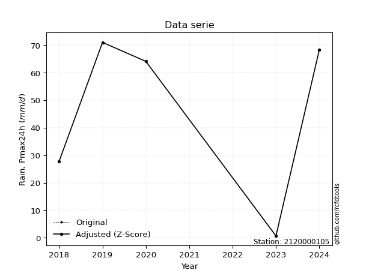</img>

</div>


> The initial value (value_initial) correspond to the initial obtained or null completed value, and value (value) is adjusted only when the initial value is outside the valid range (outlier) definite through the Z-Score value. If Z-Score is active, values out of range or outliers are replaced with the station mean value. A Z-Score (or standard score) measures how many standard deviations a data point is from the mean of a dataset, indicating its relative position; positive scores mean above the mean, negative mean below, and a score of zero is exactly at the mean, allowing for comparison of values from different distributions. It´s calculated using the formula $z=(x–μ)/σ$, where $x$ is the data point, $μ$ is the mean, and $σ$ is the standard deviation, helping identify outliers and understand probability.
>
> <sub>**Note**: In this study, "completing" (filling gaps in) and "extending" (forecasting or lengthening the historical record) rainfall data series are avoided for certain critical analyses because they introduce artificial bias and uncertainty, which can distort the statistics of rare events (extremes), alter day-to-day variability, and compromise the integrity and homogeneity of the original data. Some reasons against Completing/Extending rainfall data are: **Distortion of Extremes and Variability**: The primary issue is that most gap-filling or extension methods rely on averaging or regression with nearby stations, which inherently smooths the data. Rainfall is highly variable in space and time, with a large percentage of zero values and occasional large storms. Infilling methods often underestimate the highest values and overestimate the lowest (zero) values, which severely distorts analyses focused on flood frequency, drought severity, and intensity-duration-frequency (IDF) curves, **Loss of Data Homogeneity**: Infilled or extended data are synthetic estimates, not actual measurements. Combining these estimates with observed data can violate the assumption of data homogeneity, which requires that the data properties do not change over time. Inhomogeneity can lead to incorrect conclusions about long-term trends or changes in climate patterns, **Propagation of Errors**: Errors and biases from the original data (e.g., wind-induced undercatch, instrument errors, site changes) or the data used for imputation can propagate through the analysis, leading to unreliable hydrological models and inaccurate predictions, **Compromised Statistical Integrity**: For statistical analyses, especially those involving the frequency of events, using artificial data can introduce time bias or autocorrelation that doesn´t exist in reality, making it difficult to assess the true probability of events, **Difficulty in Validation**: It is difficult to accurately validate the quality of filled or extended data, especially for past periods where ground-truth measurements are unavailable. The reliability of imputation techniques heavily depends on the density of the surrounding station network and the complexity of the local topography.</sub>


### 4. Active continuous probability distributions from SciPy (80 of 104 available)

A Probability Density Function (PDF) describes the relative likelihood of a continuous random variable falling within a specific range, where the total area under its curve equals 1, and the area over any interval gives the actual probability for that range. Unlike discrete probabilities (like rolling a die), a PDF shows density, not direct probability for a single point (which is zero), with higher points indicating higher likelihood, often visualized as a bell curve for normal distributions.

A log of a probability density function (log-PDF) is simply the logarithm of the PDF´s value, denoted as $log(f(x))$, useful for converting multiplication of probabilities into addition, improving numerical stability with tiny numbers, and connecting to information theory concepts like entropy. Instead of dealing with very small probabilities (e.g., 0.000001), log-PDFs use negative numbers (e.g., $log(0.00001) ≈ -11.51$ that are easier for computers to handle, preventing underflow errors and simplifying complex calculations. In this study, each active probability distribution from SciPy is also evaluated in the $log$ form.

[scipy.stats](https://docs.scipy.org/doc/scipy/reference/stats.html) is a Python´s powerful submodule within the SciPy library for comprehensive statistical analysis, offering over 130 probability distributions (like Normal, Poisson, etc.), functions for descriptive stats (mean, variance), hypothesis testing (t-tests, chi-square), random variable generation, and statistical tests, making it essential for data science, modeling, and research. It provides tools to explore, model, and draw conclusions from data efficiently, working seamlessly with [NumPy](https://numpy.org/).

<div align="center">

|   id | p_dist           |   n_parameter | fit_method   | label                                                                       | active   | ref                                                                                                      |
|-----:|:-----------------|--------------:|:-------------|:----------------------------------------------------------------------------|:---------|:---------------------------------------------------------------------------------------------------------|
|    0 | alpha            |             3 | MLE          | Alpha                                                                       | True     | [:mortar_board:](https://docs.scipy.org/doc/scipy/reference/generated/scipy.stats.alpha.html)            |
|    1 | anglit           |             2 | MM           | Anglit                                                                      | True     | [:mortar_board:](https://docs.scipy.org/doc/scipy/reference/generated/scipy.stats.anglit.html)           |
|    2 | arcsine          |             2 | MM           | Arcsine                                                                     | True     | [:mortar_board:](https://docs.scipy.org/doc/scipy/reference/generated/scipy.stats.arcsine.html)          |
|    3 | argus            |             3 | MLE          | Argus                                                                       | True     | [:mortar_board:](https://docs.scipy.org/doc/scipy/reference/generated/scipy.stats.argus.html)            |
|    4 | beta             |             4 | MLE          | Beta                                                                        | True     | [:mortar_board:](https://docs.scipy.org/doc/scipy/reference/generated/scipy.stats.beta.html)             |
|    5 | betaprime        |             4 | MLE          | Beta prime                                                                  | True     | [:mortar_board:](https://docs.scipy.org/doc/scipy/reference/generated/scipy.stats.betaprime.html)        |
|    6 | bradford         |             3 | MLE          | Bradford                                                                    | True     | [:mortar_board:](https://docs.scipy.org/doc/scipy/reference/generated/scipy.stats.bradford.html)         |
|    7 | burr             |             4 | MLE          | Burr (Type III)                                                             | True     | [:mortar_board:](https://docs.scipy.org/doc/scipy/reference/generated/scipy.stats.burr.html)             |
|    8 | burr12           |             4 | MLE          | Burr (Type III) 12                                                          | True     | [:mortar_board:](https://docs.scipy.org/doc/scipy/reference/generated/scipy.stats.burr12.html)           |
|    9 | cosine           |             2 | MLE          | Cosine                                                                      | True     | [:mortar_board:](https://docs.scipy.org/doc/scipy/reference/generated/scipy.stats.cosine.html)           |
|   10 | crystalball      |             4 | MLE          | Crystalball                                                                 | True     | [:mortar_board:](https://docs.scipy.org/doc/scipy/reference/generated/scipy.stats.crystalball.html)      |
|   11 | dgamma           |             3 | MLE          | Double gamma                                                                | True     | [:mortar_board:](https://docs.scipy.org/doc/scipy/reference/generated/scipy.stats.dgamma.html)           |
|   12 | dweibull         |             3 | MLE          | Double Weibull                                                              | True     | [:mortar_board:](https://docs.scipy.org/doc/scipy/reference/generated/scipy.stats.dweibull.html)         |
|   13 | erlang           |             3 | MLE          | Erlang                                                                      | True     | [:mortar_board:](https://docs.scipy.org/doc/scipy/reference/generated/scipy.stats.erlang.html)           |
|   14 | exponnorm        |             3 | MLE          | Exponentially modified Normal                                               | True     | [:mortar_board:](https://docs.scipy.org/doc/scipy/reference/generated/scipy.stats.exponnorm.html)        |
|   15 | exponpow         |             3 | MLE          | Exponential power                                                           | True     | [:mortar_board:](https://docs.scipy.org/doc/scipy/reference/generated/scipy.stats.exponpow.html)         |
|   16 | exponweib        |             4 | MLE          | Exponentiated Weibull                                                       | True     | [:mortar_board:](https://docs.scipy.org/doc/scipy/reference/generated/scipy.stats.exponweib.html)        |
|   17 | f                |             4 | MLE          | F                                                                           | True     | [:mortar_board:](https://docs.scipy.org/doc/scipy/reference/generated/scipy.stats.f.html)                |
|   18 | fatiguelife      |             3 | MLE          | Fatigue-life (Birnbaum-Saunders)                                            | True     | [:mortar_board:](https://docs.scipy.org/doc/scipy/reference/generated/scipy.stats.fatiguelife.html)      |
|   19 | foldnorm         |             3 | MM           | Fold Normal                                                                 | True     | [:mortar_board:](https://docs.scipy.org/doc/scipy/reference/generated/scipy.stats.foldnorm.html)         |
|   20 | gamma            |             3 | MLE          | Gamma                                                                       | True     | [:mortar_board:](https://docs.scipy.org/doc/scipy/reference/generated/scipy.stats.gamma.html)            |
|   21 | gausshyper       |             6 | MLE          | Gauss hypergeometric                                                        | True     | [:mortar_board:](https://docs.scipy.org/doc/scipy/reference/generated/scipy.stats.gausshyper.html)       |
|   22 | genexpon         |             5 | MLE          | Generalized exponential                                                     | True     | [:mortar_board:](https://docs.scipy.org/doc/scipy/reference/generated/scipy.stats.genexpon.html)         |
|   23 | genextreme       |             3 | MLE          | Generalized exponential                                                     | True     | [:mortar_board:](https://docs.scipy.org/doc/scipy/reference/generated/scipy.stats.genextreme.html)       |
|   24 | gengamma         |             4 | MLE          | Generalized gamma                                                           | True     | [:mortar_board:](https://docs.scipy.org/doc/scipy/reference/generated/scipy.stats.gengamma.html)         |
|   25 | genhalflogistic  |             3 | MLE          | Generalized half-logistic                                                   | True     | [:mortar_board:](https://docs.scipy.org/doc/scipy/reference/generated/scipy.stats.genhalflogistic.html)  |
|   26 | genlogistic      |             3 | MLE          | Generalized logistic                                                        | True     | [:mortar_board:](https://docs.scipy.org/doc/scipy/reference/generated/scipy.stats.genlogistic.html)      |
|   27 | gennorm          |             3 | MLE          | Generalized Normal                                                          | True     | [:mortar_board:](https://docs.scipy.org/doc/scipy/reference/generated/scipy.stats.gennorm.html)          |
|   28 | genpareto        |             3 | MLE          | Generalized Pareto                                                          | True     | [:mortar_board:](https://docs.scipy.org/doc/scipy/reference/generated/scipy.stats.genpareto.html)        |
|   29 | gompertz         |             3 | MLE          | Gompertz (or truncated Gumbel)                                              | True     | [:mortar_board:](https://docs.scipy.org/doc/scipy/reference/generated/scipy.stats.gompertz.html)         |
|   30 | gumbel_l         |             2 | MM           | Gumbel Left Skew                                                            | True     | [:mortar_board:](https://docs.scipy.org/doc/scipy/reference/generated/scipy.stats.gumbel_l.html)         |
|   31 | gumbel_r         |             2 | MM           | Gumbel Right Skew                                                           | True     | [:mortar_board:](https://docs.scipy.org/doc/scipy/reference/generated/scipy.stats.gumbel_r.html)         |
|   32 | halfgennorm      |             3 | MLE          | Upper half of a generalized normal                                          | True     | [:mortar_board:](https://docs.scipy.org/doc/scipy/reference/generated/scipy.stats.halfgennorm.html)      |
|   33 | halflogistic     |             2 | MM           | Half-logistic                                                               | True     | [:mortar_board:](https://docs.scipy.org/doc/scipy/reference/generated/scipy.stats.halflogistic.html)     |
|   34 | halfnorm         |             2 | MM           | Half Normal                                                                 | True     | [:mortar_board:](https://docs.scipy.org/doc/scipy/reference/generated/scipy.stats.halfnorm.html)         |
|   35 | hypsecant        |             2 | MM           | hyperbolic secant                                                           | True     | [:mortar_board:](https://docs.scipy.org/doc/scipy/reference/generated/scipy.stats.hypsecant.html)        |
|   36 | invgamma         |             3 | MLE          | Inverted gamma                                                              | True     | [:mortar_board:](https://docs.scipy.org/doc/scipy/reference/generated/scipy.stats.invgamma.html)         |
|   37 | invgauss         |             3 | MLE          | Inverse Gaussian                                                            | True     | [:mortar_board:](https://docs.scipy.org/doc/scipy/reference/generated/scipy.stats.invgauss.html)         |
|   38 | invweibull       |             3 | MLE          | Inverted Weibull                                                            | True     | [:mortar_board:](https://docs.scipy.org/doc/scipy/reference/generated/scipy.stats.invweibull.html)       |
|   39 | johnsonsb        |             4 | MLE          | Johnson SB                                                                  | True     | [:mortar_board:](https://docs.scipy.org/doc/scipy/reference/generated/scipy.stats.johnsonsb.html)        |
|   40 | johnsonsu        |             4 | MLE          | Johnson Su                                                                  | True     | [:mortar_board:](https://docs.scipy.org/doc/scipy/reference/generated/scipy.stats.johnsonsu.html)        |
|   41 | kappa3           |             3 | MLE          | Kappa 3                                                                     | True     | [:mortar_board:](https://docs.scipy.org/doc/scipy/reference/generated/scipy.stats.kappa3.html)           |
|   42 | kappa4           |             4 | MLE          | Kappa 4                                                                     | True     | [:mortar_board:](https://docs.scipy.org/doc/scipy/reference/generated/scipy.stats.kappa4.html)           |
|   43 | ksone            |             3 | MLE          | Kolmogorov-Smirnov one-sided test statistic distribution                    | True     | [:mortar_board:](https://docs.scipy.org/doc/scipy/reference/generated/scipy.stats.ksone.html)            |
|   44 | kstwobign        |             2 | MLE          | Limiting distribution of scaled Kolmogorov-Smirnov two-sided test statistic | True     | [:mortar_board:](https://docs.scipy.org/doc/scipy/reference/generated/scipy.stats.kstwobign.html)        |
|   45 | laplace          |             2 | MM           | Laplace                                                                     | True     | [:mortar_board:](https://docs.scipy.org/doc/scipy/reference/generated/scipy.stats.laplace.html)          |
|   46 | levy_l           |             2 | MLE          | Left-skewed Levy                                                            | True     | [:mortar_board:](https://docs.scipy.org/doc/scipy/reference/generated/scipy.stats.levy_l.html)           |
|   47 | loggamma         |             3 | MLE          | Log gamma                                                                   | True     | [:mortar_board:](https://docs.scipy.org/doc/scipy/reference/generated/scipy.stats.loggamma.html)         |
|   48 | logistic         |             2 | MM           | Logistic (or Sech-squared)                                                  | True     | [:mortar_board:](https://docs.scipy.org/doc/scipy/reference/generated/scipy.stats.logistic.html)         |
|   49 | loglaplace       |             3 | MLE          | Log-Laplace                                                                 | True     | [:mortar_board:](https://docs.scipy.org/doc/scipy/reference/generated/scipy.stats.loglaplace.html)       |
|   50 | lomax            |             3 | MLE          | Lomax (Pareto of the second kind)                                           | True     | [:mortar_board:](https://docs.scipy.org/doc/scipy/reference/generated/scipy.stats.lomax.html)            |
|   51 | maxwell          |             2 | MM           | Maxwell                                                                     | True     | [:mortar_board:](https://docs.scipy.org/doc/scipy/reference/generated/scipy.stats.maxwell.html)          |
|   52 | mielke           |             4 | MLE          | Mielke Beta-Kappa / Dagum                                                   | True     | [:mortar_board:](https://docs.scipy.org/doc/scipy/reference/generated/scipy.stats.mielke.html)           |
|   53 | moyal            |             2 | MM           | Moyal                                                                       | True     | [:mortar_board:](https://docs.scipy.org/doc/scipy/reference/generated/scipy.stats.moyal.html)            |
|   54 | nakagami         |             3 | MLE          | Nakagami                                                                    | True     | [:mortar_board:](https://docs.scipy.org/doc/scipy/reference/generated/scipy.stats.nakagami.html)         |
|   55 | ncf              |             5 | MLE          | Non-central F distribution                                                  | True     | [:mortar_board:](https://docs.scipy.org/doc/scipy/reference/generated/scipy.stats.ncf.html)              |
|   56 | nct              |             4 | MLE          | Non-central Student’s t                                                     | True     | [:mortar_board:](https://docs.scipy.org/doc/scipy/reference/generated/scipy.stats.nct.html)              |
|   57 | norm             |             2 | MM           | Normal                                                                      | True     | [:mortar_board:](https://docs.scipy.org/doc/scipy/reference/generated/scipy.stats.norm.html)             |
|   58 | pearson3         |             3 | MM           | Pearson type III                                                            | True     | [:mortar_board:](https://docs.scipy.org/doc/scipy/reference/generated/scipy.stats.pearson3.html)         |
|   59 | powerlaw         |             3 | MLE          | Power-function                                                              | True     | [:mortar_board:](https://docs.scipy.org/doc/scipy/reference/generated/scipy.stats.powerlaw.html)         |
|   60 | rayleigh         |             2 | MM           | Rayleigh                                                                    | True     | [:mortar_board:](https://docs.scipy.org/doc/scipy/reference/generated/scipy.stats.rayleigh.html)         |
|   61 | rdist            |             3 | MLE          | R-distributed (symmetric beta)                                              | True     | [:mortar_board:](https://docs.scipy.org/doc/scipy/reference/generated/scipy.stats.rdist.html)            |
|   62 | rice             |             3 | MLE          | Rice                                                                        | True     | [:mortar_board:](https://docs.scipy.org/doc/scipy/reference/generated/scipy.stats.rice.html)             |
|   63 | semicircular     |             2 | MM           | Semicircular                                                                | True     | [:mortar_board:](https://docs.scipy.org/doc/scipy/reference/generated/scipy.stats.semicircular.html)     |
|   64 | skewnorm         |             3 | MLE          | Skew normal                                                                 | True     | [:mortar_board:](https://docs.scipy.org/doc/scipy/reference/generated/scipy.stats.skewnorm.html)         |
|   65 | t                |             3 | MLE          | Student’s t                                                                 | True     | [:mortar_board:](https://docs.scipy.org/doc/scipy/reference/generated/scipy.stats.t.html)                |
|   66 | trapezoid        |             4 | MLE          | Trapezoid                                                                   | True     | [:mortar_board:](https://docs.scipy.org/doc/scipy/reference/generated/scipy.stats.trapezoid.html)        |
|   67 | triang           |             3 | MLE          | Triangular                                                                  | True     | [:mortar_board:](https://docs.scipy.org/doc/scipy/reference/generated/scipy.stats.triang.html)           |
|   68 | truncexpon       |             3 | MLE          | Truncated exponential                                                       | True     | [:mortar_board:](https://docs.scipy.org/doc/scipy/reference/generated/scipy.stats.truncexpon.html)       |
|   69 | truncnorm        |             4 | MLE          | Truncated normal                                                            | True     | [:mortar_board:](https://docs.scipy.org/doc/scipy/reference/generated/scipy.stats.truncnorm.html)        |
|   70 | truncpareto      |             4 | MLE          | Upper truncated Pareto                                                      | True     | [:mortar_board:](https://docs.scipy.org/doc/scipy/reference/generated/scipy.stats.truncpareto.html)      |
|   71 | truncweibull_min |             5 | MLE          | Doubly truncated Weibull minimum                                            | True     | [:mortar_board:](https://docs.scipy.org/doc/scipy/reference/generated/scipy.stats.truncweibull_min.html) |
|   72 | tukeylambda      |             3 | MLE          | Tukey-Lamdba                                                                | True     | [:mortar_board:](https://docs.scipy.org/doc/scipy/reference/generated/scipy.stats.tukeylambda.html)      |
|   73 | uniform          |             2 | MLE          | Uniform                                                                     | True     | [:mortar_board:](https://docs.scipy.org/doc/scipy/reference/generated/scipy.stats.uniform.html)          |
|   74 | vonmises         |             3 | MLE          | Von Mises                                                                   | True     | [:mortar_board:](https://docs.scipy.org/doc/scipy/reference/generated/scipy.stats.vonmises.html)         |
|   75 | vonmises_line    |             3 | MLE          | Von Mises line                                                              | True     | [:mortar_board:](https://docs.scipy.org/doc/scipy/reference/generated/scipy.stats.vonmises_line.html)    |
|   76 | wald             |             2 | MM           | Wald                                                                        | True     | [:mortar_board:](https://docs.scipy.org/doc/scipy/reference/generated/scipy.stats.wald.html)             |
|   77 | weibull_max      |             3 | MLE          | Weibull maximum                                                             | True     | [:mortar_board:](https://docs.scipy.org/doc/scipy/reference/generated/scipy.stats.weibull_max.html)      |
|   78 | weibull_min      |             3 | MLE          | Weibull minimum                                                             | True     | [:mortar_board:](https://docs.scipy.org/doc/scipy/reference/generated/scipy.stats.weibull_min.html)      |
|   79 | wrapcauchy       |             3 | MLE          | Wrapped  Cauchy                                                             | True     | [:mortar_board:](https://docs.scipy.org/doc/scipy/reference/generated/scipy.stats.wrapcauchy.html)       |

</div>

> **n_parameter:** # arguments & localization & scale.
>
> **Fit methods:** (MLE) maximum likelihood, (MM) L-moments.
>
>**Inactive** (With the only purpose of prevent loops, zero divisions, infinite values, over high estimated values or horizontal trending for recurrence intervals estimations, the follow distributions were disabled.)**:** lognorm, norminvgauss, powernorm, powerlognorm, cauchy, halfcauchy, foldcauchy, skewcauchy, chi2, expon, fisk, genhyperbolic, geninvgauss, gibrat, kstwo, laplace_asymmetric, levy, levy_stable, ncx2, pareto, rel_breitwigner, recipinvgauss, studentized_range, loguniform, 


## B. Probability (PDF) vs. Empirical (EDF) distributions functions

A continuous probability distribution (CPD) describes probabilities for variables that can take any value within a range (like rain any time), unlike discrete variables with specific outcomes (like temperature). It uses a Probability Density Function (PDF), a curve where the total area under it equals 1, and the probability of the variable falling within an interval (a to b) is found by calculating the area under the curve between those points. A key feature is that the probability of hitting any single exact value is zero, so probabilities are always expressed for ranges, e.g., $P(a ≤ X ≤ b)$.

<div align="center">

Distributions parameters from station values
|     |    station | p_dist              |   n |             loc |           scale | shape                  | shape1                | shape2                | shape3             |
|----:|-----------:|:--------------------|----:|----------------:|----------------:|:-----------------------|:----------------------|:----------------------|:-------------------|
|   0 | 2120000105 | alpha               |   6 |    -0.00594004  |     1.79942     | 7.911926548180104e-09  |                       |                       |                    |
|   1 | 2120000105 | anglit              |   6 |    49.85        |    77.3388      |                        |                       |                       |                    |
|   2 | 2120000105 | arcsine             |   6 |    12.4624      |    74.7752      |                        |                       |                       |                    |
|   3 | 2120000105 | argus               |   6 |   -30.1781      |   103.543       | 2.7907201171362725     |                       |                       |                    |
|   4 | 2120000105 | beta                |   6 |    -6.54961     |    77.4496      | 0.320208292375142      | 0.13846454485985948   |                       |                    |
|   5 | 2120000105 | betaprime           |   6 | -1010.06        | 57367           | 1600.2338718818678     | 86623.3565261146      |                       |                    |
|   6 | 2120000105 | bradford            |   6 |    -8.56881     |    79.4689      | 1.936805282557484e-06  |                       |                       |                    |
|   7 | 2120000105 | burr                |   6 |     0.055366    |    72.3567      | 150.35600391158772     | 0.006701916585940545  |                       |                    |
|   8 | 2120000105 | burr12              |   6 |  -101.362       |   773.043       | 7.736339790100564      | 187966.04759343478    |                       |                    |
|   9 | 2120000105 | cosine              |   6 |    46.1952      |    21.9427      |                        |                       |                       |                    |
|  10 | 2120000105 | crystalball         |   6 |    49.85        |    26.437       | 7041.008340078709      | 3389.0857073483085    |                       |                    |
|  11 | 2120000105 | dgamma              |   6 |    67.5         |    18.7157      | 0.6252085515493466     |                       |                       |                    |
|  12 | 2120000105 | dweibull            |   6 |    67.5         |    19.8122      | 0.6327013505491658     |                       |                       |                    |
|  13 | 2120000105 | erlang              |   6 |  -363.177       |     1.83294     | 225.26183696202793     |                       |                       |                    |
|  14 | 2120000105 | exponnorm           |   6 |    49.8322      |    26.437       | 0.0006658910332530377  |                       |                       |                    |
|  15 | 2120000105 | exponpow            |   6 |     0.7         |     3.6926      | 0.14500675230406312    |                       |                       |                    |
|  16 | 2120000105 | exponweib           |   6 |     0.7         |     3.20576     | 2.318966789957096      | 0.31888817719912843   |                       |                    |
|  17 | 2120000105 | f                   |   6 | -6521.15        |  6571           | 138140.88504405814     | 1027568.3040571888    |                       |                    |
|  18 | 2120000105 | fatiguelife         |   6 |     0.7         |     0.000131946 | 519.8975818455085      |                       |                       |                    |
|  19 | 2120000105 | foldnorm            |   6 |  -141.239       |    23.4681      | 8.173579968910616      |                       |                       |                    |
|  20 | 2120000105 | gamma               |   6 |  -355.887       |     1.89082     | 214.40886056058503     |                       |                       |                    |
|  21 | 2120000105 | gausshyper          |   6 |    -8.01115     |    78.9111      | 1.3431988805428567     | 0.4452126934266188    | 1.1400521526692753    | 0.9012569935100885 |
|  22 | 2120000105 | genexpon            |   6 |     0.699976    |     2.35809     | 0.047999571087130904   | 2.910436974242001e-07 | 3.1853002418014236    |                    |
|  23 | 2120000105 | genextreme          |   6 |    54.2556      |    19.058       | 1.1450105746538402     |                       |                       |                    |
|  24 | 2120000105 | gengamma            |   6 |  -978.794       |   315.889       | 100.63346487439384     | 3.902905583364933     |                       |                    |
|  25 | 2120000105 | genhalflogistic     |   6 |    -8.96185     |    89.4394      | 1.1199261953822461     |                       |                       |                    |
|  26 | 2120000105 | genlogistic         |   6 |    70.9006      |     5.71795e-05 | 2.725921828525797e-06  |                       |                       |                    |
|  27 | 2120000105 | gennorm             |   6 |    68.2         |     0.249924    | 0.33658527837080776    |                       |                       |                    |
|  28 | 2120000105 | genpareto           |   6 |     0.621213    |   130.398       | -1.855443031230862     |                       |                       |                    |
|  29 | 2120000105 | gompertz            |   6 |    27.8         |     7.43451     | 0.005597957815872074   |                       |                       |                    |
|  30 | 2120000105 | gumbel_l            |   6 |    61.7481      |    20.6129      |                        |                       |                       |                    |
|  31 | 2120000105 | gumbel_r            |   6 |    37.9519      |    20.6129      |                        |                       |                       |                    |
|  32 | 2120000105 | halfgennorm         |   6 |     0.7         |     3.91842     | 0.40366933773727465    |                       |                       |                    |
|  33 | 2120000105 | halflogistic        |   6 |    18.516       |    22.6027      |                        |                       |                       |                    |
|  34 | 2120000105 | halfnorm            |   6 |    14.8577      |    43.8563      |                        |                       |                       |                    |
|  35 | 2120000105 | hypsecant           |   6 |    49.85        |    16.8303      |                        |                       |                       |                    |
|  36 | 2120000105 | invgamma            |   6 |  -291.604       | 48404.1         | 142.73856490910032     |                       |                       |                    |
|  37 | 2120000105 | invgauss            |   6 |  -177.722       | 13974.8         | 0.016303989702729844   |                       |                       |                    |
|  38 | 2120000105 | invweibull          |   6 |     0.7         |     6.39058     | 0.04608176502152564    |                       |                       |                    |
|  39 | 2120000105 | johnsonsb           |   6 |     0.660924    |    70.2391      | -1.2207798886223098    | 0.14033830218835652   |                       |                    |
|  40 | 2120000105 | johnsonsu           |   6 |    70.9         |     1.0402e-13  | 1.7518760710673589     | 0.0777391946349762    |                       |                    |
|  41 | 2120000105 | kappa3              |   6 |     0.699896    |    70.2         | 1157911.8069526248     |                       |                       |                    |
|  42 | 2120000105 | kappa4              |   6 |    -4.56869     |   107.79        | 0.970220674025096      | 1.4282684711763034    |                       |                    |
|  43 | 2120000105 | ksone               |   6 |    -6.32        |    84.24        | 1.0                    |                       |                       |                    |
|  44 | 2120000105 | kstwobign           |   6 |   -64.327       |   130.076       |                        |                       |                       |                    |
|  45 | 2120000105 | laplace             |   6 |    49.85        |    18.6938      |                        |                       |                       |                    |
|  46 | 2120000105 | levy_l              |   6 |    71.5479      |     2.6565      |                        |                       |                       |                    |
|  47 | 2120000105 | loggamma            |   6 |    71.8496      |     2.59582e-05 | 1.1817709256043205e-06 |                       |                       |                    |
|  48 | 2120000105 | logistic            |   6 |    49.85        |    14.5755      |                        |                       |                       |                    |
|  49 | 2120000105 | loglaplace          |   6 |    -0.183049    |    67.683       | 1.1246736063968679     |                       |                       |                    |
|  50 | 2120000105 | lomax               |   6 |     0.529285    |  1878.7         | 37.613319258353634     |                       |                       |                    |
|  51 | 2120000105 | maxwell             |   6 |   -12.7946      |    39.2567      |                        |                       |                       |                    |
|  52 | 2120000105 | mielke              |   6 |    -9.92482e+08 |     9.92482e+08 | 50095717.38166179      | 305642622860.8439     |                       |                    |
|  53 | 2120000105 | moyal               |   6 |    34.7316      |    11.9008      |                        |                       |                       |                    |
|  54 | 2120000105 | nakagami            |   6 |     0.7         |    42.2616      | 0.32771394548731836    |                       |                       |                    |
|  55 | 2120000105 | ncf                 |   6 |    -0.0322919   |     1.79826e-08 | 2.936613510732485e-09  | 15.05445408619606     | 7.753138930190959     |                    |
|  56 | 2120000105 | nct                 |   6 |    -0.414602    |     0.0498276   | 0.3193432041333676     | 54.73618833571068     |                       |                    |
|  57 | 2120000105 | norm                |   6 |    49.85        |    26.437       |                        |                       |                       |                    |
|  58 | 2120000105 | pearson3            |   6 |    49.85        |    26.437       | -0.9526742581961235    |                       |                       |                    |
|  59 | 2120000105 | powerlaw            |   6 |     0.7         |    70.2         | 0.14240858163019188    |                       |                       |                    |
|  60 | 2120000105 | rayleigh            |   6 |    -0.725556    |    40.3535      |                        |                       |                       |                    |
|  61 | 2120000105 | rdist               |   6 |    -5.74758     |    33.5476      | 1.1610288163935283     |                       |                       |                    |
|  62 | 2120000105 | rice                |   6 |   -17.2712      |    28.7513      | 2.0725795042252306     |                       |                       |                    |
|  63 | 2120000105 | semicircular        |   6 |    49.85        |    52.874       |                        |                       |                       |                    |
|  64 | 2120000105 | skewnorm            |   6 |    70.9         |    33.7941      | -22426941.710081667    |                       |                       |                    |
|  65 | 2120000105 | t                   |   6 |    49.8489      |    26.4366      | 72901534.5912392       |                       |                       |                    |
|  66 | 2120000105 | trapezoid           |   6 |   -26.1714      |   112.163       | 1.0                    | 1.0                   |                       |                    |
|  67 | 2120000105 | triang              |   6 |   -13.9144      |    84.8144      | 0.9999999993498179     |                       |                       |                    |
|  68 | 2120000105 | truncexpon          |   6 |    -5.56743     |    86.7408      | 0.8815620563176036     |                       |                       |                    |
|  69 | 2120000105 | truncnorm           |   6 |    -2.77019     |     5.47331     | -0.6650904120228771    | 13.459902753895141    |                       |                    |
|  70 | 2120000105 | truncpareto         |   6 |     0.545724    |     0.154276    | 0.20357928484240292    | 456.02795289539904    |                       |                    |
|  71 | 2120000105 | truncweibull_min    |   6 |    -2.2786      |   139.837       | 1.5534550827046596     | 0.0015187006665182525 | 0.5233153180016741    |                    |
|  72 | 2120000105 | tukeylambda         |   6 |    -5.52013     |    34.7772      | 1.0437306461948763     |                       |                       |                    |
|  73 | 2120000105 | uniform             |   6 |     0.7         |    70.2         |                        |                       |                       |                    |
|  74 | 2120000105 | vonmises            |   6 |     1.09605     |     1           | 0.4642620304309497     |                       |                       |                    |
|  75 | 2120000105 | vonmises_line       |   6 |    58.5675      |    18.4198      | 0.9431948850377052     |                       |                       |                    |
|  76 | 2120000105 | wald                |   6 |    23.413       |    26.437       |                        |                       |                       |                    |
|  77 | 2120000105 | weibull_max         |   6 |    70.9         |    30.3878      | 0.46402457082917065    |                       |                       |                    |
|  78 | 2120000105 | weibull_min         |   6 |    -1.32094e+09 |     1.32094e+09 | 77688624.95863083      |                       |                       |                    |
|  79 | 2120000105 | wrapcauchy          |   6 |     0.699991    |    11.1727      | 0.7856568995666611     |                       |                       |                    |
|  80 | 2120000105 | logalpha            |   6 |   -67.2915      |  2813.3         | 39.89817466724266      |                       |                       |                    |
|  81 | 2120000105 | loganglit           |   6 |     3.30385     |     4.88294     |                        |                       |                       |                    |
|  82 | 2120000105 | logarcsine          |   6 |     0.943329    |     4.72105     |                        |                       |                       |                    |
|  83 | 2120000105 | logargus            |   6 |    -1.92267     |     6.3385      | 3.4024873208235507     |                       |                       |                    |
|  84 | 2120000105 | logbeta             |   6 |    -0.897215    |     5.15849     | 0.15364891598272507    | 0.03436832020390869   |                       |                    |
|  85 | 2120000105 | logbetaprime        |   6 |    -0.356675    |     2.27839     | 0.6639920545638027     | 1.0219442983775187    |                       |                    |
|  86 | 2120000105 | logbradford         |   6 |    -0.35673     |     4.73798     | 5.329635435707798e-06  |                       |                       |                    |
|  87 | 2120000105 | logburr             |   6 |    -0.356675    |     1.77071     | 0.7859109544437715     | 1.1048145760219288    |                       |                    |
|  88 | 2120000105 | logburr12           |   6 |    -0.356675    |     2.71206     | 0.8849941726981849     | 1.2513176506181243    |                       |                    |
|  89 | 2120000105 | logcosine           |   6 |     2.92714     |     1.48846     |                        |                       |                       |                    |
|  90 | 2120000105 | logcrystalball      |   6 |     3.30385     |     1.66915     | 1157.8732182974709     | 58.34164638804452     |                       |                    |
|  91 | 2120000105 | logdgamma           |   6 |     4.22244     |     1.01657     | 0.8351118180626944     |                       |                       |                    |
|  92 | 2120000105 | logdweibull         |   6 |     4.22244     |     1.00342     | 0.848625360074303      |                       |                       |                    |
|  93 | 2120000105 | logerlang           |   6 |    -0.356675    |     5.55963     | 0.7298826679123056     |                       |                       |                    |
|  94 | 2120000105 | logexponnorm        |   6 |     3.30285     |     1.66914     | 0.0005975158137344078  |                       |                       |                    |
|  95 | 2120000105 | logexponpow         |   6 |    -0.356675    |     2.39403     | 0.5251707563502108     |                       |                       |                    |
|  96 | 2120000105 | logexponweib        |   6 |    -2.25033e+08 |     2.25033e+08 | 1.4052236135306941     | 159807828.0794253     |                       |                    |
|  97 | 2120000105 | logf                |   6 |    -0.356675    |     1.07588     | 1.2701471406611469     | 1.2229964475040271    |                       |                    |
|  98 | 2120000105 | logfatiguelife      |   6 | -1180.93        |  1184.23        | 0.0014069729984471737  |                       |                       |                    |
|  99 | 2120000105 | logfoldnorm         |   6 |   -28.0544      |     1.33769     | 23.499807600023143     |                       |                       |                    |
| 100 | 2120000105 | loggamma            |   6 |   -24.0003      |     0.110259    | 247.62619044601922     |                       |                       |                    |
| 101 | 2120000105 | loggausshyper       |   6 |    -0.975393    |     5.23666     | 1.3059359087773292     | 0.4809035103498691    | 1.0325924803140272    | 1.0618855905825286 |
| 102 | 2120000105 | loggenexpon         |   6 |    -0.545119    |     0.0164674   | 0.0011079181262404112  | 1.7077423854557274    | 1.338833761770172e-05 |                    |
| 103 | 2120000105 | loggenextreme       |   6 |     3.71514     |     0.911108    | 1.6682873874555875     |                       |                       |                    |
| 104 | 2120000105 | loggengamma         |   6 |   -80.9588      |    41.1963      | 74.83460910647437      | 6.022685462738838     |                       |                    |
| 105 | 2120000105 | loggenhalflogistic  |   6 |    -0.368462    |     5.27648     | 1.1396940449403308     |                       |                       |                    |
| 106 | 2120000105 | loggenlogistic      |   6 |     4.2613      |     2.81647e-06 | 2.945735856893165e-06  |                       |                       |                    |
| 107 | 2120000105 | loggennorm          |   6 |     4.22244     |     0.0346028   | 0.4227610303132403     |                       |                       |                    |
| 108 | 2120000105 | loggenpareto        |   6 |    -0.428713    |    10.8924      | -2.322474674628683     |                       |                       |                    |
| 109 | 2120000105 | loggompertz         |   6 |    -0.356677    |     1.94179     | 0.1399003746957757     |                       |                       |                    |
| 110 | 2120000105 | loggumbel_l         |   6 |     4.05506     |     1.30143     |                        |                       |                       |                    |
| 111 | 2120000105 | loggumbel_r         |   6 |     2.55264     |     1.30143     |                        |                       |                       |                    |
| 112 | 2120000105 | loghalfgennorm      |   6 |    -0.356675    |     6.71669     | 2.8015678724218267     |                       |                       |                    |
| 113 | 2120000105 | loghalflogistic     |   6 |     1.3255      |     1.42708     |                        |                       |                       |                    |
| 114 | 2120000105 | loghalfnorm         |   6 |     1.09457     |     2.76893     |                        |                       |                       |                    |
| 115 | 2120000105 | loghypsecant        |   6 |     3.30385     |     1.06262     |                        |                       |                       |                    |
| 116 | 2120000105 | loginvgamma         |   6 |   -39.9365      | 25970           | 601.7182808362254      |                       |                       |                    |
| 117 | 2120000105 | loginvgauss         |   6 |   -15.724       |  1961.76        | 0.009691902373868924   |                       |                       |                    |
| 118 | 2120000105 | loginvweibull       |   6 | -5205.8         |  5208.03        | 2580.53366590279       |                       |                       |                    |
| 119 | 2120000105 | logjohnsonsb        |   6 |    -1.82273     |     6.084       | -0.45745368331757563   | 0.16740029905094217   |                       |                    |
| 120 | 2120000105 | logjohnsonsu        |   6 |     4.26127     |     7.89744e-14 | 3.285181222116787      | 0.15538884024126903   |                       |                    |
| 121 | 2120000105 | logkappa3           |   6 |    -0.356675    |     4.74804     | 3.4791276047732937     |                       |                       |                    |
| 122 | 2120000105 | logkappa4           |   6 |    -0.699771    |     5.75576     | 1.0635476243854627     | 1.1601919597810233    |                       |                    |
| 123 | 2120000105 | logksone            |   6 |    -0.818469    |     5.54153     | 1.0                    |                       |                       |                    |
| 124 | 2120000105 | logkstwobign        |   6 |    -4.9392      |     9.4135      |                        |                       |                       |                    |
| 125 | 2120000105 | loglaplace          |   6 |     3.30385     |     1.18027     |                        |                       |                       |                    |
| 126 | 2120000105 | loglevy_l           |   6 |     4.27104     |     0.0400083   |                        |                       |                       |                    |
| 127 | 2120000105 | logloggamma         |   6 |     4.26131     |     3.2368e-06  | 3.3895949318528623e-06 |                       |                       |                    |
| 128 | 2120000105 | loglogistic         |   6 |     3.30385     |     0.920252    |                        |                       |                       |                    |
| 129 | 2120000105 | logloglaplace       |   6 |    -0.356675    |     1.91823     | 0.5992744266533987     |                       |                       |                    |
| 130 | 2120000105 | loglomax            |   6 |    -0.356675    |     1.57164     | 0.8471717291375923     |                       |                       |                    |
| 131 | 2120000105 | logmaxwell          |   6 |    -0.651342    |     2.47855     |                        |                       |                       |                    |
| 132 | 2120000105 | logmielke           |   6 |    -2.51391e+08 |     2.51391e+08 | 269649751.5853168      | 342034241.16319126    |                       |                    |
| 133 | 2120000105 | logmoyal            |   6 |     2.34932     |     0.751382    |                        |                       |                       |                    |
| 134 | 2120000105 | lognakagami         |   6 | -2328.45        |  2331.76        | 486771.9744778068      |                       |                       |                    |
| 135 | 2120000105 | logncf              |   6 |    -0.356675    |     1.10627     | 1.1101377345323797     | 1.3545174143119643    | 0.9799836088142796    |                    |
| 136 | 2120000105 | lognct              |   6 |  -119.211       |     1.65893     | 195629.80539648933     | 73.85084041286328     |                       |                    |
| 137 | 2120000105 | lognorm             |   6 |     3.30385     |     1.66915     |                        |                       |                       |                    |
| 138 | 2120000105 | logpearson3         |   6 |     3.30385     |     1.66914     | -1.6494153340146163    |                       |                       |                    |
| 139 | 2120000105 | logpowerlaw         |   6 |    -0.356675    |     4.61795     | 0.15295184467387518    |                       |                       |                    |
| 140 | 2120000105 | lograyleigh         |   6 |     0.110642    |     2.54781     |                        |                       |                       |                    |
| 141 | 2120000105 | logrdist            |   6 |     0.194002    |     0.550677    | 1.5636238211218076     |                       |                       |                    |
| 142 | 2120000105 | logrice             |   6 |  -494.847       |     1.66897     | 298.47580655682987     |                       |                       |                    |
| 143 | 2120000105 | logsemicircular     |   6 |     3.30384     |     3.33832     |                        |                       |                       |                    |
| 144 | 2120000105 | logskewnorm         |   6 |     4.26127     |     1.9243      | -21007913.44136616     |                       |                       |                    |
| 145 | 2120000105 | logt                |   6 |     4.21773     |     0.0144994   | 0.336038071248038      |                       |                       |                    |
| 146 | 2120000105 | logtrapezoid        |   6 |    -1.48809     |     7.08161     | 1.0                    | 1.0                   |                       |                    |
| 147 | 2120000105 | logtriang           |   6 |    -1.70014     |     5.96141     | 0.9999990833296207     |                       |                       |                    |
| 148 | 2120000105 | logtruncexpon       |   6 |    -0.57349     |     8.17403     | 0.5914782809740733     |                       |                       |                    |
| 149 | 2120000105 | logtruncnorm        |   6 |     1.41165     |     6.12285     | -0.2888069159143657    | 0.4665660732517072    |                       |                    |
| 150 | 2120000105 | logtruncpareto      |   6 |    -0.368998    |     0.0122969   | 5.758505160387284e-08  | 376.5692132214667     |                       |                    |
| 151 | 2120000105 | logtruncweibull_min |   6 |    -0.473818    |     8.01954     | 1.5705517310476846     | 0.0007604870653994068 | 0.5904441582226796    |                    |
| 152 | 2120000105 | logtukeylambda      |   6 |     0.436309    |     5.08874     | 1.330404103005393      |                       |                       |                    |
| 153 | 2120000105 | loguniform          |   6 |    -0.356675    |     4.61795     |                        |                       |                       |                    |
| 154 | 2120000105 | logvonmises         |   6 |    -2.0219      |     1           | 2.3574034356720883     |                       |                       |                    |
| 155 | 2120000105 | logvonmises_line    |   6 |     3.76392     |     1.31163     | 1.5932458200106807     |                       |                       |                    |
| 156 | 2120000105 | logwald             |   6 |     1.63474     |     1.66912     |                        |                       |                       |                    |
| 157 | 2120000105 | logweibull_max      |   6 |     4.26127     |     2.03447     | 0.2588123619373489     |                       |                       |                    |
| 158 | 2120000105 | logweibull_min      |   6 |    -0.356675    |     2.41243     | 0.7684089333437483     |                       |                       |                    |
| 159 | 2120000105 | logwrapcauchy       |   6 |    -0.36373     |     0.736092    | 0.9486656559449993     |                       |                       |                    |

</div>

> **loc** (Location parameter): This shifts the distribution along the x-axis. For many common distributions, like the normal (Gaussian) distribution, loc represents the mean $μ$. For others, like the uniform distribution, it might represent the minimum value, or for the beta distribution, the left end of the support interval.
>
> **scale** (Scale parameter): This determines the width or spread of the distribution. For the normal distribution, scale represents the standard deviation $σ$. For a uniform distribution, it defines the length of the interval (from $loc$ to $loc + scale$).
>
> **shape** (Shape parameters): Refers to parameters that define the specific form of a probability distribution, distinct from its location (loc) and scale (scale). These parameters are required arguments for most distribution functions. For example, a normal (Gaussian) distribution is fully defined by its location (mean) and scale (standard deviation), so it has no specific shape parameters beyond loc and scale. However, other distributions have intrinsic properties that need specification, as Gamma distribution that takes a shape parameter, often named $a$ or $alpha$.


### 0. Cumulative distribution values - CDF (160 evaluated)

Cumulative Distribution Function (CDF), denoted as $F$<sub>$X$</sub>$(x)$, is a function that gives the probability that a random variable $X$ will take a value less than or equal to a specific value, $x$ (i.e., $(P(X≥x)$. It essentially "accumulates" probabilities from a given point up to the far right (positive infinity), providing a complete picture of the distribution´s probabilities for both discrete (like rain) and continuous (like temperature) variables, helping to find probabilities over ranges or above certain values. Each station is evaluated separately ordering the $x$ values ascending, calculating the CDF and PDF values for the activated distributions and their logarithmic forms.

<div align="center">

CDF ordered by x ascending and calculating $log(f(x))$ separately
|   id |    Station |   date |    x |   count |   mean |     std |    zscore |   Value_initial |    station |   m |     alpha |   alpha_pdf |    anglit |   anglit_pdf |   arcsine |   arcsine_pdf |     argus |   argus_pdf |     beta |    beta_pdf |   betaprime |   betaprime_pdf |   bradford |   bradford_pdf |       burr |    burr_pdf |    burr12 |   burr12_pdf |    cosine |   cosine_pdf |   crystalball |   crystalball_pdf |     dgamma |     dgamma_pdf |   dweibull |   dweibull_pdf |    erlang |   erlang_pdf |   exponnorm |   exponnorm_pdf |   exponpow |   exponpow_pdf |   exponweib |   exponweib_pdf |         f |      f_pdf |   fatiguelife |   fatiguelife_pdf |   foldnorm |   foldnorm_pdf |     gamma |   gamma_pdf |   gausshyper |   gausshyper_pdf |    genexpon |   genexpon_pdf |   genextreme |   genextreme_pdf |   gengamma |   gengamma_pdf |   genhalflogistic |   genhalflogistic_pdf |   genlogistic |   genlogistic_pdf |   gennorm |   gennorm_pdf |   genpareto |   genpareto_pdf |    gompertz |   gompertz_pdf |   gumbel_l |   gumbel_l_pdf |   gumbel_r |   gumbel_r_pdf |   halfgennorm |   halfgennorm_pdf |   halflogistic |   halflogistic_pdf |   halfnorm |   halfnorm_pdf |   hypsecant |   hypsecant_pdf |   invgamma |   invgamma_pdf |   invgauss |   invgauss_pdf |   invweibull |   invweibull_pdf |   johnsonsb |   johnsonsb_pdf |   johnsonsu |   johnsonsu_pdf |      kappa3 |   kappa3_pdf |    kappa4 |   kappa4_pdf |     ksone |   ksone_pdf |   kstwobign |   kstwobign_pdf |   laplace |   laplace_pdf |   levy_l |   levy_l_pdf |   loggamma |   loggamma_pdf |   logistic |   logistic_pdf |   loglaplace |   loglaplace_pdf |      lomax |   lomax_pdf |   maxwell |   maxwell_pdf |    mielke |   mielke_pdf |       moyal |   moyal_pdf |    nakagami |   nakagami_pdf |      ncf |    ncf_pdf |       nct |    nct_pdf |     norm |   norm_pdf |   pearson3 |   pearson3_pdf |   powerlaw |   powerlaw_pdf |    rayleigh |   rayleigh_pdf |    rdist |     rdist_pdf |      rice |   rice_pdf |   semicircular |   semicircular_pdf |   skewnorm |   skewnorm_pdf |         t |      t_pdf |   trapezoid |   trapezoid_pdf |    triang |   triang_pdf |   truncexpon |   truncexpon_pdf |   truncnorm |   truncnorm_pdf |   truncpareto |   truncpareto_pdf |   truncweibull_min |   truncweibull_min_pdf |   tukeylambda |   tukeylambda_pdf |   uniform |   uniform_pdf |   vonmises |   vonmises_pdf |   vonmises_line |   vonmises_line_pdf |      wald |   wald_pdf |   weibull_max |   weibull_max_pdf |   weibull_min |   weibull_min_pdf |   wrapcauchy |   wrapcauchy_pdf |   logalpha |   logalpha_pdf |   loganglit |   loganglit_pdf |   logarcsine |   logarcsine_pdf |   logargus |   logargus_pdf |   logbeta |   logbeta_pdf |   logbetaprime |   logbetaprime_pdf |   logbradford |   logbradford_pdf |     logburr |   logburr_pdf |   logburr12 |   logburr12_pdf |   logcosine |   logcosine_pdf |   logcrystalball |   logcrystalball_pdf |   logdgamma |   logdgamma_pdf |   logdweibull |   logdweibull_pdf |   logerlang |   logerlang_pdf |   logexponnorm |   logexponnorm_pdf |   logexponpow |   logexponpow_pdf |   logexponweib |   logexponweib_pdf |        logf |       logf_pdf |   logfatiguelife |   logfatiguelife_pdf |   logfoldnorm |   logfoldnorm_pdf |   loggausshyper |   loggausshyper_pdf |   loggenexpon |   loggenexpon_pdf |   loggenextreme |   loggenextreme_pdf |   loggengamma |   loggengamma_pdf |   loggenhalflogistic |   loggenhalflogistic_pdf |   loggenlogistic |   loggenlogistic_pdf |   loggennorm |   loggennorm_pdf |   loggenpareto |   loggenpareto_pdf |   loggompertz |   loggompertz_pdf |   loggumbel_l |   loggumbel_l_pdf |   loggumbel_r |   loggumbel_r_pdf |   loghalfgennorm |   loghalfgennorm_pdf |   loghalflogistic |   loghalflogistic_pdf |   loghalfnorm |   loghalfnorm_pdf |   loghypsecant |   loghypsecant_pdf |   loginvgamma |   loginvgamma_pdf |   loginvgauss |   loginvgauss_pdf |   loginvweibull |   loginvweibull_pdf |   logjohnsonsb |   logjohnsonsb_pdf |   logjohnsonsu |   logjohnsonsu_pdf |   logkappa3 |   logkappa3_pdf |   logkappa4 |   logkappa4_pdf |   logksone |   logksone_pdf |   logkstwobign |   logkstwobign_pdf |   loglevy_l |   loglevy_l_pdf |   logloggamma |   logloggamma_pdf |   loglogistic |   loglogistic_pdf |   logloglaplace |   logloglaplace_pdf |    loglomax |   loglomax_pdf |   logmaxwell |   logmaxwell_pdf |   logmielke |   logmielke_pdf |    logmoyal |   logmoyal_pdf |   lognakagami |   lognakagami_pdf |      logncf |   logncf_pdf |    lognct |   lognct_pdf |   lognorm |   lognorm_pdf |   logpearson3 |   logpearson3_pdf |   logpowerlaw |   logpowerlaw_pdf |   lograyleigh |   lograyleigh_pdf |    logrdist |   logrdist_pdf |   logrice |   logrice_pdf |   logsemicircular |   logsemicircular_pdf |   logskewnorm |   logskewnorm_pdf |      logt |   logt_pdf |   logtrapezoid |   logtrapezoid_pdf |   logtriang |   logtriang_pdf |   logtruncexpon |   logtruncexpon_pdf |   logtruncnorm |   logtruncnorm_pdf |   logtruncpareto |   logtruncpareto_pdf |   logtruncweibull_min |   logtruncweibull_min_pdf |   logtukeylambda |   logtukeylambda_pdf |   loguniform |   loguniform_pdf |   logvonmises |   logvonmises_pdf |   logvonmises_line |   logvonmises_line_pdf |   logwald |   logwald_pdf |   logweibull_max |   logweibull_max_pdf |   logweibull_min |   logweibull_min_pdf |   logwrapcauchy |   logwrapcauchy_pdf |
|-----:|-----------:|-------:|-----:|--------:|-------:|--------:|----------:|----------------:|-----------:|----:|----------:|------------:|----------:|-------------:|----------:|--------------:|----------:|------------:|---------:|------------:|------------:|----------------:|-----------:|---------------:|-----------:|------------:|----------:|-------------:|----------:|-------------:|--------------:|------------------:|-----------:|---------------:|-----------:|---------------:|----------:|-------------:|------------:|----------------:|-----------:|---------------:|------------:|----------------:|----------:|-----------:|--------------:|------------------:|-----------:|---------------:|----------:|------------:|-------------:|-----------------:|------------:|---------------:|-------------:|-----------------:|-----------:|---------------:|------------------:|----------------------:|--------------:|------------------:|----------:|--------------:|------------:|----------------:|------------:|---------------:|-----------:|---------------:|-----------:|---------------:|--------------:|------------------:|---------------:|-------------------:|-----------:|---------------:|------------:|----------------:|-----------:|---------------:|-----------:|---------------:|-------------:|-----------------:|------------:|----------------:|------------:|----------------:|------------:|-------------:|----------:|-------------:|----------:|------------:|------------:|----------------:|----------:|--------------:|---------:|-------------:|-----------:|---------------:|-----------:|---------------:|-------------:|-----------------:|-----------:|------------:|----------:|--------------:|----------:|-------------:|------------:|------------:|------------:|---------------:|---------:|-----------:|----------:|-----------:|---------:|-----------:|-----------:|---------------:|-----------:|---------------:|------------:|---------------:|---------:|--------------:|----------:|-----------:|---------------:|-------------------:|-----------:|---------------:|----------:|-----------:|------------:|----------------:|----------:|-------------:|-------------:|-----------------:|------------:|----------------:|--------------:|------------------:|-------------------:|-----------------------:|--------------:|------------------:|----------:|--------------:|-----------:|---------------:|----------------:|--------------------:|----------:|-----------:|--------------:|------------------:|--------------:|------------------:|-------------:|-----------------:|-----------:|---------------:|------------:|----------------:|-------------:|-----------------:|-----------:|---------------:|----------:|--------------:|---------------:|-------------------:|--------------:|------------------:|------------:|--------------:|------------:|----------------:|------------:|----------------:|-----------------:|---------------------:|------------:|----------------:|--------------:|------------------:|------------:|----------------:|---------------:|-------------------:|--------------:|------------------:|---------------:|-------------------:|------------:|---------------:|-----------------:|---------------------:|--------------:|------------------:|----------------:|--------------------:|--------------:|------------------:|----------------:|--------------------:|--------------:|------------------:|---------------------:|-------------------------:|-----------------:|---------------------:|-------------:|-----------------:|---------------:|-------------------:|--------------:|------------------:|--------------:|------------------:|--------------:|------------------:|-----------------:|---------------------:|------------------:|----------------------:|--------------:|------------------:|---------------:|-------------------:|--------------:|------------------:|--------------:|------------------:|----------------:|--------------------:|---------------:|-------------------:|---------------:|-------------------:|------------:|----------------:|------------:|----------------:|-----------:|---------------:|---------------:|-------------------:|------------:|----------------:|--------------:|------------------:|--------------:|------------------:|----------------:|--------------------:|------------:|---------------:|-------------:|-----------------:|------------:|----------------:|------------:|---------------:|--------------:|------------------:|------------:|-------------:|----------:|-------------:|----------:|--------------:|--------------:|------------------:|--------------:|------------------:|--------------:|------------------:|------------:|---------------:|----------:|--------------:|------------------:|----------------------:|--------------:|------------------:|----------:|-----------:|---------------:|-------------------:|------------:|----------------:|----------------:|--------------------:|---------------:|-------------------:|-----------------:|---------------------:|----------------------:|--------------------------:|-----------------:|---------------------:|-------------:|-----------------:|--------------:|------------------:|-------------------:|-----------------------:|----------:|--------------:|-----------------:|---------------------:|-----------------:|---------------------:|----------------:|--------------------:|
|    0 | 2120000105 |   2023 |  0.7 |       6 |  49.85 | 28.9603 | -1.69715  |             0.7 | 2120000105 |   1 | 0.0108043 | 0.111862    | 0.0222972 |   0.00381822 |  0        |    0          | 0.0192915 |  0.00144561 | 0.152468 | 0.00718152  |   0.0318482 |      0.00276147 |   0.116635 |      0.0125836 | 0.00859217 | nan         | 0.0291602 |   0.00217781 | 0.0305387 |   0.00375951 |      0.031504 |        0.00268011 | 0.00561488 |    0.000325844 |   0.057802 |     0.00118123 | 0.0332476 |   0.00293026 |   0.0315044 |      0.00268015 | 0.00401984 |    5.2503e+12  |  6.7234e-13 |   4478.27       | 0.0321717 | 0.00272236 |      0.130453 |       3.08642e+08 |  0.0167766 |     0.00177626 | 0.0346451 |  0.00301579 |    0.0344379 |      0.00522064  | 4.97188e-07 |     0.0203553  |    0.0297523 |       0.00130101 |  0.0315277 |     0.00265789 |         0.0575072 |            0.00633877 |      0        |        0.00167814 | 0.0195859 |   0.000478553 | 0.000604359 |      0.00767278 | 0           |    0           |  0.0504181 |     0.00238323 | 0.00225755 |    0.000667367 |   4.04697e-13 |        0.0787328  |       0        |         0          |   0        |     0          |   0.0342909 |      0.00203351 |  0.0323641 |     0.00311276 |  0.0314334 |     0.00313425 |   0.00268466 |      6.59698e+12 |   0.0115306 |     0.108417    |    0.169421 |     0.000279618 | 1.47745e-06 |    0.0142448 | 0.0718541 |   0.00876584 | 0.0833333 |   0.0118708 |   0.0360013 |      0.00491236 | 0.0360675 |    0.00192939 | 0.153541 |   0.00107012 |  0.0142599 |      0.0230116 |  0.0331789 |     0.00220082 |    0.0224924 |         0.019057 | 0.00341188 |  0.0199508  | 0.0104284 |    0.00226392 | 0.0288833 |   0.00145789 | 2.94265e-05 | 2.27032e-05 | 2.32957e-12 | 13752.8        | 0.025676 | 0.00696953 | 0.0434659 | 0.117598   | 0.031504 | 0.00268011 |  0.0506266 |     0.00259401 |  0.0029174 |    3.74215e+12 | 0.000623794 |    0.000874887 | 0.568106 |     0.0106751 | 0.0252197 | 0.00305976 |      0.0110999 |         0.00443867 |   0.037775 |      0.0027295 | 0.0315048 | 0.00268021 |   0.0573963 |      0.00427192 | 0.0296907 |   0.00406323 |     0.11898  |       0.0183062  |    0.647882 |     0.0798083   |      0        |        1.85212    |         0.00811657 |              0.0042989 |      0.592202 |         0.0148304 |  0        |      0.014245 |    0.40605 |      0.231604  |     3.69751e-12 |          0.00272406 | 0         | 0          |      0.228822 |       0.00223068  |     0.0277472 |        0.00160905 |  1.03661e-06 |       0.118673   |  0.0164949 |       0.025799 |  0.00127695 |       0.0146271 |     0        |         0        | 0.00349749 |     0.00522321 |  0.132103 |   0.0411982   |    9.46372e-12 |     113200         |   1.15799e-05 |          0.211061 | 4.67747e-15 |    73.1634    | 2.12702e-15 |      33.9103    |   0.0207811 |       0.0434673 |        0.0141521 |            0.0215803 |  0.00371352 |      0.00376575 |     0.0133036 |        0.00894127 | 7.07905e-13 |    4653.91      |      0.0141519 |          0.0215801 |   2.64246e-09 |       1.24997e+07 |      0.0193392 |          0.0187047 | 3.20479e-11 | 366643         |        0.0140902 |             0.021604 |    0.00260122 |        0.00601361 |       0.0447819 |         0.0923908   |     0.0140753 |         0.0819959 |       0.0274492 |         0.0128103   |     0.0132261 |         0.0200871 |           0.00111837 |                0.0950019 |          0       |           0.00835368 |   0.00305924 |       0.00188708 |     0.00664276 |        0.0926202   |   1.18618e-07 |          0.072047 |      0.03315  |          0.025045 |   8.68879e-05 |       0.000624296 |      9.41312e-11 |             0.167196 |          0        |              0        |      0        |          0        |      0.0203079 |          0.0190983 |     0.0150545 |         0.0242372 |     0.0169978 |         0.0280578 |       0.0275939 |            0.049111 |       0.258    |        0.0486011   |      0.0402069 |        0.00291183  | 9.15524e-11 |        0.147181 | 0.000270468 |        0.29575  |  0.0833333 |       0.180455 |      0.0282362 |          0.0579939 |   0.0740809 |      0.00798101 |    0.00793889 |        0.00831366 |     0.0183836 |         0.0196095 |     9.29516e-11 |      501733         | 8.31722e-09 |      0.539036  |   0.00044502 |       0.00451795 |  0.00975849 |       0.0104378 | 1.41516e-09 |    3.54075e-08 |     0.0142002 |         0.0216301 | 3.77017e-10 |  3.76988e+06 | 0.0142072 |    0.0216531 | 0.0141521 |     0.0215803 |     0.0390372 |         0.0257151 |    0.00258252 |       7.11572e+12 |      0        |          0        | 2.72341e-13 |        1741.32 | 0.0141435 |     0.0215714 |          0        |              0        |     0.0164038 |         0.0232864 | 0.0495139 |  0.0036373 |      0.0255257 |          0.0451219 |   0.0507871 |       0.0756062 |       0.0586262 |            0.266828 |    3.07359e-12 |           0.213126 |      0.000356748 |           13.682     |            0.00366208 |                 0.0495437 |         0.401891 |             0.12408  |     0        |         0.216547 |      0.979613 |         0.0431507 |        3.74096e-11 |              0.0141532 |  0        |      0        |         0.290446 |          0.0201251   |      1.64118e-13 |         2271.78      |       0.0572786 |           7.9449    |
|    1 | 2120000105 |   2018 | 27.8 |       6 |  49.85 | 28.9603 | -0.761387 |            27.8 | 2120000105 |   2 | 0.948402  | 0.00185305  | 0.230092  |   0.0108844  |  0.299219 |    0.0105424  | 0.102725  |  0.00564984 | 0.276373 | 0.00379725  |   0.206978  |      0.0108403  |   0.457649 |      0.0125835 | 0.380632   |   0.0138244 | 0.167215  |   0.00912719 | 0.24824   |   0.0121035  |      0.202124 |        0.0106571  | 0.0278454  |    0.00168483  |   0.105876 |     0.00261935 | 0.215107  |   0.0110172  |   0.202126  |      0.0106572  | 0.939219   |    0.00165023  |  0.707284   |      0.00614043 | 0.203829  | 0.0106596  |      0.808314 |       0.00438814  |  0.165863  |     0.0106132  | 0.218845  |  0.0110603  |    0.222228  |      0.00837835  | 0.423991    |     0.0117249  |    0.100711  |       0.00468453 |  0.200696  |     0.0105952  |         0.268609  |            0.00961127 |      0        |        0.00610817 | 0.0417952 |   0.00135999  | 0.231658    |      0.00960793 | 7.57935e-11 |    0.000752969 |  0.17522   |     0.00770805 | 0.194678   |    0.015455    |   0.508161    |        0.00887485 |       0.202534 |         0.0212138  |   0.232087 |     0.017418   |   0.167756  |      0.00951242 |  0.226556  |     0.011488   |  0.227848  |     0.0115493  |   0.392353   |      0.0006242   |   0.0992751 |     0.00147112  |    0.17917  |     0.000471917 | 0.386037    |    0.0142448 | 0.333476  |   0.0106211  | 0.405033  |   0.0118708 |   0.30255   |      0.0128695  | 0.153711  |    0.00822255 | 0.194643 |   0.00217993 |  0.513564  |      0.229647  |  0.180522  |     0.0101495  |    0.508896  |         0.416095 | 0.418451   |  0.0114766  | 0.215516  |    0.0127331  | 0.113425  |   0.00572514 | 0.180876    | 0.0183242   | 0.561608    |     0.0122631  | 0.328136 | 0.0124511  | 0.619647  | 0.00429943 | 0.202124 | 0.0106571  |  0.184404  |     0.00803699 |  0.873238  |    0.00458881  | 0.221081    |    0.0136447   | 1        | 28952.2       | 0.211868  | 0.0111483  |      0.242421  |         0.0109434  |   0.202178 |      0.0104687 | 0.202132  | 0.0106575  |   0.231542  |      0.00858018 | 0.241898  |   0.0115978  |     0.54506  |       0.0133941  |    1        |     1.64153e-08 |      0.914057 |        0.00365647 |         0.286558   |              0.0141369 |      1        |         0.023178  |  0.38604  |      0.014245 |    4.82182 |      0.150884  |     0.103763    |          0.00636984 | 0.0358493 | 0.0274441  |      0.308492 |       0.00390604  |     0.129354  |        0.00709296 |  0.485714    |       0.00194534 |  0.52357   |       0.224675 |  0.504339   |       0.204787  |     0.502856 |         0.134852 | 0.296523   |     0.376107   |  0.219078 |   0.0337732   |    0.733163    |          0.0498357 |   0.777075    |          0.21106  | 0.610732    |     0.0518548 | 0.649365    |       0.0598225 |   0.584586  |       0.210053  |        0.505064  |            0.23899   |  0.168783   |      0.184267   |     0.201344  |        0.173186   | 0.623847    |       0.0827384 |      0.505065  |          0.238991  |   0.91816     |       0.0512649   |      0.456875  |          0.289251  | 0.706747    |      0.0402568 |        0.507298  |             0.239389 |    0.483272   |        0.297969   |       0.570806  |         0.226368    |     0.589815  |         0.161232  |       0.25123   |         0.222193    |     0.501609  |         0.246187  |           0.605152   |                0.296991  |          0       |           0.392837   |   0.0705126  |       0.0958281  |     0.500323   |        0.229802    |   0.546953    |          0.217369 |      0.434856 |          0.247814 |   0.575571    |       0.244301    |      0.587057    |             0.138879 |          0.60473  |              0.222238 |      0.579488 |          0.208317 |      0.506347  |          0.299494  |     0.517598  |         0.225799  |     0.527218  |         0.212493  |       0.560415  |            0.160765 |       0.431669 |        0.0830651   |      0.0667664 |        0.0214862   | 0.524695    |        0.1274   | 0.760446    |        0.22256  |  0.747718  |       0.180455 |      0.576062  |          0.153453  |   0.162936  |      0.0849107  |    0.375135   |        0.392843   |     0.505756  |         0.271629  |     0.661712    |           0.0550633 | 0.640241    |      0.0580158 |   0.537905   |       0.228782   |  0.384275   |       0.289657  | 0.601377    |    0.241994    |     0.504822  |         0.238719  | 0.61091     |  0.0496949   | 0.50534   |    0.2388    | 0.505064  |     0.23899   |     0.395365  |         0.22839   |    0.965939   |       0.0401287   |      0.548805 |          0.223424 | 1           |           0    | 0.505066  |     0.239016  |          0.504042 |              0.190697 |     0.626589  |         0.368354  | 0.0857406 |  0.0322737 |      0.461945  |          0.191952  |   0.710565  |       0.282802  |       0.849558  |            0.170066 |    0.805869    |           0.211613 |      0.9619      |            0.0456419 |            0.751229   |                 0.265035  |         0.865186 |             0.133768 |     0.797262 |         0.216547 |      1.10133  |         0.217996  |        0.353986    |              0.313584  |  0.673116 |      0.234517 |         0.441305 |          0.0997936   |      0.749378    |            0.0723833 |       0.511353  |           0.0161257 |
|    2 | 2120000105 |   2020 | 64   |       6 |  49.85 | 28.9603 |  0.4886   |            64   | 2120000105 |   3 | 0.977572  | 0.000350316 | 0.678905  |   0.0120741  |  0.623549 |    0.00919798 | 0.703439  |  0.0340344  | 0.468222 | 0.0112836   |   0.705538  |      0.0127775  |   0.913173 |      0.0125835 | 0.882904   |   0.0139133 | 0.70987   |   0.0167962  | 0.744572  |   0.0122468  |      0.703756 |        0.0130765  | 0.317792   |    0.0289649   |   0.35805  |     0.0216141  | 0.703871  |   0.0122813  |   0.703759  |      0.0130764  | 0.970586   |    0.000460499 |  0.834392   |      0.0020492  | 0.702618  | 0.0129835  |      0.908611 |       0.00172843  |  0.716298  |     0.014435   | 0.705258  |  0.0121679  |    0.66385   |      0.0219427   | 0.724315    |     0.00561167 |    0.629103  |       0.0369042  |  0.703712  |     0.0131943  |         0.798071  |            0.023493   |      0        |        0.0343084  | 0.257511  |   0.0260679   | 0.713749    |      0.0223589  | 0.51487     |    0.0475659   |  0.672229  |     0.0177369  | 0.753812   |    0.0103351   |   0.713007    |        0.00363913 |       0.76417  |         0.00920341 |   0.737512 |     0.00971093 |   0.740724  |      0.0137574  |  0.703655  |     0.0114325  |  0.701124  |     0.0112731  |   0.406682   |      0.000266373 |   0.181503  |     0.00594925  |    0.218841 |     0.00332584  | 0.9017      |    0.0142448 | 0.813228  |   0.0188917  | 0.834758  |   0.0118708 |   0.715309  |      0.00856132 | 0.765449  |    0.012547   | 0.44699  |   0.0262966  |  0.694792  |      0.197813  |  0.72528   |     0.0136701  |    0.757702  |         0.20529  | 0.713423   |  0.00555003 | 0.719214  |    0.0114785  | 0.705102  |   0.0355901  | 0.769991    | 0.00939132  | 0.860833    |     0.00502196 | 0.688722 | 0.00707796 | 0.707739  | 0.00144856 | 0.703756 | 0.0130765  |  0.664897  |     0.0167105  |  0.985374  |    0.00221684  | 0.723723    |    0.0109814   | 1        |     0         | 0.706137  | 0.0124856  |      0.668314  |         0.0116011  |   0.838214 |      0.0231231 | 0.703773  | 0.0130763  |   0.64631   |      0.0143351  | 0.84391   |   0.0216625  |     0.941473 |       0.00882406 |    1        |     4.71166e-34 |      0.99143  |        0.00132226 |         0.87874    |              0.0175384 |      1        |         0         |  0.901709 |      0.014245 |   10.5173  |      0.239789  |     0.596291    |          0.0172496  | 0.817652  | 0.0072263  |      0.604945 |       0.0204477   |     0.687922  |        0.0213736  |  0.614562    |       0.0162175  |  0.699878  |       0.191638 |  0.671549   |       0.192364  |     0.617981 |         0.144671 | 0.819071   |     0.854286   |  0.279895 |   0.245715    |    0.769118    |          0.0373141 |   0.953067    |          0.21106  | 0.648882    |     0.0404185 | 0.693094    |       0.045982  |   0.748885  |       0.179282  |        0.695765  |            0.20962   |  0.448998   |      0.647545   |     0.454149  |        0.583204   | 0.686163    |       0.0673941 |      0.695766  |          0.209621  |   0.952019    |       0.0314366   |      0.711633  |          0.298984  | 0.735944    |      0.030505  |        0.697967  |             0.20916  |    0.719516   |        0.251855   |       0.853647  |         0.689455    |     0.712957  |         0.132939  |       0.693087  |         1.48752     |     0.69888   |         0.217084  |           0.931836   |                0.564235  |          0       |           0.939656   |   0.365611   |       1.3799     |     0.807315   |        0.810307    |   0.725134    |          0.202614 |      0.661438 |          0.28175  |   0.747468    |       0.167171    |      0.695423    |             0.120349 |          0.758521 |              0.148782 |      0.731567 |          0.1562   |      0.732264  |          0.223284  |     0.69517   |         0.193415  |     0.692877  |         0.179758  |       0.681719  |            0.12937  |       0.588418 |        0.647062    |      0.123754  |        0.310234    | 0.624559    |        0.11142  | 0.964693    |        0.29757  |  0.89819   |       0.180455 |      0.692339  |          0.124951  |   0.449666  |      1.77741    |    0.898292   |        0.940697   |     0.716899  |         0.220543  |     0.700668    |           0.0397254 | 0.682452    |      0.0441939 |   0.712191   |       0.184415   |  0.640328   |       0.296636  | 0.764219    |    0.152249    |     0.695342  |         0.209485  | 0.647526    |  0.0388456   | 0.695853  |    0.209389  | 0.695765  |     0.20962   |     0.626303  |         0.324919  |    0.996577   |       0.0337562   |      0.717003 |          0.176488 | 1           |           0    | 0.695785  |     0.209637  |          0.661256 |              0.184339 |     0.957566  |         0.41405   | 0.213398  |  1.20452   |      0.635868  |          0.225207  |   0.965944  |       0.329729  |       0.984374  |            0.153573 |    0.978092    |           0.200924 |      0.996216    |            0.0372366 |            0.972891   |                 0.265066  |         0.983125 |             0.156711 |     0.977828 |         0.216547 |      1.44194  |         0.562297  |        0.632121    |              0.318857  |  0.813199 |      0.117842 |         0.630447 |          0.735183    |      0.801872    |            0.0545797 |       0.615084  |           1.03191   |
|    3 | 2120000105 |   2025 | 67.5 |       6 |  49.85 | 28.9603 |  0.609455 |            67.5 | 2120000105 |   4 | 0.978734  | 0.000314944 | 0.720375  |   0.0116065  |  0.656497 |    0.0096577  | 0.826951  |  0.0359652  | 0.519764 | 0.0200892   |   0.748564  |      0.0117878  |   0.957215 |      0.0125835 | 0.93161    |   0.0139186 | 0.766621  |   0.015558   | 0.785896  |   0.0113479  |      0.747813 |        0.0120756  | 0.5        | 6668.94        |   0.5      |  5830.72       | 0.745242  |   0.0113423  |   0.747816  |      0.0120756  | 0.972128   |    0.000421688 |  0.841294   |      0.00189774 | 0.746379  | 0.0119998  |      0.914435 |       0.00160197  |  0.76455   |     0.0131083  | 0.746246  |  0.0112375  |    0.755355  |      0.0322215   | 0.743273    |     0.00522579 |    0.778967  |       0.0499805  |  0.748173  |     0.0121873  |         0.887336  |            0.0279214  |      0        |        0.0405383  | 0.41249   |   0.0840493   | 0.804526    |      0.0309857  | 0.687016    |    0.0491378   |  0.733363  |     0.017099   | 0.787826   |    0.00911467  |   0.725321    |        0.00340153 |       0.794526 |         0.00815675 |   0.769991 |     0.008852   |   0.785444  |      0.0118045  |  0.742128  |     0.0105415  |  0.739078  |     0.0104057  |   0.40759    |      0.000252352 |   0.211051  |     0.0125376   |    0.235426 |     0.00703331  | 0.951556    |    0.0142448 | 0.886072  |   0.0234178  | 0.876306  |   0.0118708 |   0.744153  |      0.00792305 | 0.805498  |    0.0104047  | 0.582118 |   0.0575058  |  0.705236  |      0.194477  |  0.770465  |     0.0121333  |    0.76839   |         0.196235 | 0.732188   |  0.00517728 | 0.757686  |    0.0104984  | 0.841348  |   0.0424672  | 0.800729    | 0.00819585  | 0.877547    |     0.00453455 | 0.712587 | 0.00656356 | 0.712635  | 0.00135093 | 0.747813 | 0.0120756  |  0.722833  |     0.0163239  |  0.992955  |    0.00211685  | 0.760507    |    0.0100341   | 1        |     0         | 0.748205  | 0.0115346  |      0.708496  |         0.0113497  |   0.91986  |      0.023491  | 0.74783   | 0.0120754  |   0.697456  |      0.0148915  | 0.921432  |   0.0226356  |     0.971742 |       0.0084751  |    1        |     1.57196e-37 |      0.99591  |        0.00123952 |         0.940209   |              0.0175803 |      1        |         0         |  0.951567 |      0.014245 |   11.0414  |      0.0989685 |     0.65481     |          0.0161152  | 0.840963  | 0.00613072 |      0.696339 |       0.0343948   |     0.76085   |        0.0201225  |  0.71141     |       0.04615    |  0.709995  |       0.188354 |  0.68175    |       0.190786  |     0.625721 |         0.146095 | 0.864395   |     0.844492   |  0.298041 |   0.494779    |    0.771088    |          0.0366815 |   0.964304    |          0.21106  | 0.651018    |     0.0398298 | 0.695523    |       0.0452682 |   0.758355  |       0.17642   |        0.706833  |            0.206118  |  0.48856    |      0.920915   |     0.489826  |        0.828315   | 0.689729    |       0.0665407 |      0.706835  |          0.206118  |   0.953667    |       0.03045     |      0.727436  |          0.294508  | 0.737555    |      0.0300155 |        0.709009  |             0.205611 |    0.732768   |        0.245899   |       0.897252  |         1.00691     |     0.719982  |         0.130938  |       0.789697  |         2.27424     |     0.71034   |         0.21338   |           0.963614   |                0.637832  |          0       |           0.993468   |   0.465657   |       2.76105    |     0.859529   |        1.23076     |   0.735856    |          0.200123 |      0.67641  |          0.280537 |   0.75624     |       0.162352    |      0.701796    |             0.119036 |          0.766331 |              0.144609 |      0.739795 |          0.152882 |      0.743953  |          0.215801  |     0.705381  |         0.190147  |     0.702369  |         0.176776  |       0.688552  |            0.127265 |       0.636019 |        1.2896      |      0.148622  |        0.732714    | 0.630461    |        0.11027  | 0.981256    |        0.328954 |  0.907799  |       0.180455 |      0.698942  |          0.123073  |   0.59011   |      3.97385    |    0.949801   |        0.994638   |     0.728493  |         0.214931  |     0.702763    |           0.0389876 | 0.684787    |      0.0434887 |   0.721914   |       0.180781   |  0.655987   |       0.291451  | 0.772196    |    0.147402    |     0.706404  |         0.205996  | 0.64958     |  0.0382848   | 0.706909  |    0.20589   | 0.706833  |     0.206118  |     0.64375   |         0.330408  |    0.998365   |       0.0334227   |      0.726306 |          0.172931 | 1           |           0    | 0.706855  |     0.206134  |          0.67105  |              0.183507 |     0.979626  |         0.414501  | 0.415371  | 12.8567    |      0.647915  |          0.22733   |   0.98358   |       0.332725  |       0.992524  |            0.152576 |    0.988769    |           0.200134 |      0.998187    |            0.0368038 |            0.986996   |                 0.264766  |         0.991627 |             0.163331 |     0.989358 |         0.216547 |      1.47204  |         0.567665  |        0.64893     |              0.312409  |  0.819348 |      0.113173 |         0.682831 |          1.37196     |      0.804753    |            0.0536403 |       0.712607  |           3.15198   |
|    4 | 2120000105 |   2024 | 68.2 |       6 |  49.85 | 28.9603 |  0.633626 |            68.2 | 2120000105 |   5 | 0.978953  | 0.000308515 | 0.728463  |   0.0115014  |  0.663297 |    0.0097717  | 0.852083  |  0.0357923  | 0.53521  | 0.0243466   |   0.756741  |      0.0115761  |   0.966024 |      0.0125835 | 0.941353   |   0.0139184 | 0.777408  |   0.0152583  | 0.793773  |   0.0111548  |      0.756191 |        0.0118599  | 0.570454   |    0.0614913   |   0.556815 |     0.0483179  | 0.753113  |   0.0111434  |   0.756193  |      0.0118598  | 0.972421   |    0.000414511 |  0.842612   |      0.00186953 | 0.754705  | 0.0117879  |      0.915548 |       0.00157808  |  0.773627  |     0.0128237  | 0.754044  |  0.0110407  |    0.779336  |      0.0365547   | 0.746905    |     0.00515185 |    0.815269  |       0.0538594  |  0.756628  |     0.0119695  |         0.907324  |            0.0292286  |      0        |        0.0419139  | 0.5       |   0.345609    | 0.827364    |      0.0344603  | 0.721083    |    0.0481127   |  0.745264  |     0.0169001  | 0.794124   |    0.00888077  |   0.727686    |        0.00335676 |       0.800165 |         0.00795779 |   0.776128 |     0.00868291 |   0.793573  |      0.0114234  |  0.749442  |     0.0103567  |  0.746299  |     0.0102263  |   0.407765   |      0.000249723 |   0.220956  |     0.0160452   |    0.240974 |     0.00897051  | 0.961528    |    0.0142448 | 0.903026  |   0.0251079  | 0.884615  |   0.0118708 |   0.749655  |      0.00779699 | 0.812646  |    0.0100222  | 0.62695  |   0.071384   |  0.707239  |      0.193817  |  0.778847  |     0.0118174  |    0.770406  |         0.194527 | 0.735787   |  0.00510587 | 0.764965  |    0.0102981  | 0.871606  |   0.0439945  | 0.806388    | 0.00797282  | 0.880688    |     0.00444102 | 0.717147 | 0.00646392 | 0.713574  | 0.00133278 | 0.756191 | 0.0118599  |  0.734215  |     0.0161935  |  0.99443   |    0.00209801  | 0.767464    |    0.00984258  | 1        |     0         | 0.756208  | 0.0113321  |      0.716421  |         0.011292   |   0.93632  |      0.023535  | 0.756207  | 0.0118597  |   0.707919  |      0.0150028  | 0.937345  |   0.0228302  |     0.977651 |       0.00840698 |    1        |     3.01845e-38 |      0.996772 |        0.0012241  |         0.952517   |              0.0175842 |      1        |         0         |  0.961538 |      0.014245 |   11.1181  |      0.12382   |     0.665995    |          0.0158387  | 0.845186  | 0.00593656 |      0.722381 |       0.0403736   |     0.774806  |        0.0197446  |  0.748173    |       0.05952    |  0.711935  |       0.187706 |  0.683717   |       0.190469  |     0.62723  |         0.146386 | 0.873084   |     0.839742   |  0.303742 |   0.620143    |    0.771465    |          0.0365607 |   0.966482    |          0.21106  | 0.651429    |     0.0397173 | 0.695989    |       0.0451318 |   0.760172  |       0.175855  |        0.708956  |            0.205422  |  0.5        |    132.709      |     0.5       |       80.3233     | 0.690415    |       0.0663769 |      0.708958  |          0.205422  |   0.95398     |       0.0302621   |      0.73047   |          0.293563  | 0.737865    |      0.0299222 |        0.711127  |             0.204907 |    0.735299   |        0.244716   |       0.908273  |         1.13742     |     0.721331  |         0.130548  |       0.814644  |         2.57833     |     0.712538  |         0.212642  |           0.97031    |                0.661008  |          0       |           1.00425    |   0.5        |       5.02692    |     0.873083   |        1.4075      |   0.737918    |          0.199619 |      0.679303 |          0.280242 |   0.75791     |       0.161426    |      0.703023    |             0.11878  |          0.767819 |              0.143809 |      0.741369 |          0.152241 |      0.746172  |          0.214348  |     0.70734   |         0.189502  |     0.70419   |         0.17619   |       0.689863  |            0.126857 |       0.650833 |        1.60586     |      0.157269  |        0.96285     | 0.631597    |        0.110045 | 0.984703    |        0.339757 |  0.90966   |       0.180455 |      0.70021   |          0.122709  |   0.635783  |      4.93539    |    0.960119   |        1.00544    |     0.730705  |         0.213828  |     0.703165    |           0.0388472 | 0.685235    |      0.043354  |   0.723775   |       0.18007    |  0.658988   |       0.29038   | 0.773712    |    0.146477    |     0.708526  |         0.205302  | 0.649974    |  0.0381776   | 0.70903   |    0.205195  | 0.708956  |     0.205422  |     0.647164  |         0.331443  |    0.998709   |       0.0333589   |      0.728086 |          0.172238 | 1           |           0    | 0.708978  |     0.205437  |          0.672942 |              0.183339 |     0.983902  |         0.414552  | 0.572741  | 13.6977    |      0.650263  |          0.227742  |   0.987016  |       0.333306  |       0.994098  |            0.152383 |    0.990833    |           0.199979 |      0.998567    |            0.0367211 |            0.989727   |                 0.264705  |         0.993322 |             0.165291 |     0.991592 |         0.216547 |      1.4779   |         0.568273  |        0.652146    |              0.311085  |  0.820511 |      0.112295 |         0.69842  |          1.67108     |      0.805305    |            0.0534605 |       0.749784  |           4.1011    |
|    5 | 2120000105 |   2019 | 70.9 |       6 |  49.85 | 28.9603 |  0.726857 |            70.9 | 2120000105 |   6 | 0.979754  | 0.000285474 | 0.758934  |   0.0110612  |  0.690361 |    0.0103017  | 0.944262  |  0.0311006  | 0.994984 | 4.03865e+10 |   0.786862  |      0.0107283  |   0.999999 |      0.0125835 | 0.978675   |   0.0133621 | 0.816901  |   0.0139604  | 0.82285   |   0.0103749  |      0.787051 |        0.0109908  | 0.679288   |    0.0294382   |   0.63977  |     0.0219784  | 0.782138  |   0.0103511  |   0.787053  |      0.0109907  | 0.973504   |    0.000388456 |  0.847519   |      0.00176653 | 0.785392  | 0.0109344  |      0.919689 |       0.00148996  |  0.806726  |     0.0116848  | 0.782804  |  0.0102576  |    1         |      2.69922e+06 | 0.760439    |     0.00487635 |    1         |       5.50176    |  0.787771  |     0.0110902  |         1         |            1.14283    |      0.999969 |        0.047671   | 0.695899  |   0.0372599   | 1           | 173986          | 0.840928    |    0.0394549   |  0.789636  |     0.0159095  | 0.816919   |    0.0080141   |   0.736524    |        0.00319193 |       0.820648 |         0.00722339 |   0.798702 |     0.00804122 |   0.822485  |      0.0100091  |  0.77643   |     0.00963147 |  0.772964  |     0.00952323 |   0.408426   |      0.000240073 |   0.999938  |     2.27629e+09 |    0.962699 |     5.62934e+10 | 0.999989    |    0.0142448 | 1         | 564.198      | 0.916667  |   0.0118708 |   0.770057  |      0.00731735 | 0.837843  |    0.00867438 | 0.957118 |   0.160498   |  0.714715  |      0.191298  |  0.809105  |     0.0105968  |    0.777836  |         0.188232 | 0.749211   |  0.00483975 | 0.79172   |    0.00951882 | 0.998866  |   0.0503683  | 0.826802    | 0.00716134  | 0.892204    |     0.00409248 | 0.734091 | 0.00609    | 0.717082  | 0.00126664 | 0.787051 | 0.0109908  |  0.777087  |     0.0155169  |  1         |    0.00202861  | 0.79304     |    0.00910315  | 1        |     0         | 0.785721  | 0.0105221  |      0.746584  |         0.011045   |   1        |      0.0236102 | 0.787067  | 0.0109905  |   0.749006  |      0.0154321  | 1         |   0.0235809  |     1        |       0.00814933 |    1        |     4.45649e-41 |      1        |        0.00116778 |         1          |              0.0175852 |      1        |         0         |  1        |      0.014245 |   11.6596  |      0.215958  |     0.707201    |          0.0146566  | 0.860271  | 0.00525426 |      1        |       2.51413e+06 |     0.825766  |        0.0179056  |  1           |       0.118673   |  0.719175  |       0.185236 |  0.691088   |       0.189249  |     0.632935 |         0.147526 | 0.905186   |     0.810673   |  0.761401 |   7.15921e+12 |    0.772876    |          0.0361118 |   0.974676    |          0.21106  | 0.652963    |     0.0392986 | 0.697732    |       0.0446242 |   0.766958  |       0.1737    |        0.71688   |            0.202754  |  0.534165   |      0.719674   |     0.530671  |        0.649389   | 0.69298     |       0.0657648 |      0.716882  |          0.202754  |   0.955141    |       0.0295645   |      0.741795  |          0.289788  | 0.73902     |      0.029575  |        0.719031  |             0.202206 |    0.744713   |        0.240189   |       1         |         1.18922e+07 |     0.726371  |         0.12908   |       1         |         2.70126e+06 |     0.720739  |         0.20981   |           1          |               34.2188    |          0.99997 |           1.04583    |   0.595968   |       1.7599     |     1          |        1.11639e+08 |   0.745631    |          0.197657 |      0.690159 |          0.278954 |   0.76411     |       0.157963    |      0.707616    |             0.117812 |          0.773345 |              0.140826 |      0.747233 |          0.149834 |      0.754388  |          0.208876  |     0.71465   |         0.187041  |     0.710987  |         0.173961  |       0.694758  |            0.125323 |       1        |        9.09928e+06 |      0.999303  |        4.06338e+09 | 0.635853    |        0.109197 | 1           |       27.7208   |  0.916667  |       0.180455 |      0.704948  |          0.121341  |   0.957     |     10.6635     |    0.99996    |        1.04716    |     0.738926  |         0.209632  |     0.704663    |           0.0383262 | 0.686908    |      0.042853  |   0.730715   |       0.177379   |  0.670182   |       0.286166  | 0.779332    |    0.143039    |     0.716445  |         0.202644  | 0.651449    |  0.0377786   | 0.716945  |    0.20253   | 0.71688   |     0.202754  |     0.660107  |         0.335239  |    1          |       0.0331212   |      0.734723 |          0.169621 | 1           |           0    | 0.716903  |     0.202769  |          0.680048 |              0.182689 |     1         |         0.414636  | 0.76423   |  1.78212   |      0.659135  |          0.22929   |   0.999999  |       0.335491  |       1         |            0.151661 |    0.998586    |           0.199394 |      0.999986    |            0.0364132 |            1          |                 0.264462  |         1        |             0.196504 |     1        |         0.216547 |      1.49999  |         0.569284  |        0.664125    |              0.305901  |  0.824808 |      0.109063 |         0.999894 |          3.08385e+10 |      0.807368    |            0.0527908 |       1         |           8.20763   |


</div>

An Empirical Distribution Function (EDF) is a step-function estimate of a true cumulative distribution function (CDF) based on observed sample data, representing the proportion of data points less than or equal to a given value. It is calculated by ordering your data and jumping up by $1/n$ (where $n$ is sample size) at each unique data point, allowing analysis without assuming an underlying population distribution, and it gets closer to the true CDF as the sample size grows. For the empirical probability calculations, the parameter $m$ correspond to the order number which means the position of the $x$ values in an ascending order list.

The Kolmogorov-Smirnov (K-S) test is a non-parametric statistical test used to determine if a sample data set comes from a specific theoretical distribution (one-sample) or if two different samples come from the same underlying distribution (two-sample), by comparing their cumulative distribution functions (CDFs). It calculates the maximum vertical difference (D statistic) between these functions, with a small p-value indicating a significant difference and rejection of the null hypothesis (that the data/samples match).


### 1. EDF California (1923)

California´s estimates the true probability distribution of water-related data (like rainfall, streamflow) using observed samples, crucial for risk assessment.

<div align="center">


$P=m/n$


</div>


**1.1. Empirical values**

<div align="center">

|                | 0                   | 1                  | 2              | 3                  | 4                  | 5              |
|:---------------|:--------------------|:-------------------|:---------------|:-------------------|:-------------------|:---------------|
| date           | 2023                | 2018               | 2020           | 2025               | 2024               | 2019           |
| x              | 0.7                 | 27.8               | 64.0           | 67.5               | 68.2               | 70.9           |
| m              | 1                   | 2                  | 3              | 4                  | 5                  | 6              |
| empirical_dist | edf_california      | edf_california     | edf_california | edf_california     | edf_california     | edf_california |
| empirical      | 0.16666666666666666 | 0.3333333333333333 | 0.5            | 0.6666666666666666 | 0.8333333333333334 | 1.0            |
| empirical_tr   | 1.2                 | 1.4999999999999998 | 2.0            | 2.9999999999999996 | 6.000000000000002  | inf            |

</div>


**1.2. Kolmogorov-Smirnov fit test (sorted by Δ)**


<div align="center">

|                | 0                  | 1                  | 2                   | 3                   | 4                   | 5                   | 6                   | 7                  | 8                   | 9                   | 10                  | 11                  | 12                 | 13                  | 14                  | 15                  | 16                | 17                  | 18                  | 19                  | 20                  | 21                 | 22                  | 23                 | 24                  | 25                  | 26                | 27                  | 28                | 29                 | 30                 | 31                  | 32                 | 33                  | 34                  | 35                  | 36                  | 37                  | 38                  | 39                  | 40                  | 41                 | 42                 | 43                 | 44                  | 45                 | 46                  | 47                 | 48                 | 49                  | 50                  | 51                 | 52                  | 53                  | 54                 | 55                  | 56                 | 57                  | 58                 | 59                 | 60                  | 61                  | 62                 | 63                  | 64                 | 65                  | 66                  | 67                 | 68                | 69                  | 70                 | 71                | 72                  | 73                  | 74                 | 75                 | 76                | 77                  | 78                  | 79                  | 80                 | 81                 | 82                 | 83                  | 84                  | 85                | 86                 | 87                  | 88                  | 89                  | 90                  | 91                  | 92                 | 93                 | 94                 | 95                  | 96                 | 97                 | 98                 | 99                 | 100                | 101                 | 102                 | 103                 | 104                | 105                | 106                | 107                | 108                | 109                | 110                 | 111                | 112                 | 113                | 114                 | 115                | 116                 | 117                 | 118                | 119                | 120                 | 121                | 122                 | 123                 | 124                 | 125               | 126                | 127                | 128              | 129                 | 130                 | 131                 | 132                | 133                 | 134                 | 135                | 136                 | 137                | 138                | 139                | 140                | 141                | 142                | 143                | 144               | 145                | 146                | 147                | 148                | 149                | 150                | 151                | 152                | 153                | 154                | 155                | 156                | 157                | 158                | 159               |
|:---------------|:-------------------|:-------------------|:--------------------|:--------------------|:--------------------|:--------------------|:--------------------|:-------------------|:--------------------|:--------------------|:--------------------|:--------------------|:-------------------|:--------------------|:--------------------|:--------------------|:------------------|:--------------------|:--------------------|:--------------------|:--------------------|:-------------------|:--------------------|:-------------------|:--------------------|:--------------------|:------------------|:--------------------|:------------------|:-------------------|:-------------------|:--------------------|:-------------------|:--------------------|:--------------------|:--------------------|:--------------------|:--------------------|:--------------------|:--------------------|:--------------------|:-------------------|:-------------------|:-------------------|:--------------------|:-------------------|:--------------------|:-------------------|:-------------------|:--------------------|:--------------------|:-------------------|:--------------------|:--------------------|:-------------------|:--------------------|:-------------------|:--------------------|:-------------------|:-------------------|:--------------------|:--------------------|:-------------------|:--------------------|:-------------------|:--------------------|:--------------------|:-------------------|:------------------|:--------------------|:-------------------|:------------------|:--------------------|:--------------------|:-------------------|:-------------------|:------------------|:--------------------|:--------------------|:--------------------|:-------------------|:-------------------|:-------------------|:--------------------|:--------------------|:------------------|:-------------------|:--------------------|:--------------------|:--------------------|:--------------------|:--------------------|:-------------------|:-------------------|:-------------------|:--------------------|:-------------------|:-------------------|:-------------------|:-------------------|:-------------------|:--------------------|:--------------------|:--------------------|:-------------------|:-------------------|:-------------------|:-------------------|:-------------------|:-------------------|:--------------------|:-------------------|:--------------------|:-------------------|:--------------------|:-------------------|:--------------------|:--------------------|:-------------------|:-------------------|:--------------------|:-------------------|:--------------------|:--------------------|:--------------------|:------------------|:-------------------|:-------------------|:-----------------|:--------------------|:--------------------|:--------------------|:-------------------|:--------------------|:--------------------|:-------------------|:--------------------|:-------------------|:-------------------|:-------------------|:-------------------|:-------------------|:-------------------|:-------------------|:------------------|:-------------------|:-------------------|:-------------------|:-------------------|:-------------------|:-------------------|:-------------------|:-------------------|:-------------------|:-------------------|:-------------------|:-------------------|:-------------------|:-------------------|:------------------|
| station        | 2120000105         | 2120000105         | 2120000105          | 2120000105          | 2120000105          | 2120000105          | 2120000105          | 2120000105         | 2120000105          | 2120000105          | 2120000105          | 2120000105          | 2120000105         | 2120000105          | 2120000105          | 2120000105          | 2120000105        | 2120000105          | 2120000105          | 2120000105          | 2120000105          | 2120000105         | 2120000105          | 2120000105         | 2120000105          | 2120000105          | 2120000105        | 2120000105          | 2120000105        | 2120000105         | 2120000105         | 2120000105          | 2120000105         | 2120000105          | 2120000105          | 2120000105          | 2120000105          | 2120000105          | 2120000105          | 2120000105          | 2120000105          | 2120000105         | 2120000105         | 2120000105         | 2120000105          | 2120000105         | 2120000105          | 2120000105         | 2120000105         | 2120000105          | 2120000105          | 2120000105         | 2120000105          | 2120000105          | 2120000105         | 2120000105          | 2120000105         | 2120000105          | 2120000105         | 2120000105         | 2120000105          | 2120000105          | 2120000105         | 2120000105          | 2120000105         | 2120000105          | 2120000105          | 2120000105         | 2120000105        | 2120000105          | 2120000105         | 2120000105        | 2120000105          | 2120000105          | 2120000105         | 2120000105         | 2120000105        | 2120000105          | 2120000105          | 2120000105          | 2120000105         | 2120000105         | 2120000105         | 2120000105          | 2120000105          | 2120000105        | 2120000105         | 2120000105          | 2120000105          | 2120000105          | 2120000105          | 2120000105          | 2120000105         | 2120000105         | 2120000105         | 2120000105          | 2120000105         | 2120000105         | 2120000105         | 2120000105         | 2120000105         | 2120000105          | 2120000105          | 2120000105          | 2120000105         | 2120000105         | 2120000105         | 2120000105         | 2120000105         | 2120000105         | 2120000105          | 2120000105         | 2120000105          | 2120000105         | 2120000105          | 2120000105         | 2120000105          | 2120000105          | 2120000105         | 2120000105         | 2120000105          | 2120000105         | 2120000105          | 2120000105          | 2120000105          | 2120000105        | 2120000105         | 2120000105         | 2120000105       | 2120000105          | 2120000105          | 2120000105          | 2120000105         | 2120000105          | 2120000105          | 2120000105         | 2120000105          | 2120000105         | 2120000105         | 2120000105         | 2120000105         | 2120000105         | 2120000105         | 2120000105         | 2120000105        | 2120000105         | 2120000105         | 2120000105         | 2120000105         | 2120000105         | 2120000105         | 2120000105         | 2120000105         | 2120000105         | 2120000105         | 2120000105         | 2120000105         | 2120000105         | 2120000105         | 2120000105        |
| empirical_dist | edf_california     | edf_california     | edf_california      | edf_california      | edf_california      | edf_california      | edf_california      | edf_california     | edf_california      | edf_california      | edf_california      | edf_california      | edf_california     | edf_california      | edf_california      | edf_california      | edf_california    | edf_california      | edf_california      | edf_california      | edf_california      | edf_california     | edf_california      | edf_california     | edf_california      | edf_california      | edf_california    | edf_california      | edf_california    | edf_california     | edf_california     | edf_california      | edf_california     | edf_california      | edf_california      | edf_california      | edf_california      | edf_california      | edf_california      | edf_california      | edf_california      | edf_california     | edf_california     | edf_california     | edf_california      | edf_california     | edf_california      | edf_california     | edf_california     | edf_california      | edf_california      | edf_california     | edf_california      | edf_california      | edf_california     | edf_california      | edf_california     | edf_california      | edf_california     | edf_california     | edf_california      | edf_california      | edf_california     | edf_california      | edf_california     | edf_california      | edf_california      | edf_california     | edf_california    | edf_california      | edf_california     | edf_california    | edf_california      | edf_california      | edf_california     | edf_california     | edf_california    | edf_california      | edf_california      | edf_california      | edf_california     | edf_california     | edf_california     | edf_california      | edf_california      | edf_california    | edf_california     | edf_california      | edf_california      | edf_california      | edf_california      | edf_california      | edf_california     | edf_california     | edf_california     | edf_california      | edf_california     | edf_california     | edf_california     | edf_california     | edf_california     | edf_california      | edf_california      | edf_california      | edf_california     | edf_california     | edf_california     | edf_california     | edf_california     | edf_california     | edf_california      | edf_california     | edf_california      | edf_california     | edf_california      | edf_california     | edf_california      | edf_california      | edf_california     | edf_california     | edf_california      | edf_california     | edf_california      | edf_california      | edf_california      | edf_california    | edf_california     | edf_california     | edf_california   | edf_california      | edf_california      | edf_california      | edf_california     | edf_california      | edf_california      | edf_california     | edf_california      | edf_california     | edf_california     | edf_california     | edf_california     | edf_california     | edf_california     | edf_california     | edf_california    | edf_california     | edf_california     | edf_california     | edf_california     | edf_california     | edf_california     | edf_california     | edf_california     | edf_california     | edf_california     | edf_california     | edf_california     | edf_california     | edf_california     | edf_california    |
| p_dist         | weibull_max        | logweibull_max     | gausshyper          | wrapcauchy          | logwrapcauchy       | logjohnsonsb        | loggenextreme       | loglevy_l          | weibull_min         | levy_l              | burr12              | gumbel_l            | gengamma           | t                   | exponnorm           | crystalball         | norm              | betaprime           | genpareto           | rice                | f                   | foldnorm           | gamma               | erlang             | maxwell             | mielke              | pearson3          | invgamma            | rayleigh          | logistic           | invgauss           | kstwobign           | argus              | genextreme          | halfnorm            | genexpon            | hypsecant           | anglit              | cosine              | loghypsecant        | loggumbel_r         | lomax              | trapezoid          | logcosine          | loghalfnorm         | semicircular       | gumbel_r            | loggompertz        | logfoldnorm        | loglaplace          | loglaplace          | logexponweib       | loglogistic         | halfgennorm         | halflogistic       | lograyleigh         | laplace            | ncf                 | logmoyal           | logmaxwell         | moyal               | loghalflogistic     | loggenexpon        | loggengamma         | logalpha           | logfatiguelife      | lognct              | logrice            | logexponnorm      | lognorm             | logcrystalball     | lognakagami       | loggamma            | loggamma            | loginvgamma        | nct                | logt              | loginvgauss         | loghalfgennorm      | vonmises_line       | logkstwobign       | genhalflogistic    | beta               | loginvweibull       | logerlang           | loggenpareto      | loganglit          | arcsine             | loggumbel_l         | loglomax            | kappa4              | logburr12           | wald               | logargus           | logsemicircular    | dgamma              | logloglaplace      | logmielke          | gompertz           | gennorm            | ksone              | logvonmises_line    | skewnorm            | logwald             | logpearson3        | logtrapezoid       | triang             | logburr            | logncf             | loggausshyper      | dweibull            | nakagami           | logkappa3           | logarcsine         | logf                | exponweib          | truncweibull_min    | burr                | logloggamma        | logbetaprime       | kappa3              | uniform            | loggennorm          | bradford            | logksone            | logweibull_min    | loggenhalflogistic | truncexpon         | logbradford      | logskewnorm         | logkappa4           | logdgamma           | logtriang          | logdweibull         | logtruncweibull_min | fatiguelife        | loguniform          | logtruncnorm       | logtruncexpon      | logbeta            | logtukeylambda     | powerlaw           | truncpareto        | logexponpow        | invweibull        | johnsonsu          | exponpow           | johnsonsb          | alpha              | logtruncpareto     | logpowerlaw        | truncnorm          | rdist              | tukeylambda        | logrdist           | logjohnsonsu       | genlogistic        | loggenlogistic     | logvonmises        | vonmises          |
| delta          | 0.1109525912591256 | 0.1349138328225421 | 0.16385009638350923 | 0.16666563005196638 | 0.17801999319603617 | 0.18250004771182593 | 0.19308691507802467 | 0.1975499952280505 | 0.20397975858616496 | 0.20638369011253743 | 0.20986999723489053 | 0.21036368012359175 | 0.2122288998988352 | 0.21293313366861188 | 0.21294654636860488 | 0.21294857671768153 | 0.212948583030675 | 0.21313767759067337 | 0.21374906982639308 | 0.21427935532382558 | 0.21460824999911143 | 0.2162976360184976 | 0.21719605358274297 | 0.2178617830072611 | 0.21921414278906637 | 0.21990847641079547 | 0.222913061764636 | 0.22356971352721955 | 0.223723444245582 | 0.2252804750973687 | 0.2270356587068173 | 0.22994271632973307 | 0.2306083503470902 | 0.23262274589186016 | 0.23751179562610025 | 0.23956064237388253 | 0.24072384828916804 | 0.24106554903826094 | 0.24457187976668304 | 0.24561182989562558 | 0.24746763184623088 | 0.2507892330604504 | 0.2509936561582764 | 0.2512530659624403 | 0.25276681950357427 | 0.2534155228444416 | 0.25381222702559736 | 0.2543690951596358 | 0.2552873693844546 | 0.25770235628708993 | 0.25770235628708993 | 0.2582045475884497 | 0.26107434810694186 | 0.26347563385639017 | 0.2641702973399366 | 0.26527720254257536 | 0.2654491562592265 | 0.26590937070657694 | 0.2680436923129817 | 0.2692853336121379 | 0.26999082098977545 | 0.27139658204163114 | 0.2736289415053017 | 0.27926073284436514 | 0.2808250344351103 | 0.28096941294939826 | 0.28305462140711024 | 0.2830973502559234 | 0.283117906826832 | 0.28311985877965207 | 0.2831198761768081 | 0.283554560905239 | 0.28528473047958425 | 0.28528473047958425 | 0.2853502182924603 | 0.2863139693842534 | 0.286601766949169 | 0.28901277648555557 | 0.29238426450519805 | 0.29279949200854927 | 0.2950522794946897 | 0.2980707104892638 | 0.2981232279371351 | 0.30524189267944557 | 0.30702023963886793 | 0.307315449855353 | 0.3089117718750416 | 0.30963898282477287 | 0.30984087398710836 | 0.31309189594144127 | 0.31322799771487253 | 0.31603165111833825 | 0.3176520590080131 | 0.3190710016490965 | 0.3199523386390595 | 0.32071197390012607 | 0.3283787716041184 | 0.3298183622344454 | 0.3333333332575398 | 0.3333333333417917 | 0.3347578347578346 | 0.33587548305587056 | 0.33821438434598494 | 0.33978310173660903 | 0.3398930420551567 | 0.3408647475544594 | 0.3439101989228025 | 0.3470372652977751 | 0.3485513280501359 | 0.3536468916365382 | 0.36022969247996306 | 0.3608326391912946 | 0.36414657296379505 | 0.3670647115358716 | 0.37341383571607484 | 0.3739507450943467 | 0.37873970501819276 | 0.38290379268244634 | 0.3982916386985472 | 0.3998296934692513 | 0.40169953712428397 | 0.4017094017094016 | 0.40403166670820534 | 0.41317279503513304 | 0.41438474683860455 | 0.416044446020758 | 0.4318360869485265 | 0.4414726675476074 | 0.45306651082322 | 0.45756630677729637 | 0.46469260822735914 | 0.46583522521508913 | 0.4659438833373324 | 0.46932892974610607 | 0.47289054485584137 | 0.4749804799221557 | 0.47782837564996206 | 0.4780923067380869 | 0.5162249120717393 | 0.5295912589615358 | 0.5318522586033108 | 0.5399051665065797 | 0.5807238128319521 | 0.5848266453346307 | 0.591573617224441 | 0.5923595551269554 | 0.6058861521376555 | 0.6123769130982861 | 0.6150688711667529 | 0.6285664175855488 | 0.6326056107777382 | 0.6666666510531605 | 0.6666666662951575 | 0.6666666666666596 | 0.6666666666666667 | 0.6760646061416713 | 0.8333333333333334 | 0.8333333333333334 | 0.9419435491276271 | 10.65964667150188 |
| deltao         | 0.530385761606     | 0.530385761606     | 0.530385761606      | 0.530385761606      | 0.530385761606      | 0.530385761606      | 0.530385761606      | 0.530385761606     | 0.530385761606      | 0.530385761606      | 0.530385761606      | 0.530385761606      | 0.530385761606     | 0.530385761606      | 0.530385761606      | 0.530385761606      | 0.530385761606    | 0.530385761606      | 0.530385761606      | 0.530385761606      | 0.530385761606      | 0.530385761606     | 0.530385761606      | 0.530385761606     | 0.530385761606      | 0.530385761606      | 0.530385761606    | 0.530385761606      | 0.530385761606    | 0.530385761606     | 0.530385761606     | 0.530385761606      | 0.530385761606     | 0.530385761606      | 0.530385761606      | 0.530385761606      | 0.530385761606      | 0.530385761606      | 0.530385761606      | 0.530385761606      | 0.530385761606      | 0.530385761606     | 0.530385761606     | 0.530385761606     | 0.530385761606      | 0.530385761606     | 0.530385761606      | 0.530385761606     | 0.530385761606     | 0.530385761606      | 0.530385761606      | 0.530385761606     | 0.530385761606      | 0.530385761606      | 0.530385761606     | 0.530385761606      | 0.530385761606     | 0.530385761606      | 0.530385761606     | 0.530385761606     | 0.530385761606      | 0.530385761606      | 0.530385761606     | 0.530385761606      | 0.530385761606     | 0.530385761606      | 0.530385761606      | 0.530385761606     | 0.530385761606    | 0.530385761606      | 0.530385761606     | 0.530385761606    | 0.530385761606      | 0.530385761606      | 0.530385761606     | 0.530385761606     | 0.530385761606    | 0.530385761606      | 0.530385761606      | 0.530385761606      | 0.530385761606     | 0.530385761606     | 0.530385761606     | 0.530385761606      | 0.530385761606      | 0.530385761606    | 0.530385761606     | 0.530385761606      | 0.530385761606      | 0.530385761606      | 0.530385761606      | 0.530385761606      | 0.530385761606     | 0.530385761606     | 0.530385761606     | 0.530385761606      | 0.530385761606     | 0.530385761606     | 0.530385761606     | 0.530385761606     | 0.530385761606     | 0.530385761606      | 0.530385761606      | 0.530385761606      | 0.530385761606     | 0.530385761606     | 0.530385761606     | 0.530385761606     | 0.530385761606     | 0.530385761606     | 0.530385761606      | 0.530385761606     | 0.530385761606      | 0.530385761606     | 0.530385761606      | 0.530385761606     | 0.530385761606      | 0.530385761606      | 0.530385761606     | 0.530385761606     | 0.530385761606      | 0.530385761606     | 0.530385761606      | 0.530385761606      | 0.530385761606      | 0.530385761606    | 0.530385761606     | 0.530385761606     | 0.530385761606   | 0.530385761606      | 0.530385761606      | 0.530385761606      | 0.530385761606     | 0.530385761606      | 0.530385761606      | 0.530385761606     | 0.530385761606      | 0.530385761606     | 0.530385761606     | 0.530385761606     | 0.530385761606     | 0.530385761606     | 0.530385761606     | 0.530385761606     | 0.530385761606    | 0.530385761606     | 0.530385761606     | 0.530385761606     | 0.530385761606     | 0.530385761606     | 0.530385761606     | 0.530385761606     | 0.530385761606     | 0.530385761606     | 0.530385761606     | 0.530385761606     | 0.530385761606     | 0.530385761606     | 0.530385761606     | 0.530385761606    |
| eval           | Δo > Δ             | Δo > Δ             | Δo > Δ              | Δo > Δ              | Δo > Δ              | Δo > Δ              | Δo > Δ              | Δo > Δ             | Δo > Δ              | Δo > Δ              | Δo > Δ              | Δo > Δ              | Δo > Δ             | Δo > Δ              | Δo > Δ              | Δo > Δ              | Δo > Δ            | Δo > Δ              | Δo > Δ              | Δo > Δ              | Δo > Δ              | Δo > Δ             | Δo > Δ              | Δo > Δ             | Δo > Δ              | Δo > Δ              | Δo > Δ            | Δo > Δ              | Δo > Δ            | Δo > Δ             | Δo > Δ             | Δo > Δ              | Δo > Δ             | Δo > Δ              | Δo > Δ              | Δo > Δ              | Δo > Δ              | Δo > Δ              | Δo > Δ              | Δo > Δ              | Δo > Δ              | Δo > Δ             | Δo > Δ             | Δo > Δ             | Δo > Δ              | Δo > Δ             | Δo > Δ              | Δo > Δ             | Δo > Δ             | Δo > Δ              | Δo > Δ              | Δo > Δ             | Δo > Δ              | Δo > Δ              | Δo > Δ             | Δo > Δ              | Δo > Δ             | Δo > Δ              | Δo > Δ             | Δo > Δ             | Δo > Δ              | Δo > Δ              | Δo > Δ             | Δo > Δ              | Δo > Δ             | Δo > Δ              | Δo > Δ              | Δo > Δ             | Δo > Δ            | Δo > Δ              | Δo > Δ             | Δo > Δ            | Δo > Δ              | Δo > Δ              | Δo > Δ             | Δo > Δ             | Δo > Δ            | Δo > Δ              | Δo > Δ              | Δo > Δ              | Δo > Δ             | Δo > Δ             | Δo > Δ             | Δo > Δ              | Δo > Δ              | Δo > Δ            | Δo > Δ             | Δo > Δ              | Δo > Δ              | Δo > Δ              | Δo > Δ              | Δo > Δ              | Δo > Δ             | Δo > Δ             | Δo > Δ             | Δo > Δ              | Δo > Δ             | Δo > Δ             | Δo > Δ             | Δo > Δ             | Δo > Δ             | Δo > Δ              | Δo > Δ              | Δo > Δ              | Δo > Δ             | Δo > Δ             | Δo > Δ             | Δo > Δ             | Δo > Δ             | Δo > Δ             | Δo > Δ              | Δo > Δ             | Δo > Δ              | Δo > Δ             | Δo > Δ              | Δo > Δ             | Δo > Δ              | Δo > Δ              | Δo > Δ             | Δo > Δ             | Δo > Δ              | Δo > Δ             | Δo > Δ              | Δo > Δ              | Δo > Δ              | Δo > Δ            | Δo > Δ             | Δo > Δ             | Δo > Δ           | Δo > Δ              | Δo > Δ              | Δo > Δ              | Δo > Δ             | Δo > Δ              | Δo > Δ              | Δo > Δ             | Δo > Δ              | Δo > Δ             | Δo > Δ             | Δo > Δ             | Δo <= Δ            | Δo <= Δ            | Δo <= Δ            | Δo <= Δ            | Δo <= Δ           | Δo <= Δ            | Δo <= Δ            | Δo <= Δ            | Δo <= Δ            | Δo <= Δ            | Δo <= Δ            | Δo <= Δ            | Δo <= Δ            | Δo <= Δ            | Δo <= Δ            | Δo <= Δ            | Δo <= Δ            | Δo <= Δ            | Δo <= Δ            | Δo <= Δ           |
| fit            | 1                  | 1                  | 1                   | 1                   | 1                   | 1                   | 1                   | 1                  | 1                   | 1                   | 1                   | 1                   | 1                  | 1                   | 1                   | 1                   | 1                 | 1                   | 1                   | 1                   | 1                   | 1                  | 1                   | 1                  | 1                   | 1                   | 1                 | 1                   | 1                 | 1                  | 1                  | 1                   | 1                  | 1                   | 1                   | 1                   | 1                   | 1                   | 1                   | 1                   | 1                   | 1                  | 1                  | 1                  | 1                   | 1                  | 1                   | 1                  | 1                  | 1                   | 1                   | 1                  | 1                   | 1                   | 1                  | 1                   | 1                  | 1                   | 1                  | 1                  | 1                   | 1                   | 1                  | 1                   | 1                  | 1                   | 1                   | 1                  | 1                 | 1                   | 1                  | 1                 | 1                   | 1                   | 1                  | 1                  | 1                 | 1                   | 1                   | 1                   | 1                  | 1                  | 1                  | 1                   | 1                   | 1                 | 1                  | 1                   | 1                   | 1                   | 1                   | 1                   | 1                  | 1                  | 1                  | 1                   | 1                  | 1                  | 1                  | 1                  | 1                  | 1                   | 1                   | 1                   | 1                  | 1                  | 1                  | 1                  | 1                  | 1                  | 1                   | 1                  | 1                   | 1                  | 1                   | 1                  | 1                   | 1                   | 1                  | 1                  | 1                   | 1                  | 1                   | 1                   | 1                   | 1                 | 1                  | 1                  | 1                | 1                   | 1                   | 1                   | 1                  | 1                   | 1                   | 1                  | 1                   | 1                  | 1                  | 1                  | 0                  | 0                  | 0                  | 0                  | 0                 | 0                  | 0                  | 0                  | 0                  | 0                  | 0                  | 0                  | 0                  | 0                  | 0                  | 0                  | 0                  | 0                  | 0                  | 0                 |
| n              | 6                  | 6                  | 6                   | 6                   | 6                   | 6                   | 6                   | 6                  | 6                   | 6                   | 6                   | 6                   | 6                  | 6                   | 6                   | 6                   | 6                 | 6                   | 6                   | 6                   | 6                   | 6                  | 6                   | 6                  | 6                   | 6                   | 6                 | 6                   | 6                 | 6                  | 6                  | 6                   | 6                  | 6                   | 6                   | 6                   | 6                   | 6                   | 6                   | 6                   | 6                   | 6                  | 6                  | 6                  | 6                   | 6                  | 6                   | 6                  | 6                  | 6                   | 6                   | 6                  | 6                   | 6                   | 6                  | 6                   | 6                  | 6                   | 6                  | 6                  | 6                   | 6                   | 6                  | 6                   | 6                  | 6                   | 6                   | 6                  | 6                 | 6                   | 6                  | 6                 | 6                   | 6                   | 6                  | 6                  | 6                 | 6                   | 6                   | 6                   | 6                  | 6                  | 6                  | 6                   | 6                   | 6                 | 6                  | 6                   | 6                   | 6                   | 6                   | 6                   | 6                  | 6                  | 6                  | 6                   | 6                  | 6                  | 6                  | 6                  | 6                  | 6                   | 6                   | 6                   | 6                  | 6                  | 6                  | 6                  | 6                  | 6                  | 6                   | 6                  | 6                   | 6                  | 6                   | 6                  | 6                   | 6                   | 6                  | 6                  | 6                   | 6                  | 6                   | 6                   | 6                   | 6                 | 6                  | 6                  | 6                | 6                   | 6                   | 6                   | 6                  | 6                   | 6                   | 6                  | 6                   | 6                  | 6                  | 6                  | 6                  | 6                  | 6                  | 6                  | 6                 | 6                  | 6                  | 6                  | 6                  | 6                  | 6                  | 6                  | 6                  | 6                  | 6                  | 6                  | 6                  | 6                  | 6                  | 6                 |
| best_fit       | 1                  | 0                  | 0                   | 0                   | 0                   | 0                   | 0                   | 0                  | 0                   | 0                   | 0                   | 0                   | 0                  | 0                   | 0                   | 0                   | 0                 | 0                   | 0                   | 0                   | 0                   | 0                  | 0                   | 0                  | 0                   | 0                   | 0                 | 0                   | 0                 | 0                  | 0                  | 0                   | 0                  | 0                   | 0                   | 0                   | 0                   | 0                   | 0                   | 0                   | 0                   | 0                  | 0                  | 0                  | 0                   | 0                  | 0                   | 0                  | 0                  | 0                   | 0                   | 0                  | 0                   | 0                   | 0                  | 0                   | 0                  | 0                   | 0                  | 0                  | 0                   | 0                   | 0                  | 0                   | 0                  | 0                   | 0                   | 0                  | 0                 | 0                   | 0                  | 0                 | 0                   | 0                   | 0                  | 0                  | 0                 | 0                   | 0                   | 0                   | 0                  | 0                  | 0                  | 0                   | 0                   | 0                 | 0                  | 0                   | 0                   | 0                   | 0                   | 0                   | 0                  | 0                  | 0                  | 0                   | 0                  | 0                  | 0                  | 0                  | 0                  | 0                   | 0                   | 0                   | 0                  | 0                  | 0                  | 0                  | 0                  | 0                  | 0                   | 0                  | 0                   | 0                  | 0                   | 0                  | 0                   | 0                   | 0                  | 0                  | 0                   | 0                  | 0                   | 0                   | 0                   | 0                 | 0                  | 0                  | 0                | 0                   | 0                   | 0                   | 0                  | 0                   | 0                   | 0                  | 0                   | 0                  | 0                  | 0                  | 0                  | 0                  | 0                  | 0                  | 0                 | 0                  | 0                  | 0                  | 0                  | 0                  | 0                  | 0                  | 0                  | 0                  | 0                  | 0                  | 0                  | 0                  | 0                  | 0                 |
| best_fit_sort  | 1                  | 2                  | 3                   | 4                   | 5                   | 6                   | 7                   | 8                  | 9                   | 10                  | 11                  | 12                  | 13                 | 14                  | 15                  | 16                  | 17                | 18                  | 19                  | 20                  | 21                  | 22                 | 23                  | 24                 | 25                  | 26                  | 27                | 28                  | 29                | 30                 | 31                 | 32                  | 33                 | 34                  | 35                  | 36                  | 37                  | 38                  | 39                  | 40                  | 41                  | 42                 | 43                 | 44                 | 45                  | 46                 | 47                  | 48                 | 49                 | 50                  | 51                  | 52                 | 53                  | 54                  | 55                 | 56                  | 57                 | 58                  | 59                 | 60                 | 61                  | 62                  | 63                 | 64                  | 65                 | 66                  | 67                  | 68                 | 69                | 70                  | 71                 | 72                | 73                  | 74                  | 75                 | 76                 | 77                | 78                  | 79                  | 80                  | 81                 | 82                 | 83                 | 84                  | 85                  | 86                | 87                 | 88                  | 89                  | 90                  | 91                  | 92                  | 93                 | 94                 | 95                 | 96                  | 97                 | 98                 | 99                 | 100                | 101                | 102                 | 103                 | 104                 | 105                | 106                | 107                | 108                | 109                | 110                | 111                 | 112                | 113                 | 114                | 115                 | 116                | 117                 | 118                 | 119                | 120                | 121                 | 122                | 123                 | 124                 | 125                 | 126               | 127                | 128                | 129              | 130                 | 131                 | 132                 | 133                | 134                 | 135                 | 136                | 137                 | 138                | 139                | 140                | 141                | 142                | 143                | 144                | 145               | 146                | 147                | 148                | 149                | 150                | 151                | 152                | 153                | 154                | 155                | 156                | 157                | 158                | 159                | 160               |

</div>


**1.3. Best fit**

<div align="center">

|   id |    station | empirical_dist   | p_dist      |    delta |   deltao | eval   |   fit |   n |   best_fit |   best_fit_sort |
|-----:|-----------:|:-----------------|:------------|---------:|---------:|:-------|------:|----:|-----------:|----------------:|
|    0 | 2120000105 | edf_california   | weibull_max | 0.110953 | 0.530386 | Δo > Δ |     1 |   6 |          1 |               1 |

</div>


<div align="center">

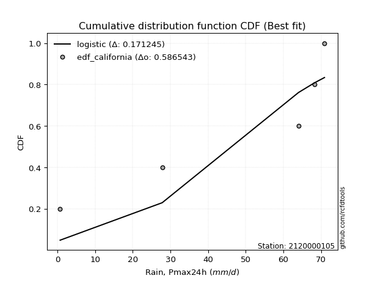</img>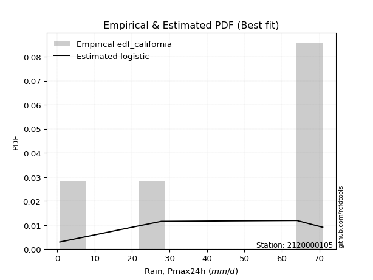</img>

</div>


### 2. EDF Hazen (1930)

Hazen method for plotting positions is a formula used to estimate the empirical cumulative probability distribution of flood events or other hydrological data. This formula often results in biased estimations, particularly when extrapolating to extreme events (high return periods).

<div align="center">


$P=(m-0.5)/n$


</div>


**2.1. Empirical values**

<div align="center">

|                | 0                   | 1                  | 2                  | 3                  | 4         | 5                  |
|:---------------|:--------------------|:-------------------|:-------------------|:-------------------|:----------|:-------------------|
| date           | 2023                | 2018               | 2020               | 2025               | 2024      | 2019               |
| x              | 0.7                 | 27.8               | 64.0               | 67.5               | 68.2      | 70.9               |
| m              | 1                   | 2                  | 3                  | 4                  | 5         | 6                  |
| empirical_dist | edf_hazen           | edf_hazen          | edf_hazen          | edf_hazen          | edf_hazen | edf_hazen          |
| empirical      | 0.08333333333333333 | 0.25               | 0.4166666666666667 | 0.5833333333333334 | 0.75      | 0.9166666666666666 |
| empirical_tr   | 1.090909090909091   | 1.3333333333333333 | 1.7142857142857144 | 2.4000000000000004 | 4.0       | 11.999999999999995 |

</div>


**2.2. Kolmogorov-Smirnov fit test (sorted by Δ)**


<div align="center">

|                | 0                   | 1                   | 2                   | 3                   | 4                  | 5                  | 6                  | 7                 | 8                  | 9                  | 10                  | 11                  | 12                 | 13                  | 14                | 15                  | 16                  | 17                 | 18                  | 19                 | 20                 | 21                  | 22                  | 23                  | 24                 | 25                | 26                 | 27                 | 28                 | 29                 | 30                | 31                 | 32                 | 33                 | 34                 | 35                 | 36                  | 37                  | 38                  | 39                 | 40                  | 41                 | 42                 | 43                 | 44                  | 45                  | 46                  | 47                 | 48                  | 49                  | 50                  | 51                  | 52                 | 53                  | 54                 | 55                  | 56                  | 57                  | 58                  | 59                 | 60                 | 61                  | 62                | 63                  | 64                 | 65                 | 66                 | 67                 | 68                 | 69                  | 70                  | 71                 | 72                 | 73                 | 74                  | 75                 | 76                | 77                 | 78                | 79                  | 80                  | 81                  | 82                 | 83                  | 84                 | 85                 | 86                 | 87                  | 88                 | 89                 | 90                  | 91                  | 92                 | 93                 | 94                | 95                  | 96                  | 97                 | 98                  | 99                 | 100                 | 101                | 102                 | 103                | 104                 | 105                | 106                 | 107                 | 108                | 109                 | 110                | 111                | 112                 | 113                 | 114                | 115                | 116                | 117                 | 118                 | 119                 | 120                | 121                 | 122                 | 123                | 124                | 125                 | 126                 | 127                 | 128                 | 129                | 130                | 131                | 132                | 133                | 134                | 135                | 136                | 137                | 138                 | 139               | 140                | 141                | 142                | 143                | 144               | 145               | 146                | 147               | 148                | 149                | 150                | 151                | 152                | 153                | 154                | 155            | 156            | 157            | 158                | 159                |
|:---------------|:--------------------|:--------------------|:--------------------|:--------------------|:-------------------|:-------------------|:-------------------|:------------------|:-------------------|:-------------------|:--------------------|:--------------------|:-------------------|:--------------------|:------------------|:--------------------|:--------------------|:-------------------|:--------------------|:-------------------|:-------------------|:--------------------|:--------------------|:--------------------|:-------------------|:------------------|:-------------------|:-------------------|:-------------------|:-------------------|:------------------|:-------------------|:-------------------|:-------------------|:-------------------|:-------------------|:--------------------|:--------------------|:--------------------|:-------------------|:--------------------|:-------------------|:-------------------|:-------------------|:--------------------|:--------------------|:--------------------|:-------------------|:--------------------|:--------------------|:--------------------|:--------------------|:-------------------|:--------------------|:-------------------|:--------------------|:--------------------|:--------------------|:--------------------|:-------------------|:-------------------|:--------------------|:------------------|:--------------------|:-------------------|:-------------------|:-------------------|:-------------------|:-------------------|:--------------------|:--------------------|:-------------------|:-------------------|:-------------------|:--------------------|:-------------------|:------------------|:-------------------|:------------------|:--------------------|:--------------------|:--------------------|:-------------------|:--------------------|:-------------------|:-------------------|:-------------------|:--------------------|:-------------------|:-------------------|:--------------------|:--------------------|:-------------------|:-------------------|:------------------|:--------------------|:--------------------|:-------------------|:--------------------|:-------------------|:--------------------|:-------------------|:--------------------|:-------------------|:--------------------|:-------------------|:--------------------|:--------------------|:-------------------|:--------------------|:-------------------|:-------------------|:--------------------|:--------------------|:-------------------|:-------------------|:-------------------|:--------------------|:--------------------|:--------------------|:-------------------|:--------------------|:--------------------|:-------------------|:-------------------|:--------------------|:--------------------|:--------------------|:--------------------|:-------------------|:-------------------|:-------------------|:-------------------|:-------------------|:-------------------|:-------------------|:-------------------|:-------------------|:--------------------|:------------------|:-------------------|:-------------------|:-------------------|:-------------------|:------------------|:------------------|:-------------------|:------------------|:-------------------|:-------------------|:-------------------|:-------------------|:-------------------|:-------------------|:-------------------|:---------------|:---------------|:---------------|:-------------------|:-------------------|
| station        | 2120000105          | 2120000105          | 2120000105          | 2120000105          | 2120000105         | 2120000105         | 2120000105         | 2120000105        | 2120000105         | 2120000105         | 2120000105          | 2120000105          | 2120000105         | 2120000105          | 2120000105        | 2120000105          | 2120000105          | 2120000105         | 2120000105          | 2120000105         | 2120000105         | 2120000105          | 2120000105          | 2120000105          | 2120000105         | 2120000105        | 2120000105         | 2120000105         | 2120000105         | 2120000105         | 2120000105        | 2120000105         | 2120000105         | 2120000105         | 2120000105         | 2120000105         | 2120000105          | 2120000105          | 2120000105          | 2120000105         | 2120000105          | 2120000105         | 2120000105         | 2120000105         | 2120000105          | 2120000105          | 2120000105          | 2120000105         | 2120000105          | 2120000105          | 2120000105          | 2120000105          | 2120000105         | 2120000105          | 2120000105         | 2120000105          | 2120000105          | 2120000105          | 2120000105          | 2120000105         | 2120000105         | 2120000105          | 2120000105        | 2120000105          | 2120000105         | 2120000105         | 2120000105         | 2120000105         | 2120000105         | 2120000105          | 2120000105          | 2120000105         | 2120000105         | 2120000105         | 2120000105          | 2120000105         | 2120000105        | 2120000105         | 2120000105        | 2120000105          | 2120000105          | 2120000105          | 2120000105         | 2120000105          | 2120000105         | 2120000105         | 2120000105         | 2120000105          | 2120000105         | 2120000105         | 2120000105          | 2120000105          | 2120000105         | 2120000105         | 2120000105        | 2120000105          | 2120000105          | 2120000105         | 2120000105          | 2120000105         | 2120000105          | 2120000105         | 2120000105          | 2120000105         | 2120000105          | 2120000105         | 2120000105          | 2120000105          | 2120000105         | 2120000105          | 2120000105         | 2120000105         | 2120000105          | 2120000105          | 2120000105         | 2120000105         | 2120000105         | 2120000105          | 2120000105          | 2120000105          | 2120000105         | 2120000105          | 2120000105          | 2120000105         | 2120000105         | 2120000105          | 2120000105          | 2120000105          | 2120000105          | 2120000105         | 2120000105         | 2120000105         | 2120000105         | 2120000105         | 2120000105         | 2120000105         | 2120000105         | 2120000105         | 2120000105          | 2120000105        | 2120000105         | 2120000105         | 2120000105         | 2120000105         | 2120000105        | 2120000105        | 2120000105         | 2120000105        | 2120000105         | 2120000105         | 2120000105         | 2120000105         | 2120000105         | 2120000105         | 2120000105         | 2120000105     | 2120000105     | 2120000105     | 2120000105         | 2120000105         |
| empirical_dist | edf_hazen           | edf_hazen           | edf_hazen           | edf_hazen           | edf_hazen          | edf_hazen          | edf_hazen          | edf_hazen         | edf_hazen          | edf_hazen          | edf_hazen           | edf_hazen           | edf_hazen          | edf_hazen           | edf_hazen         | edf_hazen           | edf_hazen           | edf_hazen          | edf_hazen           | edf_hazen          | edf_hazen          | edf_hazen           | edf_hazen           | edf_hazen           | edf_hazen          | edf_hazen         | edf_hazen          | edf_hazen          | edf_hazen          | edf_hazen          | edf_hazen         | edf_hazen          | edf_hazen          | edf_hazen          | edf_hazen          | edf_hazen          | edf_hazen           | edf_hazen           | edf_hazen           | edf_hazen          | edf_hazen           | edf_hazen          | edf_hazen          | edf_hazen          | edf_hazen           | edf_hazen           | edf_hazen           | edf_hazen          | edf_hazen           | edf_hazen           | edf_hazen           | edf_hazen           | edf_hazen          | edf_hazen           | edf_hazen          | edf_hazen           | edf_hazen           | edf_hazen           | edf_hazen           | edf_hazen          | edf_hazen          | edf_hazen           | edf_hazen         | edf_hazen           | edf_hazen          | edf_hazen          | edf_hazen          | edf_hazen          | edf_hazen          | edf_hazen           | edf_hazen           | edf_hazen          | edf_hazen          | edf_hazen          | edf_hazen           | edf_hazen          | edf_hazen         | edf_hazen          | edf_hazen         | edf_hazen           | edf_hazen           | edf_hazen           | edf_hazen          | edf_hazen           | edf_hazen          | edf_hazen          | edf_hazen          | edf_hazen           | edf_hazen          | edf_hazen          | edf_hazen           | edf_hazen           | edf_hazen          | edf_hazen          | edf_hazen         | edf_hazen           | edf_hazen           | edf_hazen          | edf_hazen           | edf_hazen          | edf_hazen           | edf_hazen          | edf_hazen           | edf_hazen          | edf_hazen           | edf_hazen          | edf_hazen           | edf_hazen           | edf_hazen          | edf_hazen           | edf_hazen          | edf_hazen          | edf_hazen           | edf_hazen           | edf_hazen          | edf_hazen          | edf_hazen          | edf_hazen           | edf_hazen           | edf_hazen           | edf_hazen          | edf_hazen           | edf_hazen           | edf_hazen          | edf_hazen          | edf_hazen           | edf_hazen           | edf_hazen           | edf_hazen           | edf_hazen          | edf_hazen          | edf_hazen          | edf_hazen          | edf_hazen          | edf_hazen          | edf_hazen          | edf_hazen          | edf_hazen          | edf_hazen           | edf_hazen         | edf_hazen          | edf_hazen          | edf_hazen          | edf_hazen          | edf_hazen         | edf_hazen         | edf_hazen          | edf_hazen         | edf_hazen          | edf_hazen          | edf_hazen          | edf_hazen          | edf_hazen          | edf_hazen          | edf_hazen          | edf_hazen      | edf_hazen      | edf_hazen      | edf_hazen          | edf_hazen          |
| p_dist         | loglevy_l           | levy_l              | logjohnsonsb        | weibull_max         | logt               | vonmises_line      | genextreme         | logweibull_max    | beta               | arcsine            | trapezoid           | wrapcauchy          | dgamma             | loggumbel_l         | logmielke         | gausshyper          | pearson3            | gompertz           | gennorm             | semicircular       | logvonmises_line   | logsemicircular     | loganglit           | gumbel_l            | logpearson3        | logtrapezoid      | logwrapcauchy      | anglit             | weibull_min        | ncf                | loggenextreme     | dweibull           | loginvgauss        | loggamma           | loggamma           | loginvgamma        | lognakagami         | logcrystalball      | lognorm             | logexponnorm       | logrice             | lognct             | logkappa3          | logfatiguelife     | loggengamma         | logalpha            | logarcsine          | invgauss           | f                   | argus               | invgamma            | gengamma            | norm               | crystalball         | exponnorm          | t                   | erlang              | mielke              | gamma               | betaprime          | rice               | burr12              | logexponweib      | logmaxwell          | halfgennorm        | lomax              | genpareto          | kstwobign          | foldnorm           | loglogistic         | lograyleigh         | maxwell            | logfoldnorm        | rayleigh           | genexpon            | loggompertz        | logistic          | loginvweibull      | loghypsecant      | loggennorm          | halfnorm            | hypsecant           | logkstwobign       | cosine              | loghalfnorm        | loggumbel_r        | logcosine          | loghalfgennorm      | gumbel_r           | loggenexpon        | loglaplace          | loglaplace          | halflogistic       | laplace            | logmoyal          | moyal               | loghalflogistic     | logburr            | logncf              | nct                | logerlang           | genhalflogistic    | logdgamma           | logdweibull        | loglomax            | loggenpareto       | kappa4              | logburr12           | wald               | logargus            | logloglaplace      | ksone              | skewnorm            | logwald             | triang             | loggausshyper      | nakagami           | logbeta             | logf                | exponweib           | truncweibull_min   | burr                | logloggamma         | logbetaprime       | kappa3             | uniform             | bradford            | logksone            | logweibull_min      | invweibull         | johnsonsu          | loggenhalflogistic | truncexpon         | johnsonsb          | logbradford        | logskewnorm        | logkappa4          | logtriang          | logtruncweibull_min | fatiguelife       | loguniform         | logtruncnorm       | logjohnsonsu       | logtruncexpon      | logtukeylambda    | powerlaw          | truncpareto        | logexponpow       | exponpow           | alpha              | logtruncpareto     | logpowerlaw        | truncnorm          | rdist              | tukeylambda        | genlogistic    | logrdist       | loggenlogistic | logvonmises        | vonmises           |
| delta          | 0.11421666189471713 | 0.12305035677920406 | 0.18166850939292345 | 0.18827843629303703 | 0.2032684336158357 | 0.2094661586752159 | 0.2124361713568897 | 0.213779988217711 | 0.2147898946038017 | 0.2263056494914395 | 0.22964285958879954 | 0.23571423759399823 | 0.2373786405667927 | 0.24477151569363714 | 0.246485028901112 | 0.24718342971684254 | 0.24823037269115616 | 0.2499999999242065 | 0.25000000000845835 | 0.2516476761886825 | 0.2525421497225372 | 0.25404190173793706 | 0.25488255763253903 | 0.25556236017306194 | 0.2565597087218233 | 0.257531414221126 | 0.2613533265293695 | 0.2622386712345072 | 0.2712554375082668 | 0.2720554492920451 | 0.276420248411358 | 0.2768963591466297 | 0.2772180301159006 | 0.2781250429943611 | 0.2781250429943611 | 0.2785029472604185 | 0.27867569089161554 | 0.27909783726859777 | 0.27909785427746975 | 0.2790997677581393 | 0.27911874960259325 | 0.2791864089392689 | 0.2808132396304617 | 0.2812999321461834 | 0.28221294060346075 | 0.28321163140728217 | 0.28373137820253824 | 0.2844570760957991 | 0.28595151189464324 | 0.28677236264977085 | 0.28698883060264485 | 0.28704517594337037 | 0.2870894348443412 | 0.28708944166151357 | 0.2870918406819612 | 0.28710642303554607 | 0.28720467313175385 | 0.28843506437783134 | 0.28859123759112953 | 0.2888714955110003 | 0.2894699443596565 | 0.29320333056822384 | 0.294966482059377 | 0.29552472829140103 | 0.2963400804444796 | 0.2967567089071235 | 0.2970824031597264 | 0.2986425372197779 | 0.2996309693518309 | 0.30023247347014076 | 0.30033655537179754 | 0.3025474761223997 | 0.3028488575150106 | 0.3070567775789153 | 0.30764837163405195 | 0.3084669278428647 | 0.308613808430702 | 0.3104151076990075 | 0.315596940509243 | 0.32069833337487197 | 0.32084512895943357 | 0.32405718162250136 | 0.3260624046019702 | 0.32790521310001636 | 0.3294882819281023 | 0.3308009651795642 | 0.3345863992957736 | 0.33705737396884194 | 0.3371455603589307 | 0.3398152556072467 | 0.34103568962042324 | 0.34103568962042324 | 0.3475036306732699 | 0.3487824895925598 | 0.351377025646315 | 0.35332415432310876 | 0.35472991537496446 | 0.3607321187517466 | 0.36091025650314723 | 0.3696473027175867 | 0.37384657038250857 | 0.3814040438225971 | 0.38250189188175576 | 0.3859955964127727 | 0.39024094650590924 | 0.3906487831886863 | 0.39656133104820585 | 0.39936498445167157 | 0.4009853923413464 | 0.40240433498242983 | 0.4117121049374517 | 0.4180911680911679 | 0.42154771767931826 | 0.42311643506994234 | 0.4272435322561358 | 0.4369802249698715 | 0.4441659725246279 | 0.44625792562820243 | 0.45674716904940815 | 0.45728407842768004 | 0.4620730383515261 | 0.46623712601577966 | 0.48162497203188054 | 0.4831630268025846 | 0.4850328704576173 | 0.48504273504273493 | 0.49650612836846636 | 0.49771808017193786 | 0.49937777935409133 | 0.5082402838911076 | 0.5090262217936219 | 0.5151694202818597 | 0.5248060008809408 | 0.5290435797649529 | 0.5363998441565534 | 0.5408996401106296 | 0.5480259415606925 | 0.5492772166706656 | 0.5562238781891746  | 0.558313813255489 | 0.5611617089832954 | 0.5614256400714202 | 0.5927312728083378 | 0.5995582454050725 | 0.615185591936644 | 0.623238499839913 | 0.6640571461652853 | 0.668159978667964 | 0.6892194854709889 | 0.6984022045000863 | 0.7118997509188821 | 0.7159389441110716 | 0.7499999843864937 | 0.7499999996284907 | 0.7499999999999929 | 0.75           | 0.75           | 0.75           | 1.0252768824609604 | 10.742980004835214 |
| deltao         | 0.530385761606      | 0.530385761606      | 0.530385761606      | 0.530385761606      | 0.530385761606     | 0.530385761606     | 0.530385761606     | 0.530385761606    | 0.530385761606     | 0.530385761606     | 0.530385761606      | 0.530385761606      | 0.530385761606     | 0.530385761606      | 0.530385761606    | 0.530385761606      | 0.530385761606      | 0.530385761606     | 0.530385761606      | 0.530385761606     | 0.530385761606     | 0.530385761606      | 0.530385761606      | 0.530385761606      | 0.530385761606     | 0.530385761606    | 0.530385761606     | 0.530385761606     | 0.530385761606     | 0.530385761606     | 0.530385761606    | 0.530385761606     | 0.530385761606     | 0.530385761606     | 0.530385761606     | 0.530385761606     | 0.530385761606      | 0.530385761606      | 0.530385761606      | 0.530385761606     | 0.530385761606      | 0.530385761606     | 0.530385761606     | 0.530385761606     | 0.530385761606      | 0.530385761606      | 0.530385761606      | 0.530385761606     | 0.530385761606      | 0.530385761606      | 0.530385761606      | 0.530385761606      | 0.530385761606     | 0.530385761606      | 0.530385761606     | 0.530385761606      | 0.530385761606      | 0.530385761606      | 0.530385761606      | 0.530385761606     | 0.530385761606     | 0.530385761606      | 0.530385761606    | 0.530385761606      | 0.530385761606     | 0.530385761606     | 0.530385761606     | 0.530385761606     | 0.530385761606     | 0.530385761606      | 0.530385761606      | 0.530385761606     | 0.530385761606     | 0.530385761606     | 0.530385761606      | 0.530385761606     | 0.530385761606    | 0.530385761606     | 0.530385761606    | 0.530385761606      | 0.530385761606      | 0.530385761606      | 0.530385761606     | 0.530385761606      | 0.530385761606     | 0.530385761606     | 0.530385761606     | 0.530385761606      | 0.530385761606     | 0.530385761606     | 0.530385761606      | 0.530385761606      | 0.530385761606     | 0.530385761606     | 0.530385761606    | 0.530385761606      | 0.530385761606      | 0.530385761606     | 0.530385761606      | 0.530385761606     | 0.530385761606      | 0.530385761606     | 0.530385761606      | 0.530385761606     | 0.530385761606      | 0.530385761606     | 0.530385761606      | 0.530385761606      | 0.530385761606     | 0.530385761606      | 0.530385761606     | 0.530385761606     | 0.530385761606      | 0.530385761606      | 0.530385761606     | 0.530385761606     | 0.530385761606     | 0.530385761606      | 0.530385761606      | 0.530385761606      | 0.530385761606     | 0.530385761606      | 0.530385761606      | 0.530385761606     | 0.530385761606     | 0.530385761606      | 0.530385761606      | 0.530385761606      | 0.530385761606      | 0.530385761606     | 0.530385761606     | 0.530385761606     | 0.530385761606     | 0.530385761606     | 0.530385761606     | 0.530385761606     | 0.530385761606     | 0.530385761606     | 0.530385761606      | 0.530385761606    | 0.530385761606     | 0.530385761606     | 0.530385761606     | 0.530385761606     | 0.530385761606    | 0.530385761606    | 0.530385761606     | 0.530385761606    | 0.530385761606     | 0.530385761606     | 0.530385761606     | 0.530385761606     | 0.530385761606     | 0.530385761606     | 0.530385761606     | 0.530385761606 | 0.530385761606 | 0.530385761606 | 0.530385761606     | 0.530385761606     |
| eval           | Δo > Δ              | Δo > Δ              | Δo > Δ              | Δo > Δ              | Δo > Δ             | Δo > Δ             | Δo > Δ             | Δo > Δ            | Δo > Δ             | Δo > Δ             | Δo > Δ              | Δo > Δ              | Δo > Δ             | Δo > Δ              | Δo > Δ            | Δo > Δ              | Δo > Δ              | Δo > Δ             | Δo > Δ              | Δo > Δ             | Δo > Δ             | Δo > Δ              | Δo > Δ              | Δo > Δ              | Δo > Δ             | Δo > Δ            | Δo > Δ             | Δo > Δ             | Δo > Δ             | Δo > Δ             | Δo > Δ            | Δo > Δ             | Δo > Δ             | Δo > Δ             | Δo > Δ             | Δo > Δ             | Δo > Δ              | Δo > Δ              | Δo > Δ              | Δo > Δ             | Δo > Δ              | Δo > Δ             | Δo > Δ             | Δo > Δ             | Δo > Δ              | Δo > Δ              | Δo > Δ              | Δo > Δ             | Δo > Δ              | Δo > Δ              | Δo > Δ              | Δo > Δ              | Δo > Δ             | Δo > Δ              | Δo > Δ             | Δo > Δ              | Δo > Δ              | Δo > Δ              | Δo > Δ              | Δo > Δ             | Δo > Δ             | Δo > Δ              | Δo > Δ            | Δo > Δ              | Δo > Δ             | Δo > Δ             | Δo > Δ             | Δo > Δ             | Δo > Δ             | Δo > Δ              | Δo > Δ              | Δo > Δ             | Δo > Δ             | Δo > Δ             | Δo > Δ              | Δo > Δ             | Δo > Δ            | Δo > Δ             | Δo > Δ            | Δo > Δ              | Δo > Δ              | Δo > Δ              | Δo > Δ             | Δo > Δ              | Δo > Δ             | Δo > Δ             | Δo > Δ             | Δo > Δ              | Δo > Δ             | Δo > Δ             | Δo > Δ              | Δo > Δ              | Δo > Δ             | Δo > Δ             | Δo > Δ            | Δo > Δ              | Δo > Δ              | Δo > Δ             | Δo > Δ              | Δo > Δ             | Δo > Δ              | Δo > Δ             | Δo > Δ              | Δo > Δ             | Δo > Δ              | Δo > Δ             | Δo > Δ              | Δo > Δ              | Δo > Δ             | Δo > Δ              | Δo > Δ             | Δo > Δ             | Δo > Δ              | Δo > Δ              | Δo > Δ             | Δo > Δ             | Δo > Δ             | Δo > Δ              | Δo > Δ              | Δo > Δ              | Δo > Δ             | Δo > Δ              | Δo > Δ              | Δo > Δ             | Δo > Δ             | Δo > Δ              | Δo > Δ              | Δo > Δ              | Δo > Δ              | Δo > Δ             | Δo > Δ             | Δo > Δ             | Δo > Δ             | Δo > Δ             | Δo <= Δ            | Δo <= Δ            | Δo <= Δ            | Δo <= Δ            | Δo <= Δ             | Δo <= Δ           | Δo <= Δ            | Δo <= Δ            | Δo <= Δ            | Δo <= Δ            | Δo <= Δ           | Δo <= Δ           | Δo <= Δ            | Δo <= Δ           | Δo <= Δ            | Δo <= Δ            | Δo <= Δ            | Δo <= Δ            | Δo <= Δ            | Δo <= Δ            | Δo <= Δ            | Δo <= Δ        | Δo <= Δ        | Δo <= Δ        | Δo <= Δ            | Δo <= Δ            |
| fit            | 1                   | 1                   | 1                   | 1                   | 1                  | 1                  | 1                  | 1                 | 1                  | 1                  | 1                   | 1                   | 1                  | 1                   | 1                 | 1                   | 1                   | 1                  | 1                   | 1                  | 1                  | 1                   | 1                   | 1                   | 1                  | 1                 | 1                  | 1                  | 1                  | 1                  | 1                 | 1                  | 1                  | 1                  | 1                  | 1                  | 1                   | 1                   | 1                   | 1                  | 1                   | 1                  | 1                  | 1                  | 1                   | 1                   | 1                   | 1                  | 1                   | 1                   | 1                   | 1                   | 1                  | 1                   | 1                  | 1                   | 1                   | 1                   | 1                   | 1                  | 1                  | 1                   | 1                 | 1                   | 1                  | 1                  | 1                  | 1                  | 1                  | 1                   | 1                   | 1                  | 1                  | 1                  | 1                   | 1                  | 1                 | 1                  | 1                 | 1                   | 1                   | 1                   | 1                  | 1                   | 1                  | 1                  | 1                  | 1                   | 1                  | 1                  | 1                   | 1                   | 1                  | 1                  | 1                 | 1                   | 1                   | 1                  | 1                   | 1                  | 1                   | 1                  | 1                   | 1                  | 1                   | 1                  | 1                   | 1                   | 1                  | 1                   | 1                  | 1                  | 1                   | 1                   | 1                  | 1                  | 1                  | 1                   | 1                   | 1                   | 1                  | 1                   | 1                   | 1                  | 1                  | 1                   | 1                   | 1                   | 1                   | 1                  | 1                  | 1                  | 1                  | 1                  | 0                  | 0                  | 0                  | 0                  | 0                   | 0                 | 0                  | 0                  | 0                  | 0                  | 0                 | 0                 | 0                  | 0                 | 0                  | 0                  | 0                  | 0                  | 0                  | 0                  | 0                  | 0              | 0              | 0              | 0                  | 0                  |
| n              | 6                   | 6                   | 6                   | 6                   | 6                  | 6                  | 6                  | 6                 | 6                  | 6                  | 6                   | 6                   | 6                  | 6                   | 6                 | 6                   | 6                   | 6                  | 6                   | 6                  | 6                  | 6                   | 6                   | 6                   | 6                  | 6                 | 6                  | 6                  | 6                  | 6                  | 6                 | 6                  | 6                  | 6                  | 6                  | 6                  | 6                   | 6                   | 6                   | 6                  | 6                   | 6                  | 6                  | 6                  | 6                   | 6                   | 6                   | 6                  | 6                   | 6                   | 6                   | 6                   | 6                  | 6                   | 6                  | 6                   | 6                   | 6                   | 6                   | 6                  | 6                  | 6                   | 6                 | 6                   | 6                  | 6                  | 6                  | 6                  | 6                  | 6                   | 6                   | 6                  | 6                  | 6                  | 6                   | 6                  | 6                 | 6                  | 6                 | 6                   | 6                   | 6                   | 6                  | 6                   | 6                  | 6                  | 6                  | 6                   | 6                  | 6                  | 6                   | 6                   | 6                  | 6                  | 6                 | 6                   | 6                   | 6                  | 6                   | 6                  | 6                   | 6                  | 6                   | 6                  | 6                   | 6                  | 6                   | 6                   | 6                  | 6                   | 6                  | 6                  | 6                   | 6                   | 6                  | 6                  | 6                  | 6                   | 6                   | 6                   | 6                  | 6                   | 6                   | 6                  | 6                  | 6                   | 6                   | 6                   | 6                   | 6                  | 6                  | 6                  | 6                  | 6                  | 6                  | 6                  | 6                  | 6                  | 6                   | 6                 | 6                  | 6                  | 6                  | 6                  | 6                 | 6                 | 6                  | 6                 | 6                  | 6                  | 6                  | 6                  | 6                  | 6                  | 6                  | 6              | 6              | 6              | 6                  | 6                  |
| best_fit       | 1                   | 0                   | 0                   | 0                   | 0                  | 0                  | 0                  | 0                 | 0                  | 0                  | 0                   | 0                   | 0                  | 0                   | 0                 | 0                   | 0                   | 0                  | 0                   | 0                  | 0                  | 0                   | 0                   | 0                   | 0                  | 0                 | 0                  | 0                  | 0                  | 0                  | 0                 | 0                  | 0                  | 0                  | 0                  | 0                  | 0                   | 0                   | 0                   | 0                  | 0                   | 0                  | 0                  | 0                  | 0                   | 0                   | 0                   | 0                  | 0                   | 0                   | 0                   | 0                   | 0                  | 0                   | 0                  | 0                   | 0                   | 0                   | 0                   | 0                  | 0                  | 0                   | 0                 | 0                   | 0                  | 0                  | 0                  | 0                  | 0                  | 0                   | 0                   | 0                  | 0                  | 0                  | 0                   | 0                  | 0                 | 0                  | 0                 | 0                   | 0                   | 0                   | 0                  | 0                   | 0                  | 0                  | 0                  | 0                   | 0                  | 0                  | 0                   | 0                   | 0                  | 0                  | 0                 | 0                   | 0                   | 0                  | 0                   | 0                  | 0                   | 0                  | 0                   | 0                  | 0                   | 0                  | 0                   | 0                   | 0                  | 0                   | 0                  | 0                  | 0                   | 0                   | 0                  | 0                  | 0                  | 0                   | 0                   | 0                   | 0                  | 0                   | 0                   | 0                  | 0                  | 0                   | 0                   | 0                   | 0                   | 0                  | 0                  | 0                  | 0                  | 0                  | 0                  | 0                  | 0                  | 0                  | 0                   | 0                 | 0                  | 0                  | 0                  | 0                  | 0                 | 0                 | 0                  | 0                 | 0                  | 0                  | 0                  | 0                  | 0                  | 0                  | 0                  | 0              | 0              | 0              | 0                  | 0                  |
| best_fit_sort  | 1                   | 2                   | 3                   | 4                   | 5                  | 6                  | 7                  | 8                 | 9                  | 10                 | 11                  | 12                  | 13                 | 14                  | 15                | 16                  | 17                  | 18                 | 19                  | 20                 | 21                 | 22                  | 23                  | 24                  | 25                 | 26                | 27                 | 28                 | 29                 | 30                 | 31                | 32                 | 33                 | 34                 | 35                 | 36                 | 37                  | 38                  | 39                  | 40                 | 41                  | 42                 | 43                 | 44                 | 45                  | 46                  | 47                  | 48                 | 49                  | 50                  | 51                  | 52                  | 53                 | 54                  | 55                 | 56                  | 57                  | 58                  | 59                  | 60                 | 61                 | 62                  | 63                | 64                  | 65                 | 66                 | 67                 | 68                 | 69                 | 70                  | 71                  | 72                 | 73                 | 74                 | 75                  | 76                 | 77                | 78                 | 79                | 80                  | 81                  | 82                  | 83                 | 84                  | 85                 | 86                 | 87                 | 88                  | 89                 | 90                 | 91                  | 92                  | 93                 | 94                 | 95                | 96                  | 97                  | 98                 | 99                  | 100                | 101                 | 102                | 103                 | 104                | 105                 | 106                | 107                 | 108                 | 109                | 110                 | 111                | 112                | 113                 | 114                 | 115                | 116                | 117                | 118                 | 119                 | 120                 | 121                | 122                 | 123                 | 124                | 125                | 126                 | 127                 | 128                 | 129                 | 130                | 131                | 132                | 133                | 134                | 135                | 136                | 137                | 138                | 139                 | 140               | 141                | 142                | 143                | 144                | 145               | 146               | 147                | 148               | 149                | 150                | 151                | 152                | 153                | 154                | 155                | 156            | 157            | 158            | 159                | 160                |

</div>


**2.3. Best fit**

<div align="center">

|   id |    station | empirical_dist   | p_dist    |    delta |   deltao | eval   |   fit |   n |   best_fit |   best_fit_sort |
|-----:|-----------:|:-----------------|:----------|---------:|---------:|:-------|------:|----:|-----------:|----------------:|
|    0 | 2120000105 | edf_hazen        | loglevy_l | 0.114217 | 0.530386 | Δo > Δ |     1 |   6 |          1 |               1 |

</div>


<div align="center">

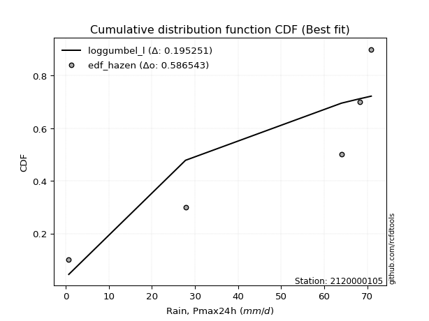</img>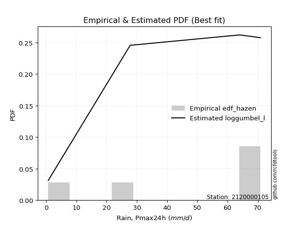</img>

</div>


### 3. EDF Weibull (1939)

Weibull plotting position formula is an empirical method used to estimate the non-exceedance probability or plotting position for a set of observed data, is often recommended or widely used in practice, particularly in flood frequency analysis.

<div align="center">


$P=m/(n+1)$


</div>


**3.1. Empirical values**

<div align="center">

|                | 0                   | 1                  | 2                   | 3                  | 4                  | 5                  |
|:---------------|:--------------------|:-------------------|:--------------------|:-------------------|:-------------------|:-------------------|
| date           | 2023                | 2018               | 2020                | 2025               | 2024               | 2019               |
| x              | 0.7                 | 27.8               | 64.0                | 67.5               | 68.2               | 70.9               |
| m              | 1                   | 2                  | 3                   | 4                  | 5                  | 6                  |
| empirical_dist | edf_weibull         | edf_weibull        | edf_weibull         | edf_weibull        | edf_weibull        | edf_weibull        |
| empirical      | 0.14285714285714285 | 0.2857142857142857 | 0.42857142857142855 | 0.5714285714285714 | 0.7142857142857143 | 0.8571428571428571 |
| empirical_tr   | 1.1666666666666665  | 1.4                | 1.75                | 2.333333333333333  | 3.5                | 6.999999999999997  |

</div>


**3.2. Kolmogorov-Smirnov fit test (sorted by Δ)**


<div align="center">

|                | 0                   | 1                   | 2                   | 3                   | 4                 | 5                   | 6                   | 7                  | 8                   | 9                   | 10                 | 11                 | 12                  | 13                  | 14                  | 15                  | 16                  | 17                 | 18                 | 19                  | 20                  | 21                  | 22                 | 23                  | 24                  | 25                  | 26                  | 27                  | 28                  | 29                 | 30                  | 31                  | 32                  | 33                 | 34                 | 35                 | 36                 | 37                  | 38                 | 39                 | 40                 | 41                  | 42                 | 43                | 44                 | 45                 | 46                 | 47                  | 48                 | 49                 | 50                | 51                | 52                 | 53                 | 54                 | 55                  | 56                 | 57                | 58                 | 59                  | 60                 | 61                  | 62                | 63                 | 64                  | 65                  | 66                  | 67                  | 68                  | 69                  | 70                  | 71                 | 72                 | 73                 | 74                 | 75                  | 76                  | 77                 | 78                  | 79                  | 80                  | 81                  | 82                 | 83                | 84                 | 85                 | 86                 | 87                  | 88                  | 89                  | 90                 | 91                  | 92                 | 93                  | 94                 | 95                 | 96                 | 97                | 98                  | 99                 | 100                 | 101                 | 102                | 103                 | 104                 | 105                 | 106               | 107                | 108               | 109                 | 110                 | 111                 | 112                 | 113                | 114                 | 115                 | 116                 | 117                 | 118                | 119                 | 120                | 121                | 122                | 123                | 124                 | 125                 | 126                | 127                | 128                 | 129                 | 130                | 131                | 132                | 133                | 134                | 135                | 136                | 137                | 138                | 139                 | 140                | 141                | 142                | 143                | 144                | 145                | 146                | 147                | 148                | 149                | 150                | 151                | 152               | 153               | 154                | 155                | 156                | 157                | 158                | 159                |
|:---------------|:--------------------|:--------------------|:--------------------|:--------------------|:------------------|:--------------------|:--------------------|:-------------------|:--------------------|:--------------------|:-------------------|:-------------------|:--------------------|:--------------------|:--------------------|:--------------------|:--------------------|:-------------------|:-------------------|:--------------------|:--------------------|:--------------------|:-------------------|:--------------------|:--------------------|:--------------------|:--------------------|:--------------------|:--------------------|:-------------------|:--------------------|:--------------------|:--------------------|:-------------------|:-------------------|:-------------------|:-------------------|:--------------------|:-------------------|:-------------------|:-------------------|:--------------------|:-------------------|:------------------|:-------------------|:-------------------|:-------------------|:--------------------|:-------------------|:-------------------|:------------------|:------------------|:-------------------|:-------------------|:-------------------|:--------------------|:-------------------|:------------------|:-------------------|:--------------------|:-------------------|:--------------------|:------------------|:-------------------|:--------------------|:--------------------|:--------------------|:--------------------|:--------------------|:--------------------|:--------------------|:-------------------|:-------------------|:-------------------|:-------------------|:--------------------|:--------------------|:-------------------|:--------------------|:--------------------|:--------------------|:--------------------|:-------------------|:------------------|:-------------------|:-------------------|:-------------------|:--------------------|:--------------------|:--------------------|:-------------------|:--------------------|:-------------------|:--------------------|:-------------------|:-------------------|:-------------------|:------------------|:--------------------|:-------------------|:--------------------|:--------------------|:-------------------|:--------------------|:--------------------|:--------------------|:------------------|:-------------------|:------------------|:--------------------|:--------------------|:--------------------|:--------------------|:-------------------|:--------------------|:--------------------|:--------------------|:--------------------|:-------------------|:--------------------|:-------------------|:-------------------|:-------------------|:-------------------|:--------------------|:--------------------|:-------------------|:-------------------|:--------------------|:--------------------|:-------------------|:-------------------|:-------------------|:-------------------|:-------------------|:-------------------|:-------------------|:-------------------|:-------------------|:--------------------|:-------------------|:-------------------|:-------------------|:-------------------|:-------------------|:-------------------|:-------------------|:-------------------|:-------------------|:-------------------|:-------------------|:-------------------|:------------------|:------------------|:-------------------|:-------------------|:-------------------|:-------------------|:-------------------|:-------------------|
| station        | 2120000105          | 2120000105          | 2120000105          | 2120000105          | 2120000105        | 2120000105          | 2120000105          | 2120000105         | 2120000105          | 2120000105          | 2120000105         | 2120000105         | 2120000105          | 2120000105          | 2120000105          | 2120000105          | 2120000105          | 2120000105         | 2120000105         | 2120000105          | 2120000105          | 2120000105          | 2120000105         | 2120000105          | 2120000105          | 2120000105          | 2120000105          | 2120000105          | 2120000105          | 2120000105         | 2120000105          | 2120000105          | 2120000105          | 2120000105         | 2120000105         | 2120000105         | 2120000105         | 2120000105          | 2120000105         | 2120000105         | 2120000105         | 2120000105          | 2120000105         | 2120000105        | 2120000105         | 2120000105         | 2120000105         | 2120000105          | 2120000105         | 2120000105         | 2120000105        | 2120000105        | 2120000105         | 2120000105         | 2120000105         | 2120000105          | 2120000105         | 2120000105        | 2120000105         | 2120000105          | 2120000105         | 2120000105          | 2120000105        | 2120000105         | 2120000105          | 2120000105          | 2120000105          | 2120000105          | 2120000105          | 2120000105          | 2120000105          | 2120000105         | 2120000105         | 2120000105         | 2120000105         | 2120000105          | 2120000105          | 2120000105         | 2120000105          | 2120000105          | 2120000105          | 2120000105          | 2120000105         | 2120000105        | 2120000105         | 2120000105         | 2120000105         | 2120000105          | 2120000105          | 2120000105          | 2120000105         | 2120000105          | 2120000105         | 2120000105          | 2120000105         | 2120000105         | 2120000105         | 2120000105        | 2120000105          | 2120000105         | 2120000105          | 2120000105          | 2120000105         | 2120000105          | 2120000105          | 2120000105          | 2120000105        | 2120000105         | 2120000105        | 2120000105          | 2120000105          | 2120000105          | 2120000105          | 2120000105         | 2120000105          | 2120000105          | 2120000105          | 2120000105          | 2120000105         | 2120000105          | 2120000105         | 2120000105         | 2120000105         | 2120000105         | 2120000105          | 2120000105          | 2120000105         | 2120000105         | 2120000105          | 2120000105          | 2120000105         | 2120000105         | 2120000105         | 2120000105         | 2120000105         | 2120000105         | 2120000105         | 2120000105         | 2120000105         | 2120000105          | 2120000105         | 2120000105         | 2120000105         | 2120000105         | 2120000105         | 2120000105         | 2120000105         | 2120000105         | 2120000105         | 2120000105         | 2120000105         | 2120000105         | 2120000105        | 2120000105        | 2120000105         | 2120000105         | 2120000105         | 2120000105         | 2120000105         | 2120000105         |
| empirical_dist | edf_weibull         | edf_weibull         | edf_weibull         | edf_weibull         | edf_weibull       | edf_weibull         | edf_weibull         | edf_weibull        | edf_weibull         | edf_weibull         | edf_weibull        | edf_weibull        | edf_weibull         | edf_weibull         | edf_weibull         | edf_weibull         | edf_weibull         | edf_weibull        | edf_weibull        | edf_weibull         | edf_weibull         | edf_weibull         | edf_weibull        | edf_weibull         | edf_weibull         | edf_weibull         | edf_weibull         | edf_weibull         | edf_weibull         | edf_weibull        | edf_weibull         | edf_weibull         | edf_weibull         | edf_weibull        | edf_weibull        | edf_weibull        | edf_weibull        | edf_weibull         | edf_weibull        | edf_weibull        | edf_weibull        | edf_weibull         | edf_weibull        | edf_weibull       | edf_weibull        | edf_weibull        | edf_weibull        | edf_weibull         | edf_weibull        | edf_weibull        | edf_weibull       | edf_weibull       | edf_weibull        | edf_weibull        | edf_weibull        | edf_weibull         | edf_weibull        | edf_weibull       | edf_weibull        | edf_weibull         | edf_weibull        | edf_weibull         | edf_weibull       | edf_weibull        | edf_weibull         | edf_weibull         | edf_weibull         | edf_weibull         | edf_weibull         | edf_weibull         | edf_weibull         | edf_weibull        | edf_weibull        | edf_weibull        | edf_weibull        | edf_weibull         | edf_weibull         | edf_weibull        | edf_weibull         | edf_weibull         | edf_weibull         | edf_weibull         | edf_weibull        | edf_weibull       | edf_weibull        | edf_weibull        | edf_weibull        | edf_weibull         | edf_weibull         | edf_weibull         | edf_weibull        | edf_weibull         | edf_weibull        | edf_weibull         | edf_weibull        | edf_weibull        | edf_weibull        | edf_weibull       | edf_weibull         | edf_weibull        | edf_weibull         | edf_weibull         | edf_weibull        | edf_weibull         | edf_weibull         | edf_weibull         | edf_weibull       | edf_weibull        | edf_weibull       | edf_weibull         | edf_weibull         | edf_weibull         | edf_weibull         | edf_weibull        | edf_weibull         | edf_weibull         | edf_weibull         | edf_weibull         | edf_weibull        | edf_weibull         | edf_weibull        | edf_weibull        | edf_weibull        | edf_weibull        | edf_weibull         | edf_weibull         | edf_weibull        | edf_weibull        | edf_weibull         | edf_weibull         | edf_weibull        | edf_weibull        | edf_weibull        | edf_weibull        | edf_weibull        | edf_weibull        | edf_weibull        | edf_weibull        | edf_weibull        | edf_weibull         | edf_weibull        | edf_weibull        | edf_weibull        | edf_weibull        | edf_weibull        | edf_weibull        | edf_weibull        | edf_weibull        | edf_weibull        | edf_weibull        | edf_weibull        | edf_weibull        | edf_weibull       | edf_weibull       | edf_weibull        | edf_weibull        | edf_weibull        | edf_weibull        | edf_weibull        | edf_weibull        |
| p_dist         | levy_l              | loglevy_l           | logjohnsonsb        | weibull_max         | beta              | vonmises_line       | arcsine             | logpearson3        | wrapcauchy          | logweibull_max      | logvonmises_line   | logtrapezoid       | genextreme          | logmielke           | logt                | dweibull            | trapezoid           | logarcsine         | logwrapcauchy      | logsemicircular     | loggumbel_l         | gausshyper          | pearson3           | logkappa3           | semicircular        | loganglit           | gumbel_l            | gennorm             | anglit              | dgamma             | weibull_min         | ncf                 | loggennorm          | loginvgauss        | loggenextreme      | loggamma           | loggamma           | loginvgamma         | lognakagami        | logcrystalball     | lognorm            | logexponnorm        | logrice            | lognct            | logfatiguelife     | loggengamma        | logalpha           | invgauss            | f                  | loginvweibull      | argus             | invgamma          | gengamma           | norm               | crystalball        | exponnorm           | t                  | erlang            | mielke             | gamma               | betaprime          | rice                | burr12            | logexponweib       | logmaxwell          | halfgennorm         | lomax               | genpareto           | gompertz            | kstwobign           | foldnorm            | loglogistic        | lograyleigh        | logkstwobign       | maxwell            | logfoldnorm         | rayleigh            | genexpon           | loggompertz         | logistic            | loghalfgennorm      | loghalfnorm         | loghypsecant       | loggenexpon       | halfnorm           | hypsecant          | cosine             | loggumbel_r         | logcosine           | logdgamma           | logburr            | logncf              | gumbel_r           | logdweibull         | loglaplace         | loglaplace         | loghalflogistic    | nct               | halflogistic        | logmoyal           | laplace             | logerlang           | moyal              | loglomax            | logburr12           | genhalflogistic     | logloglaplace     | loggenpareto       | kappa4            | logwald             | wald                | logargus            | ksone               | skewnorm           | logbeta             | triang              | logf                | exponweib           | loggausshyper      | nakagami            | logbetaprime       | invweibull         | truncweibull_min   | burr               | logweibull_min      | logksone            | logloggamma        | kappa3             | uniform             | johnsonsu           | bradford           | johnsonsb          | loggenhalflogistic | truncexpon         | fatiguelife        | logbradford        | logskewnorm        | logkappa4          | logtriang          | logtruncweibull_min | loguniform         | logtruncnorm       | logjohnsonsu       | logtruncexpon      | logtukeylambda     | powerlaw           | truncpareto        | logexponpow        | exponpow           | alpha              | logtruncpareto     | logpowerlaw        | truncnorm         | rdist             | tukeylambda        | genlogistic        | logrdist           | loggenlogistic     | logvonmises        | vonmises           |
| delta          | 0.09997529250455417 | 0.12277868973484607 | 0.15984665704439088 | 0.17637367438827517 | 0.179075608889516 | 0.18195079694052788 | 0.19497749634662637 | 0.1977312647426413 | 0.19999995187971253 | 0.20187522631294913 | 0.2035496302752226 | 0.2072964678724845 | 0.20753818331358098 | 0.21175669473751907 | 0.21517319552059755 | 0.21737254962282015 | 0.21773809768403768 | 0.2242075686787287 | 0.2256390408150838 | 0.23268495668603012 | 0.23286675378887528 | 0.23527866781208068 | 0.2363256107863943 | 0.23898040199702963 | 0.23974291428392064 | 0.24297779572777717 | 0.24365759826830008 | 0.24391903796718614 | 0.25033390932974536 | 0.2578689032419688 | 0.25935067560350494 | 0.26015068738728325 | 0.26117452385106243 | 0.2643053991635846 | 0.2645154865065961 | 0.2662202810895992 | 0.2662202810895992 | 0.26659818535565666 | 0.2667709289868537 | 0.2671930753638359 | 0.2671930923727079 | 0.26719500585337747 | 0.2672139876978314 | 0.267281647034507 | 0.2693951702414215 | 0.2703081786986989 | 0.2713068695025203 | 0.27255231419103726 | 0.2740467499898814 | 0.2747008219847218 | 0.274867600745009 | 0.275084068697883 | 0.2751404140386085 | 0.2751846729395793 | 0.2751846797567517 | 0.27518707877719933 | 0.2752016611307842 | 0.275299911226992 | 0.2765303024730695 | 0.27668647568636767 | 0.2769667336062384 | 0.27756518245489464 | 0.281298568663462 | 0.2830617201546151 | 0.28361996638663917 | 0.28443531853971776 | 0.28485194700236166 | 0.28517764125496453 | 0.28571428563849216 | 0.28673777531501604 | 0.28772620744706906 | 0.2883277115653789 | 0.2884317934670357 | 0.2903481188876845 | 0.2906427142176378 | 0.29094409561024875 | 0.29515201567415345 | 0.2957436097292901 | 0.29656216593810286 | 0.29670904652594016 | 0.30134308825455625 | 0.30299523934891087 | 0.3036921786044811 | 0.304100969892961 | 0.3089403670546717 | 0.3121524197177395 | 0.3160004511952545 | 0.31889620327480234 | 0.32031341422014054 | 0.32297808235794623 | 0.3250178330374609 | 0.32519597078886153 | 0.3252407984541688 | 0.32647178688896317 | 0.3291309277156614 | 0.3291309277156614 | 0.3299495882459677 | 0.333933017003301 | 0.33559886876850803 | 0.3356476920804821 | 0.33687772768779795 | 0.33813228466822287 | 0.3414193924183469 | 0.35452666079162354 | 0.36365069873738587 | 0.36949928191783526 | 0.375997819223166 | 0.3787440212839244 | 0.384656569143444 | 0.38740214935565664 | 0.38908063043658453 | 0.39049957307766797 | 0.40618640618640606 | 0.4096429557745564 | 0.41054363991391674 | 0.41533877035137395 | 0.42103288333512245 | 0.42156979271339434 | 0.4250754630651096 | 0.43226121061986605 | 0.4474487410882989 | 0.4487164743672981 | 0.4501682764467642 | 0.4543323641110178 | 0.46366349363980564 | 0.46961888447020655 | 0.4697202101271187 | 0.4731281085528554 | 0.47313797313797307 | 0.47331193607933625 | 0.4846013664637045 | 0.4933292940506671 | 0.5032646583770979 | 0.5129012389761789 | 0.5225995275412033 | 0.5244950822517915 | 0.5289948782058678 | 0.5361211796559306 | 0.5373724547659038 | 0.5443191162844128  | 0.5492569470785336 | 0.5495208781666583 | 0.5570169870940522 | 0.5638439596907868 | 0.5794713062223583 | 0.5875242141256273 | 0.6283428604509996 | 0.6324456929536783 | 0.6535051997567032 | 0.6626879187858006 | 0.6761854652045964 | 0.6802246583967859 | 0.714285698672208 | 0.714285713914205 | 0.7142857142857072 | 0.7142857142857143 | 0.7142857142857143 | 0.7142857142857143 | 1.0133721205561985 | 10.802503814359023 |
| deltao         | 0.530385761606      | 0.530385761606      | 0.530385761606      | 0.530385761606      | 0.530385761606    | 0.530385761606      | 0.530385761606      | 0.530385761606     | 0.530385761606      | 0.530385761606      | 0.530385761606     | 0.530385761606     | 0.530385761606      | 0.530385761606      | 0.530385761606      | 0.530385761606      | 0.530385761606      | 0.530385761606     | 0.530385761606     | 0.530385761606      | 0.530385761606      | 0.530385761606      | 0.530385761606     | 0.530385761606      | 0.530385761606      | 0.530385761606      | 0.530385761606      | 0.530385761606      | 0.530385761606      | 0.530385761606     | 0.530385761606      | 0.530385761606      | 0.530385761606      | 0.530385761606     | 0.530385761606     | 0.530385761606     | 0.530385761606     | 0.530385761606      | 0.530385761606     | 0.530385761606     | 0.530385761606     | 0.530385761606      | 0.530385761606     | 0.530385761606    | 0.530385761606     | 0.530385761606     | 0.530385761606     | 0.530385761606      | 0.530385761606     | 0.530385761606     | 0.530385761606    | 0.530385761606    | 0.530385761606     | 0.530385761606     | 0.530385761606     | 0.530385761606      | 0.530385761606     | 0.530385761606    | 0.530385761606     | 0.530385761606      | 0.530385761606     | 0.530385761606      | 0.530385761606    | 0.530385761606     | 0.530385761606      | 0.530385761606      | 0.530385761606      | 0.530385761606      | 0.530385761606      | 0.530385761606      | 0.530385761606      | 0.530385761606     | 0.530385761606     | 0.530385761606     | 0.530385761606     | 0.530385761606      | 0.530385761606      | 0.530385761606     | 0.530385761606      | 0.530385761606      | 0.530385761606      | 0.530385761606      | 0.530385761606     | 0.530385761606    | 0.530385761606     | 0.530385761606     | 0.530385761606     | 0.530385761606      | 0.530385761606      | 0.530385761606      | 0.530385761606     | 0.530385761606      | 0.530385761606     | 0.530385761606      | 0.530385761606     | 0.530385761606     | 0.530385761606     | 0.530385761606    | 0.530385761606      | 0.530385761606     | 0.530385761606      | 0.530385761606      | 0.530385761606     | 0.530385761606      | 0.530385761606      | 0.530385761606      | 0.530385761606    | 0.530385761606     | 0.530385761606    | 0.530385761606      | 0.530385761606      | 0.530385761606      | 0.530385761606      | 0.530385761606     | 0.530385761606      | 0.530385761606      | 0.530385761606      | 0.530385761606      | 0.530385761606     | 0.530385761606      | 0.530385761606     | 0.530385761606     | 0.530385761606     | 0.530385761606     | 0.530385761606      | 0.530385761606      | 0.530385761606     | 0.530385761606     | 0.530385761606      | 0.530385761606      | 0.530385761606     | 0.530385761606     | 0.530385761606     | 0.530385761606     | 0.530385761606     | 0.530385761606     | 0.530385761606     | 0.530385761606     | 0.530385761606     | 0.530385761606      | 0.530385761606     | 0.530385761606     | 0.530385761606     | 0.530385761606     | 0.530385761606     | 0.530385761606     | 0.530385761606     | 0.530385761606     | 0.530385761606     | 0.530385761606     | 0.530385761606     | 0.530385761606     | 0.530385761606    | 0.530385761606    | 0.530385761606     | 0.530385761606     | 0.530385761606     | 0.530385761606     | 0.530385761606     | 0.530385761606     |
| eval           | Δo > Δ              | Δo > Δ              | Δo > Δ              | Δo > Δ              | Δo > Δ            | Δo > Δ              | Δo > Δ              | Δo > Δ             | Δo > Δ              | Δo > Δ              | Δo > Δ             | Δo > Δ             | Δo > Δ              | Δo > Δ              | Δo > Δ              | Δo > Δ              | Δo > Δ              | Δo > Δ             | Δo > Δ             | Δo > Δ              | Δo > Δ              | Δo > Δ              | Δo > Δ             | Δo > Δ              | Δo > Δ              | Δo > Δ              | Δo > Δ              | Δo > Δ              | Δo > Δ              | Δo > Δ             | Δo > Δ              | Δo > Δ              | Δo > Δ              | Δo > Δ             | Δo > Δ             | Δo > Δ             | Δo > Δ             | Δo > Δ              | Δo > Δ             | Δo > Δ             | Δo > Δ             | Δo > Δ              | Δo > Δ             | Δo > Δ            | Δo > Δ             | Δo > Δ             | Δo > Δ             | Δo > Δ              | Δo > Δ             | Δo > Δ             | Δo > Δ            | Δo > Δ            | Δo > Δ             | Δo > Δ             | Δo > Δ             | Δo > Δ              | Δo > Δ             | Δo > Δ            | Δo > Δ             | Δo > Δ              | Δo > Δ             | Δo > Δ              | Δo > Δ            | Δo > Δ             | Δo > Δ              | Δo > Δ              | Δo > Δ              | Δo > Δ              | Δo > Δ              | Δo > Δ              | Δo > Δ              | Δo > Δ             | Δo > Δ             | Δo > Δ             | Δo > Δ             | Δo > Δ              | Δo > Δ              | Δo > Δ             | Δo > Δ              | Δo > Δ              | Δo > Δ              | Δo > Δ              | Δo > Δ             | Δo > Δ            | Δo > Δ             | Δo > Δ             | Δo > Δ             | Δo > Δ              | Δo > Δ              | Δo > Δ              | Δo > Δ             | Δo > Δ              | Δo > Δ             | Δo > Δ              | Δo > Δ             | Δo > Δ             | Δo > Δ             | Δo > Δ            | Δo > Δ              | Δo > Δ             | Δo > Δ              | Δo > Δ              | Δo > Δ             | Δo > Δ              | Δo > Δ              | Δo > Δ              | Δo > Δ            | Δo > Δ             | Δo > Δ            | Δo > Δ              | Δo > Δ              | Δo > Δ              | Δo > Δ              | Δo > Δ             | Δo > Δ              | Δo > Δ              | Δo > Δ              | Δo > Δ              | Δo > Δ             | Δo > Δ              | Δo > Δ             | Δo > Δ             | Δo > Δ             | Δo > Δ             | Δo > Δ              | Δo > Δ              | Δo > Δ             | Δo > Δ             | Δo > Δ              | Δo > Δ              | Δo > Δ             | Δo > Δ             | Δo > Δ             | Δo > Δ             | Δo > Δ             | Δo > Δ             | Δo > Δ             | Δo <= Δ            | Δo <= Δ            | Δo <= Δ             | Δo <= Δ            | Δo <= Δ            | Δo <= Δ            | Δo <= Δ            | Δo <= Δ            | Δo <= Δ            | Δo <= Δ            | Δo <= Δ            | Δo <= Δ            | Δo <= Δ            | Δo <= Δ            | Δo <= Δ            | Δo <= Δ           | Δo <= Δ           | Δo <= Δ            | Δo <= Δ            | Δo <= Δ            | Δo <= Δ            | Δo <= Δ            | Δo <= Δ            |
| fit            | 1                   | 1                   | 1                   | 1                   | 1                 | 1                   | 1                   | 1                  | 1                   | 1                   | 1                  | 1                  | 1                   | 1                   | 1                   | 1                   | 1                   | 1                  | 1                  | 1                   | 1                   | 1                   | 1                  | 1                   | 1                   | 1                   | 1                   | 1                   | 1                   | 1                  | 1                   | 1                   | 1                   | 1                  | 1                  | 1                  | 1                  | 1                   | 1                  | 1                  | 1                  | 1                   | 1                  | 1                 | 1                  | 1                  | 1                  | 1                   | 1                  | 1                  | 1                 | 1                 | 1                  | 1                  | 1                  | 1                   | 1                  | 1                 | 1                  | 1                   | 1                  | 1                   | 1                 | 1                  | 1                   | 1                   | 1                   | 1                   | 1                   | 1                   | 1                   | 1                  | 1                  | 1                  | 1                  | 1                   | 1                   | 1                  | 1                   | 1                   | 1                   | 1                   | 1                  | 1                 | 1                  | 1                  | 1                  | 1                   | 1                   | 1                   | 1                  | 1                   | 1                  | 1                   | 1                  | 1                  | 1                  | 1                 | 1                   | 1                  | 1                   | 1                   | 1                  | 1                   | 1                   | 1                   | 1                 | 1                  | 1                 | 1                   | 1                   | 1                   | 1                   | 1                  | 1                   | 1                   | 1                   | 1                   | 1                  | 1                   | 1                  | 1                  | 1                  | 1                  | 1                   | 1                   | 1                  | 1                  | 1                   | 1                   | 1                  | 1                  | 1                  | 1                  | 1                  | 1                  | 1                  | 0                  | 0                  | 0                   | 0                  | 0                  | 0                  | 0                  | 0                  | 0                  | 0                  | 0                  | 0                  | 0                  | 0                  | 0                  | 0                 | 0                 | 0                  | 0                  | 0                  | 0                  | 0                  | 0                  |
| n              | 6                   | 6                   | 6                   | 6                   | 6                 | 6                   | 6                   | 6                  | 6                   | 6                   | 6                  | 6                  | 6                   | 6                   | 6                   | 6                   | 6                   | 6                  | 6                  | 6                   | 6                   | 6                   | 6                  | 6                   | 6                   | 6                   | 6                   | 6                   | 6                   | 6                  | 6                   | 6                   | 6                   | 6                  | 6                  | 6                  | 6                  | 6                   | 6                  | 6                  | 6                  | 6                   | 6                  | 6                 | 6                  | 6                  | 6                  | 6                   | 6                  | 6                  | 6                 | 6                 | 6                  | 6                  | 6                  | 6                   | 6                  | 6                 | 6                  | 6                   | 6                  | 6                   | 6                 | 6                  | 6                   | 6                   | 6                   | 6                   | 6                   | 6                   | 6                   | 6                  | 6                  | 6                  | 6                  | 6                   | 6                   | 6                  | 6                   | 6                   | 6                   | 6                   | 6                  | 6                 | 6                  | 6                  | 6                  | 6                   | 6                   | 6                   | 6                  | 6                   | 6                  | 6                   | 6                  | 6                  | 6                  | 6                 | 6                   | 6                  | 6                   | 6                   | 6                  | 6                   | 6                   | 6                   | 6                 | 6                  | 6                 | 6                   | 6                   | 6                   | 6                   | 6                  | 6                   | 6                   | 6                   | 6                   | 6                  | 6                   | 6                  | 6                  | 6                  | 6                  | 6                   | 6                   | 6                  | 6                  | 6                   | 6                   | 6                  | 6                  | 6                  | 6                  | 6                  | 6                  | 6                  | 6                  | 6                  | 6                   | 6                  | 6                  | 6                  | 6                  | 6                  | 6                  | 6                  | 6                  | 6                  | 6                  | 6                  | 6                  | 6                 | 6                 | 6                  | 6                  | 6                  | 6                  | 6                  | 6                  |
| best_fit       | 1                   | 0                   | 0                   | 0                   | 0                 | 0                   | 0                   | 0                  | 0                   | 0                   | 0                  | 0                  | 0                   | 0                   | 0                   | 0                   | 0                   | 0                  | 0                  | 0                   | 0                   | 0                   | 0                  | 0                   | 0                   | 0                   | 0                   | 0                   | 0                   | 0                  | 0                   | 0                   | 0                   | 0                  | 0                  | 0                  | 0                  | 0                   | 0                  | 0                  | 0                  | 0                   | 0                  | 0                 | 0                  | 0                  | 0                  | 0                   | 0                  | 0                  | 0                 | 0                 | 0                  | 0                  | 0                  | 0                   | 0                  | 0                 | 0                  | 0                   | 0                  | 0                   | 0                 | 0                  | 0                   | 0                   | 0                   | 0                   | 0                   | 0                   | 0                   | 0                  | 0                  | 0                  | 0                  | 0                   | 0                   | 0                  | 0                   | 0                   | 0                   | 0                   | 0                  | 0                 | 0                  | 0                  | 0                  | 0                   | 0                   | 0                   | 0                  | 0                   | 0                  | 0                   | 0                  | 0                  | 0                  | 0                 | 0                   | 0                  | 0                   | 0                   | 0                  | 0                   | 0                   | 0                   | 0                 | 0                  | 0                 | 0                   | 0                   | 0                   | 0                   | 0                  | 0                   | 0                   | 0                   | 0                   | 0                  | 0                   | 0                  | 0                  | 0                  | 0                  | 0                   | 0                   | 0                  | 0                  | 0                   | 0                   | 0                  | 0                  | 0                  | 0                  | 0                  | 0                  | 0                  | 0                  | 0                  | 0                   | 0                  | 0                  | 0                  | 0                  | 0                  | 0                  | 0                  | 0                  | 0                  | 0                  | 0                  | 0                  | 0                 | 0                 | 0                  | 0                  | 0                  | 0                  | 0                  | 0                  |
| best_fit_sort  | 1                   | 2                   | 3                   | 4                   | 5                 | 6                   | 7                   | 8                  | 9                   | 10                  | 11                 | 12                 | 13                  | 14                  | 15                  | 16                  | 17                  | 18                 | 19                 | 20                  | 21                  | 22                  | 23                 | 24                  | 25                  | 26                  | 27                  | 28                  | 29                  | 30                 | 31                  | 32                  | 33                  | 34                 | 35                 | 36                 | 37                 | 38                  | 39                 | 40                 | 41                 | 42                  | 43                 | 44                | 45                 | 46                 | 47                 | 48                  | 49                 | 50                 | 51                | 52                | 53                 | 54                 | 55                 | 56                  | 57                 | 58                | 59                 | 60                  | 61                 | 62                  | 63                | 64                 | 65                  | 66                  | 67                  | 68                  | 69                  | 70                  | 71                  | 72                 | 73                 | 74                 | 75                 | 76                  | 77                  | 78                 | 79                  | 80                  | 81                  | 82                  | 83                 | 84                | 85                 | 86                 | 87                 | 88                  | 89                  | 90                  | 91                 | 92                  | 93                 | 94                  | 95                 | 96                 | 97                 | 98                | 99                  | 100                | 101                 | 102                 | 103                | 104                 | 105                 | 106                 | 107               | 108                | 109               | 110                 | 111                 | 112                 | 113                 | 114                | 115                 | 116                 | 117                 | 118                 | 119                | 120                 | 121                | 122                | 123                | 124                | 125                 | 126                 | 127                | 128                | 129                 | 130                 | 131                | 132                | 133                | 134                | 135                | 136                | 137                | 138                | 139                | 140                 | 141                | 142                | 143                | 144                | 145                | 146                | 147                | 148                | 149                | 150                | 151                | 152                | 153               | 154               | 155                | 156                | 157                | 158                | 159                | 160                |

</div>


**3.3. Best fit**

<div align="center">

|   id |    station | empirical_dist   | p_dist   |     delta |   deltao | eval   |   fit |   n |   best_fit |   best_fit_sort |
|-----:|-----------:|:-----------------|:---------|----------:|---------:|:-------|------:|----:|-----------:|----------------:|
|    0 | 2120000105 | edf_weibull      | levy_l   | 0.0999753 | 0.530386 | Δo > Δ |     1 |   6 |          1 |               1 |

</div>


<div align="center">

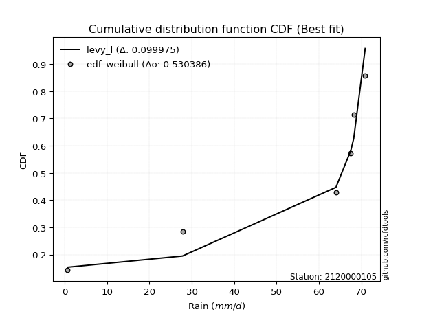</img>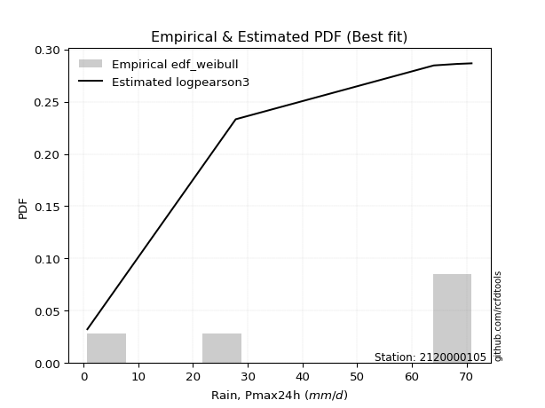</img>

</div>


### 4. EDF Beard (1943)

The Beard formula (or Beard´s plotting position formula) in hydrology is used to estimate the empirical non-exceedance probability _(P)_ of a flood event (or other extreme hydrological data point) within a given dataset.

<div align="center">


$P=(m-0.31)/(n+0.38)$


</div>


**4.1. Empirical values**

<div align="center">

|                | 0                   | 1                   | 2                  | 3                  | 4                  | 5                  |
|:---------------|:--------------------|:--------------------|:-------------------|:-------------------|:-------------------|:-------------------|
| date           | 2023                | 2018                | 2020               | 2025               | 2024               | 2019               |
| x              | 0.7                 | 27.8                | 64.0               | 67.5               | 68.2               | 70.9               |
| m              | 1                   | 2                   | 3                  | 4                  | 5                  | 6                  |
| empirical_dist | edf_beard           | edf_beard           | edf_beard          | edf_beard          | edf_beard          | edf_beard          |
| empirical      | 0.10815047021943573 | 0.26489028213166144 | 0.4216300940438871 | 0.5783699059561128 | 0.7351097178683387 | 0.8918495297805643 |
| empirical_tr   | 1.1212653778558874  | 1.3603411513859276  | 1.7289972899728996 | 2.3717472118959106 | 3.7751479289940844 | 9.246376811594207  |

</div>


**4.2. Kolmogorov-Smirnov fit test (sorted by Δ)**


<div align="center">

|                | 0                   | 1                   | 2                  | 3                  | 4                   | 5                  | 6                  | 7                   | 8                   | 9                   | 10                 | 11                 | 12                 | 13                  | 14                | 15                 | 16                  | 17                  | 18                  | 19                 | 20                 | 21                  | 22                  | 23                  | 24                 | 25                 | 26                  | 27                 | 28                 | 29                 | 30                 | 31                  | 32                 | 33                | 34                  | 35                  | 36                  | 37                 | 38                 | 39                  | 40                 | 41                 | 42                 | 43                  | 44                  | 45                 | 46                  | 47                 | 48                 | 49                 | 50                 | 51                 | 52                  | 53                 | 54                  | 55                 | 56                 | 57                 | 58                 | 59                  | 60                  | 61                 | 62                  | 63                 | 64                 | 65                 | 66                  | 67                  | 68                 | 69                 | 70                 | 71                  | 72                  | 73                  | 74                 | 75                  | 76                 | 77                 | 78                 | 79                  | 80                 | 81                 | 82                 | 83                 | 84                 | 85                 | 86                  | 87                  | 88                  | 89                  | 90                 | 91                 | 92                | 93                  | 94                  | 95                  | 96                  | 97                 | 98                 | 99                 | 100                 | 101                 | 102                | 103                | 104                | 105                 | 106                 | 107                | 108                 | 109                 | 110                | 111                | 112                | 113                | 114                | 115                | 116                 | 117                | 118                | 119                | 120                 | 121                | 122                 | 123                | 124                 | 125                | 126                | 127                | 128                | 129                | 130                | 131                | 132                | 133                | 134                | 135                | 136               | 137                | 138                | 139                 | 140                | 141                | 142                | 143                | 144                | 145                | 146                | 147                | 148                | 149                | 150                | 151                | 152                | 153                | 154                | 155                | 156                | 157                | 158              | 159                |
|:---------------|:--------------------|:--------------------|:-------------------|:-------------------|:--------------------|:-------------------|:-------------------|:--------------------|:--------------------|:--------------------|:-------------------|:-------------------|:-------------------|:--------------------|:------------------|:-------------------|:--------------------|:--------------------|:--------------------|:-------------------|:-------------------|:--------------------|:--------------------|:--------------------|:-------------------|:-------------------|:--------------------|:-------------------|:-------------------|:-------------------|:-------------------|:--------------------|:-------------------|:------------------|:--------------------|:--------------------|:--------------------|:-------------------|:-------------------|:--------------------|:-------------------|:-------------------|:-------------------|:--------------------|:--------------------|:-------------------|:--------------------|:-------------------|:-------------------|:-------------------|:-------------------|:-------------------|:--------------------|:-------------------|:--------------------|:-------------------|:-------------------|:-------------------|:-------------------|:--------------------|:--------------------|:-------------------|:--------------------|:-------------------|:-------------------|:-------------------|:--------------------|:--------------------|:-------------------|:-------------------|:-------------------|:--------------------|:--------------------|:--------------------|:-------------------|:--------------------|:-------------------|:-------------------|:-------------------|:--------------------|:-------------------|:-------------------|:-------------------|:-------------------|:-------------------|:-------------------|:--------------------|:--------------------|:--------------------|:--------------------|:-------------------|:-------------------|:------------------|:--------------------|:--------------------|:--------------------|:--------------------|:-------------------|:-------------------|:-------------------|:--------------------|:--------------------|:-------------------|:-------------------|:-------------------|:--------------------|:--------------------|:-------------------|:--------------------|:--------------------|:-------------------|:-------------------|:-------------------|:-------------------|:-------------------|:-------------------|:--------------------|:-------------------|:-------------------|:-------------------|:--------------------|:-------------------|:--------------------|:-------------------|:--------------------|:-------------------|:-------------------|:-------------------|:-------------------|:-------------------|:-------------------|:-------------------|:-------------------|:-------------------|:-------------------|:-------------------|:------------------|:-------------------|:-------------------|:--------------------|:-------------------|:-------------------|:-------------------|:-------------------|:-------------------|:-------------------|:-------------------|:-------------------|:-------------------|:-------------------|:-------------------|:-------------------|:-------------------|:-------------------|:-------------------|:-------------------|:-------------------|:-------------------|:-----------------|:-------------------|
| station        | 2120000105          | 2120000105          | 2120000105         | 2120000105         | 2120000105          | 2120000105         | 2120000105         | 2120000105          | 2120000105          | 2120000105          | 2120000105         | 2120000105         | 2120000105         | 2120000105          | 2120000105        | 2120000105         | 2120000105          | 2120000105          | 2120000105          | 2120000105         | 2120000105         | 2120000105          | 2120000105          | 2120000105          | 2120000105         | 2120000105         | 2120000105          | 2120000105         | 2120000105         | 2120000105         | 2120000105         | 2120000105          | 2120000105         | 2120000105        | 2120000105          | 2120000105          | 2120000105          | 2120000105         | 2120000105         | 2120000105          | 2120000105         | 2120000105         | 2120000105         | 2120000105          | 2120000105          | 2120000105         | 2120000105          | 2120000105         | 2120000105         | 2120000105         | 2120000105         | 2120000105         | 2120000105          | 2120000105         | 2120000105          | 2120000105         | 2120000105         | 2120000105         | 2120000105         | 2120000105          | 2120000105          | 2120000105         | 2120000105          | 2120000105         | 2120000105         | 2120000105         | 2120000105          | 2120000105          | 2120000105         | 2120000105         | 2120000105         | 2120000105          | 2120000105          | 2120000105          | 2120000105         | 2120000105          | 2120000105         | 2120000105         | 2120000105         | 2120000105          | 2120000105         | 2120000105         | 2120000105         | 2120000105         | 2120000105         | 2120000105         | 2120000105          | 2120000105          | 2120000105          | 2120000105          | 2120000105         | 2120000105         | 2120000105        | 2120000105          | 2120000105          | 2120000105          | 2120000105          | 2120000105         | 2120000105         | 2120000105         | 2120000105          | 2120000105          | 2120000105         | 2120000105         | 2120000105         | 2120000105          | 2120000105          | 2120000105         | 2120000105          | 2120000105          | 2120000105         | 2120000105         | 2120000105         | 2120000105         | 2120000105         | 2120000105         | 2120000105          | 2120000105         | 2120000105         | 2120000105         | 2120000105          | 2120000105         | 2120000105          | 2120000105         | 2120000105          | 2120000105         | 2120000105         | 2120000105         | 2120000105         | 2120000105         | 2120000105         | 2120000105         | 2120000105         | 2120000105         | 2120000105         | 2120000105         | 2120000105        | 2120000105         | 2120000105         | 2120000105          | 2120000105         | 2120000105         | 2120000105         | 2120000105         | 2120000105         | 2120000105         | 2120000105         | 2120000105         | 2120000105         | 2120000105         | 2120000105         | 2120000105         | 2120000105         | 2120000105         | 2120000105         | 2120000105         | 2120000105         | 2120000105         | 2120000105       | 2120000105         |
| empirical_dist | edf_beard           | edf_beard           | edf_beard          | edf_beard          | edf_beard           | edf_beard          | edf_beard          | edf_beard           | edf_beard           | edf_beard           | edf_beard          | edf_beard          | edf_beard          | edf_beard           | edf_beard         | edf_beard          | edf_beard           | edf_beard           | edf_beard           | edf_beard          | edf_beard          | edf_beard           | edf_beard           | edf_beard           | edf_beard          | edf_beard          | edf_beard           | edf_beard          | edf_beard          | edf_beard          | edf_beard          | edf_beard           | edf_beard          | edf_beard         | edf_beard           | edf_beard           | edf_beard           | edf_beard          | edf_beard          | edf_beard           | edf_beard          | edf_beard          | edf_beard          | edf_beard           | edf_beard           | edf_beard          | edf_beard           | edf_beard          | edf_beard          | edf_beard          | edf_beard          | edf_beard          | edf_beard           | edf_beard          | edf_beard           | edf_beard          | edf_beard          | edf_beard          | edf_beard          | edf_beard           | edf_beard           | edf_beard          | edf_beard           | edf_beard          | edf_beard          | edf_beard          | edf_beard           | edf_beard           | edf_beard          | edf_beard          | edf_beard          | edf_beard           | edf_beard           | edf_beard           | edf_beard          | edf_beard           | edf_beard          | edf_beard          | edf_beard          | edf_beard           | edf_beard          | edf_beard          | edf_beard          | edf_beard          | edf_beard          | edf_beard          | edf_beard           | edf_beard           | edf_beard           | edf_beard           | edf_beard          | edf_beard          | edf_beard         | edf_beard           | edf_beard           | edf_beard           | edf_beard           | edf_beard          | edf_beard          | edf_beard          | edf_beard           | edf_beard           | edf_beard          | edf_beard          | edf_beard          | edf_beard           | edf_beard           | edf_beard          | edf_beard           | edf_beard           | edf_beard          | edf_beard          | edf_beard          | edf_beard          | edf_beard          | edf_beard          | edf_beard           | edf_beard          | edf_beard          | edf_beard          | edf_beard           | edf_beard          | edf_beard           | edf_beard          | edf_beard           | edf_beard          | edf_beard          | edf_beard          | edf_beard          | edf_beard          | edf_beard          | edf_beard          | edf_beard          | edf_beard          | edf_beard          | edf_beard          | edf_beard         | edf_beard          | edf_beard          | edf_beard           | edf_beard          | edf_beard          | edf_beard          | edf_beard          | edf_beard          | edf_beard          | edf_beard          | edf_beard          | edf_beard          | edf_beard          | edf_beard          | edf_beard          | edf_beard          | edf_beard          | edf_beard          | edf_beard          | edf_beard          | edf_beard          | edf_beard        | edf_beard          |
| p_dist         | loglevy_l           | levy_l              | logjohnsonsb       | weibull_max        | vonmises_line       | beta               | arcsine            | genextreme          | logt                | logweibull_max      | wrapcauchy         | logmielke          | trapezoid          | logvonmises_line    | logpearson3       | logtrapezoid       | gennorm             | dgamma              | logsemicircular     | loggumbel_l        | gausshyper         | pearson3            | logwrapcauchy       | semicircular        | loganglit          | gumbel_l           | dweibull            | anglit             | logarcsine         | logkappa3          | gompertz           | weibull_min         | ncf                | loginvgauss       | loggenextreme       | loggamma            | loggamma            | loginvgamma        | lognakagami        | logcrystalball      | lognorm            | logexponnorm       | logrice            | lognct              | logfatiguelife      | loggengamma        | logalpha            | invgauss           | f                  | argus              | invgamma           | gengamma           | norm                | crystalball        | exponnorm           | t                  | erlang             | mielke             | gamma              | betaprime           | rice                | burr12             | logexponweib        | logmaxwell         | halfgennorm        | lomax              | genpareto           | kstwobign           | foldnorm           | loglogistic        | lograyleigh        | loginvweibull       | loggennorm          | maxwell             | logfoldnorm        | rayleigh            | genexpon           | loggompertz        | logistic           | loghypsecant        | logkstwobign       | loghalfnorm        | halfnorm           | hypsecant          | loghalfgennorm     | cosine             | loggenexpon         | loggumbel_r         | logcosine           | gumbel_r            | loglaplace         | loglaplace         | loghalflogistic   | halflogistic        | logmoyal            | laplace             | logburr             | logncf             | moyal              | nct                | logdgamma           | logerlang           | logdweibull        | loglomax           | genhalflogistic    | logburr12           | loggenpareto        | kappa4             | wald                | logloglaplace       | logargus           | logwald            | ksone              | skewnorm           | triang             | logbeta            | loggausshyper       | nakagami           | logf               | exponweib          | truncweibull_min    | burr               | logbetaprime        | logloggamma        | kappa3              | uniform            | logksone           | invweibull         | logweibull_min     | bradford           | johnsonsu          | loggenhalflogistic | johnsonsb          | truncexpon         | logbradford        | logskewnorm        | logkappa4         | fatiguelife        | logtriang          | logtruncweibull_min | loguniform         | logtruncnorm       | logjohnsonsu       | logtruncexpon      | logtukeylambda     | powerlaw           | truncpareto        | logexponpow        | exponpow           | alpha              | logtruncpareto     | logpowerlaw        | truncnorm          | rdist              | tukeylambda        | logrdist           | genlogistic        | loggenlogistic     | logvonmises      | vonmises           |
| delta          | 0.10195468615222181 | 0.10816007464754274 | 0.1667879915719323 | 0.1833150089158166 | 0.18464902178911358 | 0.1998996124721404 | 0.2019188308741678 | 0.20747274397966925 | 0.20823186099305613 | 0.20881656084049055 | 0.2208239554623368 | 0.2216678920150097 | 0.2246794322115791 | 0.22772501283643487 | 0.231742571835721 | 0.2327142773350237 | 0.23510971787679702 | 0.23704489965934458 | 0.23962629121357154 | 0.2398080883164167 | 0.2422200023396221 | 0.24326694531393572 | 0.24646304439770805 | 0.24668424881146206 | 0.2499191302553186 | 0.2505989327958415 | 0.25207922226052737 | 0.2572752438572868 | 0.2589142413164359 | 0.2598044055796539 | 0.2648902820558679 | 0.26629201013104636 | 0.2670920219148247 | 0.271246733691126 | 0.27145682103413754 | 0.27316161561714064 | 0.27316161561714064 | 0.2735395198831981 | 0.2737122635143951 | 0.27413440989137733 | 0.2741344269002493 | 0.2741363403809189 | 0.2741553222253728 | 0.27422298156204844 | 0.27633650476896293 | 0.2772495132262403 | 0.27824820403006173 | 0.2794936487185787 | 0.2809880845174228 | 0.2818089352725504 | 0.2820254032254244 | 0.2820817485661499 | 0.28212600746712074 | 0.2821260142842931 | 0.28212841330474075 | 0.2821429956583256 | 0.2822412457545334 | 0.2834716370006109 | 0.2836278102139091 | 0.28390806813377983 | 0.28450651698243606 | 0.2882399031910034 | 0.29000305468215654 | 0.2905613009141806 | 0.2913766530672592 | 0.2917932815299031 | 0.29211897578250595 | 0.29367910984255746 | 0.2946675419746105 | 0.2952690460929203 | 0.2953731279945771 | 0.29552482556734605 | 0.29588119648876965 | 0.29758404874517924 | 0.2978854301377902 | 0.30209335020169487 | 0.3026849442568315 | 0.3035035004656443 | 0.3036503810534816 | 0.31063351313202253 | 0.3111721224703088 | 0.3145979997964409 | 0.3158817015822131 | 0.3190937542452809 | 0.3221670918371805 | 0.3229417857227959 | 0.32492497347558524 | 0.32583753780234376 | 0.32725474874768196 | 0.33218213298171023 | 0.3360722622432028 | 0.3360722622432028 | 0.339839633243303 | 0.34254020329604945 | 0.34258902660802354 | 0.34381906221533937 | 0.34584183662008516 | 0.3460199743714858 | 0.3483607269458883 | 0.3547570205859253 | 0.35768475499565344 | 0.35895628825084713 | 0.3611784595266704 | 0.3753506643742478 | 0.3764406164453767 | 0.38447470232001013 | 0.38568535581146585 | 0.3915979036709854 | 0.39602196496412595 | 0.39682182280579026 | 0.3974409076052094 | 0.4082261529382809 | 0.4131277407139475 | 0.4165842903020978 | 0.4222801048789154 | 0.4313676434965411 | 0.43201679759265105 | 0.4392025451474075 | 0.4418568869177467 | 0.4423937962960186 | 0.45710961097430564 | 0.4612736986385592 | 0.46827274467092317 | 0.4766615446546601 | 0.48006944308039684 | 0.4800793076655145 | 0.4828277980402764 | 0.4834231470050053 | 0.4844874972224299 | 0.4915427009912459 | 0.4941359396619606 | 0.5102059929046394 | 0.5141532976332914 | 0.5198425735037202 | 0.5314364167793328 | 0.5359362127334093 | 0.543062514183472 | 0.5434235311238276 | 0.5443137892934453 | 0.5512604508119543  | 0.5561982816060749 | 0.5564622126941998 | 0.5778409906766766 | 0.5846679632734111 | 0.6002953098049826 | 0.6083482177082515 | 0.6491668640336239 | 0.6532696965363025 | 0.6743292033393274 | 0.6835119223684248 | 0.6970094687872207 | 0.7010486619794102 | 0.7351097022548323 | 0.7351097174968293 | 0.7351097178683315 | 0.7351097178683386 | 0.7351097178683387 | 0.7351097178683387 | 1.02031345508374 | 10.767797141721315 |
| deltao         | 0.530385761606      | 0.530385761606      | 0.530385761606     | 0.530385761606     | 0.530385761606      | 0.530385761606     | 0.530385761606     | 0.530385761606      | 0.530385761606      | 0.530385761606      | 0.530385761606     | 0.530385761606     | 0.530385761606     | 0.530385761606      | 0.530385761606    | 0.530385761606     | 0.530385761606      | 0.530385761606      | 0.530385761606      | 0.530385761606     | 0.530385761606     | 0.530385761606      | 0.530385761606      | 0.530385761606      | 0.530385761606     | 0.530385761606     | 0.530385761606      | 0.530385761606     | 0.530385761606     | 0.530385761606     | 0.530385761606     | 0.530385761606      | 0.530385761606     | 0.530385761606    | 0.530385761606      | 0.530385761606      | 0.530385761606      | 0.530385761606     | 0.530385761606     | 0.530385761606      | 0.530385761606     | 0.530385761606     | 0.530385761606     | 0.530385761606      | 0.530385761606      | 0.530385761606     | 0.530385761606      | 0.530385761606     | 0.530385761606     | 0.530385761606     | 0.530385761606     | 0.530385761606     | 0.530385761606      | 0.530385761606     | 0.530385761606      | 0.530385761606     | 0.530385761606     | 0.530385761606     | 0.530385761606     | 0.530385761606      | 0.530385761606      | 0.530385761606     | 0.530385761606      | 0.530385761606     | 0.530385761606     | 0.530385761606     | 0.530385761606      | 0.530385761606      | 0.530385761606     | 0.530385761606     | 0.530385761606     | 0.530385761606      | 0.530385761606      | 0.530385761606      | 0.530385761606     | 0.530385761606      | 0.530385761606     | 0.530385761606     | 0.530385761606     | 0.530385761606      | 0.530385761606     | 0.530385761606     | 0.530385761606     | 0.530385761606     | 0.530385761606     | 0.530385761606     | 0.530385761606      | 0.530385761606      | 0.530385761606      | 0.530385761606      | 0.530385761606     | 0.530385761606     | 0.530385761606    | 0.530385761606      | 0.530385761606      | 0.530385761606      | 0.530385761606      | 0.530385761606     | 0.530385761606     | 0.530385761606     | 0.530385761606      | 0.530385761606      | 0.530385761606     | 0.530385761606     | 0.530385761606     | 0.530385761606      | 0.530385761606      | 0.530385761606     | 0.530385761606      | 0.530385761606      | 0.530385761606     | 0.530385761606     | 0.530385761606     | 0.530385761606     | 0.530385761606     | 0.530385761606     | 0.530385761606      | 0.530385761606     | 0.530385761606     | 0.530385761606     | 0.530385761606      | 0.530385761606     | 0.530385761606      | 0.530385761606     | 0.530385761606      | 0.530385761606     | 0.530385761606     | 0.530385761606     | 0.530385761606     | 0.530385761606     | 0.530385761606     | 0.530385761606     | 0.530385761606     | 0.530385761606     | 0.530385761606     | 0.530385761606     | 0.530385761606    | 0.530385761606     | 0.530385761606     | 0.530385761606      | 0.530385761606     | 0.530385761606     | 0.530385761606     | 0.530385761606     | 0.530385761606     | 0.530385761606     | 0.530385761606     | 0.530385761606     | 0.530385761606     | 0.530385761606     | 0.530385761606     | 0.530385761606     | 0.530385761606     | 0.530385761606     | 0.530385761606     | 0.530385761606     | 0.530385761606     | 0.530385761606     | 0.530385761606   | 0.530385761606     |
| eval           | Δo > Δ              | Δo > Δ              | Δo > Δ             | Δo > Δ             | Δo > Δ              | Δo > Δ             | Δo > Δ             | Δo > Δ              | Δo > Δ              | Δo > Δ              | Δo > Δ             | Δo > Δ             | Δo > Δ             | Δo > Δ              | Δo > Δ            | Δo > Δ             | Δo > Δ              | Δo > Δ              | Δo > Δ              | Δo > Δ             | Δo > Δ             | Δo > Δ              | Δo > Δ              | Δo > Δ              | Δo > Δ             | Δo > Δ             | Δo > Δ              | Δo > Δ             | Δo > Δ             | Δo > Δ             | Δo > Δ             | Δo > Δ              | Δo > Δ             | Δo > Δ            | Δo > Δ              | Δo > Δ              | Δo > Δ              | Δo > Δ             | Δo > Δ             | Δo > Δ              | Δo > Δ             | Δo > Δ             | Δo > Δ             | Δo > Δ              | Δo > Δ              | Δo > Δ             | Δo > Δ              | Δo > Δ             | Δo > Δ             | Δo > Δ             | Δo > Δ             | Δo > Δ             | Δo > Δ              | Δo > Δ             | Δo > Δ              | Δo > Δ             | Δo > Δ             | Δo > Δ             | Δo > Δ             | Δo > Δ              | Δo > Δ              | Δo > Δ             | Δo > Δ              | Δo > Δ             | Δo > Δ             | Δo > Δ             | Δo > Δ              | Δo > Δ              | Δo > Δ             | Δo > Δ             | Δo > Δ             | Δo > Δ              | Δo > Δ              | Δo > Δ              | Δo > Δ             | Δo > Δ              | Δo > Δ             | Δo > Δ             | Δo > Δ             | Δo > Δ              | Δo > Δ             | Δo > Δ             | Δo > Δ             | Δo > Δ             | Δo > Δ             | Δo > Δ             | Δo > Δ              | Δo > Δ              | Δo > Δ              | Δo > Δ              | Δo > Δ             | Δo > Δ             | Δo > Δ            | Δo > Δ              | Δo > Δ              | Δo > Δ              | Δo > Δ              | Δo > Δ             | Δo > Δ             | Δo > Δ             | Δo > Δ              | Δo > Δ              | Δo > Δ             | Δo > Δ             | Δo > Δ             | Δo > Δ              | Δo > Δ              | Δo > Δ             | Δo > Δ              | Δo > Δ              | Δo > Δ             | Δo > Δ             | Δo > Δ             | Δo > Δ             | Δo > Δ             | Δo > Δ             | Δo > Δ              | Δo > Δ             | Δo > Δ             | Δo > Δ             | Δo > Δ              | Δo > Δ             | Δo > Δ              | Δo > Δ             | Δo > Δ              | Δo > Δ             | Δo > Δ             | Δo > Δ             | Δo > Δ             | Δo > Δ             | Δo > Δ             | Δo > Δ             | Δo > Δ             | Δo > Δ             | Δo <= Δ            | Δo <= Δ            | Δo <= Δ           | Δo <= Δ            | Δo <= Δ            | Δo <= Δ             | Δo <= Δ            | Δo <= Δ            | Δo <= Δ            | Δo <= Δ            | Δo <= Δ            | Δo <= Δ            | Δo <= Δ            | Δo <= Δ            | Δo <= Δ            | Δo <= Δ            | Δo <= Δ            | Δo <= Δ            | Δo <= Δ            | Δo <= Δ            | Δo <= Δ            | Δo <= Δ            | Δo <= Δ            | Δo <= Δ            | Δo <= Δ          | Δo <= Δ            |
| fit            | 1                   | 1                   | 1                  | 1                  | 1                   | 1                  | 1                  | 1                   | 1                   | 1                   | 1                  | 1                  | 1                  | 1                   | 1                 | 1                  | 1                   | 1                   | 1                   | 1                  | 1                  | 1                   | 1                   | 1                   | 1                  | 1                  | 1                   | 1                  | 1                  | 1                  | 1                  | 1                   | 1                  | 1                 | 1                   | 1                   | 1                   | 1                  | 1                  | 1                   | 1                  | 1                  | 1                  | 1                   | 1                   | 1                  | 1                   | 1                  | 1                  | 1                  | 1                  | 1                  | 1                   | 1                  | 1                   | 1                  | 1                  | 1                  | 1                  | 1                   | 1                   | 1                  | 1                   | 1                  | 1                  | 1                  | 1                   | 1                   | 1                  | 1                  | 1                  | 1                   | 1                   | 1                   | 1                  | 1                   | 1                  | 1                  | 1                  | 1                   | 1                  | 1                  | 1                  | 1                  | 1                  | 1                  | 1                   | 1                   | 1                   | 1                   | 1                  | 1                  | 1                 | 1                   | 1                   | 1                   | 1                   | 1                  | 1                  | 1                  | 1                   | 1                   | 1                  | 1                  | 1                  | 1                   | 1                   | 1                  | 1                   | 1                   | 1                  | 1                  | 1                  | 1                  | 1                  | 1                  | 1                   | 1                  | 1                  | 1                  | 1                   | 1                  | 1                   | 1                  | 1                   | 1                  | 1                  | 1                  | 1                  | 1                  | 1                  | 1                  | 1                  | 1                  | 0                  | 0                  | 0                 | 0                  | 0                  | 0                   | 0                  | 0                  | 0                  | 0                  | 0                  | 0                  | 0                  | 0                  | 0                  | 0                  | 0                  | 0                  | 0                  | 0                  | 0                  | 0                  | 0                  | 0                  | 0                | 0                  |
| n              | 6                   | 6                   | 6                  | 6                  | 6                   | 6                  | 6                  | 6                   | 6                   | 6                   | 6                  | 6                  | 6                  | 6                   | 6                 | 6                  | 6                   | 6                   | 6                   | 6                  | 6                  | 6                   | 6                   | 6                   | 6                  | 6                  | 6                   | 6                  | 6                  | 6                  | 6                  | 6                   | 6                  | 6                 | 6                   | 6                   | 6                   | 6                  | 6                  | 6                   | 6                  | 6                  | 6                  | 6                   | 6                   | 6                  | 6                   | 6                  | 6                  | 6                  | 6                  | 6                  | 6                   | 6                  | 6                   | 6                  | 6                  | 6                  | 6                  | 6                   | 6                   | 6                  | 6                   | 6                  | 6                  | 6                  | 6                   | 6                   | 6                  | 6                  | 6                  | 6                   | 6                   | 6                   | 6                  | 6                   | 6                  | 6                  | 6                  | 6                   | 6                  | 6                  | 6                  | 6                  | 6                  | 6                  | 6                   | 6                   | 6                   | 6                   | 6                  | 6                  | 6                 | 6                   | 6                   | 6                   | 6                   | 6                  | 6                  | 6                  | 6                   | 6                   | 6                  | 6                  | 6                  | 6                   | 6                   | 6                  | 6                   | 6                   | 6                  | 6                  | 6                  | 6                  | 6                  | 6                  | 6                   | 6                  | 6                  | 6                  | 6                   | 6                  | 6                   | 6                  | 6                   | 6                  | 6                  | 6                  | 6                  | 6                  | 6                  | 6                  | 6                  | 6                  | 6                  | 6                  | 6                 | 6                  | 6                  | 6                   | 6                  | 6                  | 6                  | 6                  | 6                  | 6                  | 6                  | 6                  | 6                  | 6                  | 6                  | 6                  | 6                  | 6                  | 6                  | 6                  | 6                  | 6                  | 6                | 6                  |
| best_fit       | 1                   | 0                   | 0                  | 0                  | 0                   | 0                  | 0                  | 0                   | 0                   | 0                   | 0                  | 0                  | 0                  | 0                   | 0                 | 0                  | 0                   | 0                   | 0                   | 0                  | 0                  | 0                   | 0                   | 0                   | 0                  | 0                  | 0                   | 0                  | 0                  | 0                  | 0                  | 0                   | 0                  | 0                 | 0                   | 0                   | 0                   | 0                  | 0                  | 0                   | 0                  | 0                  | 0                  | 0                   | 0                   | 0                  | 0                   | 0                  | 0                  | 0                  | 0                  | 0                  | 0                   | 0                  | 0                   | 0                  | 0                  | 0                  | 0                  | 0                   | 0                   | 0                  | 0                   | 0                  | 0                  | 0                  | 0                   | 0                   | 0                  | 0                  | 0                  | 0                   | 0                   | 0                   | 0                  | 0                   | 0                  | 0                  | 0                  | 0                   | 0                  | 0                  | 0                  | 0                  | 0                  | 0                  | 0                   | 0                   | 0                   | 0                   | 0                  | 0                  | 0                 | 0                   | 0                   | 0                   | 0                   | 0                  | 0                  | 0                  | 0                   | 0                   | 0                  | 0                  | 0                  | 0                   | 0                   | 0                  | 0                   | 0                   | 0                  | 0                  | 0                  | 0                  | 0                  | 0                  | 0                   | 0                  | 0                  | 0                  | 0                   | 0                  | 0                   | 0                  | 0                   | 0                  | 0                  | 0                  | 0                  | 0                  | 0                  | 0                  | 0                  | 0                  | 0                  | 0                  | 0                 | 0                  | 0                  | 0                   | 0                  | 0                  | 0                  | 0                  | 0                  | 0                  | 0                  | 0                  | 0                  | 0                  | 0                  | 0                  | 0                  | 0                  | 0                  | 0                  | 0                  | 0                  | 0                | 0                  |
| best_fit_sort  | 1                   | 2                   | 3                  | 4                  | 5                   | 6                  | 7                  | 8                   | 9                   | 10                  | 11                 | 12                 | 13                 | 14                  | 15                | 16                 | 17                  | 18                  | 19                  | 20                 | 21                 | 22                  | 23                  | 24                  | 25                 | 26                 | 27                  | 28                 | 29                 | 30                 | 31                 | 32                  | 33                 | 34                | 35                  | 36                  | 37                  | 38                 | 39                 | 40                  | 41                 | 42                 | 43                 | 44                  | 45                  | 46                 | 47                  | 48                 | 49                 | 50                 | 51                 | 52                 | 53                  | 54                 | 55                  | 56                 | 57                 | 58                 | 59                 | 60                  | 61                  | 62                 | 63                  | 64                 | 65                 | 66                 | 67                  | 68                  | 69                 | 70                 | 71                 | 72                  | 73                  | 74                  | 75                 | 76                  | 77                 | 78                 | 79                 | 80                  | 81                 | 82                 | 83                 | 84                 | 85                 | 86                 | 87                  | 88                  | 89                  | 90                  | 91                 | 92                 | 93                | 94                  | 95                  | 96                  | 97                  | 98                 | 99                 | 100                | 101                 | 102                 | 103                | 104                | 105                | 106                 | 107                 | 108                | 109                 | 110                 | 111                | 112                | 113                | 114                | 115                | 116                | 117                 | 118                | 119                | 120                | 121                 | 122                | 123                 | 124                | 125                 | 126                | 127                | 128                | 129                | 130                | 131                | 132                | 133                | 134                | 135                | 136                | 137               | 138                | 139                | 140                 | 141                | 142                | 143                | 144                | 145                | 146                | 147                | 148                | 149                | 150                | 151                | 152                | 153                | 154                | 155                | 156                | 157                | 158                | 159              | 160                |

</div>


**4.3. Best fit**

<div align="center">

|   id |    station | empirical_dist   | p_dist    |    delta |   deltao | eval   |   fit |   n |   best_fit |   best_fit_sort |
|-----:|-----------:|:-----------------|:----------|---------:|---------:|:-------|------:|----:|-----------:|----------------:|
|    0 | 2120000105 | edf_beard        | loglevy_l | 0.101955 | 0.530386 | Δo > Δ |     1 |   6 |          1 |               1 |

</div>


<div align="center">

</img>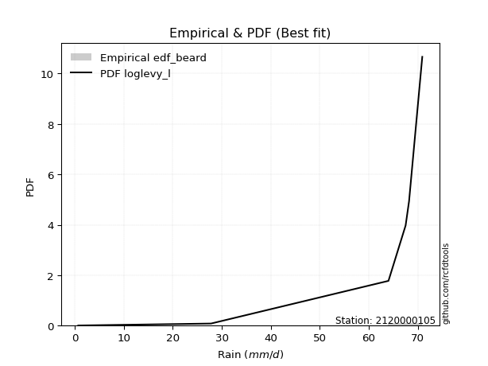</img>

</div>


### 5. EDF Chegodayev (1955)

The Chegodayev formula is an empirical plotting position formula used in hydrological frequency analysis to estimate the exceedance probability or return period of a specific event from a set of observed data. It is primarily used for plotting observed data points on probability paper to fit a theoretical distribution, particularly for analyzing extreme events like maximum flood flows or rainfall intensities. The constant _b_ value in the generalized plotting position formula is 0.3.

<div align="center">


$P=(m-b)/(n+1-2b)$


</div>


**5.1. Empirical values**

<div align="center">

|                | 0                   | 1                  | 2                  | 3                  | 4                 | 5                 |
|:---------------|:--------------------|:-------------------|:-------------------|:-------------------|:------------------|:------------------|
| date           | 2023                | 2018               | 2020               | 2025               | 2024              | 2019              |
| x              | 0.7                 | 27.8               | 64.0               | 67.5               | 68.2              | 70.9              |
| m              | 1                   | 2                  | 3                  | 4                  | 5                 | 6                 |
| empirical_dist | edf_chegodayev      | edf_chegodayev     | edf_chegodayev     | edf_chegodayev     | edf_chegodayev    | edf_chegodayev    |
| empirical      | 0.10937499999999999 | 0.265625           | 0.421875           | 0.578125           | 0.734375          | 0.890625          |
| empirical_tr   | 1.1228070175438596  | 1.3617021276595744 | 1.7297297297297298 | 2.3703703703703702 | 3.764705882352941 | 9.142857142857142 |

</div>


**5.2. Kolmogorov-Smirnov fit test (sorted by Δ)**


<div align="center">

|                | 0                   | 1                   | 2                   | 3                   | 4                   | 5                  | 6                   | 7                   | 8                 | 9                   | 10                  | 11                  | 12                  | 13                  | 14                 | 15                 | 16                  | 17                  | 18                  | 19                  | 20                  | 21                  | 22                 | 23                  | 24                  | 25                 | 26                  | 27                 | 28                 | 29                  | 30                  | 31                 | 32                 | 33                  | 34                  | 35                  | 36                  | 37                 | 38                 | 39                  | 40                  | 41                | 42                  | 43                  | 44                  | 45                  | 46                  | 47                 | 48                 | 49                  | 50                  | 51                  | 52                  | 53                  | 54                 | 55                  | 56                  | 57                | 58                 | 59                  | 60                 | 61                 | 62                  | 63                 | 64                 | 65                 | 66                 | 67                 | 68                 | 69                  | 70                 | 71                  | 72                 | 73                  | 74                 | 75                | 76                  | 77                 | 78                 | 79                  | 80                 | 81                 | 82                  | 83                  | 84                  | 85                  | 86                 | 87                 | 88                 | 89                  | 90                  | 91                  | 92                  | 93                 | 94                  | 95                 | 96                 | 97                  | 98                  | 99                 | 100                 | 101                 | 102                 | 103                 | 104                | 105                 | 106               | 107                 | 108                | 109                | 110                | 111                 | 112                | 113                 | 114                | 115                 | 116                | 117                | 118                 | 119                 | 120                 | 121                 | 122                | 123                | 124                 | 125                | 126                 | 127               | 128                 | 129                 | 130                 | 131                | 132                | 133                | 134              | 135                | 136               | 137                | 138                | 139                 | 140                | 141                | 142                | 143                | 144               | 145               | 146                | 147               | 148                | 149                | 150                | 151                | 152                | 153                | 154                | 155            | 156            | 157            | 158                | 159               |
|:---------------|:--------------------|:--------------------|:--------------------|:--------------------|:--------------------|:-------------------|:--------------------|:--------------------|:------------------|:--------------------|:--------------------|:--------------------|:--------------------|:--------------------|:-------------------|:-------------------|:--------------------|:--------------------|:--------------------|:--------------------|:--------------------|:--------------------|:-------------------|:--------------------|:--------------------|:-------------------|:--------------------|:-------------------|:-------------------|:--------------------|:--------------------|:-------------------|:-------------------|:--------------------|:--------------------|:--------------------|:--------------------|:-------------------|:-------------------|:--------------------|:--------------------|:------------------|:--------------------|:--------------------|:--------------------|:--------------------|:--------------------|:-------------------|:-------------------|:--------------------|:--------------------|:--------------------|:--------------------|:--------------------|:-------------------|:--------------------|:--------------------|:------------------|:-------------------|:--------------------|:-------------------|:-------------------|:--------------------|:-------------------|:-------------------|:-------------------|:-------------------|:-------------------|:-------------------|:--------------------|:-------------------|:--------------------|:-------------------|:--------------------|:-------------------|:------------------|:--------------------|:-------------------|:-------------------|:--------------------|:-------------------|:-------------------|:--------------------|:--------------------|:--------------------|:--------------------|:-------------------|:-------------------|:-------------------|:--------------------|:--------------------|:--------------------|:--------------------|:-------------------|:--------------------|:-------------------|:-------------------|:--------------------|:--------------------|:-------------------|:--------------------|:--------------------|:--------------------|:--------------------|:-------------------|:--------------------|:------------------|:--------------------|:-------------------|:-------------------|:-------------------|:--------------------|:-------------------|:--------------------|:-------------------|:--------------------|:-------------------|:-------------------|:--------------------|:--------------------|:--------------------|:--------------------|:-------------------|:-------------------|:--------------------|:-------------------|:--------------------|:------------------|:--------------------|:--------------------|:--------------------|:-------------------|:-------------------|:-------------------|:-----------------|:-------------------|:------------------|:-------------------|:-------------------|:--------------------|:-------------------|:-------------------|:-------------------|:-------------------|:------------------|:------------------|:-------------------|:------------------|:-------------------|:-------------------|:-------------------|:-------------------|:-------------------|:-------------------|:-------------------|:---------------|:---------------|:---------------|:-------------------|:------------------|
| station        | 2120000105          | 2120000105          | 2120000105          | 2120000105          | 2120000105          | 2120000105         | 2120000105          | 2120000105          | 2120000105        | 2120000105          | 2120000105          | 2120000105          | 2120000105          | 2120000105          | 2120000105         | 2120000105         | 2120000105          | 2120000105          | 2120000105          | 2120000105          | 2120000105          | 2120000105          | 2120000105         | 2120000105          | 2120000105          | 2120000105         | 2120000105          | 2120000105         | 2120000105         | 2120000105          | 2120000105          | 2120000105         | 2120000105         | 2120000105          | 2120000105          | 2120000105          | 2120000105          | 2120000105         | 2120000105         | 2120000105          | 2120000105          | 2120000105        | 2120000105          | 2120000105          | 2120000105          | 2120000105          | 2120000105          | 2120000105         | 2120000105         | 2120000105          | 2120000105          | 2120000105          | 2120000105          | 2120000105          | 2120000105         | 2120000105          | 2120000105          | 2120000105        | 2120000105         | 2120000105          | 2120000105         | 2120000105         | 2120000105          | 2120000105         | 2120000105         | 2120000105         | 2120000105         | 2120000105         | 2120000105         | 2120000105          | 2120000105         | 2120000105          | 2120000105         | 2120000105          | 2120000105         | 2120000105        | 2120000105          | 2120000105         | 2120000105         | 2120000105          | 2120000105         | 2120000105         | 2120000105          | 2120000105          | 2120000105          | 2120000105          | 2120000105         | 2120000105         | 2120000105         | 2120000105          | 2120000105          | 2120000105          | 2120000105          | 2120000105         | 2120000105          | 2120000105         | 2120000105         | 2120000105          | 2120000105          | 2120000105         | 2120000105          | 2120000105          | 2120000105          | 2120000105          | 2120000105         | 2120000105          | 2120000105        | 2120000105          | 2120000105         | 2120000105         | 2120000105         | 2120000105          | 2120000105         | 2120000105          | 2120000105         | 2120000105          | 2120000105         | 2120000105         | 2120000105          | 2120000105          | 2120000105          | 2120000105          | 2120000105         | 2120000105         | 2120000105          | 2120000105         | 2120000105          | 2120000105        | 2120000105          | 2120000105          | 2120000105          | 2120000105         | 2120000105         | 2120000105         | 2120000105       | 2120000105         | 2120000105        | 2120000105         | 2120000105         | 2120000105          | 2120000105         | 2120000105         | 2120000105         | 2120000105         | 2120000105        | 2120000105        | 2120000105         | 2120000105        | 2120000105         | 2120000105         | 2120000105         | 2120000105         | 2120000105         | 2120000105         | 2120000105         | 2120000105     | 2120000105     | 2120000105     | 2120000105         | 2120000105        |
| empirical_dist | edf_chegodayev      | edf_chegodayev      | edf_chegodayev      | edf_chegodayev      | edf_chegodayev      | edf_chegodayev     | edf_chegodayev      | edf_chegodayev      | edf_chegodayev    | edf_chegodayev      | edf_chegodayev      | edf_chegodayev      | edf_chegodayev      | edf_chegodayev      | edf_chegodayev     | edf_chegodayev     | edf_chegodayev      | edf_chegodayev      | edf_chegodayev      | edf_chegodayev      | edf_chegodayev      | edf_chegodayev      | edf_chegodayev     | edf_chegodayev      | edf_chegodayev      | edf_chegodayev     | edf_chegodayev      | edf_chegodayev     | edf_chegodayev     | edf_chegodayev      | edf_chegodayev      | edf_chegodayev     | edf_chegodayev     | edf_chegodayev      | edf_chegodayev      | edf_chegodayev      | edf_chegodayev      | edf_chegodayev     | edf_chegodayev     | edf_chegodayev      | edf_chegodayev      | edf_chegodayev    | edf_chegodayev      | edf_chegodayev      | edf_chegodayev      | edf_chegodayev      | edf_chegodayev      | edf_chegodayev     | edf_chegodayev     | edf_chegodayev      | edf_chegodayev      | edf_chegodayev      | edf_chegodayev      | edf_chegodayev      | edf_chegodayev     | edf_chegodayev      | edf_chegodayev      | edf_chegodayev    | edf_chegodayev     | edf_chegodayev      | edf_chegodayev     | edf_chegodayev     | edf_chegodayev      | edf_chegodayev     | edf_chegodayev     | edf_chegodayev     | edf_chegodayev     | edf_chegodayev     | edf_chegodayev     | edf_chegodayev      | edf_chegodayev     | edf_chegodayev      | edf_chegodayev     | edf_chegodayev      | edf_chegodayev     | edf_chegodayev    | edf_chegodayev      | edf_chegodayev     | edf_chegodayev     | edf_chegodayev      | edf_chegodayev     | edf_chegodayev     | edf_chegodayev      | edf_chegodayev      | edf_chegodayev      | edf_chegodayev      | edf_chegodayev     | edf_chegodayev     | edf_chegodayev     | edf_chegodayev      | edf_chegodayev      | edf_chegodayev      | edf_chegodayev      | edf_chegodayev     | edf_chegodayev      | edf_chegodayev     | edf_chegodayev     | edf_chegodayev      | edf_chegodayev      | edf_chegodayev     | edf_chegodayev      | edf_chegodayev      | edf_chegodayev      | edf_chegodayev      | edf_chegodayev     | edf_chegodayev      | edf_chegodayev    | edf_chegodayev      | edf_chegodayev     | edf_chegodayev     | edf_chegodayev     | edf_chegodayev      | edf_chegodayev     | edf_chegodayev      | edf_chegodayev     | edf_chegodayev      | edf_chegodayev     | edf_chegodayev     | edf_chegodayev      | edf_chegodayev      | edf_chegodayev      | edf_chegodayev      | edf_chegodayev     | edf_chegodayev     | edf_chegodayev      | edf_chegodayev     | edf_chegodayev      | edf_chegodayev    | edf_chegodayev      | edf_chegodayev      | edf_chegodayev      | edf_chegodayev     | edf_chegodayev     | edf_chegodayev     | edf_chegodayev   | edf_chegodayev     | edf_chegodayev    | edf_chegodayev     | edf_chegodayev     | edf_chegodayev      | edf_chegodayev     | edf_chegodayev     | edf_chegodayev     | edf_chegodayev     | edf_chegodayev    | edf_chegodayev    | edf_chegodayev     | edf_chegodayev    | edf_chegodayev     | edf_chegodayev     | edf_chegodayev     | edf_chegodayev     | edf_chegodayev     | edf_chegodayev     | edf_chegodayev     | edf_chegodayev | edf_chegodayev | edf_chegodayev | edf_chegodayev     | edf_chegodayev    |
| p_dist         | loglevy_l           | levy_l              | logjohnsonsb        | weibull_max         | vonmises_line       | beta               | arcsine             | genextreme          | logt              | logweibull_max      | wrapcauchy          | logmielke           | trapezoid           | logvonmises_line    | logpearson3        | logtrapezoid       | gennorm             | dgamma              | logsemicircular     | loggumbel_l         | gausshyper          | pearson3            | logwrapcauchy      | semicircular        | loganglit           | gumbel_l           | dweibull            | anglit             | logarcsine         | logkappa3           | gompertz            | weibull_min        | ncf                | loginvgauss         | loggenextreme       | loggamma            | loggamma            | loginvgamma        | lognakagami        | logcrystalball      | lognorm             | logexponnorm      | logrice             | lognct              | logfatiguelife      | loggengamma         | logalpha            | invgauss           | f                  | argus               | invgamma            | gengamma            | norm                | crystalball         | exponnorm          | t                   | erlang              | mielke            | gamma              | betaprime           | rice               | burr12             | logexponweib        | logmaxwell         | halfgennorm        | lomax              | genpareto          | kstwobign          | foldnorm           | loggennorm          | loginvweibull      | loglogistic         | lograyleigh        | maxwell             | logfoldnorm        | rayleigh          | genexpon            | loggompertz        | logistic           | loghypsecant        | logkstwobign       | loghalfnorm        | halfnorm            | hypsecant           | loghalfgennorm      | cosine              | loggenexpon        | loggumbel_r        | logcosine          | gumbel_r            | loglaplace          | loglaplace          | loghalflogistic     | halflogistic       | logmoyal            | laplace            | logburr            | logncf              | moyal               | nct                | logdgamma           | logerlang           | logdweibull         | loglomax            | genhalflogistic    | logburr12           | loggenpareto      | kappa4              | wald               | logloglaplace      | logargus           | logwald             | ksone              | skewnorm            | triang             | logbeta             | loggausshyper      | nakagami           | logf                | exponweib           | truncweibull_min    | burr                | logbetaprime       | logloggamma        | kappa3              | uniform            | logksone            | invweibull        | logweibull_min      | bradford            | johnsonsu           | loggenhalflogistic | johnsonsb          | truncexpon         | logbradford      | logskewnorm        | fatiguelife       | logkappa4          | logtriang          | logtruncweibull_min | loguniform         | logtruncnorm       | logjohnsonsu       | logtruncexpon      | logtukeylambda    | powerlaw          | truncpareto        | logexponpow       | exponpow           | alpha              | logtruncpareto     | logpowerlaw        | truncnorm          | rdist              | tukeylambda        | genlogistic    | logrdist       | loggenlogistic | logvonmises        | vonmises          |
| delta          | 0.10268940402056037 | 0.10742535677920406 | 0.16654308561581943 | 0.18307010295970372 | 0.18342449200854927 | 0.1991648946038017 | 0.20167392491805491 | 0.20722783802355638 | 0.208476766949169 | 0.20857165488437768 | 0.22008923759399823 | 0.22044336223444538 | 0.22443452625546623 | 0.22650048305587056 | 0.2305180420551567 | 0.2314897475544594 | 0.23437500000845835 | 0.23777961752768315 | 0.23938138525745867 | 0.23956318236030383 | 0.24197509638350923 | 0.24302203935782285 | 0.2457283265293695 | 0.24643934285534919 | 0.24967422429920572 | 0.2503540268397286 | 0.25085469247996306 | 0.2570303379011739 | 0.2576897115358716 | 0.25906968771131533 | 0.26562499992420646 | 0.2660471041749335 | 0.2668471159587118 | 0.27100182773501313 | 0.27121191507802467 | 0.27291670966102777 | 0.27291670966102777 | 0.2732946139270852 | 0.2734673575582822 | 0.27388950393526446 | 0.27388952094413643 | 0.273891434424806 | 0.27391041626925994 | 0.27397807560593557 | 0.27609159881285006 | 0.27700460727012743 | 0.27800329807394886 | 0.2792487427624658 | 0.2807431785613099 | 0.28156402931643754 | 0.28178049726931154 | 0.28183684261003705 | 0.28188110151100787 | 0.28188110832818025 | 0.2818835073486279 | 0.28189808970221275 | 0.28199633979842054 | 0.283226731044498 | 0.2833829042577962 | 0.28366316217766696 | 0.2842616110263232 | 0.2879949972348905 | 0.28975814872604366 | 0.2903163949580677 | 0.2911317471111463 | 0.2915483755737902 | 0.2918740698263931 | 0.2934342038864446 | 0.2944226360184976 | 0.29465666670820534 | 0.2947901076990075 | 0.29502414013680744 | 0.2951282220384642 | 0.29733914278906637 | 0.2976405241816773 | 0.301848444245582 | 0.30244003830071864 | 0.3032585945095314 | 0.3034054750973687 | 0.31038860717590966 | 0.3104374046019702 | 0.3138632819281023 | 0.31563679562610025 | 0.31884884828916804 | 0.32143237396884194 | 0.32269687976668304 | 0.3241902556072467 | 0.3255926318462309 | 0.3270098427915691 | 0.33193722702559736 | 0.33582735628708993 | 0.33582735628708993 | 0.33910491537496446 | 0.3422952973399366 | 0.34234412065191067 | 0.3435741562592265 | 0.3451071187517466 | 0.34528525650314723 | 0.34811582098977545 | 0.3540223027175867 | 0.35646022521508913 | 0.35822157038250857 | 0.35995392974610607 | 0.37461594650590924 | 0.3761957104892638 | 0.38373998445167157 | 0.385440449855353 | 0.39135299771487253 | 0.3957770590080131 | 0.3960871049374517 | 0.3971960016490965 | 0.40749143506994234 | 0.4128828347578346 | 0.41633938434598494 | 0.4220351989228025 | 0.43063292562820243 | 0.4317718916365382 | 0.4389576391912946 | 0.44112216904940815 | 0.44165907842768004 | 0.45686470501819276 | 0.46102879268244634 | 0.4675380268025846 | 0.4764166386985472 | 0.47982453712428397 | 0.4798344017094016 | 0.48209308017193786 | 0.482198617224441 | 0.48375277935409133 | 0.49129779503513304 | 0.49340122179362195 | 0.5099610869485265 | 0.5134185797649529 | 0.5195976675476074 | 0.53119151082322 | 0.5356913067772964 | 0.542688813255489 | 0.5428176082273591 | 0.5440688833373324 | 0.5510155448558414  | 0.5559533756499621 | 0.5562173067380869 | 0.5771062728083378 | 0.5839332454050725 | 0.599560591936644 | 0.607613499839913 | 0.6484321461652853 | 0.652534978667964 | 0.6735944854709889 | 0.6827772045000863 | 0.6962747509188821 | 0.7003139441110716 | 0.7343749843864937 | 0.7343749996284907 | 0.7343749999999929 | 0.734375       | 0.734375       | 0.734375       | 1.0200685491276271 | 10.76902167150188 |
| deltao         | 0.530385761606      | 0.530385761606      | 0.530385761606      | 0.530385761606      | 0.530385761606      | 0.530385761606     | 0.530385761606      | 0.530385761606      | 0.530385761606    | 0.530385761606      | 0.530385761606      | 0.530385761606      | 0.530385761606      | 0.530385761606      | 0.530385761606     | 0.530385761606     | 0.530385761606      | 0.530385761606      | 0.530385761606      | 0.530385761606      | 0.530385761606      | 0.530385761606      | 0.530385761606     | 0.530385761606      | 0.530385761606      | 0.530385761606     | 0.530385761606      | 0.530385761606     | 0.530385761606     | 0.530385761606      | 0.530385761606      | 0.530385761606     | 0.530385761606     | 0.530385761606      | 0.530385761606      | 0.530385761606      | 0.530385761606      | 0.530385761606     | 0.530385761606     | 0.530385761606      | 0.530385761606      | 0.530385761606    | 0.530385761606      | 0.530385761606      | 0.530385761606      | 0.530385761606      | 0.530385761606      | 0.530385761606     | 0.530385761606     | 0.530385761606      | 0.530385761606      | 0.530385761606      | 0.530385761606      | 0.530385761606      | 0.530385761606     | 0.530385761606      | 0.530385761606      | 0.530385761606    | 0.530385761606     | 0.530385761606      | 0.530385761606     | 0.530385761606     | 0.530385761606      | 0.530385761606     | 0.530385761606     | 0.530385761606     | 0.530385761606     | 0.530385761606     | 0.530385761606     | 0.530385761606      | 0.530385761606     | 0.530385761606      | 0.530385761606     | 0.530385761606      | 0.530385761606     | 0.530385761606    | 0.530385761606      | 0.530385761606     | 0.530385761606     | 0.530385761606      | 0.530385761606     | 0.530385761606     | 0.530385761606      | 0.530385761606      | 0.530385761606      | 0.530385761606      | 0.530385761606     | 0.530385761606     | 0.530385761606     | 0.530385761606      | 0.530385761606      | 0.530385761606      | 0.530385761606      | 0.530385761606     | 0.530385761606      | 0.530385761606     | 0.530385761606     | 0.530385761606      | 0.530385761606      | 0.530385761606     | 0.530385761606      | 0.530385761606      | 0.530385761606      | 0.530385761606      | 0.530385761606     | 0.530385761606      | 0.530385761606    | 0.530385761606      | 0.530385761606     | 0.530385761606     | 0.530385761606     | 0.530385761606      | 0.530385761606     | 0.530385761606      | 0.530385761606     | 0.530385761606      | 0.530385761606     | 0.530385761606     | 0.530385761606      | 0.530385761606      | 0.530385761606      | 0.530385761606      | 0.530385761606     | 0.530385761606     | 0.530385761606      | 0.530385761606     | 0.530385761606      | 0.530385761606    | 0.530385761606      | 0.530385761606      | 0.530385761606      | 0.530385761606     | 0.530385761606     | 0.530385761606     | 0.530385761606   | 0.530385761606     | 0.530385761606    | 0.530385761606     | 0.530385761606     | 0.530385761606      | 0.530385761606     | 0.530385761606     | 0.530385761606     | 0.530385761606     | 0.530385761606    | 0.530385761606    | 0.530385761606     | 0.530385761606    | 0.530385761606     | 0.530385761606     | 0.530385761606     | 0.530385761606     | 0.530385761606     | 0.530385761606     | 0.530385761606     | 0.530385761606 | 0.530385761606 | 0.530385761606 | 0.530385761606     | 0.530385761606    |
| eval           | Δo > Δ              | Δo > Δ              | Δo > Δ              | Δo > Δ              | Δo > Δ              | Δo > Δ             | Δo > Δ              | Δo > Δ              | Δo > Δ            | Δo > Δ              | Δo > Δ              | Δo > Δ              | Δo > Δ              | Δo > Δ              | Δo > Δ             | Δo > Δ             | Δo > Δ              | Δo > Δ              | Δo > Δ              | Δo > Δ              | Δo > Δ              | Δo > Δ              | Δo > Δ             | Δo > Δ              | Δo > Δ              | Δo > Δ             | Δo > Δ              | Δo > Δ             | Δo > Δ             | Δo > Δ              | Δo > Δ              | Δo > Δ             | Δo > Δ             | Δo > Δ              | Δo > Δ              | Δo > Δ              | Δo > Δ              | Δo > Δ             | Δo > Δ             | Δo > Δ              | Δo > Δ              | Δo > Δ            | Δo > Δ              | Δo > Δ              | Δo > Δ              | Δo > Δ              | Δo > Δ              | Δo > Δ             | Δo > Δ             | Δo > Δ              | Δo > Δ              | Δo > Δ              | Δo > Δ              | Δo > Δ              | Δo > Δ             | Δo > Δ              | Δo > Δ              | Δo > Δ            | Δo > Δ             | Δo > Δ              | Δo > Δ             | Δo > Δ             | Δo > Δ              | Δo > Δ             | Δo > Δ             | Δo > Δ             | Δo > Δ             | Δo > Δ             | Δo > Δ             | Δo > Δ              | Δo > Δ             | Δo > Δ              | Δo > Δ             | Δo > Δ              | Δo > Δ             | Δo > Δ            | Δo > Δ              | Δo > Δ             | Δo > Δ             | Δo > Δ              | Δo > Δ             | Δo > Δ             | Δo > Δ              | Δo > Δ              | Δo > Δ              | Δo > Δ              | Δo > Δ             | Δo > Δ             | Δo > Δ             | Δo > Δ              | Δo > Δ              | Δo > Δ              | Δo > Δ              | Δo > Δ             | Δo > Δ              | Δo > Δ             | Δo > Δ             | Δo > Δ              | Δo > Δ              | Δo > Δ             | Δo > Δ              | Δo > Δ              | Δo > Δ              | Δo > Δ              | Δo > Δ             | Δo > Δ              | Δo > Δ            | Δo > Δ              | Δo > Δ             | Δo > Δ             | Δo > Δ             | Δo > Δ              | Δo > Δ             | Δo > Δ              | Δo > Δ             | Δo > Δ              | Δo > Δ             | Δo > Δ             | Δo > Δ              | Δo > Δ              | Δo > Δ              | Δo > Δ              | Δo > Δ             | Δo > Δ             | Δo > Δ              | Δo > Δ             | Δo > Δ              | Δo > Δ            | Δo > Δ              | Δo > Δ              | Δo > Δ              | Δo > Δ             | Δo > Δ             | Δo > Δ             | Δo <= Δ          | Δo <= Δ            | Δo <= Δ           | Δo <= Δ            | Δo <= Δ            | Δo <= Δ             | Δo <= Δ            | Δo <= Δ            | Δo <= Δ            | Δo <= Δ            | Δo <= Δ           | Δo <= Δ           | Δo <= Δ            | Δo <= Δ           | Δo <= Δ            | Δo <= Δ            | Δo <= Δ            | Δo <= Δ            | Δo <= Δ            | Δo <= Δ            | Δo <= Δ            | Δo <= Δ        | Δo <= Δ        | Δo <= Δ        | Δo <= Δ            | Δo <= Δ           |
| fit            | 1                   | 1                   | 1                   | 1                   | 1                   | 1                  | 1                   | 1                   | 1                 | 1                   | 1                   | 1                   | 1                   | 1                   | 1                  | 1                  | 1                   | 1                   | 1                   | 1                   | 1                   | 1                   | 1                  | 1                   | 1                   | 1                  | 1                   | 1                  | 1                  | 1                   | 1                   | 1                  | 1                  | 1                   | 1                   | 1                   | 1                   | 1                  | 1                  | 1                   | 1                   | 1                 | 1                   | 1                   | 1                   | 1                   | 1                   | 1                  | 1                  | 1                   | 1                   | 1                   | 1                   | 1                   | 1                  | 1                   | 1                   | 1                 | 1                  | 1                   | 1                  | 1                  | 1                   | 1                  | 1                  | 1                  | 1                  | 1                  | 1                  | 1                   | 1                  | 1                   | 1                  | 1                   | 1                  | 1                 | 1                   | 1                  | 1                  | 1                   | 1                  | 1                  | 1                   | 1                   | 1                   | 1                   | 1                  | 1                  | 1                  | 1                   | 1                   | 1                   | 1                   | 1                  | 1                   | 1                  | 1                  | 1                   | 1                   | 1                  | 1                   | 1                   | 1                   | 1                   | 1                  | 1                   | 1                 | 1                   | 1                  | 1                  | 1                  | 1                   | 1                  | 1                   | 1                  | 1                   | 1                  | 1                  | 1                   | 1                   | 1                   | 1                   | 1                  | 1                  | 1                   | 1                  | 1                   | 1                 | 1                   | 1                   | 1                   | 1                  | 1                  | 1                  | 0                | 0                  | 0                 | 0                  | 0                  | 0                   | 0                  | 0                  | 0                  | 0                  | 0                 | 0                 | 0                  | 0                 | 0                  | 0                  | 0                  | 0                  | 0                  | 0                  | 0                  | 0              | 0              | 0              | 0                  | 0                 |
| n              | 6                   | 6                   | 6                   | 6                   | 6                   | 6                  | 6                   | 6                   | 6                 | 6                   | 6                   | 6                   | 6                   | 6                   | 6                  | 6                  | 6                   | 6                   | 6                   | 6                   | 6                   | 6                   | 6                  | 6                   | 6                   | 6                  | 6                   | 6                  | 6                  | 6                   | 6                   | 6                  | 6                  | 6                   | 6                   | 6                   | 6                   | 6                  | 6                  | 6                   | 6                   | 6                 | 6                   | 6                   | 6                   | 6                   | 6                   | 6                  | 6                  | 6                   | 6                   | 6                   | 6                   | 6                   | 6                  | 6                   | 6                   | 6                 | 6                  | 6                   | 6                  | 6                  | 6                   | 6                  | 6                  | 6                  | 6                  | 6                  | 6                  | 6                   | 6                  | 6                   | 6                  | 6                   | 6                  | 6                 | 6                   | 6                  | 6                  | 6                   | 6                  | 6                  | 6                   | 6                   | 6                   | 6                   | 6                  | 6                  | 6                  | 6                   | 6                   | 6                   | 6                   | 6                  | 6                   | 6                  | 6                  | 6                   | 6                   | 6                  | 6                   | 6                   | 6                   | 6                   | 6                  | 6                   | 6                 | 6                   | 6                  | 6                  | 6                  | 6                   | 6                  | 6                   | 6                  | 6                   | 6                  | 6                  | 6                   | 6                   | 6                   | 6                   | 6                  | 6                  | 6                   | 6                  | 6                   | 6                 | 6                   | 6                   | 6                   | 6                  | 6                  | 6                  | 6                | 6                  | 6                 | 6                  | 6                  | 6                   | 6                  | 6                  | 6                  | 6                  | 6                 | 6                 | 6                  | 6                 | 6                  | 6                  | 6                  | 6                  | 6                  | 6                  | 6                  | 6              | 6              | 6              | 6                  | 6                 |
| best_fit       | 1                   | 0                   | 0                   | 0                   | 0                   | 0                  | 0                   | 0                   | 0                 | 0                   | 0                   | 0                   | 0                   | 0                   | 0                  | 0                  | 0                   | 0                   | 0                   | 0                   | 0                   | 0                   | 0                  | 0                   | 0                   | 0                  | 0                   | 0                  | 0                  | 0                   | 0                   | 0                  | 0                  | 0                   | 0                   | 0                   | 0                   | 0                  | 0                  | 0                   | 0                   | 0                 | 0                   | 0                   | 0                   | 0                   | 0                   | 0                  | 0                  | 0                   | 0                   | 0                   | 0                   | 0                   | 0                  | 0                   | 0                   | 0                 | 0                  | 0                   | 0                  | 0                  | 0                   | 0                  | 0                  | 0                  | 0                  | 0                  | 0                  | 0                   | 0                  | 0                   | 0                  | 0                   | 0                  | 0                 | 0                   | 0                  | 0                  | 0                   | 0                  | 0                  | 0                   | 0                   | 0                   | 0                   | 0                  | 0                  | 0                  | 0                   | 0                   | 0                   | 0                   | 0                  | 0                   | 0                  | 0                  | 0                   | 0                   | 0                  | 0                   | 0                   | 0                   | 0                   | 0                  | 0                   | 0                 | 0                   | 0                  | 0                  | 0                  | 0                   | 0                  | 0                   | 0                  | 0                   | 0                  | 0                  | 0                   | 0                   | 0                   | 0                   | 0                  | 0                  | 0                   | 0                  | 0                   | 0                 | 0                   | 0                   | 0                   | 0                  | 0                  | 0                  | 0                | 0                  | 0                 | 0                  | 0                  | 0                   | 0                  | 0                  | 0                  | 0                  | 0                 | 0                 | 0                  | 0                 | 0                  | 0                  | 0                  | 0                  | 0                  | 0                  | 0                  | 0              | 0              | 0              | 0                  | 0                 |
| best_fit_sort  | 1                   | 2                   | 3                   | 4                   | 5                   | 6                  | 7                   | 8                   | 9                 | 10                  | 11                  | 12                  | 13                  | 14                  | 15                 | 16                 | 17                  | 18                  | 19                  | 20                  | 21                  | 22                  | 23                 | 24                  | 25                  | 26                 | 27                  | 28                 | 29                 | 30                  | 31                  | 32                 | 33                 | 34                  | 35                  | 36                  | 37                  | 38                 | 39                 | 40                  | 41                  | 42                | 43                  | 44                  | 45                  | 46                  | 47                  | 48                 | 49                 | 50                  | 51                  | 52                  | 53                  | 54                  | 55                 | 56                  | 57                  | 58                | 59                 | 60                  | 61                 | 62                 | 63                  | 64                 | 65                 | 66                 | 67                 | 68                 | 69                 | 70                  | 71                 | 72                  | 73                 | 74                  | 75                 | 76                | 77                  | 78                 | 79                 | 80                  | 81                 | 82                 | 83                  | 84                  | 85                  | 86                  | 87                 | 88                 | 89                 | 90                  | 91                  | 92                  | 93                  | 94                 | 95                  | 96                 | 97                 | 98                  | 99                  | 100                | 101                 | 102                 | 103                 | 104                 | 105                | 106                 | 107               | 108                 | 109                | 110                | 111                | 112                 | 113                | 114                 | 115                | 116                 | 117                | 118                | 119                 | 120                 | 121                 | 122                 | 123                | 124                | 125                 | 126                | 127                 | 128               | 129                 | 130                 | 131                 | 132                | 133                | 134                | 135              | 136                | 137               | 138                | 139                | 140                 | 141                | 142                | 143                | 144                | 145               | 146               | 147                | 148               | 149                | 150                | 151                | 152                | 153                | 154                | 155                | 156            | 157            | 158            | 159                | 160               |

</div>


**5.3. Best fit**

<div align="center">

|   id |    station | empirical_dist   | p_dist    |    delta |   deltao | eval   |   fit |   n |   best_fit |   best_fit_sort |
|-----:|-----------:|:-----------------|:----------|---------:|---------:|:-------|------:|----:|-----------:|----------------:|
|    0 | 2120000105 | edf_chegodayev   | loglevy_l | 0.102689 | 0.530386 | Δo > Δ |     1 |   6 |          1 |               1 |

</div>


<div align="center">

</img>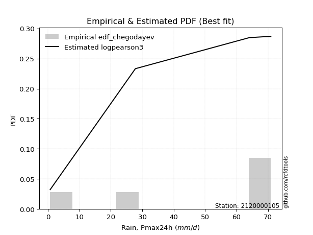</img>

</div>


### 6. EDF Blom (1958)

The Blom formula is a specific "plotting position" formula used in hydrology and statistical analysis to estimate the empirical cumulative probability (or non-exceedance probability) of a data series. It is particularly recommended for data that are approximately normally distributed. The constant _a_ is set to 0.375 (or 3/8).

<div align="center">


$P=(m-a)/(n+1-2a)$


</div>


**6.1. Empirical values**

<div align="center">

|                | 0                  | 1                  | 2                  | 3                 | 4                 | 5                  |
|:---------------|:-------------------|:-------------------|:-------------------|:------------------|:------------------|:-------------------|
| date           | 2023               | 2018               | 2020               | 2025              | 2024              | 2019               |
| x              | 0.7                | 27.8               | 64.0               | 67.5              | 68.2              | 70.9               |
| m              | 1                  | 2                  | 3                  | 4                 | 5                 | 6                  |
| empirical_dist | edf_blom           | edf_blom           | edf_blom           | edf_blom          | edf_blom          | edf_blom           |
| empirical      | 0.1                | 0.26               | 0.42               | 0.58              | 0.74              | 0.9                |
| empirical_tr   | 1.1111111111111112 | 1.3513513513513513 | 1.7241379310344827 | 2.380952380952381 | 3.846153846153846 | 10.000000000000002 |

</div>


**6.2. Kolmogorov-Smirnov fit test (sorted by Δ)**


<div align="center">

|                | 0                   | 1                   | 2                   | 3                   | 4                  | 5                  | 6                   | 7                  | 8                  | 9                  | 10                  | 11                  | 12                 | 13                  | 14                  | 15                 | 16                  | 17                 | 18                  | 19                  | 20                  | 21                  | 22                 | 23                 | 24                  | 25                  | 26                 | 27                  | 28                 | 29                 | 30                  | 31                 | 32                 | 33                  | 34                 | 35                 | 36                 | 37                 | 38                  | 39                  | 40                  | 41                  | 42                  | 43                 | 44                 | 45                  | 46                 | 47                 | 48                  | 49                  | 50                  | 51                  | 52                 | 53                  | 54                 | 55                  | 56                  | 57                  | 58                  | 59                | 60                 | 61                  | 62                 | 63                  | 64                 | 65                 | 66                 | 67                 | 68                 | 69                  | 70                  | 71                 | 72                 | 73                 | 74                | 75                  | 76                  | 77                 | 78                 | 79                 | 80                 | 81                  | 82                 | 83                  | 84                  | 85                  | 86                 | 87                 | 88                  | 89                 | 90                  | 91                  | 92                 | 93                 | 94                  | 95                 | 96                  | 97                 | 98                 | 99                 | 100                 | 101                 | 102                | 103                 | 104                | 105               | 106                 | 107                 | 108                | 109                 | 110                | 111                 | 112                | 113                 | 114                | 115                | 116                | 117                | 118                 | 119                 | 120                | 121                 | 122                | 123                 | 124               | 125                 | 126                 | 127                | 128                 | 129                 | 130                 | 131                | 132                | 133                | 134              | 135                | 136                | 137                | 138               | 139                 | 140               | 141               | 142                | 143                | 144               | 145               | 146                | 147                | 148                | 149                | 150                | 151                | 152                | 153                | 154                | 155            | 156            | 157            | 158                | 159               |
|:---------------|:--------------------|:--------------------|:--------------------|:--------------------|:-------------------|:-------------------|:--------------------|:-------------------|:-------------------|:-------------------|:--------------------|:--------------------|:-------------------|:--------------------|:--------------------|:-------------------|:--------------------|:-------------------|:--------------------|:--------------------|:--------------------|:--------------------|:-------------------|:-------------------|:--------------------|:--------------------|:-------------------|:--------------------|:-------------------|:-------------------|:--------------------|:-------------------|:-------------------|:--------------------|:-------------------|:-------------------|:-------------------|:-------------------|:--------------------|:--------------------|:--------------------|:--------------------|:--------------------|:-------------------|:-------------------|:--------------------|:-------------------|:-------------------|:--------------------|:--------------------|:--------------------|:--------------------|:-------------------|:--------------------|:-------------------|:--------------------|:--------------------|:--------------------|:--------------------|:------------------|:-------------------|:--------------------|:-------------------|:--------------------|:-------------------|:-------------------|:-------------------|:-------------------|:-------------------|:--------------------|:--------------------|:-------------------|:-------------------|:-------------------|:------------------|:--------------------|:--------------------|:-------------------|:-------------------|:-------------------|:-------------------|:--------------------|:-------------------|:--------------------|:--------------------|:--------------------|:-------------------|:-------------------|:--------------------|:-------------------|:--------------------|:--------------------|:-------------------|:-------------------|:--------------------|:-------------------|:--------------------|:-------------------|:-------------------|:-------------------|:--------------------|:--------------------|:-------------------|:--------------------|:-------------------|:------------------|:--------------------|:--------------------|:-------------------|:--------------------|:-------------------|:--------------------|:-------------------|:--------------------|:-------------------|:-------------------|:-------------------|:-------------------|:--------------------|:--------------------|:-------------------|:--------------------|:-------------------|:--------------------|:------------------|:--------------------|:--------------------|:-------------------|:--------------------|:--------------------|:--------------------|:-------------------|:-------------------|:-------------------|:-----------------|:-------------------|:-------------------|:-------------------|:------------------|:--------------------|:------------------|:------------------|:-------------------|:-------------------|:------------------|:------------------|:-------------------|:-------------------|:-------------------|:-------------------|:-------------------|:-------------------|:-------------------|:-------------------|:-------------------|:---------------|:---------------|:---------------|:-------------------|:------------------|
| station        | 2120000105          | 2120000105          | 2120000105          | 2120000105          | 2120000105         | 2120000105         | 2120000105          | 2120000105         | 2120000105         | 2120000105         | 2120000105          | 2120000105          | 2120000105         | 2120000105          | 2120000105          | 2120000105         | 2120000105          | 2120000105         | 2120000105          | 2120000105          | 2120000105          | 2120000105          | 2120000105         | 2120000105         | 2120000105          | 2120000105          | 2120000105         | 2120000105          | 2120000105         | 2120000105         | 2120000105          | 2120000105         | 2120000105         | 2120000105          | 2120000105         | 2120000105         | 2120000105         | 2120000105         | 2120000105          | 2120000105          | 2120000105          | 2120000105          | 2120000105          | 2120000105         | 2120000105         | 2120000105          | 2120000105         | 2120000105         | 2120000105          | 2120000105          | 2120000105          | 2120000105          | 2120000105         | 2120000105          | 2120000105         | 2120000105          | 2120000105          | 2120000105          | 2120000105          | 2120000105        | 2120000105         | 2120000105          | 2120000105         | 2120000105          | 2120000105         | 2120000105         | 2120000105         | 2120000105         | 2120000105         | 2120000105          | 2120000105          | 2120000105         | 2120000105         | 2120000105         | 2120000105        | 2120000105          | 2120000105          | 2120000105         | 2120000105         | 2120000105         | 2120000105         | 2120000105          | 2120000105         | 2120000105          | 2120000105          | 2120000105          | 2120000105         | 2120000105         | 2120000105          | 2120000105         | 2120000105          | 2120000105          | 2120000105         | 2120000105         | 2120000105          | 2120000105         | 2120000105          | 2120000105         | 2120000105         | 2120000105         | 2120000105          | 2120000105          | 2120000105         | 2120000105          | 2120000105         | 2120000105        | 2120000105          | 2120000105          | 2120000105         | 2120000105          | 2120000105         | 2120000105          | 2120000105         | 2120000105          | 2120000105         | 2120000105         | 2120000105         | 2120000105         | 2120000105          | 2120000105          | 2120000105         | 2120000105          | 2120000105         | 2120000105          | 2120000105        | 2120000105          | 2120000105          | 2120000105         | 2120000105          | 2120000105          | 2120000105          | 2120000105         | 2120000105         | 2120000105         | 2120000105       | 2120000105         | 2120000105         | 2120000105         | 2120000105        | 2120000105          | 2120000105        | 2120000105        | 2120000105         | 2120000105         | 2120000105        | 2120000105        | 2120000105         | 2120000105         | 2120000105         | 2120000105         | 2120000105         | 2120000105         | 2120000105         | 2120000105         | 2120000105         | 2120000105     | 2120000105     | 2120000105     | 2120000105         | 2120000105        |
| empirical_dist | edf_blom            | edf_blom            | edf_blom            | edf_blom            | edf_blom           | edf_blom           | edf_blom            | edf_blom           | edf_blom           | edf_blom           | edf_blom            | edf_blom            | edf_blom           | edf_blom            | edf_blom            | edf_blom           | edf_blom            | edf_blom           | edf_blom            | edf_blom            | edf_blom            | edf_blom            | edf_blom           | edf_blom           | edf_blom            | edf_blom            | edf_blom           | edf_blom            | edf_blom           | edf_blom           | edf_blom            | edf_blom           | edf_blom           | edf_blom            | edf_blom           | edf_blom           | edf_blom           | edf_blom           | edf_blom            | edf_blom            | edf_blom            | edf_blom            | edf_blom            | edf_blom           | edf_blom           | edf_blom            | edf_blom           | edf_blom           | edf_blom            | edf_blom            | edf_blom            | edf_blom            | edf_blom           | edf_blom            | edf_blom           | edf_blom            | edf_blom            | edf_blom            | edf_blom            | edf_blom          | edf_blom           | edf_blom            | edf_blom           | edf_blom            | edf_blom           | edf_blom           | edf_blom           | edf_blom           | edf_blom           | edf_blom            | edf_blom            | edf_blom           | edf_blom           | edf_blom           | edf_blom          | edf_blom            | edf_blom            | edf_blom           | edf_blom           | edf_blom           | edf_blom           | edf_blom            | edf_blom           | edf_blom            | edf_blom            | edf_blom            | edf_blom           | edf_blom           | edf_blom            | edf_blom           | edf_blom            | edf_blom            | edf_blom           | edf_blom           | edf_blom            | edf_blom           | edf_blom            | edf_blom           | edf_blom           | edf_blom           | edf_blom            | edf_blom            | edf_blom           | edf_blom            | edf_blom           | edf_blom          | edf_blom            | edf_blom            | edf_blom           | edf_blom            | edf_blom           | edf_blom            | edf_blom           | edf_blom            | edf_blom           | edf_blom           | edf_blom           | edf_blom           | edf_blom            | edf_blom            | edf_blom           | edf_blom            | edf_blom           | edf_blom            | edf_blom          | edf_blom            | edf_blom            | edf_blom           | edf_blom            | edf_blom            | edf_blom            | edf_blom           | edf_blom           | edf_blom           | edf_blom         | edf_blom           | edf_blom           | edf_blom           | edf_blom          | edf_blom            | edf_blom          | edf_blom          | edf_blom           | edf_blom           | edf_blom          | edf_blom          | edf_blom           | edf_blom           | edf_blom           | edf_blom           | edf_blom           | edf_blom           | edf_blom           | edf_blom           | edf_blom           | edf_blom       | edf_blom       | edf_blom       | edf_blom           | edf_blom          |
| p_dist         | loglevy_l           | levy_l              | logjohnsonsb        | weibull_max         | vonmises_line      | beta               | logt                | genextreme         | arcsine            | logweibull_max     | wrapcauchy          | trapezoid           | logmielke          | dgamma              | logvonmises_line    | logpearson3        | gennorm             | logtrapezoid       | loggumbel_l         | gausshyper          | logsemicircular     | pearson3            | semicircular       | logwrapcauchy      | loganglit           | gumbel_l            | anglit             | gompertz            | dweibull           | logkappa3          | logarcsine          | weibull_min        | ncf                | loginvgauss         | loggenextreme      | loggamma           | loggamma           | loginvgamma        | lognakagami         | logcrystalball      | lognorm             | logexponnorm        | logrice             | lognct             | logfatiguelife     | loggengamma         | logalpha           | invgauss           | f                   | argus               | invgamma            | gengamma            | norm               | crystalball         | exponnorm          | t                   | erlang              | mielke              | gamma               | betaprime         | rice               | burr12              | logexponweib       | logmaxwell          | halfgennorm        | lomax              | genpareto          | kstwobign          | foldnorm           | loglogistic         | lograyleigh         | maxwell            | logfoldnorm        | loginvweibull      | rayleigh          | loggennorm          | genexpon            | loggompertz        | logistic           | loghypsecant       | logkstwobign       | halfnorm            | loghalfnorm        | hypsecant           | cosine              | loghalfgennorm      | loggumbel_r        | logcosine          | loggenexpon         | gumbel_r           | loglaplace          | loglaplace          | halflogistic       | logmoyal           | loghalflogistic     | laplace            | moyal               | logburr            | logncf             | nct                | logerlang           | logdgamma           | logdweibull        | genhalflogistic     | loglomax           | loggenpareto      | logburr12           | kappa4              | wald               | logargus            | logloglaplace      | logwald             | ksone              | skewnorm            | triang             | loggausshyper      | logbeta            | nakagami           | logf                | exponweib           | truncweibull_min   | burr                | logbetaprime       | logloggamma         | kappa3            | uniform             | logksone            | logweibull_min     | invweibull          | bradford            | johnsonsu           | loggenhalflogistic | johnsonsb          | truncexpon         | logbradford      | logskewnorm        | logkappa4          | logtriang          | fatiguelife       | logtruncweibull_min | loguniform        | logtruncnorm      | logjohnsonsu       | logtruncexpon      | logtukeylambda    | powerlaw          | truncpareto        | logexponpow        | exponpow           | alpha              | logtruncpareto     | logpowerlaw        | truncnorm          | rdist              | tukeylambda        | genlogistic    | logrdist       | loggenlogistic | logvonmises        | vonmises          |
| delta          | 0.10421666189471712 | 0.11305035677920405 | 0.17166850939292344 | 0.18494510295970373 | 0.1927994920085493 | 0.2047898946038017 | 0.20660176694916899 | 0.2091028380235564 | 0.2096389828247729 | 0.2104466548843777 | 0.22571423759399822 | 0.22630952625546624 | 0.2298183622344454 | 0.23215461752768315 | 0.23587548305587058 | 0.2398930420551567 | 0.24000000000845834 | 0.2408647475544594 | 0.24143818236030384 | 0.24385009638350924 | 0.24404190173793705 | 0.24489703935782287 | 0.2483143428553492 | 0.2513533265293695 | 0.25154922429920573 | 0.25222902683972864 | 0.2589053379011739 | 0.25999999992420647 | 0.2602296924799631 | 0.2646946877113153 | 0.26706471153587164 | 0.2679221041749335 | 0.2687221159587118 | 0.27287682773501315 | 0.2730869150780247 | 0.2747917096610278 | 0.2747917096610278 | 0.2751696139270852 | 0.27534235755828224 | 0.27576450393526447 | 0.27576452094413645 | 0.27576643442480603 | 0.27578541626925995 | 0.2758530756059356 | 0.2779665988128501 | 0.27887960727012745 | 0.2798782980739489 | 0.2811237427624658 | 0.28261817856130994 | 0.28343902931643755 | 0.28365549726931155 | 0.28371184261003707 | 0.2837561015110079 | 0.28375610832818027 | 0.2837585073486279 | 0.28377308970221277 | 0.28387133979842055 | 0.28510173104449804 | 0.28525790425779624 | 0.285538162177667 | 0.2861366110263232 | 0.28986999723489054 | 0.2916331487260437 | 0.29219139495806773 | 0.2930067471111463 | 0.2934233755737902 | 0.2937490698263931 | 0.2953092038864446 | 0.2962976360184976 | 0.29689914013680746 | 0.29700322203846424 | 0.2992141427890664 | 0.2995155241816773 | 0.3004151076990075 | 0.303723444245582 | 0.30403166670820536 | 0.30431503830071865 | 0.3051335945095314 | 0.3052804750973687 | 0.3122636071759097 | 0.3160624046019702 | 0.31751179562610027 | 0.3194882819281023 | 0.32072384828916806 | 0.32457187976668306 | 0.32705737396884194 | 0.3274676318462309 | 0.3288848427915691 | 0.32981525560724667 | 0.3338122270255974 | 0.33770235628708994 | 0.33770235628708994 | 0.3441702973399366 | 0.3442191206519107 | 0.34472991537496445 | 0.3454491562592265 | 0.34999082098977546 | 0.3507321187517466 | 0.3509102565031472 | 0.3596473027175867 | 0.36384657038250856 | 0.36583522521508915 | 0.3693289297461061 | 0.37807071048926383 | 0.3802409465059092 | 0.387315449855353 | 0.38936498445167156 | 0.39322799771487255 | 0.3976520590080131 | 0.39907100164909654 | 0.4017121049374517 | 0.41311643506994233 | 0.4147578347578346 | 0.41821438434598496 | 0.4239101989228025 | 0.4336468916365382 | 0.4362579256282024 | 0.4408326391912946 | 0.44674716904940814 | 0.44728407842768003 | 0.4587397050181928 | 0.46290379268244636 | 0.4731630268025846 | 0.47829163869854724 | 0.481699537124284 | 0.48170940170940163 | 0.48771808017193785 | 0.4893777793540913 | 0.49157361722444104 | 0.49317279503513306 | 0.49902622179362194 | 0.5118360869485266 | 0.5190435797649529 | 0.5214726675476073 | 0.53306651082322 | 0.5375663067772964 | 0.5446926082273591 | 0.5459438833373325 | 0.548313813255489 | 0.5528905448558414  | 0.557828375649962 | 0.558092306738087 | 0.5827312728083378 | 0.5895582454050725 | 0.605185591936644 | 0.613238499839913 | 0.6540571461652853 | 0.6581599786679639 | 0.6792194854709889 | 0.6884022045000863 | 0.7018997509188821 | 0.7059389441110716 | 0.7399999843864937 | 0.7399999996284907 | 0.7399999999999929 | 0.74           | 0.74           | 0.74           | 1.0219435491276272 | 10.75964667150188 |
| deltao         | 0.530385761606      | 0.530385761606      | 0.530385761606      | 0.530385761606      | 0.530385761606     | 0.530385761606     | 0.530385761606      | 0.530385761606     | 0.530385761606     | 0.530385761606     | 0.530385761606      | 0.530385761606      | 0.530385761606     | 0.530385761606      | 0.530385761606      | 0.530385761606     | 0.530385761606      | 0.530385761606     | 0.530385761606      | 0.530385761606      | 0.530385761606      | 0.530385761606      | 0.530385761606     | 0.530385761606     | 0.530385761606      | 0.530385761606      | 0.530385761606     | 0.530385761606      | 0.530385761606     | 0.530385761606     | 0.530385761606      | 0.530385761606     | 0.530385761606     | 0.530385761606      | 0.530385761606     | 0.530385761606     | 0.530385761606     | 0.530385761606     | 0.530385761606      | 0.530385761606      | 0.530385761606      | 0.530385761606      | 0.530385761606      | 0.530385761606     | 0.530385761606     | 0.530385761606      | 0.530385761606     | 0.530385761606     | 0.530385761606      | 0.530385761606      | 0.530385761606      | 0.530385761606      | 0.530385761606     | 0.530385761606      | 0.530385761606     | 0.530385761606      | 0.530385761606      | 0.530385761606      | 0.530385761606      | 0.530385761606    | 0.530385761606     | 0.530385761606      | 0.530385761606     | 0.530385761606      | 0.530385761606     | 0.530385761606     | 0.530385761606     | 0.530385761606     | 0.530385761606     | 0.530385761606      | 0.530385761606      | 0.530385761606     | 0.530385761606     | 0.530385761606     | 0.530385761606    | 0.530385761606      | 0.530385761606      | 0.530385761606     | 0.530385761606     | 0.530385761606     | 0.530385761606     | 0.530385761606      | 0.530385761606     | 0.530385761606      | 0.530385761606      | 0.530385761606      | 0.530385761606     | 0.530385761606     | 0.530385761606      | 0.530385761606     | 0.530385761606      | 0.530385761606      | 0.530385761606     | 0.530385761606     | 0.530385761606      | 0.530385761606     | 0.530385761606      | 0.530385761606     | 0.530385761606     | 0.530385761606     | 0.530385761606      | 0.530385761606      | 0.530385761606     | 0.530385761606      | 0.530385761606     | 0.530385761606    | 0.530385761606      | 0.530385761606      | 0.530385761606     | 0.530385761606      | 0.530385761606     | 0.530385761606      | 0.530385761606     | 0.530385761606      | 0.530385761606     | 0.530385761606     | 0.530385761606     | 0.530385761606     | 0.530385761606      | 0.530385761606      | 0.530385761606     | 0.530385761606      | 0.530385761606     | 0.530385761606      | 0.530385761606    | 0.530385761606      | 0.530385761606      | 0.530385761606     | 0.530385761606      | 0.530385761606      | 0.530385761606      | 0.530385761606     | 0.530385761606     | 0.530385761606     | 0.530385761606   | 0.530385761606     | 0.530385761606     | 0.530385761606     | 0.530385761606    | 0.530385761606      | 0.530385761606    | 0.530385761606    | 0.530385761606     | 0.530385761606     | 0.530385761606    | 0.530385761606    | 0.530385761606     | 0.530385761606     | 0.530385761606     | 0.530385761606     | 0.530385761606     | 0.530385761606     | 0.530385761606     | 0.530385761606     | 0.530385761606     | 0.530385761606 | 0.530385761606 | 0.530385761606 | 0.530385761606     | 0.530385761606    |
| eval           | Δo > Δ              | Δo > Δ              | Δo > Δ              | Δo > Δ              | Δo > Δ             | Δo > Δ             | Δo > Δ              | Δo > Δ             | Δo > Δ             | Δo > Δ             | Δo > Δ              | Δo > Δ              | Δo > Δ             | Δo > Δ              | Δo > Δ              | Δo > Δ             | Δo > Δ              | Δo > Δ             | Δo > Δ              | Δo > Δ              | Δo > Δ              | Δo > Δ              | Δo > Δ             | Δo > Δ             | Δo > Δ              | Δo > Δ              | Δo > Δ             | Δo > Δ              | Δo > Δ             | Δo > Δ             | Δo > Δ              | Δo > Δ             | Δo > Δ             | Δo > Δ              | Δo > Δ             | Δo > Δ             | Δo > Δ             | Δo > Δ             | Δo > Δ              | Δo > Δ              | Δo > Δ              | Δo > Δ              | Δo > Δ              | Δo > Δ             | Δo > Δ             | Δo > Δ              | Δo > Δ             | Δo > Δ             | Δo > Δ              | Δo > Δ              | Δo > Δ              | Δo > Δ              | Δo > Δ             | Δo > Δ              | Δo > Δ             | Δo > Δ              | Δo > Δ              | Δo > Δ              | Δo > Δ              | Δo > Δ            | Δo > Δ             | Δo > Δ              | Δo > Δ             | Δo > Δ              | Δo > Δ             | Δo > Δ             | Δo > Δ             | Δo > Δ             | Δo > Δ             | Δo > Δ              | Δo > Δ              | Δo > Δ             | Δo > Δ             | Δo > Δ             | Δo > Δ            | Δo > Δ              | Δo > Δ              | Δo > Δ             | Δo > Δ             | Δo > Δ             | Δo > Δ             | Δo > Δ              | Δo > Δ             | Δo > Δ              | Δo > Δ              | Δo > Δ              | Δo > Δ             | Δo > Δ             | Δo > Δ              | Δo > Δ             | Δo > Δ              | Δo > Δ              | Δo > Δ             | Δo > Δ             | Δo > Δ              | Δo > Δ             | Δo > Δ              | Δo > Δ             | Δo > Δ             | Δo > Δ             | Δo > Δ              | Δo > Δ              | Δo > Δ             | Δo > Δ              | Δo > Δ             | Δo > Δ            | Δo > Δ              | Δo > Δ              | Δo > Δ             | Δo > Δ              | Δo > Δ             | Δo > Δ              | Δo > Δ             | Δo > Δ              | Δo > Δ             | Δo > Δ             | Δo > Δ             | Δo > Δ             | Δo > Δ              | Δo > Δ              | Δo > Δ             | Δo > Δ              | Δo > Δ             | Δo > Δ              | Δo > Δ            | Δo > Δ              | Δo > Δ              | Δo > Δ             | Δo > Δ              | Δo > Δ              | Δo > Δ              | Δo > Δ             | Δo > Δ             | Δo > Δ             | Δo <= Δ          | Δo <= Δ            | Δo <= Δ            | Δo <= Δ            | Δo <= Δ           | Δo <= Δ             | Δo <= Δ           | Δo <= Δ           | Δo <= Δ            | Δo <= Δ            | Δo <= Δ           | Δo <= Δ           | Δo <= Δ            | Δo <= Δ            | Δo <= Δ            | Δo <= Δ            | Δo <= Δ            | Δo <= Δ            | Δo <= Δ            | Δo <= Δ            | Δo <= Δ            | Δo <= Δ        | Δo <= Δ        | Δo <= Δ        | Δo <= Δ            | Δo <= Δ           |
| fit            | 1                   | 1                   | 1                   | 1                   | 1                  | 1                  | 1                   | 1                  | 1                  | 1                  | 1                   | 1                   | 1                  | 1                   | 1                   | 1                  | 1                   | 1                  | 1                   | 1                   | 1                   | 1                   | 1                  | 1                  | 1                   | 1                   | 1                  | 1                   | 1                  | 1                  | 1                   | 1                  | 1                  | 1                   | 1                  | 1                  | 1                  | 1                  | 1                   | 1                   | 1                   | 1                   | 1                   | 1                  | 1                  | 1                   | 1                  | 1                  | 1                   | 1                   | 1                   | 1                   | 1                  | 1                   | 1                  | 1                   | 1                   | 1                   | 1                   | 1                 | 1                  | 1                   | 1                  | 1                   | 1                  | 1                  | 1                  | 1                  | 1                  | 1                   | 1                   | 1                  | 1                  | 1                  | 1                 | 1                   | 1                   | 1                  | 1                  | 1                  | 1                  | 1                   | 1                  | 1                   | 1                   | 1                   | 1                  | 1                  | 1                   | 1                  | 1                   | 1                   | 1                  | 1                  | 1                   | 1                  | 1                   | 1                  | 1                  | 1                  | 1                   | 1                   | 1                  | 1                   | 1                  | 1                 | 1                   | 1                   | 1                  | 1                   | 1                  | 1                   | 1                  | 1                   | 1                  | 1                  | 1                  | 1                  | 1                   | 1                   | 1                  | 1                   | 1                  | 1                   | 1                 | 1                   | 1                   | 1                  | 1                   | 1                   | 1                   | 1                  | 1                  | 1                  | 0                | 0                  | 0                  | 0                  | 0                 | 0                   | 0                 | 0                 | 0                  | 0                  | 0                 | 0                 | 0                  | 0                  | 0                  | 0                  | 0                  | 0                  | 0                  | 0                  | 0                  | 0              | 0              | 0              | 0                  | 0                 |
| n              | 6                   | 6                   | 6                   | 6                   | 6                  | 6                  | 6                   | 6                  | 6                  | 6                  | 6                   | 6                   | 6                  | 6                   | 6                   | 6                  | 6                   | 6                  | 6                   | 6                   | 6                   | 6                   | 6                  | 6                  | 6                   | 6                   | 6                  | 6                   | 6                  | 6                  | 6                   | 6                  | 6                  | 6                   | 6                  | 6                  | 6                  | 6                  | 6                   | 6                   | 6                   | 6                   | 6                   | 6                  | 6                  | 6                   | 6                  | 6                  | 6                   | 6                   | 6                   | 6                   | 6                  | 6                   | 6                  | 6                   | 6                   | 6                   | 6                   | 6                 | 6                  | 6                   | 6                  | 6                   | 6                  | 6                  | 6                  | 6                  | 6                  | 6                   | 6                   | 6                  | 6                  | 6                  | 6                 | 6                   | 6                   | 6                  | 6                  | 6                  | 6                  | 6                   | 6                  | 6                   | 6                   | 6                   | 6                  | 6                  | 6                   | 6                  | 6                   | 6                   | 6                  | 6                  | 6                   | 6                  | 6                   | 6                  | 6                  | 6                  | 6                   | 6                   | 6                  | 6                   | 6                  | 6                 | 6                   | 6                   | 6                  | 6                   | 6                  | 6                   | 6                  | 6                   | 6                  | 6                  | 6                  | 6                  | 6                   | 6                   | 6                  | 6                   | 6                  | 6                   | 6                 | 6                   | 6                   | 6                  | 6                   | 6                   | 6                   | 6                  | 6                  | 6                  | 6                | 6                  | 6                  | 6                  | 6                 | 6                   | 6                 | 6                 | 6                  | 6                  | 6                 | 6                 | 6                  | 6                  | 6                  | 6                  | 6                  | 6                  | 6                  | 6                  | 6                  | 6              | 6              | 6              | 6                  | 6                 |
| best_fit       | 1                   | 0                   | 0                   | 0                   | 0                  | 0                  | 0                   | 0                  | 0                  | 0                  | 0                   | 0                   | 0                  | 0                   | 0                   | 0                  | 0                   | 0                  | 0                   | 0                   | 0                   | 0                   | 0                  | 0                  | 0                   | 0                   | 0                  | 0                   | 0                  | 0                  | 0                   | 0                  | 0                  | 0                   | 0                  | 0                  | 0                  | 0                  | 0                   | 0                   | 0                   | 0                   | 0                   | 0                  | 0                  | 0                   | 0                  | 0                  | 0                   | 0                   | 0                   | 0                   | 0                  | 0                   | 0                  | 0                   | 0                   | 0                   | 0                   | 0                 | 0                  | 0                   | 0                  | 0                   | 0                  | 0                  | 0                  | 0                  | 0                  | 0                   | 0                   | 0                  | 0                  | 0                  | 0                 | 0                   | 0                   | 0                  | 0                  | 0                  | 0                  | 0                   | 0                  | 0                   | 0                   | 0                   | 0                  | 0                  | 0                   | 0                  | 0                   | 0                   | 0                  | 0                  | 0                   | 0                  | 0                   | 0                  | 0                  | 0                  | 0                   | 0                   | 0                  | 0                   | 0                  | 0                 | 0                   | 0                   | 0                  | 0                   | 0                  | 0                   | 0                  | 0                   | 0                  | 0                  | 0                  | 0                  | 0                   | 0                   | 0                  | 0                   | 0                  | 0                   | 0                 | 0                   | 0                   | 0                  | 0                   | 0                   | 0                   | 0                  | 0                  | 0                  | 0                | 0                  | 0                  | 0                  | 0                 | 0                   | 0                 | 0                 | 0                  | 0                  | 0                 | 0                 | 0                  | 0                  | 0                  | 0                  | 0                  | 0                  | 0                  | 0                  | 0                  | 0              | 0              | 0              | 0                  | 0                 |
| best_fit_sort  | 1                   | 2                   | 3                   | 4                   | 5                  | 6                  | 7                   | 8                  | 9                  | 10                 | 11                  | 12                  | 13                 | 14                  | 15                  | 16                 | 17                  | 18                 | 19                  | 20                  | 21                  | 22                  | 23                 | 24                 | 25                  | 26                  | 27                 | 28                  | 29                 | 30                 | 31                  | 32                 | 33                 | 34                  | 35                 | 36                 | 37                 | 38                 | 39                  | 40                  | 41                  | 42                  | 43                  | 44                 | 45                 | 46                  | 47                 | 48                 | 49                  | 50                  | 51                  | 52                  | 53                 | 54                  | 55                 | 56                  | 57                  | 58                  | 59                  | 60                | 61                 | 62                  | 63                 | 64                  | 65                 | 66                 | 67                 | 68                 | 69                 | 70                  | 71                  | 72                 | 73                 | 74                 | 75                | 76                  | 77                  | 78                 | 79                 | 80                 | 81                 | 82                  | 83                 | 84                  | 85                  | 86                  | 87                 | 88                 | 89                  | 90                 | 91                  | 92                  | 93                 | 94                 | 95                  | 96                 | 97                  | 98                 | 99                 | 100                | 101                 | 102                 | 103                | 104                 | 105                | 106               | 107                 | 108                 | 109                | 110                 | 111                | 112                 | 113                | 114                 | 115                | 116                | 117                | 118                | 119                 | 120                 | 121                | 122                 | 123                | 124                 | 125               | 126                 | 127                 | 128                | 129                 | 130                 | 131                 | 132                | 133                | 134                | 135              | 136                | 137                | 138                | 139               | 140                 | 141               | 142               | 143                | 144                | 145               | 146               | 147                | 148                | 149                | 150                | 151                | 152                | 153                | 154                | 155                | 156            | 157            | 158            | 159                | 160               |

</div>


**6.3. Best fit**

<div align="center">

|   id |    station | empirical_dist   | p_dist    |    delta |   deltao | eval   |   fit |   n |   best_fit |   best_fit_sort |
|-----:|-----------:|:-----------------|:----------|---------:|---------:|:-------|------:|----:|-----------:|----------------:|
|    0 | 2120000105 | edf_blom         | loglevy_l | 0.104217 | 0.530386 | Δo > Δ |     1 |   6 |          1 |               1 |

</div>


<div align="center">

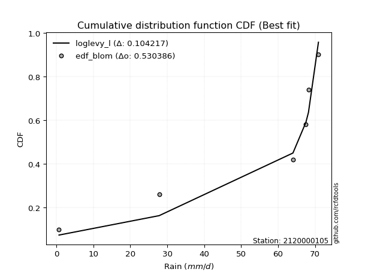</img>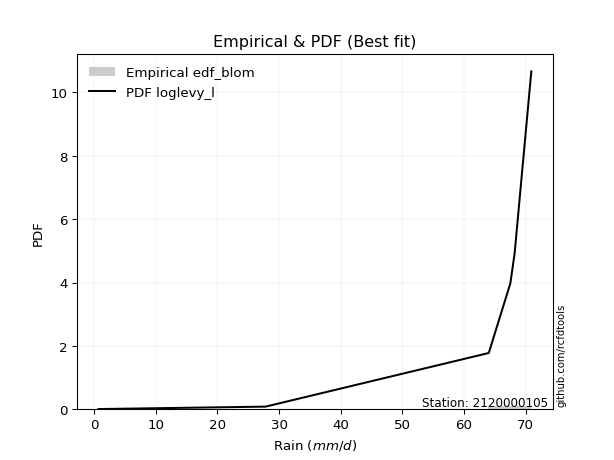</img>

</div>


### 7. EDF Tukey (1962)

In hydrology, the Tukey formula is used as a plotting position formula to estimate the empirical probability or frequency of a flood event (or other hydrological data). The formula parameter is given as _c=0.333_ (or 1/3).

<div align="center">


$P=(m-c)/(n+1-2c)$


</div>


**7.1. Empirical values**

<div align="center">

|                | 0                   | 1                  | 2                   | 3                  | 4                  | 5                  |
|:---------------|:--------------------|:-------------------|:--------------------|:-------------------|:-------------------|:-------------------|
| date           | 2023                | 2018               | 2020                | 2025               | 2024               | 2019               |
| x              | 0.7                 | 27.8               | 64.0                | 67.5               | 68.2               | 70.9               |
| m              | 1                   | 2                  | 3                   | 4                  | 5                  | 6                  |
| empirical_dist | edf_tukey           | edf_tukey          | edf_tukey           | edf_tukey          | edf_tukey          | edf_tukey          |
| empirical      | 0.10526315789473684 | 0.2631578947368421 | 0.42105263157894735 | 0.5789473684210527 | 0.7368421052631579 | 0.8947368421052632 |
| empirical_tr   | 1.1176470588235294  | 1.357142857142857  | 1.7272727272727273  | 2.375              | 3.7999999999999994 | 9.5                |

</div>


**7.2. Kolmogorov-Smirnov fit test (sorted by Δ)**


<div align="center">

|                | 0                   | 1                   | 2                   | 3                   | 4                   | 5                   | 6                   | 7                   | 8                   | 9                   | 10                  | 11                  | 12                  | 13                  | 14                  | 15                  | 16                  | 17                 | 18                  | 19                  | 20                  | 21                 | 22                  | 23                 | 24                  | 25                 | 26                 | 27                  | 28                  | 29                 | 30                  | 31                  | 32                  | 33                 | 34                 | 35                 | 36                 | 37                  | 38                 | 39                 | 40                 | 41                  | 42                 | 43                 | 44                 | 45                 | 46                 | 47                  | 48                 | 49                 | 50                 | 51                 | 52                 | 53                 | 54                  | 55                 | 56                 | 57                 | 58                 | 59                 | 60                  | 61                 | 62                 | 63                  | 64                  | 65                  | 66                  | 67                  | 68                  | 69                 | 70                 | 71                 | 72                | 73                  | 74                 | 75                  | 76                 | 77                  | 78                  | 79                 | 80                  | 81                 | 82                 | 83                 | 84                 | 85                  | 86                  | 87                 | 88                  | 89               | 90                 | 91                 | 92                  | 93                  | 94                 | 95                  | 96                 | 97                  | 98                 | 99                  | 100                | 101                | 102                 | 103                 | 104                 | 105                | 106                 | 107                | 108                 | 109                | 110                | 111                 | 112                 | 113                | 114                 | 115                 | 116                | 117                 | 118                 | 119                 | 120                | 121               | 122                | 123                | 124                | 125                 | 126                 | 127                 | 128                | 129                | 130                | 131                | 132                | 133              | 134                | 135               | 136                | 137               | 138               | 139                 | 140                | 141                | 142                | 143                | 144               | 145                | 146                | 147                | 148                | 149                | 150              | 151                | 152                | 153                | 154                | 155                | 156                | 157               | 158                | 159                |
|:---------------|:--------------------|:--------------------|:--------------------|:--------------------|:--------------------|:--------------------|:--------------------|:--------------------|:--------------------|:--------------------|:--------------------|:--------------------|:--------------------|:--------------------|:--------------------|:--------------------|:--------------------|:-------------------|:--------------------|:--------------------|:--------------------|:-------------------|:--------------------|:-------------------|:--------------------|:-------------------|:-------------------|:--------------------|:--------------------|:-------------------|:--------------------|:--------------------|:--------------------|:-------------------|:-------------------|:-------------------|:-------------------|:--------------------|:-------------------|:-------------------|:-------------------|:--------------------|:-------------------|:-------------------|:-------------------|:-------------------|:-------------------|:--------------------|:-------------------|:-------------------|:-------------------|:-------------------|:-------------------|:-------------------|:--------------------|:-------------------|:-------------------|:-------------------|:-------------------|:-------------------|:--------------------|:-------------------|:-------------------|:--------------------|:--------------------|:--------------------|:--------------------|:--------------------|:--------------------|:-------------------|:-------------------|:-------------------|:------------------|:--------------------|:-------------------|:--------------------|:-------------------|:--------------------|:--------------------|:-------------------|:--------------------|:-------------------|:-------------------|:-------------------|:-------------------|:--------------------|:--------------------|:-------------------|:--------------------|:-----------------|:-------------------|:-------------------|:--------------------|:--------------------|:-------------------|:--------------------|:-------------------|:--------------------|:-------------------|:--------------------|:-------------------|:-------------------|:--------------------|:--------------------|:--------------------|:-------------------|:--------------------|:-------------------|:--------------------|:-------------------|:-------------------|:--------------------|:--------------------|:-------------------|:--------------------|:--------------------|:-------------------|:--------------------|:--------------------|:--------------------|:-------------------|:------------------|:-------------------|:-------------------|:-------------------|:--------------------|:--------------------|:--------------------|:-------------------|:-------------------|:-------------------|:-------------------|:-------------------|:-----------------|:-------------------|:------------------|:-------------------|:------------------|:------------------|:--------------------|:-------------------|:-------------------|:-------------------|:-------------------|:------------------|:-------------------|:-------------------|:-------------------|:-------------------|:-------------------|:-----------------|:-------------------|:-------------------|:-------------------|:-------------------|:-------------------|:-------------------|:------------------|:-------------------|:-------------------|
| station        | 2120000105          | 2120000105          | 2120000105          | 2120000105          | 2120000105          | 2120000105          | 2120000105          | 2120000105          | 2120000105          | 2120000105          | 2120000105          | 2120000105          | 2120000105          | 2120000105          | 2120000105          | 2120000105          | 2120000105          | 2120000105         | 2120000105          | 2120000105          | 2120000105          | 2120000105         | 2120000105          | 2120000105         | 2120000105          | 2120000105         | 2120000105         | 2120000105          | 2120000105          | 2120000105         | 2120000105          | 2120000105          | 2120000105          | 2120000105         | 2120000105         | 2120000105         | 2120000105         | 2120000105          | 2120000105         | 2120000105         | 2120000105         | 2120000105          | 2120000105         | 2120000105         | 2120000105         | 2120000105         | 2120000105         | 2120000105          | 2120000105         | 2120000105         | 2120000105         | 2120000105         | 2120000105         | 2120000105         | 2120000105          | 2120000105         | 2120000105         | 2120000105         | 2120000105         | 2120000105         | 2120000105          | 2120000105         | 2120000105         | 2120000105          | 2120000105          | 2120000105          | 2120000105          | 2120000105          | 2120000105          | 2120000105         | 2120000105         | 2120000105         | 2120000105        | 2120000105          | 2120000105         | 2120000105          | 2120000105         | 2120000105          | 2120000105          | 2120000105         | 2120000105          | 2120000105         | 2120000105         | 2120000105         | 2120000105         | 2120000105          | 2120000105          | 2120000105         | 2120000105          | 2120000105       | 2120000105         | 2120000105         | 2120000105          | 2120000105          | 2120000105         | 2120000105          | 2120000105         | 2120000105          | 2120000105         | 2120000105          | 2120000105         | 2120000105         | 2120000105          | 2120000105          | 2120000105          | 2120000105         | 2120000105          | 2120000105         | 2120000105          | 2120000105         | 2120000105         | 2120000105          | 2120000105          | 2120000105         | 2120000105          | 2120000105          | 2120000105         | 2120000105          | 2120000105          | 2120000105          | 2120000105         | 2120000105        | 2120000105         | 2120000105         | 2120000105         | 2120000105          | 2120000105          | 2120000105          | 2120000105         | 2120000105         | 2120000105         | 2120000105         | 2120000105         | 2120000105       | 2120000105         | 2120000105        | 2120000105         | 2120000105        | 2120000105        | 2120000105          | 2120000105         | 2120000105         | 2120000105         | 2120000105         | 2120000105        | 2120000105         | 2120000105         | 2120000105         | 2120000105         | 2120000105         | 2120000105       | 2120000105         | 2120000105         | 2120000105         | 2120000105         | 2120000105         | 2120000105         | 2120000105        | 2120000105         | 2120000105         |
| empirical_dist | edf_tukey           | edf_tukey           | edf_tukey           | edf_tukey           | edf_tukey           | edf_tukey           | edf_tukey           | edf_tukey           | edf_tukey           | edf_tukey           | edf_tukey           | edf_tukey           | edf_tukey           | edf_tukey           | edf_tukey           | edf_tukey           | edf_tukey           | edf_tukey          | edf_tukey           | edf_tukey           | edf_tukey           | edf_tukey          | edf_tukey           | edf_tukey          | edf_tukey           | edf_tukey          | edf_tukey          | edf_tukey           | edf_tukey           | edf_tukey          | edf_tukey           | edf_tukey           | edf_tukey           | edf_tukey          | edf_tukey          | edf_tukey          | edf_tukey          | edf_tukey           | edf_tukey          | edf_tukey          | edf_tukey          | edf_tukey           | edf_tukey          | edf_tukey          | edf_tukey          | edf_tukey          | edf_tukey          | edf_tukey           | edf_tukey          | edf_tukey          | edf_tukey          | edf_tukey          | edf_tukey          | edf_tukey          | edf_tukey           | edf_tukey          | edf_tukey          | edf_tukey          | edf_tukey          | edf_tukey          | edf_tukey           | edf_tukey          | edf_tukey          | edf_tukey           | edf_tukey           | edf_tukey           | edf_tukey           | edf_tukey           | edf_tukey           | edf_tukey          | edf_tukey          | edf_tukey          | edf_tukey         | edf_tukey           | edf_tukey          | edf_tukey           | edf_tukey          | edf_tukey           | edf_tukey           | edf_tukey          | edf_tukey           | edf_tukey          | edf_tukey          | edf_tukey          | edf_tukey          | edf_tukey           | edf_tukey           | edf_tukey          | edf_tukey           | edf_tukey        | edf_tukey          | edf_tukey          | edf_tukey           | edf_tukey           | edf_tukey          | edf_tukey           | edf_tukey          | edf_tukey           | edf_tukey          | edf_tukey           | edf_tukey          | edf_tukey          | edf_tukey           | edf_tukey           | edf_tukey           | edf_tukey          | edf_tukey           | edf_tukey          | edf_tukey           | edf_tukey          | edf_tukey          | edf_tukey           | edf_tukey           | edf_tukey          | edf_tukey           | edf_tukey           | edf_tukey          | edf_tukey           | edf_tukey           | edf_tukey           | edf_tukey          | edf_tukey         | edf_tukey          | edf_tukey          | edf_tukey          | edf_tukey           | edf_tukey           | edf_tukey           | edf_tukey          | edf_tukey          | edf_tukey          | edf_tukey          | edf_tukey          | edf_tukey        | edf_tukey          | edf_tukey         | edf_tukey          | edf_tukey         | edf_tukey         | edf_tukey           | edf_tukey          | edf_tukey          | edf_tukey          | edf_tukey          | edf_tukey         | edf_tukey          | edf_tukey          | edf_tukey          | edf_tukey          | edf_tukey          | edf_tukey        | edf_tukey          | edf_tukey          | edf_tukey          | edf_tukey          | edf_tukey          | edf_tukey          | edf_tukey         | edf_tukey          | edf_tukey          |
| p_dist         | loglevy_l           | levy_l              | logjohnsonsb        | weibull_max         | vonmises_line       | beta                | arcsine             | logt                | genextreme          | logweibull_max      | wrapcauchy          | logmielke           | trapezoid           | logvonmises_line    | logpearson3         | dgamma              | logtrapezoid        | gennorm            | loggumbel_l         | logsemicircular     | gausshyper          | pearson3           | semicircular        | logwrapcauchy      | loganglit           | gumbel_l           | dweibull           | anglit              | logkappa3           | logarcsine         | gompertz            | weibull_min         | ncf                 | loginvgauss        | loggenextreme      | loggamma           | loggamma           | loginvgamma         | lognakagami        | logcrystalball     | lognorm            | logexponnorm        | logrice            | lognct             | logfatiguelife     | loggengamma        | logalpha           | invgauss            | f                  | argus              | invgamma           | gengamma           | norm               | crystalball        | exponnorm           | t                  | erlang             | mielke             | gamma              | betaprime          | rice                | burr12             | logexponweib       | logmaxwell          | halfgennorm         | lomax               | genpareto           | kstwobign           | foldnorm            | loglogistic        | lograyleigh        | loginvweibull      | maxwell           | logfoldnorm         | loggennorm         | rayleigh            | genexpon           | loggompertz         | logistic            | loghypsecant       | logkstwobign        | loghalfnorm        | halfnorm           | hypsecant          | cosine             | loghalfgennorm      | loggumbel_r         | loggenexpon        | logcosine           | gumbel_r         | loglaplace         | loglaplace         | loghalflogistic     | halflogistic        | logmoyal           | laplace             | logburr            | logncf              | moyal              | nct                 | logdgamma          | logerlang          | logdweibull         | genhalflogistic     | loglomax            | logburr12          | loggenpareto        | kappa4             | wald                | logargus           | logloglaplace      | logwald             | ksone               | skewnorm           | triang              | loggausshyper       | logbeta            | nakagami            | logf                | exponweib           | truncweibull_min   | burr              | logbetaprime       | logloggamma        | kappa3             | uniform             | logksone            | logweibull_min      | invweibull         | bradford           | johnsonsu          | loggenhalflogistic | johnsonsb          | truncexpon       | logbradford        | logskewnorm       | logkappa4          | logtriang         | fatiguelife       | logtruncweibull_min | loguniform         | logtruncnorm       | logjohnsonsu       | logtruncexpon      | logtukeylambda    | powerlaw           | truncpareto        | logexponpow        | exponpow           | alpha              | logtruncpareto   | logpowerlaw        | truncnorm          | rdist              | tukeylambda        | genlogistic        | loggenlogistic     | logrdist          | logvonmises        | vonmises           |
| delta          | 0.10105876715787498 | 0.10989246204236192 | 0.16851061465608136 | 0.18389247138075637 | 0.18753633411381243 | 0.20163199986695957 | 0.20437582493003603 | 0.20765439852811635 | 0.20805020644460903 | 0.20939402330543033 | 0.22255634285715614 | 0.22455520433970855 | 0.22525689467651888 | 0.23061232516113372 | 0.23462988416041985 | 0.23531251226452524 | 0.23560158965972255 | 0.2368421052716162 | 0.24038555078135648 | 0.24088400700109497 | 0.24279746480456188 | 0.2438444077788755 | 0.24726171127640184 | 0.2481954317925274 | 0.25049659272025837 | 0.2511763952607813 | 0.2549665345852262 | 0.25785270632222657 | 0.26153679297447324 | 0.2618015536411348 | 0.26315789466104855 | 0.26686947259598615 | 0.26766948437976446 | 0.2718241961560658 | 0.2720342834990773 | 0.2737390780820804 | 0.2737390780820804 | 0.27411698234813786 | 0.2742897259793349 | 0.2747118723563171 | 0.2747118893651891 | 0.27471380284585867 | 0.2747327846903126 | 0.2748004440269882 | 0.2769139672339027 | 0.2778269756911801 | 0.2788256664950015 | 0.28007111118351846 | 0.2815655469823626 | 0.2823863977374902 | 0.2826028656903642 | 0.2826592110310897 | 0.2827034699320605 | 0.2827034767492329 | 0.28270587576968054 | 0.2827204581232654 | 0.2828187082194732 | 0.2840490994655507 | 0.2842052726788489 | 0.2844855305987196 | 0.28508397944737585 | 0.2888173656559432 | 0.2905805171470963 | 0.29113876337912037 | 0.29195411553219897 | 0.29237074399484286 | 0.29269643824744573 | 0.29425657230749724 | 0.29524500443955026 | 0.2958465085578601 | 0.2959505904595169 | 0.2972572129621654 | 0.298161511210119 | 0.29846289260272996 | 0.2987685088134685 | 0.30267081266663465 | 0.3032624067217713 | 0.30408096293058406 | 0.30422784351842136 | 0.3112109755969623 | 0.31290450986512813 | 0.3163303871912602 | 0.3164591640471529 | 0.3196712167102207 | 0.3235192481877357 | 0.32389947923199985 | 0.32641500026728354 | 0.3266573608704046 | 0.32783221121262174 | 0.33275959544665 | 0.3366497247081426 | 0.3366497247081426 | 0.34157202063812236 | 0.34311766576098923 | 0.3431664890729633 | 0.34439652468027915 | 0.3475742240149045 | 0.34775236176630514 | 0.3489381894108281 | 0.35648940798074463 | 0.3605720673203523 | 0.3606886756456665 | 0.36406577185136924 | 0.37701807891031647 | 0.37708305176906715 | 0.3862070897148295 | 0.38626281827640563 | 0.3921753661359252 | 0.39659942742906573 | 0.3980183700701492 | 0.3985542102006096 | 0.40995854033310025 | 0.41370520317888726 | 0.4171617527670376 | 0.42285756734385516 | 0.43259426005759083 | 0.4331000308913603 | 0.43978000761234726 | 0.44358927431256606 | 0.44412618369083795 | 0.4576870734392454 | 0.461851161103499 | 0.4700051320657425 | 0.4772390071195999 | 0.4806469055453366 | 0.48065677013045427 | 0.48456018543509577 | 0.48621988461724924 | 0.4863104593297042 | 0.4921201634561857 | 0.4958683270567798 | 0.5107834553695791 | 0.5158856850281106 | 0.52042003596866 | 0.5320138792442727 | 0.536513675198349 | 0.5436399766484118 | 0.544891251758385 | 0.545155918518647 | 0.551837913276894   | 0.5567757440710147 | 0.5570396751591395 | 0.5795733780714958 | 0.5864003506682305 | 0.602027697199802 | 0.6100806051030709 | 0.6508992514284433 | 0.6550020839311219 | 0.6760615907341467 | 0.6852443097632441 | 0.69874185618204 | 0.7027810493742295 | 0.7368420896496517 | 0.7368421048916487 | 0.7368421052631509 | 0.7368421052631579 | 0.7368421052631579 | 0.736842105263158 | 1.0208909175486798 | 10.764909829396617 |
| deltao         | 0.530385761606      | 0.530385761606      | 0.530385761606      | 0.530385761606      | 0.530385761606      | 0.530385761606      | 0.530385761606      | 0.530385761606      | 0.530385761606      | 0.530385761606      | 0.530385761606      | 0.530385761606      | 0.530385761606      | 0.530385761606      | 0.530385761606      | 0.530385761606      | 0.530385761606      | 0.530385761606     | 0.530385761606      | 0.530385761606      | 0.530385761606      | 0.530385761606     | 0.530385761606      | 0.530385761606     | 0.530385761606      | 0.530385761606     | 0.530385761606     | 0.530385761606      | 0.530385761606      | 0.530385761606     | 0.530385761606      | 0.530385761606      | 0.530385761606      | 0.530385761606     | 0.530385761606     | 0.530385761606     | 0.530385761606     | 0.530385761606      | 0.530385761606     | 0.530385761606     | 0.530385761606     | 0.530385761606      | 0.530385761606     | 0.530385761606     | 0.530385761606     | 0.530385761606     | 0.530385761606     | 0.530385761606      | 0.530385761606     | 0.530385761606     | 0.530385761606     | 0.530385761606     | 0.530385761606     | 0.530385761606     | 0.530385761606      | 0.530385761606     | 0.530385761606     | 0.530385761606     | 0.530385761606     | 0.530385761606     | 0.530385761606      | 0.530385761606     | 0.530385761606     | 0.530385761606      | 0.530385761606      | 0.530385761606      | 0.530385761606      | 0.530385761606      | 0.530385761606      | 0.530385761606     | 0.530385761606     | 0.530385761606     | 0.530385761606    | 0.530385761606      | 0.530385761606     | 0.530385761606      | 0.530385761606     | 0.530385761606      | 0.530385761606      | 0.530385761606     | 0.530385761606      | 0.530385761606     | 0.530385761606     | 0.530385761606     | 0.530385761606     | 0.530385761606      | 0.530385761606      | 0.530385761606     | 0.530385761606      | 0.530385761606   | 0.530385761606     | 0.530385761606     | 0.530385761606      | 0.530385761606      | 0.530385761606     | 0.530385761606      | 0.530385761606     | 0.530385761606      | 0.530385761606     | 0.530385761606      | 0.530385761606     | 0.530385761606     | 0.530385761606      | 0.530385761606      | 0.530385761606      | 0.530385761606     | 0.530385761606      | 0.530385761606     | 0.530385761606      | 0.530385761606     | 0.530385761606     | 0.530385761606      | 0.530385761606      | 0.530385761606     | 0.530385761606      | 0.530385761606      | 0.530385761606     | 0.530385761606      | 0.530385761606      | 0.530385761606      | 0.530385761606     | 0.530385761606    | 0.530385761606     | 0.530385761606     | 0.530385761606     | 0.530385761606      | 0.530385761606      | 0.530385761606      | 0.530385761606     | 0.530385761606     | 0.530385761606     | 0.530385761606     | 0.530385761606     | 0.530385761606   | 0.530385761606     | 0.530385761606    | 0.530385761606     | 0.530385761606    | 0.530385761606    | 0.530385761606      | 0.530385761606     | 0.530385761606     | 0.530385761606     | 0.530385761606     | 0.530385761606    | 0.530385761606     | 0.530385761606     | 0.530385761606     | 0.530385761606     | 0.530385761606     | 0.530385761606   | 0.530385761606     | 0.530385761606     | 0.530385761606     | 0.530385761606     | 0.530385761606     | 0.530385761606     | 0.530385761606    | 0.530385761606     | 0.530385761606     |
| eval           | Δo > Δ              | Δo > Δ              | Δo > Δ              | Δo > Δ              | Δo > Δ              | Δo > Δ              | Δo > Δ              | Δo > Δ              | Δo > Δ              | Δo > Δ              | Δo > Δ              | Δo > Δ              | Δo > Δ              | Δo > Δ              | Δo > Δ              | Δo > Δ              | Δo > Δ              | Δo > Δ             | Δo > Δ              | Δo > Δ              | Δo > Δ              | Δo > Δ             | Δo > Δ              | Δo > Δ             | Δo > Δ              | Δo > Δ             | Δo > Δ             | Δo > Δ              | Δo > Δ              | Δo > Δ             | Δo > Δ              | Δo > Δ              | Δo > Δ              | Δo > Δ             | Δo > Δ             | Δo > Δ             | Δo > Δ             | Δo > Δ              | Δo > Δ             | Δo > Δ             | Δo > Δ             | Δo > Δ              | Δo > Δ             | Δo > Δ             | Δo > Δ             | Δo > Δ             | Δo > Δ             | Δo > Δ              | Δo > Δ             | Δo > Δ             | Δo > Δ             | Δo > Δ             | Δo > Δ             | Δo > Δ             | Δo > Δ              | Δo > Δ             | Δo > Δ             | Δo > Δ             | Δo > Δ             | Δo > Δ             | Δo > Δ              | Δo > Δ             | Δo > Δ             | Δo > Δ              | Δo > Δ              | Δo > Δ              | Δo > Δ              | Δo > Δ              | Δo > Δ              | Δo > Δ             | Δo > Δ             | Δo > Δ             | Δo > Δ            | Δo > Δ              | Δo > Δ             | Δo > Δ              | Δo > Δ             | Δo > Δ              | Δo > Δ              | Δo > Δ             | Δo > Δ              | Δo > Δ             | Δo > Δ             | Δo > Δ             | Δo > Δ             | Δo > Δ              | Δo > Δ              | Δo > Δ             | Δo > Δ              | Δo > Δ           | Δo > Δ             | Δo > Δ             | Δo > Δ              | Δo > Δ              | Δo > Δ             | Δo > Δ              | Δo > Δ             | Δo > Δ              | Δo > Δ             | Δo > Δ              | Δo > Δ             | Δo > Δ             | Δo > Δ              | Δo > Δ              | Δo > Δ              | Δo > Δ             | Δo > Δ              | Δo > Δ             | Δo > Δ              | Δo > Δ             | Δo > Δ             | Δo > Δ              | Δo > Δ              | Δo > Δ             | Δo > Δ              | Δo > Δ              | Δo > Δ             | Δo > Δ              | Δo > Δ              | Δo > Δ              | Δo > Δ             | Δo > Δ            | Δo > Δ             | Δo > Δ             | Δo > Δ             | Δo > Δ              | Δo > Δ              | Δo > Δ              | Δo > Δ             | Δo > Δ             | Δo > Δ             | Δo > Δ             | Δo > Δ             | Δo > Δ           | Δo <= Δ            | Δo <= Δ           | Δo <= Δ            | Δo <= Δ           | Δo <= Δ           | Δo <= Δ             | Δo <= Δ            | Δo <= Δ            | Δo <= Δ            | Δo <= Δ            | Δo <= Δ           | Δo <= Δ            | Δo <= Δ            | Δo <= Δ            | Δo <= Δ            | Δo <= Δ            | Δo <= Δ          | Δo <= Δ            | Δo <= Δ            | Δo <= Δ            | Δo <= Δ            | Δo <= Δ            | Δo <= Δ            | Δo <= Δ           | Δo <= Δ            | Δo <= Δ            |
| fit            | 1                   | 1                   | 1                   | 1                   | 1                   | 1                   | 1                   | 1                   | 1                   | 1                   | 1                   | 1                   | 1                   | 1                   | 1                   | 1                   | 1                   | 1                  | 1                   | 1                   | 1                   | 1                  | 1                   | 1                  | 1                   | 1                  | 1                  | 1                   | 1                   | 1                  | 1                   | 1                   | 1                   | 1                  | 1                  | 1                  | 1                  | 1                   | 1                  | 1                  | 1                  | 1                   | 1                  | 1                  | 1                  | 1                  | 1                  | 1                   | 1                  | 1                  | 1                  | 1                  | 1                  | 1                  | 1                   | 1                  | 1                  | 1                  | 1                  | 1                  | 1                   | 1                  | 1                  | 1                   | 1                   | 1                   | 1                   | 1                   | 1                   | 1                  | 1                  | 1                  | 1                 | 1                   | 1                  | 1                   | 1                  | 1                   | 1                   | 1                  | 1                   | 1                  | 1                  | 1                  | 1                  | 1                   | 1                   | 1                  | 1                   | 1                | 1                  | 1                  | 1                   | 1                   | 1                  | 1                   | 1                  | 1                   | 1                  | 1                   | 1                  | 1                  | 1                   | 1                   | 1                   | 1                  | 1                   | 1                  | 1                   | 1                  | 1                  | 1                   | 1                   | 1                  | 1                   | 1                   | 1                  | 1                   | 1                   | 1                   | 1                  | 1                 | 1                  | 1                  | 1                  | 1                   | 1                   | 1                   | 1                  | 1                  | 1                  | 1                  | 1                  | 1                | 0                  | 0                 | 0                  | 0                 | 0                 | 0                   | 0                  | 0                  | 0                  | 0                  | 0                 | 0                  | 0                  | 0                  | 0                  | 0                  | 0                | 0                  | 0                  | 0                  | 0                  | 0                  | 0                  | 0                 | 0                  | 0                  |
| n              | 6                   | 6                   | 6                   | 6                   | 6                   | 6                   | 6                   | 6                   | 6                   | 6                   | 6                   | 6                   | 6                   | 6                   | 6                   | 6                   | 6                   | 6                  | 6                   | 6                   | 6                   | 6                  | 6                   | 6                  | 6                   | 6                  | 6                  | 6                   | 6                   | 6                  | 6                   | 6                   | 6                   | 6                  | 6                  | 6                  | 6                  | 6                   | 6                  | 6                  | 6                  | 6                   | 6                  | 6                  | 6                  | 6                  | 6                  | 6                   | 6                  | 6                  | 6                  | 6                  | 6                  | 6                  | 6                   | 6                  | 6                  | 6                  | 6                  | 6                  | 6                   | 6                  | 6                  | 6                   | 6                   | 6                   | 6                   | 6                   | 6                   | 6                  | 6                  | 6                  | 6                 | 6                   | 6                  | 6                   | 6                  | 6                   | 6                   | 6                  | 6                   | 6                  | 6                  | 6                  | 6                  | 6                   | 6                   | 6                  | 6                   | 6                | 6                  | 6                  | 6                   | 6                   | 6                  | 6                   | 6                  | 6                   | 6                  | 6                   | 6                  | 6                  | 6                   | 6                   | 6                   | 6                  | 6                   | 6                  | 6                   | 6                  | 6                  | 6                   | 6                   | 6                  | 6                   | 6                   | 6                  | 6                   | 6                   | 6                   | 6                  | 6                 | 6                  | 6                  | 6                  | 6                   | 6                   | 6                   | 6                  | 6                  | 6                  | 6                  | 6                  | 6                | 6                  | 6                 | 6                  | 6                 | 6                 | 6                   | 6                  | 6                  | 6                  | 6                  | 6                 | 6                  | 6                  | 6                  | 6                  | 6                  | 6                | 6                  | 6                  | 6                  | 6                  | 6                  | 6                  | 6                 | 6                  | 6                  |
| best_fit       | 1                   | 0                   | 0                   | 0                   | 0                   | 0                   | 0                   | 0                   | 0                   | 0                   | 0                   | 0                   | 0                   | 0                   | 0                   | 0                   | 0                   | 0                  | 0                   | 0                   | 0                   | 0                  | 0                   | 0                  | 0                   | 0                  | 0                  | 0                   | 0                   | 0                  | 0                   | 0                   | 0                   | 0                  | 0                  | 0                  | 0                  | 0                   | 0                  | 0                  | 0                  | 0                   | 0                  | 0                  | 0                  | 0                  | 0                  | 0                   | 0                  | 0                  | 0                  | 0                  | 0                  | 0                  | 0                   | 0                  | 0                  | 0                  | 0                  | 0                  | 0                   | 0                  | 0                  | 0                   | 0                   | 0                   | 0                   | 0                   | 0                   | 0                  | 0                  | 0                  | 0                 | 0                   | 0                  | 0                   | 0                  | 0                   | 0                   | 0                  | 0                   | 0                  | 0                  | 0                  | 0                  | 0                   | 0                   | 0                  | 0                   | 0                | 0                  | 0                  | 0                   | 0                   | 0                  | 0                   | 0                  | 0                   | 0                  | 0                   | 0                  | 0                  | 0                   | 0                   | 0                   | 0                  | 0                   | 0                  | 0                   | 0                  | 0                  | 0                   | 0                   | 0                  | 0                   | 0                   | 0                  | 0                   | 0                   | 0                   | 0                  | 0                 | 0                  | 0                  | 0                  | 0                   | 0                   | 0                   | 0                  | 0                  | 0                  | 0                  | 0                  | 0                | 0                  | 0                 | 0                  | 0                 | 0                 | 0                   | 0                  | 0                  | 0                  | 0                  | 0                 | 0                  | 0                  | 0                  | 0                  | 0                  | 0                | 0                  | 0                  | 0                  | 0                  | 0                  | 0                  | 0                 | 0                  | 0                  |
| best_fit_sort  | 1                   | 2                   | 3                   | 4                   | 5                   | 6                   | 7                   | 8                   | 9                   | 10                  | 11                  | 12                  | 13                  | 14                  | 15                  | 16                  | 17                  | 18                 | 19                  | 20                  | 21                  | 22                 | 23                  | 24                 | 25                  | 26                 | 27                 | 28                  | 29                  | 30                 | 31                  | 32                  | 33                  | 34                 | 35                 | 36                 | 37                 | 38                  | 39                 | 40                 | 41                 | 42                  | 43                 | 44                 | 45                 | 46                 | 47                 | 48                  | 49                 | 50                 | 51                 | 52                 | 53                 | 54                 | 55                  | 56                 | 57                 | 58                 | 59                 | 60                 | 61                  | 62                 | 63                 | 64                  | 65                  | 66                  | 67                  | 68                  | 69                  | 70                 | 71                 | 72                 | 73                | 74                  | 75                 | 76                  | 77                 | 78                  | 79                  | 80                 | 81                  | 82                 | 83                 | 84                 | 85                 | 86                  | 87                  | 88                 | 89                  | 90               | 91                 | 92                 | 93                  | 94                  | 95                 | 96                  | 97                 | 98                  | 99                 | 100                 | 101                | 102                | 103                 | 104                 | 105                 | 106                | 107                 | 108                | 109                 | 110                | 111                | 112                 | 113                 | 114                | 115                 | 116                 | 117                | 118                 | 119                 | 120                 | 121                | 122               | 123                | 124                | 125                | 126                 | 127                 | 128                 | 129                | 130                | 131                | 132                | 133                | 134              | 135                | 136               | 137                | 138               | 139               | 140                 | 141                | 142                | 143                | 144                | 145               | 146                | 147                | 148                | 149                | 150                | 151              | 152                | 153                | 154                | 155                | 156                | 157                | 158               | 159                | 160                |

</div>


**7.3. Best fit**

<div align="center">

|   id |    station | empirical_dist   | p_dist    |    delta |   deltao | eval   |   fit |   n |   best_fit |   best_fit_sort |
|-----:|-----------:|:-----------------|:----------|---------:|---------:|:-------|------:|----:|-----------:|----------------:|
|    0 | 2120000105 | edf_tukey        | loglevy_l | 0.101059 | 0.530386 | Δo > Δ |     1 |   6 |          1 |               1 |

</div>


<div align="center">

</img></img>

</div>


### 8. EDF Gringorten (1963)

Gringorten plotting position formula is essential for estimating the probability and return periods of extreme events like floods and heavy rainfall. The constant _a=0.44_.

<div align="center">


$P=(m-a)/(n+1-2a)$


</div>


**8.1. Empirical values**

<div align="center">

|                | 0                   | 1                  | 2                   | 3                  | 4                  | 5                  |
|:---------------|:--------------------|:-------------------|:--------------------|:-------------------|:-------------------|:-------------------|
| date           | 2023                | 2018               | 2020                | 2025               | 2024               | 2019               |
| x              | 0.7                 | 27.8               | 64.0                | 67.5               | 68.2               | 70.9               |
| m              | 1                   | 2                  | 3                   | 4                  | 5                  | 6                  |
| empirical_dist | edf_gringorten      | edf_gringorten     | edf_gringorten      | edf_gringorten     | edf_gringorten     | edf_gringorten     |
| empirical      | 0.09150326797385622 | 0.2549019607843137 | 0.41830065359477125 | 0.5816993464052288 | 0.7450980392156862 | 0.9084967320261437 |
| empirical_tr   | 1.1007194244604317  | 1.3421052631578947 | 1.7191011235955058  | 2.3906250000000004 | 3.9230769230769216 | 10.928571428571415 |

</div>


**8.2. Kolmogorov-Smirnov fit test (sorted by Δ)**


<div align="center">

|                | 0                   | 1                   | 2                   | 3                   | 4                   | 5                   | 6                  | 7                   | 8                   | 9                   | 10                  | 11                  | 12                  | 13                  | 14                  | 15                  | 16                  | 17                  | 18                 | 19                  | 20                  | 21                  | 22                  | 23                  | 24                 | 25                  | 26                 | 27                  | 28                  | 29                  | 30                  | 31                 | 32                 | 33                 | 34                 | 35                 | 36                 | 37                  | 38                  | 39                 | 40                 | 41                  | 42                 | 43                 | 44                 | 45                 | 46                 | 47                  | 48                  | 49                 | 50                 | 51                 | 52                 | 53                | 54                 | 55                 | 56                 | 57                  | 58                  | 59                 | 60                  | 61                  | 62                 | 63                  | 64                  | 65                  | 66                 | 67                  | 68                  | 69                 | 70                | 71                 | 72                  | 73                  | 74                 | 75                 | 76                  | 77                  | 78                | 79                 | 80                | 81                 | 82                 | 83                 | 84                 | 85                  | 86                  | 87                  | 88                  | 89                 | 90                 | 91                 | 92                 | 93                 | 94                  | 95                  | 96                 | 97                 | 98                 | 99                | 100                 | 101                | 102                 | 103                 | 104                 | 105                | 106                 | 107                | 108                | 109                 | 110               | 111                 | 112                 | 113                | 114                 | 115                | 116                | 117                 | 118                 | 119                 | 120                | 121                | 122                | 123                 | 124                | 125                 | 126                 | 127                | 128                | 129                | 130                | 131                | 132                | 133                | 134                | 135                | 136                | 137                | 138                | 139                 | 140                | 141                | 142                | 143                | 144                | 145                | 146                | 147                | 148                | 149                | 150                | 151                | 152              | 153               | 154                | 155                | 156                | 157                | 158                | 159                |
|:---------------|:--------------------|:--------------------|:--------------------|:--------------------|:--------------------|:--------------------|:-------------------|:--------------------|:--------------------|:--------------------|:--------------------|:--------------------|:--------------------|:--------------------|:--------------------|:--------------------|:--------------------|:--------------------|:-------------------|:--------------------|:--------------------|:--------------------|:--------------------|:--------------------|:-------------------|:--------------------|:-------------------|:--------------------|:--------------------|:--------------------|:--------------------|:-------------------|:-------------------|:-------------------|:-------------------|:-------------------|:-------------------|:--------------------|:--------------------|:-------------------|:-------------------|:--------------------|:-------------------|:-------------------|:-------------------|:-------------------|:-------------------|:--------------------|:--------------------|:-------------------|:-------------------|:-------------------|:-------------------|:------------------|:-------------------|:-------------------|:-------------------|:--------------------|:--------------------|:-------------------|:--------------------|:--------------------|:-------------------|:--------------------|:--------------------|:--------------------|:-------------------|:--------------------|:--------------------|:-------------------|:------------------|:-------------------|:--------------------|:--------------------|:-------------------|:-------------------|:--------------------|:--------------------|:------------------|:-------------------|:------------------|:-------------------|:-------------------|:-------------------|:-------------------|:--------------------|:--------------------|:--------------------|:--------------------|:-------------------|:-------------------|:-------------------|:-------------------|:-------------------|:--------------------|:--------------------|:-------------------|:-------------------|:-------------------|:------------------|:--------------------|:-------------------|:--------------------|:--------------------|:--------------------|:-------------------|:--------------------|:-------------------|:-------------------|:--------------------|:------------------|:--------------------|:--------------------|:-------------------|:--------------------|:-------------------|:-------------------|:--------------------|:--------------------|:--------------------|:-------------------|:-------------------|:-------------------|:--------------------|:-------------------|:--------------------|:--------------------|:-------------------|:-------------------|:-------------------|:-------------------|:-------------------|:-------------------|:-------------------|:-------------------|:-------------------|:-------------------|:-------------------|:-------------------|:--------------------|:-------------------|:-------------------|:-------------------|:-------------------|:-------------------|:-------------------|:-------------------|:-------------------|:-------------------|:-------------------|:-------------------|:-------------------|:-----------------|:------------------|:-------------------|:-------------------|:-------------------|:-------------------|:-------------------|:-------------------|
| station        | 2120000105          | 2120000105          | 2120000105          | 2120000105          | 2120000105          | 2120000105          | 2120000105         | 2120000105          | 2120000105          | 2120000105          | 2120000105          | 2120000105          | 2120000105          | 2120000105          | 2120000105          | 2120000105          | 2120000105          | 2120000105          | 2120000105         | 2120000105          | 2120000105          | 2120000105          | 2120000105          | 2120000105          | 2120000105         | 2120000105          | 2120000105         | 2120000105          | 2120000105          | 2120000105          | 2120000105          | 2120000105         | 2120000105         | 2120000105         | 2120000105         | 2120000105         | 2120000105         | 2120000105          | 2120000105          | 2120000105         | 2120000105         | 2120000105          | 2120000105         | 2120000105         | 2120000105         | 2120000105         | 2120000105         | 2120000105          | 2120000105          | 2120000105         | 2120000105         | 2120000105         | 2120000105         | 2120000105        | 2120000105         | 2120000105         | 2120000105         | 2120000105          | 2120000105          | 2120000105         | 2120000105          | 2120000105          | 2120000105         | 2120000105          | 2120000105          | 2120000105          | 2120000105         | 2120000105          | 2120000105          | 2120000105         | 2120000105        | 2120000105         | 2120000105          | 2120000105          | 2120000105         | 2120000105         | 2120000105          | 2120000105          | 2120000105        | 2120000105         | 2120000105        | 2120000105         | 2120000105         | 2120000105         | 2120000105         | 2120000105          | 2120000105          | 2120000105          | 2120000105          | 2120000105         | 2120000105         | 2120000105         | 2120000105         | 2120000105         | 2120000105          | 2120000105          | 2120000105         | 2120000105         | 2120000105         | 2120000105        | 2120000105          | 2120000105         | 2120000105          | 2120000105          | 2120000105          | 2120000105         | 2120000105          | 2120000105         | 2120000105         | 2120000105          | 2120000105        | 2120000105          | 2120000105          | 2120000105         | 2120000105          | 2120000105         | 2120000105         | 2120000105          | 2120000105          | 2120000105          | 2120000105         | 2120000105         | 2120000105         | 2120000105          | 2120000105         | 2120000105          | 2120000105          | 2120000105         | 2120000105         | 2120000105         | 2120000105         | 2120000105         | 2120000105         | 2120000105         | 2120000105         | 2120000105         | 2120000105         | 2120000105         | 2120000105         | 2120000105          | 2120000105         | 2120000105         | 2120000105         | 2120000105         | 2120000105         | 2120000105         | 2120000105         | 2120000105         | 2120000105         | 2120000105         | 2120000105         | 2120000105         | 2120000105       | 2120000105        | 2120000105         | 2120000105         | 2120000105         | 2120000105         | 2120000105         | 2120000105         |
| empirical_dist | edf_gringorten      | edf_gringorten      | edf_gringorten      | edf_gringorten      | edf_gringorten      | edf_gringorten      | edf_gringorten     | edf_gringorten      | edf_gringorten      | edf_gringorten      | edf_gringorten      | edf_gringorten      | edf_gringorten      | edf_gringorten      | edf_gringorten      | edf_gringorten      | edf_gringorten      | edf_gringorten      | edf_gringorten     | edf_gringorten      | edf_gringorten      | edf_gringorten      | edf_gringorten      | edf_gringorten      | edf_gringorten     | edf_gringorten      | edf_gringorten     | edf_gringorten      | edf_gringorten      | edf_gringorten      | edf_gringorten      | edf_gringorten     | edf_gringorten     | edf_gringorten     | edf_gringorten     | edf_gringorten     | edf_gringorten     | edf_gringorten      | edf_gringorten      | edf_gringorten     | edf_gringorten     | edf_gringorten      | edf_gringorten     | edf_gringorten     | edf_gringorten     | edf_gringorten     | edf_gringorten     | edf_gringorten      | edf_gringorten      | edf_gringorten     | edf_gringorten     | edf_gringorten     | edf_gringorten     | edf_gringorten    | edf_gringorten     | edf_gringorten     | edf_gringorten     | edf_gringorten      | edf_gringorten      | edf_gringorten     | edf_gringorten      | edf_gringorten      | edf_gringorten     | edf_gringorten      | edf_gringorten      | edf_gringorten      | edf_gringorten     | edf_gringorten      | edf_gringorten      | edf_gringorten     | edf_gringorten    | edf_gringorten     | edf_gringorten      | edf_gringorten      | edf_gringorten     | edf_gringorten     | edf_gringorten      | edf_gringorten      | edf_gringorten    | edf_gringorten     | edf_gringorten    | edf_gringorten     | edf_gringorten     | edf_gringorten     | edf_gringorten     | edf_gringorten      | edf_gringorten      | edf_gringorten      | edf_gringorten      | edf_gringorten     | edf_gringorten     | edf_gringorten     | edf_gringorten     | edf_gringorten     | edf_gringorten      | edf_gringorten      | edf_gringorten     | edf_gringorten     | edf_gringorten     | edf_gringorten    | edf_gringorten      | edf_gringorten     | edf_gringorten      | edf_gringorten      | edf_gringorten      | edf_gringorten     | edf_gringorten      | edf_gringorten     | edf_gringorten     | edf_gringorten      | edf_gringorten    | edf_gringorten      | edf_gringorten      | edf_gringorten     | edf_gringorten      | edf_gringorten     | edf_gringorten     | edf_gringorten      | edf_gringorten      | edf_gringorten      | edf_gringorten     | edf_gringorten     | edf_gringorten     | edf_gringorten      | edf_gringorten     | edf_gringorten      | edf_gringorten      | edf_gringorten     | edf_gringorten     | edf_gringorten     | edf_gringorten     | edf_gringorten     | edf_gringorten     | edf_gringorten     | edf_gringorten     | edf_gringorten     | edf_gringorten     | edf_gringorten     | edf_gringorten     | edf_gringorten      | edf_gringorten     | edf_gringorten     | edf_gringorten     | edf_gringorten     | edf_gringorten     | edf_gringorten     | edf_gringorten     | edf_gringorten     | edf_gringorten     | edf_gringorten     | edf_gringorten     | edf_gringorten     | edf_gringorten   | edf_gringorten    | edf_gringorten     | edf_gringorten     | edf_gringorten     | edf_gringorten     | edf_gringorten     | edf_gringorten     |
| p_dist         | loglevy_l           | levy_l              | logjohnsonsb        | weibull_max         | vonmises_line       | logt                | beta               | genextreme          | logweibull_max      | arcsine             | trapezoid           | dgamma              | wrapcauchy          | logmielke           | loggumbel_l         | logvonmises_line    | gennorm             | gausshyper          | pearson3           | logpearson3         | logsemicircular     | logtrapezoid        | semicircular        | loganglit           | gumbel_l           | gompertz            | logwrapcauchy      | anglit              | dweibull            | weibull_min         | ncf                 | logkappa3          | loginvgauss        | loggenextreme      | logarcsine         | loggamma           | loggamma           | loginvgamma         | lognakagami         | logcrystalball     | lognorm            | logexponnorm        | logrice            | lognct             | logfatiguelife     | loggengamma        | logalpha           | invgauss            | f                   | argus              | invgamma           | gengamma           | norm               | crystalball       | exponnorm          | t                  | erlang             | mielke              | gamma               | betaprime          | rice                | burr12              | logexponweib       | logmaxwell          | halfgennorm         | lomax               | genpareto          | kstwobign           | foldnorm            | loglogistic        | lograyleigh       | maxwell            | logfoldnorm         | rayleigh            | loginvweibull      | genexpon           | loggompertz         | logistic            | loggennorm        | loghypsecant       | halfnorm          | logkstwobign       | hypsecant          | loghalfnorm        | cosine             | loggumbel_r         | logcosine           | loghalfgennorm      | loggenexpon         | gumbel_r           | loglaplace         | loglaplace         | halflogistic       | logmoyal           | laplace             | loghalflogistic     | moyal              | logburr            | logncf             | nct               | logerlang           | logdgamma          | logdweibull         | genhalflogistic     | loglomax            | loggenpareto       | logburr12           | kappa4             | wald               | logargus            | logloglaplace     | ksone               | logwald             | skewnorm           | triang              | loggausshyper      | logbeta            | nakagami            | logf                | exponweib           | truncweibull_min   | burr               | logbetaprime       | logloggamma         | kappa3             | uniform             | logksone            | logweibull_min     | bradford           | invweibull         | johnsonsu          | loggenhalflogistic | truncexpon         | johnsonsb          | logbradford        | logskewnorm        | logkappa4          | logtriang          | fatiguelife        | logtruncweibull_min | loguniform         | logtruncnorm       | logjohnsonsu       | logtruncexpon      | logtukeylambda     | powerlaw           | truncpareto        | logexponpow        | exponpow           | alpha              | logtruncpareto     | logpowerlaw        | truncnorm        | rdist             | tukeylambda        | genlogistic        | loggenlogistic     | logrdist           | logvonmises        | vonmises           |
| delta          | 0.10931470111040331 | 0.11814839599489024 | 0.17676654860860974 | 0.18664444936493246 | 0.20129622403469294 | 0.20490242054394026 | 0.2098879338194879 | 0.21080218442878512 | 0.21214600128960642 | 0.21813571485091654 | 0.22800887266069497 | 0.22920870592626974 | 0.23081227680968452 | 0.23831509426058906 | 0.24313752876553257 | 0.24437221508201423 | 0.24509803922414453 | 0.24554944278873797 | 0.2465963857630516 | 0.24838977408130036 | 0.24913994095362335 | 0.24936147958060306 | 0.25001368926057793 | 0.25324857070443446 | 0.2539283732449574 | 0.25490196070852017 | 0.2564513657450558 | 0.26060468430640266 | 0.26872642450610673 | 0.26962145058016224 | 0.27042146236394055 | 0.2726433049899387 | 0.2745761741402419 | 0.2747862614832534 | 0.2755614435620153 | 0.2764910560662565 | 0.2764910560662565 | 0.27686896033231395 | 0.27704170396351097 | 0.2774638503404932 | 0.2774638673493652 | 0.27746578083003476 | 0.2774847626744887 | 0.2775524220111643 | 0.2796659452180788 | 0.2805789536753562 | 0.2815776444791776 | 0.28282308916769455 | 0.28431752496653867 | 0.2851383757216663 | 0.2853548436745403 | 0.2854111890152658 | 0.2854554479162366 | 0.285455454733409 | 0.2854578537538566 | 0.2854724361074415 | 0.2855706862036493 | 0.28680107744972677 | 0.28695725066302497 | 0.2872375085828957 | 0.28783595743155194 | 0.29156934364011927 | 0.2933324951312724 | 0.29389074136329646 | 0.29470609351637506 | 0.29512272197901895 | 0.2954484162316218 | 0.29700855029167333 | 0.29799698242372635 | 0.2985984865420362 | 0.298702568443693 | 0.3009134891942951 | 0.30121487058690605 | 0.30542279065081074 | 0.3055131469146938 | 0.3060143847059474 | 0.30683294091476015 | 0.30697982150259745 | 0.312528398734349 | 0.3139629535811384 | 0.319211142031329 | 0.3211604438176565 | 0.3224231946943968 | 0.3245863211437886 | 0.3262712261719118 | 0.32916697825145963 | 0.33058418919679783 | 0.33215541318452824 | 0.33491329482293297 | 0.3355115734308261 | 0.3394017026923187 | 0.3394017026923187 | 0.3458696437451653 | 0.3464750648620013 | 0.34714850266445524 | 0.34982795459065075 | 0.3516901673950042 | 0.3558301579674329 | 0.3560082957188335 | 0.364745341933273 | 0.36894460959819486 | 0.3743319572412328 | 0.37782566177224974 | 0.37977005689449256 | 0.38533898572159553 | 0.3890147962605817 | 0.39446302366735786 | 0.3949273441201013 | 0.3993514054132418 | 0.40077034805432526 | 0.406810144153138 | 0.41645718116306335 | 0.41821447428562863 | 0.4199137307512137 | 0.42560954532803125 | 0.4353462380417669 | 0.4413559648438886 | 0.44253198559652335 | 0.45184520826509444 | 0.45238211764336633 | 0.4604390514234215 | 0.4646031390876751 | 0.4782610660182709 | 0.47999098510377597 | 0.4833988835295127 | 0.48340874811463036 | 0.49281611938762415 | 0.4944758185697776 | 0.4948721414403618 | 0.5000703492505847 | 0.5041242610093082 | 0.5135354333537552 | 0.5231720139528362 | 0.5241416189806389 | 0.5347658572284488 | 0.5392656531825251 | 0.5463919546325879 | 0.5476432297425611 | 0.5534118524711753 | 0.5545898912610701  | 0.5595277220551909 | 0.5597916531433156 | 0.5878293120240241 | 0.5946562846207588 | 0.6102836311523303 | 0.6183365390555993 | 0.6591551853809716 | 0.6632580178836502 | 0.6843175246866752 | 0.6935002437157726 | 0.7069977901345684 | 0.7110369833267579 | 0.74509802360218 | 0.745098038844177 | 0.7450980392156792 | 0.7450980392156862 | 0.7450980392156862 | 0.7450980392156863 | 1.0236428955328558 | 10.751149939475736 |
| deltao         | 0.530385761606      | 0.530385761606      | 0.530385761606      | 0.530385761606      | 0.530385761606      | 0.530385761606      | 0.530385761606     | 0.530385761606      | 0.530385761606      | 0.530385761606      | 0.530385761606      | 0.530385761606      | 0.530385761606      | 0.530385761606      | 0.530385761606      | 0.530385761606      | 0.530385761606      | 0.530385761606      | 0.530385761606     | 0.530385761606      | 0.530385761606      | 0.530385761606      | 0.530385761606      | 0.530385761606      | 0.530385761606     | 0.530385761606      | 0.530385761606     | 0.530385761606      | 0.530385761606      | 0.530385761606      | 0.530385761606      | 0.530385761606     | 0.530385761606     | 0.530385761606     | 0.530385761606     | 0.530385761606     | 0.530385761606     | 0.530385761606      | 0.530385761606      | 0.530385761606     | 0.530385761606     | 0.530385761606      | 0.530385761606     | 0.530385761606     | 0.530385761606     | 0.530385761606     | 0.530385761606     | 0.530385761606      | 0.530385761606      | 0.530385761606     | 0.530385761606     | 0.530385761606     | 0.530385761606     | 0.530385761606    | 0.530385761606     | 0.530385761606     | 0.530385761606     | 0.530385761606      | 0.530385761606      | 0.530385761606     | 0.530385761606      | 0.530385761606      | 0.530385761606     | 0.530385761606      | 0.530385761606      | 0.530385761606      | 0.530385761606     | 0.530385761606      | 0.530385761606      | 0.530385761606     | 0.530385761606    | 0.530385761606     | 0.530385761606      | 0.530385761606      | 0.530385761606     | 0.530385761606     | 0.530385761606      | 0.530385761606      | 0.530385761606    | 0.530385761606     | 0.530385761606    | 0.530385761606     | 0.530385761606     | 0.530385761606     | 0.530385761606     | 0.530385761606      | 0.530385761606      | 0.530385761606      | 0.530385761606      | 0.530385761606     | 0.530385761606     | 0.530385761606     | 0.530385761606     | 0.530385761606     | 0.530385761606      | 0.530385761606      | 0.530385761606     | 0.530385761606     | 0.530385761606     | 0.530385761606    | 0.530385761606      | 0.530385761606     | 0.530385761606      | 0.530385761606      | 0.530385761606      | 0.530385761606     | 0.530385761606      | 0.530385761606     | 0.530385761606     | 0.530385761606      | 0.530385761606    | 0.530385761606      | 0.530385761606      | 0.530385761606     | 0.530385761606      | 0.530385761606     | 0.530385761606     | 0.530385761606      | 0.530385761606      | 0.530385761606      | 0.530385761606     | 0.530385761606     | 0.530385761606     | 0.530385761606      | 0.530385761606     | 0.530385761606      | 0.530385761606      | 0.530385761606     | 0.530385761606     | 0.530385761606     | 0.530385761606     | 0.530385761606     | 0.530385761606     | 0.530385761606     | 0.530385761606     | 0.530385761606     | 0.530385761606     | 0.530385761606     | 0.530385761606     | 0.530385761606      | 0.530385761606     | 0.530385761606     | 0.530385761606     | 0.530385761606     | 0.530385761606     | 0.530385761606     | 0.530385761606     | 0.530385761606     | 0.530385761606     | 0.530385761606     | 0.530385761606     | 0.530385761606     | 0.530385761606   | 0.530385761606    | 0.530385761606     | 0.530385761606     | 0.530385761606     | 0.530385761606     | 0.530385761606     | 0.530385761606     |
| eval           | Δo > Δ              | Δo > Δ              | Δo > Δ              | Δo > Δ              | Δo > Δ              | Δo > Δ              | Δo > Δ             | Δo > Δ              | Δo > Δ              | Δo > Δ              | Δo > Δ              | Δo > Δ              | Δo > Δ              | Δo > Δ              | Δo > Δ              | Δo > Δ              | Δo > Δ              | Δo > Δ              | Δo > Δ             | Δo > Δ              | Δo > Δ              | Δo > Δ              | Δo > Δ              | Δo > Δ              | Δo > Δ             | Δo > Δ              | Δo > Δ             | Δo > Δ              | Δo > Δ              | Δo > Δ              | Δo > Δ              | Δo > Δ             | Δo > Δ             | Δo > Δ             | Δo > Δ             | Δo > Δ             | Δo > Δ             | Δo > Δ              | Δo > Δ              | Δo > Δ             | Δo > Δ             | Δo > Δ              | Δo > Δ             | Δo > Δ             | Δo > Δ             | Δo > Δ             | Δo > Δ             | Δo > Δ              | Δo > Δ              | Δo > Δ             | Δo > Δ             | Δo > Δ             | Δo > Δ             | Δo > Δ            | Δo > Δ             | Δo > Δ             | Δo > Δ             | Δo > Δ              | Δo > Δ              | Δo > Δ             | Δo > Δ              | Δo > Δ              | Δo > Δ             | Δo > Δ              | Δo > Δ              | Δo > Δ              | Δo > Δ             | Δo > Δ              | Δo > Δ              | Δo > Δ             | Δo > Δ            | Δo > Δ             | Δo > Δ              | Δo > Δ              | Δo > Δ             | Δo > Δ             | Δo > Δ              | Δo > Δ              | Δo > Δ            | Δo > Δ             | Δo > Δ            | Δo > Δ             | Δo > Δ             | Δo > Δ             | Δo > Δ             | Δo > Δ              | Δo > Δ              | Δo > Δ              | Δo > Δ              | Δo > Δ             | Δo > Δ             | Δo > Δ             | Δo > Δ             | Δo > Δ             | Δo > Δ              | Δo > Δ              | Δo > Δ             | Δo > Δ             | Δo > Δ             | Δo > Δ            | Δo > Δ              | Δo > Δ             | Δo > Δ              | Δo > Δ              | Δo > Δ              | Δo > Δ             | Δo > Δ              | Δo > Δ             | Δo > Δ             | Δo > Δ              | Δo > Δ            | Δo > Δ              | Δo > Δ              | Δo > Δ             | Δo > Δ              | Δo > Δ             | Δo > Δ             | Δo > Δ              | Δo > Δ              | Δo > Δ              | Δo > Δ             | Δo > Δ             | Δo > Δ             | Δo > Δ              | Δo > Δ             | Δo > Δ              | Δo > Δ              | Δo > Δ             | Δo > Δ             | Δo > Δ             | Δo > Δ             | Δo > Δ             | Δo > Δ             | Δo > Δ             | Δo <= Δ            | Δo <= Δ            | Δo <= Δ            | Δo <= Δ            | Δo <= Δ            | Δo <= Δ             | Δo <= Δ            | Δo <= Δ            | Δo <= Δ            | Δo <= Δ            | Δo <= Δ            | Δo <= Δ            | Δo <= Δ            | Δo <= Δ            | Δo <= Δ            | Δo <= Δ            | Δo <= Δ            | Δo <= Δ            | Δo <= Δ          | Δo <= Δ           | Δo <= Δ            | Δo <= Δ            | Δo <= Δ            | Δo <= Δ            | Δo <= Δ            | Δo <= Δ            |
| fit            | 1                   | 1                   | 1                   | 1                   | 1                   | 1                   | 1                  | 1                   | 1                   | 1                   | 1                   | 1                   | 1                   | 1                   | 1                   | 1                   | 1                   | 1                   | 1                  | 1                   | 1                   | 1                   | 1                   | 1                   | 1                  | 1                   | 1                  | 1                   | 1                   | 1                   | 1                   | 1                  | 1                  | 1                  | 1                  | 1                  | 1                  | 1                   | 1                   | 1                  | 1                  | 1                   | 1                  | 1                  | 1                  | 1                  | 1                  | 1                   | 1                   | 1                  | 1                  | 1                  | 1                  | 1                 | 1                  | 1                  | 1                  | 1                   | 1                   | 1                  | 1                   | 1                   | 1                  | 1                   | 1                   | 1                   | 1                  | 1                   | 1                   | 1                  | 1                 | 1                  | 1                   | 1                   | 1                  | 1                  | 1                   | 1                   | 1                 | 1                  | 1                 | 1                  | 1                  | 1                  | 1                  | 1                   | 1                   | 1                   | 1                   | 1                  | 1                  | 1                  | 1                  | 1                  | 1                   | 1                   | 1                  | 1                  | 1                  | 1                 | 1                   | 1                  | 1                   | 1                   | 1                   | 1                  | 1                   | 1                  | 1                  | 1                   | 1                 | 1                   | 1                   | 1                  | 1                   | 1                  | 1                  | 1                   | 1                   | 1                   | 1                  | 1                  | 1                  | 1                   | 1                  | 1                   | 1                   | 1                  | 1                  | 1                  | 1                  | 1                  | 1                  | 1                  | 0                  | 0                  | 0                  | 0                  | 0                  | 0                   | 0                  | 0                  | 0                  | 0                  | 0                  | 0                  | 0                  | 0                  | 0                  | 0                  | 0                  | 0                  | 0                | 0                 | 0                  | 0                  | 0                  | 0                  | 0                  | 0                  |
| n              | 6                   | 6                   | 6                   | 6                   | 6                   | 6                   | 6                  | 6                   | 6                   | 6                   | 6                   | 6                   | 6                   | 6                   | 6                   | 6                   | 6                   | 6                   | 6                  | 6                   | 6                   | 6                   | 6                   | 6                   | 6                  | 6                   | 6                  | 6                   | 6                   | 6                   | 6                   | 6                  | 6                  | 6                  | 6                  | 6                  | 6                  | 6                   | 6                   | 6                  | 6                  | 6                   | 6                  | 6                  | 6                  | 6                  | 6                  | 6                   | 6                   | 6                  | 6                  | 6                  | 6                  | 6                 | 6                  | 6                  | 6                  | 6                   | 6                   | 6                  | 6                   | 6                   | 6                  | 6                   | 6                   | 6                   | 6                  | 6                   | 6                   | 6                  | 6                 | 6                  | 6                   | 6                   | 6                  | 6                  | 6                   | 6                   | 6                 | 6                  | 6                 | 6                  | 6                  | 6                  | 6                  | 6                   | 6                   | 6                   | 6                   | 6                  | 6                  | 6                  | 6                  | 6                  | 6                   | 6                   | 6                  | 6                  | 6                  | 6                 | 6                   | 6                  | 6                   | 6                   | 6                   | 6                  | 6                   | 6                  | 6                  | 6                   | 6                 | 6                   | 6                   | 6                  | 6                   | 6                  | 6                  | 6                   | 6                   | 6                   | 6                  | 6                  | 6                  | 6                   | 6                  | 6                   | 6                   | 6                  | 6                  | 6                  | 6                  | 6                  | 6                  | 6                  | 6                  | 6                  | 6                  | 6                  | 6                  | 6                   | 6                  | 6                  | 6                  | 6                  | 6                  | 6                  | 6                  | 6                  | 6                  | 6                  | 6                  | 6                  | 6                | 6                 | 6                  | 6                  | 6                  | 6                  | 6                  | 6                  |
| best_fit       | 1                   | 0                   | 0                   | 0                   | 0                   | 0                   | 0                  | 0                   | 0                   | 0                   | 0                   | 0                   | 0                   | 0                   | 0                   | 0                   | 0                   | 0                   | 0                  | 0                   | 0                   | 0                   | 0                   | 0                   | 0                  | 0                   | 0                  | 0                   | 0                   | 0                   | 0                   | 0                  | 0                  | 0                  | 0                  | 0                  | 0                  | 0                   | 0                   | 0                  | 0                  | 0                   | 0                  | 0                  | 0                  | 0                  | 0                  | 0                   | 0                   | 0                  | 0                  | 0                  | 0                  | 0                 | 0                  | 0                  | 0                  | 0                   | 0                   | 0                  | 0                   | 0                   | 0                  | 0                   | 0                   | 0                   | 0                  | 0                   | 0                   | 0                  | 0                 | 0                  | 0                   | 0                   | 0                  | 0                  | 0                   | 0                   | 0                 | 0                  | 0                 | 0                  | 0                  | 0                  | 0                  | 0                   | 0                   | 0                   | 0                   | 0                  | 0                  | 0                  | 0                  | 0                  | 0                   | 0                   | 0                  | 0                  | 0                  | 0                 | 0                   | 0                  | 0                   | 0                   | 0                   | 0                  | 0                   | 0                  | 0                  | 0                   | 0                 | 0                   | 0                   | 0                  | 0                   | 0                  | 0                  | 0                   | 0                   | 0                   | 0                  | 0                  | 0                  | 0                   | 0                  | 0                   | 0                   | 0                  | 0                  | 0                  | 0                  | 0                  | 0                  | 0                  | 0                  | 0                  | 0                  | 0                  | 0                  | 0                   | 0                  | 0                  | 0                  | 0                  | 0                  | 0                  | 0                  | 0                  | 0                  | 0                  | 0                  | 0                  | 0                | 0                 | 0                  | 0                  | 0                  | 0                  | 0                  | 0                  |
| best_fit_sort  | 1                   | 2                   | 3                   | 4                   | 5                   | 6                   | 7                  | 8                   | 9                   | 10                  | 11                  | 12                  | 13                  | 14                  | 15                  | 16                  | 17                  | 18                  | 19                 | 20                  | 21                  | 22                  | 23                  | 24                  | 25                 | 26                  | 27                 | 28                  | 29                  | 30                  | 31                  | 32                 | 33                 | 34                 | 35                 | 36                 | 37                 | 38                  | 39                  | 40                 | 41                 | 42                  | 43                 | 44                 | 45                 | 46                 | 47                 | 48                  | 49                  | 50                 | 51                 | 52                 | 53                 | 54                | 55                 | 56                 | 57                 | 58                  | 59                  | 60                 | 61                  | 62                  | 63                 | 64                  | 65                  | 66                  | 67                 | 68                  | 69                  | 70                 | 71                | 72                 | 73                  | 74                  | 75                 | 76                 | 77                  | 78                  | 79                | 80                 | 81                | 82                 | 83                 | 84                 | 85                 | 86                  | 87                  | 88                  | 89                  | 90                 | 91                 | 92                 | 93                 | 94                 | 95                  | 96                  | 97                 | 98                 | 99                 | 100               | 101                 | 102                | 103                 | 104                 | 105                 | 106                | 107                 | 108                | 109                | 110                 | 111               | 112                 | 113                 | 114                | 115                 | 116                | 117                | 118                 | 119                 | 120                 | 121                | 122                | 123                | 124                 | 125                | 126                 | 127                 | 128                | 129                | 130                | 131                | 132                | 133                | 134                | 135                | 136                | 137                | 138                | 139                | 140                 | 141                | 142                | 143                | 144                | 145                | 146                | 147                | 148                | 149                | 150                | 151                | 152                | 153              | 154               | 155                | 156                | 157                | 158                | 159                | 160                |

</div>


**8.3. Best fit**

<div align="center">

|   id |    station | empirical_dist   | p_dist    |    delta |   deltao | eval   |   fit |   n |   best_fit |   best_fit_sort |
|-----:|-----------:|:-----------------|:----------|---------:|---------:|:-------|------:|----:|-----------:|----------------:|
|    0 | 2120000105 | edf_gringorten   | loglevy_l | 0.109315 | 0.530386 | Δo > Δ |     1 |   6 |          1 |               1 |

</div>


<div align="center">

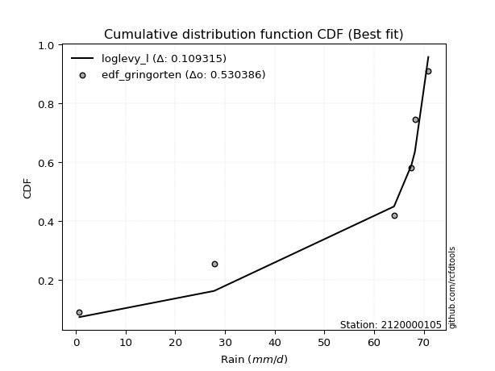</img>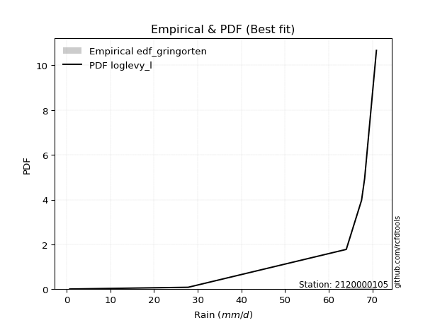</img>

</div>


### 9. EDF Filliben (1975)

The specific values of the constants (0.3175) (often denoted as $alpha$) and (0.365) are derived from a method proposed by James J. Filliben in a 1975 paper. This particular formula is the mean value of the $i$-th order statistic of the normal distribution and is considered a robust and effective plotting position formula for the normal probability plot correlation coefficient test for normality.

<div align="center">


$P=(m-0.3175)/(n+0.365)$


</div>


**9.1. Empirical values**

<div align="center">

|                | 0                   | 1                   | 2                  | 3                  | 4                  | 5                  |
|:---------------|:--------------------|:--------------------|:-------------------|:-------------------|:-------------------|:-------------------|
| date           | 2023                | 2018                | 2020               | 2025               | 2024               | 2019               |
| x              | 0.7                 | 27.8                | 64.0               | 67.5               | 68.2               | 70.9               |
| m              | 1                   | 2                   | 3                  | 4                  | 5                  | 6                  |
| empirical_dist | edf_filliben        | edf_filliben        | edf_filliben       | edf_filliben       | edf_filliben       | edf_filliben       |
| empirical      | 0.10722702278083267 | 0.26433621366849963 | 0.4214454045561665 | 0.5785545954438335 | 0.7356637863315004 | 0.8927729772191673 |
| empirical_tr   | 1.1201055873295205  | 1.3593166043780034  | 1.7284453496266123 | 2.3727865796831313 | 3.783060921248143  | 9.326007326007321  |

</div>


**9.2. Kolmogorov-Smirnov fit test (sorted by Δ)**


<div align="center">

|                | 0                | 1                   | 2                   | 3                  | 4                   | 5                   | 6                   | 7                   | 8                   | 9                   | 10                 | 11                  | 12                 | 13                  | 14                  | 15                  | 16                  | 17                  | 18                  | 19                 | 20                 | 21                  | 22                  | 23                  | 24                 | 25                 | 26                 | 27                 | 28                 | 29                 | 30                 | 31                  | 32                 | 33                 | 34                  | 35                  | 36                  | 37                 | 38                 | 39                  | 40                 | 41                 | 42                 | 43                  | 44                  | 45                 | 46                  | 47                 | 48                 | 49                | 50                | 51                 | 52                  | 53                 | 54                  | 55                 | 56                | 57                 | 58                 | 59                  | 60                  | 61                | 62                  | 63                 | 64                 | 65                 | 66                  | 67                  | 68                 | 69                 | 70                 | 71                  | 72                 | 73                  | 74                 | 75                  | 76                 | 77                 | 78                 | 79                  | 80                 | 81                 | 82                 | 83                 | 84                 | 85                 | 86                  | 87                  | 88                  | 89                  | 90                 | 91                 | 92                 | 93                  | 94                  | 95                  | 96                  | 97                 | 98                 | 99                 | 100                | 101                 | 102                 | 103                | 104                | 105                 | 106                 | 107               | 108                 | 109                 | 110              | 111                | 112                | 113                | 114               | 115                 | 116                 | 117                | 118                | 119                | 120                 | 121                | 122               | 123                | 124                 | 125                | 126                 | 127                | 128                | 129                | 130                 | 131                | 132                | 133                | 134                | 135                | 136                | 137                | 138                | 139                 | 140                | 141                | 142                | 143                | 144                | 145                | 146                | 147                | 148                | 149                | 150                | 151               | 152               | 153               | 154                | 155                | 156                | 157                | 158                | 159                |
|:---------------|:-----------------|:--------------------|:--------------------|:-------------------|:--------------------|:--------------------|:--------------------|:--------------------|:--------------------|:--------------------|:-------------------|:--------------------|:-------------------|:--------------------|:--------------------|:--------------------|:--------------------|:--------------------|:--------------------|:-------------------|:-------------------|:--------------------|:--------------------|:--------------------|:-------------------|:-------------------|:-------------------|:-------------------|:-------------------|:-------------------|:-------------------|:--------------------|:-------------------|:-------------------|:--------------------|:--------------------|:--------------------|:-------------------|:-------------------|:--------------------|:-------------------|:-------------------|:-------------------|:--------------------|:--------------------|:-------------------|:--------------------|:-------------------|:-------------------|:------------------|:------------------|:-------------------|:--------------------|:-------------------|:--------------------|:-------------------|:------------------|:-------------------|:-------------------|:--------------------|:--------------------|:------------------|:--------------------|:-------------------|:-------------------|:-------------------|:--------------------|:--------------------|:-------------------|:-------------------|:-------------------|:--------------------|:-------------------|:--------------------|:-------------------|:--------------------|:-------------------|:-------------------|:-------------------|:--------------------|:-------------------|:-------------------|:-------------------|:-------------------|:-------------------|:-------------------|:--------------------|:--------------------|:--------------------|:--------------------|:-------------------|:-------------------|:-------------------|:--------------------|:--------------------|:--------------------|:--------------------|:-------------------|:-------------------|:-------------------|:-------------------|:--------------------|:--------------------|:-------------------|:-------------------|:--------------------|:--------------------|:------------------|:--------------------|:--------------------|:-----------------|:-------------------|:-------------------|:-------------------|:------------------|:--------------------|:--------------------|:-------------------|:-------------------|:-------------------|:--------------------|:-------------------|:------------------|:-------------------|:--------------------|:-------------------|:--------------------|:-------------------|:-------------------|:-------------------|:--------------------|:-------------------|:-------------------|:-------------------|:-------------------|:-------------------|:-------------------|:-------------------|:-------------------|:--------------------|:-------------------|:-------------------|:-------------------|:-------------------|:-------------------|:-------------------|:-------------------|:-------------------|:-------------------|:-------------------|:-------------------|:------------------|:------------------|:------------------|:-------------------|:-------------------|:-------------------|:-------------------|:-------------------|:-------------------|
| station        | 2120000105       | 2120000105          | 2120000105          | 2120000105         | 2120000105          | 2120000105          | 2120000105          | 2120000105          | 2120000105          | 2120000105          | 2120000105         | 2120000105          | 2120000105         | 2120000105          | 2120000105          | 2120000105          | 2120000105          | 2120000105          | 2120000105          | 2120000105         | 2120000105         | 2120000105          | 2120000105          | 2120000105          | 2120000105         | 2120000105         | 2120000105         | 2120000105         | 2120000105         | 2120000105         | 2120000105         | 2120000105          | 2120000105         | 2120000105         | 2120000105          | 2120000105          | 2120000105          | 2120000105         | 2120000105         | 2120000105          | 2120000105         | 2120000105         | 2120000105         | 2120000105          | 2120000105          | 2120000105         | 2120000105          | 2120000105         | 2120000105         | 2120000105        | 2120000105        | 2120000105         | 2120000105          | 2120000105         | 2120000105          | 2120000105         | 2120000105        | 2120000105         | 2120000105         | 2120000105          | 2120000105          | 2120000105        | 2120000105          | 2120000105         | 2120000105         | 2120000105         | 2120000105          | 2120000105          | 2120000105         | 2120000105         | 2120000105         | 2120000105          | 2120000105         | 2120000105          | 2120000105         | 2120000105          | 2120000105         | 2120000105         | 2120000105         | 2120000105          | 2120000105         | 2120000105         | 2120000105         | 2120000105         | 2120000105         | 2120000105         | 2120000105          | 2120000105          | 2120000105          | 2120000105          | 2120000105         | 2120000105         | 2120000105         | 2120000105          | 2120000105          | 2120000105          | 2120000105          | 2120000105         | 2120000105         | 2120000105         | 2120000105         | 2120000105          | 2120000105          | 2120000105         | 2120000105         | 2120000105          | 2120000105          | 2120000105        | 2120000105          | 2120000105          | 2120000105       | 2120000105         | 2120000105         | 2120000105         | 2120000105        | 2120000105          | 2120000105          | 2120000105         | 2120000105         | 2120000105         | 2120000105          | 2120000105         | 2120000105        | 2120000105         | 2120000105          | 2120000105         | 2120000105          | 2120000105         | 2120000105         | 2120000105         | 2120000105          | 2120000105         | 2120000105         | 2120000105         | 2120000105         | 2120000105         | 2120000105         | 2120000105         | 2120000105         | 2120000105          | 2120000105         | 2120000105         | 2120000105         | 2120000105         | 2120000105         | 2120000105         | 2120000105         | 2120000105         | 2120000105         | 2120000105         | 2120000105         | 2120000105        | 2120000105        | 2120000105        | 2120000105         | 2120000105         | 2120000105         | 2120000105         | 2120000105         | 2120000105         |
| empirical_dist | edf_filliben     | edf_filliben        | edf_filliben        | edf_filliben       | edf_filliben        | edf_filliben        | edf_filliben        | edf_filliben        | edf_filliben        | edf_filliben        | edf_filliben       | edf_filliben        | edf_filliben       | edf_filliben        | edf_filliben        | edf_filliben        | edf_filliben        | edf_filliben        | edf_filliben        | edf_filliben       | edf_filliben       | edf_filliben        | edf_filliben        | edf_filliben        | edf_filliben       | edf_filliben       | edf_filliben       | edf_filliben       | edf_filliben       | edf_filliben       | edf_filliben       | edf_filliben        | edf_filliben       | edf_filliben       | edf_filliben        | edf_filliben        | edf_filliben        | edf_filliben       | edf_filliben       | edf_filliben        | edf_filliben       | edf_filliben       | edf_filliben       | edf_filliben        | edf_filliben        | edf_filliben       | edf_filliben        | edf_filliben       | edf_filliben       | edf_filliben      | edf_filliben      | edf_filliben       | edf_filliben        | edf_filliben       | edf_filliben        | edf_filliben       | edf_filliben      | edf_filliben       | edf_filliben       | edf_filliben        | edf_filliben        | edf_filliben      | edf_filliben        | edf_filliben       | edf_filliben       | edf_filliben       | edf_filliben        | edf_filliben        | edf_filliben       | edf_filliben       | edf_filliben       | edf_filliben        | edf_filliben       | edf_filliben        | edf_filliben       | edf_filliben        | edf_filliben       | edf_filliben       | edf_filliben       | edf_filliben        | edf_filliben       | edf_filliben       | edf_filliben       | edf_filliben       | edf_filliben       | edf_filliben       | edf_filliben        | edf_filliben        | edf_filliben        | edf_filliben        | edf_filliben       | edf_filliben       | edf_filliben       | edf_filliben        | edf_filliben        | edf_filliben        | edf_filliben        | edf_filliben       | edf_filliben       | edf_filliben       | edf_filliben       | edf_filliben        | edf_filliben        | edf_filliben       | edf_filliben       | edf_filliben        | edf_filliben        | edf_filliben      | edf_filliben        | edf_filliben        | edf_filliben     | edf_filliben       | edf_filliben       | edf_filliben       | edf_filliben      | edf_filliben        | edf_filliben        | edf_filliben       | edf_filliben       | edf_filliben       | edf_filliben        | edf_filliben       | edf_filliben      | edf_filliben       | edf_filliben        | edf_filliben       | edf_filliben        | edf_filliben       | edf_filliben       | edf_filliben       | edf_filliben        | edf_filliben       | edf_filliben       | edf_filliben       | edf_filliben       | edf_filliben       | edf_filliben       | edf_filliben       | edf_filliben       | edf_filliben        | edf_filliben       | edf_filliben       | edf_filliben       | edf_filliben       | edf_filliben       | edf_filliben       | edf_filliben       | edf_filliben       | edf_filliben       | edf_filliben       | edf_filliben       | edf_filliben      | edf_filliben      | edf_filliben      | edf_filliben       | edf_filliben       | edf_filliben       | edf_filliben       | edf_filliben       | edf_filliben       |
| p_dist         | loglevy_l        | levy_l              | logjohnsonsb        | weibull_max        | vonmises_line       | beta                | arcsine             | genextreme          | logt                | logweibull_max      | wrapcauchy         | logmielke           | trapezoid          | logvonmises_line    | logpearson3         | logtrapezoid        | gennorm             | dgamma              | logsemicircular     | loggumbel_l        | gausshyper         | pearson3            | semicircular        | logwrapcauchy       | loganglit          | gumbel_l           | dweibull           | anglit             | logarcsine         | logkappa3          | gompertz           | weibull_min         | ncf                | loginvgauss        | loggenextreme       | loggamma            | loggamma            | loginvgamma        | lognakagami        | logcrystalball      | lognorm            | logexponnorm       | logrice            | lognct              | logfatiguelife      | loggengamma        | logalpha            | invgauss           | f                  | argus             | invgamma          | gengamma           | norm                | crystalball        | exponnorm           | t                  | erlang            | mielke             | gamma              | betaprime           | rice                | burr12            | logexponweib        | logmaxwell         | halfgennorm        | lomax              | genpareto           | kstwobign           | foldnorm           | loglogistic        | lograyleigh        | loginvweibull       | loggennorm         | maxwell             | logfoldnorm        | rayleigh            | genexpon           | loggompertz        | logistic           | loghypsecant        | logkstwobign       | loghalfnorm        | halfnorm           | hypsecant          | loghalfgennorm     | cosine             | loggenexpon         | loggumbel_r         | logcosine           | gumbel_r            | loglaplace         | loglaplace         | loghalflogistic    | halflogistic        | logmoyal            | laplace             | logburr             | logncf             | moyal              | nct                | logdgamma          | logerlang           | logdweibull         | loglomax           | genhalflogistic    | logburr12           | loggenpareto        | kappa4            | wald                | logloglaplace       | logargus         | logwald            | ksone              | skewnorm           | triang            | logbeta             | loggausshyper       | nakagami           | logf               | exponweib          | truncweibull_min    | burr               | logbetaprime      | logloggamma        | kappa3              | uniform            | logksone            | invweibull         | logweibull_min     | bradford           | johnsonsu           | loggenhalflogistic | johnsonsb          | truncexpon         | logbradford        | logskewnorm        | logkappa4          | fatiguelife        | logtriang          | logtruncweibull_min | loguniform         | logtruncnorm       | logjohnsonsu       | logtruncexpon      | logtukeylambda     | powerlaw           | truncpareto        | logexponpow        | exponpow           | alpha              | logtruncpareto     | logpowerlaw       | truncnorm         | rdist             | tukeylambda        | logrdist           | genlogistic        | loggenlogistic     | logvonmises        | vonmises           |
| delta          | 0.10140061768906 | 0.10871414311070449 | 0.16733229572442382 | 0.1834996984035372 | 0.18557246922771653 | 0.20045368093530214 | 0.20241196004394013 | 0.20765743346738985 | 0.20804717150533553 | 0.20900125032821115 | 0.2213780239254986 | 0.22259133945361265 | 0.2248641216992997 | 0.22864846027503782 | 0.23266601927432395 | 0.23363772477362665 | 0.23566378633995877 | 0.23649083119618278 | 0.23981098070129214 | 0.2399927778041373 | 0.2424046918273427 | 0.24345163480165632 | 0.24686893829918266 | 0.24701711286086986 | 0.2501038197430392 | 0.2507836222835621 | 0.2530026696991303 | 0.2574599333450074 | 0.2598376887550389 | 0.2603584740428157 | 0.2643362135927061 | 0.26647669961876697 | 0.2672767114025453 | 0.2714314231788466 | 0.27164151052185814 | 0.27334630510486124 | 0.27334630510486124 | 0.2737242093709187 | 0.2738969530021157 | 0.27431909937909793 | 0.2743191163879699 | 0.2743210298686395 | 0.2743400117130934 | 0.27440767104976904 | 0.27652119425668353 | 0.2774342027139609 | 0.27843289351778233 | 0.2796783382062993 | 0.2811727740051434 | 0.281993624760271 | 0.282210092713145 | 0.2822664380538705 | 0.28231069695484134 | 0.2823107037720137 | 0.28231310279246136 | 0.2823276851460462 | 0.282425935242254 | 0.2836563264883315 | 0.2838124997016297 | 0.28409275762150044 | 0.28469120647015667 | 0.288424592678724 | 0.29018774416987714 | 0.2907459904019012 | 0.2915613425549798 | 0.2919779710176237 | 0.29230366527022655 | 0.29386379933027806 | 0.2948522314623311 | 0.2954537355806409 | 0.2955578174822977 | 0.29607889403050786 | 0.2968046439273726 | 0.29776873823289984 | 0.2980701196255108 | 0.30227803968941547 | 0.3028696337445521 | 0.3036881899533649 | 0.3038350705412022 | 0.31081820261974313 | 0.3117261909334706 | 0.3151520682596027 | 0.3160663910699337 | 0.3192784437330015 | 0.3227211603003423 | 0.3231264752105165 | 0.32547904193874705 | 0.32602222729006436 | 0.32743943823540256 | 0.33236682246943083 | 0.3362569517309234 | 0.3362569517309234 | 0.3403937017064648 | 0.34272489278377005 | 0.34277371609574414 | 0.34400375170305997 | 0.34639590508324697 | 0.3465740428346476 | 0.3485454164336089 | 0.3553110890490871 | 0.3586082024342564 | 0.35951035671400894 | 0.36210190696527333 | 0.3759047328374096 | 0.3766253059330973 | 0.38502877078317194 | 0.38587004529918645 | 0.391782593158706 | 0.39620665445184655 | 0.39737589126895206 | 0.39762559709293 | 0.4087802214014427 | 0.4133124302016681 | 0.4167689797898184 | 0.422464794366636 | 0.43192171195970286 | 0.43220148708037165 | 0.4393872346351281 | 0.4424109553809085 | 0.4429478647591804 | 0.45729430046202624 | 0.4614583881262798 | 0.468826813134085 | 0.4768462341423807 | 0.48025413256811744 | 0.4802639971532351 | 0.48338186650343823 | 0.4843465944436083 | 0.4850415656855917 | 0.4917273904789665 | 0.49469000812512237 | 0.51039068239236   | 0.5147073660964532 | 0.5200272629914409 | 0.5316211062670535 | 0.5361209022211298 | 0.5432472036711926 | 0.5439775995869893 | 0.5444984787811659 | 0.5514451402996748  | 0.5563829710937955 | 0.5566469021819204 | 0.5783950591398384 | 0.5852220317365728 | 0.6008493782681443 | 0.6089022861714133 | 0.6497209324967856 | 0.6538237649994643 | 0.6748832718024893 | 0.6840659908315867 | 0.6975635372503826 | 0.701602730442572 | 0.735663770717994 | 0.735663785959991 | 0.7356637863314932 | 0.7356637863315003 | 0.7356637863315004 | 0.7356637863315004 | 1.0204981445714605 | 10.766873694282713 |
| deltao         | 0.530385761606   | 0.530385761606      | 0.530385761606      | 0.530385761606     | 0.530385761606      | 0.530385761606      | 0.530385761606      | 0.530385761606      | 0.530385761606      | 0.530385761606      | 0.530385761606     | 0.530385761606      | 0.530385761606     | 0.530385761606      | 0.530385761606      | 0.530385761606      | 0.530385761606      | 0.530385761606      | 0.530385761606      | 0.530385761606     | 0.530385761606     | 0.530385761606      | 0.530385761606      | 0.530385761606      | 0.530385761606     | 0.530385761606     | 0.530385761606     | 0.530385761606     | 0.530385761606     | 0.530385761606     | 0.530385761606     | 0.530385761606      | 0.530385761606     | 0.530385761606     | 0.530385761606      | 0.530385761606      | 0.530385761606      | 0.530385761606     | 0.530385761606     | 0.530385761606      | 0.530385761606     | 0.530385761606     | 0.530385761606     | 0.530385761606      | 0.530385761606      | 0.530385761606     | 0.530385761606      | 0.530385761606     | 0.530385761606     | 0.530385761606    | 0.530385761606    | 0.530385761606     | 0.530385761606      | 0.530385761606     | 0.530385761606      | 0.530385761606     | 0.530385761606    | 0.530385761606     | 0.530385761606     | 0.530385761606      | 0.530385761606      | 0.530385761606    | 0.530385761606      | 0.530385761606     | 0.530385761606     | 0.530385761606     | 0.530385761606      | 0.530385761606      | 0.530385761606     | 0.530385761606     | 0.530385761606     | 0.530385761606      | 0.530385761606     | 0.530385761606      | 0.530385761606     | 0.530385761606      | 0.530385761606     | 0.530385761606     | 0.530385761606     | 0.530385761606      | 0.530385761606     | 0.530385761606     | 0.530385761606     | 0.530385761606     | 0.530385761606     | 0.530385761606     | 0.530385761606      | 0.530385761606      | 0.530385761606      | 0.530385761606      | 0.530385761606     | 0.530385761606     | 0.530385761606     | 0.530385761606      | 0.530385761606      | 0.530385761606      | 0.530385761606      | 0.530385761606     | 0.530385761606     | 0.530385761606     | 0.530385761606     | 0.530385761606      | 0.530385761606      | 0.530385761606     | 0.530385761606     | 0.530385761606      | 0.530385761606      | 0.530385761606    | 0.530385761606      | 0.530385761606      | 0.530385761606   | 0.530385761606     | 0.530385761606     | 0.530385761606     | 0.530385761606    | 0.530385761606      | 0.530385761606      | 0.530385761606     | 0.530385761606     | 0.530385761606     | 0.530385761606      | 0.530385761606     | 0.530385761606    | 0.530385761606     | 0.530385761606      | 0.530385761606     | 0.530385761606      | 0.530385761606     | 0.530385761606     | 0.530385761606     | 0.530385761606      | 0.530385761606     | 0.530385761606     | 0.530385761606     | 0.530385761606     | 0.530385761606     | 0.530385761606     | 0.530385761606     | 0.530385761606     | 0.530385761606      | 0.530385761606     | 0.530385761606     | 0.530385761606     | 0.530385761606     | 0.530385761606     | 0.530385761606     | 0.530385761606     | 0.530385761606     | 0.530385761606     | 0.530385761606     | 0.530385761606     | 0.530385761606    | 0.530385761606    | 0.530385761606    | 0.530385761606     | 0.530385761606     | 0.530385761606     | 0.530385761606     | 0.530385761606     | 0.530385761606     |
| eval           | Δo > Δ           | Δo > Δ              | Δo > Δ              | Δo > Δ             | Δo > Δ              | Δo > Δ              | Δo > Δ              | Δo > Δ              | Δo > Δ              | Δo > Δ              | Δo > Δ             | Δo > Δ              | Δo > Δ             | Δo > Δ              | Δo > Δ              | Δo > Δ              | Δo > Δ              | Δo > Δ              | Δo > Δ              | Δo > Δ             | Δo > Δ             | Δo > Δ              | Δo > Δ              | Δo > Δ              | Δo > Δ             | Δo > Δ             | Δo > Δ             | Δo > Δ             | Δo > Δ             | Δo > Δ             | Δo > Δ             | Δo > Δ              | Δo > Δ             | Δo > Δ             | Δo > Δ              | Δo > Δ              | Δo > Δ              | Δo > Δ             | Δo > Δ             | Δo > Δ              | Δo > Δ             | Δo > Δ             | Δo > Δ             | Δo > Δ              | Δo > Δ              | Δo > Δ             | Δo > Δ              | Δo > Δ             | Δo > Δ             | Δo > Δ            | Δo > Δ            | Δo > Δ             | Δo > Δ              | Δo > Δ             | Δo > Δ              | Δo > Δ             | Δo > Δ            | Δo > Δ             | Δo > Δ             | Δo > Δ              | Δo > Δ              | Δo > Δ            | Δo > Δ              | Δo > Δ             | Δo > Δ             | Δo > Δ             | Δo > Δ              | Δo > Δ              | Δo > Δ             | Δo > Δ             | Δo > Δ             | Δo > Δ              | Δo > Δ             | Δo > Δ              | Δo > Δ             | Δo > Δ              | Δo > Δ             | Δo > Δ             | Δo > Δ             | Δo > Δ              | Δo > Δ             | Δo > Δ             | Δo > Δ             | Δo > Δ             | Δo > Δ             | Δo > Δ             | Δo > Δ              | Δo > Δ              | Δo > Δ              | Δo > Δ              | Δo > Δ             | Δo > Δ             | Δo > Δ             | Δo > Δ              | Δo > Δ              | Δo > Δ              | Δo > Δ              | Δo > Δ             | Δo > Δ             | Δo > Δ             | Δo > Δ             | Δo > Δ              | Δo > Δ              | Δo > Δ             | Δo > Δ             | Δo > Δ              | Δo > Δ              | Δo > Δ            | Δo > Δ              | Δo > Δ              | Δo > Δ           | Δo > Δ             | Δo > Δ             | Δo > Δ             | Δo > Δ            | Δo > Δ              | Δo > Δ              | Δo > Δ             | Δo > Δ             | Δo > Δ             | Δo > Δ              | Δo > Δ             | Δo > Δ            | Δo > Δ             | Δo > Δ              | Δo > Δ             | Δo > Δ              | Δo > Δ             | Δo > Δ             | Δo > Δ             | Δo > Δ              | Δo > Δ             | Δo > Δ             | Δo > Δ             | Δo <= Δ            | Δo <= Δ            | Δo <= Δ            | Δo <= Δ            | Δo <= Δ            | Δo <= Δ             | Δo <= Δ            | Δo <= Δ            | Δo <= Δ            | Δo <= Δ            | Δo <= Δ            | Δo <= Δ            | Δo <= Δ            | Δo <= Δ            | Δo <= Δ            | Δo <= Δ            | Δo <= Δ            | Δo <= Δ           | Δo <= Δ           | Δo <= Δ           | Δo <= Δ            | Δo <= Δ            | Δo <= Δ            | Δo <= Δ            | Δo <= Δ            | Δo <= Δ            |
| fit            | 1                | 1                   | 1                   | 1                  | 1                   | 1                   | 1                   | 1                   | 1                   | 1                   | 1                  | 1                   | 1                  | 1                   | 1                   | 1                   | 1                   | 1                   | 1                   | 1                  | 1                  | 1                   | 1                   | 1                   | 1                  | 1                  | 1                  | 1                  | 1                  | 1                  | 1                  | 1                   | 1                  | 1                  | 1                   | 1                   | 1                   | 1                  | 1                  | 1                   | 1                  | 1                  | 1                  | 1                   | 1                   | 1                  | 1                   | 1                  | 1                  | 1                 | 1                 | 1                  | 1                   | 1                  | 1                   | 1                  | 1                 | 1                  | 1                  | 1                   | 1                   | 1                 | 1                   | 1                  | 1                  | 1                  | 1                   | 1                   | 1                  | 1                  | 1                  | 1                   | 1                  | 1                   | 1                  | 1                   | 1                  | 1                  | 1                  | 1                   | 1                  | 1                  | 1                  | 1                  | 1                  | 1                  | 1                   | 1                   | 1                   | 1                   | 1                  | 1                  | 1                  | 1                   | 1                   | 1                   | 1                   | 1                  | 1                  | 1                  | 1                  | 1                   | 1                   | 1                  | 1                  | 1                   | 1                   | 1                 | 1                   | 1                   | 1                | 1                  | 1                  | 1                  | 1                 | 1                   | 1                   | 1                  | 1                  | 1                  | 1                   | 1                  | 1                 | 1                  | 1                   | 1                  | 1                   | 1                  | 1                  | 1                  | 1                   | 1                  | 1                  | 1                  | 0                  | 0                  | 0                  | 0                  | 0                  | 0                   | 0                  | 0                  | 0                  | 0                  | 0                  | 0                  | 0                  | 0                  | 0                  | 0                  | 0                  | 0                 | 0                 | 0                 | 0                  | 0                  | 0                  | 0                  | 0                  | 0                  |
| n              | 6                | 6                   | 6                   | 6                  | 6                   | 6                   | 6                   | 6                   | 6                   | 6                   | 6                  | 6                   | 6                  | 6                   | 6                   | 6                   | 6                   | 6                   | 6                   | 6                  | 6                  | 6                   | 6                   | 6                   | 6                  | 6                  | 6                  | 6                  | 6                  | 6                  | 6                  | 6                   | 6                  | 6                  | 6                   | 6                   | 6                   | 6                  | 6                  | 6                   | 6                  | 6                  | 6                  | 6                   | 6                   | 6                  | 6                   | 6                  | 6                  | 6                 | 6                 | 6                  | 6                   | 6                  | 6                   | 6                  | 6                 | 6                  | 6                  | 6                   | 6                   | 6                 | 6                   | 6                  | 6                  | 6                  | 6                   | 6                   | 6                  | 6                  | 6                  | 6                   | 6                  | 6                   | 6                  | 6                   | 6                  | 6                  | 6                  | 6                   | 6                  | 6                  | 6                  | 6                  | 6                  | 6                  | 6                   | 6                   | 6                   | 6                   | 6                  | 6                  | 6                  | 6                   | 6                   | 6                   | 6                   | 6                  | 6                  | 6                  | 6                  | 6                   | 6                   | 6                  | 6                  | 6                   | 6                   | 6                 | 6                   | 6                   | 6                | 6                  | 6                  | 6                  | 6                 | 6                   | 6                   | 6                  | 6                  | 6                  | 6                   | 6                  | 6                 | 6                  | 6                   | 6                  | 6                   | 6                  | 6                  | 6                  | 6                   | 6                  | 6                  | 6                  | 6                  | 6                  | 6                  | 6                  | 6                  | 6                   | 6                  | 6                  | 6                  | 6                  | 6                  | 6                  | 6                  | 6                  | 6                  | 6                  | 6                  | 6                 | 6                 | 6                 | 6                  | 6                  | 6                  | 6                  | 6                  | 6                  |
| best_fit       | 1                | 0                   | 0                   | 0                  | 0                   | 0                   | 0                   | 0                   | 0                   | 0                   | 0                  | 0                   | 0                  | 0                   | 0                   | 0                   | 0                   | 0                   | 0                   | 0                  | 0                  | 0                   | 0                   | 0                   | 0                  | 0                  | 0                  | 0                  | 0                  | 0                  | 0                  | 0                   | 0                  | 0                  | 0                   | 0                   | 0                   | 0                  | 0                  | 0                   | 0                  | 0                  | 0                  | 0                   | 0                   | 0                  | 0                   | 0                  | 0                  | 0                 | 0                 | 0                  | 0                   | 0                  | 0                   | 0                  | 0                 | 0                  | 0                  | 0                   | 0                   | 0                 | 0                   | 0                  | 0                  | 0                  | 0                   | 0                   | 0                  | 0                  | 0                  | 0                   | 0                  | 0                   | 0                  | 0                   | 0                  | 0                  | 0                  | 0                   | 0                  | 0                  | 0                  | 0                  | 0                  | 0                  | 0                   | 0                   | 0                   | 0                   | 0                  | 0                  | 0                  | 0                   | 0                   | 0                   | 0                   | 0                  | 0                  | 0                  | 0                  | 0                   | 0                   | 0                  | 0                  | 0                   | 0                   | 0                 | 0                   | 0                   | 0                | 0                  | 0                  | 0                  | 0                 | 0                   | 0                   | 0                  | 0                  | 0                  | 0                   | 0                  | 0                 | 0                  | 0                   | 0                  | 0                   | 0                  | 0                  | 0                  | 0                   | 0                  | 0                  | 0                  | 0                  | 0                  | 0                  | 0                  | 0                  | 0                   | 0                  | 0                  | 0                  | 0                  | 0                  | 0                  | 0                  | 0                  | 0                  | 0                  | 0                  | 0                 | 0                 | 0                 | 0                  | 0                  | 0                  | 0                  | 0                  | 0                  |
| best_fit_sort  | 1                | 2                   | 3                   | 4                  | 5                   | 6                   | 7                   | 8                   | 9                   | 10                  | 11                 | 12                  | 13                 | 14                  | 15                  | 16                  | 17                  | 18                  | 19                  | 20                 | 21                 | 22                  | 23                  | 24                  | 25                 | 26                 | 27                 | 28                 | 29                 | 30                 | 31                 | 32                  | 33                 | 34                 | 35                  | 36                  | 37                  | 38                 | 39                 | 40                  | 41                 | 42                 | 43                 | 44                  | 45                  | 46                 | 47                  | 48                 | 49                 | 50                | 51                | 52                 | 53                  | 54                 | 55                  | 56                 | 57                | 58                 | 59                 | 60                  | 61                  | 62                | 63                  | 64                 | 65                 | 66                 | 67                  | 68                  | 69                 | 70                 | 71                 | 72                  | 73                 | 74                  | 75                 | 76                  | 77                 | 78                 | 79                 | 80                  | 81                 | 82                 | 83                 | 84                 | 85                 | 86                 | 87                  | 88                  | 89                  | 90                  | 91                 | 92                 | 93                 | 94                  | 95                  | 96                  | 97                  | 98                 | 99                 | 100                | 101                | 102                 | 103                 | 104                | 105                | 106                 | 107                 | 108               | 109                 | 110                 | 111              | 112                | 113                | 114                | 115               | 116                 | 117                 | 118                | 119                | 120                | 121                 | 122                | 123               | 124                | 125                 | 126                | 127                 | 128                | 129                | 130                | 131                 | 132                | 133                | 134                | 135                | 136                | 137                | 138                | 139                | 140                 | 141                | 142                | 143                | 144                | 145                | 146                | 147                | 148                | 149                | 150                | 151                | 152               | 153               | 154               | 155                | 156                | 157                | 158                | 159                | 160                |

</div>


**9.3. Best fit**

<div align="center">

|   id |    station | empirical_dist   | p_dist    |    delta |   deltao | eval   |   fit |   n |   best_fit |   best_fit_sort |
|-----:|-----------:|:-----------------|:----------|---------:|---------:|:-------|------:|----:|-----------:|----------------:|
|    0 | 2120000105 | edf_filliben     | loglevy_l | 0.101401 | 0.530386 | Δo > Δ |     1 |   6 |          1 |               1 |

</div>


<div align="center">

</img></img>

</div>


### 10. EDF Jenkinson (1977)

The Jenkinson formula in hydrology is an empirical plotting position formula used to estimate the non-exceedance probability _(P)_ or return period _(T)_ of a given ordered observation within a sample. It is a widely used method in the frequency analysis of extreme events such as floods and rainfall, as it provides a distribution-free way to plot data. _a≈0.31_ and _b≈0.38_ are constants derived to approximate the median of the probability distribution for the given rank.

<div align="center">


$P=(m-a)/(n+b)$


</div>


**10.1. Empirical values**

<div align="center">

|                | 0                   | 1                   | 2                  | 3                  | 4                  | 5                  |
|:---------------|:--------------------|:--------------------|:-------------------|:-------------------|:-------------------|:-------------------|
| date           | 2023                | 2018                | 2020               | 2025               | 2024               | 2019               |
| x              | 0.7                 | 27.8                | 64.0               | 67.5               | 68.2               | 70.9               |
| m              | 1                   | 2                   | 3                  | 4                  | 5                  | 6                  |
| empirical_dist | edf_jenkinson       | edf_jenkinson       | edf_jenkinson      | edf_jenkinson      | edf_jenkinson      | edf_jenkinson      |
| empirical      | 0.10815047021943573 | 0.26489028213166144 | 0.4216300940438871 | 0.5783699059561128 | 0.7351097178683387 | 0.8918495297805643 |
| empirical_tr   | 1.1212653778558874  | 1.3603411513859276  | 1.7289972899728996 | 2.3717472118959106 | 3.7751479289940844 | 9.246376811594207  |

</div>


**10.2. Kolmogorov-Smirnov fit test (sorted by Δ)**


<div align="center">

|                | 0                   | 1                   | 2                  | 3                  | 4                   | 5                  | 6                  | 7                   | 8                   | 9                   | 10                 | 11                 | 12                 | 13                  | 14                | 15                 | 16                  | 17                  | 18                  | 19                 | 20                 | 21                  | 22                  | 23                  | 24                 | 25                 | 26                  | 27                 | 28                 | 29                 | 30                 | 31                  | 32                 | 33                | 34                  | 35                  | 36                  | 37                 | 38                 | 39                  | 40                 | 41                 | 42                 | 43                  | 44                  | 45                 | 46                  | 47                 | 48                 | 49                 | 50                 | 51                 | 52                  | 53                 | 54                  | 55                 | 56                 | 57                 | 58                 | 59                  | 60                  | 61                 | 62                  | 63                 | 64                 | 65                 | 66                  | 67                  | 68                 | 69                 | 70                 | 71                  | 72                  | 73                  | 74                 | 75                  | 76                 | 77                 | 78                 | 79                  | 80                 | 81                 | 82                 | 83                 | 84                 | 85                 | 86                  | 87                  | 88                  | 89                  | 90                 | 91                 | 92                | 93                  | 94                  | 95                  | 96                  | 97                 | 98                 | 99                 | 100                 | 101                 | 102                | 103                | 104                | 105                 | 106                 | 107                | 108                 | 109                 | 110                | 111                | 112                | 113                | 114                | 115                | 116                 | 117                | 118                | 119                | 120                 | 121                | 122                 | 123                | 124                 | 125                | 126                | 127                | 128                | 129                | 130                | 131                | 132                | 133                | 134                | 135                | 136               | 137                | 138                | 139                 | 140                | 141                | 142                | 143                | 144                | 145                | 146                | 147                | 148                | 149                | 150                | 151                | 152                | 153                | 154                | 155                | 156                | 157                | 158              | 159                |
|:---------------|:--------------------|:--------------------|:-------------------|:-------------------|:--------------------|:-------------------|:-------------------|:--------------------|:--------------------|:--------------------|:-------------------|:-------------------|:-------------------|:--------------------|:------------------|:-------------------|:--------------------|:--------------------|:--------------------|:-------------------|:-------------------|:--------------------|:--------------------|:--------------------|:-------------------|:-------------------|:--------------------|:-------------------|:-------------------|:-------------------|:-------------------|:--------------------|:-------------------|:------------------|:--------------------|:--------------------|:--------------------|:-------------------|:-------------------|:--------------------|:-------------------|:-------------------|:-------------------|:--------------------|:--------------------|:-------------------|:--------------------|:-------------------|:-------------------|:-------------------|:-------------------|:-------------------|:--------------------|:-------------------|:--------------------|:-------------------|:-------------------|:-------------------|:-------------------|:--------------------|:--------------------|:-------------------|:--------------------|:-------------------|:-------------------|:-------------------|:--------------------|:--------------------|:-------------------|:-------------------|:-------------------|:--------------------|:--------------------|:--------------------|:-------------------|:--------------------|:-------------------|:-------------------|:-------------------|:--------------------|:-------------------|:-------------------|:-------------------|:-------------------|:-------------------|:-------------------|:--------------------|:--------------------|:--------------------|:--------------------|:-------------------|:-------------------|:------------------|:--------------------|:--------------------|:--------------------|:--------------------|:-------------------|:-------------------|:-------------------|:--------------------|:--------------------|:-------------------|:-------------------|:-------------------|:--------------------|:--------------------|:-------------------|:--------------------|:--------------------|:-------------------|:-------------------|:-------------------|:-------------------|:-------------------|:-------------------|:--------------------|:-------------------|:-------------------|:-------------------|:--------------------|:-------------------|:--------------------|:-------------------|:--------------------|:-------------------|:-------------------|:-------------------|:-------------------|:-------------------|:-------------------|:-------------------|:-------------------|:-------------------|:-------------------|:-------------------|:------------------|:-------------------|:-------------------|:--------------------|:-------------------|:-------------------|:-------------------|:-------------------|:-------------------|:-------------------|:-------------------|:-------------------|:-------------------|:-------------------|:-------------------|:-------------------|:-------------------|:-------------------|:-------------------|:-------------------|:-------------------|:-------------------|:-----------------|:-------------------|
| station        | 2120000105          | 2120000105          | 2120000105         | 2120000105         | 2120000105          | 2120000105         | 2120000105         | 2120000105          | 2120000105          | 2120000105          | 2120000105         | 2120000105         | 2120000105         | 2120000105          | 2120000105        | 2120000105         | 2120000105          | 2120000105          | 2120000105          | 2120000105         | 2120000105         | 2120000105          | 2120000105          | 2120000105          | 2120000105         | 2120000105         | 2120000105          | 2120000105         | 2120000105         | 2120000105         | 2120000105         | 2120000105          | 2120000105         | 2120000105        | 2120000105          | 2120000105          | 2120000105          | 2120000105         | 2120000105         | 2120000105          | 2120000105         | 2120000105         | 2120000105         | 2120000105          | 2120000105          | 2120000105         | 2120000105          | 2120000105         | 2120000105         | 2120000105         | 2120000105         | 2120000105         | 2120000105          | 2120000105         | 2120000105          | 2120000105         | 2120000105         | 2120000105         | 2120000105         | 2120000105          | 2120000105          | 2120000105         | 2120000105          | 2120000105         | 2120000105         | 2120000105         | 2120000105          | 2120000105          | 2120000105         | 2120000105         | 2120000105         | 2120000105          | 2120000105          | 2120000105          | 2120000105         | 2120000105          | 2120000105         | 2120000105         | 2120000105         | 2120000105          | 2120000105         | 2120000105         | 2120000105         | 2120000105         | 2120000105         | 2120000105         | 2120000105          | 2120000105          | 2120000105          | 2120000105          | 2120000105         | 2120000105         | 2120000105        | 2120000105          | 2120000105          | 2120000105          | 2120000105          | 2120000105         | 2120000105         | 2120000105         | 2120000105          | 2120000105          | 2120000105         | 2120000105         | 2120000105         | 2120000105          | 2120000105          | 2120000105         | 2120000105          | 2120000105          | 2120000105         | 2120000105         | 2120000105         | 2120000105         | 2120000105         | 2120000105         | 2120000105          | 2120000105         | 2120000105         | 2120000105         | 2120000105          | 2120000105         | 2120000105          | 2120000105         | 2120000105          | 2120000105         | 2120000105         | 2120000105         | 2120000105         | 2120000105         | 2120000105         | 2120000105         | 2120000105         | 2120000105         | 2120000105         | 2120000105         | 2120000105        | 2120000105         | 2120000105         | 2120000105          | 2120000105         | 2120000105         | 2120000105         | 2120000105         | 2120000105         | 2120000105         | 2120000105         | 2120000105         | 2120000105         | 2120000105         | 2120000105         | 2120000105         | 2120000105         | 2120000105         | 2120000105         | 2120000105         | 2120000105         | 2120000105         | 2120000105       | 2120000105         |
| empirical_dist | edf_jenkinson       | edf_jenkinson       | edf_jenkinson      | edf_jenkinson      | edf_jenkinson       | edf_jenkinson      | edf_jenkinson      | edf_jenkinson       | edf_jenkinson       | edf_jenkinson       | edf_jenkinson      | edf_jenkinson      | edf_jenkinson      | edf_jenkinson       | edf_jenkinson     | edf_jenkinson      | edf_jenkinson       | edf_jenkinson       | edf_jenkinson       | edf_jenkinson      | edf_jenkinson      | edf_jenkinson       | edf_jenkinson       | edf_jenkinson       | edf_jenkinson      | edf_jenkinson      | edf_jenkinson       | edf_jenkinson      | edf_jenkinson      | edf_jenkinson      | edf_jenkinson      | edf_jenkinson       | edf_jenkinson      | edf_jenkinson     | edf_jenkinson       | edf_jenkinson       | edf_jenkinson       | edf_jenkinson      | edf_jenkinson      | edf_jenkinson       | edf_jenkinson      | edf_jenkinson      | edf_jenkinson      | edf_jenkinson       | edf_jenkinson       | edf_jenkinson      | edf_jenkinson       | edf_jenkinson      | edf_jenkinson      | edf_jenkinson      | edf_jenkinson      | edf_jenkinson      | edf_jenkinson       | edf_jenkinson      | edf_jenkinson       | edf_jenkinson      | edf_jenkinson      | edf_jenkinson      | edf_jenkinson      | edf_jenkinson       | edf_jenkinson       | edf_jenkinson      | edf_jenkinson       | edf_jenkinson      | edf_jenkinson      | edf_jenkinson      | edf_jenkinson       | edf_jenkinson       | edf_jenkinson      | edf_jenkinson      | edf_jenkinson      | edf_jenkinson       | edf_jenkinson       | edf_jenkinson       | edf_jenkinson      | edf_jenkinson       | edf_jenkinson      | edf_jenkinson      | edf_jenkinson      | edf_jenkinson       | edf_jenkinson      | edf_jenkinson      | edf_jenkinson      | edf_jenkinson      | edf_jenkinson      | edf_jenkinson      | edf_jenkinson       | edf_jenkinson       | edf_jenkinson       | edf_jenkinson       | edf_jenkinson      | edf_jenkinson      | edf_jenkinson     | edf_jenkinson       | edf_jenkinson       | edf_jenkinson       | edf_jenkinson       | edf_jenkinson      | edf_jenkinson      | edf_jenkinson      | edf_jenkinson       | edf_jenkinson       | edf_jenkinson      | edf_jenkinson      | edf_jenkinson      | edf_jenkinson       | edf_jenkinson       | edf_jenkinson      | edf_jenkinson       | edf_jenkinson       | edf_jenkinson      | edf_jenkinson      | edf_jenkinson      | edf_jenkinson      | edf_jenkinson      | edf_jenkinson      | edf_jenkinson       | edf_jenkinson      | edf_jenkinson      | edf_jenkinson      | edf_jenkinson       | edf_jenkinson      | edf_jenkinson       | edf_jenkinson      | edf_jenkinson       | edf_jenkinson      | edf_jenkinson      | edf_jenkinson      | edf_jenkinson      | edf_jenkinson      | edf_jenkinson      | edf_jenkinson      | edf_jenkinson      | edf_jenkinson      | edf_jenkinson      | edf_jenkinson      | edf_jenkinson     | edf_jenkinson      | edf_jenkinson      | edf_jenkinson       | edf_jenkinson      | edf_jenkinson      | edf_jenkinson      | edf_jenkinson      | edf_jenkinson      | edf_jenkinson      | edf_jenkinson      | edf_jenkinson      | edf_jenkinson      | edf_jenkinson      | edf_jenkinson      | edf_jenkinson      | edf_jenkinson      | edf_jenkinson      | edf_jenkinson      | edf_jenkinson      | edf_jenkinson      | edf_jenkinson      | edf_jenkinson    | edf_jenkinson      |
| p_dist         | loglevy_l           | levy_l              | logjohnsonsb       | weibull_max        | vonmises_line       | beta               | arcsine            | genextreme          | logt                | logweibull_max      | wrapcauchy         | logmielke          | trapezoid          | logvonmises_line    | logpearson3       | logtrapezoid       | gennorm             | dgamma              | logsemicircular     | loggumbel_l        | gausshyper         | pearson3            | logwrapcauchy       | semicircular        | loganglit          | gumbel_l           | dweibull            | anglit             | logarcsine         | logkappa3          | gompertz           | weibull_min         | ncf                | loginvgauss       | loggenextreme       | loggamma            | loggamma            | loginvgamma        | lognakagami        | logcrystalball      | lognorm            | logexponnorm       | logrice            | lognct              | logfatiguelife      | loggengamma        | logalpha            | invgauss           | f                  | argus              | invgamma           | gengamma           | norm                | crystalball        | exponnorm           | t                  | erlang             | mielke             | gamma              | betaprime           | rice                | burr12             | logexponweib        | logmaxwell         | halfgennorm        | lomax              | genpareto           | kstwobign           | foldnorm           | loglogistic        | lograyleigh        | loginvweibull       | loggennorm          | maxwell             | logfoldnorm        | rayleigh            | genexpon           | loggompertz        | logistic           | loghypsecant        | logkstwobign       | loghalfnorm        | halfnorm           | hypsecant          | loghalfgennorm     | cosine             | loggenexpon         | loggumbel_r         | logcosine           | gumbel_r            | loglaplace         | loglaplace         | loghalflogistic   | halflogistic        | logmoyal            | laplace             | logburr             | logncf             | moyal              | nct                | logdgamma           | logerlang           | logdweibull        | loglomax           | genhalflogistic    | logburr12           | loggenpareto        | kappa4             | wald                | logloglaplace       | logargus           | logwald            | ksone              | skewnorm           | triang             | logbeta            | loggausshyper       | nakagami           | logf               | exponweib          | truncweibull_min    | burr               | logbetaprime        | logloggamma        | kappa3              | uniform            | logksone           | invweibull         | logweibull_min     | bradford           | johnsonsu          | loggenhalflogistic | johnsonsb          | truncexpon         | logbradford        | logskewnorm        | logkappa4         | fatiguelife        | logtriang          | logtruncweibull_min | loguniform         | logtruncnorm       | logjohnsonsu       | logtruncexpon      | logtukeylambda     | powerlaw           | truncpareto        | logexponpow        | exponpow           | alpha              | logtruncpareto     | logpowerlaw        | truncnorm          | rdist              | tukeylambda        | logrdist           | genlogistic        | loggenlogistic     | logvonmises      | vonmises           |
| delta          | 0.10195468615222181 | 0.10816007464754274 | 0.1667879915719323 | 0.1833150089158166 | 0.18464902178911358 | 0.1998996124721404 | 0.2019188308741678 | 0.20747274397966925 | 0.20823186099305613 | 0.20881656084049055 | 0.2208239554623368 | 0.2216678920150097 | 0.2246794322115791 | 0.22772501283643487 | 0.231742571835721 | 0.2327142773350237 | 0.23510971787679702 | 0.23704489965934458 | 0.23962629121357154 | 0.2398080883164167 | 0.2422200023396221 | 0.24326694531393572 | 0.24646304439770805 | 0.24668424881146206 | 0.2499191302553186 | 0.2505989327958415 | 0.25207922226052737 | 0.2572752438572868 | 0.2589142413164359 | 0.2598044055796539 | 0.2648902820558679 | 0.26629201013104636 | 0.2670920219148247 | 0.271246733691126 | 0.27145682103413754 | 0.27316161561714064 | 0.27316161561714064 | 0.2735395198831981 | 0.2737122635143951 | 0.27413440989137733 | 0.2741344269002493 | 0.2741363403809189 | 0.2741553222253728 | 0.27422298156204844 | 0.27633650476896293 | 0.2772495132262403 | 0.27824820403006173 | 0.2794936487185787 | 0.2809880845174228 | 0.2818089352725504 | 0.2820254032254244 | 0.2820817485661499 | 0.28212600746712074 | 0.2821260142842931 | 0.28212841330474075 | 0.2821429956583256 | 0.2822412457545334 | 0.2834716370006109 | 0.2836278102139091 | 0.28390806813377983 | 0.28450651698243606 | 0.2882399031910034 | 0.29000305468215654 | 0.2905613009141806 | 0.2913766530672592 | 0.2917932815299031 | 0.29211897578250595 | 0.29367910984255746 | 0.2946675419746105 | 0.2952690460929203 | 0.2953731279945771 | 0.29552482556734605 | 0.29588119648876965 | 0.29758404874517924 | 0.2978854301377902 | 0.30209335020169487 | 0.3026849442568315 | 0.3035035004656443 | 0.3036503810534816 | 0.31063351313202253 | 0.3111721224703088 | 0.3145979997964409 | 0.3158817015822131 | 0.3190937542452809 | 0.3221670918371805 | 0.3229417857227959 | 0.32492497347558524 | 0.32583753780234376 | 0.32725474874768196 | 0.33218213298171023 | 0.3360722622432028 | 0.3360722622432028 | 0.339839633243303 | 0.34254020329604945 | 0.34258902660802354 | 0.34381906221533937 | 0.34584183662008516 | 0.3460199743714858 | 0.3483607269458883 | 0.3547570205859253 | 0.35768475499565344 | 0.35895628825084713 | 0.3611784595266704 | 0.3753506643742478 | 0.3764406164453767 | 0.38447470232001013 | 0.38568535581146585 | 0.3915979036709854 | 0.39602196496412595 | 0.39682182280579026 | 0.3974409076052094 | 0.4082261529382809 | 0.4131277407139475 | 0.4165842903020978 | 0.4222801048789154 | 0.4313676434965411 | 0.43201679759265105 | 0.4392025451474075 | 0.4418568869177467 | 0.4423937962960186 | 0.45710961097430564 | 0.4612736986385592 | 0.46827274467092317 | 0.4766615446546601 | 0.48006944308039684 | 0.4800793076655145 | 0.4828277980402764 | 0.4834231470050053 | 0.4844874972224299 | 0.4915427009912459 | 0.4941359396619606 | 0.5102059929046394 | 0.5141532976332914 | 0.5198425735037202 | 0.5314364167793328 | 0.5359362127334093 | 0.543062514183472 | 0.5434235311238276 | 0.5443137892934453 | 0.5512604508119543  | 0.5561982816060749 | 0.5564622126941998 | 0.5778409906766766 | 0.5846679632734111 | 0.6002953098049826 | 0.6083482177082515 | 0.6491668640336239 | 0.6532696965363025 | 0.6743292033393274 | 0.6835119223684248 | 0.6970094687872207 | 0.7010486619794102 | 0.7351097022548323 | 0.7351097174968293 | 0.7351097178683315 | 0.7351097178683386 | 0.7351097178683387 | 0.7351097178683387 | 1.02031345508374 | 10.767797141721315 |
| deltao         | 0.530385761606      | 0.530385761606      | 0.530385761606     | 0.530385761606     | 0.530385761606      | 0.530385761606     | 0.530385761606     | 0.530385761606      | 0.530385761606      | 0.530385761606      | 0.530385761606     | 0.530385761606     | 0.530385761606     | 0.530385761606      | 0.530385761606    | 0.530385761606     | 0.530385761606      | 0.530385761606      | 0.530385761606      | 0.530385761606     | 0.530385761606     | 0.530385761606      | 0.530385761606      | 0.530385761606      | 0.530385761606     | 0.530385761606     | 0.530385761606      | 0.530385761606     | 0.530385761606     | 0.530385761606     | 0.530385761606     | 0.530385761606      | 0.530385761606     | 0.530385761606    | 0.530385761606      | 0.530385761606      | 0.530385761606      | 0.530385761606     | 0.530385761606     | 0.530385761606      | 0.530385761606     | 0.530385761606     | 0.530385761606     | 0.530385761606      | 0.530385761606      | 0.530385761606     | 0.530385761606      | 0.530385761606     | 0.530385761606     | 0.530385761606     | 0.530385761606     | 0.530385761606     | 0.530385761606      | 0.530385761606     | 0.530385761606      | 0.530385761606     | 0.530385761606     | 0.530385761606     | 0.530385761606     | 0.530385761606      | 0.530385761606      | 0.530385761606     | 0.530385761606      | 0.530385761606     | 0.530385761606     | 0.530385761606     | 0.530385761606      | 0.530385761606      | 0.530385761606     | 0.530385761606     | 0.530385761606     | 0.530385761606      | 0.530385761606      | 0.530385761606      | 0.530385761606     | 0.530385761606      | 0.530385761606     | 0.530385761606     | 0.530385761606     | 0.530385761606      | 0.530385761606     | 0.530385761606     | 0.530385761606     | 0.530385761606     | 0.530385761606     | 0.530385761606     | 0.530385761606      | 0.530385761606      | 0.530385761606      | 0.530385761606      | 0.530385761606     | 0.530385761606     | 0.530385761606    | 0.530385761606      | 0.530385761606      | 0.530385761606      | 0.530385761606      | 0.530385761606     | 0.530385761606     | 0.530385761606     | 0.530385761606      | 0.530385761606      | 0.530385761606     | 0.530385761606     | 0.530385761606     | 0.530385761606      | 0.530385761606      | 0.530385761606     | 0.530385761606      | 0.530385761606      | 0.530385761606     | 0.530385761606     | 0.530385761606     | 0.530385761606     | 0.530385761606     | 0.530385761606     | 0.530385761606      | 0.530385761606     | 0.530385761606     | 0.530385761606     | 0.530385761606      | 0.530385761606     | 0.530385761606      | 0.530385761606     | 0.530385761606      | 0.530385761606     | 0.530385761606     | 0.530385761606     | 0.530385761606     | 0.530385761606     | 0.530385761606     | 0.530385761606     | 0.530385761606     | 0.530385761606     | 0.530385761606     | 0.530385761606     | 0.530385761606    | 0.530385761606     | 0.530385761606     | 0.530385761606      | 0.530385761606     | 0.530385761606     | 0.530385761606     | 0.530385761606     | 0.530385761606     | 0.530385761606     | 0.530385761606     | 0.530385761606     | 0.530385761606     | 0.530385761606     | 0.530385761606     | 0.530385761606     | 0.530385761606     | 0.530385761606     | 0.530385761606     | 0.530385761606     | 0.530385761606     | 0.530385761606     | 0.530385761606   | 0.530385761606     |
| eval           | Δo > Δ              | Δo > Δ              | Δo > Δ             | Δo > Δ             | Δo > Δ              | Δo > Δ             | Δo > Δ             | Δo > Δ              | Δo > Δ              | Δo > Δ              | Δo > Δ             | Δo > Δ             | Δo > Δ             | Δo > Δ              | Δo > Δ            | Δo > Δ             | Δo > Δ              | Δo > Δ              | Δo > Δ              | Δo > Δ             | Δo > Δ             | Δo > Δ              | Δo > Δ              | Δo > Δ              | Δo > Δ             | Δo > Δ             | Δo > Δ              | Δo > Δ             | Δo > Δ             | Δo > Δ             | Δo > Δ             | Δo > Δ              | Δo > Δ             | Δo > Δ            | Δo > Δ              | Δo > Δ              | Δo > Δ              | Δo > Δ             | Δo > Δ             | Δo > Δ              | Δo > Δ             | Δo > Δ             | Δo > Δ             | Δo > Δ              | Δo > Δ              | Δo > Δ             | Δo > Δ              | Δo > Δ             | Δo > Δ             | Δo > Δ             | Δo > Δ             | Δo > Δ             | Δo > Δ              | Δo > Δ             | Δo > Δ              | Δo > Δ             | Δo > Δ             | Δo > Δ             | Δo > Δ             | Δo > Δ              | Δo > Δ              | Δo > Δ             | Δo > Δ              | Δo > Δ             | Δo > Δ             | Δo > Δ             | Δo > Δ              | Δo > Δ              | Δo > Δ             | Δo > Δ             | Δo > Δ             | Δo > Δ              | Δo > Δ              | Δo > Δ              | Δo > Δ             | Δo > Δ              | Δo > Δ             | Δo > Δ             | Δo > Δ             | Δo > Δ              | Δo > Δ             | Δo > Δ             | Δo > Δ             | Δo > Δ             | Δo > Δ             | Δo > Δ             | Δo > Δ              | Δo > Δ              | Δo > Δ              | Δo > Δ              | Δo > Δ             | Δo > Δ             | Δo > Δ            | Δo > Δ              | Δo > Δ              | Δo > Δ              | Δo > Δ              | Δo > Δ             | Δo > Δ             | Δo > Δ             | Δo > Δ              | Δo > Δ              | Δo > Δ             | Δo > Δ             | Δo > Δ             | Δo > Δ              | Δo > Δ              | Δo > Δ             | Δo > Δ              | Δo > Δ              | Δo > Δ             | Δo > Δ             | Δo > Δ             | Δo > Δ             | Δo > Δ             | Δo > Δ             | Δo > Δ              | Δo > Δ             | Δo > Δ             | Δo > Δ             | Δo > Δ              | Δo > Δ             | Δo > Δ              | Δo > Δ             | Δo > Δ              | Δo > Δ             | Δo > Δ             | Δo > Δ             | Δo > Δ             | Δo > Δ             | Δo > Δ             | Δo > Δ             | Δo > Δ             | Δo > Δ             | Δo <= Δ            | Δo <= Δ            | Δo <= Δ           | Δo <= Δ            | Δo <= Δ            | Δo <= Δ             | Δo <= Δ            | Δo <= Δ            | Δo <= Δ            | Δo <= Δ            | Δo <= Δ            | Δo <= Δ            | Δo <= Δ            | Δo <= Δ            | Δo <= Δ            | Δo <= Δ            | Δo <= Δ            | Δo <= Δ            | Δo <= Δ            | Δo <= Δ            | Δo <= Δ            | Δo <= Δ            | Δo <= Δ            | Δo <= Δ            | Δo <= Δ          | Δo <= Δ            |
| fit            | 1                   | 1                   | 1                  | 1                  | 1                   | 1                  | 1                  | 1                   | 1                   | 1                   | 1                  | 1                  | 1                  | 1                   | 1                 | 1                  | 1                   | 1                   | 1                   | 1                  | 1                  | 1                   | 1                   | 1                   | 1                  | 1                  | 1                   | 1                  | 1                  | 1                  | 1                  | 1                   | 1                  | 1                 | 1                   | 1                   | 1                   | 1                  | 1                  | 1                   | 1                  | 1                  | 1                  | 1                   | 1                   | 1                  | 1                   | 1                  | 1                  | 1                  | 1                  | 1                  | 1                   | 1                  | 1                   | 1                  | 1                  | 1                  | 1                  | 1                   | 1                   | 1                  | 1                   | 1                  | 1                  | 1                  | 1                   | 1                   | 1                  | 1                  | 1                  | 1                   | 1                   | 1                   | 1                  | 1                   | 1                  | 1                  | 1                  | 1                   | 1                  | 1                  | 1                  | 1                  | 1                  | 1                  | 1                   | 1                   | 1                   | 1                   | 1                  | 1                  | 1                 | 1                   | 1                   | 1                   | 1                   | 1                  | 1                  | 1                  | 1                   | 1                   | 1                  | 1                  | 1                  | 1                   | 1                   | 1                  | 1                   | 1                   | 1                  | 1                  | 1                  | 1                  | 1                  | 1                  | 1                   | 1                  | 1                  | 1                  | 1                   | 1                  | 1                   | 1                  | 1                   | 1                  | 1                  | 1                  | 1                  | 1                  | 1                  | 1                  | 1                  | 1                  | 0                  | 0                  | 0                 | 0                  | 0                  | 0                   | 0                  | 0                  | 0                  | 0                  | 0                  | 0                  | 0                  | 0                  | 0                  | 0                  | 0                  | 0                  | 0                  | 0                  | 0                  | 0                  | 0                  | 0                  | 0                | 0                  |
| n              | 6                   | 6                   | 6                  | 6                  | 6                   | 6                  | 6                  | 6                   | 6                   | 6                   | 6                  | 6                  | 6                  | 6                   | 6                 | 6                  | 6                   | 6                   | 6                   | 6                  | 6                  | 6                   | 6                   | 6                   | 6                  | 6                  | 6                   | 6                  | 6                  | 6                  | 6                  | 6                   | 6                  | 6                 | 6                   | 6                   | 6                   | 6                  | 6                  | 6                   | 6                  | 6                  | 6                  | 6                   | 6                   | 6                  | 6                   | 6                  | 6                  | 6                  | 6                  | 6                  | 6                   | 6                  | 6                   | 6                  | 6                  | 6                  | 6                  | 6                   | 6                   | 6                  | 6                   | 6                  | 6                  | 6                  | 6                   | 6                   | 6                  | 6                  | 6                  | 6                   | 6                   | 6                   | 6                  | 6                   | 6                  | 6                  | 6                  | 6                   | 6                  | 6                  | 6                  | 6                  | 6                  | 6                  | 6                   | 6                   | 6                   | 6                   | 6                  | 6                  | 6                 | 6                   | 6                   | 6                   | 6                   | 6                  | 6                  | 6                  | 6                   | 6                   | 6                  | 6                  | 6                  | 6                   | 6                   | 6                  | 6                   | 6                   | 6                  | 6                  | 6                  | 6                  | 6                  | 6                  | 6                   | 6                  | 6                  | 6                  | 6                   | 6                  | 6                   | 6                  | 6                   | 6                  | 6                  | 6                  | 6                  | 6                  | 6                  | 6                  | 6                  | 6                  | 6                  | 6                  | 6                 | 6                  | 6                  | 6                   | 6                  | 6                  | 6                  | 6                  | 6                  | 6                  | 6                  | 6                  | 6                  | 6                  | 6                  | 6                  | 6                  | 6                  | 6                  | 6                  | 6                  | 6                  | 6                | 6                  |
| best_fit       | 1                   | 0                   | 0                  | 0                  | 0                   | 0                  | 0                  | 0                   | 0                   | 0                   | 0                  | 0                  | 0                  | 0                   | 0                 | 0                  | 0                   | 0                   | 0                   | 0                  | 0                  | 0                   | 0                   | 0                   | 0                  | 0                  | 0                   | 0                  | 0                  | 0                  | 0                  | 0                   | 0                  | 0                 | 0                   | 0                   | 0                   | 0                  | 0                  | 0                   | 0                  | 0                  | 0                  | 0                   | 0                   | 0                  | 0                   | 0                  | 0                  | 0                  | 0                  | 0                  | 0                   | 0                  | 0                   | 0                  | 0                  | 0                  | 0                  | 0                   | 0                   | 0                  | 0                   | 0                  | 0                  | 0                  | 0                   | 0                   | 0                  | 0                  | 0                  | 0                   | 0                   | 0                   | 0                  | 0                   | 0                  | 0                  | 0                  | 0                   | 0                  | 0                  | 0                  | 0                  | 0                  | 0                  | 0                   | 0                   | 0                   | 0                   | 0                  | 0                  | 0                 | 0                   | 0                   | 0                   | 0                   | 0                  | 0                  | 0                  | 0                   | 0                   | 0                  | 0                  | 0                  | 0                   | 0                   | 0                  | 0                   | 0                   | 0                  | 0                  | 0                  | 0                  | 0                  | 0                  | 0                   | 0                  | 0                  | 0                  | 0                   | 0                  | 0                   | 0                  | 0                   | 0                  | 0                  | 0                  | 0                  | 0                  | 0                  | 0                  | 0                  | 0                  | 0                  | 0                  | 0                 | 0                  | 0                  | 0                   | 0                  | 0                  | 0                  | 0                  | 0                  | 0                  | 0                  | 0                  | 0                  | 0                  | 0                  | 0                  | 0                  | 0                  | 0                  | 0                  | 0                  | 0                  | 0                | 0                  |
| best_fit_sort  | 1                   | 2                   | 3                  | 4                  | 5                   | 6                  | 7                  | 8                   | 9                   | 10                  | 11                 | 12                 | 13                 | 14                  | 15                | 16                 | 17                  | 18                  | 19                  | 20                 | 21                 | 22                  | 23                  | 24                  | 25                 | 26                 | 27                  | 28                 | 29                 | 30                 | 31                 | 32                  | 33                 | 34                | 35                  | 36                  | 37                  | 38                 | 39                 | 40                  | 41                 | 42                 | 43                 | 44                  | 45                  | 46                 | 47                  | 48                 | 49                 | 50                 | 51                 | 52                 | 53                  | 54                 | 55                  | 56                 | 57                 | 58                 | 59                 | 60                  | 61                  | 62                 | 63                  | 64                 | 65                 | 66                 | 67                  | 68                  | 69                 | 70                 | 71                 | 72                  | 73                  | 74                  | 75                 | 76                  | 77                 | 78                 | 79                 | 80                  | 81                 | 82                 | 83                 | 84                 | 85                 | 86                 | 87                  | 88                  | 89                  | 90                  | 91                 | 92                 | 93                | 94                  | 95                  | 96                  | 97                  | 98                 | 99                 | 100                | 101                 | 102                 | 103                | 104                | 105                | 106                 | 107                 | 108                | 109                 | 110                 | 111                | 112                | 113                | 114                | 115                | 116                | 117                 | 118                | 119                | 120                | 121                 | 122                | 123                 | 124                | 125                 | 126                | 127                | 128                | 129                | 130                | 131                | 132                | 133                | 134                | 135                | 136                | 137               | 138                | 139                | 140                 | 141                | 142                | 143                | 144                | 145                | 146                | 147                | 148                | 149                | 150                | 151                | 152                | 153                | 154                | 155                | 156                | 157                | 158                | 159              | 160                |

</div>


**10.3. Best fit**

<div align="center">

|   id |    station | empirical_dist   | p_dist    |    delta |   deltao | eval   |   fit |   n |   best_fit |   best_fit_sort |
|-----:|-----------:|:-----------------|:----------|---------:|---------:|:-------|------:|----:|-----------:|----------------:|
|    0 | 2120000105 | edf_jenkinson    | loglevy_l | 0.101955 | 0.530386 | Δo > Δ |     1 |   6 |          1 |               1 |

</div>


<div align="center">

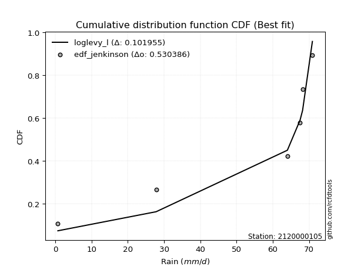</img></img>

</div>


### 11. EDF Cunnane (1978)

Cunnane´s work in statistical hydrology has focused on the performance and evaluation of different probability distributions (such as GEV, Gumbel, Lognormal) for flood frequency estimation. _b_ is a constant, typically set to 0.4.

<div align="center">


$P=(m-b)/(n+1-2b)$


</div>


**11.1. Empirical values**

<div align="center">

|                | 0                  | 1                   | 2                   | 3                  | 4                  | 5                  |
|:---------------|:-------------------|:--------------------|:--------------------|:-------------------|:-------------------|:-------------------|
| date           | 2023               | 2018                | 2020                | 2025               | 2024               | 2019               |
| x              | 0.7                | 27.8                | 64.0                | 67.5               | 68.2               | 70.9               |
| m              | 1                  | 2                   | 3                   | 4                  | 5                  | 6                  |
| empirical_dist | edf_cunnane        | edf_cunnane         | edf_cunnane         | edf_cunnane        | edf_cunnane        | edf_cunnane        |
| empirical      | 0.0967741935483871 | 0.25806451612903225 | 0.41935483870967744 | 0.5806451612903226 | 0.7419354838709676 | 0.9032258064516128 |
| empirical_tr   | 1.1071428571428572 | 1.3478260869565217  | 1.7222222222222225  | 2.384615384615385  | 3.8749999999999982 | 10.333333333333318 |

</div>


**11.2. Kolmogorov-Smirnov fit test (sorted by Δ)**


<div align="center">

|                | 0                   | 1                  | 2                  | 3                   | 4                   | 5                   | 6                   | 7                   | 8                   | 9                   | 10                 | 11                  | 12                 | 13                  | 14                  | 15                  | 16                 | 17                  | 18                  | 19                 | 20                  | 21                 | 22                  | 23                 | 24                 | 25                  | 26                 | 27                 | 28                 | 29                 | 30                  | 31                  | 32                 | 33                 | 34                  | 35                  | 36                  | 37                  | 38                 | 39                | 40                | 41                 | 42                 | 43                  | 44                 | 45               | 46                 | 47                  | 48                 | 49                 | 50                 | 51                 | 52                  | 53                 | 54                  | 55                 | 56                 | 57                 | 58                 | 59                 | 60                  | 61                 | 62                 | 63                 | 64                 | 65                 | 66                  | 67                  | 68                  | 69               | 70                 | 71                  | 72                  | 73                  | 74                  | 75                 | 76                | 77                  | 78                 | 79                 | 80                | 81                 | 82                 | 83                  | 84                 | 85                  | 86                 | 87                  | 88                  | 89                 | 90                 | 91                 | 92                  | 93                  | 94                  | 95                 | 96                | 97                  | 98                | 99                 | 100                | 101                | 102                 | 103                | 104               | 105                 | 106                | 107                | 108                 | 109                | 110                 | 111                | 112                 | 113                | 114                 | 115                 | 116                | 117                 | 118                | 119                | 120                | 121                | 122                 | 123                | 124                 | 125                | 126                | 127                | 128                | 129                | 130                | 131                | 132                | 133              | 134                | 135                | 136                | 137                | 138                | 139                 | 140                | 141                | 142                | 143                | 144                | 145                | 146                | 147                | 148                | 149               | 150                | 151                | 152                | 153                | 154                | 155                | 156                | 157                | 158                | 159                |
|:---------------|:--------------------|:-------------------|:-------------------|:--------------------|:--------------------|:--------------------|:--------------------|:--------------------|:--------------------|:--------------------|:-------------------|:--------------------|:-------------------|:--------------------|:--------------------|:--------------------|:-------------------|:--------------------|:--------------------|:-------------------|:--------------------|:-------------------|:--------------------|:-------------------|:-------------------|:--------------------|:-------------------|:-------------------|:-------------------|:-------------------|:--------------------|:--------------------|:-------------------|:-------------------|:--------------------|:--------------------|:--------------------|:--------------------|:-------------------|:------------------|:------------------|:-------------------|:-------------------|:--------------------|:-------------------|:-----------------|:-------------------|:--------------------|:-------------------|:-------------------|:-------------------|:-------------------|:--------------------|:-------------------|:--------------------|:-------------------|:-------------------|:-------------------|:-------------------|:-------------------|:--------------------|:-------------------|:-------------------|:-------------------|:-------------------|:-------------------|:--------------------|:--------------------|:--------------------|:-----------------|:-------------------|:--------------------|:--------------------|:--------------------|:--------------------|:-------------------|:------------------|:--------------------|:-------------------|:-------------------|:------------------|:-------------------|:-------------------|:--------------------|:-------------------|:--------------------|:-------------------|:--------------------|:--------------------|:-------------------|:-------------------|:-------------------|:--------------------|:--------------------|:--------------------|:-------------------|:------------------|:--------------------|:------------------|:-------------------|:-------------------|:-------------------|:--------------------|:-------------------|:------------------|:--------------------|:-------------------|:-------------------|:--------------------|:-------------------|:--------------------|:-------------------|:--------------------|:-------------------|:--------------------|:--------------------|:-------------------|:--------------------|:-------------------|:-------------------|:-------------------|:-------------------|:--------------------|:-------------------|:--------------------|:-------------------|:-------------------|:-------------------|:-------------------|:-------------------|:-------------------|:-------------------|:-------------------|:-----------------|:-------------------|:-------------------|:-------------------|:-------------------|:-------------------|:--------------------|:-------------------|:-------------------|:-------------------|:-------------------|:-------------------|:-------------------|:-------------------|:-------------------|:-------------------|:------------------|:-------------------|:-------------------|:-------------------|:-------------------|:-------------------|:-------------------|:-------------------|:-------------------|:-------------------|:-------------------|
| station        | 2120000105          | 2120000105         | 2120000105         | 2120000105          | 2120000105          | 2120000105          | 2120000105          | 2120000105          | 2120000105          | 2120000105          | 2120000105         | 2120000105          | 2120000105         | 2120000105          | 2120000105          | 2120000105          | 2120000105         | 2120000105          | 2120000105          | 2120000105         | 2120000105          | 2120000105         | 2120000105          | 2120000105         | 2120000105         | 2120000105          | 2120000105         | 2120000105         | 2120000105         | 2120000105         | 2120000105          | 2120000105          | 2120000105         | 2120000105         | 2120000105          | 2120000105          | 2120000105          | 2120000105          | 2120000105         | 2120000105        | 2120000105        | 2120000105         | 2120000105         | 2120000105          | 2120000105         | 2120000105       | 2120000105         | 2120000105          | 2120000105         | 2120000105         | 2120000105         | 2120000105         | 2120000105          | 2120000105         | 2120000105          | 2120000105         | 2120000105         | 2120000105         | 2120000105         | 2120000105         | 2120000105          | 2120000105         | 2120000105         | 2120000105         | 2120000105         | 2120000105         | 2120000105          | 2120000105          | 2120000105          | 2120000105       | 2120000105         | 2120000105          | 2120000105          | 2120000105          | 2120000105          | 2120000105         | 2120000105        | 2120000105          | 2120000105         | 2120000105         | 2120000105        | 2120000105         | 2120000105         | 2120000105          | 2120000105         | 2120000105          | 2120000105         | 2120000105          | 2120000105          | 2120000105         | 2120000105         | 2120000105         | 2120000105          | 2120000105          | 2120000105          | 2120000105         | 2120000105        | 2120000105          | 2120000105        | 2120000105         | 2120000105         | 2120000105         | 2120000105          | 2120000105         | 2120000105        | 2120000105          | 2120000105         | 2120000105         | 2120000105          | 2120000105         | 2120000105          | 2120000105         | 2120000105          | 2120000105         | 2120000105          | 2120000105          | 2120000105         | 2120000105          | 2120000105         | 2120000105         | 2120000105         | 2120000105         | 2120000105          | 2120000105         | 2120000105          | 2120000105         | 2120000105         | 2120000105         | 2120000105         | 2120000105         | 2120000105         | 2120000105         | 2120000105         | 2120000105       | 2120000105         | 2120000105         | 2120000105         | 2120000105         | 2120000105         | 2120000105          | 2120000105         | 2120000105         | 2120000105         | 2120000105         | 2120000105         | 2120000105         | 2120000105         | 2120000105         | 2120000105         | 2120000105        | 2120000105         | 2120000105         | 2120000105         | 2120000105         | 2120000105         | 2120000105         | 2120000105         | 2120000105         | 2120000105         | 2120000105         |
| empirical_dist | edf_cunnane         | edf_cunnane        | edf_cunnane        | edf_cunnane         | edf_cunnane         | edf_cunnane         | edf_cunnane         | edf_cunnane         | edf_cunnane         | edf_cunnane         | edf_cunnane        | edf_cunnane         | edf_cunnane        | edf_cunnane         | edf_cunnane         | edf_cunnane         | edf_cunnane        | edf_cunnane         | edf_cunnane         | edf_cunnane        | edf_cunnane         | edf_cunnane        | edf_cunnane         | edf_cunnane        | edf_cunnane        | edf_cunnane         | edf_cunnane        | edf_cunnane        | edf_cunnane        | edf_cunnane        | edf_cunnane         | edf_cunnane         | edf_cunnane        | edf_cunnane        | edf_cunnane         | edf_cunnane         | edf_cunnane         | edf_cunnane         | edf_cunnane        | edf_cunnane       | edf_cunnane       | edf_cunnane        | edf_cunnane        | edf_cunnane         | edf_cunnane        | edf_cunnane      | edf_cunnane        | edf_cunnane         | edf_cunnane        | edf_cunnane        | edf_cunnane        | edf_cunnane        | edf_cunnane         | edf_cunnane        | edf_cunnane         | edf_cunnane        | edf_cunnane        | edf_cunnane        | edf_cunnane        | edf_cunnane        | edf_cunnane         | edf_cunnane        | edf_cunnane        | edf_cunnane        | edf_cunnane        | edf_cunnane        | edf_cunnane         | edf_cunnane         | edf_cunnane         | edf_cunnane      | edf_cunnane        | edf_cunnane         | edf_cunnane         | edf_cunnane         | edf_cunnane         | edf_cunnane        | edf_cunnane       | edf_cunnane         | edf_cunnane        | edf_cunnane        | edf_cunnane       | edf_cunnane        | edf_cunnane        | edf_cunnane         | edf_cunnane        | edf_cunnane         | edf_cunnane        | edf_cunnane         | edf_cunnane         | edf_cunnane        | edf_cunnane        | edf_cunnane        | edf_cunnane         | edf_cunnane         | edf_cunnane         | edf_cunnane        | edf_cunnane       | edf_cunnane         | edf_cunnane       | edf_cunnane        | edf_cunnane        | edf_cunnane        | edf_cunnane         | edf_cunnane        | edf_cunnane       | edf_cunnane         | edf_cunnane        | edf_cunnane        | edf_cunnane         | edf_cunnane        | edf_cunnane         | edf_cunnane        | edf_cunnane         | edf_cunnane        | edf_cunnane         | edf_cunnane         | edf_cunnane        | edf_cunnane         | edf_cunnane        | edf_cunnane        | edf_cunnane        | edf_cunnane        | edf_cunnane         | edf_cunnane        | edf_cunnane         | edf_cunnane        | edf_cunnane        | edf_cunnane        | edf_cunnane        | edf_cunnane        | edf_cunnane        | edf_cunnane        | edf_cunnane        | edf_cunnane      | edf_cunnane        | edf_cunnane        | edf_cunnane        | edf_cunnane        | edf_cunnane        | edf_cunnane         | edf_cunnane        | edf_cunnane        | edf_cunnane        | edf_cunnane        | edf_cunnane        | edf_cunnane        | edf_cunnane        | edf_cunnane        | edf_cunnane        | edf_cunnane       | edf_cunnane        | edf_cunnane        | edf_cunnane        | edf_cunnane        | edf_cunnane        | edf_cunnane        | edf_cunnane        | edf_cunnane        | edf_cunnane        | edf_cunnane        |
| p_dist         | loglevy_l           | levy_l             | logjohnsonsb       | weibull_max         | vonmises_line       | logt                | beta                | genextreme          | logweibull_max      | arcsine             | trapezoid          | wrapcauchy          | dgamma             | logmielke           | logvonmises_line    | gennorm             | loggumbel_l        | logpearson3         | logtrapezoid        | gausshyper         | pearson3            | logsemicircular    | semicircular        | loganglit          | gumbel_l           | logwrapcauchy       | gompertz           | anglit             | dweibull           | logkappa3          | weibull_min         | ncf                 | logarcsine         | loginvgauss        | loggenextreme       | loggamma            | loggamma            | loginvgamma         | lognakagami        | logcrystalball    | lognorm           | logexponnorm       | logrice            | lognct              | logfatiguelife     | loggengamma      | logalpha           | invgauss            | f                  | argus              | invgamma           | gengamma           | norm                | crystalball        | exponnorm           | t                  | erlang             | mielke             | gamma              | betaprime          | rice                | burr12             | logexponweib       | logmaxwell         | halfgennorm        | lomax              | genpareto           | kstwobign           | foldnorm            | loglogistic      | lograyleigh        | maxwell             | logfoldnorm         | loginvweibull       | rayleigh            | genexpon           | loggompertz       | logistic            | loggennorm         | loghypsecant       | logkstwobign      | halfnorm           | hypsecant          | loghalfnorm         | cosine             | loggumbel_r         | loghalfgennorm     | logcosine           | loggenexpon         | gumbel_r           | loglaplace         | loglaplace         | halflogistic        | logmoyal            | laplace             | loghalflogistic    | moyal             | logburr             | logncf            | nct                | logerlang          | logdgamma          | logdweibull         | genhalflogistic    | loglomax          | loggenpareto        | logburr12          | kappa4             | wald                | logargus           | logloglaplace       | logwald            | ksone               | skewnorm           | triang              | loggausshyper       | logbeta            | nakagami            | logf               | exponweib          | truncweibull_min   | burr               | logbetaprime        | logloggamma        | kappa3              | uniform            | logksone           | logweibull_min     | bradford           | invweibull         | johnsonsu          | loggenhalflogistic | johnsonsb          | truncexpon       | logbradford        | logskewnorm        | logkappa4          | logtriang          | fatiguelife        | logtruncweibull_min | loguniform         | logtruncnorm       | logjohnsonsu       | logtruncexpon      | logtukeylambda     | powerlaw           | truncpareto        | logexponpow        | exponpow           | alpha             | logtruncpareto     | logpowerlaw        | truncnorm          | rdist              | tukeylambda        | genlogistic        | loggenlogistic     | logrdist           | logvonmises        | vonmises           |
| delta          | 0.10615214576568477 | 0.1149858406501717 | 0.1736039932638912 | 0.18559026425002628 | 0.19602529846016203 | 0.20595660565884644 | 0.20672537847476935 | 0.20974799931387894 | 0.21109181617470024 | 0.21286478927638564 | 0.2269546875457888 | 0.22764972146496598 | 0.2302191336567154 | 0.23304416868605815 | 0.23910128950748333 | 0.24193548387942598 | 0.2420833436506264 | 0.24311884850676946 | 0.24409055400607216 | 0.2444952576738318 | 0.24554220064814541 | 0.2459773856089048 | 0.24895950414567175 | 0.2521943855895283 | 0.2528741881300512 | 0.25328881040033724 | 0.2580645160532387 | 0.2595504991914965 | 0.2634554989315758 | 0.2673723794154078 | 0.26856726546525606 | 0.26936727724903436 | 0.2702905179874844 | 0.2735219890253357 | 0.27373207636834723 | 0.27543687095135033 | 0.27543687095135033 | 0.27581477521740777 | 0.2759875188486048 | 0.276409665225587 | 0.276409682234459 | 0.2764115957151286 | 0.2764305775595825 | 0.27649823689625813 | 0.2786117601031726 | 0.27952476856045 | 0.2805234593642714 | 0.28176890405278837 | 0.2832633398516325 | 0.2840841906067601 | 0.2843006585596341 | 0.2843570039003596 | 0.28440126280133043 | 0.2844012696185028 | 0.28440366863895045 | 0.2844182509925353 | 0.2845165010887431 | 0.2857468923348206 | 0.2859030655481188 | 0.2861833234679895 | 0.28678177231664576 | 0.2905151585252131 | 0.2922783100163662 | 0.2928365562483903 | 0.2936519084014689 | 0.2940685368641128 | 0.29439423111671564 | 0.29595436517676715 | 0.29694279730882017 | 0.29754430142713 | 0.2976483833287868 | 0.29985930407938893 | 0.30016068547199987 | 0.30235059156997524 | 0.30436860553590456 | 0.3049601995910412 | 0.305778755799854 | 0.30592563638769127 | 0.3072574731598181 | 0.3129087684662322 | 0.317997888472938 | 0.3181569569164228 | 0.3213690095794906 | 0.32142376579907006 | 0.3252170410570056 | 0.32811279313655345 | 0.3289928578398097 | 0.32953000408189165 | 0.33175073947821443 | 0.3344573883159199 | 0.3383475175774125 | 0.3383475175774125 | 0.34481545863025914 | 0.34486428194223323 | 0.34609431754954906 | 0.3466653992459322 | 0.350635982280098 | 0.35266760262271435 | 0.352845740374115 | 0.3615827865885545 | 0.3657820542534763 | 0.3690610316667019 | 0.37255473619771884 | 0.3787158717795864 | 0.382176430376877 | 0.38796061114567554 | 0.3913004683226393 | 0.3938731590051951 | 0.39829722029833564 | 0.3997161629394191 | 0.40364758880841944 | 0.4150519189409101 | 0.41540299604815717 | 0.4188595456363075 | 0.42455536021312507 | 0.43429205292686074 | 0.4381934094991701 | 0.44147780048161717 | 0.4486826529203759 | 0.4492195622986478 | 0.4593848663085153 | 0.4635489539727689 | 0.47509851067355235 | 0.4789367999888698 | 0.48234469841460653 | 0.4823545629997242 | 0.4896535640429056 | 0.4913132632250591 | 0.4938179563254556 | 0.4947994236760538 | 0.5009617056645896 | 0.512481248238849  | 0.5209790636359204 | 0.52211782883793 | 0.5337116721135426 | 0.5382114680676189 | 0.5453377695176818 | 0.5465890446276549 | 0.5502492971264568 | 0.5535357061461639  | 0.5584735369402847 | 0.5587374680284094 | 0.5846667566793056 | 0.5914937292760403 | 0.6071210758076118 | 0.6151739837108807 | 0.6559926300362531 | 0.6600954625389317 | 0.6811549693419566 | 0.690337688371054 | 0.7038352347898499 | 0.7078744279820394 | 0.7419354682574615 | 0.7419354834994585 | 0.7419354838709606 | 0.7419354838709676 | 0.7419354838709676 | 0.7419354838709677 | 1.0225887104179496 | 10.756420865050268 |
| deltao         | 0.530385761606      | 0.530385761606     | 0.530385761606     | 0.530385761606      | 0.530385761606      | 0.530385761606      | 0.530385761606      | 0.530385761606      | 0.530385761606      | 0.530385761606      | 0.530385761606     | 0.530385761606      | 0.530385761606     | 0.530385761606      | 0.530385761606      | 0.530385761606      | 0.530385761606     | 0.530385761606      | 0.530385761606      | 0.530385761606     | 0.530385761606      | 0.530385761606     | 0.530385761606      | 0.530385761606     | 0.530385761606     | 0.530385761606      | 0.530385761606     | 0.530385761606     | 0.530385761606     | 0.530385761606     | 0.530385761606      | 0.530385761606      | 0.530385761606     | 0.530385761606     | 0.530385761606      | 0.530385761606      | 0.530385761606      | 0.530385761606      | 0.530385761606     | 0.530385761606    | 0.530385761606    | 0.530385761606     | 0.530385761606     | 0.530385761606      | 0.530385761606     | 0.530385761606   | 0.530385761606     | 0.530385761606      | 0.530385761606     | 0.530385761606     | 0.530385761606     | 0.530385761606     | 0.530385761606      | 0.530385761606     | 0.530385761606      | 0.530385761606     | 0.530385761606     | 0.530385761606     | 0.530385761606     | 0.530385761606     | 0.530385761606      | 0.530385761606     | 0.530385761606     | 0.530385761606     | 0.530385761606     | 0.530385761606     | 0.530385761606      | 0.530385761606      | 0.530385761606      | 0.530385761606   | 0.530385761606     | 0.530385761606      | 0.530385761606      | 0.530385761606      | 0.530385761606      | 0.530385761606     | 0.530385761606    | 0.530385761606      | 0.530385761606     | 0.530385761606     | 0.530385761606    | 0.530385761606     | 0.530385761606     | 0.530385761606      | 0.530385761606     | 0.530385761606      | 0.530385761606     | 0.530385761606      | 0.530385761606      | 0.530385761606     | 0.530385761606     | 0.530385761606     | 0.530385761606      | 0.530385761606      | 0.530385761606      | 0.530385761606     | 0.530385761606    | 0.530385761606      | 0.530385761606    | 0.530385761606     | 0.530385761606     | 0.530385761606     | 0.530385761606      | 0.530385761606     | 0.530385761606    | 0.530385761606      | 0.530385761606     | 0.530385761606     | 0.530385761606      | 0.530385761606     | 0.530385761606      | 0.530385761606     | 0.530385761606      | 0.530385761606     | 0.530385761606      | 0.530385761606      | 0.530385761606     | 0.530385761606      | 0.530385761606     | 0.530385761606     | 0.530385761606     | 0.530385761606     | 0.530385761606      | 0.530385761606     | 0.530385761606      | 0.530385761606     | 0.530385761606     | 0.530385761606     | 0.530385761606     | 0.530385761606     | 0.530385761606     | 0.530385761606     | 0.530385761606     | 0.530385761606   | 0.530385761606     | 0.530385761606     | 0.530385761606     | 0.530385761606     | 0.530385761606     | 0.530385761606      | 0.530385761606     | 0.530385761606     | 0.530385761606     | 0.530385761606     | 0.530385761606     | 0.530385761606     | 0.530385761606     | 0.530385761606     | 0.530385761606     | 0.530385761606    | 0.530385761606     | 0.530385761606     | 0.530385761606     | 0.530385761606     | 0.530385761606     | 0.530385761606     | 0.530385761606     | 0.530385761606     | 0.530385761606     | 0.530385761606     |
| eval           | Δo > Δ              | Δo > Δ             | Δo > Δ             | Δo > Δ              | Δo > Δ              | Δo > Δ              | Δo > Δ              | Δo > Δ              | Δo > Δ              | Δo > Δ              | Δo > Δ             | Δo > Δ              | Δo > Δ             | Δo > Δ              | Δo > Δ              | Δo > Δ              | Δo > Δ             | Δo > Δ              | Δo > Δ              | Δo > Δ             | Δo > Δ              | Δo > Δ             | Δo > Δ              | Δo > Δ             | Δo > Δ             | Δo > Δ              | Δo > Δ             | Δo > Δ             | Δo > Δ             | Δo > Δ             | Δo > Δ              | Δo > Δ              | Δo > Δ             | Δo > Δ             | Δo > Δ              | Δo > Δ              | Δo > Δ              | Δo > Δ              | Δo > Δ             | Δo > Δ            | Δo > Δ            | Δo > Δ             | Δo > Δ             | Δo > Δ              | Δo > Δ             | Δo > Δ           | Δo > Δ             | Δo > Δ              | Δo > Δ             | Δo > Δ             | Δo > Δ             | Δo > Δ             | Δo > Δ              | Δo > Δ             | Δo > Δ              | Δo > Δ             | Δo > Δ             | Δo > Δ             | Δo > Δ             | Δo > Δ             | Δo > Δ              | Δo > Δ             | Δo > Δ             | Δo > Δ             | Δo > Δ             | Δo > Δ             | Δo > Δ              | Δo > Δ              | Δo > Δ              | Δo > Δ           | Δo > Δ             | Δo > Δ              | Δo > Δ              | Δo > Δ              | Δo > Δ              | Δo > Δ             | Δo > Δ            | Δo > Δ              | Δo > Δ             | Δo > Δ             | Δo > Δ            | Δo > Δ             | Δo > Δ             | Δo > Δ              | Δo > Δ             | Δo > Δ              | Δo > Δ             | Δo > Δ              | Δo > Δ              | Δo > Δ             | Δo > Δ             | Δo > Δ             | Δo > Δ              | Δo > Δ              | Δo > Δ              | Δo > Δ             | Δo > Δ            | Δo > Δ              | Δo > Δ            | Δo > Δ             | Δo > Δ             | Δo > Δ             | Δo > Δ              | Δo > Δ             | Δo > Δ            | Δo > Δ              | Δo > Δ             | Δo > Δ             | Δo > Δ              | Δo > Δ             | Δo > Δ              | Δo > Δ             | Δo > Δ              | Δo > Δ             | Δo > Δ              | Δo > Δ              | Δo > Δ             | Δo > Δ              | Δo > Δ             | Δo > Δ             | Δo > Δ             | Δo > Δ             | Δo > Δ              | Δo > Δ             | Δo > Δ              | Δo > Δ             | Δo > Δ             | Δo > Δ             | Δo > Δ             | Δo > Δ             | Δo > Δ             | Δo > Δ             | Δo > Δ             | Δo > Δ           | Δo <= Δ            | Δo <= Δ            | Δo <= Δ            | Δo <= Δ            | Δo <= Δ            | Δo <= Δ             | Δo <= Δ            | Δo <= Δ            | Δo <= Δ            | Δo <= Δ            | Δo <= Δ            | Δo <= Δ            | Δo <= Δ            | Δo <= Δ            | Δo <= Δ            | Δo <= Δ           | Δo <= Δ            | Δo <= Δ            | Δo <= Δ            | Δo <= Δ            | Δo <= Δ            | Δo <= Δ            | Δo <= Δ            | Δo <= Δ            | Δo <= Δ            | Δo <= Δ            |
| fit            | 1                   | 1                  | 1                  | 1                   | 1                   | 1                   | 1                   | 1                   | 1                   | 1                   | 1                  | 1                   | 1                  | 1                   | 1                   | 1                   | 1                  | 1                   | 1                   | 1                  | 1                   | 1                  | 1                   | 1                  | 1                  | 1                   | 1                  | 1                  | 1                  | 1                  | 1                   | 1                   | 1                  | 1                  | 1                   | 1                   | 1                   | 1                   | 1                  | 1                 | 1                 | 1                  | 1                  | 1                   | 1                  | 1                | 1                  | 1                   | 1                  | 1                  | 1                  | 1                  | 1                   | 1                  | 1                   | 1                  | 1                  | 1                  | 1                  | 1                  | 1                   | 1                  | 1                  | 1                  | 1                  | 1                  | 1                   | 1                   | 1                   | 1                | 1                  | 1                   | 1                   | 1                   | 1                   | 1                  | 1                 | 1                   | 1                  | 1                  | 1                 | 1                  | 1                  | 1                   | 1                  | 1                   | 1                  | 1                   | 1                   | 1                  | 1                  | 1                  | 1                   | 1                   | 1                   | 1                  | 1                 | 1                   | 1                 | 1                  | 1                  | 1                  | 1                   | 1                  | 1                 | 1                   | 1                  | 1                  | 1                   | 1                  | 1                   | 1                  | 1                   | 1                  | 1                   | 1                   | 1                  | 1                   | 1                  | 1                  | 1                  | 1                  | 1                   | 1                  | 1                   | 1                  | 1                  | 1                  | 1                  | 1                  | 1                  | 1                  | 1                  | 1                | 0                  | 0                  | 0                  | 0                  | 0                  | 0                   | 0                  | 0                  | 0                  | 0                  | 0                  | 0                  | 0                  | 0                  | 0                  | 0                 | 0                  | 0                  | 0                  | 0                  | 0                  | 0                  | 0                  | 0                  | 0                  | 0                  |
| n              | 6                   | 6                  | 6                  | 6                   | 6                   | 6                   | 6                   | 6                   | 6                   | 6                   | 6                  | 6                   | 6                  | 6                   | 6                   | 6                   | 6                  | 6                   | 6                   | 6                  | 6                   | 6                  | 6                   | 6                  | 6                  | 6                   | 6                  | 6                  | 6                  | 6                  | 6                   | 6                   | 6                  | 6                  | 6                   | 6                   | 6                   | 6                   | 6                  | 6                 | 6                 | 6                  | 6                  | 6                   | 6                  | 6                | 6                  | 6                   | 6                  | 6                  | 6                  | 6                  | 6                   | 6                  | 6                   | 6                  | 6                  | 6                  | 6                  | 6                  | 6                   | 6                  | 6                  | 6                  | 6                  | 6                  | 6                   | 6                   | 6                   | 6                | 6                  | 6                   | 6                   | 6                   | 6                   | 6                  | 6                 | 6                   | 6                  | 6                  | 6                 | 6                  | 6                  | 6                   | 6                  | 6                   | 6                  | 6                   | 6                   | 6                  | 6                  | 6                  | 6                   | 6                   | 6                   | 6                  | 6                 | 6                   | 6                 | 6                  | 6                  | 6                  | 6                   | 6                  | 6                 | 6                   | 6                  | 6                  | 6                   | 6                  | 6                   | 6                  | 6                   | 6                  | 6                   | 6                   | 6                  | 6                   | 6                  | 6                  | 6                  | 6                  | 6                   | 6                  | 6                   | 6                  | 6                  | 6                  | 6                  | 6                  | 6                  | 6                  | 6                  | 6                | 6                  | 6                  | 6                  | 6                  | 6                  | 6                   | 6                  | 6                  | 6                  | 6                  | 6                  | 6                  | 6                  | 6                  | 6                  | 6                 | 6                  | 6                  | 6                  | 6                  | 6                  | 6                  | 6                  | 6                  | 6                  | 6                  |
| best_fit       | 1                   | 0                  | 0                  | 0                   | 0                   | 0                   | 0                   | 0                   | 0                   | 0                   | 0                  | 0                   | 0                  | 0                   | 0                   | 0                   | 0                  | 0                   | 0                   | 0                  | 0                   | 0                  | 0                   | 0                  | 0                  | 0                   | 0                  | 0                  | 0                  | 0                  | 0                   | 0                   | 0                  | 0                  | 0                   | 0                   | 0                   | 0                   | 0                  | 0                 | 0                 | 0                  | 0                  | 0                   | 0                  | 0                | 0                  | 0                   | 0                  | 0                  | 0                  | 0                  | 0                   | 0                  | 0                   | 0                  | 0                  | 0                  | 0                  | 0                  | 0                   | 0                  | 0                  | 0                  | 0                  | 0                  | 0                   | 0                   | 0                   | 0                | 0                  | 0                   | 0                   | 0                   | 0                   | 0                  | 0                 | 0                   | 0                  | 0                  | 0                 | 0                  | 0                  | 0                   | 0                  | 0                   | 0                  | 0                   | 0                   | 0                  | 0                  | 0                  | 0                   | 0                   | 0                   | 0                  | 0                 | 0                   | 0                 | 0                  | 0                  | 0                  | 0                   | 0                  | 0                 | 0                   | 0                  | 0                  | 0                   | 0                  | 0                   | 0                  | 0                   | 0                  | 0                   | 0                   | 0                  | 0                   | 0                  | 0                  | 0                  | 0                  | 0                   | 0                  | 0                   | 0                  | 0                  | 0                  | 0                  | 0                  | 0                  | 0                  | 0                  | 0                | 0                  | 0                  | 0                  | 0                  | 0                  | 0                   | 0                  | 0                  | 0                  | 0                  | 0                  | 0                  | 0                  | 0                  | 0                  | 0                 | 0                  | 0                  | 0                  | 0                  | 0                  | 0                  | 0                  | 0                  | 0                  | 0                  |
| best_fit_sort  | 1                   | 2                  | 3                  | 4                   | 5                   | 6                   | 7                   | 8                   | 9                   | 10                  | 11                 | 12                  | 13                 | 14                  | 15                  | 16                  | 17                 | 18                  | 19                  | 20                 | 21                  | 22                 | 23                  | 24                 | 25                 | 26                  | 27                 | 28                 | 29                 | 30                 | 31                  | 32                  | 33                 | 34                 | 35                  | 36                  | 37                  | 38                  | 39                 | 40                | 41                | 42                 | 43                 | 44                  | 45                 | 46               | 47                 | 48                  | 49                 | 50                 | 51                 | 52                 | 53                  | 54                 | 55                  | 56                 | 57                 | 58                 | 59                 | 60                 | 61                  | 62                 | 63                 | 64                 | 65                 | 66                 | 67                  | 68                  | 69                  | 70               | 71                 | 72                  | 73                  | 74                  | 75                  | 76                 | 77                | 78                  | 79                 | 80                 | 81                | 82                 | 83                 | 84                  | 85                 | 86                  | 87                 | 88                  | 89                  | 90                 | 91                 | 92                 | 93                  | 94                  | 95                  | 96                 | 97                | 98                  | 99                | 100                | 101                | 102                | 103                 | 104                | 105               | 106                 | 107                | 108                | 109                 | 110                | 111                 | 112                | 113                 | 114                | 115                 | 116                 | 117                | 118                 | 119                | 120                | 121                | 122                | 123                 | 124                | 125                 | 126                | 127                | 128                | 129                | 130                | 131                | 132                | 133                | 134              | 135                | 136                | 137                | 138                | 139                | 140                 | 141                | 142                | 143                | 144                | 145                | 146                | 147                | 148                | 149                | 150               | 151                | 152                | 153                | 154                | 155                | 156                | 157                | 158                | 159                | 160                |

</div>


**11.3. Best fit**

<div align="center">

|   id |    station | empirical_dist   | p_dist    |    delta |   deltao | eval   |   fit |   n |   best_fit |   best_fit_sort |
|-----:|-----------:|:-----------------|:----------|---------:|---------:|:-------|------:|----:|-----------:|----------------:|
|    0 | 2120000105 | edf_cunnane      | loglevy_l | 0.106152 | 0.530386 | Δo > Δ |     1 |   6 |          1 |               1 |

</div>


<div align="center">

</img>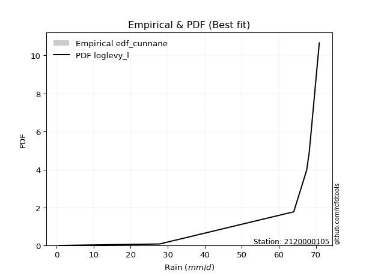</img>

</div>


### 12. EDF Adamowski (1981)

The Adamowski formula in hydrology refers to a specific plotting position formula used for estimating the non-parametric empirical distribution of hydrological events (like flood peaks) to calculate their return periods. This formula provides an alternative to traditional parametric methods (like the Gumbel or Log Pearson Type III distributions). 

<div align="center">


$P=(m-0.25)/(n+0.5)$


</div>


**12.1. Empirical values**

<div align="center">

|                | 0                   | 1                  | 2                  | 3                  | 4                  | 5                  |
|:---------------|:--------------------|:-------------------|:-------------------|:-------------------|:-------------------|:-------------------|
| date           | 2023                | 2018               | 2020               | 2025               | 2024               | 2019               |
| x              | 0.7                 | 27.8               | 64.0               | 67.5               | 68.2               | 70.9               |
| m              | 1                   | 2                  | 3                  | 4                  | 5                  | 6                  |
| empirical_dist | edf_adamowski       | edf_adamowski      | edf_adamowski      | edf_adamowski      | edf_adamowski      | edf_adamowski      |
| empirical      | 0.11538461538461539 | 0.2692307692307692 | 0.4230769230769231 | 0.5769230769230769 | 0.7307692307692307 | 0.8846153846153846 |
| empirical_tr   | 1.1304347826086958  | 1.3684210526315788 | 1.7333333333333334 | 2.3636363636363633 | 3.7142857142857135 | 8.666666666666664  |

</div>


**12.2. Kolmogorov-Smirnov fit test (sorted by Δ)**


<div align="center">

|                | 0                   | 1                   | 2                   | 3                   | 4                   | 5                   | 6                   | 7                  | 8                  | 9                   | 10                  | 11                  | 12                  | 13                  | 14                  | 15                  | 16                  | 17                 | 18                  | 19                  | 20                  | 21                  | 22                  | 23                  | 24                 | 25                  | 26                  | 27                 | 28                 | 29                  | 30                 | 31                 | 32                 | 33                  | 34                 | 35                 | 36                 | 37                  | 38                  | 39                 | 40                  | 41                  | 42                  | 43                 | 44                | 45                  | 46                 | 47                  | 48                  | 49                  | 50                  | 51                | 52                 | 53                 | 54                 | 55                 | 56                  | 57                  | 58                  | 59                 | 60                 | 61                  | 62                 | 63                 | 64                  | 65                  | 66                  | 67               | 68                  | 69                 | 70                  | 71                  | 72                  | 73                 | 74                  | 75                 | 76                  | 77                  | 78                  | 79                | 80                 | 81                 | 82                 | 83                  | 84                 | 85                  | 86                  | 87                 | 88                | 89                 | 90                  | 91                  | 92                  | 93                 | 94                 | 95                 | 96                | 97                 | 98                 | 99                 | 100                | 101                 | 102                 | 103              | 104                 | 105                 | 106                | 107                 | 108                | 109              | 110                 | 111                | 112                 | 113                 | 114                 | 115                 | 116                | 117                 | 118                 | 119                | 120                | 121                 | 122                | 123                 | 124                | 125                 | 126                | 127                 | 128                | 129                | 130                 | 131                | 132                | 133                | 134               | 135                | 136                | 137                | 138                | 139                 | 140               | 141                | 142                | 143                | 144                | 145                | 146                | 147                | 148                | 149               | 150                | 151                | 152                | 153                | 154                | 155                | 156                | 157                | 158               | 159                |
|:---------------|:--------------------|:--------------------|:--------------------|:--------------------|:--------------------|:--------------------|:--------------------|:-------------------|:-------------------|:--------------------|:--------------------|:--------------------|:--------------------|:--------------------|:--------------------|:--------------------|:--------------------|:-------------------|:--------------------|:--------------------|:--------------------|:--------------------|:--------------------|:--------------------|:-------------------|:--------------------|:--------------------|:-------------------|:-------------------|:--------------------|:-------------------|:-------------------|:-------------------|:--------------------|:-------------------|:-------------------|:-------------------|:--------------------|:--------------------|:-------------------|:--------------------|:--------------------|:--------------------|:-------------------|:------------------|:--------------------|:-------------------|:--------------------|:--------------------|:--------------------|:--------------------|:------------------|:-------------------|:-------------------|:-------------------|:-------------------|:--------------------|:--------------------|:--------------------|:-------------------|:-------------------|:--------------------|:-------------------|:-------------------|:--------------------|:--------------------|:--------------------|:-----------------|:--------------------|:-------------------|:--------------------|:--------------------|:--------------------|:-------------------|:--------------------|:-------------------|:--------------------|:--------------------|:--------------------|:------------------|:-------------------|:-------------------|:-------------------|:--------------------|:-------------------|:--------------------|:--------------------|:-------------------|:------------------|:-------------------|:--------------------|:--------------------|:--------------------|:-------------------|:-------------------|:-------------------|:------------------|:-------------------|:-------------------|:-------------------|:-------------------|:--------------------|:--------------------|:-----------------|:--------------------|:--------------------|:-------------------|:--------------------|:-------------------|:-----------------|:--------------------|:-------------------|:--------------------|:--------------------|:--------------------|:--------------------|:-------------------|:--------------------|:--------------------|:-------------------|:-------------------|:--------------------|:-------------------|:--------------------|:-------------------|:--------------------|:-------------------|:--------------------|:-------------------|:-------------------|:--------------------|:-------------------|:-------------------|:-------------------|:------------------|:-------------------|:-------------------|:-------------------|:-------------------|:--------------------|:------------------|:-------------------|:-------------------|:-------------------|:-------------------|:-------------------|:-------------------|:-------------------|:-------------------|:------------------|:-------------------|:-------------------|:-------------------|:-------------------|:-------------------|:-------------------|:-------------------|:-------------------|:------------------|:-------------------|
| station        | 2120000105          | 2120000105          | 2120000105          | 2120000105          | 2120000105          | 2120000105          | 2120000105          | 2120000105         | 2120000105         | 2120000105          | 2120000105          | 2120000105          | 2120000105          | 2120000105          | 2120000105          | 2120000105          | 2120000105          | 2120000105         | 2120000105          | 2120000105          | 2120000105          | 2120000105          | 2120000105          | 2120000105          | 2120000105         | 2120000105          | 2120000105          | 2120000105         | 2120000105         | 2120000105          | 2120000105         | 2120000105         | 2120000105         | 2120000105          | 2120000105         | 2120000105         | 2120000105         | 2120000105          | 2120000105          | 2120000105         | 2120000105          | 2120000105          | 2120000105          | 2120000105         | 2120000105        | 2120000105          | 2120000105         | 2120000105          | 2120000105          | 2120000105          | 2120000105          | 2120000105        | 2120000105         | 2120000105         | 2120000105         | 2120000105         | 2120000105          | 2120000105          | 2120000105          | 2120000105         | 2120000105         | 2120000105          | 2120000105         | 2120000105         | 2120000105          | 2120000105          | 2120000105          | 2120000105       | 2120000105          | 2120000105         | 2120000105          | 2120000105          | 2120000105          | 2120000105         | 2120000105          | 2120000105         | 2120000105          | 2120000105          | 2120000105          | 2120000105        | 2120000105         | 2120000105         | 2120000105         | 2120000105          | 2120000105         | 2120000105          | 2120000105          | 2120000105         | 2120000105        | 2120000105         | 2120000105          | 2120000105          | 2120000105          | 2120000105         | 2120000105         | 2120000105         | 2120000105        | 2120000105         | 2120000105         | 2120000105         | 2120000105         | 2120000105          | 2120000105          | 2120000105       | 2120000105          | 2120000105          | 2120000105         | 2120000105          | 2120000105         | 2120000105       | 2120000105          | 2120000105         | 2120000105          | 2120000105          | 2120000105          | 2120000105          | 2120000105         | 2120000105          | 2120000105          | 2120000105         | 2120000105         | 2120000105          | 2120000105         | 2120000105          | 2120000105         | 2120000105          | 2120000105         | 2120000105          | 2120000105         | 2120000105         | 2120000105          | 2120000105         | 2120000105         | 2120000105         | 2120000105        | 2120000105         | 2120000105         | 2120000105         | 2120000105         | 2120000105          | 2120000105        | 2120000105         | 2120000105         | 2120000105         | 2120000105         | 2120000105         | 2120000105         | 2120000105         | 2120000105         | 2120000105        | 2120000105         | 2120000105         | 2120000105         | 2120000105         | 2120000105         | 2120000105         | 2120000105         | 2120000105         | 2120000105        | 2120000105         |
| empirical_dist | edf_adamowski       | edf_adamowski       | edf_adamowski       | edf_adamowski       | edf_adamowski       | edf_adamowski       | edf_adamowski       | edf_adamowski      | edf_adamowski      | edf_adamowski       | edf_adamowski       | edf_adamowski       | edf_adamowski       | edf_adamowski       | edf_adamowski       | edf_adamowski       | edf_adamowski       | edf_adamowski      | edf_adamowski       | edf_adamowski       | edf_adamowski       | edf_adamowski       | edf_adamowski       | edf_adamowski       | edf_adamowski      | edf_adamowski       | edf_adamowski       | edf_adamowski      | edf_adamowski      | edf_adamowski       | edf_adamowski      | edf_adamowski      | edf_adamowski      | edf_adamowski       | edf_adamowski      | edf_adamowski      | edf_adamowski      | edf_adamowski       | edf_adamowski       | edf_adamowski      | edf_adamowski       | edf_adamowski       | edf_adamowski       | edf_adamowski      | edf_adamowski     | edf_adamowski       | edf_adamowski      | edf_adamowski       | edf_adamowski       | edf_adamowski       | edf_adamowski       | edf_adamowski     | edf_adamowski      | edf_adamowski      | edf_adamowski      | edf_adamowski      | edf_adamowski       | edf_adamowski       | edf_adamowski       | edf_adamowski      | edf_adamowski      | edf_adamowski       | edf_adamowski      | edf_adamowski      | edf_adamowski       | edf_adamowski       | edf_adamowski       | edf_adamowski    | edf_adamowski       | edf_adamowski      | edf_adamowski       | edf_adamowski       | edf_adamowski       | edf_adamowski      | edf_adamowski       | edf_adamowski      | edf_adamowski       | edf_adamowski       | edf_adamowski       | edf_adamowski     | edf_adamowski      | edf_adamowski      | edf_adamowski      | edf_adamowski       | edf_adamowski      | edf_adamowski       | edf_adamowski       | edf_adamowski      | edf_adamowski     | edf_adamowski      | edf_adamowski       | edf_adamowski       | edf_adamowski       | edf_adamowski      | edf_adamowski      | edf_adamowski      | edf_adamowski     | edf_adamowski      | edf_adamowski      | edf_adamowski      | edf_adamowski      | edf_adamowski       | edf_adamowski       | edf_adamowski    | edf_adamowski       | edf_adamowski       | edf_adamowski      | edf_adamowski       | edf_adamowski      | edf_adamowski    | edf_adamowski       | edf_adamowski      | edf_adamowski       | edf_adamowski       | edf_adamowski       | edf_adamowski       | edf_adamowski      | edf_adamowski       | edf_adamowski       | edf_adamowski      | edf_adamowski      | edf_adamowski       | edf_adamowski      | edf_adamowski       | edf_adamowski      | edf_adamowski       | edf_adamowski      | edf_adamowski       | edf_adamowski      | edf_adamowski      | edf_adamowski       | edf_adamowski      | edf_adamowski      | edf_adamowski      | edf_adamowski     | edf_adamowski      | edf_adamowski      | edf_adamowski      | edf_adamowski      | edf_adamowski       | edf_adamowski     | edf_adamowski      | edf_adamowski      | edf_adamowski      | edf_adamowski      | edf_adamowski      | edf_adamowski      | edf_adamowski      | edf_adamowski      | edf_adamowski     | edf_adamowski      | edf_adamowski      | edf_adamowski      | edf_adamowski      | edf_adamowski      | edf_adamowski      | edf_adamowski      | edf_adamowski      | edf_adamowski     | edf_adamowski      |
| p_dist         | levy_l              | loglevy_l           | logjohnsonsb        | vonmises_line       | weibull_max         | beta                | arcsine             | genextreme         | logweibull_max     | logt                | wrapcauchy          | logmielke           | logvonmises_line    | trapezoid           | logpearson3         | logtrapezoid        | gennorm             | logsemicircular    | loggumbel_l         | gausshyper          | dgamma              | pearson3            | logwrapcauchy       | dweibull            | semicircular       | loganglit           | gumbel_l            | logarcsine         | logkappa3          | anglit              | weibull_min        | ncf                | gompertz           | loginvgauss         | loggenextreme      | loggamma           | loggamma           | loginvgamma         | lognakagami         | logcrystalball     | lognorm             | logexponnorm        | logrice             | lognct             | logfatiguelife    | loggengamma         | logalpha           | invgauss            | f                   | argus               | invgamma            | gengamma          | norm               | crystalball        | exponnorm          | t                  | erlang              | mielke              | gamma               | betaprime          | rice               | burr12              | logexponweib       | loggennorm         | logmaxwell          | halfgennorm         | lomax               | genpareto        | loginvweibull       | kstwobign          | foldnorm            | loglogistic         | lograyleigh         | maxwell            | logfoldnorm         | rayleigh           | genexpon            | loggompertz         | logistic            | logkstwobign      | loghypsecant       | loghalfnorm        | halfnorm           | hypsecant           | loghalfgennorm     | loggenexpon         | cosine              | loggumbel_r        | logcosine         | gumbel_r           | loglaplace          | loglaplace          | loghalflogistic     | halflogistic       | logmoyal           | logburr            | logncf            | laplace            | moyal              | nct                | logdgamma          | logdweibull         | logerlang           | loglomax         | genhalflogistic     | logburr12           | loggenpareto       | kappa4              | logloglaplace      | wald             | logargus            | logwald            | ksone               | skewnorm            | triang              | logbeta             | loggausshyper      | logf                | nakagami            | exponweib          | truncweibull_min   | burr                | logbetaprime       | logloggamma         | invweibull         | logksone            | kappa3             | uniform             | logweibull_min     | johnsonsu          | bradford            | loggenhalflogistic | johnsonsb          | truncexpon         | logbradford       | logskewnorm        | fatiguelife        | logkappa4          | logtriang          | logtruncweibull_min | loguniform        | logtruncnorm       | logjohnsonsu       | logtruncexpon      | logtukeylambda     | powerlaw           | truncpareto        | logexponpow        | exponpow           | alpha             | logtruncpareto     | logpowerlaw        | truncnorm          | rdist              | tukeylambda        | genlogistic        | loggenlogistic     | logrdist           | logvonmises       | vonmises           |
| delta          | 0.10381958754843479 | 0.10629517325132959 | 0.16534116253889636 | 0.17741487662393385 | 0.18186817988278065 | 0.19555912537303244 | 0.20047200184113184 | 0.2060259149466333 | 0.2073697318074546 | 0.20967869002609207 | 0.21648346836322901 | 0.21725120023202454 | 0.22049086767125514 | 0.22323260317854315 | 0.22450842667054127 | 0.22548013216984397 | 0.23076923077768907 | 0.2381794621805356 | 0.23836125928338076 | 0.24077317330658615 | 0.24138538675845236 | 0.24182011628089978 | 0.24212255729860027 | 0.24484507709534764 | 0.2452374197784261 | 0.24847230122228264 | 0.24915210376280555 | 0.2516800961512562 | 0.2554639184805461 | 0.25582841482425084 | 0.2648451810980104 | 0.2656451928817887 | 0.2692307691549757 | 0.26979990465809006 | 0.2700099920011016 | 0.2717147865841047 | 0.2717147865841047 | 0.27209269085016213 | 0.27226543448135915 | 0.2726875808583414 | 0.27268759786721336 | 0.27268951134788294 | 0.27270849319233686 | 0.2727761525290125 | 0.274889675735927 | 0.27580268419320436 | 0.2768013749970258 | 0.27804681968554273 | 0.27954125548438685 | 0.28036210623951446 | 0.28057857419238846 | 0.280634919533114 | 0.2806791784340848 | 0.2806791852512572 | 0.2806815842717048 | 0.2806961666252897 | 0.28079441672149746 | 0.28202480796757495 | 0.28218098118087315 | 0.2824612391007439 | 0.2830596879494001 | 0.28679307415796745 | 0.2885562256491206 | 0.2886470513235899 | 0.28911447188114464 | 0.28992982403422324 | 0.29034645249686714 | 0.29067214674947 | 0.29118433846823827 | 0.2922322808095215 | 0.29322071294157454 | 0.29382221705988437 | 0.29392629896154115 | 0.2961372197121433 | 0.29643860110475423 | 0.3006465211686589 | 0.30123811522379557 | 0.30205667143260834 | 0.30220355202044563 | 0.306831635371201 | 0.3091866840989866 | 0.3102575126973331 | 0.3144348725491772 | 0.31764692521224497 | 0.3178266047380727 | 0.32058448637647746 | 0.32149495668975997 | 0.3243907087693078 | 0.325807919714646 | 0.3307353039486743 | 0.33462543321016686 | 0.33462543321016686 | 0.33549914614419524 | 0.3410933742630135 | 0.3411421975749876 | 0.3415013495209774 | 0.341679487272378 | 0.3423722331823034 | 0.3469138979128524 | 0.3504165334868175 | 0.3504506098304737 | 0.35394431436149065 | 0.35461580115173935 | 0.37101017727514 | 0.37499378741234074 | 0.38013421522090235 | 0.3842385267784299 | 0.39015107463794946 | 0.3924813357066825 | 0.39457513593109 | 0.39599407857217345 | 0.4038856658391731 | 0.41168091168091153 | 0.41513746126906187 | 0.42083327584587943 | 0.42702715639743316 | 0.4305699685596151 | 0.43751639981863893 | 0.43775571611437153 | 0.4380533091969108 | 0.4556627819412697 | 0.45982686960552327 | 0.4639322575718154 | 0.47521471562162415 | 0.4761890018398256 | 0.47848731094116864 | 0.4786226140473609 | 0.47863247863247854 | 0.4801470101233221 | 0.4897954525628527 | 0.49009587195820997 | 0.5087591638716034 | 0.5098128105341835 | 0.5183957444706844 | 0.529989587746297 | 0.5344893837003732 | 0.5390830440247198 | 0.5416156851504361 | 0.5428669602604093 | 0.5498136217789182  | 0.554751452573039 | 0.5550153836611638 | 0.5735005035775687 | 0.5803274761743034 | 0.5959548227058749 | 0.6040077306091438 | 0.6448263769345162 | 0.6489292094371948 | 0.6699887162402196 | 0.679171435269317 | 0.6926689816881129 | 0.6967081748803023 | 0.7307692151557246 | 0.7307692303977216 | 0.7307692307692237 | 0.7307692307692307 | 0.7307692307692307 | 0.7307692307692308 | 1.018866626050704 | 10.775031286886495 |
| deltao         | 0.530385761606      | 0.530385761606      | 0.530385761606      | 0.530385761606      | 0.530385761606      | 0.530385761606      | 0.530385761606      | 0.530385761606     | 0.530385761606     | 0.530385761606      | 0.530385761606      | 0.530385761606      | 0.530385761606      | 0.530385761606      | 0.530385761606      | 0.530385761606      | 0.530385761606      | 0.530385761606     | 0.530385761606      | 0.530385761606      | 0.530385761606      | 0.530385761606      | 0.530385761606      | 0.530385761606      | 0.530385761606     | 0.530385761606      | 0.530385761606      | 0.530385761606     | 0.530385761606     | 0.530385761606      | 0.530385761606     | 0.530385761606     | 0.530385761606     | 0.530385761606      | 0.530385761606     | 0.530385761606     | 0.530385761606     | 0.530385761606      | 0.530385761606      | 0.530385761606     | 0.530385761606      | 0.530385761606      | 0.530385761606      | 0.530385761606     | 0.530385761606    | 0.530385761606      | 0.530385761606     | 0.530385761606      | 0.530385761606      | 0.530385761606      | 0.530385761606      | 0.530385761606    | 0.530385761606     | 0.530385761606     | 0.530385761606     | 0.530385761606     | 0.530385761606      | 0.530385761606      | 0.530385761606      | 0.530385761606     | 0.530385761606     | 0.530385761606      | 0.530385761606     | 0.530385761606     | 0.530385761606      | 0.530385761606      | 0.530385761606      | 0.530385761606   | 0.530385761606      | 0.530385761606     | 0.530385761606      | 0.530385761606      | 0.530385761606      | 0.530385761606     | 0.530385761606      | 0.530385761606     | 0.530385761606      | 0.530385761606      | 0.530385761606      | 0.530385761606    | 0.530385761606     | 0.530385761606     | 0.530385761606     | 0.530385761606      | 0.530385761606     | 0.530385761606      | 0.530385761606      | 0.530385761606     | 0.530385761606    | 0.530385761606     | 0.530385761606      | 0.530385761606      | 0.530385761606      | 0.530385761606     | 0.530385761606     | 0.530385761606     | 0.530385761606    | 0.530385761606     | 0.530385761606     | 0.530385761606     | 0.530385761606     | 0.530385761606      | 0.530385761606      | 0.530385761606   | 0.530385761606      | 0.530385761606      | 0.530385761606     | 0.530385761606      | 0.530385761606     | 0.530385761606   | 0.530385761606      | 0.530385761606     | 0.530385761606      | 0.530385761606      | 0.530385761606      | 0.530385761606      | 0.530385761606     | 0.530385761606      | 0.530385761606      | 0.530385761606     | 0.530385761606     | 0.530385761606      | 0.530385761606     | 0.530385761606      | 0.530385761606     | 0.530385761606      | 0.530385761606     | 0.530385761606      | 0.530385761606     | 0.530385761606     | 0.530385761606      | 0.530385761606     | 0.530385761606     | 0.530385761606     | 0.530385761606    | 0.530385761606     | 0.530385761606     | 0.530385761606     | 0.530385761606     | 0.530385761606      | 0.530385761606    | 0.530385761606     | 0.530385761606     | 0.530385761606     | 0.530385761606     | 0.530385761606     | 0.530385761606     | 0.530385761606     | 0.530385761606     | 0.530385761606    | 0.530385761606     | 0.530385761606     | 0.530385761606     | 0.530385761606     | 0.530385761606     | 0.530385761606     | 0.530385761606     | 0.530385761606     | 0.530385761606    | 0.530385761606     |
| eval           | Δo > Δ              | Δo > Δ              | Δo > Δ              | Δo > Δ              | Δo > Δ              | Δo > Δ              | Δo > Δ              | Δo > Δ             | Δo > Δ             | Δo > Δ              | Δo > Δ              | Δo > Δ              | Δo > Δ              | Δo > Δ              | Δo > Δ              | Δo > Δ              | Δo > Δ              | Δo > Δ             | Δo > Δ              | Δo > Δ              | Δo > Δ              | Δo > Δ              | Δo > Δ              | Δo > Δ              | Δo > Δ             | Δo > Δ              | Δo > Δ              | Δo > Δ             | Δo > Δ             | Δo > Δ              | Δo > Δ             | Δo > Δ             | Δo > Δ             | Δo > Δ              | Δo > Δ             | Δo > Δ             | Δo > Δ             | Δo > Δ              | Δo > Δ              | Δo > Δ             | Δo > Δ              | Δo > Δ              | Δo > Δ              | Δo > Δ             | Δo > Δ            | Δo > Δ              | Δo > Δ             | Δo > Δ              | Δo > Δ              | Δo > Δ              | Δo > Δ              | Δo > Δ            | Δo > Δ             | Δo > Δ             | Δo > Δ             | Δo > Δ             | Δo > Δ              | Δo > Δ              | Δo > Δ              | Δo > Δ             | Δo > Δ             | Δo > Δ              | Δo > Δ             | Δo > Δ             | Δo > Δ              | Δo > Δ              | Δo > Δ              | Δo > Δ           | Δo > Δ              | Δo > Δ             | Δo > Δ              | Δo > Δ              | Δo > Δ              | Δo > Δ             | Δo > Δ              | Δo > Δ             | Δo > Δ              | Δo > Δ              | Δo > Δ              | Δo > Δ            | Δo > Δ             | Δo > Δ             | Δo > Δ             | Δo > Δ              | Δo > Δ             | Δo > Δ              | Δo > Δ              | Δo > Δ             | Δo > Δ            | Δo > Δ             | Δo > Δ              | Δo > Δ              | Δo > Δ              | Δo > Δ             | Δo > Δ             | Δo > Δ             | Δo > Δ            | Δo > Δ             | Δo > Δ             | Δo > Δ             | Δo > Δ             | Δo > Δ              | Δo > Δ              | Δo > Δ           | Δo > Δ              | Δo > Δ              | Δo > Δ             | Δo > Δ              | Δo > Δ             | Δo > Δ           | Δo > Δ              | Δo > Δ             | Δo > Δ              | Δo > Δ              | Δo > Δ              | Δo > Δ              | Δo > Δ             | Δo > Δ              | Δo > Δ              | Δo > Δ             | Δo > Δ             | Δo > Δ              | Δo > Δ             | Δo > Δ              | Δo > Δ             | Δo > Δ              | Δo > Δ             | Δo > Δ              | Δo > Δ             | Δo > Δ             | Δo > Δ              | Δo > Δ             | Δo > Δ             | Δo > Δ             | Δo > Δ            | Δo <= Δ            | Δo <= Δ            | Δo <= Δ            | Δo <= Δ            | Δo <= Δ             | Δo <= Δ           | Δo <= Δ            | Δo <= Δ            | Δo <= Δ            | Δo <= Δ            | Δo <= Δ            | Δo <= Δ            | Δo <= Δ            | Δo <= Δ            | Δo <= Δ           | Δo <= Δ            | Δo <= Δ            | Δo <= Δ            | Δo <= Δ            | Δo <= Δ            | Δo <= Δ            | Δo <= Δ            | Δo <= Δ            | Δo <= Δ           | Δo <= Δ            |
| fit            | 1                   | 1                   | 1                   | 1                   | 1                   | 1                   | 1                   | 1                  | 1                  | 1                   | 1                   | 1                   | 1                   | 1                   | 1                   | 1                   | 1                   | 1                  | 1                   | 1                   | 1                   | 1                   | 1                   | 1                   | 1                  | 1                   | 1                   | 1                  | 1                  | 1                   | 1                  | 1                  | 1                  | 1                   | 1                  | 1                  | 1                  | 1                   | 1                   | 1                  | 1                   | 1                   | 1                   | 1                  | 1                 | 1                   | 1                  | 1                   | 1                   | 1                   | 1                   | 1                 | 1                  | 1                  | 1                  | 1                  | 1                   | 1                   | 1                   | 1                  | 1                  | 1                   | 1                  | 1                  | 1                   | 1                   | 1                   | 1                | 1                   | 1                  | 1                   | 1                   | 1                   | 1                  | 1                   | 1                  | 1                   | 1                   | 1                   | 1                 | 1                  | 1                  | 1                  | 1                   | 1                  | 1                   | 1                   | 1                  | 1                 | 1                  | 1                   | 1                   | 1                   | 1                  | 1                  | 1                  | 1                 | 1                  | 1                  | 1                  | 1                  | 1                   | 1                   | 1                | 1                   | 1                   | 1                  | 1                   | 1                  | 1                | 1                   | 1                  | 1                   | 1                   | 1                   | 1                   | 1                  | 1                   | 1                   | 1                  | 1                  | 1                   | 1                  | 1                   | 1                  | 1                   | 1                  | 1                   | 1                  | 1                  | 1                   | 1                  | 1                  | 1                  | 1                 | 0                  | 0                  | 0                  | 0                  | 0                   | 0                 | 0                  | 0                  | 0                  | 0                  | 0                  | 0                  | 0                  | 0                  | 0                 | 0                  | 0                  | 0                  | 0                  | 0                  | 0                  | 0                  | 0                  | 0                 | 0                  |
| n              | 6                   | 6                   | 6                   | 6                   | 6                   | 6                   | 6                   | 6                  | 6                  | 6                   | 6                   | 6                   | 6                   | 6                   | 6                   | 6                   | 6                   | 6                  | 6                   | 6                   | 6                   | 6                   | 6                   | 6                   | 6                  | 6                   | 6                   | 6                  | 6                  | 6                   | 6                  | 6                  | 6                  | 6                   | 6                  | 6                  | 6                  | 6                   | 6                   | 6                  | 6                   | 6                   | 6                   | 6                  | 6                 | 6                   | 6                  | 6                   | 6                   | 6                   | 6                   | 6                 | 6                  | 6                  | 6                  | 6                  | 6                   | 6                   | 6                   | 6                  | 6                  | 6                   | 6                  | 6                  | 6                   | 6                   | 6                   | 6                | 6                   | 6                  | 6                   | 6                   | 6                   | 6                  | 6                   | 6                  | 6                   | 6                   | 6                   | 6                 | 6                  | 6                  | 6                  | 6                   | 6                  | 6                   | 6                   | 6                  | 6                 | 6                  | 6                   | 6                   | 6                   | 6                  | 6                  | 6                  | 6                 | 6                  | 6                  | 6                  | 6                  | 6                   | 6                   | 6                | 6                   | 6                   | 6                  | 6                   | 6                  | 6                | 6                   | 6                  | 6                   | 6                   | 6                   | 6                   | 6                  | 6                   | 6                   | 6                  | 6                  | 6                   | 6                  | 6                   | 6                  | 6                   | 6                  | 6                   | 6                  | 6                  | 6                   | 6                  | 6                  | 6                  | 6                 | 6                  | 6                  | 6                  | 6                  | 6                   | 6                 | 6                  | 6                  | 6                  | 6                  | 6                  | 6                  | 6                  | 6                  | 6                 | 6                  | 6                  | 6                  | 6                  | 6                  | 6                  | 6                  | 6                  | 6                 | 6                  |
| best_fit       | 1                   | 0                   | 0                   | 0                   | 0                   | 0                   | 0                   | 0                  | 0                  | 0                   | 0                   | 0                   | 0                   | 0                   | 0                   | 0                   | 0                   | 0                  | 0                   | 0                   | 0                   | 0                   | 0                   | 0                   | 0                  | 0                   | 0                   | 0                  | 0                  | 0                   | 0                  | 0                  | 0                  | 0                   | 0                  | 0                  | 0                  | 0                   | 0                   | 0                  | 0                   | 0                   | 0                   | 0                  | 0                 | 0                   | 0                  | 0                   | 0                   | 0                   | 0                   | 0                 | 0                  | 0                  | 0                  | 0                  | 0                   | 0                   | 0                   | 0                  | 0                  | 0                   | 0                  | 0                  | 0                   | 0                   | 0                   | 0                | 0                   | 0                  | 0                   | 0                   | 0                   | 0                  | 0                   | 0                  | 0                   | 0                   | 0                   | 0                 | 0                  | 0                  | 0                  | 0                   | 0                  | 0                   | 0                   | 0                  | 0                 | 0                  | 0                   | 0                   | 0                   | 0                  | 0                  | 0                  | 0                 | 0                  | 0                  | 0                  | 0                  | 0                   | 0                   | 0                | 0                   | 0                   | 0                  | 0                   | 0                  | 0                | 0                   | 0                  | 0                   | 0                   | 0                   | 0                   | 0                  | 0                   | 0                   | 0                  | 0                  | 0                   | 0                  | 0                   | 0                  | 0                   | 0                  | 0                   | 0                  | 0                  | 0                   | 0                  | 0                  | 0                  | 0                 | 0                  | 0                  | 0                  | 0                  | 0                   | 0                 | 0                  | 0                  | 0                  | 0                  | 0                  | 0                  | 0                  | 0                  | 0                 | 0                  | 0                  | 0                  | 0                  | 0                  | 0                  | 0                  | 0                  | 0                 | 0                  |
| best_fit_sort  | 1                   | 2                   | 3                   | 4                   | 5                   | 6                   | 7                   | 8                  | 9                  | 10                  | 11                  | 12                  | 13                  | 14                  | 15                  | 16                  | 17                  | 18                 | 19                  | 20                  | 21                  | 22                  | 23                  | 24                  | 25                 | 26                  | 27                  | 28                 | 29                 | 30                  | 31                 | 32                 | 33                 | 34                  | 35                 | 36                 | 37                 | 38                  | 39                  | 40                 | 41                  | 42                  | 43                  | 44                 | 45                | 46                  | 47                 | 48                  | 49                  | 50                  | 51                  | 52                | 53                 | 54                 | 55                 | 56                 | 57                  | 58                  | 59                  | 60                 | 61                 | 62                  | 63                 | 64                 | 65                  | 66                  | 67                  | 68               | 69                  | 70                 | 71                  | 72                  | 73                  | 74                 | 75                  | 76                 | 77                  | 78                  | 79                  | 80                | 81                 | 82                 | 83                 | 84                  | 85                 | 86                  | 87                  | 88                 | 89                | 90                 | 91                  | 92                  | 93                  | 94                 | 95                 | 96                 | 97                | 98                 | 99                 | 100                | 101                | 102                 | 103                 | 104              | 105                 | 106                 | 107                | 108                 | 109                | 110              | 111                 | 112                | 113                 | 114                 | 115                 | 116                 | 117                | 118                 | 119                 | 120                | 121                | 122                 | 123                | 124                 | 125                | 126                 | 127                | 128                 | 129                | 130                | 131                 | 132                | 133                | 134                | 135               | 136                | 137                | 138                | 139                | 140                 | 141               | 142                | 143                | 144                | 145                | 146                | 147                | 148                | 149                | 150               | 151                | 152                | 153                | 154                | 155                | 156                | 157                | 158                | 159               | 160                |

</div>


**12.3. Best fit**

<div align="center">

|   id |    station | empirical_dist   | p_dist   |   delta |   deltao | eval   |   fit |   n |   best_fit |   best_fit_sort |
|-----:|-----------:|:-----------------|:---------|--------:|---------:|:-------|------:|----:|-----------:|----------------:|
|    0 | 2120000105 | edf_adamowski    | levy_l   | 0.10382 | 0.530386 | Δo > Δ |     1 |   6 |          1 |               1 |

</div>


<div align="center">

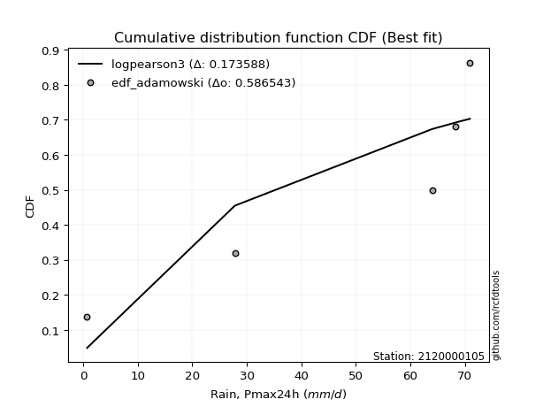</img></img>

</div>


## C. Best fit & Estimate extreme values for specific return periods - Tr

Best fit in probability distribution analysis means finding the theoretical distribution (like Normal, Poisson, Exponential, etc.) that most accurately mirrors your real-world data´s patterns (shape, center, spread) for better predictions, using methods like visual checks (Q-Q plots), goodness-of-fit tests (Kolmogorov-Smirnov, Chi-Squared), and information criteria (AIC) to score and select the simplest, most representative model.


### 1. Best fit (ordered by delta Δ)

:file_folder:Table: [bestfit_2120000105.csv](table/bestfit_2120000105.csv)

<div align="center">

|   id |    station | empirical_dist   | p_dist      |     delta |   deltao | eval   |   fit |   n |   best_fit |   best_fit_sort |
|-----:|-----------:|:-----------------|:------------|----------:|---------:|:-------|------:|----:|-----------:|----------------:|
|    0 | 2120000105 | edf_weibull      | levy_l      | 0.0999753 | 0.530386 | Δo > Δ |     1 |   6 |          1 |               1 |
|    1 | 2120000105 | edf_tukey        | loglevy_l   | 0.101059  | 0.530386 | Δo > Δ |     1 |   6 |          1 |               2 |
|    2 | 2120000105 | edf_filliben     | loglevy_l   | 0.101401  | 0.530386 | Δo > Δ |     1 |   6 |          1 |               3 |
|    3 | 2120000105 | edf_jenkinson    | loglevy_l   | 0.101955  | 0.530386 | Δo > Δ |     1 |   6 |          1 |               4 |
|    4 | 2120000105 | edf_beard        | loglevy_l   | 0.101955  | 0.530386 | Δo > Δ |     1 |   6 |          1 |               5 |
|    5 | 2120000105 | edf_chegodayev   | loglevy_l   | 0.102689  | 0.530386 | Δo > Δ |     1 |   6 |          1 |               6 |
|    6 | 2120000105 | edf_adamowski    | levy_l      | 0.10382   | 0.530386 | Δo > Δ |     1 |   6 |          1 |               7 |
|    7 | 2120000105 | edf_blom         | loglevy_l   | 0.104217  | 0.530386 | Δo > Δ |     1 |   6 |          1 |               8 |
|    8 | 2120000105 | edf_cunnane      | loglevy_l   | 0.106152  | 0.530386 | Δo > Δ |     1 |   6 |          1 |               9 |
|    9 | 2120000105 | edf_gringorten   | loglevy_l   | 0.109315  | 0.530386 | Δo > Δ |     1 |   6 |          1 |              10 |
|   10 | 2120000105 | edf_california   | weibull_max | 0.110953  | 0.530386 | Δo > Δ |     1 |   6 |          1 |              11 |
|   11 | 2120000105 | edf_hazen        | loglevy_l   | 0.114217  | 0.530386 | Δo > Δ |     1 |   6 |          1 |              12 |

</div>


### 2. Extreme values and % difference analysis

In hydrology, a return period (or recurrence interval $Tr$) is the statistical average time between extreme events like floods or droughts of a specific magnitude, indicating how rare an event is, with a 100-year flood, for example, having a 1% chance of occurring in any given year, not that it happens exactly every century. It is a key tool for infrastructure design (like bridges or dams) and risk assessment, calculated from historical data to determine the probability of future events, although it is important to remember it is statistical average, and events can cluster or be missed.

The extreme value porcentage difference is evaluated as $pdiff = 1 - (ETrBf / ETr) * 100$, where _ETrBf_ correspond to the bestfit extreme value for a specific recurrence interval and _ETr_ correspond to the extreme value for one of the most used PDFsused in hydrology.

> risk_rate: assuming the return period as the project useful life.

:file_folder:Table: [extreme_2120000105.csv](table/extreme_2120000105.csv), all PDFs.  
:file_folder:Table: [extremepdiff_2120000105.csv](table/extremepdiff_2120000105.csv), % difference between bestfit and most used PDFs in Hydrology.

<div align="center">

Extreme values table for only best fit PDFs
|   id |      tr |   prob_l |     prob_g |      alpha |   anglit |   arcsine |   argus |    beta |   betaprime |   bradford |    burr |   burr12 |   cosine |   crystalball |   dgamma |   dweibull |   erlang |   exponnorm |   exponpow |   exponweib |        f |   fatiguelife |   foldnorm |    gamma |   gausshyper |   genexpon |   genextreme |   gengamma |   genhalflogistic |   genlogistic |   gennorm |   genpareto |   gompertz |   gumbel_l |   gumbel_r |   halfgennorm |   halflogistic |   halfnorm |   hypsecant |   invgamma |   invgauss |      invweibull |   johnsonsb |   johnsonsu |   kappa3 |   kappa4 |   ksone |   kstwobign |   laplace |   levy_l |   loggamma |   logistic |   loglaplace |    lomax |   maxwell |       mielke |    moyal |   nakagami |      ncf |              nct |     norm |   pearson3 |   powerlaw |   rayleigh |     rdist |     rice |   semicircular |   skewnorm |        t |   trapezoid |   triang |   truncexpon |   truncnorm |   truncpareto |   truncweibull_min |   tukeylambda |   uniform |   vonmises |   vonmises_line |     wald |   weibull_max |   weibull_min |   wrapcauchy |   logalpha |   loganglit |   logarcsine |   logargus |   logbeta |      logbetaprime |   logbradford |           logburr |       logburr12 |   logcosine |   logcrystalball |   logdgamma |   logdweibull |        logerlang |   logexponnorm |   logexponpow |   logexponweib |            logf |   logfatiguelife |   logfoldnorm |   loggausshyper |   loggenexpon |   loggenextreme |   loggengamma |   loggenhalflogistic |   loggenlogistic |   loggennorm |   loggenpareto |   loggompertz |   loggumbel_l |   loggumbel_r |   loghalfgennorm |   loghalflogistic |   loghalfnorm |   loghypsecant |   loginvgamma |   loginvgauss |    loginvweibull |   logjohnsonsb |   logjohnsonsu |       logkappa3 |   logkappa4 |   logksone |   logkstwobign |   loglevy_l |   logloggamma |   loglogistic |   logloglaplace |        loglomax |   logmaxwell |   logmielke |    logmoyal |   lognakagami |            logncf |    lognct |   lognorm |   logpearson3 |   logpowerlaw |   lograyleigh |   logrdist |   logrice |   logsemicircular |   logskewnorm |              logt |   logtrapezoid |   logtriang |   logtruncexpon |   logtruncnorm |   logtruncpareto |   logtruncweibull_min |   logtukeylambda |   loguniform |   logvonmises |   logvonmises_line |          logwald |   logweibull_max |   logweibull_min |   logwrapcauchy |    station |   n |   risk_rate |
|-----:|--------:|---------:|-----------:|-----------:|---------:|----------:|--------:|--------:|------------:|-----------:|--------:|---------:|---------:|--------------:|---------:|-----------:|---------:|------------:|-----------:|------------:|---------:|--------------:|-----------:|---------:|-------------:|-----------:|-------------:|-----------:|------------------:|--------------:|----------:|------------:|-----------:|-----------:|-----------:|--------------:|---------------:|-----------:|------------:|-----------:|-----------:|----------------:|------------:|------------:|---------:|---------:|--------:|------------:|----------:|---------:|-----------:|-----------:|-------------:|---------:|----------:|-------------:|---------:|-----------:|---------:|-----------------:|---------:|-----------:|-----------:|-----------:|----------:|---------:|---------------:|-----------:|---------:|------------:|---------:|-------------:|------------:|--------------:|-------------------:|--------------:|----------:|-----------:|----------------:|---------:|--------------:|--------------:|-------------:|-----------:|------------:|-------------:|-----------:|----------:|------------------:|--------------:|------------------:|----------------:|------------:|-----------------:|------------:|--------------:|-----------------:|---------------:|--------------:|---------------:|----------------:|-----------------:|--------------:|----------------:|--------------:|----------------:|--------------:|---------------------:|-----------------:|-------------:|---------------:|--------------:|--------------:|--------------:|-----------------:|------------------:|--------------:|---------------:|--------------:|--------------:|-----------------:|---------------:|---------------:|----------------:|------------:|-----------:|---------------:|------------:|--------------:|--------------:|----------------:|----------------:|-------------:|------------:|------------:|--------------:|------------------:|----------:|----------:|--------------:|--------------:|--------------:|-----------:|----------:|------------------:|--------------:|------------------:|---------------:|------------:|----------------:|---------------:|-----------------:|----------------------:|-----------------:|-------------:|--------------:|-------------------:|-----------------:|-----------------:|-----------------:|----------------:|-----------:|----:|------------:|
|    0 |    2    | 0.5      | 0.5        |    2.66188 |  49.85   |   49.85   | 57.2634 | 66.3908 |     49.4868 |    31.1656 | 36.4252 |  52.065  |  46.1952 |       49.85   |  67.5    |    67.5    |  49.1035 |     49.8498 |   0.744314 |      8.9801 |  49.8228 |      0.700132 |    50.5791 |  48.8902 |      54.3337 |    34.7522 |      59.9601 |    49.9496 |           47.5655 |      inf      |   68.2    |     51.4786 |    63.6855 |    54.1932 |    45.5068 |       26.894  |        43.3476 |    44.4384 |     49.85   |    48.2995 |    48.2836 | 18185.8         |     70.8883 |     70.8997 | 0.699896 |  42.4885 | 35.8    |     43.3203 |   49.85   |  65.7086 |    26.2073 |    49.85   |      27.2172 |  35.4714 |   47.5889 | -9.92482e+08 |  44.1047 |    23.0447 |  42.5736 |     11.5317      |  49.85   |    53.9865 |    1.24012 |    46.787  | -5.74758  |  49.1437 |        49.85   |    48.1062 |  49.8489 |     53.1396 |  46.0584 |      24.4994 |   -1.00454  |       1.88801 |            41.7765 |     -5.52013  |   35.8    |    1.09605 |         58.5675 |  41.2802 |       57.1067 |       55.1787 |      35.8    |    25.0382 |     27.2172 |      27.2174 |    42.0332 |   70.8998 |      2.32735      |       7.48019 |      5.74866      |    4.82343      |     18.6741 |          27.2172 |      68.2   |       68.2    |      7.87303     |        27.217  |       1.41804 |        32.1774 |    2.10868      |          26.9653 |       29.4044 |         19.8346 |       16.2939 |         52.7181 |       27.6189 |              18.8703 |         inf      |      68.2    |        27.7609 |       22.3717 |       35.8041 |       20.6896 |          15.2108 |           18.0529 |       19.3402 |        27.2172 |       25.7194 |       24.4731 |     19.3383      |        48.8968 |        70.8957 |    22.9542      |     8.09216 |    7.04486 |        17.3079 |     65.5686 |       36.5765 |       27.2172 |    4.76624      |    5.1225       |      23.5963 |     40.6651 |     18.9368 |       27.2441 |      5.41691      |   27.1853 |   27.2172 |       42.0854 |      0.735665 |       22.4313 |    1.2141  |   27.217  |           27.217  |       19.3627 |     67.8795       |        33.7631 |     12.3693 |         4.44387 |        6.80997 |         0.877769 |               10.5606 |          1.54699 |      7.04486 |      0.132404 |            43.1173 |     15.8441      |          43.2763 |      3.1287      |         7.02005 | 2120000105 |   6 |    0.75     |
|    1 |    2.33 | 0.570815 | 0.429185   |    3.16847 |  55.3453 |   58.0993 | 59.8215 | 69.3675 |     54.2646 |    36.7932 | 41.5344 |  56.0652 |  51.0972 |       54.5677 |  68.2059 |    68.5164 |  54.0279 |     54.5675 |   0.826289 |     13.0696 |  54.5763 |      1.83597  |    54.767  |  53.8465 |      59.0534 |    42.255  |      62.3187 |    54.6417 |           52.2241 |      inf      |   68.7144 |     56.2709 |    65.1551 |    58.2976 |    49.8783 |       35.7621 |        47.8422 |    49.53   |     53.6256 |    53.4325 |    53.4818 |     1.81304e+06 |     70.8967 |     70.9    | 0.699896 |  48.1077 | 41.7655 |     49.3974 |   52.7049 |  67.2977 |    35.7514 |    54.0066 |      32.5931 |  43.2571 |   52.4903 | -9.92482e+08 |  48.2429 |    28.5573 |  49.6547 |     18.9002      |  54.5677 |    58.3617 |    2.06911 |    51.7609 |  0.953637 |  54.0097 |        55.7438 |    51.7438 |  54.5665 |     58.5701 |  50.1649 |      29.7445 |   -0.219545 |       2.54999 |            46.0869 |     -0.742333 |   40.7712 |    1.39302 |         62.5377 |  44.3737 |       62.1666 |       58.5644 |      59.999  |    34.3704 |     38.5055 |      45.8185 |    46.7896 |   70.9    |      3.69541      |      10.4623  |     14.0306       |    9.50017      |     26.0407 |          36.6608 |      75.055 |       76.0997 |     15.3607      |        36.6606 |       1.79677 |        40.554  |    3.54934      |          36.3037 |       37.3322 |         27.8012 |       24.7392 |         57.5846 |       36.8627 |              24.6804 |         inf      |      69.9727 |        36.7309 |       31.0209 |       46.3957 |       27.2658 |          24.7549 |           23.9766 |       26.673  |        34.5437 |       35.2689 |       34.21   |     29.6712      |        62.0522 |        70.8987 |    40.303       |    11.4308  |   10.4304  |        26.8687 |     67.1567 |       41.5083 |       35.3849 |    8.31735      |   10.353        |      32.1544 |     50.9622 |     24.5909 |       36.7098 |     13.6114       |   36.6268 |   36.6608 |       53.6728 |      0.787785 |       30.7071 |    1.32951 |   36.6594 |           39.4864 |       23.8189 |     68.1905       |        47.5715 |     16.508  |         6.24149 |        9.38413 |         0.994204 |               13.9523 |          2.74309 |      9.77003 |      0.150057 |            53.0923 |     19.2614      |          57.038  |      4.87212     |        59.7758  | 2120000105 |   6 |    0.729209 |
|    2 |    5    | 0.8      | 0.2        |    7.09663 |  74.7338 |   80.0972 | 66.7502 | 70.8938 |     72.1481 |    55.0063 | 58.0392 |  69.7149 |  68.7622 |       72.1    |  76.7502 |    84.7554 |  72.6713 |     72.0998 |   3.4693   |     49.8877 |  72.2638 |     25.9621   |    70.3304 |  72.6193 |      68.7331 |    79.7669 |      67.9119 |    72.0218 |           64.082  |      inf      |   75.2286 |     67.3525 |    69.9143 |    71.5574 |    68.87   |       95.2884 |        68.1792 |    71.0618 |     68.7703 |    73.4382 |    73.8601 |     8.74225e+14 |     70.9    |     70.9    | 0.699896 |  63.2891 | 61.072  |     75.2117 |   66.9789 |  69.9304 |   115.734  |    70.0559 |      80.2637 |  82.6617 |   71.7817 | -9.92482e+08 |  67.4112 |    53.5547 |  83.3131 |    210.889       |  72.1    |    72.4    |   15.3498  |    71.6735 | 19.8911   |  72.2852 |        75.8567 |    62.3384 |  72.0985 |     74.15   |  61.9459 |      49.2886 |    2.91662  |      10.2869  |            59.4974 |     14.666    |   56.86   |    2.5273  |         78.0989 |  61.6908 |       69.7009 |       69.502  |      68.9562 |   114.417  |    130.966  |     183.747  |    62.5861 |   70.9    |    166.316        |      30.9897  | 102540            | 2192.58         |     86.3107 |         110.901  |     143.366 |      168.62   |    546.469       |       110.9    |       6.38861 |        87.447  | 1347.54         |         109.692  |       90.6473 |         58.3111 |      133.021  |         67.7989 |      106.846  |              48.5609 |         inf      |      90.229  |        63.4104 |       94.4827 |      107.167  |       90.4422 |         168.802  |           86.5833 |      103.866  |        89.8746 |      117.186  |      125.171  |    190.642       |        70.7164 |        70.9    |   460.493       |    33.1352  |   37.1424  |       174.012  |     69.873  |       57.2956 |       97.4742 | 4881.52         | 5309.11         |     108.695  |    118.936  |     82.4843 |      111.205  | 202381            |  110.918  |  110.901  |      105.718  |      2.04817  |      107.956  |    1.75867 |  110.884  |          140.588  |       43.5433 |     72.9112       |       127.217  |     37.7849 |        20.8782  |       27.0402  |         2.84362  |               33.406  |         16.9337  |     28.1538  |      0.241591 |           118.611  |     57.4799      |          70.4627 |     61.8539      |        68.9304  | 2120000105 |   6 |    0.67232  |
|    3 |   10    | 0.9      | 0.1        |   14.3136  |  85.708  |   85.4077 | 69.5591 | 70.9    |     84.1232 |    62.9532 | 65.2287 |  77.821  |  79.4349 |       83.7304 |  86.7822 |   109.533  |  85.339  |     83.7302 |  13.2933   |    113.674  |  84.0169 |     59.2741   |    80.6547 |  85.3824 |      70.4419 |   113.819  |      69.6346 |    83.5013 |           67.9472 |      inf      |   86.5027 |     69.9196 |    72.5692 |    78.9399 |    84.3384 |      171.145  |        85.0683 |    86.9949 |     80.8637 |    87.5675 |    88.3375 |     1.0327e+22  |     70.9    |     70.9    | 0.699896 |  68.0787 | 69.496  |     94.8659 |   79.9365 |  70.566  |   256.882  |    81.8756 |     181.893  | 119.131  |   85.358  | 68.8351      |  84.1002 |    72.8632 | 113.897  |   1851.26        |  83.7304 |    79.9077 |   34.1985  |    85.8716 | 25.3482   |  84.5277 |        86.177  |    66.6534 |  83.7288 |     80.2355 |  66.5476 |      59.423  |    5.12041  |      24.2615  |            65.2115 |     21.3173   |   63.88   |    3.2575  |         89.9348 |  80.0684 |       70.662  |       75.5916 |      70.0289 |   259.939  |    261.86   |     256.942  |    70.4496 |   70.9    | 201143            |      49.7721  |      1.71152e+14  |    3.92543e+07  |    178.024  |         231.124  |     272.164 |      395.625  |  16802.8         |       231.12   |      20.1379  |       136.192  |    5.92814e+10  |         228.554  |      163.28   |         67.6818 |      443.948  |         69.999  |      214.833  |              60.3265 |         inf      |     131.567  |        69.335  |      180.647  |      170.8    |      240.169  |         617.466  |          251.499  |      284.023  |       192.859  |      266.338  |      310.185  |    867.84        |        70.8867 |        70.9    |  3753.54        |    50.3756  |   64.645   |       721.616  |     70.5451 |       64.1162 |      205.583  |    1.15983e+12  |    3.18357e+09  |     256.138  |    218.536  |    236.584  |      231.993  |      2.11566e+16  |  231.358  |  231.124  |      140.223  |      7.11529  |      264.582  |    1.95328 |  231.068  |          269.732  |       55.6711 |    119.401        |       186.815  |     52.2142 |        37.6056  |       43.615   |         8.93452  |               48.6422 |         35.9546  |     44.6778  |      0.339764 |           216.919  |    183.409       |          70.8759 |    885.043       |        70.0122  | 2120000105 |   6 |    0.651322 |
|    4 |   15    | 0.933333 | 0.0666667  |   21.5049  |  90.3942 |   86.4206 | 70.5551 | 70.9    |     90.1325 |    65.6021 | 67.6238 |  81.6173 |  84.2964 |       89.5342 |  93.0693 |   127.453  |  91.7507 |     89.534  |  24.5352   |    168.034  |  89.8878 |     81.0608   |    85.8067 |  91.8446 |      70.7156 |   133.738  |      70.1207 |    89.2147 |           69.0611 |      inf      |   95.6239 |     70.438  |    73.7724 |    82.2832 |    93.0656 |      225.277  |        94.626  |    95.2864 |     87.7654 |    94.8904 |    95.8593 |     1.00957e+26 |     70.9    |     70.9    | 0.699896 |  69.3201 | 72.304  |    105.3    |   87.5162 |  70.7581 |   384.49   |    88.3156 |     293.529  | 140.778  |   92.3238 | 69.5556      |  93.7858 |    83.0129 | 132.392  |   6591.05        |  89.5342 |    83.158  |   43.9448  |    93.1871 | 26.5745   |  90.6625 |        90.2016 |    68.0731 |  89.5325 |     82.1881 |  68.0241 |      63.0825 |    6.24322  |      33.7458  |            67.1089 |     23.5117   |   66.22   |    3.55924 |         96.2124 |  91.8696 |       70.8044 |       78.3494 |      70.33   |   394.247  |    352.018  |     273.91   |    73.4752 |   70.9    |      2.27624e+08  |      58.2875  |      1.0781e+25   |    4.80832e+11  |    247.571  |         333.415  |     399.566 |      674.092  | 130523           |       333.409  |      38.4628  |       167.083  |    2.39404e+21  |         329.729  |      219.015  |         69.4956 |      827.006  |         70.454  |      303.747  |              64.1697 |         inf      |     174.435  |        70.2855 |      243.417  |      210.941  |      416.692  |        1172.18   |          459.844  |      479.409  |       298.184  |      404.227  |      494.96   |   2041.21        |        70.8964 |        70.9    | 13749.1         |    57.253   |   77.7602  |      1535.48   |     70.7494 |       66.382  |      308.723  |    7.62899e+23  |    7.08183e+15  |     397.628  |    303.504  |    436.077  |      334.85   |      2.67004e+30  |  333.914  |  333.415  |      155.122  |     13.2592   |      419.907  |    2.01329 |  333.321  |          347.765  |       60.3584 |    448.236        |       211.325  |     57.9241 |        46.2059  |       51.3091  |        15.6318   |               55.1384 |         45.677   |     52.1126  |      0.408731 |           305.414  |    386.371       |          70.8953 |   4741.77        |        70.318   | 2120000105 |   6 |    0.644736 |
|    5 |   20    | 0.95     | 0.05       |   28.6898  |  93.1508 |   86.7773 | 71.0866 | 70.9    |     94.0799 |    66.9266 | 68.8213 |  84.0209 |  87.2861 |       93.335  |  97.6509 |   141.533  |  95.9822 |     93.3348 |  35.6376   |    215.513  |  93.7345 |     97.1911   |    89.1807 |  96.1102 |      70.8034 |   147.871  |      70.345  |    92.9508 |           69.5803 |      inf      |  103.296  |     70.6291 |    74.5215 |    84.3643 |    99.1761 |      268.123  |       101.322  |   100.814  |     92.6342 |    99.7878 |   100.895  |     6.27978e+28 |     70.9    |     70.9    | 0.699896 |  69.8528 | 73.708  |    112.329  |   92.8941 |  70.8564 |   501.694  |    92.7666 |     412.203  | 156.279  |   96.9468 | 69.9063      | 100.645  |    89.7984 | 145.895  |  16225.9         |  93.335  |    85.1175 |   49.6679  |    98.0495 | 27.052    |  94.6877 |        92.4339 |    68.7809 |  93.3333 |     83.1513 |  68.7525 |      64.9718 |    6.98489  |      40.1847  |            68.0569 |     24.6016   |   67.39   |    3.72128 |        100.202  | 100.664  |       70.8496 |       80.066  |      70.4752 |   519.228  |    418.941  |     280.148  |    75.1438 |   70.9    |      2.45489e+11  |      63.0769  |      8.97581e+36  |    4.53207e+15  |    303.233  |         423.841  |     526.043 |      995.784  | 567306           |       423.833  |      60.0902  |       189.984  |    3.33934e+34  |         419.199  |      265.458  |         70.1242 |     1250.92   |         70.6277 |      380.776  |              66.0302 |         inf      |     218.99   |        70.5843 |      293.429  |      240.561  |      612.868  |        1777.06   |          701.824  |      679.648  |       405.496  |      532.699  |      675.743  |   3715.37        |        70.8985 |        70.9    | 36570.1         |    60.828   |   85.2841  |      2553.61   |     70.8542 |       67.5135 |      408.901  |    4.93448e+38  |    3.96179e+22  |     532.401  |    380.556  |    672.434  |      425.821  |      9.86046e+46  |  424.615  |  423.841  |      163.727  |     19.021    |      570.795  |    2.04122 |  423.71   |          400.402  |       62.8408 |   5773.66         |       224.576  |     60.9667 |        51.3191  |       55.6881  |        21.6132   |               58.7091 |         51.3098  |     56.2819  |      0.464956 |           389.897  |    673.193       |          70.8985 |  16361.8         |        70.4658  | 2120000105 |   6 |    0.641514 |
|    6 |   25    | 0.96     | 0.04       |   35.8722  |  95.019  |   86.9428 | 71.4239 | 70.9    |     96.9919 |    67.7213 | 69.5405 |  85.7505 |  89.3827 |       96.1329 | 101.259  |   153.187  |  99.1137 |     96.1327 |  46.2553   |    257.931  |  96.5674 |    110.007    |    91.6644 |  99.2674 |      70.8415 |   158.834  |      70.4727 |    95.6982 |           69.878  |      inf      |  109.962  |     70.7209 |    75.0547 |    85.8452 |   103.883  |      303.924  |       106.482  |   104.928  |     96.4023 |   103.446  |   104.658  |     8.91067e+30 |     70.9    |     70.9    | 0.699896 |  70.1388 | 74.5504 |    117.593  |   97.0654 |  70.9181 |   610.851  |    96.1717 |     536.403  | 168.385  |  100.379  | 70.1137      | 105.962  |    94.8528 | 156.617  |  32634.7         |  96.1329 |    86.4775 |   53.4042  |   101.662  | 27.2902   |  97.6544 |        93.882  |    69.2051 |  96.1311 |     83.7252 |  69.1864 |      66.1255 |    7.53363  |      44.7722  |            68.6256 |     25.2523   |   68.092  |    3.82158 |        102.944  | 107.708  |       70.8692 |       81.2876 |      70.5612 |   636.749  |    471.387  |     283.091  |    76.2227 |   70.9    |      2.55235e+14  |      66.1374  |      5.83744e+49  |    3.50572e+19  |    349.577  |         505.733  |     651.872 |     1355.98   |      1.78589e+06 |       505.723  |      84.2961  |       208.284  |    8.88648e+49  |         500.247  |      305.829  |         70.4112 |     1701.47   |         70.7138 |      449.523  |              67.1152 |         inf      |     265.374  |        70.7118 |      335.334  |      264.138  |      824.945  |        2408.82   |          972.067  |      881.178  |       514.408  |      653.619  |      852.105  |   5893.57        |        70.8992 |        70.9    | 81342.5         |    62.9886  |   90.1436  |      3737.87   |     70.9201 |       68.192  |      506.973  |    1.65796e+56  |    4.57103e+29  |     661.221  |    452.32   |    940.669  |      508.234  |      4.73703e+65  |  506.784  |  505.733  |      169.435  |     24.0356   |      717.035  |    2.05702 |  505.567  |          438.737  |       64.3773 | 380591            |       232.862  |     62.8549 |        54.6905  |       58.506   |        26.6729   |               60.9634 |         54.9409  |     58.9419  |      0.513829 |           471.85   |   1050.23        |          70.8994 |  43852.6         |        70.5535  | 2120000105 |   6 |    0.639603 |
|    7 |   50    | 0.98     | 0.02       |   71.7729  |  99.6176 |   87.1638 | 72.1731 | 70.9    |    105.359  |    69.3107 | 70.9996 |  90.5273 |  94.8727 |      104.145  | 112.703  |   193.21   | 108.159  |    104.145  |  91.7725   |    424.567  | 104.684  |    151.127    |    98.7767 | 108.389  |      70.8877 |   192.886  |      70.709  |   103.553  |           70.4351 |      inf      |  134.847  |     70.8505 |    76.5023 |    89.8651 |   118.382  |      429.669  |       122.378  |   116.883  |    108.085  |   114.174  |   115.701  |     3.794e+37   |     70.9    |     70.9    | 0.699896 |  70.6173 | 76.2352 |    133.053  |  110.023  |  71.0571 |  1078.44   |   106.575  |    1215.59   | 206.449  |  110.333  | 70.5222      | 122.468  |   109.557  | 191.501  | 285982           | 104.145  |    90.0028 |   61.6153  |   112.149  | 27.6453   | 106.165  |        97.1903 |    70.0528 | 104.143  |     84.864  |  70.0476 |      68.4799 |    9.11606  |      56.0218  |            69.7628 |     26.5431   |   69.496  |    4.02753 |        109.266  | 130.707  |       70.8932 |       84.6035 |      70.7313 |  1149.36   |    630.191  |     287.069  |    78.6771 |   70.9    |      2.16157e+29  |      72.7111  |      3.06981e+123 |    1.41098e+38  |    507.317  |         838.712  |    1275.41  |     3645.45   |      6.49721e+07 |       838.694  |     231.417   |       267.957  |    1.69287e+156 |         829.989  |      458.717  |         70.784  |     4158.12   |         70.8424 |      721.702  |              69.1763 |         inf      |     526.243  |        70.8623 |      482.719  |      340.454  |     2060.6    |        5693.62   |         2652.05   |     1874.45   |      1075.58   |     1182.07   |     1676.81   |  24420.5         |        70.8999 |        70.9    |     1.2902e+06  |    67.2414  |  100.709   |     11442.6    |     71.0687 |       69.548  |      977.797  |    1.18418e+179 |    1.9134e+68   |    1239.59   |    765.904  |   2666.98   |      843.539  |      2.12334e+184 |  841.096  |  838.712  |      182.828  |     40.0398   |     1390.25   |    2.08551 |  838.389  |          540.651  |       67.561  |      2.10734e+31  |       250.222  |     66.777  |        62.2059  |       64.6108  |        42.253    |               65.7403 |         62.7293  |     64.645   |      0.706369 |           844.851  |   4486.4         |          70.9    |      1.06632e+06 |        70.7272  | 2120000105 |   6 |    0.63583  |
|    8 |   75    | 0.986667 | 0.0133333  |  107.669   | 101.641  |   87.2048 | 72.4646 | 70.9    |    109.867  |    69.8405 | 71.5235 |  92.9891 |  97.4945 |      108.444  | 119.524  |   219.138  | 113.06   |    108.444  | 128.059    |    549.422  | 109.043  |    175.892    |   102.593  | 113.332  |      70.895  |   212.805  |      70.7804 |   107.759  |           70.6059 |      inf      |  152.493  |     70.8767 |    77.2344 |    91.8979 |   126.81   |      513.601  |       131.619  |   123.391  |    114.912  |   120.09   |   121.793  |     2.70541e+41 |     70.9    |     70.9    | 0.699896 |  70.7416 | 76.7968 |    141.559  |  117.603  |  71.1142 |  1467.23   |   112.584  |    1961.66   | 229.042  |  115.744  | 70.6565      | 132.12   |   117.562  | 213.147  |      1.01802e+06 | 108.444  |    91.6801 |   64.5854  |   117.854  | 27.723    | 110.739  |        98.5119 |    70.3353 | 108.442  |     85.2411 |  70.3327 |      69.2791 |    9.97085  |      60.5178  |            70.1418 |     26.9686   |   69.964  |    4.0973  |        111.593  | 144.859  |       70.8972 |       86.2804 |      70.7876 |  1584.08   |    716.088  |     287.813  |    79.6536 |   70.9    |      1.24942e+44  |      75.0444  |      4.73801e+208 |    7.57717e+55  |    606.063  |        1100.25   |    1893.79  |     6622.58   |      5.41541e+08 |      1100.23   |     406.272   |       304.739  |    4.69733e+303 |        1089.17   |      570.185  |         70.8501 |     6763.5    |         70.8709 |      929.364  |              69.8134 |         inf      |     835.81   |        70.8853 |      580.928  |      387.078  |     3508.12   |        8970.63   |         4752.91   |     2826.95   |      1655.18   |     1631.23   |     2430.46   |  55805.4         |        70.9    |        70.9    |     8.24359e+06 |    68.5911  |  104.499   |     21177      |     71.1298 |       69.9997 |     1428.92   |  inf            |    5.12022e+110 |    1744.48   |   1037.66   |   4905.48   |     1107.08   |    inf            | 1103.86   | 1100.25   |      188.304  |     48.0996   |     1993.13   |    2.09368 | 1099.8    |          587.699  |       68.6563 |      2.49728e+100 |       256.25   |     68.1286 |        64.9634  |       66.7948  |        49.8766   |               67.4161 |         65.4524  |     66.6662  |      0.859806 |          1143.87   |  10963.5         |          70.9    |      7.49153e+06 |        70.7848  | 2120000105 |   6 |    0.634587 |
|    9 |  100    | 0.99     | 0.01       |  143.563   | 102.845  |   87.2191 | 72.6259 | 70.9    |    112.922  |    70.1054 | 71.8144 |  94.6164 |  99.1378 |      111.352  | 124.409  |   238.595  | 116.394  |    111.352  | 158.464    |    651.657  | 111.992  |    193.711    |   105.174  | 116.695  |      70.8974 |   226.938  |      70.8141 |   110.601  |           70.6873 |      inf      |  166.469  |     70.8863 |    77.7134 |    93.2276 |   132.774  |      577.883  |       138.159  |   127.824  |    119.755  |   124.156  |   125.98   |     1.44323e+44 |     70.9    |     70.9    | 0.699896 |  70.795  | 77.0776 |    147.387  |  122.981  |  71.1475 |  1808.94   |   116.826  |    2754.76   | 245.221  |  119.43   | 70.7234      | 138.968  |   123.014  | 229.12   |      2.50606e+06 | 111.352  |    92.7342 |   66.1165  |   121.741  | 27.7531   | 113.836  |        99.252  |    70.4765 | 111.35   |     85.4291 |  70.4749 |      69.6815 |   10.5509   |      62.9299  |            70.3314 |     27.1799   |   70.198  |    4.13232 |        112.787  | 155.178  |       70.8985 |       87.3771 |      70.8157 |  1971.03   |    772.619  |     288.074  |    80.1994 |   70.9    |      5.64358e+58  |      76.239   |      1.64987e+302 |    1.13416e+73  |    677.529  |        1321.97   |    2509.32  |    10190.4    |      2.45406e+09 |      1321.94   |     598.566   |       331.63   |  inf            |        1308.99   |      660.559  |         70.8725 |     9422.37   |         70.882  |     1102.24   |              70.1169 |         inf      |    1193.64   |        70.8925 |      655.943  |      420.976  |     5112.4    |       12165.7    |         7182.84   |     3740.09   |      2247.17   |     2031.61   |     3134.05   | 100171           |        70.9    |        70.9    |     3.48684e+07 |    69.2384  |  106.447   |     32287.5    |     71.1656 |       70.2255 |     1867.8    |  inf            |    6.5159e+155  |    2201.59   |   1285.6    |   7558.72   |     1330.58   |    inf            | 1326.7    | 1321.97   |      191.397  |     52.8567   |     2547.5    |    2.09739 | 1321.39   |          615.812  |       69.2105 |      7.10667e+233 |       259.311  |     68.8129 |        66.3935  |       67.9164  |        54.3249   |               68.2703 |         66.8275  |     67.7003  |      0.994163 |          1372.68   |  21031.8         |          70.9    |      3.09138e+07 |        70.8136  | 2120000105 |   6 |    0.633968 |
|   10 |  200    | 0.995    | 0.005      |  287.138   | 105.119  |   87.233  | 72.904  | 70.9    |    119.874  |    70.5027 | 72.3607 |  98.2007 | 102.479  |      117.947  | 136.301  |   288.916  | 124.014  |    117.947  | 248.463    |    949.345  | 118.685  |    237.328    |   111.029  | 124.383  |      70.8995 |   260.991  |      70.8613 |   117.038  |           70.8024 |      inf      |  205.355  |     70.8962 |    78.7546 |    96.1177 |   147.114  |      749.19   |       153.883  |   137.964  |    131.422  |   133.578  |   135.679  |     5.19474e+50 |     70.9    |     70.9    | 0.699896 |  70.861  | 77.4988 |    160.81   |  135.938  |  71.2108 |  2918.49   |   127.003  |    6242.81   | 284.714  |  127.864  | 70.8232      | 155.466  |   135.475  | 269.892  |      2.19607e+07 | 117.947  |    94.898  |   68.4721  |   130.635  | 27.7858   | 120.869  |       100.542  |    70.6882 | 117.945  |     85.7106 |  70.6877 |      70.2886 |   11.8716   |      66.7708  |            70.6157 |     27.494    |   70.549  |    4.18495 |        114.602  | 180.88   |       70.8997 |       89.7611 |      70.8579 |  3251.38   |    891.881  |     288.326  |    81.1494 |   70.9    |      5.2123e+116  |      78.0667  |    inf            |    2.80145e+138 |    849.887  |        2004.8    |    4956.64  |    29446.5    |      9.53277e+10 |      2004.75   |    1466.48    |       398.999  |  inf            |        1986.5    |      922.251  |         70.8935 |    20126.4    |         70.8944 |     1620.88   |              70.5445 |         inf      |    3103.61   |        70.8985 |      854.766  |      505.248  |    12642      |       24077      |        19384      |     7094.36   |      4694      |     3359.33   |     5633.25   | 408935           |        70.9    |        70.9    |     1.86217e+09 |    70.1515  |  109.438   |     85294      |     71.2334 |       70.5641 |     3551.13   |  inf            |  inf            |    3749.53   |   2148.74   |  21420.9    |     2019.32   |    inf            | 2013.42   | 2004.8    |      196.827  |     61.0922   |     4466.62   |    2.10231 | 2003.83   |          668.077  |       70.0502 |    inf            |       263.96   |     69.8501 |        68.6052  |       69.637   |        61.9505   |               69.5724 |         68.8911  |     69.2817  |      1.42265  |          1877.63   | 106565           |          70.9    |      1.04834e+09 |        70.8568  | 2120000105 |   6 |    0.633042 |
|   11 |  250    | 0.996    | 0.004      |  358.924   | 105.697  |   87.2346 | 72.9687 | 70.9    |    122.004  |    70.5822 | 72.5085 |  99.2677 | 103.395  |      119.963  | 140.16   |   306.109  | 126.358  |    119.963  | 282.648    |   1061.9    | 120.731  |    251.543    |   112.818  | 126.748  |      70.8997 |   271.953  |      70.87   |   119.002  |           70.824  |      inf      |  219.506  |     70.8975 |    79.061  |    96.9681 |   151.724  |      809.354  |       158.938  |   141.083  |    135.177  |   136.513  |   138.7    |     6.65725e+52 |     70.9    |     70.9    | 0.699896 |  70.8716 | 77.583  |    164.965  |  140.11   |  71.2272 |  3381.05   |   130.27   |    8123.82   | 297.583  |  130.46   | 70.8431      | 160.777  |   139.305  | 283.755  |      4.41685e+07 | 119.963  |    95.4992 |   68.9518  |   133.373  | 27.7903   | 123.021  |       100.845  |    70.7306 | 119.961  |     85.7668 |  70.7302 |      70.4105 |   12.2764   |      67.5728  |            70.6725 |     27.5562   |   70.6192 |    4.19548 |        114.968  | 189.383  |       70.8998 |       90.4626 |      70.8663 |  3793.82   |    925.067  |     288.356  |    81.3719 |   70.9    |      2.74063e+145 |      78.4375  |    inf            |    7.05866e+169 |    904.368  |        2276.87   |    6175.19  |    41700.7    |      3.11162e+11 |      2276.81   |    1936.16    |       421.43   |  inf            |        2256.63   |     1021.27   |         70.8959 |    25425.2    |         70.8961 |     1822.94   |              70.6244 |         inf      |    4347.63   |        70.8991 |      924.185  |      533.115  |    16913.1    |       29593.3    |        26671.8    |     8638.67   |      5950.1    |     3922.93   |     6756.94   | 642819           |        70.9    |        70.9    |     7.95849e+09 |    70.3215  |  110.046   |    115208      |     71.2511 |       70.6318 |     4364.65   |  inf            |  inf            |    4417.32   |   2533.82   |  29955.2    |     2293.87   |    inf            | 2287.18   | 2276.87   |      198.105  |     62.9179   |     5309.4    |    2.10316 | 2275.74   |          680.967  |       70.2193 |    inf            |       264.898  |     70.0591 |        69.0574  |       69.9867  |        63.6295   |               69.8359 |         69.3011  |     69.6024  |      1.58857  |          2008.8    | 182289           |          70.9    |      3.36171e+09 |        70.8655  | 2120000105 |   6 |    0.632858 |
|   12 |  500    | 0.998    | 0.002      |  717.857   | 107.132  |   87.2368 | 73.1167 | 70.9    |    128.337  |    70.7411 | 72.9217 | 102.358  | 105.832  |      125.94   | 152.229  |   362.462  | 133.353  |    125.94   | 405.565    |   1468.81   | 126.803  |    296.135    |   118.124  | 133.808  |      70.8999 |   306.005  |      70.8865 |   124.82   |           70.8651 |      inf      |  268.798  |     70.8993 |    79.9394 |    99.4057 |   166.032  |     1012.14   |       174.627  |   150.384  |    146.844  |   145.377  |   147.816  |     2.31879e+59 |     70.9    |     70.9    | 0.699896 |  70.8895 | 77.7515 |    177.414  |  153.067  |  71.2697 |  5244.02   |   140.402  |   18410.1    | 338.05   |  138.206  | 70.8828      | 177.275  |   150.717  | 329.322  |      3.87049e+08 | 125.94   |    97.1274 |   69.92    |   141.541  | 27.7971   | 129.406  |       101.542  |    70.8153 | 125.938  |     85.8791 |  70.8151 |      70.6549 |   13.4799   |      69.2122  |            70.7863 |     27.6797   |   70.7596 |    4.21656 |        115.701  | 216.419  |       70.9    |       92.4733 |      70.8831 |  6017.51   |   1012.78   |     288.396  |    81.8839 |   70.9    |      3.37998e+287 |      79.1843  |    inf            |  inf            |   1066.97   |        3320.72   |   12244     |   125116      |      1.24274e+13 |      3320.63   |    4452.13    |       493.298  |  inf            |        3293.82   |     1381.94   |         70.899  |    51073.7    |         70.8988 |     2580.09   |              70.7749 |          70.7665 |   13590.3    |        70.8998 |     1156.54   |      621.817  |    41740.7    |       54218      |        71823.4    |    15540.6    |     12428.2    |     6238.27   |    11675      |      2.61752e+06 |        70.9    |        70.9    |     1.36027e+12 |    70.6405  |  111.272   |    283630      |     71.2967 |       70.7673 |     8275.13   |  inf            |  inf            |    7203.89   |   4224.3    |  84889.1    |     3347.8    |    inf            | 3338.08   | 3320.72   |      201.05   |     66.7677   |     8892.49   |    2.10469 | 3318.94   |          711.601  |       70.5589 |    inf            |       266.784  |     70.4786 |        69.9719  |       70.6918  |        67.1574   |               70.3659 |         70.1135  |     70.2482  |      2.11405  |          2306.86   |      1.00484e+06 |          70.9    |      1.37195e+11 |        70.8827  | 2120000105 |   6 |    0.632489 |
|   13 |  750    | 0.998667 | 0.00133333 | 1076.79    | 107.767  |   87.2373 | 73.176  | 70.9    |    131.866  |    70.7941 | 73.1438 | 104.029  | 107.014  |      129.26   | 159.336  |   397.42   | 137.267  |    129.26   | 489.414    |   1750.13   | 130.177  |    322.482    |   121.072  | 137.76   |      70.9    |   325.925  |      70.8915 |   128.048  |           70.8778 |       70.8727 |  301.525  |     70.8997 |    80.4089 |   100.709  |   174.397  |     1142.09   |       183.799  |   155.58   |    153.668  |   150.406  |   152.983  |     1.5477e+63  |     70.9    |     70.9    | 0.699896 |  70.8941 | 77.8077 |    184.407  |  160.647  |  71.2899 |  6703.28   |   146.321  |   29709.2    | 362.07   |  142.539  | 70.896       | 186.926  |   157.086  | 357.856  |      1.37779e+09 | 129.26   |    97.9372 |   70.2454  |   146.109  | 27.7985   | 132.956  |       101.822  |    70.8435 | 129.258  |     85.9165 |  70.8434 |      70.7365 |   14.1501   |      69.7693  |            70.8242 |     27.7204   |   70.8064 |    4.22359 |        115.946  | 232.63   |       70.9    |       93.548  |      70.8888 |  7794.15   |   1054.22   |     288.404  |    82.0898 |   70.9    |    inf            |      79.4348  |    inf            |  inf            |   1155.98   |        4095.23   |   18292     |   240731      |      1.08268e+14 |      4095.11   |    7103.39    |       536.815  |  inf            |        4064.06   |     1634.77   |         70.8996 |    75449.2    |         70.8994 |     3127.22   |              70.8212 |          70.8117 |   28269.9    |        70.8999 |     1304.14   |      675.127  |    70781.4    |       75592.9    |       128165      |    21574.4    |     19121.7    |     8092.56   |    15897.2    |      5.94915e+06 |        70.9    |        70.9    |     4.55498e+13 |    70.7378  |  111.684   |    470497      |     71.3183 |       70.8124 |    12025.1    |  inf            |  inf            |    9470.4    |   5694.05   | 156126      |     4130.21   |    inf            | 4118.29   | 4095.23   |      202.233  |     68.1126   |    11865.1    |    2.10513 | 4092.94   |          724.315  |       70.6724 |    inf            |       267.415  |     70.6189 |        70.2797  |       70.9285  |        68.3861   |               70.5435 |         70.3804  |     70.4648  |      2.37492  |          2417.39   |      2.79628e+06 |          70.9    |      1.27474e+12 |        70.8885  | 2120000105 |   6 |    0.632366 |
|   14 | 1000    | 0.999    | 0.001      | 1435.72    | 108.146  |   87.2374 | 73.2092 | 70.9    |    134.299  |    70.8206 | 73.2963 | 105.162  | 107.759  |      131.547  | 164.397  |   423.084  | 139.974  |    131.546  | 554.325    |   1970.58   | 132.501  |    341.276    |   123.101  | 140.492  |      70.9    |   340.058  |      70.8939 |   130.268  |           70.8839 |       70.8797 |  326.56   |     70.8998 |    80.7248 |   101.585  |   180.33   |     1239.44   |       190.306  |   159.168  |    158.509  |   153.912  |   156.583  |     7.98912e+65 |     70.9    |     70.9    | 0.699896 |  70.8961 | 77.8358 |    189.252  |  166.025  |  71.3026 |  7943.35   |   150.519  |   41720.8    | 379.27   |  145.533  | 70.9027      | 193.774  |   161.482  | 379.004  |      3.39172e+09 | 131.547  |    98.4576 |   70.4085  |   149.265  | 27.7991   | 135.401  |       101.98   |    70.8577 | 131.544  |     85.9352 |  70.8576 |      70.7774 |   14.6122   |      70.0499  |            70.8431 |     27.7406   |   70.8298 |    4.2271  |        116.068  | 244.291  |       70.9    |       94.2713 |      70.8916 |  9323.28   |   1079.72   |     288.406  |    82.2055 |   70.9    |    inf            |      79.5603  |    inf            |  inf            |   1215.91   |        4731.11   |   24329.2   |   384872      |      5.04472e+14 |      4730.97   |    9813.47    |       568.326  |  inf            |        4696.8    |     1835.24   |         70.8998 |    98805.3    |         70.8996 |     3569.02   |              70.8432 |          70.8342 |   48971.4    |        70.9    |     1414.07   |      713.557  |   102947      |       94875.1    |       193272      |    27060.1    |     25959      |     9690.99   |    19702.1    |      1.06516e+07 |        70.9    |        70.9    |     7.11975e+14 |    70.7838  |  111.891   |    668091      |     71.332  |       70.835  |    15674.7    |  inf            |  inf            |   11441.4    |   7036.73   | 240564      |     4772.81   |    inf            | 4759.1    | 4731.11   |      202.897  |     68.7971   |    14481.8    |    2.10532 | 4728.39   |          731.558  |       70.7292 |    inf            |       267.731  |     70.6892 |        70.4342  |       71.0472  |        69.0106   |               70.6324 |         70.5127  |     70.5733  |      2.52576  |          2474.82   |      5.83864e+06 |          70.9    |      6.3574e+12  |        70.8914  | 2120000105 |   6 |    0.632305 |


</div>


<div align="center">

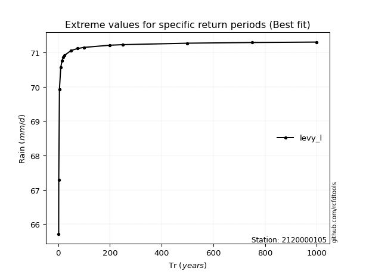</img>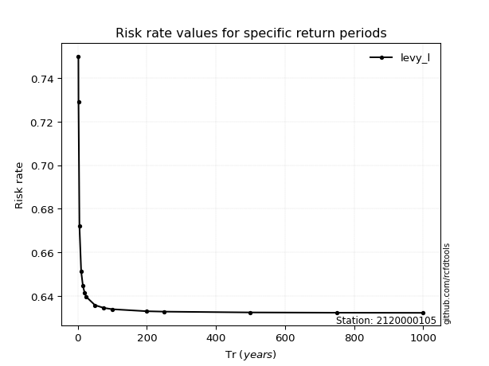</img>

</div>


<sub>**APP DISCLAIMER**: NO WARRANTY - This software is provided by [github.com/rcfdtools](https://github.com/rcfdtools) "as is", without any express or implied warranty, including warranties of merchantability, fitness for a particular purpose, or non-infringement. There is no guarantee that the software will be error-free or operate without interruption. LIMITATION OF LIABILITY - Neither the authors nor copyright holders will be liable for claims or damages arising from the software or its use. You are responsible for determining if the software is appropriate for your use and assume all associated risks, including errors, legal compliance, and data loss. NO PROFESSIONAL ADVICE - The software provides general information and does not offer professional advice. It should not replace consultation with professional advisors.</sub>