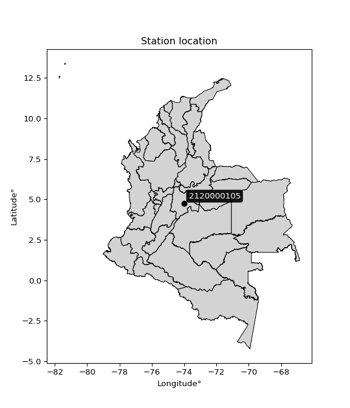

<div align="center">


</div>

# Station (rain, Pmax24h): 2120000105

Probable Maximum Precipitation (PMP) is the greatest amount of rainfall for a specific duration that is meteorologically possible for a given location, acting as a "worst-case" scenario for extreme storms, crucial for designing safety-critical infrastructure like bridges, river deviations, dams, spillways, and nuclear plants to prevent catastrophic failure. PMP is calculated by hydrologists using meteorological data to determine the upper limit of extreme rainfall, often leading to the Probable Maximum Flood (PMF) for flood control design, and is increasingly being studied for climate change impacts.

<div align="center">

</img>

</div>


## A. General information


### 1. General running parameters

• app_version: _v20251226_. • runtime: _2025-12-26 15:38:16.554582_. • Python version: _3.14.0_. • SciPy version: _1.16.3_. • Pandas version: _2.3.3_. • NumPy version: _2.3.5_. • Stations dataset (station_dataset_file): _dataset/pmax24h_in/automatic_colombia_2003_2024.csv_. • Stations catalog (station_catalog_file): _dataset/CNE_IDEAM.xls_. • Minimum year to eval til year_max (date_min): _2003_. • Maximum year to eval since year_min (date_max): _2024_. • Creates, save and include plots into reports (create_plot): _False_. • Plot only fit distributions with Δo > Δ (plot_only_fit): _True_. • Eval low extreme values, if False, evaluates high extreme values (low_extreme): _False_. • Eval every SciPy distribution as logarithmic (pdist_logarithmic_on): _True_. • Standard deviation normalized (ddof): _1.0_. • Return periods to eval in years (Tr): _[2, 2.33, 5, 10, 15, 20, 25, 50, 75, 100, 200, 250, 500, 750, 1000]_. • Minimum data sample per station, 0 means any (minimum_sample): _5_. • Z-Score threshold to adjust a value, 0 means disable (zscore): _3.5_. • Avoid zeros, e.g. rain = 0 (avoid_zeros): _True_. • Avoid null values (avoid_nans): _True_. [:file_folder:Dataset file.](../../dataset/pmax24h_in/automatic_colombia_2003_2024.csv)


### 2. Station info and location

|   id |     CODIGO | NOMBRE                 | CATEGORIA               | TECNOLOGIA                | ESTADO   | FECHA_INSTALACION   |   FECHA_SUSPENSION |   ALTITUD |   LATITUD |   LONGITUD | DEPARTAMENTO   | MUNICIPIO   | AREA_OPERATIVA                            | ENTIDAD                                                      | AREA_HIDROGRAFICA   | ZONA_HIDROGRAFICA   | SUBZONA_HIDROGRAFICA   |   CORRIENTE | OBSERVACION                                                                                                                                |   SUBRED | Catalogo   |
|-----:|-----------:|:-----------------------|:------------------------|:--------------------------|:---------|:--------------------|-------------------:|----------:|----------:|-----------:|:---------------|:------------|:------------------------------------------|:-------------------------------------------------------------|:--------------------|:--------------------|:-----------------------|------------:|:-------------------------------------------------------------------------------------------------------------------------------------------|---------:|:-----------|
|    0 | 2120000105 | EL CODITO [2120000105] | Climatológica Ordinaria | Automática con Telemetría | Activa   | 01/11/2011          |                nan |      2730 |   4.76346 |   -74.0218 | Bogotá         | Bogotá, D.C | Area Operativa 11 - Cundinamarca-Amazonas | INSTITUTO DISTRITAL DE GESTIÓN DE RIESGOS Y CAMBIO CLIMÁTICO | Magdalena Cauca     | Alto Magdalena      | Río Bogotá             |         nan | Solicitado mediante correo electrónico|02/11/2022$Migracion$DATOS ACTUALIZADOS A LA FECHA 02/11/2022, SEGÚN INFORMACIÓN ENVIADA POR IDIGER |      nan | CNE_OE     |

<div align="center">

Map location in: [:earth_americas:Google](http://maps.google.com/maps?q=4.763457,-74.021772) [:earth_americas:OSM](https://www.openstreetmap.org/#map=18/4.763457/-74.021772&layers=P) [:earth_americas:Bing](https://www.bing.com/maps?cp=4.763457~-74.021772&lvl=18) [:earth_americas:Apple](https://maps.apple.com/frame?center=4.763457%2C-74.021772&span=0.003%2C0.006)

</div>


<div align="center">

```geojson
{
  "type": "Feature",
  "geometry": {
    "type": "Point", 
    "coordinates": [-74.021772, 4.763457]
  }, 
  "properties": {
    "Name": "2120000105"
  }
}
```

</div>


### 3. Discrete values table and plot

|               |           0 |           1 |           2 |          3 |           4 |
|:--------------|------------:|------------:|------------:|-----------:|------------:|
| Date          | 2018        | 2019        | 2020        | 2023       | 2024        |
| Value         |   27.8      |   70.9      |   64        |    0.7     |   68.2      |
| Value_initial |   27.8      |   70.9      |   64        |    0.7     |   68.2      |
| count         |    5        |    5        |    5        |    5       |    5        |
| mean          |   46.32     |   46.32     |   46.32     |   46.32    |   46.32     |
| std           |   30.9017   |   30.9017   |   30.9017   |   30.9017  |   30.9017   |
| zscore        |   -0.599319 |    0.795425 |    0.572136 |   -1.47629 |    0.708051 |
> If Z-Score is active, values out of range or outliers are replaced with the station mean value.


### 4. Active continuous probability distributions from SciPy (45 of 104 available)

[scipy.stats](https://docs.scipy.org/doc/scipy/reference/stats.html) is a Python´s powerful submodule within the SciPy library for comprehensive statistical analysis, offering over 130 probability distributions (like Normal, Poisson), functions for descriptive stats (mean, variance), hypothesis testing (t-tests, chi-square), random variable generation, and statistical tests, making it essential for data science, modeling, and research. It provides tools to explore, model, and draw conclusions from data efficiently, working seamlessly with NumPy.

<div align="center">

|   id | p_dist             |   n_parameter | fit_method   | label                                                                       | active   | ref                                                                                                        |
|-----:|:-------------------|--------------:|:-------------|:----------------------------------------------------------------------------|:---------|:-----------------------------------------------------------------------------------------------------------|
|    0 | alpha              |             3 | MLE          | Alpha                                                                       | True     | [:mortar_board:](https://docs.scipy.org/doc/scipy/reference/generated/scipy.stats.alpha.html)              |
|    1 | betaprime          |             4 | MLE          | Beta prime                                                                  | True     | [:mortar_board:](https://docs.scipy.org/doc/scipy/reference/generated/scipy.stats.betaprime.html)          |
|    2 | chi2               |             3 | MLE          | Chi²                                                                        | True     | [:mortar_board:](https://docs.scipy.org/doc/scipy/reference/generated/scipy.stats.chi2.html)               |
|    3 | crystalball        |             4 | MLE          | Crystalball                                                                 | True     | [:mortar_board:](https://docs.scipy.org/doc/scipy/reference/generated/scipy.stats.crystalball.html)        |
|    4 | erlang             |             3 | MLE          | Erlang                                                                      | True     | [:mortar_board:](https://docs.scipy.org/doc/scipy/reference/generated/scipy.stats.erlang.html)             |
|    5 | expon              |             2 | MLE          | Exponential                                                                 | True     | [:mortar_board:](https://docs.scipy.org/doc/scipy/reference/generated/scipy.stats.expon.html)              |
|    6 | exponnorm          |             3 | MLE          | Exponentially modified Normal                                               | True     | [:mortar_board:](https://docs.scipy.org/doc/scipy/reference/generated/scipy.stats.exponnorm.html)          |
|    7 | f                  |             4 | MLE          | F                                                                           | True     | [:mortar_board:](https://docs.scipy.org/doc/scipy/reference/generated/scipy.stats.f.html)                  |
|    8 | fatiguelife        |             3 | MLE          | Fatigue-life (Birnbaum-Saunders)                                            | True     | [:mortar_board:](https://docs.scipy.org/doc/scipy/reference/generated/scipy.stats.fatiguelife.html)        |
|    9 | fisk               |             3 | MLE          | Fisk                                                                        | True     | [:mortar_board:](https://docs.scipy.org/doc/scipy/reference/generated/scipy.stats.fisk.html)               |
|   10 | gamma              |             3 | MLE          | Gamma                                                                       | True     | [:mortar_board:](https://docs.scipy.org/doc/scipy/reference/generated/scipy.stats.gamma.html)              |
|   11 | genexpon           |             5 | MLE          | Generalized exponential                                                     | True     | [:mortar_board:](https://docs.scipy.org/doc/scipy/reference/generated/scipy.stats.genexpon.html)           |
|   12 | genlogistic        |             3 | MLE          | Generalized logistic                                                        | True     | [:mortar_board:](https://docs.scipy.org/doc/scipy/reference/generated/scipy.stats.genlogistic.html)        |
|   13 | gibrat             |             2 | MM           | Gibrat                                                                      | True     | [:mortar_board:](https://docs.scipy.org/doc/scipy/reference/generated/scipy.stats.gibrat.html)             |
|   14 | gompertz           |             3 | MLE          | Gompertz (or truncated Gumbel)                                              | True     | [:mortar_board:](https://docs.scipy.org/doc/scipy/reference/generated/scipy.stats.gompertz.html)           |
|   15 | gumbel_l           |             2 | MM           | Gumbel Left Skew                                                            | True     | [:mortar_board:](https://docs.scipy.org/doc/scipy/reference/generated/scipy.stats.gumbel_l.html)           |
|   16 | gumbel_r           |             2 | MM           | Gumbel Right Skew                                                           | True     | [:mortar_board:](https://docs.scipy.org/doc/scipy/reference/generated/scipy.stats.gumbel_r.html)           |
|   17 | halflogistic       |             2 | MM           | Half-logistic                                                               | True     | [:mortar_board:](https://docs.scipy.org/doc/scipy/reference/generated/scipy.stats.halflogistic.html)       |
|   18 | halfnorm           |             2 | MM           | Half Normal                                                                 | True     | [:mortar_board:](https://docs.scipy.org/doc/scipy/reference/generated/scipy.stats.halfnorm.html)           |
|   19 | hypsecant          |             2 | MM           | hyperbolic secant                                                           | True     | [:mortar_board:](https://docs.scipy.org/doc/scipy/reference/generated/scipy.stats.hypsecant.html)          |
|   20 | invgamma           |             3 | MLE          | Inverted gamma                                                              | True     | [:mortar_board:](https://docs.scipy.org/doc/scipy/reference/generated/scipy.stats.invgamma.html)           |
|   21 | invgauss           |             3 | MLE          | Inverse Gaussian                                                            | True     | [:mortar_board:](https://docs.scipy.org/doc/scipy/reference/generated/scipy.stats.invgauss.html)           |
|   22 | invweibull         |             3 | MLE          | Inverted Weibull                                                            | True     | [:mortar_board:](https://docs.scipy.org/doc/scipy/reference/generated/scipy.stats.invweibull.html)         |
|   23 | johnsonsu          |             4 | MLE          | Johnson Su                                                                  | True     | [:mortar_board:](https://docs.scipy.org/doc/scipy/reference/generated/scipy.stats.johnsonsu.html)          |
|   24 | kstwobign          |             2 | MLE          | Limiting distribution of scaled Kolmogorov-Smirnov two-sided test statistic | True     | [:mortar_board:](https://docs.scipy.org/doc/scipy/reference/generated/scipy.stats.kstwobign.html)          |
|   25 | laplace            |             2 | MM           | Laplace                                                                     | True     | [:mortar_board:](https://docs.scipy.org/doc/scipy/reference/generated/scipy.stats.laplace.html)            |
|   26 | laplace_asymmetric |             3 | MLE          | Asymmetric Laplace                                                          | True     | [:mortar_board:](https://docs.scipy.org/doc/scipy/reference/generated/scipy.stats.laplace_asymmetric.html) |
|   27 | loggamma           |             3 | MLE          | Log gamma                                                                   | True     | [:mortar_board:](https://docs.scipy.org/doc/scipy/reference/generated/scipy.stats.loggamma.html)           |
|   28 | logistic           |             2 | MM           | Logistic (or Sech-squared)                                                  | True     | [:mortar_board:](https://docs.scipy.org/doc/scipy/reference/generated/scipy.stats.logistic.html)           |
|   29 | lognorm            |             3 | MLE          | Log Normal                                                                  | True     | [:mortar_board:](https://docs.scipy.org/doc/scipy/reference/generated/scipy.stats.lognorm.html)            |
|   30 | maxwell            |             2 | MM           | Maxwell                                                                     | True     | [:mortar_board:](https://docs.scipy.org/doc/scipy/reference/generated/scipy.stats.maxwell.html)            |
|   31 | mielke             |             4 | MLE          | Mielke Beta-Kappa / Dagum                                                   | True     | [:mortar_board:](https://docs.scipy.org/doc/scipy/reference/generated/scipy.stats.mielke.html)             |
|   32 | moyal              |             2 | MM           | Moyal                                                                       | True     | [:mortar_board:](https://docs.scipy.org/doc/scipy/reference/generated/scipy.stats.moyal.html)              |
|   33 | nakagami           |             3 | MLE          | Nakagami                                                                    | True     | [:mortar_board:](https://docs.scipy.org/doc/scipy/reference/generated/scipy.stats.nakagami.html)           |
|   34 | ncf                |             5 | MLE          | Non-central F distribution                                                  | True     | [:mortar_board:](https://docs.scipy.org/doc/scipy/reference/generated/scipy.stats.ncf.html)                |
|   35 | nct                |             4 | MLE          | Non-central Student’s t                                                     | True     | [:mortar_board:](https://docs.scipy.org/doc/scipy/reference/generated/scipy.stats.nct.html)                |
|   36 | norm               |             2 | MM           | Normal                                                                      | True     | [:mortar_board:](https://docs.scipy.org/doc/scipy/reference/generated/scipy.stats.norm.html)               |
|   37 | pareto             |             3 | MLE          | Pareto                                                                      | True     | [:mortar_board:](https://docs.scipy.org/doc/scipy/reference/generated/scipy.stats.pareto.html)             |
|   38 | pearson3           |             3 | MM           | Pearson type III                                                            | True     | [:mortar_board:](https://docs.scipy.org/doc/scipy/reference/generated/scipy.stats.pearson3.html)           |
|   39 | rayleigh           |             2 | MM           | Rayleigh                                                                    | True     | [:mortar_board:](https://docs.scipy.org/doc/scipy/reference/generated/scipy.stats.rayleigh.html)           |
|   40 | rice               |             3 | MLE          | Rice                                                                        | True     | [:mortar_board:](https://docs.scipy.org/doc/scipy/reference/generated/scipy.stats.rice.html)               |
|   41 | t                  |             3 | MLE          | Student’s t                                                                 | True     | [:mortar_board:](https://docs.scipy.org/doc/scipy/reference/generated/scipy.stats.t.html)                  |
|   42 | truncnorm          |             4 | MLE          | Truncated normal                                                            | True     | [:mortar_board:](https://docs.scipy.org/doc/scipy/reference/generated/scipy.stats.truncnorm.html)          |
|   43 | wald               |             2 | MM           | Wald                                                                        | True     | [:mortar_board:](https://docs.scipy.org/doc/scipy/reference/generated/scipy.stats.wald.html)               |
|   44 | weibull_min        |             3 | MLE          | Weibull minimum                                                             | True     | [:mortar_board:](https://docs.scipy.org/doc/scipy/reference/generated/scipy.stats.weibull_min.html)        |

</div>

> **n_parameter:** # arguments & localization & scale.
>
> **Fit methods:** (MLE) maximum likelihood, (MM) L-moments.
>
>**Inactive:** foldnorm, gennorm, norminvgauss, powernorm, powerlognorm, skewnorm, genextreme, anglit, arcsine, argus, beta, bradford, burr, burr12, cauchy, cosine, halfcauchy, foldcauchy, skewcauchy, wrapcauchy, dgamma, gengamma, exponweib, exponpow, truncexpon, gausshyper, genhalflogistic, genhyperbolic, geninvgauss, halfgennorm, johnsonsb, kappa4, kappa3, ksone, kstwo, loglaplace, levy, levy_l, levy_stable, ncx2, genpareto, truncpareto, lomax, powerlaw, rdist, rel_breitwigner, recipinvgauss, semicircular, studentized_range, trapezoid, triang, truncweibull_min, tukeylambda, uniform, loguniform, vonmises, vonmises_line, weibull_max, dweibull, 


## B. Probability distributions vs. Empirical distributions

A continuous probability distribution (CPD) describes probabilities for variables that can take any value within a range (like rain any time), unlike discrete variables with specific outcomes (like temperature). It uses a Probability Density Function (PDF), a curve where the total area under it equals 1, and the probability of the variable falling within an interval (a to b) is found by calculating the area under the curve between those points. A key feature is that the probability of hitting any single exact value is zero, so probabilities are always expressed for ranges, e.g., $P(a ≤ X ≤ b)$.

<div align="center">

Distributions parameters
|    |    station | p_dist                |   n |             loc |           scale | shape                  | shape1              | shape2                | shape3   |
|---:|-----------:|:----------------------|----:|----------------:|----------------:|:-----------------------|:--------------------|:----------------------|:---------|
|  0 | 2120000105 | alpha                 |   5 |     0.00129873  |     1.56387     | 3.8115383708452514e-09 |                     |                       |          |
|  1 | 2120000105 | betaprime             |   5 | -1081.15        | 71481.1         | 1655.4158492813058     | 104946.86579255095  |                       |          |
|  2 | 2120000105 | chi2                  |   5 |  -231.078       |     1.50511     | 183.81809803075276     |                     |                       |          |
|  3 | 2120000105 | crystalball           |   5 |    46.3201      |    27.6394      | 19327.720300581903     | 1425.921714212541   |                       |          |
|  4 | 2120000105 | erlang                |   5 |  -379.091       |     1.89993     | 223.94027559383952     |                     |                       |          |
|  5 | 2120000105 | expon                 |   5 |     0.7         |    45.62        |                        |                     |                       |          |
|  6 | 2120000105 | exponnorm             |   5 |    46.3139      |    27.6391      | 0.00020160857771724192 |                     |                       |          |
|  7 | 2120000105 | f                     |   5 |     0.7         |    45.4736      | 1.7484487632780736     | 45.30993600662063   |                       |          |
|  8 | 2120000105 | fatiguelife           |   5 |     0.7         |     5.60271e-05 | 908.2210836522092      |                     |                       |          |
|  9 | 2120000105 | fisk                  |   5 |    -1.41705e+09 |     1.41705e+09 | 84946226.78914505      |                     |                       |          |
| 10 | 2120000105 | gamma                 |   5 |  -358.291       |     2.0153      | 200.83543602052077     |                     |                       |          |
| 11 | 2120000105 | genexpon              |   5 |   -13.161       |     1.86737     | 9.303906944649374e-12  | 0.6978027446225075  | 0.0023878413811533328 |          |
| 12 | 2120000105 | genlogistic           |   5 |    70.9005      |     3.15547e-05 | 1.2853916543659077e-06 |                     |                       |          |
| 13 | 2120000105 | gibrat                |   5 |    25.2347      |    12.7889      |                        |                     |                       |          |
| 14 | 2120000105 | gompertz              |   5 |    27.8         |     9.02831     | 0.015486775090724398   |                     |                       |          |
| 15 | 2120000105 | gumbel_l              |   5 |    58.7592      |    21.5503      |                        |                     |                       |          |
| 16 | 2120000105 | gumbel_r              |   5 |    33.8808      |    21.5503      |                        |                     |                       |          |
| 17 | 2120000105 | halflogistic          |   5 |    13.561       |    23.6306      |                        |                     |                       |          |
| 18 | 2120000105 | halfnorm              |   5 |     9.73631     |    45.8508      |                        |                     |                       |          |
| 19 | 2120000105 | hypsecant             |   5 |    46.32        |    17.5958      |                        |                     |                       |          |
| 20 | 2120000105 | invgamma              |   5 |  -281.392       | 40433.9         | 124.58799364340388     |                     |                       |          |
| 21 | 2120000105 | invgauss              |   5 |  -149.969       |  8374.97        | 0.023432495853061105   |                     |                       |          |
| 22 | 2120000105 | invweibull            |   5 |     0.7         |     2.73388     | 0.06262828472346618    |                     |                       |          |
| 23 | 2120000105 | johnsonsu             |   5 |    70.9         |     1.35398e-16 | 1.9602251465262013     | 0.1074015496059473  |                       |          |
| 24 | 2120000105 | kstwobign             |   5 |   -65.2648      |   126.987       |                        |                     |                       |          |
| 25 | 2120000105 | laplace               |   5 |    46.32        |    19.544       |                        |                     |                       |          |
| 26 | 2120000105 | laplace_asymmetric    |   5 |    70.9006      |     0.226052    | 108.83712555641578     |                     |                       |          |
| 27 | 2120000105 | loggamma              |   5 |    70.9002      |     4.81806e-06 | 1.9629991395371667e-07 |                     |                       |          |
| 28 | 2120000105 | logistic              |   5 |    46.32        |    15.2384      |                        |                     |                       |          |
| 29 | 2120000105 | lognorm               |   5 |     0.7         |     0.0155269   | 16.289608369392315     |                     |                       |          |
| 30 | 2120000105 | maxwell               |   5 |   -19.1737      |    41.0421      |                        |                     |                       |          |
| 31 | 2120000105 | mielke                |   5 |     0.7         |    73.1218      | 0.8385948393651201     | 68.09428025774878   |                       |          |
| 32 | 2120000105 | moyal                 |   5 |    30.514       |    12.4421      |                        |                     |                       |          |
| 33 | 2120000105 | nakagami              |   5 |     0.7         |    62.6214      | 0.252038218904999      |                     |                       |          |
| 34 | 2120000105 | ncf                   |   5 |     0.7         |     5.10452     | 0.7568540077361152     | 390.760320164772    | 6.524896165707892     |          |
| 35 | 2120000105 | nct                   |   5 |    -0.439827    |     0.046521    | 0.33051449962677826    | 54.73617902437144   |                       |          |
| 36 | 2120000105 | norm                  |   5 |    46.32        |    27.6393      |                        |                     |                       |          |
| 37 | 2120000105 | pareto                |   5 |     0.247226    |     0.452774    | 0.26154519076858146    |                     |                       |          |
| 38 | 2120000105 | pearson3              |   5 |    46.32        |    27.6394      | -0.6672486404378939    |                     |                       |          |
| 39 | 2120000105 | rayleigh              |   5 |    -6.55569     |    42.1887      |                        |                     |                       |          |
| 40 | 2120000105 | rice                  |   5 |   -16.7982      |    30.8854      | 1.7254704629414255     |                     |                       |          |
| 41 | 2120000105 | t                     |   5 |    46.3195      |    27.6389      | 34529207.13126001      |                     |                       |          |
| 42 | 2120000105 | truncnorm             |   5 |    -2.77019     |     5.47331     | -0.6650904120228771    | 13.459902753895141  |                       |          |
| 43 | 2120000105 | wald                  |   5 |    18.6806      |    27.6394      |                        |                     |                       |          |
| 44 | 2120000105 | weibull_min           |   5 |    -7.96206e+09 |     7.96206e+09 | 428122907.3125361      |                     |                       |          |
| 45 | 2120000105 | logalpha              |   5 |   -44.0554      |  1192.05        | 25.34189624127722      |                     |                       |          |
| 46 | 2120000105 | logbetaprime          |   5 |    -1.03891     |     1.9256e+13  | 2.00200460623448       | 8744516898092.801   |                       |          |
| 47 | 2120000105 | logchi2               |   5 |    -0.356675    |     1.433       | 1.3285611228082863     |                     |                       |          |
| 48 | 2120000105 | logcrystalball        |   5 |     3.12219     |     1.7735      | 14.861102044477805     | 89.34573397311667   |                       |          |
| 49 | 2120000105 | logerlang             |   5 |   -23.2055      |     0.134752    | 195.4226412684897      |                     |                       |          |
| 50 | 2120000105 | logexpon              |   5 |    -0.356675    |     3.47887     |                        |                     |                       |          |
| 51 | 2120000105 | logexponnorm          |   5 |     3.12113     |     1.77349     | 0.0005953309048920359  |                     |                       |          |
| 52 | 2120000105 | logf                  |   5 |    -0.356675    |     1.07494     | 1.2676646697881413     | 1.223695327444943   |                       |          |
| 53 | 2120000105 | logfatiguelife        |   5 | -1172.92        |  1176.04        | 0.001504740749688831   |                     |                       |          |
| 54 | 2120000105 | logfisk               |   5 |    -0.356675    |     1.45148     | 0.6184094762783459     |                     |                       |          |
| 55 | 2120000105 | loggamma              |   5 |   -23.9149      |     0.122972    | 219.78401140408897     |                     |                       |          |
| 56 | 2120000105 | loggenexpon           |   5 |    -0.356675    |     0.942941    | 0.11679924444029914    | 1.1098497840106676  | 0.06111315254067089   |          |
| 57 | 2120000105 | loggenlogistic        |   5 |     4.26129     |     9.26834e-07 | 8.10406191236229e-07   |                     |                       |          |
| 58 | 2120000105 | loggibrat             |   5 |     1.76918     |     0.820625    |                        |                     |                       |          |
| 59 | 2120000105 | loggompertz           |   5 |    -0.356675    |     1.05046     | 0.019075559622722452   |                     |                       |          |
| 60 | 2120000105 | loggumbel_l           |   5 |     3.92036     |     1.38279     |                        |                     |                       |          |
| 61 | 2120000105 | loggumbel_r           |   5 |     2.32402     |     1.38279     |                        |                     |                       |          |
| 62 | 2120000105 | loghalflogistic       |   5 |     1.02022     |     1.51626     |                        |                     |                       |          |
| 63 | 2120000105 | loghalfnorm           |   5 |     0.774811    |     2.94202     |                        |                     |                       |          |
| 64 | 2120000105 | loghypsecant          |   5 |     3.12219     |     1.12904     |                        |                     |                       |          |
| 65 | 2120000105 | loginvgamma           |   5 |   -38.6463      | 19944.1         | 479.11273781971977     |                     |                       |          |
| 66 | 2120000105 | loginvgauss           |   5 |   -15.8903      |  1823.8         | 0.010415415908408995   |                     |                       |          |
| 67 | 2120000105 | loginvweibull         |   5 |    -1.52454e+08 |     1.52454e+08 | 73860512.70401564      |                     |                       |          |
| 68 | 2120000105 | logjohnsonsu          |   5 |     4.26127     |     2.08434e-18 | 3.3803962293929777     | 0.12324758713460914 |                       |          |
| 69 | 2120000105 | logkstwobign          |   5 |    -5.09903     |     9.36853     |                        |                     |                       |          |
| 70 | 2120000105 | loglaplace            |   5 |     3.12219     |     1.25405     |                        |                     |                       |          |
| 71 | 2120000105 | loglaplace_asymmetric |   5 |     4.26127     |     0.00766771  | 148.2080665495194      |                     |                       |          |
| 72 | 2120000105 | logloggamma           |   5 |     4.26155     |     2.75166e-05 | 2.439847828848396e-05  |                     |                       |          |
| 73 | 2120000105 | loglogistic           |   5 |     3.12219     |     0.97778     |                        |                     |                       |          |
| 74 | 2120000105 | loglognorm            |   5 | -1109.13        |  1112.25        | 0.0015947041779807497  |                     |                       |          |
| 75 | 2120000105 | logmaxwell            |   5 |    -1.08025     |     2.63349     |                        |                     |                       |          |
| 76 | 2120000105 | logmielke             |   5 |    -0.356675    |     1.36425     | 0.8791596361715757     | 1.0498468985024039  |                       |          |
| 77 | 2120000105 | logmoyal              |   5 |     2.10799     |     0.798354    |                        |                     |                       |          |
| 78 | 2120000105 | lognakagami           |   5 |    -0.356675    |     4.42124     | 0.4029832539194331     |                     |                       |          |
| 79 | 2120000105 | logncf                |   5 |    -0.356675    |     1.14178     | 1.1446541105951673     | 1.280877343801909   | 1.0633808428763665    |          |
| 80 | 2120000105 | lognct                |   5 |  -101.031       |     1.71381     | 23189.465648927842     | 60.771476459401356  |                       |          |
| 81 | 2120000105 | lognorm               |   5 |     3.12219     |     1.7735      |                        |                     |                       |          |
| 82 | 2120000105 | logpareto             |   5 |    -0.39261     |     0.0359351   | 0.2604203325201364     |                     |                       |          |
| 83 | 2120000105 | logpearson3           |   5 |     3.12219     |     1.77349     | -1.3685029377827518    |                     |                       |          |
| 84 | 2120000105 | lograyleigh           |   5 |    -0.270589    |     2.70705     |                        |                     |                       |          |
| 85 | 2120000105 | logrice               |   5 | -1018.08        |     1.772       | 576.2990685391105      |                     |                       |          |
| 86 | 2120000105 | logt                  |   5 |     4.22504     |     0.0372316   | 0.3828347542711883     |                     |                       |          |
| 87 | 2120000105 | logtruncnorm          |   5 |     1.44287     |     6.28958     | -0.2863416716681585    | 0.4481069646989318  |                       |          |
| 88 | 2120000105 | logwald               |   5 |     1.34868     |     1.77351     |                        |                     |                       |          |
| 89 | 2120000105 | logweibull_min        |   5 |    -0.356675    |     1.99196     | 0.7222930062837578     |                     |                       |          |

</div>

> **loc** (Location parameter): This shifts the distribution along the x-axis. For many common distributions, like the normal (Gaussian) distribution, loc represents the mean $μ$. For others, like the uniform distribution, it might represent the minimum value, or for the beta distribution, the left end of the support interval.
>
> **scale** (Scale parameter): This determines the width or spread of the distribution. For the normal distribution, scale represents the standard deviation $σ$. For a uniform distribution, it defines the length of the interval (from $loc$ to $loc + scale$).
>
> **shape** (Shape parameters): Refers to parameters that define the specific form of a probability distribution, distinct from its location (loc) and scale (scale). These parameters are required arguments for most distribution functions. For example, a normal (Gaussian) distribution is fully defined by its location (mean) and scale (standard deviation), so it has no specific shape parameters beyond loc and scale. However, other distributions have intrinsic properties that need specification, as Gamma distribution that takes a shape parameter, often named $a$ or $alpha$.


### 0. Cumulative distribution values - CDF (90 evaluated)

> Ordered by x ascending and calculating $log(f(x))$ separately. 

|   id |    Station |   date |    x |   count |   mean |     std |    zscore |   Value_initial |    station |   m |     alpha |   alpha_pdf |   betaprime |   betaprime_pdf |      chi2 |   chi2_pdf |   crystalball |   crystalball_pdf |   erlang |   erlang_pdf |    expon |   expon_pdf |   exponnorm |   exponnorm_pdf |           f |      f_pdf |   fatiguelife |   fatiguelife_pdf |     fisk |   fisk_pdf |    gamma |   gamma_pdf |   genexpon |   genexpon_pdf |   genlogistic |   genlogistic_pdf |    gibrat |   gibrat_pdf |    gompertz |   gompertz_pdf |   gumbel_l |   gumbel_l_pdf |   gumbel_r |   gumbel_r_pdf |   halflogistic |   halflogistic_pdf |   halfnorm |   halfnorm_pdf |   hypsecant |   hypsecant_pdf |   invgamma |   invgamma_pdf |   invgauss |   invgauss_pdf |   invweibull |   invweibull_pdf |   johnsonsu |   johnsonsu_pdf |   kstwobign |   kstwobign_pdf |   laplace |   laplace_pdf |   laplace_asymmetric |   laplace_asymmetric_pdf |   loggamma |   loggamma_pdf |   logistic |   logistic_pdf |   lognorm |   lognorm_pdf |   maxwell |   maxwell_pdf |     mielke |   mielke_pdf |       moyal |   moyal_pdf |    nakagami |   nakagami_pdf |         ncf |     ncf_pdf |      nct |    nct_pdf |      norm |   norm_pdf |      pareto |   pareto_pdf |   pearson3 |   pearson3_pdf |   rayleigh |   rayleigh_pdf |      rice |   rice_pdf |         t |      t_pdf |   truncnorm |   truncnorm_pdf |     wald |   wald_pdf |   weibull_min |   weibull_min_pdf |   logalpha |   logalpha_pdf |   logbetaprime |   logbetaprime_pdf |     logchi2 |   logchi2_pdf |   logcrystalball |   logcrystalball_pdf |   logerlang |   logerlang_pdf |   logexpon |   logexpon_pdf |   logexponnorm |   logexponnorm_pdf |        logf |       logf_pdf |   logfatiguelife |   logfatiguelife_pdf |    logfisk |    logfisk_pdf |   loggenexpon |   loggenexpon_pdf |   loggenlogistic |   loggenlogistic_pdf |   loggibrat |   loggibrat_pdf |   loggompertz |   loggompertz_pdf |   loggumbel_l |   loggumbel_l_pdf |   loggumbel_r |   loggumbel_r_pdf |   loghalflogistic |   loghalflogistic_pdf |   loghalfnorm |   loghalfnorm_pdf |   loghypsecant |   loghypsecant_pdf |   loginvgamma |   loginvgamma_pdf |   loginvgauss |   loginvgauss_pdf |   loginvweibull |   loginvweibull_pdf |   logjohnsonsu |   logjohnsonsu_pdf |   logkstwobign |   logkstwobign_pdf |   loglaplace |   loglaplace_pdf |   loglaplace_asymmetric |   loglaplace_asymmetric_pdf |   logloggamma |   logloggamma_pdf |   loglogistic |   loglogistic_pdf |   loglognorm |   loglognorm_pdf |   logmaxwell |   logmaxwell_pdf |   logmielke |   logmielke_pdf |    logmoyal |   logmoyal_pdf |   lognakagami |   lognakagami_pdf |      logncf |   logncf_pdf |    lognct |   lognct_pdf |   logpareto |   logpareto_pdf |   logpearson3 |   logpearson3_pdf |   lograyleigh |   lograyleigh_pdf |   logrice |   logrice_pdf |      logt |   logt_pdf |   logtruncnorm |   logtruncnorm_pdf |   logwald |   logwald_pdf |   logweibull_min |   logweibull_min_pdf |
|-----:|-----------:|-------:|-----:|--------:|-------:|--------:|----------:|----------------:|-----------:|----:|----------:|------------:|------------:|----------------:|----------:|-----------:|--------------:|------------------:|---------:|-------------:|---------:|------------:|------------:|----------------:|------------:|-----------:|--------------:|------------------:|---------:|-----------:|---------:|------------:|-----------:|---------------:|--------------:|------------------:|----------:|-------------:|------------:|---------------:|-----------:|---------------:|-----------:|---------------:|---------------:|-------------------:|-----------:|---------------:|------------:|----------------:|-----------:|---------------:|-----------:|---------------:|-------------:|-----------------:|------------:|----------------:|------------:|----------------:|----------:|--------------:|---------------------:|-------------------------:|-----------:|---------------:|-----------:|---------------:|----------:|--------------:|----------:|--------------:|-----------:|-------------:|------------:|------------:|------------:|---------------:|------------:|------------:|---------:|-----------:|----------:|-----------:|------------:|-------------:|-----------:|---------------:|-----------:|---------------:|----------:|-----------:|----------:|-----------:|------------:|----------------:|---------:|-----------:|--------------:|------------------:|-----------:|---------------:|---------------:|-------------------:|------------:|--------------:|-----------------:|---------------------:|------------:|----------------:|-----------:|---------------:|---------------:|-------------------:|------------:|---------------:|-----------------:|---------------------:|-----------:|---------------:|--------------:|------------------:|-----------------:|---------------------:|------------:|----------------:|--------------:|------------------:|--------------:|------------------:|--------------:|------------------:|------------------:|----------------------:|--------------:|------------------:|---------------:|-------------------:|--------------:|------------------:|--------------:|------------------:|----------------:|--------------------:|---------------:|-------------------:|---------------:|-------------------:|-------------:|-----------------:|------------------------:|----------------------------:|--------------:|------------------:|--------------:|------------------:|-------------:|-----------------:|-------------:|-----------------:|------------:|----------------:|------------:|---------------:|--------------:|------------------:|------------:|-------------:|----------:|-------------:|------------:|----------------:|--------------:|------------------:|--------------:|------------------:|----------:|--------------:|----------:|-----------:|---------------:|-------------------:|----------:|--------------:|-----------------:|---------------------:|
|    0 | 2120000105 |   2023 |  0.7 |       5 |  46.32 | 30.9017 | -1.47629  |             0.7 | 2120000105 |   1 | 0.0252043 | 0.208783    |   0.0494279 |      0.00376284 | 0.0533427 | 0.00423625 |     0.0494153 |        0.00369662 | 0.049931 |   0.00390943 | 0        |  0.0219202  |   0.0494163 |      0.00369671 | 2.43349e-13 | 1.15573    |     0.0376097 |       3.39745e+09 | 0.050507 | 0.00287476 | 0.050198 |  0.00392521 |   0.044607 |     0.00627206 |      0        |        0.00233371 | 0         |   0          | 0           |     0          |  0.0653673 |     0.00293187 |  0.0094367 |     0.00204195 |       0        |         0          |   0        |     0          |   0.0475433 |      0.00269194 |  0.0513832 |     0.00437146 |   0.048403 |     0.00440892 |  2.41619e-05 |      1.44895e+11 |  0.00629621 |     2.71479e-05 |   0.0498825 |      0.00615846 | 0.0484428 |    0.00247866 |            0.0576459 |               0.00234306 |  0.0245183 |      0.0345781 |  0.0477087 |     0.00298146 | 0.0249053 |      0.03285  | 0.0281592 |    0.00405408 | 2.2573e-09 |    0.529283  | 0.000920177 | 0.000438241 | 8.79038e-10 |    3.99111e+06 | 8.16646e-08 | 3.02564e+06 | 0.055788 | 0.132646   | 0.0494157 | 0.00369665 | 1.11022e-16 |  0.577651    |  0.0635509 |     0.00337218 |  0.0146801 |     0.00401665 | 0.0375092 | 0.0044201  | 0.0494149 | 0.00369666 |    0.647882 |     0.0798083   | 0        | 0          |     0.0419572 |        0.00220805 |  0.0263732 |      0.0381545 |      0.0389756 |          0.102881  | 1.38848e-11 | 83077         |        0.0249054 |            0.0328501 |   0.0277911 |       0.0372756 |   0        |      0.28745   |      0.0249052 |           0.03285  | 3.35692e-11 | 383297         |        0.0244674 |            0.0325316 | 1.0801e-10 | 601632         |   4.49387e-10 |          0.123867 |         0        |            0.0154198 |    0        |       0         |    1.4694e-09 |         0.0181593 |     0.0443499 |         0.0313508 |   0.000959465 |        0.00482174 |          0        |              0        |      0        |          0        |      0.0292014 |          0.0258276 |     0.0307225 |         0.0407977 |     0.0270192 |          0.039595 |        0.035335 |           0.0572267 |      0.0279855 |        0.00171403  |      0.0401596 |          0.0730754 |    0.0312027 |        0.0248815 |               0.0171861 |                   0.0151231 |     0.0166576 |          0.01477  |     0.0277083 |         0.0275528 |    0.0247172 |        0.0327402 |   0.00539336 |        0.0220252 | 3.89153e-15 |      61.6323    | 2.84945e-06 |    4.07597e-05 |    1.8672e-14 |       271.098     | 1.85844e-10 |  1.91607e+06 | 0.0251517 |    0.0331447 | 1.11022e-16 |       7.24695   |     0.0484029 |         0.0323646 |      0        |          0        | 0.0248078 |     0.0327698 | 0.0529995 | 0.00442841 |    0.000304291 |           0.213144 |  0        |     0         |      1.10284e-12 |        14349.8       |
|    1 | 2120000105 |   2018 | 27.8 |       5 |  46.32 | 30.9017 | -0.599319 |            27.8 | 2120000105 |   2 | 0.955137  | 0.00161215  |   0.254325  |      0.0116106  | 0.275876  | 0.0121028  |     0.251409  |        0.0115315  | 0.260808 |   0.0117713  | 0.447906 |  0.012102   |   0.251414  |      0.0115318  | 0.4664      | 0.0111825  |     0.778091  |       0.0042041   | 0.212606 | 0.0100352  | 0.261143 |  0.0117458  |   0.32561  |     0.0128598  |      0        |        0.00703843 | 0.0540831 |   0.0427908  | 8.06431e-12 |     0.00171536 |  0.211588  |     0.00869745 |  0.265537  |     0.0163386  |       0.292486 |         0.0193489  |   0.306394 |     0.0161024  |   0.213798  |      0.0112573  |  0.28267   |     0.0124048  |   0.283669 |     0.0125006  |  0.420553    |      0.000841846 |  0.00728893 |     5.03237e-05 |   0.34395   |      0.0132827  | 0.193834  |    0.00991783 |            0.173437  |               0.00704949 |  0.555185  |      0.215576  |  0.228755  |     0.0115778  | 0.54553   |      0.22348  | 0.273225  |    0.0132285  | 0.435011   |    0.0134612 | 0.264749    | 0.0192002   | 0.506494    |    0.00907181  | 0.310555    | 0.0128456   | 0.638832 | 0.00422217 | 0.25141   | 0.0115315  | 0.658548    |  0.00324124  |  0.231065  |     0.00960951 |  0.282204  |     0.013855   | 0.265132  | 0.0121593  | 0.251412  | 0.0115318  |    1        |     1.64153e-08 | 0.197788 | 0.0385688  |     0.168102  |        0.00823262 |  0.572493  |      0.208333  |      0.588441  |          0.124103  | 0.840533    |     0.0653548 |        0.54553   |            0.22348   |   0.55099   |       0.208979  |   0.652957 |      0.0997574 |      0.545531  |           0.223481 | 0.70709     |      0.0402289 |        0.545474  |            0.223933  | 0.640057   |      0.0386971 |   0.607128    |          0.146826 |         0        |            0.385627  |    0.73882  |       0.208967  |    0.459739   |         0.326474  |     0.478042  |         0.245417  |   0.615787    |        0.215916   |          0.641097 |              0.194226 |      0.613963 |          0.186265 |      0.556882  |          0.277439  |     0.565427  |         0.204676  |     0.565035  |          0.200988 |        0.570265 |           0.155174  |      0.0432114 |        0.0120765   |      0.606146  |          0.147636  |    0.574674  |        0.339162  |               0.438719  |                   0.386054  |     0.435884  |          0.386491 |     0.551678  |         0.25295   |    0.545359  |        0.223423  |   0.57621    |        0.209249  | 0.776499    |       0.048342  | 0.640765    |    0.209124    |    0.624373   |         0.111634  | 0.588805    |  0.0499517   | 0.545696  |    0.222494  | 0.701243    |       0.0209279 |     0.454628  |         0.233157  |      0.586094 |          0.203088 | 0.545562  |     0.223667  | 0.0988148 | 0.0420167  |    0.806284    |           0.212326 |  0.710075 |     0.190099  |      0.789533    |            0.0643479 |
|    2 | 2120000105 |   2020 | 64   |       5 |  46.32 | 30.9017 |  0.572136 |            64   | 2120000105 |   3 | 0.980505  | 0.000304558 |   0.737469  |      0.0115493  | 0.745043  | 0.0106562  |     0.738804  |        0.0117634  | 0.736835 |   0.0111724  | 0.750314 |  0.00547318 |   0.738814  |      0.0117633  | 0.742141    | 0.00501031 |     0.879067  |       0.00185936  | 0.702816 | 0.0125206  | 0.735375 |  0.0111396  |   0.747618 |     0.00886099 |      0        |        0.0307535  | 0.866274  |   0.0055645  | 0.567524    |     0.0408949  |  0.720656  |     0.0165311  |  0.780997  |     0.00895811 |       0.788418 |         0.00800648 |   0.763382 |     0.00863872 |   0.776569  |      0.0116807  |  0.744692  |     0.0101693  |   0.739819 |     0.00994387 |  0.439831    |      0.000357428 |  0.0123539  |     0.000498571 |   0.748732  |      0.00800839 | 0.797654  |    0.0103534  |            0.755358  |               0.0307021  |  0.722122  |      0.179347  |  0.761374  |     0.0119228  | 0.720574  |      0.189619 | 0.749849  |    0.0102429  | 0.886069   |    0.011738  | 0.794583    | 0.00807009  | 0.74622     |    0.00482652  | 0.70831     | 0.00816984  | 0.724986 | 0.00141025 | 0.738806  | 0.0117634  | 0.725818    |  0.00112483  |  0.718455  |     0.014311   |  0.753016  |     0.00979057 | 0.741354  | 0.0110455  | 0.738815  | 0.0117633  |    1        |     4.71166e-34 | 0.836353 | 0.0060682  |     0.724471  |        0.0190978  |  0.731661  |      0.16903   |      0.682315  |          0.101256  | 0.886256    |     0.0456201 |        0.720574  |            0.189619  |   0.713634  |       0.176054  |   0.726922 |      0.0784963 |      0.720575  |           0.189619 | 0.736266    |      0.0304826 |        0.720788  |            0.189794  | 0.6686     |      0.0303447 |   0.718161    |          0.119077 |         0        |            0.799488  |    0.857433 |       0.0942945 |    0.749654   |         0.3346    |     0.695251  |         0.261879  |   0.766982    |        0.147147   |          0.775907 |              0.131234 |      0.749961 |          0.139956 |      0.758182  |          0.194164  |     0.723322  |         0.169545  |     0.71924   |          0.165002 |        0.687294 |           0.124864  |      0.0746769 |        0.169835    |      0.717127  |          0.118325  |    0.781249  |        0.174435  |               0.913798  |                   0.804105  |     0.913     |          0.809541 |     0.742738  |         0.19542   |    0.720321  |        0.189502  |   0.733945   |        0.165743  | 0.810791    |       0.0349753 | 0.781931    |    0.133121    |    0.709686   |         0.0931957 | 0.625689    |  0.0392165   | 0.719932  |    0.18878   | 0.71658     |       0.0162163 |     0.673588  |         0.284643  |      0.737812 |          0.158479 | 0.720735  |     0.189726  | 0.265016  | 1.43516    |    0.979362    |           0.202281 |  0.826785 |     0.10125   |      0.835695    |            0.0474654 |
|    3 | 2120000105 |   2024 | 68.2 |       5 |  46.32 | 30.9017 |  0.708051 |            68.2 | 2120000105 |   4 | 0.981705  | 0.00026821  |   0.783533  |      0.0103673  | 0.787481  | 0.00954223 |     0.785709  |        0.0105513  | 0.781402 |   0.0100352  | 0.772274 |  0.00499179 |   0.785718  |      0.0105511  | 0.762288    | 0.0045904  |     0.88658   |       0.0017206   | 0.752598 | 0.0111615  | 0.779832 |  0.0100156  |   0.783049 |     0.00801046 |      0        |        0.0364919  | 0.887209  |   0.00445566 | 0.739178    |     0.0392723  |  0.787695  |     0.0152673  |  0.815941  |     0.00770167 |       0.819767 |         0.00693978 |   0.797721 |     0.00771873 |   0.821262  |      0.00963256 |  0.78516   |     0.00909622 |   0.779433 |     0.00891633 |  0.441284    |      0.000334945 |  0.0159697  |     0.00158964  |   0.780723  |      0.00723053 | 0.836783  |    0.00835128 |            0.895967  |               0.0364172  |  0.733398  |      0.175429  |  0.807811  |     0.0101883  | 0.732498  |      0.185569 | 0.790558  |    0.00913847 | 0.935064   |    0.0115671 | 0.825927    | 0.00688326  | 0.765826    |    0.00451298  | 0.741118    | 0.00745629  | 0.730665 | 0.00129665 | 0.78571   | 0.0105512  | 0.730355    |  0.00103784  |  0.776492  |     0.0132576  |  0.79193   |     0.00873901 | 0.785424  | 0.00992575 | 0.785719  | 0.0105511  |    1        |     3.01845e-38 | 0.859629 | 0.0050531  |     0.801243  |        0.0172671  |  0.742281  |      0.165141  |      0.688698  |          0.0995807 | 0.889117    |     0.0444106 |        0.732498  |            0.185568  |   0.724711  |       0.172461  |   0.731866 |      0.0770752 |      0.7325    |           0.185568 | 0.738185    |      0.0299001 |        0.732723  |            0.185721  | 0.670513   |      0.029836  |   0.725661    |          0.116899 |         0        |            0.845179  |    0.863265 |       0.0892793 |    0.770646   |         0.325664  |     0.711817  |         0.259292  |   0.776178    |        0.142222   |          0.784114 |              0.127012 |      0.758746 |          0.136489 |      0.770272  |          0.186262  |     0.733984  |         0.165928  |     0.729616  |          0.16147  |        0.695155 |           0.122462  |      0.0930329 |        0.528306    |      0.724577  |          0.116078  |    0.79206   |        0.165815  |               0.966364  |                   0.850361  |     0.965933  |          0.856476 |     0.754962  |         0.189198  |    0.732238  |        0.185453  |   0.744354   |        0.161782  | 0.812989    |       0.0341899 | 0.790239    |    0.128302    |    0.715567   |         0.0918422 | 0.62816     |  0.038554    | 0.731804  |    0.184766  | 0.717601    |       0.0159353 |     0.691728  |         0.286064  |      0.747764 |          0.154652 | 0.732666  |     0.185667  | 0.482684  | 6.62303    |    0.992192    |           0.20139  |  0.83308  |     0.0968442 |      0.838679    |            0.0464229 |
|    4 | 2120000105 |   2019 | 70.9 |       5 |  46.32 | 30.9017 |  0.795425 |            70.9 | 2120000105 |   5 | 0.982402  | 0.000248176 |   0.810442  |      0.00956157 | 0.812251  | 0.00880446 |     0.813081  |        0.00971958 | 0.807467 |   0.00926912 | 0.785361 |  0.00470493 |   0.813089  |      0.00971939 | 0.774342    | 0.00434098 |     0.891114  |       0.00163861  | 0.78149  | 0.0102365  | 0.805856 |  0.00925826 |   0.803942 |     0.0074666  |      0.999982 |        0.0407345  | 0.898449  |   0.00388653 | 0.837616    |     0.0329735  |  0.827366  |     0.0140715  |  0.835721  |     0.00695946 |       0.837647 |         0.00631272 |   0.817787 |     0.00714799 |   0.845627  |      0.00843341 |  0.808778  |     0.00839859 |   0.80261  |     0.00825234 |  0.442171    |      0.000321918 |  0.975015   |     4.63367e+13 |   0.799591  |      0.00674844 | 0.857843  |    0.00727369 |            0.999892  |               0.0406413  |  0.740162  |      0.172983  |  0.833832  |     0.00909258 | 0.739654  |      0.183021 | 0.814267  |    0.00842451 | 0.965663   |    0.0108597 | 0.843582    | 0.0062047   | 0.777751    |    0.00432154  | 0.760645    | 0.00701026  | 0.734077 | 0.00123179 | 0.813082  | 0.00971954 | 0.733089    |  0.000988062 |  0.81113   |     0.0123754  |  0.814616  |     0.00806738 | 0.811209  | 0.00917163 | 0.813091  | 0.00971942 |    1        |     4.45649e-41 | 0.87252  | 0.00450846 |     0.845586  |        0.0155108  |  0.748646  |      0.162729  |      0.692544  |          0.0985638 | 0.890827    |     0.043689  |        0.739654  |            0.183021  |   0.731363  |       0.170216  |   0.734842 |      0.0762198 |      0.739655  |           0.183021 | 0.739339    |      0.0295531 |        0.739884  |            0.18316   | 0.671665   |      0.0295323 |   0.730173    |          0.11557  |         0.999981 |            0.874364  |    0.866675 |       0.0863793 |    0.783172   |         0.319471  |     0.721848  |         0.257393  |   0.781642    |        0.139257   |          0.788996 |              0.124479 |      0.764004 |          0.134382 |      0.77741   |          0.18147   |     0.740383  |         0.163678  |     0.735843  |          0.159279 |        0.699881 |           0.120998  |      0.999638  |        7.78685e+13 |      0.729057  |          0.11471   |    0.798399  |        0.16076   |               0.999951  |                   0.879916  |     0.999765  |          0.886442 |     0.762234  |         0.185352  |    0.739389  |        0.182907  |   0.750588   |        0.159341  | 0.814307    |       0.0337229 | 0.795164    |    0.12543     |    0.719117   |         0.0910194 | 0.62965     |  0.0381582   | 0.738929  |    0.182243  | 0.718217    |       0.0157679 |     0.702847  |         0.286647  |      0.753722 |          0.152303 | 0.739825  |     0.183114  | 0.674853  | 2.82491    |    1           |           0.200838 |  0.836789 |     0.0942679 |      0.840469    |            0.0458002 |

An Empirical Distribution Function (EDF) is a step-function estimate of a true cumulative distribution function (CDF) based on observed sample data, representing the proportion of data points less than or equal to a given value. It is calculated by ordering your data and jumping up by $1/n$ (where $n$ is sample size) at each unique data point, allowing analysis without assuming an underlying population distribution, and it gets closer to the true CDF as the sample size grows.


### 1. Empirical - EDF California (1923)

California´s estimates the true probability distribution of water-related data (like rainfall, streamflow) using observed samples, crucial for risk assessment.

<div align="center">


$P=m/n$


</div>


**1.1. Empirical values**

<div align="center">

|                | 0              | 1                  | 2              | 3                 | 4              |
|:---------------|:---------------|:-------------------|:---------------|:------------------|:---------------|
| date           | 2023           | 2018               | 2020           | 2024              | 2019           |
| x              | 0.7            | 27.8               | 64.0           | 68.2              | 70.9           |
| m              | 1              | 2                  | 3              | 4                 | 5              |
| empirical_dist | edf_california | edf_california     | edf_california | edf_california    | edf_california |
| empirical      | 0.2            | 0.4                | 0.6            | 0.8               | 1.0            |
| empirical_tr   | 1.25           | 1.6666666666666667 | 2.5            | 5.000000000000001 | inf            |

</div>


**1.2. Kolmogorov-Smirnov fit test (sorted by Δ)**


<div align="center">

|                | 0                   | 1                   | 2                   | 3                  | 4                  | 5                   | 6                   | 7                   | 8                  | 9                   | 10                 | 11                  | 12                 | 13                 | 14                  | 15                  | 16                  | 17                  | 18                  | 19                 | 20                 | 21                 | 22                  | 23                 | 24                  | 25                  | 26                  | 27                  | 28                 | 29                  | 30                 | 31                  | 32                  | 33                  | 34                  | 35                  | 36                  | 37                  | 38                 | 39                 | 40                 | 41                 | 42                 | 43                 | 44                 | 45                 | 46                  | 47                  | 48                  | 49                  | 50                  | 51                  | 52                 | 53                  | 54                  | 55                  | 56                  | 57                  | 58                 | 59                 | 60                 | 61                 | 62                  | 63                 | 64                 | 65                 | 66                 | 67                  | 68                 | 69                  | 70                 | 71                    | 72                 | 73                  | 74                 | 75                 | 76                 | 77                 | 78                  | 79                  | 80                 | 81                  | 82                  | 83                 | 84                 | 85                 | 86                 | 87                 | 88                 | 89                 |
|:---------------|:--------------------|:--------------------|:--------------------|:-------------------|:-------------------|:--------------------|:--------------------|:--------------------|:-------------------|:--------------------|:-------------------|:--------------------|:-------------------|:-------------------|:--------------------|:--------------------|:--------------------|:--------------------|:--------------------|:-------------------|:-------------------|:-------------------|:--------------------|:-------------------|:--------------------|:--------------------|:--------------------|:--------------------|:-------------------|:--------------------|:-------------------|:--------------------|:--------------------|:--------------------|:--------------------|:--------------------|:--------------------|:--------------------|:-------------------|:-------------------|:-------------------|:-------------------|:-------------------|:-------------------|:-------------------|:-------------------|:--------------------|:--------------------|:--------------------|:--------------------|:--------------------|:--------------------|:-------------------|:--------------------|:--------------------|:--------------------|:--------------------|:--------------------|:-------------------|:-------------------|:-------------------|:-------------------|:--------------------|:-------------------|:-------------------|:-------------------|:-------------------|:--------------------|:-------------------|:--------------------|:-------------------|:----------------------|:-------------------|:--------------------|:-------------------|:-------------------|:-------------------|:-------------------|:--------------------|:--------------------|:-------------------|:--------------------|:--------------------|:-------------------|:-------------------|:-------------------|:-------------------|:-------------------|:-------------------|:-------------------|
| station        | 2120000105          | 2120000105          | 2120000105          | 2120000105         | 2120000105         | 2120000105          | 2120000105          | 2120000105          | 2120000105         | 2120000105          | 2120000105         | 2120000105          | 2120000105         | 2120000105         | 2120000105          | 2120000105          | 2120000105          | 2120000105          | 2120000105          | 2120000105         | 2120000105         | 2120000105         | 2120000105          | 2120000105         | 2120000105          | 2120000105          | 2120000105          | 2120000105          | 2120000105         | 2120000105          | 2120000105         | 2120000105          | 2120000105          | 2120000105          | 2120000105          | 2120000105          | 2120000105          | 2120000105          | 2120000105         | 2120000105         | 2120000105         | 2120000105         | 2120000105         | 2120000105         | 2120000105         | 2120000105         | 2120000105          | 2120000105          | 2120000105          | 2120000105          | 2120000105          | 2120000105          | 2120000105         | 2120000105          | 2120000105          | 2120000105          | 2120000105          | 2120000105          | 2120000105         | 2120000105         | 2120000105         | 2120000105         | 2120000105          | 2120000105         | 2120000105         | 2120000105         | 2120000105         | 2120000105          | 2120000105         | 2120000105          | 2120000105         | 2120000105            | 2120000105         | 2120000105          | 2120000105         | 2120000105         | 2120000105         | 2120000105         | 2120000105          | 2120000105          | 2120000105         | 2120000105          | 2120000105          | 2120000105         | 2120000105         | 2120000105         | 2120000105         | 2120000105         | 2120000105         | 2120000105         |
| empirical_dist | edf_california      | edf_california      | edf_california      | edf_california     | edf_california     | edf_california      | edf_california      | edf_california      | edf_california     | edf_california      | edf_california     | edf_california      | edf_california     | edf_california     | edf_california      | edf_california      | edf_california      | edf_california      | edf_california      | edf_california     | edf_california     | edf_california     | edf_california      | edf_california     | edf_california      | edf_california      | edf_california      | edf_california      | edf_california     | edf_california      | edf_california     | edf_california      | edf_california      | edf_california      | edf_california      | edf_california      | edf_california      | edf_california      | edf_california     | edf_california     | edf_california     | edf_california     | edf_california     | edf_california     | edf_california     | edf_california     | edf_california      | edf_california      | edf_california      | edf_california      | edf_california      | edf_california      | edf_california     | edf_california      | edf_california      | edf_california      | edf_california      | edf_california      | edf_california     | edf_california     | edf_california     | edf_california     | edf_california      | edf_california     | edf_california     | edf_california     | edf_california     | edf_california      | edf_california     | edf_california      | edf_california     | edf_california        | edf_california     | edf_california      | edf_california     | edf_california     | edf_california     | edf_california     | edf_california      | edf_california      | edf_california     | edf_california      | edf_california      | edf_california     | edf_california     | edf_california     | edf_california     | edf_california     | edf_california     | edf_california     |
| p_dist         | logistic            | rayleigh            | maxwell             | hypsecant          | t                  | exponnorm           | norm                | crystalball         | chi2               | gumbel_l            | rice               | pearson3            | betaprime          | gumbel_r           | invgamma            | erlang              | gamma               | genexpon            | invgauss            | moyal              | halflogistic       | halfnorm           | kstwobign           | loglaplace         | laplace             | expon               | loggompertz         | loggumbel_r         | fisk               | nakagami            | loghypsecant       | f                   | laplace_asymmetric  | weibull_min         | loghalfnorm         | wald                | loglogistic         | ncf                 | logmoyal           | loghalflogistic    | lograyleigh        | logmaxwell         | logalpha           | loginvgamma        | loggamma           | loggamma           | logfatiguelife      | logrice             | logexponnorm        | lognorm             | lognorm             | logcrystalball      | loglognorm         | lognct              | loginvgauss         | logexpon            | nct                 | pareto              | logerlang          | loggenexpon        | logkstwobign       | loggumbel_l        | lognakagami         | mielke             | logpearson3        | loginvweibull      | logpareto          | logf                | logbetaprime       | logwald             | logloggamma        | loglaplace_asymmetric | logfisk            | logt                | loggibrat          | gibrat             | logncf             | logmielke          | fatiguelife         | logweibull_min      | gompertz           | logtruncnorm        | logchi2             | alpha              | invweibull         | truncnorm          | logjohnsonsu       | johnsonsu          | loggenlogistic     | genlogistic        |
| delta          | 0.17124472227405887 | 0.18538360496983475 | 0.18573275102183628 | 0.1862024128296272 | 0.1869092473967413 | 0.18691050315579616 | 0.18691775603299599 | 0.18691902265281735 | 0.187748936473346  | 0.18841183816023838 | 0.1887909588485044 | 0.18886961693392101 | 0.1895581326076422 | 0.190563304495293  | 0.19122239479658154 | 0.19253346851217856 | 0.19414434408987713 | 0.19605800285638897 | 0.19739017517950186 | 0.1990798232860937 | 0.2                | 0.2                | 0.20040877281668934 | 0.20160071025379   | 0.20616616215419242 | 0.21463877664060238 | 0.21682819715271495 | 0.21835757680384105 | 0.2185104543249603 | 0.22224884675869994 | 0.2225896186297085 | 0.22565826815589352 | 0.22656254331178777 | 0.23189807392683306 | 0.23599558958350508 | 0.23635310955143907 | 0.23776639310004655 | 0.23935525963375015 | 0.2407652299378259 | 0.2410970696409933 | 0.2462775076322311 | 0.2494122352806023 | 0.2513539058192811 | 0.2596173957350477 | 0.2598383673833653 | 0.2598383673833653 | 0.26011584796421183 | 0.26017451756102683 | 0.26034474169019717 | 0.26034616882925077 | 0.26034616882925077 | 0.26034629250527797 | 0.2606106293908549 | 0.26107085086465065 | 0.26415745433867177 | 0.26515835624986606 | 0.26592333487280695 | 0.26691107551543314 | 0.26863671663746   | 0.2698265432650415 | 0.2709432042049694 | 0.2781517217203142 | 0.28088334875446086 | 0.2860687438324583 | 0.297153311070381  | 0.3001190458240869 | 0.3012427376974455 | 0.30709016524502086 | 0.3074556434600265 | 0.31007481423040695 | 0.3129995276213864 | 0.3137979946348405    | 0.3283348627623175 | 0.33498440044072053 | 0.3388200089700678 | 0.3459168863042805 | 0.3703503285606141 | 0.3764990538779698 | 0.37809075647342005 | 0.38953273254235243 | 0.3999999999919357 | 0.40628352188661154 | 0.44053329392018614 | 0.5551370185604924 | 0.5578293624446578 | 0.5999999843864937 | 0.7069671315904613 | 0.7840303089346603 | 0.8                | 0.8                |
| deltao         | 0.5865427407550001  | 0.5865427407550001  | 0.5865427407550001  | 0.5865427407550001 | 0.5865427407550001 | 0.5865427407550001  | 0.5865427407550001  | 0.5865427407550001  | 0.5865427407550001 | 0.5865427407550001  | 0.5865427407550001 | 0.5865427407550001  | 0.5865427407550001 | 0.5865427407550001 | 0.5865427407550001  | 0.5865427407550001  | 0.5865427407550001  | 0.5865427407550001  | 0.5865427407550001  | 0.5865427407550001 | 0.5865427407550001 | 0.5865427407550001 | 0.5865427407550001  | 0.5865427407550001 | 0.5865427407550001  | 0.5865427407550001  | 0.5865427407550001  | 0.5865427407550001  | 0.5865427407550001 | 0.5865427407550001  | 0.5865427407550001 | 0.5865427407550001  | 0.5865427407550001  | 0.5865427407550001  | 0.5865427407550001  | 0.5865427407550001  | 0.5865427407550001  | 0.5865427407550001  | 0.5865427407550001 | 0.5865427407550001 | 0.5865427407550001 | 0.5865427407550001 | 0.5865427407550001 | 0.5865427407550001 | 0.5865427407550001 | 0.5865427407550001 | 0.5865427407550001  | 0.5865427407550001  | 0.5865427407550001  | 0.5865427407550001  | 0.5865427407550001  | 0.5865427407550001  | 0.5865427407550001 | 0.5865427407550001  | 0.5865427407550001  | 0.5865427407550001  | 0.5865427407550001  | 0.5865427407550001  | 0.5865427407550001 | 0.5865427407550001 | 0.5865427407550001 | 0.5865427407550001 | 0.5865427407550001  | 0.5865427407550001 | 0.5865427407550001 | 0.5865427407550001 | 0.5865427407550001 | 0.5865427407550001  | 0.5865427407550001 | 0.5865427407550001  | 0.5865427407550001 | 0.5865427407550001    | 0.5865427407550001 | 0.5865427407550001  | 0.5865427407550001 | 0.5865427407550001 | 0.5865427407550001 | 0.5865427407550001 | 0.5865427407550001  | 0.5865427407550001  | 0.5865427407550001 | 0.5865427407550001  | 0.5865427407550001  | 0.5865427407550001 | 0.5865427407550001 | 0.5865427407550001 | 0.5865427407550001 | 0.5865427407550001 | 0.5865427407550001 | 0.5865427407550001 |
| eval           | Δo > Δ              | Δo > Δ              | Δo > Δ              | Δo > Δ             | Δo > Δ             | Δo > Δ              | Δo > Δ              | Δo > Δ              | Δo > Δ             | Δo > Δ              | Δo > Δ             | Δo > Δ              | Δo > Δ             | Δo > Δ             | Δo > Δ              | Δo > Δ              | Δo > Δ              | Δo > Δ              | Δo > Δ              | Δo > Δ             | Δo > Δ             | Δo > Δ             | Δo > Δ              | Δo > Δ             | Δo > Δ              | Δo > Δ              | Δo > Δ              | Δo > Δ              | Δo > Δ             | Δo > Δ              | Δo > Δ             | Δo > Δ              | Δo > Δ              | Δo > Δ              | Δo > Δ              | Δo > Δ              | Δo > Δ              | Δo > Δ              | Δo > Δ             | Δo > Δ             | Δo > Δ             | Δo > Δ             | Δo > Δ             | Δo > Δ             | Δo > Δ             | Δo > Δ             | Δo > Δ              | Δo > Δ              | Δo > Δ              | Δo > Δ              | Δo > Δ              | Δo > Δ              | Δo > Δ             | Δo > Δ              | Δo > Δ              | Δo > Δ              | Δo > Δ              | Δo > Δ              | Δo > Δ             | Δo > Δ             | Δo > Δ             | Δo > Δ             | Δo > Δ              | Δo > Δ             | Δo > Δ             | Δo > Δ             | Δo > Δ             | Δo > Δ              | Δo > Δ             | Δo > Δ              | Δo > Δ             | Δo > Δ                | Δo > Δ             | Δo > Δ              | Δo > Δ             | Δo > Δ             | Δo > Δ             | Δo > Δ             | Δo > Δ              | Δo > Δ              | Δo > Δ             | Δo > Δ              | Δo > Δ              | Δo > Δ             | Δo > Δ             | Δo <= Δ            | Δo <= Δ            | Δo <= Δ            | Δo <= Δ            | Δo <= Δ            |
| fit            | 1                   | 1                   | 1                   | 1                  | 1                  | 1                   | 1                   | 1                   | 1                  | 1                   | 1                  | 1                   | 1                  | 1                  | 1                   | 1                   | 1                   | 1                   | 1                   | 1                  | 1                  | 1                  | 1                   | 1                  | 1                   | 1                   | 1                   | 1                   | 1                  | 1                   | 1                  | 1                   | 1                   | 1                   | 1                   | 1                   | 1                   | 1                   | 1                  | 1                  | 1                  | 1                  | 1                  | 1                  | 1                  | 1                  | 1                   | 1                   | 1                   | 1                   | 1                   | 1                   | 1                  | 1                   | 1                   | 1                   | 1                   | 1                   | 1                  | 1                  | 1                  | 1                  | 1                   | 1                  | 1                  | 1                  | 1                  | 1                   | 1                  | 1                   | 1                  | 1                     | 1                  | 1                   | 1                  | 1                  | 1                  | 1                  | 1                   | 1                   | 1                  | 1                   | 1                   | 1                  | 1                  | 0                  | 0                  | 0                  | 0                  | 0                  |
| n              | 5                   | 5                   | 5                   | 5                  | 5                  | 5                   | 5                   | 5                   | 5                  | 5                   | 5                  | 5                   | 5                  | 5                  | 5                   | 5                   | 5                   | 5                   | 5                   | 5                  | 5                  | 5                  | 5                   | 5                  | 5                   | 5                   | 5                   | 5                   | 5                  | 5                   | 5                  | 5                   | 5                   | 5                   | 5                   | 5                   | 5                   | 5                   | 5                  | 5                  | 5                  | 5                  | 5                  | 5                  | 5                  | 5                  | 5                   | 5                   | 5                   | 5                   | 5                   | 5                   | 5                  | 5                   | 5                   | 5                   | 5                   | 5                   | 5                  | 5                  | 5                  | 5                  | 5                   | 5                  | 5                  | 5                  | 5                  | 5                   | 5                  | 5                   | 5                  | 5                     | 5                  | 5                   | 5                  | 5                  | 5                  | 5                  | 5                   | 5                   | 5                  | 5                   | 5                   | 5                  | 5                  | 5                  | 5                  | 5                  | 5                  | 5                  |
| best_fit       | 1                   | 0                   | 0                   | 0                  | 0                  | 0                   | 0                   | 0                   | 0                  | 0                   | 0                  | 0                   | 0                  | 0                  | 0                   | 0                   | 0                   | 0                   | 0                   | 0                  | 0                  | 0                  | 0                   | 0                  | 0                   | 0                   | 0                   | 0                   | 0                  | 0                   | 0                  | 0                   | 0                   | 0                   | 0                   | 0                   | 0                   | 0                   | 0                  | 0                  | 0                  | 0                  | 0                  | 0                  | 0                  | 0                  | 0                   | 0                   | 0                   | 0                   | 0                   | 0                   | 0                  | 0                   | 0                   | 0                   | 0                   | 0                   | 0                  | 0                  | 0                  | 0                  | 0                   | 0                  | 0                  | 0                  | 0                  | 0                   | 0                  | 0                   | 0                  | 0                     | 0                  | 0                   | 0                  | 0                  | 0                  | 0                  | 0                   | 0                   | 0                  | 0                   | 0                   | 0                  | 0                  | 0                  | 0                  | 0                  | 0                  | 0                  |
| best_fit_sort  | 1                   | 2                   | 3                   | 4                  | 5                  | 6                   | 7                   | 8                   | 9                  | 10                  | 11                 | 12                  | 13                 | 14                 | 15                  | 16                  | 17                  | 18                  | 19                  | 20                 | 21                 | 22                 | 23                  | 24                 | 25                  | 26                  | 27                  | 28                  | 29                 | 30                  | 31                 | 32                  | 33                  | 34                  | 35                  | 36                  | 37                  | 38                  | 39                 | 40                 | 41                 | 42                 | 43                 | 44                 | 45                 | 46                 | 47                  | 48                  | 49                  | 50                  | 51                  | 52                  | 53                 | 54                  | 55                  | 56                  | 57                  | 58                  | 59                 | 60                 | 61                 | 62                 | 63                  | 64                 | 65                 | 66                 | 67                 | 68                  | 69                 | 70                  | 71                 | 72                    | 73                 | 74                  | 75                 | 76                 | 77                 | 78                 | 79                  | 80                  | 81                 | 82                  | 83                  | 84                 | 85                 | 86                 | 87                 | 88                 | 89                 | 90                 |

</div>


**1.3. Best fit**

<div align="center">

|   id |    station | empirical_dist   | p_dist   |    delta |   deltao | eval   |   fit |   n |   best_fit |   best_fit_sort |
|-----:|-----------:|:-----------------|:---------|---------:|---------:|:-------|------:|----:|-----------:|----------------:|
|    0 | 2120000105 | edf_california   | logistic | 0.171245 | 0.586543 | Δo > Δ |     1 |   5 |          1 |               1 |

</div>


### 2. Empirical - EDF Hazen (1930)

Hazen method for plotting positions is a formula used to estimate the empirical cumulative probability distribution of flood events or other hydrological data. This formula often results in biased estimations, particularly when extrapolating to extreme events (high return periods).

<div align="center">


$P=(m-0.5)/n$


</div>


**2.1. Empirical values**

<div align="center">

|                | 0                  | 1                  | 2         | 3                 | 4                  |
|:---------------|:-------------------|:-------------------|:----------|:------------------|:-------------------|
| date           | 2023               | 2018               | 2020      | 2024              | 2019               |
| x              | 0.7                | 27.8               | 64.0      | 68.2              | 70.9               |
| m              | 1                  | 2                  | 3         | 4                 | 5                  |
| empirical_dist | edf_hazen          | edf_hazen          | edf_hazen | edf_hazen         | edf_hazen          |
| empirical      | 0.1                | 0.3                | 0.5       | 0.7               | 0.9                |
| empirical_tr   | 1.1111111111111112 | 1.4285714285714286 | 2.0       | 3.333333333333333 | 10.000000000000002 |

</div>


**2.2. Kolmogorov-Smirnov fit test (sorted by Δ)**


<div align="center">

|                | 0                   | 1                   | 2                   | 3                   | 4                   | 5                   | 6                   | 7                   | 8                  | 9                   | 10                 | 11                  | 12                 | 13                  | 14                 | 15                  | 16                  | 17                  | 18                  | 19                  | 20                  | 21                 | 22                  | 23                  | 24                  | 25                  | 26                 | 27                  | 28                  | 29                  | 30                  | 31                  | 32                  | 33                 | 34                 | 35                  | 36                 | 37                  | 38                  | 39                 | 40                 | 41                  | 42                 | 43                 | 44                  | 45                 | 46                 | 47                 | 48                 | 49                  | 50                  | 51                 | 52                  | 53                 | 54                  | 55                 | 56                  | 57                  | 58                  | 59                 | 60                  | 61                 | 62                 | 63                  | 64                 | 65                  | 66                  | 67                  | 68                 | 69                  | 70                 | 71                  | 72                 | 73                 | 74                 | 75                  | 76                    | 77                  | 78                 | 79                 | 80                 | 81                  | 82                 | 83                 | 84                 | 85                 | 86                 | 87                 | 88                 | 89                 |
|:---------------|:--------------------|:--------------------|:--------------------|:--------------------|:--------------------|:--------------------|:--------------------|:--------------------|:-------------------|:--------------------|:-------------------|:--------------------|:-------------------|:--------------------|:-------------------|:--------------------|:--------------------|:--------------------|:--------------------|:--------------------|:--------------------|:-------------------|:--------------------|:--------------------|:--------------------|:--------------------|:-------------------|:--------------------|:--------------------|:--------------------|:--------------------|:--------------------|:--------------------|:-------------------|:-------------------|:--------------------|:-------------------|:--------------------|:--------------------|:-------------------|:-------------------|:--------------------|:-------------------|:-------------------|:--------------------|:-------------------|:-------------------|:-------------------|:-------------------|:--------------------|:--------------------|:-------------------|:--------------------|:-------------------|:--------------------|:-------------------|:--------------------|:--------------------|:--------------------|:-------------------|:--------------------|:-------------------|:-------------------|:--------------------|:-------------------|:--------------------|:--------------------|:--------------------|:-------------------|:--------------------|:-------------------|:--------------------|:-------------------|:-------------------|:-------------------|:--------------------|:----------------------|:--------------------|:-------------------|:-------------------|:-------------------|:--------------------|:-------------------|:-------------------|:-------------------|:-------------------|:-------------------|:-------------------|:-------------------|:-------------------|
| station        | 2120000105          | 2120000105          | 2120000105          | 2120000105          | 2120000105          | 2120000105          | 2120000105          | 2120000105          | 2120000105         | 2120000105          | 2120000105         | 2120000105          | 2120000105         | 2120000105          | 2120000105         | 2120000105          | 2120000105          | 2120000105          | 2120000105          | 2120000105          | 2120000105          | 2120000105         | 2120000105          | 2120000105          | 2120000105          | 2120000105          | 2120000105         | 2120000105          | 2120000105          | 2120000105          | 2120000105          | 2120000105          | 2120000105          | 2120000105         | 2120000105         | 2120000105          | 2120000105         | 2120000105          | 2120000105          | 2120000105         | 2120000105         | 2120000105          | 2120000105         | 2120000105         | 2120000105          | 2120000105         | 2120000105         | 2120000105         | 2120000105         | 2120000105          | 2120000105          | 2120000105         | 2120000105          | 2120000105         | 2120000105          | 2120000105         | 2120000105          | 2120000105          | 2120000105          | 2120000105         | 2120000105          | 2120000105         | 2120000105         | 2120000105          | 2120000105         | 2120000105          | 2120000105          | 2120000105          | 2120000105         | 2120000105          | 2120000105         | 2120000105          | 2120000105         | 2120000105         | 2120000105         | 2120000105          | 2120000105            | 2120000105          | 2120000105         | 2120000105         | 2120000105         | 2120000105          | 2120000105         | 2120000105         | 2120000105         | 2120000105         | 2120000105         | 2120000105         | 2120000105         | 2120000105         |
| empirical_dist | edf_hazen           | edf_hazen           | edf_hazen           | edf_hazen           | edf_hazen           | edf_hazen           | edf_hazen           | edf_hazen           | edf_hazen          | edf_hazen           | edf_hazen          | edf_hazen           | edf_hazen          | edf_hazen           | edf_hazen          | edf_hazen           | edf_hazen           | edf_hazen           | edf_hazen           | edf_hazen           | edf_hazen           | edf_hazen          | edf_hazen           | edf_hazen           | edf_hazen           | edf_hazen           | edf_hazen          | edf_hazen           | edf_hazen           | edf_hazen           | edf_hazen           | edf_hazen           | edf_hazen           | edf_hazen          | edf_hazen          | edf_hazen           | edf_hazen          | edf_hazen           | edf_hazen           | edf_hazen          | edf_hazen          | edf_hazen           | edf_hazen          | edf_hazen          | edf_hazen           | edf_hazen          | edf_hazen          | edf_hazen          | edf_hazen          | edf_hazen           | edf_hazen           | edf_hazen          | edf_hazen           | edf_hazen          | edf_hazen           | edf_hazen          | edf_hazen           | edf_hazen           | edf_hazen           | edf_hazen          | edf_hazen           | edf_hazen          | edf_hazen          | edf_hazen           | edf_hazen          | edf_hazen           | edf_hazen           | edf_hazen           | edf_hazen          | edf_hazen           | edf_hazen          | edf_hazen           | edf_hazen          | edf_hazen          | edf_hazen          | edf_hazen           | edf_hazen             | edf_hazen           | edf_hazen          | edf_hazen          | edf_hazen          | edf_hazen           | edf_hazen          | edf_hazen          | edf_hazen          | edf_hazen          | edf_hazen          | edf_hazen          | edf_hazen          | edf_hazen          |
| p_dist         | loggumbel_l         | logpearson3         | fisk                | ncf                 | pearson3            | gumbel_l            | weibull_min         | logt                | gamma              | erlang              | betaprime          | crystalball         | norm               | exponnorm           | t                  | invgauss            | rice                | f                   | invgamma            | chi2                | loglognorm          | logfatiguelife     | logcrystalball      | lognorm             | lognorm             | logexponnorm        | logrice            | lognct              | nakagami            | genexpon            | kstwobign           | loggompertz         | maxwell             | expon              | logerlang          | loglogistic         | rayleigh           | loggamma            | loggamma            | laplace_asymmetric | loghypsecant       | logistic            | halfnorm           | loginvgauss        | loginvgamma         | loginvweibull      | logalpha           | logmaxwell         | hypsecant          | gumbel_r            | loglaplace          | lograyleigh        | halflogistic        | logbetaprime       | logncf              | moyal              | laplace             | gompertz            | logkstwobign        | loggenexpon        | loghalfnorm         | loggumbel_r        | lognakagami        | wald                | nct                | logfisk             | logmoyal            | loghalflogistic     | logexpon           | pareto              | gibrat             | mielke              | logpareto          | logf               | logwald            | logloggamma         | loglaplace_asymmetric | loggibrat           | invweibull         | logmielke          | fatiguelife        | logweibull_min      | logtruncnorm       | logchi2            | logjohnsonsu       | alpha              | johnsonsu          | truncnorm          | loggenlogistic     | genlogistic        |
| delta          | 0.19525054582484658 | 0.19715331107038103 | 0.20281586569939436 | 0.20830976869554085 | 0.21845515993326137 | 0.22065593098737413 | 0.22447090306320128 | 0.23498440044072055 | 0.2353753886685307 | 0.23683504440093073 | 0.2374686627010948 | 0.23880418801696568 | 0.2388056864860113 | 0.23881378406692133 | 0.2388147141059207 | 0.23981931078566132 | 0.24135423666564215 | 0.24214052285597876 | 0.24469151967176161 | 0.24504338227364741 | 0.24535893486623778 | 0.2454742680624225 | 0.24552983866920447 | 0.24552985867033866 | 0.24552985867033866 | 0.24553116456273177 | 0.2455622610981743 | 0.24569590997854768 | 0.24622029976875448 | 0.24761849190846663 | 0.24873207589808333 | 0.24965437254539813 | 0.24984930173751974 | 0.2503135430553509 | 0.2509898871198905 | 0.25167826021932077 | 0.253016489106489  | 0.25518463022219867 | 0.25518463022219867 | 0.2553578404289709 | 0.2581817677384657 | 0.26137431485708307 | 0.263382155104554  | 0.2650351590899334 | 0.26542742929866786 | 0.2702652971821368 | 0.2724929261249452 | 0.2762102286782369 | 0.2765688127415603 | 0.28099681219920447 | 0.28124894920324406 | 0.2860940167827342 | 0.28841822589218125 | 0.2884409159907359 | 0.28880479034911793 | 0.2945828140900668 | 0.29765355700098095 | 0.29999999999193566 | 0.30614575337731914 | 0.3071276655000859 | 0.31396327980343436 | 0.3157871665665724 | 0.3243727772126718 | 0.33635310955143904 | 0.3388323699150622 | 0.34005697460013434 | 0.34076522993782593 | 0.34109706964099334 | 0.3529573331174048 | 0.35854841466523407 | 0.3662738564922735 | 0.38606874383245826 | 0.4012427376974455 | 0.4070901652450209 | 0.410074814230407  | 0.41299952762138636 | 0.41379799463484046   | 0.43882000897006784 | 0.4578293624446578 | 0.4764990538779698 | 0.4780907564734201 | 0.48953273254235247 | 0.5062835218866115 | 0.5405332939201861 | 0.6069671315904612 | 0.6551370185604923 | 0.6840303089346602 | 0.6999999843864937 | 0.7                | 0.7                |
| deltao         | 0.5865427407550001  | 0.5865427407550001  | 0.5865427407550001  | 0.5865427407550001  | 0.5865427407550001  | 0.5865427407550001  | 0.5865427407550001  | 0.5865427407550001  | 0.5865427407550001 | 0.5865427407550001  | 0.5865427407550001 | 0.5865427407550001  | 0.5865427407550001 | 0.5865427407550001  | 0.5865427407550001 | 0.5865427407550001  | 0.5865427407550001  | 0.5865427407550001  | 0.5865427407550001  | 0.5865427407550001  | 0.5865427407550001  | 0.5865427407550001 | 0.5865427407550001  | 0.5865427407550001  | 0.5865427407550001  | 0.5865427407550001  | 0.5865427407550001 | 0.5865427407550001  | 0.5865427407550001  | 0.5865427407550001  | 0.5865427407550001  | 0.5865427407550001  | 0.5865427407550001  | 0.5865427407550001 | 0.5865427407550001 | 0.5865427407550001  | 0.5865427407550001 | 0.5865427407550001  | 0.5865427407550001  | 0.5865427407550001 | 0.5865427407550001 | 0.5865427407550001  | 0.5865427407550001 | 0.5865427407550001 | 0.5865427407550001  | 0.5865427407550001 | 0.5865427407550001 | 0.5865427407550001 | 0.5865427407550001 | 0.5865427407550001  | 0.5865427407550001  | 0.5865427407550001 | 0.5865427407550001  | 0.5865427407550001 | 0.5865427407550001  | 0.5865427407550001 | 0.5865427407550001  | 0.5865427407550001  | 0.5865427407550001  | 0.5865427407550001 | 0.5865427407550001  | 0.5865427407550001 | 0.5865427407550001 | 0.5865427407550001  | 0.5865427407550001 | 0.5865427407550001  | 0.5865427407550001  | 0.5865427407550001  | 0.5865427407550001 | 0.5865427407550001  | 0.5865427407550001 | 0.5865427407550001  | 0.5865427407550001 | 0.5865427407550001 | 0.5865427407550001 | 0.5865427407550001  | 0.5865427407550001    | 0.5865427407550001  | 0.5865427407550001 | 0.5865427407550001 | 0.5865427407550001 | 0.5865427407550001  | 0.5865427407550001 | 0.5865427407550001 | 0.5865427407550001 | 0.5865427407550001 | 0.5865427407550001 | 0.5865427407550001 | 0.5865427407550001 | 0.5865427407550001 |
| eval           | Δo > Δ              | Δo > Δ              | Δo > Δ              | Δo > Δ              | Δo > Δ              | Δo > Δ              | Δo > Δ              | Δo > Δ              | Δo > Δ             | Δo > Δ              | Δo > Δ             | Δo > Δ              | Δo > Δ             | Δo > Δ              | Δo > Δ             | Δo > Δ              | Δo > Δ              | Δo > Δ              | Δo > Δ              | Δo > Δ              | Δo > Δ              | Δo > Δ             | Δo > Δ              | Δo > Δ              | Δo > Δ              | Δo > Δ              | Δo > Δ             | Δo > Δ              | Δo > Δ              | Δo > Δ              | Δo > Δ              | Δo > Δ              | Δo > Δ              | Δo > Δ             | Δo > Δ             | Δo > Δ              | Δo > Δ             | Δo > Δ              | Δo > Δ              | Δo > Δ             | Δo > Δ             | Δo > Δ              | Δo > Δ             | Δo > Δ             | Δo > Δ              | Δo > Δ             | Δo > Δ             | Δo > Δ             | Δo > Δ             | Δo > Δ              | Δo > Δ              | Δo > Δ             | Δo > Δ              | Δo > Δ             | Δo > Δ              | Δo > Δ             | Δo > Δ              | Δo > Δ              | Δo > Δ              | Δo > Δ             | Δo > Δ              | Δo > Δ             | Δo > Δ             | Δo > Δ              | Δo > Δ             | Δo > Δ              | Δo > Δ              | Δo > Δ              | Δo > Δ             | Δo > Δ              | Δo > Δ             | Δo > Δ              | Δo > Δ             | Δo > Δ             | Δo > Δ             | Δo > Δ              | Δo > Δ                | Δo > Δ              | Δo > Δ             | Δo > Δ             | Δo > Δ             | Δo > Δ              | Δo > Δ             | Δo > Δ             | Δo <= Δ            | Δo <= Δ            | Δo <= Δ            | Δo <= Δ            | Δo <= Δ            | Δo <= Δ            |
| fit            | 1                   | 1                   | 1                   | 1                   | 1                   | 1                   | 1                   | 1                   | 1                  | 1                   | 1                  | 1                   | 1                  | 1                   | 1                  | 1                   | 1                   | 1                   | 1                   | 1                   | 1                   | 1                  | 1                   | 1                   | 1                   | 1                   | 1                  | 1                   | 1                   | 1                   | 1                   | 1                   | 1                   | 1                  | 1                  | 1                   | 1                  | 1                   | 1                   | 1                  | 1                  | 1                   | 1                  | 1                  | 1                   | 1                  | 1                  | 1                  | 1                  | 1                   | 1                   | 1                  | 1                   | 1                  | 1                   | 1                  | 1                   | 1                   | 1                   | 1                  | 1                   | 1                  | 1                  | 1                   | 1                  | 1                   | 1                   | 1                   | 1                  | 1                   | 1                  | 1                   | 1                  | 1                  | 1                  | 1                   | 1                     | 1                   | 1                  | 1                  | 1                  | 1                   | 1                  | 1                  | 0                  | 0                  | 0                  | 0                  | 0                  | 0                  |
| n              | 5                   | 5                   | 5                   | 5                   | 5                   | 5                   | 5                   | 5                   | 5                  | 5                   | 5                  | 5                   | 5                  | 5                   | 5                  | 5                   | 5                   | 5                   | 5                   | 5                   | 5                   | 5                  | 5                   | 5                   | 5                   | 5                   | 5                  | 5                   | 5                   | 5                   | 5                   | 5                   | 5                   | 5                  | 5                  | 5                   | 5                  | 5                   | 5                   | 5                  | 5                  | 5                   | 5                  | 5                  | 5                   | 5                  | 5                  | 5                  | 5                  | 5                   | 5                   | 5                  | 5                   | 5                  | 5                   | 5                  | 5                   | 5                   | 5                   | 5                  | 5                   | 5                  | 5                  | 5                   | 5                  | 5                   | 5                   | 5                   | 5                  | 5                   | 5                  | 5                   | 5                  | 5                  | 5                  | 5                   | 5                     | 5                   | 5                  | 5                  | 5                  | 5                   | 5                  | 5                  | 5                  | 5                  | 5                  | 5                  | 5                  | 5                  |
| best_fit       | 1                   | 0                   | 0                   | 0                   | 0                   | 0                   | 0                   | 0                   | 0                  | 0                   | 0                  | 0                   | 0                  | 0                   | 0                  | 0                   | 0                   | 0                   | 0                   | 0                   | 0                   | 0                  | 0                   | 0                   | 0                   | 0                   | 0                  | 0                   | 0                   | 0                   | 0                   | 0                   | 0                   | 0                  | 0                  | 0                   | 0                  | 0                   | 0                   | 0                  | 0                  | 0                   | 0                  | 0                  | 0                   | 0                  | 0                  | 0                  | 0                  | 0                   | 0                   | 0                  | 0                   | 0                  | 0                   | 0                  | 0                   | 0                   | 0                   | 0                  | 0                   | 0                  | 0                  | 0                   | 0                  | 0                   | 0                   | 0                   | 0                  | 0                   | 0                  | 0                   | 0                  | 0                  | 0                  | 0                   | 0                     | 0                   | 0                  | 0                  | 0                  | 0                   | 0                  | 0                  | 0                  | 0                  | 0                  | 0                  | 0                  | 0                  |
| best_fit_sort  | 1                   | 2                   | 3                   | 4                   | 5                   | 6                   | 7                   | 8                   | 9                  | 10                  | 11                 | 12                  | 13                 | 14                  | 15                 | 16                  | 17                  | 18                  | 19                  | 20                  | 21                  | 22                 | 23                  | 24                  | 25                  | 26                  | 27                 | 28                  | 29                  | 30                  | 31                  | 32                  | 33                  | 34                 | 35                 | 36                  | 37                 | 38                  | 39                  | 40                 | 41                 | 42                  | 43                 | 44                 | 45                  | 46                 | 47                 | 48                 | 49                 | 50                  | 51                  | 52                 | 53                  | 54                 | 55                  | 56                 | 57                  | 58                  | 59                  | 60                 | 61                  | 62                 | 63                 | 64                  | 65                 | 66                  | 67                  | 68                  | 69                 | 70                  | 71                 | 72                  | 73                 | 74                 | 75                 | 76                  | 77                    | 78                  | 79                 | 80                 | 81                 | 82                  | 83                 | 84                 | 85                 | 86                 | 87                 | 88                 | 89                 | 90                 |

</div>


**2.3. Best fit**

<div align="center">

|   id |    station | empirical_dist   | p_dist      |    delta |   deltao | eval   |   fit |   n |   best_fit |   best_fit_sort |
|-----:|-----------:|:-----------------|:------------|---------:|---------:|:-------|------:|----:|-----------:|----------------:|
|    0 | 2120000105 | edf_hazen        | loggumbel_l | 0.195251 | 0.586543 | Δo > Δ |     1 |   5 |          1 |               1 |

</div>


### 3. Empirical - EDF Weibull (1939)

Weibull plotting position formula is an empirical method used to estimate the non-exceedance probability or plotting position for a set of observed data, is often recommended or widely used in practice, particularly in flood frequency analysis.

<div align="center">


$P=m/(n+1)$


</div>


**3.1. Empirical values**

<div align="center">

|                | 0                   | 1                  | 2           | 3                  | 4                  |
|:---------------|:--------------------|:-------------------|:------------|:-------------------|:-------------------|
| date           | 2023                | 2018               | 2020        | 2024               | 2019               |
| x              | 0.7                 | 27.8               | 64.0        | 68.2               | 70.9               |
| m              | 1                   | 2                  | 3           | 4                  | 5                  |
| empirical_dist | edf_weibull         | edf_weibull        | edf_weibull | edf_weibull        | edf_weibull        |
| empirical      | 0.16666666666666666 | 0.3333333333333333 | 0.5         | 0.6666666666666666 | 0.8333333333333334 |
| empirical_tr   | 1.2                 | 1.4999999999999998 | 2.0         | 2.9999999999999996 | 6.000000000000002  |

</div>


**3.2. Kolmogorov-Smirnov fit test (sorted by Δ)**


<div align="center">

|                | 0                   | 1                   | 2                   | 3                   | 4                   | 5                   | 6                   | 7                  | 8                   | 9                  | 10                 | 11                  | 12                  | 13                  | 14                  | 15                  | 16                  | 17                  | 18                 | 19                  | 20                  | 21                 | 22                  | 23                 | 24                 | 25                  | 26                 | 27                  | 28                 | 29                  | 30                  | 31                  | 32                  | 33                  | 34                 | 35                  | 36                  | 37                  | 38                  | 39                  | 40                  | 41                  | 42                 | 43                 | 44                 | 45                 | 46                 | 47                 | 48                 | 49                  | 50                 | 51                 | 52                 | 53                 | 54                  | 55                  | 56                  | 57                 | 58                  | 59                 | 60                 | 61                  | 62                 | 63                 | 64                 | 65                 | 66                  | 67                  | 68                 | 69                  | 70                 | 71                 | 72                  | 73                  | 74                  | 75                 | 76                 | 77                  | 78                    | 79                 | 80                  | 81                  | 82                 | 83                 | 84                 | 85                 | 86                 | 87                 | 88                 | 89                 |
|:---------------|:--------------------|:--------------------|:--------------------|:--------------------|:--------------------|:--------------------|:--------------------|:-------------------|:--------------------|:-------------------|:-------------------|:--------------------|:--------------------|:--------------------|:--------------------|:--------------------|:--------------------|:--------------------|:-------------------|:--------------------|:--------------------|:-------------------|:--------------------|:-------------------|:-------------------|:--------------------|:-------------------|:--------------------|:-------------------|:--------------------|:--------------------|:--------------------|:--------------------|:--------------------|:-------------------|:--------------------|:--------------------|:--------------------|:--------------------|:--------------------|:--------------------|:--------------------|:-------------------|:-------------------|:-------------------|:-------------------|:-------------------|:-------------------|:-------------------|:--------------------|:-------------------|:-------------------|:-------------------|:-------------------|:--------------------|:--------------------|:--------------------|:-------------------|:--------------------|:-------------------|:-------------------|:--------------------|:-------------------|:-------------------|:-------------------|:-------------------|:--------------------|:--------------------|:-------------------|:--------------------|:-------------------|:-------------------|:--------------------|:--------------------|:--------------------|:-------------------|:-------------------|:--------------------|:----------------------|:-------------------|:--------------------|:--------------------|:-------------------|:-------------------|:-------------------|:-------------------|:-------------------|:-------------------|:-------------------|:-------------------|
| station        | 2120000105          | 2120000105          | 2120000105          | 2120000105          | 2120000105          | 2120000105          | 2120000105          | 2120000105         | 2120000105          | 2120000105         | 2120000105         | 2120000105          | 2120000105          | 2120000105          | 2120000105          | 2120000105          | 2120000105          | 2120000105          | 2120000105         | 2120000105          | 2120000105          | 2120000105         | 2120000105          | 2120000105         | 2120000105         | 2120000105          | 2120000105         | 2120000105          | 2120000105         | 2120000105          | 2120000105          | 2120000105          | 2120000105          | 2120000105          | 2120000105         | 2120000105          | 2120000105          | 2120000105          | 2120000105          | 2120000105          | 2120000105          | 2120000105          | 2120000105         | 2120000105         | 2120000105         | 2120000105         | 2120000105         | 2120000105         | 2120000105         | 2120000105          | 2120000105         | 2120000105         | 2120000105         | 2120000105         | 2120000105          | 2120000105          | 2120000105          | 2120000105         | 2120000105          | 2120000105         | 2120000105         | 2120000105          | 2120000105         | 2120000105         | 2120000105         | 2120000105         | 2120000105          | 2120000105          | 2120000105         | 2120000105          | 2120000105         | 2120000105         | 2120000105          | 2120000105          | 2120000105          | 2120000105         | 2120000105         | 2120000105          | 2120000105            | 2120000105         | 2120000105          | 2120000105          | 2120000105         | 2120000105         | 2120000105         | 2120000105         | 2120000105         | 2120000105         | 2120000105         | 2120000105         |
| empirical_dist | edf_weibull         | edf_weibull         | edf_weibull         | edf_weibull         | edf_weibull         | edf_weibull         | edf_weibull         | edf_weibull        | edf_weibull         | edf_weibull        | edf_weibull        | edf_weibull         | edf_weibull         | edf_weibull         | edf_weibull         | edf_weibull         | edf_weibull         | edf_weibull         | edf_weibull        | edf_weibull         | edf_weibull         | edf_weibull        | edf_weibull         | edf_weibull        | edf_weibull        | edf_weibull         | edf_weibull        | edf_weibull         | edf_weibull        | edf_weibull         | edf_weibull         | edf_weibull         | edf_weibull         | edf_weibull         | edf_weibull        | edf_weibull         | edf_weibull         | edf_weibull         | edf_weibull         | edf_weibull         | edf_weibull         | edf_weibull         | edf_weibull        | edf_weibull        | edf_weibull        | edf_weibull        | edf_weibull        | edf_weibull        | edf_weibull        | edf_weibull         | edf_weibull        | edf_weibull        | edf_weibull        | edf_weibull        | edf_weibull         | edf_weibull         | edf_weibull         | edf_weibull        | edf_weibull         | edf_weibull        | edf_weibull        | edf_weibull         | edf_weibull        | edf_weibull        | edf_weibull        | edf_weibull        | edf_weibull         | edf_weibull         | edf_weibull        | edf_weibull         | edf_weibull        | edf_weibull        | edf_weibull         | edf_weibull         | edf_weibull         | edf_weibull        | edf_weibull        | edf_weibull         | edf_weibull           | edf_weibull        | edf_weibull         | edf_weibull         | edf_weibull        | edf_weibull        | edf_weibull        | edf_weibull        | edf_weibull        | edf_weibull        | edf_weibull        | edf_weibull        |
| p_dist         | logpearson3         | loggumbel_l         | fisk                | ncf                 | logerlang           | pearson3            | lognct              | loglognorm         | logcrystalball      | lognorm            | lognorm            | logexponnorm        | gumbel_l            | logrice             | logfatiguelife      | loggamma            | loggamma            | weibull_min         | loginvgauss        | loginvgamma         | logt                | gamma              | erlang              | loginvweibull      | betaprime          | crystalball         | norm               | exponnorm           | t                  | logalpha            | invgauss            | rice                | f                   | loglogistic         | logmaxwell         | invgamma            | chi2                | nakagami            | genexpon            | kstwobign           | loggompertz         | maxwell             | expon              | lograyleigh        | rayleigh           | logbetaprime       | laplace_asymmetric | logncf             | loghypsecant       | logistic            | halfnorm           | logkstwobign       | loggenexpon        | hypsecant          | loghalfnorm         | gumbel_r            | loglaplace          | loggumbel_r        | halflogistic        | lognakagami        | moyal              | laplace             | nct                | logfisk            | logmoyal           | loghalflogistic    | logexpon            | pareto              | gompertz           | wald                | gibrat             | logpareto          | logf                | logwald             | mielke              | invweibull         | loggibrat          | logloggamma         | loglaplace_asymmetric | logmielke          | fatiguelife         | logweibull_min      | logtruncnorm       | logchi2            | logjohnsonsu       | alpha              | johnsonsu          | truncnorm          | loggenlogistic     | genlogistic        |
| delta          | 0.17358753562904738 | 0.19525054582484658 | 0.20281586569939436 | 0.20830976869554085 | 0.21765655378655718 | 0.21845515993326137 | 0.21993190116308425 | 0.2203210833364393 | 0.22057358216002465 | 0.2205736981373727 | 0.2205736981373727 | 0.22057513619816682 | 0.22065593098737413 | 0.22073509942246372 | 0.22078796316377358 | 0.22212216429822307 | 0.22212216429822307 | 0.22447090306320128 | 0.2317018257566001 | 0.23209409596533453 | 0.23498440044072055 | 0.2353753886685307 | 0.23683504440093073 | 0.2369319638488035 | 0.2374686627010948 | 0.23880418801696568 | 0.2388056864860113 | 0.23881378406692133 | 0.2388147141059207 | 0.23915959279161186 | 0.23981931078566132 | 0.24135423666564215 | 0.24214052285597876 | 0.24273837557581357 | 0.2428768953449036 | 0.24469151967176161 | 0.24504338227364741 | 0.24622029976875448 | 0.24761849190846663 | 0.24873207589808333 | 0.24965437254539813 | 0.24984930173751974 | 0.2503135430553509 | 0.2527606834494009 | 0.253016489106489  | 0.2551075826574026 | 0.2553578404289709 | 0.2554714570157846 | 0.2581817677384657 | 0.26137431485708307 | 0.263382155104554  | 0.2728124200439858 | 0.2737943321667526 | 0.2765688127415603 | 0.28062994647010103 | 0.28099681219920447 | 0.28124894920324406 | 0.2824538332332391 | 0.28841822589218125 | 0.2910394438793385 | 0.2945828140900668 | 0.29765355700098095 | 0.3054990365817289 | 0.306723641266801  | 0.3074318966044926 | 0.30776373630766   | 0.31962399978407147 | 0.32521508133190075 | 0.333333333325269  | 0.33635310955143904 | 0.3662738564922735 | 0.3679094043641122 | 0.37375683191168757 | 0.37674148089707366 | 0.38606874383245826 | 0.3911626957779911 | 0.4054866756367345 | 0.41299952762138636 | 0.41379799463484046   | 0.4431657205446365 | 0.44475742314008676 | 0.45619939920901914 | 0.4793624837762419 | 0.5071999605868529 | 0.5736337982571279 | 0.6218036852271591 | 0.6506969756013269 | 0.6666666510531605 | 0.6666666666666666 | 0.6666666666666666 |
| deltao         | 0.5865427407550001  | 0.5865427407550001  | 0.5865427407550001  | 0.5865427407550001  | 0.5865427407550001  | 0.5865427407550001  | 0.5865427407550001  | 0.5865427407550001 | 0.5865427407550001  | 0.5865427407550001 | 0.5865427407550001 | 0.5865427407550001  | 0.5865427407550001  | 0.5865427407550001  | 0.5865427407550001  | 0.5865427407550001  | 0.5865427407550001  | 0.5865427407550001  | 0.5865427407550001 | 0.5865427407550001  | 0.5865427407550001  | 0.5865427407550001 | 0.5865427407550001  | 0.5865427407550001 | 0.5865427407550001 | 0.5865427407550001  | 0.5865427407550001 | 0.5865427407550001  | 0.5865427407550001 | 0.5865427407550001  | 0.5865427407550001  | 0.5865427407550001  | 0.5865427407550001  | 0.5865427407550001  | 0.5865427407550001 | 0.5865427407550001  | 0.5865427407550001  | 0.5865427407550001  | 0.5865427407550001  | 0.5865427407550001  | 0.5865427407550001  | 0.5865427407550001  | 0.5865427407550001 | 0.5865427407550001 | 0.5865427407550001 | 0.5865427407550001 | 0.5865427407550001 | 0.5865427407550001 | 0.5865427407550001 | 0.5865427407550001  | 0.5865427407550001 | 0.5865427407550001 | 0.5865427407550001 | 0.5865427407550001 | 0.5865427407550001  | 0.5865427407550001  | 0.5865427407550001  | 0.5865427407550001 | 0.5865427407550001  | 0.5865427407550001 | 0.5865427407550001 | 0.5865427407550001  | 0.5865427407550001 | 0.5865427407550001 | 0.5865427407550001 | 0.5865427407550001 | 0.5865427407550001  | 0.5865427407550001  | 0.5865427407550001 | 0.5865427407550001  | 0.5865427407550001 | 0.5865427407550001 | 0.5865427407550001  | 0.5865427407550001  | 0.5865427407550001  | 0.5865427407550001 | 0.5865427407550001 | 0.5865427407550001  | 0.5865427407550001    | 0.5865427407550001 | 0.5865427407550001  | 0.5865427407550001  | 0.5865427407550001 | 0.5865427407550001 | 0.5865427407550001 | 0.5865427407550001 | 0.5865427407550001 | 0.5865427407550001 | 0.5865427407550001 | 0.5865427407550001 |
| eval           | Δo > Δ              | Δo > Δ              | Δo > Δ              | Δo > Δ              | Δo > Δ              | Δo > Δ              | Δo > Δ              | Δo > Δ             | Δo > Δ              | Δo > Δ             | Δo > Δ             | Δo > Δ              | Δo > Δ              | Δo > Δ              | Δo > Δ              | Δo > Δ              | Δo > Δ              | Δo > Δ              | Δo > Δ             | Δo > Δ              | Δo > Δ              | Δo > Δ             | Δo > Δ              | Δo > Δ             | Δo > Δ             | Δo > Δ              | Δo > Δ             | Δo > Δ              | Δo > Δ             | Δo > Δ              | Δo > Δ              | Δo > Δ              | Δo > Δ              | Δo > Δ              | Δo > Δ             | Δo > Δ              | Δo > Δ              | Δo > Δ              | Δo > Δ              | Δo > Δ              | Δo > Δ              | Δo > Δ              | Δo > Δ             | Δo > Δ             | Δo > Δ             | Δo > Δ             | Δo > Δ             | Δo > Δ             | Δo > Δ             | Δo > Δ              | Δo > Δ             | Δo > Δ             | Δo > Δ             | Δo > Δ             | Δo > Δ              | Δo > Δ              | Δo > Δ              | Δo > Δ             | Δo > Δ              | Δo > Δ             | Δo > Δ             | Δo > Δ              | Δo > Δ             | Δo > Δ             | Δo > Δ             | Δo > Δ             | Δo > Δ              | Δo > Δ              | Δo > Δ             | Δo > Δ              | Δo > Δ             | Δo > Δ             | Δo > Δ              | Δo > Δ              | Δo > Δ              | Δo > Δ             | Δo > Δ             | Δo > Δ              | Δo > Δ                | Δo > Δ             | Δo > Δ              | Δo > Δ              | Δo > Δ             | Δo > Δ             | Δo > Δ             | Δo <= Δ            | Δo <= Δ            | Δo <= Δ            | Δo <= Δ            | Δo <= Δ            |
| fit            | 1                   | 1                   | 1                   | 1                   | 1                   | 1                   | 1                   | 1                  | 1                   | 1                  | 1                  | 1                   | 1                   | 1                   | 1                   | 1                   | 1                   | 1                   | 1                  | 1                   | 1                   | 1                  | 1                   | 1                  | 1                  | 1                   | 1                  | 1                   | 1                  | 1                   | 1                   | 1                   | 1                   | 1                   | 1                  | 1                   | 1                   | 1                   | 1                   | 1                   | 1                   | 1                   | 1                  | 1                  | 1                  | 1                  | 1                  | 1                  | 1                  | 1                   | 1                  | 1                  | 1                  | 1                  | 1                   | 1                   | 1                   | 1                  | 1                   | 1                  | 1                  | 1                   | 1                  | 1                  | 1                  | 1                  | 1                   | 1                   | 1                  | 1                   | 1                  | 1                  | 1                   | 1                   | 1                   | 1                  | 1                  | 1                   | 1                     | 1                  | 1                   | 1                   | 1                  | 1                  | 1                  | 0                  | 0                  | 0                  | 0                  | 0                  |
| n              | 5                   | 5                   | 5                   | 5                   | 5                   | 5                   | 5                   | 5                  | 5                   | 5                  | 5                  | 5                   | 5                   | 5                   | 5                   | 5                   | 5                   | 5                   | 5                  | 5                   | 5                   | 5                  | 5                   | 5                  | 5                  | 5                   | 5                  | 5                   | 5                  | 5                   | 5                   | 5                   | 5                   | 5                   | 5                  | 5                   | 5                   | 5                   | 5                   | 5                   | 5                   | 5                   | 5                  | 5                  | 5                  | 5                  | 5                  | 5                  | 5                  | 5                   | 5                  | 5                  | 5                  | 5                  | 5                   | 5                   | 5                   | 5                  | 5                   | 5                  | 5                  | 5                   | 5                  | 5                  | 5                  | 5                  | 5                   | 5                   | 5                  | 5                   | 5                  | 5                  | 5                   | 5                   | 5                   | 5                  | 5                  | 5                   | 5                     | 5                  | 5                   | 5                   | 5                  | 5                  | 5                  | 5                  | 5                  | 5                  | 5                  | 5                  |
| best_fit       | 1                   | 0                   | 0                   | 0                   | 0                   | 0                   | 0                   | 0                  | 0                   | 0                  | 0                  | 0                   | 0                   | 0                   | 0                   | 0                   | 0                   | 0                   | 0                  | 0                   | 0                   | 0                  | 0                   | 0                  | 0                  | 0                   | 0                  | 0                   | 0                  | 0                   | 0                   | 0                   | 0                   | 0                   | 0                  | 0                   | 0                   | 0                   | 0                   | 0                   | 0                   | 0                   | 0                  | 0                  | 0                  | 0                  | 0                  | 0                  | 0                  | 0                   | 0                  | 0                  | 0                  | 0                  | 0                   | 0                   | 0                   | 0                  | 0                   | 0                  | 0                  | 0                   | 0                  | 0                  | 0                  | 0                  | 0                   | 0                   | 0                  | 0                   | 0                  | 0                  | 0                   | 0                   | 0                   | 0                  | 0                  | 0                   | 0                     | 0                  | 0                   | 0                   | 0                  | 0                  | 0                  | 0                  | 0                  | 0                  | 0                  | 0                  |
| best_fit_sort  | 1                   | 2                   | 3                   | 4                   | 5                   | 6                   | 7                   | 8                  | 9                   | 10                 | 11                 | 12                  | 13                  | 14                  | 15                  | 16                  | 17                  | 18                  | 19                 | 20                  | 21                  | 22                 | 23                  | 24                 | 25                 | 26                  | 27                 | 28                  | 29                 | 30                  | 31                  | 32                  | 33                  | 34                  | 35                 | 36                  | 37                  | 38                  | 39                  | 40                  | 41                  | 42                  | 43                 | 44                 | 45                 | 46                 | 47                 | 48                 | 49                 | 50                  | 51                 | 52                 | 53                 | 54                 | 55                  | 56                  | 57                  | 58                 | 59                  | 60                 | 61                 | 62                  | 63                 | 64                 | 65                 | 66                 | 67                  | 68                  | 69                 | 70                  | 71                 | 72                 | 73                  | 74                  | 75                  | 76                 | 77                 | 78                  | 79                    | 80                 | 81                  | 82                  | 83                 | 84                 | 85                 | 86                 | 87                 | 88                 | 89                 | 90                 |

</div>


**3.3. Best fit**

<div align="center">

|   id |    station | empirical_dist   | p_dist      |    delta |   deltao | eval   |   fit |   n |   best_fit |   best_fit_sort |
|-----:|-----------:|:-----------------|:------------|---------:|---------:|:-------|------:|----:|-----------:|----------------:|
|    0 | 2120000105 | edf_weibull      | logpearson3 | 0.173588 | 0.586543 | Δo > Δ |     1 |   5 |          1 |               1 |

</div>


### 4. Empirical - EDF Beard (1943)

The Beard formula (or Beard´s plotting position formula) in hydrology is used to estimate the empirical non-exceedance probability _(P)_ of a flood event (or other extreme hydrological data point) within a given dataset.

<div align="center">


$P=(m-0.31)/(n+0.38)$


</div>


**4.1. Empirical values**

<div align="center">

|                | 0                   | 1                  | 2         | 3                  | 4                  |
|:---------------|:--------------------|:-------------------|:----------|:-------------------|:-------------------|
| date           | 2023                | 2018               | 2020      | 2024               | 2019               |
| x              | 0.7                 | 27.8               | 64.0      | 68.2               | 70.9               |
| m              | 1                   | 2                  | 3         | 4                  | 5                  |
| empirical_dist | edf_beard           | edf_beard          | edf_beard | edf_beard          | edf_beard          |
| empirical      | 0.12825278810408922 | 0.3141263940520446 | 0.5       | 0.6858736059479554 | 0.8717472118959109 |
| empirical_tr   | 1.1471215351812367  | 1.4579945799457996 | 2.0       | 3.183431952662722  | 7.797101449275368  |

</div>


**4.2. Kolmogorov-Smirnov fit test (sorted by Δ)**


<div align="center">

|                | 0                   | 1                   | 2                   | 3                   | 4                   | 5                   | 6                   | 7                   | 8                   | 9                   | 10                  | 11                  | 12                  | 13                  | 14                  | 15                  | 16                 | 17                  | 18                  | 19                 | 20                  | 21                 | 22                  | 23                 | 24                  | 25                  | 26                  | 27                  | 28                  | 29                  | 30                  | 31                  | 32                  | 33                  | 34                  | 35                  | 36                  | 37                 | 38                 | 39                  | 40                 | 41                 | 42                 | 43                 | 44                  | 45                  | 46                 | 47                 | 48                 | 49                  | 50                 | 51                 | 52                  | 53                  | 54                  | 55                 | 56                 | 57                 | 58                  | 59                 | 60                 | 61                 | 62                 | 63                 | 64                 | 65                 | 66                 | 67                  | 68                  | 69                  | 70                 | 71                  | 72                 | 73                  | 74                  | 75                  | 76                    | 77                 | 78                 | 79                 | 80                  | 81                  | 82                  | 83                 | 84                 | 85                 | 86                 | 87                 | 88                 | 89                 |
|:---------------|:--------------------|:--------------------|:--------------------|:--------------------|:--------------------|:--------------------|:--------------------|:--------------------|:--------------------|:--------------------|:--------------------|:--------------------|:--------------------|:--------------------|:--------------------|:--------------------|:-------------------|:--------------------|:--------------------|:-------------------|:--------------------|:-------------------|:--------------------|:-------------------|:--------------------|:--------------------|:--------------------|:--------------------|:--------------------|:--------------------|:--------------------|:--------------------|:--------------------|:--------------------|:--------------------|:--------------------|:--------------------|:-------------------|:-------------------|:--------------------|:-------------------|:-------------------|:-------------------|:-------------------|:--------------------|:--------------------|:-------------------|:-------------------|:-------------------|:--------------------|:-------------------|:-------------------|:--------------------|:--------------------|:--------------------|:-------------------|:-------------------|:-------------------|:--------------------|:-------------------|:-------------------|:-------------------|:-------------------|:-------------------|:-------------------|:-------------------|:-------------------|:--------------------|:--------------------|:--------------------|:-------------------|:--------------------|:-------------------|:--------------------|:--------------------|:--------------------|:----------------------|:-------------------|:-------------------|:-------------------|:--------------------|:--------------------|:--------------------|:-------------------|:-------------------|:-------------------|:-------------------|:-------------------|:-------------------|:-------------------|
| station        | 2120000105          | 2120000105          | 2120000105          | 2120000105          | 2120000105          | 2120000105          | 2120000105          | 2120000105          | 2120000105          | 2120000105          | 2120000105          | 2120000105          | 2120000105          | 2120000105          | 2120000105          | 2120000105          | 2120000105         | 2120000105          | 2120000105          | 2120000105         | 2120000105          | 2120000105         | 2120000105          | 2120000105         | 2120000105          | 2120000105          | 2120000105          | 2120000105          | 2120000105          | 2120000105          | 2120000105          | 2120000105          | 2120000105          | 2120000105          | 2120000105          | 2120000105          | 2120000105          | 2120000105         | 2120000105         | 2120000105          | 2120000105         | 2120000105         | 2120000105         | 2120000105         | 2120000105          | 2120000105          | 2120000105         | 2120000105         | 2120000105         | 2120000105          | 2120000105         | 2120000105         | 2120000105          | 2120000105          | 2120000105          | 2120000105         | 2120000105         | 2120000105         | 2120000105          | 2120000105         | 2120000105         | 2120000105         | 2120000105         | 2120000105         | 2120000105         | 2120000105         | 2120000105         | 2120000105          | 2120000105          | 2120000105          | 2120000105         | 2120000105          | 2120000105         | 2120000105          | 2120000105          | 2120000105          | 2120000105            | 2120000105         | 2120000105         | 2120000105         | 2120000105          | 2120000105          | 2120000105          | 2120000105         | 2120000105         | 2120000105         | 2120000105         | 2120000105         | 2120000105         | 2120000105         |
| empirical_dist | edf_beard           | edf_beard           | edf_beard           | edf_beard           | edf_beard           | edf_beard           | edf_beard           | edf_beard           | edf_beard           | edf_beard           | edf_beard           | edf_beard           | edf_beard           | edf_beard           | edf_beard           | edf_beard           | edf_beard          | edf_beard           | edf_beard           | edf_beard          | edf_beard           | edf_beard          | edf_beard           | edf_beard          | edf_beard           | edf_beard           | edf_beard           | edf_beard           | edf_beard           | edf_beard           | edf_beard           | edf_beard           | edf_beard           | edf_beard           | edf_beard           | edf_beard           | edf_beard           | edf_beard          | edf_beard          | edf_beard           | edf_beard          | edf_beard          | edf_beard          | edf_beard          | edf_beard           | edf_beard           | edf_beard          | edf_beard          | edf_beard          | edf_beard           | edf_beard          | edf_beard          | edf_beard           | edf_beard           | edf_beard           | edf_beard          | edf_beard          | edf_beard          | edf_beard           | edf_beard          | edf_beard          | edf_beard          | edf_beard          | edf_beard          | edf_beard          | edf_beard          | edf_beard          | edf_beard           | edf_beard           | edf_beard           | edf_beard          | edf_beard           | edf_beard          | edf_beard           | edf_beard           | edf_beard           | edf_beard             | edf_beard          | edf_beard          | edf_beard          | edf_beard           | edf_beard           | edf_beard           | edf_beard          | edf_beard          | edf_beard          | edf_beard          | edf_beard          | edf_beard          | edf_beard          |
| p_dist         | logpearson3         | loggumbel_l         | fisk                | ncf                 | pearson3            | gumbel_l            | weibull_min         | loglognorm          | logfatiguelife      | logcrystalball      | lognorm             | lognorm             | logexponnorm        | logrice             | lognct              | logt                | gamma              | erlang              | logerlang           | betaprime          | crystalball         | norm               | exponnorm           | t                  | invgauss            | loggamma            | loggamma            | rice                | f                   | loglogistic         | invgamma            | chi2                | nakagami            | genexpon            | kstwobign           | loggompertz         | maxwell             | expon              | loginvgauss        | loginvgamma         | rayleigh           | laplace_asymmetric | loginvweibull      | loghypsecant       | logalpha            | logistic            | logmaxwell         | halfnorm           | lograyleigh        | logbetaprime        | logncf             | hypsecant          | gumbel_r            | loglaplace          | halflogistic        | logkstwobign       | loggenexpon        | moyal              | laplace             | loghalfnorm        | loggumbel_r        | lognakagami        | gompertz           | nct                | logfisk            | logmoyal           | loghalflogistic    | wald                | logexpon            | pareto              | gibrat             | mielke              | logpareto          | logf                | logwald             | logloggamma         | loglaplace_asymmetric | loggibrat          | invweibull         | logmielke          | fatiguelife         | logweibull_min      | logtruncnorm        | logchi2            | logjohnsonsu       | alpha              | johnsonsu          | truncnorm          | loggenlogistic     | genlogistic        |
| delta          | 0.17358753562904738 | 0.19525054582484658 | 0.20281586569939436 | 0.20830976869554085 | 0.21845515993326137 | 0.22065593098737413 | 0.22447090306320128 | 0.23123254081419314 | 0.23134787401037787 | 0.23140344461715984 | 0.23140346461829403 | 0.23140346461829403 | 0.23140477051068714 | 0.23143586704612967 | 0.23156951592650304 | 0.23498440044072055 | 0.2353753886685307 | 0.23683504440093073 | 0.23686349306784588 | 0.2374686627010948 | 0.23880418801696568 | 0.2388056864860113 | 0.23881378406692133 | 0.2388147141059207 | 0.23981931078566132 | 0.24105823617015404 | 0.24105823617015404 | 0.24135423666564215 | 0.24214052285597876 | 0.24273837557581357 | 0.24469151967176161 | 0.24504338227364741 | 0.24622029976875448 | 0.24761849190846663 | 0.24873207589808333 | 0.24965437254539813 | 0.24984930173751974 | 0.2503135430553509 | 0.2509087650378888 | 0.25130103524662323 | 0.253016489106489  | 0.2553578404289709 | 0.2561389031300922 | 0.2581817677384657 | 0.25836653207290056 | 0.26137431485708307 | 0.2620838346261923 | 0.263382155104554  | 0.2719676227306896 | 0.27431452193869127 | 0.2746783962970733 | 0.2765688127415603 | 0.28099681219920447 | 0.28124894920324406 | 0.28841822589218125 | 0.2920193593252745 | 0.2930012714480413 | 0.2945828140900668 | 0.29765355700098095 | 0.2998368857513897 | 0.3016607725145278 | 0.3102463831606272 | 0.3141263940439803 | 0.3247059758630176 | 0.3259305805480897 | 0.3266388358857813 | 0.3269706755889487 | 0.33635310955143904 | 0.33883093906536016 | 0.34442202061318944 | 0.3662738564922735 | 0.38606874383245826 | 0.3871163436454009 | 0.39296377119297626 | 0.39594842017836235 | 0.41299952762138636 | 0.41379799463484046   | 0.4246936149180232 | 0.4295765743405686 | 0.4623726598259252 | 0.46396436242137545 | 0.47540633849030783 | 0.49215712783456694 | 0.5264068998681415 | 0.5928407375384167 | 0.6410106245084477 | 0.6699039148826157 | 0.6858735903344491 | 0.6858736059479554 | 0.6858736059479554 |
| deltao         | 0.5865427407550001  | 0.5865427407550001  | 0.5865427407550001  | 0.5865427407550001  | 0.5865427407550001  | 0.5865427407550001  | 0.5865427407550001  | 0.5865427407550001  | 0.5865427407550001  | 0.5865427407550001  | 0.5865427407550001  | 0.5865427407550001  | 0.5865427407550001  | 0.5865427407550001  | 0.5865427407550001  | 0.5865427407550001  | 0.5865427407550001 | 0.5865427407550001  | 0.5865427407550001  | 0.5865427407550001 | 0.5865427407550001  | 0.5865427407550001 | 0.5865427407550001  | 0.5865427407550001 | 0.5865427407550001  | 0.5865427407550001  | 0.5865427407550001  | 0.5865427407550001  | 0.5865427407550001  | 0.5865427407550001  | 0.5865427407550001  | 0.5865427407550001  | 0.5865427407550001  | 0.5865427407550001  | 0.5865427407550001  | 0.5865427407550001  | 0.5865427407550001  | 0.5865427407550001 | 0.5865427407550001 | 0.5865427407550001  | 0.5865427407550001 | 0.5865427407550001 | 0.5865427407550001 | 0.5865427407550001 | 0.5865427407550001  | 0.5865427407550001  | 0.5865427407550001 | 0.5865427407550001 | 0.5865427407550001 | 0.5865427407550001  | 0.5865427407550001 | 0.5865427407550001 | 0.5865427407550001  | 0.5865427407550001  | 0.5865427407550001  | 0.5865427407550001 | 0.5865427407550001 | 0.5865427407550001 | 0.5865427407550001  | 0.5865427407550001 | 0.5865427407550001 | 0.5865427407550001 | 0.5865427407550001 | 0.5865427407550001 | 0.5865427407550001 | 0.5865427407550001 | 0.5865427407550001 | 0.5865427407550001  | 0.5865427407550001  | 0.5865427407550001  | 0.5865427407550001 | 0.5865427407550001  | 0.5865427407550001 | 0.5865427407550001  | 0.5865427407550001  | 0.5865427407550001  | 0.5865427407550001    | 0.5865427407550001 | 0.5865427407550001 | 0.5865427407550001 | 0.5865427407550001  | 0.5865427407550001  | 0.5865427407550001  | 0.5865427407550001 | 0.5865427407550001 | 0.5865427407550001 | 0.5865427407550001 | 0.5865427407550001 | 0.5865427407550001 | 0.5865427407550001 |
| eval           | Δo > Δ              | Δo > Δ              | Δo > Δ              | Δo > Δ              | Δo > Δ              | Δo > Δ              | Δo > Δ              | Δo > Δ              | Δo > Δ              | Δo > Δ              | Δo > Δ              | Δo > Δ              | Δo > Δ              | Δo > Δ              | Δo > Δ              | Δo > Δ              | Δo > Δ             | Δo > Δ              | Δo > Δ              | Δo > Δ             | Δo > Δ              | Δo > Δ             | Δo > Δ              | Δo > Δ             | Δo > Δ              | Δo > Δ              | Δo > Δ              | Δo > Δ              | Δo > Δ              | Δo > Δ              | Δo > Δ              | Δo > Δ              | Δo > Δ              | Δo > Δ              | Δo > Δ              | Δo > Δ              | Δo > Δ              | Δo > Δ             | Δo > Δ             | Δo > Δ              | Δo > Δ             | Δo > Δ             | Δo > Δ             | Δo > Δ             | Δo > Δ              | Δo > Δ              | Δo > Δ             | Δo > Δ             | Δo > Δ             | Δo > Δ              | Δo > Δ             | Δo > Δ             | Δo > Δ              | Δo > Δ              | Δo > Δ              | Δo > Δ             | Δo > Δ             | Δo > Δ             | Δo > Δ              | Δo > Δ             | Δo > Δ             | Δo > Δ             | Δo > Δ             | Δo > Δ             | Δo > Δ             | Δo > Δ             | Δo > Δ             | Δo > Δ              | Δo > Δ              | Δo > Δ              | Δo > Δ             | Δo > Δ              | Δo > Δ             | Δo > Δ              | Δo > Δ              | Δo > Δ              | Δo > Δ                | Δo > Δ             | Δo > Δ             | Δo > Δ             | Δo > Δ              | Δo > Δ              | Δo > Δ              | Δo > Δ             | Δo <= Δ            | Δo <= Δ            | Δo <= Δ            | Δo <= Δ            | Δo <= Δ            | Δo <= Δ            |
| fit            | 1                   | 1                   | 1                   | 1                   | 1                   | 1                   | 1                   | 1                   | 1                   | 1                   | 1                   | 1                   | 1                   | 1                   | 1                   | 1                   | 1                  | 1                   | 1                   | 1                  | 1                   | 1                  | 1                   | 1                  | 1                   | 1                   | 1                   | 1                   | 1                   | 1                   | 1                   | 1                   | 1                   | 1                   | 1                   | 1                   | 1                   | 1                  | 1                  | 1                   | 1                  | 1                  | 1                  | 1                  | 1                   | 1                   | 1                  | 1                  | 1                  | 1                   | 1                  | 1                  | 1                   | 1                   | 1                   | 1                  | 1                  | 1                  | 1                   | 1                  | 1                  | 1                  | 1                  | 1                  | 1                  | 1                  | 1                  | 1                   | 1                   | 1                   | 1                  | 1                   | 1                  | 1                   | 1                   | 1                   | 1                     | 1                  | 1                  | 1                  | 1                   | 1                   | 1                   | 1                  | 0                  | 0                  | 0                  | 0                  | 0                  | 0                  |
| n              | 5                   | 5                   | 5                   | 5                   | 5                   | 5                   | 5                   | 5                   | 5                   | 5                   | 5                   | 5                   | 5                   | 5                   | 5                   | 5                   | 5                  | 5                   | 5                   | 5                  | 5                   | 5                  | 5                   | 5                  | 5                   | 5                   | 5                   | 5                   | 5                   | 5                   | 5                   | 5                   | 5                   | 5                   | 5                   | 5                   | 5                   | 5                  | 5                  | 5                   | 5                  | 5                  | 5                  | 5                  | 5                   | 5                   | 5                  | 5                  | 5                  | 5                   | 5                  | 5                  | 5                   | 5                   | 5                   | 5                  | 5                  | 5                  | 5                   | 5                  | 5                  | 5                  | 5                  | 5                  | 5                  | 5                  | 5                  | 5                   | 5                   | 5                   | 5                  | 5                   | 5                  | 5                   | 5                   | 5                   | 5                     | 5                  | 5                  | 5                  | 5                   | 5                   | 5                   | 5                  | 5                  | 5                  | 5                  | 5                  | 5                  | 5                  |
| best_fit       | 1                   | 0                   | 0                   | 0                   | 0                   | 0                   | 0                   | 0                   | 0                   | 0                   | 0                   | 0                   | 0                   | 0                   | 0                   | 0                   | 0                  | 0                   | 0                   | 0                  | 0                   | 0                  | 0                   | 0                  | 0                   | 0                   | 0                   | 0                   | 0                   | 0                   | 0                   | 0                   | 0                   | 0                   | 0                   | 0                   | 0                   | 0                  | 0                  | 0                   | 0                  | 0                  | 0                  | 0                  | 0                   | 0                   | 0                  | 0                  | 0                  | 0                   | 0                  | 0                  | 0                   | 0                   | 0                   | 0                  | 0                  | 0                  | 0                   | 0                  | 0                  | 0                  | 0                  | 0                  | 0                  | 0                  | 0                  | 0                   | 0                   | 0                   | 0                  | 0                   | 0                  | 0                   | 0                   | 0                   | 0                     | 0                  | 0                  | 0                  | 0                   | 0                   | 0                   | 0                  | 0                  | 0                  | 0                  | 0                  | 0                  | 0                  |
| best_fit_sort  | 1                   | 2                   | 3                   | 4                   | 5                   | 6                   | 7                   | 8                   | 9                   | 10                  | 11                  | 12                  | 13                  | 14                  | 15                  | 16                  | 17                 | 18                  | 19                  | 20                 | 21                  | 22                 | 23                  | 24                 | 25                  | 26                  | 27                  | 28                  | 29                  | 30                  | 31                  | 32                  | 33                  | 34                  | 35                  | 36                  | 37                  | 38                 | 39                 | 40                  | 41                 | 42                 | 43                 | 44                 | 45                  | 46                  | 47                 | 48                 | 49                 | 50                  | 51                 | 52                 | 53                  | 54                  | 55                  | 56                 | 57                 | 58                 | 59                  | 60                 | 61                 | 62                 | 63                 | 64                 | 65                 | 66                 | 67                 | 68                  | 69                  | 70                  | 71                 | 72                  | 73                 | 74                  | 75                  | 76                  | 77                    | 78                 | 79                 | 80                 | 81                  | 82                  | 83                  | 84                 | 85                 | 86                 | 87                 | 88                 | 89                 | 90                 |

</div>


**4.3. Best fit**

<div align="center">

|   id |    station | empirical_dist   | p_dist      |    delta |   deltao | eval   |   fit |   n |   best_fit |   best_fit_sort |
|-----:|-----------:|:-----------------|:------------|---------:|---------:|:-------|------:|----:|-----------:|----------------:|
|    0 | 2120000105 | edf_beard        | logpearson3 | 0.173588 | 0.586543 | Δo > Δ |     1 |   5 |          1 |               1 |

</div>


### 5. Empirical - EDF Chegodayev (1955)

The Chegodayev formula is an empirical plotting position formula used in hydrological frequency analysis to estimate the exceedance probability or return period of a specific event from a set of observed data. It is primarily used for plotting observed data points on probability paper to fit a theoretical distribution, particularly for analyzing extreme events like maximum flood flows or rainfall intensities. The constant _b_ value in the generalized plotting position formula is 0.3.

<div align="center">


$P=(m-b)/(n+1-2b)$


</div>


**5.1. Empirical values**

<div align="center">

|                | 0                   | 1                   | 2              | 3                  | 4                  |
|:---------------|:--------------------|:--------------------|:---------------|:-------------------|:-------------------|
| date           | 2023                | 2018                | 2020           | 2024               | 2019               |
| x              | 0.7                 | 27.8                | 64.0           | 68.2               | 70.9               |
| m              | 1                   | 2                   | 3              | 4                  | 5                  |
| empirical_dist | edf_chegodayev      | edf_chegodayev      | edf_chegodayev | edf_chegodayev     | edf_chegodayev     |
| empirical      | 0.12962962962962962 | 0.31481481481481477 | 0.5            | 0.6851851851851851 | 0.8703703703703703 |
| empirical_tr   | 1.148936170212766   | 1.4594594594594594  | 2.0            | 3.1764705882352935 | 7.714285714285713  |

</div>


**5.2. Kolmogorov-Smirnov fit test (sorted by Δ)**


<div align="center">

|                | 0                   | 1                   | 2                   | 3                   | 4                   | 5                   | 6                   | 7                  | 8                   | 9                  | 10                  | 11                  | 12                 | 13                  | 14                 | 15                  | 16                 | 17                  | 18                  | 19                 | 20                  | 21                 | 22                  | 23                 | 24                  | 25                 | 26                 | 27                  | 28                  | 29                  | 30                  | 31                  | 32                  | 33                  | 34                  | 35                  | 36                  | 37                  | 38                 | 39                 | 40                 | 41                 | 42                  | 43                 | 44                 | 45                  | 46                  | 47                 | 48                  | 49                 | 50                  | 51                 | 52                  | 53                  | 54                  | 55                  | 56                  | 57                 | 58                  | 59                 | 60                 | 61                  | 62                  | 63                  | 64                  | 65                  | 66                  | 67                  | 68                 | 69                 | 70                 | 71                  | 72                 | 73                 | 74                 | 75                  | 76                    | 77                  | 78                 | 79                  | 80                 | 81                 | 82                 | 83                 | 84                 | 85                 | 86                 | 87                 | 88                 | 89                 |
|:---------------|:--------------------|:--------------------|:--------------------|:--------------------|:--------------------|:--------------------|:--------------------|:-------------------|:--------------------|:-------------------|:--------------------|:--------------------|:-------------------|:--------------------|:-------------------|:--------------------|:-------------------|:--------------------|:--------------------|:-------------------|:--------------------|:-------------------|:--------------------|:-------------------|:--------------------|:-------------------|:-------------------|:--------------------|:--------------------|:--------------------|:--------------------|:--------------------|:--------------------|:--------------------|:--------------------|:--------------------|:--------------------|:--------------------|:-------------------|:-------------------|:-------------------|:-------------------|:--------------------|:-------------------|:-------------------|:--------------------|:--------------------|:-------------------|:--------------------|:-------------------|:--------------------|:-------------------|:--------------------|:--------------------|:--------------------|:--------------------|:--------------------|:-------------------|:--------------------|:-------------------|:-------------------|:--------------------|:--------------------|:--------------------|:--------------------|:--------------------|:--------------------|:--------------------|:-------------------|:-------------------|:-------------------|:--------------------|:-------------------|:-------------------|:-------------------|:--------------------|:----------------------|:--------------------|:-------------------|:--------------------|:-------------------|:-------------------|:-------------------|:-------------------|:-------------------|:-------------------|:-------------------|:-------------------|:-------------------|:-------------------|
| station        | 2120000105          | 2120000105          | 2120000105          | 2120000105          | 2120000105          | 2120000105          | 2120000105          | 2120000105         | 2120000105          | 2120000105         | 2120000105          | 2120000105          | 2120000105         | 2120000105          | 2120000105         | 2120000105          | 2120000105         | 2120000105          | 2120000105          | 2120000105         | 2120000105          | 2120000105         | 2120000105          | 2120000105         | 2120000105          | 2120000105         | 2120000105         | 2120000105          | 2120000105          | 2120000105          | 2120000105          | 2120000105          | 2120000105          | 2120000105          | 2120000105          | 2120000105          | 2120000105          | 2120000105          | 2120000105         | 2120000105         | 2120000105         | 2120000105         | 2120000105          | 2120000105         | 2120000105         | 2120000105          | 2120000105          | 2120000105         | 2120000105          | 2120000105         | 2120000105          | 2120000105         | 2120000105          | 2120000105          | 2120000105          | 2120000105          | 2120000105          | 2120000105         | 2120000105          | 2120000105         | 2120000105         | 2120000105          | 2120000105          | 2120000105          | 2120000105          | 2120000105          | 2120000105          | 2120000105          | 2120000105         | 2120000105         | 2120000105         | 2120000105          | 2120000105         | 2120000105         | 2120000105         | 2120000105          | 2120000105            | 2120000105          | 2120000105         | 2120000105          | 2120000105         | 2120000105         | 2120000105         | 2120000105         | 2120000105         | 2120000105         | 2120000105         | 2120000105         | 2120000105         | 2120000105         |
| empirical_dist | edf_chegodayev      | edf_chegodayev      | edf_chegodayev      | edf_chegodayev      | edf_chegodayev      | edf_chegodayev      | edf_chegodayev      | edf_chegodayev     | edf_chegodayev      | edf_chegodayev     | edf_chegodayev      | edf_chegodayev      | edf_chegodayev     | edf_chegodayev      | edf_chegodayev     | edf_chegodayev      | edf_chegodayev     | edf_chegodayev      | edf_chegodayev      | edf_chegodayev     | edf_chegodayev      | edf_chegodayev     | edf_chegodayev      | edf_chegodayev     | edf_chegodayev      | edf_chegodayev     | edf_chegodayev     | edf_chegodayev      | edf_chegodayev      | edf_chegodayev      | edf_chegodayev      | edf_chegodayev      | edf_chegodayev      | edf_chegodayev      | edf_chegodayev      | edf_chegodayev      | edf_chegodayev      | edf_chegodayev      | edf_chegodayev     | edf_chegodayev     | edf_chegodayev     | edf_chegodayev     | edf_chegodayev      | edf_chegodayev     | edf_chegodayev     | edf_chegodayev      | edf_chegodayev      | edf_chegodayev     | edf_chegodayev      | edf_chegodayev     | edf_chegodayev      | edf_chegodayev     | edf_chegodayev      | edf_chegodayev      | edf_chegodayev      | edf_chegodayev      | edf_chegodayev      | edf_chegodayev     | edf_chegodayev      | edf_chegodayev     | edf_chegodayev     | edf_chegodayev      | edf_chegodayev      | edf_chegodayev      | edf_chegodayev      | edf_chegodayev      | edf_chegodayev      | edf_chegodayev      | edf_chegodayev     | edf_chegodayev     | edf_chegodayev     | edf_chegodayev      | edf_chegodayev     | edf_chegodayev     | edf_chegodayev     | edf_chegodayev      | edf_chegodayev        | edf_chegodayev      | edf_chegodayev     | edf_chegodayev      | edf_chegodayev     | edf_chegodayev     | edf_chegodayev     | edf_chegodayev     | edf_chegodayev     | edf_chegodayev     | edf_chegodayev     | edf_chegodayev     | edf_chegodayev     | edf_chegodayev     |
| p_dist         | logpearson3         | loggumbel_l         | fisk                | ncf                 | pearson3            | gumbel_l            | weibull_min         | loglognorm         | logfatiguelife      | logcrystalball     | lognorm             | lognorm             | logexponnorm       | logrice             | lognct             | logt                | gamma              | logerlang           | erlang              | betaprime          | crystalball         | norm               | exponnorm           | t                  | invgauss            | loggamma           | loggamma           | rice                | f                   | loglogistic         | invgamma            | chi2                | nakagami            | genexpon            | kstwobign           | loggompertz         | maxwell             | loginvgauss         | expon              | loginvgamma        | rayleigh           | laplace_asymmetric | loginvweibull       | logalpha           | loghypsecant       | logistic            | logmaxwell          | halfnorm           | lograyleigh         | logbetaprime       | logncf              | hypsecant          | gumbel_r            | loglaplace          | halflogistic        | logkstwobign        | loggenexpon         | moyal              | laplace             | loghalfnorm        | loggumbel_r        | lognakagami         | gompertz            | nct                 | logfisk             | logmoyal            | loghalflogistic     | wald                | logexpon           | pareto             | gibrat             | mielke              | logpareto          | logf               | logwald            | logloggamma         | loglaplace_asymmetric | loggibrat           | invweibull         | logmielke           | fatiguelife        | logweibull_min     | logtruncnorm       | logchi2            | logjohnsonsu       | alpha              | johnsonsu          | truncnorm          | loggenlogistic     | genlogistic        |
| delta          | 0.17358753562904738 | 0.19525054582484658 | 0.20281586569939436 | 0.20830976869554085 | 0.21845515993326137 | 0.22065593098737413 | 0.22447090306320128 | 0.230544120051423  | 0.23065945324760773 | 0.2307150238543897 | 0.23071504385552388 | 0.23071504385552388 | 0.230716349747917  | 0.23074744628335953 | 0.2308810951637329 | 0.23498440044072055 | 0.2353753886685307 | 0.23617507230507573 | 0.23683504440093073 | 0.2374686627010948 | 0.23880418801696568 | 0.2388056864860113 | 0.23881378406692133 | 0.2388147141059207 | 0.23981931078566132 | 0.2403698154073839 | 0.2403698154073839 | 0.24135423666564215 | 0.24214052285597876 | 0.24273837557581357 | 0.24469151967176161 | 0.24504338227364741 | 0.24622029976875448 | 0.24761849190846663 | 0.24873207589808333 | 0.24965437254539813 | 0.24984930173751974 | 0.25022034427511863 | 0.2503135430553509 | 0.2506126144838531 | 0.253016489106489  | 0.2553578404289709 | 0.25545048236732204 | 0.2576781113101304 | 0.2581817677384657 | 0.26137431485708307 | 0.26139541386342213 | 0.263382155104554  | 0.27127920196791944 | 0.2736261011759211 | 0.27398997553430315 | 0.2765688127415603 | 0.28099681219920447 | 0.28124894920324406 | 0.28841822589218125 | 0.29133093856250436 | 0.29231285068527113 | 0.2945828140900668 | 0.29765355700098095 | 0.2991484649886196 | 0.3009723517517576 | 0.30955796239785704 | 0.31481481480675044 | 0.32401755510024743 | 0.32524215978531956 | 0.32595041512301115 | 0.32628225482617856 | 0.33635310955143904 | 0.33814251830259   | 0.3437335998504193 | 0.3662738564922735 | 0.38606874383245826 | 0.3864279228826307 | 0.3922753504302061 | 0.3952599994155922 | 0.41299952762138636 | 0.41379799463484046   | 0.42400519415525306 | 0.4281997328150281 | 0.46168423906315503 | 0.4632759416586053 | 0.4747179177275377 | 0.4914687070717968 | 0.5257184791053714 | 0.5921523167756464 | 0.6403222037456776 | 0.6692154941198454 | 0.685185169571679  | 0.6851851851851851 | 0.6851851851851851 |
| deltao         | 0.5865427407550001  | 0.5865427407550001  | 0.5865427407550001  | 0.5865427407550001  | 0.5865427407550001  | 0.5865427407550001  | 0.5865427407550001  | 0.5865427407550001 | 0.5865427407550001  | 0.5865427407550001 | 0.5865427407550001  | 0.5865427407550001  | 0.5865427407550001 | 0.5865427407550001  | 0.5865427407550001 | 0.5865427407550001  | 0.5865427407550001 | 0.5865427407550001  | 0.5865427407550001  | 0.5865427407550001 | 0.5865427407550001  | 0.5865427407550001 | 0.5865427407550001  | 0.5865427407550001 | 0.5865427407550001  | 0.5865427407550001 | 0.5865427407550001 | 0.5865427407550001  | 0.5865427407550001  | 0.5865427407550001  | 0.5865427407550001  | 0.5865427407550001  | 0.5865427407550001  | 0.5865427407550001  | 0.5865427407550001  | 0.5865427407550001  | 0.5865427407550001  | 0.5865427407550001  | 0.5865427407550001 | 0.5865427407550001 | 0.5865427407550001 | 0.5865427407550001 | 0.5865427407550001  | 0.5865427407550001 | 0.5865427407550001 | 0.5865427407550001  | 0.5865427407550001  | 0.5865427407550001 | 0.5865427407550001  | 0.5865427407550001 | 0.5865427407550001  | 0.5865427407550001 | 0.5865427407550001  | 0.5865427407550001  | 0.5865427407550001  | 0.5865427407550001  | 0.5865427407550001  | 0.5865427407550001 | 0.5865427407550001  | 0.5865427407550001 | 0.5865427407550001 | 0.5865427407550001  | 0.5865427407550001  | 0.5865427407550001  | 0.5865427407550001  | 0.5865427407550001  | 0.5865427407550001  | 0.5865427407550001  | 0.5865427407550001 | 0.5865427407550001 | 0.5865427407550001 | 0.5865427407550001  | 0.5865427407550001 | 0.5865427407550001 | 0.5865427407550001 | 0.5865427407550001  | 0.5865427407550001    | 0.5865427407550001  | 0.5865427407550001 | 0.5865427407550001  | 0.5865427407550001 | 0.5865427407550001 | 0.5865427407550001 | 0.5865427407550001 | 0.5865427407550001 | 0.5865427407550001 | 0.5865427407550001 | 0.5865427407550001 | 0.5865427407550001 | 0.5865427407550001 |
| eval           | Δo > Δ              | Δo > Δ              | Δo > Δ              | Δo > Δ              | Δo > Δ              | Δo > Δ              | Δo > Δ              | Δo > Δ             | Δo > Δ              | Δo > Δ             | Δo > Δ              | Δo > Δ              | Δo > Δ             | Δo > Δ              | Δo > Δ             | Δo > Δ              | Δo > Δ             | Δo > Δ              | Δo > Δ              | Δo > Δ             | Δo > Δ              | Δo > Δ             | Δo > Δ              | Δo > Δ             | Δo > Δ              | Δo > Δ             | Δo > Δ             | Δo > Δ              | Δo > Δ              | Δo > Δ              | Δo > Δ              | Δo > Δ              | Δo > Δ              | Δo > Δ              | Δo > Δ              | Δo > Δ              | Δo > Δ              | Δo > Δ              | Δo > Δ             | Δo > Δ             | Δo > Δ             | Δo > Δ             | Δo > Δ              | Δo > Δ             | Δo > Δ             | Δo > Δ              | Δo > Δ              | Δo > Δ             | Δo > Δ              | Δo > Δ             | Δo > Δ              | Δo > Δ             | Δo > Δ              | Δo > Δ              | Δo > Δ              | Δo > Δ              | Δo > Δ              | Δo > Δ             | Δo > Δ              | Δo > Δ             | Δo > Δ             | Δo > Δ              | Δo > Δ              | Δo > Δ              | Δo > Δ              | Δo > Δ              | Δo > Δ              | Δo > Δ              | Δo > Δ             | Δo > Δ             | Δo > Δ             | Δo > Δ              | Δo > Δ             | Δo > Δ             | Δo > Δ             | Δo > Δ              | Δo > Δ                | Δo > Δ              | Δo > Δ             | Δo > Δ              | Δo > Δ             | Δo > Δ             | Δo > Δ             | Δo > Δ             | Δo <= Δ            | Δo <= Δ            | Δo <= Δ            | Δo <= Δ            | Δo <= Δ            | Δo <= Δ            |
| fit            | 1                   | 1                   | 1                   | 1                   | 1                   | 1                   | 1                   | 1                  | 1                   | 1                  | 1                   | 1                   | 1                  | 1                   | 1                  | 1                   | 1                  | 1                   | 1                   | 1                  | 1                   | 1                  | 1                   | 1                  | 1                   | 1                  | 1                  | 1                   | 1                   | 1                   | 1                   | 1                   | 1                   | 1                   | 1                   | 1                   | 1                   | 1                   | 1                  | 1                  | 1                  | 1                  | 1                   | 1                  | 1                  | 1                   | 1                   | 1                  | 1                   | 1                  | 1                   | 1                  | 1                   | 1                   | 1                   | 1                   | 1                   | 1                  | 1                   | 1                  | 1                  | 1                   | 1                   | 1                   | 1                   | 1                   | 1                   | 1                   | 1                  | 1                  | 1                  | 1                   | 1                  | 1                  | 1                  | 1                   | 1                     | 1                   | 1                  | 1                   | 1                  | 1                  | 1                  | 1                  | 0                  | 0                  | 0                  | 0                  | 0                  | 0                  |
| n              | 5                   | 5                   | 5                   | 5                   | 5                   | 5                   | 5                   | 5                  | 5                   | 5                  | 5                   | 5                   | 5                  | 5                   | 5                  | 5                   | 5                  | 5                   | 5                   | 5                  | 5                   | 5                  | 5                   | 5                  | 5                   | 5                  | 5                  | 5                   | 5                   | 5                   | 5                   | 5                   | 5                   | 5                   | 5                   | 5                   | 5                   | 5                   | 5                  | 5                  | 5                  | 5                  | 5                   | 5                  | 5                  | 5                   | 5                   | 5                  | 5                   | 5                  | 5                   | 5                  | 5                   | 5                   | 5                   | 5                   | 5                   | 5                  | 5                   | 5                  | 5                  | 5                   | 5                   | 5                   | 5                   | 5                   | 5                   | 5                   | 5                  | 5                  | 5                  | 5                   | 5                  | 5                  | 5                  | 5                   | 5                     | 5                   | 5                  | 5                   | 5                  | 5                  | 5                  | 5                  | 5                  | 5                  | 5                  | 5                  | 5                  | 5                  |
| best_fit       | 1                   | 0                   | 0                   | 0                   | 0                   | 0                   | 0                   | 0                  | 0                   | 0                  | 0                   | 0                   | 0                  | 0                   | 0                  | 0                   | 0                  | 0                   | 0                   | 0                  | 0                   | 0                  | 0                   | 0                  | 0                   | 0                  | 0                  | 0                   | 0                   | 0                   | 0                   | 0                   | 0                   | 0                   | 0                   | 0                   | 0                   | 0                   | 0                  | 0                  | 0                  | 0                  | 0                   | 0                  | 0                  | 0                   | 0                   | 0                  | 0                   | 0                  | 0                   | 0                  | 0                   | 0                   | 0                   | 0                   | 0                   | 0                  | 0                   | 0                  | 0                  | 0                   | 0                   | 0                   | 0                   | 0                   | 0                   | 0                   | 0                  | 0                  | 0                  | 0                   | 0                  | 0                  | 0                  | 0                   | 0                     | 0                   | 0                  | 0                   | 0                  | 0                  | 0                  | 0                  | 0                  | 0                  | 0                  | 0                  | 0                  | 0                  |
| best_fit_sort  | 1                   | 2                   | 3                   | 4                   | 5                   | 6                   | 7                   | 8                  | 9                   | 10                 | 11                  | 12                  | 13                 | 14                  | 15                 | 16                  | 17                 | 18                  | 19                  | 20                 | 21                  | 22                 | 23                  | 24                 | 25                  | 26                 | 27                 | 28                  | 29                  | 30                  | 31                  | 32                  | 33                  | 34                  | 35                  | 36                  | 37                  | 38                  | 39                 | 40                 | 41                 | 42                 | 43                  | 44                 | 45                 | 46                  | 47                  | 48                 | 49                  | 50                 | 51                  | 52                 | 53                  | 54                  | 55                  | 56                  | 57                  | 58                 | 59                  | 60                 | 61                 | 62                  | 63                  | 64                  | 65                  | 66                  | 67                  | 68                  | 69                 | 70                 | 71                 | 72                  | 73                 | 74                 | 75                 | 76                  | 77                    | 78                  | 79                 | 80                  | 81                 | 82                 | 83                 | 84                 | 85                 | 86                 | 87                 | 88                 | 89                 | 90                 |

</div>


**5.3. Best fit**

<div align="center">

|   id |    station | empirical_dist   | p_dist      |    delta |   deltao | eval   |   fit |   n |   best_fit |   best_fit_sort |
|-----:|-----------:|:-----------------|:------------|---------:|---------:|:-------|------:|----:|-----------:|----------------:|
|    0 | 2120000105 | edf_chegodayev   | logpearson3 | 0.173588 | 0.586543 | Δo > Δ |     1 |   5 |          1 |               1 |

</div>


### 6. Empirical - EDF Blom (1958)

The Blom formula is a specific "plotting position" formula used in hydrology and statistical analysis to estimate the empirical cumulative probability (or non-exceedance probability) of a data series. It is particularly recommended for data that are approximately normally distributed. The constant _a_ is set to 0.375 (or 3/8).

<div align="center">


$P=(m-a)/(n+1-2a)$


</div>


**6.1. Empirical values**

<div align="center">

|                | 0                   | 1                   | 2        | 3                  | 4                  |
|:---------------|:--------------------|:--------------------|:---------|:-------------------|:-------------------|
| date           | 2023                | 2018                | 2020     | 2024               | 2019               |
| x              | 0.7                 | 27.8                | 64.0     | 68.2               | 70.9               |
| m              | 1                   | 2                   | 3        | 4                  | 5                  |
| empirical_dist | edf_blom            | edf_blom            | edf_blom | edf_blom           | edf_blom           |
| empirical      | 0.11904761904761904 | 0.30952380952380953 | 0.5      | 0.6904761904761905 | 0.8809523809523809 |
| empirical_tr   | 1.135135135135135   | 1.4482758620689655  | 2.0      | 3.230769230769231  | 8.399999999999999  |

</div>


**6.2. Kolmogorov-Smirnov fit test (sorted by Δ)**


<div align="center">

|                | 0                   | 1                   | 2                   | 3                   | 4                   | 5                   | 6                   | 7                   | 8                  | 9                   | 10                  | 11                  | 12                  | 13                  | 14                  | 15                  | 16                  | 17                  | 18                 | 19                  | 20                 | 21                  | 22                 | 23                  | 24                  | 25                  | 26                  | 27                  | 28                  | 29                  | 30                  | 31                  | 32                  | 33                  | 34                  | 35                  | 36                  | 37                 | 38                 | 39                 | 40                  | 41                 | 42                 | 43                 | 44                  | 45                  | 46                 | 47                  | 48                 | 49                  | 50                  | 51                 | 52                  | 53                  | 54                  | 55                 | 56                 | 57                  | 58                  | 59                 | 60                  | 61                 | 62                 | 63                  | 64                 | 65                 | 66                 | 67                  | 68                  | 69                 | 70                 | 71                  | 72                  | 73                  | 74                  | 75                  | 76                    | 77                 | 78                 | 79                  | 80                  | 81                 | 82                  | 83                 | 84                 | 85                 | 86                 | 87                 | 88                 | 89                 |
|:---------------|:--------------------|:--------------------|:--------------------|:--------------------|:--------------------|:--------------------|:--------------------|:--------------------|:-------------------|:--------------------|:--------------------|:--------------------|:--------------------|:--------------------|:--------------------|:--------------------|:--------------------|:--------------------|:-------------------|:--------------------|:-------------------|:--------------------|:-------------------|:--------------------|:--------------------|:--------------------|:--------------------|:--------------------|:--------------------|:--------------------|:--------------------|:--------------------|:--------------------|:--------------------|:--------------------|:--------------------|:--------------------|:-------------------|:-------------------|:-------------------|:--------------------|:-------------------|:-------------------|:-------------------|:--------------------|:--------------------|:-------------------|:--------------------|:-------------------|:--------------------|:--------------------|:-------------------|:--------------------|:--------------------|:--------------------|:-------------------|:-------------------|:--------------------|:--------------------|:-------------------|:--------------------|:-------------------|:-------------------|:--------------------|:-------------------|:-------------------|:-------------------|:--------------------|:--------------------|:-------------------|:-------------------|:--------------------|:--------------------|:--------------------|:--------------------|:--------------------|:----------------------|:-------------------|:-------------------|:--------------------|:--------------------|:-------------------|:--------------------|:-------------------|:-------------------|:-------------------|:-------------------|:-------------------|:-------------------|:-------------------|
| station        | 2120000105          | 2120000105          | 2120000105          | 2120000105          | 2120000105          | 2120000105          | 2120000105          | 2120000105          | 2120000105         | 2120000105          | 2120000105          | 2120000105          | 2120000105          | 2120000105          | 2120000105          | 2120000105          | 2120000105          | 2120000105          | 2120000105         | 2120000105          | 2120000105         | 2120000105          | 2120000105         | 2120000105          | 2120000105          | 2120000105          | 2120000105          | 2120000105          | 2120000105          | 2120000105          | 2120000105          | 2120000105          | 2120000105          | 2120000105          | 2120000105          | 2120000105          | 2120000105          | 2120000105         | 2120000105         | 2120000105         | 2120000105          | 2120000105         | 2120000105         | 2120000105         | 2120000105          | 2120000105          | 2120000105         | 2120000105          | 2120000105         | 2120000105          | 2120000105          | 2120000105         | 2120000105          | 2120000105          | 2120000105          | 2120000105         | 2120000105         | 2120000105          | 2120000105          | 2120000105         | 2120000105          | 2120000105         | 2120000105         | 2120000105          | 2120000105         | 2120000105         | 2120000105         | 2120000105          | 2120000105          | 2120000105         | 2120000105         | 2120000105          | 2120000105          | 2120000105          | 2120000105          | 2120000105          | 2120000105            | 2120000105         | 2120000105         | 2120000105          | 2120000105          | 2120000105         | 2120000105          | 2120000105         | 2120000105         | 2120000105         | 2120000105         | 2120000105         | 2120000105         | 2120000105         |
| empirical_dist | edf_blom            | edf_blom            | edf_blom            | edf_blom            | edf_blom            | edf_blom            | edf_blom            | edf_blom            | edf_blom           | edf_blom            | edf_blom            | edf_blom            | edf_blom            | edf_blom            | edf_blom            | edf_blom            | edf_blom            | edf_blom            | edf_blom           | edf_blom            | edf_blom           | edf_blom            | edf_blom           | edf_blom            | edf_blom            | edf_blom            | edf_blom            | edf_blom            | edf_blom            | edf_blom            | edf_blom            | edf_blom            | edf_blom            | edf_blom            | edf_blom            | edf_blom            | edf_blom            | edf_blom           | edf_blom           | edf_blom           | edf_blom            | edf_blom           | edf_blom           | edf_blom           | edf_blom            | edf_blom            | edf_blom           | edf_blom            | edf_blom           | edf_blom            | edf_blom            | edf_blom           | edf_blom            | edf_blom            | edf_blom            | edf_blom           | edf_blom           | edf_blom            | edf_blom            | edf_blom           | edf_blom            | edf_blom           | edf_blom           | edf_blom            | edf_blom           | edf_blom           | edf_blom           | edf_blom            | edf_blom            | edf_blom           | edf_blom           | edf_blom            | edf_blom            | edf_blom            | edf_blom            | edf_blom            | edf_blom              | edf_blom           | edf_blom           | edf_blom            | edf_blom            | edf_blom           | edf_blom            | edf_blom           | edf_blom           | edf_blom           | edf_blom           | edf_blom           | edf_blom           | edf_blom           |
| p_dist         | logpearson3         | loggumbel_l         | fisk                | ncf                 | pearson3            | gumbel_l            | weibull_min         | logt                | gamma              | loglognorm          | logfatiguelife      | logcrystalball      | lognorm             | lognorm             | logexponnorm        | logrice             | lognct              | erlang              | betaprime          | crystalball         | norm               | exponnorm           | t                  | invgauss            | rice                | logerlang           | f                   | loglogistic         | invgamma            | chi2                | loggamma            | loggamma            | nakagami            | genexpon            | kstwobign           | loggompertz         | maxwell             | expon              | rayleigh           | laplace_asymmetric | loginvgauss         | loginvgamma        | loghypsecant       | loginvweibull      | logistic            | logalpha            | halfnorm           | logmaxwell          | hypsecant          | lograyleigh         | logbetaprime        | logncf             | gumbel_r            | loglaplace          | halflogistic        | moyal              | logkstwobign       | loggenexpon         | laplace             | loghalfnorm        | loggumbel_r         | gompertz           | lognakagami        | nct                 | logfisk            | logmoyal           | loghalflogistic    | wald                | logexpon            | pareto             | gibrat             | mielke              | logpareto           | logf                | logwald             | logloggamma         | loglaplace_asymmetric | loggibrat          | invweibull         | logmielke           | fatiguelife         | logweibull_min     | logtruncnorm        | logchi2            | logjohnsonsu       | alpha              | johnsonsu          | truncnorm          | loggenlogistic     | genlogistic        |
| delta          | 0.17810569202276194 | 0.19525054582484658 | 0.20281586569939436 | 0.20830976869554085 | 0.21845515993326137 | 0.22065593098737413 | 0.22447090306320128 | 0.23498440044072055 | 0.2353753886685307 | 0.23583512534242823 | 0.23595045853861296 | 0.23600602914539492 | 0.23600604914652912 | 0.23600604914652912 | 0.23600735503892223 | 0.23603845157436476 | 0.23617210045473813 | 0.23683504440093073 | 0.2374686627010948 | 0.23880418801696568 | 0.2388056864860113 | 0.23881378406692133 | 0.2388147141059207 | 0.23981931078566132 | 0.24135423666564215 | 0.24146607759608096 | 0.24214052285597876 | 0.24273837557581357 | 0.24469151967176161 | 0.24504338227364741 | 0.24566082069838913 | 0.24566082069838913 | 0.24622029976875448 | 0.24761849190846663 | 0.24873207589808333 | 0.24965437254539813 | 0.24984930173751974 | 0.2503135430553509 | 0.253016489106489  | 0.2553578404289709 | 0.25551134956612387 | 0.2559036197748583 | 0.2581817677384657 | 0.2607414876583273 | 0.26137431485708307 | 0.26296911660113564 | 0.263382155104554  | 0.26668641915442737 | 0.2765688127415603 | 0.27657020725892467 | 0.27891710646692636 | 0.2792809808253084 | 0.28099681219920447 | 0.28124894920324406 | 0.28841822589218125 | 0.2945828140900668 | 0.2966219438535096 | 0.29760385597627637 | 0.29765355700098095 | 0.3044394702796248 | 0.30626335704276286 | 0.3095238095157452 | 0.3148489676888623 | 0.32930856039125267 | 0.3305331650763248 | 0.3312414204140164 | 0.3315732601171838 | 0.33635310955143904 | 0.34343352359359525 | 0.3490246051414245 | 0.3662738564922735 | 0.38606874383245826 | 0.39171892817363596 | 0.39756635572121135 | 0.40055100470659744 | 0.41299952762138636 | 0.41379799463484046   | 0.4292961994462583 | 0.4387817433970387 | 0.46697524435416027 | 0.46856694694961054 | 0.4800089230185429 | 0.49675971236280203 | 0.5310094843963766 | 0.5974433220666517 | 0.6456132090366828 | 0.6745064994108507 | 0.6904761748626842 | 0.6904761904761905 | 0.6904761904761905 |
| deltao         | 0.5865427407550001  | 0.5865427407550001  | 0.5865427407550001  | 0.5865427407550001  | 0.5865427407550001  | 0.5865427407550001  | 0.5865427407550001  | 0.5865427407550001  | 0.5865427407550001 | 0.5865427407550001  | 0.5865427407550001  | 0.5865427407550001  | 0.5865427407550001  | 0.5865427407550001  | 0.5865427407550001  | 0.5865427407550001  | 0.5865427407550001  | 0.5865427407550001  | 0.5865427407550001 | 0.5865427407550001  | 0.5865427407550001 | 0.5865427407550001  | 0.5865427407550001 | 0.5865427407550001  | 0.5865427407550001  | 0.5865427407550001  | 0.5865427407550001  | 0.5865427407550001  | 0.5865427407550001  | 0.5865427407550001  | 0.5865427407550001  | 0.5865427407550001  | 0.5865427407550001  | 0.5865427407550001  | 0.5865427407550001  | 0.5865427407550001  | 0.5865427407550001  | 0.5865427407550001 | 0.5865427407550001 | 0.5865427407550001 | 0.5865427407550001  | 0.5865427407550001 | 0.5865427407550001 | 0.5865427407550001 | 0.5865427407550001  | 0.5865427407550001  | 0.5865427407550001 | 0.5865427407550001  | 0.5865427407550001 | 0.5865427407550001  | 0.5865427407550001  | 0.5865427407550001 | 0.5865427407550001  | 0.5865427407550001  | 0.5865427407550001  | 0.5865427407550001 | 0.5865427407550001 | 0.5865427407550001  | 0.5865427407550001  | 0.5865427407550001 | 0.5865427407550001  | 0.5865427407550001 | 0.5865427407550001 | 0.5865427407550001  | 0.5865427407550001 | 0.5865427407550001 | 0.5865427407550001 | 0.5865427407550001  | 0.5865427407550001  | 0.5865427407550001 | 0.5865427407550001 | 0.5865427407550001  | 0.5865427407550001  | 0.5865427407550001  | 0.5865427407550001  | 0.5865427407550001  | 0.5865427407550001    | 0.5865427407550001 | 0.5865427407550001 | 0.5865427407550001  | 0.5865427407550001  | 0.5865427407550001 | 0.5865427407550001  | 0.5865427407550001 | 0.5865427407550001 | 0.5865427407550001 | 0.5865427407550001 | 0.5865427407550001 | 0.5865427407550001 | 0.5865427407550001 |
| eval           | Δo > Δ              | Δo > Δ              | Δo > Δ              | Δo > Δ              | Δo > Δ              | Δo > Δ              | Δo > Δ              | Δo > Δ              | Δo > Δ             | Δo > Δ              | Δo > Δ              | Δo > Δ              | Δo > Δ              | Δo > Δ              | Δo > Δ              | Δo > Δ              | Δo > Δ              | Δo > Δ              | Δo > Δ             | Δo > Δ              | Δo > Δ             | Δo > Δ              | Δo > Δ             | Δo > Δ              | Δo > Δ              | Δo > Δ              | Δo > Δ              | Δo > Δ              | Δo > Δ              | Δo > Δ              | Δo > Δ              | Δo > Δ              | Δo > Δ              | Δo > Δ              | Δo > Δ              | Δo > Δ              | Δo > Δ              | Δo > Δ             | Δo > Δ             | Δo > Δ             | Δo > Δ              | Δo > Δ             | Δo > Δ             | Δo > Δ             | Δo > Δ              | Δo > Δ              | Δo > Δ             | Δo > Δ              | Δo > Δ             | Δo > Δ              | Δo > Δ              | Δo > Δ             | Δo > Δ              | Δo > Δ              | Δo > Δ              | Δo > Δ             | Δo > Δ             | Δo > Δ              | Δo > Δ              | Δo > Δ             | Δo > Δ              | Δo > Δ             | Δo > Δ             | Δo > Δ              | Δo > Δ             | Δo > Δ             | Δo > Δ             | Δo > Δ              | Δo > Δ              | Δo > Δ             | Δo > Δ             | Δo > Δ              | Δo > Δ              | Δo > Δ              | Δo > Δ              | Δo > Δ              | Δo > Δ                | Δo > Δ             | Δo > Δ             | Δo > Δ              | Δo > Δ              | Δo > Δ             | Δo > Δ              | Δo > Δ             | Δo <= Δ            | Δo <= Δ            | Δo <= Δ            | Δo <= Δ            | Δo <= Δ            | Δo <= Δ            |
| fit            | 1                   | 1                   | 1                   | 1                   | 1                   | 1                   | 1                   | 1                   | 1                  | 1                   | 1                   | 1                   | 1                   | 1                   | 1                   | 1                   | 1                   | 1                   | 1                  | 1                   | 1                  | 1                   | 1                  | 1                   | 1                   | 1                   | 1                   | 1                   | 1                   | 1                   | 1                   | 1                   | 1                   | 1                   | 1                   | 1                   | 1                   | 1                  | 1                  | 1                  | 1                   | 1                  | 1                  | 1                  | 1                   | 1                   | 1                  | 1                   | 1                  | 1                   | 1                   | 1                  | 1                   | 1                   | 1                   | 1                  | 1                  | 1                   | 1                   | 1                  | 1                   | 1                  | 1                  | 1                   | 1                  | 1                  | 1                  | 1                   | 1                   | 1                  | 1                  | 1                   | 1                   | 1                   | 1                   | 1                   | 1                     | 1                  | 1                  | 1                   | 1                   | 1                  | 1                   | 1                  | 0                  | 0                  | 0                  | 0                  | 0                  | 0                  |
| n              | 5                   | 5                   | 5                   | 5                   | 5                   | 5                   | 5                   | 5                   | 5                  | 5                   | 5                   | 5                   | 5                   | 5                   | 5                   | 5                   | 5                   | 5                   | 5                  | 5                   | 5                  | 5                   | 5                  | 5                   | 5                   | 5                   | 5                   | 5                   | 5                   | 5                   | 5                   | 5                   | 5                   | 5                   | 5                   | 5                   | 5                   | 5                  | 5                  | 5                  | 5                   | 5                  | 5                  | 5                  | 5                   | 5                   | 5                  | 5                   | 5                  | 5                   | 5                   | 5                  | 5                   | 5                   | 5                   | 5                  | 5                  | 5                   | 5                   | 5                  | 5                   | 5                  | 5                  | 5                   | 5                  | 5                  | 5                  | 5                   | 5                   | 5                  | 5                  | 5                   | 5                   | 5                   | 5                   | 5                   | 5                     | 5                  | 5                  | 5                   | 5                   | 5                  | 5                   | 5                  | 5                  | 5                  | 5                  | 5                  | 5                  | 5                  |
| best_fit       | 1                   | 0                   | 0                   | 0                   | 0                   | 0                   | 0                   | 0                   | 0                  | 0                   | 0                   | 0                   | 0                   | 0                   | 0                   | 0                   | 0                   | 0                   | 0                  | 0                   | 0                  | 0                   | 0                  | 0                   | 0                   | 0                   | 0                   | 0                   | 0                   | 0                   | 0                   | 0                   | 0                   | 0                   | 0                   | 0                   | 0                   | 0                  | 0                  | 0                  | 0                   | 0                  | 0                  | 0                  | 0                   | 0                   | 0                  | 0                   | 0                  | 0                   | 0                   | 0                  | 0                   | 0                   | 0                   | 0                  | 0                  | 0                   | 0                   | 0                  | 0                   | 0                  | 0                  | 0                   | 0                  | 0                  | 0                  | 0                   | 0                   | 0                  | 0                  | 0                   | 0                   | 0                   | 0                   | 0                   | 0                     | 0                  | 0                  | 0                   | 0                   | 0                  | 0                   | 0                  | 0                  | 0                  | 0                  | 0                  | 0                  | 0                  |
| best_fit_sort  | 1                   | 2                   | 3                   | 4                   | 5                   | 6                   | 7                   | 8                   | 9                  | 10                  | 11                  | 12                  | 13                  | 14                  | 15                  | 16                  | 17                  | 18                  | 19                 | 20                  | 21                 | 22                  | 23                 | 24                  | 25                  | 26                  | 27                  | 28                  | 29                  | 30                  | 31                  | 32                  | 33                  | 34                  | 35                  | 36                  | 37                  | 38                 | 39                 | 40                 | 41                  | 42                 | 43                 | 44                 | 45                  | 46                  | 47                 | 48                  | 49                 | 50                  | 51                  | 52                 | 53                  | 54                  | 55                  | 56                 | 57                 | 58                  | 59                  | 60                 | 61                  | 62                 | 63                 | 64                  | 65                 | 66                 | 67                 | 68                  | 69                  | 70                 | 71                 | 72                  | 73                  | 74                  | 75                  | 76                  | 77                    | 78                 | 79                 | 80                  | 81                  | 82                 | 83                  | 84                 | 85                 | 86                 | 87                 | 88                 | 89                 | 90                 |

</div>


**6.3. Best fit**

<div align="center">

|   id |    station | empirical_dist   | p_dist      |    delta |   deltao | eval   |   fit |   n |   best_fit |   best_fit_sort |
|-----:|-----------:|:-----------------|:------------|---------:|---------:|:-------|------:|----:|-----------:|----------------:|
|    0 | 2120000105 | edf_blom         | logpearson3 | 0.178106 | 0.586543 | Δo > Δ |     1 |   5 |          1 |               1 |

</div>


### 7. Empirical - EDF Tukey (1962)

In hydrology, the Tukey formula is used as a plotting position formula to estimate the empirical probability or frequency of a flood event (or other hydrological data). The formula parameter is given as _c=0.333_ (or 1/3).

<div align="center">


$P=(m-c)/(n+1-2c)$


</div>


**7.1. Empirical values**

<div align="center">

|                | 0                  | 1                  | 2         | 3         | 4         |
|:---------------|:-------------------|:-------------------|:----------|:----------|:----------|
| date           | 2023               | 2018               | 2020      | 2024      | 2019      |
| x              | 0.7                | 27.8               | 64.0      | 68.2      | 70.9      |
| m              | 1                  | 2                  | 3         | 4         | 5         |
| empirical_dist | edf_tukey          | edf_tukey          | edf_tukey | edf_tukey | edf_tukey |
| empirical      | 0.125              | 0.3125             | 0.5       | 0.6875    | 0.875     |
| empirical_tr   | 1.1428571428571428 | 1.4545454545454546 | 2.0       | 3.2       | 8.0       |

</div>


**7.2. Kolmogorov-Smirnov fit test (sorted by Δ)**


<div align="center">

|                | 0                   | 1                   | 2                   | 3                   | 4                   | 5                   | 6                   | 7                   | 8                  | 9                   | 10                  | 11                  | 12                  | 13                 | 14                  | 15                  | 16                 | 17                  | 18                 | 19                 | 20                  | 21                 | 22                  | 23                 | 24                  | 25                  | 26                  | 27                  | 28                  | 29                  | 30                  | 31                  | 32                  | 33                  | 34                  | 35                  | 36                  | 37                 | 38                 | 39                  | 40                 | 41                 | 42                 | 43                 | 44                 | 45                  | 46                 | 47                 | 48                 | 49                 | 50                 | 51                 | 52                  | 53                  | 54                  | 55                  | 56                 | 57                 | 58                  | 59                  | 60                 | 61                 | 62                 | 63                 | 64                  | 65                 | 66                  | 67                  | 68                 | 69                  | 70                 | 71                  | 72                 | 73                 | 74                  | 75                  | 76                    | 77                  | 78                  | 79                 | 80                 | 81                  | 82                  | 83                 | 84                 | 85                 | 86                 | 87                 | 88                 | 89                 |
|:---------------|:--------------------|:--------------------|:--------------------|:--------------------|:--------------------|:--------------------|:--------------------|:--------------------|:-------------------|:--------------------|:--------------------|:--------------------|:--------------------|:-------------------|:--------------------|:--------------------|:-------------------|:--------------------|:-------------------|:-------------------|:--------------------|:-------------------|:--------------------|:-------------------|:--------------------|:--------------------|:--------------------|:--------------------|:--------------------|:--------------------|:--------------------|:--------------------|:--------------------|:--------------------|:--------------------|:--------------------|:--------------------|:-------------------|:-------------------|:--------------------|:-------------------|:-------------------|:-------------------|:-------------------|:-------------------|:--------------------|:-------------------|:-------------------|:-------------------|:-------------------|:-------------------|:-------------------|:--------------------|:--------------------|:--------------------|:--------------------|:-------------------|:-------------------|:--------------------|:--------------------|:-------------------|:-------------------|:-------------------|:-------------------|:--------------------|:-------------------|:--------------------|:--------------------|:-------------------|:--------------------|:-------------------|:--------------------|:-------------------|:-------------------|:--------------------|:--------------------|:----------------------|:--------------------|:--------------------|:-------------------|:-------------------|:--------------------|:--------------------|:-------------------|:-------------------|:-------------------|:-------------------|:-------------------|:-------------------|:-------------------|
| station        | 2120000105          | 2120000105          | 2120000105          | 2120000105          | 2120000105          | 2120000105          | 2120000105          | 2120000105          | 2120000105         | 2120000105          | 2120000105          | 2120000105          | 2120000105          | 2120000105         | 2120000105          | 2120000105          | 2120000105         | 2120000105          | 2120000105         | 2120000105         | 2120000105          | 2120000105         | 2120000105          | 2120000105         | 2120000105          | 2120000105          | 2120000105          | 2120000105          | 2120000105          | 2120000105          | 2120000105          | 2120000105          | 2120000105          | 2120000105          | 2120000105          | 2120000105          | 2120000105          | 2120000105         | 2120000105         | 2120000105          | 2120000105         | 2120000105         | 2120000105         | 2120000105         | 2120000105         | 2120000105          | 2120000105         | 2120000105         | 2120000105         | 2120000105         | 2120000105         | 2120000105         | 2120000105          | 2120000105          | 2120000105          | 2120000105          | 2120000105         | 2120000105         | 2120000105          | 2120000105          | 2120000105         | 2120000105         | 2120000105         | 2120000105         | 2120000105          | 2120000105         | 2120000105          | 2120000105          | 2120000105         | 2120000105          | 2120000105         | 2120000105          | 2120000105         | 2120000105         | 2120000105          | 2120000105          | 2120000105            | 2120000105          | 2120000105          | 2120000105         | 2120000105         | 2120000105          | 2120000105          | 2120000105         | 2120000105         | 2120000105         | 2120000105         | 2120000105         | 2120000105         | 2120000105         |
| empirical_dist | edf_tukey           | edf_tukey           | edf_tukey           | edf_tukey           | edf_tukey           | edf_tukey           | edf_tukey           | edf_tukey           | edf_tukey          | edf_tukey           | edf_tukey           | edf_tukey           | edf_tukey           | edf_tukey          | edf_tukey           | edf_tukey           | edf_tukey          | edf_tukey           | edf_tukey          | edf_tukey          | edf_tukey           | edf_tukey          | edf_tukey           | edf_tukey          | edf_tukey           | edf_tukey           | edf_tukey           | edf_tukey           | edf_tukey           | edf_tukey           | edf_tukey           | edf_tukey           | edf_tukey           | edf_tukey           | edf_tukey           | edf_tukey           | edf_tukey           | edf_tukey          | edf_tukey          | edf_tukey           | edf_tukey          | edf_tukey          | edf_tukey          | edf_tukey          | edf_tukey          | edf_tukey           | edf_tukey          | edf_tukey          | edf_tukey          | edf_tukey          | edf_tukey          | edf_tukey          | edf_tukey           | edf_tukey           | edf_tukey           | edf_tukey           | edf_tukey          | edf_tukey          | edf_tukey           | edf_tukey           | edf_tukey          | edf_tukey          | edf_tukey          | edf_tukey          | edf_tukey           | edf_tukey          | edf_tukey           | edf_tukey           | edf_tukey          | edf_tukey           | edf_tukey          | edf_tukey           | edf_tukey          | edf_tukey          | edf_tukey           | edf_tukey           | edf_tukey             | edf_tukey           | edf_tukey           | edf_tukey          | edf_tukey          | edf_tukey           | edf_tukey           | edf_tukey          | edf_tukey          | edf_tukey          | edf_tukey          | edf_tukey          | edf_tukey          | edf_tukey          |
| p_dist         | logpearson3         | loggumbel_l         | fisk                | ncf                 | pearson3            | gumbel_l            | weibull_min         | loglognorm          | logfatiguelife     | logcrystalball      | lognorm             | lognorm             | logexponnorm        | logrice            | lognct              | logt                | gamma              | erlang              | betaprime          | logerlang          | crystalball         | norm               | exponnorm           | t                  | invgauss            | rice                | f                   | loggamma            | loggamma            | loglogistic         | invgamma            | chi2                | nakagami            | genexpon            | kstwobign           | loggompertz         | maxwell             | expon              | loginvgauss        | loginvgamma         | rayleigh           | laplace_asymmetric | loginvweibull      | loghypsecant       | logalpha           | logistic            | halfnorm           | logmaxwell         | lograyleigh        | logbetaprime       | logncf             | hypsecant          | gumbel_r            | loglaplace          | halflogistic        | logkstwobign        | moyal              | loggenexpon        | laplace             | loghalfnorm         | loggumbel_r        | lognakagami        | gompertz           | nct                | logfisk             | logmoyal           | loghalflogistic     | wald                | logexpon           | pareto              | gibrat             | mielke              | logpareto          | logf               | logwald             | logloggamma         | loglaplace_asymmetric | loggibrat           | invweibull          | logmielke          | fatiguelife        | logweibull_min      | logtruncnorm        | logchi2            | logjohnsonsu       | alpha              | johnsonsu          | truncnorm          | loggenlogistic     | genlogistic        |
| delta          | 0.17358753562904738 | 0.19525054582484658 | 0.20281586569939436 | 0.20830976869554085 | 0.21845515993326137 | 0.22065593098737413 | 0.22447090306320128 | 0.23285893486623777 | 0.2329742680624225 | 0.23302983866920446 | 0.23302985867033865 | 0.23302985867033865 | 0.23303116456273176 | 0.2330622610981743 | 0.23319590997854767 | 0.23498440044072055 | 0.2353753886685307 | 0.23683504440093073 | 0.2374686627010948 | 0.2384898871198905 | 0.23880418801696568 | 0.2388056864860113 | 0.23881378406692133 | 0.2388147141059207 | 0.23981931078566132 | 0.24135423666564215 | 0.24214052285597876 | 0.24268463022219866 | 0.24268463022219866 | 0.24273837557581357 | 0.24469151967176161 | 0.24504338227364741 | 0.24622029976875448 | 0.24761849190846663 | 0.24873207589808333 | 0.24965437254539813 | 0.24984930173751974 | 0.2503135430553509 | 0.2525351590899334 | 0.25292742929866785 | 0.253016489106489  | 0.2553578404289709 | 0.2577652971821368 | 0.2581817677384657 | 0.2599929261249452 | 0.26137431485708307 | 0.263382155104554  | 0.2637102286782369 | 0.2735940167827342 | 0.2759409159907359 | 0.2763047903491179 | 0.2765688127415603 | 0.28099681219920447 | 0.28124894920324406 | 0.28841822589218125 | 0.29364575337731913 | 0.2945828140900668 | 0.2946276655000859 | 0.29765355700098095 | 0.30146327980343435 | 0.3032871665665724 | 0.3118727772126718 | 0.3124999999919357 | 0.3263323699150622 | 0.32755697460013433 | 0.3282652299378259 | 0.32859706964099333 | 0.33635310955143904 | 0.3404573331174048 | 0.34604841466523406 | 0.3662738564922735 | 0.38606874383245826 | 0.3887427376974455 | 0.3945901652450209 | 0.39757481423040697 | 0.41299952762138636 | 0.41379799463484046   | 0.42632000897006783 | 0.43282936244465775 | 0.4639990538779698 | 0.4655907564734201 | 0.47703273254235246 | 0.49378352188661156 | 0.5280332939201862 | 0.5944671315904613 | 0.6426370185604924 | 0.6715303089346603 | 0.6874999843864937 | 0.6875             | 0.6875             |
| deltao         | 0.5865427407550001  | 0.5865427407550001  | 0.5865427407550001  | 0.5865427407550001  | 0.5865427407550001  | 0.5865427407550001  | 0.5865427407550001  | 0.5865427407550001  | 0.5865427407550001 | 0.5865427407550001  | 0.5865427407550001  | 0.5865427407550001  | 0.5865427407550001  | 0.5865427407550001 | 0.5865427407550001  | 0.5865427407550001  | 0.5865427407550001 | 0.5865427407550001  | 0.5865427407550001 | 0.5865427407550001 | 0.5865427407550001  | 0.5865427407550001 | 0.5865427407550001  | 0.5865427407550001 | 0.5865427407550001  | 0.5865427407550001  | 0.5865427407550001  | 0.5865427407550001  | 0.5865427407550001  | 0.5865427407550001  | 0.5865427407550001  | 0.5865427407550001  | 0.5865427407550001  | 0.5865427407550001  | 0.5865427407550001  | 0.5865427407550001  | 0.5865427407550001  | 0.5865427407550001 | 0.5865427407550001 | 0.5865427407550001  | 0.5865427407550001 | 0.5865427407550001 | 0.5865427407550001 | 0.5865427407550001 | 0.5865427407550001 | 0.5865427407550001  | 0.5865427407550001 | 0.5865427407550001 | 0.5865427407550001 | 0.5865427407550001 | 0.5865427407550001 | 0.5865427407550001 | 0.5865427407550001  | 0.5865427407550001  | 0.5865427407550001  | 0.5865427407550001  | 0.5865427407550001 | 0.5865427407550001 | 0.5865427407550001  | 0.5865427407550001  | 0.5865427407550001 | 0.5865427407550001 | 0.5865427407550001 | 0.5865427407550001 | 0.5865427407550001  | 0.5865427407550001 | 0.5865427407550001  | 0.5865427407550001  | 0.5865427407550001 | 0.5865427407550001  | 0.5865427407550001 | 0.5865427407550001  | 0.5865427407550001 | 0.5865427407550001 | 0.5865427407550001  | 0.5865427407550001  | 0.5865427407550001    | 0.5865427407550001  | 0.5865427407550001  | 0.5865427407550001 | 0.5865427407550001 | 0.5865427407550001  | 0.5865427407550001  | 0.5865427407550001 | 0.5865427407550001 | 0.5865427407550001 | 0.5865427407550001 | 0.5865427407550001 | 0.5865427407550001 | 0.5865427407550001 |
| eval           | Δo > Δ              | Δo > Δ              | Δo > Δ              | Δo > Δ              | Δo > Δ              | Δo > Δ              | Δo > Δ              | Δo > Δ              | Δo > Δ             | Δo > Δ              | Δo > Δ              | Δo > Δ              | Δo > Δ              | Δo > Δ             | Δo > Δ              | Δo > Δ              | Δo > Δ             | Δo > Δ              | Δo > Δ             | Δo > Δ             | Δo > Δ              | Δo > Δ             | Δo > Δ              | Δo > Δ             | Δo > Δ              | Δo > Δ              | Δo > Δ              | Δo > Δ              | Δo > Δ              | Δo > Δ              | Δo > Δ              | Δo > Δ              | Δo > Δ              | Δo > Δ              | Δo > Δ              | Δo > Δ              | Δo > Δ              | Δo > Δ             | Δo > Δ             | Δo > Δ              | Δo > Δ             | Δo > Δ             | Δo > Δ             | Δo > Δ             | Δo > Δ             | Δo > Δ              | Δo > Δ             | Δo > Δ             | Δo > Δ             | Δo > Δ             | Δo > Δ             | Δo > Δ             | Δo > Δ              | Δo > Δ              | Δo > Δ              | Δo > Δ              | Δo > Δ             | Δo > Δ             | Δo > Δ              | Δo > Δ              | Δo > Δ             | Δo > Δ             | Δo > Δ             | Δo > Δ             | Δo > Δ              | Δo > Δ             | Δo > Δ              | Δo > Δ              | Δo > Δ             | Δo > Δ              | Δo > Δ             | Δo > Δ              | Δo > Δ             | Δo > Δ             | Δo > Δ              | Δo > Δ              | Δo > Δ                | Δo > Δ              | Δo > Δ              | Δo > Δ             | Δo > Δ             | Δo > Δ              | Δo > Δ              | Δo > Δ             | Δo <= Δ            | Δo <= Δ            | Δo <= Δ            | Δo <= Δ            | Δo <= Δ            | Δo <= Δ            |
| fit            | 1                   | 1                   | 1                   | 1                   | 1                   | 1                   | 1                   | 1                   | 1                  | 1                   | 1                   | 1                   | 1                   | 1                  | 1                   | 1                   | 1                  | 1                   | 1                  | 1                  | 1                   | 1                  | 1                   | 1                  | 1                   | 1                   | 1                   | 1                   | 1                   | 1                   | 1                   | 1                   | 1                   | 1                   | 1                   | 1                   | 1                   | 1                  | 1                  | 1                   | 1                  | 1                  | 1                  | 1                  | 1                  | 1                   | 1                  | 1                  | 1                  | 1                  | 1                  | 1                  | 1                   | 1                   | 1                   | 1                   | 1                  | 1                  | 1                   | 1                   | 1                  | 1                  | 1                  | 1                  | 1                   | 1                  | 1                   | 1                   | 1                  | 1                   | 1                  | 1                   | 1                  | 1                  | 1                   | 1                   | 1                     | 1                   | 1                   | 1                  | 1                  | 1                   | 1                   | 1                  | 0                  | 0                  | 0                  | 0                  | 0                  | 0                  |
| n              | 5                   | 5                   | 5                   | 5                   | 5                   | 5                   | 5                   | 5                   | 5                  | 5                   | 5                   | 5                   | 5                   | 5                  | 5                   | 5                   | 5                  | 5                   | 5                  | 5                  | 5                   | 5                  | 5                   | 5                  | 5                   | 5                   | 5                   | 5                   | 5                   | 5                   | 5                   | 5                   | 5                   | 5                   | 5                   | 5                   | 5                   | 5                  | 5                  | 5                   | 5                  | 5                  | 5                  | 5                  | 5                  | 5                   | 5                  | 5                  | 5                  | 5                  | 5                  | 5                  | 5                   | 5                   | 5                   | 5                   | 5                  | 5                  | 5                   | 5                   | 5                  | 5                  | 5                  | 5                  | 5                   | 5                  | 5                   | 5                   | 5                  | 5                   | 5                  | 5                   | 5                  | 5                  | 5                   | 5                   | 5                     | 5                   | 5                   | 5                  | 5                  | 5                   | 5                   | 5                  | 5                  | 5                  | 5                  | 5                  | 5                  | 5                  |
| best_fit       | 1                   | 0                   | 0                   | 0                   | 0                   | 0                   | 0                   | 0                   | 0                  | 0                   | 0                   | 0                   | 0                   | 0                  | 0                   | 0                   | 0                  | 0                   | 0                  | 0                  | 0                   | 0                  | 0                   | 0                  | 0                   | 0                   | 0                   | 0                   | 0                   | 0                   | 0                   | 0                   | 0                   | 0                   | 0                   | 0                   | 0                   | 0                  | 0                  | 0                   | 0                  | 0                  | 0                  | 0                  | 0                  | 0                   | 0                  | 0                  | 0                  | 0                  | 0                  | 0                  | 0                   | 0                   | 0                   | 0                   | 0                  | 0                  | 0                   | 0                   | 0                  | 0                  | 0                  | 0                  | 0                   | 0                  | 0                   | 0                   | 0                  | 0                   | 0                  | 0                   | 0                  | 0                  | 0                   | 0                   | 0                     | 0                   | 0                   | 0                  | 0                  | 0                   | 0                   | 0                  | 0                  | 0                  | 0                  | 0                  | 0                  | 0                  |
| best_fit_sort  | 1                   | 2                   | 3                   | 4                   | 5                   | 6                   | 7                   | 8                   | 9                  | 10                  | 11                  | 12                  | 13                  | 14                 | 15                  | 16                  | 17                 | 18                  | 19                 | 20                 | 21                  | 22                 | 23                  | 24                 | 25                  | 26                  | 27                  | 28                  | 29                  | 30                  | 31                  | 32                  | 33                  | 34                  | 35                  | 36                  | 37                  | 38                 | 39                 | 40                  | 41                 | 42                 | 43                 | 44                 | 45                 | 46                  | 47                 | 48                 | 49                 | 50                 | 51                 | 52                 | 53                  | 54                  | 55                  | 56                  | 57                 | 58                 | 59                  | 60                  | 61                 | 62                 | 63                 | 64                 | 65                  | 66                 | 67                  | 68                  | 69                 | 70                  | 71                 | 72                  | 73                 | 74                 | 75                  | 76                  | 77                    | 78                  | 79                  | 80                 | 81                 | 82                  | 83                  | 84                 | 85                 | 86                 | 87                 | 88                 | 89                 | 90                 |

</div>


**7.3. Best fit**

<div align="center">

|   id |    station | empirical_dist   | p_dist      |    delta |   deltao | eval   |   fit |   n |   best_fit |   best_fit_sort |
|-----:|-----------:|:-----------------|:------------|---------:|---------:|:-------|------:|----:|-----------:|----------------:|
|    0 | 2120000105 | edf_tukey        | logpearson3 | 0.173588 | 0.586543 | Δo > Δ |     1 |   5 |          1 |               1 |

</div>


### 8. Empirical - EDF Gringorten (1963)

Gringorten plotting position formula is essential for estimating the probability and return periods of extreme events like floods and heavy rainfall. The constant _a=0.44_.

<div align="center">


$P=(m-a)/(n+1-2a)$


</div>


**8.1. Empirical values**

<div align="center">

|                | 0                   | 1                  | 2              | 3                 | 4                  |
|:---------------|:--------------------|:-------------------|:---------------|:------------------|:-------------------|
| date           | 2023                | 2018               | 2020           | 2024              | 2019               |
| x              | 0.7                 | 27.8               | 64.0           | 68.2              | 70.9               |
| m              | 1                   | 2                  | 3              | 4                 | 5                  |
| empirical_dist | edf_gringorten      | edf_gringorten     | edf_gringorten | edf_gringorten    | edf_gringorten     |
| empirical      | 0.10937500000000001 | 0.3046875          | 0.5            | 0.6953125         | 0.8906249999999999 |
| empirical_tr   | 1.1228070175438596  | 1.4382022471910112 | 2.0            | 3.282051282051282 | 9.142857142857133  |

</div>


**8.2. Kolmogorov-Smirnov fit test (sorted by Δ)**


<div align="center">

|                | 0                  | 1                   | 2                   | 3                   | 4                   | 5                   | 6                   | 7                   | 8                  | 9                   | 10                 | 11                  | 12                 | 13                  | 14                 | 15                  | 16                  | 17                 | 18                  | 19                  | 20                  | 21                  | 22                 | 23                  | 24                  | 25                  | 26                  | 27                  | 28                  | 29                 | 30                  | 31                  | 32                  | 33                  | 34                  | 35                 | 36                  | 37                  | 38                 | 39                 | 40                 | 41                 | 42                  | 43                  | 44                 | 45                 | 46                 | 47                 | 48                 | 49                  | 50                  | 51                 | 52                 | 53                 | 54                  | 55                 | 56                  | 57                  | 58                 | 59                 | 60                  | 61                 | 62                 | 63                 | 64                  | 65                 | 66                  | 67                  | 68                 | 69                  | 70                 | 71                  | 72                 | 73                 | 74                  | 75                  | 76                    | 77                  | 78                  | 79                 | 80                 | 81                  | 82                 | 83                 | 84                 | 85                 | 86                 | 87                 | 88                 | 89                 |
|:---------------|:-------------------|:--------------------|:--------------------|:--------------------|:--------------------|:--------------------|:--------------------|:--------------------|:-------------------|:--------------------|:-------------------|:--------------------|:-------------------|:--------------------|:-------------------|:--------------------|:--------------------|:-------------------|:--------------------|:--------------------|:--------------------|:--------------------|:-------------------|:--------------------|:--------------------|:--------------------|:--------------------|:--------------------|:--------------------|:-------------------|:--------------------|:--------------------|:--------------------|:--------------------|:--------------------|:-------------------|:--------------------|:--------------------|:-------------------|:-------------------|:-------------------|:-------------------|:--------------------|:--------------------|:-------------------|:-------------------|:-------------------|:-------------------|:-------------------|:--------------------|:--------------------|:-------------------|:-------------------|:-------------------|:--------------------|:-------------------|:--------------------|:--------------------|:-------------------|:-------------------|:--------------------|:-------------------|:-------------------|:-------------------|:--------------------|:-------------------|:--------------------|:--------------------|:-------------------|:--------------------|:-------------------|:--------------------|:-------------------|:-------------------|:--------------------|:--------------------|:----------------------|:--------------------|:--------------------|:-------------------|:-------------------|:--------------------|:-------------------|:-------------------|:-------------------|:-------------------|:-------------------|:-------------------|:-------------------|:-------------------|
| station        | 2120000105         | 2120000105          | 2120000105          | 2120000105          | 2120000105          | 2120000105          | 2120000105          | 2120000105          | 2120000105         | 2120000105          | 2120000105         | 2120000105          | 2120000105         | 2120000105          | 2120000105         | 2120000105          | 2120000105          | 2120000105         | 2120000105          | 2120000105          | 2120000105          | 2120000105          | 2120000105         | 2120000105          | 2120000105          | 2120000105          | 2120000105          | 2120000105          | 2120000105          | 2120000105         | 2120000105          | 2120000105          | 2120000105          | 2120000105          | 2120000105          | 2120000105         | 2120000105          | 2120000105          | 2120000105         | 2120000105         | 2120000105         | 2120000105         | 2120000105          | 2120000105          | 2120000105         | 2120000105         | 2120000105         | 2120000105         | 2120000105         | 2120000105          | 2120000105          | 2120000105         | 2120000105         | 2120000105         | 2120000105          | 2120000105         | 2120000105          | 2120000105          | 2120000105         | 2120000105         | 2120000105          | 2120000105         | 2120000105         | 2120000105         | 2120000105          | 2120000105         | 2120000105          | 2120000105          | 2120000105         | 2120000105          | 2120000105         | 2120000105          | 2120000105         | 2120000105         | 2120000105          | 2120000105          | 2120000105            | 2120000105          | 2120000105          | 2120000105         | 2120000105         | 2120000105          | 2120000105         | 2120000105         | 2120000105         | 2120000105         | 2120000105         | 2120000105         | 2120000105         | 2120000105         |
| empirical_dist | edf_gringorten     | edf_gringorten      | edf_gringorten      | edf_gringorten      | edf_gringorten      | edf_gringorten      | edf_gringorten      | edf_gringorten      | edf_gringorten     | edf_gringorten      | edf_gringorten     | edf_gringorten      | edf_gringorten     | edf_gringorten      | edf_gringorten     | edf_gringorten      | edf_gringorten      | edf_gringorten     | edf_gringorten      | edf_gringorten      | edf_gringorten      | edf_gringorten      | edf_gringorten     | edf_gringorten      | edf_gringorten      | edf_gringorten      | edf_gringorten      | edf_gringorten      | edf_gringorten      | edf_gringorten     | edf_gringorten      | edf_gringorten      | edf_gringorten      | edf_gringorten      | edf_gringorten      | edf_gringorten     | edf_gringorten      | edf_gringorten      | edf_gringorten     | edf_gringorten     | edf_gringorten     | edf_gringorten     | edf_gringorten      | edf_gringorten      | edf_gringorten     | edf_gringorten     | edf_gringorten     | edf_gringorten     | edf_gringorten     | edf_gringorten      | edf_gringorten      | edf_gringorten     | edf_gringorten     | edf_gringorten     | edf_gringorten      | edf_gringorten     | edf_gringorten      | edf_gringorten      | edf_gringorten     | edf_gringorten     | edf_gringorten      | edf_gringorten     | edf_gringorten     | edf_gringorten     | edf_gringorten      | edf_gringorten     | edf_gringorten      | edf_gringorten      | edf_gringorten     | edf_gringorten      | edf_gringorten     | edf_gringorten      | edf_gringorten     | edf_gringorten     | edf_gringorten      | edf_gringorten      | edf_gringorten        | edf_gringorten      | edf_gringorten      | edf_gringorten     | edf_gringorten     | edf_gringorten      | edf_gringorten     | edf_gringorten     | edf_gringorten     | edf_gringorten     | edf_gringorten     | edf_gringorten     | edf_gringorten     | edf_gringorten     |
| p_dist         | logpearson3        | loggumbel_l         | fisk                | ncf                 | pearson3            | gumbel_l            | weibull_min         | logt                | gamma              | erlang              | betaprime          | crystalball         | norm               | exponnorm           | t                  | invgauss            | loglognorm          | logfatiguelife     | logcrystalball      | lognorm             | lognorm             | logexponnorm        | logrice            | lognct              | rice                | f                   | invgamma            | chi2                | nakagami            | logerlang          | loglogistic         | genexpon            | kstwobign           | loggompertz         | maxwell             | expon              | loggamma            | loggamma            | rayleigh           | laplace_asymmetric | loghypsecant       | loginvgauss        | loginvgamma         | logistic            | halfnorm           | loginvweibull      | logalpha           | logmaxwell         | hypsecant          | gumbel_r            | loglaplace          | lograyleigh        | logbetaprime       | logncf             | halflogistic        | moyal              | laplace             | logkstwobign        | loggenexpon        | gompertz           | loghalfnorm         | loggumbel_r        | lognakagami        | nct                | logfisk             | logmoyal           | wald                | loghalflogistic     | logexpon           | pareto              | gibrat             | mielke              | logpareto          | logf               | logwald             | logloggamma         | loglaplace_asymmetric | loggibrat           | invweibull          | logmielke          | fatiguelife        | logweibull_min      | logtruncnorm       | logchi2            | logjohnsonsu       | alpha              | johnsonsu          | truncnorm          | loggenlogistic     | genlogistic        |
| delta          | 0.1877783110703809 | 0.19525054582484658 | 0.20281586569939436 | 0.20830976869554085 | 0.21845515993326137 | 0.22065593098737413 | 0.22447090306320128 | 0.23498440044072055 | 0.2353753886685307 | 0.23683504440093073 | 0.2374686627010948 | 0.23880418801696568 | 0.2388056864860113 | 0.23881378406692133 | 0.2388147141059207 | 0.23981931078566132 | 0.24067143486623777 | 0.2407867680624225 | 0.24084233866920446 | 0.24084235867033865 | 0.24084235867033865 | 0.24084366456273176 | 0.2408747610981743 | 0.24100840997854767 | 0.24135423666564215 | 0.24214052285597876 | 0.24469151967176161 | 0.24504338227364741 | 0.24622029976875448 | 0.2463023871198905 | 0.24699076021932076 | 0.24761849190846663 | 0.24873207589808333 | 0.24965437254539813 | 0.24984930173751974 | 0.2503135430553509 | 0.25049713022219866 | 0.25049713022219866 | 0.253016489106489  | 0.2553578404289709 | 0.2581817677384657 | 0.2603476590899334 | 0.26073992929866785 | 0.26137431485708307 | 0.263382155104554  | 0.2655777971821368 | 0.2678054261249452 | 0.2715227286782369 | 0.2765688127415603 | 0.28099681219920447 | 0.28124894920324406 | 0.2814065167827342 | 0.2837534159907359 | 0.2841172903491179 | 0.28841822589218125 | 0.2945828140900668 | 0.29765355700098095 | 0.30145825337731913 | 0.3024401655000859 | 0.3046874999919357 | 0.30927577980343435 | 0.3110996665665724 | 0.3196852772126718 | 0.3341448699150622 | 0.33536947460013433 | 0.3360777299378259 | 0.33635310955143904 | 0.33640956964099333 | 0.3482698331174048 | 0.35386091466523406 | 0.3662738564922735 | 0.38606874383245826 | 0.3965552376974455 | 0.4024026652450209 | 0.40538731423040697 | 0.41299952762138636 | 0.41379799463484046   | 0.43413250897006783 | 0.44845436244465764 | 0.4718115538779698 | 0.4734032564734201 | 0.48484523254235246 | 0.5015960218866116 | 0.5358457939201862 | 0.6022796315904613 | 0.6504495185604924 | 0.6793428089346603 | 0.6953124843864937 | 0.6953125          | 0.6953125          |
| deltao         | 0.5865427407550001 | 0.5865427407550001  | 0.5865427407550001  | 0.5865427407550001  | 0.5865427407550001  | 0.5865427407550001  | 0.5865427407550001  | 0.5865427407550001  | 0.5865427407550001 | 0.5865427407550001  | 0.5865427407550001 | 0.5865427407550001  | 0.5865427407550001 | 0.5865427407550001  | 0.5865427407550001 | 0.5865427407550001  | 0.5865427407550001  | 0.5865427407550001 | 0.5865427407550001  | 0.5865427407550001  | 0.5865427407550001  | 0.5865427407550001  | 0.5865427407550001 | 0.5865427407550001  | 0.5865427407550001  | 0.5865427407550001  | 0.5865427407550001  | 0.5865427407550001  | 0.5865427407550001  | 0.5865427407550001 | 0.5865427407550001  | 0.5865427407550001  | 0.5865427407550001  | 0.5865427407550001  | 0.5865427407550001  | 0.5865427407550001 | 0.5865427407550001  | 0.5865427407550001  | 0.5865427407550001 | 0.5865427407550001 | 0.5865427407550001 | 0.5865427407550001 | 0.5865427407550001  | 0.5865427407550001  | 0.5865427407550001 | 0.5865427407550001 | 0.5865427407550001 | 0.5865427407550001 | 0.5865427407550001 | 0.5865427407550001  | 0.5865427407550001  | 0.5865427407550001 | 0.5865427407550001 | 0.5865427407550001 | 0.5865427407550001  | 0.5865427407550001 | 0.5865427407550001  | 0.5865427407550001  | 0.5865427407550001 | 0.5865427407550001 | 0.5865427407550001  | 0.5865427407550001 | 0.5865427407550001 | 0.5865427407550001 | 0.5865427407550001  | 0.5865427407550001 | 0.5865427407550001  | 0.5865427407550001  | 0.5865427407550001 | 0.5865427407550001  | 0.5865427407550001 | 0.5865427407550001  | 0.5865427407550001 | 0.5865427407550001 | 0.5865427407550001  | 0.5865427407550001  | 0.5865427407550001    | 0.5865427407550001  | 0.5865427407550001  | 0.5865427407550001 | 0.5865427407550001 | 0.5865427407550001  | 0.5865427407550001 | 0.5865427407550001 | 0.5865427407550001 | 0.5865427407550001 | 0.5865427407550001 | 0.5865427407550001 | 0.5865427407550001 | 0.5865427407550001 |
| eval           | Δo > Δ             | Δo > Δ              | Δo > Δ              | Δo > Δ              | Δo > Δ              | Δo > Δ              | Δo > Δ              | Δo > Δ              | Δo > Δ             | Δo > Δ              | Δo > Δ             | Δo > Δ              | Δo > Δ             | Δo > Δ              | Δo > Δ             | Δo > Δ              | Δo > Δ              | Δo > Δ             | Δo > Δ              | Δo > Δ              | Δo > Δ              | Δo > Δ              | Δo > Δ             | Δo > Δ              | Δo > Δ              | Δo > Δ              | Δo > Δ              | Δo > Δ              | Δo > Δ              | Δo > Δ             | Δo > Δ              | Δo > Δ              | Δo > Δ              | Δo > Δ              | Δo > Δ              | Δo > Δ             | Δo > Δ              | Δo > Δ              | Δo > Δ             | Δo > Δ             | Δo > Δ             | Δo > Δ             | Δo > Δ              | Δo > Δ              | Δo > Δ             | Δo > Δ             | Δo > Δ             | Δo > Δ             | Δo > Δ             | Δo > Δ              | Δo > Δ              | Δo > Δ             | Δo > Δ             | Δo > Δ             | Δo > Δ              | Δo > Δ             | Δo > Δ              | Δo > Δ              | Δo > Δ             | Δo > Δ             | Δo > Δ              | Δo > Δ             | Δo > Δ             | Δo > Δ             | Δo > Δ              | Δo > Δ             | Δo > Δ              | Δo > Δ              | Δo > Δ             | Δo > Δ              | Δo > Δ             | Δo > Δ              | Δo > Δ             | Δo > Δ             | Δo > Δ              | Δo > Δ              | Δo > Δ                | Δo > Δ              | Δo > Δ              | Δo > Δ             | Δo > Δ             | Δo > Δ              | Δo > Δ             | Δo > Δ             | Δo <= Δ            | Δo <= Δ            | Δo <= Δ            | Δo <= Δ            | Δo <= Δ            | Δo <= Δ            |
| fit            | 1                  | 1                   | 1                   | 1                   | 1                   | 1                   | 1                   | 1                   | 1                  | 1                   | 1                  | 1                   | 1                  | 1                   | 1                  | 1                   | 1                   | 1                  | 1                   | 1                   | 1                   | 1                   | 1                  | 1                   | 1                   | 1                   | 1                   | 1                   | 1                   | 1                  | 1                   | 1                   | 1                   | 1                   | 1                   | 1                  | 1                   | 1                   | 1                  | 1                  | 1                  | 1                  | 1                   | 1                   | 1                  | 1                  | 1                  | 1                  | 1                  | 1                   | 1                   | 1                  | 1                  | 1                  | 1                   | 1                  | 1                   | 1                   | 1                  | 1                  | 1                   | 1                  | 1                  | 1                  | 1                   | 1                  | 1                   | 1                   | 1                  | 1                   | 1                  | 1                   | 1                  | 1                  | 1                   | 1                   | 1                     | 1                   | 1                   | 1                  | 1                  | 1                   | 1                  | 1                  | 0                  | 0                  | 0                  | 0                  | 0                  | 0                  |
| n              | 5                  | 5                   | 5                   | 5                   | 5                   | 5                   | 5                   | 5                   | 5                  | 5                   | 5                  | 5                   | 5                  | 5                   | 5                  | 5                   | 5                   | 5                  | 5                   | 5                   | 5                   | 5                   | 5                  | 5                   | 5                   | 5                   | 5                   | 5                   | 5                   | 5                  | 5                   | 5                   | 5                   | 5                   | 5                   | 5                  | 5                   | 5                   | 5                  | 5                  | 5                  | 5                  | 5                   | 5                   | 5                  | 5                  | 5                  | 5                  | 5                  | 5                   | 5                   | 5                  | 5                  | 5                  | 5                   | 5                  | 5                   | 5                   | 5                  | 5                  | 5                   | 5                  | 5                  | 5                  | 5                   | 5                  | 5                   | 5                   | 5                  | 5                   | 5                  | 5                   | 5                  | 5                  | 5                   | 5                   | 5                     | 5                   | 5                   | 5                  | 5                  | 5                   | 5                  | 5                  | 5                  | 5                  | 5                  | 5                  | 5                  | 5                  |
| best_fit       | 1                  | 0                   | 0                   | 0                   | 0                   | 0                   | 0                   | 0                   | 0                  | 0                   | 0                  | 0                   | 0                  | 0                   | 0                  | 0                   | 0                   | 0                  | 0                   | 0                   | 0                   | 0                   | 0                  | 0                   | 0                   | 0                   | 0                   | 0                   | 0                   | 0                  | 0                   | 0                   | 0                   | 0                   | 0                   | 0                  | 0                   | 0                   | 0                  | 0                  | 0                  | 0                  | 0                   | 0                   | 0                  | 0                  | 0                  | 0                  | 0                  | 0                   | 0                   | 0                  | 0                  | 0                  | 0                   | 0                  | 0                   | 0                   | 0                  | 0                  | 0                   | 0                  | 0                  | 0                  | 0                   | 0                  | 0                   | 0                   | 0                  | 0                   | 0                  | 0                   | 0                  | 0                  | 0                   | 0                   | 0                     | 0                   | 0                   | 0                  | 0                  | 0                   | 0                  | 0                  | 0                  | 0                  | 0                  | 0                  | 0                  | 0                  |
| best_fit_sort  | 1                  | 2                   | 3                   | 4                   | 5                   | 6                   | 7                   | 8                   | 9                  | 10                  | 11                 | 12                  | 13                 | 14                  | 15                 | 16                  | 17                  | 18                 | 19                  | 20                  | 21                  | 22                  | 23                 | 24                  | 25                  | 26                  | 27                  | 28                  | 29                  | 30                 | 31                  | 32                  | 33                  | 34                  | 35                  | 36                 | 37                  | 38                  | 39                 | 40                 | 41                 | 42                 | 43                  | 44                  | 45                 | 46                 | 47                 | 48                 | 49                 | 50                  | 51                  | 52                 | 53                 | 54                 | 55                  | 56                 | 57                  | 58                  | 59                 | 60                 | 61                  | 62                 | 63                 | 64                 | 65                  | 66                 | 67                  | 68                  | 69                 | 70                  | 71                 | 72                  | 73                 | 74                 | 75                  | 76                  | 77                    | 78                  | 79                  | 80                 | 81                 | 82                  | 83                 | 84                 | 85                 | 86                 | 87                 | 88                 | 89                 | 90                 |

</div>


**8.3. Best fit**

<div align="center">

|   id |    station | empirical_dist   | p_dist      |    delta |   deltao | eval   |   fit |   n |   best_fit |   best_fit_sort |
|-----:|-----------:|:-----------------|:------------|---------:|---------:|:-------|------:|----:|-----------:|----------------:|
|    0 | 2120000105 | edf_gringorten   | logpearson3 | 0.187778 | 0.586543 | Δo > Δ |     1 |   5 |          1 |               1 |

</div>


### 9. Empirical - EDF Filliben (1975)

The specific values of the constants (0.3175) (often denoted as $alpha$) and (0.365) are derived from a method proposed by James J. Filliben in a 1975 paper. This particular formula is the mean value of the $i$-th order statistic of the normal distribution and is considered a robust and effective plotting position formula for the normal probability plot correlation coefficient test for normality.

<div align="center">


$P=(m-0.3175)/(n+0.365)$


</div>


**9.1. Empirical values**

<div align="center">

|                | 0                   | 1                  | 2            | 3                  | 4                  |
|:---------------|:--------------------|:-------------------|:-------------|:-------------------|:-------------------|
| date           | 2023                | 2018               | 2020         | 2024               | 2019               |
| x              | 0.7                 | 27.8               | 64.0         | 68.2               | 70.9               |
| m              | 1                   | 2                  | 3            | 4                  | 5                  |
| empirical_dist | edf_filliben        | edf_filliben       | edf_filliben | edf_filliben       | edf_filliben       |
| empirical      | 0.12721342031686858 | 0.3136067101584343 | 0.5          | 0.6863932898415657 | 0.8727865796831314 |
| empirical_tr   | 1.1457554725040042  | 1.456890699253225  | 2.0          | 3.188707280832095  | 7.860805860805863  |

</div>


**9.2. Kolmogorov-Smirnov fit test (sorted by Δ)**


<div align="center">

|                | 0                   | 1                   | 2                   | 3                   | 4                   | 5                   | 6                   | 7                  | 8                   | 9                   | 10                  | 11                  | 12                 | 13                  | 14                 | 15                  | 16                 | 17                  | 18                  | 19                 | 20                  | 21                 | 22                  | 23                 | 24                  | 25                  | 26                  | 27                  | 28                  | 29                  | 30                  | 31                  | 32                  | 33                  | 34                  | 35                  | 36                  | 37                 | 38                 | 39                 | 40                 | 41                 | 42                  | 43                 | 44                 | 45                  | 46                 | 47                 | 48                  | 49                 | 50                  | 51                 | 52                  | 53                  | 54                  | 55                  | 56                 | 57                 | 58                  | 59                  | 60                 | 61                  | 62                  | 63                 | 64                  | 65                  | 66                  | 67                  | 68                 | 69                 | 70                 | 71                  | 72                 | 73                 | 74                 | 75                  | 76                    | 77                  | 78                 | 79                 | 80                 | 81                 | 82                 | 83                 | 84                 | 85                 | 86                 | 87                 | 88                 | 89                 |
|:---------------|:--------------------|:--------------------|:--------------------|:--------------------|:--------------------|:--------------------|:--------------------|:-------------------|:--------------------|:--------------------|:--------------------|:--------------------|:-------------------|:--------------------|:-------------------|:--------------------|:-------------------|:--------------------|:--------------------|:-------------------|:--------------------|:-------------------|:--------------------|:-------------------|:--------------------|:--------------------|:--------------------|:--------------------|:--------------------|:--------------------|:--------------------|:--------------------|:--------------------|:--------------------|:--------------------|:--------------------|:--------------------|:-------------------|:-------------------|:-------------------|:-------------------|:-------------------|:--------------------|:-------------------|:-------------------|:--------------------|:-------------------|:-------------------|:--------------------|:-------------------|:--------------------|:-------------------|:--------------------|:--------------------|:--------------------|:--------------------|:-------------------|:-------------------|:--------------------|:--------------------|:-------------------|:--------------------|:--------------------|:-------------------|:--------------------|:--------------------|:--------------------|:--------------------|:-------------------|:-------------------|:-------------------|:--------------------|:-------------------|:-------------------|:-------------------|:--------------------|:----------------------|:--------------------|:-------------------|:-------------------|:-------------------|:-------------------|:-------------------|:-------------------|:-------------------|:-------------------|:-------------------|:-------------------|:-------------------|:-------------------|
| station        | 2120000105          | 2120000105          | 2120000105          | 2120000105          | 2120000105          | 2120000105          | 2120000105          | 2120000105         | 2120000105          | 2120000105          | 2120000105          | 2120000105          | 2120000105         | 2120000105          | 2120000105         | 2120000105          | 2120000105         | 2120000105          | 2120000105          | 2120000105         | 2120000105          | 2120000105         | 2120000105          | 2120000105         | 2120000105          | 2120000105          | 2120000105          | 2120000105          | 2120000105          | 2120000105          | 2120000105          | 2120000105          | 2120000105          | 2120000105          | 2120000105          | 2120000105          | 2120000105          | 2120000105         | 2120000105         | 2120000105         | 2120000105         | 2120000105         | 2120000105          | 2120000105         | 2120000105         | 2120000105          | 2120000105         | 2120000105         | 2120000105          | 2120000105         | 2120000105          | 2120000105         | 2120000105          | 2120000105          | 2120000105          | 2120000105          | 2120000105         | 2120000105         | 2120000105          | 2120000105          | 2120000105         | 2120000105          | 2120000105          | 2120000105         | 2120000105          | 2120000105          | 2120000105          | 2120000105          | 2120000105         | 2120000105         | 2120000105         | 2120000105          | 2120000105         | 2120000105         | 2120000105         | 2120000105          | 2120000105            | 2120000105          | 2120000105         | 2120000105         | 2120000105         | 2120000105         | 2120000105         | 2120000105         | 2120000105         | 2120000105         | 2120000105         | 2120000105         | 2120000105         | 2120000105         |
| empirical_dist | edf_filliben        | edf_filliben        | edf_filliben        | edf_filliben        | edf_filliben        | edf_filliben        | edf_filliben        | edf_filliben       | edf_filliben        | edf_filliben        | edf_filliben        | edf_filliben        | edf_filliben       | edf_filliben        | edf_filliben       | edf_filliben        | edf_filliben       | edf_filliben        | edf_filliben        | edf_filliben       | edf_filliben        | edf_filliben       | edf_filliben        | edf_filliben       | edf_filliben        | edf_filliben        | edf_filliben        | edf_filliben        | edf_filliben        | edf_filliben        | edf_filliben        | edf_filliben        | edf_filliben        | edf_filliben        | edf_filliben        | edf_filliben        | edf_filliben        | edf_filliben       | edf_filliben       | edf_filliben       | edf_filliben       | edf_filliben       | edf_filliben        | edf_filliben       | edf_filliben       | edf_filliben        | edf_filliben       | edf_filliben       | edf_filliben        | edf_filliben       | edf_filliben        | edf_filliben       | edf_filliben        | edf_filliben        | edf_filliben        | edf_filliben        | edf_filliben       | edf_filliben       | edf_filliben        | edf_filliben        | edf_filliben       | edf_filliben        | edf_filliben        | edf_filliben       | edf_filliben        | edf_filliben        | edf_filliben        | edf_filliben        | edf_filliben       | edf_filliben       | edf_filliben       | edf_filliben        | edf_filliben       | edf_filliben       | edf_filliben       | edf_filliben        | edf_filliben          | edf_filliben        | edf_filliben       | edf_filliben       | edf_filliben       | edf_filliben       | edf_filliben       | edf_filliben       | edf_filliben       | edf_filliben       | edf_filliben       | edf_filliben       | edf_filliben       | edf_filliben       |
| p_dist         | logpearson3         | loggumbel_l         | fisk                | ncf                 | pearson3            | gumbel_l            | weibull_min         | loglognorm         | logfatiguelife      | logcrystalball      | lognorm             | lognorm             | logexponnorm       | logrice             | lognct             | logt                | gamma              | erlang              | logerlang           | betaprime          | crystalball         | norm               | exponnorm           | t                  | invgauss            | rice                | loggamma            | loggamma            | f                   | loglogistic         | invgamma            | chi2                | nakagami            | genexpon            | kstwobign           | loggompertz         | maxwell             | expon              | loginvgauss        | loginvgamma        | rayleigh           | laplace_asymmetric | loginvweibull       | loghypsecant       | logalpha           | logistic            | logmaxwell         | halfnorm           | lograyleigh         | logbetaprime       | logncf              | hypsecant          | gumbel_r            | loglaplace          | halflogistic        | logkstwobign        | loggenexpon        | moyal              | laplace             | loghalfnorm         | loggumbel_r        | lognakagami         | gompertz            | nct                | logfisk             | logmoyal            | loghalflogistic     | wald                | logexpon           | pareto             | gibrat             | mielke              | logpareto          | logf               | logwald            | logloggamma         | loglaplace_asymmetric | loggibrat           | invweibull         | logmielke          | fatiguelife        | logweibull_min     | logtruncnorm       | logchi2            | logjohnsonsu       | alpha              | johnsonsu          | truncnorm          | loggenlogistic     | genlogistic        |
| delta          | 0.17358753562904738 | 0.19525054582484658 | 0.20281586569939436 | 0.20830976869554085 | 0.21845515993326137 | 0.22065593098737413 | 0.22447090306320128 | 0.2317522247078035 | 0.23186755790398822 | 0.23192312851077018 | 0.23192314851190438 | 0.23192314851190438 | 0.2319244544042975 | 0.23195555093974002 | 0.2320891998201134 | 0.23498440044072055 | 0.2353753886685307 | 0.23683504440093073 | 0.23738317696145622 | 0.2374686627010948 | 0.23880418801696568 | 0.2388056864860113 | 0.23881378406692133 | 0.2388147141059207 | 0.23981931078566132 | 0.24135423666564215 | 0.24157792006376438 | 0.24157792006376438 | 0.24214052285597876 | 0.24273837557581357 | 0.24469151967176161 | 0.24504338227364741 | 0.24622029976875448 | 0.24761849190846663 | 0.24873207589808333 | 0.24965437254539813 | 0.24984930173751974 | 0.2503135430553509 | 0.2514284489314991 | 0.2518207191402336 | 0.253016489106489  | 0.2553578404289709 | 0.25665858702370253 | 0.2581817677384657 | 0.2588862159665109 | 0.26137431485708307 | 0.2626035185198026 | 0.263382155104554  | 0.27248730662429993 | 0.2748342058323016 | 0.27519808019068365 | 0.2765688127415603 | 0.28099681219920447 | 0.28124894920324406 | 0.28841822589218125 | 0.29253904321888485 | 0.2935209553416516 | 0.2945828140900668 | 0.29765355700098095 | 0.30035656964500007 | 0.3021804564081381 | 0.31076606705423754 | 0.31360671015036995 | 0.3252256597566279 | 0.32645026444170006 | 0.32715851977939164 | 0.32749035948255906 | 0.33635310955143904 | 0.3393506229589705 | 0.3449417045067998 | 0.3662738564922735 | 0.38606874383245826 | 0.3876360275390112 | 0.3934834550865866 | 0.3964681040719727 | 0.41299952762138636 | 0.41379799463484046   | 0.42521329881163356 | 0.4306159421277892 | 0.4628923437195355 | 0.4644840463149858 | 0.4759260223839182 | 0.4926768117281773 | 0.5269265837617518 | 0.5933604214320269 | 0.641530308402058  | 0.6704235987762259 | 0.6863932742280594 | 0.6863932898415657 | 0.6863932898415657 |
| deltao         | 0.5865427407550001  | 0.5865427407550001  | 0.5865427407550001  | 0.5865427407550001  | 0.5865427407550001  | 0.5865427407550001  | 0.5865427407550001  | 0.5865427407550001 | 0.5865427407550001  | 0.5865427407550001  | 0.5865427407550001  | 0.5865427407550001  | 0.5865427407550001 | 0.5865427407550001  | 0.5865427407550001 | 0.5865427407550001  | 0.5865427407550001 | 0.5865427407550001  | 0.5865427407550001  | 0.5865427407550001 | 0.5865427407550001  | 0.5865427407550001 | 0.5865427407550001  | 0.5865427407550001 | 0.5865427407550001  | 0.5865427407550001  | 0.5865427407550001  | 0.5865427407550001  | 0.5865427407550001  | 0.5865427407550001  | 0.5865427407550001  | 0.5865427407550001  | 0.5865427407550001  | 0.5865427407550001  | 0.5865427407550001  | 0.5865427407550001  | 0.5865427407550001  | 0.5865427407550001 | 0.5865427407550001 | 0.5865427407550001 | 0.5865427407550001 | 0.5865427407550001 | 0.5865427407550001  | 0.5865427407550001 | 0.5865427407550001 | 0.5865427407550001  | 0.5865427407550001 | 0.5865427407550001 | 0.5865427407550001  | 0.5865427407550001 | 0.5865427407550001  | 0.5865427407550001 | 0.5865427407550001  | 0.5865427407550001  | 0.5865427407550001  | 0.5865427407550001  | 0.5865427407550001 | 0.5865427407550001 | 0.5865427407550001  | 0.5865427407550001  | 0.5865427407550001 | 0.5865427407550001  | 0.5865427407550001  | 0.5865427407550001 | 0.5865427407550001  | 0.5865427407550001  | 0.5865427407550001  | 0.5865427407550001  | 0.5865427407550001 | 0.5865427407550001 | 0.5865427407550001 | 0.5865427407550001  | 0.5865427407550001 | 0.5865427407550001 | 0.5865427407550001 | 0.5865427407550001  | 0.5865427407550001    | 0.5865427407550001  | 0.5865427407550001 | 0.5865427407550001 | 0.5865427407550001 | 0.5865427407550001 | 0.5865427407550001 | 0.5865427407550001 | 0.5865427407550001 | 0.5865427407550001 | 0.5865427407550001 | 0.5865427407550001 | 0.5865427407550001 | 0.5865427407550001 |
| eval           | Δo > Δ              | Δo > Δ              | Δo > Δ              | Δo > Δ              | Δo > Δ              | Δo > Δ              | Δo > Δ              | Δo > Δ             | Δo > Δ              | Δo > Δ              | Δo > Δ              | Δo > Δ              | Δo > Δ             | Δo > Δ              | Δo > Δ             | Δo > Δ              | Δo > Δ             | Δo > Δ              | Δo > Δ              | Δo > Δ             | Δo > Δ              | Δo > Δ             | Δo > Δ              | Δo > Δ             | Δo > Δ              | Δo > Δ              | Δo > Δ              | Δo > Δ              | Δo > Δ              | Δo > Δ              | Δo > Δ              | Δo > Δ              | Δo > Δ              | Δo > Δ              | Δo > Δ              | Δo > Δ              | Δo > Δ              | Δo > Δ             | Δo > Δ             | Δo > Δ             | Δo > Δ             | Δo > Δ             | Δo > Δ              | Δo > Δ             | Δo > Δ             | Δo > Δ              | Δo > Δ             | Δo > Δ             | Δo > Δ              | Δo > Δ             | Δo > Δ              | Δo > Δ             | Δo > Δ              | Δo > Δ              | Δo > Δ              | Δo > Δ              | Δo > Δ             | Δo > Δ             | Δo > Δ              | Δo > Δ              | Δo > Δ             | Δo > Δ              | Δo > Δ              | Δo > Δ             | Δo > Δ              | Δo > Δ              | Δo > Δ              | Δo > Δ              | Δo > Δ             | Δo > Δ             | Δo > Δ             | Δo > Δ              | Δo > Δ             | Δo > Δ             | Δo > Δ             | Δo > Δ              | Δo > Δ                | Δo > Δ              | Δo > Δ             | Δo > Δ             | Δo > Δ             | Δo > Δ             | Δo > Δ             | Δo > Δ             | Δo <= Δ            | Δo <= Δ            | Δo <= Δ            | Δo <= Δ            | Δo <= Δ            | Δo <= Δ            |
| fit            | 1                   | 1                   | 1                   | 1                   | 1                   | 1                   | 1                   | 1                  | 1                   | 1                   | 1                   | 1                   | 1                  | 1                   | 1                  | 1                   | 1                  | 1                   | 1                   | 1                  | 1                   | 1                  | 1                   | 1                  | 1                   | 1                   | 1                   | 1                   | 1                   | 1                   | 1                   | 1                   | 1                   | 1                   | 1                   | 1                   | 1                   | 1                  | 1                  | 1                  | 1                  | 1                  | 1                   | 1                  | 1                  | 1                   | 1                  | 1                  | 1                   | 1                  | 1                   | 1                  | 1                   | 1                   | 1                   | 1                   | 1                  | 1                  | 1                   | 1                   | 1                  | 1                   | 1                   | 1                  | 1                   | 1                   | 1                   | 1                   | 1                  | 1                  | 1                  | 1                   | 1                  | 1                  | 1                  | 1                   | 1                     | 1                   | 1                  | 1                  | 1                  | 1                  | 1                  | 1                  | 0                  | 0                  | 0                  | 0                  | 0                  | 0                  |
| n              | 5                   | 5                   | 5                   | 5                   | 5                   | 5                   | 5                   | 5                  | 5                   | 5                   | 5                   | 5                   | 5                  | 5                   | 5                  | 5                   | 5                  | 5                   | 5                   | 5                  | 5                   | 5                  | 5                   | 5                  | 5                   | 5                   | 5                   | 5                   | 5                   | 5                   | 5                   | 5                   | 5                   | 5                   | 5                   | 5                   | 5                   | 5                  | 5                  | 5                  | 5                  | 5                  | 5                   | 5                  | 5                  | 5                   | 5                  | 5                  | 5                   | 5                  | 5                   | 5                  | 5                   | 5                   | 5                   | 5                   | 5                  | 5                  | 5                   | 5                   | 5                  | 5                   | 5                   | 5                  | 5                   | 5                   | 5                   | 5                   | 5                  | 5                  | 5                  | 5                   | 5                  | 5                  | 5                  | 5                   | 5                     | 5                   | 5                  | 5                  | 5                  | 5                  | 5                  | 5                  | 5                  | 5                  | 5                  | 5                  | 5                  | 5                  |
| best_fit       | 1                   | 0                   | 0                   | 0                   | 0                   | 0                   | 0                   | 0                  | 0                   | 0                   | 0                   | 0                   | 0                  | 0                   | 0                  | 0                   | 0                  | 0                   | 0                   | 0                  | 0                   | 0                  | 0                   | 0                  | 0                   | 0                   | 0                   | 0                   | 0                   | 0                   | 0                   | 0                   | 0                   | 0                   | 0                   | 0                   | 0                   | 0                  | 0                  | 0                  | 0                  | 0                  | 0                   | 0                  | 0                  | 0                   | 0                  | 0                  | 0                   | 0                  | 0                   | 0                  | 0                   | 0                   | 0                   | 0                   | 0                  | 0                  | 0                   | 0                   | 0                  | 0                   | 0                   | 0                  | 0                   | 0                   | 0                   | 0                   | 0                  | 0                  | 0                  | 0                   | 0                  | 0                  | 0                  | 0                   | 0                     | 0                   | 0                  | 0                  | 0                  | 0                  | 0                  | 0                  | 0                  | 0                  | 0                  | 0                  | 0                  | 0                  |
| best_fit_sort  | 1                   | 2                   | 3                   | 4                   | 5                   | 6                   | 7                   | 8                  | 9                   | 10                  | 11                  | 12                  | 13                 | 14                  | 15                 | 16                  | 17                 | 18                  | 19                  | 20                 | 21                  | 22                 | 23                  | 24                 | 25                  | 26                  | 27                  | 28                  | 29                  | 30                  | 31                  | 32                  | 33                  | 34                  | 35                  | 36                  | 37                  | 38                 | 39                 | 40                 | 41                 | 42                 | 43                  | 44                 | 45                 | 46                  | 47                 | 48                 | 49                  | 50                 | 51                  | 52                 | 53                  | 54                  | 55                  | 56                  | 57                 | 58                 | 59                  | 60                  | 61                 | 62                  | 63                  | 64                 | 65                  | 66                  | 67                  | 68                  | 69                 | 70                 | 71                 | 72                  | 73                 | 74                 | 75                 | 76                  | 77                    | 78                  | 79                 | 80                 | 81                 | 82                 | 83                 | 84                 | 85                 | 86                 | 87                 | 88                 | 89                 | 90                 |

</div>


**9.3. Best fit**

<div align="center">

|   id |    station | empirical_dist   | p_dist      |    delta |   deltao | eval   |   fit |   n |   best_fit |   best_fit_sort |
|-----:|-----------:|:-----------------|:------------|---------:|---------:|:-------|------:|----:|-----------:|----------------:|
|    0 | 2120000105 | edf_filliben     | logpearson3 | 0.173588 | 0.586543 | Δo > Δ |     1 |   5 |          1 |               1 |

</div>


### 10. Empirical - EDF Jenkinson (1977)

The Jenkinson formula in hydrology is an empirical plotting position formula used to estimate the non-exceedance probability _(P)_ or return period _(T)_ of a given ordered observation within a sample. It is a widely used method in the frequency analysis of extreme events such as floods and rainfall, as it provides a distribution-free way to plot data. _a≈0.31_ and _b≈0.38_ are constants derived to approximate the median of the probability distribution for the given rank.

<div align="center">


$P=(m-a)/(n+b)$


</div>


**10.1. Empirical values**

<div align="center">

|                | 0                   | 1                  | 2             | 3                  | 4                  |
|:---------------|:--------------------|:-------------------|:--------------|:-------------------|:-------------------|
| date           | 2023                | 2018               | 2020          | 2024               | 2019               |
| x              | 0.7                 | 27.8               | 64.0          | 68.2               | 70.9               |
| m              | 1                   | 2                  | 3             | 4                  | 5                  |
| empirical_dist | edf_jenkinson       | edf_jenkinson      | edf_jenkinson | edf_jenkinson      | edf_jenkinson      |
| empirical      | 0.12825278810408922 | 0.3141263940520446 | 0.5           | 0.6858736059479554 | 0.8717472118959109 |
| empirical_tr   | 1.1471215351812367  | 1.4579945799457996 | 2.0           | 3.183431952662722  | 7.797101449275368  |

</div>


**10.2. Kolmogorov-Smirnov fit test (sorted by Δ)**


<div align="center">

|                | 0                   | 1                   | 2                   | 3                   | 4                   | 5                   | 6                   | 7                   | 8                   | 9                   | 10                  | 11                  | 12                  | 13                  | 14                  | 15                  | 16                 | 17                  | 18                  | 19                 | 20                  | 21                 | 22                  | 23                 | 24                  | 25                  | 26                  | 27                  | 28                  | 29                  | 30                  | 31                  | 32                  | 33                  | 34                  | 35                  | 36                  | 37                 | 38                 | 39                  | 40                 | 41                 | 42                 | 43                 | 44                  | 45                  | 46                 | 47                 | 48                 | 49                  | 50                 | 51                 | 52                  | 53                  | 54                  | 55                 | 56                 | 57                 | 58                  | 59                 | 60                 | 61                 | 62                 | 63                 | 64                 | 65                 | 66                 | 67                  | 68                  | 69                  | 70                 | 71                  | 72                 | 73                  | 74                  | 75                  | 76                    | 77                 | 78                 | 79                 | 80                  | 81                  | 82                  | 83                 | 84                 | 85                 | 86                 | 87                 | 88                 | 89                 |
|:---------------|:--------------------|:--------------------|:--------------------|:--------------------|:--------------------|:--------------------|:--------------------|:--------------------|:--------------------|:--------------------|:--------------------|:--------------------|:--------------------|:--------------------|:--------------------|:--------------------|:-------------------|:--------------------|:--------------------|:-------------------|:--------------------|:-------------------|:--------------------|:-------------------|:--------------------|:--------------------|:--------------------|:--------------------|:--------------------|:--------------------|:--------------------|:--------------------|:--------------------|:--------------------|:--------------------|:--------------------|:--------------------|:-------------------|:-------------------|:--------------------|:-------------------|:-------------------|:-------------------|:-------------------|:--------------------|:--------------------|:-------------------|:-------------------|:-------------------|:--------------------|:-------------------|:-------------------|:--------------------|:--------------------|:--------------------|:-------------------|:-------------------|:-------------------|:--------------------|:-------------------|:-------------------|:-------------------|:-------------------|:-------------------|:-------------------|:-------------------|:-------------------|:--------------------|:--------------------|:--------------------|:-------------------|:--------------------|:-------------------|:--------------------|:--------------------|:--------------------|:----------------------|:-------------------|:-------------------|:-------------------|:--------------------|:--------------------|:--------------------|:-------------------|:-------------------|:-------------------|:-------------------|:-------------------|:-------------------|:-------------------|
| station        | 2120000105          | 2120000105          | 2120000105          | 2120000105          | 2120000105          | 2120000105          | 2120000105          | 2120000105          | 2120000105          | 2120000105          | 2120000105          | 2120000105          | 2120000105          | 2120000105          | 2120000105          | 2120000105          | 2120000105         | 2120000105          | 2120000105          | 2120000105         | 2120000105          | 2120000105         | 2120000105          | 2120000105         | 2120000105          | 2120000105          | 2120000105          | 2120000105          | 2120000105          | 2120000105          | 2120000105          | 2120000105          | 2120000105          | 2120000105          | 2120000105          | 2120000105          | 2120000105          | 2120000105         | 2120000105         | 2120000105          | 2120000105         | 2120000105         | 2120000105         | 2120000105         | 2120000105          | 2120000105          | 2120000105         | 2120000105         | 2120000105         | 2120000105          | 2120000105         | 2120000105         | 2120000105          | 2120000105          | 2120000105          | 2120000105         | 2120000105         | 2120000105         | 2120000105          | 2120000105         | 2120000105         | 2120000105         | 2120000105         | 2120000105         | 2120000105         | 2120000105         | 2120000105         | 2120000105          | 2120000105          | 2120000105          | 2120000105         | 2120000105          | 2120000105         | 2120000105          | 2120000105          | 2120000105          | 2120000105            | 2120000105         | 2120000105         | 2120000105         | 2120000105          | 2120000105          | 2120000105          | 2120000105         | 2120000105         | 2120000105         | 2120000105         | 2120000105         | 2120000105         | 2120000105         |
| empirical_dist | edf_jenkinson       | edf_jenkinson       | edf_jenkinson       | edf_jenkinson       | edf_jenkinson       | edf_jenkinson       | edf_jenkinson       | edf_jenkinson       | edf_jenkinson       | edf_jenkinson       | edf_jenkinson       | edf_jenkinson       | edf_jenkinson       | edf_jenkinson       | edf_jenkinson       | edf_jenkinson       | edf_jenkinson      | edf_jenkinson       | edf_jenkinson       | edf_jenkinson      | edf_jenkinson       | edf_jenkinson      | edf_jenkinson       | edf_jenkinson      | edf_jenkinson       | edf_jenkinson       | edf_jenkinson       | edf_jenkinson       | edf_jenkinson       | edf_jenkinson       | edf_jenkinson       | edf_jenkinson       | edf_jenkinson       | edf_jenkinson       | edf_jenkinson       | edf_jenkinson       | edf_jenkinson       | edf_jenkinson      | edf_jenkinson      | edf_jenkinson       | edf_jenkinson      | edf_jenkinson      | edf_jenkinson      | edf_jenkinson      | edf_jenkinson       | edf_jenkinson       | edf_jenkinson      | edf_jenkinson      | edf_jenkinson      | edf_jenkinson       | edf_jenkinson      | edf_jenkinson      | edf_jenkinson       | edf_jenkinson       | edf_jenkinson       | edf_jenkinson      | edf_jenkinson      | edf_jenkinson      | edf_jenkinson       | edf_jenkinson      | edf_jenkinson      | edf_jenkinson      | edf_jenkinson      | edf_jenkinson      | edf_jenkinson      | edf_jenkinson      | edf_jenkinson      | edf_jenkinson       | edf_jenkinson       | edf_jenkinson       | edf_jenkinson      | edf_jenkinson       | edf_jenkinson      | edf_jenkinson       | edf_jenkinson       | edf_jenkinson       | edf_jenkinson         | edf_jenkinson      | edf_jenkinson      | edf_jenkinson      | edf_jenkinson       | edf_jenkinson       | edf_jenkinson       | edf_jenkinson      | edf_jenkinson      | edf_jenkinson      | edf_jenkinson      | edf_jenkinson      | edf_jenkinson      | edf_jenkinson      |
| p_dist         | logpearson3         | loggumbel_l         | fisk                | ncf                 | pearson3            | gumbel_l            | weibull_min         | loglognorm          | logfatiguelife      | logcrystalball      | lognorm             | lognorm             | logexponnorm        | logrice             | lognct              | logt                | gamma              | erlang              | logerlang           | betaprime          | crystalball         | norm               | exponnorm           | t                  | invgauss            | loggamma            | loggamma            | rice                | f                   | loglogistic         | invgamma            | chi2                | nakagami            | genexpon            | kstwobign           | loggompertz         | maxwell             | expon              | loginvgauss        | loginvgamma         | rayleigh           | laplace_asymmetric | loginvweibull      | loghypsecant       | logalpha            | logistic            | logmaxwell         | halfnorm           | lograyleigh        | logbetaprime        | logncf             | hypsecant          | gumbel_r            | loglaplace          | halflogistic        | logkstwobign       | loggenexpon        | moyal              | laplace             | loghalfnorm        | loggumbel_r        | lognakagami        | gompertz           | nct                | logfisk            | logmoyal           | loghalflogistic    | wald                | logexpon            | pareto              | gibrat             | mielke              | logpareto          | logf                | logwald             | logloggamma         | loglaplace_asymmetric | loggibrat          | invweibull         | logmielke          | fatiguelife         | logweibull_min      | logtruncnorm        | logchi2            | logjohnsonsu       | alpha              | johnsonsu          | truncnorm          | loggenlogistic     | genlogistic        |
| delta          | 0.17358753562904738 | 0.19525054582484658 | 0.20281586569939436 | 0.20830976869554085 | 0.21845515993326137 | 0.22065593098737413 | 0.22447090306320128 | 0.23123254081419314 | 0.23134787401037787 | 0.23140344461715984 | 0.23140346461829403 | 0.23140346461829403 | 0.23140477051068714 | 0.23143586704612967 | 0.23156951592650304 | 0.23498440044072055 | 0.2353753886685307 | 0.23683504440093073 | 0.23686349306784588 | 0.2374686627010948 | 0.23880418801696568 | 0.2388056864860113 | 0.23881378406692133 | 0.2388147141059207 | 0.23981931078566132 | 0.24105823617015404 | 0.24105823617015404 | 0.24135423666564215 | 0.24214052285597876 | 0.24273837557581357 | 0.24469151967176161 | 0.24504338227364741 | 0.24622029976875448 | 0.24761849190846663 | 0.24873207589808333 | 0.24965437254539813 | 0.24984930173751974 | 0.2503135430553509 | 0.2509087650378888 | 0.25130103524662323 | 0.253016489106489  | 0.2553578404289709 | 0.2561389031300922 | 0.2581817677384657 | 0.25836653207290056 | 0.26137431485708307 | 0.2620838346261923 | 0.263382155104554  | 0.2719676227306896 | 0.27431452193869127 | 0.2746783962970733 | 0.2765688127415603 | 0.28099681219920447 | 0.28124894920324406 | 0.28841822589218125 | 0.2920193593252745 | 0.2930012714480413 | 0.2945828140900668 | 0.29765355700098095 | 0.2998368857513897 | 0.3016607725145278 | 0.3102463831606272 | 0.3141263940439803 | 0.3247059758630176 | 0.3259305805480897 | 0.3266388358857813 | 0.3269706755889487 | 0.33635310955143904 | 0.33883093906536016 | 0.34442202061318944 | 0.3662738564922735 | 0.38606874383245826 | 0.3871163436454009 | 0.39296377119297626 | 0.39594842017836235 | 0.41299952762138636 | 0.41379799463484046   | 0.4246936149180232 | 0.4295765743405686 | 0.4623726598259252 | 0.46396436242137545 | 0.47540633849030783 | 0.49215712783456694 | 0.5264068998681415 | 0.5928407375384167 | 0.6410106245084477 | 0.6699039148826157 | 0.6858735903344491 | 0.6858736059479554 | 0.6858736059479554 |
| deltao         | 0.5865427407550001  | 0.5865427407550001  | 0.5865427407550001  | 0.5865427407550001  | 0.5865427407550001  | 0.5865427407550001  | 0.5865427407550001  | 0.5865427407550001  | 0.5865427407550001  | 0.5865427407550001  | 0.5865427407550001  | 0.5865427407550001  | 0.5865427407550001  | 0.5865427407550001  | 0.5865427407550001  | 0.5865427407550001  | 0.5865427407550001 | 0.5865427407550001  | 0.5865427407550001  | 0.5865427407550001 | 0.5865427407550001  | 0.5865427407550001 | 0.5865427407550001  | 0.5865427407550001 | 0.5865427407550001  | 0.5865427407550001  | 0.5865427407550001  | 0.5865427407550001  | 0.5865427407550001  | 0.5865427407550001  | 0.5865427407550001  | 0.5865427407550001  | 0.5865427407550001  | 0.5865427407550001  | 0.5865427407550001  | 0.5865427407550001  | 0.5865427407550001  | 0.5865427407550001 | 0.5865427407550001 | 0.5865427407550001  | 0.5865427407550001 | 0.5865427407550001 | 0.5865427407550001 | 0.5865427407550001 | 0.5865427407550001  | 0.5865427407550001  | 0.5865427407550001 | 0.5865427407550001 | 0.5865427407550001 | 0.5865427407550001  | 0.5865427407550001 | 0.5865427407550001 | 0.5865427407550001  | 0.5865427407550001  | 0.5865427407550001  | 0.5865427407550001 | 0.5865427407550001 | 0.5865427407550001 | 0.5865427407550001  | 0.5865427407550001 | 0.5865427407550001 | 0.5865427407550001 | 0.5865427407550001 | 0.5865427407550001 | 0.5865427407550001 | 0.5865427407550001 | 0.5865427407550001 | 0.5865427407550001  | 0.5865427407550001  | 0.5865427407550001  | 0.5865427407550001 | 0.5865427407550001  | 0.5865427407550001 | 0.5865427407550001  | 0.5865427407550001  | 0.5865427407550001  | 0.5865427407550001    | 0.5865427407550001 | 0.5865427407550001 | 0.5865427407550001 | 0.5865427407550001  | 0.5865427407550001  | 0.5865427407550001  | 0.5865427407550001 | 0.5865427407550001 | 0.5865427407550001 | 0.5865427407550001 | 0.5865427407550001 | 0.5865427407550001 | 0.5865427407550001 |
| eval           | Δo > Δ              | Δo > Δ              | Δo > Δ              | Δo > Δ              | Δo > Δ              | Δo > Δ              | Δo > Δ              | Δo > Δ              | Δo > Δ              | Δo > Δ              | Δo > Δ              | Δo > Δ              | Δo > Δ              | Δo > Δ              | Δo > Δ              | Δo > Δ              | Δo > Δ             | Δo > Δ              | Δo > Δ              | Δo > Δ             | Δo > Δ              | Δo > Δ             | Δo > Δ              | Δo > Δ             | Δo > Δ              | Δo > Δ              | Δo > Δ              | Δo > Δ              | Δo > Δ              | Δo > Δ              | Δo > Δ              | Δo > Δ              | Δo > Δ              | Δo > Δ              | Δo > Δ              | Δo > Δ              | Δo > Δ              | Δo > Δ             | Δo > Δ             | Δo > Δ              | Δo > Δ             | Δo > Δ             | Δo > Δ             | Δo > Δ             | Δo > Δ              | Δo > Δ              | Δo > Δ             | Δo > Δ             | Δo > Δ             | Δo > Δ              | Δo > Δ             | Δo > Δ             | Δo > Δ              | Δo > Δ              | Δo > Δ              | Δo > Δ             | Δo > Δ             | Δo > Δ             | Δo > Δ              | Δo > Δ             | Δo > Δ             | Δo > Δ             | Δo > Δ             | Δo > Δ             | Δo > Δ             | Δo > Δ             | Δo > Δ             | Δo > Δ              | Δo > Δ              | Δo > Δ              | Δo > Δ             | Δo > Δ              | Δo > Δ             | Δo > Δ              | Δo > Δ              | Δo > Δ              | Δo > Δ                | Δo > Δ             | Δo > Δ             | Δo > Δ             | Δo > Δ              | Δo > Δ              | Δo > Δ              | Δo > Δ             | Δo <= Δ            | Δo <= Δ            | Δo <= Δ            | Δo <= Δ            | Δo <= Δ            | Δo <= Δ            |
| fit            | 1                   | 1                   | 1                   | 1                   | 1                   | 1                   | 1                   | 1                   | 1                   | 1                   | 1                   | 1                   | 1                   | 1                   | 1                   | 1                   | 1                  | 1                   | 1                   | 1                  | 1                   | 1                  | 1                   | 1                  | 1                   | 1                   | 1                   | 1                   | 1                   | 1                   | 1                   | 1                   | 1                   | 1                   | 1                   | 1                   | 1                   | 1                  | 1                  | 1                   | 1                  | 1                  | 1                  | 1                  | 1                   | 1                   | 1                  | 1                  | 1                  | 1                   | 1                  | 1                  | 1                   | 1                   | 1                   | 1                  | 1                  | 1                  | 1                   | 1                  | 1                  | 1                  | 1                  | 1                  | 1                  | 1                  | 1                  | 1                   | 1                   | 1                   | 1                  | 1                   | 1                  | 1                   | 1                   | 1                   | 1                     | 1                  | 1                  | 1                  | 1                   | 1                   | 1                   | 1                  | 0                  | 0                  | 0                  | 0                  | 0                  | 0                  |
| n              | 5                   | 5                   | 5                   | 5                   | 5                   | 5                   | 5                   | 5                   | 5                   | 5                   | 5                   | 5                   | 5                   | 5                   | 5                   | 5                   | 5                  | 5                   | 5                   | 5                  | 5                   | 5                  | 5                   | 5                  | 5                   | 5                   | 5                   | 5                   | 5                   | 5                   | 5                   | 5                   | 5                   | 5                   | 5                   | 5                   | 5                   | 5                  | 5                  | 5                   | 5                  | 5                  | 5                  | 5                  | 5                   | 5                   | 5                  | 5                  | 5                  | 5                   | 5                  | 5                  | 5                   | 5                   | 5                   | 5                  | 5                  | 5                  | 5                   | 5                  | 5                  | 5                  | 5                  | 5                  | 5                  | 5                  | 5                  | 5                   | 5                   | 5                   | 5                  | 5                   | 5                  | 5                   | 5                   | 5                   | 5                     | 5                  | 5                  | 5                  | 5                   | 5                   | 5                   | 5                  | 5                  | 5                  | 5                  | 5                  | 5                  | 5                  |
| best_fit       | 1                   | 0                   | 0                   | 0                   | 0                   | 0                   | 0                   | 0                   | 0                   | 0                   | 0                   | 0                   | 0                   | 0                   | 0                   | 0                   | 0                  | 0                   | 0                   | 0                  | 0                   | 0                  | 0                   | 0                  | 0                   | 0                   | 0                   | 0                   | 0                   | 0                   | 0                   | 0                   | 0                   | 0                   | 0                   | 0                   | 0                   | 0                  | 0                  | 0                   | 0                  | 0                  | 0                  | 0                  | 0                   | 0                   | 0                  | 0                  | 0                  | 0                   | 0                  | 0                  | 0                   | 0                   | 0                   | 0                  | 0                  | 0                  | 0                   | 0                  | 0                  | 0                  | 0                  | 0                  | 0                  | 0                  | 0                  | 0                   | 0                   | 0                   | 0                  | 0                   | 0                  | 0                   | 0                   | 0                   | 0                     | 0                  | 0                  | 0                  | 0                   | 0                   | 0                   | 0                  | 0                  | 0                  | 0                  | 0                  | 0                  | 0                  |
| best_fit_sort  | 1                   | 2                   | 3                   | 4                   | 5                   | 6                   | 7                   | 8                   | 9                   | 10                  | 11                  | 12                  | 13                  | 14                  | 15                  | 16                  | 17                 | 18                  | 19                  | 20                 | 21                  | 22                 | 23                  | 24                 | 25                  | 26                  | 27                  | 28                  | 29                  | 30                  | 31                  | 32                  | 33                  | 34                  | 35                  | 36                  | 37                  | 38                 | 39                 | 40                  | 41                 | 42                 | 43                 | 44                 | 45                  | 46                  | 47                 | 48                 | 49                 | 50                  | 51                 | 52                 | 53                  | 54                  | 55                  | 56                 | 57                 | 58                 | 59                  | 60                 | 61                 | 62                 | 63                 | 64                 | 65                 | 66                 | 67                 | 68                  | 69                  | 70                  | 71                 | 72                  | 73                 | 74                  | 75                  | 76                  | 77                    | 78                 | 79                 | 80                 | 81                  | 82                  | 83                  | 84                 | 85                 | 86                 | 87                 | 88                 | 89                 | 90                 |

</div>


**10.3. Best fit**

<div align="center">

|   id |    station | empirical_dist   | p_dist      |    delta |   deltao | eval   |   fit |   n |   best_fit |   best_fit_sort |
|-----:|-----------:|:-----------------|:------------|---------:|---------:|:-------|------:|----:|-----------:|----------------:|
|    0 | 2120000105 | edf_jenkinson    | logpearson3 | 0.173588 | 0.586543 | Δo > Δ |     1 |   5 |          1 |               1 |

</div>


### 11. Empirical - EDF Cunnane (1978)

Cunnane´s work in statistical hydrology has focused on the performance and evaluation of different probability distributions (such as GEV, Gumbel, Lognormal) for flood frequency estimation. _b_ is a constant, typically set to 0.4.

<div align="center">


$P=(m-b)/(n+1-2b)$


</div>


**11.1. Empirical values**

<div align="center">

|                | 0                   | 1                  | 2           | 3                  | 4                  |
|:---------------|:--------------------|:-------------------|:------------|:-------------------|:-------------------|
| date           | 2023                | 2018               | 2020        | 2024               | 2019               |
| x              | 0.7                 | 27.8               | 64.0        | 68.2               | 70.9               |
| m              | 1                   | 2                  | 3           | 4                  | 5                  |
| empirical_dist | edf_cunnane         | edf_cunnane        | edf_cunnane | edf_cunnane        | edf_cunnane        |
| empirical      | 0.11538461538461538 | 0.3076923076923077 | 0.5         | 0.6923076923076923 | 0.8846153846153845 |
| empirical_tr   | 1.1304347826086958  | 1.4444444444444444 | 2.0         | 3.25               | 8.666666666666655  |

</div>


**11.2. Kolmogorov-Smirnov fit test (sorted by Δ)**


<div align="center">

|                | 0                   | 1                   | 2                   | 3                   | 4                   | 5                   | 6                   | 7                   | 8                  | 9                   | 10                 | 11                  | 12                 | 13                  | 14                  | 15                  | 16                  | 17                  | 18                  | 19                  | 20                 | 21                  | 22                 | 23                  | 24                  | 25                  | 26                 | 27                  | 28                  | 29                  | 30                  | 31                  | 32                  | 33                  | 34                  | 35                  | 36                  | 37                 | 38                 | 39                 | 40                 | 41                  | 42                 | 43                  | 44                 | 45                 | 46                  | 47                 | 48                 | 49                 | 50                 | 51                  | 52                 | 53                  | 54                  | 55                 | 56                  | 57                 | 58                 | 59                  | 60                 | 61                 | 62                 | 63                 | 64                 | 65                 | 66                 | 67                  | 68                  | 69                  | 70                 | 71                  | 72                 | 73                 | 74                  | 75                  | 76                    | 77                 | 78                 | 79                 | 80                  | 81                  | 82                  | 83                 | 84                 | 85                 | 86                 | 87                 | 88                 | 89                 |
|:---------------|:--------------------|:--------------------|:--------------------|:--------------------|:--------------------|:--------------------|:--------------------|:--------------------|:-------------------|:--------------------|:-------------------|:--------------------|:-------------------|:--------------------|:--------------------|:--------------------|:--------------------|:--------------------|:--------------------|:--------------------|:-------------------|:--------------------|:-------------------|:--------------------|:--------------------|:--------------------|:-------------------|:--------------------|:--------------------|:--------------------|:--------------------|:--------------------|:--------------------|:--------------------|:--------------------|:--------------------|:--------------------|:-------------------|:-------------------|:-------------------|:-------------------|:--------------------|:-------------------|:--------------------|:-------------------|:-------------------|:--------------------|:-------------------|:-------------------|:-------------------|:-------------------|:--------------------|:-------------------|:--------------------|:--------------------|:-------------------|:--------------------|:-------------------|:-------------------|:--------------------|:-------------------|:-------------------|:-------------------|:-------------------|:-------------------|:-------------------|:-------------------|:--------------------|:--------------------|:--------------------|:-------------------|:--------------------|:-------------------|:-------------------|:--------------------|:--------------------|:----------------------|:-------------------|:-------------------|:-------------------|:--------------------|:--------------------|:--------------------|:-------------------|:-------------------|:-------------------|:-------------------|:-------------------|:-------------------|:-------------------|
| station        | 2120000105          | 2120000105          | 2120000105          | 2120000105          | 2120000105          | 2120000105          | 2120000105          | 2120000105          | 2120000105         | 2120000105          | 2120000105         | 2120000105          | 2120000105         | 2120000105          | 2120000105          | 2120000105          | 2120000105          | 2120000105          | 2120000105          | 2120000105          | 2120000105         | 2120000105          | 2120000105         | 2120000105          | 2120000105          | 2120000105          | 2120000105         | 2120000105          | 2120000105          | 2120000105          | 2120000105          | 2120000105          | 2120000105          | 2120000105          | 2120000105          | 2120000105          | 2120000105          | 2120000105         | 2120000105         | 2120000105         | 2120000105         | 2120000105          | 2120000105         | 2120000105          | 2120000105         | 2120000105         | 2120000105          | 2120000105         | 2120000105         | 2120000105         | 2120000105         | 2120000105          | 2120000105         | 2120000105          | 2120000105          | 2120000105         | 2120000105          | 2120000105         | 2120000105         | 2120000105          | 2120000105         | 2120000105         | 2120000105         | 2120000105         | 2120000105         | 2120000105         | 2120000105         | 2120000105          | 2120000105          | 2120000105          | 2120000105         | 2120000105          | 2120000105         | 2120000105         | 2120000105          | 2120000105          | 2120000105            | 2120000105         | 2120000105         | 2120000105         | 2120000105          | 2120000105          | 2120000105          | 2120000105         | 2120000105         | 2120000105         | 2120000105         | 2120000105         | 2120000105         | 2120000105         |
| empirical_dist | edf_cunnane         | edf_cunnane         | edf_cunnane         | edf_cunnane         | edf_cunnane         | edf_cunnane         | edf_cunnane         | edf_cunnane         | edf_cunnane        | edf_cunnane         | edf_cunnane        | edf_cunnane         | edf_cunnane        | edf_cunnane         | edf_cunnane         | edf_cunnane         | edf_cunnane         | edf_cunnane         | edf_cunnane         | edf_cunnane         | edf_cunnane        | edf_cunnane         | edf_cunnane        | edf_cunnane         | edf_cunnane         | edf_cunnane         | edf_cunnane        | edf_cunnane         | edf_cunnane         | edf_cunnane         | edf_cunnane         | edf_cunnane         | edf_cunnane         | edf_cunnane         | edf_cunnane         | edf_cunnane         | edf_cunnane         | edf_cunnane        | edf_cunnane        | edf_cunnane        | edf_cunnane        | edf_cunnane         | edf_cunnane        | edf_cunnane         | edf_cunnane        | edf_cunnane        | edf_cunnane         | edf_cunnane        | edf_cunnane        | edf_cunnane        | edf_cunnane        | edf_cunnane         | edf_cunnane        | edf_cunnane         | edf_cunnane         | edf_cunnane        | edf_cunnane         | edf_cunnane        | edf_cunnane        | edf_cunnane         | edf_cunnane        | edf_cunnane        | edf_cunnane        | edf_cunnane        | edf_cunnane        | edf_cunnane        | edf_cunnane        | edf_cunnane         | edf_cunnane         | edf_cunnane         | edf_cunnane        | edf_cunnane         | edf_cunnane        | edf_cunnane        | edf_cunnane         | edf_cunnane         | edf_cunnane           | edf_cunnane        | edf_cunnane        | edf_cunnane        | edf_cunnane         | edf_cunnane         | edf_cunnane         | edf_cunnane        | edf_cunnane        | edf_cunnane        | edf_cunnane        | edf_cunnane        | edf_cunnane        | edf_cunnane        |
| p_dist         | logpearson3         | loggumbel_l         | fisk                | ncf                 | pearson3            | gumbel_l            | weibull_min         | logt                | gamma              | erlang              | betaprime          | loglognorm          | logfatiguelife     | logcrystalball      | lognorm             | lognorm             | logexponnorm        | logrice             | lognct              | crystalball         | norm               | exponnorm           | t                  | invgauss            | rice                | f                   | logerlang          | loglogistic         | invgamma            | chi2                | nakagami            | loggamma            | loggamma            | genexpon            | kstwobign           | loggompertz         | maxwell             | expon              | rayleigh           | laplace_asymmetric | loginvgauss        | loginvgamma         | loghypsecant       | logistic            | loginvweibull      | halfnorm           | logalpha            | logmaxwell         | hypsecant          | lograyleigh        | logbetaprime       | gumbel_r            | logncf             | loglaplace          | halflogistic        | moyal              | laplace             | logkstwobign       | loggenexpon        | loghalfnorm         | gompertz           | loggumbel_r        | lognakagami        | nct                | logfisk            | logmoyal           | loghalflogistic    | wald                | logexpon            | pareto              | gibrat             | mielke              | logpareto          | logf               | logwald             | logloggamma         | loglaplace_asymmetric | loggibrat          | invweibull         | logmielke          | fatiguelife         | logweibull_min      | logtruncnorm        | logchi2            | logjohnsonsu       | alpha              | johnsonsu          | truncnorm          | loggenlogistic     | genlogistic        |
| delta          | 0.18176869568576548 | 0.19525054582484658 | 0.20281586569939436 | 0.20830976869554085 | 0.21845515993326137 | 0.22065593098737413 | 0.22447090306320128 | 0.23498440044072055 | 0.2353753886685307 | 0.23683504440093073 | 0.2374686627010948 | 0.23766662717393006 | 0.2377819603701148 | 0.23783753097689675 | 0.23783755097803094 | 0.23783755097803094 | 0.23783885687042405 | 0.23786995340586659 | 0.23800360228623996 | 0.23880418801696568 | 0.2388056864860113 | 0.23881378406692133 | 0.2388147141059207 | 0.23981931078566132 | 0.24135423666564215 | 0.24214052285597876 | 0.2432975794275828 | 0.24398595252701305 | 0.24469151967176161 | 0.24504338227364741 | 0.24622029976875448 | 0.24749232252989095 | 0.24749232252989095 | 0.24761849190846663 | 0.24873207589808333 | 0.24965437254539813 | 0.24984930173751974 | 0.2503135430553509 | 0.253016489106489  | 0.2553578404289709 | 0.2573428513976257 | 0.25773512160636014 | 0.2581817677384657 | 0.26137431485708307 | 0.2625729894898291 | 0.263382155104554  | 0.26480061843263747 | 0.2685179209859292 | 0.2765688127415603 | 0.2784017090904265 | 0.2807486082984282 | 0.28099681219920447 | 0.2811124826568102 | 0.28124894920324406 | 0.28841822589218125 | 0.2945828140900668 | 0.29765355700098095 | 0.2984534456850114 | 0.2994353578077782 | 0.30627097211112664 | 0.3076923076842434 | 0.3080948588742647 | 0.3166804695203641 | 0.3311400622227545 | 0.3323646669078266 | 0.3330729222455182 | 0.3334047619486856 | 0.33635310955143904 | 0.34526502542509707 | 0.35085610697292635 | 0.3662738564922735 | 0.38606874383245826 | 0.3935504300051378 | 0.3993978575527132 | 0.40238250653809926 | 0.41299952762138636 | 0.41379799463484046   | 0.4311277012777601 | 0.4424447470600422 | 0.4688067461856621 | 0.47039844878111237 | 0.48184042485004475 | 0.49859121419430386 | 0.5328409862278785 | 0.5992748238981536 | 0.6474447108681847 | 0.6763380012423525 | 0.692307676694186  | 0.6923076923076923 | 0.6923076923076923 |
| deltao         | 0.5865427407550001  | 0.5865427407550001  | 0.5865427407550001  | 0.5865427407550001  | 0.5865427407550001  | 0.5865427407550001  | 0.5865427407550001  | 0.5865427407550001  | 0.5865427407550001 | 0.5865427407550001  | 0.5865427407550001 | 0.5865427407550001  | 0.5865427407550001 | 0.5865427407550001  | 0.5865427407550001  | 0.5865427407550001  | 0.5865427407550001  | 0.5865427407550001  | 0.5865427407550001  | 0.5865427407550001  | 0.5865427407550001 | 0.5865427407550001  | 0.5865427407550001 | 0.5865427407550001  | 0.5865427407550001  | 0.5865427407550001  | 0.5865427407550001 | 0.5865427407550001  | 0.5865427407550001  | 0.5865427407550001  | 0.5865427407550001  | 0.5865427407550001  | 0.5865427407550001  | 0.5865427407550001  | 0.5865427407550001  | 0.5865427407550001  | 0.5865427407550001  | 0.5865427407550001 | 0.5865427407550001 | 0.5865427407550001 | 0.5865427407550001 | 0.5865427407550001  | 0.5865427407550001 | 0.5865427407550001  | 0.5865427407550001 | 0.5865427407550001 | 0.5865427407550001  | 0.5865427407550001 | 0.5865427407550001 | 0.5865427407550001 | 0.5865427407550001 | 0.5865427407550001  | 0.5865427407550001 | 0.5865427407550001  | 0.5865427407550001  | 0.5865427407550001 | 0.5865427407550001  | 0.5865427407550001 | 0.5865427407550001 | 0.5865427407550001  | 0.5865427407550001 | 0.5865427407550001 | 0.5865427407550001 | 0.5865427407550001 | 0.5865427407550001 | 0.5865427407550001 | 0.5865427407550001 | 0.5865427407550001  | 0.5865427407550001  | 0.5865427407550001  | 0.5865427407550001 | 0.5865427407550001  | 0.5865427407550001 | 0.5865427407550001 | 0.5865427407550001  | 0.5865427407550001  | 0.5865427407550001    | 0.5865427407550001 | 0.5865427407550001 | 0.5865427407550001 | 0.5865427407550001  | 0.5865427407550001  | 0.5865427407550001  | 0.5865427407550001 | 0.5865427407550001 | 0.5865427407550001 | 0.5865427407550001 | 0.5865427407550001 | 0.5865427407550001 | 0.5865427407550001 |
| eval           | Δo > Δ              | Δo > Δ              | Δo > Δ              | Δo > Δ              | Δo > Δ              | Δo > Δ              | Δo > Δ              | Δo > Δ              | Δo > Δ             | Δo > Δ              | Δo > Δ             | Δo > Δ              | Δo > Δ             | Δo > Δ              | Δo > Δ              | Δo > Δ              | Δo > Δ              | Δo > Δ              | Δo > Δ              | Δo > Δ              | Δo > Δ             | Δo > Δ              | Δo > Δ             | Δo > Δ              | Δo > Δ              | Δo > Δ              | Δo > Δ             | Δo > Δ              | Δo > Δ              | Δo > Δ              | Δo > Δ              | Δo > Δ              | Δo > Δ              | Δo > Δ              | Δo > Δ              | Δo > Δ              | Δo > Δ              | Δo > Δ             | Δo > Δ             | Δo > Δ             | Δo > Δ             | Δo > Δ              | Δo > Δ             | Δo > Δ              | Δo > Δ             | Δo > Δ             | Δo > Δ              | Δo > Δ             | Δo > Δ             | Δo > Δ             | Δo > Δ             | Δo > Δ              | Δo > Δ             | Δo > Δ              | Δo > Δ              | Δo > Δ             | Δo > Δ              | Δo > Δ             | Δo > Δ             | Δo > Δ              | Δo > Δ             | Δo > Δ             | Δo > Δ             | Δo > Δ             | Δo > Δ             | Δo > Δ             | Δo > Δ             | Δo > Δ              | Δo > Δ              | Δo > Δ              | Δo > Δ             | Δo > Δ              | Δo > Δ             | Δo > Δ             | Δo > Δ              | Δo > Δ              | Δo > Δ                | Δo > Δ             | Δo > Δ             | Δo > Δ             | Δo > Δ              | Δo > Δ              | Δo > Δ              | Δo > Δ             | Δo <= Δ            | Δo <= Δ            | Δo <= Δ            | Δo <= Δ            | Δo <= Δ            | Δo <= Δ            |
| fit            | 1                   | 1                   | 1                   | 1                   | 1                   | 1                   | 1                   | 1                   | 1                  | 1                   | 1                  | 1                   | 1                  | 1                   | 1                   | 1                   | 1                   | 1                   | 1                   | 1                   | 1                  | 1                   | 1                  | 1                   | 1                   | 1                   | 1                  | 1                   | 1                   | 1                   | 1                   | 1                   | 1                   | 1                   | 1                   | 1                   | 1                   | 1                  | 1                  | 1                  | 1                  | 1                   | 1                  | 1                   | 1                  | 1                  | 1                   | 1                  | 1                  | 1                  | 1                  | 1                   | 1                  | 1                   | 1                   | 1                  | 1                   | 1                  | 1                  | 1                   | 1                  | 1                  | 1                  | 1                  | 1                  | 1                  | 1                  | 1                   | 1                   | 1                   | 1                  | 1                   | 1                  | 1                  | 1                   | 1                   | 1                     | 1                  | 1                  | 1                  | 1                   | 1                   | 1                   | 1                  | 0                  | 0                  | 0                  | 0                  | 0                  | 0                  |
| n              | 5                   | 5                   | 5                   | 5                   | 5                   | 5                   | 5                   | 5                   | 5                  | 5                   | 5                  | 5                   | 5                  | 5                   | 5                   | 5                   | 5                   | 5                   | 5                   | 5                   | 5                  | 5                   | 5                  | 5                   | 5                   | 5                   | 5                  | 5                   | 5                   | 5                   | 5                   | 5                   | 5                   | 5                   | 5                   | 5                   | 5                   | 5                  | 5                  | 5                  | 5                  | 5                   | 5                  | 5                   | 5                  | 5                  | 5                   | 5                  | 5                  | 5                  | 5                  | 5                   | 5                  | 5                   | 5                   | 5                  | 5                   | 5                  | 5                  | 5                   | 5                  | 5                  | 5                  | 5                  | 5                  | 5                  | 5                  | 5                   | 5                   | 5                   | 5                  | 5                   | 5                  | 5                  | 5                   | 5                   | 5                     | 5                  | 5                  | 5                  | 5                   | 5                   | 5                   | 5                  | 5                  | 5                  | 5                  | 5                  | 5                  | 5                  |
| best_fit       | 1                   | 0                   | 0                   | 0                   | 0                   | 0                   | 0                   | 0                   | 0                  | 0                   | 0                  | 0                   | 0                  | 0                   | 0                   | 0                   | 0                   | 0                   | 0                   | 0                   | 0                  | 0                   | 0                  | 0                   | 0                   | 0                   | 0                  | 0                   | 0                   | 0                   | 0                   | 0                   | 0                   | 0                   | 0                   | 0                   | 0                   | 0                  | 0                  | 0                  | 0                  | 0                   | 0                  | 0                   | 0                  | 0                  | 0                   | 0                  | 0                  | 0                  | 0                  | 0                   | 0                  | 0                   | 0                   | 0                  | 0                   | 0                  | 0                  | 0                   | 0                  | 0                  | 0                  | 0                  | 0                  | 0                  | 0                  | 0                   | 0                   | 0                   | 0                  | 0                   | 0                  | 0                  | 0                   | 0                   | 0                     | 0                  | 0                  | 0                  | 0                   | 0                   | 0                   | 0                  | 0                  | 0                  | 0                  | 0                  | 0                  | 0                  |
| best_fit_sort  | 1                   | 2                   | 3                   | 4                   | 5                   | 6                   | 7                   | 8                   | 9                  | 10                  | 11                 | 12                  | 13                 | 14                  | 15                  | 16                  | 17                  | 18                  | 19                  | 20                  | 21                 | 22                  | 23                 | 24                  | 25                  | 26                  | 27                 | 28                  | 29                  | 30                  | 31                  | 32                  | 33                  | 34                  | 35                  | 36                  | 37                  | 38                 | 39                 | 40                 | 41                 | 42                  | 43                 | 44                  | 45                 | 46                 | 47                  | 48                 | 49                 | 50                 | 51                 | 52                  | 53                 | 54                  | 55                  | 56                 | 57                  | 58                 | 59                 | 60                  | 61                 | 62                 | 63                 | 64                 | 65                 | 66                 | 67                 | 68                  | 69                  | 70                  | 71                 | 72                  | 73                 | 74                 | 75                  | 76                  | 77                    | 78                 | 79                 | 80                 | 81                  | 82                  | 83                  | 84                 | 85                 | 86                 | 87                 | 88                 | 89                 | 90                 |

</div>


**11.3. Best fit**

<div align="center">

|   id |    station | empirical_dist   | p_dist      |    delta |   deltao | eval   |   fit |   n |   best_fit |   best_fit_sort |
|-----:|-----------:|:-----------------|:------------|---------:|---------:|:-------|------:|----:|-----------:|----------------:|
|    0 | 2120000105 | edf_cunnane      | logpearson3 | 0.181769 | 0.586543 | Δo > Δ |     1 |   5 |          1 |               1 |

</div>


### 12. Empirical - EDF Adamowski (1981)

The Adamowski formula in hydrology refers to a specific plotting position formula used for estimating the non-parametric empirical distribution of hydrological events (like flood peaks) to calculate their return periods. This formula provides an alternative to traditional parametric methods (like the Gumbel or Log Pearson Type III distributions). 

<div align="center">


$P=(m-0.25)/(n+0.5)$


</div>


**12.1. Empirical values**

<div align="center">

|                | 0                   | 1                  | 2             | 3                  | 4                  |
|:---------------|:--------------------|:-------------------|:--------------|:-------------------|:-------------------|
| date           | 2023                | 2018               | 2020          | 2024               | 2019               |
| x              | 0.7                 | 27.8               | 64.0          | 68.2               | 70.9               |
| m              | 1                   | 2                  | 3             | 4                  | 5                  |
| empirical_dist | edf_adamowski       | edf_adamowski      | edf_adamowski | edf_adamowski      | edf_adamowski      |
| empirical      | 0.13636363636363635 | 0.3181818181818182 | 0.5           | 0.6818181818181818 | 0.8636363636363636 |
| empirical_tr   | 1.1578947368421053  | 1.4666666666666666 | 2.0           | 3.1428571428571423 | 7.333333333333334  |

</div>


**12.2. Kolmogorov-Smirnov fit test (sorted by Δ)**


<div align="center">

|                | 0                   | 1                   | 2                   | 3                   | 4                   | 5                   | 6                   | 7                  | 8                   | 9                   | 10                  | 11                  | 12                 | 13                  | 14                 | 15                  | 16                  | 17                 | 18                  | 19                  | 20                  | 21                 | 22                  | 23                 | 24                  | 25                 | 26                  | 27                  | 28                  | 29                  | 30                  | 31                  | 32                  | 33                  | 34                  | 35                  | 36                  | 37                  | 38                  | 39                 | 40                  | 41                 | 42                 | 43                 | 44                 | 45                 | 46                  | 47                 | 48                  | 49                 | 50                  | 51                 | 52                  | 53                  | 54                  | 55                  | 56                 | 57                 | 58                  | 59                 | 60                  | 61                  | 62                  | 63                 | 64                  | 65                  | 66                  | 67                 | 68                  | 69                 | 70                 | 71                 | 72                  | 73                 | 74                 | 75                  | 76                    | 77                  | 78                 | 79                 | 80                 | 81                 | 82                 | 83                 | 84                 | 85                 | 86                 | 87                 | 88                 | 89                 |
|:---------------|:--------------------|:--------------------|:--------------------|:--------------------|:--------------------|:--------------------|:--------------------|:-------------------|:--------------------|:--------------------|:--------------------|:--------------------|:-------------------|:--------------------|:-------------------|:--------------------|:--------------------|:-------------------|:--------------------|:--------------------|:--------------------|:-------------------|:--------------------|:-------------------|:--------------------|:-------------------|:--------------------|:--------------------|:--------------------|:--------------------|:--------------------|:--------------------|:--------------------|:--------------------|:--------------------|:--------------------|:--------------------|:--------------------|:--------------------|:-------------------|:--------------------|:-------------------|:-------------------|:-------------------|:-------------------|:-------------------|:--------------------|:-------------------|:--------------------|:-------------------|:--------------------|:-------------------|:--------------------|:--------------------|:--------------------|:--------------------|:-------------------|:-------------------|:--------------------|:-------------------|:--------------------|:--------------------|:--------------------|:-------------------|:--------------------|:--------------------|:--------------------|:-------------------|:--------------------|:-------------------|:-------------------|:-------------------|:--------------------|:-------------------|:-------------------|:--------------------|:----------------------|:--------------------|:-------------------|:-------------------|:-------------------|:-------------------|:-------------------|:-------------------|:-------------------|:-------------------|:-------------------|:-------------------|:-------------------|:-------------------|
| station        | 2120000105          | 2120000105          | 2120000105          | 2120000105          | 2120000105          | 2120000105          | 2120000105          | 2120000105         | 2120000105          | 2120000105          | 2120000105          | 2120000105          | 2120000105         | 2120000105          | 2120000105         | 2120000105          | 2120000105          | 2120000105         | 2120000105          | 2120000105          | 2120000105          | 2120000105         | 2120000105          | 2120000105         | 2120000105          | 2120000105         | 2120000105          | 2120000105          | 2120000105          | 2120000105          | 2120000105          | 2120000105          | 2120000105          | 2120000105          | 2120000105          | 2120000105          | 2120000105          | 2120000105          | 2120000105          | 2120000105         | 2120000105          | 2120000105         | 2120000105         | 2120000105         | 2120000105         | 2120000105         | 2120000105          | 2120000105         | 2120000105          | 2120000105         | 2120000105          | 2120000105         | 2120000105          | 2120000105          | 2120000105          | 2120000105          | 2120000105         | 2120000105         | 2120000105          | 2120000105         | 2120000105          | 2120000105          | 2120000105          | 2120000105         | 2120000105          | 2120000105          | 2120000105          | 2120000105         | 2120000105          | 2120000105         | 2120000105         | 2120000105         | 2120000105          | 2120000105         | 2120000105         | 2120000105          | 2120000105            | 2120000105          | 2120000105         | 2120000105         | 2120000105         | 2120000105         | 2120000105         | 2120000105         | 2120000105         | 2120000105         | 2120000105         | 2120000105         | 2120000105         | 2120000105         |
| empirical_dist | edf_adamowski       | edf_adamowski       | edf_adamowski       | edf_adamowski       | edf_adamowski       | edf_adamowski       | edf_adamowski       | edf_adamowski      | edf_adamowski       | edf_adamowski       | edf_adamowski       | edf_adamowski       | edf_adamowski      | edf_adamowski       | edf_adamowski      | edf_adamowski       | edf_adamowski       | edf_adamowski      | edf_adamowski       | edf_adamowski       | edf_adamowski       | edf_adamowski      | edf_adamowski       | edf_adamowski      | edf_adamowski       | edf_adamowski      | edf_adamowski       | edf_adamowski       | edf_adamowski       | edf_adamowski       | edf_adamowski       | edf_adamowski       | edf_adamowski       | edf_adamowski       | edf_adamowski       | edf_adamowski       | edf_adamowski       | edf_adamowski       | edf_adamowski       | edf_adamowski      | edf_adamowski       | edf_adamowski      | edf_adamowski      | edf_adamowski      | edf_adamowski      | edf_adamowski      | edf_adamowski       | edf_adamowski      | edf_adamowski       | edf_adamowski      | edf_adamowski       | edf_adamowski      | edf_adamowski       | edf_adamowski       | edf_adamowski       | edf_adamowski       | edf_adamowski      | edf_adamowski      | edf_adamowski       | edf_adamowski      | edf_adamowski       | edf_adamowski       | edf_adamowski       | edf_adamowski      | edf_adamowski       | edf_adamowski       | edf_adamowski       | edf_adamowski      | edf_adamowski       | edf_adamowski      | edf_adamowski      | edf_adamowski      | edf_adamowski       | edf_adamowski      | edf_adamowski      | edf_adamowski       | edf_adamowski         | edf_adamowski       | edf_adamowski      | edf_adamowski      | edf_adamowski      | edf_adamowski      | edf_adamowski      | edf_adamowski      | edf_adamowski      | edf_adamowski      | edf_adamowski      | edf_adamowski      | edf_adamowski      | edf_adamowski      |
| p_dist         | logpearson3         | loggumbel_l         | fisk                | ncf                 | pearson3            | gumbel_l            | weibull_min         | loglognorm         | logfatiguelife      | logcrystalball      | lognorm             | lognorm             | logexponnorm       | logrice             | lognct             | logerlang           | logt                | gamma              | erlang              | loggamma            | loggamma            | betaprime          | crystalball         | norm               | exponnorm           | t                  | invgauss            | rice                | f                   | loglogistic         | invgamma            | chi2                | nakagami            | loginvgauss         | loginvgamma         | genexpon            | kstwobign           | loggompertz         | maxwell             | expon              | loginvweibull       | rayleigh           | logalpha           | laplace_asymmetric | logmaxwell         | loghypsecant       | logistic            | halfnorm           | lograyleigh         | logbetaprime       | logncf              | hypsecant          | gumbel_r            | loglaplace          | logkstwobign        | halflogistic        | loggenexpon        | moyal              | loghalfnorm         | loggumbel_r        | laplace             | lognakagami         | gompertz            | nct                | logfisk             | logmoyal            | loghalflogistic     | logexpon           | wald                | pareto             | gibrat             | logpareto          | mielke              | logf               | logwald            | logloggamma         | loglaplace_asymmetric | loggibrat           | invweibull         | logmielke          | fatiguelife        | logweibull_min     | logtruncnorm       | logchi2            | logjohnsonsu       | alpha              | johnsonsu          | truncnorm          | loggenlogistic     | genlogistic        |
| delta          | 0.17358753562904738 | 0.19525054582484658 | 0.20281586569939436 | 0.20830976869554085 | 0.21845515993326137 | 0.22065593098737413 | 0.22447090306320128 | 0.2271771166844196 | 0.22729244988060432 | 0.22734802048738628 | 0.22734804048852048 | 0.22734804048852048 | 0.2273493463809136 | 0.22738044291635612 | 0.2275140917967295 | 0.23280806893807232 | 0.23498440044072055 | 0.2353753886685307 | 0.23683504440093073 | 0.23700281204038048 | 0.23700281204038048 | 0.2374686627010948 | 0.23880418801696568 | 0.2388056864860113 | 0.23881378406692133 | 0.2388147141059207 | 0.23981931078566132 | 0.24135423666564215 | 0.24214052285597876 | 0.24273837557581357 | 0.24469151967176161 | 0.24504338227364741 | 0.24622029976875448 | 0.24685334090811523 | 0.24724561111684967 | 0.24761849190846663 | 0.24873207589808333 | 0.24965437254539813 | 0.24984930173751974 | 0.2503135430553509 | 0.25208347900031863 | 0.253016489106489  | 0.254311107943127  | 0.2553578404289709 | 0.2580284104964187 | 0.2581817677384657 | 0.26137431485708307 | 0.263382155104554  | 0.26791219860091603 | 0.2702590978089177 | 0.27062297216729975 | 0.2765688127415603 | 0.28099681219920447 | 0.28124894920324406 | 0.28796393519550095 | 0.28841822589218125 | 0.2889458473182677 | 0.2945828140900668 | 0.29578146162161617 | 0.2976053483847542 | 0.29765355700098095 | 0.30619095903085364 | 0.31818181817375385 | 0.320650551733244  | 0.32187515641831616 | 0.32258341175600774 | 0.32291525145917516 | 0.3347755149355866 | 0.33635310955143904 | 0.3403665964834159 | 0.3662738564922735 | 0.3830609195156273 | 0.38606874383245826 | 0.3889083470632027 | 0.3918929960485888 | 0.41299952762138636 | 0.41379799463484046   | 0.42063819078824966 | 0.4214657260810214 | 0.4583172356961516 | 0.4599089382916019 | 0.4713509143605343 | 0.4881017037047934 | 0.522351475738368  | 0.588785313408643  | 0.6369552003786743 | 0.665848490752842  | 0.6818181662046756 | 0.6818181818181818 | 0.6818181818181818 |
| deltao         | 0.5865427407550001  | 0.5865427407550001  | 0.5865427407550001  | 0.5865427407550001  | 0.5865427407550001  | 0.5865427407550001  | 0.5865427407550001  | 0.5865427407550001 | 0.5865427407550001  | 0.5865427407550001  | 0.5865427407550001  | 0.5865427407550001  | 0.5865427407550001 | 0.5865427407550001  | 0.5865427407550001 | 0.5865427407550001  | 0.5865427407550001  | 0.5865427407550001 | 0.5865427407550001  | 0.5865427407550001  | 0.5865427407550001  | 0.5865427407550001 | 0.5865427407550001  | 0.5865427407550001 | 0.5865427407550001  | 0.5865427407550001 | 0.5865427407550001  | 0.5865427407550001  | 0.5865427407550001  | 0.5865427407550001  | 0.5865427407550001  | 0.5865427407550001  | 0.5865427407550001  | 0.5865427407550001  | 0.5865427407550001  | 0.5865427407550001  | 0.5865427407550001  | 0.5865427407550001  | 0.5865427407550001  | 0.5865427407550001 | 0.5865427407550001  | 0.5865427407550001 | 0.5865427407550001 | 0.5865427407550001 | 0.5865427407550001 | 0.5865427407550001 | 0.5865427407550001  | 0.5865427407550001 | 0.5865427407550001  | 0.5865427407550001 | 0.5865427407550001  | 0.5865427407550001 | 0.5865427407550001  | 0.5865427407550001  | 0.5865427407550001  | 0.5865427407550001  | 0.5865427407550001 | 0.5865427407550001 | 0.5865427407550001  | 0.5865427407550001 | 0.5865427407550001  | 0.5865427407550001  | 0.5865427407550001  | 0.5865427407550001 | 0.5865427407550001  | 0.5865427407550001  | 0.5865427407550001  | 0.5865427407550001 | 0.5865427407550001  | 0.5865427407550001 | 0.5865427407550001 | 0.5865427407550001 | 0.5865427407550001  | 0.5865427407550001 | 0.5865427407550001 | 0.5865427407550001  | 0.5865427407550001    | 0.5865427407550001  | 0.5865427407550001 | 0.5865427407550001 | 0.5865427407550001 | 0.5865427407550001 | 0.5865427407550001 | 0.5865427407550001 | 0.5865427407550001 | 0.5865427407550001 | 0.5865427407550001 | 0.5865427407550001 | 0.5865427407550001 | 0.5865427407550001 |
| eval           | Δo > Δ              | Δo > Δ              | Δo > Δ              | Δo > Δ              | Δo > Δ              | Δo > Δ              | Δo > Δ              | Δo > Δ             | Δo > Δ              | Δo > Δ              | Δo > Δ              | Δo > Δ              | Δo > Δ             | Δo > Δ              | Δo > Δ             | Δo > Δ              | Δo > Δ              | Δo > Δ             | Δo > Δ              | Δo > Δ              | Δo > Δ              | Δo > Δ             | Δo > Δ              | Δo > Δ             | Δo > Δ              | Δo > Δ             | Δo > Δ              | Δo > Δ              | Δo > Δ              | Δo > Δ              | Δo > Δ              | Δo > Δ              | Δo > Δ              | Δo > Δ              | Δo > Δ              | Δo > Δ              | Δo > Δ              | Δo > Δ              | Δo > Δ              | Δo > Δ             | Δo > Δ              | Δo > Δ             | Δo > Δ             | Δo > Δ             | Δo > Δ             | Δo > Δ             | Δo > Δ              | Δo > Δ             | Δo > Δ              | Δo > Δ             | Δo > Δ              | Δo > Δ             | Δo > Δ              | Δo > Δ              | Δo > Δ              | Δo > Δ              | Δo > Δ             | Δo > Δ             | Δo > Δ              | Δo > Δ             | Δo > Δ              | Δo > Δ              | Δo > Δ              | Δo > Δ             | Δo > Δ              | Δo > Δ              | Δo > Δ              | Δo > Δ             | Δo > Δ              | Δo > Δ             | Δo > Δ             | Δo > Δ             | Δo > Δ              | Δo > Δ             | Δo > Δ             | Δo > Δ              | Δo > Δ                | Δo > Δ              | Δo > Δ             | Δo > Δ             | Δo > Δ             | Δo > Δ             | Δo > Δ             | Δo > Δ             | Δo <= Δ            | Δo <= Δ            | Δo <= Δ            | Δo <= Δ            | Δo <= Δ            | Δo <= Δ            |
| fit            | 1                   | 1                   | 1                   | 1                   | 1                   | 1                   | 1                   | 1                  | 1                   | 1                   | 1                   | 1                   | 1                  | 1                   | 1                  | 1                   | 1                   | 1                  | 1                   | 1                   | 1                   | 1                  | 1                   | 1                  | 1                   | 1                  | 1                   | 1                   | 1                   | 1                   | 1                   | 1                   | 1                   | 1                   | 1                   | 1                   | 1                   | 1                   | 1                   | 1                  | 1                   | 1                  | 1                  | 1                  | 1                  | 1                  | 1                   | 1                  | 1                   | 1                  | 1                   | 1                  | 1                   | 1                   | 1                   | 1                   | 1                  | 1                  | 1                   | 1                  | 1                   | 1                   | 1                   | 1                  | 1                   | 1                   | 1                   | 1                  | 1                   | 1                  | 1                  | 1                  | 1                   | 1                  | 1                  | 1                   | 1                     | 1                   | 1                  | 1                  | 1                  | 1                  | 1                  | 1                  | 0                  | 0                  | 0                  | 0                  | 0                  | 0                  |
| n              | 5                   | 5                   | 5                   | 5                   | 5                   | 5                   | 5                   | 5                  | 5                   | 5                   | 5                   | 5                   | 5                  | 5                   | 5                  | 5                   | 5                   | 5                  | 5                   | 5                   | 5                   | 5                  | 5                   | 5                  | 5                   | 5                  | 5                   | 5                   | 5                   | 5                   | 5                   | 5                   | 5                   | 5                   | 5                   | 5                   | 5                   | 5                   | 5                   | 5                  | 5                   | 5                  | 5                  | 5                  | 5                  | 5                  | 5                   | 5                  | 5                   | 5                  | 5                   | 5                  | 5                   | 5                   | 5                   | 5                   | 5                  | 5                  | 5                   | 5                  | 5                   | 5                   | 5                   | 5                  | 5                   | 5                   | 5                   | 5                  | 5                   | 5                  | 5                  | 5                  | 5                   | 5                  | 5                  | 5                   | 5                     | 5                   | 5                  | 5                  | 5                  | 5                  | 5                  | 5                  | 5                  | 5                  | 5                  | 5                  | 5                  | 5                  |
| best_fit       | 1                   | 0                   | 0                   | 0                   | 0                   | 0                   | 0                   | 0                  | 0                   | 0                   | 0                   | 0                   | 0                  | 0                   | 0                  | 0                   | 0                   | 0                  | 0                   | 0                   | 0                   | 0                  | 0                   | 0                  | 0                   | 0                  | 0                   | 0                   | 0                   | 0                   | 0                   | 0                   | 0                   | 0                   | 0                   | 0                   | 0                   | 0                   | 0                   | 0                  | 0                   | 0                  | 0                  | 0                  | 0                  | 0                  | 0                   | 0                  | 0                   | 0                  | 0                   | 0                  | 0                   | 0                   | 0                   | 0                   | 0                  | 0                  | 0                   | 0                  | 0                   | 0                   | 0                   | 0                  | 0                   | 0                   | 0                   | 0                  | 0                   | 0                  | 0                  | 0                  | 0                   | 0                  | 0                  | 0                   | 0                     | 0                   | 0                  | 0                  | 0                  | 0                  | 0                  | 0                  | 0                  | 0                  | 0                  | 0                  | 0                  | 0                  |
| best_fit_sort  | 1                   | 2                   | 3                   | 4                   | 5                   | 6                   | 7                   | 8                  | 9                   | 10                  | 11                  | 12                  | 13                 | 14                  | 15                 | 16                  | 17                  | 18                 | 19                  | 20                  | 21                  | 22                 | 23                  | 24                 | 25                  | 26                 | 27                  | 28                  | 29                  | 30                  | 31                  | 32                  | 33                  | 34                  | 35                  | 36                  | 37                  | 38                  | 39                  | 40                 | 41                  | 42                 | 43                 | 44                 | 45                 | 46                 | 47                  | 48                 | 49                  | 50                 | 51                  | 52                 | 53                  | 54                  | 55                  | 56                  | 57                 | 58                 | 59                  | 60                 | 61                  | 62                  | 63                  | 64                 | 65                  | 66                  | 67                  | 68                 | 69                  | 70                 | 71                 | 72                 | 73                  | 74                 | 75                 | 76                  | 77                    | 78                  | 79                 | 80                 | 81                 | 82                 | 83                 | 84                 | 85                 | 86                 | 87                 | 88                 | 89                 | 90                 |

</div>


**12.3. Best fit**

<div align="center">

|   id |    station | empirical_dist   | p_dist      |    delta |   deltao | eval   |   fit |   n |   best_fit |   best_fit_sort |
|-----:|-----------:|:-----------------|:------------|---------:|---------:|:-------|------:|----:|-----------:|----------------:|
|    0 | 2120000105 | edf_adamowski    | logpearson3 | 0.173588 | 0.586543 | Δo > Δ |     1 |   5 |          1 |               1 |

</div>


## C. Best fit & Estimate extreme values for specific return periods - Tr


### 1. Best fit (ordered by delta Δ)

<div align="center">

|   id |    station | empirical_dist   | p_dist      |    delta |   deltao | eval   |   fit |   n |   best_fit |   best_fit_sort |
|-----:|-----------:|:-----------------|:------------|---------:|---------:|:-------|------:|----:|-----------:|----------------:|
|    0 | 2120000105 | edf_california   | logistic    | 0.171245 | 0.586543 | Δo > Δ |     1 |   5 |          1 |               1 |
|    1 | 2120000105 | edf_adamowski    | logpearson3 | 0.173588 | 0.586543 | Δo > Δ |     1 |   5 |          1 |               2 |
|    2 | 2120000105 | edf_filliben     | logpearson3 | 0.173588 | 0.586543 | Δo > Δ |     1 |   5 |          1 |               3 |
|    3 | 2120000105 | edf_jenkinson    | logpearson3 | 0.173588 | 0.586543 | Δo > Δ |     1 |   5 |          1 |               4 |
|    4 | 2120000105 | edf_chegodayev   | logpearson3 | 0.173588 | 0.586543 | Δo > Δ |     1 |   5 |          1 |               5 |
|    5 | 2120000105 | edf_weibull      | logpearson3 | 0.173588 | 0.586543 | Δo > Δ |     1 |   5 |          1 |               6 |
|    6 | 2120000105 | edf_beard        | logpearson3 | 0.173588 | 0.586543 | Δo > Δ |     1 |   5 |          1 |               7 |
|    7 | 2120000105 | edf_tukey        | logpearson3 | 0.173588 | 0.586543 | Δo > Δ |     1 |   5 |          1 |               8 |
|    8 | 2120000105 | edf_blom         | logpearson3 | 0.178106 | 0.586543 | Δo > Δ |     1 |   5 |          1 |               9 |
|    9 | 2120000105 | edf_cunnane      | logpearson3 | 0.181769 | 0.586543 | Δo > Δ |     1 |   5 |          1 |              10 |
|   10 | 2120000105 | edf_gringorten   | logpearson3 | 0.187778 | 0.586543 | Δo > Δ |     1 |   5 |          1 |              11 |
|   11 | 2120000105 | edf_hazen        | loggumbel_l | 0.195251 | 0.586543 | Δo > Δ |     1 |   5 |          1 |              12 |

</div>

:file_folder:Tables: [bestfit_2120000105.csv](table/bestfit_2120000105.csv) | [extreme_2120000105.csv](table/extreme_2120000105.csv)


### 2. Extreme values

In hydrology, a return period (or recurrence interval $Tr$) is the statistical average time between extreme events like floods or droughts of a specific magnitude, indicating how rare an event is, with a 100-year flood, for example, having a 1% chance of occurring in any given year, not that it happens exactly every century. It is a key tool for infrastructure design (like bridges or dams) and risk assessment, calculated from historical data to determine the probability of future events, although it is important to remember it is statistical average, and events can cluster or be missed.

> risk_rate: assuming the return period as the project useful life.

|   id |      tr |   prob_l |     prob_g |      alpha |   betaprime |     chi2 |   crystalball |   erlang |    expon |   exponnorm |        f |   fatiguelife |     fisk |    gamma |   genexpon |   genlogistic |   gibrat |   gompertz |   gumbel_l |   gumbel_r |   halflogistic |   halfnorm |   hypsecant |   invgamma |   invgauss |      invweibull |   johnsonsu |   kstwobign |   laplace |   laplace_asymmetric |   loggamma |   logistic |   lognorm |   maxwell |   mielke |    moyal |   nakagami |      ncf |              nct |     norm |           pareto |   pearson3 |   rayleigh |     rice |        t |   truncnorm |     wald |   weibull_min |   logalpha |     logbetaprime |          logchi2 |   logcrystalball |   logerlang |         logexpon |   logexponnorm |            logf |   logfatiguelife |          logfisk |   loggenexpon |   loggenlogistic |        loggibrat |   loggompertz |   loggumbel_l |   loggumbel_r |   loghalflogistic |   loghalfnorm |   loghypsecant |   loginvgamma |   loginvgauss |    loginvweibull |   logjohnsonsu |   logkstwobign |   loglaplace |   loglaplace_asymmetric |   logloggamma |   loglogistic |   loglognorm |   logmaxwell |         logmielke |    logmoyal |      lognakagami |         logncf |    lognct |      logpareto |   logpearson3 |   lograyleigh |   logrice |              logt |   logtruncnorm |          logwald |   logweibull_min |    station |   n |   risk_rate |
|-----:|--------:|---------:|-----------:|-----------:|------------:|---------:|--------------:|---------:|---------:|------------:|---------:|--------------:|---------:|---------:|-----------:|--------------:|---------:|-----------:|-----------:|-----------:|---------------:|-----------:|------------:|-----------:|-----------:|----------------:|------------:|------------:|----------:|---------------------:|-----------:|-----------:|----------:|----------:|---------:|---------:|-----------:|---------:|-----------------:|---------:|-----------------:|-----------:|-----------:|---------:|---------:|------------:|---------:|--------------:|-----------:|-----------------:|-----------------:|-----------------:|------------:|-----------------:|---------------:|----------------:|-----------------:|-----------------:|--------------:|-----------------:|-----------------:|--------------:|--------------:|--------------:|------------------:|--------------:|---------------:|--------------:|--------------:|-----------------:|---------------:|---------------:|-------------:|------------------------:|--------------:|--------------:|-------------:|-------------:|------------------:|------------:|-----------------:|---------------:|----------:|---------------:|--------------:|--------------:|----------:|------------------:|---------------:|-----------------:|-----------------:|-----------:|----:|------------:|
|    0 |    2    | 0.5      | 0.5        |    2.3199  |     46.156  |  44.5851 |       46.3201 |  45.7457 |  32.3214 |     46.3195 |  30.9185 |      0.700056 |  49.6413 |  45.7819 |    41.3274 |           inf |  38.0236 |    62.3184 |    50.8607 |    41.7793 |        39.5219 |    40.6622 |     46.32   |    44.019  |    44.0087 |   952.081       |        70.9 |     39.8265 |   46.32   |              53.8493 |    21.5738 |    46.32   |   22.6961 |   43.9561 |  32.6947 |  40.3134 |    27.0897 |  43.0725 |     10.0777      |  46.32   |      6.65709     |    49.3726 |    43.1177 |  45.2619 |  46.3195 |   -1.00454  |  37.3605 |       52.4615 |    19.755  |     14.3149      |      2.0467      |          22.6961 |     21.8262 |      7.80443     |        22.6959 |    2.10288      |          22.7113 |      2.9886      |       14.0378 |              inf |     13.3272      |       31.3733 |       30.3729 |       16.9596 |           14.6729 |       15.7868 |        22.6961 |       20.2842 |       20.2266 |     18.0085      |        70.8999 |        14.2125 |      22.6961 |                 32.2534 |       32.4534 |       22.6961 |      22.7124 |      19.5019 |      2.04471      |     15.4371 |     10.1492      |   6.9646       |   22.6596 |   1.12973      |       33.567  |       18.4806 |   22.6967 |     68.3775       |        6.81018 |     12.7725      |      2.32232     | 2120000105 |   5 |    0.75     |
|    1 |    2.33 | 0.570815 | 0.429185   |    2.76018 |     51.147  |  49.756  |       51.2524 |  50.8351 |  39.2885 |     51.2517 |  38.3482 |      2.1718   |  54.3986 |  50.8949 |    47.1048 |           inf |  40.5221 |    64.0804 |    55.1518 |    46.3496 |        44.2209 |    45.9854 |     50.2673 |    49.2833 |    49.3648 | 28118.9         |        70.9 |     45.7593 |   49.3048 |              57.1081 |    29.8991 |    50.6657 |   31.1456 |   49.0804 |  38.1693 |  44.6398 |    35.4651 |  49.4193 |     16.2971      |  51.2523 |     11.7404      |    54.1004 |    48.3178 |  50.3733 |  51.2517 |   -0.219545 |  40.5946 |       56.1647 |    27.5772 |     24.1723      |      2.81397     |          31.1456 |     30.5806 |     13.2764      |        31.1454 |    3.53572      |          31.1464 |      6.99518     |       21.841  |              inf |     15.6447      |       38.476  |       40.0005 |       22.7392 |           19.8362 |       22.2143 |        29.2381 |       28.5427 |       28.6128 |     27.8988      |        70.9    |        22.0171 |      27.487  |                 37.4928 |       37.6823 |       29.9951 |      31.1707 |      27.094  |      2.91857      |     20.3764 |     17.5837      |  19.7708       |   31.1382 |   1.70301      |       44.168  |       25.8003 |   31.1381 |     69.1433       |        9.38399 |     15.7181      |      3.39816     | 2120000105 |   5 |    0.729209 |
|    2 |    5    | 0.8      | 0.2        |    6.17415 |     69.8261 |  69.5374 |       69.582  |  70.1042 |  74.1226 |     69.5811 |  77.2018 |     33.4353   |  72.7671 |  70.2735 |    70.3757 |           inf |  54.9065 |    69.8108 |    69.0146 |    66.205  |        65.4828 |    68.4965 |     66.1007 |    69.8711 |    70.5852 |     6.88779e+10 |        70.9 |     70.9606 |   64.228  |              65.4127 |   102.887  |    67.4449 |  100.968  |   69.2492 |  56.7383 |  64.6799 |    76.275  |  76.9265 |    168.491       |  69.5819 |    213.23        |    70.0117 |    69.136  |  69.7    |  69.581  |    2.91662  |  58.6993 |       68.1281 |    99.4105 |    259.971       |     16.0765      |         100.968  |    109.826  |    189.113       |       100.967  | 1322.79         |         100.803  | 597728           |      138.55   |              inf |     39.3753      |       74.7926 |       97.3593 |       81.2983 |           77.6165 |       94.1759 |        80.7563 |      104.998  |      109.856  |    186.854       |        70.9    |       141.325  |      71.6123 |                 55.0225 |       55.1399 |       88.0304 |     101.161  |      98.8354 |     47.777        |     73.7193 |    192.961       |   1.67143e+06  |  101.585  |   2.33582e+07  |       99.6602 |       98.1201 |  100.843  |     78.782        |       26.9899  |     50.2257      |     32.8822      | 2120000105 |   5 |    0.67232  |
|    3 |   10    | 0.9      | 0.1        |   12.4464  |     82.3316 |  83.1563 |       81.7414 |  83.1981 | 105.744  |     81.7404 | 114.368  |     76.6021   |  86.2949 |  83.4591 |    87.108  |           inf |  71.3032 |    73.0183 |    76.7328 |    82.3769 |        83.14   |    85.1542 |     78.7442 |    84.4771 |    85.8609 |     1.10129e+16 |        70.9 |     90.1482 |   77.7748 |              68.3105 |   238.311  |    79.8021 |  220.306  |   83.4429 |  65.1887 |  82.1279 |   109.16   |  98.6341 |   1375.21        |  81.7413 |   3015.42        |    79.1854 |    83.9798 |  82.7157 |  81.7402 |    5.12041  |  77.9127 |       74.7888 |   241.986  |   1868.81        |     88.3295      |         220.307  |    262.209  |   2108.46        |       220.304  |    5.50932e+10  |         219.847  |      7.19225e+21 |      551.601  |              inf |    112.76        |      108.552  |      159.756  |      229.478  |          240.989  |      274.241  |       181.765  |      256.677  |      282.068  |    879.43        |        70.9    |       582.094  |     170.803  |                 62.9029 |       62.9732 |      194.531  |     221.041  |     245.723  |   7279.54         |    225.84   |   1174.98        |   1.10112e+20  |  222.829  |   6.11209e+107 |      145.763  |      254.335  |  219.889  |    163.603        |       43.4449  |    172.324       |    389.145       | 2120000105 |   5 |    0.651322 |
|    4 |   15    | 0.933333 | 0.0666667  |   18.6964  |     88.6063 |  90.102  |       87.8092 |  89.8257 | 124.241  |     87.8082 | 136.825  |    104.834    |  93.6655 |  90.1382 |    95.7751 |           inf |  82.6128 |    74.4736 |    80.2282 |    91.501  |        93.1323 |    93.8228 |     85.9598 |    92.0679 |    93.858  |     9.50287e+18 |        70.9 |    100.335  |   85.6992 |              69.2052 |   364.592  |    86.5349 |  325.175  |   90.7255 |  68.0504 |  92.254  |   126.611  | 110.517  |   4690.8         |  87.809  |  14210           |    83.3708 |    91.628  |  89.2508 |  87.8079 |    6.24322  |  90.2507 |       77.8053 |   381.878  |   5665.11        |    246.739       |         325.175  |    407.502  |   8640.98        |       325.171  |    2.03864e+21  |         324.486  |      6.56527e+44 |     1145.63   |              inf |    232.984       |      128.549  |      199.923  |      412.098  |          457.561  |      478.296  |       288.791  |      404.67   |      458.641  |   2107.33        |        70.9    |      1234.14   |     284.003  |                 65.5571 |       65.6098 |      299.648  |     326.556  |     392.093  | 966766            |    432.496  |   3021.14        |   3.21403e+38  |  329.878  | inf            |      169.152  |      415.466  |  324.451  |    846.684        |       51.0622  |    380.336       |   1910.82        | 2120000105 |   5 |    0.644736 |
|    5 |   20    | 0.95     | 0.05       |   24.9408  |     92.7278 |  94.7049 |       91.7828 |  94.1998 | 137.365  |     91.7818 | 153.062  |    125.736    |  98.7598 |  94.5482 |   101.553  |           inf |  91.4844 |    75.3802 |    82.4039 |    97.8895 |       100.133  |    99.6023 |     91.05   |    97.1523 |    99.2337 |     1.08027e+21 |        70.9 |    107.196  |   91.3217 |              69.6407 |   482.715  |    91.1885 |  419.613  |   95.5587 |  69.4991 |  99.4254 |   138.307  | 118.683  |  11201.7         |  91.7827 |  42685.7         |    85.9749 |    96.7116 |  93.5423 |  91.7815 |    6.98489  |  99.4449 |       79.6829 |   517.211  |  12265.3         |    516.5         |         419.614  |    545.221  |  23507.6         |       419.608  |    2.52763e+34  |         418.745  |      3.42512e+73 |     1875.22   |              inf |    411.673       |      142.831  |      229.876  |      620.905  |          717.035  |      693.027  |       400.343  |      547.077  |      634.18   |   3885.7         |        70.9    |      2047.48   |     407.382  |                 66.8891 |       66.9326 |      403.915  |     421.68   |     534.658  |      1.18046e+08  |    685.215  |   5674.95        |   6.76099e+60  |  426.564  | inf            |      184.025  |      575.7    |  418.59   |  14183.8          |       55.3918  |    686.094       |   6261.78        | 2120000105 |   5 |    0.641514 |
|    6 |   25    | 0.96     | 0.04       |   31.183   |     95.7681 |  98.1209 |       94.708  |  97.4369 | 147.545  |     94.7069 | 165.828  |    142.344    | 102.657  |  97.8128 |   105.855  |           inf |  98.8802 |    76.0256 |    83.9522 |   102.81   |       105.527  |   103.902  |     94.9894 |   100.954  |   103.262  |     4.13947e+22 |        70.9 |    112.336  |   95.6828 |              69.8983 |   594.151  |    94.7484 |  506.248  |   99.1469 |  70.3854 | 104.984  |   147.028  | 124.89   |  22004           |  94.7078 | 100187           |    87.8239 |   100.489  |  96.7069 |  94.7066 |    7.53363  | 106.809  |       81.019  |   648.147  |  22177.2         |    920.38        |         506.249  |    676.365  |  51091.1         |       506.242  |    5.80964e+49  |         505.236  |      2.2904e+107 |     2714.01   |              inf |    661.691       |      153.956  |      253.886  |      851.435  |         1013.56   |      913.229  |       515.479  |      684.22   |      807.393  |   6225.25        |        70.9    |      2991.57   |     538.93   |                 67.6898 |       67.7278 |      507.567  |     509.012  |     673.08   |      1.35685e+10  |    978.875  |   9073.61        |   3.50176e+86  |  515.449  | inf            |      194.595  |      733.58   |  504.933  | 965755            |       58.1759  |   1100.54        |  16216.6         | 2120000105 |   5 |    0.639603 |
|    7 |   50    | 0.98     | 0.02       |   62.3843  |    104.504  | 108.033  |      103.084  | 106.787  | 179.166  |    103.083  | 206.419  |    195.629    | 114.564  | 107.247  |   118.387  |           inf | 124.951  |    77.7787 |    88.155  |   117.969  |       122.147  |   116.401  |    107.203  |   112.124  |   115.138  |     3.12383e+27 |        70.9 |    127.429  |  109.23   |              70.4056 |  1082.63   |   105.625  |  866.54   |  109.553  |  72.3076 | 122.24   |   172.416  | 143.59   | 179185           | 103.084  |      1.41833e+06 |    92.8084 |   111.452  | 105.791  | 103.083  |    9.11606  | 130.854  |       84.6459 |  1250.99   | 135340           |   5656.25        |         866.542  |   1261.05   | 569624           |       866.528  |    3.58653e+155 |         865.125  |    inf           |     8075.45   |              inf |   3525.1         |      188.752  |      332.473  |     2252.02   |         2944.25   |     2036.48   |      1128.68   |     1309.07   |     1634.65   |  26589           |        70.9    |      9109.18   |    1285.4    |                 69.2946 |       69.3212 |     1019.98   |     872.753  |    1312.38   |      1.54138e+20  |   2962.12   |  35517.8         |   1.28939e+257 |  886.554  | inf            |      222.408  |     1482.43   |  863.896  |      1.61197e+27  |       64.202   |   5148.27        | 365542           | 2120000105 |   5 |    0.63583  |
|    8 |   75    | 0.986667 | 0.0133333  |   93.5812  |    109.209  | 113.431  |      107.579  | 111.854  | 197.664  |    107.578  | 230.817  |    227.719    | 121.441  | 112.362  |   125.232  |           inf | 142.559  |    78.6657 |    90.2803 |   126.78   |       131.807  |   123.205  |    114.341  |   118.295  |   121.721  |     2.13706e+30 |        70.9 |    135.733  |  117.154  |              70.5724 |  1498.63   |   111.907  | 1156.21   |  115.211  |  73.0951 | 132.331  |   186.239  | 154.196  | 611056           | 107.579  |      6.68419e+06 |    95.2984 |   117.417  | 110.678  | 107.577  |    9.97085  | 145.65   |       86.48   |  1792.96   | 383007           |  16558.8         |        1156.21   |   1767.79   |      2.33446e+06 |      1156.19   |    1.77606e+302 |        1154.67   |    inf           |    14773.2    |              inf |  10910.9         |      209.254  |      381.049  |     3963.69   |         5472.52   |     3151.24   |      1784.33   |     1863.68   |     2407.28   |  61830.1         |        70.9    |     16809      |    2137.31   |                 69.8306 |       69.8533 |     1526.33   |    1165.69   |    1886.79   |      9.78183e+29  |   5659.9    |  74660.8         | inf            | 1186.19   | inf            |      235.519  |     2173.66   | 1152.4    |      1.00982e+75  |       66.3562  |  13304           |      2.50863e+06 | 2120000105 |   5 |    0.634587 |
|    9 |  100    | 0.99     | 0.01       |  124.777   |    112.398  | 117.114  |      110.619  | 115.301  | 210.788  |    110.618  | 248.42   |    250.81     | 126.296  | 115.842  |   129.907  |           inf | 156.199  |    79.2461 |    91.6704 |   133.015  |       138.645  |   127.84   |    119.404  |   122.542  |   126.258  |     2.16977e+32 |        70.9 |    141.423  |  122.776  |              70.6554 |  1869.64   |   116.342  | 1405.24   |  119.065  |  73.5727 | 139.491  |   195.651  | 161.599  |      1.45913e+06 | 110.619  |      2.00791e+07 |    96.9116 |   121.481  | 113.987  | 110.617  |   10.5509   | 156.438  |       87.6797 |  2293.78   | 796009           |  35638.4         |        1405.24   |   2224.63   |      6.35085e+06 |      1405.22   |  inf            |        1403.7    |    inf           |    22391.1    |              inf |  26180.7         |      223.86   |      416.6    |     5913.9    |         8486.54   |     4242.72   |      2469.27   |     2371.48   |     3138.48   | 112355           |        70.9    |     25576.2    |    3065.82   |                 70.0987 |       70.1195 |     2028.81   |    1417.79   |    2416.09   |      4.30146e+39  |   8960.12   | 123840           | inf            | 1444.47   | inf            |      243.592  |     2821.2    | 1400.38   |      9.10996e+156 |       67.4621  |  26583           |      1.02735e+07 | 2120000105 |   5 |    0.633968 |
|   10 |  200    | 0.995    | 0.005      |  249.558   |    119.654  | 125.563  |      117.514  | 123.178  | 242.409  |    117.513  | 291.838  |    307.33     | 137.943  | 123.799  |   140.637  |           inf | 193.309  |    80.5079 |    94.6919 |   148.007  |       155.084  |   138.441  |    131.602  |   132.399  |   136.81   |     1.44702e+37 |        70.9 |    154.527  |  136.323  |              70.7793 |  3099.69   |   126.981  | 2187.28   |  127.882  |  74.5649 | 156.739  |   217.151  | 179.081  |      1.18819e+07 | 117.514  |      2.84257e+08 |   100.364  |   130.779  | 121.506  | 117.513  |   11.8716   | 183.309  |       90.2872 |  4046.19   |      4.55292e+06 | 228766           |        2187.29   |   3762.85   |      7.08068e+07 |      2187.25   |  inf            |        2186.35   |    inf           |    58765.2    |              inf | 283231           |      259.236  |      505.732  |    15475.6    |        24368.1    |     8376.36   |      5401      |     4121.88   |     5788.05   | 472279           |        70.9    |     67252.1    |    7312.29   |                 70.5012 |       70.519  |     4015.34   |    2210.78   |    4254.12   |      1.78795e+77  |  27100.9    | 393870           | inf            | 2258.75   | inf            |      259.469  |     5123.19   | 2178.9    |    inf            |       69.1582  | 149080           |      3.52442e+08 | 2120000105 |   5 |    0.633042 |
|   11 |  250    | 0.996    | 0.004      |  311.948   |    121.878  | 128.171  |      119.622  | 125.601  | 252.589  |    119.62   | 306.12   |    325.751    | 141.682  | 126.248  |   143.949  |           inf | 206.624  |    80.8793 |    95.581  |   152.827  |       160.369  |   141.702  |    135.528  |   135.474  |   140.106  |     5.14443e+38 |        70.9 |    158.582  |  140.684  |              70.8041 |  3621.39   |   130.397  | 2503.96   |  130.596  |  74.855  | 162.292  |   223.757  | 184.617  |      2.33397e+07 | 119.621  |      6.67175e+08 |   101.364  |   133.641  | 123.807  | 119.62   |   12.2764   | 192.199  |       91.0544 |  4824.54   |      7.94299e+06 | 417584           |        2503.96   |   4423.61   |      1.53891e+08 |      2503.92   |  inf            |        2503.48   |    inf           |    79387.2    |              inf | 665580           |      270.676  |      535.42   |    21084      |        34205.3    |    10326.1    |      6948.54   |     4888.98   |     6998.86   | 749340           |        70.9    |     90707.8    |    9673.49   |                 70.5817 |       70.5989 |     4999.26   |    2532.33   |    5063.38   |      4.84166e+95  |  38701.1    | 562195           | inf            | 2589.57   | inf            |      263.653  |     6156      | 2494.08   |    inf            |       69.5029  | 263723           |      1.14436e+09 | 2120000105 |   5 |    0.632858 |
|   12 |  500    | 0.998    | 0.002      |  623.896   |    128.488  | 135.979  |      125.871  | 132.833  | 284.21   |    125.869  | 351.441  |    383.535    | 153.279  | 133.559  |   153.86   |           inf | 252.641  |    81.9442 |    98.1295 |   167.786  |       176.772  |   151.426  |    147.725  |   144.773  |   150.085  |     3.34891e+43 |        70.9 |    170.736  |  154.231  |              70.8534 |  5760.83   |   140.99   | 3739.1    |  138.694  |  75.7081 | 179.541  |   243.423  | 201.572  |      1.90059e+08 | 125.871  |      9.44511e+09 |   104.179  |   142.181  | 130.637  | 125.869  |   13.4799   | 220.465  |       93.2538 |  8186.49   |      4.41761e+07 |      2.73031e+06 |        3739.11   |   7170.16   |      1.71575e+09 |      3739.04   |  inf            |        3741.37   |    inf           |   196855      |              inf |      1.27518e+07 |      306.355  |      630.543  |    55057.5    |        97992.2    |    19270.8    |     15197.6    |     8149.69   |    12393.2    |      3.13999e+06 |        70.9    |    222354      |   23072.3    |                 70.7428 |       70.7588 |     9865.04   |    3788.36   |    8513.88   |      5.11082e+185 | 117053      |      1.62354e+06 | inf            | 3884.45   | inf            |      274.324  |    10648.2    | 3723.08   |    inf            |       70.1977  |      1.61751e+06 |      4.98413e+10 | 2120000105 |   5 |    0.632489 |
|   13 |  750    | 0.998667 | 0.00133333 |  935.844   |    132.17   | 140.364  |      129.342  | 136.88   | 302.708  |    129.341  | 378.633  |    417.676    | 160.054  | 137.651  |   159.419  |           inf | 283.074  |    82.5135 |    99.4916 |   176.531  |       186.361  |   156.858  |    154.859  |   150.058  |   155.761  |     2.18226e+46 |        70.9 |    177.563  |  162.156  |              70.8698 |  7469.71   |   147.179  | 4672.02   |  143.224  |  76.1871 | 189.63   |   254.391  | 211.342  |      6.48138e+08 | 129.342  |      4.45123e+10 |   105.649  |   146.956  | 134.435  | 129.34   |   14.1501   | 237.413  |       94.4292 | 11032.5    |      1.19583e+08 |      8.23104e+06 |        4672.04   |   9396.2    |      7.03158e+09 |      4671.94   |  inf            |        4677.19   |    inf           |   329413      |              inf |      8.98774e+07 |      327.321  |      688.131  |    96497.1    |       181305      |    27307      |     24020.9    |    10859.3    |    17113.2    |      7.25595e+06 |        70.9    |    367961      |   38363.5    |                 70.7965 |       70.8121 |    14674.4    |    4738.66   |   11385.6    |      3.27491e+273 | 223639      |      2.93526e+06 | inf            | 4866.33   | inf            |      279.202  |    14466.1    | 4651.13   |    inf            |       70.431   |      4.79878e+06 |      4.89798e+11 | 2120000105 |   5 |    0.632366 |
|   14 | 1000    | 0.999    | 0.001      | 1247.79    |    134.71   | 143.403  |      131.732  | 139.678  | 315.832  |    131.731  | 398.235  |    442.03     | 164.858  | 140.481  |   163.269  |           inf | 306.363  |    82.8966 |   100.408  |   182.734  |       193.163  |   160.61   |    159.921  |   153.746  |   159.724  |     2.16266e+48 |        70.9 |    182.294  |  167.778  |              70.878  |  8939.67   |   151.568  | 5446.38   |  146.355  |  76.5222 | 196.789  |   261.956  | 218.216  |      1.54768e+09 | 131.732  |      1.33713e+11 |   106.623  |   150.256  | 137.052  | 131.73   |   14.6122   | 249.604  |       95.2203 | 13575      |      2.4164e+08  |      1.80448e+07 |        5446.4    |  11328.5    |      1.91293e+10 |      5446.29   |  inf            |        5454.42   |    inf           |   471570      |              inf |      4.00539e+08 |      342.236  |      729.822  |   143674      |       280518      |    34738.9    |     33239.2    |    13249.8    |    21418.2    |      1.3144e+07  |        70.9    |    521618      |   55029.7    |                 70.8234 |       70.8388 |    19447.6    |    5528.3    |   13918.7    |    inf            | 354029      |      4.41781e+06 | inf            | 5683.37   | inf            |      282.162  |    17877.7    | 5421.33   |    inf            |       70.5479  |      1.0492e+07  |      2.56186e+12 | 2120000105 |   5 |    0.632305 |

<sub>**APP DISCLAIMER**: NO WARRANTY - This software is provided by [github.com/rcfdtools](https://github.com/rcfdtools) "as is", without any express or implied warranty, including warranties of merchantability, fitness for a particular purpose, or non-infringement. There is no guarantee that the software will be error-free or operate without interruption. LIMITATION OF LIABILITY - Neither the authors nor copyright holders will be liable for claims or damages arising from the software or its use. You are responsible for determining if the software is appropriate for your use and assume all associated risks, including errors, legal compliance, and data loss. NO PROFESSIONAL ADVICE - The software provides general information and does not offer professional advice. It should not replace consultation with professional advisors.</sub>