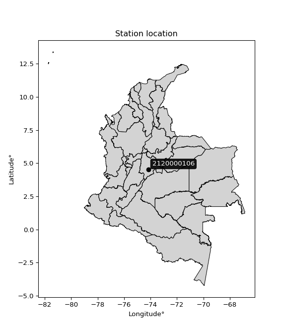

<div align="center">


</div>

# Station (rain, Pmax24h): 2120000106

Probable Maximum Precipitation (PMP) is the greatest amount of rainfall for a specific duration that is meteorologically possible for a given location, acting as a "worst-case" scenario for extreme storms, crucial for designing safety-critical infrastructure like bridges, river deviations, dams, spillways, and nuclear plants to prevent catastrophic failure. PMP is calculated by hydrologists using meteorological data to determine the upper limit of extreme rainfall, often leading to the Probable Maximum Flood (PMF) for flood control design, and is increasingly being studied for climate change impacts.

<div align="center">

</img>

</div>


## A. General information


### 1. General running parameters

• app_version: _v20251226_. • runtime: _2025-12-26 15:38:16.554582_. • Python version: _3.14.0_. • SciPy version: _1.16.3_. • Pandas version: _2.3.3_. • NumPy version: _2.3.5_. • Stations dataset (station_dataset_file): _dataset/pmax24h_in/automatic_colombia_2003_2024.csv_. • Stations catalog (station_catalog_file): _dataset/CNE_IDEAM.xls_. • Minimum year to eval til year_max (date_min): _2003_. • Maximum year to eval since year_min (date_max): _2024_. • Creates, save and include plots into reports (create_plot): _False_. • Plot only fit distributions with Δo > Δ (plot_only_fit): _True_. • Eval low extreme values, if False, evaluates high extreme values (low_extreme): _False_. • Eval every SciPy distribution as logarithmic (pdist_logarithmic_on): _True_. • Standard deviation normalized (ddof): _1.0_. • Return periods to eval in years (Tr): _[2, 2.33, 5, 10, 15, 20, 25, 50, 75, 100, 200, 250, 500, 750, 1000]_. • Minimum data sample per station, 0 means any (minimum_sample): _5_. • Z-Score threshold to adjust a value, 0 means disable (zscore): _3.5_. • Avoid zeros, e.g. rain = 0 (avoid_zeros): _True_. • Avoid null values (avoid_nans): _True_. [:file_folder:Dataset file.](../../dataset/pmax24h_in/automatic_colombia_2003_2024.csv)


### 2. Station info and location

|   id |     CODIGO | NOMBRE                    | CATEGORIA               | TECNOLOGIA                | ESTADO   | FECHA_INSTALACION   |   FECHA_SUSPENSION |   ALTITUD |   LATITUD |   LONGITUD | DEPARTAMENTO   | MUNICIPIO   | AREA_OPERATIVA                            | ENTIDAD                                                      | AREA_HIDROGRAFICA   | ZONA_HIDROGRAFICA   | SUBZONA_HIDROGRAFICA   |   CORRIENTE | OBSERVACION                                                                                                                                |   SUBRED | Catalogo   |
|-----:|-----------:|:--------------------------|:------------------------|:--------------------------|:---------|:--------------------|-------------------:|----------:|----------:|-----------:|:---------------|:------------|:------------------------------------------|:-------------------------------------------------------------|:--------------------|:--------------------|:-----------------------|------------:|:-------------------------------------------------------------------------------------------------------------------------------------------|---------:|:-----------|
|    0 | 2120000106 | GRAN BRETAÑA [2120000106] | Climatológica Ordinaria | Automática con Telemetría | Activa   | 01/11/2012          |                nan |      3087 |    4.5117 |   -74.1635 | Bogotá         | Bogotá, D.C | Area Operativa 11 - Cundinamarca-Amazonas | INSTITUTO DISTRITAL DE GESTIÓN DE RIESGOS Y CAMBIO CLIMÁTICO | Magdalena Cauca     | Alto Magdalena      | Río Bogotá             |         nan | Solicitado mediante correo electrónico|02/11/2022$Migracion$DATOS ACTUALIZADOS A LA FECHA 02/11/2022, SEGÚN INFORMACIÓN ENVIADA POR IDIGER |      nan | CNE_OE     |

<div align="center">

Map location in: [:earth_americas:Google](http://maps.google.com/maps?q=4.5117,-74.163522222) [:earth_americas:OSM](https://www.openstreetmap.org/#map=18/4.5117/-74.163522222&layers=P) [:earth_americas:Bing](https://www.bing.com/maps?cp=4.5117~-74.163522222&lvl=18) [:earth_americas:Apple](https://maps.apple.com/frame?center=4.5117%2C-74.163522222&span=0.003%2C0.006)

</div>


<div align="center">

```geojson
{
  "type": "Feature",
  "geometry": {
    "type": "Point", 
    "coordinates": [-74.163522222, 4.5117]
  }, 
  "properties": {
    "Name": "2120000106"
  }
}
```

</div>


### 3. Discrete values table and plot

|               |           0 |           1 |           2 |           3 |          4 |
|:--------------|------------:|------------:|------------:|------------:|-----------:|
| Date          | 2018        | 2019        | 2020        | 2023        | 2024       |
| Value         |   11.9      |   36.9      |   14.1      |    1        |   65       |
| Value_initial |   11.9      |   36.9      |   14.1      |    1        |   65       |
| count         |    5        |    5        |    5        |    5        |    5       |
| mean          |   25.78     |   25.78     |   25.78     |   25.78     |   25.78    |
| std           |   25.5195   |   25.5195   |   25.5195   |   25.5195   |   25.5195  |
| zscore        |   -0.543897 |    0.435745 |   -0.457688 |   -0.971021 |    1.53686 |
> If Z-Score is active, values out of range or outliers are replaced with the station mean value.


### 4. Active continuous probability distributions from SciPy (45 of 104 available)

[scipy.stats](https://docs.scipy.org/doc/scipy/reference/stats.html) is a Python´s powerful submodule within the SciPy library for comprehensive statistical analysis, offering over 130 probability distributions (like Normal, Poisson), functions for descriptive stats (mean, variance), hypothesis testing (t-tests, chi-square), random variable generation, and statistical tests, making it essential for data science, modeling, and research. It provides tools to explore, model, and draw conclusions from data efficiently, working seamlessly with NumPy.

<div align="center">

|   id | p_dist             |   n_parameter | fit_method   | label                                                                       | active   | ref                                                                                                        |
|-----:|:-------------------|--------------:|:-------------|:----------------------------------------------------------------------------|:---------|:-----------------------------------------------------------------------------------------------------------|
|    0 | alpha              |             3 | MLE          | Alpha                                                                       | True     | [:mortar_board:](https://docs.scipy.org/doc/scipy/reference/generated/scipy.stats.alpha.html)              |
|    1 | betaprime          |             4 | MLE          | Beta prime                                                                  | True     | [:mortar_board:](https://docs.scipy.org/doc/scipy/reference/generated/scipy.stats.betaprime.html)          |
|    2 | chi2               |             3 | MLE          | Chi²                                                                        | True     | [:mortar_board:](https://docs.scipy.org/doc/scipy/reference/generated/scipy.stats.chi2.html)               |
|    3 | crystalball        |             4 | MLE          | Crystalball                                                                 | True     | [:mortar_board:](https://docs.scipy.org/doc/scipy/reference/generated/scipy.stats.crystalball.html)        |
|    4 | erlang             |             3 | MLE          | Erlang                                                                      | True     | [:mortar_board:](https://docs.scipy.org/doc/scipy/reference/generated/scipy.stats.erlang.html)             |
|    5 | expon              |             2 | MLE          | Exponential                                                                 | True     | [:mortar_board:](https://docs.scipy.org/doc/scipy/reference/generated/scipy.stats.expon.html)              |
|    6 | exponnorm          |             3 | MLE          | Exponentially modified Normal                                               | True     | [:mortar_board:](https://docs.scipy.org/doc/scipy/reference/generated/scipy.stats.exponnorm.html)          |
|    7 | f                  |             4 | MLE          | F                                                                           | True     | [:mortar_board:](https://docs.scipy.org/doc/scipy/reference/generated/scipy.stats.f.html)                  |
|    8 | fatiguelife        |             3 | MLE          | Fatigue-life (Birnbaum-Saunders)                                            | True     | [:mortar_board:](https://docs.scipy.org/doc/scipy/reference/generated/scipy.stats.fatiguelife.html)        |
|    9 | fisk               |             3 | MLE          | Fisk                                                                        | True     | [:mortar_board:](https://docs.scipy.org/doc/scipy/reference/generated/scipy.stats.fisk.html)               |
|   10 | gamma              |             3 | MLE          | Gamma                                                                       | True     | [:mortar_board:](https://docs.scipy.org/doc/scipy/reference/generated/scipy.stats.gamma.html)              |
|   11 | genexpon           |             5 | MLE          | Generalized exponential                                                     | True     | [:mortar_board:](https://docs.scipy.org/doc/scipy/reference/generated/scipy.stats.genexpon.html)           |
|   12 | genlogistic        |             3 | MLE          | Generalized logistic                                                        | True     | [:mortar_board:](https://docs.scipy.org/doc/scipy/reference/generated/scipy.stats.genlogistic.html)        |
|   13 | gibrat             |             2 | MM           | Gibrat                                                                      | True     | [:mortar_board:](https://docs.scipy.org/doc/scipy/reference/generated/scipy.stats.gibrat.html)             |
|   14 | gompertz           |             3 | MLE          | Gompertz (or truncated Gumbel)                                              | True     | [:mortar_board:](https://docs.scipy.org/doc/scipy/reference/generated/scipy.stats.gompertz.html)           |
|   15 | gumbel_l           |             2 | MM           | Gumbel Left Skew                                                            | True     | [:mortar_board:](https://docs.scipy.org/doc/scipy/reference/generated/scipy.stats.gumbel_l.html)           |
|   16 | gumbel_r           |             2 | MM           | Gumbel Right Skew                                                           | True     | [:mortar_board:](https://docs.scipy.org/doc/scipy/reference/generated/scipy.stats.gumbel_r.html)           |
|   17 | halflogistic       |             2 | MM           | Half-logistic                                                               | True     | [:mortar_board:](https://docs.scipy.org/doc/scipy/reference/generated/scipy.stats.halflogistic.html)       |
|   18 | halfnorm           |             2 | MM           | Half Normal                                                                 | True     | [:mortar_board:](https://docs.scipy.org/doc/scipy/reference/generated/scipy.stats.halfnorm.html)           |
|   19 | hypsecant          |             2 | MM           | hyperbolic secant                                                           | True     | [:mortar_board:](https://docs.scipy.org/doc/scipy/reference/generated/scipy.stats.hypsecant.html)          |
|   20 | invgamma           |             3 | MLE          | Inverted gamma                                                              | True     | [:mortar_board:](https://docs.scipy.org/doc/scipy/reference/generated/scipy.stats.invgamma.html)           |
|   21 | invgauss           |             3 | MLE          | Inverse Gaussian                                                            | True     | [:mortar_board:](https://docs.scipy.org/doc/scipy/reference/generated/scipy.stats.invgauss.html)           |
|   22 | invweibull         |             3 | MLE          | Inverted Weibull                                                            | True     | [:mortar_board:](https://docs.scipy.org/doc/scipy/reference/generated/scipy.stats.invweibull.html)         |
|   23 | johnsonsu          |             4 | MLE          | Johnson Su                                                                  | True     | [:mortar_board:](https://docs.scipy.org/doc/scipy/reference/generated/scipy.stats.johnsonsu.html)          |
|   24 | kstwobign          |             2 | MLE          | Limiting distribution of scaled Kolmogorov-Smirnov two-sided test statistic | True     | [:mortar_board:](https://docs.scipy.org/doc/scipy/reference/generated/scipy.stats.kstwobign.html)          |
|   25 | laplace            |             2 | MM           | Laplace                                                                     | True     | [:mortar_board:](https://docs.scipy.org/doc/scipy/reference/generated/scipy.stats.laplace.html)            |
|   26 | laplace_asymmetric |             3 | MLE          | Asymmetric Laplace                                                          | True     | [:mortar_board:](https://docs.scipy.org/doc/scipy/reference/generated/scipy.stats.laplace_asymmetric.html) |
|   27 | loggamma           |             3 | MLE          | Log gamma                                                                   | True     | [:mortar_board:](https://docs.scipy.org/doc/scipy/reference/generated/scipy.stats.loggamma.html)           |
|   28 | logistic           |             2 | MM           | Logistic (or Sech-squared)                                                  | True     | [:mortar_board:](https://docs.scipy.org/doc/scipy/reference/generated/scipy.stats.logistic.html)           |
|   29 | lognorm            |             3 | MLE          | Log Normal                                                                  | True     | [:mortar_board:](https://docs.scipy.org/doc/scipy/reference/generated/scipy.stats.lognorm.html)            |
|   30 | maxwell            |             2 | MM           | Maxwell                                                                     | True     | [:mortar_board:](https://docs.scipy.org/doc/scipy/reference/generated/scipy.stats.maxwell.html)            |
|   31 | mielke             |             4 | MLE          | Mielke Beta-Kappa / Dagum                                                   | True     | [:mortar_board:](https://docs.scipy.org/doc/scipy/reference/generated/scipy.stats.mielke.html)             |
|   32 | moyal              |             2 | MM           | Moyal                                                                       | True     | [:mortar_board:](https://docs.scipy.org/doc/scipy/reference/generated/scipy.stats.moyal.html)              |
|   33 | nakagami           |             3 | MLE          | Nakagami                                                                    | True     | [:mortar_board:](https://docs.scipy.org/doc/scipy/reference/generated/scipy.stats.nakagami.html)           |
|   34 | ncf                |             5 | MLE          | Non-central F distribution                                                  | True     | [:mortar_board:](https://docs.scipy.org/doc/scipy/reference/generated/scipy.stats.ncf.html)                |
|   35 | nct                |             4 | MLE          | Non-central Student’s t                                                     | True     | [:mortar_board:](https://docs.scipy.org/doc/scipy/reference/generated/scipy.stats.nct.html)                |
|   36 | norm               |             2 | MM           | Normal                                                                      | True     | [:mortar_board:](https://docs.scipy.org/doc/scipy/reference/generated/scipy.stats.norm.html)               |
|   37 | pareto             |             3 | MLE          | Pareto                                                                      | True     | [:mortar_board:](https://docs.scipy.org/doc/scipy/reference/generated/scipy.stats.pareto.html)             |
|   38 | pearson3           |             3 | MM           | Pearson type III                                                            | True     | [:mortar_board:](https://docs.scipy.org/doc/scipy/reference/generated/scipy.stats.pearson3.html)           |
|   39 | rayleigh           |             2 | MM           | Rayleigh                                                                    | True     | [:mortar_board:](https://docs.scipy.org/doc/scipy/reference/generated/scipy.stats.rayleigh.html)           |
|   40 | rice               |             3 | MLE          | Rice                                                                        | True     | [:mortar_board:](https://docs.scipy.org/doc/scipy/reference/generated/scipy.stats.rice.html)               |
|   41 | t                  |             3 | MLE          | Student’s t                                                                 | True     | [:mortar_board:](https://docs.scipy.org/doc/scipy/reference/generated/scipy.stats.t.html)                  |
|   42 | truncnorm          |             4 | MLE          | Truncated normal                                                            | True     | [:mortar_board:](https://docs.scipy.org/doc/scipy/reference/generated/scipy.stats.truncnorm.html)          |
|   43 | wald               |             2 | MM           | Wald                                                                        | True     | [:mortar_board:](https://docs.scipy.org/doc/scipy/reference/generated/scipy.stats.wald.html)               |
|   44 | weibull_min        |             3 | MLE          | Weibull minimum                                                             | True     | [:mortar_board:](https://docs.scipy.org/doc/scipy/reference/generated/scipy.stats.weibull_min.html)        |

</div>

> **n_parameter:** # arguments & localization & scale.
>
> **Fit methods:** (MLE) maximum likelihood, (MM) L-moments.
>
>**Inactive:** foldnorm, gennorm, norminvgauss, powernorm, powerlognorm, skewnorm, genextreme, anglit, arcsine, argus, beta, bradford, burr, burr12, cauchy, cosine, halfcauchy, foldcauchy, skewcauchy, wrapcauchy, dgamma, gengamma, exponweib, exponpow, truncexpon, gausshyper, genhalflogistic, genhyperbolic, geninvgauss, halfgennorm, johnsonsb, kappa4, kappa3, ksone, kstwo, loglaplace, levy, levy_l, levy_stable, ncx2, genpareto, truncpareto, lomax, powerlaw, rdist, rel_breitwigner, recipinvgauss, semicircular, studentized_range, trapezoid, triang, truncweibull_min, tukeylambda, uniform, loguniform, vonmises, vonmises_line, weibull_max, dweibull, 


## B. Probability distributions vs. Empirical distributions

A continuous probability distribution (CPD) describes probabilities for variables that can take any value within a range (like rain any time), unlike discrete variables with specific outcomes (like temperature). It uses a Probability Density Function (PDF), a curve where the total area under it equals 1, and the probability of the variable falling within an interval (a to b) is found by calculating the area under the curve between those points. A key feature is that the probability of hitting any single exact value is zero, so probabilities are always expressed for ranges, e.g., $P(a ≤ X ≤ b)$.

<div align="center">

Distributions parameters
|    |    station | p_dist                |   n |               loc |           scale | shape                  | shape1             | shape2                 | shape3   |
|---:|-----------:|:----------------------|----:|------------------:|----------------:|:-----------------------|:-------------------|:-----------------------|:---------|
|  0 | 2120000106 | alpha                 |   5 |     -0.000339625  |     2.22483     | 4.491570749255884e-09  |                    |                        |          |
|  1 | 2120000106 | betaprime             |   5 |      1            |    63.5727      | 0.8161592404909499     | 3.4248665411658834 |                        |          |
|  2 | 2120000106 | chi2                  |   5 |      1            |     2.75788     | 1.2077835595692763     |                    |                        |          |
|  3 | 2120000106 | crystalball           |   5 |     25.78         |    22.8254      | 1062.310117560998      | 3468.525319292322  |                        |          |
|  4 | 2120000106 | erlang                |   5 |      1            |    25.5743      | 0.6160953879008217     |                    |                        |          |
|  5 | 2120000106 | expon                 |   5 |      1            |    24.78        |                        |                    |                        |          |
|  6 | 2120000106 | exponnorm             |   5 |      0.981319     |     0.0053153   | 4660.430508536954      |                    |                        |          |
|  7 | 2120000106 | f                     |   5 |      1            |    35.8323      | 1.1032612485285598     | 26.46281026246934  |                        |          |
|  8 | 2120000106 | fatiguelife           |   5 |      1            |     5.0228e-06  | 2077.4046133648826     |                    |                        |          |
|  9 | 2120000106 | fisk                  |   5 |      1            |    21.5844      | 0.18297474727444113    |                    |                        |          |
| 10 | 2120000106 | gamma                 |   5 |      1            |    22.0029      | 0.31791435300876414    |                    |                        |          |
| 11 | 2120000106 | genexpon              |   5 |      1            |     1.69736e+07 | 667132.87664838        | 115774.64238209586 | 77604.71349051002      |          |
| 12 | 2120000106 | genlogistic           |   5 |   -100.601        |    16.6612      | 1051.498668340983      |                    |                        |          |
| 13 | 2120000106 | gibrat                |   5 |      8.36716      |    10.5614      |                        |                    |                        |          |
| 14 | 2120000106 | gompertz              |   5 |      1            |   173.036       | 6.084437704418729      |                    |                        |          |
| 15 | 2120000106 | gumbel_l              |   5 |     36.0526       |    17.7969      |                        |                    |                        |          |
| 16 | 2120000106 | gumbel_r              |   5 |     15.5074       |    17.7969      |                        |                    |                        |          |
| 17 | 2120000106 | halflogistic          |   5 |     -1.27337      |    19.5149      |                        |                    |                        |          |
| 18 | 2120000106 | halfnorm              |   5 |     -4.43185      |    37.8649      |                        |                    |                        |          |
| 19 | 2120000106 | hypsecant             |   5 |     25.78         |    14.5311      |                        |                    |                        |          |
| 20 | 2120000106 | invgamma              |   5 |    -11.8961       |    76.2829      | 2.922112207951395      |                    |                        |          |
| 21 | 2120000106 | invgauss              |   5 |     -5.43862      |    35.2552      | 0.8855052923349154     |                    |                        |          |
| 22 | 2120000106 | invweibull            |   5 |      1            |     2.53447     | 0.05473134310425545    |                    |                        |          |
| 23 | 2120000106 | johnsonsu             |   5 |     -2.4654       |     0.10223     | -5.822621425452688     | 0.9878403443875827 |                        |          |
| 24 | 2120000106 | kstwobign             |   5 |    -43.1329       |    79.1517      |                        |                    |                        |          |
| 25 | 2120000106 | laplace               |   5 |     25.78         |    16.14        |                        |                    |                        |          |
| 26 | 2120000106 | laplace_asymmetric    |   5 |     11.9          |    13.3396      | 0.6069884435292745     |                    |                        |          |
| 27 | 2120000106 | loggamma              |   5 |  -7878.01         |  1042.41        | 1963.3596980156399     |                    |                        |          |
| 28 | 2120000106 | logistic              |   5 |     25.78         |    12.5843      |                        |                    |                        |          |
| 29 | 2120000106 | lognorm               |   5 |      1            |     0.00938604  | 15.701028772982822     |                    |                        |          |
| 30 | 2120000106 | maxwell               |   5 |    -28.3065       |    33.8937      |                        |                    |                        |          |
| 31 | 2120000106 | mielke                |   5 |      1            |    65.2785      | 0.6823125911501813     | 217.80226300515224 |                        |          |
| 32 | 2120000106 | moyal                 |   5 |     12.727        |    10.275       |                        |                    |                        |          |
| 33 | 2120000106 | nakagami              |   5 |     11.9          |    32.9084      | 0.044985369122976786   |                    |                        |          |
| 34 | 2120000106 | ncf                   |   5 |      1            |    11.4134      | 0.7293496942958675     | 84.12674889349896  | 1.2055260939333825     |          |
| 35 | 2120000106 | nct                   |   5 |     -0.139701     |     0.0461919   | 0.43150922548141074    | 54.73618148189365  |                        |          |
| 36 | 2120000106 | norm                  |   5 |     25.78         |    22.8254      |                        |                    |                        |          |
| 37 | 2120000106 | pareto                |   5 |      0.787436     |     0.212564    | 0.2639962278656481     |                    |                        |          |
| 38 | 2120000106 | pearson3              |   5 |     25.78         |    22.8254      | 0.7100681052210742     |                    |                        |          |
| 39 | 2120000106 | rayleigh              |   5 |    -17.8863       |    34.8406      |                        |                    |                        |          |
| 40 | 2120000106 | rice                  |   5 |    -11.554        |    30.9421      | 0.0005398857121289061  |                    |                        |          |
| 41 | 2120000106 | t                     |   5 |     25.7166       |    22.8478      | 524.8088762788125      |                    |                        |          |
| 42 | 2120000106 | truncnorm             |   5 |    -62.9889       |    51.5781      | 1.2406221217908504     | 68.85299084950933  |                        |          |
| 43 | 2120000106 | wald                  |   5 |      2.95463      |    22.8254      |                        |                    |                        |          |
| 44 | 2120000106 | weibull_min           |   5 |      1            |    15.904       | 0.32459925279690927    |                    |                        |          |
| 45 | 2120000106 | logalpha              |   5 |    -41.9479       |  1353.33        | 30.4260808192208       |                    |                        |          |
| 46 | 2120000106 | logbetaprime          |   5 |  -1120.61         |  4547.39        | 761775.3345291812      | 3084150.9131274046 |                        |          |
| 47 | 2120000106 | logchi2               |   5 |     -6.1795e-30   |     1.32101     | 1.8025322295965607     |                    |                        |          |
| 48 | 2120000106 | logcrystalball        |   5 |      2.58106      |     1.43323     | 1199.3899258764422     | 6.715455484379268  |                        |          |
| 49 | 2120000106 | logerlang             |   5 |    -17.9983       |     0.106367    | 193.20560041651572     |                    |                        |          |
| 50 | 2120000106 | logexpon              |   5 |      0            |     2.58106     |                        |                    |                        |          |
| 51 | 2120000106 | logexponnorm          |   5 |      2.57977      |     1.43323     | 0.0009018086743306372  |                    |                        |          |
| 52 | 2120000106 | logf                  |   5 |     -2.34079e-31  |     1.3372      | 1.423936085012692      | 1.231294744959281  |                        |          |
| 53 | 2120000106 | logfatiguelife        |   5 |   -580.897        |   583.479       | 0.002444135133920107   |                    |                        |          |
| 54 | 2120000106 | logfisk               |   5 | -94972.4          | 94975.2         | 117368.11032691762     |                    |                        |          |
| 55 | 2120000106 | loggamma              |   5 |    -19.6238       |     0.0982154   | 226.17026678154696     |                    |                        |          |
| 56 | 2120000106 | loggenexpon           |   5 |     -0.0345569    |     0.0317169   | 0.005093480520100949   | 3.7617039511210972 | 3.4938545906531985e-05 |          |
| 57 | 2120000106 | loggenlogistic        |   5 |      4.17604      |     2.34282e-06 | 1.4667382276710988e-06 |                    |                        |          |
| 58 | 2120000106 | loggibrat             |   5 |      1.48765      |     0.663179    |                        |                    |                        |          |
| 59 | 2120000106 | loggompertz           |   5 |     -1.06443e-07  |     1.28552     | 0.09438247916609938    |                    |                        |          |
| 60 | 2120000106 | loggumbel_l           |   5 |      3.22609      |     1.11749     |                        |                    |                        |          |
| 61 | 2120000106 | loggumbel_r           |   5 |      1.93603      |     1.11749     |                        |                    |                        |          |
| 62 | 2120000106 | loghalflogistic       |   5 |      0.882313     |     1.22538     |                        |                    |                        |          |
| 63 | 2120000106 | loghalfnorm           |   5 |      0.684034     |     2.37758     |                        |                    |                        |          |
| 64 | 2120000106 | loghypsecant          |   5 |      2.58106      |     0.912424    |                        |                    |                        |          |
| 65 | 2120000106 | loginvgamma           |   5 |    -26.9927       | 11837.8         | 401.1560753451366      |                    |                        |          |
| 66 | 2120000106 | loginvgauss           |   5 |    -11.1737       |  1049.9         | 0.013105254553728282   |                    |                        |          |
| 67 | 2120000106 | loginvweibull         |   5 |     -1.82334e+08  |     1.82334e+08 | 118111598.49502309     |                    |                        |          |
| 68 | 2120000106 | logjohnsonsu          |   5 |      4.53847      |     0.00511415  | 7.453021797987706      | 1.177972950012857  |                        |          |
| 69 | 2120000106 | logkstwobign          |   5 |     -3.58673      |     7.03363     |                        |                    |                        |          |
| 70 | 2120000106 | loglaplace            |   5 |      2.58106      |     1.01345     |                        |                    |                        |          |
| 71 | 2120000106 | loglaplace_asymmetric |   5 |      2.64617      |     1.05979     | 1.03111361581333       |                    |                        |          |
| 72 | 2120000106 | logloggamma           |   5 |      4.17447      |     3.65703e-06 | 2.294108479856327e-06  |                    |                        |          |
| 73 | 2120000106 | loglogistic           |   5 |      2.58106      |     0.790182    |                        |                    |                        |          |
| 74 | 2120000106 | loglognorm            |   5 |     -4.94066e-324 |     5.46546e-65 | 298.23530679350813     |                    |                        |          |
| 75 | 2120000106 | logmaxwell            |   5 |     -0.815095     |     2.12823     |                        |                    |                        |          |
| 76 | 2120000106 | logmielke             |   5 |     -5.86265e-28  |     3.65155     | 0.4347268600761917     | 2.4162861470107004 |                        |          |
| 77 | 2120000106 | logmoyal              |   5 |      1.76145      |     0.645181    |                        |                    |                        |          |
| 78 | 2120000106 | lognakagami           |   5 |     -1.36642e-31  |     2.93404     | 0.1852834268300122     |                    |                        |          |
| 79 | 2120000106 | logncf                |   5 |     -6.26901e-33  |     1.22869     | 1.425720971756848      | 1.4080609844832526 | 0.9634846843617008     |          |
| 80 | 2120000106 | lognct                |   5 |     67.8795       |     1.35721     | 10770.387200268047     | -48.10793180014579 |                        |          |
| 81 | 2120000106 | lognorm               |   5 |      2.58106      |     1.43323     |                        |                    |                        |          |
| 82 | 2120000106 | logpareto             |   5 |     -0.0262781    |     0.0262781   | 0.2606583285823376     |                    |                        |          |
| 83 | 2120000106 | logpearson3           |   5 |      2.58106      |     1.43323     | -0.8197376959909228    |                    |                        |          |
| 84 | 2120000106 | lograyleigh           |   5 |     -0.160794     |     2.18768     |                        |                    |                        |          |
| 85 | 2120000106 | logrice               |   5 |     -1.00479      |     1.56266     | 2.026547683447233      |                    |                        |          |
| 86 | 2120000106 | logt                  |   5 |      2.58107      |     1.43325     | 74330290.08576256      |                    |                        |          |
| 87 | 2120000106 | logtruncnorm          |   5 |     -0.00371658   |     2.95395     | 0.0012581712276164847  | 4.081758255438396  |                        |          |
| 88 | 2120000106 | logwald               |   5 |      1.14781      |     1.43324     |                        |                    |                        |          |
| 89 | 2120000106 | logweibull_min        |   5 |     -4.72779e+07  |     4.72779e+07 | 44825403.47577295      |                    |                        |          |

</div>

> **loc** (Location parameter): This shifts the distribution along the x-axis. For many common distributions, like the normal (Gaussian) distribution, loc represents the mean $μ$. For others, like the uniform distribution, it might represent the minimum value, or for the beta distribution, the left end of the support interval.
>
> **scale** (Scale parameter): This determines the width or spread of the distribution. For the normal distribution, scale represents the standard deviation $σ$. For a uniform distribution, it defines the length of the interval (from $loc$ to $loc + scale$).
>
> **shape** (Shape parameters): Refers to parameters that define the specific form of a probability distribution, distinct from its location (loc) and scale (scale). These parameters are required arguments for most distribution functions. For example, a normal (Gaussian) distribution is fully defined by its location (mean) and scale (standard deviation), so it has no specific shape parameters beyond loc and scale. However, other distributions have intrinsic properties that need specification, as Gamma distribution that takes a shape parameter, often named $a$ or $alpha$.


### 0. Cumulative distribution values - CDF (90 evaluated)

> Ordered by x ascending and calculating $log(f(x))$ separately. 

|   id |    Station |   date |    x |   count |   mean |     std |    zscore |   Value_initial |    station |   m |     alpha |   alpha_pdf |   betaprime |   betaprime_pdf |        chi2 |         chi2_pdf |   crystalball |   crystalball_pdf |      erlang |     erlang_pdf |    expon |   expon_pdf |   exponnorm |   exponnorm_pdf |           f |           f_pdf |   fatiguelife |   fatiguelife_pdf |        fisk |    fisk_pdf |       gamma |   gamma_pdf |    genexpon |   genexpon_pdf |   genlogistic |   genlogistic_pdf |   gibrat |   gibrat_pdf |    gompertz |   gompertz_pdf |   gumbel_l |   gumbel_l_pdf |   gumbel_r |   gumbel_r_pdf |   halflogistic |   halflogistic_pdf |   halfnorm |   halfnorm_pdf |   hypsecant |   hypsecant_pdf |   invgamma |   invgamma_pdf |   invgauss |   invgauss_pdf |   invweibull |   invweibull_pdf |   johnsonsu |   johnsonsu_pdf |   kstwobign |   kstwobign_pdf |   laplace |   laplace_pdf |   laplace_asymmetric |   laplace_asymmetric_pdf |   loggamma |   loggamma_pdf |   logistic |   logistic_pdf |   lognorm |   lognorm_pdf |   maxwell |   maxwell_pdf |     mielke |   mielke_pdf |     moyal |   moyal_pdf |   nakagami |   nakagami_pdf |         ncf |     ncf_pdf |       nct |    nct_pdf |     norm |   norm_pdf |      pareto |   pareto_pdf |   pearson3 |   pearson3_pdf |   rayleigh |   rayleigh_pdf |      rice |   rice_pdf |        t |     t_pdf |   truncnorm |   truncnorm_pdf |     wald |   wald_pdf |   weibull_min |   weibull_min_pdf |   logalpha |   logalpha_pdf |   logbetaprime |   logbetaprime_pdf |     logchi2 |   logchi2_pdf |   logcrystalball |   logcrystalball_pdf |   logerlang |   logerlang_pdf |   logexpon |   logexpon_pdf |   logexponnorm |   logexponnorm_pdf |        logf |   logf_pdf |   logfatiguelife |   logfatiguelife_pdf |   logfisk |   logfisk_pdf |   loggenexpon |   loggenexpon_pdf |   loggenlogistic |   loggenlogistic_pdf |   loggibrat |   loggibrat_pdf |   loggompertz |   loggompertz_pdf |   loggumbel_l |   loggumbel_l_pdf |   loggumbel_r |   loggumbel_r_pdf |   loghalflogistic |   loghalflogistic_pdf |   loghalfnorm |   loghalfnorm_pdf |   loghypsecant |   loghypsecant_pdf |   loginvgamma |   loginvgamma_pdf |   loginvgauss |   loginvgauss_pdf |   loginvweibull |   loginvweibull_pdf |   logjohnsonsu |   logjohnsonsu_pdf |   logkstwobign |   logkstwobign_pdf |   loglaplace |   loglaplace_pdf |   loglaplace_asymmetric |   loglaplace_asymmetric_pdf |   logloggamma |   logloggamma_pdf |   loglogistic |   loglogistic_pdf |   loglognorm |   loglognorm_pdf |   logmaxwell |   logmaxwell_pdf |   logmielke |   logmielke_pdf |    logmoyal |   logmoyal_pdf |   lognakagami |   lognakagami_pdf |      logncf |   logncf_pdf |    lognct |   lognct_pdf |   logpareto |   logpareto_pdf |   logpearson3 |   logpearson3_pdf |   lograyleigh |   lograyleigh_pdf |   logrice |   logrice_pdf |      logt |   logt_pdf |   logtruncnorm |   logtruncnorm_pdf |   logwald |   logwald_pdf |   logweibull_min |   logweibull_min_pdf |
|-----:|-----------:|-------:|-----:|--------:|-------:|--------:|----------:|----------------:|-----------:|----:|----------:|------------:|------------:|----------------:|------------:|-----------------:|--------------:|------------------:|------------:|---------------:|---------:|------------:|------------:|----------------:|------------:|----------------:|--------------:|------------------:|------------:|------------:|------------:|------------:|------------:|---------------:|--------------:|------------------:|---------:|-------------:|------------:|---------------:|-----------:|---------------:|-----------:|---------------:|---------------:|-------------------:|-----------:|---------------:|------------:|----------------:|-----------:|---------------:|-----------:|---------------:|-------------:|-----------------:|------------:|----------------:|------------:|----------------:|----------:|--------------:|---------------------:|-------------------------:|-----------:|---------------:|-----------:|---------------:|----------:|--------------:|----------:|--------------:|-----------:|-------------:|----------:|------------:|-----------:|---------------:|------------:|------------:|----------:|-----------:|---------:|-----------:|------------:|-------------:|-----------:|---------------:|-----------:|---------------:|----------:|-----------:|---------:|----------:|------------:|----------------:|---------:|-----------:|--------------:|------------------:|-----------:|---------------:|---------------:|-------------------:|------------:|--------------:|-----------------:|---------------------:|------------:|----------------:|-----------:|---------------:|---------------:|-------------------:|------------:|-----------:|-----------------:|---------------------:|----------:|--------------:|--------------:|------------------:|-----------------:|---------------------:|------------:|----------------:|--------------:|------------------:|--------------:|------------------:|--------------:|------------------:|------------------:|----------------------:|--------------:|------------------:|---------------:|-------------------:|--------------:|------------------:|--------------:|------------------:|----------------:|--------------------:|---------------:|-------------------:|---------------:|-------------------:|-------------:|-----------------:|------------------------:|----------------------------:|--------------:|------------------:|--------------:|------------------:|-------------:|-----------------:|-------------:|-----------------:|------------:|----------------:|------------:|---------------:|--------------:|------------------:|------------:|-------------:|----------:|-------------:|------------:|----------------:|--------------:|------------------:|--------------:|------------------:|----------:|--------------:|----------:|-----------:|---------------:|-------------------:|----------:|--------------:|-----------------:|---------------------:|
|    0 | 2120000106 |   2023 |  1   |       5 |  25.78 | 25.5195 | -0.971021 |             1   | 2120000106 |   1 | 0.0261431 | 0.149561    | 9.17779e-15 |     67.4688     | 9.24671e-11 | 502963           |      0.13882  |        0.00969532 | 3.43987e-11 | 95444.2        | 0        |  0.0403551  |  0.00075382 |      0.0403295  | 1.76242e-10 | 875686          |     0.0213019 |       1.82895e+11 | 0.000685964 | 1.12975e+12 | 4.41502e-06 | 6.32124e+09 | 2.22048e-11 |     0.0393041  |      0.094393 |        0.0133571  | 0        |   0          | 5.27022e-16 |     0.0351629  |   0.130219 |     0.00681839 |   0.104398 |     0.0132547  |      0.0581813 |         0.0255347  |   0.114068 |     0.0208562  |    0.114435 |      0.00770666 |  0.0606531 |     0.0202324  |  0.0544207 |     0.0258344  |  0.000517946 |      9.65886e+11 |    0.048742 |      0.0287951  |   0.0849909 |      0.0133585  |  0.107694 |    0.00667247 |            0.0700646 |               0.00865316 |  0.0356138 |      0.0576538 |   0.122483 |     0.00854089 | 0.0358618 |     0.0549993 |  0.138054 |     0.0121106 | 1.0368e-08 |   54.5428    | 0.0768229 |  0.0143582  |  0         |    0           | 2.65545e-07 | 8.72236e+08 | 0.0521684 | 0.145104   | 0.13882  | 0.00969532 | 1.11022e-16 |  1.24196     |   0.126    |     0.0125885  |   0.13664  |     0.0134328  | 0.0790108 | 0.0120764  | 0.139921 | 0.0097171 | 1.87876e-11 |      0.033368   | 0        | 0          |   2.69863e-06 |       7.89005e+09 |  0.0331804 |      0.0568759 |      0.0363288 |          0.0555392 | 2.04802e-27 |   298.699     |        0.0358618 |            0.0549993 |   0.0375998 |       0.0605641 |   0        |      0.387437  |      0.0358622 |          0.0549997 | 9.46387e-23 | 2.8785e+08 |        0.0347984 |            0.0541661 | 0.0320196 |     0.0383032 |    0.00561177 |          0.16418  |         0        |            0.0458329 |    0        |       0         |   7.81503e-09 |         0.0734195 |     0.0542223 |         0.0471817 |      0.003501 |         0.0177158 |          0        |             0         |      0        |          0        |      0.0375703 |          0.0410808 |      0.033723 |         0.0572961 |     0.0385734 |          0.065874 |       0.0392847 |            0.082372 |      0.0869208 |          0.0410697 |      0.0427715 |           0.101226 |    0.0391655 |        0.0386457 |               0.0457525 |                   0.0418684 |      0.072897 |         0.0457294 |     0.0367415 |         0.0447891 |    0.0227502 |    inf           |    0.0143008 |        0.0511036 | 8.26104e-13 |     6.12572e+14 | 9.00155e-05 |     0.00113251 |   1.94516e-12 |        5.2752e+18 | 4.48425e-24 |  5.09912e+08 | 0.0356918 |    0.0545514 | 1.11022e-16 |       9.91921   |     0.0530868 |         0.0524038 |    0.00269745 |         0.0335063 | 0.0292232 |     0.0631823 | 0.0358632 |  0.0550003 |    2.34585e-11 |          0.270391  |  0        |     0         |        0.0457788 |             0.042395 |
|    1 | 2120000106 |   2018 | 11.9 |       5 |  25.78 | 25.5195 | -0.543897 |            11.9 | 2120000106 |   2 | 0.851696  | 0.0123177   | 0.506759    |      0.0259303  | 0.937746    |      0.0129606   |      0.271562 |        0.0145277  | 0.565851    |     0.0243726  | 0.35588  |  0.0259935  |  0.356462   |      0.0259789  | 0.391855    |      0.0177097  |     0.760875  |       0.0100921   | 0.468788    | 0.00418032  | 0.800443    | 0.0158846   | 0.349645    |     0.0257773  |      0.292978 |        0.0215751  | 0.136735 |   0.0619969  | 0.326727    |     0.0252135  |   0.22694  |     0.0111809  |   0.293846 |     0.0202211  |      0.325263  |         0.0229108  |   0.333763 |     0.0192002  |    0.233818 |      0.0146824  |  0.361044  |     0.0274978  |  0.390134  |     0.0268361  |  0.397221    |      0.00184148  |    0.40026  |      0.0265708  |   0.280928  |      0.0209501  |  0.211586 |    0.0131094  |            0.269238  |               0.0332516  |  0.47826   |      0.270578  |   0.249185 |     0.0148671  | 0.470931  |     0.277612  |  0.296152 |     0.0163911 | 0.294855   |    0.0184572 | 0.297846  |  0.0235103  |  0.0306446 |    1.55212e+12 | 0.437361    | 0.0159761   | 0.599991  | 0.0142246  | 0.271562 | 0.0145277  | 0.648141    |  0.00835896  |   0.295486 |     0.0177598  |   0.306117 |     0.0170267  | 0.249698  | 0.0183803  | 0.272813 | 0.014532  | 0.317727    |      0.0251055  | 0.262437 | 0.0444461  |   0.587114    |       0.0108765   |  0.485059  |      0.273378  |      0.472102  |          0.276952  | 0.6525      |     0.139744  |        0.470931  |            0.277612  |   0.489085  |       0.270358  |   0.616917 |      0.148421  |      0.470932  |          0.277612  | 0.598927    | 0.0729564  |        0.470531  |            0.27903   | 0.413779  |     0.299758  |    0.55727    |          0.216147 |         0        |            0.216038  |    0.65525  |       0.372478  |   0.425114    |         0.28977   |     0.400299  |         0.274403  |      0.539825 |         0.297818  |          0.572008 |             0.27453   |      0.549102 |          0.252569 |      0.463615  |          0.346585  |      0.48255  |         0.270987  |     0.495012  |          0.255698 |       0.52165   |            0.219899 |      0.333377  |          0.207733  |      0.552786  |           0.21155  |    0.451002  |        0.445017  |               0.44122   |                   0.403763  |      0.344681 |         0.216223  |     0.466979  |         0.315003  |    0.691178  |      0.000476864 |    0.504901  |        0.271183  | 0.79595     |     0.100422    | 0.565599    |     0.301211   |   0.730287    |        0.0977064  | 0.523167    |  0.0834292   | 0.469694  |    0.278417  | 0.69507     |       0.0317572 |     0.417219  |         0.265825  |    0.516478   |         0.266448  | 0.48249   |     0.270831  | 0.47093   |  0.277609  |    0.598513    |          0.190066  |  0.637345 |     0.310937  |        0.387621  |             0.284735 |
|    2 | 2120000106 |   2020 | 14.1 |       5 |  25.78 | 25.5195 | -0.457688 |            14.1 | 2120000106 |   3 | 0.874626  | 0.00881805  | 0.559502    |      0.0221568  | 0.960452    |      0.0080868   |      0.304427 |        0.0153332  | 0.61543     |     0.0208396  | 0.410601 |  0.0237853  |  0.411151   |      0.0237711  | 0.428573    |      0.0157507  |     0.781537  |       0.00875023  | 0.477173    | 0.00348461  | 0.831671    | 0.0126792   | 0.403996    |     0.0236618  |      0.340999 |        0.0220084  | 0.270601 |   0.0577398  | 0.380299    |     0.0235042  |   0.252685 |     0.0122308  |   0.338819 |     0.0206048  |      0.374708  |         0.0220241  |   0.375455 |     0.0186934  |    0.26794  |      0.0163374  |  0.419396  |     0.0254976  |  0.446221  |     0.0241732  |  0.400909    |      0.00153097  |    0.455445 |      0.0236411  |   0.327447  |      0.0212788  |  0.242485 |    0.0150239  |            0.338849  |               0.0300841  |  0.524085  |      0.269111  |   0.283302 |     0.0161346  | 0.518118  |     0.278064  |  0.332741 |     0.0168471 | 0.334263   |    0.01741   | 0.349598  |  0.023449   |  0.698664  |    0.0285669   | 0.470653    | 0.0143615   | 0.627756  | 0.0112172  | 0.304427 | 0.0153332  | 0.664526    |  0.00665266  |   0.335086 |     0.0182038  |   0.343892 |     0.0172889  | 0.290859  | 0.0190015  | 0.305682 | 0.0153332 | 0.371268    |      0.0235764  | 0.354593 | 0.0391769  |   0.608974    |       0.00909785  |  0.531255  |      0.270659  |      0.519166  |          0.277278  | 0.675386    |     0.130199  |        0.518118  |            0.278064  |   0.534794  |       0.267952  |   0.641285 |      0.13898   |      0.518118  |          0.278064  | 0.610819    | 0.0673693  |        0.517954  |            0.279429  | 0.465372  |     0.307463  |    0.593223   |          0.207584 |         0        |            0.240245  |    0.711529 |       0.294733  |   0.47533     |         0.301764  |     0.448518  |         0.293706  |      0.588793 |         0.279084  |          0.616736 |             0.252834  |      0.59078  |          0.238733 |      0.522696  |          0.347975  |      0.528358 |         0.268498  |     0.538066  |          0.251425 |       0.5582    |            0.21082  |      0.370898  |          0.235224  |      0.587877  |           0.202045 |    0.531114  |        0.462664  |               0.515315  |                   0.471568  |      0.383383 |         0.240502  |     0.520589  |         0.315846  |    0.691256  |      0.000446245 |    0.550355  |        0.264235  | 0.812212    |     0.0914396   | 0.614425    |     0.274379   |   0.746369    |        0.0919791  | 0.536827    |  0.0777277   | 0.517038  |    0.279107  | 0.700238    |       0.0292373 |     0.463499  |         0.279401  |    0.560951   |         0.257502  | 0.52835   |     0.269287  | 0.518116  |  0.278061  |    0.629973    |          0.180821  |  0.685627 |     0.260146  |        0.437844  |             0.306992 |
|    3 | 2120000106 |   2019 | 36.9 |       5 |  25.78 | 25.5195 |  0.435745 |            36.9 | 2120000106 |   4 | 0.951922  | 0.00130133  | 0.832534    |      0.00610257 | 0.999545    |      8.69256e-05 |      0.686934 |        0.0155222  | 0.87504     |     0.00580263 | 0.765136 |  0.00947796 |  0.765428   |      0.00946938 | 0.665642    |      0.00702415 |     0.90094   |       0.00312396  | 0.523256    | 0.00127144  | 0.961822    | 0.00226167  | 0.760705    |     0.00965235 |      0.760396 |        0.0124996  | 0.839851 |   0.00853261 | 0.754103    |     0.01064    |   0.64963  |     0.0206472  |   0.740389 |     0.0125048  |      0.752224  |         0.0111238  |   0.724973 |     0.0116137  |    0.722794 |      0.0167552  |  0.777479  |     0.00849871 |  0.77838   |     0.00815596 |  0.421071    |      0.000555252 |    0.771296 |      0.00759566 |   0.741743  |      0.0131105  |  0.748954 |    0.0155543  |            0.765719  |               0.0106604  |  0.758478  |      0.20496   |   0.707576 |     0.0164421  | 0.76321   |     0.21531   |  0.704412 |     0.0136917 | 0.664998   |    0.0126389 | 0.757764  |  0.0114186  |  0.868471  |    0.00304877  | 0.697915    | 0.00708261  | 0.753325  | 0.00287137 | 0.686934 | 0.0155222  | 0.742223    |  0.00188445  |   0.718606 |     0.0132549  |   0.709557 |     0.0131087  | 0.706569  | 0.0148503  | 0.687645 | 0.0154791 | 0.754185    |      0.0110436  | 0.808185 | 0.00889802 |   0.728146    |       0.00320157  |  0.76402   |      0.200849  |      0.76339   |          0.214491  | 0.778793    |     0.0877345 |        0.76321   |            0.21531   |   0.766125  |       0.200474  |   0.752898 |      0.0957364 |      0.76321   |          0.21531   | 0.664094    | 0.0456698  |        0.763924  |            0.215648  | 0.740799  |     0.237287  |    0.765591   |          0.148982 |         0        |            0.438757  |    0.877461 |       0.0957328 |   0.769683    |         0.279973  |     0.75529   |         0.308258  |      0.799363 |         0.160189  |          0.804862 |             0.143709  |      0.781264 |          0.157521 |      0.800292  |          0.204797  |      0.760082 |         0.20098   |     0.753169  |          0.186932 |       0.73151   |            0.148148 |      0.693914  |          0.444244  |      0.753778  |           0.142429 |    0.81853   |        0.179062  |               0.80991   |                   0.184946  |      0.701018 |         0.43976   |     0.785816  |         0.213     |    0.691622  |      0.000327095 |    0.771057  |        0.186792  | 0.88045     |     0.0538046   | 0.811088    |     0.143635   |   0.821796    |        0.0664781  | 0.599443    |  0.0546116   | 0.763416  |    0.216591  | 0.723325    |       0.0198426 |     0.745788  |         0.281755  |    0.773287   |         0.17854   | 0.763097  |     0.205477  | 0.763206  |  0.21531   |    0.778386    |          0.128037  |  0.848679 |     0.10656   |        0.761638  |             0.324072 |
|    4 | 2120000106 |   2024 | 65   |       5 |  25.78 | 25.5195 |  1.53686  |            65   | 2120000106 |   5 | 0.972695  | 0.000419906 | 0.931298    |      0.00191026 | 0.999998    |      4.23819e-07 |      0.957126 |        0.00399375 | 0.964589    |     0.00154898 | 0.924432 |  0.00304954 |  0.924555   |      0.0030456  | 0.806602    |      0.00354033 |     0.957128  |       0.00122368  | 0.549556    | 0.000707724 | 0.992128    | 0.000425137 | 0.923734    |     0.00312952 |      0.950542 |        0.00289372 | 0.953461 |   0.00171956 | 0.934325    |     0.00334286 |   0.993819 |     0.00176653 |   0.939903 |     0.00327324 |      0.935161  |         0.00321481 |   0.933297 |     0.00392263 |    0.957239 |      0.00293388 |  0.9126    |     0.00252791 |  0.914563  |     0.00269942 |  0.432569    |      0.000310001 |    0.898898 |      0.0025903  |   0.952145  |      0.00330374 |  0.955981 |    0.00272732 |            0.934772  |               0.00296807 |  0.857791  |      0.14546   |   0.957572 |     0.00322848 | 0.866867  |     0.150047  |  0.944426 |     0.0040341 | 0.986554   |    0.0103781 | 0.93737   |  0.00304141 |  0.925851  |    0.00140221  | 0.842162    | 0.00361766  | 0.806633  | 0.00128059 | 0.957126 | 0.00399375 | 0.77856     |  0.000910401 |   0.941859 |     0.00371671 |   0.940978 |     0.00403017 | 0.95314   | 0.00374686 | 0.95693  | 0.0039858 | 0.939069    |      0.00331464 | 0.94044  | 0.0022657  |   0.792238    |       0.00165581  |  0.860809  |      0.141042  |      0.866687  |          0.149617  | 0.823188    |     0.0697996 |        0.866867  |            0.150047  |   0.862871  |       0.141106  |   0.801569 |      0.0768796 |      0.866866  |          0.150046  | 0.687587    | 0.0377272  |        0.867597  |            0.149818  | 0.851926  |     0.155889  |    0.839808   |          0.113611 |         0.998965 |            0.625408  |    0.919099 |       0.0558036 |   0.902999    |         0.183164  |     0.903321  |         0.202129  |      0.87378  |         0.105501  |          0.872459 |             0.0974452 |      0.857903 |          0.114243 |      0.890063  |          0.118108  |      0.85729  |         0.142291  |     0.844634  |          0.136248 |       0.805206  |            0.113006 |      0.946514  |          0.352018  |      0.824943  |           0.10963  |    0.896204  |        0.102419  |               0.890421  |                   0.106613  |      0.999949 |         0.627284  |     0.882508  |         0.131219  |    0.691794  |      0.000282662 |    0.861144  |        0.131971  | 0.906683    |     0.0396449   | 0.877509    |     0.0941786  |   0.856133    |        0.0551629  | 0.627728    |  0.0457226   | 0.867624  |    0.150662  | 0.733571    |       0.0165323 |     0.885781  |         0.203405  |    0.859624   |         0.127155  | 0.862577  |     0.145398  | 0.866862  |  0.150048  |    0.842638    |          0.0994435 |  0.897011 |     0.0676952 |        0.913952  |             0.200115 |

An Empirical Distribution Function (EDF) is a step-function estimate of a true cumulative distribution function (CDF) based on observed sample data, representing the proportion of data points less than or equal to a given value. It is calculated by ordering your data and jumping up by $1/n$ (where $n$ is sample size) at each unique data point, allowing analysis without assuming an underlying population distribution, and it gets closer to the true CDF as the sample size grows.


### 1. Empirical - EDF California (1923)

California´s estimates the true probability distribution of water-related data (like rainfall, streamflow) using observed samples, crucial for risk assessment.

<div align="center">


$P=m/n$


</div>


**1.1. Empirical values**

<div align="center">

|                | 0              | 1                  | 2              | 3                 | 4              |
|:---------------|:---------------|:-------------------|:---------------|:------------------|:---------------|
| date           | 2023           | 2018               | 2020           | 2019              | 2024           |
| x              | 1.0            | 11.9               | 14.1           | 36.9              | 65.0           |
| m              | 1              | 2                  | 3              | 4                 | 5              |
| empirical_dist | edf_california | edf_california     | edf_california | edf_california    | edf_california |
| empirical      | 0.2            | 0.4                | 0.6            | 0.8               | 1.0            |
| empirical_tr   | 1.25           | 1.6666666666666667 | 2.5            | 5.000000000000001 | inf            |

</div>


**1.2. Kolmogorov-Smirnov fit test (sorted by Δ)**


<div align="center">

|                | 0                   | 1                   | 2                   | 3                   | 4                     | 5                  | 6                   | 7                   | 8                  | 9                  | 10                  | 11                  | 12                 | 13                  | 14                  | 15                 | 16                 | 17                  | 18                 | 19                 | 20                  | 21                  | 22                  | 23                  | 24                  | 25                  | 26                  | 27                 | 28                 | 29                 | 30                  | 31                  | 32                  | 33                  | 34                  | 35                  | 36                  | 37                  | 38                  | 39                 | 40                 | 41                  | 42                 | 43                 | 44                 | 45                 | 46                 | 47                  | 48                  | 49                  | 50                 | 51                 | 52                 | 53                  | 54                  | 55                  | 56                 | 57                 | 58                  | 59                 | 60                 | 61                  | 62                  | 63                 | 64                 | 65                 | 66                  | 67                 | 68                  | 69                  | 70                 | 71                 | 72                 | 73                 | 74                 | 75                  | 76                 | 77                 | 78                  | 79                  | 80                  | 81                  | 82                 | 83                 | 84                  | 85                  | 86                 | 87                 | 88                 | 89                 |
|:---------------|:--------------------|:--------------------|:--------------------|:--------------------|:----------------------|:-------------------|:--------------------|:--------------------|:-------------------|:-------------------|:--------------------|:--------------------|:-------------------|:--------------------|:--------------------|:-------------------|:-------------------|:--------------------|:-------------------|:-------------------|:--------------------|:--------------------|:--------------------|:--------------------|:--------------------|:--------------------|:--------------------|:-------------------|:-------------------|:-------------------|:--------------------|:--------------------|:--------------------|:--------------------|:--------------------|:--------------------|:--------------------|:--------------------|:--------------------|:-------------------|:-------------------|:--------------------|:-------------------|:-------------------|:-------------------|:-------------------|:-------------------|:--------------------|:--------------------|:--------------------|:-------------------|:-------------------|:-------------------|:--------------------|:--------------------|:--------------------|:-------------------|:-------------------|:--------------------|:-------------------|:-------------------|:--------------------|:--------------------|:-------------------|:-------------------|:-------------------|:--------------------|:-------------------|:--------------------|:--------------------|:-------------------|:-------------------|:-------------------|:-------------------|:-------------------|:--------------------|:-------------------|:-------------------|:--------------------|:--------------------|:--------------------|:--------------------|:-------------------|:-------------------|:--------------------|:--------------------|:-------------------|:-------------------|:-------------------|:-------------------|
| station        | 2120000106          | 2120000106          | 2120000106          | 2120000106          | 2120000106            | 2120000106         | 2120000106          | 2120000106          | 2120000106         | 2120000106         | 2120000106          | 2120000106          | 2120000106         | 2120000106          | 2120000106          | 2120000106         | 2120000106         | 2120000106          | 2120000106         | 2120000106         | 2120000106          | 2120000106          | 2120000106          | 2120000106          | 2120000106          | 2120000106          | 2120000106          | 2120000106         | 2120000106         | 2120000106         | 2120000106          | 2120000106          | 2120000106          | 2120000106          | 2120000106          | 2120000106          | 2120000106          | 2120000106          | 2120000106          | 2120000106         | 2120000106         | 2120000106          | 2120000106         | 2120000106         | 2120000106         | 2120000106         | 2120000106         | 2120000106          | 2120000106          | 2120000106          | 2120000106         | 2120000106         | 2120000106         | 2120000106          | 2120000106          | 2120000106          | 2120000106         | 2120000106         | 2120000106          | 2120000106         | 2120000106         | 2120000106          | 2120000106          | 2120000106         | 2120000106         | 2120000106         | 2120000106          | 2120000106         | 2120000106          | 2120000106          | 2120000106         | 2120000106         | 2120000106         | 2120000106         | 2120000106         | 2120000106          | 2120000106         | 2120000106         | 2120000106          | 2120000106          | 2120000106          | 2120000106          | 2120000106         | 2120000106         | 2120000106          | 2120000106          | 2120000106         | 2120000106         | 2120000106         | 2120000106         |
| empirical_dist | edf_california      | edf_california      | edf_california      | edf_california      | edf_california        | edf_california     | edf_california      | edf_california      | edf_california     | edf_california     | edf_california      | edf_california      | edf_california     | edf_california      | edf_california      | edf_california     | edf_california     | edf_california      | edf_california     | edf_california     | edf_california      | edf_california      | edf_california      | edf_california      | edf_california      | edf_california      | edf_california      | edf_california     | edf_california     | edf_california     | edf_california      | edf_california      | edf_california      | edf_california      | edf_california      | edf_california      | edf_california      | edf_california      | edf_california      | edf_california     | edf_california     | edf_california      | edf_california     | edf_california     | edf_california     | edf_california     | edf_california     | edf_california      | edf_california      | edf_california      | edf_california     | edf_california     | edf_california     | edf_california      | edf_california      | edf_california      | edf_california     | edf_california     | edf_california      | edf_california     | edf_california     | edf_california      | edf_california      | edf_california     | edf_california     | edf_california     | edf_california      | edf_california     | edf_california      | edf_california      | edf_california     | edf_california     | edf_california     | edf_california     | edf_california     | edf_california      | edf_california     | edf_california     | edf_california      | edf_california      | edf_california      | edf_california      | edf_california     | edf_california     | edf_california      | edf_california      | edf_california     | edf_california     | edf_california     | edf_california     |
| p_dist         | logpearson3         | johnsonsu           | loggumbel_l         | invgauss            | loglaplace_asymmetric | loglaplace         | loginvgauss         | logweibull_min      | logerlang          | loghypsecant       | loglogistic         | logbetaprime        | logt               | logexponnorm        | logcrystalball      | lognorm            | lognorm            | lognct              | loggamma           | loggamma           | logfatiguelife      | loginvgamma         | logalpha            | logfisk             | logrice             | logkstwobign        | invgamma            | logmaxwell         | loggenexpon        | loginvweibull      | loggumbel_r         | lograyleigh         | exponnorm           | logmoyal            | nct                 | ncf                 | loggompertz         | f                   | erlang              | logtruncnorm       | genexpon           | betaprime           | loghalflogistic    | loghalfnorm        | expon              | weibull_min        | logloggamma        | logexpon            | gompertz            | halfnorm            | halflogistic       | truncnorm          | logjohnsonsu       | logwald             | wald                | pareto              | moyal              | logchi2            | loggibrat           | rayleigh           | genlogistic        | laplace_asymmetric  | gumbel_r            | pearson3           | mielke             | maxwell            | kstwobign           | t                  | logpareto           | norm                | crystalball        | loglognorm         | rice               | logf               | logistic           | gibrat              | lognakagami        | hypsecant          | gumbel_l            | laplace             | fatiguelife         | nakagami            | logncf             | logmielke          | gamma               | fisk                | alpha              | chi2               | invweibull         | loggenlogistic     |
| delta          | 0.14691320995419588 | 0.15125803841405439 | 0.15148214209410338 | 0.15377924100761164 | 0.15424751169514833   | 0.1608345447513935 | 0.16142660516041474 | 0.16215580585593659 | 0.1624002401598677 | 0.1624297426638952 | 0.16325848791255895 | 0.16367123339701745 | 0.1641368385008328 | 0.16413784819148666 | 0.16413821223457098 | 0.1641382137523245 | 0.1641382137523245 | 0.16430821540963303 | 0.1643862130915339 | 0.1643862130915339 | 0.16520163735688503 | 0.16627703277673772 | 0.16681961858504035 | 0.16798038552949757 | 0.17077681462894628 | 0.17505712162202536 | 0.18060430083074636 | 0.1856992209943969 | 0.1943882279444518 | 0.1947935466234959 | 0.19649899978316365 | 0.19730255492210835 | 0.19924618042320402 | 0.19990998450235595 | 0.19999119805757004 | 0.19999973445496844 | 0.19999999218497128 | 0.19999999982375763 | 0.19999999996560133 | 0.1999999999765415 | 0.1999999999777952 | 0.19999999999999082 | 0.2                | 0.2                | 0.2                | 0.2077619397068603 | 0.2166173884839993 | 0.21691695902995323 | 0.21970058725052066 | 0.22454455654595668 | 0.2252924856170952 | 0.2287320282753068 | 0.229101935866096  | 0.23734472502425097 | 0.24540677026012264 | 0.24814069782344694 | 0.2504023481651353 | 0.252499893089987  | 0.25525023220580345 | 0.2561082764041738 | 0.2590011781453772 | 0.26115058751678033 | 0.26118139399549806 | 0.2649139725337094 | 0.2657373820782256 | 0.2672586058814342 | 0.27255250090543254 | 0.2943178849005512 | 0.29506992658560194 | 0.29557345103353194 | 0.2955734525037922 | 0.3082060190327848 | 0.309140541899082  | 0.3124133507862329 | 0.3166980992709541 | 0.32939932215029755 | 0.3302868456138366 | 0.3320600530556931 | 0.34731523852582213 | 0.35751518705254826 | 0.36087457770548625 | 0.36935542900679363 | 0.3722717843152392 | 0.3959503551030067 | 0.40044346688735155 | 0.45044386963164795 | 0.4516955070539692 | 0.5377455385769495 | 0.567430711872448  | 0.8                |
| deltao         | 0.5865427407550001  | 0.5865427407550001  | 0.5865427407550001  | 0.5865427407550001  | 0.5865427407550001    | 0.5865427407550001 | 0.5865427407550001  | 0.5865427407550001  | 0.5865427407550001 | 0.5865427407550001 | 0.5865427407550001  | 0.5865427407550001  | 0.5865427407550001 | 0.5865427407550001  | 0.5865427407550001  | 0.5865427407550001 | 0.5865427407550001 | 0.5865427407550001  | 0.5865427407550001 | 0.5865427407550001 | 0.5865427407550001  | 0.5865427407550001  | 0.5865427407550001  | 0.5865427407550001  | 0.5865427407550001  | 0.5865427407550001  | 0.5865427407550001  | 0.5865427407550001 | 0.5865427407550001 | 0.5865427407550001 | 0.5865427407550001  | 0.5865427407550001  | 0.5865427407550001  | 0.5865427407550001  | 0.5865427407550001  | 0.5865427407550001  | 0.5865427407550001  | 0.5865427407550001  | 0.5865427407550001  | 0.5865427407550001 | 0.5865427407550001 | 0.5865427407550001  | 0.5865427407550001 | 0.5865427407550001 | 0.5865427407550001 | 0.5865427407550001 | 0.5865427407550001 | 0.5865427407550001  | 0.5865427407550001  | 0.5865427407550001  | 0.5865427407550001 | 0.5865427407550001 | 0.5865427407550001 | 0.5865427407550001  | 0.5865427407550001  | 0.5865427407550001  | 0.5865427407550001 | 0.5865427407550001 | 0.5865427407550001  | 0.5865427407550001 | 0.5865427407550001 | 0.5865427407550001  | 0.5865427407550001  | 0.5865427407550001 | 0.5865427407550001 | 0.5865427407550001 | 0.5865427407550001  | 0.5865427407550001 | 0.5865427407550001  | 0.5865427407550001  | 0.5865427407550001 | 0.5865427407550001 | 0.5865427407550001 | 0.5865427407550001 | 0.5865427407550001 | 0.5865427407550001  | 0.5865427407550001 | 0.5865427407550001 | 0.5865427407550001  | 0.5865427407550001  | 0.5865427407550001  | 0.5865427407550001  | 0.5865427407550001 | 0.5865427407550001 | 0.5865427407550001  | 0.5865427407550001  | 0.5865427407550001 | 0.5865427407550001 | 0.5865427407550001 | 0.5865427407550001 |
| eval           | Δo > Δ              | Δo > Δ              | Δo > Δ              | Δo > Δ              | Δo > Δ                | Δo > Δ             | Δo > Δ              | Δo > Δ              | Δo > Δ             | Δo > Δ             | Δo > Δ              | Δo > Δ              | Δo > Δ             | Δo > Δ              | Δo > Δ              | Δo > Δ             | Δo > Δ             | Δo > Δ              | Δo > Δ             | Δo > Δ             | Δo > Δ              | Δo > Δ              | Δo > Δ              | Δo > Δ              | Δo > Δ              | Δo > Δ              | Δo > Δ              | Δo > Δ             | Δo > Δ             | Δo > Δ             | Δo > Δ              | Δo > Δ              | Δo > Δ              | Δo > Δ              | Δo > Δ              | Δo > Δ              | Δo > Δ              | Δo > Δ              | Δo > Δ              | Δo > Δ             | Δo > Δ             | Δo > Δ              | Δo > Δ             | Δo > Δ             | Δo > Δ             | Δo > Δ             | Δo > Δ             | Δo > Δ              | Δo > Δ              | Δo > Δ              | Δo > Δ             | Δo > Δ             | Δo > Δ             | Δo > Δ              | Δo > Δ              | Δo > Δ              | Δo > Δ             | Δo > Δ             | Δo > Δ              | Δo > Δ             | Δo > Δ             | Δo > Δ              | Δo > Δ              | Δo > Δ             | Δo > Δ             | Δo > Δ             | Δo > Δ              | Δo > Δ             | Δo > Δ              | Δo > Δ              | Δo > Δ             | Δo > Δ             | Δo > Δ             | Δo > Δ             | Δo > Δ             | Δo > Δ              | Δo > Δ             | Δo > Δ             | Δo > Δ              | Δo > Δ              | Δo > Δ              | Δo > Δ              | Δo > Δ             | Δo > Δ             | Δo > Δ              | Δo > Δ              | Δo > Δ             | Δo > Δ             | Δo > Δ             | Δo <= Δ            |
| fit            | 1                   | 1                   | 1                   | 1                   | 1                     | 1                  | 1                   | 1                   | 1                  | 1                  | 1                   | 1                   | 1                  | 1                   | 1                   | 1                  | 1                  | 1                   | 1                  | 1                  | 1                   | 1                   | 1                   | 1                   | 1                   | 1                   | 1                   | 1                  | 1                  | 1                  | 1                   | 1                   | 1                   | 1                   | 1                   | 1                   | 1                   | 1                   | 1                   | 1                  | 1                  | 1                   | 1                  | 1                  | 1                  | 1                  | 1                  | 1                   | 1                   | 1                   | 1                  | 1                  | 1                  | 1                   | 1                   | 1                   | 1                  | 1                  | 1                   | 1                  | 1                  | 1                   | 1                   | 1                  | 1                  | 1                  | 1                   | 1                  | 1                   | 1                   | 1                  | 1                  | 1                  | 1                  | 1                  | 1                   | 1                  | 1                  | 1                   | 1                   | 1                   | 1                   | 1                  | 1                  | 1                   | 1                   | 1                  | 1                  | 1                  | 0                  |
| n              | 5                   | 5                   | 5                   | 5                   | 5                     | 5                  | 5                   | 5                   | 5                  | 5                  | 5                   | 5                   | 5                  | 5                   | 5                   | 5                  | 5                  | 5                   | 5                  | 5                  | 5                   | 5                   | 5                   | 5                   | 5                   | 5                   | 5                   | 5                  | 5                  | 5                  | 5                   | 5                   | 5                   | 5                   | 5                   | 5                   | 5                   | 5                   | 5                   | 5                  | 5                  | 5                   | 5                  | 5                  | 5                  | 5                  | 5                  | 5                   | 5                   | 5                   | 5                  | 5                  | 5                  | 5                   | 5                   | 5                   | 5                  | 5                  | 5                   | 5                  | 5                  | 5                   | 5                   | 5                  | 5                  | 5                  | 5                   | 5                  | 5                   | 5                   | 5                  | 5                  | 5                  | 5                  | 5                  | 5                   | 5                  | 5                  | 5                   | 5                   | 5                   | 5                   | 5                  | 5                  | 5                   | 5                   | 5                  | 5                  | 5                  | 5                  |
| best_fit       | 1                   | 0                   | 0                   | 0                   | 0                     | 0                  | 0                   | 0                   | 0                  | 0                  | 0                   | 0                   | 0                  | 0                   | 0                   | 0                  | 0                  | 0                   | 0                  | 0                  | 0                   | 0                   | 0                   | 0                   | 0                   | 0                   | 0                   | 0                  | 0                  | 0                  | 0                   | 0                   | 0                   | 0                   | 0                   | 0                   | 0                   | 0                   | 0                   | 0                  | 0                  | 0                   | 0                  | 0                  | 0                  | 0                  | 0                  | 0                   | 0                   | 0                   | 0                  | 0                  | 0                  | 0                   | 0                   | 0                   | 0                  | 0                  | 0                   | 0                  | 0                  | 0                   | 0                   | 0                  | 0                  | 0                  | 0                   | 0                  | 0                   | 0                   | 0                  | 0                  | 0                  | 0                  | 0                  | 0                   | 0                  | 0                  | 0                   | 0                   | 0                   | 0                   | 0                  | 0                  | 0                   | 0                   | 0                  | 0                  | 0                  | 0                  |
| best_fit_sort  | 1                   | 2                   | 3                   | 4                   | 5                     | 6                  | 7                   | 8                   | 9                  | 10                 | 11                  | 12                  | 13                 | 14                  | 15                  | 16                 | 17                 | 18                  | 19                 | 20                 | 21                  | 22                  | 23                  | 24                  | 25                  | 26                  | 27                  | 28                 | 29                 | 30                 | 31                  | 32                  | 33                  | 34                  | 35                  | 36                  | 37                  | 38                  | 39                  | 40                 | 41                 | 42                  | 43                 | 44                 | 45                 | 46                 | 47                 | 48                  | 49                  | 50                  | 51                 | 52                 | 53                 | 54                  | 55                  | 56                  | 57                 | 58                 | 59                  | 60                 | 61                 | 62                  | 63                  | 64                 | 65                 | 66                 | 67                  | 68                 | 69                  | 70                  | 71                 | 72                 | 73                 | 74                 | 75                 | 76                  | 77                 | 78                 | 79                  | 80                  | 81                  | 82                  | 83                 | 84                 | 85                  | 86                  | 87                 | 88                 | 89                 | 90                 |

</div>


**1.3. Best fit**

<div align="center">

|   id |    station | empirical_dist   | p_dist      |    delta |   deltao | eval   |   fit |   n |   best_fit |   best_fit_sort |
|-----:|-----------:|:-----------------|:------------|---------:|---------:|:-------|------:|----:|-----------:|----------------:|
|    0 | 2120000106 | edf_california   | logpearson3 | 0.146913 | 0.586543 | Δo > Δ |     1 |   5 |          1 |               1 |

</div>


### 2. Empirical - EDF Hazen (1930)

Hazen method for plotting positions is a formula used to estimate the empirical cumulative probability distribution of flood events or other hydrological data. This formula often results in biased estimations, particularly when extrapolating to extreme events (high return periods).

<div align="center">


$P=(m-0.5)/n$


</div>


**2.1. Empirical values**

<div align="center">

|                | 0                  | 1                  | 2         | 3                 | 4                  |
|:---------------|:-------------------|:-------------------|:----------|:------------------|:-------------------|
| date           | 2023               | 2018               | 2020      | 2019              | 2024               |
| x              | 1.0                | 11.9               | 14.1      | 36.9              | 65.0               |
| m              | 1                  | 2                  | 3         | 4                 | 5                  |
| empirical_dist | edf_hazen          | edf_hazen          | edf_hazen | edf_hazen         | edf_hazen          |
| empirical      | 0.1                | 0.3                | 0.5       | 0.7               | 0.9                |
| empirical_tr   | 1.1111111111111112 | 1.4285714285714286 | 2.0       | 3.333333333333333 | 10.000000000000002 |

</div>


**2.2. Kolmogorov-Smirnov fit test (sorted by Δ)**


<div align="center">

|                | 0                   | 1                  | 2                   | 3                   | 4                   | 5                   | 6                  | 7                   | 8                   | 9                   | 10                  | 11                  | 12                  | 13                 | 14                  | 15                  | 16                  | 17                  | 18                  | 19                    | 20                  | 21                 | 22                 | 23                 | 24                  | 25                  | 26                  | 27                 | 28                  | 29                  | 30                  | 31                 | 32                  | 33                 | 34                  | 35                  | 36                  | 37                  | 38                  | 39                  | 40                  | 41                  | 42                  | 43                 | 44                  | 45                  | 46                  | 47                  | 48                  | 49                  | 50                 | 51                  | 52                  | 53                  | 54                  | 55                  | 56                  | 57                  | 58                 | 59                  | 60                  | 61                  | 62                  | 63                 | 64                 | 65                  | 66                  | 67                 | 68                  | 69                  | 70                  | 71                  | 72                 | 73                 | 74                  | 75                 | 76                 | 77                 | 78                 | 79                 | 80                  | 81                  | 82                 | 83                 | 84                  | 85                 | 86                 | 87                 | 88                 | 89                 |
|:---------------|:--------------------|:-------------------|:--------------------|:--------------------|:--------------------|:--------------------|:-------------------|:--------------------|:--------------------|:--------------------|:--------------------|:--------------------|:--------------------|:-------------------|:--------------------|:--------------------|:--------------------|:--------------------|:--------------------|:----------------------|:--------------------|:-------------------|:-------------------|:-------------------|:--------------------|:--------------------|:--------------------|:-------------------|:--------------------|:--------------------|:--------------------|:-------------------|:--------------------|:-------------------|:--------------------|:--------------------|:--------------------|:--------------------|:--------------------|:--------------------|:--------------------|:--------------------|:--------------------|:-------------------|:--------------------|:--------------------|:--------------------|:--------------------|:--------------------|:--------------------|:-------------------|:--------------------|:--------------------|:--------------------|:--------------------|:--------------------|:--------------------|:--------------------|:-------------------|:--------------------|:--------------------|:--------------------|:--------------------|:-------------------|:-------------------|:--------------------|:--------------------|:-------------------|:--------------------|:--------------------|:--------------------|:--------------------|:-------------------|:-------------------|:--------------------|:-------------------|:-------------------|:-------------------|:-------------------|:-------------------|:--------------------|:--------------------|:-------------------|:-------------------|:--------------------|:-------------------|:-------------------|:-------------------|:-------------------|:-------------------|
| station        | 2120000106          | 2120000106         | 2120000106          | 2120000106          | 2120000106          | 2120000106          | 2120000106         | 2120000106          | 2120000106          | 2120000106          | 2120000106          | 2120000106          | 2120000106          | 2120000106         | 2120000106          | 2120000106          | 2120000106          | 2120000106          | 2120000106          | 2120000106            | 2120000106          | 2120000106         | 2120000106         | 2120000106         | 2120000106          | 2120000106          | 2120000106          | 2120000106         | 2120000106          | 2120000106          | 2120000106          | 2120000106         | 2120000106          | 2120000106         | 2120000106          | 2120000106          | 2120000106          | 2120000106          | 2120000106          | 2120000106          | 2120000106          | 2120000106          | 2120000106          | 2120000106         | 2120000106          | 2120000106          | 2120000106          | 2120000106          | 2120000106          | 2120000106          | 2120000106         | 2120000106          | 2120000106          | 2120000106          | 2120000106          | 2120000106          | 2120000106          | 2120000106          | 2120000106         | 2120000106          | 2120000106          | 2120000106          | 2120000106          | 2120000106         | 2120000106         | 2120000106          | 2120000106          | 2120000106         | 2120000106          | 2120000106          | 2120000106          | 2120000106          | 2120000106         | 2120000106         | 2120000106          | 2120000106         | 2120000106         | 2120000106         | 2120000106         | 2120000106         | 2120000106          | 2120000106          | 2120000106         | 2120000106         | 2120000106          | 2120000106         | 2120000106         | 2120000106         | 2120000106         | 2120000106         |
| empirical_dist | edf_hazen           | edf_hazen          | edf_hazen           | edf_hazen           | edf_hazen           | edf_hazen           | edf_hazen          | edf_hazen           | edf_hazen           | edf_hazen           | edf_hazen           | edf_hazen           | edf_hazen           | edf_hazen          | edf_hazen           | edf_hazen           | edf_hazen           | edf_hazen           | edf_hazen           | edf_hazen             | edf_hazen           | edf_hazen          | edf_hazen          | edf_hazen          | edf_hazen           | edf_hazen           | edf_hazen           | edf_hazen          | edf_hazen           | edf_hazen           | edf_hazen           | edf_hazen          | edf_hazen           | edf_hazen          | edf_hazen           | edf_hazen           | edf_hazen           | edf_hazen           | edf_hazen           | edf_hazen           | edf_hazen           | edf_hazen           | edf_hazen           | edf_hazen          | edf_hazen           | edf_hazen           | edf_hazen           | edf_hazen           | edf_hazen           | edf_hazen           | edf_hazen          | edf_hazen           | edf_hazen           | edf_hazen           | edf_hazen           | edf_hazen           | edf_hazen           | edf_hazen           | edf_hazen          | edf_hazen           | edf_hazen           | edf_hazen           | edf_hazen           | edf_hazen          | edf_hazen          | edf_hazen           | edf_hazen           | edf_hazen          | edf_hazen           | edf_hazen           | edf_hazen           | edf_hazen           | edf_hazen          | edf_hazen          | edf_hazen           | edf_hazen          | edf_hazen          | edf_hazen          | edf_hazen          | edf_hazen          | edf_hazen           | edf_hazen           | edf_hazen          | edf_hazen          | edf_hazen           | edf_hazen          | edf_hazen          | edf_hazen          | edf_hazen          | edf_hazen          |
| p_dist         | invgamma            | logweibull_min     | invgauss            | exponnorm           | f                   | genexpon            | expon              | johnsonsu           | loggumbel_l         | logfisk             | logloggamma         | logpearson3         | gompertz            | halfnorm           | loggompertz         | halflogistic        | truncnorm           | logjohnsonsu        | ncf                 | loglaplace_asymmetric | wald                | moyal              | loglaplace         | rayleigh           | genlogistic         | laplace_asymmetric  | gumbel_r            | loghypsecant       | pearson3            | mielke              | loglogistic         | maxwell            | lognct              | logfatiguelife     | logt                | lognorm             | lognorm             | logcrystalball      | logexponnorm        | logbetaprime        | kstwobign           | loggamma            | loggamma            | logrice            | loginvgamma         | logalpha            | logerlang           | t                   | loginvgauss         | norm                | crystalball        | logmaxwell          | betaprime           | rice                | lograyleigh         | logistic            | loginvweibull       | gibrat              | hypsecant          | loggumbel_r         | gumbel_l            | loghalfnorm         | logkstwobign        | loggenexpon        | laplace            | logmoyal            | erlang              | nakagami           | loghalflogistic     | logncf              | weibull_min         | logtruncnorm        | logf               | nct                | logexpon            | logwald            | pareto             | fisk               | logchi2            | loggibrat          | loglognorm          | logpareto           | lognakagami        | fatiguelife        | invweibull          | logmielke          | gamma              | alpha              | chi2               | loggenlogistic     |
| delta          | 0.08060430083074638 | 0.0876211051739193 | 0.09013368606650879 | 0.09924618042320402 | 0.09999999982375761 | 0.09999999997779518 | 0.1                | 0.10025993932156635 | 0.10029933197463786 | 0.11377883727405425 | 0.11661738848399933 | 0.11721929540162529 | 0.11970058725052068 | 0.1245445565459567 | 0.12511401160929764 | 0.12529248561709522 | 0.12873202827530683 | 0.12910193586609603 | 0.13736132950355256 | 0.1412196244477386    | 0.14540677026012266 | 0.1504023481651353 | 0.1510016854408356 | 0.1561082764041738 | 0.15900117814537723 | 0.16115058751678035 | 0.16118139399549808 | 0.163615050459904  | 0.16491397253370943 | 0.16573738207822564 | 0.16697854311015525 | 0.1672586058814342 | 0.16969370353099678 | 0.1705307876908858 | 0.17092955537430404 | 0.17093135311729496 | 0.17093135311729496 | 0.17093137436378736 | 0.17093191769317245 | 0.17210216045271381 | 0.17255250090543256 | 0.17825971581207944 | 0.17825971581207944 | 0.1824897734134841 | 0.18254967531661453 | 0.18505948010354567 | 0.18908549862275853 | 0.19431788490055124 | 0.19501233031237508 | 0.19557345103353196 | 0.1955734525037922 | 0.20490140971930254 | 0.20675862513394477 | 0.20914054189908204 | 0.21647789505678455 | 0.21669809927095413 | 0.22165024270004013 | 0.22939932215029757 | 0.2320600530556931 | 0.23982514250700887 | 0.24731523852582216 | 0.24910233976557022 | 0.25278607411858417 | 0.2572702441539097 | 0.2575151870525483 | 0.26559942338908465 | 0.26585108658360973 | 0.2693554290067936 | 0.27200766673158067 | 0.27227178431523924 | 0.28711449425927654 | 0.29851304151859487 | 0.298927160715075  | 0.2999911980575701 | 0.31691695902995326 | 0.337344725024251  | 0.348140697823447  | 0.350443869631648  | 0.352499893089987  | 0.3552502322058035 | 0.39117765817098854 | 0.39506992658560197 | 0.4302868456138366 | 0.4608745777054863 | 0.46743071187244806 | 0.4959503551030067 | 0.5004434668873516 | 0.5516955070539693 | 0.6377455385769495 | 0.7                |
| deltao         | 0.5865427407550001  | 0.5865427407550001 | 0.5865427407550001  | 0.5865427407550001  | 0.5865427407550001  | 0.5865427407550001  | 0.5865427407550001 | 0.5865427407550001  | 0.5865427407550001  | 0.5865427407550001  | 0.5865427407550001  | 0.5865427407550001  | 0.5865427407550001  | 0.5865427407550001 | 0.5865427407550001  | 0.5865427407550001  | 0.5865427407550001  | 0.5865427407550001  | 0.5865427407550001  | 0.5865427407550001    | 0.5865427407550001  | 0.5865427407550001 | 0.5865427407550001 | 0.5865427407550001 | 0.5865427407550001  | 0.5865427407550001  | 0.5865427407550001  | 0.5865427407550001 | 0.5865427407550001  | 0.5865427407550001  | 0.5865427407550001  | 0.5865427407550001 | 0.5865427407550001  | 0.5865427407550001 | 0.5865427407550001  | 0.5865427407550001  | 0.5865427407550001  | 0.5865427407550001  | 0.5865427407550001  | 0.5865427407550001  | 0.5865427407550001  | 0.5865427407550001  | 0.5865427407550001  | 0.5865427407550001 | 0.5865427407550001  | 0.5865427407550001  | 0.5865427407550001  | 0.5865427407550001  | 0.5865427407550001  | 0.5865427407550001  | 0.5865427407550001 | 0.5865427407550001  | 0.5865427407550001  | 0.5865427407550001  | 0.5865427407550001  | 0.5865427407550001  | 0.5865427407550001  | 0.5865427407550001  | 0.5865427407550001 | 0.5865427407550001  | 0.5865427407550001  | 0.5865427407550001  | 0.5865427407550001  | 0.5865427407550001 | 0.5865427407550001 | 0.5865427407550001  | 0.5865427407550001  | 0.5865427407550001 | 0.5865427407550001  | 0.5865427407550001  | 0.5865427407550001  | 0.5865427407550001  | 0.5865427407550001 | 0.5865427407550001 | 0.5865427407550001  | 0.5865427407550001 | 0.5865427407550001 | 0.5865427407550001 | 0.5865427407550001 | 0.5865427407550001 | 0.5865427407550001  | 0.5865427407550001  | 0.5865427407550001 | 0.5865427407550001 | 0.5865427407550001  | 0.5865427407550001 | 0.5865427407550001 | 0.5865427407550001 | 0.5865427407550001 | 0.5865427407550001 |
| eval           | Δo > Δ              | Δo > Δ             | Δo > Δ              | Δo > Δ              | Δo > Δ              | Δo > Δ              | Δo > Δ             | Δo > Δ              | Δo > Δ              | Δo > Δ              | Δo > Δ              | Δo > Δ              | Δo > Δ              | Δo > Δ             | Δo > Δ              | Δo > Δ              | Δo > Δ              | Δo > Δ              | Δo > Δ              | Δo > Δ                | Δo > Δ              | Δo > Δ             | Δo > Δ             | Δo > Δ             | Δo > Δ              | Δo > Δ              | Δo > Δ              | Δo > Δ             | Δo > Δ              | Δo > Δ              | Δo > Δ              | Δo > Δ             | Δo > Δ              | Δo > Δ             | Δo > Δ              | Δo > Δ              | Δo > Δ              | Δo > Δ              | Δo > Δ              | Δo > Δ              | Δo > Δ              | Δo > Δ              | Δo > Δ              | Δo > Δ             | Δo > Δ              | Δo > Δ              | Δo > Δ              | Δo > Δ              | Δo > Δ              | Δo > Δ              | Δo > Δ             | Δo > Δ              | Δo > Δ              | Δo > Δ              | Δo > Δ              | Δo > Δ              | Δo > Δ              | Δo > Δ              | Δo > Δ             | Δo > Δ              | Δo > Δ              | Δo > Δ              | Δo > Δ              | Δo > Δ             | Δo > Δ             | Δo > Δ              | Δo > Δ              | Δo > Δ             | Δo > Δ              | Δo > Δ              | Δo > Δ              | Δo > Δ              | Δo > Δ             | Δo > Δ             | Δo > Δ              | Δo > Δ             | Δo > Δ             | Δo > Δ             | Δo > Δ             | Δo > Δ             | Δo > Δ              | Δo > Δ              | Δo > Δ             | Δo > Δ             | Δo > Δ              | Δo > Δ             | Δo > Δ             | Δo > Δ             | Δo <= Δ            | Δo <= Δ            |
| fit            | 1                   | 1                  | 1                   | 1                   | 1                   | 1                   | 1                  | 1                   | 1                   | 1                   | 1                   | 1                   | 1                   | 1                  | 1                   | 1                   | 1                   | 1                   | 1                   | 1                     | 1                   | 1                  | 1                  | 1                  | 1                   | 1                   | 1                   | 1                  | 1                   | 1                   | 1                   | 1                  | 1                   | 1                  | 1                   | 1                   | 1                   | 1                   | 1                   | 1                   | 1                   | 1                   | 1                   | 1                  | 1                   | 1                   | 1                   | 1                   | 1                   | 1                   | 1                  | 1                   | 1                   | 1                   | 1                   | 1                   | 1                   | 1                   | 1                  | 1                   | 1                   | 1                   | 1                   | 1                  | 1                  | 1                   | 1                   | 1                  | 1                   | 1                   | 1                   | 1                   | 1                  | 1                  | 1                   | 1                  | 1                  | 1                  | 1                  | 1                  | 1                   | 1                   | 1                  | 1                  | 1                   | 1                  | 1                  | 1                  | 0                  | 0                  |
| n              | 5                   | 5                  | 5                   | 5                   | 5                   | 5                   | 5                  | 5                   | 5                   | 5                   | 5                   | 5                   | 5                   | 5                  | 5                   | 5                   | 5                   | 5                   | 5                   | 5                     | 5                   | 5                  | 5                  | 5                  | 5                   | 5                   | 5                   | 5                  | 5                   | 5                   | 5                   | 5                  | 5                   | 5                  | 5                   | 5                   | 5                   | 5                   | 5                   | 5                   | 5                   | 5                   | 5                   | 5                  | 5                   | 5                   | 5                   | 5                   | 5                   | 5                   | 5                  | 5                   | 5                   | 5                   | 5                   | 5                   | 5                   | 5                   | 5                  | 5                   | 5                   | 5                   | 5                   | 5                  | 5                  | 5                   | 5                   | 5                  | 5                   | 5                   | 5                   | 5                   | 5                  | 5                  | 5                   | 5                  | 5                  | 5                  | 5                  | 5                  | 5                   | 5                   | 5                  | 5                  | 5                   | 5                  | 5                  | 5                  | 5                  | 5                  |
| best_fit       | 1                   | 0                  | 0                   | 0                   | 0                   | 0                   | 0                  | 0                   | 0                   | 0                   | 0                   | 0                   | 0                   | 0                  | 0                   | 0                   | 0                   | 0                   | 0                   | 0                     | 0                   | 0                  | 0                  | 0                  | 0                   | 0                   | 0                   | 0                  | 0                   | 0                   | 0                   | 0                  | 0                   | 0                  | 0                   | 0                   | 0                   | 0                   | 0                   | 0                   | 0                   | 0                   | 0                   | 0                  | 0                   | 0                   | 0                   | 0                   | 0                   | 0                   | 0                  | 0                   | 0                   | 0                   | 0                   | 0                   | 0                   | 0                   | 0                  | 0                   | 0                   | 0                   | 0                   | 0                  | 0                  | 0                   | 0                   | 0                  | 0                   | 0                   | 0                   | 0                   | 0                  | 0                  | 0                   | 0                  | 0                  | 0                  | 0                  | 0                  | 0                   | 0                   | 0                  | 0                  | 0                   | 0                  | 0                  | 0                  | 0                  | 0                  |
| best_fit_sort  | 1                   | 2                  | 3                   | 4                   | 5                   | 6                   | 7                  | 8                   | 9                   | 10                  | 11                  | 12                  | 13                  | 14                 | 15                  | 16                  | 17                  | 18                  | 19                  | 20                    | 21                  | 22                 | 23                 | 24                 | 25                  | 26                  | 27                  | 28                 | 29                  | 30                  | 31                  | 32                 | 33                  | 34                 | 35                  | 36                  | 37                  | 38                  | 39                  | 40                  | 41                  | 42                  | 43                  | 44                 | 45                  | 46                  | 47                  | 48                  | 49                  | 50                  | 51                 | 52                  | 53                  | 54                  | 55                  | 56                  | 57                  | 58                  | 59                 | 60                  | 61                  | 62                  | 63                  | 64                 | 65                 | 66                  | 67                  | 68                 | 69                  | 70                  | 71                  | 72                  | 73                 | 74                 | 75                  | 76                 | 77                 | 78                 | 79                 | 80                 | 81                  | 82                  | 83                 | 84                 | 85                  | 86                 | 87                 | 88                 | 89                 | 90                 |

</div>


**2.3. Best fit**

<div align="center">

|   id |    station | empirical_dist   | p_dist   |     delta |   deltao | eval   |   fit |   n |   best_fit |   best_fit_sort |
|-----:|-----------:|:-----------------|:---------|----------:|---------:|:-------|------:|----:|-----------:|----------------:|
|    0 | 2120000106 | edf_hazen        | invgamma | 0.0806043 | 0.586543 | Δo > Δ |     1 |   5 |          1 |               1 |

</div>


### 3. Empirical - EDF Weibull (1939)

Weibull plotting position formula is an empirical method used to estimate the non-exceedance probability or plotting position for a set of observed data, is often recommended or widely used in practice, particularly in flood frequency analysis.

<div align="center">


$P=m/(n+1)$


</div>


**3.1. Empirical values**

<div align="center">

|                | 0                   | 1                  | 2           | 3                  | 4                  |
|:---------------|:--------------------|:-------------------|:------------|:-------------------|:-------------------|
| date           | 2023                | 2018               | 2020        | 2019               | 2024               |
| x              | 1.0                 | 11.9               | 14.1        | 36.9               | 65.0               |
| m              | 1                   | 2                  | 3           | 4                  | 5                  |
| empirical_dist | edf_weibull         | edf_weibull        | edf_weibull | edf_weibull        | edf_weibull        |
| empirical      | 0.16666666666666666 | 0.3333333333333333 | 0.5         | 0.6666666666666666 | 0.8333333333333334 |
| empirical_tr   | 1.2                 | 1.4999999999999998 | 2.0         | 2.9999999999999996 | 6.000000000000002  |

</div>


**3.2. Kolmogorov-Smirnov fit test (sorted by Δ)**


<div align="center">

|                | 0                  | 1                   | 2                   | 3                   | 4                   | 5                   | 6                  | 7                   | 8                   | 9                   | 10                  | 11                  | 12                  | 13                  | 14                  | 15                  | 16                  | 17                  | 18                  | 19                 | 20                    | 21                  | 22                  | 23                  | 24                 | 25                 | 26                  | 27                  | 28                 | 29                 | 30                  | 31                  | 32                  | 33                  | 34                  | 35                  | 36                  | 37                  | 38                  | 39                  | 40                  | 41                  | 42                  | 43                  | 44                  | 45                  | 46                 | 47                  | 48                  | 49                  | 50                  | 51                 | 52                  | 53                  | 54                 | 55                 | 56                  | 57                  | 58                 | 59                  | 60                  | 61                  | 62                  | 63                 | 64                  | 65                 | 66                  | 67                  | 68                 | 69                 | 70                  | 71                 | 72                  | 73                  | 74                 | 75                 | 76                 | 77                  | 78                 | 79                  | 80                 | 81                  | 82                 | 83                 | 84                  | 85                 | 86                  | 87                 | 88                 | 89                 |
|:---------------|:-------------------|:--------------------|:--------------------|:--------------------|:--------------------|:--------------------|:-------------------|:--------------------|:--------------------|:--------------------|:--------------------|:--------------------|:--------------------|:--------------------|:--------------------|:--------------------|:--------------------|:--------------------|:--------------------|:-------------------|:----------------------|:--------------------|:--------------------|:--------------------|:-------------------|:-------------------|:--------------------|:--------------------|:-------------------|:-------------------|:--------------------|:--------------------|:--------------------|:--------------------|:--------------------|:--------------------|:--------------------|:--------------------|:--------------------|:--------------------|:--------------------|:--------------------|:--------------------|:--------------------|:--------------------|:--------------------|:-------------------|:--------------------|:--------------------|:--------------------|:--------------------|:-------------------|:--------------------|:--------------------|:-------------------|:-------------------|:--------------------|:--------------------|:-------------------|:--------------------|:--------------------|:--------------------|:--------------------|:-------------------|:--------------------|:-------------------|:--------------------|:--------------------|:-------------------|:-------------------|:--------------------|:-------------------|:--------------------|:--------------------|:-------------------|:-------------------|:-------------------|:--------------------|:-------------------|:--------------------|:-------------------|:--------------------|:-------------------|:-------------------|:--------------------|:-------------------|:--------------------|:-------------------|:-------------------|:-------------------|
| station        | 2120000106         | 2120000106          | 2120000106          | 2120000106          | 2120000106          | 2120000106          | 2120000106         | 2120000106          | 2120000106          | 2120000106          | 2120000106          | 2120000106          | 2120000106          | 2120000106          | 2120000106          | 2120000106          | 2120000106          | 2120000106          | 2120000106          | 2120000106         | 2120000106            | 2120000106          | 2120000106          | 2120000106          | 2120000106         | 2120000106         | 2120000106          | 2120000106          | 2120000106         | 2120000106         | 2120000106          | 2120000106          | 2120000106          | 2120000106          | 2120000106          | 2120000106          | 2120000106          | 2120000106          | 2120000106          | 2120000106          | 2120000106          | 2120000106          | 2120000106          | 2120000106          | 2120000106          | 2120000106          | 2120000106         | 2120000106          | 2120000106          | 2120000106          | 2120000106          | 2120000106         | 2120000106          | 2120000106          | 2120000106         | 2120000106         | 2120000106          | 2120000106          | 2120000106         | 2120000106          | 2120000106          | 2120000106          | 2120000106          | 2120000106         | 2120000106          | 2120000106         | 2120000106          | 2120000106          | 2120000106         | 2120000106         | 2120000106          | 2120000106         | 2120000106          | 2120000106          | 2120000106         | 2120000106         | 2120000106         | 2120000106          | 2120000106         | 2120000106          | 2120000106         | 2120000106          | 2120000106         | 2120000106         | 2120000106          | 2120000106         | 2120000106          | 2120000106         | 2120000106         | 2120000106         |
| empirical_dist | edf_weibull        | edf_weibull         | edf_weibull         | edf_weibull         | edf_weibull         | edf_weibull         | edf_weibull        | edf_weibull         | edf_weibull         | edf_weibull         | edf_weibull         | edf_weibull         | edf_weibull         | edf_weibull         | edf_weibull         | edf_weibull         | edf_weibull         | edf_weibull         | edf_weibull         | edf_weibull        | edf_weibull           | edf_weibull         | edf_weibull         | edf_weibull         | edf_weibull        | edf_weibull        | edf_weibull         | edf_weibull         | edf_weibull        | edf_weibull        | edf_weibull         | edf_weibull         | edf_weibull         | edf_weibull         | edf_weibull         | edf_weibull         | edf_weibull         | edf_weibull         | edf_weibull         | edf_weibull         | edf_weibull         | edf_weibull         | edf_weibull         | edf_weibull         | edf_weibull         | edf_weibull         | edf_weibull        | edf_weibull         | edf_weibull         | edf_weibull         | edf_weibull         | edf_weibull        | edf_weibull         | edf_weibull         | edf_weibull        | edf_weibull        | edf_weibull         | edf_weibull         | edf_weibull        | edf_weibull         | edf_weibull         | edf_weibull         | edf_weibull         | edf_weibull        | edf_weibull         | edf_weibull        | edf_weibull         | edf_weibull         | edf_weibull        | edf_weibull        | edf_weibull         | edf_weibull        | edf_weibull         | edf_weibull         | edf_weibull        | edf_weibull        | edf_weibull        | edf_weibull         | edf_weibull        | edf_weibull         | edf_weibull        | edf_weibull         | edf_weibull        | edf_weibull        | edf_weibull         | edf_weibull        | edf_weibull         | edf_weibull        | edf_weibull        | edf_weibull        |
| p_dist         | invgamma           | invgauss            | loggumbel_l         | logpearson3         | johnsonsu           | logweibull_min      | halfnorm           | halflogistic        | logjohnsonsu        | loghypsecant        | loglogistic         | logfisk             | lognct              | logfatiguelife      | logt                | lognorm             | lognorm             | logcrystalball      | logexponnorm        | logbetaprime       | loglaplace_asymmetric | loggamma            | loggamma            | logrice             | loginvgamma        | moyal              | logalpha            | loglaplace          | logerlang          | rayleigh           | genlogistic         | laplace_asymmetric  | gumbel_r            | loginvgauss         | pearson3            | exponnorm           | logloggamma         | ncf                 | mielke              | loggompertz         | f                   | genexpon            | truncnorm           | gompertz            | wald                | expon               | maxwell            | logmaxwell          | kstwobign           | betaprime           | lograyleigh         | loginvweibull      | t                   | norm                | crystalball        | logncf             | loggumbel_r         | rice                | loghalfnorm        | logistic            | logkstwobign        | loggenexpon         | gibrat              | hypsecant          | logmoyal            | erlang             | loghalflogistic     | gumbel_l            | weibull_min        | laplace            | logtruncnorm        | logf               | nct                 | logexpon            | fisk               | nakagami           | logwald            | pareto              | logchi2            | loggibrat           | loglognorm         | logpareto           | lognakagami        | invweibull         | fatiguelife         | logmielke          | gamma               | alpha              | chi2               | loggenlogistic     |
| delta          | 0.1108120724093874 | 0.11224594030975377 | 0.11244441459806681 | 0.11357987662086251 | 0.11792470508072105 | 0.12088789017300755 | 0.1245445565459567 | 0.12529248561709522 | 0.12910193586609603 | 0.13362498113346666 | 0.13364520977682193 | 0.13464705219616419 | 0.13636037019766345 | 0.13719745435755248 | 0.13759622204097072 | 0.13759801978396163 | 0.13759801978396163 | 0.13759804103045403 | 0.13759858435983913 | 0.1387688271193805 | 0.14324321517828376   | 0.14492638247874612 | 0.14492638247874612 | 0.14915644008015078 | 0.1492163419832812 | 0.1504023481651353 | 0.15172614677021234 | 0.15186363080061616 | 0.1557521652894252 | 0.1561082764041738 | 0.15900117814537723 | 0.16115058751678035 | 0.16118139399549808 | 0.16167899697904176 | 0.16491397253370943 | 0.16591284708987067 | 0.16661614969349026 | 0.16666640112163508 | 0.16666665629867675 | 0.16666665885163792 | 0.16666666649042428 | 0.16666666664446184 | 0.16666666664787902 | 0.16666666666666613 | 0.16666666666666666 | 0.16666666666666666 | 0.1672586058814342 | 0.17156807638596921 | 0.17255250090543256 | 0.17342529180061145 | 0.18314456172345123 | 0.1883169093667068 | 0.19431788490055124 | 0.19557345103353196 | 0.1955734525037922 | 0.2056051176485726 | 0.20649180917367554 | 0.20914054189908204 | 0.2157690064322369 | 0.21669809927095413 | 0.21945274078525084 | 0.22393691082057637 | 0.22939932215029757 | 0.2320600530556931 | 0.23226609005575133 | 0.2325177532502764 | 0.23867433339824734 | 0.24731523852582216 | 0.2537811609259432 | 0.2575151870525483 | 0.26517970818526154 | 0.2655938273817417 | 0.26665786472423675 | 0.28358362569661993 | 0.2837772029649813 | 0.3026887623401269 | 0.3040113916909177 | 0.31480736449011365 | 0.3191665597566537 | 0.32191689887247016 | 0.3578443248376552 | 0.36173659325226865 | 0.3969535122805033 | 0.4007640452057814 | 0.42754124437215296 | 0.4626170217696734 | 0.46711013355401826 | 0.5183621737206359 | 0.6044122052436163 | 0.6666666666666666 |
| deltao         | 0.5865427407550001 | 0.5865427407550001  | 0.5865427407550001  | 0.5865427407550001  | 0.5865427407550001  | 0.5865427407550001  | 0.5865427407550001 | 0.5865427407550001  | 0.5865427407550001  | 0.5865427407550001  | 0.5865427407550001  | 0.5865427407550001  | 0.5865427407550001  | 0.5865427407550001  | 0.5865427407550001  | 0.5865427407550001  | 0.5865427407550001  | 0.5865427407550001  | 0.5865427407550001  | 0.5865427407550001 | 0.5865427407550001    | 0.5865427407550001  | 0.5865427407550001  | 0.5865427407550001  | 0.5865427407550001 | 0.5865427407550001 | 0.5865427407550001  | 0.5865427407550001  | 0.5865427407550001 | 0.5865427407550001 | 0.5865427407550001  | 0.5865427407550001  | 0.5865427407550001  | 0.5865427407550001  | 0.5865427407550001  | 0.5865427407550001  | 0.5865427407550001  | 0.5865427407550001  | 0.5865427407550001  | 0.5865427407550001  | 0.5865427407550001  | 0.5865427407550001  | 0.5865427407550001  | 0.5865427407550001  | 0.5865427407550001  | 0.5865427407550001  | 0.5865427407550001 | 0.5865427407550001  | 0.5865427407550001  | 0.5865427407550001  | 0.5865427407550001  | 0.5865427407550001 | 0.5865427407550001  | 0.5865427407550001  | 0.5865427407550001 | 0.5865427407550001 | 0.5865427407550001  | 0.5865427407550001  | 0.5865427407550001 | 0.5865427407550001  | 0.5865427407550001  | 0.5865427407550001  | 0.5865427407550001  | 0.5865427407550001 | 0.5865427407550001  | 0.5865427407550001 | 0.5865427407550001  | 0.5865427407550001  | 0.5865427407550001 | 0.5865427407550001 | 0.5865427407550001  | 0.5865427407550001 | 0.5865427407550001  | 0.5865427407550001  | 0.5865427407550001 | 0.5865427407550001 | 0.5865427407550001 | 0.5865427407550001  | 0.5865427407550001 | 0.5865427407550001  | 0.5865427407550001 | 0.5865427407550001  | 0.5865427407550001 | 0.5865427407550001 | 0.5865427407550001  | 0.5865427407550001 | 0.5865427407550001  | 0.5865427407550001 | 0.5865427407550001 | 0.5865427407550001 |
| eval           | Δo > Δ             | Δo > Δ              | Δo > Δ              | Δo > Δ              | Δo > Δ              | Δo > Δ              | Δo > Δ             | Δo > Δ              | Δo > Δ              | Δo > Δ              | Δo > Δ              | Δo > Δ              | Δo > Δ              | Δo > Δ              | Δo > Δ              | Δo > Δ              | Δo > Δ              | Δo > Δ              | Δo > Δ              | Δo > Δ             | Δo > Δ                | Δo > Δ              | Δo > Δ              | Δo > Δ              | Δo > Δ             | Δo > Δ             | Δo > Δ              | Δo > Δ              | Δo > Δ             | Δo > Δ             | Δo > Δ              | Δo > Δ              | Δo > Δ              | Δo > Δ              | Δo > Δ              | Δo > Δ              | Δo > Δ              | Δo > Δ              | Δo > Δ              | Δo > Δ              | Δo > Δ              | Δo > Δ              | Δo > Δ              | Δo > Δ              | Δo > Δ              | Δo > Δ              | Δo > Δ             | Δo > Δ              | Δo > Δ              | Δo > Δ              | Δo > Δ              | Δo > Δ             | Δo > Δ              | Δo > Δ              | Δo > Δ             | Δo > Δ             | Δo > Δ              | Δo > Δ              | Δo > Δ             | Δo > Δ              | Δo > Δ              | Δo > Δ              | Δo > Δ              | Δo > Δ             | Δo > Δ              | Δo > Δ             | Δo > Δ              | Δo > Δ              | Δo > Δ             | Δo > Δ             | Δo > Δ              | Δo > Δ             | Δo > Δ              | Δo > Δ              | Δo > Δ             | Δo > Δ             | Δo > Δ             | Δo > Δ              | Δo > Δ             | Δo > Δ              | Δo > Δ             | Δo > Δ              | Δo > Δ             | Δo > Δ             | Δo > Δ              | Δo > Δ             | Δo > Δ              | Δo > Δ             | Δo <= Δ            | Δo <= Δ            |
| fit            | 1                  | 1                   | 1                   | 1                   | 1                   | 1                   | 1                  | 1                   | 1                   | 1                   | 1                   | 1                   | 1                   | 1                   | 1                   | 1                   | 1                   | 1                   | 1                   | 1                  | 1                     | 1                   | 1                   | 1                   | 1                  | 1                  | 1                   | 1                   | 1                  | 1                  | 1                   | 1                   | 1                   | 1                   | 1                   | 1                   | 1                   | 1                   | 1                   | 1                   | 1                   | 1                   | 1                   | 1                   | 1                   | 1                   | 1                  | 1                   | 1                   | 1                   | 1                   | 1                  | 1                   | 1                   | 1                  | 1                  | 1                   | 1                   | 1                  | 1                   | 1                   | 1                   | 1                   | 1                  | 1                   | 1                  | 1                   | 1                   | 1                  | 1                  | 1                   | 1                  | 1                   | 1                   | 1                  | 1                  | 1                  | 1                   | 1                  | 1                   | 1                  | 1                   | 1                  | 1                  | 1                   | 1                  | 1                   | 1                  | 0                  | 0                  |
| n              | 5                  | 5                   | 5                   | 5                   | 5                   | 5                   | 5                  | 5                   | 5                   | 5                   | 5                   | 5                   | 5                   | 5                   | 5                   | 5                   | 5                   | 5                   | 5                   | 5                  | 5                     | 5                   | 5                   | 5                   | 5                  | 5                  | 5                   | 5                   | 5                  | 5                  | 5                   | 5                   | 5                   | 5                   | 5                   | 5                   | 5                   | 5                   | 5                   | 5                   | 5                   | 5                   | 5                   | 5                   | 5                   | 5                   | 5                  | 5                   | 5                   | 5                   | 5                   | 5                  | 5                   | 5                   | 5                  | 5                  | 5                   | 5                   | 5                  | 5                   | 5                   | 5                   | 5                   | 5                  | 5                   | 5                  | 5                   | 5                   | 5                  | 5                  | 5                   | 5                  | 5                   | 5                   | 5                  | 5                  | 5                  | 5                   | 5                  | 5                   | 5                  | 5                   | 5                  | 5                  | 5                   | 5                  | 5                   | 5                  | 5                  | 5                  |
| best_fit       | 1                  | 0                   | 0                   | 0                   | 0                   | 0                   | 0                  | 0                   | 0                   | 0                   | 0                   | 0                   | 0                   | 0                   | 0                   | 0                   | 0                   | 0                   | 0                   | 0                  | 0                     | 0                   | 0                   | 0                   | 0                  | 0                  | 0                   | 0                   | 0                  | 0                  | 0                   | 0                   | 0                   | 0                   | 0                   | 0                   | 0                   | 0                   | 0                   | 0                   | 0                   | 0                   | 0                   | 0                   | 0                   | 0                   | 0                  | 0                   | 0                   | 0                   | 0                   | 0                  | 0                   | 0                   | 0                  | 0                  | 0                   | 0                   | 0                  | 0                   | 0                   | 0                   | 0                   | 0                  | 0                   | 0                  | 0                   | 0                   | 0                  | 0                  | 0                   | 0                  | 0                   | 0                   | 0                  | 0                  | 0                  | 0                   | 0                  | 0                   | 0                  | 0                   | 0                  | 0                  | 0                   | 0                  | 0                   | 0                  | 0                  | 0                  |
| best_fit_sort  | 1                  | 2                   | 3                   | 4                   | 5                   | 6                   | 7                  | 8                   | 9                   | 10                  | 11                  | 12                  | 13                  | 14                  | 15                  | 16                  | 17                  | 18                  | 19                  | 20                 | 21                    | 22                  | 23                  | 24                  | 25                 | 26                 | 27                  | 28                  | 29                 | 30                 | 31                  | 32                  | 33                  | 34                  | 35                  | 36                  | 37                  | 38                  | 39                  | 40                  | 41                  | 42                  | 43                  | 44                  | 45                  | 46                  | 47                 | 48                  | 49                  | 50                  | 51                  | 52                 | 53                  | 54                  | 55                 | 56                 | 57                  | 58                  | 59                 | 60                  | 61                  | 62                  | 63                  | 64                 | 65                  | 66                 | 67                  | 68                  | 69                 | 70                 | 71                  | 72                 | 73                  | 74                  | 75                 | 76                 | 77                 | 78                  | 79                 | 80                  | 81                 | 82                  | 83                 | 84                 | 85                  | 86                 | 87                  | 88                 | 89                 | 90                 |

</div>


**3.3. Best fit**

<div align="center">

|   id |    station | empirical_dist   | p_dist   |    delta |   deltao | eval   |   fit |   n |   best_fit |   best_fit_sort |
|-----:|-----------:|:-----------------|:---------|---------:|---------:|:-------|------:|----:|-----------:|----------------:|
|    0 | 2120000106 | edf_weibull      | invgamma | 0.110812 | 0.586543 | Δo > Δ |     1 |   5 |          1 |               1 |

</div>


### 4. Empirical - EDF Beard (1943)

The Beard formula (or Beard´s plotting position formula) in hydrology is used to estimate the empirical non-exceedance probability _(P)_ of a flood event (or other extreme hydrological data point) within a given dataset.

<div align="center">


$P=(m-0.31)/(n+0.38)$


</div>


**4.1. Empirical values**

<div align="center">

|                | 0                   | 1                  | 2         | 3                  | 4                  |
|:---------------|:--------------------|:-------------------|:----------|:-------------------|:-------------------|
| date           | 2023                | 2018               | 2020      | 2019               | 2024               |
| x              | 1.0                 | 11.9               | 14.1      | 36.9               | 65.0               |
| m              | 1                   | 2                  | 3         | 4                  | 5                  |
| empirical_dist | edf_beard           | edf_beard          | edf_beard | edf_beard          | edf_beard          |
| empirical      | 0.12825278810408922 | 0.3141263940520446 | 0.5       | 0.6858736059479554 | 0.8717472118959109 |
| empirical_tr   | 1.1471215351812367  | 1.4579945799457996 | 2.0       | 3.183431952662722  | 7.797101449275368  |

</div>


**4.2. Kolmogorov-Smirnov fit test (sorted by Δ)**


<div align="center">

|                | 0                   | 1                   | 2                   | 3                   | 4                   | 5                   | 6                   | 7                  | 8                   | 9                     | 10                  | 11                  | 12                  | 13                  | 14                  | 15                 | 16                 | 17                  | 18                  | 19                  | 20                  | 21                  | 22                  | 23                 | 24                  | 25                  | 26                 | 27                  | 28                 | 29                  | 30                  | 31                  | 32                  | 33                  | 34                  | 35                  | 36                  | 37                 | 38                 | 39                  | 40                  | 41                 | 42                  | 43                 | 44                  | 45                  | 46                 | 47                  | 48                 | 49                  | 50                  | 51                  | 52                 | 53                  | 54                 | 55                  | 56                  | 57                  | 58                  | 59                 | 60                 | 61                  | 62                  | 63                  | 64                  | 65                 | 66                 | 67                 | 68                  | 69                 | 70                  | 71                  | 72                 | 73                  | 74                 | 75                 | 76                  | 77                  | 78                 | 79                  | 80                 | 81                  | 82                 | 83                 | 84                  | 85                 | 86                  | 87                 | 88                 | 89                 |
|:---------------|:--------------------|:--------------------|:--------------------|:--------------------|:--------------------|:--------------------|:--------------------|:-------------------|:--------------------|:----------------------|:--------------------|:--------------------|:--------------------|:--------------------|:--------------------|:-------------------|:-------------------|:--------------------|:--------------------|:--------------------|:--------------------|:--------------------|:--------------------|:-------------------|:--------------------|:--------------------|:-------------------|:--------------------|:-------------------|:--------------------|:--------------------|:--------------------|:--------------------|:--------------------|:--------------------|:--------------------|:--------------------|:-------------------|:-------------------|:--------------------|:--------------------|:-------------------|:--------------------|:-------------------|:--------------------|:--------------------|:-------------------|:--------------------|:-------------------|:--------------------|:--------------------|:--------------------|:-------------------|:--------------------|:-------------------|:--------------------|:--------------------|:--------------------|:--------------------|:-------------------|:-------------------|:--------------------|:--------------------|:--------------------|:--------------------|:-------------------|:-------------------|:-------------------|:--------------------|:-------------------|:--------------------|:--------------------|:-------------------|:--------------------|:-------------------|:-------------------|:--------------------|:--------------------|:-------------------|:--------------------|:-------------------|:--------------------|:-------------------|:-------------------|:--------------------|:-------------------|:--------------------|:-------------------|:-------------------|:-------------------|
| station        | 2120000106          | 2120000106          | 2120000106          | 2120000106          | 2120000106          | 2120000106          | 2120000106          | 2120000106         | 2120000106          | 2120000106            | 2120000106          | 2120000106          | 2120000106          | 2120000106          | 2120000106          | 2120000106         | 2120000106         | 2120000106          | 2120000106          | 2120000106          | 2120000106          | 2120000106          | 2120000106          | 2120000106         | 2120000106          | 2120000106          | 2120000106         | 2120000106          | 2120000106         | 2120000106          | 2120000106          | 2120000106          | 2120000106          | 2120000106          | 2120000106          | 2120000106          | 2120000106          | 2120000106         | 2120000106         | 2120000106          | 2120000106          | 2120000106         | 2120000106          | 2120000106         | 2120000106          | 2120000106          | 2120000106         | 2120000106          | 2120000106         | 2120000106          | 2120000106          | 2120000106          | 2120000106         | 2120000106          | 2120000106         | 2120000106          | 2120000106          | 2120000106          | 2120000106          | 2120000106         | 2120000106         | 2120000106          | 2120000106          | 2120000106          | 2120000106          | 2120000106         | 2120000106         | 2120000106         | 2120000106          | 2120000106         | 2120000106          | 2120000106          | 2120000106         | 2120000106          | 2120000106         | 2120000106         | 2120000106          | 2120000106          | 2120000106         | 2120000106          | 2120000106         | 2120000106          | 2120000106         | 2120000106         | 2120000106          | 2120000106         | 2120000106          | 2120000106         | 2120000106         | 2120000106         |
| empirical_dist | edf_beard           | edf_beard           | edf_beard           | edf_beard           | edf_beard           | edf_beard           | edf_beard           | edf_beard          | edf_beard           | edf_beard             | edf_beard           | edf_beard           | edf_beard           | edf_beard           | edf_beard           | edf_beard          | edf_beard          | edf_beard           | edf_beard           | edf_beard           | edf_beard           | edf_beard           | edf_beard           | edf_beard          | edf_beard           | edf_beard           | edf_beard          | edf_beard           | edf_beard          | edf_beard           | edf_beard           | edf_beard           | edf_beard           | edf_beard           | edf_beard           | edf_beard           | edf_beard           | edf_beard          | edf_beard          | edf_beard           | edf_beard           | edf_beard          | edf_beard           | edf_beard          | edf_beard           | edf_beard           | edf_beard          | edf_beard           | edf_beard          | edf_beard           | edf_beard           | edf_beard           | edf_beard          | edf_beard           | edf_beard          | edf_beard           | edf_beard           | edf_beard           | edf_beard           | edf_beard          | edf_beard          | edf_beard           | edf_beard           | edf_beard           | edf_beard           | edf_beard          | edf_beard          | edf_beard          | edf_beard           | edf_beard          | edf_beard           | edf_beard           | edf_beard          | edf_beard           | edf_beard          | edf_beard          | edf_beard           | edf_beard           | edf_beard          | edf_beard           | edf_beard          | edf_beard           | edf_beard          | edf_beard          | edf_beard           | edf_beard          | edf_beard           | edf_beard          | edf_beard          | edf_beard          |
| p_dist         | logweibull_min      | johnsonsu           | loggumbel_l         | invgamma            | invgauss            | logfisk             | logpearson3         | halfnorm           | halflogistic        | loglaplace_asymmetric | exponnorm           | logloggamma         | ncf                 | loggompertz         | f                   | genexpon           | gompertz           | expon               | truncnorm           | logjohnsonsu        | loglaplace          | wald                | loghypsecant        | moyal              | loglogistic         | lognct              | rayleigh           | logfatiguelife      | logt               | lognorm             | lognorm             | logcrystalball      | logexponnorm        | logbetaprime        | genlogistic         | laplace_asymmetric  | gumbel_r            | loggamma           | loggamma           | pearson3            | mielke              | maxwell            | logrice             | loginvgamma        | logalpha            | kstwobign           | logerlang          | loginvgauss         | logmaxwell         | betaprime           | t                   | norm                | crystalball        | lograyleigh         | loginvweibull      | rice                | logistic            | loggumbel_r         | gibrat              | hypsecant          | loghalfnorm        | logkstwobign        | loggenexpon         | logncf              | gumbel_l            | logmoyal           | erlang             | laplace            | loghalflogistic     | weibull_min        | nakagami            | logtruncnorm        | logf               | nct                 | logexpon           | fisk               | logwald             | pareto              | logchi2            | loggibrat           | loglognorm         | logpareto           | lognakagami        | invweibull         | fatiguelife         | logmielke          | gamma               | alpha              | chi2               | loggenlogistic     |
| delta          | 0.08247401161043011 | 0.08613354526952172 | 0.08617293792259323 | 0.09160513312809859 | 0.09250598540968547 | 0.09965244322200961 | 0.10309290134958066 | 0.1245445565459567 | 0.12529248561709522 | 0.12709323039569398   | 0.12749896852729323 | 0.12820227113091276 | 0.12825252255905764 | 0.12825278028906048 | 0.12825278792784683 | 0.1282527880818844 | 0.1282527881040887 | 0.12825278810408922 | 0.12873202827530683 | 0.12910193586609603 | 0.13687529138879095 | 0.14540677026012266 | 0.14948865640785935 | 0.1504023481651353 | 0.15285214905811062 | 0.15556730947895214 | 0.1561082764041738 | 0.15640439363884118 | 0.1568031613222594 | 0.15680495906525033 | 0.15680495906525033 | 0.15680498031174273 | 0.15680552364112782 | 0.15797576640066918 | 0.15900117814537723 | 0.16115058751678035 | 0.16118139399549808 | 0.1641333217600348 | 0.1641333217600348 | 0.16491397253370943 | 0.16573738207822564 | 0.1672586058814342 | 0.16836337936143947 | 0.1684232812645699 | 0.17093308605150104 | 0.17255250090543256 | 0.1749591045707139 | 0.18088593626033045 | 0.1907750156672579 | 0.19263223108190014 | 0.19431788490055124 | 0.19557345103353196 | 0.1955734525037922 | 0.20235150100473992 | 0.2075238486479955 | 0.20914054189908204 | 0.21669809927095413 | 0.22569874845496424 | 0.22939932215029757 | 0.2320600530556931 | 0.2349759457135256 | 0.23865968006653954 | 0.24314385010186507 | 0.24401899621115009 | 0.24731523852582216 | 0.25147302933704   | 0.2517246925315651 | 0.2575151870525483 | 0.25788127267953603 | 0.2729881002072319 | 0.28348182305883823 | 0.28438664746655024 | 0.2848007666630304 | 0.28586480400552544 | 0.3027905649779086 | 0.3221910815275588 | 0.32321833097220637 | 0.33401430377140234 | 0.3383734990379424 | 0.34112383815375885 | 0.3770512641189439 | 0.38094353253355734 | 0.416160451561792  | 0.4391779237683589 | 0.44674818365344166 | 0.4818239610509621 | 0.48631707283530695 | 0.5375691130019247 | 0.6236191445249049 | 0.6858736059479554 |
| deltao         | 0.5865427407550001  | 0.5865427407550001  | 0.5865427407550001  | 0.5865427407550001  | 0.5865427407550001  | 0.5865427407550001  | 0.5865427407550001  | 0.5865427407550001 | 0.5865427407550001  | 0.5865427407550001    | 0.5865427407550001  | 0.5865427407550001  | 0.5865427407550001  | 0.5865427407550001  | 0.5865427407550001  | 0.5865427407550001 | 0.5865427407550001 | 0.5865427407550001  | 0.5865427407550001  | 0.5865427407550001  | 0.5865427407550001  | 0.5865427407550001  | 0.5865427407550001  | 0.5865427407550001 | 0.5865427407550001  | 0.5865427407550001  | 0.5865427407550001 | 0.5865427407550001  | 0.5865427407550001 | 0.5865427407550001  | 0.5865427407550001  | 0.5865427407550001  | 0.5865427407550001  | 0.5865427407550001  | 0.5865427407550001  | 0.5865427407550001  | 0.5865427407550001  | 0.5865427407550001 | 0.5865427407550001 | 0.5865427407550001  | 0.5865427407550001  | 0.5865427407550001 | 0.5865427407550001  | 0.5865427407550001 | 0.5865427407550001  | 0.5865427407550001  | 0.5865427407550001 | 0.5865427407550001  | 0.5865427407550001 | 0.5865427407550001  | 0.5865427407550001  | 0.5865427407550001  | 0.5865427407550001 | 0.5865427407550001  | 0.5865427407550001 | 0.5865427407550001  | 0.5865427407550001  | 0.5865427407550001  | 0.5865427407550001  | 0.5865427407550001 | 0.5865427407550001 | 0.5865427407550001  | 0.5865427407550001  | 0.5865427407550001  | 0.5865427407550001  | 0.5865427407550001 | 0.5865427407550001 | 0.5865427407550001 | 0.5865427407550001  | 0.5865427407550001 | 0.5865427407550001  | 0.5865427407550001  | 0.5865427407550001 | 0.5865427407550001  | 0.5865427407550001 | 0.5865427407550001 | 0.5865427407550001  | 0.5865427407550001  | 0.5865427407550001 | 0.5865427407550001  | 0.5865427407550001 | 0.5865427407550001  | 0.5865427407550001 | 0.5865427407550001 | 0.5865427407550001  | 0.5865427407550001 | 0.5865427407550001  | 0.5865427407550001 | 0.5865427407550001 | 0.5865427407550001 |
| eval           | Δo > Δ              | Δo > Δ              | Δo > Δ              | Δo > Δ              | Δo > Δ              | Δo > Δ              | Δo > Δ              | Δo > Δ             | Δo > Δ              | Δo > Δ                | Δo > Δ              | Δo > Δ              | Δo > Δ              | Δo > Δ              | Δo > Δ              | Δo > Δ             | Δo > Δ             | Δo > Δ              | Δo > Δ              | Δo > Δ              | Δo > Δ              | Δo > Δ              | Δo > Δ              | Δo > Δ             | Δo > Δ              | Δo > Δ              | Δo > Δ             | Δo > Δ              | Δo > Δ             | Δo > Δ              | Δo > Δ              | Δo > Δ              | Δo > Δ              | Δo > Δ              | Δo > Δ              | Δo > Δ              | Δo > Δ              | Δo > Δ             | Δo > Δ             | Δo > Δ              | Δo > Δ              | Δo > Δ             | Δo > Δ              | Δo > Δ             | Δo > Δ              | Δo > Δ              | Δo > Δ             | Δo > Δ              | Δo > Δ             | Δo > Δ              | Δo > Δ              | Δo > Δ              | Δo > Δ             | Δo > Δ              | Δo > Δ             | Δo > Δ              | Δo > Δ              | Δo > Δ              | Δo > Δ              | Δo > Δ             | Δo > Δ             | Δo > Δ              | Δo > Δ              | Δo > Δ              | Δo > Δ              | Δo > Δ             | Δo > Δ             | Δo > Δ             | Δo > Δ              | Δo > Δ             | Δo > Δ              | Δo > Δ              | Δo > Δ             | Δo > Δ              | Δo > Δ             | Δo > Δ             | Δo > Δ              | Δo > Δ              | Δo > Δ             | Δo > Δ              | Δo > Δ             | Δo > Δ              | Δo > Δ             | Δo > Δ             | Δo > Δ              | Δo > Δ             | Δo > Δ              | Δo > Δ             | Δo <= Δ            | Δo <= Δ            |
| fit            | 1                   | 1                   | 1                   | 1                   | 1                   | 1                   | 1                   | 1                  | 1                   | 1                     | 1                   | 1                   | 1                   | 1                   | 1                   | 1                  | 1                  | 1                   | 1                   | 1                   | 1                   | 1                   | 1                   | 1                  | 1                   | 1                   | 1                  | 1                   | 1                  | 1                   | 1                   | 1                   | 1                   | 1                   | 1                   | 1                   | 1                   | 1                  | 1                  | 1                   | 1                   | 1                  | 1                   | 1                  | 1                   | 1                   | 1                  | 1                   | 1                  | 1                   | 1                   | 1                   | 1                  | 1                   | 1                  | 1                   | 1                   | 1                   | 1                   | 1                  | 1                  | 1                   | 1                   | 1                   | 1                   | 1                  | 1                  | 1                  | 1                   | 1                  | 1                   | 1                   | 1                  | 1                   | 1                  | 1                  | 1                   | 1                   | 1                  | 1                   | 1                  | 1                   | 1                  | 1                  | 1                   | 1                  | 1                   | 1                  | 0                  | 0                  |
| n              | 5                   | 5                   | 5                   | 5                   | 5                   | 5                   | 5                   | 5                  | 5                   | 5                     | 5                   | 5                   | 5                   | 5                   | 5                   | 5                  | 5                  | 5                   | 5                   | 5                   | 5                   | 5                   | 5                   | 5                  | 5                   | 5                   | 5                  | 5                   | 5                  | 5                   | 5                   | 5                   | 5                   | 5                   | 5                   | 5                   | 5                   | 5                  | 5                  | 5                   | 5                   | 5                  | 5                   | 5                  | 5                   | 5                   | 5                  | 5                   | 5                  | 5                   | 5                   | 5                   | 5                  | 5                   | 5                  | 5                   | 5                   | 5                   | 5                   | 5                  | 5                  | 5                   | 5                   | 5                   | 5                   | 5                  | 5                  | 5                  | 5                   | 5                  | 5                   | 5                   | 5                  | 5                   | 5                  | 5                  | 5                   | 5                   | 5                  | 5                   | 5                  | 5                   | 5                  | 5                  | 5                   | 5                  | 5                   | 5                  | 5                  | 5                  |
| best_fit       | 1                   | 0                   | 0                   | 0                   | 0                   | 0                   | 0                   | 0                  | 0                   | 0                     | 0                   | 0                   | 0                   | 0                   | 0                   | 0                  | 0                  | 0                   | 0                   | 0                   | 0                   | 0                   | 0                   | 0                  | 0                   | 0                   | 0                  | 0                   | 0                  | 0                   | 0                   | 0                   | 0                   | 0                   | 0                   | 0                   | 0                   | 0                  | 0                  | 0                   | 0                   | 0                  | 0                   | 0                  | 0                   | 0                   | 0                  | 0                   | 0                  | 0                   | 0                   | 0                   | 0                  | 0                   | 0                  | 0                   | 0                   | 0                   | 0                   | 0                  | 0                  | 0                   | 0                   | 0                   | 0                   | 0                  | 0                  | 0                  | 0                   | 0                  | 0                   | 0                   | 0                  | 0                   | 0                  | 0                  | 0                   | 0                   | 0                  | 0                   | 0                  | 0                   | 0                  | 0                  | 0                   | 0                  | 0                   | 0                  | 0                  | 0                  |
| best_fit_sort  | 1                   | 2                   | 3                   | 4                   | 5                   | 6                   | 7                   | 8                  | 9                   | 10                    | 11                  | 12                  | 13                  | 14                  | 15                  | 16                 | 17                 | 18                  | 19                  | 20                  | 21                  | 22                  | 23                  | 24                 | 25                  | 26                  | 27                 | 28                  | 29                 | 30                  | 31                  | 32                  | 33                  | 34                  | 35                  | 36                  | 37                  | 38                 | 39                 | 40                  | 41                  | 42                 | 43                  | 44                 | 45                  | 46                  | 47                 | 48                  | 49                 | 50                  | 51                  | 52                  | 53                 | 54                  | 55                 | 56                  | 57                  | 58                  | 59                  | 60                 | 61                 | 62                  | 63                  | 64                  | 65                  | 66                 | 67                 | 68                 | 69                  | 70                 | 71                  | 72                  | 73                 | 74                  | 75                 | 76                 | 77                  | 78                  | 79                 | 80                  | 81                 | 82                  | 83                 | 84                 | 85                  | 86                 | 87                  | 88                 | 89                 | 90                 |

</div>


**4.3. Best fit**

<div align="center">

|   id |    station | empirical_dist   | p_dist         |    delta |   deltao | eval   |   fit |   n |   best_fit |   best_fit_sort |
|-----:|-----------:|:-----------------|:---------------|---------:|---------:|:-------|------:|----:|-----------:|----------------:|
|    0 | 2120000106 | edf_beard        | logweibull_min | 0.082474 | 0.586543 | Δo > Δ |     1 |   5 |          1 |               1 |

</div>


### 5. Empirical - EDF Chegodayev (1955)

The Chegodayev formula is an empirical plotting position formula used in hydrological frequency analysis to estimate the exceedance probability or return period of a specific event from a set of observed data. It is primarily used for plotting observed data points on probability paper to fit a theoretical distribution, particularly for analyzing extreme events like maximum flood flows or rainfall intensities. The constant _b_ value in the generalized plotting position formula is 0.3.

<div align="center">


$P=(m-b)/(n+1-2b)$


</div>


**5.1. Empirical values**

<div align="center">

|                | 0                   | 1                   | 2              | 3                  | 4                  |
|:---------------|:--------------------|:--------------------|:---------------|:-------------------|:-------------------|
| date           | 2023                | 2018                | 2020           | 2019               | 2024               |
| x              | 1.0                 | 11.9                | 14.1           | 36.9               | 65.0               |
| m              | 1                   | 2                   | 3              | 4                  | 5                  |
| empirical_dist | edf_chegodayev      | edf_chegodayev      | edf_chegodayev | edf_chegodayev     | edf_chegodayev     |
| empirical      | 0.12962962962962962 | 0.31481481481481477 | 0.5            | 0.6851851851851851 | 0.8703703703703703 |
| empirical_tr   | 1.148936170212766   | 1.4594594594594594  | 2.0            | 3.1764705882352935 | 7.714285714285713  |

</div>


**5.2. Kolmogorov-Smirnov fit test (sorted by Δ)**


<div align="center">

|                | 0                   | 1                   | 2                   | 3                  | 4                   | 5                   | 6                   | 7                  | 8                   | 9                     | 10                  | 11                  | 12                  | 13                  | 14                 | 15                  | 16                 | 17                  | 18                 | 19                  | 20                 | 21                  | 22                 | 23                 | 24                  | 25                 | 26                  | 27                 | 28                  | 29                  | 30                  | 31                  | 32                  | 33                  | 34                  | 35                  | 36                  | 37                  | 38                  | 39                  | 40                  | 41                 | 42                  | 43                  | 44                 | 45                  | 46                  | 47                 | 48                  | 49                 | 50                  | 51                  | 52                 | 53                  | 54                  | 55                  | 56                  | 57                 | 58                  | 59                 | 60                  | 61                 | 62                  | 63                  | 64                  | 65                 | 66                  | 67                 | 68                 | 69                  | 70                 | 71                  | 72                 | 73                 | 74                 | 75                 | 76                 | 77                 | 78                  | 79                 | 80                  | 81                 | 82                  | 83                 | 84                 | 85                  | 86                 | 87                 | 88                 | 89                 |
|:---------------|:--------------------|:--------------------|:--------------------|:-------------------|:--------------------|:--------------------|:--------------------|:-------------------|:--------------------|:----------------------|:--------------------|:--------------------|:--------------------|:--------------------|:-------------------|:--------------------|:-------------------|:--------------------|:-------------------|:--------------------|:-------------------|:--------------------|:-------------------|:-------------------|:--------------------|:-------------------|:--------------------|:-------------------|:--------------------|:--------------------|:--------------------|:--------------------|:--------------------|:--------------------|:--------------------|:--------------------|:--------------------|:--------------------|:--------------------|:--------------------|:--------------------|:-------------------|:--------------------|:--------------------|:-------------------|:--------------------|:--------------------|:-------------------|:--------------------|:-------------------|:--------------------|:--------------------|:-------------------|:--------------------|:--------------------|:--------------------|:--------------------|:-------------------|:--------------------|:-------------------|:--------------------|:-------------------|:--------------------|:--------------------|:--------------------|:-------------------|:--------------------|:-------------------|:-------------------|:--------------------|:-------------------|:--------------------|:-------------------|:-------------------|:-------------------|:-------------------|:-------------------|:-------------------|:--------------------|:-------------------|:--------------------|:-------------------|:--------------------|:-------------------|:-------------------|:--------------------|:-------------------|:-------------------|:-------------------|:-------------------|
| station        | 2120000106          | 2120000106          | 2120000106          | 2120000106         | 2120000106          | 2120000106          | 2120000106          | 2120000106         | 2120000106          | 2120000106            | 2120000106          | 2120000106          | 2120000106          | 2120000106          | 2120000106         | 2120000106          | 2120000106         | 2120000106          | 2120000106         | 2120000106          | 2120000106         | 2120000106          | 2120000106         | 2120000106         | 2120000106          | 2120000106         | 2120000106          | 2120000106         | 2120000106          | 2120000106          | 2120000106          | 2120000106          | 2120000106          | 2120000106          | 2120000106          | 2120000106          | 2120000106          | 2120000106          | 2120000106          | 2120000106          | 2120000106          | 2120000106         | 2120000106          | 2120000106          | 2120000106         | 2120000106          | 2120000106          | 2120000106         | 2120000106          | 2120000106         | 2120000106          | 2120000106          | 2120000106         | 2120000106          | 2120000106          | 2120000106          | 2120000106          | 2120000106         | 2120000106          | 2120000106         | 2120000106          | 2120000106         | 2120000106          | 2120000106          | 2120000106          | 2120000106         | 2120000106          | 2120000106         | 2120000106         | 2120000106          | 2120000106         | 2120000106          | 2120000106         | 2120000106         | 2120000106         | 2120000106         | 2120000106         | 2120000106         | 2120000106          | 2120000106         | 2120000106          | 2120000106         | 2120000106          | 2120000106         | 2120000106         | 2120000106          | 2120000106         | 2120000106         | 2120000106         | 2120000106         |
| empirical_dist | edf_chegodayev      | edf_chegodayev      | edf_chegodayev      | edf_chegodayev     | edf_chegodayev      | edf_chegodayev      | edf_chegodayev      | edf_chegodayev     | edf_chegodayev      | edf_chegodayev        | edf_chegodayev      | edf_chegodayev      | edf_chegodayev      | edf_chegodayev      | edf_chegodayev     | edf_chegodayev      | edf_chegodayev     | edf_chegodayev      | edf_chegodayev     | edf_chegodayev      | edf_chegodayev     | edf_chegodayev      | edf_chegodayev     | edf_chegodayev     | edf_chegodayev      | edf_chegodayev     | edf_chegodayev      | edf_chegodayev     | edf_chegodayev      | edf_chegodayev      | edf_chegodayev      | edf_chegodayev      | edf_chegodayev      | edf_chegodayev      | edf_chegodayev      | edf_chegodayev      | edf_chegodayev      | edf_chegodayev      | edf_chegodayev      | edf_chegodayev      | edf_chegodayev      | edf_chegodayev     | edf_chegodayev      | edf_chegodayev      | edf_chegodayev     | edf_chegodayev      | edf_chegodayev      | edf_chegodayev     | edf_chegodayev      | edf_chegodayev     | edf_chegodayev      | edf_chegodayev      | edf_chegodayev     | edf_chegodayev      | edf_chegodayev      | edf_chegodayev      | edf_chegodayev      | edf_chegodayev     | edf_chegodayev      | edf_chegodayev     | edf_chegodayev      | edf_chegodayev     | edf_chegodayev      | edf_chegodayev      | edf_chegodayev      | edf_chegodayev     | edf_chegodayev      | edf_chegodayev     | edf_chegodayev     | edf_chegodayev      | edf_chegodayev     | edf_chegodayev      | edf_chegodayev     | edf_chegodayev     | edf_chegodayev     | edf_chegodayev     | edf_chegodayev     | edf_chegodayev     | edf_chegodayev      | edf_chegodayev     | edf_chegodayev      | edf_chegodayev     | edf_chegodayev      | edf_chegodayev     | edf_chegodayev     | edf_chegodayev      | edf_chegodayev     | edf_chegodayev     | edf_chegodayev     | edf_chegodayev     |
| p_dist         | logweibull_min      | loggumbel_l         | johnsonsu           | invgamma           | invgauss            | logfisk             | logpearson3         | halfnorm           | halflogistic        | loglaplace_asymmetric | exponnorm           | logjohnsonsu        | logloggamma         | ncf                 | loggompertz        | f                   | genexpon           | truncnorm           | gompertz           | expon               | loglaplace         | wald                | loghypsecant       | moyal              | loglogistic         | lognct             | logfatiguelife      | rayleigh           | logt                | lognorm             | lognorm             | logcrystalball      | logexponnorm        | logbetaprime        | genlogistic         | laplace_asymmetric  | gumbel_r            | loggamma            | loggamma            | pearson3            | mielke              | maxwell            | logrice             | loginvgamma         | logalpha           | kstwobign           | logerlang           | loginvgauss        | logmaxwell          | betaprime          | t                   | norm                | crystalball        | lograyleigh         | loginvweibull       | rice                | logistic            | loggumbel_r        | gibrat              | hypsecant          | loghalfnorm         | logkstwobign       | loggenexpon         | logncf              | gumbel_l            | logmoyal           | erlang              | loghalflogistic    | laplace            | weibull_min         | logtruncnorm       | logf                | nakagami           | nct                | logexpon           | fisk               | logwald            | pareto             | logchi2             | loggibrat          | loglognorm          | logpareto          | lognakagami         | invweibull         | fatiguelife        | logmielke           | gamma              | alpha              | chi2               | loggenlogistic     |
| delta          | 0.08385085313597052 | 0.08548451715982308 | 0.08611087217561275 | 0.0922935538908689 | 0.09319440617245578 | 0.09896402245923946 | 0.10240448058681051 | 0.1245445565459567 | 0.12529248561709522 | 0.12640480963292383   | 0.12887581005283363 | 0.12910193586609603 | 0.12957911265645328 | 0.12962936408459805 | 0.1296296218146009 | 0.12962962945338724 | 0.1296296296074248 | 0.12962962961084198 | 0.1296296296296291 | 0.12962962962962962 | 0.1361868706260208 | 0.14540677026012266 | 0.1488002356450892 | 0.1504023481651353 | 0.15216372829534047 | 0.154878888716182  | 0.15571597287607103 | 0.1561082764041738 | 0.15611474055948926 | 0.15611653830248018 | 0.15611653830248018 | 0.15611655954897258 | 0.15611710287835767 | 0.15728734563789903 | 0.15900117814537723 | 0.16115058751678035 | 0.16118139399549808 | 0.16344490099726466 | 0.16344490099726466 | 0.16491397253370943 | 0.16573738207822564 | 0.1672586058814342 | 0.16767495859866932 | 0.16773486050179975 | 0.1702446652887309 | 0.17255250090543256 | 0.17427068380794375 | 0.1801975154975603 | 0.19008659490448776 | 0.19194381031913   | 0.19431788490055124 | 0.19557345103353196 | 0.1955734525037922 | 0.20166308024196977 | 0.20683542788522535 | 0.20914054189908204 | 0.21669809927095413 | 0.2250103276921941 | 0.22939932215029757 | 0.2320600530556931 | 0.23428752495075544 | 0.2379712593037694 | 0.24245542933909492 | 0.24264215468560957 | 0.24731523852582216 | 0.2507846085742699 | 0.25103627176879495 | 0.2571928519167659 | 0.2575151870525483 | 0.27229967944446176 | 0.2836982267037801 | 0.28411234590026024 | 0.2841702438216084 | 0.2851763832427553 | 0.3021021442151385 | 0.3208142400020183 | 0.3225299102094362 | 0.3333258830086322 | 0.33768507827517225 | 0.3404354173909887 | 0.37636284335617376 | 0.3802551117707872 | 0.41547203079902184 | 0.4378010822428184 | 0.4460597628906715 | 0.48113554028819194 | 0.4856286520725368 | 0.5368806922391545 | 0.6229307237621348 | 0.6851851851851851 |
| deltao         | 0.5865427407550001  | 0.5865427407550001  | 0.5865427407550001  | 0.5865427407550001 | 0.5865427407550001  | 0.5865427407550001  | 0.5865427407550001  | 0.5865427407550001 | 0.5865427407550001  | 0.5865427407550001    | 0.5865427407550001  | 0.5865427407550001  | 0.5865427407550001  | 0.5865427407550001  | 0.5865427407550001 | 0.5865427407550001  | 0.5865427407550001 | 0.5865427407550001  | 0.5865427407550001 | 0.5865427407550001  | 0.5865427407550001 | 0.5865427407550001  | 0.5865427407550001 | 0.5865427407550001 | 0.5865427407550001  | 0.5865427407550001 | 0.5865427407550001  | 0.5865427407550001 | 0.5865427407550001  | 0.5865427407550001  | 0.5865427407550001  | 0.5865427407550001  | 0.5865427407550001  | 0.5865427407550001  | 0.5865427407550001  | 0.5865427407550001  | 0.5865427407550001  | 0.5865427407550001  | 0.5865427407550001  | 0.5865427407550001  | 0.5865427407550001  | 0.5865427407550001 | 0.5865427407550001  | 0.5865427407550001  | 0.5865427407550001 | 0.5865427407550001  | 0.5865427407550001  | 0.5865427407550001 | 0.5865427407550001  | 0.5865427407550001 | 0.5865427407550001  | 0.5865427407550001  | 0.5865427407550001 | 0.5865427407550001  | 0.5865427407550001  | 0.5865427407550001  | 0.5865427407550001  | 0.5865427407550001 | 0.5865427407550001  | 0.5865427407550001 | 0.5865427407550001  | 0.5865427407550001 | 0.5865427407550001  | 0.5865427407550001  | 0.5865427407550001  | 0.5865427407550001 | 0.5865427407550001  | 0.5865427407550001 | 0.5865427407550001 | 0.5865427407550001  | 0.5865427407550001 | 0.5865427407550001  | 0.5865427407550001 | 0.5865427407550001 | 0.5865427407550001 | 0.5865427407550001 | 0.5865427407550001 | 0.5865427407550001 | 0.5865427407550001  | 0.5865427407550001 | 0.5865427407550001  | 0.5865427407550001 | 0.5865427407550001  | 0.5865427407550001 | 0.5865427407550001 | 0.5865427407550001  | 0.5865427407550001 | 0.5865427407550001 | 0.5865427407550001 | 0.5865427407550001 |
| eval           | Δo > Δ              | Δo > Δ              | Δo > Δ              | Δo > Δ             | Δo > Δ              | Δo > Δ              | Δo > Δ              | Δo > Δ             | Δo > Δ              | Δo > Δ                | Δo > Δ              | Δo > Δ              | Δo > Δ              | Δo > Δ              | Δo > Δ             | Δo > Δ              | Δo > Δ             | Δo > Δ              | Δo > Δ             | Δo > Δ              | Δo > Δ             | Δo > Δ              | Δo > Δ             | Δo > Δ             | Δo > Δ              | Δo > Δ             | Δo > Δ              | Δo > Δ             | Δo > Δ              | Δo > Δ              | Δo > Δ              | Δo > Δ              | Δo > Δ              | Δo > Δ              | Δo > Δ              | Δo > Δ              | Δo > Δ              | Δo > Δ              | Δo > Δ              | Δo > Δ              | Δo > Δ              | Δo > Δ             | Δo > Δ              | Δo > Δ              | Δo > Δ             | Δo > Δ              | Δo > Δ              | Δo > Δ             | Δo > Δ              | Δo > Δ             | Δo > Δ              | Δo > Δ              | Δo > Δ             | Δo > Δ              | Δo > Δ              | Δo > Δ              | Δo > Δ              | Δo > Δ             | Δo > Δ              | Δo > Δ             | Δo > Δ              | Δo > Δ             | Δo > Δ              | Δo > Δ              | Δo > Δ              | Δo > Δ             | Δo > Δ              | Δo > Δ             | Δo > Δ             | Δo > Δ              | Δo > Δ             | Δo > Δ              | Δo > Δ             | Δo > Δ             | Δo > Δ             | Δo > Δ             | Δo > Δ             | Δo > Δ             | Δo > Δ              | Δo > Δ             | Δo > Δ              | Δo > Δ             | Δo > Δ              | Δo > Δ             | Δo > Δ             | Δo > Δ              | Δo > Δ             | Δo > Δ             | Δo <= Δ            | Δo <= Δ            |
| fit            | 1                   | 1                   | 1                   | 1                  | 1                   | 1                   | 1                   | 1                  | 1                   | 1                     | 1                   | 1                   | 1                   | 1                   | 1                  | 1                   | 1                  | 1                   | 1                  | 1                   | 1                  | 1                   | 1                  | 1                  | 1                   | 1                  | 1                   | 1                  | 1                   | 1                   | 1                   | 1                   | 1                   | 1                   | 1                   | 1                   | 1                   | 1                   | 1                   | 1                   | 1                   | 1                  | 1                   | 1                   | 1                  | 1                   | 1                   | 1                  | 1                   | 1                  | 1                   | 1                   | 1                  | 1                   | 1                   | 1                   | 1                   | 1                  | 1                   | 1                  | 1                   | 1                  | 1                   | 1                   | 1                   | 1                  | 1                   | 1                  | 1                  | 1                   | 1                  | 1                   | 1                  | 1                  | 1                  | 1                  | 1                  | 1                  | 1                   | 1                  | 1                   | 1                  | 1                   | 1                  | 1                  | 1                   | 1                  | 1                  | 0                  | 0                  |
| n              | 5                   | 5                   | 5                   | 5                  | 5                   | 5                   | 5                   | 5                  | 5                   | 5                     | 5                   | 5                   | 5                   | 5                   | 5                  | 5                   | 5                  | 5                   | 5                  | 5                   | 5                  | 5                   | 5                  | 5                  | 5                   | 5                  | 5                   | 5                  | 5                   | 5                   | 5                   | 5                   | 5                   | 5                   | 5                   | 5                   | 5                   | 5                   | 5                   | 5                   | 5                   | 5                  | 5                   | 5                   | 5                  | 5                   | 5                   | 5                  | 5                   | 5                  | 5                   | 5                   | 5                  | 5                   | 5                   | 5                   | 5                   | 5                  | 5                   | 5                  | 5                   | 5                  | 5                   | 5                   | 5                   | 5                  | 5                   | 5                  | 5                  | 5                   | 5                  | 5                   | 5                  | 5                  | 5                  | 5                  | 5                  | 5                  | 5                   | 5                  | 5                   | 5                  | 5                   | 5                  | 5                  | 5                   | 5                  | 5                  | 5                  | 5                  |
| best_fit       | 1                   | 0                   | 0                   | 0                  | 0                   | 0                   | 0                   | 0                  | 0                   | 0                     | 0                   | 0                   | 0                   | 0                   | 0                  | 0                   | 0                  | 0                   | 0                  | 0                   | 0                  | 0                   | 0                  | 0                  | 0                   | 0                  | 0                   | 0                  | 0                   | 0                   | 0                   | 0                   | 0                   | 0                   | 0                   | 0                   | 0                   | 0                   | 0                   | 0                   | 0                   | 0                  | 0                   | 0                   | 0                  | 0                   | 0                   | 0                  | 0                   | 0                  | 0                   | 0                   | 0                  | 0                   | 0                   | 0                   | 0                   | 0                  | 0                   | 0                  | 0                   | 0                  | 0                   | 0                   | 0                   | 0                  | 0                   | 0                  | 0                  | 0                   | 0                  | 0                   | 0                  | 0                  | 0                  | 0                  | 0                  | 0                  | 0                   | 0                  | 0                   | 0                  | 0                   | 0                  | 0                  | 0                   | 0                  | 0                  | 0                  | 0                  |
| best_fit_sort  | 1                   | 2                   | 3                   | 4                  | 5                   | 6                   | 7                   | 8                  | 9                   | 10                    | 11                  | 12                  | 13                  | 14                  | 15                 | 16                  | 17                 | 18                  | 19                 | 20                  | 21                 | 22                  | 23                 | 24                 | 25                  | 26                 | 27                  | 28                 | 29                  | 30                  | 31                  | 32                  | 33                  | 34                  | 35                  | 36                  | 37                  | 38                  | 39                  | 40                  | 41                  | 42                 | 43                  | 44                  | 45                 | 46                  | 47                  | 48                 | 49                  | 50                 | 51                  | 52                  | 53                 | 54                  | 55                  | 56                  | 57                  | 58                 | 59                  | 60                 | 61                  | 62                 | 63                  | 64                  | 65                  | 66                 | 67                  | 68                 | 69                 | 70                  | 71                 | 72                  | 73                 | 74                 | 75                 | 76                 | 77                 | 78                 | 79                  | 80                 | 81                  | 82                 | 83                  | 84                 | 85                 | 86                  | 87                 | 88                 | 89                 | 90                 |

</div>


**5.3. Best fit**

<div align="center">

|   id |    station | empirical_dist   | p_dist         |     delta |   deltao | eval   |   fit |   n |   best_fit |   best_fit_sort |
|-----:|-----------:|:-----------------|:---------------|----------:|---------:|:-------|------:|----:|-----------:|----------------:|
|    0 | 2120000106 | edf_chegodayev   | logweibull_min | 0.0838509 | 0.586543 | Δo > Δ |     1 |   5 |          1 |               1 |

</div>


### 6. Empirical - EDF Blom (1958)

The Blom formula is a specific "plotting position" formula used in hydrology and statistical analysis to estimate the empirical cumulative probability (or non-exceedance probability) of a data series. It is particularly recommended for data that are approximately normally distributed. The constant _a_ is set to 0.375 (or 3/8).

<div align="center">


$P=(m-a)/(n+1-2a)$


</div>


**6.1. Empirical values**

<div align="center">

|                | 0                   | 1                   | 2        | 3                  | 4                  |
|:---------------|:--------------------|:--------------------|:---------|:-------------------|:-------------------|
| date           | 2023                | 2018                | 2020     | 2019               | 2024               |
| x              | 1.0                 | 11.9                | 14.1     | 36.9               | 65.0               |
| m              | 1                   | 2                   | 3        | 4                  | 5                  |
| empirical_dist | edf_blom            | edf_blom            | edf_blom | edf_blom           | edf_blom           |
| empirical      | 0.11904761904761904 | 0.30952380952380953 | 0.5      | 0.6904761904761905 | 0.8809523809523809 |
| empirical_tr   | 1.135135135135135   | 1.4482758620689655  | 2.0      | 3.230769230769231  | 8.399999999999999  |

</div>


**6.2. Kolmogorov-Smirnov fit test (sorted by Δ)**


<div align="center">

|                | 0                   | 1                   | 2                   | 3                  | 4                   | 5                  | 6                   | 7                   | 8                  | 9                  | 10                  | 11                  | 12                  | 13                  | 14                 | 15                  | 16                  | 17                  | 18                  | 19                    | 20                  | 21                  | 22                 | 23                  | 24                 | 25                 | 26                  | 27                  | 28                  | 29                  | 30                  | 31                 | 32                  | 33                  | 34                 | 35                 | 36                  | 37                  | 38                  | 39                 | 40                 | 41                 | 42                  | 43                  | 44                 | 45                  | 46                  | 47                  | 48                  | 49                 | 50                  | 51                 | 52                  | 53                 | 54                  | 55                 | 56                  | 57                  | 58                  | 59                 | 60                  | 61                  | 62                  | 63                  | 64                  | 65                 | 66                 | 67                 | 68                 | 69                 | 70                  | 71                 | 72                 | 73                  | 74                 | 75                  | 76                 | 77                  | 78                 | 79                  | 80                 | 81                 | 82                 | 83                  | 84                  | 85                 | 86                  | 87                 | 88                 | 89                 |
|:---------------|:--------------------|:--------------------|:--------------------|:-------------------|:--------------------|:-------------------|:--------------------|:--------------------|:-------------------|:-------------------|:--------------------|:--------------------|:--------------------|:--------------------|:-------------------|:--------------------|:--------------------|:--------------------|:--------------------|:----------------------|:--------------------|:--------------------|:-------------------|:--------------------|:-------------------|:-------------------|:--------------------|:--------------------|:--------------------|:--------------------|:--------------------|:-------------------|:--------------------|:--------------------|:-------------------|:-------------------|:--------------------|:--------------------|:--------------------|:-------------------|:-------------------|:-------------------|:--------------------|:--------------------|:-------------------|:--------------------|:--------------------|:--------------------|:--------------------|:-------------------|:--------------------|:-------------------|:--------------------|:-------------------|:--------------------|:-------------------|:--------------------|:--------------------|:--------------------|:-------------------|:--------------------|:--------------------|:--------------------|:--------------------|:--------------------|:-------------------|:-------------------|:-------------------|:-------------------|:-------------------|:--------------------|:-------------------|:-------------------|:--------------------|:-------------------|:--------------------|:-------------------|:--------------------|:-------------------|:--------------------|:-------------------|:-------------------|:-------------------|:--------------------|:--------------------|:-------------------|:--------------------|:-------------------|:-------------------|:-------------------|
| station        | 2120000106          | 2120000106          | 2120000106          | 2120000106         | 2120000106          | 2120000106         | 2120000106          | 2120000106          | 2120000106         | 2120000106         | 2120000106          | 2120000106          | 2120000106          | 2120000106          | 2120000106         | 2120000106          | 2120000106          | 2120000106          | 2120000106          | 2120000106            | 2120000106          | 2120000106          | 2120000106         | 2120000106          | 2120000106         | 2120000106         | 2120000106          | 2120000106          | 2120000106          | 2120000106          | 2120000106          | 2120000106         | 2120000106          | 2120000106          | 2120000106         | 2120000106         | 2120000106          | 2120000106          | 2120000106          | 2120000106         | 2120000106         | 2120000106         | 2120000106          | 2120000106          | 2120000106         | 2120000106          | 2120000106          | 2120000106          | 2120000106          | 2120000106         | 2120000106          | 2120000106         | 2120000106          | 2120000106         | 2120000106          | 2120000106         | 2120000106          | 2120000106          | 2120000106          | 2120000106         | 2120000106          | 2120000106          | 2120000106          | 2120000106          | 2120000106          | 2120000106         | 2120000106         | 2120000106         | 2120000106         | 2120000106         | 2120000106          | 2120000106         | 2120000106         | 2120000106          | 2120000106         | 2120000106          | 2120000106         | 2120000106          | 2120000106         | 2120000106          | 2120000106         | 2120000106         | 2120000106         | 2120000106          | 2120000106          | 2120000106         | 2120000106          | 2120000106         | 2120000106         | 2120000106         |
| empirical_dist | edf_blom            | edf_blom            | edf_blom            | edf_blom           | edf_blom            | edf_blom           | edf_blom            | edf_blom            | edf_blom           | edf_blom           | edf_blom            | edf_blom            | edf_blom            | edf_blom            | edf_blom           | edf_blom            | edf_blom            | edf_blom            | edf_blom            | edf_blom              | edf_blom            | edf_blom            | edf_blom           | edf_blom            | edf_blom           | edf_blom           | edf_blom            | edf_blom            | edf_blom            | edf_blom            | edf_blom            | edf_blom           | edf_blom            | edf_blom            | edf_blom           | edf_blom           | edf_blom            | edf_blom            | edf_blom            | edf_blom           | edf_blom           | edf_blom           | edf_blom            | edf_blom            | edf_blom           | edf_blom            | edf_blom            | edf_blom            | edf_blom            | edf_blom           | edf_blom            | edf_blom           | edf_blom            | edf_blom           | edf_blom            | edf_blom           | edf_blom            | edf_blom            | edf_blom            | edf_blom           | edf_blom            | edf_blom            | edf_blom            | edf_blom            | edf_blom            | edf_blom           | edf_blom           | edf_blom           | edf_blom           | edf_blom           | edf_blom            | edf_blom           | edf_blom           | edf_blom            | edf_blom           | edf_blom            | edf_blom           | edf_blom            | edf_blom           | edf_blom            | edf_blom           | edf_blom           | edf_blom           | edf_blom            | edf_blom            | edf_blom           | edf_blom            | edf_blom           | edf_blom           | edf_blom           |
| p_dist         | logweibull_min      | invgamma            | invgauss            | johnsonsu          | loggumbel_l         | logfisk            | logpearson3         | exponnorm           | logloggamma        | loggompertz        | f                   | genexpon            | expon               | gompertz            | halfnorm           | halflogistic        | ncf                 | truncnorm           | logjohnsonsu        | loglaplace_asymmetric | loglaplace          | wald                | moyal              | loghypsecant        | rayleigh           | loglogistic        | genlogistic         | lognct              | logfatiguelife      | laplace_asymmetric  | gumbel_r            | logt               | lognorm             | lognorm             | logcrystalball     | logexponnorm       | logbetaprime        | pearson3            | mielke              | maxwell            | loggamma           | loggamma           | kstwobign           | logrice             | loginvgamma        | logalpha            | logerlang           | loginvgauss         | t                   | logmaxwell         | norm                | crystalball        | betaprime           | lograyleigh        | rice                | loginvweibull      | logistic            | gibrat              | loggumbel_r         | hypsecant          | loghalfnorm         | logkstwobign        | gumbel_l            | loggenexpon         | logncf              | logmoyal           | erlang             | laplace            | loghalflogistic    | weibull_min        | nakagami            | logtruncnorm       | logf               | nct                 | logexpon           | logwald             | fisk               | pareto              | logchi2            | loggibrat           | loglognorm         | logpareto          | lognakagami        | invweibull          | fatiguelife         | logmielke          | gamma               | alpha              | chi2               | loggenlogistic     |
| delta          | 0.07809729565010975 | 0.08700254859986356 | 0.08790340088145043 | 0.0907361297977568 | 0.09077552245082832 | 0.1042550277502447 | 0.10769548587781574 | 0.11829379947082305 | 0.1189971020744427 | 0.1190476112325903 | 0.11904761887137665 | 0.11904761902541422 | 0.11904761904761904 | 0.11970058725052068 | 0.1245445565459567 | 0.12529248561709522 | 0.12783751997974302 | 0.12873202827530683 | 0.12910193586609603 | 0.13169581492392907   | 0.14147787591702604 | 0.14540677026012266 | 0.1504023481651353 | 0.15409124093609444 | 0.1561082764041738 | 0.1574547335863457 | 0.15900117814537723 | 0.16016989400718723 | 0.16100697816707626 | 0.16115058751678035 | 0.16118139399549808 | 0.1614057458504945 | 0.16140754359348541 | 0.16140754359348541 | 0.1614075648399778 | 0.1614081081693629 | 0.16257835092890427 | 0.16491397253370943 | 0.16573738207822564 | 0.1672586058814342 | 0.1687359062882699 | 0.1687359062882699 | 0.17255250090543256 | 0.17296596388967456 | 0.173025865792805  | 0.17553567057973612 | 0.17956168909894898 | 0.18548852078856554 | 0.19431788490055124 | 0.195377600195493  | 0.19557345103353196 | 0.1955734525037922 | 0.19723481561013523 | 0.206954085532975  | 0.20914054189908204 | 0.2121264331762306 | 0.21669809927095413 | 0.22939932215029757 | 0.23030133298319932 | 0.2320600530556931 | 0.23957853024176068 | 0.24326226459477462 | 0.24731523852582216 | 0.24774643463010015 | 0.25322416526762015 | 0.2560756138652751 | 0.2563272770598002 | 0.2575151870525483 | 0.2624838572077711 | 0.277590684735467  | 0.27887923853060315 | 0.2889892319947853 | 0.2894033511912655 | 0.29046738853376053 | 0.3073931495061437 | 0.32782091550044146 | 0.3313962505840289 | 0.33861688829963743 | 0.3429760835661775 | 0.34572642268199394 | 0.381653848647179  | 0.3855461170617924 | 0.4207630360900271 | 0.44838309282482897 | 0.45135076818167674 | 0.4864265455791972 | 0.49091965736354204 | 0.5421716975301597 | 0.62822172905314   | 0.6904761904761905 |
| deltao         | 0.5865427407550001  | 0.5865427407550001  | 0.5865427407550001  | 0.5865427407550001 | 0.5865427407550001  | 0.5865427407550001 | 0.5865427407550001  | 0.5865427407550001  | 0.5865427407550001 | 0.5865427407550001 | 0.5865427407550001  | 0.5865427407550001  | 0.5865427407550001  | 0.5865427407550001  | 0.5865427407550001 | 0.5865427407550001  | 0.5865427407550001  | 0.5865427407550001  | 0.5865427407550001  | 0.5865427407550001    | 0.5865427407550001  | 0.5865427407550001  | 0.5865427407550001 | 0.5865427407550001  | 0.5865427407550001 | 0.5865427407550001 | 0.5865427407550001  | 0.5865427407550001  | 0.5865427407550001  | 0.5865427407550001  | 0.5865427407550001  | 0.5865427407550001 | 0.5865427407550001  | 0.5865427407550001  | 0.5865427407550001 | 0.5865427407550001 | 0.5865427407550001  | 0.5865427407550001  | 0.5865427407550001  | 0.5865427407550001 | 0.5865427407550001 | 0.5865427407550001 | 0.5865427407550001  | 0.5865427407550001  | 0.5865427407550001 | 0.5865427407550001  | 0.5865427407550001  | 0.5865427407550001  | 0.5865427407550001  | 0.5865427407550001 | 0.5865427407550001  | 0.5865427407550001 | 0.5865427407550001  | 0.5865427407550001 | 0.5865427407550001  | 0.5865427407550001 | 0.5865427407550001  | 0.5865427407550001  | 0.5865427407550001  | 0.5865427407550001 | 0.5865427407550001  | 0.5865427407550001  | 0.5865427407550001  | 0.5865427407550001  | 0.5865427407550001  | 0.5865427407550001 | 0.5865427407550001 | 0.5865427407550001 | 0.5865427407550001 | 0.5865427407550001 | 0.5865427407550001  | 0.5865427407550001 | 0.5865427407550001 | 0.5865427407550001  | 0.5865427407550001 | 0.5865427407550001  | 0.5865427407550001 | 0.5865427407550001  | 0.5865427407550001 | 0.5865427407550001  | 0.5865427407550001 | 0.5865427407550001 | 0.5865427407550001 | 0.5865427407550001  | 0.5865427407550001  | 0.5865427407550001 | 0.5865427407550001  | 0.5865427407550001 | 0.5865427407550001 | 0.5865427407550001 |
| eval           | Δo > Δ              | Δo > Δ              | Δo > Δ              | Δo > Δ             | Δo > Δ              | Δo > Δ             | Δo > Δ              | Δo > Δ              | Δo > Δ             | Δo > Δ             | Δo > Δ              | Δo > Δ              | Δo > Δ              | Δo > Δ              | Δo > Δ             | Δo > Δ              | Δo > Δ              | Δo > Δ              | Δo > Δ              | Δo > Δ                | Δo > Δ              | Δo > Δ              | Δo > Δ             | Δo > Δ              | Δo > Δ             | Δo > Δ             | Δo > Δ              | Δo > Δ              | Δo > Δ              | Δo > Δ              | Δo > Δ              | Δo > Δ             | Δo > Δ              | Δo > Δ              | Δo > Δ             | Δo > Δ             | Δo > Δ              | Δo > Δ              | Δo > Δ              | Δo > Δ             | Δo > Δ             | Δo > Δ             | Δo > Δ              | Δo > Δ              | Δo > Δ             | Δo > Δ              | Δo > Δ              | Δo > Δ              | Δo > Δ              | Δo > Δ             | Δo > Δ              | Δo > Δ             | Δo > Δ              | Δo > Δ             | Δo > Δ              | Δo > Δ             | Δo > Δ              | Δo > Δ              | Δo > Δ              | Δo > Δ             | Δo > Δ              | Δo > Δ              | Δo > Δ              | Δo > Δ              | Δo > Δ              | Δo > Δ             | Δo > Δ             | Δo > Δ             | Δo > Δ             | Δo > Δ             | Δo > Δ              | Δo > Δ             | Δo > Δ             | Δo > Δ              | Δo > Δ             | Δo > Δ              | Δo > Δ             | Δo > Δ              | Δo > Δ             | Δo > Δ              | Δo > Δ             | Δo > Δ             | Δo > Δ             | Δo > Δ              | Δo > Δ              | Δo > Δ             | Δo > Δ              | Δo > Δ             | Δo <= Δ            | Δo <= Δ            |
| fit            | 1                   | 1                   | 1                   | 1                  | 1                   | 1                  | 1                   | 1                   | 1                  | 1                  | 1                   | 1                   | 1                   | 1                   | 1                  | 1                   | 1                   | 1                   | 1                   | 1                     | 1                   | 1                   | 1                  | 1                   | 1                  | 1                  | 1                   | 1                   | 1                   | 1                   | 1                   | 1                  | 1                   | 1                   | 1                  | 1                  | 1                   | 1                   | 1                   | 1                  | 1                  | 1                  | 1                   | 1                   | 1                  | 1                   | 1                   | 1                   | 1                   | 1                  | 1                   | 1                  | 1                   | 1                  | 1                   | 1                  | 1                   | 1                   | 1                   | 1                  | 1                   | 1                   | 1                   | 1                   | 1                   | 1                  | 1                  | 1                  | 1                  | 1                  | 1                   | 1                  | 1                  | 1                   | 1                  | 1                   | 1                  | 1                   | 1                  | 1                   | 1                  | 1                  | 1                  | 1                   | 1                   | 1                  | 1                   | 1                  | 0                  | 0                  |
| n              | 5                   | 5                   | 5                   | 5                  | 5                   | 5                  | 5                   | 5                   | 5                  | 5                  | 5                   | 5                   | 5                   | 5                   | 5                  | 5                   | 5                   | 5                   | 5                   | 5                     | 5                   | 5                   | 5                  | 5                   | 5                  | 5                  | 5                   | 5                   | 5                   | 5                   | 5                   | 5                  | 5                   | 5                   | 5                  | 5                  | 5                   | 5                   | 5                   | 5                  | 5                  | 5                  | 5                   | 5                   | 5                  | 5                   | 5                   | 5                   | 5                   | 5                  | 5                   | 5                  | 5                   | 5                  | 5                   | 5                  | 5                   | 5                   | 5                   | 5                  | 5                   | 5                   | 5                   | 5                   | 5                   | 5                  | 5                  | 5                  | 5                  | 5                  | 5                   | 5                  | 5                  | 5                   | 5                  | 5                   | 5                  | 5                   | 5                  | 5                   | 5                  | 5                  | 5                  | 5                   | 5                   | 5                  | 5                   | 5                  | 5                  | 5                  |
| best_fit       | 1                   | 0                   | 0                   | 0                  | 0                   | 0                  | 0                   | 0                   | 0                  | 0                  | 0                   | 0                   | 0                   | 0                   | 0                  | 0                   | 0                   | 0                   | 0                   | 0                     | 0                   | 0                   | 0                  | 0                   | 0                  | 0                  | 0                   | 0                   | 0                   | 0                   | 0                   | 0                  | 0                   | 0                   | 0                  | 0                  | 0                   | 0                   | 0                   | 0                  | 0                  | 0                  | 0                   | 0                   | 0                  | 0                   | 0                   | 0                   | 0                   | 0                  | 0                   | 0                  | 0                   | 0                  | 0                   | 0                  | 0                   | 0                   | 0                   | 0                  | 0                   | 0                   | 0                   | 0                   | 0                   | 0                  | 0                  | 0                  | 0                  | 0                  | 0                   | 0                  | 0                  | 0                   | 0                  | 0                   | 0                  | 0                   | 0                  | 0                   | 0                  | 0                  | 0                  | 0                   | 0                   | 0                  | 0                   | 0                  | 0                  | 0                  |
| best_fit_sort  | 1                   | 2                   | 3                   | 4                  | 5                   | 6                  | 7                   | 8                   | 9                  | 10                 | 11                  | 12                  | 13                  | 14                  | 15                 | 16                  | 17                  | 18                  | 19                  | 20                    | 21                  | 22                  | 23                 | 24                  | 25                 | 26                 | 27                  | 28                  | 29                  | 30                  | 31                  | 32                 | 33                  | 34                  | 35                 | 36                 | 37                  | 38                  | 39                  | 40                 | 41                 | 42                 | 43                  | 44                  | 45                 | 46                  | 47                  | 48                  | 49                  | 50                 | 51                  | 52                 | 53                  | 54                 | 55                  | 56                 | 57                  | 58                  | 59                  | 60                 | 61                  | 62                  | 63                  | 64                  | 65                  | 66                 | 67                 | 68                 | 69                 | 70                 | 71                  | 72                 | 73                 | 74                  | 75                 | 76                  | 77                 | 78                  | 79                 | 80                  | 81                 | 82                 | 83                 | 84                  | 85                  | 86                 | 87                  | 88                 | 89                 | 90                 |

</div>


**6.3. Best fit**

<div align="center">

|   id |    station | empirical_dist   | p_dist         |     delta |   deltao | eval   |   fit |   n |   best_fit |   best_fit_sort |
|-----:|-----------:|:-----------------|:---------------|----------:|---------:|:-------|------:|----:|-----------:|----------------:|
|    0 | 2120000106 | edf_blom         | logweibull_min | 0.0780973 | 0.586543 | Δo > Δ |     1 |   5 |          1 |               1 |

</div>


### 7. Empirical - EDF Tukey (1962)

In hydrology, the Tukey formula is used as a plotting position formula to estimate the empirical probability or frequency of a flood event (or other hydrological data). The formula parameter is given as _c=0.333_ (or 1/3).

<div align="center">


$P=(m-c)/(n+1-2c)$


</div>


**7.1. Empirical values**

<div align="center">

|                | 0                  | 1                  | 2         | 3         | 4         |
|:---------------|:-------------------|:-------------------|:----------|:----------|:----------|
| date           | 2023               | 2018               | 2020      | 2019      | 2024      |
| x              | 1.0                | 11.9               | 14.1      | 36.9      | 65.0      |
| m              | 1                  | 2                  | 3         | 4         | 5         |
| empirical_dist | edf_tukey          | edf_tukey          | edf_tukey | edf_tukey | edf_tukey |
| empirical      | 0.125              | 0.3125             | 0.5       | 0.6875    | 0.875     |
| empirical_tr   | 1.1428571428571428 | 1.4545454545454546 | 2.0       | 3.2       | 8.0       |

</div>


**7.2. Kolmogorov-Smirnov fit test (sorted by Δ)**


<div align="center">

|                | 0                  | 1                   | 2                   | 3                   | 4                  | 5                   | 6                   | 7                   | 8                  | 9                   | 10                  | 11                  | 12                 | 13                  | 14                  | 15                 | 16                  | 17                    | 18                  | 19                  | 20                  | 21                  | 22                 | 23                  | 24                  | 25                 | 26                  | 27                 | 28                  | 29                  | 30                  | 31                  | 32                  | 33                  | 34                 | 35                  | 36                  | 37                  | 38                  | 39                  | 40                  | 41                 | 42                 | 43                  | 44                  | 45                  | 46                  | 47                  | 48                  | 49                  | 50                  | 51                  | 52                 | 53                  | 54                  | 55                  | 56                  | 57                  | 58                  | 59                 | 60                 | 61                  | 62                 | 63                  | 64                  | 65                  | 66                 | 67                 | 68                  | 69                  | 70                 | 71                  | 72                 | 73                  | 74                  | 75                 | 76                  | 77                  | 78                 | 79                 | 80                  | 81                  | 82                 | 83                  | 84                 | 85                 | 86                 | 87                 | 88                 | 89                 |
|:---------------|:-------------------|:--------------------|:--------------------|:--------------------|:-------------------|:--------------------|:--------------------|:--------------------|:-------------------|:--------------------|:--------------------|:--------------------|:-------------------|:--------------------|:--------------------|:-------------------|:--------------------|:----------------------|:--------------------|:--------------------|:--------------------|:--------------------|:-------------------|:--------------------|:--------------------|:-------------------|:--------------------|:-------------------|:--------------------|:--------------------|:--------------------|:--------------------|:--------------------|:--------------------|:-------------------|:--------------------|:--------------------|:--------------------|:--------------------|:--------------------|:--------------------|:-------------------|:-------------------|:--------------------|:--------------------|:--------------------|:--------------------|:--------------------|:--------------------|:--------------------|:--------------------|:--------------------|:-------------------|:--------------------|:--------------------|:--------------------|:--------------------|:--------------------|:--------------------|:-------------------|:-------------------|:--------------------|:-------------------|:--------------------|:--------------------|:--------------------|:-------------------|:-------------------|:--------------------|:--------------------|:-------------------|:--------------------|:-------------------|:--------------------|:--------------------|:-------------------|:--------------------|:--------------------|:-------------------|:-------------------|:--------------------|:--------------------|:-------------------|:--------------------|:-------------------|:-------------------|:-------------------|:-------------------|:-------------------|:-------------------|
| station        | 2120000106         | 2120000106          | 2120000106          | 2120000106          | 2120000106         | 2120000106          | 2120000106          | 2120000106          | 2120000106         | 2120000106          | 2120000106          | 2120000106          | 2120000106         | 2120000106          | 2120000106          | 2120000106         | 2120000106          | 2120000106            | 2120000106          | 2120000106          | 2120000106          | 2120000106          | 2120000106         | 2120000106          | 2120000106          | 2120000106         | 2120000106          | 2120000106         | 2120000106          | 2120000106          | 2120000106          | 2120000106          | 2120000106          | 2120000106          | 2120000106         | 2120000106          | 2120000106          | 2120000106          | 2120000106          | 2120000106          | 2120000106          | 2120000106         | 2120000106         | 2120000106          | 2120000106          | 2120000106          | 2120000106          | 2120000106          | 2120000106          | 2120000106          | 2120000106          | 2120000106          | 2120000106         | 2120000106          | 2120000106          | 2120000106          | 2120000106          | 2120000106          | 2120000106          | 2120000106         | 2120000106         | 2120000106          | 2120000106         | 2120000106          | 2120000106          | 2120000106          | 2120000106         | 2120000106         | 2120000106          | 2120000106          | 2120000106         | 2120000106          | 2120000106         | 2120000106          | 2120000106          | 2120000106         | 2120000106          | 2120000106          | 2120000106         | 2120000106         | 2120000106          | 2120000106          | 2120000106         | 2120000106          | 2120000106         | 2120000106         | 2120000106         | 2120000106         | 2120000106         | 2120000106         |
| empirical_dist | edf_tukey          | edf_tukey           | edf_tukey           | edf_tukey           | edf_tukey          | edf_tukey           | edf_tukey           | edf_tukey           | edf_tukey          | edf_tukey           | edf_tukey           | edf_tukey           | edf_tukey          | edf_tukey           | edf_tukey           | edf_tukey          | edf_tukey           | edf_tukey             | edf_tukey           | edf_tukey           | edf_tukey           | edf_tukey           | edf_tukey          | edf_tukey           | edf_tukey           | edf_tukey          | edf_tukey           | edf_tukey          | edf_tukey           | edf_tukey           | edf_tukey           | edf_tukey           | edf_tukey           | edf_tukey           | edf_tukey          | edf_tukey           | edf_tukey           | edf_tukey           | edf_tukey           | edf_tukey           | edf_tukey           | edf_tukey          | edf_tukey          | edf_tukey           | edf_tukey           | edf_tukey           | edf_tukey           | edf_tukey           | edf_tukey           | edf_tukey           | edf_tukey           | edf_tukey           | edf_tukey          | edf_tukey           | edf_tukey           | edf_tukey           | edf_tukey           | edf_tukey           | edf_tukey           | edf_tukey          | edf_tukey          | edf_tukey           | edf_tukey          | edf_tukey           | edf_tukey           | edf_tukey           | edf_tukey          | edf_tukey          | edf_tukey           | edf_tukey           | edf_tukey          | edf_tukey           | edf_tukey          | edf_tukey           | edf_tukey           | edf_tukey          | edf_tukey           | edf_tukey           | edf_tukey          | edf_tukey          | edf_tukey           | edf_tukey           | edf_tukey          | edf_tukey           | edf_tukey          | edf_tukey          | edf_tukey          | edf_tukey          | edf_tukey          | edf_tukey          |
| p_dist         | logweibull_min     | johnsonsu           | loggumbel_l         | invgamma            | invgauss           | logfisk             | logpearson3         | exponnorm           | halfnorm           | logloggamma         | ncf                 | loggompertz         | f                  | genexpon            | gompertz            | expon              | halflogistic        | loglaplace_asymmetric | truncnorm           | logjohnsonsu        | loglaplace          | wald                | moyal              | loghypsecant        | loglogistic         | rayleigh           | lognct              | logfatiguelife     | logt                | lognorm             | lognorm             | logcrystalball      | logexponnorm        | genlogistic         | logbetaprime       | laplace_asymmetric  | gumbel_r            | pearson3            | mielke              | loggamma            | loggamma            | maxwell            | logrice            | loginvgamma         | kstwobign           | logalpha            | logerlang           | loginvgauss         | logmaxwell          | betaprime           | t                   | norm                | crystalball        | lograyleigh         | rice                | loginvweibull       | logistic            | loggumbel_r         | gibrat              | hypsecant          | loghalfnorm        | logkstwobign        | loggenexpon        | logncf              | gumbel_l            | logmoyal            | erlang             | laplace            | loghalflogistic     | weibull_min         | nakagami           | logtruncnorm        | logf               | nct                 | logexpon            | logwald            | fisk                | pareto              | logchi2            | loggibrat          | loglognorm          | logpareto           | lognakagami        | invweibull          | fatiguelife        | logmielke          | gamma              | alpha              | chi2               | loggenlogistic     |
| delta          | 0.0792212235063409 | 0.08775993932156634 | 0.08779933197463785 | 0.08997873907605403 | 0.0908795913576409 | 0.10127883727405423 | 0.10471929540162528 | 0.12424618042320401 | 0.1245445565459567 | 0.12494948302682363 | 0.12499973445496843 | 0.12499999218497126 | 0.1249999998237576 | 0.12499999997779518 | 0.12499999999999947 | 0.125              | 0.12529248561709522 | 0.1287196244477386    | 0.12873202827530683 | 0.12910193586609603 | 0.13850168544083558 | 0.14540677026012266 | 0.1504023481651353 | 0.15111505045990398 | 0.15447854311015524 | 0.1561082764041738 | 0.15719370353099676 | 0.1580307876908858 | 0.15842955537430403 | 0.15843135311729495 | 0.15843135311729495 | 0.15843137436378735 | 0.15843191769317244 | 0.15900117814537723 | 0.1596021604527138 | 0.16115058751678035 | 0.16118139399549808 | 0.16491397253370943 | 0.16573738207822564 | 0.16575971581207943 | 0.16575971581207943 | 0.1672586058814342 | 0.1699897734134841 | 0.17004967531661452 | 0.17255250090543256 | 0.17255948010354566 | 0.17658549862275852 | 0.18251233031237507 | 0.19240140971930253 | 0.19425862513394476 | 0.19431788490055124 | 0.19557345103353196 | 0.1955734525037922 | 0.20397789505678454 | 0.20914054189908204 | 0.20915024270004012 | 0.21669809927095413 | 0.22732514250700886 | 0.22939932215029757 | 0.2320600530556931 | 0.2366023397655702 | 0.24028607411858416 | 0.2447702441539097 | 0.24727178431523922 | 0.24731523852582216 | 0.25309942338908464 | 0.2533510865836097 | 0.2575151870525483 | 0.25950766673158066 | 0.27461449425927653 | 0.2818554290067936 | 0.28601304151859486 | 0.286427160715075  | 0.28749119805757006 | 0.30441695902995325 | 0.324844725024251  | 0.32544386963164795 | 0.33564069782344697 | 0.339999893089987  | 0.3427502322058035 | 0.37867765817098853 | 0.38256992658560196 | 0.4177868456138366 | 0.44243071187244803 | 0.4483745777054863 | 0.4834503551030067 | 0.4879434668873516 | 0.5391955070539692 | 0.6252455385769495 | 0.6875             |
| deltao         | 0.5865427407550001 | 0.5865427407550001  | 0.5865427407550001  | 0.5865427407550001  | 0.5865427407550001 | 0.5865427407550001  | 0.5865427407550001  | 0.5865427407550001  | 0.5865427407550001 | 0.5865427407550001  | 0.5865427407550001  | 0.5865427407550001  | 0.5865427407550001 | 0.5865427407550001  | 0.5865427407550001  | 0.5865427407550001 | 0.5865427407550001  | 0.5865427407550001    | 0.5865427407550001  | 0.5865427407550001  | 0.5865427407550001  | 0.5865427407550001  | 0.5865427407550001 | 0.5865427407550001  | 0.5865427407550001  | 0.5865427407550001 | 0.5865427407550001  | 0.5865427407550001 | 0.5865427407550001  | 0.5865427407550001  | 0.5865427407550001  | 0.5865427407550001  | 0.5865427407550001  | 0.5865427407550001  | 0.5865427407550001 | 0.5865427407550001  | 0.5865427407550001  | 0.5865427407550001  | 0.5865427407550001  | 0.5865427407550001  | 0.5865427407550001  | 0.5865427407550001 | 0.5865427407550001 | 0.5865427407550001  | 0.5865427407550001  | 0.5865427407550001  | 0.5865427407550001  | 0.5865427407550001  | 0.5865427407550001  | 0.5865427407550001  | 0.5865427407550001  | 0.5865427407550001  | 0.5865427407550001 | 0.5865427407550001  | 0.5865427407550001  | 0.5865427407550001  | 0.5865427407550001  | 0.5865427407550001  | 0.5865427407550001  | 0.5865427407550001 | 0.5865427407550001 | 0.5865427407550001  | 0.5865427407550001 | 0.5865427407550001  | 0.5865427407550001  | 0.5865427407550001  | 0.5865427407550001 | 0.5865427407550001 | 0.5865427407550001  | 0.5865427407550001  | 0.5865427407550001 | 0.5865427407550001  | 0.5865427407550001 | 0.5865427407550001  | 0.5865427407550001  | 0.5865427407550001 | 0.5865427407550001  | 0.5865427407550001  | 0.5865427407550001 | 0.5865427407550001 | 0.5865427407550001  | 0.5865427407550001  | 0.5865427407550001 | 0.5865427407550001  | 0.5865427407550001 | 0.5865427407550001 | 0.5865427407550001 | 0.5865427407550001 | 0.5865427407550001 | 0.5865427407550001 |
| eval           | Δo > Δ             | Δo > Δ              | Δo > Δ              | Δo > Δ              | Δo > Δ             | Δo > Δ              | Δo > Δ              | Δo > Δ              | Δo > Δ             | Δo > Δ              | Δo > Δ              | Δo > Δ              | Δo > Δ             | Δo > Δ              | Δo > Δ              | Δo > Δ             | Δo > Δ              | Δo > Δ                | Δo > Δ              | Δo > Δ              | Δo > Δ              | Δo > Δ              | Δo > Δ             | Δo > Δ              | Δo > Δ              | Δo > Δ             | Δo > Δ              | Δo > Δ             | Δo > Δ              | Δo > Δ              | Δo > Δ              | Δo > Δ              | Δo > Δ              | Δo > Δ              | Δo > Δ             | Δo > Δ              | Δo > Δ              | Δo > Δ              | Δo > Δ              | Δo > Δ              | Δo > Δ              | Δo > Δ             | Δo > Δ             | Δo > Δ              | Δo > Δ              | Δo > Δ              | Δo > Δ              | Δo > Δ              | Δo > Δ              | Δo > Δ              | Δo > Δ              | Δo > Δ              | Δo > Δ             | Δo > Δ              | Δo > Δ              | Δo > Δ              | Δo > Δ              | Δo > Δ              | Δo > Δ              | Δo > Δ             | Δo > Δ             | Δo > Δ              | Δo > Δ             | Δo > Δ              | Δo > Δ              | Δo > Δ              | Δo > Δ             | Δo > Δ             | Δo > Δ              | Δo > Δ              | Δo > Δ             | Δo > Δ              | Δo > Δ             | Δo > Δ              | Δo > Δ              | Δo > Δ             | Δo > Δ              | Δo > Δ              | Δo > Δ             | Δo > Δ             | Δo > Δ              | Δo > Δ              | Δo > Δ             | Δo > Δ              | Δo > Δ             | Δo > Δ             | Δo > Δ             | Δo > Δ             | Δo <= Δ            | Δo <= Δ            |
| fit            | 1                  | 1                   | 1                   | 1                   | 1                  | 1                   | 1                   | 1                   | 1                  | 1                   | 1                   | 1                   | 1                  | 1                   | 1                   | 1                  | 1                   | 1                     | 1                   | 1                   | 1                   | 1                   | 1                  | 1                   | 1                   | 1                  | 1                   | 1                  | 1                   | 1                   | 1                   | 1                   | 1                   | 1                   | 1                  | 1                   | 1                   | 1                   | 1                   | 1                   | 1                   | 1                  | 1                  | 1                   | 1                   | 1                   | 1                   | 1                   | 1                   | 1                   | 1                   | 1                   | 1                  | 1                   | 1                   | 1                   | 1                   | 1                   | 1                   | 1                  | 1                  | 1                   | 1                  | 1                   | 1                   | 1                   | 1                  | 1                  | 1                   | 1                   | 1                  | 1                   | 1                  | 1                   | 1                   | 1                  | 1                   | 1                   | 1                  | 1                  | 1                   | 1                   | 1                  | 1                   | 1                  | 1                  | 1                  | 1                  | 0                  | 0                  |
| n              | 5                  | 5                   | 5                   | 5                   | 5                  | 5                   | 5                   | 5                   | 5                  | 5                   | 5                   | 5                   | 5                  | 5                   | 5                   | 5                  | 5                   | 5                     | 5                   | 5                   | 5                   | 5                   | 5                  | 5                   | 5                   | 5                  | 5                   | 5                  | 5                   | 5                   | 5                   | 5                   | 5                   | 5                   | 5                  | 5                   | 5                   | 5                   | 5                   | 5                   | 5                   | 5                  | 5                  | 5                   | 5                   | 5                   | 5                   | 5                   | 5                   | 5                   | 5                   | 5                   | 5                  | 5                   | 5                   | 5                   | 5                   | 5                   | 5                   | 5                  | 5                  | 5                   | 5                  | 5                   | 5                   | 5                   | 5                  | 5                  | 5                   | 5                   | 5                  | 5                   | 5                  | 5                   | 5                   | 5                  | 5                   | 5                   | 5                  | 5                  | 5                   | 5                   | 5                  | 5                   | 5                  | 5                  | 5                  | 5                  | 5                  | 5                  |
| best_fit       | 1                  | 0                   | 0                   | 0                   | 0                  | 0                   | 0                   | 0                   | 0                  | 0                   | 0                   | 0                   | 0                  | 0                   | 0                   | 0                  | 0                   | 0                     | 0                   | 0                   | 0                   | 0                   | 0                  | 0                   | 0                   | 0                  | 0                   | 0                  | 0                   | 0                   | 0                   | 0                   | 0                   | 0                   | 0                  | 0                   | 0                   | 0                   | 0                   | 0                   | 0                   | 0                  | 0                  | 0                   | 0                   | 0                   | 0                   | 0                   | 0                   | 0                   | 0                   | 0                   | 0                  | 0                   | 0                   | 0                   | 0                   | 0                   | 0                   | 0                  | 0                  | 0                   | 0                  | 0                   | 0                   | 0                   | 0                  | 0                  | 0                   | 0                   | 0                  | 0                   | 0                  | 0                   | 0                   | 0                  | 0                   | 0                   | 0                  | 0                  | 0                   | 0                   | 0                  | 0                   | 0                  | 0                  | 0                  | 0                  | 0                  | 0                  |
| best_fit_sort  | 1                  | 2                   | 3                   | 4                   | 5                  | 6                   | 7                   | 8                   | 9                  | 10                  | 11                  | 12                  | 13                 | 14                  | 15                  | 16                 | 17                  | 18                    | 19                  | 20                  | 21                  | 22                  | 23                 | 24                  | 25                  | 26                 | 27                  | 28                 | 29                  | 30                  | 31                  | 32                  | 33                  | 34                  | 35                 | 36                  | 37                  | 38                  | 39                  | 40                  | 41                  | 42                 | 43                 | 44                  | 45                  | 46                  | 47                  | 48                  | 49                  | 50                  | 51                  | 52                  | 53                 | 54                  | 55                  | 56                  | 57                  | 58                  | 59                  | 60                 | 61                 | 62                  | 63                 | 64                  | 65                  | 66                  | 67                 | 68                 | 69                  | 70                  | 71                 | 72                  | 73                 | 74                  | 75                  | 76                 | 77                  | 78                  | 79                 | 80                 | 81                  | 82                  | 83                 | 84                  | 85                 | 86                 | 87                 | 88                 | 89                 | 90                 |

</div>


**7.3. Best fit**

<div align="center">

|   id |    station | empirical_dist   | p_dist         |     delta |   deltao | eval   |   fit |   n |   best_fit |   best_fit_sort |
|-----:|-----------:|:-----------------|:---------------|----------:|---------:|:-------|------:|----:|-----------:|----------------:|
|    0 | 2120000106 | edf_tukey        | logweibull_min | 0.0792212 | 0.586543 | Δo > Δ |     1 |   5 |          1 |               1 |

</div>


### 8. Empirical - EDF Gringorten (1963)

Gringorten plotting position formula is essential for estimating the probability and return periods of extreme events like floods and heavy rainfall. The constant _a=0.44_.

<div align="center">


$P=(m-a)/(n+1-2a)$


</div>


**8.1. Empirical values**

<div align="center">

|                | 0                   | 1                  | 2              | 3                 | 4                  |
|:---------------|:--------------------|:-------------------|:---------------|:------------------|:-------------------|
| date           | 2023                | 2018               | 2020           | 2019              | 2024               |
| x              | 1.0                 | 11.9               | 14.1           | 36.9              | 65.0               |
| m              | 1                   | 2                  | 3              | 4                 | 5                  |
| empirical_dist | edf_gringorten      | edf_gringorten     | edf_gringorten | edf_gringorten    | edf_gringorten     |
| empirical      | 0.10937500000000001 | 0.3046875          | 0.5            | 0.6953125         | 0.8906249999999999 |
| empirical_tr   | 1.1228070175438596  | 1.4382022471910112 | 2.0            | 3.282051282051282 | 9.142857142857133  |

</div>


**8.2. Kolmogorov-Smirnov fit test (sorted by Δ)**


<div align="center">

|                | 0                   | 1                   | 2                   | 3                   | 4                   | 5                   | 6                   | 7                   | 8                   | 9                   | 10                  | 11                  | 12                  | 13                  | 14                 | 15                  | 16                  | 17                  | 18                  | 19                    | 20                  | 21                  | 22                 | 23                 | 24                  | 25                  | 26                  | 27                  | 28                  | 29                  | 30                  | 31                  | 32                 | 33                  | 34                  | 35                  | 36                  | 37                  | 38                 | 39                 | 40                  | 41                  | 42                  | 43                 | 44                  | 45                  | 46                  | 47                  | 48                  | 49                  | 50                 | 51                  | 52                  | 53                  | 54                  | 55                  | 56                  | 57                  | 58                 | 59                  | 60                 | 61                  | 62                  | 63                 | 64                 | 65                  | 66                 | 67                 | 68                  | 69                 | 70                  | 71                  | 72                 | 73                  | 74                  | 75                 | 76                  | 77                  | 78                 | 79                 | 80                  | 81                  | 82                 | 83                 | 84                 | 85                 | 86                 | 87                 | 88                 | 89                 |
|:---------------|:--------------------|:--------------------|:--------------------|:--------------------|:--------------------|:--------------------|:--------------------|:--------------------|:--------------------|:--------------------|:--------------------|:--------------------|:--------------------|:--------------------|:-------------------|:--------------------|:--------------------|:--------------------|:--------------------|:----------------------|:--------------------|:--------------------|:-------------------|:-------------------|:--------------------|:--------------------|:--------------------|:--------------------|:--------------------|:--------------------|:--------------------|:--------------------|:-------------------|:--------------------|:--------------------|:--------------------|:--------------------|:--------------------|:-------------------|:-------------------|:--------------------|:--------------------|:--------------------|:-------------------|:--------------------|:--------------------|:--------------------|:--------------------|:--------------------|:--------------------|:-------------------|:--------------------|:--------------------|:--------------------|:--------------------|:--------------------|:--------------------|:--------------------|:-------------------|:--------------------|:-------------------|:--------------------|:--------------------|:-------------------|:-------------------|:--------------------|:-------------------|:-------------------|:--------------------|:-------------------|:--------------------|:--------------------|:-------------------|:--------------------|:--------------------|:-------------------|:--------------------|:--------------------|:-------------------|:-------------------|:--------------------|:--------------------|:-------------------|:-------------------|:-------------------|:-------------------|:-------------------|:-------------------|:-------------------|:-------------------|
| station        | 2120000106          | 2120000106          | 2120000106          | 2120000106          | 2120000106          | 2120000106          | 2120000106          | 2120000106          | 2120000106          | 2120000106          | 2120000106          | 2120000106          | 2120000106          | 2120000106          | 2120000106         | 2120000106          | 2120000106          | 2120000106          | 2120000106          | 2120000106            | 2120000106          | 2120000106          | 2120000106         | 2120000106         | 2120000106          | 2120000106          | 2120000106          | 2120000106          | 2120000106          | 2120000106          | 2120000106          | 2120000106          | 2120000106         | 2120000106          | 2120000106          | 2120000106          | 2120000106          | 2120000106          | 2120000106         | 2120000106         | 2120000106          | 2120000106          | 2120000106          | 2120000106         | 2120000106          | 2120000106          | 2120000106          | 2120000106          | 2120000106          | 2120000106          | 2120000106         | 2120000106          | 2120000106          | 2120000106          | 2120000106          | 2120000106          | 2120000106          | 2120000106          | 2120000106         | 2120000106          | 2120000106         | 2120000106          | 2120000106          | 2120000106         | 2120000106         | 2120000106          | 2120000106         | 2120000106         | 2120000106          | 2120000106         | 2120000106          | 2120000106          | 2120000106         | 2120000106          | 2120000106          | 2120000106         | 2120000106          | 2120000106          | 2120000106         | 2120000106         | 2120000106          | 2120000106          | 2120000106         | 2120000106         | 2120000106         | 2120000106         | 2120000106         | 2120000106         | 2120000106         | 2120000106         |
| empirical_dist | edf_gringorten      | edf_gringorten      | edf_gringorten      | edf_gringorten      | edf_gringorten      | edf_gringorten      | edf_gringorten      | edf_gringorten      | edf_gringorten      | edf_gringorten      | edf_gringorten      | edf_gringorten      | edf_gringorten      | edf_gringorten      | edf_gringorten     | edf_gringorten      | edf_gringorten      | edf_gringorten      | edf_gringorten      | edf_gringorten        | edf_gringorten      | edf_gringorten      | edf_gringorten     | edf_gringorten     | edf_gringorten      | edf_gringorten      | edf_gringorten      | edf_gringorten      | edf_gringorten      | edf_gringorten      | edf_gringorten      | edf_gringorten      | edf_gringorten     | edf_gringorten      | edf_gringorten      | edf_gringorten      | edf_gringorten      | edf_gringorten      | edf_gringorten     | edf_gringorten     | edf_gringorten      | edf_gringorten      | edf_gringorten      | edf_gringorten     | edf_gringorten      | edf_gringorten      | edf_gringorten      | edf_gringorten      | edf_gringorten      | edf_gringorten      | edf_gringorten     | edf_gringorten      | edf_gringorten      | edf_gringorten      | edf_gringorten      | edf_gringorten      | edf_gringorten      | edf_gringorten      | edf_gringorten     | edf_gringorten      | edf_gringorten     | edf_gringorten      | edf_gringorten      | edf_gringorten     | edf_gringorten     | edf_gringorten      | edf_gringorten     | edf_gringorten     | edf_gringorten      | edf_gringorten     | edf_gringorten      | edf_gringorten      | edf_gringorten     | edf_gringorten      | edf_gringorten      | edf_gringorten     | edf_gringorten      | edf_gringorten      | edf_gringorten     | edf_gringorten     | edf_gringorten      | edf_gringorten      | edf_gringorten     | edf_gringorten     | edf_gringorten     | edf_gringorten     | edf_gringorten     | edf_gringorten     | edf_gringorten     | edf_gringorten     |
| p_dist         | invgamma            | logweibull_min      | invgauss            | johnsonsu           | loggumbel_l         | exponnorm           | logfisk             | f                   | genexpon            | expon               | logpearson3         | logloggamma         | gompertz            | loggompertz         | halfnorm           | halflogistic        | truncnorm           | logjohnsonsu        | ncf                 | loglaplace_asymmetric | wald                | loglaplace          | moyal              | rayleigh           | loghypsecant        | genlogistic         | laplace_asymmetric  | gumbel_r            | loglogistic         | pearson3            | lognct              | mielke              | logfatiguelife     | logt                | lognorm             | lognorm             | logcrystalball      | logexponnorm        | maxwell            | logbetaprime       | kstwobign           | loggamma            | loggamma            | logrice            | loginvgamma         | logalpha            | logerlang           | loginvgauss         | t                   | norm                | crystalball        | logmaxwell          | betaprime           | rice                | lograyleigh         | logistic            | loginvweibull       | gibrat              | hypsecant          | loggumbel_r         | loghalfnorm        | gumbel_l            | logkstwobign        | loggenexpon        | laplace            | logmoyal            | erlang             | logncf             | loghalflogistic     | nakagami           | weibull_min         | logtruncnorm        | logf               | nct                 | logexpon            | logwald            | fisk                | pareto              | logchi2            | loggibrat          | loglognorm          | logpareto           | lognakagami        | fatiguelife        | invweibull         | logmielke          | gamma              | alpha              | chi2               | loggenlogistic     |
| delta          | 0.08216623907605403 | 0.08293360517391929 | 0.08544618606650878 | 0.09557243932156634 | 0.09561183197463785 | 0.10862118042320403 | 0.10909133727405423 | 0.10937499982375762 | 0.10937499997779519 | 0.10937500000000001 | 0.11253179540162528 | 0.11661738848399933 | 0.11970058725052068 | 0.12042651160929763 | 0.1245445565459567 | 0.12529248561709522 | 0.12873202827530683 | 0.12910193586609603 | 0.13267382950355255 | 0.1365321244477386    | 0.14540677026012266 | 0.14631418544083558 | 0.1504023481651353 | 0.1561082764041738 | 0.15892755045990398 | 0.15900117814537723 | 0.16115058751678035 | 0.16118139399549808 | 0.16229104311015524 | 0.16491397253370943 | 0.16500620353099676 | 0.16573738207822564 | 0.1658432876908858 | 0.16624205537430403 | 0.16624385311729495 | 0.16624385311729495 | 0.16624387436378735 | 0.16624441769317244 | 0.1672586058814342 | 0.1674146604527138 | 0.17255250090543256 | 0.17357221581207943 | 0.17357221581207943 | 0.1778022734134841 | 0.17786217531661452 | 0.18037198010354566 | 0.18439799862275852 | 0.19032483031237507 | 0.19431788490055124 | 0.19557345103353196 | 0.1955734525037922 | 0.20021390971930253 | 0.20207112513394476 | 0.20914054189908204 | 0.21179039505678454 | 0.21669809927095413 | 0.21696274270004012 | 0.22939932215029757 | 0.2320600530556931 | 0.23513764250700886 | 0.2444148397655702 | 0.24731523852582216 | 0.24809857411858416 | 0.2525827441539097 | 0.2575151870525483 | 0.26091192338908464 | 0.2611635865836097 | 0.2628967843152391 | 0.26732016673158066 | 0.2740429290067936 | 0.28242699425927653 | 0.29382554151859486 | 0.294239660715075  | 0.29530369805757006 | 0.31222945902995325 | 0.332657225024251  | 0.34106886963164784 | 0.34345319782344697 | 0.347812393089987  | 0.3505627322058035 | 0.38649015817098853 | 0.39038242658560196 | 0.4255993456138366 | 0.4561870777054863 | 0.4580557118724479 | 0.4912628551030067 | 0.4957559668873516 | 0.5470080070539692 | 0.6330580385769495 | 0.6953125          |
| deltao         | 0.5865427407550001  | 0.5865427407550001  | 0.5865427407550001  | 0.5865427407550001  | 0.5865427407550001  | 0.5865427407550001  | 0.5865427407550001  | 0.5865427407550001  | 0.5865427407550001  | 0.5865427407550001  | 0.5865427407550001  | 0.5865427407550001  | 0.5865427407550001  | 0.5865427407550001  | 0.5865427407550001 | 0.5865427407550001  | 0.5865427407550001  | 0.5865427407550001  | 0.5865427407550001  | 0.5865427407550001    | 0.5865427407550001  | 0.5865427407550001  | 0.5865427407550001 | 0.5865427407550001 | 0.5865427407550001  | 0.5865427407550001  | 0.5865427407550001  | 0.5865427407550001  | 0.5865427407550001  | 0.5865427407550001  | 0.5865427407550001  | 0.5865427407550001  | 0.5865427407550001 | 0.5865427407550001  | 0.5865427407550001  | 0.5865427407550001  | 0.5865427407550001  | 0.5865427407550001  | 0.5865427407550001 | 0.5865427407550001 | 0.5865427407550001  | 0.5865427407550001  | 0.5865427407550001  | 0.5865427407550001 | 0.5865427407550001  | 0.5865427407550001  | 0.5865427407550001  | 0.5865427407550001  | 0.5865427407550001  | 0.5865427407550001  | 0.5865427407550001 | 0.5865427407550001  | 0.5865427407550001  | 0.5865427407550001  | 0.5865427407550001  | 0.5865427407550001  | 0.5865427407550001  | 0.5865427407550001  | 0.5865427407550001 | 0.5865427407550001  | 0.5865427407550001 | 0.5865427407550001  | 0.5865427407550001  | 0.5865427407550001 | 0.5865427407550001 | 0.5865427407550001  | 0.5865427407550001 | 0.5865427407550001 | 0.5865427407550001  | 0.5865427407550001 | 0.5865427407550001  | 0.5865427407550001  | 0.5865427407550001 | 0.5865427407550001  | 0.5865427407550001  | 0.5865427407550001 | 0.5865427407550001  | 0.5865427407550001  | 0.5865427407550001 | 0.5865427407550001 | 0.5865427407550001  | 0.5865427407550001  | 0.5865427407550001 | 0.5865427407550001 | 0.5865427407550001 | 0.5865427407550001 | 0.5865427407550001 | 0.5865427407550001 | 0.5865427407550001 | 0.5865427407550001 |
| eval           | Δo > Δ              | Δo > Δ              | Δo > Δ              | Δo > Δ              | Δo > Δ              | Δo > Δ              | Δo > Δ              | Δo > Δ              | Δo > Δ              | Δo > Δ              | Δo > Δ              | Δo > Δ              | Δo > Δ              | Δo > Δ              | Δo > Δ             | Δo > Δ              | Δo > Δ              | Δo > Δ              | Δo > Δ              | Δo > Δ                | Δo > Δ              | Δo > Δ              | Δo > Δ             | Δo > Δ             | Δo > Δ              | Δo > Δ              | Δo > Δ              | Δo > Δ              | Δo > Δ              | Δo > Δ              | Δo > Δ              | Δo > Δ              | Δo > Δ             | Δo > Δ              | Δo > Δ              | Δo > Δ              | Δo > Δ              | Δo > Δ              | Δo > Δ             | Δo > Δ             | Δo > Δ              | Δo > Δ              | Δo > Δ              | Δo > Δ             | Δo > Δ              | Δo > Δ              | Δo > Δ              | Δo > Δ              | Δo > Δ              | Δo > Δ              | Δo > Δ             | Δo > Δ              | Δo > Δ              | Δo > Δ              | Δo > Δ              | Δo > Δ              | Δo > Δ              | Δo > Δ              | Δo > Δ             | Δo > Δ              | Δo > Δ             | Δo > Δ              | Δo > Δ              | Δo > Δ             | Δo > Δ             | Δo > Δ              | Δo > Δ             | Δo > Δ             | Δo > Δ              | Δo > Δ             | Δo > Δ              | Δo > Δ              | Δo > Δ             | Δo > Δ              | Δo > Δ              | Δo > Δ             | Δo > Δ              | Δo > Δ              | Δo > Δ             | Δo > Δ             | Δo > Δ              | Δo > Δ              | Δo > Δ             | Δo > Δ             | Δo > Δ             | Δo > Δ             | Δo > Δ             | Δo > Δ             | Δo <= Δ            | Δo <= Δ            |
| fit            | 1                   | 1                   | 1                   | 1                   | 1                   | 1                   | 1                   | 1                   | 1                   | 1                   | 1                   | 1                   | 1                   | 1                   | 1                  | 1                   | 1                   | 1                   | 1                   | 1                     | 1                   | 1                   | 1                  | 1                  | 1                   | 1                   | 1                   | 1                   | 1                   | 1                   | 1                   | 1                   | 1                  | 1                   | 1                   | 1                   | 1                   | 1                   | 1                  | 1                  | 1                   | 1                   | 1                   | 1                  | 1                   | 1                   | 1                   | 1                   | 1                   | 1                   | 1                  | 1                   | 1                   | 1                   | 1                   | 1                   | 1                   | 1                   | 1                  | 1                   | 1                  | 1                   | 1                   | 1                  | 1                  | 1                   | 1                  | 1                  | 1                   | 1                  | 1                   | 1                   | 1                  | 1                   | 1                   | 1                  | 1                   | 1                   | 1                  | 1                  | 1                   | 1                   | 1                  | 1                  | 1                  | 1                  | 1                  | 1                  | 0                  | 0                  |
| n              | 5                   | 5                   | 5                   | 5                   | 5                   | 5                   | 5                   | 5                   | 5                   | 5                   | 5                   | 5                   | 5                   | 5                   | 5                  | 5                   | 5                   | 5                   | 5                   | 5                     | 5                   | 5                   | 5                  | 5                  | 5                   | 5                   | 5                   | 5                   | 5                   | 5                   | 5                   | 5                   | 5                  | 5                   | 5                   | 5                   | 5                   | 5                   | 5                  | 5                  | 5                   | 5                   | 5                   | 5                  | 5                   | 5                   | 5                   | 5                   | 5                   | 5                   | 5                  | 5                   | 5                   | 5                   | 5                   | 5                   | 5                   | 5                   | 5                  | 5                   | 5                  | 5                   | 5                   | 5                  | 5                  | 5                   | 5                  | 5                  | 5                   | 5                  | 5                   | 5                   | 5                  | 5                   | 5                   | 5                  | 5                   | 5                   | 5                  | 5                  | 5                   | 5                   | 5                  | 5                  | 5                  | 5                  | 5                  | 5                  | 5                  | 5                  |
| best_fit       | 1                   | 0                   | 0                   | 0                   | 0                   | 0                   | 0                   | 0                   | 0                   | 0                   | 0                   | 0                   | 0                   | 0                   | 0                  | 0                   | 0                   | 0                   | 0                   | 0                     | 0                   | 0                   | 0                  | 0                  | 0                   | 0                   | 0                   | 0                   | 0                   | 0                   | 0                   | 0                   | 0                  | 0                   | 0                   | 0                   | 0                   | 0                   | 0                  | 0                  | 0                   | 0                   | 0                   | 0                  | 0                   | 0                   | 0                   | 0                   | 0                   | 0                   | 0                  | 0                   | 0                   | 0                   | 0                   | 0                   | 0                   | 0                   | 0                  | 0                   | 0                  | 0                   | 0                   | 0                  | 0                  | 0                   | 0                  | 0                  | 0                   | 0                  | 0                   | 0                   | 0                  | 0                   | 0                   | 0                  | 0                   | 0                   | 0                  | 0                  | 0                   | 0                   | 0                  | 0                  | 0                  | 0                  | 0                  | 0                  | 0                  | 0                  |
| best_fit_sort  | 1                   | 2                   | 3                   | 4                   | 5                   | 6                   | 7                   | 8                   | 9                   | 10                  | 11                  | 12                  | 13                  | 14                  | 15                 | 16                  | 17                  | 18                  | 19                  | 20                    | 21                  | 22                  | 23                 | 24                 | 25                  | 26                  | 27                  | 28                  | 29                  | 30                  | 31                  | 32                  | 33                 | 34                  | 35                  | 36                  | 37                  | 38                  | 39                 | 40                 | 41                  | 42                  | 43                  | 44                 | 45                  | 46                  | 47                  | 48                  | 49                  | 50                  | 51                 | 52                  | 53                  | 54                  | 55                  | 56                  | 57                  | 58                  | 59                 | 60                  | 61                 | 62                  | 63                  | 64                 | 65                 | 66                  | 67                 | 68                 | 69                  | 70                 | 71                  | 72                  | 73                 | 74                  | 75                  | 76                 | 77                  | 78                  | 79                 | 80                 | 81                  | 82                  | 83                 | 84                 | 85                 | 86                 | 87                 | 88                 | 89                 | 90                 |

</div>


**8.3. Best fit**

<div align="center">

|   id |    station | empirical_dist   | p_dist   |     delta |   deltao | eval   |   fit |   n |   best_fit |   best_fit_sort |
|-----:|-----------:|:-----------------|:---------|----------:|---------:|:-------|------:|----:|-----------:|----------------:|
|    0 | 2120000106 | edf_gringorten   | invgamma | 0.0821662 | 0.586543 | Δo > Δ |     1 |   5 |          1 |               1 |

</div>


### 9. Empirical - EDF Filliben (1975)

The specific values of the constants (0.3175) (often denoted as $alpha$) and (0.365) are derived from a method proposed by James J. Filliben in a 1975 paper. This particular formula is the mean value of the $i$-th order statistic of the normal distribution and is considered a robust and effective plotting position formula for the normal probability plot correlation coefficient test for normality.

<div align="center">


$P=(m-0.3175)/(n+0.365)$


</div>


**9.1. Empirical values**

<div align="center">

|                | 0                   | 1                  | 2            | 3                  | 4                  |
|:---------------|:--------------------|:-------------------|:-------------|:-------------------|:-------------------|
| date           | 2023                | 2018               | 2020         | 2019               | 2024               |
| x              | 1.0                 | 11.9               | 14.1         | 36.9               | 65.0               |
| m              | 1                   | 2                  | 3            | 4                  | 5                  |
| empirical_dist | edf_filliben        | edf_filliben       | edf_filliben | edf_filliben       | edf_filliben       |
| empirical      | 0.12721342031686858 | 0.3136067101584343 | 0.5          | 0.6863932898415657 | 0.8727865796831314 |
| empirical_tr   | 1.1457554725040042  | 1.456890699253225  | 2.0          | 3.188707280832095  | 7.860805860805863  |

</div>


**9.2. Kolmogorov-Smirnov fit test (sorted by Δ)**


<div align="center">

|                | 0                   | 1                   | 2                   | 3                   | 4                   | 5                   | 6                  | 7                  | 8                   | 9                  | 10                  | 11                 | 12                  | 13                 | 14                  | 15                  | 16                  | 17                    | 18                  | 19                  | 20                 | 21                  | 22                 | 23                 | 24                  | 25                 | 26                 | 27                  | 28                  | 29                  | 30                  | 31                  | 32                  | 33                  | 34                  | 35                  | 36                  | 37                  | 38                  | 39                  | 40                  | 41                 | 42                  | 43                  | 44                  | 45                  | 46                  | 47                 | 48                  | 49                  | 50                  | 51                  | 52                 | 53                  | 54                  | 55                  | 56                  | 57                  | 58                  | 59                 | 60                  | 61                  | 62                 | 63                  | 64                  | 65                  | 66                  | 67                 | 68                 | 69                  | 70                 | 71                 | 72                  | 73                 | 74                 | 75                 | 76                 | 77                 | 78                  | 79                 | 80                  | 81                 | 82                  | 83                 | 84                 | 85                  | 86                 | 87                 | 88                 | 89                 |
|:---------------|:--------------------|:--------------------|:--------------------|:--------------------|:--------------------|:--------------------|:-------------------|:-------------------|:--------------------|:-------------------|:--------------------|:-------------------|:--------------------|:-------------------|:--------------------|:--------------------|:--------------------|:----------------------|:--------------------|:--------------------|:-------------------|:--------------------|:-------------------|:-------------------|:--------------------|:-------------------|:-------------------|:--------------------|:--------------------|:--------------------|:--------------------|:--------------------|:--------------------|:--------------------|:--------------------|:--------------------|:--------------------|:--------------------|:--------------------|:--------------------|:--------------------|:-------------------|:--------------------|:--------------------|:--------------------|:--------------------|:--------------------|:-------------------|:--------------------|:--------------------|:--------------------|:--------------------|:-------------------|:--------------------|:--------------------|:--------------------|:--------------------|:--------------------|:--------------------|:-------------------|:--------------------|:--------------------|:-------------------|:--------------------|:--------------------|:--------------------|:--------------------|:-------------------|:-------------------|:--------------------|:-------------------|:-------------------|:--------------------|:-------------------|:-------------------|:-------------------|:-------------------|:-------------------|:--------------------|:-------------------|:--------------------|:-------------------|:--------------------|:-------------------|:-------------------|:--------------------|:-------------------|:-------------------|:-------------------|:-------------------|
| station        | 2120000106          | 2120000106          | 2120000106          | 2120000106          | 2120000106          | 2120000106          | 2120000106         | 2120000106         | 2120000106          | 2120000106         | 2120000106          | 2120000106         | 2120000106          | 2120000106         | 2120000106          | 2120000106          | 2120000106          | 2120000106            | 2120000106          | 2120000106          | 2120000106         | 2120000106          | 2120000106         | 2120000106         | 2120000106          | 2120000106         | 2120000106         | 2120000106          | 2120000106          | 2120000106          | 2120000106          | 2120000106          | 2120000106          | 2120000106          | 2120000106          | 2120000106          | 2120000106          | 2120000106          | 2120000106          | 2120000106          | 2120000106          | 2120000106         | 2120000106          | 2120000106          | 2120000106          | 2120000106          | 2120000106          | 2120000106         | 2120000106          | 2120000106          | 2120000106          | 2120000106          | 2120000106         | 2120000106          | 2120000106          | 2120000106          | 2120000106          | 2120000106          | 2120000106          | 2120000106         | 2120000106          | 2120000106          | 2120000106         | 2120000106          | 2120000106          | 2120000106          | 2120000106          | 2120000106         | 2120000106         | 2120000106          | 2120000106         | 2120000106         | 2120000106          | 2120000106         | 2120000106         | 2120000106         | 2120000106         | 2120000106         | 2120000106          | 2120000106         | 2120000106          | 2120000106         | 2120000106          | 2120000106         | 2120000106         | 2120000106          | 2120000106         | 2120000106         | 2120000106         | 2120000106         |
| empirical_dist | edf_filliben        | edf_filliben        | edf_filliben        | edf_filliben        | edf_filliben        | edf_filliben        | edf_filliben       | edf_filliben       | edf_filliben        | edf_filliben       | edf_filliben        | edf_filliben       | edf_filliben        | edf_filliben       | edf_filliben        | edf_filliben        | edf_filliben        | edf_filliben          | edf_filliben        | edf_filliben        | edf_filliben       | edf_filliben        | edf_filliben       | edf_filliben       | edf_filliben        | edf_filliben       | edf_filliben       | edf_filliben        | edf_filliben        | edf_filliben        | edf_filliben        | edf_filliben        | edf_filliben        | edf_filliben        | edf_filliben        | edf_filliben        | edf_filliben        | edf_filliben        | edf_filliben        | edf_filliben        | edf_filliben        | edf_filliben       | edf_filliben        | edf_filliben        | edf_filliben        | edf_filliben        | edf_filliben        | edf_filliben       | edf_filliben        | edf_filliben        | edf_filliben        | edf_filliben        | edf_filliben       | edf_filliben        | edf_filliben        | edf_filliben        | edf_filliben        | edf_filliben        | edf_filliben        | edf_filliben       | edf_filliben        | edf_filliben        | edf_filliben       | edf_filliben        | edf_filliben        | edf_filliben        | edf_filliben        | edf_filliben       | edf_filliben       | edf_filliben        | edf_filliben       | edf_filliben       | edf_filliben        | edf_filliben       | edf_filliben       | edf_filliben       | edf_filliben       | edf_filliben       | edf_filliben        | edf_filliben       | edf_filliben        | edf_filliben       | edf_filliben        | edf_filliben       | edf_filliben       | edf_filliben        | edf_filliben       | edf_filliben       | edf_filliben       | edf_filliben       |
| p_dist         | logweibull_min      | johnsonsu           | loggumbel_l         | invgamma            | invgauss            | logfisk             | logpearson3        | halfnorm           | halflogistic        | exponnorm          | logloggamma         | ncf                | loggompertz         | f                  | genexpon            | gompertz            | expon               | loglaplace_asymmetric | truncnorm           | logjohnsonsu        | loglaplace         | wald                | loghypsecant       | moyal              | loglogistic         | lognct             | rayleigh           | logfatiguelife      | logt                | lognorm             | lognorm             | logcrystalball      | logexponnorm        | logbetaprime        | genlogistic         | laplace_asymmetric  | gumbel_r            | loggamma            | loggamma            | pearson3            | mielke              | maxwell            | logrice             | loginvgamma         | logalpha            | kstwobign           | logerlang           | loginvgauss        | logmaxwell          | betaprime           | t                   | norm                | crystalball        | lograyleigh         | loginvweibull       | rice                | logistic            | loggumbel_r         | gibrat              | hypsecant          | loghalfnorm         | logkstwobign        | loggenexpon        | logncf              | gumbel_l            | logmoyal            | erlang              | laplace            | loghalflogistic    | weibull_min         | nakagami           | logtruncnorm       | logf                | nct                | logexpon           | fisk               | logwald            | pareto             | logchi2             | loggibrat          | loglognorm          | logpareto          | lognakagami         | invweibull         | fatiguelife        | logmielke           | gamma              | alpha              | chi2               | loggenlogistic     |
| delta          | 0.08143464382320947 | 0.08665322916313206 | 0.08669262181620357 | 0.09108544923448836 | 0.09198630151607523 | 0.10017212711561996 | 0.103612585243191  | 0.1245445565459567 | 0.12529248561709522 | 0.1264596007400726 | 0.12716290334369218 | 0.127213154771837  | 0.12721341250183985 | 0.1272134201406262 | 0.12721342029466376 | 0.12721342031686805 | 0.12721342031686858 | 0.12761291428930432   | 0.12873202827530683 | 0.12910193586609603 | 0.1373949752824013 | 0.14540677026012266 | 0.1500083403014697 | 0.1504023481651353 | 0.15337183295172097 | 0.1560869933725625 | 0.1561082764041738 | 0.15692407753245152 | 0.15732284521586976 | 0.15732464295886067 | 0.15732464295886067 | 0.15732466420535307 | 0.15732520753473817 | 0.15849545029427953 | 0.15900117814537723 | 0.16115058751678035 | 0.16118139399549808 | 0.16465300565364516 | 0.16465300565364516 | 0.16491397253370943 | 0.16573738207822564 | 0.1672586058814342 | 0.16888306325504981 | 0.16894296515818025 | 0.17145276994511138 | 0.17255250090543256 | 0.17547878846432424 | 0.1814056201539408 | 0.19129469956086825 | 0.19315191497551049 | 0.19431788490055124 | 0.19557345103353196 | 0.1955734525037922 | 0.20287118489835027 | 0.20804353254160585 | 0.20914054189908204 | 0.21669809927095413 | 0.22621843234857458 | 0.22939932215029757 | 0.2320600530556931 | 0.23549562960713594 | 0.23917936396014988 | 0.2436635339954754 | 0.24505836399837067 | 0.24731523852582216 | 0.25199271323065037 | 0.25224437642517544 | 0.2575151870525483 | 0.2584009565731464 | 0.27350778410084226 | 0.2829621391652279 | 0.2849063313601606 | 0.28532045055664074 | 0.2863844878991358 | 0.303310248871519  | 0.3232304493147794 | 0.3237380148658167 | 0.3345339876650127 | 0.33889318293155274 | 0.3416435220473692 | 0.37757094801255425 | 0.3814632164271677 | 0.41668013545540233 | 0.4402172915555795 | 0.447267867547052  | 0.48234364494457244 | 0.4868367567289173 | 0.538088796895535  | 0.6241388284185152 | 0.6863932898415657 |
| deltao         | 0.5865427407550001  | 0.5865427407550001  | 0.5865427407550001  | 0.5865427407550001  | 0.5865427407550001  | 0.5865427407550001  | 0.5865427407550001 | 0.5865427407550001 | 0.5865427407550001  | 0.5865427407550001 | 0.5865427407550001  | 0.5865427407550001 | 0.5865427407550001  | 0.5865427407550001 | 0.5865427407550001  | 0.5865427407550001  | 0.5865427407550001  | 0.5865427407550001    | 0.5865427407550001  | 0.5865427407550001  | 0.5865427407550001 | 0.5865427407550001  | 0.5865427407550001 | 0.5865427407550001 | 0.5865427407550001  | 0.5865427407550001 | 0.5865427407550001 | 0.5865427407550001  | 0.5865427407550001  | 0.5865427407550001  | 0.5865427407550001  | 0.5865427407550001  | 0.5865427407550001  | 0.5865427407550001  | 0.5865427407550001  | 0.5865427407550001  | 0.5865427407550001  | 0.5865427407550001  | 0.5865427407550001  | 0.5865427407550001  | 0.5865427407550001  | 0.5865427407550001 | 0.5865427407550001  | 0.5865427407550001  | 0.5865427407550001  | 0.5865427407550001  | 0.5865427407550001  | 0.5865427407550001 | 0.5865427407550001  | 0.5865427407550001  | 0.5865427407550001  | 0.5865427407550001  | 0.5865427407550001 | 0.5865427407550001  | 0.5865427407550001  | 0.5865427407550001  | 0.5865427407550001  | 0.5865427407550001  | 0.5865427407550001  | 0.5865427407550001 | 0.5865427407550001  | 0.5865427407550001  | 0.5865427407550001 | 0.5865427407550001  | 0.5865427407550001  | 0.5865427407550001  | 0.5865427407550001  | 0.5865427407550001 | 0.5865427407550001 | 0.5865427407550001  | 0.5865427407550001 | 0.5865427407550001 | 0.5865427407550001  | 0.5865427407550001 | 0.5865427407550001 | 0.5865427407550001 | 0.5865427407550001 | 0.5865427407550001 | 0.5865427407550001  | 0.5865427407550001 | 0.5865427407550001  | 0.5865427407550001 | 0.5865427407550001  | 0.5865427407550001 | 0.5865427407550001 | 0.5865427407550001  | 0.5865427407550001 | 0.5865427407550001 | 0.5865427407550001 | 0.5865427407550001 |
| eval           | Δo > Δ              | Δo > Δ              | Δo > Δ              | Δo > Δ              | Δo > Δ              | Δo > Δ              | Δo > Δ             | Δo > Δ             | Δo > Δ              | Δo > Δ             | Δo > Δ              | Δo > Δ             | Δo > Δ              | Δo > Δ             | Δo > Δ              | Δo > Δ              | Δo > Δ              | Δo > Δ                | Δo > Δ              | Δo > Δ              | Δo > Δ             | Δo > Δ              | Δo > Δ             | Δo > Δ             | Δo > Δ              | Δo > Δ             | Δo > Δ             | Δo > Δ              | Δo > Δ              | Δo > Δ              | Δo > Δ              | Δo > Δ              | Δo > Δ              | Δo > Δ              | Δo > Δ              | Δo > Δ              | Δo > Δ              | Δo > Δ              | Δo > Δ              | Δo > Δ              | Δo > Δ              | Δo > Δ             | Δo > Δ              | Δo > Δ              | Δo > Δ              | Δo > Δ              | Δo > Δ              | Δo > Δ             | Δo > Δ              | Δo > Δ              | Δo > Δ              | Δo > Δ              | Δo > Δ             | Δo > Δ              | Δo > Δ              | Δo > Δ              | Δo > Δ              | Δo > Δ              | Δo > Δ              | Δo > Δ             | Δo > Δ              | Δo > Δ              | Δo > Δ             | Δo > Δ              | Δo > Δ              | Δo > Δ              | Δo > Δ              | Δo > Δ             | Δo > Δ             | Δo > Δ              | Δo > Δ             | Δo > Δ             | Δo > Δ              | Δo > Δ             | Δo > Δ             | Δo > Δ             | Δo > Δ             | Δo > Δ             | Δo > Δ              | Δo > Δ             | Δo > Δ              | Δo > Δ             | Δo > Δ              | Δo > Δ             | Δo > Δ             | Δo > Δ              | Δo > Δ             | Δo > Δ             | Δo <= Δ            | Δo <= Δ            |
| fit            | 1                   | 1                   | 1                   | 1                   | 1                   | 1                   | 1                  | 1                  | 1                   | 1                  | 1                   | 1                  | 1                   | 1                  | 1                   | 1                   | 1                   | 1                     | 1                   | 1                   | 1                  | 1                   | 1                  | 1                  | 1                   | 1                  | 1                  | 1                   | 1                   | 1                   | 1                   | 1                   | 1                   | 1                   | 1                   | 1                   | 1                   | 1                   | 1                   | 1                   | 1                   | 1                  | 1                   | 1                   | 1                   | 1                   | 1                   | 1                  | 1                   | 1                   | 1                   | 1                   | 1                  | 1                   | 1                   | 1                   | 1                   | 1                   | 1                   | 1                  | 1                   | 1                   | 1                  | 1                   | 1                   | 1                   | 1                   | 1                  | 1                  | 1                   | 1                  | 1                  | 1                   | 1                  | 1                  | 1                  | 1                  | 1                  | 1                   | 1                  | 1                   | 1                  | 1                   | 1                  | 1                  | 1                   | 1                  | 1                  | 0                  | 0                  |
| n              | 5                   | 5                   | 5                   | 5                   | 5                   | 5                   | 5                  | 5                  | 5                   | 5                  | 5                   | 5                  | 5                   | 5                  | 5                   | 5                   | 5                   | 5                     | 5                   | 5                   | 5                  | 5                   | 5                  | 5                  | 5                   | 5                  | 5                  | 5                   | 5                   | 5                   | 5                   | 5                   | 5                   | 5                   | 5                   | 5                   | 5                   | 5                   | 5                   | 5                   | 5                   | 5                  | 5                   | 5                   | 5                   | 5                   | 5                   | 5                  | 5                   | 5                   | 5                   | 5                   | 5                  | 5                   | 5                   | 5                   | 5                   | 5                   | 5                   | 5                  | 5                   | 5                   | 5                  | 5                   | 5                   | 5                   | 5                   | 5                  | 5                  | 5                   | 5                  | 5                  | 5                   | 5                  | 5                  | 5                  | 5                  | 5                  | 5                   | 5                  | 5                   | 5                  | 5                   | 5                  | 5                  | 5                   | 5                  | 5                  | 5                  | 5                  |
| best_fit       | 1                   | 0                   | 0                   | 0                   | 0                   | 0                   | 0                  | 0                  | 0                   | 0                  | 0                   | 0                  | 0                   | 0                  | 0                   | 0                   | 0                   | 0                     | 0                   | 0                   | 0                  | 0                   | 0                  | 0                  | 0                   | 0                  | 0                  | 0                   | 0                   | 0                   | 0                   | 0                   | 0                   | 0                   | 0                   | 0                   | 0                   | 0                   | 0                   | 0                   | 0                   | 0                  | 0                   | 0                   | 0                   | 0                   | 0                   | 0                  | 0                   | 0                   | 0                   | 0                   | 0                  | 0                   | 0                   | 0                   | 0                   | 0                   | 0                   | 0                  | 0                   | 0                   | 0                  | 0                   | 0                   | 0                   | 0                   | 0                  | 0                  | 0                   | 0                  | 0                  | 0                   | 0                  | 0                  | 0                  | 0                  | 0                  | 0                   | 0                  | 0                   | 0                  | 0                   | 0                  | 0                  | 0                   | 0                  | 0                  | 0                  | 0                  |
| best_fit_sort  | 1                   | 2                   | 3                   | 4                   | 5                   | 6                   | 7                  | 8                  | 9                   | 10                 | 11                  | 12                 | 13                  | 14                 | 15                  | 16                  | 17                  | 18                    | 19                  | 20                  | 21                 | 22                  | 23                 | 24                 | 25                  | 26                 | 27                 | 28                  | 29                  | 30                  | 31                  | 32                  | 33                  | 34                  | 35                  | 36                  | 37                  | 38                  | 39                  | 40                  | 41                  | 42                 | 43                  | 44                  | 45                  | 46                  | 47                  | 48                 | 49                  | 50                  | 51                  | 52                  | 53                 | 54                  | 55                  | 56                  | 57                  | 58                  | 59                  | 60                 | 61                  | 62                  | 63                 | 64                  | 65                  | 66                  | 67                  | 68                 | 69                 | 70                  | 71                 | 72                 | 73                  | 74                 | 75                 | 76                 | 77                 | 78                 | 79                  | 80                 | 81                  | 82                 | 83                  | 84                 | 85                 | 86                  | 87                 | 88                 | 89                 | 90                 |

</div>


**9.3. Best fit**

<div align="center">

|   id |    station | empirical_dist   | p_dist         |     delta |   deltao | eval   |   fit |   n |   best_fit |   best_fit_sort |
|-----:|-----------:|:-----------------|:---------------|----------:|---------:|:-------|------:|----:|-----------:|----------------:|
|    0 | 2120000106 | edf_filliben     | logweibull_min | 0.0814346 | 0.586543 | Δo > Δ |     1 |   5 |          1 |               1 |

</div>


### 10. Empirical - EDF Jenkinson (1977)

The Jenkinson formula in hydrology is an empirical plotting position formula used to estimate the non-exceedance probability _(P)_ or return period _(T)_ of a given ordered observation within a sample. It is a widely used method in the frequency analysis of extreme events such as floods and rainfall, as it provides a distribution-free way to plot data. _a≈0.31_ and _b≈0.38_ are constants derived to approximate the median of the probability distribution for the given rank.

<div align="center">


$P=(m-a)/(n+b)$


</div>


**10.1. Empirical values**

<div align="center">

|                | 0                   | 1                  | 2             | 3                  | 4                  |
|:---------------|:--------------------|:-------------------|:--------------|:-------------------|:-------------------|
| date           | 2023                | 2018               | 2020          | 2019               | 2024               |
| x              | 1.0                 | 11.9               | 14.1          | 36.9               | 65.0               |
| m              | 1                   | 2                  | 3             | 4                  | 5                  |
| empirical_dist | edf_jenkinson       | edf_jenkinson      | edf_jenkinson | edf_jenkinson      | edf_jenkinson      |
| empirical      | 0.12825278810408922 | 0.3141263940520446 | 0.5           | 0.6858736059479554 | 0.8717472118959109 |
| empirical_tr   | 1.1471215351812367  | 1.4579945799457996 | 2.0           | 3.183431952662722  | 7.797101449275368  |

</div>


**10.2. Kolmogorov-Smirnov fit test (sorted by Δ)**


<div align="center">

|                | 0                   | 1                   | 2                   | 3                   | 4                   | 5                   | 6                   | 7                  | 8                   | 9                     | 10                  | 11                  | 12                  | 13                  | 14                  | 15                 | 16                 | 17                  | 18                  | 19                  | 20                  | 21                  | 22                  | 23                 | 24                  | 25                  | 26                 | 27                  | 28                 | 29                  | 30                  | 31                  | 32                  | 33                  | 34                  | 35                  | 36                  | 37                 | 38                 | 39                  | 40                  | 41                 | 42                  | 43                 | 44                  | 45                  | 46                 | 47                  | 48                 | 49                  | 50                  | 51                  | 52                 | 53                  | 54                 | 55                  | 56                  | 57                  | 58                  | 59                 | 60                 | 61                  | 62                  | 63                  | 64                  | 65                 | 66                 | 67                 | 68                  | 69                 | 70                  | 71                  | 72                 | 73                  | 74                 | 75                 | 76                  | 77                  | 78                 | 79                  | 80                 | 81                  | 82                 | 83                 | 84                  | 85                 | 86                  | 87                 | 88                 | 89                 |
|:---------------|:--------------------|:--------------------|:--------------------|:--------------------|:--------------------|:--------------------|:--------------------|:-------------------|:--------------------|:----------------------|:--------------------|:--------------------|:--------------------|:--------------------|:--------------------|:-------------------|:-------------------|:--------------------|:--------------------|:--------------------|:--------------------|:--------------------|:--------------------|:-------------------|:--------------------|:--------------------|:-------------------|:--------------------|:-------------------|:--------------------|:--------------------|:--------------------|:--------------------|:--------------------|:--------------------|:--------------------|:--------------------|:-------------------|:-------------------|:--------------------|:--------------------|:-------------------|:--------------------|:-------------------|:--------------------|:--------------------|:-------------------|:--------------------|:-------------------|:--------------------|:--------------------|:--------------------|:-------------------|:--------------------|:-------------------|:--------------------|:--------------------|:--------------------|:--------------------|:-------------------|:-------------------|:--------------------|:--------------------|:--------------------|:--------------------|:-------------------|:-------------------|:-------------------|:--------------------|:-------------------|:--------------------|:--------------------|:-------------------|:--------------------|:-------------------|:-------------------|:--------------------|:--------------------|:-------------------|:--------------------|:-------------------|:--------------------|:-------------------|:-------------------|:--------------------|:-------------------|:--------------------|:-------------------|:-------------------|:-------------------|
| station        | 2120000106          | 2120000106          | 2120000106          | 2120000106          | 2120000106          | 2120000106          | 2120000106          | 2120000106         | 2120000106          | 2120000106            | 2120000106          | 2120000106          | 2120000106          | 2120000106          | 2120000106          | 2120000106         | 2120000106         | 2120000106          | 2120000106          | 2120000106          | 2120000106          | 2120000106          | 2120000106          | 2120000106         | 2120000106          | 2120000106          | 2120000106         | 2120000106          | 2120000106         | 2120000106          | 2120000106          | 2120000106          | 2120000106          | 2120000106          | 2120000106          | 2120000106          | 2120000106          | 2120000106         | 2120000106         | 2120000106          | 2120000106          | 2120000106         | 2120000106          | 2120000106         | 2120000106          | 2120000106          | 2120000106         | 2120000106          | 2120000106         | 2120000106          | 2120000106          | 2120000106          | 2120000106         | 2120000106          | 2120000106         | 2120000106          | 2120000106          | 2120000106          | 2120000106          | 2120000106         | 2120000106         | 2120000106          | 2120000106          | 2120000106          | 2120000106          | 2120000106         | 2120000106         | 2120000106         | 2120000106          | 2120000106         | 2120000106          | 2120000106          | 2120000106         | 2120000106          | 2120000106         | 2120000106         | 2120000106          | 2120000106          | 2120000106         | 2120000106          | 2120000106         | 2120000106          | 2120000106         | 2120000106         | 2120000106          | 2120000106         | 2120000106          | 2120000106         | 2120000106         | 2120000106         |
| empirical_dist | edf_jenkinson       | edf_jenkinson       | edf_jenkinson       | edf_jenkinson       | edf_jenkinson       | edf_jenkinson       | edf_jenkinson       | edf_jenkinson      | edf_jenkinson       | edf_jenkinson         | edf_jenkinson       | edf_jenkinson       | edf_jenkinson       | edf_jenkinson       | edf_jenkinson       | edf_jenkinson      | edf_jenkinson      | edf_jenkinson       | edf_jenkinson       | edf_jenkinson       | edf_jenkinson       | edf_jenkinson       | edf_jenkinson       | edf_jenkinson      | edf_jenkinson       | edf_jenkinson       | edf_jenkinson      | edf_jenkinson       | edf_jenkinson      | edf_jenkinson       | edf_jenkinson       | edf_jenkinson       | edf_jenkinson       | edf_jenkinson       | edf_jenkinson       | edf_jenkinson       | edf_jenkinson       | edf_jenkinson      | edf_jenkinson      | edf_jenkinson       | edf_jenkinson       | edf_jenkinson      | edf_jenkinson       | edf_jenkinson      | edf_jenkinson       | edf_jenkinson       | edf_jenkinson      | edf_jenkinson       | edf_jenkinson      | edf_jenkinson       | edf_jenkinson       | edf_jenkinson       | edf_jenkinson      | edf_jenkinson       | edf_jenkinson      | edf_jenkinson       | edf_jenkinson       | edf_jenkinson       | edf_jenkinson       | edf_jenkinson      | edf_jenkinson      | edf_jenkinson       | edf_jenkinson       | edf_jenkinson       | edf_jenkinson       | edf_jenkinson      | edf_jenkinson      | edf_jenkinson      | edf_jenkinson       | edf_jenkinson      | edf_jenkinson       | edf_jenkinson       | edf_jenkinson      | edf_jenkinson       | edf_jenkinson      | edf_jenkinson      | edf_jenkinson       | edf_jenkinson       | edf_jenkinson      | edf_jenkinson       | edf_jenkinson      | edf_jenkinson       | edf_jenkinson      | edf_jenkinson      | edf_jenkinson       | edf_jenkinson      | edf_jenkinson       | edf_jenkinson      | edf_jenkinson      | edf_jenkinson      |
| p_dist         | logweibull_min      | johnsonsu           | loggumbel_l         | invgamma            | invgauss            | logfisk             | logpearson3         | halfnorm           | halflogistic        | loglaplace_asymmetric | exponnorm           | logloggamma         | ncf                 | loggompertz         | f                   | genexpon           | gompertz           | expon               | truncnorm           | logjohnsonsu        | loglaplace          | wald                | loghypsecant        | moyal              | loglogistic         | lognct              | rayleigh           | logfatiguelife      | logt               | lognorm             | lognorm             | logcrystalball      | logexponnorm        | logbetaprime        | genlogistic         | laplace_asymmetric  | gumbel_r            | loggamma           | loggamma           | pearson3            | mielke              | maxwell            | logrice             | loginvgamma        | logalpha            | kstwobign           | logerlang          | loginvgauss         | logmaxwell         | betaprime           | t                   | norm                | crystalball        | lograyleigh         | loginvweibull      | rice                | logistic            | loggumbel_r         | gibrat              | hypsecant          | loghalfnorm        | logkstwobign        | loggenexpon         | logncf              | gumbel_l            | logmoyal           | erlang             | laplace            | loghalflogistic     | weibull_min        | nakagami            | logtruncnorm        | logf               | nct                 | logexpon           | fisk               | logwald             | pareto              | logchi2            | loggibrat           | loglognorm         | logpareto           | lognakagami        | invweibull         | fatiguelife         | logmielke          | gamma               | alpha              | chi2               | loggenlogistic     |
| delta          | 0.08247401161043011 | 0.08613354526952172 | 0.08617293792259323 | 0.09160513312809859 | 0.09250598540968547 | 0.09965244322200961 | 0.10309290134958066 | 0.1245445565459567 | 0.12529248561709522 | 0.12709323039569398   | 0.12749896852729323 | 0.12820227113091276 | 0.12825252255905764 | 0.12825278028906048 | 0.12825278792784683 | 0.1282527880818844 | 0.1282527881040887 | 0.12825278810408922 | 0.12873202827530683 | 0.12910193586609603 | 0.13687529138879095 | 0.14540677026012266 | 0.14948865640785935 | 0.1504023481651353 | 0.15285214905811062 | 0.15556730947895214 | 0.1561082764041738 | 0.15640439363884118 | 0.1568031613222594 | 0.15680495906525033 | 0.15680495906525033 | 0.15680498031174273 | 0.15680552364112782 | 0.15797576640066918 | 0.15900117814537723 | 0.16115058751678035 | 0.16118139399549808 | 0.1641333217600348 | 0.1641333217600348 | 0.16491397253370943 | 0.16573738207822564 | 0.1672586058814342 | 0.16836337936143947 | 0.1684232812645699 | 0.17093308605150104 | 0.17255250090543256 | 0.1749591045707139 | 0.18088593626033045 | 0.1907750156672579 | 0.19263223108190014 | 0.19431788490055124 | 0.19557345103353196 | 0.1955734525037922 | 0.20235150100473992 | 0.2075238486479955 | 0.20914054189908204 | 0.21669809927095413 | 0.22569874845496424 | 0.22939932215029757 | 0.2320600530556931 | 0.2349759457135256 | 0.23865968006653954 | 0.24314385010186507 | 0.24401899621115009 | 0.24731523852582216 | 0.25147302933704   | 0.2517246925315651 | 0.2575151870525483 | 0.25788127267953603 | 0.2729881002072319 | 0.28348182305883823 | 0.28438664746655024 | 0.2848007666630304 | 0.28586480400552544 | 0.3027905649779086 | 0.3221910815275588 | 0.32321833097220637 | 0.33401430377140234 | 0.3383734990379424 | 0.34112383815375885 | 0.3770512641189439 | 0.38094353253355734 | 0.416160451561792  | 0.4391779237683589 | 0.44674818365344166 | 0.4818239610509621 | 0.48631707283530695 | 0.5375691130019247 | 0.6236191445249049 | 0.6858736059479554 |
| deltao         | 0.5865427407550001  | 0.5865427407550001  | 0.5865427407550001  | 0.5865427407550001  | 0.5865427407550001  | 0.5865427407550001  | 0.5865427407550001  | 0.5865427407550001 | 0.5865427407550001  | 0.5865427407550001    | 0.5865427407550001  | 0.5865427407550001  | 0.5865427407550001  | 0.5865427407550001  | 0.5865427407550001  | 0.5865427407550001 | 0.5865427407550001 | 0.5865427407550001  | 0.5865427407550001  | 0.5865427407550001  | 0.5865427407550001  | 0.5865427407550001  | 0.5865427407550001  | 0.5865427407550001 | 0.5865427407550001  | 0.5865427407550001  | 0.5865427407550001 | 0.5865427407550001  | 0.5865427407550001 | 0.5865427407550001  | 0.5865427407550001  | 0.5865427407550001  | 0.5865427407550001  | 0.5865427407550001  | 0.5865427407550001  | 0.5865427407550001  | 0.5865427407550001  | 0.5865427407550001 | 0.5865427407550001 | 0.5865427407550001  | 0.5865427407550001  | 0.5865427407550001 | 0.5865427407550001  | 0.5865427407550001 | 0.5865427407550001  | 0.5865427407550001  | 0.5865427407550001 | 0.5865427407550001  | 0.5865427407550001 | 0.5865427407550001  | 0.5865427407550001  | 0.5865427407550001  | 0.5865427407550001 | 0.5865427407550001  | 0.5865427407550001 | 0.5865427407550001  | 0.5865427407550001  | 0.5865427407550001  | 0.5865427407550001  | 0.5865427407550001 | 0.5865427407550001 | 0.5865427407550001  | 0.5865427407550001  | 0.5865427407550001  | 0.5865427407550001  | 0.5865427407550001 | 0.5865427407550001 | 0.5865427407550001 | 0.5865427407550001  | 0.5865427407550001 | 0.5865427407550001  | 0.5865427407550001  | 0.5865427407550001 | 0.5865427407550001  | 0.5865427407550001 | 0.5865427407550001 | 0.5865427407550001  | 0.5865427407550001  | 0.5865427407550001 | 0.5865427407550001  | 0.5865427407550001 | 0.5865427407550001  | 0.5865427407550001 | 0.5865427407550001 | 0.5865427407550001  | 0.5865427407550001 | 0.5865427407550001  | 0.5865427407550001 | 0.5865427407550001 | 0.5865427407550001 |
| eval           | Δo > Δ              | Δo > Δ              | Δo > Δ              | Δo > Δ              | Δo > Δ              | Δo > Δ              | Δo > Δ              | Δo > Δ             | Δo > Δ              | Δo > Δ                | Δo > Δ              | Δo > Δ              | Δo > Δ              | Δo > Δ              | Δo > Δ              | Δo > Δ             | Δo > Δ             | Δo > Δ              | Δo > Δ              | Δo > Δ              | Δo > Δ              | Δo > Δ              | Δo > Δ              | Δo > Δ             | Δo > Δ              | Δo > Δ              | Δo > Δ             | Δo > Δ              | Δo > Δ             | Δo > Δ              | Δo > Δ              | Δo > Δ              | Δo > Δ              | Δo > Δ              | Δo > Δ              | Δo > Δ              | Δo > Δ              | Δo > Δ             | Δo > Δ             | Δo > Δ              | Δo > Δ              | Δo > Δ             | Δo > Δ              | Δo > Δ             | Δo > Δ              | Δo > Δ              | Δo > Δ             | Δo > Δ              | Δo > Δ             | Δo > Δ              | Δo > Δ              | Δo > Δ              | Δo > Δ             | Δo > Δ              | Δo > Δ             | Δo > Δ              | Δo > Δ              | Δo > Δ              | Δo > Δ              | Δo > Δ             | Δo > Δ             | Δo > Δ              | Δo > Δ              | Δo > Δ              | Δo > Δ              | Δo > Δ             | Δo > Δ             | Δo > Δ             | Δo > Δ              | Δo > Δ             | Δo > Δ              | Δo > Δ              | Δo > Δ             | Δo > Δ              | Δo > Δ             | Δo > Δ             | Δo > Δ              | Δo > Δ              | Δo > Δ             | Δo > Δ              | Δo > Δ             | Δo > Δ              | Δo > Δ             | Δo > Δ             | Δo > Δ              | Δo > Δ             | Δo > Δ              | Δo > Δ             | Δo <= Δ            | Δo <= Δ            |
| fit            | 1                   | 1                   | 1                   | 1                   | 1                   | 1                   | 1                   | 1                  | 1                   | 1                     | 1                   | 1                   | 1                   | 1                   | 1                   | 1                  | 1                  | 1                   | 1                   | 1                   | 1                   | 1                   | 1                   | 1                  | 1                   | 1                   | 1                  | 1                   | 1                  | 1                   | 1                   | 1                   | 1                   | 1                   | 1                   | 1                   | 1                   | 1                  | 1                  | 1                   | 1                   | 1                  | 1                   | 1                  | 1                   | 1                   | 1                  | 1                   | 1                  | 1                   | 1                   | 1                   | 1                  | 1                   | 1                  | 1                   | 1                   | 1                   | 1                   | 1                  | 1                  | 1                   | 1                   | 1                   | 1                   | 1                  | 1                  | 1                  | 1                   | 1                  | 1                   | 1                   | 1                  | 1                   | 1                  | 1                  | 1                   | 1                   | 1                  | 1                   | 1                  | 1                   | 1                  | 1                  | 1                   | 1                  | 1                   | 1                  | 0                  | 0                  |
| n              | 5                   | 5                   | 5                   | 5                   | 5                   | 5                   | 5                   | 5                  | 5                   | 5                     | 5                   | 5                   | 5                   | 5                   | 5                   | 5                  | 5                  | 5                   | 5                   | 5                   | 5                   | 5                   | 5                   | 5                  | 5                   | 5                   | 5                  | 5                   | 5                  | 5                   | 5                   | 5                   | 5                   | 5                   | 5                   | 5                   | 5                   | 5                  | 5                  | 5                   | 5                   | 5                  | 5                   | 5                  | 5                   | 5                   | 5                  | 5                   | 5                  | 5                   | 5                   | 5                   | 5                  | 5                   | 5                  | 5                   | 5                   | 5                   | 5                   | 5                  | 5                  | 5                   | 5                   | 5                   | 5                   | 5                  | 5                  | 5                  | 5                   | 5                  | 5                   | 5                   | 5                  | 5                   | 5                  | 5                  | 5                   | 5                   | 5                  | 5                   | 5                  | 5                   | 5                  | 5                  | 5                   | 5                  | 5                   | 5                  | 5                  | 5                  |
| best_fit       | 1                   | 0                   | 0                   | 0                   | 0                   | 0                   | 0                   | 0                  | 0                   | 0                     | 0                   | 0                   | 0                   | 0                   | 0                   | 0                  | 0                  | 0                   | 0                   | 0                   | 0                   | 0                   | 0                   | 0                  | 0                   | 0                   | 0                  | 0                   | 0                  | 0                   | 0                   | 0                   | 0                   | 0                   | 0                   | 0                   | 0                   | 0                  | 0                  | 0                   | 0                   | 0                  | 0                   | 0                  | 0                   | 0                   | 0                  | 0                   | 0                  | 0                   | 0                   | 0                   | 0                  | 0                   | 0                  | 0                   | 0                   | 0                   | 0                   | 0                  | 0                  | 0                   | 0                   | 0                   | 0                   | 0                  | 0                  | 0                  | 0                   | 0                  | 0                   | 0                   | 0                  | 0                   | 0                  | 0                  | 0                   | 0                   | 0                  | 0                   | 0                  | 0                   | 0                  | 0                  | 0                   | 0                  | 0                   | 0                  | 0                  | 0                  |
| best_fit_sort  | 1                   | 2                   | 3                   | 4                   | 5                   | 6                   | 7                   | 8                  | 9                   | 10                    | 11                  | 12                  | 13                  | 14                  | 15                  | 16                 | 17                 | 18                  | 19                  | 20                  | 21                  | 22                  | 23                  | 24                 | 25                  | 26                  | 27                 | 28                  | 29                 | 30                  | 31                  | 32                  | 33                  | 34                  | 35                  | 36                  | 37                  | 38                 | 39                 | 40                  | 41                  | 42                 | 43                  | 44                 | 45                  | 46                  | 47                 | 48                  | 49                 | 50                  | 51                  | 52                  | 53                 | 54                  | 55                 | 56                  | 57                  | 58                  | 59                  | 60                 | 61                 | 62                  | 63                  | 64                  | 65                  | 66                 | 67                 | 68                 | 69                  | 70                 | 71                  | 72                  | 73                 | 74                  | 75                 | 76                 | 77                  | 78                  | 79                 | 80                  | 81                 | 82                  | 83                 | 84                 | 85                  | 86                 | 87                  | 88                 | 89                 | 90                 |

</div>


**10.3. Best fit**

<div align="center">

|   id |    station | empirical_dist   | p_dist         |    delta |   deltao | eval   |   fit |   n |   best_fit |   best_fit_sort |
|-----:|-----------:|:-----------------|:---------------|---------:|---------:|:-------|------:|----:|-----------:|----------------:|
|    0 | 2120000106 | edf_jenkinson    | logweibull_min | 0.082474 | 0.586543 | Δo > Δ |     1 |   5 |          1 |               1 |

</div>


### 11. Empirical - EDF Cunnane (1978)

Cunnane´s work in statistical hydrology has focused on the performance and evaluation of different probability distributions (such as GEV, Gumbel, Lognormal) for flood frequency estimation. _b_ is a constant, typically set to 0.4.

<div align="center">


$P=(m-b)/(n+1-2b)$


</div>


**11.1. Empirical values**

<div align="center">

|                | 0                   | 1                  | 2           | 3                  | 4                  |
|:---------------|:--------------------|:-------------------|:------------|:-------------------|:-------------------|
| date           | 2023                | 2018               | 2020        | 2019               | 2024               |
| x              | 1.0                 | 11.9               | 14.1        | 36.9               | 65.0               |
| m              | 1                   | 2                  | 3           | 4                  | 5                  |
| empirical_dist | edf_cunnane         | edf_cunnane        | edf_cunnane | edf_cunnane        | edf_cunnane        |
| empirical      | 0.11538461538461538 | 0.3076923076923077 | 0.5         | 0.6923076923076923 | 0.8846153846153845 |
| empirical_tr   | 1.1304347826086958  | 1.4444444444444444 | 2.0         | 3.25               | 8.666666666666655  |

</div>


**11.2. Kolmogorov-Smirnov fit test (sorted by Δ)**


<div align="center">

|                | 0                   | 1                   | 2                   | 3                   | 4                   | 5                   | 6                   | 7                   | 8                   | 9                   | 10                  | 11                  | 12                  | 13                  | 14                 | 15                  | 16                  | 17                  | 18                  | 19                    | 20                  | 21                  | 22                 | 23                  | 24                 | 25                  | 26                  | 27                  | 28                  | 29                  | 30                 | 31                  | 32                  | 33                  | 34                  | 35                  | 36                 | 37                  | 38                  | 39                 | 40                  | 41                  | 42                  | 43                  | 44                  | 45                  | 46                 | 47                  | 48                  | 49                  | 50                 | 51                  | 52                  | 53                  | 54                  | 55                 | 56                  | 57                  | 58                 | 59                  | 60                 | 61                  | 62                  | 63                  | 64                 | 65                 | 66                  | 67                 | 68                  | 69                 | 70                 | 71                  | 72                 | 73                  | 74                  | 75                 | 76                 | 77                  | 78                 | 79                  | 80                 | 81                  | 82                 | 83                 | 84                  | 85                 | 86                  | 87                 | 88                 | 89                 |
|:---------------|:--------------------|:--------------------|:--------------------|:--------------------|:--------------------|:--------------------|:--------------------|:--------------------|:--------------------|:--------------------|:--------------------|:--------------------|:--------------------|:--------------------|:-------------------|:--------------------|:--------------------|:--------------------|:--------------------|:----------------------|:--------------------|:--------------------|:-------------------|:--------------------|:-------------------|:--------------------|:--------------------|:--------------------|:--------------------|:--------------------|:-------------------|:--------------------|:--------------------|:--------------------|:--------------------|:--------------------|:-------------------|:--------------------|:--------------------|:-------------------|:--------------------|:--------------------|:--------------------|:--------------------|:--------------------|:--------------------|:-------------------|:--------------------|:--------------------|:--------------------|:-------------------|:--------------------|:--------------------|:--------------------|:--------------------|:-------------------|:--------------------|:--------------------|:-------------------|:--------------------|:-------------------|:--------------------|:--------------------|:--------------------|:-------------------|:-------------------|:--------------------|:-------------------|:--------------------|:-------------------|:-------------------|:--------------------|:-------------------|:--------------------|:--------------------|:-------------------|:-------------------|:--------------------|:-------------------|:--------------------|:-------------------|:--------------------|:-------------------|:-------------------|:--------------------|:-------------------|:--------------------|:-------------------|:-------------------|:-------------------|
| station        | 2120000106          | 2120000106          | 2120000106          | 2120000106          | 2120000106          | 2120000106          | 2120000106          | 2120000106          | 2120000106          | 2120000106          | 2120000106          | 2120000106          | 2120000106          | 2120000106          | 2120000106         | 2120000106          | 2120000106          | 2120000106          | 2120000106          | 2120000106            | 2120000106          | 2120000106          | 2120000106         | 2120000106          | 2120000106         | 2120000106          | 2120000106          | 2120000106          | 2120000106          | 2120000106          | 2120000106         | 2120000106          | 2120000106          | 2120000106          | 2120000106          | 2120000106          | 2120000106         | 2120000106          | 2120000106          | 2120000106         | 2120000106          | 2120000106          | 2120000106          | 2120000106          | 2120000106          | 2120000106          | 2120000106         | 2120000106          | 2120000106          | 2120000106          | 2120000106         | 2120000106          | 2120000106          | 2120000106          | 2120000106          | 2120000106         | 2120000106          | 2120000106          | 2120000106         | 2120000106          | 2120000106         | 2120000106          | 2120000106          | 2120000106          | 2120000106         | 2120000106         | 2120000106          | 2120000106         | 2120000106          | 2120000106         | 2120000106         | 2120000106          | 2120000106         | 2120000106          | 2120000106          | 2120000106         | 2120000106         | 2120000106          | 2120000106         | 2120000106          | 2120000106         | 2120000106          | 2120000106         | 2120000106         | 2120000106          | 2120000106         | 2120000106          | 2120000106         | 2120000106         | 2120000106         |
| empirical_dist | edf_cunnane         | edf_cunnane         | edf_cunnane         | edf_cunnane         | edf_cunnane         | edf_cunnane         | edf_cunnane         | edf_cunnane         | edf_cunnane         | edf_cunnane         | edf_cunnane         | edf_cunnane         | edf_cunnane         | edf_cunnane         | edf_cunnane        | edf_cunnane         | edf_cunnane         | edf_cunnane         | edf_cunnane         | edf_cunnane           | edf_cunnane         | edf_cunnane         | edf_cunnane        | edf_cunnane         | edf_cunnane        | edf_cunnane         | edf_cunnane         | edf_cunnane         | edf_cunnane         | edf_cunnane         | edf_cunnane        | edf_cunnane         | edf_cunnane         | edf_cunnane         | edf_cunnane         | edf_cunnane         | edf_cunnane        | edf_cunnane         | edf_cunnane         | edf_cunnane        | edf_cunnane         | edf_cunnane         | edf_cunnane         | edf_cunnane         | edf_cunnane         | edf_cunnane         | edf_cunnane        | edf_cunnane         | edf_cunnane         | edf_cunnane         | edf_cunnane        | edf_cunnane         | edf_cunnane         | edf_cunnane         | edf_cunnane         | edf_cunnane        | edf_cunnane         | edf_cunnane         | edf_cunnane        | edf_cunnane         | edf_cunnane        | edf_cunnane         | edf_cunnane         | edf_cunnane         | edf_cunnane        | edf_cunnane        | edf_cunnane         | edf_cunnane        | edf_cunnane         | edf_cunnane        | edf_cunnane        | edf_cunnane         | edf_cunnane        | edf_cunnane         | edf_cunnane         | edf_cunnane        | edf_cunnane        | edf_cunnane         | edf_cunnane        | edf_cunnane         | edf_cunnane        | edf_cunnane         | edf_cunnane        | edf_cunnane        | edf_cunnane         | edf_cunnane        | edf_cunnane         | edf_cunnane        | edf_cunnane        | edf_cunnane        |
| p_dist         | logweibull_min      | invgamma            | invgauss            | johnsonsu           | loggumbel_l         | logfisk             | logpearson3         | exponnorm           | f                   | genexpon            | expon               | logloggamma         | loggompertz         | gompertz            | halfnorm           | halflogistic        | truncnorm           | logjohnsonsu        | ncf                 | loglaplace_asymmetric | loglaplace          | wald                | moyal              | loghypsecant        | rayleigh           | genlogistic         | loglogistic         | laplace_asymmetric  | gumbel_r            | lognct              | logfatiguelife     | logt                | lognorm             | lognorm             | logcrystalball      | logexponnorm        | logbetaprime       | pearson3            | mielke              | maxwell            | loggamma            | loggamma            | kstwobign           | logrice             | loginvgamma         | logalpha            | logerlang          | loginvgauss         | t                   | norm                | crystalball        | logmaxwell          | betaprime           | lograyleigh         | rice                | loginvweibull      | logistic            | gibrat              | hypsecant          | loggumbel_r         | loghalfnorm        | logkstwobign        | gumbel_l            | loggenexpon         | logncf             | laplace            | logmoyal            | erlang             | loghalflogistic     | nakagami           | weibull_min        | logtruncnorm        | logf               | nct                 | logexpon            | logwald            | fisk               | pareto              | logchi2            | loggibrat           | loglognorm         | logpareto           | lognakagami        | invweibull         | fatiguelife         | logmielke          | gamma               | alpha              | chi2               | loggenlogistic     |
| delta          | 0.07992879748161158 | 0.08517104676836174 | 0.08607189904994861 | 0.09256763162925863 | 0.09260702428233014 | 0.10608652958174652 | 0.10952698770931757 | 0.11463079580781939 | 0.11538461520837298 | 0.11538461536241056 | 0.11538461538461538 | 0.11661738848399933 | 0.11742170391698992 | 0.11970058725052068 | 0.1245445565459567 | 0.12529248561709522 | 0.12873202827530683 | 0.12910193586609603 | 0.12966902181124484 | 0.1335273167554309    | 0.14330937774852787 | 0.14540677026012266 | 0.1504023481651353 | 0.15592274276759627 | 0.1561082764041738 | 0.15900117814537723 | 0.15928623541784753 | 0.16115058751678035 | 0.16118139399549808 | 0.16200139583868906 | 0.1628384799985781 | 0.16323724768199632 | 0.16323904542498724 | 0.16323904542498724 | 0.16323906667147964 | 0.16323961000086473 | 0.1644098527604061 | 0.16491397253370943 | 0.16573738207822564 | 0.1672586058814342 | 0.17056740811977172 | 0.17056740811977172 | 0.17255250090543256 | 0.17479746572117638 | 0.17485736762430681 | 0.17736717241123795 | 0.1813931909304508 | 0.18732002262006736 | 0.19431788490055124 | 0.19557345103353196 | 0.1955734525037922 | 0.19720910202699482 | 0.19906631744163705 | 0.20878558736447683 | 0.20914054189908204 | 0.2139579350077324 | 0.21669809927095413 | 0.22939932215029757 | 0.2320600530556931 | 0.23213283481470115 | 0.2414100320732625 | 0.24509376642627645 | 0.24731523852582216 | 0.24957793646160198 | 0.2568871689306237 | 0.2575151870525483 | 0.25790711569677693 | 0.258158778891302  | 0.26431535903927295 | 0.2770477366991013 | 0.2794221865669688 | 0.29082073382628715 | 0.2912348530227673 | 0.29229889036526235 | 0.30922465133764554 | 0.3296524173319433 | 0.3350592542470324 | 0.34044839013113926 | 0.3448075853976793 | 0.34755792451349576 | 0.3834853504786808 | 0.38737761889329425 | 0.4225945379215289 | 0.4520460964878325 | 0.45318227001317857 | 0.488258047410699  | 0.49275115919504386 | 0.5440031993616615 | 0.6300532308846418 | 0.6923076923076923 |
| deltao         | 0.5865427407550001  | 0.5865427407550001  | 0.5865427407550001  | 0.5865427407550001  | 0.5865427407550001  | 0.5865427407550001  | 0.5865427407550001  | 0.5865427407550001  | 0.5865427407550001  | 0.5865427407550001  | 0.5865427407550001  | 0.5865427407550001  | 0.5865427407550001  | 0.5865427407550001  | 0.5865427407550001 | 0.5865427407550001  | 0.5865427407550001  | 0.5865427407550001  | 0.5865427407550001  | 0.5865427407550001    | 0.5865427407550001  | 0.5865427407550001  | 0.5865427407550001 | 0.5865427407550001  | 0.5865427407550001 | 0.5865427407550001  | 0.5865427407550001  | 0.5865427407550001  | 0.5865427407550001  | 0.5865427407550001  | 0.5865427407550001 | 0.5865427407550001  | 0.5865427407550001  | 0.5865427407550001  | 0.5865427407550001  | 0.5865427407550001  | 0.5865427407550001 | 0.5865427407550001  | 0.5865427407550001  | 0.5865427407550001 | 0.5865427407550001  | 0.5865427407550001  | 0.5865427407550001  | 0.5865427407550001  | 0.5865427407550001  | 0.5865427407550001  | 0.5865427407550001 | 0.5865427407550001  | 0.5865427407550001  | 0.5865427407550001  | 0.5865427407550001 | 0.5865427407550001  | 0.5865427407550001  | 0.5865427407550001  | 0.5865427407550001  | 0.5865427407550001 | 0.5865427407550001  | 0.5865427407550001  | 0.5865427407550001 | 0.5865427407550001  | 0.5865427407550001 | 0.5865427407550001  | 0.5865427407550001  | 0.5865427407550001  | 0.5865427407550001 | 0.5865427407550001 | 0.5865427407550001  | 0.5865427407550001 | 0.5865427407550001  | 0.5865427407550001 | 0.5865427407550001 | 0.5865427407550001  | 0.5865427407550001 | 0.5865427407550001  | 0.5865427407550001  | 0.5865427407550001 | 0.5865427407550001 | 0.5865427407550001  | 0.5865427407550001 | 0.5865427407550001  | 0.5865427407550001 | 0.5865427407550001  | 0.5865427407550001 | 0.5865427407550001 | 0.5865427407550001  | 0.5865427407550001 | 0.5865427407550001  | 0.5865427407550001 | 0.5865427407550001 | 0.5865427407550001 |
| eval           | Δo > Δ              | Δo > Δ              | Δo > Δ              | Δo > Δ              | Δo > Δ              | Δo > Δ              | Δo > Δ              | Δo > Δ              | Δo > Δ              | Δo > Δ              | Δo > Δ              | Δo > Δ              | Δo > Δ              | Δo > Δ              | Δo > Δ             | Δo > Δ              | Δo > Δ              | Δo > Δ              | Δo > Δ              | Δo > Δ                | Δo > Δ              | Δo > Δ              | Δo > Δ             | Δo > Δ              | Δo > Δ             | Δo > Δ              | Δo > Δ              | Δo > Δ              | Δo > Δ              | Δo > Δ              | Δo > Δ             | Δo > Δ              | Δo > Δ              | Δo > Δ              | Δo > Δ              | Δo > Δ              | Δo > Δ             | Δo > Δ              | Δo > Δ              | Δo > Δ             | Δo > Δ              | Δo > Δ              | Δo > Δ              | Δo > Δ              | Δo > Δ              | Δo > Δ              | Δo > Δ             | Δo > Δ              | Δo > Δ              | Δo > Δ              | Δo > Δ             | Δo > Δ              | Δo > Δ              | Δo > Δ              | Δo > Δ              | Δo > Δ             | Δo > Δ              | Δo > Δ              | Δo > Δ             | Δo > Δ              | Δo > Δ             | Δo > Δ              | Δo > Δ              | Δo > Δ              | Δo > Δ             | Δo > Δ             | Δo > Δ              | Δo > Δ             | Δo > Δ              | Δo > Δ             | Δo > Δ             | Δo > Δ              | Δo > Δ             | Δo > Δ              | Δo > Δ              | Δo > Δ             | Δo > Δ             | Δo > Δ              | Δo > Δ             | Δo > Δ              | Δo > Δ             | Δo > Δ              | Δo > Δ             | Δo > Δ             | Δo > Δ              | Δo > Δ             | Δo > Δ              | Δo > Δ             | Δo <= Δ            | Δo <= Δ            |
| fit            | 1                   | 1                   | 1                   | 1                   | 1                   | 1                   | 1                   | 1                   | 1                   | 1                   | 1                   | 1                   | 1                   | 1                   | 1                  | 1                   | 1                   | 1                   | 1                   | 1                     | 1                   | 1                   | 1                  | 1                   | 1                  | 1                   | 1                   | 1                   | 1                   | 1                   | 1                  | 1                   | 1                   | 1                   | 1                   | 1                   | 1                  | 1                   | 1                   | 1                  | 1                   | 1                   | 1                   | 1                   | 1                   | 1                   | 1                  | 1                   | 1                   | 1                   | 1                  | 1                   | 1                   | 1                   | 1                   | 1                  | 1                   | 1                   | 1                  | 1                   | 1                  | 1                   | 1                   | 1                   | 1                  | 1                  | 1                   | 1                  | 1                   | 1                  | 1                  | 1                   | 1                  | 1                   | 1                   | 1                  | 1                  | 1                   | 1                  | 1                   | 1                  | 1                   | 1                  | 1                  | 1                   | 1                  | 1                   | 1                  | 0                  | 0                  |
| n              | 5                   | 5                   | 5                   | 5                   | 5                   | 5                   | 5                   | 5                   | 5                   | 5                   | 5                   | 5                   | 5                   | 5                   | 5                  | 5                   | 5                   | 5                   | 5                   | 5                     | 5                   | 5                   | 5                  | 5                   | 5                  | 5                   | 5                   | 5                   | 5                   | 5                   | 5                  | 5                   | 5                   | 5                   | 5                   | 5                   | 5                  | 5                   | 5                   | 5                  | 5                   | 5                   | 5                   | 5                   | 5                   | 5                   | 5                  | 5                   | 5                   | 5                   | 5                  | 5                   | 5                   | 5                   | 5                   | 5                  | 5                   | 5                   | 5                  | 5                   | 5                  | 5                   | 5                   | 5                   | 5                  | 5                  | 5                   | 5                  | 5                   | 5                  | 5                  | 5                   | 5                  | 5                   | 5                   | 5                  | 5                  | 5                   | 5                  | 5                   | 5                  | 5                   | 5                  | 5                  | 5                   | 5                  | 5                   | 5                  | 5                  | 5                  |
| best_fit       | 1                   | 0                   | 0                   | 0                   | 0                   | 0                   | 0                   | 0                   | 0                   | 0                   | 0                   | 0                   | 0                   | 0                   | 0                  | 0                   | 0                   | 0                   | 0                   | 0                     | 0                   | 0                   | 0                  | 0                   | 0                  | 0                   | 0                   | 0                   | 0                   | 0                   | 0                  | 0                   | 0                   | 0                   | 0                   | 0                   | 0                  | 0                   | 0                   | 0                  | 0                   | 0                   | 0                   | 0                   | 0                   | 0                   | 0                  | 0                   | 0                   | 0                   | 0                  | 0                   | 0                   | 0                   | 0                   | 0                  | 0                   | 0                   | 0                  | 0                   | 0                  | 0                   | 0                   | 0                   | 0                  | 0                  | 0                   | 0                  | 0                   | 0                  | 0                  | 0                   | 0                  | 0                   | 0                   | 0                  | 0                  | 0                   | 0                  | 0                   | 0                  | 0                   | 0                  | 0                  | 0                   | 0                  | 0                   | 0                  | 0                  | 0                  |
| best_fit_sort  | 1                   | 2                   | 3                   | 4                   | 5                   | 6                   | 7                   | 8                   | 9                   | 10                  | 11                  | 12                  | 13                  | 14                  | 15                 | 16                  | 17                  | 18                  | 19                  | 20                    | 21                  | 22                  | 23                 | 24                  | 25                 | 26                  | 27                  | 28                  | 29                  | 30                  | 31                 | 32                  | 33                  | 34                  | 35                  | 36                  | 37                 | 38                  | 39                  | 40                 | 41                  | 42                  | 43                  | 44                  | 45                  | 46                  | 47                 | 48                  | 49                  | 50                  | 51                 | 52                  | 53                  | 54                  | 55                  | 56                 | 57                  | 58                  | 59                 | 60                  | 61                 | 62                  | 63                  | 64                  | 65                 | 66                 | 67                  | 68                 | 69                  | 70                 | 71                 | 72                  | 73                 | 74                  | 75                  | 76                 | 77                 | 78                  | 79                 | 80                  | 81                 | 82                  | 83                 | 84                 | 85                  | 86                 | 87                  | 88                 | 89                 | 90                 |

</div>


**11.3. Best fit**

<div align="center">

|   id |    station | empirical_dist   | p_dist         |     delta |   deltao | eval   |   fit |   n |   best_fit |   best_fit_sort |
|-----:|-----------:|:-----------------|:---------------|----------:|---------:|:-------|------:|----:|-----------:|----------------:|
|    0 | 2120000106 | edf_cunnane      | logweibull_min | 0.0799288 | 0.586543 | Δo > Δ |     1 |   5 |          1 |               1 |

</div>


### 12. Empirical - EDF Adamowski (1981)

The Adamowski formula in hydrology refers to a specific plotting position formula used for estimating the non-parametric empirical distribution of hydrological events (like flood peaks) to calculate their return periods. This formula provides an alternative to traditional parametric methods (like the Gumbel or Log Pearson Type III distributions). 

<div align="center">


$P=(m-0.25)/(n+0.5)$


</div>


**12.1. Empirical values**

<div align="center">

|                | 0                   | 1                  | 2             | 3                  | 4                  |
|:---------------|:--------------------|:-------------------|:--------------|:-------------------|:-------------------|
| date           | 2023                | 2018               | 2020          | 2019               | 2024               |
| x              | 1.0                 | 11.9               | 14.1          | 36.9               | 65.0               |
| m              | 1                   | 2                  | 3             | 4                  | 5                  |
| empirical_dist | edf_adamowski       | edf_adamowski      | edf_adamowski | edf_adamowski      | edf_adamowski      |
| empirical      | 0.13636363636363635 | 0.3181818181818182 | 0.5           | 0.6818181818181818 | 0.8636363636363636 |
| empirical_tr   | 1.1578947368421053  | 1.4666666666666666 | 2.0           | 3.1428571428571423 | 7.333333333333334  |

</div>


**12.2. Kolmogorov-Smirnov fit test (sorted by Δ)**


<div align="center">

|                | 0                   | 1                  | 2                   | 3                   | 4                   | 5                  | 6                  | 7                  | 8                   | 9                     | 10                  | 11                  | 12                  | 13                  | 14                  | 15                  | 16                  | 17                  | 18                  | 19                  | 20                  | 21                  | 22                 | 23                  | 24                 | 25                 | 26                  | 27                  | 28                  | 29                  | 30                  | 31                  | 32                  | 33                 | 34                  | 35                  | 36                  | 37                  | 38                  | 39                  | 40                  | 41                  | 42                  | 43                  | 44                 | 45                  | 46                  | 47                 | 48                  | 49                  | 50                  | 51                  | 52                 | 53                  | 54                  | 55                  | 56                  | 57                  | 58                  | 59                  | 60                 | 61                  | 62                  | 63                 | 64                  | 65                  | 66                  | 67                 | 68                 | 69                  | 70                 | 71                  | 72                 | 73                 | 74                 | 75                 | 76                 | 77                 | 78                  | 79                 | 80                  | 81                 | 82                  | 83                 | 84                 | 85                  | 86                 | 87                 | 88                 | 89                 |
|:---------------|:--------------------|:-------------------|:--------------------|:--------------------|:--------------------|:-------------------|:-------------------|:-------------------|:--------------------|:----------------------|:--------------------|:--------------------|:--------------------|:--------------------|:--------------------|:--------------------|:--------------------|:--------------------|:--------------------|:--------------------|:--------------------|:--------------------|:-------------------|:--------------------|:-------------------|:-------------------|:--------------------|:--------------------|:--------------------|:--------------------|:--------------------|:--------------------|:--------------------|:-------------------|:--------------------|:--------------------|:--------------------|:--------------------|:--------------------|:--------------------|:--------------------|:--------------------|:--------------------|:--------------------|:-------------------|:--------------------|:--------------------|:-------------------|:--------------------|:--------------------|:--------------------|:--------------------|:-------------------|:--------------------|:--------------------|:--------------------|:--------------------|:--------------------|:--------------------|:--------------------|:-------------------|:--------------------|:--------------------|:-------------------|:--------------------|:--------------------|:--------------------|:-------------------|:-------------------|:--------------------|:-------------------|:--------------------|:-------------------|:-------------------|:-------------------|:-------------------|:-------------------|:-------------------|:--------------------|:-------------------|:--------------------|:-------------------|:--------------------|:-------------------|:-------------------|:--------------------|:-------------------|:-------------------|:-------------------|:-------------------|
| station        | 2120000106          | 2120000106         | 2120000106          | 2120000106          | 2120000106          | 2120000106         | 2120000106         | 2120000106         | 2120000106          | 2120000106            | 2120000106          | 2120000106          | 2120000106          | 2120000106          | 2120000106          | 2120000106          | 2120000106          | 2120000106          | 2120000106          | 2120000106          | 2120000106          | 2120000106          | 2120000106         | 2120000106          | 2120000106         | 2120000106         | 2120000106          | 2120000106          | 2120000106          | 2120000106          | 2120000106          | 2120000106          | 2120000106          | 2120000106         | 2120000106          | 2120000106          | 2120000106          | 2120000106          | 2120000106          | 2120000106          | 2120000106          | 2120000106          | 2120000106          | 2120000106          | 2120000106         | 2120000106          | 2120000106          | 2120000106         | 2120000106          | 2120000106          | 2120000106          | 2120000106          | 2120000106         | 2120000106          | 2120000106          | 2120000106          | 2120000106          | 2120000106          | 2120000106          | 2120000106          | 2120000106         | 2120000106          | 2120000106          | 2120000106         | 2120000106          | 2120000106          | 2120000106          | 2120000106         | 2120000106         | 2120000106          | 2120000106         | 2120000106          | 2120000106         | 2120000106         | 2120000106         | 2120000106         | 2120000106         | 2120000106         | 2120000106          | 2120000106         | 2120000106          | 2120000106         | 2120000106          | 2120000106         | 2120000106         | 2120000106          | 2120000106         | 2120000106         | 2120000106         | 2120000106         |
| empirical_dist | edf_adamowski       | edf_adamowski      | edf_adamowski       | edf_adamowski       | edf_adamowski       | edf_adamowski      | edf_adamowski      | edf_adamowski      | edf_adamowski       | edf_adamowski         | edf_adamowski       | edf_adamowski       | edf_adamowski       | edf_adamowski       | edf_adamowski       | edf_adamowski       | edf_adamowski       | edf_adamowski       | edf_adamowski       | edf_adamowski       | edf_adamowski       | edf_adamowski       | edf_adamowski      | edf_adamowski       | edf_adamowski      | edf_adamowski      | edf_adamowski       | edf_adamowski       | edf_adamowski       | edf_adamowski       | edf_adamowski       | edf_adamowski       | edf_adamowski       | edf_adamowski      | edf_adamowski       | edf_adamowski       | edf_adamowski       | edf_adamowski       | edf_adamowski       | edf_adamowski       | edf_adamowski       | edf_adamowski       | edf_adamowski       | edf_adamowski       | edf_adamowski      | edf_adamowski       | edf_adamowski       | edf_adamowski      | edf_adamowski       | edf_adamowski       | edf_adamowski       | edf_adamowski       | edf_adamowski      | edf_adamowski       | edf_adamowski       | edf_adamowski       | edf_adamowski       | edf_adamowski       | edf_adamowski       | edf_adamowski       | edf_adamowski      | edf_adamowski       | edf_adamowski       | edf_adamowski      | edf_adamowski       | edf_adamowski       | edf_adamowski       | edf_adamowski      | edf_adamowski      | edf_adamowski       | edf_adamowski      | edf_adamowski       | edf_adamowski      | edf_adamowski      | edf_adamowski      | edf_adamowski      | edf_adamowski      | edf_adamowski      | edf_adamowski       | edf_adamowski      | edf_adamowski       | edf_adamowski      | edf_adamowski       | edf_adamowski      | edf_adamowski      | edf_adamowski       | edf_adamowski      | edf_adamowski      | edf_adamowski      | edf_adamowski      |
| p_dist         | loggumbel_l         | johnsonsu          | logweibull_min      | invgamma            | invgauss            | logpearson3        | logfisk            | halfnorm           | halflogistic        | loglaplace_asymmetric | logjohnsonsu        | exponnorm           | logloggamma         | ncf                 | loggompertz         | f                   | genexpon            | truncnorm           | gompertz            | expon               | loglaplace          | wald                | loghypsecant       | loglogistic         | moyal              | lognct             | logfatiguelife      | logt                | lognorm             | lognorm             | logcrystalball      | logexponnorm        | logbetaprime        | rayleigh           | genlogistic         | loggamma            | loggamma            | laplace_asymmetric  | gumbel_r            | logrice             | loginvgamma         | pearson3            | mielke              | logalpha            | maxwell            | logerlang           | kstwobign           | loginvgauss        | logmaxwell          | betaprime           | t                   | norm                | crystalball        | lograyleigh         | loginvweibull       | rice                | logistic            | loggumbel_r         | gibrat              | loghalfnorm         | hypsecant          | logkstwobign        | logncf              | loggenexpon        | gumbel_l            | logmoyal            | erlang              | loghalflogistic    | laplace            | weibull_min         | logtruncnorm       | logf                | nct                | nakagami           | logexpon           | fisk               | logwald            | pareto             | logchi2             | loggibrat          | loglognorm          | logpareto          | lognakagami         | invweibull         | fatiguelife        | logmielke           | gamma              | alpha              | chi2               | loggenlogistic     |
| delta          | 0.08214138429503651 | 0.0894778755426161 | 0.09058485986997725 | 0.09566055725787226 | 0.09656140953945913 | 0.0990374772198071 | 0.1043440218931339 | 0.1245445565459567 | 0.12529248561709522 | 0.12809170002676862   | 0.12910193586609603 | 0.13560981678684036 | 0.13631311939045998 | 0.13636337081860478 | 0.13636362854860762 | 0.13636363618739397 | 0.13636363634143153 | 0.13636363634484872 | 0.13636363636363583 | 0.13636363636363635 | 0.13671211564910102 | 0.14540677026012266 | 0.1454332322780858 | 0.14879672492833707 | 0.1504023481651353 | 0.1515118853491786 | 0.15234896950906762 | 0.15274773719248586 | 0.15274953493547677 | 0.15274953493547677 | 0.15274955618196917 | 0.15275009951135426 | 0.15392034227089563 | 0.1561082764041738 | 0.15900117814537723 | 0.16007789763026126 | 0.16007789763026126 | 0.16115058751678035 | 0.16118139399549808 | 0.16430795523166591 | 0.16436785713479635 | 0.16491397253370943 | 0.16573738207822564 | 0.16687766192172748 | 0.1672586058814342 | 0.17090368044094034 | 0.17255250090543256 | 0.1768305121305569 | 0.18671959153748435 | 0.18857680695212659 | 0.19431788490055124 | 0.19557345103353196 | 0.1955734525037922 | 0.19829607687496636 | 0.20346842451822195 | 0.20914054189908204 | 0.21669809927095413 | 0.22164332432519068 | 0.22939932215029757 | 0.23092052158375204 | 0.2320600530556931 | 0.23460425593676598 | 0.23590814795160286 | 0.2390884259720915 | 0.24731523852582216 | 0.24741760520726647 | 0.24766926840179154 | 0.2538258485497625 | 0.2575151870525483 | 0.26893267607745835 | 0.2803312233367767 | 0.28074534253325684 | 0.2818093798757519 | 0.2875372471886118 | 0.2987351408481351 | 0.3140802332680116 | 0.3191629068424328 | 0.3299588796416288 | 0.33431807490816884 | 0.3370684140239853 | 0.37299583998917035 | 0.3768881084037838 | 0.41210502743201843 | 0.4310670755088117 | 0.4426927595236681 | 0.47776853692118854 | 0.4822616487055334 | 0.533513688872151  | 0.6195637203951314 | 0.6818181818181818 |
| deltao         | 0.5865427407550001  | 0.5865427407550001 | 0.5865427407550001  | 0.5865427407550001  | 0.5865427407550001  | 0.5865427407550001 | 0.5865427407550001 | 0.5865427407550001 | 0.5865427407550001  | 0.5865427407550001    | 0.5865427407550001  | 0.5865427407550001  | 0.5865427407550001  | 0.5865427407550001  | 0.5865427407550001  | 0.5865427407550001  | 0.5865427407550001  | 0.5865427407550001  | 0.5865427407550001  | 0.5865427407550001  | 0.5865427407550001  | 0.5865427407550001  | 0.5865427407550001 | 0.5865427407550001  | 0.5865427407550001 | 0.5865427407550001 | 0.5865427407550001  | 0.5865427407550001  | 0.5865427407550001  | 0.5865427407550001  | 0.5865427407550001  | 0.5865427407550001  | 0.5865427407550001  | 0.5865427407550001 | 0.5865427407550001  | 0.5865427407550001  | 0.5865427407550001  | 0.5865427407550001  | 0.5865427407550001  | 0.5865427407550001  | 0.5865427407550001  | 0.5865427407550001  | 0.5865427407550001  | 0.5865427407550001  | 0.5865427407550001 | 0.5865427407550001  | 0.5865427407550001  | 0.5865427407550001 | 0.5865427407550001  | 0.5865427407550001  | 0.5865427407550001  | 0.5865427407550001  | 0.5865427407550001 | 0.5865427407550001  | 0.5865427407550001  | 0.5865427407550001  | 0.5865427407550001  | 0.5865427407550001  | 0.5865427407550001  | 0.5865427407550001  | 0.5865427407550001 | 0.5865427407550001  | 0.5865427407550001  | 0.5865427407550001 | 0.5865427407550001  | 0.5865427407550001  | 0.5865427407550001  | 0.5865427407550001 | 0.5865427407550001 | 0.5865427407550001  | 0.5865427407550001 | 0.5865427407550001  | 0.5865427407550001 | 0.5865427407550001 | 0.5865427407550001 | 0.5865427407550001 | 0.5865427407550001 | 0.5865427407550001 | 0.5865427407550001  | 0.5865427407550001 | 0.5865427407550001  | 0.5865427407550001 | 0.5865427407550001  | 0.5865427407550001 | 0.5865427407550001 | 0.5865427407550001  | 0.5865427407550001 | 0.5865427407550001 | 0.5865427407550001 | 0.5865427407550001 |
| eval           | Δo > Δ              | Δo > Δ             | Δo > Δ              | Δo > Δ              | Δo > Δ              | Δo > Δ             | Δo > Δ             | Δo > Δ             | Δo > Δ              | Δo > Δ                | Δo > Δ              | Δo > Δ              | Δo > Δ              | Δo > Δ              | Δo > Δ              | Δo > Δ              | Δo > Δ              | Δo > Δ              | Δo > Δ              | Δo > Δ              | Δo > Δ              | Δo > Δ              | Δo > Δ             | Δo > Δ              | Δo > Δ             | Δo > Δ             | Δo > Δ              | Δo > Δ              | Δo > Δ              | Δo > Δ              | Δo > Δ              | Δo > Δ              | Δo > Δ              | Δo > Δ             | Δo > Δ              | Δo > Δ              | Δo > Δ              | Δo > Δ              | Δo > Δ              | Δo > Δ              | Δo > Δ              | Δo > Δ              | Δo > Δ              | Δo > Δ              | Δo > Δ             | Δo > Δ              | Δo > Δ              | Δo > Δ             | Δo > Δ              | Δo > Δ              | Δo > Δ              | Δo > Δ              | Δo > Δ             | Δo > Δ              | Δo > Δ              | Δo > Δ              | Δo > Δ              | Δo > Δ              | Δo > Δ              | Δo > Δ              | Δo > Δ             | Δo > Δ              | Δo > Δ              | Δo > Δ             | Δo > Δ              | Δo > Δ              | Δo > Δ              | Δo > Δ             | Δo > Δ             | Δo > Δ              | Δo > Δ             | Δo > Δ              | Δo > Δ             | Δo > Δ             | Δo > Δ             | Δo > Δ             | Δo > Δ             | Δo > Δ             | Δo > Δ              | Δo > Δ             | Δo > Δ              | Δo > Δ             | Δo > Δ              | Δo > Δ             | Δo > Δ             | Δo > Δ              | Δo > Δ             | Δo > Δ             | Δo <= Δ            | Δo <= Δ            |
| fit            | 1                   | 1                  | 1                   | 1                   | 1                   | 1                  | 1                  | 1                  | 1                   | 1                     | 1                   | 1                   | 1                   | 1                   | 1                   | 1                   | 1                   | 1                   | 1                   | 1                   | 1                   | 1                   | 1                  | 1                   | 1                  | 1                  | 1                   | 1                   | 1                   | 1                   | 1                   | 1                   | 1                   | 1                  | 1                   | 1                   | 1                   | 1                   | 1                   | 1                   | 1                   | 1                   | 1                   | 1                   | 1                  | 1                   | 1                   | 1                  | 1                   | 1                   | 1                   | 1                   | 1                  | 1                   | 1                   | 1                   | 1                   | 1                   | 1                   | 1                   | 1                  | 1                   | 1                   | 1                  | 1                   | 1                   | 1                   | 1                  | 1                  | 1                   | 1                  | 1                   | 1                  | 1                  | 1                  | 1                  | 1                  | 1                  | 1                   | 1                  | 1                   | 1                  | 1                   | 1                  | 1                  | 1                   | 1                  | 1                  | 0                  | 0                  |
| n              | 5                   | 5                  | 5                   | 5                   | 5                   | 5                  | 5                  | 5                  | 5                   | 5                     | 5                   | 5                   | 5                   | 5                   | 5                   | 5                   | 5                   | 5                   | 5                   | 5                   | 5                   | 5                   | 5                  | 5                   | 5                  | 5                  | 5                   | 5                   | 5                   | 5                   | 5                   | 5                   | 5                   | 5                  | 5                   | 5                   | 5                   | 5                   | 5                   | 5                   | 5                   | 5                   | 5                   | 5                   | 5                  | 5                   | 5                   | 5                  | 5                   | 5                   | 5                   | 5                   | 5                  | 5                   | 5                   | 5                   | 5                   | 5                   | 5                   | 5                   | 5                  | 5                   | 5                   | 5                  | 5                   | 5                   | 5                   | 5                  | 5                  | 5                   | 5                  | 5                   | 5                  | 5                  | 5                  | 5                  | 5                  | 5                  | 5                   | 5                  | 5                   | 5                  | 5                   | 5                  | 5                  | 5                   | 5                  | 5                  | 5                  | 5                  |
| best_fit       | 1                   | 0                  | 0                   | 0                   | 0                   | 0                  | 0                  | 0                  | 0                   | 0                     | 0                   | 0                   | 0                   | 0                   | 0                   | 0                   | 0                   | 0                   | 0                   | 0                   | 0                   | 0                   | 0                  | 0                   | 0                  | 0                  | 0                   | 0                   | 0                   | 0                   | 0                   | 0                   | 0                   | 0                  | 0                   | 0                   | 0                   | 0                   | 0                   | 0                   | 0                   | 0                   | 0                   | 0                   | 0                  | 0                   | 0                   | 0                  | 0                   | 0                   | 0                   | 0                   | 0                  | 0                   | 0                   | 0                   | 0                   | 0                   | 0                   | 0                   | 0                  | 0                   | 0                   | 0                  | 0                   | 0                   | 0                   | 0                  | 0                  | 0                   | 0                  | 0                   | 0                  | 0                  | 0                  | 0                  | 0                  | 0                  | 0                   | 0                  | 0                   | 0                  | 0                   | 0                  | 0                  | 0                   | 0                  | 0                  | 0                  | 0                  |
| best_fit_sort  | 1                   | 2                  | 3                   | 4                   | 5                   | 6                  | 7                  | 8                  | 9                   | 10                    | 11                  | 12                  | 13                  | 14                  | 15                  | 16                  | 17                  | 18                  | 19                  | 20                  | 21                  | 22                  | 23                 | 24                  | 25                 | 26                 | 27                  | 28                  | 29                  | 30                  | 31                  | 32                  | 33                  | 34                 | 35                  | 36                  | 37                  | 38                  | 39                  | 40                  | 41                  | 42                  | 43                  | 44                  | 45                 | 46                  | 47                  | 48                 | 49                  | 50                  | 51                  | 52                  | 53                 | 54                  | 55                  | 56                  | 57                  | 58                  | 59                  | 60                  | 61                 | 62                  | 63                  | 64                 | 65                  | 66                  | 67                  | 68                 | 69                 | 70                  | 71                 | 72                  | 73                 | 74                 | 75                 | 76                 | 77                 | 78                 | 79                  | 80                 | 81                  | 82                 | 83                  | 84                 | 85                 | 86                  | 87                 | 88                 | 89                 | 90                 |

</div>


**12.3. Best fit**

<div align="center">

|   id |    station | empirical_dist   | p_dist      |     delta |   deltao | eval   |   fit |   n |   best_fit |   best_fit_sort |
|-----:|-----------:|:-----------------|:------------|----------:|---------:|:-------|------:|----:|-----------:|----------------:|
|    0 | 2120000106 | edf_adamowski    | loggumbel_l | 0.0821414 | 0.586543 | Δo > Δ |     1 |   5 |          1 |               1 |

</div>


## C. Best fit & Estimate extreme values for specific return periods - Tr


### 1. Best fit (ordered by delta Δ)

<div align="center">

|   id |    station | empirical_dist   | p_dist         |     delta |   deltao | eval   |   fit |   n |   best_fit |   best_fit_sort |
|-----:|-----------:|:-----------------|:---------------|----------:|---------:|:-------|------:|----:|-----------:|----------------:|
|    0 | 2120000106 | edf_blom         | logweibull_min | 0.0780973 | 0.586543 | Δo > Δ |     1 |   5 |          1 |               1 |
|    1 | 2120000106 | edf_tukey        | logweibull_min | 0.0792212 | 0.586543 | Δo > Δ |     1 |   5 |          1 |               2 |
|    2 | 2120000106 | edf_cunnane      | logweibull_min | 0.0799288 | 0.586543 | Δo > Δ |     1 |   5 |          1 |               3 |
|    3 | 2120000106 | edf_hazen        | invgamma       | 0.0806043 | 0.586543 | Δo > Δ |     1 |   5 |          1 |               4 |
|    4 | 2120000106 | edf_filliben     | logweibull_min | 0.0814346 | 0.586543 | Δo > Δ |     1 |   5 |          1 |               5 |
|    5 | 2120000106 | edf_adamowski    | loggumbel_l    | 0.0821414 | 0.586543 | Δo > Δ |     1 |   5 |          1 |               6 |
|    6 | 2120000106 | edf_gringorten   | invgamma       | 0.0821662 | 0.586543 | Δo > Δ |     1 |   5 |          1 |               7 |
|    7 | 2120000106 | edf_jenkinson    | logweibull_min | 0.082474  | 0.586543 | Δo > Δ |     1 |   5 |          1 |               8 |
|    8 | 2120000106 | edf_beard        | logweibull_min | 0.082474  | 0.586543 | Δo > Δ |     1 |   5 |          1 |               9 |
|    9 | 2120000106 | edf_chegodayev   | logweibull_min | 0.0838509 | 0.586543 | Δo > Δ |     1 |   5 |          1 |              10 |
|   10 | 2120000106 | edf_weibull      | invgamma       | 0.110812  | 0.586543 | Δo > Δ |     1 |   5 |          1 |              11 |
|   11 | 2120000106 | edf_california   | logpearson3    | 0.146913  | 0.586543 | Δo > Δ |     1 |   5 |          1 |              12 |

</div>

:file_folder:Tables: [bestfit_2120000106.csv](table/bestfit_2120000106.csv) | [extreme_2120000106.csv](table/extreme_2120000106.csv)


### 2. Extreme values

In hydrology, a return period (or recurrence interval $Tr$) is the statistical average time between extreme events like floods or droughts of a specific magnitude, indicating how rare an event is, with a 100-year flood, for example, having a 1% chance of occurring in any given year, not that it happens exactly every century. It is a key tool for infrastructure design (like bridges or dams) and risk assessment, calculated from historical data to determine the probability of future events, although it is important to remember it is statistical average, and events can cluster or be missed.

> risk_rate: assuming the return period as the project useful life.

|   id |      tr |   prob_l |     prob_g |      alpha |   betaprime |     chi2 |   crystalball |    erlang |    expon |   exponnorm |        f |   fatiguelife |            fisk |     gamma |   genexpon |   genlogistic |   gibrat |   gompertz |   gumbel_l |   gumbel_r |   halflogistic |   halfnorm |   hypsecant |   invgamma |   invgauss |      invweibull |   johnsonsu |   kstwobign |   laplace |   laplace_asymmetric |   loggamma |   logistic |   lognorm |   maxwell |   mielke |    moyal |   nakagami |      ncf |              nct |    norm |           pareto |   pearson3 |   rayleigh |     rice |       t |   truncnorm |     wald |   weibull_min |   logalpha |   logbetaprime |          logchi2 |   logcrystalball |   logerlang |         logexpon |   logexponnorm |             logf |   logfatiguelife |   logfisk |   loggenexpon |   loggenlogistic |        loggibrat |   loggompertz |   loggumbel_l |   loggumbel_r |   loghalflogistic |   loghalfnorm |   loghypsecant |   loginvgamma |   loginvgauss |   loginvweibull |   logjohnsonsu |   logkstwobign |   loglaplace |   loglaplace_asymmetric |   logloggamma |   loglogistic |   loglognorm |   logmaxwell |        logmielke |    logmoyal |   lognakagami |            logncf |    lognct |        logpareto |   logpearson3 |   lograyleigh |   logrice |      logt |   logtruncnorm |      logwald |   logweibull_min |    station |   n |   risk_rate |
|-----:|--------:|---------:|-----------:|-----------:|------------:|---------:|--------------:|----------:|---------:|------------:|---------:|--------------:|----------------:|----------:|-----------:|--------------:|---------:|-----------:|-----------:|-----------:|---------------:|-----------:|------------:|-----------:|-----------:|----------------:|------------:|------------:|----------:|---------------------:|-----------:|-----------:|----------:|----------:|---------:|---------:|-----------:|---------:|-----------------:|--------:|-----------------:|-----------:|-----------:|---------:|--------:|------------:|---------:|--------------:|-----------:|---------------:|-----------------:|-----------------:|------------:|-----------------:|---------------:|-----------------:|-----------------:|----------:|--------------:|-----------------:|-----------------:|--------------:|--------------:|--------------:|------------------:|--------------:|---------------:|--------------:|--------------:|----------------:|---------------:|---------------:|-------------:|------------------------:|--------------:|--------------:|-------------:|-------------:|-----------------:|------------:|--------------:|------------------:|----------:|-----------------:|--------------:|--------------:|----------:|----------:|---------------:|-------------:|-----------------:|-----------:|----:|------------:|
|    0 |    2    | 0.5      | 0.5        |    3.2982  |     11.6418 |  2.76073 |       25.78   |   9.44646 |  18.1762 |     18.1517 |  19.1906 |       1.00001 |    22.5844      |   2.86862 |    18.5169 |       21.4281 |  18.9286 |    19.6682 |    29.5298 |    22.0302 |        20.1659 |    21.1077 |     25.78   |    17.4842 |    16.4561 |  2052.99        |     16.0872 |     22.371  |   25.78   |              20.2397 |    12.8958 |    25.78   |   13.2112 |   23.8278 |  24.6363 |  20.8196 |    11.9534 |  16.2386 |      6.98757     | 25.78   |      3.72354     |    23.0998 |    23.1355 |  24.8775 | 25.7166 |     20.0577 |  18.381  |       6.14203 |    12.569  |        13.159  |      4.85407     |          13.2112 |     12.3904 |      5.9838      |        13.2111 |     4.31138      |          13.2231 |   15.7752 |       9.19335 |         inf      |      8.592       |       15.2915 |       16.7186 |       10.4396 |           9.28622 |       9.85213 |        13.2112 |       12.6922 |       12.1346 |         10.7954 |        22.3734 |        9.33818 |      13.2112 |                 13.6427 |       21.5317 |       13.2112 |            1 |      11.6871 |      2.11268     |     9.67545 |       2.3383  |      9.15616      |   13.2655 |      1.4178      |       16.0355 |       11.1899 |   12.6949 |   13.2113 |         7.3223 |      8.30168 |          17.1412 | 2120000106 |   5 |    0.75     |
|    1 |    2.33 | 0.570815 | 0.429185   |    3.92456 |     14.6198 |  3.32387 |       29.8532 |  12.1052  |  21.9606 |     21.9348 |  25.5409 |       1.69029 |   103.57        |   3.93703 |    22.3461 |       24.9626 |  20.9919 |    23.524  |    33.0736 |    25.8044 |        24.0465 |    25.5037 |     29.0398 |    20.9503 |    20.0512 | 98856.1         |     19.7606 |     26.0689 |   28.2449 |              23.596  |    16.7987 |    29.3688 |   17.0615 |   28.0596 |  29.7005 |  24.3924 |    12.1327 |  22.2457 |     10.0721      | 29.8532 |      6.02356     |    27.1587 |    27.4298 |  28.6914 | 29.7958 |     23.8729 |  21.0518 |      10.4961  |    16.3404 |        17.0062 |      7.05704     |          17.0615 |     16.1452 |      8.875       |        17.0615 |     8.3661       |          17.0562 |   19.8699 |      12.6753  |         inf      |      9.78052     |       19.2046 |       20.8851 |       13.2314 |          11.8485  |      12.984   |        16.2119 |       16.54   |       16.0823 |         14.9769 |        27.3572 |       12.9711  |      15.4227 |                 15.9773 |       26.5937 |       16.5503 |            1 |      15.2442 |      2.78558     |    12.1088  |       3.39697 |     22.7836       |   17.1149 |      1.91199     |       20.4088 |       14.6532 |   16.528  |   17.0617 |        10.316  |      9.81748 |          21.147  | 2120000106 |   5 |    0.729209 |
|    2 |    5    | 0.8      | 0.2        |    8.78142 |     32.1606 |  6.49033 |       44.9903 |  26.9678  |  40.8819 |     40.8497 |  63.1724 |      16.354   | 42126           |  11.8721  |    41.3406 |       40.316  |  32.871  |    41.6098 |    44.5219 |    42.2016 |        41.6052 |    44.094  |     42.1155 |    39.7344 |    39.7159 |     2.02277e+12 |     41.0276 |     41.7771 |   40.5689 |              40.3768 |    45.707  |    43.2255 |   44.1371 |   44.7156 |  48.0694 |  40.9421 |    21.8315 |  54.689  |     60.1008      | 44.9903 |     95.2244      |    43.7899 |    44.6221 |  43.9599 | 44.9614 |     41.4157 |  36.0032 |      69.899   |    44.5485 |        44.1275 |     47.5889      |          44.1371 |     44.0458 |     63.692       |        44.1371 | 14832.1          |          43.9671 |   48.4361 |      47.0829  |         inf      |     20.621       |       41.2384 |       42.8578 |       37.0473 |          35.6857  |      41.7219  |        36.8475 |       45.5144 |       48.2239 |         62.1061 |        46.445  |       52.3832  |      33.4374 |                 35.0221 |       45.5475 |       39.5074 |          inf |      43.3822 |     12.3953      |    34.2302  |      27.0292  | 220243            |   44.0428 | 295486           |       45.0416 |       43.1284 |   44.5534 |   44.1381 |        43.9616 |     25.103   |          41.6778 | 2120000106 |   5 |    0.67232  |
|    3 |   10    | 0.9      | 0.1        |   17.7047  |     52.2315 |  9.6506  |       55.0319 |  41.7352  |  58.0581 |     58.02   | 103.178  |      36.6009  |     3.54242e+06 |  21.48    |    58.3845 |       52.82   |  46.4118 |    56.5361 |    50.8958 |    55.5569 |        56.187  |    57.8504 |     52.5569 |    60.4416 |    60.0717 |     1.82223e+18 |     65.4285 |     53.7368 |   51.7563 |              55.6099 |    90.2282 |    53.4305 |   82.9156 |   56.4372 |  56.9381 |  55.3512 |    49.6433 |  84.952  |    300.174       | 55.0319 |   1305.23        |    56.2138 |    56.8806 |  54.8467 | 55.0341 |     55.6167 |  51.8702 |     208.679   |    88.8616 |        83.0939 |    277.175       |          82.9156 |     87.22   |    381.121       |        82.9157 |     5.15165e+13  |          82.4719 |   93.3602 |     121.828   |         inf      |     48.2585      |       63.9537 |       63.9507 |       85.6943 |          89.1547  |      98.969   |        70.9811 |       91.3688 |      104.65   |        197.811  |        57.7716 |      151.617   |      67.5011 |                 71.4078 |       54.9549 |       74.9836 |          inf |      90.5644 |     55.3107      |    84.5947  |     163.772   |      2.76031e+15  |   82.3336 |      1.98983e+78 |       69.8728 |       93.1213 |   86.6018 |   82.9182 |       128.505  |     67.986   |          60.8074 | 2120000106 |   5 |    0.651322 |
|    4 |   15    | 0.933333 | 0.0666667  |   26.5961  |     66.0867 | 11.5716  |       60.0428 |  50.696   |  68.1055 |     68.0641 | 128.546  |      49.8427  |     3.96277e+07 |  27.7465  |    68.2751 |       59.8743 |  55.7517 |    64.7054 |    53.7824 |    63.0918 |        64.439  |    65.0092 |     58.5157 |    74.7796 |    72.9795 |     4.17035e+21 |     82.325  |     60.0859 |   58.3005 |              64.5207 |   127.301  |    58.9907 |  113.575  |   62.4514 |  60.0005 |  63.7136 |    70.6616 | 102.719  |    768.388       | 60.0428 |   6060.41        |    62.8418 |    63.1967 |  60.456  | 60.0663 |     63.3375 |  62.0592 |     343.296   |   126.408  |       113.966  |    782.675       |         113.575  |    123.298  |   1085.34        |       113.576  |     7.51806e+26  |         112.911  |  133.487  |     199.405   |         inf      |     86.7512      |       78.184  |       76.6589 |      137.54   |         149.685   |     155.138   |       103.19   |      130.387  |      156.265  |        380.281  |        62.7057 |      266.55    |     101.805  |                108.327  |       58.235  |      106.314  |          inf |     132.119  |    148.789       |   143.016   |     432.893   |      9.90283e+27  |  112.456  |    inf           |       84.9229 |      138.449  |  120.837  |  113.579  |       224.546  |    128.907   |          72.1525 | 2120000106 |   5 |    0.644736 |
|    5 |   20    | 0.95     | 0.05       |   35.4796  |     76.9873 | 12.958   |       63.3244 |  57.158   |  75.2342 |     75.1904 | 147.333  |      59.6466  |     2.10295e+08 |  32.403   |    75.2595 |       64.8136 |  63.078  |    70.2764 |    55.5792 |    68.3675 |        70.2206 |    69.7821 |     62.7193 |    86.1518 |    82.5398 |     9.38546e+23 |     95.6084 |     64.363  |   62.9437 |              70.843  |   159.767  |    62.8337 |  139.563  |   66.4428 |  61.5511 |  69.636  |    86.1824 | 115.343  |   1496.78        | 63.3244 |  18018.7         |    67.3394 |    67.3948 |  64.1844 | 63.3643 |     68.5937 |  69.6521 |     468.176   |   159.688  |       140.167  |   1638.61        |         139.563  |    154.966  |   2280.55        |       139.564  |     1.35008e+43  |         138.715  |  170.909  |     276.901   |         inf      |    137.426       |       88.6492 |       85.8144 |      191.557  |         215.201   |     209.35    |       134.36   |      165.055  |      204.257  |        600.969  |        65.6552 |      389.798   |     136.267  |                145.596  |       59.9015 |      135.329  |          inf |     169.75   |    323.227       |   207.437   |     832.763   |      2.95048e+42  |  137.909  |    inf           |       95.6977 |      180.207  |  150.36   |  139.569  |       325.747  |    207.651   |          80.2596 | 2120000106 |   5 |    0.641514 |
|    6 |   25    | 0.96     | 0.04       |   44.3601  |     86.1083 | 14.0444  |       65.7401 |  62.2198  |  80.7637 |     80.718  | 162.337  |      67.4362  |     7.53909e+08 |  36.1146  |    80.6589 |       68.618  |  69.1857 |    74.4773 |    56.8577 |    72.4313 |        74.675  |    73.3332 |     65.9726 |    95.7415 |    90.1683 |     6.08599e+25 |    106.699  |     67.5666 |   66.5452 |              75.747  |   189.016  |    65.7735 |  162.423  |   69.406  |  62.4875 |  74.2264 |    98.2377 | 125.146  |   2510.49        | 65.7401 |  41956.7         |    70.7304 |    70.5139 |  66.9545 | 65.7935 |     72.5563 |  75.7338 |     583.911   |   189.951  |       163.234  |   2909.84        |         162.423  |    183.544  |   4056.68        |       162.423  |     1.41888e+62  |         161.414  |  206.475  |     353.527   |         inf      |    201.664       |       96.9619 |       92.988  |      247.238  |         284.655   |     261.645   |       164.812  |      196.63   |      249.443  |        854.949  |        67.6835 |      518.175   |     170.845  |                183.128  |       60.9098 |      162.764  |          inf |     204.464  |    620.977       |   276.738   |    1357.55    |      3.64966e+58  |  160.246  |    inf           |      104.068  |      219.194  |  176.646  |  162.429  |       429.61   |    304.216   |          86.5775 | 2120000106 |   5 |    0.639603 |
|    7 |   50    | 0.98     | 0.02       |   88.7484  |    118.602  | 17.4691  |       72.6576 |  78.1659  |  97.9399 |     97.8884 | 211.253  |      92.4288  |     3.72785e+10 |  48.0915  |    97.3362 |       80.3377 |  90.7155 |    86.9117 |    60.3285 |    84.9497 |        88.3998 |    83.6552 |     76.0592 |   130.496  |   114.936  |     2.322e+31   |    145.896  |     76.9741 |   77.7326 |              90.9801 |   307.175  |    74.7558 |  250.776  |   77.9999 |  64.3744 |  88.4771 |   134.616  | 155.682  |  12514.1         | 72.6576 | 579530           |    80.8214 |    79.5682 |  74.9957 | 72.7571 |     84.2999 |  95.5907 |    1063.99    |   314.468  |       252.536  |  17408.5         |         250.776  |    299.356  |  24274.3         |       250.777  |     2.94903e+192 |         249.182  |  367.889  |     719.542   |         inf      |    779.389       |      123.782  |      115.631  |      542.612  |         673.903   |     500.253   |       310.489  |      326.897  |      447.796  |       2532.39   |        72.8401 |     1195.46    |     344.89   |                373.386  |       62.9451 |      286.091  |          inf |     350.728  |   6747.33        |   677.146   |    5642       |      7.72436e+157 |  246.225  |    inf           |      129.892  |      387.024  |  280.441  |  250.787  |       959.96   |   1058.47    |         106.35   | 2120000106 |   5 |    0.63583  |
|    8 |   75    | 0.986667 | 0.0133333  |  133.131   |    140.921  | 19.5009  |       76.3693 |  87.6203  | 107.987  |    107.932  | 241.453  |     107.48    |     3.54757e+11 |  55.3497  |   107.029  |       87.1496 | 105.257  |    93.7916 |    62.0836 |    92.2258 |        96.378  |    89.274  |     81.9537 |   154.904  |   130.097  |     4.07436e+34 |    172.443  |     82.15   |   84.2768 |              99.8909 |   399.624  |    79.9436 |  316.595  |   82.6722 |  65.0109 |  96.8106 |   154.777  | 173.619  |  32024.7         | 76.3693 |      2.69214e+06 |    86.4706 |    84.4941 |  79.3704 | 76.4986 |     90.8194 | 107.81   |    1441.38    |   413.989  |       319.177  |  49712.8         |         316.595  |    390.29   |  69127.4         |       316.597  |   inf            |         314.6    |  513.569  |    1060.01    |         inf      |   1942.23        |      140.113  |      129.103  |      856.859  |        1112.16    |     711.893   |       449.562  |      431.29   |      617.839  |       4760.33   |        75.2289 |     1893.59    |     520.164  |                566.431  |       63.6291 |      396.255  |          inf |     470.31   |  37250.6         |  1142.71    |   12257       |      2.37456e+281 |  309.981  |    inf           |      144.718  |      527.311  |  359.545  |  316.61   |      1486.41   |   2279.78    |         118.007  | 2120000106 |   5 |    0.634587 |
|    9 |  100    | 0.99     | 0.01       |  177.511   |    158.449  | 20.9527  |       78.8798 |  94.3742  | 115.116  |    115.059  | 263.584  |     118.311   |     1.74083e+12 |  60.5903  |   113.881  |       91.9708 | 116.521  |    98.5122 |    63.2316 |    97.3756 |       102.025  |    93.1018 |     86.1349 |   174.364  |   141.12   |     8.05709e+36 |    193.043  |     85.6963 |   88.92   |             106.213  |   477.945  |    83.6063 |  370.65   |   85.8548 |  65.3362 | 102.723  |   168.534  | 186.386  |  62377           | 78.8798 |      8.00491e+06 |    90.3855 |    87.85   |  82.3507 | 79.0313 |     95.3064 | 116.718  |    1758.04    |   499.503  |       373.967  | 104775           |         370.65   |    467.501  | 145253           |       370.652  |   inf            |         368.347  |  649.964  |    1380.56    |         inf      |   3939.94        |      151.966  |      138.753  |     1183.98   |        1585.46    |     905.31    |       584.536  |      521.124  |      770.567  |       7441.13   |        76.7051 |     2595.06    |     696.24   |                761.309  |       63.9721 |      498.72   |          inf |     574.343  | 148911           |  1656.39    |   20784.3     |    inf            |  362.19   |    inf           |      155.053  |      651.001  |  425.414  |  370.669  |      2001.54   |   3988.74    |         126.315  | 2120000106 |   5 |    0.633968 |
|   10 |  200    | 0.995    | 0.005      |  355.03    |    207.282  | 24.4801  |       84.5743 | 110.778   | 132.292  |    132.229  | 319.308  |     144.821   |     7.90519e+13 |  73.473   |   130.305  |      103.561  | 147.168  |   109.384  |    65.7269 |   109.756  |       115.601  |   101.856  |     96.208  |   229.842  |   168.494  |     2.66858e+42 |    249.214  |     93.8644 |  100.107  |             121.446  |   719.463  |    92.3925 |  529.971  |   93.1359 |  65.8678 | 116.968  |   199.887  | 217.307  | 310918           | 84.5743 |      1.1057e+08  |    99.5488 |    95.5286 |  89.1702 | 84.7834 |    105.695  | 138.909  |    2707.29    |   768.962  |       535.706  | 633437           |         529.971  |    706.391  | 869165           |       529.974  |   inf            |         526.866  | 1143.58   |    2528.87    |         inf      |  26991.9         |      181.366  |      162.289  |     2576.09   |        3718.49    |    1568.67    |      1100.28   |      804.746  |     1284.14   |      21779.1    |        79.6682 |     5362.58    |    1405.52   |               1552.26   |       64.4879 |      865.872  |          inf |     907.251  |      8.69259e+06 |  4051.47    |   69387.9     |    inf            |  515.433  |    inf           |      179.18   |     1054.33   |  623.346  |  530      |      3946.75   |  16068.8     |         146.447  | 2120000106 |   5 |    0.633042 |
|   11 |  250    | 0.996    | 0.004      |  443.788   |    225.233  | 25.6232  |       86.3145 | 116.093   | 137.822  |    137.757  | 337.976  |     153.461   |     2.69112e+14 |  77.6862  |   135.568  |      107.288  | 158.164  |   112.743  |    66.4611 |   113.736  |       119.965  |   104.55   |     99.4506 |   250.668  |   177.528  |     1.58822e+44 |    269.407  |     96.3922 |  103.709  |             126.35   |   815.941  |    95.2132 |  591.164  |   95.3772 |  65.9934 | 121.553  |   209.475  | 227.315  | 521471           | 86.3145 |      2.5747e+08  |   102.428  |    97.8923 |  91.2693 | 86.5433 |    108.924  | 146.251  |    3074.05    |   878.689  |       597.91   |      1.13139e+06 |         591.164  |    802.095  |      1.54608e+06 |       591.167  |   inf            |         587.79   | 1371.02   |    3047.36    |         inf      |  53839.6         |      191.07   |      169.945  |     3307.51   |        4890.86    |    1857.7     |      1348.74   |      920.413  |     1505.11   |      30759.6    |        80.4745 |     6713.18    |    1762.18   |               1952.41   |       64.5912 |     1033.65   |          inf |    1044.35   |      4.17751e+07 |  5403.35    |  100462       |    inf            |  574.077  |    inf           |      186.686  |     1223.02   |  700.622  |  591.197  |      4860.25   |  25478.9     |         152.96   | 2120000106 |   5 |    0.632858 |
|   12 |  500    | 0.998    | 0.002      |  887.579   |    289.09   | 29.1939  |       91.4751 | 132.689   | 154.998  |    154.927  | 398.269  |     180.564   |     1.20197e+16 |  90.9426  |   151.85   |      118.853  | 196.166  |   122.78   |    68.5658 |   126.09   |       133.511  |   112.58   |    109.523  |   326.45   |   206.197  |     5.11688e+49 |    339.329  |    103.968  |  114.896  |             141.583  |  1187.79   |   103.961  |  817.406  |  102.065  |  66.3118 | 135.797  |   237.856  | 258.591  |      2.59927e+06 | 91.4751 |      3.55638e+09 |   111.186  |   104.945  |  97.5326 | 91.7683 |    118.631  | 169.594  |    4424.79    |  1310.73   |       828.208  |      6.87071e+06 |         817.405  |   1172.1    |      9.25145e+06 |       817.41   |   inf            |         813.206  | 2406.33   |    5318.59    |         inf      | 585376           |      221.905  |      193.956  |     7184.3    |       11449.7     |    3075.77    |      2538.63   |     1376.46   |     2428.38   |      89818.6    |        82.6195 |    13160.7     |    3557.37   |               3980.83   |       64.7981 |     1790.33   |          inf |    1589.4    |      1.51587e+10 | 13216.1     |  302056       |    inf            |  790.08   |    inf           |      209.099  |     1904.37   |  991.113  |  817.455  |      9010.79   | 110345       |         173.279  | 2120000106 |   5 |    0.632489 |
|   13 |  750    | 0.998667 | 0.00133333 | 1331.37    |    332.904  | 31.2946  |       94.3419 | 142.451   | 165.045  |    164.971  | 435.185  |     196.577   |     1.10626e+17 |  98.7997  |   161.329  |      125.614  | 221.298  |   128.393  |    69.6906 |   133.312  |       141.43   |   117.066  |    115.415  |   379.834  |   223.352  |     8.49238e+52 |    385.669  |    108.223  |  121.44   |             150.494  |  1465.51   |   109.072  |  978.622  |  105.806  |  66.4685 | 144.13   |   253.565  | 277.027  |      6.65172e+06 | 94.3419 |      1.65208e+10 |   116.193  |   108.888  | 101.035  | 94.675  |    124.104  | 183.59   |    5375.73    |  1641.46   |       992.57   |      1.97605e+07 |         978.622  |   1449.42   |      2.63459e+07 |       978.628  |   inf            |         973.979  | 3342.66   |    7263.88    |         inf      |      2.83662e+06 |      240.405  |      208.15   |    11306.4    |       18825.7     |    4076.5     |      3675.11   |     1726.03   |     3183.13   |     168047      |        83.665  |    19209.4     |    5365.22   |               6038.97   |       64.8671 |     2467.77   |          inf |    2010.22   |      1.12632e+12 | 22301       |  557726       |    inf            |  943.342  |    inf           |      221.547  |     2439.47   | 1201.94   |  978.683  |     12676.1    | 265719       |         185.224  | 2120000106 |   5 |    0.632366 |
|   14 | 1000    | 0.999    | 0.001      | 1775.16    |    367.295  | 32.7897  |       96.3157 | 149.399   | 172.174  |    172.097  | 462.131  |     208       |     5.33913e+17 | 104.414   |   168.035  |      130.41   | 240.531  |   132.267  |    70.4477 |   138.435  |       147.048  |   120.164  |    119.595  |   422.452  |   235.68   |     1.63349e+55 |    421.177  |    111.171  |  126.084  |             156.816  |  1694.67   |   112.697  | 1107.75   |  108.392  |  66.5721 | 150.042  |   264.352  | 290.176  |      1.29561e+07 | 96.3157 |      4.91235e+10 |   119.701  |   111.614  | 103.455  | 96.6781 |    127.902  | 193.658  |    6128.32    |  1918.81   |      1124.34   |      4.18341e+07 |        1107.74   |   1678.76   |      5.53589e+07 |      1107.75   |   inf            |        1102.83   | 4220.05   |    9010.79    |          65.0037 |      9.49027e+06 |      253.726  |      218.284  |    15596.4    |       26787.9     |    4951.91    |      4778.24   |     2019.39   |     3843.01   |     262069      |        84.3296 |    24962.9     |    7181.36   |               8116.65   |       64.9016 |     3098.45   |          inf |    2364.55   |      3.81586e+13 | 32325.1     |  851198       |    inf            | 1065.76   |    inf           |      230.072  |     2894.77   | 1372.71   | 1107.82   |     16007      | 500000       |         193.723  | 2120000106 |   5 |    0.632305 |

<sub>**APP DISCLAIMER**: NO WARRANTY - This software is provided by [github.com/rcfdtools](https://github.com/rcfdtools) "as is", without any express or implied warranty, including warranties of merchantability, fitness for a particular purpose, or non-infringement. There is no guarantee that the software will be error-free or operate without interruption. LIMITATION OF LIABILITY - Neither the authors nor copyright holders will be liable for claims or damages arising from the software or its use. You are responsible for determining if the software is appropriate for your use and assume all associated risks, including errors, legal compliance, and data loss. NO PROFESSIONAL ADVICE - The software provides general information and does not offer professional advice. It should not replace consultation with professional advisors.</sub>