<div align="center">


</div>

# PMax24h Station (Rain): 2120000107

Maximum Precipitation in 24 hours (PMax24h) is the greatest amount of rainfall for a specific duration that is meteorologically possible for a given location, acting as a "worst-case" scenario for extreme storms, crucial for designing safety-critical infrastructure like bridges, river deviations, dams, spillways, and nuclear plants to prevent catastrophic failure. The PMax24h is related with the Probable Maximum Precipitation (PMP) and it is calculated by hydrologists using meteorological data to determine the upper limit of extreme rainfall, often leading to the Probable Maximum Flood (PMF) for flood control design, and is increasingly being studied for climate change impacts. Probable Maximum Precipitation (PMP) is the theoretical upper limit of rainfall, a deterministic estimate for extreme events, while probability distributions (like GEV, Gumbel) describe the likelihood and frequency of various precipitation amounts, including rare ones, showing how often events occur, with PMP representing the extreme end of these distributions, used for critical infrastructure design to ensure safety against the worst conceivable weather, unlike standard statistical forecasts which cover typical probabilities.

The most common probability distributions in hydrology, used for analyzing floods, rainfall, and streamflow, include the Normal, Log-Normal, Gumbel, Gamma (including Log-Pearson Type III), and Generalized Extreme Value (GEV) distributions, often chosen based on the data´s skewness and whether modeling extremes or general conditions, with Gumbel and GEV popular for extreme events like floods, while the Normal distribution serves as a baseline, though often requiring transformations for skewed hydrological data. These distributions help in designing water infrastructure, managing water resources, and forecasting hydrologic events.

> Hydrological data often isn´t perfectly normal (it´s skewed), so different distributions are needed for different applications, such as: **Flood Frequency Analysis**: Using Gumbel, GEV, or Log-Pearson Type III for predicting extreme flood magnitudes and their return periods, **Rainfall Analysis**: Normal for annual totals, but Log-Normal, Weibull, or GEV for intensity or extreme daily rainfall, **Streamflow Modeling**: Gamma and Log-Normal for maximum flows, GEV for minimum flows, and Kappa for daily flows.

<div align="center">

</img>

</div>


## A. General information


### 1. General running parameters

• app_version: _v20260312_. • runtime: _2026-03-12 07:15:23.203550_. • Python version: _3.14.0_. • SciPy version: _1.16.3_. • Pandas version: _2.3.3_. • NumPy version: _2.3.5_. • Stations dataset (station_dataset_file): _dataset/pmax24h_in/automatic_colombia_2003_2025.csv_. • Stations catalog (station_catalog_file): _dataset/CNE.xls_. • Minimum year to eval til year_max (date_min): _1900_. • Maximum year to eval since year_min (date_max): _2025_. • Creates, save and include plots into reports (create_plot): _True_. • Plot only fit distributions with Δo > Δ (plot_only_fit): _True_. • Plot only simple graphs avoiding multiple CDFs and multiple Extreme values plots (plot_only_simple): _True_. • Eval low extreme values, if False, evaluates high extreme values (low_extreme): _False_. • Eval every SciPy distribution as logarithmic (pdist_logarithmic_on): _True_. • Standard deviation normalized (ddof): _1.0_. • Return periods to eval in years (Tr): _[2, 2.33, 5, 10, 15, 20, 25, 50, 75, 100, 200, 250, 500, 750, 1000]_. • Minimum data sample per station, 0 means any (minimum_sample): _5_. • Z-Score maximum threshold to adjust a value, 0 means disable (zscore_max): _3.5_. • Z-Score minimum threshold to adjust a value, 0 means disable (zscore_min): _-2.5_. • Avoid zeros, e.g. rain = 0 (avoid_zeros): _True_. • Avoid null values (avoid_nans): _True_. 

:file_folder:Table: [dataset.csv](../../dataset/pmax24h_in/automatic_colombia_2003_2025.csv)

> Delta Degrees of Freedom (DDOF): is a parameter used in the formulas for calculating variance and standard deviation. When ddof=0, the divisor is $N$ (the total number of observations) and this is used when your data set is the entire population. When ddof=1, the divisor is $N-1$ and this is used when your data set is a sample drawn from a larger population. Using $N-1$ provides an unbiased estimate of the population variance (known as Bessel´s correction).


### 2. Station info and location

|   id |     CODIGO | NOMBRE                        | CATEGORIA               | TECNOLOGIA                | ESTADO   | FECHA_INSTALACION   |   FECHA_SUSPENSION |   ALTITUD |   LATITUD |   LONGITUD | DEPARTAMENTO   | MUNICIPIO   | AREA_OPERATIVA                            | ENTIDAD                                                      | AREA_HIDROGRAFICA   | ZONA_HIDROGRAFICA   | SUBZONA_HIDROGRAFICA   |   CORRIENTE | Catalogo   |   Version |
|-----:|-----------:|:------------------------------|:------------------------|:--------------------------|:---------|:--------------------|-------------------:|----------:|----------:|-----------:|:---------------|:------------|:------------------------------------------|:-------------------------------------------------------------|:--------------------|:--------------------|:-----------------------|------------:|:-----------|----------:|
|    0 | 2120000107 | LA FISCALA - AUT [2120000107] | Climatológica Ordinaria | Automática con Telemetría | Activa   | 01/12/2011          |                nan |      2718 |   4.53602 |   -74.1065 | Bogotá         | Bogotá, D.C | Area Operativa 11 - Cundinamarca-Amazonas | INSTITUTO DISTRITAL DE GESTIÓN DE RIESGOS Y CAMBIO CLIMÁTICO | Magdalena Cauca     | Alto Magdalena      | Río Bogotá             |         nan | CNE_OE     |  20251226 |

<div align="center">

Dynamic map: [:earth_americas:Google](http://maps.google.com/maps?q=4.53602,-74.10654) [:earth_americas:OSM](https://www.openstreetmap.org/#map=18/4.53602/-74.10654&layers=P) [:earth_americas:Bing](https://www.bing.com/maps?cp=4.53602~-74.10654&lvl=18) [:earth_americas:Apple](https://maps.apple.com/frame?center=4.53602%2C-74.10654&span=0.003%2C0.006)

</div>


<div align="center">

```geojson
{
  "type": "Feature",
  "geometry": {
    "type": "Point", 
    "coordinates": [-74.10654, 4.53602]
  }, 
  "properties": {
    "Name": "2120000107"
  }
}
```

</div>


### 3. Discrete values table and plot

<div align="center">

|               |           0 |          1 |           2 |          3 |            4 |            5 |
|:--------------|------------:|-----------:|------------:|-----------:|-------------:|-------------:|
| Date          | 2018        | 2019       | 2020        | 2023       | 2024         | 2025         |
| Value         |   15.7      |   64.47    |   36        |    1       |   32.4       |   32.2       |
| Value_initial |   15.7      |   64.47    |   36        |    1       |   32.4       |   32.2       |
| count         |    6        |    6       |    6        |    6       |    6         |    6         |
| mean          |   30.295    |   30.295   |   30.295    |   30.295   |   30.295     |   30.295     |
| std           |   21.353    |   21.353   |   21.353    |   21.353   |   21.353     |   21.353     |
| zscore        |   -0.683511 |    1.60048 |    0.267176 |   -1.37194 |    0.0985811 |    0.0892147 |


</div>


<div align="center">

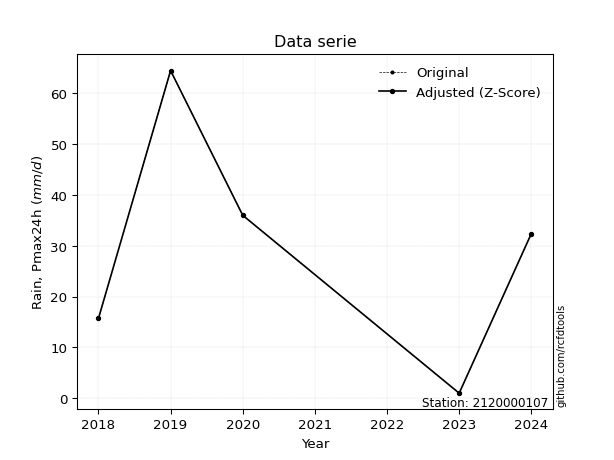</img>

</div>


> The initial value (value_initial) correspond to the initial obtained or null completed value, and value (value) is adjusted only when the initial value is outside the valid range (outlier) definite through the Z-Score value. If Z-Score is active, values out of range or outliers are replaced with the station mean value. A Z-Score (or standard score) measures how many standard deviations a data point is from the mean of a dataset, indicating its relative position; positive scores mean above the mean, negative mean below, and a score of zero is exactly at the mean, allowing for comparison of values from different distributions. It´s calculated using the formula $z=(x–μ)/σ$, where $x$ is the data point, $μ$ is the mean, and $σ$ is the standard deviation, helping identify outliers and understand probability.
>
> <sub>**Note**: In this study, "completing" (filling gaps in) and "extending" (forecasting or lengthening the historical record) rainfall data series are avoided for certain critical analyses because they introduce artificial bias and uncertainty, which can distort the statistics of rare events (extremes), alter day-to-day variability, and compromise the integrity and homogeneity of the original data. Some reasons against Completing/Extending rainfall data are: **Distortion of Extremes and Variability**: The primary issue is that most gap-filling or extension methods rely on averaging or regression with nearby stations, which inherently smooths the data. Rainfall is highly variable in space and time, with a large percentage of zero values and occasional large storms. Infilling methods often underestimate the highest values and overestimate the lowest (zero) values, which severely distorts analyses focused on flood frequency, drought severity, and intensity-duration-frequency (IDF) curves, **Loss of Data Homogeneity**: Infilled or extended data are synthetic estimates, not actual measurements. Combining these estimates with observed data can violate the assumption of data homogeneity, which requires that the data properties do not change over time. Inhomogeneity can lead to incorrect conclusions about long-term trends or changes in climate patterns, **Propagation of Errors**: Errors and biases from the original data (e.g., wind-induced undercatch, instrument errors, site changes) or the data used for imputation can propagate through the analysis, leading to unreliable hydrological models and inaccurate predictions, **Compromised Statistical Integrity**: For statistical analyses, especially those involving the frequency of events, using artificial data can introduce time bias or autocorrelation that doesn´t exist in reality, making it difficult to assess the true probability of events, **Difficulty in Validation**: It is difficult to accurately validate the quality of filled or extended data, especially for past periods where ground-truth measurements are unavailable. The reliability of imputation techniques heavily depends on the density of the surrounding station network and the complexity of the local topography.</sub>


### 4. Active continuous probability distributions from SciPy (80 of 104 available)

A Probability Density Function (PDF) describes the relative likelihood of a continuous random variable falling within a specific range, where the total area under its curve equals 1, and the area over any interval gives the actual probability for that range. Unlike discrete probabilities (like rolling a die), a PDF shows density, not direct probability for a single point (which is zero), with higher points indicating higher likelihood, often visualized as a bell curve for normal distributions.

A log of a probability density function (log-PDF) is simply the logarithm of the PDF´s value, denoted as $log(f(x))$, useful for converting multiplication of probabilities into addition, improving numerical stability with tiny numbers, and connecting to information theory concepts like entropy. Instead of dealing with very small probabilities (e.g., 0.000001), log-PDFs use negative numbers (e.g., $log(0.00001) ≈ -11.51$ that are easier for computers to handle, preventing underflow errors and simplifying complex calculations. In this study, each active probability distribution from SciPy is also evaluated in the $log$ form.

[scipy.stats](https://docs.scipy.org/doc/scipy/reference/stats.html) is a Python´s powerful submodule within the SciPy library for comprehensive statistical analysis, offering over 130 probability distributions (like Normal, Poisson, etc.), functions for descriptive stats (mean, variance), hypothesis testing (t-tests, chi-square), random variable generation, and statistical tests, making it essential for data science, modeling, and research. It provides tools to explore, model, and draw conclusions from data efficiently, working seamlessly with [NumPy](https://numpy.org/).

<div align="center">

|   id | p_dist           |   n_parameter | fit_method   | label                                                                       | active   | ref                                                                                                      |
|-----:|:-----------------|--------------:|:-------------|:----------------------------------------------------------------------------|:---------|:---------------------------------------------------------------------------------------------------------|
|    0 | alpha            |             3 | MLE          | Alpha                                                                       | True     | [:mortar_board:](https://docs.scipy.org/doc/scipy/reference/generated/scipy.stats.alpha.html)            |
|    1 | anglit           |             2 | MM           | Anglit                                                                      | True     | [:mortar_board:](https://docs.scipy.org/doc/scipy/reference/generated/scipy.stats.anglit.html)           |
|    2 | arcsine          |             2 | MM           | Arcsine                                                                     | True     | [:mortar_board:](https://docs.scipy.org/doc/scipy/reference/generated/scipy.stats.arcsine.html)          |
|    3 | argus            |             3 | MLE          | Argus                                                                       | True     | [:mortar_board:](https://docs.scipy.org/doc/scipy/reference/generated/scipy.stats.argus.html)            |
|    4 | beta             |             4 | MLE          | Beta                                                                        | True     | [:mortar_board:](https://docs.scipy.org/doc/scipy/reference/generated/scipy.stats.beta.html)             |
|    5 | betaprime        |             4 | MLE          | Beta prime                                                                  | True     | [:mortar_board:](https://docs.scipy.org/doc/scipy/reference/generated/scipy.stats.betaprime.html)        |
|    6 | bradford         |             3 | MLE          | Bradford                                                                    | True     | [:mortar_board:](https://docs.scipy.org/doc/scipy/reference/generated/scipy.stats.bradford.html)         |
|    7 | burr             |             4 | MLE          | Burr (Type III)                                                             | True     | [:mortar_board:](https://docs.scipy.org/doc/scipy/reference/generated/scipy.stats.burr.html)             |
|    8 | burr12           |             4 | MLE          | Burr (Type III) 12                                                          | True     | [:mortar_board:](https://docs.scipy.org/doc/scipy/reference/generated/scipy.stats.burr12.html)           |
|    9 | cosine           |             2 | MLE          | Cosine                                                                      | True     | [:mortar_board:](https://docs.scipy.org/doc/scipy/reference/generated/scipy.stats.cosine.html)           |
|   10 | crystalball      |             4 | MLE          | Crystalball                                                                 | True     | [:mortar_board:](https://docs.scipy.org/doc/scipy/reference/generated/scipy.stats.crystalball.html)      |
|   11 | dgamma           |             3 | MLE          | Double gamma                                                                | True     | [:mortar_board:](https://docs.scipy.org/doc/scipy/reference/generated/scipy.stats.dgamma.html)           |
|   12 | dweibull         |             3 | MLE          | Double Weibull                                                              | True     | [:mortar_board:](https://docs.scipy.org/doc/scipy/reference/generated/scipy.stats.dweibull.html)         |
|   13 | erlang           |             3 | MLE          | Erlang                                                                      | True     | [:mortar_board:](https://docs.scipy.org/doc/scipy/reference/generated/scipy.stats.erlang.html)           |
|   14 | exponnorm        |             3 | MLE          | Exponentially modified Normal                                               | True     | [:mortar_board:](https://docs.scipy.org/doc/scipy/reference/generated/scipy.stats.exponnorm.html)        |
|   15 | exponpow         |             3 | MLE          | Exponential power                                                           | True     | [:mortar_board:](https://docs.scipy.org/doc/scipy/reference/generated/scipy.stats.exponpow.html)         |
|   16 | exponweib        |             4 | MLE          | Exponentiated Weibull                                                       | True     | [:mortar_board:](https://docs.scipy.org/doc/scipy/reference/generated/scipy.stats.exponweib.html)        |
|   17 | f                |             4 | MLE          | F                                                                           | True     | [:mortar_board:](https://docs.scipy.org/doc/scipy/reference/generated/scipy.stats.f.html)                |
|   18 | fatiguelife      |             3 | MLE          | Fatigue-life (Birnbaum-Saunders)                                            | True     | [:mortar_board:](https://docs.scipy.org/doc/scipy/reference/generated/scipy.stats.fatiguelife.html)      |
|   19 | foldnorm         |             3 | MM           | Fold Normal                                                                 | True     | [:mortar_board:](https://docs.scipy.org/doc/scipy/reference/generated/scipy.stats.foldnorm.html)         |
|   20 | gamma            |             3 | MLE          | Gamma                                                                       | True     | [:mortar_board:](https://docs.scipy.org/doc/scipy/reference/generated/scipy.stats.gamma.html)            |
|   21 | gausshyper       |             6 | MLE          | Gauss hypergeometric                                                        | True     | [:mortar_board:](https://docs.scipy.org/doc/scipy/reference/generated/scipy.stats.gausshyper.html)       |
|   22 | genexpon         |             5 | MLE          | Generalized exponential                                                     | True     | [:mortar_board:](https://docs.scipy.org/doc/scipy/reference/generated/scipy.stats.genexpon.html)         |
|   23 | genextreme       |             3 | MLE          | Generalized exponential                                                     | True     | [:mortar_board:](https://docs.scipy.org/doc/scipy/reference/generated/scipy.stats.genextreme.html)       |
|   24 | gengamma         |             4 | MLE          | Generalized gamma                                                           | True     | [:mortar_board:](https://docs.scipy.org/doc/scipy/reference/generated/scipy.stats.gengamma.html)         |
|   25 | genhalflogistic  |             3 | MLE          | Generalized half-logistic                                                   | True     | [:mortar_board:](https://docs.scipy.org/doc/scipy/reference/generated/scipy.stats.genhalflogistic.html)  |
|   26 | genlogistic      |             3 | MLE          | Generalized logistic                                                        | True     | [:mortar_board:](https://docs.scipy.org/doc/scipy/reference/generated/scipy.stats.genlogistic.html)      |
|   27 | gennorm          |             3 | MLE          | Generalized Normal                                                          | True     | [:mortar_board:](https://docs.scipy.org/doc/scipy/reference/generated/scipy.stats.gennorm.html)          |
|   28 | genpareto        |             3 | MLE          | Generalized Pareto                                                          | True     | [:mortar_board:](https://docs.scipy.org/doc/scipy/reference/generated/scipy.stats.genpareto.html)        |
|   29 | gompertz         |             3 | MLE          | Gompertz (or truncated Gumbel)                                              | True     | [:mortar_board:](https://docs.scipy.org/doc/scipy/reference/generated/scipy.stats.gompertz.html)         |
|   30 | gumbel_l         |             2 | MM           | Gumbel Left Skew                                                            | True     | [:mortar_board:](https://docs.scipy.org/doc/scipy/reference/generated/scipy.stats.gumbel_l.html)         |
|   31 | gumbel_r         |             2 | MM           | Gumbel Right Skew                                                           | True     | [:mortar_board:](https://docs.scipy.org/doc/scipy/reference/generated/scipy.stats.gumbel_r.html)         |
|   32 | halfgennorm      |             3 | MLE          | Upper half of a generalized normal                                          | True     | [:mortar_board:](https://docs.scipy.org/doc/scipy/reference/generated/scipy.stats.halfgennorm.html)      |
|   33 | halflogistic     |             2 | MM           | Half-logistic                                                               | True     | [:mortar_board:](https://docs.scipy.org/doc/scipy/reference/generated/scipy.stats.halflogistic.html)     |
|   34 | halfnorm         |             2 | MM           | Half Normal                                                                 | True     | [:mortar_board:](https://docs.scipy.org/doc/scipy/reference/generated/scipy.stats.halfnorm.html)         |
|   35 | hypsecant        |             2 | MM           | hyperbolic secant                                                           | True     | [:mortar_board:](https://docs.scipy.org/doc/scipy/reference/generated/scipy.stats.hypsecant.html)        |
|   36 | invgamma         |             3 | MLE          | Inverted gamma                                                              | True     | [:mortar_board:](https://docs.scipy.org/doc/scipy/reference/generated/scipy.stats.invgamma.html)         |
|   37 | invgauss         |             3 | MLE          | Inverse Gaussian                                                            | True     | [:mortar_board:](https://docs.scipy.org/doc/scipy/reference/generated/scipy.stats.invgauss.html)         |
|   38 | invweibull       |             3 | MLE          | Inverted Weibull                                                            | True     | [:mortar_board:](https://docs.scipy.org/doc/scipy/reference/generated/scipy.stats.invweibull.html)       |
|   39 | johnsonsb        |             4 | MLE          | Johnson SB                                                                  | True     | [:mortar_board:](https://docs.scipy.org/doc/scipy/reference/generated/scipy.stats.johnsonsb.html)        |
|   40 | johnsonsu        |             4 | MLE          | Johnson Su                                                                  | True     | [:mortar_board:](https://docs.scipy.org/doc/scipy/reference/generated/scipy.stats.johnsonsu.html)        |
|   41 | kappa3           |             3 | MLE          | Kappa 3                                                                     | True     | [:mortar_board:](https://docs.scipy.org/doc/scipy/reference/generated/scipy.stats.kappa3.html)           |
|   42 | kappa4           |             4 | MLE          | Kappa 4                                                                     | True     | [:mortar_board:](https://docs.scipy.org/doc/scipy/reference/generated/scipy.stats.kappa4.html)           |
|   43 | ksone            |             3 | MLE          | Kolmogorov-Smirnov one-sided test statistic distribution                    | True     | [:mortar_board:](https://docs.scipy.org/doc/scipy/reference/generated/scipy.stats.ksone.html)            |
|   44 | kstwobign        |             2 | MLE          | Limiting distribution of scaled Kolmogorov-Smirnov two-sided test statistic | True     | [:mortar_board:](https://docs.scipy.org/doc/scipy/reference/generated/scipy.stats.kstwobign.html)        |
|   45 | laplace          |             2 | MM           | Laplace                                                                     | True     | [:mortar_board:](https://docs.scipy.org/doc/scipy/reference/generated/scipy.stats.laplace.html)          |
|   46 | levy_l           |             2 | MLE          | Left-skewed Levy                                                            | True     | [:mortar_board:](https://docs.scipy.org/doc/scipy/reference/generated/scipy.stats.levy_l.html)           |
|   47 | loggamma         |             3 | MLE          | Log gamma                                                                   | True     | [:mortar_board:](https://docs.scipy.org/doc/scipy/reference/generated/scipy.stats.loggamma.html)         |
|   48 | logistic         |             2 | MM           | Logistic (or Sech-squared)                                                  | True     | [:mortar_board:](https://docs.scipy.org/doc/scipy/reference/generated/scipy.stats.logistic.html)         |
|   49 | loglaplace       |             3 | MLE          | Log-Laplace                                                                 | True     | [:mortar_board:](https://docs.scipy.org/doc/scipy/reference/generated/scipy.stats.loglaplace.html)       |
|   50 | lomax            |             3 | MLE          | Lomax (Pareto of the second kind)                                           | True     | [:mortar_board:](https://docs.scipy.org/doc/scipy/reference/generated/scipy.stats.lomax.html)            |
|   51 | maxwell          |             2 | MM           | Maxwell                                                                     | True     | [:mortar_board:](https://docs.scipy.org/doc/scipy/reference/generated/scipy.stats.maxwell.html)          |
|   52 | mielke           |             4 | MLE          | Mielke Beta-Kappa / Dagum                                                   | True     | [:mortar_board:](https://docs.scipy.org/doc/scipy/reference/generated/scipy.stats.mielke.html)           |
|   53 | moyal            |             2 | MM           | Moyal                                                                       | True     | [:mortar_board:](https://docs.scipy.org/doc/scipy/reference/generated/scipy.stats.moyal.html)            |
|   54 | nakagami         |             3 | MLE          | Nakagami                                                                    | True     | [:mortar_board:](https://docs.scipy.org/doc/scipy/reference/generated/scipy.stats.nakagami.html)         |
|   55 | ncf              |             5 | MLE          | Non-central F distribution                                                  | True     | [:mortar_board:](https://docs.scipy.org/doc/scipy/reference/generated/scipy.stats.ncf.html)              |
|   56 | nct              |             4 | MLE          | Non-central Student’s t                                                     | True     | [:mortar_board:](https://docs.scipy.org/doc/scipy/reference/generated/scipy.stats.nct.html)              |
|   57 | norm             |             2 | MM           | Normal                                                                      | True     | [:mortar_board:](https://docs.scipy.org/doc/scipy/reference/generated/scipy.stats.norm.html)             |
|   58 | pearson3         |             3 | MM           | Pearson type III                                                            | True     | [:mortar_board:](https://docs.scipy.org/doc/scipy/reference/generated/scipy.stats.pearson3.html)         |
|   59 | powerlaw         |             3 | MLE          | Power-function                                                              | True     | [:mortar_board:](https://docs.scipy.org/doc/scipy/reference/generated/scipy.stats.powerlaw.html)         |
|   60 | rayleigh         |             2 | MM           | Rayleigh                                                                    | True     | [:mortar_board:](https://docs.scipy.org/doc/scipy/reference/generated/scipy.stats.rayleigh.html)         |
|   61 | rdist            |             3 | MLE          | R-distributed (symmetric beta)                                              | True     | [:mortar_board:](https://docs.scipy.org/doc/scipy/reference/generated/scipy.stats.rdist.html)            |
|   62 | rice             |             3 | MLE          | Rice                                                                        | True     | [:mortar_board:](https://docs.scipy.org/doc/scipy/reference/generated/scipy.stats.rice.html)             |
|   63 | semicircular     |             2 | MM           | Semicircular                                                                | True     | [:mortar_board:](https://docs.scipy.org/doc/scipy/reference/generated/scipy.stats.semicircular.html)     |
|   64 | skewnorm         |             3 | MLE          | Skew normal                                                                 | True     | [:mortar_board:](https://docs.scipy.org/doc/scipy/reference/generated/scipy.stats.skewnorm.html)         |
|   65 | t                |             3 | MLE          | Student’s t                                                                 | True     | [:mortar_board:](https://docs.scipy.org/doc/scipy/reference/generated/scipy.stats.t.html)                |
|   66 | trapezoid        |             4 | MLE          | Trapezoid                                                                   | True     | [:mortar_board:](https://docs.scipy.org/doc/scipy/reference/generated/scipy.stats.trapezoid.html)        |
|   67 | triang           |             3 | MLE          | Triangular                                                                  | True     | [:mortar_board:](https://docs.scipy.org/doc/scipy/reference/generated/scipy.stats.triang.html)           |
|   68 | truncexpon       |             3 | MLE          | Truncated exponential                                                       | True     | [:mortar_board:](https://docs.scipy.org/doc/scipy/reference/generated/scipy.stats.truncexpon.html)       |
|   69 | truncnorm        |             4 | MLE          | Truncated normal                                                            | True     | [:mortar_board:](https://docs.scipy.org/doc/scipy/reference/generated/scipy.stats.truncnorm.html)        |
|   70 | truncpareto      |             4 | MLE          | Upper truncated Pareto                                                      | True     | [:mortar_board:](https://docs.scipy.org/doc/scipy/reference/generated/scipy.stats.truncpareto.html)      |
|   71 | truncweibull_min |             5 | MLE          | Doubly truncated Weibull minimum                                            | True     | [:mortar_board:](https://docs.scipy.org/doc/scipy/reference/generated/scipy.stats.truncweibull_min.html) |
|   72 | tukeylambda      |             3 | MLE          | Tukey-Lamdba                                                                | True     | [:mortar_board:](https://docs.scipy.org/doc/scipy/reference/generated/scipy.stats.tukeylambda.html)      |
|   73 | uniform          |             2 | MLE          | Uniform                                                                     | True     | [:mortar_board:](https://docs.scipy.org/doc/scipy/reference/generated/scipy.stats.uniform.html)          |
|   74 | vonmises         |             3 | MLE          | Von Mises                                                                   | True     | [:mortar_board:](https://docs.scipy.org/doc/scipy/reference/generated/scipy.stats.vonmises.html)         |
|   75 | vonmises_line    |             3 | MLE          | Von Mises line                                                              | True     | [:mortar_board:](https://docs.scipy.org/doc/scipy/reference/generated/scipy.stats.vonmises_line.html)    |
|   76 | wald             |             2 | MM           | Wald                                                                        | True     | [:mortar_board:](https://docs.scipy.org/doc/scipy/reference/generated/scipy.stats.wald.html)             |
|   77 | weibull_max      |             3 | MLE          | Weibull maximum                                                             | True     | [:mortar_board:](https://docs.scipy.org/doc/scipy/reference/generated/scipy.stats.weibull_max.html)      |
|   78 | weibull_min      |             3 | MLE          | Weibull minimum                                                             | True     | [:mortar_board:](https://docs.scipy.org/doc/scipy/reference/generated/scipy.stats.weibull_min.html)      |
|   79 | wrapcauchy       |             3 | MLE          | Wrapped  Cauchy                                                             | True     | [:mortar_board:](https://docs.scipy.org/doc/scipy/reference/generated/scipy.stats.wrapcauchy.html)       |

</div>

> **n_parameter:** # arguments & localization & scale.
>
> **Fit methods:** (MLE) maximum likelihood, (MM) L-moments.
>
>**Inactive** (With the only purpose of prevent loops, zero divisions, infinite values, over high estimated values or horizontal trending for recurrence intervals estimations, the follow distributions were disabled.)**:** lognorm, norminvgauss, powernorm, powerlognorm, cauchy, halfcauchy, foldcauchy, skewcauchy, chi2, expon, fisk, genhyperbolic, geninvgauss, gibrat, kstwo, laplace_asymmetric, levy, levy_stable, ncx2, pareto, rel_breitwigner, recipinvgauss, studentized_range, loguniform, 


## B. Probability (PDF) vs. Empirical (EDF) distributions functions

A continuous probability distribution (CPD) describes probabilities for variables that can take any value within a range (like rain any time), unlike discrete variables with specific outcomes (like temperature). It uses a Probability Density Function (PDF), a curve where the total area under it equals 1, and the probability of the variable falling within an interval (a to b) is found by calculating the area under the curve between those points. A key feature is that the probability of hitting any single exact value is zero, so probabilities are always expressed for ranges, e.g., $P(a ≤ X ≤ b)$.

<div align="center">

Distributions parameters from station values
|     |    station | p_dist              |   n |                loc |            scale | shape                  | shape1                | shape2             | shape3             |
|----:|-----------:|:--------------------|----:|-------------------:|-----------------:|:-----------------------|:----------------------|:-------------------|:-------------------|
|   0 | 2120000107 | alpha               |   6 |    -124.656        |   1217.68        | 7.974916201893926      |                       |                    |                    |
|   1 | 2120000107 | anglit              |   6 |      30.295        |     57.0234      |                        |                       |                    |                    |
|   2 | 2120000107 | arcsine             |   6 |       2.7284       |     55.1332      |                        |                       |                    |                    |
|   3 | 2120000107 | argus               |   6 |     -15.2542       |     83.5269      | 1.0441122402857358e-06 |                       |                    |                    |
|   4 | 2120000107 | beta                |   6 |       1            |    102.213       | 0.9261778054797454     | 2.4610403600510655    |                    |                    |
|   5 | 2120000107 | betaprime           |   6 |     -48.6478       |   9239.03        | 16.207548754061392     | 1897.8315272326845    |                    |                    |
|   6 | 2120000107 | bradford            |   6 |       0.999991     |     63.5544      | 1.284238136153072      |                       |                    |                    |
|   7 | 2120000107 | burr                |   6 |      -0.996848     |     67.0893      | 128.98725128905085     | 0.006728699927749812  |                    |                    |
|   8 | 2120000107 | burr12              |   6 |      -7.06239      |   1614.8         | 1.9803625169590515     | 1372.2117143131127    |                    |                    |
|   9 | 2120000107 | cosine              |   6 |      31.1596       |     16.5937      |                        |                       |                    |                    |
|  10 | 2120000107 | crystalball         |   6 |      30.295        |     19.4925      | 3238.8511670080443     | 86.3043949392344      |                    |                    |
|  11 | 2120000107 | dgamma              |   6 |      32.2          |     22.1534      | 0.4319176756735743     |                       |                    |                    |
|  12 | 2120000107 | dweibull            |   6 |      32.2          |     15.1548      | 0.7556085673839663     |                       |                    |                    |
|  13 | 2120000107 | erlang              |   6 |     -47.1814       |      5.01209     | 15.457915783903148     |                       |                    |                    |
|  14 | 2120000107 | exponnorm           |   6 |      20.7039       |     17.0857      | 0.5613531019749434     |                       |                    |                    |
|  15 | 2120000107 | exponpow            |   6 |       1            |      2.75187     | 0.14736023170788892    |                       |                    |                    |
|  16 | 2120000107 | exponweib           |   6 |       1            |      2.90613     | 1.7966623576585223     | 0.3047759858762834    |                    |                    |
|  17 | 2120000107 | f                   |   6 |     -47.4477       |     77.7333      | 31.194773229748705     | 16201.037313569454    |                    |                    |
|  18 | 2120000107 | fatiguelife         |   6 |     -99.5333       |    128.369       | 0.1507691633591388     |                       |                    |                    |
|  19 | 2120000107 | foldnorm            |   6 |    -266.134        |     20.0798      | 14.755710366140647     |                       |                    |                    |
|  20 | 2120000107 | gamma               |   6 |     -47.1813       |      5.01209     | 15.457891375437248     |                       |                    |                    |
|  21 | 2120000107 | gausshyper          |   6 |       0.68164      |     63.7884      | 0.3911721385943331     | 0.21961879201787105   | 1.2229202212140176 | 1.418884172061761  |
|  22 | 2120000107 | genexpon            |   6 |       0.999998     |      2.04908     | 0.06944938950521617    | 6.334424418192526e-05 | 1.6308075602562315 |                    |
|  23 | 2120000107 | genextreme          |   6 |      22.8532       |     18.3862      | 0.21513846106490395    |                       |                    |                    |
|  24 | 2120000107 | gengamma            |   6 |       1            |     42.7285      | 0.484188222335812      | 1.8346360759768725    |                    |                    |
|  25 | 2120000107 | genhalflogistic     |   6 |      -5.47069      |     77.7986      | 1.1123506384908328     |                       |                    |                    |
|  26 | 2120000107 | genlogistic         |   6 |      15.1137       |     13.7681      | 2.19451012466113       |                       |                    |                    |
|  27 | 2120000107 | gennorm             |   6 |      32.4          |      2.50284e-09 | 0.10786540909542505    |                       |                    |                    |
|  28 | 2120000107 | genpareto           |   6 |       0.348004     |     87.8936      | -1.370725025584784     |                       |                    |                    |
|  29 | 2120000107 | gompertz            |   6 |      15.6945       |     23.3246      | 0.471465940567777      |                       |                    |                    |
|  30 | 2120000107 | gumbel_l            |   6 |      39.0677       |     15.1983      |                        |                       |                    |                    |
|  31 | 2120000107 | gumbel_r            |   6 |      21.5223       |     15.1983      |                        |                       |                    |                    |
|  32 | 2120000107 | halfgennorm         |   6 |       1            |      0.611435    | 0.32441653774292983    |                       |                    |                    |
|  33 | 2120000107 | halflogistic        |   6 |       7.19181      |     16.6654      |                        |                       |                    |                    |
|  34 | 2120000107 | halfnorm            |   6 |       4.49454      |     32.3361      |                        |                       |                    |                    |
|  35 | 2120000107 | hypsecant           |   6 |      30.295        |     12.4093      |                        |                       |                    |                    |
|  36 | 2120000107 | invgamma            |   6 |    -152.624        |  16028.8         | 88.62514849275351      |                       |                    |                    |
|  37 | 2120000107 | invgauss            |   6 |     -77.6925       |   3199.04        | 0.033729049080642406   |                       |                    |                    |
|  38 | 2120000107 | invweibull          |   6 |      -1.13772e+09  |      1.13772e+09 | 64751659.34627057      |                       |                    |                    |
|  39 | 2120000107 | johnsonsb           |   6 |      -5.31804      |     69.788       | -0.19508753478567714   | 0.07633096245862267   |                    |                    |
|  40 | 2120000107 | johnsonsu           |   6 |      32.4          |      4.34572e-13 | 0.07159110156978804    | 0.08051205357182503   |                    |                    |
|  41 | 2120000107 | kappa3              |   6 |       1            |     39.394       | 5.669091889904697      |                       |                    |                    |
|  42 | 2120000107 | kappa4              |   6 |      -5.29537      |     70.8934      | 1.0974780067280139     | 1.0048090890389645    |                    |                    |
|  43 | 2120000107 | ksone               |   6 |      -5.347        |     76.164       | 1.0                    |                       |                    |                    |
|  44 | 2120000107 | kstwobign           |   6 |     -40.3793       |     80.9627      |                        |                       |                    |                    |
|  45 | 2120000107 | laplace             |   6 |      30.295        |     13.7833      |                        |                       |                    |                    |
|  46 | 2120000107 | levy_l              |   6 |      68.1389       |     15.25        |                        |                       |                    |                    |
|  47 | 2120000107 | loggamma            |   6 |   -4936.83         |    696.051       | 1257.1144422373163     |                       |                    |                    |
|  48 | 2120000107 | logistic            |   6 |      30.295        |     10.7468      |                        |                       |                    |                    |
|  49 | 2120000107 | loglaplace          |   6 |      -0.159609     |     32.3596      | 1.2378611826050119     |                       |                    |                    |
|  50 | 2120000107 | lomax               |   6 |       1            |      4.31395e+09 | 138860113.28229174     |                       |                    |                    |
|  51 | 2120000107 | maxwell             |   6 |     -15.8941       |     28.9447      |                        |                       |                    |                    |
|  52 | 2120000107 | mielke              |   6 |       1            |     68.1381      | 0.6745589149478532     | 36.448563109811374    |                    |                    |
|  53 | 2120000107 | moyal               |   6 |      19.1479       |      8.77471     |                        |                       |                    |                    |
|  54 | 2120000107 | nakagami            |   6 |       1            |     30.859       | 0.2934292404416574     |                       |                    |                    |
|  55 | 2120000107 | ncf                 |   6 |       1            |      7.61274     | 1.091398525033276      | 384.4702042234278     | 2.853712599501354  |                    |
|  56 | 2120000107 | nct                 |   6 |    -114.91         |     13.2316      | 53.590923938949004     | 10.817389476676311    |                    |                    |
|  57 | 2120000107 | norm                |   6 |      30.295        |     19.4925      |                        |                       |                    |                    |
|  58 | 2120000107 | pearson3            |   6 |      30.295        |     19.4925      | 0.2670179622934934     |                       |                    |                    |
|  59 | 2120000107 | powerlaw            |   6 |       1            |     63.47        | 0.13525937942552488    |                       |                    |                    |
|  60 | 2120000107 | rayleigh            |   6 |      -6.99532      |     29.7534      |                        |                       |                    |                    |
|  61 | 2120000107 | rdist               |   6 |      -4.35658      |     36.7566      | 1.0161715077019933     |                       |                    |                    |
|  62 | 2120000107 | rice                |   6 |      -8.36034      |     23.861       | 1.1365853167092115     |                       |                    |                    |
|  63 | 2120000107 | semicircular        |   6 |      30.295        |     38.985       |                        |                       |                    |                    |
|  64 | 2120000107 | skewnorm            |   6 |      11.7957       |     26.8734      | 1.6901276699861838     |                       |                    |                    |
|  65 | 2120000107 | t                   |   6 |      30.294        |     19.4922      | 47184598.85636797      |                       |                    |                    |
|  66 | 2120000107 | trapezoid           |   6 |      -5.61435      |     76.164       | 1.0                    | 1.0                   |                    |                    |
|  67 | 2120000107 | triang              |   6 |     -21.2575       |     85.7275      | 0.9999999896932923     |                       |                    |                    |
|  68 | 2120000107 | truncexpon          |   6 |       0.999994     |     61.9535      | 1.0244791184785271     |                       |                    |                    |
|  69 | 2120000107 | truncnorm           |   6 |      -1.07795      |      7.76713     | -0.477268538428153     | 8.439149931698626     |                    |                    |
|  70 | 2120000107 | truncpareto         |   6 |     -88.3816       |     89.3816      | 9.770229056033559e-08  | 1.7101010690619596    |                    |                    |
|  71 | 2120000107 | truncweibull_min    |   6 |      -3.04083      |     88.454       | 1.259289856873651      | 0.001189914154084676  | 0.7632310839078436 |                    |
|  72 | 2120000107 | tukeylambda         |   6 |      18.4998       |     23.7433      | 1.356748047309715      |                       |                    |                    |
|  73 | 2120000107 | uniform             |   6 |       1            |     63.47        |                        |                       |                    |                    |
|  74 | 2120000107 | vonmises            |   6 |       1.32261      |      1           | 0.9048638424078105     |                       |                    |                    |
|  75 | 2120000107 | vonmises_line       |   6 |      32.7143       |     10.1082      | 0.27889211083601606    |                       |                    |                    |
|  76 | 2120000107 | wald                |   6 |      10.8025       |     19.4925      |                        |                       |                    |                    |
|  77 | 2120000107 | weibull_max         |   6 |      64.47         |      1.5667      | 0.22185565922311956    |                       |                    |                    |
|  78 | 2120000107 | weibull_min         |   6 |      -7.16628      |     42.1826      | 1.9888256620572466     |                       |                    |                    |
|  79 | 2120000107 | wrapcauchy          |   6 |       0.950226     |     10.4091      | 5.203227828239223e-07  |                       |                    |                    |
|  80 | 2120000107 | logalpha            |   6 |     -41.2387       |   1336.6         | 30.323075867408885     |                       |                    |                    |
|  81 | 2120000107 | loganglit           |   6 |       2.90892      |      3.99022     |                        |                       |                    |                    |
|  82 | 2120000107 | logarcsine          |   6 |       0.979908     |      3.85801     |                        |                       |                    |                    |
|  83 | 2120000107 | logargus            |   6 |      -1.96287      |      6.22795     | 2.7732859936505774     |                       |                    |                    |
|  84 | 2120000107 | logbeta             |   6 |      -0.430971     |      4.59717     | 0.48599570867142633    | 0.1318218476641916    |                    |                    |
|  85 | 2120000107 | logbetaprime        |   6 |      -2.46946e-27  |      4.66061     | 0.7724608782096529     | 2.4478273838384315    |                    |                    |
|  86 | 2120000107 | logbradford         |   6 |      -0.567745     |      4.73397     | 8.154320720122347e-05  |                       |                    |                    |
|  87 | 2120000107 | logburr             |   6 |      -2.03836e-29  |      2.58412     | 1.5042440619649164     | 0.39770671838437044   |                    |                    |
|  88 | 2120000107 | logburr12           |   6 | -134336            | 134354           | 117460.34607333562     | 279896.03743311635    |                    |                    |
|  89 | 2120000107 | logcosine           |   6 |       2.63402      |      1.20497     |                        |                       |                    |                    |
|  90 | 2120000107 | logcrystalball      |   6 |       2.90892      |      1.36399     | 6.265822353215181      | 86.93226042643334     |                    |                    |
|  91 | 2120000107 | logdgamma           |   6 |       3.47816      |      1.30564     | 0.6051369973365052     |                       |                    |                    |
|  92 | 2120000107 | logdweibull         |   6 |       3.47197      |      1.20898     | 0.5633502554555354     |                       |                    |                    |
|  93 | 2120000107 | logerlang           |   6 |     -19.1871       |      0.094403    | 233.73937963987606     |                       |                    |                    |
|  94 | 2120000107 | logexponnorm        |   6 |       2.90806      |      1.364       | 0.0006337366071695154  |                       |                    |                    |
|  95 | 2120000107 | logexponpow         |   6 |      -1.01967e-26  |      4.44853     | 0.4449440543050036     |                       |                    |                    |
|  96 | 2120000107 | logexponweib        |   6 |      -1.0921e+08   |      1.0921e+08  | 6.799386889034957      | 36740557.32332095     |                    |                    |
|  97 | 2120000107 | logf                |   6 |      -1.94385e-31  |      1.33948     | 1.4452655746550152     | 1.2193485198996008    |                    |                    |
|  98 | 2120000107 | logfatiguelife      |   6 |    -905.488        |    908.388       | 0.0015004072961860944  |                       |                    |                    |
|  99 | 2120000107 | logfoldnorm         |   6 |      -5.55456      |      1.14502     | 7.435674519897825      |                       |                    |                    |
| 100 | 2120000107 | loggamma            |   6 |     -18.8087       |      0.0973676   | 222.7407828194133      |                       |                    |                    |
| 101 | 2120000107 | loggausshyper       |   6 |      -0.413184     |      4.57938     | 1.2806260960469176     | 0.4220695034425941    | 1.1515081976489625 | 1.1543130003256776 |
| 102 | 2120000107 | loggenexpon         |   6 |      -0.0227955    |     18.7173      | 2.13437722479253       | 45.50097471617518     | 1.0028161903402586 |                    |
| 103 | 2120000107 | loggenextreme       |   6 |       2.84305      |      1.55442     | 1.1747863259052025     |                       |                    |                    |
| 104 | 2120000107 | loggengamma         |   6 |     -21.8687       |      0.233846    | 222.97287630290464     | 1.1597198516769658    |                    |                    |
| 105 | 2120000107 | loggenhalflogistic  |   6 |      -0.0914851    |      4.62738     | 1.0868295768374414     |                       |                    |                    |
| 106 | 2120000107 | loggenlogistic      |   6 |       4.16683      |      1.50477e-05 | 1.1981631858695526e-05 |                       |                    |                    |
| 107 | 2120000107 | loggennorm          |   6 |       3.47197      |      0.0164415   | 0.36162062754916724    |                       |                    |                    |
| 108 | 2120000107 | loggenpareto        |   6 |      -2.63552e-09  |      1.5255      | 0.494596548542117      |                       |                    |                    |
| 109 | 2120000107 | loggompertz         |   6 |      -1.28147e-06  |      0.856578    | 0.01814891073147127    |                       |                    |                    |
| 110 | 2120000107 | loggumbel_l         |   6 |       3.52279      |      1.0635      |                        |                       |                    |                    |
| 111 | 2120000107 | loggumbel_r         |   6 |       2.29505      |      1.0635      |                        |                       |                    |                    |
| 112 | 2120000107 | loghalfgennorm      |   6 |      -5.81017e-11  |      5.09244     | 1.4064696700342147     |                       |                    |                    |
| 113 | 2120000107 | loghalflogistic     |   6 |       1.2923       |      1.16615     |                        |                       |                    |                    |
| 114 | 2120000107 | loghalfnorm         |   6 |       1.10354      |      2.2627      |                        |                       |                    |                    |
| 115 | 2120000107 | loghypsecant        |   6 |       2.90892      |      0.868343    |                        |                       |                    |                    |
| 116 | 2120000107 | loginvgamma         |   6 |     -29.3295       |  15594.7         | 485.35567094050043     |                       |                    |                    |
| 117 | 2120000107 | loginvgauss         |   6 |     -10.8204       |   1104.2         | 0.012437326373106919   |                       |                    |                    |
| 118 | 2120000107 | loginvweibull       |   6 |      -1.99478e+08  |      1.99478e+08 | 122246358.05821432     |                       |                    |                    |
| 119 | 2120000107 | logjohnsonsb        |   6 |      -0.530919     |      4.69712     | -0.4511564985756619    | 0.07459576530928663   |                    |                    |
| 120 | 2120000107 | logjohnsonsu        |   6 |       3.47816      |      3.3133e-16  | -0.06430259177266309   | 0.06745372266439176   |                    |                    |
| 121 | 2120000107 | logkappa3           |   6 |      -1.64917e-05  |      4.16619     | 294841.2748391778      |                       |                    |                    |
| 122 | 2120000107 | logkappa4           |   6 |      -0.386248     |      4.80333     | 1.08228014279279       | 1.0551096702209861    |                    |                    |
| 123 | 2120000107 | logksone            |   6 |      -0.41662      |      4.99944     | 1.0                    |                       |                    |                    |
| 124 | 2120000107 | logkstwobign        |   6 |      -3.66119      |      7.50336     |                        |                       |                    |                    |
| 125 | 2120000107 | loglaplace          |   6 |       2.90892      |      0.964487    |                        |                       |                    |                    |
| 126 | 2120000107 | loglevy_l           |   6 |       4.25695      |      0.375927    |                        |                       |                    |                    |
| 127 | 2120000107 | logloggamma         |   6 |       4.16653      |      1.37669e-06 | 1.0861450836443335e-06 |                       |                    |                    |
| 128 | 2120000107 | loglogistic         |   6 |       2.90892      |      0.752007    |                        |                       |                    |                    |
| 129 | 2120000107 | logloglaplace       |   6 |      -1.01103e-29  |      2.22652     | 0.5684082562063622     |                       |                    |                    |
| 130 | 2120000107 | loglomax            |   6 |      -1.00538e-06  |    154.249       | 51.61795979848891      |                       |                    |                    |
| 131 | 2120000107 | logmaxwell          |   6 |      -0.323166     |      2.02541     |                        |                       |                    |                    |
| 132 | 2120000107 | logmielke           |   6 |      -2.62828e-30  |      2.23697     | 0.7454574346087346     | 1.382792930626155     |                    |                    |
| 133 | 2120000107 | logmoyal            |   6 |       2.1289       |      0.614011    |                        |                       |                    |                    |
| 134 | 2120000107 | lognakagami         |   6 |      -1.42403e-31  |      2.80962     | 0.18056239884061587    |                       |                    |                    |
| 135 | 2120000107 | logncf              |   6 |      -2.85553e-30  |      1.21818     | 1.4517005814458472     | 1.2986867960163084    | 0.9851413157281599 |                    |
| 136 | 2120000107 | lognct              |   6 |     -73.1344       |      1.30701     | 16985.73768824496      | 58.17794463128055     |                    |                    |
| 137 | 2120000107 | lognorm             |   6 |       2.90892      |      1.36399     |                        |                       |                    |                    |
| 138 | 2120000107 | logpearson3         |   6 |       2.90892      |      1.36399     | -1.4423273475790972    |                       |                    |                    |
| 139 | 2120000107 | logpowerlaw         |   6 |      -2.22507e-308 |      4.1662      | 0.008441775683530097   |                       |                    |                    |
| 140 | 2120000107 | lograyleigh         |   6 |       0.299518     |      2.082       |                        |                       |                    |                    |
| 141 | 2120000107 | logrdist            |   6 |       0.628749     |      2.12491     | 1.0828886780343852     |                       |                    |                    |
| 142 | 2120000107 | logrice             |   6 |    -580.6          |      1.36404     | 427.7795521847795      |                       |                    |                    |
| 143 | 2120000107 | logsemicircular     |   6 |       2.90891      |      2.72802     |                        |                       |                    |                    |
| 144 | 2120000107 | logskewnorm         |   6 |       4.1662       |      1.85483     | -5550559.561795952     |                       |                    |                    |
| 145 | 2120000107 | logt                |   6 |       3.47564      |      0.00741848  | 0.24493650925840005    |                       |                    |                    |
| 146 | 2120000107 | logtrapezoid        |   6 |      -0.99648      |      5.78692     | 1.0                    | 1.0                   |                    |                    |
| 147 | 2120000107 | logtriang           |   6 |      -1.14006      |      5.30633     | 0.9999976325319304     |                       |                    |                    |
| 148 | 2120000107 | logtruncexpon       |   6 |      -0.230595     |      4.83032     | 0.9102496125008197     |                       |                    |                    |
| 149 | 2120000107 | logtruncnorm        |   6 |      -0.00598085   |      3.25079     | 0.0017970374329152577  | 1.2834377783660993    |                    |                    |
| 150 | 2120000107 | logtruncpareto      |   6 |      -0.0124754    |      0.0111545   | 2.7627302580685005e-09 | 374.6188999486384     |                    |                    |
| 151 | 2120000107 | logtruncweibull_min |   6 |      -0.221538     |      9.25866     | 1.739515536722527      | 3.597010184432795e-10 | 0.4739065759601459 |                    |
| 152 | 2120000107 | logtukeylambda      |   6 |       3.47573      |      0.000560385 | -3.989865292023876     |                       |                    |                    |
| 153 | 2120000107 | loguniform          |   6 |       0            |      4.1662      |                        |                       |                    |                    |
| 154 | 2120000107 | logvonmises         |   6 |      -2.69309      |      1           | 1.511893741279462      |                       |                    |                    |
| 155 | 2120000107 | logvonmises_line    |   6 |       3.25675      |      1.03665     | 1.3796099507390422     |                       |                    |                    |
| 156 | 2120000107 | logwald             |   6 |       1.54496      |      1.36397     |                        |                       |                    |                    |
| 157 | 2120000107 | logweibull_max      |   6 |       4.1662       |      1.3592      | 0.1697119896764242     |                       |                    |                    |
| 158 | 2120000107 | logweibull_min      |   6 |      -5.8318e-29   |      2.75451     | 0.19245484625425946    |                       |                    |                    |
| 159 | 2120000107 | logwrapcauchy       |   6 |      -1.77092e-08  |      0.663071    | 0.46251462544288885    |                       |                    |                    |

</div>

> **loc** (Location parameter): This shifts the distribution along the x-axis. For many common distributions, like the normal (Gaussian) distribution, loc represents the mean $μ$. For others, like the uniform distribution, it might represent the minimum value, or for the beta distribution, the left end of the support interval.
>
> **scale** (Scale parameter): This determines the width or spread of the distribution. For the normal distribution, scale represents the standard deviation $σ$. For a uniform distribution, it defines the length of the interval (from $loc$ to $loc + scale$).
>
> **shape** (Shape parameters): Refers to parameters that define the specific form of a probability distribution, distinct from its location (loc) and scale (scale). These parameters are required arguments for most distribution functions. For example, a normal (Gaussian) distribution is fully defined by its location (mean) and scale (standard deviation), so it has no specific shape parameters beyond loc and scale. However, other distributions have intrinsic properties that need specification, as Gamma distribution that takes a shape parameter, often named $a$ or $alpha$.


### 0. Cumulative distribution values - CDF (160 evaluated)

Cumulative Distribution Function (CDF), denoted as $F$<sub>$X$</sub>$(x)$, is a function that gives the probability that a random variable $X$ will take a value less than or equal to a specific value, $x$ (i.e., $(P(X≥x)$. It essentially "accumulates" probabilities from a given point up to the far right (positive infinity), providing a complete picture of the distribution´s probabilities for both discrete (like rain) and continuous (like temperature) variables, helping to find probabilities over ranges or above certain values. Each station is evaluated separately ordering the $x$ values ascending, calculating the CDF and PDF values for the activated distributions and their logarithmic forms.

<div align="center">

CDF ordered by x ascending and calculating $log(f(x))$ separately
|   id |    Station |   date |     x |   count |   mean |    std |     zscore |   Value_initial |    station |   m |     alpha |   alpha_pdf |    anglit |   anglit_pdf |   arcsine |   arcsine_pdf |     argus |   argus_pdf |        beta |   beta_pdf |   betaprime |   betaprime_pdf |   bradford |   bradford_pdf |     burr |   burr_pdf |    burr12 |   burr12_pdf |    cosine |   cosine_pdf |   crystalball |   crystalball_pdf |    dgamma |   dgamma_pdf |   dweibull |   dweibull_pdf |    erlang |   erlang_pdf |   exponnorm |   exponnorm_pdf |   exponpow |   exponpow_pdf |   exponweib |   exponweib_pdf |         f |      f_pdf |   fatiguelife |   fatiguelife_pdf |   foldnorm |   foldnorm_pdf |     gamma |   gamma_pdf |   gausshyper |   gausshyper_pdf |    genexpon |   genexpon_pdf |   genextreme |   genextreme_pdf |    gengamma |   gengamma_pdf |   genhalflogistic |   genhalflogistic_pdf |   genlogistic |   genlogistic_pdf |   gennorm |   gennorm_pdf |   genpareto |   genpareto_pdf |    gompertz |   gompertz_pdf |   gumbel_l |   gumbel_l_pdf |   gumbel_r |   gumbel_r_pdf |   halfgennorm |   halfgennorm_pdf |   halflogistic |   halflogistic_pdf |   halfnorm |   halfnorm_pdf |   hypsecant |   hypsecant_pdf |   invgamma |   invgamma_pdf |   invgauss |   invgauss_pdf |   invweibull |   invweibull_pdf |   johnsonsb |   johnsonsb_pdf |   johnsonsu |   johnsonsu_pdf |      kappa3 |   kappa3_pdf |      kappa4 |   kappa4_pdf |     ksone |   ksone_pdf |   kstwobign |   kstwobign_pdf |   laplace |   laplace_pdf |   levy_l |   levy_l_pdf |   loggamma |   loggamma_pdf |   logistic |   logistic_pdf |   loglaplace |   loglaplace_pdf |       lomax |   lomax_pdf |   maxwell |   maxwell_pdf |      mielke |   mielke_pdf |      moyal |   moyal_pdf |    nakagami |    nakagami_pdf |        ncf |         ncf_pdf |      nct |    nct_pdf |      norm |   norm_pdf |   pearson3 |   pearson3_pdf |   powerlaw |   powerlaw_pdf |   rayleigh |   rayleigh_pdf |    rdist |       rdist_pdf |      rice |   rice_pdf |   semicircular |   semicircular_pdf |   skewnorm |   skewnorm_pdf |        t |      t_pdf |   trapezoid |   trapezoid_pdf |    triang |   triang_pdf |   truncexpon |   truncexpon_pdf |   truncnorm |   truncnorm_pdf |   truncpareto |   truncpareto_pdf |   truncweibull_min |   truncweibull_min_pdf |   tukeylambda |   tukeylambda_pdf |   uniform |   uniform_pdf |   vonmises |   vonmises_pdf |   vonmises_line |   vonmises_line_pdf |     wald |   wald_pdf |   weibull_max |   weibull_max_pdf |   weibull_min |   weibull_min_pdf |   wrapcauchy |   wrapcauchy_pdf |   logalpha |   logalpha_pdf |   loganglit |   loganglit_pdf |   logarcsine |   logarcsine_pdf |   logargus |   logargus_pdf |   logbeta |   logbeta_pdf |   logbetaprime |   logbetaprime_pdf |   logbradford |   logbradford_pdf |     logburr |   logburr_pdf |   logburr12 |   logburr12_pdf |   logcosine |   logcosine_pdf |   logcrystalball |   logcrystalball_pdf |   logdgamma |   logdgamma_pdf |   logdweibull |   logdweibull_pdf |   logerlang |   logerlang_pdf |   logexponnorm |   logexponnorm_pdf |   logexponpow |   logexponpow_pdf |   logexponweib |   logexponweib_pdf |        logf |    logf_pdf |   logfatiguelife |   logfatiguelife_pdf |   logfoldnorm |   logfoldnorm_pdf |   loggausshyper |   loggausshyper_pdf |   loggenexpon |   loggenexpon_pdf |   loggenextreme |   loggenextreme_pdf |   loggengamma |   loggengamma_pdf |   loggenhalflogistic |   loggenhalflogistic_pdf |   loggenlogistic |   loggenlogistic_pdf |   loggennorm |   loggennorm_pdf |   loggenpareto |   loggenpareto_pdf |   loggompertz |   loggompertz_pdf |   loggumbel_l |   loggumbel_l_pdf |   loggumbel_r |   loggumbel_r_pdf |   loghalfgennorm |   loghalfgennorm_pdf |   loghalflogistic |   loghalflogistic_pdf |   loghalfnorm |   loghalfnorm_pdf |   loghypsecant |   loghypsecant_pdf |   loginvgamma |   loginvgamma_pdf |   loginvgauss |   loginvgauss_pdf |   loginvweibull |   loginvweibull_pdf |   logjohnsonsb |   logjohnsonsb_pdf |   logjohnsonsu |   logjohnsonsu_pdf |   logkappa3 |   logkappa3_pdf |   logkappa4 |   logkappa4_pdf |   logksone |   logksone_pdf |   logkstwobign |   logkstwobign_pdf |   loglevy_l |   loglevy_l_pdf |   logloggamma |   logloggamma_pdf |   loglogistic |   loglogistic_pdf |   logloglaplace |   logloglaplace_pdf |    loglomax |   loglomax_pdf |   logmaxwell |   logmaxwell_pdf |   logmielke |   logmielke_pdf |    logmoyal |   logmoyal_pdf |   lognakagami |   lognakagami_pdf |      logncf |   logncf_pdf |    lognct |   lognct_pdf |   lognorm |   lognorm_pdf |   logpearson3 |   logpearson3_pdf |   logpowerlaw |   logpowerlaw_pdf |   lograyleigh |   lograyleigh_pdf |   logrdist |   logrdist_pdf |   logrice |   logrice_pdf |   logsemicircular |   logsemicircular_pdf |   logskewnorm |   logskewnorm_pdf |     logt |    logt_pdf |   logtrapezoid |   logtrapezoid_pdf |   logtriang |   logtriang_pdf |   logtruncexpon |   logtruncexpon_pdf |   logtruncnorm |   logtruncnorm_pdf |   logtruncpareto |   logtruncpareto_pdf |   logtruncweibull_min |   logtruncweibull_min_pdf |   logtukeylambda |   logtukeylambda_pdf |   loguniform |   loguniform_pdf |   logvonmises |   logvonmises_pdf |   logvonmises_line |   logvonmises_line_pdf |   logwald |   logwald_pdf |   logweibull_max |   logweibull_max_pdf |   logweibull_min |   logweibull_min_pdf |   logwrapcauchy |   logwrapcauchy_pdf |
|-----:|-----------:|-------:|------:|--------:|-------:|-------:|-----------:|----------------:|-----------:|----:|----------:|------------:|----------:|-------------:|----------:|--------------:|----------:|------------:|------------:|-----------:|------------:|----------------:|-----------:|---------------:|---------:|-----------:|----------:|-------------:|----------:|-------------:|--------------:|------------------:|----------:|-------------:|-----------:|---------------:|----------:|-------------:|------------:|----------------:|-----------:|---------------:|------------:|----------------:|----------:|-----------:|--------------:|------------------:|-----------:|---------------:|----------:|------------:|-------------:|-----------------:|------------:|---------------:|-------------:|-----------------:|------------:|---------------:|------------------:|----------------------:|--------------:|------------------:|----------:|--------------:|------------:|----------------:|------------:|---------------:|-----------:|---------------:|-----------:|---------------:|--------------:|------------------:|---------------:|-------------------:|-----------:|---------------:|------------:|----------------:|-----------:|---------------:|-----------:|---------------:|-------------:|-----------------:|------------:|----------------:|------------:|----------------:|------------:|-------------:|------------:|-------------:|----------:|------------:|------------:|----------------:|----------:|--------------:|---------:|-------------:|-----------:|---------------:|-----------:|---------------:|-------------:|-----------------:|------------:|------------:|----------:|--------------:|------------:|-------------:|-----------:|------------:|------------:|----------------:|-----------:|----------------:|---------:|-----------:|----------:|-----------:|-----------:|---------------:|-----------:|---------------:|-----------:|---------------:|---------:|----------------:|----------:|-----------:|---------------:|-------------------:|-----------:|---------------:|---------:|-----------:|------------:|----------------:|----------:|-------------:|-------------:|-----------------:|------------:|----------------:|--------------:|------------------:|-------------------:|-----------------------:|--------------:|------------------:|----------:|--------------:|-----------:|---------------:|----------------:|--------------------:|---------:|-----------:|--------------:|------------------:|--------------:|------------------:|-------------:|-----------------:|-----------:|---------------:|------------:|----------------:|-------------:|-----------------:|-----------:|---------------:|----------:|--------------:|---------------:|-------------------:|--------------:|------------------:|------------:|--------------:|------------:|----------------:|------------:|----------------:|-----------------:|---------------------:|------------:|----------------:|--------------:|------------------:|------------:|----------------:|---------------:|-------------------:|--------------:|------------------:|---------------:|-------------------:|------------:|------------:|-----------------:|---------------------:|--------------:|------------------:|----------------:|--------------------:|--------------:|------------------:|----------------:|--------------------:|--------------:|------------------:|---------------------:|-------------------------:|-----------------:|---------------------:|-------------:|-----------------:|---------------:|-------------------:|--------------:|------------------:|--------------:|------------------:|--------------:|------------------:|-----------------:|---------------------:|------------------:|----------------------:|--------------:|------------------:|---------------:|-------------------:|--------------:|------------------:|--------------:|------------------:|----------------:|--------------------:|---------------:|-------------------:|---------------:|-------------------:|------------:|----------------:|------------:|----------------:|-----------:|---------------:|---------------:|-------------------:|------------:|----------------:|--------------:|------------------:|--------------:|------------------:|----------------:|--------------------:|------------:|---------------:|-------------:|-----------------:|------------:|----------------:|------------:|---------------:|--------------:|------------------:|------------:|-------------:|----------:|-------------:|----------:|--------------:|--------------:|------------------:|--------------:|------------------:|--------------:|------------------:|-----------:|---------------:|----------:|--------------:|------------------:|----------------------:|--------------:|------------------:|---------:|------------:|---------------:|-------------------:|------------:|----------------:|----------------:|--------------------:|---------------:|-------------------:|-----------------:|---------------------:|----------------------:|--------------------------:|-----------------:|---------------------:|-------------:|-----------------:|--------------:|------------------:|-------------------:|-----------------------:|----------:|--------------:|-----------------:|---------------------:|-----------------:|---------------------:|----------------:|--------------------:|
|    0 | 2120000107 |   2023 |  1    |       6 | 30.295 | 21.353 | -1.37194   |            1    | 2120000107 |   1 | 0.0431102 |  0.0070614  | 0.0720023 |   0.00906617 |  0        |     0         | 0.0562616 |  0.00685569 | 5.38762e-17 | 0.44945    |   0.0503896 |      0.00722618 | 2.0998e-07 |      0.0244626 | 0.047347 |  0.020579  | 0.0372468 |   0.00897626 | 0.0563962 |   0.00724872 |     0.0664344 |        0.00661576 | 0.0382924 |  0.00221502  |   0.089025 |     0.00372064 | 0.0502169 |   0.00724181 |   0.0607367 |      0.00663836 | 0.00425111 |    2.82124e+12 | 1.02303e-09 |     5.04571e+06 | 0.0502468 | 0.00723917 |     0.0520594 |        0.00707902 |  0.0732358 |     0.0069226  | 0.0502169 |  0.00724181 |    0.0953208 |      0.116725    | 6.34453e-08 |     0.033893   |    0.0560396 |       0.00699459 | 4.79743e-10 |     0.353864   |         0.0436098 |            0.00706859 |     0.0538054 |        0.00631173 | 0.0786475 |    0.0013809  |  0.00742826 |       0.0114089 | 0           |      0         |  0.0784487 |     0.00495372 |  0.0210972 |     0.00535627 |   4.41583e-15 |        0.245518   |       0        |         0          |   0        |     0          |   0.0598889 |       0.0047977 |  0.0532199 |     0.00701599 |  0.0502745 |     0.0072892  |    0.0448964 |       0.00792987 |    0.355246 |     0.00494676  |  0.00533302 |     3.92658e-05 | 9.94515e-13 |    0.0186919 | 2.90066e-15 |    0.368702  | 0.0833333 |   0.0131296 |   0.0435952 |      0.0088982  | 0.0596926 |    0.0043308  | 0.366348 |   0.0025279  |  0.0199984 |      0.0366515 |  0.0614604 |     0.00536747 |    0.0244977 |        0.0253998 | 7.69497e-10 |  0.0321886  | 0.0477929 |    0.00792002 | 6.98731e-08 |  28.0475     | 0.00491452 |  0.00244913 | 6.75703e-11 | 178587          | 8.3504e-10 | 128263          | 0.055193 | 0.00696955 | 0.0664344 | 0.00661576 |  0.0579993 |      0.0069153 |  0.0039644 |    4.82986e+12 |  0.0354611 |     0.0087113  | 0.54707  |      0.00884959 | 0.0397804 | 0.00838114 |      0.0715402 |          0.0107744 |   0.054202 |     0.0068083  | 0.066438 | 0.00661613 |   0.0075418 |      0.00228043 | 0.0674081 |   0.00605712 |   1.4912e-07 |        0.0251805 |    0.422708 |     0.0725143   |      0        |         0.0208516 |          0.0395069 |              0.0123119 |   1.41399e-05 |         0.0413475 |  0        |     0.0157555 |   0.397196 |      0.308888  |      0.00048446 |           0.0116849 | 0        | 0          |      0.102975 |       0.000818247 |     0.0374531 |        0.00894839 |  0.000761046 |          0.01529 |  0.0183867 |      0.0354283 |  0.00317595 |        0.028202 |     0        |         0        |  0.0226056 |      0.0270259 | 0.0747342 |   0.0892854   |    1.77829e-21 |     556258         |      0.119934 |          0.211246 | 3.88303e-18 |   1.13965e+11 |   0.0507271 |       0.0432101 |   0.0221154 |       0.0558588 |        0.0164765 |            0.0300931 |   0.0143485 |       0.0122645 |     0.0816826 |       0.0240124   |   0.0193956 |       0.0358922 |      0.0164772 |          0.0300938 |   1.40216e-12 |       6.11849e+13 |      0.0242295 |          0.0348829 | 3.91217e-23 | 1.45436e+08 |        0.0165372 |            0.0303077 |    0.00487429 |         0.0123451 |       0.0328072 |         0.0991936   |    0.00262978 |          0.116692 |       0.0703186 |           0.0381408 |     0.0188412 |         0.0347523 |           0.00999262 |                 0.110414 |         0        |            0.0288495 |    0.0117504 |       0.00661363 |    1.72765e-09 |          0.655524  |   2.71514e-08 |         0.0211877 |     0.0357714 |         0.0330267 |   0.000174433 |        0.00141941 |      1.25272e-11 |             0.215608 |          0        |              0        |      0        |          0        |       0.022327 |          0.0256912 |     0.0199203 |         0.0373715 |     0.0182902 |         0.0375139 |       0.0241727 |           0.0551449 |       0.272644 |        0.052632    |     0.00466907 |        0.000263819 | 3.95829e-06 |        0.240017 |  0.00740758 |        0.31315  |  0.0833333 |       0.200022 |      0.0288616 |          0.0738134 |    0.233662 |       0.0266464 |     0.0373584 |         0.0294741 |     0.0204681 |         0.0266609 |     1.04772e-17 |         5.89035e+11 | 3.36443e-07 |      0.334641  |   0.00107212 |       0.00990207 | 4.88053e-23 |     1.38426e+07 | 1.50493e-08 |     4.0432e-07 |   3.97064e-12 |       1.00693e+19 | 1.44696e-22 |  3.67804e+07 | 0.0166895 |    0.0304814 | 0.0164766 |     0.0300932 |     0.0401351 |          0.034386 |    0.00249824 |      9.47814e+302 |      0        |          0        |   0.399124 |    0.165026    | 0.0164807 |     0.0300986 |          0        |              0        |     0.0246954 |         0.0345225 | 0.08042  |  0.00566739 |      0.0296512 |          0.0595119 |   0.0461602 |       0.0809786 |       0.0780111 |            0.330292 |    4.27025e-05 |           0.3071   |        0.0188866 |           13.5266    |            0.00633542 |                  0.049708 |        0.0792181 |           0.00571206 |     0        |         0.240027 |      0.990012 |         0.0245722 |        6.94567e-10 |              0.0251637 |  0        |     0         |         0.298387 |          0.0146997   |      3.03042e-06 |          1.00006e+22 |     1.15663e-08 |            0.653121 |
|    1 | 2120000107 |   2018 | 15.7  |       6 | 30.295 | 21.353 | -0.683511  |           15.7  | 2120000107 |   2 | 0.24173   |  0.0192909  | 0.255085  |   0.0152888  |  0.3224   |     0.0136112 | 0.198761  |  0.0123626  | 0.35007     | 0.0195066  |   0.239572  |      0.0180846  | 0.314862   |      0.0188603 | 0.299063 |  0.0155455 | 0.256532  |   0.0191718  | 0.223984  |   0.0153125  |     0.227004  |        0.0154634  | 0.0940017 |  0.0061763   |   0.172128 |     0.00840567 | 0.239867  |   0.0181156  |   0.22812   |      0.0163371  | 0.925494   |    0.00343884  | 0.678478    |     0.00998186  | 0.23982   | 0.0181107  |     0.236885  |        0.0177918  |  0.235753  |     0.015331   | 0.239867  |  0.0181156  |    0.410599  |      0.00973019  | 0.392646    |     0.0206038  |    0.233869  |       0.0170543  | 0.418202    |     0.0229581  |         0.160655  |            0.00897882 |     0.228803  |        0.0178464  | 0.108739  |    0.00309994 |  0.180987   |       0.0122515 | 0.000110794 |      0.0202158 |  0.193388  |     0.011406   |  0.230659  |     0.0222614  |   0.511871    |        0.0148488  |       0.249861 |         0.0281292  |   0.271056 |     0.0232368  |   0.190482  |       0.0144501 |  0.235874  |     0.0176364  |  0.24225   |     0.0183434  |    0.260725  |       0.0199477  |    0.397687 |     0.00200467  |  0.00616392 |     8.39537e-05 | 0.274739    |    0.0186774 | 0.259789    |    0.0161135 | 0.276338  |   0.0131296 |   0.276576  |      0.0204321  | 0.17342   |    0.0125819  | 0.410301 |   0.00354744 |  0.474446  |      0.274997  |  0.204552  |     0.0151404  |    0.425657  |        0.441331  | 0.376977    |  0.0200542  | 0.244942  |    0.018102   | 0.355382    |   0.0163079  | 0.223567   |  0.0263837  | 0.495157    |      0.0187728  | 0.392658   |      0.0193574  | 0.235314 | 0.0174217  | 0.227004  | 0.0154634  |  0.232585  |      0.0168122 |  0.820496  |    0.00754964  |  0.252423  |     0.0191655  | 0.685599 |      0.0104195  | 0.242     | 0.0180711  |      0.267356  |          0.0151423 |   0.233441 |     0.0175387  | 0.227016 | 0.015464   |   0.078315  |      0.00734857 | 0.185851  |   0.0100576  |   0.329517   |        0.0198618 |    0.977493 |     0.00729     |      0.283775 |         0.0179066 |          0.25917   |              0.0162358 |   0.424433    |         0.0270377 |  0.231605 |     0.0157555 |   2.90791  |      0.105584  |      0.188808   |           0.0149677 | 0.113987 | 0.053254   |      0.117161 |       0.00114279  |     0.256114  |        0.0191427  |  0.225525    |          0.01529 |  0.476271  |      0.275035  |  0.46113    |        0.249855 |     0.474354 |         0.16555  |  0.314189  |      0.276777  | 0.2599    |   0.0816823   |    0.756276    |          0.0874304 |      0.70162  |          0.211236 | 0.773279    |   0.079988    |   0.439149  |       0.28359   |   0.531579  |       0.263513  |        0.454688  |            0.290593  |   0.178038  |       0.187769  |     0.237178  |       0.138728    |   0.474132  |       0.276845  |      0.454688  |          0.290591  |   0.711487    |       0.084471    |      0.443276  |          0.28127   | 0.614864    | 0.0642748   |        0.457229  |            0.291068  |    0.428684   |         0.342833  |       0.417683  |         0.187177    |    0.548245   |          0.203306 |       0.347418  |           0.221341  |     0.470079  |         0.27915   |           0.468069   |                 0.254337 |         0        |            0.258443  |    0.104261  |       0.13408    |    0.724742    |          0.0953291 |   0.351889    |         0.341877  |     0.384423  |         0.280842  |   0.522197    |        0.319019   |      0.502308    |             0.1415   |          0.55569  |              0.296364 |      0.534163 |          0.270288 |       0.443388 |          0.360789  |     0.481049  |         0.273754  |     0.480429  |         0.26363   |       0.50229   |           0.211957  |       0.348931 |        0.0279415   |     0.00632274 |        0.00165824  | 0.66093     |        0.240017 |  0.664975   |        0.228867 |  0.634127  |       0.200022 |      0.542141  |          0.200791  |    0.382974 |       0.117111  |     0.328018  |         0.258791  |     0.448568  |         0.328926  |     0.556886    |         0.0914671   | 0.598826    |      0.131895  |   0.488954   |       0.286745   | 0.739514    |     0.085815    | 0.547677    |     0.326052   |   0.769148    |       0.0870111   | 0.533888    |  0.072707    | 0.455694  |    0.289377  | 0.454688  |     0.290593  |     0.362429  |          0.257339 |    0.996511   |      0.00305496   |      0.500784 |          0.282635 |   1        |    1.73498e+06 | 0.454701  |     0.290584  |          0.46379  |              0.232985 |     0.446331  |         0.321885  | 0.118178 |  0.0400922  |      0.419953  |          0.223966  |   0.538446  |       0.276572  |       0.771249  |            0.186774 |    0.754024    |           0.214187 |        0.930383  |            0.0610058 |            0.542757   |                  0.295822 |        0.117448  |           0.040752   |     0.660953 |         0.240027 |      1.18958  |         0.264311  |        0.310341    |              0.338772  |  0.618526 |     0.348063  |         0.365476 |          0.0441986   |      0.632099    |          0.0257113   |     0.563895    |            0.11067  |
|    2 | 2120000107 |   2025 | 32.2  |       6 | 30.295 | 21.353 |  0.0892147 |           32.2  | 2120000107 |   3 | 0.583893  |  0.0193061  | 0.533382  |   0.0174975  |  0.522014 |     0.0115746 | 0.442683  |  0.0167923  | 0.620751    | 0.0135984  |   0.571329  |      0.0195854  | 0.591816   |      0.0150035 | 0.543004 |  0.0141966 | 0.582038  |   0.0183851  | 0.519951  |   0.0191637  |     0.538927  |        0.0203689  | 0.5       |  6.97087e+06 |   0.5      |   138.99       | 0.571671  |   0.0195627  |   0.552221  |      0.0205667  | 0.958394   |    0.00117463  | 0.783038    |     0.00413132  | 0.571617  | 0.0195663  |     0.568117  |        0.0197945  |  0.540499  |     0.0197653  | 0.571671  |  0.0195627  |    0.535611  |      0.00635332  | 0.652985    |     0.0117721  |    0.557829  |       0.0198839  | 0.720436    |     0.0138624  |         0.334327  |            0.0123724  |     0.57277   |        0.0204738  | 0.372412  |    0.241315   |  0.394039   |       0.0136992 | 0.384447    |      0.025248  |  0.470825  |     0.0221595  |  0.609378  |     0.0198598  |   0.676831    |        0.0068354  |       0.635329 |         0.0178921  |   0.608443 |     0.017094   |   0.548674  |       0.0253516 |  0.566664  |     0.0198857  |  0.575823  |     0.0194901  |    0.591199  |       0.0176851  |    0.427169 |     0.00172597  |  0.0159219  |     0.0160461   | 0.578479    |    0.0177082 | 0.516124    |    0.0150998 | 0.492976  |   0.0131296 |   0.602354  |      0.0171831  | 0.564542  |    0.0315931  | 0.485216 |   0.00584864 |  0.665184  |      0.246158  |  0.5442    |     0.023081   |    0.721107  |        0.289162  | 0.633693    |  0.0117909  | 0.570017  |    0.0191382  | 0.590427    |   0.0127653  | 0.634547   |  0.0193026  | 0.732706    |      0.010893   | 0.654436   |      0.0125353  | 0.56498  | 0.0199765  | 0.538927  | 0.0203689  |  0.556373  |      0.0200776 |  0.908415  |    0.00393819  |  0.580081  |     0.0185921  | 0.968129 |      0.0810367  | 0.564824  | 0.0191507  |      0.531096  |          0.0163103 |   0.565807 |     0.0200364  | 0.538947 | 0.0203691  |   0.246498  |      0.0130373  | 0.388845  |   0.0145478  |   0.617225   |        0.0152178 |    0.999987 |     7.76031e-06 |      0.558029 |         0.0154563 |          0.528857  |              0.0160999 |   0.879179    |         0.0295435 |  0.491571 |     0.0157555 |   5.33294  |      0.284743  |      0.489504   |           0.0204037 | 0.704395 | 0.0177178  |      0.141354 |       0.00190133  |     0.581719  |        0.0184187  |  0.47781     |          0.01529 |  0.665893  |      0.243332  |  0.639242   |        0.240699 |     0.594284 |         0.172526 |  0.585634  |      0.491408  | 0.333663  |   0.136318    |    0.809077    |          0.0615788 |      0.85335  |          0.211233 | 0.821142    |   0.0552838   |   0.661662  |       0.320591  |   0.712648  |       0.233493  |        0.660122  |            0.268595  |   0.478099  |       2.13408   |     0.5       |       1.27937e+06 |   0.666139  |       0.247637  |      0.66012   |          0.268593  |   0.765139    |       0.0660074   |      0.646653  |          0.272186  | 0.654757    | 0.0480759   |        0.662568  |            0.267883  |    0.672781   |         0.315203  |       0.57545   |         0.267596    |    0.682242   |          0.168134 |       0.561286  |           0.397457  |     0.664409  |         0.251347  |           0.682824   |                 0.353705 |         0        |            0.457887  |    0.5       |       6.74933    |    0.782305    |          0.0671334 |   0.641918    |         0.436909  |     0.614548  |         0.345526  |   0.718445    |        0.223381   |      0.596247    |             0.120298 |          0.732712 |              0.198574 |      0.704773 |          0.203891 |       0.693291 |          0.301038  |     0.66956   |         0.241681  |     0.660574  |         0.230127  |       0.641863  |           0.174405  |       0.374307 |        0.0477833   |     0.0149139  |        0.410513    | 0.833336    |        0.240017 |  0.830515   |        0.233213 |  0.777804  |       0.200022 |      0.673327  |          0.163353  |    0.511079 |       0.27681   |     0.578119  |         0.456109  |     0.678902  |         0.289883  |     0.611585    |         0.0635889   | 0.683041    |      0.103733  |   0.68066    |       0.239032   | 0.791087    |     0.0598805   | 0.73764     |     0.205772   |   0.824389    |       0.067739    | 0.579643    |  0.0558807   | 0.660027  |    0.266971  | 0.660122  |     0.268594  |     0.584758  |          0.358429 |    0.998462   |      0.00242767   |      0.686798 |          0.229223 |   1        |    0           | 0.660127  |     0.268584  |          0.630458 |              0.228339 |     0.708193  |         0.401066  | 0.409705 | 18.6781     |      0.596236  |          0.266865  |   0.755433  |       0.327593  |       0.895911  |            0.160966 |    0.893226    |           0.173271 |        0.96934   |            0.0484297 |            0.766675   |                  0.325805 |        0.410098  |          17.9598     |     0.833365 |         0.240027 |      1.44877  |         0.43067   |        0.584663    |              0.385675  |  0.792328 |     0.163982  |         0.409737 |          0.0893704   |      0.648504    |          0.0203714   |     0.680469    |            0.251157 |
|    3 | 2120000107 |   2024 | 32.4  |       6 | 30.295 | 21.353 |  0.0985811 |           32.4  | 2120000107 |   4 | 0.587745  |  0.0192158  | 0.536881  |   0.0174889  |  0.52433  |     0.0115808 | 0.446046  |  0.0168291  | 0.623465    | 0.0135361  |   0.575239  |      0.019517   | 0.594813   |      0.0149664 | 0.545842 |  0.0141853 | 0.585708  |   0.0183145  | 0.523783  |   0.0191557  |     0.542998  |        0.0203474  | 0.573679  |  0.158116    |   0.518645 |     0.0691117  | 0.575576  |   0.0194939  |   0.55633   |      0.020525   | 0.958628   |    0.00116325  | 0.783861    |     0.00409842  | 0.575523  | 0.0194975  |     0.572069  |        0.0197296  |  0.54445   |     0.0197444  | 0.575577  |  0.0194939  |    0.53688   |      0.0063394   | 0.655332    |     0.0116925  |    0.561801  |       0.0198342  | 0.723199    |     0.013761   |         0.336806  |            0.0124262  |     0.576856  |        0.0203884  | 0.500529  |   21.9513     |  0.396781   |       0.0137223 | 0.389497    |      0.0252565 |  0.475267  |     0.0222646  |  0.613337  |     0.0197275  |   0.678193    |        0.00678479 |       0.638894 |         0.0177558  |   0.611853 |     0.0170034  |   0.553738  |       0.0252862 |  0.570634  |     0.0198224  |  0.579714  |     0.0194169  |    0.594726  |       0.0175893  |    0.427515 |     0.00172781  |  0.528536   |     7.37219e+10 | 0.582017    |    0.0176738 | 0.519143    |    0.0150916 | 0.495602  |   0.0131296 |   0.605781  |      0.0170932  | 0.570815  |    0.031138   | 0.48639  |   0.00589081 |  0.666706  |      0.245671  |  0.548812  |     0.0230411  |    0.722892  |        0.287311  | 0.636044    |  0.0117152  | 0.573838  |    0.019077   | 0.592977    |   0.0127388  | 0.638391   |  0.0191325  | 0.734877    |      0.0108225  | 0.656936   |      0.0124601  | 0.568969 | 0.019916   | 0.542998  | 0.0203474  |  0.560384  |      0.0200296 |  0.9092    |    0.00391649  |  0.583792  |     0.0185218  | 1        | 312223          | 0.568649  | 0.0190968  |      0.534358  |          0.016306  |   0.569808 |     0.0199713  | 0.543018 | 0.0203476  |   0.249113  |      0.0131062  | 0.39176   |   0.0146023  |   0.620263   |        0.0151688 |    0.999988 |     6.94741e-06 |      0.561118 |         0.0154307 |          0.532076  |              0.0160874 |   0.8851      |         0.0296698 |  0.494722 |     0.0157555 |   5.39229  |      0.307447  |      0.493586   |           0.0204083 | 0.707912 | 0.0174563  |      0.141736 |       0.00191571  |     0.585395  |        0.0183485  |  0.480868    |          0.01529 |  0.667398  |      0.242832  |  0.640732   |        0.240481 |     0.595353 |         0.172704 |  0.588683  |      0.493457  | 0.33451   |   0.137271    |    0.809458    |          0.0614031 |      0.854658 |          0.211233 | 0.821484    |   0.0551182   |   0.663647  |       0.32044   |   0.714093  |       0.233057  |        0.661783  |            0.268089  |   0.5       |  332271         |     0.524974  |       2.21443     |   0.667671  |       0.247143  |      0.661782  |          0.268087  |   0.765547    |       0.0658743   |      0.648337  |          0.27178   | 0.655054    | 0.0479662   |        0.664225  |            0.267369  |    0.67473    |         0.314437  |       0.577111  |         0.268861    |    0.683282   |          0.167796 |       0.563754  |           0.399737  |     0.665963  |         0.250852  |           0.685018   |                 0.354882 |         0        |            0.46015   |    0.52522   |       3.34459    |    0.78272     |          0.0669422 |   0.644623    |         0.436754  |     0.616688  |         0.345614  |   0.719826    |        0.222511   |      0.596992    |             0.120122 |          0.733939 |              0.197802 |      0.706034 |          0.203308 |       0.695151 |          0.29981   |     0.671055  |         0.241181  |     0.661998  |         0.229656  |       0.642942  |           0.174037  |       0.374604 |        0.0481509   |     0.474365   |        8.10509e+13 | 0.834822    |        0.240017 |  0.831959   |        0.233289 |  0.779043  |       0.200022 |      0.674337  |          0.16301   |    0.512802 |       0.279585  |     0.58095   |         0.458343  |     0.680694  |         0.289026  |     0.611978    |         0.0634114   | 0.683682    |      0.103519  |   0.682138   |       0.238442   | 0.791457    |     0.0597065   | 0.738911    |     0.204853   |   0.824808    |       0.0675954   | 0.579989    |  0.0557638   | 0.661679  |    0.266468  | 0.661783  |     0.268089  |     0.58698   |          0.35914  |    0.998477   |      0.00242339   |      0.688216 |          0.228631 |   1        |    0           | 0.661788  |     0.268078  |          0.631871 |              0.228227 |     0.710677  |         0.401565  | 0.566679 | 22.5952     |      0.59789   |          0.267235  |   0.757463  |       0.328033  |       0.896907  |            0.160759 |    0.894298    |           0.172918 |        0.96964   |            0.0483438 |            0.768693   |                  0.326017 |        0.562897  |          22.3782     |     0.834852 |         0.240027 |      1.45144  |         0.431133  |        0.587049    |              0.385012  |  0.793341 |     0.163009  |         0.410293 |          0.0901598   |      0.64863     |          0.0203348   |     0.682032    |            0.253676 |
|    4 | 2120000107 |   2020 | 36    |       6 | 30.295 | 21.353 |  0.267176  |           36    | 2120000107 |   5 | 0.653757  |  0.0174055  | 0.59938   |   0.0171868  |  0.566355 |     0.0118025 | 0.507714  |  0.0174022  | 0.670211    | 0.0124425  |   0.642981  |      0.0180478  | 0.647528   |      0.0143287 | 0.59656  |  0.0139948 | 0.649162  |   0.0168932  | 0.592195  |   0.0187774  |     0.615115  |        0.0196084  | 0.750564  |  0.0252328   |   0.648221 |     0.0245946  | 0.643227  |   0.0180204  |   0.628425  |      0.0194192  | 0.96248    |    0.00098416  | 0.797634    |     0.00357296  | 0.643188  | 0.0180246  |     0.640666  |        0.0183034  |  0.614449  |     0.0190445  | 0.643227  |  0.0180204  |    0.55934   |      0.00616039  | 0.694956    |     0.0103483  |    0.63125   |       0.0186664  | 0.769526    |     0.0119952  |         0.383373  |            0.013468   |     0.647108  |        0.0185558  | 0.800435  |    0.017843   |  0.446969   |       0.0141714 | 0.480305    |      0.0250879 |  0.558343  |     0.0237482  |  0.679946  |     0.0172575  |   0.701095    |        0.00596594 |       0.698472 |         0.0153653  |   0.670099 |     0.0153503  |   0.64144   |       0.02316   |  0.639604  |     0.0184143  |  0.646956  |     0.0178738  |    0.654829  |       0.0157789  |    0.43382  |     0.0017817   |  0.99417    |     0.000370702 | 0.644324    |    0.0168858 | 0.573221    |    0.0149549 | 0.542868  |   0.0131296 |   0.664329  |      0.015419   | 0.669469  |    0.0239806  | 0.509077 |   0.00674467 |  0.692137  |      0.236916  |  0.629683  |     0.0216979  |    0.751569  |        0.257579  | 0.675867    |  0.0104334  | 0.640262  |    0.0177613  | 0.638022    |   0.0122967  | 0.701874   |  0.0161742  | 0.771628    |      0.00961311 | 0.699414   |      0.0111532  | 0.638348 | 0.0185443  | 0.615115  | 0.0196084  |  0.630556  |      0.0188634 |  0.922647  |    0.00356562  |  0.64799   |     0.0170964  | 1        |      0          | 0.63538   | 0.0179113  |      0.592828  |          0.0161541 |   0.639247 |     0.0185247  | 0.615136 | 0.0196083  |   0.298529  |      0.0143474  | 0.446092  |   0.015582   |   0.673315   |        0.0143125 |    0.999999 |     8.46376e-07 |      0.615856 |         0.0149841 |          0.58955   |              0.0158342 |   1           |         0.0421155 |  0.551442 |     0.0157555 |   6.00636  |      0.0533261 |      0.566739   |           0.0201151 | 0.763201 | 0.0134716  |      0.149143 |       0.00221151  |     0.648981  |        0.0169314  |  0.535912    |          0.01529 |  0.692518  |      0.233875  |  0.665861   |        0.236423 |     0.613723 |         0.176135 |  0.642482  |      0.527428  | 0.349929  |   0.156426    |    0.815773    |          0.0585131 |      0.876914 |          0.211233 | 0.827146    |   0.0523991   |   0.697217  |       0.316294  |   0.738242  |       0.225236  |        0.689552  |            0.258811  |   0.618302  |       0.645964  |     0.614935  |       0.507925    |   0.693249  |       0.238242  |      0.68955   |          0.25881   |   0.772371    |       0.0636647   |      0.67658   |          0.2641    | 0.660011    | 0.0461594   |        0.69191   |            0.257952  |    0.707133   |         0.300325  |       0.606686  |         0.293657    |    0.700656   |          0.161987 |       0.608034  |           0.441929  |     0.691931  |         0.241917  |           0.723511   |                 0.376244 |         0        |            0.500419  |    0.689968  |       0.915152   |    0.789606    |          0.0637965 |   0.690366    |         0.430344  |     0.653118  |         0.34534   |   0.742495    |        0.20787    |      0.609491    |             0.117148 |          0.754098 |              0.184941 |      0.726932 |          0.193402 |       0.725614 |          0.278283  |     0.696002  |         0.23224   |     0.68576   |         0.221314  |       0.660946  |           0.167724  |       0.38005  |        0.0556503   |     0.987289   |        0.0210184   | 0.86011     |        0.240017 |  0.856613   |        0.234758 |  0.800117  |       0.200022 |      0.691204  |          0.157162  |    0.545026 |       0.334817  |     0.631305  |         0.498071  |     0.710347  |         0.273607  |     0.618504    |         0.0605118   | 0.6944      |      0.0999447 |   0.70672    |       0.228108   | 0.797595    |     0.0568486   | 0.759686    |     0.189664   |   0.831803    |       0.0651998   | 0.585762    |  0.0538337   | 0.689279  |    0.257249  | 0.689552  |     0.258811  |     0.625422  |          0.370255 |    0.998729   |      0.00235273   |      0.711766 |          0.218367 |   1        |    0           | 0.689555  |     0.258801  |          0.65581  |              0.226116 |     0.753412  |         0.409455  | 0.811759 |  0.427105   |      0.626377  |          0.273527  |   0.792419  |       0.335517  |       0.913662  |            0.157291 |    0.912201    |           0.166927 |        0.974658  |            0.0469273 |            0.803227   |                  0.329496 |        0.810947  |           0.437985   |     0.860141 |         0.240027 |      1.49714  |         0.435217  |        0.626926    |              0.371165  |  0.809682 |     0.147498  |         0.420586 |          0.106098    |      0.65074     |          0.0197314   |     0.711231    |            0.302541 |
|    5 | 2120000107 |   2019 | 64.47 |       6 | 30.295 | 21.353 |  1.60048   |           64.47 | 2120000107 |   6 | 0.937786  |  0.00417183 | 0.965771  |   0.00637692 |  1        |     0         | 0.973457  |  0.010226   | 0.917143    | 0.00532423 |   0.946684  |      0.00433411 | 0.999096   |      0.0107173 | 0.978703 |  0.0124457 | 0.942714  |   0.00453064 | 0.963713  |   0.00553539 |     0.960219  |        0.00440115 | 0.963999  |  0.00207053  |   0.914853 |     0.00352937 | 0.94651   |   0.00433636 |   0.954912  |      0.00415776 | 0.979633   |    0.000367484 | 0.865357    |     0.0016017   | 0.946532  | 0.004336   |     0.948333  |        0.00431352 |  0.956254  |     0.00461423 | 0.94651   |  0.00433636 |    1         |      4.45998e+09 | 0.883878    |     0.00393932 |    0.956045  |       0.00455583 | 0.959933    |     0.00284275 |         1         |            1.0508     |     0.941718  |        0.00405161 | 0.922265  |    0.00134276 |  1          |     194.845     | 0.96473     |      0.0057706 |  0.995105  |     0.00171322 |  0.942462  |     0.00367475 |   0.815373    |        0.00270273 |       0.937679 |         0.00362301 |   0.936369 |     0.00441817 |   0.959519  |       0.0032534 |  0.9487    |     0.00429788 |  0.945579  |     0.00428114 |    0.919653  |       0.00438401 |    0.994708 |     7.49135e+10 |  0.996516   |     2.62796e-05 | 0.944829    |    0.0040953 | 0.988572    |    0.0144285 | 0.916667  |   0.0131296 |   0.930129  |      0.00446986 | 0.958105  |    0.00303952 | 0.958526 |   0.0277433  |  0.81355   |      0.177615  |  0.960075  |     0.0035667  |    0.864221  |        0.140779  | 0.870362    |  0.00417286 | 0.94757   |    0.00450212 | 0.951976    |   0.00940937 | 0.939752   |  0.00342653 | 0.941772    |      0.00316889 | 0.902654   |      0.00405851 | 0.949568 | 0.00428111 | 0.960219  | 0.00440115 |  0.953155  |      0.0043684 |  1         |    0.00213108  |  0.944124  |     0.00451075 | 1        |      0          | 0.950007  | 0.00457184 |      0.974475  |          0.0078577 |   0.950021 |     0.00434659 | 0.960226 | 0.00440064 |   0.846725  |      0.024163   | 1         |   0.0233297  |   1          |        0.0090394 |    1        |     2.57574e-17 |      1        |         0.0121932 |          1         |              0.0128022 |   1           |         0         |  1        |     0.0157555 |  10.6006   |      0.309509  |      1          |           0.0116848 | 0.942218 | 0.00256356 |      0.999234 |       1.19602e+10 |     0.943131  |        0.00452653 |  0.971219    |          0.01529 |  0.812106  |      0.174731  |  0.794646   |        0.202475 |     0.725978 |         0.217578 |  0.968846  |      0.446435  | 0.992684  |   9.44769e+11 |    0.845829    |          0.0453789 |      0.999995 |          0.211231 | 0.85391     |   0.0401859   |   0.863103  |       0.238018  |   0.854455  |       0.17102   |        0.821675  |            0.191249  |   0.814949  |       0.197062  |     0.759434  |       0.14282     |   0.81516   |       0.177983  |      0.821673  |          0.191249  |   0.806259    |       0.053079    |      0.813531  |          0.201292  | 0.684374    | 0.037903    |        0.823381  |            0.189972  |    0.854038   |         0.199942  |       1         |         9.51303e+07 |    0.785514   |          0.129277 |       1         |         152.117     |     0.81573   |         0.180576  |           1          |                 8.13482  |         0.999496 |            0.795842  |    0.892433  |       0.140674   |    0.822389    |          0.0495279 |   0.902933    |         0.266358  |     0.839787  |         0.275873  |   0.841859    |        0.136267   |      0.673111    |             0.101439 |          0.843222 |              0.123902 |      0.824117 |          0.141086 |       0.853024 |          0.16331   |     0.814695  |         0.173322  |     0.799602  |         0.168118  |       0.748459  |           0.132897  |       0.987375 |        2.33442e+12 |     0.9909     |        0.00240617  | 0.999964    |        0.240012 |  1          |        1.41836  |  0.916667  |       0.200022 |      0.773449  |          0.125436  |    0.958184 |       1.12761   |     0.999743  |         0.788751  |     0.841829  |         0.177063  |     0.649814    |         0.047777    | 0.747334    |      0.0823288 |   0.821719   |       0.165933   | 0.826754    |     0.0439878   | 0.849052    |     0.121442   |   0.866247    |       0.0534056   | 0.614389    |  0.0448666   | 0.820681  |    0.190424  | 0.821675  |     0.191249  |     0.847288  |          0.366907 |    1          |      0.00202625   |      0.821753 |          0.159    |   1        |    0           | 0.821674  |     0.191243  |          0.78266  |              0.207101 |     0.999999  |         0.430165  | 0.880528 |  0.042375   |      0.795895  |          0.308326  |   0.999976  |       0.376904  |       1         |            0.139417 |    0.999998    |           0.13477  |        1         |            0.0403837 |            1          |                  0.344827 |        0.881228  |           0.0430972  |     1        |         0.240027 |      1.73155  |         0.340986  |        0.80806     |              0.241508  |  0.876491 |     0.0880125 |         0.997355 |          5.04687e+11 |      0.661384    |          0.0169387   |     1           |            0.653121 |


</div>

An Empirical Distribution Function (EDF) is a step-function estimate of a true cumulative distribution function (CDF) based on observed sample data, representing the proportion of data points less than or equal to a given value. It is calculated by ordering your data and jumping up by $1/n$ (where $n$ is sample size) at each unique data point, allowing analysis without assuming an underlying population distribution, and it gets closer to the true CDF as the sample size grows. For the empirical probability calculations, the parameter $m$ correspond to the order number which means the position of the $x$ values in an ascending order list.

The Kolmogorov-Smirnov (K-S) test is a non-parametric statistical test used to determine if a sample data set comes from a specific theoretical distribution (one-sample) or if two different samples come from the same underlying distribution (two-sample), by comparing their cumulative distribution functions (CDFs). It calculates the maximum vertical difference (D statistic) between these functions, with a small p-value indicating a significant difference and rejection of the null hypothesis (that the data/samples match).


### 1. EDF California (1923)

California´s estimates the true probability distribution of water-related data (like rainfall, streamflow) using observed samples, crucial for risk assessment.

<div align="center">


$P=m/n$


</div>


**1.1. Empirical values**

<div align="center">

|                | 0                   | 1                  | 2              | 3                  | 4                  | 5              |
|:---------------|:--------------------|:-------------------|:---------------|:-------------------|:-------------------|:---------------|
| date           | 2023                | 2018               | 2025           | 2024               | 2020               | 2019           |
| x              | 1.0                 | 15.7               | 32.2           | 32.4               | 36.0               | 64.47          |
| m              | 1                   | 2                  | 3              | 4                  | 5                  | 6              |
| empirical_dist | edf_california      | edf_california     | edf_california | edf_california     | edf_california     | edf_california |
| empirical      | 0.16666666666666666 | 0.3333333333333333 | 0.5            | 0.6666666666666666 | 0.8333333333333334 | 1.0            |
| empirical_tr   | 1.2                 | 1.4999999999999998 | 2.0            | 2.9999999999999996 | 6.000000000000002  | inf            |

</div>


**1.2. Kolmogorov-Smirnov fit test (sorted by Δ)**


<div align="center">

|                | 0                   | 1                  | 2                   | 3                  | 4                  | 5                   | 6                   | 7                   | 8                   | 9                  | 10                  | 11                  | 12                  | 13                 | 14                 | 15                 | 16                  | 17                  | 18                  | 19                  | 20                  | 21                  | 22                 | 23                  | 24                  | 25                  | 26                 | 27                 | 28                  | 29                  | 30                  | 31                  | 32                 | 33                 | 34                  | 35                 | 36                  | 37                 | 38                 | 39                  | 40                  | 41                 | 42                  | 43                  | 44                 | 45                 | 46                  | 47                  | 48                  | 49                 | 50                  | 51                 | 52                 | 53                 | 54                  | 55                  | 56                  | 57                  | 58                  | 59                  | 60                  | 61                 | 62                  | 63                  | 64                  | 65                 | 66                 | 67                  | 68                  | 69                  | 70                 | 71                 | 72                  | 73                 | 74                  | 75                 | 76                  | 77                  | 78                  | 79                 | 80                  | 81                 | 82                 | 83                  | 84                  | 85                  | 86                  | 87                  | 88                  | 89                  | 90                  | 91                  | 92                  | 93                  | 94                  | 95                  | 96                  | 97                  | 98                 | 99                  | 100                 | 101                | 102                | 103                | 104                | 105                | 106                 | 107                | 108                 | 109                 | 110                | 111                | 112                 | 113                 | 114                | 115                 | 116                 | 117                | 118                 | 119                 | 120                | 121                 | 122                | 123                 | 124                | 125                | 126                 | 127                | 128                 | 129                 | 130                | 131               | 132                | 133                 | 134                | 135                | 136                 | 137                 | 138                | 139                | 140                 | 141                 | 142                | 143                | 144                 | 145                | 146                | 147                | 148                 | 149                 | 150                | 151                | 152                | 153                | 154              | 155               | 156                | 157                | 158                | 159               |
|:---------------|:--------------------|:-------------------|:--------------------|:-------------------|:-------------------|:--------------------|:--------------------|:--------------------|:--------------------|:-------------------|:--------------------|:--------------------|:--------------------|:-------------------|:-------------------|:-------------------|:--------------------|:--------------------|:--------------------|:--------------------|:--------------------|:--------------------|:-------------------|:--------------------|:--------------------|:--------------------|:-------------------|:-------------------|:--------------------|:--------------------|:--------------------|:--------------------|:-------------------|:-------------------|:--------------------|:-------------------|:--------------------|:-------------------|:-------------------|:--------------------|:--------------------|:-------------------|:--------------------|:--------------------|:-------------------|:-------------------|:--------------------|:--------------------|:--------------------|:-------------------|:--------------------|:-------------------|:-------------------|:-------------------|:--------------------|:--------------------|:--------------------|:--------------------|:--------------------|:--------------------|:--------------------|:-------------------|:--------------------|:--------------------|:--------------------|:-------------------|:-------------------|:--------------------|:--------------------|:--------------------|:-------------------|:-------------------|:--------------------|:-------------------|:--------------------|:-------------------|:--------------------|:--------------------|:--------------------|:-------------------|:--------------------|:-------------------|:-------------------|:--------------------|:--------------------|:--------------------|:--------------------|:--------------------|:--------------------|:--------------------|:--------------------|:--------------------|:--------------------|:--------------------|:--------------------|:--------------------|:--------------------|:--------------------|:-------------------|:--------------------|:--------------------|:-------------------|:-------------------|:-------------------|:-------------------|:-------------------|:--------------------|:-------------------|:--------------------|:--------------------|:-------------------|:-------------------|:--------------------|:--------------------|:-------------------|:--------------------|:--------------------|:-------------------|:--------------------|:--------------------|:-------------------|:--------------------|:-------------------|:--------------------|:-------------------|:-------------------|:--------------------|:-------------------|:--------------------|:--------------------|:-------------------|:------------------|:-------------------|:--------------------|:-------------------|:-------------------|:--------------------|:--------------------|:-------------------|:-------------------|:--------------------|:--------------------|:-------------------|:-------------------|:--------------------|:-------------------|:-------------------|:-------------------|:--------------------|:--------------------|:-------------------|:-------------------|:-------------------|:-------------------|:-----------------|:------------------|:-------------------|:-------------------|:-------------------|:------------------|
| station        | 2120000107          | 2120000107         | 2120000107          | 2120000107         | 2120000107         | 2120000107          | 2120000107          | 2120000107          | 2120000107          | 2120000107         | 2120000107          | 2120000107          | 2120000107          | 2120000107         | 2120000107         | 2120000107         | 2120000107          | 2120000107          | 2120000107          | 2120000107          | 2120000107          | 2120000107          | 2120000107         | 2120000107          | 2120000107          | 2120000107          | 2120000107         | 2120000107         | 2120000107          | 2120000107          | 2120000107          | 2120000107          | 2120000107         | 2120000107         | 2120000107          | 2120000107         | 2120000107          | 2120000107         | 2120000107         | 2120000107          | 2120000107          | 2120000107         | 2120000107          | 2120000107          | 2120000107         | 2120000107         | 2120000107          | 2120000107          | 2120000107          | 2120000107         | 2120000107          | 2120000107         | 2120000107         | 2120000107         | 2120000107          | 2120000107          | 2120000107          | 2120000107          | 2120000107          | 2120000107          | 2120000107          | 2120000107         | 2120000107          | 2120000107          | 2120000107          | 2120000107         | 2120000107         | 2120000107          | 2120000107          | 2120000107          | 2120000107         | 2120000107         | 2120000107          | 2120000107         | 2120000107          | 2120000107         | 2120000107          | 2120000107          | 2120000107          | 2120000107         | 2120000107          | 2120000107         | 2120000107         | 2120000107          | 2120000107          | 2120000107          | 2120000107          | 2120000107          | 2120000107          | 2120000107          | 2120000107          | 2120000107          | 2120000107          | 2120000107          | 2120000107          | 2120000107          | 2120000107          | 2120000107          | 2120000107         | 2120000107          | 2120000107          | 2120000107         | 2120000107         | 2120000107         | 2120000107         | 2120000107         | 2120000107          | 2120000107         | 2120000107          | 2120000107          | 2120000107         | 2120000107         | 2120000107          | 2120000107          | 2120000107         | 2120000107          | 2120000107          | 2120000107         | 2120000107          | 2120000107          | 2120000107         | 2120000107          | 2120000107         | 2120000107          | 2120000107         | 2120000107         | 2120000107          | 2120000107         | 2120000107          | 2120000107          | 2120000107         | 2120000107        | 2120000107         | 2120000107          | 2120000107         | 2120000107         | 2120000107          | 2120000107          | 2120000107         | 2120000107         | 2120000107          | 2120000107          | 2120000107         | 2120000107         | 2120000107          | 2120000107         | 2120000107         | 2120000107         | 2120000107          | 2120000107          | 2120000107         | 2120000107         | 2120000107         | 2120000107         | 2120000107       | 2120000107        | 2120000107         | 2120000107         | 2120000107         | 2120000107        |
| empirical_dist | edf_california      | edf_california     | edf_california      | edf_california     | edf_california     | edf_california      | edf_california      | edf_california      | edf_california      | edf_california     | edf_california      | edf_california      | edf_california      | edf_california     | edf_california     | edf_california     | edf_california      | edf_california      | edf_california      | edf_california      | edf_california      | edf_california      | edf_california     | edf_california      | edf_california      | edf_california      | edf_california     | edf_california     | edf_california      | edf_california      | edf_california      | edf_california      | edf_california     | edf_california     | edf_california      | edf_california     | edf_california      | edf_california     | edf_california     | edf_california      | edf_california      | edf_california     | edf_california      | edf_california      | edf_california     | edf_california     | edf_california      | edf_california      | edf_california      | edf_california     | edf_california      | edf_california     | edf_california     | edf_california     | edf_california      | edf_california      | edf_california      | edf_california      | edf_california      | edf_california      | edf_california      | edf_california     | edf_california      | edf_california      | edf_california      | edf_california     | edf_california     | edf_california      | edf_california      | edf_california      | edf_california     | edf_california     | edf_california      | edf_california     | edf_california      | edf_california     | edf_california      | edf_california      | edf_california      | edf_california     | edf_california      | edf_california     | edf_california     | edf_california      | edf_california      | edf_california      | edf_california      | edf_california      | edf_california      | edf_california      | edf_california      | edf_california      | edf_california      | edf_california      | edf_california      | edf_california      | edf_california      | edf_california      | edf_california     | edf_california      | edf_california      | edf_california     | edf_california     | edf_california     | edf_california     | edf_california     | edf_california      | edf_california     | edf_california      | edf_california      | edf_california     | edf_california     | edf_california      | edf_california      | edf_california     | edf_california      | edf_california      | edf_california     | edf_california      | edf_california      | edf_california     | edf_california      | edf_california     | edf_california      | edf_california     | edf_california     | edf_california      | edf_california     | edf_california      | edf_california      | edf_california     | edf_california    | edf_california     | edf_california      | edf_california     | edf_california     | edf_california      | edf_california      | edf_california     | edf_california     | edf_california      | edf_california      | edf_california     | edf_california     | edf_california      | edf_california     | edf_california     | edf_california     | edf_california      | edf_california      | edf_california     | edf_california     | edf_california     | edf_california     | edf_california   | edf_california    | edf_california     | edf_california     | edf_california     | edf_california    |
| p_dist         | gumbel_r            | logburr12          | moyal               | laplace            | truncexpon         | genexpon            | loggompertz         | ncf                 | lomax               | beta               | halflogistic        | halfnorm            | kstwobign           | logfoldnorm        | logfatiguelife     | logcrystalball     | lognorm             | logrice             | logexponnorm        | invweibull          | loglogistic         | lognct              | alpha              | loggumbel_l         | logmaxwell          | loggenhalflogistic  | burr12             | loggengamma        | weibull_min         | halfgennorm         | logerlang           | dweibull            | loginvgamma        | rayleigh           | bradford            | genlogistic        | invgauss            | loggamma           | loggamma           | logexponweib        | lograyleigh         | logalpha           | kappa3              | gamma               | erlang             | f                  | betaprime           | logargus            | hypsecant           | fatiguelife        | maxwell             | loghypsecant       | invgamma           | skewnorm           | nct                 | mielke              | rice                | loginvgauss         | logloggamma         | genextreme          | pearson3            | logistic           | loghalfnorm         | exponnorm           | loganglit           | logvonmises_line   | logtrapezoid       | logpearson3         | logskewnorm         | logcosine           | loggenexpon        | logdgamma          | logt                | logtukeylambda     | logsemicircular     | truncpareto        | t                   | crystalball         | norm                | loggumbel_r        | foldnorm            | wald               | gengamma           | loglaplace          | loglaplace          | gennorm             | loggenextreme       | logkstwobign        | loggausshyper       | loggennorm          | logwrapcauchy       | nakagami            | loghalflogistic     | anglit              | burr                | logmoyal            | dgamma              | semicircular        | logdweibull        | cosine              | truncweibull_min    | loginvweibull      | logtriang          | kappa4             | loglomax           | vonmises_line      | logtruncweibull_min | arcsine            | gausshyper          | logarcsine          | gumbel_l           | uniform            | loglevy_l           | ksone               | logwald            | wrapcauchy          | logksone            | logf               | levy_l              | argus               | loghalfgennorm     | logkappa4           | logkappa3          | loguniform          | logweibull_min     | exponweib          | logloglaplace       | gompertz           | logbradford         | logexponpow         | tukeylambda        | logncf            | genpareto          | triang              | loggenpareto       | johnsonsb          | logmielke           | logweibull_max      | logtruncnorm       | logbetaprime       | lognakagami         | logtruncexpon       | logburr            | genhalflogistic    | logjohnsonsb        | rdist              | logbeta            | johnsonsu          | logjohnsonsu        | powerlaw            | trapezoid          | exponpow           | logtruncpareto     | truncnorm          | logpowerlaw      | logrdist          | weibull_max        | loggenlogistic     | logvonmises        | vonmises          |
| delta          | 0.15338707080470693 | 0.1616624015862833 | 0.16175214944927938 | 0.1638645446103809 | 0.1666665175463975 | 0.16666660322137228 | 0.16666663951521996 | 0.16666666583162662 | 0.16666666589717002 | 0.1666666666666666 | 0.16666666666666666 | 0.16666666666666666 | 0.16900439033653802 | 0.1727806386482149 | 0.1766186530125604 | 0.1783245713209497 | 0.17832474486198235 | 0.17832561879827535 | 0.17832701636280868 | 0.17850457453841195 | 0.17890155538910446 | 0.17931930182051115 | 0.1795767637006448 | 0.18021577382072496 | 0.18065969033968998 | 0.18282447501214205 | 0.1841712000647785 | 0.1842699479636124 | 0.18435269305716306 | 0.18462655140865714 | 0.18483989379209764 | 0.18511190938974698 | 0.1853050411301136 | 0.1853435599542126 | 0.18580538724839457 | 0.1862252562941914 | 0.18637743074963098 | 0.1864502241583561 | 0.1864502241583561 | 0.18646855926775818 | 0.18679805601735677 | 0.1878944206874864 | 0.18900936193810247 | 0.19010633242542008 | 0.1901064074423897 | 0.1901454259349652 | 0.19035186905530477 | 0.19085136072479458 | 0.19189332628199574 | 0.1926673073948405 | 0.19307164588826253 | 0.1932908127748293 | 0.1937292689122151 | 0.1940863578490516 | 0.19498484632428348 | 0.19531161967896604 | 0.19795304611532039 | 0.20039761318915827 | 0.20202812798802294 | 0.20208337448427283 | 0.20277728293763686 | 0.2036505107775144 | 0.20477296442861515 | 0.20490862511803198 | 0.20535374379901916 | 0.2064071065459374 | 0.2069561277688703 | 0.20791126023899953 | 0.20819251911750136 | 0.21264812717285264 | 0.2149114844645154 | 0.2150310676841184 | 0.21515571972826397 | 0.2158854078908779 | 0.21734036644319232 | 0.2174769171227714 | 0.21819774206341214 | 0.21821806065747096 | 0.21821806888541384 | 0.2184451133355113 | 0.21888410577439865 | 0.2193462098176615 | 0.2204364287162911 | 0.22110733925477777 | 0.22110733925477777 | 0.22459422961871003 | 0.22529949114128445 | 0.22655130770875953 | 0.22664716679926744 | 0.22907212280528122 | 0.23056208405639417 | 0.23270589034491507 | 0.23271195951232915 | 0.23395292586182748 | 0.23677377942057687 | 0.23763956447978418 | 0.23933166309967593 | 0.24050510982622353 | 0.2405662021581616 | 0.24113783980913872 | 0.24378295551410456 | 0.2515409232143596 | 0.2554333821334345 | 0.2601118948003174 | 0.2654930246272111 | 0.2665944022786436 | 0.2666745849678759  | 0.2669784738498511 | 0.27399348618614205 | 0.27402187525984956 | 0.2749898602886107 | 0.2818917073683105 | 0.28830777983476874 | 0.29046531169581435 | 0.2923284187348415 | 0.29742128685085956 | 0.30079383146953237 | 0.3156263081099294 | 0.32425622079329497 | 0.32561937532364327 | 0.3268891907544179 | 0.33164183248529006 | 0.3333356403864164 | 0.33336528565958035 | 0.3386164639035989 | 0.3451446667655365 | 0.35018578001716283 | 0.3530286981673434 | 0.36828625482606775 | 0.37815377491980146 | 0.3791787830890385 | 0.385610637403515 | 0.3863644844072293 | 0.38724139684084186 | 0.3914088023154964 | 0.3995138329808838 | 0.40618070300288905 | 0.41274721830210354 | 0.4206903566177674 | 0.4229430846914006 | 0.43581515306240487 | 0.43791607460915455 | 0.4399456097878058 | 0.4499603460960775 | 0.45328365253928515 | 0.4681294916246864 | 0.4834043067755679 | 0.4840780654654348 | 0.48508613860569594 | 0.48716239021382074 | 0.5348041847759784 | 0.5921608259969497 | 0.5970498632396499 | 0.6441597467981051 | 0.66317725617113 | 0.666666665154775 | 0.6841907166135706 | 0.8333333333333334 | 0.9487684558189997 | 9.600617998850494 |
| deltao         | 0.530385761606      | 0.530385761606     | 0.530385761606      | 0.530385761606     | 0.530385761606     | 0.530385761606      | 0.530385761606      | 0.530385761606      | 0.530385761606      | 0.530385761606     | 0.530385761606      | 0.530385761606      | 0.530385761606      | 0.530385761606     | 0.530385761606     | 0.530385761606     | 0.530385761606      | 0.530385761606      | 0.530385761606      | 0.530385761606      | 0.530385761606      | 0.530385761606      | 0.530385761606     | 0.530385761606      | 0.530385761606      | 0.530385761606      | 0.530385761606     | 0.530385761606     | 0.530385761606      | 0.530385761606      | 0.530385761606      | 0.530385761606      | 0.530385761606     | 0.530385761606     | 0.530385761606      | 0.530385761606     | 0.530385761606      | 0.530385761606     | 0.530385761606     | 0.530385761606      | 0.530385761606      | 0.530385761606     | 0.530385761606      | 0.530385761606      | 0.530385761606     | 0.530385761606     | 0.530385761606      | 0.530385761606      | 0.530385761606      | 0.530385761606     | 0.530385761606      | 0.530385761606     | 0.530385761606     | 0.530385761606     | 0.530385761606      | 0.530385761606      | 0.530385761606      | 0.530385761606      | 0.530385761606      | 0.530385761606      | 0.530385761606      | 0.530385761606     | 0.530385761606      | 0.530385761606      | 0.530385761606      | 0.530385761606     | 0.530385761606     | 0.530385761606      | 0.530385761606      | 0.530385761606      | 0.530385761606     | 0.530385761606     | 0.530385761606      | 0.530385761606     | 0.530385761606      | 0.530385761606     | 0.530385761606      | 0.530385761606      | 0.530385761606      | 0.530385761606     | 0.530385761606      | 0.530385761606     | 0.530385761606     | 0.530385761606      | 0.530385761606      | 0.530385761606      | 0.530385761606      | 0.530385761606      | 0.530385761606      | 0.530385761606      | 0.530385761606      | 0.530385761606      | 0.530385761606      | 0.530385761606      | 0.530385761606      | 0.530385761606      | 0.530385761606      | 0.530385761606      | 0.530385761606     | 0.530385761606      | 0.530385761606      | 0.530385761606     | 0.530385761606     | 0.530385761606     | 0.530385761606     | 0.530385761606     | 0.530385761606      | 0.530385761606     | 0.530385761606      | 0.530385761606      | 0.530385761606     | 0.530385761606     | 0.530385761606      | 0.530385761606      | 0.530385761606     | 0.530385761606      | 0.530385761606      | 0.530385761606     | 0.530385761606      | 0.530385761606      | 0.530385761606     | 0.530385761606      | 0.530385761606     | 0.530385761606      | 0.530385761606     | 0.530385761606     | 0.530385761606      | 0.530385761606     | 0.530385761606      | 0.530385761606      | 0.530385761606     | 0.530385761606    | 0.530385761606     | 0.530385761606      | 0.530385761606     | 0.530385761606     | 0.530385761606      | 0.530385761606      | 0.530385761606     | 0.530385761606     | 0.530385761606      | 0.530385761606      | 0.530385761606     | 0.530385761606     | 0.530385761606      | 0.530385761606     | 0.530385761606     | 0.530385761606     | 0.530385761606      | 0.530385761606      | 0.530385761606     | 0.530385761606     | 0.530385761606     | 0.530385761606     | 0.530385761606   | 0.530385761606    | 0.530385761606     | 0.530385761606     | 0.530385761606     | 0.530385761606    |
| eval           | Δo > Δ              | Δo > Δ             | Δo > Δ              | Δo > Δ             | Δo > Δ             | Δo > Δ              | Δo > Δ              | Δo > Δ              | Δo > Δ              | Δo > Δ             | Δo > Δ              | Δo > Δ              | Δo > Δ              | Δo > Δ             | Δo > Δ             | Δo > Δ             | Δo > Δ              | Δo > Δ              | Δo > Δ              | Δo > Δ              | Δo > Δ              | Δo > Δ              | Δo > Δ             | Δo > Δ              | Δo > Δ              | Δo > Δ              | Δo > Δ             | Δo > Δ             | Δo > Δ              | Δo > Δ              | Δo > Δ              | Δo > Δ              | Δo > Δ             | Δo > Δ             | Δo > Δ              | Δo > Δ             | Δo > Δ              | Δo > Δ             | Δo > Δ             | Δo > Δ              | Δo > Δ              | Δo > Δ             | Δo > Δ              | Δo > Δ              | Δo > Δ             | Δo > Δ             | Δo > Δ              | Δo > Δ              | Δo > Δ              | Δo > Δ             | Δo > Δ              | Δo > Δ             | Δo > Δ             | Δo > Δ             | Δo > Δ              | Δo > Δ              | Δo > Δ              | Δo > Δ              | Δo > Δ              | Δo > Δ              | Δo > Δ              | Δo > Δ             | Δo > Δ              | Δo > Δ              | Δo > Δ              | Δo > Δ             | Δo > Δ             | Δo > Δ              | Δo > Δ              | Δo > Δ              | Δo > Δ             | Δo > Δ             | Δo > Δ              | Δo > Δ             | Δo > Δ              | Δo > Δ             | Δo > Δ              | Δo > Δ              | Δo > Δ              | Δo > Δ             | Δo > Δ              | Δo > Δ             | Δo > Δ             | Δo > Δ              | Δo > Δ              | Δo > Δ              | Δo > Δ              | Δo > Δ              | Δo > Δ              | Δo > Δ              | Δo > Δ              | Δo > Δ              | Δo > Δ              | Δo > Δ              | Δo > Δ              | Δo > Δ              | Δo > Δ              | Δo > Δ              | Δo > Δ             | Δo > Δ              | Δo > Δ              | Δo > Δ             | Δo > Δ             | Δo > Δ             | Δo > Δ             | Δo > Δ             | Δo > Δ              | Δo > Δ             | Δo > Δ              | Δo > Δ              | Δo > Δ             | Δo > Δ             | Δo > Δ              | Δo > Δ              | Δo > Δ             | Δo > Δ              | Δo > Δ              | Δo > Δ             | Δo > Δ              | Δo > Δ              | Δo > Δ             | Δo > Δ              | Δo > Δ             | Δo > Δ              | Δo > Δ             | Δo > Δ             | Δo > Δ              | Δo > Δ             | Δo > Δ              | Δo > Δ              | Δo > Δ             | Δo > Δ            | Δo > Δ             | Δo > Δ              | Δo > Δ             | Δo > Δ             | Δo > Δ              | Δo > Δ              | Δo > Δ             | Δo > Δ             | Δo > Δ              | Δo > Δ              | Δo > Δ             | Δo > Δ             | Δo > Δ              | Δo > Δ             | Δo > Δ             | Δo > Δ             | Δo > Δ              | Δo > Δ              | Δo <= Δ            | Δo <= Δ            | Δo <= Δ            | Δo <= Δ            | Δo <= Δ          | Δo <= Δ           | Δo <= Δ            | Δo <= Δ            | Δo <= Δ            | Δo <= Δ           |
| fit            | 1                   | 1                  | 1                   | 1                  | 1                  | 1                   | 1                   | 1                   | 1                   | 1                  | 1                   | 1                   | 1                   | 1                  | 1                  | 1                  | 1                   | 1                   | 1                   | 1                   | 1                   | 1                   | 1                  | 1                   | 1                   | 1                   | 1                  | 1                  | 1                   | 1                   | 1                   | 1                   | 1                  | 1                  | 1                   | 1                  | 1                   | 1                  | 1                  | 1                   | 1                   | 1                  | 1                   | 1                   | 1                  | 1                  | 1                   | 1                   | 1                   | 1                  | 1                   | 1                  | 1                  | 1                  | 1                   | 1                   | 1                   | 1                   | 1                   | 1                   | 1                   | 1                  | 1                   | 1                   | 1                   | 1                  | 1                  | 1                   | 1                   | 1                   | 1                  | 1                  | 1                   | 1                  | 1                   | 1                  | 1                   | 1                   | 1                   | 1                  | 1                   | 1                  | 1                  | 1                   | 1                   | 1                   | 1                   | 1                   | 1                   | 1                   | 1                   | 1                   | 1                   | 1                   | 1                   | 1                   | 1                   | 1                   | 1                  | 1                   | 1                   | 1                  | 1                  | 1                  | 1                  | 1                  | 1                   | 1                  | 1                   | 1                   | 1                  | 1                  | 1                   | 1                   | 1                  | 1                   | 1                   | 1                  | 1                   | 1                   | 1                  | 1                   | 1                  | 1                   | 1                  | 1                  | 1                   | 1                  | 1                   | 1                   | 1                  | 1                 | 1                  | 1                   | 1                  | 1                  | 1                   | 1                   | 1                  | 1                  | 1                   | 1                   | 1                  | 1                  | 1                   | 1                  | 1                  | 1                  | 1                   | 1                   | 0                  | 0                  | 0                  | 0                  | 0                | 0                 | 0                  | 0                  | 0                  | 0                 |
| n              | 6                   | 6                  | 6                   | 6                  | 6                  | 6                   | 6                   | 6                   | 6                   | 6                  | 6                   | 6                   | 6                   | 6                  | 6                  | 6                  | 6                   | 6                   | 6                   | 6                   | 6                   | 6                   | 6                  | 6                   | 6                   | 6                   | 6                  | 6                  | 6                   | 6                   | 6                   | 6                   | 6                  | 6                  | 6                   | 6                  | 6                   | 6                  | 6                  | 6                   | 6                   | 6                  | 6                   | 6                   | 6                  | 6                  | 6                   | 6                   | 6                   | 6                  | 6                   | 6                  | 6                  | 6                  | 6                   | 6                   | 6                   | 6                   | 6                   | 6                   | 6                   | 6                  | 6                   | 6                   | 6                   | 6                  | 6                  | 6                   | 6                   | 6                   | 6                  | 6                  | 6                   | 6                  | 6                   | 6                  | 6                   | 6                   | 6                   | 6                  | 6                   | 6                  | 6                  | 6                   | 6                   | 6                   | 6                   | 6                   | 6                   | 6                   | 6                   | 6                   | 6                   | 6                   | 6                   | 6                   | 6                   | 6                   | 6                  | 6                   | 6                   | 6                  | 6                  | 6                  | 6                  | 6                  | 6                   | 6                  | 6                   | 6                   | 6                  | 6                  | 6                   | 6                   | 6                  | 6                   | 6                   | 6                  | 6                   | 6                   | 6                  | 6                   | 6                  | 6                   | 6                  | 6                  | 6                   | 6                  | 6                   | 6                   | 6                  | 6                 | 6                  | 6                   | 6                  | 6                  | 6                   | 6                   | 6                  | 6                  | 6                   | 6                   | 6                  | 6                  | 6                   | 6                  | 6                  | 6                  | 6                   | 6                   | 6                  | 6                  | 6                  | 6                  | 6                | 6                 | 6                  | 6                  | 6                  | 6                 |
| best_fit       | 1                   | 0                  | 0                   | 0                  | 0                  | 0                   | 0                   | 0                   | 0                   | 0                  | 0                   | 0                   | 0                   | 0                  | 0                  | 0                  | 0                   | 0                   | 0                   | 0                   | 0                   | 0                   | 0                  | 0                   | 0                   | 0                   | 0                  | 0                  | 0                   | 0                   | 0                   | 0                   | 0                  | 0                  | 0                   | 0                  | 0                   | 0                  | 0                  | 0                   | 0                   | 0                  | 0                   | 0                   | 0                  | 0                  | 0                   | 0                   | 0                   | 0                  | 0                   | 0                  | 0                  | 0                  | 0                   | 0                   | 0                   | 0                   | 0                   | 0                   | 0                   | 0                  | 0                   | 0                   | 0                   | 0                  | 0                  | 0                   | 0                   | 0                   | 0                  | 0                  | 0                   | 0                  | 0                   | 0                  | 0                   | 0                   | 0                   | 0                  | 0                   | 0                  | 0                  | 0                   | 0                   | 0                   | 0                   | 0                   | 0                   | 0                   | 0                   | 0                   | 0                   | 0                   | 0                   | 0                   | 0                   | 0                   | 0                  | 0                   | 0                   | 0                  | 0                  | 0                  | 0                  | 0                  | 0                   | 0                  | 0                   | 0                   | 0                  | 0                  | 0                   | 0                   | 0                  | 0                   | 0                   | 0                  | 0                   | 0                   | 0                  | 0                   | 0                  | 0                   | 0                  | 0                  | 0                   | 0                  | 0                   | 0                   | 0                  | 0                 | 0                  | 0                   | 0                  | 0                  | 0                   | 0                   | 0                  | 0                  | 0                   | 0                   | 0                  | 0                  | 0                   | 0                  | 0                  | 0                  | 0                   | 0                   | 0                  | 0                  | 0                  | 0                  | 0                | 0                 | 0                  | 0                  | 0                  | 0                 |
| best_fit_sort  | 1                   | 2                  | 3                   | 4                  | 5                  | 6                   | 7                   | 8                   | 9                   | 10                 | 11                  | 12                  | 13                  | 14                 | 15                 | 16                 | 17                  | 18                  | 19                  | 20                  | 21                  | 22                  | 23                 | 24                  | 25                  | 26                  | 27                 | 28                 | 29                  | 30                  | 31                  | 32                  | 33                 | 34                 | 35                  | 36                 | 37                  | 38                 | 39                 | 40                  | 41                  | 42                 | 43                  | 44                  | 45                 | 46                 | 47                  | 48                  | 49                  | 50                 | 51                  | 52                 | 53                 | 54                 | 55                  | 56                  | 57                  | 58                  | 59                  | 60                  | 61                  | 62                 | 63                  | 64                  | 65                  | 66                 | 67                 | 68                  | 69                  | 70                  | 71                 | 72                 | 73                  | 74                 | 75                  | 76                 | 77                  | 78                  | 79                  | 80                 | 81                  | 82                 | 83                 | 84                  | 85                  | 86                  | 87                  | 88                  | 89                  | 90                  | 91                  | 92                  | 93                  | 94                  | 95                  | 96                  | 97                  | 98                  | 99                 | 100                 | 101                 | 102                | 103                | 104                | 105                | 106                | 107                 | 108                | 109                 | 110                 | 111                | 112                | 113                 | 114                 | 115                | 116                 | 117                 | 118                | 119                 | 120                 | 121                | 122                 | 123                | 124                 | 125                | 126                | 127                 | 128                | 129                 | 130                 | 131                | 132               | 133                | 134                 | 135                | 136                | 137                 | 138                 | 139                | 140                | 141                 | 142                 | 143                | 144                | 145                 | 146                | 147                | 148                | 149                 | 150                 | 151                | 152                | 153                | 154                | 155              | 156               | 157                | 158                | 159                | 160               |

</div>


**1.3. Best fit**

<div align="center">

|   id |    station | empirical_dist   | p_dist   |    delta |   deltao | eval   |   fit |   n |   best_fit |   best_fit_sort |
|-----:|-----------:|:-----------------|:---------|---------:|---------:|:-------|------:|----:|-----------:|----------------:|
|    0 | 2120000107 | edf_california   | gumbel_r | 0.153387 | 0.530386 | Δo > Δ |     1 |   6 |          1 |               1 |

</div>


<div align="center">

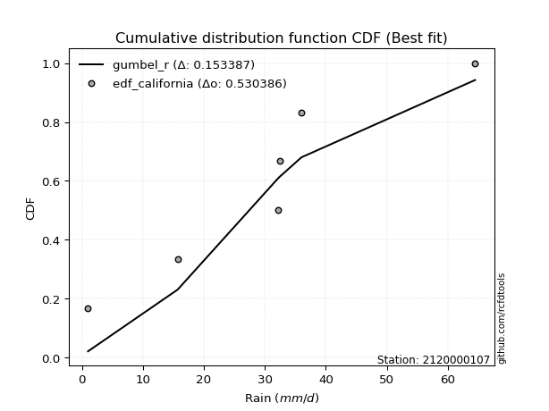</img>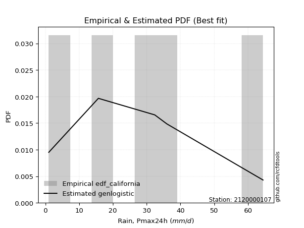</img>

</div>


### 2. EDF Hazen (1930)

Hazen method for plotting positions is a formula used to estimate the empirical cumulative probability distribution of flood events or other hydrological data. This formula often results in biased estimations, particularly when extrapolating to extreme events (high return periods).

<div align="center">


$P=(m-0.5)/n$


</div>


**2.1. Empirical values**

<div align="center">

|                | 0                   | 1                  | 2                  | 3                  | 4         | 5                  |
|:---------------|:--------------------|:-------------------|:-------------------|:-------------------|:----------|:-------------------|
| date           | 2023                | 2018               | 2025               | 2024               | 2020      | 2019               |
| x              | 1.0                 | 15.7               | 32.2               | 32.4               | 36.0      | 64.47              |
| m              | 1                   | 2                  | 3                  | 4                  | 5         | 6                  |
| empirical_dist | edf_hazen           | edf_hazen          | edf_hazen          | edf_hazen          | edf_hazen | edf_hazen          |
| empirical      | 0.08333333333333333 | 0.25               | 0.4166666666666667 | 0.5833333333333334 | 0.75      | 0.9166666666666666 |
| empirical_tr   | 1.090909090909091   | 1.3333333333333333 | 1.7142857142857144 | 2.4000000000000004 | 4.0       | 11.999999999999995 |

</div>


**2.2. Kolmogorov-Smirnov fit test (sorted by Δ)**


<div align="center">

|                | 0                  | 1                  | 2                   | 3                   | 4                   | 5                   | 6                   | 7                  | 8                   | 9                   | 10                  | 11                 | 12                  | 13                  | 14                 | 15                  | 16                 | 17                  | 18                 | 19                 | 20                  | 21                 | 22                 | 23                  | 24                  | 25                 | 26                  | 27                  | 28                  | 29                 | 30                  | 31                  | 32                  | 33                  | 34                  | 35                  | 36                 | 37                  | 38                 | 39                 | 40                  | 41                 | 42                  | 43                  | 44                  | 45                  | 46                  | 47                 | 48                  | 49                  | 50                | 51                  | 52                  | 53                 | 54                  | 55                  | 56                  | 57                  | 58                  | 59                  | 60                  | 61                  | 62                  | 63                  | 64                  | 65                 | 66                  | 67                  | 68                  | 69                | 70                 | 71                  | 72                  | 73                  | 74                  | 75                 | 76                 | 77                  | 78                  | 79                  | 80                  | 81                 | 82                 | 83                  | 84                  | 85                  | 86                  | 87                  | 88                 | 89                  | 90                 | 91                | 92                  | 93                 | 94                | 95                 | 96                 | 97                  | 98               | 99                 | 100                | 101                 | 102                | 103                 | 104                | 105                 | 106                 | 107                | 108                | 109                | 110                 | 111                | 112                | 113                | 114                | 115                | 116                | 117                | 118                 | 119                | 120                | 121                 | 122                | 123                | 124                 | 125                 | 126                | 127                | 128                | 129                | 130                | 131                | 132                | 133                | 134                 | 135                | 136                 | 137                | 138                | 139                 | 140                 | 141                 | 142                | 143                 | 144                | 145                | 146                | 147                | 148                | 149                | 150               | 151                | 152                | 153                | 154                | 155                | 156                | 157            | 158               | 159               |
|:---------------|:-------------------|:-------------------|:--------------------|:--------------------|:--------------------|:--------------------|:--------------------|:-------------------|:--------------------|:--------------------|:--------------------|:-------------------|:--------------------|:--------------------|:-------------------|:--------------------|:-------------------|:--------------------|:-------------------|:-------------------|:--------------------|:-------------------|:-------------------|:--------------------|:--------------------|:-------------------|:--------------------|:--------------------|:--------------------|:-------------------|:--------------------|:--------------------|:--------------------|:--------------------|:--------------------|:--------------------|:-------------------|:--------------------|:-------------------|:-------------------|:--------------------|:-------------------|:--------------------|:--------------------|:--------------------|:--------------------|:--------------------|:-------------------|:--------------------|:--------------------|:------------------|:--------------------|:--------------------|:-------------------|:--------------------|:--------------------|:--------------------|:--------------------|:--------------------|:--------------------|:--------------------|:--------------------|:--------------------|:--------------------|:--------------------|:-------------------|:--------------------|:--------------------|:--------------------|:------------------|:-------------------|:--------------------|:--------------------|:--------------------|:--------------------|:-------------------|:-------------------|:--------------------|:--------------------|:--------------------|:--------------------|:-------------------|:-------------------|:--------------------|:--------------------|:--------------------|:--------------------|:--------------------|:-------------------|:--------------------|:-------------------|:------------------|:--------------------|:-------------------|:------------------|:-------------------|:-------------------|:--------------------|:-----------------|:-------------------|:-------------------|:--------------------|:-------------------|:--------------------|:-------------------|:--------------------|:--------------------|:-------------------|:-------------------|:-------------------|:--------------------|:-------------------|:-------------------|:-------------------|:-------------------|:-------------------|:-------------------|:-------------------|:--------------------|:-------------------|:-------------------|:--------------------|:-------------------|:-------------------|:--------------------|:--------------------|:-------------------|:-------------------|:-------------------|:-------------------|:-------------------|:-------------------|:-------------------|:-------------------|:--------------------|:-------------------|:--------------------|:-------------------|:-------------------|:--------------------|:--------------------|:--------------------|:-------------------|:--------------------|:-------------------|:-------------------|:-------------------|:-------------------|:-------------------|:-------------------|:------------------|:-------------------|:-------------------|:-------------------|:-------------------|:-------------------|:-------------------|:---------------|:------------------|:------------------|
| station        | 2120000107         | 2120000107         | 2120000107          | 2120000107          | 2120000107          | 2120000107          | 2120000107          | 2120000107         | 2120000107          | 2120000107          | 2120000107          | 2120000107         | 2120000107          | 2120000107          | 2120000107         | 2120000107          | 2120000107         | 2120000107          | 2120000107         | 2120000107         | 2120000107          | 2120000107         | 2120000107         | 2120000107          | 2120000107          | 2120000107         | 2120000107          | 2120000107          | 2120000107          | 2120000107         | 2120000107          | 2120000107          | 2120000107          | 2120000107          | 2120000107          | 2120000107          | 2120000107         | 2120000107          | 2120000107         | 2120000107         | 2120000107          | 2120000107         | 2120000107          | 2120000107          | 2120000107          | 2120000107          | 2120000107          | 2120000107         | 2120000107          | 2120000107          | 2120000107        | 2120000107          | 2120000107          | 2120000107         | 2120000107          | 2120000107          | 2120000107          | 2120000107          | 2120000107          | 2120000107          | 2120000107          | 2120000107          | 2120000107          | 2120000107          | 2120000107          | 2120000107         | 2120000107          | 2120000107          | 2120000107          | 2120000107        | 2120000107         | 2120000107          | 2120000107          | 2120000107          | 2120000107          | 2120000107         | 2120000107         | 2120000107          | 2120000107          | 2120000107          | 2120000107          | 2120000107         | 2120000107         | 2120000107          | 2120000107          | 2120000107          | 2120000107          | 2120000107          | 2120000107         | 2120000107          | 2120000107         | 2120000107        | 2120000107          | 2120000107         | 2120000107        | 2120000107         | 2120000107         | 2120000107          | 2120000107       | 2120000107         | 2120000107         | 2120000107          | 2120000107         | 2120000107          | 2120000107         | 2120000107          | 2120000107          | 2120000107         | 2120000107         | 2120000107         | 2120000107          | 2120000107         | 2120000107         | 2120000107         | 2120000107         | 2120000107         | 2120000107         | 2120000107         | 2120000107          | 2120000107         | 2120000107         | 2120000107          | 2120000107         | 2120000107         | 2120000107          | 2120000107          | 2120000107         | 2120000107         | 2120000107         | 2120000107         | 2120000107         | 2120000107         | 2120000107         | 2120000107         | 2120000107          | 2120000107         | 2120000107          | 2120000107         | 2120000107         | 2120000107          | 2120000107          | 2120000107          | 2120000107         | 2120000107          | 2120000107         | 2120000107         | 2120000107         | 2120000107         | 2120000107         | 2120000107         | 2120000107        | 2120000107         | 2120000107         | 2120000107         | 2120000107         | 2120000107         | 2120000107         | 2120000107     | 2120000107        | 2120000107        |
| empirical_dist | edf_hazen          | edf_hazen          | edf_hazen           | edf_hazen           | edf_hazen           | edf_hazen           | edf_hazen           | edf_hazen          | edf_hazen           | edf_hazen           | edf_hazen           | edf_hazen          | edf_hazen           | edf_hazen           | edf_hazen          | edf_hazen           | edf_hazen          | edf_hazen           | edf_hazen          | edf_hazen          | edf_hazen           | edf_hazen          | edf_hazen          | edf_hazen           | edf_hazen           | edf_hazen          | edf_hazen           | edf_hazen           | edf_hazen           | edf_hazen          | edf_hazen           | edf_hazen           | edf_hazen           | edf_hazen           | edf_hazen           | edf_hazen           | edf_hazen          | edf_hazen           | edf_hazen          | edf_hazen          | edf_hazen           | edf_hazen          | edf_hazen           | edf_hazen           | edf_hazen           | edf_hazen           | edf_hazen           | edf_hazen          | edf_hazen           | edf_hazen           | edf_hazen         | edf_hazen           | edf_hazen           | edf_hazen          | edf_hazen           | edf_hazen           | edf_hazen           | edf_hazen           | edf_hazen           | edf_hazen           | edf_hazen           | edf_hazen           | edf_hazen           | edf_hazen           | edf_hazen           | edf_hazen          | edf_hazen           | edf_hazen           | edf_hazen           | edf_hazen         | edf_hazen          | edf_hazen           | edf_hazen           | edf_hazen           | edf_hazen           | edf_hazen          | edf_hazen          | edf_hazen           | edf_hazen           | edf_hazen           | edf_hazen           | edf_hazen          | edf_hazen          | edf_hazen           | edf_hazen           | edf_hazen           | edf_hazen           | edf_hazen           | edf_hazen          | edf_hazen           | edf_hazen          | edf_hazen         | edf_hazen           | edf_hazen          | edf_hazen         | edf_hazen          | edf_hazen          | edf_hazen           | edf_hazen        | edf_hazen          | edf_hazen          | edf_hazen           | edf_hazen          | edf_hazen           | edf_hazen          | edf_hazen           | edf_hazen           | edf_hazen          | edf_hazen          | edf_hazen          | edf_hazen           | edf_hazen          | edf_hazen          | edf_hazen          | edf_hazen          | edf_hazen          | edf_hazen          | edf_hazen          | edf_hazen           | edf_hazen          | edf_hazen          | edf_hazen           | edf_hazen          | edf_hazen          | edf_hazen           | edf_hazen           | edf_hazen          | edf_hazen          | edf_hazen          | edf_hazen          | edf_hazen          | edf_hazen          | edf_hazen          | edf_hazen          | edf_hazen           | edf_hazen          | edf_hazen           | edf_hazen          | edf_hazen          | edf_hazen           | edf_hazen           | edf_hazen           | edf_hazen          | edf_hazen           | edf_hazen          | edf_hazen          | edf_hazen          | edf_hazen          | edf_hazen          | edf_hazen          | edf_hazen         | edf_hazen          | edf_hazen          | edf_hazen          | edf_hazen          | edf_hazen          | edf_hazen          | edf_hazen      | edf_hazen         | edf_hazen         |
| p_dist         | dweibull           | logistic           | logdgamma           | logt                | hypsecant           | logtukeylambda      | t                   | crystalball        | norm                | foldnorm            | exponnorm           | pearson3           | genextreme          | gennorm             | truncpareto        | loggenextreme       | loggennorm         | laplace             | rice               | nct                | skewnorm            | invgamma           | anglit             | fatiguelife         | maxwell             | burr               | betaprime           | f                   | erlang              | gamma              | dgamma              | genlogistic         | semicircular        | logdweibull         | cosine              | invgauss            | truncweibull_min   | logloggamma         | kappa3             | rayleigh           | weibull_min         | burr12             | alpha               | loggausshyper       | logvonmises_line    | logpearson3         | logargus            | mielke             | invweibull          | bradford            | kappa4            | logtrapezoid        | vonmises_line       | arcsine            | kstwobign           | gausshyper          | gumbel_l            | halfnorm            | gumbel_r            | loggumbel_l         | uniform             | truncexpon          | beta                | loglevy_l           | ksone               | logsemicircular    | wrapcauchy          | lomax               | moyal               | halflogistic      | loganglit          | logarcsine          | loggompertz         | logexponweib        | genexpon            | ncf                | argus              | lognct              | logexponnorm        | lognorm             | logcrystalball      | logrice            | loginvgauss        | logburr12           | logfatiguelife      | loggengamma         | loggamma            | loggamma            | logalpha           | logerlang           | loginvweibull      | loghalfgennorm    | loginvgamma         | logfoldnorm        | halfgennorm       | loglogistic        | logmaxwell         | loggenhalflogistic  | gompertz         | lograyleigh        | loghypsecant       | levy_l              | wald               | loghalfnorm         | logskewnorm        | logkstwobign        | logcosine           | loggenexpon        | loggumbel_r        | logncf             | genpareto           | gengamma           | triang             | loglaplace         | loglaplace         | logloglaplace      | logwrapcauchy      | nakagami           | loghalflogistic     | johnsonsb          | logmoyal           | logweibull_max      | logtriang          | loglomax           | logtruncweibull_min | logf                | genhalflogistic    | logjohnsonsb       | logwald            | logweibull_min     | logksone           | logbeta            | johnsonsu          | logjohnsonsu       | logkappa4           | logkappa3          | loguniform          | exponweib          | trapezoid          | logbradford         | logexponpow         | tukeylambda         | loggenpareto       | logmielke           | logtruncnorm       | logbetaprime       | lognakagami        | logtruncexpon      | logburr            | rdist              | powerlaw          | weibull_max        | exponpow           | logtruncpareto     | truncnorm          | logpowerlaw        | logrdist           | loggenlogistic | logvonmises       | vonmises          |
| delta          | 0.1017785760564136 | 0.1275332294590939 | 0.13169773435078502 | 0.13182238639493066 | 0.13200743923736818 | 0.13255207455754459 | 0.13486440873007877 | 0.1348847273241376 | 0.13488473555208047 | 0.13555077244106528 | 0.13555461570966648 | 0.1397065480888276 | 0.14116263332099205 | 0.14126089628537672 | 0.1413621425790194 | 0.14461910039325426 | 0.1457387894719479 | 0.14787580947954432 | 0.1481570739056755 | 0.1483128702527829 | 0.14914076843483642 | 0.1499969289828456 | 0.1506195925284941 | 0.15144987596437293 | 0.15335005503946425 | 0.1534404460872435 | 0.15466194497464786 | 0.15495010045502783 | 0.15500409490078365 | 0.1550041855359346 | 0.15599832976634262 | 0.15610299339428774 | 0.15717177649289016 | 0.15723286882482823 | 0.15780450647580535 | 0.15915665250133743 | 0.1604496221807712 | 0.16145230255174908 | 0.1618125862860988 | 0.1634141453711045 | 0.16505195120272814 | 0.1653714426378768 | 0.16722623205111592 | 0.16768265754206402 | 0.16799671733223437 | 0.16809168037183625 | 0.16896729662975957 | 0.1737599077233683 | 0.17453225142663736 | 0.17514964128171678 | 0.176778561466984 | 0.17956948758340147 | 0.18326106894531025 | 0.1836451405165177 | 0.18568696022243408 | 0.19066015285280868 | 0.19165652695527735 | 0.19177621944557205 | 0.19271155504659893 | 0.19788147228650405 | 0.19855837403497711 | 0.20055793440766184 | 0.20408477319576585 | 0.20497444650143537 | 0.20713197836248098 | 0.2137912346354755 | 0.21408795351752619 | 0.21702670701837584 | 0.21788036485976875 | 0.218662241828315 | 0.2225751301736651 | 0.22435395007141562 | 0.22525178997123302 | 0.22998618700230505 | 0.23631844600968827 | 0.2377696766672293 | 0.2422860419903099 | 0.24336049968412815 | 0.24345334620787068 | 0.24345514125640527 | 0.24345525956730046 | 0.2434602365713066 | 0.2439075755562215 | 0.24499573491961663 | 0.24590159873876122 | 0.24774201220181108 | 0.24851698808975814 | 0.24851698808975814 | 0.2492264774325565 | 0.24947233597687207 | 0.2522898786434441 | 0.252308296267059 | 0.25289371229754737 | 0.2561139719815482 | 0.261870902404825 | 0.2622348887224378 | 0.2639930236730233 | 0.26615780834547537 | 0.26969536483401 | 0.2701313893506901 | 0.2766241461081626 | 0.28301493178270504 | 0.2877283710244772 | 0.28810629776194846 | 0.2915258524508347 | 0.29214079649485414 | 0.29598146050618596 | 0.2982448177978487 | 0.3017784466688446 | 0.3022773040701816 | 0.30303115107389594 | 0.3037697620496244 | 0.3039080635075085 | 0.3044406725881111 | 0.3044406725881111 | 0.3068862923742689 | 0.3138954173897275 | 0.3160392236782484 | 0.31604529284566246 | 0.3161804996475504 | 0.3209728978131175 | 0.32941388496877017 | 0.3387667154667678 | 0.3488263579605444 | 0.3500079183012092  | 0.36486400024810217 | 0.3666270127627441 | 0.3699503192059518 | 0.3756617520681748 | 0.3820986369514061 | 0.3841271648028657 | 0.4000709734422345 | 0.4007447321321015 | 0.4017528052723626 | 0.41497516581862337 | 0.4166689737197497 | 0.41669861899291366 | 0.4284780000988698 | 0.4514708514426449 | 0.45161958815940106 | 0.46148710825313477 | 0.46251211642237183 | 0.4747421356488297 | 0.48951403633622237 | 0.5040236899511007 | 0.5062764180247339 | 0.5191484863957382 | 0.5212494079424879 | 0.5232789431211391 | 0.5514628249580198 | 0.570495723547154 | 0.6008573832802372 | 0.6754941593302831 | 0.6803831965729832 | 0.7274930801314383 | 0.7465105895044633 | 0.7499999984881083 | 0.75           | 1.032101789152333 | 9.683951332183828 |
| deltao         | 0.530385761606     | 0.530385761606     | 0.530385761606      | 0.530385761606      | 0.530385761606      | 0.530385761606      | 0.530385761606      | 0.530385761606     | 0.530385761606      | 0.530385761606      | 0.530385761606      | 0.530385761606     | 0.530385761606      | 0.530385761606      | 0.530385761606     | 0.530385761606      | 0.530385761606     | 0.530385761606      | 0.530385761606     | 0.530385761606     | 0.530385761606      | 0.530385761606     | 0.530385761606     | 0.530385761606      | 0.530385761606      | 0.530385761606     | 0.530385761606      | 0.530385761606      | 0.530385761606      | 0.530385761606     | 0.530385761606      | 0.530385761606      | 0.530385761606      | 0.530385761606      | 0.530385761606      | 0.530385761606      | 0.530385761606     | 0.530385761606      | 0.530385761606     | 0.530385761606     | 0.530385761606      | 0.530385761606     | 0.530385761606      | 0.530385761606      | 0.530385761606      | 0.530385761606      | 0.530385761606      | 0.530385761606     | 0.530385761606      | 0.530385761606      | 0.530385761606    | 0.530385761606      | 0.530385761606      | 0.530385761606     | 0.530385761606      | 0.530385761606      | 0.530385761606      | 0.530385761606      | 0.530385761606      | 0.530385761606      | 0.530385761606      | 0.530385761606      | 0.530385761606      | 0.530385761606      | 0.530385761606      | 0.530385761606     | 0.530385761606      | 0.530385761606      | 0.530385761606      | 0.530385761606    | 0.530385761606     | 0.530385761606      | 0.530385761606      | 0.530385761606      | 0.530385761606      | 0.530385761606     | 0.530385761606     | 0.530385761606      | 0.530385761606      | 0.530385761606      | 0.530385761606      | 0.530385761606     | 0.530385761606     | 0.530385761606      | 0.530385761606      | 0.530385761606      | 0.530385761606      | 0.530385761606      | 0.530385761606     | 0.530385761606      | 0.530385761606     | 0.530385761606    | 0.530385761606      | 0.530385761606     | 0.530385761606    | 0.530385761606     | 0.530385761606     | 0.530385761606      | 0.530385761606   | 0.530385761606     | 0.530385761606     | 0.530385761606      | 0.530385761606     | 0.530385761606      | 0.530385761606     | 0.530385761606      | 0.530385761606      | 0.530385761606     | 0.530385761606     | 0.530385761606     | 0.530385761606      | 0.530385761606     | 0.530385761606     | 0.530385761606     | 0.530385761606     | 0.530385761606     | 0.530385761606     | 0.530385761606     | 0.530385761606      | 0.530385761606     | 0.530385761606     | 0.530385761606      | 0.530385761606     | 0.530385761606     | 0.530385761606      | 0.530385761606      | 0.530385761606     | 0.530385761606     | 0.530385761606     | 0.530385761606     | 0.530385761606     | 0.530385761606     | 0.530385761606     | 0.530385761606     | 0.530385761606      | 0.530385761606     | 0.530385761606      | 0.530385761606     | 0.530385761606     | 0.530385761606      | 0.530385761606      | 0.530385761606      | 0.530385761606     | 0.530385761606      | 0.530385761606     | 0.530385761606     | 0.530385761606     | 0.530385761606     | 0.530385761606     | 0.530385761606     | 0.530385761606    | 0.530385761606     | 0.530385761606     | 0.530385761606     | 0.530385761606     | 0.530385761606     | 0.530385761606     | 0.530385761606 | 0.530385761606    | 0.530385761606    |
| eval           | Δo > Δ             | Δo > Δ             | Δo > Δ              | Δo > Δ              | Δo > Δ              | Δo > Δ              | Δo > Δ              | Δo > Δ             | Δo > Δ              | Δo > Δ              | Δo > Δ              | Δo > Δ             | Δo > Δ              | Δo > Δ              | Δo > Δ             | Δo > Δ              | Δo > Δ             | Δo > Δ              | Δo > Δ             | Δo > Δ             | Δo > Δ              | Δo > Δ             | Δo > Δ             | Δo > Δ              | Δo > Δ              | Δo > Δ             | Δo > Δ              | Δo > Δ              | Δo > Δ              | Δo > Δ             | Δo > Δ              | Δo > Δ              | Δo > Δ              | Δo > Δ              | Δo > Δ              | Δo > Δ              | Δo > Δ             | Δo > Δ              | Δo > Δ             | Δo > Δ             | Δo > Δ              | Δo > Δ             | Δo > Δ              | Δo > Δ              | Δo > Δ              | Δo > Δ              | Δo > Δ              | Δo > Δ             | Δo > Δ              | Δo > Δ              | Δo > Δ            | Δo > Δ              | Δo > Δ              | Δo > Δ             | Δo > Δ              | Δo > Δ              | Δo > Δ              | Δo > Δ              | Δo > Δ              | Δo > Δ              | Δo > Δ              | Δo > Δ              | Δo > Δ              | Δo > Δ              | Δo > Δ              | Δo > Δ             | Δo > Δ              | Δo > Δ              | Δo > Δ              | Δo > Δ            | Δo > Δ             | Δo > Δ              | Δo > Δ              | Δo > Δ              | Δo > Δ              | Δo > Δ             | Δo > Δ             | Δo > Δ              | Δo > Δ              | Δo > Δ              | Δo > Δ              | Δo > Δ             | Δo > Δ             | Δo > Δ              | Δo > Δ              | Δo > Δ              | Δo > Δ              | Δo > Δ              | Δo > Δ             | Δo > Δ              | Δo > Δ             | Δo > Δ            | Δo > Δ              | Δo > Δ             | Δo > Δ            | Δo > Δ             | Δo > Δ             | Δo > Δ              | Δo > Δ           | Δo > Δ             | Δo > Δ             | Δo > Δ              | Δo > Δ             | Δo > Δ              | Δo > Δ             | Δo > Δ              | Δo > Δ              | Δo > Δ             | Δo > Δ             | Δo > Δ             | Δo > Δ              | Δo > Δ             | Δo > Δ             | Δo > Δ             | Δo > Δ             | Δo > Δ             | Δo > Δ             | Δo > Δ             | Δo > Δ              | Δo > Δ             | Δo > Δ             | Δo > Δ              | Δo > Δ             | Δo > Δ             | Δo > Δ              | Δo > Δ              | Δo > Δ             | Δo > Δ             | Δo > Δ             | Δo > Δ             | Δo > Δ             | Δo > Δ             | Δo > Δ             | Δo > Δ             | Δo > Δ              | Δo > Δ             | Δo > Δ              | Δo > Δ             | Δo > Δ             | Δo > Δ              | Δo > Δ              | Δo > Δ              | Δo > Δ             | Δo > Δ              | Δo > Δ             | Δo > Δ             | Δo > Δ             | Δo > Δ             | Δo > Δ             | Δo <= Δ            | Δo <= Δ           | Δo <= Δ            | Δo <= Δ            | Δo <= Δ            | Δo <= Δ            | Δo <= Δ            | Δo <= Δ            | Δo <= Δ        | Δo <= Δ           | Δo <= Δ           |
| fit            | 1                  | 1                  | 1                   | 1                   | 1                   | 1                   | 1                   | 1                  | 1                   | 1                   | 1                   | 1                  | 1                   | 1                   | 1                  | 1                   | 1                  | 1                   | 1                  | 1                  | 1                   | 1                  | 1                  | 1                   | 1                   | 1                  | 1                   | 1                   | 1                   | 1                  | 1                   | 1                   | 1                   | 1                   | 1                   | 1                   | 1                  | 1                   | 1                  | 1                  | 1                   | 1                  | 1                   | 1                   | 1                   | 1                   | 1                   | 1                  | 1                   | 1                   | 1                 | 1                   | 1                   | 1                  | 1                   | 1                   | 1                   | 1                   | 1                   | 1                   | 1                   | 1                   | 1                   | 1                   | 1                   | 1                  | 1                   | 1                   | 1                   | 1                 | 1                  | 1                   | 1                   | 1                   | 1                   | 1                  | 1                  | 1                   | 1                   | 1                   | 1                   | 1                  | 1                  | 1                   | 1                   | 1                   | 1                   | 1                   | 1                  | 1                   | 1                  | 1                 | 1                   | 1                  | 1                 | 1                  | 1                  | 1                   | 1                | 1                  | 1                  | 1                   | 1                  | 1                   | 1                  | 1                   | 1                   | 1                  | 1                  | 1                  | 1                   | 1                  | 1                  | 1                  | 1                  | 1                  | 1                  | 1                  | 1                   | 1                  | 1                  | 1                   | 1                  | 1                  | 1                   | 1                   | 1                  | 1                  | 1                  | 1                  | 1                  | 1                  | 1                  | 1                  | 1                   | 1                  | 1                   | 1                  | 1                  | 1                   | 1                   | 1                   | 1                  | 1                   | 1                  | 1                  | 1                  | 1                  | 1                  | 0                  | 0                 | 0                  | 0                  | 0                  | 0                  | 0                  | 0                  | 0              | 0                 | 0                 |
| n              | 6                  | 6                  | 6                   | 6                   | 6                   | 6                   | 6                   | 6                  | 6                   | 6                   | 6                   | 6                  | 6                   | 6                   | 6                  | 6                   | 6                  | 6                   | 6                  | 6                  | 6                   | 6                  | 6                  | 6                   | 6                   | 6                  | 6                   | 6                   | 6                   | 6                  | 6                   | 6                   | 6                   | 6                   | 6                   | 6                   | 6                  | 6                   | 6                  | 6                  | 6                   | 6                  | 6                   | 6                   | 6                   | 6                   | 6                   | 6                  | 6                   | 6                   | 6                 | 6                   | 6                   | 6                  | 6                   | 6                   | 6                   | 6                   | 6                   | 6                   | 6                   | 6                   | 6                   | 6                   | 6                   | 6                  | 6                   | 6                   | 6                   | 6                 | 6                  | 6                   | 6                   | 6                   | 6                   | 6                  | 6                  | 6                   | 6                   | 6                   | 6                   | 6                  | 6                  | 6                   | 6                   | 6                   | 6                   | 6                   | 6                  | 6                   | 6                  | 6                 | 6                   | 6                  | 6                 | 6                  | 6                  | 6                   | 6                | 6                  | 6                  | 6                   | 6                  | 6                   | 6                  | 6                   | 6                   | 6                  | 6                  | 6                  | 6                   | 6                  | 6                  | 6                  | 6                  | 6                  | 6                  | 6                  | 6                   | 6                  | 6                  | 6                   | 6                  | 6                  | 6                   | 6                   | 6                  | 6                  | 6                  | 6                  | 6                  | 6                  | 6                  | 6                  | 6                   | 6                  | 6                   | 6                  | 6                  | 6                   | 6                   | 6                   | 6                  | 6                   | 6                  | 6                  | 6                  | 6                  | 6                  | 6                  | 6                 | 6                  | 6                  | 6                  | 6                  | 6                  | 6                  | 6              | 6                 | 6                 |
| best_fit       | 1                  | 0                  | 0                   | 0                   | 0                   | 0                   | 0                   | 0                  | 0                   | 0                   | 0                   | 0                  | 0                   | 0                   | 0                  | 0                   | 0                  | 0                   | 0                  | 0                  | 0                   | 0                  | 0                  | 0                   | 0                   | 0                  | 0                   | 0                   | 0                   | 0                  | 0                   | 0                   | 0                   | 0                   | 0                   | 0                   | 0                  | 0                   | 0                  | 0                  | 0                   | 0                  | 0                   | 0                   | 0                   | 0                   | 0                   | 0                  | 0                   | 0                   | 0                 | 0                   | 0                   | 0                  | 0                   | 0                   | 0                   | 0                   | 0                   | 0                   | 0                   | 0                   | 0                   | 0                   | 0                   | 0                  | 0                   | 0                   | 0                   | 0                 | 0                  | 0                   | 0                   | 0                   | 0                   | 0                  | 0                  | 0                   | 0                   | 0                   | 0                   | 0                  | 0                  | 0                   | 0                   | 0                   | 0                   | 0                   | 0                  | 0                   | 0                  | 0                 | 0                   | 0                  | 0                 | 0                  | 0                  | 0                   | 0                | 0                  | 0                  | 0                   | 0                  | 0                   | 0                  | 0                   | 0                   | 0                  | 0                  | 0                  | 0                   | 0                  | 0                  | 0                  | 0                  | 0                  | 0                  | 0                  | 0                   | 0                  | 0                  | 0                   | 0                  | 0                  | 0                   | 0                   | 0                  | 0                  | 0                  | 0                  | 0                  | 0                  | 0                  | 0                  | 0                   | 0                  | 0                   | 0                  | 0                  | 0                   | 0                   | 0                   | 0                  | 0                   | 0                  | 0                  | 0                  | 0                  | 0                  | 0                  | 0                 | 0                  | 0                  | 0                  | 0                  | 0                  | 0                  | 0              | 0                 | 0                 |
| best_fit_sort  | 1                  | 2                  | 3                   | 4                   | 5                   | 6                   | 7                   | 8                  | 9                   | 10                  | 11                  | 12                 | 13                  | 14                  | 15                 | 16                  | 17                 | 18                  | 19                 | 20                 | 21                  | 22                 | 23                 | 24                  | 25                  | 26                 | 27                  | 28                  | 29                  | 30                 | 31                  | 32                  | 33                  | 34                  | 35                  | 36                  | 37                 | 38                  | 39                 | 40                 | 41                  | 42                 | 43                  | 44                  | 45                  | 46                  | 47                  | 48                 | 49                  | 50                  | 51                | 52                  | 53                  | 54                 | 55                  | 56                  | 57                  | 58                  | 59                  | 60                  | 61                  | 62                  | 63                  | 64                  | 65                  | 66                 | 67                  | 68                  | 69                  | 70                | 71                 | 72                  | 73                  | 74                  | 75                  | 76                 | 77                 | 78                  | 79                  | 80                  | 81                  | 82                 | 83                 | 84                  | 85                  | 86                  | 87                  | 88                  | 89                 | 90                  | 91                 | 92                | 93                  | 94                 | 95                | 96                 | 97                 | 98                  | 99               | 100                | 101                | 102                 | 103                | 104                 | 105                | 106                 | 107                 | 108                | 109                | 110                | 111                 | 112                | 113                | 114                | 115                | 116                | 117                | 118                | 119                 | 120                | 121                | 122                 | 123                | 124                | 125                 | 126                 | 127                | 128                | 129                | 130                | 131                | 132                | 133                | 134                | 135                 | 136                | 137                 | 138                | 139                | 140                 | 141                 | 142                 | 143                | 144                 | 145                | 146                | 147                | 148                | 149                | 150                | 151               | 152                | 153                | 154                | 155                | 156                | 157                | 158            | 159               | 160               |

</div>


**2.3. Best fit**

<div align="center">

|   id |    station | empirical_dist   | p_dist   |    delta |   deltao | eval   |   fit |   n |   best_fit |   best_fit_sort |
|-----:|-----------:|:-----------------|:---------|---------:|---------:|:-------|------:|----:|-----------:|----------------:|
|    0 | 2120000107 | edf_hazen        | dweibull | 0.101779 | 0.530386 | Δo > Δ |     1 |   6 |          1 |               1 |

</div>


<div align="center">

</img>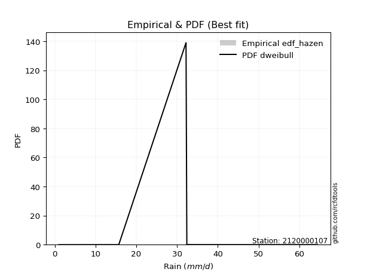</img>

</div>


### 3. EDF Weibull (1939)

Weibull plotting position formula is an empirical method used to estimate the non-exceedance probability or plotting position for a set of observed data, is often recommended or widely used in practice, particularly in flood frequency analysis.

<div align="center">


$P=m/(n+1)$


</div>


**3.1. Empirical values**

<div align="center">

|                | 0                   | 1                  | 2                   | 3                  | 4                  | 5                  |
|:---------------|:--------------------|:-------------------|:--------------------|:-------------------|:-------------------|:-------------------|
| date           | 2023                | 2018               | 2025                | 2024               | 2020               | 2019               |
| x              | 1.0                 | 15.7               | 32.2                | 32.4               | 36.0               | 64.47              |
| m              | 1                   | 2                  | 3                   | 4                  | 5                  | 6                  |
| empirical_dist | edf_weibull         | edf_weibull        | edf_weibull         | edf_weibull        | edf_weibull        | edf_weibull        |
| empirical      | 0.14285714285714285 | 0.2857142857142857 | 0.42857142857142855 | 0.5714285714285714 | 0.7142857142857143 | 0.8571428571428571 |
| empirical_tr   | 1.1666666666666665  | 1.4                | 1.75                | 2.333333333333333  | 3.5                | 6.999999999999997  |

</div>


**3.2. Kolmogorov-Smirnov fit test (sorted by Δ)**


<div align="center">

|                | 0                   | 1                   | 2                   | 3                   | 4                   | 5                   | 6                   | 7                   | 8                   | 9                   | 10                  | 11                  | 12                  | 13                  | 14                  | 15                  | 16                  | 17                  | 18                  | 19                  | 20                  | 21                  | 22                 | 23                | 24                 | 25                 | 26                  | 27                 | 28                  | 29                 | 30                  | 31                  | 32                 | 33                  | 34                  | 35                | 36                  | 37                  | 38                  | 39                  | 40                  | 41                  | 42                  | 43                  | 44                 | 45                 | 46                 | 47                  | 48                 | 49                  | 50                  | 51                  | 52                 | 53                  | 54                  | 55                  | 56                  | 57                  | 58                 | 59                 | 60                  | 61                 | 62                  | 63                  | 64                  | 65                  | 66                  | 67                  | 68                  | 69                 | 70                 | 71                  | 72                  | 73                  | 74                 | 75                  | 76                 | 77                 | 78                 | 79                  | 80                 | 81                  | 82                 | 83                 | 84                  | 85                  | 86                  | 87                  | 88                  | 89                  | 90                  | 91                  | 92                 | 93                 | 94                  | 95                  | 96                  | 97                 | 98                  | 99                 | 100                 | 101                | 102                 | 103                 | 104                 | 105                | 106                | 107                | 108                | 109                | 110                | 111                | 112                | 113                 | 114                 | 115                 | 116                | 117                | 118                 | 119                | 120                | 121                 | 122                | 123                | 124                | 125                | 126                | 127                 | 128                | 129                | 130                 | 131                | 132                 | 133                 | 134                 | 135                | 136                 | 137                | 138                 | 139                | 140                 | 141               | 142                 | 143                 | 144               | 145                | 146                | 147                 | 148                | 149                | 150                | 151                | 152                | 153                | 154                | 155                | 156                | 157                | 158               | 159               |
|:---------------|:--------------------|:--------------------|:--------------------|:--------------------|:--------------------|:--------------------|:--------------------|:--------------------|:--------------------|:--------------------|:--------------------|:--------------------|:--------------------|:--------------------|:--------------------|:--------------------|:--------------------|:--------------------|:--------------------|:--------------------|:--------------------|:--------------------|:-------------------|:------------------|:-------------------|:-------------------|:--------------------|:-------------------|:--------------------|:-------------------|:--------------------|:--------------------|:-------------------|:--------------------|:--------------------|:------------------|:--------------------|:--------------------|:--------------------|:--------------------|:--------------------|:--------------------|:--------------------|:--------------------|:-------------------|:-------------------|:-------------------|:--------------------|:-------------------|:--------------------|:--------------------|:--------------------|:-------------------|:--------------------|:--------------------|:--------------------|:--------------------|:--------------------|:-------------------|:-------------------|:--------------------|:-------------------|:--------------------|:--------------------|:--------------------|:--------------------|:--------------------|:--------------------|:--------------------|:-------------------|:-------------------|:--------------------|:--------------------|:--------------------|:-------------------|:--------------------|:-------------------|:-------------------|:-------------------|:--------------------|:-------------------|:--------------------|:-------------------|:-------------------|:--------------------|:--------------------|:--------------------|:--------------------|:--------------------|:--------------------|:--------------------|:--------------------|:-------------------|:-------------------|:--------------------|:--------------------|:--------------------|:-------------------|:--------------------|:-------------------|:--------------------|:-------------------|:--------------------|:--------------------|:--------------------|:-------------------|:-------------------|:-------------------|:-------------------|:-------------------|:-------------------|:-------------------|:-------------------|:--------------------|:--------------------|:--------------------|:-------------------|:-------------------|:--------------------|:-------------------|:-------------------|:--------------------|:-------------------|:-------------------|:-------------------|:-------------------|:-------------------|:--------------------|:-------------------|:-------------------|:--------------------|:-------------------|:--------------------|:--------------------|:--------------------|:-------------------|:--------------------|:-------------------|:--------------------|:-------------------|:--------------------|:------------------|:--------------------|:--------------------|:------------------|:-------------------|:-------------------|:--------------------|:-------------------|:-------------------|:-------------------|:-------------------|:-------------------|:-------------------|:-------------------|:-------------------|:-------------------|:-------------------|:------------------|:------------------|
| station        | 2120000107          | 2120000107          | 2120000107          | 2120000107          | 2120000107          | 2120000107          | 2120000107          | 2120000107          | 2120000107          | 2120000107          | 2120000107          | 2120000107          | 2120000107          | 2120000107          | 2120000107          | 2120000107          | 2120000107          | 2120000107          | 2120000107          | 2120000107          | 2120000107          | 2120000107          | 2120000107         | 2120000107        | 2120000107         | 2120000107         | 2120000107          | 2120000107         | 2120000107          | 2120000107         | 2120000107          | 2120000107          | 2120000107         | 2120000107          | 2120000107          | 2120000107        | 2120000107          | 2120000107          | 2120000107          | 2120000107          | 2120000107          | 2120000107          | 2120000107          | 2120000107          | 2120000107         | 2120000107         | 2120000107         | 2120000107          | 2120000107         | 2120000107          | 2120000107          | 2120000107          | 2120000107         | 2120000107          | 2120000107          | 2120000107          | 2120000107          | 2120000107          | 2120000107         | 2120000107         | 2120000107          | 2120000107         | 2120000107          | 2120000107          | 2120000107          | 2120000107          | 2120000107          | 2120000107          | 2120000107          | 2120000107         | 2120000107         | 2120000107          | 2120000107          | 2120000107          | 2120000107         | 2120000107          | 2120000107         | 2120000107         | 2120000107         | 2120000107          | 2120000107         | 2120000107          | 2120000107         | 2120000107         | 2120000107          | 2120000107          | 2120000107          | 2120000107          | 2120000107          | 2120000107          | 2120000107          | 2120000107          | 2120000107         | 2120000107         | 2120000107          | 2120000107          | 2120000107          | 2120000107         | 2120000107          | 2120000107         | 2120000107          | 2120000107         | 2120000107          | 2120000107          | 2120000107          | 2120000107         | 2120000107         | 2120000107         | 2120000107         | 2120000107         | 2120000107         | 2120000107         | 2120000107         | 2120000107          | 2120000107          | 2120000107          | 2120000107         | 2120000107         | 2120000107          | 2120000107         | 2120000107         | 2120000107          | 2120000107         | 2120000107         | 2120000107         | 2120000107         | 2120000107         | 2120000107          | 2120000107         | 2120000107         | 2120000107          | 2120000107         | 2120000107          | 2120000107          | 2120000107          | 2120000107         | 2120000107          | 2120000107         | 2120000107          | 2120000107         | 2120000107          | 2120000107        | 2120000107          | 2120000107          | 2120000107        | 2120000107         | 2120000107         | 2120000107          | 2120000107         | 2120000107         | 2120000107         | 2120000107         | 2120000107         | 2120000107         | 2120000107         | 2120000107         | 2120000107         | 2120000107         | 2120000107        | 2120000107        |
| empirical_dist | edf_weibull         | edf_weibull         | edf_weibull         | edf_weibull         | edf_weibull         | edf_weibull         | edf_weibull         | edf_weibull         | edf_weibull         | edf_weibull         | edf_weibull         | edf_weibull         | edf_weibull         | edf_weibull         | edf_weibull         | edf_weibull         | edf_weibull         | edf_weibull         | edf_weibull         | edf_weibull         | edf_weibull         | edf_weibull         | edf_weibull        | edf_weibull       | edf_weibull        | edf_weibull        | edf_weibull         | edf_weibull        | edf_weibull         | edf_weibull        | edf_weibull         | edf_weibull         | edf_weibull        | edf_weibull         | edf_weibull         | edf_weibull       | edf_weibull         | edf_weibull         | edf_weibull         | edf_weibull         | edf_weibull         | edf_weibull         | edf_weibull         | edf_weibull         | edf_weibull        | edf_weibull        | edf_weibull        | edf_weibull         | edf_weibull        | edf_weibull         | edf_weibull         | edf_weibull         | edf_weibull        | edf_weibull         | edf_weibull         | edf_weibull         | edf_weibull         | edf_weibull         | edf_weibull        | edf_weibull        | edf_weibull         | edf_weibull        | edf_weibull         | edf_weibull         | edf_weibull         | edf_weibull         | edf_weibull         | edf_weibull         | edf_weibull         | edf_weibull        | edf_weibull        | edf_weibull         | edf_weibull         | edf_weibull         | edf_weibull        | edf_weibull         | edf_weibull        | edf_weibull        | edf_weibull        | edf_weibull         | edf_weibull        | edf_weibull         | edf_weibull        | edf_weibull        | edf_weibull         | edf_weibull         | edf_weibull         | edf_weibull         | edf_weibull         | edf_weibull         | edf_weibull         | edf_weibull         | edf_weibull        | edf_weibull        | edf_weibull         | edf_weibull         | edf_weibull         | edf_weibull        | edf_weibull         | edf_weibull        | edf_weibull         | edf_weibull        | edf_weibull         | edf_weibull         | edf_weibull         | edf_weibull        | edf_weibull        | edf_weibull        | edf_weibull        | edf_weibull        | edf_weibull        | edf_weibull        | edf_weibull        | edf_weibull         | edf_weibull         | edf_weibull         | edf_weibull        | edf_weibull        | edf_weibull         | edf_weibull        | edf_weibull        | edf_weibull         | edf_weibull        | edf_weibull        | edf_weibull        | edf_weibull        | edf_weibull        | edf_weibull         | edf_weibull        | edf_weibull        | edf_weibull         | edf_weibull        | edf_weibull         | edf_weibull         | edf_weibull         | edf_weibull        | edf_weibull         | edf_weibull        | edf_weibull         | edf_weibull        | edf_weibull         | edf_weibull       | edf_weibull         | edf_weibull         | edf_weibull       | edf_weibull        | edf_weibull        | edf_weibull         | edf_weibull        | edf_weibull        | edf_weibull        | edf_weibull        | edf_weibull        | edf_weibull        | edf_weibull        | edf_weibull        | edf_weibull        | edf_weibull        | edf_weibull       | edf_weibull       |
| p_dist         | logdweibull         | norm                | crystalball         | t                   | foldnorm            | dweibull            | anglit              | logistic            | hypsecant           | semicircular        | burr                | cosine              | exponnorm           | pearson3            | logdgamma           | genextreme          | laplace             | rice                | nct                 | skewnorm            | invgamma            | fatiguelife         | maxwell            | betaprime         | loggenextreme      | truncweibull_min   | kappa4              | truncpareto        | f                   | erlang             | gamma               | genlogistic         | loggausshyper      | invgauss            | vonmises_line       | arcsine           | logloggamma         | kappa3              | rayleigh            | weibull_min         | burr12              | gausshyper          | alpha               | gumbel_l            | logvonmises_line   | logpearson3        | logargus           | mielke              | invweibull         | uniform             | bradford            | logt                | logtrapezoid       | logtukeylambda      | loglevy_l           | ksone               | kstwobign           | gennorm             | wrapcauchy         | halfnorm           | gumbel_r            | loggennorm         | loggumbel_l         | logarcsine          | truncexpon          | dgamma              | beta                | logsemicircular     | lomax               | moyal              | argus              | halflogistic        | loganglit           | loggompertz         | loginvweibull      | loghalfgennorm      | logexponweib       | levy_l             | genexpon           | ncf                 | lognct             | logexponnorm        | lognorm            | logcrystalball     | logrice             | loginvgauss         | logburr12           | logfatiguelife      | loggengamma         | loggamma            | loggamma            | logalpha            | logerlang          | loginvgamma        | logfoldnorm         | logncf              | halfgennorm         | loglogistic        | logmaxwell          | loggenhalflogistic | logkstwobign        | lograyleigh        | loggenexpon         | loghypsecant        | genpareto           | triang             | logloglaplace      | wald               | loghalfnorm        | logwrapcauchy      | logskewnorm        | johnsonsb          | logcosine          | gompertz            | loggumbel_r         | gengamma            | loglaplace         | loglaplace         | logweibull_max      | nakagami           | loghalflogistic    | logmoyal            | loglomax           | logtriang          | logf               | genhalflogistic    | logjohnsonsb       | logtruncweibull_min | logweibull_min     | logksone           | logwald             | logbeta            | exponweib           | logkappa4           | logkappa3           | loguniform         | johnsonsu           | logjohnsonsu       | trapezoid           | logbradford        | logexponpow         | loggenpareto      | tukeylambda         | logmielke           | logtruncnorm      | logbetaprime       | lognakagami        | logtruncexpon       | logburr            | powerlaw           | rdist              | weibull_max        | exponpow           | logtruncpareto     | truncnorm          | logpowerlaw        | logrdist           | loggenlogistic     | logvonmises       | vonmises          |
| delta          | 0.09935073633488156 | 0.11035515462761308 | 0.11035516310023913 | 0.11037516828888466 | 0.11192710516459742 | 0.11358650852651334 | 0.11490530681420841 | 0.11562846755433204 | 0.12010267733260632 | 0.12145749077860446 | 0.12156038612944231 | 0.12209022076151965 | 0.12364985380490462 | 0.12780178618406574 | 0.12850866070043046 | 0.12925787141623019 | 0.13597104757478246 | 0.13625231200091364 | 0.13640810834802103 | 0.13723600653007456 | 0.13809216707808375 | 0.13954511405961106 | 0.1414452931347024 | 0.142757183069886 | 0.1428571428571167 | 0.1428571428571398 | 0.14285714285713993 | 0.1428571428571429 | 0.14304533855026597 | 0.1430993329960218 | 0.14309942363117273 | 0.14419823148952587 | 0.1468788501340889 | 0.14725189059657556 | 0.14754678323102455 | 0.147930854802232 | 0.14954754064698722 | 0.14990782438133693 | 0.15150938346634263 | 0.15314718929796628 | 0.15346668073311492 | 0.15494586713852299 | 0.15532147014635406 | 0.15594224124099165 | 0.1560919554274725 | 0.1561869184670744 | 0.1570625347249977 | 0.16185514581860644 | 0.1626274895218755 | 0.16284408832069142 | 0.16324487937695492 | 0.16753667210921636 | 0.1676647256786396 | 0.16826636027183028 | 0.16926016078714967 | 0.17141769264819529 | 0.17378219831767222 | 0.17697518199966242 | 0.1783736678032405 | 0.1798714575408102 | 0.18080679314183706 | 0.1814530751862336 | 0.18597671038174218 | 0.18863966435712992 | 0.18865317250289998 | 0.19171261548062832 | 0.19218001129100398 | 0.20188647273071364 | 0.20512194511361398 | 0.2059756029550069 | 0.2065717562760242 | 0.20675747992355314 | 0.21067036826890323 | 0.21334702806647116 | 0.2165755929291584 | 0.21659401055277328 | 0.2180814250975432 | 0.2234911222588955 | 0.2244136841049264 | 0.22586491476246745 | 0.2314557377793663 | 0.23154858430310882 | 0.2315503793516434 | 0.2315504976625386 | 0.23155547466654475 | 0.23200281365145964 | 0.23309097301485476 | 0.23399683683399936 | 0.23583725029704922 | 0.23661222618499628 | 0.23661222618499628 | 0.23732171552779463 | 0.2375675740721102 | 0.2409889503927855 | 0.24420921007678636 | 0.24817355519367845 | 0.24825972853645167 | 0.2503301268176759 | 0.25208826176826143 | 0.2542530464407135 | 0.25642651078056844 | 0.2582266274459282 | 0.26253053208356303 | 0.26471938420340074 | 0.26731686535961025 | 0.2681937777932228 | 0.2711720066599832 | 0.2758236091197153 | 0.2762015358571866 | 0.2781811316754418 | 0.2796210905460728 | 0.2804662139332647 | 0.2840766986014241 | 0.28560349186781886 | 0.28987368476408276 | 0.29186500014486255 | 0.2925359106833492 | 0.2925359106833492 | 0.29369959925448447 | 0.3041344617734865 | 0.3041405309409006 | 0.30906813590835563 | 0.3131120722462587 | 0.3268619535620059 | 0.3291497145338165 | 0.3309127270484584 | 0.3342360334916661 | 0.33810315639644734 | 0.3463843512371204 | 0.3492329761448884 | 0.36375699016341295 | 0.3643566877279488 | 0.39276371438458413 | 0.40194364362900575 | 0.40476421181498784 | 0.4047938570881518 | 0.41264949403686335 | 0.4136575671771245 | 0.41575656572835923 | 0.4247790668930576 | 0.42577282253884907 | 0.439027849934544 | 0.45060735451760997 | 0.45379975062193667 | 0.468309404236815 | 0.4705621323104482 | 0.4834342006814525 | 0.48553512222820217 | 0.4875646574068534 | 0.5347814378328684 | 0.5395580630532579 | 0.5651430975659515 | 0.6397798736159974 | 0.6446689108586975 | 0.6917787944171526 | 0.7107963037901776 | 0.7142857127738226 | 0.7142857142857143 | 1.020197027247571 | 9.743475141707636 |
| deltao         | 0.530385761606      | 0.530385761606      | 0.530385761606      | 0.530385761606      | 0.530385761606      | 0.530385761606      | 0.530385761606      | 0.530385761606      | 0.530385761606      | 0.530385761606      | 0.530385761606      | 0.530385761606      | 0.530385761606      | 0.530385761606      | 0.530385761606      | 0.530385761606      | 0.530385761606      | 0.530385761606      | 0.530385761606      | 0.530385761606      | 0.530385761606      | 0.530385761606      | 0.530385761606     | 0.530385761606    | 0.530385761606     | 0.530385761606     | 0.530385761606      | 0.530385761606     | 0.530385761606      | 0.530385761606     | 0.530385761606      | 0.530385761606      | 0.530385761606     | 0.530385761606      | 0.530385761606      | 0.530385761606    | 0.530385761606      | 0.530385761606      | 0.530385761606      | 0.530385761606      | 0.530385761606      | 0.530385761606      | 0.530385761606      | 0.530385761606      | 0.530385761606     | 0.530385761606     | 0.530385761606     | 0.530385761606      | 0.530385761606     | 0.530385761606      | 0.530385761606      | 0.530385761606      | 0.530385761606     | 0.530385761606      | 0.530385761606      | 0.530385761606      | 0.530385761606      | 0.530385761606      | 0.530385761606     | 0.530385761606     | 0.530385761606      | 0.530385761606     | 0.530385761606      | 0.530385761606      | 0.530385761606      | 0.530385761606      | 0.530385761606      | 0.530385761606      | 0.530385761606      | 0.530385761606     | 0.530385761606     | 0.530385761606      | 0.530385761606      | 0.530385761606      | 0.530385761606     | 0.530385761606      | 0.530385761606     | 0.530385761606     | 0.530385761606     | 0.530385761606      | 0.530385761606     | 0.530385761606      | 0.530385761606     | 0.530385761606     | 0.530385761606      | 0.530385761606      | 0.530385761606      | 0.530385761606      | 0.530385761606      | 0.530385761606      | 0.530385761606      | 0.530385761606      | 0.530385761606     | 0.530385761606     | 0.530385761606      | 0.530385761606      | 0.530385761606      | 0.530385761606     | 0.530385761606      | 0.530385761606     | 0.530385761606      | 0.530385761606     | 0.530385761606      | 0.530385761606      | 0.530385761606      | 0.530385761606     | 0.530385761606     | 0.530385761606     | 0.530385761606     | 0.530385761606     | 0.530385761606     | 0.530385761606     | 0.530385761606     | 0.530385761606      | 0.530385761606      | 0.530385761606      | 0.530385761606     | 0.530385761606     | 0.530385761606      | 0.530385761606     | 0.530385761606     | 0.530385761606      | 0.530385761606     | 0.530385761606     | 0.530385761606     | 0.530385761606     | 0.530385761606     | 0.530385761606      | 0.530385761606     | 0.530385761606     | 0.530385761606      | 0.530385761606     | 0.530385761606      | 0.530385761606      | 0.530385761606      | 0.530385761606     | 0.530385761606      | 0.530385761606     | 0.530385761606      | 0.530385761606     | 0.530385761606      | 0.530385761606    | 0.530385761606      | 0.530385761606      | 0.530385761606    | 0.530385761606     | 0.530385761606     | 0.530385761606      | 0.530385761606     | 0.530385761606     | 0.530385761606     | 0.530385761606     | 0.530385761606     | 0.530385761606     | 0.530385761606     | 0.530385761606     | 0.530385761606     | 0.530385761606     | 0.530385761606    | 0.530385761606    |
| eval           | Δo > Δ              | Δo > Δ              | Δo > Δ              | Δo > Δ              | Δo > Δ              | Δo > Δ              | Δo > Δ              | Δo > Δ              | Δo > Δ              | Δo > Δ              | Δo > Δ              | Δo > Δ              | Δo > Δ              | Δo > Δ              | Δo > Δ              | Δo > Δ              | Δo > Δ              | Δo > Δ              | Δo > Δ              | Δo > Δ              | Δo > Δ              | Δo > Δ              | Δo > Δ             | Δo > Δ            | Δo > Δ             | Δo > Δ             | Δo > Δ              | Δo > Δ             | Δo > Δ              | Δo > Δ             | Δo > Δ              | Δo > Δ              | Δo > Δ             | Δo > Δ              | Δo > Δ              | Δo > Δ            | Δo > Δ              | Δo > Δ              | Δo > Δ              | Δo > Δ              | Δo > Δ              | Δo > Δ              | Δo > Δ              | Δo > Δ              | Δo > Δ             | Δo > Δ             | Δo > Δ             | Δo > Δ              | Δo > Δ             | Δo > Δ              | Δo > Δ              | Δo > Δ              | Δo > Δ             | Δo > Δ              | Δo > Δ              | Δo > Δ              | Δo > Δ              | Δo > Δ              | Δo > Δ             | Δo > Δ             | Δo > Δ              | Δo > Δ             | Δo > Δ              | Δo > Δ              | Δo > Δ              | Δo > Δ              | Δo > Δ              | Δo > Δ              | Δo > Δ              | Δo > Δ             | Δo > Δ             | Δo > Δ              | Δo > Δ              | Δo > Δ              | Δo > Δ             | Δo > Δ              | Δo > Δ             | Δo > Δ             | Δo > Δ             | Δo > Δ              | Δo > Δ             | Δo > Δ              | Δo > Δ             | Δo > Δ             | Δo > Δ              | Δo > Δ              | Δo > Δ              | Δo > Δ              | Δo > Δ              | Δo > Δ              | Δo > Δ              | Δo > Δ              | Δo > Δ             | Δo > Δ             | Δo > Δ              | Δo > Δ              | Δo > Δ              | Δo > Δ             | Δo > Δ              | Δo > Δ             | Δo > Δ              | Δo > Δ             | Δo > Δ              | Δo > Δ              | Δo > Δ              | Δo > Δ             | Δo > Δ             | Δo > Δ             | Δo > Δ             | Δo > Δ             | Δo > Δ             | Δo > Δ             | Δo > Δ             | Δo > Δ              | Δo > Δ              | Δo > Δ              | Δo > Δ             | Δo > Δ             | Δo > Δ              | Δo > Δ             | Δo > Δ             | Δo > Δ              | Δo > Δ             | Δo > Δ             | Δo > Δ             | Δo > Δ             | Δo > Δ             | Δo > Δ              | Δo > Δ             | Δo > Δ             | Δo > Δ              | Δo > Δ             | Δo > Δ              | Δo > Δ              | Δo > Δ              | Δo > Δ             | Δo > Δ              | Δo > Δ             | Δo > Δ              | Δo > Δ             | Δo > Δ              | Δo > Δ            | Δo > Δ              | Δo > Δ              | Δo > Δ            | Δo > Δ             | Δo > Δ             | Δo > Δ              | Δo > Δ             | Δo <= Δ            | Δo <= Δ            | Δo <= Δ            | Δo <= Δ            | Δo <= Δ            | Δo <= Δ            | Δo <= Δ            | Δo <= Δ            | Δo <= Δ            | Δo <= Δ           | Δo <= Δ           |
| fit            | 1                   | 1                   | 1                   | 1                   | 1                   | 1                   | 1                   | 1                   | 1                   | 1                   | 1                   | 1                   | 1                   | 1                   | 1                   | 1                   | 1                   | 1                   | 1                   | 1                   | 1                   | 1                   | 1                  | 1                 | 1                  | 1                  | 1                   | 1                  | 1                   | 1                  | 1                   | 1                   | 1                  | 1                   | 1                   | 1                 | 1                   | 1                   | 1                   | 1                   | 1                   | 1                   | 1                   | 1                   | 1                  | 1                  | 1                  | 1                   | 1                  | 1                   | 1                   | 1                   | 1                  | 1                   | 1                   | 1                   | 1                   | 1                   | 1                  | 1                  | 1                   | 1                  | 1                   | 1                   | 1                   | 1                   | 1                   | 1                   | 1                   | 1                  | 1                  | 1                   | 1                   | 1                   | 1                  | 1                   | 1                  | 1                  | 1                  | 1                   | 1                  | 1                   | 1                  | 1                  | 1                   | 1                   | 1                   | 1                   | 1                   | 1                   | 1                   | 1                   | 1                  | 1                  | 1                   | 1                   | 1                   | 1                  | 1                   | 1                  | 1                   | 1                  | 1                   | 1                   | 1                   | 1                  | 1                  | 1                  | 1                  | 1                  | 1                  | 1                  | 1                  | 1                   | 1                   | 1                   | 1                  | 1                  | 1                   | 1                  | 1                  | 1                   | 1                  | 1                  | 1                  | 1                  | 1                  | 1                   | 1                  | 1                  | 1                   | 1                  | 1                   | 1                   | 1                   | 1                  | 1                   | 1                  | 1                   | 1                  | 1                   | 1                 | 1                   | 1                   | 1                 | 1                  | 1                  | 1                   | 1                  | 0                  | 0                  | 0                  | 0                  | 0                  | 0                  | 0                  | 0                  | 0                  | 0                 | 0                 |
| n              | 6                   | 6                   | 6                   | 6                   | 6                   | 6                   | 6                   | 6                   | 6                   | 6                   | 6                   | 6                   | 6                   | 6                   | 6                   | 6                   | 6                   | 6                   | 6                   | 6                   | 6                   | 6                   | 6                  | 6                 | 6                  | 6                  | 6                   | 6                  | 6                   | 6                  | 6                   | 6                   | 6                  | 6                   | 6                   | 6                 | 6                   | 6                   | 6                   | 6                   | 6                   | 6                   | 6                   | 6                   | 6                  | 6                  | 6                  | 6                   | 6                  | 6                   | 6                   | 6                   | 6                  | 6                   | 6                   | 6                   | 6                   | 6                   | 6                  | 6                  | 6                   | 6                  | 6                   | 6                   | 6                   | 6                   | 6                   | 6                   | 6                   | 6                  | 6                  | 6                   | 6                   | 6                   | 6                  | 6                   | 6                  | 6                  | 6                  | 6                   | 6                  | 6                   | 6                  | 6                  | 6                   | 6                   | 6                   | 6                   | 6                   | 6                   | 6                   | 6                   | 6                  | 6                  | 6                   | 6                   | 6                   | 6                  | 6                   | 6                  | 6                   | 6                  | 6                   | 6                   | 6                   | 6                  | 6                  | 6                  | 6                  | 6                  | 6                  | 6                  | 6                  | 6                   | 6                   | 6                   | 6                  | 6                  | 6                   | 6                  | 6                  | 6                   | 6                  | 6                  | 6                  | 6                  | 6                  | 6                   | 6                  | 6                  | 6                   | 6                  | 6                   | 6                   | 6                   | 6                  | 6                   | 6                  | 6                   | 6                  | 6                   | 6                 | 6                   | 6                   | 6                 | 6                  | 6                  | 6                   | 6                  | 6                  | 6                  | 6                  | 6                  | 6                  | 6                  | 6                  | 6                  | 6                  | 6                 | 6                 |
| best_fit       | 1                   | 0                   | 0                   | 0                   | 0                   | 0                   | 0                   | 0                   | 0                   | 0                   | 0                   | 0                   | 0                   | 0                   | 0                   | 0                   | 0                   | 0                   | 0                   | 0                   | 0                   | 0                   | 0                  | 0                 | 0                  | 0                  | 0                   | 0                  | 0                   | 0                  | 0                   | 0                   | 0                  | 0                   | 0                   | 0                 | 0                   | 0                   | 0                   | 0                   | 0                   | 0                   | 0                   | 0                   | 0                  | 0                  | 0                  | 0                   | 0                  | 0                   | 0                   | 0                   | 0                  | 0                   | 0                   | 0                   | 0                   | 0                   | 0                  | 0                  | 0                   | 0                  | 0                   | 0                   | 0                   | 0                   | 0                   | 0                   | 0                   | 0                  | 0                  | 0                   | 0                   | 0                   | 0                  | 0                   | 0                  | 0                  | 0                  | 0                   | 0                  | 0                   | 0                  | 0                  | 0                   | 0                   | 0                   | 0                   | 0                   | 0                   | 0                   | 0                   | 0                  | 0                  | 0                   | 0                   | 0                   | 0                  | 0                   | 0                  | 0                   | 0                  | 0                   | 0                   | 0                   | 0                  | 0                  | 0                  | 0                  | 0                  | 0                  | 0                  | 0                  | 0                   | 0                   | 0                   | 0                  | 0                  | 0                   | 0                  | 0                  | 0                   | 0                  | 0                  | 0                  | 0                  | 0                  | 0                   | 0                  | 0                  | 0                   | 0                  | 0                   | 0                   | 0                   | 0                  | 0                   | 0                  | 0                   | 0                  | 0                   | 0                 | 0                   | 0                   | 0                 | 0                  | 0                  | 0                   | 0                  | 0                  | 0                  | 0                  | 0                  | 0                  | 0                  | 0                  | 0                  | 0                  | 0                 | 0                 |
| best_fit_sort  | 1                   | 2                   | 3                   | 4                   | 5                   | 6                   | 7                   | 8                   | 9                   | 10                  | 11                  | 12                  | 13                  | 14                  | 15                  | 16                  | 17                  | 18                  | 19                  | 20                  | 21                  | 22                  | 23                 | 24                | 25                 | 26                 | 27                  | 28                 | 29                  | 30                 | 31                  | 32                  | 33                 | 34                  | 35                  | 36                | 37                  | 38                  | 39                  | 40                  | 41                  | 42                  | 43                  | 44                  | 45                 | 46                 | 47                 | 48                  | 49                 | 50                  | 51                  | 52                  | 53                 | 54                  | 55                  | 56                  | 57                  | 58                  | 59                 | 60                 | 61                  | 62                 | 63                  | 64                  | 65                  | 66                  | 67                  | 68                  | 69                  | 70                 | 71                 | 72                  | 73                  | 74                  | 75                 | 76                  | 77                 | 78                 | 79                 | 80                  | 81                 | 82                  | 83                 | 84                 | 85                  | 86                  | 87                  | 88                  | 89                  | 90                  | 91                  | 92                  | 93                 | 94                 | 95                  | 96                  | 97                  | 98                 | 99                  | 100                | 101                 | 102                | 103                 | 104                 | 105                 | 106                | 107                | 108                | 109                | 110                | 111                | 112                | 113                | 114                 | 115                 | 116                 | 117                | 118                | 119                 | 120                | 121                | 122                 | 123                | 124                | 125                | 126                | 127                | 128                 | 129                | 130                | 131                 | 132                | 133                 | 134                 | 135                 | 136                | 137                 | 138                | 139                 | 140                | 141                 | 142               | 143                 | 144                 | 145               | 146                | 147                | 148                 | 149                | 150                | 151                | 152                | 153                | 154                | 155                | 156                | 157                | 158                | 159               | 160               |

</div>


**3.3. Best fit**

<div align="center">

|   id |    station | empirical_dist   | p_dist      |     delta |   deltao | eval   |   fit |   n |   best_fit |   best_fit_sort |
|-----:|-----------:|:-----------------|:------------|----------:|---------:|:-------|------:|----:|-----------:|----------------:|
|    0 | 2120000107 | edf_weibull      | logdweibull | 0.0993507 | 0.530386 | Δo > Δ |     1 |   6 |          1 |               1 |

</div>


<div align="center">

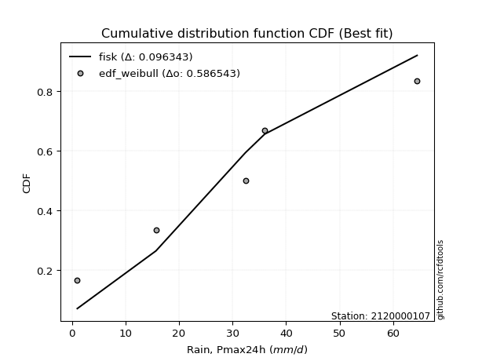</img>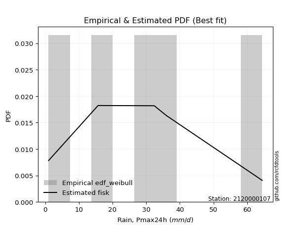</img>

</div>


### 4. EDF Beard (1943)

The Beard formula (or Beard´s plotting position formula) in hydrology is used to estimate the empirical non-exceedance probability _(P)_ of a flood event (or other extreme hydrological data point) within a given dataset.

<div align="center">


$P=(m-0.31)/(n+0.38)$


</div>


**4.1. Empirical values**

<div align="center">

|                | 0                   | 1                   | 2                  | 3                  | 4                  | 5                  |
|:---------------|:--------------------|:--------------------|:-------------------|:-------------------|:-------------------|:-------------------|
| date           | 2023                | 2018                | 2025               | 2024               | 2020               | 2019               |
| x              | 1.0                 | 15.7                | 32.2               | 32.4               | 36.0               | 64.47              |
| m              | 1                   | 2                   | 3                  | 4                  | 5                  | 6                  |
| empirical_dist | edf_beard           | edf_beard           | edf_beard          | edf_beard          | edf_beard          | edf_beard          |
| empirical      | 0.10815047021943573 | 0.26489028213166144 | 0.4216300940438871 | 0.5783699059561128 | 0.7351097178683387 | 0.8918495297805643 |
| empirical_tr   | 1.1212653778558874  | 1.3603411513859276  | 1.7289972899728996 | 2.3717472118959106 | 3.7751479289940844 | 9.246376811594207  |

</div>


**4.2. Kolmogorov-Smirnov fit test (sorted by Δ)**


<div align="center">

|                | 0                   | 1                  | 2                   | 3                   | 4                   | 5                   | 6                   | 7                   | 8                   | 9                  | 10                  | 11                  | 12                 | 13                  | 14                  | 15                  | 16                  | 17                  | 18                  | 19                  | 20                  | 21                  | 22                  | 23                  | 24                  | 25                 | 26                  | 27                 | 28                  | 29                 | 30                 | 31                  | 32                 | 33                  | 34                  | 35                  | 36                  | 37                  | 38                  | 39                 | 40                  | 41                  | 42                  | 43                  | 44                  | 45                 | 46                  | 47                  | 48                  | 49                  | 50                  | 51                  | 52                  | 53                  | 54                  | 55                  | 56                  | 57                 | 58                 | 59                  | 60                  | 61                  | 62                 | 63                 | 64                 | 65                  | 66                  | 67                  | 68                 | 69                 | 70                  | 71                  | 72                  | 73                 | 74                  | 75                  | 76                  | 77                  | 78                  | 79                 | 80                  | 81                  | 82                  | 83                  | 84                  | 85                  | 86                  | 87                  | 88                 | 89                 | 90                  | 91                  | 92                  | 93                 | 94                 | 95                  | 96                 | 97                  | 98                 | 99                 | 100                 | 101                 | 102                | 103                | 104                 | 105               | 106                | 107                 | 108                | 109                 | 110                | 111                 | 112                | 113               | 114                 | 115                 | 116                 | 117                | 118                 | 119               | 120                 | 121                 | 122                 | 123                 | 124                 | 125                 | 126                | 127                 | 128                | 129                 | 130                | 131                | 132                 | 133                 | 134                | 135                 | 136                | 137                | 138                | 139                | 140                 | 141                | 142                | 143                 | 144                 | 145                 | 146                | 147                | 148                | 149                | 150                | 151                | 152                | 153                | 154                | 155                | 156                | 157                | 158                | 159               |
|:---------------|:--------------------|:-------------------|:--------------------|:--------------------|:--------------------|:--------------------|:--------------------|:--------------------|:--------------------|:-------------------|:--------------------|:--------------------|:-------------------|:--------------------|:--------------------|:--------------------|:--------------------|:--------------------|:--------------------|:--------------------|:--------------------|:--------------------|:--------------------|:--------------------|:--------------------|:-------------------|:--------------------|:-------------------|:--------------------|:-------------------|:-------------------|:--------------------|:-------------------|:--------------------|:--------------------|:--------------------|:--------------------|:--------------------|:--------------------|:-------------------|:--------------------|:--------------------|:--------------------|:--------------------|:--------------------|:-------------------|:--------------------|:--------------------|:--------------------|:--------------------|:--------------------|:--------------------|:--------------------|:--------------------|:--------------------|:--------------------|:--------------------|:-------------------|:-------------------|:--------------------|:--------------------|:--------------------|:-------------------|:-------------------|:-------------------|:--------------------|:--------------------|:--------------------|:-------------------|:-------------------|:--------------------|:--------------------|:--------------------|:-------------------|:--------------------|:--------------------|:--------------------|:--------------------|:--------------------|:-------------------|:--------------------|:--------------------|:--------------------|:--------------------|:--------------------|:--------------------|:--------------------|:--------------------|:-------------------|:-------------------|:--------------------|:--------------------|:--------------------|:-------------------|:-------------------|:--------------------|:-------------------|:--------------------|:-------------------|:-------------------|:--------------------|:--------------------|:-------------------|:-------------------|:--------------------|:------------------|:-------------------|:--------------------|:-------------------|:--------------------|:-------------------|:--------------------|:-------------------|:------------------|:--------------------|:--------------------|:--------------------|:-------------------|:--------------------|:------------------|:--------------------|:--------------------|:--------------------|:--------------------|:--------------------|:--------------------|:-------------------|:--------------------|:-------------------|:--------------------|:-------------------|:-------------------|:--------------------|:--------------------|:-------------------|:--------------------|:-------------------|:-------------------|:-------------------|:-------------------|:--------------------|:-------------------|:-------------------|:--------------------|:--------------------|:--------------------|:-------------------|:-------------------|:-------------------|:-------------------|:-------------------|:-------------------|:-------------------|:-------------------|:-------------------|:-------------------|:-------------------|:-------------------|:-------------------|:------------------|
| station        | 2120000107          | 2120000107         | 2120000107          | 2120000107          | 2120000107          | 2120000107          | 2120000107          | 2120000107          | 2120000107          | 2120000107         | 2120000107          | 2120000107          | 2120000107         | 2120000107          | 2120000107          | 2120000107          | 2120000107          | 2120000107          | 2120000107          | 2120000107          | 2120000107          | 2120000107          | 2120000107          | 2120000107          | 2120000107          | 2120000107         | 2120000107          | 2120000107         | 2120000107          | 2120000107         | 2120000107         | 2120000107          | 2120000107         | 2120000107          | 2120000107          | 2120000107          | 2120000107          | 2120000107          | 2120000107          | 2120000107         | 2120000107          | 2120000107          | 2120000107          | 2120000107          | 2120000107          | 2120000107         | 2120000107          | 2120000107          | 2120000107          | 2120000107          | 2120000107          | 2120000107          | 2120000107          | 2120000107          | 2120000107          | 2120000107          | 2120000107          | 2120000107         | 2120000107         | 2120000107          | 2120000107          | 2120000107          | 2120000107         | 2120000107         | 2120000107         | 2120000107          | 2120000107          | 2120000107          | 2120000107         | 2120000107         | 2120000107          | 2120000107          | 2120000107          | 2120000107         | 2120000107          | 2120000107          | 2120000107          | 2120000107          | 2120000107          | 2120000107         | 2120000107          | 2120000107          | 2120000107          | 2120000107          | 2120000107          | 2120000107          | 2120000107          | 2120000107          | 2120000107         | 2120000107         | 2120000107          | 2120000107          | 2120000107          | 2120000107         | 2120000107         | 2120000107          | 2120000107         | 2120000107          | 2120000107         | 2120000107         | 2120000107          | 2120000107          | 2120000107         | 2120000107         | 2120000107          | 2120000107        | 2120000107         | 2120000107          | 2120000107         | 2120000107          | 2120000107         | 2120000107          | 2120000107         | 2120000107        | 2120000107          | 2120000107          | 2120000107          | 2120000107         | 2120000107          | 2120000107        | 2120000107          | 2120000107          | 2120000107          | 2120000107          | 2120000107          | 2120000107          | 2120000107         | 2120000107          | 2120000107         | 2120000107          | 2120000107         | 2120000107         | 2120000107          | 2120000107          | 2120000107         | 2120000107          | 2120000107         | 2120000107         | 2120000107         | 2120000107         | 2120000107          | 2120000107         | 2120000107         | 2120000107          | 2120000107          | 2120000107          | 2120000107         | 2120000107         | 2120000107         | 2120000107         | 2120000107         | 2120000107         | 2120000107         | 2120000107         | 2120000107         | 2120000107         | 2120000107         | 2120000107         | 2120000107         | 2120000107        |
| empirical_dist | edf_beard           | edf_beard          | edf_beard           | edf_beard           | edf_beard           | edf_beard           | edf_beard           | edf_beard           | edf_beard           | edf_beard          | edf_beard           | edf_beard           | edf_beard          | edf_beard           | edf_beard           | edf_beard           | edf_beard           | edf_beard           | edf_beard           | edf_beard           | edf_beard           | edf_beard           | edf_beard           | edf_beard           | edf_beard           | edf_beard          | edf_beard           | edf_beard          | edf_beard           | edf_beard          | edf_beard          | edf_beard           | edf_beard          | edf_beard           | edf_beard           | edf_beard           | edf_beard           | edf_beard           | edf_beard           | edf_beard          | edf_beard           | edf_beard           | edf_beard           | edf_beard           | edf_beard           | edf_beard          | edf_beard           | edf_beard           | edf_beard           | edf_beard           | edf_beard           | edf_beard           | edf_beard           | edf_beard           | edf_beard           | edf_beard           | edf_beard           | edf_beard          | edf_beard          | edf_beard           | edf_beard           | edf_beard           | edf_beard          | edf_beard          | edf_beard          | edf_beard           | edf_beard           | edf_beard           | edf_beard          | edf_beard          | edf_beard           | edf_beard           | edf_beard           | edf_beard          | edf_beard           | edf_beard           | edf_beard           | edf_beard           | edf_beard           | edf_beard          | edf_beard           | edf_beard           | edf_beard           | edf_beard           | edf_beard           | edf_beard           | edf_beard           | edf_beard           | edf_beard          | edf_beard          | edf_beard           | edf_beard           | edf_beard           | edf_beard          | edf_beard          | edf_beard           | edf_beard          | edf_beard           | edf_beard          | edf_beard          | edf_beard           | edf_beard           | edf_beard          | edf_beard          | edf_beard           | edf_beard         | edf_beard          | edf_beard           | edf_beard          | edf_beard           | edf_beard          | edf_beard           | edf_beard          | edf_beard         | edf_beard           | edf_beard           | edf_beard           | edf_beard          | edf_beard           | edf_beard         | edf_beard           | edf_beard           | edf_beard           | edf_beard           | edf_beard           | edf_beard           | edf_beard          | edf_beard           | edf_beard          | edf_beard           | edf_beard          | edf_beard          | edf_beard           | edf_beard           | edf_beard          | edf_beard           | edf_beard          | edf_beard          | edf_beard          | edf_beard          | edf_beard           | edf_beard          | edf_beard          | edf_beard           | edf_beard           | edf_beard           | edf_beard          | edf_beard          | edf_beard          | edf_beard          | edf_beard          | edf_beard          | edf_beard          | edf_beard          | edf_beard          | edf_beard          | edf_beard          | edf_beard          | edf_beard          | edf_beard         |
| p_dist         | dweibull            | logdgamma          | t                   | crystalball         | norm                | foldnorm            | logistic            | hypsecant           | exponnorm           | logdweibull        | pearson3            | anglit              | genextreme         | truncpareto         | burr                | loggenextreme       | semicircular        | laplace             | cosine              | rice                | nct                 | skewnorm            | invgamma            | truncweibull_min    | fatiguelife         | logt               | logtukeylambda      | maxwell            | betaprime           | f                  | erlang             | gamma               | genlogistic        | loggausshyper       | invgauss            | gennorm             | logloggamma         | kappa3              | rayleigh            | weibull_min        | burr12              | loggennorm          | kappa4              | alpha               | logvonmises_line    | logpearson3        | logargus            | vonmises_line       | arcsine             | mielke              | invweibull          | bradford            | dgamma              | logtrapezoid        | gausshyper          | gumbel_l            | kstwobign           | uniform            | halfnorm           | gumbel_r            | loglevy_l           | ksone               | loggumbel_l        | truncexpon         | beta               | wrapcauchy          | logsemicircular     | logarcsine          | lomax              | moyal              | halflogistic        | loganglit           | loggompertz         | logexponweib       | argus               | genexpon            | ncf                 | loginvweibull       | loghalfgennorm      | lognct             | logexponnorm        | lognorm             | logcrystalball      | logrice             | loginvgauss         | logburr12           | logfatiguelife      | loggengamma         | loggamma           | loggamma           | logalpha            | logerlang           | loginvgamma         | logfoldnorm        | halfgennorm        | loglogistic         | levy_l             | logmaxwell          | loggenhalflogistic | gompertz           | lograyleigh         | loghypsecant        | logkstwobign       | logncf             | wald                | loghalfnorm       | loggenexpon        | logskewnorm         | genpareto          | triang              | logcosine          | logloglaplace       | loggumbel_r        | gengamma          | logwrapcauchy       | loglaplace          | loglaplace          | johnsonsb          | nakagami            | loghalflogistic   | logweibull_max      | logmoyal            | logtriang           | loglomax            | logtruncweibull_min | logf                | genhalflogistic    | logjohnsonsb        | logweibull_min     | logksone            | logwald            | logbeta            | johnsonsu           | logjohnsonsu        | logkappa4          | logkappa3           | loguniform         | exponweib          | trapezoid          | logbradford        | logexponpow         | tukeylambda        | loggenpareto       | logmielke           | logtruncnorm        | logbetaprime        | lognakagami        | logtruncexpon      | logburr            | rdist              | powerlaw           | weibull_max        | exponpow           | logtruncpareto     | truncnorm          | logpowerlaw        | logrdist           | loggenlogistic     | logvonmises        | vonmises          |
| delta          | 0.09276250494388907 | 0.1168074522191237 | 0.11997412659841744 | 0.11999444519247626 | 0.11999445342041914 | 0.12066049030940396 | 0.12256980208187346 | 0.12704401186014774 | 0.13059118833244604 | 0.1324157319387259 | 0.13474312071160716 | 0.13572931039683278 | 0.1361992059437716 | 0.13639871520179897 | 0.13855016395558217 | 0.13965567301603382 | 0.14228149436122883 | 0.14291238210232388 | 0.14291422434414403 | 0.14319364652845507 | 0.14334944287556245 | 0.14417734105761598 | 0.14503350160562517 | 0.14555934004910986 | 0.14648644858715248 | 0.1467126685265921 | 0.14744235668920602 | 0.1483866276622438 | 0.14969851759742742 | 0.1499866730778074 | 0.1500406675235632 | 0.15004075815871415 | 0.1511395660170673 | 0.15382018466163033 | 0.15419322512411698 | 0.15615117841703816 | 0.15648887517452864 | 0.15684915890887835 | 0.15845071799388405 | 0.1600885238255077 | 0.16040801526065634 | 0.16062907160360934 | 0.16188827933532268 | 0.16226280467389548 | 0.16303328995501393 | 0.1631282529946158 | 0.16400386925253913 | 0.16837078681364892 | 0.16875485838485638 | 0.16879648034614786 | 0.16956882404941692 | 0.17018621390449634 | 0.17088861189800406 | 0.17460606020618102 | 0.17576987072114736 | 0.17676624482361603 | 0.18072353284521364 | 0.1836680919033158 | 0.1868127920683516 | 0.18774812766937848 | 0.19008416436977404 | 0.19224169623081966 | 0.1929180449092836 | 0.1955945070304414 | 0.1991213458185454 | 0.19919767138586486 | 0.20882780725825506 | 0.20946366793975418 | 0.2120632796411554 | 0.2129169374825483 | 0.21369881445109457 | 0.21761170279644465 | 0.22028836259401258 | 0.2250227596250846 | 0.22739575985864857 | 0.23135501863246782 | 0.23280624929000887 | 0.23739959651178266 | 0.23741801413539754 | 0.2383970723069077 | 0.23848991883065024 | 0.23849171387918483 | 0.23849183219008002 | 0.23849680919408617 | 0.23894414817900106 | 0.24003230754239618 | 0.24093817136154078 | 0.24277858482459064 | 0.2435535607125377 | 0.2435535607125377 | 0.24426305005533605 | 0.24450890859965163 | 0.24793028492032693 | 0.2511505446043278 | 0.2552010630639931 | 0.25727146134521733 | 0.2581977948966026 | 0.25902959629580286 | 0.2611943809682549 | 0.2647794882851946 | 0.26516796197346965 | 0.27166071873094216 | 0.2772505143631927 | 0.2774601671840793 | 0.28276494364725674 | 0.283142870384728 | 0.2833545356661873 | 0.28656242507361424 | 0.2881408689422346 | 0.28901778137584716 | 0.2910180331289655 | 0.29199601024260746 | 0.2968150192916242 | 0.298806334672404 | 0.29900513525806605 | 0.29947724521089064 | 0.29947724521089064 | 0.3012902175158891 | 0.31107579630102794 | 0.311081865468442 | 0.31452360283710884 | 0.31600947043589706 | 0.33380328808954735 | 0.33393607582888296 | 0.34504449092398876 | 0.34997371811644074 | 0.3517367306310828 | 0.35506003707429046 | 0.3672083548197447 | 0.36923688267120425 | 0.3706983246909544 | 0.3851806913105732 | 0.40570815950932193 | 0.40671623264958306 | 0.4088849781565472 | 0.41170554634252926 | 0.4117351916156932 | 0.4135877179672084 | 0.4365805693109836 | 0.4367293060277396 | 0.44659682612147333 | 0.4575486890451514 | 0.4598518535171683 | 0.47462375420456093 | 0.48913340781943926 | 0.49138613589307245 | 0.5042582042640767 | 0.5063591258108264 | 0.5083886609894777 | 0.5464993975807992 | 0.5556054414154926 | 0.5859671011485759 | 0.6606038771986217 | 0.6654929144413217 | 0.7126027979997769 | 0.7316203073728018 | 0.7351097163564468 | 0.7351097178683387 | 1.0271383617751126 | 9.708768469069929 |
| deltao         | 0.530385761606      | 0.530385761606     | 0.530385761606      | 0.530385761606      | 0.530385761606      | 0.530385761606      | 0.530385761606      | 0.530385761606      | 0.530385761606      | 0.530385761606     | 0.530385761606      | 0.530385761606      | 0.530385761606     | 0.530385761606      | 0.530385761606      | 0.530385761606      | 0.530385761606      | 0.530385761606      | 0.530385761606      | 0.530385761606      | 0.530385761606      | 0.530385761606      | 0.530385761606      | 0.530385761606      | 0.530385761606      | 0.530385761606     | 0.530385761606      | 0.530385761606     | 0.530385761606      | 0.530385761606     | 0.530385761606     | 0.530385761606      | 0.530385761606     | 0.530385761606      | 0.530385761606      | 0.530385761606      | 0.530385761606      | 0.530385761606      | 0.530385761606      | 0.530385761606     | 0.530385761606      | 0.530385761606      | 0.530385761606      | 0.530385761606      | 0.530385761606      | 0.530385761606     | 0.530385761606      | 0.530385761606      | 0.530385761606      | 0.530385761606      | 0.530385761606      | 0.530385761606      | 0.530385761606      | 0.530385761606      | 0.530385761606      | 0.530385761606      | 0.530385761606      | 0.530385761606     | 0.530385761606     | 0.530385761606      | 0.530385761606      | 0.530385761606      | 0.530385761606     | 0.530385761606     | 0.530385761606     | 0.530385761606      | 0.530385761606      | 0.530385761606      | 0.530385761606     | 0.530385761606     | 0.530385761606      | 0.530385761606      | 0.530385761606      | 0.530385761606     | 0.530385761606      | 0.530385761606      | 0.530385761606      | 0.530385761606      | 0.530385761606      | 0.530385761606     | 0.530385761606      | 0.530385761606      | 0.530385761606      | 0.530385761606      | 0.530385761606      | 0.530385761606      | 0.530385761606      | 0.530385761606      | 0.530385761606     | 0.530385761606     | 0.530385761606      | 0.530385761606      | 0.530385761606      | 0.530385761606     | 0.530385761606     | 0.530385761606      | 0.530385761606     | 0.530385761606      | 0.530385761606     | 0.530385761606     | 0.530385761606      | 0.530385761606      | 0.530385761606     | 0.530385761606     | 0.530385761606      | 0.530385761606    | 0.530385761606     | 0.530385761606      | 0.530385761606     | 0.530385761606      | 0.530385761606     | 0.530385761606      | 0.530385761606     | 0.530385761606    | 0.530385761606      | 0.530385761606      | 0.530385761606      | 0.530385761606     | 0.530385761606      | 0.530385761606    | 0.530385761606      | 0.530385761606      | 0.530385761606      | 0.530385761606      | 0.530385761606      | 0.530385761606      | 0.530385761606     | 0.530385761606      | 0.530385761606     | 0.530385761606      | 0.530385761606     | 0.530385761606     | 0.530385761606      | 0.530385761606      | 0.530385761606     | 0.530385761606      | 0.530385761606     | 0.530385761606     | 0.530385761606     | 0.530385761606     | 0.530385761606      | 0.530385761606     | 0.530385761606     | 0.530385761606      | 0.530385761606      | 0.530385761606      | 0.530385761606     | 0.530385761606     | 0.530385761606     | 0.530385761606     | 0.530385761606     | 0.530385761606     | 0.530385761606     | 0.530385761606     | 0.530385761606     | 0.530385761606     | 0.530385761606     | 0.530385761606     | 0.530385761606     | 0.530385761606    |
| eval           | Δo > Δ              | Δo > Δ             | Δo > Δ              | Δo > Δ              | Δo > Δ              | Δo > Δ              | Δo > Δ              | Δo > Δ              | Δo > Δ              | Δo > Δ             | Δo > Δ              | Δo > Δ              | Δo > Δ             | Δo > Δ              | Δo > Δ              | Δo > Δ              | Δo > Δ              | Δo > Δ              | Δo > Δ              | Δo > Δ              | Δo > Δ              | Δo > Δ              | Δo > Δ              | Δo > Δ              | Δo > Δ              | Δo > Δ             | Δo > Δ              | Δo > Δ             | Δo > Δ              | Δo > Δ             | Δo > Δ             | Δo > Δ              | Δo > Δ             | Δo > Δ              | Δo > Δ              | Δo > Δ              | Δo > Δ              | Δo > Δ              | Δo > Δ              | Δo > Δ             | Δo > Δ              | Δo > Δ              | Δo > Δ              | Δo > Δ              | Δo > Δ              | Δo > Δ             | Δo > Δ              | Δo > Δ              | Δo > Δ              | Δo > Δ              | Δo > Δ              | Δo > Δ              | Δo > Δ              | Δo > Δ              | Δo > Δ              | Δo > Δ              | Δo > Δ              | Δo > Δ             | Δo > Δ             | Δo > Δ              | Δo > Δ              | Δo > Δ              | Δo > Δ             | Δo > Δ             | Δo > Δ             | Δo > Δ              | Δo > Δ              | Δo > Δ              | Δo > Δ             | Δo > Δ             | Δo > Δ              | Δo > Δ              | Δo > Δ              | Δo > Δ             | Δo > Δ              | Δo > Δ              | Δo > Δ              | Δo > Δ              | Δo > Δ              | Δo > Δ             | Δo > Δ              | Δo > Δ              | Δo > Δ              | Δo > Δ              | Δo > Δ              | Δo > Δ              | Δo > Δ              | Δo > Δ              | Δo > Δ             | Δo > Δ             | Δo > Δ              | Δo > Δ              | Δo > Δ              | Δo > Δ             | Δo > Δ             | Δo > Δ              | Δo > Δ             | Δo > Δ              | Δo > Δ             | Δo > Δ             | Δo > Δ              | Δo > Δ              | Δo > Δ             | Δo > Δ             | Δo > Δ              | Δo > Δ            | Δo > Δ             | Δo > Δ              | Δo > Δ             | Δo > Δ              | Δo > Δ             | Δo > Δ              | Δo > Δ             | Δo > Δ            | Δo > Δ              | Δo > Δ              | Δo > Δ              | Δo > Δ             | Δo > Δ              | Δo > Δ            | Δo > Δ              | Δo > Δ              | Δo > Δ              | Δo > Δ              | Δo > Δ              | Δo > Δ              | Δo > Δ             | Δo > Δ              | Δo > Δ             | Δo > Δ              | Δo > Δ             | Δo > Δ             | Δo > Δ              | Δo > Δ              | Δo > Δ             | Δo > Δ              | Δo > Δ             | Δo > Δ             | Δo > Δ             | Δo > Δ             | Δo > Δ              | Δo > Δ             | Δo > Δ             | Δo > Δ              | Δo > Δ              | Δo > Δ              | Δo > Δ             | Δo > Δ             | Δo > Δ             | Δo <= Δ            | Δo <= Δ            | Δo <= Δ            | Δo <= Δ            | Δo <= Δ            | Δo <= Δ            | Δo <= Δ            | Δo <= Δ            | Δo <= Δ            | Δo <= Δ            | Δo <= Δ           |
| fit            | 1                   | 1                  | 1                   | 1                   | 1                   | 1                   | 1                   | 1                   | 1                   | 1                  | 1                   | 1                   | 1                  | 1                   | 1                   | 1                   | 1                   | 1                   | 1                   | 1                   | 1                   | 1                   | 1                   | 1                   | 1                   | 1                  | 1                   | 1                  | 1                   | 1                  | 1                  | 1                   | 1                  | 1                   | 1                   | 1                   | 1                   | 1                   | 1                   | 1                  | 1                   | 1                   | 1                   | 1                   | 1                   | 1                  | 1                   | 1                   | 1                   | 1                   | 1                   | 1                   | 1                   | 1                   | 1                   | 1                   | 1                   | 1                  | 1                  | 1                   | 1                   | 1                   | 1                  | 1                  | 1                  | 1                   | 1                   | 1                   | 1                  | 1                  | 1                   | 1                   | 1                   | 1                  | 1                   | 1                   | 1                   | 1                   | 1                   | 1                  | 1                   | 1                   | 1                   | 1                   | 1                   | 1                   | 1                   | 1                   | 1                  | 1                  | 1                   | 1                   | 1                   | 1                  | 1                  | 1                   | 1                  | 1                   | 1                  | 1                  | 1                   | 1                   | 1                  | 1                  | 1                   | 1                 | 1                  | 1                   | 1                  | 1                   | 1                  | 1                   | 1                  | 1                 | 1                   | 1                   | 1                   | 1                  | 1                   | 1                 | 1                   | 1                   | 1                   | 1                   | 1                   | 1                   | 1                  | 1                   | 1                  | 1                   | 1                  | 1                  | 1                   | 1                   | 1                  | 1                   | 1                  | 1                  | 1                  | 1                  | 1                   | 1                  | 1                  | 1                   | 1                   | 1                   | 1                  | 1                  | 1                  | 0                  | 0                  | 0                  | 0                  | 0                  | 0                  | 0                  | 0                  | 0                  | 0                  | 0                 |
| n              | 6                   | 6                  | 6                   | 6                   | 6                   | 6                   | 6                   | 6                   | 6                   | 6                  | 6                   | 6                   | 6                  | 6                   | 6                   | 6                   | 6                   | 6                   | 6                   | 6                   | 6                   | 6                   | 6                   | 6                   | 6                   | 6                  | 6                   | 6                  | 6                   | 6                  | 6                  | 6                   | 6                  | 6                   | 6                   | 6                   | 6                   | 6                   | 6                   | 6                  | 6                   | 6                   | 6                   | 6                   | 6                   | 6                  | 6                   | 6                   | 6                   | 6                   | 6                   | 6                   | 6                   | 6                   | 6                   | 6                   | 6                   | 6                  | 6                  | 6                   | 6                   | 6                   | 6                  | 6                  | 6                  | 6                   | 6                   | 6                   | 6                  | 6                  | 6                   | 6                   | 6                   | 6                  | 6                   | 6                   | 6                   | 6                   | 6                   | 6                  | 6                   | 6                   | 6                   | 6                   | 6                   | 6                   | 6                   | 6                   | 6                  | 6                  | 6                   | 6                   | 6                   | 6                  | 6                  | 6                   | 6                  | 6                   | 6                  | 6                  | 6                   | 6                   | 6                  | 6                  | 6                   | 6                 | 6                  | 6                   | 6                  | 6                   | 6                  | 6                   | 6                  | 6                 | 6                   | 6                   | 6                   | 6                  | 6                   | 6                 | 6                   | 6                   | 6                   | 6                   | 6                   | 6                   | 6                  | 6                   | 6                  | 6                   | 6                  | 6                  | 6                   | 6                   | 6                  | 6                   | 6                  | 6                  | 6                  | 6                  | 6                   | 6                  | 6                  | 6                   | 6                   | 6                   | 6                  | 6                  | 6                  | 6                  | 6                  | 6                  | 6                  | 6                  | 6                  | 6                  | 6                  | 6                  | 6                  | 6                 |
| best_fit       | 1                   | 0                  | 0                   | 0                   | 0                   | 0                   | 0                   | 0                   | 0                   | 0                  | 0                   | 0                   | 0                  | 0                   | 0                   | 0                   | 0                   | 0                   | 0                   | 0                   | 0                   | 0                   | 0                   | 0                   | 0                   | 0                  | 0                   | 0                  | 0                   | 0                  | 0                  | 0                   | 0                  | 0                   | 0                   | 0                   | 0                   | 0                   | 0                   | 0                  | 0                   | 0                   | 0                   | 0                   | 0                   | 0                  | 0                   | 0                   | 0                   | 0                   | 0                   | 0                   | 0                   | 0                   | 0                   | 0                   | 0                   | 0                  | 0                  | 0                   | 0                   | 0                   | 0                  | 0                  | 0                  | 0                   | 0                   | 0                   | 0                  | 0                  | 0                   | 0                   | 0                   | 0                  | 0                   | 0                   | 0                   | 0                   | 0                   | 0                  | 0                   | 0                   | 0                   | 0                   | 0                   | 0                   | 0                   | 0                   | 0                  | 0                  | 0                   | 0                   | 0                   | 0                  | 0                  | 0                   | 0                  | 0                   | 0                  | 0                  | 0                   | 0                   | 0                  | 0                  | 0                   | 0                 | 0                  | 0                   | 0                  | 0                   | 0                  | 0                   | 0                  | 0                 | 0                   | 0                   | 0                   | 0                  | 0                   | 0                 | 0                   | 0                   | 0                   | 0                   | 0                   | 0                   | 0                  | 0                   | 0                  | 0                   | 0                  | 0                  | 0                   | 0                   | 0                  | 0                   | 0                  | 0                  | 0                  | 0                  | 0                   | 0                  | 0                  | 0                   | 0                   | 0                   | 0                  | 0                  | 0                  | 0                  | 0                  | 0                  | 0                  | 0                  | 0                  | 0                  | 0                  | 0                  | 0                  | 0                 |
| best_fit_sort  | 1                   | 2                  | 3                   | 4                   | 5                   | 6                   | 7                   | 8                   | 9                   | 10                 | 11                  | 12                  | 13                 | 14                  | 15                  | 16                  | 17                  | 18                  | 19                  | 20                  | 21                  | 22                  | 23                  | 24                  | 25                  | 26                 | 27                  | 28                 | 29                  | 30                 | 31                 | 32                  | 33                 | 34                  | 35                  | 36                  | 37                  | 38                  | 39                  | 40                 | 41                  | 42                  | 43                  | 44                  | 45                  | 46                 | 47                  | 48                  | 49                  | 50                  | 51                  | 52                  | 53                  | 54                  | 55                  | 56                  | 57                  | 58                 | 59                 | 60                  | 61                  | 62                  | 63                 | 64                 | 65                 | 66                  | 67                  | 68                  | 69                 | 70                 | 71                  | 72                  | 73                  | 74                 | 75                  | 76                  | 77                  | 78                  | 79                  | 80                 | 81                  | 82                  | 83                  | 84                  | 85                  | 86                  | 87                  | 88                  | 89                 | 90                 | 91                  | 92                  | 93                  | 94                 | 95                 | 96                  | 97                 | 98                  | 99                 | 100                | 101                 | 102                 | 103                | 104                | 105                 | 106               | 107                | 108                 | 109                | 110                 | 111                | 112                 | 113                | 114               | 115                 | 116                 | 117                 | 118                | 119                 | 120               | 121                 | 122                 | 123                 | 124                 | 125                 | 126                 | 127                | 128                 | 129                | 130                 | 131                | 132                | 133                 | 134                 | 135                | 136                 | 137                | 138                | 139                | 140                | 141                 | 142                | 143                | 144                 | 145                 | 146                 | 147                | 148                | 149                | 150                | 151                | 152                | 153                | 154                | 155                | 156                | 157                | 158                | 159                | 160               |

</div>


**4.3. Best fit**

<div align="center">

|   id |    station | empirical_dist   | p_dist   |     delta |   deltao | eval   |   fit |   n |   best_fit |   best_fit_sort |
|-----:|-----------:|:-----------------|:---------|----------:|---------:|:-------|------:|----:|-----------:|----------------:|
|    0 | 2120000107 | edf_beard        | dweibull | 0.0927625 | 0.530386 | Δo > Δ |     1 |   6 |          1 |               1 |

</div>


<div align="center">

</img></img>

</div>


### 5. EDF Chegodayev (1955)

The Chegodayev formula is an empirical plotting position formula used in hydrological frequency analysis to estimate the exceedance probability or return period of a specific event from a set of observed data. It is primarily used for plotting observed data points on probability paper to fit a theoretical distribution, particularly for analyzing extreme events like maximum flood flows or rainfall intensities. The constant _b_ value in the generalized plotting position formula is 0.3.

<div align="center">


$P=(m-b)/(n+1-2b)$


</div>


**5.1. Empirical values**

<div align="center">

|                | 0                   | 1                  | 2                  | 3                  | 4                 | 5                 |
|:---------------|:--------------------|:-------------------|:-------------------|:-------------------|:------------------|:------------------|
| date           | 2023                | 2018               | 2025               | 2024               | 2020              | 2019              |
| x              | 1.0                 | 15.7               | 32.2               | 32.4               | 36.0              | 64.47             |
| m              | 1                   | 2                  | 3                  | 4                  | 5                 | 6                 |
| empirical_dist | edf_chegodayev      | edf_chegodayev     | edf_chegodayev     | edf_chegodayev     | edf_chegodayev    | edf_chegodayev    |
| empirical      | 0.10937499999999999 | 0.265625           | 0.421875           | 0.578125           | 0.734375          | 0.890625          |
| empirical_tr   | 1.1228070175438596  | 1.3617021276595744 | 1.7297297297297298 | 2.3703703703703702 | 3.764705882352941 | 9.142857142857142 |

</div>


**5.2. Kolmogorov-Smirnov fit test (sorted by Δ)**


<div align="center">

|                | 0                   | 1                   | 2                   | 3                   | 4                   | 5                   | 6                   | 7                   | 8                   | 9                  | 10                  | 11                 | 12                  | 13                 | 14                 | 15                  | 16                  | 17                  | 18                | 19                 | 20                  | 21                 | 22                 | 23                 | 24                 | 25                  | 26                  | 27                  | 28                  | 29                 | 30                  | 31                  | 32                  | 33                  | 34                 | 35                  | 36                  | 37                  | 38                  | 39                  | 40                  | 41                | 42                 | 43                 | 44                  | 45                  | 46                  | 47                  | 48                 | 49                  | 50                  | 51                  | 52                  | 53                  | 54                  | 55                  | 56                  | 57                  | 58                  | 59                 | 60                  | 61                  | 62                  | 63                  | 64                  | 65                  | 66                 | 67                  | 68                  | 69                  | 70                 | 71                  | 72                 | 73                  | 74                 | 75                  | 76                | 77                 | 78                  | 79                  | 80                  | 81                  | 82                  | 83                 | 84                  | 85                 | 86                 | 87                  | 88                  | 89                  | 90                  | 91                  | 92                  | 93                 | 94                 | 95                  | 96                  | 97               | 98                  | 99                 | 100                 | 101                | 102               | 103                 | 104                 | 105                | 106                 | 107                 | 108                 | 109                | 110                 | 111                | 112                | 113                | 114                | 115                 | 116                 | 117                | 118                 | 119                 | 120                 | 121                | 122                | 123                | 124                 | 125                 | 126                | 127                | 128                | 129                | 130                | 131                | 132                | 133                 | 134                | 135                | 136                 | 137                | 138                | 139                 | 140                 | 141                | 142                | 143                 | 144                | 145                | 146                | 147                | 148                | 149                | 150               | 151                | 152                | 153                | 154                | 155                | 156                | 157            | 158                | 159               |
|:---------------|:--------------------|:--------------------|:--------------------|:--------------------|:--------------------|:--------------------|:--------------------|:--------------------|:--------------------|:-------------------|:--------------------|:-------------------|:--------------------|:-------------------|:-------------------|:--------------------|:--------------------|:--------------------|:------------------|:-------------------|:--------------------|:-------------------|:-------------------|:-------------------|:-------------------|:--------------------|:--------------------|:--------------------|:--------------------|:-------------------|:--------------------|:--------------------|:--------------------|:--------------------|:-------------------|:--------------------|:--------------------|:--------------------|:--------------------|:--------------------|:--------------------|:------------------|:-------------------|:-------------------|:--------------------|:--------------------|:--------------------|:--------------------|:-------------------|:--------------------|:--------------------|:--------------------|:--------------------|:--------------------|:--------------------|:--------------------|:--------------------|:--------------------|:--------------------|:-------------------|:--------------------|:--------------------|:--------------------|:--------------------|:--------------------|:--------------------|:-------------------|:--------------------|:--------------------|:--------------------|:-------------------|:--------------------|:-------------------|:--------------------|:-------------------|:--------------------|:------------------|:-------------------|:--------------------|:--------------------|:--------------------|:--------------------|:--------------------|:-------------------|:--------------------|:-------------------|:-------------------|:--------------------|:--------------------|:--------------------|:--------------------|:--------------------|:--------------------|:-------------------|:-------------------|:--------------------|:--------------------|:-----------------|:--------------------|:-------------------|:--------------------|:-------------------|:------------------|:--------------------|:--------------------|:-------------------|:--------------------|:--------------------|:--------------------|:-------------------|:--------------------|:-------------------|:-------------------|:-------------------|:-------------------|:--------------------|:--------------------|:-------------------|:--------------------|:--------------------|:--------------------|:-------------------|:-------------------|:-------------------|:--------------------|:--------------------|:-------------------|:-------------------|:-------------------|:-------------------|:-------------------|:-------------------|:-------------------|:--------------------|:-------------------|:-------------------|:--------------------|:-------------------|:-------------------|:--------------------|:--------------------|:-------------------|:-------------------|:--------------------|:-------------------|:-------------------|:-------------------|:-------------------|:-------------------|:-------------------|:------------------|:-------------------|:-------------------|:-------------------|:-------------------|:-------------------|:-------------------|:---------------|:-------------------|:------------------|
| station        | 2120000107          | 2120000107          | 2120000107          | 2120000107          | 2120000107          | 2120000107          | 2120000107          | 2120000107          | 2120000107          | 2120000107         | 2120000107          | 2120000107         | 2120000107          | 2120000107         | 2120000107         | 2120000107          | 2120000107          | 2120000107          | 2120000107        | 2120000107         | 2120000107          | 2120000107         | 2120000107         | 2120000107         | 2120000107         | 2120000107          | 2120000107          | 2120000107          | 2120000107          | 2120000107         | 2120000107          | 2120000107          | 2120000107          | 2120000107          | 2120000107         | 2120000107          | 2120000107          | 2120000107          | 2120000107          | 2120000107          | 2120000107          | 2120000107        | 2120000107         | 2120000107         | 2120000107          | 2120000107          | 2120000107          | 2120000107          | 2120000107         | 2120000107          | 2120000107          | 2120000107          | 2120000107          | 2120000107          | 2120000107          | 2120000107          | 2120000107          | 2120000107          | 2120000107          | 2120000107         | 2120000107          | 2120000107          | 2120000107          | 2120000107          | 2120000107          | 2120000107          | 2120000107         | 2120000107          | 2120000107          | 2120000107          | 2120000107         | 2120000107          | 2120000107         | 2120000107          | 2120000107         | 2120000107          | 2120000107        | 2120000107         | 2120000107          | 2120000107          | 2120000107          | 2120000107          | 2120000107          | 2120000107         | 2120000107          | 2120000107         | 2120000107         | 2120000107          | 2120000107          | 2120000107          | 2120000107          | 2120000107          | 2120000107          | 2120000107         | 2120000107         | 2120000107          | 2120000107          | 2120000107       | 2120000107          | 2120000107         | 2120000107          | 2120000107         | 2120000107        | 2120000107          | 2120000107          | 2120000107         | 2120000107          | 2120000107          | 2120000107          | 2120000107         | 2120000107          | 2120000107         | 2120000107         | 2120000107         | 2120000107         | 2120000107          | 2120000107          | 2120000107         | 2120000107          | 2120000107          | 2120000107          | 2120000107         | 2120000107         | 2120000107         | 2120000107          | 2120000107          | 2120000107         | 2120000107         | 2120000107         | 2120000107         | 2120000107         | 2120000107         | 2120000107         | 2120000107          | 2120000107         | 2120000107         | 2120000107          | 2120000107         | 2120000107         | 2120000107          | 2120000107          | 2120000107         | 2120000107         | 2120000107          | 2120000107         | 2120000107         | 2120000107         | 2120000107         | 2120000107         | 2120000107         | 2120000107        | 2120000107         | 2120000107         | 2120000107         | 2120000107         | 2120000107         | 2120000107         | 2120000107     | 2120000107         | 2120000107        |
| empirical_dist | edf_chegodayev      | edf_chegodayev      | edf_chegodayev      | edf_chegodayev      | edf_chegodayev      | edf_chegodayev      | edf_chegodayev      | edf_chegodayev      | edf_chegodayev      | edf_chegodayev     | edf_chegodayev      | edf_chegodayev     | edf_chegodayev      | edf_chegodayev     | edf_chegodayev     | edf_chegodayev      | edf_chegodayev      | edf_chegodayev      | edf_chegodayev    | edf_chegodayev     | edf_chegodayev      | edf_chegodayev     | edf_chegodayev     | edf_chegodayev     | edf_chegodayev     | edf_chegodayev      | edf_chegodayev      | edf_chegodayev      | edf_chegodayev      | edf_chegodayev     | edf_chegodayev      | edf_chegodayev      | edf_chegodayev      | edf_chegodayev      | edf_chegodayev     | edf_chegodayev      | edf_chegodayev      | edf_chegodayev      | edf_chegodayev      | edf_chegodayev      | edf_chegodayev      | edf_chegodayev    | edf_chegodayev     | edf_chegodayev     | edf_chegodayev      | edf_chegodayev      | edf_chegodayev      | edf_chegodayev      | edf_chegodayev     | edf_chegodayev      | edf_chegodayev      | edf_chegodayev      | edf_chegodayev      | edf_chegodayev      | edf_chegodayev      | edf_chegodayev      | edf_chegodayev      | edf_chegodayev      | edf_chegodayev      | edf_chegodayev     | edf_chegodayev      | edf_chegodayev      | edf_chegodayev      | edf_chegodayev      | edf_chegodayev      | edf_chegodayev      | edf_chegodayev     | edf_chegodayev      | edf_chegodayev      | edf_chegodayev      | edf_chegodayev     | edf_chegodayev      | edf_chegodayev     | edf_chegodayev      | edf_chegodayev     | edf_chegodayev      | edf_chegodayev    | edf_chegodayev     | edf_chegodayev      | edf_chegodayev      | edf_chegodayev      | edf_chegodayev      | edf_chegodayev      | edf_chegodayev     | edf_chegodayev      | edf_chegodayev     | edf_chegodayev     | edf_chegodayev      | edf_chegodayev      | edf_chegodayev      | edf_chegodayev      | edf_chegodayev      | edf_chegodayev      | edf_chegodayev     | edf_chegodayev     | edf_chegodayev      | edf_chegodayev      | edf_chegodayev   | edf_chegodayev      | edf_chegodayev     | edf_chegodayev      | edf_chegodayev     | edf_chegodayev    | edf_chegodayev      | edf_chegodayev      | edf_chegodayev     | edf_chegodayev      | edf_chegodayev      | edf_chegodayev      | edf_chegodayev     | edf_chegodayev      | edf_chegodayev     | edf_chegodayev     | edf_chegodayev     | edf_chegodayev     | edf_chegodayev      | edf_chegodayev      | edf_chegodayev     | edf_chegodayev      | edf_chegodayev      | edf_chegodayev      | edf_chegodayev     | edf_chegodayev     | edf_chegodayev     | edf_chegodayev      | edf_chegodayev      | edf_chegodayev     | edf_chegodayev     | edf_chegodayev     | edf_chegodayev     | edf_chegodayev     | edf_chegodayev     | edf_chegodayev     | edf_chegodayev      | edf_chegodayev     | edf_chegodayev     | edf_chegodayev      | edf_chegodayev     | edf_chegodayev     | edf_chegodayev      | edf_chegodayev      | edf_chegodayev     | edf_chegodayev     | edf_chegodayev      | edf_chegodayev     | edf_chegodayev     | edf_chegodayev     | edf_chegodayev     | edf_chegodayev     | edf_chegodayev     | edf_chegodayev    | edf_chegodayev     | edf_chegodayev     | edf_chegodayev     | edf_chegodayev     | edf_chegodayev     | edf_chegodayev     | edf_chegodayev | edf_chegodayev     | edf_chegodayev    |
| p_dist         | dweibull            | logdgamma           | t                   | crystalball         | norm                | foldnorm            | logistic            | hypsecant           | exponnorm           | logdweibull        | pearson3            | anglit             | genextreme          | truncpareto        | burr               | loggenextreme       | semicircular        | cosine              | laplace           | rice               | nct                 | skewnorm           | invgamma           | truncweibull_min   | fatiguelife        | logt                | maxwell             | logtukeylambda      | betaprime           | f                  | erlang              | gamma               | genlogistic         | loggausshyper       | invgauss           | logloggamma         | kappa3              | gennorm             | rayleigh            | weibull_min         | burr12              | kappa4            | loggennorm         | alpha              | logvonmises_line    | logpearson3         | logargus            | vonmises_line       | arcsine            | mielke              | invweibull          | bradford            | dgamma              | logtrapezoid        | gausshyper          | gumbel_l            | kstwobign           | uniform             | halfnorm            | gumbel_r           | loglevy_l           | ksone               | loggumbel_l         | truncexpon          | wrapcauchy          | beta                | logsemicircular    | logarcsine          | lomax               | moyal               | halflogistic       | loganglit           | loggompertz        | logexponweib        | argus              | genexpon            | ncf               | loginvweibull      | loghalfgennorm      | lognct              | logexponnorm        | lognorm             | logcrystalball      | logrice            | loginvgauss         | logburr12          | logfatiguelife     | loggengamma         | loggamma            | loggamma            | logalpha            | logerlang           | loginvgamma         | logfoldnorm        | halfgennorm        | levy_l              | loglogistic         | logmaxwell       | loggenhalflogistic  | lograyleigh        | gompertz            | loghypsecant       | logncf            | logkstwobign        | wald                | loggenexpon        | loghalfnorm         | logskewnorm         | genpareto           | triang             | logcosine           | logloglaplace      | loggumbel_r        | logwrapcauchy      | gengamma           | loglaplace          | loglaplace          | johnsonsb          | nakagami            | loghalflogistic     | logweibull_max      | logmoyal           | loglomax           | logtriang          | logtruncweibull_min | logf                | genhalflogistic    | logjohnsonsb       | logweibull_min     | logksone           | logwald            | logbeta            | johnsonsu          | logjohnsonsu        | logkappa4          | logkappa3          | loguniform          | exponweib          | trapezoid          | logbradford         | logexponpow         | tukeylambda        | loggenpareto       | logmielke           | logtruncnorm       | logbetaprime       | lognakagami        | logtruncexpon      | logburr            | rdist              | powerlaw          | weibull_max        | exponpow           | logtruncpareto     | truncnorm          | logpowerlaw        | logrdist           | loggenlogistic | logvonmises        | vonmises          |
| delta          | 0.09349722281222764 | 0.11607273435078502 | 0.11923940873007877 | 0.11925972732413759 | 0.11925973555208047 | 0.11992577244106528 | 0.12232489612576058 | 0.12679910590403487 | 0.13034628237633317 | 0.1311912021581616 | 0.13449821475549428 | 0.1349945925284941 | 0.13595429998765873 | 0.1361538092456861 | 0.1378154460872435 | 0.13941076705992095 | 0.14154677649289016 | 0.14217950647580535 | 0.142667476146211 | 0.1429487405723422 | 0.14310453691944958 | 0.1439324351015031 | 0.1447885956495123 | 0.1448246221807712 | 0.1462415426310396 | 0.14744738639493066 | 0.14814172170613094 | 0.14817707455754459 | 0.14945361164131454 | 0.1497417671216945 | 0.14979576156745034 | 0.14979585220260128 | 0.15089466006095442 | 0.15357527870551746 | 0.1539483191680041 | 0.15624396921841577 | 0.15660425295276548 | 0.15688589628537672 | 0.15820581203777118 | 0.15984361786939483 | 0.16016310930454347 | 0.161153561466984 | 0.1613637894719479 | 0.1620178987177826 | 0.16278838399890105 | 0.16288334703850293 | 0.16375896329642625 | 0.16763606894531025 | 0.1680201405165177 | 0.16855157439003499 | 0.16932391809330405 | 0.16994130794838347 | 0.17162332976634262 | 0.17436115425006815 | 0.17503515285280868 | 0.17603152695527735 | 0.18047862688910077 | 0.18293337403497711 | 0.18656788611223873 | 0.1875032217132656 | 0.18934944650143537 | 0.19150697836248098 | 0.19267313895317073 | 0.19534960107432853 | 0.19846295351752619 | 0.19887643986243253 | 0.2085829013021422 | 0.20872895007141562 | 0.21181837368504253 | 0.21267203152643543 | 0.2134539084949817 | 0.21736679684033178 | 0.2200434566378997 | 0.22477785366897174 | 0.2266610419903099 | 0.23111011267635495 | 0.232561343333896 | 0.2366648786434441 | 0.23668329626705897 | 0.23815216635079484 | 0.23824501287453737 | 0.23824680792307196 | 0.23824692623396715 | 0.2382519032379733 | 0.23869924222288819 | 0.2397874015862833 | 0.2406932654054279 | 0.24253367886847776 | 0.24330865475642482 | 0.24330865475642482 | 0.24401814409922318 | 0.24426400264353876 | 0.24768537896421405 | 0.2509056386482149 | 0.2549561571078802 | 0.25697326511603835 | 0.25702655538910446 | 0.25878469033969 | 0.26094947501214205 | 0.2649230560173568 | 0.26551420615353316 | 0.2714158127748293 | 0.276235637403515 | 0.27651579649485414 | 0.28252003769114387 | 0.2826198177978487 | 0.28289796442861515 | 0.28631751911750136 | 0.28740615107389594 | 0.2882830635075085 | 0.29077312717285264 | 0.2912612923742689 | 0.2965701133355113 | 0.2982704173897275 | 0.2985614287162911 | 0.29923233925477777 | 0.29923233925477777 | 0.3005554996475504 | 0.31083089034491507 | 0.31083695951232915 | 0.31378888496877017 | 0.3157645644797842 | 0.3332013579605444 | 0.3335583821334345 | 0.3447995849678759  | 0.34923900024810217 | 0.3510020127627441 | 0.3543253192059518 | 0.3664736369514061 | 0.3685021648028657 | 0.3704534187348415 | 0.3844459734422345 | 0.4059530654654348 | 0.40696113860569594 | 0.4086400722004343 | 0.4114606403864164 | 0.41149028565958035 | 0.4128530000988698 | 0.4358458514426449 | 0.43599458815940106 | 0.44586210825313477 | 0.4573037830890385 | 0.4591171356488297 | 0.47388903633622237 | 0.4883986899511007 | 0.4906514180247339 | 0.5035234863957382 | 0.5056244079424879 | 0.5076539431211391 | 0.5462544916246864 | 0.554870723547154 | 0.5852323832802372 | 0.6598691593302831 | 0.6647581965729832 | 0.7118680801314383 | 0.7308855895044633 | 0.7343749984881083 | 0.734375       | 1.0268934558189997 | 9.709992998850494 |
| deltao         | 0.530385761606      | 0.530385761606      | 0.530385761606      | 0.530385761606      | 0.530385761606      | 0.530385761606      | 0.530385761606      | 0.530385761606      | 0.530385761606      | 0.530385761606     | 0.530385761606      | 0.530385761606     | 0.530385761606      | 0.530385761606     | 0.530385761606     | 0.530385761606      | 0.530385761606      | 0.530385761606      | 0.530385761606    | 0.530385761606     | 0.530385761606      | 0.530385761606     | 0.530385761606     | 0.530385761606     | 0.530385761606     | 0.530385761606      | 0.530385761606      | 0.530385761606      | 0.530385761606      | 0.530385761606     | 0.530385761606      | 0.530385761606      | 0.530385761606      | 0.530385761606      | 0.530385761606     | 0.530385761606      | 0.530385761606      | 0.530385761606      | 0.530385761606      | 0.530385761606      | 0.530385761606      | 0.530385761606    | 0.530385761606     | 0.530385761606     | 0.530385761606      | 0.530385761606      | 0.530385761606      | 0.530385761606      | 0.530385761606     | 0.530385761606      | 0.530385761606      | 0.530385761606      | 0.530385761606      | 0.530385761606      | 0.530385761606      | 0.530385761606      | 0.530385761606      | 0.530385761606      | 0.530385761606      | 0.530385761606     | 0.530385761606      | 0.530385761606      | 0.530385761606      | 0.530385761606      | 0.530385761606      | 0.530385761606      | 0.530385761606     | 0.530385761606      | 0.530385761606      | 0.530385761606      | 0.530385761606     | 0.530385761606      | 0.530385761606     | 0.530385761606      | 0.530385761606     | 0.530385761606      | 0.530385761606    | 0.530385761606     | 0.530385761606      | 0.530385761606      | 0.530385761606      | 0.530385761606      | 0.530385761606      | 0.530385761606     | 0.530385761606      | 0.530385761606     | 0.530385761606     | 0.530385761606      | 0.530385761606      | 0.530385761606      | 0.530385761606      | 0.530385761606      | 0.530385761606      | 0.530385761606     | 0.530385761606     | 0.530385761606      | 0.530385761606      | 0.530385761606   | 0.530385761606      | 0.530385761606     | 0.530385761606      | 0.530385761606     | 0.530385761606    | 0.530385761606      | 0.530385761606      | 0.530385761606     | 0.530385761606      | 0.530385761606      | 0.530385761606      | 0.530385761606     | 0.530385761606      | 0.530385761606     | 0.530385761606     | 0.530385761606     | 0.530385761606     | 0.530385761606      | 0.530385761606      | 0.530385761606     | 0.530385761606      | 0.530385761606      | 0.530385761606      | 0.530385761606     | 0.530385761606     | 0.530385761606     | 0.530385761606      | 0.530385761606      | 0.530385761606     | 0.530385761606     | 0.530385761606     | 0.530385761606     | 0.530385761606     | 0.530385761606     | 0.530385761606     | 0.530385761606      | 0.530385761606     | 0.530385761606     | 0.530385761606      | 0.530385761606     | 0.530385761606     | 0.530385761606      | 0.530385761606      | 0.530385761606     | 0.530385761606     | 0.530385761606      | 0.530385761606     | 0.530385761606     | 0.530385761606     | 0.530385761606     | 0.530385761606     | 0.530385761606     | 0.530385761606    | 0.530385761606     | 0.530385761606     | 0.530385761606     | 0.530385761606     | 0.530385761606     | 0.530385761606     | 0.530385761606 | 0.530385761606     | 0.530385761606    |
| eval           | Δo > Δ              | Δo > Δ              | Δo > Δ              | Δo > Δ              | Δo > Δ              | Δo > Δ              | Δo > Δ              | Δo > Δ              | Δo > Δ              | Δo > Δ             | Δo > Δ              | Δo > Δ             | Δo > Δ              | Δo > Δ             | Δo > Δ             | Δo > Δ              | Δo > Δ              | Δo > Δ              | Δo > Δ            | Δo > Δ             | Δo > Δ              | Δo > Δ             | Δo > Δ             | Δo > Δ             | Δo > Δ             | Δo > Δ              | Δo > Δ              | Δo > Δ              | Δo > Δ              | Δo > Δ             | Δo > Δ              | Δo > Δ              | Δo > Δ              | Δo > Δ              | Δo > Δ             | Δo > Δ              | Δo > Δ              | Δo > Δ              | Δo > Δ              | Δo > Δ              | Δo > Δ              | Δo > Δ            | Δo > Δ             | Δo > Δ             | Δo > Δ              | Δo > Δ              | Δo > Δ              | Δo > Δ              | Δo > Δ             | Δo > Δ              | Δo > Δ              | Δo > Δ              | Δo > Δ              | Δo > Δ              | Δo > Δ              | Δo > Δ              | Δo > Δ              | Δo > Δ              | Δo > Δ              | Δo > Δ             | Δo > Δ              | Δo > Δ              | Δo > Δ              | Δo > Δ              | Δo > Δ              | Δo > Δ              | Δo > Δ             | Δo > Δ              | Δo > Δ              | Δo > Δ              | Δo > Δ             | Δo > Δ              | Δo > Δ             | Δo > Δ              | Δo > Δ             | Δo > Δ              | Δo > Δ            | Δo > Δ             | Δo > Δ              | Δo > Δ              | Δo > Δ              | Δo > Δ              | Δo > Δ              | Δo > Δ             | Δo > Δ              | Δo > Δ             | Δo > Δ             | Δo > Δ              | Δo > Δ              | Δo > Δ              | Δo > Δ              | Δo > Δ              | Δo > Δ              | Δo > Δ             | Δo > Δ             | Δo > Δ              | Δo > Δ              | Δo > Δ           | Δo > Δ              | Δo > Δ             | Δo > Δ              | Δo > Δ             | Δo > Δ            | Δo > Δ              | Δo > Δ              | Δo > Δ             | Δo > Δ              | Δo > Δ              | Δo > Δ              | Δo > Δ             | Δo > Δ              | Δo > Δ             | Δo > Δ             | Δo > Δ             | Δo > Δ             | Δo > Δ              | Δo > Δ              | Δo > Δ             | Δo > Δ              | Δo > Δ              | Δo > Δ              | Δo > Δ             | Δo > Δ             | Δo > Δ             | Δo > Δ              | Δo > Δ              | Δo > Δ             | Δo > Δ             | Δo > Δ             | Δo > Δ             | Δo > Δ             | Δo > Δ             | Δo > Δ             | Δo > Δ              | Δo > Δ             | Δo > Δ             | Δo > Δ              | Δo > Δ             | Δo > Δ             | Δo > Δ              | Δo > Δ              | Δo > Δ             | Δo > Δ             | Δo > Δ              | Δo > Δ             | Δo > Δ             | Δo > Δ             | Δo > Δ             | Δo > Δ             | Δo <= Δ            | Δo <= Δ           | Δo <= Δ            | Δo <= Δ            | Δo <= Δ            | Δo <= Δ            | Δo <= Δ            | Δo <= Δ            | Δo <= Δ        | Δo <= Δ            | Δo <= Δ           |
| fit            | 1                   | 1                   | 1                   | 1                   | 1                   | 1                   | 1                   | 1                   | 1                   | 1                  | 1                   | 1                  | 1                   | 1                  | 1                  | 1                   | 1                   | 1                   | 1                 | 1                  | 1                   | 1                  | 1                  | 1                  | 1                  | 1                   | 1                   | 1                   | 1                   | 1                  | 1                   | 1                   | 1                   | 1                   | 1                  | 1                   | 1                   | 1                   | 1                   | 1                   | 1                   | 1                 | 1                  | 1                  | 1                   | 1                   | 1                   | 1                   | 1                  | 1                   | 1                   | 1                   | 1                   | 1                   | 1                   | 1                   | 1                   | 1                   | 1                   | 1                  | 1                   | 1                   | 1                   | 1                   | 1                   | 1                   | 1                  | 1                   | 1                   | 1                   | 1                  | 1                   | 1                  | 1                   | 1                  | 1                   | 1                 | 1                  | 1                   | 1                   | 1                   | 1                   | 1                   | 1                  | 1                   | 1                  | 1                  | 1                   | 1                   | 1                   | 1                   | 1                   | 1                   | 1                  | 1                  | 1                   | 1                   | 1                | 1                   | 1                  | 1                   | 1                  | 1                 | 1                   | 1                   | 1                  | 1                   | 1                   | 1                   | 1                  | 1                   | 1                  | 1                  | 1                  | 1                  | 1                   | 1                   | 1                  | 1                   | 1                   | 1                   | 1                  | 1                  | 1                  | 1                   | 1                   | 1                  | 1                  | 1                  | 1                  | 1                  | 1                  | 1                  | 1                   | 1                  | 1                  | 1                   | 1                  | 1                  | 1                   | 1                   | 1                  | 1                  | 1                   | 1                  | 1                  | 1                  | 1                  | 1                  | 0                  | 0                 | 0                  | 0                  | 0                  | 0                  | 0                  | 0                  | 0              | 0                  | 0                 |
| n              | 6                   | 6                   | 6                   | 6                   | 6                   | 6                   | 6                   | 6                   | 6                   | 6                  | 6                   | 6                  | 6                   | 6                  | 6                  | 6                   | 6                   | 6                   | 6                 | 6                  | 6                   | 6                  | 6                  | 6                  | 6                  | 6                   | 6                   | 6                   | 6                   | 6                  | 6                   | 6                   | 6                   | 6                   | 6                  | 6                   | 6                   | 6                   | 6                   | 6                   | 6                   | 6                 | 6                  | 6                  | 6                   | 6                   | 6                   | 6                   | 6                  | 6                   | 6                   | 6                   | 6                   | 6                   | 6                   | 6                   | 6                   | 6                   | 6                   | 6                  | 6                   | 6                   | 6                   | 6                   | 6                   | 6                   | 6                  | 6                   | 6                   | 6                   | 6                  | 6                   | 6                  | 6                   | 6                  | 6                   | 6                 | 6                  | 6                   | 6                   | 6                   | 6                   | 6                   | 6                  | 6                   | 6                  | 6                  | 6                   | 6                   | 6                   | 6                   | 6                   | 6                   | 6                  | 6                  | 6                   | 6                   | 6                | 6                   | 6                  | 6                   | 6                  | 6                 | 6                   | 6                   | 6                  | 6                   | 6                   | 6                   | 6                  | 6                   | 6                  | 6                  | 6                  | 6                  | 6                   | 6                   | 6                  | 6                   | 6                   | 6                   | 6                  | 6                  | 6                  | 6                   | 6                   | 6                  | 6                  | 6                  | 6                  | 6                  | 6                  | 6                  | 6                   | 6                  | 6                  | 6                   | 6                  | 6                  | 6                   | 6                   | 6                  | 6                  | 6                   | 6                  | 6                  | 6                  | 6                  | 6                  | 6                  | 6                 | 6                  | 6                  | 6                  | 6                  | 6                  | 6                  | 6              | 6                  | 6                 |
| best_fit       | 1                   | 0                   | 0                   | 0                   | 0                   | 0                   | 0                   | 0                   | 0                   | 0                  | 0                   | 0                  | 0                   | 0                  | 0                  | 0                   | 0                   | 0                   | 0                 | 0                  | 0                   | 0                  | 0                  | 0                  | 0                  | 0                   | 0                   | 0                   | 0                   | 0                  | 0                   | 0                   | 0                   | 0                   | 0                  | 0                   | 0                   | 0                   | 0                   | 0                   | 0                   | 0                 | 0                  | 0                  | 0                   | 0                   | 0                   | 0                   | 0                  | 0                   | 0                   | 0                   | 0                   | 0                   | 0                   | 0                   | 0                   | 0                   | 0                   | 0                  | 0                   | 0                   | 0                   | 0                   | 0                   | 0                   | 0                  | 0                   | 0                   | 0                   | 0                  | 0                   | 0                  | 0                   | 0                  | 0                   | 0                 | 0                  | 0                   | 0                   | 0                   | 0                   | 0                   | 0                  | 0                   | 0                  | 0                  | 0                   | 0                   | 0                   | 0                   | 0                   | 0                   | 0                  | 0                  | 0                   | 0                   | 0                | 0                   | 0                  | 0                   | 0                  | 0                 | 0                   | 0                   | 0                  | 0                   | 0                   | 0                   | 0                  | 0                   | 0                  | 0                  | 0                  | 0                  | 0                   | 0                   | 0                  | 0                   | 0                   | 0                   | 0                  | 0                  | 0                  | 0                   | 0                   | 0                  | 0                  | 0                  | 0                  | 0                  | 0                  | 0                  | 0                   | 0                  | 0                  | 0                   | 0                  | 0                  | 0                   | 0                   | 0                  | 0                  | 0                   | 0                  | 0                  | 0                  | 0                  | 0                  | 0                  | 0                 | 0                  | 0                  | 0                  | 0                  | 0                  | 0                  | 0              | 0                  | 0                 |
| best_fit_sort  | 1                   | 2                   | 3                   | 4                   | 5                   | 6                   | 7                   | 8                   | 9                   | 10                 | 11                  | 12                 | 13                  | 14                 | 15                 | 16                  | 17                  | 18                  | 19                | 20                 | 21                  | 22                 | 23                 | 24                 | 25                 | 26                  | 27                  | 28                  | 29                  | 30                 | 31                  | 32                  | 33                  | 34                  | 35                 | 36                  | 37                  | 38                  | 39                  | 40                  | 41                  | 42                | 43                 | 44                 | 45                  | 46                  | 47                  | 48                  | 49                 | 50                  | 51                  | 52                  | 53                  | 54                  | 55                  | 56                  | 57                  | 58                  | 59                  | 60                 | 61                  | 62                  | 63                  | 64                  | 65                  | 66                  | 67                 | 68                  | 69                  | 70                  | 71                 | 72                  | 73                 | 74                  | 75                 | 76                  | 77                | 78                 | 79                  | 80                  | 81                  | 82                  | 83                  | 84                 | 85                  | 86                 | 87                 | 88                  | 89                  | 90                  | 91                  | 92                  | 93                  | 94                 | 95                 | 96                  | 97                  | 98               | 99                  | 100                | 101                 | 102                | 103               | 104                 | 105                 | 106                | 107                 | 108                 | 109                 | 110                | 111                 | 112                | 113                | 114                | 115                | 116                 | 117                 | 118                | 119                 | 120                 | 121                 | 122                | 123                | 124                | 125                 | 126                 | 127                | 128                | 129                | 130                | 131                | 132                | 133                | 134                 | 135                | 136                | 137                 | 138                | 139                | 140                 | 141                 | 142                | 143                | 144                 | 145                | 146                | 147                | 148                | 149                | 150                | 151               | 152                | 153                | 154                | 155                | 156                | 157                | 158            | 159                | 160               |

</div>


**5.3. Best fit**

<div align="center">

|   id |    station | empirical_dist   | p_dist   |     delta |   deltao | eval   |   fit |   n |   best_fit |   best_fit_sort |
|-----:|-----------:|:-----------------|:---------|----------:|---------:|:-------|------:|----:|-----------:|----------------:|
|    0 | 2120000107 | edf_chegodayev   | dweibull | 0.0934972 | 0.530386 | Δo > Δ |     1 |   6 |          1 |               1 |

</div>


<div align="center">

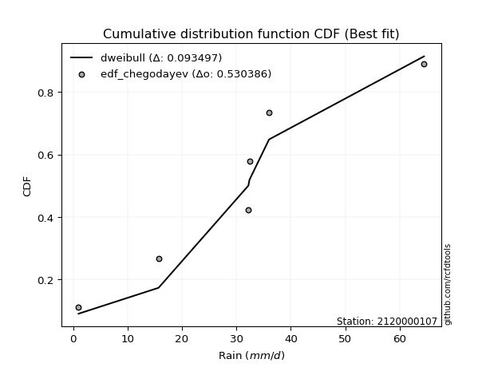</img>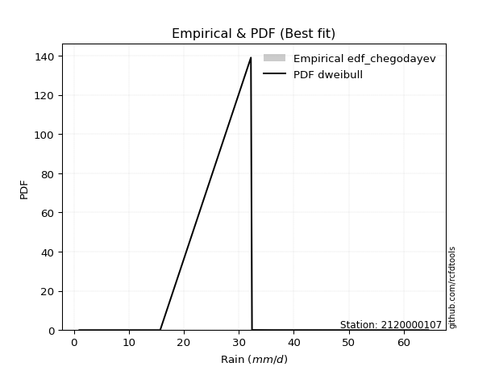</img>

</div>


### 6. EDF Blom (1958)

The Blom formula is a specific "plotting position" formula used in hydrology and statistical analysis to estimate the empirical cumulative probability (or non-exceedance probability) of a data series. It is particularly recommended for data that are approximately normally distributed. The constant _a_ is set to 0.375 (or 3/8).

<div align="center">


$P=(m-a)/(n+1-2a)$


</div>


**6.1. Empirical values**

<div align="center">

|                | 0                  | 1                  | 2                  | 3                 | 4                 | 5                  |
|:---------------|:-------------------|:-------------------|:-------------------|:------------------|:------------------|:-------------------|
| date           | 2023               | 2018               | 2025               | 2024              | 2020              | 2019               |
| x              | 1.0                | 15.7               | 32.2               | 32.4              | 36.0              | 64.47              |
| m              | 1                  | 2                  | 3                  | 4                 | 5                 | 6                  |
| empirical_dist | edf_blom           | edf_blom           | edf_blom           | edf_blom          | edf_blom          | edf_blom           |
| empirical      | 0.1                | 0.26               | 0.42               | 0.58              | 0.74              | 0.9                |
| empirical_tr   | 1.1111111111111112 | 1.3513513513513513 | 1.7241379310344827 | 2.380952380952381 | 3.846153846153846 | 10.000000000000002 |

</div>


**6.2. Kolmogorov-Smirnov fit test (sorted by Δ)**


<div align="center">

|                | 0                  | 1                   | 2                  | 3                   | 4                   | 5                   | 6                   | 7                   | 8                   | 9                  | 10                  | 11                 | 12                  | 13                 | 14                  | 15                  | 16                 | 17                 | 18                  | 19                 | 20                 | 21                  | 22                 | 23                  | 24                  | 25                  | 26                  | 27                  | 28                  | 29                  | 30                  | 31                  | 32                 | 33                  | 34                 | 35                  | 36                | 37                  | 38                 | 39                 | 40                  | 41                 | 42                  | 43                  | 44                  | 45                  | 46                  | 47                | 48                | 49                  | 50                  | 51                  | 52                 | 53                  | 54                  | 55                  | 56                  | 57                  | 58                 | 59                  | 60                  | 61                  | 62                  | 63                  | 64                  | 65                  | 66                 | 67                  | 68                 | 69                  | 70                 | 71                 | 72                  | 73                  | 74                 | 75                  | 76                | 77                  | 78                  | 79                  | 80                  | 81                 | 82                 | 83                  | 84                 | 85                  | 86                  | 87                  | 88                  | 89                  | 90                 | 91                  | 92                  | 93                  | 94                  | 95                 | 96                  | 97               | 98                  | 99                 | 100                | 101                | 102                 | 103                | 104                 | 105               | 106                | 107                | 108                 | 109                 | 110                | 111                | 112                | 113                | 114                | 115                | 116                | 117                | 118                | 119                 | 120                | 121                 | 122                | 123                | 124                 | 125                 | 126                | 127                | 128                | 129                | 130                | 131                | 132                | 133                | 134                | 135                | 136                 | 137                | 138                | 139                 | 140                 | 141                 | 142                | 143                 | 144                | 145                | 146                | 147                | 148                | 149                | 150               | 151                | 152                | 153                | 154                | 155                | 156                | 157            | 158                | 159               |
|:---------------|:-------------------|:--------------------|:-------------------|:--------------------|:--------------------|:--------------------|:--------------------|:--------------------|:--------------------|:-------------------|:--------------------|:-------------------|:--------------------|:-------------------|:--------------------|:--------------------|:-------------------|:-------------------|:--------------------|:-------------------|:-------------------|:--------------------|:-------------------|:--------------------|:--------------------|:--------------------|:--------------------|:--------------------|:--------------------|:--------------------|:--------------------|:--------------------|:-------------------|:--------------------|:-------------------|:--------------------|:------------------|:--------------------|:-------------------|:-------------------|:--------------------|:-------------------|:--------------------|:--------------------|:--------------------|:--------------------|:--------------------|:------------------|:------------------|:--------------------|:--------------------|:--------------------|:-------------------|:--------------------|:--------------------|:--------------------|:--------------------|:--------------------|:-------------------|:--------------------|:--------------------|:--------------------|:--------------------|:--------------------|:--------------------|:--------------------|:-------------------|:--------------------|:-------------------|:--------------------|:-------------------|:-------------------|:--------------------|:--------------------|:-------------------|:--------------------|:------------------|:--------------------|:--------------------|:--------------------|:--------------------|:-------------------|:-------------------|:--------------------|:-------------------|:--------------------|:--------------------|:--------------------|:--------------------|:--------------------|:-------------------|:--------------------|:--------------------|:--------------------|:--------------------|:-------------------|:--------------------|:-----------------|:--------------------|:-------------------|:-------------------|:-------------------|:--------------------|:-------------------|:--------------------|:------------------|:-------------------|:-------------------|:--------------------|:--------------------|:-------------------|:-------------------|:-------------------|:-------------------|:-------------------|:-------------------|:-------------------|:-------------------|:-------------------|:--------------------|:-------------------|:--------------------|:-------------------|:-------------------|:--------------------|:--------------------|:-------------------|:-------------------|:-------------------|:-------------------|:-------------------|:-------------------|:-------------------|:-------------------|:-------------------|:-------------------|:--------------------|:-------------------|:-------------------|:--------------------|:--------------------|:--------------------|:-------------------|:--------------------|:-------------------|:-------------------|:-------------------|:-------------------|:-------------------|:-------------------|:------------------|:-------------------|:-------------------|:-------------------|:-------------------|:-------------------|:-------------------|:---------------|:-------------------|:------------------|
| station        | 2120000107         | 2120000107          | 2120000107         | 2120000107          | 2120000107          | 2120000107          | 2120000107          | 2120000107          | 2120000107          | 2120000107         | 2120000107          | 2120000107         | 2120000107          | 2120000107         | 2120000107          | 2120000107          | 2120000107         | 2120000107         | 2120000107          | 2120000107         | 2120000107         | 2120000107          | 2120000107         | 2120000107          | 2120000107          | 2120000107          | 2120000107          | 2120000107          | 2120000107          | 2120000107          | 2120000107          | 2120000107          | 2120000107         | 2120000107          | 2120000107         | 2120000107          | 2120000107        | 2120000107          | 2120000107         | 2120000107         | 2120000107          | 2120000107         | 2120000107          | 2120000107          | 2120000107          | 2120000107          | 2120000107          | 2120000107        | 2120000107        | 2120000107          | 2120000107          | 2120000107          | 2120000107         | 2120000107          | 2120000107          | 2120000107          | 2120000107          | 2120000107          | 2120000107         | 2120000107          | 2120000107          | 2120000107          | 2120000107          | 2120000107          | 2120000107          | 2120000107          | 2120000107         | 2120000107          | 2120000107         | 2120000107          | 2120000107         | 2120000107         | 2120000107          | 2120000107          | 2120000107         | 2120000107          | 2120000107        | 2120000107          | 2120000107          | 2120000107          | 2120000107          | 2120000107         | 2120000107         | 2120000107          | 2120000107         | 2120000107          | 2120000107          | 2120000107          | 2120000107          | 2120000107          | 2120000107         | 2120000107          | 2120000107          | 2120000107          | 2120000107          | 2120000107         | 2120000107          | 2120000107       | 2120000107          | 2120000107         | 2120000107         | 2120000107         | 2120000107          | 2120000107         | 2120000107          | 2120000107        | 2120000107         | 2120000107         | 2120000107          | 2120000107          | 2120000107         | 2120000107         | 2120000107         | 2120000107         | 2120000107         | 2120000107         | 2120000107         | 2120000107         | 2120000107         | 2120000107          | 2120000107         | 2120000107          | 2120000107         | 2120000107         | 2120000107          | 2120000107          | 2120000107         | 2120000107         | 2120000107         | 2120000107         | 2120000107         | 2120000107         | 2120000107         | 2120000107         | 2120000107         | 2120000107         | 2120000107          | 2120000107         | 2120000107         | 2120000107          | 2120000107          | 2120000107          | 2120000107         | 2120000107          | 2120000107         | 2120000107         | 2120000107         | 2120000107         | 2120000107         | 2120000107         | 2120000107        | 2120000107         | 2120000107         | 2120000107         | 2120000107         | 2120000107         | 2120000107         | 2120000107     | 2120000107         | 2120000107        |
| empirical_dist | edf_blom           | edf_blom            | edf_blom           | edf_blom            | edf_blom            | edf_blom            | edf_blom            | edf_blom            | edf_blom            | edf_blom           | edf_blom            | edf_blom           | edf_blom            | edf_blom           | edf_blom            | edf_blom            | edf_blom           | edf_blom           | edf_blom            | edf_blom           | edf_blom           | edf_blom            | edf_blom           | edf_blom            | edf_blom            | edf_blom            | edf_blom            | edf_blom            | edf_blom            | edf_blom            | edf_blom            | edf_blom            | edf_blom           | edf_blom            | edf_blom           | edf_blom            | edf_blom          | edf_blom            | edf_blom           | edf_blom           | edf_blom            | edf_blom           | edf_blom            | edf_blom            | edf_blom            | edf_blom            | edf_blom            | edf_blom          | edf_blom          | edf_blom            | edf_blom            | edf_blom            | edf_blom           | edf_blom            | edf_blom            | edf_blom            | edf_blom            | edf_blom            | edf_blom           | edf_blom            | edf_blom            | edf_blom            | edf_blom            | edf_blom            | edf_blom            | edf_blom            | edf_blom           | edf_blom            | edf_blom           | edf_blom            | edf_blom           | edf_blom           | edf_blom            | edf_blom            | edf_blom           | edf_blom            | edf_blom          | edf_blom            | edf_blom            | edf_blom            | edf_blom            | edf_blom           | edf_blom           | edf_blom            | edf_blom           | edf_blom            | edf_blom            | edf_blom            | edf_blom            | edf_blom            | edf_blom           | edf_blom            | edf_blom            | edf_blom            | edf_blom            | edf_blom           | edf_blom            | edf_blom         | edf_blom            | edf_blom           | edf_blom           | edf_blom           | edf_blom            | edf_blom           | edf_blom            | edf_blom          | edf_blom           | edf_blom           | edf_blom            | edf_blom            | edf_blom           | edf_blom           | edf_blom           | edf_blom           | edf_blom           | edf_blom           | edf_blom           | edf_blom           | edf_blom           | edf_blom            | edf_blom           | edf_blom            | edf_blom           | edf_blom           | edf_blom            | edf_blom            | edf_blom           | edf_blom           | edf_blom           | edf_blom           | edf_blom           | edf_blom           | edf_blom           | edf_blom           | edf_blom           | edf_blom           | edf_blom            | edf_blom           | edf_blom           | edf_blom            | edf_blom            | edf_blom            | edf_blom           | edf_blom            | edf_blom           | edf_blom           | edf_blom           | edf_blom           | edf_blom           | edf_blom           | edf_blom          | edf_blom           | edf_blom           | edf_blom           | edf_blom           | edf_blom           | edf_blom           | edf_blom       | edf_blom           | edf_blom          |
| p_dist         | dweibull           | logdgamma           | logistic           | t                   | crystalball         | norm                | foldnorm            | hypsecant           | exponnorm           | pearson3           | genextreme          | truncpareto        | logdweibull         | anglit             | loggenextreme       | logt                | logtukeylambda     | burr               | laplace             | rice               | nct                | skewnorm            | invgamma           | semicircular        | cosine              | fatiguelife         | maxwell             | truncweibull_min    | gennorm             | betaprime           | f                   | erlang              | gamma              | genlogistic         | loggennorm         | invgauss            | loggausshyper     | logloggamma         | kappa3             | rayleigh           | weibull_min         | burr12             | alpha               | logvonmises_line    | logpearson3         | logargus            | dgamma              | kappa4            | mielke            | invweibull          | bradford            | vonmises_line       | arcsine            | logtrapezoid        | gausshyper          | gumbel_l            | kstwobign           | halfnorm            | uniform            | gumbel_r            | loggumbel_l         | loglevy_l           | ksone               | truncexpon          | beta                | wrapcauchy          | logsemicircular    | lomax               | logarcsine         | moyal               | halflogistic       | loganglit          | loggompertz         | logexponweib        | argus              | genexpon            | ncf               | lognct              | logexponnorm        | lognorm             | logcrystalball      | logrice            | loginvgauss        | logburr12           | loginvweibull      | loghalfgennorm      | logfatiguelife      | loggengamma         | loggamma            | loggamma            | logalpha           | logerlang           | loginvgamma         | logfoldnorm         | halfgennorm         | loglogistic        | gompertz            | logmaxwell       | loggenhalflogistic  | levy_l             | lograyleigh        | loghypsecant       | logkstwobign        | wald               | loghalfnorm         | logncf            | logskewnorm        | loggenexpon        | logcosine           | genpareto           | triang             | logloglaplace      | loggumbel_r        | gengamma           | loglaplace         | loglaplace         | logwrapcauchy      | johnsonsb          | nakagami           | loghalflogistic     | logmoyal           | logweibull_max      | logtriang          | loglomax           | logtruncweibull_min | logf                | genhalflogistic    | logjohnsonsb       | logweibull_min     | logwald            | logksone           | logbeta            | johnsonsu          | logjohnsonsu       | logkappa4          | logkappa3          | loguniform          | exponweib          | trapezoid          | logbradford         | logexponpow         | tukeylambda         | loggenpareto       | logmielke           | logtruncnorm       | logbetaprime       | lognakagami        | logtruncexpon      | logburr            | rdist              | powerlaw          | weibull_max        | exponpow           | logtruncpareto     | truncnorm          | logpowerlaw        | logrdist           | loggenlogistic | logvonmises        | vonmises          |
| delta          | 0.0917785760564136 | 0.12169773435078501 | 0.1241998961257606 | 0.12486440873007876 | 0.12488472732413758 | 0.12488473555208046 | 0.12555077244106527 | 0.12867410590403489 | 0.13222128237633318 | 0.1363732147554943 | 0.13782929998765875 | 0.1380288092456861 | 0.14056620215816162 | 0.1406195925284941 | 0.14128576705992096 | 0.14182238639493067 | 0.1425520745575446 | 0.1434404460872435 | 0.14454247614621102 | 0.1448237405723422 | 0.1449795369194496 | 0.14580743510150312 | 0.1466635956495123 | 0.14717177649289015 | 0.14780450647580534 | 0.14811654263103963 | 0.15001672170613095 | 0.15044962218077118 | 0.15126089628537673 | 0.15132861164131456 | 0.15161676712169453 | 0.15167076156745035 | 0.1516708522026013 | 0.15276966006095444 | 0.1557387894719479 | 0.15582331916800413 | 0.157682657542064 | 0.15811896921841578 | 0.1584792529527655 | 0.1600808120377712 | 0.16171861786939484 | 0.1620381093045435 | 0.16389289871778262 | 0.16466338399890107 | 0.16475834703850295 | 0.16563396329642627 | 0.16599832976634263 | 0.166778561466984 | 0.170426574390035 | 0.17119891809330406 | 0.17181630794838348 | 0.17326106894531024 | 0.1736451405165177 | 0.17623615425006817 | 0.18066015285280868 | 0.18165652695527734 | 0.18235362688910078 | 0.18844288611223875 | 0.1885583740349771 | 0.18937822171326563 | 0.19454813895317075 | 0.19497444650143536 | 0.19713197836248098 | 0.19722460107432854 | 0.20075143986243255 | 0.20408795351752618 | 0.2104579013021422 | 0.21369337368504254 | 0.2143539500714156 | 0.21454703152643545 | 0.2153289084949817 | 0.2192417968403318 | 0.22191845663789972 | 0.22665285366897175 | 0.2322860419903099 | 0.23298511267635497 | 0.234436343333896 | 0.24002716635079485 | 0.24012001287453738 | 0.24012180792307197 | 0.24012192623396716 | 0.2401269032379733 | 0.2405742422228882 | 0.24166240158628333 | 0.2422898786434441 | 0.24230829626705896 | 0.24256826540542792 | 0.24440867886847778 | 0.24518365475642484 | 0.24518365475642484 | 0.2458931440992232 | 0.24613900264353877 | 0.24956037896421407 | 0.25278063864821493 | 0.25683115710788024 | 0.2589015553891045 | 0.25988920615353317 | 0.26065969033969 | 0.26282447501214207 | 0.2663482651160384 | 0.2667980560173568 | 0.2732908127748293 | 0.28214079649485413 | 0.2843950376911439 | 0.28477296442861516 | 0.285610637403515 | 0.2881925191175014 | 0.2882448177978487 | 0.29264812717285266 | 0.29303115107389593 | 0.2939080635075085 | 0.2968862923742689 | 0.2984451133355113 | 0.3004364287162911 | 0.3011073392547778 | 0.3011073392547778 | 0.3038954173897275 | 0.3061804996475504 | 0.3127058903449151 | 0.31271195951232916 | 0.3176395644797842 | 0.31941388496877016 | 0.3354333821334345 | 0.3388263579605444 | 0.3466745849678759  | 0.35486400024810216 | 0.3566270127627441 | 0.3599503192059518 | 0.3720986369514061 | 0.3723284187348415 | 0.3741271648028657 | 0.3900709734422345 | 0.4040780654654348 | 0.4050861386056959 | 0.4105150722004343 | 0.4133356403864164 | 0.41336528565958036 | 0.4184780000988698 | 0.4414708514426449 | 0.44161958815940106 | 0.45148710825313476 | 0.45917878308903853 | 0.4647421356488297 | 0.47951403633622236 | 0.4940236899511007 | 0.4962764180247339 | 0.5091484863957382 | 0.5112494079424879 | 0.5132789431211391 | 0.5481294916246864 | 0.560495723547154 | 0.5908573832802372 | 0.6654941593302831 | 0.6703831965729832 | 0.7174930801314383 | 0.7365105895044632 | 0.7399999984881083 | 0.74           | 1.0287684558189998 | 9.700617998850493 |
| deltao         | 0.530385761606     | 0.530385761606      | 0.530385761606     | 0.530385761606      | 0.530385761606      | 0.530385761606      | 0.530385761606      | 0.530385761606      | 0.530385761606      | 0.530385761606     | 0.530385761606      | 0.530385761606     | 0.530385761606      | 0.530385761606     | 0.530385761606      | 0.530385761606      | 0.530385761606     | 0.530385761606     | 0.530385761606      | 0.530385761606     | 0.530385761606     | 0.530385761606      | 0.530385761606     | 0.530385761606      | 0.530385761606      | 0.530385761606      | 0.530385761606      | 0.530385761606      | 0.530385761606      | 0.530385761606      | 0.530385761606      | 0.530385761606      | 0.530385761606     | 0.530385761606      | 0.530385761606     | 0.530385761606      | 0.530385761606    | 0.530385761606      | 0.530385761606     | 0.530385761606     | 0.530385761606      | 0.530385761606     | 0.530385761606      | 0.530385761606      | 0.530385761606      | 0.530385761606      | 0.530385761606      | 0.530385761606    | 0.530385761606    | 0.530385761606      | 0.530385761606      | 0.530385761606      | 0.530385761606     | 0.530385761606      | 0.530385761606      | 0.530385761606      | 0.530385761606      | 0.530385761606      | 0.530385761606     | 0.530385761606      | 0.530385761606      | 0.530385761606      | 0.530385761606      | 0.530385761606      | 0.530385761606      | 0.530385761606      | 0.530385761606     | 0.530385761606      | 0.530385761606     | 0.530385761606      | 0.530385761606     | 0.530385761606     | 0.530385761606      | 0.530385761606      | 0.530385761606     | 0.530385761606      | 0.530385761606    | 0.530385761606      | 0.530385761606      | 0.530385761606      | 0.530385761606      | 0.530385761606     | 0.530385761606     | 0.530385761606      | 0.530385761606     | 0.530385761606      | 0.530385761606      | 0.530385761606      | 0.530385761606      | 0.530385761606      | 0.530385761606     | 0.530385761606      | 0.530385761606      | 0.530385761606      | 0.530385761606      | 0.530385761606     | 0.530385761606      | 0.530385761606   | 0.530385761606      | 0.530385761606     | 0.530385761606     | 0.530385761606     | 0.530385761606      | 0.530385761606     | 0.530385761606      | 0.530385761606    | 0.530385761606     | 0.530385761606     | 0.530385761606      | 0.530385761606      | 0.530385761606     | 0.530385761606     | 0.530385761606     | 0.530385761606     | 0.530385761606     | 0.530385761606     | 0.530385761606     | 0.530385761606     | 0.530385761606     | 0.530385761606      | 0.530385761606     | 0.530385761606      | 0.530385761606     | 0.530385761606     | 0.530385761606      | 0.530385761606      | 0.530385761606     | 0.530385761606     | 0.530385761606     | 0.530385761606     | 0.530385761606     | 0.530385761606     | 0.530385761606     | 0.530385761606     | 0.530385761606     | 0.530385761606     | 0.530385761606      | 0.530385761606     | 0.530385761606     | 0.530385761606      | 0.530385761606      | 0.530385761606      | 0.530385761606     | 0.530385761606      | 0.530385761606     | 0.530385761606     | 0.530385761606     | 0.530385761606     | 0.530385761606     | 0.530385761606     | 0.530385761606    | 0.530385761606     | 0.530385761606     | 0.530385761606     | 0.530385761606     | 0.530385761606     | 0.530385761606     | 0.530385761606 | 0.530385761606     | 0.530385761606    |
| eval           | Δo > Δ             | Δo > Δ              | Δo > Δ             | Δo > Δ              | Δo > Δ              | Δo > Δ              | Δo > Δ              | Δo > Δ              | Δo > Δ              | Δo > Δ             | Δo > Δ              | Δo > Δ             | Δo > Δ              | Δo > Δ             | Δo > Δ              | Δo > Δ              | Δo > Δ             | Δo > Δ             | Δo > Δ              | Δo > Δ             | Δo > Δ             | Δo > Δ              | Δo > Δ             | Δo > Δ              | Δo > Δ              | Δo > Δ              | Δo > Δ              | Δo > Δ              | Δo > Δ              | Δo > Δ              | Δo > Δ              | Δo > Δ              | Δo > Δ             | Δo > Δ              | Δo > Δ             | Δo > Δ              | Δo > Δ            | Δo > Δ              | Δo > Δ             | Δo > Δ             | Δo > Δ              | Δo > Δ             | Δo > Δ              | Δo > Δ              | Δo > Δ              | Δo > Δ              | Δo > Δ              | Δo > Δ            | Δo > Δ            | Δo > Δ              | Δo > Δ              | Δo > Δ              | Δo > Δ             | Δo > Δ              | Δo > Δ              | Δo > Δ              | Δo > Δ              | Δo > Δ              | Δo > Δ             | Δo > Δ              | Δo > Δ              | Δo > Δ              | Δo > Δ              | Δo > Δ              | Δo > Δ              | Δo > Δ              | Δo > Δ             | Δo > Δ              | Δo > Δ             | Δo > Δ              | Δo > Δ             | Δo > Δ             | Δo > Δ              | Δo > Δ              | Δo > Δ             | Δo > Δ              | Δo > Δ            | Δo > Δ              | Δo > Δ              | Δo > Δ              | Δo > Δ              | Δo > Δ             | Δo > Δ             | Δo > Δ              | Δo > Δ             | Δo > Δ              | Δo > Δ              | Δo > Δ              | Δo > Δ              | Δo > Δ              | Δo > Δ             | Δo > Δ              | Δo > Δ              | Δo > Δ              | Δo > Δ              | Δo > Δ             | Δo > Δ              | Δo > Δ           | Δo > Δ              | Δo > Δ             | Δo > Δ             | Δo > Δ             | Δo > Δ              | Δo > Δ             | Δo > Δ              | Δo > Δ            | Δo > Δ             | Δo > Δ             | Δo > Δ              | Δo > Δ              | Δo > Δ             | Δo > Δ             | Δo > Δ             | Δo > Δ             | Δo > Δ             | Δo > Δ             | Δo > Δ             | Δo > Δ             | Δo > Δ             | Δo > Δ              | Δo > Δ             | Δo > Δ              | Δo > Δ             | Δo > Δ             | Δo > Δ              | Δo > Δ              | Δo > Δ             | Δo > Δ             | Δo > Δ             | Δo > Δ             | Δo > Δ             | Δo > Δ             | Δo > Δ             | Δo > Δ             | Δo > Δ             | Δo > Δ             | Δo > Δ              | Δo > Δ             | Δo > Δ             | Δo > Δ              | Δo > Δ              | Δo > Δ              | Δo > Δ             | Δo > Δ              | Δo > Δ             | Δo > Δ             | Δo > Δ             | Δo > Δ             | Δo > Δ             | Δo <= Δ            | Δo <= Δ           | Δo <= Δ            | Δo <= Δ            | Δo <= Δ            | Δo <= Δ            | Δo <= Δ            | Δo <= Δ            | Δo <= Δ        | Δo <= Δ            | Δo <= Δ           |
| fit            | 1                  | 1                   | 1                  | 1                   | 1                   | 1                   | 1                   | 1                   | 1                   | 1                  | 1                   | 1                  | 1                   | 1                  | 1                   | 1                   | 1                  | 1                  | 1                   | 1                  | 1                  | 1                   | 1                  | 1                   | 1                   | 1                   | 1                   | 1                   | 1                   | 1                   | 1                   | 1                   | 1                  | 1                   | 1                  | 1                   | 1                 | 1                   | 1                  | 1                  | 1                   | 1                  | 1                   | 1                   | 1                   | 1                   | 1                   | 1                 | 1                 | 1                   | 1                   | 1                   | 1                  | 1                   | 1                   | 1                   | 1                   | 1                   | 1                  | 1                   | 1                   | 1                   | 1                   | 1                   | 1                   | 1                   | 1                  | 1                   | 1                  | 1                   | 1                  | 1                  | 1                   | 1                   | 1                  | 1                   | 1                 | 1                   | 1                   | 1                   | 1                   | 1                  | 1                  | 1                   | 1                  | 1                   | 1                   | 1                   | 1                   | 1                   | 1                  | 1                   | 1                   | 1                   | 1                   | 1                  | 1                   | 1                | 1                   | 1                  | 1                  | 1                  | 1                   | 1                  | 1                   | 1                 | 1                  | 1                  | 1                   | 1                   | 1                  | 1                  | 1                  | 1                  | 1                  | 1                  | 1                  | 1                  | 1                  | 1                   | 1                  | 1                   | 1                  | 1                  | 1                   | 1                   | 1                  | 1                  | 1                  | 1                  | 1                  | 1                  | 1                  | 1                  | 1                  | 1                  | 1                   | 1                  | 1                  | 1                   | 1                   | 1                   | 1                  | 1                   | 1                  | 1                  | 1                  | 1                  | 1                  | 0                  | 0                 | 0                  | 0                  | 0                  | 0                  | 0                  | 0                  | 0              | 0                  | 0                 |
| n              | 6                  | 6                   | 6                  | 6                   | 6                   | 6                   | 6                   | 6                   | 6                   | 6                  | 6                   | 6                  | 6                   | 6                  | 6                   | 6                   | 6                  | 6                  | 6                   | 6                  | 6                  | 6                   | 6                  | 6                   | 6                   | 6                   | 6                   | 6                   | 6                   | 6                   | 6                   | 6                   | 6                  | 6                   | 6                  | 6                   | 6                 | 6                   | 6                  | 6                  | 6                   | 6                  | 6                   | 6                   | 6                   | 6                   | 6                   | 6                 | 6                 | 6                   | 6                   | 6                   | 6                  | 6                   | 6                   | 6                   | 6                   | 6                   | 6                  | 6                   | 6                   | 6                   | 6                   | 6                   | 6                   | 6                   | 6                  | 6                   | 6                  | 6                   | 6                  | 6                  | 6                   | 6                   | 6                  | 6                   | 6                 | 6                   | 6                   | 6                   | 6                   | 6                  | 6                  | 6                   | 6                  | 6                   | 6                   | 6                   | 6                   | 6                   | 6                  | 6                   | 6                   | 6                   | 6                   | 6                  | 6                   | 6                | 6                   | 6                  | 6                  | 6                  | 6                   | 6                  | 6                   | 6                 | 6                  | 6                  | 6                   | 6                   | 6                  | 6                  | 6                  | 6                  | 6                  | 6                  | 6                  | 6                  | 6                  | 6                   | 6                  | 6                   | 6                  | 6                  | 6                   | 6                   | 6                  | 6                  | 6                  | 6                  | 6                  | 6                  | 6                  | 6                  | 6                  | 6                  | 6                   | 6                  | 6                  | 6                   | 6                   | 6                   | 6                  | 6                   | 6                  | 6                  | 6                  | 6                  | 6                  | 6                  | 6                 | 6                  | 6                  | 6                  | 6                  | 6                  | 6                  | 6              | 6                  | 6                 |
| best_fit       | 1                  | 0                   | 0                  | 0                   | 0                   | 0                   | 0                   | 0                   | 0                   | 0                  | 0                   | 0                  | 0                   | 0                  | 0                   | 0                   | 0                  | 0                  | 0                   | 0                  | 0                  | 0                   | 0                  | 0                   | 0                   | 0                   | 0                   | 0                   | 0                   | 0                   | 0                   | 0                   | 0                  | 0                   | 0                  | 0                   | 0                 | 0                   | 0                  | 0                  | 0                   | 0                  | 0                   | 0                   | 0                   | 0                   | 0                   | 0                 | 0                 | 0                   | 0                   | 0                   | 0                  | 0                   | 0                   | 0                   | 0                   | 0                   | 0                  | 0                   | 0                   | 0                   | 0                   | 0                   | 0                   | 0                   | 0                  | 0                   | 0                  | 0                   | 0                  | 0                  | 0                   | 0                   | 0                  | 0                   | 0                 | 0                   | 0                   | 0                   | 0                   | 0                  | 0                  | 0                   | 0                  | 0                   | 0                   | 0                   | 0                   | 0                   | 0                  | 0                   | 0                   | 0                   | 0                   | 0                  | 0                   | 0                | 0                   | 0                  | 0                  | 0                  | 0                   | 0                  | 0                   | 0                 | 0                  | 0                  | 0                   | 0                   | 0                  | 0                  | 0                  | 0                  | 0                  | 0                  | 0                  | 0                  | 0                  | 0                   | 0                  | 0                   | 0                  | 0                  | 0                   | 0                   | 0                  | 0                  | 0                  | 0                  | 0                  | 0                  | 0                  | 0                  | 0                  | 0                  | 0                   | 0                  | 0                  | 0                   | 0                   | 0                   | 0                  | 0                   | 0                  | 0                  | 0                  | 0                  | 0                  | 0                  | 0                 | 0                  | 0                  | 0                  | 0                  | 0                  | 0                  | 0              | 0                  | 0                 |
| best_fit_sort  | 1                  | 2                   | 3                  | 4                   | 5                   | 6                   | 7                   | 8                   | 9                   | 10                 | 11                  | 12                 | 13                  | 14                 | 15                  | 16                  | 17                 | 18                 | 19                  | 20                 | 21                 | 22                  | 23                 | 24                  | 25                  | 26                  | 27                  | 28                  | 29                  | 30                  | 31                  | 32                  | 33                 | 34                  | 35                 | 36                  | 37                | 38                  | 39                 | 40                 | 41                  | 42                 | 43                  | 44                  | 45                  | 46                  | 47                  | 48                | 49                | 50                  | 51                  | 52                  | 53                 | 54                  | 55                  | 56                  | 57                  | 58                  | 59                 | 60                  | 61                  | 62                  | 63                  | 64                  | 65                  | 66                  | 67                 | 68                  | 69                 | 70                  | 71                 | 72                 | 73                  | 74                  | 75                 | 76                  | 77                | 78                  | 79                  | 80                  | 81                  | 82                 | 83                 | 84                  | 85                 | 86                  | 87                  | 88                  | 89                  | 90                  | 91                 | 92                  | 93                  | 94                  | 95                  | 96                 | 97                  | 98               | 99                  | 100                | 101                | 102                | 103                 | 104                | 105                 | 106               | 107                | 108                | 109                 | 110                 | 111                | 112                | 113                | 114                | 115                | 116                | 117                | 118                | 119                | 120                 | 121                | 122                 | 123                | 124                | 125                 | 126                 | 127                | 128                | 129                | 130                | 131                | 132                | 133                | 134                | 135                | 136                | 137                 | 138                | 139                | 140                 | 141                 | 142                 | 143                | 144                 | 145                | 146                | 147                | 148                | 149                | 150                | 151               | 152                | 153                | 154                | 155                | 156                | 157                | 158            | 159                | 160               |

</div>


**6.3. Best fit**

<div align="center">

|   id |    station | empirical_dist   | p_dist   |     delta |   deltao | eval   |   fit |   n |   best_fit |   best_fit_sort |
|-----:|-----------:|:-----------------|:---------|----------:|---------:|:-------|------:|----:|-----------:|----------------:|
|    0 | 2120000107 | edf_blom         | dweibull | 0.0917786 | 0.530386 | Δo > Δ |     1 |   6 |          1 |               1 |

</div>


<div align="center">

</img></img>

</div>


### 7. EDF Tukey (1962)

In hydrology, the Tukey formula is used as a plotting position formula to estimate the empirical probability or frequency of a flood event (or other hydrological data). The formula parameter is given as _c=0.333_ (or 1/3).

<div align="center">


$P=(m-c)/(n+1-2c)$


</div>


**7.1. Empirical values**

<div align="center">

|                | 0                   | 1                  | 2                   | 3                  | 4                  | 5                  |
|:---------------|:--------------------|:-------------------|:--------------------|:-------------------|:-------------------|:-------------------|
| date           | 2023                | 2018               | 2025                | 2024               | 2020               | 2019               |
| x              | 1.0                 | 15.7               | 32.2                | 32.4               | 36.0               | 64.47              |
| m              | 1                   | 2                  | 3                   | 4                  | 5                  | 6                  |
| empirical_dist | edf_tukey           | edf_tukey          | edf_tukey           | edf_tukey          | edf_tukey          | edf_tukey          |
| empirical      | 0.10526315789473684 | 0.2631578947368421 | 0.42105263157894735 | 0.5789473684210527 | 0.7368421052631579 | 0.8947368421052632 |
| empirical_tr   | 1.1176470588235294  | 1.357142857142857  | 1.7272727272727273  | 2.375              | 3.7999999999999994 | 9.5                |

</div>


**7.2. Kolmogorov-Smirnov fit test (sorted by Δ)**


<div align="center">

|                | 0                   | 1                   | 2                   | 3                   | 4                   | 5                   | 6                   | 7                   | 8                   | 9                   | 10                  | 11                 | 12                  | 13                  | 14                 | 15                  | 16                  | 17                  | 18                  | 19                | 20                 | 21                  | 22                  | 23                  | 24                  | 25                  | 26                  | 27                 | 28                 | 29                  | 30                | 31                  | 32                  | 33                 | 34                  | 35                  | 36                  | 37                  | 38               | 39                  | 40                  | 41                  | 42                  | 43                 | 44                  | 45                 | 46                 | 47                 | 48                  | 49                 | 50                 | 51                  | 52                  | 53                 | 54                  | 55                 | 56                  | 57                  | 58                 | 59                  | 60                  | 61                  | 62                  | 63                  | 64                  | 65                  | 66                  | 67                  | 68                  | 69                 | 70                  | 71                  | 72                  | 73                 | 74                  | 75                 | 76                  | 77                 | 78                  | 79                 | 80                 | 81                  | 82                | 83                  | 84                  | 85                  | 86                  | 87                  | 88                  | 89                  | 90                  | 91                 | 92                 | 93                  | 94                 | 95                 | 96                  | 97                 | 98                 | 99                  | 100                | 101                 | 102                 | 103                 | 104                | 105                | 106                 | 107               | 108                | 109                 | 110                | 111                | 112                 | 113                 | 114                | 115                | 116                | 117                 | 118                | 119                | 120               | 121                 | 122                | 123                | 124                 | 125                | 126               | 127                 | 128               | 129                | 130                 | 131                | 132                 | 133                | 134                 | 135                 | 136               | 137                 | 138                | 139               | 140                | 141                | 142                 | 143                | 144                | 145                | 146               | 147                | 148                | 149                | 150                | 151               | 152               | 153                | 154                | 155                | 156                | 157                | 158                | 159              |
|:---------------|:--------------------|:--------------------|:--------------------|:--------------------|:--------------------|:--------------------|:--------------------|:--------------------|:--------------------|:--------------------|:--------------------|:-------------------|:--------------------|:--------------------|:-------------------|:--------------------|:--------------------|:--------------------|:--------------------|:------------------|:-------------------|:--------------------|:--------------------|:--------------------|:--------------------|:--------------------|:--------------------|:-------------------|:-------------------|:--------------------|:------------------|:--------------------|:--------------------|:-------------------|:--------------------|:--------------------|:--------------------|:--------------------|:-----------------|:--------------------|:--------------------|:--------------------|:--------------------|:-------------------|:--------------------|:-------------------|:-------------------|:-------------------|:--------------------|:-------------------|:-------------------|:--------------------|:--------------------|:-------------------|:--------------------|:-------------------|:--------------------|:--------------------|:-------------------|:--------------------|:--------------------|:--------------------|:--------------------|:--------------------|:--------------------|:--------------------|:--------------------|:--------------------|:--------------------|:-------------------|:--------------------|:--------------------|:--------------------|:-------------------|:--------------------|:-------------------|:--------------------|:-------------------|:--------------------|:-------------------|:-------------------|:--------------------|:------------------|:--------------------|:--------------------|:--------------------|:--------------------|:--------------------|:--------------------|:--------------------|:--------------------|:-------------------|:-------------------|:--------------------|:-------------------|:-------------------|:--------------------|:-------------------|:-------------------|:--------------------|:-------------------|:--------------------|:--------------------|:--------------------|:-------------------|:-------------------|:--------------------|:------------------|:-------------------|:--------------------|:-------------------|:-------------------|:--------------------|:--------------------|:-------------------|:-------------------|:-------------------|:--------------------|:-------------------|:-------------------|:------------------|:--------------------|:-------------------|:-------------------|:--------------------|:-------------------|:------------------|:--------------------|:------------------|:-------------------|:--------------------|:-------------------|:--------------------|:-------------------|:--------------------|:--------------------|:------------------|:--------------------|:-------------------|:------------------|:-------------------|:-------------------|:--------------------|:-------------------|:-------------------|:-------------------|:------------------|:-------------------|:-------------------|:-------------------|:-------------------|:------------------|:------------------|:-------------------|:-------------------|:-------------------|:-------------------|:-------------------|:-------------------|:-----------------|
| station        | 2120000107          | 2120000107          | 2120000107          | 2120000107          | 2120000107          | 2120000107          | 2120000107          | 2120000107          | 2120000107          | 2120000107          | 2120000107          | 2120000107         | 2120000107          | 2120000107          | 2120000107         | 2120000107          | 2120000107          | 2120000107          | 2120000107          | 2120000107        | 2120000107         | 2120000107          | 2120000107          | 2120000107          | 2120000107          | 2120000107          | 2120000107          | 2120000107         | 2120000107         | 2120000107          | 2120000107        | 2120000107          | 2120000107          | 2120000107         | 2120000107          | 2120000107          | 2120000107          | 2120000107          | 2120000107       | 2120000107          | 2120000107          | 2120000107          | 2120000107          | 2120000107         | 2120000107          | 2120000107         | 2120000107         | 2120000107         | 2120000107          | 2120000107         | 2120000107         | 2120000107          | 2120000107          | 2120000107         | 2120000107          | 2120000107         | 2120000107          | 2120000107          | 2120000107         | 2120000107          | 2120000107          | 2120000107          | 2120000107          | 2120000107          | 2120000107          | 2120000107          | 2120000107          | 2120000107          | 2120000107          | 2120000107         | 2120000107          | 2120000107          | 2120000107          | 2120000107         | 2120000107          | 2120000107         | 2120000107          | 2120000107         | 2120000107          | 2120000107         | 2120000107         | 2120000107          | 2120000107        | 2120000107          | 2120000107          | 2120000107          | 2120000107          | 2120000107          | 2120000107          | 2120000107          | 2120000107          | 2120000107         | 2120000107         | 2120000107          | 2120000107         | 2120000107         | 2120000107          | 2120000107         | 2120000107         | 2120000107          | 2120000107         | 2120000107          | 2120000107          | 2120000107          | 2120000107         | 2120000107         | 2120000107          | 2120000107        | 2120000107         | 2120000107          | 2120000107         | 2120000107         | 2120000107          | 2120000107          | 2120000107         | 2120000107         | 2120000107         | 2120000107          | 2120000107         | 2120000107         | 2120000107        | 2120000107          | 2120000107         | 2120000107         | 2120000107          | 2120000107         | 2120000107        | 2120000107          | 2120000107        | 2120000107         | 2120000107          | 2120000107         | 2120000107          | 2120000107         | 2120000107          | 2120000107          | 2120000107        | 2120000107          | 2120000107         | 2120000107        | 2120000107         | 2120000107         | 2120000107          | 2120000107         | 2120000107         | 2120000107         | 2120000107        | 2120000107         | 2120000107         | 2120000107         | 2120000107         | 2120000107        | 2120000107        | 2120000107         | 2120000107         | 2120000107         | 2120000107         | 2120000107         | 2120000107         | 2120000107       |
| empirical_dist | edf_tukey           | edf_tukey           | edf_tukey           | edf_tukey           | edf_tukey           | edf_tukey           | edf_tukey           | edf_tukey           | edf_tukey           | edf_tukey           | edf_tukey           | edf_tukey          | edf_tukey           | edf_tukey           | edf_tukey          | edf_tukey           | edf_tukey           | edf_tukey           | edf_tukey           | edf_tukey         | edf_tukey          | edf_tukey           | edf_tukey           | edf_tukey           | edf_tukey           | edf_tukey           | edf_tukey           | edf_tukey          | edf_tukey          | edf_tukey           | edf_tukey         | edf_tukey           | edf_tukey           | edf_tukey          | edf_tukey           | edf_tukey           | edf_tukey           | edf_tukey           | edf_tukey        | edf_tukey           | edf_tukey           | edf_tukey           | edf_tukey           | edf_tukey          | edf_tukey           | edf_tukey          | edf_tukey          | edf_tukey          | edf_tukey           | edf_tukey          | edf_tukey          | edf_tukey           | edf_tukey           | edf_tukey          | edf_tukey           | edf_tukey          | edf_tukey           | edf_tukey           | edf_tukey          | edf_tukey           | edf_tukey           | edf_tukey           | edf_tukey           | edf_tukey           | edf_tukey           | edf_tukey           | edf_tukey           | edf_tukey           | edf_tukey           | edf_tukey          | edf_tukey           | edf_tukey           | edf_tukey           | edf_tukey          | edf_tukey           | edf_tukey          | edf_tukey           | edf_tukey          | edf_tukey           | edf_tukey          | edf_tukey          | edf_tukey           | edf_tukey         | edf_tukey           | edf_tukey           | edf_tukey           | edf_tukey           | edf_tukey           | edf_tukey           | edf_tukey           | edf_tukey           | edf_tukey          | edf_tukey          | edf_tukey           | edf_tukey          | edf_tukey          | edf_tukey           | edf_tukey          | edf_tukey          | edf_tukey           | edf_tukey          | edf_tukey           | edf_tukey           | edf_tukey           | edf_tukey          | edf_tukey          | edf_tukey           | edf_tukey         | edf_tukey          | edf_tukey           | edf_tukey          | edf_tukey          | edf_tukey           | edf_tukey           | edf_tukey          | edf_tukey          | edf_tukey          | edf_tukey           | edf_tukey          | edf_tukey          | edf_tukey         | edf_tukey           | edf_tukey          | edf_tukey          | edf_tukey           | edf_tukey          | edf_tukey         | edf_tukey           | edf_tukey         | edf_tukey          | edf_tukey           | edf_tukey          | edf_tukey           | edf_tukey          | edf_tukey           | edf_tukey           | edf_tukey         | edf_tukey           | edf_tukey          | edf_tukey         | edf_tukey          | edf_tukey          | edf_tukey           | edf_tukey          | edf_tukey          | edf_tukey          | edf_tukey         | edf_tukey          | edf_tukey          | edf_tukey          | edf_tukey          | edf_tukey         | edf_tukey         | edf_tukey          | edf_tukey          | edf_tukey          | edf_tukey          | edf_tukey          | edf_tukey          | edf_tukey        |
| p_dist         | dweibull            | logdgamma           | t                   | crystalball         | norm                | foldnorm            | logistic            | hypsecant           | exponnorm           | logdweibull         | pearson3            | genextreme         | truncpareto         | anglit              | loggenextreme      | burr                | laplace             | rice                | nct                 | semicircular      | cosine             | skewnorm            | logt                | invgamma            | logtukeylambda      | fatiguelife         | truncweibull_min    | maxwell            | betaprime          | f                   | erlang            | gamma               | genlogistic         | gennorm            | loggausshyper       | invgauss            | logloggamma         | kappa3              | loggennorm       | rayleigh            | weibull_min         | burr12              | alpha               | logvonmises_line   | kappa4              | logpearson3        | logargus           | dgamma             | mielke              | vonmises_line      | invweibull         | arcsine             | bradford            | logtrapezoid       | gausshyper          | gumbel_l           | kstwobign           | uniform             | halfnorm           | gumbel_r            | loglevy_l           | loggumbel_l         | ksone               | truncexpon          | beta                | wrapcauchy          | logsemicircular     | logarcsine          | lomax               | moyal              | halflogistic        | loganglit           | loggompertz         | logexponweib       | argus               | genexpon           | ncf                 | lognct             | logexponnorm        | lognorm            | logcrystalball     | logrice             | loginvweibull     | loghalfgennorm      | loginvgauss         | logburr12           | logfatiguelife      | loggengamma         | loggamma            | loggamma            | logalpha            | logerlang          | loginvgamma        | logfoldnorm         | halfgennorm        | loglogistic        | logmaxwell          | levy_l             | loggenhalflogistic | gompertz            | lograyleigh        | loghypsecant        | logkstwobign        | logncf              | wald               | loghalfnorm        | loggenexpon         | logskewnorm       | genpareto          | triang              | logcosine          | logloglaplace      | loggumbel_r         | gengamma            | loglaplace         | loglaplace         | logwrapcauchy      | johnsonsb           | nakagami           | loghalflogistic    | logweibull_max    | logmoyal            | logtriang          | loglomax           | logtruncweibull_min | logf               | genhalflogistic   | logjohnsonsb        | logweibull_min    | logksone           | logwald             | logbeta            | johnsonsu           | logjohnsonsu       | logkappa4           | logkappa3           | loguniform        | exponweib           | trapezoid          | logbradford       | logexponpow        | tukeylambda        | loggenpareto        | logmielke          | logtruncnorm       | logbetaprime       | lognakagami       | logtruncexpon      | logburr            | rdist              | powerlaw           | weibull_max       | exponpow          | logtruncpareto     | truncnorm          | logpowerlaw        | logrdist           | loggenlogistic     | logvonmises        | vonmises         |
| delta          | 0.09103011754906973 | 0.11853983961394288 | 0.12170651399323662 | 0.12172683258729544 | 0.12172684081523832 | 0.12239287770422314 | 0.12314726454681324 | 0.12762147432508752 | 0.13116865079738582 | 0.13530304426342477 | 0.13532058317654694 | 0.1367766684087114 | 0.13697617766673875 | 0.13746169779165196 | 0.1402331354809736 | 0.14028255135040135 | 0.14348984456726366 | 0.14377110899339485 | 0.14392690534050223 | 0.144013881756048 | 0.1446466117389632 | 0.14475480352255576 | 0.14498028113177275 | 0.14561096407056495 | 0.14570996929438668 | 0.14706391105209227 | 0.14729172744392904 | 0.1489640901271836 | 0.1502759800623672 | 0.15056413554274717 | 0.150618129988503 | 0.15061822062365393 | 0.15171702848200708 | 0.1544187910222188 | 0.15452476280522193 | 0.15477068758905677 | 0.15706633763946842 | 0.15742662137381813 | 0.15889668420879 | 0.15902818045882383 | 0.16066598629044748 | 0.16098547772559613 | 0.16284026713883526 | 0.1636107524199537 | 0.16362066673014186 | 0.1637057154595556 | 0.1645813317174789 | 0.1691562245031847 | 0.16937394281108764 | 0.1701031742084681 | 0.1701462865143567 | 0.17048724577967556 | 0.17076367636943612 | 0.1751835226711208 | 0.17750225811596654 | 0.1784986322184352 | 0.18130099531015342 | 0.18540047929813497 | 0.1873902545332914 | 0.18832559013431827 | 0.19181655176459322 | 0.19349550737422339 | 0.19397408362563884 | 0.19617196949538118 | 0.19969880828348519 | 0.20093005878068404 | 0.20940526972319484 | 0.21119605533457353 | 0.21264074210609518 | 0.2134943999474881 | 0.21427627691603435 | 0.21818916526138443 | 0.22086582505895236 | 0.2256002220900244 | 0.22912814725346775 | 0.2319324810974076 | 0.23338371175494865 | 0.2389745347718475 | 0.23906738129559002 | 0.2390691763441246 | 0.2390692946550198 | 0.23907427165902595 | 0.239131983906602 | 0.23915040153021688 | 0.23952161064394084 | 0.24060977000733597 | 0.24151563382648056 | 0.24335604728953042 | 0.24413102317747748 | 0.24413102317747748 | 0.24484051252027583 | 0.2450863710645914 | 0.2485077473852667 | 0.25172800706926757 | 0.2557785255289329 | 0.2578489238101571 | 0.25960705876074264 | 0.2610851072213015 | 0.2617718434331947 | 0.26304710089037525 | 0.2657454244384094 | 0.27223818119588195 | 0.27898290175801205 | 0.28034747950877814 | 0.2833424061121965 | 0.2837203328496678 | 0.28508692306100664 | 0.287139887538554 | 0.2898732563370538 | 0.29075016877066634 | 0.2915954955939053 | 0.2937283976374268 | 0.29739248175656396 | 0.29938379713734375 | 0.3000547076758304 | 0.3000547076758304 | 0.3007375226528854 | 0.30302260491070826 | 0.3116532587659677 | 0.3116593279333818 | 0.316255990231928 | 0.31658693290083684 | 0.3343807505544871 | 0.3356684632237023 | 0.34562195338892854 | 0.3517061055112601 | 0.353469118025902 | 0.35679242446910964 | 0.368940742214564 | 0.3709692700660236 | 0.37127578715589415 | 0.3869130787053924 | 0.40513069704438215 | 0.4061387701846433 | 0.40946244062148696 | 0.41228300880746904 | 0.412312654080633 | 0.41532010536202774 | 0.4383129567058028 | 0.438461693422559 | 0.4483292135162927 | 0.4581261515100912 | 0.46158424091198763 | 0.4763561415993803 | 0.4908657952142586 | 0.4931185232878918 | 0.505990591658896 | 0.5080915132056458 | 0.5101210483842971 | 0.5470768600457391 | 0.5573378288103119 | 0.587699488543395 | 0.662336264593441 | 0.6672253018361411 | 0.7143351853945963 | 0.7333526947676212 | 0.7368421037512662 | 0.7368421052631579 | 1.0277158242400524 | 9.70588115674523 |
| deltao         | 0.530385761606      | 0.530385761606      | 0.530385761606      | 0.530385761606      | 0.530385761606      | 0.530385761606      | 0.530385761606      | 0.530385761606      | 0.530385761606      | 0.530385761606      | 0.530385761606      | 0.530385761606     | 0.530385761606      | 0.530385761606      | 0.530385761606     | 0.530385761606      | 0.530385761606      | 0.530385761606      | 0.530385761606      | 0.530385761606    | 0.530385761606     | 0.530385761606      | 0.530385761606      | 0.530385761606      | 0.530385761606      | 0.530385761606      | 0.530385761606      | 0.530385761606     | 0.530385761606     | 0.530385761606      | 0.530385761606    | 0.530385761606      | 0.530385761606      | 0.530385761606     | 0.530385761606      | 0.530385761606      | 0.530385761606      | 0.530385761606      | 0.530385761606   | 0.530385761606      | 0.530385761606      | 0.530385761606      | 0.530385761606      | 0.530385761606     | 0.530385761606      | 0.530385761606     | 0.530385761606     | 0.530385761606     | 0.530385761606      | 0.530385761606     | 0.530385761606     | 0.530385761606      | 0.530385761606      | 0.530385761606     | 0.530385761606      | 0.530385761606     | 0.530385761606      | 0.530385761606      | 0.530385761606     | 0.530385761606      | 0.530385761606      | 0.530385761606      | 0.530385761606      | 0.530385761606      | 0.530385761606      | 0.530385761606      | 0.530385761606      | 0.530385761606      | 0.530385761606      | 0.530385761606     | 0.530385761606      | 0.530385761606      | 0.530385761606      | 0.530385761606     | 0.530385761606      | 0.530385761606     | 0.530385761606      | 0.530385761606     | 0.530385761606      | 0.530385761606     | 0.530385761606     | 0.530385761606      | 0.530385761606    | 0.530385761606      | 0.530385761606      | 0.530385761606      | 0.530385761606      | 0.530385761606      | 0.530385761606      | 0.530385761606      | 0.530385761606      | 0.530385761606     | 0.530385761606     | 0.530385761606      | 0.530385761606     | 0.530385761606     | 0.530385761606      | 0.530385761606     | 0.530385761606     | 0.530385761606      | 0.530385761606     | 0.530385761606      | 0.530385761606      | 0.530385761606      | 0.530385761606     | 0.530385761606     | 0.530385761606      | 0.530385761606    | 0.530385761606     | 0.530385761606      | 0.530385761606     | 0.530385761606     | 0.530385761606      | 0.530385761606      | 0.530385761606     | 0.530385761606     | 0.530385761606     | 0.530385761606      | 0.530385761606     | 0.530385761606     | 0.530385761606    | 0.530385761606      | 0.530385761606     | 0.530385761606     | 0.530385761606      | 0.530385761606     | 0.530385761606    | 0.530385761606      | 0.530385761606    | 0.530385761606     | 0.530385761606      | 0.530385761606     | 0.530385761606      | 0.530385761606     | 0.530385761606      | 0.530385761606      | 0.530385761606    | 0.530385761606      | 0.530385761606     | 0.530385761606    | 0.530385761606     | 0.530385761606     | 0.530385761606      | 0.530385761606     | 0.530385761606     | 0.530385761606     | 0.530385761606    | 0.530385761606     | 0.530385761606     | 0.530385761606     | 0.530385761606     | 0.530385761606    | 0.530385761606    | 0.530385761606     | 0.530385761606     | 0.530385761606     | 0.530385761606     | 0.530385761606     | 0.530385761606     | 0.530385761606   |
| eval           | Δo > Δ              | Δo > Δ              | Δo > Δ              | Δo > Δ              | Δo > Δ              | Δo > Δ              | Δo > Δ              | Δo > Δ              | Δo > Δ              | Δo > Δ              | Δo > Δ              | Δo > Δ             | Δo > Δ              | Δo > Δ              | Δo > Δ             | Δo > Δ              | Δo > Δ              | Δo > Δ              | Δo > Δ              | Δo > Δ            | Δo > Δ             | Δo > Δ              | Δo > Δ              | Δo > Δ              | Δo > Δ              | Δo > Δ              | Δo > Δ              | Δo > Δ             | Δo > Δ             | Δo > Δ              | Δo > Δ            | Δo > Δ              | Δo > Δ              | Δo > Δ             | Δo > Δ              | Δo > Δ              | Δo > Δ              | Δo > Δ              | Δo > Δ           | Δo > Δ              | Δo > Δ              | Δo > Δ              | Δo > Δ              | Δo > Δ             | Δo > Δ              | Δo > Δ             | Δo > Δ             | Δo > Δ             | Δo > Δ              | Δo > Δ             | Δo > Δ             | Δo > Δ              | Δo > Δ              | Δo > Δ             | Δo > Δ              | Δo > Δ             | Δo > Δ              | Δo > Δ              | Δo > Δ             | Δo > Δ              | Δo > Δ              | Δo > Δ              | Δo > Δ              | Δo > Δ              | Δo > Δ              | Δo > Δ              | Δo > Δ              | Δo > Δ              | Δo > Δ              | Δo > Δ             | Δo > Δ              | Δo > Δ              | Δo > Δ              | Δo > Δ             | Δo > Δ              | Δo > Δ             | Δo > Δ              | Δo > Δ             | Δo > Δ              | Δo > Δ             | Δo > Δ             | Δo > Δ              | Δo > Δ            | Δo > Δ              | Δo > Δ              | Δo > Δ              | Δo > Δ              | Δo > Δ              | Δo > Δ              | Δo > Δ              | Δo > Δ              | Δo > Δ             | Δo > Δ             | Δo > Δ              | Δo > Δ             | Δo > Δ             | Δo > Δ              | Δo > Δ             | Δo > Δ             | Δo > Δ              | Δo > Δ             | Δo > Δ              | Δo > Δ              | Δo > Δ              | Δo > Δ             | Δo > Δ             | Δo > Δ              | Δo > Δ            | Δo > Δ             | Δo > Δ              | Δo > Δ             | Δo > Δ             | Δo > Δ              | Δo > Δ              | Δo > Δ             | Δo > Δ             | Δo > Δ             | Δo > Δ              | Δo > Δ             | Δo > Δ             | Δo > Δ            | Δo > Δ              | Δo > Δ             | Δo > Δ             | Δo > Δ              | Δo > Δ             | Δo > Δ            | Δo > Δ              | Δo > Δ            | Δo > Δ             | Δo > Δ              | Δo > Δ             | Δo > Δ              | Δo > Δ             | Δo > Δ              | Δo > Δ              | Δo > Δ            | Δo > Δ              | Δo > Δ             | Δo > Δ            | Δo > Δ             | Δo > Δ             | Δo > Δ              | Δo > Δ             | Δo > Δ             | Δo > Δ             | Δo > Δ            | Δo > Δ             | Δo > Δ             | Δo <= Δ            | Δo <= Δ            | Δo <= Δ           | Δo <= Δ           | Δo <= Δ            | Δo <= Δ            | Δo <= Δ            | Δo <= Δ            | Δo <= Δ            | Δo <= Δ            | Δo <= Δ          |
| fit            | 1                   | 1                   | 1                   | 1                   | 1                   | 1                   | 1                   | 1                   | 1                   | 1                   | 1                   | 1                  | 1                   | 1                   | 1                  | 1                   | 1                   | 1                   | 1                   | 1                 | 1                  | 1                   | 1                   | 1                   | 1                   | 1                   | 1                   | 1                  | 1                  | 1                   | 1                 | 1                   | 1                   | 1                  | 1                   | 1                   | 1                   | 1                   | 1                | 1                   | 1                   | 1                   | 1                   | 1                  | 1                   | 1                  | 1                  | 1                  | 1                   | 1                  | 1                  | 1                   | 1                   | 1                  | 1                   | 1                  | 1                   | 1                   | 1                  | 1                   | 1                   | 1                   | 1                   | 1                   | 1                   | 1                   | 1                   | 1                   | 1                   | 1                  | 1                   | 1                   | 1                   | 1                  | 1                   | 1                  | 1                   | 1                  | 1                   | 1                  | 1                  | 1                   | 1                 | 1                   | 1                   | 1                   | 1                   | 1                   | 1                   | 1                   | 1                   | 1                  | 1                  | 1                   | 1                  | 1                  | 1                   | 1                  | 1                  | 1                   | 1                  | 1                   | 1                   | 1                   | 1                  | 1                  | 1                   | 1                 | 1                  | 1                   | 1                  | 1                  | 1                   | 1                   | 1                  | 1                  | 1                  | 1                   | 1                  | 1                  | 1                 | 1                   | 1                  | 1                  | 1                   | 1                  | 1                 | 1                   | 1                 | 1                  | 1                   | 1                  | 1                   | 1                  | 1                   | 1                   | 1                 | 1                   | 1                  | 1                 | 1                  | 1                  | 1                   | 1                  | 1                  | 1                  | 1                 | 1                  | 1                  | 0                  | 0                  | 0                 | 0                 | 0                  | 0                  | 0                  | 0                  | 0                  | 0                  | 0                |
| n              | 6                   | 6                   | 6                   | 6                   | 6                   | 6                   | 6                   | 6                   | 6                   | 6                   | 6                   | 6                  | 6                   | 6                   | 6                  | 6                   | 6                   | 6                   | 6                   | 6                 | 6                  | 6                   | 6                   | 6                   | 6                   | 6                   | 6                   | 6                  | 6                  | 6                   | 6                 | 6                   | 6                   | 6                  | 6                   | 6                   | 6                   | 6                   | 6                | 6                   | 6                   | 6                   | 6                   | 6                  | 6                   | 6                  | 6                  | 6                  | 6                   | 6                  | 6                  | 6                   | 6                   | 6                  | 6                   | 6                  | 6                   | 6                   | 6                  | 6                   | 6                   | 6                   | 6                   | 6                   | 6                   | 6                   | 6                   | 6                   | 6                   | 6                  | 6                   | 6                   | 6                   | 6                  | 6                   | 6                  | 6                   | 6                  | 6                   | 6                  | 6                  | 6                   | 6                 | 6                   | 6                   | 6                   | 6                   | 6                   | 6                   | 6                   | 6                   | 6                  | 6                  | 6                   | 6                  | 6                  | 6                   | 6                  | 6                  | 6                   | 6                  | 6                   | 6                   | 6                   | 6                  | 6                  | 6                   | 6                 | 6                  | 6                   | 6                  | 6                  | 6                   | 6                   | 6                  | 6                  | 6                  | 6                   | 6                  | 6                  | 6                 | 6                   | 6                  | 6                  | 6                   | 6                  | 6                 | 6                   | 6                 | 6                  | 6                   | 6                  | 6                   | 6                  | 6                   | 6                   | 6                 | 6                   | 6                  | 6                 | 6                  | 6                  | 6                   | 6                  | 6                  | 6                  | 6                 | 6                  | 6                  | 6                  | 6                  | 6                 | 6                 | 6                  | 6                  | 6                  | 6                  | 6                  | 6                  | 6                |
| best_fit       | 1                   | 0                   | 0                   | 0                   | 0                   | 0                   | 0                   | 0                   | 0                   | 0                   | 0                   | 0                  | 0                   | 0                   | 0                  | 0                   | 0                   | 0                   | 0                   | 0                 | 0                  | 0                   | 0                   | 0                   | 0                   | 0                   | 0                   | 0                  | 0                  | 0                   | 0                 | 0                   | 0                   | 0                  | 0                   | 0                   | 0                   | 0                   | 0                | 0                   | 0                   | 0                   | 0                   | 0                  | 0                   | 0                  | 0                  | 0                  | 0                   | 0                  | 0                  | 0                   | 0                   | 0                  | 0                   | 0                  | 0                   | 0                   | 0                  | 0                   | 0                   | 0                   | 0                   | 0                   | 0                   | 0                   | 0                   | 0                   | 0                   | 0                  | 0                   | 0                   | 0                   | 0                  | 0                   | 0                  | 0                   | 0                  | 0                   | 0                  | 0                  | 0                   | 0                 | 0                   | 0                   | 0                   | 0                   | 0                   | 0                   | 0                   | 0                   | 0                  | 0                  | 0                   | 0                  | 0                  | 0                   | 0                  | 0                  | 0                   | 0                  | 0                   | 0                   | 0                   | 0                  | 0                  | 0                   | 0                 | 0                  | 0                   | 0                  | 0                  | 0                   | 0                   | 0                  | 0                  | 0                  | 0                   | 0                  | 0                  | 0                 | 0                   | 0                  | 0                  | 0                   | 0                  | 0                 | 0                   | 0                 | 0                  | 0                   | 0                  | 0                   | 0                  | 0                   | 0                   | 0                 | 0                   | 0                  | 0                 | 0                  | 0                  | 0                   | 0                  | 0                  | 0                  | 0                 | 0                  | 0                  | 0                  | 0                  | 0                 | 0                 | 0                  | 0                  | 0                  | 0                  | 0                  | 0                  | 0                |
| best_fit_sort  | 1                   | 2                   | 3                   | 4                   | 5                   | 6                   | 7                   | 8                   | 9                   | 10                  | 11                  | 12                 | 13                  | 14                  | 15                 | 16                  | 17                  | 18                  | 19                  | 20                | 21                 | 22                  | 23                  | 24                  | 25                  | 26                  | 27                  | 28                 | 29                 | 30                  | 31                | 32                  | 33                  | 34                 | 35                  | 36                  | 37                  | 38                  | 39               | 40                  | 41                  | 42                  | 43                  | 44                 | 45                  | 46                 | 47                 | 48                 | 49                  | 50                 | 51                 | 52                  | 53                  | 54                 | 55                  | 56                 | 57                  | 58                  | 59                 | 60                  | 61                  | 62                  | 63                  | 64                  | 65                  | 66                  | 67                  | 68                  | 69                  | 70                 | 71                  | 72                  | 73                  | 74                 | 75                  | 76                 | 77                  | 78                 | 79                  | 80                 | 81                 | 82                  | 83                | 84                  | 85                  | 86                  | 87                  | 88                  | 89                  | 90                  | 91                  | 92                 | 93                 | 94                  | 95                 | 96                 | 97                  | 98                 | 99                 | 100                 | 101                | 102                 | 103                 | 104                 | 105                | 106                | 107                 | 108               | 109                | 110                 | 111                | 112                | 113                 | 114                 | 115                | 116                | 117                | 118                 | 119                | 120                | 121               | 122                 | 123                | 124                | 125                 | 126                | 127               | 128                 | 129               | 130                | 131                 | 132                | 133                 | 134                | 135                 | 136                 | 137               | 138                 | 139                | 140               | 141                | 142                | 143                 | 144                | 145                | 146                | 147               | 148                | 149                | 150                | 151                | 152               | 153               | 154                | 155                | 156                | 157                | 158                | 159                | 160              |

</div>


**7.3. Best fit**

<div align="center">

|   id |    station | empirical_dist   | p_dist   |     delta |   deltao | eval   |   fit |   n |   best_fit |   best_fit_sort |
|-----:|-----------:|:-----------------|:---------|----------:|---------:|:-------|------:|----:|-----------:|----------------:|
|    0 | 2120000107 | edf_tukey        | dweibull | 0.0910301 | 0.530386 | Δo > Δ |     1 |   6 |          1 |               1 |

</div>


<div align="center">

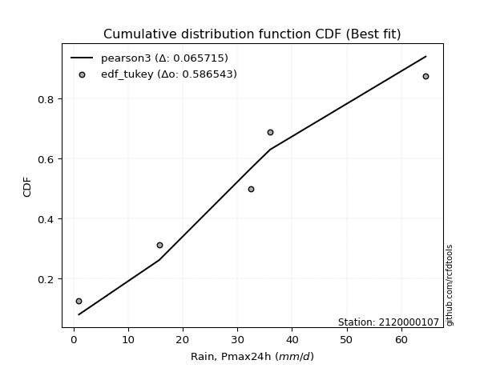</img></img>

</div>


### 8. EDF Gringorten (1963)

Gringorten plotting position formula is essential for estimating the probability and return periods of extreme events like floods and heavy rainfall. The constant _a=0.44_.

<div align="center">


$P=(m-a)/(n+1-2a)$


</div>


**8.1. Empirical values**

<div align="center">

|                | 0                   | 1                  | 2                   | 3                  | 4                  | 5                  |
|:---------------|:--------------------|:-------------------|:--------------------|:-------------------|:-------------------|:-------------------|
| date           | 2023                | 2018               | 2025                | 2024               | 2020               | 2019               |
| x              | 1.0                 | 15.7               | 32.2                | 32.4               | 36.0               | 64.47              |
| m              | 1                   | 2                  | 3                   | 4                  | 5                  | 6                  |
| empirical_dist | edf_gringorten      | edf_gringorten     | edf_gringorten      | edf_gringorten     | edf_gringorten     | edf_gringorten     |
| empirical      | 0.09150326797385622 | 0.2549019607843137 | 0.41830065359477125 | 0.5816993464052288 | 0.7450980392156862 | 0.9084967320261437 |
| empirical_tr   | 1.1007194244604317  | 1.3421052631578947 | 1.7191011235955058  | 2.3906250000000004 | 3.9230769230769216 | 10.928571428571415 |

</div>


**8.2. Kolmogorov-Smirnov fit test (sorted by Δ)**


<div align="center">

|                | 0                   | 1                   | 2                  | 3                   | 4                   | 5                   | 6                   | 7                   | 8                  | 9                   | 10                 | 11                  | 12                  | 13                  | 14                 | 15                 | 16                  | 17                  | 18                  | 19                  | 20                  | 21                  | 22                  | 23                  | 24                  | 25                 | 26                  | 27                  | 28                  | 29                 | 30                  | 31                  | 32                  | 33                  | 34                  | 35                  | 36                 | 37                  | 38                  | 39                  | 40                 | 41                  | 42                  | 43                  | 44                 | 45                  | 46                | 47                 | 48                  | 49                 | 50                  | 51                 | 52                  | 53                  | 54                 | 55                  | 56                  | 57                  | 58                  | 59                 | 60                  | 61                  | 62                  | 63                  | 64                  | 65                  | 66                  | 67                  | 68                  | 69                  | 70                 | 71                  | 72                  | 73                  | 74                 | 75                  | 76                  | 77                  | 78                 | 79                 | 80                 | 81                  | 82                  | 83                  | 84                  | 85                 | 86                  | 87                  | 88                 | 89                  | 90                  | 91                 | 92                 | 93                  | 94                  | 95                 | 96                 | 97                 | 98                 | 99                 | 100                 | 101                 | 102                | 103                | 104                 | 105                | 106               | 107                 | 108                | 109                | 110                 | 111                 | 112                | 113                 | 114                | 115                | 116                | 117                | 118                | 119                | 120                | 121                 | 122                | 123                | 124                 | 125                 | 126                | 127                 | 128                 | 129                | 130               | 131                | 132                 | 133                | 134                 | 135                 | 136                | 137                | 138                | 139                 | 140                 | 141                 | 142               | 143                 | 144               | 145                | 146                | 147                | 148                | 149                | 150                | 151                | 152                | 153                | 154                | 155                | 156                | 157                | 158                | 159              |
|:---------------|:--------------------|:--------------------|:-------------------|:--------------------|:--------------------|:--------------------|:--------------------|:--------------------|:-------------------|:--------------------|:-------------------|:--------------------|:--------------------|:--------------------|:-------------------|:-------------------|:--------------------|:--------------------|:--------------------|:--------------------|:--------------------|:--------------------|:--------------------|:--------------------|:--------------------|:-------------------|:--------------------|:--------------------|:--------------------|:-------------------|:--------------------|:--------------------|:--------------------|:--------------------|:--------------------|:--------------------|:-------------------|:--------------------|:--------------------|:--------------------|:-------------------|:--------------------|:--------------------|:--------------------|:-------------------|:--------------------|:------------------|:-------------------|:--------------------|:-------------------|:--------------------|:-------------------|:--------------------|:--------------------|:-------------------|:--------------------|:--------------------|:--------------------|:--------------------|:-------------------|:--------------------|:--------------------|:--------------------|:--------------------|:--------------------|:--------------------|:--------------------|:--------------------|:--------------------|:--------------------|:-------------------|:--------------------|:--------------------|:--------------------|:-------------------|:--------------------|:--------------------|:--------------------|:-------------------|:-------------------|:-------------------|:--------------------|:--------------------|:--------------------|:--------------------|:-------------------|:--------------------|:--------------------|:-------------------|:--------------------|:--------------------|:-------------------|:-------------------|:--------------------|:--------------------|:-------------------|:-------------------|:-------------------|:-------------------|:-------------------|:--------------------|:--------------------|:-------------------|:-------------------|:--------------------|:-------------------|:------------------|:--------------------|:-------------------|:-------------------|:--------------------|:--------------------|:-------------------|:--------------------|:-------------------|:-------------------|:-------------------|:-------------------|:-------------------|:-------------------|:-------------------|:--------------------|:-------------------|:-------------------|:--------------------|:--------------------|:-------------------|:--------------------|:--------------------|:-------------------|:------------------|:-------------------|:--------------------|:-------------------|:--------------------|:--------------------|:-------------------|:-------------------|:-------------------|:--------------------|:--------------------|:--------------------|:------------------|:--------------------|:------------------|:-------------------|:-------------------|:-------------------|:-------------------|:-------------------|:-------------------|:-------------------|:-------------------|:-------------------|:-------------------|:-------------------|:-------------------|:-------------------|:-------------------|:-----------------|
| station        | 2120000107          | 2120000107          | 2120000107         | 2120000107          | 2120000107          | 2120000107          | 2120000107          | 2120000107          | 2120000107         | 2120000107          | 2120000107         | 2120000107          | 2120000107          | 2120000107          | 2120000107         | 2120000107         | 2120000107          | 2120000107          | 2120000107          | 2120000107          | 2120000107          | 2120000107          | 2120000107          | 2120000107          | 2120000107          | 2120000107         | 2120000107          | 2120000107          | 2120000107          | 2120000107         | 2120000107          | 2120000107          | 2120000107          | 2120000107          | 2120000107          | 2120000107          | 2120000107         | 2120000107          | 2120000107          | 2120000107          | 2120000107         | 2120000107          | 2120000107          | 2120000107          | 2120000107         | 2120000107          | 2120000107        | 2120000107         | 2120000107          | 2120000107         | 2120000107          | 2120000107         | 2120000107          | 2120000107          | 2120000107         | 2120000107          | 2120000107          | 2120000107          | 2120000107          | 2120000107         | 2120000107          | 2120000107          | 2120000107          | 2120000107          | 2120000107          | 2120000107          | 2120000107          | 2120000107          | 2120000107          | 2120000107          | 2120000107         | 2120000107          | 2120000107          | 2120000107          | 2120000107         | 2120000107          | 2120000107          | 2120000107          | 2120000107         | 2120000107         | 2120000107         | 2120000107          | 2120000107          | 2120000107          | 2120000107          | 2120000107         | 2120000107          | 2120000107          | 2120000107         | 2120000107          | 2120000107          | 2120000107         | 2120000107         | 2120000107          | 2120000107          | 2120000107         | 2120000107         | 2120000107         | 2120000107         | 2120000107         | 2120000107          | 2120000107          | 2120000107         | 2120000107         | 2120000107          | 2120000107         | 2120000107        | 2120000107          | 2120000107         | 2120000107         | 2120000107          | 2120000107          | 2120000107         | 2120000107          | 2120000107         | 2120000107         | 2120000107         | 2120000107         | 2120000107         | 2120000107         | 2120000107         | 2120000107          | 2120000107         | 2120000107         | 2120000107          | 2120000107          | 2120000107         | 2120000107          | 2120000107          | 2120000107         | 2120000107        | 2120000107         | 2120000107          | 2120000107         | 2120000107          | 2120000107          | 2120000107         | 2120000107         | 2120000107         | 2120000107          | 2120000107          | 2120000107          | 2120000107        | 2120000107          | 2120000107        | 2120000107         | 2120000107         | 2120000107         | 2120000107         | 2120000107         | 2120000107         | 2120000107         | 2120000107         | 2120000107         | 2120000107         | 2120000107         | 2120000107         | 2120000107         | 2120000107         | 2120000107       |
| empirical_dist | edf_gringorten      | edf_gringorten      | edf_gringorten     | edf_gringorten      | edf_gringorten      | edf_gringorten      | edf_gringorten      | edf_gringorten      | edf_gringorten     | edf_gringorten      | edf_gringorten     | edf_gringorten      | edf_gringorten      | edf_gringorten      | edf_gringorten     | edf_gringorten     | edf_gringorten      | edf_gringorten      | edf_gringorten      | edf_gringorten      | edf_gringorten      | edf_gringorten      | edf_gringorten      | edf_gringorten      | edf_gringorten      | edf_gringorten     | edf_gringorten      | edf_gringorten      | edf_gringorten      | edf_gringorten     | edf_gringorten      | edf_gringorten      | edf_gringorten      | edf_gringorten      | edf_gringorten      | edf_gringorten      | edf_gringorten     | edf_gringorten      | edf_gringorten      | edf_gringorten      | edf_gringorten     | edf_gringorten      | edf_gringorten      | edf_gringorten      | edf_gringorten     | edf_gringorten      | edf_gringorten    | edf_gringorten     | edf_gringorten      | edf_gringorten     | edf_gringorten      | edf_gringorten     | edf_gringorten      | edf_gringorten      | edf_gringorten     | edf_gringorten      | edf_gringorten      | edf_gringorten      | edf_gringorten      | edf_gringorten     | edf_gringorten      | edf_gringorten      | edf_gringorten      | edf_gringorten      | edf_gringorten      | edf_gringorten      | edf_gringorten      | edf_gringorten      | edf_gringorten      | edf_gringorten      | edf_gringorten     | edf_gringorten      | edf_gringorten      | edf_gringorten      | edf_gringorten     | edf_gringorten      | edf_gringorten      | edf_gringorten      | edf_gringorten     | edf_gringorten     | edf_gringorten     | edf_gringorten      | edf_gringorten      | edf_gringorten      | edf_gringorten      | edf_gringorten     | edf_gringorten      | edf_gringorten      | edf_gringorten     | edf_gringorten      | edf_gringorten      | edf_gringorten     | edf_gringorten     | edf_gringorten      | edf_gringorten      | edf_gringorten     | edf_gringorten     | edf_gringorten     | edf_gringorten     | edf_gringorten     | edf_gringorten      | edf_gringorten      | edf_gringorten     | edf_gringorten     | edf_gringorten      | edf_gringorten     | edf_gringorten    | edf_gringorten      | edf_gringorten     | edf_gringorten     | edf_gringorten      | edf_gringorten      | edf_gringorten     | edf_gringorten      | edf_gringorten     | edf_gringorten     | edf_gringorten     | edf_gringorten     | edf_gringorten     | edf_gringorten     | edf_gringorten     | edf_gringorten      | edf_gringorten     | edf_gringorten     | edf_gringorten      | edf_gringorten      | edf_gringorten     | edf_gringorten      | edf_gringorten      | edf_gringorten     | edf_gringorten    | edf_gringorten     | edf_gringorten      | edf_gringorten     | edf_gringorten      | edf_gringorten      | edf_gringorten     | edf_gringorten     | edf_gringorten     | edf_gringorten      | edf_gringorten      | edf_gringorten      | edf_gringorten    | edf_gringorten      | edf_gringorten    | edf_gringorten     | edf_gringorten     | edf_gringorten     | edf_gringorten     | edf_gringorten     | edf_gringorten     | edf_gringorten     | edf_gringorten     | edf_gringorten     | edf_gringorten     | edf_gringorten     | edf_gringorten     | edf_gringorten     | edf_gringorten     | edf_gringorten   |
| p_dist         | dweibull            | logistic            | logdgamma          | t                   | crystalball         | norm                | hypsecant           | foldnorm            | exponnorm          | logt                | logtukeylambda     | pearson3            | genextreme          | truncpareto         | loggenextreme      | anglit             | gennorm             | laplace             | rice                | nct                 | skewnorm            | invgamma            | burr                | logdweibull         | fatiguelife         | loggennorm         | maxwell             | semicircular        | cosine              | betaprime          | f                   | erlang              | gamma               | genlogistic         | truncweibull_min    | invgauss            | logloggamma        | kappa3              | dgamma              | rayleigh            | loggausshyper      | weibull_min         | burr12              | alpha               | logvonmises_line   | logpearson3         | logargus          | kappa4             | mielke              | invweibull         | bradford            | logtrapezoid       | vonmises_line       | arcsine             | kstwobign          | gausshyper          | gumbel_l            | halfnorm            | gumbel_r            | uniform            | loggumbel_l         | truncexpon          | loglevy_l           | ksone               | beta                | wrapcauchy          | logsemicircular     | lomax               | moyal               | halflogistic        | logarcsine         | loganglit           | loggompertz         | logexponweib        | genexpon           | ncf                 | argus               | lognct              | logexponnorm       | lognorm            | logcrystalball     | logrice             | loginvgauss         | logburr12           | logfatiguelife      | loggengamma        | loggamma            | loggamma            | loginvweibull      | loghalfgennorm      | logalpha            | logerlang          | loginvgamma        | logfoldnorm         | halfgennorm         | loglogistic        | logmaxwell         | loggenhalflogistic | gompertz           | lograyleigh        | levy_l              | loghypsecant        | wald               | loghalfnorm        | logkstwobign        | logskewnorm        | loggenexpon       | logncf              | logcosine          | genpareto          | triang              | loggumbel_r         | logloglaplace      | gengamma            | loglaplace         | loglaplace         | logwrapcauchy      | johnsonsb          | nakagami           | loghalflogistic    | logmoyal           | logweibull_max      | logtriang          | loglomax           | logtruncweibull_min | logf                | genhalflogistic    | logjohnsonsb        | logwald             | logweibull_min     | logksone          | logbeta            | johnsonsu           | logjohnsonsu       | logkappa4           | logkappa3           | loguniform         | exponweib          | trapezoid          | logbradford         | logexponpow         | tukeylambda         | loggenpareto      | logmielke           | logtruncnorm      | logbetaprime       | lognakagami        | logtruncexpon      | logburr            | rdist              | powerlaw           | weibull_max        | exponpow           | logtruncpareto     | truncnorm          | logpowerlaw        | logrdist           | loggenlogistic     | logvonmises        | vonmises         |
| delta          | 0.09687661527209979 | 0.12589924253098933 | 0.1267957735664712 | 0.12996244794576495 | 0.12998276653982377 | 0.12998277476776665 | 0.13037345230926362 | 0.13064881165675146 | 0.1339206287815619 | 0.13672434717924437 | 0.1374540353418583 | 0.13807256116072303 | 0.13952864639288748 | 0.13972815565091484 | 0.1429851134651497 | 0.1457176317441803 | 0.14616285706969043 | 0.14624182255143975 | 0.14652308697757094 | 0.14667888332467832 | 0.14750678150673185 | 0.14836294205474104 | 0.14853848530292968 | 0.14906293418430527 | 0.14981588903626836 | 0.1506407502562616 | 0.15171606811135968 | 0.15226981570857634 | 0.15290254569149153 | 0.1530279580465433 | 0.15331611352692326 | 0.15337010797267908 | 0.15337019860783002 | 0.15446900646618317 | 0.15554766139645737 | 0.15752266557323286 | 0.1598183156236445 | 0.16017859935799422 | 0.16090029055065633 | 0.16178015844299992 | 0.1627806967577503 | 0.16341796427462357 | 0.16373745570977222 | 0.16559224512301135 | 0.1663627304041298 | 0.16645769344373168 | 0.167333309701655 | 0.1718766006826702 | 0.17212592079526373 | 0.1728982644985328 | 0.17351565435361221 | 0.1779355006552969 | 0.17835910816099643 | 0.17874317973220388 | 0.1840529732943295 | 0.18575819206849487 | 0.18675456617096353 | 0.19014223251746748 | 0.19107756811849436 | 0.1936564132506633 | 0.19624748535839948 | 0.19892394747955727 | 0.20007248571712155 | 0.20223001757816716 | 0.20245078626766128 | 0.20918599273321237 | 0.21215724770737093 | 0.21539272009027127 | 0.21624637793166418 | 0.21702825490021044 | 0.2194519892871019 | 0.22094114324556052 | 0.22361780304312845 | 0.22835220007420048 | 0.2346844590815837 | 0.23613568973912474 | 0.23738408120599608 | 0.24172651275602358 | 0.2418193592797661 | 0.2418211543283007 | 0.2418212726391959 | 0.24182624964320204 | 0.24227358862811693 | 0.24336174799151206 | 0.24426761181065665 | 0.2461080252737065 | 0.24688300116165357 | 0.24688300116165357 | 0.2473879178591304 | 0.24740633548274527 | 0.24759249050445192 | 0.2478383490487675 | 0.2512597253694428 | 0.25447998505344366 | 0.25853050351310897 | 0.2606009017943332 | 0.2623590367449187 | 0.2645238214173708 | 0.2647934040496962 | 0.2684974024225855 | 0.27484499714218213 | 0.27499015918005804 | 0.2860943840963726 | 0.2864723108338439 | 0.28723883571054043 | 0.2898918655227301 | 0.293342857013535 | 0.29410736942965865 | 0.2943474735780814 | 0.2981291902895821 | 0.29900610272319467 | 0.30014445974074005 | 0.3019843315899552 | 0.30213577512151985 | 0.3028066856600065 | 0.3028066856600065 | 0.3089934566054138 | 0.3112785388632366 | 0.3144052367501438 | 0.3144113059175579 | 0.3193389108850129 | 0.32451192418445635 | 0.3371327285386632 | 0.3439243971762307 | 0.34837393137310463 | 0.35996203946378846 | 0.3617250519784303 | 0.36504835842163796 | 0.37402776514007025 | 0.3771966761670924 | 0.379225204018552 | 0.3951690126579207 | 0.40237871906020606 | 0.4033867922004672 | 0.41221441860566305 | 0.41503498679164513 | 0.4150646320648091 | 0.4235760393145561 | 0.4465688906583311 | 0.44671762737508736 | 0.45658514746882106 | 0.46087812949426726 | 0.469840174864516 | 0.48461207555190866 | 0.499121729166787 | 0.5013744572404202 | 0.5142465256114245 | 0.5163474471581742 | 0.5183769823368254 | 0.5498288380299152 | 0.5655937627628403 | 0.5959554224959234 | 0.6705921985459694 | 0.6754812357886695 | 0.7225911193471246 | 0.7416086287201495 | 0.7450980377037946 | 0.7450980392156862 | 1.0304678022242284 | 9.69212126682435 |
| deltao         | 0.530385761606      | 0.530385761606      | 0.530385761606     | 0.530385761606      | 0.530385761606      | 0.530385761606      | 0.530385761606      | 0.530385761606      | 0.530385761606     | 0.530385761606      | 0.530385761606     | 0.530385761606      | 0.530385761606      | 0.530385761606      | 0.530385761606     | 0.530385761606     | 0.530385761606      | 0.530385761606      | 0.530385761606      | 0.530385761606      | 0.530385761606      | 0.530385761606      | 0.530385761606      | 0.530385761606      | 0.530385761606      | 0.530385761606     | 0.530385761606      | 0.530385761606      | 0.530385761606      | 0.530385761606     | 0.530385761606      | 0.530385761606      | 0.530385761606      | 0.530385761606      | 0.530385761606      | 0.530385761606      | 0.530385761606     | 0.530385761606      | 0.530385761606      | 0.530385761606      | 0.530385761606     | 0.530385761606      | 0.530385761606      | 0.530385761606      | 0.530385761606     | 0.530385761606      | 0.530385761606    | 0.530385761606     | 0.530385761606      | 0.530385761606     | 0.530385761606      | 0.530385761606     | 0.530385761606      | 0.530385761606      | 0.530385761606     | 0.530385761606      | 0.530385761606      | 0.530385761606      | 0.530385761606      | 0.530385761606     | 0.530385761606      | 0.530385761606      | 0.530385761606      | 0.530385761606      | 0.530385761606      | 0.530385761606      | 0.530385761606      | 0.530385761606      | 0.530385761606      | 0.530385761606      | 0.530385761606     | 0.530385761606      | 0.530385761606      | 0.530385761606      | 0.530385761606     | 0.530385761606      | 0.530385761606      | 0.530385761606      | 0.530385761606     | 0.530385761606     | 0.530385761606     | 0.530385761606      | 0.530385761606      | 0.530385761606      | 0.530385761606      | 0.530385761606     | 0.530385761606      | 0.530385761606      | 0.530385761606     | 0.530385761606      | 0.530385761606      | 0.530385761606     | 0.530385761606     | 0.530385761606      | 0.530385761606      | 0.530385761606     | 0.530385761606     | 0.530385761606     | 0.530385761606     | 0.530385761606     | 0.530385761606      | 0.530385761606      | 0.530385761606     | 0.530385761606     | 0.530385761606      | 0.530385761606     | 0.530385761606    | 0.530385761606      | 0.530385761606     | 0.530385761606     | 0.530385761606      | 0.530385761606      | 0.530385761606     | 0.530385761606      | 0.530385761606     | 0.530385761606     | 0.530385761606     | 0.530385761606     | 0.530385761606     | 0.530385761606     | 0.530385761606     | 0.530385761606      | 0.530385761606     | 0.530385761606     | 0.530385761606      | 0.530385761606      | 0.530385761606     | 0.530385761606      | 0.530385761606      | 0.530385761606     | 0.530385761606    | 0.530385761606     | 0.530385761606      | 0.530385761606     | 0.530385761606      | 0.530385761606      | 0.530385761606     | 0.530385761606     | 0.530385761606     | 0.530385761606      | 0.530385761606      | 0.530385761606      | 0.530385761606    | 0.530385761606      | 0.530385761606    | 0.530385761606     | 0.530385761606     | 0.530385761606     | 0.530385761606     | 0.530385761606     | 0.530385761606     | 0.530385761606     | 0.530385761606     | 0.530385761606     | 0.530385761606     | 0.530385761606     | 0.530385761606     | 0.530385761606     | 0.530385761606     | 0.530385761606   |
| eval           | Δo > Δ              | Δo > Δ              | Δo > Δ             | Δo > Δ              | Δo > Δ              | Δo > Δ              | Δo > Δ              | Δo > Δ              | Δo > Δ             | Δo > Δ              | Δo > Δ             | Δo > Δ              | Δo > Δ              | Δo > Δ              | Δo > Δ             | Δo > Δ             | Δo > Δ              | Δo > Δ              | Δo > Δ              | Δo > Δ              | Δo > Δ              | Δo > Δ              | Δo > Δ              | Δo > Δ              | Δo > Δ              | Δo > Δ             | Δo > Δ              | Δo > Δ              | Δo > Δ              | Δo > Δ             | Δo > Δ              | Δo > Δ              | Δo > Δ              | Δo > Δ              | Δo > Δ              | Δo > Δ              | Δo > Δ             | Δo > Δ              | Δo > Δ              | Δo > Δ              | Δo > Δ             | Δo > Δ              | Δo > Δ              | Δo > Δ              | Δo > Δ             | Δo > Δ              | Δo > Δ            | Δo > Δ             | Δo > Δ              | Δo > Δ             | Δo > Δ              | Δo > Δ             | Δo > Δ              | Δo > Δ              | Δo > Δ             | Δo > Δ              | Δo > Δ              | Δo > Δ              | Δo > Δ              | Δo > Δ             | Δo > Δ              | Δo > Δ              | Δo > Δ              | Δo > Δ              | Δo > Δ              | Δo > Δ              | Δo > Δ              | Δo > Δ              | Δo > Δ              | Δo > Δ              | Δo > Δ             | Δo > Δ              | Δo > Δ              | Δo > Δ              | Δo > Δ             | Δo > Δ              | Δo > Δ              | Δo > Δ              | Δo > Δ             | Δo > Δ             | Δo > Δ             | Δo > Δ              | Δo > Δ              | Δo > Δ              | Δo > Δ              | Δo > Δ             | Δo > Δ              | Δo > Δ              | Δo > Δ             | Δo > Δ              | Δo > Δ              | Δo > Δ             | Δo > Δ             | Δo > Δ              | Δo > Δ              | Δo > Δ             | Δo > Δ             | Δo > Δ             | Δo > Δ             | Δo > Δ             | Δo > Δ              | Δo > Δ              | Δo > Δ             | Δo > Δ             | Δo > Δ              | Δo > Δ             | Δo > Δ            | Δo > Δ              | Δo > Δ             | Δo > Δ             | Δo > Δ              | Δo > Δ              | Δo > Δ             | Δo > Δ              | Δo > Δ             | Δo > Δ             | Δo > Δ             | Δo > Δ             | Δo > Δ             | Δo > Δ             | Δo > Δ             | Δo > Δ              | Δo > Δ             | Δo > Δ             | Δo > Δ              | Δo > Δ              | Δo > Δ             | Δo > Δ              | Δo > Δ              | Δo > Δ             | Δo > Δ            | Δo > Δ             | Δo > Δ              | Δo > Δ             | Δo > Δ              | Δo > Δ              | Δo > Δ             | Δo > Δ             | Δo > Δ             | Δo > Δ              | Δo > Δ              | Δo > Δ              | Δo > Δ            | Δo > Δ              | Δo > Δ            | Δo > Δ             | Δo > Δ             | Δo > Δ             | Δo > Δ             | Δo <= Δ            | Δo <= Δ            | Δo <= Δ            | Δo <= Δ            | Δo <= Δ            | Δo <= Δ            | Δo <= Δ            | Δo <= Δ            | Δo <= Δ            | Δo <= Δ            | Δo <= Δ          |
| fit            | 1                   | 1                   | 1                  | 1                   | 1                   | 1                   | 1                   | 1                   | 1                  | 1                   | 1                  | 1                   | 1                   | 1                   | 1                  | 1                  | 1                   | 1                   | 1                   | 1                   | 1                   | 1                   | 1                   | 1                   | 1                   | 1                  | 1                   | 1                   | 1                   | 1                  | 1                   | 1                   | 1                   | 1                   | 1                   | 1                   | 1                  | 1                   | 1                   | 1                   | 1                  | 1                   | 1                   | 1                   | 1                  | 1                   | 1                 | 1                  | 1                   | 1                  | 1                   | 1                  | 1                   | 1                   | 1                  | 1                   | 1                   | 1                   | 1                   | 1                  | 1                   | 1                   | 1                   | 1                   | 1                   | 1                   | 1                   | 1                   | 1                   | 1                   | 1                  | 1                   | 1                   | 1                   | 1                  | 1                   | 1                   | 1                   | 1                  | 1                  | 1                  | 1                   | 1                   | 1                   | 1                   | 1                  | 1                   | 1                   | 1                  | 1                   | 1                   | 1                  | 1                  | 1                   | 1                   | 1                  | 1                  | 1                  | 1                  | 1                  | 1                   | 1                   | 1                  | 1                  | 1                   | 1                  | 1                 | 1                   | 1                  | 1                  | 1                   | 1                   | 1                  | 1                   | 1                  | 1                  | 1                  | 1                  | 1                  | 1                  | 1                  | 1                   | 1                  | 1                  | 1                   | 1                   | 1                  | 1                   | 1                   | 1                  | 1                 | 1                  | 1                   | 1                  | 1                   | 1                   | 1                  | 1                  | 1                  | 1                   | 1                   | 1                   | 1                 | 1                   | 1                 | 1                  | 1                  | 1                  | 1                  | 0                  | 0                  | 0                  | 0                  | 0                  | 0                  | 0                  | 0                  | 0                  | 0                  | 0                |
| n              | 6                   | 6                   | 6                  | 6                   | 6                   | 6                   | 6                   | 6                   | 6                  | 6                   | 6                  | 6                   | 6                   | 6                   | 6                  | 6                  | 6                   | 6                   | 6                   | 6                   | 6                   | 6                   | 6                   | 6                   | 6                   | 6                  | 6                   | 6                   | 6                   | 6                  | 6                   | 6                   | 6                   | 6                   | 6                   | 6                   | 6                  | 6                   | 6                   | 6                   | 6                  | 6                   | 6                   | 6                   | 6                  | 6                   | 6                 | 6                  | 6                   | 6                  | 6                   | 6                  | 6                   | 6                   | 6                  | 6                   | 6                   | 6                   | 6                   | 6                  | 6                   | 6                   | 6                   | 6                   | 6                   | 6                   | 6                   | 6                   | 6                   | 6                   | 6                  | 6                   | 6                   | 6                   | 6                  | 6                   | 6                   | 6                   | 6                  | 6                  | 6                  | 6                   | 6                   | 6                   | 6                   | 6                  | 6                   | 6                   | 6                  | 6                   | 6                   | 6                  | 6                  | 6                   | 6                   | 6                  | 6                  | 6                  | 6                  | 6                  | 6                   | 6                   | 6                  | 6                  | 6                   | 6                  | 6                 | 6                   | 6                  | 6                  | 6                   | 6                   | 6                  | 6                   | 6                  | 6                  | 6                  | 6                  | 6                  | 6                  | 6                  | 6                   | 6                  | 6                  | 6                   | 6                   | 6                  | 6                   | 6                   | 6                  | 6                 | 6                  | 6                   | 6                  | 6                   | 6                   | 6                  | 6                  | 6                  | 6                   | 6                   | 6                   | 6                 | 6                   | 6                 | 6                  | 6                  | 6                  | 6                  | 6                  | 6                  | 6                  | 6                  | 6                  | 6                  | 6                  | 6                  | 6                  | 6                  | 6                |
| best_fit       | 1                   | 0                   | 0                  | 0                   | 0                   | 0                   | 0                   | 0                   | 0                  | 0                   | 0                  | 0                   | 0                   | 0                   | 0                  | 0                  | 0                   | 0                   | 0                   | 0                   | 0                   | 0                   | 0                   | 0                   | 0                   | 0                  | 0                   | 0                   | 0                   | 0                  | 0                   | 0                   | 0                   | 0                   | 0                   | 0                   | 0                  | 0                   | 0                   | 0                   | 0                  | 0                   | 0                   | 0                   | 0                  | 0                   | 0                 | 0                  | 0                   | 0                  | 0                   | 0                  | 0                   | 0                   | 0                  | 0                   | 0                   | 0                   | 0                   | 0                  | 0                   | 0                   | 0                   | 0                   | 0                   | 0                   | 0                   | 0                   | 0                   | 0                   | 0                  | 0                   | 0                   | 0                   | 0                  | 0                   | 0                   | 0                   | 0                  | 0                  | 0                  | 0                   | 0                   | 0                   | 0                   | 0                  | 0                   | 0                   | 0                  | 0                   | 0                   | 0                  | 0                  | 0                   | 0                   | 0                  | 0                  | 0                  | 0                  | 0                  | 0                   | 0                   | 0                  | 0                  | 0                   | 0                  | 0                 | 0                   | 0                  | 0                  | 0                   | 0                   | 0                  | 0                   | 0                  | 0                  | 0                  | 0                  | 0                  | 0                  | 0                  | 0                   | 0                  | 0                  | 0                   | 0                   | 0                  | 0                   | 0                   | 0                  | 0                 | 0                  | 0                   | 0                  | 0                   | 0                   | 0                  | 0                  | 0                  | 0                   | 0                   | 0                   | 0                 | 0                   | 0                 | 0                  | 0                  | 0                  | 0                  | 0                  | 0                  | 0                  | 0                  | 0                  | 0                  | 0                  | 0                  | 0                  | 0                  | 0                |
| best_fit_sort  | 1                   | 2                   | 3                  | 4                   | 5                   | 6                   | 7                   | 8                   | 9                  | 10                  | 11                 | 12                  | 13                  | 14                  | 15                 | 16                 | 17                  | 18                  | 19                  | 20                  | 21                  | 22                  | 23                  | 24                  | 25                  | 26                 | 27                  | 28                  | 29                  | 30                 | 31                  | 32                  | 33                  | 34                  | 35                  | 36                  | 37                 | 38                  | 39                  | 40                  | 41                 | 42                  | 43                  | 44                  | 45                 | 46                  | 47                | 48                 | 49                  | 50                 | 51                  | 52                 | 53                  | 54                  | 55                 | 56                  | 57                  | 58                  | 59                  | 60                 | 61                  | 62                  | 63                  | 64                  | 65                  | 66                  | 67                  | 68                  | 69                  | 70                  | 71                 | 72                  | 73                  | 74                  | 75                 | 76                  | 77                  | 78                  | 79                 | 80                 | 81                 | 82                  | 83                  | 84                  | 85                  | 86                 | 87                  | 88                  | 89                 | 90                  | 91                  | 92                 | 93                 | 94                  | 95                  | 96                 | 97                 | 98                 | 99                 | 100                | 101                 | 102                 | 103                | 104                | 105                 | 106                | 107               | 108                 | 109                | 110                | 111                 | 112                 | 113                | 114                 | 115                | 116                | 117                | 118                | 119                | 120                | 121                | 122                 | 123                | 124                | 125                 | 126                 | 127                | 128                 | 129                 | 130                | 131               | 132                | 133                 | 134                | 135                 | 136                 | 137                | 138                | 139                | 140                 | 141                 | 142                 | 143               | 144                 | 145               | 146                | 147                | 148                | 149                | 150                | 151                | 152                | 153                | 154                | 155                | 156                | 157                | 158                | 159                | 160              |

</div>


**8.3. Best fit**

<div align="center">

|   id |    station | empirical_dist   | p_dist   |     delta |   deltao | eval   |   fit |   n |   best_fit |   best_fit_sort |
|-----:|-----------:|:-----------------|:---------|----------:|---------:|:-------|------:|----:|-----------:|----------------:|
|    0 | 2120000107 | edf_gringorten   | dweibull | 0.0968766 | 0.530386 | Δo > Δ |     1 |   6 |          1 |               1 |

</div>


<div align="center">

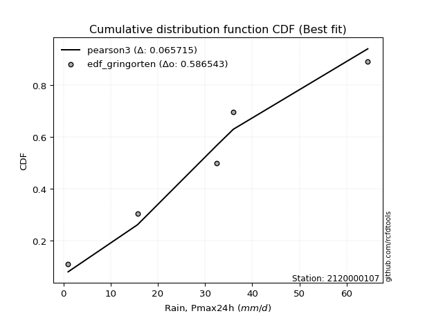</img>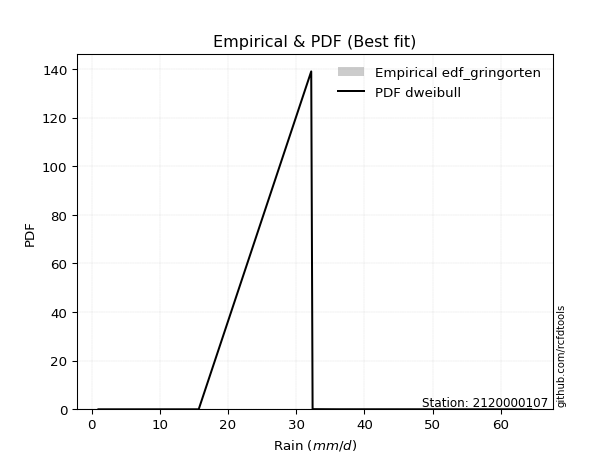</img>

</div>


### 9. EDF Filliben (1975)

The specific values of the constants (0.3175) (often denoted as $alpha$) and (0.365) are derived from a method proposed by James J. Filliben in a 1975 paper. This particular formula is the mean value of the $i$-th order statistic of the normal distribution and is considered a robust and effective plotting position formula for the normal probability plot correlation coefficient test for normality.

<div align="center">


$P=(m-0.3175)/(n+0.365)$


</div>


**9.1. Empirical values**

<div align="center">

|                | 0                   | 1                   | 2                  | 3                  | 4                  | 5                  |
|:---------------|:--------------------|:--------------------|:-------------------|:-------------------|:-------------------|:-------------------|
| date           | 2023                | 2018                | 2025               | 2024               | 2020               | 2019               |
| x              | 1.0                 | 15.7                | 32.2               | 32.4               | 36.0               | 64.47              |
| m              | 1                   | 2                   | 3                  | 4                  | 5                  | 6                  |
| empirical_dist | edf_filliben        | edf_filliben        | edf_filliben       | edf_filliben       | edf_filliben       | edf_filliben       |
| empirical      | 0.10722702278083267 | 0.26433621366849963 | 0.4214454045561665 | 0.5785545954438335 | 0.7356637863315004 | 0.8927729772191673 |
| empirical_tr   | 1.1201055873295205  | 1.3593166043780034  | 1.7284453496266123 | 2.3727865796831313 | 3.783060921248143  | 9.326007326007321  |

</div>


**9.2. Kolmogorov-Smirnov fit test (sorted by Δ)**


<div align="center">

|                | 0                   | 1                   | 2                   | 3                   | 4                  | 5                  | 6                   | 7                   | 8                   | 9                   | 10                  | 11                  | 12                 | 13                  | 14                  | 15                  | 16                  | 17                  | 18                  | 19                  | 20                  | 21                  | 22                  | 23                  | 24                 | 25                 | 26                  | 27                 | 28                  | 29                | 30                 | 31                  | 32                 | 33                  | 34                  | 35                  | 36                  | 37                  | 38                  | 39                  | 40                 | 41                  | 42                  | 43                  | 44                  | 45                 | 46                  | 47                  | 48                  | 49                  | 50                  | 51                  | 52                  | 53                  | 54                 | 55                  | 56                  | 57                  | 58                 | 59                  | 60                 | 61                 | 62                 | 63                | 64                | 65                 | 66                  | 67                | 68                | 69                 | 70                  | 71                  | 72                  | 73                 | 74                  | 75                  | 76                  | 77                  | 78                  | 79                 | 80                  | 81                  | 82                  | 83                  | 84                  | 85                  | 86                  | 87                  | 88                 | 89                 | 90                  | 91                  | 92                  | 93                 | 94                 | 95                  | 96                  | 97                  | 98                 | 99                 | 100                 | 101                 | 102                | 103                 | 104                 | 105                | 106                | 107                 | 108                 | 109                | 110                | 111                 | 112                | 113                | 114                 | 115                 | 116                 | 117                 | 118                 | 119                | 120                | 121                 | 122                 | 123                 | 124                 | 125                 | 126                 | 127                | 128                | 129                 | 130               | 131                 | 132                 | 133                 | 134                | 135                 | 136                | 137                | 138                 | 139                 | 140                 | 141               | 142                | 143                 | 144                 | 145                 | 146                | 147                | 148                | 149                | 150                | 151                | 152                | 153                | 154                | 155                | 156                | 157                | 158               | 159               |
|:---------------|:--------------------|:--------------------|:--------------------|:--------------------|:-------------------|:-------------------|:--------------------|:--------------------|:--------------------|:--------------------|:--------------------|:--------------------|:-------------------|:--------------------|:--------------------|:--------------------|:--------------------|:--------------------|:--------------------|:--------------------|:--------------------|:--------------------|:--------------------|:--------------------|:-------------------|:-------------------|:--------------------|:-------------------|:--------------------|:------------------|:-------------------|:--------------------|:-------------------|:--------------------|:--------------------|:--------------------|:--------------------|:--------------------|:--------------------|:--------------------|:-------------------|:--------------------|:--------------------|:--------------------|:--------------------|:-------------------|:--------------------|:--------------------|:--------------------|:--------------------|:--------------------|:--------------------|:--------------------|:--------------------|:-------------------|:--------------------|:--------------------|:--------------------|:-------------------|:--------------------|:-------------------|:-------------------|:-------------------|:------------------|:------------------|:-------------------|:--------------------|:------------------|:------------------|:-------------------|:--------------------|:--------------------|:--------------------|:-------------------|:--------------------|:--------------------|:--------------------|:--------------------|:--------------------|:-------------------|:--------------------|:--------------------|:--------------------|:--------------------|:--------------------|:--------------------|:--------------------|:--------------------|:-------------------|:-------------------|:--------------------|:--------------------|:--------------------|:-------------------|:-------------------|:--------------------|:--------------------|:--------------------|:-------------------|:-------------------|:--------------------|:--------------------|:-------------------|:--------------------|:--------------------|:-------------------|:-------------------|:--------------------|:--------------------|:-------------------|:-------------------|:--------------------|:-------------------|:-------------------|:--------------------|:--------------------|:--------------------|:--------------------|:--------------------|:-------------------|:-------------------|:--------------------|:--------------------|:--------------------|:--------------------|:--------------------|:--------------------|:-------------------|:-------------------|:--------------------|:------------------|:--------------------|:--------------------|:--------------------|:-------------------|:--------------------|:-------------------|:-------------------|:--------------------|:--------------------|:--------------------|:------------------|:-------------------|:--------------------|:--------------------|:--------------------|:-------------------|:-------------------|:-------------------|:-------------------|:-------------------|:-------------------|:-------------------|:-------------------|:-------------------|:-------------------|:-------------------|:-------------------|:------------------|:------------------|
| station        | 2120000107          | 2120000107          | 2120000107          | 2120000107          | 2120000107         | 2120000107         | 2120000107          | 2120000107          | 2120000107          | 2120000107          | 2120000107          | 2120000107          | 2120000107         | 2120000107          | 2120000107          | 2120000107          | 2120000107          | 2120000107          | 2120000107          | 2120000107          | 2120000107          | 2120000107          | 2120000107          | 2120000107          | 2120000107         | 2120000107         | 2120000107          | 2120000107         | 2120000107          | 2120000107        | 2120000107         | 2120000107          | 2120000107         | 2120000107          | 2120000107          | 2120000107          | 2120000107          | 2120000107          | 2120000107          | 2120000107          | 2120000107         | 2120000107          | 2120000107          | 2120000107          | 2120000107          | 2120000107         | 2120000107          | 2120000107          | 2120000107          | 2120000107          | 2120000107          | 2120000107          | 2120000107          | 2120000107          | 2120000107         | 2120000107          | 2120000107          | 2120000107          | 2120000107         | 2120000107          | 2120000107         | 2120000107         | 2120000107         | 2120000107        | 2120000107        | 2120000107         | 2120000107          | 2120000107        | 2120000107        | 2120000107         | 2120000107          | 2120000107          | 2120000107          | 2120000107         | 2120000107          | 2120000107          | 2120000107          | 2120000107          | 2120000107          | 2120000107         | 2120000107          | 2120000107          | 2120000107          | 2120000107          | 2120000107          | 2120000107          | 2120000107          | 2120000107          | 2120000107         | 2120000107         | 2120000107          | 2120000107          | 2120000107          | 2120000107         | 2120000107         | 2120000107          | 2120000107          | 2120000107          | 2120000107         | 2120000107         | 2120000107          | 2120000107          | 2120000107         | 2120000107          | 2120000107          | 2120000107         | 2120000107         | 2120000107          | 2120000107          | 2120000107         | 2120000107         | 2120000107          | 2120000107         | 2120000107         | 2120000107          | 2120000107          | 2120000107          | 2120000107          | 2120000107          | 2120000107         | 2120000107         | 2120000107          | 2120000107          | 2120000107          | 2120000107          | 2120000107          | 2120000107          | 2120000107         | 2120000107         | 2120000107          | 2120000107        | 2120000107          | 2120000107          | 2120000107          | 2120000107         | 2120000107          | 2120000107         | 2120000107         | 2120000107          | 2120000107          | 2120000107          | 2120000107        | 2120000107         | 2120000107          | 2120000107          | 2120000107          | 2120000107         | 2120000107         | 2120000107         | 2120000107         | 2120000107         | 2120000107         | 2120000107         | 2120000107         | 2120000107         | 2120000107         | 2120000107         | 2120000107         | 2120000107        | 2120000107        |
| empirical_dist | edf_filliben        | edf_filliben        | edf_filliben        | edf_filliben        | edf_filliben       | edf_filliben       | edf_filliben        | edf_filliben        | edf_filliben        | edf_filliben        | edf_filliben        | edf_filliben        | edf_filliben       | edf_filliben        | edf_filliben        | edf_filliben        | edf_filliben        | edf_filliben        | edf_filliben        | edf_filliben        | edf_filliben        | edf_filliben        | edf_filliben        | edf_filliben        | edf_filliben       | edf_filliben       | edf_filliben        | edf_filliben       | edf_filliben        | edf_filliben      | edf_filliben       | edf_filliben        | edf_filliben       | edf_filliben        | edf_filliben        | edf_filliben        | edf_filliben        | edf_filliben        | edf_filliben        | edf_filliben        | edf_filliben       | edf_filliben        | edf_filliben        | edf_filliben        | edf_filliben        | edf_filliben       | edf_filliben        | edf_filliben        | edf_filliben        | edf_filliben        | edf_filliben        | edf_filliben        | edf_filliben        | edf_filliben        | edf_filliben       | edf_filliben        | edf_filliben        | edf_filliben        | edf_filliben       | edf_filliben        | edf_filliben       | edf_filliben       | edf_filliben       | edf_filliben      | edf_filliben      | edf_filliben       | edf_filliben        | edf_filliben      | edf_filliben      | edf_filliben       | edf_filliben        | edf_filliben        | edf_filliben        | edf_filliben       | edf_filliben        | edf_filliben        | edf_filliben        | edf_filliben        | edf_filliben        | edf_filliben       | edf_filliben        | edf_filliben        | edf_filliben        | edf_filliben        | edf_filliben        | edf_filliben        | edf_filliben        | edf_filliben        | edf_filliben       | edf_filliben       | edf_filliben        | edf_filliben        | edf_filliben        | edf_filliben       | edf_filliben       | edf_filliben        | edf_filliben        | edf_filliben        | edf_filliben       | edf_filliben       | edf_filliben        | edf_filliben        | edf_filliben       | edf_filliben        | edf_filliben        | edf_filliben       | edf_filliben       | edf_filliben        | edf_filliben        | edf_filliben       | edf_filliben       | edf_filliben        | edf_filliben       | edf_filliben       | edf_filliben        | edf_filliben        | edf_filliben        | edf_filliben        | edf_filliben        | edf_filliben       | edf_filliben       | edf_filliben        | edf_filliben        | edf_filliben        | edf_filliben        | edf_filliben        | edf_filliben        | edf_filliben       | edf_filliben       | edf_filliben        | edf_filliben      | edf_filliben        | edf_filliben        | edf_filliben        | edf_filliben       | edf_filliben        | edf_filliben       | edf_filliben       | edf_filliben        | edf_filliben        | edf_filliben        | edf_filliben      | edf_filliben       | edf_filliben        | edf_filliben        | edf_filliben        | edf_filliben       | edf_filliben       | edf_filliben       | edf_filliben       | edf_filliben       | edf_filliben       | edf_filliben       | edf_filliben       | edf_filliben       | edf_filliben       | edf_filliben       | edf_filliben       | edf_filliben      | edf_filliben      |
| p_dist         | dweibull            | logdgamma           | t                   | crystalball         | norm               | foldnorm           | logistic            | hypsecant           | exponnorm           | logdweibull         | pearson3            | anglit              | genextreme         | truncpareto         | burr                | loggenextreme       | semicircular        | laplace             | rice                | cosine              | nct                 | skewnorm            | invgamma            | truncweibull_min    | logt               | fatiguelife        | logtukeylambda      | maxwell            | betaprime           | f                 | erlang             | gamma               | genlogistic        | loggausshyper       | invgauss            | gennorm             | logloggamma         | kappa3              | rayleigh            | loggennorm          | weibull_min        | burr12              | kappa4              | alpha               | logvonmises_line    | logpearson3        | logargus            | vonmises_line       | mielke              | arcsine             | invweibull          | dgamma              | bradford            | logtrapezoid        | gausshyper         | gumbel_l            | kstwobign           | uniform             | halfnorm           | gumbel_r            | loglevy_l          | ksone              | loggumbel_l        | truncexpon        | beta              | wrapcauchy         | logsemicircular     | logarcsine        | lomax             | moyal              | halflogistic        | loganglit           | loggompertz         | logexponweib       | argus               | genexpon            | ncf                 | loginvweibull       | loghalfgennorm      | lognct             | logexponnorm        | lognorm             | logcrystalball      | logrice             | loginvgauss         | logburr12           | logfatiguelife      | loggengamma         | loggamma           | loggamma           | logalpha            | logerlang           | loginvgamma         | logfoldnorm        | halfgennorm        | loglogistic         | levy_l              | logmaxwell          | loggenhalflogistic | gompertz           | lograyleigh         | loghypsecant        | logkstwobign       | logncf              | wald                | loghalfnorm        | loggenexpon        | logskewnorm         | genpareto           | triang             | logcosine          | logloglaplace       | loggumbel_r        | gengamma           | logwrapcauchy       | loglaplace          | loglaplace          | johnsonsb           | nakagami            | loghalflogistic    | logweibull_max     | logmoyal            | logtriang           | loglomax            | logtruncweibull_min | logf                | genhalflogistic     | logjohnsonsb       | logweibull_min     | logksone            | logwald           | logbeta             | johnsonsu           | logjohnsonsu        | logkappa4          | logkappa3           | loguniform         | exponweib          | trapezoid           | logbradford         | logexponpow         | tukeylambda       | loggenpareto       | logmielke           | logtruncnorm        | logbetaprime        | lognakagami        | logtruncexpon      | logburr            | rdist              | powerlaw           | weibull_max        | exponpow           | logtruncpareto     | truncnorm          | logpowerlaw        | logrdist           | loggenlogistic     | logvonmises       | vonmises          |
| delta          | 0.09220843648072727 | 0.11736152068228545 | 0.12052819506157919 | 0.12054851365563801 | 0.1205485218835809 | 0.1212145587725657 | 0.12275449156959406 | 0.12722870134786834 | 0.13077587782016664 | 0.13333917937732886 | 0.13492781019932776 | 0.13628337885999453 | 0.1363838954314922 | 0.13658340468951957 | 0.13910423241874392 | 0.13984036250375442 | 0.14283556282439058 | 0.14309707159004448 | 0.14337833601617567 | 0.14346829280730578 | 0.14353413236328305 | 0.14436203054533658 | 0.14521819109334577 | 0.14611340851227161 | 0.1461586000634303 | 0.1466711380748731 | 0.14688828822604422 | 0.1485713171499644 | 0.14988320708514802 | 0.150171362565528 | 0.1502253570112838 | 0.15022544764643475 | 0.1513242555047879 | 0.15400487414935093 | 0.15437791461183759 | 0.15559710995387635 | 0.15667356466224924 | 0.15703384839659895 | 0.15863540748160465 | 0.16007500314044754 | 0.1602732133132283 | 0.16059270474837695 | 0.16244234779848443 | 0.16244749416161608 | 0.16321797944273453 | 0.1633129424823364 | 0.16418855874025973 | 0.16892485527681067 | 0.16898116983386846 | 0.16930892684801813 | 0.16975351353713752 | 0.17033454343484225 | 0.17037090339221694 | 0.17479074969390163 | 0.1763239391843091 | 0.17732031328677778 | 0.18090822233293424 | 0.18422216036647754 | 0.1869974815560722 | 0.18793281715709909 | 0.1906382328329358 | 0.1927957646939814 | 0.1931027343970042 | 0.195779196518162 | 0.199306035306266 | 0.1997517398490266 | 0.20901249674597566 | 0.210017736402916 | 0.212247969128876 | 0.2131016269702689 | 0.21388350393881517 | 0.21779639228416525 | 0.22047305208173318 | 0.2252074491128052 | 0.22794982832181032 | 0.23153970812018843 | 0.23299093877772947 | 0.23795366497494447 | 0.23797208259855934 | 0.2385817617946283 | 0.23867460831837084 | 0.23867640336690543 | 0.23867652167780062 | 0.23868149868180677 | 0.23912883766672166 | 0.24021699703011679 | 0.24112286084926138 | 0.24296327431231124 | 0.2437382502002583 | 0.2437382502002583 | 0.24444773954305665 | 0.24469359808737223 | 0.24811497440804753 | 0.2513352340920484 | 0.2553857525517137 | 0.25745615083293794 | 0.25912124233520567 | 0.25921428578352346 | 0.2613790704559755 | 0.2642254198220328 | 0.26535265146119025 | 0.27184540821866277 | 0.2778045828263545 | 0.27838361462268224 | 0.28294963313497734 | 0.2833275598724486 | 0.2839086041293491 | 0.28674711456133484 | 0.28869493740539637 | 0.2895718498390089 | 0.2912027226166861 | 0.29255007870576927 | 0.2969997087793448 | 0.2989910241601246 | 0.29955920372122785 | 0.29966193469861124 | 0.29966193469861124 | 0.30184428597905083 | 0.31126048578874854 | 0.3112665549561626 | 0.3150776713002706 | 0.31619415992361766 | 0.33398797757726795 | 0.33449014429204477 | 0.34522918041170936 | 0.35052778657960254 | 0.35229079909424454 | 0.3556141055374522 | 0.3677624232829065 | 0.36979095113436605 | 0.370883014178675 | 0.38573475977373495 | 0.40552347002160133 | 0.40653154316186246 | 0.4090696676442678 | 0.41189023583024986 | 0.4119198811034138 | 0.4141417864303702 | 0.43713463777414535 | 0.43728337449090143 | 0.44715089458463514 | 0.457733378532872 | 0.4604059219803301 | 0.47517782266772274 | 0.48968747628260106 | 0.49194020435623426 | 0.5048122727272386 | 0.5069131942739882 | 0.5089427294526394 | 0.5466840870685199 | 0.5561595098786545 | 0.5865211696117376 | 0.6611579456617835 | 0.6660469829044835 | 0.7131568664629386 | 0.7321743758359636 | 0.7356637848196086 | 0.7356637863315004 | 1.027323051262833 | 9.707845021631327 |
| deltao         | 0.530385761606      | 0.530385761606      | 0.530385761606      | 0.530385761606      | 0.530385761606     | 0.530385761606     | 0.530385761606      | 0.530385761606      | 0.530385761606      | 0.530385761606      | 0.530385761606      | 0.530385761606      | 0.530385761606     | 0.530385761606      | 0.530385761606      | 0.530385761606      | 0.530385761606      | 0.530385761606      | 0.530385761606      | 0.530385761606      | 0.530385761606      | 0.530385761606      | 0.530385761606      | 0.530385761606      | 0.530385761606     | 0.530385761606     | 0.530385761606      | 0.530385761606     | 0.530385761606      | 0.530385761606    | 0.530385761606     | 0.530385761606      | 0.530385761606     | 0.530385761606      | 0.530385761606      | 0.530385761606      | 0.530385761606      | 0.530385761606      | 0.530385761606      | 0.530385761606      | 0.530385761606     | 0.530385761606      | 0.530385761606      | 0.530385761606      | 0.530385761606      | 0.530385761606     | 0.530385761606      | 0.530385761606      | 0.530385761606      | 0.530385761606      | 0.530385761606      | 0.530385761606      | 0.530385761606      | 0.530385761606      | 0.530385761606     | 0.530385761606      | 0.530385761606      | 0.530385761606      | 0.530385761606     | 0.530385761606      | 0.530385761606     | 0.530385761606     | 0.530385761606     | 0.530385761606    | 0.530385761606    | 0.530385761606     | 0.530385761606      | 0.530385761606    | 0.530385761606    | 0.530385761606     | 0.530385761606      | 0.530385761606      | 0.530385761606      | 0.530385761606     | 0.530385761606      | 0.530385761606      | 0.530385761606      | 0.530385761606      | 0.530385761606      | 0.530385761606     | 0.530385761606      | 0.530385761606      | 0.530385761606      | 0.530385761606      | 0.530385761606      | 0.530385761606      | 0.530385761606      | 0.530385761606      | 0.530385761606     | 0.530385761606     | 0.530385761606      | 0.530385761606      | 0.530385761606      | 0.530385761606     | 0.530385761606     | 0.530385761606      | 0.530385761606      | 0.530385761606      | 0.530385761606     | 0.530385761606     | 0.530385761606      | 0.530385761606      | 0.530385761606     | 0.530385761606      | 0.530385761606      | 0.530385761606     | 0.530385761606     | 0.530385761606      | 0.530385761606      | 0.530385761606     | 0.530385761606     | 0.530385761606      | 0.530385761606     | 0.530385761606     | 0.530385761606      | 0.530385761606      | 0.530385761606      | 0.530385761606      | 0.530385761606      | 0.530385761606     | 0.530385761606     | 0.530385761606      | 0.530385761606      | 0.530385761606      | 0.530385761606      | 0.530385761606      | 0.530385761606      | 0.530385761606     | 0.530385761606     | 0.530385761606      | 0.530385761606    | 0.530385761606      | 0.530385761606      | 0.530385761606      | 0.530385761606     | 0.530385761606      | 0.530385761606     | 0.530385761606     | 0.530385761606      | 0.530385761606      | 0.530385761606      | 0.530385761606    | 0.530385761606     | 0.530385761606      | 0.530385761606      | 0.530385761606      | 0.530385761606     | 0.530385761606     | 0.530385761606     | 0.530385761606     | 0.530385761606     | 0.530385761606     | 0.530385761606     | 0.530385761606     | 0.530385761606     | 0.530385761606     | 0.530385761606     | 0.530385761606     | 0.530385761606    | 0.530385761606    |
| eval           | Δo > Δ              | Δo > Δ              | Δo > Δ              | Δo > Δ              | Δo > Δ             | Δo > Δ             | Δo > Δ              | Δo > Δ              | Δo > Δ              | Δo > Δ              | Δo > Δ              | Δo > Δ              | Δo > Δ             | Δo > Δ              | Δo > Δ              | Δo > Δ              | Δo > Δ              | Δo > Δ              | Δo > Δ              | Δo > Δ              | Δo > Δ              | Δo > Δ              | Δo > Δ              | Δo > Δ              | Δo > Δ             | Δo > Δ             | Δo > Δ              | Δo > Δ             | Δo > Δ              | Δo > Δ            | Δo > Δ             | Δo > Δ              | Δo > Δ             | Δo > Δ              | Δo > Δ              | Δo > Δ              | Δo > Δ              | Δo > Δ              | Δo > Δ              | Δo > Δ              | Δo > Δ             | Δo > Δ              | Δo > Δ              | Δo > Δ              | Δo > Δ              | Δo > Δ             | Δo > Δ              | Δo > Δ              | Δo > Δ              | Δo > Δ              | Δo > Δ              | Δo > Δ              | Δo > Δ              | Δo > Δ              | Δo > Δ             | Δo > Δ              | Δo > Δ              | Δo > Δ              | Δo > Δ             | Δo > Δ              | Δo > Δ             | Δo > Δ             | Δo > Δ             | Δo > Δ            | Δo > Δ            | Δo > Δ             | Δo > Δ              | Δo > Δ            | Δo > Δ            | Δo > Δ             | Δo > Δ              | Δo > Δ              | Δo > Δ              | Δo > Δ             | Δo > Δ              | Δo > Δ              | Δo > Δ              | Δo > Δ              | Δo > Δ              | Δo > Δ             | Δo > Δ              | Δo > Δ              | Δo > Δ              | Δo > Δ              | Δo > Δ              | Δo > Δ              | Δo > Δ              | Δo > Δ              | Δo > Δ             | Δo > Δ             | Δo > Δ              | Δo > Δ              | Δo > Δ              | Δo > Δ             | Δo > Δ             | Δo > Δ              | Δo > Δ              | Δo > Δ              | Δo > Δ             | Δo > Δ             | Δo > Δ              | Δo > Δ              | Δo > Δ             | Δo > Δ              | Δo > Δ              | Δo > Δ             | Δo > Δ             | Δo > Δ              | Δo > Δ              | Δo > Δ             | Δo > Δ             | Δo > Δ              | Δo > Δ             | Δo > Δ             | Δo > Δ              | Δo > Δ              | Δo > Δ              | Δo > Δ              | Δo > Δ              | Δo > Δ             | Δo > Δ             | Δo > Δ              | Δo > Δ              | Δo > Δ              | Δo > Δ              | Δo > Δ              | Δo > Δ              | Δo > Δ             | Δo > Δ             | Δo > Δ              | Δo > Δ            | Δo > Δ              | Δo > Δ              | Δo > Δ              | Δo > Δ             | Δo > Δ              | Δo > Δ             | Δo > Δ             | Δo > Δ              | Δo > Δ              | Δo > Δ              | Δo > Δ            | Δo > Δ             | Δo > Δ              | Δo > Δ              | Δo > Δ              | Δo > Δ             | Δo > Δ             | Δo > Δ             | Δo <= Δ            | Δo <= Δ            | Δo <= Δ            | Δo <= Δ            | Δo <= Δ            | Δo <= Δ            | Δo <= Δ            | Δo <= Δ            | Δo <= Δ            | Δo <= Δ           | Δo <= Δ           |
| fit            | 1                   | 1                   | 1                   | 1                   | 1                  | 1                  | 1                   | 1                   | 1                   | 1                   | 1                   | 1                   | 1                  | 1                   | 1                   | 1                   | 1                   | 1                   | 1                   | 1                   | 1                   | 1                   | 1                   | 1                   | 1                  | 1                  | 1                   | 1                  | 1                   | 1                 | 1                  | 1                   | 1                  | 1                   | 1                   | 1                   | 1                   | 1                   | 1                   | 1                   | 1                  | 1                   | 1                   | 1                   | 1                   | 1                  | 1                   | 1                   | 1                   | 1                   | 1                   | 1                   | 1                   | 1                   | 1                  | 1                   | 1                   | 1                   | 1                  | 1                   | 1                  | 1                  | 1                  | 1                 | 1                 | 1                  | 1                   | 1                 | 1                 | 1                  | 1                   | 1                   | 1                   | 1                  | 1                   | 1                   | 1                   | 1                   | 1                   | 1                  | 1                   | 1                   | 1                   | 1                   | 1                   | 1                   | 1                   | 1                   | 1                  | 1                  | 1                   | 1                   | 1                   | 1                  | 1                  | 1                   | 1                   | 1                   | 1                  | 1                  | 1                   | 1                   | 1                  | 1                   | 1                   | 1                  | 1                  | 1                   | 1                   | 1                  | 1                  | 1                   | 1                  | 1                  | 1                   | 1                   | 1                   | 1                   | 1                   | 1                  | 1                  | 1                   | 1                   | 1                   | 1                   | 1                   | 1                   | 1                  | 1                  | 1                   | 1                 | 1                   | 1                   | 1                   | 1                  | 1                   | 1                  | 1                  | 1                   | 1                   | 1                   | 1                 | 1                  | 1                   | 1                   | 1                   | 1                  | 1                  | 1                  | 0                  | 0                  | 0                  | 0                  | 0                  | 0                  | 0                  | 0                  | 0                  | 0                 | 0                 |
| n              | 6                   | 6                   | 6                   | 6                   | 6                  | 6                  | 6                   | 6                   | 6                   | 6                   | 6                   | 6                   | 6                  | 6                   | 6                   | 6                   | 6                   | 6                   | 6                   | 6                   | 6                   | 6                   | 6                   | 6                   | 6                  | 6                  | 6                   | 6                  | 6                   | 6                 | 6                  | 6                   | 6                  | 6                   | 6                   | 6                   | 6                   | 6                   | 6                   | 6                   | 6                  | 6                   | 6                   | 6                   | 6                   | 6                  | 6                   | 6                   | 6                   | 6                   | 6                   | 6                   | 6                   | 6                   | 6                  | 6                   | 6                   | 6                   | 6                  | 6                   | 6                  | 6                  | 6                  | 6                 | 6                 | 6                  | 6                   | 6                 | 6                 | 6                  | 6                   | 6                   | 6                   | 6                  | 6                   | 6                   | 6                   | 6                   | 6                   | 6                  | 6                   | 6                   | 6                   | 6                   | 6                   | 6                   | 6                   | 6                   | 6                  | 6                  | 6                   | 6                   | 6                   | 6                  | 6                  | 6                   | 6                   | 6                   | 6                  | 6                  | 6                   | 6                   | 6                  | 6                   | 6                   | 6                  | 6                  | 6                   | 6                   | 6                  | 6                  | 6                   | 6                  | 6                  | 6                   | 6                   | 6                   | 6                   | 6                   | 6                  | 6                  | 6                   | 6                   | 6                   | 6                   | 6                   | 6                   | 6                  | 6                  | 6                   | 6                 | 6                   | 6                   | 6                   | 6                  | 6                   | 6                  | 6                  | 6                   | 6                   | 6                   | 6                 | 6                  | 6                   | 6                   | 6                   | 6                  | 6                  | 6                  | 6                  | 6                  | 6                  | 6                  | 6                  | 6                  | 6                  | 6                  | 6                  | 6                 | 6                 |
| best_fit       | 1                   | 0                   | 0                   | 0                   | 0                  | 0                  | 0                   | 0                   | 0                   | 0                   | 0                   | 0                   | 0                  | 0                   | 0                   | 0                   | 0                   | 0                   | 0                   | 0                   | 0                   | 0                   | 0                   | 0                   | 0                  | 0                  | 0                   | 0                  | 0                   | 0                 | 0                  | 0                   | 0                  | 0                   | 0                   | 0                   | 0                   | 0                   | 0                   | 0                   | 0                  | 0                   | 0                   | 0                   | 0                   | 0                  | 0                   | 0                   | 0                   | 0                   | 0                   | 0                   | 0                   | 0                   | 0                  | 0                   | 0                   | 0                   | 0                  | 0                   | 0                  | 0                  | 0                  | 0                 | 0                 | 0                  | 0                   | 0                 | 0                 | 0                  | 0                   | 0                   | 0                   | 0                  | 0                   | 0                   | 0                   | 0                   | 0                   | 0                  | 0                   | 0                   | 0                   | 0                   | 0                   | 0                   | 0                   | 0                   | 0                  | 0                  | 0                   | 0                   | 0                   | 0                  | 0                  | 0                   | 0                   | 0                   | 0                  | 0                  | 0                   | 0                   | 0                  | 0                   | 0                   | 0                  | 0                  | 0                   | 0                   | 0                  | 0                  | 0                   | 0                  | 0                  | 0                   | 0                   | 0                   | 0                   | 0                   | 0                  | 0                  | 0                   | 0                   | 0                   | 0                   | 0                   | 0                   | 0                  | 0                  | 0                   | 0                 | 0                   | 0                   | 0                   | 0                  | 0                   | 0                  | 0                  | 0                   | 0                   | 0                   | 0                 | 0                  | 0                   | 0                   | 0                   | 0                  | 0                  | 0                  | 0                  | 0                  | 0                  | 0                  | 0                  | 0                  | 0                  | 0                  | 0                  | 0                 | 0                 |
| best_fit_sort  | 1                   | 2                   | 3                   | 4                   | 5                  | 6                  | 7                   | 8                   | 9                   | 10                  | 11                  | 12                  | 13                 | 14                  | 15                  | 16                  | 17                  | 18                  | 19                  | 20                  | 21                  | 22                  | 23                  | 24                  | 25                 | 26                 | 27                  | 28                 | 29                  | 30                | 31                 | 32                  | 33                 | 34                  | 35                  | 36                  | 37                  | 38                  | 39                  | 40                  | 41                 | 42                  | 43                  | 44                  | 45                  | 46                 | 47                  | 48                  | 49                  | 50                  | 51                  | 52                  | 53                  | 54                  | 55                 | 56                  | 57                  | 58                  | 59                 | 60                  | 61                 | 62                 | 63                 | 64                | 65                | 66                 | 67                  | 68                | 69                | 70                 | 71                  | 72                  | 73                  | 74                 | 75                  | 76                  | 77                  | 78                  | 79                  | 80                 | 81                  | 82                  | 83                  | 84                  | 85                  | 86                  | 87                  | 88                  | 89                 | 90                 | 91                  | 92                  | 93                  | 94                 | 95                 | 96                  | 97                  | 98                  | 99                 | 100                | 101                 | 102                 | 103                | 104                 | 105                 | 106                | 107                | 108                 | 109                 | 110                | 111                | 112                 | 113                | 114                | 115                 | 116                 | 117                 | 118                 | 119                 | 120                | 121                | 122                 | 123                 | 124                 | 125                 | 126                 | 127                 | 128                | 129                | 130                 | 131               | 132                 | 133                 | 134                 | 135                | 136                 | 137                | 138                | 139                 | 140                 | 141                 | 142               | 143                | 144                 | 145                 | 146                 | 147                | 148                | 149                | 150                | 151                | 152                | 153                | 154                | 155                | 156                | 157                | 158                | 159               | 160               |

</div>


**9.3. Best fit**

<div align="center">

|   id |    station | empirical_dist   | p_dist   |     delta |   deltao | eval   |   fit |   n |   best_fit |   best_fit_sort |
|-----:|-----------:|:-----------------|:---------|----------:|---------:|:-------|------:|----:|-----------:|----------------:|
|    0 | 2120000107 | edf_filliben     | dweibull | 0.0922084 | 0.530386 | Δo > Δ |     1 |   6 |          1 |               1 |

</div>


<div align="center">

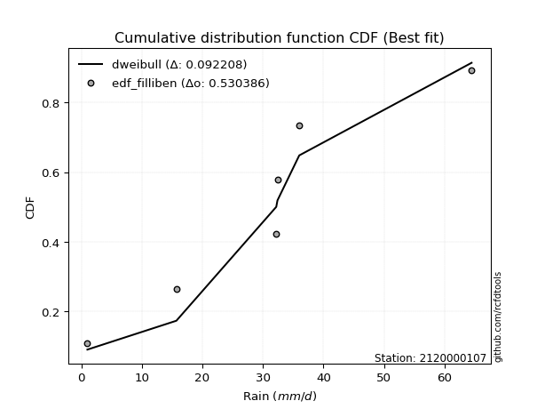</img>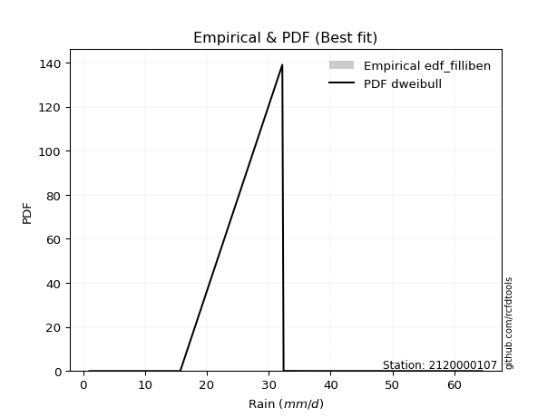</img>

</div>


### 10. EDF Jenkinson (1977)

The Jenkinson formula in hydrology is an empirical plotting position formula used to estimate the non-exceedance probability _(P)_ or return period _(T)_ of a given ordered observation within a sample. It is a widely used method in the frequency analysis of extreme events such as floods and rainfall, as it provides a distribution-free way to plot data. _a≈0.31_ and _b≈0.38_ are constants derived to approximate the median of the probability distribution for the given rank.

<div align="center">


$P=(m-a)/(n+b)$


</div>


**10.1. Empirical values**

<div align="center">

|                | 0                   | 1                   | 2                  | 3                  | 4                  | 5                  |
|:---------------|:--------------------|:--------------------|:-------------------|:-------------------|:-------------------|:-------------------|
| date           | 2023                | 2018                | 2025               | 2024               | 2020               | 2019               |
| x              | 1.0                 | 15.7                | 32.2               | 32.4               | 36.0               | 64.47              |
| m              | 1                   | 2                   | 3                  | 4                  | 5                  | 6                  |
| empirical_dist | edf_jenkinson       | edf_jenkinson       | edf_jenkinson      | edf_jenkinson      | edf_jenkinson      | edf_jenkinson      |
| empirical      | 0.10815047021943573 | 0.26489028213166144 | 0.4216300940438871 | 0.5783699059561128 | 0.7351097178683387 | 0.8918495297805643 |
| empirical_tr   | 1.1212653778558874  | 1.3603411513859276  | 1.7289972899728996 | 2.3717472118959106 | 3.7751479289940844 | 9.246376811594207  |

</div>


**10.2. Kolmogorov-Smirnov fit test (sorted by Δ)**


<div align="center">

|                | 0                   | 1                  | 2                   | 3                   | 4                   | 5                   | 6                   | 7                   | 8                   | 9                  | 10                  | 11                  | 12                 | 13                  | 14                  | 15                  | 16                  | 17                  | 18                  | 19                  | 20                  | 21                  | 22                  | 23                  | 24                  | 25                 | 26                  | 27                 | 28                  | 29                 | 30                 | 31                  | 32                 | 33                  | 34                  | 35                  | 36                  | 37                  | 38                  | 39                 | 40                  | 41                  | 42                  | 43                  | 44                  | 45                 | 46                  | 47                  | 48                  | 49                  | 50                  | 51                  | 52                  | 53                  | 54                  | 55                  | 56                  | 57                 | 58                 | 59                  | 60                  | 61                  | 62                 | 63                 | 64                 | 65                  | 66                  | 67                  | 68                 | 69                 | 70                  | 71                  | 72                  | 73                 | 74                  | 75                  | 76                  | 77                  | 78                  | 79                 | 80                  | 81                  | 82                  | 83                  | 84                  | 85                  | 86                  | 87                  | 88                 | 89                 | 90                  | 91                  | 92                  | 93                 | 94                 | 95                  | 96                 | 97                  | 98                 | 99                 | 100                 | 101                 | 102                | 103                | 104                 | 105               | 106                | 107                 | 108                | 109                 | 110                | 111                 | 112                | 113               | 114                 | 115                 | 116                 | 117                | 118                 | 119               | 120                 | 121                 | 122                 | 123                 | 124                 | 125                 | 126                | 127                 | 128                | 129                 | 130                | 131                | 132                 | 133                 | 134                | 135                 | 136                | 137                | 138                | 139                | 140                 | 141                | 142                | 143                 | 144                 | 145                 | 146                | 147                | 148                | 149                | 150                | 151                | 152                | 153                | 154                | 155                | 156                | 157                | 158                | 159               |
|:---------------|:--------------------|:-------------------|:--------------------|:--------------------|:--------------------|:--------------------|:--------------------|:--------------------|:--------------------|:-------------------|:--------------------|:--------------------|:-------------------|:--------------------|:--------------------|:--------------------|:--------------------|:--------------------|:--------------------|:--------------------|:--------------------|:--------------------|:--------------------|:--------------------|:--------------------|:-------------------|:--------------------|:-------------------|:--------------------|:-------------------|:-------------------|:--------------------|:-------------------|:--------------------|:--------------------|:--------------------|:--------------------|:--------------------|:--------------------|:-------------------|:--------------------|:--------------------|:--------------------|:--------------------|:--------------------|:-------------------|:--------------------|:--------------------|:--------------------|:--------------------|:--------------------|:--------------------|:--------------------|:--------------------|:--------------------|:--------------------|:--------------------|:-------------------|:-------------------|:--------------------|:--------------------|:--------------------|:-------------------|:-------------------|:-------------------|:--------------------|:--------------------|:--------------------|:-------------------|:-------------------|:--------------------|:--------------------|:--------------------|:-------------------|:--------------------|:--------------------|:--------------------|:--------------------|:--------------------|:-------------------|:--------------------|:--------------------|:--------------------|:--------------------|:--------------------|:--------------------|:--------------------|:--------------------|:-------------------|:-------------------|:--------------------|:--------------------|:--------------------|:-------------------|:-------------------|:--------------------|:-------------------|:--------------------|:-------------------|:-------------------|:--------------------|:--------------------|:-------------------|:-------------------|:--------------------|:------------------|:-------------------|:--------------------|:-------------------|:--------------------|:-------------------|:--------------------|:-------------------|:------------------|:--------------------|:--------------------|:--------------------|:-------------------|:--------------------|:------------------|:--------------------|:--------------------|:--------------------|:--------------------|:--------------------|:--------------------|:-------------------|:--------------------|:-------------------|:--------------------|:-------------------|:-------------------|:--------------------|:--------------------|:-------------------|:--------------------|:-------------------|:-------------------|:-------------------|:-------------------|:--------------------|:-------------------|:-------------------|:--------------------|:--------------------|:--------------------|:-------------------|:-------------------|:-------------------|:-------------------|:-------------------|:-------------------|:-------------------|:-------------------|:-------------------|:-------------------|:-------------------|:-------------------|:-------------------|:------------------|
| station        | 2120000107          | 2120000107         | 2120000107          | 2120000107          | 2120000107          | 2120000107          | 2120000107          | 2120000107          | 2120000107          | 2120000107         | 2120000107          | 2120000107          | 2120000107         | 2120000107          | 2120000107          | 2120000107          | 2120000107          | 2120000107          | 2120000107          | 2120000107          | 2120000107          | 2120000107          | 2120000107          | 2120000107          | 2120000107          | 2120000107         | 2120000107          | 2120000107         | 2120000107          | 2120000107         | 2120000107         | 2120000107          | 2120000107         | 2120000107          | 2120000107          | 2120000107          | 2120000107          | 2120000107          | 2120000107          | 2120000107         | 2120000107          | 2120000107          | 2120000107          | 2120000107          | 2120000107          | 2120000107         | 2120000107          | 2120000107          | 2120000107          | 2120000107          | 2120000107          | 2120000107          | 2120000107          | 2120000107          | 2120000107          | 2120000107          | 2120000107          | 2120000107         | 2120000107         | 2120000107          | 2120000107          | 2120000107          | 2120000107         | 2120000107         | 2120000107         | 2120000107          | 2120000107          | 2120000107          | 2120000107         | 2120000107         | 2120000107          | 2120000107          | 2120000107          | 2120000107         | 2120000107          | 2120000107          | 2120000107          | 2120000107          | 2120000107          | 2120000107         | 2120000107          | 2120000107          | 2120000107          | 2120000107          | 2120000107          | 2120000107          | 2120000107          | 2120000107          | 2120000107         | 2120000107         | 2120000107          | 2120000107          | 2120000107          | 2120000107         | 2120000107         | 2120000107          | 2120000107         | 2120000107          | 2120000107         | 2120000107         | 2120000107          | 2120000107          | 2120000107         | 2120000107         | 2120000107          | 2120000107        | 2120000107         | 2120000107          | 2120000107         | 2120000107          | 2120000107         | 2120000107          | 2120000107         | 2120000107        | 2120000107          | 2120000107          | 2120000107          | 2120000107         | 2120000107          | 2120000107        | 2120000107          | 2120000107          | 2120000107          | 2120000107          | 2120000107          | 2120000107          | 2120000107         | 2120000107          | 2120000107         | 2120000107          | 2120000107         | 2120000107         | 2120000107          | 2120000107          | 2120000107         | 2120000107          | 2120000107         | 2120000107         | 2120000107         | 2120000107         | 2120000107          | 2120000107         | 2120000107         | 2120000107          | 2120000107          | 2120000107          | 2120000107         | 2120000107         | 2120000107         | 2120000107         | 2120000107         | 2120000107         | 2120000107         | 2120000107         | 2120000107         | 2120000107         | 2120000107         | 2120000107         | 2120000107         | 2120000107        |
| empirical_dist | edf_jenkinson       | edf_jenkinson      | edf_jenkinson       | edf_jenkinson       | edf_jenkinson       | edf_jenkinson       | edf_jenkinson       | edf_jenkinson       | edf_jenkinson       | edf_jenkinson      | edf_jenkinson       | edf_jenkinson       | edf_jenkinson      | edf_jenkinson       | edf_jenkinson       | edf_jenkinson       | edf_jenkinson       | edf_jenkinson       | edf_jenkinson       | edf_jenkinson       | edf_jenkinson       | edf_jenkinson       | edf_jenkinson       | edf_jenkinson       | edf_jenkinson       | edf_jenkinson      | edf_jenkinson       | edf_jenkinson      | edf_jenkinson       | edf_jenkinson      | edf_jenkinson      | edf_jenkinson       | edf_jenkinson      | edf_jenkinson       | edf_jenkinson       | edf_jenkinson       | edf_jenkinson       | edf_jenkinson       | edf_jenkinson       | edf_jenkinson      | edf_jenkinson       | edf_jenkinson       | edf_jenkinson       | edf_jenkinson       | edf_jenkinson       | edf_jenkinson      | edf_jenkinson       | edf_jenkinson       | edf_jenkinson       | edf_jenkinson       | edf_jenkinson       | edf_jenkinson       | edf_jenkinson       | edf_jenkinson       | edf_jenkinson       | edf_jenkinson       | edf_jenkinson       | edf_jenkinson      | edf_jenkinson      | edf_jenkinson       | edf_jenkinson       | edf_jenkinson       | edf_jenkinson      | edf_jenkinson      | edf_jenkinson      | edf_jenkinson       | edf_jenkinson       | edf_jenkinson       | edf_jenkinson      | edf_jenkinson      | edf_jenkinson       | edf_jenkinson       | edf_jenkinson       | edf_jenkinson      | edf_jenkinson       | edf_jenkinson       | edf_jenkinson       | edf_jenkinson       | edf_jenkinson       | edf_jenkinson      | edf_jenkinson       | edf_jenkinson       | edf_jenkinson       | edf_jenkinson       | edf_jenkinson       | edf_jenkinson       | edf_jenkinson       | edf_jenkinson       | edf_jenkinson      | edf_jenkinson      | edf_jenkinson       | edf_jenkinson       | edf_jenkinson       | edf_jenkinson      | edf_jenkinson      | edf_jenkinson       | edf_jenkinson      | edf_jenkinson       | edf_jenkinson      | edf_jenkinson      | edf_jenkinson       | edf_jenkinson       | edf_jenkinson      | edf_jenkinson      | edf_jenkinson       | edf_jenkinson     | edf_jenkinson      | edf_jenkinson       | edf_jenkinson      | edf_jenkinson       | edf_jenkinson      | edf_jenkinson       | edf_jenkinson      | edf_jenkinson     | edf_jenkinson       | edf_jenkinson       | edf_jenkinson       | edf_jenkinson      | edf_jenkinson       | edf_jenkinson     | edf_jenkinson       | edf_jenkinson       | edf_jenkinson       | edf_jenkinson       | edf_jenkinson       | edf_jenkinson       | edf_jenkinson      | edf_jenkinson       | edf_jenkinson      | edf_jenkinson       | edf_jenkinson      | edf_jenkinson      | edf_jenkinson       | edf_jenkinson       | edf_jenkinson      | edf_jenkinson       | edf_jenkinson      | edf_jenkinson      | edf_jenkinson      | edf_jenkinson      | edf_jenkinson       | edf_jenkinson      | edf_jenkinson      | edf_jenkinson       | edf_jenkinson       | edf_jenkinson       | edf_jenkinson      | edf_jenkinson      | edf_jenkinson      | edf_jenkinson      | edf_jenkinson      | edf_jenkinson      | edf_jenkinson      | edf_jenkinson      | edf_jenkinson      | edf_jenkinson      | edf_jenkinson      | edf_jenkinson      | edf_jenkinson      | edf_jenkinson     |
| p_dist         | dweibull            | logdgamma          | t                   | crystalball         | norm                | foldnorm            | logistic            | hypsecant           | exponnorm           | logdweibull        | pearson3            | anglit              | genextreme         | truncpareto         | burr                | loggenextreme       | semicircular        | laplace             | cosine              | rice                | nct                 | skewnorm            | invgamma            | truncweibull_min    | fatiguelife         | logt               | logtukeylambda      | maxwell            | betaprime           | f                  | erlang             | gamma               | genlogistic        | loggausshyper       | invgauss            | gennorm             | logloggamma         | kappa3              | rayleigh            | weibull_min        | burr12              | loggennorm          | kappa4              | alpha               | logvonmises_line    | logpearson3        | logargus            | vonmises_line       | arcsine             | mielke              | invweibull          | bradford            | dgamma              | logtrapezoid        | gausshyper          | gumbel_l            | kstwobign           | uniform            | halfnorm           | gumbel_r            | loglevy_l           | ksone               | loggumbel_l        | truncexpon         | beta               | wrapcauchy          | logsemicircular     | logarcsine          | lomax              | moyal              | halflogistic        | loganglit           | loggompertz         | logexponweib       | argus               | genexpon            | ncf                 | loginvweibull       | loghalfgennorm      | lognct             | logexponnorm        | lognorm             | logcrystalball      | logrice             | loginvgauss         | logburr12           | logfatiguelife      | loggengamma         | loggamma           | loggamma           | logalpha            | logerlang           | loginvgamma         | logfoldnorm        | halfgennorm        | loglogistic         | levy_l             | logmaxwell          | loggenhalflogistic | gompertz           | lograyleigh         | loghypsecant        | logkstwobign       | logncf             | wald                | loghalfnorm       | loggenexpon        | logskewnorm         | genpareto          | triang              | logcosine          | logloglaplace       | loggumbel_r        | gengamma          | logwrapcauchy       | loglaplace          | loglaplace          | johnsonsb          | nakagami            | loghalflogistic   | logweibull_max      | logmoyal            | logtriang           | loglomax            | logtruncweibull_min | logf                | genhalflogistic    | logjohnsonsb        | logweibull_min     | logksone            | logwald            | logbeta            | johnsonsu           | logjohnsonsu        | logkappa4          | logkappa3           | loguniform         | exponweib          | trapezoid          | logbradford        | logexponpow         | tukeylambda        | loggenpareto       | logmielke           | logtruncnorm        | logbetaprime        | lognakagami        | logtruncexpon      | logburr            | rdist              | powerlaw           | weibull_max        | exponpow           | logtruncpareto     | truncnorm          | logpowerlaw        | logrdist           | loggenlogistic     | logvonmises        | vonmises          |
| delta          | 0.09276250494388907 | 0.1168074522191237 | 0.11997412659841744 | 0.11999444519247626 | 0.11999445342041914 | 0.12066049030940396 | 0.12256980208187346 | 0.12704401186014774 | 0.13059118833244604 | 0.1324157319387259 | 0.13474312071160716 | 0.13572931039683278 | 0.1361992059437716 | 0.13639871520179897 | 0.13855016395558217 | 0.13965567301603382 | 0.14228149436122883 | 0.14291238210232388 | 0.14291422434414403 | 0.14319364652845507 | 0.14334944287556245 | 0.14417734105761598 | 0.14503350160562517 | 0.14555934004910986 | 0.14648644858715248 | 0.1467126685265921 | 0.14744235668920602 | 0.1483866276622438 | 0.14969851759742742 | 0.1499866730778074 | 0.1500406675235632 | 0.15004075815871415 | 0.1511395660170673 | 0.15382018466163033 | 0.15419322512411698 | 0.15615117841703816 | 0.15648887517452864 | 0.15684915890887835 | 0.15845071799388405 | 0.1600885238255077 | 0.16040801526065634 | 0.16062907160360934 | 0.16188827933532268 | 0.16226280467389548 | 0.16303328995501393 | 0.1631282529946158 | 0.16400386925253913 | 0.16837078681364892 | 0.16875485838485638 | 0.16879648034614786 | 0.16956882404941692 | 0.17018621390449634 | 0.17088861189800406 | 0.17460606020618102 | 0.17576987072114736 | 0.17676624482361603 | 0.18072353284521364 | 0.1836680919033158 | 0.1868127920683516 | 0.18774812766937848 | 0.19008416436977404 | 0.19224169623081966 | 0.1929180449092836 | 0.1955945070304414 | 0.1991213458185454 | 0.19919767138586486 | 0.20882780725825506 | 0.20946366793975418 | 0.2120632796411554 | 0.2129169374825483 | 0.21369881445109457 | 0.21761170279644465 | 0.22028836259401258 | 0.2250227596250846 | 0.22739575985864857 | 0.23135501863246782 | 0.23280624929000887 | 0.23739959651178266 | 0.23741801413539754 | 0.2383970723069077 | 0.23848991883065024 | 0.23849171387918483 | 0.23849183219008002 | 0.23849680919408617 | 0.23894414817900106 | 0.24003230754239618 | 0.24093817136154078 | 0.24277858482459064 | 0.2435535607125377 | 0.2435535607125377 | 0.24426305005533605 | 0.24450890859965163 | 0.24793028492032693 | 0.2511505446043278 | 0.2552010630639931 | 0.25727146134521733 | 0.2581977948966026 | 0.25902959629580286 | 0.2611943809682549 | 0.2647794882851946 | 0.26516796197346965 | 0.27166071873094216 | 0.2772505143631927 | 0.2774601671840793 | 0.28276494364725674 | 0.283142870384728 | 0.2833545356661873 | 0.28656242507361424 | 0.2881408689422346 | 0.28901778137584716 | 0.2910180331289655 | 0.29199601024260746 | 0.2968150192916242 | 0.298806334672404 | 0.29900513525806605 | 0.29947724521089064 | 0.29947724521089064 | 0.3012902175158891 | 0.31107579630102794 | 0.311081865468442 | 0.31452360283710884 | 0.31600947043589706 | 0.33380328808954735 | 0.33393607582888296 | 0.34504449092398876 | 0.34997371811644074 | 0.3517367306310828 | 0.35506003707429046 | 0.3672083548197447 | 0.36923688267120425 | 0.3706983246909544 | 0.3851806913105732 | 0.40570815950932193 | 0.40671623264958306 | 0.4088849781565472 | 0.41170554634252926 | 0.4117351916156932 | 0.4135877179672084 | 0.4365805693109836 | 0.4367293060277396 | 0.44659682612147333 | 0.4575486890451514 | 0.4598518535171683 | 0.47462375420456093 | 0.48913340781943926 | 0.49138613589307245 | 0.5042582042640767 | 0.5063591258108264 | 0.5083886609894777 | 0.5464993975807992 | 0.5556054414154926 | 0.5859671011485759 | 0.6606038771986217 | 0.6654929144413217 | 0.7126027979997769 | 0.7316203073728018 | 0.7351097163564468 | 0.7351097178683387 | 1.0271383617751126 | 9.708768469069929 |
| deltao         | 0.530385761606      | 0.530385761606     | 0.530385761606      | 0.530385761606      | 0.530385761606      | 0.530385761606      | 0.530385761606      | 0.530385761606      | 0.530385761606      | 0.530385761606     | 0.530385761606      | 0.530385761606      | 0.530385761606     | 0.530385761606      | 0.530385761606      | 0.530385761606      | 0.530385761606      | 0.530385761606      | 0.530385761606      | 0.530385761606      | 0.530385761606      | 0.530385761606      | 0.530385761606      | 0.530385761606      | 0.530385761606      | 0.530385761606     | 0.530385761606      | 0.530385761606     | 0.530385761606      | 0.530385761606     | 0.530385761606     | 0.530385761606      | 0.530385761606     | 0.530385761606      | 0.530385761606      | 0.530385761606      | 0.530385761606      | 0.530385761606      | 0.530385761606      | 0.530385761606     | 0.530385761606      | 0.530385761606      | 0.530385761606      | 0.530385761606      | 0.530385761606      | 0.530385761606     | 0.530385761606      | 0.530385761606      | 0.530385761606      | 0.530385761606      | 0.530385761606      | 0.530385761606      | 0.530385761606      | 0.530385761606      | 0.530385761606      | 0.530385761606      | 0.530385761606      | 0.530385761606     | 0.530385761606     | 0.530385761606      | 0.530385761606      | 0.530385761606      | 0.530385761606     | 0.530385761606     | 0.530385761606     | 0.530385761606      | 0.530385761606      | 0.530385761606      | 0.530385761606     | 0.530385761606     | 0.530385761606      | 0.530385761606      | 0.530385761606      | 0.530385761606     | 0.530385761606      | 0.530385761606      | 0.530385761606      | 0.530385761606      | 0.530385761606      | 0.530385761606     | 0.530385761606      | 0.530385761606      | 0.530385761606      | 0.530385761606      | 0.530385761606      | 0.530385761606      | 0.530385761606      | 0.530385761606      | 0.530385761606     | 0.530385761606     | 0.530385761606      | 0.530385761606      | 0.530385761606      | 0.530385761606     | 0.530385761606     | 0.530385761606      | 0.530385761606     | 0.530385761606      | 0.530385761606     | 0.530385761606     | 0.530385761606      | 0.530385761606      | 0.530385761606     | 0.530385761606     | 0.530385761606      | 0.530385761606    | 0.530385761606     | 0.530385761606      | 0.530385761606     | 0.530385761606      | 0.530385761606     | 0.530385761606      | 0.530385761606     | 0.530385761606    | 0.530385761606      | 0.530385761606      | 0.530385761606      | 0.530385761606     | 0.530385761606      | 0.530385761606    | 0.530385761606      | 0.530385761606      | 0.530385761606      | 0.530385761606      | 0.530385761606      | 0.530385761606      | 0.530385761606     | 0.530385761606      | 0.530385761606     | 0.530385761606      | 0.530385761606     | 0.530385761606     | 0.530385761606      | 0.530385761606      | 0.530385761606     | 0.530385761606      | 0.530385761606     | 0.530385761606     | 0.530385761606     | 0.530385761606     | 0.530385761606      | 0.530385761606     | 0.530385761606     | 0.530385761606      | 0.530385761606      | 0.530385761606      | 0.530385761606     | 0.530385761606     | 0.530385761606     | 0.530385761606     | 0.530385761606     | 0.530385761606     | 0.530385761606     | 0.530385761606     | 0.530385761606     | 0.530385761606     | 0.530385761606     | 0.530385761606     | 0.530385761606     | 0.530385761606    |
| eval           | Δo > Δ              | Δo > Δ             | Δo > Δ              | Δo > Δ              | Δo > Δ              | Δo > Δ              | Δo > Δ              | Δo > Δ              | Δo > Δ              | Δo > Δ             | Δo > Δ              | Δo > Δ              | Δo > Δ             | Δo > Δ              | Δo > Δ              | Δo > Δ              | Δo > Δ              | Δo > Δ              | Δo > Δ              | Δo > Δ              | Δo > Δ              | Δo > Δ              | Δo > Δ              | Δo > Δ              | Δo > Δ              | Δo > Δ             | Δo > Δ              | Δo > Δ             | Δo > Δ              | Δo > Δ             | Δo > Δ             | Δo > Δ              | Δo > Δ             | Δo > Δ              | Δo > Δ              | Δo > Δ              | Δo > Δ              | Δo > Δ              | Δo > Δ              | Δo > Δ             | Δo > Δ              | Δo > Δ              | Δo > Δ              | Δo > Δ              | Δo > Δ              | Δo > Δ             | Δo > Δ              | Δo > Δ              | Δo > Δ              | Δo > Δ              | Δo > Δ              | Δo > Δ              | Δo > Δ              | Δo > Δ              | Δo > Δ              | Δo > Δ              | Δo > Δ              | Δo > Δ             | Δo > Δ             | Δo > Δ              | Δo > Δ              | Δo > Δ              | Δo > Δ             | Δo > Δ             | Δo > Δ             | Δo > Δ              | Δo > Δ              | Δo > Δ              | Δo > Δ             | Δo > Δ             | Δo > Δ              | Δo > Δ              | Δo > Δ              | Δo > Δ             | Δo > Δ              | Δo > Δ              | Δo > Δ              | Δo > Δ              | Δo > Δ              | Δo > Δ             | Δo > Δ              | Δo > Δ              | Δo > Δ              | Δo > Δ              | Δo > Δ              | Δo > Δ              | Δo > Δ              | Δo > Δ              | Δo > Δ             | Δo > Δ             | Δo > Δ              | Δo > Δ              | Δo > Δ              | Δo > Δ             | Δo > Δ             | Δo > Δ              | Δo > Δ             | Δo > Δ              | Δo > Δ             | Δo > Δ             | Δo > Δ              | Δo > Δ              | Δo > Δ             | Δo > Δ             | Δo > Δ              | Δo > Δ            | Δo > Δ             | Δo > Δ              | Δo > Δ             | Δo > Δ              | Δo > Δ             | Δo > Δ              | Δo > Δ             | Δo > Δ            | Δo > Δ              | Δo > Δ              | Δo > Δ              | Δo > Δ             | Δo > Δ              | Δo > Δ            | Δo > Δ              | Δo > Δ              | Δo > Δ              | Δo > Δ              | Δo > Δ              | Δo > Δ              | Δo > Δ             | Δo > Δ              | Δo > Δ             | Δo > Δ              | Δo > Δ             | Δo > Δ             | Δo > Δ              | Δo > Δ              | Δo > Δ             | Δo > Δ              | Δo > Δ             | Δo > Δ             | Δo > Δ             | Δo > Δ             | Δo > Δ              | Δo > Δ             | Δo > Δ             | Δo > Δ              | Δo > Δ              | Δo > Δ              | Δo > Δ             | Δo > Δ             | Δo > Δ             | Δo <= Δ            | Δo <= Δ            | Δo <= Δ            | Δo <= Δ            | Δo <= Δ            | Δo <= Δ            | Δo <= Δ            | Δo <= Δ            | Δo <= Δ            | Δo <= Δ            | Δo <= Δ           |
| fit            | 1                   | 1                  | 1                   | 1                   | 1                   | 1                   | 1                   | 1                   | 1                   | 1                  | 1                   | 1                   | 1                  | 1                   | 1                   | 1                   | 1                   | 1                   | 1                   | 1                   | 1                   | 1                   | 1                   | 1                   | 1                   | 1                  | 1                   | 1                  | 1                   | 1                  | 1                  | 1                   | 1                  | 1                   | 1                   | 1                   | 1                   | 1                   | 1                   | 1                  | 1                   | 1                   | 1                   | 1                   | 1                   | 1                  | 1                   | 1                   | 1                   | 1                   | 1                   | 1                   | 1                   | 1                   | 1                   | 1                   | 1                   | 1                  | 1                  | 1                   | 1                   | 1                   | 1                  | 1                  | 1                  | 1                   | 1                   | 1                   | 1                  | 1                  | 1                   | 1                   | 1                   | 1                  | 1                   | 1                   | 1                   | 1                   | 1                   | 1                  | 1                   | 1                   | 1                   | 1                   | 1                   | 1                   | 1                   | 1                   | 1                  | 1                  | 1                   | 1                   | 1                   | 1                  | 1                  | 1                   | 1                  | 1                   | 1                  | 1                  | 1                   | 1                   | 1                  | 1                  | 1                   | 1                 | 1                  | 1                   | 1                  | 1                   | 1                  | 1                   | 1                  | 1                 | 1                   | 1                   | 1                   | 1                  | 1                   | 1                 | 1                   | 1                   | 1                   | 1                   | 1                   | 1                   | 1                  | 1                   | 1                  | 1                   | 1                  | 1                  | 1                   | 1                   | 1                  | 1                   | 1                  | 1                  | 1                  | 1                  | 1                   | 1                  | 1                  | 1                   | 1                   | 1                   | 1                  | 1                  | 1                  | 0                  | 0                  | 0                  | 0                  | 0                  | 0                  | 0                  | 0                  | 0                  | 0                  | 0                 |
| n              | 6                   | 6                  | 6                   | 6                   | 6                   | 6                   | 6                   | 6                   | 6                   | 6                  | 6                   | 6                   | 6                  | 6                   | 6                   | 6                   | 6                   | 6                   | 6                   | 6                   | 6                   | 6                   | 6                   | 6                   | 6                   | 6                  | 6                   | 6                  | 6                   | 6                  | 6                  | 6                   | 6                  | 6                   | 6                   | 6                   | 6                   | 6                   | 6                   | 6                  | 6                   | 6                   | 6                   | 6                   | 6                   | 6                  | 6                   | 6                   | 6                   | 6                   | 6                   | 6                   | 6                   | 6                   | 6                   | 6                   | 6                   | 6                  | 6                  | 6                   | 6                   | 6                   | 6                  | 6                  | 6                  | 6                   | 6                   | 6                   | 6                  | 6                  | 6                   | 6                   | 6                   | 6                  | 6                   | 6                   | 6                   | 6                   | 6                   | 6                  | 6                   | 6                   | 6                   | 6                   | 6                   | 6                   | 6                   | 6                   | 6                  | 6                  | 6                   | 6                   | 6                   | 6                  | 6                  | 6                   | 6                  | 6                   | 6                  | 6                  | 6                   | 6                   | 6                  | 6                  | 6                   | 6                 | 6                  | 6                   | 6                  | 6                   | 6                  | 6                   | 6                  | 6                 | 6                   | 6                   | 6                   | 6                  | 6                   | 6                 | 6                   | 6                   | 6                   | 6                   | 6                   | 6                   | 6                  | 6                   | 6                  | 6                   | 6                  | 6                  | 6                   | 6                   | 6                  | 6                   | 6                  | 6                  | 6                  | 6                  | 6                   | 6                  | 6                  | 6                   | 6                   | 6                   | 6                  | 6                  | 6                  | 6                  | 6                  | 6                  | 6                  | 6                  | 6                  | 6                  | 6                  | 6                  | 6                  | 6                 |
| best_fit       | 1                   | 0                  | 0                   | 0                   | 0                   | 0                   | 0                   | 0                   | 0                   | 0                  | 0                   | 0                   | 0                  | 0                   | 0                   | 0                   | 0                   | 0                   | 0                   | 0                   | 0                   | 0                   | 0                   | 0                   | 0                   | 0                  | 0                   | 0                  | 0                   | 0                  | 0                  | 0                   | 0                  | 0                   | 0                   | 0                   | 0                   | 0                   | 0                   | 0                  | 0                   | 0                   | 0                   | 0                   | 0                   | 0                  | 0                   | 0                   | 0                   | 0                   | 0                   | 0                   | 0                   | 0                   | 0                   | 0                   | 0                   | 0                  | 0                  | 0                   | 0                   | 0                   | 0                  | 0                  | 0                  | 0                   | 0                   | 0                   | 0                  | 0                  | 0                   | 0                   | 0                   | 0                  | 0                   | 0                   | 0                   | 0                   | 0                   | 0                  | 0                   | 0                   | 0                   | 0                   | 0                   | 0                   | 0                   | 0                   | 0                  | 0                  | 0                   | 0                   | 0                   | 0                  | 0                  | 0                   | 0                  | 0                   | 0                  | 0                  | 0                   | 0                   | 0                  | 0                  | 0                   | 0                 | 0                  | 0                   | 0                  | 0                   | 0                  | 0                   | 0                  | 0                 | 0                   | 0                   | 0                   | 0                  | 0                   | 0                 | 0                   | 0                   | 0                   | 0                   | 0                   | 0                   | 0                  | 0                   | 0                  | 0                   | 0                  | 0                  | 0                   | 0                   | 0                  | 0                   | 0                  | 0                  | 0                  | 0                  | 0                   | 0                  | 0                  | 0                   | 0                   | 0                   | 0                  | 0                  | 0                  | 0                  | 0                  | 0                  | 0                  | 0                  | 0                  | 0                  | 0                  | 0                  | 0                  | 0                 |
| best_fit_sort  | 1                   | 2                  | 3                   | 4                   | 5                   | 6                   | 7                   | 8                   | 9                   | 10                 | 11                  | 12                  | 13                 | 14                  | 15                  | 16                  | 17                  | 18                  | 19                  | 20                  | 21                  | 22                  | 23                  | 24                  | 25                  | 26                 | 27                  | 28                 | 29                  | 30                 | 31                 | 32                  | 33                 | 34                  | 35                  | 36                  | 37                  | 38                  | 39                  | 40                 | 41                  | 42                  | 43                  | 44                  | 45                  | 46                 | 47                  | 48                  | 49                  | 50                  | 51                  | 52                  | 53                  | 54                  | 55                  | 56                  | 57                  | 58                 | 59                 | 60                  | 61                  | 62                  | 63                 | 64                 | 65                 | 66                  | 67                  | 68                  | 69                 | 70                 | 71                  | 72                  | 73                  | 74                 | 75                  | 76                  | 77                  | 78                  | 79                  | 80                 | 81                  | 82                  | 83                  | 84                  | 85                  | 86                  | 87                  | 88                  | 89                 | 90                 | 91                  | 92                  | 93                  | 94                 | 95                 | 96                  | 97                 | 98                  | 99                 | 100                | 101                 | 102                 | 103                | 104                | 105                 | 106               | 107                | 108                 | 109                | 110                 | 111                | 112                 | 113                | 114               | 115                 | 116                 | 117                 | 118                | 119                 | 120               | 121                 | 122                 | 123                 | 124                 | 125                 | 126                 | 127                | 128                 | 129                | 130                 | 131                | 132                | 133                 | 134                 | 135                | 136                 | 137                | 138                | 139                | 140                | 141                 | 142                | 143                | 144                 | 145                 | 146                 | 147                | 148                | 149                | 150                | 151                | 152                | 153                | 154                | 155                | 156                | 157                | 158                | 159                | 160               |

</div>


**10.3. Best fit**

<div align="center">

|   id |    station | empirical_dist   | p_dist   |     delta |   deltao | eval   |   fit |   n |   best_fit |   best_fit_sort |
|-----:|-----------:|:-----------------|:---------|----------:|---------:|:-------|------:|----:|-----------:|----------------:|
|    0 | 2120000107 | edf_jenkinson    | dweibull | 0.0927625 | 0.530386 | Δo > Δ |     1 |   6 |          1 |               1 |

</div>


<div align="center">

</img>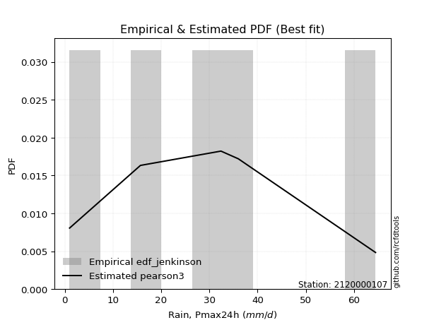</img>

</div>


### 11. EDF Cunnane (1978)

Cunnane´s work in statistical hydrology has focused on the performance and evaluation of different probability distributions (such as GEV, Gumbel, Lognormal) for flood frequency estimation. _b_ is a constant, typically set to 0.4.

<div align="center">


$P=(m-b)/(n+1-2b)$


</div>


**11.1. Empirical values**

<div align="center">

|                | 0                  | 1                   | 2                   | 3                  | 4                  | 5                  |
|:---------------|:-------------------|:--------------------|:--------------------|:-------------------|:-------------------|:-------------------|
| date           | 2023               | 2018                | 2025                | 2024               | 2020               | 2019               |
| x              | 1.0                | 15.7                | 32.2                | 32.4               | 36.0               | 64.47              |
| m              | 1                  | 2                   | 3                   | 4                  | 5                  | 6                  |
| empirical_dist | edf_cunnane        | edf_cunnane         | edf_cunnane         | edf_cunnane        | edf_cunnane        | edf_cunnane        |
| empirical      | 0.0967741935483871 | 0.25806451612903225 | 0.41935483870967744 | 0.5806451612903226 | 0.7419354838709676 | 0.9032258064516128 |
| empirical_tr   | 1.1071428571428572 | 1.3478260869565217  | 1.7222222222222225  | 2.384615384615385  | 3.8749999999999982 | 10.333333333333318 |

</div>


**11.2. Kolmogorov-Smirnov fit test (sorted by Δ)**


<div align="center">

|                | 0                   | 1                   | 2                   | 3                  | 4                   | 5                  | 6                   | 7                   | 8                   | 9                   | 10                 | 11                  | 12                 | 13                  | 14                 | 15                  | 16                  | 17                  | 18                  | 19                  | 20                  | 21                  | 22                  | 23                  | 24                 | 25                  | 26                | 27                 | 28                 | 29                  | 30                 | 31                  | 32                  | 33                | 34                  | 35                  | 36                  | 37                  | 38                  | 39                  | 40                 | 41                  | 42                  | 43                  | 44                  | 45                 | 46                  | 47                  | 48                  | 49                 | 50                  | 51                  | 52                  | 53                  | 54                  | 55                  | 56                | 57                 | 58                  | 59                  | 60                 | 61                | 62                 | 63                  | 64                 | 65                  | 66                  | 67                 | 68                | 69                  | 70                  | 71                  | 72                  | 73                 | 74                  | 75                  | 76                  | 77                 | 78                  | 79                  | 80                 | 81                  | 82                  | 83                  | 84                  | 85                  | 86                  | 87                  | 88                 | 89                 | 90                  | 91                  | 92                 | 93                 | 94                 | 95                | 96                  | 97                  | 98                 | 99                  | 100                 | 101                 | 102                | 103                 | 104                | 105                 | 106                | 107                | 108                | 109                | 110                | 111                 | 112                | 113                 | 114                 | 115                 | 116                 | 117                 | 118                 | 119                | 120                 | 121                | 122                 | 123                 | 124                 | 125                | 126                 | 127                | 128                 | 129                 | 130                 | 131                 | 132                 | 133                | 134                 | 135                 | 136                | 137                | 138                 | 139                | 140                | 141                | 142                 | 143                | 144                 | 145                 | 146                | 147                | 148                | 149               | 150                | 151                | 152                | 153                | 154                | 155               | 156               | 157                | 158                | 159               |
|:---------------|:--------------------|:--------------------|:--------------------|:-------------------|:--------------------|:-------------------|:--------------------|:--------------------|:--------------------|:--------------------|:-------------------|:--------------------|:-------------------|:--------------------|:-------------------|:--------------------|:--------------------|:--------------------|:--------------------|:--------------------|:--------------------|:--------------------|:--------------------|:--------------------|:-------------------|:--------------------|:------------------|:-------------------|:-------------------|:--------------------|:-------------------|:--------------------|:--------------------|:------------------|:--------------------|:--------------------|:--------------------|:--------------------|:--------------------|:--------------------|:-------------------|:--------------------|:--------------------|:--------------------|:--------------------|:-------------------|:--------------------|:--------------------|:--------------------|:-------------------|:--------------------|:--------------------|:--------------------|:--------------------|:--------------------|:--------------------|:------------------|:-------------------|:--------------------|:--------------------|:-------------------|:------------------|:-------------------|:--------------------|:-------------------|:--------------------|:--------------------|:-------------------|:------------------|:--------------------|:--------------------|:--------------------|:--------------------|:-------------------|:--------------------|:--------------------|:--------------------|:-------------------|:--------------------|:--------------------|:-------------------|:--------------------|:--------------------|:--------------------|:--------------------|:--------------------|:--------------------|:--------------------|:-------------------|:-------------------|:--------------------|:--------------------|:-------------------|:-------------------|:-------------------|:------------------|:--------------------|:--------------------|:-------------------|:--------------------|:--------------------|:--------------------|:-------------------|:--------------------|:-------------------|:--------------------|:-------------------|:-------------------|:-------------------|:-------------------|:-------------------|:--------------------|:-------------------|:--------------------|:--------------------|:--------------------|:--------------------|:--------------------|:--------------------|:-------------------|:--------------------|:-------------------|:--------------------|:--------------------|:--------------------|:-------------------|:--------------------|:-------------------|:--------------------|:--------------------|:--------------------|:--------------------|:--------------------|:-------------------|:--------------------|:--------------------|:-------------------|:-------------------|:--------------------|:-------------------|:-------------------|:-------------------|:--------------------|:-------------------|:--------------------|:--------------------|:-------------------|:-------------------|:-------------------|:------------------|:-------------------|:-------------------|:-------------------|:-------------------|:-------------------|:------------------|:------------------|:-------------------|:-------------------|:------------------|
| station        | 2120000107          | 2120000107          | 2120000107          | 2120000107         | 2120000107          | 2120000107         | 2120000107          | 2120000107          | 2120000107          | 2120000107          | 2120000107         | 2120000107          | 2120000107         | 2120000107          | 2120000107         | 2120000107          | 2120000107          | 2120000107          | 2120000107          | 2120000107          | 2120000107          | 2120000107          | 2120000107          | 2120000107          | 2120000107         | 2120000107          | 2120000107        | 2120000107         | 2120000107         | 2120000107          | 2120000107         | 2120000107          | 2120000107          | 2120000107        | 2120000107          | 2120000107          | 2120000107          | 2120000107          | 2120000107          | 2120000107          | 2120000107         | 2120000107          | 2120000107          | 2120000107          | 2120000107          | 2120000107         | 2120000107          | 2120000107          | 2120000107          | 2120000107         | 2120000107          | 2120000107          | 2120000107          | 2120000107          | 2120000107          | 2120000107          | 2120000107        | 2120000107         | 2120000107          | 2120000107          | 2120000107         | 2120000107        | 2120000107         | 2120000107          | 2120000107         | 2120000107          | 2120000107          | 2120000107         | 2120000107        | 2120000107          | 2120000107          | 2120000107          | 2120000107          | 2120000107         | 2120000107          | 2120000107          | 2120000107          | 2120000107         | 2120000107          | 2120000107          | 2120000107         | 2120000107          | 2120000107          | 2120000107          | 2120000107          | 2120000107          | 2120000107          | 2120000107          | 2120000107         | 2120000107         | 2120000107          | 2120000107          | 2120000107         | 2120000107         | 2120000107         | 2120000107        | 2120000107          | 2120000107          | 2120000107         | 2120000107          | 2120000107          | 2120000107          | 2120000107         | 2120000107          | 2120000107         | 2120000107          | 2120000107         | 2120000107         | 2120000107         | 2120000107         | 2120000107         | 2120000107          | 2120000107         | 2120000107          | 2120000107          | 2120000107          | 2120000107          | 2120000107          | 2120000107          | 2120000107         | 2120000107          | 2120000107         | 2120000107          | 2120000107          | 2120000107          | 2120000107         | 2120000107          | 2120000107         | 2120000107          | 2120000107          | 2120000107          | 2120000107          | 2120000107          | 2120000107         | 2120000107          | 2120000107          | 2120000107         | 2120000107         | 2120000107          | 2120000107         | 2120000107         | 2120000107         | 2120000107          | 2120000107         | 2120000107          | 2120000107          | 2120000107         | 2120000107         | 2120000107         | 2120000107        | 2120000107         | 2120000107         | 2120000107         | 2120000107         | 2120000107         | 2120000107        | 2120000107        | 2120000107         | 2120000107         | 2120000107        |
| empirical_dist | edf_cunnane         | edf_cunnane         | edf_cunnane         | edf_cunnane        | edf_cunnane         | edf_cunnane        | edf_cunnane         | edf_cunnane         | edf_cunnane         | edf_cunnane         | edf_cunnane        | edf_cunnane         | edf_cunnane        | edf_cunnane         | edf_cunnane        | edf_cunnane         | edf_cunnane         | edf_cunnane         | edf_cunnane         | edf_cunnane         | edf_cunnane         | edf_cunnane         | edf_cunnane         | edf_cunnane         | edf_cunnane        | edf_cunnane         | edf_cunnane       | edf_cunnane        | edf_cunnane        | edf_cunnane         | edf_cunnane        | edf_cunnane         | edf_cunnane         | edf_cunnane       | edf_cunnane         | edf_cunnane         | edf_cunnane         | edf_cunnane         | edf_cunnane         | edf_cunnane         | edf_cunnane        | edf_cunnane         | edf_cunnane         | edf_cunnane         | edf_cunnane         | edf_cunnane        | edf_cunnane         | edf_cunnane         | edf_cunnane         | edf_cunnane        | edf_cunnane         | edf_cunnane         | edf_cunnane         | edf_cunnane         | edf_cunnane         | edf_cunnane         | edf_cunnane       | edf_cunnane        | edf_cunnane         | edf_cunnane         | edf_cunnane        | edf_cunnane       | edf_cunnane        | edf_cunnane         | edf_cunnane        | edf_cunnane         | edf_cunnane         | edf_cunnane        | edf_cunnane       | edf_cunnane         | edf_cunnane         | edf_cunnane         | edf_cunnane         | edf_cunnane        | edf_cunnane         | edf_cunnane         | edf_cunnane         | edf_cunnane        | edf_cunnane         | edf_cunnane         | edf_cunnane        | edf_cunnane         | edf_cunnane         | edf_cunnane         | edf_cunnane         | edf_cunnane         | edf_cunnane         | edf_cunnane         | edf_cunnane        | edf_cunnane        | edf_cunnane         | edf_cunnane         | edf_cunnane        | edf_cunnane        | edf_cunnane        | edf_cunnane       | edf_cunnane         | edf_cunnane         | edf_cunnane        | edf_cunnane         | edf_cunnane         | edf_cunnane         | edf_cunnane        | edf_cunnane         | edf_cunnane        | edf_cunnane         | edf_cunnane        | edf_cunnane        | edf_cunnane        | edf_cunnane        | edf_cunnane        | edf_cunnane         | edf_cunnane        | edf_cunnane         | edf_cunnane         | edf_cunnane         | edf_cunnane         | edf_cunnane         | edf_cunnane         | edf_cunnane        | edf_cunnane         | edf_cunnane        | edf_cunnane         | edf_cunnane         | edf_cunnane         | edf_cunnane        | edf_cunnane         | edf_cunnane        | edf_cunnane         | edf_cunnane         | edf_cunnane         | edf_cunnane         | edf_cunnane         | edf_cunnane        | edf_cunnane         | edf_cunnane         | edf_cunnane        | edf_cunnane        | edf_cunnane         | edf_cunnane        | edf_cunnane        | edf_cunnane        | edf_cunnane         | edf_cunnane        | edf_cunnane         | edf_cunnane         | edf_cunnane        | edf_cunnane        | edf_cunnane        | edf_cunnane       | edf_cunnane        | edf_cunnane        | edf_cunnane        | edf_cunnane        | edf_cunnane        | edf_cunnane       | edf_cunnane       | edf_cunnane        | edf_cunnane        | edf_cunnane       |
| p_dist         | dweibull            | logdgamma           | logistic            | t                  | crystalball         | norm               | foldnorm            | hypsecant           | exponnorm           | pearson3            | genextreme         | truncpareto         | logt               | logtukeylambda      | loggenextreme      | anglit              | logdweibull         | laplace             | burr                | rice                | nct                 | skewnorm            | invgamma            | fatiguelife         | semicircular       | gennorm             | cosine            | maxwell            | betaprime          | f                   | erlang             | gamma               | truncweibull_min    | genlogistic       | loggennorm          | invgauss            | logloggamma         | kappa3              | loggausshyper       | rayleigh            | weibull_min        | burr12              | dgamma              | alpha               | logvonmises_line    | logpearson3        | logargus            | kappa4              | mielke              | invweibull         | bradford            | vonmises_line       | arcsine             | logtrapezoid        | gausshyper          | kstwobign           | gumbel_l          | halfnorm           | gumbel_r            | uniform             | loggumbel_l        | loglevy_l         | truncexpon         | ksone               | beta               | wrapcauchy          | logsemicircular     | lomax              | moyal             | halflogistic        | logarcsine          | loganglit           | loggompertz         | logexponweib       | genexpon            | argus               | ncf                 | lognct             | logexponnorm        | lognorm             | logcrystalball     | logrice             | loginvgauss         | logburr12           | logfatiguelife      | loginvweibull       | loghalfgennorm      | loggengamma         | loggamma           | loggamma           | logalpha            | logerlang           | loginvgamma        | logfoldnorm        | halfgennorm        | loglogistic       | logmaxwell          | gompertz            | loggenhalflogistic | lograyleigh         | levy_l              | loghypsecant        | logkstwobign       | wald                | loghalfnorm        | logncf              | logskewnorm        | loggenexpon        | logcosine          | genpareto          | triang             | logloglaplace       | loggumbel_r        | gengamma            | loglaplace          | loglaplace          | logwrapcauchy       | johnsonsb           | nakagami            | loghalflogistic    | logmoyal            | logweibull_max     | logtriang           | loglomax            | logtruncweibull_min | logf               | genhalflogistic     | logjohnsonsb       | logwald             | logweibull_min      | logksone            | logbeta             | johnsonsu           | logjohnsonsu       | logkappa4           | logkappa3           | loguniform         | exponweib          | trapezoid           | logbradford        | logexponpow        | tukeylambda        | loggenpareto        | logmielke          | logtruncnorm        | logbetaprime        | lognakagami        | logtruncexpon      | logburr            | rdist             | powerlaw           | weibull_max        | exponpow           | logtruncpareto     | truncnorm          | logpowerlaw       | logrdist          | loggenlogistic     | logvonmises        | vonmises          |
| delta          | 0.09371405992738124 | 0.12363321822175266 | 0.12484505741608315 | 0.1267998926010464 | 0.12682021119510523 | 0.1268202194230481 | 0.12748625631203292 | 0.12931926719435743 | 0.13286644366665573 | 0.13701837604581685 | 0.1384744612779813 | 0.13867397053600866 | 0.1398869025239629 | 0.14061659068657684 | 0.1419309283502435 | 0.14255507639946174 | 0.14379200860977437 | 0.14518763743653357 | 0.14537592995821114 | 0.14546890186266476 | 0.14562469820977214 | 0.14645259639182567 | 0.14730875693983486 | 0.14876170392136218 | 0.1491072603638578 | 0.14932541241440897 | 0.149739990346773 | 0.1506618829964535 | 0.1519737729316371 | 0.15226192841201708 | 0.1523159228577729 | 0.15231601349292384 | 0.15238510605173883 | 0.153414821351277 | 0.15380330560098016 | 0.15646848045832668 | 0.15876413050873833 | 0.15912441424308804 | 0.15961814141303177 | 0.16072597332809374 | 0.1623637791597174 | 0.16268327059486604 | 0.16406284589537487 | 0.16453806000810517 | 0.16530854528922362 | 0.1654035083288255 | 0.16627912458674882 | 0.16871404533795165 | 0.17107173568035755 | 0.1718440793836266 | 0.17246146923870603 | 0.17519655281627788 | 0.17558062438748534 | 0.17688131554039072 | 0.18259563672377632 | 0.18299878817942333 | 0.183592010826245 | 0.1890880474025613 | 0.19002338300358818 | 0.19049385790594475 | 0.1951933002434933 | 0.196909930372403 | 0.1978697623646511 | 0.19906746223344862 | 0.2013966011527551 | 0.20602343738849382 | 0.21110306259246475 | 0.2143385349753651 | 0.215192192816758 | 0.21597406978530426 | 0.21628943394238337 | 0.21988695813065434 | 0.22256361792822227 | 0.2272980149592943 | 0.23363027396667752 | 0.23422152586127754 | 0.23508150462421856 | 0.2406723276411174 | 0.24076517416485993 | 0.24076696921339452 | 0.2407670875242897 | 0.24077206452829586 | 0.24121940351321075 | 0.24230756287660588 | 0.24321342669575047 | 0.24422536251441185 | 0.24424378013802672 | 0.24505384015880033 | 0.2458288160467474 | 0.2458288160467474 | 0.24653830538954574 | 0.24678416393386132 | 0.2502055402545366 | 0.2534257999385375 | 0.2574763183982028 | 0.259546716679427 | 0.26130485163001255 | 0.26163084870497766 | 0.2634696363024646 | 0.26744321730767934 | 0.26957407156765123 | 0.27393597406515185 | 0.2840762803658219 | 0.28504019898146643 | 0.2854181257189377 | 0.28883644385512774 | 0.2888376804078239 | 0.2901803016688165 | 0.2932932884631752 | 0.2949666349448636 | 0.2958435473784761 | 0.29882177624523665 | 0.2990902746258339 | 0.30108159000661366 | 0.30175250054510033 | 0.30175250054510033 | 0.30583090126069523 | 0.30811598351851804 | 0.31335105163523763 | 0.3133571208026517 | 0.31828472577010675 | 0.3213493688397378 | 0.33607854342375704 | 0.34076184183151215 | 0.34731974625819845 | 0.3567994841190699 | 0.35856249663371176 | 0.3618858030769194 | 0.37297358002516406 | 0.37403412082237386 | 0.37606264867383343 | 0.39200645731320216 | 0.40343290417511224 | 0.4044409773153734 | 0.41116023349075687 | 0.41398080167673895 | 0.4140104469499029 | 0.4204134839698376 | 0.44340633531361257 | 0.4435550720303688 | 0.4534225921241025 | 0.4598239443793611 | 0.46667761951979747 | 0.4814495202071901 | 0.49595917382206844 | 0.49821190189570164 | 0.5110839702667059 | 0.5131848918134556 | 0.5152144269921068 | 0.548774652915009 | 0.5624312074181218 | 0.5927928671512048 | 0.6674296432012509 | 0.6723186804439509 | 0.7194285640024061 | 0.738446073375431 | 0.741935482359076 | 0.7419354838709676 | 1.0294136171093222 | 9.697392192398882 |
| deltao         | 0.530385761606      | 0.530385761606      | 0.530385761606      | 0.530385761606     | 0.530385761606      | 0.530385761606     | 0.530385761606      | 0.530385761606      | 0.530385761606      | 0.530385761606      | 0.530385761606     | 0.530385761606      | 0.530385761606     | 0.530385761606      | 0.530385761606     | 0.530385761606      | 0.530385761606      | 0.530385761606      | 0.530385761606      | 0.530385761606      | 0.530385761606      | 0.530385761606      | 0.530385761606      | 0.530385761606      | 0.530385761606     | 0.530385761606      | 0.530385761606    | 0.530385761606     | 0.530385761606     | 0.530385761606      | 0.530385761606     | 0.530385761606      | 0.530385761606      | 0.530385761606    | 0.530385761606      | 0.530385761606      | 0.530385761606      | 0.530385761606      | 0.530385761606      | 0.530385761606      | 0.530385761606     | 0.530385761606      | 0.530385761606      | 0.530385761606      | 0.530385761606      | 0.530385761606     | 0.530385761606      | 0.530385761606      | 0.530385761606      | 0.530385761606     | 0.530385761606      | 0.530385761606      | 0.530385761606      | 0.530385761606      | 0.530385761606      | 0.530385761606      | 0.530385761606    | 0.530385761606     | 0.530385761606      | 0.530385761606      | 0.530385761606     | 0.530385761606    | 0.530385761606     | 0.530385761606      | 0.530385761606     | 0.530385761606      | 0.530385761606      | 0.530385761606     | 0.530385761606    | 0.530385761606      | 0.530385761606      | 0.530385761606      | 0.530385761606      | 0.530385761606     | 0.530385761606      | 0.530385761606      | 0.530385761606      | 0.530385761606     | 0.530385761606      | 0.530385761606      | 0.530385761606     | 0.530385761606      | 0.530385761606      | 0.530385761606      | 0.530385761606      | 0.530385761606      | 0.530385761606      | 0.530385761606      | 0.530385761606     | 0.530385761606     | 0.530385761606      | 0.530385761606      | 0.530385761606     | 0.530385761606     | 0.530385761606     | 0.530385761606    | 0.530385761606      | 0.530385761606      | 0.530385761606     | 0.530385761606      | 0.530385761606      | 0.530385761606      | 0.530385761606     | 0.530385761606      | 0.530385761606     | 0.530385761606      | 0.530385761606     | 0.530385761606     | 0.530385761606     | 0.530385761606     | 0.530385761606     | 0.530385761606      | 0.530385761606     | 0.530385761606      | 0.530385761606      | 0.530385761606      | 0.530385761606      | 0.530385761606      | 0.530385761606      | 0.530385761606     | 0.530385761606      | 0.530385761606     | 0.530385761606      | 0.530385761606      | 0.530385761606      | 0.530385761606     | 0.530385761606      | 0.530385761606     | 0.530385761606      | 0.530385761606      | 0.530385761606      | 0.530385761606      | 0.530385761606      | 0.530385761606     | 0.530385761606      | 0.530385761606      | 0.530385761606     | 0.530385761606     | 0.530385761606      | 0.530385761606     | 0.530385761606     | 0.530385761606     | 0.530385761606      | 0.530385761606     | 0.530385761606      | 0.530385761606      | 0.530385761606     | 0.530385761606     | 0.530385761606     | 0.530385761606    | 0.530385761606     | 0.530385761606     | 0.530385761606     | 0.530385761606     | 0.530385761606     | 0.530385761606    | 0.530385761606    | 0.530385761606     | 0.530385761606     | 0.530385761606    |
| eval           | Δo > Δ              | Δo > Δ              | Δo > Δ              | Δo > Δ             | Δo > Δ              | Δo > Δ             | Δo > Δ              | Δo > Δ              | Δo > Δ              | Δo > Δ              | Δo > Δ             | Δo > Δ              | Δo > Δ             | Δo > Δ              | Δo > Δ             | Δo > Δ              | Δo > Δ              | Δo > Δ              | Δo > Δ              | Δo > Δ              | Δo > Δ              | Δo > Δ              | Δo > Δ              | Δo > Δ              | Δo > Δ             | Δo > Δ              | Δo > Δ            | Δo > Δ             | Δo > Δ             | Δo > Δ              | Δo > Δ             | Δo > Δ              | Δo > Δ              | Δo > Δ            | Δo > Δ              | Δo > Δ              | Δo > Δ              | Δo > Δ              | Δo > Δ              | Δo > Δ              | Δo > Δ             | Δo > Δ              | Δo > Δ              | Δo > Δ              | Δo > Δ              | Δo > Δ             | Δo > Δ              | Δo > Δ              | Δo > Δ              | Δo > Δ             | Δo > Δ              | Δo > Δ              | Δo > Δ              | Δo > Δ              | Δo > Δ              | Δo > Δ              | Δo > Δ            | Δo > Δ             | Δo > Δ              | Δo > Δ              | Δo > Δ             | Δo > Δ            | Δo > Δ             | Δo > Δ              | Δo > Δ             | Δo > Δ              | Δo > Δ              | Δo > Δ             | Δo > Δ            | Δo > Δ              | Δo > Δ              | Δo > Δ              | Δo > Δ              | Δo > Δ             | Δo > Δ              | Δo > Δ              | Δo > Δ              | Δo > Δ             | Δo > Δ              | Δo > Δ              | Δo > Δ             | Δo > Δ              | Δo > Δ              | Δo > Δ              | Δo > Δ              | Δo > Δ              | Δo > Δ              | Δo > Δ              | Δo > Δ             | Δo > Δ             | Δo > Δ              | Δo > Δ              | Δo > Δ             | Δo > Δ             | Δo > Δ             | Δo > Δ            | Δo > Δ              | Δo > Δ              | Δo > Δ             | Δo > Δ              | Δo > Δ              | Δo > Δ              | Δo > Δ             | Δo > Δ              | Δo > Δ             | Δo > Δ              | Δo > Δ             | Δo > Δ             | Δo > Δ             | Δo > Δ             | Δo > Δ             | Δo > Δ              | Δo > Δ             | Δo > Δ              | Δo > Δ              | Δo > Δ              | Δo > Δ              | Δo > Δ              | Δo > Δ              | Δo > Δ             | Δo > Δ              | Δo > Δ             | Δo > Δ              | Δo > Δ              | Δo > Δ              | Δo > Δ             | Δo > Δ              | Δo > Δ             | Δo > Δ              | Δo > Δ              | Δo > Δ              | Δo > Δ              | Δo > Δ              | Δo > Δ             | Δo > Δ              | Δo > Δ              | Δo > Δ             | Δo > Δ             | Δo > Δ              | Δo > Δ             | Δo > Δ             | Δo > Δ             | Δo > Δ              | Δo > Δ             | Δo > Δ              | Δo > Δ              | Δo > Δ             | Δo > Δ             | Δo > Δ             | Δo <= Δ           | Δo <= Δ            | Δo <= Δ            | Δo <= Δ            | Δo <= Δ            | Δo <= Δ            | Δo <= Δ           | Δo <= Δ           | Δo <= Δ            | Δo <= Δ            | Δo <= Δ           |
| fit            | 1                   | 1                   | 1                   | 1                  | 1                   | 1                  | 1                   | 1                   | 1                   | 1                   | 1                  | 1                   | 1                  | 1                   | 1                  | 1                   | 1                   | 1                   | 1                   | 1                   | 1                   | 1                   | 1                   | 1                   | 1                  | 1                   | 1                 | 1                  | 1                  | 1                   | 1                  | 1                   | 1                   | 1                 | 1                   | 1                   | 1                   | 1                   | 1                   | 1                   | 1                  | 1                   | 1                   | 1                   | 1                   | 1                  | 1                   | 1                   | 1                   | 1                  | 1                   | 1                   | 1                   | 1                   | 1                   | 1                   | 1                 | 1                  | 1                   | 1                   | 1                  | 1                 | 1                  | 1                   | 1                  | 1                   | 1                   | 1                  | 1                 | 1                   | 1                   | 1                   | 1                   | 1                  | 1                   | 1                   | 1                   | 1                  | 1                   | 1                   | 1                  | 1                   | 1                   | 1                   | 1                   | 1                   | 1                   | 1                   | 1                  | 1                  | 1                   | 1                   | 1                  | 1                  | 1                  | 1                 | 1                   | 1                   | 1                  | 1                   | 1                   | 1                   | 1                  | 1                   | 1                  | 1                   | 1                  | 1                  | 1                  | 1                  | 1                  | 1                   | 1                  | 1                   | 1                   | 1                   | 1                   | 1                   | 1                   | 1                  | 1                   | 1                  | 1                   | 1                   | 1                   | 1                  | 1                   | 1                  | 1                   | 1                   | 1                   | 1                   | 1                   | 1                  | 1                   | 1                   | 1                  | 1                  | 1                   | 1                  | 1                  | 1                  | 1                   | 1                  | 1                   | 1                   | 1                  | 1                  | 1                  | 0                 | 0                  | 0                  | 0                  | 0                  | 0                  | 0                 | 0                 | 0                  | 0                  | 0                 |
| n              | 6                   | 6                   | 6                   | 6                  | 6                   | 6                  | 6                   | 6                   | 6                   | 6                   | 6                  | 6                   | 6                  | 6                   | 6                  | 6                   | 6                   | 6                   | 6                   | 6                   | 6                   | 6                   | 6                   | 6                   | 6                  | 6                   | 6                 | 6                  | 6                  | 6                   | 6                  | 6                   | 6                   | 6                 | 6                   | 6                   | 6                   | 6                   | 6                   | 6                   | 6                  | 6                   | 6                   | 6                   | 6                   | 6                  | 6                   | 6                   | 6                   | 6                  | 6                   | 6                   | 6                   | 6                   | 6                   | 6                   | 6                 | 6                  | 6                   | 6                   | 6                  | 6                 | 6                  | 6                   | 6                  | 6                   | 6                   | 6                  | 6                 | 6                   | 6                   | 6                   | 6                   | 6                  | 6                   | 6                   | 6                   | 6                  | 6                   | 6                   | 6                  | 6                   | 6                   | 6                   | 6                   | 6                   | 6                   | 6                   | 6                  | 6                  | 6                   | 6                   | 6                  | 6                  | 6                  | 6                 | 6                   | 6                   | 6                  | 6                   | 6                   | 6                   | 6                  | 6                   | 6                  | 6                   | 6                  | 6                  | 6                  | 6                  | 6                  | 6                   | 6                  | 6                   | 6                   | 6                   | 6                   | 6                   | 6                   | 6                  | 6                   | 6                  | 6                   | 6                   | 6                   | 6                  | 6                   | 6                  | 6                   | 6                   | 6                   | 6                   | 6                   | 6                  | 6                   | 6                   | 6                  | 6                  | 6                   | 6                  | 6                  | 6                  | 6                   | 6                  | 6                   | 6                   | 6                  | 6                  | 6                  | 6                 | 6                  | 6                  | 6                  | 6                  | 6                  | 6                 | 6                 | 6                  | 6                  | 6                 |
| best_fit       | 1                   | 0                   | 0                   | 0                  | 0                   | 0                  | 0                   | 0                   | 0                   | 0                   | 0                  | 0                   | 0                  | 0                   | 0                  | 0                   | 0                   | 0                   | 0                   | 0                   | 0                   | 0                   | 0                   | 0                   | 0                  | 0                   | 0                 | 0                  | 0                  | 0                   | 0                  | 0                   | 0                   | 0                 | 0                   | 0                   | 0                   | 0                   | 0                   | 0                   | 0                  | 0                   | 0                   | 0                   | 0                   | 0                  | 0                   | 0                   | 0                   | 0                  | 0                   | 0                   | 0                   | 0                   | 0                   | 0                   | 0                 | 0                  | 0                   | 0                   | 0                  | 0                 | 0                  | 0                   | 0                  | 0                   | 0                   | 0                  | 0                 | 0                   | 0                   | 0                   | 0                   | 0                  | 0                   | 0                   | 0                   | 0                  | 0                   | 0                   | 0                  | 0                   | 0                   | 0                   | 0                   | 0                   | 0                   | 0                   | 0                  | 0                  | 0                   | 0                   | 0                  | 0                  | 0                  | 0                 | 0                   | 0                   | 0                  | 0                   | 0                   | 0                   | 0                  | 0                   | 0                  | 0                   | 0                  | 0                  | 0                  | 0                  | 0                  | 0                   | 0                  | 0                   | 0                   | 0                   | 0                   | 0                   | 0                   | 0                  | 0                   | 0                  | 0                   | 0                   | 0                   | 0                  | 0                   | 0                  | 0                   | 0                   | 0                   | 0                   | 0                   | 0                  | 0                   | 0                   | 0                  | 0                  | 0                   | 0                  | 0                  | 0                  | 0                   | 0                  | 0                   | 0                   | 0                  | 0                  | 0                  | 0                 | 0                  | 0                  | 0                  | 0                  | 0                  | 0                 | 0                 | 0                  | 0                  | 0                 |
| best_fit_sort  | 1                   | 2                   | 3                   | 4                  | 5                   | 6                  | 7                   | 8                   | 9                   | 10                  | 11                 | 12                  | 13                 | 14                  | 15                 | 16                  | 17                  | 18                  | 19                  | 20                  | 21                  | 22                  | 23                  | 24                  | 25                 | 26                  | 27                | 28                 | 29                 | 30                  | 31                 | 32                  | 33                  | 34                | 35                  | 36                  | 37                  | 38                  | 39                  | 40                  | 41                 | 42                  | 43                  | 44                  | 45                  | 46                 | 47                  | 48                  | 49                  | 50                 | 51                  | 52                  | 53                  | 54                  | 55                  | 56                  | 57                | 58                 | 59                  | 60                  | 61                 | 62                | 63                 | 64                  | 65                 | 66                  | 67                  | 68                 | 69                | 70                  | 71                  | 72                  | 73                  | 74                 | 75                  | 76                  | 77                  | 78                 | 79                  | 80                  | 81                 | 82                  | 83                  | 84                  | 85                  | 86                  | 87                  | 88                  | 89                 | 90                 | 91                  | 92                  | 93                 | 94                 | 95                 | 96                | 97                  | 98                  | 99                 | 100                 | 101                 | 102                 | 103                | 104                 | 105                | 106                 | 107                | 108                | 109                | 110                | 111                | 112                 | 113                | 114                 | 115                 | 116                 | 117                 | 118                 | 119                 | 120                | 121                 | 122                | 123                 | 124                 | 125                 | 126                | 127                 | 128                | 129                 | 130                 | 131                 | 132                 | 133                 | 134                | 135                 | 136                 | 137                | 138                | 139                 | 140                | 141                | 142                | 143                 | 144                | 145                 | 146                 | 147                | 148                | 149                | 150               | 151                | 152                | 153                | 154                | 155                | 156               | 157               | 158                | 159                | 160               |

</div>


**11.3. Best fit**

<div align="center">

|   id |    station | empirical_dist   | p_dist   |     delta |   deltao | eval   |   fit |   n |   best_fit |   best_fit_sort |
|-----:|-----------:|:-----------------|:---------|----------:|---------:|:-------|------:|----:|-----------:|----------------:|
|    0 | 2120000107 | edf_cunnane      | dweibull | 0.0937141 | 0.530386 | Δo > Δ |     1 |   6 |          1 |               1 |

</div>


<div align="center">

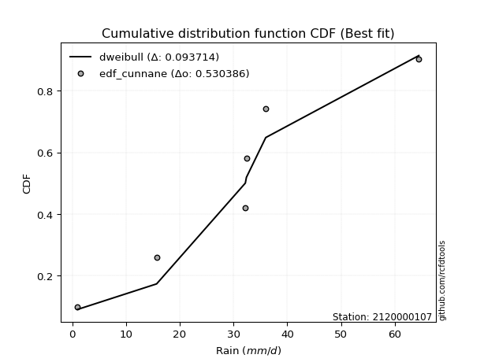</img>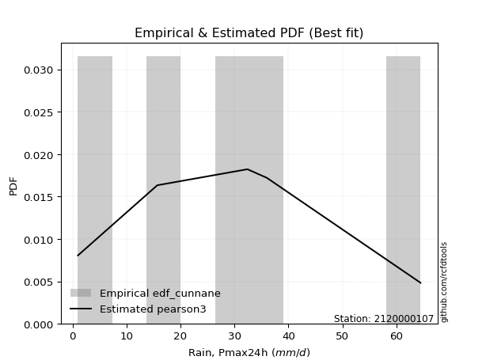</img>

</div>


### 12. EDF Adamowski (1981)

The Adamowski formula in hydrology refers to a specific plotting position formula used for estimating the non-parametric empirical distribution of hydrological events (like flood peaks) to calculate their return periods. This formula provides an alternative to traditional parametric methods (like the Gumbel or Log Pearson Type III distributions). 

<div align="center">


$P=(m-0.25)/(n+0.5)$


</div>


**12.1. Empirical values**

<div align="center">

|                | 0                   | 1                  | 2                  | 3                  | 4                  | 5                  |
|:---------------|:--------------------|:-------------------|:-------------------|:-------------------|:-------------------|:-------------------|
| date           | 2023                | 2018               | 2025               | 2024               | 2020               | 2019               |
| x              | 1.0                 | 15.7               | 32.2               | 32.4               | 36.0               | 64.47              |
| m              | 1                   | 2                  | 3                  | 4                  | 5                  | 6                  |
| empirical_dist | edf_adamowski       | edf_adamowski      | edf_adamowski      | edf_adamowski      | edf_adamowski      | edf_adamowski      |
| empirical      | 0.11538461538461539 | 0.2692307692307692 | 0.4230769230769231 | 0.5769230769230769 | 0.7307692307692307 | 0.8846153846153846 |
| empirical_tr   | 1.1304347826086958  | 1.3684210526315788 | 1.7333333333333334 | 2.3636363636363633 | 3.7142857142857135 | 8.666666666666664  |

</div>


**12.2. Kolmogorov-Smirnov fit test (sorted by Δ)**


<div align="center">

|                | 0                   | 1                   | 2                   | 3                  | 4                   | 5                   | 6                   | 7                   | 8                  | 9                  | 10                  | 11                 | 12                  | 13                  | 14                  | 15                  | 16                  | 17                  | 18                  | 19                  | 20                  | 21                 | 22                  | 23                  | 24                  | 25                  | 26                  | 27                  | 28                  | 29                 | 30                  | 31                  | 32                 | 33                 | 34                  | 35                 | 36                 | 37                 | 38                  | 39                  | 40                 | 41                  | 42                  | 43                  | 44                  | 45                  | 46                  | 47                  | 48                  | 49                 | 50                  | 51                 | 52                 | 53                  | 54                  | 55                  | 56                 | 57                  | 58                  | 59                 | 60                  | 61                 | 62                  | 63                  | 64                 | 65                  | 66                 | 67                  | 68                  | 69                  | 70                  | 71                 | 72                  | 73                  | 74                  | 75                  | 76                  | 77                  | 78                  | 79                  | 80                 | 81                  | 82                  | 83                  | 84                 | 85                  | 86                  | 87                 | 88                  | 89                  | 90                 | 91                  | 92                  | 93                  | 94                  | 95                  | 96                 | 97                 | 98                 | 99                 | 100                | 101                | 102                 | 103                | 104                | 105                | 106                | 107                 | 108                | 109                | 110                | 111                 | 112                 | 113                 | 114                 | 115               | 116                | 117                | 118               | 119                | 120                | 121                | 122                | 123                | 124                 | 125                 | 126                 | 127                | 128                | 129                 | 130                | 131                 | 132                | 133                 | 134               | 135                | 136                | 137                | 138                 | 139                 | 140                 | 141                | 142                 | 143                 | 144                | 145                 | 146                 | 147                | 148                | 149                | 150                | 151                | 152                | 153               | 154                | 155                | 156                | 157                | 158                | 159               |
|:---------------|:--------------------|:--------------------|:--------------------|:-------------------|:--------------------|:--------------------|:--------------------|:--------------------|:-------------------|:-------------------|:--------------------|:-------------------|:--------------------|:--------------------|:--------------------|:--------------------|:--------------------|:--------------------|:--------------------|:--------------------|:--------------------|:-------------------|:--------------------|:--------------------|:--------------------|:--------------------|:--------------------|:--------------------|:--------------------|:-------------------|:--------------------|:--------------------|:-------------------|:-------------------|:--------------------|:-------------------|:-------------------|:-------------------|:--------------------|:--------------------|:-------------------|:--------------------|:--------------------|:--------------------|:--------------------|:--------------------|:--------------------|:--------------------|:--------------------|:-------------------|:--------------------|:-------------------|:-------------------|:--------------------|:--------------------|:--------------------|:-------------------|:--------------------|:--------------------|:-------------------|:--------------------|:-------------------|:--------------------|:--------------------|:-------------------|:--------------------|:-------------------|:--------------------|:--------------------|:--------------------|:--------------------|:-------------------|:--------------------|:--------------------|:--------------------|:--------------------|:--------------------|:--------------------|:--------------------|:--------------------|:-------------------|:--------------------|:--------------------|:--------------------|:-------------------|:--------------------|:--------------------|:-------------------|:--------------------|:--------------------|:-------------------|:--------------------|:--------------------|:--------------------|:--------------------|:--------------------|:-------------------|:-------------------|:-------------------|:-------------------|:-------------------|:-------------------|:--------------------|:-------------------|:-------------------|:-------------------|:-------------------|:--------------------|:-------------------|:-------------------|:-------------------|:--------------------|:--------------------|:--------------------|:--------------------|:------------------|:-------------------|:-------------------|:------------------|:-------------------|:-------------------|:-------------------|:-------------------|:-------------------|:--------------------|:--------------------|:--------------------|:-------------------|:-------------------|:--------------------|:-------------------|:--------------------|:-------------------|:--------------------|:------------------|:-------------------|:-------------------|:-------------------|:--------------------|:--------------------|:--------------------|:-------------------|:--------------------|:--------------------|:-------------------|:--------------------|:--------------------|:-------------------|:-------------------|:-------------------|:-------------------|:-------------------|:-------------------|:------------------|:-------------------|:-------------------|:-------------------|:-------------------|:-------------------|:------------------|
| station        | 2120000107          | 2120000107          | 2120000107          | 2120000107         | 2120000107          | 2120000107          | 2120000107          | 2120000107          | 2120000107         | 2120000107         | 2120000107          | 2120000107         | 2120000107          | 2120000107          | 2120000107          | 2120000107          | 2120000107          | 2120000107          | 2120000107          | 2120000107          | 2120000107          | 2120000107         | 2120000107          | 2120000107          | 2120000107          | 2120000107          | 2120000107          | 2120000107          | 2120000107          | 2120000107         | 2120000107          | 2120000107          | 2120000107         | 2120000107         | 2120000107          | 2120000107         | 2120000107         | 2120000107         | 2120000107          | 2120000107          | 2120000107         | 2120000107          | 2120000107          | 2120000107          | 2120000107          | 2120000107          | 2120000107          | 2120000107          | 2120000107          | 2120000107         | 2120000107          | 2120000107         | 2120000107         | 2120000107          | 2120000107          | 2120000107          | 2120000107         | 2120000107          | 2120000107          | 2120000107         | 2120000107          | 2120000107         | 2120000107          | 2120000107          | 2120000107         | 2120000107          | 2120000107         | 2120000107          | 2120000107          | 2120000107          | 2120000107          | 2120000107         | 2120000107          | 2120000107          | 2120000107          | 2120000107          | 2120000107          | 2120000107          | 2120000107          | 2120000107          | 2120000107         | 2120000107          | 2120000107          | 2120000107          | 2120000107         | 2120000107          | 2120000107          | 2120000107         | 2120000107          | 2120000107          | 2120000107         | 2120000107          | 2120000107          | 2120000107          | 2120000107          | 2120000107          | 2120000107         | 2120000107         | 2120000107         | 2120000107         | 2120000107         | 2120000107         | 2120000107          | 2120000107         | 2120000107         | 2120000107         | 2120000107         | 2120000107          | 2120000107         | 2120000107         | 2120000107         | 2120000107          | 2120000107          | 2120000107          | 2120000107          | 2120000107        | 2120000107         | 2120000107         | 2120000107        | 2120000107         | 2120000107         | 2120000107         | 2120000107         | 2120000107         | 2120000107          | 2120000107          | 2120000107          | 2120000107         | 2120000107         | 2120000107          | 2120000107         | 2120000107          | 2120000107         | 2120000107          | 2120000107        | 2120000107         | 2120000107         | 2120000107         | 2120000107          | 2120000107          | 2120000107          | 2120000107         | 2120000107          | 2120000107          | 2120000107         | 2120000107          | 2120000107          | 2120000107         | 2120000107         | 2120000107         | 2120000107         | 2120000107         | 2120000107         | 2120000107        | 2120000107         | 2120000107         | 2120000107         | 2120000107         | 2120000107         | 2120000107        |
| empirical_dist | edf_adamowski       | edf_adamowski       | edf_adamowski       | edf_adamowski      | edf_adamowski       | edf_adamowski       | edf_adamowski       | edf_adamowski       | edf_adamowski      | edf_adamowski      | edf_adamowski       | edf_adamowski      | edf_adamowski       | edf_adamowski       | edf_adamowski       | edf_adamowski       | edf_adamowski       | edf_adamowski       | edf_adamowski       | edf_adamowski       | edf_adamowski       | edf_adamowski      | edf_adamowski       | edf_adamowski       | edf_adamowski       | edf_adamowski       | edf_adamowski       | edf_adamowski       | edf_adamowski       | edf_adamowski      | edf_adamowski       | edf_adamowski       | edf_adamowski      | edf_adamowski      | edf_adamowski       | edf_adamowski      | edf_adamowski      | edf_adamowski      | edf_adamowski       | edf_adamowski       | edf_adamowski      | edf_adamowski       | edf_adamowski       | edf_adamowski       | edf_adamowski       | edf_adamowski       | edf_adamowski       | edf_adamowski       | edf_adamowski       | edf_adamowski      | edf_adamowski       | edf_adamowski      | edf_adamowski      | edf_adamowski       | edf_adamowski       | edf_adamowski       | edf_adamowski      | edf_adamowski       | edf_adamowski       | edf_adamowski      | edf_adamowski       | edf_adamowski      | edf_adamowski       | edf_adamowski       | edf_adamowski      | edf_adamowski       | edf_adamowski      | edf_adamowski       | edf_adamowski       | edf_adamowski       | edf_adamowski       | edf_adamowski      | edf_adamowski       | edf_adamowski       | edf_adamowski       | edf_adamowski       | edf_adamowski       | edf_adamowski       | edf_adamowski       | edf_adamowski       | edf_adamowski      | edf_adamowski       | edf_adamowski       | edf_adamowski       | edf_adamowski      | edf_adamowski       | edf_adamowski       | edf_adamowski      | edf_adamowski       | edf_adamowski       | edf_adamowski      | edf_adamowski       | edf_adamowski       | edf_adamowski       | edf_adamowski       | edf_adamowski       | edf_adamowski      | edf_adamowski      | edf_adamowski      | edf_adamowski      | edf_adamowski      | edf_adamowski      | edf_adamowski       | edf_adamowski      | edf_adamowski      | edf_adamowski      | edf_adamowski      | edf_adamowski       | edf_adamowski      | edf_adamowski      | edf_adamowski      | edf_adamowski       | edf_adamowski       | edf_adamowski       | edf_adamowski       | edf_adamowski     | edf_adamowski      | edf_adamowski      | edf_adamowski     | edf_adamowski      | edf_adamowski      | edf_adamowski      | edf_adamowski      | edf_adamowski      | edf_adamowski       | edf_adamowski       | edf_adamowski       | edf_adamowski      | edf_adamowski      | edf_adamowski       | edf_adamowski      | edf_adamowski       | edf_adamowski      | edf_adamowski       | edf_adamowski     | edf_adamowski      | edf_adamowski      | edf_adamowski      | edf_adamowski       | edf_adamowski       | edf_adamowski       | edf_adamowski      | edf_adamowski       | edf_adamowski       | edf_adamowski      | edf_adamowski       | edf_adamowski       | edf_adamowski      | edf_adamowski      | edf_adamowski      | edf_adamowski      | edf_adamowski      | edf_adamowski      | edf_adamowski     | edf_adamowski      | edf_adamowski      | edf_adamowski      | edf_adamowski      | edf_adamowski      | edf_adamowski     |
| p_dist         | dweibull            | logdgamma           | norm                | crystalball        | t                   | foldnorm            | logistic            | logdweibull         | hypsecant          | exponnorm          | anglit              | pearson3           | burr                | genextreme          | truncpareto         | semicircular        | loggenextreme       | cosine              | truncweibull_min    | laplace             | rice                | nct                | skewnorm            | invgamma            | fatiguelife         | maxwell             | betaprime           | f                   | erlang              | gamma              | genlogistic         | logt                | logtukeylambda     | loggausshyper      | invgauss            | logloggamma        | kappa3             | rayleigh           | kappa4              | weibull_min         | burr12             | gennorm             | alpha               | logvonmises_line    | logpearson3         | logargus            | vonmises_line       | arcsine             | loggennorm          | mielke             | invweibull          | bradford           | gausshyper         | gumbel_l            | logtrapezoid        | dgamma              | kstwobign          | uniform             | halfnorm            | loglevy_l          | gumbel_r            | ksone              | loggumbel_l         | truncexpon          | wrapcauchy         | beta                | logarcsine         | logsemicircular     | lomax               | moyal               | halflogistic        | loganglit          | loggompertz         | argus               | logexponweib        | genexpon            | ncf                 | loginvweibull       | loghalfgennorm      | lognct              | logexponnorm       | lognorm             | logcrystalball      | logrice             | loginvgauss        | logburr12           | logfatiguelife      | loggengamma        | loggamma            | loggamma            | logalpha           | logerlang           | loginvgamma         | logfoldnorm         | levy_l              | halfgennorm         | loglogistic        | logmaxwell         | loggenhalflogistic | lograyleigh        | gompertz           | loghypsecant       | logncf              | logkstwobign       | loggenexpon        | wald               | loghalfnorm        | genpareto           | triang             | logskewnorm        | logloglaplace      | logcosine           | logwrapcauchy       | loggumbel_r         | johnsonsb           | gengamma          | loglaplace         | loglaplace         | nakagami          | loghalflogistic    | logweibull_max     | logmoyal           | loglomax           | logtriang          | logtruncweibull_min | logf                | genhalflogistic     | logjohnsonsb       | logweibull_min     | logksone            | logwald            | logbeta             | johnsonsu          | logkappa4           | logjohnsonsu      | exponweib          | logkappa3          | loguniform         | trapezoid           | logbradford         | logexponpow         | loggenpareto       | tukeylambda         | logmielke           | logtruncnorm       | logbetaprime        | lognakagami         | logtruncexpon      | logburr            | rdist              | powerlaw           | weibull_max        | exponpow           | logtruncpareto    | truncnorm          | logpowerlaw        | logrdist           | loggenlogistic     | logvonmises        | vonmises          |
| delta          | 0.09710299204299686 | 0.11246696512001575 | 0.11584966012211856 | 0.1158496685947446 | 0.11586967378339014 | 0.11742161065910289 | 0.12112297304883751 | 0.12518158677354618 | 0.1255971828271118 | 0.1291443592994101 | 0.13138882329772483 | 0.1332962916785712 | 0.13420967685647422 | 0.13475237691073566 | 0.13495188616876302 | 0.13794100726212088 | 0.13820884398299788 | 0.13857373724503608 | 0.14121885295000192 | 0.14146555306928793 | 0.14174681749541912 | 0.1419026138425265 | 0.14273051202458004 | 0.14358667257258922 | 0.14503961955411654 | 0.14693979862920786 | 0.14825168856439147 | 0.14853984404477144 | 0.14859383849052726 | 0.1485939291256782 | 0.14969273698403135 | 0.15105315562569988 | 0.1517828437883138 | 0.1523733556285944 | 0.15274639609108104 | 0.1550420461414927 | 0.1554023298758424 | 0.1570038889608481 | 0.15754779223621473 | 0.15864169479247175 | 0.1589611862276204 | 0.16049166551614594 | 0.16081597564085953 | 0.16158646092197798 | 0.16168142396157986 | 0.16255704021950318 | 0.16403029971454097 | 0.16441437128574843 | 0.16496955870271712 | 0.1673496513131119 | 0.16812199501638098 | 0.1687393848714604 | 0.1714293836220394 | 0.17242575772450808 | 0.17315923117314508 | 0.17522909899711184 | 0.1792767038121777 | 0.17932760480420784 | 0.18536596303531566 | 0.1857436772706661 | 0.18630129863634254 | 0.1879012091317117 | 0.19147121587624766 | 0.19414767799740545 | 0.1948571842867569 | 0.19767451678550946 | 0.2051231808406464 | 0.20738097822521911 | 0.21061645060811945 | 0.21147010844951236 | 0.21225198541805862 | 0.2161648737634087 | 0.21884153356097663 | 0.22305527275954062 | 0.22357593059204867 | 0.22990818959943188 | 0.23135942025697293 | 0.23305910941267488 | 0.23307752703628976 | 0.23695024327387176 | 0.2370430897976143 | 0.23704488484614888 | 0.23704500315704408 | 0.23704998016105022 | 0.2374973191459651 | 0.23858547850936024 | 0.23949134232850483 | 0.2413317557915547 | 0.24210673167950175 | 0.24210673167950175 | 0.2428162210223001 | 0.24306207956661569 | 0.24648345588729098 | 0.24970371557129184 | 0.25096364973142293 | 0.25375423403095715 | 0.2558246323121814 | 0.2575827672627669 | 0.259747551935219  | 0.2637211329404337 | 0.2691199753843024 | 0.2702138896979062 | 0.27022602201889956 | 0.2729100272640849 | 0.2790140485670795 | 0.2813181146142208 | 0.2816960413516921 | 0.28380038184312667 | 0.2846772942767392 | 0.2851155960405783 | 0.2876555231434997 | 0.28957120409592957 | 0.29466464815895826 | 0.29536819025858824 | 0.29694973041678113 | 0.297359505639368 | 0.2980304161778547 | 0.2980304161778547 | 0.309628967267992 | 0.3096350364354061 | 0.3101831157380009 | 0.3145626414028611 | 0.3295955887297752 | 0.3323564590565114 | 0.3435976618909528  | 0.34563323101733295 | 0.34739624353197485 | 0.3507195499751825 | 0.3628678677206369 | 0.36489639557209647 | 0.3692514956579184 | 0.38084020421146525 | 0.4071549885423579 | 0.40743814912351123 | 0.408163061682619 | 0.4092472308681006 | 0.4102587173094933 | 0.4102883625826573 | 0.43224008221187565 | 0.43238881892863185 | 0.44225633902236555 | 0.4555113664180605 | 0.45610186001211545 | 0.47028326710545315 | 0.4847929207203315 | 0.48704564879396467 | 0.49991771716496897 | 0.5020186387117187 | 0.5040481738903699 | 0.5450525685477634 | 0.5512649543163848 | 0.5816266140494679 | 0.6562633900995138 | 0.661152427342214 | 0.7082623109006692 | 0.7272798202736941 | 0.7307692292573391 | 0.7307692307692307 | 1.0256915327420766 | 9.716002614235109 |
| deltao         | 0.530385761606      | 0.530385761606      | 0.530385761606      | 0.530385761606     | 0.530385761606      | 0.530385761606      | 0.530385761606      | 0.530385761606      | 0.530385761606     | 0.530385761606     | 0.530385761606      | 0.530385761606     | 0.530385761606      | 0.530385761606      | 0.530385761606      | 0.530385761606      | 0.530385761606      | 0.530385761606      | 0.530385761606      | 0.530385761606      | 0.530385761606      | 0.530385761606     | 0.530385761606      | 0.530385761606      | 0.530385761606      | 0.530385761606      | 0.530385761606      | 0.530385761606      | 0.530385761606      | 0.530385761606     | 0.530385761606      | 0.530385761606      | 0.530385761606     | 0.530385761606     | 0.530385761606      | 0.530385761606     | 0.530385761606     | 0.530385761606     | 0.530385761606      | 0.530385761606      | 0.530385761606     | 0.530385761606      | 0.530385761606      | 0.530385761606      | 0.530385761606      | 0.530385761606      | 0.530385761606      | 0.530385761606      | 0.530385761606      | 0.530385761606     | 0.530385761606      | 0.530385761606     | 0.530385761606     | 0.530385761606      | 0.530385761606      | 0.530385761606      | 0.530385761606     | 0.530385761606      | 0.530385761606      | 0.530385761606     | 0.530385761606      | 0.530385761606     | 0.530385761606      | 0.530385761606      | 0.530385761606     | 0.530385761606      | 0.530385761606     | 0.530385761606      | 0.530385761606      | 0.530385761606      | 0.530385761606      | 0.530385761606     | 0.530385761606      | 0.530385761606      | 0.530385761606      | 0.530385761606      | 0.530385761606      | 0.530385761606      | 0.530385761606      | 0.530385761606      | 0.530385761606     | 0.530385761606      | 0.530385761606      | 0.530385761606      | 0.530385761606     | 0.530385761606      | 0.530385761606      | 0.530385761606     | 0.530385761606      | 0.530385761606      | 0.530385761606     | 0.530385761606      | 0.530385761606      | 0.530385761606      | 0.530385761606      | 0.530385761606      | 0.530385761606     | 0.530385761606     | 0.530385761606     | 0.530385761606     | 0.530385761606     | 0.530385761606     | 0.530385761606      | 0.530385761606     | 0.530385761606     | 0.530385761606     | 0.530385761606     | 0.530385761606      | 0.530385761606     | 0.530385761606     | 0.530385761606     | 0.530385761606      | 0.530385761606      | 0.530385761606      | 0.530385761606      | 0.530385761606    | 0.530385761606     | 0.530385761606     | 0.530385761606    | 0.530385761606     | 0.530385761606     | 0.530385761606     | 0.530385761606     | 0.530385761606     | 0.530385761606      | 0.530385761606      | 0.530385761606      | 0.530385761606     | 0.530385761606     | 0.530385761606      | 0.530385761606     | 0.530385761606      | 0.530385761606     | 0.530385761606      | 0.530385761606    | 0.530385761606     | 0.530385761606     | 0.530385761606     | 0.530385761606      | 0.530385761606      | 0.530385761606      | 0.530385761606     | 0.530385761606      | 0.530385761606      | 0.530385761606     | 0.530385761606      | 0.530385761606      | 0.530385761606     | 0.530385761606     | 0.530385761606     | 0.530385761606     | 0.530385761606     | 0.530385761606     | 0.530385761606    | 0.530385761606     | 0.530385761606     | 0.530385761606     | 0.530385761606     | 0.530385761606     | 0.530385761606    |
| eval           | Δo > Δ              | Δo > Δ              | Δo > Δ              | Δo > Δ             | Δo > Δ              | Δo > Δ              | Δo > Δ              | Δo > Δ              | Δo > Δ             | Δo > Δ             | Δo > Δ              | Δo > Δ             | Δo > Δ              | Δo > Δ              | Δo > Δ              | Δo > Δ              | Δo > Δ              | Δo > Δ              | Δo > Δ              | Δo > Δ              | Δo > Δ              | Δo > Δ             | Δo > Δ              | Δo > Δ              | Δo > Δ              | Δo > Δ              | Δo > Δ              | Δo > Δ              | Δo > Δ              | Δo > Δ             | Δo > Δ              | Δo > Δ              | Δo > Δ             | Δo > Δ             | Δo > Δ              | Δo > Δ             | Δo > Δ             | Δo > Δ             | Δo > Δ              | Δo > Δ              | Δo > Δ             | Δo > Δ              | Δo > Δ              | Δo > Δ              | Δo > Δ              | Δo > Δ              | Δo > Δ              | Δo > Δ              | Δo > Δ              | Δo > Δ             | Δo > Δ              | Δo > Δ             | Δo > Δ             | Δo > Δ              | Δo > Δ              | Δo > Δ              | Δo > Δ             | Δo > Δ              | Δo > Δ              | Δo > Δ             | Δo > Δ              | Δo > Δ             | Δo > Δ              | Δo > Δ              | Δo > Δ             | Δo > Δ              | Δo > Δ             | Δo > Δ              | Δo > Δ              | Δo > Δ              | Δo > Δ              | Δo > Δ             | Δo > Δ              | Δo > Δ              | Δo > Δ              | Δo > Δ              | Δo > Δ              | Δo > Δ              | Δo > Δ              | Δo > Δ              | Δo > Δ             | Δo > Δ              | Δo > Δ              | Δo > Δ              | Δo > Δ             | Δo > Δ              | Δo > Δ              | Δo > Δ             | Δo > Δ              | Δo > Δ              | Δo > Δ             | Δo > Δ              | Δo > Δ              | Δo > Δ              | Δo > Δ              | Δo > Δ              | Δo > Δ             | Δo > Δ             | Δo > Δ             | Δo > Δ             | Δo > Δ             | Δo > Δ             | Δo > Δ              | Δo > Δ             | Δo > Δ             | Δo > Δ             | Δo > Δ             | Δo > Δ              | Δo > Δ             | Δo > Δ             | Δo > Δ             | Δo > Δ              | Δo > Δ              | Δo > Δ              | Δo > Δ              | Δo > Δ            | Δo > Δ             | Δo > Δ             | Δo > Δ            | Δo > Δ             | Δo > Δ             | Δo > Δ             | Δo > Δ             | Δo > Δ             | Δo > Δ              | Δo > Δ              | Δo > Δ              | Δo > Δ             | Δo > Δ             | Δo > Δ              | Δo > Δ             | Δo > Δ              | Δo > Δ             | Δo > Δ              | Δo > Δ            | Δo > Δ             | Δo > Δ             | Δo > Δ             | Δo > Δ              | Δo > Δ              | Δo > Δ              | Δo > Δ             | Δo > Δ              | Δo > Δ              | Δo > Δ             | Δo > Δ              | Δo > Δ              | Δo > Δ             | Δo > Δ             | Δo <= Δ            | Δo <= Δ            | Δo <= Δ            | Δo <= Δ            | Δo <= Δ           | Δo <= Δ            | Δo <= Δ            | Δo <= Δ            | Δo <= Δ            | Δo <= Δ            | Δo <= Δ           |
| fit            | 1                   | 1                   | 1                   | 1                  | 1                   | 1                   | 1                   | 1                   | 1                  | 1                  | 1                   | 1                  | 1                   | 1                   | 1                   | 1                   | 1                   | 1                   | 1                   | 1                   | 1                   | 1                  | 1                   | 1                   | 1                   | 1                   | 1                   | 1                   | 1                   | 1                  | 1                   | 1                   | 1                  | 1                  | 1                   | 1                  | 1                  | 1                  | 1                   | 1                   | 1                  | 1                   | 1                   | 1                   | 1                   | 1                   | 1                   | 1                   | 1                   | 1                  | 1                   | 1                  | 1                  | 1                   | 1                   | 1                   | 1                  | 1                   | 1                   | 1                  | 1                   | 1                  | 1                   | 1                   | 1                  | 1                   | 1                  | 1                   | 1                   | 1                   | 1                   | 1                  | 1                   | 1                   | 1                   | 1                   | 1                   | 1                   | 1                   | 1                   | 1                  | 1                   | 1                   | 1                   | 1                  | 1                   | 1                   | 1                  | 1                   | 1                   | 1                  | 1                   | 1                   | 1                   | 1                   | 1                   | 1                  | 1                  | 1                  | 1                  | 1                  | 1                  | 1                   | 1                  | 1                  | 1                  | 1                  | 1                   | 1                  | 1                  | 1                  | 1                   | 1                   | 1                   | 1                   | 1                 | 1                  | 1                  | 1                 | 1                  | 1                  | 1                  | 1                  | 1                  | 1                   | 1                   | 1                   | 1                  | 1                  | 1                   | 1                  | 1                   | 1                  | 1                   | 1                 | 1                  | 1                  | 1                  | 1                   | 1                   | 1                   | 1                  | 1                   | 1                   | 1                  | 1                   | 1                   | 1                  | 1                  | 0                  | 0                  | 0                  | 0                  | 0                 | 0                  | 0                  | 0                  | 0                  | 0                  | 0                 |
| n              | 6                   | 6                   | 6                   | 6                  | 6                   | 6                   | 6                   | 6                   | 6                  | 6                  | 6                   | 6                  | 6                   | 6                   | 6                   | 6                   | 6                   | 6                   | 6                   | 6                   | 6                   | 6                  | 6                   | 6                   | 6                   | 6                   | 6                   | 6                   | 6                   | 6                  | 6                   | 6                   | 6                  | 6                  | 6                   | 6                  | 6                  | 6                  | 6                   | 6                   | 6                  | 6                   | 6                   | 6                   | 6                   | 6                   | 6                   | 6                   | 6                   | 6                  | 6                   | 6                  | 6                  | 6                   | 6                   | 6                   | 6                  | 6                   | 6                   | 6                  | 6                   | 6                  | 6                   | 6                   | 6                  | 6                   | 6                  | 6                   | 6                   | 6                   | 6                   | 6                  | 6                   | 6                   | 6                   | 6                   | 6                   | 6                   | 6                   | 6                   | 6                  | 6                   | 6                   | 6                   | 6                  | 6                   | 6                   | 6                  | 6                   | 6                   | 6                  | 6                   | 6                   | 6                   | 6                   | 6                   | 6                  | 6                  | 6                  | 6                  | 6                  | 6                  | 6                   | 6                  | 6                  | 6                  | 6                  | 6                   | 6                  | 6                  | 6                  | 6                   | 6                   | 6                   | 6                   | 6                 | 6                  | 6                  | 6                 | 6                  | 6                  | 6                  | 6                  | 6                  | 6                   | 6                   | 6                   | 6                  | 6                  | 6                   | 6                  | 6                   | 6                  | 6                   | 6                 | 6                  | 6                  | 6                  | 6                   | 6                   | 6                   | 6                  | 6                   | 6                   | 6                  | 6                   | 6                   | 6                  | 6                  | 6                  | 6                  | 6                  | 6                  | 6                 | 6                  | 6                  | 6                  | 6                  | 6                  | 6                 |
| best_fit       | 1                   | 0                   | 0                   | 0                  | 0                   | 0                   | 0                   | 0                   | 0                  | 0                  | 0                   | 0                  | 0                   | 0                   | 0                   | 0                   | 0                   | 0                   | 0                   | 0                   | 0                   | 0                  | 0                   | 0                   | 0                   | 0                   | 0                   | 0                   | 0                   | 0                  | 0                   | 0                   | 0                  | 0                  | 0                   | 0                  | 0                  | 0                  | 0                   | 0                   | 0                  | 0                   | 0                   | 0                   | 0                   | 0                   | 0                   | 0                   | 0                   | 0                  | 0                   | 0                  | 0                  | 0                   | 0                   | 0                   | 0                  | 0                   | 0                   | 0                  | 0                   | 0                  | 0                   | 0                   | 0                  | 0                   | 0                  | 0                   | 0                   | 0                   | 0                   | 0                  | 0                   | 0                   | 0                   | 0                   | 0                   | 0                   | 0                   | 0                   | 0                  | 0                   | 0                   | 0                   | 0                  | 0                   | 0                   | 0                  | 0                   | 0                   | 0                  | 0                   | 0                   | 0                   | 0                   | 0                   | 0                  | 0                  | 0                  | 0                  | 0                  | 0                  | 0                   | 0                  | 0                  | 0                  | 0                  | 0                   | 0                  | 0                  | 0                  | 0                   | 0                   | 0                   | 0                   | 0                 | 0                  | 0                  | 0                 | 0                  | 0                  | 0                  | 0                  | 0                  | 0                   | 0                   | 0                   | 0                  | 0                  | 0                   | 0                  | 0                   | 0                  | 0                   | 0                 | 0                  | 0                  | 0                  | 0                   | 0                   | 0                   | 0                  | 0                   | 0                   | 0                  | 0                   | 0                   | 0                  | 0                  | 0                  | 0                  | 0                  | 0                  | 0                 | 0                  | 0                  | 0                  | 0                  | 0                  | 0                 |
| best_fit_sort  | 1                   | 2                   | 3                   | 4                  | 5                   | 6                   | 7                   | 8                   | 9                  | 10                 | 11                  | 12                 | 13                  | 14                  | 15                  | 16                  | 17                  | 18                  | 19                  | 20                  | 21                  | 22                 | 23                  | 24                  | 25                  | 26                  | 27                  | 28                  | 29                  | 30                 | 31                  | 32                  | 33                 | 34                 | 35                  | 36                 | 37                 | 38                 | 39                  | 40                  | 41                 | 42                  | 43                  | 44                  | 45                  | 46                  | 47                  | 48                  | 49                  | 50                 | 51                  | 52                 | 53                 | 54                  | 55                  | 56                  | 57                 | 58                  | 59                  | 60                 | 61                  | 62                 | 63                  | 64                  | 65                 | 66                  | 67                 | 68                  | 69                  | 70                  | 71                  | 72                 | 73                  | 74                  | 75                  | 76                  | 77                  | 78                  | 79                  | 80                  | 81                 | 82                  | 83                  | 84                  | 85                 | 86                  | 87                  | 88                 | 89                  | 90                  | 91                 | 92                  | 93                  | 94                  | 95                  | 96                  | 97                 | 98                 | 99                 | 100                | 101                | 102                | 103                 | 104                | 105                | 106                | 107                | 108                 | 109                | 110                | 111                | 112                 | 113                 | 114                 | 115                 | 116               | 117                | 118                | 119               | 120                | 121                | 122                | 123                | 124                | 125                 | 126                 | 127                 | 128                | 129                | 130                 | 131                | 132                 | 133                | 134                 | 135               | 136                | 137                | 138                | 139                 | 140                 | 141                 | 142                | 143                 | 144                 | 145                | 146                 | 147                 | 148                | 149                | 150                | 151                | 152                | 153                | 154               | 155                | 156                | 157                | 158                | 159                | 160               |

</div>


**12.3. Best fit**

<div align="center">

|   id |    station | empirical_dist   | p_dist   |    delta |   deltao | eval   |   fit |   n |   best_fit |   best_fit_sort |
|-----:|-----------:|:-----------------|:---------|---------:|---------:|:-------|------:|----:|-----------:|----------------:|
|    0 | 2120000107 | edf_adamowski    | dweibull | 0.097103 | 0.530386 | Δo > Δ |     1 |   6 |          1 |               1 |

</div>


<div align="center">

</img>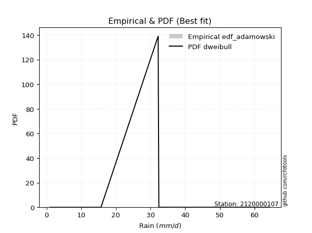</img>

</div>


## C. Best fit & Estimate extreme values for specific return periods - Tr

Best fit in probability distribution analysis means finding the theoretical distribution (like Normal, Poisson, Exponential, etc.) that most accurately mirrors your real-world data´s patterns (shape, center, spread) for better predictions, using methods like visual checks (Q-Q plots), goodness-of-fit tests (Kolmogorov-Smirnov, Chi-Squared), and information criteria (AIC) to score and select the simplest, most representative model.


### 1. Best fit (ordered by delta Δ)

:file_folder:Table: [bestfit_2120000107.csv](table/bestfit_2120000107.csv)

<div align="center">

|   id |    station | empirical_dist   | p_dist      |     delta |   deltao | eval   |   fit |   n |   best_fit |   best_fit_sort |
|-----:|-----------:|:-----------------|:------------|----------:|---------:|:-------|------:|----:|-----------:|----------------:|
|    0 | 2120000107 | edf_tukey        | dweibull    | 0.0910301 | 0.530386 | Δo > Δ |     1 |   6 |          1 |               1 |
|    1 | 2120000107 | edf_blom         | dweibull    | 0.0917786 | 0.530386 | Δo > Δ |     1 |   6 |          1 |               2 |
|    2 | 2120000107 | edf_filliben     | dweibull    | 0.0922084 | 0.530386 | Δo > Δ |     1 |   6 |          1 |               3 |
|    3 | 2120000107 | edf_jenkinson    | dweibull    | 0.0927625 | 0.530386 | Δo > Δ |     1 |   6 |          1 |               4 |
|    4 | 2120000107 | edf_beard        | dweibull    | 0.0927625 | 0.530386 | Δo > Δ |     1 |   6 |          1 |               5 |
|    5 | 2120000107 | edf_chegodayev   | dweibull    | 0.0934972 | 0.530386 | Δo > Δ |     1 |   6 |          1 |               6 |
|    6 | 2120000107 | edf_cunnane      | dweibull    | 0.0937141 | 0.530386 | Δo > Δ |     1 |   6 |          1 |               7 |
|    7 | 2120000107 | edf_gringorten   | dweibull    | 0.0968766 | 0.530386 | Δo > Δ |     1 |   6 |          1 |               8 |
|    8 | 2120000107 | edf_adamowski    | dweibull    | 0.097103  | 0.530386 | Δo > Δ |     1 |   6 |          1 |               9 |
|    9 | 2120000107 | edf_weibull      | logdweibull | 0.0993507 | 0.530386 | Δo > Δ |     1 |   6 |          1 |              10 |
|   10 | 2120000107 | edf_hazen        | dweibull    | 0.101779  | 0.530386 | Δo > Δ |     1 |   6 |          1 |              11 |
|   11 | 2120000107 | edf_california   | gumbel_r    | 0.153387  | 0.530386 | Δo > Δ |     1 |   6 |          1 |              12 |

</div>


### 2. Extreme values and % difference analysis

In hydrology, a return period (or recurrence interval $Tr$) is the statistical average time between extreme events like floods or droughts of a specific magnitude, indicating how rare an event is, with a 100-year flood, for example, having a 1% chance of occurring in any given year, not that it happens exactly every century. It is a key tool for infrastructure design (like bridges or dams) and risk assessment, calculated from historical data to determine the probability of future events, although it is important to remember it is statistical average, and events can cluster or be missed.

The extreme value porcentage difference is evaluated as $pdiff = 1 - (ETrBf / ETr) * 100$, where _ETrBf_ correspond to the bestfit extreme value for a specific recurrence interval and _ETr_ correspond to the extreme value for one of the most used PDFsused in hydrology.

> risk_rate: assuming the return period as the project useful life.

:file_folder:Table: [extreme_2120000107.csv](table/extreme_2120000107.csv), all PDFs.  
:file_folder:Table: [extremepdiff_2120000107.csv](table/extremepdiff_2120000107.csv), % difference between bestfit and most used PDFs in Hydrology.

<div align="center">

Extreme values table for only best fit PDFs
|   id |      tr |   prob_l |     prob_g |    alpha |   anglit |   arcsine |   argus |    beta |   betaprime |   bradford |    burr |   burr12 |   cosine |   crystalball |   dgamma |   dweibull |   erlang |   exponnorm |   exponpow |   exponweib |        f |   fatiguelife |   foldnorm |    gamma |   gausshyper |   genexpon |   genextreme |   gengamma |   genhalflogistic |   genlogistic |   gennorm |   genpareto |   gompertz |   gumbel_l |   gumbel_r |   halfgennorm |   halflogistic |   halfnorm |   hypsecant |   invgamma |   invgauss |   invweibull |   johnsonsb |   johnsonsu |   kappa3 |   kappa4 |   ksone |   kstwobign |   laplace |   levy_l |   loggamma |   logistic |   loglaplace |    lomax |   maxwell |   mielke |    moyal |   nakagami |      ncf |      nct |    norm |   pearson3 |   powerlaw |   rayleigh |    rdist |    rice |   semicircular |   skewnorm |       t |   trapezoid |   triang |   truncexpon |   truncnorm |   truncpareto |   truncweibull_min |   tukeylambda |   uniform |   vonmises |   vonmises_line |     wald |   weibull_max |   weibull_min |   wrapcauchy |   logalpha |   loganglit |   logarcsine |   logargus |   logbeta |    logbetaprime |   logbradford |         logburr |   logburr12 |   logcosine |   logcrystalball |   logdgamma |      logdweibull |   logerlang |   logexponnorm |      logexponpow |   logexponweib |             logf |   logfatiguelife |   logfoldnorm |   loggausshyper |   loggenexpon |   loggenextreme |   loggengamma |   loggenhalflogistic |   loggenlogistic |   loggennorm |     loggenpareto |   loggompertz |   loggumbel_l |   loggumbel_r |   loghalfgennorm |   loghalflogistic |   loghalfnorm |   loghypsecant |   loginvgamma |   loginvgauss |   loginvweibull |   logjohnsonsb |   logjohnsonsu |   logkappa3 |   logkappa4 |   logksone |   logkstwobign |   loglevy_l |   logloggamma |   loglogistic |    logloglaplace |         loglomax |   logmaxwell |        logmielke |   logmoyal |   lognakagami |         logncf |    lognct |   lognorm |   logpearson3 |   logpowerlaw |   lograyleigh |   logrdist |   logrice |   logsemicircular |   logskewnorm |            logt |   logtrapezoid |   logtriang |   logtruncexpon |   logtruncnorm |   logtruncpareto |   logtruncweibull_min |   logtukeylambda |   loguniform |   logvonmises |   logvonmises_line |     logwald |   logweibull_max |   logweibull_min |   logwrapcauchy |    station |   n |   risk_rate |
|-----:|--------:|---------:|-----------:|---------:|---------:|----------:|--------:|--------:|------------:|-----------:|--------:|---------:|---------:|--------------:|---------:|-----------:|---------:|------------:|-----------:|------------:|---------:|--------------:|-----------:|---------:|-------------:|-----------:|-------------:|-----------:|------------------:|--------------:|----------:|------------:|-----------:|-----------:|-----------:|--------------:|---------------:|-----------:|------------:|-----------:|-----------:|-------------:|------------:|------------:|---------:|---------:|--------:|------------:|----------:|---------:|-----------:|-----------:|-------------:|---------:|----------:|---------:|---------:|-----------:|---------:|---------:|--------:|-----------:|-----------:|-----------:|---------:|--------:|---------------:|-----------:|--------:|------------:|---------:|-------------:|------------:|--------------:|-------------------:|--------------:|----------:|-----------:|----------------:|---------:|--------------:|--------------:|-------------:|-----------:|------------:|-------------:|-----------:|----------:|----------------:|--------------:|----------------:|------------:|------------:|-----------------:|------------:|-----------------:|------------:|---------------:|-----------------:|---------------:|-----------------:|-----------------:|--------------:|----------------:|--------------:|----------------:|--------------:|---------------------:|-----------------:|-------------:|-----------------:|--------------:|--------------:|--------------:|-----------------:|------------------:|--------------:|---------------:|--------------:|--------------:|----------------:|---------------:|---------------:|------------:|------------:|-----------:|---------------:|------------:|--------------:|--------------:|-----------------:|-----------------:|-------------:|-----------------:|-----------:|--------------:|---------------:|----------:|----------:|--------------:|--------------:|--------------:|-----------:|----------:|------------------:|--------------:|----------------:|---------------:|------------:|----------------:|---------------:|-----------------:|----------------------:|-----------------:|-------------:|--------------:|-------------------:|------------:|-----------------:|-----------------:|----------------:|-----------:|----:|------------:|
|    0 |    2    | 0.5      | 0.5        |  28.0329 |  30.295  |   30.295  | 35.556  | 24.1022 |     28.6508 |    26.3067 | 29.1895 |  27.8943 |  31.1596 |       30.295  |  32.2    |    32.2    |  28.6309 |     29.6848 |    1.03544 |     5.45616 |  28.634  |       28.836  |    30.1581 |  28.6309 |      26.8037 |    21.4335 |      29.3332 |    19.438  |           43.8635 |       28.7495 |   32.4    |     39.6742 |    36.7869 |    33.4973 |    27.0927 |       14.9199 |        25.5006 |    26.3049 |     30.295  |    28.9184 |    28.4232 |      27.3383 |     59.4427 |     32.4    |  27.8434 |  31.1337 | 32.735  |     26.6233 |   30.295  |  34.6177 |    17.229  |    30.295  |      18.3369 |  22.5339 |   28.6279 |  25.3853 |  26.0589 |    15.9592 |  21.6397 |  29.0101 | 30.295  |    29.4285 |    1.37757 |    28.0366 | -4.35658 | 28.8803 |        30.295  |    28.9851 | 30.294  |     48.2417 |  39.361  |      24.9395 |     2.08954 |       28.5035 |            30.4135 |       18.4998 |   32.735  |    1.32261 |         32.7143 |  23.9763 |       64.1697 |       27.9169 |      33.6513 |    17.1158 |     18.3369 |      18.3368 |    26.7351 |   59.2864 |     2.85254     |       6.04476 |     2.51401     |     19.3142 |     13.9296 |          18.3369 |     32.4    |     32.2         |     17.2378 |        18.337  |      2.86487     |        19.1662 |     4.41744      |          18.1751 |       19.2874 |         23.5738 |       12.4465 |         27.2751 |       17.4753 |              17.7449 |         inf      |      32.2    |      3.52988     |       23.1579 |       22.9427 |       14.6558 |     15.4464      |           13.1109 |       13.8698 |        18.3369 |       16.8261 |       16.9123 |         15.5315 |        63.7602 |   32.4         |    0.999984 |     7.63377 |    8.02932 |        12.7865 |     30.8957 |       26.7882 |       18.3369 |     9.26756      |      8.04685     |      16.3179 |      3.05107     |    13.633  |       2.18774 |  10.2509       |   18.2865 |   18.3369 |       25.1481 |       1       |       15.6565 |    1.87526 |   18.3362 |           18.3368 |       18.4513 |    32.3184      |        22.0981 |     13.6273 |         4.41012 |        5.49389 |          1.22559 |               13.5623 |     32.3215      |      8.02932 |     0.0676712 |            25.9649 |     11.7845 |          55.1132 |     1.50708      |         8.02932 | 2120000107 |   6 |    0.75     |
|    1 |    2.33 | 0.570815 | 0.429185   |  31.5278 |  34.3468 |   36.3774 | 39.5831 | 28.6729 |     32.1738 |    30.8123 | 34.1666 |  31.593  |  34.8666 |       33.7735 |  32.3824 |    33.4603 |  32.1563 |     33.1085 |    1.09933 |     8.16387 |  32.1591 |       32.3365 |    33.7413 |  32.1563 |      37.8698 |    25.9354 |      32.8558 |    23.0144 |           47.9526 |       32.1046 |   32.4486 |     44.3576 |    39.661  |    36.5236 |    30.3159 |       20.2137 |        28.8146 |    30.0591 |     33.0788 |    32.4091 |    31.9437 |      31.0646 |     63.9509 |     32.4    |  31.7681 |  35.8391 | 38.1286 |     30.4059 |   32.4    |  43.74   |    22.3476 |    33.3598 |      21.247  |  27.2785 |   32.2417 |  30.6761 |  29.11   |    20.0509 |  26.1045 |  32.4928 | 33.7735 |    32.9225 |    2.00529 |    31.7039 |  3.66644 | 32.5136 |        34.6406 |    32.4505 | 33.7724 |     51.9293 |  43.5116 |      29.223  |     3.14533 |       33.0301 |            34.8201 |       21.1239 |   37.2297 |    1.54301 |         36.2028 |  26.2572 |       64.3546 |       31.6113 |      38.2828 |    22.2189 |     24.3478 |      28.0652 |    31.2337 |   62.7862 |     3.90745     |       8.45224 |     3.38485     |     24.2539 |     18.2326 |          23.3903 |     33.8518 |     33.6158      |     22.3192 |        23.3904 |      4.39592     |        24.5437 |     8.6696       |          23.1803 |       23.6598 |         31.6435 |       17.5662 |         32.9727 |       22.5692 |              22.8018 |         inf      |      32.9666 |      4.96406     |       27.3563 |       28.3539 |       18.3637 |     26.1966      |           16.5326 |       18.0367 |        22.2806 |       21.8644 |       22.2414 |         21.9535 |        64.4046 |   32.4         |    0.999984 |    10.401   |   11.4402  |        18.155  |     38.6865 |       31.6853 |       22.7229 |    18.4087       |     12.788       |      21.013  |      4.2433      |    16.8778 |       3.11792 |  27.6081       |   23.3552 |   23.3903 |       30.9637 |       1       |       20.2369 |    2.92487 |   23.3896 |           24.8534 |       22.5287 |    32.406       |        29.2439 |     17.6192 |         5.95705 |        7.20363 |          1.37162 |               17.2494 |     32.4118      |     10.7847  |     0.0797159 |            31.0695 |     13.8237 |          61.6366 |     3.17171      |        16.6903  | 2120000107 |   6 |    0.729209 |
|    2 |    5    | 0.8      | 0.2        |  46.0479 |  48.6423 |   52.5968 | 52.5007 | 48.0895 |     46.2067 |    47.3401 | 50.8825 |  46.4362 |  48.2255 |       46.7003 |  38.3867 |    45.699  |  46.2085 |     46.2062 |    3.0733  |    36.6702  |  46.2084 |       46.191  |    47.0577 |  46.2085 |      63.052  |    48.4437 |      46.4242 |    38.6799 |           58.3988 |       45.8802 |   35.9757 |     57.4083 |    50.3248 |    46.3003 |    44.3188 |       59.1313 |        43.8095 |    45.9349 |     44.2453 |    46.1931 |    46.0698 |      47.2532 |     64.4699 |     32.4    |  46.3775 |  51.403  | 55.5842 |     46.4734 |   42.9245 |  58.8536 |    59.8373 |    45.1932 |      44.3746 |  51.0002 |   46.4657 |  49.9469 |  43.2432 |    39.1085 |  46.6798 |  46.1843 | 46.7003 |    46.3967 |   13.1925  |    46.3859 | 25.2068  | 46.6162 |        49.4702 |    46.1676 | 46.6991 |     62.5088 |  55.4195 |      45.5512 |     7.42972 |       48.9168 |            49.8379 |       29.4575 |   51.776  |    2.40699 |         48.9884 |  39.0255 |       64.4682 |       46.4197 |      53.2719 |    60.2403 |     66.206  |      87.3137 |    47.5983 |   64.4648 |    27.9213      |      25.0131  |    22.6844      |     50.6173 |     48.0997 |          57.7937 |     59.9796 |     90.6646      |     59.3338 |        57.7944 |     57.4173      |        60.3609 | 18527.3          |          57.2751 |       50.5582 |         57.1658 |       72.3185 |         51.3692 |       59.2261 |              43.6102 |         inf      |      43.3975 |     42.6369      |       47.0581 |       56.1984 |       48.9223 |    295.095       |           47.2092 |       54.7793 |        48.6713 |       59.3548 |       64.6228 |         98.7272 |        64.47   |   32.4         |    0.999984 |    28.2392  |   35.9789  |        80.4817 |     56.1515 |       48.6033 |       52.0092 | 70367.6          |    132.317       |      56.8526 |     37.5711      |    45.3753 |      22.9319  |   1.12058e+06  |   58.0478 |   57.7937 |       56.8345 |       1       |       56.5363 |    9.94993 |   57.7938 |           70.1557 |       40.2973 |    35.1582      |        65.333  |     36.8207 |        18.3586  |       19.5845  |          3.54276 |               35.649  |     35.2249      |     28.0212  |     0.15028   |            62.3882 |     33.7787 |          64.4573 |     1.5178e+14   |        45.6124  | 2120000107 |   6 |    0.67232  |
|    3 |   10    | 0.9      | 0.1        |  57.2677 |  56.7338 |   56.5124 | 58.7299 | 61.4322 |     56.3556 |    55.592  | 58.423  |  57.0497 |  56.2964 |       55.2757 |  47.7648 |    60.6491 |  56.3776 |     55.3602 |   10.203   |    92.9227  |  56.3748 |       56.151  |    55.8914 |  56.3776 |      64.4082 |    68.8761 |      55.6514 |    50.6821 |           61.8257 |       56.5862 |   52.2422 |     61.7392 |    57.0308 |    51.7435 |    55.724  |      113.97   |        56.2621 |    57.6827 |     53.162  |    56.0977 |    56.3994 |      60.4385 |     64.47   |     32.4    |  56.4384 |  58.3163 | 63.2006 |     58.7068 |   52.4783 |  62.5024 |   116.856  |    53.9081 |      86.5912 |  72.5342 |   56.4757 |  59.2904 |  55.5483 |    54.0651 |  63.8242 |  55.9881 | 55.2757 |    55.7665 |   30.1255  |    56.8544 | 30.5156  | 56.3212 |        57.0796 |    55.9886 | 55.2744 |     66.6412 |  60.0708 |      54.2913 |    10.4815  |       56.4848 |            56.9253 |       32.8993 |   58.123  |    3.06105 |         56.1703 |  52.5756 |       64.4699 |       56.9929 |      59.8121 |   119.716  |    116.626  |     114.836  |    56.4645 |   64.47   |   323.727       |      40.1576  |   302.249       |     76.2419 |     86.432  |         105.313  |    119.158  |    536.849       |    115.266  |       105.315  |    761.487       |       107.967  |     1.43482e+14  |         104.42   |       83.6678 |         62.9796 |      204.323  |         58.6817 |      113.717  |              54.1992 |         inf      |      68.2436 |    698.245       |       63.7701 |       82.2512 |      108.67   |   2138.06        |          112.838  |      124.631  |        90.8345 |      117.77   |      136.993  |        335.924  |        64.47   |   32.4         |    0.999984 |    43.2503  |   59.3158  |       250.079  |     61.4362 |       56.4289 |       95.7026 |     2.5703e+16   |   1137.43        |     114.539  |    879.549       |   107.342  |     131.577   |   5.86852e+18  |  106.306  |  105.313  |       74.8935 |       1.00002 |      117.615  |   13.7878  |  105.316  |          119.485  |       51.0661 |   134.75        |        89.4315 |     49.105  |        33.0306  |       33.4922  |          9.95311 |               48.105  |    127.44        |     42.5032  |     0.242598  |           106.107  |     87.1811 |          64.4698 |     1.52166e+91  |        55.0692  | 2120000107 |   6 |    0.651322 |
|    4 |   15    | 0.933333 | 0.0666667  |  63.4369 |  60.189  |   57.2592 | 61.0981 | 67.7121 |     61.6773 |    58.4976 | 60.9658 |  62.5268 |  59.9729 |       59.5549 |  54.1022 |    70.501  |  61.7111 |     60.1285 |   18.2417  |   144.033   |  61.7067 |       61.3611 |    60.2996 |  61.7111 |      64.4602 |    80.8283 |      60.2364 |    57.0326 |           62.8179 |       62.5303 |   74.3682 |     62.9036 |    60.2127 |    54.2086 |    62.1587 |      155.505  |        63.3092 |    63.7962 |     58.2508 |    61.2857 |    61.8559 |      67.8776 |     64.47   |     32.4    |  61.9243 |  60.6314 | 65.7394 |     65.2012 |   58.067  |  63.6046 |   163.979  |    58.6564 |     128.03   |  85.1307 |   61.6118 |  62.5546 |  62.6897 |    61.9555 |  73.4372 |  61.1192 | 59.5549 |    60.5726 |   39.1105  |    62.2483 | 31.5477  | 61.2327 |        60.047  |    61.076  | 59.5536 |     67.9671 |  61.5631 |      57.5019 |    12.0447  |       59.0991 |            59.384  |       33.9922 |   60.2387 |    3.40317 |         58.8453 |  61.2769 |       64.47   |       62.4446 |      61.9922 |   169.98   |    148.525  |     120.996  |    59.9903 |   64.47   |  1959.95        |      47.022   |  2465.09        |     91.7821 |    112.88   |         142.079  |    183.668  |   2131.79        |    161.299  |       142.082  |   3529.1         |       143.627  |     8.16313e+27  |         140.93   |      107.579  |         63.8952 |      351.99   |         60.8854 |      158.056  |              57.7777 |         inf      |      97.5231 |   5929.5         |       73.2014 |       97.7363 |      170.474  |   6364.85        |          184.761  |      191.167  |       129.687  |      166.944  |      202.025  |        670.317  |        64.47   |   32.4001      |    0.999984 |    49.6775  |   70.0721  |       456.533  |     63.1284 |       59.0909 |      133.421  |     3.08491e+33  |   4057.93        |     164.073  |  12601.3         |   176.927  |     338.28    |   3.79358e+35  |  143.824  |  142.079  |       83.2405 |       1.00118 |      171.547  |   14.7603  |  142.084  |          147.059  |       55.2044 | 56969.7         |        98.9105 |     53.8571 |        40.8633  |       40.9746  |         16.4849  |               53.0725 |  32645           |     48.8353  |     0.318481  |           143.51   |    160.269  |          64.47   |     6.29477e+211 |        58.1378  | 2120000107 |   6 |    0.644736 |
|    5 |   20    | 0.95     | 0.05       |  67.7088 |  62.2215 |   57.5222 | 62.398  | 71.594  |     65.2565 |    59.9807 | 62.2426 |  66.1704 |  62.2338 |       62.3573 |  58.8503 |    77.9002 |  65.2984 |     63.3421 |   26.119   |   190.156   |  65.2931 |       64.8619 |    63.1865 |  65.2984 |      64.4674 |    89.3085 |      63.207  |    61.3011 |           63.2817 |       66.6675 |   99.1846 |     63.414  |    62.233  |    55.743  |    66.6641 |      189.498  |        68.2466 |    67.8721 |     61.8406 |    64.7759 |    65.5414 |      73.0862 |     64.47   |     32.4001 |  65.798  |  61.7901 | 67.0088 |     69.5761 |   62.0322 |  64.1691 |   205.068  |    61.9383 |     168.971  |  94.0681 |   65.0204 |  64.261  |  67.7473 |    67.2355 |  80.118  |  64.5713 | 62.3573 |    63.7674 |   44.4385  |    65.8334 | 31.9154  | 64.4686 |        61.6929 |    64.4652 | 62.3559 |     68.6211 |  62.2993 |      59.1718 |    13.0796  |       60.4239 |            60.6336 |       34.523  |   61.2965 |    3.61757 |         60.2257 |  67.7611 |       64.47   |       66.0695 |      63.0822 |   214.468  |    171.225  |     123.244  |    61.9609 |   64.47   |  8560.82        |      50.8824  | 15624.3         |    103.016  |    133.021  |         172.86   |    251.923  |   6538.97        |    201.341  |       172.863  |  10435.6         |       172.818  |     9.69647e+44  |         171.516  |      126.829  |         64.1785 |      506.902  |         61.9183 |      196.348  |              59.5475 |         inf      |     131.146  |  35872.2         |       79.7699 |      108.814  |      233.656  |  13467.3         |          261.009  |      254.261  |       166.721  |      210.342  |      261.848  |       1087.33   |        64.47   |   32.4005      |    0.999984 |    53.178   |   76.1609  |       684.789  |     64.013  |       60.4316 |      167.864  |     3.57524e+55  |  10066.2         |     208.269  | 138870           |   252.054  |     638.904   |   5.69817e+55  |  175.328  |  172.86   |       88.3013 |       1.00962 |      220.463  |   15.1396  |  172.866  |          165.011  |       57.3912 |     1.03757e+12 |       103.95   |     56.3681 |        45.6157  |       45.5747  |         22.0796  |               55.7307 |      9.48802e+10 |     52.3468  |     0.386583  |           177.566  |    252.289  |          64.47   |   inf            |        59.6859  | 2120000107 |   6 |    0.641514 |
|    6 |   25    | 0.96     | 0.04       |  70.9797 |  63.599  |   57.6442 | 63.2362 | 74.3134 |     67.9393 |    60.8804 | 63.0111 |  68.879  |  63.8193 |       64.4203 |  62.6474 |    83.8514 |  67.9874 |     65.7602 |   33.6143  |   232.243   |  67.9814 |       67.4845 |    65.3116 |  67.9874 |      64.469  |    95.8863 |      65.3694 |    64.4936 |           63.5482 |       69.8442 |  125.384  |     63.6923 |    63.6879 |    56.8349 |    70.1345 |      218.56   |        72.0506 |    70.9047 |     64.6189 |    67.3935 |    68.3123 |      77.0983 |     64.47   |     32.4002 |  68.8307 |  62.4854 | 67.7704 |     72.853  |   65.1078 |  64.5234 |   241.972  |    64.4489 |     209.547  | 101      |   67.5509 |  65.3426 |  71.6675 |    71.17   |  85.2323 |  67.1608 | 64.4203 |    66.1433 |   47.9349  |    68.4971 | 32.0874  | 66.8593 |        62.7607 |    66.9862 | 64.4188 |     69.0108 |  62.738  |      60.1959 |    13.8463  |       61.2244 |            61.3902 |       34.8351 |   61.9312 |    3.76332 |         61.0647 |  72.9548 |       64.47   |       68.7634 |      63.7362 |   254.88   |    188.55   |     124.301  |    63.2448 |   64.47   | 30496.5         |      53.3492  | 84139.6         |    111.838  |    149.252  |         199.704  |    323.208  |  16876.6         |    237.242  |       199.708  |  24072.2         |       197.834  |     1.11774e+65  |         198.202  |      143.169  |         64.298  |      665.764  |         62.5095 |      230.502  |              60.5957 |         inf      |     169.236  | 174800           |       84.8028 |      117.454  |      297.879  |  23787.3         |          340.61   |      314.369  |       202.499  |      249.675  |      317.743  |       1578.25   |        64.47   |   32.4026      |    0.999984 |    55.3662  |   80.0653  |       927.792  |     64.5745 |       61.239  |      200.104  |     1.83154e+82  |  20437.4         |     248.614  |      1.28619e+06 |   331.61   |    1027.41    |   7.46385e+78  |  202.862  |  199.704  |       91.7869 |       1.03364 |      265.634  |   15.3263  |  199.712  |          177.812  |       58.7432 |     4.34456e+27 |       107.074  |     57.9195 |        48.7882  |       48.6771  |         26.6914  |               57.3846 |      3.73122e+24 |     54.5737  |     0.449361  |           208.946  |    362.853  |          64.47   |   inf            |        60.6231  | 2120000107 |   6 |    0.639603 |
|    7 |   50    | 0.98     | 0.02       |  80.9929 |  66.9896 |   57.8072 | 65.1367 | 81.3672 |     75.8492 |    62.7022 | 64.5747 |  76.7489 |  67.971  |       70.3277 |  74.9336 |   103.397  |  75.9158 |     72.9727 |   65.4838  |   403.259   |  75.9078 |       75.2119 |    71.397  |  75.9158 |      64.47   |   116.319  |      71.4005 |    73.8475 |           64.0484 |       79.5936 |  262.081  |     64.1693 |    67.7026 |    59.7989 |    80.825  |      324.659  |        83.7714 |    79.7195 |     73.2326 |    75.1236 |    76.5234 |      89.4574 |     64.47   |     32.4107 |  78.6102 |  63.8753 | 69.2937 |     82.4757 |   74.6617 |  65.3211 |   390.27   |    72.1196 |     408.904  | 122.534  |   74.89   |  67.8738 |  83.8374 |    82.6192 | 100.806  |  74.8127 | 70.3277 |    73.0605 |   55.664   |    76.2293 | 32.32    | 73.7408 |        65.1999 |    74.3125 | 70.3262 |     69.7842 |  63.6084 |      62.2961 |    16.0616  |       62.8385 |            62.9191 |       35.4401 |   63.2006 |    4.09442 |         62.7607 |  89.9122 |       64.47   |       76.5863 |      65.0443 |   420.859  |    239.039  |     125.726  |    66.1932 |   64.47   |     3.62946e+06 |      58.6473  |     9.99069e+07 |    139.785  |    201.769  |         301.934  |    713.207  | 490078           |    381.058  |       301.942  | 309913           |       289.865  |     4.20694e+203 |         299.924  |      202.56   |         64.4367 |     1480.53   |         63.6045 |      366.014  |              62.6361 |         inf      |     432.203  |      8.59242e+07 |      100.136  |      144.525  |      629.393  | 131088           |          773.472  |      582.529  |       369.992  |      410.478  |      559.695  |       4973.45   |        64.47   |   32.6335      |    0.999984 |    59.9118  |   88.4848  |      2263.37   |     65.8568 |       62.8606 |      342.268  |     3.07074e+278 | 188073           |     415.488  |      2.01015e+10 |   777.083  |    4104.34    |   3.45386e+230 |  308.127  |  301.935  |      100.528  |       1.46307 |      456.316  |   15.5951  |  301.952  |          210.907  |       61.541  |   inf           |       113.554  |     61.1257 |        55.971   |       55.8098  |         40.4139  |               60.8308 |    inf           |     59.3158  |     0.703269  |           330.871  |   1188.65   |          64.47   |   inf            |        62.5235  | 2120000107 |   6 |    0.63583  |
|    8 |   75    | 0.986667 | 0.0133333  |  86.8001 |  68.4818 |   57.8374 | 65.8904 | 84.6704 |     80.2338 |    63.3162 | 65.1377 |  81.0348 |  69.9537 |       73.4975 |  82.3871 |   115.502  |  80.3104 |     77.047  |   90.6951  |   535.622   |  80.3015 |       79.4933 |    74.6623 |  80.3104 |      64.47   |   128.271  |      74.5088 |    78.9824 |           64.2025 |       85.2439 |  397.157  |     64.2975 |    69.7661 |    61.2978 |    87.0387 |      398.439  |        90.5847 |    84.5179 |     78.2664 |    79.4195 |    81.1015 |      96.641  |     64.47   |     32.4806 |  84.7018 |  64.3379 | 69.8015 |     87.7701 |   80.2503 |  65.6489 |   505.66   |    76.5499 |     604.587  | 135.131  |   78.8801 |  69.0199 |  90.9541 |    88.8526 | 109.735  |  79.07   | 73.4975 |    76.8418 |   58.4737  |    80.4359 | 32.364   | 77.4519 |        66.1743 |    78.3004 | 73.4959 |     70.0402 |  63.8966 |      63.0123 |    17.2604  |       63.3804 |            63.4336 |       35.6342 |   63.6237 |    4.21489 |         63.3296 | 100.347  |       64.47   |       80.844  |      65.4803 |   553.27   |    265.349  |     125.992  |    67.3768 |   64.47   |     1.19564e+08 |      60.5278  |     3.6148e+10  |    156.475  |    233.013  |         376.912  |   1143.96   |      4.68476e+06 |    492.589  |       376.922  |      1.3348e+06  |       354.593  |   inf            |         374.606  |      244.016  |         64.4572 |     2298.16   |         63.9332 |      469.997  |              63.2879 |         inf      |     831.632  |      9.85048e+09 |      108.922  |      160.507  |      972.201  | 342854           |         1245.93   |      814.965  |       526.221  |      538.06   |      764.074  |       9691.55   |        64.47   |   35.0984      |    0.999984 |    61.4597  |   91.4837  |      3696.98   |     66.3911 |       63.4031 |      466.662  |   inf            | 698554           |     549.31   |      8.15088e+13 |  1278.62   |    8726.69    | inf            |  385.665  |  376.913  |      104.431  |       2.33856 |      612.498  |   15.6503  |  376.937  |          225.789  |       62.5024 |   inf           |       115.784  |     62.2257 |        58.6447  |       58.507   |         46.9339  |               62.0219 |    inf           |     60.9864  |     0.878175  |           408.166  |   2466.96   |          64.47   |   inf            |        63.1665  | 2120000107 |   6 |    0.634587 |
|    9 |  100    | 0.99     | 0.01       |  90.9174 |  69.3692 |   57.848  | 66.3112 | 86.708  |     83.2555 |    63.6245 | 65.4509 |  83.9564 |  71.1964 |       75.6414 |  87.7684 |   124.363  |  83.3389 |     79.8956 |  111.729   |   645.972   |  83.3295 |       82.4435 |    76.8708 |  83.3389 |      64.47   |   136.751  |      76.5492 |    82.4966 |           64.2761 |       89.2385 |  527.271  |     64.3537 |    71.1268 |    62.2781 |    91.4366 |      456.321  |        95.407  |    87.7868 |     81.8372 |    82.3858 |    84.2676 |     101.725  |     64.47   |     32.7159 |  89.2354 |  64.569  | 70.0554 |     91.3975 |   84.2155 |  65.8405 |   603.089  |    79.6778 |     797.922  | 144.068  |   81.5979 |  69.7517 |  96.0031 |    93.0974 | 116.004  |  82.0124 | 75.6414 |    79.4271 |   59.9249  |    83.3018 | 32.3796  | 79.9684 |        66.72   |    81.0171 | 75.6398 |     70.1679 |  64.0403 |      63.3735 |    18.0747  |       63.6521 |            63.6917 |       35.7291 |   63.8353 |    4.27646 |         63.6145 | 107.955  |       64.47   |       83.7453 |      65.6983 |   666.916  |    282.347  |     126.086  |    68.0411 |   64.47   |     2.0799e+09  |      61.4905  |     6.82185e+12 |    168.456  |    255.018  |         437.917  |   1604.88   |      2.63249e+07 |    586.568  |       437.93   |      3.69874e+06 |       405.792  |   inf            |         435.411  |      276.765  |         64.4635 |     3106.95   |         64.0875 |      557.031  |              63.6048 |         inf      |    1390.02   |      5.32533e+11 |      115.084  |      171.904  |     1322.53   | 668472           |         1745.99   |     1024.42   |       675.589  |      647.155  |      945.963  |      15540.2    |        64.47   |   48.7485      |    0.999984 |    62.2336  |   93.021   |      5174.27   |     66.7055 |       63.6747 |      580.843  |   inf            |      1.78343e+06 |     664.372  |      1.54261e+17 |  1820.46   |   14582.6     | inf            |  448.922  |  437.918  |      106.762  |       3.54931 |      748.511  |   15.6708  |  437.949  |          234.577  |       62.9886 |   inf           |       116.913  |     62.7818 |        60.0393  |       59.9236  |         50.6921  |               62.6256 |    inf           |     61.8392  |     0.999529  |           458.776  |   4201.11   |          64.47   |   inf            |        63.4901  | 2120000107 |   6 |    0.633968 |
|   10 |  200    | 0.995    | 0.005      | 100.879  |  71.0455 |   57.8582 | 67.0425 | 90.7476 |     90.2789 |    64.0885 | 66.0399 |  90.6466 |  73.7232 |       80.5044 | 100.99   |   146.57   |  90.3776 |     86.6659 |  173.647   |   974.818   |  90.3671 |       89.3004 |    81.8803 |  90.3776 |      64.47   |   157.183  |      80.9648 |    90.5803 |           64.3806 |       98.8322 | 1000.65   |     64.425  |    74.112  |    64.4091 |   102.009  |      615.631  |       107      |    95.263  |     90.4394 |    89.3022 |    91.6608 |     113.948  |     64.47   |     39.4029 | 101.009  |  64.9149 | 70.4362 |     99.7525 |   93.7694 |  66.2035 |   902.138  |    87.181  |    1557.04   | 165.602  |   87.8159 |  71.3564 | 108.168  |   102.797  | 130.913  |  88.8828 | 80.5044 |    85.3748 |   62.1609  |    89.8593 | 32.3948  | 85.6939 |        67.6713 |    87.2303 | 80.5027 |     70.359  |  64.2554 |      63.9194 |    19.9307  |       64.0605 |            64.0802 |       35.8682 |   64.1526 |    4.36995 |         64.0421 | 126.906  |       64.47   |       90.3858 |      66.0253 |  1024.46   |    317.488  |     126.176  |    69.2014 |   64.47   |     9.57772e+12 |      62.9634  |     2.92633e+20 |    197.756  |    306.378  |         615.429  |   3661.75   |      2.54707e+09 |    874.185  |       615.449  |      4.06355e+07 |       548.471  |   inf            |         612.515  |      368.275  |         64.4688 |     6231.51   |         64.3008 |      820.814  |              64.0623 |          64.106  |    5705.28   |      1.17307e+17 |      129.713  |      199.547  |     2771.48   |      3.19683e+06 |         3929.68   |     1728.53   |      1233.4    |      988.4    |     1549.49   |      48356.2    |        64.47   |    4.74479e+08 |    0.999984 |    63.3836  |   95.3756  |     11223.5    |     67.3051 |       64.0826 |      981.93   |   inf            |      1.74338e+07 |    1026.54   |      3.33159e+28 |  4264.45   |   47078.3     | inf            |  633.701  |  615.431  |      111.175  |       9.98146 |     1184.34   |   15.6919  |  615.481  |          250.724  |       63.7251 |   inf           |       118.623  |     63.6234 |        62.2071  |       62.1394  |         57.0658  |               63.5415 |    inf           |     63.1409  |     1.24038   |           553.597  |  15822      |          64.47   |   inf            |        63.9783  | 2120000107 |   6 |    0.633042 |
|   11 |  250    | 0.996    | 0.004      | 104.109  |  71.4722 |   57.8594 | 67.2136 | 91.8253 |     92.4724 |    64.1815 | 66.1994 |  92.7075 |  74.4158 |       81.9905 | 105.311  |   153.961  |  92.5757 |     88.8273 |  197.063   |  1101.47    |  92.5649 |       91.4421 |    83.4112 |  92.5757 |      64.47   |   163.761  |      82.2497 |    93.0795 |           64.4003 |      101.915  | 1214.81   |     64.4369 |    74.997  |    65.036  |   105.408  |      673.143  |       110.728  |    97.563  |     93.2086 |    91.4692 |    93.9796 |     117.878  |     64.47   |     50.4523 | 105.085  |  64.984  | 70.5123 |    102.338  |   96.845  |  66.298  |  1021.14   |    89.5899 |    1930.94   | 172.535  |   89.73   |  71.8443 | 112.084  |   105.778  | 135.663  |  91.0388 | 81.9905 |    87.2156 |   62.6168  |    91.8778 | 32.3966  | 87.4479 |        67.8945 |    89.1418 | 81.9888 |     70.3972 |  64.2984 |      64.0291 |    20.5001  |       64.1423 |            64.158  |       35.8953 |   64.2161 |    4.38877 |         64.1277 | 133.175  |       64.47   |       92.4304 |      66.0907 |  1169.86   |    327.109  |     126.187  |    69.4741 |   64.47   |     2.50818e+14 |      63.2622  |     5.84795e+23 |    207.311  |    322.182  |         682.875  |   4786.63   |      1.25341e+10 |    988.352  |       682.897  |      8.63488e+07 |       600.564  |   inf            |         679.864  |      401.87   |         64.4693 |     7733.42   |         64.3398 |      924.642  |              64.1501 |          64.1869 |    9488.15   |      1.64964e+19 |      134.363  |      208.497  |     3515.67   |      5.2277e+06  |         5100.62   |     2030.36   |      1497.12   |     1126.46   |     1806.29   |      69653.4    |        64.47   |    4.99869e+23 |    0.999984 |    63.6099  |   95.8536  |     14262.5    |     67.4621 |       64.1642 |     1162.21   |   inf            |      3.65582e+07 |    1173.66   |      3.56764e+33 |  5608.82   |   67461.8     | inf            |  704.145  |  682.876  |      112.298  |      13.3492  |     1364.02   |   15.6946  |  682.934  |          254.671  |       63.8734 |   inf           |       118.968  |     63.7928 |        62.6519  |       62.5962  |         58.4584  |               63.7262 |    inf           |     63.4045  |     1.29839   |           575.581  |  24534.8    |          64.47   |   inf            |        64.0763  | 2120000107 |   6 |    0.632858 |
|   12 |  500    | 0.998    | 0.002      | 114.257  |  72.53   |   57.8611 | 67.6071 | 94.6152 |     99.1083 |    64.3678 | 66.6459 |  98.8604 |  76.2591 |       86.3976 | 118.896  |   177.615  |  99.2246 |     95.5106 |  280.915   |  1567.31    |  99.2134 |       97.9225 |    87.9511 |  99.2246 |      64.47   |   184.194  |      85.8656 |   100.564  |           64.4378 |      111.478  | 2142.85   |     64.4572 |    77.5498 |    66.8334 |   115.958  |      872.189  |       122.296  |   104.421  |    101.81   |    98.0476 |   101.022  |     130.074  |     64.47   |    331.701  | 118.762  |  65.1218 | 70.6647 |    110.087  |  106.399  |  66.542  |  1477.96   |    97.0606 |    3767.97   | 194.069  |   95.4416 |  73.3168 | 124.248  |   114.657  | 150.283  |  97.5946 | 86.3976 |    92.7386 |   63.5375  |    97.9005 | 32.3991  | 92.66   |        68.4084 |    94.8409 | 86.3959 |     70.4734 |  64.3842 |      64.2492 |    22.1939  |       64.3061 |            64.3139 |       35.9487 |   64.3431 |    4.42646 |         64.2988 | 153.11   |       64.47   |       98.5323 |      66.2215 |  1741.61   |    352.242  |     126.201  |    70.1025 |   64.47   |     5.3426e+19  |      63.864   |     5.84893e+37 |    237.336  |    368.327  |         929.548  |  11065.6    |      2.55671e+12 |   1425.51   |       929.58   |      8.5019e+08  |       782.956  |   inf            |         926.419  |      520.614  |         64.4699 |    14799.5    |         64.4124 |     1318.68   |              64.3193 |          64.3488 |   54852.7    |      4.20389e+27 |      148.64   |      236.44   |     7355.56   |      2.33033e+07 |        11459.8    |     3280.74   |      2733.11   |     1666.13   |     2866.62   |     216204      |        64.47   |  inf           |   63.9447   |    64.0546  |   96.8169  |     29246.4    |     67.8691 |       64.3276 |     1960.28   |   inf            |      3.72268e+08 |    1750.32   |      3.18769e+55 | 13138.5    |  196687       | inf            |  962.687  |  929.55   |      115.073  |      26.7514  |     2078.98   |   15.6985  |  929.639  |          263.995  |       64.1711 |   inf           |       119.659  |     64.1327 |        63.5531  |       63.5238  |         61.3728  |               64.0971 |    inf           |     63.935   |     1.42503   |           622.733  |  98988.5    |          64.47   |   inf            |        64.2729  | 2120000107 |   6 |    0.632489 |
|   13 |  750    | 0.998667 | 0.00133333 | 120.293  |  72.9984 |   57.8614 | 67.7653 | 95.9191 |    102.88   |    64.43   | 66.8862 | 102.304  |  77.1524 |       88.8458 | 126.94   |   191.913  | 103.003  |     99.408  |  337.872   |  1895.25    | 102.992  |      101.607  |    90.4731 | 103.003  |      64.47   |   196.146  |      87.7424 |   104.765  |           64.4495 |      117.067  | 2920.97   |     64.4627 |    78.9231 |    67.794  |   122.126  |     1003.54   |       129.059  |   108.252  |    106.842  |   101.803  |   105.043  |     137.205  |     64.47   |   1456.69   | 127.542  |  65.1676 | 70.7154 |    114.44   |  111.988  |  66.6577 |  1817.68   |   101.425  |    5571.16   | 206.665  |   98.6361 |  74.1632 | 131.364  |   119.611  | 158.755  | 101.345  | 88.8458 |    95.8484 |   63.847   |   101.268  | 32.3996  | 95.5617 |        68.6152 |    98.0247 | 88.844  |     70.4989 |  64.4128 |      64.3227 |    23.1379  |       64.3607 |            64.3659 |       35.9662 |   64.3854 |    4.43904 |         64.3559 | 165.062  |       64.47   |      101.945  |      66.2651 |  2178.65   |    363.977  |     126.204  |    70.3556 |   64.47   |     4.1755e+23  |      64.0659  |     3.08851e+49 |    255.128  |    393.01   |        1103.25   |  18130.3    |      7.39135e+13 |   1749.69   |      1103.28   |      3.1219e+09  |       904.906  |   inf            |        1100.22   |      601.135  |         64.4699 |    21341.7    |         64.4342 |     1607.95   |              64.373  |          64.4028 |  173688      |      1.1359e+34  |      156.885  |      252.879  |    11325.1    |      5.46889e+07 |        18394.7    |     4289.37   |      3886.57   |     2075.83   |     3722.23   |     419219      |        64.47   |  inf           |   64.1226   |    64.1989  |   97.1401  |     43780      |     68.063  |       64.3821 |     2660.46   |   inf            |      1.468e+09   |    2188.76   |      2.93137e+74 | 21616.7    |  356973       | inf            | 1145.47   | 1103.25   |      116.296  |      35.0625  |     2631.46   |   15.6993  | 1103.36   |          267.843  |       64.2706 |   inf           |       119.891  |     64.2463 |        63.857   |       63.8373  |         62.3843  |               64.2212 |    inf           |     64.1129  |     1.47042   |           639.403  | 228459      |          64.47   |   inf            |        64.3385  | 2120000107 |   6 |    0.632366 |
|   14 | 1000    | 0.999    | 0.001      | 124.63   |  73.2775 |   57.8615 | 67.854  | 96.7226 |    105.512  |    64.4611 | 67.0513 | 104.684  |  77.7159 |       90.5314 | 132.685  |   202.252  | 105.64   |    102.171  |  381.856   |  2154.95    | 105.629  |      104.179  |    92.2094 | 105.64   |      64.47   |   204.626  |      88.9778 |   107.674  |           64.4551 |      121.031  | 3606.63   |     64.465  |    79.8506 |    68.4405 |   126.501  |     1103.69   |       133.856  |   110.897  |    110.412  |   104.432  |   107.858  |     142.262  |     64.47   |   4201.57   | 134.156  |  65.1905 | 70.7408 |    117.455  |  115.953  |  66.7305 |  2097.27   |   104.52   |    7352.7    | 215.603  |  100.844  |  74.7617 | 136.413  |   123.03   | 164.735  | 103.974  | 90.5314 |    98.0067 |   64.0023  |   103.596  | 32.3998  | 97.5619 |        68.7314 |   100.223  | 90.5296 |     70.5116 |  64.4271 |      64.3595 |    23.789   |       64.388  |            64.3919 |       35.9748 |   64.4065 |    4.44533 |         64.3844 | 173.66   |       64.47   |      104.304  |      66.2869 |  2544.82   |    371.156  |     126.205  |    70.4979 |   64.47   |     6.32794e+26 |      64.1671  |     8.78012e+59 |    267.847  |    409.425  |        1241.36   |  25771.4    |      8.98868e+14 |   2016.01   |      1241.4    |      7.73114e+09 |       998.649  |   inf            |        1238.51   |      663.703  |         64.47   |    27521      |         64.4445 |     1844.08   |              64.3991 |          64.4298 |  417093      |      2.934e+39   |      162.691  |      264.582  |    15381.3    |      9.93072e+07 |        25732      |     5161.75   |      4989.49   |     2417.54   |     4464.21   |     670549      |        64.47   |  inf           |   64.2117   |    64.2697  |   97.3021  |     57896.8    |     68.1852 |       64.4093 |     3303.86   |   inf            |      3.91157e+09 |    2554.45   |      5.25401e+91 | 30776.3    |  538372       | inf            | 1291.16   | 1241.36   |      117.021  |      40.4703  |     3096.88   |   15.6996  | 1241.49   |          270.03   |       64.3204 |   inf           |       120.006  |     64.3032 |        64.0096  |       63.9949  |         62.8978  |               64.2833 |    inf           |     64.202   |     1.49371   |           647.918  | 416952      |          64.47   |   inf            |        64.3714  | 2120000107 |   6 |    0.632305 |


</div>


<div align="center">

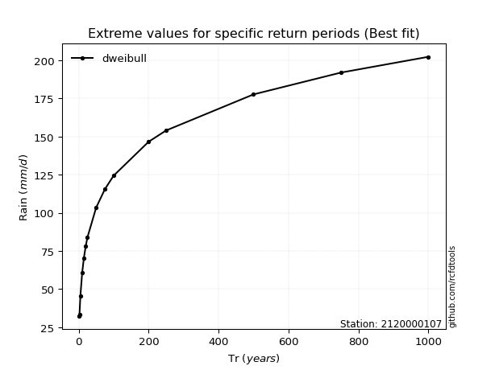</img>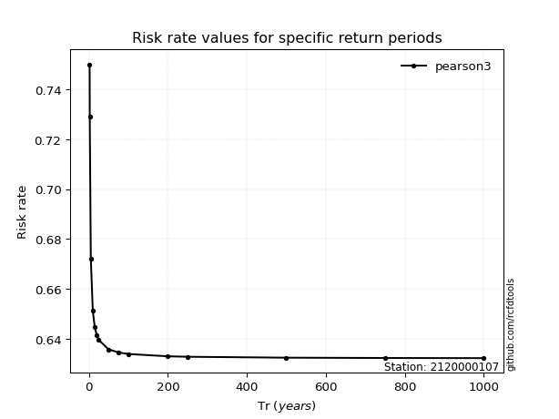</img>

</div>


<sub>**APP DISCLAIMER**: NO WARRANTY - This software is provided by [github.com/rcfdtools](https://github.com/rcfdtools) "as is", without any express or implied warranty, including warranties of merchantability, fitness for a particular purpose, or non-infringement. There is no guarantee that the software will be error-free or operate without interruption. LIMITATION OF LIABILITY - Neither the authors nor copyright holders will be liable for claims or damages arising from the software or its use. You are responsible for determining if the software is appropriate for your use and assume all associated risks, including errors, legal compliance, and data loss. NO PROFESSIONAL ADVICE - The software provides general information and does not offer professional advice. It should not replace consultation with professional advisors.</sub>