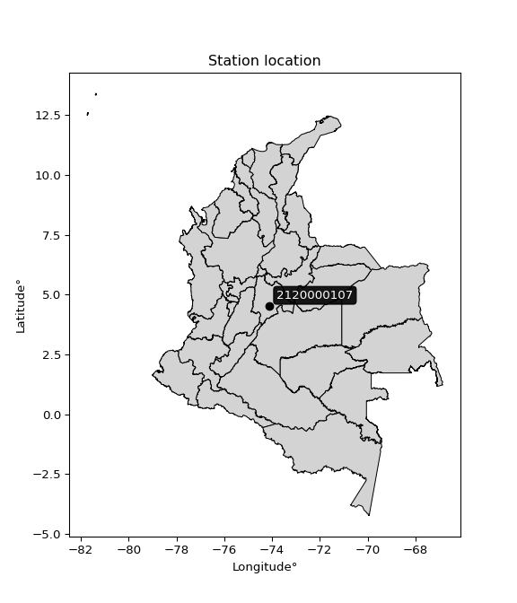

<div align="center">


</div>

# PMP Station (Rain, Pmax24h): 2120000107

Probable Maximum Precipitation (PMP) is the greatest amount of rainfall for a specific duration that is meteorologically possible for a given location, acting as a "worst-case" scenario for extreme storms, crucial for designing safety-critical infrastructure like bridges, river deviations, dams, spillways, and nuclear plants to prevent catastrophic failure. PMP is calculated by hydrologists using meteorological data to determine the upper limit of extreme rainfall, often leading to the Probable Maximum Flood (PMF) for flood control design, and is increasingly being studied for climate change impacts. Probable Maximum Precipitation (PMP) is the theoretical upper limit of rainfall, a deterministic estimate for extreme events, while probability distributions (like GEV, Gumbel) describe the likelihood and frequency of various precipitation amounts, including rare ones, showing how often events occur, with PMP representing the extreme end of these distributions, used for critical infrastructure design to ensure safety against the worst conceivable weather, unlike standard statistical forecasts which cover typical probabilities.

The most common probability distributions in hydrology, used for analyzing floods, rainfall, and streamflow, include the Normal, Log-Normal, Gumbel, Gamma (including Log-Pearson Type III), and Generalized Extreme Value (GEV) distributions, often chosen based on the data´s skewness and whether modeling extremes or general conditions, with Gumbel and GEV popular for extreme events like floods, while the Normal distribution serves as a baseline, though often requiring transformations for skewed hydrological data. These distributions help in designing water infrastructure, managing water resources, and forecasting hydrologic events.

> Hydrological data often isn´t perfectly normal (it´s skewed), so different distributions are needed for different applications, such as: **Flood Frequency Analysis**: Using Gumbel, GEV, or Log-Pearson Type III for predicting extreme flood magnitudes and their return periods, **Rainfall Analysis**: Normal for annual totals, but Log-Normal, Weibull, or GEV for intensity or extreme daily rainfall, **Streamflow Modeling**: Gamma and Log-Normal for maximum flows, GEV for minimum flows, and Kappa for daily flows.

<div align="center">

</img>

</div>


## A. General information


### 1. General running parameters

• app_version: _v20260108_. • runtime: _2026-01-08 13:24:42.400241_. • Python version: _3.14.0_. • SciPy version: _1.16.3_. • Pandas version: _2.3.3_. • NumPy version: _2.3.5_. • Stations dataset (station_dataset_file): _dataset/pmax24h_in/automatic_colombia_2003_2024.csv_. • Stations catalog (station_catalog_file): _dataset/CNE.xls_. • Minimum year to eval til year_max (date_min): _1900_. • Maximum year to eval since year_min (date_max): _2024_. • Creates, save and include plots into reports (create_plot): _False_. • Plot only fit distributions with Δo > Δ (plot_only_fit): _True_. • Plot only simple graphs avoiding multiple CDFs and multiple Extreme values plots (plot_only_simple): _True_. • Eval low extreme values, if False, evaluates high extreme values (low_extreme): _False_. • Eval every SciPy distribution as logarithmic (pdist_logarithmic_on): _True_. • Standard deviation normalized (ddof): _1.0_. • Return periods to eval in years (Tr): _[2, 2.33, 5, 10, 15, 20, 25, 50, 75, 100, 200, 250, 500, 750, 1000]_. • Minimum data sample per station, 0 means any (minimum_sample): _5_. • Z-Score maximum threshold to adjust a value, 0 means disable (zscore_max): _3.5_. • Z-Score minimum threshold to adjust a value, 0 means disable (zscore_min): _-2.5_. • Avoid zeros, e.g. rain = 0 (avoid_zeros): _True_. • Avoid null values (avoid_nans): _True_. 

:file_folder:Table: [dataset.csv](../../dataset/pmax24h_in/automatic_colombia_2003_2024.csv)

> Delta Degrees of Freedom (DDOF): is a parameter used in the formulas for calculating variance and standard deviation. When ddof=0, the divisor is $N$ (the total number of observations) and this is used when your data set is the entire population. When ddof=1, the divisor is $N-1$ and this is used when your data set is a sample drawn from a larger population. Using $N-1$ provides an unbiased estimate of the population variance (known as Bessel´s correction).


### 2. Station info and location

|   id |     CODIGO | NOMBRE                        | CATEGORIA               | TECNOLOGIA                | ESTADO   | FECHA_INSTALACION   |   FECHA_SUSPENSION |   ALTITUD |   LATITUD |   LONGITUD | DEPARTAMENTO   | MUNICIPIO   | AREA_OPERATIVA                            | ENTIDAD                                                      | AREA_HIDROGRAFICA   | ZONA_HIDROGRAFICA   | SUBZONA_HIDROGRAFICA   |   CORRIENTE | Catalogo   |   Version |
|-----:|-----------:|:------------------------------|:------------------------|:--------------------------|:---------|:--------------------|-------------------:|----------:|----------:|-----------:|:---------------|:------------|:------------------------------------------|:-------------------------------------------------------------|:--------------------|:--------------------|:-----------------------|------------:|:-----------|----------:|
|    0 | 2120000107 | LA FISCALA - AUT [2120000107] | Climatológica Ordinaria | Automática con Telemetría | Activa   | 01/12/2011          |                nan |      2718 |   4.53602 |   -74.1065 | Bogotá         | Bogotá, D.C | Area Operativa 11 - Cundinamarca-Amazonas | INSTITUTO DISTRITAL DE GESTIÓN DE RIESGOS Y CAMBIO CLIMÁTICO | Magdalena Cauca     | Alto Magdalena      | Río Bogotá             |         nan | CNE_OE     |  20251226 |

<div align="center">

Dynamic map: [:earth_americas:Google](http://maps.google.com/maps?q=4.53602,-74.10654) [:earth_americas:OSM](https://www.openstreetmap.org/#map=18/4.53602/-74.10654&layers=P) [:earth_americas:Bing](https://www.bing.com/maps?cp=4.53602~-74.10654&lvl=18) [:earth_americas:Apple](https://maps.apple.com/frame?center=4.53602%2C-74.10654&span=0.003%2C0.006)

</div>


<div align="center">

```geojson
{
  "type": "Feature",
  "geometry": {
    "type": "Point", 
    "coordinates": [-74.10654, 4.53602]
  }, 
  "properties": {
    "Name": "2120000107"
  }
}
```

</div>


### 3. Discrete values table and plot

<div align="center">

|               |           0 |          1 |           2 |         3 |           4 |
|:--------------|------------:|-----------:|------------:|----------:|------------:|
| Date          | 2018        | 2019       | 2020        | 2023      | 2024        |
| Value         |   15.7      |   64.47    |   36        |    1      |   32.4      |
| Value_initial |   15.7      |   64.47    |   36        |    1      |   32.4      |
| count         |    5        |    5       |    5        |    5      |    5        |
| mean          |   29.914    |   29.914   |   29.914    |   29.914  |   29.914    |
| std           |   23.8505   |   23.8505  |   23.8505   |   23.8505 |   23.8505   |
| zscore        |   -0.595961 |    1.44886 |    0.255172 |   -1.2123 |    0.104232 |


</div>


> The initial value (value_initial) correspond to the initial obtained or null completed value, and value (value) is adjusted only when the initial value is outside the valid range (outlier) definite through the Z-Score value. If Z-Score is active, values out of range or outliers are replaced with the station mean value. A Z-Score (or standard score) measures how many standard deviations a data point is from the mean of a dataset, indicating its relative position; positive scores mean above the mean, negative mean below, and a score of zero is exactly at the mean, allowing for comparison of values from different distributions. It´s calculated using the formula $z=(x–μ)/σ$, where $x$ is the data point, $μ$ is the mean, and $σ$ is the standard deviation, helping identify outliers and understand probability.
>
> <sub>**Note**: In this study, "completing" (filling gaps in) and "extending" (forecasting or lengthening the historical record) rainfall data series are avoided for certain critical analyses because they introduce artificial bias and uncertainty, which can distort the statistics of rare events (extremes), alter day-to-day variability, and compromise the integrity and homogeneity of the original data. Some reasons against Completing/Extending rainfall data are: **Distortion of Extremes and Variability**: The primary issue is that most gap-filling or extension methods rely on averaging or regression with nearby stations, which inherently smooths the data. Rainfall is highly variable in space and time, with a large percentage of zero values and occasional large storms. Infilling methods often underestimate the highest values and overestimate the lowest (zero) values, which severely distorts analyses focused on flood frequency, drought severity, and intensity-duration-frequency (IDF) curves, **Loss of Data Homogeneity**: Infilled or extended data are synthetic estimates, not actual measurements. Combining these estimates with observed data can violate the assumption of data homogeneity, which requires that the data properties do not change over time. Inhomogeneity can lead to incorrect conclusions about long-term trends or changes in climate patterns, **Propagation of Errors**: Errors and biases from the original data (e.g., wind-induced undercatch, instrument errors, site changes) or the data used for imputation can propagate through the analysis, leading to unreliable hydrological models and inaccurate predictions, **Compromised Statistical Integrity**: For statistical analyses, especially those involving the frequency of events, using artificial data can introduce time bias or autocorrelation that doesn´t exist in reality, making it difficult to assess the true probability of events, **Difficulty in Validation**: It is difficult to accurately validate the quality of filled or extended data, especially for past periods where ground-truth measurements are unavailable. The reliability of imputation techniques heavily depends on the density of the surrounding station network and the complexity of the local topography.</sub>


### 4. Active continuous probability distributions from SciPy (43 of 104 available)

A Probability Density Function (PDF) describes the relative likelihood of a continuous random variable falling within a specific range, where the total area under its curve equals 1, and the area over any interval gives the actual probability for that range. Unlike discrete probabilities (like rolling a die), a PDF shows density, not direct probability for a single point (which is zero), with higher points indicating higher likelihood, often visualized as a bell curve for normal distributions.

A log of a probability density function (log-PDF) is simply the logarithm of the PDF´s value, denoted as $log(f(x))$, useful for converting multiplication of probabilities into addition, improving numerical stability with tiny numbers, and connecting to information theory concepts like entropy. Instead of dealing with very small probabilities (e.g., 0.000001), log-PDFs use negative numbers (e.g., $log(0.00001) ≈ -11.51$ that are easier for computers to handle, preventing underflow errors and simplifying complex calculations. In this study, each active probability distribution from SciPy is also evaluated in the $log$ form.

[scipy.stats](https://docs.scipy.org/doc/scipy/reference/stats.html) is a Python´s powerful submodule within the SciPy library for comprehensive statistical analysis, offering over 130 probability distributions (like Normal, Poisson), functions for descriptive stats (mean, variance), hypothesis testing (t-tests, chi-square), random variable generation, and statistical tests, making it essential for data science, modeling, and research. It provides tools to explore, model, and draw conclusions from data efficiently, working seamlessly with NumPy.

<div align="center">

|   id | p_dist             |   n_parameter | fit_method   | label                                                                       | active   | ref                                                                                                        |
|-----:|:-------------------|--------------:|:-------------|:----------------------------------------------------------------------------|:---------|:-----------------------------------------------------------------------------------------------------------|
|    0 | alpha              |             3 | MLE          | Alpha                                                                       | True     | [:mortar_board:](https://docs.scipy.org/doc/scipy/reference/generated/scipy.stats.alpha.html)              |
|    1 | betaprime          |             4 | MLE          | Beta prime                                                                  | True     | [:mortar_board:](https://docs.scipy.org/doc/scipy/reference/generated/scipy.stats.betaprime.html)          |
|    2 | chi2               |             3 | MLE          | Chi²                                                                        | True     | [:mortar_board:](https://docs.scipy.org/doc/scipy/reference/generated/scipy.stats.chi2.html)               |
|    3 | crystalball        |             4 | MLE          | Crystalball                                                                 | True     | [:mortar_board:](https://docs.scipy.org/doc/scipy/reference/generated/scipy.stats.crystalball.html)        |
|    4 | erlang             |             3 | MLE          | Erlang                                                                      | True     | [:mortar_board:](https://docs.scipy.org/doc/scipy/reference/generated/scipy.stats.erlang.html)             |
|    5 | expon              |             2 | MLE          | Exponential                                                                 | True     | [:mortar_board:](https://docs.scipy.org/doc/scipy/reference/generated/scipy.stats.expon.html)              |
|    6 | exponnorm          |             3 | MLE          | Exponentially modified Normal                                               | True     | [:mortar_board:](https://docs.scipy.org/doc/scipy/reference/generated/scipy.stats.exponnorm.html)          |
|    7 | f                  |             4 | MLE          | F                                                                           | True     | [:mortar_board:](https://docs.scipy.org/doc/scipy/reference/generated/scipy.stats.f.html)                  |
|    8 | fatiguelife        |             3 | MLE          | Fatigue-life (Birnbaum-Saunders)                                            | True     | [:mortar_board:](https://docs.scipy.org/doc/scipy/reference/generated/scipy.stats.fatiguelife.html)        |
|    9 | fisk               |             3 | MLE          | Fisk                                                                        | True     | [:mortar_board:](https://docs.scipy.org/doc/scipy/reference/generated/scipy.stats.fisk.html)               |
|   10 | gamma              |             3 | MLE          | Gamma                                                                       | True     | [:mortar_board:](https://docs.scipy.org/doc/scipy/reference/generated/scipy.stats.gamma.html)              |
|   11 | genexpon           |             5 | MLE          | Generalized exponential                                                     | True     | [:mortar_board:](https://docs.scipy.org/doc/scipy/reference/generated/scipy.stats.genexpon.html)           |
|   12 | genlogistic        |             3 | MLE          | Generalized logistic                                                        | True     | [:mortar_board:](https://docs.scipy.org/doc/scipy/reference/generated/scipy.stats.genlogistic.html)        |
|   13 | gibrat             |             2 | MM           | Gibrat                                                                      | True     | [:mortar_board:](https://docs.scipy.org/doc/scipy/reference/generated/scipy.stats.gibrat.html)             |
|   14 | gompertz           |             3 | MLE          | Gompertz (or truncated Gumbel)                                              | True     | [:mortar_board:](https://docs.scipy.org/doc/scipy/reference/generated/scipy.stats.gompertz.html)           |
|   15 | gumbel_l           |             2 | MM           | Gumbel Left Skew                                                            | True     | [:mortar_board:](https://docs.scipy.org/doc/scipy/reference/generated/scipy.stats.gumbel_l.html)           |
|   16 | gumbel_r           |             2 | MM           | Gumbel Right Skew                                                           | True     | [:mortar_board:](https://docs.scipy.org/doc/scipy/reference/generated/scipy.stats.gumbel_r.html)           |
|   17 | halflogistic       |             2 | MM           | Half-logistic                                                               | True     | [:mortar_board:](https://docs.scipy.org/doc/scipy/reference/generated/scipy.stats.halflogistic.html)       |
|   18 | halfnorm           |             2 | MM           | Half Normal                                                                 | True     | [:mortar_board:](https://docs.scipy.org/doc/scipy/reference/generated/scipy.stats.halfnorm.html)           |
|   19 | hypsecant          |             2 | MM           | hyperbolic secant                                                           | True     | [:mortar_board:](https://docs.scipy.org/doc/scipy/reference/generated/scipy.stats.hypsecant.html)          |
|   20 | invgamma           |             3 | MLE          | Inverted gamma                                                              | True     | [:mortar_board:](https://docs.scipy.org/doc/scipy/reference/generated/scipy.stats.invgamma.html)           |
|   21 | invgauss           |             3 | MLE          | Inverse Gaussian                                                            | True     | [:mortar_board:](https://docs.scipy.org/doc/scipy/reference/generated/scipy.stats.invgauss.html)           |
|   22 | invweibull         |             3 | MLE          | Inverted Weibull                                                            | True     | [:mortar_board:](https://docs.scipy.org/doc/scipy/reference/generated/scipy.stats.invweibull.html)         |
|   23 | kstwobign          |             2 | MLE          | Limiting distribution of scaled Kolmogorov-Smirnov two-sided test statistic | True     | [:mortar_board:](https://docs.scipy.org/doc/scipy/reference/generated/scipy.stats.kstwobign.html)          |
|   24 | laplace            |             2 | MM           | Laplace                                                                     | True     | [:mortar_board:](https://docs.scipy.org/doc/scipy/reference/generated/scipy.stats.laplace.html)            |
|   25 | laplace_asymmetric |             3 | MLE          | Asymmetric Laplace                                                          | True     | [:mortar_board:](https://docs.scipy.org/doc/scipy/reference/generated/scipy.stats.laplace_asymmetric.html) |
|   26 | loggamma           |             3 | MLE          | Log gamma                                                                   | True     | [:mortar_board:](https://docs.scipy.org/doc/scipy/reference/generated/scipy.stats.loggamma.html)           |
|   27 | logistic           |             2 | MM           | Logistic (or Sech-squared)                                                  | True     | [:mortar_board:](https://docs.scipy.org/doc/scipy/reference/generated/scipy.stats.logistic.html)           |
|   28 | lognorm            |             3 | MLE          | Log Normal                                                                  | True     | [:mortar_board:](https://docs.scipy.org/doc/scipy/reference/generated/scipy.stats.lognorm.html)            |
|   29 | maxwell            |             2 | MM           | Maxwell                                                                     | True     | [:mortar_board:](https://docs.scipy.org/doc/scipy/reference/generated/scipy.stats.maxwell.html)            |
|   30 | mielke             |             4 | MLE          | Mielke Beta-Kappa / Dagum                                                   | True     | [:mortar_board:](https://docs.scipy.org/doc/scipy/reference/generated/scipy.stats.mielke.html)             |
|   31 | moyal              |             2 | MM           | Moyal                                                                       | True     | [:mortar_board:](https://docs.scipy.org/doc/scipy/reference/generated/scipy.stats.moyal.html)              |
|   32 | nakagami           |             3 | MLE          | Nakagami                                                                    | True     | [:mortar_board:](https://docs.scipy.org/doc/scipy/reference/generated/scipy.stats.nakagami.html)           |
|   33 | ncf                |             5 | MLE          | Non-central F distribution                                                  | True     | [:mortar_board:](https://docs.scipy.org/doc/scipy/reference/generated/scipy.stats.ncf.html)                |
|   34 | nct                |             4 | MLE          | Non-central Student’s t                                                     | True     | [:mortar_board:](https://docs.scipy.org/doc/scipy/reference/generated/scipy.stats.nct.html)                |
|   35 | norm               |             2 | MM           | Normal                                                                      | True     | [:mortar_board:](https://docs.scipy.org/doc/scipy/reference/generated/scipy.stats.norm.html)               |
|   36 | pearson3           |             3 | MM           | Pearson type III                                                            | True     | [:mortar_board:](https://docs.scipy.org/doc/scipy/reference/generated/scipy.stats.pearson3.html)           |
|   37 | rayleigh           |             2 | MM           | Rayleigh                                                                    | True     | [:mortar_board:](https://docs.scipy.org/doc/scipy/reference/generated/scipy.stats.rayleigh.html)           |
|   38 | rice               |             3 | MLE          | Rice                                                                        | True     | [:mortar_board:](https://docs.scipy.org/doc/scipy/reference/generated/scipy.stats.rice.html)               |
|   39 | t                  |             3 | MLE          | Student’s t                                                                 | True     | [:mortar_board:](https://docs.scipy.org/doc/scipy/reference/generated/scipy.stats.t.html)                  |
|   40 | truncnorm          |             4 | MLE          | Truncated normal                                                            | True     | [:mortar_board:](https://docs.scipy.org/doc/scipy/reference/generated/scipy.stats.truncnorm.html)          |
|   41 | wald               |             2 | MM           | Wald                                                                        | True     | [:mortar_board:](https://docs.scipy.org/doc/scipy/reference/generated/scipy.stats.wald.html)               |
|   42 | weibull_min        |             3 | MLE          | Weibull minimum                                                             | True     | [:mortar_board:](https://docs.scipy.org/doc/scipy/reference/generated/scipy.stats.weibull_min.html)        |

</div>

> **n_parameter:** # arguments & localization & scale.
>
> **Fit methods:** (MLE) maximum likelihood, (MM) L-moments.
>
>**Inactive** (With the only purpose of prevent loops, zero divisions, infinite values, over high estimated values or horizontal trending for recurrence intervals estimations, the follow distributions were disabled.)**:** foldnorm, gennorm, norminvgauss, powernorm, powerlognorm, skewnorm, genextreme, anglit, arcsine, argus, beta, bradford, burr, burr12, cauchy, cosine, halfcauchy, foldcauchy, skewcauchy, wrapcauchy, dgamma, gengamma, exponweib, exponpow, truncexpon, gausshyper, genhalflogistic, genhyperbolic, geninvgauss, halfgennorm, johnsonsb, johnsonsu, kappa4, kappa3, ksone, kstwo, loglaplace, levy, levy_l, levy_stable, ncx2, pareto, genpareto, truncpareto, lomax, powerlaw, rdist, rel_breitwigner, recipinvgauss, semicircular, studentized_range, trapezoid, triang, truncweibull_min, tukeylambda, uniform, loguniform, vonmises, vonmises_line, weibull_max, dweibull, 


## B. Probability (PDF) vs. Empirical (EDF) distributions functions

A continuous probability distribution (CPD) describes probabilities for variables that can take any value within a range (like rain any time), unlike discrete variables with specific outcomes (like temperature). It uses a Probability Density Function (PDF), a curve where the total area under it equals 1, and the probability of the variable falling within an interval (a to b) is found by calculating the area under the curve between those points. A key feature is that the probability of hitting any single exact value is zero, so probabilities are always expressed for ranges, e.g., $P(a ≤ X ≤ b)$.

<div align="center">

Distributions parameters from station values
|    |    station | p_dist                |   n |              loc |           scale | shape                 | shape1                | shape2                 | shape3   |
|---:|-----------:|:----------------------|----:|-----------------:|----------------:|:----------------------|:----------------------|:-----------------------|:---------|
|  0 | 2120000107 | alpha                 |   5 |  -173.86         |  1955.35        | 9.704541340767562     |                       |                        |          |
|  1 | 2120000107 | betaprime             |   5 |     0.995455     |   394.861       | 0.7650599865782208    | 11.707869502140632    |                        |          |
|  2 | 2120000107 | chi2                  |   5 |     1            |     2.76193     | 1.2073143294560609    |                       |                        |          |
|  3 | 2120000107 | crystalball           |   5 |    29.914        |    21.3326      | 3161.0178293066406    | 441.346080299404      |                        |          |
|  4 | 2120000107 | erlang                |   5 |     1            |    24.8941      | 0.8114869597587004    |                       |                        |          |
|  5 | 2120000107 | expon                 |   5 |     1            |    28.914       |                       |                       |                        |          |
|  6 | 2120000107 | exponnorm             |   5 |    22.0747       |    19.8744      | 0.39443974892506406   |                       |                        |          |
|  7 | 2120000107 | f                     |   5 |     1            |    19.9943      | 1.640452641099114     | 9.515333986067168     |                        |          |
|  8 | 2120000107 | fatiguelife           |   5 |     1            |     1.65082e-05 | 1052.9790643772649    |                       |                        |          |
|  9 | 2120000107 | fisk                  |   5 |   -52.2013       |    79.7713      | 6.3733571492731045    |                       |                        |          |
| 10 | 2120000107 | gamma                 |   5 |     1            |    43.3584      | 0.4039656809092941    |                       |                        |          |
| 11 | 2120000107 | genexpon              |   5 |     0.999987     |     2.00745     | 0.07208669225023277   | 3.954992130694377e-07 | 1.4992882383965305     |          |
| 12 | 2120000107 | genlogistic           |   5 |   -91.9589       |    18.2267      | 455.3890680322812     |                       |                        |          |
| 13 | 2120000107 | gibrat                |   5 |    13.64         |     9.87071     |                       |                       |                        |          |
| 14 | 2120000107 | gompertz              |   5 |     1            |    45.7116      | 0.9048087049681993    |                       |                        |          |
| 15 | 2120000107 | gumbel_l              |   5 |    39.5148       |    16.6329      |                       |                       |                        |          |
| 16 | 2120000107 | gumbel_r              |   5 |    20.3132       |    16.6329      |                       |                       |                        |          |
| 17 | 2120000107 | halflogistic          |   5 |     4.62997      |    18.2386      |                       |                       |                        |          |
| 18 | 2120000107 | halfnorm              |   5 |     1.67801      |    35.3886      |                       |                       |                        |          |
| 19 | 2120000107 | hypsecant             |   5 |    29.914        |    13.5807      |                       |                       |                        |          |
| 20 | 2120000107 | invgamma              |   5 |   -95.4919       |  4271.5         | 35.05420044579064     |                       |                        |          |
| 21 | 2120000107 | invgauss              |   5 |   -45.5968       |   873.99        | 0.08639777727942918   |                       |                        |          |
| 22 | 2120000107 | invweibull            |   5 |     1            |     2.43327     | 0.0398850749531767    |                       |                        |          |
| 23 | 2120000107 | kstwobign             |   5 |   -43.9588       |    84.5363      |                       |                       |                        |          |
| 24 | 2120000107 | laplace               |   5 |    29.914        |    15.0844      |                       |                       |                        |          |
| 25 | 2120000107 | laplace_asymmetric    |   5 |    32.4          |    16.6149      | 1.0776062483808633    |                       |                        |          |
| 26 | 2120000107 | loggamma              |   5 | -5112.98         |   730.792       | 1138.8186908099997    |                       |                        |          |
| 27 | 2120000107 | logistic              |   5 |    29.914        |    11.7613      |                       |                       |                        |          |
| 28 | 2120000107 | lognorm               |   5 |     1            |     0.0117887   | 15.808366723666524    |                       |                        |          |
| 29 | 2120000107 | maxwell               |   5 |   -20.6352       |    31.677       |                       |                       |                        |          |
| 30 | 2120000107 | mielke                |   5 |     1            |    66.8866      | 0.5800622889763012    | 80.66866010592858     |                        |          |
| 31 | 2120000107 | moyal                 |   5 |    17.7147       |     9.60303     |                       |                       |                        |          |
| 32 | 2120000107 | nakagami              |   5 |     1            |    35.2548      | 0.3508270650923231    |                       |                        |          |
| 33 | 2120000107 | ncf                   |   5 |     1            |     4.14907     | 0.5067929520225651    | 78.87607377565163     | 2.037001165834146      |          |
| 34 | 2120000107 | nct                   |   5 |    -0.412418     |     0.0573912   | 0.42149787774206926   | 54.73619553654916     |                        |          |
| 35 | 2120000107 | norm                  |   5 |    29.914        |    21.3326      |                       |                       |                        |          |
| 36 | 2120000107 | pearson3              |   5 |    29.914        |    21.3326      | 0.2979087360783118    |                       |                        |          |
| 37 | 2120000107 | rayleigh              |   5 |   -10.8965       |    32.562       |                       |                       |                        |          |
| 38 | 2120000107 | rice                  |   5 |    -9.57661      |    28.0695      | 0.7462652578877842    |                       |                        |          |
| 39 | 2120000107 | t                     |   5 |    29.9144       |    21.3342      | 8884431.926656784     |                       |                        |          |
| 40 | 2120000107 | truncnorm             |   5 |    -1.07795      |     7.76713     | -0.477268538428153    | 8.439149931698626     |                        |          |
| 41 | 2120000107 | wald                  |   5 |     8.5814       |    21.3326      |                       |                       |                        |          |
| 42 | 2120000107 | weibull_min           |   5 |     1            |    16.7674      | 0.5846080716053712    |                       |                        |          |
| 43 | 2120000107 | logalpha              |   5 |   -49.435        |  1775.56        | 34.04299352239525     |                       |                        |          |
| 44 | 2120000107 | logbetaprime          |   5 |    -1.55649e-28  |     5.94337     | 0.6024145083148837    | 2.5604497964422235    |                        |          |
| 45 | 2120000107 | logchi2               |   5 |    -1.8233e-29   |     1.79589     | 1.794505564758302     |                       |                        |          |
| 46 | 2120000107 | logcrystalball        |   5 |     2.79631      |     1.46849     | 7.50496051619463      | 225.6182918078466     |                        |          |
| 47 | 2120000107 | logerlang             |   5 |   -21.0209       |     0.100846    | 235.88857042606026    |                       |                        |          |
| 48 | 2120000107 | logexpon              |   5 |     0            |     2.79631     |                       |                       |                        |          |
| 49 | 2120000107 | logexponnorm          |   5 |     2.79543      |     1.46848     | 0.000589764298204704  |                       |                        |          |
| 50 | 2120000107 | logf                  |   5 |    -3.36016e-31  |     1.33972     | 1.4184483499419271    | 1.232667018281301     |                        |          |
| 51 | 2120000107 | logfatiguelife        |   5 |  -601.625        |   604.422       | 0.0024253218194858275 |                       |                        |          |
| 52 | 2120000107 | logfisk               |   5 |    -4.05192e+06  |     4.05192e+06 | 5151263.148429133     |                       |                        |          |
| 53 | 2120000107 | loggamma              |   5 |   -20.7634       |     0.101132    | 233.03877780654796    |                       |                        |          |
| 54 | 2120000107 | loggenexpon           |   5 |    -0.0308014    |     0.0184048   | 0.0026063039817669394 | 3.390306386473556     | 1.1781959169097312e-05 |          |
| 55 | 2120000107 | loggenlogistic        |   5 |     4.16628      |     1.96412e-06 | 1.436354711483617e-06 |                       |                        |          |
| 56 | 2120000107 | loggibrat             |   5 |     1.67604      |     0.679475    |                       |                       |                        |          |
| 57 | 2120000107 | loggompertz           |   5 |    -1.60995e-06  |     2.10604     | 0.2634472456179421    |                       |                        |          |
| 58 | 2120000107 | loggumbel_l           |   5 |     3.45721      |     1.14498     |                       |                       |                        |          |
| 59 | 2120000107 | loggumbel_r           |   5 |     2.13541      |     1.14498     |                       |                       |                        |          |
| 60 | 2120000107 | loghalflogistic       |   5 |     1.05576      |     1.25553     |                       |                       |                        |          |
| 61 | 2120000107 | loghalfnorm           |   5 |     0.852582     |     2.43609     |                       |                       |                        |          |
| 62 | 2120000107 | loghypsecant          |   5 |     2.79631      |     0.934873    |                       |                       |                        |          |
| 63 | 2120000107 | loginvgamma           |   5 |   -30.3753       | 15868.7         | 479.67166377854164    |                       |                        |          |
| 64 | 2120000107 | loginvgauss           |   5 |   -11.1001       |  1016.7         | 0.013684582911419826  |                       |                        |          |
| 65 | 2120000107 | loginvweibull         |   5 |    -1.24183e+08  |     1.24183e+08 | 73704099.71793032     |                       |                        |          |
| 66 | 2120000107 | logkstwobign          |   5 |    -3.83647      |     7.55983     |                       |                       |                        |          |
| 67 | 2120000107 | loglaplace            |   5 |     2.79631      |     1.03838     |                       |                       |                        |          |
| 68 | 2120000107 | loglaplace_asymmetric |   5 |     3.58352      |     0.735934    | 1.6687488500585375    |                       |                        |          |
| 69 | 2120000107 | logloggamma           |   5 |     4.16642      |     1.48314e-06 | 1.075548298824671e-06 |                       |                        |          |
| 70 | 2120000107 | loglogistic           |   5 |     2.79631      |     0.809624    |                       |                       |                        |          |
| 71 | 2120000107 | loglognorm            |   5 |    -4.94066e-324 |     5.88598e-65 | 298.2723366126509     |                       |                        |          |
| 72 | 2120000107 | logmaxwell            |   5 |    -0.683408     |     2.18059     |                       |                       |                        |          |
| 73 | 2120000107 | logmielke             |   5 |    -9.78717e-32  |     4.20833     | 0.2787017597925411    | 1.4129343864098602    |                        |          |
| 74 | 2120000107 | logmoyal              |   5 |     1.95653      |     0.661055    |                       |                       |                        |          |
| 75 | 2120000107 | lognakagami           |   5 |    -1.36642e-31  |     3.13892     | 0.1852834268300122    |                       |                        |          |
| 76 | 2120000107 | logncf                |   5 |    -2.85553e-30  |     1.21818     | 1.4517005814458472    | 1.2986867960163084    | 0.9851413157281599     |          |
| 77 | 2120000107 | lognct                |   5 |   -87.2234       |     1.43086     | 34106.46860848158     | 62.91113845527565     |                        |          |
| 78 | 2120000107 | lognorm               |   5 |     2.79631      |     1.46849     |                       |                       |                        |          |
| 79 | 2120000107 | logpearson3           |   5 |     2.79631      |     1.46848     | -1.1676856386950272   |                       |                        |          |
| 80 | 2120000107 | lograyleigh           |   5 |    -0.0130083    |     2.24151     |                       |                       |                        |          |
| 81 | 2120000107 | logrice               |   5 |    -1.13653      |     1.58252     | 2.2443635478128323    |                       |                        |          |
| 82 | 2120000107 | logt                  |   5 |     3.5304       |     0.184675    | 0.5789520553477081    |                       |                        |          |
| 83 | 2120000107 | logtruncnorm          |   5 |    -0.00604161   |     3.22144     | 0.0018627594399074083 | 1.295155635529772     |                        |          |
| 84 | 2120000107 | logwald               |   5 |     1.32783      |     1.46848     |                       |                       |                        |          |
| 85 | 2120000107 | logweibull_min        |   5 |    -3.29032e-29  |     2.53223     | 0.4741351943381795    |                       |                        |          |

</div>

> **loc** (Location parameter): This shifts the distribution along the x-axis. For many common distributions, like the normal (Gaussian) distribution, loc represents the mean $μ$. For others, like the uniform distribution, it might represent the minimum value, or for the beta distribution, the left end of the support interval.
>
> **scale** (Scale parameter): This determines the width or spread of the distribution. For the normal distribution, scale represents the standard deviation $σ$. For a uniform distribution, it defines the length of the interval (from $loc$ to $loc + scale$).
>
> **shape** (Shape parameters): Refers to parameters that define the specific form of a probability distribution, distinct from its location (loc) and scale (scale). These parameters are required arguments for most distribution functions. For example, a normal (Gaussian) distribution is fully defined by its location (mean) and scale (standard deviation), so it has no specific shape parameters beyond loc and scale. However, other distributions have intrinsic properties that need specification, as Gamma distribution that takes a shape parameter, often named $a$ or $alpha$.


### 0. Cumulative distribution values - CDF (86 evaluated)

Cumulative Distribution Function (CDF), denoted as $F$<sub>$X$</sub>$(x)$, is a function that gives the probability that a random variable $X$ will take a value less than or equal to a specific value, $x$ (i.e., $(P(X≥x)$. It essentially "accumulates" probabilities from a given point up to the far right (positive infinity), providing a complete picture of the distribution´s probabilities for both discrete (like rain) and continuous (like temperature) variables, helping to find probabilities over ranges or above certain values. Each station is evaluated separately ordering the $x$ values ascending, calculating the CDF and PDF values for the activated distributions and their logarithmic forms.

<div align="center">

CDF ordered by x ascending and calculating $log(f(x))$ separately
|   id |    Station |   date |     x |   count |   mean |     std |    zscore |   Value_initial |    station |   m |     alpha |   alpha_pdf |   betaprime |   betaprime_pdf |        chi2 |         chi2_pdf |   crystalball |   crystalball_pdf |      erlang |   erlang_pdf |    expon |   expon_pdf |   exponnorm |   exponnorm_pdf |          f |       f_pdf |   fatiguelife |   fatiguelife_pdf |     fisk |   fisk_pdf |       gamma |      gamma_pdf |   genexpon |   genexpon_pdf |   genlogistic |   genlogistic_pdf |    gibrat |   gibrat_pdf |    gompertz |   gompertz_pdf |   gumbel_l |   gumbel_l_pdf |   gumbel_r |   gumbel_r_pdf |   halflogistic |   halflogistic_pdf |   halfnorm |   halfnorm_pdf |   hypsecant |   hypsecant_pdf |   invgamma |   invgamma_pdf |   invgauss |   invgauss_pdf |   invweibull |   invweibull_pdf |   kstwobign |   kstwobign_pdf |   laplace |   laplace_pdf |   laplace_asymmetric |   laplace_asymmetric_pdf |   loggamma |   loggamma_pdf |   logistic |   logistic_pdf |   lognorm |   lognorm_pdf |   maxwell |   maxwell_pdf |      mielke |   mielke_pdf |     moyal |   moyal_pdf |    nakagami |   nakagami_pdf |         ncf |     ncf_pdf |       nct |    nct_pdf |      norm |   norm_pdf |   pearson3 |   pearson3_pdf |   rayleigh |   rayleigh_pdf |      rice |   rice_pdf |         t |      t_pdf |   truncnorm |   truncnorm_pdf |     wald |   wald_pdf |   weibull_min |   weibull_min_pdf |   logalpha |   logalpha_pdf |   logbetaprime |   logbetaprime_pdf |     logchi2 |   logchi2_pdf |   logcrystalball |   logcrystalball_pdf |   logerlang |   logerlang_pdf |   logexpon |   logexpon_pdf |   logexponnorm |   logexponnorm_pdf |        logf |    logf_pdf |   logfatiguelife |   logfatiguelife_pdf |   logfisk |   logfisk_pdf |   loggenexpon |   loggenexpon_pdf |   loggenlogistic |   loggenlogistic_pdf |   loggibrat |   loggibrat_pdf |   loggompertz |   loggompertz_pdf |   loggumbel_l |   loggumbel_l_pdf |   loggumbel_r |   loggumbel_r_pdf |   loghalflogistic |   loghalflogistic_pdf |   loghalfnorm |   loghalfnorm_pdf |   loghypsecant |   loghypsecant_pdf |   loginvgamma |   loginvgamma_pdf |   loginvgauss |   loginvgauss_pdf |   loginvweibull |   loginvweibull_pdf |   logkstwobign |   logkstwobign_pdf |   loglaplace |   loglaplace_pdf |   loglaplace_asymmetric |   loglaplace_asymmetric_pdf |   logloggamma |   logloggamma_pdf |   loglogistic |   loglogistic_pdf |   loglognorm |   loglognorm_pdf |   logmaxwell |   logmaxwell_pdf |   logmielke |   logmielke_pdf |    logmoyal |   logmoyal_pdf |   lognakagami |   lognakagami_pdf |      logncf |   logncf_pdf |    lognct |   lognct_pdf |   logpearson3 |   logpearson3_pdf |   lograyleigh |   lograyleigh_pdf |   logrice |   logrice_pdf |      logt |   logt_pdf |   logtruncnorm |   logtruncnorm_pdf |   logwald |   logwald_pdf |   logweibull_min |   logweibull_min_pdf |
|-----:|-----------:|-------:|------:|--------:|-------:|--------:|----------:|----------------:|-----------:|----:|----------:|------------:|------------:|----------------:|------------:|-----------------:|--------------:|------------------:|------------:|-------------:|---------:|------------:|------------:|----------------:|-----------:|------------:|--------------:|------------------:|---------:|-----------:|------------:|---------------:|-----------:|---------------:|--------------:|------------------:|----------:|-------------:|------------:|---------------:|-----------:|---------------:|-----------:|---------------:|---------------:|-------------------:|-----------:|---------------:|------------:|----------------:|-----------:|---------------:|-----------:|---------------:|-------------:|-----------------:|------------:|----------------:|----------:|--------------:|---------------------:|-------------------------:|-----------:|---------------:|-----------:|---------------:|----------:|--------------:|----------:|--------------:|------------:|-------------:|----------:|------------:|------------:|---------------:|------------:|------------:|----------:|-----------:|----------:|-----------:|-----------:|---------------:|-----------:|---------------:|----------:|-----------:|----------:|-----------:|------------:|----------------:|---------:|-----------:|--------------:|------------------:|-----------:|---------------:|---------------:|-------------------:|------------:|--------------:|-----------------:|---------------------:|------------:|----------------:|-----------:|---------------:|---------------:|-------------------:|------------:|------------:|-----------------:|---------------------:|----------:|--------------:|--------------:|------------------:|-----------------:|---------------------:|------------:|----------------:|--------------:|------------------:|--------------:|------------------:|--------------:|------------------:|------------------:|----------------------:|--------------:|------------------:|---------------:|-------------------:|--------------:|------------------:|--------------:|------------------:|----------------:|--------------------:|---------------:|-------------------:|-------------:|-----------------:|------------------------:|----------------------------:|--------------:|------------------:|--------------:|------------------:|-------------:|-----------------:|-------------:|-----------------:|------------:|----------------:|------------:|---------------:|--------------:|------------------:|------------:|-------------:|----------:|-------------:|--------------:|------------------:|--------------:|------------------:|----------:|--------------:|----------:|-----------:|---------------:|-------------------:|----------:|--------------:|-----------------:|---------------------:|
|    0 | 2120000107 |   2023 |  1    |       5 | 29.914 | 23.8505 | -1.2123   |            1    | 2120000107 |   1 | 0.0697313 |  0.00856107 |  0.00117633 |      0.198008   | 9.32251e-11 | 506889           |     0.0876464 |         0.0074636 | 4.79543e-10 |   5.18021    | 0        |  0.0345853  |   0.0852964 |      0.00754995 | 6.2766e-15 | 46.3711     |     0.0320552 |       1.53183e+10 | 0.070324 | 0.00783215 | 9.84158e-05 | 10237.2        | 4.5523e-07 |     0.0359096  |     0.0628157 |        0.00950904 | 0         |   0          | 3.03652e-11 |     0.0197939  |  0.0939942 |     0.00537677 |  0.0410248 |     0.0078769  |       0        |         0          |   0        |     0          |   0.0753723 |      0.00549822 |  0.0677479 |     0.00868949 |  0.0627488 |     0.00937458 |     0.012745 |      9.98753e+12 |   0.0601184 |      0.0103279  | 0.0735374 |    0.00487506 |            0.0930177 |               0.00519528 |  0.0306168 |      0.0487889 |  0.0788258 |     0.00617385 | 0.0284421 |     0.0443268 | 0.0738089 |    0.00930539 | 1.68036e-05 |  24.8153     | 0.0169597 |  0.00573592 | 4.07642e-13 |  2576.27       | 2.11554e-05 | 2.41424e+10 | 0.0522507 | 0.115958   | 0.0876464 |  0.0074636 |  0.0794823 |     0.00806643 |  0.0645611 |     0.0104957  | 0.0523808 | 0.00965288 | 0.0876605 | 0.00746391 |    0.422708 |     0.0725143   | 0        | 0          |   9.05703e-11 |   476914          |  0.0304616 |      0.0500656 |    1.13938e-17 |        4.40978e+10 | 5.40539e-27 |   266.001     |        0.0284421 |            0.0443268 |   0.0329295 |       0.0515421 |   0        |      0.357614  |      0.0284416 |          0.0443265 | 1.48029e-22 | 3.12443e+08 |        0.0279063 |            0.0439105 | 0.0196307 |     0.0244669 |    0.00440797 |          0.144602 |         0        |             0.034745 |    0        |       0         |   2.01392e-07 |          0.125092 |     0.0476553 |         0.0406132 |    0.00157101 |        0.00885821 |          0        |              0        |      0        |          0        |      0.0319516 |          0.0341201 |     0.0279444 |         0.0475916 |     0.0300495 |          0.052902 |       0.0377167 |           0.0733715 |      0.0410423 |          0.0917967 |    0.0338406 |        0.0325898 |               0.0397642 |                   0.0323789 |     0.0487324 |         0.0353399 |     0.0306546 |         0.0367022 |    0.0227501 |    inf           |   0.00795017 |        0.0342177 | 1.52651e-09 |     4.34694e+21 | 1.12158e-05 |    0.000171433 |   1.89711e-12 |       5.14488e+18 | 1.44696e-22 |  3.67804e+07 | 0.0285914 |    0.0445674 |     0.0500418 |         0.0429574 |   1.68395e-05 |        0.00258901 | 0.0246451 |     0.0498091 | 0.0570649 | 0.00934905 |    1.25934e-05 |           0.308347 |  0        |     0         |      2.01375e-14 |          2.90181e+14 |
|    1 | 2120000107 |   2018 | 15.7  |       5 | 29.914 | 23.8505 | -0.595961 |           15.7  | 2120000107 |   2 | 0.270723  |  0.0180166  |  0.471445   |      0.0187958  | 0.971332    |      0.0057947   |     0.252608  |         0.0149783 | 0.543831    |   0.0213447  | 0.398545 |  0.0208015  |   0.253886  |      0.0153476  | 0.521091   |  0.0199108  |     0.814918  |       0.00813876  | 0.263705 | 0.0182247  | 0.663721    |     0.0142584  | 0.410143   |     0.0211817  |     0.290094  |        0.01967    | 0.0585749 |   0.056746   | 0.290504    |     0.0193705  |  0.212492  |     0.0113102  |  0.267233  |     0.0212019  |       0.294493 |         0.0250369  |   0.308064 |     0.0208442  |   0.214968  |      0.0146528  |  0.27211   |     0.018212   |  0.282992  |     0.0190897  |     0.394248 |      0.000995651 |   0.298304  |      0.0197718  | 0.194866  |    0.0129184  |            0.211415  |               0.0118081  |  0.495649  |      0.258733  |  0.229959  |     0.015056   | 0.488416  |     0.271553  | 0.274599  |    0.0171654  | 0.415247    |   0.0163857  | 0.266742  |  0.0249014  | 0.414116    |     0.0188909  | 0.541968    | 0.0165319   | 0.605564  | 0.0102503  | 0.252608  |  0.0149783 |  0.26121   |     0.0163365  |  0.283642  |     0.0179693  | 0.265836  | 0.0180695  | 0.252619  | 0.0149775  |    0.977493 |     0.00729     | 0.201787 | 0.0498815  |   0.603848    |        0.0145882  |  0.508401  |      0.260014  |    0.776724    |        0.0777272   | 0.585059    |     0.124126  |        0.488416  |            0.271553  |   0.505056  |       0.25762   |   0.626467 |      0.133581  |      0.488418  |          0.271555  | 0.618025    | 0.0641619   |        0.488188  |            0.272045  | 0.398896  |     0.304833  |    0.573085   |          0.200507 |         0        |             0.260285 |    0.677668 |       0.332858  |   0.508604    |          0.22725  |     0.417794  |         0.275056  |    0.558352   |        0.284187   |          0.589021 |              0.260071 |      0.564834 |          0.241549 |      0.485484  |          0.340131  |     0.506195  |         0.263569  |     0.508666  |          0.246528 |       0.527603  |           0.200225  |      0.567077  |          0.193354  |    0.479881  |        0.462143  |               0.374353  |                   0.304826  |     0.358974  |         0.260321  |     0.486834  |         0.308571  |    0.691194  |      0.000428811 |   0.521891   |        0.262486  | 0.815012    |     0.0532455   | 0.584235    |    0.284318    |   0.739638    |       0.0881998   | 0.533888    |  0.072707    | 0.48891   |    0.270966  |     0.41116   |         0.259578  |   0.533144    |        0.257075   | 0.497584  |     0.264472  | 0.136363  | 0.0996569  |    0.75554     |           0.213639 |  0.656258 |     0.283828  |      0.646739    |          0.0632921   |
|    2 | 2120000107 |   2024 | 32.4  |       5 | 29.914 | 23.8505 |  0.104232 |           32.4  | 2120000107 |   3 | 0.588833  |  0.0178794  |  0.696595   |      0.00955316 | 0.998913    |      0.000208647 |     0.546386  |         0.0185745 | 0.785524    |   0.00945825 | 0.662429 |  0.011675   |   0.552279  |      0.0186272  | 0.745791   |  0.00888165 |     0.904863  |       0.00352882  | 0.592586 | 0.0181877  | 0.82045     |     0.00617073 | 0.67618    |     0.0116283  |     0.609297  |        0.0165533  | 0.739614  |   0.0173034  | 0.590807    |     0.0160984  |  0.478983  |     0.0204227  |  0.616614  |     0.0179247  |       0.641842 |         0.0161208  |   0.614679 |     0.0154676  |   0.557945  |      0.023051   |  0.589972  |     0.0176964  |  0.600962  |     0.0170181  |     0.405343 |      0.000464945 |   0.611763  |      0.0162182  | 0.575971  |    0.0281104  |            0.537302  |               0.0300097  |  0.675176  |      0.228715  |  0.552647  |     0.0210206  | 0.678791  |     0.243906  | 0.577012  |    0.0173839  | 0.644914    |   0.0119137  | 0.641566  |  0.017353   | 0.668588    |     0.012121   | 0.750682    | 0.00920298  | 0.707421  | 0.00375239 | 0.546386  |  0.0185745 |  0.565715  |     0.0182253  |  0.586872  |     0.0168699  | 0.577472  | 0.0176172  | 0.546376  | 0.0185731  |    0.999988 |     6.94741e-06 | 0.710803 | 0.0157549  |   0.763797    |        0.00634609 |  0.686834  |      0.224719  |    0.824163    |        0.0549961   | 0.665523    |     0.0990462 |        0.678791  |            0.243906  |   0.682924  |       0.225505  |   0.711725 |      0.103091  |      0.678794  |          0.243907  | 0.658141    | 0.0478743   |        0.678803  |            0.244056  | 0.62504   |     0.297951  |    0.705457   |          0.16345  |         0        |             0.442127 |    0.835318 |       0.137573  |   0.670574    |          0.214898 |     0.638851  |         0.321243  |    0.733798   |        0.198367   |          0.746361 |              0.176398 |      0.71887  |          0.183234 |      0.713951  |          0.266424  |     0.687006  |         0.227428  |     0.676613  |          0.211026 |       0.659718  |           0.162863  |      0.693598  |          0.155146  |    0.740706  |        0.249709  |               0.675288  |                   0.549869  |     0.607068  |         0.440235  |     0.698925  |         0.25991   |    0.691469  |      0.000339357 |   0.69722    |        0.215692  | 0.847842    |     0.0385141   | 0.751738    |    0.181596    |   0.7966      |       0.0699431   | 0.579989    |  0.0557638   | 0.678769  |    0.243163  |     0.623228  |         0.317394  |   0.70267     |        0.206599   | 0.681371  |     0.23416   | 0.42326   | 1.37279    |    0.895202    |           0.171801 |  0.803474 |     0.142435  |      0.687267    |          0.0495546   |
|    3 | 2120000107 |   2020 | 36    |       5 | 29.914 | 23.8505 |  0.255172 |           36    | 2120000107 |   4 | 0.650684  |  0.0164332  |  0.728829   |      0.00838528 | 0.999455    |      0.000104158 |     0.61229   |         0.0179553 | 0.816906    |   0.008019   | 0.701948 |  0.0103082  |   0.618129  |      0.0178733  | 0.775409   |  0.00761301 |     0.91664   |       0.00302937  | 0.654811 | 0.016333   | 0.84109     |     0.00532331 | 0.715449   |     0.0102182  |     0.665851  |        0.0148504  | 0.793237  |   0.0127716  | 0.646872    |     0.0150311  |  0.554928  |     0.0216615  |  0.677455  |     0.0158607  |       0.696253 |         0.0141248  |   0.667884 |     0.0140871  |   0.638098  |      0.0212669  |  0.65112   |     0.0162309  |  0.65946   |     0.0154541  |     0.406927 |      0.000416943 |   0.667394  |      0.0146765  | 0.665999  |    0.0221422  |            0.633651  |               0.0237606  |  0.69886   |      0.220739  |  0.626554  |     0.0198945  | 0.704044  |     0.235308  | 0.637701  |    0.0162837  | 0.686824    |   0.0113829  | 0.699537  |  0.0148827  | 0.710129    |     0.0109691  | 0.781793    | 0.00810223  | 0.719963  | 0.00323741 | 0.61229   |  0.0179553 |  0.629622  |     0.0172108  |  0.645524  |     0.0156785  | 0.638836  | 0.0164303  | 0.612275  | 0.0179541  |    0.999999 |     8.46376e-07 | 0.761252 | 0.0124341  |   0.785103    |        0.00551911 |  0.710066  |      0.216195  |    0.829823    |        0.052469    | 0.675791    |     0.0958885 |        0.704044  |            0.235308  |   0.70626   |       0.217365  |   0.722384 |      0.0992793 |      0.704047  |          0.235308  | 0.663089    | 0.0460696   |        0.704069  |            0.235406  | 0.65587   |     0.286941  |    0.722366   |          0.157508 |         0        |             0.47754  |    0.849015 |       0.122768  |   0.692992    |          0.210547 |     0.672619  |         0.319275  |    0.75404    |        0.185919   |          0.764371 |              0.165562 |      0.737727 |          0.174725 |      0.741026  |          0.24745   |     0.710511  |         0.21866   |     0.698444  |          0.203303 |       0.676563  |           0.156897  |      0.709641  |          0.149389  |    0.765725  |        0.225615  |               0.73578   |                   0.599126  |     0.65527   |         0.475189  |     0.725581  |         0.245933  |    0.691505  |      0.000329363 |   0.719467   |        0.206537  | 0.851812    |     0.0368691   | 0.770197    |    0.168927    |   0.80385     |       0.0676879   | 0.585762    |  0.0538337   | 0.703945  |    0.23459   |     0.656829  |         0.320085  |   0.723965    |        0.197591   | 0.705611  |     0.225843  | 0.577946  | 1.36834    |    0.912983    |           0.165741 |  0.817812 |     0.129958  |      0.692404    |          0.0479816   |
|    4 | 2120000107 |   2019 | 64.47 |       5 | 29.914 | 23.8505 |  1.44886  |           64.47 | 2120000107 |   5 | 0.933217  |  0.00445732 |  0.881895   |      0.00327649 | 0.999997    |      4.75204e-07 |     0.94737   |         0.0050359 | 0.946199    |   0.00228407 | 0.888656 |  0.00385087 |   0.945233  |      0.00488712 | 0.905961   |  0.00260974 |     0.968709  |       0.00103358  | 0.918574 | 0.00408583 | 0.93478     |     0.00193615 | 0.897634   |     0.00367596 |     0.918218  |        0.00429782 | 0.949385  |   0.00204891 | 0.934282    |     0.00521471 |  0.988703  |     0.0030449  |  0.932101  |     0.00394038 |       0.92754  |         0.00382898 |   0.923996 |     0.00467113 |   0.950119  |      0.0036579  |  0.931051  |     0.00449199 |  0.925986  |     0.00444707 |     0.415602 |      0.000229312 |   0.925517  |      0.00451969 | 0.949409  |    0.00335383 |            0.942195  |               0.00374914 |  0.8126    |      0.167874  |  0.949699  |     0.00406171 | 0.824553  |     0.175822  | 0.934739  |    0.00492296 | 0.969944    |   0.00873726 | 0.930155  |  0.00362731 | 0.91598     |     0.00416282 | 0.92561     | 0.00284936  | 0.780441  | 0.00142575 | 0.94737   |  0.0050359 |  0.939916  |     0.00484327 |  0.931339  |     0.00488052 | 0.936415  | 0.00489083 | 0.947355  | 0.00503667 |    1        |     2.57574e-17 | 0.935096 | 0.00267276 |   0.886679    |        0.00227285 |  0.820594  |      0.161826  |    0.856859    |        0.0409586   | 0.726971    |     0.0802767 |        0.824553  |            0.175822  |   0.817913  |       0.164261  |   0.774603 |      0.0806051 |      0.824556  |          0.175821  | 0.687402    | 0.0378223   |        0.824569  |            0.175722  | 0.799907  |     0.203481  |    0.804459   |          0.124337 |         0.999942 |             0.731253 |    0.90299  |       0.0689274 |   0.80626     |          0.175217 |     0.843934  |         0.253183  |    0.843907   |        0.125087   |          0.845082 |              0.113831 |      0.82624  |          0.129862 |      0.855474  |          0.149337  |     0.822048  |         0.162823  |     0.803274  |          0.155634 |       0.758439  |           0.124462  |      0.787589  |          0.118543  |    0.866333  |        0.128726  |               0.929505  |                   0.159849  |     0.999841  |         0.725066  |     0.844489  |         0.162208  |    0.691682  |      0.000283227 |   0.824216   |        0.152613  | 0.870985    |     0.0293398   | 0.850878    |    0.111468    |   0.839944    |       0.056552    | 0.614389    |  0.0448666   | 0.824114  |    0.175411  |     0.837813  |         0.285125  |   0.824147    |        0.146272   | 0.821538  |     0.170033  | 0.847301  | 0.135049   |    0.999997    |           0.13329  |  0.877814 |     0.0807188 |      0.718118    |          0.0406214   |


</div>

An Empirical Distribution Function (EDF) is a step-function estimate of a true cumulative distribution function (CDF) based on observed sample data, representing the proportion of data points less than or equal to a given value. It is calculated by ordering your data and jumping up by $1/n$ (where $n$ is sample size) at each unique data point, allowing analysis without assuming an underlying population distribution, and it gets closer to the true CDF as the sample size grows. For the empirical probability calculations, the parameter $m$ correspond to the order number which means the position of the $x$ values in an ascending order list.

The Kolmogorov-Smirnov (K-S) test is a non-parametric statistical test used to determine if a sample data set comes from a specific theoretical distribution (one-sample) or if two different samples come from the same underlying distribution (two-sample), by comparing their cumulative distribution functions (CDFs). It calculates the maximum vertical difference (D statistic) between these functions, with a small p-value indicating a significant difference and rejection of the null hypothesis (that the data/samples match).


### 1. EDF California (1923)

California´s estimates the true probability distribution of water-related data (like rainfall, streamflow) using observed samples, crucial for risk assessment.

<div align="center">


$P=m/n$


</div>


**1.1. Empirical values**

<div align="center">

|                | 0              | 1                  | 2              | 3                 | 4              |
|:---------------|:---------------|:-------------------|:---------------|:------------------|:---------------|
| date           | 2023           | 2018               | 2024           | 2020              | 2019           |
| x              | 1.0            | 15.7               | 32.4           | 36.0              | 64.47          |
| m              | 1              | 2                  | 3              | 4                 | 5              |
| empirical_dist | edf_california | edf_california     | edf_california | edf_california    | edf_california |
| empirical      | 0.2            | 0.4                | 0.6            | 0.8               | 1.0            |
| empirical_tr   | 1.25           | 1.6666666666666667 | 2.5            | 5.000000000000001 | inf            |

</div>


**1.2. Kolmogorov-Smirnov fit test (sorted by Δ)**


<div align="center">

|                | 0                   | 1                   | 2                  | 3                   | 4                   | 5                   | 6                   | 7                   | 8                   | 9                   | 10                    | 11                  | 12                 | 13                 | 14                  | 15                  | 16                  | 17                 | 18                  | 19                 | 20                 | 21                  | 22                  | 23                  | 24                 | 25                 | 26                 | 27                 | 28                  | 29                  | 30                 | 31                  | 32                 | 33                 | 34                  | 35                  | 36                  | 37                  | 38                  | 39                 | 40                  | 41                  | 42                  | 43                  | 44                  | 45                  | 46                 | 47                  | 48                  | 49                 | 50                  | 51                  | 52                  | 53                 | 54                 | 55                 | 56                 | 57                 | 58                 | 59                  | 60                  | 61                  | 62                  | 63                  | 64                 | 65                  | 66                  | 67                  | 68                 | 69                 | 70                 | 71                 | 72                  | 73                 | 74                 | 75                 | 76                  | 77                  | 78                  | 79                 | 80                 | 81                 | 82                 | 83                 | 84                 | 85                 |
|:---------------|:--------------------|:--------------------|:-------------------|:--------------------|:--------------------|:--------------------|:--------------------|:--------------------|:--------------------|:--------------------|:----------------------|:--------------------|:-------------------|:-------------------|:--------------------|:--------------------|:--------------------|:-------------------|:--------------------|:-------------------|:-------------------|:--------------------|:--------------------|:--------------------|:-------------------|:-------------------|:-------------------|:-------------------|:--------------------|:--------------------|:-------------------|:--------------------|:-------------------|:-------------------|:--------------------|:--------------------|:--------------------|:--------------------|:--------------------|:-------------------|:--------------------|:--------------------|:--------------------|:--------------------|:--------------------|:--------------------|:-------------------|:--------------------|:--------------------|:-------------------|:--------------------|:--------------------|:--------------------|:-------------------|:-------------------|:-------------------|:-------------------|:-------------------|:-------------------|:--------------------|:--------------------|:--------------------|:--------------------|:--------------------|:-------------------|:--------------------|:--------------------|:--------------------|:-------------------|:-------------------|:-------------------|:-------------------|:--------------------|:-------------------|:-------------------|:-------------------|:--------------------|:--------------------|:--------------------|:-------------------|:-------------------|:-------------------|:-------------------|:-------------------|:-------------------|:-------------------|
| station        | 2120000107          | 2120000107          | 2120000107         | 2120000107          | 2120000107          | 2120000107          | 2120000107          | 2120000107          | 2120000107          | 2120000107          | 2120000107            | 2120000107          | 2120000107         | 2120000107         | 2120000107          | 2120000107          | 2120000107          | 2120000107         | 2120000107          | 2120000107         | 2120000107         | 2120000107          | 2120000107          | 2120000107          | 2120000107         | 2120000107         | 2120000107         | 2120000107         | 2120000107          | 2120000107          | 2120000107         | 2120000107          | 2120000107         | 2120000107         | 2120000107          | 2120000107          | 2120000107          | 2120000107          | 2120000107          | 2120000107         | 2120000107          | 2120000107          | 2120000107          | 2120000107          | 2120000107          | 2120000107          | 2120000107         | 2120000107          | 2120000107          | 2120000107         | 2120000107          | 2120000107          | 2120000107          | 2120000107         | 2120000107         | 2120000107         | 2120000107         | 2120000107         | 2120000107         | 2120000107          | 2120000107          | 2120000107          | 2120000107          | 2120000107          | 2120000107         | 2120000107          | 2120000107          | 2120000107          | 2120000107         | 2120000107         | 2120000107         | 2120000107         | 2120000107          | 2120000107         | 2120000107         | 2120000107         | 2120000107          | 2120000107          | 2120000107          | 2120000107         | 2120000107         | 2120000107         | 2120000107         | 2120000107         | 2120000107         | 2120000107         |
| empirical_dist | edf_california      | edf_california      | edf_california     | edf_california      | edf_california      | edf_california      | edf_california      | edf_california      | edf_california      | edf_california      | edf_california        | edf_california      | edf_california     | edf_california     | edf_california      | edf_california      | edf_california      | edf_california     | edf_california      | edf_california     | edf_california     | edf_california      | edf_california      | edf_california      | edf_california     | edf_california     | edf_california     | edf_california     | edf_california      | edf_california      | edf_california     | edf_california      | edf_california     | edf_california     | edf_california      | edf_california      | edf_california      | edf_california      | edf_california      | edf_california     | edf_california      | edf_california      | edf_california      | edf_california      | edf_california      | edf_california      | edf_california     | edf_california      | edf_california      | edf_california     | edf_california      | edf_california      | edf_california      | edf_california     | edf_california     | edf_california     | edf_california     | edf_california     | edf_california     | edf_california      | edf_california      | edf_california      | edf_california      | edf_california      | edf_california     | edf_california      | edf_california      | edf_california      | edf_california     | edf_california     | edf_california     | edf_california     | edf_california      | edf_california     | edf_california     | edf_california     | edf_california      | edf_california      | edf_california      | edf_california     | edf_california     | edf_california     | edf_california     | edf_california     | edf_california     | edf_california     |
| p_dist         | genlogistic         | kstwobign           | invgauss           | fisk                | invgamma            | alpha               | logloggamma         | rayleigh            | loggumbel_l         | gumbel_r            | loglaplace_asymmetric | rice                | logpearson3        | maxwell            | loglaplace          | loghypsecant        | loglogistic         | pearson3           | logistic            | logfatiguelife     | logexponnorm       | logcrystalball      | lognorm             | lognorm             | lognct             | loginvgamma        | logrice            | logalpha           | exponnorm           | logerlang           | moyal              | hypsecant           | loggamma           | loggamma           | crystalball         | norm                | t                   | laplace_asymmetric  | logmaxwell          | loggenexpon        | loginvgauss         | loggumbel_r         | betaprime           | ncf                 | lograyleigh         | mielke              | logmoyal           | genexpon            | loggompertz         | erlang             | gompertz            | nakagami            | f                   | halflogistic       | expon              | loghalfnorm        | loghalflogistic    | wald               | halfnorm           | logfisk             | weibull_min         | laplace             | logkstwobign        | nct                 | logexpon           | loginvweibull       | gumbel_l            | logwald             | logt               | gamma              | logchi2            | loggibrat          | logweibull_min      | loglognorm         | logf               | lognakagami        | gibrat              | logtruncnorm        | logbetaprime        | logncf             | fatiguelife        | logmielke          | chi2               | truncnorm          | invweibull         | loggenlogistic     |
| delta          | 0.13718426816771004 | 0.13988156096344334 | 0.1405398916573043 | 0.14518882422427315 | 0.14887987657097712 | 0.14931614179335984 | 0.15126757922865322 | 0.15447578591965683 | 0.15606644161333916 | 0.15897518574227978 | 0.16023583228688526   | 0.16116395829717012 | 0.1621874917962689 | 0.1622994069778152 | 0.16615935835849902 | 0.16804841137279541 | 0.16934536017909335 | 0.1703780342965625 | 0.17344605142601177 | 0.175431244020973  | 0.175444258035786  | 0.17544743643879068 | 0.17544744989580952 | 0.17544744989580952 | 0.1758862650538927 | 0.1779519360162739 | 0.1784617856100259 | 0.1794060170688736 | 0.18187062968277556 | 0.18208718045594052 | 0.1830403054318468 | 0.18503158685441842 | 0.187399548880386  | 0.187399548880386  | 0.18771045229321492 | 0.18771045721753543 | 0.18772542730604602 | 0.18858518225584567 | 0.19204982515753147 | 0.195592025045463  | 0.19672596592840996 | 0.19842899256842322 | 0.19882366708386812 | 0.19997884464722376 | 0.19998316051157833 | 0.19998319639887935 | 0.1999887842436761 | 0.19999954476991927 | 0.19999979860849865 | 0.1999999995204572 | 0.19999999996963483 | 0.19999999999959236 | 0.19999999999999374 | 0.2                | 0.2                | 0.2                | 0.2                | 0.2                | 0.2                | 0.20009295733594046 | 0.20384799269259057 | 0.20513429062689217 | 0.21241133963304148 | 0.21955923381407338 | 0.2264669726433003 | 0.24156123543958585 | 0.24507217220699062 | 0.25625832264002724 | 0.2636373842688746 | 0.2637206633850636 | 0.2730290277709875 | 0.2776683708817974 | 0.28188178258383867 | 0.3083176816002352 | 0.3125981667094264 | 0.3396377241016507 | 0.34142511832762135 | 0.35553960279101626 | 0.37672417771033717 | 0.385610637403515  | 0.4149182917000719 | 0.4150118700507768 | 0.5713323257975109 | 0.5774930801314383 | 0.5843977287645343 | 0.8                |
| deltao         | 0.5865427407550001  | 0.5865427407550001  | 0.5865427407550001 | 0.5865427407550001  | 0.5865427407550001  | 0.5865427407550001  | 0.5865427407550001  | 0.5865427407550001  | 0.5865427407550001  | 0.5865427407550001  | 0.5865427407550001    | 0.5865427407550001  | 0.5865427407550001 | 0.5865427407550001 | 0.5865427407550001  | 0.5865427407550001  | 0.5865427407550001  | 0.5865427407550001 | 0.5865427407550001  | 0.5865427407550001 | 0.5865427407550001 | 0.5865427407550001  | 0.5865427407550001  | 0.5865427407550001  | 0.5865427407550001 | 0.5865427407550001 | 0.5865427407550001 | 0.5865427407550001 | 0.5865427407550001  | 0.5865427407550001  | 0.5865427407550001 | 0.5865427407550001  | 0.5865427407550001 | 0.5865427407550001 | 0.5865427407550001  | 0.5865427407550001  | 0.5865427407550001  | 0.5865427407550001  | 0.5865427407550001  | 0.5865427407550001 | 0.5865427407550001  | 0.5865427407550001  | 0.5865427407550001  | 0.5865427407550001  | 0.5865427407550001  | 0.5865427407550001  | 0.5865427407550001 | 0.5865427407550001  | 0.5865427407550001  | 0.5865427407550001 | 0.5865427407550001  | 0.5865427407550001  | 0.5865427407550001  | 0.5865427407550001 | 0.5865427407550001 | 0.5865427407550001 | 0.5865427407550001 | 0.5865427407550001 | 0.5865427407550001 | 0.5865427407550001  | 0.5865427407550001  | 0.5865427407550001  | 0.5865427407550001  | 0.5865427407550001  | 0.5865427407550001 | 0.5865427407550001  | 0.5865427407550001  | 0.5865427407550001  | 0.5865427407550001 | 0.5865427407550001 | 0.5865427407550001 | 0.5865427407550001 | 0.5865427407550001  | 0.5865427407550001 | 0.5865427407550001 | 0.5865427407550001 | 0.5865427407550001  | 0.5865427407550001  | 0.5865427407550001  | 0.5865427407550001 | 0.5865427407550001 | 0.5865427407550001 | 0.5865427407550001 | 0.5865427407550001 | 0.5865427407550001 | 0.5865427407550001 |
| eval           | Δo > Δ              | Δo > Δ              | Δo > Δ             | Δo > Δ              | Δo > Δ              | Δo > Δ              | Δo > Δ              | Δo > Δ              | Δo > Δ              | Δo > Δ              | Δo > Δ                | Δo > Δ              | Δo > Δ             | Δo > Δ             | Δo > Δ              | Δo > Δ              | Δo > Δ              | Δo > Δ             | Δo > Δ              | Δo > Δ             | Δo > Δ             | Δo > Δ              | Δo > Δ              | Δo > Δ              | Δo > Δ             | Δo > Δ             | Δo > Δ             | Δo > Δ             | Δo > Δ              | Δo > Δ              | Δo > Δ             | Δo > Δ              | Δo > Δ             | Δo > Δ             | Δo > Δ              | Δo > Δ              | Δo > Δ              | Δo > Δ              | Δo > Δ              | Δo > Δ             | Δo > Δ              | Δo > Δ              | Δo > Δ              | Δo > Δ              | Δo > Δ              | Δo > Δ              | Δo > Δ             | Δo > Δ              | Δo > Δ              | Δo > Δ             | Δo > Δ              | Δo > Δ              | Δo > Δ              | Δo > Δ             | Δo > Δ             | Δo > Δ             | Δo > Δ             | Δo > Δ             | Δo > Δ             | Δo > Δ              | Δo > Δ              | Δo > Δ              | Δo > Δ              | Δo > Δ              | Δo > Δ             | Δo > Δ              | Δo > Δ              | Δo > Δ              | Δo > Δ             | Δo > Δ             | Δo > Δ             | Δo > Δ             | Δo > Δ              | Δo > Δ             | Δo > Δ             | Δo > Δ             | Δo > Δ              | Δo > Δ              | Δo > Δ              | Δo > Δ             | Δo > Δ             | Δo > Δ             | Δo > Δ             | Δo > Δ             | Δo > Δ             | Δo <= Δ            |
| fit            | 1                   | 1                   | 1                  | 1                   | 1                   | 1                   | 1                   | 1                   | 1                   | 1                   | 1                     | 1                   | 1                  | 1                  | 1                   | 1                   | 1                   | 1                  | 1                   | 1                  | 1                  | 1                   | 1                   | 1                   | 1                  | 1                  | 1                  | 1                  | 1                   | 1                   | 1                  | 1                   | 1                  | 1                  | 1                   | 1                   | 1                   | 1                   | 1                   | 1                  | 1                   | 1                   | 1                   | 1                   | 1                   | 1                   | 1                  | 1                   | 1                   | 1                  | 1                   | 1                   | 1                   | 1                  | 1                  | 1                  | 1                  | 1                  | 1                  | 1                   | 1                   | 1                   | 1                   | 1                   | 1                  | 1                   | 1                   | 1                   | 1                  | 1                  | 1                  | 1                  | 1                   | 1                  | 1                  | 1                  | 1                   | 1                   | 1                   | 1                  | 1                  | 1                  | 1                  | 1                  | 1                  | 0                  |
| n              | 5                   | 5                   | 5                  | 5                   | 5                   | 5                   | 5                   | 5                   | 5                   | 5                   | 5                     | 5                   | 5                  | 5                  | 5                   | 5                   | 5                   | 5                  | 5                   | 5                  | 5                  | 5                   | 5                   | 5                   | 5                  | 5                  | 5                  | 5                  | 5                   | 5                   | 5                  | 5                   | 5                  | 5                  | 5                   | 5                   | 5                   | 5                   | 5                   | 5                  | 5                   | 5                   | 5                   | 5                   | 5                   | 5                   | 5                  | 5                   | 5                   | 5                  | 5                   | 5                   | 5                   | 5                  | 5                  | 5                  | 5                  | 5                  | 5                  | 5                   | 5                   | 5                   | 5                   | 5                   | 5                  | 5                   | 5                   | 5                   | 5                  | 5                  | 5                  | 5                  | 5                   | 5                  | 5                  | 5                  | 5                   | 5                   | 5                   | 5                  | 5                  | 5                  | 5                  | 5                  | 5                  | 5                  |
| best_fit       | 1                   | 0                   | 0                  | 0                   | 0                   | 0                   | 0                   | 0                   | 0                   | 0                   | 0                     | 0                   | 0                  | 0                  | 0                   | 0                   | 0                   | 0                  | 0                   | 0                  | 0                  | 0                   | 0                   | 0                   | 0                  | 0                  | 0                  | 0                  | 0                   | 0                   | 0                  | 0                   | 0                  | 0                  | 0                   | 0                   | 0                   | 0                   | 0                   | 0                  | 0                   | 0                   | 0                   | 0                   | 0                   | 0                   | 0                  | 0                   | 0                   | 0                  | 0                   | 0                   | 0                   | 0                  | 0                  | 0                  | 0                  | 0                  | 0                  | 0                   | 0                   | 0                   | 0                   | 0                   | 0                  | 0                   | 0                   | 0                   | 0                  | 0                  | 0                  | 0                  | 0                   | 0                  | 0                  | 0                  | 0                   | 0                   | 0                   | 0                  | 0                  | 0                  | 0                  | 0                  | 0                  | 0                  |
| best_fit_sort  | 1                   | 2                   | 3                  | 4                   | 5                   | 6                   | 7                   | 8                   | 9                   | 10                  | 11                    | 12                  | 13                 | 14                 | 15                  | 16                  | 17                  | 18                 | 19                  | 20                 | 21                 | 22                  | 23                  | 24                  | 25                 | 26                 | 27                 | 28                 | 29                  | 30                  | 31                 | 32                  | 33                 | 34                 | 35                  | 36                  | 37                  | 38                  | 39                  | 40                 | 41                  | 42                  | 43                  | 44                  | 45                  | 46                  | 47                 | 48                  | 49                  | 50                 | 51                  | 52                  | 53                  | 54                 | 55                 | 56                 | 57                 | 58                 | 59                 | 60                  | 61                  | 62                  | 63                  | 64                  | 65                 | 66                  | 67                  | 68                  | 69                 | 70                 | 71                 | 72                 | 73                  | 74                 | 75                 | 76                 | 77                  | 78                  | 79                  | 80                 | 81                 | 82                 | 83                 | 84                 | 85                 | 86                 |

</div>


<div align="center">

</img>

</div>


**1.3. Best fit**

<div align="center">

|   id |    station | empirical_dist   | p_dist      |    delta |   deltao | eval   |   fit |   n |   best_fit |   best_fit_sort |
|-----:|-----------:|:-----------------|:------------|---------:|---------:|:-------|------:|----:|-----------:|----------------:|
|    0 | 2120000107 | edf_california   | genlogistic | 0.137184 | 0.586543 | Δo > Δ |     1 |   5 |          1 |               1 |

</div>


### 2. EDF Hazen (1930)

Hazen method for plotting positions is a formula used to estimate the empirical cumulative probability distribution of flood events or other hydrological data. This formula often results in biased estimations, particularly when extrapolating to extreme events (high return periods).

<div align="center">


$P=(m-0.5)/n$


</div>


**2.1. Empirical values**

<div align="center">

|                | 0                  | 1                  | 2         | 3                 | 4                  |
|:---------------|:-------------------|:-------------------|:----------|:------------------|:-------------------|
| date           | 2023               | 2018               | 2024      | 2020              | 2019               |
| x              | 1.0                | 15.7               | 32.4      | 36.0              | 64.47              |
| m              | 1                  | 2                  | 3         | 4                 | 5                  |
| empirical_dist | edf_hazen          | edf_hazen          | edf_hazen | edf_hazen         | edf_hazen          |
| empirical      | 0.1                | 0.3                | 0.5       | 0.7               | 0.9                |
| empirical_tr   | 1.1111111111111112 | 1.4285714285714286 | 2.0       | 3.333333333333333 | 10.000000000000002 |

</div>


**2.2. Kolmogorov-Smirnov fit test (sorted by Δ)**


<div align="center">

|                | 0                   | 1                   | 2                  | 3                  | 4                   | 5                   | 6                   | 7                   | 8                   | 9                   | 10                  | 11                  | 12                 | 13                  | 14                  | 15                  | 16                  | 17                  | 18                  | 19                  | 20                  | 21                  | 22                  | 23                  | 24                  | 25                  | 26                 | 27                  | 28                  | 29                  | 30                  | 31                  | 32                    | 33                  | 34                 | 35                  | 36                  | 37                  | 38                 | 39                  | 40                  | 41                  | 42                 | 43                  | 44                  | 45                 | 46                  | 47                  | 48                  | 49                  | 50                 | 51                  | 52                 | 53                 | 54                  | 55                  | 56                 | 57                  | 58                 | 59                 | 60                  | 61                  | 62                  | 63                  | 64                  | 65                 | 66                 | 67                  | 68                 | 69                 | 70                 | 71                 | 72                 | 73                  | 74                  | 75                  | 76                  | 77                  | 78                 | 79                 | 80                 | 81                 | 82                 | 83                 | 84                 | 85                 |
|:---------------|:--------------------|:--------------------|:-------------------|:-------------------|:--------------------|:--------------------|:--------------------|:--------------------|:--------------------|:--------------------|:--------------------|:--------------------|:-------------------|:--------------------|:--------------------|:--------------------|:--------------------|:--------------------|:--------------------|:--------------------|:--------------------|:--------------------|:--------------------|:--------------------|:--------------------|:--------------------|:-------------------|:--------------------|:--------------------|:--------------------|:--------------------|:--------------------|:----------------------|:--------------------|:-------------------|:--------------------|:--------------------|:--------------------|:-------------------|:--------------------|:--------------------|:--------------------|:-------------------|:--------------------|:--------------------|:-------------------|:--------------------|:--------------------|:--------------------|:--------------------|:-------------------|:--------------------|:-------------------|:-------------------|:--------------------|:--------------------|:-------------------|:--------------------|:-------------------|:-------------------|:--------------------|:--------------------|:--------------------|:--------------------|:--------------------|:-------------------|:-------------------|:--------------------|:-------------------|:-------------------|:-------------------|:-------------------|:-------------------|:--------------------|:--------------------|:--------------------|:--------------------|:--------------------|:-------------------|:-------------------|:-------------------|:-------------------|:-------------------|:-------------------|:-------------------|:-------------------|
| station        | 2120000107          | 2120000107          | 2120000107         | 2120000107         | 2120000107          | 2120000107          | 2120000107          | 2120000107          | 2120000107          | 2120000107          | 2120000107          | 2120000107          | 2120000107         | 2120000107          | 2120000107          | 2120000107          | 2120000107          | 2120000107          | 2120000107          | 2120000107          | 2120000107          | 2120000107          | 2120000107          | 2120000107          | 2120000107          | 2120000107          | 2120000107         | 2120000107          | 2120000107          | 2120000107          | 2120000107          | 2120000107          | 2120000107            | 2120000107          | 2120000107         | 2120000107          | 2120000107          | 2120000107          | 2120000107         | 2120000107          | 2120000107          | 2120000107          | 2120000107         | 2120000107          | 2120000107          | 2120000107         | 2120000107          | 2120000107          | 2120000107          | 2120000107          | 2120000107         | 2120000107          | 2120000107         | 2120000107         | 2120000107          | 2120000107          | 2120000107         | 2120000107          | 2120000107         | 2120000107         | 2120000107          | 2120000107          | 2120000107          | 2120000107          | 2120000107          | 2120000107         | 2120000107         | 2120000107          | 2120000107         | 2120000107         | 2120000107         | 2120000107         | 2120000107         | 2120000107          | 2120000107          | 2120000107          | 2120000107          | 2120000107          | 2120000107         | 2120000107         | 2120000107         | 2120000107         | 2120000107         | 2120000107         | 2120000107         | 2120000107         |
| empirical_dist | edf_hazen           | edf_hazen           | edf_hazen          | edf_hazen          | edf_hazen           | edf_hazen           | edf_hazen           | edf_hazen           | edf_hazen           | edf_hazen           | edf_hazen           | edf_hazen           | edf_hazen          | edf_hazen           | edf_hazen           | edf_hazen           | edf_hazen           | edf_hazen           | edf_hazen           | edf_hazen           | edf_hazen           | edf_hazen           | edf_hazen           | edf_hazen           | edf_hazen           | edf_hazen           | edf_hazen          | edf_hazen           | edf_hazen           | edf_hazen           | edf_hazen           | edf_hazen           | edf_hazen             | edf_hazen           | edf_hazen          | edf_hazen           | edf_hazen           | edf_hazen           | edf_hazen          | edf_hazen           | edf_hazen           | edf_hazen           | edf_hazen          | edf_hazen           | edf_hazen           | edf_hazen          | edf_hazen           | edf_hazen           | edf_hazen           | edf_hazen           | edf_hazen          | edf_hazen           | edf_hazen          | edf_hazen          | edf_hazen           | edf_hazen           | edf_hazen          | edf_hazen           | edf_hazen          | edf_hazen          | edf_hazen           | edf_hazen           | edf_hazen           | edf_hazen           | edf_hazen           | edf_hazen          | edf_hazen          | edf_hazen           | edf_hazen          | edf_hazen          | edf_hazen          | edf_hazen          | edf_hazen          | edf_hazen           | edf_hazen           | edf_hazen           | edf_hazen           | edf_hazen           | edf_hazen          | edf_hazen          | edf_hazen          | edf_hazen          | edf_hazen          | edf_hazen          | edf_hazen          | edf_hazen          |
| p_dist         | pearson3            | logistic            | maxwell            | rice               | exponnorm           | hypsecant           | rayleigh            | crystalball         | norm                | t                   | laplace_asymmetric  | alpha               | invgamma           | fisk                | gompertz            | invgauss            | laplace             | logloggamma         | genlogistic         | kstwobign           | halfnorm            | gumbel_r            | logpearson3         | logfisk             | loggumbel_l         | moyal               | halflogistic       | mielke              | gumbel_l            | expon               | logt                | nakagami            | loglaplace_asymmetric | genexpon            | logfatiguelife     | logcrystalball      | lognorm             | lognorm             | logexponnorm       | lognct              | loggamma            | loggamma            | betaprime          | logrice             | loglogistic         | logerlang          | loginvgamma         | logalpha            | loggompertz         | loginvgauss         | wald               | loghypsecant        | logmaxwell         | loginvweibull      | lograyleigh         | loglaplace          | gibrat             | f                   | ncf                | loggumbel_r        | loghalfnorm         | logkstwobign        | loggenexpon         | logmoyal            | logchi2             | erlang             | logncf             | loghalflogistic     | weibull_min        | nct                | logf               | logexpon           | logweibull_min     | logwald             | gamma               | loggibrat           | loglognorm          | lognakagami         | logtruncnorm       | logbetaprime       | invweibull         | fatiguelife        | logmielke          | chi2               | truncnorm          | loggenlogistic     |
| delta          | 0.07037803429656242 | 0.07344605142601168 | 0.0770115589631456 | 0.0774715603097813 | 0.08187062968277548 | 0.08503158685441839 | 0.08687241105872923 | 0.08771045229321484 | 0.08771045721753534 | 0.08772542730604593 | 0.08858518225584563 | 0.08883339552743086 | 0.0899719598715536 | 0.09258558886161627 | 0.09999999996963481 | 0.10096150351179445 | 0.10513429062689214 | 0.10706823594245873 | 0.10929675160511243 | 0.11176320900845593 | 0.11467865168760383 | 0.11661372691379068 | 0.12322782372601782 | 0.12504025284436504 | 0.13885139405194669 | 0.14156560922779016 | 0.1418415937616071 | 0.14491445448635532 | 0.14507217220699054 | 0.16242889536701433 | 0.16363738426887456 | 0.16858820580625644 | 0.1752876019182179    | 0.17618037538667997 | 0.1881876295814599 | 0.18841584356161428 | 0.18841585058290689 | 0.18841585058290689 | 0.1884181786051774 | 0.18890977998892505 | 0.19564926324004128 | 0.19564926324004128 | 0.1965949182649216 | 0.19758381694797889 | 0.19892468868269475 | 0.2050555902774221 | 0.20619537489772694 | 0.20840096161449223 | 0.20860426577840802 | 0.20866598119737972 | 0.210802509550562  | 0.21395144908807895 | 0.2218908588232888 | 0.2276030481489238 | 0.23314363492792461 | 0.24070638919155263 | 0.2414251183276213 | 0.24579055271958927 | 0.2506823142172032 | 0.2583515946948887 | 0.26483382230110736 | 0.26707740481377834 | 0.27308509733696235 | 0.28423524841920883 | 0.28505851230056406 | 0.2855238002438766 | 0.285610637403515  | 0.28902114727906186 | 0.3038479926925906 | 0.3055644690085519 | 0.3180245535667267 | 0.3264669726433003 | 0.3467387555942177 | 0.35625832264002727 | 0.36372066338506365 | 0.37766837088179744 | 0.39119355077837276 | 0.43963772410165075 | 0.4555396027910163 | 0.4767241777103372 | 0.4843977287645344 | 0.5149182917000719 | 0.5150118700507769 | 0.671332325797511  | 0.6774930801314383 | 0.7                |
| deltao         | 0.5865427407550001  | 0.5865427407550001  | 0.5865427407550001 | 0.5865427407550001 | 0.5865427407550001  | 0.5865427407550001  | 0.5865427407550001  | 0.5865427407550001  | 0.5865427407550001  | 0.5865427407550001  | 0.5865427407550001  | 0.5865427407550001  | 0.5865427407550001 | 0.5865427407550001  | 0.5865427407550001  | 0.5865427407550001  | 0.5865427407550001  | 0.5865427407550001  | 0.5865427407550001  | 0.5865427407550001  | 0.5865427407550001  | 0.5865427407550001  | 0.5865427407550001  | 0.5865427407550001  | 0.5865427407550001  | 0.5865427407550001  | 0.5865427407550001 | 0.5865427407550001  | 0.5865427407550001  | 0.5865427407550001  | 0.5865427407550001  | 0.5865427407550001  | 0.5865427407550001    | 0.5865427407550001  | 0.5865427407550001 | 0.5865427407550001  | 0.5865427407550001  | 0.5865427407550001  | 0.5865427407550001 | 0.5865427407550001  | 0.5865427407550001  | 0.5865427407550001  | 0.5865427407550001 | 0.5865427407550001  | 0.5865427407550001  | 0.5865427407550001 | 0.5865427407550001  | 0.5865427407550001  | 0.5865427407550001  | 0.5865427407550001  | 0.5865427407550001 | 0.5865427407550001  | 0.5865427407550001 | 0.5865427407550001 | 0.5865427407550001  | 0.5865427407550001  | 0.5865427407550001 | 0.5865427407550001  | 0.5865427407550001 | 0.5865427407550001 | 0.5865427407550001  | 0.5865427407550001  | 0.5865427407550001  | 0.5865427407550001  | 0.5865427407550001  | 0.5865427407550001 | 0.5865427407550001 | 0.5865427407550001  | 0.5865427407550001 | 0.5865427407550001 | 0.5865427407550001 | 0.5865427407550001 | 0.5865427407550001 | 0.5865427407550001  | 0.5865427407550001  | 0.5865427407550001  | 0.5865427407550001  | 0.5865427407550001  | 0.5865427407550001 | 0.5865427407550001 | 0.5865427407550001 | 0.5865427407550001 | 0.5865427407550001 | 0.5865427407550001 | 0.5865427407550001 | 0.5865427407550001 |
| eval           | Δo > Δ              | Δo > Δ              | Δo > Δ             | Δo > Δ             | Δo > Δ              | Δo > Δ              | Δo > Δ              | Δo > Δ              | Δo > Δ              | Δo > Δ              | Δo > Δ              | Δo > Δ              | Δo > Δ             | Δo > Δ              | Δo > Δ              | Δo > Δ              | Δo > Δ              | Δo > Δ              | Δo > Δ              | Δo > Δ              | Δo > Δ              | Δo > Δ              | Δo > Δ              | Δo > Δ              | Δo > Δ              | Δo > Δ              | Δo > Δ             | Δo > Δ              | Δo > Δ              | Δo > Δ              | Δo > Δ              | Δo > Δ              | Δo > Δ                | Δo > Δ              | Δo > Δ             | Δo > Δ              | Δo > Δ              | Δo > Δ              | Δo > Δ             | Δo > Δ              | Δo > Δ              | Δo > Δ              | Δo > Δ             | Δo > Δ              | Δo > Δ              | Δo > Δ             | Δo > Δ              | Δo > Δ              | Δo > Δ              | Δo > Δ              | Δo > Δ             | Δo > Δ              | Δo > Δ             | Δo > Δ             | Δo > Δ              | Δo > Δ              | Δo > Δ             | Δo > Δ              | Δo > Δ             | Δo > Δ             | Δo > Δ              | Δo > Δ              | Δo > Δ              | Δo > Δ              | Δo > Δ              | Δo > Δ             | Δo > Δ             | Δo > Δ              | Δo > Δ             | Δo > Δ             | Δo > Δ             | Δo > Δ             | Δo > Δ             | Δo > Δ              | Δo > Δ              | Δo > Δ              | Δo > Δ              | Δo > Δ              | Δo > Δ             | Δo > Δ             | Δo > Δ             | Δo > Δ             | Δo > Δ             | Δo <= Δ            | Δo <= Δ            | Δo <= Δ            |
| fit            | 1                   | 1                   | 1                  | 1                  | 1                   | 1                   | 1                   | 1                   | 1                   | 1                   | 1                   | 1                   | 1                  | 1                   | 1                   | 1                   | 1                   | 1                   | 1                   | 1                   | 1                   | 1                   | 1                   | 1                   | 1                   | 1                   | 1                  | 1                   | 1                   | 1                   | 1                   | 1                   | 1                     | 1                   | 1                  | 1                   | 1                   | 1                   | 1                  | 1                   | 1                   | 1                   | 1                  | 1                   | 1                   | 1                  | 1                   | 1                   | 1                   | 1                   | 1                  | 1                   | 1                  | 1                  | 1                   | 1                   | 1                  | 1                   | 1                  | 1                  | 1                   | 1                   | 1                   | 1                   | 1                   | 1                  | 1                  | 1                   | 1                  | 1                  | 1                  | 1                  | 1                  | 1                   | 1                   | 1                   | 1                   | 1                   | 1                  | 1                  | 1                  | 1                  | 1                  | 0                  | 0                  | 0                  |
| n              | 5                   | 5                   | 5                  | 5                  | 5                   | 5                   | 5                   | 5                   | 5                   | 5                   | 5                   | 5                   | 5                  | 5                   | 5                   | 5                   | 5                   | 5                   | 5                   | 5                   | 5                   | 5                   | 5                   | 5                   | 5                   | 5                   | 5                  | 5                   | 5                   | 5                   | 5                   | 5                   | 5                     | 5                   | 5                  | 5                   | 5                   | 5                   | 5                  | 5                   | 5                   | 5                   | 5                  | 5                   | 5                   | 5                  | 5                   | 5                   | 5                   | 5                   | 5                  | 5                   | 5                  | 5                  | 5                   | 5                   | 5                  | 5                   | 5                  | 5                  | 5                   | 5                   | 5                   | 5                   | 5                   | 5                  | 5                  | 5                   | 5                  | 5                  | 5                  | 5                  | 5                  | 5                   | 5                   | 5                   | 5                   | 5                   | 5                  | 5                  | 5                  | 5                  | 5                  | 5                  | 5                  | 5                  |
| best_fit       | 1                   | 0                   | 0                  | 0                  | 0                   | 0                   | 0                   | 0                   | 0                   | 0                   | 0                   | 0                   | 0                  | 0                   | 0                   | 0                   | 0                   | 0                   | 0                   | 0                   | 0                   | 0                   | 0                   | 0                   | 0                   | 0                   | 0                  | 0                   | 0                   | 0                   | 0                   | 0                   | 0                     | 0                   | 0                  | 0                   | 0                   | 0                   | 0                  | 0                   | 0                   | 0                   | 0                  | 0                   | 0                   | 0                  | 0                   | 0                   | 0                   | 0                   | 0                  | 0                   | 0                  | 0                  | 0                   | 0                   | 0                  | 0                   | 0                  | 0                  | 0                   | 0                   | 0                   | 0                   | 0                   | 0                  | 0                  | 0                   | 0                  | 0                  | 0                  | 0                  | 0                  | 0                   | 0                   | 0                   | 0                   | 0                   | 0                  | 0                  | 0                  | 0                  | 0                  | 0                  | 0                  | 0                  |
| best_fit_sort  | 1                   | 2                   | 3                  | 4                  | 5                   | 6                   | 7                   | 8                   | 9                   | 10                  | 11                  | 12                  | 13                 | 14                  | 15                  | 16                  | 17                  | 18                  | 19                  | 20                  | 21                  | 22                  | 23                  | 24                  | 25                  | 26                  | 27                 | 28                  | 29                  | 30                  | 31                  | 32                  | 33                    | 34                  | 35                 | 36                  | 37                  | 38                  | 39                 | 40                  | 41                  | 42                  | 43                 | 44                  | 45                  | 46                 | 47                  | 48                  | 49                  | 50                  | 51                 | 52                  | 53                 | 54                 | 55                  | 56                  | 57                 | 58                  | 59                 | 60                 | 61                  | 62                  | 63                  | 64                  | 65                  | 66                 | 67                 | 68                  | 69                 | 70                 | 71                 | 72                 | 73                 | 74                  | 75                  | 76                  | 77                  | 78                  | 79                 | 80                 | 81                 | 82                 | 83                 | 84                 | 85                 | 86                 |

</div>


<div align="center">

</img>

</div>


**2.3. Best fit**

<div align="center">

|   id |    station | empirical_dist   | p_dist   |    delta |   deltao | eval   |   fit |   n |   best_fit |   best_fit_sort |
|-----:|-----------:|:-----------------|:---------|---------:|---------:|:-------|------:|----:|-----------:|----------------:|
|    0 | 2120000107 | edf_hazen        | pearson3 | 0.070378 | 0.586543 | Δo > Δ |     1 |   5 |          1 |               1 |

</div>


### 3. EDF Weibull (1939)

Weibull plotting position formula is an empirical method used to estimate the non-exceedance probability or plotting position for a set of observed data, is often recommended or widely used in practice, particularly in flood frequency analysis.

<div align="center">


$P=m/(n+1)$


</div>


**3.1. Empirical values**

<div align="center">

|                | 0                   | 1                  | 2           | 3                  | 4                  |
|:---------------|:--------------------|:-------------------|:------------|:-------------------|:-------------------|
| date           | 2023                | 2018               | 2024        | 2020               | 2019               |
| x              | 1.0                 | 15.7               | 32.4        | 36.0               | 64.47              |
| m              | 1                   | 2                  | 3           | 4                  | 5                  |
| empirical_dist | edf_weibull         | edf_weibull        | edf_weibull | edf_weibull        | edf_weibull        |
| empirical      | 0.16666666666666666 | 0.3333333333333333 | 0.5         | 0.6666666666666666 | 0.8333333333333334 |
| empirical_tr   | 1.2                 | 1.4999999999999998 | 2.0         | 2.9999999999999996 | 6.000000000000002  |

</div>


**3.2. Kolmogorov-Smirnov fit test (sorted by Δ)**


<div align="center">

|                | 0                  | 1                   | 2                   | 3                   | 4                   | 5                   | 6                   | 7                   | 8                   | 9                  | 10                  | 11                  | 12                  | 13                  | 14                  | 15                  | 16                  | 17                  | 18                  | 19                  | 20                  | 21                  | 22                 | 23                  | 24                  | 25                 | 26                  | 27                  | 28                  | 29                  | 30                  | 31                  | 32                  | 33                 | 34                    | 35                  | 36                  | 37                 | 38                  | 39                  | 40                  | 41                  | 42                  | 43                  | 44                 | 45                  | 46                  | 47                  | 48                 | 49                  | 50                  | 51                  | 52                 | 53                 | 54                  | 55                  | 56                  | 57                  | 58                  | 59                  | 60                  | 61                  | 62                 | 63                  | 64                  | 65                  | 66                 | 67                  | 68                  | 69                 | 70                 | 71                 | 72                  | 73                  | 74                 | 75                 | 76                  | 77                 | 78                  | 79                  | 80                 | 81                 | 82                 | 83                 | 84                 | 85                 |
|:---------------|:-------------------|:--------------------|:--------------------|:--------------------|:--------------------|:--------------------|:--------------------|:--------------------|:--------------------|:-------------------|:--------------------|:--------------------|:--------------------|:--------------------|:--------------------|:--------------------|:--------------------|:--------------------|:--------------------|:--------------------|:--------------------|:--------------------|:-------------------|:--------------------|:--------------------|:-------------------|:--------------------|:--------------------|:--------------------|:--------------------|:--------------------|:--------------------|:--------------------|:-------------------|:----------------------|:--------------------|:--------------------|:-------------------|:--------------------|:--------------------|:--------------------|:--------------------|:--------------------|:--------------------|:-------------------|:--------------------|:--------------------|:--------------------|:-------------------|:--------------------|:--------------------|:--------------------|:-------------------|:-------------------|:--------------------|:--------------------|:--------------------|:--------------------|:--------------------|:--------------------|:--------------------|:--------------------|:-------------------|:--------------------|:--------------------|:--------------------|:-------------------|:--------------------|:--------------------|:-------------------|:-------------------|:-------------------|:--------------------|:--------------------|:-------------------|:-------------------|:--------------------|:-------------------|:--------------------|:--------------------|:-------------------|:-------------------|:-------------------|:-------------------|:-------------------|:-------------------|
| station        | 2120000107         | 2120000107          | 2120000107          | 2120000107          | 2120000107          | 2120000107          | 2120000107          | 2120000107          | 2120000107          | 2120000107         | 2120000107          | 2120000107          | 2120000107          | 2120000107          | 2120000107          | 2120000107          | 2120000107          | 2120000107          | 2120000107          | 2120000107          | 2120000107          | 2120000107          | 2120000107         | 2120000107          | 2120000107          | 2120000107         | 2120000107          | 2120000107          | 2120000107          | 2120000107          | 2120000107          | 2120000107          | 2120000107          | 2120000107         | 2120000107            | 2120000107          | 2120000107          | 2120000107         | 2120000107          | 2120000107          | 2120000107          | 2120000107          | 2120000107          | 2120000107          | 2120000107         | 2120000107          | 2120000107          | 2120000107          | 2120000107         | 2120000107          | 2120000107          | 2120000107          | 2120000107         | 2120000107         | 2120000107          | 2120000107          | 2120000107          | 2120000107          | 2120000107          | 2120000107          | 2120000107          | 2120000107          | 2120000107         | 2120000107          | 2120000107          | 2120000107          | 2120000107         | 2120000107          | 2120000107          | 2120000107         | 2120000107         | 2120000107         | 2120000107          | 2120000107          | 2120000107         | 2120000107         | 2120000107          | 2120000107         | 2120000107          | 2120000107          | 2120000107         | 2120000107         | 2120000107         | 2120000107         | 2120000107         | 2120000107         |
| empirical_dist | edf_weibull        | edf_weibull         | edf_weibull         | edf_weibull         | edf_weibull         | edf_weibull         | edf_weibull         | edf_weibull         | edf_weibull         | edf_weibull        | edf_weibull         | edf_weibull         | edf_weibull         | edf_weibull         | edf_weibull         | edf_weibull         | edf_weibull         | edf_weibull         | edf_weibull         | edf_weibull         | edf_weibull         | edf_weibull         | edf_weibull        | edf_weibull         | edf_weibull         | edf_weibull        | edf_weibull         | edf_weibull         | edf_weibull         | edf_weibull         | edf_weibull         | edf_weibull         | edf_weibull         | edf_weibull        | edf_weibull           | edf_weibull         | edf_weibull         | edf_weibull        | edf_weibull         | edf_weibull         | edf_weibull         | edf_weibull         | edf_weibull         | edf_weibull         | edf_weibull        | edf_weibull         | edf_weibull         | edf_weibull         | edf_weibull        | edf_weibull         | edf_weibull         | edf_weibull         | edf_weibull        | edf_weibull        | edf_weibull         | edf_weibull         | edf_weibull         | edf_weibull         | edf_weibull         | edf_weibull         | edf_weibull         | edf_weibull         | edf_weibull        | edf_weibull         | edf_weibull         | edf_weibull         | edf_weibull        | edf_weibull         | edf_weibull         | edf_weibull        | edf_weibull        | edf_weibull        | edf_weibull         | edf_weibull         | edf_weibull        | edf_weibull        | edf_weibull         | edf_weibull        | edf_weibull         | edf_weibull         | edf_weibull        | edf_weibull        | edf_weibull        | edf_weibull        | edf_weibull        | edf_weibull        |
| p_dist         | fisk               | invgamma            | alpha               | maxwell             | rayleigh            | invgauss            | pearson3            | genlogistic         | kstwobign           | exponnorm          | t                   | norm                | crystalball         | rice                | logistic            | hypsecant           | laplace_asymmetric  | logpearson3         | gumbel_r            | laplace             | loggumbel_l         | logfisk             | moyal              | gumbel_l            | logloggamma         | mielke             | gompertz            | halfnorm            | expon               | halflogistic        | nakagami            | loggamma            | loggamma            | loggompertz        | loglaplace_asymmetric | genexpon            | loginvgauss         | lognct             | lognorm             | lognorm             | logcrystalball      | logexponnorm        | logfatiguelife      | logrice             | logerlang          | logalpha            | loginvgamma         | loginvweibull       | betaprime          | logt                | logmaxwell          | loglogistic         | lograyleigh        | wald               | loghypsecant        | logncf              | loghalfnorm         | logkstwobign        | loggumbel_r         | loggenexpon         | loglaplace          | f                   | ncf                | logchi2             | logmoyal            | loghalflogistic     | weibull_min        | nct                 | gibrat              | logf               | erlang             | logexpon           | logweibull_min      | logwald             | gamma              | loggibrat          | loglognorm          | lognakagami        | invweibull          | logtruncnorm        | logbetaprime       | fatiguelife        | logmielke          | chi2               | truncnorm          | loggenlogistic     |
| delta          | 0.0963426686921119 | 0.09891874517449342 | 0.09988327220425253 | 0.10140521495185373 | 0.10210557761423801 | 0.10391789947671629 | 0.10658262549101793 | 0.10929675160511243 | 0.11176320900845593 | 0.1118992765291087 | 0.11402120358995049 | 0.11403656735975443 | 0.11403656780158233 | 0.11428588987962865 | 0.11636562362573033 | 0.11836492018775172 | 0.12191851558917896 | 0.12322782372601782 | 0.12564185240894643 | 0.13846762396022547 | 0.13885139405194669 | 0.14703592379311411 | 0.1497069720985134 | 0.15537003437073305 | 0.16650772643535372 | 0.166649863065546  | 0.16666666663630147 | 0.16666666666666666 | 0.16666666666666666 | 0.16666666666666666 | 0.16858820580625644 | 0.17517646080245441 | 0.17517646080245441 | 0.1752709324450747 | 0.1752876019182179    | 0.17618037538667997 | 0.17661285502023527 | 0.1787685897248893 | 0.17879060084726928 | 0.17879060084726928 | 0.17879060735035368 | 0.17879389044743021 | 0.17880278793518722 | 0.18137082840556995 | 0.1829239231744828 | 0.18683353923020907 | 0.18700555740126745 | 0.19426971481559047 | 0.1965949182649216 | 0.19697071760220788 | 0.19722042152567787 | 0.19892468868269475 | 0.2026703110191248 | 0.210802509550562  | 0.21395144908807895 | 0.21894397073684835 | 0.23150048896777403 | 0.23374407148044501 | 0.23379820809261154 | 0.23975176400362902 | 0.24070638919155263 | 0.24579055271958927 | 0.2506823142172032 | 0.25172517896723073 | 0.25173799783393047 | 0.25568781394572854 | 0.2705146593592573 | 0.27223113567521856 | 0.27475845166095464 | 0.2846912202333934 | 0.2855238002438766 | 0.293133639309967  | 0.31340542226088436 | 0.32292498930669394 | 0.3303873300517303 | 0.3443350375484641 | 0.35786021744503943 | 0.4063043907683174 | 0.41773106209786776 | 0.42220626945768297 | 0.4433908443770039 | 0.4815849583667386 | 0.4816785367174435 | 0.6379989924641776 | 0.6441597467981051 | 0.6666666666666666 |
| deltao         | 0.5865427407550001 | 0.5865427407550001  | 0.5865427407550001  | 0.5865427407550001  | 0.5865427407550001  | 0.5865427407550001  | 0.5865427407550001  | 0.5865427407550001  | 0.5865427407550001  | 0.5865427407550001 | 0.5865427407550001  | 0.5865427407550001  | 0.5865427407550001  | 0.5865427407550001  | 0.5865427407550001  | 0.5865427407550001  | 0.5865427407550001  | 0.5865427407550001  | 0.5865427407550001  | 0.5865427407550001  | 0.5865427407550001  | 0.5865427407550001  | 0.5865427407550001 | 0.5865427407550001  | 0.5865427407550001  | 0.5865427407550001 | 0.5865427407550001  | 0.5865427407550001  | 0.5865427407550001  | 0.5865427407550001  | 0.5865427407550001  | 0.5865427407550001  | 0.5865427407550001  | 0.5865427407550001 | 0.5865427407550001    | 0.5865427407550001  | 0.5865427407550001  | 0.5865427407550001 | 0.5865427407550001  | 0.5865427407550001  | 0.5865427407550001  | 0.5865427407550001  | 0.5865427407550001  | 0.5865427407550001  | 0.5865427407550001 | 0.5865427407550001  | 0.5865427407550001  | 0.5865427407550001  | 0.5865427407550001 | 0.5865427407550001  | 0.5865427407550001  | 0.5865427407550001  | 0.5865427407550001 | 0.5865427407550001 | 0.5865427407550001  | 0.5865427407550001  | 0.5865427407550001  | 0.5865427407550001  | 0.5865427407550001  | 0.5865427407550001  | 0.5865427407550001  | 0.5865427407550001  | 0.5865427407550001 | 0.5865427407550001  | 0.5865427407550001  | 0.5865427407550001  | 0.5865427407550001 | 0.5865427407550001  | 0.5865427407550001  | 0.5865427407550001 | 0.5865427407550001 | 0.5865427407550001 | 0.5865427407550001  | 0.5865427407550001  | 0.5865427407550001 | 0.5865427407550001 | 0.5865427407550001  | 0.5865427407550001 | 0.5865427407550001  | 0.5865427407550001  | 0.5865427407550001 | 0.5865427407550001 | 0.5865427407550001 | 0.5865427407550001 | 0.5865427407550001 | 0.5865427407550001 |
| eval           | Δo > Δ             | Δo > Δ              | Δo > Δ              | Δo > Δ              | Δo > Δ              | Δo > Δ              | Δo > Δ              | Δo > Δ              | Δo > Δ              | Δo > Δ             | Δo > Δ              | Δo > Δ              | Δo > Δ              | Δo > Δ              | Δo > Δ              | Δo > Δ              | Δo > Δ              | Δo > Δ              | Δo > Δ              | Δo > Δ              | Δo > Δ              | Δo > Δ              | Δo > Δ             | Δo > Δ              | Δo > Δ              | Δo > Δ             | Δo > Δ              | Δo > Δ              | Δo > Δ              | Δo > Δ              | Δo > Δ              | Δo > Δ              | Δo > Δ              | Δo > Δ             | Δo > Δ                | Δo > Δ              | Δo > Δ              | Δo > Δ             | Δo > Δ              | Δo > Δ              | Δo > Δ              | Δo > Δ              | Δo > Δ              | Δo > Δ              | Δo > Δ             | Δo > Δ              | Δo > Δ              | Δo > Δ              | Δo > Δ             | Δo > Δ              | Δo > Δ              | Δo > Δ              | Δo > Δ             | Δo > Δ             | Δo > Δ              | Δo > Δ              | Δo > Δ              | Δo > Δ              | Δo > Δ              | Δo > Δ              | Δo > Δ              | Δo > Δ              | Δo > Δ             | Δo > Δ              | Δo > Δ              | Δo > Δ              | Δo > Δ             | Δo > Δ              | Δo > Δ              | Δo > Δ             | Δo > Δ             | Δo > Δ             | Δo > Δ              | Δo > Δ              | Δo > Δ             | Δo > Δ             | Δo > Δ              | Δo > Δ             | Δo > Δ              | Δo > Δ              | Δo > Δ             | Δo > Δ             | Δo > Δ             | Δo <= Δ            | Δo <= Δ            | Δo <= Δ            |
| fit            | 1                  | 1                   | 1                   | 1                   | 1                   | 1                   | 1                   | 1                   | 1                   | 1                  | 1                   | 1                   | 1                   | 1                   | 1                   | 1                   | 1                   | 1                   | 1                   | 1                   | 1                   | 1                   | 1                  | 1                   | 1                   | 1                  | 1                   | 1                   | 1                   | 1                   | 1                   | 1                   | 1                   | 1                  | 1                     | 1                   | 1                   | 1                  | 1                   | 1                   | 1                   | 1                   | 1                   | 1                   | 1                  | 1                   | 1                   | 1                   | 1                  | 1                   | 1                   | 1                   | 1                  | 1                  | 1                   | 1                   | 1                   | 1                   | 1                   | 1                   | 1                   | 1                   | 1                  | 1                   | 1                   | 1                   | 1                  | 1                   | 1                   | 1                  | 1                  | 1                  | 1                   | 1                   | 1                  | 1                  | 1                   | 1                  | 1                   | 1                   | 1                  | 1                  | 1                  | 0                  | 0                  | 0                  |
| n              | 5                  | 5                   | 5                   | 5                   | 5                   | 5                   | 5                   | 5                   | 5                   | 5                  | 5                   | 5                   | 5                   | 5                   | 5                   | 5                   | 5                   | 5                   | 5                   | 5                   | 5                   | 5                   | 5                  | 5                   | 5                   | 5                  | 5                   | 5                   | 5                   | 5                   | 5                   | 5                   | 5                   | 5                  | 5                     | 5                   | 5                   | 5                  | 5                   | 5                   | 5                   | 5                   | 5                   | 5                   | 5                  | 5                   | 5                   | 5                   | 5                  | 5                   | 5                   | 5                   | 5                  | 5                  | 5                   | 5                   | 5                   | 5                   | 5                   | 5                   | 5                   | 5                   | 5                  | 5                   | 5                   | 5                   | 5                  | 5                   | 5                   | 5                  | 5                  | 5                  | 5                   | 5                   | 5                  | 5                  | 5                   | 5                  | 5                   | 5                   | 5                  | 5                  | 5                  | 5                  | 5                  | 5                  |
| best_fit       | 1                  | 0                   | 0                   | 0                   | 0                   | 0                   | 0                   | 0                   | 0                   | 0                  | 0                   | 0                   | 0                   | 0                   | 0                   | 0                   | 0                   | 0                   | 0                   | 0                   | 0                   | 0                   | 0                  | 0                   | 0                   | 0                  | 0                   | 0                   | 0                   | 0                   | 0                   | 0                   | 0                   | 0                  | 0                     | 0                   | 0                   | 0                  | 0                   | 0                   | 0                   | 0                   | 0                   | 0                   | 0                  | 0                   | 0                   | 0                   | 0                  | 0                   | 0                   | 0                   | 0                  | 0                  | 0                   | 0                   | 0                   | 0                   | 0                   | 0                   | 0                   | 0                   | 0                  | 0                   | 0                   | 0                   | 0                  | 0                   | 0                   | 0                  | 0                  | 0                  | 0                   | 0                   | 0                  | 0                  | 0                   | 0                  | 0                   | 0                   | 0                  | 0                  | 0                  | 0                  | 0                  | 0                  |
| best_fit_sort  | 1                  | 2                   | 3                   | 4                   | 5                   | 6                   | 7                   | 8                   | 9                   | 10                 | 11                  | 12                  | 13                  | 14                  | 15                  | 16                  | 17                  | 18                  | 19                  | 20                  | 21                  | 22                  | 23                 | 24                  | 25                  | 26                 | 27                  | 28                  | 29                  | 30                  | 31                  | 32                  | 33                  | 34                 | 35                    | 36                  | 37                  | 38                 | 39                  | 40                  | 41                  | 42                  | 43                  | 44                  | 45                 | 46                  | 47                  | 48                  | 49                 | 50                  | 51                  | 52                  | 53                 | 54                 | 55                  | 56                  | 57                  | 58                  | 59                  | 60                  | 61                  | 62                  | 63                 | 64                  | 65                  | 66                  | 67                 | 68                  | 69                  | 70                 | 71                 | 72                 | 73                  | 74                  | 75                 | 76                 | 77                  | 78                 | 79                  | 80                  | 81                 | 82                 | 83                 | 84                 | 85                 | 86                 |

</div>


<div align="center">

</img>

</div>


**3.3. Best fit**

<div align="center">

|   id |    station | empirical_dist   | p_dist   |     delta |   deltao | eval   |   fit |   n |   best_fit |   best_fit_sort |
|-----:|-----------:|:-----------------|:---------|----------:|---------:|:-------|------:|----:|-----------:|----------------:|
|    0 | 2120000107 | edf_weibull      | fisk     | 0.0963427 | 0.586543 | Δo > Δ |     1 |   5 |          1 |               1 |

</div>


### 4. EDF Beard (1943)

The Beard formula (or Beard´s plotting position formula) in hydrology is used to estimate the empirical non-exceedance probability _(P)_ of a flood event (or other extreme hydrological data point) within a given dataset.

<div align="center">


$P=(m-0.31)/(n+0.38)$


</div>


**4.1. Empirical values**

<div align="center">

|                | 0                   | 1                  | 2         | 3                  | 4                  |
|:---------------|:--------------------|:-------------------|:----------|:-------------------|:-------------------|
| date           | 2023                | 2018               | 2024      | 2020               | 2019               |
| x              | 1.0                 | 15.7               | 32.4      | 36.0               | 64.47              |
| m              | 1                   | 2                  | 3         | 4                  | 5                  |
| empirical_dist | edf_beard           | edf_beard          | edf_beard | edf_beard          | edf_beard          |
| empirical      | 0.12825278810408922 | 0.3141263940520446 | 0.5       | 0.6858736059479554 | 0.8717472118959109 |
| empirical_tr   | 1.1471215351812367  | 1.4579945799457996 | 2.0       | 3.183431952662722  | 7.797101449275368  |

</div>


**4.2. Kolmogorov-Smirnov fit test (sorted by Δ)**


<div align="center">

|                | 0                   | 1                  | 2                  | 3                   | 4                   | 5                  | 6                  | 7                   | 8                   | 9                   | 10                 | 11                  | 12                  | 13                  | 14                  | 15                  | 16                  | 17                  | 18                  | 19                  | 20                  | 21                  | 22                  | 23                  | 24                 | 25                  | 26                  | 27                 | 28                  | 29                  | 30                  | 31                    | 32                  | 33                 | 34                 | 35                  | 36                  | 37                  | 38                  | 39                  | 40                  | 41                  | 42                  | 43                  | 44                 | 45                 | 46                  | 47                 | 48                 | 49                  | 50                  | 51                 | 52                  | 53                  | 54                  | 55                  | 56                 | 57                  | 58                 | 59                 | 60                 | 61                  | 62                  | 63                 | 64                 | 65                 | 66                  | 67                 | 68                 | 69                  | 70                 | 71                 | 72                  | 73                  | 74                 | 75                 | 76                 | 77                 | 78                  | 79                  | 80                  | 81                 | 82                 | 83                 | 84                 | 85                 |
|:---------------|:--------------------|:-------------------|:-------------------|:--------------------|:--------------------|:-------------------|:-------------------|:--------------------|:--------------------|:--------------------|:-------------------|:--------------------|:--------------------|:--------------------|:--------------------|:--------------------|:--------------------|:--------------------|:--------------------|:--------------------|:--------------------|:--------------------|:--------------------|:--------------------|:-------------------|:--------------------|:--------------------|:-------------------|:--------------------|:--------------------|:--------------------|:----------------------|:--------------------|:-------------------|:-------------------|:--------------------|:--------------------|:--------------------|:--------------------|:--------------------|:--------------------|:--------------------|:--------------------|:--------------------|:-------------------|:-------------------|:--------------------|:-------------------|:-------------------|:--------------------|:--------------------|:-------------------|:--------------------|:--------------------|:--------------------|:--------------------|:-------------------|:--------------------|:-------------------|:-------------------|:-------------------|:--------------------|:--------------------|:-------------------|:-------------------|:-------------------|:--------------------|:-------------------|:-------------------|:--------------------|:-------------------|:-------------------|:--------------------|:--------------------|:-------------------|:-------------------|:-------------------|:-------------------|:--------------------|:--------------------|:--------------------|:-------------------|:-------------------|:-------------------|:-------------------|:-------------------|
| station        | 2120000107          | 2120000107         | 2120000107         | 2120000107          | 2120000107          | 2120000107         | 2120000107         | 2120000107          | 2120000107          | 2120000107          | 2120000107         | 2120000107          | 2120000107          | 2120000107          | 2120000107          | 2120000107          | 2120000107          | 2120000107          | 2120000107          | 2120000107          | 2120000107          | 2120000107          | 2120000107          | 2120000107          | 2120000107         | 2120000107          | 2120000107          | 2120000107         | 2120000107          | 2120000107          | 2120000107          | 2120000107            | 2120000107          | 2120000107         | 2120000107         | 2120000107          | 2120000107          | 2120000107          | 2120000107          | 2120000107          | 2120000107          | 2120000107          | 2120000107          | 2120000107          | 2120000107         | 2120000107         | 2120000107          | 2120000107         | 2120000107         | 2120000107          | 2120000107          | 2120000107         | 2120000107          | 2120000107          | 2120000107          | 2120000107          | 2120000107         | 2120000107          | 2120000107         | 2120000107         | 2120000107         | 2120000107          | 2120000107          | 2120000107         | 2120000107         | 2120000107         | 2120000107          | 2120000107         | 2120000107         | 2120000107          | 2120000107         | 2120000107         | 2120000107          | 2120000107          | 2120000107         | 2120000107         | 2120000107         | 2120000107         | 2120000107          | 2120000107          | 2120000107          | 2120000107         | 2120000107         | 2120000107         | 2120000107         | 2120000107         |
| empirical_dist | edf_beard           | edf_beard          | edf_beard          | edf_beard           | edf_beard           | edf_beard          | edf_beard          | edf_beard           | edf_beard           | edf_beard           | edf_beard          | edf_beard           | edf_beard           | edf_beard           | edf_beard           | edf_beard           | edf_beard           | edf_beard           | edf_beard           | edf_beard           | edf_beard           | edf_beard           | edf_beard           | edf_beard           | edf_beard          | edf_beard           | edf_beard           | edf_beard          | edf_beard           | edf_beard           | edf_beard           | edf_beard             | edf_beard           | edf_beard          | edf_beard          | edf_beard           | edf_beard           | edf_beard           | edf_beard           | edf_beard           | edf_beard           | edf_beard           | edf_beard           | edf_beard           | edf_beard          | edf_beard          | edf_beard           | edf_beard          | edf_beard          | edf_beard           | edf_beard           | edf_beard          | edf_beard           | edf_beard           | edf_beard           | edf_beard           | edf_beard          | edf_beard           | edf_beard          | edf_beard          | edf_beard          | edf_beard           | edf_beard           | edf_beard          | edf_beard          | edf_beard          | edf_beard           | edf_beard          | edf_beard          | edf_beard           | edf_beard          | edf_beard          | edf_beard           | edf_beard           | edf_beard          | edf_beard          | edf_beard          | edf_beard          | edf_beard           | edf_beard           | edf_beard           | edf_beard          | edf_beard          | edf_beard          | edf_beard          | edf_beard          |
| p_dist         | pearson3            | exponnorm          | t                  | norm                | crystalball         | maxwell            | rice               | logistic            | rayleigh            | alpha               | invgamma           | fisk                | hypsecant           | invgauss            | laplace_asymmetric  | genlogistic         | kstwobign           | gumbel_r            | laplace             | logpearson3         | logfisk             | logloggamma         | gompertz            | halfnorm            | gumbel_l           | loggumbel_l         | moyal               | halflogistic       | mielke              | expon               | nakagami            | loglaplace_asymmetric | genexpon            | logt               | lognct             | lognorm             | lognorm             | logcrystalball      | logexponnorm        | logfatiguelife      | loggamma            | loggamma            | logrice             | logerlang           | loginvgamma        | logalpha           | loggompertz         | loginvgauss        | betaprime          | loglogistic         | logmaxwell          | wald               | loginvweibull       | loghypsecant        | lograyleigh         | loglaplace          | loggumbel_r        | f                   | ncf                | loghalfnorm        | logkstwobign       | gibrat              | logncf              | loggenexpon        | logmoyal           | logchi2            | loghalflogistic     | erlang             | weibull_min        | nct                 | logf               | logexpon           | logweibull_min      | logwald             | gamma              | loggibrat          | loglognorm         | lognakagami        | logtruncnorm        | invweibull          | logbetaprime        | fatiguelife        | logmielke          | chi2               | truncnorm          | loggenlogistic     |
| delta          | 0.06816874692844044 | 0.0734853979665312 | 0.075607325027373  | 0.07562268879717693 | 0.07562268923900484 | 0.0770115589631456 | 0.0774715603097813 | 0.08416751846135387 | 0.08687241105872923 | 0.08883339552743086 | 0.0899719598715536 | 0.09258558886161627 | 0.09915798090646302 | 0.10096150351179445 | 0.10271157630789027 | 0.10929675160511243 | 0.11176320900845593 | 0.11661372691379068 | 0.11926068467893677 | 0.12322782372601782 | 0.12504025284436504 | 0.12809384787277622 | 0.12825278807372403 | 0.12825278810408922 | 0.130945778154946  | 0.13885139405194669 | 0.14156560922779016 | 0.1418415937616071 | 0.14491445448635532 | 0.16242889536701433 | 0.16858820580625644 | 0.1752876019182179    | 0.17618037538667997 | 0.1777637783209192 | 0.1787685897248893 | 0.17879060084726928 | 0.17879060084726928 | 0.17879060735035368 | 0.17879389044743021 | 0.17880278793518722 | 0.18152286918799665 | 0.18152286918799665 | 0.18345742289593425 | 0.19092919622537746 | 0.1920689808456823 | 0.1942745675624476 | 0.19447787172636338 | 0.1945395871453351 | 0.1965949182649216 | 0.19892468868269475 | 0.20776446477124416 | 0.210802509550562  | 0.21347665409687916 | 0.21395144908807895 | 0.21901724087587998 | 0.24070638919155263 | 0.2442252006428441 | 0.24579055271958927 | 0.2506823142172032 | 0.2507074282490627 | 0.2529510107617337 | 0.25555151237966595 | 0.25735784929942584 | 0.2589587032849177 | 0.2701088543671642 | 0.2709321182485194 | 0.27489475322701723 | 0.2855238002438766 | 0.289721598640546  | 0.29143807495650725 | 0.3038981595146821 | 0.3123405785912557 | 0.33261236154217305 | 0.34213192858798264 | 0.349594269333019  | 0.3635419768297528 | 0.3770671567263281 | 0.4255113300496061 | 0.44141320873897166 | 0.45614494066044525 | 0.46259778365829257 | 0.5007918976480272 | 0.5008854759987322 | 0.6572059317454664 | 0.6633666860793936 | 0.6858736059479554 |
| deltao         | 0.5865427407550001  | 0.5865427407550001 | 0.5865427407550001 | 0.5865427407550001  | 0.5865427407550001  | 0.5865427407550001 | 0.5865427407550001 | 0.5865427407550001  | 0.5865427407550001  | 0.5865427407550001  | 0.5865427407550001 | 0.5865427407550001  | 0.5865427407550001  | 0.5865427407550001  | 0.5865427407550001  | 0.5865427407550001  | 0.5865427407550001  | 0.5865427407550001  | 0.5865427407550001  | 0.5865427407550001  | 0.5865427407550001  | 0.5865427407550001  | 0.5865427407550001  | 0.5865427407550001  | 0.5865427407550001 | 0.5865427407550001  | 0.5865427407550001  | 0.5865427407550001 | 0.5865427407550001  | 0.5865427407550001  | 0.5865427407550001  | 0.5865427407550001    | 0.5865427407550001  | 0.5865427407550001 | 0.5865427407550001 | 0.5865427407550001  | 0.5865427407550001  | 0.5865427407550001  | 0.5865427407550001  | 0.5865427407550001  | 0.5865427407550001  | 0.5865427407550001  | 0.5865427407550001  | 0.5865427407550001  | 0.5865427407550001 | 0.5865427407550001 | 0.5865427407550001  | 0.5865427407550001 | 0.5865427407550001 | 0.5865427407550001  | 0.5865427407550001  | 0.5865427407550001 | 0.5865427407550001  | 0.5865427407550001  | 0.5865427407550001  | 0.5865427407550001  | 0.5865427407550001 | 0.5865427407550001  | 0.5865427407550001 | 0.5865427407550001 | 0.5865427407550001 | 0.5865427407550001  | 0.5865427407550001  | 0.5865427407550001 | 0.5865427407550001 | 0.5865427407550001 | 0.5865427407550001  | 0.5865427407550001 | 0.5865427407550001 | 0.5865427407550001  | 0.5865427407550001 | 0.5865427407550001 | 0.5865427407550001  | 0.5865427407550001  | 0.5865427407550001 | 0.5865427407550001 | 0.5865427407550001 | 0.5865427407550001 | 0.5865427407550001  | 0.5865427407550001  | 0.5865427407550001  | 0.5865427407550001 | 0.5865427407550001 | 0.5865427407550001 | 0.5865427407550001 | 0.5865427407550001 |
| eval           | Δo > Δ              | Δo > Δ             | Δo > Δ             | Δo > Δ              | Δo > Δ              | Δo > Δ             | Δo > Δ             | Δo > Δ              | Δo > Δ              | Δo > Δ              | Δo > Δ             | Δo > Δ              | Δo > Δ              | Δo > Δ              | Δo > Δ              | Δo > Δ              | Δo > Δ              | Δo > Δ              | Δo > Δ              | Δo > Δ              | Δo > Δ              | Δo > Δ              | Δo > Δ              | Δo > Δ              | Δo > Δ             | Δo > Δ              | Δo > Δ              | Δo > Δ             | Δo > Δ              | Δo > Δ              | Δo > Δ              | Δo > Δ                | Δo > Δ              | Δo > Δ             | Δo > Δ             | Δo > Δ              | Δo > Δ              | Δo > Δ              | Δo > Δ              | Δo > Δ              | Δo > Δ              | Δo > Δ              | Δo > Δ              | Δo > Δ              | Δo > Δ             | Δo > Δ             | Δo > Δ              | Δo > Δ             | Δo > Δ             | Δo > Δ              | Δo > Δ              | Δo > Δ             | Δo > Δ              | Δo > Δ              | Δo > Δ              | Δo > Δ              | Δo > Δ             | Δo > Δ              | Δo > Δ             | Δo > Δ             | Δo > Δ             | Δo > Δ              | Δo > Δ              | Δo > Δ             | Δo > Δ             | Δo > Δ             | Δo > Δ              | Δo > Δ             | Δo > Δ             | Δo > Δ              | Δo > Δ             | Δo > Δ             | Δo > Δ              | Δo > Δ              | Δo > Δ             | Δo > Δ             | Δo > Δ             | Δo > Δ             | Δo > Δ              | Δo > Δ              | Δo > Δ              | Δo > Δ             | Δo > Δ             | Δo <= Δ            | Δo <= Δ            | Δo <= Δ            |
| fit            | 1                   | 1                  | 1                  | 1                   | 1                   | 1                  | 1                  | 1                   | 1                   | 1                   | 1                  | 1                   | 1                   | 1                   | 1                   | 1                   | 1                   | 1                   | 1                   | 1                   | 1                   | 1                   | 1                   | 1                   | 1                  | 1                   | 1                   | 1                  | 1                   | 1                   | 1                   | 1                     | 1                   | 1                  | 1                  | 1                   | 1                   | 1                   | 1                   | 1                   | 1                   | 1                   | 1                   | 1                   | 1                  | 1                  | 1                   | 1                  | 1                  | 1                   | 1                   | 1                  | 1                   | 1                   | 1                   | 1                   | 1                  | 1                   | 1                  | 1                  | 1                  | 1                   | 1                   | 1                  | 1                  | 1                  | 1                   | 1                  | 1                  | 1                   | 1                  | 1                  | 1                   | 1                   | 1                  | 1                  | 1                  | 1                  | 1                   | 1                   | 1                   | 1                  | 1                  | 0                  | 0                  | 0                  |
| n              | 5                   | 5                  | 5                  | 5                   | 5                   | 5                  | 5                  | 5                   | 5                   | 5                   | 5                  | 5                   | 5                   | 5                   | 5                   | 5                   | 5                   | 5                   | 5                   | 5                   | 5                   | 5                   | 5                   | 5                   | 5                  | 5                   | 5                   | 5                  | 5                   | 5                   | 5                   | 5                     | 5                   | 5                  | 5                  | 5                   | 5                   | 5                   | 5                   | 5                   | 5                   | 5                   | 5                   | 5                   | 5                  | 5                  | 5                   | 5                  | 5                  | 5                   | 5                   | 5                  | 5                   | 5                   | 5                   | 5                   | 5                  | 5                   | 5                  | 5                  | 5                  | 5                   | 5                   | 5                  | 5                  | 5                  | 5                   | 5                  | 5                  | 5                   | 5                  | 5                  | 5                   | 5                   | 5                  | 5                  | 5                  | 5                  | 5                   | 5                   | 5                   | 5                  | 5                  | 5                  | 5                  | 5                  |
| best_fit       | 1                   | 0                  | 0                  | 0                   | 0                   | 0                  | 0                  | 0                   | 0                   | 0                   | 0                  | 0                   | 0                   | 0                   | 0                   | 0                   | 0                   | 0                   | 0                   | 0                   | 0                   | 0                   | 0                   | 0                   | 0                  | 0                   | 0                   | 0                  | 0                   | 0                   | 0                   | 0                     | 0                   | 0                  | 0                  | 0                   | 0                   | 0                   | 0                   | 0                   | 0                   | 0                   | 0                   | 0                   | 0                  | 0                  | 0                   | 0                  | 0                  | 0                   | 0                   | 0                  | 0                   | 0                   | 0                   | 0                   | 0                  | 0                   | 0                  | 0                  | 0                  | 0                   | 0                   | 0                  | 0                  | 0                  | 0                   | 0                  | 0                  | 0                   | 0                  | 0                  | 0                   | 0                   | 0                  | 0                  | 0                  | 0                  | 0                   | 0                   | 0                   | 0                  | 0                  | 0                  | 0                  | 0                  |
| best_fit_sort  | 1                   | 2                  | 3                  | 4                   | 5                   | 6                  | 7                  | 8                   | 9                   | 10                  | 11                 | 12                  | 13                  | 14                  | 15                  | 16                  | 17                  | 18                  | 19                  | 20                  | 21                  | 22                  | 23                  | 24                  | 25                 | 26                  | 27                  | 28                 | 29                  | 30                  | 31                  | 32                    | 33                  | 34                 | 35                 | 36                  | 37                  | 38                  | 39                  | 40                  | 41                  | 42                  | 43                  | 44                  | 45                 | 46                 | 47                  | 48                 | 49                 | 50                  | 51                  | 52                 | 53                  | 54                  | 55                  | 56                  | 57                 | 58                  | 59                 | 60                 | 61                 | 62                  | 63                  | 64                 | 65                 | 66                 | 67                  | 68                 | 69                 | 70                  | 71                 | 72                 | 73                  | 74                  | 75                 | 76                 | 77                 | 78                 | 79                  | 80                  | 81                  | 82                 | 83                 | 84                 | 85                 | 86                 |

</div>


<div align="center">

</img>

</div>


**4.3. Best fit**

<div align="center">

|   id |    station | empirical_dist   | p_dist   |     delta |   deltao | eval   |   fit |   n |   best_fit |   best_fit_sort |
|-----:|-----------:|:-----------------|:---------|----------:|---------:|:-------|------:|----:|-----------:|----------------:|
|    0 | 2120000107 | edf_beard        | pearson3 | 0.0681687 | 0.586543 | Δo > Δ |     1 |   5 |          1 |               1 |

</div>


### 5. EDF Chegodayev (1955)

The Chegodayev formula is an empirical plotting position formula used in hydrological frequency analysis to estimate the exceedance probability or return period of a specific event from a set of observed data. It is primarily used for plotting observed data points on probability paper to fit a theoretical distribution, particularly for analyzing extreme events like maximum flood flows or rainfall intensities. The constant _b_ value in the generalized plotting position formula is 0.3.

<div align="center">


$P=(m-b)/(n+1-2b)$


</div>


**5.1. Empirical values**

<div align="center">

|                | 0                   | 1                   | 2              | 3                  | 4                  |
|:---------------|:--------------------|:--------------------|:---------------|:-------------------|:-------------------|
| date           | 2023                | 2018                | 2024           | 2020               | 2019               |
| x              | 1.0                 | 15.7                | 32.4           | 36.0               | 64.47              |
| m              | 1                   | 2                   | 3              | 4                  | 5                  |
| empirical_dist | edf_chegodayev      | edf_chegodayev      | edf_chegodayev | edf_chegodayev     | edf_chegodayev     |
| empirical      | 0.12962962962962962 | 0.31481481481481477 | 0.5            | 0.6851851851851851 | 0.8703703703703703 |
| empirical_tr   | 1.148936170212766   | 1.4594594594594594  | 2.0            | 3.1764705882352935 | 7.714285714285713  |

</div>


**5.2. Kolmogorov-Smirnov fit test (sorted by Δ)**


<div align="center">

|                | 0                   | 1                   | 2                   | 3                   | 4                   | 5                  | 6                  | 7                   | 8                   | 9                   | 10                 | 11                  | 12                  | 13                  | 14                  | 15                  | 16                  | 17                  | 18                  | 19                  | 20                  | 21                  | 22                  | 23                  | 24                 | 25                  | 26                  | 27                 | 28                  | 29                  | 30                  | 31                    | 32                  | 33                  | 34                 | 35                  | 36                  | 37                  | 38                  | 39                  | 40                 | 41                 | 42                 | 43                  | 44                  | 45                  | 46                  | 47                  | 48                 | 49                  | 50                  | 51                 | 52                 | 53                  | 54                  | 55                  | 56                  | 57                  | 58                 | 59                 | 60                  | 61                 | 62                 | 63                  | 64                  | 65                 | 66                 | 67                 | 68                 | 69                 | 70                  | 71                  | 72                 | 73                 | 74                  | 75                  | 76                 | 77                  | 78                 | 79                  | 80                 | 81                 | 82                 | 83                 | 84                 | 85                 |
|:---------------|:--------------------|:--------------------|:--------------------|:--------------------|:--------------------|:-------------------|:-------------------|:--------------------|:--------------------|:--------------------|:-------------------|:--------------------|:--------------------|:--------------------|:--------------------|:--------------------|:--------------------|:--------------------|:--------------------|:--------------------|:--------------------|:--------------------|:--------------------|:--------------------|:-------------------|:--------------------|:--------------------|:-------------------|:--------------------|:--------------------|:--------------------|:----------------------|:--------------------|:--------------------|:-------------------|:--------------------|:--------------------|:--------------------|:--------------------|:--------------------|:-------------------|:-------------------|:-------------------|:--------------------|:--------------------|:--------------------|:--------------------|:--------------------|:-------------------|:--------------------|:--------------------|:-------------------|:-------------------|:--------------------|:--------------------|:--------------------|:--------------------|:--------------------|:-------------------|:-------------------|:--------------------|:-------------------|:-------------------|:--------------------|:--------------------|:-------------------|:-------------------|:-------------------|:-------------------|:-------------------|:--------------------|:--------------------|:-------------------|:-------------------|:--------------------|:--------------------|:-------------------|:--------------------|:-------------------|:--------------------|:-------------------|:-------------------|:-------------------|:-------------------|:-------------------|:-------------------|
| station        | 2120000107          | 2120000107          | 2120000107          | 2120000107          | 2120000107          | 2120000107         | 2120000107         | 2120000107          | 2120000107          | 2120000107          | 2120000107         | 2120000107          | 2120000107          | 2120000107          | 2120000107          | 2120000107          | 2120000107          | 2120000107          | 2120000107          | 2120000107          | 2120000107          | 2120000107          | 2120000107          | 2120000107          | 2120000107         | 2120000107          | 2120000107          | 2120000107         | 2120000107          | 2120000107          | 2120000107          | 2120000107            | 2120000107          | 2120000107          | 2120000107         | 2120000107          | 2120000107          | 2120000107          | 2120000107          | 2120000107          | 2120000107         | 2120000107         | 2120000107         | 2120000107          | 2120000107          | 2120000107          | 2120000107          | 2120000107          | 2120000107         | 2120000107          | 2120000107          | 2120000107         | 2120000107         | 2120000107          | 2120000107          | 2120000107          | 2120000107          | 2120000107          | 2120000107         | 2120000107         | 2120000107          | 2120000107         | 2120000107         | 2120000107          | 2120000107          | 2120000107         | 2120000107         | 2120000107         | 2120000107         | 2120000107         | 2120000107          | 2120000107          | 2120000107         | 2120000107         | 2120000107          | 2120000107          | 2120000107         | 2120000107          | 2120000107         | 2120000107          | 2120000107         | 2120000107         | 2120000107         | 2120000107         | 2120000107         | 2120000107         |
| empirical_dist | edf_chegodayev      | edf_chegodayev      | edf_chegodayev      | edf_chegodayev      | edf_chegodayev      | edf_chegodayev     | edf_chegodayev     | edf_chegodayev      | edf_chegodayev      | edf_chegodayev      | edf_chegodayev     | edf_chegodayev      | edf_chegodayev      | edf_chegodayev      | edf_chegodayev      | edf_chegodayev      | edf_chegodayev      | edf_chegodayev      | edf_chegodayev      | edf_chegodayev      | edf_chegodayev      | edf_chegodayev      | edf_chegodayev      | edf_chegodayev      | edf_chegodayev     | edf_chegodayev      | edf_chegodayev      | edf_chegodayev     | edf_chegodayev      | edf_chegodayev      | edf_chegodayev      | edf_chegodayev        | edf_chegodayev      | edf_chegodayev      | edf_chegodayev     | edf_chegodayev      | edf_chegodayev      | edf_chegodayev      | edf_chegodayev      | edf_chegodayev      | edf_chegodayev     | edf_chegodayev     | edf_chegodayev     | edf_chegodayev      | edf_chegodayev      | edf_chegodayev      | edf_chegodayev      | edf_chegodayev      | edf_chegodayev     | edf_chegodayev      | edf_chegodayev      | edf_chegodayev     | edf_chegodayev     | edf_chegodayev      | edf_chegodayev      | edf_chegodayev      | edf_chegodayev      | edf_chegodayev      | edf_chegodayev     | edf_chegodayev     | edf_chegodayev      | edf_chegodayev     | edf_chegodayev     | edf_chegodayev      | edf_chegodayev      | edf_chegodayev     | edf_chegodayev     | edf_chegodayev     | edf_chegodayev     | edf_chegodayev     | edf_chegodayev      | edf_chegodayev      | edf_chegodayev     | edf_chegodayev     | edf_chegodayev      | edf_chegodayev      | edf_chegodayev     | edf_chegodayev      | edf_chegodayev     | edf_chegodayev      | edf_chegodayev     | edf_chegodayev     | edf_chegodayev     | edf_chegodayev     | edf_chegodayev     | edf_chegodayev     |
| p_dist         | pearson3            | exponnorm           | t                   | norm                | crystalball         | maxwell            | rice               | logistic            | rayleigh            | alpha               | invgamma           | fisk                | hypsecant           | invgauss            | laplace_asymmetric  | genlogistic         | kstwobign           | gumbel_r            | laplace             | logpearson3         | logfisk             | logloggamma         | gompertz            | halfnorm            | gumbel_l           | loggumbel_l         | moyal               | halflogistic       | mielke              | expon               | nakagami            | loglaplace_asymmetric | genexpon            | logt                | lognct             | lognorm             | lognorm             | logcrystalball      | logexponnorm        | logfatiguelife      | loggamma           | loggamma           | logrice            | logerlang           | loginvgamma         | logalpha            | loggompertz         | loginvgauss         | betaprime          | loglogistic         | logmaxwell          | wald               | loginvweibull      | loghypsecant        | lograyleigh         | loglaplace          | loggumbel_r         | f                   | loghalfnorm        | ncf                | logkstwobign        | logncf             | gibrat             | loggenexpon         | logmoyal            | logchi2            | loghalflogistic    | erlang             | weibull_min        | nct                | logf                | logexpon            | logweibull_min     | logwald            | gamma               | loggibrat           | loglognorm         | lognakagami         | logtruncnorm       | invweibull          | logbetaprime       | fatiguelife        | logmielke          | chi2               | truncnorm          | loggenlogistic     |
| delta          | 0.06954558845398096 | 0.07486223949207171 | 0.07698416655291351 | 0.07699953032271745 | 0.07699953076454535 | 0.0770115589631456 | 0.0774715603097813 | 0.08485593922412402 | 0.08687241105872923 | 0.08883339552743086 | 0.0899719598715536 | 0.09258558886161627 | 0.09984640166923317 | 0.10096150351179445 | 0.10339999707066042 | 0.10929675160511243 | 0.11176320900845593 | 0.11661372691379068 | 0.11994910544170692 | 0.12322782372601782 | 0.12504025284436504 | 0.12947068939831674 | 0.12962962959926444 | 0.12962962962962962 | 0.1302573573921757 | 0.13885139405194669 | 0.14156560922779016 | 0.1418415937616071 | 0.14491445448635532 | 0.16242889536701433 | 0.16858820580625644 | 0.1752876019182179    | 0.17618037538667997 | 0.17845219908368934 | 0.1787685897248893 | 0.17879060084726928 | 0.17879060084726928 | 0.17879060735035368 | 0.17879389044743021 | 0.17880278793518722 | 0.1808344484252265 | 0.1808344484252265 | 0.1827690021331641 | 0.19024077546260731 | 0.19138056008291215 | 0.19358614679967745 | 0.19378945096359323 | 0.19385116638256494 | 0.1965949182649216 | 0.19892468868269475 | 0.20707604400847401 | 0.210802509550562  | 0.212788233334109  | 0.21395144908807895 | 0.21832882011310983 | 0.24070638919155263 | 0.24353677988007394 | 0.24579055271958927 | 0.2500190074862926 | 0.2506823142172032 | 0.25226258999896356 | 0.2559810077738853 | 0.2562399331424361 | 0.25827028252214757 | 0.26942043360439405 | 0.2702436974857493 | 0.2742063324642471 | 0.2855238002438766 | 0.2890331778777758 | 0.2907496541937371 | 0.30320973875191193 | 0.31165215782848554 | 0.3319239407794029 | 0.3414435078252125 | 0.34890584857024887 | 0.36285355606698266 | 0.376378735963558  | 0.42482290928683597 | 0.4407247879762015 | 0.45476809913490474 | 0.4619093628955224 | 0.5001034768852571 | 0.500197055235962  | 0.6565175109826962 | 0.6626782653166235 | 0.6851851851851851 |
| deltao         | 0.5865427407550001  | 0.5865427407550001  | 0.5865427407550001  | 0.5865427407550001  | 0.5865427407550001  | 0.5865427407550001 | 0.5865427407550001 | 0.5865427407550001  | 0.5865427407550001  | 0.5865427407550001  | 0.5865427407550001 | 0.5865427407550001  | 0.5865427407550001  | 0.5865427407550001  | 0.5865427407550001  | 0.5865427407550001  | 0.5865427407550001  | 0.5865427407550001  | 0.5865427407550001  | 0.5865427407550001  | 0.5865427407550001  | 0.5865427407550001  | 0.5865427407550001  | 0.5865427407550001  | 0.5865427407550001 | 0.5865427407550001  | 0.5865427407550001  | 0.5865427407550001 | 0.5865427407550001  | 0.5865427407550001  | 0.5865427407550001  | 0.5865427407550001    | 0.5865427407550001  | 0.5865427407550001  | 0.5865427407550001 | 0.5865427407550001  | 0.5865427407550001  | 0.5865427407550001  | 0.5865427407550001  | 0.5865427407550001  | 0.5865427407550001 | 0.5865427407550001 | 0.5865427407550001 | 0.5865427407550001  | 0.5865427407550001  | 0.5865427407550001  | 0.5865427407550001  | 0.5865427407550001  | 0.5865427407550001 | 0.5865427407550001  | 0.5865427407550001  | 0.5865427407550001 | 0.5865427407550001 | 0.5865427407550001  | 0.5865427407550001  | 0.5865427407550001  | 0.5865427407550001  | 0.5865427407550001  | 0.5865427407550001 | 0.5865427407550001 | 0.5865427407550001  | 0.5865427407550001 | 0.5865427407550001 | 0.5865427407550001  | 0.5865427407550001  | 0.5865427407550001 | 0.5865427407550001 | 0.5865427407550001 | 0.5865427407550001 | 0.5865427407550001 | 0.5865427407550001  | 0.5865427407550001  | 0.5865427407550001 | 0.5865427407550001 | 0.5865427407550001  | 0.5865427407550001  | 0.5865427407550001 | 0.5865427407550001  | 0.5865427407550001 | 0.5865427407550001  | 0.5865427407550001 | 0.5865427407550001 | 0.5865427407550001 | 0.5865427407550001 | 0.5865427407550001 | 0.5865427407550001 |
| eval           | Δo > Δ              | Δo > Δ              | Δo > Δ              | Δo > Δ              | Δo > Δ              | Δo > Δ             | Δo > Δ             | Δo > Δ              | Δo > Δ              | Δo > Δ              | Δo > Δ             | Δo > Δ              | Δo > Δ              | Δo > Δ              | Δo > Δ              | Δo > Δ              | Δo > Δ              | Δo > Δ              | Δo > Δ              | Δo > Δ              | Δo > Δ              | Δo > Δ              | Δo > Δ              | Δo > Δ              | Δo > Δ             | Δo > Δ              | Δo > Δ              | Δo > Δ             | Δo > Δ              | Δo > Δ              | Δo > Δ              | Δo > Δ                | Δo > Δ              | Δo > Δ              | Δo > Δ             | Δo > Δ              | Δo > Δ              | Δo > Δ              | Δo > Δ              | Δo > Δ              | Δo > Δ             | Δo > Δ             | Δo > Δ             | Δo > Δ              | Δo > Δ              | Δo > Δ              | Δo > Δ              | Δo > Δ              | Δo > Δ             | Δo > Δ              | Δo > Δ              | Δo > Δ             | Δo > Δ             | Δo > Δ              | Δo > Δ              | Δo > Δ              | Δo > Δ              | Δo > Δ              | Δo > Δ             | Δo > Δ             | Δo > Δ              | Δo > Δ             | Δo > Δ             | Δo > Δ              | Δo > Δ              | Δo > Δ             | Δo > Δ             | Δo > Δ             | Δo > Δ             | Δo > Δ             | Δo > Δ              | Δo > Δ              | Δo > Δ             | Δo > Δ             | Δo > Δ              | Δo > Δ              | Δo > Δ             | Δo > Δ              | Δo > Δ             | Δo > Δ              | Δo > Δ             | Δo > Δ             | Δo > Δ             | Δo <= Δ            | Δo <= Δ            | Δo <= Δ            |
| fit            | 1                   | 1                   | 1                   | 1                   | 1                   | 1                  | 1                  | 1                   | 1                   | 1                   | 1                  | 1                   | 1                   | 1                   | 1                   | 1                   | 1                   | 1                   | 1                   | 1                   | 1                   | 1                   | 1                   | 1                   | 1                  | 1                   | 1                   | 1                  | 1                   | 1                   | 1                   | 1                     | 1                   | 1                   | 1                  | 1                   | 1                   | 1                   | 1                   | 1                   | 1                  | 1                  | 1                  | 1                   | 1                   | 1                   | 1                   | 1                   | 1                  | 1                   | 1                   | 1                  | 1                  | 1                   | 1                   | 1                   | 1                   | 1                   | 1                  | 1                  | 1                   | 1                  | 1                  | 1                   | 1                   | 1                  | 1                  | 1                  | 1                  | 1                  | 1                   | 1                   | 1                  | 1                  | 1                   | 1                   | 1                  | 1                   | 1                  | 1                   | 1                  | 1                  | 1                  | 0                  | 0                  | 0                  |
| n              | 5                   | 5                   | 5                   | 5                   | 5                   | 5                  | 5                  | 5                   | 5                   | 5                   | 5                  | 5                   | 5                   | 5                   | 5                   | 5                   | 5                   | 5                   | 5                   | 5                   | 5                   | 5                   | 5                   | 5                   | 5                  | 5                   | 5                   | 5                  | 5                   | 5                   | 5                   | 5                     | 5                   | 5                   | 5                  | 5                   | 5                   | 5                   | 5                   | 5                   | 5                  | 5                  | 5                  | 5                   | 5                   | 5                   | 5                   | 5                   | 5                  | 5                   | 5                   | 5                  | 5                  | 5                   | 5                   | 5                   | 5                   | 5                   | 5                  | 5                  | 5                   | 5                  | 5                  | 5                   | 5                   | 5                  | 5                  | 5                  | 5                  | 5                  | 5                   | 5                   | 5                  | 5                  | 5                   | 5                   | 5                  | 5                   | 5                  | 5                   | 5                  | 5                  | 5                  | 5                  | 5                  | 5                  |
| best_fit       | 1                   | 0                   | 0                   | 0                   | 0                   | 0                  | 0                  | 0                   | 0                   | 0                   | 0                  | 0                   | 0                   | 0                   | 0                   | 0                   | 0                   | 0                   | 0                   | 0                   | 0                   | 0                   | 0                   | 0                   | 0                  | 0                   | 0                   | 0                  | 0                   | 0                   | 0                   | 0                     | 0                   | 0                   | 0                  | 0                   | 0                   | 0                   | 0                   | 0                   | 0                  | 0                  | 0                  | 0                   | 0                   | 0                   | 0                   | 0                   | 0                  | 0                   | 0                   | 0                  | 0                  | 0                   | 0                   | 0                   | 0                   | 0                   | 0                  | 0                  | 0                   | 0                  | 0                  | 0                   | 0                   | 0                  | 0                  | 0                  | 0                  | 0                  | 0                   | 0                   | 0                  | 0                  | 0                   | 0                   | 0                  | 0                   | 0                  | 0                   | 0                  | 0                  | 0                  | 0                  | 0                  | 0                  |
| best_fit_sort  | 1                   | 2                   | 3                   | 4                   | 5                   | 6                  | 7                  | 8                   | 9                   | 10                  | 11                 | 12                  | 13                  | 14                  | 15                  | 16                  | 17                  | 18                  | 19                  | 20                  | 21                  | 22                  | 23                  | 24                  | 25                 | 26                  | 27                  | 28                 | 29                  | 30                  | 31                  | 32                    | 33                  | 34                  | 35                 | 36                  | 37                  | 38                  | 39                  | 40                  | 41                 | 42                 | 43                 | 44                  | 45                  | 46                  | 47                  | 48                  | 49                 | 50                  | 51                  | 52                 | 53                 | 54                  | 55                  | 56                  | 57                  | 58                  | 59                 | 60                 | 61                  | 62                 | 63                 | 64                  | 65                  | 66                 | 67                 | 68                 | 69                 | 70                 | 71                  | 72                  | 73                 | 74                 | 75                  | 76                  | 77                 | 78                  | 79                 | 80                  | 81                 | 82                 | 83                 | 84                 | 85                 | 86                 |

</div>


<div align="center">

</img>

</div>


**5.3. Best fit**

<div align="center">

|   id |    station | empirical_dist   | p_dist   |     delta |   deltao | eval   |   fit |   n |   best_fit |   best_fit_sort |
|-----:|-----------:|:-----------------|:---------|----------:|---------:|:-------|------:|----:|-----------:|----------------:|
|    0 | 2120000107 | edf_chegodayev   | pearson3 | 0.0695456 | 0.586543 | Δo > Δ |     1 |   5 |          1 |               1 |

</div>


### 6. EDF Blom (1958)

The Blom formula is a specific "plotting position" formula used in hydrology and statistical analysis to estimate the empirical cumulative probability (or non-exceedance probability) of a data series. It is particularly recommended for data that are approximately normally distributed. The constant _a_ is set to 0.375 (or 3/8).

<div align="center">


$P=(m-a)/(n+1-2a)$


</div>


**6.1. Empirical values**

<div align="center">

|                | 0                   | 1                   | 2        | 3                  | 4                  |
|:---------------|:--------------------|:--------------------|:---------|:-------------------|:-------------------|
| date           | 2023                | 2018                | 2024     | 2020               | 2019               |
| x              | 1.0                 | 15.7                | 32.4     | 36.0               | 64.47              |
| m              | 1                   | 2                   | 3        | 4                  | 5                  |
| empirical_dist | edf_blom            | edf_blom            | edf_blom | edf_blom           | edf_blom           |
| empirical      | 0.11904761904761904 | 0.30952380952380953 | 0.5      | 0.6904761904761905 | 0.8809523809523809 |
| empirical_tr   | 1.135135135135135   | 1.4482758620689655  | 2.0      | 3.230769230769231  | 8.399999999999999  |

</div>


**6.2. Kolmogorov-Smirnov fit test (sorted by Δ)**


<div align="center">

|                | 0                   | 1                   | 2                  | 3                  | 4                   | 5                   | 6                   | 7                   | 8                   | 9                   | 10                 | 11                  | 12                  | 13                  | 14                  | 15                  | 16                  | 17                  | 18                  | 19                  | 20                  | 21                  | 22                  | 23                  | 24                  | 25                  | 26                  | 27                 | 28                  | 29                  | 30                  | 31                 | 32                    | 33                  | 34                  | 35                  | 36                  | 37                  | 38                  | 39                 | 40                  | 41                  | 42                  | 43                  | 44                 | 45                 | 46                  | 47                  | 48                  | 49                  | 50                 | 51                  | 52                  | 53                  | 54                  | 55                  | 56                  | 57                  | 58                 | 59                  | 60                 | 61                 | 62                 | 63                 | 64                 | 65                 | 66                 | 67                 | 68                  | 69                  | 70                  | 71                 | 72                  | 73                 | 74                 | 75                 | 76                 | 77                 | 78                  | 79                 | 80                  | 81                 | 82                 | 83                 | 84                 | 85                 |
|:---------------|:--------------------|:--------------------|:-------------------|:-------------------|:--------------------|:--------------------|:--------------------|:--------------------|:--------------------|:--------------------|:-------------------|:--------------------|:--------------------|:--------------------|:--------------------|:--------------------|:--------------------|:--------------------|:--------------------|:--------------------|:--------------------|:--------------------|:--------------------|:--------------------|:--------------------|:--------------------|:--------------------|:-------------------|:--------------------|:--------------------|:--------------------|:-------------------|:----------------------|:--------------------|:--------------------|:--------------------|:--------------------|:--------------------|:--------------------|:-------------------|:--------------------|:--------------------|:--------------------|:--------------------|:-------------------|:-------------------|:--------------------|:--------------------|:--------------------|:--------------------|:-------------------|:--------------------|:--------------------|:--------------------|:--------------------|:--------------------|:--------------------|:--------------------|:-------------------|:--------------------|:-------------------|:-------------------|:-------------------|:-------------------|:-------------------|:-------------------|:-------------------|:-------------------|:--------------------|:--------------------|:--------------------|:-------------------|:--------------------|:-------------------|:-------------------|:-------------------|:-------------------|:-------------------|:--------------------|:-------------------|:--------------------|:-------------------|:-------------------|:-------------------|:-------------------|:-------------------|
| station        | 2120000107          | 2120000107          | 2120000107         | 2120000107         | 2120000107          | 2120000107          | 2120000107          | 2120000107          | 2120000107          | 2120000107          | 2120000107         | 2120000107          | 2120000107          | 2120000107          | 2120000107          | 2120000107          | 2120000107          | 2120000107          | 2120000107          | 2120000107          | 2120000107          | 2120000107          | 2120000107          | 2120000107          | 2120000107          | 2120000107          | 2120000107          | 2120000107         | 2120000107          | 2120000107          | 2120000107          | 2120000107         | 2120000107            | 2120000107          | 2120000107          | 2120000107          | 2120000107          | 2120000107          | 2120000107          | 2120000107         | 2120000107          | 2120000107          | 2120000107          | 2120000107          | 2120000107         | 2120000107         | 2120000107          | 2120000107          | 2120000107          | 2120000107          | 2120000107         | 2120000107          | 2120000107          | 2120000107          | 2120000107          | 2120000107          | 2120000107          | 2120000107          | 2120000107         | 2120000107          | 2120000107         | 2120000107         | 2120000107         | 2120000107         | 2120000107         | 2120000107         | 2120000107         | 2120000107         | 2120000107          | 2120000107          | 2120000107          | 2120000107         | 2120000107          | 2120000107         | 2120000107         | 2120000107         | 2120000107         | 2120000107         | 2120000107          | 2120000107         | 2120000107          | 2120000107         | 2120000107         | 2120000107         | 2120000107         | 2120000107         |
| empirical_dist | edf_blom            | edf_blom            | edf_blom           | edf_blom           | edf_blom            | edf_blom            | edf_blom            | edf_blom            | edf_blom            | edf_blom            | edf_blom           | edf_blom            | edf_blom            | edf_blom            | edf_blom            | edf_blom            | edf_blom            | edf_blom            | edf_blom            | edf_blom            | edf_blom            | edf_blom            | edf_blom            | edf_blom            | edf_blom            | edf_blom            | edf_blom            | edf_blom           | edf_blom            | edf_blom            | edf_blom            | edf_blom           | edf_blom              | edf_blom            | edf_blom            | edf_blom            | edf_blom            | edf_blom            | edf_blom            | edf_blom           | edf_blom            | edf_blom            | edf_blom            | edf_blom            | edf_blom           | edf_blom           | edf_blom            | edf_blom            | edf_blom            | edf_blom            | edf_blom           | edf_blom            | edf_blom            | edf_blom            | edf_blom            | edf_blom            | edf_blom            | edf_blom            | edf_blom           | edf_blom            | edf_blom           | edf_blom           | edf_blom           | edf_blom           | edf_blom           | edf_blom           | edf_blom           | edf_blom           | edf_blom            | edf_blom            | edf_blom            | edf_blom           | edf_blom            | edf_blom           | edf_blom           | edf_blom           | edf_blom           | edf_blom           | edf_blom            | edf_blom           | edf_blom            | edf_blom           | edf_blom           | edf_blom           | edf_blom           | edf_blom           |
| p_dist         | pearson3            | exponnorm           | maxwell            | rice               | crystalball         | norm                | t                   | logistic            | rayleigh            | alpha               | invgamma           | fisk                | hypsecant           | laplace_asymmetric  | invgauss            | genlogistic         | kstwobign           | laplace             | gumbel_r            | logloggamma         | gompertz            | halfnorm            | logpearson3         | logfisk             | gumbel_l            | loggumbel_l         | moyal               | halflogistic       | mielke              | expon               | nakagami            | logt               | loglaplace_asymmetric | genexpon            | logfatiguelife      | logcrystalball      | lognorm             | lognorm             | logexponnorm        | lognct             | loggamma            | loggamma            | logrice             | logerlang           | betaprime          | loginvgamma        | logalpha            | loglogistic         | loggompertz         | loginvgauss         | wald               | logmaxwell          | loghypsecant        | loginvweibull       | lograyleigh         | loglaplace          | f                   | loggumbel_r         | ncf                | gibrat              | loghalfnorm        | logkstwobign       | loggenexpon        | logncf             | logmoyal           | logchi2            | loghalflogistic    | erlang             | weibull_min         | nct                 | logf                | logexpon           | logweibull_min      | logwald            | gamma              | loggibrat          | loglognorm         | lognakagami        | logtruncnorm        | invweibull         | logbetaprime        | fatiguelife        | logmielke          | chi2               | truncnorm          | loggenlogistic     |
| delta          | 0.06571478514172491 | 0.07234682015896599 | 0.0770115589631456 | 0.0774715603097813 | 0.07818664276940535 | 0.07818664769372585 | 0.07820161778223644 | 0.07956493393311878 | 0.08687241105872923 | 0.08883339552743086 | 0.0899719598715536 | 0.09258558886161627 | 0.09455539637822793 | 0.09810899177965518 | 0.10096150351179445 | 0.10929675160511243 | 0.11176320900845593 | 0.11465810015070169 | 0.11661372691379068 | 0.11888867881630616 | 0.11904761901725384 | 0.11904761904761904 | 0.12322782372601782 | 0.12504025284436504 | 0.13554836268318105 | 0.13885139405194669 | 0.14156560922779016 | 0.1418415937616071 | 0.14491445448635532 | 0.16242889536701433 | 0.16858820580625644 | 0.1731611937926841 | 0.1752876019182179    | 0.17618037538667997 | 0.17880278793518722 | 0.17889203403780474 | 0.17889204105909734 | 0.17889204105909734 | 0.17889436908136785 | 0.1793859704651155 | 0.18612545371623174 | 0.18612545371623174 | 0.18806000742416934 | 0.19553178075361255 | 0.1965949182649216 | 0.1966715653739174 | 0.19887715209068269 | 0.19892468868269475 | 0.19908045625459847 | 0.19914217167357018 | 0.210802509550562  | 0.21236704929947925 | 0.21395144908807895 | 0.21807923862511425 | 0.22361982540411507 | 0.24070638919155263 | 0.24579055271958927 | 0.24882778517107917 | 0.2506823142172032 | 0.25094892785143086 | 0.2553100127772978 | 0.2575535952899688 | 0.2635612878131528 | 0.2665630183558959 | 0.2747114388953993 | 0.2755347027767545 | 0.2794973377552523 | 0.2855238002438766 | 0.29432418316878106 | 0.29604065948474234 | 0.30850074404291716 | 0.3169431631194908 | 0.33721494607040814 | 0.3467345131162177 | 0.3541968538612541 | 0.3681445613579879 | 0.3816697412545632 | 0.4301139145778412 | 0.44601579326720675 | 0.4653501097169153 | 0.46720036818652766 | 0.5053944821762624 | 0.5054880605269673 | 0.6618085162737014 | 0.6679692706076288 | 0.6904761904761905 |
| deltao         | 0.5865427407550001  | 0.5865427407550001  | 0.5865427407550001 | 0.5865427407550001 | 0.5865427407550001  | 0.5865427407550001  | 0.5865427407550001  | 0.5865427407550001  | 0.5865427407550001  | 0.5865427407550001  | 0.5865427407550001 | 0.5865427407550001  | 0.5865427407550001  | 0.5865427407550001  | 0.5865427407550001  | 0.5865427407550001  | 0.5865427407550001  | 0.5865427407550001  | 0.5865427407550001  | 0.5865427407550001  | 0.5865427407550001  | 0.5865427407550001  | 0.5865427407550001  | 0.5865427407550001  | 0.5865427407550001  | 0.5865427407550001  | 0.5865427407550001  | 0.5865427407550001 | 0.5865427407550001  | 0.5865427407550001  | 0.5865427407550001  | 0.5865427407550001 | 0.5865427407550001    | 0.5865427407550001  | 0.5865427407550001  | 0.5865427407550001  | 0.5865427407550001  | 0.5865427407550001  | 0.5865427407550001  | 0.5865427407550001 | 0.5865427407550001  | 0.5865427407550001  | 0.5865427407550001  | 0.5865427407550001  | 0.5865427407550001 | 0.5865427407550001 | 0.5865427407550001  | 0.5865427407550001  | 0.5865427407550001  | 0.5865427407550001  | 0.5865427407550001 | 0.5865427407550001  | 0.5865427407550001  | 0.5865427407550001  | 0.5865427407550001  | 0.5865427407550001  | 0.5865427407550001  | 0.5865427407550001  | 0.5865427407550001 | 0.5865427407550001  | 0.5865427407550001 | 0.5865427407550001 | 0.5865427407550001 | 0.5865427407550001 | 0.5865427407550001 | 0.5865427407550001 | 0.5865427407550001 | 0.5865427407550001 | 0.5865427407550001  | 0.5865427407550001  | 0.5865427407550001  | 0.5865427407550001 | 0.5865427407550001  | 0.5865427407550001 | 0.5865427407550001 | 0.5865427407550001 | 0.5865427407550001 | 0.5865427407550001 | 0.5865427407550001  | 0.5865427407550001 | 0.5865427407550001  | 0.5865427407550001 | 0.5865427407550001 | 0.5865427407550001 | 0.5865427407550001 | 0.5865427407550001 |
| eval           | Δo > Δ              | Δo > Δ              | Δo > Δ             | Δo > Δ             | Δo > Δ              | Δo > Δ              | Δo > Δ              | Δo > Δ              | Δo > Δ              | Δo > Δ              | Δo > Δ             | Δo > Δ              | Δo > Δ              | Δo > Δ              | Δo > Δ              | Δo > Δ              | Δo > Δ              | Δo > Δ              | Δo > Δ              | Δo > Δ              | Δo > Δ              | Δo > Δ              | Δo > Δ              | Δo > Δ              | Δo > Δ              | Δo > Δ              | Δo > Δ              | Δo > Δ             | Δo > Δ              | Δo > Δ              | Δo > Δ              | Δo > Δ             | Δo > Δ                | Δo > Δ              | Δo > Δ              | Δo > Δ              | Δo > Δ              | Δo > Δ              | Δo > Δ              | Δo > Δ             | Δo > Δ              | Δo > Δ              | Δo > Δ              | Δo > Δ              | Δo > Δ             | Δo > Δ             | Δo > Δ              | Δo > Δ              | Δo > Δ              | Δo > Δ              | Δo > Δ             | Δo > Δ              | Δo > Δ              | Δo > Δ              | Δo > Δ              | Δo > Δ              | Δo > Δ              | Δo > Δ              | Δo > Δ             | Δo > Δ              | Δo > Δ             | Δo > Δ             | Δo > Δ             | Δo > Δ             | Δo > Δ             | Δo > Δ             | Δo > Δ             | Δo > Δ             | Δo > Δ              | Δo > Δ              | Δo > Δ              | Δo > Δ             | Δo > Δ              | Δo > Δ             | Δo > Δ             | Δo > Δ             | Δo > Δ             | Δo > Δ             | Δo > Δ              | Δo > Δ             | Δo > Δ              | Δo > Δ             | Δo > Δ             | Δo <= Δ            | Δo <= Δ            | Δo <= Δ            |
| fit            | 1                   | 1                   | 1                  | 1                  | 1                   | 1                   | 1                   | 1                   | 1                   | 1                   | 1                  | 1                   | 1                   | 1                   | 1                   | 1                   | 1                   | 1                   | 1                   | 1                   | 1                   | 1                   | 1                   | 1                   | 1                   | 1                   | 1                   | 1                  | 1                   | 1                   | 1                   | 1                  | 1                     | 1                   | 1                   | 1                   | 1                   | 1                   | 1                   | 1                  | 1                   | 1                   | 1                   | 1                   | 1                  | 1                  | 1                   | 1                   | 1                   | 1                   | 1                  | 1                   | 1                   | 1                   | 1                   | 1                   | 1                   | 1                   | 1                  | 1                   | 1                  | 1                  | 1                  | 1                  | 1                  | 1                  | 1                  | 1                  | 1                   | 1                   | 1                   | 1                  | 1                   | 1                  | 1                  | 1                  | 1                  | 1                  | 1                   | 1                  | 1                   | 1                  | 1                  | 0                  | 0                  | 0                  |
| n              | 5                   | 5                   | 5                  | 5                  | 5                   | 5                   | 5                   | 5                   | 5                   | 5                   | 5                  | 5                   | 5                   | 5                   | 5                   | 5                   | 5                   | 5                   | 5                   | 5                   | 5                   | 5                   | 5                   | 5                   | 5                   | 5                   | 5                   | 5                  | 5                   | 5                   | 5                   | 5                  | 5                     | 5                   | 5                   | 5                   | 5                   | 5                   | 5                   | 5                  | 5                   | 5                   | 5                   | 5                   | 5                  | 5                  | 5                   | 5                   | 5                   | 5                   | 5                  | 5                   | 5                   | 5                   | 5                   | 5                   | 5                   | 5                   | 5                  | 5                   | 5                  | 5                  | 5                  | 5                  | 5                  | 5                  | 5                  | 5                  | 5                   | 5                   | 5                   | 5                  | 5                   | 5                  | 5                  | 5                  | 5                  | 5                  | 5                   | 5                  | 5                   | 5                  | 5                  | 5                  | 5                  | 5                  |
| best_fit       | 1                   | 0                   | 0                  | 0                  | 0                   | 0                   | 0                   | 0                   | 0                   | 0                   | 0                  | 0                   | 0                   | 0                   | 0                   | 0                   | 0                   | 0                   | 0                   | 0                   | 0                   | 0                   | 0                   | 0                   | 0                   | 0                   | 0                   | 0                  | 0                   | 0                   | 0                   | 0                  | 0                     | 0                   | 0                   | 0                   | 0                   | 0                   | 0                   | 0                  | 0                   | 0                   | 0                   | 0                   | 0                  | 0                  | 0                   | 0                   | 0                   | 0                   | 0                  | 0                   | 0                   | 0                   | 0                   | 0                   | 0                   | 0                   | 0                  | 0                   | 0                  | 0                  | 0                  | 0                  | 0                  | 0                  | 0                  | 0                  | 0                   | 0                   | 0                   | 0                  | 0                   | 0                  | 0                  | 0                  | 0                  | 0                  | 0                   | 0                  | 0                   | 0                  | 0                  | 0                  | 0                  | 0                  |
| best_fit_sort  | 1                   | 2                   | 3                  | 4                  | 5                   | 6                   | 7                   | 8                   | 9                   | 10                  | 11                 | 12                  | 13                  | 14                  | 15                  | 16                  | 17                  | 18                  | 19                  | 20                  | 21                  | 22                  | 23                  | 24                  | 25                  | 26                  | 27                  | 28                 | 29                  | 30                  | 31                  | 32                 | 33                    | 34                  | 35                  | 36                  | 37                  | 38                  | 39                  | 40                 | 41                  | 42                  | 43                  | 44                  | 45                 | 46                 | 47                  | 48                  | 49                  | 50                  | 51                 | 52                  | 53                  | 54                  | 55                  | 56                  | 57                  | 58                  | 59                 | 60                  | 61                 | 62                 | 63                 | 64                 | 65                 | 66                 | 67                 | 68                 | 69                  | 70                  | 71                  | 72                 | 73                  | 74                 | 75                 | 76                 | 77                 | 78                 | 79                  | 80                 | 81                  | 82                 | 83                 | 84                 | 85                 | 86                 |

</div>


<div align="center">

</img>

</div>


**6.3. Best fit**

<div align="center">

|   id |    station | empirical_dist   | p_dist   |     delta |   deltao | eval   |   fit |   n |   best_fit |   best_fit_sort |
|-----:|-----------:|:-----------------|:---------|----------:|---------:|:-------|------:|----:|-----------:|----------------:|
|    0 | 2120000107 | edf_blom         | pearson3 | 0.0657148 | 0.586543 | Δo > Δ |     1 |   5 |          1 |               1 |

</div>


### 7. EDF Tukey (1962)

In hydrology, the Tukey formula is used as a plotting position formula to estimate the empirical probability or frequency of a flood event (or other hydrological data). The formula parameter is given as _c=0.333_ (or 1/3).

<div align="center">


$P=(m-c)/(n+1-2c)$


</div>


**7.1. Empirical values**

<div align="center">

|                | 0                  | 1                  | 2         | 3         | 4         |
|:---------------|:-------------------|:-------------------|:----------|:----------|:----------|
| date           | 2023               | 2018               | 2024      | 2020      | 2019      |
| x              | 1.0                | 15.7               | 32.4      | 36.0      | 64.47     |
| m              | 1                  | 2                  | 3         | 4         | 5         |
| empirical_dist | edf_tukey          | edf_tukey          | edf_tukey | edf_tukey | edf_tukey |
| empirical      | 0.125              | 0.3125             | 0.5       | 0.6875    | 0.875     |
| empirical_tr   | 1.1428571428571428 | 1.4545454545454546 | 2.0       | 3.2       | 8.0       |

</div>


**7.2. Kolmogorov-Smirnov fit test (sorted by Δ)**


<div align="center">

|                | 0                   | 1                   | 2                   | 3                   | 4                   | 5                  | 6                  | 7                   | 8                   | 9                   | 10                 | 11                  | 12                 | 13                  | 14                  | 15                  | 16                  | 17                  | 18                  | 19                  | 20                  | 21                 | 22                 | 23                  | 24                  | 25                  | 26                  | 27                 | 28                  | 29                  | 30                  | 31                    | 32                  | 33                  | 34                 | 35                  | 36                  | 37                  | 38                  | 39                  | 40                  | 41                  | 42                  | 43                  | 44                  | 45                  | 46                 | 47                 | 48                 | 49                  | 50                  | 51                 | 52                  | 53                  | 54                 | 55                  | 56                  | 57                 | 58                 | 59                  | 60                 | 61                  | 62                  | 63                 | 64                 | 65                  | 66                  | 67                 | 68                 | 69                 | 70                 | 71                 | 72                 | 73                  | 74                  | 75                  | 76                  | 77                  | 78                 | 79                 | 80                 | 81                 | 82                 | 83                 | 84                 | 85                 |
|:---------------|:--------------------|:--------------------|:--------------------|:--------------------|:--------------------|:-------------------|:-------------------|:--------------------|:--------------------|:--------------------|:-------------------|:--------------------|:-------------------|:--------------------|:--------------------|:--------------------|:--------------------|:--------------------|:--------------------|:--------------------|:--------------------|:-------------------|:-------------------|:--------------------|:--------------------|:--------------------|:--------------------|:-------------------|:--------------------|:--------------------|:--------------------|:----------------------|:--------------------|:--------------------|:-------------------|:--------------------|:--------------------|:--------------------|:--------------------|:--------------------|:--------------------|:--------------------|:--------------------|:--------------------|:--------------------|:--------------------|:-------------------|:-------------------|:-------------------|:--------------------|:--------------------|:-------------------|:--------------------|:--------------------|:-------------------|:--------------------|:--------------------|:-------------------|:-------------------|:--------------------|:-------------------|:--------------------|:--------------------|:-------------------|:-------------------|:--------------------|:--------------------|:-------------------|:-------------------|:-------------------|:-------------------|:-------------------|:-------------------|:--------------------|:--------------------|:--------------------|:--------------------|:--------------------|:-------------------|:-------------------|:-------------------|:-------------------|:-------------------|:-------------------|:-------------------|:-------------------|
| station        | 2120000107          | 2120000107          | 2120000107          | 2120000107          | 2120000107          | 2120000107         | 2120000107         | 2120000107          | 2120000107          | 2120000107          | 2120000107         | 2120000107          | 2120000107         | 2120000107          | 2120000107          | 2120000107          | 2120000107          | 2120000107          | 2120000107          | 2120000107          | 2120000107          | 2120000107         | 2120000107         | 2120000107          | 2120000107          | 2120000107          | 2120000107          | 2120000107         | 2120000107          | 2120000107          | 2120000107          | 2120000107            | 2120000107          | 2120000107          | 2120000107         | 2120000107          | 2120000107          | 2120000107          | 2120000107          | 2120000107          | 2120000107          | 2120000107          | 2120000107          | 2120000107          | 2120000107          | 2120000107          | 2120000107         | 2120000107         | 2120000107         | 2120000107          | 2120000107          | 2120000107         | 2120000107          | 2120000107          | 2120000107         | 2120000107          | 2120000107          | 2120000107         | 2120000107         | 2120000107          | 2120000107         | 2120000107          | 2120000107          | 2120000107         | 2120000107         | 2120000107          | 2120000107          | 2120000107         | 2120000107         | 2120000107         | 2120000107         | 2120000107         | 2120000107         | 2120000107          | 2120000107          | 2120000107          | 2120000107          | 2120000107          | 2120000107         | 2120000107         | 2120000107         | 2120000107         | 2120000107         | 2120000107         | 2120000107         | 2120000107         |
| empirical_dist | edf_tukey           | edf_tukey           | edf_tukey           | edf_tukey           | edf_tukey           | edf_tukey          | edf_tukey          | edf_tukey           | edf_tukey           | edf_tukey           | edf_tukey          | edf_tukey           | edf_tukey          | edf_tukey           | edf_tukey           | edf_tukey           | edf_tukey           | edf_tukey           | edf_tukey           | edf_tukey           | edf_tukey           | edf_tukey          | edf_tukey          | edf_tukey           | edf_tukey           | edf_tukey           | edf_tukey           | edf_tukey          | edf_tukey           | edf_tukey           | edf_tukey           | edf_tukey             | edf_tukey           | edf_tukey           | edf_tukey          | edf_tukey           | edf_tukey           | edf_tukey           | edf_tukey           | edf_tukey           | edf_tukey           | edf_tukey           | edf_tukey           | edf_tukey           | edf_tukey           | edf_tukey           | edf_tukey          | edf_tukey          | edf_tukey          | edf_tukey           | edf_tukey           | edf_tukey          | edf_tukey           | edf_tukey           | edf_tukey          | edf_tukey           | edf_tukey           | edf_tukey          | edf_tukey          | edf_tukey           | edf_tukey          | edf_tukey           | edf_tukey           | edf_tukey          | edf_tukey          | edf_tukey           | edf_tukey           | edf_tukey          | edf_tukey          | edf_tukey          | edf_tukey          | edf_tukey          | edf_tukey          | edf_tukey           | edf_tukey           | edf_tukey           | edf_tukey           | edf_tukey           | edf_tukey          | edf_tukey          | edf_tukey          | edf_tukey          | edf_tukey          | edf_tukey          | edf_tukey          | edf_tukey          |
| p_dist         | pearson3            | exponnorm           | crystalball         | norm                | t                   | maxwell            | rice               | logistic            | rayleigh            | alpha               | invgamma           | fisk                | hypsecant          | invgauss            | laplace_asymmetric  | genlogistic         | kstwobign           | gumbel_r            | laplace             | logpearson3         | logloggamma         | gompertz           | halfnorm           | logfisk             | gumbel_l            | loggumbel_l         | moyal               | halflogistic       | mielke              | expon               | nakagami            | loglaplace_asymmetric | logt                | genexpon            | lognct             | lognorm             | lognorm             | logcrystalball      | logexponnorm        | logfatiguelife      | loggamma            | loggamma            | logrice             | logerlang           | loginvgamma         | logalpha            | loggompertz        | loginvgauss        | betaprime          | loglogistic         | logmaxwell          | wald               | loghypsecant        | loginvweibull       | lograyleigh        | loglaplace          | f                   | loggumbel_r        | ncf                | loghalfnorm         | gibrat             | logkstwobign        | loggenexpon         | logncf             | logmoyal           | logchi2             | loghalflogistic     | erlang             | weibull_min        | nct                | logf               | logexpon           | logweibull_min     | logwald             | gamma               | loggibrat           | loglognorm          | lognakagami         | logtruncnorm       | invweibull         | logbetaprime       | fatiguelife        | logmielke          | chi2               | truncnorm          | loggenlogistic     |
| delta          | 0.06571478514172491 | 0.07023260986244206 | 0.07521045229321488 | 0.07521045721753539 | 0.07522542730604598 | 0.0770115589631456 | 0.0774715603097813 | 0.08254112440930925 | 0.08687241105872923 | 0.08883339552743086 | 0.0899719598715536 | 0.09258558886161627 | 0.0975315868544184 | 0.10096150351179445 | 0.10108518225584565 | 0.10929675160511243 | 0.11176320900845593 | 0.11661372691379068 | 0.11763429062689215 | 0.12322782372601782 | 0.12484105976868709 | 0.1249999999696348 | 0.125              | 0.12504025284436504 | 0.13257217220699058 | 0.13885139405194669 | 0.14156560922779016 | 0.1418415937616071 | 0.14491445448635532 | 0.16242889536701433 | 0.16858820580625644 | 0.1752876019182179    | 0.17613738426887457 | 0.17618037538667997 | 0.1787685897248893 | 0.17879060084726928 | 0.17879060084726928 | 0.17879060735035368 | 0.17879389044743021 | 0.17880278793518722 | 0.18314926324004127 | 0.18314926324004127 | 0.18508381694797887 | 0.19255559027742208 | 0.19369537489772692 | 0.19590096161449222 | 0.196104265778408  | 0.1961659811973797 | 0.1965949182649216 | 0.19892468868269475 | 0.20939085882328878 | 0.210802509550562  | 0.21395144908807895 | 0.21510304814892378 | 0.2206436349279246 | 0.24070638919155263 | 0.24579055271958927 | 0.2458515946948887 | 0.2506823142172032 | 0.25233382230110735 | 0.2539251183276213 | 0.25457740481377833 | 0.26058509733696233 | 0.260610637403515  | 0.2717352484192088 | 0.27255851230056405 | 0.27652114727906185 | 0.2855238002438766 | 0.2913479926925906 | 0.2930644690085519 | 0.3055245535667267 | 0.3139669726433003 | 0.3342387555942177 | 0.34375832264002726 | 0.35122066338506364 | 0.36516837088179743 | 0.37869355077837275 | 0.42713772410165074 | 0.4430396027910163 | 0.4593977287645344 | 0.4642241777103372 | 0.5024182917000719 | 0.5025118700507768 | 0.6588323257975109 | 0.6649930801314383 | 0.6875             |
| deltao         | 0.5865427407550001  | 0.5865427407550001  | 0.5865427407550001  | 0.5865427407550001  | 0.5865427407550001  | 0.5865427407550001 | 0.5865427407550001 | 0.5865427407550001  | 0.5865427407550001  | 0.5865427407550001  | 0.5865427407550001 | 0.5865427407550001  | 0.5865427407550001 | 0.5865427407550001  | 0.5865427407550001  | 0.5865427407550001  | 0.5865427407550001  | 0.5865427407550001  | 0.5865427407550001  | 0.5865427407550001  | 0.5865427407550001  | 0.5865427407550001 | 0.5865427407550001 | 0.5865427407550001  | 0.5865427407550001  | 0.5865427407550001  | 0.5865427407550001  | 0.5865427407550001 | 0.5865427407550001  | 0.5865427407550001  | 0.5865427407550001  | 0.5865427407550001    | 0.5865427407550001  | 0.5865427407550001  | 0.5865427407550001 | 0.5865427407550001  | 0.5865427407550001  | 0.5865427407550001  | 0.5865427407550001  | 0.5865427407550001  | 0.5865427407550001  | 0.5865427407550001  | 0.5865427407550001  | 0.5865427407550001  | 0.5865427407550001  | 0.5865427407550001  | 0.5865427407550001 | 0.5865427407550001 | 0.5865427407550001 | 0.5865427407550001  | 0.5865427407550001  | 0.5865427407550001 | 0.5865427407550001  | 0.5865427407550001  | 0.5865427407550001 | 0.5865427407550001  | 0.5865427407550001  | 0.5865427407550001 | 0.5865427407550001 | 0.5865427407550001  | 0.5865427407550001 | 0.5865427407550001  | 0.5865427407550001  | 0.5865427407550001 | 0.5865427407550001 | 0.5865427407550001  | 0.5865427407550001  | 0.5865427407550001 | 0.5865427407550001 | 0.5865427407550001 | 0.5865427407550001 | 0.5865427407550001 | 0.5865427407550001 | 0.5865427407550001  | 0.5865427407550001  | 0.5865427407550001  | 0.5865427407550001  | 0.5865427407550001  | 0.5865427407550001 | 0.5865427407550001 | 0.5865427407550001 | 0.5865427407550001 | 0.5865427407550001 | 0.5865427407550001 | 0.5865427407550001 | 0.5865427407550001 |
| eval           | Δo > Δ              | Δo > Δ              | Δo > Δ              | Δo > Δ              | Δo > Δ              | Δo > Δ             | Δo > Δ             | Δo > Δ              | Δo > Δ              | Δo > Δ              | Δo > Δ             | Δo > Δ              | Δo > Δ             | Δo > Δ              | Δo > Δ              | Δo > Δ              | Δo > Δ              | Δo > Δ              | Δo > Δ              | Δo > Δ              | Δo > Δ              | Δo > Δ             | Δo > Δ             | Δo > Δ              | Δo > Δ              | Δo > Δ              | Δo > Δ              | Δo > Δ             | Δo > Δ              | Δo > Δ              | Δo > Δ              | Δo > Δ                | Δo > Δ              | Δo > Δ              | Δo > Δ             | Δo > Δ              | Δo > Δ              | Δo > Δ              | Δo > Δ              | Δo > Δ              | Δo > Δ              | Δo > Δ              | Δo > Δ              | Δo > Δ              | Δo > Δ              | Δo > Δ              | Δo > Δ             | Δo > Δ             | Δo > Δ             | Δo > Δ              | Δo > Δ              | Δo > Δ             | Δo > Δ              | Δo > Δ              | Δo > Δ             | Δo > Δ              | Δo > Δ              | Δo > Δ             | Δo > Δ             | Δo > Δ              | Δo > Δ             | Δo > Δ              | Δo > Δ              | Δo > Δ             | Δo > Δ             | Δo > Δ              | Δo > Δ              | Δo > Δ             | Δo > Δ             | Δo > Δ             | Δo > Δ             | Δo > Δ             | Δo > Δ             | Δo > Δ              | Δo > Δ              | Δo > Δ              | Δo > Δ              | Δo > Δ              | Δo > Δ             | Δo > Δ             | Δo > Δ             | Δo > Δ             | Δo > Δ             | Δo <= Δ            | Δo <= Δ            | Δo <= Δ            |
| fit            | 1                   | 1                   | 1                   | 1                   | 1                   | 1                  | 1                  | 1                   | 1                   | 1                   | 1                  | 1                   | 1                  | 1                   | 1                   | 1                   | 1                   | 1                   | 1                   | 1                   | 1                   | 1                  | 1                  | 1                   | 1                   | 1                   | 1                   | 1                  | 1                   | 1                   | 1                   | 1                     | 1                   | 1                   | 1                  | 1                   | 1                   | 1                   | 1                   | 1                   | 1                   | 1                   | 1                   | 1                   | 1                   | 1                   | 1                  | 1                  | 1                  | 1                   | 1                   | 1                  | 1                   | 1                   | 1                  | 1                   | 1                   | 1                  | 1                  | 1                   | 1                  | 1                   | 1                   | 1                  | 1                  | 1                   | 1                   | 1                  | 1                  | 1                  | 1                  | 1                  | 1                  | 1                   | 1                   | 1                   | 1                   | 1                   | 1                  | 1                  | 1                  | 1                  | 1                  | 0                  | 0                  | 0                  |
| n              | 5                   | 5                   | 5                   | 5                   | 5                   | 5                  | 5                  | 5                   | 5                   | 5                   | 5                  | 5                   | 5                  | 5                   | 5                   | 5                   | 5                   | 5                   | 5                   | 5                   | 5                   | 5                  | 5                  | 5                   | 5                   | 5                   | 5                   | 5                  | 5                   | 5                   | 5                   | 5                     | 5                   | 5                   | 5                  | 5                   | 5                   | 5                   | 5                   | 5                   | 5                   | 5                   | 5                   | 5                   | 5                   | 5                   | 5                  | 5                  | 5                  | 5                   | 5                   | 5                  | 5                   | 5                   | 5                  | 5                   | 5                   | 5                  | 5                  | 5                   | 5                  | 5                   | 5                   | 5                  | 5                  | 5                   | 5                   | 5                  | 5                  | 5                  | 5                  | 5                  | 5                  | 5                   | 5                   | 5                   | 5                   | 5                   | 5                  | 5                  | 5                  | 5                  | 5                  | 5                  | 5                  | 5                  |
| best_fit       | 1                   | 0                   | 0                   | 0                   | 0                   | 0                  | 0                  | 0                   | 0                   | 0                   | 0                  | 0                   | 0                  | 0                   | 0                   | 0                   | 0                   | 0                   | 0                   | 0                   | 0                   | 0                  | 0                  | 0                   | 0                   | 0                   | 0                   | 0                  | 0                   | 0                   | 0                   | 0                     | 0                   | 0                   | 0                  | 0                   | 0                   | 0                   | 0                   | 0                   | 0                   | 0                   | 0                   | 0                   | 0                   | 0                   | 0                  | 0                  | 0                  | 0                   | 0                   | 0                  | 0                   | 0                   | 0                  | 0                   | 0                   | 0                  | 0                  | 0                   | 0                  | 0                   | 0                   | 0                  | 0                  | 0                   | 0                   | 0                  | 0                  | 0                  | 0                  | 0                  | 0                  | 0                   | 0                   | 0                   | 0                   | 0                   | 0                  | 0                  | 0                  | 0                  | 0                  | 0                  | 0                  | 0                  |
| best_fit_sort  | 1                   | 2                   | 3                   | 4                   | 5                   | 6                  | 7                  | 8                   | 9                   | 10                  | 11                 | 12                  | 13                 | 14                  | 15                  | 16                  | 17                  | 18                  | 19                  | 20                  | 21                  | 22                 | 23                 | 24                  | 25                  | 26                  | 27                  | 28                 | 29                  | 30                  | 31                  | 32                    | 33                  | 34                  | 35                 | 36                  | 37                  | 38                  | 39                  | 40                  | 41                  | 42                  | 43                  | 44                  | 45                  | 46                  | 47                 | 48                 | 49                 | 50                  | 51                  | 52                 | 53                  | 54                  | 55                 | 56                  | 57                  | 58                 | 59                 | 60                  | 61                 | 62                  | 63                  | 64                 | 65                 | 66                  | 67                  | 68                 | 69                 | 70                 | 71                 | 72                 | 73                 | 74                  | 75                  | 76                  | 77                  | 78                  | 79                 | 80                 | 81                 | 82                 | 83                 | 84                 | 85                 | 86                 |

</div>


<div align="center">

</img>

</div>


**7.3. Best fit**

<div align="center">

|   id |    station | empirical_dist   | p_dist   |     delta |   deltao | eval   |   fit |   n |   best_fit |   best_fit_sort |
|-----:|-----------:|:-----------------|:---------|----------:|---------:|:-------|------:|----:|-----------:|----------------:|
|    0 | 2120000107 | edf_tukey        | pearson3 | 0.0657148 | 0.586543 | Δo > Δ |     1 |   5 |          1 |               1 |

</div>


### 8. EDF Gringorten (1963)

Gringorten plotting position formula is essential for estimating the probability and return periods of extreme events like floods and heavy rainfall. The constant _a=0.44_.

<div align="center">


$P=(m-a)/(n+1-2a)$


</div>


**8.1. Empirical values**

<div align="center">

|                | 0                   | 1                  | 2              | 3                 | 4                  |
|:---------------|:--------------------|:-------------------|:---------------|:------------------|:-------------------|
| date           | 2023                | 2018               | 2024           | 2020              | 2019               |
| x              | 1.0                 | 15.7               | 32.4           | 36.0              | 64.47              |
| m              | 1                   | 2                  | 3              | 4                 | 5                  |
| empirical_dist | edf_gringorten      | edf_gringorten     | edf_gringorten | edf_gringorten    | edf_gringorten     |
| empirical      | 0.10937500000000001 | 0.3046875          | 0.5            | 0.6953125         | 0.8906249999999999 |
| empirical_tr   | 1.1228070175438596  | 1.4382022471910112 | 2.0            | 3.282051282051282 | 9.142857142857133  |

</div>


**8.2. Kolmogorov-Smirnov fit test (sorted by Δ)**


<div align="center">

|                | 0                   | 1                   | 2                  | 3                   | 4                  | 5                   | 6                   | 7                   | 8                   | 9                   | 10                 | 11                 | 12                  | 13                  | 14                  | 15                 | 16                  | 17                  | 18                  | 19                  | 20                  | 21                  | 22                  | 23                  | 24                  | 25                  | 26                  | 27                 | 28                  | 29                  | 30                  | 31                  | 32                    | 33                  | 34                 | 35                  | 36                  | 37                  | 38                 | 39                  | 40                  | 41                  | 42                  | 43                 | 44                  | 45                  | 46                  | 47                  | 48                 | 49                 | 50                 | 51                  | 52                  | 53                  | 54                 | 55                  | 56                  | 57                  | 58                 | 59                 | 60                  | 61                  | 62                  | 63                  | 64                 | 65                  | 66                  | 67                 | 68                 | 69                 | 70                 | 71                 | 72                 | 73                  | 74                  | 75                  | 76                  | 77                  | 78                 | 79                 | 80                 | 81                 | 82                 | 83                 | 84                 | 85                 |
|:---------------|:--------------------|:--------------------|:-------------------|:--------------------|:-------------------|:--------------------|:--------------------|:--------------------|:--------------------|:--------------------|:-------------------|:-------------------|:--------------------|:--------------------|:--------------------|:-------------------|:--------------------|:--------------------|:--------------------|:--------------------|:--------------------|:--------------------|:--------------------|:--------------------|:--------------------|:--------------------|:--------------------|:-------------------|:--------------------|:--------------------|:--------------------|:--------------------|:----------------------|:--------------------|:-------------------|:--------------------|:--------------------|:--------------------|:-------------------|:--------------------|:--------------------|:--------------------|:--------------------|:-------------------|:--------------------|:--------------------|:--------------------|:--------------------|:-------------------|:-------------------|:-------------------|:--------------------|:--------------------|:--------------------|:-------------------|:--------------------|:--------------------|:--------------------|:-------------------|:-------------------|:--------------------|:--------------------|:--------------------|:--------------------|:-------------------|:--------------------|:--------------------|:-------------------|:-------------------|:-------------------|:-------------------|:-------------------|:-------------------|:--------------------|:--------------------|:--------------------|:--------------------|:--------------------|:-------------------|:-------------------|:-------------------|:-------------------|:-------------------|:-------------------|:-------------------|:-------------------|
| station        | 2120000107          | 2120000107          | 2120000107         | 2120000107          | 2120000107         | 2120000107          | 2120000107          | 2120000107          | 2120000107          | 2120000107          | 2120000107         | 2120000107         | 2120000107          | 2120000107          | 2120000107          | 2120000107         | 2120000107          | 2120000107          | 2120000107          | 2120000107          | 2120000107          | 2120000107          | 2120000107          | 2120000107          | 2120000107          | 2120000107          | 2120000107          | 2120000107         | 2120000107          | 2120000107          | 2120000107          | 2120000107          | 2120000107            | 2120000107          | 2120000107         | 2120000107          | 2120000107          | 2120000107          | 2120000107         | 2120000107          | 2120000107          | 2120000107          | 2120000107          | 2120000107         | 2120000107          | 2120000107          | 2120000107          | 2120000107          | 2120000107         | 2120000107         | 2120000107         | 2120000107          | 2120000107          | 2120000107          | 2120000107         | 2120000107          | 2120000107          | 2120000107          | 2120000107         | 2120000107         | 2120000107          | 2120000107          | 2120000107          | 2120000107          | 2120000107         | 2120000107          | 2120000107          | 2120000107         | 2120000107         | 2120000107         | 2120000107         | 2120000107         | 2120000107         | 2120000107          | 2120000107          | 2120000107          | 2120000107          | 2120000107          | 2120000107         | 2120000107         | 2120000107         | 2120000107         | 2120000107         | 2120000107         | 2120000107         | 2120000107         |
| empirical_dist | edf_gringorten      | edf_gringorten      | edf_gringorten     | edf_gringorten      | edf_gringorten     | edf_gringorten      | edf_gringorten      | edf_gringorten      | edf_gringorten      | edf_gringorten      | edf_gringorten     | edf_gringorten     | edf_gringorten      | edf_gringorten      | edf_gringorten      | edf_gringorten     | edf_gringorten      | edf_gringorten      | edf_gringorten      | edf_gringorten      | edf_gringorten      | edf_gringorten      | edf_gringorten      | edf_gringorten      | edf_gringorten      | edf_gringorten      | edf_gringorten      | edf_gringorten     | edf_gringorten      | edf_gringorten      | edf_gringorten      | edf_gringorten      | edf_gringorten        | edf_gringorten      | edf_gringorten     | edf_gringorten      | edf_gringorten      | edf_gringorten      | edf_gringorten     | edf_gringorten      | edf_gringorten      | edf_gringorten      | edf_gringorten      | edf_gringorten     | edf_gringorten      | edf_gringorten      | edf_gringorten      | edf_gringorten      | edf_gringorten     | edf_gringorten     | edf_gringorten     | edf_gringorten      | edf_gringorten      | edf_gringorten      | edf_gringorten     | edf_gringorten      | edf_gringorten      | edf_gringorten      | edf_gringorten     | edf_gringorten     | edf_gringorten      | edf_gringorten      | edf_gringorten      | edf_gringorten      | edf_gringorten     | edf_gringorten      | edf_gringorten      | edf_gringorten     | edf_gringorten     | edf_gringorten     | edf_gringorten     | edf_gringorten     | edf_gringorten     | edf_gringorten      | edf_gringorten      | edf_gringorten      | edf_gringorten      | edf_gringorten      | edf_gringorten     | edf_gringorten     | edf_gringorten     | edf_gringorten     | edf_gringorten     | edf_gringorten     | edf_gringorten     | edf_gringorten     |
| p_dist         | pearson3            | logistic            | maxwell            | exponnorm           | rice               | crystalball         | norm                | t                   | rayleigh            | alpha               | hypsecant          | invgamma           | fisk                | laplace_asymmetric  | invgauss            | logloggamma        | genlogistic         | gompertz            | laplace             | kstwobign           | halfnorm            | gumbel_r            | logpearson3         | logfisk             | loggumbel_l         | gumbel_l            | moyal               | halflogistic       | mielke              | expon               | logt                | nakagami            | loglaplace_asymmetric | genexpon            | logfatiguelife     | logcrystalball      | lognorm             | lognorm             | logexponnorm       | lognct              | loggamma            | loggamma            | logrice             | betaprime          | loglogistic         | logerlang           | loginvgamma         | logalpha            | loggompertz        | loginvgauss        | wald               | loghypsecant        | logmaxwell          | loginvweibull       | lograyleigh        | loglaplace          | f                   | gibrat              | ncf                | loggumbel_r        | loghalfnorm         | logkstwobign        | loggenexpon         | logncf              | logmoyal           | logchi2             | loghalflogistic     | erlang             | weibull_min        | nct                | logf               | logexpon           | logweibull_min     | logwald             | gamma               | loggibrat           | loglognorm          | lognakagami         | logtruncnorm       | logbetaprime       | invweibull         | fatiguelife        | logmielke          | chi2               | truncnorm          | loggenlogistic     |
| delta          | 0.06571478514172491 | 0.07472862440930925 | 0.0770115589631456 | 0.07718312968277552 | 0.0774715603097813 | 0.08302295229321488 | 0.08302295721753539 | 0.08303792730604598 | 0.08687241105872923 | 0.08883339552743086 | 0.0897190868544184 | 0.0899719598715536 | 0.09258558886161627 | 0.09327268225584565 | 0.10096150351179445 | 0.1092160597686872 | 0.10929675160511243 | 0.10937499996963482 | 0.10982179062689215 | 0.11176320900845593 | 0.11467865168760383 | 0.11661372691379068 | 0.12322782372601782 | 0.12504025284436504 | 0.13885139405194669 | 0.14038467220699058 | 0.14156560922779016 | 0.1418415937616071 | 0.14491445448635532 | 0.16242889536701433 | 0.16832488426887457 | 0.16858820580625644 | 0.1752876019182179    | 0.17618037538667997 | 0.1835001295814599 | 0.18372834356161427 | 0.18372835058290687 | 0.18372835058290687 | 0.1837306786051774 | 0.18422227998892504 | 0.19096176324004127 | 0.19096176324004127 | 0.19289631694797887 | 0.1965949182649216 | 0.19892468868269475 | 0.20036809027742208 | 0.20150787489772692 | 0.20371346161449222 | 0.203916765778408  | 0.2039784811973797 | 0.210802509550562  | 0.21395144908807895 | 0.21720335882328878 | 0.22291554814892378 | 0.2284561349279246 | 0.24070638919155263 | 0.24579055271958927 | 0.24611261832762132 | 0.2506823142172032 | 0.2536640946948887 | 0.26014632230110735 | 0.26238990481377833 | 0.26839759733696233 | 0.27623563740351487 | 0.2795477484192088 | 0.28037101230056405 | 0.28433364727906185 | 0.2855238002438766 | 0.2991604926925906 | 0.3008769690085519 | 0.3133370535667267 | 0.3217794726433003 | 0.3420512555942177 | 0.35157082264002726 | 0.35903316338506364 | 0.37298087088179743 | 0.38650605077837275 | 0.43495022410165074 | 0.4508521027910163 | 0.4720366777103372 | 0.4750227287645343 | 0.5102307917000719 | 0.5103243700507768 | 0.6666448257975109 | 0.6728055801314383 | 0.6953125          |
| deltao         | 0.5865427407550001  | 0.5865427407550001  | 0.5865427407550001 | 0.5865427407550001  | 0.5865427407550001 | 0.5865427407550001  | 0.5865427407550001  | 0.5865427407550001  | 0.5865427407550001  | 0.5865427407550001  | 0.5865427407550001 | 0.5865427407550001 | 0.5865427407550001  | 0.5865427407550001  | 0.5865427407550001  | 0.5865427407550001 | 0.5865427407550001  | 0.5865427407550001  | 0.5865427407550001  | 0.5865427407550001  | 0.5865427407550001  | 0.5865427407550001  | 0.5865427407550001  | 0.5865427407550001  | 0.5865427407550001  | 0.5865427407550001  | 0.5865427407550001  | 0.5865427407550001 | 0.5865427407550001  | 0.5865427407550001  | 0.5865427407550001  | 0.5865427407550001  | 0.5865427407550001    | 0.5865427407550001  | 0.5865427407550001 | 0.5865427407550001  | 0.5865427407550001  | 0.5865427407550001  | 0.5865427407550001 | 0.5865427407550001  | 0.5865427407550001  | 0.5865427407550001  | 0.5865427407550001  | 0.5865427407550001 | 0.5865427407550001  | 0.5865427407550001  | 0.5865427407550001  | 0.5865427407550001  | 0.5865427407550001 | 0.5865427407550001 | 0.5865427407550001 | 0.5865427407550001  | 0.5865427407550001  | 0.5865427407550001  | 0.5865427407550001 | 0.5865427407550001  | 0.5865427407550001  | 0.5865427407550001  | 0.5865427407550001 | 0.5865427407550001 | 0.5865427407550001  | 0.5865427407550001  | 0.5865427407550001  | 0.5865427407550001  | 0.5865427407550001 | 0.5865427407550001  | 0.5865427407550001  | 0.5865427407550001 | 0.5865427407550001 | 0.5865427407550001 | 0.5865427407550001 | 0.5865427407550001 | 0.5865427407550001 | 0.5865427407550001  | 0.5865427407550001  | 0.5865427407550001  | 0.5865427407550001  | 0.5865427407550001  | 0.5865427407550001 | 0.5865427407550001 | 0.5865427407550001 | 0.5865427407550001 | 0.5865427407550001 | 0.5865427407550001 | 0.5865427407550001 | 0.5865427407550001 |
| eval           | Δo > Δ              | Δo > Δ              | Δo > Δ             | Δo > Δ              | Δo > Δ             | Δo > Δ              | Δo > Δ              | Δo > Δ              | Δo > Δ              | Δo > Δ              | Δo > Δ             | Δo > Δ             | Δo > Δ              | Δo > Δ              | Δo > Δ              | Δo > Δ             | Δo > Δ              | Δo > Δ              | Δo > Δ              | Δo > Δ              | Δo > Δ              | Δo > Δ              | Δo > Δ              | Δo > Δ              | Δo > Δ              | Δo > Δ              | Δo > Δ              | Δo > Δ             | Δo > Δ              | Δo > Δ              | Δo > Δ              | Δo > Δ              | Δo > Δ                | Δo > Δ              | Δo > Δ             | Δo > Δ              | Δo > Δ              | Δo > Δ              | Δo > Δ             | Δo > Δ              | Δo > Δ              | Δo > Δ              | Δo > Δ              | Δo > Δ             | Δo > Δ              | Δo > Δ              | Δo > Δ              | Δo > Δ              | Δo > Δ             | Δo > Δ             | Δo > Δ             | Δo > Δ              | Δo > Δ              | Δo > Δ              | Δo > Δ             | Δo > Δ              | Δo > Δ              | Δo > Δ              | Δo > Δ             | Δo > Δ             | Δo > Δ              | Δo > Δ              | Δo > Δ              | Δo > Δ              | Δo > Δ             | Δo > Δ              | Δo > Δ              | Δo > Δ             | Δo > Δ             | Δo > Δ             | Δo > Δ             | Δo > Δ             | Δo > Δ             | Δo > Δ              | Δo > Δ              | Δo > Δ              | Δo > Δ              | Δo > Δ              | Δo > Δ             | Δo > Δ             | Δo > Δ             | Δo > Δ             | Δo > Δ             | Δo <= Δ            | Δo <= Δ            | Δo <= Δ            |
| fit            | 1                   | 1                   | 1                  | 1                   | 1                  | 1                   | 1                   | 1                   | 1                   | 1                   | 1                  | 1                  | 1                   | 1                   | 1                   | 1                  | 1                   | 1                   | 1                   | 1                   | 1                   | 1                   | 1                   | 1                   | 1                   | 1                   | 1                   | 1                  | 1                   | 1                   | 1                   | 1                   | 1                     | 1                   | 1                  | 1                   | 1                   | 1                   | 1                  | 1                   | 1                   | 1                   | 1                   | 1                  | 1                   | 1                   | 1                   | 1                   | 1                  | 1                  | 1                  | 1                   | 1                   | 1                   | 1                  | 1                   | 1                   | 1                   | 1                  | 1                  | 1                   | 1                   | 1                   | 1                   | 1                  | 1                   | 1                   | 1                  | 1                  | 1                  | 1                  | 1                  | 1                  | 1                   | 1                   | 1                   | 1                   | 1                   | 1                  | 1                  | 1                  | 1                  | 1                  | 0                  | 0                  | 0                  |
| n              | 5                   | 5                   | 5                  | 5                   | 5                  | 5                   | 5                   | 5                   | 5                   | 5                   | 5                  | 5                  | 5                   | 5                   | 5                   | 5                  | 5                   | 5                   | 5                   | 5                   | 5                   | 5                   | 5                   | 5                   | 5                   | 5                   | 5                   | 5                  | 5                   | 5                   | 5                   | 5                   | 5                     | 5                   | 5                  | 5                   | 5                   | 5                   | 5                  | 5                   | 5                   | 5                   | 5                   | 5                  | 5                   | 5                   | 5                   | 5                   | 5                  | 5                  | 5                  | 5                   | 5                   | 5                   | 5                  | 5                   | 5                   | 5                   | 5                  | 5                  | 5                   | 5                   | 5                   | 5                   | 5                  | 5                   | 5                   | 5                  | 5                  | 5                  | 5                  | 5                  | 5                  | 5                   | 5                   | 5                   | 5                   | 5                   | 5                  | 5                  | 5                  | 5                  | 5                  | 5                  | 5                  | 5                  |
| best_fit       | 1                   | 0                   | 0                  | 0                   | 0                  | 0                   | 0                   | 0                   | 0                   | 0                   | 0                  | 0                  | 0                   | 0                   | 0                   | 0                  | 0                   | 0                   | 0                   | 0                   | 0                   | 0                   | 0                   | 0                   | 0                   | 0                   | 0                   | 0                  | 0                   | 0                   | 0                   | 0                   | 0                     | 0                   | 0                  | 0                   | 0                   | 0                   | 0                  | 0                   | 0                   | 0                   | 0                   | 0                  | 0                   | 0                   | 0                   | 0                   | 0                  | 0                  | 0                  | 0                   | 0                   | 0                   | 0                  | 0                   | 0                   | 0                   | 0                  | 0                  | 0                   | 0                   | 0                   | 0                   | 0                  | 0                   | 0                   | 0                  | 0                  | 0                  | 0                  | 0                  | 0                  | 0                   | 0                   | 0                   | 0                   | 0                   | 0                  | 0                  | 0                  | 0                  | 0                  | 0                  | 0                  | 0                  |
| best_fit_sort  | 1                   | 2                   | 3                  | 4                   | 5                  | 6                   | 7                   | 8                   | 9                   | 10                  | 11                 | 12                 | 13                  | 14                  | 15                  | 16                 | 17                  | 18                  | 19                  | 20                  | 21                  | 22                  | 23                  | 24                  | 25                  | 26                  | 27                  | 28                 | 29                  | 30                  | 31                  | 32                  | 33                    | 34                  | 35                 | 36                  | 37                  | 38                  | 39                 | 40                  | 41                  | 42                  | 43                  | 44                 | 45                  | 46                  | 47                  | 48                  | 49                 | 50                 | 51                 | 52                  | 53                  | 54                  | 55                 | 56                  | 57                  | 58                  | 59                 | 60                 | 61                  | 62                  | 63                  | 64                  | 65                 | 66                  | 67                  | 68                 | 69                 | 70                 | 71                 | 72                 | 73                 | 74                  | 75                  | 76                  | 77                  | 78                  | 79                 | 80                 | 81                 | 82                 | 83                 | 84                 | 85                 | 86                 |

</div>


<div align="center">

</img>

</div>


**8.3. Best fit**

<div align="center">

|   id |    station | empirical_dist   | p_dist   |     delta |   deltao | eval   |   fit |   n |   best_fit |   best_fit_sort |
|-----:|-----------:|:-----------------|:---------|----------:|---------:|:-------|------:|----:|-----------:|----------------:|
|    0 | 2120000107 | edf_gringorten   | pearson3 | 0.0657148 | 0.586543 | Δo > Δ |     1 |   5 |          1 |               1 |

</div>


### 9. EDF Filliben (1975)

The specific values of the constants (0.3175) (often denoted as $alpha$) and (0.365) are derived from a method proposed by James J. Filliben in a 1975 paper. This particular formula is the mean value of the $i$-th order statistic of the normal distribution and is considered a robust and effective plotting position formula for the normal probability plot correlation coefficient test for normality.

<div align="center">


$P=(m-0.3175)/(n+0.365)$


</div>


**9.1. Empirical values**

<div align="center">

|                | 0                   | 1                  | 2            | 3                  | 4                  |
|:---------------|:--------------------|:-------------------|:-------------|:-------------------|:-------------------|
| date           | 2023                | 2018               | 2024         | 2020               | 2019               |
| x              | 1.0                 | 15.7               | 32.4         | 36.0               | 64.47              |
| m              | 1                   | 2                  | 3            | 4                  | 5                  |
| empirical_dist | edf_filliben        | edf_filliben       | edf_filliben | edf_filliben       | edf_filliben       |
| empirical      | 0.12721342031686858 | 0.3136067101584343 | 0.5          | 0.6863932898415657 | 0.8727865796831314 |
| empirical_tr   | 1.1457554725040042  | 1.456890699253225  | 2.0          | 3.188707280832095  | 7.860805860805863  |

</div>


**9.2. Kolmogorov-Smirnov fit test (sorted by Δ)**


<div align="center">

|                | 0                   | 1                   | 2                   | 3                   | 4                   | 5                  | 6                  | 7                   | 8                   | 9                   | 10                 | 11                  | 12                  | 13                  | 14                  | 15                  | 16                  | 17                  | 18                  | 19                  | 20                  | 21                  | 22                 | 23                  | 24                  | 25                  | 26                  | 27                 | 28                  | 29                  | 30                  | 31                    | 32                  | 33                  | 34                 | 35                  | 36                  | 37                  | 38                  | 39                  | 40                 | 41                 | 42                 | 43                 | 44                  | 45                  | 46                  | 47                  | 48                 | 49                  | 50                 | 51                 | 52                  | 53                 | 54                  | 55                  | 56                  | 57                  | 58                 | 59                  | 60                  | 61                 | 62                 | 63                  | 64                  | 65                  | 66                 | 67                 | 68                 | 69                 | 70                 | 71                  | 72                 | 73                 | 74                  | 75                  | 76                  | 77                  | 78                 | 79                  | 80                 | 81                 | 82                 | 83                 | 84                 | 85                 |
|:---------------|:--------------------|:--------------------|:--------------------|:--------------------|:--------------------|:-------------------|:-------------------|:--------------------|:--------------------|:--------------------|:-------------------|:--------------------|:--------------------|:--------------------|:--------------------|:--------------------|:--------------------|:--------------------|:--------------------|:--------------------|:--------------------|:--------------------|:-------------------|:--------------------|:--------------------|:--------------------|:--------------------|:-------------------|:--------------------|:--------------------|:--------------------|:----------------------|:--------------------|:--------------------|:-------------------|:--------------------|:--------------------|:--------------------|:--------------------|:--------------------|:-------------------|:-------------------|:-------------------|:-------------------|:--------------------|:--------------------|:--------------------|:--------------------|:-------------------|:--------------------|:-------------------|:-------------------|:--------------------|:-------------------|:--------------------|:--------------------|:--------------------|:--------------------|:-------------------|:--------------------|:--------------------|:-------------------|:-------------------|:--------------------|:--------------------|:--------------------|:-------------------|:-------------------|:-------------------|:-------------------|:-------------------|:--------------------|:-------------------|:-------------------|:--------------------|:--------------------|:--------------------|:--------------------|:-------------------|:--------------------|:-------------------|:-------------------|:-------------------|:-------------------|:-------------------|:-------------------|
| station        | 2120000107          | 2120000107          | 2120000107          | 2120000107          | 2120000107          | 2120000107         | 2120000107         | 2120000107          | 2120000107          | 2120000107          | 2120000107         | 2120000107          | 2120000107          | 2120000107          | 2120000107          | 2120000107          | 2120000107          | 2120000107          | 2120000107          | 2120000107          | 2120000107          | 2120000107          | 2120000107         | 2120000107          | 2120000107          | 2120000107          | 2120000107          | 2120000107         | 2120000107          | 2120000107          | 2120000107          | 2120000107            | 2120000107          | 2120000107          | 2120000107         | 2120000107          | 2120000107          | 2120000107          | 2120000107          | 2120000107          | 2120000107         | 2120000107         | 2120000107         | 2120000107         | 2120000107          | 2120000107          | 2120000107          | 2120000107          | 2120000107         | 2120000107          | 2120000107         | 2120000107         | 2120000107          | 2120000107         | 2120000107          | 2120000107          | 2120000107          | 2120000107          | 2120000107         | 2120000107          | 2120000107          | 2120000107         | 2120000107         | 2120000107          | 2120000107          | 2120000107          | 2120000107         | 2120000107         | 2120000107         | 2120000107         | 2120000107         | 2120000107          | 2120000107         | 2120000107         | 2120000107          | 2120000107          | 2120000107          | 2120000107          | 2120000107         | 2120000107          | 2120000107         | 2120000107         | 2120000107         | 2120000107         | 2120000107         | 2120000107         |
| empirical_dist | edf_filliben        | edf_filliben        | edf_filliben        | edf_filliben        | edf_filliben        | edf_filliben       | edf_filliben       | edf_filliben        | edf_filliben        | edf_filliben        | edf_filliben       | edf_filliben        | edf_filliben        | edf_filliben        | edf_filliben        | edf_filliben        | edf_filliben        | edf_filliben        | edf_filliben        | edf_filliben        | edf_filliben        | edf_filliben        | edf_filliben       | edf_filliben        | edf_filliben        | edf_filliben        | edf_filliben        | edf_filliben       | edf_filliben        | edf_filliben        | edf_filliben        | edf_filliben          | edf_filliben        | edf_filliben        | edf_filliben       | edf_filliben        | edf_filliben        | edf_filliben        | edf_filliben        | edf_filliben        | edf_filliben       | edf_filliben       | edf_filliben       | edf_filliben       | edf_filliben        | edf_filliben        | edf_filliben        | edf_filliben        | edf_filliben       | edf_filliben        | edf_filliben       | edf_filliben       | edf_filliben        | edf_filliben       | edf_filliben        | edf_filliben        | edf_filliben        | edf_filliben        | edf_filliben       | edf_filliben        | edf_filliben        | edf_filliben       | edf_filliben       | edf_filliben        | edf_filliben        | edf_filliben        | edf_filliben       | edf_filliben       | edf_filliben       | edf_filliben       | edf_filliben       | edf_filliben        | edf_filliben       | edf_filliben       | edf_filliben        | edf_filliben        | edf_filliben        | edf_filliben        | edf_filliben       | edf_filliben        | edf_filliben       | edf_filliben       | edf_filliben       | edf_filliben       | edf_filliben       | edf_filliben       |
| p_dist         | pearson3            | exponnorm           | t                   | norm                | crystalball         | maxwell            | rice               | logistic            | rayleigh            | alpha               | invgamma           | fisk                | hypsecant           | invgauss            | laplace_asymmetric  | genlogistic         | kstwobign           | gumbel_r            | laplace             | logpearson3         | logfisk             | logloggamma         | gompertz           | halfnorm            | gumbel_l            | loggumbel_l         | moyal               | halflogistic       | mielke              | expon               | nakagami            | loglaplace_asymmetric | genexpon            | logt                | lognct             | lognorm             | lognorm             | logcrystalball      | logexponnorm        | logfatiguelife      | loggamma           | loggamma           | logrice            | logerlang          | loginvgamma         | logalpha            | loggompertz         | loginvgauss         | betaprime          | loglogistic         | logmaxwell         | wald               | loghypsecant        | loginvweibull      | lograyleigh         | loglaplace          | loggumbel_r         | f                   | ncf                | loghalfnorm         | logkstwobign        | gibrat             | logncf             | loggenexpon         | logmoyal            | logchi2             | loghalflogistic    | erlang             | weibull_min        | nct                | logf               | logexpon            | logweibull_min     | logwald            | gamma               | loggibrat           | loglognorm          | lognakagami         | logtruncnorm       | invweibull          | logbetaprime       | fatiguelife        | logmielke          | chi2               | truncnorm          | loggenlogistic     |
| delta          | 0.06712937914121986 | 0.07244603017931062 | 0.07456795724015242 | 0.07458332100995635 | 0.07458332145178426 | 0.0770115589631456 | 0.0774715603097813 | 0.08364783456774352 | 0.08687241105872923 | 0.08883339552743086 | 0.0899719598715536 | 0.09258558886161627 | 0.09863829701285268 | 0.10096150351179445 | 0.10219189241427992 | 0.10929675160511243 | 0.11176320900845593 | 0.11661372691379068 | 0.11874100078532643 | 0.12322782372601782 | 0.12504025284436504 | 0.12705448008555564 | 0.1272134202865034 | 0.12721342031686858 | 0.13146546204855625 | 0.13885139405194669 | 0.14156560922779016 | 0.1418415937616071 | 0.14491445448635532 | 0.16242889536701433 | 0.16858820580625644 | 0.1752876019182179    | 0.17618037538667997 | 0.17724409442730885 | 0.1787685897248893 | 0.17879060084726928 | 0.17879060084726928 | 0.17879060735035368 | 0.17879389044743021 | 0.17880278793518722 | 0.182042553081607  | 0.182042553081607  | 0.1839771067895446 | 0.1914488801189878 | 0.19258866473929265 | 0.19479425145605794 | 0.19499755561997373 | 0.19505927103894544 | 0.1965949182649216 | 0.19892468868269475 | 0.2082841486648545 | 0.210802509550562  | 0.21395144908807895 | 0.2139963379904895 | 0.21953692476949033 | 0.24070638919155263 | 0.24474488453645443 | 0.24579055271958927 | 0.2506823142172032 | 0.25122711214267307 | 0.25347069465534405 | 0.2550318284860556 | 0.2583972170866464 | 0.25947838717852806 | 0.27062853826077454 | 0.27145180214212977 | 0.2754144371206276 | 0.2855238002438766 | 0.2902412825341563 | 0.2919577588501176 | 0.3044178434082924 | 0.31286026248486604 | 0.3331320454357834 | 0.342651612481593  | 0.35011395322662936 | 0.36406166072336316 | 0.37758684061993847 | 0.42603101394321646 | 0.441932892632582  | 0.45718430844766583 | 0.4631174675519029 | 0.5013115815416376 | 0.5014051598923426 | 0.6577256156390767 | 0.663886369973004  | 0.6863932898415657 |
| deltao         | 0.5865427407550001  | 0.5865427407550001  | 0.5865427407550001  | 0.5865427407550001  | 0.5865427407550001  | 0.5865427407550001 | 0.5865427407550001 | 0.5865427407550001  | 0.5865427407550001  | 0.5865427407550001  | 0.5865427407550001 | 0.5865427407550001  | 0.5865427407550001  | 0.5865427407550001  | 0.5865427407550001  | 0.5865427407550001  | 0.5865427407550001  | 0.5865427407550001  | 0.5865427407550001  | 0.5865427407550001  | 0.5865427407550001  | 0.5865427407550001  | 0.5865427407550001 | 0.5865427407550001  | 0.5865427407550001  | 0.5865427407550001  | 0.5865427407550001  | 0.5865427407550001 | 0.5865427407550001  | 0.5865427407550001  | 0.5865427407550001  | 0.5865427407550001    | 0.5865427407550001  | 0.5865427407550001  | 0.5865427407550001 | 0.5865427407550001  | 0.5865427407550001  | 0.5865427407550001  | 0.5865427407550001  | 0.5865427407550001  | 0.5865427407550001 | 0.5865427407550001 | 0.5865427407550001 | 0.5865427407550001 | 0.5865427407550001  | 0.5865427407550001  | 0.5865427407550001  | 0.5865427407550001  | 0.5865427407550001 | 0.5865427407550001  | 0.5865427407550001 | 0.5865427407550001 | 0.5865427407550001  | 0.5865427407550001 | 0.5865427407550001  | 0.5865427407550001  | 0.5865427407550001  | 0.5865427407550001  | 0.5865427407550001 | 0.5865427407550001  | 0.5865427407550001  | 0.5865427407550001 | 0.5865427407550001 | 0.5865427407550001  | 0.5865427407550001  | 0.5865427407550001  | 0.5865427407550001 | 0.5865427407550001 | 0.5865427407550001 | 0.5865427407550001 | 0.5865427407550001 | 0.5865427407550001  | 0.5865427407550001 | 0.5865427407550001 | 0.5865427407550001  | 0.5865427407550001  | 0.5865427407550001  | 0.5865427407550001  | 0.5865427407550001 | 0.5865427407550001  | 0.5865427407550001 | 0.5865427407550001 | 0.5865427407550001 | 0.5865427407550001 | 0.5865427407550001 | 0.5865427407550001 |
| eval           | Δo > Δ              | Δo > Δ              | Δo > Δ              | Δo > Δ              | Δo > Δ              | Δo > Δ             | Δo > Δ             | Δo > Δ              | Δo > Δ              | Δo > Δ              | Δo > Δ             | Δo > Δ              | Δo > Δ              | Δo > Δ              | Δo > Δ              | Δo > Δ              | Δo > Δ              | Δo > Δ              | Δo > Δ              | Δo > Δ              | Δo > Δ              | Δo > Δ              | Δo > Δ             | Δo > Δ              | Δo > Δ              | Δo > Δ              | Δo > Δ              | Δo > Δ             | Δo > Δ              | Δo > Δ              | Δo > Δ              | Δo > Δ                | Δo > Δ              | Δo > Δ              | Δo > Δ             | Δo > Δ              | Δo > Δ              | Δo > Δ              | Δo > Δ              | Δo > Δ              | Δo > Δ             | Δo > Δ             | Δo > Δ             | Δo > Δ             | Δo > Δ              | Δo > Δ              | Δo > Δ              | Δo > Δ              | Δo > Δ             | Δo > Δ              | Δo > Δ             | Δo > Δ             | Δo > Δ              | Δo > Δ             | Δo > Δ              | Δo > Δ              | Δo > Δ              | Δo > Δ              | Δo > Δ             | Δo > Δ              | Δo > Δ              | Δo > Δ             | Δo > Δ             | Δo > Δ              | Δo > Δ              | Δo > Δ              | Δo > Δ             | Δo > Δ             | Δo > Δ             | Δo > Δ             | Δo > Δ             | Δo > Δ              | Δo > Δ             | Δo > Δ             | Δo > Δ              | Δo > Δ              | Δo > Δ              | Δo > Δ              | Δo > Δ             | Δo > Δ              | Δo > Δ             | Δo > Δ             | Δo > Δ             | Δo <= Δ            | Δo <= Δ            | Δo <= Δ            |
| fit            | 1                   | 1                   | 1                   | 1                   | 1                   | 1                  | 1                  | 1                   | 1                   | 1                   | 1                  | 1                   | 1                   | 1                   | 1                   | 1                   | 1                   | 1                   | 1                   | 1                   | 1                   | 1                   | 1                  | 1                   | 1                   | 1                   | 1                   | 1                  | 1                   | 1                   | 1                   | 1                     | 1                   | 1                   | 1                  | 1                   | 1                   | 1                   | 1                   | 1                   | 1                  | 1                  | 1                  | 1                  | 1                   | 1                   | 1                   | 1                   | 1                  | 1                   | 1                  | 1                  | 1                   | 1                  | 1                   | 1                   | 1                   | 1                   | 1                  | 1                   | 1                   | 1                  | 1                  | 1                   | 1                   | 1                   | 1                  | 1                  | 1                  | 1                  | 1                  | 1                   | 1                  | 1                  | 1                   | 1                   | 1                   | 1                   | 1                  | 1                   | 1                  | 1                  | 1                  | 0                  | 0                  | 0                  |
| n              | 5                   | 5                   | 5                   | 5                   | 5                   | 5                  | 5                  | 5                   | 5                   | 5                   | 5                  | 5                   | 5                   | 5                   | 5                   | 5                   | 5                   | 5                   | 5                   | 5                   | 5                   | 5                   | 5                  | 5                   | 5                   | 5                   | 5                   | 5                  | 5                   | 5                   | 5                   | 5                     | 5                   | 5                   | 5                  | 5                   | 5                   | 5                   | 5                   | 5                   | 5                  | 5                  | 5                  | 5                  | 5                   | 5                   | 5                   | 5                   | 5                  | 5                   | 5                  | 5                  | 5                   | 5                  | 5                   | 5                   | 5                   | 5                   | 5                  | 5                   | 5                   | 5                  | 5                  | 5                   | 5                   | 5                   | 5                  | 5                  | 5                  | 5                  | 5                  | 5                   | 5                  | 5                  | 5                   | 5                   | 5                   | 5                   | 5                  | 5                   | 5                  | 5                  | 5                  | 5                  | 5                  | 5                  |
| best_fit       | 1                   | 0                   | 0                   | 0                   | 0                   | 0                  | 0                  | 0                   | 0                   | 0                   | 0                  | 0                   | 0                   | 0                   | 0                   | 0                   | 0                   | 0                   | 0                   | 0                   | 0                   | 0                   | 0                  | 0                   | 0                   | 0                   | 0                   | 0                  | 0                   | 0                   | 0                   | 0                     | 0                   | 0                   | 0                  | 0                   | 0                   | 0                   | 0                   | 0                   | 0                  | 0                  | 0                  | 0                  | 0                   | 0                   | 0                   | 0                   | 0                  | 0                   | 0                  | 0                  | 0                   | 0                  | 0                   | 0                   | 0                   | 0                   | 0                  | 0                   | 0                   | 0                  | 0                  | 0                   | 0                   | 0                   | 0                  | 0                  | 0                  | 0                  | 0                  | 0                   | 0                  | 0                  | 0                   | 0                   | 0                   | 0                   | 0                  | 0                   | 0                  | 0                  | 0                  | 0                  | 0                  | 0                  |
| best_fit_sort  | 1                   | 2                   | 3                   | 4                   | 5                   | 6                  | 7                  | 8                   | 9                   | 10                  | 11                 | 12                  | 13                  | 14                  | 15                  | 16                  | 17                  | 18                  | 19                  | 20                  | 21                  | 22                  | 23                 | 24                  | 25                  | 26                  | 27                  | 28                 | 29                  | 30                  | 31                  | 32                    | 33                  | 34                  | 35                 | 36                  | 37                  | 38                  | 39                  | 40                  | 41                 | 42                 | 43                 | 44                 | 45                  | 46                  | 47                  | 48                  | 49                 | 50                  | 51                 | 52                 | 53                  | 54                 | 55                  | 56                  | 57                  | 58                  | 59                 | 60                  | 61                  | 62                 | 63                 | 64                  | 65                  | 66                  | 67                 | 68                 | 69                 | 70                 | 71                 | 72                  | 73                 | 74                 | 75                  | 76                  | 77                  | 78                  | 79                 | 80                  | 81                 | 82                 | 83                 | 84                 | 85                 | 86                 |

</div>


<div align="center">

</img>

</div>


**9.3. Best fit**

<div align="center">

|   id |    station | empirical_dist   | p_dist   |     delta |   deltao | eval   |   fit |   n |   best_fit |   best_fit_sort |
|-----:|-----------:|:-----------------|:---------|----------:|---------:|:-------|------:|----:|-----------:|----------------:|
|    0 | 2120000107 | edf_filliben     | pearson3 | 0.0671294 | 0.586543 | Δo > Δ |     1 |   5 |          1 |               1 |

</div>


### 10. EDF Jenkinson (1977)

The Jenkinson formula in hydrology is an empirical plotting position formula used to estimate the non-exceedance probability _(P)_ or return period _(T)_ of a given ordered observation within a sample. It is a widely used method in the frequency analysis of extreme events such as floods and rainfall, as it provides a distribution-free way to plot data. _a≈0.31_ and _b≈0.38_ are constants derived to approximate the median of the probability distribution for the given rank.

<div align="center">


$P=(m-a)/(n+b)$


</div>


**10.1. Empirical values**

<div align="center">

|                | 0                   | 1                  | 2             | 3                  | 4                  |
|:---------------|:--------------------|:-------------------|:--------------|:-------------------|:-------------------|
| date           | 2023                | 2018               | 2024          | 2020               | 2019               |
| x              | 1.0                 | 15.7               | 32.4          | 36.0               | 64.47              |
| m              | 1                   | 2                  | 3             | 4                  | 5                  |
| empirical_dist | edf_jenkinson       | edf_jenkinson      | edf_jenkinson | edf_jenkinson      | edf_jenkinson      |
| empirical      | 0.12825278810408922 | 0.3141263940520446 | 0.5           | 0.6858736059479554 | 0.8717472118959109 |
| empirical_tr   | 1.1471215351812367  | 1.4579945799457996 | 2.0           | 3.183431952662722  | 7.797101449275368  |

</div>


**10.2. Kolmogorov-Smirnov fit test (sorted by Δ)**


<div align="center">

|                | 0                   | 1                  | 2                  | 3                   | 4                   | 5                  | 6                  | 7                   | 8                   | 9                   | 10                 | 11                  | 12                  | 13                  | 14                  | 15                  | 16                  | 17                  | 18                  | 19                  | 20                  | 21                  | 22                  | 23                  | 24                 | 25                  | 26                  | 27                 | 28                  | 29                  | 30                  | 31                    | 32                  | 33                 | 34                 | 35                  | 36                  | 37                  | 38                  | 39                  | 40                  | 41                  | 42                  | 43                  | 44                 | 45                 | 46                  | 47                 | 48                 | 49                  | 50                  | 51                 | 52                  | 53                  | 54                  | 55                  | 56                 | 57                  | 58                 | 59                 | 60                 | 61                  | 62                  | 63                 | 64                 | 65                 | 66                  | 67                 | 68                 | 69                  | 70                 | 71                 | 72                  | 73                  | 74                 | 75                 | 76                 | 77                 | 78                  | 79                  | 80                  | 81                 | 82                 | 83                 | 84                 | 85                 |
|:---------------|:--------------------|:-------------------|:-------------------|:--------------------|:--------------------|:-------------------|:-------------------|:--------------------|:--------------------|:--------------------|:-------------------|:--------------------|:--------------------|:--------------------|:--------------------|:--------------------|:--------------------|:--------------------|:--------------------|:--------------------|:--------------------|:--------------------|:--------------------|:--------------------|:-------------------|:--------------------|:--------------------|:-------------------|:--------------------|:--------------------|:--------------------|:----------------------|:--------------------|:-------------------|:-------------------|:--------------------|:--------------------|:--------------------|:--------------------|:--------------------|:--------------------|:--------------------|:--------------------|:--------------------|:-------------------|:-------------------|:--------------------|:-------------------|:-------------------|:--------------------|:--------------------|:-------------------|:--------------------|:--------------------|:--------------------|:--------------------|:-------------------|:--------------------|:-------------------|:-------------------|:-------------------|:--------------------|:--------------------|:-------------------|:-------------------|:-------------------|:--------------------|:-------------------|:-------------------|:--------------------|:-------------------|:-------------------|:--------------------|:--------------------|:-------------------|:-------------------|:-------------------|:-------------------|:--------------------|:--------------------|:--------------------|:-------------------|:-------------------|:-------------------|:-------------------|:-------------------|
| station        | 2120000107          | 2120000107         | 2120000107         | 2120000107          | 2120000107          | 2120000107         | 2120000107         | 2120000107          | 2120000107          | 2120000107          | 2120000107         | 2120000107          | 2120000107          | 2120000107          | 2120000107          | 2120000107          | 2120000107          | 2120000107          | 2120000107          | 2120000107          | 2120000107          | 2120000107          | 2120000107          | 2120000107          | 2120000107         | 2120000107          | 2120000107          | 2120000107         | 2120000107          | 2120000107          | 2120000107          | 2120000107            | 2120000107          | 2120000107         | 2120000107         | 2120000107          | 2120000107          | 2120000107          | 2120000107          | 2120000107          | 2120000107          | 2120000107          | 2120000107          | 2120000107          | 2120000107         | 2120000107         | 2120000107          | 2120000107         | 2120000107         | 2120000107          | 2120000107          | 2120000107         | 2120000107          | 2120000107          | 2120000107          | 2120000107          | 2120000107         | 2120000107          | 2120000107         | 2120000107         | 2120000107         | 2120000107          | 2120000107          | 2120000107         | 2120000107         | 2120000107         | 2120000107          | 2120000107         | 2120000107         | 2120000107          | 2120000107         | 2120000107         | 2120000107          | 2120000107          | 2120000107         | 2120000107         | 2120000107         | 2120000107         | 2120000107          | 2120000107          | 2120000107          | 2120000107         | 2120000107         | 2120000107         | 2120000107         | 2120000107         |
| empirical_dist | edf_jenkinson       | edf_jenkinson      | edf_jenkinson      | edf_jenkinson       | edf_jenkinson       | edf_jenkinson      | edf_jenkinson      | edf_jenkinson       | edf_jenkinson       | edf_jenkinson       | edf_jenkinson      | edf_jenkinson       | edf_jenkinson       | edf_jenkinson       | edf_jenkinson       | edf_jenkinson       | edf_jenkinson       | edf_jenkinson       | edf_jenkinson       | edf_jenkinson       | edf_jenkinson       | edf_jenkinson       | edf_jenkinson       | edf_jenkinson       | edf_jenkinson      | edf_jenkinson       | edf_jenkinson       | edf_jenkinson      | edf_jenkinson       | edf_jenkinson       | edf_jenkinson       | edf_jenkinson         | edf_jenkinson       | edf_jenkinson      | edf_jenkinson      | edf_jenkinson       | edf_jenkinson       | edf_jenkinson       | edf_jenkinson       | edf_jenkinson       | edf_jenkinson       | edf_jenkinson       | edf_jenkinson       | edf_jenkinson       | edf_jenkinson      | edf_jenkinson      | edf_jenkinson       | edf_jenkinson      | edf_jenkinson      | edf_jenkinson       | edf_jenkinson       | edf_jenkinson      | edf_jenkinson       | edf_jenkinson       | edf_jenkinson       | edf_jenkinson       | edf_jenkinson      | edf_jenkinson       | edf_jenkinson      | edf_jenkinson      | edf_jenkinson      | edf_jenkinson       | edf_jenkinson       | edf_jenkinson      | edf_jenkinson      | edf_jenkinson      | edf_jenkinson       | edf_jenkinson      | edf_jenkinson      | edf_jenkinson       | edf_jenkinson      | edf_jenkinson      | edf_jenkinson       | edf_jenkinson       | edf_jenkinson      | edf_jenkinson      | edf_jenkinson      | edf_jenkinson      | edf_jenkinson       | edf_jenkinson       | edf_jenkinson       | edf_jenkinson      | edf_jenkinson      | edf_jenkinson      | edf_jenkinson      | edf_jenkinson      |
| p_dist         | pearson3            | exponnorm          | t                  | norm                | crystalball         | maxwell            | rice               | logistic            | rayleigh            | alpha               | invgamma           | fisk                | hypsecant           | invgauss            | laplace_asymmetric  | genlogistic         | kstwobign           | gumbel_r            | laplace             | logpearson3         | logfisk             | logloggamma         | gompertz            | halfnorm            | gumbel_l           | loggumbel_l         | moyal               | halflogistic       | mielke              | expon               | nakagami            | loglaplace_asymmetric | genexpon            | logt               | lognct             | lognorm             | lognorm             | logcrystalball      | logexponnorm        | logfatiguelife      | loggamma            | loggamma            | logrice             | logerlang           | loginvgamma        | logalpha           | loggompertz         | loginvgauss        | betaprime          | loglogistic         | logmaxwell          | wald               | loginvweibull       | loghypsecant        | lograyleigh         | loglaplace          | loggumbel_r        | f                   | ncf                | loghalfnorm        | logkstwobign       | gibrat              | logncf              | loggenexpon        | logmoyal           | logchi2            | loghalflogistic     | erlang             | weibull_min        | nct                 | logf               | logexpon           | logweibull_min      | logwald             | gamma              | loggibrat          | loglognorm         | lognakagami        | logtruncnorm        | invweibull          | logbetaprime        | fatiguelife        | logmielke          | chi2               | truncnorm          | loggenlogistic     |
| delta          | 0.06816874692844044 | 0.0734853979665312 | 0.075607325027373  | 0.07562268879717693 | 0.07562268923900484 | 0.0770115589631456 | 0.0774715603097813 | 0.08416751846135387 | 0.08687241105872923 | 0.08883339552743086 | 0.0899719598715536 | 0.09258558886161627 | 0.09915798090646302 | 0.10096150351179445 | 0.10271157630789027 | 0.10929675160511243 | 0.11176320900845593 | 0.11661372691379068 | 0.11926068467893677 | 0.12322782372601782 | 0.12504025284436504 | 0.12809384787277622 | 0.12825278807372403 | 0.12825278810408922 | 0.130945778154946  | 0.13885139405194669 | 0.14156560922779016 | 0.1418415937616071 | 0.14491445448635532 | 0.16242889536701433 | 0.16858820580625644 | 0.1752876019182179    | 0.17618037538667997 | 0.1777637783209192 | 0.1787685897248893 | 0.17879060084726928 | 0.17879060084726928 | 0.17879060735035368 | 0.17879389044743021 | 0.17880278793518722 | 0.18152286918799665 | 0.18152286918799665 | 0.18345742289593425 | 0.19092919622537746 | 0.1920689808456823 | 0.1942745675624476 | 0.19447787172636338 | 0.1945395871453351 | 0.1965949182649216 | 0.19892468868269475 | 0.20776446477124416 | 0.210802509550562  | 0.21347665409687916 | 0.21395144908807895 | 0.21901724087587998 | 0.24070638919155263 | 0.2442252006428441 | 0.24579055271958927 | 0.2506823142172032 | 0.2507074282490627 | 0.2529510107617337 | 0.25555151237966595 | 0.25735784929942584 | 0.2589587032849177 | 0.2701088543671642 | 0.2709321182485194 | 0.27489475322701723 | 0.2855238002438766 | 0.289721598640546  | 0.29143807495650725 | 0.3038981595146821 | 0.3123405785912557 | 0.33261236154217305 | 0.34213192858798264 | 0.349594269333019  | 0.3635419768297528 | 0.3770671567263281 | 0.4255113300496061 | 0.44141320873897166 | 0.45614494066044525 | 0.46259778365829257 | 0.5007918976480272 | 0.5008854759987322 | 0.6572059317454664 | 0.6633666860793936 | 0.6858736059479554 |
| deltao         | 0.5865427407550001  | 0.5865427407550001 | 0.5865427407550001 | 0.5865427407550001  | 0.5865427407550001  | 0.5865427407550001 | 0.5865427407550001 | 0.5865427407550001  | 0.5865427407550001  | 0.5865427407550001  | 0.5865427407550001 | 0.5865427407550001  | 0.5865427407550001  | 0.5865427407550001  | 0.5865427407550001  | 0.5865427407550001  | 0.5865427407550001  | 0.5865427407550001  | 0.5865427407550001  | 0.5865427407550001  | 0.5865427407550001  | 0.5865427407550001  | 0.5865427407550001  | 0.5865427407550001  | 0.5865427407550001 | 0.5865427407550001  | 0.5865427407550001  | 0.5865427407550001 | 0.5865427407550001  | 0.5865427407550001  | 0.5865427407550001  | 0.5865427407550001    | 0.5865427407550001  | 0.5865427407550001 | 0.5865427407550001 | 0.5865427407550001  | 0.5865427407550001  | 0.5865427407550001  | 0.5865427407550001  | 0.5865427407550001  | 0.5865427407550001  | 0.5865427407550001  | 0.5865427407550001  | 0.5865427407550001  | 0.5865427407550001 | 0.5865427407550001 | 0.5865427407550001  | 0.5865427407550001 | 0.5865427407550001 | 0.5865427407550001  | 0.5865427407550001  | 0.5865427407550001 | 0.5865427407550001  | 0.5865427407550001  | 0.5865427407550001  | 0.5865427407550001  | 0.5865427407550001 | 0.5865427407550001  | 0.5865427407550001 | 0.5865427407550001 | 0.5865427407550001 | 0.5865427407550001  | 0.5865427407550001  | 0.5865427407550001 | 0.5865427407550001 | 0.5865427407550001 | 0.5865427407550001  | 0.5865427407550001 | 0.5865427407550001 | 0.5865427407550001  | 0.5865427407550001 | 0.5865427407550001 | 0.5865427407550001  | 0.5865427407550001  | 0.5865427407550001 | 0.5865427407550001 | 0.5865427407550001 | 0.5865427407550001 | 0.5865427407550001  | 0.5865427407550001  | 0.5865427407550001  | 0.5865427407550001 | 0.5865427407550001 | 0.5865427407550001 | 0.5865427407550001 | 0.5865427407550001 |
| eval           | Δo > Δ              | Δo > Δ             | Δo > Δ             | Δo > Δ              | Δo > Δ              | Δo > Δ             | Δo > Δ             | Δo > Δ              | Δo > Δ              | Δo > Δ              | Δo > Δ             | Δo > Δ              | Δo > Δ              | Δo > Δ              | Δo > Δ              | Δo > Δ              | Δo > Δ              | Δo > Δ              | Δo > Δ              | Δo > Δ              | Δo > Δ              | Δo > Δ              | Δo > Δ              | Δo > Δ              | Δo > Δ             | Δo > Δ              | Δo > Δ              | Δo > Δ             | Δo > Δ              | Δo > Δ              | Δo > Δ              | Δo > Δ                | Δo > Δ              | Δo > Δ             | Δo > Δ             | Δo > Δ              | Δo > Δ              | Δo > Δ              | Δo > Δ              | Δo > Δ              | Δo > Δ              | Δo > Δ              | Δo > Δ              | Δo > Δ              | Δo > Δ             | Δo > Δ             | Δo > Δ              | Δo > Δ             | Δo > Δ             | Δo > Δ              | Δo > Δ              | Δo > Δ             | Δo > Δ              | Δo > Δ              | Δo > Δ              | Δo > Δ              | Δo > Δ             | Δo > Δ              | Δo > Δ             | Δo > Δ             | Δo > Δ             | Δo > Δ              | Δo > Δ              | Δo > Δ             | Δo > Δ             | Δo > Δ             | Δo > Δ              | Δo > Δ             | Δo > Δ             | Δo > Δ              | Δo > Δ             | Δo > Δ             | Δo > Δ              | Δo > Δ              | Δo > Δ             | Δo > Δ             | Δo > Δ             | Δo > Δ             | Δo > Δ              | Δo > Δ              | Δo > Δ              | Δo > Δ             | Δo > Δ             | Δo <= Δ            | Δo <= Δ            | Δo <= Δ            |
| fit            | 1                   | 1                  | 1                  | 1                   | 1                   | 1                  | 1                  | 1                   | 1                   | 1                   | 1                  | 1                   | 1                   | 1                   | 1                   | 1                   | 1                   | 1                   | 1                   | 1                   | 1                   | 1                   | 1                   | 1                   | 1                  | 1                   | 1                   | 1                  | 1                   | 1                   | 1                   | 1                     | 1                   | 1                  | 1                  | 1                   | 1                   | 1                   | 1                   | 1                   | 1                   | 1                   | 1                   | 1                   | 1                  | 1                  | 1                   | 1                  | 1                  | 1                   | 1                   | 1                  | 1                   | 1                   | 1                   | 1                   | 1                  | 1                   | 1                  | 1                  | 1                  | 1                   | 1                   | 1                  | 1                  | 1                  | 1                   | 1                  | 1                  | 1                   | 1                  | 1                  | 1                   | 1                   | 1                  | 1                  | 1                  | 1                  | 1                   | 1                   | 1                   | 1                  | 1                  | 0                  | 0                  | 0                  |
| n              | 5                   | 5                  | 5                  | 5                   | 5                   | 5                  | 5                  | 5                   | 5                   | 5                   | 5                  | 5                   | 5                   | 5                   | 5                   | 5                   | 5                   | 5                   | 5                   | 5                   | 5                   | 5                   | 5                   | 5                   | 5                  | 5                   | 5                   | 5                  | 5                   | 5                   | 5                   | 5                     | 5                   | 5                  | 5                  | 5                   | 5                   | 5                   | 5                   | 5                   | 5                   | 5                   | 5                   | 5                   | 5                  | 5                  | 5                   | 5                  | 5                  | 5                   | 5                   | 5                  | 5                   | 5                   | 5                   | 5                   | 5                  | 5                   | 5                  | 5                  | 5                  | 5                   | 5                   | 5                  | 5                  | 5                  | 5                   | 5                  | 5                  | 5                   | 5                  | 5                  | 5                   | 5                   | 5                  | 5                  | 5                  | 5                  | 5                   | 5                   | 5                   | 5                  | 5                  | 5                  | 5                  | 5                  |
| best_fit       | 1                   | 0                  | 0                  | 0                   | 0                   | 0                  | 0                  | 0                   | 0                   | 0                   | 0                  | 0                   | 0                   | 0                   | 0                   | 0                   | 0                   | 0                   | 0                   | 0                   | 0                   | 0                   | 0                   | 0                   | 0                  | 0                   | 0                   | 0                  | 0                   | 0                   | 0                   | 0                     | 0                   | 0                  | 0                  | 0                   | 0                   | 0                   | 0                   | 0                   | 0                   | 0                   | 0                   | 0                   | 0                  | 0                  | 0                   | 0                  | 0                  | 0                   | 0                   | 0                  | 0                   | 0                   | 0                   | 0                   | 0                  | 0                   | 0                  | 0                  | 0                  | 0                   | 0                   | 0                  | 0                  | 0                  | 0                   | 0                  | 0                  | 0                   | 0                  | 0                  | 0                   | 0                   | 0                  | 0                  | 0                  | 0                  | 0                   | 0                   | 0                   | 0                  | 0                  | 0                  | 0                  | 0                  |
| best_fit_sort  | 1                   | 2                  | 3                  | 4                   | 5                   | 6                  | 7                  | 8                   | 9                   | 10                  | 11                 | 12                  | 13                  | 14                  | 15                  | 16                  | 17                  | 18                  | 19                  | 20                  | 21                  | 22                  | 23                  | 24                  | 25                 | 26                  | 27                  | 28                 | 29                  | 30                  | 31                  | 32                    | 33                  | 34                 | 35                 | 36                  | 37                  | 38                  | 39                  | 40                  | 41                  | 42                  | 43                  | 44                  | 45                 | 46                 | 47                  | 48                 | 49                 | 50                  | 51                  | 52                 | 53                  | 54                  | 55                  | 56                  | 57                 | 58                  | 59                 | 60                 | 61                 | 62                  | 63                  | 64                 | 65                 | 66                 | 67                  | 68                 | 69                 | 70                  | 71                 | 72                 | 73                  | 74                  | 75                 | 76                 | 77                 | 78                 | 79                  | 80                  | 81                  | 82                 | 83                 | 84                 | 85                 | 86                 |

</div>


<div align="center">

</img>

</div>


**10.3. Best fit**

<div align="center">

|   id |    station | empirical_dist   | p_dist   |     delta |   deltao | eval   |   fit |   n |   best_fit |   best_fit_sort |
|-----:|-----------:|:-----------------|:---------|----------:|---------:|:-------|------:|----:|-----------:|----------------:|
|    0 | 2120000107 | edf_jenkinson    | pearson3 | 0.0681687 | 0.586543 | Δo > Δ |     1 |   5 |          1 |               1 |

</div>


### 11. EDF Cunnane (1978)

Cunnane´s work in statistical hydrology has focused on the performance and evaluation of different probability distributions (such as GEV, Gumbel, Lognormal) for flood frequency estimation. _b_ is a constant, typically set to 0.4.

<div align="center">


$P=(m-b)/(n+1-2b)$


</div>


**11.1. Empirical values**

<div align="center">

|                | 0                   | 1                  | 2           | 3                  | 4                  |
|:---------------|:--------------------|:-------------------|:------------|:-------------------|:-------------------|
| date           | 2023                | 2018               | 2024        | 2020               | 2019               |
| x              | 1.0                 | 15.7               | 32.4        | 36.0               | 64.47              |
| m              | 1                   | 2                  | 3           | 4                  | 5                  |
| empirical_dist | edf_cunnane         | edf_cunnane        | edf_cunnane | edf_cunnane        | edf_cunnane        |
| empirical      | 0.11538461538461538 | 0.3076923076923077 | 0.5         | 0.6923076923076923 | 0.8846153846153845 |
| empirical_tr   | 1.1304347826086958  | 1.4444444444444444 | 2.0         | 3.25               | 8.666666666666655  |

</div>


**11.2. Kolmogorov-Smirnov fit test (sorted by Δ)**


<div align="center">

|                | 0                   | 1                   | 2                  | 3                  | 4                   | 5                   | 6                   | 7                   | 8                   | 9                   | 10                 | 11                  | 12                  | 13                  | 14                  | 15                  | 16                  | 17                  | 18                  | 19                  | 20                  | 21                  | 22                  | 23                  | 24                  | 25                  | 26                  | 27                 | 28                  | 29                  | 30                  | 31                  | 32                    | 33                  | 34                  | 35                  | 36                  | 37                  | 38                  | 39                  | 40                  | 41                  | 42                  | 43                 | 44                  | 45                  | 46                  | 47                 | 48                 | 49                 | 50                 | 51                  | 52                  | 53                  | 54                 | 55                  | 56                  | 57                  | 58                 | 59                 | 60                  | 61                 | 62                 | 63                  | 64                 | 65                  | 66                  | 67                 | 68                 | 69                  | 70                 | 71                 | 72                  | 73                  | 74                 | 75                 | 76                  | 77                  | 78                 | 79                  | 80                 | 81                 | 82                 | 83                 | 84                 | 85                 |
|:---------------|:--------------------|:--------------------|:-------------------|:-------------------|:--------------------|:--------------------|:--------------------|:--------------------|:--------------------|:--------------------|:-------------------|:--------------------|:--------------------|:--------------------|:--------------------|:--------------------|:--------------------|:--------------------|:--------------------|:--------------------|:--------------------|:--------------------|:--------------------|:--------------------|:--------------------|:--------------------|:--------------------|:-------------------|:--------------------|:--------------------|:--------------------|:--------------------|:----------------------|:--------------------|:--------------------|:--------------------|:--------------------|:--------------------|:--------------------|:--------------------|:--------------------|:--------------------|:--------------------|:-------------------|:--------------------|:--------------------|:--------------------|:-------------------|:-------------------|:-------------------|:-------------------|:--------------------|:--------------------|:--------------------|:-------------------|:--------------------|:--------------------|:--------------------|:-------------------|:-------------------|:--------------------|:-------------------|:-------------------|:--------------------|:-------------------|:--------------------|:--------------------|:-------------------|:-------------------|:--------------------|:-------------------|:-------------------|:--------------------|:--------------------|:-------------------|:-------------------|:--------------------|:--------------------|:-------------------|:--------------------|:-------------------|:-------------------|:-------------------|:-------------------|:-------------------|:-------------------|
| station        | 2120000107          | 2120000107          | 2120000107         | 2120000107         | 2120000107          | 2120000107          | 2120000107          | 2120000107          | 2120000107          | 2120000107          | 2120000107         | 2120000107          | 2120000107          | 2120000107          | 2120000107          | 2120000107          | 2120000107          | 2120000107          | 2120000107          | 2120000107          | 2120000107          | 2120000107          | 2120000107          | 2120000107          | 2120000107          | 2120000107          | 2120000107          | 2120000107         | 2120000107          | 2120000107          | 2120000107          | 2120000107          | 2120000107            | 2120000107          | 2120000107          | 2120000107          | 2120000107          | 2120000107          | 2120000107          | 2120000107          | 2120000107          | 2120000107          | 2120000107          | 2120000107         | 2120000107          | 2120000107          | 2120000107          | 2120000107         | 2120000107         | 2120000107         | 2120000107         | 2120000107          | 2120000107          | 2120000107          | 2120000107         | 2120000107          | 2120000107          | 2120000107          | 2120000107         | 2120000107         | 2120000107          | 2120000107         | 2120000107         | 2120000107          | 2120000107         | 2120000107          | 2120000107          | 2120000107         | 2120000107         | 2120000107          | 2120000107         | 2120000107         | 2120000107          | 2120000107          | 2120000107         | 2120000107         | 2120000107          | 2120000107          | 2120000107         | 2120000107          | 2120000107         | 2120000107         | 2120000107         | 2120000107         | 2120000107         | 2120000107         |
| empirical_dist | edf_cunnane         | edf_cunnane         | edf_cunnane        | edf_cunnane        | edf_cunnane         | edf_cunnane         | edf_cunnane         | edf_cunnane         | edf_cunnane         | edf_cunnane         | edf_cunnane        | edf_cunnane         | edf_cunnane         | edf_cunnane         | edf_cunnane         | edf_cunnane         | edf_cunnane         | edf_cunnane         | edf_cunnane         | edf_cunnane         | edf_cunnane         | edf_cunnane         | edf_cunnane         | edf_cunnane         | edf_cunnane         | edf_cunnane         | edf_cunnane         | edf_cunnane        | edf_cunnane         | edf_cunnane         | edf_cunnane         | edf_cunnane         | edf_cunnane           | edf_cunnane         | edf_cunnane         | edf_cunnane         | edf_cunnane         | edf_cunnane         | edf_cunnane         | edf_cunnane         | edf_cunnane         | edf_cunnane         | edf_cunnane         | edf_cunnane        | edf_cunnane         | edf_cunnane         | edf_cunnane         | edf_cunnane        | edf_cunnane        | edf_cunnane        | edf_cunnane        | edf_cunnane         | edf_cunnane         | edf_cunnane         | edf_cunnane        | edf_cunnane         | edf_cunnane         | edf_cunnane         | edf_cunnane        | edf_cunnane        | edf_cunnane         | edf_cunnane        | edf_cunnane        | edf_cunnane         | edf_cunnane        | edf_cunnane         | edf_cunnane         | edf_cunnane        | edf_cunnane        | edf_cunnane         | edf_cunnane        | edf_cunnane        | edf_cunnane         | edf_cunnane         | edf_cunnane        | edf_cunnane        | edf_cunnane         | edf_cunnane         | edf_cunnane        | edf_cunnane         | edf_cunnane        | edf_cunnane        | edf_cunnane        | edf_cunnane        | edf_cunnane        | edf_cunnane        |
| p_dist         | pearson3            | exponnorm           | maxwell            | rice               | logistic            | crystalball         | norm                | t                   | rayleigh            | alpha               | invgamma           | fisk                | hypsecant           | laplace_asymmetric  | invgauss            | genlogistic         | kstwobign           | laplace             | logloggamma         | gompertz            | halfnorm            | gumbel_r            | logpearson3         | logfisk             | gumbel_l            | loggumbel_l         | moyal               | halflogistic       | mielke              | expon               | nakagami            | logt                | loglaplace_asymmetric | genexpon            | logfatiguelife      | logcrystalball      | lognorm             | lognorm             | logexponnorm        | lognct              | loggamma            | loggamma            | logrice             | betaprime          | logerlang           | loginvgamma         | loglogistic         | logalpha           | loggompertz        | loginvgauss        | wald               | loghypsecant        | logmaxwell          | loginvweibull       | lograyleigh        | loglaplace          | f                   | gibrat              | loggumbel_r        | ncf                | loghalfnorm         | logkstwobign       | loggenexpon        | logncf              | logmoyal           | logchi2             | loghalflogistic     | erlang             | weibull_min        | nct                 | logf               | logexpon           | logweibull_min      | logwald             | gamma              | loggibrat          | loglognorm          | lognakagami         | logtruncnorm       | invweibull          | logbetaprime       | fatiguelife        | logmielke          | chi2               | truncnorm          | loggenlogistic     |
| delta          | 0.06571478514172491 | 0.07417832199046781 | 0.0770115589631456 | 0.0774715603097813 | 0.07773343210161696 | 0.08001814460090717 | 0.08001814952522768 | 0.08003311961373827 | 0.08687241105872923 | 0.08883339552743086 | 0.0899719598715536 | 0.09258558886161627 | 0.09272389454672611 | 0.09627748994815336 | 0.10096150351179445 | 0.10929675160511243 | 0.11176320900845593 | 0.11282659831919986 | 0.11522567515330262 | 0.11538461535425018 | 0.11538461538461538 | 0.11661372691379068 | 0.12322782372601782 | 0.12504025284436504 | 0.13737986451468287 | 0.13885139405194669 | 0.14156560922779016 | 0.1418415937616071 | 0.14491445448635532 | 0.16242889536701433 | 0.16858820580625644 | 0.17132969196118228 | 0.1752876019182179    | 0.17618037538667997 | 0.18049532188915218 | 0.18072353586930656 | 0.18072354289059916 | 0.18072354289059916 | 0.18072587091286968 | 0.18121747229661733 | 0.18795695554773356 | 0.18795695554773356 | 0.18989150925567116 | 0.1965949182649216 | 0.19736328258511437 | 0.19850306720541921 | 0.19892468868269475 | 0.2007086539221845 | 0.2009119580861003 | 0.200973673505072  | 0.210802509550562  | 0.21395144908807895 | 0.21419855113098107 | 0.21991074045661607 | 0.2254513272356169 | 0.24070638919155263 | 0.24579055271958927 | 0.24911742601992903 | 0.250659287002581  | 0.2506823142172032 | 0.25714151460879964 | 0.2593850971214706 | 0.2653927896446546 | 0.27022602201889945 | 0.2765429407269011 | 0.27736620460825634 | 0.28132883958675414 | 0.2855238002438766 | 0.2961556850002829 | 0.29787216131624417 | 0.310332245874419  | 0.3187746649509926 | 0.33904644790190996 | 0.34856601494771955 | 0.3560283556927559 | 0.3699760631894897 | 0.38350124308606504 | 0.43194541640934303 | 0.4478472950987086 | 0.46901311337991886 | 0.4690318700180295 | 0.5072259840077642 | 0.5073195623584691 | 0.6636400181052032 | 0.6698007724391306 | 0.6923076923076923 |
| deltao         | 0.5865427407550001  | 0.5865427407550001  | 0.5865427407550001 | 0.5865427407550001 | 0.5865427407550001  | 0.5865427407550001  | 0.5865427407550001  | 0.5865427407550001  | 0.5865427407550001  | 0.5865427407550001  | 0.5865427407550001 | 0.5865427407550001  | 0.5865427407550001  | 0.5865427407550001  | 0.5865427407550001  | 0.5865427407550001  | 0.5865427407550001  | 0.5865427407550001  | 0.5865427407550001  | 0.5865427407550001  | 0.5865427407550001  | 0.5865427407550001  | 0.5865427407550001  | 0.5865427407550001  | 0.5865427407550001  | 0.5865427407550001  | 0.5865427407550001  | 0.5865427407550001 | 0.5865427407550001  | 0.5865427407550001  | 0.5865427407550001  | 0.5865427407550001  | 0.5865427407550001    | 0.5865427407550001  | 0.5865427407550001  | 0.5865427407550001  | 0.5865427407550001  | 0.5865427407550001  | 0.5865427407550001  | 0.5865427407550001  | 0.5865427407550001  | 0.5865427407550001  | 0.5865427407550001  | 0.5865427407550001 | 0.5865427407550001  | 0.5865427407550001  | 0.5865427407550001  | 0.5865427407550001 | 0.5865427407550001 | 0.5865427407550001 | 0.5865427407550001 | 0.5865427407550001  | 0.5865427407550001  | 0.5865427407550001  | 0.5865427407550001 | 0.5865427407550001  | 0.5865427407550001  | 0.5865427407550001  | 0.5865427407550001 | 0.5865427407550001 | 0.5865427407550001  | 0.5865427407550001 | 0.5865427407550001 | 0.5865427407550001  | 0.5865427407550001 | 0.5865427407550001  | 0.5865427407550001  | 0.5865427407550001 | 0.5865427407550001 | 0.5865427407550001  | 0.5865427407550001 | 0.5865427407550001 | 0.5865427407550001  | 0.5865427407550001  | 0.5865427407550001 | 0.5865427407550001 | 0.5865427407550001  | 0.5865427407550001  | 0.5865427407550001 | 0.5865427407550001  | 0.5865427407550001 | 0.5865427407550001 | 0.5865427407550001 | 0.5865427407550001 | 0.5865427407550001 | 0.5865427407550001 |
| eval           | Δo > Δ              | Δo > Δ              | Δo > Δ             | Δo > Δ             | Δo > Δ              | Δo > Δ              | Δo > Δ              | Δo > Δ              | Δo > Δ              | Δo > Δ              | Δo > Δ             | Δo > Δ              | Δo > Δ              | Δo > Δ              | Δo > Δ              | Δo > Δ              | Δo > Δ              | Δo > Δ              | Δo > Δ              | Δo > Δ              | Δo > Δ              | Δo > Δ              | Δo > Δ              | Δo > Δ              | Δo > Δ              | Δo > Δ              | Δo > Δ              | Δo > Δ             | Δo > Δ              | Δo > Δ              | Δo > Δ              | Δo > Δ              | Δo > Δ                | Δo > Δ              | Δo > Δ              | Δo > Δ              | Δo > Δ              | Δo > Δ              | Δo > Δ              | Δo > Δ              | Δo > Δ              | Δo > Δ              | Δo > Δ              | Δo > Δ             | Δo > Δ              | Δo > Δ              | Δo > Δ              | Δo > Δ             | Δo > Δ             | Δo > Δ             | Δo > Δ             | Δo > Δ              | Δo > Δ              | Δo > Δ              | Δo > Δ             | Δo > Δ              | Δo > Δ              | Δo > Δ              | Δo > Δ             | Δo > Δ             | Δo > Δ              | Δo > Δ             | Δo > Δ             | Δo > Δ              | Δo > Δ             | Δo > Δ              | Δo > Δ              | Δo > Δ             | Δo > Δ             | Δo > Δ              | Δo > Δ             | Δo > Δ             | Δo > Δ              | Δo > Δ              | Δo > Δ             | Δo > Δ             | Δo > Δ              | Δo > Δ              | Δo > Δ             | Δo > Δ              | Δo > Δ             | Δo > Δ             | Δo > Δ             | Δo <= Δ            | Δo <= Δ            | Δo <= Δ            |
| fit            | 1                   | 1                   | 1                  | 1                  | 1                   | 1                   | 1                   | 1                   | 1                   | 1                   | 1                  | 1                   | 1                   | 1                   | 1                   | 1                   | 1                   | 1                   | 1                   | 1                   | 1                   | 1                   | 1                   | 1                   | 1                   | 1                   | 1                   | 1                  | 1                   | 1                   | 1                   | 1                   | 1                     | 1                   | 1                   | 1                   | 1                   | 1                   | 1                   | 1                   | 1                   | 1                   | 1                   | 1                  | 1                   | 1                   | 1                   | 1                  | 1                  | 1                  | 1                  | 1                   | 1                   | 1                   | 1                  | 1                   | 1                   | 1                   | 1                  | 1                  | 1                   | 1                  | 1                  | 1                   | 1                  | 1                   | 1                   | 1                  | 1                  | 1                   | 1                  | 1                  | 1                   | 1                   | 1                  | 1                  | 1                   | 1                   | 1                  | 1                   | 1                  | 1                  | 1                  | 0                  | 0                  | 0                  |
| n              | 5                   | 5                   | 5                  | 5                  | 5                   | 5                   | 5                   | 5                   | 5                   | 5                   | 5                  | 5                   | 5                   | 5                   | 5                   | 5                   | 5                   | 5                   | 5                   | 5                   | 5                   | 5                   | 5                   | 5                   | 5                   | 5                   | 5                   | 5                  | 5                   | 5                   | 5                   | 5                   | 5                     | 5                   | 5                   | 5                   | 5                   | 5                   | 5                   | 5                   | 5                   | 5                   | 5                   | 5                  | 5                   | 5                   | 5                   | 5                  | 5                  | 5                  | 5                  | 5                   | 5                   | 5                   | 5                  | 5                   | 5                   | 5                   | 5                  | 5                  | 5                   | 5                  | 5                  | 5                   | 5                  | 5                   | 5                   | 5                  | 5                  | 5                   | 5                  | 5                  | 5                   | 5                   | 5                  | 5                  | 5                   | 5                   | 5                  | 5                   | 5                  | 5                  | 5                  | 5                  | 5                  | 5                  |
| best_fit       | 1                   | 0                   | 0                  | 0                  | 0                   | 0                   | 0                   | 0                   | 0                   | 0                   | 0                  | 0                   | 0                   | 0                   | 0                   | 0                   | 0                   | 0                   | 0                   | 0                   | 0                   | 0                   | 0                   | 0                   | 0                   | 0                   | 0                   | 0                  | 0                   | 0                   | 0                   | 0                   | 0                     | 0                   | 0                   | 0                   | 0                   | 0                   | 0                   | 0                   | 0                   | 0                   | 0                   | 0                  | 0                   | 0                   | 0                   | 0                  | 0                  | 0                  | 0                  | 0                   | 0                   | 0                   | 0                  | 0                   | 0                   | 0                   | 0                  | 0                  | 0                   | 0                  | 0                  | 0                   | 0                  | 0                   | 0                   | 0                  | 0                  | 0                   | 0                  | 0                  | 0                   | 0                   | 0                  | 0                  | 0                   | 0                   | 0                  | 0                   | 0                  | 0                  | 0                  | 0                  | 0                  | 0                  |
| best_fit_sort  | 1                   | 2                   | 3                  | 4                  | 5                   | 6                   | 7                   | 8                   | 9                   | 10                  | 11                 | 12                  | 13                  | 14                  | 15                  | 16                  | 17                  | 18                  | 19                  | 20                  | 21                  | 22                  | 23                  | 24                  | 25                  | 26                  | 27                  | 28                 | 29                  | 30                  | 31                  | 32                  | 33                    | 34                  | 35                  | 36                  | 37                  | 38                  | 39                  | 40                  | 41                  | 42                  | 43                  | 44                 | 45                  | 46                  | 47                  | 48                 | 49                 | 50                 | 51                 | 52                  | 53                  | 54                  | 55                 | 56                  | 57                  | 58                  | 59                 | 60                 | 61                  | 62                 | 63                 | 64                  | 65                 | 66                  | 67                  | 68                 | 69                 | 70                  | 71                 | 72                 | 73                  | 74                  | 75                 | 76                 | 77                  | 78                  | 79                 | 80                  | 81                 | 82                 | 83                 | 84                 | 85                 | 86                 |

</div>


<div align="center">

</img>

</div>


**11.3. Best fit**

<div align="center">

|   id |    station | empirical_dist   | p_dist   |     delta |   deltao | eval   |   fit |   n |   best_fit |   best_fit_sort |
|-----:|-----------:|:-----------------|:---------|----------:|---------:|:-------|------:|----:|-----------:|----------------:|
|    0 | 2120000107 | edf_cunnane      | pearson3 | 0.0657148 | 0.586543 | Δo > Δ |     1 |   5 |          1 |               1 |

</div>


### 12. EDF Adamowski (1981)

The Adamowski formula in hydrology refers to a specific plotting position formula used for estimating the non-parametric empirical distribution of hydrological events (like flood peaks) to calculate their return periods. This formula provides an alternative to traditional parametric methods (like the Gumbel or Log Pearson Type III distributions). 

<div align="center">


$P=(m-0.25)/(n+0.5)$


</div>


**12.1. Empirical values**

<div align="center">

|                | 0                   | 1                  | 2             | 3                  | 4                  |
|:---------------|:--------------------|:-------------------|:--------------|:-------------------|:-------------------|
| date           | 2023                | 2018               | 2024          | 2020               | 2019               |
| x              | 1.0                 | 15.7               | 32.4          | 36.0               | 64.47              |
| m              | 1                   | 2                  | 3             | 4                  | 5                  |
| empirical_dist | edf_adamowski       | edf_adamowski      | edf_adamowski | edf_adamowski      | edf_adamowski      |
| empirical      | 0.13636363636363635 | 0.3181818181818182 | 0.5           | 0.6818181818181818 | 0.8636363636363636 |
| empirical_tr   | 1.1578947368421053  | 1.4666666666666666 | 2.0           | 3.1428571428571423 | 7.333333333333334  |

</div>


**12.2. Kolmogorov-Smirnov fit test (sorted by Δ)**


<div align="center">

|                | 0                   | 1                  | 2                   | 3                   | 4                   | 5                   | 6                   | 7                   | 8                   | 9                   | 10                 | 11                  | 12                  | 13                  | 14                  | 15                  | 16                  | 17                  | 18                  | 19                  | 20                  | 21                  | 22                  | 23                  | 24                  | 25                  | 26                  | 27                 | 28                  | 29                  | 30                  | 31                    | 32                  | 33                 | 34                 | 35                 | 36                  | 37                  | 38                  | 39                  | 40                  | 41                  | 42                  | 43                 | 44                  | 45                  | 46                  | 47                  | 48                 | 49                  | 50                 | 51                 | 52                 | 53                  | 54                  | 55                  | 56                  | 57                  | 58                  | 59                  | 60                  | 61                 | 62                  | 63                 | 64                  | 65                  | 66                 | 67                 | 68                 | 69                 | 70                 | 71                  | 72                 | 73                 | 74                  | 75                  | 76                  | 77                  | 78                 | 79                  | 80                 | 81                  | 82                 | 83                 | 84                 | 85                 |
|:---------------|:--------------------|:-------------------|:--------------------|:--------------------|:--------------------|:--------------------|:--------------------|:--------------------|:--------------------|:--------------------|:-------------------|:--------------------|:--------------------|:--------------------|:--------------------|:--------------------|:--------------------|:--------------------|:--------------------|:--------------------|:--------------------|:--------------------|:--------------------|:--------------------|:--------------------|:--------------------|:--------------------|:-------------------|:--------------------|:--------------------|:--------------------|:----------------------|:--------------------|:-------------------|:-------------------|:-------------------|:--------------------|:--------------------|:--------------------|:--------------------|:--------------------|:--------------------|:--------------------|:-------------------|:--------------------|:--------------------|:--------------------|:--------------------|:-------------------|:--------------------|:-------------------|:-------------------|:-------------------|:--------------------|:--------------------|:--------------------|:--------------------|:--------------------|:--------------------|:--------------------|:--------------------|:-------------------|:--------------------|:-------------------|:--------------------|:--------------------|:-------------------|:-------------------|:-------------------|:-------------------|:-------------------|:--------------------|:-------------------|:-------------------|:--------------------|:--------------------|:--------------------|:--------------------|:-------------------|:--------------------|:-------------------|:--------------------|:-------------------|:-------------------|:-------------------|:-------------------|
| station        | 2120000107          | 2120000107         | 2120000107          | 2120000107          | 2120000107          | 2120000107          | 2120000107          | 2120000107          | 2120000107          | 2120000107          | 2120000107         | 2120000107          | 2120000107          | 2120000107          | 2120000107          | 2120000107          | 2120000107          | 2120000107          | 2120000107          | 2120000107          | 2120000107          | 2120000107          | 2120000107          | 2120000107          | 2120000107          | 2120000107          | 2120000107          | 2120000107         | 2120000107          | 2120000107          | 2120000107          | 2120000107            | 2120000107          | 2120000107         | 2120000107         | 2120000107         | 2120000107          | 2120000107          | 2120000107          | 2120000107          | 2120000107          | 2120000107          | 2120000107          | 2120000107         | 2120000107          | 2120000107          | 2120000107          | 2120000107          | 2120000107         | 2120000107          | 2120000107         | 2120000107         | 2120000107         | 2120000107          | 2120000107          | 2120000107          | 2120000107          | 2120000107          | 2120000107          | 2120000107          | 2120000107          | 2120000107         | 2120000107          | 2120000107         | 2120000107          | 2120000107          | 2120000107         | 2120000107         | 2120000107         | 2120000107         | 2120000107         | 2120000107          | 2120000107         | 2120000107         | 2120000107          | 2120000107          | 2120000107          | 2120000107          | 2120000107         | 2120000107          | 2120000107         | 2120000107          | 2120000107         | 2120000107         | 2120000107         | 2120000107         |
| empirical_dist | edf_adamowski       | edf_adamowski      | edf_adamowski       | edf_adamowski       | edf_adamowski       | edf_adamowski       | edf_adamowski       | edf_adamowski       | edf_adamowski       | edf_adamowski       | edf_adamowski      | edf_adamowski       | edf_adamowski       | edf_adamowski       | edf_adamowski       | edf_adamowski       | edf_adamowski       | edf_adamowski       | edf_adamowski       | edf_adamowski       | edf_adamowski       | edf_adamowski       | edf_adamowski       | edf_adamowski       | edf_adamowski       | edf_adamowski       | edf_adamowski       | edf_adamowski      | edf_adamowski       | edf_adamowski       | edf_adamowski       | edf_adamowski         | edf_adamowski       | edf_adamowski      | edf_adamowski      | edf_adamowski      | edf_adamowski       | edf_adamowski       | edf_adamowski       | edf_adamowski       | edf_adamowski       | edf_adamowski       | edf_adamowski       | edf_adamowski      | edf_adamowski       | edf_adamowski       | edf_adamowski       | edf_adamowski       | edf_adamowski      | edf_adamowski       | edf_adamowski      | edf_adamowski      | edf_adamowski      | edf_adamowski       | edf_adamowski       | edf_adamowski       | edf_adamowski       | edf_adamowski       | edf_adamowski       | edf_adamowski       | edf_adamowski       | edf_adamowski      | edf_adamowski       | edf_adamowski      | edf_adamowski       | edf_adamowski       | edf_adamowski      | edf_adamowski      | edf_adamowski      | edf_adamowski      | edf_adamowski      | edf_adamowski       | edf_adamowski      | edf_adamowski      | edf_adamowski       | edf_adamowski       | edf_adamowski       | edf_adamowski       | edf_adamowski      | edf_adamowski       | edf_adamowski      | edf_adamowski       | edf_adamowski      | edf_adamowski      | edf_adamowski      | edf_adamowski      |
| p_dist         | pearson3            | maxwell            | exponnorm           | t                   | norm                | crystalball         | rice                | rayleigh            | logistic            | alpha               | invgamma           | fisk                | invgauss            | hypsecant           | laplace_asymmetric  | genlogistic         | kstwobign           | gumbel_r            | logpearson3         | laplace             | logfisk             | gumbel_l            | logloggamma         | gompertz            | halfnorm            | loggumbel_l         | moyal               | halflogistic       | mielke              | expon               | nakagami            | loglaplace_asymmetric | genexpon            | loggamma           | loggamma           | lognct             | lognorm             | lognorm             | logcrystalball      | logexponnorm        | logfatiguelife      | logrice             | logt                | logerlang          | loginvgamma         | logalpha            | loggompertz         | loginvgauss         | betaprime          | loglogistic         | logmaxwell         | loginvweibull      | wald               | loghypsecant        | lograyleigh         | loggumbel_r         | loglaplace          | f                   | loghalfnorm         | logkstwobign        | logncf              | ncf                | loggenexpon         | gibrat             | logmoyal            | logchi2             | loghalflogistic    | erlang             | weibull_min        | nct                | logf               | logexpon            | logweibull_min     | logwald            | gamma               | loggibrat           | loglognorm          | lognakagami         | logtruncnorm       | invweibull          | logbetaprime       | fatiguelife         | logmielke          | chi2               | truncnorm          | loggenlogistic     |
| delta          | 0.07627959518798766 | 0.0770115589631456 | 0.08159624622607842 | 0.08371817328692022 | 0.08373353705672415 | 0.08373353749855206 | 0.08398285957659835 | 0.08687241105872923 | 0.08822294259112742 | 0.08883339552743086 | 0.0899719598715536 | 0.09258558886161627 | 0.10096150351179445 | 0.10321340503623658 | 0.10676700043766382 | 0.10929675160511243 | 0.11176320900845593 | 0.11661372691379068 | 0.12322782372601782 | 0.12331610880871033 | 0.12504025284436504 | 0.12689035402517235 | 0.13620469613232344 | 0.13636363633327117 | 0.13636363636363635 | 0.13885139405194669 | 0.14156560922779016 | 0.1418415937616071 | 0.14491445448635532 | 0.16242889536701433 | 0.16858820580625644 | 0.1752876019182179    | 0.17618037538667997 | 0.1774674450582231 | 0.1774674450582231 | 0.1787685897248893 | 0.17879060084726928 | 0.17879060084726928 | 0.17879060735035368 | 0.17879389044743021 | 0.17880278793518722 | 0.18137082840556995 | 0.18181920245069275 | 0.1868737720956039 | 0.18801355671590875 | 0.19021914343267404 | 0.19042244759658983 | 0.19048416301556154 | 0.1965949182649216 | 0.19892468868269475 | 0.2037090406414706 | 0.2094212299671056 | 0.210802509550562  | 0.21395144908807895 | 0.21496181674610643 | 0.24016977651307053 | 0.24070638919155263 | 0.24579055271958927 | 0.24665200411928917 | 0.24889558663196015 | 0.24924700103987862 | 0.2506823142172032 | 0.25490327915514416 | 0.2596069365094395 | 0.26605343023739064 | 0.26687669411874587 | 0.2708393290972437 | 0.2855238002438766 | 0.2856661745107724 | 0.2873826508267337 | 0.2998427353849085 | 0.30828515446148214 | 0.3285569374123995 | 0.3380765044582091 | 0.34553884520324546 | 0.35948655269997926 | 0.37301173259655457 | 0.42145590591983256 | 0.4373577846091981 | 0.44803409240089803 | 0.458542359528519  | 0.49673647351825373 | 0.4968300518689586 | 0.6531505076156927 | 0.6593112619496202 | 0.6818181818181818 |
| deltao         | 0.5865427407550001  | 0.5865427407550001 | 0.5865427407550001  | 0.5865427407550001  | 0.5865427407550001  | 0.5865427407550001  | 0.5865427407550001  | 0.5865427407550001  | 0.5865427407550001  | 0.5865427407550001  | 0.5865427407550001 | 0.5865427407550001  | 0.5865427407550001  | 0.5865427407550001  | 0.5865427407550001  | 0.5865427407550001  | 0.5865427407550001  | 0.5865427407550001  | 0.5865427407550001  | 0.5865427407550001  | 0.5865427407550001  | 0.5865427407550001  | 0.5865427407550001  | 0.5865427407550001  | 0.5865427407550001  | 0.5865427407550001  | 0.5865427407550001  | 0.5865427407550001 | 0.5865427407550001  | 0.5865427407550001  | 0.5865427407550001  | 0.5865427407550001    | 0.5865427407550001  | 0.5865427407550001 | 0.5865427407550001 | 0.5865427407550001 | 0.5865427407550001  | 0.5865427407550001  | 0.5865427407550001  | 0.5865427407550001  | 0.5865427407550001  | 0.5865427407550001  | 0.5865427407550001  | 0.5865427407550001 | 0.5865427407550001  | 0.5865427407550001  | 0.5865427407550001  | 0.5865427407550001  | 0.5865427407550001 | 0.5865427407550001  | 0.5865427407550001 | 0.5865427407550001 | 0.5865427407550001 | 0.5865427407550001  | 0.5865427407550001  | 0.5865427407550001  | 0.5865427407550001  | 0.5865427407550001  | 0.5865427407550001  | 0.5865427407550001  | 0.5865427407550001  | 0.5865427407550001 | 0.5865427407550001  | 0.5865427407550001 | 0.5865427407550001  | 0.5865427407550001  | 0.5865427407550001 | 0.5865427407550001 | 0.5865427407550001 | 0.5865427407550001 | 0.5865427407550001 | 0.5865427407550001  | 0.5865427407550001 | 0.5865427407550001 | 0.5865427407550001  | 0.5865427407550001  | 0.5865427407550001  | 0.5865427407550001  | 0.5865427407550001 | 0.5865427407550001  | 0.5865427407550001 | 0.5865427407550001  | 0.5865427407550001 | 0.5865427407550001 | 0.5865427407550001 | 0.5865427407550001 |
| eval           | Δo > Δ              | Δo > Δ             | Δo > Δ              | Δo > Δ              | Δo > Δ              | Δo > Δ              | Δo > Δ              | Δo > Δ              | Δo > Δ              | Δo > Δ              | Δo > Δ             | Δo > Δ              | Δo > Δ              | Δo > Δ              | Δo > Δ              | Δo > Δ              | Δo > Δ              | Δo > Δ              | Δo > Δ              | Δo > Δ              | Δo > Δ              | Δo > Δ              | Δo > Δ              | Δo > Δ              | Δo > Δ              | Δo > Δ              | Δo > Δ              | Δo > Δ             | Δo > Δ              | Δo > Δ              | Δo > Δ              | Δo > Δ                | Δo > Δ              | Δo > Δ             | Δo > Δ             | Δo > Δ             | Δo > Δ              | Δo > Δ              | Δo > Δ              | Δo > Δ              | Δo > Δ              | Δo > Δ              | Δo > Δ              | Δo > Δ             | Δo > Δ              | Δo > Δ              | Δo > Δ              | Δo > Δ              | Δo > Δ             | Δo > Δ              | Δo > Δ             | Δo > Δ             | Δo > Δ             | Δo > Δ              | Δo > Δ              | Δo > Δ              | Δo > Δ              | Δo > Δ              | Δo > Δ              | Δo > Δ              | Δo > Δ              | Δo > Δ             | Δo > Δ              | Δo > Δ             | Δo > Δ              | Δo > Δ              | Δo > Δ             | Δo > Δ             | Δo > Δ             | Δo > Δ             | Δo > Δ             | Δo > Δ              | Δo > Δ             | Δo > Δ             | Δo > Δ              | Δo > Δ              | Δo > Δ              | Δo > Δ              | Δo > Δ             | Δo > Δ              | Δo > Δ             | Δo > Δ              | Δo > Δ             | Δo <= Δ            | Δo <= Δ            | Δo <= Δ            |
| fit            | 1                   | 1                  | 1                   | 1                   | 1                   | 1                   | 1                   | 1                   | 1                   | 1                   | 1                  | 1                   | 1                   | 1                   | 1                   | 1                   | 1                   | 1                   | 1                   | 1                   | 1                   | 1                   | 1                   | 1                   | 1                   | 1                   | 1                   | 1                  | 1                   | 1                   | 1                   | 1                     | 1                   | 1                  | 1                  | 1                  | 1                   | 1                   | 1                   | 1                   | 1                   | 1                   | 1                   | 1                  | 1                   | 1                   | 1                   | 1                   | 1                  | 1                   | 1                  | 1                  | 1                  | 1                   | 1                   | 1                   | 1                   | 1                   | 1                   | 1                   | 1                   | 1                  | 1                   | 1                  | 1                   | 1                   | 1                  | 1                  | 1                  | 1                  | 1                  | 1                   | 1                  | 1                  | 1                   | 1                   | 1                   | 1                   | 1                  | 1                   | 1                  | 1                   | 1                  | 0                  | 0                  | 0                  |
| n              | 5                   | 5                  | 5                   | 5                   | 5                   | 5                   | 5                   | 5                   | 5                   | 5                   | 5                  | 5                   | 5                   | 5                   | 5                   | 5                   | 5                   | 5                   | 5                   | 5                   | 5                   | 5                   | 5                   | 5                   | 5                   | 5                   | 5                   | 5                  | 5                   | 5                   | 5                   | 5                     | 5                   | 5                  | 5                  | 5                  | 5                   | 5                   | 5                   | 5                   | 5                   | 5                   | 5                   | 5                  | 5                   | 5                   | 5                   | 5                   | 5                  | 5                   | 5                  | 5                  | 5                  | 5                   | 5                   | 5                   | 5                   | 5                   | 5                   | 5                   | 5                   | 5                  | 5                   | 5                  | 5                   | 5                   | 5                  | 5                  | 5                  | 5                  | 5                  | 5                   | 5                  | 5                  | 5                   | 5                   | 5                   | 5                   | 5                  | 5                   | 5                  | 5                   | 5                  | 5                  | 5                  | 5                  |
| best_fit       | 1                   | 0                  | 0                   | 0                   | 0                   | 0                   | 0                   | 0                   | 0                   | 0                   | 0                  | 0                   | 0                   | 0                   | 0                   | 0                   | 0                   | 0                   | 0                   | 0                   | 0                   | 0                   | 0                   | 0                   | 0                   | 0                   | 0                   | 0                  | 0                   | 0                   | 0                   | 0                     | 0                   | 0                  | 0                  | 0                  | 0                   | 0                   | 0                   | 0                   | 0                   | 0                   | 0                   | 0                  | 0                   | 0                   | 0                   | 0                   | 0                  | 0                   | 0                  | 0                  | 0                  | 0                   | 0                   | 0                   | 0                   | 0                   | 0                   | 0                   | 0                   | 0                  | 0                   | 0                  | 0                   | 0                   | 0                  | 0                  | 0                  | 0                  | 0                  | 0                   | 0                  | 0                  | 0                   | 0                   | 0                   | 0                   | 0                  | 0                   | 0                  | 0                   | 0                  | 0                  | 0                  | 0                  |
| best_fit_sort  | 1                   | 2                  | 3                   | 4                   | 5                   | 6                   | 7                   | 8                   | 9                   | 10                  | 11                 | 12                  | 13                  | 14                  | 15                  | 16                  | 17                  | 18                  | 19                  | 20                  | 21                  | 22                  | 23                  | 24                  | 25                  | 26                  | 27                  | 28                 | 29                  | 30                  | 31                  | 32                    | 33                  | 34                 | 35                 | 36                 | 37                  | 38                  | 39                  | 40                  | 41                  | 42                  | 43                  | 44                 | 45                  | 46                  | 47                  | 48                  | 49                 | 50                  | 51                 | 52                 | 53                 | 54                  | 55                  | 56                  | 57                  | 58                  | 59                  | 60                  | 61                  | 62                 | 63                  | 64                 | 65                  | 66                  | 67                 | 68                 | 69                 | 70                 | 71                 | 72                  | 73                 | 74                 | 75                  | 76                  | 77                  | 78                  | 79                 | 80                  | 81                 | 82                  | 83                 | 84                 | 85                 | 86                 |

</div>


<div align="center">

</img>

</div>


**12.3. Best fit**

<div align="center">

|   id |    station | empirical_dist   | p_dist   |     delta |   deltao | eval   |   fit |   n |   best_fit |   best_fit_sort |
|-----:|-----------:|:-----------------|:---------|----------:|---------:|:-------|------:|----:|-----------:|----------------:|
|    0 | 2120000107 | edf_adamowski    | pearson3 | 0.0762796 | 0.586543 | Δo > Δ |     1 |   5 |          1 |               1 |

</div>


## C. Best fit & Estimate extreme values for specific return periods - Tr

Best fit in probability distribution analysis means finding the theoretical distribution (like Normal, Poisson, Exponential) that most accurately mirrors your real-world data´s patterns (shape, center, spread) for better predictions, using methods like visual checks (Q-Q plots), goodness-of-fit tests (Kolmogorov-Smirnov, Chi-Squared), and information criteria (AIC) to score and select the simplest, most representative model.


### 1. Best fit (ordered by delta Δ)

:file_folder:Table: [bestfit_2120000107.csv](table/bestfit_2120000107.csv)

<div align="center">

|   id |    station | empirical_dist   | p_dist      |     delta |   deltao | eval   |   fit |   n |   best_fit |   best_fit_sort |
|-----:|-----------:|:-----------------|:------------|----------:|---------:|:-------|------:|----:|-----------:|----------------:|
|    0 | 2120000107 | edf_cunnane      | pearson3    | 0.0657148 | 0.586543 | Δo > Δ |     1 |   5 |          1 |               1 |
|    1 | 2120000107 | edf_blom         | pearson3    | 0.0657148 | 0.586543 | Δo > Δ |     1 |   5 |          1 |               2 |
|    2 | 2120000107 | edf_tukey        | pearson3    | 0.0657148 | 0.586543 | Δo > Δ |     1 |   5 |          1 |               3 |
|    3 | 2120000107 | edf_gringorten   | pearson3    | 0.0657148 | 0.586543 | Δo > Δ |     1 |   5 |          1 |               4 |
|    4 | 2120000107 | edf_filliben     | pearson3    | 0.0671294 | 0.586543 | Δo > Δ |     1 |   5 |          1 |               5 |
|    5 | 2120000107 | edf_jenkinson    | pearson3    | 0.0681687 | 0.586543 | Δo > Δ |     1 |   5 |          1 |               6 |
|    6 | 2120000107 | edf_beard        | pearson3    | 0.0681687 | 0.586543 | Δo > Δ |     1 |   5 |          1 |               7 |
|    7 | 2120000107 | edf_chegodayev   | pearson3    | 0.0695456 | 0.586543 | Δo > Δ |     1 |   5 |          1 |               8 |
|    8 | 2120000107 | edf_hazen        | pearson3    | 0.070378  | 0.586543 | Δo > Δ |     1 |   5 |          1 |               9 |
|    9 | 2120000107 | edf_adamowski    | pearson3    | 0.0762796 | 0.586543 | Δo > Δ |     1 |   5 |          1 |              10 |
|   10 | 2120000107 | edf_weibull      | fisk        | 0.0963427 | 0.586543 | Δo > Δ |     1 |   5 |          1 |              11 |
|   11 | 2120000107 | edf_california   | genlogistic | 0.137184  | 0.586543 | Δo > Δ |     1 |   5 |          1 |              12 |

</div>


### 2. Extreme values and % difference analysis

In hydrology, a return period (or recurrence interval $Tr$) is the statistical average time between extreme events like floods or droughts of a specific magnitude, indicating how rare an event is, with a 100-year flood, for example, having a 1% chance of occurring in any given year, not that it happens exactly every century. It is a key tool for infrastructure design (like bridges or dams) and risk assessment, calculated from historical data to determine the probability of future events, although it is important to remember it is statistical average, and events can cluster or be missed.

> risk_rate: assuming the return period as the project useful life.

:file_folder:Table: [extreme_2120000107.csv](table/extreme_2120000107.csv), all PDFs.  
:file_folder:Table: [extremepdiff_2120000107.csv](table/extremepdiff_2120000107.csv), % difference between bestfit and most used PDFs in Hydrology.

<div align="center">

Extreme values table for only best fit PDFs
|   id |      tr |   prob_l |     prob_g |    alpha |   betaprime |     chi2 |   crystalball |   erlang |    expon |   exponnorm |        f |   fatiguelife |     fisk |     gamma |   genexpon |   genlogistic |   gibrat |   gompertz |   gumbel_l |   gumbel_r |   halflogistic |   halfnorm |   hypsecant |   invgamma |   invgauss |      invweibull |   kstwobign |   laplace |   laplace_asymmetric |   loggamma |   logistic |   lognorm |   maxwell |   mielke |    moyal |   nakagami |      ncf |              nct |    norm |   pearson3 |   rayleigh |     rice |       t |   truncnorm |     wald |   weibull_min |   logalpha |    logbetaprime |          logchi2 |   logcrystalball |   logerlang |         logexpon |   logexponnorm |             logf |   logfatiguelife |   logfisk |   loggenexpon |   loggenlogistic |        loggibrat |   loggompertz |   loggumbel_l |   loggumbel_r |   loghalflogistic |   loghalfnorm |   loghypsecant |   loginvgamma |   loginvgauss |   loginvweibull |   logkstwobign |   loglaplace |   loglaplace_asymmetric |   logloggamma |   loglogistic |   loglognorm |   logmaxwell |        logmielke |   logmoyal |      lognakagami |         logncf |    lognct |   logpearson3 |   lograyleigh |   logrice |             logt |   logtruncnorm |     logwald |   logweibull_min |    station |   n |   risk_rate |
|-----:|--------:|---------:|-----------:|---------:|------------:|---------:|--------------:|---------:|---------:|------------:|---------:|--------------:|---------:|----------:|-----------:|--------------:|---------:|-----------:|-----------:|-----------:|---------------:|-----------:|------------:|-----------:|-----------:|----------------:|------------:|----------:|---------------------:|-----------:|-----------:|----------:|----------:|---------:|---------:|-----------:|---------:|-----------------:|--------:|-----------:|-----------:|---------:|--------:|------------:|---------:|--------------:|-----------:|----------------:|-----------------:|-----------------:|------------:|-----------------:|---------------:|-----------------:|-----------------:|----------:|--------------:|-----------------:|-----------------:|--------------:|--------------:|--------------:|------------------:|--------------:|---------------:|--------------:|--------------:|----------------:|---------------:|-------------:|------------------------:|--------------:|--------------:|-------------:|-------------:|-----------------:|-----------:|-----------------:|---------------:|----------:|--------------:|--------------:|----------:|-----------------:|---------------:|------------:|-----------------:|-----------:|----:|------------:|
|    0 |    2    | 0.5      | 0.5        |  27.6275 |     17.2748 |  2.76214 |       29.914  |  13.7519 |  21.0417 |     29.6143 |  14.6706 |       1.00002 |  27.57   |   7.42519 |    20.3024 |       26.276  |  23.5107 |    26.9988 |    33.4186 |    26.4094 |        24.6671 |    25.5472 |     29.914  |    27.5301 |    26.8067 | 23825.3         |     26.0012 |   29.914  |              31.1118 |    15.9663 |    29.914  |   16.384  |   28.0895 |  21.2478 |  25.278  |    20.5578 |  13.274  |      8.70293     | 29.914  |    28.8562 |    27.4424 |  28.1344 | 29.9144 |     2.08954 |  22.9988 |       9.95755 |    15.2012 |     2.34258     |      8.44774     |          16.384  |     15.395  |      6.9466      |        16.3839 |     4.30488      |          16.3965 |   21.6762 |       11.0416 |          inf     |     10.5436      |       15.1165 |       20.8543 |       12.872  |           11.417  |       12.1302 |        16.384  |       15.3355 |       15.1585 |         13.7042 |        11.2441 |      16.384  |                 22.4004 |       24.7938 |       16.384  |            1 |      14.4503 |      1.42976     |    11.9076 |      2.48119     |  10.2509       |   16.3558 |       21.6629 |       13.8207 |   15.8441 |    34.1376       |        5.46141 |     10.1786 |      3.21854     | 2120000107 |   5 |    0.75     |
|    1 |    2.33 | 0.570815 | 0.429185   |  31.402  |     21.7276 |  3.32591 |       33.7208 |  17.0082 |  25.4574 |     33.3992 |  18.3825 |       1.58291 |  31.2205 |  10.331   |    24.5553 |       30.144  |  25.4391 |    31.1712 |    36.7306 |    29.9368 |        28.2939 |    29.6558 |     32.9606 |    31.3291 |    30.6639 |     4.8555e+06  |     29.9507 |   32.2177 |              33.5593 |    21.0484 |    33.2681 |   21.2926 |   32.0445 |  26.4419 |  28.6172 |    25.0943 |  17.5025 |     12.7536      | 33.7208 |    32.6804 |    31.4559 |  32.0233 | 33.7215 |     3.14533 |  25.495  |      13.5925  |    20.0097 |     3.15405     |     14.0265      |          21.2926 |     20.3134 |     10.6473      |        21.2924 |     8.35117      |          21.3003 |   27.1271 |       15.5235 |          inf     |     12.0403      |       20.6503 |       26.1945 |       16.4098 |           14.6549 |       16.0952 |        20.207  |       20.1149 |       20.2784 |         19.59   |        16.0072 |      19.1996 |                 26.3574 |       29.7625 |       20.6393 |            1 |      18.9721 |      1.79912     |    14.9848 |      3.69979     |  27.6081       |   21.2693 |       27.414  |       18.2187 |   20.7519 |    35.8146       |        7.15678 |     12.0869 |      5.92396     | 2120000107 |   5 |    0.729209 |
|    2 |    5    | 0.8      | 0.2        |  46.7608 |     46.0691 |  6.49626 |       47.8679 |  33.9872 |  47.5353 |     47.6483 |  39.4691 |      13.965   |  46.953  |  29.3004  |    45.8189 |       46.944  |  36.5413 |    47.7174 |    47.4302 |    45.2616 |        44.7042 |    47.0303 |     45.1812 |    46.8951 |    46.8649 |     5.23006e+16 |     46.7275 |   43.7357 |              45.3322 |    59.9017 |    46.2186 |   56.3862 |   47.6112 |  46.5272 |  44.0845 |    45.3712 |  38.3422 |     80.5524      | 47.8679 |    47.4902 |    47.5238 |  47.4464 | 47.8697 |     7.42972 |  39.4686 |      38.8435  |    57.0249 |    21.7142      |    186.674       |          56.3862 |     58      |     90.0607      |        56.3852 | 14672.9          |          56.378  |   64.4995 |       62.2165 |          inf     |     25.8551      |       62.2239 |       54.7122 |       47.1253 |           45.3519 |       53.2264 |        46.865  |       56.5997 |       63.1354 |         92.5167 |        71.7603 |      42.4263 |                 40.7039 |       47.4043 |       50.3342 |          inf |      55.3982 |     12.0558      |    43.4573 |     34.0266      |   1.12058e+06  |   56.4984 |       56.6836 |       55.0661 |   57.057  |    50.4111       |       19.4512  |     31.6274 |   1001.01        | 2120000107 |   5 |    0.67232  |
|    3 |   10    | 0.9      | 0.1        |  58.2838 |     70.5249 |  9.6607  |       57.2528 |  49.952  |  67.5769 |     57.3155 |  62.2703 |      31.0615  |  60.407  |  50.3872  |    65.1213 |       60.6242 |  49.1965 |    58.8475 |    53.3872 |    57.7434 |        58.3324 |    59.887  |     54.9396 |    58.6428 |    59.3823 |     7.75612e+24 |     59.5008 |   54.1914 |              56.0194 |   121.885  |    55.7561 |  107.583  |   58.5662 |  56.777  |  57.5512 |    60.8985 |  56.7244 |    418.904       | 57.2528 |    57.8426 |    58.9806 |  58.302  | 57.2553 |    10.4815  |  54.2979 |      70.8317  |   116.934  |   249.489       |   2040.32        |         107.583  |    118.267  |    625.616       |       107.58   |     4.82912e+13  |         107.624  |  122.062  |      169.728  |          inf     |     61.7851      |      120.77   |       82.4473 |      111.278  |          115.886  |      128.971  |        91.7462 |      115.118  |      140.84   |        327.593  |       224.89   |      87.1403 |                 55.2578 |       55.7641 |       97.0506 |          inf |     117.762  |    217.938       |   109.815  |    233.808       |   5.86852e+18  |  108.087  |       81.5632 |      121.17   |  112.216  |   129.833        |       33.322   |     87.7797 |      2.43294e+06 | 2120000107 |   5 |    0.651322 |
|    4 |   15    | 0.933333 | 0.0666667  |  64.4962 |     85.7471 | 11.5843  |       61.936  |  59.4285 |  79.3006 |     62.2273 |  77.3488 |      42.2429  |  68.4905 |  63.7315  |    76.4125 |       68.3418 |  57.9255 |    64.2891 |    56.085  |    64.7856 |        66.0447 |    66.5776 |     60.5087 |    64.9859 |    66.2013 |     3.16032e+29 |     66.2819 |   60.3076 |              62.271  |   174.608  |    60.9527 |  148.509  |   64.187  |  60.386  |  65.3667 |    69.0445 |  67.3291 |   1096.87        | 61.936  |    63.1686 |    64.8836 |  63.8519 | 61.9389 |    12.0447  |  63.8206 |      93.1605  |   168.55   |  1497.35        |   8351.47        |         148.509  |    169.602  |   1944.07        |       148.505  |     6.36425e+26  |         148.643  |  172.788  |      285.398  |          inf     |    112.679       |      164.491  |       99.2727 |      180.693  |          197.061  |      204.416  |       134.611  |      165.262  |      213.394  |        668.558  |       412.412  |     132.761  |                 66.0771 |       58.632  |      138.788  |          inf |     173.4    |   2422.23        |   188.068  |    661.422       |   3.79358e+35  |  149.435  |       94.7793 |      181.917  |  157.456  |   506.862        |       40.8136  |    169.076  |      9.79362e+08 | 2120000107 |   5 |    0.644736 |
|    5 |   20    | 0.95     | 0.05       |  68.748  |     96.945  | 12.9725  |       65.003  |  66.1966 |  87.6186 |     65.4827 |  88.8902 |      50.5214  |  74.4143 |  73.5265  |    84.4237 |       73.7453 |  64.7727 |    67.7913 |    57.7643 |    69.7163 |        71.4481 |    71.0383 |     64.4375 |    69.3273 |    70.883  |     5.34068e+32 |     70.8499 |   64.6471 |              66.7066 |   221.351  |    64.5443 |  183.418  |   67.9174 |  62.2266 |  70.9017 |    74.4876 |  74.8118 |   2170.96        | 65.003  |    66.7146 |    68.8072 |  67.5254 | 65.0061 |    13.0796  |  70.9169 |     110.533   |   214.725  |  6464.2         |  22776.4         |         183.418  |    215.151  |   4345.9         |       183.413  |     9.85157e+42  |         183.664  |  219.703  |      403.447  |          inf     |    180.529       |      199.831  |      111.438  |      253.718  |          285.855  |      277.89   |       176.415  |      209.978  |      281.694  |       1101.68   |       620.499  |     178.98   |                 75.0154 |       60.0806 |      177.717  |          inf |     224.167  |  20694.1         |   275.291  |   1331.86        |   5.69817e+55  |  184.761  |      103.488  |      238.326  |  196.63   |  2884.02         |       45.4296  |    275.568  |      1.33207e+11 | 2120000107 |   5 |    0.641514 |
|    6 |   25    | 0.96     | 0.04       |  71.9761 |    105.857  | 14.0605  |       67.2606 |  71.4675 |  94.0706 |     67.9012 |  98.3524 |      57.099   |  79.1415 |  81.2793  |    90.6377 |       77.9074 |  70.481  |    70.3343 |    58.9592 |    73.5142 |        75.6112 |    74.3572 |     67.478  |    72.6224 |    74.4413 |     1.63644e+35 |     74.2715 |   68.0131 |              70.147  |   263.823  |    67.2919 |  214.258  |   70.6868 |  63.3439 |  75.192  |    78.5412 |  80.5995 |   3686.42        | 67.2606 |    69.3545 |    71.7223 |  70.2471 | 67.2639 |    13.8463  |  76.6008 |     124.856   |   256.972  | 22712.2         |  49676.5         |         214.258  |    256.561  |   8110.92        |       214.252  |     8.53142e+61  |         214.624  |  264.023  |      521.943  |          inf     |    267.423       |      229.739  |      120.992  |      329.53   |          380.723  |      349.218  |       217.488  |      250.802  |      346.57   |       1618.6    |       842.612  |     225.649  |                 82.773  |       60.9545 |      214.72   |          inf |     271.248  | 148871           |   369.873  |   2246.54        |   7.46385e+78  |  216.006  |      109.856  |      291.288  |  231.607  | 23254.7          |       48.5471  |    407.526  |      8.80211e+12 | 2120000107 |   5 |    0.639603 |
|    7 |   50    | 0.98     | 0.02       |  81.7141 |    134.806  | 17.49    |       73.7258 |  87.9357 | 114.112  |     74.9475 | 130.819  |      78.2028  |  94.7061 | 106.059   |   109.94   |       90.7286 |  90.6027 |    77.4365 |    62.203  |    85.2139 |        88.4384 |    84.0041 |     76.9049 |    82.5504 |    85.1709 |     7.46485e+42 |     84.3189 |   78.4688 |              80.8342 |   438.003  |    75.6867 |  334.363  |   78.7187 |  65.6469 |  88.5107 |    90.3317 |  98.5276 |  19091.3         | 73.7258 |    77.0536 |    80.1844 |  78.1128 | 73.7295 |    16.0616  |  95.159  |     173.9     |   432.629  |     2.48906e+06 | 563985           |         334.363  |    426.549  |  56343.4         |       334.353  |     3.56466e+191 |         335.361  |  462.883  |     1103.68   |          inf     |   1068.44        |      336.719  |      151.264  |      737.341  |          920.657  |      678.422  |       416.161  |      419.87   |      635.985  |       5294.76   |      2069.41   |     463.466  |                112.369  |       62.7125 |      382.687  |          inf |     471.505  |      6.90513e+08 |   925.184  |  10313.2         |   3.45386e+230 |  337.951  |      127.515  |      521.563  |  370.401  |     8.2295e+10   |       55.7276  |   1462.06   |      3.39583e+19 | 2120000107 |   5 |    0.63583  |
|    8 |   75    | 0.986667 | 0.0133333  |  87.2642 |    152.64   | 19.5245  |       77.1947 |  97.6231 | 125.836  |     78.8145 | 152.166  |      90.9125  | 104.523  | 120.949   |   121.231  |       98.1806 | 104.193  |    81.1309 |    63.8434 |    92.0142 |        95.8948 |    89.2555 |     82.4139 |    88.1958 |    91.2671 |     2.11249e+47 |     89.8469 |   84.585  |              87.0858 |   576.439  |    80.5353 |  424.548  |   83.0854 |  66.4928 |  96.2992 |    96.7506 | 109.005  |  49959.2         | 77.1947 |    81.2704 |    84.7882 |  82.3715 | 77.1988 |    17.2604  | 106.579  |     205.672   |   574.486  |     7.50631e+07 |      2.34557e+06 |         424.548  |    561.787  | 175085           |       424.535  |   inf            |         426.163  |  640.176  |     1659.9    |          inf     |   2722.97        |      409.291  |      169.346  |     1177.53   |         1538.22   |      973.858  |       608.076  |      555.841  |      888.316  |      10544.2    |      3392.68   |     706.102  |                134.37   |       63.3015 |      534.312  |          inf |     636.848  |      8.95104e+11 |  1581.51   |  23652.3         | inf            |  429.734  |      136.433  |      716.044  |  476.714  |     2.71152e+20  |       58.4478  |   3208.99   |      1.11355e+24 | 2120000107 |   5 |    0.634587 |
|    9 |  100    | 0.99     | 0.01       |  91.1567 |    165.706  | 20.9784  |       79.541  | 104.516  | 134.154  |     81.4698 | 168.468  |     100.058   | 111.846  | 131.655   |   129.243  |      103.455  | 114.721  |    83.5822 |    64.9163 |    96.8272 |       101.172  |    92.8329 |     86.3217 |    92.1476 |    95.528  |     2.98944e+50 |     93.6345 |   88.9246 |              91.5214 |   694.834  |    83.9584 |  498.966  |   86.0598 |  66.9694 | 101.825  |   101.122  | 116.445  |  98862.9         | 79.541  |    84.1566 |    87.9246 |  85.265  | 79.5452 |    18.0747  | 114.905  |     229.549   |   697.104  |     1.19617e+09 |      6.45763e+06 |         498.965  |    677.514  | 391395           |       498.95   |   inf            |         501.168  |  804.872  |     2192.47   |          inf     |   5620.55        |      465.308  |      182.327  |     1640.06   |         2212.06   |     1245.79   |       795.767  |      673.073  |     1117.34   |      17169.2    |      4760.4    |     951.923  |                152.547  |       63.5966 |      676.292  |          inf |     781.551  |      5.73005e+14 |  2313.49   |  41614.1         | inf            |  505.584  |      142.173  |      888.6    |  565.507  |     3.95994e+32  |       59.8775  |   5692.26   |      3.55829e+27 | 2120000107 |   5 |    0.633968 |
|   10 |  200    | 0.995    | 0.005      | 100.431  |    198.63   | 24.5108  |       84.8631 | 121.181  | 154.196  |     87.63   | 212.089  |     122.443   | 130.838  | 157.854   |   148.545  |      116.135  | 143.363  |    88.9986 |    67.2484 |   108.398  |       113.86   |   101.015  |     95.736  |   101.533  |   105.614  |     1.1231e+58  |    102.358  |   99.3803 |             102.209  |  1064.8    |    92.17   |  719.747  |   92.8648 |  67.8801 | 115.138  |   111.116  | 134.415  | 511948           | 84.8631 |    90.8061 |    95.101  |  91.8634 | 84.8677 |    19.9307  | 135.645  |     291.494   |  1086.57   |     3.96869e+12 |      7.44124e+07 |         719.746  |   1039.43   |      2.71887e+06 |       719.722  |   inf            |         724.036  | 1393.91   |     4147.03   |          inf     |  40370           |      615.863  |      214.077  |     3637.34   |         5298.09   |     2188.04   |      1521.37   |     1044.07   |     1899.3    |      55436      |     10386.1    |    1955.18   |                207.09   |       64.0399 |     1190.22   |          inf |    1248.53   |      2.33006e+24 |  5784.6    | 151129           | inf            |  731.1    |      154.186  |     1456.31   |  833.431  |     2.43876e+104 |       62.1152  |  23730.5    |      1.0748e+37  | 2120000107 |   5 |    0.633042 |
|   11 |  250    | 0.996    | 0.004      | 103.397  |    209.674  | 25.6555  |       86.4895 | 126.56   | 160.648  |     89.5552 | 227.55   |     129.738   | 137.39   | 166.393   |   154.759  |      120.211  | 153.64   |    90.6141 |    67.9345 |   112.118  |       117.939  |   103.532  |     98.7665 |   104.523  |   108.815  |     3.05923e+60 |    105.058  |  102.746  |             105.649  |  1214.22   |    94.8062 |  805.013  |   94.9595 |  68.1299 | 119.424  |   114.189  | 140.219  | 869249           | 86.4895 |    92.8667 |    97.3101 |  93.8885 | 86.4943 |    20.5001  | 142.506  |     312.734   |  1246.16   |     8.93916e+13 |      1.63636e+08 |         805.012  |   1185.71   |      5.07432e+06 |       804.984  |   inf            |         810.226  | 1662.67   |     5046.76   |          inf     |  81902.2         |      669.057  |      224.432  |     4698.88   |         7015.62   |     2602      |      1874.29   |     1195.63   |     2240      |      80805.5    |     13222.2    |    2464.99   |                228.506  |       64.1287 |     1427.05   |          inf |    1442.19   |      3.96315e+28 |  7769.64   | 224538           | inf            |  818.357  |      157.555  |     1695.49   |  938.393  |     5.66713e+152 |       62.5767  |  38056.5    |      2.4983e+40  | 2120000107 |   5 |    0.632858 |
|   12 |  500    | 0.998    | 0.002      | 112.58   |    245.415  | 29.2312  |       91.3126 | 143.309  | 180.689  |     95.3995 | 280.5    |     152.624   | 159.239  | 193.182   |   174.062  |      132.863  | 189.157  |    95.2964 |    69.9016 |   123.664  |       130.599  |   111.037  |    108.18   |   113.746  |   118.641  |     1.10653e+68 |    113.149  |  113.202  |             116.336  |  1796.66   |   102.982  | 1122.01   |  101.21   |  68.8353 | 132.736  |   123.344  | 158.328  |      4.50127e+06 | 91.3126 |    99.0563 |   103.901  |  99.9155 | 91.3178 |    22.1939  | 164.322  |     382.625   |  1878.39   |     9.81837e+18 |      1.89758e+09 |        1122      |   1756.25   |      3.52493e+07 |      1121.96   |   inf            |        1131.13   | 2872.62   |     9070.36   |          inf     | 944263           |      849.124  |      256.974  |    10403.2    |        16771.2    |     4361.89   |      3583.16   |     1794.1    |     3682.95   |     260240      |     27260.1    |    5062.91   |                310.209  |       64.3064 |     2505.34   |          inf |    2217.67   |      8.12625e+46 | 19426.6    | 729056           | inf            | 1143.39   |      166.666  |     2668.99   | 1334.32   |   inf            |       63.5142  | 170863      |      6.94506e+51 | 2120000107 |   5 |    0.632489 |
|   13 |  750    | 0.998667 | 0.00133333 | 117.948  |    267.362  | 31.3349  |       93.9919 | 153.129  | 192.413  |     98.7431 | 315.261  |     166.146   | 173.151  | 209.016   |   185.353  |      140.259  | 212.645  |    97.8284 |    70.9528 |   130.413  |       138.001  |   115.23   |    113.687  |   119.109  |   124.319  |     2.90111e+72 |    117.694  |  119.318  |             122.588  |  2237.04   |   107.759  | 1349.26   |  104.706  |  69.2182 | 140.524  |   128.454  | 168.986  |      1.17791e+07 | 93.9919 |   102.546  |   107.587  | 103.276  | 93.9973 |    23.1379  | 177.403  |     426.197   |  2365.4    |     4.3657e+22  |      7.97183e+09 |        1349.26   |   2187.94   |      1.09536e+08 |      1349.21   |   inf            |        1361.59   | 3953.83   |    12592.2    |          inf     |      4.75664e+06 |      964.936  |      276.26   |    16555.9    |        27914.9    |     5821.27   |      5234.67   |     2253.46   |     4879.97   |     515598      |     40930.7    |    7713.47   |                370.948  |       64.3656 |     3480.72   |          inf |    2821.09   |      3.90486e+62 | 33205.5    |      1.40505e+06 | inf            | 1376.93   |      171.152  |     3439.83   | 1622.75   |   inf            |       63.8311  | 420438      |      1.71441e+59 | 2120000107 |   5 |    0.632366 |
|   14 | 1000    | 0.999    | 0.001      | 121.763  |    283.415  | 32.8322  |       95.8366 | 160.106  | 200.731  |    101.09   | 341.79   |     175.792   | 183.568  | 220.314   |   193.364  |      145.506  | 230.62   |    99.5434 |    71.6604 |   135.201  |       143.251  |   118.125  |    117.594  |   122.907  |   128.32   |     3.95229e+75 |    120.843  |  123.658  |             127.023  |  2603.18   |   111.146  | 1531.95   |  107.123  |  69.4823 | 146.049  |   131.981  | 176.581  |      2.33092e+07 | 95.8366 |   104.97   |   110.134  | 105.595  | 95.8421 |    23.789   | 186.812  |     458.289   |  2775.3    |     4.00295e+25 |      2.20871e+10 |        1531.95   |   2547.01   |      2.44863e+08 |      1531.89   |   inf            |        1547.05   | 4959.15   |    15798      |           64.387 |      1.63933e+07 |     1051.83   |      290.049  |    23019.1    |        40067.4    |     7105.29   |      6850.02   |     2639.2    |     5936.25   |     837414      |     54242.8    |   10398.8    |                421.126  |       64.3952 |     4394.81   |          inf |    3331.62   |      6.03676e+76 | 48572.7    |      2.20863e+06 | inf            | 1564.93   |      174.003  |     4099.04   | 1856.93   |   inf            |       63.9904  | 803524      |      6.22514e+64 | 2120000107 |   5 |    0.632305 |


</div>


<div align="center">

</img>

</div>


<sub>**APP DISCLAIMER**: NO WARRANTY - This software is provided by [github.com/rcfdtools](https://github.com/rcfdtools) "as is", without any express or implied warranty, including warranties of merchantability, fitness for a particular purpose, or non-infringement. There is no guarantee that the software will be error-free or operate without interruption. LIMITATION OF LIABILITY - Neither the authors nor copyright holders will be liable for claims or damages arising from the software or its use. You are responsible for determining if the software is appropriate for your use and assume all associated risks, including errors, legal compliance, and data loss. NO PROFESSIONAL ADVICE - The software provides general information and does not offer professional advice. It should not replace consultation with professional advisors.</sub>