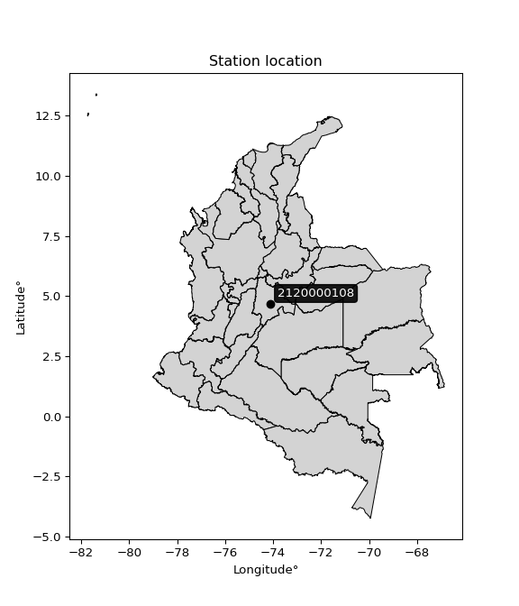

<div align="center">


</div>

# PMP Station (rain, Pmax24h): 2120000108

Probable Maximum Precipitation (PMP) is the greatest amount of rainfall for a specific duration that is meteorologically possible for a given location, acting as a "worst-case" scenario for extreme storms, crucial for designing safety-critical infrastructure like bridges, river deviations, dams, spillways, and nuclear plants to prevent catastrophic failure. PMP is calculated by hydrologists using meteorological data to determine the upper limit of extreme rainfall, often leading to the Probable Maximum Flood (PMF) for flood control design, and is increasingly being studied for climate change impacts.

<div align="center">

</img>

</div>


## A. General information


### 1. General running parameters

• app_version: _v20251228_. • runtime: _2025-12-28 08:43:48.795225_. • Python version: _3.14.0_. • SciPy version: _1.16.3_. • Pandas version: _2.3.3_. • NumPy version: _2.3.5_. • Stations dataset (station_dataset_file): _dataset/pmax24h_in/automatic_colombia_2003_2024.csv_. • Stations catalog (station_catalog_file): _dataset/CNE_IDEAM.xls_. • Minimum year to eval til year_max (date_min): _1900_. • Maximum year to eval since year_min (date_max): _2024_. • Creates, save and include plots into reports (create_plot): _False_. • Plot only fit distributions with Δo > Δ (plot_only_fit): _True_. • Eval low extreme values, if False, evaluates high extreme values (low_extreme): _False_. • Eval every SciPy distribution as logarithmic (pdist_logarithmic_on): _True_. • Standard deviation normalized (ddof): _1.0_. • Return periods to eval in years (Tr): _[2, 2.33, 5, 10, 15, 20, 25, 50, 75, 100, 200, 250, 500, 750, 1000]_. • Minimum data sample per station, 0 means any (minimum_sample): _5_. • Z-Score maximum threshold to adjust a value, 0 means disable (zscore_max): _3.5_. • Z-Score minimum threshold to adjust a value, 0 means disable (zscore_min): _-2.5_. • Avoid zeros, e.g. rain = 0 (avoid_zeros): _True_. • Avoid null values (avoid_nans): _True_. [:file_folder:Dataset file.](../../dataset/pmax24h_in/automatic_colombia_2003_2024.csv)

> Delta Degrees of Freedom (DDOF): is a parameter used in the formulas for calculating variance and standard deviation. When ddof=0, the divisor is $N$ (the total number of observations) and this is used when your data set is the entire population. When ddof=1, the divisor is $N-1$ and this is used when your data set is a sample drawn from a larger population. Using $N-1$ provides an unbiased estimate of the population variance (known as Bessel´s correction).


### 2. Station info and location

|   id |     CODIGO | NOMBRE                    | CATEGORIA     | TECNOLOGIA                | ESTADO   | FECHA_INSTALACION   |   FECHA_SUSPENSION |   ALTITUD |   LATITUD |   LONGITUD | DEPARTAMENTO   | MUNICIPIO   | AREA_OPERATIVA                            | ENTIDAD                                                      | AREA_HIDROGRAFICA   | ZONA_HIDROGRAFICA   | SUBZONA_HIDROGRAFICA   |   CORRIENTE | Catalogo   |
|-----:|-----------:|:--------------------------|:--------------|:--------------------------|:---------|:--------------------|-------------------:|----------:|----------:|-----------:|:---------------|:------------|:------------------------------------------|:-------------------------------------------------------------|:--------------------|:--------------------|:-----------------------|------------:|:-----------|
|    0 | 2120000108 | IDIGER - AUT [2120000108] | Pluviométrica | Automática con Telemetría | Activa   | 01/11/2009          |                nan |      2555 |   4.67493 |   -74.1136 | Bogotá         | Bogotá, D.C | Area Operativa 11 - Cundinamarca-Amazonas | INSTITUTO DISTRITAL DE GESTIÓN DE RIESGOS Y CAMBIO CLIMÁTICO | Magdalena Cauca     | Alto Magdalena      | Río Bogotá             |         nan | CNE_OE     |

<div align="center">

Map location in: [:earth_americas:Google](http://maps.google.com/maps?q=4.674932,-74.113609) [:earth_americas:OSM](https://www.openstreetmap.org/#map=18/4.674932/-74.113609&layers=P) [:earth_americas:Bing](https://www.bing.com/maps?cp=4.674932~-74.113609&lvl=18) [:earth_americas:Apple](https://maps.apple.com/frame?center=4.674932%2C-74.113609&span=0.003%2C0.006)

</div>


<div align="center">

```geojson
{
  "type": "Feature",
  "geometry": {
    "type": "Point", 
    "coordinates": [-74.113609, 4.674932]
  }, 
  "properties": {
    "Name": "2120000108"
  }
}
```

</div>


### 3. Discrete values table and plot

|               |            0 |          1 |          2 |          3 |           4 |
|:--------------|-------------:|-----------:|-----------:|-----------:|------------:|
| Date          | 2018         | 2019       | 2020       | 2023       | 2024        |
| Value         |   40         |   81.3     |   27.6     |    5       |   48.2      |
| Value_initial |   40         |   81.3     |   27.6     |    5       |   48.2      |
| count         |    5         |    5       |    5       |    5       |    5        |
| mean          |   40.42      |   40.42    |   40.42    |   40.42    |   40.42     |
| std           |   28.066     |   28.066   |   28.066   |   28.066   |   28.066    |
| zscore        |   -0.0149647 |    1.45657 |   -0.45678 |   -1.26202 |    0.277203 |

> The initial value (value_initial) correspond to the initial obtained or null completed value, and value (value) is adjusted only when the initial value is outside the valid range definite through the Z-Score value. If Z-Score is active, values out of range or outliers are replaced with the station mean value


### 4. Active continuous probability distributions from SciPy (44 of 104 available)

[scipy.stats](https://docs.scipy.org/doc/scipy/reference/stats.html) is a Python´s powerful submodule within the SciPy library for comprehensive statistical analysis, offering over 130 probability distributions (like Normal, Poisson), functions for descriptive stats (mean, variance), hypothesis testing (t-tests, chi-square), random variable generation, and statistical tests, making it essential for data science, modeling, and research. It provides tools to explore, model, and draw conclusions from data efficiently, working seamlessly with NumPy.

<div align="center">

|   id | p_dist             |   n_parameter | fit_method   | label                                                                       | active   | ref                                                                                                        |
|-----:|:-------------------|--------------:|:-------------|:----------------------------------------------------------------------------|:---------|:-----------------------------------------------------------------------------------------------------------|
|    0 | alpha              |             3 | MLE          | Alpha                                                                       | True     | [:mortar_board:](https://docs.scipy.org/doc/scipy/reference/generated/scipy.stats.alpha.html)              |
|    1 | betaprime          |             4 | MLE          | Beta prime                                                                  | True     | [:mortar_board:](https://docs.scipy.org/doc/scipy/reference/generated/scipy.stats.betaprime.html)          |
|    2 | chi2               |             3 | MLE          | Chi²                                                                        | True     | [:mortar_board:](https://docs.scipy.org/doc/scipy/reference/generated/scipy.stats.chi2.html)               |
|    3 | crystalball        |             4 | MLE          | Crystalball                                                                 | True     | [:mortar_board:](https://docs.scipy.org/doc/scipy/reference/generated/scipy.stats.crystalball.html)        |
|    4 | erlang             |             3 | MLE          | Erlang                                                                      | True     | [:mortar_board:](https://docs.scipy.org/doc/scipy/reference/generated/scipy.stats.erlang.html)             |
|    5 | expon              |             2 | MLE          | Exponential                                                                 | True     | [:mortar_board:](https://docs.scipy.org/doc/scipy/reference/generated/scipy.stats.expon.html)              |
|    6 | exponnorm          |             3 | MLE          | Exponentially modified Normal                                               | True     | [:mortar_board:](https://docs.scipy.org/doc/scipy/reference/generated/scipy.stats.exponnorm.html)          |
|    7 | f                  |             4 | MLE          | F                                                                           | True     | [:mortar_board:](https://docs.scipy.org/doc/scipy/reference/generated/scipy.stats.f.html)                  |
|    8 | fatiguelife        |             3 | MLE          | Fatigue-life (Birnbaum-Saunders)                                            | True     | [:mortar_board:](https://docs.scipy.org/doc/scipy/reference/generated/scipy.stats.fatiguelife.html)        |
|    9 | fisk               |             3 | MLE          | Fisk                                                                        | True     | [:mortar_board:](https://docs.scipy.org/doc/scipy/reference/generated/scipy.stats.fisk.html)               |
|   10 | gamma              |             3 | MLE          | Gamma                                                                       | True     | [:mortar_board:](https://docs.scipy.org/doc/scipy/reference/generated/scipy.stats.gamma.html)              |
|   11 | genexpon           |             5 | MLE          | Generalized exponential                                                     | True     | [:mortar_board:](https://docs.scipy.org/doc/scipy/reference/generated/scipy.stats.genexpon.html)           |
|   12 | genlogistic        |             3 | MLE          | Generalized logistic                                                        | True     | [:mortar_board:](https://docs.scipy.org/doc/scipy/reference/generated/scipy.stats.genlogistic.html)        |
|   13 | gibrat             |             2 | MM           | Gibrat                                                                      | True     | [:mortar_board:](https://docs.scipy.org/doc/scipy/reference/generated/scipy.stats.gibrat.html)             |
|   14 | gompertz           |             3 | MLE          | Gompertz (or truncated Gumbel)                                              | True     | [:mortar_board:](https://docs.scipy.org/doc/scipy/reference/generated/scipy.stats.gompertz.html)           |
|   15 | gumbel_l           |             2 | MM           | Gumbel Left Skew                                                            | True     | [:mortar_board:](https://docs.scipy.org/doc/scipy/reference/generated/scipy.stats.gumbel_l.html)           |
|   16 | gumbel_r           |             2 | MM           | Gumbel Right Skew                                                           | True     | [:mortar_board:](https://docs.scipy.org/doc/scipy/reference/generated/scipy.stats.gumbel_r.html)           |
|   17 | halflogistic       |             2 | MM           | Half-logistic                                                               | True     | [:mortar_board:](https://docs.scipy.org/doc/scipy/reference/generated/scipy.stats.halflogistic.html)       |
|   18 | halfnorm           |             2 | MM           | Half Normal                                                                 | True     | [:mortar_board:](https://docs.scipy.org/doc/scipy/reference/generated/scipy.stats.halfnorm.html)           |
|   19 | hypsecant          |             2 | MM           | hyperbolic secant                                                           | True     | [:mortar_board:](https://docs.scipy.org/doc/scipy/reference/generated/scipy.stats.hypsecant.html)          |
|   20 | invgamma           |             3 | MLE          | Inverted gamma                                                              | True     | [:mortar_board:](https://docs.scipy.org/doc/scipy/reference/generated/scipy.stats.invgamma.html)           |
|   21 | invgauss           |             3 | MLE          | Inverse Gaussian                                                            | True     | [:mortar_board:](https://docs.scipy.org/doc/scipy/reference/generated/scipy.stats.invgauss.html)           |
|   22 | invweibull         |             3 | MLE          | Inverted Weibull                                                            | True     | [:mortar_board:](https://docs.scipy.org/doc/scipy/reference/generated/scipy.stats.invweibull.html)         |
|   23 | johnsonsu          |             4 | MLE          | Johnson Su                                                                  | True     | [:mortar_board:](https://docs.scipy.org/doc/scipy/reference/generated/scipy.stats.johnsonsu.html)          |
|   24 | kstwobign          |             2 | MLE          | Limiting distribution of scaled Kolmogorov-Smirnov two-sided test statistic | True     | [:mortar_board:](https://docs.scipy.org/doc/scipy/reference/generated/scipy.stats.kstwobign.html)          |
|   25 | laplace            |             2 | MM           | Laplace                                                                     | True     | [:mortar_board:](https://docs.scipy.org/doc/scipy/reference/generated/scipy.stats.laplace.html)            |
|   26 | laplace_asymmetric |             3 | MLE          | Asymmetric Laplace                                                          | True     | [:mortar_board:](https://docs.scipy.org/doc/scipy/reference/generated/scipy.stats.laplace_asymmetric.html) |
|   27 | loggamma           |             3 | MLE          | Log gamma                                                                   | True     | [:mortar_board:](https://docs.scipy.org/doc/scipy/reference/generated/scipy.stats.loggamma.html)           |
|   28 | logistic           |             2 | MM           | Logistic (or Sech-squared)                                                  | True     | [:mortar_board:](https://docs.scipy.org/doc/scipy/reference/generated/scipy.stats.logistic.html)           |
|   29 | lognorm            |             3 | MLE          | Log Normal                                                                  | True     | [:mortar_board:](https://docs.scipy.org/doc/scipy/reference/generated/scipy.stats.lognorm.html)            |
|   30 | maxwell            |             2 | MM           | Maxwell                                                                     | True     | [:mortar_board:](https://docs.scipy.org/doc/scipy/reference/generated/scipy.stats.maxwell.html)            |
|   31 | mielke             |             4 | MLE          | Mielke Beta-Kappa / Dagum                                                   | True     | [:mortar_board:](https://docs.scipy.org/doc/scipy/reference/generated/scipy.stats.mielke.html)             |
|   32 | moyal              |             2 | MM           | Moyal                                                                       | True     | [:mortar_board:](https://docs.scipy.org/doc/scipy/reference/generated/scipy.stats.moyal.html)              |
|   33 | nakagami           |             3 | MLE          | Nakagami                                                                    | True     | [:mortar_board:](https://docs.scipy.org/doc/scipy/reference/generated/scipy.stats.nakagami.html)           |
|   34 | ncf                |             5 | MLE          | Non-central F distribution                                                  | True     | [:mortar_board:](https://docs.scipy.org/doc/scipy/reference/generated/scipy.stats.ncf.html)                |
|   35 | nct                |             4 | MLE          | Non-central Student’s t                                                     | True     | [:mortar_board:](https://docs.scipy.org/doc/scipy/reference/generated/scipy.stats.nct.html)                |
|   36 | norm               |             2 | MM           | Normal                                                                      | True     | [:mortar_board:](https://docs.scipy.org/doc/scipy/reference/generated/scipy.stats.norm.html)               |
|   37 | pearson3           |             3 | MM           | Pearson type III                                                            | True     | [:mortar_board:](https://docs.scipy.org/doc/scipy/reference/generated/scipy.stats.pearson3.html)           |
|   38 | rayleigh           |             2 | MM           | Rayleigh                                                                    | True     | [:mortar_board:](https://docs.scipy.org/doc/scipy/reference/generated/scipy.stats.rayleigh.html)           |
|   39 | rice               |             3 | MLE          | Rice                                                                        | True     | [:mortar_board:](https://docs.scipy.org/doc/scipy/reference/generated/scipy.stats.rice.html)               |
|   40 | t                  |             3 | MLE          | Student’s t                                                                 | True     | [:mortar_board:](https://docs.scipy.org/doc/scipy/reference/generated/scipy.stats.t.html)                  |
|   41 | truncnorm          |             4 | MLE          | Truncated normal                                                            | True     | [:mortar_board:](https://docs.scipy.org/doc/scipy/reference/generated/scipy.stats.truncnorm.html)          |
|   42 | wald               |             2 | MM           | Wald                                                                        | True     | [:mortar_board:](https://docs.scipy.org/doc/scipy/reference/generated/scipy.stats.wald.html)               |
|   43 | weibull_min        |             3 | MLE          | Weibull minimum                                                             | True     | [:mortar_board:](https://docs.scipy.org/doc/scipy/reference/generated/scipy.stats.weibull_min.html)        |

</div>

> **n_parameter:** # arguments & localization & scale.
>
> **Fit methods:** (MLE) maximum likelihood, (MM) L-moments.
>
>**Inactive:** foldnorm, gennorm, norminvgauss, powernorm, powerlognorm, skewnorm, genextreme, anglit, arcsine, argus, beta, bradford, burr, burr12, cauchy, cosine, halfcauchy, foldcauchy, skewcauchy, wrapcauchy, dgamma, gengamma, exponweib, exponpow, truncexpon, gausshyper, genhalflogistic, genhyperbolic, geninvgauss, halfgennorm, johnsonsb, kappa4, kappa3, ksone, kstwo, loglaplace, levy, levy_l, levy_stable, ncx2, pareto, genpareto, truncpareto, lomax, powerlaw, rdist, rel_breitwigner, recipinvgauss, semicircular, studentized_range, trapezoid, triang, truncweibull_min, tukeylambda, uniform, loguniform, vonmises, vonmises_line, weibull_max, dweibull, 


## B. Probability distributions vs. Empirical distributions

A continuous probability distribution (CPD) describes probabilities for variables that can take any value within a range (like rain any time), unlike discrete variables with specific outcomes (like temperature). It uses a Probability Density Function (PDF), a curve where the total area under it equals 1, and the probability of the variable falling within an interval (a to b) is found by calculating the area under the curve between those points. A key feature is that the probability of hitting any single exact value is zero, so probabilities are always expressed for ranges, e.g., $P(a ≤ X ≤ b)$.

<div align="center">

Distributions parameters from station values
|    |    station | p_dist                |   n |             loc |          scale | shape                  | shape1                | shape2                | shape3   |
|---:|-----------:|:----------------------|----:|----------------:|---------------:|:-----------------------|:----------------------|:----------------------|:---------|
|  0 | 2120000108 | alpha                 |   5 |    -0.0247639   |   10.9069      | 2.5692421873812828e-11 |                       |                       |          |
|  1 | 2120000108 | betaprime             |   5 |   -28.9567      | 3281.38        | 7.335259452553315      | 347.9120294520336     |                       |          |
|  2 | 2120000108 | chi2                  |   5 |     5           |    5.92987     | 1.2014303698893856     |                       |                       |          |
|  3 | 2120000108 | crystalball           |   5 |    40.42        |   25.103       | 3079.069014758037      | 583.8690717255724     |                       |          |
|  4 | 2120000108 | erlang                |   5 |   -23.2722      |   10.7185      | 5.9422649790869615     |                       |                       |          |
|  5 | 2120000108 | expon                 |   5 |     5           |   35.42        |                        |                       |                       |          |
|  6 | 2120000108 | exponnorm             |   5 |    30.9302      |   23.2856      | 0.40754000694975445    |                       |                       |          |
|  7 | 2120000108 | f                     |   5 |   -23.653       |   64.0574      | 12.062252054979307     | 7574.717942382729     |                       |          |
|  8 | 2120000108 | fatiguelife           |   5 |     5           |    6.53397e-06 | 2020.438963536114      |                       |                       |          |
|  9 | 2120000108 | fisk                  |   5 |   -84.9051      |  123.119       | 8.49073374573668       |                       |                       |          |
| 10 | 2120000108 | gamma                 |   5 |   -23.2722      |   10.7185      | 5.942267610958099      |                       |                       |          |
| 11 | 2120000108 | genexpon              |   5 |     4.99883     |    0.995003    | 0.02807873136645786    | 5.254451195572807e-07 | 0.17909546757648664   |          |
| 12 | 2120000108 | genlogistic           |   5 |   -72.5468      |   21.7504      | 103.69283993130873     |                       |                       |          |
| 13 | 2120000108 | gibrat                |   5 |    21.2695      |   11.6153      |                        |                       |                       |          |
| 14 | 2120000108 | gompertz              |   5 |     5           |   49.4486      | 0.7481409337377669     |                       |                       |          |
| 15 | 2120000108 | gumbel_l              |   5 |    51.7177      |   19.5727      |                        |                       |                       |          |
| 16 | 2120000108 | gumbel_r              |   5 |    29.1223      |   19.5727      |                        |                       |                       |          |
| 17 | 2120000108 | halflogistic          |   5 |    10.6671      |   21.4622      |                        |                       |                       |          |
| 18 | 2120000108 | halfnorm              |   5 |     7.19339     |   41.6434      |                        |                       |                       |          |
| 19 | 2120000108 | hypsecant             |   5 |    40.42        |   15.9811      |                        |                       |                       |          |
| 20 | 2120000108 | invgamma              |   5 |  -115.839       | 5956.25        | 39.21190969987808      |                       |                       |          |
| 21 | 2120000108 | invgauss              |   5 |   -63.3872      | 1674.9         | 0.061959556970451635   |                       |                       |          |
| 22 | 2120000108 | invweibull            |   5 |    -1.16939e+09 |    1.16939e+09 | 53548264.25414482      |                       |                       |          |
| 23 | 2120000108 | johnsonsu             |   5 |   -88.4319      |   20.3986      | -13.042024142147298    | 5.167259983499388     |                       |          |
| 24 | 2120000108 | kstwobign             |   5 |   -48.45        |  101.764       |                        |                       |                       |          |
| 25 | 2120000108 | laplace               |   5 |    40.42        |   17.7505      |                        |                       |                       |          |
| 26 | 2120000108 | laplace_asymmetric    |   5 |    40           |   19.3765      | 0.9892182922051105     |                       |                       |          |
| 27 | 2120000108 | loggamma              |   5 | -8251.59        | 1099.24        | 1888.5724992738433     |                       |                       |          |
| 28 | 2120000108 | logistic              |   5 |    40.42        |   13.84        |                        |                       |                       |          |
| 29 | 2120000108 | lognorm               |   5 |     5           |    0.0187472   | 15.345321743938444     |                       |                       |          |
| 30 | 2120000108 | maxwell               |   5 |   -19.0636      |   37.2758      |                        |                       |                       |          |
| 31 | 2120000108 | mielke                |   5 |     5           |   77.2144      | 0.5761919919917493     | 495.3259326481857     |                       |          |
| 32 | 2120000108 | moyal                 |   5 |    26.0645      |   11.3003      |                        |                       |                       |          |
| 33 | 2120000108 | nakagami              |   5 |     5           |   49.9933      | 0.12097555585934877    |                       |                       |          |
| 34 | 2120000108 | ncf                   |   5 |     5           |    3.36955     | 0.7528971401243111     | 2623.877715744672     | 7.537121820629805     |          |
| 35 | 2120000108 | nct                   |   5 |   -70.4705      |   23.1784      | 64.85812626396768      | 4.7477893623939895    |                       |          |
| 36 | 2120000108 | norm                  |   5 |    40.42        |   25.103       |                        |                       |                       |          |
| 37 | 2120000108 | pearson3              |   5 |    40.42        |   25.103       | 0.28124428752323904    |                       |                       |          |
| 38 | 2120000108 | rayleigh              |   5 |    -7.60354     |   38.3172      |                        |                       |                       |          |
| 39 | 2120000108 | rice                  |   5 |    -7.39829     |   32.1665      | 0.9049735947002642     |                       |                       |          |
| 40 | 2120000108 | t                     |   5 |    40.4201      |   25.1033      | 90284337.47725368      |                       |                       |          |
| 41 | 2120000108 | truncnorm             |   5 |    51.6243      |   33.1813      | -237.23287588831892    | 0.8943669325168353    |                       |          |
| 42 | 2120000108 | wald                  |   5 |    15.317       |   25.103       |                        |                       |                       |          |
| 43 | 2120000108 | weibull_min           |   5 |    -0.727664    |   45.5306      | 1.576643958850139      |                       |                       |          |
| 44 | 2120000108 | logalpha              |   5 |   -19.3622      |  514.487       | 22.675732604169923     |                       |                       |          |
| 45 | 2120000108 | logbetaprime          |   5 |   -36.6154      |   22.9967      | 4563.272156472409      | 2625.1508225576235    |                       |          |
| 46 | 2120000108 | logchi2               |   5 |     1.60944     |    1.01159     | 1.0963250513611564     |                       |                       |          |
| 47 | 2120000108 | logcrystalball        |   5 |     3.86334     |    0.409223    | 0.4559598436485481     | 618.9133866711151     |                       |          |
| 48 | 2120000108 | logerlang             |   5 |   -12.2781      |    0.0614435   | 254.77544084683444     |                       |                       |          |
| 49 | 2120000108 | logexpon              |   5 |     1.60944     |    1.76849     |                        |                       |                       |          |
| 50 | 2120000108 | logexponnorm          |   5 |     3.37719     |    0.950384    | 0.0007798385602760917  |                       |                       |          |
| 51 | 2120000108 | logf                  |   5 | -1325.7         | 1329.07        | 14085297.903195582     | 5388015.812417649     |                       |          |
| 52 | 2120000108 | logfatiguelife        |   5 |  -484.192       |  487.575       | 0.0019491749009773705  |                       |                       |          |
| 53 | 2120000108 | logfisk               |   5 |    -9.9898e+07  |    9.9898e+07  | 191429048.4029523      |                       |                       |          |
| 54 | 2120000108 | loggamma              |   5 |   -14.7833      |    0.053602    | 338.9951322608715      |                       |                       |          |
| 55 | 2120000108 | loggenexpon           |   5 |     1.58885     |    0.0243865   | 0.005590832200179707   | 4.733657317668049     | 3.609646138392342e-05 |          |
| 56 | 2120000108 | loggenlogistic        |   5 |     4.39817     |    2.02711e-06 | 1.9808453212152e-06    |                       |                       |          |
| 57 | 2120000108 | loggibrat             |   5 |     2.65286     |    0.439768    |                        |                       |                       |          |
| 58 | 2120000108 | loggompertz           |   5 |     1.60944     |    1.39891     | 0.30860514538332284    |                       |                       |          |
| 59 | 2120000108 | loggumbel_l           |   5 |     3.80565     |    0.741011    |                        |                       |                       |          |
| 60 | 2120000108 | loggumbel_r           |   5 |     2.9502      |    0.741011    |                        |                       |                       |          |
| 61 | 2120000108 | loghalflogistic       |   5 |     2.25152     |    0.812538    |                        |                       |                       |          |
| 62 | 2120000108 | loghalfnorm           |   5 |     2.11999     |    1.5766      |                        |                       |                       |          |
| 63 | 2120000108 | loghypsecant          |   5 |     3.37793     |    0.605033    |                        |                       |                       |          |
| 64 | 2120000108 | loginvgamma           |   5 |   -16.3354      | 7684.83        | 390.88040586215516     |                       |                       |          |
| 65 | 2120000108 | loginvgauss           |   5 |    -6.86658     | 1022.58        | 0.009991297520773618   |                       |                       |          |
| 66 | 2120000108 | loginvweibull         |   5 |    -9.90927e+07 |    9.90927e+07 | 96357314.67858328      |                       |                       |          |
| 67 | 2120000108 | logjohnsonsu          |   5 |     4.66388     |    0.0113978   | 6.471848178987484      | 1.2611040241080147    |                       |          |
| 68 | 2120000108 | logkstwobign          |   5 |    -0.828941    |    4.79627     |                        |                       |                       |          |
| 69 | 2120000108 | loglaplace            |   5 |     3.37793     |    0.672023    |                        |                       |                       |          |
| 70 | 2120000108 | loglaplace_asymmetric |   5 |     3.87536     |    0.550702    | 1.5489273158867385     |                       |                       |          |
| 71 | 2120000108 | logloggamma           |   5 |     4.39839     |    3.4684e-06  | 3.362250670913198e-06  |                       |                       |          |
| 72 | 2120000108 | loglogistic           |   5 |     3.37793     |    0.523974    |                        |                       |                       |          |
| 73 | 2120000108 | loglognorm            |   5 |     1.60944     |    0.00137887  | 14.729422118761237     |                       |                       |          |
| 74 | 2120000108 | logmaxwell            |   5 |     1.12592     |    1.41124     |                        |                       |                       |          |
| 75 | 2120000108 | logmielke             |   5 |    -7.83202e+06 |    7.83202e+06 | 7516340.007204853      | 1271543489.7063942    |                       |          |
| 76 | 2120000108 | logmoyal              |   5 |     2.83444     |    0.427823    |                        |                       |                       |          |
| 77 | 2120000108 | lognakagami           |   5 |     3.31782     |    0.497704    | 0.2726877553778967     |                       |                       |          |
| 78 | 2120000108 | logncf                |   5 |    -0.667515    |    1.78671e-06 | 3.896684469221985e-05  | 97.7122812467324      | 86.78523396078506     |          |
| 79 | 2120000108 | lognct                |   5 |   -49.1154      |    0.932923    | 39852.93403902746      | 56.265976886785324    |                       |          |
| 80 | 2120000108 | lognorm               |   5 |     3.37793     |    0.950383    |                        |                       |                       |          |
| 81 | 2120000108 | logpearson3           |   5 |     3.37793     |    0.950378    | -1.0056080347681844    |                       |                       |          |
| 82 | 2120000108 | lograyleigh           |   5 |     1.55979     |    1.45067     |                        |                       |                       |          |
| 83 | 2120000108 | logrice               |   5 |     0.908804    |    1.02933     | 2.14632402152016       |                       |                       |          |
| 84 | 2120000108 | logt                  |   5 |     3.37793     |    0.950383    | 53823955853.23784      |                       |                       |          |
| 85 | 2120000108 | logtruncnorm          |   5 |    -0.215063    |    1.6527      | 2.137644415298021      | 2.791334570245735     |                       |          |
| 86 | 2120000108 | logwald               |   5 |     2.42753     |    0.950398    |                        |                       |                       |          |
| 87 | 2120000108 | logweibull_min        |   5 |    -3.70269e+07 |    3.70269e+07 | 56932131.69244459      |                       |                       |          |

</div>

> **loc** (Location parameter): This shifts the distribution along the x-axis. For many common distributions, like the normal (Gaussian) distribution, loc represents the mean $μ$. For others, like the uniform distribution, it might represent the minimum value, or for the beta distribution, the left end of the support interval.
>
> **scale** (Scale parameter): This determines the width or spread of the distribution. For the normal distribution, scale represents the standard deviation $σ$. For a uniform distribution, it defines the length of the interval (from $loc$ to $loc + scale$).
>
> **shape** (Shape parameters): Refers to parameters that define the specific form of a probability distribution, distinct from its location (loc) and scale (scale). These parameters are required arguments for most distribution functions. For example, a normal (Gaussian) distribution is fully defined by its location (mean) and scale (standard deviation), so it has no specific shape parameters beyond loc and scale. However, other distributions have intrinsic properties that need specification, as Gamma distribution that takes a shape parameter, often named $a$ or $alpha$.


### 0. Cumulative distribution values - CDF (88 evaluated)

Cumulative Distribution Function (CDF), denoted as $F$<sub>$X$</sub>$(x)$, is a function that gives the probability that a random variable $X$ will take a value less than or equal to a specific value, $x$ (i.e., $(P(X≥x)$. It essentially "accumulates" probabilities from a given point up to the far right (positive infinity), providing a complete picture of the distribution´s probabilities for both discrete (like rain) and continuous (like temperature) variables, helping to find probabilities over ranges or above certain values.

<div align="center">

CDF ordered by x ascending and calculating $log(f(x))$ separately
|   id |    Station |   date |    x |   count |   mean |    std |     zscore |   Value_initial |    station |   m |     alpha |   alpha_pdf |   betaprime |   betaprime_pdf |        chi2 |         chi2_pdf |   crystalball |   crystalball_pdf |    erlang |   erlang_pdf |    expon |   expon_pdf |   exponnorm |   exponnorm_pdf |         f |      f_pdf |   fatiguelife |   fatiguelife_pdf |     fisk |   fisk_pdf |     gamma |   gamma_pdf |    genexpon |   genexpon_pdf |   genlogistic |   genlogistic_pdf |   gibrat |   gibrat_pdf |   gompertz |   gompertz_pdf |   gumbel_l |   gumbel_l_pdf |   gumbel_r |   gumbel_r_pdf |   halflogistic |   halflogistic_pdf |   halfnorm |   halfnorm_pdf |   hypsecant |   hypsecant_pdf |   invgamma |   invgamma_pdf |   invgauss |   invgauss_pdf |   invweibull |   invweibull_pdf |   johnsonsu |   johnsonsu_pdf |   kstwobign |   kstwobign_pdf |   laplace |   laplace_pdf |   laplace_asymmetric |   laplace_asymmetric_pdf |   loggamma |   loggamma_pdf |   logistic |   logistic_pdf |   lognorm |   lognorm_pdf |   maxwell |   maxwell_pdf |      mielke |   mielke_pdf |     moyal |   moyal_pdf |    nakagami |   nakagami_pdf |         ncf |      ncf_pdf |       nct |    nct_pdf |      norm |   norm_pdf |   pearson3 |   pearson3_pdf |   rayleigh |   rayleigh_pdf |     rice |   rice_pdf |         t |      t_pdf |   truncnorm |   truncnorm_pdf |     wald |   wald_pdf |   weibull_min |   weibull_min_pdf |   logalpha |   logalpha_pdf |   logbetaprime |   logbetaprime_pdf |     logchi2 |   logchi2_pdf |   logcrystalball |   logcrystalball_pdf |   logerlang |   logerlang_pdf |   logexpon |   logexpon_pdf |   logexponnorm |   logexponnorm_pdf |      logf |   logf_pdf |   logfatiguelife |   logfatiguelife_pdf |   logfisk |   logfisk_pdf |   loggenexpon |   loggenexpon_pdf |   loggenlogistic |   loggenlogistic_pdf |   loggibrat |   loggibrat_pdf |   loggompertz |   loggompertz_pdf |   loggumbel_l |   loggumbel_l_pdf |   loggumbel_r |   loggumbel_r_pdf |   loghalflogistic |   loghalflogistic_pdf |   loghalfnorm |   loghalfnorm_pdf |   loghypsecant |   loghypsecant_pdf |   loginvgamma |   loginvgamma_pdf |   loginvgauss |   loginvgauss_pdf |   loginvweibull |   loginvweibull_pdf |   logjohnsonsu |   logjohnsonsu_pdf |   logkstwobign |   logkstwobign_pdf |   loglaplace |   loglaplace_pdf |   loglaplace_asymmetric |   loglaplace_asymmetric_pdf |   logloggamma |   logloggamma_pdf |   loglogistic |   loglogistic_pdf |   loglognorm |   loglognorm_pdf |   logmaxwell |   logmaxwell_pdf |   logmielke |   logmielke_pdf |    logmoyal |   logmoyal_pdf |   lognakagami |   lognakagami_pdf |    logncf |   logncf_pdf |    lognct |   lognct_pdf |   logpearson3 |   logpearson3_pdf |   lograyleigh |   lograyleigh_pdf |   logrice |   logrice_pdf |      logt |   logt_pdf |   logtruncnorm |   logtruncnorm_pdf |   logwald |   logwald_pdf |   logweibull_min |   logweibull_min_pdf |
|-----:|-----------:|-------:|-----:|--------:|-------:|-------:|-----------:|----------------:|-----------:|----:|----------:|------------:|------------:|----------------:|------------:|-----------------:|--------------:|------------------:|----------:|-------------:|---------:|------------:|------------:|----------------:|----------:|-----------:|--------------:|------------------:|---------:|-----------:|----------:|------------:|------------:|---------------:|--------------:|------------------:|---------:|-------------:|-----------:|---------------:|-----------:|---------------:|-----------:|---------------:|---------------:|-------------------:|-----------:|---------------:|------------:|----------------:|-----------:|---------------:|-----------:|---------------:|-------------:|-----------------:|------------:|----------------:|------------:|----------------:|----------:|--------------:|---------------------:|-------------------------:|-----------:|---------------:|-----------:|---------------:|----------:|--------------:|----------:|--------------:|------------:|-------------:|----------:|------------:|------------:|---------------:|------------:|-------------:|----------:|-----------:|----------:|-----------:|-----------:|---------------:|-----------:|---------------:|---------:|-----------:|----------:|-----------:|------------:|----------------:|---------:|-----------:|--------------:|------------------:|-----------:|---------------:|---------------:|-------------------:|------------:|--------------:|-----------------:|---------------------:|------------:|----------------:|-----------:|---------------:|---------------:|-------------------:|----------:|-----------:|-----------------:|---------------------:|----------:|--------------:|--------------:|------------------:|-----------------:|---------------------:|------------:|----------------:|--------------:|------------------:|--------------:|------------------:|--------------:|------------------:|------------------:|----------------------:|--------------:|------------------:|---------------:|-------------------:|--------------:|------------------:|--------------:|------------------:|----------------:|--------------------:|---------------:|-------------------:|---------------:|-------------------:|-------------:|-----------------:|------------------------:|----------------------------:|--------------:|------------------:|--------------:|------------------:|-------------:|-----------------:|-------------:|-----------------:|------------:|----------------:|------------:|---------------:|--------------:|------------------:|----------:|-------------:|----------:|-------------:|--------------:|------------------:|--------------:|------------------:|----------:|--------------:|----------:|-----------:|---------------:|-------------------:|----------:|--------------:|-----------------:|---------------------:|
|    0 | 2120000108 |   2023 |  5   |       5 |  40.42 | 28.066 | -1.26202   |             5   | 2120000108 |   1 | 0.0299598 |  0.0326812  |   0.0564197 |      0.00718997 | 2.30134e-10 | 155650           |     0.0791244 |        0.00587313 | 0.0548395 |   0.0074063  | 0        |  0.0282326  |   0.0764773 |      0.00592779 | 0.0549615 | 0.00738992 |     0.0537952 |       1.42268e+11 | 0.064802 | 0.00572338 | 0.0548395 |  0.0074063  | 3.31559e-05 |     0.0282188  |     0.0554339 |        0.00727023 | 0        |   0          | 4.1327e-12 |     0.0151297  |  0.0878187 |     0.00428374 |  0.0323999 |     0.00567721 |       0        |         0          |   0        |     0          |   0.0691212 |      0.00429128 |  0.0616037 |     0.00680601 |  0.0572725 |     0.00695002 |     0.055133 |       0.00731638 |   0.0622086 |      0.00662094 |   0.0545205 |      0.00810317 | 0.0679773 |    0.00382959 |            0.0796557 |               0.00415574 |  0.0324659 |      0.0788464 |  0.0718079 |     0.00481585 |  0.031385 |     0.0743205 | 0.0632373 |    0.00724245 | 2.24868e-07 | 579.086      | 0.0110961 |  0.00356471 | 7.27163e-05 |    1.98089e+10 | 1.10589e-05 | 418.511      | 0.0740642 | 0.00599318 | 0.0791244 | 0.00587313 |  0.0708967 |     0.00626454 |   0.052659 |     0.00813224 | 0.048253 | 0.00761318 | 0.0791262 | 0.00587317 |   0.0982155 |      0.00550074 | 0        | 0          |      0.037348 |        0.0100863  |  0.0316718 |      0.0832495 |      0.0333926 |          0.0797006 | 2.00806e-09 |    4.9573e+06 |       nan        |           nan        |   0.0319403 |       0.0791672 |   0        |       0.565454 |       0.031385 |          0.0743204 | 0.0317058 |  0.0749264 |        0.0308244 |            0.0734889 | 0.0245884 |     0.0459589 |    0.00476832 |          0.234051 |         0        |            0.0640445 |    0        |       0         |   9.42364e-09 |          0.220604 |     0.0503123 |         0.0661594 |    0.00222805 |         0.0183612 |          0        |              0        |      0        |          0        |      0.0342007 |          0.0564183 |     0.0321784 |         0.0819095 |     0.0340739 |          0.089722 |        0.035608 |            0.115481 |      0.0731071 |          0.0573141 |      0.0416765 |           0.146076 |    0.0359819 |        0.0535427 |               0.0495472 |                    0.058086 |     0.0669646 |         0.0649152 |     0.0330812 |         0.0610467 |    0.0227563 |      1.65118e+13 |    0.0103281 |        0.0625861 |   0.0674087 |       0.0646918 | 2.84327e-05 |    0.000612392 |   0           |       0           | 0.0235193 |    0.0809307 | 0.0314288 |    0.0745223 |     0.0511426 |         0.0715006 |   0.000585512 |          0.023579 | 0.0264452 |     0.0843404 | 0.0313849 |  0.0743204 |    0           |           0        |  0        |      0        |        0.0339647 |            0.0513266 |
|    1 | 2120000108 |   2020 | 27.6 |       5 |  40.42 | 28.066 | -0.45678   |            27.6 | 2120000108 |   2 | 0.692974  |  0.0105485  |   0.344045  |      0.0163011  | 0.93302     |      0.00651696  |     0.304782  |        0.0139492  | 0.348848  |   0.016397   | 0.471682 |  0.0149158  |   0.307491  |      0.014294   | 0.348495  | 0.0163902  |     0.821342  |       0.00531865  | 0.317469 | 0.016353   | 0.348848  |  0.016397   | 0.471551    |     0.014913   |     0.356081  |        0.016821   | 0.271942 |   0.0524178  | 0.351742   |     0.0154906  |  0.252968  |     0.0111313  |  0.339296  |     0.0187372  |       0.375218 |         0.0200169  |   0.375889 |     0.0169922  |   0.268319  |      0.0148709  |  0.33895   |     0.0162751  |  0.340938  |     0.0163579  |     0.357163 |       0.0168385  |   0.330645  |      0.0158964  |   0.368313  |      0.0165538  | 0.242833  |    0.0136804  |            0.258989  |               0.0135118  |  0.479039  |      0.404677  |  0.283676  |     0.0146823  |  0.474784 |     0.418931  | 0.333132  |    0.0153221  | 0.492663    |   0.0125606  | 0.350141  |  0.0213184  | 0.675825    |    0.00707733  | 0.327416    |   0.0177306  | 0.30848   | 0.0143894  | 0.304782  | 0.0139492  |  0.316938  |     0.0149051  |   0.344293 |     0.015722   | 0.330314 | 0.0156255  | 0.304783  | 0.0139491  |   0.287958  |      0.0113586  | 0.3555   | 0.035569   |      0.377008 |        0.0164085  |  0.496467  |      0.399007  |      0.482174  |          0.407441  | 0.783993    |    0.14144    |       nan        |           nan        |   0.484548  |       0.407441  |   0.619401 |       0.215211 |       0.474783 |          0.418931  | 0.475637  |  0.418262  |        0.472964  |            0.418868  | 0.399653  |     0.459765  |    0.561963   |          0.317745 |         0        |            0.340007  |    0.66037  |       0.550801  |   0.52192     |          0.357672 |     0.404117  |         0.416317  |    0.543947   |         0.446972  |          0.575798 |              0.411339 |      0.552599 |          0.379207 |      0.468427  |          0.523517  |     0.490418  |         0.401232  |     0.507181  |          0.392315 |        0.530797 |            0.326914 |      0.337357  |          0.342242  |      0.556555  |           0.308819 |    0.457217  |        0.68036   |               0.367131  |                    0.430401 |     0.350815  |         0.340078  |     0.471351  |         0.475557  |    0.685638  |      0.014105    |    0.50866   |        0.408268  |   0.347337  |       0.333337  | 0.569763    |    0.450967    |   4.82249e-09 |       5.92238e+06 | 0.51153   |    0.385783  | 0.475289  |    0.418607  |     0.408789  |         0.39759   |   0.52017     |          0.400847 | 0.485124  |     0.408523  | 0.474784  |  0.418931  |    3.63298e-06 |           1.80044  |  0.641626 |      0.461996 |        0.379894  |            0.455628  |
|    2 | 2120000108 |   2018 | 40   |       5 |  40.42 | 28.066 | -0.0149647 |            40   | 2120000108 |   3 | 0.785235  |  0.00523428 |   0.544136  |      0.0153307  | 0.979406    |      0.00192362  |     0.493326  |        0.01589    | 0.54824   |   0.0151542  | 0.627732 |  0.0105101  |   0.499382  |      0.0160347  | 0.547939  | 0.0151669  |     0.874001  |       0.00338744  | 0.530543 | 0.0169309  | 0.548239  |  0.0151542  | 0.627583    |     0.0105097  |     0.557016  |        0.0149435  | 0.683613 |   0.0190013  | 0.537096   |     0.014214   |  0.422785  |     0.0162064  |  0.563472  |     0.0165142  |       0.593701 |         0.0150851  |   0.569186 |     0.0140484  |   0.491635  |      0.019911   |  0.542321  |     0.0157938  |  0.542892  |     0.0155294  |     0.557932 |       0.014908   |   0.531616  |      0.0158023  |   0.563321  |      0.0144329  | 0.488308  |    0.0275095  |            0.49458   |               0.0258029  |  0.626201  |      0.37962   |  0.492414  |     0.0180594  |  0.628236 |     0.397892  | 0.52663   |    0.015315   | 0.633874    |   0.0104352  | 0.58935   |  0.0164727  | 0.74852     |    0.00490746  | 0.538414    |   0.0157137  | 0.499656  | 0.0158133  | 0.493326  | 0.01589    |  0.512031  |     0.0159012  |   0.537783 |     0.0149864  | 0.525749 | 0.0153708  | 0.493324  | 0.0158898  |   0.445764  |      0.0138838  | 0.661342 | 0.0162973  |      0.567779 |        0.0140352  |  0.639195  |      0.362521  |      0.630335  |          0.382013  | 0.829872    |    0.107733   |         0.546229 |             0.607377 |   0.632146  |       0.379181  |   0.691437 |       0.174478 |       0.628235 |          0.397892  | 0.628966  |  0.396812  |        0.626472  |            0.398251  | 0.575453  |     0.468152  |    0.671869   |          0.272905 |         0        |            0.488608  |    0.804248 |       0.266747  |   0.652116    |          0.339325 |     0.574379  |         0.490638  |    0.691397   |         0.344332  |          0.708661 |              0.306324 |      0.680319 |          0.308453 |      0.656833  |          0.463527  |     0.634821  |         0.368893  |     0.64672   |          0.352725 |        0.643053 |            0.276089 |      0.494815  |          0.515931  |      0.662522  |           0.261215 |    0.685213  |        0.468418  |               0.56721   |                    0.664962 |     0.502686  |         0.487301  |     0.644156  |         0.437463  |    0.690359  |      0.0115125   |    0.652114  |        0.358441  |   0.495914  |       0.475925  | 0.712577    |    0.32099     |   0.642113    |       0.837091    | 0.64627   |    0.33499   | 0.628551  |    0.39723   |     0.569946  |         0.463217  |   0.659391    |          0.3446   | 0.633411  |     0.38183   | 0.628236  |  0.397892  |    0.526701    |           1.08642  |  0.772054 |      0.263689 |        0.570637  |            0.558153  |
|    3 | 2120000108 |   2024 | 48.2 |       5 |  40.42 | 28.066 |  0.277203  |            48.2 | 2120000108 |   4 | 0.821071  |  0.00364747 |   0.661257  |      0.0131087  | 0.990364    |      0.000885809 |     0.62169   |        0.015147   | 0.663622  |   0.012878   | 0.704666 |  0.00833804 |   0.627974  |      0.0150558  | 0.663446  | 0.0128944  |     0.898428  |       0.00261461  | 0.659756 | 0.0143194  | 0.663622  |  0.012878   | 0.704518    |     0.00833859 |     0.669165  |        0.0123354  | 0.799807 |   0.0104018  | 0.647994   |     0.0127583  |  0.566343  |     0.0185115  |  0.685708  |     0.0132184  |       0.703601 |         0.0117636  |   0.675233 |     0.0117988  |   0.64918   |      0.0177702  |  0.663402  |     0.0135731  |  0.661556  |     0.0132745  |     0.669751 |       0.0122936  |   0.653732  |      0.0138     |   0.672201  |      0.0120726  | 0.677433  |    0.0181723  |            0.66746   |               0.016977   |  0.694295  |      0.349046  |  0.636947  |     0.0167085  |  0.699652 |     0.366036  | 0.646209  |    0.0136821  | 0.715609    |   0.00954464 | 0.707267  |  0.0123549  | 0.785076    |    0.00405583  | 0.656897    |   0.0131073  | 0.625747  | 0.0146898  | 0.62169   | 0.015147   |  0.637678  |     0.0145101  |   0.653713 |     0.0131616  | 0.645629 | 0.0137132  | 0.621687  | 0.0151469  |   0.563459  |      0.0146841  | 0.767677 | 0.0102186  |      0.673765 |        0.0117755  |  0.70382   |      0.329346  |      0.698815  |          0.350744  | 0.848697    |    0.0945075  |         0.666845 |             0.664871 |   0.700018  |       0.347141  |   0.722317 |       0.157017 |       0.699651 |          0.366036  | 0.700176  |  0.364927  |        0.697974  |            0.366592  | 0.659592  |     0.430255  |    0.720406   |          0.247469 |         0        |            0.586273  |    0.846705 |       0.193498  |   0.713626    |          0.319159 |     0.666675  |         0.494194  |    0.750561   |         0.290632  |          0.761275 |              0.258733 |      0.73446  |          0.272292 |      0.736392  |          0.38757   |     0.700732  |         0.336616  |     0.709503  |          0.319547 |        0.691906 |            0.247798 |      0.600518  |          0.617617  |      0.708875  |           0.235906 |    0.761491  |        0.354912  |               0.705811  |                    0.827448 |     0.602289  |         0.583856  |     0.720983  |         0.383925  |    0.692412  |      0.0105343   |    0.71561   |        0.321669  |   0.593101  |       0.569195  | 0.767035    |    0.264395    |   0.77225     |       0.5749      | 0.70555   |    0.300178  | 0.699838  |    0.365325  |     0.657486  |         0.472035  |   0.720275    |          0.30779  | 0.701833  |     0.350331  | 0.699652  |  0.366036  |    0.704192    |           0.826948 |  0.815373 |      0.20405  |        0.675735  |            0.561504  |
|    4 | 2120000108 |   2019 | 81.3 |       5 |  40.42 | 28.066 |  1.45657   |            81.3 | 2120000108 |   5 | 0.893312  |  0.00130403 |   0.92824   |      0.0038605  | 0.999513    |      4.33117e-05 |     0.948289  |        0.00422002 | 0.926264  |   0.00385079 | 0.883998 |  0.00327503 |   0.945965  |      0.00408543 | 0.926395  | 0.0038516  |     0.954613  |       0.00105783  | 0.92743  | 0.00343828 | 0.926264  |  0.00385079 | 0.883892    |     0.00327659 |     0.915911  |        0.00369721 | 0.949759 |   0.00172464 | 0.936211   |     0.00451544 |  0.989253  |     0.00248913 |  0.932822  |     0.00331428 |       0.92824  |         0.00322358 |   0.924851 |     0.00393305 |   0.950787  |      0.00306719 |  0.934494  |     0.00371905 |  0.92972   |     0.00381592 |     0.915716 |       0.00369205 |   0.934011  |      0.00387763 |   0.922556  |      0.00388054 | 0.950022  |    0.00281556 |            0.93863   |               0.0031331  |  0.847012  |      0.230886  |  0.950441  |     0.00340341 |  0.858472 |     0.235928  | 0.935639  |    0.00413655 | 0.993156    |   0.00747951 | 0.930819  |  0.00305335 | 0.883848    |    0.00217602  | 0.921898    |   0.00391951 | 0.938467  | 0.0042523  | 0.948289  | 0.00422002 |  0.941161  |     0.00407556 |   0.932231 |     0.00410354 | 0.936896 | 0.00416692 | 0.948287  | 0.00422013 |   0.999994  |      0.00989626 | 0.935585 | 0.00225184 |      0.920322 |        0.00387429 |  0.846743  |      0.215537  |      0.851701  |          0.229764  | 0.890274    |    0.066452   |         0.934755 |             0.283171 |   0.851041  |       0.226866  |   0.793383 |       0.116833 |       0.858472 |          0.235928  | 0.858506  |  0.235255  |        0.857199  |            0.236872  | 0.840676  |     0.256662  |    0.830729   |          0.175151 |         0.999972 |            0.977149  |    0.915964 |       0.0883998 |   0.858704    |          0.228826 |     0.891889  |         0.324561  |    0.867877   |         0.165966  |          0.867018 |              0.152781 |      0.851538 |          0.178164 |      0.883408  |          0.188424  |     0.847236  |         0.221097  |     0.848086  |          0.209326 |        0.801292 |            0.17261  |      0.948008  |          0.504455  |      0.8142    |           0.168465 |    0.890439  |        0.163031  |               0.932386  |                    0.190173 |     0.999769  |         0.969171  |     0.875128  |         0.208558  |    0.69735   |      0.00849819  |    0.853775  |        0.206714  |   0.979365  |       0.912275  | 0.872241    |    0.14803     |   0.949948    |       0.165814    | 0.835322  |    0.197216  | 0.858339  |    0.235504  |     0.882923  |         0.350807  |   0.852529    |          0.198902 | 0.854417  |     0.229005  | 0.858472  |  0.235928  |    0.999993    |           0.359535 |  0.893223 |      0.106483 |        0.919219  |            0.312509  |


</div>

An Empirical Distribution Function (EDF) is a step-function estimate of a true cumulative distribution function (CDF) based on observed sample data, representing the proportion of data points less than or equal to a given value. It is calculated by ordering your data and jumping up by $1/n$ (where $n$ is sample size) at each unique data point, allowing analysis without assuming an underlying population distribution, and it gets closer to the true CDF as the sample size grows.


### 1. Empirical - EDF California (1923)

California´s estimates the true probability distribution of water-related data (like rainfall, streamflow) using observed samples, crucial for risk assessment.

<div align="center">


$P=m/n$


</div>


**1.1. Empirical values**

<div align="center">

|                | 0              | 1                  | 2              | 3                 | 4              |
|:---------------|:---------------|:-------------------|:---------------|:------------------|:---------------|
| date           | 2023           | 2020               | 2018           | 2024              | 2019           |
| x              | 5.0            | 27.6               | 40.0           | 48.2              | 81.3           |
| m              | 1              | 2                  | 3              | 4                 | 5              |
| empirical_dist | edf_california | edf_california     | edf_california | edf_california    | edf_california |
| empirical      | 0.2            | 0.4                | 0.6            | 0.8               | 1.0            |
| empirical_tr   | 1.25           | 1.6666666666666667 | 2.5            | 5.000000000000001 | inf            |

</div>


**1.2. Kolmogorov-Smirnov fit test (sorted by Δ)**


<div align="center">

|                | 0                   | 1                   | 2                   | 3                   | 4                   | 5                   | 6                   | 7                   | 8                   | 9                   | 10                  | 11                  | 12                  | 13                  | 14                  | 15                 | 16                    | 17                  | 18                 | 19                  | 20                  | 21                  | 22                  | 23                  | 24                  | 25                  | 26                 | 27                 | 28                 | 29                  | 30                  | 31                  | 32                  | 33                  | 34                  | 35                  | 36                  | 37                  | 38                 | 39                 | 40                  | 41                 | 42                  | 43                  | 44                 | 45                  | 46                  | 47                 | 48                  | 49                  | 50                  | 51                  | 52                  | 53                 | 54                  | 55                 | 56                  | 57                 | 58                  | 59                  | 60                  | 61                  | 62                 | 63                  | 64                  | 65                  | 66                 | 67                 | 68                 | 69                 | 70                 | 71                 | 72                 | 73                  | 74                  | 75                 | 76                 | 77                  | 78                  | 79                  | 80                 | 81                  | 82                 | 83                  | 84                  | 85                 | 86                 | 87                 |
|:---------------|:--------------------|:--------------------|:--------------------|:--------------------|:--------------------|:--------------------|:--------------------|:--------------------|:--------------------|:--------------------|:--------------------|:--------------------|:--------------------|:--------------------|:--------------------|:-------------------|:----------------------|:--------------------|:-------------------|:--------------------|:--------------------|:--------------------|:--------------------|:--------------------|:--------------------|:--------------------|:-------------------|:-------------------|:-------------------|:--------------------|:--------------------|:--------------------|:--------------------|:--------------------|:--------------------|:--------------------|:--------------------|:--------------------|:-------------------|:-------------------|:--------------------|:-------------------|:--------------------|:--------------------|:-------------------|:--------------------|:--------------------|:-------------------|:--------------------|:--------------------|:--------------------|:--------------------|:--------------------|:-------------------|:--------------------|:-------------------|:--------------------|:-------------------|:--------------------|:--------------------|:--------------------|:--------------------|:-------------------|:--------------------|:--------------------|:--------------------|:-------------------|:-------------------|:-------------------|:-------------------|:-------------------|:-------------------|:-------------------|:--------------------|:--------------------|:-------------------|:-------------------|:--------------------|:--------------------|:--------------------|:-------------------|:--------------------|:-------------------|:--------------------|:--------------------|:-------------------|:-------------------|:-------------------|
| station        | 2120000108          | 2120000108          | 2120000108          | 2120000108          | 2120000108          | 2120000108          | 2120000108          | 2120000108          | 2120000108          | 2120000108          | 2120000108          | 2120000108          | 2120000108          | 2120000108          | 2120000108          | 2120000108         | 2120000108            | 2120000108          | 2120000108         | 2120000108          | 2120000108          | 2120000108          | 2120000108          | 2120000108          | 2120000108          | 2120000108          | 2120000108         | 2120000108         | 2120000108         | 2120000108          | 2120000108          | 2120000108          | 2120000108          | 2120000108          | 2120000108          | 2120000108          | 2120000108          | 2120000108          | 2120000108         | 2120000108         | 2120000108          | 2120000108         | 2120000108          | 2120000108          | 2120000108         | 2120000108          | 2120000108          | 2120000108         | 2120000108          | 2120000108          | 2120000108          | 2120000108          | 2120000108          | 2120000108         | 2120000108          | 2120000108         | 2120000108          | 2120000108         | 2120000108          | 2120000108          | 2120000108          | 2120000108          | 2120000108         | 2120000108          | 2120000108          | 2120000108          | 2120000108         | 2120000108         | 2120000108         | 2120000108         | 2120000108         | 2120000108         | 2120000108         | 2120000108          | 2120000108          | 2120000108         | 2120000108         | 2120000108          | 2120000108          | 2120000108          | 2120000108         | 2120000108          | 2120000108         | 2120000108          | 2120000108          | 2120000108         | 2120000108         | 2120000108         |
| empirical_dist | edf_california      | edf_california      | edf_california      | edf_california      | edf_california      | edf_california      | edf_california      | edf_california      | edf_california      | edf_california      | edf_california      | edf_california      | edf_california      | edf_california      | edf_california      | edf_california     | edf_california        | edf_california      | edf_california     | edf_california      | edf_california      | edf_california      | edf_california      | edf_california      | edf_california      | edf_california      | edf_california     | edf_california     | edf_california     | edf_california      | edf_california      | edf_california      | edf_california      | edf_california      | edf_california      | edf_california      | edf_california      | edf_california      | edf_california     | edf_california     | edf_california      | edf_california     | edf_california      | edf_california      | edf_california     | edf_california      | edf_california      | edf_california     | edf_california      | edf_california      | edf_california      | edf_california      | edf_california      | edf_california     | edf_california      | edf_california     | edf_california      | edf_california     | edf_california      | edf_california      | edf_california      | edf_california      | edf_california     | edf_california      | edf_california      | edf_california      | edf_california     | edf_california     | edf_california     | edf_california     | edf_california     | edf_california     | edf_california     | edf_california      | edf_california      | edf_california     | edf_california     | edf_california      | edf_california      | edf_california      | edf_california     | edf_california      | edf_california     | edf_california      | edf_california      | edf_california     | edf_california     | edf_california     |
| p_dist         | logcrystalball      | invgamma            | fisk                | laplace_asymmetric  | invgauss            | betaprime           | genlogistic         | invweibull          | f                   | erlang              | gamma               | kstwobign           | johnsonsu           | rayleigh            | logpearson3         | loggumbel_l        | loglaplace_asymmetric | hypsecant           | maxwell            | rice                | laplace             | pearson3            | weibull_min         | logistic            | loglaplace          | loghypsecant        | loginvgauss        | logweibull_min     | logbetaprime       | loglogistic         | loggamma            | loggamma            | gumbel_r            | loginvgamma         | logerlang           | logf                | logalpha            | lognct              | lognorm            | lognorm            | logexponnorm        | logt               | logfatiguelife      | exponnorm           | logrice            | nct                 | logfisk             | logncf             | crystalball         | norm                | t                   | logkstwobign        | moyal               | logmaxwell         | loggenexpon         | logloggamma        | loggumbel_r         | loginvweibull      | lograyleigh         | logjohnsonsu        | genexpon            | logmoyal            | ncf                | mielke              | loggompertz         | gompertz            | gibrat             | halfnorm           | wald               | expon              | loghalflogistic    | loghalfnorm        | halflogistic       | logmielke           | logexpon            | gumbel_l           | truncnorm          | logwald             | loggibrat           | nakagami            | alpha              | loglognorm          | logchi2            | logtruncnorm        | lognakagami         | fatiguelife        | chi2               | loggenlogistic     |
| delta          | 0.13315539523758602 | 0.13839626320436293 | 0.14024389741474697 | 0.14101114973411844 | 0.14272754004399602 | 0.14358028163821218 | 0.14456613140768793 | 0.14486696261126378 | 0.14503850307092447 | 0.14516052297188142 | 0.14516054649398955 | 0.14547948298917074 | 0.14626840867606883 | 0.14734096962626037 | 0.14885736454857718 | 0.1496877224694183 | 0.1504528399222782    | 0.15082009233910743 | 0.1537910338134525 | 0.15437137997611605 | 0.15716661445800775 | 0.16232161544504564 | 0.16265203644070503 | 0.16305293302120316 | 0.16401811887809786 | 0.16579932284923515 | 0.1659261223489468 | 0.1660353158083214 | 0.1666073910005745 | 0.16691877607942768 | 0.16753411775752525 | 0.16753411775752525 | 0.16760010994212668 | 0.16782158425382923 | 0.16805973734348123 | 0.16829417067348862 | 0.16832824384293227 | 0.16857117140445593 | 0.168614985543105  | 0.168614985543105  | 0.16861501127588907 | 0.1686150606103565 | 0.16917563316609882 | 0.17202569944430157 | 0.1735547728409394 | 0.17425305405335956 | 0.17541156598816032 | 0.1764806741525374 | 0.17830979452852203 | 0.17830980422211917 | 0.17831269490914736 | 0.18580031808038178 | 0.18890392002045642 | 0.1896719416610939 | 0.19523167701388197 | 0.1977110798568783 | 0.19777194992210426 | 0.1987075694876913 | 0.19941448755462257 | 0.19948229044608512 | 0.19996684406884996 | 0.19997156726533136 | 0.1999889411064738 | 0.19999977513175574 | 0.19999999057636197 | 0.19999999999586732 | 0.2                | 0.2                | 0.2                | 0.2                | 0.2                | 0.2                | 0.2                | 0.20689875818252867 | 0.21940120599930035 | 0.2336573106415446 | 0.2365407748508238 | 0.24162628045692602 | 0.26036957833023144 | 0.27582520750697015 | 0.2929744487661975 | 0.30265018695918955 | 0.3839929403797683 | 0.39999636702439856 | 0.39999999517751456 | 0.4213419593193325 | 0.5330202702038626 | 0.8                |
| deltao         | 0.5865427407550001  | 0.5865427407550001  | 0.5865427407550001  | 0.5865427407550001  | 0.5865427407550001  | 0.5865427407550001  | 0.5865427407550001  | 0.5865427407550001  | 0.5865427407550001  | 0.5865427407550001  | 0.5865427407550001  | 0.5865427407550001  | 0.5865427407550001  | 0.5865427407550001  | 0.5865427407550001  | 0.5865427407550001 | 0.5865427407550001    | 0.5865427407550001  | 0.5865427407550001 | 0.5865427407550001  | 0.5865427407550001  | 0.5865427407550001  | 0.5865427407550001  | 0.5865427407550001  | 0.5865427407550001  | 0.5865427407550001  | 0.5865427407550001 | 0.5865427407550001 | 0.5865427407550001 | 0.5865427407550001  | 0.5865427407550001  | 0.5865427407550001  | 0.5865427407550001  | 0.5865427407550001  | 0.5865427407550001  | 0.5865427407550001  | 0.5865427407550001  | 0.5865427407550001  | 0.5865427407550001 | 0.5865427407550001 | 0.5865427407550001  | 0.5865427407550001 | 0.5865427407550001  | 0.5865427407550001  | 0.5865427407550001 | 0.5865427407550001  | 0.5865427407550001  | 0.5865427407550001 | 0.5865427407550001  | 0.5865427407550001  | 0.5865427407550001  | 0.5865427407550001  | 0.5865427407550001  | 0.5865427407550001 | 0.5865427407550001  | 0.5865427407550001 | 0.5865427407550001  | 0.5865427407550001 | 0.5865427407550001  | 0.5865427407550001  | 0.5865427407550001  | 0.5865427407550001  | 0.5865427407550001 | 0.5865427407550001  | 0.5865427407550001  | 0.5865427407550001  | 0.5865427407550001 | 0.5865427407550001 | 0.5865427407550001 | 0.5865427407550001 | 0.5865427407550001 | 0.5865427407550001 | 0.5865427407550001 | 0.5865427407550001  | 0.5865427407550001  | 0.5865427407550001 | 0.5865427407550001 | 0.5865427407550001  | 0.5865427407550001  | 0.5865427407550001  | 0.5865427407550001 | 0.5865427407550001  | 0.5865427407550001 | 0.5865427407550001  | 0.5865427407550001  | 0.5865427407550001 | 0.5865427407550001 | 0.5865427407550001 |
| eval           | Δo > Δ              | Δo > Δ              | Δo > Δ              | Δo > Δ              | Δo > Δ              | Δo > Δ              | Δo > Δ              | Δo > Δ              | Δo > Δ              | Δo > Δ              | Δo > Δ              | Δo > Δ              | Δo > Δ              | Δo > Δ              | Δo > Δ              | Δo > Δ             | Δo > Δ                | Δo > Δ              | Δo > Δ             | Δo > Δ              | Δo > Δ              | Δo > Δ              | Δo > Δ              | Δo > Δ              | Δo > Δ              | Δo > Δ              | Δo > Δ             | Δo > Δ             | Δo > Δ             | Δo > Δ              | Δo > Δ              | Δo > Δ              | Δo > Δ              | Δo > Δ              | Δo > Δ              | Δo > Δ              | Δo > Δ              | Δo > Δ              | Δo > Δ             | Δo > Δ             | Δo > Δ              | Δo > Δ             | Δo > Δ              | Δo > Δ              | Δo > Δ             | Δo > Δ              | Δo > Δ              | Δo > Δ             | Δo > Δ              | Δo > Δ              | Δo > Δ              | Δo > Δ              | Δo > Δ              | Δo > Δ             | Δo > Δ              | Δo > Δ             | Δo > Δ              | Δo > Δ             | Δo > Δ              | Δo > Δ              | Δo > Δ              | Δo > Δ              | Δo > Δ             | Δo > Δ              | Δo > Δ              | Δo > Δ              | Δo > Δ             | Δo > Δ             | Δo > Δ             | Δo > Δ             | Δo > Δ             | Δo > Δ             | Δo > Δ             | Δo > Δ              | Δo > Δ              | Δo > Δ             | Δo > Δ             | Δo > Δ              | Δo > Δ              | Δo > Δ              | Δo > Δ             | Δo > Δ              | Δo > Δ             | Δo > Δ              | Δo > Δ              | Δo > Δ             | Δo > Δ             | Δo <= Δ            |
| fit            | 1                   | 1                   | 1                   | 1                   | 1                   | 1                   | 1                   | 1                   | 1                   | 1                   | 1                   | 1                   | 1                   | 1                   | 1                   | 1                  | 1                     | 1                   | 1                  | 1                   | 1                   | 1                   | 1                   | 1                   | 1                   | 1                   | 1                  | 1                  | 1                  | 1                   | 1                   | 1                   | 1                   | 1                   | 1                   | 1                   | 1                   | 1                   | 1                  | 1                  | 1                   | 1                  | 1                   | 1                   | 1                  | 1                   | 1                   | 1                  | 1                   | 1                   | 1                   | 1                   | 1                   | 1                  | 1                   | 1                  | 1                   | 1                  | 1                   | 1                   | 1                   | 1                   | 1                  | 1                   | 1                   | 1                   | 1                  | 1                  | 1                  | 1                  | 1                  | 1                  | 1                  | 1                   | 1                   | 1                  | 1                  | 1                   | 1                   | 1                   | 1                  | 1                   | 1                  | 1                   | 1                   | 1                  | 1                  | 0                  |
| n              | 5                   | 5                   | 5                   | 5                   | 5                   | 5                   | 5                   | 5                   | 5                   | 5                   | 5                   | 5                   | 5                   | 5                   | 5                   | 5                  | 5                     | 5                   | 5                  | 5                   | 5                   | 5                   | 5                   | 5                   | 5                   | 5                   | 5                  | 5                  | 5                  | 5                   | 5                   | 5                   | 5                   | 5                   | 5                   | 5                   | 5                   | 5                   | 5                  | 5                  | 5                   | 5                  | 5                   | 5                   | 5                  | 5                   | 5                   | 5                  | 5                   | 5                   | 5                   | 5                   | 5                   | 5                  | 5                   | 5                  | 5                   | 5                  | 5                   | 5                   | 5                   | 5                   | 5                  | 5                   | 5                   | 5                   | 5                  | 5                  | 5                  | 5                  | 5                  | 5                  | 5                  | 5                   | 5                   | 5                  | 5                  | 5                   | 5                   | 5                   | 5                  | 5                   | 5                  | 5                   | 5                   | 5                  | 5                  | 5                  |
| best_fit       | 1                   | 0                   | 0                   | 0                   | 0                   | 0                   | 0                   | 0                   | 0                   | 0                   | 0                   | 0                   | 0                   | 0                   | 0                   | 0                  | 0                     | 0                   | 0                  | 0                   | 0                   | 0                   | 0                   | 0                   | 0                   | 0                   | 0                  | 0                  | 0                  | 0                   | 0                   | 0                   | 0                   | 0                   | 0                   | 0                   | 0                   | 0                   | 0                  | 0                  | 0                   | 0                  | 0                   | 0                   | 0                  | 0                   | 0                   | 0                  | 0                   | 0                   | 0                   | 0                   | 0                   | 0                  | 0                   | 0                  | 0                   | 0                  | 0                   | 0                   | 0                   | 0                   | 0                  | 0                   | 0                   | 0                   | 0                  | 0                  | 0                  | 0                  | 0                  | 0                  | 0                  | 0                   | 0                   | 0                  | 0                  | 0                   | 0                   | 0                   | 0                  | 0                   | 0                  | 0                   | 0                   | 0                  | 0                  | 0                  |
| best_fit_sort  | 1                   | 2                   | 3                   | 4                   | 5                   | 6                   | 7                   | 8                   | 9                   | 10                  | 11                  | 12                  | 13                  | 14                  | 15                  | 16                 | 17                    | 18                  | 19                 | 20                  | 21                  | 22                  | 23                  | 24                  | 25                  | 26                  | 27                 | 28                 | 29                 | 30                  | 31                  | 32                  | 33                  | 34                  | 35                  | 36                  | 37                  | 38                  | 39                 | 40                 | 41                  | 42                 | 43                  | 44                  | 45                 | 46                  | 47                  | 48                 | 49                  | 50                  | 51                  | 52                  | 53                  | 54                 | 55                  | 56                 | 57                  | 58                 | 59                  | 60                  | 61                  | 62                  | 63                 | 64                  | 65                  | 66                  | 67                 | 68                 | 69                 | 70                 | 71                 | 72                 | 73                 | 74                  | 75                  | 76                 | 77                 | 78                  | 79                  | 80                  | 81                 | 82                  | 83                 | 84                  | 85                  | 86                 | 87                 | 88                 |

</div>


**1.3. Best fit**

<div align="center">

|   id |    station | empirical_dist   | p_dist         |    delta |   deltao | eval   |   fit |   n |   best_fit |   best_fit_sort |
|-----:|-----------:|:-----------------|:---------------|---------:|---------:|:-------|------:|----:|-----------:|----------------:|
|    0 | 2120000108 | edf_california   | logcrystalball | 0.133155 | 0.586543 | Δo > Δ |     1 |   5 |          1 |               1 |

</div>


### 2. Empirical - EDF Hazen (1930)

Hazen method for plotting positions is a formula used to estimate the empirical cumulative probability distribution of flood events or other hydrological data. This formula often results in biased estimations, particularly when extrapolating to extreme events (high return periods).

<div align="center">


$P=(m-0.5)/n$


</div>


**2.1. Empirical values**

<div align="center">

|                | 0                  | 1                  | 2         | 3                 | 4                  |
|:---------------|:-------------------|:-------------------|:----------|:------------------|:-------------------|
| date           | 2023               | 2020               | 2018      | 2024              | 2019               |
| x              | 5.0                | 27.6               | 40.0      | 48.2              | 81.3               |
| m              | 1                  | 2                  | 3         | 4                 | 5                  |
| empirical_dist | edf_hazen          | edf_hazen          | edf_hazen | edf_hazen         | edf_hazen          |
| empirical      | 0.1                | 0.3                | 0.5       | 0.7               | 0.9                |
| empirical_tr   | 1.1111111111111112 | 1.4285714285714286 | 2.0       | 3.333333333333333 | 10.000000000000002 |

</div>


**2.2. Kolmogorov-Smirnov fit test (sorted by Δ)**


<div align="center">

|                | 0                    | 1                  | 2                    | 3                    | 4                    | 5                   | 6                   | 7                   | 8                    | 9                   | 10                  | 11                  | 12                   | 13                  | 14                  | 15                  | 16                   | 17                  | 18                  | 19                    | 20                  | 21                  | 22                  | 23                  | 24                  | 25                  | 26                  | 27                  | 28                  | 29                  | 30                  | 31                  | 32                  | 33                 | 34                  | 35                 | 36                 | 37                 | 38                  | 39                  | 40                 | 41                  | 42                  | 43                 | 44                 | 45                  | 46                 | 47                 | 48                 | 49                  | 50                  | 51                  | 52                 | 53                  | 54                  | 55                  | 56                  | 57                  | 58                 | 59                  | 60                  | 61                  | 62                 | 63                 | 64                 | 65                 | 66                 | 67                  | 68                  | 69                 | 70                  | 71                 | 72                  | 73                 | 74                 | 75                 | 76                 | 77                 | 78                 | 79                  | 80                 | 81                 | 82                  | 83                 | 84                 | 85                 | 86                 | 87                 |
|:---------------|:---------------------|:-------------------|:---------------------|:---------------------|:---------------------|:--------------------|:--------------------|:--------------------|:---------------------|:--------------------|:--------------------|:--------------------|:---------------------|:--------------------|:--------------------|:--------------------|:---------------------|:--------------------|:--------------------|:----------------------|:--------------------|:--------------------|:--------------------|:--------------------|:--------------------|:--------------------|:--------------------|:--------------------|:--------------------|:--------------------|:--------------------|:--------------------|:--------------------|:-------------------|:--------------------|:-------------------|:-------------------|:-------------------|:--------------------|:--------------------|:-------------------|:--------------------|:--------------------|:-------------------|:-------------------|:--------------------|:-------------------|:-------------------|:-------------------|:--------------------|:--------------------|:--------------------|:-------------------|:--------------------|:--------------------|:--------------------|:--------------------|:--------------------|:-------------------|:--------------------|:--------------------|:--------------------|:-------------------|:-------------------|:-------------------|:-------------------|:-------------------|:--------------------|:--------------------|:-------------------|:--------------------|:-------------------|:--------------------|:-------------------|:-------------------|:-------------------|:-------------------|:-------------------|:-------------------|:--------------------|:-------------------|:-------------------|:--------------------|:-------------------|:-------------------|:-------------------|:-------------------|:-------------------|
| station        | 2120000108           | 2120000108         | 2120000108           | 2120000108           | 2120000108           | 2120000108          | 2120000108          | 2120000108          | 2120000108           | 2120000108          | 2120000108          | 2120000108          | 2120000108           | 2120000108          | 2120000108          | 2120000108          | 2120000108           | 2120000108          | 2120000108          | 2120000108            | 2120000108          | 2120000108          | 2120000108          | 2120000108          | 2120000108          | 2120000108          | 2120000108          | 2120000108          | 2120000108          | 2120000108          | 2120000108          | 2120000108          | 2120000108          | 2120000108         | 2120000108          | 2120000108         | 2120000108         | 2120000108         | 2120000108          | 2120000108          | 2120000108         | 2120000108          | 2120000108          | 2120000108         | 2120000108         | 2120000108          | 2120000108         | 2120000108         | 2120000108         | 2120000108          | 2120000108          | 2120000108          | 2120000108         | 2120000108          | 2120000108          | 2120000108          | 2120000108          | 2120000108          | 2120000108         | 2120000108          | 2120000108          | 2120000108          | 2120000108         | 2120000108         | 2120000108         | 2120000108         | 2120000108         | 2120000108          | 2120000108          | 2120000108         | 2120000108          | 2120000108         | 2120000108          | 2120000108         | 2120000108         | 2120000108         | 2120000108         | 2120000108         | 2120000108         | 2120000108          | 2120000108         | 2120000108         | 2120000108          | 2120000108         | 2120000108         | 2120000108         | 2120000108         | 2120000108         |
| empirical_dist | edf_hazen            | edf_hazen          | edf_hazen            | edf_hazen            | edf_hazen            | edf_hazen           | edf_hazen           | edf_hazen           | edf_hazen            | edf_hazen           | edf_hazen           | edf_hazen           | edf_hazen            | edf_hazen           | edf_hazen           | edf_hazen           | edf_hazen            | edf_hazen           | edf_hazen           | edf_hazen             | edf_hazen           | edf_hazen           | edf_hazen           | edf_hazen           | edf_hazen           | edf_hazen           | edf_hazen           | edf_hazen           | edf_hazen           | edf_hazen           | edf_hazen           | edf_hazen           | edf_hazen           | edf_hazen          | edf_hazen           | edf_hazen          | edf_hazen          | edf_hazen          | edf_hazen           | edf_hazen           | edf_hazen          | edf_hazen           | edf_hazen           | edf_hazen          | edf_hazen          | edf_hazen           | edf_hazen          | edf_hazen          | edf_hazen          | edf_hazen           | edf_hazen           | edf_hazen           | edf_hazen          | edf_hazen           | edf_hazen           | edf_hazen           | edf_hazen           | edf_hazen           | edf_hazen          | edf_hazen           | edf_hazen           | edf_hazen           | edf_hazen          | edf_hazen          | edf_hazen          | edf_hazen          | edf_hazen          | edf_hazen           | edf_hazen           | edf_hazen          | edf_hazen           | edf_hazen          | edf_hazen           | edf_hazen          | edf_hazen          | edf_hazen          | edf_hazen          | edf_hazen          | edf_hazen          | edf_hazen           | edf_hazen          | edf_hazen          | edf_hazen           | edf_hazen          | edf_hazen          | edf_hazen          | edf_hazen          | edf_hazen          |
| p_dist         | fisk                 | laplace_asymmetric | invgamma             | invgauss             | betaprime            | logcrystalball      | johnsonsu           | rayleigh            | f                    | gamma               | erlang              | hypsecant           | maxwell              | rice                | genlogistic         | laplace             | invweibull           | pearson3            | logistic            | loglaplace_asymmetric | gumbel_r            | kstwobign           | exponnorm           | nct                 | weibull_min         | crystalball         | norm                | t                   | logweibull_min      | moyal               | logjohnsonsu        | logfisk             | logloggamma         | ncf                | gompertz            | halflogistic       | halfnorm           | loggumbel_l        | logmielke           | logpearson3         | gumbel_l           | truncnorm           | wald                | loghypsecant       | loglogistic        | genexpon            | expon              | logfatiguelife     | logexponnorm       | logt                | lognorm             | lognorm             | lognct             | logf                | loggamma            | loggamma            | logbetaprime        | gibrat              | logerlang          | logrice             | loglaplace          | loginvgamma         | mielke             | logalpha           | loginvgauss        | logmaxwell         | logncf             | lograyleigh         | loggompertz         | loginvweibull      | loggumbel_r         | loghalfnorm        | logkstwobign        | loggenexpon        | logmoyal           | loghalflogistic    | logtruncnorm       | lognakagami        | logexpon           | logwald             | loggibrat          | nakagami           | loglognorm          | alpha              | logchi2            | fatiguelife        | chi2               | loggenlogistic     |
| delta          | 0.040243897414746876 | 0.0410111497341184 | 0.042320515175142126 | 0.042891982582728194 | 0.044135797018422074 | 0.04622868442144523 | 0.04626840867606874 | 0.04734096962626036 | 0.048494917339693355 | 0.04884786110709055 | 0.04884794708293566 | 0.05082009233910734 | 0.053791033813452405 | 0.05437137997611596 | 0.05701596807588394 | 0.05716661445800772 | 0.057931791583596515 | 0.06232161544504555 | 0.06305293302120307 | 0.0672104602945015    | 0.06760010994212667 | 0.06831269068752105 | 0.07202569944430148 | 0.07425305405335947 | 0.07700808290501432 | 0.07830979452852194 | 0.07830980422211908 | 0.07831269490914727 | 0.07989404956702317 | 0.08935034859273394 | 0.09948229044608503 | 0.09965257061825988 | 0.09976913754185002 | 0.0999889411064738 | 0.09999999999586731 | 0.1                | 0.1                | 0.1041173509669992 | 0.10689875818252859 | 0.10878897227950973 | 0.1336573106415445 | 0.13654077485082372 | 0.16134238918428545 | 0.1684268443883662 | 0.1713506617238565 | 0.17155071519819126 | 0.171682364928823  | 0.1729638676724164 | 0.1747828706733341 | 0.17478366494157188 | 0.17478367033973113 | 0.17478367033973113 | 0.175289447541555  | 0.17563736432313326 | 0.17903943154662683 | 0.17903943154662683 | 0.18217430877774465 | 0.18361273672939848 | 0.1845479288988242 | 0.18512426080041555 | 0.18521251928968596 | 0.19041806391407373 | 0.1926629310008744 | 0.1964673245655389 | 0.2071808326430678 | 0.2086600823185591 | 0.2115304628730889 | 0.22016959152392307 | 0.22191961779358366 | 0.2307970287835474 | 0.24394657055975794 | 0.2525992667736923 | 0.25655459680940335 | 0.2619631879346576 | 0.2697627455033656 | 0.2757978931308202 | 0.2999963670243985 | 0.2999999951775145 | 0.3194012059993004 | 0.34162628045692606 | 0.3603695783302315 | 0.3758252075069702 | 0.38563826343853674 | 0.3929744487661975 | 0.4839929403797683 | 0.5213419593193325 | 0.6330202702038625 | 0.7                |
| deltao         | 0.5865427407550001   | 0.5865427407550001 | 0.5865427407550001   | 0.5865427407550001   | 0.5865427407550001   | 0.5865427407550001  | 0.5865427407550001  | 0.5865427407550001  | 0.5865427407550001   | 0.5865427407550001  | 0.5865427407550001  | 0.5865427407550001  | 0.5865427407550001   | 0.5865427407550001  | 0.5865427407550001  | 0.5865427407550001  | 0.5865427407550001   | 0.5865427407550001  | 0.5865427407550001  | 0.5865427407550001    | 0.5865427407550001  | 0.5865427407550001  | 0.5865427407550001  | 0.5865427407550001  | 0.5865427407550001  | 0.5865427407550001  | 0.5865427407550001  | 0.5865427407550001  | 0.5865427407550001  | 0.5865427407550001  | 0.5865427407550001  | 0.5865427407550001  | 0.5865427407550001  | 0.5865427407550001 | 0.5865427407550001  | 0.5865427407550001 | 0.5865427407550001 | 0.5865427407550001 | 0.5865427407550001  | 0.5865427407550001  | 0.5865427407550001 | 0.5865427407550001  | 0.5865427407550001  | 0.5865427407550001 | 0.5865427407550001 | 0.5865427407550001  | 0.5865427407550001 | 0.5865427407550001 | 0.5865427407550001 | 0.5865427407550001  | 0.5865427407550001  | 0.5865427407550001  | 0.5865427407550001 | 0.5865427407550001  | 0.5865427407550001  | 0.5865427407550001  | 0.5865427407550001  | 0.5865427407550001  | 0.5865427407550001 | 0.5865427407550001  | 0.5865427407550001  | 0.5865427407550001  | 0.5865427407550001 | 0.5865427407550001 | 0.5865427407550001 | 0.5865427407550001 | 0.5865427407550001 | 0.5865427407550001  | 0.5865427407550001  | 0.5865427407550001 | 0.5865427407550001  | 0.5865427407550001 | 0.5865427407550001  | 0.5865427407550001 | 0.5865427407550001 | 0.5865427407550001 | 0.5865427407550001 | 0.5865427407550001 | 0.5865427407550001 | 0.5865427407550001  | 0.5865427407550001 | 0.5865427407550001 | 0.5865427407550001  | 0.5865427407550001 | 0.5865427407550001 | 0.5865427407550001 | 0.5865427407550001 | 0.5865427407550001 |
| eval           | Δo > Δ               | Δo > Δ             | Δo > Δ               | Δo > Δ               | Δo > Δ               | Δo > Δ              | Δo > Δ              | Δo > Δ              | Δo > Δ               | Δo > Δ              | Δo > Δ              | Δo > Δ              | Δo > Δ               | Δo > Δ              | Δo > Δ              | Δo > Δ              | Δo > Δ               | Δo > Δ              | Δo > Δ              | Δo > Δ                | Δo > Δ              | Δo > Δ              | Δo > Δ              | Δo > Δ              | Δo > Δ              | Δo > Δ              | Δo > Δ              | Δo > Δ              | Δo > Δ              | Δo > Δ              | Δo > Δ              | Δo > Δ              | Δo > Δ              | Δo > Δ             | Δo > Δ              | Δo > Δ             | Δo > Δ             | Δo > Δ             | Δo > Δ              | Δo > Δ              | Δo > Δ             | Δo > Δ              | Δo > Δ              | Δo > Δ             | Δo > Δ             | Δo > Δ              | Δo > Δ             | Δo > Δ             | Δo > Δ             | Δo > Δ              | Δo > Δ              | Δo > Δ              | Δo > Δ             | Δo > Δ              | Δo > Δ              | Δo > Δ              | Δo > Δ              | Δo > Δ              | Δo > Δ             | Δo > Δ              | Δo > Δ              | Δo > Δ              | Δo > Δ             | Δo > Δ             | Δo > Δ             | Δo > Δ             | Δo > Δ             | Δo > Δ              | Δo > Δ              | Δo > Δ             | Δo > Δ              | Δo > Δ             | Δo > Δ              | Δo > Δ             | Δo > Δ             | Δo > Δ             | Δo > Δ             | Δo > Δ             | Δo > Δ             | Δo > Δ              | Δo > Δ             | Δo > Δ             | Δo > Δ              | Δo > Δ             | Δo > Δ             | Δo > Δ             | Δo <= Δ            | Δo <= Δ            |
| fit            | 1                    | 1                  | 1                    | 1                    | 1                    | 1                   | 1                   | 1                   | 1                    | 1                   | 1                   | 1                   | 1                    | 1                   | 1                   | 1                   | 1                    | 1                   | 1                   | 1                     | 1                   | 1                   | 1                   | 1                   | 1                   | 1                   | 1                   | 1                   | 1                   | 1                   | 1                   | 1                   | 1                   | 1                  | 1                   | 1                  | 1                  | 1                  | 1                   | 1                   | 1                  | 1                   | 1                   | 1                  | 1                  | 1                   | 1                  | 1                  | 1                  | 1                   | 1                   | 1                   | 1                  | 1                   | 1                   | 1                   | 1                   | 1                   | 1                  | 1                   | 1                   | 1                   | 1                  | 1                  | 1                  | 1                  | 1                  | 1                   | 1                   | 1                  | 1                   | 1                  | 1                   | 1                  | 1                  | 1                  | 1                  | 1                  | 1                  | 1                   | 1                  | 1                  | 1                   | 1                  | 1                  | 1                  | 0                  | 0                  |
| n              | 5                    | 5                  | 5                    | 5                    | 5                    | 5                   | 5                   | 5                   | 5                    | 5                   | 5                   | 5                   | 5                    | 5                   | 5                   | 5                   | 5                    | 5                   | 5                   | 5                     | 5                   | 5                   | 5                   | 5                   | 5                   | 5                   | 5                   | 5                   | 5                   | 5                   | 5                   | 5                   | 5                   | 5                  | 5                   | 5                  | 5                  | 5                  | 5                   | 5                   | 5                  | 5                   | 5                   | 5                  | 5                  | 5                   | 5                  | 5                  | 5                  | 5                   | 5                   | 5                   | 5                  | 5                   | 5                   | 5                   | 5                   | 5                   | 5                  | 5                   | 5                   | 5                   | 5                  | 5                  | 5                  | 5                  | 5                  | 5                   | 5                   | 5                  | 5                   | 5                  | 5                   | 5                  | 5                  | 5                  | 5                  | 5                  | 5                  | 5                   | 5                  | 5                  | 5                   | 5                  | 5                  | 5                  | 5                  | 5                  |
| best_fit       | 1                    | 0                  | 0                    | 0                    | 0                    | 0                   | 0                   | 0                   | 0                    | 0                   | 0                   | 0                   | 0                    | 0                   | 0                   | 0                   | 0                    | 0                   | 0                   | 0                     | 0                   | 0                   | 0                   | 0                   | 0                   | 0                   | 0                   | 0                   | 0                   | 0                   | 0                   | 0                   | 0                   | 0                  | 0                   | 0                  | 0                  | 0                  | 0                   | 0                   | 0                  | 0                   | 0                   | 0                  | 0                  | 0                   | 0                  | 0                  | 0                  | 0                   | 0                   | 0                   | 0                  | 0                   | 0                   | 0                   | 0                   | 0                   | 0                  | 0                   | 0                   | 0                   | 0                  | 0                  | 0                  | 0                  | 0                  | 0                   | 0                   | 0                  | 0                   | 0                  | 0                   | 0                  | 0                  | 0                  | 0                  | 0                  | 0                  | 0                   | 0                  | 0                  | 0                   | 0                  | 0                  | 0                  | 0                  | 0                  |
| best_fit_sort  | 1                    | 2                  | 3                    | 4                    | 5                    | 6                   | 7                   | 8                   | 9                    | 10                  | 11                  | 12                  | 13                   | 14                  | 15                  | 16                  | 17                   | 18                  | 19                  | 20                    | 21                  | 22                  | 23                  | 24                  | 25                  | 26                  | 27                  | 28                  | 29                  | 30                  | 31                  | 32                  | 33                  | 34                 | 35                  | 36                 | 37                 | 38                 | 39                  | 40                  | 41                 | 42                  | 43                  | 44                 | 45                 | 46                  | 47                 | 48                 | 49                 | 50                  | 51                  | 52                  | 53                 | 54                  | 55                  | 56                  | 57                  | 58                  | 59                 | 60                  | 61                  | 62                  | 63                 | 64                 | 65                 | 66                 | 67                 | 68                  | 69                  | 70                 | 71                  | 72                 | 73                  | 74                 | 75                 | 76                 | 77                 | 78                 | 79                 | 80                  | 81                 | 82                 | 83                  | 84                 | 85                 | 86                 | 87                 | 88                 |

</div>


**2.3. Best fit**

<div align="center">

|   id |    station | empirical_dist   | p_dist   |     delta |   deltao | eval   |   fit |   n |   best_fit |   best_fit_sort |
|-----:|-----------:|:-----------------|:---------|----------:|---------:|:-------|------:|----:|-----------:|----------------:|
|    0 | 2120000108 | edf_hazen        | fisk     | 0.0402439 | 0.586543 | Δo > Δ |     1 |   5 |          1 |               1 |

</div>


### 3. Empirical - EDF Weibull (1939)

Weibull plotting position formula is an empirical method used to estimate the non-exceedance probability or plotting position for a set of observed data, is often recommended or widely used in practice, particularly in flood frequency analysis.

<div align="center">


$P=m/(n+1)$


</div>


**3.1. Empirical values**

<div align="center">

|                | 0                   | 1                  | 2           | 3                  | 4                  |
|:---------------|:--------------------|:-------------------|:------------|:-------------------|:-------------------|
| date           | 2023                | 2020               | 2018        | 2024               | 2019               |
| x              | 5.0                 | 27.6               | 40.0        | 48.2               | 81.3               |
| m              | 1                   | 2                  | 3           | 4                  | 5                  |
| empirical_dist | edf_weibull         | edf_weibull        | edf_weibull | edf_weibull        | edf_weibull        |
| empirical      | 0.16666666666666666 | 0.3333333333333333 | 0.5         | 0.6666666666666666 | 0.8333333333333334 |
| empirical_tr   | 1.2                 | 1.4999999999999998 | 2.0         | 2.9999999999999996 | 6.000000000000002  |

</div>


**3.2. Kolmogorov-Smirnov fit test (sorted by Δ)**


<div align="center">

|                | 0                   | 1                   | 2                   | 3                   | 4                   | 5                  | 6                   | 7                   | 8                   | 9                   | 10                  | 11                  | 12                 | 13                  | 14                  | 15                  | 16                  | 17                  | 18                 | 19                  | 20                  | 21                  | 22                  | 23                  | 24                  | 25                  | 26                    | 27                  | 28                 | 29                  | 30                  | 31                  | 32                  | 33                  | 34                  | 35                 | 36                 | 37                  | 38                  | 39                  | 40                  | 41                 | 42                 | 43                 | 44                  | 45                  | 46                  | 47                  | 48                  | 49                 | 50                 | 51                  | 52                  | 53                 | 54                  | 55                 | 56                  | 57                  | 58                  | 59                  | 60                  | 61                  | 62                  | 63                  | 64                  | 65                  | 66                  | 67                  | 68                  | 69                  | 70                 | 71                 | 72                  | 73                 | 74                  | 75                  | 76                  | 77                  | 78                  | 79                  | 80                  | 81                  | 82                 | 83                 | 84                 | 85                 | 86                 | 87                 |
|:---------------|:--------------------|:--------------------|:--------------------|:--------------------|:--------------------|:-------------------|:--------------------|:--------------------|:--------------------|:--------------------|:--------------------|:--------------------|:-------------------|:--------------------|:--------------------|:--------------------|:--------------------|:--------------------|:-------------------|:--------------------|:--------------------|:--------------------|:--------------------|:--------------------|:--------------------|:--------------------|:----------------------|:--------------------|:-------------------|:--------------------|:--------------------|:--------------------|:--------------------|:--------------------|:--------------------|:-------------------|:-------------------|:--------------------|:--------------------|:--------------------|:--------------------|:-------------------|:-------------------|:-------------------|:--------------------|:--------------------|:--------------------|:--------------------|:--------------------|:-------------------|:-------------------|:--------------------|:--------------------|:-------------------|:--------------------|:-------------------|:--------------------|:--------------------|:--------------------|:--------------------|:--------------------|:--------------------|:--------------------|:--------------------|:--------------------|:--------------------|:--------------------|:--------------------|:--------------------|:--------------------|:-------------------|:-------------------|:--------------------|:-------------------|:--------------------|:--------------------|:--------------------|:--------------------|:--------------------|:--------------------|:--------------------|:--------------------|:-------------------|:-------------------|:-------------------|:-------------------|:-------------------|:-------------------|
| station        | 2120000108          | 2120000108          | 2120000108          | 2120000108          | 2120000108          | 2120000108         | 2120000108          | 2120000108          | 2120000108          | 2120000108          | 2120000108          | 2120000108          | 2120000108         | 2120000108          | 2120000108          | 2120000108          | 2120000108          | 2120000108          | 2120000108         | 2120000108          | 2120000108          | 2120000108          | 2120000108          | 2120000108          | 2120000108          | 2120000108          | 2120000108            | 2120000108          | 2120000108         | 2120000108          | 2120000108          | 2120000108          | 2120000108          | 2120000108          | 2120000108          | 2120000108         | 2120000108         | 2120000108          | 2120000108          | 2120000108          | 2120000108          | 2120000108         | 2120000108         | 2120000108         | 2120000108          | 2120000108          | 2120000108          | 2120000108          | 2120000108          | 2120000108         | 2120000108         | 2120000108          | 2120000108          | 2120000108         | 2120000108          | 2120000108         | 2120000108          | 2120000108          | 2120000108          | 2120000108          | 2120000108          | 2120000108          | 2120000108          | 2120000108          | 2120000108          | 2120000108          | 2120000108          | 2120000108          | 2120000108          | 2120000108          | 2120000108         | 2120000108         | 2120000108          | 2120000108         | 2120000108          | 2120000108          | 2120000108          | 2120000108          | 2120000108          | 2120000108          | 2120000108          | 2120000108          | 2120000108         | 2120000108         | 2120000108         | 2120000108         | 2120000108         | 2120000108         |
| empirical_dist | edf_weibull         | edf_weibull         | edf_weibull         | edf_weibull         | edf_weibull         | edf_weibull        | edf_weibull         | edf_weibull         | edf_weibull         | edf_weibull         | edf_weibull         | edf_weibull         | edf_weibull        | edf_weibull         | edf_weibull         | edf_weibull         | edf_weibull         | edf_weibull         | edf_weibull        | edf_weibull         | edf_weibull         | edf_weibull         | edf_weibull         | edf_weibull         | edf_weibull         | edf_weibull         | edf_weibull           | edf_weibull         | edf_weibull        | edf_weibull         | edf_weibull         | edf_weibull         | edf_weibull         | edf_weibull         | edf_weibull         | edf_weibull        | edf_weibull        | edf_weibull         | edf_weibull         | edf_weibull         | edf_weibull         | edf_weibull        | edf_weibull        | edf_weibull        | edf_weibull         | edf_weibull         | edf_weibull         | edf_weibull         | edf_weibull         | edf_weibull        | edf_weibull        | edf_weibull         | edf_weibull         | edf_weibull        | edf_weibull         | edf_weibull        | edf_weibull         | edf_weibull         | edf_weibull         | edf_weibull         | edf_weibull         | edf_weibull         | edf_weibull         | edf_weibull         | edf_weibull         | edf_weibull         | edf_weibull         | edf_weibull         | edf_weibull         | edf_weibull         | edf_weibull        | edf_weibull        | edf_weibull         | edf_weibull        | edf_weibull         | edf_weibull         | edf_weibull         | edf_weibull         | edf_weibull         | edf_weibull         | edf_weibull         | edf_weibull         | edf_weibull        | edf_weibull        | edf_weibull        | edf_weibull        | edf_weibull        | edf_weibull        |
| p_dist         | logcrystalball      | fisk                | maxwell             | johnsonsu           | invgamma            | nct                | laplace_asymmetric  | pearson3            | invgauss            | betaprime           | genlogistic         | invweibull          | f                  | erlang              | gamma               | kstwobign           | exponnorm           | rayleigh            | logjohnsonsu       | t                   | norm                | crystalball         | logpearson3         | loggumbel_l         | laplace             | logistic            | loglaplace_asymmetric | hypsecant           | rice               | weibull_min         | logweibull_min      | gumbel_r            | logfatiguelife      | logexponnorm        | logt                | lognorm            | lognorm            | lognct              | logfisk             | logf                | loglogistic         | loggamma           | loggamma           | logmielke          | logbetaprime        | logerlang           | logrice             | moyal               | gumbel_l            | loghypsecant       | loginvgamma        | logalpha            | logloggamma         | genexpon           | ncf                 | truncnorm          | mielke              | gompertz            | expon               | halflogistic        | halfnorm            | wald                | loginvgauss         | logmaxwell          | logncf              | gibrat              | loglaplace          | lograyleigh         | loggompertz         | loginvweibull       | loggumbel_r        | loghalfnorm        | logkstwobign        | loggenexpon        | logmoyal            | loghalflogistic     | logexpon            | logwald             | loggibrat           | logtruncnorm        | lognakagami         | nakagami            | loglognorm         | alpha              | logchi2            | fatiguelife        | chi2               | loggenlogistic     |
| delta          | 0.10142121364142587 | 0.10186469769909236 | 0.10342936784029005 | 0.10445806445667948 | 0.10506292987102958 | 0.1051338467432773 | 0.10529632346429862 | 0.10782755793177079 | 0.10939420671066266 | 0.11024694830487883 | 0.11123279807435457 | 0.11153362927793042 | 0.1117051697375911 | 0.11182718963854808 | 0.11182721316065619 | 0.11214614965583737 | 0.11263129601546185 | 0.11400763629292701 | 0.1146750394804299 | 0.11495366112880645 | 0.11495608259563128 | 0.11495608805838853 | 0.11552403121524381 | 0.11635438913608495 | 0.11668899244125164 | 0.11710722944625107 | 0.11711950658894484   | 0.11745391391681259 | 0.1184136730282909 | 0.12931870310737167 | 0.13270198247498805 | 0.13426677660879333 | 0.13963053433908307 | 0.14144953734000076 | 0.14145033160823856 | 0.1414503370063978 | 0.1414503370063978 | 0.14195611420822168 | 0.14207823265482697 | 0.14230403098979993 | 0.14415613357833734 | 0.1457060982132935 | 0.1457060982132935 | 0.1460314291795769 | 0.14884097544441133 | 0.15121459556549088 | 0.15179092746708223 | 0.15557058668712304 | 0.15591921410149134 | 0.1568328836498587 | 0.1570847305807404 | 0.16313399123220557 | 0.16643580420851667 | 0.1666335107355166 | 0.16665560777314045 | 0.1666607041328786 | 0.16666644179842238 | 0.16666666666253396 | 0.16666666666666666 | 0.16666666666666666 | 0.16666666666666666 | 0.16666666666666666 | 0.17384749930973448 | 0.17532674898522577 | 0.17819712953975558 | 0.18361273672939848 | 0.18521251928968596 | 0.18683625819058974 | 0.18858628446025033 | 0.19746369545021408 | 0.2106132372264246 | 0.219265933440359  | 0.22322126347607002 | 0.2286298546013243 | 0.23642941217003227 | 0.24246455979748688 | 0.28606787266596706 | 0.30829294712359273 | 0.32703624499689815 | 0.33332970035773185 | 0.33333332851084785 | 0.34249187417363686 | 0.3523049301052034 | 0.3596411154328642 | 0.450659607046435  | 0.4880086259859992 | 0.5996869368705293 | 0.6666666666666666 |
| deltao         | 0.5865427407550001  | 0.5865427407550001  | 0.5865427407550001  | 0.5865427407550001  | 0.5865427407550001  | 0.5865427407550001 | 0.5865427407550001  | 0.5865427407550001  | 0.5865427407550001  | 0.5865427407550001  | 0.5865427407550001  | 0.5865427407550001  | 0.5865427407550001 | 0.5865427407550001  | 0.5865427407550001  | 0.5865427407550001  | 0.5865427407550001  | 0.5865427407550001  | 0.5865427407550001 | 0.5865427407550001  | 0.5865427407550001  | 0.5865427407550001  | 0.5865427407550001  | 0.5865427407550001  | 0.5865427407550001  | 0.5865427407550001  | 0.5865427407550001    | 0.5865427407550001  | 0.5865427407550001 | 0.5865427407550001  | 0.5865427407550001  | 0.5865427407550001  | 0.5865427407550001  | 0.5865427407550001  | 0.5865427407550001  | 0.5865427407550001 | 0.5865427407550001 | 0.5865427407550001  | 0.5865427407550001  | 0.5865427407550001  | 0.5865427407550001  | 0.5865427407550001 | 0.5865427407550001 | 0.5865427407550001 | 0.5865427407550001  | 0.5865427407550001  | 0.5865427407550001  | 0.5865427407550001  | 0.5865427407550001  | 0.5865427407550001 | 0.5865427407550001 | 0.5865427407550001  | 0.5865427407550001  | 0.5865427407550001 | 0.5865427407550001  | 0.5865427407550001 | 0.5865427407550001  | 0.5865427407550001  | 0.5865427407550001  | 0.5865427407550001  | 0.5865427407550001  | 0.5865427407550001  | 0.5865427407550001  | 0.5865427407550001  | 0.5865427407550001  | 0.5865427407550001  | 0.5865427407550001  | 0.5865427407550001  | 0.5865427407550001  | 0.5865427407550001  | 0.5865427407550001 | 0.5865427407550001 | 0.5865427407550001  | 0.5865427407550001 | 0.5865427407550001  | 0.5865427407550001  | 0.5865427407550001  | 0.5865427407550001  | 0.5865427407550001  | 0.5865427407550001  | 0.5865427407550001  | 0.5865427407550001  | 0.5865427407550001 | 0.5865427407550001 | 0.5865427407550001 | 0.5865427407550001 | 0.5865427407550001 | 0.5865427407550001 |
| eval           | Δo > Δ              | Δo > Δ              | Δo > Δ              | Δo > Δ              | Δo > Δ              | Δo > Δ             | Δo > Δ              | Δo > Δ              | Δo > Δ              | Δo > Δ              | Δo > Δ              | Δo > Δ              | Δo > Δ             | Δo > Δ              | Δo > Δ              | Δo > Δ              | Δo > Δ              | Δo > Δ              | Δo > Δ             | Δo > Δ              | Δo > Δ              | Δo > Δ              | Δo > Δ              | Δo > Δ              | Δo > Δ              | Δo > Δ              | Δo > Δ                | Δo > Δ              | Δo > Δ             | Δo > Δ              | Δo > Δ              | Δo > Δ              | Δo > Δ              | Δo > Δ              | Δo > Δ              | Δo > Δ             | Δo > Δ             | Δo > Δ              | Δo > Δ              | Δo > Δ              | Δo > Δ              | Δo > Δ             | Δo > Δ             | Δo > Δ             | Δo > Δ              | Δo > Δ              | Δo > Δ              | Δo > Δ              | Δo > Δ              | Δo > Δ             | Δo > Δ             | Δo > Δ              | Δo > Δ              | Δo > Δ             | Δo > Δ              | Δo > Δ             | Δo > Δ              | Δo > Δ              | Δo > Δ              | Δo > Δ              | Δo > Δ              | Δo > Δ              | Δo > Δ              | Δo > Δ              | Δo > Δ              | Δo > Δ              | Δo > Δ              | Δo > Δ              | Δo > Δ              | Δo > Δ              | Δo > Δ             | Δo > Δ             | Δo > Δ              | Δo > Δ             | Δo > Δ              | Δo > Δ              | Δo > Δ              | Δo > Δ              | Δo > Δ              | Δo > Δ              | Δo > Δ              | Δo > Δ              | Δo > Δ             | Δo > Δ             | Δo > Δ             | Δo > Δ             | Δo <= Δ            | Δo <= Δ            |
| fit            | 1                   | 1                   | 1                   | 1                   | 1                   | 1                  | 1                   | 1                   | 1                   | 1                   | 1                   | 1                   | 1                  | 1                   | 1                   | 1                   | 1                   | 1                   | 1                  | 1                   | 1                   | 1                   | 1                   | 1                   | 1                   | 1                   | 1                     | 1                   | 1                  | 1                   | 1                   | 1                   | 1                   | 1                   | 1                   | 1                  | 1                  | 1                   | 1                   | 1                   | 1                   | 1                  | 1                  | 1                  | 1                   | 1                   | 1                   | 1                   | 1                   | 1                  | 1                  | 1                   | 1                   | 1                  | 1                   | 1                  | 1                   | 1                   | 1                   | 1                   | 1                   | 1                   | 1                   | 1                   | 1                   | 1                   | 1                   | 1                   | 1                   | 1                   | 1                  | 1                  | 1                   | 1                  | 1                   | 1                   | 1                   | 1                   | 1                   | 1                   | 1                   | 1                   | 1                  | 1                  | 1                  | 1                  | 0                  | 0                  |
| n              | 5                   | 5                   | 5                   | 5                   | 5                   | 5                  | 5                   | 5                   | 5                   | 5                   | 5                   | 5                   | 5                  | 5                   | 5                   | 5                   | 5                   | 5                   | 5                  | 5                   | 5                   | 5                   | 5                   | 5                   | 5                   | 5                   | 5                     | 5                   | 5                  | 5                   | 5                   | 5                   | 5                   | 5                   | 5                   | 5                  | 5                  | 5                   | 5                   | 5                   | 5                   | 5                  | 5                  | 5                  | 5                   | 5                   | 5                   | 5                   | 5                   | 5                  | 5                  | 5                   | 5                   | 5                  | 5                   | 5                  | 5                   | 5                   | 5                   | 5                   | 5                   | 5                   | 5                   | 5                   | 5                   | 5                   | 5                   | 5                   | 5                   | 5                   | 5                  | 5                  | 5                   | 5                  | 5                   | 5                   | 5                   | 5                   | 5                   | 5                   | 5                   | 5                   | 5                  | 5                  | 5                  | 5                  | 5                  | 5                  |
| best_fit       | 1                   | 0                   | 0                   | 0                   | 0                   | 0                  | 0                   | 0                   | 0                   | 0                   | 0                   | 0                   | 0                  | 0                   | 0                   | 0                   | 0                   | 0                   | 0                  | 0                   | 0                   | 0                   | 0                   | 0                   | 0                   | 0                   | 0                     | 0                   | 0                  | 0                   | 0                   | 0                   | 0                   | 0                   | 0                   | 0                  | 0                  | 0                   | 0                   | 0                   | 0                   | 0                  | 0                  | 0                  | 0                   | 0                   | 0                   | 0                   | 0                   | 0                  | 0                  | 0                   | 0                   | 0                  | 0                   | 0                  | 0                   | 0                   | 0                   | 0                   | 0                   | 0                   | 0                   | 0                   | 0                   | 0                   | 0                   | 0                   | 0                   | 0                   | 0                  | 0                  | 0                   | 0                  | 0                   | 0                   | 0                   | 0                   | 0                   | 0                   | 0                   | 0                   | 0                  | 0                  | 0                  | 0                  | 0                  | 0                  |
| best_fit_sort  | 1                   | 2                   | 3                   | 4                   | 5                   | 6                  | 7                   | 8                   | 9                   | 10                  | 11                  | 12                  | 13                 | 14                  | 15                  | 16                  | 17                  | 18                  | 19                 | 20                  | 21                  | 22                  | 23                  | 24                  | 25                  | 26                  | 27                    | 28                  | 29                 | 30                  | 31                  | 32                  | 33                  | 34                  | 35                  | 36                 | 37                 | 38                  | 39                  | 40                  | 41                  | 42                 | 43                 | 44                 | 45                  | 46                  | 47                  | 48                  | 49                  | 50                 | 51                 | 52                  | 53                  | 54                 | 55                  | 56                 | 57                  | 58                  | 59                  | 60                  | 61                  | 62                  | 63                  | 64                  | 65                  | 66                  | 67                  | 68                  | 69                  | 70                  | 71                 | 72                 | 73                  | 74                 | 75                  | 76                  | 77                  | 78                  | 79                  | 80                  | 81                  | 82                  | 83                 | 84                 | 85                 | 86                 | 87                 | 88                 |

</div>


**3.3. Best fit**

<div align="center">

|   id |    station | empirical_dist   | p_dist         |    delta |   deltao | eval   |   fit |   n |   best_fit |   best_fit_sort |
|-----:|-----------:|:-----------------|:---------------|---------:|---------:|:-------|------:|----:|-----------:|----------------:|
|    0 | 2120000108 | edf_weibull      | logcrystalball | 0.101421 | 0.586543 | Δo > Δ |     1 |   5 |          1 |               1 |

</div>


### 4. Empirical - EDF Beard (1943)

The Beard formula (or Beard´s plotting position formula) in hydrology is used to estimate the empirical non-exceedance probability _(P)_ of a flood event (or other extreme hydrological data point) within a given dataset.

<div align="center">


$P=(m-0.31)/(n+0.38)$


</div>


**4.1. Empirical values**

<div align="center">

|                | 0                   | 1                  | 2         | 3                  | 4                  |
|:---------------|:--------------------|:-------------------|:----------|:-------------------|:-------------------|
| date           | 2023                | 2020               | 2018      | 2024               | 2019               |
| x              | 5.0                 | 27.6               | 40.0      | 48.2               | 81.3               |
| m              | 1                   | 2                  | 3         | 4                  | 5                  |
| empirical_dist | edf_beard           | edf_beard          | edf_beard | edf_beard          | edf_beard          |
| empirical      | 0.12825278810408922 | 0.3141263940520446 | 0.5       | 0.6858736059479554 | 0.8717472118959109 |
| empirical_tr   | 1.1471215351812367  | 1.4579945799457996 | 2.0       | 3.183431952662722  | 7.797101449275368  |

</div>


**4.2. Kolmogorov-Smirnov fit test (sorted by Δ)**


<div align="center">

|                | 0                   | 1                   | 2                   | 3                   | 4                   | 5                  | 6                   | 7                   | 8                   | 9                   | 10                  | 11                  | 12                  | 13                  | 14                  | 15                  | 16                  | 17                  | 18                  | 19                  | 20                  | 21                  | 22                  | 23                    | 24                 | 25                  | 26                  | 27                  | 28                  | 29                 | 30                 | 31                  | 32                  | 33                 | 34                  | 35                  | 36                  | 37                 | 38                 | 39                  | 40                  | 41                  | 42                 | 43                  | 44                  | 45                  | 46                  | 47                  | 48                  | 49                 | 50                 | 51                  | 52                  | 53                  | 54                 | 55                 | 56                  | 57                  | 58                  | 59                 | 60                  | 61                  | 62                  | 63                  | 64                  | 65                  | 66                  | 67                  | 68                  | 69                  | 70                 | 71                 | 72                 | 73                  | 74                  | 75                  | 76                  | 77                  | 78                  | 79                 | 80                  | 81                  | 82                 | 83                 | 84                 | 85                 | 86                 | 87                 |
|:---------------|:--------------------|:--------------------|:--------------------|:--------------------|:--------------------|:-------------------|:--------------------|:--------------------|:--------------------|:--------------------|:--------------------|:--------------------|:--------------------|:--------------------|:--------------------|:--------------------|:--------------------|:--------------------|:--------------------|:--------------------|:--------------------|:--------------------|:--------------------|:----------------------|:-------------------|:--------------------|:--------------------|:--------------------|:--------------------|:-------------------|:-------------------|:--------------------|:--------------------|:-------------------|:--------------------|:--------------------|:--------------------|:-------------------|:-------------------|:--------------------|:--------------------|:--------------------|:-------------------|:--------------------|:--------------------|:--------------------|:--------------------|:--------------------|:--------------------|:-------------------|:-------------------|:--------------------|:--------------------|:--------------------|:-------------------|:-------------------|:--------------------|:--------------------|:--------------------|:-------------------|:--------------------|:--------------------|:--------------------|:--------------------|:--------------------|:--------------------|:--------------------|:--------------------|:--------------------|:--------------------|:-------------------|:-------------------|:-------------------|:--------------------|:--------------------|:--------------------|:--------------------|:--------------------|:--------------------|:-------------------|:--------------------|:--------------------|:-------------------|:-------------------|:-------------------|:-------------------|:-------------------|:-------------------|
| station        | 2120000108          | 2120000108          | 2120000108          | 2120000108          | 2120000108          | 2120000108         | 2120000108          | 2120000108          | 2120000108          | 2120000108          | 2120000108          | 2120000108          | 2120000108          | 2120000108          | 2120000108          | 2120000108          | 2120000108          | 2120000108          | 2120000108          | 2120000108          | 2120000108          | 2120000108          | 2120000108          | 2120000108            | 2120000108         | 2120000108          | 2120000108          | 2120000108          | 2120000108          | 2120000108         | 2120000108         | 2120000108          | 2120000108          | 2120000108         | 2120000108          | 2120000108          | 2120000108          | 2120000108         | 2120000108         | 2120000108          | 2120000108          | 2120000108          | 2120000108         | 2120000108          | 2120000108          | 2120000108          | 2120000108          | 2120000108          | 2120000108          | 2120000108         | 2120000108         | 2120000108          | 2120000108          | 2120000108          | 2120000108         | 2120000108         | 2120000108          | 2120000108          | 2120000108          | 2120000108         | 2120000108          | 2120000108          | 2120000108          | 2120000108          | 2120000108          | 2120000108          | 2120000108          | 2120000108          | 2120000108          | 2120000108          | 2120000108         | 2120000108         | 2120000108         | 2120000108          | 2120000108          | 2120000108          | 2120000108          | 2120000108          | 2120000108          | 2120000108         | 2120000108          | 2120000108          | 2120000108         | 2120000108         | 2120000108         | 2120000108         | 2120000108         | 2120000108         |
| empirical_dist | edf_beard           | edf_beard           | edf_beard           | edf_beard           | edf_beard           | edf_beard          | edf_beard           | edf_beard           | edf_beard           | edf_beard           | edf_beard           | edf_beard           | edf_beard           | edf_beard           | edf_beard           | edf_beard           | edf_beard           | edf_beard           | edf_beard           | edf_beard           | edf_beard           | edf_beard           | edf_beard           | edf_beard             | edf_beard          | edf_beard           | edf_beard           | edf_beard           | edf_beard           | edf_beard          | edf_beard          | edf_beard           | edf_beard           | edf_beard          | edf_beard           | edf_beard           | edf_beard           | edf_beard          | edf_beard          | edf_beard           | edf_beard           | edf_beard           | edf_beard          | edf_beard           | edf_beard           | edf_beard           | edf_beard           | edf_beard           | edf_beard           | edf_beard          | edf_beard          | edf_beard           | edf_beard           | edf_beard           | edf_beard          | edf_beard          | edf_beard           | edf_beard           | edf_beard           | edf_beard          | edf_beard           | edf_beard           | edf_beard           | edf_beard           | edf_beard           | edf_beard           | edf_beard           | edf_beard           | edf_beard           | edf_beard           | edf_beard          | edf_beard          | edf_beard          | edf_beard           | edf_beard           | edf_beard           | edf_beard           | edf_beard           | edf_beard           | edf_beard          | edf_beard           | edf_beard           | edf_beard          | edf_beard          | edf_beard          | edf_beard          | edf_beard          | edf_beard          |
| p_dist         | logcrystalball      | fisk                | maxwell             | johnsonsu           | invgamma            | nct                | laplace_asymmetric  | pearson3            | invgauss            | betaprime           | genlogistic         | invweibull          | f                   | erlang              | gamma               | kstwobign           | exponnorm           | rayleigh            | t                   | norm                | crystalball         | laplace             | logistic            | loglaplace_asymmetric | hypsecant          | rice                | logjohnsonsu        | loggumbel_l         | weibull_min         | logweibull_min     | logpearson3        | gumbel_r            | logfisk             | logmielke          | moyal               | gumbel_l            | logloggamma         | ncf                | truncnorm          | gompertz            | halfnorm            | halflogistic        | loghypsecant       | loglogistic         | genexpon            | expon               | logfatiguelife      | logexponnorm        | logt                | lognorm            | lognorm            | lognct              | wald                | logf                | loggamma           | loggamma           | logbetaprime        | logerlang           | logrice             | loginvgamma        | mielke              | logalpha            | gibrat              | loglaplace          | loginvgauss         | logmaxwell          | logncf              | lograyleigh         | loggompertz         | loginvweibull       | loggumbel_r        | loghalfnorm        | logkstwobign       | loggenexpon         | logmoyal            | loghalflogistic     | logexpon            | logtruncnorm        | lognakagami         | logwald            | loggibrat           | nakagami            | loglognorm         | alpha              | logchi2            | fatiguelife        | chi2               | loggenlogistic     |
| delta          | 0.06300733507884837 | 0.06345081913651492 | 0.06501548927771261 | 0.06604418589410203 | 0.06664905130845214 | 0.0667199681806998 | 0.06688244490172113 | 0.06941367936919329 | 0.07098032814808522 | 0.07183306974230139 | 0.07281891951177713 | 0.07311975071535298 | 0.07329129117501366 | 0.07341331107597064 | 0.07341333459807875 | 0.07373227109325993 | 0.07421741745288435 | 0.07559375773034957 | 0.07653978256622895 | 0.07654220403305378 | 0.07654220949581103 | 0.07827511387867414 | 0.07869335088367357 | 0.0787056280263674    | 0.0790400353542351 | 0.07999979446571345 | 0.08535589639404051 | 0.08999095691495457 | 0.09090482454479423 | 0.0942881039124106 | 0.0946625782274651 | 0.09585289804621588 | 0.10366435409224953 | 0.1076175506169994 | 0.11715670812454561 | 0.11953091658949999 | 0.12802192564593917 | 0.128241729210563  | 0.1282468255703011 | 0.12825278809995652 | 0.12825278810408922 | 0.12825278810408922 | 0.1568328836498587 | 0.15722426767181186 | 0.15742432114614663 | 0.15755597087677836 | 0.15883747362037176 | 0.16065647662128946 | 0.16065727088952725 | 0.1606572762876865 | 0.1606572762876865 | 0.16116305348951038 | 0.16134238918428545 | 0.16151097027108863 | 0.1649130374945822 | 0.1649130374945822 | 0.16804791472570002 | 0.17042153484677958 | 0.17099786674837092 | 0.1762916698620291 | 0.17853653694882976 | 0.18234093051349426 | 0.18361273672939848 | 0.18521251928968596 | 0.19305443859102317 | 0.19453368826651446 | 0.19740406882104428 | 0.20604319747187844 | 0.20779322374153902 | 0.21667063473150278 | 0.2298201765077133 | 0.2384728727216477 | 0.2424282027573587 | 0.24783679388261298 | 0.25563635145132096 | 0.26167149907877557 | 0.30527481194725575 | 0.31412276107644316 | 0.31412638922955916 | 0.3274998864048814 | 0.34624318427818684 | 0.36169881345492555 | 0.3715118693864921 | 0.3788480547141529 | 0.4698665463277237 | 0.5072155652672878 | 0.6188938761518179 | 0.6858736059479554 |
| deltao         | 0.5865427407550001  | 0.5865427407550001  | 0.5865427407550001  | 0.5865427407550001  | 0.5865427407550001  | 0.5865427407550001 | 0.5865427407550001  | 0.5865427407550001  | 0.5865427407550001  | 0.5865427407550001  | 0.5865427407550001  | 0.5865427407550001  | 0.5865427407550001  | 0.5865427407550001  | 0.5865427407550001  | 0.5865427407550001  | 0.5865427407550001  | 0.5865427407550001  | 0.5865427407550001  | 0.5865427407550001  | 0.5865427407550001  | 0.5865427407550001  | 0.5865427407550001  | 0.5865427407550001    | 0.5865427407550001 | 0.5865427407550001  | 0.5865427407550001  | 0.5865427407550001  | 0.5865427407550001  | 0.5865427407550001 | 0.5865427407550001 | 0.5865427407550001  | 0.5865427407550001  | 0.5865427407550001 | 0.5865427407550001  | 0.5865427407550001  | 0.5865427407550001  | 0.5865427407550001 | 0.5865427407550001 | 0.5865427407550001  | 0.5865427407550001  | 0.5865427407550001  | 0.5865427407550001 | 0.5865427407550001  | 0.5865427407550001  | 0.5865427407550001  | 0.5865427407550001  | 0.5865427407550001  | 0.5865427407550001  | 0.5865427407550001 | 0.5865427407550001 | 0.5865427407550001  | 0.5865427407550001  | 0.5865427407550001  | 0.5865427407550001 | 0.5865427407550001 | 0.5865427407550001  | 0.5865427407550001  | 0.5865427407550001  | 0.5865427407550001 | 0.5865427407550001  | 0.5865427407550001  | 0.5865427407550001  | 0.5865427407550001  | 0.5865427407550001  | 0.5865427407550001  | 0.5865427407550001  | 0.5865427407550001  | 0.5865427407550001  | 0.5865427407550001  | 0.5865427407550001 | 0.5865427407550001 | 0.5865427407550001 | 0.5865427407550001  | 0.5865427407550001  | 0.5865427407550001  | 0.5865427407550001  | 0.5865427407550001  | 0.5865427407550001  | 0.5865427407550001 | 0.5865427407550001  | 0.5865427407550001  | 0.5865427407550001 | 0.5865427407550001 | 0.5865427407550001 | 0.5865427407550001 | 0.5865427407550001 | 0.5865427407550001 |
| eval           | Δo > Δ              | Δo > Δ              | Δo > Δ              | Δo > Δ              | Δo > Δ              | Δo > Δ             | Δo > Δ              | Δo > Δ              | Δo > Δ              | Δo > Δ              | Δo > Δ              | Δo > Δ              | Δo > Δ              | Δo > Δ              | Δo > Δ              | Δo > Δ              | Δo > Δ              | Δo > Δ              | Δo > Δ              | Δo > Δ              | Δo > Δ              | Δo > Δ              | Δo > Δ              | Δo > Δ                | Δo > Δ             | Δo > Δ              | Δo > Δ              | Δo > Δ              | Δo > Δ              | Δo > Δ             | Δo > Δ             | Δo > Δ              | Δo > Δ              | Δo > Δ             | Δo > Δ              | Δo > Δ              | Δo > Δ              | Δo > Δ             | Δo > Δ             | Δo > Δ              | Δo > Δ              | Δo > Δ              | Δo > Δ             | Δo > Δ              | Δo > Δ              | Δo > Δ              | Δo > Δ              | Δo > Δ              | Δo > Δ              | Δo > Δ             | Δo > Δ             | Δo > Δ              | Δo > Δ              | Δo > Δ              | Δo > Δ             | Δo > Δ             | Δo > Δ              | Δo > Δ              | Δo > Δ              | Δo > Δ             | Δo > Δ              | Δo > Δ              | Δo > Δ              | Δo > Δ              | Δo > Δ              | Δo > Δ              | Δo > Δ              | Δo > Δ              | Δo > Δ              | Δo > Δ              | Δo > Δ             | Δo > Δ             | Δo > Δ             | Δo > Δ              | Δo > Δ              | Δo > Δ              | Δo > Δ              | Δo > Δ              | Δo > Δ              | Δo > Δ             | Δo > Δ              | Δo > Δ              | Δo > Δ             | Δo > Δ             | Δo > Δ             | Δo > Δ             | Δo <= Δ            | Δo <= Δ            |
| fit            | 1                   | 1                   | 1                   | 1                   | 1                   | 1                  | 1                   | 1                   | 1                   | 1                   | 1                   | 1                   | 1                   | 1                   | 1                   | 1                   | 1                   | 1                   | 1                   | 1                   | 1                   | 1                   | 1                   | 1                     | 1                  | 1                   | 1                   | 1                   | 1                   | 1                  | 1                  | 1                   | 1                   | 1                  | 1                   | 1                   | 1                   | 1                  | 1                  | 1                   | 1                   | 1                   | 1                  | 1                   | 1                   | 1                   | 1                   | 1                   | 1                   | 1                  | 1                  | 1                   | 1                   | 1                   | 1                  | 1                  | 1                   | 1                   | 1                   | 1                  | 1                   | 1                   | 1                   | 1                   | 1                   | 1                   | 1                   | 1                   | 1                   | 1                   | 1                  | 1                  | 1                  | 1                   | 1                   | 1                   | 1                   | 1                   | 1                   | 1                  | 1                   | 1                   | 1                  | 1                  | 1                  | 1                  | 0                  | 0                  |
| n              | 5                   | 5                   | 5                   | 5                   | 5                   | 5                  | 5                   | 5                   | 5                   | 5                   | 5                   | 5                   | 5                   | 5                   | 5                   | 5                   | 5                   | 5                   | 5                   | 5                   | 5                   | 5                   | 5                   | 5                     | 5                  | 5                   | 5                   | 5                   | 5                   | 5                  | 5                  | 5                   | 5                   | 5                  | 5                   | 5                   | 5                   | 5                  | 5                  | 5                   | 5                   | 5                   | 5                  | 5                   | 5                   | 5                   | 5                   | 5                   | 5                   | 5                  | 5                  | 5                   | 5                   | 5                   | 5                  | 5                  | 5                   | 5                   | 5                   | 5                  | 5                   | 5                   | 5                   | 5                   | 5                   | 5                   | 5                   | 5                   | 5                   | 5                   | 5                  | 5                  | 5                  | 5                   | 5                   | 5                   | 5                   | 5                   | 5                   | 5                  | 5                   | 5                   | 5                  | 5                  | 5                  | 5                  | 5                  | 5                  |
| best_fit       | 1                   | 0                   | 0                   | 0                   | 0                   | 0                  | 0                   | 0                   | 0                   | 0                   | 0                   | 0                   | 0                   | 0                   | 0                   | 0                   | 0                   | 0                   | 0                   | 0                   | 0                   | 0                   | 0                   | 0                     | 0                  | 0                   | 0                   | 0                   | 0                   | 0                  | 0                  | 0                   | 0                   | 0                  | 0                   | 0                   | 0                   | 0                  | 0                  | 0                   | 0                   | 0                   | 0                  | 0                   | 0                   | 0                   | 0                   | 0                   | 0                   | 0                  | 0                  | 0                   | 0                   | 0                   | 0                  | 0                  | 0                   | 0                   | 0                   | 0                  | 0                   | 0                   | 0                   | 0                   | 0                   | 0                   | 0                   | 0                   | 0                   | 0                   | 0                  | 0                  | 0                  | 0                   | 0                   | 0                   | 0                   | 0                   | 0                   | 0                  | 0                   | 0                   | 0                  | 0                  | 0                  | 0                  | 0                  | 0                  |
| best_fit_sort  | 1                   | 2                   | 3                   | 4                   | 5                   | 6                  | 7                   | 8                   | 9                   | 10                  | 11                  | 12                  | 13                  | 14                  | 15                  | 16                  | 17                  | 18                  | 19                  | 20                  | 21                  | 22                  | 23                  | 24                    | 25                 | 26                  | 27                  | 28                  | 29                  | 30                 | 31                 | 32                  | 33                  | 34                 | 35                  | 36                  | 37                  | 38                 | 39                 | 40                  | 41                  | 42                  | 43                 | 44                  | 45                  | 46                  | 47                  | 48                  | 49                  | 50                 | 51                 | 52                  | 53                  | 54                  | 55                 | 56                 | 57                  | 58                  | 59                  | 60                 | 61                  | 62                  | 63                  | 64                  | 65                  | 66                  | 67                  | 68                  | 69                  | 70                  | 71                 | 72                 | 73                 | 74                  | 75                  | 76                  | 77                  | 78                  | 79                  | 80                 | 81                  | 82                  | 83                 | 84                 | 85                 | 86                 | 87                 | 88                 |

</div>


**4.3. Best fit**

<div align="center">

|   id |    station | empirical_dist   | p_dist         |     delta |   deltao | eval   |   fit |   n |   best_fit |   best_fit_sort |
|-----:|-----------:|:-----------------|:---------------|----------:|---------:|:-------|------:|----:|-----------:|----------------:|
|    0 | 2120000108 | edf_beard        | logcrystalball | 0.0630073 | 0.586543 | Δo > Δ |     1 |   5 |          1 |               1 |

</div>


### 5. Empirical - EDF Chegodayev (1955)

The Chegodayev formula is an empirical plotting position formula used in hydrological frequency analysis to estimate the exceedance probability or return period of a specific event from a set of observed data. It is primarily used for plotting observed data points on probability paper to fit a theoretical distribution, particularly for analyzing extreme events like maximum flood flows or rainfall intensities. The constant _b_ value in the generalized plotting position formula is 0.3.

<div align="center">


$P=(m-b)/(n+1-2b)$


</div>


**5.1. Empirical values**

<div align="center">

|                | 0                   | 1                   | 2              | 3                  | 4                  |
|:---------------|:--------------------|:--------------------|:---------------|:-------------------|:-------------------|
| date           | 2023                | 2020                | 2018           | 2024               | 2019               |
| x              | 5.0                 | 27.6                | 40.0           | 48.2               | 81.3               |
| m              | 1                   | 2                   | 3              | 4                  | 5                  |
| empirical_dist | edf_chegodayev      | edf_chegodayev      | edf_chegodayev | edf_chegodayev     | edf_chegodayev     |
| empirical      | 0.12962962962962962 | 0.31481481481481477 | 0.5            | 0.6851851851851851 | 0.8703703703703703 |
| empirical_tr   | 1.148936170212766   | 1.4594594594594594  | 2.0            | 3.1764705882352935 | 7.714285714285713  |

</div>


**5.2. Kolmogorov-Smirnov fit test (sorted by Δ)**


<div align="center">

|                | 0                   | 1                   | 2                   | 3                   | 4                   | 5                   | 6                   | 7                   | 8                   | 9                   | 10                  | 11                  | 12                  | 13                  | 14                  | 15                  | 16                  | 17                  | 18                  | 19                 | 20                  | 21                  | 22                  | 23                    | 24                  | 25                  | 26                 | 27                  | 28                  | 29                  | 30                  | 31                  | 32                  | 33                  | 34                  | 35                  | 36                 | 37                  | 38                 | 39                  | 40                  | 41                  | 42                 | 43                  | 44                 | 45                  | 46                 | 47                 | 48                 | 49                  | 50                  | 51                  | 52                  | 53                  | 54                  | 55                  | 56                  | 57                  | 58                  | 59                  | 60                 | 61                 | 62                  | 63                  | 64                  | 65                 | 66                  | 67                 | 68                  | 69                  | 70                  | 71                  | 72                  | 73                  | 74                 | 75                 | 76                 | 77                 | 78                 | 79                 | 80                 | 81                 | 82                  | 83                  | 84                  | 85                 | 86                 | 87                 |
|:---------------|:--------------------|:--------------------|:--------------------|:--------------------|:--------------------|:--------------------|:--------------------|:--------------------|:--------------------|:--------------------|:--------------------|:--------------------|:--------------------|:--------------------|:--------------------|:--------------------|:--------------------|:--------------------|:--------------------|:-------------------|:--------------------|:--------------------|:--------------------|:----------------------|:--------------------|:--------------------|:-------------------|:--------------------|:--------------------|:--------------------|:--------------------|:--------------------|:--------------------|:--------------------|:--------------------|:--------------------|:-------------------|:--------------------|:-------------------|:--------------------|:--------------------|:--------------------|:-------------------|:--------------------|:-------------------|:--------------------|:-------------------|:-------------------|:-------------------|:--------------------|:--------------------|:--------------------|:--------------------|:--------------------|:--------------------|:--------------------|:--------------------|:--------------------|:--------------------|:--------------------|:-------------------|:-------------------|:--------------------|:--------------------|:--------------------|:-------------------|:--------------------|:-------------------|:--------------------|:--------------------|:--------------------|:--------------------|:--------------------|:--------------------|:-------------------|:-------------------|:-------------------|:-------------------|:-------------------|:-------------------|:-------------------|:-------------------|:--------------------|:--------------------|:--------------------|:-------------------|:-------------------|:-------------------|
| station        | 2120000108          | 2120000108          | 2120000108          | 2120000108          | 2120000108          | 2120000108          | 2120000108          | 2120000108          | 2120000108          | 2120000108          | 2120000108          | 2120000108          | 2120000108          | 2120000108          | 2120000108          | 2120000108          | 2120000108          | 2120000108          | 2120000108          | 2120000108         | 2120000108          | 2120000108          | 2120000108          | 2120000108            | 2120000108          | 2120000108          | 2120000108         | 2120000108          | 2120000108          | 2120000108          | 2120000108          | 2120000108          | 2120000108          | 2120000108          | 2120000108          | 2120000108          | 2120000108         | 2120000108          | 2120000108         | 2120000108          | 2120000108          | 2120000108          | 2120000108         | 2120000108          | 2120000108         | 2120000108          | 2120000108         | 2120000108         | 2120000108         | 2120000108          | 2120000108          | 2120000108          | 2120000108          | 2120000108          | 2120000108          | 2120000108          | 2120000108          | 2120000108          | 2120000108          | 2120000108          | 2120000108         | 2120000108         | 2120000108          | 2120000108          | 2120000108          | 2120000108         | 2120000108          | 2120000108         | 2120000108          | 2120000108          | 2120000108          | 2120000108          | 2120000108          | 2120000108          | 2120000108         | 2120000108         | 2120000108         | 2120000108         | 2120000108         | 2120000108         | 2120000108         | 2120000108         | 2120000108          | 2120000108          | 2120000108          | 2120000108         | 2120000108         | 2120000108         |
| empirical_dist | edf_chegodayev      | edf_chegodayev      | edf_chegodayev      | edf_chegodayev      | edf_chegodayev      | edf_chegodayev      | edf_chegodayev      | edf_chegodayev      | edf_chegodayev      | edf_chegodayev      | edf_chegodayev      | edf_chegodayev      | edf_chegodayev      | edf_chegodayev      | edf_chegodayev      | edf_chegodayev      | edf_chegodayev      | edf_chegodayev      | edf_chegodayev      | edf_chegodayev     | edf_chegodayev      | edf_chegodayev      | edf_chegodayev      | edf_chegodayev        | edf_chegodayev      | edf_chegodayev      | edf_chegodayev     | edf_chegodayev      | edf_chegodayev      | edf_chegodayev      | edf_chegodayev      | edf_chegodayev      | edf_chegodayev      | edf_chegodayev      | edf_chegodayev      | edf_chegodayev      | edf_chegodayev     | edf_chegodayev      | edf_chegodayev     | edf_chegodayev      | edf_chegodayev      | edf_chegodayev      | edf_chegodayev     | edf_chegodayev      | edf_chegodayev     | edf_chegodayev      | edf_chegodayev     | edf_chegodayev     | edf_chegodayev     | edf_chegodayev      | edf_chegodayev      | edf_chegodayev      | edf_chegodayev      | edf_chegodayev      | edf_chegodayev      | edf_chegodayev      | edf_chegodayev      | edf_chegodayev      | edf_chegodayev      | edf_chegodayev      | edf_chegodayev     | edf_chegodayev     | edf_chegodayev      | edf_chegodayev      | edf_chegodayev      | edf_chegodayev     | edf_chegodayev      | edf_chegodayev     | edf_chegodayev      | edf_chegodayev      | edf_chegodayev      | edf_chegodayev      | edf_chegodayev      | edf_chegodayev      | edf_chegodayev     | edf_chegodayev     | edf_chegodayev     | edf_chegodayev     | edf_chegodayev     | edf_chegodayev     | edf_chegodayev     | edf_chegodayev     | edf_chegodayev      | edf_chegodayev      | edf_chegodayev      | edf_chegodayev     | edf_chegodayev     | edf_chegodayev     |
| p_dist         | logcrystalball      | fisk                | maxwell             | johnsonsu           | invgamma            | nct                 | laplace_asymmetric  | pearson3            | invgauss            | betaprime           | genlogistic         | invweibull          | f                   | erlang              | gamma               | kstwobign           | exponnorm           | rayleigh            | t                   | norm               | crystalball         | laplace             | logistic            | loglaplace_asymmetric | hypsecant           | rice                | logjohnsonsu       | loggumbel_l         | weibull_min         | logpearson3         | logweibull_min      | gumbel_r            | logfisk             | logmielke           | moyal               | gumbel_l            | logloggamma        | ncf                 | truncnorm          | gompertz            | halfnorm            | halflogistic        | loglogistic        | genexpon            | loghypsecant       | expon               | logfatiguelife     | logexponnorm       | logt               | lognorm             | lognorm             | lognct              | logf                | wald                | loggamma            | loggamma            | logbetaprime        | logerlang           | logrice             | loginvgamma         | mielke             | logalpha           | gibrat              | loglaplace          | loginvgauss         | logmaxwell         | logncf              | lograyleigh        | loggompertz         | loginvweibull       | loggumbel_r         | loghalfnorm         | logkstwobign        | loggenexpon         | logmoyal           | loghalflogistic    | logexpon           | logtruncnorm       | lognakagami        | logwald            | loggibrat          | nakagami           | loglognorm          | alpha               | logchi2             | fatiguelife        | chi2               | loggenlogistic     |
| delta          | 0.06438417660438889 | 0.06482766066205532 | 0.06639233080325302 | 0.06742102741964244 | 0.06802589283399255 | 0.06809680970624032 | 0.06825928642726165 | 0.07079052089473381 | 0.07235716967362563 | 0.07320991126784179 | 0.07419576103731754 | 0.07449659224089339 | 0.07466813270055407 | 0.07479015260151105 | 0.07479017612361916 | 0.07510911261880034 | 0.07559425897842487 | 0.07697059925588998 | 0.07791662409176947 | 0.0779190455585943 | 0.07791905102135155 | 0.07965195540421466 | 0.08007019240921409 | 0.0800824695519078    | 0.08041687687977561 | 0.08137663599125386 | 0.0846674756312702 | 0.08930253615218442 | 0.09228166607033464 | 0.09397415746469495 | 0.09566494543795101 | 0.09722973957175629 | 0.10504119561778993 | 0.10899439214253992 | 0.11853354965008601 | 0.11888217706445436 | 0.1293987671714797 | 0.12961857073610342 | 0.1296236670958416 | 0.12962962962549693 | 0.12962962962962962 | 0.12962962962962962 | 0.1565358469090417 | 0.15673590038337648 | 0.1568328836498587 | 0.15686755011400821 | 0.1581490528576016 | 0.1599680558585193 | 0.1599688501267571 | 0.15996885552491635 | 0.15996885552491635 | 0.16047463272674023 | 0.16082254950831848 | 0.16134238918428545 | 0.16422461673181205 | 0.16422461673181205 | 0.16735949396292987 | 0.16973311408400943 | 0.17030944598560077 | 0.17560324909925895 | 0.1778481161860596 | 0.1816525097507241 | 0.18361273672939848 | 0.18521251928968596 | 0.19236601782825302 | 0.1938452675037443 | 0.19671564805827413 | 0.2053547767091083 | 0.20710480297876888 | 0.21598221396873263 | 0.22913175574494316 | 0.23778445195887754 | 0.24173978199458857 | 0.24714837311984283 | 0.2549479306885508 | 0.2609830783160054 | 0.3045863911844856 | 0.3148111818392133 | 0.3148148099923293 | 0.3268114656421113 | 0.3455547635154167 | 0.3610103926921554 | 0.37082344862372196 | 0.37815963395138275 | 0.46917812556495353 | 0.5065271445045177 | 0.6182054553890478 | 0.6851851851851851 |
| deltao         | 0.5865427407550001  | 0.5865427407550001  | 0.5865427407550001  | 0.5865427407550001  | 0.5865427407550001  | 0.5865427407550001  | 0.5865427407550001  | 0.5865427407550001  | 0.5865427407550001  | 0.5865427407550001  | 0.5865427407550001  | 0.5865427407550001  | 0.5865427407550001  | 0.5865427407550001  | 0.5865427407550001  | 0.5865427407550001  | 0.5865427407550001  | 0.5865427407550001  | 0.5865427407550001  | 0.5865427407550001 | 0.5865427407550001  | 0.5865427407550001  | 0.5865427407550001  | 0.5865427407550001    | 0.5865427407550001  | 0.5865427407550001  | 0.5865427407550001 | 0.5865427407550001  | 0.5865427407550001  | 0.5865427407550001  | 0.5865427407550001  | 0.5865427407550001  | 0.5865427407550001  | 0.5865427407550001  | 0.5865427407550001  | 0.5865427407550001  | 0.5865427407550001 | 0.5865427407550001  | 0.5865427407550001 | 0.5865427407550001  | 0.5865427407550001  | 0.5865427407550001  | 0.5865427407550001 | 0.5865427407550001  | 0.5865427407550001 | 0.5865427407550001  | 0.5865427407550001 | 0.5865427407550001 | 0.5865427407550001 | 0.5865427407550001  | 0.5865427407550001  | 0.5865427407550001  | 0.5865427407550001  | 0.5865427407550001  | 0.5865427407550001  | 0.5865427407550001  | 0.5865427407550001  | 0.5865427407550001  | 0.5865427407550001  | 0.5865427407550001  | 0.5865427407550001 | 0.5865427407550001 | 0.5865427407550001  | 0.5865427407550001  | 0.5865427407550001  | 0.5865427407550001 | 0.5865427407550001  | 0.5865427407550001 | 0.5865427407550001  | 0.5865427407550001  | 0.5865427407550001  | 0.5865427407550001  | 0.5865427407550001  | 0.5865427407550001  | 0.5865427407550001 | 0.5865427407550001 | 0.5865427407550001 | 0.5865427407550001 | 0.5865427407550001 | 0.5865427407550001 | 0.5865427407550001 | 0.5865427407550001 | 0.5865427407550001  | 0.5865427407550001  | 0.5865427407550001  | 0.5865427407550001 | 0.5865427407550001 | 0.5865427407550001 |
| eval           | Δo > Δ              | Δo > Δ              | Δo > Δ              | Δo > Δ              | Δo > Δ              | Δo > Δ              | Δo > Δ              | Δo > Δ              | Δo > Δ              | Δo > Δ              | Δo > Δ              | Δo > Δ              | Δo > Δ              | Δo > Δ              | Δo > Δ              | Δo > Δ              | Δo > Δ              | Δo > Δ              | Δo > Δ              | Δo > Δ             | Δo > Δ              | Δo > Δ              | Δo > Δ              | Δo > Δ                | Δo > Δ              | Δo > Δ              | Δo > Δ             | Δo > Δ              | Δo > Δ              | Δo > Δ              | Δo > Δ              | Δo > Δ              | Δo > Δ              | Δo > Δ              | Δo > Δ              | Δo > Δ              | Δo > Δ             | Δo > Δ              | Δo > Δ             | Δo > Δ              | Δo > Δ              | Δo > Δ              | Δo > Δ             | Δo > Δ              | Δo > Δ             | Δo > Δ              | Δo > Δ             | Δo > Δ             | Δo > Δ             | Δo > Δ              | Δo > Δ              | Δo > Δ              | Δo > Δ              | Δo > Δ              | Δo > Δ              | Δo > Δ              | Δo > Δ              | Δo > Δ              | Δo > Δ              | Δo > Δ              | Δo > Δ             | Δo > Δ             | Δo > Δ              | Δo > Δ              | Δo > Δ              | Δo > Δ             | Δo > Δ              | Δo > Δ             | Δo > Δ              | Δo > Δ              | Δo > Δ              | Δo > Δ              | Δo > Δ              | Δo > Δ              | Δo > Δ             | Δo > Δ             | Δo > Δ             | Δo > Δ             | Δo > Δ             | Δo > Δ             | Δo > Δ             | Δo > Δ             | Δo > Δ              | Δo > Δ              | Δo > Δ              | Δo > Δ             | Δo <= Δ            | Δo <= Δ            |
| fit            | 1                   | 1                   | 1                   | 1                   | 1                   | 1                   | 1                   | 1                   | 1                   | 1                   | 1                   | 1                   | 1                   | 1                   | 1                   | 1                   | 1                   | 1                   | 1                   | 1                  | 1                   | 1                   | 1                   | 1                     | 1                   | 1                   | 1                  | 1                   | 1                   | 1                   | 1                   | 1                   | 1                   | 1                   | 1                   | 1                   | 1                  | 1                   | 1                  | 1                   | 1                   | 1                   | 1                  | 1                   | 1                  | 1                   | 1                  | 1                  | 1                  | 1                   | 1                   | 1                   | 1                   | 1                   | 1                   | 1                   | 1                   | 1                   | 1                   | 1                   | 1                  | 1                  | 1                   | 1                   | 1                   | 1                  | 1                   | 1                  | 1                   | 1                   | 1                   | 1                   | 1                   | 1                   | 1                  | 1                  | 1                  | 1                  | 1                  | 1                  | 1                  | 1                  | 1                   | 1                   | 1                   | 1                  | 0                  | 0                  |
| n              | 5                   | 5                   | 5                   | 5                   | 5                   | 5                   | 5                   | 5                   | 5                   | 5                   | 5                   | 5                   | 5                   | 5                   | 5                   | 5                   | 5                   | 5                   | 5                   | 5                  | 5                   | 5                   | 5                   | 5                     | 5                   | 5                   | 5                  | 5                   | 5                   | 5                   | 5                   | 5                   | 5                   | 5                   | 5                   | 5                   | 5                  | 5                   | 5                  | 5                   | 5                   | 5                   | 5                  | 5                   | 5                  | 5                   | 5                  | 5                  | 5                  | 5                   | 5                   | 5                   | 5                   | 5                   | 5                   | 5                   | 5                   | 5                   | 5                   | 5                   | 5                  | 5                  | 5                   | 5                   | 5                   | 5                  | 5                   | 5                  | 5                   | 5                   | 5                   | 5                   | 5                   | 5                   | 5                  | 5                  | 5                  | 5                  | 5                  | 5                  | 5                  | 5                  | 5                   | 5                   | 5                   | 5                  | 5                  | 5                  |
| best_fit       | 1                   | 0                   | 0                   | 0                   | 0                   | 0                   | 0                   | 0                   | 0                   | 0                   | 0                   | 0                   | 0                   | 0                   | 0                   | 0                   | 0                   | 0                   | 0                   | 0                  | 0                   | 0                   | 0                   | 0                     | 0                   | 0                   | 0                  | 0                   | 0                   | 0                   | 0                   | 0                   | 0                   | 0                   | 0                   | 0                   | 0                  | 0                   | 0                  | 0                   | 0                   | 0                   | 0                  | 0                   | 0                  | 0                   | 0                  | 0                  | 0                  | 0                   | 0                   | 0                   | 0                   | 0                   | 0                   | 0                   | 0                   | 0                   | 0                   | 0                   | 0                  | 0                  | 0                   | 0                   | 0                   | 0                  | 0                   | 0                  | 0                   | 0                   | 0                   | 0                   | 0                   | 0                   | 0                  | 0                  | 0                  | 0                  | 0                  | 0                  | 0                  | 0                  | 0                   | 0                   | 0                   | 0                  | 0                  | 0                  |
| best_fit_sort  | 1                   | 2                   | 3                   | 4                   | 5                   | 6                   | 7                   | 8                   | 9                   | 10                  | 11                  | 12                  | 13                  | 14                  | 15                  | 16                  | 17                  | 18                  | 19                  | 20                 | 21                  | 22                  | 23                  | 24                    | 25                  | 26                  | 27                 | 28                  | 29                  | 30                  | 31                  | 32                  | 33                  | 34                  | 35                  | 36                  | 37                 | 38                  | 39                 | 40                  | 41                  | 42                  | 43                 | 44                  | 45                 | 46                  | 47                 | 48                 | 49                 | 50                  | 51                  | 52                  | 53                  | 54                  | 55                  | 56                  | 57                  | 58                  | 59                  | 60                  | 61                 | 62                 | 63                  | 64                  | 65                  | 66                 | 67                  | 68                 | 69                  | 70                  | 71                  | 72                  | 73                  | 74                  | 75                 | 76                 | 77                 | 78                 | 79                 | 80                 | 81                 | 82                 | 83                  | 84                  | 85                  | 86                 | 87                 | 88                 |

</div>


**5.3. Best fit**

<div align="center">

|   id |    station | empirical_dist   | p_dist         |     delta |   deltao | eval   |   fit |   n |   best_fit |   best_fit_sort |
|-----:|-----------:|:-----------------|:---------------|----------:|---------:|:-------|------:|----:|-----------:|----------------:|
|    0 | 2120000108 | edf_chegodayev   | logcrystalball | 0.0643842 | 0.586543 | Δo > Δ |     1 |   5 |          1 |               1 |

</div>


### 6. Empirical - EDF Blom (1958)

The Blom formula is a specific "plotting position" formula used in hydrology and statistical analysis to estimate the empirical cumulative probability (or non-exceedance probability) of a data series. It is particularly recommended for data that are approximately normally distributed. The constant _a_ is set to 0.375 (or 3/8).

<div align="center">


$P=(m-a)/(n+1-2a)$


</div>


**6.1. Empirical values**

<div align="center">

|                | 0                   | 1                   | 2        | 3                  | 4                  |
|:---------------|:--------------------|:--------------------|:---------|:-------------------|:-------------------|
| date           | 2023                | 2020                | 2018     | 2024               | 2019               |
| x              | 5.0                 | 27.6                | 40.0     | 48.2               | 81.3               |
| m              | 1                   | 2                   | 3        | 4                  | 5                  |
| empirical_dist | edf_blom            | edf_blom            | edf_blom | edf_blom           | edf_blom           |
| empirical      | 0.11904761904761904 | 0.30952380952380953 | 0.5      | 0.6904761904761905 | 0.8809523809523809 |
| empirical_tr   | 1.135135135135135   | 1.4482758620689655  | 2.0      | 3.230769230769231  | 8.399999999999999  |

</div>


**6.2. Kolmogorov-Smirnov fit test (sorted by Δ)**


<div align="center">

|                | 0                    | 1                   | 2                   | 3                   | 4                   | 5                    | 6                   | 7                   | 8                   | 9                   | 10                  | 11                  | 12                  | 13                  | 14                  | 15                  | 16                  | 17                 | 18                  | 19                 | 20                  | 21                  | 22                  | 23                    | 24                  | 25                  | 26                  | 27                  | 28                  | 29                  | 30                  | 31                  | 32                  | 33                  | 34                  | 35                  | 36                  | 37                  | 38                  | 39                  | 40                  | 41                  | 42                  | 43                  | 44                  | 45                  | 46                  | 47                  | 48                  | 49                  | 50                 | 51                 | 52                  | 53                  | 54                  | 55                  | 56                 | 57                  | 58                 | 59                 | 60                  | 61                  | 62                  | 63                  | 64                  | 65                  | 66                  | 67                  | 68                 | 69                  | 70                 | 71                  | 72                 | 73                  | 74                  | 75                  | 76                  | 77                  | 78                  | 79                 | 80                  | 81                  | 82                 | 83                 | 84                  | 85                 | 86                 | 87                 |
|:---------------|:---------------------|:--------------------|:--------------------|:--------------------|:--------------------|:---------------------|:--------------------|:--------------------|:--------------------|:--------------------|:--------------------|:--------------------|:--------------------|:--------------------|:--------------------|:--------------------|:--------------------|:-------------------|:--------------------|:-------------------|:--------------------|:--------------------|:--------------------|:----------------------|:--------------------|:--------------------|:--------------------|:--------------------|:--------------------|:--------------------|:--------------------|:--------------------|:--------------------|:--------------------|:--------------------|:--------------------|:--------------------|:--------------------|:--------------------|:--------------------|:--------------------|:--------------------|:--------------------|:--------------------|:--------------------|:--------------------|:--------------------|:--------------------|:--------------------|:--------------------|:-------------------|:-------------------|:--------------------|:--------------------|:--------------------|:--------------------|:-------------------|:--------------------|:-------------------|:-------------------|:--------------------|:--------------------|:--------------------|:--------------------|:--------------------|:--------------------|:--------------------|:--------------------|:-------------------|:--------------------|:-------------------|:--------------------|:-------------------|:--------------------|:--------------------|:--------------------|:--------------------|:--------------------|:--------------------|:-------------------|:--------------------|:--------------------|:-------------------|:-------------------|:--------------------|:-------------------|:-------------------|:-------------------|
| station        | 2120000108           | 2120000108          | 2120000108          | 2120000108          | 2120000108          | 2120000108           | 2120000108          | 2120000108          | 2120000108          | 2120000108          | 2120000108          | 2120000108          | 2120000108          | 2120000108          | 2120000108          | 2120000108          | 2120000108          | 2120000108         | 2120000108          | 2120000108         | 2120000108          | 2120000108          | 2120000108          | 2120000108            | 2120000108          | 2120000108          | 2120000108          | 2120000108          | 2120000108          | 2120000108          | 2120000108          | 2120000108          | 2120000108          | 2120000108          | 2120000108          | 2120000108          | 2120000108          | 2120000108          | 2120000108          | 2120000108          | 2120000108          | 2120000108          | 2120000108          | 2120000108          | 2120000108          | 2120000108          | 2120000108          | 2120000108          | 2120000108          | 2120000108          | 2120000108         | 2120000108         | 2120000108          | 2120000108          | 2120000108          | 2120000108          | 2120000108         | 2120000108          | 2120000108         | 2120000108         | 2120000108          | 2120000108          | 2120000108          | 2120000108          | 2120000108          | 2120000108          | 2120000108          | 2120000108          | 2120000108         | 2120000108          | 2120000108         | 2120000108          | 2120000108         | 2120000108          | 2120000108          | 2120000108          | 2120000108          | 2120000108          | 2120000108          | 2120000108         | 2120000108          | 2120000108          | 2120000108         | 2120000108         | 2120000108          | 2120000108         | 2120000108         | 2120000108         |
| empirical_dist | edf_blom             | edf_blom            | edf_blom            | edf_blom            | edf_blom            | edf_blom             | edf_blom            | edf_blom            | edf_blom            | edf_blom            | edf_blom            | edf_blom            | edf_blom            | edf_blom            | edf_blom            | edf_blom            | edf_blom            | edf_blom           | edf_blom            | edf_blom           | edf_blom            | edf_blom            | edf_blom            | edf_blom              | edf_blom            | edf_blom            | edf_blom            | edf_blom            | edf_blom            | edf_blom            | edf_blom            | edf_blom            | edf_blom            | edf_blom            | edf_blom            | edf_blom            | edf_blom            | edf_blom            | edf_blom            | edf_blom            | edf_blom            | edf_blom            | edf_blom            | edf_blom            | edf_blom            | edf_blom            | edf_blom            | edf_blom            | edf_blom            | edf_blom            | edf_blom           | edf_blom           | edf_blom            | edf_blom            | edf_blom            | edf_blom            | edf_blom           | edf_blom            | edf_blom           | edf_blom           | edf_blom            | edf_blom            | edf_blom            | edf_blom            | edf_blom            | edf_blom            | edf_blom            | edf_blom            | edf_blom           | edf_blom            | edf_blom           | edf_blom            | edf_blom           | edf_blom            | edf_blom            | edf_blom            | edf_blom            | edf_blom            | edf_blom            | edf_blom           | edf_blom            | edf_blom            | edf_blom           | edf_blom           | edf_blom            | edf_blom           | edf_blom           | edf_blom           |
| p_dist         | logcrystalball       | fisk                | maxwell             | johnsonsu           | invgamma            | laplace_asymmetric   | pearson3            | invgauss            | betaprime           | genlogistic         | invweibull          | f                   | erlang              | gamma               | kstwobign           | nct                 | exponnorm           | rayleigh           | crystalball         | norm               | t                   | laplace             | logistic            | loglaplace_asymmetric | hypsecant           | rice                | weibull_min         | logweibull_min      | gumbel_r            | logjohnsonsu        | logfisk             | loggumbel_l         | logmielke           | logpearson3         | moyal               | logloggamma         | ncf                 | gompertz            | halfnorm            | halflogistic        | gumbel_l            | truncnorm           | loghypsecant        | wald                | loglogistic         | genexpon            | expon               | logfatiguelife      | logexponnorm        | logt                | lognorm            | lognorm            | lognct              | logf                | loggamma            | loggamma            | logbetaprime       | logerlang           | logrice            | loginvgamma        | mielke              | gibrat              | loglaplace          | logalpha            | loginvgauss         | logmaxwell          | logncf              | lograyleigh         | loggompertz        | loginvweibull       | loggumbel_r        | loghalfnorm         | logkstwobign       | loggenexpon         | logmoyal            | loghalflogistic     | logtruncnorm        | lognakagami         | logexpon            | logwald            | loggibrat           | nakagami            | loglognorm         | alpha              | logchi2             | fatiguelife        | chi2               | loggenlogistic     |
| delta          | 0.053802166022378306 | 0.05424565008004474 | 0.05581032022124244 | 0.05683901683763186 | 0.05744388225198197 | 0.057677275845251064 | 0.06020851031272323 | 0.06177515909161505 | 0.06262790068583121 | 0.06361375045530696 | 0.06391458165888281 | 0.06408612211854349 | 0.06420814201950047 | 0.06420816554160858 | 0.06452710203678975 | 0.06472924452954998 | 0.06501224839641428 | 0.0663885886738794 | 0.06878598500471245 | 0.0687859946983096 | 0.06878888538533778 | 0.06906994482220408 | 0.06948818182720351 | 0.06950045896989722   | 0.06983486629776503 | 0.07079462540924328 | 0.08169965548832406 | 0.08508293485594043 | 0.08664772898974571 | 0.08995848092227554 | 0.09445918503577935 | 0.09459354144318965 | 0.09841238156052934 | 0.09926516275570019 | 0.10795153906807543 | 0.11881675658946911 | 0.11903656015409284 | 0.11904761904348635 | 0.11904761904761904 | 0.11904761904761904 | 0.12413350111773502 | 0.12701696532701423 | 0.15890303486455665 | 0.16134238918428545 | 0.16182685220004694 | 0.16202690567438172 | 0.16215855540501345 | 0.16344005814860685 | 0.16525906114952454 | 0.16525985541776234 | 0.1652598608159216 | 0.1652598608159216 | 0.16576563801774546 | 0.16611355479932371 | 0.16951562202281728 | 0.16951562202281728 | 0.1726504992539351 | 0.17502411937501466 | 0.175600451276606  | 0.1808942543902642 | 0.18313912147706485 | 0.18361273672939848 | 0.18521251928968596 | 0.18694351504172935 | 0.19765702311925826 | 0.19913627279474955 | 0.20200665334927936 | 0.21064578200011352 | 0.2123958082697741 | 0.22127321925973786 | 0.2344227610359484 | 0.24307545724988278 | 0.2470307872855938 | 0.25243937841084807 | 0.26023893597955605 | 0.26627408360701066 | 0.30952017654820807 | 0.30952380470132407 | 0.30987739647549084 | 0.3321024709331165 | 0.35084576880642193 | 0.36630139798316064 | 0.3761144539147272 | 0.383450639242388  | 0.47446913085595877 | 0.511818149795523  | 0.623496460680053  | 0.6904761904761905 |
| deltao         | 0.5865427407550001   | 0.5865427407550001  | 0.5865427407550001  | 0.5865427407550001  | 0.5865427407550001  | 0.5865427407550001   | 0.5865427407550001  | 0.5865427407550001  | 0.5865427407550001  | 0.5865427407550001  | 0.5865427407550001  | 0.5865427407550001  | 0.5865427407550001  | 0.5865427407550001  | 0.5865427407550001  | 0.5865427407550001  | 0.5865427407550001  | 0.5865427407550001 | 0.5865427407550001  | 0.5865427407550001 | 0.5865427407550001  | 0.5865427407550001  | 0.5865427407550001  | 0.5865427407550001    | 0.5865427407550001  | 0.5865427407550001  | 0.5865427407550001  | 0.5865427407550001  | 0.5865427407550001  | 0.5865427407550001  | 0.5865427407550001  | 0.5865427407550001  | 0.5865427407550001  | 0.5865427407550001  | 0.5865427407550001  | 0.5865427407550001  | 0.5865427407550001  | 0.5865427407550001  | 0.5865427407550001  | 0.5865427407550001  | 0.5865427407550001  | 0.5865427407550001  | 0.5865427407550001  | 0.5865427407550001  | 0.5865427407550001  | 0.5865427407550001  | 0.5865427407550001  | 0.5865427407550001  | 0.5865427407550001  | 0.5865427407550001  | 0.5865427407550001 | 0.5865427407550001 | 0.5865427407550001  | 0.5865427407550001  | 0.5865427407550001  | 0.5865427407550001  | 0.5865427407550001 | 0.5865427407550001  | 0.5865427407550001 | 0.5865427407550001 | 0.5865427407550001  | 0.5865427407550001  | 0.5865427407550001  | 0.5865427407550001  | 0.5865427407550001  | 0.5865427407550001  | 0.5865427407550001  | 0.5865427407550001  | 0.5865427407550001 | 0.5865427407550001  | 0.5865427407550001 | 0.5865427407550001  | 0.5865427407550001 | 0.5865427407550001  | 0.5865427407550001  | 0.5865427407550001  | 0.5865427407550001  | 0.5865427407550001  | 0.5865427407550001  | 0.5865427407550001 | 0.5865427407550001  | 0.5865427407550001  | 0.5865427407550001 | 0.5865427407550001 | 0.5865427407550001  | 0.5865427407550001 | 0.5865427407550001 | 0.5865427407550001 |
| eval           | Δo > Δ               | Δo > Δ              | Δo > Δ              | Δo > Δ              | Δo > Δ              | Δo > Δ               | Δo > Δ              | Δo > Δ              | Δo > Δ              | Δo > Δ              | Δo > Δ              | Δo > Δ              | Δo > Δ              | Δo > Δ              | Δo > Δ              | Δo > Δ              | Δo > Δ              | Δo > Δ             | Δo > Δ              | Δo > Δ             | Δo > Δ              | Δo > Δ              | Δo > Δ              | Δo > Δ                | Δo > Δ              | Δo > Δ              | Δo > Δ              | Δo > Δ              | Δo > Δ              | Δo > Δ              | Δo > Δ              | Δo > Δ              | Δo > Δ              | Δo > Δ              | Δo > Δ              | Δo > Δ              | Δo > Δ              | Δo > Δ              | Δo > Δ              | Δo > Δ              | Δo > Δ              | Δo > Δ              | Δo > Δ              | Δo > Δ              | Δo > Δ              | Δo > Δ              | Δo > Δ              | Δo > Δ              | Δo > Δ              | Δo > Δ              | Δo > Δ             | Δo > Δ             | Δo > Δ              | Δo > Δ              | Δo > Δ              | Δo > Δ              | Δo > Δ             | Δo > Δ              | Δo > Δ             | Δo > Δ             | Δo > Δ              | Δo > Δ              | Δo > Δ              | Δo > Δ              | Δo > Δ              | Δo > Δ              | Δo > Δ              | Δo > Δ              | Δo > Δ             | Δo > Δ              | Δo > Δ             | Δo > Δ              | Δo > Δ             | Δo > Δ              | Δo > Δ              | Δo > Δ              | Δo > Δ              | Δo > Δ              | Δo > Δ              | Δo > Δ             | Δo > Δ              | Δo > Δ              | Δo > Δ             | Δo > Δ             | Δo > Δ              | Δo > Δ             | Δo <= Δ            | Δo <= Δ            |
| fit            | 1                    | 1                   | 1                   | 1                   | 1                   | 1                    | 1                   | 1                   | 1                   | 1                   | 1                   | 1                   | 1                   | 1                   | 1                   | 1                   | 1                   | 1                  | 1                   | 1                  | 1                   | 1                   | 1                   | 1                     | 1                   | 1                   | 1                   | 1                   | 1                   | 1                   | 1                   | 1                   | 1                   | 1                   | 1                   | 1                   | 1                   | 1                   | 1                   | 1                   | 1                   | 1                   | 1                   | 1                   | 1                   | 1                   | 1                   | 1                   | 1                   | 1                   | 1                  | 1                  | 1                   | 1                   | 1                   | 1                   | 1                  | 1                   | 1                  | 1                  | 1                   | 1                   | 1                   | 1                   | 1                   | 1                   | 1                   | 1                   | 1                  | 1                   | 1                  | 1                   | 1                  | 1                   | 1                   | 1                   | 1                   | 1                   | 1                   | 1                  | 1                   | 1                   | 1                  | 1                  | 1                   | 1                  | 0                  | 0                  |
| n              | 5                    | 5                   | 5                   | 5                   | 5                   | 5                    | 5                   | 5                   | 5                   | 5                   | 5                   | 5                   | 5                   | 5                   | 5                   | 5                   | 5                   | 5                  | 5                   | 5                  | 5                   | 5                   | 5                   | 5                     | 5                   | 5                   | 5                   | 5                   | 5                   | 5                   | 5                   | 5                   | 5                   | 5                   | 5                   | 5                   | 5                   | 5                   | 5                   | 5                   | 5                   | 5                   | 5                   | 5                   | 5                   | 5                   | 5                   | 5                   | 5                   | 5                   | 5                  | 5                  | 5                   | 5                   | 5                   | 5                   | 5                  | 5                   | 5                  | 5                  | 5                   | 5                   | 5                   | 5                   | 5                   | 5                   | 5                   | 5                   | 5                  | 5                   | 5                  | 5                   | 5                  | 5                   | 5                   | 5                   | 5                   | 5                   | 5                   | 5                  | 5                   | 5                   | 5                  | 5                  | 5                   | 5                  | 5                  | 5                  |
| best_fit       | 1                    | 0                   | 0                   | 0                   | 0                   | 0                    | 0                   | 0                   | 0                   | 0                   | 0                   | 0                   | 0                   | 0                   | 0                   | 0                   | 0                   | 0                  | 0                   | 0                  | 0                   | 0                   | 0                   | 0                     | 0                   | 0                   | 0                   | 0                   | 0                   | 0                   | 0                   | 0                   | 0                   | 0                   | 0                   | 0                   | 0                   | 0                   | 0                   | 0                   | 0                   | 0                   | 0                   | 0                   | 0                   | 0                   | 0                   | 0                   | 0                   | 0                   | 0                  | 0                  | 0                   | 0                   | 0                   | 0                   | 0                  | 0                   | 0                  | 0                  | 0                   | 0                   | 0                   | 0                   | 0                   | 0                   | 0                   | 0                   | 0                  | 0                   | 0                  | 0                   | 0                  | 0                   | 0                   | 0                   | 0                   | 0                   | 0                   | 0                  | 0                   | 0                   | 0                  | 0                  | 0                   | 0                  | 0                  | 0                  |
| best_fit_sort  | 1                    | 2                   | 3                   | 4                   | 5                   | 6                    | 7                   | 8                   | 9                   | 10                  | 11                  | 12                  | 13                  | 14                  | 15                  | 16                  | 17                  | 18                 | 19                  | 20                 | 21                  | 22                  | 23                  | 24                    | 25                  | 26                  | 27                  | 28                  | 29                  | 30                  | 31                  | 32                  | 33                  | 34                  | 35                  | 36                  | 37                  | 38                  | 39                  | 40                  | 41                  | 42                  | 43                  | 44                  | 45                  | 46                  | 47                  | 48                  | 49                  | 50                  | 51                 | 52                 | 53                  | 54                  | 55                  | 56                  | 57                 | 58                  | 59                 | 60                 | 61                  | 62                  | 63                  | 64                  | 65                  | 66                  | 67                  | 68                  | 69                 | 70                  | 71                 | 72                  | 73                 | 74                  | 75                  | 76                  | 77                  | 78                  | 79                  | 80                 | 81                  | 82                  | 83                 | 84                 | 85                  | 86                 | 87                 | 88                 |

</div>


**6.3. Best fit**

<div align="center">

|   id |    station | empirical_dist   | p_dist         |     delta |   deltao | eval   |   fit |   n |   best_fit |   best_fit_sort |
|-----:|-----------:|:-----------------|:---------------|----------:|---------:|:-------|------:|----:|-----------:|----------------:|
|    0 | 2120000108 | edf_blom         | logcrystalball | 0.0538022 | 0.586543 | Δo > Δ |     1 |   5 |          1 |               1 |

</div>


### 7. Empirical - EDF Tukey (1962)

In hydrology, the Tukey formula is used as a plotting position formula to estimate the empirical probability or frequency of a flood event (or other hydrological data). The formula parameter is given as _c=0.333_ (or 1/3).

<div align="center">


$P=(m-c)/(n+1-2c)$


</div>


**7.1. Empirical values**

<div align="center">

|                | 0                  | 1                  | 2         | 3         | 4         |
|:---------------|:-------------------|:-------------------|:----------|:----------|:----------|
| date           | 2023               | 2020               | 2018      | 2024      | 2019      |
| x              | 5.0                | 27.6               | 40.0      | 48.2      | 81.3      |
| m              | 1                  | 2                  | 3         | 4         | 5         |
| empirical_dist | edf_tukey          | edf_tukey          | edf_tukey | edf_tukey | edf_tukey |
| empirical      | 0.125              | 0.3125             | 0.5       | 0.6875    | 0.875     |
| empirical_tr   | 1.1428571428571428 | 1.4545454545454546 | 2.0       | 3.2       | 8.0       |

</div>


**7.2. Kolmogorov-Smirnov fit test (sorted by Δ)**


<div align="center">

|                | 0                   | 1                  | 2                  | 3                   | 4                   | 5                   | 6                  | 7                   | 8                  | 9                   | 10                  | 11                  | 12                  | 13                  | 14                  | 15                  | 16                  | 17                  | 18                  | 19                  | 20                 | 21                  | 22                  | 23                    | 24                  | 25                  | 26                  | 27                  | 28                  | 29                  | 30                  | 31                  | 32                  | 33                  | 34                  | 35                  | 36                  | 37                 | 38                  | 39                 | 40                 | 41                 | 42                 | 43                  | 44                  | 45                  | 46                  | 47                  | 48                  | 49                  | 50                  | 51                  | 52                 | 53                  | 54                  | 55                  | 56                  | 57                 | 58                  | 59                  | 60                  | 61                  | 62                  | 63                  | 64                 | 65                  | 66                 | 67                  | 68                  | 69                 | 70                  | 71                 | 72                  | 73                 | 74                 | 75                 | 76                 | 77                  | 78                  | 79                  | 80                  | 81                  | 82                  | 83                 | 84                 | 85                 | 86                 | 87                 |
|:---------------|:--------------------|:-------------------|:-------------------|:--------------------|:--------------------|:--------------------|:-------------------|:--------------------|:-------------------|:--------------------|:--------------------|:--------------------|:--------------------|:--------------------|:--------------------|:--------------------|:--------------------|:--------------------|:--------------------|:--------------------|:-------------------|:--------------------|:--------------------|:----------------------|:--------------------|:--------------------|:--------------------|:--------------------|:--------------------|:--------------------|:--------------------|:--------------------|:--------------------|:--------------------|:--------------------|:--------------------|:--------------------|:-------------------|:--------------------|:-------------------|:-------------------|:-------------------|:-------------------|:--------------------|:--------------------|:--------------------|:--------------------|:--------------------|:--------------------|:--------------------|:--------------------|:--------------------|:-------------------|:--------------------|:--------------------|:--------------------|:--------------------|:-------------------|:--------------------|:--------------------|:--------------------|:--------------------|:--------------------|:--------------------|:-------------------|:--------------------|:-------------------|:--------------------|:--------------------|:-------------------|:--------------------|:-------------------|:--------------------|:-------------------|:-------------------|:-------------------|:-------------------|:--------------------|:--------------------|:--------------------|:--------------------|:--------------------|:--------------------|:-------------------|:-------------------|:-------------------|:-------------------|:-------------------|
| station        | 2120000108          | 2120000108         | 2120000108         | 2120000108          | 2120000108          | 2120000108          | 2120000108         | 2120000108          | 2120000108         | 2120000108          | 2120000108          | 2120000108          | 2120000108          | 2120000108          | 2120000108          | 2120000108          | 2120000108          | 2120000108          | 2120000108          | 2120000108          | 2120000108         | 2120000108          | 2120000108          | 2120000108            | 2120000108          | 2120000108          | 2120000108          | 2120000108          | 2120000108          | 2120000108          | 2120000108          | 2120000108          | 2120000108          | 2120000108          | 2120000108          | 2120000108          | 2120000108          | 2120000108         | 2120000108          | 2120000108         | 2120000108         | 2120000108         | 2120000108         | 2120000108          | 2120000108          | 2120000108          | 2120000108          | 2120000108          | 2120000108          | 2120000108          | 2120000108          | 2120000108          | 2120000108         | 2120000108          | 2120000108          | 2120000108          | 2120000108          | 2120000108         | 2120000108          | 2120000108          | 2120000108          | 2120000108          | 2120000108          | 2120000108          | 2120000108         | 2120000108          | 2120000108         | 2120000108          | 2120000108          | 2120000108         | 2120000108          | 2120000108         | 2120000108          | 2120000108         | 2120000108         | 2120000108         | 2120000108         | 2120000108          | 2120000108          | 2120000108          | 2120000108          | 2120000108          | 2120000108          | 2120000108         | 2120000108         | 2120000108         | 2120000108         | 2120000108         |
| empirical_dist | edf_tukey           | edf_tukey          | edf_tukey          | edf_tukey           | edf_tukey           | edf_tukey           | edf_tukey          | edf_tukey           | edf_tukey          | edf_tukey           | edf_tukey           | edf_tukey           | edf_tukey           | edf_tukey           | edf_tukey           | edf_tukey           | edf_tukey           | edf_tukey           | edf_tukey           | edf_tukey           | edf_tukey          | edf_tukey           | edf_tukey           | edf_tukey             | edf_tukey           | edf_tukey           | edf_tukey           | edf_tukey           | edf_tukey           | edf_tukey           | edf_tukey           | edf_tukey           | edf_tukey           | edf_tukey           | edf_tukey           | edf_tukey           | edf_tukey           | edf_tukey          | edf_tukey           | edf_tukey          | edf_tukey          | edf_tukey          | edf_tukey          | edf_tukey           | edf_tukey           | edf_tukey           | edf_tukey           | edf_tukey           | edf_tukey           | edf_tukey           | edf_tukey           | edf_tukey           | edf_tukey          | edf_tukey           | edf_tukey           | edf_tukey           | edf_tukey           | edf_tukey          | edf_tukey           | edf_tukey           | edf_tukey           | edf_tukey           | edf_tukey           | edf_tukey           | edf_tukey          | edf_tukey           | edf_tukey          | edf_tukey           | edf_tukey           | edf_tukey          | edf_tukey           | edf_tukey          | edf_tukey           | edf_tukey          | edf_tukey          | edf_tukey          | edf_tukey          | edf_tukey           | edf_tukey           | edf_tukey           | edf_tukey           | edf_tukey           | edf_tukey           | edf_tukey          | edf_tukey          | edf_tukey          | edf_tukey          | edf_tukey          |
| p_dist         | logcrystalball      | fisk               | maxwell            | johnsonsu           | invgamma            | nct                 | laplace_asymmetric | pearson3            | invgauss           | betaprime           | genlogistic         | invweibull          | f                   | erlang              | gamma               | kstwobign           | exponnorm           | rayleigh            | t                   | norm                | crystalball        | laplace             | logistic            | loglaplace_asymmetric | hypsecant           | rice                | logjohnsonsu        | weibull_min         | logweibull_min      | loggumbel_l         | gumbel_r            | logpearson3         | logfisk             | logmielke           | moyal               | gumbel_l            | logloggamma         | ncf                | truncnorm           | gompertz           | halfnorm           | halflogistic       | loghypsecant       | loglogistic         | genexpon            | expon               | logfatiguelife      | wald                | logexponnorm        | logt                | lognorm             | lognorm             | lognct             | logf                | loggamma            | loggamma            | logbetaprime        | logerlang          | logrice             | loginvgamma         | mielke              | gibrat              | logalpha            | loglaplace          | loginvgauss        | logmaxwell          | logncf             | lograyleigh         | loggompertz         | loginvweibull      | loggumbel_r         | loghalfnorm        | logkstwobign        | loggenexpon        | logmoyal           | loghalflogistic    | logexpon           | logtruncnorm        | lognakagami         | logwald             | loggibrat           | nakagami            | loglognorm          | alpha              | logchi2            | fatiguelife        | chi2               | loggenlogistic     |
| delta          | 0.05975454697475924 | 0.0601980310324257 | 0.0617627011736234 | 0.06279139779001282 | 0.06339626320436292 | 0.06346718007661067 | 0.063629656797632  | 0.06616089126510416 | 0.067727540043996  | 0.06858028163821217 | 0.06956613140768791 | 0.06986696261126377 | 0.07003850307092445 | 0.07016052297188143 | 0.07016054649398953 | 0.07047948298917071 | 0.07096462934879522 | 0.07234096962626035 | 0.07328699446213982 | 0.07328941592896465 | 0.0732894213917219 | 0.07502232577458501 | 0.07544056277958444 | 0.07545283992227818   | 0.07578724725014596 | 0.07674700636162424 | 0.08698229044608508 | 0.08765203644070502 | 0.09103531580832139 | 0.09161735096699919 | 0.09260010994212667 | 0.09628897227950972 | 0.10041156598816031 | 0.10436476251291027 | 0.11390392002045639 | 0.12115731064154456 | 0.12476913754185004 | 0.1249889411064738 | 0.12499403746621196 | 0.1249999999958673 | 0.125              | 0.125              | 0.1568328836498587 | 0.15885066172385648 | 0.15905071519819125 | 0.15918236492882298 | 0.16046386767241638 | 0.16134238918428545 | 0.16228287067333408 | 0.16228366494157187 | 0.16228367033973112 | 0.16228367033973112 | 0.162789447541555  | 0.16313736432313325 | 0.16653943154662681 | 0.16653943154662681 | 0.16967430877774464 | 0.1720479288988242 | 0.17262426080041554 | 0.17791806391407372 | 0.18016293100087438 | 0.18361273672939848 | 0.18396732456553888 | 0.18521251928968596 | 0.1946808326430678 | 0.19616008231855908 | 0.1990304628730889 | 0.20766959152392306 | 0.20941961779358365 | 0.2182970287835474 | 0.23144657055975792 | 0.2400992667736923 | 0.24405459680940333 | 0.2494631879346576 | 0.2572627455033656 | 0.2632978931308202 | 0.3069012059993004 | 0.31249636702439854 | 0.31249999517751453 | 0.32912628045692605 | 0.34786957833023147 | 0.36332520750697017 | 0.37313826343853673 | 0.3804744487661975 | 0.4714929403797683 | 0.5088419593193325 | 0.6205202702038626 | 0.6875             |
| deltao         | 0.5865427407550001  | 0.5865427407550001 | 0.5865427407550001 | 0.5865427407550001  | 0.5865427407550001  | 0.5865427407550001  | 0.5865427407550001 | 0.5865427407550001  | 0.5865427407550001 | 0.5865427407550001  | 0.5865427407550001  | 0.5865427407550001  | 0.5865427407550001  | 0.5865427407550001  | 0.5865427407550001  | 0.5865427407550001  | 0.5865427407550001  | 0.5865427407550001  | 0.5865427407550001  | 0.5865427407550001  | 0.5865427407550001 | 0.5865427407550001  | 0.5865427407550001  | 0.5865427407550001    | 0.5865427407550001  | 0.5865427407550001  | 0.5865427407550001  | 0.5865427407550001  | 0.5865427407550001  | 0.5865427407550001  | 0.5865427407550001  | 0.5865427407550001  | 0.5865427407550001  | 0.5865427407550001  | 0.5865427407550001  | 0.5865427407550001  | 0.5865427407550001  | 0.5865427407550001 | 0.5865427407550001  | 0.5865427407550001 | 0.5865427407550001 | 0.5865427407550001 | 0.5865427407550001 | 0.5865427407550001  | 0.5865427407550001  | 0.5865427407550001  | 0.5865427407550001  | 0.5865427407550001  | 0.5865427407550001  | 0.5865427407550001  | 0.5865427407550001  | 0.5865427407550001  | 0.5865427407550001 | 0.5865427407550001  | 0.5865427407550001  | 0.5865427407550001  | 0.5865427407550001  | 0.5865427407550001 | 0.5865427407550001  | 0.5865427407550001  | 0.5865427407550001  | 0.5865427407550001  | 0.5865427407550001  | 0.5865427407550001  | 0.5865427407550001 | 0.5865427407550001  | 0.5865427407550001 | 0.5865427407550001  | 0.5865427407550001  | 0.5865427407550001 | 0.5865427407550001  | 0.5865427407550001 | 0.5865427407550001  | 0.5865427407550001 | 0.5865427407550001 | 0.5865427407550001 | 0.5865427407550001 | 0.5865427407550001  | 0.5865427407550001  | 0.5865427407550001  | 0.5865427407550001  | 0.5865427407550001  | 0.5865427407550001  | 0.5865427407550001 | 0.5865427407550001 | 0.5865427407550001 | 0.5865427407550001 | 0.5865427407550001 |
| eval           | Δo > Δ              | Δo > Δ             | Δo > Δ             | Δo > Δ              | Δo > Δ              | Δo > Δ              | Δo > Δ             | Δo > Δ              | Δo > Δ             | Δo > Δ              | Δo > Δ              | Δo > Δ              | Δo > Δ              | Δo > Δ              | Δo > Δ              | Δo > Δ              | Δo > Δ              | Δo > Δ              | Δo > Δ              | Δo > Δ              | Δo > Δ             | Δo > Δ              | Δo > Δ              | Δo > Δ                | Δo > Δ              | Δo > Δ              | Δo > Δ              | Δo > Δ              | Δo > Δ              | Δo > Δ              | Δo > Δ              | Δo > Δ              | Δo > Δ              | Δo > Δ              | Δo > Δ              | Δo > Δ              | Δo > Δ              | Δo > Δ             | Δo > Δ              | Δo > Δ             | Δo > Δ             | Δo > Δ             | Δo > Δ             | Δo > Δ              | Δo > Δ              | Δo > Δ              | Δo > Δ              | Δo > Δ              | Δo > Δ              | Δo > Δ              | Δo > Δ              | Δo > Δ              | Δo > Δ             | Δo > Δ              | Δo > Δ              | Δo > Δ              | Δo > Δ              | Δo > Δ             | Δo > Δ              | Δo > Δ              | Δo > Δ              | Δo > Δ              | Δo > Δ              | Δo > Δ              | Δo > Δ             | Δo > Δ              | Δo > Δ             | Δo > Δ              | Δo > Δ              | Δo > Δ             | Δo > Δ              | Δo > Δ             | Δo > Δ              | Δo > Δ             | Δo > Δ             | Δo > Δ             | Δo > Δ             | Δo > Δ              | Δo > Δ              | Δo > Δ              | Δo > Δ              | Δo > Δ              | Δo > Δ              | Δo > Δ             | Δo > Δ             | Δo > Δ             | Δo <= Δ            | Δo <= Δ            |
| fit            | 1                   | 1                  | 1                  | 1                   | 1                   | 1                   | 1                  | 1                   | 1                  | 1                   | 1                   | 1                   | 1                   | 1                   | 1                   | 1                   | 1                   | 1                   | 1                   | 1                   | 1                  | 1                   | 1                   | 1                     | 1                   | 1                   | 1                   | 1                   | 1                   | 1                   | 1                   | 1                   | 1                   | 1                   | 1                   | 1                   | 1                   | 1                  | 1                   | 1                  | 1                  | 1                  | 1                  | 1                   | 1                   | 1                   | 1                   | 1                   | 1                   | 1                   | 1                   | 1                   | 1                  | 1                   | 1                   | 1                   | 1                   | 1                  | 1                   | 1                   | 1                   | 1                   | 1                   | 1                   | 1                  | 1                   | 1                  | 1                   | 1                   | 1                  | 1                   | 1                  | 1                   | 1                  | 1                  | 1                  | 1                  | 1                   | 1                   | 1                   | 1                   | 1                   | 1                   | 1                  | 1                  | 1                  | 0                  | 0                  |
| n              | 5                   | 5                  | 5                  | 5                   | 5                   | 5                   | 5                  | 5                   | 5                  | 5                   | 5                   | 5                   | 5                   | 5                   | 5                   | 5                   | 5                   | 5                   | 5                   | 5                   | 5                  | 5                   | 5                   | 5                     | 5                   | 5                   | 5                   | 5                   | 5                   | 5                   | 5                   | 5                   | 5                   | 5                   | 5                   | 5                   | 5                   | 5                  | 5                   | 5                  | 5                  | 5                  | 5                  | 5                   | 5                   | 5                   | 5                   | 5                   | 5                   | 5                   | 5                   | 5                   | 5                  | 5                   | 5                   | 5                   | 5                   | 5                  | 5                   | 5                   | 5                   | 5                   | 5                   | 5                   | 5                  | 5                   | 5                  | 5                   | 5                   | 5                  | 5                   | 5                  | 5                   | 5                  | 5                  | 5                  | 5                  | 5                   | 5                   | 5                   | 5                   | 5                   | 5                   | 5                  | 5                  | 5                  | 5                  | 5                  |
| best_fit       | 1                   | 0                  | 0                  | 0                   | 0                   | 0                   | 0                  | 0                   | 0                  | 0                   | 0                   | 0                   | 0                   | 0                   | 0                   | 0                   | 0                   | 0                   | 0                   | 0                   | 0                  | 0                   | 0                   | 0                     | 0                   | 0                   | 0                   | 0                   | 0                   | 0                   | 0                   | 0                   | 0                   | 0                   | 0                   | 0                   | 0                   | 0                  | 0                   | 0                  | 0                  | 0                  | 0                  | 0                   | 0                   | 0                   | 0                   | 0                   | 0                   | 0                   | 0                   | 0                   | 0                  | 0                   | 0                   | 0                   | 0                   | 0                  | 0                   | 0                   | 0                   | 0                   | 0                   | 0                   | 0                  | 0                   | 0                  | 0                   | 0                   | 0                  | 0                   | 0                  | 0                   | 0                  | 0                  | 0                  | 0                  | 0                   | 0                   | 0                   | 0                   | 0                   | 0                   | 0                  | 0                  | 0                  | 0                  | 0                  |
| best_fit_sort  | 1                   | 2                  | 3                  | 4                   | 5                   | 6                   | 7                  | 8                   | 9                  | 10                  | 11                  | 12                  | 13                  | 14                  | 15                  | 16                  | 17                  | 18                  | 19                  | 20                  | 21                 | 22                  | 23                  | 24                    | 25                  | 26                  | 27                  | 28                  | 29                  | 30                  | 31                  | 32                  | 33                  | 34                  | 35                  | 36                  | 37                  | 38                 | 39                  | 40                 | 41                 | 42                 | 43                 | 44                  | 45                  | 46                  | 47                  | 48                  | 49                  | 50                  | 51                  | 52                  | 53                 | 54                  | 55                  | 56                  | 57                  | 58                 | 59                  | 60                  | 61                  | 62                  | 63                  | 64                  | 65                 | 66                  | 67                 | 68                  | 69                  | 70                 | 71                  | 72                 | 73                  | 74                 | 75                 | 76                 | 77                 | 78                  | 79                  | 80                  | 81                  | 82                  | 83                  | 84                 | 85                 | 86                 | 87                 | 88                 |

</div>


**7.3. Best fit**

<div align="center">

|   id |    station | empirical_dist   | p_dist         |     delta |   deltao | eval   |   fit |   n |   best_fit |   best_fit_sort |
|-----:|-----------:|:-----------------|:---------------|----------:|---------:|:-------|------:|----:|-----------:|----------------:|
|    0 | 2120000108 | edf_tukey        | logcrystalball | 0.0597545 | 0.586543 | Δo > Δ |     1 |   5 |          1 |               1 |

</div>


### 8. Empirical - EDF Gringorten (1963)

Gringorten plotting position formula is essential for estimating the probability and return periods of extreme events like floods and heavy rainfall. The constant _a=0.44_.

<div align="center">


$P=(m-a)/(n+1-2a)$


</div>


**8.1. Empirical values**

<div align="center">

|                | 0                   | 1                  | 2              | 3                 | 4                  |
|:---------------|:--------------------|:-------------------|:---------------|:------------------|:-------------------|
| date           | 2023                | 2020               | 2018           | 2024              | 2019               |
| x              | 5.0                 | 27.6               | 40.0           | 48.2              | 81.3               |
| m              | 1                   | 2                  | 3              | 4                 | 5                  |
| empirical_dist | edf_gringorten      | edf_gringorten     | edf_gringorten | edf_gringorten    | edf_gringorten     |
| empirical      | 0.10937500000000001 | 0.3046875          | 0.5            | 0.6953125         | 0.8906249999999999 |
| empirical_tr   | 1.1228070175438596  | 1.4382022471910112 | 2.0            | 3.282051282051282 | 9.142857142857133  |

</div>


**8.2. Kolmogorov-Smirnov fit test (sorted by Δ)**


<div align="center">

|                | 0                    | 1                   | 2                   | 3                    | 4                    | 5                   | 6                    | 7                   | 8                   | 9                   | 10                   | 11                  | 12                  | 13                 | 14                   | 15                  | 16                  | 17                   | 18                  | 19                  | 20                    | 21                  | 22                  | 23                  | 24                  | 25                  | 26                  | 27                 | 28                  | 29                  | 30                  | 31                 | 32                  | 33                  | 34                  | 35                  | 36                  | 37                  | 38                  | 39                  | 40                  | 41                  | 42                  | 43                  | 44                  | 45                  | 46                  | 47                  | 48                  | 49                  | 50                  | 51                  | 52                 | 53                  | 54                  | 55                  | 56                  | 57                 | 58                  | 59                  | 60                  | 61                  | 62                  | 63                  | 64                 | 65                  | 66                 | 67                  | 68                  | 69                 | 70                  | 71                 | 72                  | 73                 | 74                 | 75                 | 76                  | 77                  | 78                 | 79                  | 80                  | 81                  | 82                  | 83                 | 84                 | 85                 | 86                 | 87                 |
|:---------------|:---------------------|:--------------------|:--------------------|:---------------------|:---------------------|:--------------------|:---------------------|:--------------------|:--------------------|:--------------------|:---------------------|:--------------------|:--------------------|:-------------------|:---------------------|:--------------------|:--------------------|:---------------------|:--------------------|:--------------------|:----------------------|:--------------------|:--------------------|:--------------------|:--------------------|:--------------------|:--------------------|:-------------------|:--------------------|:--------------------|:--------------------|:-------------------|:--------------------|:--------------------|:--------------------|:--------------------|:--------------------|:--------------------|:--------------------|:--------------------|:--------------------|:--------------------|:--------------------|:--------------------|:--------------------|:--------------------|:--------------------|:--------------------|:--------------------|:--------------------|:--------------------|:--------------------|:-------------------|:--------------------|:--------------------|:--------------------|:--------------------|:-------------------|:--------------------|:--------------------|:--------------------|:--------------------|:--------------------|:--------------------|:-------------------|:--------------------|:-------------------|:--------------------|:--------------------|:-------------------|:--------------------|:-------------------|:--------------------|:-------------------|:-------------------|:-------------------|:--------------------|:--------------------|:-------------------|:--------------------|:--------------------|:--------------------|:--------------------|:-------------------|:-------------------|:-------------------|:-------------------|:-------------------|
| station        | 2120000108           | 2120000108          | 2120000108          | 2120000108           | 2120000108           | 2120000108          | 2120000108           | 2120000108          | 2120000108          | 2120000108          | 2120000108           | 2120000108          | 2120000108          | 2120000108         | 2120000108           | 2120000108          | 2120000108          | 2120000108           | 2120000108          | 2120000108          | 2120000108            | 2120000108          | 2120000108          | 2120000108          | 2120000108          | 2120000108          | 2120000108          | 2120000108         | 2120000108          | 2120000108          | 2120000108          | 2120000108         | 2120000108          | 2120000108          | 2120000108          | 2120000108          | 2120000108          | 2120000108          | 2120000108          | 2120000108          | 2120000108          | 2120000108          | 2120000108          | 2120000108          | 2120000108          | 2120000108          | 2120000108          | 2120000108          | 2120000108          | 2120000108          | 2120000108          | 2120000108          | 2120000108         | 2120000108          | 2120000108          | 2120000108          | 2120000108          | 2120000108         | 2120000108          | 2120000108          | 2120000108          | 2120000108          | 2120000108          | 2120000108          | 2120000108         | 2120000108          | 2120000108         | 2120000108          | 2120000108          | 2120000108         | 2120000108          | 2120000108         | 2120000108          | 2120000108         | 2120000108         | 2120000108         | 2120000108          | 2120000108          | 2120000108         | 2120000108          | 2120000108          | 2120000108          | 2120000108          | 2120000108         | 2120000108         | 2120000108         | 2120000108         | 2120000108         |
| empirical_dist | edf_gringorten       | edf_gringorten      | edf_gringorten      | edf_gringorten       | edf_gringorten       | edf_gringorten      | edf_gringorten       | edf_gringorten      | edf_gringorten      | edf_gringorten      | edf_gringorten       | edf_gringorten      | edf_gringorten      | edf_gringorten     | edf_gringorten       | edf_gringorten      | edf_gringorten      | edf_gringorten       | edf_gringorten      | edf_gringorten      | edf_gringorten        | edf_gringorten      | edf_gringorten      | edf_gringorten      | edf_gringorten      | edf_gringorten      | edf_gringorten      | edf_gringorten     | edf_gringorten      | edf_gringorten      | edf_gringorten      | edf_gringorten     | edf_gringorten      | edf_gringorten      | edf_gringorten      | edf_gringorten      | edf_gringorten      | edf_gringorten      | edf_gringorten      | edf_gringorten      | edf_gringorten      | edf_gringorten      | edf_gringorten      | edf_gringorten      | edf_gringorten      | edf_gringorten      | edf_gringorten      | edf_gringorten      | edf_gringorten      | edf_gringorten      | edf_gringorten      | edf_gringorten      | edf_gringorten     | edf_gringorten      | edf_gringorten      | edf_gringorten      | edf_gringorten      | edf_gringorten     | edf_gringorten      | edf_gringorten      | edf_gringorten      | edf_gringorten      | edf_gringorten      | edf_gringorten      | edf_gringorten     | edf_gringorten      | edf_gringorten     | edf_gringorten      | edf_gringorten      | edf_gringorten     | edf_gringorten      | edf_gringorten     | edf_gringorten      | edf_gringorten     | edf_gringorten     | edf_gringorten     | edf_gringorten      | edf_gringorten      | edf_gringorten     | edf_gringorten      | edf_gringorten      | edf_gringorten      | edf_gringorten      | edf_gringorten     | edf_gringorten     | edf_gringorten     | edf_gringorten     | edf_gringorten     |
| p_dist         | fisk                 | logcrystalball      | johnsonsu           | invgamma             | laplace_asymmetric   | maxwell             | invgauss             | betaprime           | f                   | erlang              | gamma                | rayleigh            | genlogistic         | pearson3           | invweibull           | logistic            | hypsecant           | rice                 | laplace             | kstwobign           | loglaplace_asymmetric | exponnorm           | nct                 | weibull_min         | crystalball         | norm                | t                   | logweibull_min     | gumbel_r            | logjohnsonsu        | logfisk             | moyal              | loggumbel_l         | logmielke           | logpearson3         | logloggamma         | ncf                 | gompertz            | halfnorm            | halflogistic        | gumbel_l            | truncnorm           | wald                | loghypsecant        | loglogistic         | genexpon            | expon               | logfatiguelife      | logexponnorm        | logt                | lognorm             | lognorm             | lognct             | logf                | loggamma            | loggamma            | logbetaprime        | logerlang          | logrice             | gibrat              | loglaplace          | loginvgamma         | mielke              | logalpha            | loginvgauss        | logmaxwell          | logncf             | lograyleigh         | loggompertz         | loginvweibull      | loggumbel_r         | loghalfnorm        | logkstwobign        | loggenexpon        | logmoyal           | loghalflogistic    | logtruncnorm        | lognakagami         | logexpon           | logwald             | loggibrat           | nakagami            | loglognorm          | alpha              | logchi2            | fatiguelife        | chi2               | loggenlogistic     |
| delta          | 0.044573031032425714 | 0.04622868442144523 | 0.04716639779001283 | 0.047771263204362945 | 0.048004656797632106 | 0.04910353381345245 | 0.052102540043996025 | 0.05295528163821219 | 0.05441350307092446 | 0.05453552297188144 | 0.054535546493989555 | 0.05671596962626037 | 0.05701596807588394 | 0.0576341154450456 | 0.057931791583596515 | 0.05981556277958455 | 0.06016224725014607 | 0.061122006361624244 | 0.06185411445800773 | 0.06362519068752104 | 0.0672104602945015    | 0.06733819944430153 | 0.06956555405335951 | 0.07232058290501431 | 0.07362229452852198 | 0.07362230422211913 | 0.07362519490914732 | 0.0754103158083214 | 0.07697510994212667 | 0.09479479044608508 | 0.09496507061825987 | 0.0982789200204564 | 0.09942985096699919 | 0.10221125818252863 | 0.10410147227950972 | 0.10914413754185015 | 0.10936394110647381 | 0.10937499999586732 | 0.10937500000000001 | 0.10937500000000001 | 0.12896981064154456 | 0.13185327485082377 | 0.16134238918428545 | 0.16373934438836618 | 0.16666316172385648 | 0.16686321519819125 | 0.16699486492882298 | 0.16827636767241638 | 0.17009537067333408 | 0.17009616494157187 | 0.17009617033973112 | 0.17009617033973112 | 0.170601947541555  | 0.17094986432313325 | 0.17435193154662681 | 0.17435193154662681 | 0.17748680877774464 | 0.1798604288988242 | 0.18043676080041554 | 0.18361273672939848 | 0.18521251928968596 | 0.18573056391407372 | 0.18797543100087438 | 0.19177982456553888 | 0.2024933326430678 | 0.20397258231855908 | 0.2068429628730889 | 0.21548209152392306 | 0.21723211779358365 | 0.2261095287835474 | 0.23925907055975792 | 0.2479117667736923 | 0.25186709680940333 | 0.2572756879346576 | 0.2650752455033656 | 0.2711103931308202 | 0.30468386702439854 | 0.30468749517751453 | 0.3147137059993004 | 0.33693878045692605 | 0.35568207833023147 | 0.37113770750697017 | 0.38095076343853673 | 0.3882869487661975 | 0.4793054403797683 | 0.5166544593193325 | 0.6283327702038626 | 0.6953125          |
| deltao         | 0.5865427407550001   | 0.5865427407550001  | 0.5865427407550001  | 0.5865427407550001   | 0.5865427407550001   | 0.5865427407550001  | 0.5865427407550001   | 0.5865427407550001  | 0.5865427407550001  | 0.5865427407550001  | 0.5865427407550001   | 0.5865427407550001  | 0.5865427407550001  | 0.5865427407550001 | 0.5865427407550001   | 0.5865427407550001  | 0.5865427407550001  | 0.5865427407550001   | 0.5865427407550001  | 0.5865427407550001  | 0.5865427407550001    | 0.5865427407550001  | 0.5865427407550001  | 0.5865427407550001  | 0.5865427407550001  | 0.5865427407550001  | 0.5865427407550001  | 0.5865427407550001 | 0.5865427407550001  | 0.5865427407550001  | 0.5865427407550001  | 0.5865427407550001 | 0.5865427407550001  | 0.5865427407550001  | 0.5865427407550001  | 0.5865427407550001  | 0.5865427407550001  | 0.5865427407550001  | 0.5865427407550001  | 0.5865427407550001  | 0.5865427407550001  | 0.5865427407550001  | 0.5865427407550001  | 0.5865427407550001  | 0.5865427407550001  | 0.5865427407550001  | 0.5865427407550001  | 0.5865427407550001  | 0.5865427407550001  | 0.5865427407550001  | 0.5865427407550001  | 0.5865427407550001  | 0.5865427407550001 | 0.5865427407550001  | 0.5865427407550001  | 0.5865427407550001  | 0.5865427407550001  | 0.5865427407550001 | 0.5865427407550001  | 0.5865427407550001  | 0.5865427407550001  | 0.5865427407550001  | 0.5865427407550001  | 0.5865427407550001  | 0.5865427407550001 | 0.5865427407550001  | 0.5865427407550001 | 0.5865427407550001  | 0.5865427407550001  | 0.5865427407550001 | 0.5865427407550001  | 0.5865427407550001 | 0.5865427407550001  | 0.5865427407550001 | 0.5865427407550001 | 0.5865427407550001 | 0.5865427407550001  | 0.5865427407550001  | 0.5865427407550001 | 0.5865427407550001  | 0.5865427407550001  | 0.5865427407550001  | 0.5865427407550001  | 0.5865427407550001 | 0.5865427407550001 | 0.5865427407550001 | 0.5865427407550001 | 0.5865427407550001 |
| eval           | Δo > Δ               | Δo > Δ              | Δo > Δ              | Δo > Δ               | Δo > Δ               | Δo > Δ              | Δo > Δ               | Δo > Δ              | Δo > Δ              | Δo > Δ              | Δo > Δ               | Δo > Δ              | Δo > Δ              | Δo > Δ             | Δo > Δ               | Δo > Δ              | Δo > Δ              | Δo > Δ               | Δo > Δ              | Δo > Δ              | Δo > Δ                | Δo > Δ              | Δo > Δ              | Δo > Δ              | Δo > Δ              | Δo > Δ              | Δo > Δ              | Δo > Δ             | Δo > Δ              | Δo > Δ              | Δo > Δ              | Δo > Δ             | Δo > Δ              | Δo > Δ              | Δo > Δ              | Δo > Δ              | Δo > Δ              | Δo > Δ              | Δo > Δ              | Δo > Δ              | Δo > Δ              | Δo > Δ              | Δo > Δ              | Δo > Δ              | Δo > Δ              | Δo > Δ              | Δo > Δ              | Δo > Δ              | Δo > Δ              | Δo > Δ              | Δo > Δ              | Δo > Δ              | Δo > Δ             | Δo > Δ              | Δo > Δ              | Δo > Δ              | Δo > Δ              | Δo > Δ             | Δo > Δ              | Δo > Δ              | Δo > Δ              | Δo > Δ              | Δo > Δ              | Δo > Δ              | Δo > Δ             | Δo > Δ              | Δo > Δ             | Δo > Δ              | Δo > Δ              | Δo > Δ             | Δo > Δ              | Δo > Δ             | Δo > Δ              | Δo > Δ             | Δo > Δ             | Δo > Δ             | Δo > Δ              | Δo > Δ              | Δo > Δ             | Δo > Δ              | Δo > Δ              | Δo > Δ              | Δo > Δ              | Δo > Δ             | Δo > Δ             | Δo > Δ             | Δo <= Δ            | Δo <= Δ            |
| fit            | 1                    | 1                   | 1                   | 1                    | 1                    | 1                   | 1                    | 1                   | 1                   | 1                   | 1                    | 1                   | 1                   | 1                  | 1                    | 1                   | 1                   | 1                    | 1                   | 1                   | 1                     | 1                   | 1                   | 1                   | 1                   | 1                   | 1                   | 1                  | 1                   | 1                   | 1                   | 1                  | 1                   | 1                   | 1                   | 1                   | 1                   | 1                   | 1                   | 1                   | 1                   | 1                   | 1                   | 1                   | 1                   | 1                   | 1                   | 1                   | 1                   | 1                   | 1                   | 1                   | 1                  | 1                   | 1                   | 1                   | 1                   | 1                  | 1                   | 1                   | 1                   | 1                   | 1                   | 1                   | 1                  | 1                   | 1                  | 1                   | 1                   | 1                  | 1                   | 1                  | 1                   | 1                  | 1                  | 1                  | 1                   | 1                   | 1                  | 1                   | 1                   | 1                   | 1                   | 1                  | 1                  | 1                  | 0                  | 0                  |
| n              | 5                    | 5                   | 5                   | 5                    | 5                    | 5                   | 5                    | 5                   | 5                   | 5                   | 5                    | 5                   | 5                   | 5                  | 5                    | 5                   | 5                   | 5                    | 5                   | 5                   | 5                     | 5                   | 5                   | 5                   | 5                   | 5                   | 5                   | 5                  | 5                   | 5                   | 5                   | 5                  | 5                   | 5                   | 5                   | 5                   | 5                   | 5                   | 5                   | 5                   | 5                   | 5                   | 5                   | 5                   | 5                   | 5                   | 5                   | 5                   | 5                   | 5                   | 5                   | 5                   | 5                  | 5                   | 5                   | 5                   | 5                   | 5                  | 5                   | 5                   | 5                   | 5                   | 5                   | 5                   | 5                  | 5                   | 5                  | 5                   | 5                   | 5                  | 5                   | 5                  | 5                   | 5                  | 5                  | 5                  | 5                   | 5                   | 5                  | 5                   | 5                   | 5                   | 5                   | 5                  | 5                  | 5                  | 5                  | 5                  |
| best_fit       | 1                    | 0                   | 0                   | 0                    | 0                    | 0                   | 0                    | 0                   | 0                   | 0                   | 0                    | 0                   | 0                   | 0                  | 0                    | 0                   | 0                   | 0                    | 0                   | 0                   | 0                     | 0                   | 0                   | 0                   | 0                   | 0                   | 0                   | 0                  | 0                   | 0                   | 0                   | 0                  | 0                   | 0                   | 0                   | 0                   | 0                   | 0                   | 0                   | 0                   | 0                   | 0                   | 0                   | 0                   | 0                   | 0                   | 0                   | 0                   | 0                   | 0                   | 0                   | 0                   | 0                  | 0                   | 0                   | 0                   | 0                   | 0                  | 0                   | 0                   | 0                   | 0                   | 0                   | 0                   | 0                  | 0                   | 0                  | 0                   | 0                   | 0                  | 0                   | 0                  | 0                   | 0                  | 0                  | 0                  | 0                   | 0                   | 0                  | 0                   | 0                   | 0                   | 0                   | 0                  | 0                  | 0                  | 0                  | 0                  |
| best_fit_sort  | 1                    | 2                   | 3                   | 4                    | 5                    | 6                   | 7                    | 8                   | 9                   | 10                  | 11                   | 12                  | 13                  | 14                 | 15                   | 16                  | 17                  | 18                   | 19                  | 20                  | 21                    | 22                  | 23                  | 24                  | 25                  | 26                  | 27                  | 28                 | 29                  | 30                  | 31                  | 32                 | 33                  | 34                  | 35                  | 36                  | 37                  | 38                  | 39                  | 40                  | 41                  | 42                  | 43                  | 44                  | 45                  | 46                  | 47                  | 48                  | 49                  | 50                  | 51                  | 52                  | 53                 | 54                  | 55                  | 56                  | 57                  | 58                 | 59                  | 60                  | 61                  | 62                  | 63                  | 64                  | 65                 | 66                  | 67                 | 68                  | 69                  | 70                 | 71                  | 72                 | 73                  | 74                 | 75                 | 76                 | 77                  | 78                  | 79                 | 80                  | 81                  | 82                  | 83                  | 84                 | 85                 | 86                 | 87                 | 88                 |

</div>


**8.3. Best fit**

<div align="center">

|   id |    station | empirical_dist   | p_dist   |    delta |   deltao | eval   |   fit |   n |   best_fit |   best_fit_sort |
|-----:|-----------:|:-----------------|:---------|---------:|---------:|:-------|------:|----:|-----------:|----------------:|
|    0 | 2120000108 | edf_gringorten   | fisk     | 0.044573 | 0.586543 | Δo > Δ |     1 |   5 |          1 |               1 |

</div>


### 9. Empirical - EDF Filliben (1975)

The specific values of the constants (0.3175) (often denoted as $alpha$) and (0.365) are derived from a method proposed by James J. Filliben in a 1975 paper. This particular formula is the mean value of the $i$-th order statistic of the normal distribution and is considered a robust and effective plotting position formula for the normal probability plot correlation coefficient test for normality.

<div align="center">


$P=(m-0.3175)/(n+0.365)$


</div>


**9.1. Empirical values**

<div align="center">

|                | 0                   | 1                  | 2            | 3                  | 4                  |
|:---------------|:--------------------|:-------------------|:-------------|:-------------------|:-------------------|
| date           | 2023                | 2020               | 2018         | 2024               | 2019               |
| x              | 5.0                 | 27.6               | 40.0         | 48.2               | 81.3               |
| m              | 1                   | 2                  | 3            | 4                  | 5                  |
| empirical_dist | edf_filliben        | edf_filliben       | edf_filliben | edf_filliben       | edf_filliben       |
| empirical      | 0.12721342031686858 | 0.3136067101584343 | 0.5          | 0.6863932898415657 | 0.8727865796831314 |
| empirical_tr   | 1.1457554725040042  | 1.456890699253225  | 2.0          | 3.188707280832095  | 7.860805860805863  |

</div>


**9.2. Kolmogorov-Smirnov fit test (sorted by Δ)**


<div align="center">

|                | 0                   | 1                   | 2                   | 3                  | 4                  | 5                   | 6                   | 7                   | 8                   | 9                   | 10                 | 11                  | 12                  | 13                 | 14                  | 15                 | 16                  | 17                  | 18                  | 19                 | 20                  | 21                  | 22                 | 23                    | 24                  | 25                  | 26                  | 27                 | 28                  | 29                  | 30                  | 31                  | 32                  | 33                  | 34                  | 35                  | 36                 | 37                  | 38                 | 39                 | 40                  | 41                  | 42                 | 43                 | 44                  | 45                 | 46                 | 47                 | 48                 | 49                  | 50                  | 51                  | 52                  | 53                  | 54                  | 55                  | 56                  | 57                  | 58                  | 59                  | 60                 | 61                 | 62                  | 63                  | 64                  | 65                 | 66                  | 67                  | 68                  | 69                  | 70                  | 71                  | 72                  | 73                  | 74                 | 75                 | 76                 | 77                 | 78                 | 79                  | 80                 | 81                 | 82                  | 83                  | 84                 | 85                 | 86                 | 87                 |
|:---------------|:--------------------|:--------------------|:--------------------|:-------------------|:-------------------|:--------------------|:--------------------|:--------------------|:--------------------|:--------------------|:-------------------|:--------------------|:--------------------|:-------------------|:--------------------|:-------------------|:--------------------|:--------------------|:--------------------|:-------------------|:--------------------|:--------------------|:-------------------|:----------------------|:--------------------|:--------------------|:--------------------|:-------------------|:--------------------|:--------------------|:--------------------|:--------------------|:--------------------|:--------------------|:--------------------|:--------------------|:-------------------|:--------------------|:-------------------|:-------------------|:--------------------|:--------------------|:-------------------|:-------------------|:--------------------|:-------------------|:-------------------|:-------------------|:-------------------|:--------------------|:--------------------|:--------------------|:--------------------|:--------------------|:--------------------|:--------------------|:--------------------|:--------------------|:--------------------|:--------------------|:-------------------|:-------------------|:--------------------|:--------------------|:--------------------|:-------------------|:--------------------|:--------------------|:--------------------|:--------------------|:--------------------|:--------------------|:--------------------|:--------------------|:-------------------|:-------------------|:-------------------|:-------------------|:-------------------|:--------------------|:-------------------|:-------------------|:--------------------|:--------------------|:-------------------|:-------------------|:-------------------|:-------------------|
| station        | 2120000108          | 2120000108          | 2120000108          | 2120000108         | 2120000108         | 2120000108          | 2120000108          | 2120000108          | 2120000108          | 2120000108          | 2120000108         | 2120000108          | 2120000108          | 2120000108         | 2120000108          | 2120000108         | 2120000108          | 2120000108          | 2120000108          | 2120000108         | 2120000108          | 2120000108          | 2120000108         | 2120000108            | 2120000108          | 2120000108          | 2120000108          | 2120000108         | 2120000108          | 2120000108          | 2120000108          | 2120000108          | 2120000108          | 2120000108          | 2120000108          | 2120000108          | 2120000108         | 2120000108          | 2120000108         | 2120000108         | 2120000108          | 2120000108          | 2120000108         | 2120000108         | 2120000108          | 2120000108         | 2120000108         | 2120000108         | 2120000108         | 2120000108          | 2120000108          | 2120000108          | 2120000108          | 2120000108          | 2120000108          | 2120000108          | 2120000108          | 2120000108          | 2120000108          | 2120000108          | 2120000108         | 2120000108         | 2120000108          | 2120000108          | 2120000108          | 2120000108         | 2120000108          | 2120000108          | 2120000108          | 2120000108          | 2120000108          | 2120000108          | 2120000108          | 2120000108          | 2120000108         | 2120000108         | 2120000108         | 2120000108         | 2120000108         | 2120000108          | 2120000108         | 2120000108         | 2120000108          | 2120000108          | 2120000108         | 2120000108         | 2120000108         | 2120000108         |
| empirical_dist | edf_filliben        | edf_filliben        | edf_filliben        | edf_filliben       | edf_filliben       | edf_filliben        | edf_filliben        | edf_filliben        | edf_filliben        | edf_filliben        | edf_filliben       | edf_filliben        | edf_filliben        | edf_filliben       | edf_filliben        | edf_filliben       | edf_filliben        | edf_filliben        | edf_filliben        | edf_filliben       | edf_filliben        | edf_filliben        | edf_filliben       | edf_filliben          | edf_filliben        | edf_filliben        | edf_filliben        | edf_filliben       | edf_filliben        | edf_filliben        | edf_filliben        | edf_filliben        | edf_filliben        | edf_filliben        | edf_filliben        | edf_filliben        | edf_filliben       | edf_filliben        | edf_filliben       | edf_filliben       | edf_filliben        | edf_filliben        | edf_filliben       | edf_filliben       | edf_filliben        | edf_filliben       | edf_filliben       | edf_filliben       | edf_filliben       | edf_filliben        | edf_filliben        | edf_filliben        | edf_filliben        | edf_filliben        | edf_filliben        | edf_filliben        | edf_filliben        | edf_filliben        | edf_filliben        | edf_filliben        | edf_filliben       | edf_filliben       | edf_filliben        | edf_filliben        | edf_filliben        | edf_filliben       | edf_filliben        | edf_filliben        | edf_filliben        | edf_filliben        | edf_filliben        | edf_filliben        | edf_filliben        | edf_filliben        | edf_filliben       | edf_filliben       | edf_filliben       | edf_filliben       | edf_filliben       | edf_filliben        | edf_filliben       | edf_filliben       | edf_filliben        | edf_filliben        | edf_filliben       | edf_filliben       | edf_filliben       | edf_filliben       |
| p_dist         | logcrystalball      | fisk                | maxwell             | johnsonsu          | invgamma           | nct                 | laplace_asymmetric  | pearson3            | invgauss            | betaprime           | genlogistic        | invweibull          | f                   | erlang             | gamma               | kstwobign          | exponnorm           | rayleigh            | t                   | norm               | crystalball         | laplace             | logistic           | loglaplace_asymmetric | hypsecant           | rice                | logjohnsonsu        | weibull_min        | loggumbel_l         | logweibull_min      | gumbel_r            | logpearson3         | logfisk             | logmielke           | moyal               | gumbel_l            | logloggamma        | ncf                 | truncnorm          | gompertz           | halfnorm            | halflogistic        | loghypsecant       | loglogistic        | genexpon            | expon              | logfatiguelife     | logexponnorm       | logt               | lognorm             | lognorm             | wald                | lognct              | logf                | loggamma            | loggamma            | logbetaprime        | logerlang           | logrice             | loginvgamma         | mielke             | logalpha           | gibrat              | loglaplace          | loginvgauss         | logmaxwell         | logncf              | lograyleigh         | loggompertz         | loginvweibull       | loggumbel_r         | loghalfnorm         | logkstwobign        | loggenexpon         | logmoyal           | loghalflogistic    | logexpon           | logtruncnorm       | lognakagami        | logwald             | loggibrat          | nakagami           | loglognorm          | alpha               | logchi2            | fatiguelife        | chi2               | loggenlogistic     |
| delta          | 0.06196796729162779 | 0.06241145134929428 | 0.06397612149049198 | 0.0650048181068814 | 0.0656096835212315 | 0.06568060039347923 | 0.06584307711450055 | 0.06837431158197271 | 0.06994096036086458 | 0.07079370195508075 | 0.0717795517245565 | 0.07208038292813235 | 0.07225192338779303 | 0.07237394328875   | 0.07237396681085811 | 0.0726929033060393 | 0.07317804966566377 | 0.07455438994312893 | 0.07550041477900837 | 0.0755028362458332 | 0.07550284170859045 | 0.07723574609145356 | 0.077653983096453  | 0.07766626023914676   | 0.07800066756701451 | 0.07896042667849282 | 0.08587558028765074 | 0.0898654567575736 | 0.09051064080856491 | 0.09324873612518997 | 0.09481353025899525 | 0.09518226212107544 | 0.10262498630502889 | 0.10657818282977882 | 0.11611734033732497 | 0.12005060048311023 | 0.1269825578587186 | 0.12720236142334237 | 0.1272074577830805 | 0.1272134203127359 | 0.12721342031686858 | 0.12721342031686858 | 0.1568328836498587 | 0.1577439515654222 | 0.15794400503975697 | 0.1580756547703887 | 0.1593571575139821 | 0.1611761605148998 | 0.1611769547831376 | 0.16117696018129685 | 0.16117696018129685 | 0.16134238918428545 | 0.16168273738312072 | 0.16203065416469897 | 0.16543272138819254 | 0.16543272138819254 | 0.16856759861931037 | 0.17094121874038992 | 0.17151755064198126 | 0.17681135375563944 | 0.1790562208424401 | 0.1828606144071046 | 0.18361273672939848 | 0.18521251928968596 | 0.19357412248463352 | 0.1950533721601248 | 0.19792375271465462 | 0.20656288136548878 | 0.20831290763514937 | 0.21719031862511312 | 0.23033986040132365 | 0.23899255661525803 | 0.24294788665096906 | 0.24835647777622333 | 0.2561560353449313 | 0.2621911829723859 | 0.3057944958408661 | 0.3136030771828328 | 0.3136067053359488 | 0.32801957029849177 | 0.3467628681717972 | 0.3622184973485359 | 0.37203155328010246 | 0.37936773860776324 | 0.470386230221334  | 0.5077352491608982 | 0.6194135600454282 | 0.6863932898415657 |
| deltao         | 0.5865427407550001  | 0.5865427407550001  | 0.5865427407550001  | 0.5865427407550001 | 0.5865427407550001 | 0.5865427407550001  | 0.5865427407550001  | 0.5865427407550001  | 0.5865427407550001  | 0.5865427407550001  | 0.5865427407550001 | 0.5865427407550001  | 0.5865427407550001  | 0.5865427407550001 | 0.5865427407550001  | 0.5865427407550001 | 0.5865427407550001  | 0.5865427407550001  | 0.5865427407550001  | 0.5865427407550001 | 0.5865427407550001  | 0.5865427407550001  | 0.5865427407550001 | 0.5865427407550001    | 0.5865427407550001  | 0.5865427407550001  | 0.5865427407550001  | 0.5865427407550001 | 0.5865427407550001  | 0.5865427407550001  | 0.5865427407550001  | 0.5865427407550001  | 0.5865427407550001  | 0.5865427407550001  | 0.5865427407550001  | 0.5865427407550001  | 0.5865427407550001 | 0.5865427407550001  | 0.5865427407550001 | 0.5865427407550001 | 0.5865427407550001  | 0.5865427407550001  | 0.5865427407550001 | 0.5865427407550001 | 0.5865427407550001  | 0.5865427407550001 | 0.5865427407550001 | 0.5865427407550001 | 0.5865427407550001 | 0.5865427407550001  | 0.5865427407550001  | 0.5865427407550001  | 0.5865427407550001  | 0.5865427407550001  | 0.5865427407550001  | 0.5865427407550001  | 0.5865427407550001  | 0.5865427407550001  | 0.5865427407550001  | 0.5865427407550001  | 0.5865427407550001 | 0.5865427407550001 | 0.5865427407550001  | 0.5865427407550001  | 0.5865427407550001  | 0.5865427407550001 | 0.5865427407550001  | 0.5865427407550001  | 0.5865427407550001  | 0.5865427407550001  | 0.5865427407550001  | 0.5865427407550001  | 0.5865427407550001  | 0.5865427407550001  | 0.5865427407550001 | 0.5865427407550001 | 0.5865427407550001 | 0.5865427407550001 | 0.5865427407550001 | 0.5865427407550001  | 0.5865427407550001 | 0.5865427407550001 | 0.5865427407550001  | 0.5865427407550001  | 0.5865427407550001 | 0.5865427407550001 | 0.5865427407550001 | 0.5865427407550001 |
| eval           | Δo > Δ              | Δo > Δ              | Δo > Δ              | Δo > Δ             | Δo > Δ             | Δo > Δ              | Δo > Δ              | Δo > Δ              | Δo > Δ              | Δo > Δ              | Δo > Δ             | Δo > Δ              | Δo > Δ              | Δo > Δ             | Δo > Δ              | Δo > Δ             | Δo > Δ              | Δo > Δ              | Δo > Δ              | Δo > Δ             | Δo > Δ              | Δo > Δ              | Δo > Δ             | Δo > Δ                | Δo > Δ              | Δo > Δ              | Δo > Δ              | Δo > Δ             | Δo > Δ              | Δo > Δ              | Δo > Δ              | Δo > Δ              | Δo > Δ              | Δo > Δ              | Δo > Δ              | Δo > Δ              | Δo > Δ             | Δo > Δ              | Δo > Δ             | Δo > Δ             | Δo > Δ              | Δo > Δ              | Δo > Δ             | Δo > Δ             | Δo > Δ              | Δo > Δ             | Δo > Δ             | Δo > Δ             | Δo > Δ             | Δo > Δ              | Δo > Δ              | Δo > Δ              | Δo > Δ              | Δo > Δ              | Δo > Δ              | Δo > Δ              | Δo > Δ              | Δo > Δ              | Δo > Δ              | Δo > Δ              | Δo > Δ             | Δo > Δ             | Δo > Δ              | Δo > Δ              | Δo > Δ              | Δo > Δ             | Δo > Δ              | Δo > Δ              | Δo > Δ              | Δo > Δ              | Δo > Δ              | Δo > Δ              | Δo > Δ              | Δo > Δ              | Δo > Δ             | Δo > Δ             | Δo > Δ             | Δo > Δ             | Δo > Δ             | Δo > Δ              | Δo > Δ             | Δo > Δ             | Δo > Δ              | Δo > Δ              | Δo > Δ             | Δo > Δ             | Δo <= Δ            | Δo <= Δ            |
| fit            | 1                   | 1                   | 1                   | 1                  | 1                  | 1                   | 1                   | 1                   | 1                   | 1                   | 1                  | 1                   | 1                   | 1                  | 1                   | 1                  | 1                   | 1                   | 1                   | 1                  | 1                   | 1                   | 1                  | 1                     | 1                   | 1                   | 1                   | 1                  | 1                   | 1                   | 1                   | 1                   | 1                   | 1                   | 1                   | 1                   | 1                  | 1                   | 1                  | 1                  | 1                   | 1                   | 1                  | 1                  | 1                   | 1                  | 1                  | 1                  | 1                  | 1                   | 1                   | 1                   | 1                   | 1                   | 1                   | 1                   | 1                   | 1                   | 1                   | 1                   | 1                  | 1                  | 1                   | 1                   | 1                   | 1                  | 1                   | 1                   | 1                   | 1                   | 1                   | 1                   | 1                   | 1                   | 1                  | 1                  | 1                  | 1                  | 1                  | 1                   | 1                  | 1                  | 1                   | 1                   | 1                  | 1                  | 0                  | 0                  |
| n              | 5                   | 5                   | 5                   | 5                  | 5                  | 5                   | 5                   | 5                   | 5                   | 5                   | 5                  | 5                   | 5                   | 5                  | 5                   | 5                  | 5                   | 5                   | 5                   | 5                  | 5                   | 5                   | 5                  | 5                     | 5                   | 5                   | 5                   | 5                  | 5                   | 5                   | 5                   | 5                   | 5                   | 5                   | 5                   | 5                   | 5                  | 5                   | 5                  | 5                  | 5                   | 5                   | 5                  | 5                  | 5                   | 5                  | 5                  | 5                  | 5                  | 5                   | 5                   | 5                   | 5                   | 5                   | 5                   | 5                   | 5                   | 5                   | 5                   | 5                   | 5                  | 5                  | 5                   | 5                   | 5                   | 5                  | 5                   | 5                   | 5                   | 5                   | 5                   | 5                   | 5                   | 5                   | 5                  | 5                  | 5                  | 5                  | 5                  | 5                   | 5                  | 5                  | 5                   | 5                   | 5                  | 5                  | 5                  | 5                  |
| best_fit       | 1                   | 0                   | 0                   | 0                  | 0                  | 0                   | 0                   | 0                   | 0                   | 0                   | 0                  | 0                   | 0                   | 0                  | 0                   | 0                  | 0                   | 0                   | 0                   | 0                  | 0                   | 0                   | 0                  | 0                     | 0                   | 0                   | 0                   | 0                  | 0                   | 0                   | 0                   | 0                   | 0                   | 0                   | 0                   | 0                   | 0                  | 0                   | 0                  | 0                  | 0                   | 0                   | 0                  | 0                  | 0                   | 0                  | 0                  | 0                  | 0                  | 0                   | 0                   | 0                   | 0                   | 0                   | 0                   | 0                   | 0                   | 0                   | 0                   | 0                   | 0                  | 0                  | 0                   | 0                   | 0                   | 0                  | 0                   | 0                   | 0                   | 0                   | 0                   | 0                   | 0                   | 0                   | 0                  | 0                  | 0                  | 0                  | 0                  | 0                   | 0                  | 0                  | 0                   | 0                   | 0                  | 0                  | 0                  | 0                  |
| best_fit_sort  | 1                   | 2                   | 3                   | 4                  | 5                  | 6                   | 7                   | 8                   | 9                   | 10                  | 11                 | 12                  | 13                  | 14                 | 15                  | 16                 | 17                  | 18                  | 19                  | 20                 | 21                  | 22                  | 23                 | 24                    | 25                  | 26                  | 27                  | 28                 | 29                  | 30                  | 31                  | 32                  | 33                  | 34                  | 35                  | 36                  | 37                 | 38                  | 39                 | 40                 | 41                  | 42                  | 43                 | 44                 | 45                  | 46                 | 47                 | 48                 | 49                 | 50                  | 51                  | 52                  | 53                  | 54                  | 55                  | 56                  | 57                  | 58                  | 59                  | 60                  | 61                 | 62                 | 63                  | 64                  | 65                  | 66                 | 67                  | 68                  | 69                  | 70                  | 71                  | 72                  | 73                  | 74                  | 75                 | 76                 | 77                 | 78                 | 79                 | 80                  | 81                 | 82                 | 83                  | 84                  | 85                 | 86                 | 87                 | 88                 |

</div>


**9.3. Best fit**

<div align="center">

|   id |    station | empirical_dist   | p_dist         |    delta |   deltao | eval   |   fit |   n |   best_fit |   best_fit_sort |
|-----:|-----------:|:-----------------|:---------------|---------:|---------:|:-------|------:|----:|-----------:|----------------:|
|    0 | 2120000108 | edf_filliben     | logcrystalball | 0.061968 | 0.586543 | Δo > Δ |     1 |   5 |          1 |               1 |

</div>


### 10. Empirical - EDF Jenkinson (1977)

The Jenkinson formula in hydrology is an empirical plotting position formula used to estimate the non-exceedance probability _(P)_ or return period _(T)_ of a given ordered observation within a sample. It is a widely used method in the frequency analysis of extreme events such as floods and rainfall, as it provides a distribution-free way to plot data. _a≈0.31_ and _b≈0.38_ are constants derived to approximate the median of the probability distribution for the given rank.

<div align="center">


$P=(m-a)/(n+b)$


</div>


**10.1. Empirical values**

<div align="center">

|                | 0                   | 1                  | 2             | 3                  | 4                  |
|:---------------|:--------------------|:-------------------|:--------------|:-------------------|:-------------------|
| date           | 2023                | 2020               | 2018          | 2024               | 2019               |
| x              | 5.0                 | 27.6               | 40.0          | 48.2               | 81.3               |
| m              | 1                   | 2                  | 3             | 4                  | 5                  |
| empirical_dist | edf_jenkinson       | edf_jenkinson      | edf_jenkinson | edf_jenkinson      | edf_jenkinson      |
| empirical      | 0.12825278810408922 | 0.3141263940520446 | 0.5           | 0.6858736059479554 | 0.8717472118959109 |
| empirical_tr   | 1.1471215351812367  | 1.4579945799457996 | 2.0           | 3.183431952662722  | 7.797101449275368  |

</div>


**10.2. Kolmogorov-Smirnov fit test (sorted by Δ)**


<div align="center">

|                | 0                   | 1                   | 2                   | 3                   | 4                   | 5                  | 6                   | 7                   | 8                   | 9                   | 10                  | 11                  | 12                  | 13                  | 14                  | 15                  | 16                  | 17                  | 18                  | 19                  | 20                  | 21                  | 22                  | 23                    | 24                 | 25                  | 26                  | 27                  | 28                  | 29                 | 30                 | 31                  | 32                  | 33                 | 34                  | 35                  | 36                  | 37                 | 38                 | 39                  | 40                  | 41                  | 42                 | 43                  | 44                  | 45                  | 46                  | 47                  | 48                  | 49                 | 50                 | 51                  | 52                  | 53                  | 54                 | 55                 | 56                  | 57                  | 58                  | 59                 | 60                  | 61                  | 62                  | 63                  | 64                  | 65                  | 66                  | 67                  | 68                  | 69                  | 70                 | 71                 | 72                 | 73                  | 74                  | 75                  | 76                  | 77                  | 78                  | 79                 | 80                  | 81                  | 82                 | 83                 | 84                 | 85                 | 86                 | 87                 |
|:---------------|:--------------------|:--------------------|:--------------------|:--------------------|:--------------------|:-------------------|:--------------------|:--------------------|:--------------------|:--------------------|:--------------------|:--------------------|:--------------------|:--------------------|:--------------------|:--------------------|:--------------------|:--------------------|:--------------------|:--------------------|:--------------------|:--------------------|:--------------------|:----------------------|:-------------------|:--------------------|:--------------------|:--------------------|:--------------------|:-------------------|:-------------------|:--------------------|:--------------------|:-------------------|:--------------------|:--------------------|:--------------------|:-------------------|:-------------------|:--------------------|:--------------------|:--------------------|:-------------------|:--------------------|:--------------------|:--------------------|:--------------------|:--------------------|:--------------------|:-------------------|:-------------------|:--------------------|:--------------------|:--------------------|:-------------------|:-------------------|:--------------------|:--------------------|:--------------------|:-------------------|:--------------------|:--------------------|:--------------------|:--------------------|:--------------------|:--------------------|:--------------------|:--------------------|:--------------------|:--------------------|:-------------------|:-------------------|:-------------------|:--------------------|:--------------------|:--------------------|:--------------------|:--------------------|:--------------------|:-------------------|:--------------------|:--------------------|:-------------------|:-------------------|:-------------------|:-------------------|:-------------------|:-------------------|
| station        | 2120000108          | 2120000108          | 2120000108          | 2120000108          | 2120000108          | 2120000108         | 2120000108          | 2120000108          | 2120000108          | 2120000108          | 2120000108          | 2120000108          | 2120000108          | 2120000108          | 2120000108          | 2120000108          | 2120000108          | 2120000108          | 2120000108          | 2120000108          | 2120000108          | 2120000108          | 2120000108          | 2120000108            | 2120000108         | 2120000108          | 2120000108          | 2120000108          | 2120000108          | 2120000108         | 2120000108         | 2120000108          | 2120000108          | 2120000108         | 2120000108          | 2120000108          | 2120000108          | 2120000108         | 2120000108         | 2120000108          | 2120000108          | 2120000108          | 2120000108         | 2120000108          | 2120000108          | 2120000108          | 2120000108          | 2120000108          | 2120000108          | 2120000108         | 2120000108         | 2120000108          | 2120000108          | 2120000108          | 2120000108         | 2120000108         | 2120000108          | 2120000108          | 2120000108          | 2120000108         | 2120000108          | 2120000108          | 2120000108          | 2120000108          | 2120000108          | 2120000108          | 2120000108          | 2120000108          | 2120000108          | 2120000108          | 2120000108         | 2120000108         | 2120000108         | 2120000108          | 2120000108          | 2120000108          | 2120000108          | 2120000108          | 2120000108          | 2120000108         | 2120000108          | 2120000108          | 2120000108         | 2120000108         | 2120000108         | 2120000108         | 2120000108         | 2120000108         |
| empirical_dist | edf_jenkinson       | edf_jenkinson       | edf_jenkinson       | edf_jenkinson       | edf_jenkinson       | edf_jenkinson      | edf_jenkinson       | edf_jenkinson       | edf_jenkinson       | edf_jenkinson       | edf_jenkinson       | edf_jenkinson       | edf_jenkinson       | edf_jenkinson       | edf_jenkinson       | edf_jenkinson       | edf_jenkinson       | edf_jenkinson       | edf_jenkinson       | edf_jenkinson       | edf_jenkinson       | edf_jenkinson       | edf_jenkinson       | edf_jenkinson         | edf_jenkinson      | edf_jenkinson       | edf_jenkinson       | edf_jenkinson       | edf_jenkinson       | edf_jenkinson      | edf_jenkinson      | edf_jenkinson       | edf_jenkinson       | edf_jenkinson      | edf_jenkinson       | edf_jenkinson       | edf_jenkinson       | edf_jenkinson      | edf_jenkinson      | edf_jenkinson       | edf_jenkinson       | edf_jenkinson       | edf_jenkinson      | edf_jenkinson       | edf_jenkinson       | edf_jenkinson       | edf_jenkinson       | edf_jenkinson       | edf_jenkinson       | edf_jenkinson      | edf_jenkinson      | edf_jenkinson       | edf_jenkinson       | edf_jenkinson       | edf_jenkinson      | edf_jenkinson      | edf_jenkinson       | edf_jenkinson       | edf_jenkinson       | edf_jenkinson      | edf_jenkinson       | edf_jenkinson       | edf_jenkinson       | edf_jenkinson       | edf_jenkinson       | edf_jenkinson       | edf_jenkinson       | edf_jenkinson       | edf_jenkinson       | edf_jenkinson       | edf_jenkinson      | edf_jenkinson      | edf_jenkinson      | edf_jenkinson       | edf_jenkinson       | edf_jenkinson       | edf_jenkinson       | edf_jenkinson       | edf_jenkinson       | edf_jenkinson      | edf_jenkinson       | edf_jenkinson       | edf_jenkinson      | edf_jenkinson      | edf_jenkinson      | edf_jenkinson      | edf_jenkinson      | edf_jenkinson      |
| p_dist         | logcrystalball      | fisk                | maxwell             | johnsonsu           | invgamma            | nct                | laplace_asymmetric  | pearson3            | invgauss            | betaprime           | genlogistic         | invweibull          | f                   | erlang              | gamma               | kstwobign           | exponnorm           | rayleigh            | t                   | norm                | crystalball         | laplace             | logistic            | loglaplace_asymmetric | hypsecant          | rice                | logjohnsonsu        | loggumbel_l         | weibull_min         | logweibull_min     | logpearson3        | gumbel_r            | logfisk             | logmielke          | moyal               | gumbel_l            | logloggamma         | ncf                | truncnorm          | gompertz            | halfnorm            | halflogistic        | loghypsecant       | loglogistic         | genexpon            | expon               | logfatiguelife      | logexponnorm        | logt                | lognorm            | lognorm            | lognct              | wald                | logf                | loggamma           | loggamma           | logbetaprime        | logerlang           | logrice             | loginvgamma        | mielke              | logalpha            | gibrat              | loglaplace          | loginvgauss         | logmaxwell          | logncf              | lograyleigh         | loggompertz         | loginvweibull       | loggumbel_r        | loghalfnorm        | logkstwobign       | loggenexpon         | logmoyal            | loghalflogistic     | logexpon            | logtruncnorm        | lognakagami         | logwald            | loggibrat           | nakagami            | loglognorm         | alpha              | logchi2            | fatiguelife        | chi2               | loggenlogistic     |
| delta          | 0.06300733507884837 | 0.06345081913651492 | 0.06501548927771261 | 0.06604418589410203 | 0.06664905130845214 | 0.0667199681806998 | 0.06688244490172113 | 0.06941367936919329 | 0.07098032814808522 | 0.07183306974230139 | 0.07281891951177713 | 0.07311975071535298 | 0.07329129117501366 | 0.07341331107597064 | 0.07341333459807875 | 0.07373227109325993 | 0.07421741745288435 | 0.07559375773034957 | 0.07653978256622895 | 0.07654220403305378 | 0.07654220949581103 | 0.07827511387867414 | 0.07869335088367357 | 0.0787056280263674    | 0.0790400353542351 | 0.07999979446571345 | 0.08535589639404051 | 0.08999095691495457 | 0.09090482454479423 | 0.0942881039124106 | 0.0946625782274651 | 0.09585289804621588 | 0.10366435409224953 | 0.1076175506169994 | 0.11715670812454561 | 0.11953091658949999 | 0.12802192564593917 | 0.128241729210563  | 0.1282468255703011 | 0.12825278809995652 | 0.12825278810408922 | 0.12825278810408922 | 0.1568328836498587 | 0.15722426767181186 | 0.15742432114614663 | 0.15755597087677836 | 0.15883747362037176 | 0.16065647662128946 | 0.16065727088952725 | 0.1606572762876865 | 0.1606572762876865 | 0.16116305348951038 | 0.16134238918428545 | 0.16151097027108863 | 0.1649130374945822 | 0.1649130374945822 | 0.16804791472570002 | 0.17042153484677958 | 0.17099786674837092 | 0.1762916698620291 | 0.17853653694882976 | 0.18234093051349426 | 0.18361273672939848 | 0.18521251928968596 | 0.19305443859102317 | 0.19453368826651446 | 0.19740406882104428 | 0.20604319747187844 | 0.20779322374153902 | 0.21667063473150278 | 0.2298201765077133 | 0.2384728727216477 | 0.2424282027573587 | 0.24783679388261298 | 0.25563635145132096 | 0.26167149907877557 | 0.30527481194725575 | 0.31412276107644316 | 0.31412638922955916 | 0.3274998864048814 | 0.34624318427818684 | 0.36169881345492555 | 0.3715118693864921 | 0.3788480547141529 | 0.4698665463277237 | 0.5072155652672878 | 0.6188938761518179 | 0.6858736059479554 |
| deltao         | 0.5865427407550001  | 0.5865427407550001  | 0.5865427407550001  | 0.5865427407550001  | 0.5865427407550001  | 0.5865427407550001 | 0.5865427407550001  | 0.5865427407550001  | 0.5865427407550001  | 0.5865427407550001  | 0.5865427407550001  | 0.5865427407550001  | 0.5865427407550001  | 0.5865427407550001  | 0.5865427407550001  | 0.5865427407550001  | 0.5865427407550001  | 0.5865427407550001  | 0.5865427407550001  | 0.5865427407550001  | 0.5865427407550001  | 0.5865427407550001  | 0.5865427407550001  | 0.5865427407550001    | 0.5865427407550001 | 0.5865427407550001  | 0.5865427407550001  | 0.5865427407550001  | 0.5865427407550001  | 0.5865427407550001 | 0.5865427407550001 | 0.5865427407550001  | 0.5865427407550001  | 0.5865427407550001 | 0.5865427407550001  | 0.5865427407550001  | 0.5865427407550001  | 0.5865427407550001 | 0.5865427407550001 | 0.5865427407550001  | 0.5865427407550001  | 0.5865427407550001  | 0.5865427407550001 | 0.5865427407550001  | 0.5865427407550001  | 0.5865427407550001  | 0.5865427407550001  | 0.5865427407550001  | 0.5865427407550001  | 0.5865427407550001 | 0.5865427407550001 | 0.5865427407550001  | 0.5865427407550001  | 0.5865427407550001  | 0.5865427407550001 | 0.5865427407550001 | 0.5865427407550001  | 0.5865427407550001  | 0.5865427407550001  | 0.5865427407550001 | 0.5865427407550001  | 0.5865427407550001  | 0.5865427407550001  | 0.5865427407550001  | 0.5865427407550001  | 0.5865427407550001  | 0.5865427407550001  | 0.5865427407550001  | 0.5865427407550001  | 0.5865427407550001  | 0.5865427407550001 | 0.5865427407550001 | 0.5865427407550001 | 0.5865427407550001  | 0.5865427407550001  | 0.5865427407550001  | 0.5865427407550001  | 0.5865427407550001  | 0.5865427407550001  | 0.5865427407550001 | 0.5865427407550001  | 0.5865427407550001  | 0.5865427407550001 | 0.5865427407550001 | 0.5865427407550001 | 0.5865427407550001 | 0.5865427407550001 | 0.5865427407550001 |
| eval           | Δo > Δ              | Δo > Δ              | Δo > Δ              | Δo > Δ              | Δo > Δ              | Δo > Δ             | Δo > Δ              | Δo > Δ              | Δo > Δ              | Δo > Δ              | Δo > Δ              | Δo > Δ              | Δo > Δ              | Δo > Δ              | Δo > Δ              | Δo > Δ              | Δo > Δ              | Δo > Δ              | Δo > Δ              | Δo > Δ              | Δo > Δ              | Δo > Δ              | Δo > Δ              | Δo > Δ                | Δo > Δ             | Δo > Δ              | Δo > Δ              | Δo > Δ              | Δo > Δ              | Δo > Δ             | Δo > Δ             | Δo > Δ              | Δo > Δ              | Δo > Δ             | Δo > Δ              | Δo > Δ              | Δo > Δ              | Δo > Δ             | Δo > Δ             | Δo > Δ              | Δo > Δ              | Δo > Δ              | Δo > Δ             | Δo > Δ              | Δo > Δ              | Δo > Δ              | Δo > Δ              | Δo > Δ              | Δo > Δ              | Δo > Δ             | Δo > Δ             | Δo > Δ              | Δo > Δ              | Δo > Δ              | Δo > Δ             | Δo > Δ             | Δo > Δ              | Δo > Δ              | Δo > Δ              | Δo > Δ             | Δo > Δ              | Δo > Δ              | Δo > Δ              | Δo > Δ              | Δo > Δ              | Δo > Δ              | Δo > Δ              | Δo > Δ              | Δo > Δ              | Δo > Δ              | Δo > Δ             | Δo > Δ             | Δo > Δ             | Δo > Δ              | Δo > Δ              | Δo > Δ              | Δo > Δ              | Δo > Δ              | Δo > Δ              | Δo > Δ             | Δo > Δ              | Δo > Δ              | Δo > Δ             | Δo > Δ             | Δo > Δ             | Δo > Δ             | Δo <= Δ            | Δo <= Δ            |
| fit            | 1                   | 1                   | 1                   | 1                   | 1                   | 1                  | 1                   | 1                   | 1                   | 1                   | 1                   | 1                   | 1                   | 1                   | 1                   | 1                   | 1                   | 1                   | 1                   | 1                   | 1                   | 1                   | 1                   | 1                     | 1                  | 1                   | 1                   | 1                   | 1                   | 1                  | 1                  | 1                   | 1                   | 1                  | 1                   | 1                   | 1                   | 1                  | 1                  | 1                   | 1                   | 1                   | 1                  | 1                   | 1                   | 1                   | 1                   | 1                   | 1                   | 1                  | 1                  | 1                   | 1                   | 1                   | 1                  | 1                  | 1                   | 1                   | 1                   | 1                  | 1                   | 1                   | 1                   | 1                   | 1                   | 1                   | 1                   | 1                   | 1                   | 1                   | 1                  | 1                  | 1                  | 1                   | 1                   | 1                   | 1                   | 1                   | 1                   | 1                  | 1                   | 1                   | 1                  | 1                  | 1                  | 1                  | 0                  | 0                  |
| n              | 5                   | 5                   | 5                   | 5                   | 5                   | 5                  | 5                   | 5                   | 5                   | 5                   | 5                   | 5                   | 5                   | 5                   | 5                   | 5                   | 5                   | 5                   | 5                   | 5                   | 5                   | 5                   | 5                   | 5                     | 5                  | 5                   | 5                   | 5                   | 5                   | 5                  | 5                  | 5                   | 5                   | 5                  | 5                   | 5                   | 5                   | 5                  | 5                  | 5                   | 5                   | 5                   | 5                  | 5                   | 5                   | 5                   | 5                   | 5                   | 5                   | 5                  | 5                  | 5                   | 5                   | 5                   | 5                  | 5                  | 5                   | 5                   | 5                   | 5                  | 5                   | 5                   | 5                   | 5                   | 5                   | 5                   | 5                   | 5                   | 5                   | 5                   | 5                  | 5                  | 5                  | 5                   | 5                   | 5                   | 5                   | 5                   | 5                   | 5                  | 5                   | 5                   | 5                  | 5                  | 5                  | 5                  | 5                  | 5                  |
| best_fit       | 1                   | 0                   | 0                   | 0                   | 0                   | 0                  | 0                   | 0                   | 0                   | 0                   | 0                   | 0                   | 0                   | 0                   | 0                   | 0                   | 0                   | 0                   | 0                   | 0                   | 0                   | 0                   | 0                   | 0                     | 0                  | 0                   | 0                   | 0                   | 0                   | 0                  | 0                  | 0                   | 0                   | 0                  | 0                   | 0                   | 0                   | 0                  | 0                  | 0                   | 0                   | 0                   | 0                  | 0                   | 0                   | 0                   | 0                   | 0                   | 0                   | 0                  | 0                  | 0                   | 0                   | 0                   | 0                  | 0                  | 0                   | 0                   | 0                   | 0                  | 0                   | 0                   | 0                   | 0                   | 0                   | 0                   | 0                   | 0                   | 0                   | 0                   | 0                  | 0                  | 0                  | 0                   | 0                   | 0                   | 0                   | 0                   | 0                   | 0                  | 0                   | 0                   | 0                  | 0                  | 0                  | 0                  | 0                  | 0                  |
| best_fit_sort  | 1                   | 2                   | 3                   | 4                   | 5                   | 6                  | 7                   | 8                   | 9                   | 10                  | 11                  | 12                  | 13                  | 14                  | 15                  | 16                  | 17                  | 18                  | 19                  | 20                  | 21                  | 22                  | 23                  | 24                    | 25                 | 26                  | 27                  | 28                  | 29                  | 30                 | 31                 | 32                  | 33                  | 34                 | 35                  | 36                  | 37                  | 38                 | 39                 | 40                  | 41                  | 42                  | 43                 | 44                  | 45                  | 46                  | 47                  | 48                  | 49                  | 50                 | 51                 | 52                  | 53                  | 54                  | 55                 | 56                 | 57                  | 58                  | 59                  | 60                 | 61                  | 62                  | 63                  | 64                  | 65                  | 66                  | 67                  | 68                  | 69                  | 70                  | 71                 | 72                 | 73                 | 74                  | 75                  | 76                  | 77                  | 78                  | 79                  | 80                 | 81                  | 82                  | 83                 | 84                 | 85                 | 86                 | 87                 | 88                 |

</div>


**10.3. Best fit**

<div align="center">

|   id |    station | empirical_dist   | p_dist         |     delta |   deltao | eval   |   fit |   n |   best_fit |   best_fit_sort |
|-----:|-----------:|:-----------------|:---------------|----------:|---------:|:-------|------:|----:|-----------:|----------------:|
|    0 | 2120000108 | edf_jenkinson    | logcrystalball | 0.0630073 | 0.586543 | Δo > Δ |     1 |   5 |          1 |               1 |

</div>


### 11. Empirical - EDF Cunnane (1978)

Cunnane´s work in statistical hydrology has focused on the performance and evaluation of different probability distributions (such as GEV, Gumbel, Lognormal) for flood frequency estimation. _b_ is a constant, typically set to 0.4.

<div align="center">


$P=(m-b)/(n+1-2b)$


</div>


**11.1. Empirical values**

<div align="center">

|                | 0                   | 1                  | 2           | 3                  | 4                  |
|:---------------|:--------------------|:-------------------|:------------|:-------------------|:-------------------|
| date           | 2023                | 2020               | 2018        | 2024               | 2019               |
| x              | 5.0                 | 27.6               | 40.0        | 48.2               | 81.3               |
| m              | 1                   | 2                  | 3           | 4                  | 5                  |
| empirical_dist | edf_cunnane         | edf_cunnane        | edf_cunnane | edf_cunnane        | edf_cunnane        |
| empirical      | 0.11538461538461538 | 0.3076923076923077 | 0.5         | 0.6923076923076923 | 0.8846153846153845 |
| empirical_tr   | 1.1304347826086958  | 1.4444444444444444 | 2.0         | 3.25               | 8.666666666666655  |

</div>


**11.2. Kolmogorov-Smirnov fit test (sorted by Δ)**


<div align="center">

|                | 0                   | 1                   | 2                    | 3                    | 4                   | 5                    | 6                   | 7                   | 8                    | 9                  | 10                   | 11                   | 12                 | 13                  | 14                  | 15                  | 16                  | 17                  | 18                  | 19                  | 20                 | 21                 | 22                    | 23                  | 24                  | 25                  | 26                  | 27                  | 28                  | 29                  | 30                  | 31                  | 32                  | 33                  | 34                  | 35                  | 36                  | 37                  | 38                  | 39                  | 40                  | 41                  | 42                  | 43                  | 44                  | 45                  | 46                  | 47                  | 48                  | 49                  | 50                 | 51                 | 52                 | 53                  | 54                 | 55                 | 56                  | 57                 | 58                  | 59                 | 60                  | 61                  | 62                  | 63                  | 64                  | 65                  | 66                 | 67                  | 68                  | 69                 | 70                  | 71                 | 72                  | 73                 | 74                 | 75                 | 76                  | 77                  | 78                  | 79                  | 80                  | 81                  | 82                 | 83                 | 84                 | 85                 | 86                 | 87                 |
|:---------------|:--------------------|:--------------------|:---------------------|:---------------------|:--------------------|:---------------------|:--------------------|:--------------------|:---------------------|:-------------------|:---------------------|:---------------------|:-------------------|:--------------------|:--------------------|:--------------------|:--------------------|:--------------------|:--------------------|:--------------------|:-------------------|:-------------------|:----------------------|:--------------------|:--------------------|:--------------------|:--------------------|:--------------------|:--------------------|:--------------------|:--------------------|:--------------------|:--------------------|:--------------------|:--------------------|:--------------------|:--------------------|:--------------------|:--------------------|:--------------------|:--------------------|:--------------------|:--------------------|:--------------------|:--------------------|:--------------------|:--------------------|:--------------------|:--------------------|:--------------------|:-------------------|:-------------------|:-------------------|:--------------------|:-------------------|:-------------------|:--------------------|:-------------------|:--------------------|:-------------------|:--------------------|:--------------------|:--------------------|:--------------------|:--------------------|:--------------------|:-------------------|:--------------------|:--------------------|:-------------------|:--------------------|:-------------------|:--------------------|:-------------------|:-------------------|:-------------------|:--------------------|:--------------------|:--------------------|:--------------------|:--------------------|:--------------------|:-------------------|:-------------------|:-------------------|:-------------------|:-------------------|:-------------------|
| station        | 2120000108          | 2120000108          | 2120000108           | 2120000108           | 2120000108          | 2120000108           | 2120000108          | 2120000108          | 2120000108           | 2120000108         | 2120000108           | 2120000108           | 2120000108         | 2120000108          | 2120000108          | 2120000108          | 2120000108          | 2120000108          | 2120000108          | 2120000108          | 2120000108         | 2120000108         | 2120000108            | 2120000108          | 2120000108          | 2120000108          | 2120000108          | 2120000108          | 2120000108          | 2120000108          | 2120000108          | 2120000108          | 2120000108          | 2120000108          | 2120000108          | 2120000108          | 2120000108          | 2120000108          | 2120000108          | 2120000108          | 2120000108          | 2120000108          | 2120000108          | 2120000108          | 2120000108          | 2120000108          | 2120000108          | 2120000108          | 2120000108          | 2120000108          | 2120000108         | 2120000108         | 2120000108         | 2120000108          | 2120000108         | 2120000108         | 2120000108          | 2120000108         | 2120000108          | 2120000108         | 2120000108          | 2120000108          | 2120000108          | 2120000108          | 2120000108          | 2120000108          | 2120000108         | 2120000108          | 2120000108          | 2120000108         | 2120000108          | 2120000108         | 2120000108          | 2120000108         | 2120000108         | 2120000108         | 2120000108          | 2120000108          | 2120000108          | 2120000108          | 2120000108          | 2120000108          | 2120000108         | 2120000108         | 2120000108         | 2120000108         | 2120000108         | 2120000108         |
| empirical_dist | edf_cunnane         | edf_cunnane         | edf_cunnane          | edf_cunnane          | edf_cunnane         | edf_cunnane          | edf_cunnane         | edf_cunnane         | edf_cunnane          | edf_cunnane        | edf_cunnane          | edf_cunnane          | edf_cunnane        | edf_cunnane         | edf_cunnane         | edf_cunnane         | edf_cunnane         | edf_cunnane         | edf_cunnane         | edf_cunnane         | edf_cunnane        | edf_cunnane        | edf_cunnane           | edf_cunnane         | edf_cunnane         | edf_cunnane         | edf_cunnane         | edf_cunnane         | edf_cunnane         | edf_cunnane         | edf_cunnane         | edf_cunnane         | edf_cunnane         | edf_cunnane         | edf_cunnane         | edf_cunnane         | edf_cunnane         | edf_cunnane         | edf_cunnane         | edf_cunnane         | edf_cunnane         | edf_cunnane         | edf_cunnane         | edf_cunnane         | edf_cunnane         | edf_cunnane         | edf_cunnane         | edf_cunnane         | edf_cunnane         | edf_cunnane         | edf_cunnane        | edf_cunnane        | edf_cunnane        | edf_cunnane         | edf_cunnane        | edf_cunnane        | edf_cunnane         | edf_cunnane        | edf_cunnane         | edf_cunnane        | edf_cunnane         | edf_cunnane         | edf_cunnane         | edf_cunnane         | edf_cunnane         | edf_cunnane         | edf_cunnane        | edf_cunnane         | edf_cunnane         | edf_cunnane        | edf_cunnane         | edf_cunnane        | edf_cunnane         | edf_cunnane        | edf_cunnane        | edf_cunnane        | edf_cunnane         | edf_cunnane         | edf_cunnane         | edf_cunnane         | edf_cunnane         | edf_cunnane         | edf_cunnane        | edf_cunnane        | edf_cunnane        | edf_cunnane        | edf_cunnane        | edf_cunnane        |
| p_dist         | logcrystalball      | fisk                | maxwell              | johnsonsu            | invgamma            | laplace_asymmetric   | pearson3            | invgauss            | betaprime            | genlogistic        | invweibull           | f                    | erlang             | gamma               | rayleigh            | kstwobign           | exponnorm           | laplace             | logistic            | hypsecant           | nct                | rice               | loglaplace_asymmetric | crystalball         | norm                | t                   | weibull_min         | logweibull_min      | gumbel_r            | logjohnsonsu        | logfisk             | loggumbel_l         | logmielke           | logpearson3         | moyal               | logloggamma         | ncf                 | gompertz            | halfnorm            | halflogistic        | gumbel_l            | truncnorm           | loghypsecant        | wald                | loglogistic         | genexpon            | expon               | logfatiguelife      | logexponnorm        | logt                | lognorm            | lognorm            | lognct             | logf                | loggamma           | loggamma           | logbetaprime        | logerlang          | logrice             | loginvgamma        | gibrat              | mielke              | loglaplace          | logalpha            | loginvgauss         | logmaxwell          | logncf             | lograyleigh         | loggompertz         | loginvweibull      | loggumbel_r         | loghalfnorm        | logkstwobign        | loggenexpon        | logmoyal           | loghalflogistic    | logtruncnorm        | lognakagami         | logexpon            | logwald             | loggibrat           | nakagami            | loglognorm         | alpha              | logchi2            | fatiguelife        | chi2               | loggenlogistic     |
| delta          | 0.05013916235937477 | 0.05058264641704108 | 0.052147316558238774 | 0.053176013174628195 | 0.05378087858897831 | 0.054014272182247525 | 0.05654550664971969 | 0.05811215542861139 | 0.058964897022827555 | 0.0599507467923033 | 0.060251577995879144 | 0.060423118455539826 | 0.0605451383564968 | 0.06054516187860492 | 0.06272558501087573 | 0.06332089191325607 | 0.06433339175199382 | 0.06540694115920054 | 0.06582517816419997 | 0.06617186263476149 | 0.0665607463610518 | 0.0671316217462396 | 0.0672104602945015    | 0.07061748683621427 | 0.07061749652981142 | 0.07062038721683961 | 0.07803665182532038 | 0.08141993119293676 | 0.08298472532674203 | 0.09178998275377737 | 0.09196026292595216 | 0.09642504327469148 | 0.09920645049022092 | 0.10109666458720201 | 0.10428853540507177 | 0.11515375292646557 | 0.11537355649108917 | 0.11538461538048268 | 0.11538461538461538 | 0.11538461538461538 | 0.12596500294923685 | 0.12884846715851606 | 0.16073453669605847 | 0.16134238918428545 | 0.16365835403154877 | 0.16385840750588354 | 0.16399005723651527 | 0.16527155998010867 | 0.16709056298102637 | 0.16709135724926416 | 0.1670913626474234 | 0.1670913626474234 | 0.1675971398492473 | 0.16794505663082554 | 0.1713471238543191 | 0.1713471238543191 | 0.17448200108543693 | 0.1768556212065165 | 0.17743195310810783 | 0.182725756221766  | 0.18361273672939848 | 0.18497062330856667 | 0.18521251928968596 | 0.18877501687323117 | 0.19948852495076008 | 0.20096777462625137 | 0.2038381551807812 | 0.21247728383161535 | 0.21422731010127594 | 0.2231047210912397 | 0.23625426286745022 | 0.2449069590813846 | 0.24886228911709563 | 0.2542708802423499 | 0.2620704378110579 | 0.2681055854385125 | 0.30768867471670625 | 0.30769230286982224 | 0.31170889830699267 | 0.33393397276461834 | 0.35267727063792376 | 0.36813289981466246 | 0.377945955746229  | 0.3852821410738898 | 0.4763006326874606 | 0.5136496516270248 | 0.6253279625115549 | 0.6923076923076923 |
| deltao         | 0.5865427407550001  | 0.5865427407550001  | 0.5865427407550001   | 0.5865427407550001   | 0.5865427407550001  | 0.5865427407550001   | 0.5865427407550001  | 0.5865427407550001  | 0.5865427407550001   | 0.5865427407550001 | 0.5865427407550001   | 0.5865427407550001   | 0.5865427407550001 | 0.5865427407550001  | 0.5865427407550001  | 0.5865427407550001  | 0.5865427407550001  | 0.5865427407550001  | 0.5865427407550001  | 0.5865427407550001  | 0.5865427407550001 | 0.5865427407550001 | 0.5865427407550001    | 0.5865427407550001  | 0.5865427407550001  | 0.5865427407550001  | 0.5865427407550001  | 0.5865427407550001  | 0.5865427407550001  | 0.5865427407550001  | 0.5865427407550001  | 0.5865427407550001  | 0.5865427407550001  | 0.5865427407550001  | 0.5865427407550001  | 0.5865427407550001  | 0.5865427407550001  | 0.5865427407550001  | 0.5865427407550001  | 0.5865427407550001  | 0.5865427407550001  | 0.5865427407550001  | 0.5865427407550001  | 0.5865427407550001  | 0.5865427407550001  | 0.5865427407550001  | 0.5865427407550001  | 0.5865427407550001  | 0.5865427407550001  | 0.5865427407550001  | 0.5865427407550001 | 0.5865427407550001 | 0.5865427407550001 | 0.5865427407550001  | 0.5865427407550001 | 0.5865427407550001 | 0.5865427407550001  | 0.5865427407550001 | 0.5865427407550001  | 0.5865427407550001 | 0.5865427407550001  | 0.5865427407550001  | 0.5865427407550001  | 0.5865427407550001  | 0.5865427407550001  | 0.5865427407550001  | 0.5865427407550001 | 0.5865427407550001  | 0.5865427407550001  | 0.5865427407550001 | 0.5865427407550001  | 0.5865427407550001 | 0.5865427407550001  | 0.5865427407550001 | 0.5865427407550001 | 0.5865427407550001 | 0.5865427407550001  | 0.5865427407550001  | 0.5865427407550001  | 0.5865427407550001  | 0.5865427407550001  | 0.5865427407550001  | 0.5865427407550001 | 0.5865427407550001 | 0.5865427407550001 | 0.5865427407550001 | 0.5865427407550001 | 0.5865427407550001 |
| eval           | Δo > Δ              | Δo > Δ              | Δo > Δ               | Δo > Δ               | Δo > Δ              | Δo > Δ               | Δo > Δ              | Δo > Δ              | Δo > Δ               | Δo > Δ             | Δo > Δ               | Δo > Δ               | Δo > Δ             | Δo > Δ              | Δo > Δ              | Δo > Δ              | Δo > Δ              | Δo > Δ              | Δo > Δ              | Δo > Δ              | Δo > Δ             | Δo > Δ             | Δo > Δ                | Δo > Δ              | Δo > Δ              | Δo > Δ              | Δo > Δ              | Δo > Δ              | Δo > Δ              | Δo > Δ              | Δo > Δ              | Δo > Δ              | Δo > Δ              | Δo > Δ              | Δo > Δ              | Δo > Δ              | Δo > Δ              | Δo > Δ              | Δo > Δ              | Δo > Δ              | Δo > Δ              | Δo > Δ              | Δo > Δ              | Δo > Δ              | Δo > Δ              | Δo > Δ              | Δo > Δ              | Δo > Δ              | Δo > Δ              | Δo > Δ              | Δo > Δ             | Δo > Δ             | Δo > Δ             | Δo > Δ              | Δo > Δ             | Δo > Δ             | Δo > Δ              | Δo > Δ             | Δo > Δ              | Δo > Δ             | Δo > Δ              | Δo > Δ              | Δo > Δ              | Δo > Δ              | Δo > Δ              | Δo > Δ              | Δo > Δ             | Δo > Δ              | Δo > Δ              | Δo > Δ             | Δo > Δ              | Δo > Δ             | Δo > Δ              | Δo > Δ             | Δo > Δ             | Δo > Δ             | Δo > Δ              | Δo > Δ              | Δo > Δ              | Δo > Δ              | Δo > Δ              | Δo > Δ              | Δo > Δ             | Δo > Δ             | Δo > Δ             | Δo > Δ             | Δo <= Δ            | Δo <= Δ            |
| fit            | 1                   | 1                   | 1                    | 1                    | 1                   | 1                    | 1                   | 1                   | 1                    | 1                  | 1                    | 1                    | 1                  | 1                   | 1                   | 1                   | 1                   | 1                   | 1                   | 1                   | 1                  | 1                  | 1                     | 1                   | 1                   | 1                   | 1                   | 1                   | 1                   | 1                   | 1                   | 1                   | 1                   | 1                   | 1                   | 1                   | 1                   | 1                   | 1                   | 1                   | 1                   | 1                   | 1                   | 1                   | 1                   | 1                   | 1                   | 1                   | 1                   | 1                   | 1                  | 1                  | 1                  | 1                   | 1                  | 1                  | 1                   | 1                  | 1                   | 1                  | 1                   | 1                   | 1                   | 1                   | 1                   | 1                   | 1                  | 1                   | 1                   | 1                  | 1                   | 1                  | 1                   | 1                  | 1                  | 1                  | 1                   | 1                   | 1                   | 1                   | 1                   | 1                   | 1                  | 1                  | 1                  | 1                  | 0                  | 0                  |
| n              | 5                   | 5                   | 5                    | 5                    | 5                   | 5                    | 5                   | 5                   | 5                    | 5                  | 5                    | 5                    | 5                  | 5                   | 5                   | 5                   | 5                   | 5                   | 5                   | 5                   | 5                  | 5                  | 5                     | 5                   | 5                   | 5                   | 5                   | 5                   | 5                   | 5                   | 5                   | 5                   | 5                   | 5                   | 5                   | 5                   | 5                   | 5                   | 5                   | 5                   | 5                   | 5                   | 5                   | 5                   | 5                   | 5                   | 5                   | 5                   | 5                   | 5                   | 5                  | 5                  | 5                  | 5                   | 5                  | 5                  | 5                   | 5                  | 5                   | 5                  | 5                   | 5                   | 5                   | 5                   | 5                   | 5                   | 5                  | 5                   | 5                   | 5                  | 5                   | 5                  | 5                   | 5                  | 5                  | 5                  | 5                   | 5                   | 5                   | 5                   | 5                   | 5                   | 5                  | 5                  | 5                  | 5                  | 5                  | 5                  |
| best_fit       | 1                   | 0                   | 0                    | 0                    | 0                   | 0                    | 0                   | 0                   | 0                    | 0                  | 0                    | 0                    | 0                  | 0                   | 0                   | 0                   | 0                   | 0                   | 0                   | 0                   | 0                  | 0                  | 0                     | 0                   | 0                   | 0                   | 0                   | 0                   | 0                   | 0                   | 0                   | 0                   | 0                   | 0                   | 0                   | 0                   | 0                   | 0                   | 0                   | 0                   | 0                   | 0                   | 0                   | 0                   | 0                   | 0                   | 0                   | 0                   | 0                   | 0                   | 0                  | 0                  | 0                  | 0                   | 0                  | 0                  | 0                   | 0                  | 0                   | 0                  | 0                   | 0                   | 0                   | 0                   | 0                   | 0                   | 0                  | 0                   | 0                   | 0                  | 0                   | 0                  | 0                   | 0                  | 0                  | 0                  | 0                   | 0                   | 0                   | 0                   | 0                   | 0                   | 0                  | 0                  | 0                  | 0                  | 0                  | 0                  |
| best_fit_sort  | 1                   | 2                   | 3                    | 4                    | 5                   | 6                    | 7                   | 8                   | 9                    | 10                 | 11                   | 12                   | 13                 | 14                  | 15                  | 16                  | 17                  | 18                  | 19                  | 20                  | 21                 | 22                 | 23                    | 24                  | 25                  | 26                  | 27                  | 28                  | 29                  | 30                  | 31                  | 32                  | 33                  | 34                  | 35                  | 36                  | 37                  | 38                  | 39                  | 40                  | 41                  | 42                  | 43                  | 44                  | 45                  | 46                  | 47                  | 48                  | 49                  | 50                  | 51                 | 52                 | 53                 | 54                  | 55                 | 56                 | 57                  | 58                 | 59                  | 60                 | 61                  | 62                  | 63                  | 64                  | 65                  | 66                  | 67                 | 68                  | 69                  | 70                 | 71                  | 72                 | 73                  | 74                 | 75                 | 76                 | 77                  | 78                  | 79                  | 80                  | 81                  | 82                  | 83                 | 84                 | 85                 | 86                 | 87                 | 88                 |

</div>


**11.3. Best fit**

<div align="center">

|   id |    station | empirical_dist   | p_dist         |     delta |   deltao | eval   |   fit |   n |   best_fit |   best_fit_sort |
|-----:|-----------:|:-----------------|:---------------|----------:|---------:|:-------|------:|----:|-----------:|----------------:|
|    0 | 2120000108 | edf_cunnane      | logcrystalball | 0.0501392 | 0.586543 | Δo > Δ |     1 |   5 |          1 |               1 |

</div>


### 12. Empirical - EDF Adamowski (1981)

The Adamowski formula in hydrology refers to a specific plotting position formula used for estimating the non-parametric empirical distribution of hydrological events (like flood peaks) to calculate their return periods. This formula provides an alternative to traditional parametric methods (like the Gumbel or Log Pearson Type III distributions). 

<div align="center">


$P=(m-0.25)/(n+0.5)$


</div>


**12.1. Empirical values**

<div align="center">

|                | 0                   | 1                  | 2             | 3                  | 4                  |
|:---------------|:--------------------|:-------------------|:--------------|:-------------------|:-------------------|
| date           | 2023                | 2020               | 2018          | 2024               | 2019               |
| x              | 5.0                 | 27.6               | 40.0          | 48.2               | 81.3               |
| m              | 1                   | 2                  | 3             | 4                  | 5                  |
| empirical_dist | edf_adamowski       | edf_adamowski      | edf_adamowski | edf_adamowski      | edf_adamowski      |
| empirical      | 0.13636363636363635 | 0.3181818181818182 | 0.5           | 0.6818181818181818 | 0.8636363636363636 |
| empirical_tr   | 1.1578947368421053  | 1.4666666666666666 | 2.0           | 3.1428571428571423 | 7.333333333333334  |

</div>


**12.2. Kolmogorov-Smirnov fit test (sorted by Δ)**


<div align="center">

|                | 0                   | 1                   | 2                   | 3                   | 4                   | 5                   | 6                   | 7                   | 8                   | 9                   | 10                  | 11                  | 12                 | 13                  | 14                  | 15                  | 16                  | 17                  | 18                  | 19                  | 20                 | 21                  | 22                  | 23                  | 24                 | 25                    | 26                  | 27                  | 28                  | 29                  | 30                  | 31                  | 32                  | 33                  | 34                  | 35                  | 36                 | 37                  | 38                 | 39                  | 40                  | 41                  | 42                 | 43                  | 44                 | 45                 | 46                 | 47                 | 48                  | 49                  | 50                 | 51                  | 52                  | 53                  | 54                  | 55                  | 56                  | 57                  | 58                  | 59                  | 60                 | 61                 | 62                  | 63                  | 64                  | 65                 | 66                  | 67                  | 68                  | 69                  | 70                  | 71                  | 72                  | 73                  | 74                 | 75                 | 76                 | 77                 | 78                 | 79                  | 80                 | 81                 | 82                  | 83                  | 84                 | 85                 | 86                 | 87                 |
|:---------------|:--------------------|:--------------------|:--------------------|:--------------------|:--------------------|:--------------------|:--------------------|:--------------------|:--------------------|:--------------------|:--------------------|:--------------------|:-------------------|:--------------------|:--------------------|:--------------------|:--------------------|:--------------------|:--------------------|:--------------------|:-------------------|:--------------------|:--------------------|:--------------------|:-------------------|:----------------------|:--------------------|:--------------------|:--------------------|:--------------------|:--------------------|:--------------------|:--------------------|:--------------------|:--------------------|:--------------------|:-------------------|:--------------------|:-------------------|:--------------------|:--------------------|:--------------------|:-------------------|:--------------------|:-------------------|:-------------------|:-------------------|:-------------------|:--------------------|:--------------------|:-------------------|:--------------------|:--------------------|:--------------------|:--------------------|:--------------------|:--------------------|:--------------------|:--------------------|:--------------------|:-------------------|:-------------------|:--------------------|:--------------------|:--------------------|:-------------------|:--------------------|:--------------------|:--------------------|:--------------------|:--------------------|:--------------------|:--------------------|:--------------------|:-------------------|:-------------------|:-------------------|:-------------------|:-------------------|:--------------------|:-------------------|:-------------------|:--------------------|:--------------------|:-------------------|:-------------------|:-------------------|:-------------------|
| station        | 2120000108          | 2120000108          | 2120000108          | 2120000108          | 2120000108          | 2120000108          | 2120000108          | 2120000108          | 2120000108          | 2120000108          | 2120000108          | 2120000108          | 2120000108         | 2120000108          | 2120000108          | 2120000108          | 2120000108          | 2120000108          | 2120000108          | 2120000108          | 2120000108         | 2120000108          | 2120000108          | 2120000108          | 2120000108         | 2120000108            | 2120000108          | 2120000108          | 2120000108          | 2120000108          | 2120000108          | 2120000108          | 2120000108          | 2120000108          | 2120000108          | 2120000108          | 2120000108         | 2120000108          | 2120000108         | 2120000108          | 2120000108          | 2120000108          | 2120000108         | 2120000108          | 2120000108         | 2120000108         | 2120000108         | 2120000108         | 2120000108          | 2120000108          | 2120000108         | 2120000108          | 2120000108          | 2120000108          | 2120000108          | 2120000108          | 2120000108          | 2120000108          | 2120000108          | 2120000108          | 2120000108         | 2120000108         | 2120000108          | 2120000108          | 2120000108          | 2120000108         | 2120000108          | 2120000108          | 2120000108          | 2120000108          | 2120000108          | 2120000108          | 2120000108          | 2120000108          | 2120000108         | 2120000108         | 2120000108         | 2120000108         | 2120000108         | 2120000108          | 2120000108         | 2120000108         | 2120000108          | 2120000108          | 2120000108         | 2120000108         | 2120000108         | 2120000108         |
| empirical_dist | edf_adamowski       | edf_adamowski       | edf_adamowski       | edf_adamowski       | edf_adamowski       | edf_adamowski       | edf_adamowski       | edf_adamowski       | edf_adamowski       | edf_adamowski       | edf_adamowski       | edf_adamowski       | edf_adamowski      | edf_adamowski       | edf_adamowski       | edf_adamowski       | edf_adamowski       | edf_adamowski       | edf_adamowski       | edf_adamowski       | edf_adamowski      | edf_adamowski       | edf_adamowski       | edf_adamowski       | edf_adamowski      | edf_adamowski         | edf_adamowski       | edf_adamowski       | edf_adamowski       | edf_adamowski       | edf_adamowski       | edf_adamowski       | edf_adamowski       | edf_adamowski       | edf_adamowski       | edf_adamowski       | edf_adamowski      | edf_adamowski       | edf_adamowski      | edf_adamowski       | edf_adamowski       | edf_adamowski       | edf_adamowski      | edf_adamowski       | edf_adamowski      | edf_adamowski      | edf_adamowski      | edf_adamowski      | edf_adamowski       | edf_adamowski       | edf_adamowski      | edf_adamowski       | edf_adamowski       | edf_adamowski       | edf_adamowski       | edf_adamowski       | edf_adamowski       | edf_adamowski       | edf_adamowski       | edf_adamowski       | edf_adamowski      | edf_adamowski      | edf_adamowski       | edf_adamowski       | edf_adamowski       | edf_adamowski      | edf_adamowski       | edf_adamowski       | edf_adamowski       | edf_adamowski       | edf_adamowski       | edf_adamowski       | edf_adamowski       | edf_adamowski       | edf_adamowski      | edf_adamowski      | edf_adamowski      | edf_adamowski      | edf_adamowski      | edf_adamowski       | edf_adamowski      | edf_adamowski      | edf_adamowski       | edf_adamowski       | edf_adamowski      | edf_adamowski      | edf_adamowski      | edf_adamowski      |
| p_dist         | logcrystalball      | fisk                | maxwell             | johnsonsu           | invgamma            | nct                 | laplace_asymmetric  | pearson3            | invgauss            | betaprime           | genlogistic         | invweibull          | f                  | erlang              | gamma               | kstwobign           | exponnorm           | rayleigh            | logjohnsonsu        | t                   | norm               | crystalball         | loggumbel_l         | laplace             | logistic           | loglaplace_asymmetric | hypsecant           | rice                | logpearson3         | weibull_min         | logweibull_min      | gumbel_r            | logfisk             | logmielke           | moyal               | gumbel_l            | logloggamma        | ncf                 | truncnorm          | gompertz            | halfnorm            | halflogistic        | loglogistic        | genexpon            | expon              | logfatiguelife     | logexponnorm       | logt               | lognorm             | lognorm             | loghypsecant       | lognct              | logf                | loggamma            | loggamma            | wald                | logbetaprime        | logerlang           | logrice             | loginvgamma         | mielke             | logalpha           | gibrat              | loglaplace          | loginvgauss         | logmaxwell         | logncf              | lograyleigh         | loggompertz         | loginvweibull       | loggumbel_r         | loghalfnorm         | logkstwobign        | loggenexpon         | logmoyal           | loghalflogistic    | logexpon           | logtruncnorm       | lognakagami        | logwald             | loggibrat          | nakagami           | loglognorm          | alpha               | logchi2            | fatiguelife        | chi2               | loggenlogistic     |
| delta          | 0.07111818333839559 | 0.07156166739606205 | 0.07312633753725975 | 0.07415503415364917 | 0.07475989956799928 | 0.07483081644024703 | 0.07499329316126835 | 0.07752452762874051 | 0.07909117640763236 | 0.07994391800184852 | 0.08092976777132427 | 0.08123059897490012 | 0.0814021394345608 | 0.08152415933551778 | 0.08152418285762589 | 0.08184311935280707 | 0.08232826571243157 | 0.08370460598989671 | 0.08437200917739962 | 0.08465063082577617 | 0.084653052292601  | 0.08465305775535825 | 0.08605135883305465 | 0.08638596213822136 | 0.0868041991432208 | 0.08681647628591453   | 0.08715088361378232 | 0.08811064272526059 | 0.09060715409769154 | 0.09901567280434137 | 0.10239895217195774 | 0.10396374630576302 | 0.11177520235179667 | 0.11572839887654662 | 0.12526755638409276 | 0.12561618379846107 | 0.1361327739054864 | 0.13635257747011015 | 0.1363576738298483 | 0.13636363635950366 | 0.13636363636363635 | 0.13636363636363635 | 0.1531688435420383 | 0.15336889701637307 | 0.1535005467470048 | 0.1547820494905982 | 0.1566010524915159 | 0.1566018467597537 | 0.15660185215791295 | 0.15660185215791295 | 0.1568328836498587 | 0.15710762935973682 | 0.15745554614131507 | 0.16085761336480864 | 0.16085761336480864 | 0.16134238918428545 | 0.16399249059592647 | 0.16636611071700602 | 0.16694244261859736 | 0.17223624573225554 | 0.1744811128190562 | 0.1782855063837207 | 0.18361273672939848 | 0.18521251928968596 | 0.18899901446124961 | 0.1904782641367409 | 0.19334864469127072 | 0.20198777334210488 | 0.20373779961176547 | 0.21261521060172922 | 0.22576475237793975 | 0.23441744859187413 | 0.23837277862758516 | 0.24378136975283943 | 0.2515809273215474 | 0.257616074949002  | 0.3012193878174822 | 0.3181781852062167 | 0.3181818133593327 | 0.32344446227510787 | 0.3421877601484133 | 0.357643389325152  | 0.36745644525671856 | 0.37479263058437934 | 0.4658111221979501 | 0.5031601411375144 | 0.6148384520220445 | 0.6818181818181818 |
| deltao         | 0.5865427407550001  | 0.5865427407550001  | 0.5865427407550001  | 0.5865427407550001  | 0.5865427407550001  | 0.5865427407550001  | 0.5865427407550001  | 0.5865427407550001  | 0.5865427407550001  | 0.5865427407550001  | 0.5865427407550001  | 0.5865427407550001  | 0.5865427407550001 | 0.5865427407550001  | 0.5865427407550001  | 0.5865427407550001  | 0.5865427407550001  | 0.5865427407550001  | 0.5865427407550001  | 0.5865427407550001  | 0.5865427407550001 | 0.5865427407550001  | 0.5865427407550001  | 0.5865427407550001  | 0.5865427407550001 | 0.5865427407550001    | 0.5865427407550001  | 0.5865427407550001  | 0.5865427407550001  | 0.5865427407550001  | 0.5865427407550001  | 0.5865427407550001  | 0.5865427407550001  | 0.5865427407550001  | 0.5865427407550001  | 0.5865427407550001  | 0.5865427407550001 | 0.5865427407550001  | 0.5865427407550001 | 0.5865427407550001  | 0.5865427407550001  | 0.5865427407550001  | 0.5865427407550001 | 0.5865427407550001  | 0.5865427407550001 | 0.5865427407550001 | 0.5865427407550001 | 0.5865427407550001 | 0.5865427407550001  | 0.5865427407550001  | 0.5865427407550001 | 0.5865427407550001  | 0.5865427407550001  | 0.5865427407550001  | 0.5865427407550001  | 0.5865427407550001  | 0.5865427407550001  | 0.5865427407550001  | 0.5865427407550001  | 0.5865427407550001  | 0.5865427407550001 | 0.5865427407550001 | 0.5865427407550001  | 0.5865427407550001  | 0.5865427407550001  | 0.5865427407550001 | 0.5865427407550001  | 0.5865427407550001  | 0.5865427407550001  | 0.5865427407550001  | 0.5865427407550001  | 0.5865427407550001  | 0.5865427407550001  | 0.5865427407550001  | 0.5865427407550001 | 0.5865427407550001 | 0.5865427407550001 | 0.5865427407550001 | 0.5865427407550001 | 0.5865427407550001  | 0.5865427407550001 | 0.5865427407550001 | 0.5865427407550001  | 0.5865427407550001  | 0.5865427407550001 | 0.5865427407550001 | 0.5865427407550001 | 0.5865427407550001 |
| eval           | Δo > Δ              | Δo > Δ              | Δo > Δ              | Δo > Δ              | Δo > Δ              | Δo > Δ              | Δo > Δ              | Δo > Δ              | Δo > Δ              | Δo > Δ              | Δo > Δ              | Δo > Δ              | Δo > Δ             | Δo > Δ              | Δo > Δ              | Δo > Δ              | Δo > Δ              | Δo > Δ              | Δo > Δ              | Δo > Δ              | Δo > Δ             | Δo > Δ              | Δo > Δ              | Δo > Δ              | Δo > Δ             | Δo > Δ                | Δo > Δ              | Δo > Δ              | Δo > Δ              | Δo > Δ              | Δo > Δ              | Δo > Δ              | Δo > Δ              | Δo > Δ              | Δo > Δ              | Δo > Δ              | Δo > Δ             | Δo > Δ              | Δo > Δ             | Δo > Δ              | Δo > Δ              | Δo > Δ              | Δo > Δ             | Δo > Δ              | Δo > Δ             | Δo > Δ             | Δo > Δ             | Δo > Δ             | Δo > Δ              | Δo > Δ              | Δo > Δ             | Δo > Δ              | Δo > Δ              | Δo > Δ              | Δo > Δ              | Δo > Δ              | Δo > Δ              | Δo > Δ              | Δo > Δ              | Δo > Δ              | Δo > Δ             | Δo > Δ             | Δo > Δ              | Δo > Δ              | Δo > Δ              | Δo > Δ             | Δo > Δ              | Δo > Δ              | Δo > Δ              | Δo > Δ              | Δo > Δ              | Δo > Δ              | Δo > Δ              | Δo > Δ              | Δo > Δ             | Δo > Δ             | Δo > Δ             | Δo > Δ             | Δo > Δ             | Δo > Δ              | Δo > Δ             | Δo > Δ             | Δo > Δ              | Δo > Δ              | Δo > Δ             | Δo > Δ             | Δo <= Δ            | Δo <= Δ            |
| fit            | 1                   | 1                   | 1                   | 1                   | 1                   | 1                   | 1                   | 1                   | 1                   | 1                   | 1                   | 1                   | 1                  | 1                   | 1                   | 1                   | 1                   | 1                   | 1                   | 1                   | 1                  | 1                   | 1                   | 1                   | 1                  | 1                     | 1                   | 1                   | 1                   | 1                   | 1                   | 1                   | 1                   | 1                   | 1                   | 1                   | 1                  | 1                   | 1                  | 1                   | 1                   | 1                   | 1                  | 1                   | 1                  | 1                  | 1                  | 1                  | 1                   | 1                   | 1                  | 1                   | 1                   | 1                   | 1                   | 1                   | 1                   | 1                   | 1                   | 1                   | 1                  | 1                  | 1                   | 1                   | 1                   | 1                  | 1                   | 1                   | 1                   | 1                   | 1                   | 1                   | 1                   | 1                   | 1                  | 1                  | 1                  | 1                  | 1                  | 1                   | 1                  | 1                  | 1                   | 1                   | 1                  | 1                  | 0                  | 0                  |
| n              | 5                   | 5                   | 5                   | 5                   | 5                   | 5                   | 5                   | 5                   | 5                   | 5                   | 5                   | 5                   | 5                  | 5                   | 5                   | 5                   | 5                   | 5                   | 5                   | 5                   | 5                  | 5                   | 5                   | 5                   | 5                  | 5                     | 5                   | 5                   | 5                   | 5                   | 5                   | 5                   | 5                   | 5                   | 5                   | 5                   | 5                  | 5                   | 5                  | 5                   | 5                   | 5                   | 5                  | 5                   | 5                  | 5                  | 5                  | 5                  | 5                   | 5                   | 5                  | 5                   | 5                   | 5                   | 5                   | 5                   | 5                   | 5                   | 5                   | 5                   | 5                  | 5                  | 5                   | 5                   | 5                   | 5                  | 5                   | 5                   | 5                   | 5                   | 5                   | 5                   | 5                   | 5                   | 5                  | 5                  | 5                  | 5                  | 5                  | 5                   | 5                  | 5                  | 5                   | 5                   | 5                  | 5                  | 5                  | 5                  |
| best_fit       | 1                   | 0                   | 0                   | 0                   | 0                   | 0                   | 0                   | 0                   | 0                   | 0                   | 0                   | 0                   | 0                  | 0                   | 0                   | 0                   | 0                   | 0                   | 0                   | 0                   | 0                  | 0                   | 0                   | 0                   | 0                  | 0                     | 0                   | 0                   | 0                   | 0                   | 0                   | 0                   | 0                   | 0                   | 0                   | 0                   | 0                  | 0                   | 0                  | 0                   | 0                   | 0                   | 0                  | 0                   | 0                  | 0                  | 0                  | 0                  | 0                   | 0                   | 0                  | 0                   | 0                   | 0                   | 0                   | 0                   | 0                   | 0                   | 0                   | 0                   | 0                  | 0                  | 0                   | 0                   | 0                   | 0                  | 0                   | 0                   | 0                   | 0                   | 0                   | 0                   | 0                   | 0                   | 0                  | 0                  | 0                  | 0                  | 0                  | 0                   | 0                  | 0                  | 0                   | 0                   | 0                  | 0                  | 0                  | 0                  |
| best_fit_sort  | 1                   | 2                   | 3                   | 4                   | 5                   | 6                   | 7                   | 8                   | 9                   | 10                  | 11                  | 12                  | 13                 | 14                  | 15                  | 16                  | 17                  | 18                  | 19                  | 20                  | 21                 | 22                  | 23                  | 24                  | 25                 | 26                    | 27                  | 28                  | 29                  | 30                  | 31                  | 32                  | 33                  | 34                  | 35                  | 36                  | 37                 | 38                  | 39                 | 40                  | 41                  | 42                  | 43                 | 44                  | 45                 | 46                 | 47                 | 48                 | 49                  | 50                  | 51                 | 52                  | 53                  | 54                  | 55                  | 56                  | 57                  | 58                  | 59                  | 60                  | 61                 | 62                 | 63                  | 64                  | 65                  | 66                 | 67                  | 68                  | 69                  | 70                  | 71                  | 72                  | 73                  | 74                  | 75                 | 76                 | 77                 | 78                 | 79                 | 80                  | 81                 | 82                 | 83                  | 84                  | 85                 | 86                 | 87                 | 88                 |

</div>


**12.3. Best fit**

<div align="center">

|   id |    station | empirical_dist   | p_dist         |     delta |   deltao | eval   |   fit |   n |   best_fit |   best_fit_sort |
|-----:|-----------:|:-----------------|:---------------|----------:|---------:|:-------|------:|----:|-----------:|----------------:|
|    0 | 2120000108 | edf_adamowski    | logcrystalball | 0.0711182 | 0.586543 | Δo > Δ |     1 |   5 |          1 |               1 |

</div>


## C. Best fit & Estimate extreme values for specific return periods - Tr


### 1. Best fit (ordered by delta Δ)

<div align="center">

|   id |    station | empirical_dist   | p_dist         |     delta |   deltao | eval   |   fit |   n |   best_fit |   best_fit_sort |
|-----:|-----------:|:-----------------|:---------------|----------:|---------:|:-------|------:|----:|-----------:|----------------:|
|    0 | 2120000108 | edf_hazen        | fisk           | 0.0402439 | 0.586543 | Δo > Δ |     1 |   5 |          1 |               1 |
|    1 | 2120000108 | edf_gringorten   | fisk           | 0.044573  | 0.586543 | Δo > Δ |     1 |   5 |          1 |               2 |
|    2 | 2120000108 | edf_cunnane      | logcrystalball | 0.0501392 | 0.586543 | Δo > Δ |     1 |   5 |          1 |               3 |
|    3 | 2120000108 | edf_blom         | logcrystalball | 0.0538022 | 0.586543 | Δo > Δ |     1 |   5 |          1 |               4 |
|    4 | 2120000108 | edf_tukey        | logcrystalball | 0.0597545 | 0.586543 | Δo > Δ |     1 |   5 |          1 |               5 |
|    5 | 2120000108 | edf_filliben     | logcrystalball | 0.061968  | 0.586543 | Δo > Δ |     1 |   5 |          1 |               6 |
|    6 | 2120000108 | edf_beard        | logcrystalball | 0.0630073 | 0.586543 | Δo > Δ |     1 |   5 |          1 |               7 |
|    7 | 2120000108 | edf_jenkinson    | logcrystalball | 0.0630073 | 0.586543 | Δo > Δ |     1 |   5 |          1 |               8 |
|    8 | 2120000108 | edf_chegodayev   | logcrystalball | 0.0643842 | 0.586543 | Δo > Δ |     1 |   5 |          1 |               9 |
|    9 | 2120000108 | edf_adamowski    | logcrystalball | 0.0711182 | 0.586543 | Δo > Δ |     1 |   5 |          1 |              10 |
|   10 | 2120000108 | edf_weibull      | logcrystalball | 0.101421  | 0.586543 | Δo > Δ |     1 |   5 |          1 |              11 |
|   11 | 2120000108 | edf_california   | logcrystalball | 0.133155  | 0.586543 | Δo > Δ |     1 |   5 |          1 |              12 |

</div>

:file_folder:Tables: [bestfit_2120000108.csv](table/bestfit_2120000108.csv) | [extreme_2120000108.csv](table/extreme_2120000108.csv)


### 2. Extreme values

In hydrology, a return period (or recurrence interval $Tr$) is the statistical average time between extreme events like floods or droughts of a specific magnitude, indicating how rare an event is, with a 100-year flood, for example, having a 1% chance of occurring in any given year, not that it happens exactly every century. It is a key tool for infrastructure design (like bridges or dams) and risk assessment, calculated from historical data to determine the probability of future events, although it is important to remember it is statistical average, and events can cluster or be missed.

> risk_rate: assuming the return period as the project useful life.

|   id |      tr |   prob_l |     prob_g |     alpha |   betaprime |     chi2 |   crystalball |   erlang |    expon |   exponnorm |        f |   fatiguelife |     fisk |    gamma |   genexpon |   genlogistic |   gibrat |   gompertz |   gumbel_l |   gumbel_r |   halflogistic |   halfnorm |   hypsecant |   invgamma |   invgauss |   invweibull |   johnsonsu |   kstwobign |   laplace |   laplace_asymmetric |   loggamma |   logistic |   lognorm |   maxwell |   mielke |    moyal |   nakagami |      ncf |      nct |     norm |   pearson3 |   rayleigh |     rice |        t |   truncnorm |     wald |   weibull_min |   logalpha |   logbetaprime |      logchi2 |   logcrystalball |   logerlang |         logexpon |   logexponnorm |     logf |   logfatiguelife |   logfisk |   loggenexpon |   loggenlogistic |   loggibrat |   loggompertz |   loggumbel_l |   loggumbel_r |   loghalflogistic |   loghalfnorm |   loghypsecant |   loginvgamma |   loginvgauss |   loginvweibull |   logjohnsonsu |   logkstwobign |   loglaplace |   loglaplace_asymmetric |   logloggamma |   loglogistic |    loglognorm |   logmaxwell |   logmielke |   logmoyal |   lognakagami |    logncf |   lognct |   logpearson3 |   lograyleigh |   logrice |     logt |   logtruncnorm |    logwald |   logweibull_min |    station |   n |   risk_rate |
|-----:|--------:|---------:|-----------:|----------:|------------:|---------:|--------------:|---------:|---------:|------------:|---------:|--------------:|---------:|---------:|-----------:|--------------:|---------:|-----------:|-----------:|-----------:|---------------:|-----------:|------------:|-----------:|-----------:|-------------:|------------:|------------:|----------:|---------------------:|-----------:|-----------:|----------:|----------:|---------:|---------:|-----------:|---------:|---------:|---------:|-----------:|-----------:|---------:|---------:|------------:|---------:|--------------:|-----------:|---------------:|-------------:|-----------------:|------------:|-----------------:|---------------:|---------:|-----------------:|----------:|--------------:|-----------------:|------------:|--------------:|--------------:|--------------:|------------------:|--------------:|---------------:|--------------:|--------------:|----------------:|---------------:|---------------:|-------------:|------------------------:|--------------:|--------------:|--------------:|-------------:|------------:|-----------:|--------------:|----------:|---------:|--------------:|--------------:|----------:|---------:|---------------:|-----------:|-----------------:|-----------:|----:|------------:|
|    0 |    2    | 0.5      | 0.5        |   16.1458 |     37.1733 |  8.7518  |       40.42   |  36.885  |  29.5513 |     40.0385 |  36.9062 |       5.00001 |  38.2134 |  36.885  |    29.561  |       36.3051 |  32.8849 |    37.4235 |    44.544  |    36.296  |        34.2457 |    35.2814 |     40.42   |    37.3607 |    37.2852 |      36.2402 |     38.0185 |     35.7674 |   40.42   |              40.2112 |    29.0673 |    40.42   |   29.31   |   38.273  |  28.1873 |  34.9646 |    11.4396 |  37.605  |  40.0218 |  40.42   |    39.2447 |    37.5116 |  38.3366 |  40.4201 |     43.8365 |  32.2827 |       35.3589 |    27.8455 |        28.8342 |      8.62368 |           0      |     28.6672 |     17.0349      |        29.31   |  29.2354 |          29.4374 |   34.1296 |       22.8358 |         inf      |     22.0349 |       25.9604 |       34.2628 |       25.0731 |           23.2007 |       24.1283 |        29.31   |       28.2675 |       27.0999 |         25.1555 |        40.4019 |        23.1115 |      29.31   |                 35.9201 |       39.7796 |       29.31   |   5.0069      |      27.0218 |     40.3435 |    23.8406 |       34.607  |   26.7899 |  29.2762 |       34.2815 |       26.2539 |   28.6237 |  29.31   |        39.0453 |    21.5385 |          35.1526 | 2120000108 |   5 |    0.75     |
|    1 |    2.33 | 0.570815 | 0.429185   |   19.2164 |     41.7633 |  9.95684 |       44.8996 |  41.5076 |  34.9607 |     44.4896 |  41.5265 |       5.8494  |  42.4188 |  41.5076 |    34.9727 |       40.9318 |  35.1541 |    42.4037 |    48.4414 |    40.4469 |        38.5135 |    40.1161 |     44.0051 |    41.8268 |    41.8224 |      40.8715 |     42.5182 |     40.5218 |   43.1309 |              43.2026 |    34.6812 |    44.3669 |   34.7272 |   42.9271 |  34.1802 |  38.8939 |    16.1531 |  42.1029 |  44.5513 |  44.8996 |    43.7447 |    42.2345 |  42.9773 |  44.8998 |     48.7006 |  35.22   |       40.2168 |    33.3362 |        34.3548 |     10.4138  |          41.6204 |     34.1679 |     22.317       |        34.7273 |  34.6535 |          34.8792 |   39.6062 |       28.3834 |         inf      |     24.0118 |       31.6605 |       39.7103 |       29.3398 |           27.2691 |       28.9748 |        33.5708 |       33.7998 |       32.5333 |         31.2861 |        45.8886 |        28.9164 |      32.4779 |                 40.2168 |       45.6039 |       34.0338 |   5.09642     |      32.2283 |     46.3143 |    27.6646 |       36.9834 |   32.2911 |  34.6934 |       40.0751 |       31.3942 |   34.0911 |  34.7272 |        41.7089 |    24.0721 |          40.0128 | 2120000108 |   5 |    0.729209 |
|    2 |    5    | 0.8      | 0.2        |   43.0263 |     60.7109 | 16.7431  |       61.5472 |  60.7399 |  62.0063 |     61.2641 |  60.7388 |      23.8931  |  60.0492 |  60.7399 |    62.0302 |       61.0069 |  48.2186 |    61.7571 |    61.0321 |    58.4802 |        57.8243 |    60.5615 |     58.3856 |    60.0263 |    60.5279 |      60.9921 |     60.6539 |     60.7175 |   56.6846 |              58.1592 |    67.5214 |    59.6063 |   65.2216 |   61.2451 |  57.4213 |  57.0951 |    52.0323 |  61.3424 |  61.9091 |  61.5472 |    61.1318 |    61.1423 |  61.2394 |  61.5476 |     64.5487 |  51.6633 |       60.8451 |    66.7692 |        66.3624 |     31.0656  |          59.5055 |     66.3607 |     86.1175      |        65.2218 |  65.1749 |          65.5474 |   70.3588 |       68.9352 |         inf      |     39.3768 |       64.4082 |       63.9618 |       58.0716 |           56.6473 |       62.8328 |        57.8638 |       66.9532 |       66.0488 |         80.6952 |        64.6395 |        74.9078 |      54.255  |                 55.2884 |       64.5988 |       60.6009 |   4.0091e+145 |      64.4797 |     65.8365 |    55.1047 |       50.7136 |   68.8744 |  65.2258 |       65.8324 |       64.2293 |   65.69   |  65.2216 |        54.7478 |    44.8622 |          60.7987 | 2120000108 |   5 |    0.67232  |
|    3 |   10    | 0.9      | 0.1        |   86.7709 |     74.9981 | 23.5243  |       72.5908 |  75.3532 |  86.5576 |     72.6667 |  75.3296 |      48.8068  |  74.5762 |  75.3532 |    86.5922 |       77.3413 |  63.1106 |    74.5022 |    68.042  |    73.1682 |        73.8612 |    75.6906 |     69.8688 |    73.6615 |    74.6631 |      77.3801 |     74.0211 |     76.0939 |   68.9884 |              71.7364 |   105.972  |    70.8296 |   99.0766 |   74.1363 |  69.3109 |  72.942  |    89.2428 |  76.304  |  73.9471 |  72.5908 |    73.2517 |    74.624  |  73.979  |  72.5913 |     72.2595 |  69.1136 |       76.5479 |   108.395  |       103.378  |     94.8212  |          73.2259 |    104.118  |    293.4         |        99.0769 |  99.1171 |          99.657  |  107.425  |      131.018  |         inf      |     69.2002 |       99.1671 |       83.4025 |      101.266  |          103.958  |      111.415  |        89.3749 |      107.211  |      108.44   |        174.585  |        74.7884 |       154.62   |      86.4448 |                 70.7394 |       72.9444 |       92.6859 | inf           |     105.047  |     74.4333 |   100.403  |       65.1683 |  120.977  |  99.1833 |       85.5008 |      107.004  |  101.899  |  99.0765 |        64.6822 |    86.8568 |          76.7456 | 2120000108 |   5 |    0.651322 |
|    4 |   15    | 0.933333 | 0.0666667  |  130.359  |     82.6625 | 27.6482  |       78.1018 |  83.2186 | 100.919  |     78.4697 |  83.1812 |      65.1008  |  83.0948 |  83.2186 |   100.96   |       86.5539 |  73.3824 |    80.6727 |    71.2166 |    81.455  |        82.9366 |    83.5638 |     76.4222 |    80.9903 |    82.2693 |      86.626  |     81.126  |     84.2569 |   76.1856 |              79.6786 |   133.051  |    76.9446 |  122.063  |   80.7506 |  73.5009 |  82.1388 |   110.145  |  84.4277 |  80.1323 |  78.1018 |    79.477  |    81.5703 |  80.4637 |  78.1023 |     75.0755 |  80.3194 |       84.9209 |   139.087  |       129.224  |    187.964   |          80.8962 |    130.753  |    601.001       |       122.063  | 122.188  |         122.847  |  135.283  |      182.731  |         inf      |    102.095  |      121.356  |       94.0538 |      138.585  |          146.58   |      150.105  |       114.543  |      136.336  |      139.998  |        269.836  |        79.0824 |       227.171  |     113.521  |                 81.7087 |       75.7329 |      116.831  | inf           |     134.938  |     77.3081 |   142.22   |       74.4127 |  163.496  | 122.268  |       95.6272 |      139.192  |  126.966  | 122.063  |        69.1729 |   132.756  |          85.2837 | 2120000108 |   5 |    0.644736 |
|    5 |   20    | 0.95     | 0.05       |  173.91   |     87.8795 | 30.6249  |       81.7108 |  88.5801 | 111.109  |     82.3199 |  88.5329 |      77.1645  |  89.2472 |  88.5801 |   111.154  |       93.0035 |  81.4399 |    84.6263 |    73.1927 |    87.2572 |        89.2952 |    88.8129 |     81.0453 |    85.9933 |    87.4577 |      93.0997 |     85.9438 |     89.7558 |   81.2921 |              85.3136 |   154.578  |    81.1711 |  139.934  |   85.1403 |  75.6377 |  88.6522 |   124.362  |  89.9853 |  84.2522 |  81.7108 |    83.6182 |    86.1874 |  84.747  |  81.7114 |     76.5481 |  88.6699 |       90.5848 |   164.219  |       149.666  |    308.56    |          86.2663 |    151.954  |    999.604       |       139.934  | 140.137  |         140.892  |  158.655  |      228.069  |         inf      |    138.514  |      137.848  |      101.36   |      172.63   |          186.475  |      183.105  |       136.452  |      159.889  |      165.976  |        366.014  |        81.6242 |       294.38   |     137.733  |                 90.5084 |       77.1284 |      137.104  | inf           |     159.335  |     78.7472 |   181.992  |       81.3254 |  200.688  | 140.23   |      102.256  |      165.778  |  146.674  | 139.934  |        71.7461 |   182.119  |          91.0715 | 2120000108 |   5 |    0.641514 |
|    6 |   25    | 0.96     | 0.04       |  217.444  |     91.8214 | 32.9579  |       84.3675 |  92.6346 | 119.013  |     85.1829 |  92.5798 |      86.7496  |  94.1053 |  92.6346 |   119.061  |       97.9711 |  88.1571 |    87.4891 |    74.5989 |    91.7264 |        94.1941 |    92.7184 |     84.6233 |    89.7838 |    91.3842 |      98.0862 |     89.5764 |     93.8747 |   85.253  |              89.6845 |   172.704  |    84.4043 |  154.741  |   88.3992 |  76.9332 |  93.7007 |   135.026  |  94.1967 |  87.3217 |  84.3675 |    86.6995 |    89.6177 |  87.9163 |  84.3681 |     77.4556 |  95.3585 |       94.8419 |   185.848  |       166.814  |    455.418   |          90.4098 |    169.821  |   1483.24        |       154.741  | 155.016  |         155.852  |  179.226  |      268.957  |         inf      |    178.625  |      151.043  |      106.902  |      204.456  |          224.476  |      212.283  |       156.246  |      179.974  |      188.416  |        462.892  |        83.364  |       357.452  |     160.016  |                 97.9815 |       77.966  |      154.957  | inf           |     180.258  |     79.6115 |   220.324  |       86.8925 |  234.319  | 155.12   |      107.101  |      188.768  |  163.13   | 154.741  |        73.4165 |   234.602  |          95.4278 | 2120000108 |   5 |    0.639603 |
|    7 |   50    | 0.98     | 0.02       |  435.05   |    103.593  | 40.3135  |       91.9753 | 104.756  | 143.564  |     93.5375 | 104.678  |     117.503   | 109.804  | 104.756  |   143.623  |      113.273  | 111.835  |    95.4521 |    78.416  |   105.494  |       109.288  |   104.07   |     95.7163 |   101.169  |   103.143  |     113.447  |    100.397  |    105.97   |   97.5567 |             103.262  |   237.785  |    94.2829 |  206.392  |   97.8507 |  79.554  | 109.373  |   166.223  | 106.822  |  96.2923 |  91.9753 |    95.6775 |    99.5755 |  97.0586 |  91.976  |     79.3316 | 117.197  |      107.426  |   266.737  |       227.97   |   1559.73    |         103.252  |    234.089  |   5053.37        |       206.393  | 206.96   |         208.095  |  260.116  |      434.484  |         inf      |    437.801  |      194.131  |      123.523  |      344.324  |          397.512  |      326.262  |       237.795  |      253.787  |      272.851  |        954.193  |        87.7675 |       632.104  |     254.954  |                125.364  |       79.6422 |      225.234  | inf           |     257.808  |     81.3567 |   398.798  |      105.36   |  372.501  | 207.114  |      120.633  |      275.205  |  221.308  | 206.392  |        77.091  |   536.295  |         108.333  | 2120000108 |   5 |    0.63583  |
|    8 |   75    | 0.986667 | 0.0133333  |  652.626  |    110.209  | 44.6779  |       96.0574 | 111.575  | 157.925  |     98.1321 | 111.484  |     136.024   | 119.491  | 111.575  |   157.991  |      122.166  | 127.828  |    99.5775 |    80.3462 |   113.496  |       118.063  |   110.25   |    102.199  |   107.621  |   109.776  |     122.376  |    106.469  |    112.624  |  104.754  |             111.204  |   282.687  |    99.9883 |  240.886  |  102.989  |  80.4364 | 118.538  |   183.234  | 113.942  | 101.222  |  96.0574 |   100.59   |   104.993  | 101.999  |  96.0581 |     79.9768 | 130.635  |      114.407  |   325.238  |       269.848  |   3244.49    |         110.796  |    278.527  |  10351.3         |       240.887  | 241.683  |         243.029  |  322.55   |      564.298  |         inf      |    802.112  |      220.71   |      132.888  |      466.166  |          554.138  |      412.26   |       303.943  |      306.099  |      334.295  |       1452.9    |        89.8034 |       864.97   |     334.811  |                144.803  |       80.2011 |      279.54   | inf           |     313.174  |     81.9717 |   564.218  |      117.016  |  483.814  | 241.876  |      127.581  |      337.855  |  260.73   | 240.885  |        78.4288 |   891.992  |         115.509  | 2120000108 |   5 |    0.634587 |
|    9 |  100    | 0.99     | 0.01       |  870.194  |    114.805  | 47.7968  |       98.8184 | 116.314  | 168.115  |    101.291  | 116.213  |     149.35    | 126.619  | 116.314  |   168.186  |      128.46   | 140.216  |   102.309  |    81.6088 |   119.16   |       124.273  |   114.46   |    106.797  |   112.128  |   114.392  |     128.695  |    110.684  |    117.184  |  109.86   |             116.839  |   317.947  |   104.017  |  267.428  |  106.489  |  80.8793 | 125.041  |   194.81   | 118.895  | 104.605  |  98.8184 |   103.95   |   108.684  | 105.353  |  98.8191 |     80.3035 | 140.433  |      119.215  |   372.587  |       302.579  |   5480.06    |         116.18   |    313.472  |  17216.7         |       267.429  | 268.416  |         269.932  |  375.458  |      674.421  |         inf      |   1282.15   |      240.146  |      139.394  |      577.648  |          701.014  |      483.491  |       361.743  |      347.888  |      384.199  |       1956.47   |        91.0622 |      1072.33   |     406.22   |                160.398  |       80.4806 |      325.594  | inf           |     357.548  |     82.3072 |   721.702  |      125.682  |  580.464  | 268.645  |      132.119  |      388.52   |  291.332  | 267.428  |        79.1213 |  1292.59   |         120.458  | 2120000108 |   5 |    0.633968 |
|   10 |  200    | 0.995    | 0.005      | 1740.45   |    125.597  | 55.3753  |      105.081  | 127.444  | 192.666  |    108.636  | 127.322  |     181.971   | 144.748  | 127.444  |   192.748  |      143.591  | 173.921  |   108.33   |    84.3531 |   132.776  |       139.203  |   124.088  |    117.876  |   122.802  |   125.263  |     143.887  |    120.584  |    127.685  |  122.164  |             130.416  |   415.784  |   113.679  |  338.984  |  114.497  |  81.5477 | 140.707  |   221.208  | 130.541  | 112.431  | 105.081  |   111.686  |   117.129  | 112.992  | 105.082  |     80.7987 | 164.838  |      130.37   |   509.934  |       392.796  |  19623.7     |         129.302  |    410.639  |  58656.7         |       338.986  | 340.547  |         342.546  |  540.501  |     1014.57   |         inf      |   4593.43   |      288.832  |      154.656  |      967.252  |         1233.7    |      696.139  |       550.237  |      466.766  |      529.601  |       4001.03   |        93.5943 |      1759.07   |     647.233  |                205.223  |       80.9    |      469.412  | inf           |     484.17   |     82.9228 |  1305.99   |      147.968  |  891.993  | 340.884  |      141.852  |      534.891  |  374.826  | 338.984  |        80.1916 |  3256.4    |         131.958  | 2120000108 |   5 |    0.633042 |
|   11 |  250    | 0.996    | 0.004      | 2175.57   |    128.998  | 57.8315  |      106.995  | 130.952  | 200.57   |    110.935  | 130.823  |     192.603   | 150.891  | 130.952  |   200.655  |      148.456  | 186.014  |   110.122  |    85.1605 |   137.153  |       144.003  |   127.05   |    121.442  |   126.194  |   128.698  |     148.771  |    123.706  |    130.935  |  126.125  |             134.787  |   451.515  |   116.782  |  364.458  |  116.962  |  81.6841 | 145.75   |   229.301  | 134.214  | 114.866  | 106.995  |   114.081  |   119.728  | 115.334  | 106.996  |     80.8986 | 172.912  |      133.845  |   562.134  |       425.552  |  29686.4     |         133.581  |    446.195  |  87036.7         |       364.459  | 366.243  |         368.423  |  607.571  |     1150.6    |         inf      |   7260.83   |      305.039  |      159.457  |     1141.6    |         1479.55   |      778.749  |       629.775  |      511.163  |      585.054  |       5035.67   |        94.2856 |      2050.24   |     751.945  |                222.168  |       80.9838 |      527.912  | inf           |     531.529  |     83.086  |  1580.74   |      155.58   | 1021.98   | 366.625  |      144.654  |      590.21   |  404.86   | 364.457  |        80.4103 |  4420.71   |         135.547  | 2120000108 |   5 |    0.632858 |
|   12 |  500    | 0.998    | 0.002      | 4351.18   |    139.369  | 65.5039  |      112.671  | 141.649  | 225.121  |    117.93   | 141.5    |     225.953   | 171.009  | 141.649  |   225.217  |      163.554  | 227.808  |   115.307  |    87.4752 |   150.74   |       158.901  |   135.881  |    132.519  |   136.63   |   139.199  |     163.93   |    133.237  |    140.675  |  138.429  |             148.364  |   577.299  |   126.403  |  451.821  |  124.318  |  81.9772 | 161.416  |   253.342  | 145.42   | 122.215  | 112.671  |   121.272  |   127.484  | 122.3    | 112.671  |     81.099  | 198.584  |      144.328  |   753.832  |       540.172  | 108315       |         147.069  |    571.617  | 296531           |       451.823  | 454.434  |         457.265  |  873.264  |     1675.27   |         inf      |  35334.6    |      356.949  |      174.061  |     1909.42   |         2600.65   |     1087.94   |       957.902  |      671.161  |      789.327  |      10282.1    |        96.1319 |      3244.6    |    1198.08   |                284.256  |       81.1516 |      759.888  | inf           |     702.212  |     83.5367 |  2860.47   |      180.645  | 1550.88   | 454.985  |      152.454  |      791.652  |  508.922  | 451.82   |        80.8526 | 11684.4    |         146.383  | 2120000108 |   5 |    0.632489 |
|   13 |  750    | 0.998667 | 0.00133333 | 6526.78   |    145.318  | 70.0181  |      115.823  | 147.784  | 239.483  |    121.94   | 147.624  |     245.657   | 183.547  | 147.784  |   239.585  |      172.38   | 255.449  |   118.106  |    88.7123 |   158.682  |       167.611  |   140.815  |    138.999  |   142.682  |   145.239  |     172.792  |    138.713  |    146.146  |  145.626  |             156.306  |   662.286  |   132.023  |  509.103  |  128.432  |  82.0952 | 170.579  |   266.711  | 151.849  | 126.382  | 115.823  |   125.324  |   131.821  | 126.181  | 115.824  |     81.1661 | 213.977  |      150.261  |   889.881  |       617.087  | 232152       |         155.11   |    656.564  | 607416           |       509.105  | 512.307  |         515.59   | 1079.42   |     2067.28   |          81.1914 | 100619      |      388.366  |      182.407  |     2579.26   |         3616.44   |     1311.37   |      1224.23   |      782.247  |      934.73   |      15607      |        97.0369 |      4199.08   |    1573.34   |                328.334  |       81.2075 |      940.088  | inf           |     820.563  |     83.7762 |  4046.78   |      196.341  | 1973.24   | 512.984  |      156.442  |      932.926  |  577.945  | 509.102  |        81.0015 | 20926.6    |         152.526  | 2120000108 |   5 |    0.632366 |
|   14 | 1000    | 0.999    | 0.001      | 8702.39   |    149.493  | 73.2311  |      117.994  | 152.088  | 249.673  |    124.758  | 151.92   |     259.713   | 192.809  | 152.088  |   249.779  |      178.641  | 276.6    |   120      |    89.5449 |   164.316  |       173.788  |   144.222  |    143.597  |   146.959  |   149.484  |     179.078  |    142.562  |    149.937  |  150.732  |             161.941  |   728.214  |   136.01   |  552.71   |  131.275  |  82.1661 | 177.081  |   275.919  | 156.36   | 129.288  | 117.994  |   128.137  |   134.819  | 128.857  | 117.995  |     81.1997 | 225.049  |      154.39   |   998.805  |       676.497  | 399539       |         160.889  |    722.563  |      1.01027e+06 |       552.713  | 556.387  |         560.026  | 1254.49   |     2390.72   |          81.2191 | 224116      |      411.109  |      188.248  |     3192.49   |         4569.38   |     1491.92   |      1456.98   |      869.93   |     1051.32   |      20983.6    |        97.6144 |      5020.44   |    1908.9    |                363.695  |       81.2355 |     1093.22   | inf           |     913.827  |     83.94   |  5176.22   |      207.959  | 2338.38   | 557.166  |      159.041  |     1045.03   |  630.86   | 552.709  |        81.0762 | 31823.9    |         156.805  | 2120000108 |   5 |    0.632305 |

<sub>**APP DISCLAIMER**: NO WARRANTY - This software is provided by [github.com/rcfdtools](https://github.com/rcfdtools) "as is", without any express or implied warranty, including warranties of merchantability, fitness for a particular purpose, or non-infringement. There is no guarantee that the software will be error-free or operate without interruption. LIMITATION OF LIABILITY - Neither the authors nor copyright holders will be liable for claims or damages arising from the software or its use. You are responsible for determining if the software is appropriate for your use and assume all associated risks, including errors, legal compliance, and data loss. NO PROFESSIONAL ADVICE - The software provides general information and does not offer professional advice. It should not replace consultation with professional advisors.</sub>