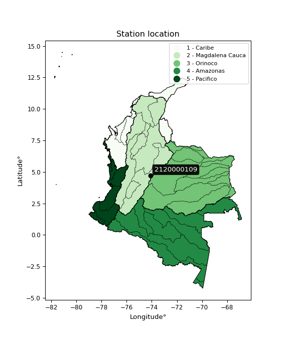

<div align="center">


</div>

# PMP Station (Rain, Pmax24h): 2120000109

Probable Maximum Precipitation (PMP) is the greatest amount of rainfall for a specific duration that is meteorologically possible for a given location, acting as a "worst-case" scenario for extreme storms, crucial for designing safety-critical infrastructure like bridges, river deviations, dams, spillways, and nuclear plants to prevent catastrophic failure. PMP is calculated by hydrologists using meteorological data to determine the upper limit of extreme rainfall, often leading to the Probable Maximum Flood (PMF) for flood control design, and is increasingly being studied for climate change impacts. Probable Maximum Precipitation (PMP) is the theoretical upper limit of rainfall, a deterministic estimate for extreme events, while probability distributions (like GEV, Gumbel) describe the likelihood and frequency of various precipitation amounts, including rare ones, showing how often events occur, with PMP representing the extreme end of these distributions, used for critical infrastructure design to ensure safety against the worst conceivable weather, unlike standard statistical forecasts which cover typical probabilities.

The most common probability distributions in hydrology, used for analyzing floods, rainfall, and streamflow, include the Normal, Log-Normal, Gumbel, Gamma (including Log-Pearson Type III), and Generalized Extreme Value (GEV) distributions, often chosen based on the data´s skewness and whether modeling extremes or general conditions, with Gumbel and GEV popular for extreme events like floods, while the Normal distribution serves as a baseline, though often requiring transformations for skewed hydrological data. These distributions help in designing water infrastructure, managing water resources, and forecasting hydrologic events.

> Hydrological data often isn´t perfectly normal (it´s skewed), so different distributions are needed for different applications, such as: **Flood Frequency Analysis**: Using Gumbel, GEV, or Log-Pearson Type III for predicting extreme flood magnitudes and their return periods, **Rainfall Analysis**: Normal for annual totals, but Log-Normal, Weibull, or GEV for intensity or extreme daily rainfall, **Streamflow Modeling**: Gamma and Log-Normal for maximum flows, GEV for minimum flows, and Kappa for daily flows.

<div align="center">

</img>

</div>


## A. General information


### 1. General running parameters

• app_version: _v20260108_. • runtime: _2026-01-08 18:05:13.093906_. • Python version: _3.14.0_. • SciPy version: _1.16.3_. • Pandas version: _2.3.3_. • NumPy version: _2.3.5_. • Stations dataset (station_dataset_file): _dataset/pmax24h_in/automatic_colombia_2003_2024.csv_. • Stations catalog (station_catalog_file): _dataset/CNE.xls_. • Minimum year to eval til year_max (date_min): _1900_. • Maximum year to eval since year_min (date_max): _2024_. • Creates, save and include plots into reports (create_plot): _False_. • Plot only fit distributions with Δo > Δ (plot_only_fit): _True_. • Plot only simple graphs avoiding multiple CDFs and multiple Extreme values plots (plot_only_simple): _False_. • Eval low extreme values, if False, evaluates high extreme values (low_extreme): _False_. • Eval every SciPy distribution as logarithmic (pdist_logarithmic_on): _True_. • Standard deviation normalized (ddof): _1.0_. • Return periods to eval in years (Tr): _[2, 2.33, 5, 10, 15, 20, 25, 50, 75, 100, 200, 250, 500, 750, 1000]_. • Minimum data sample per station, 0 means any (minimum_sample): _5_. • Z-Score maximum threshold to adjust a value, 0 means disable (zscore_max): _3.5_. • Z-Score minimum threshold to adjust a value, 0 means disable (zscore_min): _-2.5_. • Avoid zeros, e.g. rain = 0 (avoid_zeros): _True_. • Avoid null values (avoid_nans): _True_. 

:file_folder:Table: [dataset.csv](../../dataset/pmax24h_in/automatic_colombia_2003_2024.csv)

> Delta Degrees of Freedom (DDOF): is a parameter used in the formulas for calculating variance and standard deviation. When ddof=0, the divisor is $N$ (the total number of observations) and this is used when your data set is the entire population. When ddof=1, the divisor is $N-1$ and this is used when your data set is a sample drawn from a larger population. Using $N-1$ provides an unbiased estimate of the population variance (known as Bessel´s correction).


### 2. Station info and location

|   id |     CODIGO | NOMBRE                              | CATEGORIA     | TECNOLOGIA                | ESTADO   | FECHA_INSTALACION   |   FECHA_SUSPENSION |   ALTITUD |   LATITUD |   LONGITUD | DEPARTAMENTO   | MUNICIPIO   | AREA_OPERATIVA                            | ENTIDAD                                                      | AREA_HIDROGRAFICA   | ZONA_HIDROGRAFICA   | SUBZONA_HIDROGRAFICA   |   CORRIENTE | Catalogo   |   Version |
|-----:|-----------:|:------------------------------------|:--------------|:--------------------------|:---------|:--------------------|-------------------:|----------:|----------:|-----------:|:---------------|:------------|:------------------------------------------|:-------------------------------------------------------------|:--------------------|:--------------------|:-----------------------|------------:|:-----------|----------:|
|    0 | 2120000109 | COLEGIO RODOLFO LLINAS [2120000109] | Pluviométrica | Automática con Telemetría | Activa   | 01/02/2015          |                nan |      2554 |   4.72012 |   -74.1083 | Bogotá         | Bogotá, D.C | Area Operativa 11 - Cundinamarca-Amazonas | INSTITUTO DISTRITAL DE GESTIÓN DE RIESGOS Y CAMBIO CLIMÁTICO | Magdalena Cauca     | Alto Magdalena      | Río Bogotá             |         nan | CNE_OE     |  20251226 |

<div align="center">

Dynamic map: [:earth_americas:Google](http://maps.google.com/maps?q=4.720124,-74.108288) [:earth_americas:OSM](https://www.openstreetmap.org/#map=18/4.720124/-74.108288&layers=P) [:earth_americas:Bing](https://www.bing.com/maps?cp=4.720124~-74.108288&lvl=18) [:earth_americas:Apple](https://maps.apple.com/frame?center=4.720124%2C-74.108288&span=0.003%2C0.006)

</div>


<div align="center">

```geojson
{
  "type": "Feature",
  "geometry": {
    "type": "Point", 
    "coordinates": [-74.108288, 4.720124]
  }, 
  "properties": {
    "Name": "2120000109"
  }
}
```

</div>


### 3. Discrete values table and plot

<div align="center">

|               |           0 |          1 |           2 |          3 |           4 |
|:--------------|------------:|-----------:|------------:|-----------:|------------:|
| Date          | 2018        | 2019       | 2020        | 2023       | 2024        |
| Value         |   36.7      |   67.4     |   16.5      |    1.1     |   46.4      |
| Value_initial |   36.7      |   67.4     |   16.5      |    1.1     |   46.4      |
| count         |    5        |    5       |    5        |    5       |    5        |
| mean          |   33.62     |   33.62    |   33.62     |   33.62    |   33.62     |
| std           |   25.8096   |   25.8096  |   25.8096   |   25.8096  |   25.8096   |
| zscore        |    0.119335 |    1.30881 |   -0.663318 |   -1.25999 |    0.495164 |


</div>


> The initial value (value_initial) correspond to the initial obtained or null completed value, and value (value) is adjusted only when the initial value is outside the valid range (outlier) definite through the Z-Score value. If Z-Score is active, values out of range or outliers are replaced with the station mean value. A Z-Score (or standard score) measures how many standard deviations a data point is from the mean of a dataset, indicating its relative position; positive scores mean above the mean, negative mean below, and a score of zero is exactly at the mean, allowing for comparison of values from different distributions. It´s calculated using the formula $z=(x–μ)/σ$, where $x$ is the data point, $μ$ is the mean, and $σ$ is the standard deviation, helping identify outliers and understand probability.
>
> <sub>**Note**: In this study, "completing" (filling gaps in) and "extending" (forecasting or lengthening the historical record) rainfall data series are avoided for certain critical analyses because they introduce artificial bias and uncertainty, which can distort the statistics of rare events (extremes), alter day-to-day variability, and compromise the integrity and homogeneity of the original data. Some reasons against Completing/Extending rainfall data are: **Distortion of Extremes and Variability**: The primary issue is that most gap-filling or extension methods rely on averaging or regression with nearby stations, which inherently smooths the data. Rainfall is highly variable in space and time, with a large percentage of zero values and occasional large storms. Infilling methods often underestimate the highest values and overestimate the lowest (zero) values, which severely distorts analyses focused on flood frequency, drought severity, and intensity-duration-frequency (IDF) curves, **Loss of Data Homogeneity**: Infilled or extended data are synthetic estimates, not actual measurements. Combining these estimates with observed data can violate the assumption of data homogeneity, which requires that the data properties do not change over time. Inhomogeneity can lead to incorrect conclusions about long-term trends or changes in climate patterns, **Propagation of Errors**: Errors and biases from the original data (e.g., wind-induced undercatch, instrument errors, site changes) or the data used for imputation can propagate through the analysis, leading to unreliable hydrological models and inaccurate predictions, **Compromised Statistical Integrity**: For statistical analyses, especially those involving the frequency of events, using artificial data can introduce time bias or autocorrelation that doesn´t exist in reality, making it difficult to assess the true probability of events, **Difficulty in Validation**: It is difficult to accurately validate the quality of filled or extended data, especially for past periods where ground-truth measurements are unavailable. The reliability of imputation techniques heavily depends on the density of the surrounding station network and the complexity of the local topography.</sub>


### 4. Active continuous probability distributions from SciPy (43 of 104 available)

A Probability Density Function (PDF) describes the relative likelihood of a continuous random variable falling within a specific range, where the total area under its curve equals 1, and the area over any interval gives the actual probability for that range. Unlike discrete probabilities (like rolling a die), a PDF shows density, not direct probability for a single point (which is zero), with higher points indicating higher likelihood, often visualized as a bell curve for normal distributions.

A log of a probability density function (log-PDF) is simply the logarithm of the PDF´s value, denoted as $log(f(x))$, useful for converting multiplication of probabilities into addition, improving numerical stability with tiny numbers, and connecting to information theory concepts like entropy. Instead of dealing with very small probabilities (e.g., 0.000001), log-PDFs use negative numbers (e.g., $log(0.00001) ≈ -11.51$ that are easier for computers to handle, preventing underflow errors and simplifying complex calculations. In this study, each active probability distribution from SciPy is also evaluated in the $log$ form.

[scipy.stats](https://docs.scipy.org/doc/scipy/reference/stats.html) is a Python´s powerful submodule within the SciPy library for comprehensive statistical analysis, offering over 130 probability distributions (like Normal, Poisson), functions for descriptive stats (mean, variance), hypothesis testing (t-tests, chi-square), random variable generation, and statistical tests, making it essential for data science, modeling, and research. It provides tools to explore, model, and draw conclusions from data efficiently, working seamlessly with NumPy.

<div align="center">

|   id | p_dist             |   n_parameter | fit_method   | label                                                                       | active   | ref                                                                                                        |
|-----:|:-------------------|--------------:|:-------------|:----------------------------------------------------------------------------|:---------|:-----------------------------------------------------------------------------------------------------------|
|    0 | alpha              |             3 | MLE          | Alpha                                                                       | True     | [:mortar_board:](https://docs.scipy.org/doc/scipy/reference/generated/scipy.stats.alpha.html)              |
|    1 | betaprime          |             4 | MLE          | Beta prime                                                                  | True     | [:mortar_board:](https://docs.scipy.org/doc/scipy/reference/generated/scipy.stats.betaprime.html)          |
|    2 | chi2               |             3 | MLE          | Chi²                                                                        | True     | [:mortar_board:](https://docs.scipy.org/doc/scipy/reference/generated/scipy.stats.chi2.html)               |
|    3 | crystalball        |             4 | MLE          | Crystalball                                                                 | True     | [:mortar_board:](https://docs.scipy.org/doc/scipy/reference/generated/scipy.stats.crystalball.html)        |
|    4 | erlang             |             3 | MLE          | Erlang                                                                      | True     | [:mortar_board:](https://docs.scipy.org/doc/scipy/reference/generated/scipy.stats.erlang.html)             |
|    5 | expon              |             2 | MLE          | Exponential                                                                 | True     | [:mortar_board:](https://docs.scipy.org/doc/scipy/reference/generated/scipy.stats.expon.html)              |
|    6 | exponnorm          |             3 | MLE          | Exponentially modified Normal                                               | True     | [:mortar_board:](https://docs.scipy.org/doc/scipy/reference/generated/scipy.stats.exponnorm.html)          |
|    7 | f                  |             4 | MLE          | F                                                                           | True     | [:mortar_board:](https://docs.scipy.org/doc/scipy/reference/generated/scipy.stats.f.html)                  |
|    8 | fatiguelife        |             3 | MLE          | Fatigue-life (Birnbaum-Saunders)                                            | True     | [:mortar_board:](https://docs.scipy.org/doc/scipy/reference/generated/scipy.stats.fatiguelife.html)        |
|    9 | fisk               |             3 | MLE          | Fisk                                                                        | True     | [:mortar_board:](https://docs.scipy.org/doc/scipy/reference/generated/scipy.stats.fisk.html)               |
|   10 | gamma              |             3 | MLE          | Gamma                                                                       | True     | [:mortar_board:](https://docs.scipy.org/doc/scipy/reference/generated/scipy.stats.gamma.html)              |
|   11 | genexpon           |             5 | MLE          | Generalized exponential                                                     | True     | [:mortar_board:](https://docs.scipy.org/doc/scipy/reference/generated/scipy.stats.genexpon.html)           |
|   12 | genlogistic        |             3 | MLE          | Generalized logistic                                                        | True     | [:mortar_board:](https://docs.scipy.org/doc/scipy/reference/generated/scipy.stats.genlogistic.html)        |
|   13 | gibrat             |             2 | MM           | Gibrat                                                                      | True     | [:mortar_board:](https://docs.scipy.org/doc/scipy/reference/generated/scipy.stats.gibrat.html)             |
|   14 | gompertz           |             3 | MLE          | Gompertz (or truncated Gumbel)                                              | True     | [:mortar_board:](https://docs.scipy.org/doc/scipy/reference/generated/scipy.stats.gompertz.html)           |
|   15 | gumbel_l           |             2 | MM           | Gumbel Left Skew                                                            | True     | [:mortar_board:](https://docs.scipy.org/doc/scipy/reference/generated/scipy.stats.gumbel_l.html)           |
|   16 | gumbel_r           |             2 | MM           | Gumbel Right Skew                                                           | True     | [:mortar_board:](https://docs.scipy.org/doc/scipy/reference/generated/scipy.stats.gumbel_r.html)           |
|   17 | halflogistic       |             2 | MM           | Half-logistic                                                               | True     | [:mortar_board:](https://docs.scipy.org/doc/scipy/reference/generated/scipy.stats.halflogistic.html)       |
|   18 | halfnorm           |             2 | MM           | Half Normal                                                                 | True     | [:mortar_board:](https://docs.scipy.org/doc/scipy/reference/generated/scipy.stats.halfnorm.html)           |
|   19 | hypsecant          |             2 | MM           | hyperbolic secant                                                           | True     | [:mortar_board:](https://docs.scipy.org/doc/scipy/reference/generated/scipy.stats.hypsecant.html)          |
|   20 | invgamma           |             3 | MLE          | Inverted gamma                                                              | True     | [:mortar_board:](https://docs.scipy.org/doc/scipy/reference/generated/scipy.stats.invgamma.html)           |
|   21 | invgauss           |             3 | MLE          | Inverse Gaussian                                                            | True     | [:mortar_board:](https://docs.scipy.org/doc/scipy/reference/generated/scipy.stats.invgauss.html)           |
|   22 | invweibull         |             3 | MLE          | Inverted Weibull                                                            | True     | [:mortar_board:](https://docs.scipy.org/doc/scipy/reference/generated/scipy.stats.invweibull.html)         |
|   23 | kstwobign          |             2 | MLE          | Limiting distribution of scaled Kolmogorov-Smirnov two-sided test statistic | True     | [:mortar_board:](https://docs.scipy.org/doc/scipy/reference/generated/scipy.stats.kstwobign.html)          |
|   24 | laplace            |             2 | MM           | Laplace                                                                     | True     | [:mortar_board:](https://docs.scipy.org/doc/scipy/reference/generated/scipy.stats.laplace.html)            |
|   25 | laplace_asymmetric |             3 | MLE          | Asymmetric Laplace                                                          | True     | [:mortar_board:](https://docs.scipy.org/doc/scipy/reference/generated/scipy.stats.laplace_asymmetric.html) |
|   26 | loggamma           |             3 | MLE          | Log gamma                                                                   | True     | [:mortar_board:](https://docs.scipy.org/doc/scipy/reference/generated/scipy.stats.loggamma.html)           |
|   27 | logistic           |             2 | MM           | Logistic (or Sech-squared)                                                  | True     | [:mortar_board:](https://docs.scipy.org/doc/scipy/reference/generated/scipy.stats.logistic.html)           |
|   28 | lognorm            |             3 | MLE          | Log Normal                                                                  | True     | [:mortar_board:](https://docs.scipy.org/doc/scipy/reference/generated/scipy.stats.lognorm.html)            |
|   29 | maxwell            |             2 | MM           | Maxwell                                                                     | True     | [:mortar_board:](https://docs.scipy.org/doc/scipy/reference/generated/scipy.stats.maxwell.html)            |
|   30 | mielke             |             4 | MLE          | Mielke Beta-Kappa / Dagum                                                   | True     | [:mortar_board:](https://docs.scipy.org/doc/scipy/reference/generated/scipy.stats.mielke.html)             |
|   31 | moyal              |             2 | MM           | Moyal                                                                       | True     | [:mortar_board:](https://docs.scipy.org/doc/scipy/reference/generated/scipy.stats.moyal.html)              |
|   32 | nakagami           |             3 | MLE          | Nakagami                                                                    | True     | [:mortar_board:](https://docs.scipy.org/doc/scipy/reference/generated/scipy.stats.nakagami.html)           |
|   33 | ncf                |             5 | MLE          | Non-central F distribution                                                  | True     | [:mortar_board:](https://docs.scipy.org/doc/scipy/reference/generated/scipy.stats.ncf.html)                |
|   34 | nct                |             4 | MLE          | Non-central Student’s t                                                     | True     | [:mortar_board:](https://docs.scipy.org/doc/scipy/reference/generated/scipy.stats.nct.html)                |
|   35 | norm               |             2 | MM           | Normal                                                                      | True     | [:mortar_board:](https://docs.scipy.org/doc/scipy/reference/generated/scipy.stats.norm.html)               |
|   36 | pearson3           |             3 | MM           | Pearson type III                                                            | True     | [:mortar_board:](https://docs.scipy.org/doc/scipy/reference/generated/scipy.stats.pearson3.html)           |
|   37 | rayleigh           |             2 | MM           | Rayleigh                                                                    | True     | [:mortar_board:](https://docs.scipy.org/doc/scipy/reference/generated/scipy.stats.rayleigh.html)           |
|   38 | rice               |             3 | MLE          | Rice                                                                        | True     | [:mortar_board:](https://docs.scipy.org/doc/scipy/reference/generated/scipy.stats.rice.html)               |
|   39 | t                  |             3 | MLE          | Student’s t                                                                 | True     | [:mortar_board:](https://docs.scipy.org/doc/scipy/reference/generated/scipy.stats.t.html)                  |
|   40 | truncnorm          |             4 | MLE          | Truncated normal                                                            | True     | [:mortar_board:](https://docs.scipy.org/doc/scipy/reference/generated/scipy.stats.truncnorm.html)          |
|   41 | wald               |             2 | MM           | Wald                                                                        | True     | [:mortar_board:](https://docs.scipy.org/doc/scipy/reference/generated/scipy.stats.wald.html)               |
|   42 | weibull_min        |             3 | MLE          | Weibull minimum                                                             | True     | [:mortar_board:](https://docs.scipy.org/doc/scipy/reference/generated/scipy.stats.weibull_min.html)        |

</div>

> **n_parameter:** # arguments & localization & scale.
>
> **Fit methods:** (MLE) maximum likelihood, (MM) L-moments.
>
>**Inactive** (With the only purpose of prevent loops, zero divisions, infinite values, over high estimated values or horizontal trending for recurrence intervals estimations, the follow distributions were disabled.)**:** foldnorm, gennorm, norminvgauss, powernorm, powerlognorm, skewnorm, genextreme, anglit, arcsine, argus, beta, bradford, burr, burr12, cauchy, cosine, halfcauchy, foldcauchy, skewcauchy, wrapcauchy, dgamma, gengamma, exponweib, exponpow, truncexpon, gausshyper, genhalflogistic, genhyperbolic, geninvgauss, halfgennorm, johnsonsb, johnsonsu, kappa4, kappa3, ksone, kstwo, loglaplace, levy, levy_l, levy_stable, ncx2, pareto, genpareto, truncpareto, lomax, powerlaw, rdist, rel_breitwigner, recipinvgauss, semicircular, studentized_range, trapezoid, triang, truncweibull_min, tukeylambda, uniform, loguniform, vonmises, vonmises_line, weibull_max, dweibull, 


## B. Probability (PDF) vs. Empirical (EDF) distributions functions

A continuous probability distribution (CPD) describes probabilities for variables that can take any value within a range (like rain any time), unlike discrete variables with specific outcomes (like temperature). It uses a Probability Density Function (PDF), a curve where the total area under it equals 1, and the probability of the variable falling within an interval (a to b) is found by calculating the area under the curve between those points. A key feature is that the probability of hitting any single exact value is zero, so probabilities are always expressed for ranges, e.g., $P(a ≤ X ≤ b)$.

<div align="center">

Distributions parameters from station values
|    |    station | p_dist                |   n |             loc |           scale | shape                  | shape1                 | shape2                 | shape3   |
|---:|-----------:|:----------------------|----:|----------------:|----------------:|:-----------------------|:-----------------------|:-----------------------|:---------|
|  0 | 2120000109 | alpha                 |   5 |    -0.00085167  |     2.46142     | 5.377236555162458e-10  |                        |                        |          |
|  1 | 2120000109 | betaprime             |   5 |  -152.938       | 14861.2         | 65.4422066203941       | 5213.550280384607      |                        |          |
|  2 | 2120000109 | chi2                  |   5 |     1.1         |     2.88506     | 1.1294312918429248     |                        |                        |          |
|  3 | 2120000109 | crystalball           |   5 |    33.62        |    23.0848      | 3797.297720380834      | 49.42370422843949      |                        |          |
|  4 | 2120000109 | erlang                |   5 | -2143.14        |     0.244783    | 8892.592782727177      |                        |                        |          |
|  5 | 2120000109 | expon                 |   5 |     1.1         |    32.52        |                        |                        |                        |          |
|  6 | 2120000109 | exponnorm             |   5 |    33.2327      |    23.0816      | 0.01677985019661849    |                        |                        |          |
|  7 | 2120000109 | f                     |   5 |     1.1         |    34.2419      | 1.0392694437030032     | 16.14102087806947      |                        |          |
|  8 | 2120000109 | fatiguelife           |   5 |     1.1         |     6.87192e-06 | 1703.2604154500432     |                        |                        |          |
|  9 | 2120000109 | fisk                  |   5 |    -2.25322e+07 |     2.25322e+07 | 1608405.0582869055     |                        |                        |          |
| 10 | 2120000109 | gamma                 |   5 | -2143.16        |     0.244781    | 8892.764602940922      |                        |                        |          |
| 11 | 2120000109 | genexpon              |   5 |     1.1         |     1.18856     | 0.03651902772785608    | 1.1439330584364344e-08 | 5.875254030768513      |          |
| 12 | 2120000109 | genlogistic           |   5 |   -96.4768      |    20.5928      | 317.95669267074675     |                        |                        |          |
| 13 | 2120000109 | gibrat                |   5 |    16.0092      |    10.6815      |                        |                        |                        |          |
| 14 | 2120000109 | gompertz              |   5 |     1.1         |    39.5039      | 0.5921643827161519     |                        |                        |          |
| 15 | 2120000109 | gumbel_l              |   5 |    44.0094      |    17.9992      |                        |                        |                        |          |
| 16 | 2120000109 | gumbel_r              |   5 |    23.2306      |    17.9992      |                        |                        |                        |          |
| 17 | 2120000109 | halflogistic          |   5 |     6.25914     |    19.7367      |                        |                        |                        |          |
| 18 | 2120000109 | halfnorm              |   5 |     3.06476     |    38.2953      |                        |                        |                        |          |
| 19 | 2120000109 | hypsecant             |   5 |    33.62        |    14.6963      |                        |                        |                        |          |
| 20 | 2120000109 | invgamma              |   5 |  -181.154       | 17836           | 84.00974286212232      |                        |                        |          |
| 21 | 2120000109 | invgauss              |   5 |   -81.7549      |  2688.01        | 0.042920934746806486   |                        |                        |          |
| 22 | 2120000109 | invweibull            |   5 |     1.1         |     3.60381     | 0.04534014864364068    |                        |                        |          |
| 23 | 2120000109 | kstwobign             |   5 |   -49.1127      |    94.4167      |                        |                        |                        |          |
| 24 | 2120000109 | laplace               |   5 |    33.62        |    16.3234      |                        |                        |                        |          |
| 25 | 2120000109 | laplace_asymmetric    |   5 |    36.7         |    19.0538      | 1.084084254707795      |                        |                        |          |
| 26 | 2120000109 | loggamma              |   5 | -4316.72        |   651.749       | 792.7270104838863      |                        |                        |          |
| 27 | 2120000109 | logistic              |   5 |    33.62        |    12.7273      |                        |                        |                        |          |
| 28 | 2120000109 | lognorm               |   5 |     1.1         |     0.01296     | 15.856116591108812     |                        |                        |          |
| 29 | 2120000109 | maxwell               |   5 |   -21.0814      |    34.279       |                        |                        |                        |          |
| 30 | 2120000109 | mielke                |   5 |     1.1         |    70.821       | 0.49928685915436694    | 84.00592772164387      |                        |          |
| 31 | 2120000109 | moyal                 |   5 |    20.4186      |    10.3918      |                        |                        |                        |          |
| 32 | 2120000109 | nakagami              |   5 |     1.1         |    35.0133      | 0.2169007369321178     |                        |                        |          |
| 33 | 2120000109 | ncf                   |   5 |     1.1         |    15.2265      | 1.0667675672981276     | 217.80092351778057     | 1.9364735486595368     |          |
| 34 | 2120000109 | nct                   |   5 |    -0.421549    |     0.0618248   | 0.41457006357307247    | 54.736167554760875     |                        |          |
| 35 | 2120000109 | norm                  |   5 |    33.62        |    23.0848      |                        |                        |                        |          |
| 36 | 2120000109 | pearson3              |   5 |    33.62        |    23.0848      | 0.020358809948873152   |                        |                        |          |
| 37 | 2120000109 | rayleigh              |   5 |   -10.5426      |    35.2367      |                        |                        |                        |          |
| 38 | 2120000109 | rice                  |   5 |   -11.2341      |    28.0832      | 1.1075696698152155     |                        |                        |          |
| 39 | 2120000109 | t                     |   5 |    33.6202      |    23.085       | 136387260.26630902     |                        |                        |          |
| 40 | 2120000109 | truncnorm             |   5 |    10.2992      |    37.7002      | -16.176439951854157    | 1.5146032970469254     |                        |          |
| 41 | 2120000109 | wald                  |   5 |    10.5351      |    23.0849      |                        |                        |                        |          |
| 42 | 2120000109 | weibull_min           |   5 |     1.1         |    52.5041      | 0.18605727889800927    |                        |                        |          |
| 43 | 2120000109 | logalpha              |   5 |     0.00422778  |     0.203322    | 3.9166800127975514e-07 |                        |                        |          |
| 44 | 2120000109 | logbetaprime          |   5 |   -42.0849      |   780.912       | 920.9094052215005      | 15981.422039065936     |                        |          |
| 45 | 2120000109 | logchi2               |   5 |     0.0953102   |     1.88719     | 1.8615444503797516     |                        |                        |          |
| 46 | 2120000109 | logcrystalball        |   5 |     4.21065     |     3.7837e-07  | 2.91076562318084e-07   | 3837.401028052628      |                        |          |
| 47 | 2120000109 | logerlang             |   5 |   -18.0985      |     0.113969    | 184.55216904351937     |                        |                        |          |
| 48 | 2120000109 | logexpon              |   5 |     0.0953102   |     2.81457     |                        |                        |                        |          |
| 49 | 2120000109 | logexponnorm          |   5 |     2.9089      |     1.48089     | 0.0006552049374513951  |                        |                        |          |
| 50 | 2120000109 | logf                  |   5 |  -454.266       |   457.172       | 1711203.5369906833     | 212200.56443423312     |                        |          |
| 51 | 2120000109 | logfatiguelife        |   5 |  -852.573       |   855.493       | 0.0017335424402956001  |                        |                        |          |
| 52 | 2120000109 | logfisk               |   5 |    -1.5229e+08  |     1.5229e+08  | 191374976.64921468     |                        |                        |          |
| 53 | 2120000109 | loggamma              |   5 |   -23.6518      |     0.0918558   | 289.0737650904566      |                        |                        |          |
| 54 | 2120000109 | loggenexpon           |   5 |    -0.0186497   |     0.0965392   | 0.011899878773877662   | 5.69868275989816       | 0.00019401321747705133 |          |
| 55 | 2120000109 | loggenlogistic        |   5 |     4.2107      |     5.25025e-06 | 4.047457813993853e-06  |                        |                        |          |
| 56 | 2120000109 | loggibrat             |   5 |     1.7801      |     0.685235    |                        |                        |                        |          |
| 57 | 2120000109 | loggompertz           |   5 |     0.0953101   |     2.05504     | 0.28780209125317036    |                        |                        |          |
| 58 | 2120000109 | loggumbel_l           |   5 |     3.57636     |     1.15465     |                        |                        |                        |          |
| 59 | 2120000109 | loggumbel_r           |   5 |     2.24339     |     1.15465     |                        |                        |                        |          |
| 60 | 2120000109 | loghalflogistic       |   5 |     1.15467     |     1.26612     |                        |                        |                        |          |
| 61 | 2120000109 | loghalfnorm           |   5 |     0.9497      |     2.45671     |                        |                        |                        |          |
| 62 | 2120000109 | loghypsecant          |   5 |     2.90988     |     0.942771    |                        |                        |                        |          |
| 63 | 2120000109 | loginvgamma           |   5 |   -22.0506      |  6611.21        | 265.9198181966043      |                        |                        |          |
| 64 | 2120000109 | loginvgauss           |   5 |   -13.2242      |  1616.36        | 0.009976088229894282   |                        |                        |          |
| 65 | 2120000109 | loginvweibull         |   5 |    -3.17625e+07 |     3.17625e+07 | 18948603.159497477     |                        |                        |          |
| 66 | 2120000109 | logkstwobign          |   5 |    -3.7688      |     7.61146     |                        |                        |                        |          |
| 67 | 2120000109 | loglaplace            |   5 |     2.90988     |     1.04716     |                        |                        |                        |          |
| 68 | 2120000109 | loglaplace_asymmetric |   5 |     4.21065     |     0.0118704   | 109.34423219637145     |                        |                        |          |
| 69 | 2120000109 | logloggamma           |   5 |     4.21076     |     7.9299e-06  | 6.071130174416126e-06  |                        |                        |          |
| 70 | 2120000109 | loglogistic           |   5 |     2.90988     |     0.816464    |                        |                        |                        |          |
| 71 | 2120000109 | loglognorm            |   5 |     0.0953102   |     0.00115211  | 16.025644126968867     |                        |                        |          |
| 72 | 2120000109 | logmaxwell            |   5 |    -0.599237    |     2.19901     |                        |                        |                        |          |
| 73 | 2120000109 | logmielke             |   5 |    -4.08858e+07 |     4.08858e+07 | 30813732.629129834     | 7033676378.52484       |                        |          |
| 74 | 2120000109 | logmoyal              |   5 |     2.063       |     0.66664     |                        |                        |                        |          |
| 75 | 2120000109 | lognakagami           |   5 |     0.0953102   |     3.46308     | 0.3519087453410731     |                        |                        |          |
| 76 | 2120000109 | logncf                |   5 |    -7.01118     |     0.331708    | 4.769139713256726      | 6171.639274901598      | 137.0599492059973      |          |
| 77 | 2120000109 | lognct                |   5 |   -84.9655      |     1.42736     | 22005.24781201447      | 61.56269658800078      |                        |          |
| 78 | 2120000109 | lognorm               |   5 |     2.90988     |     1.4809      |                        |                        |                        |          |
| 79 | 2120000109 | logpearson3           |   5 |     2.90988     |     1.4809      | -1.1680292994550356    |                        |                        |          |
| 80 | 2120000109 | lograyleigh           |   5 |     0.0768266   |     2.26045     |                        |                        |                        |          |
| 81 | 2120000109 | logrice               |   5 |    -1.04631     |     1.59663     | 2.2360609752098966     |                        |                        |          |
| 82 | 2120000109 | logt                  |   5 |     2.90988     |     1.4809      | 963075610.1666074      |                        |                        |          |
| 83 | 2120000109 | logtruncnorm          |   5 |    -0.327078    |     3.8357      | 0.068803824161351      | 1.183023993937284      |                        |          |
| 84 | 2120000109 | logwald               |   5 |     1.42897     |     1.48091     |                        |                        |                        |          |
| 85 | 2120000109 | logweibull_min        |   5 |     0.0953102   |     2.59958     | 0.14476320436788132    |                        |                        |          |

</div>

> **loc** (Location parameter): This shifts the distribution along the x-axis. For many common distributions, like the normal (Gaussian) distribution, loc represents the mean $μ$. For others, like the uniform distribution, it might represent the minimum value, or for the beta distribution, the left end of the support interval.
>
> **scale** (Scale parameter): This determines the width or spread of the distribution. For the normal distribution, scale represents the standard deviation $σ$. For a uniform distribution, it defines the length of the interval (from $loc$ to $loc + scale$).
>
> **shape** (Shape parameters): Refers to parameters that define the specific form of a probability distribution, distinct from its location (loc) and scale (scale). These parameters are required arguments for most distribution functions. For example, a normal (Gaussian) distribution is fully defined by its location (mean) and scale (standard deviation), so it has no specific shape parameters beyond loc and scale. However, other distributions have intrinsic properties that need specification, as Gamma distribution that takes a shape parameter, often named $a$ or $alpha$.


### 0. Cumulative distribution values - CDF (86 evaluated)

Cumulative Distribution Function (CDF), denoted as $F$<sub>$X$</sub>$(x)$, is a function that gives the probability that a random variable $X$ will take a value less than or equal to a specific value, $x$ (i.e., $(P(X≥x)$. It essentially "accumulates" probabilities from a given point up to the far right (positive infinity), providing a complete picture of the distribution´s probabilities for both discrete (like rain) and continuous (like temperature) variables, helping to find probabilities over ranges or above certain values. Each station is evaluated separately ordering the $x$ values ascending, calculating the CDF and PDF values for the activated distributions and their logarithmic forms.

<div align="center">

CDF ordered by x ascending and calculating $log(f(x))$ separately
|   id |    Station |   date |    x |   count |   mean |     std |    zscore |   Value_initial |    station |   m |     alpha |   alpha_pdf |   betaprime |   betaprime_pdf |        chi2 |    chi2_pdf |   crystalball |   crystalball_pdf |    erlang |   erlang_pdf |    expon |   expon_pdf |   exponnorm |   exponnorm_pdf |          f |       f_pdf |   fatiguelife |   fatiguelife_pdf |      fisk |   fisk_pdf |     gamma |   gamma_pdf |    genexpon |   genexpon_pdf |   genlogistic |   genlogistic_pdf |     gibrat |   gibrat_pdf |    gompertz |   gompertz_pdf |   gumbel_l |   gumbel_l_pdf |   gumbel_r |   gumbel_r_pdf |   halflogistic |   halflogistic_pdf |   halfnorm |   halfnorm_pdf |   hypsecant |   hypsecant_pdf |   invgamma |   invgamma_pdf |   invgauss |   invgauss_pdf |   invweibull |   invweibull_pdf |   kstwobign |   kstwobign_pdf |   laplace |   laplace_pdf |   laplace_asymmetric |   laplace_asymmetric_pdf |   loggamma |   loggamma_pdf |   logistic |   logistic_pdf |   lognorm |   lognorm_pdf |   maxwell |   maxwell_pdf |      mielke |   mielke_pdf |     moyal |   moyal_pdf |    nakagami |   nakagami_pdf |         ncf |         ncf_pdf |       nct |    nct_pdf |      norm |   norm_pdf |   pearson3 |   pearson3_pdf |   rayleigh |   rayleigh_pdf |     rice |   rice_pdf |         t |      t_pdf |   truncnorm |   truncnorm_pdf |     wald |   wald_pdf |   weibull_min |   weibull_min_pdf |   logalpha |   logalpha_pdf |   logbetaprime |   logbetaprime_pdf |     logchi2 |   logchi2_pdf |   logcrystalball |   logcrystalball_pdf |   logerlang |   logerlang_pdf |   logexpon |   logexpon_pdf |   logexponnorm |   logexponnorm_pdf |      logf |   logf_pdf |   logfatiguelife |   logfatiguelife_pdf |   logfisk |   logfisk_pdf |   loggenexpon |   loggenexpon_pdf |   loggenlogistic |   loggenlogistic_pdf |   loggibrat |   loggibrat_pdf |   loggompertz |   loggompertz_pdf |   loggumbel_l |   loggumbel_l_pdf |   loggumbel_r |   loggumbel_r_pdf |   loghalflogistic |   loghalflogistic_pdf |   loghalfnorm |   loghalfnorm_pdf |   loghypsecant |   loghypsecant_pdf |   loginvgamma |   loginvgamma_pdf |   loginvgauss |   loginvgauss_pdf |   loginvweibull |   loginvweibull_pdf |   logkstwobign |   logkstwobign_pdf |   loglaplace |   loglaplace_pdf |   loglaplace_asymmetric |   loglaplace_asymmetric_pdf |   logloggamma |   logloggamma_pdf |   loglogistic |   loglogistic_pdf |   loglognorm |   loglognorm_pdf |   logmaxwell |   logmaxwell_pdf |   logmielke |   logmielke_pdf |    logmoyal |   logmoyal_pdf |   lognakagami |   lognakagami_pdf |    logncf |   logncf_pdf |    lognct |   lognct_pdf |   logpearson3 |   logpearson3_pdf |   lograyleigh |   lograyleigh_pdf |   logrice |   logrice_pdf |      logt |   logt_pdf |   logtruncnorm |   logtruncnorm_pdf |   logwald |   logwald_pdf |   logweibull_min |   logweibull_min_pdf |
|-----:|-----------:|-------:|-----:|--------:|-------:|--------:|----------:|----------------:|-----------:|----:|----------:|------------:|------------:|----------------:|------------:|------------:|--------------:|------------------:|----------:|-------------:|---------:|------------:|------------:|----------------:|-----------:|------------:|--------------:|------------------:|----------:|-----------:|----------:|------------:|------------:|---------------:|--------------:|------------------:|-----------:|-------------:|------------:|---------------:|-----------:|---------------:|-----------:|---------------:|---------------:|-------------------:|-----------:|---------------:|------------:|----------------:|-----------:|---------------:|-----------:|---------------:|-------------:|-----------------:|------------:|----------------:|----------:|--------------:|---------------------:|-------------------------:|-----------:|---------------:|-----------:|---------------:|----------:|--------------:|----------:|--------------:|------------:|-------------:|----------:|------------:|------------:|---------------:|------------:|----------------:|----------:|-----------:|----------:|-----------:|-----------:|---------------:|-----------:|---------------:|---------:|-----------:|----------:|-----------:|------------:|----------------:|---------:|-----------:|--------------:|------------------:|-----------:|---------------:|---------------:|-------------------:|------------:|--------------:|-----------------:|---------------------:|------------:|----------------:|-----------:|---------------:|---------------:|-------------------:|----------:|-----------:|-----------------:|---------------------:|----------:|--------------:|--------------:|------------------:|-----------------:|---------------------:|------------:|----------------:|--------------:|------------------:|--------------:|------------------:|--------------:|------------------:|------------------:|----------------------:|--------------:|------------------:|---------------:|-------------------:|--------------:|------------------:|--------------:|------------------:|----------------:|--------------------:|---------------:|-------------------:|-------------:|-----------------:|------------------------:|----------------------------:|--------------:|------------------:|--------------:|------------------:|-------------:|-----------------:|-------------:|-----------------:|------------:|----------------:|------------:|---------------:|--------------:|------------------:|----------:|-------------:|----------:|-------------:|--------------:|------------------:|--------------:|------------------:|----------:|--------------:|----------:|-----------:|---------------:|-------------------:|----------:|--------------:|-----------------:|---------------------:|
|    0 | 2120000109 |   2023 |  1.1 |       5 |  33.62 | 25.8096 | -1.25999  |             1.1 | 2120000109 |   1 | 0.0253566 | 0.133067    |   0.0733024 |      0.00682461 | 6.03854e-10 | 1.53575e+06 |     0.0794594 |        0.00640705 | 0.0789129 |   0.00643842 | 0        |  0.0307503  |   0.0794592 |      0.00640706 | 1.3259e-09 | 1.55145e+06 |     0.0682526 |       9.17469e+10 | 0.0890765 | 0.00579211 | 0.0789128 |  0.00643842 | 7.51573e-08 |     0.0307254  |     0.0626058 |        0.00838741 | 0          |   0          | 4.79005e-12 |     0.01499    |  0.0880629 |     0.00467056 |  0.0327243 |     0.00621725 |       0        |         0          |   0        |     0          |    0.069366 |      0.00468271 |  0.0705843 |     0.00715268 |  0.0653338 |     0.00756026 |   0.00437332 |      4.85101e+12 |   0.0601114 |      0.00924654 | 0.0681957 |    0.00417778 |             0.09641  |               0.00466743 |  0.0325594 |      0.0502363 |  0.0720826 |     0.00525536 | 0.0286787 |     0.0442594 | 0.0636505 |    0.00790513 | 1.82231e-09 |  4.09762e+06 | 0.0113005 |  0.00392979 | 2.72099e-08 |    5.31592e+07 | 3.19874e-10 | 768384          | 0.0525981 | 0.107215   | 0.0794594 | 0.00640705 |  0.0789587 |     0.00643817 |  0.0531231 |     0.00887881 | 0.051253 | 0.00815214 | 0.0794594 | 0.006407   |    0.431641 |      0.0109849  | 0        | 0          |   0.000585275 |       4.90274e+11 |  0.0255958 |     1.61877    |      0.0300182 |          0.0467181 | 1.16051e-16 |     3.89171   |              nan |                  nan |   0.0287953 |        0.046809 |   0        |      0.355294  |      0.0286783 |          0.0442591 | 0.0289254 |  0.0447087 |        0.0282203 |            0.0437517 | 0.0199792 |     0.0246052 |     0.0147083 |          0.134771 |         0        |            0.0322972 |    0        |       0         |   5.61427e-09 |          0.140047 |     0.0478718 |         0.0404513 |    0.00161874 |        0.00900892 |          0        |              0        |      0        |          0        |      0.0321336 |          0.0340264 |     0.0259706 |         0.0461896 |     0.0307979 |         0.0525774 |       0.0369097 |           0.0726478 |      0.0411732 |          0.0913549 |    0.0340145 |        0.0324827 |               0.0419744 |                   0.0323387 |     0.0428185 |         0.0327818 |     0.0308505 |         0.0366198 |    0.0227542 |      2.42801e+14 |   0.00813358 |        0.0344349 |   0.0442368 |       0.0333392 | 1.21622e-05 |    0.000182925 |   4.42704e-13 |     22451.9       | 0.0387399 |    0.0600436 | 0.0290251 |    0.0447221 |     0.0502756 |         0.0427782 |   3.34308e-05 |        0.00361729 | 0.0248031 |     0.0497833 | 0.0286784 |   0.044259 |       0.04635  |           0.291888 |  0        |     0         |       0.00348647 |          1.81524e+13 |
|    1 | 2120000109 |   2020 | 16.5 |       5 |  33.62 | 25.8096 | -0.663318 |            16.5 | 2120000109 |   2 | 0.88142   | 0.00713315  |   0.235609  |      0.0141487  | 0.974563    | 0.00497239  |     0.229161  |        0.0131267  | 0.229605  |   0.0132112  | 0.377216 |  0.0191508  |   0.229161  |      0.0131267  | 0.480645   | 0.0137713   |     0.810273  |       0.00773679  | 0.22694   | 0.0125232  | 0.229605  |  0.0132112  | 0.376976    |     0.0191426  |     0.268547  |        0.0171097  | 0.00103441 |   0.00707629 | 0.245957    |     0.0166917  |  0.194981  |     0.00970043 |  0.233763  |     0.0188765  |       0.253769 |         0.0237021  |   0.274286 |     0.0195915  |    0.192502 |      0.0123147  |  0.242085  |     0.0148305  |  0.249041  |     0.0157156  |   0.392087   |      0.0010808   |   0.280337  |      0.0175574  | 0.175179  |    0.0107318  |             0.203194 |               0.00983707 |  0.482771  |      0.255813  |  0.206667  |     0.0128822  | 0.47133   |     0.268695  | 0.247465  |    0.0153391  | 0.466823    |  0.015135    | 0.227244  |  0.0223612  | 0.545997    |    0.014858    | 0.342136    |      0.0133908  | 0.596456  | 0.00981893 | 0.229161  | 0.0131267  |  0.229622  |     0.013208   |  0.255092  |     0.0162241  | 0.239123 | 0.015462   | 0.22916   | 0.0131265  |    0.604581 |      0.0111648  | 0.121433 | 0.0453909  |   0.548853    |       0.00433847  |  0.942095  |     0.0206506  |      0.475036  |          0.261537  | 0.54582     |     0.126593  |              nan |                  nan |   0.475891  |        0.258237 |   0.617931 |      0.135747  |      0.471331  |          0.268697  | 0.472266  |  0.267532  |        0.468735  |            0.268214  | 0.379936  |     0.296047  |     0.559276  |          0.201453 |         0        |            0.260509  |    0.655786 |       0.359755  |   0.544861    |          0.238075 |     0.400693  |         0.265737  |    0.540252   |        0.288089   |          0.572396 |              0.26552  |      0.549469 |          0.244321 |      0.464112  |          0.335488  |     0.48983   |         0.261666  |     0.495653  |         0.249504  |       0.519007  |           0.203064  |      0.554888  |          0.194994  |    0.451641  |        0.431302  |               0.338135  |                   0.260512  |     0.340444  |         0.260644  |     0.467431  |         0.304899  |    0.685939  |      0.00817507  |   0.50529    |        0.262408  |   0.340524  |       0.256637  | 0.566031    |    0.291298    |   0.619205    |         0.136995  | 0.504434  |    0.24164   | 0.472021  |    0.267574  |     0.395004  |         0.250681  |   0.51686     |        0.257807   | 0.480999  |     0.26224   | 0.471328  |   0.268696 |       0.74924  |           0.210482 |  0.637787 |     0.30047   |       0.634298   |          0.0196652   |
|    2 | 2120000109 |   2018 | 36.7 |       5 |  33.62 | 25.8096 |  0.119335 |            36.7 | 2120000109 |   3 | 0.946528  | 0.00145478  |   0.568681  |      0.016743   | 0.999434    | 0.000104178 |     0.55307   |        0.0171284  | 0.55442   |   0.0171056  | 0.665364 |  0.0102902  |   0.55307   |      0.0171284  | 0.673803   | 0.0067441   |     0.909275  |       0.00306601  | 0.553853  | 0.0176386  | 0.55442   |  0.0171056  | 0.665067    |     0.010291   |     0.610416  |        0.0146204  | 0.745751   |   0.0154955  | 0.579386    |     0.0155261  |  0.486367  |     0.0190123  |  0.623034  |     0.016378   |       0.647612 |         0.0147086  |   0.620226 |     0.0141671  |    0.566227 |      0.0211921  |  0.578819  |     0.01631    |  0.59121   |     0.0159139  |   0.406015   |      0.000466096 |   0.619402  |      0.0143434  | 0.585977  |    0.0253637  |             0.54028  |               0.0261562  |  0.678965  |      0.225322  |  0.560206  |     0.019358   | 0.680068  |     0.24146   | 0.583256  |    0.0159752  | 0.709344    |  0.00994849  | 0.647771  |  0.0158008  | 0.761428    |    0.00770451  | 0.562155    |      0.00889253 | 0.708301  | 0.00325302 | 0.55307   | 0.0171284  |  0.554387  |     0.0171052  |  0.59293   |     0.0154886  | 0.577053 | 0.0162124  | 0.553065  | 0.0171283  |    0.810773 |      0.008856   | 0.716409 | 0.0142097  |   0.605549    |       0.00191776  |  0.954943  |     0.0125077  |      0.676967  |          0.232917  | 0.636204    |     0.100612  |              nan |                  nan |   0.674176  |        0.227875 |   0.712399 |      0.102183  |      0.68007   |          0.241461  | 0.67983   |  0.239921  |        0.67739   |            0.241759  | 0.625923  |     0.294236  |     0.705483  |          0.162373 |         0        |            0.482468  |    0.836037 |       0.135636  |   0.727006    |          0.210701 |     0.640535  |         0.318522  |    0.734836   |        0.196083   |          0.747283 |              0.174378 |      0.719827 |          0.181275 |      0.715346  |          0.263269  |     0.687241  |         0.222765  |     0.683338  |         0.212146  |       0.665592  |           0.16164   |      0.694673  |          0.153717  |    0.742012  |        0.24637   |               0.625997  |                   0.482292  |     0.62784   |         0.480674  |     0.700285  |         0.257067  |    0.691643  |      0.00626185  |   0.69835    |        0.213442  |   0.622018  |       0.468786  | 0.752688    |    0.179433    |   0.717541    |         0.109676  | 0.686365  |    0.206271  | 0.679722  |    0.240188  |     0.624874  |         0.314939  |   0.703752    |        0.204429   | 0.682632  |     0.231743  | 0.680067  |   0.241461 |       0.902905 |           0.173745 |  0.804218 |     0.140592  |       0.648068   |          0.015169    |
|    3 | 2120000109 |   2024 | 46.4 |       5 |  33.62 | 25.8096 |  0.495164 |            46.4 | 2120000109 |   4 | 0.957695  | 0.000910884 |   0.718816  |      0.0138955  | 0.999904    | 1.7464e-05  |     0.710077  |        0.0148262  | 0.710908  |   0.0147496  | 0.751668 |  0.00763628 |   0.710078  |      0.0148262  | 0.731225   | 0.00519299  |     0.934146  |       0.00213106  | 0.712726  | 0.0146154  | 0.710908  |  0.0147496  | 0.751387    |     0.00763871 |     0.73471   |        0.0109935  | 0.852134   |   0.00759893 | 0.719697    |     0.0132265  |  0.680833  |     0.020251   |  0.758791  |     0.0116366  |       0.768605 |         0.0103677  |   0.7422   |     0.0109832  |    0.747341 |      0.0154428  |  0.722998  |     0.0131772  |  0.729983  |     0.0125345  |   0.410011   |      0.000365878 |   0.742236  |      0.0109755  | 0.771466  |    0.0140004  |             0.735266 |               0.0150623  |  0.729715  |      0.206978  |  0.731871  |     0.0154184  | 0.734426  |     0.221422  | 0.724758  |    0.0129927  | 0.80003     |  0.00881776  | 0.774511  |  0.0105558  | 0.82676     |    0.00585054  | 0.641017    |      0.00741064 | 0.735037  | 0.00234395 | 0.710077  | 0.0148262  |  0.710882  |     0.0147515  |  0.729027  |     0.0124272  | 0.721614 | 0.0133627  | 0.710072  | 0.0148263  |    0.888562 |      0.00715504 | 0.821122 | 0.00808598 |   0.62202     |       0.0015104   |  0.957697  |     0.0110261  |      0.729437  |          0.213963  | 0.65903     |     0.0941282 |              nan |                  nan |   0.725506  |        0.209348 |   0.735392 |      0.0940136 |      0.734428  |          0.221422  | 0.733843  |  0.220044  |        0.731845  |            0.221948  | 0.691998  |     0.267838  |     0.742041  |          0.149341 |         0        |            0.578078  |    0.86419  |       0.105974  |   0.774638    |          0.194965 |     0.714513  |         0.309941  |    0.777654   |        0.169366   |          0.78543  |              0.151289 |      0.760162 |          0.162775 |      0.772203  |          0.221522  |     0.737179  |         0.202693  |     0.731001  |         0.19398   |       0.701925  |           0.148207  |      0.729243  |          0.14112   |    0.793778  |        0.196935  |               0.749969  |                   0.577804  |     0.751323  |         0.575212  |     0.756926  |         0.225349  |    0.693063  |      0.0058575   |   0.746034   |        0.192965  |   0.742274  |       0.559417  | 0.79157     |    0.152723    |   0.742399    |         0.102358  | 0.732777  |    0.189203  | 0.733801  |    0.220325  |     0.69926   |         0.31753   |   0.74937     |        0.184454   | 0.734794  |     0.212529  | 0.734425  |   0.221422 |       0.942377 |           0.16289  |  0.834084 |     0.115142  |       0.651511   |          0.0142117   |
|    4 | 2120000109 |   2019 | 67.4 |       5 |  33.62 | 25.8096 |  1.30881  |            67.4 | 2120000109 |   5 | 0.970868  | 0.000432022 |   0.921546  |      0.00564301 | 0.999998    | 3.88646e-07 |     0.928307  |        0.00592405 | 0.927768  |   0.00589777 | 0.869808 |  0.00400344 |   0.928307  |      0.00592404 | 0.816861   | 0.00318141  |     0.965896  |       0.00104029  | 0.917412  | 0.00540845 | 0.927768  |  0.00589777 | 0.869593    |     0.00400681 |     0.894738  |        0.00483173 | 0.941902   |   0.00226013 | 0.924209    |     0.00608559 |  0.974462  |     0.00520369 |  0.917638  |     0.00438202 |       0.913606 |         0.00418824 |   0.907038 |     0.00508084 |    0.936294 |      0.00430598 |  0.914794  |     0.00545641 |  0.911813  |     0.00524358 |   0.416318   |      0.000249488 |   0.904879  |      0.00497133 | 0.93687   |    0.00386743 |             0.919849 |               0.00456026 |  0.800802  |      0.173176  |  0.934265  |     0.00482535 | 0.810126  |     0.183168  | 0.916536  |    0.00554347 | 0.967578    |  0.00725811  | 0.916932  |  0.00398231 | 0.918457    |    0.00311501  | 0.769114    |      0.00493599 | 0.772744  | 0.00138854 | 0.928307  | 0.00592405 |  0.927784  |     0.00589875 |  0.913396  |     0.00543651 | 0.9196   | 0.00567703 | 0.928304  | 0.00592419 |    1        |      0.00359406 | 0.925425 | 0.00289435 |   0.648084    |       0.00103139  |  0.961448  |     0.00915784 |      0.802829  |          0.178411  | 0.692381    |     0.0847036 |              nan |                  nan |   0.797413  |        0.175196 |   0.768264 |      0.0823346 |      0.810128  |          0.183168  | 0.809107  |  0.182238  |        0.807801  |            0.183998  | 0.782218  |     0.214073  |     0.79388   |          0.128385 |         0.999955 |            0.770861  |    0.897263 |       0.0736396 |   0.841853    |          0.164072 |     0.823085  |         0.265388  |    0.833603   |        0.131394   |          0.835725 |              0.11909  |      0.815611 |          0.134585 |      0.843055  |          0.159808  |     0.806338  |         0.167399  |     0.797564  |         0.162259  |       0.753323  |           0.127301  |      0.778266  |          0.121658  |    0.855624  |        0.137874  |               0.999916  |                   0.770373  |     0.999913  |         0.765533  |     0.831062  |         0.171959  |    0.695145  |      0.00531009  |   0.811705   |        0.158723  |   0.983379  |       0.72497   | 0.841693    |    0.117165    |   0.778528    |         0.0913069 | 0.797889  |    0.159241  | 0.809165  |    0.182486  |     0.814554  |         0.293521  |   0.812163    |        0.151965   | 0.8076    |     0.176739  | 0.810125  |   0.183169 |       1        |           0.145862 |  0.871146 |     0.0852168 |       0.656566   |          0.0129115   |


</div>

An Empirical Distribution Function (EDF) is a step-function estimate of a true cumulative distribution function (CDF) based on observed sample data, representing the proportion of data points less than or equal to a given value. It is calculated by ordering your data and jumping up by $1/n$ (where $n$ is sample size) at each unique data point, allowing analysis without assuming an underlying population distribution, and it gets closer to the true CDF as the sample size grows. For the empirical probability calculations, the parameter $m$ correspond to the order number which means the position of the $x$ values in an ascending order list.

The Kolmogorov-Smirnov (K-S) test is a non-parametric statistical test used to determine if a sample data set comes from a specific theoretical distribution (one-sample) or if two different samples come from the same underlying distribution (two-sample), by comparing their cumulative distribution functions (CDFs). It calculates the maximum vertical difference (D statistic) between these functions, with a small p-value indicating a significant difference and rejection of the null hypothesis (that the data/samples match).


### 1. EDF California (1923)

California´s estimates the true probability distribution of water-related data (like rainfall, streamflow) using observed samples, crucial for risk assessment.

<div align="center">


$P=m/n$


</div>


**1.1. Empirical values**

<div align="center">

|                | 0              | 1                  | 2              | 3                 | 4              |
|:---------------|:---------------|:-------------------|:---------------|:------------------|:---------------|
| date           | 2023           | 2020               | 2018           | 2024              | 2019           |
| x              | 1.1            | 16.5               | 36.7           | 46.4              | 67.4           |
| m              | 1              | 2                  | 3              | 4                 | 5              |
| empirical_dist | edf_california | edf_california     | edf_california | edf_california    | edf_california |
| empirical      | 0.2            | 0.4                | 0.6            | 0.8               | 1.0            |
| empirical_tr   | 1.25           | 1.6666666666666667 | 2.5            | 5.000000000000001 | inf            |

</div>


**1.2. Kolmogorov-Smirnov fit test (sorted by Δ)**


<div align="center">

|                | 0                   | 1                   | 2                   | 3                   | 4                  | 5                  | 6                   | 7                   | 8                     | 9                   | 10                  | 11                  | 12                  | 13                  | 14                  | 15                  | 16                  | 17                  | 18                  | 19                  | 20                  | 21                  | 22                  | 23                  | 24                 | 25                  | 26                 | 27                 | 28                 | 29                  | 30                 | 31                  | 32                 | 33                  | 34                  | 35                  | 36                  | 37                 | 38                 | 39                 | 40                  | 41                  | 42                 | 43                  | 44                  | 45                  | 46                  | 47                  | 48                  | 49                  | 50                 | 51                 | 52                 | 53                 | 54                 | 55                  | 56                  | 57                  | 58                  | 59                  | 60                  | 61                  | 62                  | 63                  | 64                  | 65                 | 66                  | 67                 | 68                  | 69                  | 70                  | 71                  | 72                 | 73                 | 74                  | 75                  | 76                 | 77                 | 78                  | 79                 | 80                  | 81                 | 82                 | 83                 | 84                 | 85                 |
|:---------------|:--------------------|:--------------------|:--------------------|:--------------------|:-------------------|:-------------------|:--------------------|:--------------------|:----------------------|:--------------------|:--------------------|:--------------------|:--------------------|:--------------------|:--------------------|:--------------------|:--------------------|:--------------------|:--------------------|:--------------------|:--------------------|:--------------------|:--------------------|:--------------------|:-------------------|:--------------------|:-------------------|:-------------------|:-------------------|:--------------------|:-------------------|:--------------------|:-------------------|:--------------------|:--------------------|:--------------------|:--------------------|:-------------------|:-------------------|:-------------------|:--------------------|:--------------------|:-------------------|:--------------------|:--------------------|:--------------------|:--------------------|:--------------------|:--------------------|:--------------------|:-------------------|:-------------------|:-------------------|:-------------------|:-------------------|:--------------------|:--------------------|:--------------------|:--------------------|:--------------------|:--------------------|:--------------------|:--------------------|:--------------------|:--------------------|:-------------------|:--------------------|:-------------------|:--------------------|:--------------------|:--------------------|:--------------------|:-------------------|:-------------------|:--------------------|:--------------------|:-------------------|:-------------------|:--------------------|:-------------------|:--------------------|:-------------------|:-------------------|:-------------------|:-------------------|:-------------------|
| station        | 2120000109          | 2120000109          | 2120000109          | 2120000109          | 2120000109         | 2120000109         | 2120000109          | 2120000109          | 2120000109            | 2120000109          | 2120000109          | 2120000109          | 2120000109          | 2120000109          | 2120000109          | 2120000109          | 2120000109          | 2120000109          | 2120000109          | 2120000109          | 2120000109          | 2120000109          | 2120000109          | 2120000109          | 2120000109         | 2120000109          | 2120000109         | 2120000109         | 2120000109         | 2120000109          | 2120000109         | 2120000109          | 2120000109         | 2120000109          | 2120000109          | 2120000109          | 2120000109          | 2120000109         | 2120000109         | 2120000109         | 2120000109          | 2120000109          | 2120000109         | 2120000109          | 2120000109          | 2120000109          | 2120000109          | 2120000109          | 2120000109          | 2120000109          | 2120000109         | 2120000109         | 2120000109         | 2120000109         | 2120000109         | 2120000109          | 2120000109          | 2120000109          | 2120000109          | 2120000109          | 2120000109          | 2120000109          | 2120000109          | 2120000109          | 2120000109          | 2120000109         | 2120000109          | 2120000109         | 2120000109          | 2120000109          | 2120000109          | 2120000109          | 2120000109         | 2120000109         | 2120000109          | 2120000109          | 2120000109         | 2120000109         | 2120000109          | 2120000109         | 2120000109          | 2120000109         | 2120000109         | 2120000109         | 2120000109         | 2120000109         |
| empirical_dist | edf_california      | edf_california      | edf_california      | edf_california      | edf_california     | edf_california     | edf_california      | edf_california      | edf_california        | edf_california      | edf_california      | edf_california      | edf_california      | edf_california      | edf_california      | edf_california      | edf_california      | edf_california      | edf_california      | edf_california      | edf_california      | edf_california      | edf_california      | edf_california      | edf_california     | edf_california      | edf_california     | edf_california     | edf_california     | edf_california      | edf_california     | edf_california      | edf_california     | edf_california      | edf_california      | edf_california      | edf_california      | edf_california     | edf_california     | edf_california     | edf_california      | edf_california      | edf_california     | edf_california      | edf_california      | edf_california      | edf_california      | edf_california      | edf_california      | edf_california      | edf_california     | edf_california     | edf_california     | edf_california     | edf_california     | edf_california      | edf_california      | edf_california      | edf_california      | edf_california      | edf_california      | edf_california      | edf_california      | edf_california      | edf_california      | edf_california     | edf_california      | edf_california     | edf_california      | edf_california      | edf_california      | edf_california      | edf_california     | edf_california     | edf_california      | edf_california      | edf_california     | edf_california     | edf_california      | edf_california     | edf_california      | edf_california     | edf_california     | edf_california     | edf_california     | edf_california     |
| p_dist         | genlogistic         | kstwobign           | rayleigh            | invgauss            | maxwell            | logmielke          | logloggamma         | invgamma            | loglaplace_asymmetric | rice                | betaprime           | loglaplace          | gumbel_r            | loghypsecant        | loglogistic         | pearson3            | erlang              | gamma               | exponnorm           | crystalball         | norm                | t                   | fisk                | loggumbel_l         | logpearson3        | moyal               | logexponnorm       | lognorm            | lognorm            | logt                | lognct             | logf                | logmaxwell         | logfatiguelife      | logrice             | logistic            | loginvgamma         | laplace_asymmetric | logbetaprime       | loggumbel_r        | loggamma            | loggamma            | lograyleigh        | logmoyal            | genexpon            | nakagami            | loggompertz         | mielke              | f                   | gompertz            | expon              | halfnorm           | halflogistic       | loghalfnorm        | loghalflogistic    | logncf              | loginvgauss         | logerlang           | gumbel_l            | loggenexpon         | hypsecant           | logfisk             | lognakagami         | logkstwobign        | laplace             | nct                | ncf                 | truncnorm          | logexpon            | logwald             | loginvweibull       | loggibrat           | wald               | loglognorm         | logchi2             | logweibull_min      | logtruncnorm       | weibull_min        | gibrat              | fatiguelife        | alpha               | logalpha           | chi2               | invweibull         | loggenlogistic     | logcrystalball     |
| delta          | 0.13739416527482867 | 0.13988864810714383 | 0.14687691728203792 | 0.15095936962548004 | 0.152535005238275  | 0.1557632392392303 | 0.15718154567039566 | 0.15791533843972907 | 0.15802556955947716   | 0.16087656696613273 | 0.16439054558405802 | 0.16598552281145024 | 0.16727565677222903 | 0.16786636383064224 | 0.16914948657800544 | 0.17037789315261617 | 0.17039455296895228 | 0.17039472936222455 | 0.17083875900447673 | 0.17083889859707355 | 0.17083889872071334 | 0.17084043484946382 | 0.17306028493188183 | 0.17691504475610187 | 0.1854456041420337 | 0.18869951749115316 | 0.1898719378304986 | 0.1898738860086373 | 0.1898738860086373 | 0.18987464121746567 | 0.1908351126821557 | 0.19089303608025532 | 0.1918664230371888 | 0.19219890821851637 | 0.19240013323719796 | 0.19333330523317468 | 0.19366195779488293 | 0.1968062864915125 | 0.1971714518738118 | 0.1983812619294443 | 0.19919769503576967 | 0.19919769503576967 | 0.1999665692031456 | 0.19998783784287452 | 0.19999992484272988 | 0.19999997279007495 | 0.19999999438572913 | 0.19999999817769237 | 0.19999999867410467 | 0.19999999999520995 | 0.2                | 0.2                | 0.2                | 0.2                | 0.2                | 0.20211132979965962 | 0.20243590484668916 | 0.20258712953562807 | 0.20501948875167306 | 0.20611998695818112 | 0.20749829698404715 | 0.21778190985675816 | 0.22147180757754648 | 0.22173404801435082 | 0.22482074383840459 | 0.2272555636968765 | 0.23088563855183097 | 0.231640625140846  | 0.23173635243973578 | 0.23778733811433272 | 0.24667679684687538 | 0.25578614880660755 | 0.2785667299629132 | 0.3048553011611904 | 0.30761937556045216 | 0.34343380500632636 | 0.3492403286184448 | 0.3519160499986549 | 0.39896558827841666 | 0.4102725542305764 | 0.48141994765257456 | 0.5420945175722297 | 0.5745626337247538 | 0.5836821982903269 | 0.8                | nan                |
| deltao         | 0.5865427407550001  | 0.5865427407550001  | 0.5865427407550001  | 0.5865427407550001  | 0.5865427407550001 | 0.5865427407550001 | 0.5865427407550001  | 0.5865427407550001  | 0.5865427407550001    | 0.5865427407550001  | 0.5865427407550001  | 0.5865427407550001  | 0.5865427407550001  | 0.5865427407550001  | 0.5865427407550001  | 0.5865427407550001  | 0.5865427407550001  | 0.5865427407550001  | 0.5865427407550001  | 0.5865427407550001  | 0.5865427407550001  | 0.5865427407550001  | 0.5865427407550001  | 0.5865427407550001  | 0.5865427407550001 | 0.5865427407550001  | 0.5865427407550001 | 0.5865427407550001 | 0.5865427407550001 | 0.5865427407550001  | 0.5865427407550001 | 0.5865427407550001  | 0.5865427407550001 | 0.5865427407550001  | 0.5865427407550001  | 0.5865427407550001  | 0.5865427407550001  | 0.5865427407550001 | 0.5865427407550001 | 0.5865427407550001 | 0.5865427407550001  | 0.5865427407550001  | 0.5865427407550001 | 0.5865427407550001  | 0.5865427407550001  | 0.5865427407550001  | 0.5865427407550001  | 0.5865427407550001  | 0.5865427407550001  | 0.5865427407550001  | 0.5865427407550001 | 0.5865427407550001 | 0.5865427407550001 | 0.5865427407550001 | 0.5865427407550001 | 0.5865427407550001  | 0.5865427407550001  | 0.5865427407550001  | 0.5865427407550001  | 0.5865427407550001  | 0.5865427407550001  | 0.5865427407550001  | 0.5865427407550001  | 0.5865427407550001  | 0.5865427407550001  | 0.5865427407550001 | 0.5865427407550001  | 0.5865427407550001 | 0.5865427407550001  | 0.5865427407550001  | 0.5865427407550001  | 0.5865427407550001  | 0.5865427407550001 | 0.5865427407550001 | 0.5865427407550001  | 0.5865427407550001  | 0.5865427407550001 | 0.5865427407550001 | 0.5865427407550001  | 0.5865427407550001 | 0.5865427407550001  | 0.5865427407550001 | 0.5865427407550001 | 0.5865427407550001 | 0.5865427407550001 | 0.5865427407550001 |
| eval           | Δo > Δ              | Δo > Δ              | Δo > Δ              | Δo > Δ              | Δo > Δ             | Δo > Δ             | Δo > Δ              | Δo > Δ              | Δo > Δ                | Δo > Δ              | Δo > Δ              | Δo > Δ              | Δo > Δ              | Δo > Δ              | Δo > Δ              | Δo > Δ              | Δo > Δ              | Δo > Δ              | Δo > Δ              | Δo > Δ              | Δo > Δ              | Δo > Δ              | Δo > Δ              | Δo > Δ              | Δo > Δ             | Δo > Δ              | Δo > Δ             | Δo > Δ             | Δo > Δ             | Δo > Δ              | Δo > Δ             | Δo > Δ              | Δo > Δ             | Δo > Δ              | Δo > Δ              | Δo > Δ              | Δo > Δ              | Δo > Δ             | Δo > Δ             | Δo > Δ             | Δo > Δ              | Δo > Δ              | Δo > Δ             | Δo > Δ              | Δo > Δ              | Δo > Δ              | Δo > Δ              | Δo > Δ              | Δo > Δ              | Δo > Δ              | Δo > Δ             | Δo > Δ             | Δo > Δ             | Δo > Δ             | Δo > Δ             | Δo > Δ              | Δo > Δ              | Δo > Δ              | Δo > Δ              | Δo > Δ              | Δo > Δ              | Δo > Δ              | Δo > Δ              | Δo > Δ              | Δo > Δ              | Δo > Δ             | Δo > Δ              | Δo > Δ             | Δo > Δ              | Δo > Δ              | Δo > Δ              | Δo > Δ              | Δo > Δ             | Δo > Δ             | Δo > Δ              | Δo > Δ              | Δo > Δ             | Δo > Δ             | Δo > Δ              | Δo > Δ             | Δo > Δ              | Δo > Δ             | Δo > Δ             | Δo > Δ             | Δo <= Δ            | Δo <= Δ            |
| fit            | 1                   | 1                   | 1                   | 1                   | 1                  | 1                  | 1                   | 1                   | 1                     | 1                   | 1                   | 1                   | 1                   | 1                   | 1                   | 1                   | 1                   | 1                   | 1                   | 1                   | 1                   | 1                   | 1                   | 1                   | 1                  | 1                   | 1                  | 1                  | 1                  | 1                   | 1                  | 1                   | 1                  | 1                   | 1                   | 1                   | 1                   | 1                  | 1                  | 1                  | 1                   | 1                   | 1                  | 1                   | 1                   | 1                   | 1                   | 1                   | 1                   | 1                   | 1                  | 1                  | 1                  | 1                  | 1                  | 1                   | 1                   | 1                   | 1                   | 1                   | 1                   | 1                   | 1                   | 1                   | 1                   | 1                  | 1                   | 1                  | 1                   | 1                   | 1                   | 1                   | 1                  | 1                  | 1                   | 1                   | 1                  | 1                  | 1                   | 1                  | 1                   | 1                  | 1                  | 1                  | 0                  | 0                  |
| n              | 5                   | 5                   | 5                   | 5                   | 5                  | 5                  | 5                   | 5                   | 5                     | 5                   | 5                   | 5                   | 5                   | 5                   | 5                   | 5                   | 5                   | 5                   | 5                   | 5                   | 5                   | 5                   | 5                   | 5                   | 5                  | 5                   | 5                  | 5                  | 5                  | 5                   | 5                  | 5                   | 5                  | 5                   | 5                   | 5                   | 5                   | 5                  | 5                  | 5                  | 5                   | 5                   | 5                  | 5                   | 5                   | 5                   | 5                   | 5                   | 5                   | 5                   | 5                  | 5                  | 5                  | 5                  | 5                  | 5                   | 5                   | 5                   | 5                   | 5                   | 5                   | 5                   | 5                   | 5                   | 5                   | 5                  | 5                   | 5                  | 5                   | 5                   | 5                   | 5                   | 5                  | 5                  | 5                   | 5                   | 5                  | 5                  | 5                   | 5                  | 5                   | 5                  | 5                  | 5                  | 5                  | 5                  |
| best_fit       | 1                   | 0                   | 0                   | 0                   | 0                  | 0                  | 0                   | 0                   | 0                     | 0                   | 0                   | 0                   | 0                   | 0                   | 0                   | 0                   | 0                   | 0                   | 0                   | 0                   | 0                   | 0                   | 0                   | 0                   | 0                  | 0                   | 0                  | 0                  | 0                  | 0                   | 0                  | 0                   | 0                  | 0                   | 0                   | 0                   | 0                   | 0                  | 0                  | 0                  | 0                   | 0                   | 0                  | 0                   | 0                   | 0                   | 0                   | 0                   | 0                   | 0                   | 0                  | 0                  | 0                  | 0                  | 0                  | 0                   | 0                   | 0                   | 0                   | 0                   | 0                   | 0                   | 0                   | 0                   | 0                   | 0                  | 0                   | 0                  | 0                   | 0                   | 0                   | 0                   | 0                  | 0                  | 0                   | 0                   | 0                  | 0                  | 0                   | 0                  | 0                   | 0                  | 0                  | 0                  | 0                  | 0                  |
| best_fit_sort  | 1                   | 2                   | 3                   | 4                   | 5                  | 6                  | 7                   | 8                   | 9                     | 10                  | 11                  | 12                  | 13                  | 14                  | 15                  | 16                  | 17                  | 18                  | 19                  | 20                  | 21                  | 22                  | 23                  | 24                  | 25                 | 26                  | 27                 | 28                 | 29                 | 30                  | 31                 | 32                  | 33                 | 34                  | 35                  | 36                  | 37                  | 38                 | 39                 | 40                 | 41                  | 42                  | 43                 | 44                  | 45                  | 46                  | 47                  | 48                  | 49                  | 50                  | 51                 | 52                 | 53                 | 54                 | 55                 | 56                  | 57                  | 58                  | 59                  | 60                  | 61                  | 62                  | 63                  | 64                  | 65                  | 66                 | 67                  | 68                 | 69                  | 70                  | 71                  | 72                  | 73                 | 74                 | 75                  | 76                  | 77                 | 78                 | 79                  | 80                 | 81                  | 82                 | 83                 | 84                 | 85                 | 86                 |

</div>


**1.3. Best fit**

<div align="center">

|   id |    station | empirical_dist   | p_dist      |    delta |   deltao | eval   |   fit |   n |   best_fit |   best_fit_sort |
|-----:|-----------:|:-----------------|:------------|---------:|---------:|:-------|------:|----:|-----------:|----------------:|
|    0 | 2120000109 | edf_california   | genlogistic | 0.137394 | 0.586543 | Δo > Δ |     1 |   5 |          1 |               1 |

</div>


### 2. EDF Hazen (1930)

Hazen method for plotting positions is a formula used to estimate the empirical cumulative probability distribution of flood events or other hydrological data. This formula often results in biased estimations, particularly when extrapolating to extreme events (high return periods).

<div align="center">


$P=(m-0.5)/n$


</div>


**2.1. Empirical values**

<div align="center">

|                | 0                  | 1                  | 2         | 3                 | 4                  |
|:---------------|:-------------------|:-------------------|:----------|:------------------|:-------------------|
| date           | 2023               | 2020               | 2018      | 2024              | 2019               |
| x              | 1.1                | 16.5               | 36.7      | 46.4              | 67.4               |
| m              | 1                  | 2                  | 3         | 4                 | 5                  |
| empirical_dist | edf_hazen          | edf_hazen          | edf_hazen | edf_hazen         | edf_hazen          |
| empirical      | 0.1                | 0.3                | 0.5       | 0.7               | 0.9                |
| empirical_tr   | 1.1111111111111112 | 1.4285714285714286 | 2.0       | 3.333333333333333 | 10.000000000000002 |

</div>


**2.2. Kolmogorov-Smirnov fit test (sorted by Δ)**


<div align="center">

|                | 0                  | 1                   | 2                   | 3                   | 4                  | 5                   | 6                  | 7                   | 8                  | 9                   | 10                  | 11                  | 12                  | 13                 | 14                  | 15                  | 16                  | 17                  | 18                  | 19                  | 20                  | 21                 | 22                  | 23                  | 24                  | 25                  | 26                 | 27                    | 28                  | 29                 | 30                  | 31                  | 32                  | 33                  | 34                  | 35                  | 36                  | 37                  | 38                  | 39                 | 40                  | 41                 | 42                 | 43                 | 44                  | 45                  | 46                 | 47                 | 48                  | 49                  | 50                  | 51                  | 52                 | 53                  | 54                 | 55                 | 56                  | 57                 | 58                 | 59                  | 60                  | 61                  | 62                 | 63                 | 64                 | 65                 | 66                  | 67                  | 68                 | 69                  | 70                 | 71                  | 72                 | 73                 | 74                 | 75                  | 76                 | 77                  | 78                 | 79                  | 80                 | 81                 | 82                 | 83                 | 84                 | 85                 |
|:---------------|:-------------------|:--------------------|:--------------------|:--------------------|:-------------------|:--------------------|:-------------------|:--------------------|:-------------------|:--------------------|:--------------------|:--------------------|:--------------------|:-------------------|:--------------------|:--------------------|:--------------------|:--------------------|:--------------------|:--------------------|:--------------------|:-------------------|:--------------------|:--------------------|:--------------------|:--------------------|:-------------------|:----------------------|:--------------------|:-------------------|:--------------------|:--------------------|:--------------------|:--------------------|:--------------------|:--------------------|:--------------------|:--------------------|:--------------------|:-------------------|:--------------------|:-------------------|:-------------------|:-------------------|:--------------------|:--------------------|:-------------------|:-------------------|:--------------------|:--------------------|:--------------------|:--------------------|:-------------------|:--------------------|:-------------------|:-------------------|:--------------------|:-------------------|:-------------------|:--------------------|:--------------------|:--------------------|:-------------------|:-------------------|:-------------------|:-------------------|:--------------------|:--------------------|:-------------------|:--------------------|:-------------------|:--------------------|:-------------------|:-------------------|:-------------------|:--------------------|:-------------------|:--------------------|:-------------------|:--------------------|:-------------------|:-------------------|:-------------------|:-------------------|:-------------------|:-------------------|
| station        | 2120000109         | 2120000109          | 2120000109          | 2120000109          | 2120000109         | 2120000109          | 2120000109         | 2120000109          | 2120000109         | 2120000109          | 2120000109          | 2120000109          | 2120000109          | 2120000109         | 2120000109          | 2120000109          | 2120000109          | 2120000109          | 2120000109          | 2120000109          | 2120000109          | 2120000109         | 2120000109          | 2120000109          | 2120000109          | 2120000109          | 2120000109         | 2120000109            | 2120000109          | 2120000109         | 2120000109          | 2120000109          | 2120000109          | 2120000109          | 2120000109          | 2120000109          | 2120000109          | 2120000109          | 2120000109          | 2120000109         | 2120000109          | 2120000109         | 2120000109         | 2120000109         | 2120000109          | 2120000109          | 2120000109         | 2120000109         | 2120000109          | 2120000109          | 2120000109          | 2120000109          | 2120000109         | 2120000109          | 2120000109         | 2120000109         | 2120000109          | 2120000109         | 2120000109         | 2120000109          | 2120000109          | 2120000109          | 2120000109         | 2120000109         | 2120000109         | 2120000109         | 2120000109          | 2120000109          | 2120000109         | 2120000109          | 2120000109         | 2120000109          | 2120000109         | 2120000109         | 2120000109         | 2120000109          | 2120000109         | 2120000109          | 2120000109         | 2120000109          | 2120000109         | 2120000109         | 2120000109         | 2120000109         | 2120000109         | 2120000109         |
| empirical_dist | edf_hazen          | edf_hazen           | edf_hazen           | edf_hazen           | edf_hazen          | edf_hazen           | edf_hazen          | edf_hazen           | edf_hazen          | edf_hazen           | edf_hazen           | edf_hazen           | edf_hazen           | edf_hazen          | edf_hazen           | edf_hazen           | edf_hazen           | edf_hazen           | edf_hazen           | edf_hazen           | edf_hazen           | edf_hazen          | edf_hazen           | edf_hazen           | edf_hazen           | edf_hazen           | edf_hazen          | edf_hazen             | edf_hazen           | edf_hazen          | edf_hazen           | edf_hazen           | edf_hazen           | edf_hazen           | edf_hazen           | edf_hazen           | edf_hazen           | edf_hazen           | edf_hazen           | edf_hazen          | edf_hazen           | edf_hazen          | edf_hazen          | edf_hazen          | edf_hazen           | edf_hazen           | edf_hazen          | edf_hazen          | edf_hazen           | edf_hazen           | edf_hazen           | edf_hazen           | edf_hazen          | edf_hazen           | edf_hazen          | edf_hazen          | edf_hazen           | edf_hazen          | edf_hazen          | edf_hazen           | edf_hazen           | edf_hazen           | edf_hazen          | edf_hazen          | edf_hazen          | edf_hazen          | edf_hazen           | edf_hazen           | edf_hazen          | edf_hazen           | edf_hazen          | edf_hazen           | edf_hazen          | edf_hazen          | edf_hazen          | edf_hazen           | edf_hazen          | edf_hazen           | edf_hazen          | edf_hazen           | edf_hazen          | edf_hazen          | edf_hazen          | edf_hazen          | edf_hazen          | edf_hazen          |
| p_dist         | betaprime          | pearson3            | erlang              | gamma               | exponnorm          | crystalball         | norm               | t                   | fisk               | rice                | invgamma            | maxwell             | invgauss            | rayleigh           | logistic            | laplace_asymmetric  | gompertz            | gumbel_l            | hypsecant           | genlogistic         | kstwobign           | halfnorm           | logmielke           | gumbel_r            | laplace             | logpearson3         | logfisk            | loglaplace_asymmetric | logloggamma         | ncf                | loggumbel_l         | halflogistic        | moyal               | genexpon            | expon               | logerlang           | logbetaprime        | logfatiguelife      | lognct              | logf               | logt                | lognorm            | lognorm            | logexponnorm       | f                   | logrice             | loggamma           | loggamma           | loginvgamma         | loginvgauss         | loglogistic         | logncf              | logmaxwell         | mielke              | loghypsecant       | wald               | lograyleigh         | loginvweibull      | loggumbel_r        | loglaplace          | loggompertz         | logchi2             | loghalfnorm        | weibull_min        | logkstwobign       | loggenexpon        | nakagami            | logmoyal            | loghalflogistic    | nct                 | gibrat             | logexpon            | lognakagami        | truncnorm          | logweibull_min     | logwald             | loggibrat          | loglognorm          | logtruncnorm       | invweibull          | fatiguelife        | alpha              | logalpha           | chi2               | loggenlogistic     | logcrystalball     |
| delta          | 0.0686806622986591 | 0.07037789315261614 | 0.07039455296895225 | 0.07039472936222452 | 0.0708387590044767 | 0.07083889859707351 | 0.0708388987207133 | 0.07084043484946378 | 0.0730602849318818 | 0.07705260967741623 | 0.07881892034097981 | 0.08325618244033872 | 0.09120966578828549 | 0.0929295988403791 | 0.09333330523317465 | 0.09680628649151246 | 0.09999999999520996 | 0.10501948875167302 | 0.10749829698404711 | 0.11041623789230148 | 0.11940222843194559 | 0.1202255532238311 | 0.12201830045385986 | 0.12303420098100737 | 0.12482074383840455 | 0.12487431314122621 | 0.1259226341246028 | 0.12599742024322502   | 0.12783952742963223 | 0.130885638551831  | 0.14053539041384489 | 0.14761153113405923 | 0.14777053641258697 | 0.16506653254418713 | 0.16536367943400554 | 0.17589105717272563 | 0.17696735880808445 | 0.17738982291122252 | 0.17972237613748032 | 0.1798299206753049 | 0.18006704544842667 | 0.1800681815321329 | 0.1800681815321329 | 0.1800700314847421 | 0.18064520274434004 | 0.18263161277990458 | 0.1827705977123305 | 0.1827705977123305 | 0.18983048852745393 | 0.19565256893587868 | 0.20028547099979366 | 0.20443416040976908 | 0.2052904767453106 | 0.20934414262820233 | 0.2153457018950743 | 0.2164091158382303 | 0.21686015394950015 | 0.2190068055937146 | 0.2402523546071081 | 0.24201215539253185 | 0.24486143996651505 | 0.24581997246911375 | 0.2494686414887523 | 0.2519160499986549 | 0.2548881482930621 | 0.2592759558745688 | 0.26142762045405976 | 0.26603144874768386 | 0.2723962568712373 | 0.29645573810443643 | 0.2989655882784166 | 0.31793127220023915 | 0.3192050581865939 | 0.331640625140846  | 0.3342975797591247 | 0.33778733811433276 | 0.3557861488066076 | 0.38593932093220434 | 0.4492403286184448 | 0.48368219829032694 | 0.5102725542305764 | 0.5814199476525745 | 0.6420945175722297 | 0.6745626337247539 | 0.7                | nan                |
| deltao         | 0.5865427407550001 | 0.5865427407550001  | 0.5865427407550001  | 0.5865427407550001  | 0.5865427407550001 | 0.5865427407550001  | 0.5865427407550001 | 0.5865427407550001  | 0.5865427407550001 | 0.5865427407550001  | 0.5865427407550001  | 0.5865427407550001  | 0.5865427407550001  | 0.5865427407550001 | 0.5865427407550001  | 0.5865427407550001  | 0.5865427407550001  | 0.5865427407550001  | 0.5865427407550001  | 0.5865427407550001  | 0.5865427407550001  | 0.5865427407550001 | 0.5865427407550001  | 0.5865427407550001  | 0.5865427407550001  | 0.5865427407550001  | 0.5865427407550001 | 0.5865427407550001    | 0.5865427407550001  | 0.5865427407550001 | 0.5865427407550001  | 0.5865427407550001  | 0.5865427407550001  | 0.5865427407550001  | 0.5865427407550001  | 0.5865427407550001  | 0.5865427407550001  | 0.5865427407550001  | 0.5865427407550001  | 0.5865427407550001 | 0.5865427407550001  | 0.5865427407550001 | 0.5865427407550001 | 0.5865427407550001 | 0.5865427407550001  | 0.5865427407550001  | 0.5865427407550001 | 0.5865427407550001 | 0.5865427407550001  | 0.5865427407550001  | 0.5865427407550001  | 0.5865427407550001  | 0.5865427407550001 | 0.5865427407550001  | 0.5865427407550001 | 0.5865427407550001 | 0.5865427407550001  | 0.5865427407550001 | 0.5865427407550001 | 0.5865427407550001  | 0.5865427407550001  | 0.5865427407550001  | 0.5865427407550001 | 0.5865427407550001 | 0.5865427407550001 | 0.5865427407550001 | 0.5865427407550001  | 0.5865427407550001  | 0.5865427407550001 | 0.5865427407550001  | 0.5865427407550001 | 0.5865427407550001  | 0.5865427407550001 | 0.5865427407550001 | 0.5865427407550001 | 0.5865427407550001  | 0.5865427407550001 | 0.5865427407550001  | 0.5865427407550001 | 0.5865427407550001  | 0.5865427407550001 | 0.5865427407550001 | 0.5865427407550001 | 0.5865427407550001 | 0.5865427407550001 | 0.5865427407550001 |
| eval           | Δo > Δ             | Δo > Δ              | Δo > Δ              | Δo > Δ              | Δo > Δ             | Δo > Δ              | Δo > Δ             | Δo > Δ              | Δo > Δ             | Δo > Δ              | Δo > Δ              | Δo > Δ              | Δo > Δ              | Δo > Δ             | Δo > Δ              | Δo > Δ              | Δo > Δ              | Δo > Δ              | Δo > Δ              | Δo > Δ              | Δo > Δ              | Δo > Δ             | Δo > Δ              | Δo > Δ              | Δo > Δ              | Δo > Δ              | Δo > Δ             | Δo > Δ                | Δo > Δ              | Δo > Δ             | Δo > Δ              | Δo > Δ              | Δo > Δ              | Δo > Δ              | Δo > Δ              | Δo > Δ              | Δo > Δ              | Δo > Δ              | Δo > Δ              | Δo > Δ             | Δo > Δ              | Δo > Δ             | Δo > Δ             | Δo > Δ             | Δo > Δ              | Δo > Δ              | Δo > Δ             | Δo > Δ             | Δo > Δ              | Δo > Δ              | Δo > Δ              | Δo > Δ              | Δo > Δ             | Δo > Δ              | Δo > Δ             | Δo > Δ             | Δo > Δ              | Δo > Δ             | Δo > Δ             | Δo > Δ              | Δo > Δ              | Δo > Δ              | Δo > Δ             | Δo > Δ             | Δo > Δ             | Δo > Δ             | Δo > Δ              | Δo > Δ              | Δo > Δ             | Δo > Δ              | Δo > Δ             | Δo > Δ              | Δo > Δ             | Δo > Δ             | Δo > Δ             | Δo > Δ              | Δo > Δ             | Δo > Δ              | Δo > Δ             | Δo > Δ              | Δo > Δ             | Δo > Δ             | Δo <= Δ            | Δo <= Δ            | Δo <= Δ            | Δo <= Δ            |
| fit            | 1                  | 1                   | 1                   | 1                   | 1                  | 1                   | 1                  | 1                   | 1                  | 1                   | 1                   | 1                   | 1                   | 1                  | 1                   | 1                   | 1                   | 1                   | 1                   | 1                   | 1                   | 1                  | 1                   | 1                   | 1                   | 1                   | 1                  | 1                     | 1                   | 1                  | 1                   | 1                   | 1                   | 1                   | 1                   | 1                   | 1                   | 1                   | 1                   | 1                  | 1                   | 1                  | 1                  | 1                  | 1                   | 1                   | 1                  | 1                  | 1                   | 1                   | 1                   | 1                   | 1                  | 1                   | 1                  | 1                  | 1                   | 1                  | 1                  | 1                   | 1                   | 1                   | 1                  | 1                  | 1                  | 1                  | 1                   | 1                   | 1                  | 1                   | 1                  | 1                   | 1                  | 1                  | 1                  | 1                   | 1                  | 1                   | 1                  | 1                   | 1                  | 1                  | 0                  | 0                  | 0                  | 0                  |
| n              | 5                  | 5                   | 5                   | 5                   | 5                  | 5                   | 5                  | 5                   | 5                  | 5                   | 5                   | 5                   | 5                   | 5                  | 5                   | 5                   | 5                   | 5                   | 5                   | 5                   | 5                   | 5                  | 5                   | 5                   | 5                   | 5                   | 5                  | 5                     | 5                   | 5                  | 5                   | 5                   | 5                   | 5                   | 5                   | 5                   | 5                   | 5                   | 5                   | 5                  | 5                   | 5                  | 5                  | 5                  | 5                   | 5                   | 5                  | 5                  | 5                   | 5                   | 5                   | 5                   | 5                  | 5                   | 5                  | 5                  | 5                   | 5                  | 5                  | 5                   | 5                   | 5                   | 5                  | 5                  | 5                  | 5                  | 5                   | 5                   | 5                  | 5                   | 5                  | 5                   | 5                  | 5                  | 5                  | 5                   | 5                  | 5                   | 5                  | 5                   | 5                  | 5                  | 5                  | 5                  | 5                  | 5                  |
| best_fit       | 1                  | 0                   | 0                   | 0                   | 0                  | 0                   | 0                  | 0                   | 0                  | 0                   | 0                   | 0                   | 0                   | 0                  | 0                   | 0                   | 0                   | 0                   | 0                   | 0                   | 0                   | 0                  | 0                   | 0                   | 0                   | 0                   | 0                  | 0                     | 0                   | 0                  | 0                   | 0                   | 0                   | 0                   | 0                   | 0                   | 0                   | 0                   | 0                   | 0                  | 0                   | 0                  | 0                  | 0                  | 0                   | 0                   | 0                  | 0                  | 0                   | 0                   | 0                   | 0                   | 0                  | 0                   | 0                  | 0                  | 0                   | 0                  | 0                  | 0                   | 0                   | 0                   | 0                  | 0                  | 0                  | 0                  | 0                   | 0                   | 0                  | 0                   | 0                  | 0                   | 0                  | 0                  | 0                  | 0                   | 0                  | 0                   | 0                  | 0                   | 0                  | 0                  | 0                  | 0                  | 0                  | 0                  |
| best_fit_sort  | 1                  | 2                   | 3                   | 4                   | 5                  | 6                   | 7                  | 8                   | 9                  | 10                  | 11                  | 12                  | 13                  | 14                 | 15                  | 16                  | 17                  | 18                  | 19                  | 20                  | 21                  | 22                 | 23                  | 24                  | 25                  | 26                  | 27                 | 28                    | 29                  | 30                 | 31                  | 32                  | 33                  | 34                  | 35                  | 36                  | 37                  | 38                  | 39                  | 40                 | 41                  | 42                 | 43                 | 44                 | 45                  | 46                  | 47                 | 48                 | 49                  | 50                  | 51                  | 52                  | 53                 | 54                  | 55                 | 56                 | 57                  | 58                 | 59                 | 60                  | 61                  | 62                  | 63                 | 64                 | 65                 | 66                 | 67                  | 68                  | 69                 | 70                  | 71                 | 72                  | 73                 | 74                 | 75                 | 76                  | 77                 | 78                  | 79                 | 80                  | 81                 | 82                 | 83                 | 84                 | 85                 | 86                 |

</div>


**2.3. Best fit**

<div align="center">

|   id |    station | empirical_dist   | p_dist    |     delta |   deltao | eval   |   fit |   n |   best_fit |   best_fit_sort |
|-----:|-----------:|:-----------------|:----------|----------:|---------:|:-------|------:|----:|-----------:|----------------:|
|    0 | 2120000109 | edf_hazen        | betaprime | 0.0686807 | 0.586543 | Δo > Δ |     1 |   5 |          1 |               1 |

</div>


### 3. EDF Weibull (1939)

Weibull plotting position formula is an empirical method used to estimate the non-exceedance probability or plotting position for a set of observed data, is often recommended or widely used in practice, particularly in flood frequency analysis.

<div align="center">


$P=m/(n+1)$


</div>


**3.1. Empirical values**

<div align="center">

|                | 0                   | 1                  | 2           | 3                  | 4                  |
|:---------------|:--------------------|:-------------------|:------------|:-------------------|:-------------------|
| date           | 2023                | 2020               | 2018        | 2024               | 2019               |
| x              | 1.1                 | 16.5               | 36.7        | 46.4               | 67.4               |
| m              | 1                   | 2                  | 3           | 4                  | 5                  |
| empirical_dist | edf_weibull         | edf_weibull        | edf_weibull | edf_weibull        | edf_weibull        |
| empirical      | 0.16666666666666666 | 0.3333333333333333 | 0.5         | 0.6666666666666666 | 0.8333333333333334 |
| empirical_tr   | 1.2                 | 1.4999999999999998 | 2.0         | 2.9999999999999996 | 6.000000000000002  |

</div>


**3.2. Kolmogorov-Smirnov fit test (sorted by Δ)**


<div align="center">

|                | 0                   | 1                   | 2                  | 3                   | 4                   | 5                   | 6                   | 7                   | 8                   | 9                   | 10                  | 11                  | 12                  | 13                  | 14                  | 15                  | 16                  | 17                  | 18                 | 19                  | 20                  | 21                  | 22                  | 23                  | 24                 | 25                 | 26                  | 27                 | 28                    | 29                  | 30                 | 31                 | 32                  | 33                  | 34                  | 35                 | 36                  | 37                  | 38                  | 39                  | 40                  | 41                  | 42                 | 43                  | 44                 | 45                 | 46                 | 47                  | 48                 | 49                  | 50                  | 51                  | 52                  | 53                  | 54                  | 55                  | 56                  | 57                 | 58                  | 59                 | 60                  | 61                  | 62                  | 63                  | 64                  | 65                  | 66                 | 67                  | 68                  | 69                 | 70                 | 71                  | 72                 | 73                  | 74                 | 75                  | 76                  | 77                 | 78                 | 79                 | 80                 | 81                 | 82                 | 83                 | 84                 | 85                 |
|:---------------|:--------------------|:--------------------|:-------------------|:--------------------|:--------------------|:--------------------|:--------------------|:--------------------|:--------------------|:--------------------|:--------------------|:--------------------|:--------------------|:--------------------|:--------------------|:--------------------|:--------------------|:--------------------|:-------------------|:--------------------|:--------------------|:--------------------|:--------------------|:--------------------|:-------------------|:-------------------|:--------------------|:-------------------|:----------------------|:--------------------|:-------------------|:-------------------|:--------------------|:--------------------|:--------------------|:-------------------|:--------------------|:--------------------|:--------------------|:--------------------|:--------------------|:--------------------|:-------------------|:--------------------|:-------------------|:-------------------|:-------------------|:--------------------|:-------------------|:--------------------|:--------------------|:--------------------|:--------------------|:--------------------|:--------------------|:--------------------|:--------------------|:-------------------|:--------------------|:-------------------|:--------------------|:--------------------|:--------------------|:--------------------|:--------------------|:--------------------|:-------------------|:--------------------|:--------------------|:-------------------|:-------------------|:--------------------|:-------------------|:--------------------|:-------------------|:--------------------|:--------------------|:-------------------|:-------------------|:-------------------|:-------------------|:-------------------|:-------------------|:-------------------|:-------------------|:-------------------|
| station        | 2120000109          | 2120000109          | 2120000109         | 2120000109          | 2120000109          | 2120000109          | 2120000109          | 2120000109          | 2120000109          | 2120000109          | 2120000109          | 2120000109          | 2120000109          | 2120000109          | 2120000109          | 2120000109          | 2120000109          | 2120000109          | 2120000109         | 2120000109          | 2120000109          | 2120000109          | 2120000109          | 2120000109          | 2120000109         | 2120000109         | 2120000109          | 2120000109         | 2120000109            | 2120000109          | 2120000109         | 2120000109         | 2120000109          | 2120000109          | 2120000109          | 2120000109         | 2120000109          | 2120000109          | 2120000109          | 2120000109          | 2120000109          | 2120000109          | 2120000109         | 2120000109          | 2120000109         | 2120000109         | 2120000109         | 2120000109          | 2120000109         | 2120000109          | 2120000109          | 2120000109          | 2120000109          | 2120000109          | 2120000109          | 2120000109          | 2120000109          | 2120000109         | 2120000109          | 2120000109         | 2120000109          | 2120000109          | 2120000109          | 2120000109          | 2120000109          | 2120000109          | 2120000109         | 2120000109          | 2120000109          | 2120000109         | 2120000109         | 2120000109          | 2120000109         | 2120000109          | 2120000109         | 2120000109          | 2120000109          | 2120000109         | 2120000109         | 2120000109         | 2120000109         | 2120000109         | 2120000109         | 2120000109         | 2120000109         | 2120000109         |
| empirical_dist | edf_weibull         | edf_weibull         | edf_weibull        | edf_weibull         | edf_weibull         | edf_weibull         | edf_weibull         | edf_weibull         | edf_weibull         | edf_weibull         | edf_weibull         | edf_weibull         | edf_weibull         | edf_weibull         | edf_weibull         | edf_weibull         | edf_weibull         | edf_weibull         | edf_weibull        | edf_weibull         | edf_weibull         | edf_weibull         | edf_weibull         | edf_weibull         | edf_weibull        | edf_weibull        | edf_weibull         | edf_weibull        | edf_weibull           | edf_weibull         | edf_weibull        | edf_weibull        | edf_weibull         | edf_weibull         | edf_weibull         | edf_weibull        | edf_weibull         | edf_weibull         | edf_weibull         | edf_weibull         | edf_weibull         | edf_weibull         | edf_weibull        | edf_weibull         | edf_weibull        | edf_weibull        | edf_weibull        | edf_weibull         | edf_weibull        | edf_weibull         | edf_weibull         | edf_weibull         | edf_weibull         | edf_weibull         | edf_weibull         | edf_weibull         | edf_weibull         | edf_weibull        | edf_weibull         | edf_weibull        | edf_weibull         | edf_weibull         | edf_weibull         | edf_weibull         | edf_weibull         | edf_weibull         | edf_weibull        | edf_weibull         | edf_weibull         | edf_weibull        | edf_weibull        | edf_weibull         | edf_weibull        | edf_weibull         | edf_weibull        | edf_weibull         | edf_weibull         | edf_weibull        | edf_weibull        | edf_weibull        | edf_weibull        | edf_weibull        | edf_weibull        | edf_weibull        | edf_weibull        | edf_weibull        |
| p_dist         | invgamma            | betaprime           | invgauss           | maxwell             | pearson3            | erlang              | gamma               | exponnorm           | crystalball         | norm                | t                   | fisk                | genlogistic         | rayleigh            | rice                | kstwobign           | logpearson3         | logistic            | laplace_asymmetric | gumbel_r            | loggumbel_l         | hypsecant           | gumbel_l            | logfisk             | logmielke          | moyal              | laplace             | logloggamma        | loglaplace_asymmetric | genexpon            | ncf                | gompertz           | halflogistic        | expon               | halfnorm            | f                  | logerlang           | logbetaprime        | logfatiguelife      | loggamma            | loggamma            | lognct              | logf               | logt                | lognorm            | lognorm            | logexponnorm       | logrice             | loginvgauss        | loginvweibull       | logncf              | loginvgamma         | logmaxwell          | loglogistic         | lograyleigh         | mielke              | logchi2             | loghypsecant       | weibull_min         | wald               | loghalfnorm         | logkstwobign        | loggenexpon         | loggompertz         | loggumbel_r         | loglaplace          | loghalflogistic    | logmoyal            | nakagami            | nct                | logexpon           | lognakagami         | logweibull_min     | logwald             | truncnorm          | gibrat              | loggibrat           | loglognorm         | logtruncnorm       | invweibull         | fatiguelife        | alpha              | logalpha           | chi2               | loggenlogistic     | logcrystalball     |
| delta          | 0.09608236544538827 | 0.09772387891739132 | 0.1013328978735693 | 0.10301614782829747 | 0.10371122648594946 | 0.10372788630228558 | 0.10372806269555784 | 0.10417209233781002 | 0.10417223193040684 | 0.10417223205404663 | 0.10417376818279711 | 0.10639361826521512 | 0.11041623789230148 | 0.11354358394870456 | 0.11541369202715238 | 0.11940222843194559 | 0.12487431314122621 | 0.12666663856650798 | 0.1301396198248458 | 0.13394232343889567 | 0.14053539041384489 | 0.14083163031738044 | 0.14112896541369457 | 0.14668743151795235 | 0.1500458452030915 | 0.1553661841578198 | 0.15815407717173788 | 0.1665797659379924 | 0.1665824643730086    | 0.16666659150939653 | 0.1666666663467926 | 0.1666666666618766 | 0.16666666666666666 | 0.16666666666666666 | 0.16666666666666666 | 0.173802787157194  | 0.17417620827386981 | 0.17696735880808445 | 0.17738982291122252 | 0.17896452862333878 | 0.17896452862333878 | 0.17972237613748032 | 0.1798299206753049 | 0.18006704544842667 | 0.1800681815321329 | 0.1800681815321329 | 0.1800700314847421 | 0.18263161277990458 | 0.1833383558184144 | 0.18567347226038128 | 0.18636476260785584 | 0.18724119153229202 | 0.19834998708034868 | 0.20028547099979366 | 0.20375221564532353 | 0.20934414262820233 | 0.21248663913578042 | 0.2153457018950743 | 0.21551965263304912 | 0.2164091158382303 | 0.21982693839016743 | 0.22155481495972879 | 0.22594262254123548 | 0.22700576463622046 | 0.23483647488771098 | 0.24201215539253185 | 0.2472832889245018 | 0.25268829405726057 | 0.26142762045405976 | 0.2631224047711031 | 0.2845979388669058 | 0.28587172485326057 | 0.3009642464257914 | 0.30445400478099943 | 0.3107734418892083 | 0.33229892161174995 | 0.33603717196039185 | 0.352605987598871  | 0.4159069952851115 | 0.4170155316236603 | 0.4769392208972431 | 0.5480866143192413 | 0.6087611842388965 | 0.6412293003914205 | 0.6666666666666666 | nan                |
| deltao         | 0.5865427407550001  | 0.5865427407550001  | 0.5865427407550001 | 0.5865427407550001  | 0.5865427407550001  | 0.5865427407550001  | 0.5865427407550001  | 0.5865427407550001  | 0.5865427407550001  | 0.5865427407550001  | 0.5865427407550001  | 0.5865427407550001  | 0.5865427407550001  | 0.5865427407550001  | 0.5865427407550001  | 0.5865427407550001  | 0.5865427407550001  | 0.5865427407550001  | 0.5865427407550001 | 0.5865427407550001  | 0.5865427407550001  | 0.5865427407550001  | 0.5865427407550001  | 0.5865427407550001  | 0.5865427407550001 | 0.5865427407550001 | 0.5865427407550001  | 0.5865427407550001 | 0.5865427407550001    | 0.5865427407550001  | 0.5865427407550001 | 0.5865427407550001 | 0.5865427407550001  | 0.5865427407550001  | 0.5865427407550001  | 0.5865427407550001 | 0.5865427407550001  | 0.5865427407550001  | 0.5865427407550001  | 0.5865427407550001  | 0.5865427407550001  | 0.5865427407550001  | 0.5865427407550001 | 0.5865427407550001  | 0.5865427407550001 | 0.5865427407550001 | 0.5865427407550001 | 0.5865427407550001  | 0.5865427407550001 | 0.5865427407550001  | 0.5865427407550001  | 0.5865427407550001  | 0.5865427407550001  | 0.5865427407550001  | 0.5865427407550001  | 0.5865427407550001  | 0.5865427407550001  | 0.5865427407550001 | 0.5865427407550001  | 0.5865427407550001 | 0.5865427407550001  | 0.5865427407550001  | 0.5865427407550001  | 0.5865427407550001  | 0.5865427407550001  | 0.5865427407550001  | 0.5865427407550001 | 0.5865427407550001  | 0.5865427407550001  | 0.5865427407550001 | 0.5865427407550001 | 0.5865427407550001  | 0.5865427407550001 | 0.5865427407550001  | 0.5865427407550001 | 0.5865427407550001  | 0.5865427407550001  | 0.5865427407550001 | 0.5865427407550001 | 0.5865427407550001 | 0.5865427407550001 | 0.5865427407550001 | 0.5865427407550001 | 0.5865427407550001 | 0.5865427407550001 | 0.5865427407550001 |
| eval           | Δo > Δ              | Δo > Δ              | Δo > Δ             | Δo > Δ              | Δo > Δ              | Δo > Δ              | Δo > Δ              | Δo > Δ              | Δo > Δ              | Δo > Δ              | Δo > Δ              | Δo > Δ              | Δo > Δ              | Δo > Δ              | Δo > Δ              | Δo > Δ              | Δo > Δ              | Δo > Δ              | Δo > Δ             | Δo > Δ              | Δo > Δ              | Δo > Δ              | Δo > Δ              | Δo > Δ              | Δo > Δ             | Δo > Δ             | Δo > Δ              | Δo > Δ             | Δo > Δ                | Δo > Δ              | Δo > Δ             | Δo > Δ             | Δo > Δ              | Δo > Δ              | Δo > Δ              | Δo > Δ             | Δo > Δ              | Δo > Δ              | Δo > Δ              | Δo > Δ              | Δo > Δ              | Δo > Δ              | Δo > Δ             | Δo > Δ              | Δo > Δ             | Δo > Δ             | Δo > Δ             | Δo > Δ              | Δo > Δ             | Δo > Δ              | Δo > Δ              | Δo > Δ              | Δo > Δ              | Δo > Δ              | Δo > Δ              | Δo > Δ              | Δo > Δ              | Δo > Δ             | Δo > Δ              | Δo > Δ             | Δo > Δ              | Δo > Δ              | Δo > Δ              | Δo > Δ              | Δo > Δ              | Δo > Δ              | Δo > Δ             | Δo > Δ              | Δo > Δ              | Δo > Δ             | Δo > Δ             | Δo > Δ              | Δo > Δ             | Δo > Δ              | Δo > Δ             | Δo > Δ              | Δo > Δ              | Δo > Δ             | Δo > Δ             | Δo > Δ             | Δo > Δ             | Δo > Δ             | Δo <= Δ            | Δo <= Δ            | Δo <= Δ            | Δo <= Δ            |
| fit            | 1                   | 1                   | 1                  | 1                   | 1                   | 1                   | 1                   | 1                   | 1                   | 1                   | 1                   | 1                   | 1                   | 1                   | 1                   | 1                   | 1                   | 1                   | 1                  | 1                   | 1                   | 1                   | 1                   | 1                   | 1                  | 1                  | 1                   | 1                  | 1                     | 1                   | 1                  | 1                  | 1                   | 1                   | 1                   | 1                  | 1                   | 1                   | 1                   | 1                   | 1                   | 1                   | 1                  | 1                   | 1                  | 1                  | 1                  | 1                   | 1                  | 1                   | 1                   | 1                   | 1                   | 1                   | 1                   | 1                   | 1                   | 1                  | 1                   | 1                  | 1                   | 1                   | 1                   | 1                   | 1                   | 1                   | 1                  | 1                   | 1                   | 1                  | 1                  | 1                   | 1                  | 1                   | 1                  | 1                   | 1                   | 1                  | 1                  | 1                  | 1                  | 1                  | 0                  | 0                  | 0                  | 0                  |
| n              | 5                   | 5                   | 5                  | 5                   | 5                   | 5                   | 5                   | 5                   | 5                   | 5                   | 5                   | 5                   | 5                   | 5                   | 5                   | 5                   | 5                   | 5                   | 5                  | 5                   | 5                   | 5                   | 5                   | 5                   | 5                  | 5                  | 5                   | 5                  | 5                     | 5                   | 5                  | 5                  | 5                   | 5                   | 5                   | 5                  | 5                   | 5                   | 5                   | 5                   | 5                   | 5                   | 5                  | 5                   | 5                  | 5                  | 5                  | 5                   | 5                  | 5                   | 5                   | 5                   | 5                   | 5                   | 5                   | 5                   | 5                   | 5                  | 5                   | 5                  | 5                   | 5                   | 5                   | 5                   | 5                   | 5                   | 5                  | 5                   | 5                   | 5                  | 5                  | 5                   | 5                  | 5                   | 5                  | 5                   | 5                   | 5                  | 5                  | 5                  | 5                  | 5                  | 5                  | 5                  | 5                  | 5                  |
| best_fit       | 1                   | 0                   | 0                  | 0                   | 0                   | 0                   | 0                   | 0                   | 0                   | 0                   | 0                   | 0                   | 0                   | 0                   | 0                   | 0                   | 0                   | 0                   | 0                  | 0                   | 0                   | 0                   | 0                   | 0                   | 0                  | 0                  | 0                   | 0                  | 0                     | 0                   | 0                  | 0                  | 0                   | 0                   | 0                   | 0                  | 0                   | 0                   | 0                   | 0                   | 0                   | 0                   | 0                  | 0                   | 0                  | 0                  | 0                  | 0                   | 0                  | 0                   | 0                   | 0                   | 0                   | 0                   | 0                   | 0                   | 0                   | 0                  | 0                   | 0                  | 0                   | 0                   | 0                   | 0                   | 0                   | 0                   | 0                  | 0                   | 0                   | 0                  | 0                  | 0                   | 0                  | 0                   | 0                  | 0                   | 0                   | 0                  | 0                  | 0                  | 0                  | 0                  | 0                  | 0                  | 0                  | 0                  |
| best_fit_sort  | 1                   | 2                   | 3                  | 4                   | 5                   | 6                   | 7                   | 8                   | 9                   | 10                  | 11                  | 12                  | 13                  | 14                  | 15                  | 16                  | 17                  | 18                  | 19                 | 20                  | 21                  | 22                  | 23                  | 24                  | 25                 | 26                 | 27                  | 28                 | 29                    | 30                  | 31                 | 32                 | 33                  | 34                  | 35                  | 36                 | 37                  | 38                  | 39                  | 40                  | 41                  | 42                  | 43                 | 44                  | 45                 | 46                 | 47                 | 48                  | 49                 | 50                  | 51                  | 52                  | 53                  | 54                  | 55                  | 56                  | 57                  | 58                 | 59                  | 60                 | 61                  | 62                  | 63                  | 64                  | 65                  | 66                  | 67                 | 68                  | 69                  | 70                 | 71                 | 72                  | 73                 | 74                  | 75                 | 76                  | 77                  | 78                 | 79                 | 80                 | 81                 | 82                 | 83                 | 84                 | 85                 | 86                 |

</div>


**3.3. Best fit**

<div align="center">

|   id |    station | empirical_dist   | p_dist   |     delta |   deltao | eval   |   fit |   n |   best_fit |   best_fit_sort |
|-----:|-----------:|:-----------------|:---------|----------:|---------:|:-------|------:|----:|-----------:|----------------:|
|    0 | 2120000109 | edf_weibull      | invgamma | 0.0960824 | 0.586543 | Δo > Δ |     1 |   5 |          1 |               1 |

</div>


### 4. EDF Beard (1943)

The Beard formula (or Beard´s plotting position formula) in hydrology is used to estimate the empirical non-exceedance probability _(P)_ of a flood event (or other extreme hydrological data point) within a given dataset.

<div align="center">


$P=(m-0.31)/(n+0.38)$


</div>


**4.1. Empirical values**

<div align="center">

|                | 0                   | 1                  | 2         | 3                  | 4                  |
|:---------------|:--------------------|:-------------------|:----------|:-------------------|:-------------------|
| date           | 2023                | 2020               | 2018      | 2024               | 2019               |
| x              | 1.1                 | 16.5               | 36.7      | 46.4               | 67.4               |
| m              | 1                   | 2                  | 3         | 4                  | 5                  |
| empirical_dist | edf_beard           | edf_beard          | edf_beard | edf_beard          | edf_beard          |
| empirical      | 0.12825278810408922 | 0.3141263940520446 | 0.5       | 0.6858736059479554 | 0.8717472118959109 |
| empirical_tr   | 1.1471215351812367  | 1.4579945799457996 | 2.0       | 3.183431952662722  | 7.797101449275368  |

</div>


**4.2. Kolmogorov-Smirnov fit test (sorted by Δ)**


<div align="center">

|                | 0                   | 1                   | 2                   | 3                   | 4                   | 5                   | 6                   | 7                   | 8                   | 9                   | 10                  | 11                  | 12                  | 13                 | 14                  | 15                  | 16                 | 17                  | 18                  | 19                  | 20                  | 21                  | 22                  | 23                 | 24                 | 25                    | 26                  | 27                  | 28                  | 29                  | 30                  | 31                  | 32                  | 33                  | 34                  | 35                 | 36                  | 37                  | 38                  | 39                  | 40                  | 41                  | 42                 | 43                  | 44                 | 45                 | 46                 | 47                  | 48                 | 49                  | 50                  | 51                  | 52                  | 53                  | 54                  | 55                  | 56                 | 57                 | 58                  | 59                 | 60                 | 61                  | 62                  | 63                  | 64                  | 65                  | 66                  | 67                 | 68                  | 69                 | 70                 | 71                  | 72                 | 73                  | 74                 | 75                 | 76                  | 77                 | 78                 | 79                 | 80                 | 81                 | 82                 | 83                 | 84                 | 85                 |
|:---------------|:--------------------|:--------------------|:--------------------|:--------------------|:--------------------|:--------------------|:--------------------|:--------------------|:--------------------|:--------------------|:--------------------|:--------------------|:--------------------|:-------------------|:--------------------|:--------------------|:-------------------|:--------------------|:--------------------|:--------------------|:--------------------|:--------------------|:--------------------|:-------------------|:-------------------|:----------------------|:--------------------|:--------------------|:--------------------|:--------------------|:--------------------|:--------------------|:--------------------|:--------------------|:--------------------|:-------------------|:--------------------|:--------------------|:--------------------|:--------------------|:--------------------|:--------------------|:-------------------|:--------------------|:-------------------|:-------------------|:-------------------|:--------------------|:-------------------|:--------------------|:--------------------|:--------------------|:--------------------|:--------------------|:--------------------|:--------------------|:-------------------|:-------------------|:--------------------|:-------------------|:-------------------|:--------------------|:--------------------|:--------------------|:--------------------|:--------------------|:--------------------|:-------------------|:--------------------|:-------------------|:-------------------|:--------------------|:-------------------|:--------------------|:-------------------|:-------------------|:--------------------|:-------------------|:-------------------|:-------------------|:-------------------|:-------------------|:-------------------|:-------------------|:-------------------|:-------------------|
| station        | 2120000109          | 2120000109          | 2120000109          | 2120000109          | 2120000109          | 2120000109          | 2120000109          | 2120000109          | 2120000109          | 2120000109          | 2120000109          | 2120000109          | 2120000109          | 2120000109         | 2120000109          | 2120000109          | 2120000109         | 2120000109          | 2120000109          | 2120000109          | 2120000109          | 2120000109          | 2120000109          | 2120000109         | 2120000109         | 2120000109            | 2120000109          | 2120000109          | 2120000109          | 2120000109          | 2120000109          | 2120000109          | 2120000109          | 2120000109          | 2120000109          | 2120000109         | 2120000109          | 2120000109          | 2120000109          | 2120000109          | 2120000109          | 2120000109          | 2120000109         | 2120000109          | 2120000109         | 2120000109         | 2120000109         | 2120000109          | 2120000109         | 2120000109          | 2120000109          | 2120000109          | 2120000109          | 2120000109          | 2120000109          | 2120000109          | 2120000109         | 2120000109         | 2120000109          | 2120000109         | 2120000109         | 2120000109          | 2120000109          | 2120000109          | 2120000109          | 2120000109          | 2120000109          | 2120000109         | 2120000109          | 2120000109         | 2120000109         | 2120000109          | 2120000109         | 2120000109          | 2120000109         | 2120000109         | 2120000109          | 2120000109         | 2120000109         | 2120000109         | 2120000109         | 2120000109         | 2120000109         | 2120000109         | 2120000109         | 2120000109         |
| empirical_dist | edf_beard           | edf_beard           | edf_beard           | edf_beard           | edf_beard           | edf_beard           | edf_beard           | edf_beard           | edf_beard           | edf_beard           | edf_beard           | edf_beard           | edf_beard           | edf_beard          | edf_beard           | edf_beard           | edf_beard          | edf_beard           | edf_beard           | edf_beard           | edf_beard           | edf_beard           | edf_beard           | edf_beard          | edf_beard          | edf_beard             | edf_beard           | edf_beard           | edf_beard           | edf_beard           | edf_beard           | edf_beard           | edf_beard           | edf_beard           | edf_beard           | edf_beard          | edf_beard           | edf_beard           | edf_beard           | edf_beard           | edf_beard           | edf_beard           | edf_beard          | edf_beard           | edf_beard          | edf_beard          | edf_beard          | edf_beard           | edf_beard          | edf_beard           | edf_beard           | edf_beard           | edf_beard           | edf_beard           | edf_beard           | edf_beard           | edf_beard          | edf_beard          | edf_beard           | edf_beard          | edf_beard          | edf_beard           | edf_beard           | edf_beard           | edf_beard           | edf_beard           | edf_beard           | edf_beard          | edf_beard           | edf_beard          | edf_beard          | edf_beard           | edf_beard          | edf_beard           | edf_beard          | edf_beard          | edf_beard           | edf_beard          | edf_beard          | edf_beard          | edf_beard          | edf_beard          | edf_beard          | edf_beard          | edf_beard          | edf_beard          |
| p_dist         | rice                | betaprime           | invgamma            | maxwell             | pearson3            | erlang              | gamma               | exponnorm           | crystalball         | norm                | t                   | fisk                | invgauss            | rayleigh           | logistic            | genlogistic         | laplace_asymmetric | gumbel_l            | kstwobign           | hypsecant           | logmielke           | gumbel_r            | logpearson3         | logfisk            | logloggamma        | loglaplace_asymmetric | ncf                 | gompertz            | halfnorm            | laplace             | loggumbel_l         | halflogistic        | moyal               | genexpon            | expon               | f                  | logerlang           | logbetaprime        | logfatiguelife      | loggamma            | loggamma            | lognct              | logf               | logt                | lognorm            | lognorm            | logexponnorm       | logrice             | loginvgauss        | loginvgamma         | logncf              | logmaxwell          | loglogistic         | lograyleigh         | loginvweibull       | mielke              | loghypsecant       | wald               | loggompertz         | logchi2            | weibull_min        | loggumbel_r         | loghalfnorm         | logkstwobign        | loglaplace          | loggenexpon         | logmoyal            | loghalflogistic    | nakagami            | nct                | logexpon           | lognakagami         | truncnorm          | gibrat              | logweibull_min     | logwald            | loggibrat           | loglognorm         | logtruncnorm       | invweibull         | fatiguelife        | alpha              | logalpha           | chi2               | loggenlogistic     | logcrystalball     |
| delta          | 0.07705260967741623 | 0.07851693963610262 | 0.07881892034097981 | 0.08325618244033872 | 0.08450428720466077 | 0.08452094702099688 | 0.08452112341426915 | 0.08496515305652133 | 0.08496529264911815 | 0.08496529277275794 | 0.08496682890150842 | 0.08718667898392643 | 0.09120966578828549 | 0.0929295988403791 | 0.10745969928521928 | 0.11041623789230148 | 0.1109326805435571 | 0.11914588280371766 | 0.11940222843194559 | 0.12162469103609175 | 0.12201830045385986 | 0.12303420098100737 | 0.12487431314122621 | 0.1259226341246028 | 0.1281658873754149 | 0.1281685858104311    | 0.12825278778421517 | 0.12825278809929916 | 0.12825278810408922 | 0.13894713789044918 | 0.14053539041384489 | 0.14761153113405923 | 0.14777053641258697 | 0.16506653254418713 | 0.16536367943400554 | 0.173802787157194  | 0.17417620827386981 | 0.17696735880808445 | 0.17738982291122252 | 0.17896452862333878 | 0.17896452862333878 | 0.17972237613748032 | 0.1798299206753049 | 0.18006704544842667 | 0.1800681815321329 | 0.1800681815321329 | 0.1800700314847421 | 0.18263161277990458 | 0.1833383558184144 | 0.18724119153229202 | 0.19030776635772445 | 0.19834998708034868 | 0.20028547099979366 | 0.20375221564532353 | 0.20488041154166997 | 0.20934414262820233 | 0.2153457018950743 | 0.2164091158382303 | 0.23073504591447042 | 0.2316935784170691 | 0.2347265919143378 | 0.23483647488771098 | 0.23534224743670767 | 0.24076175424101748 | 0.24201215539253185 | 0.24514956182252418 | 0.25268829405726057 | 0.2582698628191927 | 0.26142762045405976 | 0.2823293440523918 | 0.3038048781481945 | 0.30507866413454926 | 0.3107734418892083 | 0.31309198233046126 | 0.3201711857070801 | 0.3236609440622881 | 0.34165975475456295 | 0.3718129268801597 | 0.4351139345664002 | 0.4554294101862378 | 0.4961461601785318 | 0.5672935536005299 | 0.627968123520185  | 0.6604362396727093 | 0.6858736059479554 | nan                |
| deltao         | 0.5865427407550001  | 0.5865427407550001  | 0.5865427407550001  | 0.5865427407550001  | 0.5865427407550001  | 0.5865427407550001  | 0.5865427407550001  | 0.5865427407550001  | 0.5865427407550001  | 0.5865427407550001  | 0.5865427407550001  | 0.5865427407550001  | 0.5865427407550001  | 0.5865427407550001 | 0.5865427407550001  | 0.5865427407550001  | 0.5865427407550001 | 0.5865427407550001  | 0.5865427407550001  | 0.5865427407550001  | 0.5865427407550001  | 0.5865427407550001  | 0.5865427407550001  | 0.5865427407550001 | 0.5865427407550001 | 0.5865427407550001    | 0.5865427407550001  | 0.5865427407550001  | 0.5865427407550001  | 0.5865427407550001  | 0.5865427407550001  | 0.5865427407550001  | 0.5865427407550001  | 0.5865427407550001  | 0.5865427407550001  | 0.5865427407550001 | 0.5865427407550001  | 0.5865427407550001  | 0.5865427407550001  | 0.5865427407550001  | 0.5865427407550001  | 0.5865427407550001  | 0.5865427407550001 | 0.5865427407550001  | 0.5865427407550001 | 0.5865427407550001 | 0.5865427407550001 | 0.5865427407550001  | 0.5865427407550001 | 0.5865427407550001  | 0.5865427407550001  | 0.5865427407550001  | 0.5865427407550001  | 0.5865427407550001  | 0.5865427407550001  | 0.5865427407550001  | 0.5865427407550001 | 0.5865427407550001 | 0.5865427407550001  | 0.5865427407550001 | 0.5865427407550001 | 0.5865427407550001  | 0.5865427407550001  | 0.5865427407550001  | 0.5865427407550001  | 0.5865427407550001  | 0.5865427407550001  | 0.5865427407550001 | 0.5865427407550001  | 0.5865427407550001 | 0.5865427407550001 | 0.5865427407550001  | 0.5865427407550001 | 0.5865427407550001  | 0.5865427407550001 | 0.5865427407550001 | 0.5865427407550001  | 0.5865427407550001 | 0.5865427407550001 | 0.5865427407550001 | 0.5865427407550001 | 0.5865427407550001 | 0.5865427407550001 | 0.5865427407550001 | 0.5865427407550001 | 0.5865427407550001 |
| eval           | Δo > Δ              | Δo > Δ              | Δo > Δ              | Δo > Δ              | Δo > Δ              | Δo > Δ              | Δo > Δ              | Δo > Δ              | Δo > Δ              | Δo > Δ              | Δo > Δ              | Δo > Δ              | Δo > Δ              | Δo > Δ             | Δo > Δ              | Δo > Δ              | Δo > Δ             | Δo > Δ              | Δo > Δ              | Δo > Δ              | Δo > Δ              | Δo > Δ              | Δo > Δ              | Δo > Δ             | Δo > Δ             | Δo > Δ                | Δo > Δ              | Δo > Δ              | Δo > Δ              | Δo > Δ              | Δo > Δ              | Δo > Δ              | Δo > Δ              | Δo > Δ              | Δo > Δ              | Δo > Δ             | Δo > Δ              | Δo > Δ              | Δo > Δ              | Δo > Δ              | Δo > Δ              | Δo > Δ              | Δo > Δ             | Δo > Δ              | Δo > Δ             | Δo > Δ             | Δo > Δ             | Δo > Δ              | Δo > Δ             | Δo > Δ              | Δo > Δ              | Δo > Δ              | Δo > Δ              | Δo > Δ              | Δo > Δ              | Δo > Δ              | Δo > Δ             | Δo > Δ             | Δo > Δ              | Δo > Δ             | Δo > Δ             | Δo > Δ              | Δo > Δ              | Δo > Δ              | Δo > Δ              | Δo > Δ              | Δo > Δ              | Δo > Δ             | Δo > Δ              | Δo > Δ             | Δo > Δ             | Δo > Δ              | Δo > Δ             | Δo > Δ              | Δo > Δ             | Δo > Δ             | Δo > Δ              | Δo > Δ             | Δo > Δ             | Δo > Δ             | Δo > Δ             | Δo > Δ             | Δo <= Δ            | Δo <= Δ            | Δo <= Δ            | Δo <= Δ            |
| fit            | 1                   | 1                   | 1                   | 1                   | 1                   | 1                   | 1                   | 1                   | 1                   | 1                   | 1                   | 1                   | 1                   | 1                  | 1                   | 1                   | 1                  | 1                   | 1                   | 1                   | 1                   | 1                   | 1                   | 1                  | 1                  | 1                     | 1                   | 1                   | 1                   | 1                   | 1                   | 1                   | 1                   | 1                   | 1                   | 1                  | 1                   | 1                   | 1                   | 1                   | 1                   | 1                   | 1                  | 1                   | 1                  | 1                  | 1                  | 1                   | 1                  | 1                   | 1                   | 1                   | 1                   | 1                   | 1                   | 1                   | 1                  | 1                  | 1                   | 1                  | 1                  | 1                   | 1                   | 1                   | 1                   | 1                   | 1                   | 1                  | 1                   | 1                  | 1                  | 1                   | 1                  | 1                   | 1                  | 1                  | 1                   | 1                  | 1                  | 1                  | 1                  | 1                  | 0                  | 0                  | 0                  | 0                  |
| n              | 5                   | 5                   | 5                   | 5                   | 5                   | 5                   | 5                   | 5                   | 5                   | 5                   | 5                   | 5                   | 5                   | 5                  | 5                   | 5                   | 5                  | 5                   | 5                   | 5                   | 5                   | 5                   | 5                   | 5                  | 5                  | 5                     | 5                   | 5                   | 5                   | 5                   | 5                   | 5                   | 5                   | 5                   | 5                   | 5                  | 5                   | 5                   | 5                   | 5                   | 5                   | 5                   | 5                  | 5                   | 5                  | 5                  | 5                  | 5                   | 5                  | 5                   | 5                   | 5                   | 5                   | 5                   | 5                   | 5                   | 5                  | 5                  | 5                   | 5                  | 5                  | 5                   | 5                   | 5                   | 5                   | 5                   | 5                   | 5                  | 5                   | 5                  | 5                  | 5                   | 5                  | 5                   | 5                  | 5                  | 5                   | 5                  | 5                  | 5                  | 5                  | 5                  | 5                  | 5                  | 5                  | 5                  |
| best_fit       | 1                   | 0                   | 0                   | 0                   | 0                   | 0                   | 0                   | 0                   | 0                   | 0                   | 0                   | 0                   | 0                   | 0                  | 0                   | 0                   | 0                  | 0                   | 0                   | 0                   | 0                   | 0                   | 0                   | 0                  | 0                  | 0                     | 0                   | 0                   | 0                   | 0                   | 0                   | 0                   | 0                   | 0                   | 0                   | 0                  | 0                   | 0                   | 0                   | 0                   | 0                   | 0                   | 0                  | 0                   | 0                  | 0                  | 0                  | 0                   | 0                  | 0                   | 0                   | 0                   | 0                   | 0                   | 0                   | 0                   | 0                  | 0                  | 0                   | 0                  | 0                  | 0                   | 0                   | 0                   | 0                   | 0                   | 0                   | 0                  | 0                   | 0                  | 0                  | 0                   | 0                  | 0                   | 0                  | 0                  | 0                   | 0                  | 0                  | 0                  | 0                  | 0                  | 0                  | 0                  | 0                  | 0                  |
| best_fit_sort  | 1                   | 2                   | 3                   | 4                   | 5                   | 6                   | 7                   | 8                   | 9                   | 10                  | 11                  | 12                  | 13                  | 14                 | 15                  | 16                  | 17                 | 18                  | 19                  | 20                  | 21                  | 22                  | 23                  | 24                 | 25                 | 26                    | 27                  | 28                  | 29                  | 30                  | 31                  | 32                  | 33                  | 34                  | 35                  | 36                 | 37                  | 38                  | 39                  | 40                  | 41                  | 42                  | 43                 | 44                  | 45                 | 46                 | 47                 | 48                  | 49                 | 50                  | 51                  | 52                  | 53                  | 54                  | 55                  | 56                  | 57                 | 58                 | 59                  | 60                 | 61                 | 62                  | 63                  | 64                  | 65                  | 66                  | 67                  | 68                 | 69                  | 70                 | 71                 | 72                  | 73                 | 74                  | 75                 | 76                 | 77                  | 78                 | 79                 | 80                 | 81                 | 82                 | 83                 | 84                 | 85                 | 86                 |

</div>


**4.3. Best fit**

<div align="center">

|   id |    station | empirical_dist   | p_dist   |     delta |   deltao | eval   |   fit |   n |   best_fit |   best_fit_sort |
|-----:|-----------:|:-----------------|:---------|----------:|---------:|:-------|------:|----:|-----------:|----------------:|
|    0 | 2120000109 | edf_beard        | rice     | 0.0770526 | 0.586543 | Δo > Δ |     1 |   5 |          1 |               1 |

</div>


### 5. EDF Chegodayev (1955)

The Chegodayev formula is an empirical plotting position formula used in hydrological frequency analysis to estimate the exceedance probability or return period of a specific event from a set of observed data. It is primarily used for plotting observed data points on probability paper to fit a theoretical distribution, particularly for analyzing extreme events like maximum flood flows or rainfall intensities. The constant _b_ value in the generalized plotting position formula is 0.3.

<div align="center">


$P=(m-b)/(n+1-2b)$


</div>


**5.1. Empirical values**

<div align="center">

|                | 0                   | 1                   | 2              | 3                  | 4                  |
|:---------------|:--------------------|:--------------------|:---------------|:-------------------|:-------------------|
| date           | 2023                | 2020                | 2018           | 2024               | 2019               |
| x              | 1.1                 | 16.5                | 36.7           | 46.4               | 67.4               |
| m              | 1                   | 2                   | 3              | 4                  | 5                  |
| empirical_dist | edf_chegodayev      | edf_chegodayev      | edf_chegodayev | edf_chegodayev     | edf_chegodayev     |
| empirical      | 0.12962962962962962 | 0.31481481481481477 | 0.5            | 0.6851851851851851 | 0.8703703703703703 |
| empirical_tr   | 1.148936170212766   | 1.4594594594594594  | 2.0            | 3.1764705882352935 | 7.714285714285713  |

</div>


**5.2. Kolmogorov-Smirnov fit test (sorted by Δ)**


<div align="center">

|                | 0                   | 1                   | 2                   | 3                   | 4                   | 5                   | 6                  | 7                   | 8                  | 9                   | 10                  | 11                  | 12                  | 13                 | 14                  | 15                  | 16                  | 17                  | 18                 | 19                  | 20                 | 21                  | 22                  | 23                 | 24                  | 25                    | 26                  | 27                  | 28                  | 29                  | 30                  | 31                  | 32                  | 33                  | 34                  | 35                 | 36                  | 37                  | 38                  | 39                  | 40                  | 41                  | 42                 | 43                  | 44                 | 45                 | 46                 | 47                  | 48                 | 49                  | 50                 | 51                  | 52                  | 53                  | 54                  | 55                  | 56                 | 57                 | 58                  | 59                  | 60                  | 61                  | 62                  | 63                  | 64                  | 65                  | 66                  | 67                 | 68                  | 69                  | 70                  | 71                 | 72                 | 73                 | 74                  | 75                 | 76                 | 77                  | 78                  | 79                  | 80                  | 81                 | 82                 | 83                 | 84                 | 85                 |
|:---------------|:--------------------|:--------------------|:--------------------|:--------------------|:--------------------|:--------------------|:-------------------|:--------------------|:-------------------|:--------------------|:--------------------|:--------------------|:--------------------|:-------------------|:--------------------|:--------------------|:--------------------|:--------------------|:-------------------|:--------------------|:-------------------|:--------------------|:--------------------|:-------------------|:--------------------|:----------------------|:--------------------|:--------------------|:--------------------|:--------------------|:--------------------|:--------------------|:--------------------|:--------------------|:--------------------|:-------------------|:--------------------|:--------------------|:--------------------|:--------------------|:--------------------|:--------------------|:-------------------|:--------------------|:-------------------|:-------------------|:-------------------|:--------------------|:-------------------|:--------------------|:-------------------|:--------------------|:--------------------|:--------------------|:--------------------|:--------------------|:-------------------|:-------------------|:--------------------|:--------------------|:--------------------|:--------------------|:--------------------|:--------------------|:--------------------|:--------------------|:--------------------|:-------------------|:--------------------|:--------------------|:--------------------|:-------------------|:-------------------|:-------------------|:--------------------|:-------------------|:-------------------|:--------------------|:--------------------|:--------------------|:--------------------|:-------------------|:-------------------|:-------------------|:-------------------|:-------------------|
| station        | 2120000109          | 2120000109          | 2120000109          | 2120000109          | 2120000109          | 2120000109          | 2120000109         | 2120000109          | 2120000109         | 2120000109          | 2120000109          | 2120000109          | 2120000109          | 2120000109         | 2120000109          | 2120000109          | 2120000109          | 2120000109          | 2120000109         | 2120000109          | 2120000109         | 2120000109          | 2120000109          | 2120000109         | 2120000109          | 2120000109            | 2120000109          | 2120000109          | 2120000109          | 2120000109          | 2120000109          | 2120000109          | 2120000109          | 2120000109          | 2120000109          | 2120000109         | 2120000109          | 2120000109          | 2120000109          | 2120000109          | 2120000109          | 2120000109          | 2120000109         | 2120000109          | 2120000109         | 2120000109         | 2120000109         | 2120000109          | 2120000109         | 2120000109          | 2120000109         | 2120000109          | 2120000109          | 2120000109          | 2120000109          | 2120000109          | 2120000109         | 2120000109         | 2120000109          | 2120000109          | 2120000109          | 2120000109          | 2120000109          | 2120000109          | 2120000109          | 2120000109          | 2120000109          | 2120000109         | 2120000109          | 2120000109          | 2120000109          | 2120000109         | 2120000109         | 2120000109         | 2120000109          | 2120000109         | 2120000109         | 2120000109          | 2120000109          | 2120000109          | 2120000109          | 2120000109         | 2120000109         | 2120000109         | 2120000109         | 2120000109         |
| empirical_dist | edf_chegodayev      | edf_chegodayev      | edf_chegodayev      | edf_chegodayev      | edf_chegodayev      | edf_chegodayev      | edf_chegodayev     | edf_chegodayev      | edf_chegodayev     | edf_chegodayev      | edf_chegodayev      | edf_chegodayev      | edf_chegodayev      | edf_chegodayev     | edf_chegodayev      | edf_chegodayev      | edf_chegodayev      | edf_chegodayev      | edf_chegodayev     | edf_chegodayev      | edf_chegodayev     | edf_chegodayev      | edf_chegodayev      | edf_chegodayev     | edf_chegodayev      | edf_chegodayev        | edf_chegodayev      | edf_chegodayev      | edf_chegodayev      | edf_chegodayev      | edf_chegodayev      | edf_chegodayev      | edf_chegodayev      | edf_chegodayev      | edf_chegodayev      | edf_chegodayev     | edf_chegodayev      | edf_chegodayev      | edf_chegodayev      | edf_chegodayev      | edf_chegodayev      | edf_chegodayev      | edf_chegodayev     | edf_chegodayev      | edf_chegodayev     | edf_chegodayev     | edf_chegodayev     | edf_chegodayev      | edf_chegodayev     | edf_chegodayev      | edf_chegodayev     | edf_chegodayev      | edf_chegodayev      | edf_chegodayev      | edf_chegodayev      | edf_chegodayev      | edf_chegodayev     | edf_chegodayev     | edf_chegodayev      | edf_chegodayev      | edf_chegodayev      | edf_chegodayev      | edf_chegodayev      | edf_chegodayev      | edf_chegodayev      | edf_chegodayev      | edf_chegodayev      | edf_chegodayev     | edf_chegodayev      | edf_chegodayev      | edf_chegodayev      | edf_chegodayev     | edf_chegodayev     | edf_chegodayev     | edf_chegodayev      | edf_chegodayev     | edf_chegodayev     | edf_chegodayev      | edf_chegodayev      | edf_chegodayev      | edf_chegodayev      | edf_chegodayev     | edf_chegodayev     | edf_chegodayev     | edf_chegodayev     | edf_chegodayev     |
| p_dist         | rice                | invgamma            | betaprime           | maxwell             | pearson3            | erlang              | gamma              | exponnorm           | crystalball        | norm                | t                   | fisk                | invgauss            | rayleigh           | logistic            | genlogistic         | laplace_asymmetric  | kstwobign           | gumbel_l           | logmielke           | hypsecant          | gumbel_r            | logpearson3         | logfisk            | logloggamma         | loglaplace_asymmetric | ncf                 | gompertz            | halfnorm            | laplace             | loggumbel_l         | halflogistic        | moyal               | genexpon            | expon               | f                  | logerlang           | logbetaprime        | logfatiguelife      | loggamma            | loggamma            | lognct              | logf               | logt                | lognorm            | lognorm            | logexponnorm       | logrice             | loginvgauss        | loginvgamma         | logncf             | logmaxwell          | loglogistic         | lograyleigh         | loginvweibull       | mielke              | loghypsecant       | wald               | loggompertz         | logchi2             | weibull_min         | loghalfnorm         | loggumbel_r         | logkstwobign        | loglaplace          | loggenexpon         | logmoyal            | loghalflogistic    | nakagami            | nct                 | logexpon            | lognakagami        | truncnorm          | gibrat             | logweibull_min      | logwald            | loggibrat          | loglognorm          | logtruncnorm        | invweibull          | fatiguelife         | alpha              | logalpha           | chi2               | loggenlogistic     | logcrystalball     |
| delta          | 0.07837665499011534 | 0.07881892034097981 | 0.07920536039887277 | 0.08325618244033872 | 0.08519270796743092 | 0.08520936778376703 | 0.0852095441770393 | 0.08565357381929148 | 0.0856537134118883 | 0.08565371353552809 | 0.08565524966427857 | 0.08787509974669658 | 0.09120966578828549 | 0.0929295988403791 | 0.10814812004798943 | 0.11041623789230148 | 0.11162110130632724 | 0.11940222843194559 | 0.1198343035664878 | 0.12201830045385986 | 0.1223131117988619 | 0.12303420098100737 | 0.12487431314122621 | 0.1259226341246028 | 0.12954272890095542 | 0.12954542733597163   | 0.12962962930975558 | 0.12962962962483957 | 0.12962962962962962 | 0.13963555865321933 | 0.14053539041384489 | 0.14761153113405923 | 0.14777053641258697 | 0.16506653254418713 | 0.16536367943400554 | 0.173802787157194  | 0.17417620827386981 | 0.17696735880808445 | 0.17738982291122252 | 0.17896452862333878 | 0.17896452862333878 | 0.17972237613748032 | 0.1798299206753049 | 0.18006704544842667 | 0.1800681815321329 | 0.1800681815321329 | 0.1800700314847421 | 0.18263161277990458 | 0.1833383558184144 | 0.18724119153229202 | 0.1896193455949543 | 0.19834998708034868 | 0.20028547099979366 | 0.20375221564532353 | 0.20419199077889982 | 0.20934414262820233 | 0.2153457018950743 | 0.2164091158382303 | 0.23004662515170027 | 0.23100515765429896 | 0.23403817115156766 | 0.23465382667393753 | 0.23483647488771098 | 0.24007333347824733 | 0.24201215539253185 | 0.24446114105975403 | 0.25268829405726057 | 0.2575814420564225 | 0.26142762045405976 | 0.28164092328962165 | 0.30311645738542436 | 0.3043902433717791 | 0.3107734418892083 | 0.3137804030932314 | 0.31948276494430994 | 0.322972523299518  | 0.3409713339917928 | 0.37112450611738956 | 0.43442551380363004 | 0.45405256866069726 | 0.49545773941576166 | 0.5666051328377598 | 0.627279702757415  | 0.659747818909939  | 0.6851851851851851 | nan                |
| deltao         | 0.5865427407550001  | 0.5865427407550001  | 0.5865427407550001  | 0.5865427407550001  | 0.5865427407550001  | 0.5865427407550001  | 0.5865427407550001 | 0.5865427407550001  | 0.5865427407550001 | 0.5865427407550001  | 0.5865427407550001  | 0.5865427407550001  | 0.5865427407550001  | 0.5865427407550001 | 0.5865427407550001  | 0.5865427407550001  | 0.5865427407550001  | 0.5865427407550001  | 0.5865427407550001 | 0.5865427407550001  | 0.5865427407550001 | 0.5865427407550001  | 0.5865427407550001  | 0.5865427407550001 | 0.5865427407550001  | 0.5865427407550001    | 0.5865427407550001  | 0.5865427407550001  | 0.5865427407550001  | 0.5865427407550001  | 0.5865427407550001  | 0.5865427407550001  | 0.5865427407550001  | 0.5865427407550001  | 0.5865427407550001  | 0.5865427407550001 | 0.5865427407550001  | 0.5865427407550001  | 0.5865427407550001  | 0.5865427407550001  | 0.5865427407550001  | 0.5865427407550001  | 0.5865427407550001 | 0.5865427407550001  | 0.5865427407550001 | 0.5865427407550001 | 0.5865427407550001 | 0.5865427407550001  | 0.5865427407550001 | 0.5865427407550001  | 0.5865427407550001 | 0.5865427407550001  | 0.5865427407550001  | 0.5865427407550001  | 0.5865427407550001  | 0.5865427407550001  | 0.5865427407550001 | 0.5865427407550001 | 0.5865427407550001  | 0.5865427407550001  | 0.5865427407550001  | 0.5865427407550001  | 0.5865427407550001  | 0.5865427407550001  | 0.5865427407550001  | 0.5865427407550001  | 0.5865427407550001  | 0.5865427407550001 | 0.5865427407550001  | 0.5865427407550001  | 0.5865427407550001  | 0.5865427407550001 | 0.5865427407550001 | 0.5865427407550001 | 0.5865427407550001  | 0.5865427407550001 | 0.5865427407550001 | 0.5865427407550001  | 0.5865427407550001  | 0.5865427407550001  | 0.5865427407550001  | 0.5865427407550001 | 0.5865427407550001 | 0.5865427407550001 | 0.5865427407550001 | 0.5865427407550001 |
| eval           | Δo > Δ              | Δo > Δ              | Δo > Δ              | Δo > Δ              | Δo > Δ              | Δo > Δ              | Δo > Δ             | Δo > Δ              | Δo > Δ             | Δo > Δ              | Δo > Δ              | Δo > Δ              | Δo > Δ              | Δo > Δ             | Δo > Δ              | Δo > Δ              | Δo > Δ              | Δo > Δ              | Δo > Δ             | Δo > Δ              | Δo > Δ             | Δo > Δ              | Δo > Δ              | Δo > Δ             | Δo > Δ              | Δo > Δ                | Δo > Δ              | Δo > Δ              | Δo > Δ              | Δo > Δ              | Δo > Δ              | Δo > Δ              | Δo > Δ              | Δo > Δ              | Δo > Δ              | Δo > Δ             | Δo > Δ              | Δo > Δ              | Δo > Δ              | Δo > Δ              | Δo > Δ              | Δo > Δ              | Δo > Δ             | Δo > Δ              | Δo > Δ             | Δo > Δ             | Δo > Δ             | Δo > Δ              | Δo > Δ             | Δo > Δ              | Δo > Δ             | Δo > Δ              | Δo > Δ              | Δo > Δ              | Δo > Δ              | Δo > Δ              | Δo > Δ             | Δo > Δ             | Δo > Δ              | Δo > Δ              | Δo > Δ              | Δo > Δ              | Δo > Δ              | Δo > Δ              | Δo > Δ              | Δo > Δ              | Δo > Δ              | Δo > Δ             | Δo > Δ              | Δo > Δ              | Δo > Δ              | Δo > Δ             | Δo > Δ             | Δo > Δ             | Δo > Δ              | Δo > Δ             | Δo > Δ             | Δo > Δ              | Δo > Δ              | Δo > Δ              | Δo > Δ              | Δo > Δ             | Δo <= Δ            | Δo <= Δ            | Δo <= Δ            | Δo <= Δ            |
| fit            | 1                   | 1                   | 1                   | 1                   | 1                   | 1                   | 1                  | 1                   | 1                  | 1                   | 1                   | 1                   | 1                   | 1                  | 1                   | 1                   | 1                   | 1                   | 1                  | 1                   | 1                  | 1                   | 1                   | 1                  | 1                   | 1                     | 1                   | 1                   | 1                   | 1                   | 1                   | 1                   | 1                   | 1                   | 1                   | 1                  | 1                   | 1                   | 1                   | 1                   | 1                   | 1                   | 1                  | 1                   | 1                  | 1                  | 1                  | 1                   | 1                  | 1                   | 1                  | 1                   | 1                   | 1                   | 1                   | 1                   | 1                  | 1                  | 1                   | 1                   | 1                   | 1                   | 1                   | 1                   | 1                   | 1                   | 1                   | 1                  | 1                   | 1                   | 1                   | 1                  | 1                  | 1                  | 1                   | 1                  | 1                  | 1                   | 1                   | 1                   | 1                   | 1                  | 0                  | 0                  | 0                  | 0                  |
| n              | 5                   | 5                   | 5                   | 5                   | 5                   | 5                   | 5                  | 5                   | 5                  | 5                   | 5                   | 5                   | 5                   | 5                  | 5                   | 5                   | 5                   | 5                   | 5                  | 5                   | 5                  | 5                   | 5                   | 5                  | 5                   | 5                     | 5                   | 5                   | 5                   | 5                   | 5                   | 5                   | 5                   | 5                   | 5                   | 5                  | 5                   | 5                   | 5                   | 5                   | 5                   | 5                   | 5                  | 5                   | 5                  | 5                  | 5                  | 5                   | 5                  | 5                   | 5                  | 5                   | 5                   | 5                   | 5                   | 5                   | 5                  | 5                  | 5                   | 5                   | 5                   | 5                   | 5                   | 5                   | 5                   | 5                   | 5                   | 5                  | 5                   | 5                   | 5                   | 5                  | 5                  | 5                  | 5                   | 5                  | 5                  | 5                   | 5                   | 5                   | 5                   | 5                  | 5                  | 5                  | 5                  | 5                  |
| best_fit       | 1                   | 0                   | 0                   | 0                   | 0                   | 0                   | 0                  | 0                   | 0                  | 0                   | 0                   | 0                   | 0                   | 0                  | 0                   | 0                   | 0                   | 0                   | 0                  | 0                   | 0                  | 0                   | 0                   | 0                  | 0                   | 0                     | 0                   | 0                   | 0                   | 0                   | 0                   | 0                   | 0                   | 0                   | 0                   | 0                  | 0                   | 0                   | 0                   | 0                   | 0                   | 0                   | 0                  | 0                   | 0                  | 0                  | 0                  | 0                   | 0                  | 0                   | 0                  | 0                   | 0                   | 0                   | 0                   | 0                   | 0                  | 0                  | 0                   | 0                   | 0                   | 0                   | 0                   | 0                   | 0                   | 0                   | 0                   | 0                  | 0                   | 0                   | 0                   | 0                  | 0                  | 0                  | 0                   | 0                  | 0                  | 0                   | 0                   | 0                   | 0                   | 0                  | 0                  | 0                  | 0                  | 0                  |
| best_fit_sort  | 1                   | 2                   | 3                   | 4                   | 5                   | 6                   | 7                  | 8                   | 9                  | 10                  | 11                  | 12                  | 13                  | 14                 | 15                  | 16                  | 17                  | 18                  | 19                 | 20                  | 21                 | 22                  | 23                  | 24                 | 25                  | 26                    | 27                  | 28                  | 29                  | 30                  | 31                  | 32                  | 33                  | 34                  | 35                  | 36                 | 37                  | 38                  | 39                  | 40                  | 41                  | 42                  | 43                 | 44                  | 45                 | 46                 | 47                 | 48                  | 49                 | 50                  | 51                 | 52                  | 53                  | 54                  | 55                  | 56                  | 57                 | 58                 | 59                  | 60                  | 61                  | 62                  | 63                  | 64                  | 65                  | 66                  | 67                  | 68                 | 69                  | 70                  | 71                  | 72                 | 73                 | 74                 | 75                  | 76                 | 77                 | 78                  | 79                  | 80                  | 81                  | 82                 | 83                 | 84                 | 85                 | 86                 |

</div>


**5.3. Best fit**

<div align="center">

|   id |    station | empirical_dist   | p_dist   |     delta |   deltao | eval   |   fit |   n |   best_fit |   best_fit_sort |
|-----:|-----------:|:-----------------|:---------|----------:|---------:|:-------|------:|----:|-----------:|----------------:|
|    0 | 2120000109 | edf_chegodayev   | rice     | 0.0783767 | 0.586543 | Δo > Δ |     1 |   5 |          1 |               1 |

</div>


### 6. EDF Blom (1958)

The Blom formula is a specific "plotting position" formula used in hydrology and statistical analysis to estimate the empirical cumulative probability (or non-exceedance probability) of a data series. It is particularly recommended for data that are approximately normally distributed. The constant _a_ is set to 0.375 (or 3/8).

<div align="center">


$P=(m-a)/(n+1-2a)$


</div>


**6.1. Empirical values**

<div align="center">

|                | 0                   | 1                   | 2        | 3                  | 4                  |
|:---------------|:--------------------|:--------------------|:---------|:-------------------|:-------------------|
| date           | 2023                | 2020                | 2018     | 2024               | 2019               |
| x              | 1.1                 | 16.5                | 36.7     | 46.4               | 67.4               |
| m              | 1                   | 2                   | 3        | 4                  | 5                  |
| empirical_dist | edf_blom            | edf_blom            | edf_blom | edf_blom           | edf_blom           |
| empirical      | 0.11904761904761904 | 0.30952380952380953 | 0.5      | 0.6904761904761905 | 0.8809523809523809 |
| empirical_tr   | 1.135135135135135   | 1.4482758620689655  | 2.0      | 3.230769230769231  | 8.399999999999999  |

</div>


**6.2. Kolmogorov-Smirnov fit test (sorted by Δ)**


<div align="center">

|                | 0                   | 1                   | 2                   | 3                   | 4                  | 5                   | 6                   | 7                   | 8                   | 9                   | 10                  | 11                  | 12                  | 13                 | 14                 | 15                 | 16                  | 17                  | 18                  | 19                 | 20                 | 21                  | 22                 | 23                  | 24                  | 25                  | 26                 | 27                    | 28                  | 29                 | 30                  | 31                  | 32                  | 33                  | 34                  | 35                 | 36                  | 37                  | 38                  | 39                  | 40                  | 41                  | 42                 | 43                  | 44                 | 45                 | 46                 | 47                  | 48                  | 49                  | 50                  | 51                  | 52                  | 53                 | 54                  | 55                  | 56                 | 57                 | 58                  | 59                 | 60                 | 61                 | 62                  | 63                  | 64                  | 65                  | 66                 | 67                  | 68                  | 69                 | 70                 | 71                 | 72                  | 73                  | 74                 | 75                 | 76                  | 77                 | 78                  | 79                  | 80                 | 81                 | 82                 | 83                 | 84                 | 85                 |
|:---------------|:--------------------|:--------------------|:--------------------|:--------------------|:-------------------|:--------------------|:--------------------|:--------------------|:--------------------|:--------------------|:--------------------|:--------------------|:--------------------|:-------------------|:-------------------|:-------------------|:--------------------|:--------------------|:--------------------|:-------------------|:-------------------|:--------------------|:-------------------|:--------------------|:--------------------|:--------------------|:-------------------|:----------------------|:--------------------|:-------------------|:--------------------|:--------------------|:--------------------|:--------------------|:--------------------|:-------------------|:--------------------|:--------------------|:--------------------|:--------------------|:--------------------|:--------------------|:-------------------|:--------------------|:-------------------|:-------------------|:-------------------|:--------------------|:--------------------|:--------------------|:--------------------|:--------------------|:--------------------|:-------------------|:--------------------|:--------------------|:-------------------|:-------------------|:--------------------|:-------------------|:-------------------|:-------------------|:--------------------|:--------------------|:--------------------|:--------------------|:-------------------|:--------------------|:--------------------|:-------------------|:-------------------|:-------------------|:--------------------|:--------------------|:-------------------|:-------------------|:--------------------|:-------------------|:--------------------|:--------------------|:-------------------|:-------------------|:-------------------|:-------------------|:-------------------|:-------------------|
| station        | 2120000109          | 2120000109          | 2120000109          | 2120000109          | 2120000109         | 2120000109          | 2120000109          | 2120000109          | 2120000109          | 2120000109          | 2120000109          | 2120000109          | 2120000109          | 2120000109         | 2120000109         | 2120000109         | 2120000109          | 2120000109          | 2120000109          | 2120000109         | 2120000109         | 2120000109          | 2120000109         | 2120000109          | 2120000109          | 2120000109          | 2120000109         | 2120000109            | 2120000109          | 2120000109         | 2120000109          | 2120000109          | 2120000109          | 2120000109          | 2120000109          | 2120000109         | 2120000109          | 2120000109          | 2120000109          | 2120000109          | 2120000109          | 2120000109          | 2120000109         | 2120000109          | 2120000109         | 2120000109         | 2120000109         | 2120000109          | 2120000109          | 2120000109          | 2120000109          | 2120000109          | 2120000109          | 2120000109         | 2120000109          | 2120000109          | 2120000109         | 2120000109         | 2120000109          | 2120000109         | 2120000109         | 2120000109         | 2120000109          | 2120000109          | 2120000109          | 2120000109          | 2120000109         | 2120000109          | 2120000109          | 2120000109         | 2120000109         | 2120000109         | 2120000109          | 2120000109          | 2120000109         | 2120000109         | 2120000109          | 2120000109         | 2120000109          | 2120000109          | 2120000109         | 2120000109         | 2120000109         | 2120000109         | 2120000109         | 2120000109         |
| empirical_dist | edf_blom            | edf_blom            | edf_blom            | edf_blom            | edf_blom           | edf_blom            | edf_blom            | edf_blom            | edf_blom            | edf_blom            | edf_blom            | edf_blom            | edf_blom            | edf_blom           | edf_blom           | edf_blom           | edf_blom            | edf_blom            | edf_blom            | edf_blom           | edf_blom           | edf_blom            | edf_blom           | edf_blom            | edf_blom            | edf_blom            | edf_blom           | edf_blom              | edf_blom            | edf_blom           | edf_blom            | edf_blom            | edf_blom            | edf_blom            | edf_blom            | edf_blom           | edf_blom            | edf_blom            | edf_blom            | edf_blom            | edf_blom            | edf_blom            | edf_blom           | edf_blom            | edf_blom           | edf_blom           | edf_blom           | edf_blom            | edf_blom            | edf_blom            | edf_blom            | edf_blom            | edf_blom            | edf_blom           | edf_blom            | edf_blom            | edf_blom           | edf_blom           | edf_blom            | edf_blom           | edf_blom           | edf_blom           | edf_blom            | edf_blom            | edf_blom            | edf_blom            | edf_blom           | edf_blom            | edf_blom            | edf_blom           | edf_blom           | edf_blom           | edf_blom            | edf_blom            | edf_blom           | edf_blom           | edf_blom            | edf_blom           | edf_blom            | edf_blom            | edf_blom           | edf_blom           | edf_blom           | edf_blom           | edf_blom           | edf_blom           |
| p_dist         | betaprime           | rice                | invgamma            | pearson3            | erlang             | gamma               | exponnorm           | crystalball         | norm                | t                   | fisk                | maxwell             | invgauss            | rayleigh           | logistic           | laplace_asymmetric | genlogistic         | gumbel_l            | hypsecant           | ncf                | gompertz           | kstwobign           | halfnorm           | logmielke           | gumbel_r            | logpearson3         | logfisk            | loglaplace_asymmetric | logloggamma         | laplace            | loggumbel_l         | halflogistic        | moyal               | genexpon            | expon               | f                  | logerlang           | logbetaprime        | logfatiguelife      | loggamma            | loggamma            | lognct              | logf               | logt                | lognorm            | lognorm            | logexponnorm       | logrice             | loginvgauss         | loginvgamma         | logncf              | logmaxwell          | loglogistic         | lograyleigh        | mielke              | loginvweibull       | loghypsecant       | wald               | loggumbel_r         | loggompertz        | logchi2            | weibull_min        | loghalfnorm         | loglaplace          | logkstwobign        | loggenexpon         | logmoyal           | nakagami            | loghalflogistic     | nct                | logexpon           | gibrat             | lognakagami         | truncnorm           | logweibull_min     | logwald            | loggibrat           | loglognorm         | logtruncnorm        | invweibull          | fatiguelife        | alpha              | logalpha           | chi2               | loggenlogistic     | logcrystalball     |
| delta          | 0.07391435510786754 | 0.07705260967741623 | 0.07881892034097981 | 0.07990170267642568 | 0.0799183624927618 | 0.07991853888603406 | 0.08036256852828624 | 0.08036270812088306 | 0.08036270824452285 | 0.08036424437327333 | 0.08258409445569134 | 0.08325618244033872 | 0.09120966578828549 | 0.0929295988403791 | 0.1028571147569842 | 0.106330096015322  | 0.11041623789230148 | 0.11454329827548257 | 0.11702210650785666 | 0.119047618727745  | 0.119047619042829  | 0.11940222843194559 | 0.1202255532238311 | 0.12201830045385986 | 0.12303420098100737 | 0.12487431314122621 | 0.1259226341246028 | 0.12599742024322502   | 0.12783952742963223 | 0.1343445533622141 | 0.14053539041384489 | 0.14761153113405923 | 0.14777053641258697 | 0.16506653254418713 | 0.16536367943400554 | 0.173802787157194  | 0.17417620827386981 | 0.17696735880808445 | 0.17738982291122252 | 0.17896452862333878 | 0.17896452862333878 | 0.17972237613748032 | 0.1798299206753049 | 0.18006704544842667 | 0.1800681815321329 | 0.1800681815321329 | 0.1800700314847421 | 0.18263161277990458 | 0.18612875941206913 | 0.18724119153229202 | 0.19491035088595954 | 0.19834998708034868 | 0.20028547099979366 | 0.2073363444256906 | 0.20934414262820233 | 0.20948299606990506 | 0.2153457018950743 | 0.2164091158382303 | 0.23483647488771098 | 0.2353376304427055 | 0.2362961629453042 | 0.2393291764425729 | 0.23994483196494276 | 0.24201215539253185 | 0.24536433876925257 | 0.24975214635075926 | 0.2565076392238743 | 0.26142762045405976 | 0.26287244734742776 | 0.2869319285806269 | 0.3084074626764296 | 0.3084893978022262 | 0.30968124866278435 | 0.31259300609322693 | 0.3247737702353152 | 0.3282635285905232 | 0.34626233928279804 | 0.3764155114083948 | 0.43971651909463527 | 0.46463457924270785 | 0.5007487447067669 | 0.571896138128765  | 0.6325707080484202 | 0.6650388242009443 | 0.6904761904761905 | nan                |
| deltao         | 0.5865427407550001  | 0.5865427407550001  | 0.5865427407550001  | 0.5865427407550001  | 0.5865427407550001 | 0.5865427407550001  | 0.5865427407550001  | 0.5865427407550001  | 0.5865427407550001  | 0.5865427407550001  | 0.5865427407550001  | 0.5865427407550001  | 0.5865427407550001  | 0.5865427407550001 | 0.5865427407550001 | 0.5865427407550001 | 0.5865427407550001  | 0.5865427407550001  | 0.5865427407550001  | 0.5865427407550001 | 0.5865427407550001 | 0.5865427407550001  | 0.5865427407550001 | 0.5865427407550001  | 0.5865427407550001  | 0.5865427407550001  | 0.5865427407550001 | 0.5865427407550001    | 0.5865427407550001  | 0.5865427407550001 | 0.5865427407550001  | 0.5865427407550001  | 0.5865427407550001  | 0.5865427407550001  | 0.5865427407550001  | 0.5865427407550001 | 0.5865427407550001  | 0.5865427407550001  | 0.5865427407550001  | 0.5865427407550001  | 0.5865427407550001  | 0.5865427407550001  | 0.5865427407550001 | 0.5865427407550001  | 0.5865427407550001 | 0.5865427407550001 | 0.5865427407550001 | 0.5865427407550001  | 0.5865427407550001  | 0.5865427407550001  | 0.5865427407550001  | 0.5865427407550001  | 0.5865427407550001  | 0.5865427407550001 | 0.5865427407550001  | 0.5865427407550001  | 0.5865427407550001 | 0.5865427407550001 | 0.5865427407550001  | 0.5865427407550001 | 0.5865427407550001 | 0.5865427407550001 | 0.5865427407550001  | 0.5865427407550001  | 0.5865427407550001  | 0.5865427407550001  | 0.5865427407550001 | 0.5865427407550001  | 0.5865427407550001  | 0.5865427407550001 | 0.5865427407550001 | 0.5865427407550001 | 0.5865427407550001  | 0.5865427407550001  | 0.5865427407550001 | 0.5865427407550001 | 0.5865427407550001  | 0.5865427407550001 | 0.5865427407550001  | 0.5865427407550001  | 0.5865427407550001 | 0.5865427407550001 | 0.5865427407550001 | 0.5865427407550001 | 0.5865427407550001 | 0.5865427407550001 |
| eval           | Δo > Δ              | Δo > Δ              | Δo > Δ              | Δo > Δ              | Δo > Δ             | Δo > Δ              | Δo > Δ              | Δo > Δ              | Δo > Δ              | Δo > Δ              | Δo > Δ              | Δo > Δ              | Δo > Δ              | Δo > Δ             | Δo > Δ             | Δo > Δ             | Δo > Δ              | Δo > Δ              | Δo > Δ              | Δo > Δ             | Δo > Δ             | Δo > Δ              | Δo > Δ             | Δo > Δ              | Δo > Δ              | Δo > Δ              | Δo > Δ             | Δo > Δ                | Δo > Δ              | Δo > Δ             | Δo > Δ              | Δo > Δ              | Δo > Δ              | Δo > Δ              | Δo > Δ              | Δo > Δ             | Δo > Δ              | Δo > Δ              | Δo > Δ              | Δo > Δ              | Δo > Δ              | Δo > Δ              | Δo > Δ             | Δo > Δ              | Δo > Δ             | Δo > Δ             | Δo > Δ             | Δo > Δ              | Δo > Δ              | Δo > Δ              | Δo > Δ              | Δo > Δ              | Δo > Δ              | Δo > Δ             | Δo > Δ              | Δo > Δ              | Δo > Δ             | Δo > Δ             | Δo > Δ              | Δo > Δ             | Δo > Δ             | Δo > Δ             | Δo > Δ              | Δo > Δ              | Δo > Δ              | Δo > Δ              | Δo > Δ             | Δo > Δ              | Δo > Δ              | Δo > Δ             | Δo > Δ             | Δo > Δ             | Δo > Δ              | Δo > Δ              | Δo > Δ             | Δo > Δ             | Δo > Δ              | Δo > Δ             | Δo > Δ              | Δo > Δ              | Δo > Δ             | Δo > Δ             | Δo <= Δ            | Δo <= Δ            | Δo <= Δ            | Δo <= Δ            |
| fit            | 1                   | 1                   | 1                   | 1                   | 1                  | 1                   | 1                   | 1                   | 1                   | 1                   | 1                   | 1                   | 1                   | 1                  | 1                  | 1                  | 1                   | 1                   | 1                   | 1                  | 1                  | 1                   | 1                  | 1                   | 1                   | 1                   | 1                  | 1                     | 1                   | 1                  | 1                   | 1                   | 1                   | 1                   | 1                   | 1                  | 1                   | 1                   | 1                   | 1                   | 1                   | 1                   | 1                  | 1                   | 1                  | 1                  | 1                  | 1                   | 1                   | 1                   | 1                   | 1                   | 1                   | 1                  | 1                   | 1                   | 1                  | 1                  | 1                   | 1                  | 1                  | 1                  | 1                   | 1                   | 1                   | 1                   | 1                  | 1                   | 1                   | 1                  | 1                  | 1                  | 1                   | 1                   | 1                  | 1                  | 1                   | 1                  | 1                   | 1                   | 1                  | 1                  | 0                  | 0                  | 0                  | 0                  |
| n              | 5                   | 5                   | 5                   | 5                   | 5                  | 5                   | 5                   | 5                   | 5                   | 5                   | 5                   | 5                   | 5                   | 5                  | 5                  | 5                  | 5                   | 5                   | 5                   | 5                  | 5                  | 5                   | 5                  | 5                   | 5                   | 5                   | 5                  | 5                     | 5                   | 5                  | 5                   | 5                   | 5                   | 5                   | 5                   | 5                  | 5                   | 5                   | 5                   | 5                   | 5                   | 5                   | 5                  | 5                   | 5                  | 5                  | 5                  | 5                   | 5                   | 5                   | 5                   | 5                   | 5                   | 5                  | 5                   | 5                   | 5                  | 5                  | 5                   | 5                  | 5                  | 5                  | 5                   | 5                   | 5                   | 5                   | 5                  | 5                   | 5                   | 5                  | 5                  | 5                  | 5                   | 5                   | 5                  | 5                  | 5                   | 5                  | 5                   | 5                   | 5                  | 5                  | 5                  | 5                  | 5                  | 5                  |
| best_fit       | 1                   | 0                   | 0                   | 0                   | 0                  | 0                   | 0                   | 0                   | 0                   | 0                   | 0                   | 0                   | 0                   | 0                  | 0                  | 0                  | 0                   | 0                   | 0                   | 0                  | 0                  | 0                   | 0                  | 0                   | 0                   | 0                   | 0                  | 0                     | 0                   | 0                  | 0                   | 0                   | 0                   | 0                   | 0                   | 0                  | 0                   | 0                   | 0                   | 0                   | 0                   | 0                   | 0                  | 0                   | 0                  | 0                  | 0                  | 0                   | 0                   | 0                   | 0                   | 0                   | 0                   | 0                  | 0                   | 0                   | 0                  | 0                  | 0                   | 0                  | 0                  | 0                  | 0                   | 0                   | 0                   | 0                   | 0                  | 0                   | 0                   | 0                  | 0                  | 0                  | 0                   | 0                   | 0                  | 0                  | 0                   | 0                  | 0                   | 0                   | 0                  | 0                  | 0                  | 0                  | 0                  | 0                  |
| best_fit_sort  | 1                   | 2                   | 3                   | 4                   | 5                  | 6                   | 7                   | 8                   | 9                   | 10                  | 11                  | 12                  | 13                  | 14                 | 15                 | 16                 | 17                  | 18                  | 19                  | 20                 | 21                 | 22                  | 23                 | 24                  | 25                  | 26                  | 27                 | 28                    | 29                  | 30                 | 31                  | 32                  | 33                  | 34                  | 35                  | 36                 | 37                  | 38                  | 39                  | 40                  | 41                  | 42                  | 43                 | 44                  | 45                 | 46                 | 47                 | 48                  | 49                  | 50                  | 51                  | 52                  | 53                  | 54                 | 55                  | 56                  | 57                 | 58                 | 59                  | 60                 | 61                 | 62                 | 63                  | 64                  | 65                  | 66                  | 67                 | 68                  | 69                  | 70                 | 71                 | 72                 | 73                  | 74                  | 75                 | 76                 | 77                  | 78                 | 79                  | 80                  | 81                 | 82                 | 83                 | 84                 | 85                 | 86                 |

</div>


**6.3. Best fit**

<div align="center">

|   id |    station | empirical_dist   | p_dist    |     delta |   deltao | eval   |   fit |   n |   best_fit |   best_fit_sort |
|-----:|-----------:|:-----------------|:----------|----------:|---------:|:-------|------:|----:|-----------:|----------------:|
|    0 | 2120000109 | edf_blom         | betaprime | 0.0739144 | 0.586543 | Δo > Δ |     1 |   5 |          1 |               1 |

</div>


### 7. EDF Tukey (1962)

In hydrology, the Tukey formula is used as a plotting position formula to estimate the empirical probability or frequency of a flood event (or other hydrological data). The formula parameter is given as _c=0.333_ (or 1/3).

<div align="center">


$P=(m-c)/(n+1-2c)$


</div>


**7.1. Empirical values**

<div align="center">

|                | 0                  | 1                  | 2         | 3         | 4         |
|:---------------|:-------------------|:-------------------|:----------|:----------|:----------|
| date           | 2023               | 2020               | 2018      | 2024      | 2019      |
| x              | 1.1                | 16.5               | 36.7      | 46.4      | 67.4      |
| m              | 1                  | 2                  | 3         | 4         | 5         |
| empirical_dist | edf_tukey          | edf_tukey          | edf_tukey | edf_tukey | edf_tukey |
| empirical      | 0.125              | 0.3125             | 0.5       | 0.6875    | 0.875     |
| empirical_tr   | 1.1428571428571428 | 1.4545454545454546 | 2.0       | 3.2       | 8.0       |

</div>


**7.2. Kolmogorov-Smirnov fit test (sorted by Δ)**


<div align="center">

|                | 0                  | 1                   | 2                   | 3                   | 4                   | 5                   | 6                   | 7                   | 8                   | 9                   | 10                 | 11                  | 12                  | 13                 | 14                  | 15                  | 16                  | 17                  | 18                  | 19                  | 20                  | 21                  | 22                  | 23                  | 24                  | 25                 | 26                 | 27                    | 28                  | 29                  | 30                  | 31                  | 32                  | 33                  | 34                  | 35                 | 36                  | 37                  | 38                  | 39                  | 40                  | 41                  | 42                 | 43                  | 44                 | 45                 | 46                 | 47                  | 48                 | 49                  | 50                  | 51                  | 52                  | 53                  | 54                 | 55                  | 56                 | 57                 | 58                  | 59                  | 60                  | 61                  | 62                 | 63                  | 64                 | 65                 | 66                  | 67                 | 68                  | 69                 | 70                  | 71                 | 72                 | 73                  | 74                 | 75                  | 76                  | 77                  | 78                 | 79                 | 80                 | 81                 | 82                 | 83                 | 84                 | 85                 |
|:---------------|:-------------------|:--------------------|:--------------------|:--------------------|:--------------------|:--------------------|:--------------------|:--------------------|:--------------------|:--------------------|:-------------------|:--------------------|:--------------------|:-------------------|:--------------------|:--------------------|:--------------------|:--------------------|:--------------------|:--------------------|:--------------------|:--------------------|:--------------------|:--------------------|:--------------------|:-------------------|:-------------------|:----------------------|:--------------------|:--------------------|:--------------------|:--------------------|:--------------------|:--------------------|:--------------------|:-------------------|:--------------------|:--------------------|:--------------------|:--------------------|:--------------------|:--------------------|:-------------------|:--------------------|:-------------------|:-------------------|:-------------------|:--------------------|:-------------------|:--------------------|:--------------------|:--------------------|:--------------------|:--------------------|:-------------------|:--------------------|:-------------------|:-------------------|:--------------------|:--------------------|:--------------------|:--------------------|:-------------------|:--------------------|:-------------------|:-------------------|:--------------------|:-------------------|:--------------------|:-------------------|:--------------------|:-------------------|:-------------------|:--------------------|:-------------------|:--------------------|:--------------------|:--------------------|:-------------------|:-------------------|:-------------------|:-------------------|:-------------------|:-------------------|:-------------------|:-------------------|
| station        | 2120000109         | 2120000109          | 2120000109          | 2120000109          | 2120000109          | 2120000109          | 2120000109          | 2120000109          | 2120000109          | 2120000109          | 2120000109         | 2120000109          | 2120000109          | 2120000109         | 2120000109          | 2120000109          | 2120000109          | 2120000109          | 2120000109          | 2120000109          | 2120000109          | 2120000109          | 2120000109          | 2120000109          | 2120000109          | 2120000109         | 2120000109         | 2120000109            | 2120000109          | 2120000109          | 2120000109          | 2120000109          | 2120000109          | 2120000109          | 2120000109          | 2120000109         | 2120000109          | 2120000109          | 2120000109          | 2120000109          | 2120000109          | 2120000109          | 2120000109         | 2120000109          | 2120000109         | 2120000109         | 2120000109         | 2120000109          | 2120000109         | 2120000109          | 2120000109          | 2120000109          | 2120000109          | 2120000109          | 2120000109         | 2120000109          | 2120000109         | 2120000109         | 2120000109          | 2120000109          | 2120000109          | 2120000109          | 2120000109         | 2120000109          | 2120000109         | 2120000109         | 2120000109          | 2120000109         | 2120000109          | 2120000109         | 2120000109          | 2120000109         | 2120000109         | 2120000109          | 2120000109         | 2120000109          | 2120000109          | 2120000109          | 2120000109         | 2120000109         | 2120000109         | 2120000109         | 2120000109         | 2120000109         | 2120000109         | 2120000109         |
| empirical_dist | edf_tukey          | edf_tukey           | edf_tukey           | edf_tukey           | edf_tukey           | edf_tukey           | edf_tukey           | edf_tukey           | edf_tukey           | edf_tukey           | edf_tukey          | edf_tukey           | edf_tukey           | edf_tukey          | edf_tukey           | edf_tukey           | edf_tukey           | edf_tukey           | edf_tukey           | edf_tukey           | edf_tukey           | edf_tukey           | edf_tukey           | edf_tukey           | edf_tukey           | edf_tukey          | edf_tukey          | edf_tukey             | edf_tukey           | edf_tukey           | edf_tukey           | edf_tukey           | edf_tukey           | edf_tukey           | edf_tukey           | edf_tukey          | edf_tukey           | edf_tukey           | edf_tukey           | edf_tukey           | edf_tukey           | edf_tukey           | edf_tukey          | edf_tukey           | edf_tukey          | edf_tukey          | edf_tukey          | edf_tukey           | edf_tukey          | edf_tukey           | edf_tukey           | edf_tukey           | edf_tukey           | edf_tukey           | edf_tukey          | edf_tukey           | edf_tukey          | edf_tukey          | edf_tukey           | edf_tukey           | edf_tukey           | edf_tukey           | edf_tukey          | edf_tukey           | edf_tukey          | edf_tukey          | edf_tukey           | edf_tukey          | edf_tukey           | edf_tukey          | edf_tukey           | edf_tukey          | edf_tukey          | edf_tukey           | edf_tukey          | edf_tukey           | edf_tukey           | edf_tukey           | edf_tukey          | edf_tukey          | edf_tukey          | edf_tukey          | edf_tukey          | edf_tukey          | edf_tukey          | edf_tukey          |
| p_dist         | betaprime          | rice                | invgamma            | pearson3            | erlang              | gamma               | maxwell             | exponnorm           | crystalball         | norm                | t                  | fisk                | invgauss            | rayleigh           | logistic            | laplace_asymmetric  | genlogistic         | gumbel_l            | kstwobign           | hypsecant           | logmielke           | gumbel_r            | logpearson3         | ncf                 | gompertz            | halfnorm           | logfisk            | loglaplace_asymmetric | logloggamma         | laplace             | loggumbel_l         | halflogistic        | moyal               | genexpon            | expon               | f                  | logerlang           | logbetaprime        | logfatiguelife      | loggamma            | loggamma            | lognct              | logf               | logt                | lognorm            | lognorm            | logexponnorm       | logrice             | loginvgauss        | loginvgamma         | logncf              | logmaxwell          | loglogistic         | lograyleigh         | loginvweibull      | mielke              | loghypsecant       | wald               | loggompertz         | logchi2             | loggumbel_r         | weibull_min         | loghalfnorm        | loglaplace          | logkstwobign       | loggenexpon        | logmoyal            | loghalflogistic    | nakagami            | nct                | logexpon            | lognakagami        | truncnorm          | gibrat              | logweibull_min     | logwald             | loggibrat           | loglognorm          | logtruncnorm       | invweibull         | fatiguelife        | alpha              | logalpha           | chi2               | loggenlogistic     | logcrystalball     |
| delta          | 0.076890545584058  | 0.07705260967741623 | 0.07881892034097981 | 0.08287789315261615 | 0.08289455296895226 | 0.08289472936222453 | 0.08325618244033872 | 0.08333875900447671 | 0.08333889859707352 | 0.08333889872071332 | 0.0833404348494638 | 0.08556028493188181 | 0.09120966578828549 | 0.0929295988403791 | 0.10583330523317466 | 0.10930628649151247 | 0.11041623789230148 | 0.11751948875167303 | 0.11940222843194559 | 0.11999829698404713 | 0.12201830045385986 | 0.12303420098100737 | 0.12487431314122621 | 0.12499999968012596 | 0.12499999999520996 | 0.125              | 0.1259226341246028 | 0.12599742024322502   | 0.12783952742963223 | 0.13732074383840456 | 0.14053539041384489 | 0.14761153113405923 | 0.14777053641258697 | 0.16506653254418713 | 0.16536367943400554 | 0.173802787157194  | 0.17417620827386981 | 0.17696735880808445 | 0.17738982291122252 | 0.17896452862333878 | 0.17896452862333878 | 0.17972237613748032 | 0.1798299206753049 | 0.18006704544842667 | 0.1800681815321329 | 0.1800681815321329 | 0.1800700314847421 | 0.18263161277990458 | 0.1833383558184144 | 0.18724119153229202 | 0.19193416040976907 | 0.19834998708034868 | 0.20028547099979366 | 0.20436015394950013 | 0.2065068055937146 | 0.20934414262820233 | 0.2153457018950743 | 0.2164091158382303 | 0.23236143996651504 | 0.23331997246911373 | 0.23483647488771098 | 0.23635298596638243 | 0.2369686414887523 | 0.24201215539253185 | 0.2423881482930621 | 0.2467759558745688 | 0.25353144874768385 | 0.2598962568712373 | 0.26142762045405976 | 0.2839557381044364 | 0.30543127220023913 | 0.3067050581865939 | 0.3107734418892083 | 0.31146558827841664 | 0.3217975797591247 | 0.32528733811433275 | 0.34328614880660757 | 0.37343932093220433 | 0.4367403286184448 | 0.4586821982903269 | 0.4977725542305764 | 0.5689199476525746 | 0.6295945175722297 | 0.6620626337247538 | 0.6875             | nan                |
| deltao         | 0.5865427407550001 | 0.5865427407550001  | 0.5865427407550001  | 0.5865427407550001  | 0.5865427407550001  | 0.5865427407550001  | 0.5865427407550001  | 0.5865427407550001  | 0.5865427407550001  | 0.5865427407550001  | 0.5865427407550001 | 0.5865427407550001  | 0.5865427407550001  | 0.5865427407550001 | 0.5865427407550001  | 0.5865427407550001  | 0.5865427407550001  | 0.5865427407550001  | 0.5865427407550001  | 0.5865427407550001  | 0.5865427407550001  | 0.5865427407550001  | 0.5865427407550001  | 0.5865427407550001  | 0.5865427407550001  | 0.5865427407550001 | 0.5865427407550001 | 0.5865427407550001    | 0.5865427407550001  | 0.5865427407550001  | 0.5865427407550001  | 0.5865427407550001  | 0.5865427407550001  | 0.5865427407550001  | 0.5865427407550001  | 0.5865427407550001 | 0.5865427407550001  | 0.5865427407550001  | 0.5865427407550001  | 0.5865427407550001  | 0.5865427407550001  | 0.5865427407550001  | 0.5865427407550001 | 0.5865427407550001  | 0.5865427407550001 | 0.5865427407550001 | 0.5865427407550001 | 0.5865427407550001  | 0.5865427407550001 | 0.5865427407550001  | 0.5865427407550001  | 0.5865427407550001  | 0.5865427407550001  | 0.5865427407550001  | 0.5865427407550001 | 0.5865427407550001  | 0.5865427407550001 | 0.5865427407550001 | 0.5865427407550001  | 0.5865427407550001  | 0.5865427407550001  | 0.5865427407550001  | 0.5865427407550001 | 0.5865427407550001  | 0.5865427407550001 | 0.5865427407550001 | 0.5865427407550001  | 0.5865427407550001 | 0.5865427407550001  | 0.5865427407550001 | 0.5865427407550001  | 0.5865427407550001 | 0.5865427407550001 | 0.5865427407550001  | 0.5865427407550001 | 0.5865427407550001  | 0.5865427407550001  | 0.5865427407550001  | 0.5865427407550001 | 0.5865427407550001 | 0.5865427407550001 | 0.5865427407550001 | 0.5865427407550001 | 0.5865427407550001 | 0.5865427407550001 | 0.5865427407550001 |
| eval           | Δo > Δ             | Δo > Δ              | Δo > Δ              | Δo > Δ              | Δo > Δ              | Δo > Δ              | Δo > Δ              | Δo > Δ              | Δo > Δ              | Δo > Δ              | Δo > Δ             | Δo > Δ              | Δo > Δ              | Δo > Δ             | Δo > Δ              | Δo > Δ              | Δo > Δ              | Δo > Δ              | Δo > Δ              | Δo > Δ              | Δo > Δ              | Δo > Δ              | Δo > Δ              | Δo > Δ              | Δo > Δ              | Δo > Δ             | Δo > Δ             | Δo > Δ                | Δo > Δ              | Δo > Δ              | Δo > Δ              | Δo > Δ              | Δo > Δ              | Δo > Δ              | Δo > Δ              | Δo > Δ             | Δo > Δ              | Δo > Δ              | Δo > Δ              | Δo > Δ              | Δo > Δ              | Δo > Δ              | Δo > Δ             | Δo > Δ              | Δo > Δ             | Δo > Δ             | Δo > Δ             | Δo > Δ              | Δo > Δ             | Δo > Δ              | Δo > Δ              | Δo > Δ              | Δo > Δ              | Δo > Δ              | Δo > Δ             | Δo > Δ              | Δo > Δ             | Δo > Δ             | Δo > Δ              | Δo > Δ              | Δo > Δ              | Δo > Δ              | Δo > Δ             | Δo > Δ              | Δo > Δ             | Δo > Δ             | Δo > Δ              | Δo > Δ             | Δo > Δ              | Δo > Δ             | Δo > Δ              | Δo > Δ             | Δo > Δ             | Δo > Δ              | Δo > Δ             | Δo > Δ              | Δo > Δ              | Δo > Δ              | Δo > Δ             | Δo > Δ             | Δo > Δ             | Δo > Δ             | Δo <= Δ            | Δo <= Δ            | Δo <= Δ            | Δo <= Δ            |
| fit            | 1                  | 1                   | 1                   | 1                   | 1                   | 1                   | 1                   | 1                   | 1                   | 1                   | 1                  | 1                   | 1                   | 1                  | 1                   | 1                   | 1                   | 1                   | 1                   | 1                   | 1                   | 1                   | 1                   | 1                   | 1                   | 1                  | 1                  | 1                     | 1                   | 1                   | 1                   | 1                   | 1                   | 1                   | 1                   | 1                  | 1                   | 1                   | 1                   | 1                   | 1                   | 1                   | 1                  | 1                   | 1                  | 1                  | 1                  | 1                   | 1                  | 1                   | 1                   | 1                   | 1                   | 1                   | 1                  | 1                   | 1                  | 1                  | 1                   | 1                   | 1                   | 1                   | 1                  | 1                   | 1                  | 1                  | 1                   | 1                  | 1                   | 1                  | 1                   | 1                  | 1                  | 1                   | 1                  | 1                   | 1                   | 1                   | 1                  | 1                  | 1                  | 1                  | 0                  | 0                  | 0                  | 0                  |
| n              | 5                  | 5                   | 5                   | 5                   | 5                   | 5                   | 5                   | 5                   | 5                   | 5                   | 5                  | 5                   | 5                   | 5                  | 5                   | 5                   | 5                   | 5                   | 5                   | 5                   | 5                   | 5                   | 5                   | 5                   | 5                   | 5                  | 5                  | 5                     | 5                   | 5                   | 5                   | 5                   | 5                   | 5                   | 5                   | 5                  | 5                   | 5                   | 5                   | 5                   | 5                   | 5                   | 5                  | 5                   | 5                  | 5                  | 5                  | 5                   | 5                  | 5                   | 5                   | 5                   | 5                   | 5                   | 5                  | 5                   | 5                  | 5                  | 5                   | 5                   | 5                   | 5                   | 5                  | 5                   | 5                  | 5                  | 5                   | 5                  | 5                   | 5                  | 5                   | 5                  | 5                  | 5                   | 5                  | 5                   | 5                   | 5                   | 5                  | 5                  | 5                  | 5                  | 5                  | 5                  | 5                  | 5                  |
| best_fit       | 1                  | 0                   | 0                   | 0                   | 0                   | 0                   | 0                   | 0                   | 0                   | 0                   | 0                  | 0                   | 0                   | 0                  | 0                   | 0                   | 0                   | 0                   | 0                   | 0                   | 0                   | 0                   | 0                   | 0                   | 0                   | 0                  | 0                  | 0                     | 0                   | 0                   | 0                   | 0                   | 0                   | 0                   | 0                   | 0                  | 0                   | 0                   | 0                   | 0                   | 0                   | 0                   | 0                  | 0                   | 0                  | 0                  | 0                  | 0                   | 0                  | 0                   | 0                   | 0                   | 0                   | 0                   | 0                  | 0                   | 0                  | 0                  | 0                   | 0                   | 0                   | 0                   | 0                  | 0                   | 0                  | 0                  | 0                   | 0                  | 0                   | 0                  | 0                   | 0                  | 0                  | 0                   | 0                  | 0                   | 0                   | 0                   | 0                  | 0                  | 0                  | 0                  | 0                  | 0                  | 0                  | 0                  |
| best_fit_sort  | 1                  | 2                   | 3                   | 4                   | 5                   | 6                   | 7                   | 8                   | 9                   | 10                  | 11                 | 12                  | 13                  | 14                 | 15                  | 16                  | 17                  | 18                  | 19                  | 20                  | 21                  | 22                  | 23                  | 24                  | 25                  | 26                 | 27                 | 28                    | 29                  | 30                  | 31                  | 32                  | 33                  | 34                  | 35                  | 36                 | 37                  | 38                  | 39                  | 40                  | 41                  | 42                  | 43                 | 44                  | 45                 | 46                 | 47                 | 48                  | 49                 | 50                  | 51                  | 52                  | 53                  | 54                  | 55                 | 56                  | 57                 | 58                 | 59                  | 60                  | 61                  | 62                  | 63                 | 64                  | 65                 | 66                 | 67                  | 68                 | 69                  | 70                 | 71                  | 72                 | 73                 | 74                  | 75                 | 76                  | 77                  | 78                  | 79                 | 80                 | 81                 | 82                 | 83                 | 84                 | 85                 | 86                 |

</div>


**7.3. Best fit**

<div align="center">

|   id |    station | empirical_dist   | p_dist    |     delta |   deltao | eval   |   fit |   n |   best_fit |   best_fit_sort |
|-----:|-----------:|:-----------------|:----------|----------:|---------:|:-------|------:|----:|-----------:|----------------:|
|    0 | 2120000109 | edf_tukey        | betaprime | 0.0768905 | 0.586543 | Δo > Δ |     1 |   5 |          1 |               1 |

</div>


### 8. EDF Gringorten (1963)

Gringorten plotting position formula is essential for estimating the probability and return periods of extreme events like floods and heavy rainfall. The constant _a=0.44_.

<div align="center">


$P=(m-a)/(n+1-2a)$


</div>


**8.1. Empirical values**

<div align="center">

|                | 0                   | 1                  | 2              | 3                 | 4                  |
|:---------------|:--------------------|:-------------------|:---------------|:------------------|:-------------------|
| date           | 2023                | 2020               | 2018           | 2024              | 2019               |
| x              | 1.1                 | 16.5               | 36.7           | 46.4              | 67.4               |
| m              | 1                   | 2                  | 3              | 4                 | 5                  |
| empirical_dist | edf_gringorten      | edf_gringorten     | edf_gringorten | edf_gringorten    | edf_gringorten     |
| empirical      | 0.10937500000000001 | 0.3046875          | 0.5            | 0.6953125         | 0.8906249999999999 |
| empirical_tr   | 1.1228070175438596  | 1.4382022471910112 | 2.0            | 3.282051282051282 | 9.142857142857133  |

</div>


**8.2. Kolmogorov-Smirnov fit test (sorted by Δ)**


<div align="center">

|                | 0                  | 1                   | 2                   | 3                   | 4                   | 5                   | 6                   | 7                  | 8                   | 9                   | 10                  | 11                  | 12                  | 13                 | 14                  | 15                  | 16                  | 17                  | 18                  | 19                  | 20                  | 21                 | 22                  | 23                  | 24                  | 25                  | 26                 | 27                    | 28                  | 29                  | 30                  | 31                  | 32                  | 33                  | 34                  | 35                  | 36                  | 37                  | 38                  | 39                  | 40                  | 41                  | 42                 | 43                  | 44                 | 45                 | 46                 | 47                  | 48                  | 49                  | 50                  | 51                  | 52                  | 53                  | 54                  | 55                 | 56                 | 57                 | 58                  | 59                  | 60                  | 61                  | 62                  | 63                 | 64                 | 65                 | 66                  | 67                  | 68                 | 69                 | 70                  | 71                  | 72                 | 73                 | 74                 | 75                  | 76                  | 77                  | 78                 | 79                 | 80                 | 81                 | 82                 | 83                 | 84                 | 85                 |
|:---------------|:-------------------|:--------------------|:--------------------|:--------------------|:--------------------|:--------------------|:--------------------|:-------------------|:--------------------|:--------------------|:--------------------|:--------------------|:--------------------|:-------------------|:--------------------|:--------------------|:--------------------|:--------------------|:--------------------|:--------------------|:--------------------|:-------------------|:--------------------|:--------------------|:--------------------|:--------------------|:-------------------|:----------------------|:--------------------|:--------------------|:--------------------|:--------------------|:--------------------|:--------------------|:--------------------|:--------------------|:--------------------|:--------------------|:--------------------|:--------------------|:--------------------|:--------------------|:-------------------|:--------------------|:-------------------|:-------------------|:-------------------|:--------------------|:--------------------|:--------------------|:--------------------|:--------------------|:--------------------|:--------------------|:--------------------|:-------------------|:-------------------|:-------------------|:--------------------|:--------------------|:--------------------|:--------------------|:--------------------|:-------------------|:-------------------|:-------------------|:--------------------|:--------------------|:-------------------|:-------------------|:--------------------|:--------------------|:-------------------|:-------------------|:-------------------|:--------------------|:--------------------|:--------------------|:-------------------|:-------------------|:-------------------|:-------------------|:-------------------|:-------------------|:-------------------|:-------------------|
| station        | 2120000109         | 2120000109          | 2120000109          | 2120000109          | 2120000109          | 2120000109          | 2120000109          | 2120000109         | 2120000109          | 2120000109          | 2120000109          | 2120000109          | 2120000109          | 2120000109         | 2120000109          | 2120000109          | 2120000109          | 2120000109          | 2120000109          | 2120000109          | 2120000109          | 2120000109         | 2120000109          | 2120000109          | 2120000109          | 2120000109          | 2120000109         | 2120000109            | 2120000109          | 2120000109          | 2120000109          | 2120000109          | 2120000109          | 2120000109          | 2120000109          | 2120000109          | 2120000109          | 2120000109          | 2120000109          | 2120000109          | 2120000109          | 2120000109          | 2120000109         | 2120000109          | 2120000109         | 2120000109         | 2120000109         | 2120000109          | 2120000109          | 2120000109          | 2120000109          | 2120000109          | 2120000109          | 2120000109          | 2120000109          | 2120000109         | 2120000109         | 2120000109         | 2120000109          | 2120000109          | 2120000109          | 2120000109          | 2120000109          | 2120000109         | 2120000109         | 2120000109         | 2120000109          | 2120000109          | 2120000109         | 2120000109         | 2120000109          | 2120000109          | 2120000109         | 2120000109         | 2120000109         | 2120000109          | 2120000109          | 2120000109          | 2120000109         | 2120000109         | 2120000109         | 2120000109         | 2120000109         | 2120000109         | 2120000109         | 2120000109         |
| empirical_dist | edf_gringorten     | edf_gringorten      | edf_gringorten      | edf_gringorten      | edf_gringorten      | edf_gringorten      | edf_gringorten      | edf_gringorten     | edf_gringorten      | edf_gringorten      | edf_gringorten      | edf_gringorten      | edf_gringorten      | edf_gringorten     | edf_gringorten      | edf_gringorten      | edf_gringorten      | edf_gringorten      | edf_gringorten      | edf_gringorten      | edf_gringorten      | edf_gringorten     | edf_gringorten      | edf_gringorten      | edf_gringorten      | edf_gringorten      | edf_gringorten     | edf_gringorten        | edf_gringorten      | edf_gringorten      | edf_gringorten      | edf_gringorten      | edf_gringorten      | edf_gringorten      | edf_gringorten      | edf_gringorten      | edf_gringorten      | edf_gringorten      | edf_gringorten      | edf_gringorten      | edf_gringorten      | edf_gringorten      | edf_gringorten     | edf_gringorten      | edf_gringorten     | edf_gringorten     | edf_gringorten     | edf_gringorten      | edf_gringorten      | edf_gringorten      | edf_gringorten      | edf_gringorten      | edf_gringorten      | edf_gringorten      | edf_gringorten      | edf_gringorten     | edf_gringorten     | edf_gringorten     | edf_gringorten      | edf_gringorten      | edf_gringorten      | edf_gringorten      | edf_gringorten      | edf_gringorten     | edf_gringorten     | edf_gringorten     | edf_gringorten      | edf_gringorten      | edf_gringorten     | edf_gringorten     | edf_gringorten      | edf_gringorten      | edf_gringorten     | edf_gringorten     | edf_gringorten     | edf_gringorten      | edf_gringorten      | edf_gringorten      | edf_gringorten     | edf_gringorten     | edf_gringorten     | edf_gringorten     | edf_gringorten     | edf_gringorten     | edf_gringorten     | edf_gringorten     |
| p_dist         | betaprime          | pearson3            | erlang              | gamma               | exponnorm           | crystalball         | norm                | t                  | rice                | fisk                | invgamma            | maxwell             | invgauss            | rayleigh           | logistic            | laplace_asymmetric  | gompertz            | gumbel_l            | genlogistic         | hypsecant           | kstwobign           | halfnorm           | ncf                 | logmielke           | gumbel_r            | logpearson3         | logfisk            | loglaplace_asymmetric | logloggamma         | laplace             | loggumbel_l         | halflogistic        | moyal               | genexpon            | expon               | logerlang           | f                   | logbetaprime        | logfatiguelife      | loggamma            | loggamma            | lognct              | logf               | logt                | lognorm            | lognorm            | logexponnorm       | logrice             | loginvgamma         | loginvgauss         | logncf              | loglogistic         | logmaxwell          | mielke              | lograyleigh         | loginvweibull      | loghypsecant       | wald               | loggumbel_r         | loggompertz         | logchi2             | loglaplace          | weibull_min         | loghalfnorm        | logkstwobign       | loggenexpon        | logmoyal            | nakagami            | loghalflogistic    | nct                | gibrat              | logexpon            | lognakagami        | truncnorm          | logweibull_min     | logwald             | loggibrat           | loglognorm          | logtruncnorm       | invweibull         | fatiguelife        | alpha              | logalpha           | chi2               | loggenlogistic     | logcrystalball     |
| delta          | 0.069078045584058  | 0.07506539315261615 | 0.07508205296895226 | 0.07508222936222453 | 0.07552625900447671 | 0.07552639859707352 | 0.07552639872071332 | 0.0755279348494638 | 0.07705260967741623 | 0.07774778493188181 | 0.07881892034097981 | 0.08325618244033872 | 0.09120966578828549 | 0.0929295988403791 | 0.09802080523317466 | 0.10149378649151247 | 0.10937499999520997 | 0.10970698875167303 | 0.11041623789230148 | 0.11218579698404713 | 0.11940222843194559 | 0.1202255532238311 | 0.12151063855183086 | 0.12201830045385986 | 0.12303420098100737 | 0.12487431314122621 | 0.1259226341246028 | 0.12599742024322502   | 0.12783952742963223 | 0.12950824383840456 | 0.14053539041384489 | 0.14761153113405923 | 0.14777053641258697 | 0.16506653254418713 | 0.16536367943400554 | 0.17417620827386981 | 0.17595770274434003 | 0.17696735880808445 | 0.17738982291122252 | 0.17896452862333878 | 0.17896452862333878 | 0.17972237613748032 | 0.1798299206753049 | 0.18006704544842667 | 0.1800681815321329 | 0.1800681815321329 | 0.1800700314847421 | 0.18263161277990458 | 0.18724119153229202 | 0.19096506893587867 | 0.19974666040976907 | 0.20028547099979366 | 0.20060297674531058 | 0.20934414262820233 | 0.21217265394950013 | 0.2143193055937146 | 0.2153457018950743 | 0.2164091158382303 | 0.23556485460710808 | 0.24017393996651504 | 0.24113247246911373 | 0.24201215539253185 | 0.24416548596638243 | 0.2447811414887523 | 0.2502006482930621 | 0.2545884558745688 | 0.26134394874768385 | 0.26142762045405976 | 0.2677087568712373 | 0.2917682381044364 | 0.30365308827841664 | 0.31324377220023913 | 0.3145175581865939 | 0.322265625140846  | 0.3296100797591247 | 0.33309983811433275 | 0.35109864880660757 | 0.38125182093220433 | 0.4445528286184448 | 0.4743071982903268 | 0.5055850542305764 | 0.5767324476525746 | 0.6374070175722297 | 0.6698751337247538 | 0.6953125          | nan                |
| deltao         | 0.5865427407550001 | 0.5865427407550001  | 0.5865427407550001  | 0.5865427407550001  | 0.5865427407550001  | 0.5865427407550001  | 0.5865427407550001  | 0.5865427407550001 | 0.5865427407550001  | 0.5865427407550001  | 0.5865427407550001  | 0.5865427407550001  | 0.5865427407550001  | 0.5865427407550001 | 0.5865427407550001  | 0.5865427407550001  | 0.5865427407550001  | 0.5865427407550001  | 0.5865427407550001  | 0.5865427407550001  | 0.5865427407550001  | 0.5865427407550001 | 0.5865427407550001  | 0.5865427407550001  | 0.5865427407550001  | 0.5865427407550001  | 0.5865427407550001 | 0.5865427407550001    | 0.5865427407550001  | 0.5865427407550001  | 0.5865427407550001  | 0.5865427407550001  | 0.5865427407550001  | 0.5865427407550001  | 0.5865427407550001  | 0.5865427407550001  | 0.5865427407550001  | 0.5865427407550001  | 0.5865427407550001  | 0.5865427407550001  | 0.5865427407550001  | 0.5865427407550001  | 0.5865427407550001 | 0.5865427407550001  | 0.5865427407550001 | 0.5865427407550001 | 0.5865427407550001 | 0.5865427407550001  | 0.5865427407550001  | 0.5865427407550001  | 0.5865427407550001  | 0.5865427407550001  | 0.5865427407550001  | 0.5865427407550001  | 0.5865427407550001  | 0.5865427407550001 | 0.5865427407550001 | 0.5865427407550001 | 0.5865427407550001  | 0.5865427407550001  | 0.5865427407550001  | 0.5865427407550001  | 0.5865427407550001  | 0.5865427407550001 | 0.5865427407550001 | 0.5865427407550001 | 0.5865427407550001  | 0.5865427407550001  | 0.5865427407550001 | 0.5865427407550001 | 0.5865427407550001  | 0.5865427407550001  | 0.5865427407550001 | 0.5865427407550001 | 0.5865427407550001 | 0.5865427407550001  | 0.5865427407550001  | 0.5865427407550001  | 0.5865427407550001 | 0.5865427407550001 | 0.5865427407550001 | 0.5865427407550001 | 0.5865427407550001 | 0.5865427407550001 | 0.5865427407550001 | 0.5865427407550001 |
| eval           | Δo > Δ             | Δo > Δ              | Δo > Δ              | Δo > Δ              | Δo > Δ              | Δo > Δ              | Δo > Δ              | Δo > Δ             | Δo > Δ              | Δo > Δ              | Δo > Δ              | Δo > Δ              | Δo > Δ              | Δo > Δ             | Δo > Δ              | Δo > Δ              | Δo > Δ              | Δo > Δ              | Δo > Δ              | Δo > Δ              | Δo > Δ              | Δo > Δ             | Δo > Δ              | Δo > Δ              | Δo > Δ              | Δo > Δ              | Δo > Δ             | Δo > Δ                | Δo > Δ              | Δo > Δ              | Δo > Δ              | Δo > Δ              | Δo > Δ              | Δo > Δ              | Δo > Δ              | Δo > Δ              | Δo > Δ              | Δo > Δ              | Δo > Δ              | Δo > Δ              | Δo > Δ              | Δo > Δ              | Δo > Δ             | Δo > Δ              | Δo > Δ             | Δo > Δ             | Δo > Δ             | Δo > Δ              | Δo > Δ              | Δo > Δ              | Δo > Δ              | Δo > Δ              | Δo > Δ              | Δo > Δ              | Δo > Δ              | Δo > Δ             | Δo > Δ             | Δo > Δ             | Δo > Δ              | Δo > Δ              | Δo > Δ              | Δo > Δ              | Δo > Δ              | Δo > Δ             | Δo > Δ             | Δo > Δ             | Δo > Δ              | Δo > Δ              | Δo > Δ             | Δo > Δ             | Δo > Δ              | Δo > Δ              | Δo > Δ             | Δo > Δ             | Δo > Δ             | Δo > Δ              | Δo > Δ              | Δo > Δ              | Δo > Δ             | Δo > Δ             | Δo > Δ             | Δo > Δ             | Δo <= Δ            | Δo <= Δ            | Δo <= Δ            | Δo <= Δ            |
| fit            | 1                  | 1                   | 1                   | 1                   | 1                   | 1                   | 1                   | 1                  | 1                   | 1                   | 1                   | 1                   | 1                   | 1                  | 1                   | 1                   | 1                   | 1                   | 1                   | 1                   | 1                   | 1                  | 1                   | 1                   | 1                   | 1                   | 1                  | 1                     | 1                   | 1                   | 1                   | 1                   | 1                   | 1                   | 1                   | 1                   | 1                   | 1                   | 1                   | 1                   | 1                   | 1                   | 1                  | 1                   | 1                  | 1                  | 1                  | 1                   | 1                   | 1                   | 1                   | 1                   | 1                   | 1                   | 1                   | 1                  | 1                  | 1                  | 1                   | 1                   | 1                   | 1                   | 1                   | 1                  | 1                  | 1                  | 1                   | 1                   | 1                  | 1                  | 1                   | 1                   | 1                  | 1                  | 1                  | 1                   | 1                   | 1                   | 1                  | 1                  | 1                  | 1                  | 0                  | 0                  | 0                  | 0                  |
| n              | 5                  | 5                   | 5                   | 5                   | 5                   | 5                   | 5                   | 5                  | 5                   | 5                   | 5                   | 5                   | 5                   | 5                  | 5                   | 5                   | 5                   | 5                   | 5                   | 5                   | 5                   | 5                  | 5                   | 5                   | 5                   | 5                   | 5                  | 5                     | 5                   | 5                   | 5                   | 5                   | 5                   | 5                   | 5                   | 5                   | 5                   | 5                   | 5                   | 5                   | 5                   | 5                   | 5                  | 5                   | 5                  | 5                  | 5                  | 5                   | 5                   | 5                   | 5                   | 5                   | 5                   | 5                   | 5                   | 5                  | 5                  | 5                  | 5                   | 5                   | 5                   | 5                   | 5                   | 5                  | 5                  | 5                  | 5                   | 5                   | 5                  | 5                  | 5                   | 5                   | 5                  | 5                  | 5                  | 5                   | 5                   | 5                   | 5                  | 5                  | 5                  | 5                  | 5                  | 5                  | 5                  | 5                  |
| best_fit       | 1                  | 0                   | 0                   | 0                   | 0                   | 0                   | 0                   | 0                  | 0                   | 0                   | 0                   | 0                   | 0                   | 0                  | 0                   | 0                   | 0                   | 0                   | 0                   | 0                   | 0                   | 0                  | 0                   | 0                   | 0                   | 0                   | 0                  | 0                     | 0                   | 0                   | 0                   | 0                   | 0                   | 0                   | 0                   | 0                   | 0                   | 0                   | 0                   | 0                   | 0                   | 0                   | 0                  | 0                   | 0                  | 0                  | 0                  | 0                   | 0                   | 0                   | 0                   | 0                   | 0                   | 0                   | 0                   | 0                  | 0                  | 0                  | 0                   | 0                   | 0                   | 0                   | 0                   | 0                  | 0                  | 0                  | 0                   | 0                   | 0                  | 0                  | 0                   | 0                   | 0                  | 0                  | 0                  | 0                   | 0                   | 0                   | 0                  | 0                  | 0                  | 0                  | 0                  | 0                  | 0                  | 0                  |
| best_fit_sort  | 1                  | 2                   | 3                   | 4                   | 5                   | 6                   | 7                   | 8                  | 9                   | 10                  | 11                  | 12                  | 13                  | 14                 | 15                  | 16                  | 17                  | 18                  | 19                  | 20                  | 21                  | 22                 | 23                  | 24                  | 25                  | 26                  | 27                 | 28                    | 29                  | 30                  | 31                  | 32                  | 33                  | 34                  | 35                  | 36                  | 37                  | 38                  | 39                  | 40                  | 41                  | 42                  | 43                 | 44                  | 45                 | 46                 | 47                 | 48                  | 49                  | 50                  | 51                  | 52                  | 53                  | 54                  | 55                  | 56                 | 57                 | 58                 | 59                  | 60                  | 61                  | 62                  | 63                  | 64                 | 65                 | 66                 | 67                  | 68                  | 69                 | 70                 | 71                  | 72                  | 73                 | 74                 | 75                 | 76                  | 77                  | 78                  | 79                 | 80                 | 81                 | 82                 | 83                 | 84                 | 85                 | 86                 |

</div>


**8.3. Best fit**

<div align="center">

|   id |    station | empirical_dist   | p_dist    |    delta |   deltao | eval   |   fit |   n |   best_fit |   best_fit_sort |
|-----:|-----------:|:-----------------|:----------|---------:|---------:|:-------|------:|----:|-----------:|----------------:|
|    0 | 2120000109 | edf_gringorten   | betaprime | 0.069078 | 0.586543 | Δo > Δ |     1 |   5 |          1 |               1 |

</div>


### 9. EDF Filliben (1975)

The specific values of the constants (0.3175) (often denoted as $alpha$) and (0.365) are derived from a method proposed by James J. Filliben in a 1975 paper. This particular formula is the mean value of the $i$-th order statistic of the normal distribution and is considered a robust and effective plotting position formula for the normal probability plot correlation coefficient test for normality.

<div align="center">


$P=(m-0.3175)/(n+0.365)$


</div>


**9.1. Empirical values**

<div align="center">

|                | 0                   | 1                  | 2            | 3                  | 4                  |
|:---------------|:--------------------|:-------------------|:-------------|:-------------------|:-------------------|
| date           | 2023                | 2020               | 2018         | 2024               | 2019               |
| x              | 1.1                 | 16.5               | 36.7         | 46.4               | 67.4               |
| m              | 1                   | 2                  | 3            | 4                  | 5                  |
| empirical_dist | edf_filliben        | edf_filliben       | edf_filliben | edf_filliben       | edf_filliben       |
| empirical      | 0.12721342031686858 | 0.3136067101584343 | 0.5          | 0.6863932898415657 | 0.8727865796831314 |
| empirical_tr   | 1.1457554725040042  | 1.456890699253225  | 2.0          | 3.188707280832095  | 7.860805860805863  |

</div>


**9.2. Kolmogorov-Smirnov fit test (sorted by Δ)**


<div align="center">

|                | 0                   | 1                   | 2                   | 3                   | 4                   | 5                   | 6                  | 7                   | 8                  | 9                  | 10                  | 11                  | 12                  | 13                 | 14                  | 15                  | 16                  | 17                  | 18                  | 19                 | 20                  | 21                  | 22                  | 23                 | 24                    | 25                  | 26                  | 27                  | 28                  | 29                  | 30                  | 31                  | 32                  | 33                  | 34                  | 35                 | 36                  | 37                  | 38                  | 39                  | 40                  | 41                  | 42                 | 43                  | 44                 | 45                 | 46                 | 47                  | 48                 | 49                  | 50                 | 51                  | 52                  | 53                  | 54                  | 55                  | 56                 | 57                 | 58                  | 59                  | 60                  | 61                  | 62                  | 63                  | 64                  | 65                  | 66                  | 67                 | 68                  | 69                  | 70                  | 71                 | 72                 | 73                 | 74                  | 75                  | 76                 | 77                  | 78                  | 79                  | 80                  | 81                 | 82                 | 83                 | 84                 | 85                 |
|:---------------|:--------------------|:--------------------|:--------------------|:--------------------|:--------------------|:--------------------|:-------------------|:--------------------|:-------------------|:-------------------|:--------------------|:--------------------|:--------------------|:-------------------|:--------------------|:--------------------|:--------------------|:--------------------|:--------------------|:-------------------|:--------------------|:--------------------|:--------------------|:-------------------|:----------------------|:--------------------|:--------------------|:--------------------|:--------------------|:--------------------|:--------------------|:--------------------|:--------------------|:--------------------|:--------------------|:-------------------|:--------------------|:--------------------|:--------------------|:--------------------|:--------------------|:--------------------|:-------------------|:--------------------|:-------------------|:-------------------|:-------------------|:--------------------|:-------------------|:--------------------|:-------------------|:--------------------|:--------------------|:--------------------|:--------------------|:--------------------|:-------------------|:-------------------|:--------------------|:--------------------|:--------------------|:--------------------|:--------------------|:--------------------|:--------------------|:--------------------|:--------------------|:-------------------|:--------------------|:--------------------|:--------------------|:-------------------|:-------------------|:-------------------|:--------------------|:--------------------|:-------------------|:--------------------|:--------------------|:--------------------|:--------------------|:-------------------|:-------------------|:-------------------|:-------------------|:-------------------|
| station        | 2120000109          | 2120000109          | 2120000109          | 2120000109          | 2120000109          | 2120000109          | 2120000109         | 2120000109          | 2120000109         | 2120000109         | 2120000109          | 2120000109          | 2120000109          | 2120000109         | 2120000109          | 2120000109          | 2120000109          | 2120000109          | 2120000109          | 2120000109         | 2120000109          | 2120000109          | 2120000109          | 2120000109         | 2120000109            | 2120000109          | 2120000109          | 2120000109          | 2120000109          | 2120000109          | 2120000109          | 2120000109          | 2120000109          | 2120000109          | 2120000109          | 2120000109         | 2120000109          | 2120000109          | 2120000109          | 2120000109          | 2120000109          | 2120000109          | 2120000109         | 2120000109          | 2120000109         | 2120000109         | 2120000109         | 2120000109          | 2120000109         | 2120000109          | 2120000109         | 2120000109          | 2120000109          | 2120000109          | 2120000109          | 2120000109          | 2120000109         | 2120000109         | 2120000109          | 2120000109          | 2120000109          | 2120000109          | 2120000109          | 2120000109          | 2120000109          | 2120000109          | 2120000109          | 2120000109         | 2120000109          | 2120000109          | 2120000109          | 2120000109         | 2120000109         | 2120000109         | 2120000109          | 2120000109          | 2120000109         | 2120000109          | 2120000109          | 2120000109          | 2120000109          | 2120000109         | 2120000109         | 2120000109         | 2120000109         | 2120000109         |
| empirical_dist | edf_filliben        | edf_filliben        | edf_filliben        | edf_filliben        | edf_filliben        | edf_filliben        | edf_filliben       | edf_filliben        | edf_filliben       | edf_filliben       | edf_filliben        | edf_filliben        | edf_filliben        | edf_filliben       | edf_filliben        | edf_filliben        | edf_filliben        | edf_filliben        | edf_filliben        | edf_filliben       | edf_filliben        | edf_filliben        | edf_filliben        | edf_filliben       | edf_filliben          | edf_filliben        | edf_filliben        | edf_filliben        | edf_filliben        | edf_filliben        | edf_filliben        | edf_filliben        | edf_filliben        | edf_filliben        | edf_filliben        | edf_filliben       | edf_filliben        | edf_filliben        | edf_filliben        | edf_filliben        | edf_filliben        | edf_filliben        | edf_filliben       | edf_filliben        | edf_filliben       | edf_filliben       | edf_filliben       | edf_filliben        | edf_filliben       | edf_filliben        | edf_filliben       | edf_filliben        | edf_filliben        | edf_filliben        | edf_filliben        | edf_filliben        | edf_filliben       | edf_filliben       | edf_filliben        | edf_filliben        | edf_filliben        | edf_filliben        | edf_filliben        | edf_filliben        | edf_filliben        | edf_filliben        | edf_filliben        | edf_filliben       | edf_filliben        | edf_filliben        | edf_filliben        | edf_filliben       | edf_filliben       | edf_filliben       | edf_filliben        | edf_filliben        | edf_filliben       | edf_filliben        | edf_filliben        | edf_filliben        | edf_filliben        | edf_filliben       | edf_filliben       | edf_filliben       | edf_filliben       | edf_filliben       |
| p_dist         | rice                | betaprime           | invgamma            | maxwell             | pearson3            | erlang              | gamma              | exponnorm           | crystalball        | norm               | t                   | fisk                | invgauss            | rayleigh           | logistic            | laplace_asymmetric  | genlogistic         | gumbel_l            | kstwobign           | hypsecant          | logmielke           | gumbel_r            | logpearson3         | logfisk            | loglaplace_asymmetric | ncf                 | gompertz            | halfnorm            | logloggamma         | laplace             | loggumbel_l         | halflogistic        | moyal               | genexpon            | expon               | f                  | logerlang           | logbetaprime        | logfatiguelife      | loggamma            | loggamma            | lognct              | logf               | logt                | lognorm            | lognorm            | logexponnorm       | logrice             | loginvgauss        | loginvgamma         | logncf             | logmaxwell          | loglogistic         | lograyleigh         | loginvweibull       | mielke              | loghypsecant       | wald               | loggompertz         | logchi2             | loggumbel_r         | weibull_min         | loghalfnorm         | logkstwobign        | loglaplace          | loggenexpon         | logmoyal            | loghalflogistic    | nakagami            | nct                 | logexpon            | lognakagami        | truncnorm          | gibrat             | logweibull_min      | logwald             | loggibrat          | loglognorm          | logtruncnorm        | invweibull          | fatiguelife         | alpha              | logalpha           | chi2               | loggenlogistic     | logcrystalball     |
| delta          | 0.07705260967741623 | 0.07799725574249228 | 0.07881892034097981 | 0.08325618244033872 | 0.08398460331105043 | 0.08400126312738654 | 0.0840014395206588 | 0.08444546916291099 | 0.0844456087555078 | 0.0844456088791476 | 0.08444714500789807 | 0.08666699509031608 | 0.09120966578828549 | 0.0929295988403791 | 0.10694001539160894 | 0.11041299664994675 | 0.11041623789230148 | 0.11862619891010731 | 0.11940222843194559 | 0.1211050071424814 | 0.12201830045385986 | 0.12303420098100737 | 0.12487431314122621 | 0.1259226341246028 | 0.12712921802321053   | 0.12721341999699454 | 0.12721342031207852 | 0.12721342031686858 | 0.12783952742963223 | 0.13842745399683884 | 0.14053539041384489 | 0.14761153113405923 | 0.14777053641258697 | 0.16506653254418713 | 0.16536367943400554 | 0.173802787157194  | 0.17417620827386981 | 0.17696735880808445 | 0.17738982291122252 | 0.17896452862333878 | 0.17896452862333878 | 0.17972237613748032 | 0.1798299206753049 | 0.18006704544842667 | 0.1800681815321329 | 0.1800681815321329 | 0.1800700314847421 | 0.18263161277990458 | 0.1833383558184144 | 0.18724119153229202 | 0.1908274502513348 | 0.19834998708034868 | 0.20028547099979366 | 0.20375221564532353 | 0.20540009543528032 | 0.20934414262820233 | 0.2153457018950743 | 0.2164091158382303 | 0.23125472980808076 | 0.23221326231067946 | 0.23483647488771098 | 0.23524627580794816 | 0.23586193133031802 | 0.24128143813462782 | 0.24201215539253185 | 0.24566924571613452 | 0.25268829405726057 | 0.258789546712803  | 0.26142762045405976 | 0.28284902794600214 | 0.30432456204180486 | 0.3055983480281596 | 0.3107734418892083 | 0.3125722984368509 | 0.32069086960069043 | 0.32418062795589847 | 0.3421794386481733 | 0.37233261077377006 | 0.43563361846001053 | 0.45646877797345836 | 0.49666584407214215 | 0.5678132374941403 | 0.6284878074137954 | 0.6609559235663196 | 0.6863932898415657 | nan                |
| deltao         | 0.5865427407550001  | 0.5865427407550001  | 0.5865427407550001  | 0.5865427407550001  | 0.5865427407550001  | 0.5865427407550001  | 0.5865427407550001 | 0.5865427407550001  | 0.5865427407550001 | 0.5865427407550001 | 0.5865427407550001  | 0.5865427407550001  | 0.5865427407550001  | 0.5865427407550001 | 0.5865427407550001  | 0.5865427407550001  | 0.5865427407550001  | 0.5865427407550001  | 0.5865427407550001  | 0.5865427407550001 | 0.5865427407550001  | 0.5865427407550001  | 0.5865427407550001  | 0.5865427407550001 | 0.5865427407550001    | 0.5865427407550001  | 0.5865427407550001  | 0.5865427407550001  | 0.5865427407550001  | 0.5865427407550001  | 0.5865427407550001  | 0.5865427407550001  | 0.5865427407550001  | 0.5865427407550001  | 0.5865427407550001  | 0.5865427407550001 | 0.5865427407550001  | 0.5865427407550001  | 0.5865427407550001  | 0.5865427407550001  | 0.5865427407550001  | 0.5865427407550001  | 0.5865427407550001 | 0.5865427407550001  | 0.5865427407550001 | 0.5865427407550001 | 0.5865427407550001 | 0.5865427407550001  | 0.5865427407550001 | 0.5865427407550001  | 0.5865427407550001 | 0.5865427407550001  | 0.5865427407550001  | 0.5865427407550001  | 0.5865427407550001  | 0.5865427407550001  | 0.5865427407550001 | 0.5865427407550001 | 0.5865427407550001  | 0.5865427407550001  | 0.5865427407550001  | 0.5865427407550001  | 0.5865427407550001  | 0.5865427407550001  | 0.5865427407550001  | 0.5865427407550001  | 0.5865427407550001  | 0.5865427407550001 | 0.5865427407550001  | 0.5865427407550001  | 0.5865427407550001  | 0.5865427407550001 | 0.5865427407550001 | 0.5865427407550001 | 0.5865427407550001  | 0.5865427407550001  | 0.5865427407550001 | 0.5865427407550001  | 0.5865427407550001  | 0.5865427407550001  | 0.5865427407550001  | 0.5865427407550001 | 0.5865427407550001 | 0.5865427407550001 | 0.5865427407550001 | 0.5865427407550001 |
| eval           | Δo > Δ              | Δo > Δ              | Δo > Δ              | Δo > Δ              | Δo > Δ              | Δo > Δ              | Δo > Δ             | Δo > Δ              | Δo > Δ             | Δo > Δ             | Δo > Δ              | Δo > Δ              | Δo > Δ              | Δo > Δ             | Δo > Δ              | Δo > Δ              | Δo > Δ              | Δo > Δ              | Δo > Δ              | Δo > Δ             | Δo > Δ              | Δo > Δ              | Δo > Δ              | Δo > Δ             | Δo > Δ                | Δo > Δ              | Δo > Δ              | Δo > Δ              | Δo > Δ              | Δo > Δ              | Δo > Δ              | Δo > Δ              | Δo > Δ              | Δo > Δ              | Δo > Δ              | Δo > Δ             | Δo > Δ              | Δo > Δ              | Δo > Δ              | Δo > Δ              | Δo > Δ              | Δo > Δ              | Δo > Δ             | Δo > Δ              | Δo > Δ             | Δo > Δ             | Δo > Δ             | Δo > Δ              | Δo > Δ             | Δo > Δ              | Δo > Δ             | Δo > Δ              | Δo > Δ              | Δo > Δ              | Δo > Δ              | Δo > Δ              | Δo > Δ             | Δo > Δ             | Δo > Δ              | Δo > Δ              | Δo > Δ              | Δo > Δ              | Δo > Δ              | Δo > Δ              | Δo > Δ              | Δo > Δ              | Δo > Δ              | Δo > Δ             | Δo > Δ              | Δo > Δ              | Δo > Δ              | Δo > Δ             | Δo > Δ             | Δo > Δ             | Δo > Δ              | Δo > Δ              | Δo > Δ             | Δo > Δ              | Δo > Δ              | Δo > Δ              | Δo > Δ              | Δo > Δ             | Δo <= Δ            | Δo <= Δ            | Δo <= Δ            | Δo <= Δ            |
| fit            | 1                   | 1                   | 1                   | 1                   | 1                   | 1                   | 1                  | 1                   | 1                  | 1                  | 1                   | 1                   | 1                   | 1                  | 1                   | 1                   | 1                   | 1                   | 1                   | 1                  | 1                   | 1                   | 1                   | 1                  | 1                     | 1                   | 1                   | 1                   | 1                   | 1                   | 1                   | 1                   | 1                   | 1                   | 1                   | 1                  | 1                   | 1                   | 1                   | 1                   | 1                   | 1                   | 1                  | 1                   | 1                  | 1                  | 1                  | 1                   | 1                  | 1                   | 1                  | 1                   | 1                   | 1                   | 1                   | 1                   | 1                  | 1                  | 1                   | 1                   | 1                   | 1                   | 1                   | 1                   | 1                   | 1                   | 1                   | 1                  | 1                   | 1                   | 1                   | 1                  | 1                  | 1                  | 1                   | 1                   | 1                  | 1                   | 1                   | 1                   | 1                   | 1                  | 0                  | 0                  | 0                  | 0                  |
| n              | 5                   | 5                   | 5                   | 5                   | 5                   | 5                   | 5                  | 5                   | 5                  | 5                  | 5                   | 5                   | 5                   | 5                  | 5                   | 5                   | 5                   | 5                   | 5                   | 5                  | 5                   | 5                   | 5                   | 5                  | 5                     | 5                   | 5                   | 5                   | 5                   | 5                   | 5                   | 5                   | 5                   | 5                   | 5                   | 5                  | 5                   | 5                   | 5                   | 5                   | 5                   | 5                   | 5                  | 5                   | 5                  | 5                  | 5                  | 5                   | 5                  | 5                   | 5                  | 5                   | 5                   | 5                   | 5                   | 5                   | 5                  | 5                  | 5                   | 5                   | 5                   | 5                   | 5                   | 5                   | 5                   | 5                   | 5                   | 5                  | 5                   | 5                   | 5                   | 5                  | 5                  | 5                  | 5                   | 5                   | 5                  | 5                   | 5                   | 5                   | 5                   | 5                  | 5                  | 5                  | 5                  | 5                  |
| best_fit       | 1                   | 0                   | 0                   | 0                   | 0                   | 0                   | 0                  | 0                   | 0                  | 0                  | 0                   | 0                   | 0                   | 0                  | 0                   | 0                   | 0                   | 0                   | 0                   | 0                  | 0                   | 0                   | 0                   | 0                  | 0                     | 0                   | 0                   | 0                   | 0                   | 0                   | 0                   | 0                   | 0                   | 0                   | 0                   | 0                  | 0                   | 0                   | 0                   | 0                   | 0                   | 0                   | 0                  | 0                   | 0                  | 0                  | 0                  | 0                   | 0                  | 0                   | 0                  | 0                   | 0                   | 0                   | 0                   | 0                   | 0                  | 0                  | 0                   | 0                   | 0                   | 0                   | 0                   | 0                   | 0                   | 0                   | 0                   | 0                  | 0                   | 0                   | 0                   | 0                  | 0                  | 0                  | 0                   | 0                   | 0                  | 0                   | 0                   | 0                   | 0                   | 0                  | 0                  | 0                  | 0                  | 0                  |
| best_fit_sort  | 1                   | 2                   | 3                   | 4                   | 5                   | 6                   | 7                  | 8                   | 9                  | 10                 | 11                  | 12                  | 13                  | 14                 | 15                  | 16                  | 17                  | 18                  | 19                  | 20                 | 21                  | 22                  | 23                  | 24                 | 25                    | 26                  | 27                  | 28                  | 29                  | 30                  | 31                  | 32                  | 33                  | 34                  | 35                  | 36                 | 37                  | 38                  | 39                  | 40                  | 41                  | 42                  | 43                 | 44                  | 45                 | 46                 | 47                 | 48                  | 49                 | 50                  | 51                 | 52                  | 53                  | 54                  | 55                  | 56                  | 57                 | 58                 | 59                  | 60                  | 61                  | 62                  | 63                  | 64                  | 65                  | 66                  | 67                  | 68                 | 69                  | 70                  | 71                  | 72                 | 73                 | 74                 | 75                  | 76                  | 77                 | 78                  | 79                  | 80                  | 81                  | 82                 | 83                 | 84                 | 85                 | 86                 |

</div>


**9.3. Best fit**

<div align="center">

|   id |    station | empirical_dist   | p_dist   |     delta |   deltao | eval   |   fit |   n |   best_fit |   best_fit_sort |
|-----:|-----------:|:-----------------|:---------|----------:|---------:|:-------|------:|----:|-----------:|----------------:|
|    0 | 2120000109 | edf_filliben     | rice     | 0.0770526 | 0.586543 | Δo > Δ |     1 |   5 |          1 |               1 |

</div>


### 10. EDF Jenkinson (1977)

The Jenkinson formula in hydrology is an empirical plotting position formula used to estimate the non-exceedance probability _(P)_ or return period _(T)_ of a given ordered observation within a sample. It is a widely used method in the frequency analysis of extreme events such as floods and rainfall, as it provides a distribution-free way to plot data. _a≈0.31_ and _b≈0.38_ are constants derived to approximate the median of the probability distribution for the given rank.

<div align="center">


$P=(m-a)/(n+b)$


</div>


**10.1. Empirical values**

<div align="center">

|                | 0                   | 1                  | 2             | 3                  | 4                  |
|:---------------|:--------------------|:-------------------|:--------------|:-------------------|:-------------------|
| date           | 2023                | 2020               | 2018          | 2024               | 2019               |
| x              | 1.1                 | 16.5               | 36.7          | 46.4               | 67.4               |
| m              | 1                   | 2                  | 3             | 4                  | 5                  |
| empirical_dist | edf_jenkinson       | edf_jenkinson      | edf_jenkinson | edf_jenkinson      | edf_jenkinson      |
| empirical      | 0.12825278810408922 | 0.3141263940520446 | 0.5           | 0.6858736059479554 | 0.8717472118959109 |
| empirical_tr   | 1.1471215351812367  | 1.4579945799457996 | 2.0           | 3.183431952662722  | 7.797101449275368  |

</div>


**10.2. Kolmogorov-Smirnov fit test (sorted by Δ)**


<div align="center">

|                | 0                   | 1                   | 2                   | 3                   | 4                   | 5                   | 6                   | 7                   | 8                   | 9                   | 10                  | 11                  | 12                  | 13                 | 14                  | 15                  | 16                 | 17                  | 18                  | 19                  | 20                  | 21                  | 22                  | 23                 | 24                 | 25                    | 26                  | 27                  | 28                  | 29                  | 30                  | 31                  | 32                  | 33                  | 34                  | 35                 | 36                  | 37                  | 38                  | 39                  | 40                  | 41                  | 42                 | 43                  | 44                 | 45                 | 46                 | 47                  | 48                 | 49                  | 50                  | 51                  | 52                  | 53                  | 54                  | 55                  | 56                 | 57                 | 58                  | 59                 | 60                 | 61                  | 62                  | 63                  | 64                  | 65                  | 66                  | 67                 | 68                  | 69                 | 70                 | 71                  | 72                 | 73                  | 74                 | 75                 | 76                  | 77                 | 78                 | 79                 | 80                 | 81                 | 82                 | 83                 | 84                 | 85                 |
|:---------------|:--------------------|:--------------------|:--------------------|:--------------------|:--------------------|:--------------------|:--------------------|:--------------------|:--------------------|:--------------------|:--------------------|:--------------------|:--------------------|:-------------------|:--------------------|:--------------------|:-------------------|:--------------------|:--------------------|:--------------------|:--------------------|:--------------------|:--------------------|:-------------------|:-------------------|:----------------------|:--------------------|:--------------------|:--------------------|:--------------------|:--------------------|:--------------------|:--------------------|:--------------------|:--------------------|:-------------------|:--------------------|:--------------------|:--------------------|:--------------------|:--------------------|:--------------------|:-------------------|:--------------------|:-------------------|:-------------------|:-------------------|:--------------------|:-------------------|:--------------------|:--------------------|:--------------------|:--------------------|:--------------------|:--------------------|:--------------------|:-------------------|:-------------------|:--------------------|:-------------------|:-------------------|:--------------------|:--------------------|:--------------------|:--------------------|:--------------------|:--------------------|:-------------------|:--------------------|:-------------------|:-------------------|:--------------------|:-------------------|:--------------------|:-------------------|:-------------------|:--------------------|:-------------------|:-------------------|:-------------------|:-------------------|:-------------------|:-------------------|:-------------------|:-------------------|:-------------------|
| station        | 2120000109          | 2120000109          | 2120000109          | 2120000109          | 2120000109          | 2120000109          | 2120000109          | 2120000109          | 2120000109          | 2120000109          | 2120000109          | 2120000109          | 2120000109          | 2120000109         | 2120000109          | 2120000109          | 2120000109         | 2120000109          | 2120000109          | 2120000109          | 2120000109          | 2120000109          | 2120000109          | 2120000109         | 2120000109         | 2120000109            | 2120000109          | 2120000109          | 2120000109          | 2120000109          | 2120000109          | 2120000109          | 2120000109          | 2120000109          | 2120000109          | 2120000109         | 2120000109          | 2120000109          | 2120000109          | 2120000109          | 2120000109          | 2120000109          | 2120000109         | 2120000109          | 2120000109         | 2120000109         | 2120000109         | 2120000109          | 2120000109         | 2120000109          | 2120000109          | 2120000109          | 2120000109          | 2120000109          | 2120000109          | 2120000109          | 2120000109         | 2120000109         | 2120000109          | 2120000109         | 2120000109         | 2120000109          | 2120000109          | 2120000109          | 2120000109          | 2120000109          | 2120000109          | 2120000109         | 2120000109          | 2120000109         | 2120000109         | 2120000109          | 2120000109         | 2120000109          | 2120000109         | 2120000109         | 2120000109          | 2120000109         | 2120000109         | 2120000109         | 2120000109         | 2120000109         | 2120000109         | 2120000109         | 2120000109         | 2120000109         |
| empirical_dist | edf_jenkinson       | edf_jenkinson       | edf_jenkinson       | edf_jenkinson       | edf_jenkinson       | edf_jenkinson       | edf_jenkinson       | edf_jenkinson       | edf_jenkinson       | edf_jenkinson       | edf_jenkinson       | edf_jenkinson       | edf_jenkinson       | edf_jenkinson      | edf_jenkinson       | edf_jenkinson       | edf_jenkinson      | edf_jenkinson       | edf_jenkinson       | edf_jenkinson       | edf_jenkinson       | edf_jenkinson       | edf_jenkinson       | edf_jenkinson      | edf_jenkinson      | edf_jenkinson         | edf_jenkinson       | edf_jenkinson       | edf_jenkinson       | edf_jenkinson       | edf_jenkinson       | edf_jenkinson       | edf_jenkinson       | edf_jenkinson       | edf_jenkinson       | edf_jenkinson      | edf_jenkinson       | edf_jenkinson       | edf_jenkinson       | edf_jenkinson       | edf_jenkinson       | edf_jenkinson       | edf_jenkinson      | edf_jenkinson       | edf_jenkinson      | edf_jenkinson      | edf_jenkinson      | edf_jenkinson       | edf_jenkinson      | edf_jenkinson       | edf_jenkinson       | edf_jenkinson       | edf_jenkinson       | edf_jenkinson       | edf_jenkinson       | edf_jenkinson       | edf_jenkinson      | edf_jenkinson      | edf_jenkinson       | edf_jenkinson      | edf_jenkinson      | edf_jenkinson       | edf_jenkinson       | edf_jenkinson       | edf_jenkinson       | edf_jenkinson       | edf_jenkinson       | edf_jenkinson      | edf_jenkinson       | edf_jenkinson      | edf_jenkinson      | edf_jenkinson       | edf_jenkinson      | edf_jenkinson       | edf_jenkinson      | edf_jenkinson      | edf_jenkinson       | edf_jenkinson      | edf_jenkinson      | edf_jenkinson      | edf_jenkinson      | edf_jenkinson      | edf_jenkinson      | edf_jenkinson      | edf_jenkinson      | edf_jenkinson      |
| p_dist         | rice                | betaprime           | invgamma            | maxwell             | pearson3            | erlang              | gamma               | exponnorm           | crystalball         | norm                | t                   | fisk                | invgauss            | rayleigh           | logistic            | genlogistic         | laplace_asymmetric | gumbel_l            | kstwobign           | hypsecant           | logmielke           | gumbel_r            | logpearson3         | logfisk            | logloggamma        | loglaplace_asymmetric | ncf                 | gompertz            | halfnorm            | laplace             | loggumbel_l         | halflogistic        | moyal               | genexpon            | expon               | f                  | logerlang           | logbetaprime        | logfatiguelife      | loggamma            | loggamma            | lognct              | logf               | logt                | lognorm            | lognorm            | logexponnorm       | logrice             | loginvgauss        | loginvgamma         | logncf              | logmaxwell          | loglogistic         | lograyleigh         | loginvweibull       | mielke              | loghypsecant       | wald               | loggompertz         | logchi2            | weibull_min        | loggumbel_r         | loghalfnorm         | logkstwobign        | loglaplace          | loggenexpon         | logmoyal            | loghalflogistic    | nakagami            | nct                | logexpon           | lognakagami         | truncnorm          | gibrat              | logweibull_min     | logwald            | loggibrat           | loglognorm         | logtruncnorm       | invweibull         | fatiguelife        | alpha              | logalpha           | chi2               | loggenlogistic     | logcrystalball     |
| delta          | 0.07705260967741623 | 0.07851693963610262 | 0.07881892034097981 | 0.08325618244033872 | 0.08450428720466077 | 0.08452094702099688 | 0.08452112341426915 | 0.08496515305652133 | 0.08496529264911815 | 0.08496529277275794 | 0.08496682890150842 | 0.08718667898392643 | 0.09120966578828549 | 0.0929295988403791 | 0.10745969928521928 | 0.11041623789230148 | 0.1109326805435571 | 0.11914588280371766 | 0.11940222843194559 | 0.12162469103609175 | 0.12201830045385986 | 0.12303420098100737 | 0.12487431314122621 | 0.1259226341246028 | 0.1281658873754149 | 0.1281685858104311    | 0.12825278778421517 | 0.12825278809929916 | 0.12825278810408922 | 0.13894713789044918 | 0.14053539041384489 | 0.14761153113405923 | 0.14777053641258697 | 0.16506653254418713 | 0.16536367943400554 | 0.173802787157194  | 0.17417620827386981 | 0.17696735880808445 | 0.17738982291122252 | 0.17896452862333878 | 0.17896452862333878 | 0.17972237613748032 | 0.1798299206753049 | 0.18006704544842667 | 0.1800681815321329 | 0.1800681815321329 | 0.1800700314847421 | 0.18263161277990458 | 0.1833383558184144 | 0.18724119153229202 | 0.19030776635772445 | 0.19834998708034868 | 0.20028547099979366 | 0.20375221564532353 | 0.20488041154166997 | 0.20934414262820233 | 0.2153457018950743 | 0.2164091158382303 | 0.23073504591447042 | 0.2316935784170691 | 0.2347265919143378 | 0.23483647488771098 | 0.23534224743670767 | 0.24076175424101748 | 0.24201215539253185 | 0.24514956182252418 | 0.25268829405726057 | 0.2582698628191927 | 0.26142762045405976 | 0.2823293440523918 | 0.3038048781481945 | 0.30507866413454926 | 0.3107734418892083 | 0.31309198233046126 | 0.3201711857070801 | 0.3236609440622881 | 0.34165975475456295 | 0.3718129268801597 | 0.4351139345664002 | 0.4554294101862378 | 0.4961461601785318 | 0.5672935536005299 | 0.627968123520185  | 0.6604362396727093 | 0.6858736059479554 | nan                |
| deltao         | 0.5865427407550001  | 0.5865427407550001  | 0.5865427407550001  | 0.5865427407550001  | 0.5865427407550001  | 0.5865427407550001  | 0.5865427407550001  | 0.5865427407550001  | 0.5865427407550001  | 0.5865427407550001  | 0.5865427407550001  | 0.5865427407550001  | 0.5865427407550001  | 0.5865427407550001 | 0.5865427407550001  | 0.5865427407550001  | 0.5865427407550001 | 0.5865427407550001  | 0.5865427407550001  | 0.5865427407550001  | 0.5865427407550001  | 0.5865427407550001  | 0.5865427407550001  | 0.5865427407550001 | 0.5865427407550001 | 0.5865427407550001    | 0.5865427407550001  | 0.5865427407550001  | 0.5865427407550001  | 0.5865427407550001  | 0.5865427407550001  | 0.5865427407550001  | 0.5865427407550001  | 0.5865427407550001  | 0.5865427407550001  | 0.5865427407550001 | 0.5865427407550001  | 0.5865427407550001  | 0.5865427407550001  | 0.5865427407550001  | 0.5865427407550001  | 0.5865427407550001  | 0.5865427407550001 | 0.5865427407550001  | 0.5865427407550001 | 0.5865427407550001 | 0.5865427407550001 | 0.5865427407550001  | 0.5865427407550001 | 0.5865427407550001  | 0.5865427407550001  | 0.5865427407550001  | 0.5865427407550001  | 0.5865427407550001  | 0.5865427407550001  | 0.5865427407550001  | 0.5865427407550001 | 0.5865427407550001 | 0.5865427407550001  | 0.5865427407550001 | 0.5865427407550001 | 0.5865427407550001  | 0.5865427407550001  | 0.5865427407550001  | 0.5865427407550001  | 0.5865427407550001  | 0.5865427407550001  | 0.5865427407550001 | 0.5865427407550001  | 0.5865427407550001 | 0.5865427407550001 | 0.5865427407550001  | 0.5865427407550001 | 0.5865427407550001  | 0.5865427407550001 | 0.5865427407550001 | 0.5865427407550001  | 0.5865427407550001 | 0.5865427407550001 | 0.5865427407550001 | 0.5865427407550001 | 0.5865427407550001 | 0.5865427407550001 | 0.5865427407550001 | 0.5865427407550001 | 0.5865427407550001 |
| eval           | Δo > Δ              | Δo > Δ              | Δo > Δ              | Δo > Δ              | Δo > Δ              | Δo > Δ              | Δo > Δ              | Δo > Δ              | Δo > Δ              | Δo > Δ              | Δo > Δ              | Δo > Δ              | Δo > Δ              | Δo > Δ             | Δo > Δ              | Δo > Δ              | Δo > Δ             | Δo > Δ              | Δo > Δ              | Δo > Δ              | Δo > Δ              | Δo > Δ              | Δo > Δ              | Δo > Δ             | Δo > Δ             | Δo > Δ                | Δo > Δ              | Δo > Δ              | Δo > Δ              | Δo > Δ              | Δo > Δ              | Δo > Δ              | Δo > Δ              | Δo > Δ              | Δo > Δ              | Δo > Δ             | Δo > Δ              | Δo > Δ              | Δo > Δ              | Δo > Δ              | Δo > Δ              | Δo > Δ              | Δo > Δ             | Δo > Δ              | Δo > Δ             | Δo > Δ             | Δo > Δ             | Δo > Δ              | Δo > Δ             | Δo > Δ              | Δo > Δ              | Δo > Δ              | Δo > Δ              | Δo > Δ              | Δo > Δ              | Δo > Δ              | Δo > Δ             | Δo > Δ             | Δo > Δ              | Δo > Δ             | Δo > Δ             | Δo > Δ              | Δo > Δ              | Δo > Δ              | Δo > Δ              | Δo > Δ              | Δo > Δ              | Δo > Δ             | Δo > Δ              | Δo > Δ             | Δo > Δ             | Δo > Δ              | Δo > Δ             | Δo > Δ              | Δo > Δ             | Δo > Δ             | Δo > Δ              | Δo > Δ             | Δo > Δ             | Δo > Δ             | Δo > Δ             | Δo > Δ             | Δo <= Δ            | Δo <= Δ            | Δo <= Δ            | Δo <= Δ            |
| fit            | 1                   | 1                   | 1                   | 1                   | 1                   | 1                   | 1                   | 1                   | 1                   | 1                   | 1                   | 1                   | 1                   | 1                  | 1                   | 1                   | 1                  | 1                   | 1                   | 1                   | 1                   | 1                   | 1                   | 1                  | 1                  | 1                     | 1                   | 1                   | 1                   | 1                   | 1                   | 1                   | 1                   | 1                   | 1                   | 1                  | 1                   | 1                   | 1                   | 1                   | 1                   | 1                   | 1                  | 1                   | 1                  | 1                  | 1                  | 1                   | 1                  | 1                   | 1                   | 1                   | 1                   | 1                   | 1                   | 1                   | 1                  | 1                  | 1                   | 1                  | 1                  | 1                   | 1                   | 1                   | 1                   | 1                   | 1                   | 1                  | 1                   | 1                  | 1                  | 1                   | 1                  | 1                   | 1                  | 1                  | 1                   | 1                  | 1                  | 1                  | 1                  | 1                  | 0                  | 0                  | 0                  | 0                  |
| n              | 5                   | 5                   | 5                   | 5                   | 5                   | 5                   | 5                   | 5                   | 5                   | 5                   | 5                   | 5                   | 5                   | 5                  | 5                   | 5                   | 5                  | 5                   | 5                   | 5                   | 5                   | 5                   | 5                   | 5                  | 5                  | 5                     | 5                   | 5                   | 5                   | 5                   | 5                   | 5                   | 5                   | 5                   | 5                   | 5                  | 5                   | 5                   | 5                   | 5                   | 5                   | 5                   | 5                  | 5                   | 5                  | 5                  | 5                  | 5                   | 5                  | 5                   | 5                   | 5                   | 5                   | 5                   | 5                   | 5                   | 5                  | 5                  | 5                   | 5                  | 5                  | 5                   | 5                   | 5                   | 5                   | 5                   | 5                   | 5                  | 5                   | 5                  | 5                  | 5                   | 5                  | 5                   | 5                  | 5                  | 5                   | 5                  | 5                  | 5                  | 5                  | 5                  | 5                  | 5                  | 5                  | 5                  |
| best_fit       | 1                   | 0                   | 0                   | 0                   | 0                   | 0                   | 0                   | 0                   | 0                   | 0                   | 0                   | 0                   | 0                   | 0                  | 0                   | 0                   | 0                  | 0                   | 0                   | 0                   | 0                   | 0                   | 0                   | 0                  | 0                  | 0                     | 0                   | 0                   | 0                   | 0                   | 0                   | 0                   | 0                   | 0                   | 0                   | 0                  | 0                   | 0                   | 0                   | 0                   | 0                   | 0                   | 0                  | 0                   | 0                  | 0                  | 0                  | 0                   | 0                  | 0                   | 0                   | 0                   | 0                   | 0                   | 0                   | 0                   | 0                  | 0                  | 0                   | 0                  | 0                  | 0                   | 0                   | 0                   | 0                   | 0                   | 0                   | 0                  | 0                   | 0                  | 0                  | 0                   | 0                  | 0                   | 0                  | 0                  | 0                   | 0                  | 0                  | 0                  | 0                  | 0                  | 0                  | 0                  | 0                  | 0                  |
| best_fit_sort  | 1                   | 2                   | 3                   | 4                   | 5                   | 6                   | 7                   | 8                   | 9                   | 10                  | 11                  | 12                  | 13                  | 14                 | 15                  | 16                  | 17                 | 18                  | 19                  | 20                  | 21                  | 22                  | 23                  | 24                 | 25                 | 26                    | 27                  | 28                  | 29                  | 30                  | 31                  | 32                  | 33                  | 34                  | 35                  | 36                 | 37                  | 38                  | 39                  | 40                  | 41                  | 42                  | 43                 | 44                  | 45                 | 46                 | 47                 | 48                  | 49                 | 50                  | 51                  | 52                  | 53                  | 54                  | 55                  | 56                  | 57                 | 58                 | 59                  | 60                 | 61                 | 62                  | 63                  | 64                  | 65                  | 66                  | 67                  | 68                 | 69                  | 70                 | 71                 | 72                  | 73                 | 74                  | 75                 | 76                 | 77                  | 78                 | 79                 | 80                 | 81                 | 82                 | 83                 | 84                 | 85                 | 86                 |

</div>


**10.3. Best fit**

<div align="center">

|   id |    station | empirical_dist   | p_dist   |     delta |   deltao | eval   |   fit |   n |   best_fit |   best_fit_sort |
|-----:|-----------:|:-----------------|:---------|----------:|---------:|:-------|------:|----:|-----------:|----------------:|
|    0 | 2120000109 | edf_jenkinson    | rice     | 0.0770526 | 0.586543 | Δo > Δ |     1 |   5 |          1 |               1 |

</div>


### 11. EDF Cunnane (1978)

Cunnane´s work in statistical hydrology has focused on the performance and evaluation of different probability distributions (such as GEV, Gumbel, Lognormal) for flood frequency estimation. _b_ is a constant, typically set to 0.4.

<div align="center">


$P=(m-b)/(n+1-2b)$


</div>


**11.1. Empirical values**

<div align="center">

|                | 0                   | 1                  | 2           | 3                  | 4                  |
|:---------------|:--------------------|:-------------------|:------------|:-------------------|:-------------------|
| date           | 2023                | 2020               | 2018        | 2024               | 2019               |
| x              | 1.1                 | 16.5               | 36.7        | 46.4               | 67.4               |
| m              | 1                   | 2                  | 3           | 4                  | 5                  |
| empirical_dist | edf_cunnane         | edf_cunnane        | edf_cunnane | edf_cunnane        | edf_cunnane        |
| empirical      | 0.11538461538461538 | 0.3076923076923077 | 0.5         | 0.6923076923076923 | 0.8846153846153845 |
| empirical_tr   | 1.1304347826086958  | 1.4444444444444444 | 2.0         | 3.25               | 8.666666666666655  |

</div>


**11.2. Kolmogorov-Smirnov fit test (sorted by Δ)**


<div align="center">

|                | 0                   | 1                   | 2                   | 3                   | 4                   | 5                   | 6                   | 7                   | 8                  | 9                   | 10                  | 11                  | 12                  | 13                 | 14                  | 15                  | 16                  | 17                  | 18                  | 19                  | 20                  | 21                  | 22                 | 23                  | 24                  | 25                  | 26                 | 27                    | 28                  | 29                  | 30                  | 31                  | 32                  | 33                  | 34                  | 35                 | 36                  | 37                  | 38                  | 39                  | 40                  | 41                  | 42                 | 43                  | 44                 | 45                 | 46                 | 47                  | 48                  | 49                  | 50                  | 51                  | 52                  | 53                  | 54                  | 55                  | 56                 | 57                 | 58                  | 59                  | 60                  | 61                  | 62                 | 63                  | 64                 | 65                 | 66                  | 67                  | 68                 | 69                 | 70                  | 71                 | 72                 | 73                  | 74                 | 75                  | 76                  | 77                 | 78                 | 79                 | 80                 | 81                 | 82                 | 83                 | 84                 | 85                 |
|:---------------|:--------------------|:--------------------|:--------------------|:--------------------|:--------------------|:--------------------|:--------------------|:--------------------|:-------------------|:--------------------|:--------------------|:--------------------|:--------------------|:-------------------|:--------------------|:--------------------|:--------------------|:--------------------|:--------------------|:--------------------|:--------------------|:--------------------|:-------------------|:--------------------|:--------------------|:--------------------|:-------------------|:----------------------|:--------------------|:--------------------|:--------------------|:--------------------|:--------------------|:--------------------|:--------------------|:-------------------|:--------------------|:--------------------|:--------------------|:--------------------|:--------------------|:--------------------|:-------------------|:--------------------|:-------------------|:-------------------|:-------------------|:--------------------|:--------------------|:--------------------|:--------------------|:--------------------|:--------------------|:--------------------|:--------------------|:--------------------|:-------------------|:-------------------|:--------------------|:--------------------|:--------------------|:--------------------|:-------------------|:--------------------|:-------------------|:-------------------|:--------------------|:--------------------|:-------------------|:-------------------|:--------------------|:-------------------|:-------------------|:--------------------|:-------------------|:--------------------|:--------------------|:-------------------|:-------------------|:-------------------|:-------------------|:-------------------|:-------------------|:-------------------|:-------------------|:-------------------|
| station        | 2120000109          | 2120000109          | 2120000109          | 2120000109          | 2120000109          | 2120000109          | 2120000109          | 2120000109          | 2120000109         | 2120000109          | 2120000109          | 2120000109          | 2120000109          | 2120000109         | 2120000109          | 2120000109          | 2120000109          | 2120000109          | 2120000109          | 2120000109          | 2120000109          | 2120000109          | 2120000109         | 2120000109          | 2120000109          | 2120000109          | 2120000109         | 2120000109            | 2120000109          | 2120000109          | 2120000109          | 2120000109          | 2120000109          | 2120000109          | 2120000109          | 2120000109         | 2120000109          | 2120000109          | 2120000109          | 2120000109          | 2120000109          | 2120000109          | 2120000109         | 2120000109          | 2120000109         | 2120000109         | 2120000109         | 2120000109          | 2120000109          | 2120000109          | 2120000109          | 2120000109          | 2120000109          | 2120000109          | 2120000109          | 2120000109          | 2120000109         | 2120000109         | 2120000109          | 2120000109          | 2120000109          | 2120000109          | 2120000109         | 2120000109          | 2120000109         | 2120000109         | 2120000109          | 2120000109          | 2120000109         | 2120000109         | 2120000109          | 2120000109         | 2120000109         | 2120000109          | 2120000109         | 2120000109          | 2120000109          | 2120000109         | 2120000109         | 2120000109         | 2120000109         | 2120000109         | 2120000109         | 2120000109         | 2120000109         | 2120000109         |
| empirical_dist | edf_cunnane         | edf_cunnane         | edf_cunnane         | edf_cunnane         | edf_cunnane         | edf_cunnane         | edf_cunnane         | edf_cunnane         | edf_cunnane        | edf_cunnane         | edf_cunnane         | edf_cunnane         | edf_cunnane         | edf_cunnane        | edf_cunnane         | edf_cunnane         | edf_cunnane         | edf_cunnane         | edf_cunnane         | edf_cunnane         | edf_cunnane         | edf_cunnane         | edf_cunnane        | edf_cunnane         | edf_cunnane         | edf_cunnane         | edf_cunnane        | edf_cunnane           | edf_cunnane         | edf_cunnane         | edf_cunnane         | edf_cunnane         | edf_cunnane         | edf_cunnane         | edf_cunnane         | edf_cunnane        | edf_cunnane         | edf_cunnane         | edf_cunnane         | edf_cunnane         | edf_cunnane         | edf_cunnane         | edf_cunnane        | edf_cunnane         | edf_cunnane        | edf_cunnane        | edf_cunnane        | edf_cunnane         | edf_cunnane         | edf_cunnane         | edf_cunnane         | edf_cunnane         | edf_cunnane         | edf_cunnane         | edf_cunnane         | edf_cunnane         | edf_cunnane        | edf_cunnane        | edf_cunnane         | edf_cunnane         | edf_cunnane         | edf_cunnane         | edf_cunnane        | edf_cunnane         | edf_cunnane        | edf_cunnane        | edf_cunnane         | edf_cunnane         | edf_cunnane        | edf_cunnane        | edf_cunnane         | edf_cunnane        | edf_cunnane        | edf_cunnane         | edf_cunnane        | edf_cunnane         | edf_cunnane         | edf_cunnane        | edf_cunnane        | edf_cunnane        | edf_cunnane        | edf_cunnane        | edf_cunnane        | edf_cunnane        | edf_cunnane        | edf_cunnane        |
| p_dist         | betaprime           | rice                | pearson3            | erlang              | gamma               | exponnorm           | crystalball         | norm                | t                  | invgamma            | fisk                | maxwell             | invgauss            | rayleigh           | logistic            | laplace_asymmetric  | genlogistic         | gumbel_l            | hypsecant           | gompertz            | ncf                 | kstwobign           | halfnorm           | logmielke           | gumbel_r            | logpearson3         | logfisk            | loglaplace_asymmetric | logloggamma         | laplace             | loggumbel_l         | halflogistic        | moyal               | genexpon            | expon               | f                  | logerlang           | logbetaprime        | logfatiguelife      | loggamma            | loggamma            | lognct              | logf               | logt                | lognorm            | lognorm            | logexponnorm       | logrice             | loginvgamma         | loginvgauss         | logncf              | logmaxwell          | loglogistic         | lograyleigh         | mielke              | loginvweibull       | loghypsecant       | wald               | loggumbel_r         | loggompertz         | logchi2             | weibull_min         | loghalfnorm        | loglaplace          | logkstwobign       | loggenexpon        | logmoyal            | nakagami            | loghalflogistic    | nct                | gibrat              | logexpon           | lognakagami        | truncnorm           | logweibull_min     | logwald             | loggibrat           | loglognorm         | logtruncnorm       | invweibull         | fatiguelife        | alpha              | logalpha           | chi2               | loggenlogistic     | logcrystalball     |
| delta          | 0.07208285327636571 | 0.07705260967741623 | 0.07807020084492386 | 0.07808686066125997 | 0.07808703705453224 | 0.07853106669678442 | 0.07853120628938123 | 0.07853120641302103 | 0.0785327425417715 | 0.07881892034097981 | 0.08075259262418952 | 0.08325618244033872 | 0.09120966578828549 | 0.0929295988403791 | 0.10102561292548237 | 0.10449859418382018 | 0.11041623789230148 | 0.11271179644398074 | 0.11519060467635484 | 0.11538461537982533 | 0.11550102316721544 | 0.11940222843194559 | 0.1202255532238311 | 0.12201830045385986 | 0.12303420098100737 | 0.12487431314122621 | 0.1259226341246028 | 0.12599742024322502   | 0.12783952742963223 | 0.13251305153071227 | 0.14053539041384489 | 0.14761153113405923 | 0.14777053641258697 | 0.16506653254418713 | 0.16536367943400554 | 0.173802787157194  | 0.17417620827386981 | 0.17696735880808445 | 0.17738982291122252 | 0.17896452862333878 | 0.17896452862333878 | 0.17972237613748032 | 0.1798299206753049 | 0.18006704544842667 | 0.1800681815321329 | 0.1800681815321329 | 0.1800700314847421 | 0.18263161277990458 | 0.18724119153229202 | 0.18796026124357096 | 0.19674185271746136 | 0.19834998708034868 | 0.20028547099979366 | 0.20916784625719242 | 0.20934414262820233 | 0.21131449790140688 | 0.2153457018950743 | 0.2164091158382303 | 0.23483647488771098 | 0.23716913227420733 | 0.23812766477680603 | 0.24116067827407472 | 0.2417763337964446 | 0.24201215539253185 | 0.2471958406007544 | 0.2515836481822611 | 0.25833914105537614 | 0.26142762045405976 | 0.2647039491789296 | 0.2887634304121287 | 0.30665789597072435 | 0.3102389645079314 | 0.3115127504942862 | 0.31625600975623064 | 0.326605272066817  | 0.33009503042202504 | 0.34809384111429986 | 0.3782470132398966 | 0.4415480209261371 | 0.4682975829057114 | 0.5025802465382687 | 0.5737276399602669 | 0.634402209879922  | 0.6668703260324461 | 0.6923076923076923 | nan                |
| deltao         | 0.5865427407550001  | 0.5865427407550001  | 0.5865427407550001  | 0.5865427407550001  | 0.5865427407550001  | 0.5865427407550001  | 0.5865427407550001  | 0.5865427407550001  | 0.5865427407550001 | 0.5865427407550001  | 0.5865427407550001  | 0.5865427407550001  | 0.5865427407550001  | 0.5865427407550001 | 0.5865427407550001  | 0.5865427407550001  | 0.5865427407550001  | 0.5865427407550001  | 0.5865427407550001  | 0.5865427407550001  | 0.5865427407550001  | 0.5865427407550001  | 0.5865427407550001 | 0.5865427407550001  | 0.5865427407550001  | 0.5865427407550001  | 0.5865427407550001 | 0.5865427407550001    | 0.5865427407550001  | 0.5865427407550001  | 0.5865427407550001  | 0.5865427407550001  | 0.5865427407550001  | 0.5865427407550001  | 0.5865427407550001  | 0.5865427407550001 | 0.5865427407550001  | 0.5865427407550001  | 0.5865427407550001  | 0.5865427407550001  | 0.5865427407550001  | 0.5865427407550001  | 0.5865427407550001 | 0.5865427407550001  | 0.5865427407550001 | 0.5865427407550001 | 0.5865427407550001 | 0.5865427407550001  | 0.5865427407550001  | 0.5865427407550001  | 0.5865427407550001  | 0.5865427407550001  | 0.5865427407550001  | 0.5865427407550001  | 0.5865427407550001  | 0.5865427407550001  | 0.5865427407550001 | 0.5865427407550001 | 0.5865427407550001  | 0.5865427407550001  | 0.5865427407550001  | 0.5865427407550001  | 0.5865427407550001 | 0.5865427407550001  | 0.5865427407550001 | 0.5865427407550001 | 0.5865427407550001  | 0.5865427407550001  | 0.5865427407550001 | 0.5865427407550001 | 0.5865427407550001  | 0.5865427407550001 | 0.5865427407550001 | 0.5865427407550001  | 0.5865427407550001 | 0.5865427407550001  | 0.5865427407550001  | 0.5865427407550001 | 0.5865427407550001 | 0.5865427407550001 | 0.5865427407550001 | 0.5865427407550001 | 0.5865427407550001 | 0.5865427407550001 | 0.5865427407550001 | 0.5865427407550001 |
| eval           | Δo > Δ              | Δo > Δ              | Δo > Δ              | Δo > Δ              | Δo > Δ              | Δo > Δ              | Δo > Δ              | Δo > Δ              | Δo > Δ             | Δo > Δ              | Δo > Δ              | Δo > Δ              | Δo > Δ              | Δo > Δ             | Δo > Δ              | Δo > Δ              | Δo > Δ              | Δo > Δ              | Δo > Δ              | Δo > Δ              | Δo > Δ              | Δo > Δ              | Δo > Δ             | Δo > Δ              | Δo > Δ              | Δo > Δ              | Δo > Δ             | Δo > Δ                | Δo > Δ              | Δo > Δ              | Δo > Δ              | Δo > Δ              | Δo > Δ              | Δo > Δ              | Δo > Δ              | Δo > Δ             | Δo > Δ              | Δo > Δ              | Δo > Δ              | Δo > Δ              | Δo > Δ              | Δo > Δ              | Δo > Δ             | Δo > Δ              | Δo > Δ             | Δo > Δ             | Δo > Δ             | Δo > Δ              | Δo > Δ              | Δo > Δ              | Δo > Δ              | Δo > Δ              | Δo > Δ              | Δo > Δ              | Δo > Δ              | Δo > Δ              | Δo > Δ             | Δo > Δ             | Δo > Δ              | Δo > Δ              | Δo > Δ              | Δo > Δ              | Δo > Δ             | Δo > Δ              | Δo > Δ             | Δo > Δ             | Δo > Δ              | Δo > Δ              | Δo > Δ             | Δo > Δ             | Δo > Δ              | Δo > Δ             | Δo > Δ             | Δo > Δ              | Δo > Δ             | Δo > Δ              | Δo > Δ              | Δo > Δ             | Δo > Δ             | Δo > Δ             | Δo > Δ             | Δo > Δ             | Δo <= Δ            | Δo <= Δ            | Δo <= Δ            | Δo <= Δ            |
| fit            | 1                   | 1                   | 1                   | 1                   | 1                   | 1                   | 1                   | 1                   | 1                  | 1                   | 1                   | 1                   | 1                   | 1                  | 1                   | 1                   | 1                   | 1                   | 1                   | 1                   | 1                   | 1                   | 1                  | 1                   | 1                   | 1                   | 1                  | 1                     | 1                   | 1                   | 1                   | 1                   | 1                   | 1                   | 1                   | 1                  | 1                   | 1                   | 1                   | 1                   | 1                   | 1                   | 1                  | 1                   | 1                  | 1                  | 1                  | 1                   | 1                   | 1                   | 1                   | 1                   | 1                   | 1                   | 1                   | 1                   | 1                  | 1                  | 1                   | 1                   | 1                   | 1                   | 1                  | 1                   | 1                  | 1                  | 1                   | 1                   | 1                  | 1                  | 1                   | 1                  | 1                  | 1                   | 1                  | 1                   | 1                   | 1                  | 1                  | 1                  | 1                  | 1                  | 0                  | 0                  | 0                  | 0                  |
| n              | 5                   | 5                   | 5                   | 5                   | 5                   | 5                   | 5                   | 5                   | 5                  | 5                   | 5                   | 5                   | 5                   | 5                  | 5                   | 5                   | 5                   | 5                   | 5                   | 5                   | 5                   | 5                   | 5                  | 5                   | 5                   | 5                   | 5                  | 5                     | 5                   | 5                   | 5                   | 5                   | 5                   | 5                   | 5                   | 5                  | 5                   | 5                   | 5                   | 5                   | 5                   | 5                   | 5                  | 5                   | 5                  | 5                  | 5                  | 5                   | 5                   | 5                   | 5                   | 5                   | 5                   | 5                   | 5                   | 5                   | 5                  | 5                  | 5                   | 5                   | 5                   | 5                   | 5                  | 5                   | 5                  | 5                  | 5                   | 5                   | 5                  | 5                  | 5                   | 5                  | 5                  | 5                   | 5                  | 5                   | 5                   | 5                  | 5                  | 5                  | 5                  | 5                  | 5                  | 5                  | 5                  | 5                  |
| best_fit       | 1                   | 0                   | 0                   | 0                   | 0                   | 0                   | 0                   | 0                   | 0                  | 0                   | 0                   | 0                   | 0                   | 0                  | 0                   | 0                   | 0                   | 0                   | 0                   | 0                   | 0                   | 0                   | 0                  | 0                   | 0                   | 0                   | 0                  | 0                     | 0                   | 0                   | 0                   | 0                   | 0                   | 0                   | 0                   | 0                  | 0                   | 0                   | 0                   | 0                   | 0                   | 0                   | 0                  | 0                   | 0                  | 0                  | 0                  | 0                   | 0                   | 0                   | 0                   | 0                   | 0                   | 0                   | 0                   | 0                   | 0                  | 0                  | 0                   | 0                   | 0                   | 0                   | 0                  | 0                   | 0                  | 0                  | 0                   | 0                   | 0                  | 0                  | 0                   | 0                  | 0                  | 0                   | 0                  | 0                   | 0                   | 0                  | 0                  | 0                  | 0                  | 0                  | 0                  | 0                  | 0                  | 0                  |
| best_fit_sort  | 1                   | 2                   | 3                   | 4                   | 5                   | 6                   | 7                   | 8                   | 9                  | 10                  | 11                  | 12                  | 13                  | 14                 | 15                  | 16                  | 17                  | 18                  | 19                  | 20                  | 21                  | 22                  | 23                 | 24                  | 25                  | 26                  | 27                 | 28                    | 29                  | 30                  | 31                  | 32                  | 33                  | 34                  | 35                  | 36                 | 37                  | 38                  | 39                  | 40                  | 41                  | 42                  | 43                 | 44                  | 45                 | 46                 | 47                 | 48                  | 49                  | 50                  | 51                  | 52                  | 53                  | 54                  | 55                  | 56                  | 57                 | 58                 | 59                  | 60                  | 61                  | 62                  | 63                 | 64                  | 65                 | 66                 | 67                  | 68                  | 69                 | 70                 | 71                  | 72                 | 73                 | 74                  | 75                 | 76                  | 77                  | 78                 | 79                 | 80                 | 81                 | 82                 | 83                 | 84                 | 85                 | 86                 |

</div>


**11.3. Best fit**

<div align="center">

|   id |    station | empirical_dist   | p_dist    |     delta |   deltao | eval   |   fit |   n |   best_fit |   best_fit_sort |
|-----:|-----------:|:-----------------|:----------|----------:|---------:|:-------|------:|----:|-----------:|----------------:|
|    0 | 2120000109 | edf_cunnane      | betaprime | 0.0720829 | 0.586543 | Δo > Δ |     1 |   5 |          1 |               1 |

</div>


### 12. EDF Adamowski (1981)

The Adamowski formula in hydrology refers to a specific plotting position formula used for estimating the non-parametric empirical distribution of hydrological events (like flood peaks) to calculate their return periods. This formula provides an alternative to traditional parametric methods (like the Gumbel or Log Pearson Type III distributions). 

<div align="center">


$P=(m-0.25)/(n+0.5)$


</div>


**12.1. Empirical values**

<div align="center">

|                | 0                   | 1                  | 2             | 3                  | 4                  |
|:---------------|:--------------------|:-------------------|:--------------|:-------------------|:-------------------|
| date           | 2023                | 2020               | 2018          | 2024               | 2019               |
| x              | 1.1                 | 16.5               | 36.7          | 46.4               | 67.4               |
| m              | 1                   | 2                  | 3             | 4                  | 5                  |
| empirical_dist | edf_adamowski       | edf_adamowski      | edf_adamowski | edf_adamowski      | edf_adamowski      |
| empirical      | 0.13636363636363635 | 0.3181818181818182 | 0.5           | 0.6818181818181818 | 0.8636363636363636 |
| empirical_tr   | 1.1578947368421053  | 1.4666666666666666 | 2.0           | 3.1428571428571423 | 7.333333333333334  |

</div>


**12.2. Kolmogorov-Smirnov fit test (sorted by Δ)**


<div align="center">

|                | 0                   | 1                   | 2                   | 3                   | 4                   | 5                   | 6                  | 7                   | 8                  | 9                  | 10                  | 11                  | 12                  | 13                 | 14                  | 15                  | 16                  | 17                  | 18                  | 19                  | 20                  | 21                  | 22                 | 23                 | 24                  | 25                    | 26                 | 27                 | 28                  | 29                  | 30                  | 31                  | 32                  | 33                  | 34                  | 35                 | 36                  | 37                  | 38                  | 39                  | 40                  | 41                  | 42                 | 43                  | 44                 | 45                 | 46                 | 47                  | 48                 | 49                  | 50                  | 51                  | 52                  | 53                  | 54                  | 55                  | 56                 | 57                 | 58                  | 59                  | 60                  | 61                  | 62                  | 63                  | 64                  | 65                  | 66                  | 67                 | 68                  | 69                  | 70                  | 71                 | 72                 | 73                  | 74                 | 75                  | 76                 | 77                  | 78                  | 79                  | 80                  | 81                 | 82                 | 83                 | 84                 | 85                 |
|:---------------|:--------------------|:--------------------|:--------------------|:--------------------|:--------------------|:--------------------|:-------------------|:--------------------|:-------------------|:-------------------|:--------------------|:--------------------|:--------------------|:-------------------|:--------------------|:--------------------|:--------------------|:--------------------|:--------------------|:--------------------|:--------------------|:--------------------|:-------------------|:-------------------|:--------------------|:----------------------|:-------------------|:-------------------|:--------------------|:--------------------|:--------------------|:--------------------|:--------------------|:--------------------|:--------------------|:-------------------|:--------------------|:--------------------|:--------------------|:--------------------|:--------------------|:--------------------|:-------------------|:--------------------|:-------------------|:-------------------|:-------------------|:--------------------|:-------------------|:--------------------|:--------------------|:--------------------|:--------------------|:--------------------|:--------------------|:--------------------|:-------------------|:-------------------|:--------------------|:--------------------|:--------------------|:--------------------|:--------------------|:--------------------|:--------------------|:--------------------|:--------------------|:-------------------|:--------------------|:--------------------|:--------------------|:-------------------|:-------------------|:--------------------|:-------------------|:--------------------|:-------------------|:--------------------|:--------------------|:--------------------|:--------------------|:-------------------|:-------------------|:-------------------|:-------------------|:-------------------|
| station        | 2120000109          | 2120000109          | 2120000109          | 2120000109          | 2120000109          | 2120000109          | 2120000109         | 2120000109          | 2120000109         | 2120000109         | 2120000109          | 2120000109          | 2120000109          | 2120000109         | 2120000109          | 2120000109          | 2120000109          | 2120000109          | 2120000109          | 2120000109          | 2120000109          | 2120000109          | 2120000109         | 2120000109         | 2120000109          | 2120000109            | 2120000109         | 2120000109         | 2120000109          | 2120000109          | 2120000109          | 2120000109          | 2120000109          | 2120000109          | 2120000109          | 2120000109         | 2120000109          | 2120000109          | 2120000109          | 2120000109          | 2120000109          | 2120000109          | 2120000109         | 2120000109          | 2120000109         | 2120000109         | 2120000109         | 2120000109          | 2120000109         | 2120000109          | 2120000109          | 2120000109          | 2120000109          | 2120000109          | 2120000109          | 2120000109          | 2120000109         | 2120000109         | 2120000109          | 2120000109          | 2120000109          | 2120000109          | 2120000109          | 2120000109          | 2120000109          | 2120000109          | 2120000109          | 2120000109         | 2120000109          | 2120000109          | 2120000109          | 2120000109         | 2120000109         | 2120000109          | 2120000109         | 2120000109          | 2120000109         | 2120000109          | 2120000109          | 2120000109          | 2120000109          | 2120000109         | 2120000109         | 2120000109         | 2120000109         | 2120000109         |
| empirical_dist | edf_adamowski       | edf_adamowski       | edf_adamowski       | edf_adamowski       | edf_adamowski       | edf_adamowski       | edf_adamowski      | edf_adamowski       | edf_adamowski      | edf_adamowski      | edf_adamowski       | edf_adamowski       | edf_adamowski       | edf_adamowski      | edf_adamowski       | edf_adamowski       | edf_adamowski       | edf_adamowski       | edf_adamowski       | edf_adamowski       | edf_adamowski       | edf_adamowski       | edf_adamowski      | edf_adamowski      | edf_adamowski       | edf_adamowski         | edf_adamowski      | edf_adamowski      | edf_adamowski       | edf_adamowski       | edf_adamowski       | edf_adamowski       | edf_adamowski       | edf_adamowski       | edf_adamowski       | edf_adamowski      | edf_adamowski       | edf_adamowski       | edf_adamowski       | edf_adamowski       | edf_adamowski       | edf_adamowski       | edf_adamowski      | edf_adamowski       | edf_adamowski      | edf_adamowski      | edf_adamowski      | edf_adamowski       | edf_adamowski      | edf_adamowski       | edf_adamowski       | edf_adamowski       | edf_adamowski       | edf_adamowski       | edf_adamowski       | edf_adamowski       | edf_adamowski      | edf_adamowski      | edf_adamowski       | edf_adamowski       | edf_adamowski       | edf_adamowski       | edf_adamowski       | edf_adamowski       | edf_adamowski       | edf_adamowski       | edf_adamowski       | edf_adamowski      | edf_adamowski       | edf_adamowski       | edf_adamowski       | edf_adamowski      | edf_adamowski      | edf_adamowski       | edf_adamowski      | edf_adamowski       | edf_adamowski      | edf_adamowski       | edf_adamowski       | edf_adamowski       | edf_adamowski       | edf_adamowski      | edf_adamowski      | edf_adamowski      | edf_adamowski      | edf_adamowski      |
| p_dist         | invgamma            | betaprime           | maxwell             | rice                | pearson3            | erlang              | gamma              | exponnorm           | crystalball        | norm               | t                   | invgauss            | fisk                | rayleigh           | genlogistic         | logistic            | laplace_asymmetric  | kstwobign           | logmielke           | gumbel_r            | gumbel_l            | logpearson3         | hypsecant          | logfisk            | logloggamma         | loglaplace_asymmetric | ncf                | gompertz           | halfnorm            | loggumbel_l         | laplace             | halflogistic        | moyal               | genexpon            | expon               | f                  | logerlang           | logbetaprime        | logfatiguelife      | loggamma            | loggamma            | lognct              | logf               | logt                | lognorm            | lognorm            | logexponnorm       | logrice             | loginvgauss        | logncf              | loginvgamma         | logmaxwell          | loglogistic         | loginvweibull       | lograyleigh         | mielke              | loghypsecant       | wald               | loggompertz         | logchi2             | weibull_min         | loghalfnorm         | loggumbel_r         | logkstwobign        | loggenexpon         | loglaplace          | logmoyal            | loghalflogistic    | nakagami            | nct                 | logexpon            | lognakagami        | truncnorm          | logweibull_min      | gibrat             | logwald             | loggibrat          | loglognorm          | logtruncnorm        | invweibull          | fatiguelife         | alpha              | logalpha           | chi2               | loggenlogistic     | logcrystalball     |
| delta          | 0.07881892034097981 | 0.08257236376587618 | 0.08325618244033872 | 0.08511066172412207 | 0.08855971133443433 | 0.08857637115077044 | 0.0885765475440427 | 0.08902057718629489 | 0.0890207167788917 | 0.0890207169025315 | 0.08902225303128197 | 0.09120966578828549 | 0.09124210311369998 | 0.0929295988403791 | 0.11041623789230148 | 0.11151512341499284 | 0.11498810467333065 | 0.11940222843194559 | 0.12201830045385986 | 0.12303420098100737 | 0.12320130693349121 | 0.12487431314122621 | 0.1256801151658653 | 0.1259226341246028 | 0.13627673563496212 | 0.13627943406997833   | 0.1363636360437623 | 0.1363636363588463 | 0.13636363636363635 | 0.14053539041384489 | 0.14300256202022274 | 0.14761153113405923 | 0.14777053641258697 | 0.16506653254418713 | 0.16536367943400554 | 0.173802787157194  | 0.17417620827386981 | 0.17696735880808445 | 0.17738982291122252 | 0.17896452862333878 | 0.17896452862333878 | 0.17972237613748032 | 0.1798299206753049 | 0.18006704544842667 | 0.1800681815321329 | 0.1800681815321329 | 0.1800700314847421 | 0.18263161277990458 | 0.1833383558184144 | 0.18636476260785584 | 0.18724119153229202 | 0.19834998708034868 | 0.20028547099979366 | 0.20082498741189642 | 0.20375221564532353 | 0.20934414262820233 | 0.2153457018950743 | 0.2164091158382303 | 0.22700576463622046 | 0.22763815428729556 | 0.23067116778456426 | 0.23128682330693412 | 0.23483647488771098 | 0.23670633011124392 | 0.24109413769275062 | 0.24201215539253185 | 0.25268829405726057 | 0.2542144386894191 | 0.26142762045405976 | 0.27827391992261824 | 0.29974945401842096 | 0.3010232400047757 | 0.3107734418892083 | 0.31611576157730653 | 0.3171474064602348 | 0.31960551993251457 | 0.3376043306247894 | 0.36775750275038616 | 0.43105851043662663 | 0.44731856192669056 | 0.49209073604875825 | 0.5632381294707565 | 0.6239126993904116 | 0.6563808155429356 | 0.6818181818181818 | nan                |
| deltao         | 0.5865427407550001  | 0.5865427407550001  | 0.5865427407550001  | 0.5865427407550001  | 0.5865427407550001  | 0.5865427407550001  | 0.5865427407550001 | 0.5865427407550001  | 0.5865427407550001 | 0.5865427407550001 | 0.5865427407550001  | 0.5865427407550001  | 0.5865427407550001  | 0.5865427407550001 | 0.5865427407550001  | 0.5865427407550001  | 0.5865427407550001  | 0.5865427407550001  | 0.5865427407550001  | 0.5865427407550001  | 0.5865427407550001  | 0.5865427407550001  | 0.5865427407550001 | 0.5865427407550001 | 0.5865427407550001  | 0.5865427407550001    | 0.5865427407550001 | 0.5865427407550001 | 0.5865427407550001  | 0.5865427407550001  | 0.5865427407550001  | 0.5865427407550001  | 0.5865427407550001  | 0.5865427407550001  | 0.5865427407550001  | 0.5865427407550001 | 0.5865427407550001  | 0.5865427407550001  | 0.5865427407550001  | 0.5865427407550001  | 0.5865427407550001  | 0.5865427407550001  | 0.5865427407550001 | 0.5865427407550001  | 0.5865427407550001 | 0.5865427407550001 | 0.5865427407550001 | 0.5865427407550001  | 0.5865427407550001 | 0.5865427407550001  | 0.5865427407550001  | 0.5865427407550001  | 0.5865427407550001  | 0.5865427407550001  | 0.5865427407550001  | 0.5865427407550001  | 0.5865427407550001 | 0.5865427407550001 | 0.5865427407550001  | 0.5865427407550001  | 0.5865427407550001  | 0.5865427407550001  | 0.5865427407550001  | 0.5865427407550001  | 0.5865427407550001  | 0.5865427407550001  | 0.5865427407550001  | 0.5865427407550001 | 0.5865427407550001  | 0.5865427407550001  | 0.5865427407550001  | 0.5865427407550001 | 0.5865427407550001 | 0.5865427407550001  | 0.5865427407550001 | 0.5865427407550001  | 0.5865427407550001 | 0.5865427407550001  | 0.5865427407550001  | 0.5865427407550001  | 0.5865427407550001  | 0.5865427407550001 | 0.5865427407550001 | 0.5865427407550001 | 0.5865427407550001 | 0.5865427407550001 |
| eval           | Δo > Δ              | Δo > Δ              | Δo > Δ              | Δo > Δ              | Δo > Δ              | Δo > Δ              | Δo > Δ             | Δo > Δ              | Δo > Δ             | Δo > Δ             | Δo > Δ              | Δo > Δ              | Δo > Δ              | Δo > Δ             | Δo > Δ              | Δo > Δ              | Δo > Δ              | Δo > Δ              | Δo > Δ              | Δo > Δ              | Δo > Δ              | Δo > Δ              | Δo > Δ             | Δo > Δ             | Δo > Δ              | Δo > Δ                | Δo > Δ             | Δo > Δ             | Δo > Δ              | Δo > Δ              | Δo > Δ              | Δo > Δ              | Δo > Δ              | Δo > Δ              | Δo > Δ              | Δo > Δ             | Δo > Δ              | Δo > Δ              | Δo > Δ              | Δo > Δ              | Δo > Δ              | Δo > Δ              | Δo > Δ             | Δo > Δ              | Δo > Δ             | Δo > Δ             | Δo > Δ             | Δo > Δ              | Δo > Δ             | Δo > Δ              | Δo > Δ              | Δo > Δ              | Δo > Δ              | Δo > Δ              | Δo > Δ              | Δo > Δ              | Δo > Δ             | Δo > Δ             | Δo > Δ              | Δo > Δ              | Δo > Δ              | Δo > Δ              | Δo > Δ              | Δo > Δ              | Δo > Δ              | Δo > Δ              | Δo > Δ              | Δo > Δ             | Δo > Δ              | Δo > Δ              | Δo > Δ              | Δo > Δ             | Δo > Δ             | Δo > Δ              | Δo > Δ             | Δo > Δ              | Δo > Δ             | Δo > Δ              | Δo > Δ              | Δo > Δ              | Δo > Δ              | Δo > Δ             | Δo <= Δ            | Δo <= Δ            | Δo <= Δ            | Δo <= Δ            |
| fit            | 1                   | 1                   | 1                   | 1                   | 1                   | 1                   | 1                  | 1                   | 1                  | 1                  | 1                   | 1                   | 1                   | 1                  | 1                   | 1                   | 1                   | 1                   | 1                   | 1                   | 1                   | 1                   | 1                  | 1                  | 1                   | 1                     | 1                  | 1                  | 1                   | 1                   | 1                   | 1                   | 1                   | 1                   | 1                   | 1                  | 1                   | 1                   | 1                   | 1                   | 1                   | 1                   | 1                  | 1                   | 1                  | 1                  | 1                  | 1                   | 1                  | 1                   | 1                   | 1                   | 1                   | 1                   | 1                   | 1                   | 1                  | 1                  | 1                   | 1                   | 1                   | 1                   | 1                   | 1                   | 1                   | 1                   | 1                   | 1                  | 1                   | 1                   | 1                   | 1                  | 1                  | 1                   | 1                  | 1                   | 1                  | 1                   | 1                   | 1                   | 1                   | 1                  | 0                  | 0                  | 0                  | 0                  |
| n              | 5                   | 5                   | 5                   | 5                   | 5                   | 5                   | 5                  | 5                   | 5                  | 5                  | 5                   | 5                   | 5                   | 5                  | 5                   | 5                   | 5                   | 5                   | 5                   | 5                   | 5                   | 5                   | 5                  | 5                  | 5                   | 5                     | 5                  | 5                  | 5                   | 5                   | 5                   | 5                   | 5                   | 5                   | 5                   | 5                  | 5                   | 5                   | 5                   | 5                   | 5                   | 5                   | 5                  | 5                   | 5                  | 5                  | 5                  | 5                   | 5                  | 5                   | 5                   | 5                   | 5                   | 5                   | 5                   | 5                   | 5                  | 5                  | 5                   | 5                   | 5                   | 5                   | 5                   | 5                   | 5                   | 5                   | 5                   | 5                  | 5                   | 5                   | 5                   | 5                  | 5                  | 5                   | 5                  | 5                   | 5                  | 5                   | 5                   | 5                   | 5                   | 5                  | 5                  | 5                  | 5                  | 5                  |
| best_fit       | 1                   | 0                   | 0                   | 0                   | 0                   | 0                   | 0                  | 0                   | 0                  | 0                  | 0                   | 0                   | 0                   | 0                  | 0                   | 0                   | 0                   | 0                   | 0                   | 0                   | 0                   | 0                   | 0                  | 0                  | 0                   | 0                     | 0                  | 0                  | 0                   | 0                   | 0                   | 0                   | 0                   | 0                   | 0                   | 0                  | 0                   | 0                   | 0                   | 0                   | 0                   | 0                   | 0                  | 0                   | 0                  | 0                  | 0                  | 0                   | 0                  | 0                   | 0                   | 0                   | 0                   | 0                   | 0                   | 0                   | 0                  | 0                  | 0                   | 0                   | 0                   | 0                   | 0                   | 0                   | 0                   | 0                   | 0                   | 0                  | 0                   | 0                   | 0                   | 0                  | 0                  | 0                   | 0                  | 0                   | 0                  | 0                   | 0                   | 0                   | 0                   | 0                  | 0                  | 0                  | 0                  | 0                  |
| best_fit_sort  | 1                   | 2                   | 3                   | 4                   | 5                   | 6                   | 7                  | 8                   | 9                  | 10                 | 11                  | 12                  | 13                  | 14                 | 15                  | 16                  | 17                  | 18                  | 19                  | 20                  | 21                  | 22                  | 23                 | 24                 | 25                  | 26                    | 27                 | 28                 | 29                  | 30                  | 31                  | 32                  | 33                  | 34                  | 35                  | 36                 | 37                  | 38                  | 39                  | 40                  | 41                  | 42                  | 43                 | 44                  | 45                 | 46                 | 47                 | 48                  | 49                 | 50                  | 51                  | 52                  | 53                  | 54                  | 55                  | 56                  | 57                 | 58                 | 59                  | 60                  | 61                  | 62                  | 63                  | 64                  | 65                  | 66                  | 67                  | 68                 | 69                  | 70                  | 71                  | 72                 | 73                 | 74                  | 75                 | 76                  | 77                 | 78                  | 79                  | 80                  | 81                  | 82                 | 83                 | 84                 | 85                 | 86                 |

</div>


**12.3. Best fit**

<div align="center">

|   id |    station | empirical_dist   | p_dist   |     delta |   deltao | eval   |   fit |   n |   best_fit |   best_fit_sort |
|-----:|-----------:|:-----------------|:---------|----------:|---------:|:-------|------:|----:|-----------:|----------------:|
|    0 | 2120000109 | edf_adamowski    | invgamma | 0.0788189 | 0.586543 | Δo > Δ |     1 |   5 |          1 |               1 |

</div>


## C. Best fit & Estimate extreme values for specific return periods - Tr

Best fit in probability distribution analysis means finding the theoretical distribution (like Normal, Poisson, Exponential) that most accurately mirrors your real-world data´s patterns (shape, center, spread) for better predictions, using methods like visual checks (Q-Q plots), goodness-of-fit tests (Kolmogorov-Smirnov, Chi-Squared), and information criteria (AIC) to score and select the simplest, most representative model.


### 1. Best fit (ordered by delta Δ)

:file_folder:Table: [bestfit_2120000109.csv](table/bestfit_2120000109.csv)

<div align="center">

|   id |    station | empirical_dist   | p_dist      |     delta |   deltao | eval   |   fit |   n |   best_fit |   best_fit_sort |
|-----:|-----------:|:-----------------|:------------|----------:|---------:|:-------|------:|----:|-----------:|----------------:|
|    0 | 2120000109 | edf_hazen        | betaprime   | 0.0686807 | 0.586543 | Δo > Δ |     1 |   5 |          1 |               1 |
|    1 | 2120000109 | edf_gringorten   | betaprime   | 0.069078  | 0.586543 | Δo > Δ |     1 |   5 |          1 |               2 |
|    2 | 2120000109 | edf_cunnane      | betaprime   | 0.0720829 | 0.586543 | Δo > Δ |     1 |   5 |          1 |               3 |
|    3 | 2120000109 | edf_blom         | betaprime   | 0.0739144 | 0.586543 | Δo > Δ |     1 |   5 |          1 |               4 |
|    4 | 2120000109 | edf_tukey        | betaprime   | 0.0768905 | 0.586543 | Δo > Δ |     1 |   5 |          1 |               5 |
|    5 | 2120000109 | edf_jenkinson    | rice        | 0.0770526 | 0.586543 | Δo > Δ |     1 |   5 |          1 |               6 |
|    6 | 2120000109 | edf_beard        | rice        | 0.0770526 | 0.586543 | Δo > Δ |     1 |   5 |          1 |               7 |
|    7 | 2120000109 | edf_filliben     | rice        | 0.0770526 | 0.586543 | Δo > Δ |     1 |   5 |          1 |               8 |
|    8 | 2120000109 | edf_chegodayev   | rice        | 0.0783767 | 0.586543 | Δo > Δ |     1 |   5 |          1 |               9 |
|    9 | 2120000109 | edf_adamowski    | invgamma    | 0.0788189 | 0.586543 | Δo > Δ |     1 |   5 |          1 |              10 |
|   10 | 2120000109 | edf_weibull      | invgamma    | 0.0960824 | 0.586543 | Δo > Δ |     1 |   5 |          1 |              11 |
|   11 | 2120000109 | edf_california   | genlogistic | 0.137394  | 0.586543 | Δo > Δ |     1 |   5 |          1 |              12 |

</div>


### 2. Extreme values and % difference analysis

In hydrology, a return period (or recurrence interval $Tr$) is the statistical average time between extreme events like floods or droughts of a specific magnitude, indicating how rare an event is, with a 100-year flood, for example, having a 1% chance of occurring in any given year, not that it happens exactly every century. It is a key tool for infrastructure design (like bridges or dams) and risk assessment, calculated from historical data to determine the probability of future events, although it is important to remember it is statistical average, and events can cluster or be missed.

> risk_rate: assuming the return period as the project useful life.

:file_folder:Table: [extreme_2120000109.csv](table/extreme_2120000109.csv), all PDFs.  
:file_folder:Table: [extremepdiff_2120000109.csv](table/extremepdiff_2120000109.csv), % difference between bestfit and most used PDFs in Hydrology.

<div align="center">

Extreme values table for only best fit PDFs
|   id |      tr |   prob_l |     prob_g |      alpha |   betaprime |     chi2 |   crystalball |   erlang |    expon |   exponnorm |        f |   fatiguelife |     fisk |    gamma |   genexpon |   genlogistic |   gibrat |   gompertz |   gumbel_l |   gumbel_r |   halflogistic |   halfnorm |   hypsecant |   invgamma |   invgauss |      invweibull |   kstwobign |   laplace |   laplace_asymmetric |   loggamma |   logistic |   lognorm |   maxwell |   mielke |    moyal |   nakagami |      ncf |              nct |     norm |   pearson3 |   rayleigh |     rice |        t |   truncnorm |     wald |      weibull_min |         logalpha |   logbetaprime |          logchi2 |   logcrystalball |   logerlang |         logexpon |   logexponnorm |      logf |   logfatiguelife |   logfisk |   loggenexpon |   loggenlogistic |       loggibrat |   loggompertz |   loggumbel_l |   loggumbel_r |   loghalflogistic |   loghalfnorm |   loghypsecant |   loginvgamma |   loginvgauss |   loginvweibull |   logkstwobign |   loglaplace |   loglaplace_asymmetric |   logloggamma |   loglogistic |   loglognorm |   logmaxwell |   logmielke |   logmoyal |   lognakagami |    logncf |    lognct |   logpearson3 |   lograyleigh |   logrice |      logt |   logtruncnorm |     logwald |   logweibull_min |    station |   n |   risk_rate |
|-----:|--------:|---------:|-----------:|-----------:|------------:|---------:|--------------:|---------:|---------:|------------:|---------:|--------------:|---------:|---------:|-----------:|--------------:|---------:|-----------:|-----------:|-----------:|---------------:|-----------:|------------:|-----------:|-----------:|----------------:|------------:|----------:|---------------------:|-----------:|-----------:|----------:|----------:|---------:|---------:|-----------:|---------:|-----------------:|---------:|-----------:|-----------:|---------:|---------:|------------:|---------:|-----------------:|-----------------:|---------------:|-----------------:|-----------------:|------------:|-----------------:|---------------:|----------:|-----------------:|----------:|--------------:|-----------------:|----------------:|--------------:|--------------:|--------------:|------------------:|--------------:|---------------:|--------------:|--------------:|----------------:|---------------:|-------------:|------------------------:|--------------:|--------------:|-------------:|-------------:|------------:|-----------:|--------------:|----------:|----------:|--------------:|--------------:|----------:|----------:|---------------:|------------:|-----------------:|-----------:|----:|------------:|
|    0 |    2    | 0.5      | 0.5        |    3.64846 |     32.668  |  2.73918 |       33.62   |  33.5399 |  23.6411 |     33.62   |  17.9529 |       1.10001 |  33.6705 |  33.5399 |    23.6594 |       29.7025 |  26.6907 |    31.7144 |    37.4125 |    29.8275 |        27.9421 |    28.8946 |     33.62   |    31.9995 |    31.2011 | 11680.9         |     29.0241 |   33.62   |              35.0996 |    17.6498 |    33.62   |   18.3546 |   31.6456 |  18.7702 |  28.6032 |    13.5995 |  30.1335 |      9.60567     |  33.62   |    33.5417 |    30.9454 |  32.0665 |  33.6202 |     7.22758 |  26.1368 |      8.42285     |      1.35754     |        18.1516 |     11.6963      |                0 |     18.1151 |      7.7386      |        18.3545 |   18.2995 |          18.5357 |   24.3649 |       12.3875 |         inf      |    11.7674      |       13.6713 |       23.4101 |       14.3908 |           12.7515 |       13.5546 |        18.3546 |       17.1544 |       16.7902 |         15.0385 |        12.5567 |      18.3546 |                 27.4146 |       27.2593 |       18.3546 |      1.10127 |      16.171  |     27.4685 |    13.3038 |       7.54186 |   16.2001 |   18.3158 |       24.3276 |       15.4607 |   17.7398 |   18.3547 |        5.66513 |     11.357  |      1.35258     | 2120000109 |   5 |    0.75     |
|    1 |    2.33 | 0.570815 | 0.429185   |    4.34142 |     36.8276 |  3.29268 |       37.7395 |  37.6616 |  28.6076 |     37.7395 |  24.181  |       1.73487 |  37.6656 |  37.6616 |    28.63   |       34.074  |  28.7774 |    36.1497 |    40.9965 |    33.6447 |        31.8668 |    33.3406 |     36.9168 |    36.211  |    35.4324 |     1.25551e+06 |     33.4352 |   36.1129 |              37.908  |    23.341  |    37.2496 |   23.9064 |   35.9255 |  24.1387 |  32.2166 |    18.2305 |  37.6829 |     14.1461      |  37.7395 |    37.6636 |    35.2886 |  36.3162 |  37.7398 |    13.4923  |  28.838  |     22.4535      |      1.43751     |        23.8412 |     20.2202      |                0 |     23.9018 |     11.8944      |        23.9063 |   23.8673 |          24.1525 |   30.5719 |       17.4786 |         inf      |    13.453       |       18.4055 |       29.4615 |       18.3837 |           16.4022 |       18.0283 |        22.6775 |       22.5742 |       22.3981 |         21.4582 |        17.9189 |      21.5376 |                 32.5573 |       32.408  |       23.1667 |      1.12235 |      21.2802 |     32.7464 |    16.7744 |      11.7728  |   21.7936 |   23.8858 |       30.8471 |       20.4282 |   23.2887 |   23.9065 |        7.52918 |     13.5058 |      2.49242     | 2120000109 |   5 |    0.729209 |
|    2 |    5    | 0.8      | 0.2        |    9.71476 |     52.8357 |  6.46945 |       53.0487 |  53.0246 |  53.4389 |     53.0487 |  62.385  |      15.2213  |  53.0912 |  53.0246 |    53.4814 |       53.0582 |  40.7916 |    52.9748 |    52.5749 |    50.2283 |        49.6251 |    52.1422 |     50.1412 |    52.8688 |    52.5775 |     8.39585e+14 |     52.1727 |   48.577  |              51.3284 |    67.0889 |    51.2638 |   63.8309 |   52.7708 |  46.3966 |  48.9545 |    42.1001 |  74.0836 |     91.888       |  53.0487 |    53.0255 |    52.6763 |  52.8409 |  53.0491 |    35.4968  |  43.9594 |    678.747       |      2.24066     |        66.3445 |    324.06        |                0 |     68.4068 |    102.021       |        63.8302 |   64.1603 |          64.6353 |   73.4286 |       70.7263 |         inf      |    29.0765      |       53.0307 |       61.9202 |       53.2664 |           51.2453 |       60.2258 |        52.9697 |       64.9221 |       68.4236 |        100.536  |        81.1579 |      47.9126 |                 50.457  |       50.365  |       56.9252 |    inf       |      62.7031 |     51.2478 |    49.0868 |      86.0586  |   68.3027 |   64.1447 |       64.1696 |       62.3241 |   64.5964 |   63.8311 |       21.1386  |     35.6291 |      1.84436e+30 | 2120000109 |   5 |    0.67232  |
|    3 |   10    | 0.9      | 0.1        |   19.5869  |     63.9399 |  9.68966 |       63.2044 |  63.2557 |  75.9801 |     63.2044 | 104.669  |      33.8426  |  64.4516 |  63.2557 |    76.0408 |       68.5155 |  54.4863 |    63.7876 |    59.0213 |    63.7353 |        64.3727 |    66.055  |     60.7012 |    64.8651 |    65.2654 |     1.29449e+22 |     66.439  |   59.8916 |              63.5111 |   137.2    |    61.5848 |  122.453  |   64.6256 |  58.4477 |  63.5273 |    61.9688 | 105.539  |    490.962       |  63.2044 |    63.2543 |    65.0741 |  64.2311 |  63.2049 |    48.0325  |  60.0068 |   4646.15        |      5.06445     |       131.985  |   4140.22        |                0 |    140.01   |    717.73        |       122.452  |  123.824  |         124.262  |  139.998  |      193.766  |         inf      |    69.9981      |      100.567  |       93.6329 |      126.696  |          131.985  |      147.029  |       104.288  |      135.195  |      149.543  |        353.689  |       256.333  |      99.009  |                 58.7917 |       58.7411 |      110.369  |    inf       |     134.143  |     59.9168 |   125.017  |     394.549   |  150.919  |  123.647  |       92.6118 |      138.058  |  127.799  |  122.454  |       36.0929  |     99.7443 |    inf           | 2120000109 |   5 |    0.651322 |
|    4 |   15    | 0.933333 | 0.0666667  |   29.4238  |     69.628  | 11.6589  |       68.2723 |  68.3731 |  89.1658 |     68.2724 | 132.209  |      46.0212  |  70.6412 |  68.3731 |    89.2373 |       77.2353 |  63.9323 |    68.9661 |    61.9407 |    71.3559 |        72.7185 |    73.2951 |     66.7278 |    71.1572 |    72.013  |     1.4707e+26  |     74.0126 |   66.5102 |              70.6376 |   196.951  |    67.2082 |  169.498  |   70.7082 |  62.7808 |  71.9848 |    72.5883 | 123.455  |   1306.29        |  68.2723 |    68.37   |    71.462  |  69.9991 |  68.2728 |    53.2537  |  70.3116 |  11107.9         |     11.4136      |       186.532  |  18508.6         |                0 |    201.29   |   2246.89        |       169.495  |  171.985  |         172.217  |  198.984  |      326.399  |         inf      |   128.31        |      135.595  |      112.918  |      206.573  |          225.445  |      233.948  |       153.509  |      196.955  |      223.715  |        719.183  |       472.025  |     151.38   |                 61.6334 |       61.5988 |      158.313  |    inf       |     198.166  |     62.8789 |   215.077  |     877.016   |  226.525  |  171.611  |      107.75   |      207.983  |  179.854  |  169.498  |       43.9128  |    193.19   |    inf           | 2120000109 |   5 |    0.644736 |
|    5 |   20    | 0.95     | 0.05       |   39.252   |     73.4063 | 13.0837  |       71.5912 |  71.7286 |  98.5212 |     71.5912 | 152.942  |      55.038   |  74.9194 |  71.7286 |    98.6003 |       83.3405 |  71.342  |    72.2678 |    63.7579 |    76.6917 |        78.5658 |    78.1222 |     70.9792 |    75.3935 |    76.5872 |     1.01632e+29 |     79.1145 |   71.2061 |              75.6938 |   249.969  |    71.0949 |  209.714  |   74.745  |  65.0067 |  77.9745 |    79.7189 | 136.001  |   2615.04        |  71.5912 |    71.7243 |    75.7078 |  73.8004 |  71.5917 |    56.2026  |  77.9908 |  19110.6         |     25.7042      |       234.182  |  53681           |                0 |    255.834  |   5049.29        |       209.711  |  213.304  |         213.268  |  253.721  |      461.907  |         inf      |   206.394       |      163.711  |      126.879  |      290.889  |          328.057  |      318.864  |       201.641  |      252.943  |      292.596  |       1182.08   |       712.175  |     204.597  |                 63.0657 |       63.0395 |      203.142  |    inf       |     256.74   |     64.3731 |   315.84   |    1495.56    |  296.663  |  212.726  |      117.734  |      273.098  |  225.04   |  209.715  |       48.6382  |    316.176  |    inf           | 2120000109 |   5 |    0.641514 |
|    6 |   25    | 0.96     | 0.04       |   49.0768  |     76.2148 | 14.2019  |       74.0343 |  74.2009 | 105.778  |     74.0344 | 169.7    |      62.2022  |  78.1921 |  74.2009 |   105.863  |       88.043  |  77.5191 |    74.6513 |    65.051  |    80.8016 |        83.0708 |    81.7137 |     74.2695 |    78.5724 |    80.0345 |     1.56385e+31 |     82.936  |   74.8486 |              79.6158 |   298.165  |    74.0682 |  245.298  |   77.7419 |  66.3618 |  82.6171 |    85.0397 | 145.652  |   4479.89        |  74.0343 |    74.1956 |    78.8624 |  76.6093 |  74.0348 |    58.1157  |  84.1417 |  28116.6         |     57.8712      |       277.011  | 122745           |                0 |    305.538  |   9462.16        |       245.294  |  249.96   |         249.626  |  305.558  |      598.032  |         inf      |   306.758       |      187.395  |      137.853  |      378.644  |          437.987  |      401.483  |       249.027  |      304.687  |      357.364  |       1733.29   |       969.127  |     258.452  |                 63.9287 |       63.9076 |      245.831  |    inf       |     311.163  |     65.2738 |   425.415  |    2225.48    |  362.523  |  249.177  |      125.038  |      334.354  |  265.453  |  245.298  |       51.7898  |    469.13   |    inf           | 2120000109 |   5 |    0.639603 |
|    7 |   50    | 0.98     | 0.02       |   98.1854  |     84.3854 | 17.7347  |       81.0305 |  81.2907 | 128.319  |     81.0306 | 225.528  |      85.1882  |  88.1913 |  81.2907 |   128.422  |      102.529  |  99.2936 |    81.2526 |    68.5613 |    93.4623 |        96.9517 |    92.153  |     84.4707 |    87.9682 |    90.29   |     8.54701e+37 |     94.1577 |   86.1631 |              91.7985 |   495.923  |    83.1525 |  384.244  |   86.4335 |  69.1401 |  97.0298 |   100.538  | 175.264  |  23846.6         |  81.0305 |    81.2822 |    88.0196 |  84.6962 |  81.031  |    62.3636  | 104.224  |  80199.7         |   3343.46        |       449.136  |      1.61033e+06 |                0 |    510.478  |  66567.1         |       384.237  |  393.781  |         391.859  |  539.225  |     1267.23   |         inf      |  1240.08        |      271.481  |      172.669  |      853.021  |         1067.05   |      784.356  |       479.13   |      524.036  |      640.743  |       5635.59   |      2394.78   |     534.078  |                 65.6628 |       65.6522 |      440.279  |    inf       |     543.422  |     67.0882 |  1072.39   |    7071.64    |  649.526  |  392.022  |      145.311  |      601.628  |  426.289  |  384.245  |       58.9283  |   1701.37   |    inf           | 2120000109 |   5 |    0.63583  |
|    8 |   75    | 0.986667 | 0.0133333  |  147.287   |     88.8481 | 19.8347  |       84.7844 |  85.1011 | 141.505  |     84.7845 | 260.883  |      99.0314  |  93.9665 |  85.1011 |   141.619  |      110.948  | 114      |    84.6577 |    70.3363 |   100.821  |       105.021  |    97.8357 |     90.4322 |    93.1951 |    96.0325 |     7.04653e+41 |    100.332  |   92.7817 |              98.9249 |   653.145  |    88.3993 |  488.869  |   91.159  |  70.133  | 105.458  |   108.978  | 192.377  |  63414.4         |  84.7844 |    85.0905 |    93.0015 |  89.0583 |  84.785  |    63.9372  | 116.582  | 136260           | 193056           |       582.916  |      7.27931e+06 |                0 |    674.338  | 208392           |       488.859  |  502.652  |         499.175  |  748.585  |     1907.96   |         inf      |  3185.55        |      328.091  |      193.494  |     1367.66   |         1790.55   |     1129.37   |       702.332  |      705.091  |      882.608  |      11183.4    |      3939.38   |     816.582  |                 66.2431 |       66.2361 |      616.459  |    inf       |     735.85   |     67.7093 |  1841.47   |   13269.9     |  893.079  |  500.008  |      155.556  |      828.178  |  549.866  |  488.87   |       61.5895  |   3759.18   |    inf           | 2120000109 |   5 |    0.634587 |
|    9 |  100    | 0.99     | 0.01       |  196.387   |     91.8979 | 21.3369  |       87.3234 |  87.6807 | 150.86   |     87.3235 | 287.211  |     108.992   |  98.0439 |  87.6807 |   150.982  |      116.907  | 125.393  |    86.9071 |    71.4974 |   106.029  |       110.732  |   101.707  |     94.661  |    96.8065 |   100.013  |     4.16566e+44 |    104.562  |   97.4777 |             103.981  |   787.606  |    92.1036 |  575.346  |   94.3776 |  70.6782 | 111.438  |   114.723  | 204.444  | 126928           |  87.3234 |    87.6687 |    96.3956 |  92.0166 |  87.324  |    64.7603  | 125.592  | 192724           |      1.11458e+07 |       695.717  |      2.12519e+07 |                0 |    815.012  | 468305           |       575.334  |  592.938  |         587.991  |  943.69   |     2521.97   |         inf      |  6615.91        |      371.598  |      208.456  |     1910.23   |         2582.83   |     1447.75   |       921.207  |      863.841  |     1099.13   |      18164.6    |      5540.3    |    1103.65   |                 66.5338 |       66.5285 |      781.823  |    inf       |     904.612  |     68.0361 |  2702.43   |   20372.3     | 1110.14   |  589.484  |      162.154  |     1029.63   |  653.269  |  575.347  |       62.9788  |   6700.63   |    inf           | 2120000109 |   5 |    0.633968 |
|   10 |  200    | 0.995    | 0.005      |  392.783   |     98.91   | 24.9907  |       93.0826 |  93.5395 | 173.401  |     93.0828 | 355.046  |     133.374   | 107.825  |  93.5395 |   173.541  |      131.233  | 156.388  |    91.8527 |    74.021  |   118.551  |       124.461  |   110.561  |    104.849  |   105.234  |   109.339  |     1.91933e+51 |    114.305  |  108.792  |             116.164  |  1207.69   |   100.99   |  832.496  |  101.742  |  71.6847 | 125.844  |   127.844  | 233.309  | 675594           |  93.0826 |    93.5239 |   104.161  |  98.7479 |  93.0833 |    66.046   | 148.035  | 409460           |      1.23783e+14 |      1040.95   |      2.81718e+08 |                0 |   1257.06   |      3.29457e+06 |       832.477  |  862.707  |         852.588  | 1644.83   |     4778.27   |         inf      | 48320.2         |      487.883  |      245.089  |     4265.13   |         6231.85   |     2554.9    |      1770.86   |     1379.02   |     1823.25   |      58298.5    |     12152.2    |    2280.63   |                 66.9702 |       66.9678 |     1382.53   |    inf       |    1450.85   |     68.6028 |  6809.63   |   54276.7     | 1830.48   |  856.5    |      175.966  |     1694.5    |  966.076  |  832.498  |       65.1404  |  28274      |    inf           | 2120000109 |   5 |    0.633042 |
|   11 |  250    | 0.996    | 0.004      |  490.98    |    101.079  | 26.1759  |       94.8426 |  95.332  | 180.658  |     94.8428 | 378.257  |     141.32    | 110.965  |  95.332  |   180.804  |      135.839  | 167.509  |    93.3215 |    74.7636 |   122.576  |       128.875  |   113.285  |    108.128  |   107.876  |   112.271  |     2.66291e+53 |    117.321  |  112.435  |             120.086  |  1377.31   |   103.842  |  932.001  |  104.008  |  71.953  | 130.482  |   131.873  | 242.55   |      1.1573e+06  |  94.8426 |    95.3152 |   106.552  | 100.81   |  94.8433 |    66.3111  | 155.46   | 511098           |      4.12484e+17 |      1177.9    |      6.4787e+08  |                0 |   1436.47   |      6.17388e+06 |       931.979  |  967.53   |         955.139  | 1966.01   |     5817.97   |         inf      | 98621.1         |      528.778  |      257.046  |     5521.8    |         8271.65   |     3042.73   |      2185.51   |     1594.11   |     2133.23   |      84814.1    |     15496.2    |    2880.95   |                 67.0576 |       67.0557 |     1660.18   |    inf       |    1677.94   |     68.7456 |  9169.23   |   73360       | 2136.62   |  960.14   |      179.84   |     1975.34   | 1088.88   |  932.002  |       65.5843  |  45524.4    |    inf           | 2120000109 |   5 |    0.632858 |
|   12 |  500    | 0.998    | 0.002      |  981.964   |    107.584  | 29.8807  |      100.062  | 100.653  | 203.199  |    100.062  | 454.86   |     166.247   | 120.703  | 100.653  |   203.363  |      150.133  | 205.943  |    97.5642 |    76.8921 |   135.07   |       142.576  |   121.406  |    118.315  |   115.903  |   121.201  |     1.18667e+60 |    126.357  |  123.749  |             132.269  |  2038.12   |   112.69   | 1302.65   |  110.773  |  72.6966 | 144.888  |   143.865  | 271.126  |      6.15987e+06 | 100.062  |   100.633  |   113.685  | 106.939  | 100.063  |    66.8496  | 179.069  | 965042           |      1.69469e+35 |      1701.59   |      8.62631e+09 |                0 |   2139.41   |      4.34338e+07 |      1302.61   | 1359.69   |        1337.78   | 3418.45   |    10472.8    |          67.2291 |     1.16083e+06 |      666.614  |      294.655  |    12307.5    |        19919.8    |     5123.05   |      4201.05   |     2463.96   |     3420.7    |     271518      |     32106.5    |    5953.34   |                 67.2324 |       67.2316 |     2928.51   |    inf       |    2589.58   |     69.1259 | 23104.3    |  180024       | 3396.92   | 1347.44   |      190.321  |     3121.47   | 1553.14   | 1302.65   |       66.4841  | 207006      |    inf           | 2120000109 |   5 |    0.632489 |
|   13 |  750    | 0.998667 | 0.00133333 | 1472.95    |    111.245  | 32.0619  |      102.961  | 103.613  | 216.385  |    102.962  | 502.978  |     180.975   | 126.393  | 103.613  |   216.559  |      158.49   | 231.361  |    99.8499 |    78.0298 |   142.374  |       150.585  |   125.943  |    124.274  |   120.489  |   126.314  |     9.14763e+63 |    131.433  |  130.368  |             139.395  |  2537.4    |   117.859  | 1568.93   |  114.556  |  73.0937 | 153.315  |   150.549  | 287.769  |      1.63805e+07 | 102.961  |   103.59   |   117.673  | 110.351  | 102.962  |    67.0317  | 193.224  |      1.35543e+06 |      6.96221e+52 |      2089.1    |      3.92697e+10 |                0 |   2674      |      1.35972e+08 |      1568.89   | 1642.83   |        1613.22   | 4722.67   |    14552.3    |          67.2874 |     5.9283e+06  |      754.85   |      316.962  |    19663.5    |        33298.2    |     6853.83   |      6157.05   |     3149.86   |     4465.77   |     536060      |     48341.6    |    9102.4    |                 67.2907 |       67.2903 |     4079.95   |    inf       |    3300.89   |     69.3218 | 39670.9    |  297138       | 4409.15   | 1626.69   |      195.483  |     4031.62   | 1892.14   | 1568.93   |       66.7876  | 513273      |    inf           | 2120000109 |   5 |    0.632366 |
|   14 | 1000    | 0.999    | 0.001      | 1963.93    |    113.785  | 33.6151  |      104.958  | 105.652  | 225.74   |    104.958  | 538.677  |     191.481   | 130.428  | 105.652  |   225.922  |      164.417  | 250.812  |   101.395  |    78.7954 |   147.555  |       156.266  |   129.077  |    128.502  |   123.7    |   129.898  |     5.2299e+66  |    134.95   |  135.064  |             144.451  |  2952.29   |   121.525  | 1783.28   |  117.171  |  73.3657 | 159.294  |   155.158  | 299.551  |      3.27867e+07 | 104.958  |   105.628  |   120.429  | 112.704  | 104.958  |    67.1233  | 203.406  |      1.7036e+06  |      2.86021e+70 |      2406.89   |      1.15157e+11 |                0 |   3120.13   |      3.05561e+08 |      1783.23   | 1871.45   |        1835.2    | 5939.17   |    18268.5    |          67.3165 |     2.06467e+07 |      820.872  |      332.919  |    27416.1    |        47940.2    |     8379.73   |      8075.36   |     3735.94   |     5375.13   |     868486      |     64187.3    |   12302.3    |                 67.3199 |       67.3196 |     5161.56   |    inf       |    3903.74   |     69.4539 | 58217      |  419932       | 5283.59   | 1852      |      198.764  |     4811.37   | 2167.77   | 1783.28   |       66.94    | 986339      |    inf           | 2120000109 |   5 |    0.632305 |


</div>


<sub>**APP DISCLAIMER**: NO WARRANTY - This software is provided by [github.com/rcfdtools](https://github.com/rcfdtools) "as is", without any express or implied warranty, including warranties of merchantability, fitness for a particular purpose, or non-infringement. There is no guarantee that the software will be error-free or operate without interruption. LIMITATION OF LIABILITY - Neither the authors nor copyright holders will be liable for claims or damages arising from the software or its use. You are responsible for determining if the software is appropriate for your use and assume all associated risks, including errors, legal compliance, and data loss. NO PROFESSIONAL ADVICE - The software provides general information and does not offer professional advice. It should not replace consultation with professional advisors.</sub>