<div align="center">


</div>

# PMax24h Station (Rain): 21201200

Maximum Precipitation in 24 hours (PMax24h) is the greatest amount of rainfall for a specific duration that is meteorologically possible for a given location, acting as a "worst-case" scenario for extreme storms, crucial for designing safety-critical infrastructure like bridges, river deviations, dams, spillways, and nuclear plants to prevent catastrophic failure. The PMax24h is related with the Probable Maximum Precipitation (PMP) and it is calculated by hydrologists using meteorological data to determine the upper limit of extreme rainfall, often leading to the Probable Maximum Flood (PMF) for flood control design, and is increasingly being studied for climate change impacts. Probable Maximum Precipitation (PMP) is the theoretical upper limit of rainfall, a deterministic estimate for extreme events, while probability distributions (like GEV, Gumbel) describe the likelihood and frequency of various precipitation amounts, including rare ones, showing how often events occur, with PMP representing the extreme end of these distributions, used for critical infrastructure design to ensure safety against the worst conceivable weather, unlike standard statistical forecasts which cover typical probabilities.

The most common probability distributions in hydrology, used for analyzing floods, rainfall, and streamflow, include the Normal, Log-Normal, Gumbel, Gamma (including Log-Pearson Type III), and Generalized Extreme Value (GEV) distributions, often chosen based on the data´s skewness and whether modeling extremes or general conditions, with Gumbel and GEV popular for extreme events like floods, while the Normal distribution serves as a baseline, though often requiring transformations for skewed hydrological data. These distributions help in designing water infrastructure, managing water resources, and forecasting hydrologic events.

> Hydrological data often isn´t perfectly normal (it´s skewed), so different distributions are needed for different applications, such as: **Flood Frequency Analysis**: Using Gumbel, GEV, or Log-Pearson Type III for predicting extreme flood magnitudes and their return periods, **Rainfall Analysis**: Normal for annual totals, but Log-Normal, Weibull, or GEV for intensity or extreme daily rainfall, **Streamflow Modeling**: Gamma and Log-Normal for maximum flows, GEV for minimum flows, and Kappa for daily flows.

<div align="center">

</img>

</div>


## A. General information


### 1. General running parameters

• app_version: _v20260312_. • runtime: _2026-03-12 07:15:23.203550_. • Python version: _3.14.0_. • SciPy version: _1.16.3_. • Pandas version: _2.3.3_. • NumPy version: _2.3.5_. • Stations dataset (station_dataset_file): _dataset/pmax24h_in/automatic_colombia_2003_2025.csv_. • Stations catalog (station_catalog_file): _dataset/CNE.xls_. • Minimum year to eval til year_max (date_min): _1900_. • Maximum year to eval since year_min (date_max): _2025_. • Creates, save and include plots into reports (create_plot): _True_. • Plot only fit distributions with Δo > Δ (plot_only_fit): _True_. • Plot only simple graphs avoiding multiple CDFs and multiple Extreme values plots (plot_only_simple): _True_. • Eval low extreme values, if False, evaluates high extreme values (low_extreme): _False_. • Eval every SciPy distribution as logarithmic (pdist_logarithmic_on): _True_. • Standard deviation normalized (ddof): _1.0_. • Return periods to eval in years (Tr): _[2, 2.33, 5, 10, 15, 20, 25, 50, 75, 100, 200, 250, 500, 750, 1000]_. • Minimum data sample per station, 0 means any (minimum_sample): _5_. • Z-Score maximum threshold to adjust a value, 0 means disable (zscore_max): _3.5_. • Z-Score minimum threshold to adjust a value, 0 means disable (zscore_min): _-2.5_. • Avoid zeros, e.g. rain = 0 (avoid_zeros): _True_. • Avoid null values (avoid_nans): _True_. 

:file_folder:Table: [dataset.csv](../../dataset/pmax24h_in/automatic_colombia_2003_2025.csv)

> Delta Degrees of Freedom (DDOF): is a parameter used in the formulas for calculating variance and standard deviation. When ddof=0, the divisor is $N$ (the total number of observations) and this is used when your data set is the entire population. When ddof=1, the divisor is $N-1$ and this is used when your data set is a sample drawn from a larger population. Using $N-1$ provides an unbiased estimate of the population variance (known as Bessel´s correction).


### 2. Station info and location

|   id |   CODIGO | NOMBRE                      | CATEGORIA               | TECNOLOGIA   | ESTADO   | FECHA_INSTALACION   |   FECHA_SUSPENSION |   ALTITUD |   LATITUD |   LONGITUD | DEPARTAMENTO   | MUNICIPIO   | AREA_OPERATIVA                            | ENTIDAD                                                     | AREA_HIDROGRAFICA   | ZONA_HIDROGRAFICA   | SUBZONA_HIDROGRAFICA   |   CORRIENTE | Catalogo   |   Version |
|-----:|---------:|:----------------------------|:------------------------|:-------------|:---------|:--------------------|-------------------:|----------:|----------:|-----------:|:---------------|:------------|:------------------------------------------|:------------------------------------------------------------|:--------------------|:--------------------|:-----------------------|------------:|:-----------|----------:|
|    0 | 21201200 | ESCUELA LA UNION [21201200] | Climatológica Ordinaria | Convencional | Activa   | 01/08/2007          |                nan |      3378 |   4.34264 |   -74.1838 | Bogotá         | Bogotá, D.C | Area Operativa 11 - Cundinamarca-Amazonas | INSTITUTO DE HIDROLOGIA METEOROLOGIA Y ESTUDIOS AMBIENTALES | Magdalena Cauca     | Alto Magdalena      | Río Bogotá             |         nan | CNE_IDEAM  |  20251226 |

<div align="center">

Dynamic map: [:earth_americas:Google](http://maps.google.com/maps?q=4.34264,-74.18381) [:earth_americas:OSM](https://www.openstreetmap.org/#map=18/4.34264/-74.18381&layers=P) [:earth_americas:Bing](https://www.bing.com/maps?cp=4.34264~-74.18381&lvl=18) [:earth_americas:Apple](https://maps.apple.com/frame?center=4.34264%2C-74.18381&span=0.003%2C0.006)

</div>


<div align="center">

```geojson
{
  "type": "Feature",
  "geometry": {
    "type": "Point", 
    "coordinates": [-74.18381, 4.34264]
  }, 
  "properties": {
    "Name": "21201200"
  }
}
```

</div>


### 3. Discrete values table and plot

<div align="center">

|               |           0 |           1 |           2 |          3 |              4 |           5 |           6 |          7 |            8 |           9 |          10 |
|:--------------|------------:|------------:|------------:|-----------:|---------------:|------------:|------------:|-----------:|-------------:|------------:|------------:|
| Date          | 2008        | 2009        | 2010        | 2011       | 2012           | 2013        | 2014        | 2015       | 2016         | 2024        | 2025        |
| Value         |   18.4      |   14.6      |   30.8      |   49.8     |   24.8         |   32.7      |   18.9      |   13.4     |   25.5       |   20.2      |   23.8      |
| Value_initial |   18.4      |   14.6      |   30.8      |   49.8     |   24.8         |   32.7      |   18.9      |   13.4     |   25.5       |   20.2      |   23.8      |
| count         |   11        |   11        |   11        |   11       |   11           |   11        |   11        |   11       |   11         |   11        |   11        |
| mean          |   24.8091   |   24.8091   |   24.8091   |   24.8091  |   24.8091      |   24.8091   |   24.8091   |   24.8091  |   24.8091    |   24.8091   |   24.8091   |
| std           |   10.2754   |   10.2754   |   10.2754   |   10.2754  |   10.2754      |   10.2754   |   10.2754   |   10.2754  |   10.2754    |   10.2754   |   10.2754   |
| zscore        |   -0.623734 |   -0.993551 |    0.583037 |    2.43212 |   -0.000884729 |    0.767945 |   -0.575074 |   -1.11034 |    0.0672394 |   -0.448558 |   -0.098205 |


</div>


<div align="center">

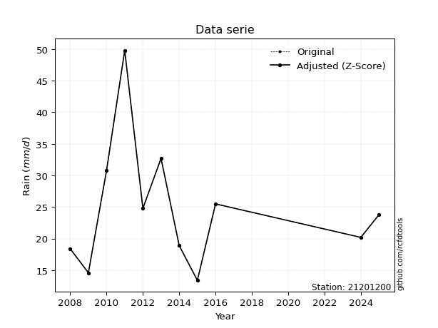</img>

</div>


> The initial value (value_initial) correspond to the initial obtained or null completed value, and value (value) is adjusted only when the initial value is outside the valid range (outlier) definite through the Z-Score value. If Z-Score is active, values out of range or outliers are replaced with the station mean value. A Z-Score (or standard score) measures how many standard deviations a data point is from the mean of a dataset, indicating its relative position; positive scores mean above the mean, negative mean below, and a score of zero is exactly at the mean, allowing for comparison of values from different distributions. It´s calculated using the formula $z=(x–μ)/σ$, where $x$ is the data point, $μ$ is the mean, and $σ$ is the standard deviation, helping identify outliers and understand probability.
>
> <sub>**Note**: In this study, "completing" (filling gaps in) and "extending" (forecasting or lengthening the historical record) rainfall data series are avoided for certain critical analyses because they introduce artificial bias and uncertainty, which can distort the statistics of rare events (extremes), alter day-to-day variability, and compromise the integrity and homogeneity of the original data. Some reasons against Completing/Extending rainfall data are: **Distortion of Extremes and Variability**: The primary issue is that most gap-filling or extension methods rely on averaging or regression with nearby stations, which inherently smooths the data. Rainfall is highly variable in space and time, with a large percentage of zero values and occasional large storms. Infilling methods often underestimate the highest values and overestimate the lowest (zero) values, which severely distorts analyses focused on flood frequency, drought severity, and intensity-duration-frequency (IDF) curves, **Loss of Data Homogeneity**: Infilled or extended data are synthetic estimates, not actual measurements. Combining these estimates with observed data can violate the assumption of data homogeneity, which requires that the data properties do not change over time. Inhomogeneity can lead to incorrect conclusions about long-term trends or changes in climate patterns, **Propagation of Errors**: Errors and biases from the original data (e.g., wind-induced undercatch, instrument errors, site changes) or the data used for imputation can propagate through the analysis, leading to unreliable hydrological models and inaccurate predictions, **Compromised Statistical Integrity**: For statistical analyses, especially those involving the frequency of events, using artificial data can introduce time bias or autocorrelation that doesn´t exist in reality, making it difficult to assess the true probability of events, **Difficulty in Validation**: It is difficult to accurately validate the quality of filled or extended data, especially for past periods where ground-truth measurements are unavailable. The reliability of imputation techniques heavily depends on the density of the surrounding station network and the complexity of the local topography.</sub>


### 4. Active continuous probability distributions from SciPy (80 of 104 available)

A Probability Density Function (PDF) describes the relative likelihood of a continuous random variable falling within a specific range, where the total area under its curve equals 1, and the area over any interval gives the actual probability for that range. Unlike discrete probabilities (like rolling a die), a PDF shows density, not direct probability for a single point (which is zero), with higher points indicating higher likelihood, often visualized as a bell curve for normal distributions.

A log of a probability density function (log-PDF) is simply the logarithm of the PDF´s value, denoted as $log(f(x))$, useful for converting multiplication of probabilities into addition, improving numerical stability with tiny numbers, and connecting to information theory concepts like entropy. Instead of dealing with very small probabilities (e.g., 0.000001), log-PDFs use negative numbers (e.g., $log(0.00001) ≈ -11.51$ that are easier for computers to handle, preventing underflow errors and simplifying complex calculations. In this study, each active probability distribution from SciPy is also evaluated in the $log$ form.

[scipy.stats](https://docs.scipy.org/doc/scipy/reference/stats.html) is a Python´s powerful submodule within the SciPy library for comprehensive statistical analysis, offering over 130 probability distributions (like Normal, Poisson, etc.), functions for descriptive stats (mean, variance), hypothesis testing (t-tests, chi-square), random variable generation, and statistical tests, making it essential for data science, modeling, and research. It provides tools to explore, model, and draw conclusions from data efficiently, working seamlessly with [NumPy](https://numpy.org/).

<div align="center">

|   id | p_dist           |   n_parameter | fit_method   | label                                                                       | active   | ref                                                                                                      |
|-----:|:-----------------|--------------:|:-------------|:----------------------------------------------------------------------------|:---------|:---------------------------------------------------------------------------------------------------------|
|    0 | alpha            |             3 | MLE          | Alpha                                                                       | True     | [:mortar_board:](https://docs.scipy.org/doc/scipy/reference/generated/scipy.stats.alpha.html)            |
|    1 | anglit           |             2 | MM           | Anglit                                                                      | True     | [:mortar_board:](https://docs.scipy.org/doc/scipy/reference/generated/scipy.stats.anglit.html)           |
|    2 | arcsine          |             2 | MM           | Arcsine                                                                     | True     | [:mortar_board:](https://docs.scipy.org/doc/scipy/reference/generated/scipy.stats.arcsine.html)          |
|    3 | argus            |             3 | MLE          | Argus                                                                       | True     | [:mortar_board:](https://docs.scipy.org/doc/scipy/reference/generated/scipy.stats.argus.html)            |
|    4 | beta             |             4 | MLE          | Beta                                                                        | True     | [:mortar_board:](https://docs.scipy.org/doc/scipy/reference/generated/scipy.stats.beta.html)             |
|    5 | betaprime        |             4 | MLE          | Beta prime                                                                  | True     | [:mortar_board:](https://docs.scipy.org/doc/scipy/reference/generated/scipy.stats.betaprime.html)        |
|    6 | bradford         |             3 | MLE          | Bradford                                                                    | True     | [:mortar_board:](https://docs.scipy.org/doc/scipy/reference/generated/scipy.stats.bradford.html)         |
|    7 | burr             |             4 | MLE          | Burr (Type III)                                                             | True     | [:mortar_board:](https://docs.scipy.org/doc/scipy/reference/generated/scipy.stats.burr.html)             |
|    8 | burr12           |             4 | MLE          | Burr (Type III) 12                                                          | True     | [:mortar_board:](https://docs.scipy.org/doc/scipy/reference/generated/scipy.stats.burr12.html)           |
|    9 | cosine           |             2 | MLE          | Cosine                                                                      | True     | [:mortar_board:](https://docs.scipy.org/doc/scipy/reference/generated/scipy.stats.cosine.html)           |
|   10 | crystalball      |             4 | MLE          | Crystalball                                                                 | True     | [:mortar_board:](https://docs.scipy.org/doc/scipy/reference/generated/scipy.stats.crystalball.html)      |
|   11 | dgamma           |             3 | MLE          | Double gamma                                                                | True     | [:mortar_board:](https://docs.scipy.org/doc/scipy/reference/generated/scipy.stats.dgamma.html)           |
|   12 | dweibull         |             3 | MLE          | Double Weibull                                                              | True     | [:mortar_board:](https://docs.scipy.org/doc/scipy/reference/generated/scipy.stats.dweibull.html)         |
|   13 | erlang           |             3 | MLE          | Erlang                                                                      | True     | [:mortar_board:](https://docs.scipy.org/doc/scipy/reference/generated/scipy.stats.erlang.html)           |
|   14 | exponnorm        |             3 | MLE          | Exponentially modified Normal                                               | True     | [:mortar_board:](https://docs.scipy.org/doc/scipy/reference/generated/scipy.stats.exponnorm.html)        |
|   15 | exponpow         |             3 | MLE          | Exponential power                                                           | True     | [:mortar_board:](https://docs.scipy.org/doc/scipy/reference/generated/scipy.stats.exponpow.html)         |
|   16 | exponweib        |             4 | MLE          | Exponentiated Weibull                                                       | True     | [:mortar_board:](https://docs.scipy.org/doc/scipy/reference/generated/scipy.stats.exponweib.html)        |
|   17 | f                |             4 | MLE          | F                                                                           | True     | [:mortar_board:](https://docs.scipy.org/doc/scipy/reference/generated/scipy.stats.f.html)                |
|   18 | fatiguelife      |             3 | MLE          | Fatigue-life (Birnbaum-Saunders)                                            | True     | [:mortar_board:](https://docs.scipy.org/doc/scipy/reference/generated/scipy.stats.fatiguelife.html)      |
|   19 | foldnorm         |             3 | MM           | Fold Normal                                                                 | True     | [:mortar_board:](https://docs.scipy.org/doc/scipy/reference/generated/scipy.stats.foldnorm.html)         |
|   20 | gamma            |             3 | MLE          | Gamma                                                                       | True     | [:mortar_board:](https://docs.scipy.org/doc/scipy/reference/generated/scipy.stats.gamma.html)            |
|   21 | gausshyper       |             6 | MLE          | Gauss hypergeometric                                                        | True     | [:mortar_board:](https://docs.scipy.org/doc/scipy/reference/generated/scipy.stats.gausshyper.html)       |
|   22 | genexpon         |             5 | MLE          | Generalized exponential                                                     | True     | [:mortar_board:](https://docs.scipy.org/doc/scipy/reference/generated/scipy.stats.genexpon.html)         |
|   23 | genextreme       |             3 | MLE          | Generalized exponential                                                     | True     | [:mortar_board:](https://docs.scipy.org/doc/scipy/reference/generated/scipy.stats.genextreme.html)       |
|   24 | gengamma         |             4 | MLE          | Generalized gamma                                                           | True     | [:mortar_board:](https://docs.scipy.org/doc/scipy/reference/generated/scipy.stats.gengamma.html)         |
|   25 | genhalflogistic  |             3 | MLE          | Generalized half-logistic                                                   | True     | [:mortar_board:](https://docs.scipy.org/doc/scipy/reference/generated/scipy.stats.genhalflogistic.html)  |
|   26 | genlogistic      |             3 | MLE          | Generalized logistic                                                        | True     | [:mortar_board:](https://docs.scipy.org/doc/scipy/reference/generated/scipy.stats.genlogistic.html)      |
|   27 | gennorm          |             3 | MLE          | Generalized Normal                                                          | True     | [:mortar_board:](https://docs.scipy.org/doc/scipy/reference/generated/scipy.stats.gennorm.html)          |
|   28 | genpareto        |             3 | MLE          | Generalized Pareto                                                          | True     | [:mortar_board:](https://docs.scipy.org/doc/scipy/reference/generated/scipy.stats.genpareto.html)        |
|   29 | gompertz         |             3 | MLE          | Gompertz (or truncated Gumbel)                                              | True     | [:mortar_board:](https://docs.scipy.org/doc/scipy/reference/generated/scipy.stats.gompertz.html)         |
|   30 | gumbel_l         |             2 | MM           | Gumbel Left Skew                                                            | True     | [:mortar_board:](https://docs.scipy.org/doc/scipy/reference/generated/scipy.stats.gumbel_l.html)         |
|   31 | gumbel_r         |             2 | MM           | Gumbel Right Skew                                                           | True     | [:mortar_board:](https://docs.scipy.org/doc/scipy/reference/generated/scipy.stats.gumbel_r.html)         |
|   32 | halfgennorm      |             3 | MLE          | Upper half of a generalized normal                                          | True     | [:mortar_board:](https://docs.scipy.org/doc/scipy/reference/generated/scipy.stats.halfgennorm.html)      |
|   33 | halflogistic     |             2 | MM           | Half-logistic                                                               | True     | [:mortar_board:](https://docs.scipy.org/doc/scipy/reference/generated/scipy.stats.halflogistic.html)     |
|   34 | halfnorm         |             2 | MM           | Half Normal                                                                 | True     | [:mortar_board:](https://docs.scipy.org/doc/scipy/reference/generated/scipy.stats.halfnorm.html)         |
|   35 | hypsecant        |             2 | MM           | hyperbolic secant                                                           | True     | [:mortar_board:](https://docs.scipy.org/doc/scipy/reference/generated/scipy.stats.hypsecant.html)        |
|   36 | invgamma         |             3 | MLE          | Inverted gamma                                                              | True     | [:mortar_board:](https://docs.scipy.org/doc/scipy/reference/generated/scipy.stats.invgamma.html)         |
|   37 | invgauss         |             3 | MLE          | Inverse Gaussian                                                            | True     | [:mortar_board:](https://docs.scipy.org/doc/scipy/reference/generated/scipy.stats.invgauss.html)         |
|   38 | invweibull       |             3 | MLE          | Inverted Weibull                                                            | True     | [:mortar_board:](https://docs.scipy.org/doc/scipy/reference/generated/scipy.stats.invweibull.html)       |
|   39 | johnsonsb        |             4 | MLE          | Johnson SB                                                                  | True     | [:mortar_board:](https://docs.scipy.org/doc/scipy/reference/generated/scipy.stats.johnsonsb.html)        |
|   40 | johnsonsu        |             4 | MLE          | Johnson Su                                                                  | True     | [:mortar_board:](https://docs.scipy.org/doc/scipy/reference/generated/scipy.stats.johnsonsu.html)        |
|   41 | kappa3           |             3 | MLE          | Kappa 3                                                                     | True     | [:mortar_board:](https://docs.scipy.org/doc/scipy/reference/generated/scipy.stats.kappa3.html)           |
|   42 | kappa4           |             4 | MLE          | Kappa 4                                                                     | True     | [:mortar_board:](https://docs.scipy.org/doc/scipy/reference/generated/scipy.stats.kappa4.html)           |
|   43 | ksone            |             3 | MLE          | Kolmogorov-Smirnov one-sided test statistic distribution                    | True     | [:mortar_board:](https://docs.scipy.org/doc/scipy/reference/generated/scipy.stats.ksone.html)            |
|   44 | kstwobign        |             2 | MLE          | Limiting distribution of scaled Kolmogorov-Smirnov two-sided test statistic | True     | [:mortar_board:](https://docs.scipy.org/doc/scipy/reference/generated/scipy.stats.kstwobign.html)        |
|   45 | laplace          |             2 | MM           | Laplace                                                                     | True     | [:mortar_board:](https://docs.scipy.org/doc/scipy/reference/generated/scipy.stats.laplace.html)          |
|   46 | levy_l           |             2 | MLE          | Left-skewed Levy                                                            | True     | [:mortar_board:](https://docs.scipy.org/doc/scipy/reference/generated/scipy.stats.levy_l.html)           |
|   47 | loggamma         |             3 | MLE          | Log gamma                                                                   | True     | [:mortar_board:](https://docs.scipy.org/doc/scipy/reference/generated/scipy.stats.loggamma.html)         |
|   48 | logistic         |             2 | MM           | Logistic (or Sech-squared)                                                  | True     | [:mortar_board:](https://docs.scipy.org/doc/scipy/reference/generated/scipy.stats.logistic.html)         |
|   49 | loglaplace       |             3 | MLE          | Log-Laplace                                                                 | True     | [:mortar_board:](https://docs.scipy.org/doc/scipy/reference/generated/scipy.stats.loglaplace.html)       |
|   50 | lomax            |             3 | MLE          | Lomax (Pareto of the second kind)                                           | True     | [:mortar_board:](https://docs.scipy.org/doc/scipy/reference/generated/scipy.stats.lomax.html)            |
|   51 | maxwell          |             2 | MM           | Maxwell                                                                     | True     | [:mortar_board:](https://docs.scipy.org/doc/scipy/reference/generated/scipy.stats.maxwell.html)          |
|   52 | mielke           |             4 | MLE          | Mielke Beta-Kappa / Dagum                                                   | True     | [:mortar_board:](https://docs.scipy.org/doc/scipy/reference/generated/scipy.stats.mielke.html)           |
|   53 | moyal            |             2 | MM           | Moyal                                                                       | True     | [:mortar_board:](https://docs.scipy.org/doc/scipy/reference/generated/scipy.stats.moyal.html)            |
|   54 | nakagami         |             3 | MLE          | Nakagami                                                                    | True     | [:mortar_board:](https://docs.scipy.org/doc/scipy/reference/generated/scipy.stats.nakagami.html)         |
|   55 | ncf              |             5 | MLE          | Non-central F distribution                                                  | True     | [:mortar_board:](https://docs.scipy.org/doc/scipy/reference/generated/scipy.stats.ncf.html)              |
|   56 | nct              |             4 | MLE          | Non-central Student’s t                                                     | True     | [:mortar_board:](https://docs.scipy.org/doc/scipy/reference/generated/scipy.stats.nct.html)              |
|   57 | norm             |             2 | MM           | Normal                                                                      | True     | [:mortar_board:](https://docs.scipy.org/doc/scipy/reference/generated/scipy.stats.norm.html)             |
|   58 | pearson3         |             3 | MM           | Pearson type III                                                            | True     | [:mortar_board:](https://docs.scipy.org/doc/scipy/reference/generated/scipy.stats.pearson3.html)         |
|   59 | powerlaw         |             3 | MLE          | Power-function                                                              | True     | [:mortar_board:](https://docs.scipy.org/doc/scipy/reference/generated/scipy.stats.powerlaw.html)         |
|   60 | rayleigh         |             2 | MM           | Rayleigh                                                                    | True     | [:mortar_board:](https://docs.scipy.org/doc/scipy/reference/generated/scipy.stats.rayleigh.html)         |
|   61 | rdist            |             3 | MLE          | R-distributed (symmetric beta)                                              | True     | [:mortar_board:](https://docs.scipy.org/doc/scipy/reference/generated/scipy.stats.rdist.html)            |
|   62 | rice             |             3 | MLE          | Rice                                                                        | True     | [:mortar_board:](https://docs.scipy.org/doc/scipy/reference/generated/scipy.stats.rice.html)             |
|   63 | semicircular     |             2 | MM           | Semicircular                                                                | True     | [:mortar_board:](https://docs.scipy.org/doc/scipy/reference/generated/scipy.stats.semicircular.html)     |
|   64 | skewnorm         |             3 | MLE          | Skew normal                                                                 | True     | [:mortar_board:](https://docs.scipy.org/doc/scipy/reference/generated/scipy.stats.skewnorm.html)         |
|   65 | t                |             3 | MLE          | Student’s t                                                                 | True     | [:mortar_board:](https://docs.scipy.org/doc/scipy/reference/generated/scipy.stats.t.html)                |
|   66 | trapezoid        |             4 | MLE          | Trapezoid                                                                   | True     | [:mortar_board:](https://docs.scipy.org/doc/scipy/reference/generated/scipy.stats.trapezoid.html)        |
|   67 | triang           |             3 | MLE          | Triangular                                                                  | True     | [:mortar_board:](https://docs.scipy.org/doc/scipy/reference/generated/scipy.stats.triang.html)           |
|   68 | truncexpon       |             3 | MLE          | Truncated exponential                                                       | True     | [:mortar_board:](https://docs.scipy.org/doc/scipy/reference/generated/scipy.stats.truncexpon.html)       |
|   69 | truncnorm        |             4 | MLE          | Truncated normal                                                            | True     | [:mortar_board:](https://docs.scipy.org/doc/scipy/reference/generated/scipy.stats.truncnorm.html)        |
|   70 | truncpareto      |             4 | MLE          | Upper truncated Pareto                                                      | True     | [:mortar_board:](https://docs.scipy.org/doc/scipy/reference/generated/scipy.stats.truncpareto.html)      |
|   71 | truncweibull_min |             5 | MLE          | Doubly truncated Weibull minimum                                            | True     | [:mortar_board:](https://docs.scipy.org/doc/scipy/reference/generated/scipy.stats.truncweibull_min.html) |
|   72 | tukeylambda      |             3 | MLE          | Tukey-Lamdba                                                                | True     | [:mortar_board:](https://docs.scipy.org/doc/scipy/reference/generated/scipy.stats.tukeylambda.html)      |
|   73 | uniform          |             2 | MLE          | Uniform                                                                     | True     | [:mortar_board:](https://docs.scipy.org/doc/scipy/reference/generated/scipy.stats.uniform.html)          |
|   74 | vonmises         |             3 | MLE          | Von Mises                                                                   | True     | [:mortar_board:](https://docs.scipy.org/doc/scipy/reference/generated/scipy.stats.vonmises.html)         |
|   75 | vonmises_line    |             3 | MLE          | Von Mises line                                                              | True     | [:mortar_board:](https://docs.scipy.org/doc/scipy/reference/generated/scipy.stats.vonmises_line.html)    |
|   76 | wald             |             2 | MM           | Wald                                                                        | True     | [:mortar_board:](https://docs.scipy.org/doc/scipy/reference/generated/scipy.stats.wald.html)             |
|   77 | weibull_max      |             3 | MLE          | Weibull maximum                                                             | True     | [:mortar_board:](https://docs.scipy.org/doc/scipy/reference/generated/scipy.stats.weibull_max.html)      |
|   78 | weibull_min      |             3 | MLE          | Weibull minimum                                                             | True     | [:mortar_board:](https://docs.scipy.org/doc/scipy/reference/generated/scipy.stats.weibull_min.html)      |
|   79 | wrapcauchy       |             3 | MLE          | Wrapped  Cauchy                                                             | True     | [:mortar_board:](https://docs.scipy.org/doc/scipy/reference/generated/scipy.stats.wrapcauchy.html)       |

</div>

> **n_parameter:** # arguments & localization & scale.
>
> **Fit methods:** (MLE) maximum likelihood, (MM) L-moments.
>
>**Inactive** (With the only purpose of prevent loops, zero divisions, infinite values, over high estimated values or horizontal trending for recurrence intervals estimations, the follow distributions were disabled.)**:** lognorm, norminvgauss, powernorm, powerlognorm, cauchy, halfcauchy, foldcauchy, skewcauchy, chi2, expon, fisk, genhyperbolic, geninvgauss, gibrat, kstwo, laplace_asymmetric, levy, levy_stable, ncx2, pareto, rel_breitwigner, recipinvgauss, studentized_range, loguniform, 


## B. Probability (PDF) vs. Empirical (EDF) distributions functions

A continuous probability distribution (CPD) describes probabilities for variables that can take any value within a range (like rain any time), unlike discrete variables with specific outcomes (like temperature). It uses a Probability Density Function (PDF), a curve where the total area under it equals 1, and the probability of the variable falling within an interval (a to b) is found by calculating the area under the curve between those points. A key feature is that the probability of hitting any single exact value is zero, so probabilities are always expressed for ranges, e.g., $P(a ≤ X ≤ b)$.

<div align="center">

Distributions parameters from station values
|     |   station | p_dist              |   n |             loc |         scale | shape                  | shape1                 | shape2                | shape3             |
|----:|----------:|:--------------------|----:|----------------:|--------------:|:-----------------------|:-----------------------|:----------------------|:-------------------|
|   0 |  21201200 | alpha               |  11 |    -6.70803     | 110.986       | 3.8136140693344416     |                        |                       |                    |
|   1 |  21201200 | anglit              |  11 |    24.8091      |  28.6606      |                        |                        |                       |                    |
|   2 |  21201200 | arcsine             |  11 |    10.9538      |  27.7105      |                        |                        |                       |                    |
|   3 |  21201200 | argus               |  11 |    -0.346626    |  51.442       | 5.394171316235628e-06  |                        |                       |                    |
|   4 |  21201200 | beta                |  11 |    13.4         |  51.2375      | 0.626666194364994      | 1.7249836125426068     |                       |                    |
|   5 |  21201200 | betaprime           |  11 |    -0.599353    |   1.23622     | 167.15941028703196     | 9.147786079578978      |                       |                    |
|   6 |  21201200 | bradford            |  11 |    13.249       |  36.551       | 5.956063885972281      |                        |                       |                    |
|   7 |  21201200 | burr                |  11 |    -0.218897    |   5.27353     | 3.2902339198128927     | 77.59720517903263      |                       |                    |
|   8 |  21201200 | burr12              |  11 |    -1.62257     |  14.938       | 574.1806122378764      | 0.0034093025160565095  |                       |                    |
|   9 |  21201200 | cosine              |  11 |    26.9525      |   9.24541     |                        |                        |                       |                    |
|  10 |  21201200 | crystalball         |  11 |    24.8091      |   9.79717     | 1423.1985853436233     | 492.42137798113987     |                       |                    |
|  11 |  21201200 | dgamma              |  11 |    23.8         |   7.60041     | 0.9524212341517475     |                        |                       |                    |
|  12 |  21201200 | dweibull            |  11 |    22.7068      |   7.65832     | 1.1714131772080942     |                        |                       |                    |
|  13 |  21201200 | erlang              |  11 |    13.4         |  12.6752      | 0.5626804239366336     |                        |                       |                    |
|  14 |  21201200 | exponnorm           |  11 |    14.5649      |   2.41821     | 4.236272626723537      |                        |                       |                    |
|  15 |  21201200 | exponpow            |  11 |    13.4         |  20.6663      | 0.8314881593667054     |                        |                       |                    |
|  16 |  21201200 | exponweib           |  11 |    13.4         |   0.791231    | 1.3707600157248747     | 0.2700665058542955     |                       |                    |
|  17 |  21201200 | f                   |  11 |     4.78737     |  16.4249      | 293.9383628803397      | 10.778415314958686     |                       |                    |
|  18 |  21201200 | fatiguelife         |  11 |     9.68502     |  12.2467      | 0.6836622358503022     |                        |                       |                    |
|  19 |  21201200 | foldnorm            |  11 |    11.5346      |  16.4833      | 0.10729650871927068    |                        |                       |                    |
|  20 |  21201200 | gamma               |  11 |    13.4         |  21.6166      | 0.24333218226516345    |                        |                       |                    |
|  21 |  21201200 | gausshyper          |  11 |    13.4         |  36.6361      | 0.7693208105516476     | 1.2015887107226115     | 0.7821926997425108    | 1.1801752083441626 |
|  22 |  21201200 | genexpon            |  11 |    13.3987      |   1.65576     | 0.11768667610314087    | 2.870022780045497      | 0.0016050334278025682 |                    |
|  23 |  21201200 | genextreme          |  11 |    19.9029      |   6.26373     | -0.18690061450588435   |                        |                       |                    |
|  24 |  21201200 | gengamma            |  11 |    13.4         |   0.746979    | 1.374051262367968      | 0.30140110186896985    |                       |                    |
|  25 |  21201200 | genhalflogistic     |  11 |    10.6534      |  39.2566      | 1.002809277777578      |                        |                       |                    |
|  26 |  21201200 | genlogistic         |  11 |   -28.2165      |   6.85312     | 1235.0262001087212     |                        |                       |                    |
|  27 |  21201200 | gennorm             |  11 |    23.8         |   7.75067     | 1.0670920202323786     |                        |                       |                    |
|  28 |  21201200 | genpareto           |  11 |    -0.154413    |  58.387       | -1.1688063714174057    |                        |                       |                    |
|  29 |  21201200 | gompertz            |  11 |    13.4         |  55.9035      | 4.051273891490524      |                        |                       |                    |
|  30 |  21201200 | gumbel_l            |  11 |    29.2183      |   7.63882     |                        |                        |                       |                    |
|  31 |  21201200 | gumbel_r            |  11 |    20.3998      |   7.63882     |                        |                        |                       |                    |
|  32 |  21201200 | halfgennorm         |  11 |    13.4         |   0.992157    | 0.4175383686762989     |                        |                       |                    |
|  33 |  21201200 | halflogistic        |  11 |    13.1972      |   8.37623     |                        |                        |                       |                    |
|  34 |  21201200 | halfnorm            |  11 |    11.8415      |  16.2525      |                        |                        |                       |                    |
|  35 |  21201200 | hypsecant           |  11 |    24.8091      |   6.23707     |                        |                        |                       |                    |
|  36 |  21201200 | invgamma            |  11 |     4.52034     |  89.3068      | 5.371895593532322      |                        |                       |                    |
|  37 |  21201200 | invgauss            |  11 |     8.8089      |  37.2848      | 0.42913408164685674    |                        |                       |                    |
|  38 |  21201200 | invweibull          |  11 |   -13.6109      |  33.5138      | 5.350456836144366      |                        |                       |                    |
|  39 |  21201200 | johnsonsb           |  11 |    13.4         |  36.4109      | -0.2830876990157567    | 0.08959801672108975    |                       |                    |
|  40 |  21201200 | johnsonsu           |  11 |     9.46337     |   0.257098    | -7.17771967819435      | 1.5646374115351716     |                       |                    |
|  41 |  21201200 | kappa3              |  11 |    13.3742      |  12.3827      | 3.2105352482647795     |                        |                       |                    |
|  42 |  21201200 | kappa4              |  11 |     9.58291     |  38.795       | 1.108870076358945      | 0.9579121224950043     |                       |                    |
|  43 |  21201200 | ksone               |  11 |     9.76        |  43.68        | 1.0                    |                        |                       |                    |
|  44 |  21201200 | kstwobign           |  11 |    -4.36942     |  33.7467      |                        |                        |                       |                    |
|  45 |  21201200 | laplace             |  11 |    24.8091      |   6.92764     |                        |                        |                       |                    |
|  46 |  21201200 | levy_l              |  11 |    52.7588      |  16.1452      |                        |                        |                       |                    |
|  47 |  21201200 | loggamma            |  11 | -3693.06        | 481.113       | 2270.5776088954008     |                        |                       |                    |
|  48 |  21201200 | logistic            |  11 |    24.8091      |   5.40146     |                        |                        |                       |                    |
|  49 |  21201200 | loglaplace          |  11 |    -0.122602    |  23.9226      | 3.5260008311171274     |                        |                       |                    |
|  50 |  21201200 | lomax               |  11 |    13.4         |   2.36538e+07 | 2144674.165053376      |                        |                       |                    |
|  51 |  21201200 | maxwell             |  11 |     1.59392     |  14.548       |                        |                        |                       |                    |
|  52 |  21201200 | mielke              |  11 |   -13.6026      |   8.3999      | 8781.33858108662       | 5.3507713034506725     |                       |                    |
|  53 |  21201200 | moyal               |  11 |    19.2064      |   4.41027     |                        |                        |                       |                    |
|  54 |  21201200 | nakagami            |  11 |    13.4         |  13.7967      | 0.10614646920424542    |                        |                       |                    |
|  55 |  21201200 | ncf                 |  11 |    -1.06414     |  23.1959      | 200.4512363261163      | 19.655553440906047     | 6.966618432644098e-08 |                    |
|  56 |  21201200 | nct                 |  11 |     0.0694779   |   0.624078    | 4.652034665531023      | 32.988855115149306     |                       |                    |
|  57 |  21201200 | norm                |  11 |    24.8091      |   9.79717     |                        |                        |                       |                    |
|  58 |  21201200 | pearson3            |  11 |    24.8091      |   9.7972      | 1.2757775337028887     |                        |                       |                    |
|  59 |  21201200 | powerlaw            |  11 |    13.4         |  36.4         | 0.21396087095570154    |                        |                       |                    |
|  60 |  21201200 | rayleigh            |  11 |     6.06654     |  14.9544      |                        |                        |                       |                    |
|  61 |  21201200 | rdist               |  11 |    11.7078      |  20.9922      | 1.0748363351385124     |                        |                       |                    |
|  62 |  21201200 | rice                |  11 |     8.98909     |  13.1578      | 0.00019911393174590786 |                        |                       |                    |
|  63 |  21201200 | semicircular        |  11 |    24.8091      |  19.5944      |                        |                        |                       |                    |
|  64 |  21201200 | skewnorm            |  11 |    13.4         |  15.038       | 76785746.50656268      |                        |                       |                    |
|  65 |  21201200 | t                   |  11 |    24.1983      |   9.77755     | 11.41148831807267      |                        |                       |                    |
|  66 |  21201200 | trapezoid           |  11 |     9.76        |  43.68        | 1.0                    | 1.0                    |                       |                    |
|  67 |  21201200 | triang              |  11 |    13.3986      |  41.1049      | 3.424099230912353e-05  |                        |                       |                    |
|  68 |  21201200 | truncexpon          |  11 |    13.4         |  33.5524      | 1.0849231641063835     |                        |                       |                    |
|  69 |  21201200 | truncnorm           |  11 |     3.28168     |  18.4548      | 0.5482765173564876     | 2.7325982452981394     |                       |                    |
|  70 |  21201200 | truncpareto         |  11 |    13.3998      |   0.000152645 | 0.10002964292871375    | 238462.2694694711      |                       |                    |
|  71 |  21201200 | truncweibull_min    |  11 |    13.3536      |  28.9262      | 0.7776530152537289     | 0.0016043059276082754  | 1.2599814375145721    |                    |
|  72 |  21201200 | tukeylambda         |  11 |    23.4171      |  11.0048      | 1.0986045001898321     |                        |                       |                    |
|  73 |  21201200 | uniform             |  11 |    13.4         |  36.4         |                        |                        |                       |                    |
|  74 |  21201200 | vonmises            |  11 |     0.186934    |   1           | 1.50275623012589       |                        |                       |                    |
|  75 |  21201200 | vonmises_line       |  11 |    23.0498      |   3.07176     | 0.6939472535008142     |                        |                       |                    |
|  76 |  21201200 | wald                |  11 |    15.0119      |   9.79722     |                        |                        |                       |                    |
|  77 |  21201200 | weibull_max         |  11 |    49.8         |   1.46116     | 0.2250848328529467     |                        |                       |                    |
|  78 |  21201200 | weibull_min         |  11 |    13.4         |  11.4731      | 0.8173147752242556     |                        |                       |                    |
|  79 |  21201200 | wrapcauchy          |  11 |    13.4         |   5.8271      | 0.16296526886862056    |                        |                       |                    |
|  80 |  21201200 | logalpha            |  11 |    -0.41653     |  35.6002      | 10.10114705113976      |                        |                       |                    |
|  81 |  21201200 | loganglit           |  11 |     3.14323     |   1.05341     |                        |                        |                       |                    |
|  82 |  21201200 | logarcsine          |  11 |     2.63397     |   1.01852     |                        |                        |                       |                    |
|  83 |  21201200 | logargus            |  11 |     2.2589      |   1.69455     | 5.569788918354581e-05  |                        |                       |                    |
|  84 |  21201200 | logbeta             |  11 |     2.59525     |   1.72003     | 0.24796733773068785    | 1.4580539569162898     |                       |                    |
|  85 |  21201200 | logbetaprime        |  11 |    -0.709121    |  30.085       | 131.10934113707833     | 1025.2511611398095     |                       |                    |
|  86 |  21201200 | logbradford         |  11 |     2.59525     |   1.31276     | 1.081909633385036      |                        |                       |                    |
|  87 |  21201200 | logburr             |  11 |    -0.0377598   |   2.9592      | 13.020303290839278     | 1.821020080554431      |                       |                    |
|  88 |  21201200 | logburr12           |  11 |     2.40765     |   1.58873     | 2.32405864250911       | 5.096231395722276      |                       |                    |
|  89 |  21201200 | logcosine           |  11 |     3.17508     |   0.315734    |                        |                        |                       |                    |
|  90 |  21201200 | logcrystalball      |  11 |     3.14323     |   0.36009     | 108.55424509724128     | 672.0491987445434      |                       |                    |
|  91 |  21201200 | logdgamma           |  11 |     3.09212     |   0.144502    | 2.023557136699784      |                        |                       |                    |
|  92 |  21201200 | logdweibull         |  11 |     3.09839     |   0.32392     | 1.4410755379851954     |                        |                       |                    |
|  93 |  21201200 | logerlang           |  11 |     2.22828     |   0.150096    | 6.0958179329577495     |                        |                       |                    |
|  94 |  21201200 | logexponnorm        |  11 |     2.88735     |   0.26345     | 0.9712908633515756     |                        |                       |                    |
|  95 |  21201200 | logexponpow         |  11 |     2.59525     |   0.907607    | 0.844512737741949      |                        |                       |                    |
|  96 |  21201200 | logexponweib        |  11 |     2.59525     |   0.770094    | 0.13504382956019867    | 2.004504209851101      |                       |                    |
|  97 |  21201200 | logf                |  11 |     2.21768     |   0.923445    | 12.676369576151814     | 828.17181902579        |                       |                    |
|  98 |  21201200 | logfatiguelife      |  11 |     1.62079     |   1.48021     | 0.23884935806388147    |                        |                       |                    |
|  99 |  21201200 | logfoldnorm         |  11 |     2.58834     |   0.4237      | 1.1969907212855266     |                        |                       |                    |
| 100 |  21201200 | loggamma            |  11 |     2.22827     |   0.150095    | 6.095879679989794      |                        |                       |                    |
| 101 |  21201200 | loggausshyper       |  11 |     2.59525     |   1.31276     | 0.8663635189801153     | 0.8661297069356514     | 1.3034186276868214    | 1.133231359043653  |
| 102 |  21201200 | loggenexpon         |  11 |     2.59363     |   0.00953595  | 0.007957455024729825   | 3.00261835711604       | 7.566558795692841e-05 |                    |
| 103 |  21201200 | loggenextreme       |  11 |     2.99399     |   0.322197    | 0.1366073507685736     |                        |                       |                    |
| 104 |  21201200 | loggengamma         |  11 |     2.59525     |   0.708923    | 0.7267721785881567     | 1.3545849017354783     |                       |                    |
| 105 |  21201200 | loggenhalflogistic  |  11 |     2.39772     |   1.58347     | 1.0484496962674479     |                        |                       |                    |
| 106 |  21201200 | loggenlogistic      |  11 |     2.1275      |   0.300032    | 17.3771633040105       |                        |                       |                    |
| 107 |  21201200 | loggennorm          |  11 |     3.14568     |   0.524556    | 2.1240946012534927     |                        |                       |                    |
| 108 |  21201200 | loggenpareto        |  11 |    -0.00312248  |  10.2317      | -2.616043865625744     |                        |                       |                    |
| 109 |  21201200 | loggompertz         |  11 |     2.59525     |   0.986353    | 1.153168958026726      |                        |                       |                    |
| 110 |  21201200 | loggumbel_l         |  11 |     3.30529     |   0.280761    |                        |                        |                       |                    |
| 111 |  21201200 | loggumbel_r         |  11 |     2.98118     |   0.280761    |                        |                        |                       |                    |
| 112 |  21201200 | loghalfgennorm      |  11 |     2.59525     |   1.10637     | 3.5613512667352736     |                        |                       |                    |
| 113 |  21201200 | loghalflogistic     |  11 |     2.71644     |   0.307868    |                        |                        |                       |                    |
| 114 |  21201200 | loghalfnorm         |  11 |     2.66663     |   0.59734     |                        |                        |                       |                    |
| 115 |  21201200 | loghypsecant        |  11 |     3.14323     |   0.22924     |                        |                        |                       |                    |
| 116 |  21201200 | loginvgamma         |  11 |     0.901548    |  87.1602      | 39.87774281212548      |                        |                       |                    |
| 117 |  21201200 | loginvgauss         |  11 |     1.59525     |  27.7367      | 0.05581023278163019    |                        |                       |                    |
| 118 |  21201200 | loginvweibull       |  11 |    -5.69532e+07 |   5.69532e+07 | 193411723.01373342     |                        |                       |                    |
| 119 |  21201200 | logjohnsonsb        |  11 |     2.59525     |   1.31276     | 0.4753906799816222     | 0.1029585340982795     |                       |                    |
| 120 |  21201200 | logjohnsonsu        |  11 |     1.54881     |   0.186609    | -12.533892569196926    | 4.4503478780338845     |                       |                    |
| 121 |  21201200 | logkappa3           |  11 |     2.59525     |   1.12283     | 19.699517159924007     |                        |                       |                    |
| 122 |  21201200 | logkappa4           |  11 |     2.50553     |   1.48447     | 1.0644296609339463     | 1.0468760419616063     |                       |                    |
| 123 |  21201200 | logksone            |  11 |     2.46398     |   1.57531     | 1.0                    |                        |                       |                    |
| 124 |  21201200 | logkstwobign        |  11 |     1.87693     |   1.45208     |                        |                        |                       |                    |
| 125 |  21201200 | loglaplace          |  11 |     3.14323     |   0.254622    |                        |                        |                       |                    |
| 126 |  21201200 | loglevy_l           |  11 |     3.99386     |   0.466779    |                        |                        |                       |                    |
| 127 |  21201200 | logloggamma         |  11 |  -102.301       |  14.3646      | 1542.0223955592328     |                        |                       |                    |
| 128 |  21201200 | loglogistic         |  11 |     3.14323     |   0.198528    |                        |                        |                       |                    |
| 129 |  21201200 | logloglaplace       |  11 |    -0.0564271   |   3.22611     | 11.217718851975578     |                        |                       |                    |
| 130 |  21201200 | loglomax            |  11 |     2.59525     |  15.7745      | 29.123822352019292     |                        |                       |                    |
| 131 |  21201200 | logmaxwell          |  11 |     2.28997     |   0.534703    |                        |                        |                       |                    |
| 132 |  21201200 | logmielke           |  11 |   -62.8252      |  65.14        | 2294.1836155100264     | 224.60557973472407     |                       |                    |
| 133 |  21201200 | logmoyal            |  11 |     2.93731     |   0.162097    |                        |                        |                       |                    |
| 134 |  21201200 | lognakagami         |  11 |     2.59525     |   0.653296    | 0.11601422308343101    |                        |                       |                    |
| 135 |  21201200 | logncf              |  11 |    -3.11412     |   6.24947     | 305.4571705838248      | 581.8547359035256      | 0.02460722795201053   |                    |
| 136 |  21201200 | lognct              |  11 |     0.342874    |   0.0611487   | 32.79526669628562      | 44.74190323399881      |                       |                    |
| 137 |  21201200 | lognorm             |  11 |     3.14323     |   0.36009     |                        |                        |                       |                    |
| 138 |  21201200 | logpearson3         |  11 |     3.14323     |   0.36009     | 0.4391363303307442     |                        |                       |                    |
| 139 |  21201200 | logpowerlaw         |  11 |     2.59525     |   1.31276     | 0.24222295724606896    |                        |                       |                    |
| 140 |  21201200 | lograyleigh         |  11 |     2.45436     |   0.549641    |                        |                        |                       |                    |
| 141 |  21201200 | logrdist            |  11 |     3.2516      |   0.656416    | 1.1924299980394952     |                        |                       |                    |
| 142 |  21201200 | logrice             |  11 |     2.46092     |   0.482562    | 0.7457015719602852     |                        |                       |                    |
| 143 |  21201200 | logsemicircular     |  11 |     3.14324     |   0.720067    |                        |                        |                       |                    |
| 144 |  21201200 | logskewnorm         |  11 |     2.74284     |   0.538502    | 2.4653584126366006     |                        |                       |                    |
| 145 |  21201200 | logt                |  11 |     3.14323     |   0.36009     | 1871044501.0096009     |                        |                       |                    |
| 146 |  21201200 | logtrapezoid        |  11 |     2.46398     |   1.57531     | 1.0                    | 1.0                    |                       |                    |
| 147 |  21201200 | logtriang           |  11 |     2.43864     |   1.65964     | 0.3015859574533982     |                        |                       |                    |
| 148 |  21201200 | logtruncexpon       |  11 |     2.59525     |   1.31479     | 0.9984668278191895     |                        |                       |                    |
| 149 |  21201200 | logtruncnorm        |  11 |    -0.168526    |   1.31534     | 2.1004167818389265     | 3.099228898839502      |                       |                    |
| 150 |  21201200 | logtruncpareto      |  11 |     2.59525     |   8.2604e-06  | 0.0007623274434589891  | 160617.06215789757     |                       |                    |
| 151 |  21201200 | logtruncweibull_min |  11 |     2.59524     |   1.65262     | 0.9771358306113698     | 1.0735318028146293e-05 | 0.7943600195599008    |                    |
| 152 |  21201200 | logtukeylambda      |  11 |     3.25057     |   0.775517    | 1.1795847757232978     |                        |                       |                    |
| 153 |  21201200 | loguniform          |  11 |     2.59525     |   1.31276     |                        |                        |                       |                    |
| 154 |  21201200 | logvonmises         |  11 |     3.13974     |   1           | 8.221553701881247      |                        |                       |                    |
| 155 |  21201200 | logvonmises_line    |  11 |     3.26028     |   0.211685    | 0.31723013029676583    |                        |                       |                    |
| 156 |  21201200 | logwald             |  11 |     2.78318     |   0.360062    |                        |                        |                       |                    |
| 157 |  21201200 | logweibull_max      |  11 |     5.35331     |   2.35933     | 7.322719146098531      |                        |                       |                    |
| 158 |  21201200 | logweibull_min      |  11 |     2.50842     |   0.71122     | 1.7826356764152194     |                        |                       |                    |
| 159 |  21201200 | logwrapcauchy       |  11 |     2.59525     |   0.208932    | 0.5000000000000001     |                        |                       |                    |

</div>

> **loc** (Location parameter): This shifts the distribution along the x-axis. For many common distributions, like the normal (Gaussian) distribution, loc represents the mean $μ$. For others, like the uniform distribution, it might represent the minimum value, or for the beta distribution, the left end of the support interval.
>
> **scale** (Scale parameter): This determines the width or spread of the distribution. For the normal distribution, scale represents the standard deviation $σ$. For a uniform distribution, it defines the length of the interval (from $loc$ to $loc + scale$).
>
> **shape** (Shape parameters): Refers to parameters that define the specific form of a probability distribution, distinct from its location (loc) and scale (scale). These parameters are required arguments for most distribution functions. For example, a normal (Gaussian) distribution is fully defined by its location (mean) and scale (standard deviation), so it has no specific shape parameters beyond loc and scale. However, other distributions have intrinsic properties that need specification, as Gamma distribution that takes a shape parameter, often named $a$ or $alpha$.


### 0. Cumulative distribution values - CDF (160 evaluated)

Cumulative Distribution Function (CDF), denoted as $F$<sub>$X$</sub>$(x)$, is a function that gives the probability that a random variable $X$ will take a value less than or equal to a specific value, $x$ (i.e., $(P(X≥x)$. It essentially "accumulates" probabilities from a given point up to the far right (positive infinity), providing a complete picture of the distribution´s probabilities for both discrete (like rain) and continuous (like temperature) variables, helping to find probabilities over ranges or above certain values. Each station is evaluated separately ordering the $x$ values ascending, calculating the CDF and PDF values for the activated distributions and their logarithmic forms.

<div align="center">

CDF ordered by x ascending and calculating $log(f(x))$ separately
|   id |   Station |   date |    x |   count |    mean |     std |       zscore |   Value_initial |   station |   m |     alpha |   alpha_pdf |   anglit |   anglit_pdf |   arcsine |   arcsine_pdf |    argus |   argus_pdf |        beta |       beta_pdf |   betaprime |   betaprime_pdf |   bradford |   bradford_pdf |      burr |   burr_pdf |    burr12 |   burr12_pdf |   cosine |   cosine_pdf |   crystalball |   crystalball_pdf |   dgamma |   dgamma_pdf |   dweibull |   dweibull_pdf |      erlang |      erlang_pdf |   exponnorm |   exponnorm_pdf |   exponpow |   exponpow_pdf |   exponweib |   exponweib_pdf |         f |      f_pdf |   fatiguelife |   fatiguelife_pdf |   foldnorm |   foldnorm_pdf |      gamma |   gamma_pdf |   gausshyper |   gausshyper_pdf |    genexpon |   genexpon_pdf |   genextreme |   genextreme_pdf |    gengamma |   gengamma_pdf |   genhalflogistic |   genhalflogistic_pdf |   genlogistic |   genlogistic_pdf |   gennorm |   gennorm_pdf |   genpareto |   genpareto_pdf |    gompertz |   gompertz_pdf |   gumbel_l |   gumbel_l_pdf |   gumbel_r |   gumbel_r_pdf |   halfgennorm |   halfgennorm_pdf |   halflogistic |   halflogistic_pdf |   halfnorm |   halfnorm_pdf |   hypsecant |   hypsecant_pdf |   invgamma |   invgamma_pdf |   invgauss |   invgauss_pdf |   invweibull |   invweibull_pdf |   johnsonsb |   johnsonsb_pdf |   johnsonsu |   johnsonsu_pdf |     kappa3 |   kappa3_pdf |      kappa4 |   kappa4_pdf |     ksone |   ksone_pdf |   kstwobign |   kstwobign_pdf |   laplace |   laplace_pdf |   levy_l |   levy_l_pdf |   loggamma |   loggamma_pdf |   logistic |   logistic_pdf |   loglaplace |   loglaplace_pdf |       lomax |   lomax_pdf |   maxwell |   maxwell_pdf |   mielke |   mielke_pdf |     moyal |   moyal_pdf |    nakagami |   nakagami_pdf |       ncf |    ncf_pdf |       nct |    nct_pdf |     norm |   norm_pdf |   pearson3 |   pearson3_pdf |    powerlaw |   powerlaw_pdf |   rayleigh |   rayleigh_pdf |    rdist |      rdist_pdf |      rice |   rice_pdf |   semicircular |   semicircular_pdf |   skewnorm |   skewnorm_pdf |        t |     t_pdf |   trapezoid |   trapezoid_pdf |      triang |   triang_pdf |   truncexpon |   truncexpon_pdf |   truncnorm |   truncnorm_pdf |   truncpareto |   truncpareto_pdf |   truncweibull_min |   truncweibull_min_pdf |   tukeylambda |   tukeylambda_pdf |   uniform |   uniform_pdf |   vonmises |   vonmises_pdf |   vonmises_line |   vonmises_line_pdf |     wald |   wald_pdf |   weibull_max |   weibull_max_pdf |   weibull_min |   weibull_min_pdf |   wrapcauchy |   wrapcauchy_pdf |   logalpha |   logalpha_pdf |   loganglit |   loganglit_pdf |   logarcsine |   logarcsine_pdf |   logargus |   logargus_pdf |     logbeta |   logbeta_pdf |   logbetaprime |   logbetaprime_pdf |   logbradford |   logbradford_pdf |   logburr |   logburr_pdf |   logburr12 |   logburr12_pdf |   logcosine |   logcosine_pdf |   logcrystalball |   logcrystalball_pdf |   logdgamma |   logdgamma_pdf |   logdweibull |   logdweibull_pdf |   logerlang |   logerlang_pdf |   logexponnorm |   logexponnorm_pdf |   logexponpow |   logexponpow_pdf |   logexponweib |   logexponweib_pdf |      logf |   logf_pdf |   logfatiguelife |   logfatiguelife_pdf |   logfoldnorm |   logfoldnorm_pdf |   loggausshyper |   loggausshyper_pdf |   loggenexpon |   loggenexpon_pdf |   loggenextreme |   loggenextreme_pdf |   loggengamma |   loggengamma_pdf |   loggenhalflogistic |   loggenhalflogistic_pdf |   loggenlogistic |   loggenlogistic_pdf |   loggennorm |   loggennorm_pdf |   loggenpareto |   loggenpareto_pdf |   loggompertz |   loggompertz_pdf |   loggumbel_l |   loggumbel_l_pdf |   loggumbel_r |   loggumbel_r_pdf |   loghalfgennorm |   loghalfgennorm_pdf |   loghalflogistic |   loghalflogistic_pdf |   loghalfnorm |   loghalfnorm_pdf |   loghypsecant |   loghypsecant_pdf |   loginvgamma |   loginvgamma_pdf |   loginvgauss |   loginvgauss_pdf |   loginvweibull |   loginvweibull_pdf |   logjohnsonsb |   logjohnsonsb_pdf |   logjohnsonsu |   logjohnsonsu_pdf |   logkappa3 |   logkappa3_pdf |   logkappa4 |   logkappa4_pdf |   logksone |   logksone_pdf |   logkstwobign |   logkstwobign_pdf |   loglevy_l |   loglevy_l_pdf |   logloggamma |   logloggamma_pdf |   loglogistic |   loglogistic_pdf |   logloglaplace |   logloglaplace_pdf |    loglomax |   loglomax_pdf |   logmaxwell |   logmaxwell_pdf |   logmielke |   logmielke_pdf |   logmoyal |   logmoyal_pdf |   lognakagami |   lognakagami_pdf |   logncf |   logncf_pdf |    lognct |   lognct_pdf |   lognorm |   lognorm_pdf |   logpearson3 |   logpearson3_pdf |   logpowerlaw |   logpowerlaw_pdf |   lograyleigh |   lograyleigh_pdf |   logrdist |   logrdist_pdf |   logrice |   logrice_pdf |   logsemicircular |   logsemicircular_pdf |   logskewnorm |   logskewnorm_pdf |      logt |   logt_pdf |   logtrapezoid |   logtrapezoid_pdf |   logtriang |   logtriang_pdf |   logtruncexpon |   logtruncexpon_pdf |   logtruncnorm |   logtruncnorm_pdf |   logtruncpareto |   logtruncpareto_pdf |   logtruncweibull_min |   logtruncweibull_min_pdf |   logtukeylambda |   logtukeylambda_pdf |   loguniform |   loguniform_pdf |   logvonmises |   logvonmises_pdf |   logvonmises_line |   logvonmises_line_pdf |   logwald |   logwald_pdf |   logweibull_max |   logweibull_max_pdf |   logweibull_min |   logweibull_min_pdf |   logwrapcauchy |   logwrapcauchy_pdf |
|-----:|----------:|-------:|-----:|--------:|--------:|--------:|-------------:|----------------:|----------:|----:|----------:|------------:|---------:|-------------:|----------:|--------------:|---------:|------------:|------------:|---------------:|------------:|----------------:|-----------:|---------------:|----------:|-----------:|----------:|-------------:|---------:|-------------:|--------------:|------------------:|---------:|-------------:|-----------:|---------------:|------------:|----------------:|------------:|----------------:|-----------:|---------------:|------------:|----------------:|----------:|-----------:|--------------:|------------------:|-----------:|---------------:|-----------:|------------:|-------------:|-----------------:|------------:|---------------:|-------------:|-----------------:|------------:|---------------:|------------------:|----------------------:|--------------:|------------------:|----------:|--------------:|------------:|----------------:|------------:|---------------:|-----------:|---------------:|-----------:|---------------:|--------------:|------------------:|---------------:|-------------------:|-----------:|---------------:|------------:|----------------:|-----------:|---------------:|-----------:|---------------:|-------------:|-----------------:|------------:|----------------:|------------:|----------------:|-----------:|-------------:|------------:|-------------:|----------:|------------:|------------:|----------------:|----------:|--------------:|---------:|-------------:|-----------:|---------------:|-----------:|---------------:|-------------:|-----------------:|------------:|------------:|----------:|--------------:|---------:|-------------:|----------:|------------:|------------:|---------------:|----------:|-----------:|----------:|-----------:|---------:|-----------:|-----------:|---------------:|------------:|---------------:|-----------:|---------------:|---------:|---------------:|----------:|-----------:|---------------:|-------------------:|-----------:|---------------:|---------:|----------:|------------:|----------------:|------------:|-------------:|-------------:|-----------------:|------------:|----------------:|--------------:|------------------:|-------------------:|-----------------------:|--------------:|------------------:|----------:|--------------:|-----------:|---------------:|----------------:|--------------------:|---------:|-----------:|--------------:|------------------:|--------------:|------------------:|-------------:|-----------------:|-----------:|---------------:|------------:|----------------:|-------------:|-----------------:|-----------:|---------------:|------------:|--------------:|---------------:|-------------------:|--------------:|------------------:|----------:|--------------:|------------:|----------------:|------------:|----------------:|-----------------:|---------------------:|------------:|----------------:|--------------:|------------------:|------------:|----------------:|---------------:|-------------------:|--------------:|------------------:|---------------:|-------------------:|----------:|-----------:|-----------------:|---------------------:|--------------:|------------------:|----------------:|--------------------:|--------------:|------------------:|----------------:|--------------------:|--------------:|------------------:|---------------------:|-------------------------:|-----------------:|---------------------:|-------------:|-----------------:|---------------:|-------------------:|--------------:|------------------:|--------------:|------------------:|--------------:|------------------:|-----------------:|---------------------:|------------------:|----------------------:|--------------:|------------------:|---------------:|-------------------:|--------------:|------------------:|--------------:|------------------:|----------------:|--------------------:|---------------:|-------------------:|---------------:|-------------------:|------------:|----------------:|------------:|----------------:|-----------:|---------------:|---------------:|-------------------:|------------:|----------------:|--------------:|------------------:|--------------:|------------------:|----------------:|--------------------:|------------:|---------------:|-------------:|-----------------:|------------:|----------------:|-----------:|---------------:|--------------:|------------------:|---------:|-------------:|----------:|-------------:|----------:|--------------:|--------------:|------------------:|--------------:|------------------:|--------------:|------------------:|-----------:|---------------:|----------:|--------------:|------------------:|----------------------:|--------------:|------------------:|----------:|-----------:|---------------:|-------------------:|------------:|----------------:|----------------:|--------------------:|---------------:|-------------------:|-----------------:|---------------------:|----------------------:|--------------------------:|-----------------:|---------------------:|-------------:|-----------------:|--------------:|------------------:|-------------------:|-----------------------:|----------:|--------------:|-----------------:|---------------------:|-----------------:|---------------------:|----------------:|--------------------:|
|    0 |  21201200 |   2015 | 13.4 |      11 | 24.8091 | 10.2754 | -1.11034     |            13.4 |  21201200 |   1 | 0.0440195 |  0.0255608  | 0.142665 |    0.024405  |  0.192047 |     0.0404904 | 0.105179 |   0.0150174 | 7.11736e-11 | 25108.7        |   0.0535437 |      0.0263652  |  0.0125321 |      0.0819952 | 0.0351682 | 0.0278378  | 0.0111152 |   0.124003   | 0.108421 |   0.0190175  |      0.122105 |        0.0206695  | 0.119023 |   0.0160189  |   0.142317 |     0.0225084  | 1.34979e-09 | 427561          |   0.0425949 |      0.0265916  | 4.3806e-14 |    20.505      | 3.77611e-06 |     7.86905e+08 | 0.0393047 | 0.0274344  |     0.0321453 |        0.0335629  |  0.0895898 |     0.047824   | 0.00013426 | 1.83915e+10 |  4.25087e-13 |     184.219      | 9.40518e-05 |     0.0710729  |    0.0419443 |       0.0263498  | 7.19104e-07 |    1.67649e+08 |         0.0362544 |             0.0136798 |     0.0582169 |        0.0241283  |  0.116374 |    0.0168368  |    0.23725  |       0.0179283 | 2.57541e-10 |     0.0724691  |   0.118462 |    0.0145507   |  0.0820725 |     0.026862   |   7.59229e-11 |        0.33987    |      0.0121067 |         0.059684   |  0.0763953 |     0.0488679  |    0.101336 |      0.0159742  |  0.0392969 |     0.0274808  |  0.0340203 |     0.0314163  |    0.0419449 |       0.0263501  | 0.000131987 |      2.5907e+10 |   0.0342107 |      0.0300773  | 0.00144772 |    0.0561562 | 4.09119e-15 |    0.945746  | 0.0833333 |   0.0228938 |   0.0556147 |      0.0247232  | 0.0963237 |     0.0139043 | 0.478135 |   0.00528803 |  0.0347711 |       0.388882 |   0.107914 |     0.0178228  |    0.0581181 |        0.228252  | 1.65929e-10 |  0.0906695  |  0.117099 |    0.0259859  |      nan |          nan | 0.0534239 |  0.0270547  | 0.000351557 |    4.20146e+10 | 0.0555789 | 0.0262496  | 0.0411129 | 0.0268425  | 0.122105 | 0.0206695  |   0.06575  |     0.0337542  | 0.000323565 |    3.89732e+10 |   0.113293 |      0.0290771 | 0.526994 |      0.0159838 | 0.0546404 | 0.0240856  |       0.151485 |          0.0264143 |  0         |      0.0530578 | 0.146081 | 0.0212565 |  0.00694444 |      0.00381563 | 3.42411e-05 |   0.048656   |  2.72281e-08 |        0.0450164 | 9.22211e-10 |      0.0644489  |      0        |      922.709      |        5.45977e-08 |              0.16158   |   7.10543e-15 |         0.0873523 |  0        |     0.0274725 |    2.75412 |      0.320142  |     9.50636e-06 |           0.0230285 | 0        | 0          |      0.127187 |       0.0016218   |    1.1971e-13 |       55.0795     |  1.16214e-08 |        0.0379481 |  0.0427919 |       0.357214 |   0.0686978 |        0.480231 |     0        |         0        |  0.0585121 |       0.344413 | 0.000154471 |   8.62524e+10 |      0.0566249 |           0.356935 |   6.13549e-07 |          1.12391  | 0.0437578 |      0.32336  |   0.0348177 |        0.422252 |   0.0541498 |        0.371746 |        0.0640313 |             0.348034 |   0.0731103 |       0.389392  |     0.0758204 |         0.409627  |   0.0347707 |        0.38888  |      0.0473376 |           0.337777 |    1.1753e-13 |        223.504    |    7.49627e-05 |        4.56937e+10 | 0.0348844 |   0.387737 |        0.0389448 |             0.370221 |    0.00636146 |          0.919986 |     5.76142e-14 |          112.417    |    0.00136213 |          0.837398 |       0.043392  |            0.361437 |   1.18023e-15 |          2.61638  |            0.0667491 |                 0.361658 |        0.036247  |             0.364844 |    0.0632886 |         0.35553  |       0.341182 |        0.191838    |   6.71661e-08 |          1.16912  |     0.0766437 |        0.262246   |     0.0191912 |          0.270225 |      7.08225e-10 |             1.00364  |          0        |              0        |     0         |          0        |      0.0581467 |          0.252241  |     0.0415077 |          0.360856 |     0.0391291 |          0.369564 |       0.0302587 |            0.359444 |    0.000705811 |        5.66569e+11 |      0.0408265 |           0.366833 |  1.0019e-12 |        0.765552 | 1.96764e-15 |        5.98693  |  0.0833333 |       0.634795 |      0.0327571 |           0.414197 |    0.436538 |        0.13946  |     0.0679369 |          0.354123 |     0.0595123 |          0.281928 |       0.055423  |            0.234462 | 1.52281e-11 |       1.84626  |    0.0449275 |         0.413258 |   0.0370137 |        0.358031 | 0.00407551 |       0.114267 |   0.000249272 |        1.3024e+11 | 0.186711 |     0.465686 | 0.0421286 |     0.359138 | 0.0640313 |      0.348034 |     0.0485457 |          0.368093 |   0.000178911 |       9.75849e+10 |     0.0323204 |          0.451297 | 0.00198717 |      16.3836   | 0.0289369 |      0.424799 |         0.0675518 |              0.573551 |     0.0425563 |          0.356238 | 0.0640316 |   0.348035 |     0.00694444 |           0.105799 |   0.029528  |        0.377076 |      1.1578e-06 |            1.20429  |     0.00201332 |           1.9765   |      2.82065e-10 |        10145.6       |           1.66639e-09 |                  1.39644  |       0.00215136 |             0.968425 |    0         |         0.761754 |     0.0647483 |          0.342754 |        2.60966e-08 |               0.53395  |  0        |     0         |        0.0433902 |             0.361449 |        0.0232679 |             0.472092 |        0        |            2.28526  |
|    1 |  21201200 |   2009 | 14.6 |      11 | 24.8091 | 10.2754 | -0.993551    |            14.6 |  21201200 |   2 | 0.0815094 |  0.0368579  | 0.173169 |    0.0264051 |  0.236318 |     0.0339816 | 0.12392  |   0.0162135 | 0.1389      |     0.0717716  |   0.0907512 |      0.035536   |  0.102583  |      0.0688545 | 0.0781829 | 0.0435241  | 0.14912   |   0.102675   | 0.132568 |   0.0212182  |      0.148695 |        0.0236602  | 0.139907 |   0.0188684  |   0.171686 |     0.0265185  | 0.288396    |      0.127229   |   0.0832561 |      0.0412464  | 0.0936616  |     0.0647018  | 0.581584    |     0.0973724   | 0.0802278 | 0.0404907  |     0.0834428 |        0.0505131  |  0.146696  |     0.047312   | 0.539271   | 0.104566    |  0.10731     |       0.0673972  | 0.0829551   |     0.0670311  |    0.080999  |       0.03861    | 0.536624    |    0.108476    |         0.0529352 |             0.0141251 |     0.0918812 |        0.0319755  |  0.138375 |    0.0199134  |    0.258816 |       0.0180153 | 0.0841503   |     0.0678109  |   0.137168 |    0.0166646   |  0.118045  |     0.0330188  |   0.195664    |        0.115123   |      0.0835434 |         0.0592761  |  0.134777  |     0.048391   |    0.122353 |      0.0191376  |  0.0803004 |     0.0405755  |  0.0817232 |     0.0471363  |    0.081     |       0.0386104  | 0.278991    |      0.025945   |   0.0797728 |      0.0451305  | 0.0688311  |    0.0561425 | 0.047545    |    0.0357046 | 0.110806  |   0.0228938 |   0.0898605 |      0.032255   | 0.114541  |     0.0165339 | 0.484608 |   0.00550381 |  0.0788303 |       0.640419 |   0.131238 |     0.021108   |    0.0813952 |        0.319671  | 0.103093    |  0.0813221  |  0.150356 |    0.0293948  |      nan |          nan | 0.0918344 |  0.0368244  | 0.494529    |    0.0874241   | 0.0924088 | 0.0350333  | 0.0809595 | 0.0393809  | 0.148695 | 0.0236602  |   0.11085  |     0.0410088  | 0.481867    |    0.0859172   |   0.150248 |      0.032425  | 0.546225 |      0.0160776 | 0.086911  | 0.0295923  |       0.183994 |          0.0277316 |  0.0636019 |      0.0528891 | 0.173309 | 0.0241369 |  0.0122779  |      0.00507353 | 0.0575691   |   0.0472355  |  0.0530651   |        0.0434348 | 0.0759233   |      0.0620603  |      0.834006 |        0.0478455  |        0.110478    |              0.0717625 |   0.0644695   |         0.0517309 |  0.032967 |     0.0274725 |    2.95665 |      0.0640765 |     0.028136    |           0.0242654 | 0        | 0          |      0.129174 |       0.00169048  |    0.14614    |        0.0918795  |  0.0453892   |        0.0375788 |  0.0819794 |       0.561875 |   0.115409  |        0.606632 |     0.1379   |         1.48891  |  0.0916203 |       0.427108 | 0.536143    |   1.52115     |      0.0938598 |           0.515432 |   0.0931405   |          1.04971  | 0.0795919 |      0.521191 |   0.0811213 |        0.655429 |   0.0918036 |        0.507106 |        0.0996401 |             0.486092 |   0.114291  |       0.580663  |     0.118358  |         0.588845  |   0.0788298 |        0.640418 |      0.083826  |           0.519493 |    0.135937   |          1.32981  |    0.551577    |        1.73021     | 0.0788141 |   0.638727 |        0.0802172 |             0.59648  |    0.0855496  |          0.92915  |     0.131909    |            1.27415  |    0.0791601  |          0.969414 |       0.0829468 |            0.565832 |   0.133545    |          1.48273  |            0.0987471 |                 0.384879 |        0.0780946 |             0.617294 |    0.0996969 |         0.496868 |       0.35798  |        0.200015    |   0.09946     |          1.14849  |     0.102578  |        0.345943   |     0.0543303 |          0.563633 |      0.0860766   |             1.00353  |          0        |              0        |     0.0192251 |          1.33534  |      0.08427   |          0.363326  |     0.0813041 |          0.572215 |     0.0802928 |          0.59466  |       0.0732334 |            0.650125 |    0.579827    |        0.502093    |      0.0814106 |           0.584242 |  0.0656589  |        0.765552 | 0.073109    |        0.80203  |  0.137778  |       0.634795 |      0.0809992 |           0.709834 |    0.449011 |        0.151685 |     0.103903  |          0.48801  |     0.0888141 |          0.407631 |       0.0792082 |            0.324585 | 0.146081    |       1.56803  |    0.0888305 |         0.610833 |   0.0779457 |        0.603459 | 0.0274823  |       0.47761  |   0.514407    |        1.38915    | 0.228957 |     0.518483 | 0.0816352 |     0.567284 | 0.0996401 |      0.486092 |     0.0878951 |          0.553502 |   0.516414    |       1.45846     |     0.0815132 |          0.68911  | 0.136663   |       0.965697 | 0.0758825 |      0.66385  |         0.12147   |              0.677921 |     0.0820832 |          0.571981 | 0.0996405 |   0.486092 |     0.0189827  |           0.174921 |   0.0707239 |        0.583572 |      0.0999926  |            1.12824  |     0.160323   |           1.71978  |      0.772322    |            0.970191  |           0.0982033   |                  1.0881   |       0.0743395  |             0.799294 |    0.0653332 |         0.761754 |     0.099896  |          0.481047 |        0.0461925   |               0.547842 |  0        |     0         |        0.0829468 |             0.565861 |        0.0769928 |             0.763776 |        0.177704 |            1.71526  |
|    2 |  21201200 |   2008 | 18.4 |      11 | 24.8091 | 10.2754 | -0.623734    |            18.4 |  21201200 |   3 | 0.272037  |  0.0584317  | 0.28376  |    0.0314594 |  0.346926 |     0.025913  | 0.192438 |   0.019791  | 0.332548    |     0.0397829  |   0.266685  |      0.0534379  |  0.314197  |      0.0456748 | 0.297284  | 0.0632323  | 0.43643   |   0.0550987  | 0.225664 |   0.027574   |      0.256499 |        0.0328762  | 0.234115 |   0.0319065  |   0.300387 |     0.0416303  | 0.581633    |      0.0505056  |   0.299072  |      0.0629185  | 0.302147   |     0.0484918  | 0.745372    |     0.0217095   | 0.28274   | 0.0596991  |     0.308522  |        0.0599459  |  0.321212  |     0.0441731  | 0.738628   | 0.0297899   |  0.306656    |       0.0434402  | 0.313714    |     0.0545326  |    0.278529  |       0.0595076  | 0.723836    |    0.0252904   |         0.109503  |             0.0156886 |     0.25367   |        0.0507464  |  0.237815 |    0.0335184  |    0.327831 |       0.018315  | 0.315484    |     0.0542475  |   0.215436 |    0.0249196   |  0.272732  |     0.0463882  |   0.469537    |        0.0476582  |      0.300956  |         0.0542861  |  0.313448  |     0.0452542  |    0.218787 |      0.032381   |  0.283164  |     0.0597696  |  0.300072  |     0.0600384  |    0.278531  |       0.0595078  | 0.327169    |      0.00749647 |   0.294315  |      0.0603194  | 0.280731   |    0.0549124 | 0.171829    |    0.0308897 | 0.197802  |   0.0228938 |   0.247192  |      0.0479847  | 0.198236  |     0.0286153 | 0.506967 |   0.0062927  |  0.292427  |       1.12344  |   0.233877 |     0.0331722  |    0.201913  |        0.79299   | 0.364503    |  0.0576202  |  0.27905  |    0.0375558  |      nan |          nan | 0.273194  |  0.0543795  | 0.668687    |    0.0280358   | 0.265334  | 0.052618   | 0.280517  | 0.0596106  | 0.256499 | 0.0328762  |   0.289615 |     0.049965   | 0.65394     |    0.0279835   |   0.288298 |      0.0392505 | 0.608396 |      0.0167457 | 0.225687  | 0.0420901  |       0.295544 |          0.0307028 |  0.260481  |      0.0502046 | 0.282366 | 0.0330654 |  0.0391257  |      0.00905688 | 0.228517    |   0.0427373  |  0.209114    |        0.0387839 | 0.295963    |      0.0535504  |      0.910368 |        0.00995637 |        0.318461    |              0.0443411 |   0.254989    |         0.0492428 |  0.137363 |     0.0274725 |    3.24916 |      0.323094  |     0.154628    |           0.0479549 | 0.214652 | 0.107848   |      0.136062 |       0.00194545  |    0.397826   |        0.0499261  |  0.180216    |        0.0326857 |  0.27652   |       1.07486  |   0.287774  |        0.859544 |     0.350221 |         0.701255 |  0.214542  |       0.629891 | 0.732007    |   0.53058     |      0.266674  |           0.962758 |   0.316616    |          0.891049 | 0.272786  |      1.11815  |   0.290277  |        1.08371  |   0.249891  |        0.84348  |        0.260701  |             0.90204  |   0.326939  |       1.23447   |     0.318908  |         1.11093   |   0.292426  |        1.12344  |      0.268189  |           1.05362  |    0.398896   |          0.99393  |    0.777686    |        0.609409    | 0.292225  |   1.12389  |        0.283915  |             1.10108  |    0.307874   |          0.995051 |     0.372936    |            0.880944 |    0.324812   |          1.10041  |       0.27724   |            1.06694  |   0.432297    |          1.09913  |            0.196125  |                 0.460548 |        0.293451  |             1.15783  |    0.262527  |         0.899939 |       0.407256 |        0.227567    |   0.354189    |          1.04132  |     0.218628  |        0.686589   |     0.278651  |          1.26819  |      0.317437    |             0.991988 |          0.307859 |              1.47015  |     0.319194  |          1.22736  |      0.222942  |          0.89494   |     0.278771  |          1.08409  |     0.283511  |          1.09971  |       0.303722  |            1.2291   |    0.639673    |        0.160209    |      0.281802  |           1.09191  |  0.242753   |        0.765552 | 0.250753    |        0.747668 |  0.284624  |       0.634795 |      0.3106    |           1.15574  |    0.488795 |        0.195299 |     0.263574  |          0.888084 |     0.238126  |          0.913836 |       0.196784  |            0.743561 | 0.439897    |       1.01372  |    0.283843  |         1.02687  |   0.290708  |        1.1558   | 0.280126   |       1.48346  |   0.694916    |        0.49618    | 0.361991 |     0.619679 | 0.277706  |     1.07967  | 0.260701  |      0.90204  |     0.274303  |          1.0233   |   0.708842    |       0.54147     |     0.293303  |          1.07135  | 0.306956   |       0.619849 | 0.283814  |      1.06663  |         0.299423  |              0.83743  |     0.28235   |          1.10146  | 0.260702  |   0.90204  |     0.0810109  |           0.361356 |   0.270142  |        1.14053  |      0.339317   |            0.946216 |     0.489605   |           1.15688  |      0.881076    |            0.26217   |           0.328459    |                  0.914673 |       0.25142    |             0.74547  |    0.241549  |         0.761754 |     0.261076  |          0.910755 |        0.189029    |               0.71655  |  0.228253 |     2.90701   |        0.277249  |             1.06697  |        0.305634  |             1.11777  |        0.392402 |            0.477319 |
|    3 |  21201200 |   2014 | 18.9 |      11 | 24.8091 | 10.2754 | -0.575074    |            18.9 |  21201200 |   4 | 0.301409  |  0.0589719  | 0.299619 |    0.0319666 |  0.359751 |     0.0253998 | 0.202445 |   0.0202346 | 0.352008    |     0.0380908  |   0.293591  |      0.0541263  |  0.336543  |      0.0437374 | 0.328736  | 0.0624888  | 0.462995  |   0.0512225  | 0.239634 |   0.028302   |      0.273207 |        0.0339481  | 0.250642 |   0.034234   |   0.321711 |     0.0436523  | 0.605881    |      0.0465699  |   0.33028   |      0.0618114  | 0.326083   |     0.0472653  | 0.755649    |     0.0194722   | 0.312585  | 0.0596043  |     0.338177  |        0.0586289  |  0.343158  |     0.0436051  | 0.752827   | 0.0270834   |  0.327987    |       0.0419053  | 0.340584    |     0.0529487  |    0.308353  |       0.0597042  | 0.735817    |    0.0227121   |         0.117403  |             0.0159135 |     0.27936   |        0.0519575  |  0.255149 |    0.0358402  |    0.336999 |       0.0183575 | 0.342195    |     0.0525991  |   0.228207 |    0.0261722   |  0.296133  |     0.0471772  |   0.492432    |        0.0440046  |      0.32785   |         0.0532766  |  0.335932  |     0.0446747  |    0.235482 |      0.0344045  |  0.313042  |     0.0596638  |  0.329863  |     0.059066   |    0.308355  |       0.0597043  | 0.330778    |      0.00695587 |   0.324312  |      0.0596015  | 0.308083   |    0.0544814 | 0.187196    |    0.0305816 | 0.209249  |   0.0228938 |   0.271416  |      0.0488674  | 0.213073  |     0.0307569 | 0.510142 |   0.00641033 |  0.322828  |       1.14303  |   0.25087  |     0.0347932  |    0.224334  |        0.881045  | 0.392669    |  0.0550663  |  0.298006 |    0.038251   |      nan |          nan | 0.300504  |  0.0547975  | 0.682165    |    0.025932    | 0.291845  | 0.0533669  | 0.310365  | 0.0596993  | 0.273207 | 0.0339481  |   0.314597 |     0.0499267  | 0.667412    |    0.0259636   |   0.308042 |      0.0397087 | 0.616802 |      0.0168833 | 0.246992  | 0.0431067  |       0.310965 |          0.0309773 |  0.28544   |      0.0496252 | 0.299159 | 0.034096  |  0.0437852  |      0.009581   | 0.249738    |   0.0421454  |  0.228362    |        0.0382103 | 0.32244     |      0.0523558  |      0.91509  |        0.00896539 |        0.340183    |              0.0425763 |   0.279578    |         0.0491162 |  0.151099 |     0.0274725 |    3.44109 |      0.427617  |     0.180002    |           0.0536249 | 0.267453 | 0.102992   |      0.137044 |       0.00198402  |    0.422068   |        0.0470891  |  0.196345    |        0.0318281 |  0.305809  |       1.1087   |   0.311084  |        0.878933 |     0.368759 |         0.682214 |  0.231714  |       0.650922 | 0.745742    |   0.49477     |      0.293027  |           1.00231  |   0.3403      |          0.875708 | 0.303363  |      1.16116  |   0.319612  |        1.10344  |   0.272919  |        0.873868 |        0.28545   |             0.94353  |   0.360448  |       1.2597    |     0.349061  |         1.1353    |   0.322828  |        1.14303  |      0.297045  |           1.09777  |    0.425173   |          0.966362 |    0.793411    |        0.564515    | 0.322642  |   1.14371  |        0.313818  |             1.1282   |    0.334632   |          1.00078  |     0.396194    |            0.854341 |    0.354258   |          1.09556  |       0.306295  |            1.09926  |   0.461182    |          1.05567  |            0.208609  |                 0.470805 |        0.324798  |             1.17882  |    0.287166  |         0.937478 |       0.413409 |        0.231437    |   0.38188     |          1.02413  |     0.237707  |        0.736943   |     0.313042  |          1.29495  |      0.343984    |             0.988114 |          0.34673  |              1.42882  |     0.351788  |          1.2037   |      0.248017  |          0.97571   |     0.308281  |          1.11589  |     0.313382  |          1.12717  |       0.336911  |            1.24475  |    0.643844    |        0.151193    |      0.311493  |           1.12155  |  0.263279   |        0.765552 | 0.270761    |        0.744875 |  0.301644  |       0.634795 |      0.341683  |           1.1615   |    0.494116 |        0.201684 |     0.287928  |          0.928099 |     0.263486  |          0.977499 |       0.217666  |            0.815102 | 0.466406    |       0.964134 |    0.311732  |         1.05258  |   0.322038  |        1.1796   | 0.320072   |       1.4927   |   0.707777    |        0.463955   | 0.378697 |     0.626334 | 0.30711   |     1.11242  | 0.28545   |      0.94353  |     0.302213  |          1.05764  |   0.722917    |       0.509169    |     0.322258  |          1.0876   | 0.323392   |       0.606516 | 0.312687  |      1.08619  |         0.322019  |              0.847862 |     0.312295  |          1.13078  | 0.28545   |   0.943529 |     0.090989   |           0.382964 |   0.301586  |        1.20508  |      0.364429   |            0.927116 |     0.519892   |           1.10271  |      0.887824    |            0.241717  |           0.352759    |                  0.898084 |       0.271371   |             0.742815 |    0.261973  |         0.761754 |     0.286087  |          0.9544   |        0.208632    |               0.745906 |  0.303367 |     2.68195   |        0.306305  |             1.09929  |        0.335707  |             1.12452  |        0.404559 |            0.431131 |
|    4 |  21201200 |   2024 | 20.2 |      11 | 24.8091 | 10.2754 | -0.448558    |            20.2 |  21201200 |   5 | 0.377917  |  0.058269   | 0.341942 |    0.0331019 |  0.392054 |     0.0243614 | 0.229483 |   0.0213544 | 0.399065    |     0.034462   |   0.364307  |      0.0543025  |  0.390479  |      0.039393  | 0.407698  | 0.0586041  | 0.52383   |   0.042714   | 0.277581 |   0.0300381  |      0.319016 |        0.0364544  | 0.299529 |   0.0412203  |   0.381574 |     0.0481968  | 0.660785    |      0.038306   |   0.407649  |      0.056857   | 0.38559    |     0.0443343  | 0.777998    |     0.0152174   | 0.388952  | 0.057491   |     0.411682  |        0.0542876  |  0.398812  |     0.0419829  | 0.784332   | 0.0217201   |  0.380168    |       0.0384949  | 0.406784    |     0.0489212  |    0.385247  |       0.0581517  | 0.761909    |    0.0177796   |         0.138482  |             0.0165215 |     0.348193  |        0.0535794  |  0.305999 |    0.0425609  |    0.360937 |       0.0184718 | 0.407861    |     0.0484622  |   0.26442  |    0.0295718   |  0.358256  |     0.0481426  |   0.544446    |        0.0364127  |      0.395259  |         0.0503669  |  0.392952  |     0.0430116  |    0.283657 |      0.0396944  |  0.389467  |     0.0575218  |  0.404364  |     0.0553156  |    0.385249  |       0.0581517  | 0.339105    |      0.00593059 |   0.399823  |      0.0562786  | 0.377975   |    0.0529383 | 0.226492    |    0.0298977 | 0.239011  |   0.0228938 |   0.335832  |      0.0499581  | 0.257055  |     0.0371057 | 0.518683 |   0.00673365 |  0.399606  |       1.15757  |   0.29874  |     0.0387848  |    0.29131   |        1.14409   | 0.460198    |  0.0489436  |  0.34868  |    0.0395963  |      nan |          nan | 0.371605  |  0.0542224  | 0.712989    |    0.021746    | 0.361704  | 0.0537546  | 0.387108  | 0.0579437  | 0.319016 | 0.0364544  |   0.378983 |     0.0489313  | 0.698409    |    0.0219753   |   0.360207 |      0.0404343 | 0.639016 |      0.0173091 | 0.3044    | 0.0450435  |       0.351644 |          0.0315783 |  0.348866  |      0.0479014 | 0.345081 | 0.0364729 |  0.0571263  |      0.0109437  | 0.303527    |   0.0406065  |  0.277086    |        0.0367581 | 0.388459    |      0.0492035  |      0.925442 |        0.00709918 |        0.392903    |              0.0386761 |   0.343259    |         0.0488723 |  0.186813 |     0.0274725 |    3.88089 |      0.174988  |     0.260161    |           0.0698814 | 0.390372 | 0.0857412  |      0.139692 |       0.00209084  |    0.479062   |        0.0408316  |  0.236263    |        0.0295915 |  0.381497  |       1.15879  |   0.370901  |        0.917112 |     0.412943 |         0.649173 |  0.27668   |       0.700351 | 0.776163    |   0.423442    |      0.362412  |           1.07813  |   0.397342    |          0.839834 | 0.38301   |      1.22229  |   0.3939    |        1.12329  |   0.333259  |        0.937332 |        0.351233  |             1.02994  |   0.441471  |       1.11296   |     0.424024  |         1.08639   |   0.399606  |        1.15757  |      0.372889  |           1.17415  |    0.487244   |          0.900314 |    0.827765    |        0.472276    | 0.399479  |   1.15862  |        0.390221  |             1.16075  |    0.401501   |          1.00774  |     0.451033    |            0.79612  |    0.426344   |          1.06832  |       0.381258  |            1.14672  |   0.527899    |          0.951076 |            0.240814  |                 0.497864 |        0.403874  |             1.18916  |    0.352193  |         1.01313  |       0.429144 |        0.241833    |   0.448487    |          0.977527 |     0.291064  |        0.868593   |     0.399951  |          1.30545  |      0.4093      |             0.974697 |          0.438002 |              1.3125   |     0.429699  |          1.13699  |      0.319529  |          1.17128   |     0.384264  |          1.16042  |     0.389746  |          1.16062  |       0.419811  |            1.23741  |    0.653313    |        0.134709    |      0.387668  |           1.16055  |  0.314204   |        0.765552 | 0.320113    |        0.739195 |  0.343871  |       0.634795 |      0.41858   |           1.14344  |    0.508098 |        0.219099 |     0.35259   |          1.01191  |     0.333397  |          1.11946  |       0.278477  |            1.02017  | 0.526719    |       0.851641 |    0.383243  |         1.09151  |   0.401373  |        1.19587  | 0.41802    |       1.4359   |   0.736393    |        0.399554   | 0.42078  |     0.637689 | 0.382949  |     1.15956  | 0.351233  |      1.02994  |     0.374699  |          1.11486  |   0.754553    |       0.445316    |     0.395323  |          1.10349  | 0.362841   |       0.581183 | 0.38593   |      1.11019  |         0.379129  |              0.86783  |     0.388948  |          1.16479  | 0.351233  |   1.02994  |     0.118247   |           0.436575 |   0.379449  |        1.13592  |      0.424567   |            0.881376 |     0.589004   |           0.977272 |      0.902522    |            0.202514  |           0.411179    |                  0.858801 |       0.3206     |             0.73761  |    0.312645  |         0.761754 |     0.352754  |          1.04539  |        0.260766    |               0.821947 |  0.459689 |     2.02674   |        0.38127   |             1.14674  |        0.410435  |             1.11674  |        0.430309 |            0.349744 |
|    5 |  21201200 |   2025 | 23.8 |      11 | 24.8091 | 10.2754 | -0.098205    |            23.8 |  21201200 |   6 | 0.56977   |  0.0468464  | 0.464821 |    0.0348046 |  0.476796 |     0.0230351 | 0.311563 |   0.0241712 | 0.509861    |     0.0276599  |   0.548448  |      0.046529   |  0.515761  |      0.0308949 | 0.590302  | 0.04248    | 0.646858  |   0.0271922  | 0.392508 |   0.0334379  |      0.458982 |        0.0405048  | 0.5      |   0.342589   |   0.548596 |     0.0494564  | 0.7701      |      0.0239454  |   0.582572  |      0.0407411  | 0.532051   |     0.0371887  | 0.820173    |     0.00910854  | 0.574448  | 0.0446676  |     0.582325  |        0.0405603  |  0.540606  |     0.0366052  | 0.845504   | 0.0133325   |  0.505606    |       0.0316746  | 0.563901    |     0.0385802  |    0.574006  |       0.0455713  | 0.811177    |    0.0106258   |         0.20125   |             0.0184002 |     0.535793  |        0.048774   |  0.5      |    0.0661628  |    0.428049 |       0.018821  | 0.563227    |     0.0381244  |   0.388586 |    0.0393783   |  0.526897  |     0.0441965  |   0.649866    |        0.0236017  |      0.560054  |         0.0409695  |  0.538145  |     0.0374505  |    0.448724 |      0.0503744  |  0.574961  |     0.0446437  |  0.579456  |     0.0417616  |    0.574008  |       0.0455712  | 0.357472    |      0.00450076 |   0.578681  |      0.0426824  | 0.556157   |    0.0452341 | 0.331479    |    0.0285221 | 0.321429  |   0.0228938 |   0.511198  |      0.0461156  | 0.432225  |     0.0623914 | 0.54474  |   0.00778388 |  0.581558  |       1.02951  |   0.453431 |     0.0458823  |    0.549334  |        1.76994   | 0.610528    |  0.0353132  |  0.493186 |    0.0398606  |      nan |          nan | 0.552474  |  0.0450444  | 0.777756    |    0.0150326   | 0.545036  | 0.0465951  | 0.574817  | 0.0452831  | 0.458982 | 0.0405048  |   0.543824 |     0.0419048  | 0.764875    |    0.0157359   |   0.504954 |      0.0392556 | 0.704354 |      0.0192031 | 0.469283  | 0.0454021  |       0.467229 |          0.0324468 |  0.510799  |      0.0417726 | 0.484104 | 0.0398828 |  0.103316   |      0.0147174  | 0.44204     |   0.0363451  |  0.402563    |        0.0330184 | 0.549679    |      0.0403708  |      0.945524 |        0.00444866 |        0.517302    |              0.0310137 |   0.518629    |         0.0486516 |  0.285714 |     0.0274725 |    4.0703  |      0.104192  |     0.568742    |           0.0903809 | 0.623628 | 0.0476484  |      0.14783  |       0.00244655  |    0.602626   |        0.0288204  |  0.332667    |        0.0242639 |  0.569138  |       1.08768  |   0.525099  |        0.948104 |     0.516541 |         0.625889 |  0.400331  |       0.802414 | 0.83538     |   0.3093      |      0.544585  |           1.1039   |   0.528558    |          0.762792 | 0.578713  |      1.1099   |   0.572248  |        1.02046  |   0.494562  |        1.00808  |        0.529278  |             1.10491  |   0.548886  |       1.05927   |     0.553381  |         1.01916   |   0.581559  |        1.02951  |      0.566784  |           1.13833  |    0.622058   |          0.744995 |    0.891244    |        0.314055    | 0.581603  |   1.03033  |        0.575307  |             1.05936  |    0.564393   |          0.961974 |     0.572079    |            0.686827 |    0.591239   |          0.92807  |       0.566994  |            1.07888  |   0.664274    |          0.718582 |            0.328638  |                 0.57615  |        0.588244  |             1.0246   |    0.525828  |         1.07473  |       0.47128  |        0.273735    |   0.598015    |          0.841384 |     0.4604    |        1.18568    |     0.599908  |          1.09182  |      0.564601    |             0.910969 |          0.626788 |              0.986032 |     0.600304  |          0.936934 |      0.536647  |          1.37935   |     0.5712    |          1.07887  |     0.574958  |          1.06079  |       0.608173  |            1.02709  |    0.673481    |        0.114917    |      0.573726  |           1.06953  |  0.439756   |        0.765552 | 0.440547    |        0.730552 |  0.447979  |       0.634795 |      0.593707  |           0.970488 |    0.548291 |        0.274444 |     0.527652  |          1.08851  |     0.533259  |          1.2537   |       0.5       |            1.73858  | 0.647144    |       0.628574 |    0.560928  |         1.04354  |   0.587445  |        1.03635  | 0.625318   |       1.06675  |   0.79261     |        0.295381   | 0.52567  |     0.634019 | 0.570203  |     1.08296  | 0.529278  |      1.10491  |     0.558134  |          1.08305  |   0.818568    |       0.345169    |     0.571245  |          1.0152   | 0.455119   |       0.550231 | 0.564329  |      1.03708  |         0.523377  |              0.883515 |     0.574034  |          1.0548   | 0.529279  |   1.10491  |     0.200685   |           0.568749 |   0.551762  |        0.965417 |      0.560464   |            0.778016 |     0.727082   |           0.717734 |      0.930461    |            0.144659  |           0.544689    |                  0.771356 |       0.440921   |             0.730952 |    0.437575  |         0.761754 |     0.533655  |          1.12129  |        0.409634    |               0.978628 |  0.695861 |     0.993724  |        0.567004  |             1.07885  |        0.584487  |             0.983758 |        0.478951 |            0.262787 |
|    6 |  21201200 |   2012 | 24.8 |      11 | 24.8091 | 10.2754 | -0.000884729 |            24.8 |  21201200 |   7 | 0.614574  |  0.0427521  | 0.499683 |    0.0348911 |  0.499791 |     0.0229739 | 0.336086 |   0.0248697 | 0.536804    |     0.0262518  |   0.593366  |      0.0432727  |  0.545766  |      0.0291482 | 0.63058   | 0.0381257  | 0.672546  |   0.0242599  | 0.426225 |   0.0339645  |      0.49963  |        0.0407202  | 0.569327 |   0.0616803  |   0.598272 |     0.049198   | 0.792668    |      0.021258   |   0.621392  |      0.0369572  | 0.568307   |     0.0353291  | 0.828772    |     0.00812288  | 0.617114  | 0.0406777  |     0.621096  |        0.037018   |  0.576385  |     0.034944   | 0.858087   | 0.0118755   |  0.536532    |       0.0302003  | 0.601155    |     0.0359475  |    0.61752   |       0.0414642  | 0.821203    |    0.00946357  |         0.219938  |             0.0189792 |     0.583155  |        0.045881   |  0.562693 |    0.0591254  |    0.446923 |       0.0189279 | 0.600049    |     0.0355404  |   0.429243 |    0.0419012   |  0.569995  |     0.041945   |   0.672269    |        0.0212655  |      0.599653  |         0.0382282  |  0.574738  |     0.0357251  |    0.499536 |      0.0510351  |  0.617599  |     0.0406466  |  0.619368  |     0.0380942  |    0.617522  |       0.0414641  | 0.361863    |      0.00428818 |   0.619437  |      0.0388566  | 0.599958   |    0.0423259 | 0.359848    |    0.0282201 | 0.344322  |   0.0228938 |   0.556236  |      0.0439082  | 0.499344  |     0.07208   | 0.552692 |   0.0081238  |  0.622795  |       0.973292 |   0.499579 |     0.0462837  |    0.616599  |        1.50577   | 0.644287    |  0.0322523  |  0.532695 |    0.039103   |      nan |          nan | 0.595845  |  0.0416822  | 0.792165    |    0.0138149   | 0.590081  | 0.0434558  | 0.618062  | 0.0412154  | 0.49963  | 0.0407202  |   0.584482 |     0.0393927  | 0.780049    |    0.0146403   |   0.543714 |      0.0382223 | 0.723949 |      0.020014  | 0.514203  | 0.0443653  |       0.499705 |          0.0324899 |  0.551596  |      0.0398069 | 0.524002 | 0.0398367 |  0.118558   |      0.0157657  | 0.477793    |   0.0351613  |  0.435094    |        0.0320488 | 0.588839    |      0.0379547  |      0.949752 |        0.00402134 |        0.547491    |              0.0293922 |   0.567295    |         0.0486881 |  0.313187 |     0.0274725 |    4.28883 |      0.355601  |     0.655703    |           0.0826817 | 0.667732 | 0.0407766  |      0.150335 |       0.00256478  |    0.630199   |        0.0263745  |  0.356354    |        0.0231369 |  0.612874  |       1.03589  |   0.564005  |        0.941491 |     0.542384 |         0.630626 |  0.433784  |       0.82278  | 0.847679    |   0.288736    |      0.589456  |           1.07435  |   0.559597    |          0.745627 | 0.623001  |      1.04054  |   0.613232  |        0.969886 |   0.536017  |        1.00493  |        0.574466  |             1.08854  |   0.596674  |       1.23177   |     0.597825  |         1.12205   |   0.622796  |        0.973292 |      0.612588  |           1.08513  |    0.651939   |          0.707085 |    0.90354     |        0.283906    | 0.62287   |   0.973892 |        0.617816  |             1.00495  |    0.603438   |          0.93425  |     0.599894    |            0.665087 |    0.628489   |          0.881517 |       0.610422  |            1.02985  |   0.692772    |          0.666675 |            0.352814  |                 0.598894 |        0.629081  |             0.958971 |    0.569871  |         1.06352  |       0.482746 |        0.283608    |   0.631866    |          0.803363 |     0.51048   |        1.24547    |     0.643197  |          1.01099  |      0.601607    |             0.886637 |          0.665684 |              0.904387 |     0.63774   |          0.882017 |      0.592546  |          1.33027   |     0.614548  |          1.02602  |     0.617529  |          1.00653  |       0.648933  |            0.952964 |    0.678166    |        0.112892    |      0.616671  |           1.01583  |  0.471265   |        0.765551 | 0.470588    |        0.729285 |  0.474106  |       0.634795 |      0.632463  |           0.912305 |    0.559941 |        0.291986 |     0.572206  |          1.07424  |     0.584324  |          1.22345  |       0.56628   |            1.48912  | 0.672059    |       0.582724 |    0.603105  |         1.00448  |   0.628755  |        0.970117 | 0.667119   |       0.965025 |   0.80437     |        0.276389   | 0.551616 |     0.626331 | 0.613732  |     1.03063  | 0.574466  |      1.08854  |     0.601897  |          1.04174  |   0.832404    |       0.327536    |     0.612146  |          0.971197 | 0.477705   |       0.547608 | 0.606175  |      0.995096 |         0.559683  |              0.880207 |     0.616329  |          0.99931  | 0.574466  |   1.08854  |     0.224776   |           0.60192  |   0.590616  |        0.922627 |      0.591989   |            0.754038 |     0.755476   |           0.662617 |      0.936211    |            0.13498   |           0.576019    |                  0.751189 |       0.470992   |             0.730377 |    0.468927  |         0.761754 |     0.579466  |          1.10229  |        0.450357    |               0.998397 |  0.733562 |     0.843321  |        0.610431  |             1.02982  |        0.623956  |             0.933395 |        0.489613 |            0.25608  |
|    7 |  21201200 |   2016 | 25.5 |      11 | 24.8091 | 10.2754 |  0.0672394   |            25.5 |  21201200 |   8 | 0.643498  |  0.0398951  | 0.524097 |    0.0348506 |  0.515879 |     0.0230025 | 0.353659 |   0.0253344 | 0.55486     |     0.0253464  |   0.62283   |      0.0409045  |  0.565776  |      0.0280386 | 0.656258  | 0.0352664  | 0.688886  |   0.0224545  | 0.450095 |   0.0342169  |      0.528111 |        0.040619   | 0.610021 |   0.0548508  |   0.632108 |     0.0473383  | 0.806958    |      0.0195984  |   0.646398  |      0.034517   | 0.592588   |     0.0340473  | 0.834248    |     0.00753547  | 0.644632  | 0.0379598  |     0.646181  |        0.0346736  |  0.60043   |     0.0337531  | 0.866084   | 0.0109902   |  0.557334    |       0.029243   | 0.625694    |     0.0341712  |    0.645555  |       0.0386498  | 0.827579    |    0.00876993  |         0.23337   |             0.019401  |     0.6145    |        0.0436545  |  0.602368 |    0.0542721  |    0.4602   |       0.0190057 | 0.624316    |     0.0338046  |   0.459148 |    0.0435163   |  0.598753  |     0.0402031  |   0.686644    |        0.0198312  |      0.625743  |         0.0363198  |  0.599313  |     0.0344871  |    0.535189 |      0.0507236  |  0.645095  |     0.0379253  |  0.645172  |     0.0356487  |    0.645557  |       0.0386497  | 0.364821    |      0.0041679  |   0.645733  |      0.0362919  | 0.628834   |    0.0401638 | 0.379533    |    0.0280224 | 0.360348  |   0.0228938 |   0.58638   |      0.0422005  | 0.54746   |     0.0653238 | 0.558466 |   0.00837639 |  0.64932   |       0.932238 |   0.531934 |     0.046095   |    0.656302  |        1.34984   | 0.666162    |  0.0302689  |  0.559825 |    0.0383873  |      nan |          nan | 0.62419   |  0.0393052  | 0.801567    |    0.013061    | 0.619697  | 0.0411514  | 0.645934  | 0.0384323  | 0.528111 | 0.040619   |   0.611426 |     0.0375838  | 0.790058    |    0.0139704   |   0.570172 |      0.0373514 | 0.738191 |      0.0206961 | 0.544931  | 0.043399   |       0.522443 |          0.0324697 |  0.578965  |      0.0383851 | 0.551795 | 0.0395362 |  0.129851   |      0.0164994  | 0.502116    |   0.0343327  |  0.457296    |        0.0313871 | 0.614823    |      0.0362866  |      0.952476 |        0.00376618 |        0.567697    |              0.0283481 |   0.601393    |         0.0487394 |  0.332418 |     0.0274725 |    4.57756 |      0.423196  |     0.710918    |           0.0748377 | 0.69481  | 0.0366779  |      0.152161 |       0.0026537   |    0.648112   |        0.0248252  |  0.372304    |        0.0224472 |  0.641157  |       0.995756 |   0.59011   |        0.933757 |     0.560012 |         0.63632  |  0.456861  |       0.835173 | 0.855537    |   0.276045    |      0.618996  |           1.04726  |   0.580195    |          0.734449 | 0.651252  |      0.988886 |   0.639709  |        0.932118 |   0.563901  |        0.997966 |        0.604516  |             1.06965  |   0.631488  |       1.26038   |     0.629383  |         1.13995   |   0.64932   |        0.932238 |      0.642204  |           1.04195  |    0.671266   |          0.681681 |    0.911178    |        0.265066    | 0.649409  |   0.932683 |        0.645227  |             0.964145 |    0.629138   |          0.911872 |     0.618214    |            0.65143  |    0.652568   |          0.848424 |       0.638567  |            0.991845 |   0.710859    |          0.633098 |            0.369708  |                 0.615103 |        0.655127  |             0.912321 |    0.599289  |         1.04932  |       0.49074  |        0.290837    |   0.653862    |          0.776983 |     0.5456    |        1.2766     |     0.670553  |          0.954505 |      0.626032    |             0.868087 |          0.690106 |              0.850613 |     0.661768  |          0.844439 |      0.628857  |          1.27631   |     0.642551  |          0.985536 |     0.644985  |          0.965778 |       0.674743  |            0.901495 |    0.681296    |        0.112041    |      0.644387  |           0.975122 |  0.492574   |        0.765551 | 0.490878    |        0.728603 |  0.491775  |       0.634795 |      0.657293  |           0.871685 |    0.568246 |        0.304909 |     0.601881  |          1.05705  |     0.617926  |          1.18922  |       0.60565   |            1.34251  | 0.687872    |       0.553686 |    0.630639  |         0.973376 |   0.655103  |        0.922799 | 0.693051   |       0.898646 |   0.811897    |        0.264627   | 0.56896  |     0.619717 | 0.641867  |     0.990333 | 0.604516  |      1.06965  |     0.630435  |          1.00809  |   0.841369    |       0.316741    |     0.638723  |          0.937937 | 0.492935   |       0.546841 | 0.63343   |      0.96273  |         0.584132  |              0.876312 |     0.643582  |          0.958471 | 0.604517  |   1.06965  |     0.241843   |           0.624353 |   0.615894  |        0.893688 |      0.612757   |            0.738243 |     0.773426   |           0.627413 |      0.939886    |            0.129136  |           0.596743    |                  0.737909 |       0.49132    |             0.730212 |    0.49013   |         0.761754 |     0.609868  |          1.08108  |        0.478256    |               1.00537  |  0.755812 |     0.757359  |        0.638575  |             0.991807 |        0.649434  |             0.897026 |        0.496709 |            0.254135 |
|    8 |  21201200 |   2010 | 30.8 |      11 | 24.8091 | 10.2754 |  0.583037    |            30.8 |  21201200 |   9 | 0.803675  |  0.0218453  | 0.702994 |    0.0318862 |  0.64233  |     0.0254788 | 0.495894 |   0.028102  | 0.673891    |     0.019916   |   0.793505  |      0.0241951  |  0.696355  |      0.0217651 | 0.796393  | 0.0192036  | 0.78063   |   0.0132447  | 0.63057  |   0.0329597  |      0.729564 |        0.0337764  | 0.811635 |   0.0255324  |   0.827952 |     0.0265667  | 0.885504    |      0.0110061  |   0.789222  |      0.0205754  | 0.748191   |     0.0248122  | 0.865716    |     0.00470755  | 0.798391  | 0.0213384  |     0.790068  |        0.0207059  |  0.754802  |     0.0245     | 0.911127   | 0.00653354  |  0.695888    |       0.0233864  | 0.774585    |     0.0225575  |    0.801133  |       0.0214006  | 0.86404     |    0.00542302  |         0.345588  |             0.023108  |     0.798733  |        0.0261897  |  0.810411 |    0.0269807  |    0.562666 |       0.0196932 | 0.772191    |     0.0225371  |   0.707722 |    0.0470644   |  0.773926  |     0.0259649  |   0.769998    |        0.012452   |      0.782102  |         0.0231797  |  0.756587  |     0.0248624  |    0.767319 |      0.0340714  |  0.798658  |     0.0213042  |  0.792224  |     0.0209745  |    0.801134  |       0.0214005  | 0.385518    |      0.00377135 |   0.794052  |      0.0208908  | 0.796984   |    0.0236631 | 0.524568    |    0.0267651 | 0.481685  |   0.0228938 |   0.772481  |      0.0279799  | 0.789429  |     0.0303958 | 0.608813 |   0.010786   |  0.797268  |       0.634346 |   0.751966 |     0.0345301  |    0.836284  |        0.642975  | 0.79354     |  0.0187196  |  0.741795 |    0.0294647  |      nan |          nan | 0.788206  |  0.0234393  | 0.858988    |    0.00899165  | 0.792206  | 0.0245516  | 0.800906  | 0.0213637  | 0.729564 | 0.0337764  |   0.774772 |     0.0243962  | 0.853914    |    0.0105002   |   0.745317 |      0.0281674 | 0.874857 |      0.0358953 | 0.746877  | 0.0318887  |       0.691568 |          0.0309341 |  0.752755  |      0.0271664 | 0.743497 | 0.0313044 |  0.23202    |      0.0220552  | 0.667453    |   0.0280589  |  0.611174    |        0.0268009 | 0.775396    |      0.024642   |      0.968733 |        0.00252556 |        0.700409    |              0.0221628 |   0.862544    |         0.050265  |  0.478022 |     0.0274725 |    5.19947 |      0.274058  |     0.95427     |           0.026188  | 0.831545 | 0.0177247  |      0.168405 |       0.0035539   |    0.754753   |        0.0161909  |  0.482165    |        0.0197156 |  0.799547  |       0.675407 |   0.756954  |        0.814353 |     0.688517 |         0.753346 |  0.620243  |       0.884135 | 0.900838    |   0.208241    |      0.791846  |           0.761055 |   0.712277    |          0.666651 | 0.803025  |      0.623582 |   0.788929  |        0.644797 |   0.741365  |        0.855449 |        0.785081  |             0.811259 |   0.833842  |       0.796114  |     0.820288  |         0.805158  |   0.797268  |        0.634345 |      0.805678  |           0.680599 |    0.784124   |          0.515715 |    0.950963    |        0.163023    | 0.797349  |   0.633914 |        0.798399  |             0.655111 |    0.78262    |          0.6987   |     0.733786    |            0.57781  |    0.790414   |          0.610111 |       0.79764   |            0.685789 |   0.811068    |          0.437416 |            0.497634  |                 0.746715 |        0.797188  |             0.59834  |    0.779324  |         0.823856 |       0.551344 |        0.356923    |   0.783051    |          0.589744 |     0.786785  |        1.17365    |     0.815481  |          0.592459 |      0.775085    |             0.698254 |          0.819352 |              0.533772 |     0.797263  |          0.593453 |      0.820687  |          0.741486  |     0.799205  |          0.668466 |     0.798439  |          0.656286 |       0.812871  |            0.571927 |    0.702619    |        0.117047    |      0.799287  |           0.661351 |  0.637133   |        0.76544  | 0.628266    |        0.727544 |  0.611648  |       0.634795 |      0.795763  |           0.598845 |    0.636043 |        0.423518 |     0.781322  |          0.811888 |     0.807203  |          0.783901 |       0.788945  |            0.679562 | 0.77629     |       0.392327 |    0.790013  |         0.702651 |   0.798546  |        0.602356 | 0.825517   |       0.529542 |   0.855505    |        0.201329   | 0.679972 |     0.549314 | 0.799351  |     0.671885 | 0.785081  |      0.811259 |     0.793962  |          0.710957 |   0.895484    |       0.260624    |     0.791408  |          0.671922 | 0.597142   |       0.563459 | 0.790734  |      0.693637 |         0.744642  |              0.812296 |     0.796461  |          0.659693 | 0.785081  |   0.811258 |     0.374113   |           0.776541 |   0.766118  |        0.697363 |      0.742615   |            0.639475 |     0.872061   |           0.428125 |      0.961266    |            0.0998166 |           0.728052    |                  0.654715 |       0.629424   |             0.733927 |    0.633977  |         0.761754 |     0.790702  |          0.802589 |        0.663172    |               0.916729 |  0.859335 |     0.388855  |        0.79764   |             0.685749 |        0.79391   |             0.631343 |        0.54715  |            0.298163 |
|    9 |  21201200 |   2013 | 32.7 |      11 | 24.8091 | 10.2754 |  0.767945    |            32.7 |  21201200 |  10 | 0.840745  |  0.0173407  | 0.761618 |    0.0297338 |  0.692872 |     0.0279497 | 0.549903 |   0.028711  | 0.710242    |     0.018374   |   0.834906  |      0.0195199  |  0.736134  |      0.0201489 | 0.829224  | 0.0155019  | 0.803771  |   0.0111917  | 0.69163  |   0.0312083  |      0.789714 |        0.0294404  | 0.854314 |   0.019659   |   0.872409 |     0.0204271  | 0.904494    |      0.00905418 |   0.824904  |      0.0170922  | 0.792387   |     0.0217339  | 0.87406     |     0.0040989   | 0.834866  | 0.0172009  |     0.825924  |        0.0171469  |  0.798293  |     0.0213047  | 0.922556   | 0.00553248  |  0.738693    |       0.0216973  | 0.814171    |     0.0191789  |    0.837608  |       0.0171484  | 0.873632    |    0.00470201  |         0.390981  |             0.0247006 |     0.843397  |        0.0209592  |  0.855524 |    0.0207621  |    0.600365 |       0.0199952 | 0.811837    |     0.0192585  |   0.793491 |    0.042644    |  0.818858  |     0.0214227  |   0.791992    |        0.010758   |      0.822397  |         0.0193204  |  0.80065   |     0.0215452  |    0.824903 |      0.026679   |  0.835071  |     0.0171714  |  0.82843   |     0.0172543  |    0.837609  |       0.0171483  | 0.392695    |      0.00379759 |   0.829964  |      0.0170406  | 0.837222   |    0.018832  | 0.575051    |    0.0263782 | 0.525183  |   0.0228938 |   0.821077  |      0.0232457  | 0.839938  |     0.0231048 | 0.630366 |   0.0119315  |  0.832554  |       0.545659 |   0.811668 |     0.0283003  |    0.870583  |        0.508269  | 0.826212    |  0.0157572  |  0.794025 |    0.025496   |      nan |          nan | 0.828534  |  0.0191373  | 0.875077    |    0.00797074  | 0.834241  | 0.0198269  | 0.837339  | 0.0171388  | 0.789714 | 0.0294404  |   0.817235 |     0.0203824  | 0.873061    |    0.0096788   |   0.795245 |      0.024385  | 1        | 201453         | 0.802826  | 0.027004   |       0.749267 |          0.0297389 |  0.800652  |      0.023285  | 0.798756 | 0.0268092 |  0.275817   |      0.0240468  | 0.718629    |   0.0258097  |  0.660681    |        0.0253254 | 0.818725    |      0.0210234  |      0.973263 |        0.00225345 |        0.740876    |              0.0204695 |   0.959834    |         0.0526991 |  0.53022  |     0.0274725 |    5.86874 |      0.191506  |     1           |           0.0230285 | 0.861541 | 0.0140254  |      0.175585 |       0.00402063  |    0.783404   |        0.0140312  |  0.519555    |        0.0197272 |  0.836953  |       0.575387 |   0.803939  |        0.753774 |     0.736187 |         0.84796  |  0.673208  |       0.884033 | 0.912792    |   0.191423    |      0.834199  |           0.653969 |   0.751611    |          0.647698 | 0.837291  |      0.523265 |   0.824851  |        0.556289 |   0.790401  |        0.781037 |        0.83039   |             0.701718 |   0.876182  |       0.622398  |     0.863988  |         0.655984  |   0.832554  |        0.545659 |      0.843032  |           0.568971 |    0.813503   |          0.466198 |    0.959963    |        0.138212    | 0.832605  |   0.545095 |        0.834768  |             0.561044 |    0.822034   |          0.617729 |     0.767847    |            0.560685 |    0.824711   |          0.536307 |       0.835755  |            0.588511 |   0.835703    |          0.386532 |            0.54385   |                 0.798407 |        0.830368  |             0.511717 |    0.825567  |         0.719753 |       0.573592 |        0.387499    |   0.816558    |          0.529862 |     0.852321  |        1.00608    |     0.848054  |          0.49782  |      0.814886    |             0.63066  |          0.84886  |              0.453825 |     0.83056   |          0.519719 |      0.860405  |          0.589612  |     0.836253  |          0.570407 |     0.834869  |          0.561937 |       0.844449  |            0.484849 |    0.709799    |        0.12333     |      0.835963  |           0.565097 |  0.682945   |        0.765112 | 0.671845    |        0.728591 |  0.649647  |       0.634795 |      0.829242  |           0.520706 |    0.662946 |        0.476971 |     0.826772  |          0.70568  |     0.849854  |          0.64274  |       0.825659  |            0.551868 | 0.798546    |       0.352027 |    0.829285  |         0.609717 |   0.83191   |        0.513907 | 0.854573   |       0.443578 |   0.867078    |        0.185591   | 0.711984 |     0.5198   | 0.836577  |     0.572937 | 0.83039   |      0.701718 |     0.833499  |          0.61051  |   0.910677    |       0.247261    |     0.829007  |          0.58469  | 0.631282   |       0.578117 | 0.829534  |      0.602993 |         0.79224   |              0.776605 |     0.833225  |          0.569521 | 0.830389  |   0.701717 |     0.422041   |           0.824785 |   0.806     |        0.635128 |      0.780036   |            0.611014 |     0.89615    |           0.377647 |      0.967036    |            0.0931141 |           0.766517    |                  0.630611 |       0.673446   |             0.737093 |    0.679576  |         0.761754 |     0.835339  |          0.688233 |        0.716192    |               0.853262 |  0.880494 |     0.320723  |        0.835753  |             0.588476 |        0.829236  |             0.549605 |        0.566167 |            0.340436 |
|   10 |  21201200 |   2011 | 49.8 |      11 | 24.8091 | 10.2754 |  2.43212     |            49.8 |  21201200 |  11 | 0.967876  |  0.00250709 | 1        |    0         |  1        |     0         | 0.988911 |   0.0126772 | 0.931957    |     0.00831684 |   0.977104  |      0.00250968 |  1         |      0.0120776 | 0.953782  | 0.00296796 | 0.911066  |   0.00338553 | 0.992187 |   0.00372533 |      0.994627 |        0.00157358 | 0.985199 |   0.00196925 |   0.99382  |     0.00117393 | 0.979871    |      0.00178011 |   0.967013  |      0.00322002 | 0.980906   |     0.00346264 | 0.918594    |     0.00167897  | 0.966953  | 0.00277111 |     0.967049  |        0.00316688 |  0.979016  |     0.00335339 | 0.974774   | 0.00155193  |  0.99877     |       0.00627143 | 0.974967    |     0.00328372 |    0.967558  |       0.00269245 | 0.92385     |    0.00184916  |         1         |             0.0564694 |     0.98605   |        0.00202134 |  0.98851  |    0.00173987 |    1        |       3.45101   | 0.975713    |     0.00337522 |   1        |    7.26657e-07 |  0.97892   |     0.00273033 |   0.902432    |        0.00377459 |      0.97501   |         0.00294619 |  0.980485  |     0.00321015 |    0.988421 |      0.00185613 |  0.96694   |     0.00276815 |  0.967834  |     0.00306051 |    0.967559  |       0.00269243 | 0.671401    |      2.96978    |   0.965387  |      0.00296999 | 0.970614   |    0.0024333 | 0.994391    |    0.0207367 | 0.916667  |   0.0228938 |   0.988438  |      0.00219979 | 0.986439  |     0.0019575 | 0.980506 |   0.0205759  |  0.963794  |       0.143789 |   0.990308 |     0.00177697 |    0.975196  |        0.0974164 | 0.96313     |  0.00334295 |  0.988165 |    0.00248585 |      nan |          nan | 0.975138  |  0.00281779 | 0.960162    |    0.00284302  | 0.978016  | 0.00248556 | 0.967381  | 0.00269319 | 0.994627 | 0.00157358 |   0.977122 |     0.00295064 | 1           |    0.00587805  |   0.986105 |      0.0027173 | 1        |      0         | 0.991853  | 0.00192047 |       1        |          0         |  0.984502  |      0.0028346 | 0.988366 | 0.0021533 |  0.840278   |      0.0419719  | 0.986906    |   0.00556773 |  0.999973    |        0.0152131 | 0.990594    |      0.00312457 |      1        |        0.00112136 |        1           |              0.0111634 |   1           |         0         |  1        |     0.0274725 |    8.24405 |      0.318482  |     1           |           0         | 0.970207 | 0.00243447 |      0.9994   |       1.90034e+10 |    0.923413   |        0.00441838 |  0.991926    |        0.0379364 |  0.969189  |       0.132417 |   0.996477  |        0.112497 |     1        |         0        |  0.98783   |       0.396298 | 0.973486    |   0.103444    |      0.979156  |           0.122645 |   0.999999    |          0.539846 | 0.958404  |      0.132809 |   0.959433  |        0.149485 |   0.985847  |        0.160268 |        0.983159  |             0.116144 |   0.987852  |       0.0711251 |     0.98817   |         0.0788361 |   0.963794  |        0.143789 |      0.968547  |           0.122709 |    0.94599    |          0.185947 |    0.992486    |        0.0342406   | 0.963651  |   0.143645 |        0.966842  |             0.138508 |    0.972415   |          0.149818 |     1           |           44.6739   |    0.96113    |          0.159421 |       0.972748  |            0.136202 |   0.941993    |          0.15029  |            1         |                 6.89754  |        0.955106  |             0.146028 |    0.983838  |         0.117787 |       0.999999 |        7.01285e+08 |   0.959685    |          0.178376 |     0.999808  |        0.00585823 |     0.96383   |          0.126469 |      0.975227    |             0.159572 |          0.959152 |              0.129969 |     0.962308  |          0.154129 |      0.977363  |          0.0986663 |     0.968397  |          0.134456 |     0.967002  |          0.138228 |       0.960289  |            0.132145 |    0.990576    |   158094           |      0.967744  |           0.135865 |  0.967771   |        0.350559 | 0.986598    |        0.825285 |  0.916667  |       0.634795 |      0.960038  |           0.153974 |    0.980291 |        0.714764 |     0.982407  |          0.1208   |     0.97921   |          0.102546 |       0.95046   |            0.140177 | 0.902521    |       0.166146 |    0.972726  |         0.140332 |   0.956211  |        0.143792 | 0.960061   |       0.123091 |   0.927065    |        0.107209   | 0.881449 |     0.285712 | 0.96883   |     0.133543 | 0.983159  |      0.116144 |     0.973365  |          0.132958 |   1           |       0.184514    |     0.969721  |          0.145695 | 1          |  653676        | 0.972523  |      0.141645 |         1         |              0        |     0.969516  |          0.1426   | 0.983159  |   0.116144 |     0.840278   |           1.16379  |   0.981183  |        0.197806 |      0.999995   |            0.443718 |     1          |           0.147522 |      0.99912     |            0.0632597 |           1           |                  0.486287 |       1          |             1.28576  |    1         |         0.761754 |     0.982634  |          0.111787 |        0.990762    |               0.534516 |  0.957802 |     0.0974714 |        0.972741  |             0.136209 |        0.964656  |             0.150474 |        1        |            2.28526  |


</div>

An Empirical Distribution Function (EDF) is a step-function estimate of a true cumulative distribution function (CDF) based on observed sample data, representing the proportion of data points less than or equal to a given value. It is calculated by ordering your data and jumping up by $1/n$ (where $n$ is sample size) at each unique data point, allowing analysis without assuming an underlying population distribution, and it gets closer to the true CDF as the sample size grows. For the empirical probability calculations, the parameter $m$ correspond to the order number which means the position of the $x$ values in an ascending order list.

The Kolmogorov-Smirnov (K-S) test is a non-parametric statistical test used to determine if a sample data set comes from a specific theoretical distribution (one-sample) or if two different samples come from the same underlying distribution (two-sample), by comparing their cumulative distribution functions (CDFs). It calculates the maximum vertical difference (D statistic) between these functions, with a small p-value indicating a significant difference and rejection of the null hypothesis (that the data/samples match).


### 1. EDF California (1923)

California´s estimates the true probability distribution of water-related data (like rainfall, streamflow) using observed samples, crucial for risk assessment.

<div align="center">


$P=m/n$


</div>


**1.1. Empirical values**

<div align="center">

|                | 0                   | 1                   | 2                  | 3                   | 4                   | 5                  | 6                  | 7                  | 8                  | 9                  | 10             |
|:---------------|:--------------------|:--------------------|:-------------------|:--------------------|:--------------------|:-------------------|:-------------------|:-------------------|:-------------------|:-------------------|:---------------|
| date           | 2015                | 2009                | 2008               | 2014                | 2024                | 2025               | 2012               | 2016               | 2010               | 2013               | 2011           |
| x              | 13.4                | 14.6                | 18.4               | 18.9                | 20.2                | 23.8               | 24.8               | 25.5               | 30.8               | 32.7               | 49.8           |
| m              | 1                   | 2                   | 3                  | 4                   | 5                   | 6                  | 7                  | 8                  | 9                  | 10                 | 11             |
| empirical_dist | edf_california      | edf_california      | edf_california     | edf_california      | edf_california      | edf_california     | edf_california     | edf_california     | edf_california     | edf_california     | edf_california |
| empirical      | 0.09090909090909091 | 0.18181818181818182 | 0.2727272727272727 | 0.36363636363636365 | 0.45454545454545453 | 0.5454545454545454 | 0.6363636363636364 | 0.7272727272727273 | 0.8181818181818182 | 0.9090909090909091 | 1.0            |
| empirical_tr   | 1.1                 | 1.2222222222222223  | 1.375              | 1.5714285714285714  | 1.8333333333333335  | 2.1999999999999997 | 2.75               | 3.666666666666667  | 5.500000000000002  | 10.999999999999996 | inf            |

</div>


**1.2. Kolmogorov-Smirnov fit test (sorted by Δ)**


<div align="center">

|                | 0                   | 1                   | 2                   | 3                   | 4                   | 5                   | 6                   | 7                   | 8                   | 9                   | 10                  | 11                  | 12                  | 13                  | 14                  | 15                  | 16                  | 17                  | 18                  | 19                  | 20                  | 21                  | 22                  | 23                  | 24                  | 25                  | 26                  | 27                  | 28                  | 29                  | 30                  | 31                  | 32                  | 33                  | 34                  | 35                  | 36                  | 37                  | 38                  | 39                  | 40                  | 41                  | 42                  | 43                  | 44                  | 45                  | 46                  | 47                  | 48                  | 49                  | 50                  | 51                  | 52                  | 53                  | 54                  | 55                  | 56                  | 57                  | 58                  | 59                  | 60                  | 61                  | 62                  | 63                  | 64                  | 65                  | 66                  | 67                  | 68                  | 69                  | 70                  | 71                  | 72                  | 73                  | 74                  | 75                  | 76                  | 77                  | 78                  | 79                  | 80                  | 81                  | 82                  | 83                  | 84                  | 85                  | 86                  | 87                  | 88                  | 89                  | 90                  | 91                  | 92                  | 93                  | 94                  | 95                  | 96                  | 97                  | 98                  | 99                  | 100                 | 101                 | 102                 | 103                 | 104                 | 105                 | 106                 | 107                 | 108                 | 109                 | 110                 | 111                 | 112                 | 113                 | 114                 | 115                 | 116                 | 117                 | 118                 | 119                 | 120                 | 121                 | 122                 | 123                 | 124                 | 125                 | 126                 | 127                 | 128                 | 129                 | 130                 | 131                 | 132                 | 133                 | 134                 | 135                 | 136                 | 137                 | 138                 | 139                 | 140                 | 141                 | 142                 | 143                 | 144                 | 145                 | 146                 | 147                 | 148                 | 149                 | 150                 | 151                 | 152                 | 153                 | 154                 | 155                 | 156                 | 157                 | 158                 | 159                 |
|:---------------|:--------------------|:--------------------|:--------------------|:--------------------|:--------------------|:--------------------|:--------------------|:--------------------|:--------------------|:--------------------|:--------------------|:--------------------|:--------------------|:--------------------|:--------------------|:--------------------|:--------------------|:--------------------|:--------------------|:--------------------|:--------------------|:--------------------|:--------------------|:--------------------|:--------------------|:--------------------|:--------------------|:--------------------|:--------------------|:--------------------|:--------------------|:--------------------|:--------------------|:--------------------|:--------------------|:--------------------|:--------------------|:--------------------|:--------------------|:--------------------|:--------------------|:--------------------|:--------------------|:--------------------|:--------------------|:--------------------|:--------------------|:--------------------|:--------------------|:--------------------|:--------------------|:--------------------|:--------------------|:--------------------|:--------------------|:--------------------|:--------------------|:--------------------|:--------------------|:--------------------|:--------------------|:--------------------|:--------------------|:--------------------|:--------------------|:--------------------|:--------------------|:--------------------|:--------------------|:--------------------|:--------------------|:--------------------|:--------------------|:--------------------|:--------------------|:--------------------|:--------------------|:--------------------|:--------------------|:--------------------|:--------------------|:--------------------|:--------------------|:--------------------|:--------------------|:--------------------|:--------------------|:--------------------|:--------------------|:--------------------|:--------------------|:--------------------|:--------------------|:--------------------|:--------------------|:--------------------|:--------------------|:--------------------|:--------------------|:--------------------|:--------------------|:--------------------|:--------------------|:--------------------|:--------------------|:--------------------|:--------------------|:--------------------|:--------------------|:--------------------|:--------------------|:--------------------|:--------------------|:--------------------|:--------------------|:--------------------|:--------------------|:--------------------|:--------------------|:--------------------|:--------------------|:--------------------|:--------------------|:--------------------|:--------------------|:--------------------|:--------------------|:--------------------|:--------------------|:--------------------|:--------------------|:--------------------|:--------------------|:--------------------|:--------------------|:--------------------|:--------------------|:--------------------|:--------------------|:--------------------|:--------------------|:--------------------|:--------------------|:--------------------|:--------------------|:--------------------|:--------------------|:--------------------|:--------------------|:--------------------|:--------------------|:--------------------|:--------------------|:--------------------|:--------------------|:--------------------|:--------------------|:--------------------|:--------------------|:--------------------|
| station        | 21201200            | 21201200            | 21201200            | 21201200            | 21201200            | 21201200            | 21201200            | 21201200            | 21201200            | 21201200            | 21201200            | 21201200            | 21201200            | 21201200            | 21201200            | 21201200            | 21201200            | 21201200            | 21201200            | 21201200            | 21201200            | 21201200            | 21201200            | 21201200            | 21201200            | 21201200            | 21201200            | 21201200            | 21201200            | 21201200            | 21201200            | 21201200            | 21201200            | 21201200            | 21201200            | 21201200            | 21201200            | 21201200            | 21201200            | 21201200            | 21201200            | 21201200            | 21201200            | 21201200            | 21201200            | 21201200            | 21201200            | 21201200            | 21201200            | 21201200            | 21201200            | 21201200            | 21201200            | 21201200            | 21201200            | 21201200            | 21201200            | 21201200            | 21201200            | 21201200            | 21201200            | 21201200            | 21201200            | 21201200            | 21201200            | 21201200            | 21201200            | 21201200            | 21201200            | 21201200            | 21201200            | 21201200            | 21201200            | 21201200            | 21201200            | 21201200            | 21201200            | 21201200            | 21201200            | 21201200            | 21201200            | 21201200            | 21201200            | 21201200            | 21201200            | 21201200            | 21201200            | 21201200            | 21201200            | 21201200            | 21201200            | 21201200            | 21201200            | 21201200            | 21201200            | 21201200            | 21201200            | 21201200            | 21201200            | 21201200            | 21201200            | 21201200            | 21201200            | 21201200            | 21201200            | 21201200            | 21201200            | 21201200            | 21201200            | 21201200            | 21201200            | 21201200            | 21201200            | 21201200            | 21201200            | 21201200            | 21201200            | 21201200            | 21201200            | 21201200            | 21201200            | 21201200            | 21201200            | 21201200            | 21201200            | 21201200            | 21201200            | 21201200            | 21201200            | 21201200            | 21201200            | 21201200            | 21201200            | 21201200            | 21201200            | 21201200            | 21201200            | 21201200            | 21201200            | 21201200            | 21201200            | 21201200            | 21201200            | 21201200            | 21201200            | 21201200            | 21201200            | 21201200            | 21201200            | 21201200            | 21201200            | 21201200            | 21201200            | 21201200            | 21201200            | 21201200            | 21201200            | 21201200            | 21201200            | 21201200            |
| empirical_dist | edf_california      | edf_california      | edf_california      | edf_california      | edf_california      | edf_california      | edf_california      | edf_california      | edf_california      | edf_california      | edf_california      | edf_california      | edf_california      | edf_california      | edf_california      | edf_california      | edf_california      | edf_california      | edf_california      | edf_california      | edf_california      | edf_california      | edf_california      | edf_california      | edf_california      | edf_california      | edf_california      | edf_california      | edf_california      | edf_california      | edf_california      | edf_california      | edf_california      | edf_california      | edf_california      | edf_california      | edf_california      | edf_california      | edf_california      | edf_california      | edf_california      | edf_california      | edf_california      | edf_california      | edf_california      | edf_california      | edf_california      | edf_california      | edf_california      | edf_california      | edf_california      | edf_california      | edf_california      | edf_california      | edf_california      | edf_california      | edf_california      | edf_california      | edf_california      | edf_california      | edf_california      | edf_california      | edf_california      | edf_california      | edf_california      | edf_california      | edf_california      | edf_california      | edf_california      | edf_california      | edf_california      | edf_california      | edf_california      | edf_california      | edf_california      | edf_california      | edf_california      | edf_california      | edf_california      | edf_california      | edf_california      | edf_california      | edf_california      | edf_california      | edf_california      | edf_california      | edf_california      | edf_california      | edf_california      | edf_california      | edf_california      | edf_california      | edf_california      | edf_california      | edf_california      | edf_california      | edf_california      | edf_california      | edf_california      | edf_california      | edf_california      | edf_california      | edf_california      | edf_california      | edf_california      | edf_california      | edf_california      | edf_california      | edf_california      | edf_california      | edf_california      | edf_california      | edf_california      | edf_california      | edf_california      | edf_california      | edf_california      | edf_california      | edf_california      | edf_california      | edf_california      | edf_california      | edf_california      | edf_california      | edf_california      | edf_california      | edf_california      | edf_california      | edf_california      | edf_california      | edf_california      | edf_california      | edf_california      | edf_california      | edf_california      | edf_california      | edf_california      | edf_california      | edf_california      | edf_california      | edf_california      | edf_california      | edf_california      | edf_california      | edf_california      | edf_california      | edf_california      | edf_california      | edf_california      | edf_california      | edf_california      | edf_california      | edf_california      | edf_california      | edf_california      | edf_california      | edf_california      | edf_california      | edf_california      | edf_california      |
| p_dist         | lomax               | loggompertz         | dweibull            | logdgamma           | logmaxwell          | logpearson3         | logdweibull         | logexponnorm        | logfoldnorm         | fatiguelife         | exponnorm           | loggenextreme       | logweibull_max      | logskewnorm         | logalpha            | invgauss            | lognct              | lograyleigh         | alpha               | logjohnsonsu        | loginvgamma         | logburr12           | invweibull          | logkstwobign        | genextreme          | nct                 | loghalfgennorm      | invgamma            | loginvgauss         | halflogistic        | genexpon            | f                   | logfatiguelife      | johnsonsu           | logburr             | loggenexpon         | gompertz            | loggamma            | loggamma            | logerlang           | logf                | moyal               | burr                | loggenlogistic      | logmielke           | betaprime           | logweibull_min      | logrice             | ncf                 | logbetaprime        | loginvweibull       | logtriang           | truncnorm           | genlogistic         | kappa3              | pearson3            | logvonmises         | loglogistic         | logt                | logcrystalball      | lognorm             | logloggamma         | weibull_min         | tukeylambda         | logexponpow         | foldnorm            | loggumbel_r         | halfnorm            | loggennorm          | gumbel_r            | logtruncexpon       | exponpow            | loghypsecant        | loganglit           | kstwobign           | loggausshyper       | logtruncweibull_min | logsemicircular     | skewnorm            | gennorm             | logmoyal            | dgamma              | rayleigh            | logbradford         | loggengamma         | loghalfnorm         | loglaplace          | loglaplace          | logcosine           | burr12              | loglomax            | maxwell             | truncweibull_min    | gausshyper          | logarcsine          | bradford            | t                   | logloglaplace       | loggumbel_l         | wald                | logwald             | loghalflogistic     | rice                | hypsecant           | vonmises_line       | logistic            | halfgennorm         | logncf              | laplace             | beta                | crystalball         | norm                | anglit              | semicircular        | arcsine             | logtruncnorm        | triang              | logkappa3           | logtukeylambda      | loguniform          | logkappa4           | logvonmises_line    | logksone            | gumbel_l            | truncexpon          | logargus            | cosine              | logrdist            | genpareto           | erlang              | loggenpareto        | logwrapcauchy       | loglevy_l           | kappa4              | loggenhalflogistic  | argus               | powerlaw            | ksone               | levy_l              | wrapcauchy          | uniform             | nakagami            | logjohnsonsb        | lognakagami         | rdist               | logpowerlaw         | gengamma            | logbeta             | gamma               | exponweib           | logtrapezoid        | logexponweib        | johnsonsb           | genhalflogistic     | logtruncpareto      | trapezoid           | truncpareto         | weibull_max         | vonmises            | mielke              |
| delta          | 0.09177533045993869 | 0.09253295335001877 | 0.09516493585379404 | 0.0957844719206955  | 0.0966336306245672  | 0.09683752574880533 | 0.09788985186395494 | 0.09799215478749815 | 0.09813506329079014 | 0.09837536564314991 | 0.09856207515879334 | 0.09887135272257874 | 0.09887141134796763 | 0.09973496947490795 | 0.09983881004074002 | 0.10009502245221386 | 0.10018295913584939 | 0.1003049566973627  | 0.10030880223122884 | 0.10040756344241958 | 0.10051403511699947 | 0.10069683547400413 | 0.10081819815288241 | 0.1008189631715705  | 0.10081921144109963 | 0.10085870632016111 | 0.10124083677261386 | 0.10151781628831463 | 0.10152536016993796 | 0.10152930891000045 | 0.10157906356412383 | 0.10159042179407501 | 0.10160100305035924 | 0.10204540136039336 | 0.10222631544194231 | 0.10265811591259737 | 0.1029564535866867  | 0.10298785767049791 | 0.10298785767049791 | 0.102988403396109   | 0.10300407598498938 | 0.10308299758747563 | 0.10363524301864194 | 0.10372354982855361 | 0.10387251392488735 | 0.10444232031692546 | 0.1048253680146456  | 0.10593572689846975 | 0.10757548893137514 | 0.10827694987228176 | 0.10858476602648581 | 0.1113785146714863  | 0.11245021587159532 | 0.11277301526803296 | 0.11298704686757369 | 0.11584694711671106 | 0.11740450266200309 | 0.12114845278352554 | 0.12275622604514624 | 0.1227563301461172  | 0.12275640297357149 | 0.12539134479509206 | 0.12568646770139658 | 0.12587951304944123 | 0.12616871742804192 | 0.12684294807263907 | 0.12748791541941257 | 0.12795937759999487 | 0.12798398559174196 | 0.12851962896489122 | 0.12905452996504463 | 0.1346845208867382  | 0.1350160351335561  | 0.13716315930080014 | 0.14089234330243583 | 0.14124354392899863 | 0.14257414560858184 | 0.14314065576719803 | 0.14830804740405434 | 0.14854619873464647 | 0.15433585029199465 | 0.1550166640601084  | 0.15710083336860536 | 0.15748017675022552 | 0.15956968905992452 | 0.16259312874183457 | 0.16323579090369028 | 0.16323579090369028 | 0.16337133062787945 | 0.16370318686354812 | 0.1671701700333954  | 0.16744791664677794 | 0.1682151908718007  | 0.17039835824920402 | 0.17290360245583214 | 0.17295684673843237 | 0.17547769548463021 | 0.17606795756223997 | 0.18167227494755167 | 0.18181818181818182 | 0.18181818181818182 | 0.18181818181818182 | 0.18234177606817825 | 0.19208396045639775 | 0.19438427510939793 | 0.19533837446806346 | 0.1968092662085439  | 0.19710736666696638 | 0.19749065564269858 | 0.19884910960598434 | 0.19916207371654504 | 0.19916209288783326 | 0.2031755303303352  | 0.20482952221895734 | 0.21621870228845164 | 0.21687808432554623 | 0.22515686657869804 | 0.23469866973936399 | 0.23595308815467386 | 0.2371423078470551  | 0.23724622262872752 | 0.24901624561126634 | 0.25944424693529866 | 0.26812491194301347 | 0.26997689095764793 | 0.2704114768556023  | 0.2771781080175391  | 0.27780898212169924 | 0.30872628237196353 | 0.3089058344181851  | 0.33549910767490043 | 0.34292360034795977 | 0.34562920118193297 | 0.34774001963777    | 0.36524044395737043 | 0.37361386416562115 | 0.381212299997409   | 0.38390775890775874 | 0.3872256780576103  | 0.3895354862277268  | 0.3948551448551449  | 0.3959600051063722  | 0.3980084374551441  | 0.4221885460782778  | 0.43608446799576117 | 0.4361151708167077  | 0.4511090823742473  | 0.4592799912856299  | 0.4659006003573912  | 0.4726446025782095  | 0.48705012344098325 | 0.5049584896903782  | 0.5163956547030386  | 0.5181101452820629  | 0.6083488957310443  | 0.6332735678546116  | 0.6521876163653979  | 0.7335062498898349  | 7.24405493041243    | nan                 |
| deltao         | 0.37613735880099997 | 0.37613735880099997 | 0.37613735880099997 | 0.37613735880099997 | 0.37613735880099997 | 0.37613735880099997 | 0.37613735880099997 | 0.37613735880099997 | 0.37613735880099997 | 0.37613735880099997 | 0.37613735880099997 | 0.37613735880099997 | 0.37613735880099997 | 0.37613735880099997 | 0.37613735880099997 | 0.37613735880099997 | 0.37613735880099997 | 0.37613735880099997 | 0.37613735880099997 | 0.37613735880099997 | 0.37613735880099997 | 0.37613735880099997 | 0.37613735880099997 | 0.37613735880099997 | 0.37613735880099997 | 0.37613735880099997 | 0.37613735880099997 | 0.37613735880099997 | 0.37613735880099997 | 0.37613735880099997 | 0.37613735880099997 | 0.37613735880099997 | 0.37613735880099997 | 0.37613735880099997 | 0.37613735880099997 | 0.37613735880099997 | 0.37613735880099997 | 0.37613735880099997 | 0.37613735880099997 | 0.37613735880099997 | 0.37613735880099997 | 0.37613735880099997 | 0.37613735880099997 | 0.37613735880099997 | 0.37613735880099997 | 0.37613735880099997 | 0.37613735880099997 | 0.37613735880099997 | 0.37613735880099997 | 0.37613735880099997 | 0.37613735880099997 | 0.37613735880099997 | 0.37613735880099997 | 0.37613735880099997 | 0.37613735880099997 | 0.37613735880099997 | 0.37613735880099997 | 0.37613735880099997 | 0.37613735880099997 | 0.37613735880099997 | 0.37613735880099997 | 0.37613735880099997 | 0.37613735880099997 | 0.37613735880099997 | 0.37613735880099997 | 0.37613735880099997 | 0.37613735880099997 | 0.37613735880099997 | 0.37613735880099997 | 0.37613735880099997 | 0.37613735880099997 | 0.37613735880099997 | 0.37613735880099997 | 0.37613735880099997 | 0.37613735880099997 | 0.37613735880099997 | 0.37613735880099997 | 0.37613735880099997 | 0.37613735880099997 | 0.37613735880099997 | 0.37613735880099997 | 0.37613735880099997 | 0.37613735880099997 | 0.37613735880099997 | 0.37613735880099997 | 0.37613735880099997 | 0.37613735880099997 | 0.37613735880099997 | 0.37613735880099997 | 0.37613735880099997 | 0.37613735880099997 | 0.37613735880099997 | 0.37613735880099997 | 0.37613735880099997 | 0.37613735880099997 | 0.37613735880099997 | 0.37613735880099997 | 0.37613735880099997 | 0.37613735880099997 | 0.37613735880099997 | 0.37613735880099997 | 0.37613735880099997 | 0.37613735880099997 | 0.37613735880099997 | 0.37613735880099997 | 0.37613735880099997 | 0.37613735880099997 | 0.37613735880099997 | 0.37613735880099997 | 0.37613735880099997 | 0.37613735880099997 | 0.37613735880099997 | 0.37613735880099997 | 0.37613735880099997 | 0.37613735880099997 | 0.37613735880099997 | 0.37613735880099997 | 0.37613735880099997 | 0.37613735880099997 | 0.37613735880099997 | 0.37613735880099997 | 0.37613735880099997 | 0.37613735880099997 | 0.37613735880099997 | 0.37613735880099997 | 0.37613735880099997 | 0.37613735880099997 | 0.37613735880099997 | 0.37613735880099997 | 0.37613735880099997 | 0.37613735880099997 | 0.37613735880099997 | 0.37613735880099997 | 0.37613735880099997 | 0.37613735880099997 | 0.37613735880099997 | 0.37613735880099997 | 0.37613735880099997 | 0.37613735880099997 | 0.37613735880099997 | 0.37613735880099997 | 0.37613735880099997 | 0.37613735880099997 | 0.37613735880099997 | 0.37613735880099997 | 0.37613735880099997 | 0.37613735880099997 | 0.37613735880099997 | 0.37613735880099997 | 0.37613735880099997 | 0.37613735880099997 | 0.37613735880099997 | 0.37613735880099997 | 0.37613735880099997 | 0.37613735880099997 | 0.37613735880099997 | 0.37613735880099997 | 0.37613735880099997 | 0.37613735880099997 | 0.37613735880099997 |
| eval           | Δo > Δ              | Δo > Δ              | Δo > Δ              | Δo > Δ              | Δo > Δ              | Δo > Δ              | Δo > Δ              | Δo > Δ              | Δo > Δ              | Δo > Δ              | Δo > Δ              | Δo > Δ              | Δo > Δ              | Δo > Δ              | Δo > Δ              | Δo > Δ              | Δo > Δ              | Δo > Δ              | Δo > Δ              | Δo > Δ              | Δo > Δ              | Δo > Δ              | Δo > Δ              | Δo > Δ              | Δo > Δ              | Δo > Δ              | Δo > Δ              | Δo > Δ              | Δo > Δ              | Δo > Δ              | Δo > Δ              | Δo > Δ              | Δo > Δ              | Δo > Δ              | Δo > Δ              | Δo > Δ              | Δo > Δ              | Δo > Δ              | Δo > Δ              | Δo > Δ              | Δo > Δ              | Δo > Δ              | Δo > Δ              | Δo > Δ              | Δo > Δ              | Δo > Δ              | Δo > Δ              | Δo > Δ              | Δo > Δ              | Δo > Δ              | Δo > Δ              | Δo > Δ              | Δo > Δ              | Δo > Δ              | Δo > Δ              | Δo > Δ              | Δo > Δ              | Δo > Δ              | Δo > Δ              | Δo > Δ              | Δo > Δ              | Δo > Δ              | Δo > Δ              | Δo > Δ              | Δo > Δ              | Δo > Δ              | Δo > Δ              | Δo > Δ              | Δo > Δ              | Δo > Δ              | Δo > Δ              | Δo > Δ              | Δo > Δ              | Δo > Δ              | Δo > Δ              | Δo > Δ              | Δo > Δ              | Δo > Δ              | Δo > Δ              | Δo > Δ              | Δo > Δ              | Δo > Δ              | Δo > Δ              | Δo > Δ              | Δo > Δ              | Δo > Δ              | Δo > Δ              | Δo > Δ              | Δo > Δ              | Δo > Δ              | Δo > Δ              | Δo > Δ              | Δo > Δ              | Δo > Δ              | Δo > Δ              | Δo > Δ              | Δo > Δ              | Δo > Δ              | Δo > Δ              | Δo > Δ              | Δo > Δ              | Δo > Δ              | Δo > Δ              | Δo > Δ              | Δo > Δ              | Δo > Δ              | Δo > Δ              | Δo > Δ              | Δo > Δ              | Δo > Δ              | Δo > Δ              | Δo > Δ              | Δo > Δ              | Δo > Δ              | Δo > Δ              | Δo > Δ              | Δo > Δ              | Δo > Δ              | Δo > Δ              | Δo > Δ              | Δo > Δ              | Δo > Δ              | Δo > Δ              | Δo > Δ              | Δo > Δ              | Δo > Δ              | Δo > Δ              | Δo > Δ              | Δo > Δ              | Δo > Δ              | Δo > Δ              | Δo > Δ              | Δo > Δ              | Δo > Δ              | Δo > Δ              | Δo > Δ              | Δo <= Δ             | Δo <= Δ             | Δo <= Δ             | Δo <= Δ             | Δo <= Δ             | Δo <= Δ             | Δo <= Δ             | Δo <= Δ             | Δo <= Δ             | Δo <= Δ             | Δo <= Δ             | Δo <= Δ             | Δo <= Δ             | Δo <= Δ             | Δo <= Δ             | Δo <= Δ             | Δo <= Δ             | Δo <= Δ             | Δo <= Δ             | Δo <= Δ             | Δo <= Δ             | Δo <= Δ             | Δo <= Δ             | Δo <= Δ             |
| fit            | 1                   | 1                   | 1                   | 1                   | 1                   | 1                   | 1                   | 1                   | 1                   | 1                   | 1                   | 1                   | 1                   | 1                   | 1                   | 1                   | 1                   | 1                   | 1                   | 1                   | 1                   | 1                   | 1                   | 1                   | 1                   | 1                   | 1                   | 1                   | 1                   | 1                   | 1                   | 1                   | 1                   | 1                   | 1                   | 1                   | 1                   | 1                   | 1                   | 1                   | 1                   | 1                   | 1                   | 1                   | 1                   | 1                   | 1                   | 1                   | 1                   | 1                   | 1                   | 1                   | 1                   | 1                   | 1                   | 1                   | 1                   | 1                   | 1                   | 1                   | 1                   | 1                   | 1                   | 1                   | 1                   | 1                   | 1                   | 1                   | 1                   | 1                   | 1                   | 1                   | 1                   | 1                   | 1                   | 1                   | 1                   | 1                   | 1                   | 1                   | 1                   | 1                   | 1                   | 1                   | 1                   | 1                   | 1                   | 1                   | 1                   | 1                   | 1                   | 1                   | 1                   | 1                   | 1                   | 1                   | 1                   | 1                   | 1                   | 1                   | 1                   | 1                   | 1                   | 1                   | 1                   | 1                   | 1                   | 1                   | 1                   | 1                   | 1                   | 1                   | 1                   | 1                   | 1                   | 1                   | 1                   | 1                   | 1                   | 1                   | 1                   | 1                   | 1                   | 1                   | 1                   | 1                   | 1                   | 1                   | 1                   | 1                   | 1                   | 1                   | 1                   | 1                   | 1                   | 1                   | 0                   | 0                   | 0                   | 0                   | 0                   | 0                   | 0                   | 0                   | 0                   | 0                   | 0                   | 0                   | 0                   | 0                   | 0                   | 0                   | 0                   | 0                   | 0                   | 0                   | 0                   | 0                   | 0                   | 0                   |
| n              | 11                  | 11                  | 11                  | 11                  | 11                  | 11                  | 11                  | 11                  | 11                  | 11                  | 11                  | 11                  | 11                  | 11                  | 11                  | 11                  | 11                  | 11                  | 11                  | 11                  | 11                  | 11                  | 11                  | 11                  | 11                  | 11                  | 11                  | 11                  | 11                  | 11                  | 11                  | 11                  | 11                  | 11                  | 11                  | 11                  | 11                  | 11                  | 11                  | 11                  | 11                  | 11                  | 11                  | 11                  | 11                  | 11                  | 11                  | 11                  | 11                  | 11                  | 11                  | 11                  | 11                  | 11                  | 11                  | 11                  | 11                  | 11                  | 11                  | 11                  | 11                  | 11                  | 11                  | 11                  | 11                  | 11                  | 11                  | 11                  | 11                  | 11                  | 11                  | 11                  | 11                  | 11                  | 11                  | 11                  | 11                  | 11                  | 11                  | 11                  | 11                  | 11                  | 11                  | 11                  | 11                  | 11                  | 11                  | 11                  | 11                  | 11                  | 11                  | 11                  | 11                  | 11                  | 11                  | 11                  | 11                  | 11                  | 11                  | 11                  | 11                  | 11                  | 11                  | 11                  | 11                  | 11                  | 11                  | 11                  | 11                  | 11                  | 11                  | 11                  | 11                  | 11                  | 11                  | 11                  | 11                  | 11                  | 11                  | 11                  | 11                  | 11                  | 11                  | 11                  | 11                  | 11                  | 11                  | 11                  | 11                  | 11                  | 11                  | 11                  | 11                  | 11                  | 11                  | 11                  | 11                  | 11                  | 11                  | 11                  | 11                  | 11                  | 11                  | 11                  | 11                  | 11                  | 11                  | 11                  | 11                  | 11                  | 11                  | 11                  | 11                  | 11                  | 11                  | 11                  | 11                  | 11                  | 11                  | 11                  |
| best_fit       | 1                   | 0                   | 0                   | 0                   | 0                   | 0                   | 0                   | 0                   | 0                   | 0                   | 0                   | 0                   | 0                   | 0                   | 0                   | 0                   | 0                   | 0                   | 0                   | 0                   | 0                   | 0                   | 0                   | 0                   | 0                   | 0                   | 0                   | 0                   | 0                   | 0                   | 0                   | 0                   | 0                   | 0                   | 0                   | 0                   | 0                   | 0                   | 0                   | 0                   | 0                   | 0                   | 0                   | 0                   | 0                   | 0                   | 0                   | 0                   | 0                   | 0                   | 0                   | 0                   | 0                   | 0                   | 0                   | 0                   | 0                   | 0                   | 0                   | 0                   | 0                   | 0                   | 0                   | 0                   | 0                   | 0                   | 0                   | 0                   | 0                   | 0                   | 0                   | 0                   | 0                   | 0                   | 0                   | 0                   | 0                   | 0                   | 0                   | 0                   | 0                   | 0                   | 0                   | 0                   | 0                   | 0                   | 0                   | 0                   | 0                   | 0                   | 0                   | 0                   | 0                   | 0                   | 0                   | 0                   | 0                   | 0                   | 0                   | 0                   | 0                   | 0                   | 0                   | 0                   | 0                   | 0                   | 0                   | 0                   | 0                   | 0                   | 0                   | 0                   | 0                   | 0                   | 0                   | 0                   | 0                   | 0                   | 0                   | 0                   | 0                   | 0                   | 0                   | 0                   | 0                   | 0                   | 0                   | 0                   | 0                   | 0                   | 0                   | 0                   | 0                   | 0                   | 0                   | 0                   | 0                   | 0                   | 0                   | 0                   | 0                   | 0                   | 0                   | 0                   | 0                   | 0                   | 0                   | 0                   | 0                   | 0                   | 0                   | 0                   | 0                   | 0                   | 0                   | 0                   | 0                   | 0                   | 0                   | 0                   |
| best_fit_sort  | 1                   | 2                   | 3                   | 4                   | 5                   | 6                   | 7                   | 8                   | 9                   | 10                  | 11                  | 12                  | 13                  | 14                  | 15                  | 16                  | 17                  | 18                  | 19                  | 20                  | 21                  | 22                  | 23                  | 24                  | 25                  | 26                  | 27                  | 28                  | 29                  | 30                  | 31                  | 32                  | 33                  | 34                  | 35                  | 36                  | 37                  | 38                  | 39                  | 40                  | 41                  | 42                  | 43                  | 44                  | 45                  | 46                  | 47                  | 48                  | 49                  | 50                  | 51                  | 52                  | 53                  | 54                  | 55                  | 56                  | 57                  | 58                  | 59                  | 60                  | 61                  | 62                  | 63                  | 64                  | 65                  | 66                  | 67                  | 68                  | 69                  | 70                  | 71                  | 72                  | 73                  | 74                  | 75                  | 76                  | 77                  | 78                  | 79                  | 80                  | 81                  | 82                  | 83                  | 84                  | 85                  | 86                  | 87                  | 88                  | 89                  | 90                  | 91                  | 92                  | 93                  | 94                  | 95                  | 96                  | 97                  | 98                  | 99                  | 100                 | 101                 | 102                 | 103                 | 104                 | 105                 | 106                 | 107                 | 108                 | 109                 | 110                 | 111                 | 112                 | 113                 | 114                 | 115                 | 116                 | 117                 | 118                 | 119                 | 120                 | 121                 | 122                 | 123                 | 124                 | 125                 | 126                 | 127                 | 128                 | 129                 | 130                 | 131                 | 132                 | 133                 | 134                 | 135                 | 136                 | 137                 | 138                 | 139                 | 140                 | 141                 | 142                 | 143                 | 144                 | 145                 | 146                 | 147                 | 148                 | 149                 | 150                 | 151                 | 152                 | 153                 | 154                 | 155                 | 156                 | 157                 | 158                 | 159                 | 160                 |

</div>


**1.3. Best fit**

<div align="center">

|   id |   station | empirical_dist   | p_dist   |     delta |   deltao | eval   |   fit |   n |   best_fit |   best_fit_sort |
|-----:|----------:|:-----------------|:---------|----------:|---------:|:-------|------:|----:|-----------:|----------------:|
|    0 |  21201200 | edf_california   | lomax    | 0.0917753 | 0.376137 | Δo > Δ |     1 |  11 |          1 |               1 |

</div>


<div align="center">

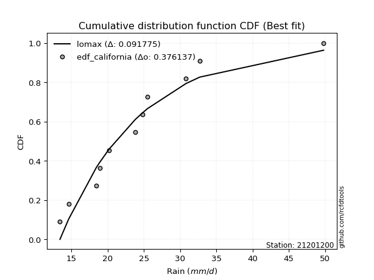</img></img>

</div>


### 2. EDF Hazen (1930)

Hazen method for plotting positions is a formula used to estimate the empirical cumulative probability distribution of flood events or other hydrological data. This formula often results in biased estimations, particularly when extrapolating to extreme events (high return periods).

<div align="center">


$P=(m-0.5)/n$


</div>


**2.1. Empirical values**

<div align="center">

|                | 0                    | 1                   | 2                   | 3                  | 4                  | 5         | 6                  | 7                  | 8                  | 9                  | 10                 |
|:---------------|:---------------------|:--------------------|:--------------------|:-------------------|:-------------------|:----------|:-------------------|:-------------------|:-------------------|:-------------------|:-------------------|
| date           | 2015                 | 2009                | 2008                | 2014               | 2024               | 2025      | 2012               | 2016               | 2010               | 2013               | 2011               |
| x              | 13.4                 | 14.6                | 18.4                | 18.9               | 20.2               | 23.8      | 24.8               | 25.5               | 30.8               | 32.7               | 49.8               |
| m              | 1                    | 2                   | 3                   | 4                  | 5                  | 6         | 7                  | 8                  | 9                  | 10                 | 11                 |
| empirical_dist | edf_hazen            | edf_hazen           | edf_hazen           | edf_hazen          | edf_hazen          | edf_hazen | edf_hazen          | edf_hazen          | edf_hazen          | edf_hazen          | edf_hazen          |
| empirical      | 0.045454545454545456 | 0.13636363636363635 | 0.22727272727272727 | 0.3181818181818182 | 0.4090909090909091 | 0.5       | 0.5909090909090909 | 0.6818181818181818 | 0.7727272727272727 | 0.8636363636363636 | 0.9545454545454546 |
| empirical_tr   | 1.0476190476190477   | 1.1578947368421053  | 1.2941176470588236  | 1.4666666666666666 | 1.6923076923076925 | 2.0       | 2.4444444444444446 | 3.1428571428571423 | 4.3999999999999995 | 7.333333333333334  | 22.00000000000002  |

</div>


**2.2. Kolmogorov-Smirnov fit test (sorted by Δ)**


<div align="center">

|                | 0                   | 1                    | 2                   | 3                   | 4                    | 5                   | 6                   | 7                   | 8                   | 9                   | 10                  | 11                  | 12                  | 13                  | 14                  | 15                  | 16                  | 17                  | 18                  | 19                  | 20                  | 21                  | 22                  | 23                  | 24                  | 25                  | 26                  | 27                  | 28                  | 29                  | 30                  | 31                  | 32                  | 33                  | 34                  | 35                  | 36                  | 37                  | 38                  | 39                  | 40                  | 41                  | 42                  | 43                  | 44                  | 45                  | 46                  | 47                  | 48                  | 49                  | 50                  | 51                  | 52                  | 53                  | 54                  | 55                  | 56                  | 57                  | 58                  | 59                  | 60                  | 61                  | 62                  | 63                  | 64                  | 65                  | 66                  | 67                  | 68                  | 69                  | 70                  | 71                  | 72                  | 73                  | 74                  | 75                  | 76                  | 77                  | 78                  | 79                  | 80                  | 81                  | 82                  | 83                  | 84                  | 85                  | 86                  | 87                  | 88                  | 89                  | 90                  | 91                  | 92                  | 93                  | 94                  | 95                  | 96                  | 97                  | 98                  | 99                  | 100                 | 101                 | 102                 | 103                 | 104                 | 105                 | 106                 | 107                 | 108                 | 109                 | 110                 | 111                 | 112                 | 113                 | 114                 | 115                 | 116                 | 117                 | 118                 | 119                 | 120                 | 121                 | 122                 | 123                 | 124                 | 125                 | 126                 | 127                 | 128                 | 129                 | 130                 | 131                 | 132                 | 133                 | 134                 | 135                 | 136                 | 137                 | 138                 | 139                 | 140                 | 141                 | 142                 | 143                 | 144                 | 145                 | 146                 | 147                 | 148                 | 149                 | 150                 | 151                 | 152                 | 153                 | 154                 | 155                 | 156                 | 157                 | 158                 | 159                 |
|:---------------|:--------------------|:---------------------|:--------------------|:--------------------|:---------------------|:--------------------|:--------------------|:--------------------|:--------------------|:--------------------|:--------------------|:--------------------|:--------------------|:--------------------|:--------------------|:--------------------|:--------------------|:--------------------|:--------------------|:--------------------|:--------------------|:--------------------|:--------------------|:--------------------|:--------------------|:--------------------|:--------------------|:--------------------|:--------------------|:--------------------|:--------------------|:--------------------|:--------------------|:--------------------|:--------------------|:--------------------|:--------------------|:--------------------|:--------------------|:--------------------|:--------------------|:--------------------|:--------------------|:--------------------|:--------------------|:--------------------|:--------------------|:--------------------|:--------------------|:--------------------|:--------------------|:--------------------|:--------------------|:--------------------|:--------------------|:--------------------|:--------------------|:--------------------|:--------------------|:--------------------|:--------------------|:--------------------|:--------------------|:--------------------|:--------------------|:--------------------|:--------------------|:--------------------|:--------------------|:--------------------|:--------------------|:--------------------|:--------------------|:--------------------|:--------------------|:--------------------|:--------------------|:--------------------|:--------------------|:--------------------|:--------------------|:--------------------|:--------------------|:--------------------|:--------------------|:--------------------|:--------------------|:--------------------|:--------------------|:--------------------|:--------------------|:--------------------|:--------------------|:--------------------|:--------------------|:--------------------|:--------------------|:--------------------|:--------------------|:--------------------|:--------------------|:--------------------|:--------------------|:--------------------|:--------------------|:--------------------|:--------------------|:--------------------|:--------------------|:--------------------|:--------------------|:--------------------|:--------------------|:--------------------|:--------------------|:--------------------|:--------------------|:--------------------|:--------------------|:--------------------|:--------------------|:--------------------|:--------------------|:--------------------|:--------------------|:--------------------|:--------------------|:--------------------|:--------------------|:--------------------|:--------------------|:--------------------|:--------------------|:--------------------|:--------------------|:--------------------|:--------------------|:--------------------|:--------------------|:--------------------|:--------------------|:--------------------|:--------------------|:--------------------|:--------------------|:--------------------|:--------------------|:--------------------|:--------------------|:--------------------|:--------------------|:--------------------|:--------------------|:--------------------|:--------------------|:--------------------|:--------------------|:--------------------|:--------------------|:--------------------|
| station        | 21201200            | 21201200             | 21201200            | 21201200            | 21201200             | 21201200            | 21201200            | 21201200            | 21201200            | 21201200            | 21201200            | 21201200            | 21201200            | 21201200            | 21201200            | 21201200            | 21201200            | 21201200            | 21201200            | 21201200            | 21201200            | 21201200            | 21201200            | 21201200            | 21201200            | 21201200            | 21201200            | 21201200            | 21201200            | 21201200            | 21201200            | 21201200            | 21201200            | 21201200            | 21201200            | 21201200            | 21201200            | 21201200            | 21201200            | 21201200            | 21201200            | 21201200            | 21201200            | 21201200            | 21201200            | 21201200            | 21201200            | 21201200            | 21201200            | 21201200            | 21201200            | 21201200            | 21201200            | 21201200            | 21201200            | 21201200            | 21201200            | 21201200            | 21201200            | 21201200            | 21201200            | 21201200            | 21201200            | 21201200            | 21201200            | 21201200            | 21201200            | 21201200            | 21201200            | 21201200            | 21201200            | 21201200            | 21201200            | 21201200            | 21201200            | 21201200            | 21201200            | 21201200            | 21201200            | 21201200            | 21201200            | 21201200            | 21201200            | 21201200            | 21201200            | 21201200            | 21201200            | 21201200            | 21201200            | 21201200            | 21201200            | 21201200            | 21201200            | 21201200            | 21201200            | 21201200            | 21201200            | 21201200            | 21201200            | 21201200            | 21201200            | 21201200            | 21201200            | 21201200            | 21201200            | 21201200            | 21201200            | 21201200            | 21201200            | 21201200            | 21201200            | 21201200            | 21201200            | 21201200            | 21201200            | 21201200            | 21201200            | 21201200            | 21201200            | 21201200            | 21201200            | 21201200            | 21201200            | 21201200            | 21201200            | 21201200            | 21201200            | 21201200            | 21201200            | 21201200            | 21201200            | 21201200            | 21201200            | 21201200            | 21201200            | 21201200            | 21201200            | 21201200            | 21201200            | 21201200            | 21201200            | 21201200            | 21201200            | 21201200            | 21201200            | 21201200            | 21201200            | 21201200            | 21201200            | 21201200            | 21201200            | 21201200            | 21201200            | 21201200            | 21201200            | 21201200            | 21201200            | 21201200            | 21201200            | 21201200            |
| empirical_dist | edf_hazen           | edf_hazen            | edf_hazen           | edf_hazen           | edf_hazen            | edf_hazen           | edf_hazen           | edf_hazen           | edf_hazen           | edf_hazen           | edf_hazen           | edf_hazen           | edf_hazen           | edf_hazen           | edf_hazen           | edf_hazen           | edf_hazen           | edf_hazen           | edf_hazen           | edf_hazen           | edf_hazen           | edf_hazen           | edf_hazen           | edf_hazen           | edf_hazen           | edf_hazen           | edf_hazen           | edf_hazen           | edf_hazen           | edf_hazen           | edf_hazen           | edf_hazen           | edf_hazen           | edf_hazen           | edf_hazen           | edf_hazen           | edf_hazen           | edf_hazen           | edf_hazen           | edf_hazen           | edf_hazen           | edf_hazen           | edf_hazen           | edf_hazen           | edf_hazen           | edf_hazen           | edf_hazen           | edf_hazen           | edf_hazen           | edf_hazen           | edf_hazen           | edf_hazen           | edf_hazen           | edf_hazen           | edf_hazen           | edf_hazen           | edf_hazen           | edf_hazen           | edf_hazen           | edf_hazen           | edf_hazen           | edf_hazen           | edf_hazen           | edf_hazen           | edf_hazen           | edf_hazen           | edf_hazen           | edf_hazen           | edf_hazen           | edf_hazen           | edf_hazen           | edf_hazen           | edf_hazen           | edf_hazen           | edf_hazen           | edf_hazen           | edf_hazen           | edf_hazen           | edf_hazen           | edf_hazen           | edf_hazen           | edf_hazen           | edf_hazen           | edf_hazen           | edf_hazen           | edf_hazen           | edf_hazen           | edf_hazen           | edf_hazen           | edf_hazen           | edf_hazen           | edf_hazen           | edf_hazen           | edf_hazen           | edf_hazen           | edf_hazen           | edf_hazen           | edf_hazen           | edf_hazen           | edf_hazen           | edf_hazen           | edf_hazen           | edf_hazen           | edf_hazen           | edf_hazen           | edf_hazen           | edf_hazen           | edf_hazen           | edf_hazen           | edf_hazen           | edf_hazen           | edf_hazen           | edf_hazen           | edf_hazen           | edf_hazen           | edf_hazen           | edf_hazen           | edf_hazen           | edf_hazen           | edf_hazen           | edf_hazen           | edf_hazen           | edf_hazen           | edf_hazen           | edf_hazen           | edf_hazen           | edf_hazen           | edf_hazen           | edf_hazen           | edf_hazen           | edf_hazen           | edf_hazen           | edf_hazen           | edf_hazen           | edf_hazen           | edf_hazen           | edf_hazen           | edf_hazen           | edf_hazen           | edf_hazen           | edf_hazen           | edf_hazen           | edf_hazen           | edf_hazen           | edf_hazen           | edf_hazen           | edf_hazen           | edf_hazen           | edf_hazen           | edf_hazen           | edf_hazen           | edf_hazen           | edf_hazen           | edf_hazen           | edf_hazen           | edf_hazen           | edf_hazen           | edf_hazen           | edf_hazen           | edf_hazen           |
| p_dist         | moyal               | logpearson3          | betaprime           | logmaxwell          | ncf                  | logbetaprime        | logrice             | logtriang           | logexponnorm        | loggenextreme       | logweibull_max      | genlogistic         | kappa3              | truncnorm           | logalpha            | alpha               | lognct              | pearson3            | loginvgamma         | lograyleigh         | logvonmises         | logburr12           | halflogistic        | logjohnsonsu        | genextreme          | invweibull          | logskewnorm         | f                   | nct                 | loginvgauss         | invgamma            | logfatiguelife      | loglogistic         | logt                | logcrystalball      | lognorm             | johnsonsu           | logburr             | invgauss            | logloggamma         | logfoldnorm         | loggamma            | loggamma            | logerlang           | logf                | fatiguelife         | loggennorm          | exponnorm           | gumbel_r            | logweibull_min      | halfnorm            | genexpon            | logmielke           | gompertz            | loggenlogistic      | exponpow            | loghypsecant        | loghalfgennorm      | burr                | logdweibull         | loganglit           | logkstwobign        | foldnorm            | kstwobign           | tukeylambda         | dweibull            | loggenexpon         | logsemicircular     | logdgamma           | loggumbel_r         | logtruncweibull_min | skewnorm            | gennorm             | loginvweibull       | dgamma              | rayleigh            | logbradford         | logtruncexpon       | loghalfnorm         | loglaplace          | loglaplace          | logcosine           | maxwell             | truncweibull_min    | gausshyper          | logmoyal            | loggompertz         | logarcsine          | bradford            | t                   | logloglaplace       | loggumbel_l         | wald                | loghalflogistic     | rice                | lomax               | loggausshyper       | hypsecant           | logistic            | logncf              | laplace             | beta                | crystalball         | norm                | anglit              | semicircular        | weibull_min         | arcsine             | logexponpow         | triang              | vonmises_line       | logkappa3           | logtukeylambda      | loguniform          | logkappa4           | logwald             | logvonmises_line    | loggengamma         | burr12              | loglomax            | logksone            | gumbel_l            | truncexpon          | logargus            | cosine              | logrdist            | halfgennorm         | logtruncnorm        | genpareto           | loggenpareto        | logwrapcauchy       | kappa4              | loggenhalflogistic  | argus               | ksone               | wrapcauchy          | uniform             | erlang              | loglevy_l           | powerlaw            | levy_l              | nakagami            | logtrapezoid        | logjohnsonsb        | lognakagami         | johnsonsb           | genhalflogistic     | rdist               | logpowerlaw         | gengamma            | logbeta             | gamma               | exponweib           | logexponweib        | trapezoid           | logtruncpareto      | weibull_max         | truncpareto         | vonmises            | mielke              |
| delta          | 0.05762845213293011 | 0.058133826980870995 | 0.05898777486237994 | 0.06092794060442597 | 0.062120943476829615 | 0.06282240441773623 | 0.06432907404904264 | 0.06592396921694077 | 0.0667837967999767  | 0.06699387385939048 | 0.06700399589778461 | 0.06731846981348744 | 0.06753250141302822 | 0.06868979580946302 | 0.06913798568284701 | 0.0697703936038454  | 0.07020329951774595 | 0.07039240166216554 | 0.07119953872819862 | 0.07124516297285632 | 0.07194995720745756 | 0.07224849417952661 | 0.0736837490877936  | 0.0737264845190424  | 0.07400602017120994 | 0.07400809646591033 | 0.07403433317771135 | 0.07444778611846736 | 0.07481711119780021 | 0.07495778874969816 | 0.0749613836278542  | 0.07530747989310682 | 0.07569390732898013 | 0.07730168059060072 | 0.07730178469157167 | 0.07730185751902596 | 0.07868102778579922 | 0.0787126086810116  | 0.0794559217336146  | 0.07993679934054654 | 0.08060092550069312 | 0.08155845461204025 | 0.08155845461204025 | 0.08155851763175903 | 0.08160332198031073 | 0.08232469277614507 | 0.08252944013719643 | 0.08257245894653076 | 0.0830650835103457  | 0.08448662229285908 | 0.08617575451526924 | 0.08644155426891095 | 0.0874448256640008  | 0.08821160339914877 | 0.08824360179775714 | 0.08922997543219269 | 0.08956148967901068 | 0.09016455906621004 | 0.09030161810057391 | 0.09163496729749057 | 0.09170861384625462 | 0.0937070696086566  | 0.09393918580037289 | 0.0954377978478903  | 0.0961978483672713  | 0.09686204381173612 | 0.09753884329393783 | 0.09768611031265251 | 0.09966593112627845 | 0.09990783668329861 | 0.10118601060259766 | 0.10285350194950882 | 0.10309165328010106 | 0.10817349909925289 | 0.10956211860556297 | 0.11164628791405984 | 0.1120256312956801  | 0.11204385388861346 | 0.1171385832872891  | 0.11778124544914487 | 0.11778124544914487 | 0.11791678517333393 | 0.12199337119223241 | 0.12276064541725529 | 0.1249438127946586  | 0.12531831673789162 | 0.12691673760631514 | 0.12744905700128673 | 0.12750230128388695 | 0.1300231500300847  | 0.13061341210769456 | 0.13621772949300615 | 0.13636363636363635 | 0.13636363636363635 | 0.13688723061363273 | 0.13722987591448413 | 0.1456630646016314  | 0.14662941500185223 | 0.14988382901351793 | 0.15165282121242096 | 0.15203611018815316 | 0.15339456415143893 | 0.15370752826199952 | 0.15370754743328774 | 0.15772098487578967 | 0.1593749767644118  | 0.17055301950188254 | 0.17076415683390622 | 0.17162326288258736 | 0.17970232112415252 | 0.18154317664431452 | 0.18924412428481846 | 0.19049854270012834 | 0.19168776239250956 | 0.1917916771741821  | 0.19586136267682985 | 0.20356170015672082 | 0.20502423451446997 | 0.20915773231809356 | 0.21262471548794085 | 0.21398970148075325 | 0.22267036648846794 | 0.2245223455031024  | 0.22495693140105677 | 0.2317235625629936  | 0.23235443666715383 | 0.24226381166308933 | 0.26233262978009164 | 0.2632717369174181  | 0.2957275342550513  | 0.29746905489341435 | 0.3022854741832245  | 0.319785898502825   | 0.3281593187110756  | 0.33845321345321333 | 0.3440809407731814  | 0.34940059940059937 | 0.3543603798727305  | 0.39108374663647844 | 0.42666684545195444 | 0.4326802235121558  | 0.4414145505609176  | 0.44159557798643784 | 0.44346298290968955 | 0.46764309153282324 | 0.47094110924849314 | 0.4726555998275174  | 0.48153901345030664 | 0.4815697162712531  | 0.4965636278287927  | 0.5047345367401753  | 0.5113551458119366  | 0.5180991480327549  | 0.5504130351449236  | 0.5878190224000662  | 0.6538034411855898  | 0.6880517044352895  | 0.6976421618199434  | 7.289509475866975   | nan                 |
| deltao         | 0.37613735880099997 | 0.37613735880099997  | 0.37613735880099997 | 0.37613735880099997 | 0.37613735880099997  | 0.37613735880099997 | 0.37613735880099997 | 0.37613735880099997 | 0.37613735880099997 | 0.37613735880099997 | 0.37613735880099997 | 0.37613735880099997 | 0.37613735880099997 | 0.37613735880099997 | 0.37613735880099997 | 0.37613735880099997 | 0.37613735880099997 | 0.37613735880099997 | 0.37613735880099997 | 0.37613735880099997 | 0.37613735880099997 | 0.37613735880099997 | 0.37613735880099997 | 0.37613735880099997 | 0.37613735880099997 | 0.37613735880099997 | 0.37613735880099997 | 0.37613735880099997 | 0.37613735880099997 | 0.37613735880099997 | 0.37613735880099997 | 0.37613735880099997 | 0.37613735880099997 | 0.37613735880099997 | 0.37613735880099997 | 0.37613735880099997 | 0.37613735880099997 | 0.37613735880099997 | 0.37613735880099997 | 0.37613735880099997 | 0.37613735880099997 | 0.37613735880099997 | 0.37613735880099997 | 0.37613735880099997 | 0.37613735880099997 | 0.37613735880099997 | 0.37613735880099997 | 0.37613735880099997 | 0.37613735880099997 | 0.37613735880099997 | 0.37613735880099997 | 0.37613735880099997 | 0.37613735880099997 | 0.37613735880099997 | 0.37613735880099997 | 0.37613735880099997 | 0.37613735880099997 | 0.37613735880099997 | 0.37613735880099997 | 0.37613735880099997 | 0.37613735880099997 | 0.37613735880099997 | 0.37613735880099997 | 0.37613735880099997 | 0.37613735880099997 | 0.37613735880099997 | 0.37613735880099997 | 0.37613735880099997 | 0.37613735880099997 | 0.37613735880099997 | 0.37613735880099997 | 0.37613735880099997 | 0.37613735880099997 | 0.37613735880099997 | 0.37613735880099997 | 0.37613735880099997 | 0.37613735880099997 | 0.37613735880099997 | 0.37613735880099997 | 0.37613735880099997 | 0.37613735880099997 | 0.37613735880099997 | 0.37613735880099997 | 0.37613735880099997 | 0.37613735880099997 | 0.37613735880099997 | 0.37613735880099997 | 0.37613735880099997 | 0.37613735880099997 | 0.37613735880099997 | 0.37613735880099997 | 0.37613735880099997 | 0.37613735880099997 | 0.37613735880099997 | 0.37613735880099997 | 0.37613735880099997 | 0.37613735880099997 | 0.37613735880099997 | 0.37613735880099997 | 0.37613735880099997 | 0.37613735880099997 | 0.37613735880099997 | 0.37613735880099997 | 0.37613735880099997 | 0.37613735880099997 | 0.37613735880099997 | 0.37613735880099997 | 0.37613735880099997 | 0.37613735880099997 | 0.37613735880099997 | 0.37613735880099997 | 0.37613735880099997 | 0.37613735880099997 | 0.37613735880099997 | 0.37613735880099997 | 0.37613735880099997 | 0.37613735880099997 | 0.37613735880099997 | 0.37613735880099997 | 0.37613735880099997 | 0.37613735880099997 | 0.37613735880099997 | 0.37613735880099997 | 0.37613735880099997 | 0.37613735880099997 | 0.37613735880099997 | 0.37613735880099997 | 0.37613735880099997 | 0.37613735880099997 | 0.37613735880099997 | 0.37613735880099997 | 0.37613735880099997 | 0.37613735880099997 | 0.37613735880099997 | 0.37613735880099997 | 0.37613735880099997 | 0.37613735880099997 | 0.37613735880099997 | 0.37613735880099997 | 0.37613735880099997 | 0.37613735880099997 | 0.37613735880099997 | 0.37613735880099997 | 0.37613735880099997 | 0.37613735880099997 | 0.37613735880099997 | 0.37613735880099997 | 0.37613735880099997 | 0.37613735880099997 | 0.37613735880099997 | 0.37613735880099997 | 0.37613735880099997 | 0.37613735880099997 | 0.37613735880099997 | 0.37613735880099997 | 0.37613735880099997 | 0.37613735880099997 | 0.37613735880099997 | 0.37613735880099997 | 0.37613735880099997 |
| eval           | Δo > Δ              | Δo > Δ               | Δo > Δ              | Δo > Δ              | Δo > Δ               | Δo > Δ              | Δo > Δ              | Δo > Δ              | Δo > Δ              | Δo > Δ              | Δo > Δ              | Δo > Δ              | Δo > Δ              | Δo > Δ              | Δo > Δ              | Δo > Δ              | Δo > Δ              | Δo > Δ              | Δo > Δ              | Δo > Δ              | Δo > Δ              | Δo > Δ              | Δo > Δ              | Δo > Δ              | Δo > Δ              | Δo > Δ              | Δo > Δ              | Δo > Δ              | Δo > Δ              | Δo > Δ              | Δo > Δ              | Δo > Δ              | Δo > Δ              | Δo > Δ              | Δo > Δ              | Δo > Δ              | Δo > Δ              | Δo > Δ              | Δo > Δ              | Δo > Δ              | Δo > Δ              | Δo > Δ              | Δo > Δ              | Δo > Δ              | Δo > Δ              | Δo > Δ              | Δo > Δ              | Δo > Δ              | Δo > Δ              | Δo > Δ              | Δo > Δ              | Δo > Δ              | Δo > Δ              | Δo > Δ              | Δo > Δ              | Δo > Δ              | Δo > Δ              | Δo > Δ              | Δo > Δ              | Δo > Δ              | Δo > Δ              | Δo > Δ              | Δo > Δ              | Δo > Δ              | Δo > Δ              | Δo > Δ              | Δo > Δ              | Δo > Δ              | Δo > Δ              | Δo > Δ              | Δo > Δ              | Δo > Δ              | Δo > Δ              | Δo > Δ              | Δo > Δ              | Δo > Δ              | Δo > Δ              | Δo > Δ              | Δo > Δ              | Δo > Δ              | Δo > Δ              | Δo > Δ              | Δo > Δ              | Δo > Δ              | Δo > Δ              | Δo > Δ              | Δo > Δ              | Δo > Δ              | Δo > Δ              | Δo > Δ              | Δo > Δ              | Δo > Δ              | Δo > Δ              | Δo > Δ              | Δo > Δ              | Δo > Δ              | Δo > Δ              | Δo > Δ              | Δo > Δ              | Δo > Δ              | Δo > Δ              | Δo > Δ              | Δo > Δ              | Δo > Δ              | Δo > Δ              | Δo > Δ              | Δo > Δ              | Δo > Δ              | Δo > Δ              | Δo > Δ              | Δo > Δ              | Δo > Δ              | Δo > Δ              | Δo > Δ              | Δo > Δ              | Δo > Δ              | Δo > Δ              | Δo > Δ              | Δo > Δ              | Δo > Δ              | Δo > Δ              | Δo > Δ              | Δo > Δ              | Δo > Δ              | Δo > Δ              | Δo > Δ              | Δo > Δ              | Δo > Δ              | Δo > Δ              | Δo > Δ              | Δo > Δ              | Δo > Δ              | Δo > Δ              | Δo > Δ              | Δo > Δ              | Δo > Δ              | Δo > Δ              | Δo > Δ              | Δo <= Δ             | Δo <= Δ             | Δo <= Δ             | Δo <= Δ             | Δo <= Δ             | Δo <= Δ             | Δo <= Δ             | Δo <= Δ             | Δo <= Δ             | Δo <= Δ             | Δo <= Δ             | Δo <= Δ             | Δo <= Δ             | Δo <= Δ             | Δo <= Δ             | Δo <= Δ             | Δo <= Δ             | Δo <= Δ             | Δo <= Δ             | Δo <= Δ             | Δo <= Δ             | Δo <= Δ             |
| fit            | 1                   | 1                    | 1                   | 1                   | 1                    | 1                   | 1                   | 1                   | 1                   | 1                   | 1                   | 1                   | 1                   | 1                   | 1                   | 1                   | 1                   | 1                   | 1                   | 1                   | 1                   | 1                   | 1                   | 1                   | 1                   | 1                   | 1                   | 1                   | 1                   | 1                   | 1                   | 1                   | 1                   | 1                   | 1                   | 1                   | 1                   | 1                   | 1                   | 1                   | 1                   | 1                   | 1                   | 1                   | 1                   | 1                   | 1                   | 1                   | 1                   | 1                   | 1                   | 1                   | 1                   | 1                   | 1                   | 1                   | 1                   | 1                   | 1                   | 1                   | 1                   | 1                   | 1                   | 1                   | 1                   | 1                   | 1                   | 1                   | 1                   | 1                   | 1                   | 1                   | 1                   | 1                   | 1                   | 1                   | 1                   | 1                   | 1                   | 1                   | 1                   | 1                   | 1                   | 1                   | 1                   | 1                   | 1                   | 1                   | 1                   | 1                   | 1                   | 1                   | 1                   | 1                   | 1                   | 1                   | 1                   | 1                   | 1                   | 1                   | 1                   | 1                   | 1                   | 1                   | 1                   | 1                   | 1                   | 1                   | 1                   | 1                   | 1                   | 1                   | 1                   | 1                   | 1                   | 1                   | 1                   | 1                   | 1                   | 1                   | 1                   | 1                   | 1                   | 1                   | 1                   | 1                   | 1                   | 1                   | 1                   | 1                   | 1                   | 1                   | 1                   | 1                   | 1                   | 1                   | 1                   | 1                   | 0                   | 0                   | 0                   | 0                   | 0                   | 0                   | 0                   | 0                   | 0                   | 0                   | 0                   | 0                   | 0                   | 0                   | 0                   | 0                   | 0                   | 0                   | 0                   | 0                   | 0                   | 0                   |
| n              | 11                  | 11                   | 11                  | 11                  | 11                   | 11                  | 11                  | 11                  | 11                  | 11                  | 11                  | 11                  | 11                  | 11                  | 11                  | 11                  | 11                  | 11                  | 11                  | 11                  | 11                  | 11                  | 11                  | 11                  | 11                  | 11                  | 11                  | 11                  | 11                  | 11                  | 11                  | 11                  | 11                  | 11                  | 11                  | 11                  | 11                  | 11                  | 11                  | 11                  | 11                  | 11                  | 11                  | 11                  | 11                  | 11                  | 11                  | 11                  | 11                  | 11                  | 11                  | 11                  | 11                  | 11                  | 11                  | 11                  | 11                  | 11                  | 11                  | 11                  | 11                  | 11                  | 11                  | 11                  | 11                  | 11                  | 11                  | 11                  | 11                  | 11                  | 11                  | 11                  | 11                  | 11                  | 11                  | 11                  | 11                  | 11                  | 11                  | 11                  | 11                  | 11                  | 11                  | 11                  | 11                  | 11                  | 11                  | 11                  | 11                  | 11                  | 11                  | 11                  | 11                  | 11                  | 11                  | 11                  | 11                  | 11                  | 11                  | 11                  | 11                  | 11                  | 11                  | 11                  | 11                  | 11                  | 11                  | 11                  | 11                  | 11                  | 11                  | 11                  | 11                  | 11                  | 11                  | 11                  | 11                  | 11                  | 11                  | 11                  | 11                  | 11                  | 11                  | 11                  | 11                  | 11                  | 11                  | 11                  | 11                  | 11                  | 11                  | 11                  | 11                  | 11                  | 11                  | 11                  | 11                  | 11                  | 11                  | 11                  | 11                  | 11                  | 11                  | 11                  | 11                  | 11                  | 11                  | 11                  | 11                  | 11                  | 11                  | 11                  | 11                  | 11                  | 11                  | 11                  | 11                  | 11                  | 11                  | 11                  |
| best_fit       | 1                   | 0                    | 0                   | 0                   | 0                    | 0                   | 0                   | 0                   | 0                   | 0                   | 0                   | 0                   | 0                   | 0                   | 0                   | 0                   | 0                   | 0                   | 0                   | 0                   | 0                   | 0                   | 0                   | 0                   | 0                   | 0                   | 0                   | 0                   | 0                   | 0                   | 0                   | 0                   | 0                   | 0                   | 0                   | 0                   | 0                   | 0                   | 0                   | 0                   | 0                   | 0                   | 0                   | 0                   | 0                   | 0                   | 0                   | 0                   | 0                   | 0                   | 0                   | 0                   | 0                   | 0                   | 0                   | 0                   | 0                   | 0                   | 0                   | 0                   | 0                   | 0                   | 0                   | 0                   | 0                   | 0                   | 0                   | 0                   | 0                   | 0                   | 0                   | 0                   | 0                   | 0                   | 0                   | 0                   | 0                   | 0                   | 0                   | 0                   | 0                   | 0                   | 0                   | 0                   | 0                   | 0                   | 0                   | 0                   | 0                   | 0                   | 0                   | 0                   | 0                   | 0                   | 0                   | 0                   | 0                   | 0                   | 0                   | 0                   | 0                   | 0                   | 0                   | 0                   | 0                   | 0                   | 0                   | 0                   | 0                   | 0                   | 0                   | 0                   | 0                   | 0                   | 0                   | 0                   | 0                   | 0                   | 0                   | 0                   | 0                   | 0                   | 0                   | 0                   | 0                   | 0                   | 0                   | 0                   | 0                   | 0                   | 0                   | 0                   | 0                   | 0                   | 0                   | 0                   | 0                   | 0                   | 0                   | 0                   | 0                   | 0                   | 0                   | 0                   | 0                   | 0                   | 0                   | 0                   | 0                   | 0                   | 0                   | 0                   | 0                   | 0                   | 0                   | 0                   | 0                   | 0                   | 0                   | 0                   |
| best_fit_sort  | 1                   | 2                    | 3                   | 4                   | 5                    | 6                   | 7                   | 8                   | 9                   | 10                  | 11                  | 12                  | 13                  | 14                  | 15                  | 16                  | 17                  | 18                  | 19                  | 20                  | 21                  | 22                  | 23                  | 24                  | 25                  | 26                  | 27                  | 28                  | 29                  | 30                  | 31                  | 32                  | 33                  | 34                  | 35                  | 36                  | 37                  | 38                  | 39                  | 40                  | 41                  | 42                  | 43                  | 44                  | 45                  | 46                  | 47                  | 48                  | 49                  | 50                  | 51                  | 52                  | 53                  | 54                  | 55                  | 56                  | 57                  | 58                  | 59                  | 60                  | 61                  | 62                  | 63                  | 64                  | 65                  | 66                  | 67                  | 68                  | 69                  | 70                  | 71                  | 72                  | 73                  | 74                  | 75                  | 76                  | 77                  | 78                  | 79                  | 80                  | 81                  | 82                  | 83                  | 84                  | 85                  | 86                  | 87                  | 88                  | 89                  | 90                  | 91                  | 92                  | 93                  | 94                  | 95                  | 96                  | 97                  | 98                  | 99                  | 100                 | 101                 | 102                 | 103                 | 104                 | 105                 | 106                 | 107                 | 108                 | 109                 | 110                 | 111                 | 112                 | 113                 | 114                 | 115                 | 116                 | 117                 | 118                 | 119                 | 120                 | 121                 | 122                 | 123                 | 124                 | 125                 | 126                 | 127                 | 128                 | 129                 | 130                 | 131                 | 132                 | 133                 | 134                 | 135                 | 136                 | 137                 | 138                 | 139                 | 140                 | 141                 | 142                 | 143                 | 144                 | 145                 | 146                 | 147                 | 148                 | 149                 | 150                 | 151                 | 152                 | 153                 | 154                 | 155                 | 156                 | 157                 | 158                 | 159                 | 160                 |

</div>


**2.3. Best fit**

<div align="center">

|   id |   station | empirical_dist   | p_dist   |     delta |   deltao | eval   |   fit |   n |   best_fit |   best_fit_sort |
|-----:|----------:|:-----------------|:---------|----------:|---------:|:-------|------:|----:|-----------:|----------------:|
|    0 |  21201200 | edf_hazen        | moyal    | 0.0576285 | 0.376137 | Δo > Δ |     1 |  11 |          1 |               1 |

</div>


<div align="center">

</img></img>

</div>


### 3. EDF Weibull (1939)

Weibull plotting position formula is an empirical method used to estimate the non-exceedance probability or plotting position for a set of observed data, is often recommended or widely used in practice, particularly in flood frequency analysis.

<div align="center">


$P=m/(n+1)$


</div>


**3.1. Empirical values**

<div align="center">

|                | 0                   | 1                   | 2                  | 3                  | 4                  | 5           | 6                  | 7                  | 8           | 9                  | 10                 |
|:---------------|:--------------------|:--------------------|:-------------------|:-------------------|:-------------------|:------------|:-------------------|:-------------------|:------------|:-------------------|:-------------------|
| date           | 2015                | 2009                | 2008               | 2014               | 2024               | 2025        | 2012               | 2016               | 2010        | 2013               | 2011               |
| x              | 13.4                | 14.6                | 18.4               | 18.9               | 20.2               | 23.8        | 24.8               | 25.5               | 30.8        | 32.7               | 49.8               |
| m              | 1                   | 2                   | 3                  | 4                  | 5                  | 6           | 7                  | 8                  | 9           | 10                 | 11                 |
| empirical_dist | edf_weibull         | edf_weibull         | edf_weibull        | edf_weibull        | edf_weibull        | edf_weibull | edf_weibull        | edf_weibull        | edf_weibull | edf_weibull        | edf_weibull        |
| empirical      | 0.08333333333333333 | 0.16666666666666666 | 0.25               | 0.3333333333333333 | 0.4166666666666667 | 0.5         | 0.5833333333333334 | 0.6666666666666666 | 0.75        | 0.8333333333333334 | 0.9166666666666666 |
| empirical_tr   | 1.090909090909091   | 1.2                 | 1.3333333333333333 | 1.4999999999999998 | 1.7142857142857144 | 2.0         | 2.4000000000000004 | 2.9999999999999996 | 4.0         | 6.000000000000002  | 11.999999999999995 |

</div>


**3.2. Kolmogorov-Smirnov fit test (sorted by Δ)**


<div align="center">

|                | 0                   | 1                   | 2                   | 3                   | 4                   | 5                   | 6                   | 7                   | 8                   | 9                   | 10                  | 11                  | 12                  | 13                  | 14                  | 15                  | 16                  | 17                  | 18                  | 19                  | 20                  | 21                  | 22                  | 23                  | 24                  | 25                  | 26                  | 27                  | 28                  | 29                  | 30                  | 31                  | 32                  | 33                  | 34                  | 35                  | 36                  | 37                  | 38                  | 39                  | 40                  | 41                  | 42                  | 43                  | 44                  | 45                  | 46                  | 47                  | 48                  | 49                  | 50                  | 51                  | 52                  | 53                  | 54                  | 55                  | 56                  | 57                  | 58                  | 59                  | 60                  | 61                  | 62                  | 63                  | 64                  | 65                  | 66                  | 67                  | 68                  | 69                  | 70                  | 71                  | 72                  | 73                  | 74                  | 75                  | 76                  | 77                  | 78                  | 79                  | 80                  | 81                  | 82                  | 83                  | 84                  | 85                  | 86                  | 87                  | 88                  | 89                  | 90                  | 91                  | 92                  | 93                  | 94                  | 95                  | 96                  | 97                  | 98                  | 99                  | 100                 | 101                 | 102                 | 103                 | 104                 | 105                 | 106                 | 107                 | 108                 | 109                 | 110                 | 111                 | 112                 | 113                 | 114                 | 115                 | 116                 | 117                 | 118                 | 119                 | 120                 | 121                 | 122                 | 123                 | 124                 | 125                 | 126                 | 127                 | 128                 | 129                 | 130                 | 131                 | 132                 | 133                 | 134                 | 135                 | 136                 | 137                 | 138                 | 139                 | 140                 | 141                 | 142                 | 143                 | 144                 | 145                 | 146                 | 147                 | 148                 | 149                 | 150                 | 151                 | 152                 | 153                 | 154                 | 155                 | 156                 | 157                 | 158                 | 159                 |
|:---------------|:--------------------|:--------------------|:--------------------|:--------------------|:--------------------|:--------------------|:--------------------|:--------------------|:--------------------|:--------------------|:--------------------|:--------------------|:--------------------|:--------------------|:--------------------|:--------------------|:--------------------|:--------------------|:--------------------|:--------------------|:--------------------|:--------------------|:--------------------|:--------------------|:--------------------|:--------------------|:--------------------|:--------------------|:--------------------|:--------------------|:--------------------|:--------------------|:--------------------|:--------------------|:--------------------|:--------------------|:--------------------|:--------------------|:--------------------|:--------------------|:--------------------|:--------------------|:--------------------|:--------------------|:--------------------|:--------------------|:--------------------|:--------------------|:--------------------|:--------------------|:--------------------|:--------------------|:--------------------|:--------------------|:--------------------|:--------------------|:--------------------|:--------------------|:--------------------|:--------------------|:--------------------|:--------------------|:--------------------|:--------------------|:--------------------|:--------------------|:--------------------|:--------------------|:--------------------|:--------------------|:--------------------|:--------------------|:--------------------|:--------------------|:--------------------|:--------------------|:--------------------|:--------------------|:--------------------|:--------------------|:--------------------|:--------------------|:--------------------|:--------------------|:--------------------|:--------------------|:--------------------|:--------------------|:--------------------|:--------------------|:--------------------|:--------------------|:--------------------|:--------------------|:--------------------|:--------------------|:--------------------|:--------------------|:--------------------|:--------------------|:--------------------|:--------------------|:--------------------|:--------------------|:--------------------|:--------------------|:--------------------|:--------------------|:--------------------|:--------------------|:--------------------|:--------------------|:--------------------|:--------------------|:--------------------|:--------------------|:--------------------|:--------------------|:--------------------|:--------------------|:--------------------|:--------------------|:--------------------|:--------------------|:--------------------|:--------------------|:--------------------|:--------------------|:--------------------|:--------------------|:--------------------|:--------------------|:--------------------|:--------------------|:--------------------|:--------------------|:--------------------|:--------------------|:--------------------|:--------------------|:--------------------|:--------------------|:--------------------|:--------------------|:--------------------|:--------------------|:--------------------|:--------------------|:--------------------|:--------------------|:--------------------|:--------------------|:--------------------|:--------------------|:--------------------|:--------------------|:--------------------|:--------------------|:--------------------|:--------------------|
| station        | 21201200            | 21201200            | 21201200            | 21201200            | 21201200            | 21201200            | 21201200            | 21201200            | 21201200            | 21201200            | 21201200            | 21201200            | 21201200            | 21201200            | 21201200            | 21201200            | 21201200            | 21201200            | 21201200            | 21201200            | 21201200            | 21201200            | 21201200            | 21201200            | 21201200            | 21201200            | 21201200            | 21201200            | 21201200            | 21201200            | 21201200            | 21201200            | 21201200            | 21201200            | 21201200            | 21201200            | 21201200            | 21201200            | 21201200            | 21201200            | 21201200            | 21201200            | 21201200            | 21201200            | 21201200            | 21201200            | 21201200            | 21201200            | 21201200            | 21201200            | 21201200            | 21201200            | 21201200            | 21201200            | 21201200            | 21201200            | 21201200            | 21201200            | 21201200            | 21201200            | 21201200            | 21201200            | 21201200            | 21201200            | 21201200            | 21201200            | 21201200            | 21201200            | 21201200            | 21201200            | 21201200            | 21201200            | 21201200            | 21201200            | 21201200            | 21201200            | 21201200            | 21201200            | 21201200            | 21201200            | 21201200            | 21201200            | 21201200            | 21201200            | 21201200            | 21201200            | 21201200            | 21201200            | 21201200            | 21201200            | 21201200            | 21201200            | 21201200            | 21201200            | 21201200            | 21201200            | 21201200            | 21201200            | 21201200            | 21201200            | 21201200            | 21201200            | 21201200            | 21201200            | 21201200            | 21201200            | 21201200            | 21201200            | 21201200            | 21201200            | 21201200            | 21201200            | 21201200            | 21201200            | 21201200            | 21201200            | 21201200            | 21201200            | 21201200            | 21201200            | 21201200            | 21201200            | 21201200            | 21201200            | 21201200            | 21201200            | 21201200            | 21201200            | 21201200            | 21201200            | 21201200            | 21201200            | 21201200            | 21201200            | 21201200            | 21201200            | 21201200            | 21201200            | 21201200            | 21201200            | 21201200            | 21201200            | 21201200            | 21201200            | 21201200            | 21201200            | 21201200            | 21201200            | 21201200            | 21201200            | 21201200            | 21201200            | 21201200            | 21201200            | 21201200            | 21201200            | 21201200            | 21201200            | 21201200            | 21201200            |
| empirical_dist | edf_weibull         | edf_weibull         | edf_weibull         | edf_weibull         | edf_weibull         | edf_weibull         | edf_weibull         | edf_weibull         | edf_weibull         | edf_weibull         | edf_weibull         | edf_weibull         | edf_weibull         | edf_weibull         | edf_weibull         | edf_weibull         | edf_weibull         | edf_weibull         | edf_weibull         | edf_weibull         | edf_weibull         | edf_weibull         | edf_weibull         | edf_weibull         | edf_weibull         | edf_weibull         | edf_weibull         | edf_weibull         | edf_weibull         | edf_weibull         | edf_weibull         | edf_weibull         | edf_weibull         | edf_weibull         | edf_weibull         | edf_weibull         | edf_weibull         | edf_weibull         | edf_weibull         | edf_weibull         | edf_weibull         | edf_weibull         | edf_weibull         | edf_weibull         | edf_weibull         | edf_weibull         | edf_weibull         | edf_weibull         | edf_weibull         | edf_weibull         | edf_weibull         | edf_weibull         | edf_weibull         | edf_weibull         | edf_weibull         | edf_weibull         | edf_weibull         | edf_weibull         | edf_weibull         | edf_weibull         | edf_weibull         | edf_weibull         | edf_weibull         | edf_weibull         | edf_weibull         | edf_weibull         | edf_weibull         | edf_weibull         | edf_weibull         | edf_weibull         | edf_weibull         | edf_weibull         | edf_weibull         | edf_weibull         | edf_weibull         | edf_weibull         | edf_weibull         | edf_weibull         | edf_weibull         | edf_weibull         | edf_weibull         | edf_weibull         | edf_weibull         | edf_weibull         | edf_weibull         | edf_weibull         | edf_weibull         | edf_weibull         | edf_weibull         | edf_weibull         | edf_weibull         | edf_weibull         | edf_weibull         | edf_weibull         | edf_weibull         | edf_weibull         | edf_weibull         | edf_weibull         | edf_weibull         | edf_weibull         | edf_weibull         | edf_weibull         | edf_weibull         | edf_weibull         | edf_weibull         | edf_weibull         | edf_weibull         | edf_weibull         | edf_weibull         | edf_weibull         | edf_weibull         | edf_weibull         | edf_weibull         | edf_weibull         | edf_weibull         | edf_weibull         | edf_weibull         | edf_weibull         | edf_weibull         | edf_weibull         | edf_weibull         | edf_weibull         | edf_weibull         | edf_weibull         | edf_weibull         | edf_weibull         | edf_weibull         | edf_weibull         | edf_weibull         | edf_weibull         | edf_weibull         | edf_weibull         | edf_weibull         | edf_weibull         | edf_weibull         | edf_weibull         | edf_weibull         | edf_weibull         | edf_weibull         | edf_weibull         | edf_weibull         | edf_weibull         | edf_weibull         | edf_weibull         | edf_weibull         | edf_weibull         | edf_weibull         | edf_weibull         | edf_weibull         | edf_weibull         | edf_weibull         | edf_weibull         | edf_weibull         | edf_weibull         | edf_weibull         | edf_weibull         | edf_weibull         | edf_weibull         | edf_weibull         | edf_weibull         |
| p_dist         | pearson3            | logloggamma         | logvonmises         | logt                | lognorm             | logcrystalball      | halfnorm            | loggennorm          | gumbel_r            | foldnorm            | logdweibull         | logbetaprime        | ncf                 | genlogistic         | moyal               | betaprime           | logmaxwell          | dweibull            | logpearson3         | loganglit           | kstwobign           | logfoldnorm         | logexponnorm        | halflogistic        | fatiguelife         | loglogistic         | logtruncweibull_min | loghalfgennorm      | gompertz            | exponpow            | logsemicircular     | exponnorm           | genexpon            | loggenextreme       | logweibull_max      | logdgamma           | logskewnorm         | logalpha            | invgauss            | lognct              | lograyleigh         | alpha               | logjohnsonsu        | loginvgamma         | logburr12           | invweibull          | genextreme          | nct                 | invgamma            | loginvgauss         | f                   | logfatiguelife      | logbradford         | johnsonsu           | logburr             | loggamma            | loggamma            | logerlang           | logf                | loggenlogistic      | logmielke           | logtruncexpon       | logweibull_min      | burr                | truncnorm           | logrice             | loggenexpon         | logkstwobign        | logtriang           | rayleigh            | loghypsecant        | kappa3              | truncweibull_min    | bradford            | logcosine           | skewnorm            | loggompertz         | logarcsine          | maxwell             | loginvweibull       | gausshyper          | gennorm             | loggumbel_r         | lomax               | t                   | dgamma              | logncf              | rice                | loggausshyper       | beta                | loglaplace          | loglaplace          | loggumbel_l         | tukeylambda         | hypsecant           | logistic            | logloglaplace       | crystalball         | norm                | logmoyal            | anglit              | semicircular        | loghalfnorm         | weibull_min         | logexponpow         | arcsine             | laplace             | triang              | loghalflogistic     | wald                | logkappa3           | logtukeylambda      | logkappa4           | loguniform          | loggengamma         | logksone            | burr12              | logvonmises_line    | loglomax            | logwald             | logrdist            | vonmises_line       | gumbel_l            | truncexpon          | logargus            | cosine              | halfgennorm         | genpareto           | logtruncnorm        | loggenpareto        | logwrapcauchy       | kappa4              | loggenhalflogistic  | ksone               | argus               | wrapcauchy          | erlang              | uniform             | loglevy_l           | levy_l              | powerlaw            | logjohnsonsb        | nakagami            | logtrapezoid        | johnsonsb           | genhalflogistic     | rdist               | lognakagami         | logpowerlaw         | gengamma            | logbeta             | gamma               | exponweib           | logexponweib        | trapezoid           | logtruncpareto      | weibull_max         | truncpareto         | vonmises            | mielke              |
| delta          | 0.06045560472627787 | 0.0657399317393913  | 0.0667706314568989  | 0.06702617005327927 | 0.06702653780456566 | 0.06702659317444391 | 0.06735331699393421 | 0.06737792498568129 | 0.06791356835883056 | 0.07121191307310015 | 0.07150306902210313 | 0.07280684626396164 | 0.07425789252119187 | 0.07478546210645315 | 0.07483223390612559 | 0.07591545260566872 | 0.07783619185840425 | 0.07795216731884236 | 0.07877158237112729 | 0.07981006436371274 | 0.0808342660871969  | 0.08111703291825653 | 0.08284063963598298 | 0.083123236291236   | 0.08322385049163475 | 0.0832696649047377  | 0.08333333166694618 | 0.083333332625108   | 0.08333333307579241 | 0.08333333333328952 | 0.08333333333333337 | 0.08341056000727817 | 0.08371155988869623 | 0.08371983757106358 | 0.08371989619645247 | 0.08384164858949261 | 0.08458345432339279 | 0.08468729488922486 | 0.08494350730069869 | 0.08503144398433422 | 0.08515344154584753 | 0.08515728707971368 | 0.08525604829090441 | 0.0853625199654843  | 0.08554532032248896 | 0.08566668300136725 | 0.08566769628958447 | 0.08570719116864595 | 0.08636630113679947 | 0.0863738450184228  | 0.08643890664255985 | 0.08644948789884407 | 0.08647187634824927 | 0.0868938862088782  | 0.08707480029042715 | 0.08783634251898274 | 0.08783634251898274 | 0.08783688824459383 | 0.08785256083347422 | 0.08857203467703845 | 0.08872099877337218 | 0.08931658116134072 | 0.08967385286313044 | 0.09030161810057391 | 0.09074340544225294 | 0.09078421174695459 | 0.09123871355128832 | 0.0937070696086566  | 0.09594277717344571 | 0.0964947727625447  | 0.09713724725476824 | 0.09783553171605852 | 0.09897012728328058 | 0.10089063379881258 | 0.10276527002181879 | 0.10306480370461676 | 0.1041894648790424  | 0.10665496461874802 | 0.10684185604071728 | 0.10817349909925289 | 0.10933295297671874 | 0.11066741085585863 | 0.11233640026789742 | 0.1145026031872114  | 0.11487163487856955 | 0.11713787618132054 | 0.12134979090939069 | 0.12173571546211759 | 0.12293579187435866 | 0.12309153384840865 | 0.12535700302490244 | 0.12535700302490244 | 0.12560255303802909 | 0.12650087867030158 | 0.1330099615095081  | 0.1347323138620028  | 0.13818916968345213 | 0.13855601311048438 | 0.1385560322817726  | 0.13918433514047948 | 0.14256946972427453 | 0.14422346161289668 | 0.1474416135903194  | 0.1478257467746098  | 0.14889599015531463 | 0.15078739031823296 | 0.15961186776391073 | 0.16455080597263738 | 0.16666666666666666 | 0.16666666666666666 | 0.17409260913330332 | 0.1753470275486132  | 0.1757887851242559  | 0.17653624724099443 | 0.18229696178719723 | 0.18368667117772297 | 0.18643045959082083 | 0.18841018500520568 | 0.1898974427606681  | 0.19586136267682985 | 0.20205140636412355 | 0.20427044937158723 | 0.2075188513369528  | 0.20937083035158727 | 0.20980541624954163 | 0.21657204741147845 | 0.2195365389358166  | 0.23296870661438784 | 0.23960535705281893 | 0.25974153191732474 | 0.2671660245903841  | 0.28713395903170935 | 0.2969586333764724  | 0.30815018315018305 | 0.3130078035595605  | 0.31377791047015113 | 0.3316331071454578  | 0.3342490842490842  | 0.3532049587576906  | 0.39480143563336795 | 0.40393957272468173 | 0.4131599526066593  | 0.4186872778336449  | 0.4248236722697777  | 0.44063807894546286 | 0.44235256952448715 | 0.4436602255715188  | 0.44491581880555053 | 0.4588424435439804  | 0.47383635510152    | 0.4820072640129026  | 0.48862787308466393 | 0.4953718753054822  | 0.5276857624176509  | 0.557515992097036   | 0.631076168458317   | 0.6577486741322592  | 0.6673391315169132  | 7.327388263745763   | nan                 |
| deltao         | 0.37613735880099997 | 0.37613735880099997 | 0.37613735880099997 | 0.37613735880099997 | 0.37613735880099997 | 0.37613735880099997 | 0.37613735880099997 | 0.37613735880099997 | 0.37613735880099997 | 0.37613735880099997 | 0.37613735880099997 | 0.37613735880099997 | 0.37613735880099997 | 0.37613735880099997 | 0.37613735880099997 | 0.37613735880099997 | 0.37613735880099997 | 0.37613735880099997 | 0.37613735880099997 | 0.37613735880099997 | 0.37613735880099997 | 0.37613735880099997 | 0.37613735880099997 | 0.37613735880099997 | 0.37613735880099997 | 0.37613735880099997 | 0.37613735880099997 | 0.37613735880099997 | 0.37613735880099997 | 0.37613735880099997 | 0.37613735880099997 | 0.37613735880099997 | 0.37613735880099997 | 0.37613735880099997 | 0.37613735880099997 | 0.37613735880099997 | 0.37613735880099997 | 0.37613735880099997 | 0.37613735880099997 | 0.37613735880099997 | 0.37613735880099997 | 0.37613735880099997 | 0.37613735880099997 | 0.37613735880099997 | 0.37613735880099997 | 0.37613735880099997 | 0.37613735880099997 | 0.37613735880099997 | 0.37613735880099997 | 0.37613735880099997 | 0.37613735880099997 | 0.37613735880099997 | 0.37613735880099997 | 0.37613735880099997 | 0.37613735880099997 | 0.37613735880099997 | 0.37613735880099997 | 0.37613735880099997 | 0.37613735880099997 | 0.37613735880099997 | 0.37613735880099997 | 0.37613735880099997 | 0.37613735880099997 | 0.37613735880099997 | 0.37613735880099997 | 0.37613735880099997 | 0.37613735880099997 | 0.37613735880099997 | 0.37613735880099997 | 0.37613735880099997 | 0.37613735880099997 | 0.37613735880099997 | 0.37613735880099997 | 0.37613735880099997 | 0.37613735880099997 | 0.37613735880099997 | 0.37613735880099997 | 0.37613735880099997 | 0.37613735880099997 | 0.37613735880099997 | 0.37613735880099997 | 0.37613735880099997 | 0.37613735880099997 | 0.37613735880099997 | 0.37613735880099997 | 0.37613735880099997 | 0.37613735880099997 | 0.37613735880099997 | 0.37613735880099997 | 0.37613735880099997 | 0.37613735880099997 | 0.37613735880099997 | 0.37613735880099997 | 0.37613735880099997 | 0.37613735880099997 | 0.37613735880099997 | 0.37613735880099997 | 0.37613735880099997 | 0.37613735880099997 | 0.37613735880099997 | 0.37613735880099997 | 0.37613735880099997 | 0.37613735880099997 | 0.37613735880099997 | 0.37613735880099997 | 0.37613735880099997 | 0.37613735880099997 | 0.37613735880099997 | 0.37613735880099997 | 0.37613735880099997 | 0.37613735880099997 | 0.37613735880099997 | 0.37613735880099997 | 0.37613735880099997 | 0.37613735880099997 | 0.37613735880099997 | 0.37613735880099997 | 0.37613735880099997 | 0.37613735880099997 | 0.37613735880099997 | 0.37613735880099997 | 0.37613735880099997 | 0.37613735880099997 | 0.37613735880099997 | 0.37613735880099997 | 0.37613735880099997 | 0.37613735880099997 | 0.37613735880099997 | 0.37613735880099997 | 0.37613735880099997 | 0.37613735880099997 | 0.37613735880099997 | 0.37613735880099997 | 0.37613735880099997 | 0.37613735880099997 | 0.37613735880099997 | 0.37613735880099997 | 0.37613735880099997 | 0.37613735880099997 | 0.37613735880099997 | 0.37613735880099997 | 0.37613735880099997 | 0.37613735880099997 | 0.37613735880099997 | 0.37613735880099997 | 0.37613735880099997 | 0.37613735880099997 | 0.37613735880099997 | 0.37613735880099997 | 0.37613735880099997 | 0.37613735880099997 | 0.37613735880099997 | 0.37613735880099997 | 0.37613735880099997 | 0.37613735880099997 | 0.37613735880099997 | 0.37613735880099997 | 0.37613735880099997 | 0.37613735880099997 | 0.37613735880099997 |
| eval           | Δo > Δ              | Δo > Δ              | Δo > Δ              | Δo > Δ              | Δo > Δ              | Δo > Δ              | Δo > Δ              | Δo > Δ              | Δo > Δ              | Δo > Δ              | Δo > Δ              | Δo > Δ              | Δo > Δ              | Δo > Δ              | Δo > Δ              | Δo > Δ              | Δo > Δ              | Δo > Δ              | Δo > Δ              | Δo > Δ              | Δo > Δ              | Δo > Δ              | Δo > Δ              | Δo > Δ              | Δo > Δ              | Δo > Δ              | Δo > Δ              | Δo > Δ              | Δo > Δ              | Δo > Δ              | Δo > Δ              | Δo > Δ              | Δo > Δ              | Δo > Δ              | Δo > Δ              | Δo > Δ              | Δo > Δ              | Δo > Δ              | Δo > Δ              | Δo > Δ              | Δo > Δ              | Δo > Δ              | Δo > Δ              | Δo > Δ              | Δo > Δ              | Δo > Δ              | Δo > Δ              | Δo > Δ              | Δo > Δ              | Δo > Δ              | Δo > Δ              | Δo > Δ              | Δo > Δ              | Δo > Δ              | Δo > Δ              | Δo > Δ              | Δo > Δ              | Δo > Δ              | Δo > Δ              | Δo > Δ              | Δo > Δ              | Δo > Δ              | Δo > Δ              | Δo > Δ              | Δo > Δ              | Δo > Δ              | Δo > Δ              | Δo > Δ              | Δo > Δ              | Δo > Δ              | Δo > Δ              | Δo > Δ              | Δo > Δ              | Δo > Δ              | Δo > Δ              | Δo > Δ              | Δo > Δ              | Δo > Δ              | Δo > Δ              | Δo > Δ              | Δo > Δ              | Δo > Δ              | Δo > Δ              | Δo > Δ              | Δo > Δ              | Δo > Δ              | Δo > Δ              | Δo > Δ              | Δo > Δ              | Δo > Δ              | Δo > Δ              | Δo > Δ              | Δo > Δ              | Δo > Δ              | Δo > Δ              | Δo > Δ              | Δo > Δ              | Δo > Δ              | Δo > Δ              | Δo > Δ              | Δo > Δ              | Δo > Δ              | Δo > Δ              | Δo > Δ              | Δo > Δ              | Δo > Δ              | Δo > Δ              | Δo > Δ              | Δo > Δ              | Δo > Δ              | Δo > Δ              | Δo > Δ              | Δo > Δ              | Δo > Δ              | Δo > Δ              | Δo > Δ              | Δo > Δ              | Δo > Δ              | Δo > Δ              | Δo > Δ              | Δo > Δ              | Δo > Δ              | Δo > Δ              | Δo > Δ              | Δo > Δ              | Δo > Δ              | Δo > Δ              | Δo > Δ              | Δo > Δ              | Δo > Δ              | Δo > Δ              | Δo > Δ              | Δo > Δ              | Δo > Δ              | Δo > Δ              | Δo > Δ              | Δo > Δ              | Δo > Δ              | Δo > Δ              | Δo <= Δ             | Δo <= Δ             | Δo <= Δ             | Δo <= Δ             | Δo <= Δ             | Δo <= Δ             | Δo <= Δ             | Δo <= Δ             | Δo <= Δ             | Δo <= Δ             | Δo <= Δ             | Δo <= Δ             | Δo <= Δ             | Δo <= Δ             | Δo <= Δ             | Δo <= Δ             | Δo <= Δ             | Δo <= Δ             | Δo <= Δ             | Δo <= Δ             | Δo <= Δ             |
| fit            | 1                   | 1                   | 1                   | 1                   | 1                   | 1                   | 1                   | 1                   | 1                   | 1                   | 1                   | 1                   | 1                   | 1                   | 1                   | 1                   | 1                   | 1                   | 1                   | 1                   | 1                   | 1                   | 1                   | 1                   | 1                   | 1                   | 1                   | 1                   | 1                   | 1                   | 1                   | 1                   | 1                   | 1                   | 1                   | 1                   | 1                   | 1                   | 1                   | 1                   | 1                   | 1                   | 1                   | 1                   | 1                   | 1                   | 1                   | 1                   | 1                   | 1                   | 1                   | 1                   | 1                   | 1                   | 1                   | 1                   | 1                   | 1                   | 1                   | 1                   | 1                   | 1                   | 1                   | 1                   | 1                   | 1                   | 1                   | 1                   | 1                   | 1                   | 1                   | 1                   | 1                   | 1                   | 1                   | 1                   | 1                   | 1                   | 1                   | 1                   | 1                   | 1                   | 1                   | 1                   | 1                   | 1                   | 1                   | 1                   | 1                   | 1                   | 1                   | 1                   | 1                   | 1                   | 1                   | 1                   | 1                   | 1                   | 1                   | 1                   | 1                   | 1                   | 1                   | 1                   | 1                   | 1                   | 1                   | 1                   | 1                   | 1                   | 1                   | 1                   | 1                   | 1                   | 1                   | 1                   | 1                   | 1                   | 1                   | 1                   | 1                   | 1                   | 1                   | 1                   | 1                   | 1                   | 1                   | 1                   | 1                   | 1                   | 1                   | 1                   | 1                   | 1                   | 1                   | 1                   | 1                   | 1                   | 1                   | 0                   | 0                   | 0                   | 0                   | 0                   | 0                   | 0                   | 0                   | 0                   | 0                   | 0                   | 0                   | 0                   | 0                   | 0                   | 0                   | 0                   | 0                   | 0                   | 0                   | 0                   |
| n              | 11                  | 11                  | 11                  | 11                  | 11                  | 11                  | 11                  | 11                  | 11                  | 11                  | 11                  | 11                  | 11                  | 11                  | 11                  | 11                  | 11                  | 11                  | 11                  | 11                  | 11                  | 11                  | 11                  | 11                  | 11                  | 11                  | 11                  | 11                  | 11                  | 11                  | 11                  | 11                  | 11                  | 11                  | 11                  | 11                  | 11                  | 11                  | 11                  | 11                  | 11                  | 11                  | 11                  | 11                  | 11                  | 11                  | 11                  | 11                  | 11                  | 11                  | 11                  | 11                  | 11                  | 11                  | 11                  | 11                  | 11                  | 11                  | 11                  | 11                  | 11                  | 11                  | 11                  | 11                  | 11                  | 11                  | 11                  | 11                  | 11                  | 11                  | 11                  | 11                  | 11                  | 11                  | 11                  | 11                  | 11                  | 11                  | 11                  | 11                  | 11                  | 11                  | 11                  | 11                  | 11                  | 11                  | 11                  | 11                  | 11                  | 11                  | 11                  | 11                  | 11                  | 11                  | 11                  | 11                  | 11                  | 11                  | 11                  | 11                  | 11                  | 11                  | 11                  | 11                  | 11                  | 11                  | 11                  | 11                  | 11                  | 11                  | 11                  | 11                  | 11                  | 11                  | 11                  | 11                  | 11                  | 11                  | 11                  | 11                  | 11                  | 11                  | 11                  | 11                  | 11                  | 11                  | 11                  | 11                  | 11                  | 11                  | 11                  | 11                  | 11                  | 11                  | 11                  | 11                  | 11                  | 11                  | 11                  | 11                  | 11                  | 11                  | 11                  | 11                  | 11                  | 11                  | 11                  | 11                  | 11                  | 11                  | 11                  | 11                  | 11                  | 11                  | 11                  | 11                  | 11                  | 11                  | 11                  | 11                  |
| best_fit       | 1                   | 0                   | 0                   | 0                   | 0                   | 0                   | 0                   | 0                   | 0                   | 0                   | 0                   | 0                   | 0                   | 0                   | 0                   | 0                   | 0                   | 0                   | 0                   | 0                   | 0                   | 0                   | 0                   | 0                   | 0                   | 0                   | 0                   | 0                   | 0                   | 0                   | 0                   | 0                   | 0                   | 0                   | 0                   | 0                   | 0                   | 0                   | 0                   | 0                   | 0                   | 0                   | 0                   | 0                   | 0                   | 0                   | 0                   | 0                   | 0                   | 0                   | 0                   | 0                   | 0                   | 0                   | 0                   | 0                   | 0                   | 0                   | 0                   | 0                   | 0                   | 0                   | 0                   | 0                   | 0                   | 0                   | 0                   | 0                   | 0                   | 0                   | 0                   | 0                   | 0                   | 0                   | 0                   | 0                   | 0                   | 0                   | 0                   | 0                   | 0                   | 0                   | 0                   | 0                   | 0                   | 0                   | 0                   | 0                   | 0                   | 0                   | 0                   | 0                   | 0                   | 0                   | 0                   | 0                   | 0                   | 0                   | 0                   | 0                   | 0                   | 0                   | 0                   | 0                   | 0                   | 0                   | 0                   | 0                   | 0                   | 0                   | 0                   | 0                   | 0                   | 0                   | 0                   | 0                   | 0                   | 0                   | 0                   | 0                   | 0                   | 0                   | 0                   | 0                   | 0                   | 0                   | 0                   | 0                   | 0                   | 0                   | 0                   | 0                   | 0                   | 0                   | 0                   | 0                   | 0                   | 0                   | 0                   | 0                   | 0                   | 0                   | 0                   | 0                   | 0                   | 0                   | 0                   | 0                   | 0                   | 0                   | 0                   | 0                   | 0                   | 0                   | 0                   | 0                   | 0                   | 0                   | 0                   | 0                   |
| best_fit_sort  | 1                   | 2                   | 3                   | 4                   | 5                   | 6                   | 7                   | 8                   | 9                   | 10                  | 11                  | 12                  | 13                  | 14                  | 15                  | 16                  | 17                  | 18                  | 19                  | 20                  | 21                  | 22                  | 23                  | 24                  | 25                  | 26                  | 27                  | 28                  | 29                  | 30                  | 31                  | 32                  | 33                  | 34                  | 35                  | 36                  | 37                  | 38                  | 39                  | 40                  | 41                  | 42                  | 43                  | 44                  | 45                  | 46                  | 47                  | 48                  | 49                  | 50                  | 51                  | 52                  | 53                  | 54                  | 55                  | 56                  | 57                  | 58                  | 59                  | 60                  | 61                  | 62                  | 63                  | 64                  | 65                  | 66                  | 67                  | 68                  | 69                  | 70                  | 71                  | 72                  | 73                  | 74                  | 75                  | 76                  | 77                  | 78                  | 79                  | 80                  | 81                  | 82                  | 83                  | 84                  | 85                  | 86                  | 87                  | 88                  | 89                  | 90                  | 91                  | 92                  | 93                  | 94                  | 95                  | 96                  | 97                  | 98                  | 99                  | 100                 | 101                 | 102                 | 103                 | 104                 | 105                 | 106                 | 107                 | 108                 | 109                 | 110                 | 111                 | 112                 | 113                 | 114                 | 115                 | 116                 | 117                 | 118                 | 119                 | 120                 | 121                 | 122                 | 123                 | 124                 | 125                 | 126                 | 127                 | 128                 | 129                 | 130                 | 131                 | 132                 | 133                 | 134                 | 135                 | 136                 | 137                 | 138                 | 139                 | 140                 | 141                 | 142                 | 143                 | 144                 | 145                 | 146                 | 147                 | 148                 | 149                 | 150                 | 151                 | 152                 | 153                 | 154                 | 155                 | 156                 | 157                 | 158                 | 159                 | 160                 |

</div>


**3.3. Best fit**

<div align="center">

|   id |   station | empirical_dist   | p_dist   |     delta |   deltao | eval   |   fit |   n |   best_fit |   best_fit_sort |
|-----:|----------:|:-----------------|:---------|----------:|---------:|:-------|------:|----:|-----------:|----------------:|
|    0 |  21201200 | edf_weibull      | pearson3 | 0.0604556 | 0.376137 | Δo > Δ |     1 |  11 |          1 |               1 |

</div>


<div align="center">

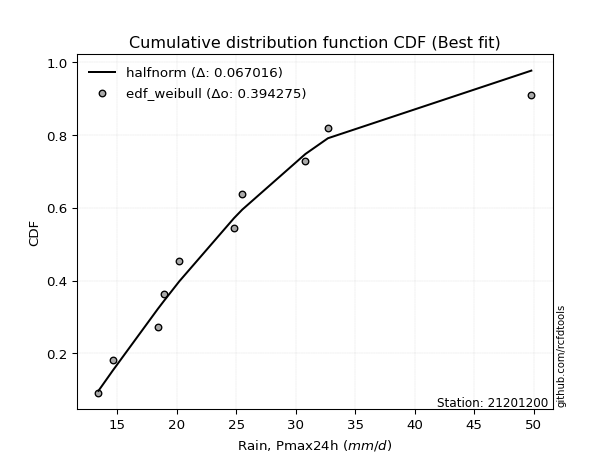</img>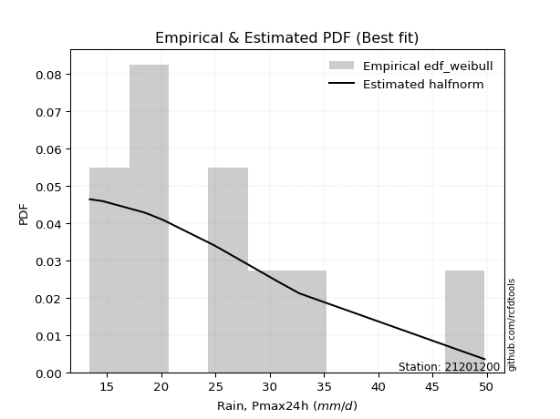</img>

</div>


### 4. EDF Beard (1943)

The Beard formula (or Beard´s plotting position formula) in hydrology is used to estimate the empirical non-exceedance probability _(P)_ of a flood event (or other extreme hydrological data point) within a given dataset.

<div align="center">


$P=(m-0.31)/(n+0.38)$


</div>


**4.1. Empirical values**

<div align="center">

|                | 0                    | 1                 | 2                   | 3                  | 4                  | 5         | 6                  | 7                  | 8                  | 9                  | 10                 |
|:---------------|:---------------------|:------------------|:--------------------|:-------------------|:-------------------|:----------|:-------------------|:-------------------|:-------------------|:-------------------|:-------------------|
| date           | 2015                 | 2009              | 2008                | 2014               | 2024               | 2025      | 2012               | 2016               | 2010               | 2013               | 2011               |
| x              | 13.4                 | 14.6              | 18.4                | 18.9               | 20.2               | 23.8      | 24.8               | 25.5               | 30.8               | 32.7               | 49.8               |
| m              | 1                    | 2                 | 3                   | 4                  | 5                  | 6         | 7                  | 8                  | 9                  | 10                 | 11                 |
| empirical_dist | edf_beard            | edf_beard         | edf_beard           | edf_beard          | edf_beard          | edf_beard | edf_beard          | edf_beard          | edf_beard          | edf_beard          | edf_beard          |
| empirical      | 0.060632688927943754 | 0.148506151142355 | 0.23637961335676624 | 0.3242530755711775 | 0.4121265377855888 | 0.5       | 0.5878734622144113 | 0.6757469244288224 | 0.7636203866432336 | 0.8514938488576449 | 0.9393673110720562 |
| empirical_tr   | 1.0645463049579045   | 1.174406604747162 | 1.3095512082853855  | 1.4798439531859557 | 1.7010463378176381 | 2.0       | 2.4264392324093818 | 3.0840108401084008 | 4.230483271375462  | 6.733727810650883  | 16.49275362318839  |

</div>


**4.2. Kolmogorov-Smirnov fit test (sorted by Δ)**


<div align="center">

|                | 0                   | 1                    | 2                    | 3                   | 4                   | 5                   | 6                   | 7                   | 8                   | 9                   | 10                  | 11                  | 12                  | 13                  | 14                  | 15                  | 16                  | 17                  | 18                  | 19                  | 20                  | 21                  | 22                  | 23                  | 24                  | 25                  | 26                  | 27                  | 28                  | 29                  | 30                  | 31                  | 32                  | 33                  | 34                  | 35                  | 36                  | 37                  | 38                  | 39                  | 40                  | 41                  | 42                  | 43                  | 44                  | 45                  | 46                  | 47                  | 48                  | 49                  | 50                  | 51                  | 52                  | 53                  | 54                  | 55                  | 56                  | 57                  | 58                  | 59                  | 60                  | 61                  | 62                  | 63                  | 64                  | 65                  | 66                  | 67                  | 68                  | 69                  | 70                  | 71                  | 72                  | 73                  | 74                  | 75                  | 76                  | 77                  | 78                  | 79                  | 80                  | 81                  | 82                  | 83                  | 84                  | 85                  | 86                  | 87                  | 88                  | 89                  | 90                  | 91                  | 92                  | 93                  | 94                  | 95                  | 96                  | 97                  | 98                  | 99                  | 100                 | 101                 | 102                 | 103                 | 104                 | 105                 | 106                 | 107                 | 108                 | 109                 | 110                 | 111                 | 112                 | 113                 | 114                 | 115                 | 116                 | 117                 | 118                 | 119                 | 120                 | 121                 | 122                 | 123                 | 124                 | 125                 | 126                 | 127                 | 128                 | 129                 | 130                 | 131                 | 132                 | 133                 | 134                 | 135                 | 136                 | 137                 | 138                 | 139                 | 140                 | 141                 | 142                 | 143                 | 144                 | 145                 | 146                 | 147                 | 148                 | 149                 | 150                 | 151                 | 152                 | 153                 | 154                 | 155                 | 156                 | 157                 | 158                 | 159                 |
|:---------------|:--------------------|:---------------------|:---------------------|:--------------------|:--------------------|:--------------------|:--------------------|:--------------------|:--------------------|:--------------------|:--------------------|:--------------------|:--------------------|:--------------------|:--------------------|:--------------------|:--------------------|:--------------------|:--------------------|:--------------------|:--------------------|:--------------------|:--------------------|:--------------------|:--------------------|:--------------------|:--------------------|:--------------------|:--------------------|:--------------------|:--------------------|:--------------------|:--------------------|:--------------------|:--------------------|:--------------------|:--------------------|:--------------------|:--------------------|:--------------------|:--------------------|:--------------------|:--------------------|:--------------------|:--------------------|:--------------------|:--------------------|:--------------------|:--------------------|:--------------------|:--------------------|:--------------------|:--------------------|:--------------------|:--------------------|:--------------------|:--------------------|:--------------------|:--------------------|:--------------------|:--------------------|:--------------------|:--------------------|:--------------------|:--------------------|:--------------------|:--------------------|:--------------------|:--------------------|:--------------------|:--------------------|:--------------------|:--------------------|:--------------------|:--------------------|:--------------------|:--------------------|:--------------------|:--------------------|:--------------------|:--------------------|:--------------------|:--------------------|:--------------------|:--------------------|:--------------------|:--------------------|:--------------------|:--------------------|:--------------------|:--------------------|:--------------------|:--------------------|:--------------------|:--------------------|:--------------------|:--------------------|:--------------------|:--------------------|:--------------------|:--------------------|:--------------------|:--------------------|:--------------------|:--------------------|:--------------------|:--------------------|:--------------------|:--------------------|:--------------------|:--------------------|:--------------------|:--------------------|:--------------------|:--------------------|:--------------------|:--------------------|:--------------------|:--------------------|:--------------------|:--------------------|:--------------------|:--------------------|:--------------------|:--------------------|:--------------------|:--------------------|:--------------------|:--------------------|:--------------------|:--------------------|:--------------------|:--------------------|:--------------------|:--------------------|:--------------------|:--------------------|:--------------------|:--------------------|:--------------------|:--------------------|:--------------------|:--------------------|:--------------------|:--------------------|:--------------------|:--------------------|:--------------------|:--------------------|:--------------------|:--------------------|:--------------------|:--------------------|:--------------------|:--------------------|:--------------------|:--------------------|:--------------------|:--------------------|:--------------------|
| station        | 21201200            | 21201200             | 21201200             | 21201200            | 21201200            | 21201200            | 21201200            | 21201200            | 21201200            | 21201200            | 21201200            | 21201200            | 21201200            | 21201200            | 21201200            | 21201200            | 21201200            | 21201200            | 21201200            | 21201200            | 21201200            | 21201200            | 21201200            | 21201200            | 21201200            | 21201200            | 21201200            | 21201200            | 21201200            | 21201200            | 21201200            | 21201200            | 21201200            | 21201200            | 21201200            | 21201200            | 21201200            | 21201200            | 21201200            | 21201200            | 21201200            | 21201200            | 21201200            | 21201200            | 21201200            | 21201200            | 21201200            | 21201200            | 21201200            | 21201200            | 21201200            | 21201200            | 21201200            | 21201200            | 21201200            | 21201200            | 21201200            | 21201200            | 21201200            | 21201200            | 21201200            | 21201200            | 21201200            | 21201200            | 21201200            | 21201200            | 21201200            | 21201200            | 21201200            | 21201200            | 21201200            | 21201200            | 21201200            | 21201200            | 21201200            | 21201200            | 21201200            | 21201200            | 21201200            | 21201200            | 21201200            | 21201200            | 21201200            | 21201200            | 21201200            | 21201200            | 21201200            | 21201200            | 21201200            | 21201200            | 21201200            | 21201200            | 21201200            | 21201200            | 21201200            | 21201200            | 21201200            | 21201200            | 21201200            | 21201200            | 21201200            | 21201200            | 21201200            | 21201200            | 21201200            | 21201200            | 21201200            | 21201200            | 21201200            | 21201200            | 21201200            | 21201200            | 21201200            | 21201200            | 21201200            | 21201200            | 21201200            | 21201200            | 21201200            | 21201200            | 21201200            | 21201200            | 21201200            | 21201200            | 21201200            | 21201200            | 21201200            | 21201200            | 21201200            | 21201200            | 21201200            | 21201200            | 21201200            | 21201200            | 21201200            | 21201200            | 21201200            | 21201200            | 21201200            | 21201200            | 21201200            | 21201200            | 21201200            | 21201200            | 21201200            | 21201200            | 21201200            | 21201200            | 21201200            | 21201200            | 21201200            | 21201200            | 21201200            | 21201200            | 21201200            | 21201200            | 21201200            | 21201200            | 21201200            | 21201200            |
| empirical_dist | edf_beard           | edf_beard            | edf_beard            | edf_beard           | edf_beard           | edf_beard           | edf_beard           | edf_beard           | edf_beard           | edf_beard           | edf_beard           | edf_beard           | edf_beard           | edf_beard           | edf_beard           | edf_beard           | edf_beard           | edf_beard           | edf_beard           | edf_beard           | edf_beard           | edf_beard           | edf_beard           | edf_beard           | edf_beard           | edf_beard           | edf_beard           | edf_beard           | edf_beard           | edf_beard           | edf_beard           | edf_beard           | edf_beard           | edf_beard           | edf_beard           | edf_beard           | edf_beard           | edf_beard           | edf_beard           | edf_beard           | edf_beard           | edf_beard           | edf_beard           | edf_beard           | edf_beard           | edf_beard           | edf_beard           | edf_beard           | edf_beard           | edf_beard           | edf_beard           | edf_beard           | edf_beard           | edf_beard           | edf_beard           | edf_beard           | edf_beard           | edf_beard           | edf_beard           | edf_beard           | edf_beard           | edf_beard           | edf_beard           | edf_beard           | edf_beard           | edf_beard           | edf_beard           | edf_beard           | edf_beard           | edf_beard           | edf_beard           | edf_beard           | edf_beard           | edf_beard           | edf_beard           | edf_beard           | edf_beard           | edf_beard           | edf_beard           | edf_beard           | edf_beard           | edf_beard           | edf_beard           | edf_beard           | edf_beard           | edf_beard           | edf_beard           | edf_beard           | edf_beard           | edf_beard           | edf_beard           | edf_beard           | edf_beard           | edf_beard           | edf_beard           | edf_beard           | edf_beard           | edf_beard           | edf_beard           | edf_beard           | edf_beard           | edf_beard           | edf_beard           | edf_beard           | edf_beard           | edf_beard           | edf_beard           | edf_beard           | edf_beard           | edf_beard           | edf_beard           | edf_beard           | edf_beard           | edf_beard           | edf_beard           | edf_beard           | edf_beard           | edf_beard           | edf_beard           | edf_beard           | edf_beard           | edf_beard           | edf_beard           | edf_beard           | edf_beard           | edf_beard           | edf_beard           | edf_beard           | edf_beard           | edf_beard           | edf_beard           | edf_beard           | edf_beard           | edf_beard           | edf_beard           | edf_beard           | edf_beard           | edf_beard           | edf_beard           | edf_beard           | edf_beard           | edf_beard           | edf_beard           | edf_beard           | edf_beard           | edf_beard           | edf_beard           | edf_beard           | edf_beard           | edf_beard           | edf_beard           | edf_beard           | edf_beard           | edf_beard           | edf_beard           | edf_beard           | edf_beard           | edf_beard           | edf_beard           | edf_beard           |
| p_dist         | ncf                 | moyal                | logbetaprime         | betaprime           | logpearson3         | logmaxwell          | genlogistic         | pearson3            | halflogistic        | logvonmises         | logexponnorm        | loggenextreme       | logweibull_max      | logalpha            | alpha               | lognct              | loginvgamma         | logt                | logcrystalball      | lognorm             | lograyleigh         | logfoldnorm         | logburr12           | truncnorm           | logrice             | logjohnsonsu        | logloggamma         | genextreme          | invweibull          | logskewnorm         | f                   | nct                 | loginvgauss         | invgamma            | logfatiguelife      | loggennorm          | gumbel_r            | halfnorm            | genexpon            | logtriang           | johnsonsu           | logburr             | loglogistic         | gompertz            | invgauss            | kappa3              | loghalfgennorm      | loggamma            | loggamma            | logerlang           | logf                | dweibull            | fatiguelife         | logdweibull         | exponnorm           | exponpow            | logweibull_min      | foldnorm            | loganglit           | logmielke           | loggenlogistic      | kstwobign           | burr                | logdgamma           | loggenexpon         | logsemicircular     | logtruncweibull_min | loghypsecant        | logkstwobign        | skewnorm            | logbradford         | loggumbel_r         | logtruncexpon       | rayleigh            | gennorm             | loginvweibull       | tukeylambda         | truncweibull_min    | logcosine           | dgamma              | bradford            | logarcsine          | maxwell             | loggompertz         | gausshyper          | loglaplace          | loglaplace          | t                   | logmoyal            | lomax               | loghalfnorm         | loggumbel_l         | rice                | logloglaplace       | loggausshyper       | logncf              | hypsecant           | beta                | logistic            | crystalball         | norm                | wald                | loghalflogistic     | anglit              | semicircular        | laplace             | arcsine             | weibull_min         | logexponpow         | triang              | logkappa3           | logtukeylambda      | logkappa4           | loguniform          | vonmises_line       | logwald             | loggengamma         | logvonmises_line    | burr12              | logksone            | loglomax            | gumbel_l            | truncexpon          | logargus            | logrdist            | cosine              | halfgennorm         | genpareto           | logtruncnorm        | loggenpareto        | logwrapcauchy       | kappa4              | loggenhalflogistic  | argus               | ksone               | wrapcauchy          | uniform             | erlang              | loglevy_l           | levy_l              | powerlaw            | logjohnsonsb        | nakagami            | logtrapezoid        | lognakagami         | johnsonsb           | genhalflogistic     | rdist               | logpowerlaw         | gengamma            | logbeta             | gamma               | exponweib           | logexponweib        | trapezoid           | logtruncpareto      | weibull_max         | truncpareto         | vonmises            | mielke              |
| delta          | 0.05609737699688021 | 0.056671718381813924 | 0.056751147028376914 | 0.05775493708135705 | 0.06061106684681562 | 0.06092794060442597 | 0.0639336866359626  | 0.06432114427280622 | 0.06496272076692433 | 0.06587869981809824 | 0.0667837967999767  | 0.06699387385939048 | 0.06700399589778461 | 0.06913798568284701 | 0.0697703936038454  | 0.07020329951774595 | 0.07119953872819862 | 0.0712304232012414  | 0.07123052730221235 | 0.07123060012966664 | 0.07124516297285632 | 0.07149403941665414 | 0.07224849417952661 | 0.07258288991794128 | 0.07262369622264292 | 0.0737264845190424  | 0.07386554195118722 | 0.07400602017120994 | 0.07400809646591033 | 0.07403433317771135 | 0.07444778611846736 | 0.07481711119780021 | 0.07495778874969816 | 0.0749613836278542  | 0.07530747989310682 | 0.07645818274783711 | 0.07699382612098638 | 0.07706886843123026 | 0.07733466818487197 | 0.07778226164913404 | 0.07868102778579922 | 0.0787126086810116  | 0.07872953602365979 | 0.07910471731510979 | 0.0794559217336146  | 0.07967501619174686 | 0.08105767298217106 | 0.08155845461204025 | 0.08155845461204025 | 0.08155851763175903 | 0.08160332198031073 | 0.08168390033833782 | 0.08232469277614507 | 0.08252808121345159 | 0.08257245894653076 | 0.08315871804283337 | 0.08448662229285908 | 0.08483229971633391 | 0.0856373564568953  | 0.0874448256640008  | 0.08824360179775714 | 0.08936654045853099 | 0.09030161810057391 | 0.09055904504223947 | 0.09123871355128832 | 0.09161485292329319 | 0.09207912451855868 | 0.09259711837369033 | 0.0937070696086566  | 0.0967822445601495  | 0.09988311651696136 | 0.09990783668329861 | 0.10293696780457448 | 0.10557503052470052 | 0.10612728197478072 | 0.10817349909925289 | 0.10834036314599005 | 0.11061813063853654 | 0.11184552778397461 | 0.11259774730024263 | 0.1153597865051682  | 0.11573522238090383 | 0.1159221138028731  | 0.11780985152227616 | 0.11841321073887456 | 0.12081687414382453 | 0.12081687414382453 | 0.12395189264072537 | 0.12531831673789162 | 0.12812298983044515 | 0.12928109806600774 | 0.13014647210364683 | 0.1308159732242734  | 0.13364904080237422 | 0.1365561785175924  | 0.1395103064337022  | 0.1405581576124929  | 0.14125204937272018 | 0.1438125716241586  | 0.1476362708726402  | 0.14763629004392842 | 0.148506151142355   | 0.148506151142355   | 0.15164972748643035 | 0.1533037193750525  | 0.15507173888283282 | 0.15986764808038878 | 0.16144613341784356 | 0.16251637679854838 | 0.1736310637347932  | 0.18317286689545914 | 0.18442728531076902 | 0.1848690428864117  | 0.18561650500315025 | 0.1906500627283536  | 0.19586136267682985 | 0.195917348430431   | 0.1974904427673615  | 0.20005084623405459 | 0.2018471867020345  | 0.20351782940390187 | 0.21659910909910862 | 0.21845108811374309 | 0.21888567401169745 | 0.22021192188843508 | 0.22565230517363427 | 0.23315692557905035 | 0.25112922213869937 | 0.25322574369605266 | 0.28054939078165303 | 0.2853265401146956  | 0.29621421679386517 | 0.30764338372410627 | 0.3220880613217163  | 0.3263106986744946  | 0.33193842599446266 | 0.34332934201124005 | 0.3452534937886915  | 0.37590560316308014 | 0.4175020800387575  | 0.41755995936791546 | 0.4313204681309709  | 0.43230766447687863 | 0.4339039300319335  | 0.45853620544878426 | 0.4587985944697744  | 0.4605130850487987  | 0.46636086997690834 | 0.47246283018721413 | 0.48745674174475373 | 0.49562765065613634 | 0.5022482597278977  | 0.5089922619487159  | 0.5413061490608846  | 0.5756765076213475  | 0.6446965551015508  | 0.6759091896565708  | 0.6854996470412248  | 7.304687619340374   | nan                 |
| deltao         | 0.37613735880099997 | 0.37613735880099997  | 0.37613735880099997  | 0.37613735880099997 | 0.37613735880099997 | 0.37613735880099997 | 0.37613735880099997 | 0.37613735880099997 | 0.37613735880099997 | 0.37613735880099997 | 0.37613735880099997 | 0.37613735880099997 | 0.37613735880099997 | 0.37613735880099997 | 0.37613735880099997 | 0.37613735880099997 | 0.37613735880099997 | 0.37613735880099997 | 0.37613735880099997 | 0.37613735880099997 | 0.37613735880099997 | 0.37613735880099997 | 0.37613735880099997 | 0.37613735880099997 | 0.37613735880099997 | 0.37613735880099997 | 0.37613735880099997 | 0.37613735880099997 | 0.37613735880099997 | 0.37613735880099997 | 0.37613735880099997 | 0.37613735880099997 | 0.37613735880099997 | 0.37613735880099997 | 0.37613735880099997 | 0.37613735880099997 | 0.37613735880099997 | 0.37613735880099997 | 0.37613735880099997 | 0.37613735880099997 | 0.37613735880099997 | 0.37613735880099997 | 0.37613735880099997 | 0.37613735880099997 | 0.37613735880099997 | 0.37613735880099997 | 0.37613735880099997 | 0.37613735880099997 | 0.37613735880099997 | 0.37613735880099997 | 0.37613735880099997 | 0.37613735880099997 | 0.37613735880099997 | 0.37613735880099997 | 0.37613735880099997 | 0.37613735880099997 | 0.37613735880099997 | 0.37613735880099997 | 0.37613735880099997 | 0.37613735880099997 | 0.37613735880099997 | 0.37613735880099997 | 0.37613735880099997 | 0.37613735880099997 | 0.37613735880099997 | 0.37613735880099997 | 0.37613735880099997 | 0.37613735880099997 | 0.37613735880099997 | 0.37613735880099997 | 0.37613735880099997 | 0.37613735880099997 | 0.37613735880099997 | 0.37613735880099997 | 0.37613735880099997 | 0.37613735880099997 | 0.37613735880099997 | 0.37613735880099997 | 0.37613735880099997 | 0.37613735880099997 | 0.37613735880099997 | 0.37613735880099997 | 0.37613735880099997 | 0.37613735880099997 | 0.37613735880099997 | 0.37613735880099997 | 0.37613735880099997 | 0.37613735880099997 | 0.37613735880099997 | 0.37613735880099997 | 0.37613735880099997 | 0.37613735880099997 | 0.37613735880099997 | 0.37613735880099997 | 0.37613735880099997 | 0.37613735880099997 | 0.37613735880099997 | 0.37613735880099997 | 0.37613735880099997 | 0.37613735880099997 | 0.37613735880099997 | 0.37613735880099997 | 0.37613735880099997 | 0.37613735880099997 | 0.37613735880099997 | 0.37613735880099997 | 0.37613735880099997 | 0.37613735880099997 | 0.37613735880099997 | 0.37613735880099997 | 0.37613735880099997 | 0.37613735880099997 | 0.37613735880099997 | 0.37613735880099997 | 0.37613735880099997 | 0.37613735880099997 | 0.37613735880099997 | 0.37613735880099997 | 0.37613735880099997 | 0.37613735880099997 | 0.37613735880099997 | 0.37613735880099997 | 0.37613735880099997 | 0.37613735880099997 | 0.37613735880099997 | 0.37613735880099997 | 0.37613735880099997 | 0.37613735880099997 | 0.37613735880099997 | 0.37613735880099997 | 0.37613735880099997 | 0.37613735880099997 | 0.37613735880099997 | 0.37613735880099997 | 0.37613735880099997 | 0.37613735880099997 | 0.37613735880099997 | 0.37613735880099997 | 0.37613735880099997 | 0.37613735880099997 | 0.37613735880099997 | 0.37613735880099997 | 0.37613735880099997 | 0.37613735880099997 | 0.37613735880099997 | 0.37613735880099997 | 0.37613735880099997 | 0.37613735880099997 | 0.37613735880099997 | 0.37613735880099997 | 0.37613735880099997 | 0.37613735880099997 | 0.37613735880099997 | 0.37613735880099997 | 0.37613735880099997 | 0.37613735880099997 | 0.37613735880099997 | 0.37613735880099997 | 0.37613735880099997 | 0.37613735880099997 |
| eval           | Δo > Δ              | Δo > Δ               | Δo > Δ               | Δo > Δ              | Δo > Δ              | Δo > Δ              | Δo > Δ              | Δo > Δ              | Δo > Δ              | Δo > Δ              | Δo > Δ              | Δo > Δ              | Δo > Δ              | Δo > Δ              | Δo > Δ              | Δo > Δ              | Δo > Δ              | Δo > Δ              | Δo > Δ              | Δo > Δ              | Δo > Δ              | Δo > Δ              | Δo > Δ              | Δo > Δ              | Δo > Δ              | Δo > Δ              | Δo > Δ              | Δo > Δ              | Δo > Δ              | Δo > Δ              | Δo > Δ              | Δo > Δ              | Δo > Δ              | Δo > Δ              | Δo > Δ              | Δo > Δ              | Δo > Δ              | Δo > Δ              | Δo > Δ              | Δo > Δ              | Δo > Δ              | Δo > Δ              | Δo > Δ              | Δo > Δ              | Δo > Δ              | Δo > Δ              | Δo > Δ              | Δo > Δ              | Δo > Δ              | Δo > Δ              | Δo > Δ              | Δo > Δ              | Δo > Δ              | Δo > Δ              | Δo > Δ              | Δo > Δ              | Δo > Δ              | Δo > Δ              | Δo > Δ              | Δo > Δ              | Δo > Δ              | Δo > Δ              | Δo > Δ              | Δo > Δ              | Δo > Δ              | Δo > Δ              | Δo > Δ              | Δo > Δ              | Δo > Δ              | Δo > Δ              | Δo > Δ              | Δo > Δ              | Δo > Δ              | Δo > Δ              | Δo > Δ              | Δo > Δ              | Δo > Δ              | Δo > Δ              | Δo > Δ              | Δo > Δ              | Δo > Δ              | Δo > Δ              | Δo > Δ              | Δo > Δ              | Δo > Δ              | Δo > Δ              | Δo > Δ              | Δo > Δ              | Δo > Δ              | Δo > Δ              | Δo > Δ              | Δo > Δ              | Δo > Δ              | Δo > Δ              | Δo > Δ              | Δo > Δ              | Δo > Δ              | Δo > Δ              | Δo > Δ              | Δo > Δ              | Δo > Δ              | Δo > Δ              | Δo > Δ              | Δo > Δ              | Δo > Δ              | Δo > Δ              | Δo > Δ              | Δo > Δ              | Δo > Δ              | Δo > Δ              | Δo > Δ              | Δo > Δ              | Δo > Δ              | Δo > Δ              | Δo > Δ              | Δo > Δ              | Δo > Δ              | Δo > Δ              | Δo > Δ              | Δo > Δ              | Δo > Δ              | Δo > Δ              | Δo > Δ              | Δo > Δ              | Δo > Δ              | Δo > Δ              | Δo > Δ              | Δo > Δ              | Δo > Δ              | Δo > Δ              | Δo > Δ              | Δo > Δ              | Δo > Δ              | Δo > Δ              | Δo > Δ              | Δo > Δ              | Δo > Δ              | Δo > Δ              | Δo > Δ              | Δo <= Δ             | Δo <= Δ             | Δo <= Δ             | Δo <= Δ             | Δo <= Δ             | Δo <= Δ             | Δo <= Δ             | Δo <= Δ             | Δo <= Δ             | Δo <= Δ             | Δo <= Δ             | Δo <= Δ             | Δo <= Δ             | Δo <= Δ             | Δo <= Δ             | Δo <= Δ             | Δo <= Δ             | Δo <= Δ             | Δo <= Δ             | Δo <= Δ             | Δo <= Δ             |
| fit            | 1                   | 1                    | 1                    | 1                   | 1                   | 1                   | 1                   | 1                   | 1                   | 1                   | 1                   | 1                   | 1                   | 1                   | 1                   | 1                   | 1                   | 1                   | 1                   | 1                   | 1                   | 1                   | 1                   | 1                   | 1                   | 1                   | 1                   | 1                   | 1                   | 1                   | 1                   | 1                   | 1                   | 1                   | 1                   | 1                   | 1                   | 1                   | 1                   | 1                   | 1                   | 1                   | 1                   | 1                   | 1                   | 1                   | 1                   | 1                   | 1                   | 1                   | 1                   | 1                   | 1                   | 1                   | 1                   | 1                   | 1                   | 1                   | 1                   | 1                   | 1                   | 1                   | 1                   | 1                   | 1                   | 1                   | 1                   | 1                   | 1                   | 1                   | 1                   | 1                   | 1                   | 1                   | 1                   | 1                   | 1                   | 1                   | 1                   | 1                   | 1                   | 1                   | 1                   | 1                   | 1                   | 1                   | 1                   | 1                   | 1                   | 1                   | 1                   | 1                   | 1                   | 1                   | 1                   | 1                   | 1                   | 1                   | 1                   | 1                   | 1                   | 1                   | 1                   | 1                   | 1                   | 1                   | 1                   | 1                   | 1                   | 1                   | 1                   | 1                   | 1                   | 1                   | 1                   | 1                   | 1                   | 1                   | 1                   | 1                   | 1                   | 1                   | 1                   | 1                   | 1                   | 1                   | 1                   | 1                   | 1                   | 1                   | 1                   | 1                   | 1                   | 1                   | 1                   | 1                   | 1                   | 1                   | 1                   | 0                   | 0                   | 0                   | 0                   | 0                   | 0                   | 0                   | 0                   | 0                   | 0                   | 0                   | 0                   | 0                   | 0                   | 0                   | 0                   | 0                   | 0                   | 0                   | 0                   | 0                   |
| n              | 11                  | 11                   | 11                   | 11                  | 11                  | 11                  | 11                  | 11                  | 11                  | 11                  | 11                  | 11                  | 11                  | 11                  | 11                  | 11                  | 11                  | 11                  | 11                  | 11                  | 11                  | 11                  | 11                  | 11                  | 11                  | 11                  | 11                  | 11                  | 11                  | 11                  | 11                  | 11                  | 11                  | 11                  | 11                  | 11                  | 11                  | 11                  | 11                  | 11                  | 11                  | 11                  | 11                  | 11                  | 11                  | 11                  | 11                  | 11                  | 11                  | 11                  | 11                  | 11                  | 11                  | 11                  | 11                  | 11                  | 11                  | 11                  | 11                  | 11                  | 11                  | 11                  | 11                  | 11                  | 11                  | 11                  | 11                  | 11                  | 11                  | 11                  | 11                  | 11                  | 11                  | 11                  | 11                  | 11                  | 11                  | 11                  | 11                  | 11                  | 11                  | 11                  | 11                  | 11                  | 11                  | 11                  | 11                  | 11                  | 11                  | 11                  | 11                  | 11                  | 11                  | 11                  | 11                  | 11                  | 11                  | 11                  | 11                  | 11                  | 11                  | 11                  | 11                  | 11                  | 11                  | 11                  | 11                  | 11                  | 11                  | 11                  | 11                  | 11                  | 11                  | 11                  | 11                  | 11                  | 11                  | 11                  | 11                  | 11                  | 11                  | 11                  | 11                  | 11                  | 11                  | 11                  | 11                  | 11                  | 11                  | 11                  | 11                  | 11                  | 11                  | 11                  | 11                  | 11                  | 11                  | 11                  | 11                  | 11                  | 11                  | 11                  | 11                  | 11                  | 11                  | 11                  | 11                  | 11                  | 11                  | 11                  | 11                  | 11                  | 11                  | 11                  | 11                  | 11                  | 11                  | 11                  | 11                  | 11                  |
| best_fit       | 1                   | 0                    | 0                    | 0                   | 0                   | 0                   | 0                   | 0                   | 0                   | 0                   | 0                   | 0                   | 0                   | 0                   | 0                   | 0                   | 0                   | 0                   | 0                   | 0                   | 0                   | 0                   | 0                   | 0                   | 0                   | 0                   | 0                   | 0                   | 0                   | 0                   | 0                   | 0                   | 0                   | 0                   | 0                   | 0                   | 0                   | 0                   | 0                   | 0                   | 0                   | 0                   | 0                   | 0                   | 0                   | 0                   | 0                   | 0                   | 0                   | 0                   | 0                   | 0                   | 0                   | 0                   | 0                   | 0                   | 0                   | 0                   | 0                   | 0                   | 0                   | 0                   | 0                   | 0                   | 0                   | 0                   | 0                   | 0                   | 0                   | 0                   | 0                   | 0                   | 0                   | 0                   | 0                   | 0                   | 0                   | 0                   | 0                   | 0                   | 0                   | 0                   | 0                   | 0                   | 0                   | 0                   | 0                   | 0                   | 0                   | 0                   | 0                   | 0                   | 0                   | 0                   | 0                   | 0                   | 0                   | 0                   | 0                   | 0                   | 0                   | 0                   | 0                   | 0                   | 0                   | 0                   | 0                   | 0                   | 0                   | 0                   | 0                   | 0                   | 0                   | 0                   | 0                   | 0                   | 0                   | 0                   | 0                   | 0                   | 0                   | 0                   | 0                   | 0                   | 0                   | 0                   | 0                   | 0                   | 0                   | 0                   | 0                   | 0                   | 0                   | 0                   | 0                   | 0                   | 0                   | 0                   | 0                   | 0                   | 0                   | 0                   | 0                   | 0                   | 0                   | 0                   | 0                   | 0                   | 0                   | 0                   | 0                   | 0                   | 0                   | 0                   | 0                   | 0                   | 0                   | 0                   | 0                   | 0                   |
| best_fit_sort  | 1                   | 2                    | 3                    | 4                   | 5                   | 6                   | 7                   | 8                   | 9                   | 10                  | 11                  | 12                  | 13                  | 14                  | 15                  | 16                  | 17                  | 18                  | 19                  | 20                  | 21                  | 22                  | 23                  | 24                  | 25                  | 26                  | 27                  | 28                  | 29                  | 30                  | 31                  | 32                  | 33                  | 34                  | 35                  | 36                  | 37                  | 38                  | 39                  | 40                  | 41                  | 42                  | 43                  | 44                  | 45                  | 46                  | 47                  | 48                  | 49                  | 50                  | 51                  | 52                  | 53                  | 54                  | 55                  | 56                  | 57                  | 58                  | 59                  | 60                  | 61                  | 62                  | 63                  | 64                  | 65                  | 66                  | 67                  | 68                  | 69                  | 70                  | 71                  | 72                  | 73                  | 74                  | 75                  | 76                  | 77                  | 78                  | 79                  | 80                  | 81                  | 82                  | 83                  | 84                  | 85                  | 86                  | 87                  | 88                  | 89                  | 90                  | 91                  | 92                  | 93                  | 94                  | 95                  | 96                  | 97                  | 98                  | 99                  | 100                 | 101                 | 102                 | 103                 | 104                 | 105                 | 106                 | 107                 | 108                 | 109                 | 110                 | 111                 | 112                 | 113                 | 114                 | 115                 | 116                 | 117                 | 118                 | 119                 | 120                 | 121                 | 122                 | 123                 | 124                 | 125                 | 126                 | 127                 | 128                 | 129                 | 130                 | 131                 | 132                 | 133                 | 134                 | 135                 | 136                 | 137                 | 138                 | 139                 | 140                 | 141                 | 142                 | 143                 | 144                 | 145                 | 146                 | 147                 | 148                 | 149                 | 150                 | 151                 | 152                 | 153                 | 154                 | 155                 | 156                 | 157                 | 158                 | 159                 | 160                 |

</div>


**4.3. Best fit**

<div align="center">

|   id |   station | empirical_dist   | p_dist   |     delta |   deltao | eval   |   fit |   n |   best_fit |   best_fit_sort |
|-----:|----------:|:-----------------|:---------|----------:|---------:|:-------|------:|----:|-----------:|----------------:|
|    0 |  21201200 | edf_beard        | ncf      | 0.0560974 | 0.376137 | Δo > Δ |     1 |  11 |          1 |               1 |

</div>


<div align="center">

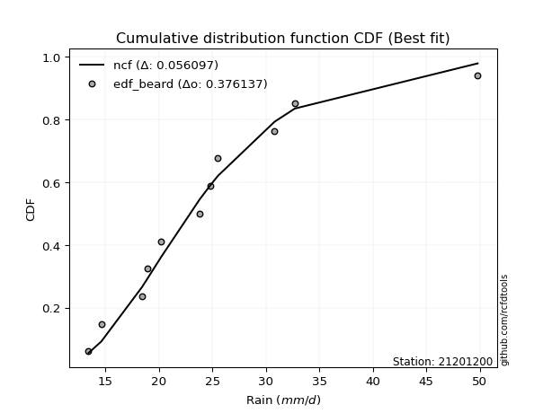</img></img>

</div>


### 5. EDF Chegodayev (1955)

The Chegodayev formula is an empirical plotting position formula used in hydrological frequency analysis to estimate the exceedance probability or return period of a specific event from a set of observed data. It is primarily used for plotting observed data points on probability paper to fit a theoretical distribution, particularly for analyzing extreme events like maximum flood flows or rainfall intensities. The constant _b_ value in the generalized plotting position formula is 0.3.

<div align="center">


$P=(m-b)/(n+1-2b)$


</div>


**5.1. Empirical values**

<div align="center">

|                | 0                   | 1                   | 2                  | 3                   | 4                   | 5              | 6                  | 7                  | 8                  | 9                 | 10                 |
|:---------------|:--------------------|:--------------------|:-------------------|:--------------------|:--------------------|:---------------|:-------------------|:-------------------|:-------------------|:------------------|:-------------------|
| date           | 2015                | 2009                | 2008               | 2014                | 2024                | 2025           | 2012               | 2016               | 2010               | 2013              | 2011               |
| x              | 13.4                | 14.6                | 18.4               | 18.9                | 20.2                | 23.8           | 24.8               | 25.5               | 30.8               | 32.7              | 49.8               |
| m              | 1                   | 2                   | 3                  | 4                   | 5                   | 6              | 7                  | 8                  | 9                  | 10                | 11                 |
| empirical_dist | edf_chegodayev      | edf_chegodayev      | edf_chegodayev     | edf_chegodayev      | edf_chegodayev      | edf_chegodayev | edf_chegodayev     | edf_chegodayev     | edf_chegodayev     | edf_chegodayev    | edf_chegodayev     |
| empirical      | 0.06140350877192982 | 0.14912280701754385 | 0.2368421052631579 | 0.32456140350877194 | 0.41228070175438597 | 0.5            | 0.5877192982456141 | 0.6754385964912281 | 0.763157894736842  | 0.850877192982456 | 0.9385964912280701 |
| empirical_tr   | 1.0654205607476634  | 1.175257731958763   | 1.310344827586207  | 1.4805194805194806  | 1.7014925373134326  | 2.0            | 2.425531914893617  | 3.081081081081081  | 4.2222222222222205 | 6.70588235294117  | 16.285714285714263 |

</div>


**5.2. Kolmogorov-Smirnov fit test (sorted by Δ)**


<div align="center">

|                | 0                    | 1                   | 2                   | 3                   | 4                   | 5                   | 6                   | 7                   | 8                   | 9                   | 10                  | 11                  | 12                  | 13                  | 14                  | 15                  | 16                  | 17                  | 18                  | 19                  | 20                  | 21                  | 22                  | 23                  | 24                  | 25                  | 26                  | 27                  | 28                  | 29                  | 30                  | 31                  | 32                  | 33                  | 34                  | 35                  | 36                  | 37                  | 38                  | 39                  | 40                  | 41                  | 42                  | 43                  | 44                  | 45                  | 46                  | 47                  | 48                  | 49                  | 50                  | 51                  | 52                  | 53                  | 54                  | 55                  | 56                  | 57                  | 58                  | 59                  | 60                  | 61                  | 62                  | 63                  | 64                  | 65                  | 66                  | 67                  | 68                  | 69                  | 70                  | 71                  | 72                  | 73                  | 74                  | 75                  | 76                  | 77                  | 78                  | 79                  | 80                  | 81                  | 82                  | 83                  | 84                  | 85                  | 86                  | 87                  | 88                  | 89                  | 90                  | 91                  | 92                  | 93                  | 94                  | 95                  | 96                  | 97                  | 98                  | 99                  | 100                 | 101                 | 102                 | 103                 | 104                 | 105                 | 106                 | 107                 | 108                 | 109                 | 110                 | 111                 | 112                 | 113                 | 114                 | 115                 | 116                 | 117                 | 118                 | 119                 | 120                 | 121                 | 122                 | 123                 | 124                 | 125                 | 126                 | 127                 | 128                 | 129                 | 130                 | 131                 | 132                 | 133                 | 134                 | 135                 | 136                 | 137                 | 138                 | 139                 | 140                 | 141                 | 142                 | 143                 | 144                 | 145                 | 146                 | 147                 | 148                 | 149                 | 150                 | 151                 | 152                 | 153                 | 154                 | 155                 | 156                 | 157                 | 158                 | 159                 |
|:---------------|:---------------------|:--------------------|:--------------------|:--------------------|:--------------------|:--------------------|:--------------------|:--------------------|:--------------------|:--------------------|:--------------------|:--------------------|:--------------------|:--------------------|:--------------------|:--------------------|:--------------------|:--------------------|:--------------------|:--------------------|:--------------------|:--------------------|:--------------------|:--------------------|:--------------------|:--------------------|:--------------------|:--------------------|:--------------------|:--------------------|:--------------------|:--------------------|:--------------------|:--------------------|:--------------------|:--------------------|:--------------------|:--------------------|:--------------------|:--------------------|:--------------------|:--------------------|:--------------------|:--------------------|:--------------------|:--------------------|:--------------------|:--------------------|:--------------------|:--------------------|:--------------------|:--------------------|:--------------------|:--------------------|:--------------------|:--------------------|:--------------------|:--------------------|:--------------------|:--------------------|:--------------------|:--------------------|:--------------------|:--------------------|:--------------------|:--------------------|:--------------------|:--------------------|:--------------------|:--------------------|:--------------------|:--------------------|:--------------------|:--------------------|:--------------------|:--------------------|:--------------------|:--------------------|:--------------------|:--------------------|:--------------------|:--------------------|:--------------------|:--------------------|:--------------------|:--------------------|:--------------------|:--------------------|:--------------------|:--------------------|:--------------------|:--------------------|:--------------------|:--------------------|:--------------------|:--------------------|:--------------------|:--------------------|:--------------------|:--------------------|:--------------------|:--------------------|:--------------------|:--------------------|:--------------------|:--------------------|:--------------------|:--------------------|:--------------------|:--------------------|:--------------------|:--------------------|:--------------------|:--------------------|:--------------------|:--------------------|:--------------------|:--------------------|:--------------------|:--------------------|:--------------------|:--------------------|:--------------------|:--------------------|:--------------------|:--------------------|:--------------------|:--------------------|:--------------------|:--------------------|:--------------------|:--------------------|:--------------------|:--------------------|:--------------------|:--------------------|:--------------------|:--------------------|:--------------------|:--------------------|:--------------------|:--------------------|:--------------------|:--------------------|:--------------------|:--------------------|:--------------------|:--------------------|:--------------------|:--------------------|:--------------------|:--------------------|:--------------------|:--------------------|:--------------------|:--------------------|:--------------------|:--------------------|:--------------------|:--------------------|
| station        | 21201200             | 21201200            | 21201200            | 21201200            | 21201200            | 21201200            | 21201200            | 21201200            | 21201200            | 21201200            | 21201200            | 21201200            | 21201200            | 21201200            | 21201200            | 21201200            | 21201200            | 21201200            | 21201200            | 21201200            | 21201200            | 21201200            | 21201200            | 21201200            | 21201200            | 21201200            | 21201200            | 21201200            | 21201200            | 21201200            | 21201200            | 21201200            | 21201200            | 21201200            | 21201200            | 21201200            | 21201200            | 21201200            | 21201200            | 21201200            | 21201200            | 21201200            | 21201200            | 21201200            | 21201200            | 21201200            | 21201200            | 21201200            | 21201200            | 21201200            | 21201200            | 21201200            | 21201200            | 21201200            | 21201200            | 21201200            | 21201200            | 21201200            | 21201200            | 21201200            | 21201200            | 21201200            | 21201200            | 21201200            | 21201200            | 21201200            | 21201200            | 21201200            | 21201200            | 21201200            | 21201200            | 21201200            | 21201200            | 21201200            | 21201200            | 21201200            | 21201200            | 21201200            | 21201200            | 21201200            | 21201200            | 21201200            | 21201200            | 21201200            | 21201200            | 21201200            | 21201200            | 21201200            | 21201200            | 21201200            | 21201200            | 21201200            | 21201200            | 21201200            | 21201200            | 21201200            | 21201200            | 21201200            | 21201200            | 21201200            | 21201200            | 21201200            | 21201200            | 21201200            | 21201200            | 21201200            | 21201200            | 21201200            | 21201200            | 21201200            | 21201200            | 21201200            | 21201200            | 21201200            | 21201200            | 21201200            | 21201200            | 21201200            | 21201200            | 21201200            | 21201200            | 21201200            | 21201200            | 21201200            | 21201200            | 21201200            | 21201200            | 21201200            | 21201200            | 21201200            | 21201200            | 21201200            | 21201200            | 21201200            | 21201200            | 21201200            | 21201200            | 21201200            | 21201200            | 21201200            | 21201200            | 21201200            | 21201200            | 21201200            | 21201200            | 21201200            | 21201200            | 21201200            | 21201200            | 21201200            | 21201200            | 21201200            | 21201200            | 21201200            | 21201200            | 21201200            | 21201200            | 21201200            | 21201200            | 21201200            |
| empirical_dist | edf_chegodayev       | edf_chegodayev      | edf_chegodayev      | edf_chegodayev      | edf_chegodayev      | edf_chegodayev      | edf_chegodayev      | edf_chegodayev      | edf_chegodayev      | edf_chegodayev      | edf_chegodayev      | edf_chegodayev      | edf_chegodayev      | edf_chegodayev      | edf_chegodayev      | edf_chegodayev      | edf_chegodayev      | edf_chegodayev      | edf_chegodayev      | edf_chegodayev      | edf_chegodayev      | edf_chegodayev      | edf_chegodayev      | edf_chegodayev      | edf_chegodayev      | edf_chegodayev      | edf_chegodayev      | edf_chegodayev      | edf_chegodayev      | edf_chegodayev      | edf_chegodayev      | edf_chegodayev      | edf_chegodayev      | edf_chegodayev      | edf_chegodayev      | edf_chegodayev      | edf_chegodayev      | edf_chegodayev      | edf_chegodayev      | edf_chegodayev      | edf_chegodayev      | edf_chegodayev      | edf_chegodayev      | edf_chegodayev      | edf_chegodayev      | edf_chegodayev      | edf_chegodayev      | edf_chegodayev      | edf_chegodayev      | edf_chegodayev      | edf_chegodayev      | edf_chegodayev      | edf_chegodayev      | edf_chegodayev      | edf_chegodayev      | edf_chegodayev      | edf_chegodayev      | edf_chegodayev      | edf_chegodayev      | edf_chegodayev      | edf_chegodayev      | edf_chegodayev      | edf_chegodayev      | edf_chegodayev      | edf_chegodayev      | edf_chegodayev      | edf_chegodayev      | edf_chegodayev      | edf_chegodayev      | edf_chegodayev      | edf_chegodayev      | edf_chegodayev      | edf_chegodayev      | edf_chegodayev      | edf_chegodayev      | edf_chegodayev      | edf_chegodayev      | edf_chegodayev      | edf_chegodayev      | edf_chegodayev      | edf_chegodayev      | edf_chegodayev      | edf_chegodayev      | edf_chegodayev      | edf_chegodayev      | edf_chegodayev      | edf_chegodayev      | edf_chegodayev      | edf_chegodayev      | edf_chegodayev      | edf_chegodayev      | edf_chegodayev      | edf_chegodayev      | edf_chegodayev      | edf_chegodayev      | edf_chegodayev      | edf_chegodayev      | edf_chegodayev      | edf_chegodayev      | edf_chegodayev      | edf_chegodayev      | edf_chegodayev      | edf_chegodayev      | edf_chegodayev      | edf_chegodayev      | edf_chegodayev      | edf_chegodayev      | edf_chegodayev      | edf_chegodayev      | edf_chegodayev      | edf_chegodayev      | edf_chegodayev      | edf_chegodayev      | edf_chegodayev      | edf_chegodayev      | edf_chegodayev      | edf_chegodayev      | edf_chegodayev      | edf_chegodayev      | edf_chegodayev      | edf_chegodayev      | edf_chegodayev      | edf_chegodayev      | edf_chegodayev      | edf_chegodayev      | edf_chegodayev      | edf_chegodayev      | edf_chegodayev      | edf_chegodayev      | edf_chegodayev      | edf_chegodayev      | edf_chegodayev      | edf_chegodayev      | edf_chegodayev      | edf_chegodayev      | edf_chegodayev      | edf_chegodayev      | edf_chegodayev      | edf_chegodayev      | edf_chegodayev      | edf_chegodayev      | edf_chegodayev      | edf_chegodayev      | edf_chegodayev      | edf_chegodayev      | edf_chegodayev      | edf_chegodayev      | edf_chegodayev      | edf_chegodayev      | edf_chegodayev      | edf_chegodayev      | edf_chegodayev      | edf_chegodayev      | edf_chegodayev      | edf_chegodayev      | edf_chegodayev      | edf_chegodayev      | edf_chegodayev      | edf_chegodayev      | edf_chegodayev      |
| p_dist         | logbetaprime         | ncf                 | moyal               | betaprime           | logmaxwell          | logpearson3         | pearson3            | genlogistic         | logvonmises         | halflogistic        | logexponnorm        | loggenextreme       | logweibull_max      | logalpha            | alpha               | lognct              | logt                | logcrystalball      | lognorm             | logfoldnorm         | loginvgamma         | lograyleigh         | logburr12           | truncnorm           | logrice             | logloggamma         | logjohnsonsu        | genextreme          | invweibull          | logskewnorm         | f                   | nct                 | loginvgauss         | invgamma            | logfatiguelife      | loggennorm          | halfnorm            | gumbel_r            | genexpon            | logtriang           | gompertz            | johnsonsu           | logburr             | loglogistic         | invgauss            | kappa3              | loghalfgennorm      | dweibull            | loggamma            | loggamma            | logerlang           | logf                | logdweibull         | fatiguelife         | exponnorm           | exponpow            | foldnorm            | logweibull_min      | loganglit           | logmielke           | loggenlogistic      | kstwobign           | logdgamma           | burr                | loggenexpon         | logsemicircular     | logtruncweibull_min | loghypsecant        | logkstwobign        | skewnorm            | logbradford         | loggumbel_r         | logtruncexpon       | rayleigh            | gennorm             | loginvweibull       | tukeylambda         | truncweibull_min    | logcosine           | dgamma              | bradford            | logarcsine          | maxwell             | loggompertz         | gausshyper          | loglaplace          | loglaplace          | t                   | logmoyal            | lomax               | loggumbel_l         | loghalfnorm         | rice                | logloglaplace       | loggausshyper       | logncf              | hypsecant           | beta                | logistic            | crystalball         | norm                | wald                | loghalflogistic     | anglit              | semicircular        | laplace             | arcsine             | weibull_min         | logexponpow         | triang              | logkappa3           | logtukeylambda      | logkappa4           | loguniform          | vonmises_line       | loggengamma         | logwald             | logvonmises_line    | burr12              | logksone            | loglomax            | gumbel_l            | truncexpon          | logargus            | logrdist            | cosine              | halfgennorm         | genpareto           | logtruncnorm        | loggenpareto        | logwrapcauchy       | kappa4              | loggenhalflogistic  | argus               | ksone               | wrapcauchy          | uniform             | erlang              | loglevy_l           | levy_l              | powerlaw            | logjohnsonsb        | nakagami            | logtrapezoid        | lognakagami         | johnsonsb           | genhalflogistic     | rdist               | logpowerlaw         | gengamma            | logbeta             | gamma               | exponweib           | logexponweib        | trapezoid           | logtruncpareto      | weibull_max         | truncpareto         | vonmises            | mielke              |
| delta          | 0.056442819090782526 | 0.05671403287206907 | 0.05728837425700278 | 0.05837159295654591 | 0.06092794060442597 | 0.06122772272200448 | 0.06401281633521183 | 0.0640878506047598  | 0.06557037188050385 | 0.06557937664211319 | 0.0667837967999767  | 0.06699387385939048 | 0.06700399589778461 | 0.06913798568284701 | 0.0697703936038454  | 0.07020329951774595 | 0.07092209526364701 | 0.07092219936461797 | 0.07092227219207226 | 0.07103154751026247 | 0.07119953872819862 | 0.07124516297285632 | 0.07224849417952661 | 0.07319954579313014 | 0.07324035209783178 | 0.07355721401359283 | 0.0737264845190424  | 0.07400602017120994 | 0.07400809646591033 | 0.07403433317771135 | 0.07444778611846736 | 0.07481711119780021 | 0.07495778874969816 | 0.0749613836278542  | 0.07530747989310682 | 0.07614985481024272 | 0.07660637652483859 | 0.07668549818339199 | 0.07687217627848031 | 0.0783989175243229  | 0.07864222540871812 | 0.07868102778579922 | 0.0787126086810116  | 0.07888369999245698 | 0.0794559217336146  | 0.08029167206693572 | 0.0805951810757794  | 0.08091308049435175 | 0.08155845461204025 | 0.08155845461204025 | 0.08155851763175903 | 0.08160332198031073 | 0.08206558930705993 | 0.08232469277614507 | 0.08257245894653076 | 0.08285039010523898 | 0.08436980780994224 | 0.08448662229285908 | 0.08532902851930091 | 0.0874448256640008  | 0.08824360179775714 | 0.0890582125209366  | 0.0900965531358478  | 0.09030161810057391 | 0.09123871355128832 | 0.0913065249856988  | 0.09161663261216701 | 0.09275128234248753 | 0.0937070696086566  | 0.09647391662255511 | 0.09926646064177247 | 0.09990783668329861 | 0.10247447589818282 | 0.10526670258710613 | 0.10628144594357791 | 0.10817349909925289 | 0.10895701902117894 | 0.11000147476334765 | 0.11153719984638022 | 0.11275191126903983 | 0.11474313062997932 | 0.11542689444330945 | 0.1156137858652787  | 0.1173473596158845  | 0.11810488280128018 | 0.12097103811262172 | 0.12097103811262172 | 0.12364356470313098 | 0.12531831673789162 | 0.12766049792405348 | 0.12983814416605244 | 0.1298977539411966  | 0.13050764528667902 | 0.1338032047711714  | 0.13609368661120075 | 0.13889365055851333 | 0.14024982967489852 | 0.1406353934975313  | 0.14350424368656423 | 0.1473279429350458  | 0.14732796210633403 | 0.14912280701754385 | 0.14912280701754385 | 0.15134139954883596 | 0.1529953914374581  | 0.15522590285163002 | 0.1595593201427944  | 0.1609836415114519  | 0.16205388489215672 | 0.1733227357971988  | 0.18286453895786475 | 0.18411895737317463 | 0.18456071494881732 | 0.18530817706555586 | 0.1911125546347452  | 0.19545485652403932 | 0.19586136267682985 | 0.1971821148297671  | 0.19958835432766292 | 0.2012305308268456  | 0.2030553374975102  | 0.21629078116151423 | 0.2181427601761487  | 0.21857734607410306 | 0.2195952660132462  | 0.22534397723603988 | 0.23269443367265868 | 0.2505125662635105  | 0.252763251789661   | 0.279778570937667   | 0.2847098842395067  | 0.2959058888562708  | 0.3070267278489174  | 0.3217797333841219  | 0.3256940427993057  | 0.3313217701192738  | 0.34302101407364566 | 0.3447910018822999  | 0.3751347833190941  | 0.41673126019477147 | 0.4170974674615238  | 0.430703812255782   | 0.431845172570487   | 0.4335956020943391  | 0.4580737135423926  | 0.4581819385945855  | 0.4598964291736098  | 0.4655900501329223  | 0.4720003382808225  | 0.4869942498383621  | 0.4951651587497447  | 0.5017857678215061  | 0.5085297700423244  | 0.540843657154493   | 0.5750598517461586  | 0.6442340631951591  | 0.6752925337813819  | 0.6848829911660359  | 7.30545843918436    | nan                 |
| deltao         | 0.37613735880099997  | 0.37613735880099997 | 0.37613735880099997 | 0.37613735880099997 | 0.37613735880099997 | 0.37613735880099997 | 0.37613735880099997 | 0.37613735880099997 | 0.37613735880099997 | 0.37613735880099997 | 0.37613735880099997 | 0.37613735880099997 | 0.37613735880099997 | 0.37613735880099997 | 0.37613735880099997 | 0.37613735880099997 | 0.37613735880099997 | 0.37613735880099997 | 0.37613735880099997 | 0.37613735880099997 | 0.37613735880099997 | 0.37613735880099997 | 0.37613735880099997 | 0.37613735880099997 | 0.37613735880099997 | 0.37613735880099997 | 0.37613735880099997 | 0.37613735880099997 | 0.37613735880099997 | 0.37613735880099997 | 0.37613735880099997 | 0.37613735880099997 | 0.37613735880099997 | 0.37613735880099997 | 0.37613735880099997 | 0.37613735880099997 | 0.37613735880099997 | 0.37613735880099997 | 0.37613735880099997 | 0.37613735880099997 | 0.37613735880099997 | 0.37613735880099997 | 0.37613735880099997 | 0.37613735880099997 | 0.37613735880099997 | 0.37613735880099997 | 0.37613735880099997 | 0.37613735880099997 | 0.37613735880099997 | 0.37613735880099997 | 0.37613735880099997 | 0.37613735880099997 | 0.37613735880099997 | 0.37613735880099997 | 0.37613735880099997 | 0.37613735880099997 | 0.37613735880099997 | 0.37613735880099997 | 0.37613735880099997 | 0.37613735880099997 | 0.37613735880099997 | 0.37613735880099997 | 0.37613735880099997 | 0.37613735880099997 | 0.37613735880099997 | 0.37613735880099997 | 0.37613735880099997 | 0.37613735880099997 | 0.37613735880099997 | 0.37613735880099997 | 0.37613735880099997 | 0.37613735880099997 | 0.37613735880099997 | 0.37613735880099997 | 0.37613735880099997 | 0.37613735880099997 | 0.37613735880099997 | 0.37613735880099997 | 0.37613735880099997 | 0.37613735880099997 | 0.37613735880099997 | 0.37613735880099997 | 0.37613735880099997 | 0.37613735880099997 | 0.37613735880099997 | 0.37613735880099997 | 0.37613735880099997 | 0.37613735880099997 | 0.37613735880099997 | 0.37613735880099997 | 0.37613735880099997 | 0.37613735880099997 | 0.37613735880099997 | 0.37613735880099997 | 0.37613735880099997 | 0.37613735880099997 | 0.37613735880099997 | 0.37613735880099997 | 0.37613735880099997 | 0.37613735880099997 | 0.37613735880099997 | 0.37613735880099997 | 0.37613735880099997 | 0.37613735880099997 | 0.37613735880099997 | 0.37613735880099997 | 0.37613735880099997 | 0.37613735880099997 | 0.37613735880099997 | 0.37613735880099997 | 0.37613735880099997 | 0.37613735880099997 | 0.37613735880099997 | 0.37613735880099997 | 0.37613735880099997 | 0.37613735880099997 | 0.37613735880099997 | 0.37613735880099997 | 0.37613735880099997 | 0.37613735880099997 | 0.37613735880099997 | 0.37613735880099997 | 0.37613735880099997 | 0.37613735880099997 | 0.37613735880099997 | 0.37613735880099997 | 0.37613735880099997 | 0.37613735880099997 | 0.37613735880099997 | 0.37613735880099997 | 0.37613735880099997 | 0.37613735880099997 | 0.37613735880099997 | 0.37613735880099997 | 0.37613735880099997 | 0.37613735880099997 | 0.37613735880099997 | 0.37613735880099997 | 0.37613735880099997 | 0.37613735880099997 | 0.37613735880099997 | 0.37613735880099997 | 0.37613735880099997 | 0.37613735880099997 | 0.37613735880099997 | 0.37613735880099997 | 0.37613735880099997 | 0.37613735880099997 | 0.37613735880099997 | 0.37613735880099997 | 0.37613735880099997 | 0.37613735880099997 | 0.37613735880099997 | 0.37613735880099997 | 0.37613735880099997 | 0.37613735880099997 | 0.37613735880099997 | 0.37613735880099997 | 0.37613735880099997 | 0.37613735880099997 |
| eval           | Δo > Δ               | Δo > Δ              | Δo > Δ              | Δo > Δ              | Δo > Δ              | Δo > Δ              | Δo > Δ              | Δo > Δ              | Δo > Δ              | Δo > Δ              | Δo > Δ              | Δo > Δ              | Δo > Δ              | Δo > Δ              | Δo > Δ              | Δo > Δ              | Δo > Δ              | Δo > Δ              | Δo > Δ              | Δo > Δ              | Δo > Δ              | Δo > Δ              | Δo > Δ              | Δo > Δ              | Δo > Δ              | Δo > Δ              | Δo > Δ              | Δo > Δ              | Δo > Δ              | Δo > Δ              | Δo > Δ              | Δo > Δ              | Δo > Δ              | Δo > Δ              | Δo > Δ              | Δo > Δ              | Δo > Δ              | Δo > Δ              | Δo > Δ              | Δo > Δ              | Δo > Δ              | Δo > Δ              | Δo > Δ              | Δo > Δ              | Δo > Δ              | Δo > Δ              | Δo > Δ              | Δo > Δ              | Δo > Δ              | Δo > Δ              | Δo > Δ              | Δo > Δ              | Δo > Δ              | Δo > Δ              | Δo > Δ              | Δo > Δ              | Δo > Δ              | Δo > Δ              | Δo > Δ              | Δo > Δ              | Δo > Δ              | Δo > Δ              | Δo > Δ              | Δo > Δ              | Δo > Δ              | Δo > Δ              | Δo > Δ              | Δo > Δ              | Δo > Δ              | Δo > Δ              | Δo > Δ              | Δo > Δ              | Δo > Δ              | Δo > Δ              | Δo > Δ              | Δo > Δ              | Δo > Δ              | Δo > Δ              | Δo > Δ              | Δo > Δ              | Δo > Δ              | Δo > Δ              | Δo > Δ              | Δo > Δ              | Δo > Δ              | Δo > Δ              | Δo > Δ              | Δo > Δ              | Δo > Δ              | Δo > Δ              | Δo > Δ              | Δo > Δ              | Δo > Δ              | Δo > Δ              | Δo > Δ              | Δo > Δ              | Δo > Δ              | Δo > Δ              | Δo > Δ              | Δo > Δ              | Δo > Δ              | Δo > Δ              | Δo > Δ              | Δo > Δ              | Δo > Δ              | Δo > Δ              | Δo > Δ              | Δo > Δ              | Δo > Δ              | Δo > Δ              | Δo > Δ              | Δo > Δ              | Δo > Δ              | Δo > Δ              | Δo > Δ              | Δo > Δ              | Δo > Δ              | Δo > Δ              | Δo > Δ              | Δo > Δ              | Δo > Δ              | Δo > Δ              | Δo > Δ              | Δo > Δ              | Δo > Δ              | Δo > Δ              | Δo > Δ              | Δo > Δ              | Δo > Δ              | Δo > Δ              | Δo > Δ              | Δo > Δ              | Δo > Δ              | Δo > Δ              | Δo > Δ              | Δo > Δ              | Δo > Δ              | Δo > Δ              | Δo > Δ              | Δo <= Δ             | Δo <= Δ             | Δo <= Δ             | Δo <= Δ             | Δo <= Δ             | Δo <= Δ             | Δo <= Δ             | Δo <= Δ             | Δo <= Δ             | Δo <= Δ             | Δo <= Δ             | Δo <= Δ             | Δo <= Δ             | Δo <= Δ             | Δo <= Δ             | Δo <= Δ             | Δo <= Δ             | Δo <= Δ             | Δo <= Δ             | Δo <= Δ             | Δo <= Δ             |
| fit            | 1                    | 1                   | 1                   | 1                   | 1                   | 1                   | 1                   | 1                   | 1                   | 1                   | 1                   | 1                   | 1                   | 1                   | 1                   | 1                   | 1                   | 1                   | 1                   | 1                   | 1                   | 1                   | 1                   | 1                   | 1                   | 1                   | 1                   | 1                   | 1                   | 1                   | 1                   | 1                   | 1                   | 1                   | 1                   | 1                   | 1                   | 1                   | 1                   | 1                   | 1                   | 1                   | 1                   | 1                   | 1                   | 1                   | 1                   | 1                   | 1                   | 1                   | 1                   | 1                   | 1                   | 1                   | 1                   | 1                   | 1                   | 1                   | 1                   | 1                   | 1                   | 1                   | 1                   | 1                   | 1                   | 1                   | 1                   | 1                   | 1                   | 1                   | 1                   | 1                   | 1                   | 1                   | 1                   | 1                   | 1                   | 1                   | 1                   | 1                   | 1                   | 1                   | 1                   | 1                   | 1                   | 1                   | 1                   | 1                   | 1                   | 1                   | 1                   | 1                   | 1                   | 1                   | 1                   | 1                   | 1                   | 1                   | 1                   | 1                   | 1                   | 1                   | 1                   | 1                   | 1                   | 1                   | 1                   | 1                   | 1                   | 1                   | 1                   | 1                   | 1                   | 1                   | 1                   | 1                   | 1                   | 1                   | 1                   | 1                   | 1                   | 1                   | 1                   | 1                   | 1                   | 1                   | 1                   | 1                   | 1                   | 1                   | 1                   | 1                   | 1                   | 1                   | 1                   | 1                   | 1                   | 1                   | 1                   | 0                   | 0                   | 0                   | 0                   | 0                   | 0                   | 0                   | 0                   | 0                   | 0                   | 0                   | 0                   | 0                   | 0                   | 0                   | 0                   | 0                   | 0                   | 0                   | 0                   | 0                   |
| n              | 11                   | 11                  | 11                  | 11                  | 11                  | 11                  | 11                  | 11                  | 11                  | 11                  | 11                  | 11                  | 11                  | 11                  | 11                  | 11                  | 11                  | 11                  | 11                  | 11                  | 11                  | 11                  | 11                  | 11                  | 11                  | 11                  | 11                  | 11                  | 11                  | 11                  | 11                  | 11                  | 11                  | 11                  | 11                  | 11                  | 11                  | 11                  | 11                  | 11                  | 11                  | 11                  | 11                  | 11                  | 11                  | 11                  | 11                  | 11                  | 11                  | 11                  | 11                  | 11                  | 11                  | 11                  | 11                  | 11                  | 11                  | 11                  | 11                  | 11                  | 11                  | 11                  | 11                  | 11                  | 11                  | 11                  | 11                  | 11                  | 11                  | 11                  | 11                  | 11                  | 11                  | 11                  | 11                  | 11                  | 11                  | 11                  | 11                  | 11                  | 11                  | 11                  | 11                  | 11                  | 11                  | 11                  | 11                  | 11                  | 11                  | 11                  | 11                  | 11                  | 11                  | 11                  | 11                  | 11                  | 11                  | 11                  | 11                  | 11                  | 11                  | 11                  | 11                  | 11                  | 11                  | 11                  | 11                  | 11                  | 11                  | 11                  | 11                  | 11                  | 11                  | 11                  | 11                  | 11                  | 11                  | 11                  | 11                  | 11                  | 11                  | 11                  | 11                  | 11                  | 11                  | 11                  | 11                  | 11                  | 11                  | 11                  | 11                  | 11                  | 11                  | 11                  | 11                  | 11                  | 11                  | 11                  | 11                  | 11                  | 11                  | 11                  | 11                  | 11                  | 11                  | 11                  | 11                  | 11                  | 11                  | 11                  | 11                  | 11                  | 11                  | 11                  | 11                  | 11                  | 11                  | 11                  | 11                  | 11                  |
| best_fit       | 1                    | 0                   | 0                   | 0                   | 0                   | 0                   | 0                   | 0                   | 0                   | 0                   | 0                   | 0                   | 0                   | 0                   | 0                   | 0                   | 0                   | 0                   | 0                   | 0                   | 0                   | 0                   | 0                   | 0                   | 0                   | 0                   | 0                   | 0                   | 0                   | 0                   | 0                   | 0                   | 0                   | 0                   | 0                   | 0                   | 0                   | 0                   | 0                   | 0                   | 0                   | 0                   | 0                   | 0                   | 0                   | 0                   | 0                   | 0                   | 0                   | 0                   | 0                   | 0                   | 0                   | 0                   | 0                   | 0                   | 0                   | 0                   | 0                   | 0                   | 0                   | 0                   | 0                   | 0                   | 0                   | 0                   | 0                   | 0                   | 0                   | 0                   | 0                   | 0                   | 0                   | 0                   | 0                   | 0                   | 0                   | 0                   | 0                   | 0                   | 0                   | 0                   | 0                   | 0                   | 0                   | 0                   | 0                   | 0                   | 0                   | 0                   | 0                   | 0                   | 0                   | 0                   | 0                   | 0                   | 0                   | 0                   | 0                   | 0                   | 0                   | 0                   | 0                   | 0                   | 0                   | 0                   | 0                   | 0                   | 0                   | 0                   | 0                   | 0                   | 0                   | 0                   | 0                   | 0                   | 0                   | 0                   | 0                   | 0                   | 0                   | 0                   | 0                   | 0                   | 0                   | 0                   | 0                   | 0                   | 0                   | 0                   | 0                   | 0                   | 0                   | 0                   | 0                   | 0                   | 0                   | 0                   | 0                   | 0                   | 0                   | 0                   | 0                   | 0                   | 0                   | 0                   | 0                   | 0                   | 0                   | 0                   | 0                   | 0                   | 0                   | 0                   | 0                   | 0                   | 0                   | 0                   | 0                   | 0                   |
| best_fit_sort  | 1                    | 2                   | 3                   | 4                   | 5                   | 6                   | 7                   | 8                   | 9                   | 10                  | 11                  | 12                  | 13                  | 14                  | 15                  | 16                  | 17                  | 18                  | 19                  | 20                  | 21                  | 22                  | 23                  | 24                  | 25                  | 26                  | 27                  | 28                  | 29                  | 30                  | 31                  | 32                  | 33                  | 34                  | 35                  | 36                  | 37                  | 38                  | 39                  | 40                  | 41                  | 42                  | 43                  | 44                  | 45                  | 46                  | 47                  | 48                  | 49                  | 50                  | 51                  | 52                  | 53                  | 54                  | 55                  | 56                  | 57                  | 58                  | 59                  | 60                  | 61                  | 62                  | 63                  | 64                  | 65                  | 66                  | 67                  | 68                  | 69                  | 70                  | 71                  | 72                  | 73                  | 74                  | 75                  | 76                  | 77                  | 78                  | 79                  | 80                  | 81                  | 82                  | 83                  | 84                  | 85                  | 86                  | 87                  | 88                  | 89                  | 90                  | 91                  | 92                  | 93                  | 94                  | 95                  | 96                  | 97                  | 98                  | 99                  | 100                 | 101                 | 102                 | 103                 | 104                 | 105                 | 106                 | 107                 | 108                 | 109                 | 110                 | 111                 | 112                 | 113                 | 114                 | 115                 | 116                 | 117                 | 118                 | 119                 | 120                 | 121                 | 122                 | 123                 | 124                 | 125                 | 126                 | 127                 | 128                 | 129                 | 130                 | 131                 | 132                 | 133                 | 134                 | 135                 | 136                 | 137                 | 138                 | 139                 | 140                 | 141                 | 142                 | 143                 | 144                 | 145                 | 146                 | 147                 | 148                 | 149                 | 150                 | 151                 | 152                 | 153                 | 154                 | 155                 | 156                 | 157                 | 158                 | 159                 | 160                 |

</div>


**5.3. Best fit**

<div align="center">

|   id |   station | empirical_dist   | p_dist       |     delta |   deltao | eval   |   fit |   n |   best_fit |   best_fit_sort |
|-----:|----------:|:-----------------|:-------------|----------:|---------:|:-------|------:|----:|-----------:|----------------:|
|    0 |  21201200 | edf_chegodayev   | logbetaprime | 0.0564428 | 0.376137 | Δo > Δ |     1 |  11 |          1 |               1 |

</div>


<div align="center">

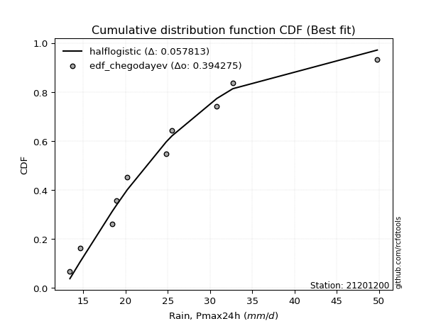</img>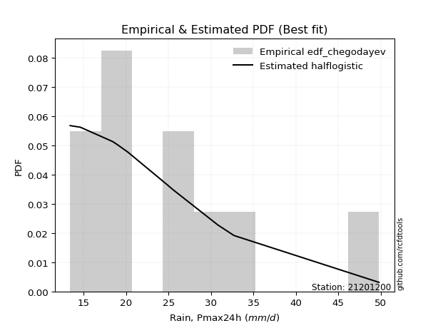</img>

</div>


### 6. EDF Blom (1958)

The Blom formula is a specific "plotting position" formula used in hydrology and statistical analysis to estimate the empirical cumulative probability (or non-exceedance probability) of a data series. It is particularly recommended for data that are approximately normally distributed. The constant _a_ is set to 0.375 (or 3/8).

<div align="center">


$P=(m-a)/(n+1-2a)$


</div>


**6.1. Empirical values**

<div align="center">

|                | 0                   | 1                   | 2                   | 3                   | 4                  | 5        | 6                  | 7                  | 8                  | 9                  | 10                 |
|:---------------|:--------------------|:--------------------|:--------------------|:--------------------|:-------------------|:---------|:-------------------|:-------------------|:-------------------|:-------------------|:-------------------|
| date           | 2015                | 2009                | 2008                | 2014                | 2024               | 2025     | 2012               | 2016               | 2010               | 2013               | 2011               |
| x              | 13.4                | 14.6                | 18.4                | 18.9                | 20.2               | 23.8     | 24.8               | 25.5               | 30.8               | 32.7               | 49.8               |
| m              | 1                   | 2                   | 3                   | 4                   | 5                  | 6        | 7                  | 8                  | 9                  | 10                 | 11                 |
| empirical_dist | edf_blom            | edf_blom            | edf_blom            | edf_blom            | edf_blom           | edf_blom | edf_blom           | edf_blom           | edf_blom           | edf_blom           | edf_blom           |
| empirical      | 0.05555555555555555 | 0.14444444444444443 | 0.23333333333333334 | 0.32222222222222224 | 0.4111111111111111 | 0.5      | 0.5888888888888889 | 0.6777777777777778 | 0.7666666666666667 | 0.8555555555555555 | 0.9444444444444444 |
| empirical_tr   | 1.0588235294117647  | 1.1688311688311688  | 1.3043478260869565  | 1.4754098360655736  | 1.6981132075471697 | 2.0      | 2.4324324324324325 | 3.1034482758620694 | 4.2857142857142865 | 6.923076923076921  | 17.999999999999993 |

</div>


**6.2. Kolmogorov-Smirnov fit test (sorted by Δ)**


<div align="center">

|                | 0                   | 1                   | 2                   | 3                    | 4                   | 5                   | 6                   | 7                   | 8                   | 9                   | 10                  | 11                  | 12                  | 13                  | 14                  | 15                  | 16                  | 17                  | 18                  | 19                  | 20                  | 21                  | 22                  | 23                  | 24                  | 25                  | 26                  | 27                  | 28                  | 29                  | 30                  | 31                  | 32                  | 33                  | 34                  | 35                  | 36                  | 37                  | 38                  | 39                  | 40                  | 41                  | 42                  | 43                  | 44                  | 45                  | 46                  | 47                  | 48                  | 49                  | 50                  | 51                  | 52                  | 53                  | 54                  | 55                  | 56                  | 57                  | 58                  | 59                  | 60                  | 61                  | 62                  | 63                  | 64                  | 65                  | 66                  | 67                  | 68                  | 69                  | 70                  | 71                  | 72                  | 73                  | 74                  | 75                  | 76                  | 77                  | 78                  | 79                  | 80                  | 81                  | 82                  | 83                  | 84                  | 85                  | 86                  | 87                  | 88                  | 89                  | 90                  | 91                  | 92                  | 93                  | 94                  | 95                  | 96                  | 97                  | 98                  | 99                  | 100                 | 101                 | 102                 | 103                 | 104                 | 105                 | 106                 | 107                 | 108                 | 109                 | 110                 | 111                 | 112                 | 113                 | 114                 | 115                 | 116                 | 117                 | 118                 | 119                 | 120                 | 121                 | 122                 | 123                 | 124                 | 125                 | 126                 | 127                 | 128                 | 129                 | 130                 | 131                 | 132                 | 133                 | 134                 | 135                 | 136                 | 137                 | 138                 | 139                 | 140                 | 141                 | 142                 | 143                 | 144                 | 145                 | 146                 | 147                 | 148                 | 149                 | 150                 | 151                 | 152                 | 153                 | 154                 | 155                 | 156                 | 157                 | 158                 | 159                 |
|:---------------|:--------------------|:--------------------|:--------------------|:---------------------|:--------------------|:--------------------|:--------------------|:--------------------|:--------------------|:--------------------|:--------------------|:--------------------|:--------------------|:--------------------|:--------------------|:--------------------|:--------------------|:--------------------|:--------------------|:--------------------|:--------------------|:--------------------|:--------------------|:--------------------|:--------------------|:--------------------|:--------------------|:--------------------|:--------------------|:--------------------|:--------------------|:--------------------|:--------------------|:--------------------|:--------------------|:--------------------|:--------------------|:--------------------|:--------------------|:--------------------|:--------------------|:--------------------|:--------------------|:--------------------|:--------------------|:--------------------|:--------------------|:--------------------|:--------------------|:--------------------|:--------------------|:--------------------|:--------------------|:--------------------|:--------------------|:--------------------|:--------------------|:--------------------|:--------------------|:--------------------|:--------------------|:--------------------|:--------------------|:--------------------|:--------------------|:--------------------|:--------------------|:--------------------|:--------------------|:--------------------|:--------------------|:--------------------|:--------------------|:--------------------|:--------------------|:--------------------|:--------------------|:--------------------|:--------------------|:--------------------|:--------------------|:--------------------|:--------------------|:--------------------|:--------------------|:--------------------|:--------------------|:--------------------|:--------------------|:--------------------|:--------------------|:--------------------|:--------------------|:--------------------|:--------------------|:--------------------|:--------------------|:--------------------|:--------------------|:--------------------|:--------------------|:--------------------|:--------------------|:--------------------|:--------------------|:--------------------|:--------------------|:--------------------|:--------------------|:--------------------|:--------------------|:--------------------|:--------------------|:--------------------|:--------------------|:--------------------|:--------------------|:--------------------|:--------------------|:--------------------|:--------------------|:--------------------|:--------------------|:--------------------|:--------------------|:--------------------|:--------------------|:--------------------|:--------------------|:--------------------|:--------------------|:--------------------|:--------------------|:--------------------|:--------------------|:--------------------|:--------------------|:--------------------|:--------------------|:--------------------|:--------------------|:--------------------|:--------------------|:--------------------|:--------------------|:--------------------|:--------------------|:--------------------|:--------------------|:--------------------|:--------------------|:--------------------|:--------------------|:--------------------|:--------------------|:--------------------|:--------------------|:--------------------|:--------------------|:--------------------|
| station        | 21201200            | 21201200            | 21201200            | 21201200             | 21201200            | 21201200            | 21201200            | 21201200            | 21201200            | 21201200            | 21201200            | 21201200            | 21201200            | 21201200            | 21201200            | 21201200            | 21201200            | 21201200            | 21201200            | 21201200            | 21201200            | 21201200            | 21201200            | 21201200            | 21201200            | 21201200            | 21201200            | 21201200            | 21201200            | 21201200            | 21201200            | 21201200            | 21201200            | 21201200            | 21201200            | 21201200            | 21201200            | 21201200            | 21201200            | 21201200            | 21201200            | 21201200            | 21201200            | 21201200            | 21201200            | 21201200            | 21201200            | 21201200            | 21201200            | 21201200            | 21201200            | 21201200            | 21201200            | 21201200            | 21201200            | 21201200            | 21201200            | 21201200            | 21201200            | 21201200            | 21201200            | 21201200            | 21201200            | 21201200            | 21201200            | 21201200            | 21201200            | 21201200            | 21201200            | 21201200            | 21201200            | 21201200            | 21201200            | 21201200            | 21201200            | 21201200            | 21201200            | 21201200            | 21201200            | 21201200            | 21201200            | 21201200            | 21201200            | 21201200            | 21201200            | 21201200            | 21201200            | 21201200            | 21201200            | 21201200            | 21201200            | 21201200            | 21201200            | 21201200            | 21201200            | 21201200            | 21201200            | 21201200            | 21201200            | 21201200            | 21201200            | 21201200            | 21201200            | 21201200            | 21201200            | 21201200            | 21201200            | 21201200            | 21201200            | 21201200            | 21201200            | 21201200            | 21201200            | 21201200            | 21201200            | 21201200            | 21201200            | 21201200            | 21201200            | 21201200            | 21201200            | 21201200            | 21201200            | 21201200            | 21201200            | 21201200            | 21201200            | 21201200            | 21201200            | 21201200            | 21201200            | 21201200            | 21201200            | 21201200            | 21201200            | 21201200            | 21201200            | 21201200            | 21201200            | 21201200            | 21201200            | 21201200            | 21201200            | 21201200            | 21201200            | 21201200            | 21201200            | 21201200            | 21201200            | 21201200            | 21201200            | 21201200            | 21201200            | 21201200            | 21201200            | 21201200            | 21201200            | 21201200            | 21201200            | 21201200            |
| empirical_dist | edf_blom            | edf_blom            | edf_blom            | edf_blom             | edf_blom            | edf_blom            | edf_blom            | edf_blom            | edf_blom            | edf_blom            | edf_blom            | edf_blom            | edf_blom            | edf_blom            | edf_blom            | edf_blom            | edf_blom            | edf_blom            | edf_blom            | edf_blom            | edf_blom            | edf_blom            | edf_blom            | edf_blom            | edf_blom            | edf_blom            | edf_blom            | edf_blom            | edf_blom            | edf_blom            | edf_blom            | edf_blom            | edf_blom            | edf_blom            | edf_blom            | edf_blom            | edf_blom            | edf_blom            | edf_blom            | edf_blom            | edf_blom            | edf_blom            | edf_blom            | edf_blom            | edf_blom            | edf_blom            | edf_blom            | edf_blom            | edf_blom            | edf_blom            | edf_blom            | edf_blom            | edf_blom            | edf_blom            | edf_blom            | edf_blom            | edf_blom            | edf_blom            | edf_blom            | edf_blom            | edf_blom            | edf_blom            | edf_blom            | edf_blom            | edf_blom            | edf_blom            | edf_blom            | edf_blom            | edf_blom            | edf_blom            | edf_blom            | edf_blom            | edf_blom            | edf_blom            | edf_blom            | edf_blom            | edf_blom            | edf_blom            | edf_blom            | edf_blom            | edf_blom            | edf_blom            | edf_blom            | edf_blom            | edf_blom            | edf_blom            | edf_blom            | edf_blom            | edf_blom            | edf_blom            | edf_blom            | edf_blom            | edf_blom            | edf_blom            | edf_blom            | edf_blom            | edf_blom            | edf_blom            | edf_blom            | edf_blom            | edf_blom            | edf_blom            | edf_blom            | edf_blom            | edf_blom            | edf_blom            | edf_blom            | edf_blom            | edf_blom            | edf_blom            | edf_blom            | edf_blom            | edf_blom            | edf_blom            | edf_blom            | edf_blom            | edf_blom            | edf_blom            | edf_blom            | edf_blom            | edf_blom            | edf_blom            | edf_blom            | edf_blom            | edf_blom            | edf_blom            | edf_blom            | edf_blom            | edf_blom            | edf_blom            | edf_blom            | edf_blom            | edf_blom            | edf_blom            | edf_blom            | edf_blom            | edf_blom            | edf_blom            | edf_blom            | edf_blom            | edf_blom            | edf_blom            | edf_blom            | edf_blom            | edf_blom            | edf_blom            | edf_blom            | edf_blom            | edf_blom            | edf_blom            | edf_blom            | edf_blom            | edf_blom            | edf_blom            | edf_blom            | edf_blom            | edf_blom            | edf_blom            | edf_blom            | edf_blom            |
| p_dist         | moyal               | betaprime           | ncf                 | logpearson3          | logbetaprime        | logmaxwell          | genlogistic         | pearson3            | logexponnorm        | loggenextreme       | logweibull_max      | halflogistic        | logvonmises         | truncnorm           | logrice             | logalpha            | alpha               | lognct              | loginvgamma         | lograyleigh         | logburr12           | logt                | logcrystalball      | lognorm             | logtriang           | logjohnsonsu        | genextreme          | invweibull          | logskewnorm         | f                   | logfoldnorm         | nct                 | loginvgauss         | invgamma            | logfatiguelife      | kappa3              | logloggamma         | loglogistic         | loggennorm          | johnsonsu           | logburr             | gumbel_r            | invgauss            | halfnorm            | genexpon            | loggamma            | loggamma            | logerlang           | logf                | gompertz            | fatiguelife         | exponnorm           | loghalfgennorm      | logweibull_min      | exponpow            | logdweibull         | dweibull            | logmielke           | loganglit           | foldnorm            | loggenlogistic      | burr                | kstwobign           | loggenexpon         | loghypsecant        | logdgamma           | logsemicircular     | logkstwobign        | logtruncweibull_min | skewnorm            | loggumbel_r         | logbradford         | tukeylambda         | gennorm             | logtruncexpon       | rayleigh            | loginvweibull       | dgamma              | logcosine           | truncweibull_min    | maxwell             | logarcsine          | bradford            | loglaplace          | loglaplace          | gausshyper          | loggompertz         | loghalfnorm         | logmoyal            | t                   | lomax               | loggumbel_l         | logloglaplace       | rice                | loggausshyper       | hypsecant           | logncf              | wald                | loghalflogistic     | beta                | logistic            | crystalball         | norm                | anglit              | laplace             | semicircular        | arcsine             | weibull_min         | logexponpow         | triang              | logkappa3           | logtukeylambda      | logkappa4           | vonmises_line       | loguniform          | logwald             | loggengamma         | logvonmises_line    | burr12              | logksone            | loglomax            | gumbel_l            | truncexpon          | logargus            | logrdist            | cosine              | halfgennorm         | genpareto           | logtruncnorm        | loggenpareto        | logwrapcauchy       | kappa4              | loggenhalflogistic  | argus               | ksone               | wrapcauchy          | uniform             | erlang              | loglevy_l           | powerlaw            | levy_l              | nakagami            | logjohnsonsb        | logtrapezoid        | lognakagami         | johnsonsb           | genhalflogistic     | rdist               | logpowerlaw         | gengamma            | logbeta             | gamma               | exponweib           | logexponweib        | trapezoid           | logtruncpareto      | weibull_max         | truncpareto         | vonmises            | mielke              |
| delta          | 0.05358804809252615 | 0.05494737082197598 | 0.05808053943642566 | 0.058133826980870995 | 0.05878200037733228 | 0.06092794060442597 | 0.06327806577308348 | 0.06635199762176158 | 0.0667837967999767  | 0.06699387385939048 | 0.06700399589778461 | 0.06762314302718753 | 0.0679095531670536  | 0.06852118322003072 | 0.06856198952473236 | 0.06913798568284701 | 0.0697703936038454  | 0.07020329951774595 | 0.07119953872819862 | 0.07124516297285632 | 0.07224849417952661 | 0.07326127655019676 | 0.07326138065116772 | 0.07326145347862201 | 0.07372055495122348 | 0.0737264845190424  | 0.07400602017120994 | 0.07400809646591033 | 0.07403433317771135 | 0.07444778611846736 | 0.07454031944008704 | 0.07481711119780021 | 0.07495778874969816 | 0.0749613836278542  | 0.07530747989310682 | 0.0756133094938363  | 0.07589639530014258 | 0.0777141093491821  | 0.07848903609679247 | 0.07868102778579922 | 0.0787126086810116  | 0.07902467946994174 | 0.0794559217336146  | 0.08011514845466317 | 0.08038094820830488 | 0.08155845461204025 | 0.08155845461204025 | 0.08155851763175903 | 0.08160332198031073 | 0.0821509973385427  | 0.08232469277614507 | 0.08257245894653076 | 0.08410395300560397 | 0.08448662229285908 | 0.08518957139178873 | 0.0855743612368845  | 0.08676103371072602 | 0.0874448256640008  | 0.08766820980585066 | 0.08787857973976682 | 0.08824360179775714 | 0.09030161810057391 | 0.09139739380748635 | 0.09147823723333176 | 0.09158169169921265 | 0.09360532506567237 | 0.09364570627224855 | 0.0937070696086566  | 0.09512540454199159 | 0.09881309790910486 | 0.09990783668329861 | 0.10394482321487197 | 0.10427865644807943 | 0.10511185530030304 | 0.10598324782800739 | 0.10760588387365588 | 0.10817349909925289 | 0.11158232062576495 | 0.11387638113292997 | 0.11467983733644715 | 0.11795296715182846 | 0.11936824892047859 | 0.11942149320307882 | 0.11980144746934684 | 0.11980144746934684 | 0.12044406408782993 | 0.12085613154570907 | 0.12521939136809718 | 0.12531831673789162 | 0.12598274598968073 | 0.13116926985387806 | 0.1321773254526022  | 0.13263361412789654 | 0.13284682657322877 | 0.13960245854102532 | 0.14258901096144827 | 0.14357201313161283 | 0.14444444444444443 | 0.14444444444444443 | 0.1453137560706308  | 0.14584342497311398 | 0.14966712422159556 | 0.14966714339288378 | 0.15368058083538572 | 0.15405631220835514 | 0.15533457272400786 | 0.1626833487530981  | 0.16449241344127646 | 0.1655626568219813  | 0.17566191708374856 | 0.1852037202444145  | 0.18645813865972438 | 0.18689989623536707 | 0.1876037827049205  | 0.1876473583521056  | 0.19586136267682985 | 0.1989636284538639  | 0.19952129611631686 | 0.2030971262574875  | 0.20590889339994511 | 0.20656410942733477 | 0.21862996244806399 | 0.22048194146269845 | 0.22091652736065281 | 0.2242736285863457  | 0.22768315852258963 | 0.23620320560248326 | 0.25519092883661    | 0.2562720237194856  | 0.2856265241540412  | 0.2893882468126062  | 0.29824507014282053 | 0.3117050904220169  | 0.32411891467067167 | 0.3303724053724052  | 0.3360001326923733  | 0.3453601953601954  | 0.34829977381212446 | 0.3809827365354683  | 0.4206062393913484  | 0.4225792134111457  | 0.43535394450031156 | 0.4353821748288815  | 0.43593478338088887 | 0.4615824854722172  | 0.462860301167685   | 0.4645747917467093  | 0.47143800334929653 | 0.47550911021064707 | 0.49050302176818666 | 0.4986739306795693  | 0.5052945397513307  | 0.5120385419721489  | 0.5443524290843176  | 0.5797382143192581  | 0.6477428351249837  | 0.6799708963544814  | 0.6895613537391354  | 7.299610485967985   | nan                 |
| deltao         | 0.37613735880099997 | 0.37613735880099997 | 0.37613735880099997 | 0.37613735880099997  | 0.37613735880099997 | 0.37613735880099997 | 0.37613735880099997 | 0.37613735880099997 | 0.37613735880099997 | 0.37613735880099997 | 0.37613735880099997 | 0.37613735880099997 | 0.37613735880099997 | 0.37613735880099997 | 0.37613735880099997 | 0.37613735880099997 | 0.37613735880099997 | 0.37613735880099997 | 0.37613735880099997 | 0.37613735880099997 | 0.37613735880099997 | 0.37613735880099997 | 0.37613735880099997 | 0.37613735880099997 | 0.37613735880099997 | 0.37613735880099997 | 0.37613735880099997 | 0.37613735880099997 | 0.37613735880099997 | 0.37613735880099997 | 0.37613735880099997 | 0.37613735880099997 | 0.37613735880099997 | 0.37613735880099997 | 0.37613735880099997 | 0.37613735880099997 | 0.37613735880099997 | 0.37613735880099997 | 0.37613735880099997 | 0.37613735880099997 | 0.37613735880099997 | 0.37613735880099997 | 0.37613735880099997 | 0.37613735880099997 | 0.37613735880099997 | 0.37613735880099997 | 0.37613735880099997 | 0.37613735880099997 | 0.37613735880099997 | 0.37613735880099997 | 0.37613735880099997 | 0.37613735880099997 | 0.37613735880099997 | 0.37613735880099997 | 0.37613735880099997 | 0.37613735880099997 | 0.37613735880099997 | 0.37613735880099997 | 0.37613735880099997 | 0.37613735880099997 | 0.37613735880099997 | 0.37613735880099997 | 0.37613735880099997 | 0.37613735880099997 | 0.37613735880099997 | 0.37613735880099997 | 0.37613735880099997 | 0.37613735880099997 | 0.37613735880099997 | 0.37613735880099997 | 0.37613735880099997 | 0.37613735880099997 | 0.37613735880099997 | 0.37613735880099997 | 0.37613735880099997 | 0.37613735880099997 | 0.37613735880099997 | 0.37613735880099997 | 0.37613735880099997 | 0.37613735880099997 | 0.37613735880099997 | 0.37613735880099997 | 0.37613735880099997 | 0.37613735880099997 | 0.37613735880099997 | 0.37613735880099997 | 0.37613735880099997 | 0.37613735880099997 | 0.37613735880099997 | 0.37613735880099997 | 0.37613735880099997 | 0.37613735880099997 | 0.37613735880099997 | 0.37613735880099997 | 0.37613735880099997 | 0.37613735880099997 | 0.37613735880099997 | 0.37613735880099997 | 0.37613735880099997 | 0.37613735880099997 | 0.37613735880099997 | 0.37613735880099997 | 0.37613735880099997 | 0.37613735880099997 | 0.37613735880099997 | 0.37613735880099997 | 0.37613735880099997 | 0.37613735880099997 | 0.37613735880099997 | 0.37613735880099997 | 0.37613735880099997 | 0.37613735880099997 | 0.37613735880099997 | 0.37613735880099997 | 0.37613735880099997 | 0.37613735880099997 | 0.37613735880099997 | 0.37613735880099997 | 0.37613735880099997 | 0.37613735880099997 | 0.37613735880099997 | 0.37613735880099997 | 0.37613735880099997 | 0.37613735880099997 | 0.37613735880099997 | 0.37613735880099997 | 0.37613735880099997 | 0.37613735880099997 | 0.37613735880099997 | 0.37613735880099997 | 0.37613735880099997 | 0.37613735880099997 | 0.37613735880099997 | 0.37613735880099997 | 0.37613735880099997 | 0.37613735880099997 | 0.37613735880099997 | 0.37613735880099997 | 0.37613735880099997 | 0.37613735880099997 | 0.37613735880099997 | 0.37613735880099997 | 0.37613735880099997 | 0.37613735880099997 | 0.37613735880099997 | 0.37613735880099997 | 0.37613735880099997 | 0.37613735880099997 | 0.37613735880099997 | 0.37613735880099997 | 0.37613735880099997 | 0.37613735880099997 | 0.37613735880099997 | 0.37613735880099997 | 0.37613735880099997 | 0.37613735880099997 | 0.37613735880099997 | 0.37613735880099997 | 0.37613735880099997 | 0.37613735880099997 |
| eval           | Δo > Δ              | Δo > Δ              | Δo > Δ              | Δo > Δ               | Δo > Δ              | Δo > Δ              | Δo > Δ              | Δo > Δ              | Δo > Δ              | Δo > Δ              | Δo > Δ              | Δo > Δ              | Δo > Δ              | Δo > Δ              | Δo > Δ              | Δo > Δ              | Δo > Δ              | Δo > Δ              | Δo > Δ              | Δo > Δ              | Δo > Δ              | Δo > Δ              | Δo > Δ              | Δo > Δ              | Δo > Δ              | Δo > Δ              | Δo > Δ              | Δo > Δ              | Δo > Δ              | Δo > Δ              | Δo > Δ              | Δo > Δ              | Δo > Δ              | Δo > Δ              | Δo > Δ              | Δo > Δ              | Δo > Δ              | Δo > Δ              | Δo > Δ              | Δo > Δ              | Δo > Δ              | Δo > Δ              | Δo > Δ              | Δo > Δ              | Δo > Δ              | Δo > Δ              | Δo > Δ              | Δo > Δ              | Δo > Δ              | Δo > Δ              | Δo > Δ              | Δo > Δ              | Δo > Δ              | Δo > Δ              | Δo > Δ              | Δo > Δ              | Δo > Δ              | Δo > Δ              | Δo > Δ              | Δo > Δ              | Δo > Δ              | Δo > Δ              | Δo > Δ              | Δo > Δ              | Δo > Δ              | Δo > Δ              | Δo > Δ              | Δo > Δ              | Δo > Δ              | Δo > Δ              | Δo > Δ              | Δo > Δ              | Δo > Δ              | Δo > Δ              | Δo > Δ              | Δo > Δ              | Δo > Δ              | Δo > Δ              | Δo > Δ              | Δo > Δ              | Δo > Δ              | Δo > Δ              | Δo > Δ              | Δo > Δ              | Δo > Δ              | Δo > Δ              | Δo > Δ              | Δo > Δ              | Δo > Δ              | Δo > Δ              | Δo > Δ              | Δo > Δ              | Δo > Δ              | Δo > Δ              | Δo > Δ              | Δo > Δ              | Δo > Δ              | Δo > Δ              | Δo > Δ              | Δo > Δ              | Δo > Δ              | Δo > Δ              | Δo > Δ              | Δo > Δ              | Δo > Δ              | Δo > Δ              | Δo > Δ              | Δo > Δ              | Δo > Δ              | Δo > Δ              | Δo > Δ              | Δo > Δ              | Δo > Δ              | Δo > Δ              | Δo > Δ              | Δo > Δ              | Δo > Δ              | Δo > Δ              | Δo > Δ              | Δo > Δ              | Δo > Δ              | Δo > Δ              | Δo > Δ              | Δo > Δ              | Δo > Δ              | Δo > Δ              | Δo > Δ              | Δo > Δ              | Δo > Δ              | Δo > Δ              | Δo > Δ              | Δo > Δ              | Δo > Δ              | Δo > Δ              | Δo > Δ              | Δo > Δ              | Δo > Δ              | Δo > Δ              | Δo <= Δ             | Δo <= Δ             | Δo <= Δ             | Δo <= Δ             | Δo <= Δ             | Δo <= Δ             | Δo <= Δ             | Δo <= Δ             | Δo <= Δ             | Δo <= Δ             | Δo <= Δ             | Δo <= Δ             | Δo <= Δ             | Δo <= Δ             | Δo <= Δ             | Δo <= Δ             | Δo <= Δ             | Δo <= Δ             | Δo <= Δ             | Δo <= Δ             | Δo <= Δ             | Δo <= Δ             |
| fit            | 1                   | 1                   | 1                   | 1                    | 1                   | 1                   | 1                   | 1                   | 1                   | 1                   | 1                   | 1                   | 1                   | 1                   | 1                   | 1                   | 1                   | 1                   | 1                   | 1                   | 1                   | 1                   | 1                   | 1                   | 1                   | 1                   | 1                   | 1                   | 1                   | 1                   | 1                   | 1                   | 1                   | 1                   | 1                   | 1                   | 1                   | 1                   | 1                   | 1                   | 1                   | 1                   | 1                   | 1                   | 1                   | 1                   | 1                   | 1                   | 1                   | 1                   | 1                   | 1                   | 1                   | 1                   | 1                   | 1                   | 1                   | 1                   | 1                   | 1                   | 1                   | 1                   | 1                   | 1                   | 1                   | 1                   | 1                   | 1                   | 1                   | 1                   | 1                   | 1                   | 1                   | 1                   | 1                   | 1                   | 1                   | 1                   | 1                   | 1                   | 1                   | 1                   | 1                   | 1                   | 1                   | 1                   | 1                   | 1                   | 1                   | 1                   | 1                   | 1                   | 1                   | 1                   | 1                   | 1                   | 1                   | 1                   | 1                   | 1                   | 1                   | 1                   | 1                   | 1                   | 1                   | 1                   | 1                   | 1                   | 1                   | 1                   | 1                   | 1                   | 1                   | 1                   | 1                   | 1                   | 1                   | 1                   | 1                   | 1                   | 1                   | 1                   | 1                   | 1                   | 1                   | 1                   | 1                   | 1                   | 1                   | 1                   | 1                   | 1                   | 1                   | 1                   | 1                   | 1                   | 1                   | 1                   | 0                   | 0                   | 0                   | 0                   | 0                   | 0                   | 0                   | 0                   | 0                   | 0                   | 0                   | 0                   | 0                   | 0                   | 0                   | 0                   | 0                   | 0                   | 0                   | 0                   | 0                   | 0                   |
| n              | 11                  | 11                  | 11                  | 11                   | 11                  | 11                  | 11                  | 11                  | 11                  | 11                  | 11                  | 11                  | 11                  | 11                  | 11                  | 11                  | 11                  | 11                  | 11                  | 11                  | 11                  | 11                  | 11                  | 11                  | 11                  | 11                  | 11                  | 11                  | 11                  | 11                  | 11                  | 11                  | 11                  | 11                  | 11                  | 11                  | 11                  | 11                  | 11                  | 11                  | 11                  | 11                  | 11                  | 11                  | 11                  | 11                  | 11                  | 11                  | 11                  | 11                  | 11                  | 11                  | 11                  | 11                  | 11                  | 11                  | 11                  | 11                  | 11                  | 11                  | 11                  | 11                  | 11                  | 11                  | 11                  | 11                  | 11                  | 11                  | 11                  | 11                  | 11                  | 11                  | 11                  | 11                  | 11                  | 11                  | 11                  | 11                  | 11                  | 11                  | 11                  | 11                  | 11                  | 11                  | 11                  | 11                  | 11                  | 11                  | 11                  | 11                  | 11                  | 11                  | 11                  | 11                  | 11                  | 11                  | 11                  | 11                  | 11                  | 11                  | 11                  | 11                  | 11                  | 11                  | 11                  | 11                  | 11                  | 11                  | 11                  | 11                  | 11                  | 11                  | 11                  | 11                  | 11                  | 11                  | 11                  | 11                  | 11                  | 11                  | 11                  | 11                  | 11                  | 11                  | 11                  | 11                  | 11                  | 11                  | 11                  | 11                  | 11                  | 11                  | 11                  | 11                  | 11                  | 11                  | 11                  | 11                  | 11                  | 11                  | 11                  | 11                  | 11                  | 11                  | 11                  | 11                  | 11                  | 11                  | 11                  | 11                  | 11                  | 11                  | 11                  | 11                  | 11                  | 11                  | 11                  | 11                  | 11                  | 11                  |
| best_fit       | 1                   | 0                   | 0                   | 0                    | 0                   | 0                   | 0                   | 0                   | 0                   | 0                   | 0                   | 0                   | 0                   | 0                   | 0                   | 0                   | 0                   | 0                   | 0                   | 0                   | 0                   | 0                   | 0                   | 0                   | 0                   | 0                   | 0                   | 0                   | 0                   | 0                   | 0                   | 0                   | 0                   | 0                   | 0                   | 0                   | 0                   | 0                   | 0                   | 0                   | 0                   | 0                   | 0                   | 0                   | 0                   | 0                   | 0                   | 0                   | 0                   | 0                   | 0                   | 0                   | 0                   | 0                   | 0                   | 0                   | 0                   | 0                   | 0                   | 0                   | 0                   | 0                   | 0                   | 0                   | 0                   | 0                   | 0                   | 0                   | 0                   | 0                   | 0                   | 0                   | 0                   | 0                   | 0                   | 0                   | 0                   | 0                   | 0                   | 0                   | 0                   | 0                   | 0                   | 0                   | 0                   | 0                   | 0                   | 0                   | 0                   | 0                   | 0                   | 0                   | 0                   | 0                   | 0                   | 0                   | 0                   | 0                   | 0                   | 0                   | 0                   | 0                   | 0                   | 0                   | 0                   | 0                   | 0                   | 0                   | 0                   | 0                   | 0                   | 0                   | 0                   | 0                   | 0                   | 0                   | 0                   | 0                   | 0                   | 0                   | 0                   | 0                   | 0                   | 0                   | 0                   | 0                   | 0                   | 0                   | 0                   | 0                   | 0                   | 0                   | 0                   | 0                   | 0                   | 0                   | 0                   | 0                   | 0                   | 0                   | 0                   | 0                   | 0                   | 0                   | 0                   | 0                   | 0                   | 0                   | 0                   | 0                   | 0                   | 0                   | 0                   | 0                   | 0                   | 0                   | 0                   | 0                   | 0                   | 0                   |
| best_fit_sort  | 1                   | 2                   | 3                   | 4                    | 5                   | 6                   | 7                   | 8                   | 9                   | 10                  | 11                  | 12                  | 13                  | 14                  | 15                  | 16                  | 17                  | 18                  | 19                  | 20                  | 21                  | 22                  | 23                  | 24                  | 25                  | 26                  | 27                  | 28                  | 29                  | 30                  | 31                  | 32                  | 33                  | 34                  | 35                  | 36                  | 37                  | 38                  | 39                  | 40                  | 41                  | 42                  | 43                  | 44                  | 45                  | 46                  | 47                  | 48                  | 49                  | 50                  | 51                  | 52                  | 53                  | 54                  | 55                  | 56                  | 57                  | 58                  | 59                  | 60                  | 61                  | 62                  | 63                  | 64                  | 65                  | 66                  | 67                  | 68                  | 69                  | 70                  | 71                  | 72                  | 73                  | 74                  | 75                  | 76                  | 77                  | 78                  | 79                  | 80                  | 81                  | 82                  | 83                  | 84                  | 85                  | 86                  | 87                  | 88                  | 89                  | 90                  | 91                  | 92                  | 93                  | 94                  | 95                  | 96                  | 97                  | 98                  | 99                  | 100                 | 101                 | 102                 | 103                 | 104                 | 105                 | 106                 | 107                 | 108                 | 109                 | 110                 | 111                 | 112                 | 113                 | 114                 | 115                 | 116                 | 117                 | 118                 | 119                 | 120                 | 121                 | 122                 | 123                 | 124                 | 125                 | 126                 | 127                 | 128                 | 129                 | 130                 | 131                 | 132                 | 133                 | 134                 | 135                 | 136                 | 137                 | 138                 | 139                 | 140                 | 141                 | 142                 | 143                 | 144                 | 145                 | 146                 | 147                 | 148                 | 149                 | 150                 | 151                 | 152                 | 153                 | 154                 | 155                 | 156                 | 157                 | 158                 | 159                 | 160                 |

</div>


**6.3. Best fit**

<div align="center">

|   id |   station | empirical_dist   | p_dist   |    delta |   deltao | eval   |   fit |   n |   best_fit |   best_fit_sort |
|-----:|----------:|:-----------------|:---------|---------:|---------:|:-------|------:|----:|-----------:|----------------:|
|    0 |  21201200 | edf_blom         | moyal    | 0.053588 | 0.376137 | Δo > Δ |     1 |  11 |          1 |               1 |

</div>


<div align="center">

</img>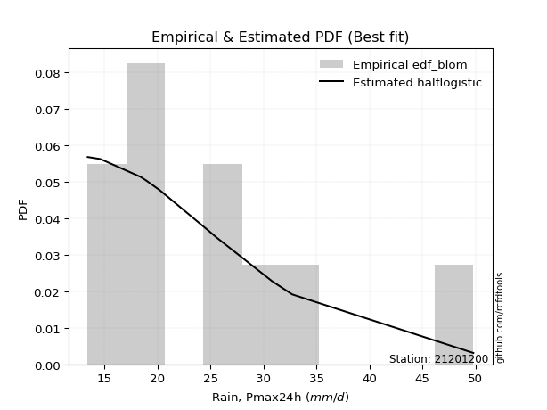</img>

</div>


### 7. EDF Tukey (1962)

In hydrology, the Tukey formula is used as a plotting position formula to estimate the empirical probability or frequency of a flood event (or other hydrological data). The formula parameter is given as _c=0.333_ (or 1/3).

<div align="center">


$P=(m-c)/(n+1-2c)$


</div>


**7.1. Empirical values**

<div align="center">

|                | 0                    | 1                   | 2                   | 3                  | 4                  | 5         | 6                  | 7                  | 8                  | 9                  | 10                 |
|:---------------|:---------------------|:--------------------|:--------------------|:-------------------|:-------------------|:----------|:-------------------|:-------------------|:-------------------|:-------------------|:-------------------|
| date           | 2015                 | 2009                | 2008                | 2014               | 2024               | 2025      | 2012               | 2016               | 2010               | 2013               | 2011               |
| x              | 13.4                 | 14.6                | 18.4                | 18.9               | 20.2               | 23.8      | 24.8               | 25.5               | 30.8               | 32.7               | 49.8               |
| m              | 1                    | 2                   | 3                   | 4                  | 5                  | 6         | 7                  | 8                  | 9                  | 10                 | 11                 |
| empirical_dist | edf_tukey            | edf_tukey           | edf_tukey           | edf_tukey          | edf_tukey          | edf_tukey | edf_tukey          | edf_tukey          | edf_tukey          | edf_tukey          | edf_tukey          |
| empirical      | 0.058823529411764705 | 0.14705882352941177 | 0.23529411764705882 | 0.3235294117647059 | 0.4117647058823529 | 0.5       | 0.5882352941176471 | 0.6764705882352942 | 0.7647058823529411 | 0.8529411764705882 | 0.9411764705882353 |
| empirical_tr   | 1.0625               | 1.1724137931034484  | 1.3076923076923077  | 1.4782608695652173 | 1.7                | 2.0       | 2.428571428571429  | 3.0909090909090913 | 4.249999999999999  | 6.799999999999999  | 16.999999999999996 |

</div>


**7.2. Kolmogorov-Smirnov fit test (sorted by Δ)**


<div align="center">

|                | 0                   | 1                   | 2                    | 3                   | 4                   | 5                   | 6                   | 7                   | 8                   | 9                   | 10                  | 11                  | 12                  | 13                  | 14                  | 15                  | 16                  | 17                  | 18                  | 19                  | 20                  | 21                  | 22                  | 23                  | 24                  | 25                  | 26                  | 27                  | 28                  | 29                  | 30                  | 31                  | 32                  | 33                  | 34                  | 35                  | 36                  | 37                  | 38                  | 39                  | 40                  | 41                  | 42                  | 43                  | 44                  | 45                  | 46                  | 47                  | 48                  | 49                  | 50                  | 51                  | 52                  | 53                  | 54                  | 55                  | 56                  | 57                  | 58                  | 59                  | 60                  | 61                  | 62                  | 63                  | 64                  | 65                  | 66                  | 67                  | 68                  | 69                  | 70                  | 71                  | 72                  | 73                  | 74                  | 75                  | 76                  | 77                  | 78                  | 79                  | 80                  | 81                  | 82                  | 83                  | 84                  | 85                  | 86                  | 87                  | 88                  | 89                  | 90                  | 91                  | 92                  | 93                  | 94                  | 95                  | 96                  | 97                  | 98                  | 99                  | 100                 | 101                 | 102                 | 103                 | 104                 | 105                 | 106                 | 107                 | 108                 | 109                 | 110                 | 111                 | 112                 | 113                 | 114                 | 115                 | 116                 | 117                 | 118                 | 119                 | 120                 | 121                 | 122                 | 123                 | 124                 | 125                 | 126                 | 127                 | 128                 | 129                 | 130                 | 131                 | 132                 | 133                 | 134                 | 135                 | 136                 | 137                 | 138                 | 139                 | 140                 | 141                 | 142                 | 143                 | 144                 | 145                 | 146                 | 147                 | 148                 | 149                 | 150                 | 151                 | 152                 | 153                 | 154                 | 155                 | 156                 | 157                 | 158                 | 159                 |
|:---------------|:--------------------|:--------------------|:---------------------|:--------------------|:--------------------|:--------------------|:--------------------|:--------------------|:--------------------|:--------------------|:--------------------|:--------------------|:--------------------|:--------------------|:--------------------|:--------------------|:--------------------|:--------------------|:--------------------|:--------------------|:--------------------|:--------------------|:--------------------|:--------------------|:--------------------|:--------------------|:--------------------|:--------------------|:--------------------|:--------------------|:--------------------|:--------------------|:--------------------|:--------------------|:--------------------|:--------------------|:--------------------|:--------------------|:--------------------|:--------------------|:--------------------|:--------------------|:--------------------|:--------------------|:--------------------|:--------------------|:--------------------|:--------------------|:--------------------|:--------------------|:--------------------|:--------------------|:--------------------|:--------------------|:--------------------|:--------------------|:--------------------|:--------------------|:--------------------|:--------------------|:--------------------|:--------------------|:--------------------|:--------------------|:--------------------|:--------------------|:--------------------|:--------------------|:--------------------|:--------------------|:--------------------|:--------------------|:--------------------|:--------------------|:--------------------|:--------------------|:--------------------|:--------------------|:--------------------|:--------------------|:--------------------|:--------------------|:--------------------|:--------------------|:--------------------|:--------------------|:--------------------|:--------------------|:--------------------|:--------------------|:--------------------|:--------------------|:--------------------|:--------------------|:--------------------|:--------------------|:--------------------|:--------------------|:--------------------|:--------------------|:--------------------|:--------------------|:--------------------|:--------------------|:--------------------|:--------------------|:--------------------|:--------------------|:--------------------|:--------------------|:--------------------|:--------------------|:--------------------|:--------------------|:--------------------|:--------------------|:--------------------|:--------------------|:--------------------|:--------------------|:--------------------|:--------------------|:--------------------|:--------------------|:--------------------|:--------------------|:--------------------|:--------------------|:--------------------|:--------------------|:--------------------|:--------------------|:--------------------|:--------------------|:--------------------|:--------------------|:--------------------|:--------------------|:--------------------|:--------------------|:--------------------|:--------------------|:--------------------|:--------------------|:--------------------|:--------------------|:--------------------|:--------------------|:--------------------|:--------------------|:--------------------|:--------------------|:--------------------|:--------------------|:--------------------|:--------------------|:--------------------|:--------------------|:--------------------|:--------------------|
| station        | 21201200            | 21201200            | 21201200             | 21201200            | 21201200            | 21201200            | 21201200            | 21201200            | 21201200            | 21201200            | 21201200            | 21201200            | 21201200            | 21201200            | 21201200            | 21201200            | 21201200            | 21201200            | 21201200            | 21201200            | 21201200            | 21201200            | 21201200            | 21201200            | 21201200            | 21201200            | 21201200            | 21201200            | 21201200            | 21201200            | 21201200            | 21201200            | 21201200            | 21201200            | 21201200            | 21201200            | 21201200            | 21201200            | 21201200            | 21201200            | 21201200            | 21201200            | 21201200            | 21201200            | 21201200            | 21201200            | 21201200            | 21201200            | 21201200            | 21201200            | 21201200            | 21201200            | 21201200            | 21201200            | 21201200            | 21201200            | 21201200            | 21201200            | 21201200            | 21201200            | 21201200            | 21201200            | 21201200            | 21201200            | 21201200            | 21201200            | 21201200            | 21201200            | 21201200            | 21201200            | 21201200            | 21201200            | 21201200            | 21201200            | 21201200            | 21201200            | 21201200            | 21201200            | 21201200            | 21201200            | 21201200            | 21201200            | 21201200            | 21201200            | 21201200            | 21201200            | 21201200            | 21201200            | 21201200            | 21201200            | 21201200            | 21201200            | 21201200            | 21201200            | 21201200            | 21201200            | 21201200            | 21201200            | 21201200            | 21201200            | 21201200            | 21201200            | 21201200            | 21201200            | 21201200            | 21201200            | 21201200            | 21201200            | 21201200            | 21201200            | 21201200            | 21201200            | 21201200            | 21201200            | 21201200            | 21201200            | 21201200            | 21201200            | 21201200            | 21201200            | 21201200            | 21201200            | 21201200            | 21201200            | 21201200            | 21201200            | 21201200            | 21201200            | 21201200            | 21201200            | 21201200            | 21201200            | 21201200            | 21201200            | 21201200            | 21201200            | 21201200            | 21201200            | 21201200            | 21201200            | 21201200            | 21201200            | 21201200            | 21201200            | 21201200            | 21201200            | 21201200            | 21201200            | 21201200            | 21201200            | 21201200            | 21201200            | 21201200            | 21201200            | 21201200            | 21201200            | 21201200            | 21201200            | 21201200            | 21201200            |
| empirical_dist | edf_tukey           | edf_tukey           | edf_tukey            | edf_tukey           | edf_tukey           | edf_tukey           | edf_tukey           | edf_tukey           | edf_tukey           | edf_tukey           | edf_tukey           | edf_tukey           | edf_tukey           | edf_tukey           | edf_tukey           | edf_tukey           | edf_tukey           | edf_tukey           | edf_tukey           | edf_tukey           | edf_tukey           | edf_tukey           | edf_tukey           | edf_tukey           | edf_tukey           | edf_tukey           | edf_tukey           | edf_tukey           | edf_tukey           | edf_tukey           | edf_tukey           | edf_tukey           | edf_tukey           | edf_tukey           | edf_tukey           | edf_tukey           | edf_tukey           | edf_tukey           | edf_tukey           | edf_tukey           | edf_tukey           | edf_tukey           | edf_tukey           | edf_tukey           | edf_tukey           | edf_tukey           | edf_tukey           | edf_tukey           | edf_tukey           | edf_tukey           | edf_tukey           | edf_tukey           | edf_tukey           | edf_tukey           | edf_tukey           | edf_tukey           | edf_tukey           | edf_tukey           | edf_tukey           | edf_tukey           | edf_tukey           | edf_tukey           | edf_tukey           | edf_tukey           | edf_tukey           | edf_tukey           | edf_tukey           | edf_tukey           | edf_tukey           | edf_tukey           | edf_tukey           | edf_tukey           | edf_tukey           | edf_tukey           | edf_tukey           | edf_tukey           | edf_tukey           | edf_tukey           | edf_tukey           | edf_tukey           | edf_tukey           | edf_tukey           | edf_tukey           | edf_tukey           | edf_tukey           | edf_tukey           | edf_tukey           | edf_tukey           | edf_tukey           | edf_tukey           | edf_tukey           | edf_tukey           | edf_tukey           | edf_tukey           | edf_tukey           | edf_tukey           | edf_tukey           | edf_tukey           | edf_tukey           | edf_tukey           | edf_tukey           | edf_tukey           | edf_tukey           | edf_tukey           | edf_tukey           | edf_tukey           | edf_tukey           | edf_tukey           | edf_tukey           | edf_tukey           | edf_tukey           | edf_tukey           | edf_tukey           | edf_tukey           | edf_tukey           | edf_tukey           | edf_tukey           | edf_tukey           | edf_tukey           | edf_tukey           | edf_tukey           | edf_tukey           | edf_tukey           | edf_tukey           | edf_tukey           | edf_tukey           | edf_tukey           | edf_tukey           | edf_tukey           | edf_tukey           | edf_tukey           | edf_tukey           | edf_tukey           | edf_tukey           | edf_tukey           | edf_tukey           | edf_tukey           | edf_tukey           | edf_tukey           | edf_tukey           | edf_tukey           | edf_tukey           | edf_tukey           | edf_tukey           | edf_tukey           | edf_tukey           | edf_tukey           | edf_tukey           | edf_tukey           | edf_tukey           | edf_tukey           | edf_tukey           | edf_tukey           | edf_tukey           | edf_tukey           | edf_tukey           | edf_tukey           | edf_tukey           | edf_tukey           | edf_tukey           |
| p_dist         | moyal               | betaprime           | ncf                  | logbetaprime        | logpearson3         | logmaxwell          | genlogistic         | pearson3            | halflogistic        | logvonmises         | logexponnorm        | loggenextreme       | logweibull_max      | logalpha            | alpha               | lognct              | truncnorm           | logrice             | loginvgamma         | lograyleigh         | logt                | logcrystalball      | lognorm             | logburr12           | logfoldnorm         | logjohnsonsu        | genextreme          | invweibull          | logskewnorm         | f                   | logloggamma         | nct                 | loginvgauss         | invgamma            | logfatiguelife      | logtriang           | loggennorm          | gumbel_r            | halfnorm            | kappa3              | loglogistic         | genexpon            | johnsonsu           | logburr             | invgauss            | gompertz            | loggamma            | loggamma            | logerlang           | logf                | loghalfgennorm      | fatiguelife         | exponnorm           | dweibull            | logdweibull         | exponpow            | logweibull_min      | foldnorm            | loganglit           | logmielke           | loggenlogistic      | kstwobign           | burr                | loggenexpon         | logdgamma           | loghypsecant        | logsemicircular     | logtruncweibull_min | logkstwobign        | skewnorm            | loggumbel_r         | logbradford         | logtruncexpon       | gennorm             | rayleigh            | tukeylambda         | loginvweibull       | truncweibull_min    | dgamma              | logcosine           | maxwell             | logarcsine          | bradford            | loggompertz         | gausshyper          | loglaplace          | loglaplace          | t                   | logmoyal            | loghalfnorm         | lomax               | loggumbel_l         | rice                | logloglaplace       | loggausshyper       | logncf              | hypsecant           | beta                | logistic            | wald                | loghalflogistic     | crystalball         | norm                | anglit              | semicircular        | laplace             | arcsine             | weibull_min         | logexponpow         | triang              | logkappa3           | logtukeylambda      | logkappa4           | loguniform          | vonmises_line       | logwald             | loggengamma         | logvonmises_line    | burr12              | logksone            | loglomax            | gumbel_l            | truncexpon          | logargus            | logrdist            | cosine              | halfgennorm         | genpareto           | logtruncnorm        | loggenpareto        | logwrapcauchy       | kappa4              | loggenhalflogistic  | argus               | ksone               | wrapcauchy          | uniform             | erlang              | loglevy_l           | powerlaw            | levy_l              | logjohnsonsb        | nakagami            | logtrapezoid        | lognakagami         | johnsonsb           | genhalflogistic     | rdist               | logpowerlaw         | gengamma            | logbeta             | gamma               | exponweib           | logexponweib        | trapezoid           | logtruncpareto      | weibull_max         | truncpareto         | vonmises            | mielke              |
| delta          | 0.0552243907688707  | 0.05630760946841383 | 0.056773349893942004 | 0.05747481083484862 | 0.0591637392338724  | 0.06092794060442597 | 0.06357185473272675 | 0.06504480807927793 | 0.06566235871346204 | 0.06660236362456995 | 0.0667837967999767  | 0.06699387385939048 | 0.06700399589778461 | 0.06913798568284701 | 0.0697703936038454  | 0.07020329951774595 | 0.07113556230499805 | 0.0711763686096997  | 0.07119953872819862 | 0.07124516297285632 | 0.07195408700771311 | 0.07195419110868406 | 0.07195426393613835 | 0.07224849417952661 | 0.07257953512636156 | 0.0737264845190424  | 0.07400602017120994 | 0.07400809646591033 | 0.07403433317771135 | 0.07444778611846736 | 0.07458920575765893 | 0.07481711119780021 | 0.07495778874969816 | 0.0749613836278542  | 0.07530747989310682 | 0.07633493403619082 | 0.07718184655430882 | 0.07771748992745808 | 0.07815436414093768 | 0.07822768857880363 | 0.07836770412042393 | 0.0784201638945794  | 0.07868102778579922 | 0.0787126086810116  | 0.0794559217336146  | 0.08019021302481721 | 0.08155845461204025 | 0.08155845461204025 | 0.08155851763175903 | 0.08160332198031073 | 0.08214316869187849 | 0.08232469277614507 | 0.08257245894653076 | 0.08349305985451687 | 0.08361357692315902 | 0.08388238184930508 | 0.08448662229285908 | 0.08591779542604133 | 0.086361020263367   | 0.0874448256640008  | 0.08824360179775714 | 0.0900902042650027  | 0.09030161810057391 | 0.09123871355128832 | 0.09164454075194689 | 0.09223528647045448 | 0.0923385167297649  | 0.0931646202282661  | 0.0937070696086566  | 0.09750590836662121 | 0.09990783668329861 | 0.10133044412990466 | 0.1040224635142819  | 0.10576545007154486 | 0.10629869433117223 | 0.10689303553304674 | 0.10817349909925289 | 0.11206545825147984 | 0.11223591539700678 | 0.11256919159044632 | 0.1166457776093448  | 0.11675386983551128 | 0.11680711411811151 | 0.11889534723198358 | 0.11913687454534627 | 0.12045504224058867 | 0.12045504224058867 | 0.12467555644719708 | 0.12531831673789162 | 0.12783377045306452 | 0.12920848554015257 | 0.13087013591011853 | 0.13153963703074512 | 0.13328720889913837 | 0.13764167422729984 | 0.14095763404664552 | 0.14128182141896461 | 0.14269937698566348 | 0.14453623543063032 | 0.14705882352941177 | 0.14705882352941177 | 0.1483599346791119  | 0.14835995385040013 | 0.15237339129290206 | 0.1540273831815242  | 0.15470990697959697 | 0.1605913118868605  | 0.16253162912755098 | 0.1636018725082558  | 0.1743547275412649  | 0.18389653070193085 | 0.18515094911724073 | 0.1855927066928834  | 0.18634016880962195 | 0.1895645670186461  | 0.19586136267682985 | 0.1970028441401384  | 0.1982141065738332  | 0.201136341943762   | 0.2032945143149778  | 0.2046033251136093  | 0.21732277290558033 | 0.2191747519202148  | 0.21960933781816916 | 0.22165924950137839 | 0.22637596898010598 | 0.23424242128875777 | 0.2525765497516427  | 0.2543112394057601  | 0.2823585502978321  | 0.2867738677276389  | 0.2969378806003369  | 0.3090907113370496  | 0.322811725128188   | 0.3277580262874379  | 0.33338575360740597 | 0.34405300581771175 | 0.346338989498399   | 0.3777147626792592  | 0.4186454550776229  | 0.41931123955493654 | 0.4327677957439141  | 0.4333931601865861  | 0.4346275938384052  | 0.4596217011584917  | 0.4602459220827177  | 0.461960412661742   | 0.4681700294930874  | 0.4735483258969216  | 0.4885422374544612  | 0.4967131463658438  | 0.5033337554376052  | 0.5100777576584234  | 0.5423916447705921  | 0.5771238352342908  | 0.6457820508112582  | 0.6773565172695141  | 0.686946974654168   | 7.3028784598241945  | nan                 |
| deltao         | 0.37613735880099997 | 0.37613735880099997 | 0.37613735880099997  | 0.37613735880099997 | 0.37613735880099997 | 0.37613735880099997 | 0.37613735880099997 | 0.37613735880099997 | 0.37613735880099997 | 0.37613735880099997 | 0.37613735880099997 | 0.37613735880099997 | 0.37613735880099997 | 0.37613735880099997 | 0.37613735880099997 | 0.37613735880099997 | 0.37613735880099997 | 0.37613735880099997 | 0.37613735880099997 | 0.37613735880099997 | 0.37613735880099997 | 0.37613735880099997 | 0.37613735880099997 | 0.37613735880099997 | 0.37613735880099997 | 0.37613735880099997 | 0.37613735880099997 | 0.37613735880099997 | 0.37613735880099997 | 0.37613735880099997 | 0.37613735880099997 | 0.37613735880099997 | 0.37613735880099997 | 0.37613735880099997 | 0.37613735880099997 | 0.37613735880099997 | 0.37613735880099997 | 0.37613735880099997 | 0.37613735880099997 | 0.37613735880099997 | 0.37613735880099997 | 0.37613735880099997 | 0.37613735880099997 | 0.37613735880099997 | 0.37613735880099997 | 0.37613735880099997 | 0.37613735880099997 | 0.37613735880099997 | 0.37613735880099997 | 0.37613735880099997 | 0.37613735880099997 | 0.37613735880099997 | 0.37613735880099997 | 0.37613735880099997 | 0.37613735880099997 | 0.37613735880099997 | 0.37613735880099997 | 0.37613735880099997 | 0.37613735880099997 | 0.37613735880099997 | 0.37613735880099997 | 0.37613735880099997 | 0.37613735880099997 | 0.37613735880099997 | 0.37613735880099997 | 0.37613735880099997 | 0.37613735880099997 | 0.37613735880099997 | 0.37613735880099997 | 0.37613735880099997 | 0.37613735880099997 | 0.37613735880099997 | 0.37613735880099997 | 0.37613735880099997 | 0.37613735880099997 | 0.37613735880099997 | 0.37613735880099997 | 0.37613735880099997 | 0.37613735880099997 | 0.37613735880099997 | 0.37613735880099997 | 0.37613735880099997 | 0.37613735880099997 | 0.37613735880099997 | 0.37613735880099997 | 0.37613735880099997 | 0.37613735880099997 | 0.37613735880099997 | 0.37613735880099997 | 0.37613735880099997 | 0.37613735880099997 | 0.37613735880099997 | 0.37613735880099997 | 0.37613735880099997 | 0.37613735880099997 | 0.37613735880099997 | 0.37613735880099997 | 0.37613735880099997 | 0.37613735880099997 | 0.37613735880099997 | 0.37613735880099997 | 0.37613735880099997 | 0.37613735880099997 | 0.37613735880099997 | 0.37613735880099997 | 0.37613735880099997 | 0.37613735880099997 | 0.37613735880099997 | 0.37613735880099997 | 0.37613735880099997 | 0.37613735880099997 | 0.37613735880099997 | 0.37613735880099997 | 0.37613735880099997 | 0.37613735880099997 | 0.37613735880099997 | 0.37613735880099997 | 0.37613735880099997 | 0.37613735880099997 | 0.37613735880099997 | 0.37613735880099997 | 0.37613735880099997 | 0.37613735880099997 | 0.37613735880099997 | 0.37613735880099997 | 0.37613735880099997 | 0.37613735880099997 | 0.37613735880099997 | 0.37613735880099997 | 0.37613735880099997 | 0.37613735880099997 | 0.37613735880099997 | 0.37613735880099997 | 0.37613735880099997 | 0.37613735880099997 | 0.37613735880099997 | 0.37613735880099997 | 0.37613735880099997 | 0.37613735880099997 | 0.37613735880099997 | 0.37613735880099997 | 0.37613735880099997 | 0.37613735880099997 | 0.37613735880099997 | 0.37613735880099997 | 0.37613735880099997 | 0.37613735880099997 | 0.37613735880099997 | 0.37613735880099997 | 0.37613735880099997 | 0.37613735880099997 | 0.37613735880099997 | 0.37613735880099997 | 0.37613735880099997 | 0.37613735880099997 | 0.37613735880099997 | 0.37613735880099997 | 0.37613735880099997 | 0.37613735880099997 | 0.37613735880099997 |
| eval           | Δo > Δ              | Δo > Δ              | Δo > Δ               | Δo > Δ              | Δo > Δ              | Δo > Δ              | Δo > Δ              | Δo > Δ              | Δo > Δ              | Δo > Δ              | Δo > Δ              | Δo > Δ              | Δo > Δ              | Δo > Δ              | Δo > Δ              | Δo > Δ              | Δo > Δ              | Δo > Δ              | Δo > Δ              | Δo > Δ              | Δo > Δ              | Δo > Δ              | Δo > Δ              | Δo > Δ              | Δo > Δ              | Δo > Δ              | Δo > Δ              | Δo > Δ              | Δo > Δ              | Δo > Δ              | Δo > Δ              | Δo > Δ              | Δo > Δ              | Δo > Δ              | Δo > Δ              | Δo > Δ              | Δo > Δ              | Δo > Δ              | Δo > Δ              | Δo > Δ              | Δo > Δ              | Δo > Δ              | Δo > Δ              | Δo > Δ              | Δo > Δ              | Δo > Δ              | Δo > Δ              | Δo > Δ              | Δo > Δ              | Δo > Δ              | Δo > Δ              | Δo > Δ              | Δo > Δ              | Δo > Δ              | Δo > Δ              | Δo > Δ              | Δo > Δ              | Δo > Δ              | Δo > Δ              | Δo > Δ              | Δo > Δ              | Δo > Δ              | Δo > Δ              | Δo > Δ              | Δo > Δ              | Δo > Δ              | Δo > Δ              | Δo > Δ              | Δo > Δ              | Δo > Δ              | Δo > Δ              | Δo > Δ              | Δo > Δ              | Δo > Δ              | Δo > Δ              | Δo > Δ              | Δo > Δ              | Δo > Δ              | Δo > Δ              | Δo > Δ              | Δo > Δ              | Δo > Δ              | Δo > Δ              | Δo > Δ              | Δo > Δ              | Δo > Δ              | Δo > Δ              | Δo > Δ              | Δo > Δ              | Δo > Δ              | Δo > Δ              | Δo > Δ              | Δo > Δ              | Δo > Δ              | Δo > Δ              | Δo > Δ              | Δo > Δ              | Δo > Δ              | Δo > Δ              | Δo > Δ              | Δo > Δ              | Δo > Δ              | Δo > Δ              | Δo > Δ              | Δo > Δ              | Δo > Δ              | Δo > Δ              | Δo > Δ              | Δo > Δ              | Δo > Δ              | Δo > Δ              | Δo > Δ              | Δo > Δ              | Δo > Δ              | Δo > Δ              | Δo > Δ              | Δo > Δ              | Δo > Δ              | Δo > Δ              | Δo > Δ              | Δo > Δ              | Δo > Δ              | Δo > Δ              | Δo > Δ              | Δo > Δ              | Δo > Δ              | Δo > Δ              | Δo > Δ              | Δo > Δ              | Δo > Δ              | Δo > Δ              | Δo > Δ              | Δo > Δ              | Δo > Δ              | Δo > Δ              | Δo > Δ              | Δo > Δ              | Δo > Δ              | Δo <= Δ             | Δo <= Δ             | Δo <= Δ             | Δo <= Δ             | Δo <= Δ             | Δo <= Δ             | Δo <= Δ             | Δo <= Δ             | Δo <= Δ             | Δo <= Δ             | Δo <= Δ             | Δo <= Δ             | Δo <= Δ             | Δo <= Δ             | Δo <= Δ             | Δo <= Δ             | Δo <= Δ             | Δo <= Δ             | Δo <= Δ             | Δo <= Δ             | Δo <= Δ             | Δo <= Δ             |
| fit            | 1                   | 1                   | 1                    | 1                   | 1                   | 1                   | 1                   | 1                   | 1                   | 1                   | 1                   | 1                   | 1                   | 1                   | 1                   | 1                   | 1                   | 1                   | 1                   | 1                   | 1                   | 1                   | 1                   | 1                   | 1                   | 1                   | 1                   | 1                   | 1                   | 1                   | 1                   | 1                   | 1                   | 1                   | 1                   | 1                   | 1                   | 1                   | 1                   | 1                   | 1                   | 1                   | 1                   | 1                   | 1                   | 1                   | 1                   | 1                   | 1                   | 1                   | 1                   | 1                   | 1                   | 1                   | 1                   | 1                   | 1                   | 1                   | 1                   | 1                   | 1                   | 1                   | 1                   | 1                   | 1                   | 1                   | 1                   | 1                   | 1                   | 1                   | 1                   | 1                   | 1                   | 1                   | 1                   | 1                   | 1                   | 1                   | 1                   | 1                   | 1                   | 1                   | 1                   | 1                   | 1                   | 1                   | 1                   | 1                   | 1                   | 1                   | 1                   | 1                   | 1                   | 1                   | 1                   | 1                   | 1                   | 1                   | 1                   | 1                   | 1                   | 1                   | 1                   | 1                   | 1                   | 1                   | 1                   | 1                   | 1                   | 1                   | 1                   | 1                   | 1                   | 1                   | 1                   | 1                   | 1                   | 1                   | 1                   | 1                   | 1                   | 1                   | 1                   | 1                   | 1                   | 1                   | 1                   | 1                   | 1                   | 1                   | 1                   | 1                   | 1                   | 1                   | 1                   | 1                   | 1                   | 1                   | 0                   | 0                   | 0                   | 0                   | 0                   | 0                   | 0                   | 0                   | 0                   | 0                   | 0                   | 0                   | 0                   | 0                   | 0                   | 0                   | 0                   | 0                   | 0                   | 0                   | 0                   | 0                   |
| n              | 11                  | 11                  | 11                   | 11                  | 11                  | 11                  | 11                  | 11                  | 11                  | 11                  | 11                  | 11                  | 11                  | 11                  | 11                  | 11                  | 11                  | 11                  | 11                  | 11                  | 11                  | 11                  | 11                  | 11                  | 11                  | 11                  | 11                  | 11                  | 11                  | 11                  | 11                  | 11                  | 11                  | 11                  | 11                  | 11                  | 11                  | 11                  | 11                  | 11                  | 11                  | 11                  | 11                  | 11                  | 11                  | 11                  | 11                  | 11                  | 11                  | 11                  | 11                  | 11                  | 11                  | 11                  | 11                  | 11                  | 11                  | 11                  | 11                  | 11                  | 11                  | 11                  | 11                  | 11                  | 11                  | 11                  | 11                  | 11                  | 11                  | 11                  | 11                  | 11                  | 11                  | 11                  | 11                  | 11                  | 11                  | 11                  | 11                  | 11                  | 11                  | 11                  | 11                  | 11                  | 11                  | 11                  | 11                  | 11                  | 11                  | 11                  | 11                  | 11                  | 11                  | 11                  | 11                  | 11                  | 11                  | 11                  | 11                  | 11                  | 11                  | 11                  | 11                  | 11                  | 11                  | 11                  | 11                  | 11                  | 11                  | 11                  | 11                  | 11                  | 11                  | 11                  | 11                  | 11                  | 11                  | 11                  | 11                  | 11                  | 11                  | 11                  | 11                  | 11                  | 11                  | 11                  | 11                  | 11                  | 11                  | 11                  | 11                  | 11                  | 11                  | 11                  | 11                  | 11                  | 11                  | 11                  | 11                  | 11                  | 11                  | 11                  | 11                  | 11                  | 11                  | 11                  | 11                  | 11                  | 11                  | 11                  | 11                  | 11                  | 11                  | 11                  | 11                  | 11                  | 11                  | 11                  | 11                  | 11                  |
| best_fit       | 1                   | 0                   | 0                    | 0                   | 0                   | 0                   | 0                   | 0                   | 0                   | 0                   | 0                   | 0                   | 0                   | 0                   | 0                   | 0                   | 0                   | 0                   | 0                   | 0                   | 0                   | 0                   | 0                   | 0                   | 0                   | 0                   | 0                   | 0                   | 0                   | 0                   | 0                   | 0                   | 0                   | 0                   | 0                   | 0                   | 0                   | 0                   | 0                   | 0                   | 0                   | 0                   | 0                   | 0                   | 0                   | 0                   | 0                   | 0                   | 0                   | 0                   | 0                   | 0                   | 0                   | 0                   | 0                   | 0                   | 0                   | 0                   | 0                   | 0                   | 0                   | 0                   | 0                   | 0                   | 0                   | 0                   | 0                   | 0                   | 0                   | 0                   | 0                   | 0                   | 0                   | 0                   | 0                   | 0                   | 0                   | 0                   | 0                   | 0                   | 0                   | 0                   | 0                   | 0                   | 0                   | 0                   | 0                   | 0                   | 0                   | 0                   | 0                   | 0                   | 0                   | 0                   | 0                   | 0                   | 0                   | 0                   | 0                   | 0                   | 0                   | 0                   | 0                   | 0                   | 0                   | 0                   | 0                   | 0                   | 0                   | 0                   | 0                   | 0                   | 0                   | 0                   | 0                   | 0                   | 0                   | 0                   | 0                   | 0                   | 0                   | 0                   | 0                   | 0                   | 0                   | 0                   | 0                   | 0                   | 0                   | 0                   | 0                   | 0                   | 0                   | 0                   | 0                   | 0                   | 0                   | 0                   | 0                   | 0                   | 0                   | 0                   | 0                   | 0                   | 0                   | 0                   | 0                   | 0                   | 0                   | 0                   | 0                   | 0                   | 0                   | 0                   | 0                   | 0                   | 0                   | 0                   | 0                   | 0                   |
| best_fit_sort  | 1                   | 2                   | 3                    | 4                   | 5                   | 6                   | 7                   | 8                   | 9                   | 10                  | 11                  | 12                  | 13                  | 14                  | 15                  | 16                  | 17                  | 18                  | 19                  | 20                  | 21                  | 22                  | 23                  | 24                  | 25                  | 26                  | 27                  | 28                  | 29                  | 30                  | 31                  | 32                  | 33                  | 34                  | 35                  | 36                  | 37                  | 38                  | 39                  | 40                  | 41                  | 42                  | 43                  | 44                  | 45                  | 46                  | 47                  | 48                  | 49                  | 50                  | 51                  | 52                  | 53                  | 54                  | 55                  | 56                  | 57                  | 58                  | 59                  | 60                  | 61                  | 62                  | 63                  | 64                  | 65                  | 66                  | 67                  | 68                  | 69                  | 70                  | 71                  | 72                  | 73                  | 74                  | 75                  | 76                  | 77                  | 78                  | 79                  | 80                  | 81                  | 82                  | 83                  | 84                  | 85                  | 86                  | 87                  | 88                  | 89                  | 90                  | 91                  | 92                  | 93                  | 94                  | 95                  | 96                  | 97                  | 98                  | 99                  | 100                 | 101                 | 102                 | 103                 | 104                 | 105                 | 106                 | 107                 | 108                 | 109                 | 110                 | 111                 | 112                 | 113                 | 114                 | 115                 | 116                 | 117                 | 118                 | 119                 | 120                 | 121                 | 122                 | 123                 | 124                 | 125                 | 126                 | 127                 | 128                 | 129                 | 130                 | 131                 | 132                 | 133                 | 134                 | 135                 | 136                 | 137                 | 138                 | 139                 | 140                 | 141                 | 142                 | 143                 | 144                 | 145                 | 146                 | 147                 | 148                 | 149                 | 150                 | 151                 | 152                 | 153                 | 154                 | 155                 | 156                 | 157                 | 158                 | 159                 | 160                 |

</div>


**7.3. Best fit**

<div align="center">

|   id |   station | empirical_dist   | p_dist   |     delta |   deltao | eval   |   fit |   n |   best_fit |   best_fit_sort |
|-----:|----------:|:-----------------|:---------|----------:|---------:|:-------|------:|----:|-----------:|----------------:|
|    0 |  21201200 | edf_tukey        | moyal    | 0.0552244 | 0.376137 | Δo > Δ |     1 |  11 |          1 |               1 |

</div>


<div align="center">

</img></img>

</div>


### 8. EDF Gringorten (1963)

Gringorten plotting position formula is essential for estimating the probability and return periods of extreme events like floods and heavy rainfall. The constant _a=0.44_.

<div align="center">


$P=(m-a)/(n+1-2a)$


</div>


**8.1. Empirical values**

<div align="center">

|                | 0                   | 1                   | 2                  | 3                   | 4                   | 5              | 6                  | 7                  | 8                  | 9                  | 10                 |
|:---------------|:--------------------|:--------------------|:-------------------|:--------------------|:--------------------|:---------------|:-------------------|:-------------------|:-------------------|:-------------------|:-------------------|
| date           | 2015                | 2009                | 2008               | 2014                | 2024                | 2025           | 2012               | 2016               | 2010               | 2013               | 2011               |
| x              | 13.4                | 14.6                | 18.4               | 18.9                | 20.2                | 23.8           | 24.8               | 25.5               | 30.8               | 32.7               | 49.8               |
| m              | 1                   | 2                   | 3                  | 4                   | 5                   | 6              | 7                  | 8                  | 9                  | 10                 | 11                 |
| empirical_dist | edf_gringorten      | edf_gringorten      | edf_gringorten     | edf_gringorten      | edf_gringorten      | edf_gringorten | edf_gringorten     | edf_gringorten     | edf_gringorten     | edf_gringorten     | edf_gringorten     |
| empirical      | 0.05035971223021583 | 0.14028776978417268 | 0.2302158273381295 | 0.32014388489208634 | 0.41007194244604317 | 0.5            | 0.5899280575539568 | 0.6798561151079137 | 0.7697841726618706 | 0.8597122302158274 | 0.9496402877697843 |
| empirical_tr   | 1.053030303030303   | 1.1631799163179917  | 1.2990654205607477 | 1.470899470899471   | 1.6951219512195121  | 2.0            | 2.43859649122807   | 3.1235955056179776 | 4.343750000000002  | 7.128205128205133  | 19.857142857142893 |

</div>


**8.2. Kolmogorov-Smirnov fit test (sorted by Δ)**


<div align="center">

|                | 0                   | 1                   | 2                    | 3                   | 4                    | 5                   | 6                   | 7                   | 8                   | 9                   | 10                  | 11                  | 12                  | 13                  | 14                  | 15                  | 16                  | 17                  | 18                  | 19                  | 20                  | 21                  | 22                  | 23                  | 24                  | 25                  | 26                  | 27                  | 28                  | 29                  | 30                  | 31                  | 32                  | 33                  | 34                  | 35                  | 36                  | 37                  | 38                  | 39                  | 40                  | 41                  | 42                  | 43                  | 44                  | 45                  | 46                  | 47                  | 48                  | 49                  | 50                  | 51                  | 52                  | 53                  | 54                  | 55                  | 56                  | 57                  | 58                  | 59                  | 60                  | 61                  | 62                  | 63                  | 64                  | 65                  | 66                  | 67                  | 68                  | 69                  | 70                  | 71                  | 72                  | 73                  | 74                  | 75                  | 76                  | 77                  | 78                  | 79                  | 80                  | 81                  | 82                  | 83                  | 84                  | 85                  | 86                  | 87                  | 88                  | 89                  | 90                  | 91                  | 92                  | 93                  | 94                  | 95                  | 96                  | 97                  | 98                  | 99                  | 100                 | 101                 | 102                 | 103                 | 104                 | 105                 | 106                 | 107                 | 108                 | 109                 | 110                 | 111                 | 112                 | 113                 | 114                 | 115                 | 116                 | 117                 | 118                 | 119                 | 120                 | 121                 | 122                 | 123                 | 124                 | 125                 | 126                 | 127                 | 128                 | 129                 | 130                 | 131                 | 132                 | 133                 | 134                 | 135                 | 136                 | 137                 | 138                 | 139                 | 140                 | 141                 | 142                 | 143                 | 144                 | 145                 | 146                 | 147                 | 148                 | 149                 | 150                 | 151                 | 152                 | 153                 | 154                 | 155                 | 156                 | 157                 | 158                 | 159                 |
|:---------------|:--------------------|:--------------------|:---------------------|:--------------------|:---------------------|:--------------------|:--------------------|:--------------------|:--------------------|:--------------------|:--------------------|:--------------------|:--------------------|:--------------------|:--------------------|:--------------------|:--------------------|:--------------------|:--------------------|:--------------------|:--------------------|:--------------------|:--------------------|:--------------------|:--------------------|:--------------------|:--------------------|:--------------------|:--------------------|:--------------------|:--------------------|:--------------------|:--------------------|:--------------------|:--------------------|:--------------------|:--------------------|:--------------------|:--------------------|:--------------------|:--------------------|:--------------------|:--------------------|:--------------------|:--------------------|:--------------------|:--------------------|:--------------------|:--------------------|:--------------------|:--------------------|:--------------------|:--------------------|:--------------------|:--------------------|:--------------------|:--------------------|:--------------------|:--------------------|:--------------------|:--------------------|:--------------------|:--------------------|:--------------------|:--------------------|:--------------------|:--------------------|:--------------------|:--------------------|:--------------------|:--------------------|:--------------------|:--------------------|:--------------------|:--------------------|:--------------------|:--------------------|:--------------------|:--------------------|:--------------------|:--------------------|:--------------------|:--------------------|:--------------------|:--------------------|:--------------------|:--------------------|:--------------------|:--------------------|:--------------------|:--------------------|:--------------------|:--------------------|:--------------------|:--------------------|:--------------------|:--------------------|:--------------------|:--------------------|:--------------------|:--------------------|:--------------------|:--------------------|:--------------------|:--------------------|:--------------------|:--------------------|:--------------------|:--------------------|:--------------------|:--------------------|:--------------------|:--------------------|:--------------------|:--------------------|:--------------------|:--------------------|:--------------------|:--------------------|:--------------------|:--------------------|:--------------------|:--------------------|:--------------------|:--------------------|:--------------------|:--------------------|:--------------------|:--------------------|:--------------------|:--------------------|:--------------------|:--------------------|:--------------------|:--------------------|:--------------------|:--------------------|:--------------------|:--------------------|:--------------------|:--------------------|:--------------------|:--------------------|:--------------------|:--------------------|:--------------------|:--------------------|:--------------------|:--------------------|:--------------------|:--------------------|:--------------------|:--------------------|:--------------------|:--------------------|:--------------------|:--------------------|:--------------------|:--------------------|:--------------------|
| station        | 21201200            | 21201200            | 21201200             | 21201200            | 21201200             | 21201200            | 21201200            | 21201200            | 21201200            | 21201200            | 21201200            | 21201200            | 21201200            | 21201200            | 21201200            | 21201200            | 21201200            | 21201200            | 21201200            | 21201200            | 21201200            | 21201200            | 21201200            | 21201200            | 21201200            | 21201200            | 21201200            | 21201200            | 21201200            | 21201200            | 21201200            | 21201200            | 21201200            | 21201200            | 21201200            | 21201200            | 21201200            | 21201200            | 21201200            | 21201200            | 21201200            | 21201200            | 21201200            | 21201200            | 21201200            | 21201200            | 21201200            | 21201200            | 21201200            | 21201200            | 21201200            | 21201200            | 21201200            | 21201200            | 21201200            | 21201200            | 21201200            | 21201200            | 21201200            | 21201200            | 21201200            | 21201200            | 21201200            | 21201200            | 21201200            | 21201200            | 21201200            | 21201200            | 21201200            | 21201200            | 21201200            | 21201200            | 21201200            | 21201200            | 21201200            | 21201200            | 21201200            | 21201200            | 21201200            | 21201200            | 21201200            | 21201200            | 21201200            | 21201200            | 21201200            | 21201200            | 21201200            | 21201200            | 21201200            | 21201200            | 21201200            | 21201200            | 21201200            | 21201200            | 21201200            | 21201200            | 21201200            | 21201200            | 21201200            | 21201200            | 21201200            | 21201200            | 21201200            | 21201200            | 21201200            | 21201200            | 21201200            | 21201200            | 21201200            | 21201200            | 21201200            | 21201200            | 21201200            | 21201200            | 21201200            | 21201200            | 21201200            | 21201200            | 21201200            | 21201200            | 21201200            | 21201200            | 21201200            | 21201200            | 21201200            | 21201200            | 21201200            | 21201200            | 21201200            | 21201200            | 21201200            | 21201200            | 21201200            | 21201200            | 21201200            | 21201200            | 21201200            | 21201200            | 21201200            | 21201200            | 21201200            | 21201200            | 21201200            | 21201200            | 21201200            | 21201200            | 21201200            | 21201200            | 21201200            | 21201200            | 21201200            | 21201200            | 21201200            | 21201200            | 21201200            | 21201200            | 21201200            | 21201200            | 21201200            | 21201200            |
| empirical_dist | edf_gringorten      | edf_gringorten      | edf_gringorten       | edf_gringorten      | edf_gringorten       | edf_gringorten      | edf_gringorten      | edf_gringorten      | edf_gringorten      | edf_gringorten      | edf_gringorten      | edf_gringorten      | edf_gringorten      | edf_gringorten      | edf_gringorten      | edf_gringorten      | edf_gringorten      | edf_gringorten      | edf_gringorten      | edf_gringorten      | edf_gringorten      | edf_gringorten      | edf_gringorten      | edf_gringorten      | edf_gringorten      | edf_gringorten      | edf_gringorten      | edf_gringorten      | edf_gringorten      | edf_gringorten      | edf_gringorten      | edf_gringorten      | edf_gringorten      | edf_gringorten      | edf_gringorten      | edf_gringorten      | edf_gringorten      | edf_gringorten      | edf_gringorten      | edf_gringorten      | edf_gringorten      | edf_gringorten      | edf_gringorten      | edf_gringorten      | edf_gringorten      | edf_gringorten      | edf_gringorten      | edf_gringorten      | edf_gringorten      | edf_gringorten      | edf_gringorten      | edf_gringorten      | edf_gringorten      | edf_gringorten      | edf_gringorten      | edf_gringorten      | edf_gringorten      | edf_gringorten      | edf_gringorten      | edf_gringorten      | edf_gringorten      | edf_gringorten      | edf_gringorten      | edf_gringorten      | edf_gringorten      | edf_gringorten      | edf_gringorten      | edf_gringorten      | edf_gringorten      | edf_gringorten      | edf_gringorten      | edf_gringorten      | edf_gringorten      | edf_gringorten      | edf_gringorten      | edf_gringorten      | edf_gringorten      | edf_gringorten      | edf_gringorten      | edf_gringorten      | edf_gringorten      | edf_gringorten      | edf_gringorten      | edf_gringorten      | edf_gringorten      | edf_gringorten      | edf_gringorten      | edf_gringorten      | edf_gringorten      | edf_gringorten      | edf_gringorten      | edf_gringorten      | edf_gringorten      | edf_gringorten      | edf_gringorten      | edf_gringorten      | edf_gringorten      | edf_gringorten      | edf_gringorten      | edf_gringorten      | edf_gringorten      | edf_gringorten      | edf_gringorten      | edf_gringorten      | edf_gringorten      | edf_gringorten      | edf_gringorten      | edf_gringorten      | edf_gringorten      | edf_gringorten      | edf_gringorten      | edf_gringorten      | edf_gringorten      | edf_gringorten      | edf_gringorten      | edf_gringorten      | edf_gringorten      | edf_gringorten      | edf_gringorten      | edf_gringorten      | edf_gringorten      | edf_gringorten      | edf_gringorten      | edf_gringorten      | edf_gringorten      | edf_gringorten      | edf_gringorten      | edf_gringorten      | edf_gringorten      | edf_gringorten      | edf_gringorten      | edf_gringorten      | edf_gringorten      | edf_gringorten      | edf_gringorten      | edf_gringorten      | edf_gringorten      | edf_gringorten      | edf_gringorten      | edf_gringorten      | edf_gringorten      | edf_gringorten      | edf_gringorten      | edf_gringorten      | edf_gringorten      | edf_gringorten      | edf_gringorten      | edf_gringorten      | edf_gringorten      | edf_gringorten      | edf_gringorten      | edf_gringorten      | edf_gringorten      | edf_gringorten      | edf_gringorten      | edf_gringorten      | edf_gringorten      | edf_gringorten      | edf_gringorten      | edf_gringorten      |
| p_dist         | moyal               | betaprime           | logpearson3          | ncf                 | logbetaprime         | logmaxwell          | logrice             | genlogistic         | truncnorm           | logexponnorm        | loggenextreme       | logweibull_max      | pearson3            | logalpha            | logtriang           | alpha               | logvonmises         | lognct              | halflogistic        | loginvgamma         | lograyleigh         | kappa3              | logburr12           | logjohnsonsu        | genextreme          | invweibull          | logskewnorm         | f                   | nct                 | loginvgauss         | invgamma            | logfatiguelife      | logt                | logcrystalball      | lognorm             | loglogistic         | logfoldnorm         | logloggamma         | johnsonsu           | logburr             | invgauss            | loggennorm          | gumbel_r            | loggamma            | loggamma            | logerlang           | logf                | fatiguelife         | exponnorm           | halfnorm            | genexpon            | logweibull_min      | gompertz            | loghalfgennorm      | exponpow            | logmielke           | loggenlogistic      | logdweibull         | loganglit           | burr                | loghypsecant        | foldnorm            | dweibull            | kstwobign           | logkstwobign        | loggenexpon         | logsemicircular     | logdgamma           | logtruncweibull_min | loggumbel_r         | tukeylambda         | skewnorm            | gennorm             | logbradford         | loginvweibull       | logtruncexpon       | rayleigh            | dgamma              | logcosine           | loglaplace          | loglaplace          | truncweibull_min    | maxwell             | loghalfnorm         | gausshyper          | logarcsine          | bradford            | loggompertz         | logmoyal            | t                   | logloglaplace       | loggumbel_l         | lomax               | rice                | wald                | loghalflogistic     | loggausshyper       | hypsecant           | logncf              | logistic            | beta                | crystalball         | norm                | laplace             | anglit              | semicircular        | arcsine             | weibull_min         | logexponpow         | triang              | vonmises_line       | logkappa3           | logtukeylambda      | logkappa4           | loguniform          | logwald             | logvonmises_line    | loggengamma         | burr12              | loglomax            | logksone            | gumbel_l            | truncexpon          | logargus            | logrdist            | cosine              | halfgennorm         | genpareto           | logtruncnorm        | loggenpareto        | logwrapcauchy       | kappa4              | loggenhalflogistic  | argus               | ksone               | wrapcauchy          | uniform             | erlang              | loglevy_l           | powerlaw            | levy_l              | logtrapezoid        | nakagami            | logjohnsonsb        | lognakagami         | johnsonsb           | genhalflogistic     | rdist               | logpowerlaw         | gengamma            | logbeta             | gamma               | exponweib           | logexponweib        | trapezoid           | logtruncpareto      | weibull_max         | truncpareto         | vonmises            | mielke              |
| delta          | 0.055666385422662   | 0.05702570815211183 | 0.058133826980870995 | 0.06015887676656151 | 0.060860337707468126 | 0.06092794060442597 | 0.0644053148644606  | 0.06535640310321933 | 0.06574669574406078 | 0.0667837967999767  | 0.06699387385939048 | 0.06700399589778461 | 0.06843033495189743 | 0.06913798568284701 | 0.06956388029095173 | 0.0697703936038454  | 0.06998789049718945 | 0.07020329951774595 | 0.07074064902239136 | 0.07119953872819862 | 0.07124516297285632 | 0.07145663483356454 | 0.07224849417952661 | 0.0737264845190424  | 0.07400602017120994 | 0.07400809646591033 | 0.07403433317771135 | 0.07444778611846736 | 0.07481711119780021 | 0.07495778874969816 | 0.0749613836278542  | 0.07530747989310682 | 0.07533961388033261 | 0.07533971798130357 | 0.07533979080875786 | 0.07667494068411418 | 0.07765782543529087 | 0.07797473263027843 | 0.07868102778579922 | 0.0787126086810116  | 0.0794559217336146  | 0.08056737342692832 | 0.08110301680007759 | 0.08155845461204025 | 0.08155845461204025 | 0.08155851763175903 | 0.08160332198031073 | 0.08232469277614507 | 0.08257245894653076 | 0.083232654449867   | 0.08349845420350871 | 0.08448662229285908 | 0.08526850333374653 | 0.0872214590008078  | 0.08726790872192458 | 0.0874448256640008  | 0.08824360179775714 | 0.08869186723208833 | 0.08974654713598651 | 0.09030161810057391 | 0.09054252303414473 | 0.09099608573497064 | 0.09195687703606574 | 0.0934757311376222  | 0.0937070696086566  | 0.09459574322853559 | 0.0957240436023844  | 0.0967228310608762  | 0.09824291053719542 | 0.09990783668329861 | 0.10012198178780751 | 0.10089143523924071 | 0.10407268663523511 | 0.10810149787514389 | 0.10817349909925289 | 0.10910075382321122 | 0.10968422120379173 | 0.11054315196069703 | 0.11595471846306582 | 0.11876227880427892 | 0.11876227880427892 | 0.11883651199671907 | 0.12003130448196431 | 0.12106271670782542 | 0.12252240141796578 | 0.12352492358075051 | 0.12357816786335074 | 0.1239736375409129  | 0.12531831673789162 | 0.12806108331981658 | 0.1315944454628286  | 0.13425566278273804 | 0.13428677584908189 | 0.13492516390336462 | 0.14028776978417268 | 0.14028776978417268 | 0.14271996453622915 | 0.14466734829158412 | 0.14772868779188475 | 0.14792176230324983 | 0.14947043073090271 | 0.1517454615517314  | 0.15174548072301963 | 0.15301714354328722 | 0.15575891816552156 | 0.1574129100541437  | 0.16684002341337    | 0.1676099194364803  | 0.16868016281718512 | 0.1777402544138844  | 0.18448627670971662 | 0.18728205757455035 | 0.18853647598986023 | 0.18897823356550292 | 0.18972569568224146 | 0.19586136267682985 | 0.2015996334464527  | 0.20208113444906772 | 0.20621463225269132 | 0.2096816154225386  | 0.21006556806021703 | 0.22070829977819983 | 0.2225602787928343  | 0.22299486469078866 | 0.22843030324661762 | 0.22976149585272548 | 0.23932071159768709 | 0.2593476034968819  | 0.2593895297146894  | 0.29082236747938095 | 0.29354492147287814 | 0.3003234074729564  | 0.3158617650822888  | 0.3261972520008075  | 0.3345290800326771  | 0.3401568073526452  | 0.34743853269033126 | 0.3514172798073283  | 0.38617857986080806 | 0.4237237453865522  | 0.4277750567364854  | 0.4380131207110247  | 0.4384714504955154  | 0.4395388494891532  | 0.464699991467421   | 0.4670169758279569  | 0.4687314664069812  | 0.47663384667463626 | 0.4786266162058509  | 0.4936205277633905  | 0.5017914366747731  | 0.5084120457465344  | 0.5151560479673527  | 0.5474699350795214  | 0.58389488897953    | 0.6508603411201875  | 0.6841275710147533  | 0.6937180283994071  | 7.2944146426426455  | nan                 |
| deltao         | 0.37613735880099997 | 0.37613735880099997 | 0.37613735880099997  | 0.37613735880099997 | 0.37613735880099997  | 0.37613735880099997 | 0.37613735880099997 | 0.37613735880099997 | 0.37613735880099997 | 0.37613735880099997 | 0.37613735880099997 | 0.37613735880099997 | 0.37613735880099997 | 0.37613735880099997 | 0.37613735880099997 | 0.37613735880099997 | 0.37613735880099997 | 0.37613735880099997 | 0.37613735880099997 | 0.37613735880099997 | 0.37613735880099997 | 0.37613735880099997 | 0.37613735880099997 | 0.37613735880099997 | 0.37613735880099997 | 0.37613735880099997 | 0.37613735880099997 | 0.37613735880099997 | 0.37613735880099997 | 0.37613735880099997 | 0.37613735880099997 | 0.37613735880099997 | 0.37613735880099997 | 0.37613735880099997 | 0.37613735880099997 | 0.37613735880099997 | 0.37613735880099997 | 0.37613735880099997 | 0.37613735880099997 | 0.37613735880099997 | 0.37613735880099997 | 0.37613735880099997 | 0.37613735880099997 | 0.37613735880099997 | 0.37613735880099997 | 0.37613735880099997 | 0.37613735880099997 | 0.37613735880099997 | 0.37613735880099997 | 0.37613735880099997 | 0.37613735880099997 | 0.37613735880099997 | 0.37613735880099997 | 0.37613735880099997 | 0.37613735880099997 | 0.37613735880099997 | 0.37613735880099997 | 0.37613735880099997 | 0.37613735880099997 | 0.37613735880099997 | 0.37613735880099997 | 0.37613735880099997 | 0.37613735880099997 | 0.37613735880099997 | 0.37613735880099997 | 0.37613735880099997 | 0.37613735880099997 | 0.37613735880099997 | 0.37613735880099997 | 0.37613735880099997 | 0.37613735880099997 | 0.37613735880099997 | 0.37613735880099997 | 0.37613735880099997 | 0.37613735880099997 | 0.37613735880099997 | 0.37613735880099997 | 0.37613735880099997 | 0.37613735880099997 | 0.37613735880099997 | 0.37613735880099997 | 0.37613735880099997 | 0.37613735880099997 | 0.37613735880099997 | 0.37613735880099997 | 0.37613735880099997 | 0.37613735880099997 | 0.37613735880099997 | 0.37613735880099997 | 0.37613735880099997 | 0.37613735880099997 | 0.37613735880099997 | 0.37613735880099997 | 0.37613735880099997 | 0.37613735880099997 | 0.37613735880099997 | 0.37613735880099997 | 0.37613735880099997 | 0.37613735880099997 | 0.37613735880099997 | 0.37613735880099997 | 0.37613735880099997 | 0.37613735880099997 | 0.37613735880099997 | 0.37613735880099997 | 0.37613735880099997 | 0.37613735880099997 | 0.37613735880099997 | 0.37613735880099997 | 0.37613735880099997 | 0.37613735880099997 | 0.37613735880099997 | 0.37613735880099997 | 0.37613735880099997 | 0.37613735880099997 | 0.37613735880099997 | 0.37613735880099997 | 0.37613735880099997 | 0.37613735880099997 | 0.37613735880099997 | 0.37613735880099997 | 0.37613735880099997 | 0.37613735880099997 | 0.37613735880099997 | 0.37613735880099997 | 0.37613735880099997 | 0.37613735880099997 | 0.37613735880099997 | 0.37613735880099997 | 0.37613735880099997 | 0.37613735880099997 | 0.37613735880099997 | 0.37613735880099997 | 0.37613735880099997 | 0.37613735880099997 | 0.37613735880099997 | 0.37613735880099997 | 0.37613735880099997 | 0.37613735880099997 | 0.37613735880099997 | 0.37613735880099997 | 0.37613735880099997 | 0.37613735880099997 | 0.37613735880099997 | 0.37613735880099997 | 0.37613735880099997 | 0.37613735880099997 | 0.37613735880099997 | 0.37613735880099997 | 0.37613735880099997 | 0.37613735880099997 | 0.37613735880099997 | 0.37613735880099997 | 0.37613735880099997 | 0.37613735880099997 | 0.37613735880099997 | 0.37613735880099997 | 0.37613735880099997 | 0.37613735880099997 | 0.37613735880099997 |
| eval           | Δo > Δ              | Δo > Δ              | Δo > Δ               | Δo > Δ              | Δo > Δ               | Δo > Δ              | Δo > Δ              | Δo > Δ              | Δo > Δ              | Δo > Δ              | Δo > Δ              | Δo > Δ              | Δo > Δ              | Δo > Δ              | Δo > Δ              | Δo > Δ              | Δo > Δ              | Δo > Δ              | Δo > Δ              | Δo > Δ              | Δo > Δ              | Δo > Δ              | Δo > Δ              | Δo > Δ              | Δo > Δ              | Δo > Δ              | Δo > Δ              | Δo > Δ              | Δo > Δ              | Δo > Δ              | Δo > Δ              | Δo > Δ              | Δo > Δ              | Δo > Δ              | Δo > Δ              | Δo > Δ              | Δo > Δ              | Δo > Δ              | Δo > Δ              | Δo > Δ              | Δo > Δ              | Δo > Δ              | Δo > Δ              | Δo > Δ              | Δo > Δ              | Δo > Δ              | Δo > Δ              | Δo > Δ              | Δo > Δ              | Δo > Δ              | Δo > Δ              | Δo > Δ              | Δo > Δ              | Δo > Δ              | Δo > Δ              | Δo > Δ              | Δo > Δ              | Δo > Δ              | Δo > Δ              | Δo > Δ              | Δo > Δ              | Δo > Δ              | Δo > Δ              | Δo > Δ              | Δo > Δ              | Δo > Δ              | Δo > Δ              | Δo > Δ              | Δo > Δ              | Δo > Δ              | Δo > Δ              | Δo > Δ              | Δo > Δ              | Δo > Δ              | Δo > Δ              | Δo > Δ              | Δo > Δ              | Δo > Δ              | Δo > Δ              | Δo > Δ              | Δo > Δ              | Δo > Δ              | Δo > Δ              | Δo > Δ              | Δo > Δ              | Δo > Δ              | Δo > Δ              | Δo > Δ              | Δo > Δ              | Δo > Δ              | Δo > Δ              | Δo > Δ              | Δo > Δ              | Δo > Δ              | Δo > Δ              | Δo > Δ              | Δo > Δ              | Δo > Δ              | Δo > Δ              | Δo > Δ              | Δo > Δ              | Δo > Δ              | Δo > Δ              | Δo > Δ              | Δo > Δ              | Δo > Δ              | Δo > Δ              | Δo > Δ              | Δo > Δ              | Δo > Δ              | Δo > Δ              | Δo > Δ              | Δo > Δ              | Δo > Δ              | Δo > Δ              | Δo > Δ              | Δo > Δ              | Δo > Δ              | Δo > Δ              | Δo > Δ              | Δo > Δ              | Δo > Δ              | Δo > Δ              | Δo > Δ              | Δo > Δ              | Δo > Δ              | Δo > Δ              | Δo > Δ              | Δo > Δ              | Δo > Δ              | Δo > Δ              | Δo > Δ              | Δo > Δ              | Δo > Δ              | Δo > Δ              | Δo > Δ              | Δo > Δ              | Δo > Δ              | Δo <= Δ             | Δo <= Δ             | Δo <= Δ             | Δo <= Δ             | Δo <= Δ             | Δo <= Δ             | Δo <= Δ             | Δo <= Δ             | Δo <= Δ             | Δo <= Δ             | Δo <= Δ             | Δo <= Δ             | Δo <= Δ             | Δo <= Δ             | Δo <= Δ             | Δo <= Δ             | Δo <= Δ             | Δo <= Δ             | Δo <= Δ             | Δo <= Δ             | Δo <= Δ             | Δo <= Δ             |
| fit            | 1                   | 1                   | 1                    | 1                   | 1                    | 1                   | 1                   | 1                   | 1                   | 1                   | 1                   | 1                   | 1                   | 1                   | 1                   | 1                   | 1                   | 1                   | 1                   | 1                   | 1                   | 1                   | 1                   | 1                   | 1                   | 1                   | 1                   | 1                   | 1                   | 1                   | 1                   | 1                   | 1                   | 1                   | 1                   | 1                   | 1                   | 1                   | 1                   | 1                   | 1                   | 1                   | 1                   | 1                   | 1                   | 1                   | 1                   | 1                   | 1                   | 1                   | 1                   | 1                   | 1                   | 1                   | 1                   | 1                   | 1                   | 1                   | 1                   | 1                   | 1                   | 1                   | 1                   | 1                   | 1                   | 1                   | 1                   | 1                   | 1                   | 1                   | 1                   | 1                   | 1                   | 1                   | 1                   | 1                   | 1                   | 1                   | 1                   | 1                   | 1                   | 1                   | 1                   | 1                   | 1                   | 1                   | 1                   | 1                   | 1                   | 1                   | 1                   | 1                   | 1                   | 1                   | 1                   | 1                   | 1                   | 1                   | 1                   | 1                   | 1                   | 1                   | 1                   | 1                   | 1                   | 1                   | 1                   | 1                   | 1                   | 1                   | 1                   | 1                   | 1                   | 1                   | 1                   | 1                   | 1                   | 1                   | 1                   | 1                   | 1                   | 1                   | 1                   | 1                   | 1                   | 1                   | 1                   | 1                   | 1                   | 1                   | 1                   | 1                   | 1                   | 1                   | 1                   | 1                   | 1                   | 1                   | 0                   | 0                   | 0                   | 0                   | 0                   | 0                   | 0                   | 0                   | 0                   | 0                   | 0                   | 0                   | 0                   | 0                   | 0                   | 0                   | 0                   | 0                   | 0                   | 0                   | 0                   | 0                   |
| n              | 11                  | 11                  | 11                   | 11                  | 11                   | 11                  | 11                  | 11                  | 11                  | 11                  | 11                  | 11                  | 11                  | 11                  | 11                  | 11                  | 11                  | 11                  | 11                  | 11                  | 11                  | 11                  | 11                  | 11                  | 11                  | 11                  | 11                  | 11                  | 11                  | 11                  | 11                  | 11                  | 11                  | 11                  | 11                  | 11                  | 11                  | 11                  | 11                  | 11                  | 11                  | 11                  | 11                  | 11                  | 11                  | 11                  | 11                  | 11                  | 11                  | 11                  | 11                  | 11                  | 11                  | 11                  | 11                  | 11                  | 11                  | 11                  | 11                  | 11                  | 11                  | 11                  | 11                  | 11                  | 11                  | 11                  | 11                  | 11                  | 11                  | 11                  | 11                  | 11                  | 11                  | 11                  | 11                  | 11                  | 11                  | 11                  | 11                  | 11                  | 11                  | 11                  | 11                  | 11                  | 11                  | 11                  | 11                  | 11                  | 11                  | 11                  | 11                  | 11                  | 11                  | 11                  | 11                  | 11                  | 11                  | 11                  | 11                  | 11                  | 11                  | 11                  | 11                  | 11                  | 11                  | 11                  | 11                  | 11                  | 11                  | 11                  | 11                  | 11                  | 11                  | 11                  | 11                  | 11                  | 11                  | 11                  | 11                  | 11                  | 11                  | 11                  | 11                  | 11                  | 11                  | 11                  | 11                  | 11                  | 11                  | 11                  | 11                  | 11                  | 11                  | 11                  | 11                  | 11                  | 11                  | 11                  | 11                  | 11                  | 11                  | 11                  | 11                  | 11                  | 11                  | 11                  | 11                  | 11                  | 11                  | 11                  | 11                  | 11                  | 11                  | 11                  | 11                  | 11                  | 11                  | 11                  | 11                  | 11                  |
| best_fit       | 1                   | 0                   | 0                    | 0                   | 0                    | 0                   | 0                   | 0                   | 0                   | 0                   | 0                   | 0                   | 0                   | 0                   | 0                   | 0                   | 0                   | 0                   | 0                   | 0                   | 0                   | 0                   | 0                   | 0                   | 0                   | 0                   | 0                   | 0                   | 0                   | 0                   | 0                   | 0                   | 0                   | 0                   | 0                   | 0                   | 0                   | 0                   | 0                   | 0                   | 0                   | 0                   | 0                   | 0                   | 0                   | 0                   | 0                   | 0                   | 0                   | 0                   | 0                   | 0                   | 0                   | 0                   | 0                   | 0                   | 0                   | 0                   | 0                   | 0                   | 0                   | 0                   | 0                   | 0                   | 0                   | 0                   | 0                   | 0                   | 0                   | 0                   | 0                   | 0                   | 0                   | 0                   | 0                   | 0                   | 0                   | 0                   | 0                   | 0                   | 0                   | 0                   | 0                   | 0                   | 0                   | 0                   | 0                   | 0                   | 0                   | 0                   | 0                   | 0                   | 0                   | 0                   | 0                   | 0                   | 0                   | 0                   | 0                   | 0                   | 0                   | 0                   | 0                   | 0                   | 0                   | 0                   | 0                   | 0                   | 0                   | 0                   | 0                   | 0                   | 0                   | 0                   | 0                   | 0                   | 0                   | 0                   | 0                   | 0                   | 0                   | 0                   | 0                   | 0                   | 0                   | 0                   | 0                   | 0                   | 0                   | 0                   | 0                   | 0                   | 0                   | 0                   | 0                   | 0                   | 0                   | 0                   | 0                   | 0                   | 0                   | 0                   | 0                   | 0                   | 0                   | 0                   | 0                   | 0                   | 0                   | 0                   | 0                   | 0                   | 0                   | 0                   | 0                   | 0                   | 0                   | 0                   | 0                   | 0                   |
| best_fit_sort  | 1                   | 2                   | 3                    | 4                   | 5                    | 6                   | 7                   | 8                   | 9                   | 10                  | 11                  | 12                  | 13                  | 14                  | 15                  | 16                  | 17                  | 18                  | 19                  | 20                  | 21                  | 22                  | 23                  | 24                  | 25                  | 26                  | 27                  | 28                  | 29                  | 30                  | 31                  | 32                  | 33                  | 34                  | 35                  | 36                  | 37                  | 38                  | 39                  | 40                  | 41                  | 42                  | 43                  | 44                  | 45                  | 46                  | 47                  | 48                  | 49                  | 50                  | 51                  | 52                  | 53                  | 54                  | 55                  | 56                  | 57                  | 58                  | 59                  | 60                  | 61                  | 62                  | 63                  | 64                  | 65                  | 66                  | 67                  | 68                  | 69                  | 70                  | 71                  | 72                  | 73                  | 74                  | 75                  | 76                  | 77                  | 78                  | 79                  | 80                  | 81                  | 82                  | 83                  | 84                  | 85                  | 86                  | 87                  | 88                  | 89                  | 90                  | 91                  | 92                  | 93                  | 94                  | 95                  | 96                  | 97                  | 98                  | 99                  | 100                 | 101                 | 102                 | 103                 | 104                 | 105                 | 106                 | 107                 | 108                 | 109                 | 110                 | 111                 | 112                 | 113                 | 114                 | 115                 | 116                 | 117                 | 118                 | 119                 | 120                 | 121                 | 122                 | 123                 | 124                 | 125                 | 126                 | 127                 | 128                 | 129                 | 130                 | 131                 | 132                 | 133                 | 134                 | 135                 | 136                 | 137                 | 138                 | 139                 | 140                 | 141                 | 142                 | 143                 | 144                 | 145                 | 146                 | 147                 | 148                 | 149                 | 150                 | 151                 | 152                 | 153                 | 154                 | 155                 | 156                 | 157                 | 158                 | 159                 | 160                 |

</div>


**8.3. Best fit**

<div align="center">

|   id |   station | empirical_dist   | p_dist   |     delta |   deltao | eval   |   fit |   n |   best_fit |   best_fit_sort |
|-----:|----------:|:-----------------|:---------|----------:|---------:|:-------|------:|----:|-----------:|----------------:|
|    0 |  21201200 | edf_gringorten   | moyal    | 0.0556664 | 0.376137 | Δo > Δ |     1 |  11 |          1 |               1 |

</div>


<div align="center">

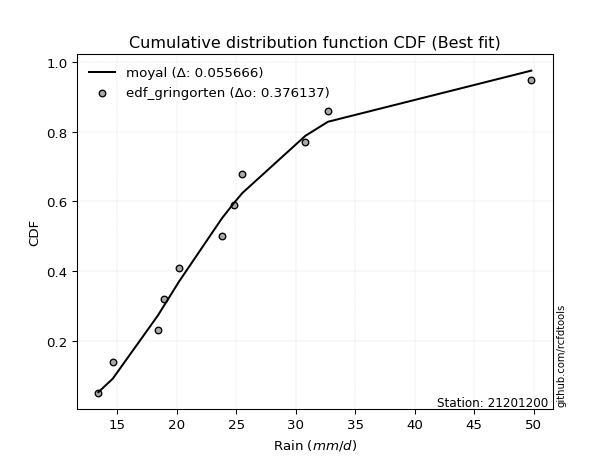</img>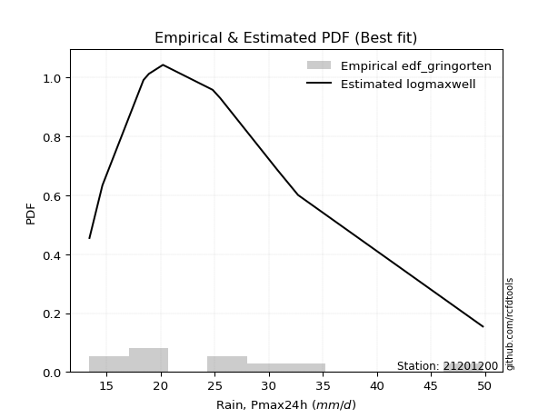</img>

</div>


### 9. EDF Filliben (1975)

The specific values of the constants (0.3175) (often denoted as $alpha$) and (0.365) are derived from a method proposed by James J. Filliben in a 1975 paper. This particular formula is the mean value of the $i$-th order statistic of the normal distribution and is considered a robust and effective plotting position formula for the normal probability plot correlation coefficient test for normality.

<div align="center">


$P=(m-0.3175)/(n+0.365)$


</div>


**9.1. Empirical values**

<div align="center">

|                | 0                    | 1                   | 2                   | 3                  | 4                   | 5            | 6                  | 7                  | 8                  | 9                  | 10                 |
|:---------------|:---------------------|:--------------------|:--------------------|:-------------------|:--------------------|:-------------|:-------------------|:-------------------|:-------------------|:-------------------|:-------------------|
| date           | 2015                 | 2009                | 2008                | 2014               | 2024                | 2025         | 2012               | 2016               | 2010               | 2013               | 2011               |
| x              | 13.4                 | 14.6                | 18.4                | 18.9               | 20.2                | 23.8         | 24.8               | 25.5               | 30.8               | 32.7               | 49.8               |
| m              | 1                    | 2                   | 3                   | 4                  | 5                   | 6            | 7                  | 8                  | 9                  | 10                 | 11                 |
| empirical_dist | edf_filliben         | edf_filliben        | edf_filliben        | edf_filliben       | edf_filliben        | edf_filliben | edf_filliben       | edf_filliben       | edf_filliben       | edf_filliben       | edf_filliben       |
| empirical      | 0.060052793664760226 | 0.14804223493180818 | 0.23603167619885615 | 0.3240211174659041 | 0.41201055873295206 | 0.5          | 0.587989441267048  | 0.6759788825340959 | 0.7639683238011438 | 0.8519577650681918 | 0.9399472063352396 |
| empirical_tr   | 1.063889538965598    | 1.173767105602892   | 1.3089547941261157  | 1.4793361535958347 | 1.7007108118219232  | 2.0          | 2.4271222637479983 | 3.08621860149355   | 4.236719478098787  | 6.754829123328378  | 16.652014652014618 |

</div>


**9.2. Kolmogorov-Smirnov fit test (sorted by Δ)**


<div align="center">

|                | 0                   | 1                   | 2                   | 3                   | 4                   | 5                   | 6                   | 7                   | 8                   | 9                   | 10                  | 11                  | 12                  | 13                  | 14                  | 15                  | 16                  | 17                  | 18                  | 19                  | 20                  | 21                  | 22                  | 23                  | 24                  | 25                  | 26                  | 27                  | 28                  | 29                  | 30                  | 31                  | 32                  | 33                  | 34                  | 35                  | 36                  | 37                  | 38                  | 39                  | 40                  | 41                  | 42                  | 43                  | 44                  | 45                  | 46                  | 47                  | 48                  | 49                  | 50                  | 51                  | 52                  | 53                  | 54                  | 55                  | 56                  | 57                  | 58                  | 59                  | 60                  | 61                  | 62                  | 63                  | 64                  | 65                  | 66                  | 67                  | 68                  | 69                  | 70                  | 71                  | 72                  | 73                  | 74                  | 75                  | 76                  | 77                  | 78                  | 79                  | 80                  | 81                  | 82                  | 83                  | 84                  | 85                  | 86                  | 87                  | 88                  | 89                  | 90                  | 91                  | 92                  | 93                  | 94                  | 95                  | 96                  | 97                  | 98                  | 99                  | 100                 | 101                 | 102                 | 103                 | 104                 | 105                 | 106                 | 107                 | 108                 | 109                 | 110                 | 111                 | 112                 | 113                 | 114                 | 115                 | 116                 | 117                 | 118                 | 119                 | 120                 | 121                 | 122                 | 123                 | 124                 | 125                 | 126                 | 127                 | 128                 | 129                 | 130                 | 131                 | 132                 | 133                 | 134                 | 135                 | 136                 | 137                 | 138                 | 139                 | 140                 | 141                 | 142                 | 143                 | 144                 | 145                 | 146                 | 147                 | 148                 | 149                 | 150                 | 151                 | 152                 | 153                 | 154                 | 155                 | 156                 | 157                 | 158                 | 159                 |
|:---------------|:--------------------|:--------------------|:--------------------|:--------------------|:--------------------|:--------------------|:--------------------|:--------------------|:--------------------|:--------------------|:--------------------|:--------------------|:--------------------|:--------------------|:--------------------|:--------------------|:--------------------|:--------------------|:--------------------|:--------------------|:--------------------|:--------------------|:--------------------|:--------------------|:--------------------|:--------------------|:--------------------|:--------------------|:--------------------|:--------------------|:--------------------|:--------------------|:--------------------|:--------------------|:--------------------|:--------------------|:--------------------|:--------------------|:--------------------|:--------------------|:--------------------|:--------------------|:--------------------|:--------------------|:--------------------|:--------------------|:--------------------|:--------------------|:--------------------|:--------------------|:--------------------|:--------------------|:--------------------|:--------------------|:--------------------|:--------------------|:--------------------|:--------------------|:--------------------|:--------------------|:--------------------|:--------------------|:--------------------|:--------------------|:--------------------|:--------------------|:--------------------|:--------------------|:--------------------|:--------------------|:--------------------|:--------------------|:--------------------|:--------------------|:--------------------|:--------------------|:--------------------|:--------------------|:--------------------|:--------------------|:--------------------|:--------------------|:--------------------|:--------------------|:--------------------|:--------------------|:--------------------|:--------------------|:--------------------|:--------------------|:--------------------|:--------------------|:--------------------|:--------------------|:--------------------|:--------------------|:--------------------|:--------------------|:--------------------|:--------------------|:--------------------|:--------------------|:--------------------|:--------------------|:--------------------|:--------------------|:--------------------|:--------------------|:--------------------|:--------------------|:--------------------|:--------------------|:--------------------|:--------------------|:--------------------|:--------------------|:--------------------|:--------------------|:--------------------|:--------------------|:--------------------|:--------------------|:--------------------|:--------------------|:--------------------|:--------------------|:--------------------|:--------------------|:--------------------|:--------------------|:--------------------|:--------------------|:--------------------|:--------------------|:--------------------|:--------------------|:--------------------|:--------------------|:--------------------|:--------------------|:--------------------|:--------------------|:--------------------|:--------------------|:--------------------|:--------------------|:--------------------|:--------------------|:--------------------|:--------------------|:--------------------|:--------------------|:--------------------|:--------------------|:--------------------|:--------------------|:--------------------|:--------------------|:--------------------|:--------------------|
| station        | 21201200            | 21201200            | 21201200            | 21201200            | 21201200            | 21201200            | 21201200            | 21201200            | 21201200            | 21201200            | 21201200            | 21201200            | 21201200            | 21201200            | 21201200            | 21201200            | 21201200            | 21201200            | 21201200            | 21201200            | 21201200            | 21201200            | 21201200            | 21201200            | 21201200            | 21201200            | 21201200            | 21201200            | 21201200            | 21201200            | 21201200            | 21201200            | 21201200            | 21201200            | 21201200            | 21201200            | 21201200            | 21201200            | 21201200            | 21201200            | 21201200            | 21201200            | 21201200            | 21201200            | 21201200            | 21201200            | 21201200            | 21201200            | 21201200            | 21201200            | 21201200            | 21201200            | 21201200            | 21201200            | 21201200            | 21201200            | 21201200            | 21201200            | 21201200            | 21201200            | 21201200            | 21201200            | 21201200            | 21201200            | 21201200            | 21201200            | 21201200            | 21201200            | 21201200            | 21201200            | 21201200            | 21201200            | 21201200            | 21201200            | 21201200            | 21201200            | 21201200            | 21201200            | 21201200            | 21201200            | 21201200            | 21201200            | 21201200            | 21201200            | 21201200            | 21201200            | 21201200            | 21201200            | 21201200            | 21201200            | 21201200            | 21201200            | 21201200            | 21201200            | 21201200            | 21201200            | 21201200            | 21201200            | 21201200            | 21201200            | 21201200            | 21201200            | 21201200            | 21201200            | 21201200            | 21201200            | 21201200            | 21201200            | 21201200            | 21201200            | 21201200            | 21201200            | 21201200            | 21201200            | 21201200            | 21201200            | 21201200            | 21201200            | 21201200            | 21201200            | 21201200            | 21201200            | 21201200            | 21201200            | 21201200            | 21201200            | 21201200            | 21201200            | 21201200            | 21201200            | 21201200            | 21201200            | 21201200            | 21201200            | 21201200            | 21201200            | 21201200            | 21201200            | 21201200            | 21201200            | 21201200            | 21201200            | 21201200            | 21201200            | 21201200            | 21201200            | 21201200            | 21201200            | 21201200            | 21201200            | 21201200            | 21201200            | 21201200            | 21201200            | 21201200            | 21201200            | 21201200            | 21201200            | 21201200            | 21201200            |
| empirical_dist | edf_filliben        | edf_filliben        | edf_filliben        | edf_filliben        | edf_filliben        | edf_filliben        | edf_filliben        | edf_filliben        | edf_filliben        | edf_filliben        | edf_filliben        | edf_filliben        | edf_filliben        | edf_filliben        | edf_filliben        | edf_filliben        | edf_filliben        | edf_filliben        | edf_filliben        | edf_filliben        | edf_filliben        | edf_filliben        | edf_filliben        | edf_filliben        | edf_filliben        | edf_filliben        | edf_filliben        | edf_filliben        | edf_filliben        | edf_filliben        | edf_filliben        | edf_filliben        | edf_filliben        | edf_filliben        | edf_filliben        | edf_filliben        | edf_filliben        | edf_filliben        | edf_filliben        | edf_filliben        | edf_filliben        | edf_filliben        | edf_filliben        | edf_filliben        | edf_filliben        | edf_filliben        | edf_filliben        | edf_filliben        | edf_filliben        | edf_filliben        | edf_filliben        | edf_filliben        | edf_filliben        | edf_filliben        | edf_filliben        | edf_filliben        | edf_filliben        | edf_filliben        | edf_filliben        | edf_filliben        | edf_filliben        | edf_filliben        | edf_filliben        | edf_filliben        | edf_filliben        | edf_filliben        | edf_filliben        | edf_filliben        | edf_filliben        | edf_filliben        | edf_filliben        | edf_filliben        | edf_filliben        | edf_filliben        | edf_filliben        | edf_filliben        | edf_filliben        | edf_filliben        | edf_filliben        | edf_filliben        | edf_filliben        | edf_filliben        | edf_filliben        | edf_filliben        | edf_filliben        | edf_filliben        | edf_filliben        | edf_filliben        | edf_filliben        | edf_filliben        | edf_filliben        | edf_filliben        | edf_filliben        | edf_filliben        | edf_filliben        | edf_filliben        | edf_filliben        | edf_filliben        | edf_filliben        | edf_filliben        | edf_filliben        | edf_filliben        | edf_filliben        | edf_filliben        | edf_filliben        | edf_filliben        | edf_filliben        | edf_filliben        | edf_filliben        | edf_filliben        | edf_filliben        | edf_filliben        | edf_filliben        | edf_filliben        | edf_filliben        | edf_filliben        | edf_filliben        | edf_filliben        | edf_filliben        | edf_filliben        | edf_filliben        | edf_filliben        | edf_filliben        | edf_filliben        | edf_filliben        | edf_filliben        | edf_filliben        | edf_filliben        | edf_filliben        | edf_filliben        | edf_filliben        | edf_filliben        | edf_filliben        | edf_filliben        | edf_filliben        | edf_filliben        | edf_filliben        | edf_filliben        | edf_filliben        | edf_filliben        | edf_filliben        | edf_filliben        | edf_filliben        | edf_filliben        | edf_filliben        | edf_filliben        | edf_filliben        | edf_filliben        | edf_filliben        | edf_filliben        | edf_filliben        | edf_filliben        | edf_filliben        | edf_filliben        | edf_filliben        | edf_filliben        | edf_filliben        | edf_filliben        | edf_filliben        | edf_filliben        |
| p_dist         | moyal               | ncf                 | logbetaprime        | betaprime           | logpearson3         | logmaxwell          | genlogistic         | pearson3            | halflogistic        | logvonmises         | logexponnorm        | loggenextreme       | logweibull_max      | logalpha            | alpha               | lognct              | loginvgamma         | lograyleigh         | logt                | logcrystalball      | lognorm             | logfoldnorm         | truncnorm           | logrice             | logburr12           | logjohnsonsu        | genextreme          | invweibull          | logskewnorm         | logloggamma         | f                   | nct                 | loginvgauss         | invgamma            | logfatiguelife      | loggennorm          | gumbel_r            | logtriang           | halfnorm            | genexpon            | loglogistic         | johnsonsu           | logburr             | kappa3              | gompertz            | invgauss            | loghalfgennorm      | loggamma            | loggamma            | logerlang           | logf                | dweibull            | fatiguelife         | exponnorm           | logdweibull         | exponpow            | logweibull_min      | foldnorm            | loganglit           | logmielke           | loggenlogistic      | kstwobign           | burr                | logdgamma           | loggenexpon         | logsemicircular     | logtruncweibull_min | loghypsecant        | logkstwobign        | skewnorm            | loggumbel_r         | logbradford         | logtruncexpon       | rayleigh            | gennorm             | tukeylambda         | loginvweibull       | truncweibull_min    | logcosine           | dgamma              | bradford            | logarcsine          | maxwell             | loggompertz         | gausshyper          | loglaplace          | loglaplace          | t                   | logmoyal            | lomax               | loghalfnorm         | loggumbel_l         | rice                | logloglaplace       | loggausshyper       | logncf              | hypsecant           | beta                | logistic            | crystalball         | norm                | wald                | loghalflogistic     | anglit              | semicircular        | laplace             | arcsine             | weibull_min         | logexponpow         | triang              | logkappa3           | logtukeylambda      | logkappa4           | loguniform          | vonmises_line       | logwald             | loggengamma         | logvonmises_line    | burr12              | logksone            | loglomax            | gumbel_l            | truncexpon          | logargus            | logrdist            | cosine              | halfgennorm         | genpareto           | logtruncnorm        | loggenpareto        | logwrapcauchy       | kappa4              | loggenhalflogistic  | argus               | ksone               | wrapcauchy          | uniform             | erlang              | loglevy_l           | powerlaw            | levy_l              | logjohnsonsb        | nakagami            | logtrapezoid        | lognakagami         | johnsonsb           | genhalflogistic     | rdist               | logpowerlaw         | gengamma            | logbeta             | gamma               | exponweib           | logexponweib        | trapezoid           | logtruncpareto      | weibull_max         | truncpareto         | vonmises            | mielke              |
| delta          | 0.05620780217126711 | 0.05628164419274373 | 0.05698310513365035 | 0.05729102087081024 | 0.06014715063626881 | 0.06092794060442597 | 0.06381770758332589 | 0.06455310237807965 | 0.06492480016166471 | 0.06611065792337167 | 0.0667837967999767  | 0.06699387385939048 | 0.06700399589778461 | 0.06913798568284701 | 0.0697703936038454  | 0.07020329951774595 | 0.07119953872819862 | 0.07124516297285632 | 0.07146238130651483 | 0.07146248540748579 | 0.07146255823494008 | 0.07184197657456423 | 0.07211897370739447 | 0.07215978001209611 | 0.07224849417952661 | 0.0737264845190424  | 0.07400602017120994 | 0.07400809646591033 | 0.07403433317771135 | 0.07409750005646065 | 0.07444778611846736 | 0.07481711119780021 | 0.07495778874969816 | 0.0749613836278542  | 0.07530747989310682 | 0.07669014085311054 | 0.07722578422625981 | 0.07731834543858723 | 0.07741680558914035 | 0.07768260534278207 | 0.07861355697102307 | 0.07868102778579922 | 0.0787126086810116  | 0.07921109998120004 | 0.07945265447301988 | 0.0794559217336146  | 0.08140561014008116 | 0.08155845461204025 | 0.08155845461204025 | 0.08155851763175903 | 0.08160332198031073 | 0.08226379560152135 | 0.08232469277614507 | 0.08257245894653076 | 0.08287601837136169 | 0.0833906761481068  | 0.08448662229285908 | 0.085180236874244   | 0.08586931456216873 | 0.0874448256640008  | 0.08824360179775714 | 0.08959849856380442 | 0.09030161810057391 | 0.09090698220014956 | 0.09123871355128832 | 0.09184681102856662 | 0.09242706167646877 | 0.09248113932105362 | 0.0937070696086566  | 0.09701420266542293 | 0.09990783668329861 | 0.10034703272750822 | 0.10328490496248457 | 0.10580698862997395 | 0.106011302922144   | 0.10787644693544318 | 0.10817349909925289 | 0.1110820468490834  | 0.11207748588924804 | 0.11248176824760592 | 0.11582370271571507 | 0.11596718048617727 | 0.11615407190814653 | 0.11815778868018625 | 0.118645168844148   | 0.12070089509118781 | 0.12070089509118781 | 0.1241838507459988  | 0.12531831673789162 | 0.12847092698835524 | 0.12881718185546093 | 0.13037843020892026 | 0.13104793132954684 | 0.1335330617497375  | 0.1369041156755025  | 0.13997422264424908 | 0.14079011571776634 | 0.14171596558326705 | 0.14404452972943205 | 0.14786822897791363 | 0.14786824814920185 | 0.14804223493180818 | 0.14804223493180818 | 0.15188168559170379 | 0.15353567748032593 | 0.1549557598301961  | 0.1600996061856622  | 0.16179407057575365 | 0.16286431395645848 | 0.17386302184006663 | 0.18340482500073257 | 0.18465924341604245 | 0.18510100099168514 | 0.18584846310842368 | 0.19030212557044346 | 0.19586136267682985 | 0.19626528558834108 | 0.19772240087263493 | 0.20039878339196468 | 0.20231110291258136 | 0.20386576656181196 | 0.21683106720438206 | 0.21868304621901652 | 0.21911763211697088 | 0.22067583809898195 | 0.2258842632789077  | 0.23350486273696044 | 0.25159313834924624 | 0.2535736808539628  | 0.28112928604483656 | 0.28579045632524247 | 0.2964461748991386  | 0.30810729993465313 | 0.32232001942698973 | 0.32677461488504145 | 0.3324023422050095  | 0.3435613001165135  | 0.3456014309466017  | 0.37648549842626367 | 0.4179078965258256  | 0.418081975301941   | 0.4317843843415177  | 0.4326556016347888  | 0.43413588813720694 | 0.4588841426066944  | 0.45926251068032126 | 0.46097700125934554 | 0.46694076524009187 | 0.4728107673451243  | 0.4878046789026639  | 0.4959755878140465  | 0.5025961968858078  | 0.5093401991066261  | 0.5416540862187947  | 0.5761404238318943  | 0.6450444922594609  | 0.6763731058671176  | 0.6859635632517715  | 7.30410772407719    | nan                 |
| deltao         | 0.37613735880099997 | 0.37613735880099997 | 0.37613735880099997 | 0.37613735880099997 | 0.37613735880099997 | 0.37613735880099997 | 0.37613735880099997 | 0.37613735880099997 | 0.37613735880099997 | 0.37613735880099997 | 0.37613735880099997 | 0.37613735880099997 | 0.37613735880099997 | 0.37613735880099997 | 0.37613735880099997 | 0.37613735880099997 | 0.37613735880099997 | 0.37613735880099997 | 0.37613735880099997 | 0.37613735880099997 | 0.37613735880099997 | 0.37613735880099997 | 0.37613735880099997 | 0.37613735880099997 | 0.37613735880099997 | 0.37613735880099997 | 0.37613735880099997 | 0.37613735880099997 | 0.37613735880099997 | 0.37613735880099997 | 0.37613735880099997 | 0.37613735880099997 | 0.37613735880099997 | 0.37613735880099997 | 0.37613735880099997 | 0.37613735880099997 | 0.37613735880099997 | 0.37613735880099997 | 0.37613735880099997 | 0.37613735880099997 | 0.37613735880099997 | 0.37613735880099997 | 0.37613735880099997 | 0.37613735880099997 | 0.37613735880099997 | 0.37613735880099997 | 0.37613735880099997 | 0.37613735880099997 | 0.37613735880099997 | 0.37613735880099997 | 0.37613735880099997 | 0.37613735880099997 | 0.37613735880099997 | 0.37613735880099997 | 0.37613735880099997 | 0.37613735880099997 | 0.37613735880099997 | 0.37613735880099997 | 0.37613735880099997 | 0.37613735880099997 | 0.37613735880099997 | 0.37613735880099997 | 0.37613735880099997 | 0.37613735880099997 | 0.37613735880099997 | 0.37613735880099997 | 0.37613735880099997 | 0.37613735880099997 | 0.37613735880099997 | 0.37613735880099997 | 0.37613735880099997 | 0.37613735880099997 | 0.37613735880099997 | 0.37613735880099997 | 0.37613735880099997 | 0.37613735880099997 | 0.37613735880099997 | 0.37613735880099997 | 0.37613735880099997 | 0.37613735880099997 | 0.37613735880099997 | 0.37613735880099997 | 0.37613735880099997 | 0.37613735880099997 | 0.37613735880099997 | 0.37613735880099997 | 0.37613735880099997 | 0.37613735880099997 | 0.37613735880099997 | 0.37613735880099997 | 0.37613735880099997 | 0.37613735880099997 | 0.37613735880099997 | 0.37613735880099997 | 0.37613735880099997 | 0.37613735880099997 | 0.37613735880099997 | 0.37613735880099997 | 0.37613735880099997 | 0.37613735880099997 | 0.37613735880099997 | 0.37613735880099997 | 0.37613735880099997 | 0.37613735880099997 | 0.37613735880099997 | 0.37613735880099997 | 0.37613735880099997 | 0.37613735880099997 | 0.37613735880099997 | 0.37613735880099997 | 0.37613735880099997 | 0.37613735880099997 | 0.37613735880099997 | 0.37613735880099997 | 0.37613735880099997 | 0.37613735880099997 | 0.37613735880099997 | 0.37613735880099997 | 0.37613735880099997 | 0.37613735880099997 | 0.37613735880099997 | 0.37613735880099997 | 0.37613735880099997 | 0.37613735880099997 | 0.37613735880099997 | 0.37613735880099997 | 0.37613735880099997 | 0.37613735880099997 | 0.37613735880099997 | 0.37613735880099997 | 0.37613735880099997 | 0.37613735880099997 | 0.37613735880099997 | 0.37613735880099997 | 0.37613735880099997 | 0.37613735880099997 | 0.37613735880099997 | 0.37613735880099997 | 0.37613735880099997 | 0.37613735880099997 | 0.37613735880099997 | 0.37613735880099997 | 0.37613735880099997 | 0.37613735880099997 | 0.37613735880099997 | 0.37613735880099997 | 0.37613735880099997 | 0.37613735880099997 | 0.37613735880099997 | 0.37613735880099997 | 0.37613735880099997 | 0.37613735880099997 | 0.37613735880099997 | 0.37613735880099997 | 0.37613735880099997 | 0.37613735880099997 | 0.37613735880099997 | 0.37613735880099997 | 0.37613735880099997 | 0.37613735880099997 |
| eval           | Δo > Δ              | Δo > Δ              | Δo > Δ              | Δo > Δ              | Δo > Δ              | Δo > Δ              | Δo > Δ              | Δo > Δ              | Δo > Δ              | Δo > Δ              | Δo > Δ              | Δo > Δ              | Δo > Δ              | Δo > Δ              | Δo > Δ              | Δo > Δ              | Δo > Δ              | Δo > Δ              | Δo > Δ              | Δo > Δ              | Δo > Δ              | Δo > Δ              | Δo > Δ              | Δo > Δ              | Δo > Δ              | Δo > Δ              | Δo > Δ              | Δo > Δ              | Δo > Δ              | Δo > Δ              | Δo > Δ              | Δo > Δ              | Δo > Δ              | Δo > Δ              | Δo > Δ              | Δo > Δ              | Δo > Δ              | Δo > Δ              | Δo > Δ              | Δo > Δ              | Δo > Δ              | Δo > Δ              | Δo > Δ              | Δo > Δ              | Δo > Δ              | Δo > Δ              | Δo > Δ              | Δo > Δ              | Δo > Δ              | Δo > Δ              | Δo > Δ              | Δo > Δ              | Δo > Δ              | Δo > Δ              | Δo > Δ              | Δo > Δ              | Δo > Δ              | Δo > Δ              | Δo > Δ              | Δo > Δ              | Δo > Δ              | Δo > Δ              | Δo > Δ              | Δo > Δ              | Δo > Δ              | Δo > Δ              | Δo > Δ              | Δo > Δ              | Δo > Δ              | Δo > Δ              | Δo > Δ              | Δo > Δ              | Δo > Δ              | Δo > Δ              | Δo > Δ              | Δo > Δ              | Δo > Δ              | Δo > Δ              | Δo > Δ              | Δo > Δ              | Δo > Δ              | Δo > Δ              | Δo > Δ              | Δo > Δ              | Δo > Δ              | Δo > Δ              | Δo > Δ              | Δo > Δ              | Δo > Δ              | Δo > Δ              | Δo > Δ              | Δo > Δ              | Δo > Δ              | Δo > Δ              | Δo > Δ              | Δo > Δ              | Δo > Δ              | Δo > Δ              | Δo > Δ              | Δo > Δ              | Δo > Δ              | Δo > Δ              | Δo > Δ              | Δo > Δ              | Δo > Δ              | Δo > Δ              | Δo > Δ              | Δo > Δ              | Δo > Δ              | Δo > Δ              | Δo > Δ              | Δo > Δ              | Δo > Δ              | Δo > Δ              | Δo > Δ              | Δo > Δ              | Δo > Δ              | Δo > Δ              | Δo > Δ              | Δo > Δ              | Δo > Δ              | Δo > Δ              | Δo > Δ              | Δo > Δ              | Δo > Δ              | Δo > Δ              | Δo > Δ              | Δo > Δ              | Δo > Δ              | Δo > Δ              | Δo > Δ              | Δo > Δ              | Δo > Δ              | Δo > Δ              | Δo > Δ              | Δo > Δ              | Δo > Δ              | Δo > Δ              | Δo <= Δ             | Δo <= Δ             | Δo <= Δ             | Δo <= Δ             | Δo <= Δ             | Δo <= Δ             | Δo <= Δ             | Δo <= Δ             | Δo <= Δ             | Δo <= Δ             | Δo <= Δ             | Δo <= Δ             | Δo <= Δ             | Δo <= Δ             | Δo <= Δ             | Δo <= Δ             | Δo <= Δ             | Δo <= Δ             | Δo <= Δ             | Δo <= Δ             | Δo <= Δ             | Δo <= Δ             |
| fit            | 1                   | 1                   | 1                   | 1                   | 1                   | 1                   | 1                   | 1                   | 1                   | 1                   | 1                   | 1                   | 1                   | 1                   | 1                   | 1                   | 1                   | 1                   | 1                   | 1                   | 1                   | 1                   | 1                   | 1                   | 1                   | 1                   | 1                   | 1                   | 1                   | 1                   | 1                   | 1                   | 1                   | 1                   | 1                   | 1                   | 1                   | 1                   | 1                   | 1                   | 1                   | 1                   | 1                   | 1                   | 1                   | 1                   | 1                   | 1                   | 1                   | 1                   | 1                   | 1                   | 1                   | 1                   | 1                   | 1                   | 1                   | 1                   | 1                   | 1                   | 1                   | 1                   | 1                   | 1                   | 1                   | 1                   | 1                   | 1                   | 1                   | 1                   | 1                   | 1                   | 1                   | 1                   | 1                   | 1                   | 1                   | 1                   | 1                   | 1                   | 1                   | 1                   | 1                   | 1                   | 1                   | 1                   | 1                   | 1                   | 1                   | 1                   | 1                   | 1                   | 1                   | 1                   | 1                   | 1                   | 1                   | 1                   | 1                   | 1                   | 1                   | 1                   | 1                   | 1                   | 1                   | 1                   | 1                   | 1                   | 1                   | 1                   | 1                   | 1                   | 1                   | 1                   | 1                   | 1                   | 1                   | 1                   | 1                   | 1                   | 1                   | 1                   | 1                   | 1                   | 1                   | 1                   | 1                   | 1                   | 1                   | 1                   | 1                   | 1                   | 1                   | 1                   | 1                   | 1                   | 1                   | 1                   | 0                   | 0                   | 0                   | 0                   | 0                   | 0                   | 0                   | 0                   | 0                   | 0                   | 0                   | 0                   | 0                   | 0                   | 0                   | 0                   | 0                   | 0                   | 0                   | 0                   | 0                   | 0                   |
| n              | 11                  | 11                  | 11                  | 11                  | 11                  | 11                  | 11                  | 11                  | 11                  | 11                  | 11                  | 11                  | 11                  | 11                  | 11                  | 11                  | 11                  | 11                  | 11                  | 11                  | 11                  | 11                  | 11                  | 11                  | 11                  | 11                  | 11                  | 11                  | 11                  | 11                  | 11                  | 11                  | 11                  | 11                  | 11                  | 11                  | 11                  | 11                  | 11                  | 11                  | 11                  | 11                  | 11                  | 11                  | 11                  | 11                  | 11                  | 11                  | 11                  | 11                  | 11                  | 11                  | 11                  | 11                  | 11                  | 11                  | 11                  | 11                  | 11                  | 11                  | 11                  | 11                  | 11                  | 11                  | 11                  | 11                  | 11                  | 11                  | 11                  | 11                  | 11                  | 11                  | 11                  | 11                  | 11                  | 11                  | 11                  | 11                  | 11                  | 11                  | 11                  | 11                  | 11                  | 11                  | 11                  | 11                  | 11                  | 11                  | 11                  | 11                  | 11                  | 11                  | 11                  | 11                  | 11                  | 11                  | 11                  | 11                  | 11                  | 11                  | 11                  | 11                  | 11                  | 11                  | 11                  | 11                  | 11                  | 11                  | 11                  | 11                  | 11                  | 11                  | 11                  | 11                  | 11                  | 11                  | 11                  | 11                  | 11                  | 11                  | 11                  | 11                  | 11                  | 11                  | 11                  | 11                  | 11                  | 11                  | 11                  | 11                  | 11                  | 11                  | 11                  | 11                  | 11                  | 11                  | 11                  | 11                  | 11                  | 11                  | 11                  | 11                  | 11                  | 11                  | 11                  | 11                  | 11                  | 11                  | 11                  | 11                  | 11                  | 11                  | 11                  | 11                  | 11                  | 11                  | 11                  | 11                  | 11                  | 11                  |
| best_fit       | 1                   | 0                   | 0                   | 0                   | 0                   | 0                   | 0                   | 0                   | 0                   | 0                   | 0                   | 0                   | 0                   | 0                   | 0                   | 0                   | 0                   | 0                   | 0                   | 0                   | 0                   | 0                   | 0                   | 0                   | 0                   | 0                   | 0                   | 0                   | 0                   | 0                   | 0                   | 0                   | 0                   | 0                   | 0                   | 0                   | 0                   | 0                   | 0                   | 0                   | 0                   | 0                   | 0                   | 0                   | 0                   | 0                   | 0                   | 0                   | 0                   | 0                   | 0                   | 0                   | 0                   | 0                   | 0                   | 0                   | 0                   | 0                   | 0                   | 0                   | 0                   | 0                   | 0                   | 0                   | 0                   | 0                   | 0                   | 0                   | 0                   | 0                   | 0                   | 0                   | 0                   | 0                   | 0                   | 0                   | 0                   | 0                   | 0                   | 0                   | 0                   | 0                   | 0                   | 0                   | 0                   | 0                   | 0                   | 0                   | 0                   | 0                   | 0                   | 0                   | 0                   | 0                   | 0                   | 0                   | 0                   | 0                   | 0                   | 0                   | 0                   | 0                   | 0                   | 0                   | 0                   | 0                   | 0                   | 0                   | 0                   | 0                   | 0                   | 0                   | 0                   | 0                   | 0                   | 0                   | 0                   | 0                   | 0                   | 0                   | 0                   | 0                   | 0                   | 0                   | 0                   | 0                   | 0                   | 0                   | 0                   | 0                   | 0                   | 0                   | 0                   | 0                   | 0                   | 0                   | 0                   | 0                   | 0                   | 0                   | 0                   | 0                   | 0                   | 0                   | 0                   | 0                   | 0                   | 0                   | 0                   | 0                   | 0                   | 0                   | 0                   | 0                   | 0                   | 0                   | 0                   | 0                   | 0                   | 0                   |
| best_fit_sort  | 1                   | 2                   | 3                   | 4                   | 5                   | 6                   | 7                   | 8                   | 9                   | 10                  | 11                  | 12                  | 13                  | 14                  | 15                  | 16                  | 17                  | 18                  | 19                  | 20                  | 21                  | 22                  | 23                  | 24                  | 25                  | 26                  | 27                  | 28                  | 29                  | 30                  | 31                  | 32                  | 33                  | 34                  | 35                  | 36                  | 37                  | 38                  | 39                  | 40                  | 41                  | 42                  | 43                  | 44                  | 45                  | 46                  | 47                  | 48                  | 49                  | 50                  | 51                  | 52                  | 53                  | 54                  | 55                  | 56                  | 57                  | 58                  | 59                  | 60                  | 61                  | 62                  | 63                  | 64                  | 65                  | 66                  | 67                  | 68                  | 69                  | 70                  | 71                  | 72                  | 73                  | 74                  | 75                  | 76                  | 77                  | 78                  | 79                  | 80                  | 81                  | 82                  | 83                  | 84                  | 85                  | 86                  | 87                  | 88                  | 89                  | 90                  | 91                  | 92                  | 93                  | 94                  | 95                  | 96                  | 97                  | 98                  | 99                  | 100                 | 101                 | 102                 | 103                 | 104                 | 105                 | 106                 | 107                 | 108                 | 109                 | 110                 | 111                 | 112                 | 113                 | 114                 | 115                 | 116                 | 117                 | 118                 | 119                 | 120                 | 121                 | 122                 | 123                 | 124                 | 125                 | 126                 | 127                 | 128                 | 129                 | 130                 | 131                 | 132                 | 133                 | 134                 | 135                 | 136                 | 137                 | 138                 | 139                 | 140                 | 141                 | 142                 | 143                 | 144                 | 145                 | 146                 | 147                 | 148                 | 149                 | 150                 | 151                 | 152                 | 153                 | 154                 | 155                 | 156                 | 157                 | 158                 | 159                 | 160                 |

</div>


**9.3. Best fit**

<div align="center">

|   id |   station | empirical_dist   | p_dist   |     delta |   deltao | eval   |   fit |   n |   best_fit |   best_fit_sort |
|-----:|----------:|:-----------------|:---------|----------:|---------:|:-------|------:|----:|-----------:|----------------:|
|    0 |  21201200 | edf_filliben     | moyal    | 0.0562078 | 0.376137 | Δo > Δ |     1 |  11 |          1 |               1 |

</div>


<div align="center">

</img>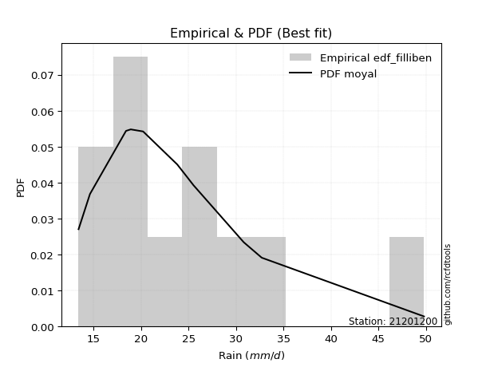</img>

</div>


### 10. EDF Jenkinson (1977)

The Jenkinson formula in hydrology is an empirical plotting position formula used to estimate the non-exceedance probability _(P)_ or return period _(T)_ of a given ordered observation within a sample. It is a widely used method in the frequency analysis of extreme events such as floods and rainfall, as it provides a distribution-free way to plot data. _a≈0.31_ and _b≈0.38_ are constants derived to approximate the median of the probability distribution for the given rank.

<div align="center">


$P=(m-a)/(n+b)$


</div>


**10.1. Empirical values**

<div align="center">

|                | 0                    | 1                 | 2                   | 3                  | 4                  | 5             | 6                  | 7                  | 8                  | 9                  | 10                 |
|:---------------|:---------------------|:------------------|:--------------------|:-------------------|:-------------------|:--------------|:-------------------|:-------------------|:-------------------|:-------------------|:-------------------|
| date           | 2015                 | 2009              | 2008                | 2014               | 2024               | 2025          | 2012               | 2016               | 2010               | 2013               | 2011               |
| x              | 13.4                 | 14.6              | 18.4                | 18.9               | 20.2               | 23.8          | 24.8               | 25.5               | 30.8               | 32.7               | 49.8               |
| m              | 1                    | 2                 | 3                   | 4                  | 5                  | 6             | 7                  | 8                  | 9                  | 10                 | 11                 |
| empirical_dist | edf_jenkinson        | edf_jenkinson     | edf_jenkinson       | edf_jenkinson      | edf_jenkinson      | edf_jenkinson | edf_jenkinson      | edf_jenkinson      | edf_jenkinson      | edf_jenkinson      | edf_jenkinson      |
| empirical      | 0.060632688927943754 | 0.148506151142355 | 0.23637961335676624 | 0.3242530755711775 | 0.4121265377855888 | 0.5           | 0.5878734622144113 | 0.6757469244288224 | 0.7636203866432336 | 0.8514938488576449 | 0.9393673110720562 |
| empirical_tr   | 1.0645463049579045   | 1.174406604747162 | 1.3095512082853855  | 1.4798439531859557 | 1.7010463378176381 | 2.0           | 2.4264392324093818 | 3.0840108401084008 | 4.230483271375462  | 6.733727810650883  | 16.49275362318839  |

</div>


**10.2. Kolmogorov-Smirnov fit test (sorted by Δ)**


<div align="center">

|                | 0                   | 1                    | 2                    | 3                   | 4                   | 5                   | 6                   | 7                   | 8                   | 9                   | 10                  | 11                  | 12                  | 13                  | 14                  | 15                  | 16                  | 17                  | 18                  | 19                  | 20                  | 21                  | 22                  | 23                  | 24                  | 25                  | 26                  | 27                  | 28                  | 29                  | 30                  | 31                  | 32                  | 33                  | 34                  | 35                  | 36                  | 37                  | 38                  | 39                  | 40                  | 41                  | 42                  | 43                  | 44                  | 45                  | 46                  | 47                  | 48                  | 49                  | 50                  | 51                  | 52                  | 53                  | 54                  | 55                  | 56                  | 57                  | 58                  | 59                  | 60                  | 61                  | 62                  | 63                  | 64                  | 65                  | 66                  | 67                  | 68                  | 69                  | 70                  | 71                  | 72                  | 73                  | 74                  | 75                  | 76                  | 77                  | 78                  | 79                  | 80                  | 81                  | 82                  | 83                  | 84                  | 85                  | 86                  | 87                  | 88                  | 89                  | 90                  | 91                  | 92                  | 93                  | 94                  | 95                  | 96                  | 97                  | 98                  | 99                  | 100                 | 101                 | 102                 | 103                 | 104                 | 105                 | 106                 | 107                 | 108                 | 109                 | 110                 | 111                 | 112                 | 113                 | 114                 | 115                 | 116                 | 117                 | 118                 | 119                 | 120                 | 121                 | 122                 | 123                 | 124                 | 125                 | 126                 | 127                 | 128                 | 129                 | 130                 | 131                 | 132                 | 133                 | 134                 | 135                 | 136                 | 137                 | 138                 | 139                 | 140                 | 141                 | 142                 | 143                 | 144                 | 145                 | 146                 | 147                 | 148                 | 149                 | 150                 | 151                 | 152                 | 153                 | 154                 | 155                 | 156                 | 157                 | 158                 | 159                 |
|:---------------|:--------------------|:---------------------|:---------------------|:--------------------|:--------------------|:--------------------|:--------------------|:--------------------|:--------------------|:--------------------|:--------------------|:--------------------|:--------------------|:--------------------|:--------------------|:--------------------|:--------------------|:--------------------|:--------------------|:--------------------|:--------------------|:--------------------|:--------------------|:--------------------|:--------------------|:--------------------|:--------------------|:--------------------|:--------------------|:--------------------|:--------------------|:--------------------|:--------------------|:--------------------|:--------------------|:--------------------|:--------------------|:--------------------|:--------------------|:--------------------|:--------------------|:--------------------|:--------------------|:--------------------|:--------------------|:--------------------|:--------------------|:--------------------|:--------------------|:--------------------|:--------------------|:--------------------|:--------------------|:--------------------|:--------------------|:--------------------|:--------------------|:--------------------|:--------------------|:--------------------|:--------------------|:--------------------|:--------------------|:--------------------|:--------------------|:--------------------|:--------------------|:--------------------|:--------------------|:--------------------|:--------------------|:--------------------|:--------------------|:--------------------|:--------------------|:--------------------|:--------------------|:--------------------|:--------------------|:--------------------|:--------------------|:--------------------|:--------------------|:--------------------|:--------------------|:--------------------|:--------------------|:--------------------|:--------------------|:--------------------|:--------------------|:--------------------|:--------------------|:--------------------|:--------------------|:--------------------|:--------------------|:--------------------|:--------------------|:--------------------|:--------------------|:--------------------|:--------------------|:--------------------|:--------------------|:--------------------|:--------------------|:--------------------|:--------------------|:--------------------|:--------------------|:--------------------|:--------------------|:--------------------|:--------------------|:--------------------|:--------------------|:--------------------|:--------------------|:--------------------|:--------------------|:--------------------|:--------------------|:--------------------|:--------------------|:--------------------|:--------------------|:--------------------|:--------------------|:--------------------|:--------------------|:--------------------|:--------------------|:--------------------|:--------------------|:--------------------|:--------------------|:--------------------|:--------------------|:--------------------|:--------------------|:--------------------|:--------------------|:--------------------|:--------------------|:--------------------|:--------------------|:--------------------|:--------------------|:--------------------|:--------------------|:--------------------|:--------------------|:--------------------|:--------------------|:--------------------|:--------------------|:--------------------|:--------------------|:--------------------|
| station        | 21201200            | 21201200             | 21201200             | 21201200            | 21201200            | 21201200            | 21201200            | 21201200            | 21201200            | 21201200            | 21201200            | 21201200            | 21201200            | 21201200            | 21201200            | 21201200            | 21201200            | 21201200            | 21201200            | 21201200            | 21201200            | 21201200            | 21201200            | 21201200            | 21201200            | 21201200            | 21201200            | 21201200            | 21201200            | 21201200            | 21201200            | 21201200            | 21201200            | 21201200            | 21201200            | 21201200            | 21201200            | 21201200            | 21201200            | 21201200            | 21201200            | 21201200            | 21201200            | 21201200            | 21201200            | 21201200            | 21201200            | 21201200            | 21201200            | 21201200            | 21201200            | 21201200            | 21201200            | 21201200            | 21201200            | 21201200            | 21201200            | 21201200            | 21201200            | 21201200            | 21201200            | 21201200            | 21201200            | 21201200            | 21201200            | 21201200            | 21201200            | 21201200            | 21201200            | 21201200            | 21201200            | 21201200            | 21201200            | 21201200            | 21201200            | 21201200            | 21201200            | 21201200            | 21201200            | 21201200            | 21201200            | 21201200            | 21201200            | 21201200            | 21201200            | 21201200            | 21201200            | 21201200            | 21201200            | 21201200            | 21201200            | 21201200            | 21201200            | 21201200            | 21201200            | 21201200            | 21201200            | 21201200            | 21201200            | 21201200            | 21201200            | 21201200            | 21201200            | 21201200            | 21201200            | 21201200            | 21201200            | 21201200            | 21201200            | 21201200            | 21201200            | 21201200            | 21201200            | 21201200            | 21201200            | 21201200            | 21201200            | 21201200            | 21201200            | 21201200            | 21201200            | 21201200            | 21201200            | 21201200            | 21201200            | 21201200            | 21201200            | 21201200            | 21201200            | 21201200            | 21201200            | 21201200            | 21201200            | 21201200            | 21201200            | 21201200            | 21201200            | 21201200            | 21201200            | 21201200            | 21201200            | 21201200            | 21201200            | 21201200            | 21201200            | 21201200            | 21201200            | 21201200            | 21201200            | 21201200            | 21201200            | 21201200            | 21201200            | 21201200            | 21201200            | 21201200            | 21201200            | 21201200            | 21201200            | 21201200            |
| empirical_dist | edf_jenkinson       | edf_jenkinson        | edf_jenkinson        | edf_jenkinson       | edf_jenkinson       | edf_jenkinson       | edf_jenkinson       | edf_jenkinson       | edf_jenkinson       | edf_jenkinson       | edf_jenkinson       | edf_jenkinson       | edf_jenkinson       | edf_jenkinson       | edf_jenkinson       | edf_jenkinson       | edf_jenkinson       | edf_jenkinson       | edf_jenkinson       | edf_jenkinson       | edf_jenkinson       | edf_jenkinson       | edf_jenkinson       | edf_jenkinson       | edf_jenkinson       | edf_jenkinson       | edf_jenkinson       | edf_jenkinson       | edf_jenkinson       | edf_jenkinson       | edf_jenkinson       | edf_jenkinson       | edf_jenkinson       | edf_jenkinson       | edf_jenkinson       | edf_jenkinson       | edf_jenkinson       | edf_jenkinson       | edf_jenkinson       | edf_jenkinson       | edf_jenkinson       | edf_jenkinson       | edf_jenkinson       | edf_jenkinson       | edf_jenkinson       | edf_jenkinson       | edf_jenkinson       | edf_jenkinson       | edf_jenkinson       | edf_jenkinson       | edf_jenkinson       | edf_jenkinson       | edf_jenkinson       | edf_jenkinson       | edf_jenkinson       | edf_jenkinson       | edf_jenkinson       | edf_jenkinson       | edf_jenkinson       | edf_jenkinson       | edf_jenkinson       | edf_jenkinson       | edf_jenkinson       | edf_jenkinson       | edf_jenkinson       | edf_jenkinson       | edf_jenkinson       | edf_jenkinson       | edf_jenkinson       | edf_jenkinson       | edf_jenkinson       | edf_jenkinson       | edf_jenkinson       | edf_jenkinson       | edf_jenkinson       | edf_jenkinson       | edf_jenkinson       | edf_jenkinson       | edf_jenkinson       | edf_jenkinson       | edf_jenkinson       | edf_jenkinson       | edf_jenkinson       | edf_jenkinson       | edf_jenkinson       | edf_jenkinson       | edf_jenkinson       | edf_jenkinson       | edf_jenkinson       | edf_jenkinson       | edf_jenkinson       | edf_jenkinson       | edf_jenkinson       | edf_jenkinson       | edf_jenkinson       | edf_jenkinson       | edf_jenkinson       | edf_jenkinson       | edf_jenkinson       | edf_jenkinson       | edf_jenkinson       | edf_jenkinson       | edf_jenkinson       | edf_jenkinson       | edf_jenkinson       | edf_jenkinson       | edf_jenkinson       | edf_jenkinson       | edf_jenkinson       | edf_jenkinson       | edf_jenkinson       | edf_jenkinson       | edf_jenkinson       | edf_jenkinson       | edf_jenkinson       | edf_jenkinson       | edf_jenkinson       | edf_jenkinson       | edf_jenkinson       | edf_jenkinson       | edf_jenkinson       | edf_jenkinson       | edf_jenkinson       | edf_jenkinson       | edf_jenkinson       | edf_jenkinson       | edf_jenkinson       | edf_jenkinson       | edf_jenkinson       | edf_jenkinson       | edf_jenkinson       | edf_jenkinson       | edf_jenkinson       | edf_jenkinson       | edf_jenkinson       | edf_jenkinson       | edf_jenkinson       | edf_jenkinson       | edf_jenkinson       | edf_jenkinson       | edf_jenkinson       | edf_jenkinson       | edf_jenkinson       | edf_jenkinson       | edf_jenkinson       | edf_jenkinson       | edf_jenkinson       | edf_jenkinson       | edf_jenkinson       | edf_jenkinson       | edf_jenkinson       | edf_jenkinson       | edf_jenkinson       | edf_jenkinson       | edf_jenkinson       | edf_jenkinson       | edf_jenkinson       | edf_jenkinson       | edf_jenkinson       | edf_jenkinson       |
| p_dist         | ncf                 | moyal                | logbetaprime         | betaprime           | logpearson3         | logmaxwell          | genlogistic         | pearson3            | halflogistic        | logvonmises         | logexponnorm        | loggenextreme       | logweibull_max      | logalpha            | alpha               | lognct              | loginvgamma         | logt                | logcrystalball      | lognorm             | lograyleigh         | logfoldnorm         | logburr12           | truncnorm           | logrice             | logjohnsonsu        | logloggamma         | genextreme          | invweibull          | logskewnorm         | f                   | nct                 | loginvgauss         | invgamma            | logfatiguelife      | loggennorm          | gumbel_r            | halfnorm            | genexpon            | logtriang           | johnsonsu           | logburr             | loglogistic         | gompertz            | invgauss            | kappa3              | loghalfgennorm      | loggamma            | loggamma            | logerlang           | logf                | dweibull            | fatiguelife         | logdweibull         | exponnorm           | exponpow            | logweibull_min      | foldnorm            | loganglit           | logmielke           | loggenlogistic      | kstwobign           | burr                | logdgamma           | loggenexpon         | logsemicircular     | logtruncweibull_min | loghypsecant        | logkstwobign        | skewnorm            | logbradford         | loggumbel_r         | logtruncexpon       | rayleigh            | gennorm             | loginvweibull       | tukeylambda         | truncweibull_min    | logcosine           | dgamma              | bradford            | logarcsine          | maxwell             | loggompertz         | gausshyper          | loglaplace          | loglaplace          | t                   | logmoyal            | lomax               | loghalfnorm         | loggumbel_l         | rice                | logloglaplace       | loggausshyper       | logncf              | hypsecant           | beta                | logistic            | crystalball         | norm                | wald                | loghalflogistic     | anglit              | semicircular        | laplace             | arcsine             | weibull_min         | logexponpow         | triang              | logkappa3           | logtukeylambda      | logkappa4           | loguniform          | vonmises_line       | logwald             | loggengamma         | logvonmises_line    | burr12              | logksone            | loglomax            | gumbel_l            | truncexpon          | logargus            | logrdist            | cosine              | halfgennorm         | genpareto           | logtruncnorm        | loggenpareto        | logwrapcauchy       | kappa4              | loggenhalflogistic  | argus               | ksone               | wrapcauchy          | uniform             | erlang              | loglevy_l           | levy_l              | powerlaw            | logjohnsonsb        | nakagami            | logtrapezoid        | lognakagami         | johnsonsb           | genhalflogistic     | rdist               | logpowerlaw         | gengamma            | logbeta             | gamma               | exponweib           | logexponweib        | trapezoid           | logtruncpareto      | weibull_max         | truncpareto         | vonmises            | mielke              |
| delta          | 0.05609737699688021 | 0.056671718381813924 | 0.056751147028376914 | 0.05775493708135705 | 0.06061106684681562 | 0.06092794060442597 | 0.0639336866359626  | 0.06432114427280622 | 0.06496272076692433 | 0.06587869981809824 | 0.0667837967999767  | 0.06699387385939048 | 0.06700399589778461 | 0.06913798568284701 | 0.0697703936038454  | 0.07020329951774595 | 0.07119953872819862 | 0.0712304232012414  | 0.07123052730221235 | 0.07123060012966664 | 0.07124516297285632 | 0.07149403941665414 | 0.07224849417952661 | 0.07258288991794128 | 0.07262369622264292 | 0.0737264845190424  | 0.07386554195118722 | 0.07400602017120994 | 0.07400809646591033 | 0.07403433317771135 | 0.07444778611846736 | 0.07481711119780021 | 0.07495778874969816 | 0.0749613836278542  | 0.07530747989310682 | 0.07645818274783711 | 0.07699382612098638 | 0.07706886843123026 | 0.07733466818487197 | 0.07778226164913404 | 0.07868102778579922 | 0.0787126086810116  | 0.07872953602365979 | 0.07910471731510979 | 0.0794559217336146  | 0.07967501619174686 | 0.08105767298217106 | 0.08155845461204025 | 0.08155845461204025 | 0.08155851763175903 | 0.08160332198031073 | 0.08168390033833782 | 0.08232469277614507 | 0.08252808121345159 | 0.08257245894653076 | 0.08315871804283337 | 0.08448662229285908 | 0.08483229971633391 | 0.0856373564568953  | 0.0874448256640008  | 0.08824360179775714 | 0.08936654045853099 | 0.09030161810057391 | 0.09055904504223947 | 0.09123871355128832 | 0.09161485292329319 | 0.09207912451855868 | 0.09259711837369033 | 0.0937070696086566  | 0.0967822445601495  | 0.09988311651696136 | 0.09990783668329861 | 0.10293696780457448 | 0.10557503052470052 | 0.10612728197478072 | 0.10817349909925289 | 0.10834036314599005 | 0.11061813063853654 | 0.11184552778397461 | 0.11259774730024263 | 0.1153597865051682  | 0.11573522238090383 | 0.1159221138028731  | 0.11780985152227616 | 0.11841321073887456 | 0.12081687414382453 | 0.12081687414382453 | 0.12395189264072537 | 0.12531831673789162 | 0.12812298983044515 | 0.12928109806600774 | 0.13014647210364683 | 0.1308159732242734  | 0.13364904080237422 | 0.1365561785175924  | 0.1395103064337022  | 0.1405581576124929  | 0.14125204937272018 | 0.1438125716241586  | 0.1476362708726402  | 0.14763629004392842 | 0.148506151142355   | 0.148506151142355   | 0.15164972748643035 | 0.1533037193750525  | 0.15507173888283282 | 0.15986764808038878 | 0.16144613341784356 | 0.16251637679854838 | 0.1736310637347932  | 0.18317286689545914 | 0.18442728531076902 | 0.1848690428864117  | 0.18561650500315025 | 0.1906500627283536  | 0.19586136267682985 | 0.195917348430431   | 0.1974904427673615  | 0.20005084623405459 | 0.2018471867020345  | 0.20351782940390187 | 0.21659910909910862 | 0.21845108811374309 | 0.21888567401169745 | 0.22021192188843508 | 0.22565230517363427 | 0.23315692557905035 | 0.25112922213869937 | 0.25322574369605266 | 0.28054939078165303 | 0.2853265401146956  | 0.29621421679386517 | 0.30764338372410627 | 0.3220880613217163  | 0.3263106986744946  | 0.33193842599446266 | 0.34332934201124005 | 0.3452534937886915  | 0.37590560316308014 | 0.4175020800387575  | 0.41755995936791546 | 0.4313204681309709  | 0.43230766447687863 | 0.4339039300319335  | 0.45853620544878426 | 0.4587985944697744  | 0.4605130850487987  | 0.46636086997690834 | 0.47246283018721413 | 0.48745674174475373 | 0.49562765065613634 | 0.5022482597278977  | 0.5089922619487159  | 0.5413061490608846  | 0.5756765076213475  | 0.6446965551015508  | 0.6759091896565708  | 0.6854996470412248  | 7.304687619340374   | nan                 |
| deltao         | 0.37613735880099997 | 0.37613735880099997  | 0.37613735880099997  | 0.37613735880099997 | 0.37613735880099997 | 0.37613735880099997 | 0.37613735880099997 | 0.37613735880099997 | 0.37613735880099997 | 0.37613735880099997 | 0.37613735880099997 | 0.37613735880099997 | 0.37613735880099997 | 0.37613735880099997 | 0.37613735880099997 | 0.37613735880099997 | 0.37613735880099997 | 0.37613735880099997 | 0.37613735880099997 | 0.37613735880099997 | 0.37613735880099997 | 0.37613735880099997 | 0.37613735880099997 | 0.37613735880099997 | 0.37613735880099997 | 0.37613735880099997 | 0.37613735880099997 | 0.37613735880099997 | 0.37613735880099997 | 0.37613735880099997 | 0.37613735880099997 | 0.37613735880099997 | 0.37613735880099997 | 0.37613735880099997 | 0.37613735880099997 | 0.37613735880099997 | 0.37613735880099997 | 0.37613735880099997 | 0.37613735880099997 | 0.37613735880099997 | 0.37613735880099997 | 0.37613735880099997 | 0.37613735880099997 | 0.37613735880099997 | 0.37613735880099997 | 0.37613735880099997 | 0.37613735880099997 | 0.37613735880099997 | 0.37613735880099997 | 0.37613735880099997 | 0.37613735880099997 | 0.37613735880099997 | 0.37613735880099997 | 0.37613735880099997 | 0.37613735880099997 | 0.37613735880099997 | 0.37613735880099997 | 0.37613735880099997 | 0.37613735880099997 | 0.37613735880099997 | 0.37613735880099997 | 0.37613735880099997 | 0.37613735880099997 | 0.37613735880099997 | 0.37613735880099997 | 0.37613735880099997 | 0.37613735880099997 | 0.37613735880099997 | 0.37613735880099997 | 0.37613735880099997 | 0.37613735880099997 | 0.37613735880099997 | 0.37613735880099997 | 0.37613735880099997 | 0.37613735880099997 | 0.37613735880099997 | 0.37613735880099997 | 0.37613735880099997 | 0.37613735880099997 | 0.37613735880099997 | 0.37613735880099997 | 0.37613735880099997 | 0.37613735880099997 | 0.37613735880099997 | 0.37613735880099997 | 0.37613735880099997 | 0.37613735880099997 | 0.37613735880099997 | 0.37613735880099997 | 0.37613735880099997 | 0.37613735880099997 | 0.37613735880099997 | 0.37613735880099997 | 0.37613735880099997 | 0.37613735880099997 | 0.37613735880099997 | 0.37613735880099997 | 0.37613735880099997 | 0.37613735880099997 | 0.37613735880099997 | 0.37613735880099997 | 0.37613735880099997 | 0.37613735880099997 | 0.37613735880099997 | 0.37613735880099997 | 0.37613735880099997 | 0.37613735880099997 | 0.37613735880099997 | 0.37613735880099997 | 0.37613735880099997 | 0.37613735880099997 | 0.37613735880099997 | 0.37613735880099997 | 0.37613735880099997 | 0.37613735880099997 | 0.37613735880099997 | 0.37613735880099997 | 0.37613735880099997 | 0.37613735880099997 | 0.37613735880099997 | 0.37613735880099997 | 0.37613735880099997 | 0.37613735880099997 | 0.37613735880099997 | 0.37613735880099997 | 0.37613735880099997 | 0.37613735880099997 | 0.37613735880099997 | 0.37613735880099997 | 0.37613735880099997 | 0.37613735880099997 | 0.37613735880099997 | 0.37613735880099997 | 0.37613735880099997 | 0.37613735880099997 | 0.37613735880099997 | 0.37613735880099997 | 0.37613735880099997 | 0.37613735880099997 | 0.37613735880099997 | 0.37613735880099997 | 0.37613735880099997 | 0.37613735880099997 | 0.37613735880099997 | 0.37613735880099997 | 0.37613735880099997 | 0.37613735880099997 | 0.37613735880099997 | 0.37613735880099997 | 0.37613735880099997 | 0.37613735880099997 | 0.37613735880099997 | 0.37613735880099997 | 0.37613735880099997 | 0.37613735880099997 | 0.37613735880099997 | 0.37613735880099997 | 0.37613735880099997 | 0.37613735880099997 | 0.37613735880099997 |
| eval           | Δo > Δ              | Δo > Δ               | Δo > Δ               | Δo > Δ              | Δo > Δ              | Δo > Δ              | Δo > Δ              | Δo > Δ              | Δo > Δ              | Δo > Δ              | Δo > Δ              | Δo > Δ              | Δo > Δ              | Δo > Δ              | Δo > Δ              | Δo > Δ              | Δo > Δ              | Δo > Δ              | Δo > Δ              | Δo > Δ              | Δo > Δ              | Δo > Δ              | Δo > Δ              | Δo > Δ              | Δo > Δ              | Δo > Δ              | Δo > Δ              | Δo > Δ              | Δo > Δ              | Δo > Δ              | Δo > Δ              | Δo > Δ              | Δo > Δ              | Δo > Δ              | Δo > Δ              | Δo > Δ              | Δo > Δ              | Δo > Δ              | Δo > Δ              | Δo > Δ              | Δo > Δ              | Δo > Δ              | Δo > Δ              | Δo > Δ              | Δo > Δ              | Δo > Δ              | Δo > Δ              | Δo > Δ              | Δo > Δ              | Δo > Δ              | Δo > Δ              | Δo > Δ              | Δo > Δ              | Δo > Δ              | Δo > Δ              | Δo > Δ              | Δo > Δ              | Δo > Δ              | Δo > Δ              | Δo > Δ              | Δo > Δ              | Δo > Δ              | Δo > Δ              | Δo > Δ              | Δo > Δ              | Δo > Δ              | Δo > Δ              | Δo > Δ              | Δo > Δ              | Δo > Δ              | Δo > Δ              | Δo > Δ              | Δo > Δ              | Δo > Δ              | Δo > Δ              | Δo > Δ              | Δo > Δ              | Δo > Δ              | Δo > Δ              | Δo > Δ              | Δo > Δ              | Δo > Δ              | Δo > Δ              | Δo > Δ              | Δo > Δ              | Δo > Δ              | Δo > Δ              | Δo > Δ              | Δo > Δ              | Δo > Δ              | Δo > Δ              | Δo > Δ              | Δo > Δ              | Δo > Δ              | Δo > Δ              | Δo > Δ              | Δo > Δ              | Δo > Δ              | Δo > Δ              | Δo > Δ              | Δo > Δ              | Δo > Δ              | Δo > Δ              | Δo > Δ              | Δo > Δ              | Δo > Δ              | Δo > Δ              | Δo > Δ              | Δo > Δ              | Δo > Δ              | Δo > Δ              | Δo > Δ              | Δo > Δ              | Δo > Δ              | Δo > Δ              | Δo > Δ              | Δo > Δ              | Δo > Δ              | Δo > Δ              | Δo > Δ              | Δo > Δ              | Δo > Δ              | Δo > Δ              | Δo > Δ              | Δo > Δ              | Δo > Δ              | Δo > Δ              | Δo > Δ              | Δo > Δ              | Δo > Δ              | Δo > Δ              | Δo > Δ              | Δo > Δ              | Δo > Δ              | Δo > Δ              | Δo > Δ              | Δo > Δ              | Δo > Δ              | Δo > Δ              | Δo <= Δ             | Δo <= Δ             | Δo <= Δ             | Δo <= Δ             | Δo <= Δ             | Δo <= Δ             | Δo <= Δ             | Δo <= Δ             | Δo <= Δ             | Δo <= Δ             | Δo <= Δ             | Δo <= Δ             | Δo <= Δ             | Δo <= Δ             | Δo <= Δ             | Δo <= Δ             | Δo <= Δ             | Δo <= Δ             | Δo <= Δ             | Δo <= Δ             | Δo <= Δ             |
| fit            | 1                   | 1                    | 1                    | 1                   | 1                   | 1                   | 1                   | 1                   | 1                   | 1                   | 1                   | 1                   | 1                   | 1                   | 1                   | 1                   | 1                   | 1                   | 1                   | 1                   | 1                   | 1                   | 1                   | 1                   | 1                   | 1                   | 1                   | 1                   | 1                   | 1                   | 1                   | 1                   | 1                   | 1                   | 1                   | 1                   | 1                   | 1                   | 1                   | 1                   | 1                   | 1                   | 1                   | 1                   | 1                   | 1                   | 1                   | 1                   | 1                   | 1                   | 1                   | 1                   | 1                   | 1                   | 1                   | 1                   | 1                   | 1                   | 1                   | 1                   | 1                   | 1                   | 1                   | 1                   | 1                   | 1                   | 1                   | 1                   | 1                   | 1                   | 1                   | 1                   | 1                   | 1                   | 1                   | 1                   | 1                   | 1                   | 1                   | 1                   | 1                   | 1                   | 1                   | 1                   | 1                   | 1                   | 1                   | 1                   | 1                   | 1                   | 1                   | 1                   | 1                   | 1                   | 1                   | 1                   | 1                   | 1                   | 1                   | 1                   | 1                   | 1                   | 1                   | 1                   | 1                   | 1                   | 1                   | 1                   | 1                   | 1                   | 1                   | 1                   | 1                   | 1                   | 1                   | 1                   | 1                   | 1                   | 1                   | 1                   | 1                   | 1                   | 1                   | 1                   | 1                   | 1                   | 1                   | 1                   | 1                   | 1                   | 1                   | 1                   | 1                   | 1                   | 1                   | 1                   | 1                   | 1                   | 1                   | 0                   | 0                   | 0                   | 0                   | 0                   | 0                   | 0                   | 0                   | 0                   | 0                   | 0                   | 0                   | 0                   | 0                   | 0                   | 0                   | 0                   | 0                   | 0                   | 0                   | 0                   |
| n              | 11                  | 11                   | 11                   | 11                  | 11                  | 11                  | 11                  | 11                  | 11                  | 11                  | 11                  | 11                  | 11                  | 11                  | 11                  | 11                  | 11                  | 11                  | 11                  | 11                  | 11                  | 11                  | 11                  | 11                  | 11                  | 11                  | 11                  | 11                  | 11                  | 11                  | 11                  | 11                  | 11                  | 11                  | 11                  | 11                  | 11                  | 11                  | 11                  | 11                  | 11                  | 11                  | 11                  | 11                  | 11                  | 11                  | 11                  | 11                  | 11                  | 11                  | 11                  | 11                  | 11                  | 11                  | 11                  | 11                  | 11                  | 11                  | 11                  | 11                  | 11                  | 11                  | 11                  | 11                  | 11                  | 11                  | 11                  | 11                  | 11                  | 11                  | 11                  | 11                  | 11                  | 11                  | 11                  | 11                  | 11                  | 11                  | 11                  | 11                  | 11                  | 11                  | 11                  | 11                  | 11                  | 11                  | 11                  | 11                  | 11                  | 11                  | 11                  | 11                  | 11                  | 11                  | 11                  | 11                  | 11                  | 11                  | 11                  | 11                  | 11                  | 11                  | 11                  | 11                  | 11                  | 11                  | 11                  | 11                  | 11                  | 11                  | 11                  | 11                  | 11                  | 11                  | 11                  | 11                  | 11                  | 11                  | 11                  | 11                  | 11                  | 11                  | 11                  | 11                  | 11                  | 11                  | 11                  | 11                  | 11                  | 11                  | 11                  | 11                  | 11                  | 11                  | 11                  | 11                  | 11                  | 11                  | 11                  | 11                  | 11                  | 11                  | 11                  | 11                  | 11                  | 11                  | 11                  | 11                  | 11                  | 11                  | 11                  | 11                  | 11                  | 11                  | 11                  | 11                  | 11                  | 11                  | 11                  | 11                  |
| best_fit       | 1                   | 0                    | 0                    | 0                   | 0                   | 0                   | 0                   | 0                   | 0                   | 0                   | 0                   | 0                   | 0                   | 0                   | 0                   | 0                   | 0                   | 0                   | 0                   | 0                   | 0                   | 0                   | 0                   | 0                   | 0                   | 0                   | 0                   | 0                   | 0                   | 0                   | 0                   | 0                   | 0                   | 0                   | 0                   | 0                   | 0                   | 0                   | 0                   | 0                   | 0                   | 0                   | 0                   | 0                   | 0                   | 0                   | 0                   | 0                   | 0                   | 0                   | 0                   | 0                   | 0                   | 0                   | 0                   | 0                   | 0                   | 0                   | 0                   | 0                   | 0                   | 0                   | 0                   | 0                   | 0                   | 0                   | 0                   | 0                   | 0                   | 0                   | 0                   | 0                   | 0                   | 0                   | 0                   | 0                   | 0                   | 0                   | 0                   | 0                   | 0                   | 0                   | 0                   | 0                   | 0                   | 0                   | 0                   | 0                   | 0                   | 0                   | 0                   | 0                   | 0                   | 0                   | 0                   | 0                   | 0                   | 0                   | 0                   | 0                   | 0                   | 0                   | 0                   | 0                   | 0                   | 0                   | 0                   | 0                   | 0                   | 0                   | 0                   | 0                   | 0                   | 0                   | 0                   | 0                   | 0                   | 0                   | 0                   | 0                   | 0                   | 0                   | 0                   | 0                   | 0                   | 0                   | 0                   | 0                   | 0                   | 0                   | 0                   | 0                   | 0                   | 0                   | 0                   | 0                   | 0                   | 0                   | 0                   | 0                   | 0                   | 0                   | 0                   | 0                   | 0                   | 0                   | 0                   | 0                   | 0                   | 0                   | 0                   | 0                   | 0                   | 0                   | 0                   | 0                   | 0                   | 0                   | 0                   | 0                   |
| best_fit_sort  | 1                   | 2                    | 3                    | 4                   | 5                   | 6                   | 7                   | 8                   | 9                   | 10                  | 11                  | 12                  | 13                  | 14                  | 15                  | 16                  | 17                  | 18                  | 19                  | 20                  | 21                  | 22                  | 23                  | 24                  | 25                  | 26                  | 27                  | 28                  | 29                  | 30                  | 31                  | 32                  | 33                  | 34                  | 35                  | 36                  | 37                  | 38                  | 39                  | 40                  | 41                  | 42                  | 43                  | 44                  | 45                  | 46                  | 47                  | 48                  | 49                  | 50                  | 51                  | 52                  | 53                  | 54                  | 55                  | 56                  | 57                  | 58                  | 59                  | 60                  | 61                  | 62                  | 63                  | 64                  | 65                  | 66                  | 67                  | 68                  | 69                  | 70                  | 71                  | 72                  | 73                  | 74                  | 75                  | 76                  | 77                  | 78                  | 79                  | 80                  | 81                  | 82                  | 83                  | 84                  | 85                  | 86                  | 87                  | 88                  | 89                  | 90                  | 91                  | 92                  | 93                  | 94                  | 95                  | 96                  | 97                  | 98                  | 99                  | 100                 | 101                 | 102                 | 103                 | 104                 | 105                 | 106                 | 107                 | 108                 | 109                 | 110                 | 111                 | 112                 | 113                 | 114                 | 115                 | 116                 | 117                 | 118                 | 119                 | 120                 | 121                 | 122                 | 123                 | 124                 | 125                 | 126                 | 127                 | 128                 | 129                 | 130                 | 131                 | 132                 | 133                 | 134                 | 135                 | 136                 | 137                 | 138                 | 139                 | 140                 | 141                 | 142                 | 143                 | 144                 | 145                 | 146                 | 147                 | 148                 | 149                 | 150                 | 151                 | 152                 | 153                 | 154                 | 155                 | 156                 | 157                 | 158                 | 159                 | 160                 |

</div>


**10.3. Best fit**

<div align="center">

|   id |   station | empirical_dist   | p_dist   |     delta |   deltao | eval   |   fit |   n |   best_fit |   best_fit_sort |
|-----:|----------:|:-----------------|:---------|----------:|---------:|:-------|------:|----:|-----------:|----------------:|
|    0 |  21201200 | edf_jenkinson    | ncf      | 0.0560974 | 0.376137 | Δo > Δ |     1 |  11 |          1 |               1 |

</div>


<div align="center">

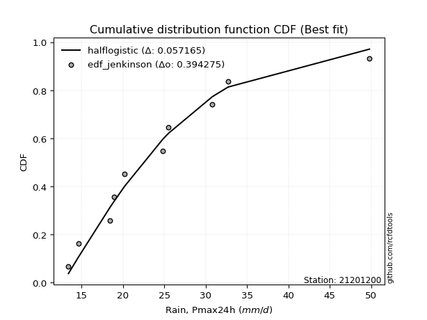</img>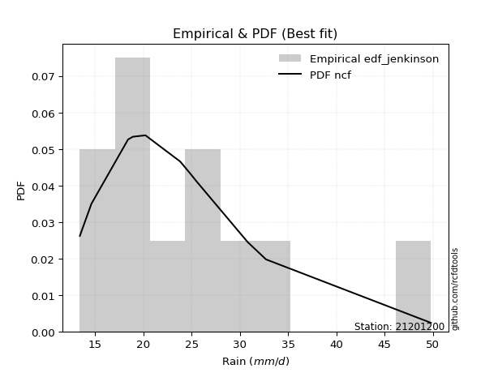</img>

</div>


### 11. EDF Cunnane (1978)

Cunnane´s work in statistical hydrology has focused on the performance and evaluation of different probability distributions (such as GEV, Gumbel, Lognormal) for flood frequency estimation. _b_ is a constant, typically set to 0.4.

<div align="center">


$P=(m-b)/(n+1-2b)$


</div>


**11.1. Empirical values**

<div align="center">

|                | 0                    | 1                   | 2                   | 3                   | 4                  | 5           | 6                  | 7                  | 8                  | 9                  | 10                 |
|:---------------|:---------------------|:--------------------|:--------------------|:--------------------|:-------------------|:------------|:-------------------|:-------------------|:-------------------|:-------------------|:-------------------|
| date           | 2015                 | 2009                | 2008                | 2014                | 2024               | 2025        | 2012               | 2016               | 2010               | 2013               | 2011               |
| x              | 13.4                 | 14.6                | 18.4                | 18.9                | 20.2               | 23.8        | 24.8               | 25.5               | 30.8               | 32.7               | 49.8               |
| m              | 1                    | 2                   | 3                   | 4                   | 5                  | 6           | 7                  | 8                  | 9                  | 10                 | 11                 |
| empirical_dist | edf_cunnane          | edf_cunnane         | edf_cunnane         | edf_cunnane         | edf_cunnane        | edf_cunnane | edf_cunnane        | edf_cunnane        | edf_cunnane        | edf_cunnane        | edf_cunnane        |
| empirical      | 0.053571428571428575 | 0.14285714285714288 | 0.23214285714285718 | 0.32142857142857145 | 0.4107142857142857 | 0.5         | 0.5892857142857143 | 0.6785714285714286 | 0.7678571428571429 | 0.8571428571428572 | 0.9464285714285715 |
| empirical_tr   | 1.0566037735849056   | 1.1666666666666667  | 1.302325581395349   | 1.4736842105263157  | 1.696969696969697  | 2.0         | 2.4347826086956523 | 3.1111111111111116 | 4.307692307692308  | 7.0000000000000036 | 18.666666666666693 |

</div>


**11.2. Kolmogorov-Smirnov fit test (sorted by Δ)**


<div align="center">

|                | 0                    | 1                    | 2                    | 3                   | 4                   | 5                   | 6                   | 7                   | 8                   | 9                   | 10                  | 11                  | 12                  | 13                  | 14                  | 15                  | 16                  | 17                  | 18                  | 19                  | 20                  | 21                  | 22                  | 23                  | 24                  | 25                  | 26                  | 27                  | 28                  | 29                  | 30                  | 31                  | 32                  | 33                  | 34                  | 35                  | 36                  | 37                  | 38                  | 39                  | 40                  | 41                  | 42                  | 43                  | 44                  | 45                  | 46                  | 47                  | 48                  | 49                  | 50                  | 51                  | 52                  | 53                  | 54                  | 55                  | 56                  | 57                  | 58                  | 59                  | 60                  | 61                  | 62                  | 63                  | 64                  | 65                  | 66                  | 67                  | 68                  | 69                  | 70                  | 71                  | 72                  | 73                  | 74                  | 75                  | 76                  | 77                  | 78                  | 79                  | 80                  | 81                  | 82                  | 83                  | 84                  | 85                  | 86                  | 87                  | 88                  | 89                  | 90                  | 91                  | 92                  | 93                  | 94                  | 95                  | 96                  | 97                  | 98                  | 99                  | 100                 | 101                 | 102                 | 103                 | 104                 | 105                 | 106                 | 107                 | 108                 | 109                 | 110                 | 111                 | 112                 | 113                 | 114                 | 115                 | 116                 | 117                 | 118                 | 119                 | 120                 | 121                 | 122                 | 123                 | 124                 | 125                 | 126                 | 127                 | 128                 | 129                 | 130                 | 131                 | 132                 | 133                 | 134                 | 135                 | 136                 | 137                 | 138                 | 139                 | 140                 | 141                 | 142                 | 143                 | 144                 | 145                 | 146                 | 147                 | 148                 | 149                 | 150                 | 151                 | 152                 | 153                 | 154                 | 155                 | 156                 | 157                 | 158                 | 159                 |
|:---------------|:---------------------|:---------------------|:---------------------|:--------------------|:--------------------|:--------------------|:--------------------|:--------------------|:--------------------|:--------------------|:--------------------|:--------------------|:--------------------|:--------------------|:--------------------|:--------------------|:--------------------|:--------------------|:--------------------|:--------------------|:--------------------|:--------------------|:--------------------|:--------------------|:--------------------|:--------------------|:--------------------|:--------------------|:--------------------|:--------------------|:--------------------|:--------------------|:--------------------|:--------------------|:--------------------|:--------------------|:--------------------|:--------------------|:--------------------|:--------------------|:--------------------|:--------------------|:--------------------|:--------------------|:--------------------|:--------------------|:--------------------|:--------------------|:--------------------|:--------------------|:--------------------|:--------------------|:--------------------|:--------------------|:--------------------|:--------------------|:--------------------|:--------------------|:--------------------|:--------------------|:--------------------|:--------------------|:--------------------|:--------------------|:--------------------|:--------------------|:--------------------|:--------------------|:--------------------|:--------------------|:--------------------|:--------------------|:--------------------|:--------------------|:--------------------|:--------------------|:--------------------|:--------------------|:--------------------|:--------------------|:--------------------|:--------------------|:--------------------|:--------------------|:--------------------|:--------------------|:--------------------|:--------------------|:--------------------|:--------------------|:--------------------|:--------------------|:--------------------|:--------------------|:--------------------|:--------------------|:--------------------|:--------------------|:--------------------|:--------------------|:--------------------|:--------------------|:--------------------|:--------------------|:--------------------|:--------------------|:--------------------|:--------------------|:--------------------|:--------------------|:--------------------|:--------------------|:--------------------|:--------------------|:--------------------|:--------------------|:--------------------|:--------------------|:--------------------|:--------------------|:--------------------|:--------------------|:--------------------|:--------------------|:--------------------|:--------------------|:--------------------|:--------------------|:--------------------|:--------------------|:--------------------|:--------------------|:--------------------|:--------------------|:--------------------|:--------------------|:--------------------|:--------------------|:--------------------|:--------------------|:--------------------|:--------------------|:--------------------|:--------------------|:--------------------|:--------------------|:--------------------|:--------------------|:--------------------|:--------------------|:--------------------|:--------------------|:--------------------|:--------------------|:--------------------|:--------------------|:--------------------|:--------------------|:--------------------|:--------------------|
| station        | 21201200             | 21201200             | 21201200             | 21201200            | 21201200            | 21201200            | 21201200            | 21201200            | 21201200            | 21201200            | 21201200            | 21201200            | 21201200            | 21201200            | 21201200            | 21201200            | 21201200            | 21201200            | 21201200            | 21201200            | 21201200            | 21201200            | 21201200            | 21201200            | 21201200            | 21201200            | 21201200            | 21201200            | 21201200            | 21201200            | 21201200            | 21201200            | 21201200            | 21201200            | 21201200            | 21201200            | 21201200            | 21201200            | 21201200            | 21201200            | 21201200            | 21201200            | 21201200            | 21201200            | 21201200            | 21201200            | 21201200            | 21201200            | 21201200            | 21201200            | 21201200            | 21201200            | 21201200            | 21201200            | 21201200            | 21201200            | 21201200            | 21201200            | 21201200            | 21201200            | 21201200            | 21201200            | 21201200            | 21201200            | 21201200            | 21201200            | 21201200            | 21201200            | 21201200            | 21201200            | 21201200            | 21201200            | 21201200            | 21201200            | 21201200            | 21201200            | 21201200            | 21201200            | 21201200            | 21201200            | 21201200            | 21201200            | 21201200            | 21201200            | 21201200            | 21201200            | 21201200            | 21201200            | 21201200            | 21201200            | 21201200            | 21201200            | 21201200            | 21201200            | 21201200            | 21201200            | 21201200            | 21201200            | 21201200            | 21201200            | 21201200            | 21201200            | 21201200            | 21201200            | 21201200            | 21201200            | 21201200            | 21201200            | 21201200            | 21201200            | 21201200            | 21201200            | 21201200            | 21201200            | 21201200            | 21201200            | 21201200            | 21201200            | 21201200            | 21201200            | 21201200            | 21201200            | 21201200            | 21201200            | 21201200            | 21201200            | 21201200            | 21201200            | 21201200            | 21201200            | 21201200            | 21201200            | 21201200            | 21201200            | 21201200            | 21201200            | 21201200            | 21201200            | 21201200            | 21201200            | 21201200            | 21201200            | 21201200            | 21201200            | 21201200            | 21201200            | 21201200            | 21201200            | 21201200            | 21201200            | 21201200            | 21201200            | 21201200            | 21201200            | 21201200            | 21201200            | 21201200            | 21201200            | 21201200            | 21201200            |
| empirical_dist | edf_cunnane          | edf_cunnane          | edf_cunnane          | edf_cunnane         | edf_cunnane         | edf_cunnane         | edf_cunnane         | edf_cunnane         | edf_cunnane         | edf_cunnane         | edf_cunnane         | edf_cunnane         | edf_cunnane         | edf_cunnane         | edf_cunnane         | edf_cunnane         | edf_cunnane         | edf_cunnane         | edf_cunnane         | edf_cunnane         | edf_cunnane         | edf_cunnane         | edf_cunnane         | edf_cunnane         | edf_cunnane         | edf_cunnane         | edf_cunnane         | edf_cunnane         | edf_cunnane         | edf_cunnane         | edf_cunnane         | edf_cunnane         | edf_cunnane         | edf_cunnane         | edf_cunnane         | edf_cunnane         | edf_cunnane         | edf_cunnane         | edf_cunnane         | edf_cunnane         | edf_cunnane         | edf_cunnane         | edf_cunnane         | edf_cunnane         | edf_cunnane         | edf_cunnane         | edf_cunnane         | edf_cunnane         | edf_cunnane         | edf_cunnane         | edf_cunnane         | edf_cunnane         | edf_cunnane         | edf_cunnane         | edf_cunnane         | edf_cunnane         | edf_cunnane         | edf_cunnane         | edf_cunnane         | edf_cunnane         | edf_cunnane         | edf_cunnane         | edf_cunnane         | edf_cunnane         | edf_cunnane         | edf_cunnane         | edf_cunnane         | edf_cunnane         | edf_cunnane         | edf_cunnane         | edf_cunnane         | edf_cunnane         | edf_cunnane         | edf_cunnane         | edf_cunnane         | edf_cunnane         | edf_cunnane         | edf_cunnane         | edf_cunnane         | edf_cunnane         | edf_cunnane         | edf_cunnane         | edf_cunnane         | edf_cunnane         | edf_cunnane         | edf_cunnane         | edf_cunnane         | edf_cunnane         | edf_cunnane         | edf_cunnane         | edf_cunnane         | edf_cunnane         | edf_cunnane         | edf_cunnane         | edf_cunnane         | edf_cunnane         | edf_cunnane         | edf_cunnane         | edf_cunnane         | edf_cunnane         | edf_cunnane         | edf_cunnane         | edf_cunnane         | edf_cunnane         | edf_cunnane         | edf_cunnane         | edf_cunnane         | edf_cunnane         | edf_cunnane         | edf_cunnane         | edf_cunnane         | edf_cunnane         | edf_cunnane         | edf_cunnane         | edf_cunnane         | edf_cunnane         | edf_cunnane         | edf_cunnane         | edf_cunnane         | edf_cunnane         | edf_cunnane         | edf_cunnane         | edf_cunnane         | edf_cunnane         | edf_cunnane         | edf_cunnane         | edf_cunnane         | edf_cunnane         | edf_cunnane         | edf_cunnane         | edf_cunnane         | edf_cunnane         | edf_cunnane         | edf_cunnane         | edf_cunnane         | edf_cunnane         | edf_cunnane         | edf_cunnane         | edf_cunnane         | edf_cunnane         | edf_cunnane         | edf_cunnane         | edf_cunnane         | edf_cunnane         | edf_cunnane         | edf_cunnane         | edf_cunnane         | edf_cunnane         | edf_cunnane         | edf_cunnane         | edf_cunnane         | edf_cunnane         | edf_cunnane         | edf_cunnane         | edf_cunnane         | edf_cunnane         | edf_cunnane         | edf_cunnane         | edf_cunnane         | edf_cunnane         |
| p_dist         | moyal                | betaprime            | logpearson3          | ncf                 | logbetaprime        | logmaxwell          | genlogistic         | logexponnorm        | truncnorm           | logrice             | loggenextreme       | logweibull_max      | pearson3            | logvonmises         | halflogistic        | logalpha            | alpha               | lognct              | loginvgamma         | lograyleigh         | logtriang           | logburr12           | logjohnsonsu        | genextreme          | invweibull          | kappa3              | logskewnorm         | logt                | logcrystalball      | lognorm             | f                   | nct                 | loginvgauss         | invgamma            | logfatiguelife      | logfoldnorm         | logloggamma         | loglogistic         | johnsonsu           | logburr             | loggennorm          | invgauss            | gumbel_r            | halfnorm            | loggamma            | loggamma            | logerlang           | genexpon            | logf                | fatiguelife         | exponnorm           | gompertz            | logweibull_min      | loghalfgennorm      | exponpow            | logdweibull         | logmielke           | loggenlogistic      | loganglit           | dweibull            | foldnorm            | burr                | loghypsecant        | kstwobign           | loggenexpon         | logkstwobign        | logsemicircular     | logdgamma           | logtruncweibull_min | skewnorm            | loggumbel_r         | tukeylambda         | gennorm             | logbradford         | logtruncexpon       | loginvweibull       | rayleigh            | dgamma              | logcosine           | truncweibull_min    | maxwell             | loglaplace          | loglaplace          | logarcsine          | bradford            | gausshyper          | loggompertz         | loghalfnorm         | logmoyal            | t                   | logloglaplace       | lomax               | loggumbel_l         | rice                | loggausshyper       | wald                | loghalflogistic     | hypsecant           | logncf              | logistic            | beta                | crystalball         | norm                | laplace             | anglit              | semicircular        | arcsine             | weibull_min         | logexponpow         | triang              | logkappa3           | vonmises_line       | logtukeylambda      | logkappa4           | loguniform          | logwald             | loggengamma         | logvonmises_line    | burr12              | logksone            | loglomax            | gumbel_l            | truncexpon          | logargus            | logrdist            | cosine              | halfgennorm         | genpareto           | logtruncnorm        | loggenpareto        | logwrapcauchy       | kappa4              | loggenhalflogistic  | argus               | ksone               | wrapcauchy          | uniform             | erlang              | loglevy_l           | powerlaw            | levy_l              | nakagami            | logtrapezoid        | logjohnsonsb        | lognakagami         | johnsonsb           | genhalflogistic     | rdist               | logpowerlaw         | gengamma            | logbeta             | gamma               | exponweib           | logexponweib        | trapezoid           | logtruncpareto      | weibull_max         | truncpareto         | vonmises            | mielke              |
| delta          | 0.054381698886176943 | 0.055741021615626773 | 0.058133826980870995 | 0.05887419023007645 | 0.05957565117098307 | 0.06092794060442597 | 0.06407171656673427 | 0.0667837967999767  | 0.06693388163272916 | 0.0669746879374308  | 0.06699387385939048 | 0.06700399589778461 | 0.06714564841541237 | 0.0687032039607044  | 0.06881361921766369 | 0.06913798568284701 | 0.0697703936038454  | 0.07020329951774595 | 0.07119953872819862 | 0.07124516297285632 | 0.07213325336392193 | 0.07224849417952661 | 0.0737264845190424  | 0.07400602017120994 | 0.07400809646591033 | 0.07402600790653474 | 0.07403433317771135 | 0.07405492734384755 | 0.07405503144481851 | 0.0740551042722728  | 0.07444778611846736 | 0.07481711119780021 | 0.07495778874969816 | 0.0749613836278542  | 0.07530747989310682 | 0.0757307956305632  | 0.07669004609379337 | 0.07731728395235671 | 0.07868102778579922 | 0.0787126086810116  | 0.07928268689044327 | 0.0794559217336146  | 0.07981833026359253 | 0.08130562464513932 | 0.08155845461204025 | 0.08155845461204025 | 0.08155851763175903 | 0.08157142439878104 | 0.08160332198031073 | 0.08232469277614507 | 0.08257245894653076 | 0.08334147352901886 | 0.08448662229285908 | 0.08529442919608013 | 0.08598322218543952 | 0.08676483742736066 | 0.0874448256640008  | 0.08824360179775714 | 0.08846186059950145 | 0.088745160694853   | 0.08906905593024297 | 0.09030161810057391 | 0.09118486630238726 | 0.09219104460113714 | 0.09266871342380792 | 0.0937070696086566  | 0.09443935706589934 | 0.09479580125614853 | 0.09631588073246775 | 0.09960674870275565 | 0.09990783668329861 | 0.10269135486077774 | 0.10471502990347764 | 0.10553212480217367 | 0.10717372401848355 | 0.10817349909925289 | 0.10839953466730667 | 0.11118549522893956 | 0.11467003192658076 | 0.11626713892374885 | 0.11874661794547925 | 0.11940462207252145 | 0.11940462207252145 | 0.12095555050778029 | 0.12100879479038051 | 0.12123771488148072 | 0.12204660773618523 | 0.12363208978079562 | 0.12531831673789162 | 0.12677639678333152 | 0.13223678873107114 | 0.13235974604435422 | 0.13297097624625298 | 0.13364047736687956 | 0.14079293473150148 | 0.14285714285714288 | 0.14285714285714288 | 0.14338266175509906 | 0.14515931471891452 | 0.14663707576676477 | 0.1469010576579325  | 0.15046077501524635 | 0.15046079418653457 | 0.15365948681152974 | 0.1544742316290365  | 0.15612822351765865 | 0.16427065034039978 | 0.16568288963175262 | 0.16675313301245745 | 0.17645556787739936 | 0.1859973710380653  | 0.18641330651444432 | 0.18725178945337517 | 0.18769354702901786 | 0.1884410091457564  | 0.19586136267682985 | 0.20015410464434005 | 0.20031494690996765 | 0.20428760244796365 | 0.2074961949872468  | 0.20775458561781093 | 0.21942361324171478 | 0.22127559225634924 | 0.2217101781543036  | 0.2258609301736474  | 0.22847680931624043 | 0.23739368179295942 | 0.2567782304239117  | 0.25746249990996173 | 0.2876106511381682  | 0.2909755483999079  | 0.2990387209364713  | 0.3132923920093186  | 0.32491256546432246 | 0.3319597069597069  | 0.33758743427967497 | 0.3461538461538462  | 0.3494902500026006  | 0.3829668635195953  | 0.4217967155818245  | 0.42456334039527266 | 0.4365444206907877  | 0.43672843417453966 | 0.436969476416183   | 0.4627729616626933  | 0.4644476027549867  | 0.466162093334011   | 0.4734221303334235  | 0.4766995864011232  | 0.4916934979586628  | 0.4998644068700454  | 0.5064850159418067  | 0.513229018162625   | 0.5455429052747937  | 0.5813255159065598  | 0.6489333113154598  | 0.6815581979417831  | 0.6911486553264369  | 7.297626358983859   | nan                 |
| deltao         | 0.37613735880099997  | 0.37613735880099997  | 0.37613735880099997  | 0.37613735880099997 | 0.37613735880099997 | 0.37613735880099997 | 0.37613735880099997 | 0.37613735880099997 | 0.37613735880099997 | 0.37613735880099997 | 0.37613735880099997 | 0.37613735880099997 | 0.37613735880099997 | 0.37613735880099997 | 0.37613735880099997 | 0.37613735880099997 | 0.37613735880099997 | 0.37613735880099997 | 0.37613735880099997 | 0.37613735880099997 | 0.37613735880099997 | 0.37613735880099997 | 0.37613735880099997 | 0.37613735880099997 | 0.37613735880099997 | 0.37613735880099997 | 0.37613735880099997 | 0.37613735880099997 | 0.37613735880099997 | 0.37613735880099997 | 0.37613735880099997 | 0.37613735880099997 | 0.37613735880099997 | 0.37613735880099997 | 0.37613735880099997 | 0.37613735880099997 | 0.37613735880099997 | 0.37613735880099997 | 0.37613735880099997 | 0.37613735880099997 | 0.37613735880099997 | 0.37613735880099997 | 0.37613735880099997 | 0.37613735880099997 | 0.37613735880099997 | 0.37613735880099997 | 0.37613735880099997 | 0.37613735880099997 | 0.37613735880099997 | 0.37613735880099997 | 0.37613735880099997 | 0.37613735880099997 | 0.37613735880099997 | 0.37613735880099997 | 0.37613735880099997 | 0.37613735880099997 | 0.37613735880099997 | 0.37613735880099997 | 0.37613735880099997 | 0.37613735880099997 | 0.37613735880099997 | 0.37613735880099997 | 0.37613735880099997 | 0.37613735880099997 | 0.37613735880099997 | 0.37613735880099997 | 0.37613735880099997 | 0.37613735880099997 | 0.37613735880099997 | 0.37613735880099997 | 0.37613735880099997 | 0.37613735880099997 | 0.37613735880099997 | 0.37613735880099997 | 0.37613735880099997 | 0.37613735880099997 | 0.37613735880099997 | 0.37613735880099997 | 0.37613735880099997 | 0.37613735880099997 | 0.37613735880099997 | 0.37613735880099997 | 0.37613735880099997 | 0.37613735880099997 | 0.37613735880099997 | 0.37613735880099997 | 0.37613735880099997 | 0.37613735880099997 | 0.37613735880099997 | 0.37613735880099997 | 0.37613735880099997 | 0.37613735880099997 | 0.37613735880099997 | 0.37613735880099997 | 0.37613735880099997 | 0.37613735880099997 | 0.37613735880099997 | 0.37613735880099997 | 0.37613735880099997 | 0.37613735880099997 | 0.37613735880099997 | 0.37613735880099997 | 0.37613735880099997 | 0.37613735880099997 | 0.37613735880099997 | 0.37613735880099997 | 0.37613735880099997 | 0.37613735880099997 | 0.37613735880099997 | 0.37613735880099997 | 0.37613735880099997 | 0.37613735880099997 | 0.37613735880099997 | 0.37613735880099997 | 0.37613735880099997 | 0.37613735880099997 | 0.37613735880099997 | 0.37613735880099997 | 0.37613735880099997 | 0.37613735880099997 | 0.37613735880099997 | 0.37613735880099997 | 0.37613735880099997 | 0.37613735880099997 | 0.37613735880099997 | 0.37613735880099997 | 0.37613735880099997 | 0.37613735880099997 | 0.37613735880099997 | 0.37613735880099997 | 0.37613735880099997 | 0.37613735880099997 | 0.37613735880099997 | 0.37613735880099997 | 0.37613735880099997 | 0.37613735880099997 | 0.37613735880099997 | 0.37613735880099997 | 0.37613735880099997 | 0.37613735880099997 | 0.37613735880099997 | 0.37613735880099997 | 0.37613735880099997 | 0.37613735880099997 | 0.37613735880099997 | 0.37613735880099997 | 0.37613735880099997 | 0.37613735880099997 | 0.37613735880099997 | 0.37613735880099997 | 0.37613735880099997 | 0.37613735880099997 | 0.37613735880099997 | 0.37613735880099997 | 0.37613735880099997 | 0.37613735880099997 | 0.37613735880099997 | 0.37613735880099997 | 0.37613735880099997 | 0.37613735880099997 |
| eval           | Δo > Δ               | Δo > Δ               | Δo > Δ               | Δo > Δ              | Δo > Δ              | Δo > Δ              | Δo > Δ              | Δo > Δ              | Δo > Δ              | Δo > Δ              | Δo > Δ              | Δo > Δ              | Δo > Δ              | Δo > Δ              | Δo > Δ              | Δo > Δ              | Δo > Δ              | Δo > Δ              | Δo > Δ              | Δo > Δ              | Δo > Δ              | Δo > Δ              | Δo > Δ              | Δo > Δ              | Δo > Δ              | Δo > Δ              | Δo > Δ              | Δo > Δ              | Δo > Δ              | Δo > Δ              | Δo > Δ              | Δo > Δ              | Δo > Δ              | Δo > Δ              | Δo > Δ              | Δo > Δ              | Δo > Δ              | Δo > Δ              | Δo > Δ              | Δo > Δ              | Δo > Δ              | Δo > Δ              | Δo > Δ              | Δo > Δ              | Δo > Δ              | Δo > Δ              | Δo > Δ              | Δo > Δ              | Δo > Δ              | Δo > Δ              | Δo > Δ              | Δo > Δ              | Δo > Δ              | Δo > Δ              | Δo > Δ              | Δo > Δ              | Δo > Δ              | Δo > Δ              | Δo > Δ              | Δo > Δ              | Δo > Δ              | Δo > Δ              | Δo > Δ              | Δo > Δ              | Δo > Δ              | Δo > Δ              | Δo > Δ              | Δo > Δ              | Δo > Δ              | Δo > Δ              | Δo > Δ              | Δo > Δ              | Δo > Δ              | Δo > Δ              | Δo > Δ              | Δo > Δ              | Δo > Δ              | Δo > Δ              | Δo > Δ              | Δo > Δ              | Δo > Δ              | Δo > Δ              | Δo > Δ              | Δo > Δ              | Δo > Δ              | Δo > Δ              | Δo > Δ              | Δo > Δ              | Δo > Δ              | Δo > Δ              | Δo > Δ              | Δo > Δ              | Δo > Δ              | Δo > Δ              | Δo > Δ              | Δo > Δ              | Δo > Δ              | Δo > Δ              | Δo > Δ              | Δo > Δ              | Δo > Δ              | Δo > Δ              | Δo > Δ              | Δo > Δ              | Δo > Δ              | Δo > Δ              | Δo > Δ              | Δo > Δ              | Δo > Δ              | Δo > Δ              | Δo > Δ              | Δo > Δ              | Δo > Δ              | Δo > Δ              | Δo > Δ              | Δo > Δ              | Δo > Δ              | Δo > Δ              | Δo > Δ              | Δo > Δ              | Δo > Δ              | Δo > Δ              | Δo > Δ              | Δo > Δ              | Δo > Δ              | Δo > Δ              | Δo > Δ              | Δo > Δ              | Δo > Δ              | Δo > Δ              | Δo > Δ              | Δo > Δ              | Δo > Δ              | Δo > Δ              | Δo > Δ              | Δo > Δ              | Δo > Δ              | Δo > Δ              | Δo <= Δ             | Δo <= Δ             | Δo <= Δ             | Δo <= Δ             | Δo <= Δ             | Δo <= Δ             | Δo <= Δ             | Δo <= Δ             | Δo <= Δ             | Δo <= Δ             | Δo <= Δ             | Δo <= Δ             | Δo <= Δ             | Δo <= Δ             | Δo <= Δ             | Δo <= Δ             | Δo <= Δ             | Δo <= Δ             | Δo <= Δ             | Δo <= Δ             | Δo <= Δ             | Δo <= Δ             |
| fit            | 1                    | 1                    | 1                    | 1                   | 1                   | 1                   | 1                   | 1                   | 1                   | 1                   | 1                   | 1                   | 1                   | 1                   | 1                   | 1                   | 1                   | 1                   | 1                   | 1                   | 1                   | 1                   | 1                   | 1                   | 1                   | 1                   | 1                   | 1                   | 1                   | 1                   | 1                   | 1                   | 1                   | 1                   | 1                   | 1                   | 1                   | 1                   | 1                   | 1                   | 1                   | 1                   | 1                   | 1                   | 1                   | 1                   | 1                   | 1                   | 1                   | 1                   | 1                   | 1                   | 1                   | 1                   | 1                   | 1                   | 1                   | 1                   | 1                   | 1                   | 1                   | 1                   | 1                   | 1                   | 1                   | 1                   | 1                   | 1                   | 1                   | 1                   | 1                   | 1                   | 1                   | 1                   | 1                   | 1                   | 1                   | 1                   | 1                   | 1                   | 1                   | 1                   | 1                   | 1                   | 1                   | 1                   | 1                   | 1                   | 1                   | 1                   | 1                   | 1                   | 1                   | 1                   | 1                   | 1                   | 1                   | 1                   | 1                   | 1                   | 1                   | 1                   | 1                   | 1                   | 1                   | 1                   | 1                   | 1                   | 1                   | 1                   | 1                   | 1                   | 1                   | 1                   | 1                   | 1                   | 1                   | 1                   | 1                   | 1                   | 1                   | 1                   | 1                   | 1                   | 1                   | 1                   | 1                   | 1                   | 1                   | 1                   | 1                   | 1                   | 1                   | 1                   | 1                   | 1                   | 1                   | 1                   | 0                   | 0                   | 0                   | 0                   | 0                   | 0                   | 0                   | 0                   | 0                   | 0                   | 0                   | 0                   | 0                   | 0                   | 0                   | 0                   | 0                   | 0                   | 0                   | 0                   | 0                   | 0                   |
| n              | 11                   | 11                   | 11                   | 11                  | 11                  | 11                  | 11                  | 11                  | 11                  | 11                  | 11                  | 11                  | 11                  | 11                  | 11                  | 11                  | 11                  | 11                  | 11                  | 11                  | 11                  | 11                  | 11                  | 11                  | 11                  | 11                  | 11                  | 11                  | 11                  | 11                  | 11                  | 11                  | 11                  | 11                  | 11                  | 11                  | 11                  | 11                  | 11                  | 11                  | 11                  | 11                  | 11                  | 11                  | 11                  | 11                  | 11                  | 11                  | 11                  | 11                  | 11                  | 11                  | 11                  | 11                  | 11                  | 11                  | 11                  | 11                  | 11                  | 11                  | 11                  | 11                  | 11                  | 11                  | 11                  | 11                  | 11                  | 11                  | 11                  | 11                  | 11                  | 11                  | 11                  | 11                  | 11                  | 11                  | 11                  | 11                  | 11                  | 11                  | 11                  | 11                  | 11                  | 11                  | 11                  | 11                  | 11                  | 11                  | 11                  | 11                  | 11                  | 11                  | 11                  | 11                  | 11                  | 11                  | 11                  | 11                  | 11                  | 11                  | 11                  | 11                  | 11                  | 11                  | 11                  | 11                  | 11                  | 11                  | 11                  | 11                  | 11                  | 11                  | 11                  | 11                  | 11                  | 11                  | 11                  | 11                  | 11                  | 11                  | 11                  | 11                  | 11                  | 11                  | 11                  | 11                  | 11                  | 11                  | 11                  | 11                  | 11                  | 11                  | 11                  | 11                  | 11                  | 11                  | 11                  | 11                  | 11                  | 11                  | 11                  | 11                  | 11                  | 11                  | 11                  | 11                  | 11                  | 11                  | 11                  | 11                  | 11                  | 11                  | 11                  | 11                  | 11                  | 11                  | 11                  | 11                  | 11                  | 11                  |
| best_fit       | 1                    | 0                    | 0                    | 0                   | 0                   | 0                   | 0                   | 0                   | 0                   | 0                   | 0                   | 0                   | 0                   | 0                   | 0                   | 0                   | 0                   | 0                   | 0                   | 0                   | 0                   | 0                   | 0                   | 0                   | 0                   | 0                   | 0                   | 0                   | 0                   | 0                   | 0                   | 0                   | 0                   | 0                   | 0                   | 0                   | 0                   | 0                   | 0                   | 0                   | 0                   | 0                   | 0                   | 0                   | 0                   | 0                   | 0                   | 0                   | 0                   | 0                   | 0                   | 0                   | 0                   | 0                   | 0                   | 0                   | 0                   | 0                   | 0                   | 0                   | 0                   | 0                   | 0                   | 0                   | 0                   | 0                   | 0                   | 0                   | 0                   | 0                   | 0                   | 0                   | 0                   | 0                   | 0                   | 0                   | 0                   | 0                   | 0                   | 0                   | 0                   | 0                   | 0                   | 0                   | 0                   | 0                   | 0                   | 0                   | 0                   | 0                   | 0                   | 0                   | 0                   | 0                   | 0                   | 0                   | 0                   | 0                   | 0                   | 0                   | 0                   | 0                   | 0                   | 0                   | 0                   | 0                   | 0                   | 0                   | 0                   | 0                   | 0                   | 0                   | 0                   | 0                   | 0                   | 0                   | 0                   | 0                   | 0                   | 0                   | 0                   | 0                   | 0                   | 0                   | 0                   | 0                   | 0                   | 0                   | 0                   | 0                   | 0                   | 0                   | 0                   | 0                   | 0                   | 0                   | 0                   | 0                   | 0                   | 0                   | 0                   | 0                   | 0                   | 0                   | 0                   | 0                   | 0                   | 0                   | 0                   | 0                   | 0                   | 0                   | 0                   | 0                   | 0                   | 0                   | 0                   | 0                   | 0                   | 0                   |
| best_fit_sort  | 1                    | 2                    | 3                    | 4                   | 5                   | 6                   | 7                   | 8                   | 9                   | 10                  | 11                  | 12                  | 13                  | 14                  | 15                  | 16                  | 17                  | 18                  | 19                  | 20                  | 21                  | 22                  | 23                  | 24                  | 25                  | 26                  | 27                  | 28                  | 29                  | 30                  | 31                  | 32                  | 33                  | 34                  | 35                  | 36                  | 37                  | 38                  | 39                  | 40                  | 41                  | 42                  | 43                  | 44                  | 45                  | 46                  | 47                  | 48                  | 49                  | 50                  | 51                  | 52                  | 53                  | 54                  | 55                  | 56                  | 57                  | 58                  | 59                  | 60                  | 61                  | 62                  | 63                  | 64                  | 65                  | 66                  | 67                  | 68                  | 69                  | 70                  | 71                  | 72                  | 73                  | 74                  | 75                  | 76                  | 77                  | 78                  | 79                  | 80                  | 81                  | 82                  | 83                  | 84                  | 85                  | 86                  | 87                  | 88                  | 89                  | 90                  | 91                  | 92                  | 93                  | 94                  | 95                  | 96                  | 97                  | 98                  | 99                  | 100                 | 101                 | 102                 | 103                 | 104                 | 105                 | 106                 | 107                 | 108                 | 109                 | 110                 | 111                 | 112                 | 113                 | 114                 | 115                 | 116                 | 117                 | 118                 | 119                 | 120                 | 121                 | 122                 | 123                 | 124                 | 125                 | 126                 | 127                 | 128                 | 129                 | 130                 | 131                 | 132                 | 133                 | 134                 | 135                 | 136                 | 137                 | 138                 | 139                 | 140                 | 141                 | 142                 | 143                 | 144                 | 145                 | 146                 | 147                 | 148                 | 149                 | 150                 | 151                 | 152                 | 153                 | 154                 | 155                 | 156                 | 157                 | 158                 | 159                 | 160                 |

</div>


**11.3. Best fit**

<div align="center">

|   id |   station | empirical_dist   | p_dist   |     delta |   deltao | eval   |   fit |   n |   best_fit |   best_fit_sort |
|-----:|----------:|:-----------------|:---------|----------:|---------:|:-------|------:|----:|-----------:|----------------:|
|    0 |  21201200 | edf_cunnane      | moyal    | 0.0543817 | 0.376137 | Δo > Δ |     1 |  11 |          1 |               1 |

</div>


<div align="center">

</img>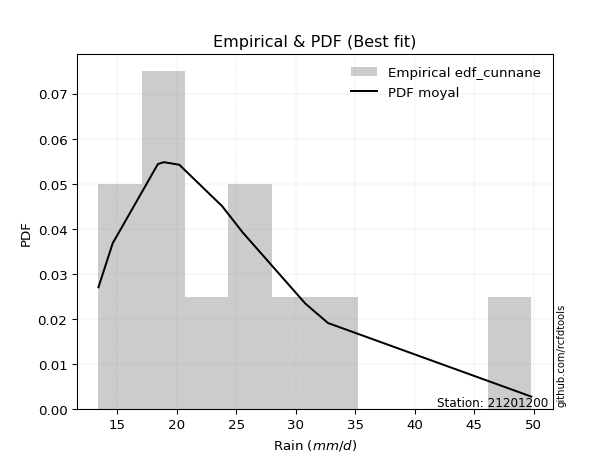</img>

</div>


### 12. EDF Adamowski (1981)

The Adamowski formula in hydrology refers to a specific plotting position formula used for estimating the non-parametric empirical distribution of hydrological events (like flood peaks) to calculate their return periods. This formula provides an alternative to traditional parametric methods (like the Gumbel or Log Pearson Type III distributions). 

<div align="center">


$P=(m-0.25)/(n+0.5)$


</div>


**12.1. Empirical values**

<div align="center">

|                | 0                   | 1                   | 2                  | 3                   | 4                   | 5             | 6                  | 7                  | 8                  | 9                  | 10                 |
|:---------------|:--------------------|:--------------------|:-------------------|:--------------------|:--------------------|:--------------|:-------------------|:-------------------|:-------------------|:-------------------|:-------------------|
| date           | 2015                | 2009                | 2008               | 2014                | 2024                | 2025          | 2012               | 2016               | 2010               | 2013               | 2011               |
| x              | 13.4                | 14.6                | 18.4               | 18.9                | 20.2                | 23.8          | 24.8               | 25.5               | 30.8               | 32.7               | 49.8               |
| m              | 1                   | 2                   | 3                  | 4                   | 5                   | 6             | 7                  | 8                  | 9                  | 10                 | 11                 |
| empirical_dist | edf_adamowski       | edf_adamowski       | edf_adamowski      | edf_adamowski       | edf_adamowski       | edf_adamowski | edf_adamowski      | edf_adamowski      | edf_adamowski      | edf_adamowski      | edf_adamowski      |
| empirical      | 0.06521739130434782 | 0.15217391304347827 | 0.2391304347826087 | 0.32608695652173914 | 0.41304347826086957 | 0.5           | 0.5869565217391305 | 0.6739130434782609 | 0.7608695652173914 | 0.8478260869565217 | 0.9347826086956522 |
| empirical_tr   | 1.069767441860465   | 1.1794871794871795  | 1.3142857142857143 | 1.4838709677419355  | 1.703703703703704   | 2.0           | 2.421052631578948  | 3.0666666666666664 | 4.1818181818181825 | 6.571428571428571  | 15.333333333333343 |

</div>


**12.2. Kolmogorov-Smirnov fit test (sorted by Δ)**


<div align="center">

|                | 0                   | 1                    | 2                   | 3                   | 4                    | 5                   | 6                   | 7                   | 8                   | 9                   | 10                  | 11                  | 12                  | 13                  | 14                  | 15                  | 16                  | 17                  | 18                  | 19                  | 20                  | 21                  | 22                  | 23                  | 24                  | 25                  | 26                  | 27                  | 28                  | 29                  | 30                  | 31                  | 32                  | 33                  | 34                  | 35                  | 36                  | 37                  | 38                  | 39                  | 40                  | 41                  | 42                  | 43                  | 44                  | 45                  | 46                  | 47                  | 48                  | 49                  | 50                  | 51                  | 52                  | 53                  | 54                  | 55                  | 56                  | 57                  | 58                  | 59                  | 60                  | 61                  | 62                  | 63                  | 64                  | 65                  | 66                  | 67                  | 68                  | 69                  | 70                  | 71                  | 72                  | 73                  | 74                  | 75                  | 76                  | 77                  | 78                  | 79                  | 80                  | 81                  | 82                  | 83                  | 84                  | 85                  | 86                  | 87                  | 88                  | 89                  | 90                  | 91                  | 92                  | 93                  | 94                  | 95                  | 96                  | 97                  | 98                  | 99                  | 100                 | 101                 | 102                 | 103                 | 104                 | 105                 | 106                 | 107                 | 108                 | 109                 | 110                 | 111                 | 112                 | 113                 | 114                 | 115                 | 116                 | 117                 | 118                 | 119                 | 120                 | 121                 | 122                 | 123                 | 124                 | 125                 | 126                 | 127                 | 128                 | 129                 | 130                 | 131                 | 132                 | 133                 | 134                 | 135                 | 136                 | 137                 | 138                 | 139                 | 140                 | 141                 | 142                 | 143                 | 144                 | 145                 | 146                 | 147                 | 148                 | 149                 | 150                 | 151                 | 152                 | 153                 | 154                 | 155                 | 156                 | 157                 | 158                 | 159                 |
|:---------------|:--------------------|:---------------------|:--------------------|:--------------------|:---------------------|:--------------------|:--------------------|:--------------------|:--------------------|:--------------------|:--------------------|:--------------------|:--------------------|:--------------------|:--------------------|:--------------------|:--------------------|:--------------------|:--------------------|:--------------------|:--------------------|:--------------------|:--------------------|:--------------------|:--------------------|:--------------------|:--------------------|:--------------------|:--------------------|:--------------------|:--------------------|:--------------------|:--------------------|:--------------------|:--------------------|:--------------------|:--------------------|:--------------------|:--------------------|:--------------------|:--------------------|:--------------------|:--------------------|:--------------------|:--------------------|:--------------------|:--------------------|:--------------------|:--------------------|:--------------------|:--------------------|:--------------------|:--------------------|:--------------------|:--------------------|:--------------------|:--------------------|:--------------------|:--------------------|:--------------------|:--------------------|:--------------------|:--------------------|:--------------------|:--------------------|:--------------------|:--------------------|:--------------------|:--------------------|:--------------------|:--------------------|:--------------------|:--------------------|:--------------------|:--------------------|:--------------------|:--------------------|:--------------------|:--------------------|:--------------------|:--------------------|:--------------------|:--------------------|:--------------------|:--------------------|:--------------------|:--------------------|:--------------------|:--------------------|:--------------------|:--------------------|:--------------------|:--------------------|:--------------------|:--------------------|:--------------------|:--------------------|:--------------------|:--------------------|:--------------------|:--------------------|:--------------------|:--------------------|:--------------------|:--------------------|:--------------------|:--------------------|:--------------------|:--------------------|:--------------------|:--------------------|:--------------------|:--------------------|:--------------------|:--------------------|:--------------------|:--------------------|:--------------------|:--------------------|:--------------------|:--------------------|:--------------------|:--------------------|:--------------------|:--------------------|:--------------------|:--------------------|:--------------------|:--------------------|:--------------------|:--------------------|:--------------------|:--------------------|:--------------------|:--------------------|:--------------------|:--------------------|:--------------------|:--------------------|:--------------------|:--------------------|:--------------------|:--------------------|:--------------------|:--------------------|:--------------------|:--------------------|:--------------------|:--------------------|:--------------------|:--------------------|:--------------------|:--------------------|:--------------------|:--------------------|:--------------------|:--------------------|:--------------------|:--------------------|:--------------------|
| station        | 21201200            | 21201200             | 21201200            | 21201200            | 21201200             | 21201200            | 21201200            | 21201200            | 21201200            | 21201200            | 21201200            | 21201200            | 21201200            | 21201200            | 21201200            | 21201200            | 21201200            | 21201200            | 21201200            | 21201200            | 21201200            | 21201200            | 21201200            | 21201200            | 21201200            | 21201200            | 21201200            | 21201200            | 21201200            | 21201200            | 21201200            | 21201200            | 21201200            | 21201200            | 21201200            | 21201200            | 21201200            | 21201200            | 21201200            | 21201200            | 21201200            | 21201200            | 21201200            | 21201200            | 21201200            | 21201200            | 21201200            | 21201200            | 21201200            | 21201200            | 21201200            | 21201200            | 21201200            | 21201200            | 21201200            | 21201200            | 21201200            | 21201200            | 21201200            | 21201200            | 21201200            | 21201200            | 21201200            | 21201200            | 21201200            | 21201200            | 21201200            | 21201200            | 21201200            | 21201200            | 21201200            | 21201200            | 21201200            | 21201200            | 21201200            | 21201200            | 21201200            | 21201200            | 21201200            | 21201200            | 21201200            | 21201200            | 21201200            | 21201200            | 21201200            | 21201200            | 21201200            | 21201200            | 21201200            | 21201200            | 21201200            | 21201200            | 21201200            | 21201200            | 21201200            | 21201200            | 21201200            | 21201200            | 21201200            | 21201200            | 21201200            | 21201200            | 21201200            | 21201200            | 21201200            | 21201200            | 21201200            | 21201200            | 21201200            | 21201200            | 21201200            | 21201200            | 21201200            | 21201200            | 21201200            | 21201200            | 21201200            | 21201200            | 21201200            | 21201200            | 21201200            | 21201200            | 21201200            | 21201200            | 21201200            | 21201200            | 21201200            | 21201200            | 21201200            | 21201200            | 21201200            | 21201200            | 21201200            | 21201200            | 21201200            | 21201200            | 21201200            | 21201200            | 21201200            | 21201200            | 21201200            | 21201200            | 21201200            | 21201200            | 21201200            | 21201200            | 21201200            | 21201200            | 21201200            | 21201200            | 21201200            | 21201200            | 21201200            | 21201200            | 21201200            | 21201200            | 21201200            | 21201200            | 21201200            | 21201200            |
| empirical_dist | edf_adamowski       | edf_adamowski        | edf_adamowski       | edf_adamowski       | edf_adamowski        | edf_adamowski       | edf_adamowski       | edf_adamowski       | edf_adamowski       | edf_adamowski       | edf_adamowski       | edf_adamowski       | edf_adamowski       | edf_adamowski       | edf_adamowski       | edf_adamowski       | edf_adamowski       | edf_adamowski       | edf_adamowski       | edf_adamowski       | edf_adamowski       | edf_adamowski       | edf_adamowski       | edf_adamowski       | edf_adamowski       | edf_adamowski       | edf_adamowski       | edf_adamowski       | edf_adamowski       | edf_adamowski       | edf_adamowski       | edf_adamowski       | edf_adamowski       | edf_adamowski       | edf_adamowski       | edf_adamowski       | edf_adamowski       | edf_adamowski       | edf_adamowski       | edf_adamowski       | edf_adamowski       | edf_adamowski       | edf_adamowski       | edf_adamowski       | edf_adamowski       | edf_adamowski       | edf_adamowski       | edf_adamowski       | edf_adamowski       | edf_adamowski       | edf_adamowski       | edf_adamowski       | edf_adamowski       | edf_adamowski       | edf_adamowski       | edf_adamowski       | edf_adamowski       | edf_adamowski       | edf_adamowski       | edf_adamowski       | edf_adamowski       | edf_adamowski       | edf_adamowski       | edf_adamowski       | edf_adamowski       | edf_adamowski       | edf_adamowski       | edf_adamowski       | edf_adamowski       | edf_adamowski       | edf_adamowski       | edf_adamowski       | edf_adamowski       | edf_adamowski       | edf_adamowski       | edf_adamowski       | edf_adamowski       | edf_adamowski       | edf_adamowski       | edf_adamowski       | edf_adamowski       | edf_adamowski       | edf_adamowski       | edf_adamowski       | edf_adamowski       | edf_adamowski       | edf_adamowski       | edf_adamowski       | edf_adamowski       | edf_adamowski       | edf_adamowski       | edf_adamowski       | edf_adamowski       | edf_adamowski       | edf_adamowski       | edf_adamowski       | edf_adamowski       | edf_adamowski       | edf_adamowski       | edf_adamowski       | edf_adamowski       | edf_adamowski       | edf_adamowski       | edf_adamowski       | edf_adamowski       | edf_adamowski       | edf_adamowski       | edf_adamowski       | edf_adamowski       | edf_adamowski       | edf_adamowski       | edf_adamowski       | edf_adamowski       | edf_adamowski       | edf_adamowski       | edf_adamowski       | edf_adamowski       | edf_adamowski       | edf_adamowski       | edf_adamowski       | edf_adamowski       | edf_adamowski       | edf_adamowski       | edf_adamowski       | edf_adamowski       | edf_adamowski       | edf_adamowski       | edf_adamowski       | edf_adamowski       | edf_adamowski       | edf_adamowski       | edf_adamowski       | edf_adamowski       | edf_adamowski       | edf_adamowski       | edf_adamowski       | edf_adamowski       | edf_adamowski       | edf_adamowski       | edf_adamowski       | edf_adamowski       | edf_adamowski       | edf_adamowski       | edf_adamowski       | edf_adamowski       | edf_adamowski       | edf_adamowski       | edf_adamowski       | edf_adamowski       | edf_adamowski       | edf_adamowski       | edf_adamowski       | edf_adamowski       | edf_adamowski       | edf_adamowski       | edf_adamowski       | edf_adamowski       | edf_adamowski       | edf_adamowski       | edf_adamowski       |
| p_dist         | logbetaprime        | ncf                  | moyal               | betaprime           | pearson3             | logmaxwell          | logvonmises         | logpearson3         | genlogistic         | logexponnorm        | halflogistic        | logfoldnorm         | loggenextreme       | logweibull_max      | logt                | logcrystalball      | lognorm             | logalpha            | lognct              | alpha               | loginvgamma         | lograyleigh         | logloggamma         | logburr12           | logjohnsonsu        | genextreme          | invweibull          | logskewnorm         | f                   | genexpon            | halfnorm            | loggennorm          | nct                 | loginvgauss         | invgamma            | gumbel_r            | logfatiguelife      | truncnorm           | logrice             | gompertz            | dweibull            | loghalfgennorm      | johnsonsu           | logburr             | invgauss            | loglogistic         | logdweibull         | exponpow            | logtriang           | loggamma            | loggamma            | logerlang           | logf                | foldnorm            | fatiguelife         | exponnorm           | kappa3              | loganglit           | logweibull_min      | logmielke           | kstwobign           | logdgamma           | loggenlogistic      | logtruncweibull_min | logsemicircular     | burr                | loggenexpon         | loghypsecant        | logkstwobign        | skewnorm            | logbradford         | loggumbel_r         | logtruncexpon       | rayleigh            | truncweibull_min    | gennorm             | loginvweibull       | logcosine           | bradford            | tukeylambda         | dgamma              | logarcsine          | maxwell             | loggompertz         | gausshyper          | loglaplace          | loglaplace          | t                   | logmoyal            | lomax               | loggumbel_l         | rice                | loghalfnorm         | loggausshyper       | logloglaplace       | logncf              | beta                | hypsecant           | logistic            | crystalball         | norm                | anglit              | semicircular        | wald                | loghalflogistic     | laplace             | arcsine             | weibull_min         | logexponpow         | triang              | logkappa3           | logtukeylambda      | logkappa4           | loguniform          | loggengamma         | vonmises_line       | logvonmises_line    | logwald             | burr12              | logksone            | loglomax            | gumbel_l            | logrdist            | truncexpon          | logargus            | cosine              | halfgennorm         | genpareto           | logtruncnorm        | loggenpareto        | logwrapcauchy       | kappa4              | loggenhalflogistic  | argus               | ksone               | wrapcauchy          | uniform             | erlang              | loglevy_l           | levy_l              | powerlaw            | logjohnsonsb        | nakagami            | logtrapezoid        | johnsonsb           | lognakagami         | genhalflogistic     | rdist               | logpowerlaw         | gengamma            | logbeta             | gamma               | exponweib           | logexponweib        | trapezoid           | logtruncpareto      | weibull_max         | truncpareto         | vonmises            | mielke              |
| delta          | 0.05831409264077325 | 0.059765138898003486 | 0.0603394802829372  | 0.06142269898248033 | 0.062487263322244635 | 0.06334343823521586 | 0.06404481886753666 | 0.0642788287479389  | 0.0648506271112434  | 0.0683478860127946  | 0.06863048266804761 | 0.06874321799081168 | 0.06922708394787519 | 0.06922714257326408 | 0.06939654225067982 | 0.06939664635165077 | 0.06939671917910506 | 0.07019454126603647 | 0.07053869036114584 | 0.07066453345652529 | 0.07119953872819862 | 0.07124516297285632 | 0.07203166100062564 | 0.07224849417952661 | 0.0737264845190424  | 0.07400602017120994 | 0.07400809646591033 | 0.07403433317771135 | 0.07444778611846736 | 0.07458384675902952 | 0.07459969380552844 | 0.07462430179727553 | 0.07481711119780021 | 0.07495778874969816 | 0.0749613836278542  | 0.07515994517042479 | 0.07530747989310682 | 0.07625065181906455 | 0.0762914581237662  | 0.07635389588926733 | 0.07709919796193375 | 0.0783068515563286  | 0.07868102778579922 | 0.0787126086810116  | 0.0794559217336146  | 0.07964647649894058 | 0.07977725978760913 | 0.08132483709227178 | 0.08145002355025732 | 0.08155845461204025 | 0.08155845461204025 | 0.08155851763175903 | 0.08160332198031073 | 0.08208147829049145 | 0.08232469277614507 | 0.08257245894653076 | 0.08334277809287013 | 0.08380347550633371 | 0.08448662229285908 | 0.0874448256640008  | 0.0875326595079694  | 0.08780822361639701 | 0.08824360179775714 | 0.08932830309271622 | 0.0897809719727316  | 0.09030161810057391 | 0.09123871355128832 | 0.09351405884897113 | 0.0937070696086566  | 0.09494836360958792 | 0.09621535461583819 | 0.09990783668329861 | 0.10018614637873202 | 0.10374114957413894 | 0.10695036873741337 | 0.10704422245006151 | 0.10817349909925289 | 0.11001164683341302 | 0.11169202460404504 | 0.11200812504711322 | 0.11351468777552343 | 0.11390134143034225 | 0.11408823285231151 | 0.1150590300964337  | 0.11657932978831298 | 0.12173381461910532 | 0.12173381461910532 | 0.12211801169016379 | 0.12531831673789162 | 0.1253721684046027  | 0.12831259115308524 | 0.12898209227371182 | 0.13294885996713102 | 0.13380535709174995 | 0.134565981277655   | 0.13584254453257905 | 0.137584287471597   | 0.13872427666193132 | 0.14197869067359703 | 0.1458023899220786  | 0.14580240909336684 | 0.14981584653586877 | 0.1514698384244909  | 0.15217391304347827 | 0.15217391304347827 | 0.1559886793581136  | 0.1580337671298272  | 0.1586953119920011  | 0.15976555537270593 | 0.17179718278423162 | 0.18133898594489756 | 0.18259340436020743 | 0.18303516193585012 | 0.18378262405258866 | 0.19316652700458853 | 0.19340088415419587 | 0.1956565618167999  | 0.19586136267682985 | 0.19730002480821213 | 0.19817942480091133 | 0.2007670079780594  | 0.21476522814854704 | 0.2165441599873119  | 0.2166172071631815  | 0.21705179306113587 | 0.2238184242230727  | 0.2304061041532079  | 0.2474614602375762  | 0.25047492227021023 | 0.27596468840524896 | 0.28165877821357244 | 0.2943803358433036  | 0.3042050101880666  | 0.3202541803711547  | 0.3226429367733714  | 0.3282706640933395  | 0.34149546106067846 | 0.3425026723628491  | 0.37132090078667607 | 0.4129173776623534  | 0.414809137942073   | 0.42765270622984763 | 0.4295568430510362  | 0.4320700490813719  | 0.4551308325686512  | 0.45578538402294183 | 0.4568453231476755  | 0.4617761676005043  | 0.4697120087613717  | 0.4847059203189113  | 0.4928768292302939  | 0.49949743830205523 | 0.5062414405228735  | 0.5385553276350421  | 0.5720087457202243  | 0.6419457336757084  | 0.6722414277554476  | 0.6818318851401015  | 7.309272321716778   | nan                 |
| deltao         | 0.37613735880099997 | 0.37613735880099997  | 0.37613735880099997 | 0.37613735880099997 | 0.37613735880099997  | 0.37613735880099997 | 0.37613735880099997 | 0.37613735880099997 | 0.37613735880099997 | 0.37613735880099997 | 0.37613735880099997 | 0.37613735880099997 | 0.37613735880099997 | 0.37613735880099997 | 0.37613735880099997 | 0.37613735880099997 | 0.37613735880099997 | 0.37613735880099997 | 0.37613735880099997 | 0.37613735880099997 | 0.37613735880099997 | 0.37613735880099997 | 0.37613735880099997 | 0.37613735880099997 | 0.37613735880099997 | 0.37613735880099997 | 0.37613735880099997 | 0.37613735880099997 | 0.37613735880099997 | 0.37613735880099997 | 0.37613735880099997 | 0.37613735880099997 | 0.37613735880099997 | 0.37613735880099997 | 0.37613735880099997 | 0.37613735880099997 | 0.37613735880099997 | 0.37613735880099997 | 0.37613735880099997 | 0.37613735880099997 | 0.37613735880099997 | 0.37613735880099997 | 0.37613735880099997 | 0.37613735880099997 | 0.37613735880099997 | 0.37613735880099997 | 0.37613735880099997 | 0.37613735880099997 | 0.37613735880099997 | 0.37613735880099997 | 0.37613735880099997 | 0.37613735880099997 | 0.37613735880099997 | 0.37613735880099997 | 0.37613735880099997 | 0.37613735880099997 | 0.37613735880099997 | 0.37613735880099997 | 0.37613735880099997 | 0.37613735880099997 | 0.37613735880099997 | 0.37613735880099997 | 0.37613735880099997 | 0.37613735880099997 | 0.37613735880099997 | 0.37613735880099997 | 0.37613735880099997 | 0.37613735880099997 | 0.37613735880099997 | 0.37613735880099997 | 0.37613735880099997 | 0.37613735880099997 | 0.37613735880099997 | 0.37613735880099997 | 0.37613735880099997 | 0.37613735880099997 | 0.37613735880099997 | 0.37613735880099997 | 0.37613735880099997 | 0.37613735880099997 | 0.37613735880099997 | 0.37613735880099997 | 0.37613735880099997 | 0.37613735880099997 | 0.37613735880099997 | 0.37613735880099997 | 0.37613735880099997 | 0.37613735880099997 | 0.37613735880099997 | 0.37613735880099997 | 0.37613735880099997 | 0.37613735880099997 | 0.37613735880099997 | 0.37613735880099997 | 0.37613735880099997 | 0.37613735880099997 | 0.37613735880099997 | 0.37613735880099997 | 0.37613735880099997 | 0.37613735880099997 | 0.37613735880099997 | 0.37613735880099997 | 0.37613735880099997 | 0.37613735880099997 | 0.37613735880099997 | 0.37613735880099997 | 0.37613735880099997 | 0.37613735880099997 | 0.37613735880099997 | 0.37613735880099997 | 0.37613735880099997 | 0.37613735880099997 | 0.37613735880099997 | 0.37613735880099997 | 0.37613735880099997 | 0.37613735880099997 | 0.37613735880099997 | 0.37613735880099997 | 0.37613735880099997 | 0.37613735880099997 | 0.37613735880099997 | 0.37613735880099997 | 0.37613735880099997 | 0.37613735880099997 | 0.37613735880099997 | 0.37613735880099997 | 0.37613735880099997 | 0.37613735880099997 | 0.37613735880099997 | 0.37613735880099997 | 0.37613735880099997 | 0.37613735880099997 | 0.37613735880099997 | 0.37613735880099997 | 0.37613735880099997 | 0.37613735880099997 | 0.37613735880099997 | 0.37613735880099997 | 0.37613735880099997 | 0.37613735880099997 | 0.37613735880099997 | 0.37613735880099997 | 0.37613735880099997 | 0.37613735880099997 | 0.37613735880099997 | 0.37613735880099997 | 0.37613735880099997 | 0.37613735880099997 | 0.37613735880099997 | 0.37613735880099997 | 0.37613735880099997 | 0.37613735880099997 | 0.37613735880099997 | 0.37613735880099997 | 0.37613735880099997 | 0.37613735880099997 | 0.37613735880099997 | 0.37613735880099997 | 0.37613735880099997 | 0.37613735880099997 |
| eval           | Δo > Δ              | Δo > Δ               | Δo > Δ              | Δo > Δ              | Δo > Δ               | Δo > Δ              | Δo > Δ              | Δo > Δ              | Δo > Δ              | Δo > Δ              | Δo > Δ              | Δo > Δ              | Δo > Δ              | Δo > Δ              | Δo > Δ              | Δo > Δ              | Δo > Δ              | Δo > Δ              | Δo > Δ              | Δo > Δ              | Δo > Δ              | Δo > Δ              | Δo > Δ              | Δo > Δ              | Δo > Δ              | Δo > Δ              | Δo > Δ              | Δo > Δ              | Δo > Δ              | Δo > Δ              | Δo > Δ              | Δo > Δ              | Δo > Δ              | Δo > Δ              | Δo > Δ              | Δo > Δ              | Δo > Δ              | Δo > Δ              | Δo > Δ              | Δo > Δ              | Δo > Δ              | Δo > Δ              | Δo > Δ              | Δo > Δ              | Δo > Δ              | Δo > Δ              | Δo > Δ              | Δo > Δ              | Δo > Δ              | Δo > Δ              | Δo > Δ              | Δo > Δ              | Δo > Δ              | Δo > Δ              | Δo > Δ              | Δo > Δ              | Δo > Δ              | Δo > Δ              | Δo > Δ              | Δo > Δ              | Δo > Δ              | Δo > Δ              | Δo > Δ              | Δo > Δ              | Δo > Δ              | Δo > Δ              | Δo > Δ              | Δo > Δ              | Δo > Δ              | Δo > Δ              | Δo > Δ              | Δo > Δ              | Δo > Δ              | Δo > Δ              | Δo > Δ              | Δo > Δ              | Δo > Δ              | Δo > Δ              | Δo > Δ              | Δo > Δ              | Δo > Δ              | Δo > Δ              | Δo > Δ              | Δo > Δ              | Δo > Δ              | Δo > Δ              | Δo > Δ              | Δo > Δ              | Δo > Δ              | Δo > Δ              | Δo > Δ              | Δo > Δ              | Δo > Δ              | Δo > Δ              | Δo > Δ              | Δo > Δ              | Δo > Δ              | Δo > Δ              | Δo > Δ              | Δo > Δ              | Δo > Δ              | Δo > Δ              | Δo > Δ              | Δo > Δ              | Δo > Δ              | Δo > Δ              | Δo > Δ              | Δo > Δ              | Δo > Δ              | Δo > Δ              | Δo > Δ              | Δo > Δ              | Δo > Δ              | Δo > Δ              | Δo > Δ              | Δo > Δ              | Δo > Δ              | Δo > Δ              | Δo > Δ              | Δo > Δ              | Δo > Δ              | Δo > Δ              | Δo > Δ              | Δo > Δ              | Δo > Δ              | Δo > Δ              | Δo > Δ              | Δo > Δ              | Δo > Δ              | Δo > Δ              | Δo > Δ              | Δo > Δ              | Δo > Δ              | Δo > Δ              | Δo > Δ              | Δo > Δ              | Δo > Δ              | Δo > Δ              | Δo > Δ              | Δo <= Δ             | Δo <= Δ             | Δo <= Δ             | Δo <= Δ             | Δo <= Δ             | Δo <= Δ             | Δo <= Δ             | Δo <= Δ             | Δo <= Δ             | Δo <= Δ             | Δo <= Δ             | Δo <= Δ             | Δo <= Δ             | Δo <= Δ             | Δo <= Δ             | Δo <= Δ             | Δo <= Δ             | Δo <= Δ             | Δo <= Δ             | Δo <= Δ             | Δo <= Δ             |
| fit            | 1                   | 1                    | 1                   | 1                   | 1                    | 1                   | 1                   | 1                   | 1                   | 1                   | 1                   | 1                   | 1                   | 1                   | 1                   | 1                   | 1                   | 1                   | 1                   | 1                   | 1                   | 1                   | 1                   | 1                   | 1                   | 1                   | 1                   | 1                   | 1                   | 1                   | 1                   | 1                   | 1                   | 1                   | 1                   | 1                   | 1                   | 1                   | 1                   | 1                   | 1                   | 1                   | 1                   | 1                   | 1                   | 1                   | 1                   | 1                   | 1                   | 1                   | 1                   | 1                   | 1                   | 1                   | 1                   | 1                   | 1                   | 1                   | 1                   | 1                   | 1                   | 1                   | 1                   | 1                   | 1                   | 1                   | 1                   | 1                   | 1                   | 1                   | 1                   | 1                   | 1                   | 1                   | 1                   | 1                   | 1                   | 1                   | 1                   | 1                   | 1                   | 1                   | 1                   | 1                   | 1                   | 1                   | 1                   | 1                   | 1                   | 1                   | 1                   | 1                   | 1                   | 1                   | 1                   | 1                   | 1                   | 1                   | 1                   | 1                   | 1                   | 1                   | 1                   | 1                   | 1                   | 1                   | 1                   | 1                   | 1                   | 1                   | 1                   | 1                   | 1                   | 1                   | 1                   | 1                   | 1                   | 1                   | 1                   | 1                   | 1                   | 1                   | 1                   | 1                   | 1                   | 1                   | 1                   | 1                   | 1                   | 1                   | 1                   | 1                   | 1                   | 1                   | 1                   | 1                   | 1                   | 1                   | 1                   | 0                   | 0                   | 0                   | 0                   | 0                   | 0                   | 0                   | 0                   | 0                   | 0                   | 0                   | 0                   | 0                   | 0                   | 0                   | 0                   | 0                   | 0                   | 0                   | 0                   | 0                   |
| n              | 11                  | 11                   | 11                  | 11                  | 11                   | 11                  | 11                  | 11                  | 11                  | 11                  | 11                  | 11                  | 11                  | 11                  | 11                  | 11                  | 11                  | 11                  | 11                  | 11                  | 11                  | 11                  | 11                  | 11                  | 11                  | 11                  | 11                  | 11                  | 11                  | 11                  | 11                  | 11                  | 11                  | 11                  | 11                  | 11                  | 11                  | 11                  | 11                  | 11                  | 11                  | 11                  | 11                  | 11                  | 11                  | 11                  | 11                  | 11                  | 11                  | 11                  | 11                  | 11                  | 11                  | 11                  | 11                  | 11                  | 11                  | 11                  | 11                  | 11                  | 11                  | 11                  | 11                  | 11                  | 11                  | 11                  | 11                  | 11                  | 11                  | 11                  | 11                  | 11                  | 11                  | 11                  | 11                  | 11                  | 11                  | 11                  | 11                  | 11                  | 11                  | 11                  | 11                  | 11                  | 11                  | 11                  | 11                  | 11                  | 11                  | 11                  | 11                  | 11                  | 11                  | 11                  | 11                  | 11                  | 11                  | 11                  | 11                  | 11                  | 11                  | 11                  | 11                  | 11                  | 11                  | 11                  | 11                  | 11                  | 11                  | 11                  | 11                  | 11                  | 11                  | 11                  | 11                  | 11                  | 11                  | 11                  | 11                  | 11                  | 11                  | 11                  | 11                  | 11                  | 11                  | 11                  | 11                  | 11                  | 11                  | 11                  | 11                  | 11                  | 11                  | 11                  | 11                  | 11                  | 11                  | 11                  | 11                  | 11                  | 11                  | 11                  | 11                  | 11                  | 11                  | 11                  | 11                  | 11                  | 11                  | 11                  | 11                  | 11                  | 11                  | 11                  | 11                  | 11                  | 11                  | 11                  | 11                  | 11                  |
| best_fit       | 1                   | 0                    | 0                   | 0                   | 0                    | 0                   | 0                   | 0                   | 0                   | 0                   | 0                   | 0                   | 0                   | 0                   | 0                   | 0                   | 0                   | 0                   | 0                   | 0                   | 0                   | 0                   | 0                   | 0                   | 0                   | 0                   | 0                   | 0                   | 0                   | 0                   | 0                   | 0                   | 0                   | 0                   | 0                   | 0                   | 0                   | 0                   | 0                   | 0                   | 0                   | 0                   | 0                   | 0                   | 0                   | 0                   | 0                   | 0                   | 0                   | 0                   | 0                   | 0                   | 0                   | 0                   | 0                   | 0                   | 0                   | 0                   | 0                   | 0                   | 0                   | 0                   | 0                   | 0                   | 0                   | 0                   | 0                   | 0                   | 0                   | 0                   | 0                   | 0                   | 0                   | 0                   | 0                   | 0                   | 0                   | 0                   | 0                   | 0                   | 0                   | 0                   | 0                   | 0                   | 0                   | 0                   | 0                   | 0                   | 0                   | 0                   | 0                   | 0                   | 0                   | 0                   | 0                   | 0                   | 0                   | 0                   | 0                   | 0                   | 0                   | 0                   | 0                   | 0                   | 0                   | 0                   | 0                   | 0                   | 0                   | 0                   | 0                   | 0                   | 0                   | 0                   | 0                   | 0                   | 0                   | 0                   | 0                   | 0                   | 0                   | 0                   | 0                   | 0                   | 0                   | 0                   | 0                   | 0                   | 0                   | 0                   | 0                   | 0                   | 0                   | 0                   | 0                   | 0                   | 0                   | 0                   | 0                   | 0                   | 0                   | 0                   | 0                   | 0                   | 0                   | 0                   | 0                   | 0                   | 0                   | 0                   | 0                   | 0                   | 0                   | 0                   | 0                   | 0                   | 0                   | 0                   | 0                   | 0                   |
| best_fit_sort  | 1                   | 2                    | 3                   | 4                   | 5                    | 6                   | 7                   | 8                   | 9                   | 10                  | 11                  | 12                  | 13                  | 14                  | 15                  | 16                  | 17                  | 18                  | 19                  | 20                  | 21                  | 22                  | 23                  | 24                  | 25                  | 26                  | 27                  | 28                  | 29                  | 30                  | 31                  | 32                  | 33                  | 34                  | 35                  | 36                  | 37                  | 38                  | 39                  | 40                  | 41                  | 42                  | 43                  | 44                  | 45                  | 46                  | 47                  | 48                  | 49                  | 50                  | 51                  | 52                  | 53                  | 54                  | 55                  | 56                  | 57                  | 58                  | 59                  | 60                  | 61                  | 62                  | 63                  | 64                  | 65                  | 66                  | 67                  | 68                  | 69                  | 70                  | 71                  | 72                  | 73                  | 74                  | 75                  | 76                  | 77                  | 78                  | 79                  | 80                  | 81                  | 82                  | 83                  | 84                  | 85                  | 86                  | 87                  | 88                  | 89                  | 90                  | 91                  | 92                  | 93                  | 94                  | 95                  | 96                  | 97                  | 98                  | 99                  | 100                 | 101                 | 102                 | 103                 | 104                 | 105                 | 106                 | 107                 | 108                 | 109                 | 110                 | 111                 | 112                 | 113                 | 114                 | 115                 | 116                 | 117                 | 118                 | 119                 | 120                 | 121                 | 122                 | 123                 | 124                 | 125                 | 126                 | 127                 | 128                 | 129                 | 130                 | 131                 | 132                 | 133                 | 134                 | 135                 | 136                 | 137                 | 138                 | 139                 | 140                 | 141                 | 142                 | 143                 | 144                 | 145                 | 146                 | 147                 | 148                 | 149                 | 150                 | 151                 | 152                 | 153                 | 154                 | 155                 | 156                 | 157                 | 158                 | 159                 | 160                 |

</div>


**12.3. Best fit**

<div align="center">

|   id |   station | empirical_dist   | p_dist       |     delta |   deltao | eval   |   fit |   n |   best_fit |   best_fit_sort |
|-----:|----------:|:-----------------|:-------------|----------:|---------:|:-------|------:|----:|-----------:|----------------:|
|    0 |  21201200 | edf_adamowski    | logbetaprime | 0.0583141 | 0.376137 | Δo > Δ |     1 |  11 |          1 |               1 |

</div>


<div align="center">

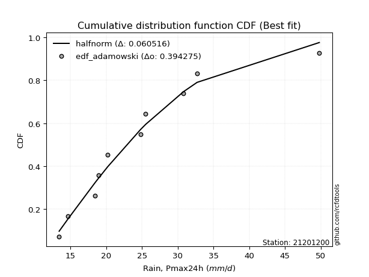</img>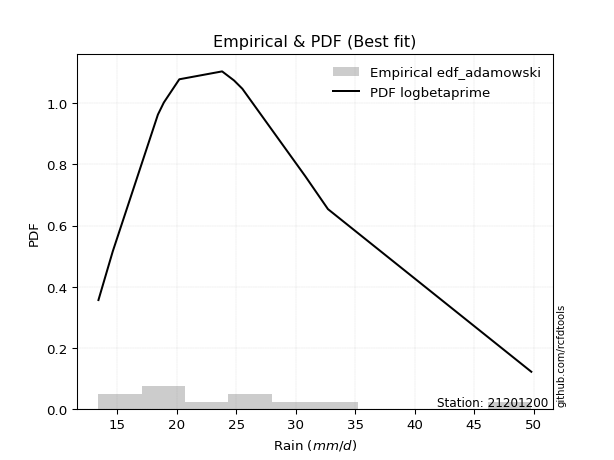</img>

</div>


## C. Best fit & Estimate extreme values for specific return periods - Tr

Best fit in probability distribution analysis means finding the theoretical distribution (like Normal, Poisson, Exponential, etc.) that most accurately mirrors your real-world data´s patterns (shape, center, spread) for better predictions, using methods like visual checks (Q-Q plots), goodness-of-fit tests (Kolmogorov-Smirnov, Chi-Squared), and information criteria (AIC) to score and select the simplest, most representative model.


### 1. Best fit (ordered by delta Δ)

:file_folder:Table: [bestfit_21201200.csv](table/bestfit_21201200.csv)

<div align="center">

|   id |   station | empirical_dist   | p_dist       |     delta |   deltao | eval   |   fit |   n |   best_fit |   best_fit_sort |
|-----:|----------:|:-----------------|:-------------|----------:|---------:|:-------|------:|----:|-----------:|----------------:|
|    0 |  21201200 | edf_blom         | moyal        | 0.053588  | 0.376137 | Δo > Δ |     1 |  11 |          1 |               1 |
|    1 |  21201200 | edf_cunnane      | moyal        | 0.0543817 | 0.376137 | Δo > Δ |     1 |  11 |          1 |               2 |
|    2 |  21201200 | edf_tukey        | moyal        | 0.0552244 | 0.376137 | Δo > Δ |     1 |  11 |          1 |               3 |
|    3 |  21201200 | edf_gringorten   | moyal        | 0.0556664 | 0.376137 | Δo > Δ |     1 |  11 |          1 |               4 |
|    4 |  21201200 | edf_jenkinson    | ncf          | 0.0560974 | 0.376137 | Δo > Δ |     1 |  11 |          1 |               5 |
|    5 |  21201200 | edf_beard        | ncf          | 0.0560974 | 0.376137 | Δo > Δ |     1 |  11 |          1 |               6 |
|    6 |  21201200 | edf_filliben     | moyal        | 0.0562078 | 0.376137 | Δo > Δ |     1 |  11 |          1 |               7 |
|    7 |  21201200 | edf_chegodayev   | logbetaprime | 0.0564428 | 0.376137 | Δo > Δ |     1 |  11 |          1 |               8 |
|    8 |  21201200 | edf_hazen        | moyal        | 0.0576285 | 0.376137 | Δo > Δ |     1 |  11 |          1 |               9 |
|    9 |  21201200 | edf_adamowski    | logbetaprime | 0.0583141 | 0.376137 | Δo > Δ |     1 |  11 |          1 |              10 |
|   10 |  21201200 | edf_weibull      | pearson3     | 0.0604556 | 0.376137 | Δo > Δ |     1 |  11 |          1 |              11 |
|   11 |  21201200 | edf_california   | lomax        | 0.0917753 | 0.376137 | Δo > Δ |     1 |  11 |          1 |              12 |

</div>


### 2. Extreme values and % difference analysis

In hydrology, a return period (or recurrence interval $Tr$) is the statistical average time between extreme events like floods or droughts of a specific magnitude, indicating how rare an event is, with a 100-year flood, for example, having a 1% chance of occurring in any given year, not that it happens exactly every century. It is a key tool for infrastructure design (like bridges or dams) and risk assessment, calculated from historical data to determine the probability of future events, although it is important to remember it is statistical average, and events can cluster or be missed.

The extreme value porcentage difference is evaluated as $pdiff = 1 - (ETrBf / ETr) * 100$, where _ETrBf_ correspond to the bestfit extreme value for a specific recurrence interval and _ETr_ correspond to the extreme value for one of the most used PDFsused in hydrology.

> risk_rate: assuming the return period as the project useful life.

:file_folder:Table: [extreme_21201200.csv](table/extreme_21201200.csv), all PDFs.  
:file_folder:Table: [extremepdiff_21201200.csv](table/extremepdiff_21201200.csv), % difference between bestfit and most used PDFs in Hydrology.

<div align="center">

Extreme values table for only best fit PDFs
|   id |      tr |   prob_l |     prob_g |    alpha |   anglit |   arcsine |   argus |    beta |   betaprime |   bradford |     burr |   burr12 |   cosine |   crystalball |   dgamma |   dweibull |   erlang |   exponnorm |   exponpow |   exponweib |        f |   fatiguelife |   foldnorm |    gamma |   gausshyper |   genexpon |   genextreme |   gengamma |   genhalflogistic |   genlogistic |   gennorm |   genpareto |   gompertz |   gumbel_l |   gumbel_r |   halfgennorm |   halflogistic |   halfnorm |   hypsecant |   invgamma |   invgauss |   invweibull |   johnsonsb |   johnsonsu |   kappa3 |   kappa4 |   ksone |   kstwobign |   laplace |   levy_l |   loggamma |   logistic |   loglaplace |   lomax |   maxwell |   mielke |   moyal |   nakagami |     ncf |      nct |    norm |   pearson3 |   powerlaw |   rayleigh |   rdist |    rice |   semicircular |   skewnorm |       t |   trapezoid |   triang |   truncexpon |   truncnorm |   truncpareto |   truncweibull_min |   tukeylambda |   uniform |   vonmises |   vonmises_line |    wald |   weibull_max |   weibull_min |   wrapcauchy |   logalpha |   loganglit |   logarcsine |   logargus |   logbeta |   logbetaprime |   logbradford |   logburr |   logburr12 |   logcosine |   logcrystalball |   logdgamma |   logdweibull |   logerlang |   logexponnorm |   logexponpow |   logexponweib |     logf |   logfatiguelife |   logfoldnorm |   loggausshyper |   loggenexpon |   loggenextreme |   loggengamma |   loggenhalflogistic |   loggenlogistic |   loggennorm |   loggenpareto |   loggompertz |   loggumbel_l |   loggumbel_r |   loghalfgennorm |   loghalflogistic |   loghalfnorm |   loghypsecant |   loginvgamma |   loginvgauss |   loginvweibull |   logjohnsonsb |   logjohnsonsu |   logkappa3 |   logkappa4 |   logksone |   logkstwobign |   loglevy_l |   logloggamma |   loglogistic |   logloglaplace |   loglomax |   logmaxwell |   logmielke |   logmoyal |   lognakagami |   logncf |   lognct |   lognorm |   logpearson3 |   logpowerlaw |   lograyleigh |   logrdist |   logrice |   logsemicircular |   logskewnorm |    logt |   logtrapezoid |   logtriang |   logtruncexpon |   logtruncnorm |   logtruncpareto |   logtruncweibull_min |   logtukeylambda |   loguniform |   logvonmises |   logvonmises_line |   logwald |   logweibull_max |   logweibull_min |   logwrapcauchy |   station |   n |   risk_rate |
|-----:|--------:|---------:|-----------:|---------:|---------:|----------:|--------:|--------:|------------:|-----------:|---------:|---------:|---------:|--------------:|---------:|-----------:|---------:|------------:|-----------:|------------:|---------:|--------------:|-----------:|---------:|-------------:|-----------:|-------------:|-----------:|------------------:|--------------:|----------:|------------:|-----------:|-----------:|-----------:|--------------:|---------------:|-----------:|------------:|-----------:|-----------:|-------------:|------------:|------------:|---------:|---------:|--------:|------------:|----------:|---------:|-----------:|-----------:|-------------:|--------:|----------:|---------:|--------:|-----------:|--------:|---------:|--------:|-----------:|-----------:|-----------:|--------:|--------:|---------------:|-----------:|--------:|------------:|---------:|-------------:|------------:|--------------:|-------------------:|--------------:|----------:|-----------:|----------------:|--------:|--------------:|--------------:|-------------:|-----------:|------------:|-------------:|-----------:|----------:|---------------:|--------------:|----------:|------------:|------------:|-----------------:|------------:|--------------:|------------:|---------------:|--------------:|---------------:|---------:|-----------------:|--------------:|----------------:|--------------:|----------------:|--------------:|---------------------:|-----------------:|-------------:|---------------:|--------------:|--------------:|--------------:|-----------------:|------------------:|--------------:|---------------:|--------------:|--------------:|----------------:|---------------:|---------------:|------------:|------------:|-----------:|---------------:|------------:|--------------:|--------------:|----------------:|-----------:|-------------:|------------:|-----------:|--------------:|---------:|---------:|----------:|--------------:|--------------:|--------------:|-----------:|----------:|------------------:|--------------:|--------:|---------------:|------------:|----------------:|---------------:|-----------------:|----------------------:|-----------------:|-------------:|--------------:|-------------------:|----------:|-----------------:|-----------------:|----------------:|----------:|----:|------------:|
|    0 |    2    | 0.5      | 0.5        |  22.3939 |  24.8091 |   24.8091 | 30.946  | 23.4469 |     22.7918 |    23.2976 |  21.8749 |  19.6624 |  26.9525 |       24.8091 |  23.8    |    22.7068 |  16.9779 |     21.9494 |    22.9562 |     13.9907 |  22.2418 |       21.9318 |    22.7165 |  14.2689 |      23.6238 |    22.2312 |      22.2791 |    14.3029 |           36.7913 |       23.0797 |   23.8    |     27.5808 |    22.2293 |    26.4186 |    23.1996 |       19.0743 |        22.3994 |    22.8036 |     24.8091 |    22.2312 |    22.0393 |      22.279  |     48.3284 |     22.0914 |  22.6007 |  29.8854 | 31.6    |     23.5585 |   24.8091 |  17.2699 |    22.059  |    24.8091 |      23.1787 | 21.0448 |   23.9712 |  22.2796 | 22.68   |    14.6639 | 22.8608 |  22.2542 | 24.8091 |    22.7836 |    14.8261 |    23.674  | 11.7078 | 24.4812 |        24.8091 |    23.543  | 24.1983 |     40.6464 |  25.4384 |      26.8889 |     22.6121 |       13.4121 |            23.2506 |       23.4171 |   31.6    |   0.186934 |         23.0498 | 21.6332 |       49.5132 |       20.727  |      31.7064 |    22.3728 |     23.1787 |      23.1787 |    26.8351 |   14.2917 |        22.8653 |       22.9344 |   22.2338 |     22.2252 |     23.9287 |          23.1787 |     22.0237 |       22.1622 |     22.059  |        22.474  |       20.4905 |        14.2227 |  22.0595 |          22.2203 |       22.2844 |         21.5229 |       21.6749 |         22.4025 |       19.6292 |              30.8976 |          21.9354 |      23.2354 |        26.3127 |       21.3171 |       24.5913 |       21.8473 |          22.2001 |           21.2141 |       21.5317 |        23.1787 |       22.3232 |       22.2288 |         21.583  |        13.5732 |        22.2632 |     25.7486 |     25.8213 |    25.8325 |        21.7287 |     19.4497 |       23.2038 |       23.1787 |         23.8    |    19.5934 |      22.4758 |     21.969  |    21.434  |       14.4562 |  22.8596 |  22.347  |   23.1787 |       22.5776 |       14.4445 |       22.2316 |    25.8316 |   22.4011 |           23.1788 |       22.2416 | 23.1787 |        35.798  |     22.5906 |         22.0691 |        18.5674 |          13.4437 |               22.4841 |          25.8049 |      25.8325 |       23.098  |            26.0569 |   20.6253 |          22.4023 |          21.9215 |         25.8325 |  21201200 |  11 |    0.75     |
|    1 |    2.33 | 0.570815 | 0.429185   |  23.8223 |  26.8456 |   27.8662 | 33.4262 | 26.1394 |     24.2889 |    25.6806 |  23.352  |  21.3894 |  29.0179 |       26.5574 |  24.8242 |    24.2466 |  18.1896 |     23.5154 |    24.8711 |     14.4942 |  23.719  |       23.5198 |    24.6412 |  14.9343 |      25.9659 |    23.9804 |      23.7302 |    14.9574 |           39.1431 |       24.5334 |   24.9385 |     31.2131 |    24.0004 |    27.9397 |    24.8196 |       20.9619 |        24.065  |    24.6905 |     26.2083 |    23.7075 |    23.595  |      23.7302 |     49.6012 |     23.6172 |  24.1274 |  32.5395 | 34.6932 |     25.1351 |   25.8671 |  26.9277 |    23.5545 |    26.3495 |      24.0978 | 22.7291 |   25.7875 |  23.7306 | 24.2135 |    15.7611 | 24.3637 |  23.712  | 26.5574 |    24.4569 |    16.0486 |    25.5172 | 16.1209 | 26.1031 |        26.9932 |    25.2889 | 25.983  |     42.7613 |  27.5752 |      29.3269 |     24.3321 |       13.4274 |            25.6103 |       24.8723 |   34.1777 |   0.351345 |         23.823  | 22.7796 |       49.6882 |       22.7483 |      35.2554 |    23.8368 |     24.9802 |      25.9351 |    29.1196 |   14.9736 |        24.3762 |       25.1775 |   23.6321 |     23.7666 |     25.6775 |          24.717  |     24.2722 |       24.1991 |     23.5545 |        23.8846 |       22.2787 |        14.7713 |  23.5537 |          23.6995 |       23.9598 |         23.7563 |       23.2883 |         23.8846 |       21.1693 |              33.8016 |          23.4034 |      24.822  |        32.4653 |       23.0554 |       26.0052 |       23.1877 |          23.9632 |           22.5534 |       23.0779 |        24.4019 |       23.7915 |       23.7074 |         22.9738 |        14.3645 |        23.7354 |     28.244  |     28.4606 |    28.8812 |        23.2539 |     25.7143 |       24.7679 |       24.5289 |         24.8761 |    21.3302 |      24.0275 |     23.4255 |    22.6768 |       15.3288 |  25.5765 |  23.8135 |   24.717  |       24.0817 |       15.2555 |       23.7899 |    29.3837 |   23.9497 |           25.1159 |       23.7276 | 24.717  |        38.6352 |     24.2796 |         24.1204 |        19.8337 |          13.5026 |               24.6292 |          28.4316 |      28.3492 |       24.6066 |            27.9667 |   21.5129 |          23.8844 |          23.4741 |         33.1416 |  21201200 |  11 |    0.729209 |
|    2 |    5    | 0.8      | 0.2        |  30.6334 |  34.0307 |   36.0182 | 41.3818 | 38.1651 |     31.0725 |    36.0744 |  30.9899 |  32.3678 |  36.461  |       33.0546 |  30.3581 |    29.8144 |  25.1521 |     31.3377 |    33.0548 |     21.8477 |  30.8757 |       31.2914 |    32.7804 |  20.9646 |      35.6936 |    31.9838 |      30.7472 |    22.8112 |           45.4771 |       30.8485 |   30.424  |     42.186  |    32.1007 |    32.8535 |    31.8576 |       33.4657 |        31.6016 |    32.6699 |     31.8207 |    30.8632 |    31.1779 |      30.7472 |     49.8108 |     31.0891 |  30.9284 |  41.5112 | 44.704  |     31.8323 |   31.1568 |  42.9284 |    30.9337 |    32.2971 |      29.2694 | 31.1506 |   32.9367 |  30.7466 | 31.317  |    25.3806 | 31.1231 |  30.7577 | 33.0546 |    31.8872 |    26.2283 |    32.8966 | 28.2412 | 32.5958 |        34.4468 |    32.672  | 32.7465 |     48.8286 |  36.1211 |      38.7084 |     31.8416 |       14.075  |            35.7694 |       29.5469 |   42.52   |   0.98787  |         26.8411 | 29.1971 |       49.7981 |       33.9376 |      44.3976 |    30.8207 |     32.5302 |      34.996  |    37.8442 |   21.4473 |        31.1361 |       35.2839 |   30.652  |     31.3447 |     33.1087 |          31.3839 |     29.6086 |       30.0613 |     30.9337 |        30.5471 |       31.7887 |        19.1256 |  30.9298 |          30.8756 |       31.5954 |         34.6556 |       31.296  |         30.9066 |       30.0494 |              42.8262 |          30.946  |      31.6042 |        46.9916 |       31.7215 |       31.1528 |       30.0331 |          31.9529 |           29.7519 |       30.9431 |        29.9923 |       30.8367 |       30.8736 |         30.1342 |        48.0197 |        30.8333 |     38.1266 |     38.9562 |    41.4393 |        31.0205 |     40.8395 |       31.5356 |       30.5222 |         31.3202 |    32.8358 |      31.2481 |     30.8747 |    29.4422 |       24.4158 |  39.454  |  30.8298 |   31.3839 |       31.0654 |       22.5959 |       31.2021 |    42.4324 |   31.2205 |           33.0299 |       30.9667 | 31.3839 |        48.0855 |     32.3949 |         33.8    |        26.6533 |          15.1027 |               34.5142 |          38.7597 |      38.3005 |       31.1639 |            36.3457 |   27.2351 |          30.9066 |          31.1018 |         45.093  |  21201200 |  11 |    0.67232  |
|    3 |   10    | 0.9      | 0.1        |  37.1181 |  38.0975 |   37.9862 | 45.2182 | 46.3198 |     36.9315 |    42.2737 |  38.9941 |  46.8097 |  40.9578 |       37.3647 |  35.4952 |    34.2033 |  32.2158 |     38.4385 |    38.9965 |     40.7706 |  37.6438 |       38.3467 |    38.8029 |  29.2168 |      41.4998 |    38.4412 |      37.4261 |    39.7032 |           47.7566 |       35.9916 |   35.2458 |     46.4134 |    38.5583 |    35.5894 |    37.59   |       49.1663 |        37.8605 |    38.5744 |     36.3023 |    37.6346 |    38.1089 |      37.426  |     49.8109 |     38.111  |  37.0173 |  45.6444 | 49.072  |     36.9314 |   35.9587 |  46.7914 |    38.0382 |    36.6773 |      34.9191 | 38.7954 |   37.9678 |  37.424  | 37.5017 |    36.1719 | 36.9028 |  37.4511 | 37.3647 |    37.9322 |    35.6455 |    38.1582 | 31.4424 | 37.2253 |        38.2714 |    38.1354 | 37.4987 |     51.1985 |  41.5052 |      43.7987 |     37.4625 |       17.4686 |            41.9405 |       31.541  |   46.16   |   1.46896  |         29.0148 | 36.0076 |       49.7999 |       45.2315 |      47.3355 |    37.3362 |     37.7749 |      37.6213 |    42.9421 |   30.6766 |        36.8521 |       41.6544 |   37.9874 |     38.7122 |     38.6044 |          36.771  |     34.0999 |       34.7803 |     38.0382 |        36.9199 |       41.0866 |        24.4973 |  38.0426 |          37.6644 |       38.0455 |         41.8082 |       38.8186 |         37.2704 |       40.1665 |              46.4833 |          38.7998 |      36.9558 |        49.3307 |       39.5594 |       34.4483 |       37.0768 |          38.3499 |           37.4474 |       38.4425 |        35.3629 |       37.4433 |       37.646  |         37.5862 |        49.774  |        37.5182 |     43.7682 |     44.5533 |    48.5095 |        38.631  |     45.665  |       36.9889 |       35.8537 |         39.1498 |    49.0599 |      37.5953 |     38.605  |    36.9567 |       40.0279 |  53.37   |  37.3905 |   36.771  |       37.2745 |       31.3427 |       37.8592 |    47.3149 |   37.6255 |           38.0142 |       37.6598 | 36.771  |        52.3761 |     38.8487 |         40.4479 |        33.0387 |          19.9537 |               41.0319 |          44.1548 |      43.6734 |       36.5343 |            42.306  |   34.9809 |          37.2709 |          38.2424 |         47.6048 |  21201200 |  11 |    0.651322 |
|    4 |   15    | 0.933333 | 0.0666667  |  41.275  |  39.8341 |   38.3616 | 46.6767 | 49.9664 |     40.3786 |    44.6221 |  44.3822 | inf      |  43.0062 |       39.5155 |  38.5187 |    36.6341 |  36.5369 |     42.5921 |    42.0089 |     60.4507 |  41.8701 |       42.5067 |    41.937  |  34.8275 |      43.8136 |    41.951  |      41.6288 |    55.5598 |           48.4628 |       38.8932 |   38.0218 |     47.6916 |    42.0165 |    36.8283 |    40.8242 |       60.2728 |        41.4024 |    41.6472 |     38.86   |    41.8647 |    42.2351 |      41.6287 |     49.8109 |     42.4264 |  40.8684 |  47.0673 | 50.528  |     39.6384 |   38.7676 |  47.9583 |    42.5116 |    39.0639 |      38.7168 | 43.2673 |   40.5493 |  41.6257 | 41.091  |    42.3484 | 40.2811 |  41.6621 | 39.5155 |    41.2983 |    39.767  |    40.8692 | 32.1057 | 39.6107 |        39.7628 |    40.9785 | 40.0011 |     51.9589 |  43.8904 |      45.6829 |     40.3178 |       21.4184 |            44.3389 |       32.1917 |   47.3733 |   1.74241  |         30.0437 | 40.381  |       49.8    |       52.2189 |      48.2436 |    41.3885 |     40.2646 |      38.1439 |    45.0555 |   36.7296 |        40.1612 |       44.1456 |   43.0196 |     43.4416 |     41.4015 |          39.7958 |     36.8273 |       37.5281 |     42.5116 |        41.046  |       46.7772 |        28.0067 |  42.5284 |          41.901  |       41.749  |         44.522  |       43.4149 |         41.0858 |       47.1822 |              47.6449 |          44.069  |      39.9163 |        49.637  |       44.1341 |       36.0532 |       41.7567 |          41.8363 |           42.654  |       43.0386 |        38.8485 |       41.5583 |       41.8699 |         42.5768 |        49.7969 |        41.6881 |     46.1978 |     46.547  |    51.1248 |        43.4032 |     47.232  |       40.0445 |       39.1407 |         44.9008 |    62.3265 |      41.337  |     43.7872 |    42.1684 |       52.9224 |  62.3359 |  41.4718 |   39.7958 |       40.9884 |       35.9682 |       41.8259 |    48.519  |   41.392  |           40.1558 |       41.6959 | 39.7958 |        53.8324 |     42.1047 |         43.1966 |        36.5215 |          24.2857 |               43.6576 |          46.0478 |      45.6269 |       39.595  |            44.8189 |   41.0803 |          41.0868 |          42.6108 |         48.3496 |  21201200 |  11 |    0.644736 |
|    5 |   20    | 0.95     | 0.05       |  44.4519 |  40.8557 |   38.4938 | 47.4772 | 52.129  |     42.858  |    45.8545 |  48.5889 | inf      |  44.2659 |       40.924  |  40.6691 |    38.3148 |  39.6637 |     45.5392 |    43.9819 |     79.5156 |  45.0189 |       45.4745 |    44.0264 |  39.0655 |      45.0828 |    44.3414 |      44.7757 |    70.0623 |           48.8065 |       40.9248 |   39.9754 |     48.2937 |    44.3466 |    37.5996 |    43.0886 |       69.021  |        43.884  |    43.6958 |     40.6643 |    45.0171 |    45.1984 |      44.7756 |     49.8109 |     45.5988 |  43.8047 |  47.7915 | 51.256  |     41.4619 |   40.7606 |  48.5559 |    45.8574 |    40.7134 |      41.6593 | 46.4402 |   42.2625 |  44.7719 | 43.6331 |    46.5699 | 42.7017 |  44.8181 | 40.924  |    43.6319 |    42.0409 |    42.6711 | 32.3514 | 41.1961 |        40.5901 |    42.874  | 41.6999 |     52.334  |  45.3123 |      46.6662 |     42.1601 |       24.8619 |            45.6153 |       32.5126 |   47.98   |   1.93704  |         30.6387 | 43.6401 |       49.8    |       57.3228 |      48.69   |    44.4063 |     41.8052 |      38.3297 |    46.2595 |   41.0178 |        42.5168 |       45.471  |   47.0218 |     47.0399 |     43.2215 |          41.9102 |     38.8322 |       39.496  |     45.8574 |        44.2115 |       50.9189 |        30.6201 |  45.8873 |          45.0552 |       44.3689 |         45.914  |       46.7794 |         43.8435 |       52.7216 |              48.211  |          48.1756 |      41.9688 |        49.7231 |       47.3758 |       37.0898 |       45.3809 |          44.2217 |           46.7274 |       46.4043 |        41.5121 |       44.6231 |       45.0139 |         46.4604 |        49.7992 |        44.7949 |     47.7049 |     47.5617 |    52.4849 |        46.9459 |     48.0551 |       42.1777 |       41.587  |         49.6376 |    74.0127 |      44.0236 |     47.8258 |    46.2981 |       64.0095 |  69.1243 |  44.5099 |   41.9102 |       43.6833 |       38.7638 |       44.6898 |    49.0038 |   44.0902 |           41.3953 |       44.6244 | 41.9103 |        54.5656 |     44.1741 |         44.6972 |        38.7672 |          27.7149 |               45.0739 |          47.0034 |      46.6362 |       41.7583 |            46.1828 |   46.3075 |          43.8449 |          45.8135 |         48.7144 |  21201200 |  11 |    0.641514 |
|    6 |   25    | 0.96     | 0.04       |  47.0723 |  41.548  |   38.5551 | 47.9935 | 53.5942 |     44.8067 |    46.6133 |  52.0975 | inf      |  45.1493 |       41.9609 |  42.3395 |    39.5972 |  42.1181 |     47.8251 |    45.4304 |     97.7395 |  47.5569 |       47.7857 |    45.5811 |  42.4747 |      45.893  |    46.1444 |      47.3214 |    83.3941 |           49.0098 |       42.4897 |   41.4826 |     48.6395 |    46.0893 |    38.1484 |    44.8329 |       76.3065 |        45.7959 |    45.22   |     42.0607 |    47.5585 |    47.5175 |      47.3213 |     49.8109 |     48.1277 |  46.2236 |  48.2314 | 51.6928 |     42.8278 |   42.3064 |  48.931  |    48.5605 |    41.9752 |      44.0948 | 48.9012 |   43.5344 |  47.3169 | 45.6034 |    49.743  | 44.5991 |  47.3741 | 41.9609 |    45.4159 |    43.4775 |    44.0099 | 32.4697 | 42.3741 |        41.1267 |    44.2844 | 42.9851 |     52.5575 |  46.2827 |      47.2703 |     43.4845 |       27.692  |            46.4079 |       32.7031 |   48.344  |   2.08805  |         31.0219 | 46.2505 |       49.8    |       61.3585 |      48.956  |    46.84   |     42.8826 |      38.4162 |    47.0529 |   44.2446 |        44.3543 |       46.2933 |   50.4146 |     49.9904 |     44.5452 |          43.5382 |     40.4334 |       41.0382 |     48.5605 |        46.822  |       54.1885 |        32.7087 |  48.6036 |          47.596  |       46.4025 |         46.7506 |       49.4526 |         46.012  |       57.3682 |              48.5449 |          51.5964 |      43.5402 |        49.7571 |       49.8882 |       37.8455 |       48.3854 |          46.0289 |           50.1293 |       49.0781 |        43.6983 |       47.094  |       47.546  |         49.6918 |        49.7997 |        47.2997 |     48.7931 |     48.1742 |    53.3182 |        49.7877 |     48.5791 |       43.8186 |       43.5612 |         53.7495 |    84.6655 |      46.1304 |     51.1904 |    49.7753 |       73.8325 |  74.6537 |  46.9586 |   43.5382 |       45.8141 |       40.6262 |       46.9438 |    49.2505 |   46.2021 |           42.2198 |       46.936  | 43.5383 |        55.0072 |     45.6444 |         45.6423 |        40.3486 |          30.4148 |               45.9597 |          47.5772 |      47.2525 |       43.4386 |            47.0345 |   50.9702 |          46.0138 |          48.3615 |         48.9319 |  21201200 |  11 |    0.639603 |
|    7 |   50    | 0.98     | 0.02       |  56.3074 |  43.2522 |   38.637  | 49.1639 | 57.1659 |     51.0399 |    48.1758 |  64.5701 | inf      |  47.4625 |       44.93   |  47.5384 |    43.482  |  49.8727 |     54.9259 |    49.5434 |    177.641  |  56.0398 |       55.0131 |    50.0996 |  53.6111 |      47.6734 |    51.4935 |      55.8824 |   138.09   |           49.4097 |       47.3103 |   46.1249 |     49.2838 |    51.1802 |    39.6381 |    50.206  |      101.752  |        51.6869 |    49.6504 |     46.39   |    56.0555 |    54.8331 |      55.8822 |     49.8109 |     56.3914 |  54.7006 |  49.1285 | 52.5664 |     46.8387 |   47.1083 |  49.7755 |    57.6255 |    45.8306 |      52.6061 | 56.546  |   47.2231 |  55.8756 | 51.7201 |    59.0411 | 50.6393 |  55.9994 | 44.93   |    50.8396 |    46.5203 |    47.8962 | 32.6365 | 45.7935 |        42.3527 |    48.3837 | 46.8537 |     53.001  |  48.6905 |      48.5122 |     47.0042 |       35.9607 |            48.0577 |       33.0781 |   49.072  |   2.53609  |         31.8394 | 54.7735 |       49.8    |       74.2827 |      49.4854 |    54.9977 |     45.6546 |      38.532  |    48.9025 |   53.2367 |        50.1503 |       48.0018 |   62.9168 |     60.2068 |     48.2069 |          48.5585 |     45.7008 |       45.9438 |     57.6255 |        55.9231 |       64.6474 |        39.5003 |  57.7288 |          56.0764 |       52.758  |         48.39   |       58.1377 |         52.9049 |       73.9856 |              49.1956 |          63.7312 |      48.3412 |        49.793  |       57.6816 |       39.9756 |       58.9499 |          51.4427 |           62.2481 |       57.7572 |        51.2355 |       55.3656 |       55.9954 |         61.1279 |        49.8    |        55.6812 |     51.9269 |     49.3996 |    55.0248 |        59.1664 |     49.7798 |       48.8698 |       50.1927 |         69.5392 |   129.418  |      52.8284 |     63.134  |    62.3233 |      112.128  |  93.4405 |  55.1541 |   48.5585 |       52.6958 |       44.8339 |       54.1518 |    49.6273 |   52.8915 |           44.1655 |       54.3574 | 48.5585 |        55.8941 |     49.5077 |         47.6417 |        44.2661 |          38.0183 |               47.8177 |          48.7166 |      48.5095 |       48.7108 |            48.809  |   69.7192 |          52.9081 |          56.6631 |         49.3656 |  21201200 |  11 |    0.63583  |
|    8 |   75    | 0.986667 | 0.0133333  |  62.6919 |  44.0022 |   38.6522 | 49.6282 | 58.7039 |     54.8355 |    48.7102 |  73.1434 | inf      |  48.5671 |       46.5232 |  50.5851 |    45.6964 |  54.4829 |     59.0795 |    51.7202 |    244.167  |  61.4724 |       59.272  |    52.5593 |  60.4323 |      48.3406 |    54.4678 |      61.4008 |   180.723  |           49.5409 |       50.1121 |   48.8163 |     49.4786 |    53.9565 |    40.3914 |    53.3291 |      118.636  |        55.1114 |    52.0622 |     48.9201 |    61.4992 |    59.187  |      61.4006 |     49.8109 |     61.5312 |  60.4739 |  49.4353 | 52.8576 |     49.0455 |   49.9172 |  50.1226 |    63.4476 |    48.0573 |      58.3274 | 61.0179 |   49.2285 |  61.3924 | 55.297  |    64.1153 | 54.2976 |  61.5905 | 46.5232 |    53.9448 |    47.5866 |    50.0105 | 32.6701 | 47.6538 |        42.8425 |    50.6152 | 49.0623 |     53.1478 |  49.7572 |      48.9366 |     48.6394 |       39.7939 |            48.6277 |       33.2003 |   49.3147 |   2.75703  |         32.1234 | 60.0182 |       49.8    |       82.0906 |      49.6613 |    60.2514 |     46.9306 |      38.5535 |    49.6561 |   57.5809 |        53.6212 |       48.591  |   71.9343 |     67.0598 |     50.0602 |          51.4868 |     49.0129 |       48.9098 |     63.4476 |        62.0383 |       70.9676 |        43.6688 |  63.6027 |          61.497  |       56.5204 |         48.9091 |       63.5036 |         57.0358 |       85.4355 |              49.4055 |          72.0528 |      51.1127 |        49.7976 |       62.2335 |       41.0979 |       66.1203 |          54.4936 |           70.5974 |       63.1106 |        56.2285 |       60.6796 |       61.3948 |         68.9484 |        49.8    |        61.0598 |     53.6885 |     49.8042 |    55.6058 |        65.0599 |     50.2818 |       51.8102 |       54.4734 |         81.4586 |   166.665  |      56.8695 |     71.3341 |    71.0799 |      140.828  | 105.67   |  60.419  |   51.4868 |       56.9297 |       46.3975 |       58.5277 |    49.7124 |   56.9089 |           44.9676 |       58.8793 | 51.4868 |        56.1908 |     51.3221 |         48.3427 |        45.8799 |          41.4804 |               48.4641 |          49.0897 |      48.9359 |       51.8568 |            49.4201 |   84.5401 |          57.04   |          61.8107 |         49.5101 |  21201200 |  11 |    0.634587 |
|    9 |  100    | 0.99     | 0.01       |  67.789  |  44.4482 |   38.6575 | 49.8873 | 59.6022 |     57.6049 |    48.98   |  79.8881 | inf      |  49.2595 |       47.6007 |  52.7487 |    47.2453 |  57.7807 |     62.0266 |    53.178  |    301.961  |  65.5613 |       62.3063 |    54.2348 |  65.3822 |      48.6977 |    56.5171 |      65.5693 |   216.367  |           49.6062 |       52.0952 |   50.7163 |     49.5704 |    55.846  |    40.8842 |    55.5396 |      131.522  |        57.5351 |    53.7051 |     50.7148 |    65.5973 |    62.3076 |      65.5691 |     49.8109 |     65.323  |  65.0038 |  49.5911 | 53.0032 |     50.5575 |   51.9102 |  50.3254 |    67.8351 |    49.6295 |      62.7603 | 64.1908 |   50.5945 |  65.5598 | 57.8347 |    67.5681 | 56.9581 |  65.833  | 47.6007 |    56.1231 |    48.1297 |    51.4509 | 32.6825 | 48.9212 |        43.1167 |    52.1354 | 50.6165 |     53.2211 |  50.3931 |      49.1508 |     49.6125 |       41.9749 |            48.9167 |       33.2606 |   49.436  |   2.88534  |         32.2668 | 63.8421 |       49.8    |       87.7316 |      49.7492 |    64.2253 |     47.7062 |      38.5611 |    50.0818 |   60.2301 |        56.1269 |       48.8894 |   79.2815 |     72.3887 |     51.258  |          53.5668 |     51.4773 |       51.0633 |     67.8351 |        66.7778 |       75.5385 |        46.7099 |  68.0361 |          65.5711 |       59.2162 |         49.1582 |       67.4462 |         60.0038 |       94.4361 |              49.5084 |          78.5902 |      53.0694 |        49.7989 |       65.4603 |       41.849  |       71.7163 |          56.6154 |           77.1752 |       67.0389 |        60.0625 |       64.6901 |       65.4526 |         75.081  |        49.8    |        65.1148 |     54.938  |     50.0044 |    55.8985 |        69.4333 |     50.5775 |       53.8961 |       57.7137 |         91.4564 |   199.857  |      59.7976 |     77.7825 |    78.0287 |      164.452  | 114.954  |  64.3932 |   53.5668 |       60.0369 |       47.2126 |       61.7098 |    49.7459 |   59.8113 |           45.4231 |       62.1733 | 53.5668 |        56.3394 |     52.4352 |         48.7001 |        46.7635 |          43.4449 |               48.7926 |          49.2737 |      49.1505 |       54.1264 |            49.729  |   97.2962 |          60.0088 |          65.6023 |         49.5825 |  21201200 |  11 |    0.633968 |
|   10 |  200    | 0.995    | 0.005      |  82.6189 |  45.2908 |   38.6627 | 50.3377 | 61.2525 |     64.5669 |    49.388  |  98.75   | inf      |  50.6673 |       50.0449 |  57.9671 |    50.9118 |  65.8028 |     69.1274 |    56.4357 |    483.747  |  76.2964 |       69.6561 |    58.067  |  77.6174 |      49.2807 |    61.2693 |      76.5635 |   322.861  |           49.7035 |       56.8627 |   55.2648 |     49.6979 |    60.1521 |    41.9552 |    60.8536 |      165.702  |        63.3621 |    57.4628 |     55.0384 |    76.3602 |    69.9261 |      76.5632 |     49.8109 |     74.9793 |  77.6578 |  49.8294 | 53.2216 |     54.04   |   56.7121 |  50.7098 |    79.3669 |    53.4007 |      74.8745 | 71.8356 |   53.7198 |  76.5509 | 63.9488 |    75.4393 | 63.6154 |  77.1085 | 50.0449 |    61.3005 |    48.9572 |    54.7468 | 32.6952 | 51.8211 |        43.5949 |    55.6123 | 54.3469 |     53.3307 |  51.597  |      49.4747 |     51.3685 |       45.6274 |            49.3553 |       33.3495 |   49.618  |   3.09872  |         32.483  | 73.367  |       49.8    |      101.642  |      49.881  |    74.7538 |     49.2067 |      38.5683 |    50.8303 |   65.2487 |        62.3299 |       49.3418 |  101.046  |     87.1229 |     53.7826 |          58.6018 |     57.8413 |       56.4359 |     79.367  |        79.7375 |       86.8346 |        54.3198 |  79.7155 |          76.2441 |       65.8179 |         49.51   |       77.4313 |         67.2534 |      119.507  |              49.6592 |          96.8353 |      57.7679 |        49.7998 |       73.2263 |       43.5292 |       87.1851 |          61.6042 |           95.6072 |       76.9673 |        70.4074 |       75.2729 |       76.0813 |         92.1499 |        49.8    |        75.7937 |     58.0148 |     50.3    |    56.3405 |        80.6576 |     51.1427 |       58.9364 |       66.2943 |        122.4    |   311.882  |      67.0764 |     95.8117 |    97.6898 |      234.211  | 139.588  |  74.8848 |   58.6018 |       67.9067 |       48.4789 |       69.6568 |    49.7831 |   66.9956 |           46.2283 |       70.4167 | 58.6018 |        56.5626 |     54.6091 |         49.2449 |        48.2022 |          46.7346 |               49.2922 |          49.5444 |      49.4742 |       59.753  |            50.1965 |  138.077  |          67.2607 |          75.2404 |         49.6912 |  21201200 |  11 |    0.633042 |
|   11 |  250    | 0.996    | 0.004      |  88.3746 |  45.5052 |   38.6633 | 50.4431 | 61.6598 |     66.9022 |    49.4701 | 105.711  | inf      |  51.0533 |       50.7919 |  59.6484 |    52.0744 |  68.4052 |     71.4133 |    57.4168 |    556.834  |  80.041  |       72.033  |    59.2459 |  81.6355 |      49.4081 |    62.7484 |      80.4127 |   363.932  |           49.7229 |       58.3954 |   56.721  |     49.7213 |    61.4707 |    42.2703 |    62.562  |      177.658  |        65.2354 |    58.6188 |     56.4302 |    80.1157 |    72.4068 |      80.4124 |     49.8109 |     78.2508 |  82.3302 |  49.8781 | 53.2653 |     55.1177 |   58.2579 |  50.8098 |    83.3916 |    54.6114 |      79.2518 | 74.2967 |   54.6818 |  80.3989 | 65.9171 |    77.8515 | 65.8392 |  81.0871 | 50.7919 |    62.9486 |    49.1245 |    55.7613 | 32.6968 | 52.7137 |        43.707  |    56.6819 | 55.5496 |     53.3526 |  51.9038 |      49.5399 |     51.7781 |       46.4179 |            49.4437 |       33.3669 |   49.6544 |   3.14381  |         32.5264 | 76.5181 |       49.8    |      106.21   |      49.9074 |    78.4623 |     49.596  |      38.5692 |    51.0071 |   66.5021 |        64.3811 |       49.433  |  109.54   |     92.5283 |     54.4961 |          60.2329 |     60.0279 |       58.2245 |     83.3916 |        84.4229 |       90.5535 |        56.8553 |  83.8007 |          79.959  |       67.9786 |         49.5756 |       80.7978 |         69.6089 |      128.71   |              49.6886 |         103.557  |      59.279  |        49.7999 |       75.7239 |       44.0363 |       92.835  |          63.178  |          102.422  |       80.3079 |        74.1028 |       78.9844 |       79.7804 |         98.4228 |        49.8    |        79.5308 |     59.0383 |     50.3579 |    56.4294 |        84.4861 |     51.2908 |       60.5664 |       69.311  |        134.965  |   360.741  |      69.4906 |    102.466  |   105.019  |      261.025  | 148.251  |  78.5665 |   60.2329 |       70.5633 |       48.7386 |       72.3032 |    49.7884 |   69.3691 |           46.4192 |       73.1662 | 60.233  |        56.6073 |     55.1775 |         49.3552 |        48.508  |          47.4472 |               49.3931 |          49.5974 |      49.5392 |       61.6193 |            50.2906 |  155.03   |          69.617  |          78.5014 |         49.7129 |  21201200 |  11 |    0.632858 |
|   12 |  500    | 0.998    | 0.002      | 110.605  |  46.0369 |   38.6641 | 50.6854 | 62.6397 |     74.476  |    49.6347 | 130.592  | inf      |  52.0803 |       53.0069 |  64.8746 |    55.6376 |  76.5399 |     78.514  |    60.2838 |    836.939  |  92.6722 |       79.4456 |    62.7607 |  94.319  |      49.6826 |    67.2029 |      93.4376 |   515.094  |           49.7616 |       63.1525 |   61.2218 |     49.765  |    65.3787 |    43.1737 |    67.8645 |      217.804  |        71.0497 |    62.0654 |     60.7535 |    92.787  |    80.1928 |      93.4372 |     49.8109 |     88.9448 |  99.0596 |  49.9773 | 53.3526 |     58.3475 |   63.0598 |  51.0681 |    96.9667 |    58.3662 |      94.5493 | 81.9415 |   57.5525 |  93.4199 | 72.0311 |    85.0139 | 73.0219 |  94.6719 | 53.0069 |    68.0192 |    49.461  |    58.7884 | 32.6991 | 55.3771 |        43.9653 |    59.871  | 59.3129 |     53.3963 |  52.6653 |      49.6706 |     52.6771 |       48.0636 |            49.6214 |       33.4013 |   49.7272 |   3.23558  |         32.6132 | 86.5375 |       49.8    |      120.66   |      49.9601 |    91.1233 |     50.5748 |      38.5704 |    51.4159 |   69.4976 |        70.9368 |       49.616  |  141.987  |    111.84   |     56.4413 |          65.3418 |     67.2893 |       63.9779 |     96.9668 |       100.807  |      102.352  |        65.0047 |  97.6133 |          92.4593 |       74.8125 |         49.699  |       91.7515 |         76.9597 |      161.343  |              49.7462 |         127.537  |      63.9802 |        49.8    |       83.4751 |       45.523  |      112.811  |          67.983  |          126.825  |       91.1536 |        86.8648 |       91.5867 |       92.227  |        120.744  |        49.8    |        92.1858 |     62.3603 |     50.4718 |    56.6074 |        97.0824 |     51.6753 |       65.6637 |       79.568  |        185.166  |   571.01   |      77.2235 |    126.261  |   131.48   |      360.165  | 177.67   |  91.0779 |   65.3418 |       79.2288 |       49.2648 |       80.8122 |    49.7964 |   76.942  |           46.8619 |       82.0176 | 65.3419 |        56.6966 |     56.6135 |         49.577  |        49.1398 |          48.9322 |               49.5959 |          49.7014 |      49.6694 |       67.6169 |            50.4793 |  224.046  |          76.9707 |          89.1509 |         49.7564 |  21201200 |  11 |    0.632489 |
|   13 |  750    | 0.998667 | 0.00133333 | 127.803  |  46.2723 |   38.6642 | 50.7828 | 63.0564 |     79.1464 |    49.6897 | 147.763  | inf      |  52.578  |       54.2374 |  67.9338 |    57.6912 |  81.3296 |     82.6677 |    61.8483 |   1042.8    | 100.825  |       83.8006 |    64.7242 | 101.861  |      49.7836 |    69.7186 |     101.872  |   621.525  |           49.7744 |       65.9334 |   63.84   |     49.7782 |    67.5442 |    43.6565 |    70.9643 |      243.421  |        74.4488 |    63.9909 |     63.2824 |   100.969  |    84.7997 |     101.872  |     49.8109 |     95.5881 | 110.637  |  50.0111 | 53.3818 |     60.1619 |   65.8687 |  51.1907 |   105.724  |    60.5599 |     104.832  | 86.4134 |   59.1581 | 101.852  | 75.6075 |    88.9948 | 77.4299 | 103.569  | 54.2374 |    70.9551 |    49.5737 |    60.4811 | 32.6996 | 56.8665 |        44.0693 |    61.6527 | 61.5434 |     53.4109 |  53.0026 |      49.7143 |     53.0047 |       48.6321 |            49.6808 |       33.4125 |   49.7515 |   3.26649  |         32.6421 | 92.545  |       49.8    |      129.283  |      49.9776 |    99.428  |     51.0143 |      38.5706 |    51.5811 |   70.7443 |        74.9093 |       49.6773 |  166.316  |    125.232  |     57.4088 |          68.3648 |     71.8908 |       67.4896 |    105.725  |       111.828  |      109.42   |        69.9692 | 106.55   |         100.504  |       78.9014 |         49.7367 |       98.5206 |         81.2645 |      183.615  |              49.7648 |         144.05   |      66.7404 |        49.8    |       88.0045 |       46.338  |      126.425  |          70.7424 |          143.702  |       97.8383 |        95.326  |       99.7928 |      100.236  |        136.07   |        49.8    |       100.396  |     64.4223 |     50.5088 |    56.6669 |       104.966  |     51.8587 |       68.6738 |       86.2492 |        224.866  |   750.815  |      81.9179 |    142.697  |   149.951  |      430.77   | 196.783  |  99.2344 |   68.3648 |       84.6057 |       49.4422 |       85.9996 |    49.7982 |   81.518  |           47.0413 |       87.4207 | 68.3649 |        56.7264 |     57.2616 |         49.6514 |        49.3566 |          49.4457 |               49.6638 |          49.7353 |      49.7129 |       71.2835 |            50.5424 |  279.396  |          81.2773 |          95.7614 |         49.771  |  21201200 |  11 |    0.632366 |
|   14 | 1000    | 0.999    | 0.001      | 142.65   |  46.4126 |   38.6643 | 50.8375 | 63.2984 |     82.575  |    49.7173 | 161.293  | inf      |  52.8919 |       55.0846 |  70.1052 |    59.1358 |  84.7401 |     85.6148 |    62.9135 |   1210.01   | 106.984  |       86.8982 |    66.0802 | 107.259  |      49.8373 |    71.4668 |     108.256  |   705.799  |           49.7808 |       67.9061 |   65.6915 |     49.7844 |    69.0313 |    43.9815 |    73.1631 |      262.565  |        76.8599 |    65.3207 |     65.0767 |   107.151  |    88.09   |     108.255  |     49.8109 |    100.482  | 119.778  |  50.0283 | 53.3963 |     61.4189 |   67.8617 |  51.2677 |   112.336  |    62.1157 |     112.799  | 89.5862 |   60.2679 | 108.233  | 78.145  |    91.7354 | 80.6562 | 110.354  | 55.0846 |    73.0263 |    49.6302 |    61.6509 | 32.6998 | 57.8957 |        44.1277 |    62.8831 | 63.1435 |     53.4182 |  53.2037 |      49.7361 |     53.1745 |       48.9201 |            49.7106 |       33.4181 |   49.7636 |   3.28198  |         32.6566 | 96.8663 |       49.8    |      135.474  |      49.9864 |   105.774  |     51.278  |      38.5706 |    51.6741 |   71.4539 |        77.793  |       49.7079 |  186.623  |    135.856  |     58.0277 |          70.5271 |     75.3263 |       70.0499 |    112.336  |       120.37   |      114.508  |        73.5829 | 113.31   |         106.568  |       81.8458 |         49.7546 |      103.492  |         84.3122 |      201.02   |              49.774  |         157.045  |      68.7053 |        49.8    |       91.2163 |       46.8948 |      137.066  |          72.6803 |          157.018  |      102.739  |       101.824  |      106.03   |      106.274  |        148.106  |        49.8    |       106.621  |     65.9461 |     50.527  |    56.6967 |       110.799  |     51.9743 |       70.8242 |       91.3245 |        259.213  |   913.895  |      85.3282 |    155.657  |   164.609  |      487.281  | 211.268  | 105.44   |   70.5271 |       88.5671 |       49.5313 |       89.7776 |    49.7989 |   84.8328 |           47.1423 |       91.3586 | 70.5272 |        56.7413 |     57.6515 |         49.6886 |        49.4662 |          49.7061 |               49.6978 |          49.7519 |      49.7347 |       73.9644 |            50.5739 |  327.486  |          84.3265 |         100.63   |         49.7782 |  21201200 |  11 |    0.632305 |


</div>


<div align="center">

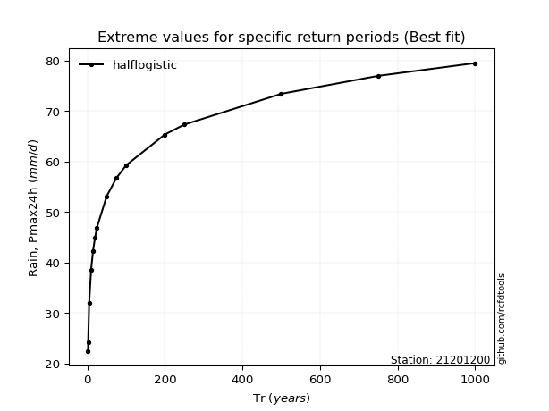</img>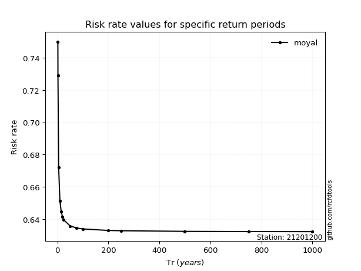</img>

</div>


<sub>**APP DISCLAIMER**: NO WARRANTY - This software is provided by [github.com/rcfdtools](https://github.com/rcfdtools) "as is", without any express or implied warranty, including warranties of merchantability, fitness for a particular purpose, or non-infringement. There is no guarantee that the software will be error-free or operate without interruption. LIMITATION OF LIABILITY - Neither the authors nor copyright holders will be liable for claims or damages arising from the software or its use. You are responsible for determining if the software is appropriate for your use and assume all associated risks, including errors, legal compliance, and data loss. NO PROFESSIONAL ADVICE - The software provides general information and does not offer professional advice. It should not replace consultation with professional advisors.</sub>