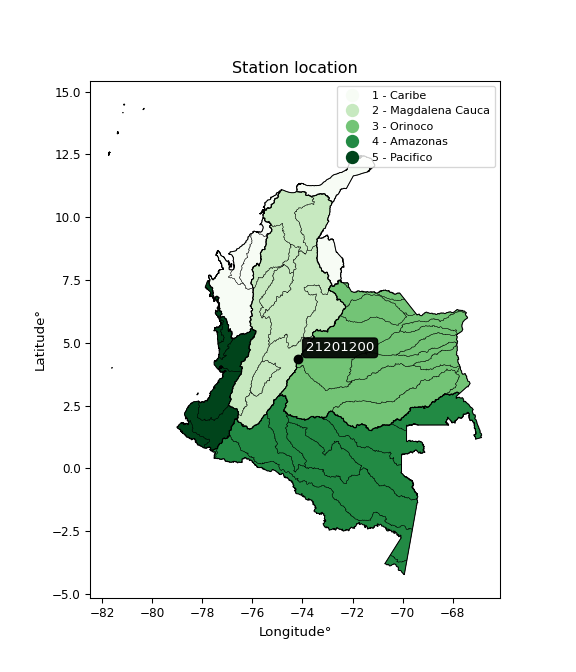

<div align="center">


</div>

# PMP Station (Rain, Pmax24h): 21201200

Probable Maximum Precipitation (PMP) is the greatest amount of rainfall for a specific duration that is meteorologically possible for a given location, acting as a "worst-case" scenario for extreme storms, crucial for designing safety-critical infrastructure like bridges, river deviations, dams, spillways, and nuclear plants to prevent catastrophic failure. PMP is calculated by hydrologists using meteorological data to determine the upper limit of extreme rainfall, often leading to the Probable Maximum Flood (PMF) for flood control design, and is increasingly being studied for climate change impacts.

<div align="center">

</img>

</div>


## A. General information


### 1. General running parameters

• app_version: _v20260103_. • runtime: _2026-01-03 07:24:50.581521_. • Python version: _3.14.0_. • SciPy version: _1.16.3_. • Pandas version: _2.3.3_. • NumPy version: _2.3.5_. • Stations dataset (station_dataset_file): _dataset/pmax24h_in/automatic_colombia_2003_2024.csv_. • Stations catalog (station_catalog_file): _dataset/CNE.xls_. • Minimum year to eval til year_max (date_min): _1900_. • Maximum year to eval since year_min (date_max): _2024_. • Creates, save and include plots into reports (create_plot): _False_. • Plot only fit distributions with Δo > Δ (plot_only_fit): _True_. • Eval low extreme values, if False, evaluates high extreme values (low_extreme): _False_. • Eval every SciPy distribution as logarithmic (pdist_logarithmic_on): _True_. • Standard deviation normalized (ddof): _1.0_. • Return periods to eval in years (Tr): _[2, 2.33, 5, 10, 15, 20, 25, 50, 75, 100, 200, 250, 500, 750, 1000]_. • Minimum data sample per station, 0 means any (minimum_sample): _5_. • Z-Score maximum threshold to adjust a value, 0 means disable (zscore_max): _3.5_. • Z-Score minimum threshold to adjust a value, 0 means disable (zscore_min): _-2.5_. • Avoid zeros, e.g. rain = 0 (avoid_zeros): _True_. • Avoid null values (avoid_nans): _True_. [:file_folder:Dataset file.](../../dataset/pmax24h_in/automatic_colombia_2003_2024.csv)

> Delta Degrees of Freedom (DDOF): is a parameter used in the formulas for calculating variance and standard deviation. When ddof=0, the divisor is $N$ (the total number of observations) and this is used when your data set is the entire population. When ddof=1, the divisor is $N-1$ and this is used when your data set is a sample drawn from a larger population. Using $N-1$ provides an unbiased estimate of the population variance (known as Bessel´s correction).


### 2. Station info and location

|   id |   CODIGO | NOMBRE                      | CATEGORIA               | TECNOLOGIA   | ESTADO   | FECHA_INSTALACION   |   FECHA_SUSPENSION |   ALTITUD |   LATITUD |   LONGITUD | DEPARTAMENTO   | MUNICIPIO   | AREA_OPERATIVA                            | ENTIDAD                                                     | AREA_HIDROGRAFICA   | ZONA_HIDROGRAFICA   | SUBZONA_HIDROGRAFICA   |   CORRIENTE | Catalogo   |   Version |
|-----:|---------:|:----------------------------|:------------------------|:-------------|:---------|:--------------------|-------------------:|----------:|----------:|-----------:|:---------------|:------------|:------------------------------------------|:------------------------------------------------------------|:--------------------|:--------------------|:-----------------------|------------:|:-----------|----------:|
|    0 | 21201200 | ESCUELA LA UNION [21201200] | Climatológica Ordinaria | Convencional | Activa   | 01/08/2007          |                nan |      3378 |   4.34264 |   -74.1838 | Bogotá         | Bogotá, D.C | Area Operativa 11 - Cundinamarca-Amazonas | INSTITUTO DE HIDROLOGIA METEOROLOGIA Y ESTUDIOS AMBIENTALES | Magdalena Cauca     | Alto Magdalena      | Río Bogotá             |         nan | CNE_IDEAM  |  20251226 |

<div align="center">

Dynamic map: [:earth_americas:Google](http://maps.google.com/maps?q=4.34264,-74.18381) [:earth_americas:OSM](https://www.openstreetmap.org/#map=18/4.34264/-74.18381&layers=P) [:earth_americas:Bing](https://www.bing.com/maps?cp=4.34264~-74.18381&lvl=18) [:earth_americas:Apple](https://maps.apple.com/frame?center=4.34264%2C-74.18381&span=0.003%2C0.006)

</div>


<div align="center">

```geojson
{
  "type": "Feature",
  "geometry": {
    "type": "Point", 
    "coordinates": [-74.18381, 4.34264]
  }, 
  "properties": {
    "Name": "21201200"
  }
}
```

</div>


### 3. Discrete values table and plot

<div align="center">

|               |           0 |           1 |           2 |          3 |            4 |           5 |           6 |          7 |            8 |           9 |
|:--------------|------------:|------------:|------------:|-----------:|-------------:|------------:|------------:|-----------:|-------------:|------------:|
| Date          | 2008        | 2009        | 2010        | 2011       | 2012         | 2013        | 2014        | 2015       | 2016         | 2024        |
| Value         |   18.4      |   14.6      |   30.8      |   49.8     |   24.8       |   32.7      |   18.9      |   13.4     |   25.5       |   20.2      |
| Value_initial |   18.4      |   14.6      |   30.8      |   49.8     |   24.8       |   32.7      |   18.9      |   13.4     |   25.5       |   20.2      |
| count         |   10        |   10        |   10        |   10       |   10         |   10        |   10        |   10       |   10         |   10        |
| mean          |   24.91     |   24.91     |   24.91     |   24.91    |   24.91      |   24.91     |   24.91     |   24.91    |   24.91      |   24.91     |
| std           |   10.8254   |   10.8254   |   10.8254   |   10.8254  |   10.8254    |   10.8254   |   10.8254   |   10.8254  |   10.8254    |   10.8254   |
| zscore        |   -0.601362 |   -0.952387 |    0.544089 |    2.29922 |   -0.0101613 |    0.719602 |   -0.555174 |   -1.06324 |    0.0545013 |   -0.435087 |


</div>


> The initial value (value_initial) correspond to the initial obtained or null completed value, and value (value) is adjusted only when the initial value is outside the valid range definite through the Z-Score value. If Z-Score is active, values out of range or outliers are replaced with the station mean value


### 4. Active continuous probability distributions from SciPy (44 of 104 available)

A Probability Density Function (PDF) describes the relative likelihood of a continuous random variable falling within a specific range, where the total area under its curve equals 1, and the area over any interval gives the actual probability for that range. Unlike discrete probabilities (like rolling a die), a PDF shows density, not direct probability for a single point (which is zero), with higher points indicating higher likelihood, often visualized as a bell curve for normal distributions.

A log of a probability density function (log-PDF) is simply the logarithm of the PDF´s value, denoted as $log(f(x))$, useful for converting multiplication of probabilities into addition, improving numerical stability with tiny numbers, and connecting to information theory concepts like entropy. Instead of dealing with very small probabilities (e.g., 0.000001), log-PDFs use negative numbers (e.g., $log(0.00001) ≈ -11.51$ that are easier for computers to handle, preventing underflow errors and simplifying complex calculations. In this study, each active probability distribution from SciPy is also evaluated in the $log$ form.

[scipy.stats](https://docs.scipy.org/doc/scipy/reference/stats.html) is a Python´s powerful submodule within the SciPy library for comprehensive statistical analysis, offering over 130 probability distributions (like Normal, Poisson), functions for descriptive stats (mean, variance), hypothesis testing (t-tests, chi-square), random variable generation, and statistical tests, making it essential for data science, modeling, and research. It provides tools to explore, model, and draw conclusions from data efficiently, working seamlessly with NumPy.

<div align="center">

|   id | p_dist             |   n_parameter | fit_method   | label                                                                       | active   | ref                                                                                                        |
|-----:|:-------------------|--------------:|:-------------|:----------------------------------------------------------------------------|:---------|:-----------------------------------------------------------------------------------------------------------|
|    0 | alpha              |             3 | MLE          | Alpha                                                                       | True     | [:mortar_board:](https://docs.scipy.org/doc/scipy/reference/generated/scipy.stats.alpha.html)              |
|    1 | betaprime          |             4 | MLE          | Beta prime                                                                  | True     | [:mortar_board:](https://docs.scipy.org/doc/scipy/reference/generated/scipy.stats.betaprime.html)          |
|    2 | chi2               |             3 | MLE          | Chi²                                                                        | True     | [:mortar_board:](https://docs.scipy.org/doc/scipy/reference/generated/scipy.stats.chi2.html)               |
|    3 | crystalball        |             4 | MLE          | Crystalball                                                                 | True     | [:mortar_board:](https://docs.scipy.org/doc/scipy/reference/generated/scipy.stats.crystalball.html)        |
|    4 | erlang             |             3 | MLE          | Erlang                                                                      | True     | [:mortar_board:](https://docs.scipy.org/doc/scipy/reference/generated/scipy.stats.erlang.html)             |
|    5 | expon              |             2 | MLE          | Exponential                                                                 | True     | [:mortar_board:](https://docs.scipy.org/doc/scipy/reference/generated/scipy.stats.expon.html)              |
|    6 | exponnorm          |             3 | MLE          | Exponentially modified Normal                                               | True     | [:mortar_board:](https://docs.scipy.org/doc/scipy/reference/generated/scipy.stats.exponnorm.html)          |
|    7 | f                  |             4 | MLE          | F                                                                           | True     | [:mortar_board:](https://docs.scipy.org/doc/scipy/reference/generated/scipy.stats.f.html)                  |
|    8 | fatiguelife        |             3 | MLE          | Fatigue-life (Birnbaum-Saunders)                                            | True     | [:mortar_board:](https://docs.scipy.org/doc/scipy/reference/generated/scipy.stats.fatiguelife.html)        |
|    9 | fisk               |             3 | MLE          | Fisk                                                                        | True     | [:mortar_board:](https://docs.scipy.org/doc/scipy/reference/generated/scipy.stats.fisk.html)               |
|   10 | gamma              |             3 | MLE          | Gamma                                                                       | True     | [:mortar_board:](https://docs.scipy.org/doc/scipy/reference/generated/scipy.stats.gamma.html)              |
|   11 | genexpon           |             5 | MLE          | Generalized exponential                                                     | True     | [:mortar_board:](https://docs.scipy.org/doc/scipy/reference/generated/scipy.stats.genexpon.html)           |
|   12 | genlogistic        |             3 | MLE          | Generalized logistic                                                        | True     | [:mortar_board:](https://docs.scipy.org/doc/scipy/reference/generated/scipy.stats.genlogistic.html)        |
|   13 | gibrat             |             2 | MM           | Gibrat                                                                      | True     | [:mortar_board:](https://docs.scipy.org/doc/scipy/reference/generated/scipy.stats.gibrat.html)             |
|   14 | gompertz           |             3 | MLE          | Gompertz (or truncated Gumbel)                                              | True     | [:mortar_board:](https://docs.scipy.org/doc/scipy/reference/generated/scipy.stats.gompertz.html)           |
|   15 | gumbel_l           |             2 | MM           | Gumbel Left Skew                                                            | True     | [:mortar_board:](https://docs.scipy.org/doc/scipy/reference/generated/scipy.stats.gumbel_l.html)           |
|   16 | gumbel_r           |             2 | MM           | Gumbel Right Skew                                                           | True     | [:mortar_board:](https://docs.scipy.org/doc/scipy/reference/generated/scipy.stats.gumbel_r.html)           |
|   17 | halflogistic       |             2 | MM           | Half-logistic                                                               | True     | [:mortar_board:](https://docs.scipy.org/doc/scipy/reference/generated/scipy.stats.halflogistic.html)       |
|   18 | halfnorm           |             2 | MM           | Half Normal                                                                 | True     | [:mortar_board:](https://docs.scipy.org/doc/scipy/reference/generated/scipy.stats.halfnorm.html)           |
|   19 | hypsecant          |             2 | MM           | hyperbolic secant                                                           | True     | [:mortar_board:](https://docs.scipy.org/doc/scipy/reference/generated/scipy.stats.hypsecant.html)          |
|   20 | invgamma           |             3 | MLE          | Inverted gamma                                                              | True     | [:mortar_board:](https://docs.scipy.org/doc/scipy/reference/generated/scipy.stats.invgamma.html)           |
|   21 | invgauss           |             3 | MLE          | Inverse Gaussian                                                            | True     | [:mortar_board:](https://docs.scipy.org/doc/scipy/reference/generated/scipy.stats.invgauss.html)           |
|   22 | invweibull         |             3 | MLE          | Inverted Weibull                                                            | True     | [:mortar_board:](https://docs.scipy.org/doc/scipy/reference/generated/scipy.stats.invweibull.html)         |
|   23 | johnsonsu          |             4 | MLE          | Johnson Su                                                                  | True     | [:mortar_board:](https://docs.scipy.org/doc/scipy/reference/generated/scipy.stats.johnsonsu.html)          |
|   24 | kstwobign          |             2 | MLE          | Limiting distribution of scaled Kolmogorov-Smirnov two-sided test statistic | True     | [:mortar_board:](https://docs.scipy.org/doc/scipy/reference/generated/scipy.stats.kstwobign.html)          |
|   25 | laplace            |             2 | MM           | Laplace                                                                     | True     | [:mortar_board:](https://docs.scipy.org/doc/scipy/reference/generated/scipy.stats.laplace.html)            |
|   26 | laplace_asymmetric |             3 | MLE          | Asymmetric Laplace                                                          | True     | [:mortar_board:](https://docs.scipy.org/doc/scipy/reference/generated/scipy.stats.laplace_asymmetric.html) |
|   27 | loggamma           |             3 | MLE          | Log gamma                                                                   | True     | [:mortar_board:](https://docs.scipy.org/doc/scipy/reference/generated/scipy.stats.loggamma.html)           |
|   28 | logistic           |             2 | MM           | Logistic (or Sech-squared)                                                  | True     | [:mortar_board:](https://docs.scipy.org/doc/scipy/reference/generated/scipy.stats.logistic.html)           |
|   29 | lognorm            |             3 | MLE          | Log Normal                                                                  | True     | [:mortar_board:](https://docs.scipy.org/doc/scipy/reference/generated/scipy.stats.lognorm.html)            |
|   30 | maxwell            |             2 | MM           | Maxwell                                                                     | True     | [:mortar_board:](https://docs.scipy.org/doc/scipy/reference/generated/scipy.stats.maxwell.html)            |
|   31 | mielke             |             4 | MLE          | Mielke Beta-Kappa / Dagum                                                   | True     | [:mortar_board:](https://docs.scipy.org/doc/scipy/reference/generated/scipy.stats.mielke.html)             |
|   32 | moyal              |             2 | MM           | Moyal                                                                       | True     | [:mortar_board:](https://docs.scipy.org/doc/scipy/reference/generated/scipy.stats.moyal.html)              |
|   33 | nakagami           |             3 | MLE          | Nakagami                                                                    | True     | [:mortar_board:](https://docs.scipy.org/doc/scipy/reference/generated/scipy.stats.nakagami.html)           |
|   34 | ncf                |             5 | MLE          | Non-central F distribution                                                  | True     | [:mortar_board:](https://docs.scipy.org/doc/scipy/reference/generated/scipy.stats.ncf.html)                |
|   35 | nct                |             4 | MLE          | Non-central Student’s t                                                     | True     | [:mortar_board:](https://docs.scipy.org/doc/scipy/reference/generated/scipy.stats.nct.html)                |
|   36 | norm               |             2 | MM           | Normal                                                                      | True     | [:mortar_board:](https://docs.scipy.org/doc/scipy/reference/generated/scipy.stats.norm.html)               |
|   37 | pearson3           |             3 | MM           | Pearson type III                                                            | True     | [:mortar_board:](https://docs.scipy.org/doc/scipy/reference/generated/scipy.stats.pearson3.html)           |
|   38 | rayleigh           |             2 | MM           | Rayleigh                                                                    | True     | [:mortar_board:](https://docs.scipy.org/doc/scipy/reference/generated/scipy.stats.rayleigh.html)           |
|   39 | rice               |             3 | MLE          | Rice                                                                        | True     | [:mortar_board:](https://docs.scipy.org/doc/scipy/reference/generated/scipy.stats.rice.html)               |
|   40 | t                  |             3 | MLE          | Student’s t                                                                 | True     | [:mortar_board:](https://docs.scipy.org/doc/scipy/reference/generated/scipy.stats.t.html)                  |
|   41 | truncnorm          |             4 | MLE          | Truncated normal                                                            | True     | [:mortar_board:](https://docs.scipy.org/doc/scipy/reference/generated/scipy.stats.truncnorm.html)          |
|   42 | wald               |             2 | MM           | Wald                                                                        | True     | [:mortar_board:](https://docs.scipy.org/doc/scipy/reference/generated/scipy.stats.wald.html)               |
|   43 | weibull_min        |             3 | MLE          | Weibull minimum                                                             | True     | [:mortar_board:](https://docs.scipy.org/doc/scipy/reference/generated/scipy.stats.weibull_min.html)        |

</div>

> **n_parameter:** # arguments & localization & scale.
>
> **Fit methods:** (MLE) maximum likelihood, (MM) L-moments.
>
>**Inactive** (With the only purpose of prevent loops, zero divisions, infinite values, over high estimated values or horizontal trending for recurrence intervals estimations, the follow distributions were disabled.)**:** foldnorm, gennorm, norminvgauss, powernorm, powerlognorm, skewnorm, genextreme, anglit, arcsine, argus, beta, bradford, burr, burr12, cauchy, cosine, halfcauchy, foldcauchy, skewcauchy, wrapcauchy, dgamma, gengamma, exponweib, exponpow, truncexpon, gausshyper, genhalflogistic, genhyperbolic, geninvgauss, halfgennorm, johnsonsb, kappa4, kappa3, ksone, kstwo, loglaplace, levy, levy_l, levy_stable, ncx2, pareto, genpareto, truncpareto, lomax, powerlaw, rdist, rel_breitwigner, recipinvgauss, semicircular, studentized_range, trapezoid, triang, truncweibull_min, tukeylambda, uniform, loguniform, vonmises, vonmises_line, weibull_max, dweibull, 


## B. Probability distributions vs. Empirical distributions

A continuous probability distribution (CPD) describes probabilities for variables that can take any value within a range (like rain any time), unlike discrete variables with specific outcomes (like temperature). It uses a Probability Density Function (PDF), a curve where the total area under it equals 1, and the probability of the variable falling within an interval (a to b) is found by calculating the area under the curve between those points. A key feature is that the probability of hitting any single exact value is zero, so probabilities are always expressed for ranges, e.g., $P(a ≤ X ≤ b)$.

<div align="center">

Distributions parameters from station values
|    |   station | p_dist                |   n |             loc |         scale | shape                  | shape1             | shape2                 | shape3   |
|---:|----------:|:----------------------|----:|----------------:|--------------:|:-----------------------|:-------------------|:-----------------------|:---------|
|  0 |  21201200 | alpha                 |  10 |    -5.02191     |  93.892       | 3.457542599561735      |                    |                        |          |
|  1 |  21201200 | betaprime             |  10 |    -0.613744    |   0.933055    | 197.2657322623038      | 8.233691568807789  |                        |          |
|  2 |  21201200 | chi2                  |  10 |    13.4         |   6.82867     | 1.5091604547223145     |                    |                        |          |
|  3 |  21201200 | crystalball           |  10 |    24.91        |  10.2699      | 3041.3089354247413     | 4425.594785779118  |                        |          |
|  4 |  21201200 | erlang                |  10 |    13.4         |  16.7039      | 0.2343830925262455     |                    |                        |          |
|  5 |  21201200 | expon                 |  10 |    13.4         |  11.51        |                        |                    |                        |          |
|  6 |  21201200 | exponnorm             |  10 |    13.3841      |   0.00537036  | 2136.3969531104717     |                    |                        |          |
|  7 |  21201200 | f                     |  10 |    13.4         |  10.7215      | 1.2513055772500332     | 10.323871712126548 |                        |          |
|  8 |  21201200 | fatiguelife           |  10 |    10.758       |  10.5712      | 0.8179955355871811     |                    |                        |          |
|  9 |  21201200 | fisk                  |  10 |    11.4695      |  10.2669      | 2.021116633514596      |                    |                        |          |
| 10 |  21201200 | gamma                 |  10 |    13.4         |  13.0861      | 0.253649187030521      |                    |                        |          |
| 11 |  21201200 | genexpon              |  10 |    13.3956      |   0.920529    | 0.06926844104869623    | 3.642365183439762  | 0.0002598480880988597  |          |
| 12 |  21201200 | genlogistic           |  10 |   -31.1896      |   7.1577      | 1354.4671952249055     |                    |                        |          |
| 13 |  21201200 | gibrat                |  10 |    17.0754      |   4.75194     |                        |                    |                        |          |
| 14 |  21201200 | gompertz              |  10 |    13.4         |  73.0881      | 5.469423751449021      |                    |                        |          |
| 15 |  21201200 | gumbel_l              |  10 |    29.532       |   8.00741     |                        |                    |                        |          |
| 16 |  21201200 | gumbel_r              |  10 |    20.288       |   8.00741     |                        |                    |                        |          |
| 17 |  21201200 | halflogistic          |  10 |    12.7378      |   8.7804      |                        |                    |                        |          |
| 18 |  21201200 | halfnorm              |  10 |    11.3167      |  17.0367      |                        |                    |                        |          |
| 19 |  21201200 | hypsecant             |  10 |    24.91        |   6.53802     |                        |                    |                        |          |
| 20 |  21201200 | invgamma              |  10 |     5.9074      |  61.7796      | 4.19937935888286       |                    |                        |          |
| 21 |  21201200 | invgauss              |  10 |     9.70454     |  26.2033      | 0.5802884847560814     |                    |                        |          |
| 22 |  21201200 | invweibull            |  10 |    -4.97638     |  24.4814      | 3.902096111661967      |                    |                        |          |
| 23 |  21201200 | johnsonsu             |  10 |    10.5556      |   0.232413    | -6.056729419040618     | 1.3300439544909932 |                        |          |
| 24 |  21201200 | kstwobign             |  10 |    -5.45767     |  35.0852      |                        |                    |                        |          |
| 25 |  21201200 | laplace               |  10 |    24.91        |   7.26192     |                        |                    |                        |          |
| 26 |  21201200 | laplace_asymmetric    |  10 |    18.4         |   5.83921     | 0.5874344795121473     |                    |                        |          |
| 27 |  21201200 | loggamma              |  10 | -2781.07        | 388.204       | 1377.9652537448746     |                    |                        |          |
| 28 |  21201200 | logistic              |  10 |    24.91        |   5.66209     |                        |                    |                        |          |
| 29 |  21201200 | lognorm               |  10 |    13.4         |   0.241404    | 10.883715683597128     |                    |                        |          |
| 30 |  21201200 | maxwell               |  10 |     0.574643    |  15.2499      |                        |                    |                        |          |
| 31 |  21201200 | mielke                |  10 |    -5.04918     |   4.40687     | 3264.7271293914614     | 3.9150001069572014 |                        |          |
| 32 |  21201200 | moyal                 |  10 |    19.037       |   4.62308     |                        |                    |                        |          |
| 33 |  21201200 | nakagami              |  10 |    13.4         |  21.7688      | 0.09631870595116115    |                    |                        |          |
| 34 |  21201200 | ncf                   |  10 |     2.0957      |   8.05022e-05 | 0.0006793151150473334  | 14.617868160012975 | 166.09637857262146     |          |
| 35 |  21201200 | nct                   |  10 |    -0.0569304   |   0.534297    | 4.350661240414533      | 38.3292372751106   |                        |          |
| 36 |  21201200 | norm                  |  10 |    24.91        |  10.2699      |                        |                    |                        |          |
| 37 |  21201200 | pearson3              |  10 |    24.91        |  10.2699      | 1.188964616681303      |                    |                        |          |
| 38 |  21201200 | rayleigh              |  10 |     5.26308     |  15.676       |                        |                    |                        |          |
| 39 |  21201200 | rice                  |  10 |     8.434       |  13.7282      | 0.00029168367261459265 |                    |                        |          |
| 40 |  21201200 | t                     |  10 |    24.9093      |  10.269       | 18021.05246000069      |                    |                        |          |
| 41 |  21201200 | truncnorm             |  10 |     7.5192      |  18.645       | 0.31540909253349997    | 2.2751162812780548 |                        |          |
| 42 |  21201200 | wald                  |  10 |    14.6401      |  10.2699      |                        |                    |                        |          |
| 43 |  21201200 | weibull_min           |  10 |    13.4         |  10.6153      | 0.26100732517458425    |                    |                        |          |
| 44 |  21201200 | logalpha              |  10 |     0.000986552 |  26.4094      | 8.530919582746673      |                    |                        |          |
| 45 |  21201200 | logbetaprime          |  10 |     0.700413    |   9.54671     | 54.47181404452823      | 214.2768834914068  |                        |          |
| 46 |  21201200 | logchi2               |  10 |     2.59525     |   0.9773      | 1.0217301523876179     |                    |                        |          |
| 47 |  21201200 | logcrystalball        |  10 |     3.14059     |   0.377564    | 3724.0481277759163     | 118.8606598566192  |                        |          |
| 48 |  21201200 | logerlang             |  10 |     2.463       |   0.254714    | 2.660189500111477      |                    |                        |          |
| 49 |  21201200 | logexpon              |  10 |     2.59525     |   0.545335    |                        |                    |                        |          |
| 50 |  21201200 | logexponnorm          |  10 |     2.85732     |   0.267009    | 1.0609087494985427     |                    |                        |          |
| 51 |  21201200 | logf                  |  10 |     2.46329     |   0.673756    | 5.495703455780816      | 120.68483108343372 |                        |          |
| 52 |  21201200 | logfatiguelife        |  10 |     1.91319     |   1.16899     | 0.316034676151681      |                    |                        |          |
| 53 |  21201200 | logfisk               |  10 |     1.86885     |   1.22372     | 5.63005172123188       |                    |                        |          |
| 54 |  21201200 | loggamma              |  10 |     2.46301     |   0.25472     | 2.6601047639690583     |                    |                        |          |
| 55 |  21201200 | loggenexpon           |  10 |     2.58504     |   0.0178019   | 0.01624713795280178    | 3.1077761444855616 | 0.00022342083997731058 |          |
| 56 |  21201200 | loggenlogistic        |  10 |     1.12904     |   0.317465    | 320.19560791973936     |                    |                        |          |
| 57 |  21201200 | loggibrat             |  10 |     2.85257     |   0.174694    |                        |                    |                        |          |
| 58 |  21201200 | loggompertz           |  10 |     2.59525     |   0.936634    | 1.0660782001185907     |                    |                        |          |
| 59 |  21201200 | loggumbel_l           |  10 |     3.31051     |   0.294385    |                        |                    |                        |          |
| 60 |  21201200 | loggumbel_r           |  10 |     2.97067     |   0.294385    |                        |                    |                        |          |
| 61 |  21201200 | loghalflogistic       |  10 |     2.69309     |   0.322807    |                        |                    |                        |          |
| 62 |  21201200 | loghalfnorm           |  10 |     2.64085     |   0.626328    |                        |                    |                        |          |
| 63 |  21201200 | loghypsecant          |  10 |     3.14059     |   0.240365    |                        |                    |                        |          |
| 64 |  21201200 | loginvgamma           |  10 |     1.20885     |  50.2855      | 27.031388974075625     |                    |                        |          |
| 65 |  21201200 | loginvgauss           |  10 |     1.87033     |  13.427       | 0.09460490157928475    |                    |                        |          |
| 66 |  21201200 | loginvweibull         |  10 |    -7.66243e+06 |   7.66243e+06 | 24111079.536691967     |                    |                        |          |
| 67 |  21201200 | logjohnsonsu          |  10 |     1.80155     |   0.115965    | -10.942026088842226    | 3.5281262213953575 |                        |          |
| 68 |  21201200 | logkstwobign          |  10 |     1.84255     |   1.48761     |                        |                    |                        |          |
| 69 |  21201200 | loglaplace            |  10 |     3.14059     |   0.266978    |                        |                    |                        |          |
| 70 |  21201200 | loglaplace_asymmetric |  10 |     2.93916     |   0.274649    | 0.6983668320467156     |                    |                        |          |
| 71 |  21201200 | logloggamma           |  10 |   -89.1267      |  13.0784      | 1159.0034157389334     |                    |                        |          |
| 72 |  21201200 | loglogistic           |  10 |     3.14059     |   0.208162    |                        |                    |                        |          |
| 73 |  21201200 | loglognorm            |  10 |     2.59525     |   0.0151996   | 10.412618408293026     |                    |                        |          |
| 74 |  21201200 | logmaxwell            |  10 |     2.24592     |   0.56065     |                        |                    |                        |          |
| 75 |  21201200 | logmielke             |  10 |    -1.22136e+07 |   1.22136e+07 | 459394660.40442574     | 40509992.436244786 |                        |          |
| 76 |  21201200 | logmoyal              |  10 |     2.92467     |   0.169963    |                        |                    |                        |          |
| 77 |  21201200 | lognakagami           |  10 |     2.59525     |   0.77027     | 0.10661347849938432    |                    |                        |          |
| 78 |  21201200 | logncf                |  10 |     1.22798     |   1.8401      | 3915.7171581939865     | 53.42413578642713  | 1.7428125724321006     |          |
| 79 |  21201200 | lognct                |  10 |     0.303616    |   0.0324669   | 30.301745732105882     | 85.12298033243893  |                        |          |
| 80 |  21201200 | lognorm               |  10 |     3.14059     |   0.377564    |                        |                    |                        |          |
| 81 |  21201200 | logpearson3           |  10 |     3.14059     |   0.377564    | 0.4400412603978593     |                    |                        |          |
| 82 |  21201200 | lograyleigh           |  10 |     2.41829     |   0.576313    |                        |                    |                        |          |
| 83 |  21201200 | logrice               |  10 |     2.44602     |   0.525395    | 0.5139378768438515     |                    |                        |          |
| 84 |  21201200 | logt                  |  10 |     3.14059     |   0.377567    | 120770144.29651475     |                    |                        |          |
| 85 |  21201200 | logtruncnorm          |  10 |    -0.17078     |   1.37156     | 2.016702434445074      | 2.9738335903246935 |                        |          |
| 86 |  21201200 | logwald               |  10 |     2.76306     |   0.377533    |                        |                    |                        |          |
| 87 |  21201200 | logweibull_min        |  10 |     2.54091     |   0.662104    | 1.5324827746068048     |                    |                        |          |

</div>

> **loc** (Location parameter): This shifts the distribution along the x-axis. For many common distributions, like the normal (Gaussian) distribution, loc represents the mean $μ$. For others, like the uniform distribution, it might represent the minimum value, or for the beta distribution, the left end of the support interval.
>
> **scale** (Scale parameter): This determines the width or spread of the distribution. For the normal distribution, scale represents the standard deviation $σ$. For a uniform distribution, it defines the length of the interval (from $loc$ to $loc + scale$).
>
> **shape** (Shape parameters): Refers to parameters that define the specific form of a probability distribution, distinct from its location (loc) and scale (scale). These parameters are required arguments for most distribution functions. For example, a normal (Gaussian) distribution is fully defined by its location (mean) and scale (standard deviation), so it has no specific shape parameters beyond loc and scale. However, other distributions have intrinsic properties that need specification, as Gamma distribution that takes a shape parameter, often named $a$ or $alpha$.


### 0. Cumulative distribution values - CDF (88 evaluated)

Cumulative Distribution Function (CDF), denoted as $F$<sub>$X$</sub>$(x)$, is a function that gives the probability that a random variable $X$ will take a value less than or equal to a specific value, $x$ (i.e., $(P(X≥x)$. It essentially "accumulates" probabilities from a given point up to the far right (positive infinity), providing a complete picture of the distribution´s probabilities for both discrete (like rain) and continuous (like temperature) variables, helping to find probabilities over ranges or above certain values. Each station is evaluated separately ordering the $x$ values ascending, calculating the CDF and PDF values for the activated distributions and their logarithmic forms.

<div align="center">

CDF ordered by x ascending and calculating $log(f(x))$ separately
|   id |   Station |   date |    x |   count |   mean |     std |     zscore |   Value_initial |   station |   m |     alpha |   alpha_pdf |   betaprime |   betaprime_pdf |        chi2 |     chi2_pdf |   crystalball |   crystalball_pdf |      erlang |   erlang_pdf |     expon |   expon_pdf |   exponnorm |   exponnorm_pdf |           f |         f_pdf |   fatiguelife |   fatiguelife_pdf |      fisk |   fisk_pdf |       gamma |   gamma_pdf |    genexpon |   genexpon_pdf |   genlogistic |   genlogistic_pdf |   gibrat |   gibrat_pdf |    gompertz |   gompertz_pdf |   gumbel_l |   gumbel_l_pdf |   gumbel_r |   gumbel_r_pdf |   halflogistic |   halflogistic_pdf |   halfnorm |   halfnorm_pdf |   hypsecant |   hypsecant_pdf |   invgamma |   invgamma_pdf |   invgauss |   invgauss_pdf |   invweibull |   invweibull_pdf |   johnsonsu |   johnsonsu_pdf |   kstwobign |   kstwobign_pdf |   laplace |   laplace_pdf |   laplace_asymmetric |   laplace_asymmetric_pdf |   loggamma |   loggamma_pdf |   logistic |   logistic_pdf |   lognorm |   lognorm_pdf |   maxwell |   maxwell_pdf |   mielke |   mielke_pdf |     moyal |   moyal_pdf |    nakagami |   nakagami_pdf |       ncf |    ncf_pdf |       nct |    nct_pdf |     norm |   norm_pdf |   pearson3 |   pearson3_pdf |   rayleigh |   rayleigh_pdf |      rice |   rice_pdf |        t |      t_pdf |   truncnorm |   truncnorm_pdf |     wald |   wald_pdf |   weibull_min |   weibull_min_pdf |   logalpha |   logalpha_pdf |   logbetaprime |   logbetaprime_pdf |     logchi2 |   logchi2_pdf |   logcrystalball |   logcrystalball_pdf |   logerlang |   logerlang_pdf |   logexpon |   logexpon_pdf |   logexponnorm |   logexponnorm_pdf |      logf |   logf_pdf |   logfatiguelife |   logfatiguelife_pdf |   logfisk |   logfisk_pdf |   loggenexpon |   loggenexpon_pdf |   loggenlogistic |   loggenlogistic_pdf |   loggibrat |   loggibrat_pdf |   loggompertz |   loggompertz_pdf |   loggumbel_l |   loggumbel_l_pdf |   loggumbel_r |   loggumbel_r_pdf |   loghalflogistic |   loghalflogistic_pdf |   loghalfnorm |   loghalfnorm_pdf |   loghypsecant |   loghypsecant_pdf |   loginvgamma |   loginvgamma_pdf |   loginvgauss |   loginvgauss_pdf |   loginvweibull |   loginvweibull_pdf |   logjohnsonsu |   logjohnsonsu_pdf |   logkstwobign |   logkstwobign_pdf |   loglaplace |   loglaplace_pdf |   loglaplace_asymmetric |   loglaplace_asymmetric_pdf |   logloggamma |   logloggamma_pdf |   loglogistic |   loglogistic_pdf |   loglognorm |   loglognorm_pdf |   logmaxwell |   logmaxwell_pdf |   logmielke |   logmielke_pdf |   logmoyal |   logmoyal_pdf |   lognakagami |   lognakagami_pdf |    logncf |   logncf_pdf |    lognct |   lognct_pdf |   logpearson3 |   logpearson3_pdf |   lograyleigh |   lograyleigh_pdf |   logrice |   logrice_pdf |      logt |   logt_pdf |   logtruncnorm |   logtruncnorm_pdf |   logwald |   logwald_pdf |   logweibull_min |   logweibull_min_pdf |
|-----:|----------:|-------:|-----:|--------:|-------:|--------:|-----------:|----------------:|----------:|----:|----------:|------------:|------------:|----------------:|------------:|-------------:|--------------:|------------------:|------------:|-------------:|----------:|------------:|------------:|----------------:|------------:|--------------:|--------------:|------------------:|----------:|-----------:|------------:|------------:|------------:|---------------:|--------------:|------------------:|---------:|-------------:|------------:|---------------:|-----------:|---------------:|-----------:|---------------:|---------------:|-------------------:|-----------:|---------------:|------------:|----------------:|-----------:|---------------:|-----------:|---------------:|-------------:|-----------------:|------------:|----------------:|------------:|----------------:|----------:|--------------:|---------------------:|-------------------------:|-----------:|---------------:|-----------:|---------------:|----------:|--------------:|----------:|--------------:|---------:|-------------:|----------:|------------:|------------:|---------------:|----------:|-----------:|----------:|-----------:|---------:|-----------:|-----------:|---------------:|-----------:|---------------:|----------:|-----------:|---------:|-----------:|------------:|----------------:|---------:|-----------:|--------------:|------------------:|-----------:|---------------:|---------------:|-------------------:|------------:|--------------:|-----------------:|---------------------:|------------:|----------------:|-----------:|---------------:|---------------:|-------------------:|----------:|-----------:|-----------------:|---------------------:|----------:|--------------:|--------------:|------------------:|-----------------:|---------------------:|------------:|----------------:|--------------:|------------------:|--------------:|------------------:|--------------:|------------------:|------------------:|----------------------:|--------------:|------------------:|---------------:|-------------------:|--------------:|------------------:|--------------:|------------------:|----------------:|--------------------:|---------------:|-------------------:|---------------:|-------------------:|-------------:|-----------------:|------------------------:|----------------------------:|--------------:|------------------:|--------------:|------------------:|-------------:|-----------------:|-------------:|-----------------:|------------:|----------------:|-----------:|---------------:|--------------:|------------------:|----------:|-------------:|----------:|-------------:|--------------:|------------------:|--------------:|------------------:|----------:|--------------:|----------:|-----------:|---------------:|-------------------:|----------:|--------------:|-----------------:|---------------------:|
|    0 |  21201200 |   2015 | 13.4 |      10 |  24.91 | 10.8254 | -1.06324   |            13.4 |  21201200 |   1 | 0.0505984 |  0.0288078  |    0.064724 |      0.0292046  | 1.11949e-12 | 475.551      |      0.131197 |        0.0207295  | 0.000198246 |  2.61577e+10 | 0         |  0.086881   |  0.00138425 |      0.0869043  | 9.90918e-09 | 2579.55       |     0.033311  |        0.0429159  | 0.0330042 | 0.0334128  | 0.000104307 | 1.48942e+10 | 0.000334555 |     0.0752283  |     0.0695308 |        0.0258722  | 0        |    0         | 4.38671e-15 |     0.0748333  |   0.124858 |    0.0145761   |  0.0940771 |     0.0277698  |      0.0376923 |         0.0568641  |  0.0973263 |     0.0464844  |    0.108415 |      0.0162635  |  0.0435649 |     0.0318149  |  0.0365614 |     0.0376992  |    0.0467599 |       0.0304103  |   0.0358201 |      0.0367024  |   0.0651712 |      0.0260616  |  0.102476 |    0.0141114  |            0.0597195 |               0.0174102  |  0.0302907 |       0.52561  |   0.1158   |     0.0180835  | 0.0743199 |      0.372321 |  0.128514 |    0.0259829  |      nan |          nan | 0.0657969 |  0.0292235  | 0.000666624 |    7.22922e+10 | 0.0602524 | 0.0293882  | 0.0504228 | 0.0300657  | 0.131197 | 0.0207295  |  0.0886578 |     0.0333721  |   0.126036 |     0.0289391  | 0.063332  | 0.024681   | 0.131197 | 0.0207301  | 7.27909e-07 |      0.055811   | 0        | 0          |   7.62477e-05 |        1.1203e+10 |  0.0495751 |       0.401958 |       0.059529 |           0.390944 | 1.14947e-08 |   1.32231e+07 |         0.07432  |             0.372321 |   0.030292  |        0.52561  |   0        |       1.83373  |      0.0563111 |           0.377266 | 0.0286736 |   0.510953 |        0.042219  |             0.432914 | 0.0503877 |      0.370856 |    0.00939243 |          0.92626  |        0.043106  |             0.424821 |    0        |       0         |   1.44034e-09 |          1.1382   |     0.0842995 |         0.273934  |     0.0278881 |          0.339103 |          0        |              0        |     0         |          0        |      0.0656173 |           0.271061 |     0.0474789 |          0.409866 |     0.0428147 |          0.429711 |       0.0427169 |            0.423834 |      0.0453474 |           0.419499 |      0.0400099 |           0.459134 |    0.0648441 |         0.242882 |               0.0545705 |                    0.284509 |      0.07888  |          0.37756  |     0.0678771 |          0.303945 |   0.00138166 |        9.79e+11  |     0.057338 |         0.455029 |   0.0449748 |        0.404801 | 0.00840018 |       0.19191  |   0.000467533 |       2.24483e+11 | 0.0479009 |     0.412428 | 0.0516515 |     0.405432 |     0.0595643 |          0.40594  |     0.0460508 |          0.508275 | 0.0347399 |      0.457453 | 0.0743218 |   0.372325 |    7.08168e-06 |           1.86663  |  0        |      0        |        0.0214489 |             0.598287 |
|    1 |  21201200 |   2009 | 14.6 |      10 |  24.91 | 10.8254 | -0.952387  |            14.6 |  21201200 |   2 | 0.0921945 |  0.0403178  |    0.104989 |      0.0377138  | 0.167079    |   0.099896   |      0.157712 |        0.0234692  | 0.585027    |  0.107788    | 0.0990064 |  0.0782792  |  0.100554   |      0.0783952  | 0.200538    |    0.0996389  |     0.0983797 |        0.0623974  | 0.0831324 | 0.0492099  | 0.591444    | 0.116163    | 0.0873866   |     0.0699003  |     0.104891  |        0.0330156  | 0        |    0         | 0.0865633   |     0.069487   |   0.143526 |    0.0165715   |  0.130721  |     0.0332164  |      0.105648  |         0.0563094  |  0.152822  |     0.0459716  |    0.129706 |      0.0192943  |  0.090525  |     0.0458695  |  0.0932835 |     0.0550854  |    0.0913724 |       0.0435802  |   0.0910428 |      0.0537742  |   0.100588  |      0.0328461  |  0.120889 |    0.016647   |            0.0847324 |               0.0247022  |  0.0905866 |       0.860684 |   0.139328 |     0.0211787  | 0.111765  |      0.503736 |  0.161528 |    0.0289929  |      nan |          nan | 0.106122  |  0.0377924  | 0.479309    |    0.0769234   | 0.101175  | 0.0385942  | 0.0937286 | 0.0417958  | 0.157712 | 0.0234692  |  0.132086  |     0.0387491  |   0.16254  |     0.0318199  | 0.0959462 | 0.0295779  | 0.157714 | 0.0234701  | 0.0662532   |      0.0545763  | 0        | 0          |   0.432263    |        0.0699052  |  0.0928829 |       0.611207 |       0.100193 |           0.5604   | 0.225025    |   1.30187     |         0.111765 |             0.503736 |   0.0905876 |        0.860677 |   0.14553  |       1.56687  |      0.0962428 |           0.558831 | 0.0880481 |   0.854081 |        0.0901509 |             0.684895 | 0.0904652 |      0.570383 |    0.0930672  |          1.01833  |        0.0904884 |             0.682241 |    0        |       0         |   0.0971772   |          1.12613  |     0.111172  |         0.355826  |     0.0689166 |          0.626194 |          0        |              0        |     0.0511339 |          1.27129  |      0.0934098 |           0.383063 |     0.0919723 |          0.630378 |     0.0902715 |          0.677426 |       0.0900538 |            0.682167 |      0.0912381 |           0.652443 |      0.0915267 |           0.738661 |    0.0894103 |         0.334898 |               0.0853404 |                    0.444932 |      0.116581 |          0.504189 |     0.0990571 |          0.428728 |   0.565992   |        0.440589  |     0.104088 |         0.634249 |   0.0898997 |        0.647158 | 0.0405766  |       0.590497 |   0.519858    |       1.29089     | 0.0926162 |     0.632858 | 0.0950047 |     0.60854  |     0.101757  |          0.580311 |     0.0986991 |          0.712964 | 0.0839612 |      0.683952 | 0.111767  |   0.503739 |    0.150324    |           1.64226  |  0        |      0        |        0.0884057 |             0.92287  |
|    2 |  21201200 |   2008 | 18.4 |      10 |  24.91 | 10.8254 | -0.601362  |            18.4 |  21201200 |   3 | 0.290834  |  0.0586736  |    0.282964 |      0.0523702  | 0.437571    |   0.0532846  |      0.263076 |        0.0317753  | 0.785049    |  0.0287905   | 0.35235   |  0.0562685  |  0.354146   |      0.0562922  | 0.447854    |    0.0459279  |     0.345163  |        0.0597275  | 0.311252  | 0.0625171  | 0.804717    | 0.0299487   | 0.32332     |     0.0546989  |     0.265413  |        0.0491624  | 0.100725 |    0.13319   | 0.321087    |     0.0544026  |   0.220437 |    0.0242436   |  0.281986  |     0.0445794  |      0.311707  |         0.0514121  |  0.322421  |     0.0429554  |    0.225303 |      0.0316542  |  0.306535  |     0.0604625  |  0.328497  |     0.0604233  |    0.301951  |       0.0603572  |   0.324896  |      0.0609901  |   0.255767  |      0.0464864  |  0.204006 |    0.0280926  |            0.256549  |               0.0747925  |  0.339044  |       1.15309  |   0.240535 |     0.0322633  | 0.272754  |      0.880174 |  0.286543 |    0.0361018  |      nan |          nan | 0.284024  |  0.0520801  | 0.630706    |    0.0241871   | 0.28412   | 0.0536474  | 0.294716  | 0.0581858  | 0.263076 | 0.0317753  |  0.297633  |     0.0461206  |   0.296119 |     0.0376291  | 0.231643  | 0.0406307  | 0.263083 | 0.0317777  | 0.264474    |      0.0494732  | 0.235926 | 0.101298   |   0.560272    |        0.0188594  |  0.29452   |       1.07424  |       0.282727 |           0.987898 | 0.422109    |   0.610103    |         0.272754 |             0.880174 |   0.339044  |        1.15309  |   0.440924 |       1.0252   |      0.28541   |           1.04577  | 0.336314  |   1.15354  |        0.309509  |             1.11992  | 0.289681  |      1.11018  |    0.340272   |          1.07425  |        0.312989  |             1.14313  |    0.141766 |       3.75526   |   0.349187    |          1.03921  |     0.227858  |         0.678247  |     0.295503  |          1.22371  |          0.32714  |              1.38315  |     0.335329  |          1.15968  |      0.235024  |           0.891329 |     0.298681  |          1.08971  |     0.307968  |          1.11623  |       0.31269   |            1.14386  |      0.303289  |           1.10377  |      0.320817  |           1.13088  |    0.212663  |         0.796557 |               0.285062  |                    1.4862   |      0.275783 |          0.864623 |     0.250406  |          0.901715 |   0.614763   |        0.115791  |     0.297496 |         0.992102 |   0.306566  |        1.14165  | 0.299773   |       1.42175  |   0.685919    |       0.453764    | 0.299571  |     1.08892  | 0.294499  |     1.0624   |     0.287968  |          0.993065 |     0.307513  |          1.03009  | 0.292297  |      1.051    | 0.272756  |   0.880171 |    0.46938     |           1.14015  |  0.266018 |      2.6769   |        0.337926  |             1.12643  |
|    3 |  21201200 |   2014 | 18.9 |      10 |  24.91 | 10.8254 | -0.555174  |            18.9 |  21201200 |   4 | 0.320197  |  0.0586986  |    0.309251 |      0.0527262  | 0.463425    |   0.0501815  |      0.279205 |        0.0327324  | 0.79872     |  0.0259752   | 0.379882  |  0.0538765  |  0.381688   |      0.0538917  | 0.470064    |    0.0429705  |     0.374446  |        0.0573943  | 0.342206  | 0.061228   | 0.818893    | 0.0268467   | 0.350215    |     0.0528872  |     0.29025   |        0.0501389  | 0.169237 |    0.138289  | 0.34784     |     0.0526175  |   0.232846 |    0.0253949   |  0.304444  |     0.0452163  |      0.33718   |         0.0504709  |  0.343765  |     0.0424161  |    0.241592 |      0.0335049  |  0.336577  |     0.0596381  |  0.358267  |     0.0586218  |    0.332016  |       0.0598268  |   0.354983  |      0.0593172  |   0.279203  |      0.0472189  |  0.218547 |    0.030095   |            0.293021  |               0.0711234  |  0.369835  |       1.14271  |   0.257033 |     0.0337273  | 0.296846  |      0.916466 |  0.304748 |    0.0367011  |      nan |          nan | 0.31014   |  0.0523281  | 0.642333    |    0.0223719   | 0.311018  | 0.053889   | 0.323773  | 0.0579722  | 0.279205 | 0.0327324  |  0.320714  |     0.0461744  |   0.315033 |     0.0380117  | 0.252188  | 0.0415282  | 0.279214 | 0.032735   | 0.289015    |      0.0486875  | 0.285365 | 0.0962298  |   0.569279    |        0.0172167  |  0.323673  |       1.09919  |       0.309659 |           1.02018  | 0.438033    |   0.578367    |         0.296846 |             0.916466 |   0.369834  |        1.14271  |   0.467746 |       0.976013 |      0.313948  |           1.08182  | 0.36711   |   1.14263  |        0.339717  |             1.1321   | 0.319927  |      1.14448  |    0.368949   |          1.06447  |        0.343808  |             1.15434  |    0.241379 |       3.60146   |   0.376847    |          1.02394  |     0.246664  |         0.724825  |     0.328587  |          1.24226  |          0.363706 |              1.34402  |     0.366125  |          1.13731  |      0.25991   |           0.965101 |     0.328205  |          1.11133  |     0.338093  |          1.12965  |       0.343527  |            1.155    |      0.333139  |           1.12157  |      0.351194  |           1.13389  |    0.235129  |         0.880706 |               0.327829  |                    1.70917  |      0.299439 |          0.899545 |     0.275349  |          0.958542 |   0.61774    |        0.106518  |     0.324387 |         1.01305  |   0.337434  |        1.15946  | 0.337923   |       1.42115  |   0.697681    |       0.424339    | 0.329068  |     1.11012  | 0.323343  |     1.08806  |     0.314988  |          1.02161  |     0.335307  |          1.0424   | 0.320705  |      1.0672   | 0.296848  |   0.916462 |    0.499285    |           1.09093  |  0.334758 |      2.44465  |        0.367996  |             1.11593  |
|    4 |  21201200 |   2024 | 20.2 |      10 |  24.91 | 10.8254 | -0.435087  |            20.2 |  21201200 |   5 | 0.395577  |  0.0568645  |    0.377691 |      0.0522552  | 0.524029    |   0.0433102  |      0.323253 |        0.034968   | 0.828651    |  0.0204273   | 0.446111  |  0.0481224  |  0.447924   |      0.0481187  | 0.521635    |    0.0366553  |     0.445051  |        0.0512439  | 0.418821  | 0.0563495  | 0.849574    | 0.0207479   | 0.416007    |     0.0483788  |     0.356421  |        0.0513516  | 0.33752  |    0.116936  | 0.413328    |     0.0481832  |   0.267866 |    0.0285077   |  0.363837  |     0.0459396  |      0.401081  |         0.0477845  |  0.397928  |     0.0408805  |    0.288284 |      0.038308   |  0.411923  |     0.0559784  |  0.431072  |     0.0532805  |    0.407985  |       0.0566906  |   0.428815  |      0.0541238  |   0.341298  |      0.0480701  |  0.261391 |    0.0359948  |            0.37969   |               0.0624043  |  0.444374  |       1.09345  |   0.303255 |     0.0373168  | 0.36043   |      0.99128  |  0.353274 |    0.0378568  |      nan |          nan | 0.377881  |  0.0515825  | 0.668941    |    0.0187886   | 0.38074   | 0.0530535  | 0.39791   | 0.0557289  | 0.323253 | 0.034968   |  0.380457  |     0.0455725  |   0.364896 |     0.0386044  | 0.307384  | 0.0432405  | 0.323265 | 0.0349709  | 0.350931    |      0.0465456  | 0.400216 | 0.0803018  |   0.589449    |        0.014029   |  0.398027  |       1.12866  |       0.379571 |           1.07576  | 0.474232    |   0.512696    |         0.36043  |             0.99128  |   0.444374  |        1.09345  |   0.528868 |       0.863932 |      0.388083  |           1.13917  | 0.441593  |   1.09178  |        0.415195  |             1.12991  | 0.397801  |      1.18638  |    0.438645   |          1.02832  |        0.420583  |             1.14589  |    0.447536 |       2.58305   |   0.443586    |          0.981573 |     0.298865  |         0.845631  |     0.411538  |          1.24118  |          0.449589 |              1.23583  |     0.439762  |          1.07513  |      0.330048  |           1.13996  |     0.403074  |          1.13201  |     0.413508  |          1.13042  |       0.42034   |            1.14634  |      0.408369  |           1.13269  |      0.426113  |           1.11227  |    0.301659  |         1.1299   |               0.432428  |                    1.4432   |      0.361811 |          0.972045 |     0.34342   |          1.08321  |   0.624201   |        0.0887885 |     0.392956 |         1.04339  |   0.415034  |        1.16481  | 0.430721   |       1.35593  |   0.723867    |       0.365912    | 0.403825  |     1.1299   | 0.397052  |     1.12071  |     0.384679  |          1.06773  |     0.40513   |          1.05205  | 0.392444  |      1.08431  | 0.360432  |   0.991274 |    0.567981    |           0.976171 |  0.477349 |      1.85712  |        0.440891  |             1.07185  |
|    5 |  21201200 |   2012 | 24.8 |      10 |  24.91 | 10.8254 | -0.0101613 |            24.8 |  21201200 |   6 | 0.621555  |  0.0401639  |    0.595906 |      0.0410397  | 0.682586    |   0.0272422  |      0.495727 |        0.0388435  | 0.895949    |  0.0104427   | 0.628588  |  0.0322686  |  0.630277   |      0.0322248  | 0.655133    |    0.0229931  |     0.636177  |        0.0330183  | 0.628966  | 0.0353822  | 0.915987    | 0.00992735  | 0.605732    |     0.0346822  |     0.581219  |        0.0440536  | 0.686467 |    0.0458959 | 0.602766    |     0.0347441  |   0.425238 |    0.039751    |  0.565964  |     0.0402329  |      0.595976  |         0.0367189  |  0.571306  |     0.0342407  |    0.494645 |      0.0486791  |  0.627586  |     0.0375862  |  0.632006  |     0.0348176  |    0.627644  |       0.0383109  |   0.632772  |      0.0351633  |   0.553328  |      0.0423823  |  0.492483 |    0.0678173  |            0.609491  |               0.0392859  |  0.643501  |       0.832147 |   0.495143 |     0.0441491  | 0.573806  |      1.03849  |  0.528943 |    0.0373856  |      nan |          nan | 0.591834  |  0.0400739  | 0.737854    |    0.0121713   | 0.599778  | 0.0407318  | 0.61877   | 0.039388   | 0.495727 | 0.0388435  |  0.574922  |     0.0379623  |   0.540046 |     0.036568   | 0.50865   | 0.0426681  | 0.495754 | 0.0388466  | 0.546142    |      0.0381758  | 0.663795 | 0.0394759  |   0.638968    |        0.00842127 |  0.619178  |       0.976605 |       0.600107 |           1.01974  | 0.56436     |   0.378583    |         0.573806 |             1.03849  |   0.643502  |        0.832151 |   0.676588 |       0.593053 |      0.616934  |           1.02488  | 0.639958  |   0.827159 |        0.629503  |             0.922326 | 0.627019  |      0.981138 |    0.631774   |          0.838977 |        0.634992  |             0.907729 |    0.763698 |       0.860355  |   0.628745    |          0.815314 |     0.509725  |         1.18709   |     0.642584  |          0.96536  |          0.665132 |              0.863673 |     0.637203  |          0.841975 |      0.591739  |           1.26966  |     0.622704  |          0.961958 |     0.628537  |          0.927558 |       0.634791  |            0.907771 |      0.625947  |           0.945348 |      0.63401   |           0.888116 |    0.615685  |         1.4395   |               0.663132  |                    0.856575 |      0.571388 |          1.02349  |     0.583582  |          1.16743  |   0.638879   |        0.0584281 |     0.602495 |         0.958597 |   0.635196  |        0.937238 | 0.666533   |       0.921767 |   0.786409    |       0.256115    | 0.62289   |     0.959075 | 0.61799   |     0.982176 |     0.601322  |          0.994085 |     0.611557  |          0.926914 | 0.606378  |      0.963483 | 0.573806  |   1.03848  |    0.736669    |           0.68268  |  0.733051 |      0.806202 |        0.63875   |             0.841389 |
|    6 |  21201200 |   2016 | 25.5 |      10 |  24.91 | 10.8254 |  0.0545013 |            25.5 |  21201200 |   7 | 0.648697  |  0.0373988  |    0.623856 |      0.0388155  | 0.70104     |   0.0255053  |      0.522906 |        0.0387817  | 0.902947    |  0.00956747  | 0.650503  |  0.0303647  |  0.652161   |      0.0303175  | 0.670732    |    0.0215949  |     0.658524  |        0.0308571  | 0.652767  | 0.0326511  | 0.922605    | 0.00900091  | 0.629379    |     0.0328909  |     0.611353  |        0.042022   | 0.716544 |    0.0401941 | 0.626467    |     0.0329855  |   0.453593 |    0.0412422   |  0.593583  |     0.0386642  |      0.62107   |         0.0349797  |  0.594882  |     0.0331172  |    0.528686 |      0.0484884  |  0.652971  |     0.0349636  |  0.655555  |     0.0324898  |    0.653504  |       0.0355949  |   0.656526  |      0.0327325  |   0.582453  |      0.0408142  |  0.539016 |    0.0634796  |            0.636045  |               0.0366145  |  0.666114  |       0.792665 |   0.526027 |     0.0440336  | 0.602488  |      1.02156  |  0.5549   |    0.0367554  |      nan |          nan | 0.619128  |  0.0379101  | 0.746156    |    0.0115608   | 0.627481  | 0.0384202  | 0.645422  | 0.0367764  | 0.522906 | 0.0387817  |  0.600958  |     0.0364182  |   0.565378 |     0.0357921  | 0.538229  | 0.0418146  | 0.522935 | 0.0387845  | 0.572399    |      0.0368442  | 0.690067 | 0.0356677  |   0.644688    |        0.00793079 |  0.645819  |       0.937162 |       0.62808  |           0.989505 | 0.574711    |   0.365243    |         0.602488 |             1.02156  |   0.666115  |        0.792669 |   0.692681 |       0.563542 |      0.64489   |           0.983165 | 0.662431  |   0.787619 |        0.654612  |             0.881645 | 0.653629  |      0.930507 |    0.654692   |          0.807649 |        0.659651  |             0.863924 |    0.786132 |       0.754445  |   0.65108     |          0.789378 |     0.543184  |         1.21577   |     0.668742  |          0.914018 |          0.688488 |              0.814704 |     0.660165  |          0.807804 |      0.626435  |           1.22118  |     0.648926  |          0.921825 |     0.653794  |          0.886953 |       0.65945   |            0.863952 |      0.6517    |           0.904763 |      0.658193  |           0.849379 |    0.653735  |         1.29698  |               0.68615   |                    0.798045 |      0.599677 |          1.00826  |     0.615671  |          1.13671  |   0.640468   |        0.0558156 |     0.628793 |         0.93045  |   0.660656  |        0.891924 | 0.691344   |       0.861291 |   0.793393    |       0.245804    | 0.649034  |     0.919046 | 0.644805  |     0.944089 |     0.628576  |          0.963623 |     0.636943  |          0.896763 | 0.632766  |      0.932119 | 0.602489  |   1.02155  |    0.755203    |           0.649228 |  0.754374 |      0.72755  |        0.661668  |             0.805278 |
|    7 |  21201200 |   2010 | 30.8 |      10 |  24.91 | 10.8254 |  0.544089  |            30.8 |  21201200 |   8 | 0.798771  |  0.0205791  |    0.786894 |      0.0233864  | 0.808246    |   0.0158262  |      0.716854 |        0.0329548  | 0.940837    |  0.00527488  | 0.779472  |  0.0191597  |  0.780841   |      0.0191017  | 0.763116    |    0.0140019  |     0.786819  |        0.0186497  | 0.782261  | 0.0178089  | 0.956995    | 0.00457769  | 0.772032    |     0.021575   |     0.790814  |        0.0259276  | 0.855573 |    0.0165626 | 0.770112    |     0.0218275  |   0.690123 |    0.0453387   |  0.76409   |     0.0256754  |      0.773327  |         0.0228899  |  0.747214  |     0.0243534  |    0.754361 |      0.0339513  |  0.794277  |     0.0197044  |  0.78941   |     0.0192014  |    0.796477  |       0.0197681  |   0.790077  |      0.0189293  |   0.764113  |      0.027654   |  0.777811 |    0.0305964  |            0.786457  |               0.0214828  |  0.791485  |       0.542274 |   0.738898 |     0.0340735  | 0.776354  |      0.791619 |  0.730692 |    0.0288307  |      nan |          nan | 0.779314  |  0.0232497  | 0.798054    |    0.00835247  | 0.787769  | 0.0228685  | 0.794838  | 0.0208346  | 0.716854 | 0.0329548  |  0.762231  |     0.0245886  |   0.734701 |     0.0275698  | 0.734765  | 0.0314767  | 0.716891 | 0.0329548  | 0.741076    |      0.026901   | 0.824792 | 0.0177273  |   0.679435    |        0.00547061 |  0.794911  |       0.639252 |       0.790065 |           0.711476 | 0.636381    |   0.292387    |         0.776354 |             0.791619 |   0.791486  |        0.542276 |   0.782628 |       0.398603 |      0.799576  |           0.649778 | 0.786957  |   0.538859 |        0.794253  |             0.59996  | 0.796104  |      0.586326 |    0.786412   |          0.58711  |        0.794866  |             0.574618 |    0.883218 |       0.34131   |   0.782648    |          0.601564 |     0.774179  |         1.14144   |     0.809085  |          0.582248 |          0.813593 |              0.523636 |     0.79088   |          0.578879 |      0.812646  |           0.735224 |     0.795267  |          0.627259 |     0.794334  |          0.603752 |       0.794672  |            0.574693 |      0.795094  |           0.614784 |      0.793672  |           0.589141 |    0.829302  |         0.63937  |               0.805827  |                    0.493735 |      0.772291 |          0.791651 |     0.79873   |          0.772286 |   0.649668   |        0.0427563 |     0.782453 |         0.685948 |   0.799742  |        0.586959 | 0.819797   |       0.521016 |   0.834278    |       0.190946    | 0.794961  |     0.625763 | 0.795658  |     0.649232 |     0.786328  |          0.695104 |     0.78418   |          0.655788 | 0.78546   |      0.677006 | 0.776353  |   0.791615 |    0.858724    |           0.456715 |  0.855128 |      0.384083 |        0.790771  |             0.565736 |
|    8 |  21201200 |   2013 | 32.7 |      10 |  24.91 | 10.8254 |  0.719602  |            32.7 |  21201200 |   9 | 0.833827  |  0.0164738  |    0.827116 |      0.0190728  | 0.835966    |   0.0134249  |      0.775932 |        0.0291343  | 0.949945    |  0.00434865  | 0.813029  |  0.0162442  |  0.814289   |      0.0161865  | 0.787908    |    0.0121514  |     0.819306  |        0.0156428  | 0.812811  | 0.0144844  | 0.964788    | 0.00366436  | 0.809932    |     0.0183894  |     0.835286  |        0.0210019  | 0.883035 |    0.0125732 | 0.808512    |     0.0186603  |   0.773571 |    0.0420011   |  0.808775  |     0.0214364  |      0.813316  |         0.0192768  |  0.790569  |     0.0213044  |    0.812255 |      0.0270797  |  0.828098  |     0.0160291  |  0.822699  |     0.015947   |    0.830314  |       0.0159908  |   0.822776  |      0.015606   |   0.812373  |      0.0232064  |  0.828961 |    0.0235528  |            0.82361   |               0.0177451  |  0.821865  |       0.473773 |   0.798318 |     0.0284358  | 0.820817  |      0.692999 |  0.782087 |    0.025246   |      nan |          nan | 0.819519  |  0.0191832  | 0.813163    |    0.00757394  | 0.827076  | 0.018632   | 0.830521  | 0.0168656  | 0.775932 | 0.0291343  |  0.805298  |     0.0208072  |   0.783831 |     0.0241357  | 0.790325  | 0.0269969  | 0.775968 | 0.0291332  | 0.78899     |      0.0235642  | 0.854914 | 0.014144   |   0.68928     |        0.00491166 |  0.830442  |       0.548901 |       0.829744 |           0.614518 | 0.653327    |   0.274096    |         0.820817 |             0.692999 |   0.821866  |        0.473774 |   0.805225 |       0.357165 |      0.835406  |           0.548763 | 0.81716   |   0.471325 |        0.827703  |             0.518728 | 0.828394  |      0.494495 |    0.81952    |          0.519516 |        0.826843  |             0.495077 |    0.901522 |       0.273378  |   0.816826    |          0.540426 |     0.838548  |         1.0001    |     0.841247  |          0.494001 |          0.842662 |              0.449063 |     0.823484  |          0.51106  |      0.85229   |           0.592707 |     0.830155  |          0.539435 |     0.827988  |          0.521714 |       0.826655  |            0.495186 |      0.829316  |           0.529706 |      0.826672  |           0.514303 |    0.863588  |         0.510949 |               0.833243  |                    0.424023 |      0.816864 |          0.696511 |     0.841034  |          0.642269 |   0.652137   |        0.0397844 |     0.820974 |         0.601195 |   0.832311  |        0.502627 | 0.848507   |       0.440269 |   0.845297    |       0.177469    | 0.829773  |     0.53839  | 0.831762  |     0.557961 |     0.825178  |          0.603257 |     0.82104   |          0.576037 | 0.823432  |      0.591975 | 0.820815  |   0.692997 |    0.884548    |           0.406916 |  0.876103 |      0.319153 |        0.822549  |             0.496797 |
|    9 |  21201200 |   2011 | 49.8 |      10 |  24.91 | 10.8254 |  2.29922   |            49.8 |  21201200 |  10 | 0.959758  |  0.00272037 |    0.972129 |      0.00280309 | 0.958135    |   0.00328487 |      0.992316 |        0.00206001 | 0.987361    |  0.000961169 | 0.957679  |  0.00367691 |  0.958164   |      0.00364644 | 0.911599    |    0.00408565 |     0.956667  |        0.00351553 | 0.934775  | 0.00321489 | 0.993344    | 0.000617792 | 0.969099    |     0.00357525 |     0.983627  |        0.00226862 | 0.97317  |    0.0018947 | 0.970706    |     0.00360715 |   0.999997 |    5.46456e-06 |  0.975229  |     0.00305481 |      0.971058  |         0.00324855 |  0.976107  |     0.00365245 |    0.985859 |      0.00216211 |  0.957453  |     0.00302289 |  0.95863   |     0.00335118 |    0.957746  |       0.00294557 |   0.954204  |      0.00325804 |   0.985988  |      0.00251601 |  0.983765 |    0.00223557 |            0.968424  |               0.00317663 |  0.945712  |       0.160853 |   0.987822 |     0.00212454 | 0.978952  |      0.133909 |  0.984682 |    0.00297833 |      nan |          nan | 0.971365  |  0.00309566 | 0.904479    |    0.00373922  | 0.969996  | 0.00285554 | 0.962586  | 0.00289611 | 0.992316 | 0.00206001 |  0.974093  |     0.00327407 |   0.98233  |     0.00320242 | 0.989323  | 0.00234341 | 0.992317 | 0.00205938 | 0.999384    |      0.00448404 | 0.966995 | 0.00260057 |   0.748265    |        0.00248988 |  0.961758  |       0.143732 |       0.972324 |           0.137635 | 0.747595    |   0.182971    |         0.978952 |             0.133909 |   0.945713  |        0.160851 |   0.909938 |       0.16515  |      0.961811  |           0.134667 | 0.941366  |   0.164249 |        0.956477  |             0.151618 | 0.946595  |      0.139574 |    0.955589   |          0.1682   |        0.950705  |             0.151373 |    0.963965 |       0.0749814 |   0.96176     |          0.176778 |     0.999505  |         0.0127917 |     0.95943   |          0.134979 |          0.954653 |              0.13729  |     0.956943  |          0.164557 |      0.973876  |           0.108563 |     0.960481  |          0.145606 |     0.957082  |          0.150986 |       0.950592  |            0.151566 |      0.958707  |           0.147882 |      0.957677  |           0.158004 |    0.971778  |         0.105711 |               0.942777  |                    0.145504 |      0.977995 |          0.139342 |     0.975557  |          0.114552 |   0.665745   |        0.0266287 |     0.967765 |         0.154427 |   0.955272  |        0.144693 | 0.955803   |       0.129885 |   0.904576    |       0.110855    | 0.960099  |     0.146167 | 0.96449   |     0.142075 |     0.968644  |          0.146459 |     0.964596  |          0.158799 | 0.967881  |      0.152754 | 0.978951  |   0.133912 |    1           |           0.171331 |  0.954458 |      0.101239 |        0.952054  |             0.163262 |


</div>

An Empirical Distribution Function (EDF) is a step-function estimate of a true cumulative distribution function (CDF) based on observed sample data, representing the proportion of data points less than or equal to a given value. It is calculated by ordering your data and jumping up by $1/n$ (where $n$ is sample size) at each unique data point, allowing analysis without assuming an underlying population distribution, and it gets closer to the true CDF as the sample size grows. For the empirical probability calculations, the parameter $m$ correspond to the order number which means the position of the $x$ values in an ascending order list.


### 1. Empirical - EDF California (1923)

California´s estimates the true probability distribution of water-related data (like rainfall, streamflow) using observed samples, crucial for risk assessment.

<div align="center">


$P=m/n$


</div>


**1.1. Empirical values**

<div align="center">

|                | 0                  | 1              | 2                  | 3                  | 4              | 5              | 6                 | 7                 | 8                  | 9              |
|:---------------|:-------------------|:---------------|:-------------------|:-------------------|:---------------|:---------------|:------------------|:------------------|:-------------------|:---------------|
| date           | 2015               | 2009           | 2008               | 2014               | 2024           | 2012           | 2016              | 2010              | 2013               | 2011           |
| x              | 13.4               | 14.6           | 18.4               | 18.9               | 20.2           | 24.8           | 25.5              | 30.8              | 32.7               | 49.8           |
| m              | 1                  | 2              | 3                  | 4                  | 5              | 6              | 7                 | 8                 | 9                  | 10             |
| empirical_dist | edf_california     | edf_california | edf_california     | edf_california     | edf_california | edf_california | edf_california    | edf_california    | edf_california     | edf_california |
| empirical      | 0.1                | 0.2            | 0.3                | 0.4                | 0.5            | 0.6            | 0.7               | 0.8               | 0.9                | 1.0            |
| empirical_tr   | 1.1111111111111112 | 1.25           | 1.4285714285714286 | 1.6666666666666667 | 2.0            | 2.5            | 3.333333333333333 | 5.000000000000001 | 10.000000000000002 | inf            |

</div>


**1.2. Kolmogorov-Smirnov fit test (sorted by Δ)**


<div align="center">

|                | 0                   | 1                  | 2                   | 3                   | 4                  | 5                   | 6                   | 7                   | 8                   | 9                   | 10                  | 11                  | 12                  | 13                 | 14                  | 15                  | 16                  | 17                  | 18                 | 19                  | 20                  | 21                  | 22                 | 23                  | 24                  | 25                 | 26                  | 27                  | 28                  | 29                  | 30                  | 31                  | 32                  | 33                 | 34                  | 35                    | 36                  | 37                  | 38                  | 39                 | 40                  | 41                  | 42                  | 43                  | 44                  | 45                  | 46                  | 47                 | 48                  | 49                  | 50                  | 51                 | 52                  | 53                  | 54                  | 55                  | 56                  | 57                  | 58                  | 59                 | 60                  | 61                  | 62                  | 63                  | 64                  | 65                  | 66                 | 67                  | 68                 | 69                 | 70                  | 71                 | 72                 | 73                 | 74                 | 75                  | 76                  | 77                  | 78                  | 79                  | 80                  | 81                 | 82                 | 83                 | 84                  | 85                  | 86                 | 87                 |
|:---------------|:--------------------|:-------------------|:--------------------|:--------------------|:-------------------|:--------------------|:--------------------|:--------------------|:--------------------|:--------------------|:--------------------|:--------------------|:--------------------|:-------------------|:--------------------|:--------------------|:--------------------|:--------------------|:-------------------|:--------------------|:--------------------|:--------------------|:-------------------|:--------------------|:--------------------|:-------------------|:--------------------|:--------------------|:--------------------|:--------------------|:--------------------|:--------------------|:--------------------|:-------------------|:--------------------|:----------------------|:--------------------|:--------------------|:--------------------|:-------------------|:--------------------|:--------------------|:--------------------|:--------------------|:--------------------|:--------------------|:--------------------|:-------------------|:--------------------|:--------------------|:--------------------|:-------------------|:--------------------|:--------------------|:--------------------|:--------------------|:--------------------|:--------------------|:--------------------|:-------------------|:--------------------|:--------------------|:--------------------|:--------------------|:--------------------|:--------------------|:-------------------|:--------------------|:-------------------|:-------------------|:--------------------|:-------------------|:-------------------|:-------------------|:-------------------|:--------------------|:--------------------|:--------------------|:--------------------|:--------------------|:--------------------|:-------------------|:-------------------|:-------------------|:--------------------|:--------------------|:-------------------|:-------------------|
| station        | 21201200            | 21201200           | 21201200            | 21201200            | 21201200           | 21201200            | 21201200            | 21201200            | 21201200            | 21201200            | 21201200            | 21201200            | 21201200            | 21201200           | 21201200            | 21201200            | 21201200            | 21201200            | 21201200           | 21201200            | 21201200            | 21201200            | 21201200           | 21201200            | 21201200            | 21201200           | 21201200            | 21201200            | 21201200            | 21201200            | 21201200            | 21201200            | 21201200            | 21201200           | 21201200            | 21201200              | 21201200            | 21201200            | 21201200            | 21201200           | 21201200            | 21201200            | 21201200            | 21201200            | 21201200            | 21201200            | 21201200            | 21201200           | 21201200            | 21201200            | 21201200            | 21201200           | 21201200            | 21201200            | 21201200            | 21201200            | 21201200            | 21201200            | 21201200            | 21201200           | 21201200            | 21201200            | 21201200            | 21201200            | 21201200            | 21201200            | 21201200           | 21201200            | 21201200           | 21201200           | 21201200            | 21201200           | 21201200           | 21201200           | 21201200           | 21201200            | 21201200            | 21201200            | 21201200            | 21201200            | 21201200            | 21201200           | 21201200           | 21201200           | 21201200            | 21201200            | 21201200           | 21201200           |
| empirical_dist | edf_california      | edf_california     | edf_california      | edf_california      | edf_california     | edf_california      | edf_california      | edf_california      | edf_california      | edf_california      | edf_california      | edf_california      | edf_california      | edf_california     | edf_california      | edf_california      | edf_california      | edf_california      | edf_california     | edf_california      | edf_california      | edf_california      | edf_california     | edf_california      | edf_california      | edf_california     | edf_california      | edf_california      | edf_california      | edf_california      | edf_california      | edf_california      | edf_california      | edf_california     | edf_california      | edf_california        | edf_california      | edf_california      | edf_california      | edf_california     | edf_california      | edf_california      | edf_california      | edf_california      | edf_california      | edf_california      | edf_california      | edf_california     | edf_california      | edf_california      | edf_california      | edf_california     | edf_california      | edf_california      | edf_california      | edf_california      | edf_california      | edf_california      | edf_california      | edf_california     | edf_california      | edf_california      | edf_california      | edf_california      | edf_california      | edf_california      | edf_california     | edf_california      | edf_california     | edf_california     | edf_california      | edf_california     | edf_california     | edf_california     | edf_california     | edf_california      | edf_california      | edf_california      | edf_california      | edf_california      | edf_california      | edf_california     | edf_california     | edf_california     | edf_california      | edf_california      | edf_california     | edf_california     |
| p_dist         | halflogistic        | exponnorm          | expon               | lograyleigh         | fatiguelife        | loggompertz         | lognct              | nct                 | invgauss            | loggenexpon         | logmaxwell          | logalpha            | logncf              | alpha              | loginvgamma         | logkstwobign        | invweibull          | logjohnsonsu        | johnsonsu          | logerlang           | loggamma            | loggamma            | halfnorm           | invgamma            | loggenlogistic      | logfisk            | loginvgauss         | logfatiguelife      | loginvweibull       | logmielke           | logweibull_min      | logexponnorm        | logf                | genexpon           | gompertz            | loglaplace_asymmetric | logpearson3         | logrice             | fisk                | ncf                | pearson3            | laplace_asymmetric  | logbetaprime        | moyal               | betaprime           | loggumbel_r         | rayleigh            | gumbel_r           | chi2                | logloggamma         | logt                | logcrystalball     | lognorm             | lognorm             | logexpon            | genlogistic         | maxwell             | f                   | loghalfnorm         | truncnorm          | loglogistic         | kstwobign           | logmoyal            | logtruncnorm        | loghypsecant        | t                   | crystalball        | norm                | rice               | logistic           | loglaplace          | logwald            | loggibrat          | loghalflogistic    | wald               | loggumbel_l         | hypsecant           | gibrat              | laplace             | gumbel_l            | logchi2             | weibull_min        | nakagami           | loglognorm         | lognakagami         | erlang              | gamma              | mielke             |
| delta          | 0.09891924089152421 | 0.099445942067998  | 0.10099356120086948 | 0.10130092394789568 | 0.1016202788484753 | 0.10282277181111643 | 0.10499533453996315 | 0.10627141647361747 | 0.10671653681577252 | 0.10693277701880304 | 0.10704365041065961 | 0.10711706705128637 | 0.10738377325701966 | 0.1078054509873448 | 0.10802774555071985 | 0.10847331000251606 | 0.10862759430535406 | 0.10876189967465894 | 0.1089571807743358 | 0.10941243925005581 | 0.10941335343137089 | 0.10941335343137089 | 0.109430656016692  | 0.10947500496400117 | 0.10951159376458774 | 0.1095347563154282 | 0.10972854609979889 | 0.10984908054601311 | 0.10994621383422626 | 0.11010034888048094 | 0.11159433284549021 | 0.11191687960192553 | 0.11195191219997844 | 0.1126134046391648 | 0.11343673204985524 | 0.11465962123020802   | 0.11532069418035068 | 0.11603881226289339 | 0.11686758477544897 | 0.119259774909806  | 0.11954301115205446 | 0.12030984910500864 | 0.12042856063588558 | 0.12211941281577854 | 0.12230860048469505 | 0.13108335876699484 | 0.13510448822686127 | 0.1361632858755733 | 0.13757054334747887 | 0.13818874864240516 | 0.13956819287952899 | 0.139570024934706  | 0.13957004547864305 | 0.13957004547864305 | 0.14092402258355502 | 0.14357865824584232 | 0.14672612740869884 | 0.14785418243008164 | 0.14886612809950095 | 0.1490690640801266 | 0.15657952546293358 | 0.15870189646313887 | 0.15942341416644834 | 0.16938020322124703 | 0.16995227706930022 | 0.17706457282290466 | 0.1770935955958748 | 0.17709359629515564 | 0.1926155579104788 | 0.1967454770368086 | 0.19834144618549382 | 0.2                | 0.2                | 0.2                | 0.2                | 0.20113505173189156 | 0.21171598149364051 | 0.23076311251353143 | 0.23860854843567247 | 0.24640707907081538 | 0.25240502158319233 | 0.260272306707142  | 0.330706314715058  | 0.3659921960143058 | 0.38591864741634024 | 0.48504858810555546 | 0.504716645378217  | nan                |
| deltao         | 0.3942745923300002  | 0.3942745923300002 | 0.3942745923300002  | 0.3942745923300002  | 0.3942745923300002 | 0.3942745923300002  | 0.3942745923300002  | 0.3942745923300002  | 0.3942745923300002  | 0.3942745923300002  | 0.3942745923300002  | 0.3942745923300002  | 0.3942745923300002  | 0.3942745923300002 | 0.3942745923300002  | 0.3942745923300002  | 0.3942745923300002  | 0.3942745923300002  | 0.3942745923300002 | 0.3942745923300002  | 0.3942745923300002  | 0.3942745923300002  | 0.3942745923300002 | 0.3942745923300002  | 0.3942745923300002  | 0.3942745923300002 | 0.3942745923300002  | 0.3942745923300002  | 0.3942745923300002  | 0.3942745923300002  | 0.3942745923300002  | 0.3942745923300002  | 0.3942745923300002  | 0.3942745923300002 | 0.3942745923300002  | 0.3942745923300002    | 0.3942745923300002  | 0.3942745923300002  | 0.3942745923300002  | 0.3942745923300002 | 0.3942745923300002  | 0.3942745923300002  | 0.3942745923300002  | 0.3942745923300002  | 0.3942745923300002  | 0.3942745923300002  | 0.3942745923300002  | 0.3942745923300002 | 0.3942745923300002  | 0.3942745923300002  | 0.3942745923300002  | 0.3942745923300002 | 0.3942745923300002  | 0.3942745923300002  | 0.3942745923300002  | 0.3942745923300002  | 0.3942745923300002  | 0.3942745923300002  | 0.3942745923300002  | 0.3942745923300002 | 0.3942745923300002  | 0.3942745923300002  | 0.3942745923300002  | 0.3942745923300002  | 0.3942745923300002  | 0.3942745923300002  | 0.3942745923300002 | 0.3942745923300002  | 0.3942745923300002 | 0.3942745923300002 | 0.3942745923300002  | 0.3942745923300002 | 0.3942745923300002 | 0.3942745923300002 | 0.3942745923300002 | 0.3942745923300002  | 0.3942745923300002  | 0.3942745923300002  | 0.3942745923300002  | 0.3942745923300002  | 0.3942745923300002  | 0.3942745923300002 | 0.3942745923300002 | 0.3942745923300002 | 0.3942745923300002  | 0.3942745923300002  | 0.3942745923300002 | 0.3942745923300002 |
| eval           | Δo > Δ              | Δo > Δ             | Δo > Δ              | Δo > Δ              | Δo > Δ             | Δo > Δ              | Δo > Δ              | Δo > Δ              | Δo > Δ              | Δo > Δ              | Δo > Δ              | Δo > Δ              | Δo > Δ              | Δo > Δ             | Δo > Δ              | Δo > Δ              | Δo > Δ              | Δo > Δ              | Δo > Δ             | Δo > Δ              | Δo > Δ              | Δo > Δ              | Δo > Δ             | Δo > Δ              | Δo > Δ              | Δo > Δ             | Δo > Δ              | Δo > Δ              | Δo > Δ              | Δo > Δ              | Δo > Δ              | Δo > Δ              | Δo > Δ              | Δo > Δ             | Δo > Δ              | Δo > Δ                | Δo > Δ              | Δo > Δ              | Δo > Δ              | Δo > Δ             | Δo > Δ              | Δo > Δ              | Δo > Δ              | Δo > Δ              | Δo > Δ              | Δo > Δ              | Δo > Δ              | Δo > Δ             | Δo > Δ              | Δo > Δ              | Δo > Δ              | Δo > Δ             | Δo > Δ              | Δo > Δ              | Δo > Δ              | Δo > Δ              | Δo > Δ              | Δo > Δ              | Δo > Δ              | Δo > Δ             | Δo > Δ              | Δo > Δ              | Δo > Δ              | Δo > Δ              | Δo > Δ              | Δo > Δ              | Δo > Δ             | Δo > Δ              | Δo > Δ             | Δo > Δ             | Δo > Δ              | Δo > Δ             | Δo > Δ             | Δo > Δ             | Δo > Δ             | Δo > Δ              | Δo > Δ              | Δo > Δ              | Δo > Δ              | Δo > Δ              | Δo > Δ              | Δo > Δ             | Δo > Δ             | Δo > Δ             | Δo > Δ              | Δo <= Δ             | Δo <= Δ            | Δo <= Δ            |
| fit            | 1                   | 1                  | 1                   | 1                   | 1                  | 1                   | 1                   | 1                   | 1                   | 1                   | 1                   | 1                   | 1                   | 1                  | 1                   | 1                   | 1                   | 1                   | 1                  | 1                   | 1                   | 1                   | 1                  | 1                   | 1                   | 1                  | 1                   | 1                   | 1                   | 1                   | 1                   | 1                   | 1                   | 1                  | 1                   | 1                     | 1                   | 1                   | 1                   | 1                  | 1                   | 1                   | 1                   | 1                   | 1                   | 1                   | 1                   | 1                  | 1                   | 1                   | 1                   | 1                  | 1                   | 1                   | 1                   | 1                   | 1                   | 1                   | 1                   | 1                  | 1                   | 1                   | 1                   | 1                   | 1                   | 1                   | 1                  | 1                   | 1                  | 1                  | 1                   | 1                  | 1                  | 1                  | 1                  | 1                   | 1                   | 1                   | 1                   | 1                   | 1                   | 1                  | 1                  | 1                  | 1                   | 0                   | 0                  | 0                  |
| n              | 10                  | 10                 | 10                  | 10                  | 10                 | 10                  | 10                  | 10                  | 10                  | 10                  | 10                  | 10                  | 10                  | 10                 | 10                  | 10                  | 10                  | 10                  | 10                 | 10                  | 10                  | 10                  | 10                 | 10                  | 10                  | 10                 | 10                  | 10                  | 10                  | 10                  | 10                  | 10                  | 10                  | 10                 | 10                  | 10                    | 10                  | 10                  | 10                  | 10                 | 10                  | 10                  | 10                  | 10                  | 10                  | 10                  | 10                  | 10                 | 10                  | 10                  | 10                  | 10                 | 10                  | 10                  | 10                  | 10                  | 10                  | 10                  | 10                  | 10                 | 10                  | 10                  | 10                  | 10                  | 10                  | 10                  | 10                 | 10                  | 10                 | 10                 | 10                  | 10                 | 10                 | 10                 | 10                 | 10                  | 10                  | 10                  | 10                  | 10                  | 10                  | 10                 | 10                 | 10                 | 10                  | 10                  | 10                 | 10                 |
| best_fit       | 1                   | 0                  | 0                   | 0                   | 0                  | 0                   | 0                   | 0                   | 0                   | 0                   | 0                   | 0                   | 0                   | 0                  | 0                   | 0                   | 0                   | 0                   | 0                  | 0                   | 0                   | 0                   | 0                  | 0                   | 0                   | 0                  | 0                   | 0                   | 0                   | 0                   | 0                   | 0                   | 0                   | 0                  | 0                   | 0                     | 0                   | 0                   | 0                   | 0                  | 0                   | 0                   | 0                   | 0                   | 0                   | 0                   | 0                   | 0                  | 0                   | 0                   | 0                   | 0                  | 0                   | 0                   | 0                   | 0                   | 0                   | 0                   | 0                   | 0                  | 0                   | 0                   | 0                   | 0                   | 0                   | 0                   | 0                  | 0                   | 0                  | 0                  | 0                   | 0                  | 0                  | 0                  | 0                  | 0                   | 0                   | 0                   | 0                   | 0                   | 0                   | 0                  | 0                  | 0                  | 0                   | 0                   | 0                  | 0                  |
| best_fit_sort  | 1                   | 2                  | 3                   | 4                   | 5                  | 6                   | 7                   | 8                   | 9                   | 10                  | 11                  | 12                  | 13                  | 14                 | 15                  | 16                  | 17                  | 18                  | 19                 | 20                  | 21                  | 22                  | 23                 | 24                  | 25                  | 26                 | 27                  | 28                  | 29                  | 30                  | 31                  | 32                  | 33                  | 34                 | 35                  | 36                    | 37                  | 38                  | 39                  | 40                 | 41                  | 42                  | 43                  | 44                  | 45                  | 46                  | 47                  | 48                 | 49                  | 50                  | 51                  | 52                 | 53                  | 54                  | 55                  | 56                  | 57                  | 58                  | 59                  | 60                 | 61                  | 62                  | 63                  | 64                  | 65                  | 66                  | 67                 | 68                  | 69                 | 70                 | 71                  | 72                 | 73                 | 74                 | 75                 | 76                  | 77                  | 78                  | 79                  | 80                  | 81                  | 82                 | 83                 | 84                 | 85                  | 86                  | 87                 | 88                 |

</div>


**1.3. Best fit**

<div align="center">

|   id |   station | empirical_dist   | p_dist       |     delta |   deltao | eval   |   fit |   n |   best_fit |   best_fit_sort |
|-----:|----------:|:-----------------|:-------------|----------:|---------:|:-------|------:|----:|-----------:|----------------:|
|    0 |  21201200 | edf_california   | halflogistic | 0.0989192 | 0.394275 | Δo > Δ |     1 |  10 |          1 |               1 |

</div>


### 2. Empirical - EDF Hazen (1930)

Hazen method for plotting positions is a formula used to estimate the empirical cumulative probability distribution of flood events or other hydrological data. This formula often results in biased estimations, particularly when extrapolating to extreme events (high return periods).

<div align="center">


$P=(m-0.5)/n$


</div>


**2.1. Empirical values**

<div align="center">

|                | 0                  | 1                  | 2                  | 3                  | 4                  | 5                  | 6                 | 7         | 8                 | 9                  |
|:---------------|:-------------------|:-------------------|:-------------------|:-------------------|:-------------------|:-------------------|:------------------|:----------|:------------------|:-------------------|
| date           | 2015               | 2009               | 2008               | 2014               | 2024               | 2012               | 2016              | 2010      | 2013              | 2011               |
| x              | 13.4               | 14.6               | 18.4               | 18.9               | 20.2               | 24.8               | 25.5              | 30.8      | 32.7              | 49.8               |
| m              | 1                  | 2                  | 3                  | 4                  | 5                  | 6                  | 7                 | 8         | 9                 | 10                 |
| empirical_dist | edf_hazen          | edf_hazen          | edf_hazen          | edf_hazen          | edf_hazen          | edf_hazen          | edf_hazen         | edf_hazen | edf_hazen         | edf_hazen          |
| empirical      | 0.05               | 0.15               | 0.25               | 0.35               | 0.45               | 0.55               | 0.65              | 0.75      | 0.85              | 0.95               |
| empirical_tr   | 1.0526315789473684 | 1.1764705882352942 | 1.3333333333333333 | 1.5384615384615383 | 1.8181818181818181 | 2.2222222222222223 | 2.857142857142857 | 4.0       | 6.666666666666666 | 19.999999999999982 |

</div>


**2.2. Kolmogorov-Smirnov fit test (sorted by Δ)**


<div align="center">

|                | 0                   | 1                  | 2                  | 3                   | 4                   | 5                   | 6                   | 7                   | 8                   | 9                  | 10                  | 11                  | 12                 | 13                  | 14                 | 15                  | 16                  | 17                 | 18                  | 19                  | 20                  | 21                  | 22                  | 23                  | 24                  | 25                  | 26                  | 27                  | 28                  | 29                 | 30                  | 31                  | 32                  | 33                  | 34                 | 35                  | 36                  | 37                  | 38                 | 39                 | 40                  | 41                  | 42                  | 43                  | 44                  | 45                  | 46                  | 47                 | 48                  | 49                  | 50                  | 51                  | 52                  | 53                  | 54                  | 55                  | 56                  | 57                  | 58                    | 59                  | 60                  | 61                  | 62                  | 63                 | 64                 | 65                  | 66                  | 67                 | 68                 | 69                  | 70                  | 71                 | 72                  | 73                  | 74                  | 75                 | 76                  | 77                  | 78                 | 79                  | 80                  | 81                 | 82                 | 83                 | 84                  | 85                 | 86                 | 87                 |
|:---------------|:--------------------|:-------------------|:-------------------|:--------------------|:--------------------|:--------------------|:--------------------|:--------------------|:--------------------|:-------------------|:--------------------|:--------------------|:-------------------|:--------------------|:-------------------|:--------------------|:--------------------|:-------------------|:--------------------|:--------------------|:--------------------|:--------------------|:--------------------|:--------------------|:--------------------|:--------------------|:--------------------|:--------------------|:--------------------|:-------------------|:--------------------|:--------------------|:--------------------|:--------------------|:-------------------|:--------------------|:--------------------|:--------------------|:-------------------|:-------------------|:--------------------|:--------------------|:--------------------|:--------------------|:--------------------|:--------------------|:--------------------|:-------------------|:--------------------|:--------------------|:--------------------|:--------------------|:--------------------|:--------------------|:--------------------|:--------------------|:--------------------|:--------------------|:----------------------|:--------------------|:--------------------|:--------------------|:--------------------|:-------------------|:-------------------|:--------------------|:--------------------|:-------------------|:-------------------|:--------------------|:--------------------|:-------------------|:--------------------|:--------------------|:--------------------|:-------------------|:--------------------|:--------------------|:-------------------|:--------------------|:--------------------|:-------------------|:-------------------|:-------------------|:--------------------|:-------------------|:-------------------|:-------------------|
| station        | 21201200            | 21201200           | 21201200           | 21201200            | 21201200            | 21201200            | 21201200            | 21201200            | 21201200            | 21201200           | 21201200            | 21201200            | 21201200           | 21201200            | 21201200           | 21201200            | 21201200            | 21201200           | 21201200            | 21201200            | 21201200            | 21201200            | 21201200            | 21201200            | 21201200            | 21201200            | 21201200            | 21201200            | 21201200            | 21201200           | 21201200            | 21201200            | 21201200            | 21201200            | 21201200           | 21201200            | 21201200            | 21201200            | 21201200           | 21201200           | 21201200            | 21201200            | 21201200            | 21201200            | 21201200            | 21201200            | 21201200            | 21201200           | 21201200            | 21201200            | 21201200            | 21201200            | 21201200            | 21201200            | 21201200            | 21201200            | 21201200            | 21201200            | 21201200              | 21201200            | 21201200            | 21201200            | 21201200            | 21201200           | 21201200           | 21201200            | 21201200            | 21201200           | 21201200           | 21201200            | 21201200            | 21201200           | 21201200            | 21201200            | 21201200            | 21201200           | 21201200            | 21201200            | 21201200           | 21201200            | 21201200            | 21201200           | 21201200           | 21201200           | 21201200            | 21201200           | 21201200           | 21201200           |
| empirical_dist | edf_hazen           | edf_hazen          | edf_hazen          | edf_hazen           | edf_hazen           | edf_hazen           | edf_hazen           | edf_hazen           | edf_hazen           | edf_hazen          | edf_hazen           | edf_hazen           | edf_hazen          | edf_hazen           | edf_hazen          | edf_hazen           | edf_hazen           | edf_hazen          | edf_hazen           | edf_hazen           | edf_hazen           | edf_hazen           | edf_hazen           | edf_hazen           | edf_hazen           | edf_hazen           | edf_hazen           | edf_hazen           | edf_hazen           | edf_hazen          | edf_hazen           | edf_hazen           | edf_hazen           | edf_hazen           | edf_hazen          | edf_hazen           | edf_hazen           | edf_hazen           | edf_hazen          | edf_hazen          | edf_hazen           | edf_hazen           | edf_hazen           | edf_hazen           | edf_hazen           | edf_hazen           | edf_hazen           | edf_hazen          | edf_hazen           | edf_hazen           | edf_hazen           | edf_hazen           | edf_hazen           | edf_hazen           | edf_hazen           | edf_hazen           | edf_hazen           | edf_hazen           | edf_hazen             | edf_hazen           | edf_hazen           | edf_hazen           | edf_hazen           | edf_hazen          | edf_hazen          | edf_hazen           | edf_hazen           | edf_hazen          | edf_hazen          | edf_hazen           | edf_hazen           | edf_hazen          | edf_hazen           | edf_hazen           | edf_hazen           | edf_hazen          | edf_hazen           | edf_hazen           | edf_hazen          | edf_hazen           | edf_hazen           | edf_hazen          | edf_hazen          | edf_hazen          | edf_hazen           | edf_hazen          | edf_hazen          | edf_hazen          |
| p_dist         | logmaxwell          | lograyleigh        | halflogistic       | logpearson3         | logrice             | logexponnorm        | lognct              | nct                 | logalpha            | ncf                | pearson3            | laplace_asymmetric  | logbetaprime       | gompertz            | alpha              | moyal               | betaprime           | halfnorm           | loginvgamma         | logncf              | genexpon            | logjohnsonsu        | logfisk             | invgamma            | invweibull          | loginvgauss         | fisk                | logfatiguelife      | invgauss            | johnsonsu          | logkstwobign        | loginvweibull       | loggenlogistic      | rayleigh            | logmielke          | gumbel_r            | logloggamma         | logweibull_min      | logt               | logcrystalball     | lognorm             | lognorm             | logf                | loggenexpon         | loggumbel_r         | loggamma            | loggamma            | logerlang          | genlogistic         | fatiguelife         | maxwell             | loghalfnorm         | truncnorm           | loggompertz         | expon               | exponnorm           | loglogistic         | kstwobign           | loglaplace_asymmetric | logmoyal            | loghypsecant        | t                   | crystalball         | norm               | rice               | logistic            | loglaplace          | loghalflogistic    | wald               | loggumbel_l         | hypsecant           | gibrat             | logwald             | chi2                | laplace             | logexpon           | gumbel_l            | f                   | logchi2            | loggibrat           | logtruncnorm        | weibull_min        | nakagami           | loglognorm         | lognakagami         | erlang             | gamma              | mielke             |
| delta          | 0.05704365041065962 | 0.0615574227781156 | 0.0617071833182245 | 0.06532069418035069 | 0.06603881226289338 | 0.06693422512318392 | 0.06798974358609722 | 0.06876965800270507 | 0.06917812878834018 | 0.069259774909806  | 0.06954301115205447 | 0.07030984910500865 | 0.0704285606358856 | 0.07108661038252145 | 0.0715546113325417 | 0.07211941281577855 | 0.07230860048469506 | 0.0724205781143748 | 0.07270357563888163 | 0.07289003784185888 | 0.07332032095542373 | 0.07594663937587831 | 0.07701884751081645 | 0.07758593504080258 | 0.07764416512296857 | 0.07853710871265318 | 0.07896615483255987 | 0.07950290930073378 | 0.08200616505613767 | 0.0827718506015469 | 0.08401009403420046 | 0.08479066244783695 | 0.08499213743069178 | 0.08510448822686129 | 0.0851957696053437 | 0.08616328587557331 | 0.08818874864240517 | 0.08875003815552529 | 0.089568192879529  | 0.089570024934706  | 0.08957004547864306 | 0.08957004547864306 | 0.08995802444404866 | 0.09027162158815316 | 0.09258373530127406 | 0.09350119006716473 | 0.09350119006716473 | 0.0935015438144633 | 0.09357865824584233 | 0.09516294890270027 | 0.09672612740869885 | 0.09886612809950093 | 0.09906906408012661 | 0.09918717002386168 | 0.10235000863228033 | 0.10414623351972996 | 0.10657952546293359 | 0.10870189646313888 | 0.1131320876993922    | 0.11653342952469636 | 0.11995227706930023 | 0.12706457282290473 | 0.12709359559587485 | 0.1270935962951557 | 0.1426155579104788 | 0.14674547703680862 | 0.14834144618549383 | 0.15               | 0.15               | 0.15113505173189157 | 0.16171598149364053 | 0.1807631125135314 | 0.18305082428502328 | 0.18757054334747886 | 0.18860854843567249 | 0.190924022583555  | 0.19640707907081545 | 0.19785418243008163 | 0.2024050215831923 | 0.21369802352722256 | 0.21938020322124702 | 0.310272306707142  | 0.380706314715058  | 0.4159921960143058 | 0.43591864741634023 | 0.5350485881055554 | 0.554716645378217  | nan                |
| deltao         | 0.3942745923300002  | 0.3942745923300002 | 0.3942745923300002 | 0.3942745923300002  | 0.3942745923300002  | 0.3942745923300002  | 0.3942745923300002  | 0.3942745923300002  | 0.3942745923300002  | 0.3942745923300002 | 0.3942745923300002  | 0.3942745923300002  | 0.3942745923300002 | 0.3942745923300002  | 0.3942745923300002 | 0.3942745923300002  | 0.3942745923300002  | 0.3942745923300002 | 0.3942745923300002  | 0.3942745923300002  | 0.3942745923300002  | 0.3942745923300002  | 0.3942745923300002  | 0.3942745923300002  | 0.3942745923300002  | 0.3942745923300002  | 0.3942745923300002  | 0.3942745923300002  | 0.3942745923300002  | 0.3942745923300002 | 0.3942745923300002  | 0.3942745923300002  | 0.3942745923300002  | 0.3942745923300002  | 0.3942745923300002 | 0.3942745923300002  | 0.3942745923300002  | 0.3942745923300002  | 0.3942745923300002 | 0.3942745923300002 | 0.3942745923300002  | 0.3942745923300002  | 0.3942745923300002  | 0.3942745923300002  | 0.3942745923300002  | 0.3942745923300002  | 0.3942745923300002  | 0.3942745923300002 | 0.3942745923300002  | 0.3942745923300002  | 0.3942745923300002  | 0.3942745923300002  | 0.3942745923300002  | 0.3942745923300002  | 0.3942745923300002  | 0.3942745923300002  | 0.3942745923300002  | 0.3942745923300002  | 0.3942745923300002    | 0.3942745923300002  | 0.3942745923300002  | 0.3942745923300002  | 0.3942745923300002  | 0.3942745923300002 | 0.3942745923300002 | 0.3942745923300002  | 0.3942745923300002  | 0.3942745923300002 | 0.3942745923300002 | 0.3942745923300002  | 0.3942745923300002  | 0.3942745923300002 | 0.3942745923300002  | 0.3942745923300002  | 0.3942745923300002  | 0.3942745923300002 | 0.3942745923300002  | 0.3942745923300002  | 0.3942745923300002 | 0.3942745923300002  | 0.3942745923300002  | 0.3942745923300002 | 0.3942745923300002 | 0.3942745923300002 | 0.3942745923300002  | 0.3942745923300002 | 0.3942745923300002 | 0.3942745923300002 |
| eval           | Δo > Δ              | Δo > Δ             | Δo > Δ             | Δo > Δ              | Δo > Δ              | Δo > Δ              | Δo > Δ              | Δo > Δ              | Δo > Δ              | Δo > Δ             | Δo > Δ              | Δo > Δ              | Δo > Δ             | Δo > Δ              | Δo > Δ             | Δo > Δ              | Δo > Δ              | Δo > Δ             | Δo > Δ              | Δo > Δ              | Δo > Δ              | Δo > Δ              | Δo > Δ              | Δo > Δ              | Δo > Δ              | Δo > Δ              | Δo > Δ              | Δo > Δ              | Δo > Δ              | Δo > Δ             | Δo > Δ              | Δo > Δ              | Δo > Δ              | Δo > Δ              | Δo > Δ             | Δo > Δ              | Δo > Δ              | Δo > Δ              | Δo > Δ             | Δo > Δ             | Δo > Δ              | Δo > Δ              | Δo > Δ              | Δo > Δ              | Δo > Δ              | Δo > Δ              | Δo > Δ              | Δo > Δ             | Δo > Δ              | Δo > Δ              | Δo > Δ              | Δo > Δ              | Δo > Δ              | Δo > Δ              | Δo > Δ              | Δo > Δ              | Δo > Δ              | Δo > Δ              | Δo > Δ                | Δo > Δ              | Δo > Δ              | Δo > Δ              | Δo > Δ              | Δo > Δ             | Δo > Δ             | Δo > Δ              | Δo > Δ              | Δo > Δ             | Δo > Δ             | Δo > Δ              | Δo > Δ              | Δo > Δ             | Δo > Δ              | Δo > Δ              | Δo > Δ              | Δo > Δ             | Δo > Δ              | Δo > Δ              | Δo > Δ             | Δo > Δ              | Δo > Δ              | Δo > Δ             | Δo > Δ             | Δo <= Δ            | Δo <= Δ             | Δo <= Δ            | Δo <= Δ            | Δo <= Δ            |
| fit            | 1                   | 1                  | 1                  | 1                   | 1                   | 1                   | 1                   | 1                   | 1                   | 1                  | 1                   | 1                   | 1                  | 1                   | 1                  | 1                   | 1                   | 1                  | 1                   | 1                   | 1                   | 1                   | 1                   | 1                   | 1                   | 1                   | 1                   | 1                   | 1                   | 1                  | 1                   | 1                   | 1                   | 1                   | 1                  | 1                   | 1                   | 1                   | 1                  | 1                  | 1                   | 1                   | 1                   | 1                   | 1                   | 1                   | 1                   | 1                  | 1                   | 1                   | 1                   | 1                   | 1                   | 1                   | 1                   | 1                   | 1                   | 1                   | 1                     | 1                   | 1                   | 1                   | 1                   | 1                  | 1                  | 1                   | 1                   | 1                  | 1                  | 1                   | 1                   | 1                  | 1                   | 1                   | 1                   | 1                  | 1                   | 1                   | 1                  | 1                   | 1                   | 1                  | 1                  | 0                  | 0                   | 0                  | 0                  | 0                  |
| n              | 10                  | 10                 | 10                 | 10                  | 10                  | 10                  | 10                  | 10                  | 10                  | 10                 | 10                  | 10                  | 10                 | 10                  | 10                 | 10                  | 10                  | 10                 | 10                  | 10                  | 10                  | 10                  | 10                  | 10                  | 10                  | 10                  | 10                  | 10                  | 10                  | 10                 | 10                  | 10                  | 10                  | 10                  | 10                 | 10                  | 10                  | 10                  | 10                 | 10                 | 10                  | 10                  | 10                  | 10                  | 10                  | 10                  | 10                  | 10                 | 10                  | 10                  | 10                  | 10                  | 10                  | 10                  | 10                  | 10                  | 10                  | 10                  | 10                    | 10                  | 10                  | 10                  | 10                  | 10                 | 10                 | 10                  | 10                  | 10                 | 10                 | 10                  | 10                  | 10                 | 10                  | 10                  | 10                  | 10                 | 10                  | 10                  | 10                 | 10                  | 10                  | 10                 | 10                 | 10                 | 10                  | 10                 | 10                 | 10                 |
| best_fit       | 1                   | 0                  | 0                  | 0                   | 0                   | 0                   | 0                   | 0                   | 0                   | 0                  | 0                   | 0                   | 0                  | 0                   | 0                  | 0                   | 0                   | 0                  | 0                   | 0                   | 0                   | 0                   | 0                   | 0                   | 0                   | 0                   | 0                   | 0                   | 0                   | 0                  | 0                   | 0                   | 0                   | 0                   | 0                  | 0                   | 0                   | 0                   | 0                  | 0                  | 0                   | 0                   | 0                   | 0                   | 0                   | 0                   | 0                   | 0                  | 0                   | 0                   | 0                   | 0                   | 0                   | 0                   | 0                   | 0                   | 0                   | 0                   | 0                     | 0                   | 0                   | 0                   | 0                   | 0                  | 0                  | 0                   | 0                   | 0                  | 0                  | 0                   | 0                   | 0                  | 0                   | 0                   | 0                   | 0                  | 0                   | 0                   | 0                  | 0                   | 0                   | 0                  | 0                  | 0                  | 0                   | 0                  | 0                  | 0                  |
| best_fit_sort  | 1                   | 2                  | 3                  | 4                   | 5                   | 6                   | 7                   | 8                   | 9                   | 10                 | 11                  | 12                  | 13                 | 14                  | 15                 | 16                  | 17                  | 18                 | 19                  | 20                  | 21                  | 22                  | 23                  | 24                  | 25                  | 26                  | 27                  | 28                  | 29                  | 30                 | 31                  | 32                  | 33                  | 34                  | 35                 | 36                  | 37                  | 38                  | 39                 | 40                 | 41                  | 42                  | 43                  | 44                  | 45                  | 46                  | 47                  | 48                 | 49                  | 50                  | 51                  | 52                  | 53                  | 54                  | 55                  | 56                  | 57                  | 58                  | 59                    | 60                  | 61                  | 62                  | 63                  | 64                 | 65                 | 66                  | 67                  | 68                 | 69                 | 70                  | 71                  | 72                 | 73                  | 74                  | 75                  | 76                 | 77                  | 78                  | 79                 | 80                  | 81                  | 82                 | 83                 | 84                 | 85                  | 86                 | 87                 | 88                 |

</div>


**2.3. Best fit**

<div align="center">

|   id |   station | empirical_dist   | p_dist     |     delta |   deltao | eval   |   fit |   n |   best_fit |   best_fit_sort |
|-----:|----------:|:-----------------|:-----------|----------:|---------:|:-------|------:|----:|-----------:|----------------:|
|    0 |  21201200 | edf_hazen        | logmaxwell | 0.0570437 | 0.394275 | Δo > Δ |     1 |  10 |          1 |               1 |

</div>


### 3. Empirical - EDF Weibull (1939)

Weibull plotting position formula is an empirical method used to estimate the non-exceedance probability or plotting position for a set of observed data, is often recommended or widely used in practice, particularly in flood frequency analysis.

<div align="center">


$P=m/(n+1)$


</div>


**3.1. Empirical values**

<div align="center">

|                | 0                   | 1                   | 2                  | 3                   | 4                   | 5                  | 6                  | 7                  | 8                  | 9                  |
|:---------------|:--------------------|:--------------------|:-------------------|:--------------------|:--------------------|:-------------------|:-------------------|:-------------------|:-------------------|:-------------------|
| date           | 2015                | 2009                | 2008               | 2014                | 2024                | 2012               | 2016               | 2010               | 2013               | 2011               |
| x              | 13.4                | 14.6                | 18.4               | 18.9                | 20.2                | 24.8               | 25.5               | 30.8               | 32.7               | 49.8               |
| m              | 1                   | 2                   | 3                  | 4                   | 5                   | 6                  | 7                  | 8                  | 9                  | 10                 |
| empirical_dist | edf_weibull         | edf_weibull         | edf_weibull        | edf_weibull         | edf_weibull         | edf_weibull        | edf_weibull        | edf_weibull        | edf_weibull        | edf_weibull        |
| empirical      | 0.09090909090909091 | 0.18181818181818182 | 0.2727272727272727 | 0.36363636363636365 | 0.45454545454545453 | 0.5454545454545454 | 0.6363636363636364 | 0.7272727272727273 | 0.8181818181818182 | 0.9090909090909091 |
| empirical_tr   | 1.1                 | 1.2222222222222223  | 1.375              | 1.5714285714285714  | 1.8333333333333335  | 2.1999999999999997 | 2.75               | 3.666666666666667  | 5.500000000000002  | 10.999999999999996 |

</div>


**3.2. Kolmogorov-Smirnov fit test (sorted by Δ)**


<div align="center">

|                | 0                   | 1                   | 2                   | 3                   | 4                   | 5                   | 6                   | 7                  | 8                   | 9                   | 10                  | 11                  | 12                  | 13                  | 14                  | 15                  | 16                  | 17                  | 18                  | 19                 | 20                  | 21                  | 22                  | 23                  | 24                  | 25                  | 26                  | 27                  | 28                  | 29                  | 30                  | 31                 | 32                 | 33                  | 34                  | 35                  | 36                  | 37                  | 38                  | 39                  | 40                  | 41                  | 42                  | 43                  | 44                  | 45                  | 46                 | 47                  | 48                  | 49                  | 50                  | 51                  | 52                  | 53                  | 54                  | 55                 | 56                  | 57                    | 58                  | 59                  | 60                 | 61                 | 62                  | 63                  | 64                  | 65                  | 66                  | 67                 | 68                  | 69                  | 70                  | 71                 | 72                  | 73                  | 74                  | 75                  | 76                 | 77                 | 78                  | 79                 | 80                 | 81                 | 82                 | 83                 | 84                 | 85                 | 86                 | 87                 |
|:---------------|:--------------------|:--------------------|:--------------------|:--------------------|:--------------------|:--------------------|:--------------------|:-------------------|:--------------------|:--------------------|:--------------------|:--------------------|:--------------------|:--------------------|:--------------------|:--------------------|:--------------------|:--------------------|:--------------------|:-------------------|:--------------------|:--------------------|:--------------------|:--------------------|:--------------------|:--------------------|:--------------------|:--------------------|:--------------------|:--------------------|:--------------------|:-------------------|:-------------------|:--------------------|:--------------------|:--------------------|:--------------------|:--------------------|:--------------------|:--------------------|:--------------------|:--------------------|:--------------------|:--------------------|:--------------------|:--------------------|:-------------------|:--------------------|:--------------------|:--------------------|:--------------------|:--------------------|:--------------------|:--------------------|:--------------------|:-------------------|:--------------------|:----------------------|:--------------------|:--------------------|:-------------------|:-------------------|:--------------------|:--------------------|:--------------------|:--------------------|:--------------------|:-------------------|:--------------------|:--------------------|:--------------------|:-------------------|:--------------------|:--------------------|:--------------------|:--------------------|:-------------------|:-------------------|:--------------------|:-------------------|:-------------------|:-------------------|:-------------------|:-------------------|:-------------------|:-------------------|:-------------------|:-------------------|
| station        | 21201200            | 21201200            | 21201200            | 21201200            | 21201200            | 21201200            | 21201200            | 21201200           | 21201200            | 21201200            | 21201200            | 21201200            | 21201200            | 21201200            | 21201200            | 21201200            | 21201200            | 21201200            | 21201200            | 21201200           | 21201200            | 21201200            | 21201200            | 21201200            | 21201200            | 21201200            | 21201200            | 21201200            | 21201200            | 21201200            | 21201200            | 21201200           | 21201200           | 21201200            | 21201200            | 21201200            | 21201200            | 21201200            | 21201200            | 21201200            | 21201200            | 21201200            | 21201200            | 21201200            | 21201200            | 21201200            | 21201200           | 21201200            | 21201200            | 21201200            | 21201200            | 21201200            | 21201200            | 21201200            | 21201200            | 21201200           | 21201200            | 21201200              | 21201200            | 21201200            | 21201200           | 21201200           | 21201200            | 21201200            | 21201200            | 21201200            | 21201200            | 21201200           | 21201200            | 21201200            | 21201200            | 21201200           | 21201200            | 21201200            | 21201200            | 21201200            | 21201200           | 21201200           | 21201200            | 21201200           | 21201200           | 21201200           | 21201200           | 21201200           | 21201200           | 21201200           | 21201200           | 21201200           |
| empirical_dist | edf_weibull         | edf_weibull         | edf_weibull         | edf_weibull         | edf_weibull         | edf_weibull         | edf_weibull         | edf_weibull        | edf_weibull         | edf_weibull         | edf_weibull         | edf_weibull         | edf_weibull         | edf_weibull         | edf_weibull         | edf_weibull         | edf_weibull         | edf_weibull         | edf_weibull         | edf_weibull        | edf_weibull         | edf_weibull         | edf_weibull         | edf_weibull         | edf_weibull         | edf_weibull         | edf_weibull         | edf_weibull         | edf_weibull         | edf_weibull         | edf_weibull         | edf_weibull        | edf_weibull        | edf_weibull         | edf_weibull         | edf_weibull         | edf_weibull         | edf_weibull         | edf_weibull         | edf_weibull         | edf_weibull         | edf_weibull         | edf_weibull         | edf_weibull         | edf_weibull         | edf_weibull         | edf_weibull        | edf_weibull         | edf_weibull         | edf_weibull         | edf_weibull         | edf_weibull         | edf_weibull         | edf_weibull         | edf_weibull         | edf_weibull        | edf_weibull         | edf_weibull           | edf_weibull         | edf_weibull         | edf_weibull        | edf_weibull        | edf_weibull         | edf_weibull         | edf_weibull         | edf_weibull         | edf_weibull         | edf_weibull        | edf_weibull         | edf_weibull         | edf_weibull         | edf_weibull        | edf_weibull         | edf_weibull         | edf_weibull         | edf_weibull         | edf_weibull        | edf_weibull        | edf_weibull         | edf_weibull        | edf_weibull        | edf_weibull        | edf_weibull        | edf_weibull        | edf_weibull        | edf_weibull        | edf_weibull        | edf_weibull        |
| p_dist         | halfnorm            | pearson3            | halflogistic        | moyal               | betaprime           | logmaxwell          | logpearson3         | ncf                | logbetaprime        | lograyleigh         | logexponnorm        | lognct              | nct                 | invgauss            | loggenexpon         | logalpha            | logncf              | exponnorm           | alpha               | rayleigh           | loginvgamma         | logkstwobign        | invweibull          | logjohnsonsu        | gumbel_r            | fatiguelife         | johnsonsu           | loggompertz         | expon               | invgamma            | loggenlogistic      | logfisk            | loginvgauss        | logfatiguelife      | loginvweibull       | logmielke           | logloggamma         | logweibull_min      | logt                | logcrystalball      | lognorm             | lognorm             | genexpon            | logf                | gompertz            | laplace_asymmetric  | logrice            | loggamma            | loggamma            | logerlang           | genlogistic         | fisk                | maxwell             | loglogistic         | loggumbel_r         | kstwobign          | truncnorm           | loglaplace_asymmetric | loghypsecant        | loghalfnorm         | t                  | crystalball        | norm                | logmoyal            | rice                | logistic            | loglaplace          | loggumbel_l        | chi2                | logchi2             | hypsecant           | logexpon           | f                   | loghalflogistic     | wald                | gumbel_l            | logwald            | laplace            | gibrat              | logtruncnorm       | loggibrat          | weibull_min        | nakagami           | loglognorm         | lognakagami        | erlang             | gamma              | mielke             |
| delta          | 0.06701622197597135 | 0.07408846569750899 | 0.07616971535069261 | 0.07666486736123307 | 0.07685405503014958 | 0.07772999059786727 | 0.08006116864720651 | 0.0806432254039092 | 0.08162489944126225 | 0.08311910576607749 | 0.08557541972146257 | 0.08681351635814497 | 0.08808959829179928 | 0.08853471863395433 | 0.08875095883698485 | 0.08893524886946819 | 0.08920195507520147 | 0.08952483687186083 | 0.08962363280552661 | 0.0896499427723158 | 0.08984592736890167 | 0.09029149182069787 | 0.09044577612353587 | 0.09058008149284075 | 0.09070874042102783 | 0.09072228403286609 | 0.09077536259251762 | 0.09090908946875044 | 0.09090909090909091 | 0.09129318678218298 | 0.09132977558276956 | 0.09135293813361   | 0.0915467279179807 | 0.09166726236419492 | 0.09176439565240807 | 0.09191853069866275 | 0.09273420318785969 | 0.09341251466367202 | 0.09411364742498352 | 0.09411547948016052 | 0.09411550002409758 | 0.09411550002409758 | 0.09443158645734662 | 0.09450347898950329 | 0.09525491386803706 | 0.09708578091406388 | 0.0978569940810752 | 0.09804664461261936 | 0.09804664461261936 | 0.09804699835991793 | 0.09812411279129685 | 0.09868576659363078 | 0.10127158195415337 | 0.11112498000838811 | 0.11290154058517667 | 0.1132473510085934 | 0.11556495218716387 | 0.11767754224484683   | 0.12449773161475475 | 0.13068430991768276 | 0.1312801964551657 | 0.1312925180328976 | 0.13129252204383018 | 0.14124159598463015 | 0.14716101245593333 | 0.15129093158226314 | 0.15288690073094835 | 0.1556805062773461 | 0.16484327062020615 | 0.16485486130388893 | 0.16626143603909505 | 0.1681967498562823 | 0.17512690970280892 | 0.18181818181818182 | 0.18181818181818182 | 0.18667967145535497 | 0.1875962788304779 | 0.193154002981127  | 0.19439947614989506 | 0.1966529304939743 | 0.2182434780726772 | 0.2875450339798693 | 0.3579790419877853 | 0.384174014196124  | 0.4131913746890675 | 0.5123213153782827 | 0.5319893726509443 | nan                |
| deltao         | 0.3942745923300002  | 0.3942745923300002  | 0.3942745923300002  | 0.3942745923300002  | 0.3942745923300002  | 0.3942745923300002  | 0.3942745923300002  | 0.3942745923300002 | 0.3942745923300002  | 0.3942745923300002  | 0.3942745923300002  | 0.3942745923300002  | 0.3942745923300002  | 0.3942745923300002  | 0.3942745923300002  | 0.3942745923300002  | 0.3942745923300002  | 0.3942745923300002  | 0.3942745923300002  | 0.3942745923300002 | 0.3942745923300002  | 0.3942745923300002  | 0.3942745923300002  | 0.3942745923300002  | 0.3942745923300002  | 0.3942745923300002  | 0.3942745923300002  | 0.3942745923300002  | 0.3942745923300002  | 0.3942745923300002  | 0.3942745923300002  | 0.3942745923300002 | 0.3942745923300002 | 0.3942745923300002  | 0.3942745923300002  | 0.3942745923300002  | 0.3942745923300002  | 0.3942745923300002  | 0.3942745923300002  | 0.3942745923300002  | 0.3942745923300002  | 0.3942745923300002  | 0.3942745923300002  | 0.3942745923300002  | 0.3942745923300002  | 0.3942745923300002  | 0.3942745923300002 | 0.3942745923300002  | 0.3942745923300002  | 0.3942745923300002  | 0.3942745923300002  | 0.3942745923300002  | 0.3942745923300002  | 0.3942745923300002  | 0.3942745923300002  | 0.3942745923300002 | 0.3942745923300002  | 0.3942745923300002    | 0.3942745923300002  | 0.3942745923300002  | 0.3942745923300002 | 0.3942745923300002 | 0.3942745923300002  | 0.3942745923300002  | 0.3942745923300002  | 0.3942745923300002  | 0.3942745923300002  | 0.3942745923300002 | 0.3942745923300002  | 0.3942745923300002  | 0.3942745923300002  | 0.3942745923300002 | 0.3942745923300002  | 0.3942745923300002  | 0.3942745923300002  | 0.3942745923300002  | 0.3942745923300002 | 0.3942745923300002 | 0.3942745923300002  | 0.3942745923300002 | 0.3942745923300002 | 0.3942745923300002 | 0.3942745923300002 | 0.3942745923300002 | 0.3942745923300002 | 0.3942745923300002 | 0.3942745923300002 | 0.3942745923300002 |
| eval           | Δo > Δ              | Δo > Δ              | Δo > Δ              | Δo > Δ              | Δo > Δ              | Δo > Δ              | Δo > Δ              | Δo > Δ             | Δo > Δ              | Δo > Δ              | Δo > Δ              | Δo > Δ              | Δo > Δ              | Δo > Δ              | Δo > Δ              | Δo > Δ              | Δo > Δ              | Δo > Δ              | Δo > Δ              | Δo > Δ             | Δo > Δ              | Δo > Δ              | Δo > Δ              | Δo > Δ              | Δo > Δ              | Δo > Δ              | Δo > Δ              | Δo > Δ              | Δo > Δ              | Δo > Δ              | Δo > Δ              | Δo > Δ             | Δo > Δ             | Δo > Δ              | Δo > Δ              | Δo > Δ              | Δo > Δ              | Δo > Δ              | Δo > Δ              | Δo > Δ              | Δo > Δ              | Δo > Δ              | Δo > Δ              | Δo > Δ              | Δo > Δ              | Δo > Δ              | Δo > Δ             | Δo > Δ              | Δo > Δ              | Δo > Δ              | Δo > Δ              | Δo > Δ              | Δo > Δ              | Δo > Δ              | Δo > Δ              | Δo > Δ             | Δo > Δ              | Δo > Δ                | Δo > Δ              | Δo > Δ              | Δo > Δ             | Δo > Δ             | Δo > Δ              | Δo > Δ              | Δo > Δ              | Δo > Δ              | Δo > Δ              | Δo > Δ             | Δo > Δ              | Δo > Δ              | Δo > Δ              | Δo > Δ             | Δo > Δ              | Δo > Δ              | Δo > Δ              | Δo > Δ              | Δo > Δ             | Δo > Δ             | Δo > Δ              | Δo > Δ             | Δo > Δ             | Δo > Δ             | Δo > Δ             | Δo > Δ             | Δo <= Δ            | Δo <= Δ            | Δo <= Δ            | Δo <= Δ            |
| fit            | 1                   | 1                   | 1                   | 1                   | 1                   | 1                   | 1                   | 1                  | 1                   | 1                   | 1                   | 1                   | 1                   | 1                   | 1                   | 1                   | 1                   | 1                   | 1                   | 1                  | 1                   | 1                   | 1                   | 1                   | 1                   | 1                   | 1                   | 1                   | 1                   | 1                   | 1                   | 1                  | 1                  | 1                   | 1                   | 1                   | 1                   | 1                   | 1                   | 1                   | 1                   | 1                   | 1                   | 1                   | 1                   | 1                   | 1                  | 1                   | 1                   | 1                   | 1                   | 1                   | 1                   | 1                   | 1                   | 1                  | 1                   | 1                     | 1                   | 1                   | 1                  | 1                  | 1                   | 1                   | 1                   | 1                   | 1                   | 1                  | 1                   | 1                   | 1                   | 1                  | 1                   | 1                   | 1                   | 1                   | 1                  | 1                  | 1                   | 1                  | 1                  | 1                  | 1                  | 1                  | 0                  | 0                  | 0                  | 0                  |
| n              | 10                  | 10                  | 10                  | 10                  | 10                  | 10                  | 10                  | 10                 | 10                  | 10                  | 10                  | 10                  | 10                  | 10                  | 10                  | 10                  | 10                  | 10                  | 10                  | 10                 | 10                  | 10                  | 10                  | 10                  | 10                  | 10                  | 10                  | 10                  | 10                  | 10                  | 10                  | 10                 | 10                 | 10                  | 10                  | 10                  | 10                  | 10                  | 10                  | 10                  | 10                  | 10                  | 10                  | 10                  | 10                  | 10                  | 10                 | 10                  | 10                  | 10                  | 10                  | 10                  | 10                  | 10                  | 10                  | 10                 | 10                  | 10                    | 10                  | 10                  | 10                 | 10                 | 10                  | 10                  | 10                  | 10                  | 10                  | 10                 | 10                  | 10                  | 10                  | 10                 | 10                  | 10                  | 10                  | 10                  | 10                 | 10                 | 10                  | 10                 | 10                 | 10                 | 10                 | 10                 | 10                 | 10                 | 10                 | 10                 |
| best_fit       | 1                   | 0                   | 0                   | 0                   | 0                   | 0                   | 0                   | 0                  | 0                   | 0                   | 0                   | 0                   | 0                   | 0                   | 0                   | 0                   | 0                   | 0                   | 0                   | 0                  | 0                   | 0                   | 0                   | 0                   | 0                   | 0                   | 0                   | 0                   | 0                   | 0                   | 0                   | 0                  | 0                  | 0                   | 0                   | 0                   | 0                   | 0                   | 0                   | 0                   | 0                   | 0                   | 0                   | 0                   | 0                   | 0                   | 0                  | 0                   | 0                   | 0                   | 0                   | 0                   | 0                   | 0                   | 0                   | 0                  | 0                   | 0                     | 0                   | 0                   | 0                  | 0                  | 0                   | 0                   | 0                   | 0                   | 0                   | 0                  | 0                   | 0                   | 0                   | 0                  | 0                   | 0                   | 0                   | 0                   | 0                  | 0                  | 0                   | 0                  | 0                  | 0                  | 0                  | 0                  | 0                  | 0                  | 0                  | 0                  |
| best_fit_sort  | 1                   | 2                   | 3                   | 4                   | 5                   | 6                   | 7                   | 8                  | 9                   | 10                  | 11                  | 12                  | 13                  | 14                  | 15                  | 16                  | 17                  | 18                  | 19                  | 20                 | 21                  | 22                  | 23                  | 24                  | 25                  | 26                  | 27                  | 28                  | 29                  | 30                  | 31                  | 32                 | 33                 | 34                  | 35                  | 36                  | 37                  | 38                  | 39                  | 40                  | 41                  | 42                  | 43                  | 44                  | 45                  | 46                  | 47                 | 48                  | 49                  | 50                  | 51                  | 52                  | 53                  | 54                  | 55                  | 56                 | 57                  | 58                    | 59                  | 60                  | 61                 | 62                 | 63                  | 64                  | 65                  | 66                  | 67                  | 68                 | 69                  | 70                  | 71                  | 72                 | 73                  | 74                  | 75                  | 76                  | 77                 | 78                 | 79                  | 80                 | 81                 | 82                 | 83                 | 84                 | 85                 | 86                 | 87                 | 88                 |

</div>


**3.3. Best fit**

<div align="center">

|   id |   station | empirical_dist   | p_dist   |     delta |   deltao | eval   |   fit |   n |   best_fit |   best_fit_sort |
|-----:|----------:|:-----------------|:---------|----------:|---------:|:-------|------:|----:|-----------:|----------------:|
|    0 |  21201200 | edf_weibull      | halfnorm | 0.0670162 | 0.394275 | Δo > Δ |     1 |  10 |          1 |               1 |

</div>


### 4. Empirical - EDF Beard (1943)

The Beard formula (or Beard´s plotting position formula) in hydrology is used to estimate the empirical non-exceedance probability _(P)_ of a flood event (or other extreme hydrological data point) within a given dataset.

<div align="center">


$P=(m-0.31)/(n+0.38)$


</div>


**4.1. Empirical values**

<div align="center">

|                | 0                   | 1                   | 2                  | 3                   | 4                   | 5                  | 6                  | 7                  | 8                  | 9                  |
|:---------------|:--------------------|:--------------------|:-------------------|:--------------------|:--------------------|:-------------------|:-------------------|:-------------------|:-------------------|:-------------------|
| date           | 2015                | 2009                | 2008               | 2014                | 2024                | 2012               | 2016               | 2010               | 2013               | 2011               |
| x              | 13.4                | 14.6                | 18.4               | 18.9                | 20.2                | 24.8               | 25.5               | 30.8               | 32.7               | 49.8               |
| m              | 1                   | 2                   | 3                  | 4                   | 5                   | 6                  | 7                  | 8                  | 9                  | 10                 |
| empirical_dist | edf_beard           | edf_beard           | edf_beard          | edf_beard           | edf_beard           | edf_beard          | edf_beard          | edf_beard          | edf_beard          | edf_beard          |
| empirical      | 0.06647398843930635 | 0.16281310211946048 | 0.2591522157996146 | 0.35549132947976875 | 0.45183044315992293 | 0.5481695568400771 | 0.6445086705202312 | 0.7408477842003853 | 0.8371868978805393 | 0.9335260115606935 |
| empirical_tr   | 1.0712074303405574  | 1.1944764096662832  | 1.3498049414824447 | 1.5515695067264574  | 1.8242530755711774  | 2.213219616204691  | 2.813008130081301  | 3.8587360594795537 | 6.142011834319521  | 15.043478260869529 |

</div>


**4.2. Kolmogorov-Smirnov fit test (sorted by Δ)**


<div align="center">

|                | 0                    | 1                   | 2                   | 3                   | 4                   | 5                  | 6                  | 7                   | 8                   | 9                   | 10                  | 11                  | 12                  | 13                  | 14                  | 15                  | 16                  | 17                  | 18                  | 19                  | 20                  | 21                  | 22                  | 23                  | 24                  | 25                  | 26                  | 27                  | 28                  | 29                  | 30                  | 31                  | 32                  | 33                  | 34                  | 35                  | 36                  | 37                  | 38                  | 39                  | 40                  | 41                  | 42                  | 43                  | 44                  | 45                  | 46                  | 47                  | 48                  | 49                  | 50                  | 51                  | 52                  | 53                  | 54                  | 55                  | 56                 | 57                  | 58                    | 59                  | 60                  | 61                 | 62                 | 63                 | 64                  | 65                  | 66                  | 67                 | 68                  | 69                  | 70                  | 71                  | 72                 | 73                  | 74                  | 75                  | 76                 | 77                 | 78                  | 79                 | 80                  | 81                 | 82                 | 83                  | 84                 | 85                 | 86                 | 87                 |
|:---------------|:---------------------|:--------------------|:--------------------|:--------------------|:--------------------|:-------------------|:-------------------|:--------------------|:--------------------|:--------------------|:--------------------|:--------------------|:--------------------|:--------------------|:--------------------|:--------------------|:--------------------|:--------------------|:--------------------|:--------------------|:--------------------|:--------------------|:--------------------|:--------------------|:--------------------|:--------------------|:--------------------|:--------------------|:--------------------|:--------------------|:--------------------|:--------------------|:--------------------|:--------------------|:--------------------|:--------------------|:--------------------|:--------------------|:--------------------|:--------------------|:--------------------|:--------------------|:--------------------|:--------------------|:--------------------|:--------------------|:--------------------|:--------------------|:--------------------|:--------------------|:--------------------|:--------------------|:--------------------|:--------------------|:--------------------|:--------------------|:-------------------|:--------------------|:----------------------|:--------------------|:--------------------|:-------------------|:-------------------|:-------------------|:--------------------|:--------------------|:--------------------|:-------------------|:--------------------|:--------------------|:--------------------|:--------------------|:-------------------|:--------------------|:--------------------|:--------------------|:-------------------|:-------------------|:--------------------|:-------------------|:--------------------|:-------------------|:-------------------|:--------------------|:-------------------|:-------------------|:-------------------|:-------------------|
| station        | 21201200             | 21201200            | 21201200            | 21201200            | 21201200            | 21201200           | 21201200           | 21201200            | 21201200            | 21201200            | 21201200            | 21201200            | 21201200            | 21201200            | 21201200            | 21201200            | 21201200            | 21201200            | 21201200            | 21201200            | 21201200            | 21201200            | 21201200            | 21201200            | 21201200            | 21201200            | 21201200            | 21201200            | 21201200            | 21201200            | 21201200            | 21201200            | 21201200            | 21201200            | 21201200            | 21201200            | 21201200            | 21201200            | 21201200            | 21201200            | 21201200            | 21201200            | 21201200            | 21201200            | 21201200            | 21201200            | 21201200            | 21201200            | 21201200            | 21201200            | 21201200            | 21201200            | 21201200            | 21201200            | 21201200            | 21201200            | 21201200           | 21201200            | 21201200              | 21201200            | 21201200            | 21201200           | 21201200           | 21201200           | 21201200            | 21201200            | 21201200            | 21201200           | 21201200            | 21201200            | 21201200            | 21201200            | 21201200           | 21201200            | 21201200            | 21201200            | 21201200           | 21201200           | 21201200            | 21201200           | 21201200            | 21201200           | 21201200           | 21201200            | 21201200           | 21201200           | 21201200           | 21201200           |
| empirical_dist | edf_beard            | edf_beard           | edf_beard           | edf_beard           | edf_beard           | edf_beard          | edf_beard          | edf_beard           | edf_beard           | edf_beard           | edf_beard           | edf_beard           | edf_beard           | edf_beard           | edf_beard           | edf_beard           | edf_beard           | edf_beard           | edf_beard           | edf_beard           | edf_beard           | edf_beard           | edf_beard           | edf_beard           | edf_beard           | edf_beard           | edf_beard           | edf_beard           | edf_beard           | edf_beard           | edf_beard           | edf_beard           | edf_beard           | edf_beard           | edf_beard           | edf_beard           | edf_beard           | edf_beard           | edf_beard           | edf_beard           | edf_beard           | edf_beard           | edf_beard           | edf_beard           | edf_beard           | edf_beard           | edf_beard           | edf_beard           | edf_beard           | edf_beard           | edf_beard           | edf_beard           | edf_beard           | edf_beard           | edf_beard           | edf_beard           | edf_beard          | edf_beard           | edf_beard             | edf_beard           | edf_beard           | edf_beard          | edf_beard          | edf_beard          | edf_beard           | edf_beard           | edf_beard           | edf_beard          | edf_beard           | edf_beard           | edf_beard           | edf_beard           | edf_beard          | edf_beard           | edf_beard           | edf_beard           | edf_beard          | edf_beard          | edf_beard           | edf_beard          | edf_beard           | edf_beard          | edf_beard          | edf_beard           | edf_beard          | edf_beard          | edf_beard          | edf_beard          |
| p_dist         | halflogistic         | logmaxwell          | halfnorm            | lograyleigh         | logpearson3         | logexponnorm       | lognct             | nct                 | logalpha            | ncf                 | pearson3            | logbetaprime        | alpha               | moyal               | betaprime           | loginvgamma         | logncf              | genexpon            | gompertz            | logjohnsonsu        | laplace_asymmetric  | logfisk             | logrice             | invgamma            | invweibull          | loginvgauss         | fisk                | logfatiguelife      | loggenexpon         | invgauss            | johnsonsu           | logkstwobign        | loginvweibull       | loggenlogistic      | rayleigh            | logmielke           | gumbel_r            | fatiguelife         | logloggamma         | loggompertz         | logweibull_min      | logt                | logcrystalball      | lognorm             | lognorm             | logf                | expon               | loggumbel_r         | exponnorm           | loggamma            | loggamma            | logerlang           | genlogistic         | maxwell             | truncnorm           | loglogistic         | kstwobign          | loghalfnorm         | loglaplace_asymmetric | loghypsecant        | logmoyal            | t                  | crystalball        | norm               | rice                | logistic            | loglaplace          | loggumbel_l        | loghalflogistic     | wald                | hypsecant           | chi2                | logexpon           | logwald             | logchi2             | gibrat              | f                  | laplace            | gumbel_l            | logtruncnorm       | loggibrat           | weibull_min        | nakagami           | loglognorm          | lognakagami        | erlang             | gamma              | mielke             |
| delta          | 0.057164635651971274 | 0.05887409357058254 | 0.06326836231476018 | 0.06411402606735615 | 0.06715113734027361 | 0.0687646682831069 | 0.0698201867460202 | 0.07060010116262805 | 0.07100857194826315 | 0.07109021806972893 | 0.07137345431197739 | 0.07225900379580852 | 0.07338505449246469 | 0.07394985597570147 | 0.07413904364461799 | 0.07453401879880461 | 0.07472048100178186 | 0.07542650675862528 | 0.07624983416931572 | 0.07777708253580129 | 0.07808070121534254 | 0.07884929067073942 | 0.07885191438235387 | 0.07941637820072556 | 0.07947460828289155 | 0.08036755187257616 | 0.08079659799248284 | 0.08133335246065676 | 0.08360396576217877 | 0.08383660821606065 | 0.08460229376146988 | 0.08584053719412343 | 0.08662110560775993 | 0.08682258059061476 | 0.08693493138678421 | 0.08702621276526668 | 0.08799372903549624 | 0.08800727264733443 | 0.09001919180232809 | 0.09003495422424707 | 0.09058048131544827 | 0.09139863603945192 | 0.09140046809462893 | 0.09140048863856598 | 0.09140048863856598 | 0.09178846760397164 | 0.09319779283266572 | 0.09441417846119704 | 0.09499401772011534 | 0.09533163322708771 | 0.09533163322708771 | 0.09533198697438627 | 0.09540910140576525 | 0.09855657056862177 | 0.10089950724004954 | 0.10840996862285651 | 0.1105323396230618 | 0.11167923021896142 | 0.11496253085931518   | 0.12178272022922315 | 0.12223651628590881 | 0.1285651850696341 | 0.128577506647366  | 0.1285775106582986 | 0.14444600107040173 | 0.14857592019673155 | 0.15017188934541675 | 0.1529654948918145 | 0.16281310211946048 | 0.16281310211946048 | 0.16354642465356345 | 0.17841832754786424 | 0.1817718067839404 | 0.18488126744494626 | 0.18593103314388582 | 0.18625444199330016 | 0.188701966630467  | 0.1904389915955954 | 0.19091574959104662 | 0.2102279874216324 | 0.21552846668714554 | 0.3011200909075274 | 0.3715540989154434 | 0.40317909389484535 | 0.4267664316167256 | 0.5258963723059409 | 0.5455644295786024 | nan                |
| deltao         | 0.3942745923300002   | 0.3942745923300002  | 0.3942745923300002  | 0.3942745923300002  | 0.3942745923300002  | 0.3942745923300002 | 0.3942745923300002 | 0.3942745923300002  | 0.3942745923300002  | 0.3942745923300002  | 0.3942745923300002  | 0.3942745923300002  | 0.3942745923300002  | 0.3942745923300002  | 0.3942745923300002  | 0.3942745923300002  | 0.3942745923300002  | 0.3942745923300002  | 0.3942745923300002  | 0.3942745923300002  | 0.3942745923300002  | 0.3942745923300002  | 0.3942745923300002  | 0.3942745923300002  | 0.3942745923300002  | 0.3942745923300002  | 0.3942745923300002  | 0.3942745923300002  | 0.3942745923300002  | 0.3942745923300002  | 0.3942745923300002  | 0.3942745923300002  | 0.3942745923300002  | 0.3942745923300002  | 0.3942745923300002  | 0.3942745923300002  | 0.3942745923300002  | 0.3942745923300002  | 0.3942745923300002  | 0.3942745923300002  | 0.3942745923300002  | 0.3942745923300002  | 0.3942745923300002  | 0.3942745923300002  | 0.3942745923300002  | 0.3942745923300002  | 0.3942745923300002  | 0.3942745923300002  | 0.3942745923300002  | 0.3942745923300002  | 0.3942745923300002  | 0.3942745923300002  | 0.3942745923300002  | 0.3942745923300002  | 0.3942745923300002  | 0.3942745923300002  | 0.3942745923300002 | 0.3942745923300002  | 0.3942745923300002    | 0.3942745923300002  | 0.3942745923300002  | 0.3942745923300002 | 0.3942745923300002 | 0.3942745923300002 | 0.3942745923300002  | 0.3942745923300002  | 0.3942745923300002  | 0.3942745923300002 | 0.3942745923300002  | 0.3942745923300002  | 0.3942745923300002  | 0.3942745923300002  | 0.3942745923300002 | 0.3942745923300002  | 0.3942745923300002  | 0.3942745923300002  | 0.3942745923300002 | 0.3942745923300002 | 0.3942745923300002  | 0.3942745923300002 | 0.3942745923300002  | 0.3942745923300002 | 0.3942745923300002 | 0.3942745923300002  | 0.3942745923300002 | 0.3942745923300002 | 0.3942745923300002 | 0.3942745923300002 |
| eval           | Δo > Δ               | Δo > Δ              | Δo > Δ              | Δo > Δ              | Δo > Δ              | Δo > Δ             | Δo > Δ             | Δo > Δ              | Δo > Δ              | Δo > Δ              | Δo > Δ              | Δo > Δ              | Δo > Δ              | Δo > Δ              | Δo > Δ              | Δo > Δ              | Δo > Δ              | Δo > Δ              | Δo > Δ              | Δo > Δ              | Δo > Δ              | Δo > Δ              | Δo > Δ              | Δo > Δ              | Δo > Δ              | Δo > Δ              | Δo > Δ              | Δo > Δ              | Δo > Δ              | Δo > Δ              | Δo > Δ              | Δo > Δ              | Δo > Δ              | Δo > Δ              | Δo > Δ              | Δo > Δ              | Δo > Δ              | Δo > Δ              | Δo > Δ              | Δo > Δ              | Δo > Δ              | Δo > Δ              | Δo > Δ              | Δo > Δ              | Δo > Δ              | Δo > Δ              | Δo > Δ              | Δo > Δ              | Δo > Δ              | Δo > Δ              | Δo > Δ              | Δo > Δ              | Δo > Δ              | Δo > Δ              | Δo > Δ              | Δo > Δ              | Δo > Δ             | Δo > Δ              | Δo > Δ                | Δo > Δ              | Δo > Δ              | Δo > Δ             | Δo > Δ             | Δo > Δ             | Δo > Δ              | Δo > Δ              | Δo > Δ              | Δo > Δ             | Δo > Δ              | Δo > Δ              | Δo > Δ              | Δo > Δ              | Δo > Δ             | Δo > Δ              | Δo > Δ              | Δo > Δ              | Δo > Δ             | Δo > Δ             | Δo > Δ              | Δo > Δ             | Δo > Δ              | Δo > Δ             | Δo > Δ             | Δo <= Δ             | Δo <= Δ            | Δo <= Δ            | Δo <= Δ            | Δo <= Δ            |
| fit            | 1                    | 1                   | 1                   | 1                   | 1                   | 1                  | 1                  | 1                   | 1                   | 1                   | 1                   | 1                   | 1                   | 1                   | 1                   | 1                   | 1                   | 1                   | 1                   | 1                   | 1                   | 1                   | 1                   | 1                   | 1                   | 1                   | 1                   | 1                   | 1                   | 1                   | 1                   | 1                   | 1                   | 1                   | 1                   | 1                   | 1                   | 1                   | 1                   | 1                   | 1                   | 1                   | 1                   | 1                   | 1                   | 1                   | 1                   | 1                   | 1                   | 1                   | 1                   | 1                   | 1                   | 1                   | 1                   | 1                   | 1                  | 1                   | 1                     | 1                   | 1                   | 1                  | 1                  | 1                  | 1                   | 1                   | 1                   | 1                  | 1                   | 1                   | 1                   | 1                   | 1                  | 1                   | 1                   | 1                   | 1                  | 1                  | 1                   | 1                  | 1                   | 1                  | 1                  | 0                   | 0                  | 0                  | 0                  | 0                  |
| n              | 10                   | 10                  | 10                  | 10                  | 10                  | 10                 | 10                 | 10                  | 10                  | 10                  | 10                  | 10                  | 10                  | 10                  | 10                  | 10                  | 10                  | 10                  | 10                  | 10                  | 10                  | 10                  | 10                  | 10                  | 10                  | 10                  | 10                  | 10                  | 10                  | 10                  | 10                  | 10                  | 10                  | 10                  | 10                  | 10                  | 10                  | 10                  | 10                  | 10                  | 10                  | 10                  | 10                  | 10                  | 10                  | 10                  | 10                  | 10                  | 10                  | 10                  | 10                  | 10                  | 10                  | 10                  | 10                  | 10                  | 10                 | 10                  | 10                    | 10                  | 10                  | 10                 | 10                 | 10                 | 10                  | 10                  | 10                  | 10                 | 10                  | 10                  | 10                  | 10                  | 10                 | 10                  | 10                  | 10                  | 10                 | 10                 | 10                  | 10                 | 10                  | 10                 | 10                 | 10                  | 10                 | 10                 | 10                 | 10                 |
| best_fit       | 1                    | 0                   | 0                   | 0                   | 0                   | 0                  | 0                  | 0                   | 0                   | 0                   | 0                   | 0                   | 0                   | 0                   | 0                   | 0                   | 0                   | 0                   | 0                   | 0                   | 0                   | 0                   | 0                   | 0                   | 0                   | 0                   | 0                   | 0                   | 0                   | 0                   | 0                   | 0                   | 0                   | 0                   | 0                   | 0                   | 0                   | 0                   | 0                   | 0                   | 0                   | 0                   | 0                   | 0                   | 0                   | 0                   | 0                   | 0                   | 0                   | 0                   | 0                   | 0                   | 0                   | 0                   | 0                   | 0                   | 0                  | 0                   | 0                     | 0                   | 0                   | 0                  | 0                  | 0                  | 0                   | 0                   | 0                   | 0                  | 0                   | 0                   | 0                   | 0                   | 0                  | 0                   | 0                   | 0                   | 0                  | 0                  | 0                   | 0                  | 0                   | 0                  | 0                  | 0                   | 0                  | 0                  | 0                  | 0                  |
| best_fit_sort  | 1                    | 2                   | 3                   | 4                   | 5                   | 6                  | 7                  | 8                   | 9                   | 10                  | 11                  | 12                  | 13                  | 14                  | 15                  | 16                  | 17                  | 18                  | 19                  | 20                  | 21                  | 22                  | 23                  | 24                  | 25                  | 26                  | 27                  | 28                  | 29                  | 30                  | 31                  | 32                  | 33                  | 34                  | 35                  | 36                  | 37                  | 38                  | 39                  | 40                  | 41                  | 42                  | 43                  | 44                  | 45                  | 46                  | 47                  | 48                  | 49                  | 50                  | 51                  | 52                  | 53                  | 54                  | 55                  | 56                  | 57                 | 58                  | 59                    | 60                  | 61                  | 62                 | 63                 | 64                 | 65                  | 66                  | 67                  | 68                 | 69                  | 70                  | 71                  | 72                  | 73                 | 74                  | 75                  | 76                  | 77                 | 78                 | 79                  | 80                 | 81                  | 82                 | 83                 | 84                  | 85                 | 86                 | 87                 | 88                 |

</div>


**4.3. Best fit**

<div align="center">

|   id |   station | empirical_dist   | p_dist       |     delta |   deltao | eval   |   fit |   n |   best_fit |   best_fit_sort |
|-----:|----------:|:-----------------|:-------------|----------:|---------:|:-------|------:|----:|-----------:|----------------:|
|    0 |  21201200 | edf_beard        | halflogistic | 0.0571646 | 0.394275 | Δo > Δ |     1 |  10 |          1 |               1 |

</div>


### 5. Empirical - EDF Chegodayev (1955)

The Chegodayev formula is an empirical plotting position formula used in hydrological frequency analysis to estimate the exceedance probability or return period of a specific event from a set of observed data. It is primarily used for plotting observed data points on probability paper to fit a theoretical distribution, particularly for analyzing extreme events like maximum flood flows or rainfall intensities. The constant _b_ value in the generalized plotting position formula is 0.3.

<div align="center">


$P=(m-b)/(n+1-2b)$


</div>


**5.1. Empirical values**

<div align="center">

|                | 0                  | 1                   | 2                   | 3                  | 4                  | 5                  | 6                  | 7                  | 8                  | 9                  |
|:---------------|:-------------------|:--------------------|:--------------------|:-------------------|:-------------------|:-------------------|:-------------------|:-------------------|:-------------------|:-------------------|
| date           | 2015               | 2009                | 2008                | 2014               | 2024               | 2012               | 2016               | 2010               | 2013               | 2011               |
| x              | 13.4               | 14.6                | 18.4                | 18.9               | 20.2               | 24.8               | 25.5               | 30.8               | 32.7               | 49.8               |
| m              | 1                  | 2                   | 3                   | 4                  | 5                  | 6                  | 7                  | 8                  | 9                  | 10                 |
| empirical_dist | edf_chegodayev     | edf_chegodayev      | edf_chegodayev      | edf_chegodayev     | edf_chegodayev     | edf_chegodayev     | edf_chegodayev     | edf_chegodayev     | edf_chegodayev     | edf_chegodayev     |
| empirical      | 0.0673076923076923 | 0.16346153846153846 | 0.25961538461538464 | 0.3557692307692308 | 0.4519230769230769 | 0.5480769230769231 | 0.6442307692307693 | 0.7403846153846154 | 0.8365384615384615 | 0.9326923076923076 |
| empirical_tr   | 1.0721649484536082 | 1.1954022988505746  | 1.3506493506493507  | 1.5522388059701495 | 1.8245614035087718 | 2.2127659574468086 | 2.810810810810811  | 3.8518518518518525 | 6.117647058823526  | 14.857142857142836 |

</div>


**5.2. Kolmogorov-Smirnov fit test (sorted by Δ)**


<div align="center">

|                | 0                   | 1                   | 2                   | 3                   | 4                   | 5                   | 6                   | 7                   | 8                   | 9                   | 10                  | 11                  | 12                  | 13                  | 14                  | 15                  | 16                 | 17                  | 18                 | 19                  | 20                  | 21                  | 22                  | 23                 | 24                  | 25                 | 26                  | 27                 | 28                 | 29                  | 30                  | 31                  | 32                  | 33                 | 34                 | 35                  | 36                  | 37                  | 38                  | 39                  | 40                 | 41                  | 42                  | 43                  | 44                  | 45                  | 46                 | 47                  | 48                 | 49                  | 50                  | 51                  | 52                  | 53                  | 54                  | 55                 | 56                 | 57                 | 58                    | 59                  | 60                 | 61                 | 62                 | 63                  | 64                  | 65                  | 66                  | 67                  | 68                  | 69                  | 70                  | 71                  | 72                  | 73                 | 74                  | 75                 | 76                 | 77                 | 78                 | 79                  | 80                  | 81                 | 82                  | 83                 | 84                 | 85                 | 86                 | 87                 |
|:---------------|:--------------------|:--------------------|:--------------------|:--------------------|:--------------------|:--------------------|:--------------------|:--------------------|:--------------------|:--------------------|:--------------------|:--------------------|:--------------------|:--------------------|:--------------------|:--------------------|:-------------------|:--------------------|:-------------------|:--------------------|:--------------------|:--------------------|:--------------------|:-------------------|:--------------------|:-------------------|:--------------------|:-------------------|:-------------------|:--------------------|:--------------------|:--------------------|:--------------------|:-------------------|:-------------------|:--------------------|:--------------------|:--------------------|:--------------------|:--------------------|:-------------------|:--------------------|:--------------------|:--------------------|:--------------------|:--------------------|:-------------------|:--------------------|:-------------------|:--------------------|:--------------------|:--------------------|:--------------------|:--------------------|:--------------------|:-------------------|:-------------------|:-------------------|:----------------------|:--------------------|:-------------------|:-------------------|:-------------------|:--------------------|:--------------------|:--------------------|:--------------------|:--------------------|:--------------------|:--------------------|:--------------------|:--------------------|:--------------------|:-------------------|:--------------------|:-------------------|:-------------------|:-------------------|:-------------------|:--------------------|:--------------------|:-------------------|:--------------------|:-------------------|:-------------------|:-------------------|:-------------------|:-------------------|
| station        | 21201200            | 21201200            | 21201200            | 21201200            | 21201200            | 21201200            | 21201200            | 21201200            | 21201200            | 21201200            | 21201200            | 21201200            | 21201200            | 21201200            | 21201200            | 21201200            | 21201200           | 21201200            | 21201200           | 21201200            | 21201200            | 21201200            | 21201200            | 21201200           | 21201200            | 21201200           | 21201200            | 21201200           | 21201200           | 21201200            | 21201200            | 21201200            | 21201200            | 21201200           | 21201200           | 21201200            | 21201200            | 21201200            | 21201200            | 21201200            | 21201200           | 21201200            | 21201200            | 21201200            | 21201200            | 21201200            | 21201200           | 21201200            | 21201200           | 21201200            | 21201200            | 21201200            | 21201200            | 21201200            | 21201200            | 21201200           | 21201200           | 21201200           | 21201200              | 21201200            | 21201200           | 21201200           | 21201200           | 21201200            | 21201200            | 21201200            | 21201200            | 21201200            | 21201200            | 21201200            | 21201200            | 21201200            | 21201200            | 21201200           | 21201200            | 21201200           | 21201200           | 21201200           | 21201200           | 21201200            | 21201200            | 21201200           | 21201200            | 21201200           | 21201200           | 21201200           | 21201200           | 21201200           |
| empirical_dist | edf_chegodayev      | edf_chegodayev      | edf_chegodayev      | edf_chegodayev      | edf_chegodayev      | edf_chegodayev      | edf_chegodayev      | edf_chegodayev      | edf_chegodayev      | edf_chegodayev      | edf_chegodayev      | edf_chegodayev      | edf_chegodayev      | edf_chegodayev      | edf_chegodayev      | edf_chegodayev      | edf_chegodayev     | edf_chegodayev      | edf_chegodayev     | edf_chegodayev      | edf_chegodayev      | edf_chegodayev      | edf_chegodayev      | edf_chegodayev     | edf_chegodayev      | edf_chegodayev     | edf_chegodayev      | edf_chegodayev     | edf_chegodayev     | edf_chegodayev      | edf_chegodayev      | edf_chegodayev      | edf_chegodayev      | edf_chegodayev     | edf_chegodayev     | edf_chegodayev      | edf_chegodayev      | edf_chegodayev      | edf_chegodayev      | edf_chegodayev      | edf_chegodayev     | edf_chegodayev      | edf_chegodayev      | edf_chegodayev      | edf_chegodayev      | edf_chegodayev      | edf_chegodayev     | edf_chegodayev      | edf_chegodayev     | edf_chegodayev      | edf_chegodayev      | edf_chegodayev      | edf_chegodayev      | edf_chegodayev      | edf_chegodayev      | edf_chegodayev     | edf_chegodayev     | edf_chegodayev     | edf_chegodayev        | edf_chegodayev      | edf_chegodayev     | edf_chegodayev     | edf_chegodayev     | edf_chegodayev      | edf_chegodayev      | edf_chegodayev      | edf_chegodayev      | edf_chegodayev      | edf_chegodayev      | edf_chegodayev      | edf_chegodayev      | edf_chegodayev      | edf_chegodayev      | edf_chegodayev     | edf_chegodayev      | edf_chegodayev     | edf_chegodayev     | edf_chegodayev     | edf_chegodayev     | edf_chegodayev      | edf_chegodayev      | edf_chegodayev     | edf_chegodayev      | edf_chegodayev     | edf_chegodayev     | edf_chegodayev     | edf_chegodayev     | edf_chegodayev     |
| p_dist         | halflogistic        | logmaxwell          | halfnorm            | lograyleigh         | logpearson3         | logexponnorm        | lognct              | nct                 | logalpha            | ncf                 | pearson3            | logbetaprime        | alpha               | moyal               | betaprime           | loginvgamma         | logncf             | genexpon            | gompertz           | logjohnsonsu        | laplace_asymmetric  | logfisk             | logrice             | invgamma           | invweibull          | loginvgauss        | fisk                | logfatiguelife     | loggenexpon        | invgauss            | johnsonsu           | logkstwobign        | loginvweibull       | loggenlogistic     | rayleigh           | logmielke           | gumbel_r            | fatiguelife         | loggompertz         | logloggamma         | logweibull_min     | logt                | logcrystalball      | lognorm             | lognorm             | logf                | expon              | exponnorm           | loggumbel_r        | loggamma            | loggamma            | logerlang           | genlogistic         | maxwell             | truncnorm           | loglogistic        | kstwobign          | loghalfnorm        | loglaplace_asymmetric | loghypsecant        | logmoyal           | t                  | crystalball        | norm                | rice                | logistic            | loglaplace          | loggumbel_l         | loghalflogistic     | wald                | hypsecant           | chi2                | logexpon            | logwald            | logchi2             | gibrat             | f                  | laplace            | gumbel_l           | logtruncnorm        | loggibrat           | weibull_min        | nakagami            | loglognorm         | lognakagami        | erlang             | gamma              | mielke             |
| delta          | 0.05781307199404925 | 0.05937334724122391 | 0.06280519349899016 | 0.06476246240943413 | 0.06724377110342761 | 0.06885730204626084 | 0.06991282050917413 | 0.07069273492578199 | 0.07110120571141709 | 0.07118285183288292 | 0.07146608807513138 | 0.07235163755896251 | 0.07347768825561862 | 0.07404248973885547 | 0.07423167740777198 | 0.07462665256195855 | 0.0748131147649358 | 0.07607494310070326 | 0.0768982705113937 | 0.07786971629895523 | 0.07872913755742052 | 0.07894192443389336 | 0.07950035072443185 | 0.0795090119638795 | 0.07956724204604548 | 0.0804601856357301 | 0.08088923175563678 | 0.0814259862238107 | 0.0836965995253327 | 0.08392924197921459 | 0.08469492752462382 | 0.08593317095727737 | 0.08671373937091387 | 0.0869152143537687 | 0.0870275651499382 | 0.08711884652842061 | 0.08808636279865023 | 0.08809990641048837 | 0.08957178540847704 | 0.09011182556548208 | 0.0906731150786022 | 0.09149126980260591 | 0.09149310185778292 | 0.09149312240171997 | 0.09149312240171997 | 0.09188110136712557 | 0.0927346240168957 | 0.09453084890434532 | 0.0945448972285333 | 0.09542426699024165 | 0.09542426699024165 | 0.09542462073754021 | 0.09550173516891924 | 0.09864920433177576 | 0.10099214100320353 | 0.1085026023860105 | 0.1106249733862158 | 0.1123276665610394 | 0.11505516462246912   | 0.12187535399237714 | 0.1228849526279868 | 0.1286578188327881 | 0.12867014041052   | 0.12867014442145258 | 0.14453863483355572 | 0.14866855395988554 | 0.15026452310857075 | 0.15305812865496848 | 0.16346153846153846 | 0.16346153846153846 | 0.16363905841671744 | 0.17795515873209422 | 0.18130863796817037 | 0.1849739012081002 | 0.18509732927549993 | 0.1865323432827622 | 0.188238797814697  | 0.1905316253587494 | 0.1906378483015847 | 0.20976481860586238 | 0.21562110045029947 | 0.3006569220917574 | 0.37109093009967337 | 0.4025306575527674 | 0.4263032628009556 | 0.5254332034901708 | 0.5451012607628323 | nan                |
| deltao         | 0.3942745923300002  | 0.3942745923300002  | 0.3942745923300002  | 0.3942745923300002  | 0.3942745923300002  | 0.3942745923300002  | 0.3942745923300002  | 0.3942745923300002  | 0.3942745923300002  | 0.3942745923300002  | 0.3942745923300002  | 0.3942745923300002  | 0.3942745923300002  | 0.3942745923300002  | 0.3942745923300002  | 0.3942745923300002  | 0.3942745923300002 | 0.3942745923300002  | 0.3942745923300002 | 0.3942745923300002  | 0.3942745923300002  | 0.3942745923300002  | 0.3942745923300002  | 0.3942745923300002 | 0.3942745923300002  | 0.3942745923300002 | 0.3942745923300002  | 0.3942745923300002 | 0.3942745923300002 | 0.3942745923300002  | 0.3942745923300002  | 0.3942745923300002  | 0.3942745923300002  | 0.3942745923300002 | 0.3942745923300002 | 0.3942745923300002  | 0.3942745923300002  | 0.3942745923300002  | 0.3942745923300002  | 0.3942745923300002  | 0.3942745923300002 | 0.3942745923300002  | 0.3942745923300002  | 0.3942745923300002  | 0.3942745923300002  | 0.3942745923300002  | 0.3942745923300002 | 0.3942745923300002  | 0.3942745923300002 | 0.3942745923300002  | 0.3942745923300002  | 0.3942745923300002  | 0.3942745923300002  | 0.3942745923300002  | 0.3942745923300002  | 0.3942745923300002 | 0.3942745923300002 | 0.3942745923300002 | 0.3942745923300002    | 0.3942745923300002  | 0.3942745923300002 | 0.3942745923300002 | 0.3942745923300002 | 0.3942745923300002  | 0.3942745923300002  | 0.3942745923300002  | 0.3942745923300002  | 0.3942745923300002  | 0.3942745923300002  | 0.3942745923300002  | 0.3942745923300002  | 0.3942745923300002  | 0.3942745923300002  | 0.3942745923300002 | 0.3942745923300002  | 0.3942745923300002 | 0.3942745923300002 | 0.3942745923300002 | 0.3942745923300002 | 0.3942745923300002  | 0.3942745923300002  | 0.3942745923300002 | 0.3942745923300002  | 0.3942745923300002 | 0.3942745923300002 | 0.3942745923300002 | 0.3942745923300002 | 0.3942745923300002 |
| eval           | Δo > Δ              | Δo > Δ              | Δo > Δ              | Δo > Δ              | Δo > Δ              | Δo > Δ              | Δo > Δ              | Δo > Δ              | Δo > Δ              | Δo > Δ              | Δo > Δ              | Δo > Δ              | Δo > Δ              | Δo > Δ              | Δo > Δ              | Δo > Δ              | Δo > Δ             | Δo > Δ              | Δo > Δ             | Δo > Δ              | Δo > Δ              | Δo > Δ              | Δo > Δ              | Δo > Δ             | Δo > Δ              | Δo > Δ             | Δo > Δ              | Δo > Δ             | Δo > Δ             | Δo > Δ              | Δo > Δ              | Δo > Δ              | Δo > Δ              | Δo > Δ             | Δo > Δ             | Δo > Δ              | Δo > Δ              | Δo > Δ              | Δo > Δ              | Δo > Δ              | Δo > Δ             | Δo > Δ              | Δo > Δ              | Δo > Δ              | Δo > Δ              | Δo > Δ              | Δo > Δ             | Δo > Δ              | Δo > Δ             | Δo > Δ              | Δo > Δ              | Δo > Δ              | Δo > Δ              | Δo > Δ              | Δo > Δ              | Δo > Δ             | Δo > Δ             | Δo > Δ             | Δo > Δ                | Δo > Δ              | Δo > Δ             | Δo > Δ             | Δo > Δ             | Δo > Δ              | Δo > Δ              | Δo > Δ              | Δo > Δ              | Δo > Δ              | Δo > Δ              | Δo > Δ              | Δo > Δ              | Δo > Δ              | Δo > Δ              | Δo > Δ             | Δo > Δ              | Δo > Δ             | Δo > Δ             | Δo > Δ             | Δo > Δ             | Δo > Δ              | Δo > Δ              | Δo > Δ             | Δo > Δ              | Δo <= Δ            | Δo <= Δ            | Δo <= Δ            | Δo <= Δ            | Δo <= Δ            |
| fit            | 1                   | 1                   | 1                   | 1                   | 1                   | 1                   | 1                   | 1                   | 1                   | 1                   | 1                   | 1                   | 1                   | 1                   | 1                   | 1                   | 1                  | 1                   | 1                  | 1                   | 1                   | 1                   | 1                   | 1                  | 1                   | 1                  | 1                   | 1                  | 1                  | 1                   | 1                   | 1                   | 1                   | 1                  | 1                  | 1                   | 1                   | 1                   | 1                   | 1                   | 1                  | 1                   | 1                   | 1                   | 1                   | 1                   | 1                  | 1                   | 1                  | 1                   | 1                   | 1                   | 1                   | 1                   | 1                   | 1                  | 1                  | 1                  | 1                     | 1                   | 1                  | 1                  | 1                  | 1                   | 1                   | 1                   | 1                   | 1                   | 1                   | 1                   | 1                   | 1                   | 1                   | 1                  | 1                   | 1                  | 1                  | 1                  | 1                  | 1                   | 1                   | 1                  | 1                   | 0                  | 0                  | 0                  | 0                  | 0                  |
| n              | 10                  | 10                  | 10                  | 10                  | 10                  | 10                  | 10                  | 10                  | 10                  | 10                  | 10                  | 10                  | 10                  | 10                  | 10                  | 10                  | 10                 | 10                  | 10                 | 10                  | 10                  | 10                  | 10                  | 10                 | 10                  | 10                 | 10                  | 10                 | 10                 | 10                  | 10                  | 10                  | 10                  | 10                 | 10                 | 10                  | 10                  | 10                  | 10                  | 10                  | 10                 | 10                  | 10                  | 10                  | 10                  | 10                  | 10                 | 10                  | 10                 | 10                  | 10                  | 10                  | 10                  | 10                  | 10                  | 10                 | 10                 | 10                 | 10                    | 10                  | 10                 | 10                 | 10                 | 10                  | 10                  | 10                  | 10                  | 10                  | 10                  | 10                  | 10                  | 10                  | 10                  | 10                 | 10                  | 10                 | 10                 | 10                 | 10                 | 10                  | 10                  | 10                 | 10                  | 10                 | 10                 | 10                 | 10                 | 10                 |
| best_fit       | 1                   | 0                   | 0                   | 0                   | 0                   | 0                   | 0                   | 0                   | 0                   | 0                   | 0                   | 0                   | 0                   | 0                   | 0                   | 0                   | 0                  | 0                   | 0                  | 0                   | 0                   | 0                   | 0                   | 0                  | 0                   | 0                  | 0                   | 0                  | 0                  | 0                   | 0                   | 0                   | 0                   | 0                  | 0                  | 0                   | 0                   | 0                   | 0                   | 0                   | 0                  | 0                   | 0                   | 0                   | 0                   | 0                   | 0                  | 0                   | 0                  | 0                   | 0                   | 0                   | 0                   | 0                   | 0                   | 0                  | 0                  | 0                  | 0                     | 0                   | 0                  | 0                  | 0                  | 0                   | 0                   | 0                   | 0                   | 0                   | 0                   | 0                   | 0                   | 0                   | 0                   | 0                  | 0                   | 0                  | 0                  | 0                  | 0                  | 0                   | 0                   | 0                  | 0                   | 0                  | 0                  | 0                  | 0                  | 0                  |
| best_fit_sort  | 1                   | 2                   | 3                   | 4                   | 5                   | 6                   | 7                   | 8                   | 9                   | 10                  | 11                  | 12                  | 13                  | 14                  | 15                  | 16                  | 17                 | 18                  | 19                 | 20                  | 21                  | 22                  | 23                  | 24                 | 25                  | 26                 | 27                  | 28                 | 29                 | 30                  | 31                  | 32                  | 33                  | 34                 | 35                 | 36                  | 37                  | 38                  | 39                  | 40                  | 41                 | 42                  | 43                  | 44                  | 45                  | 46                  | 47                 | 48                  | 49                 | 50                  | 51                  | 52                  | 53                  | 54                  | 55                  | 56                 | 57                 | 58                 | 59                    | 60                  | 61                 | 62                 | 63                 | 64                  | 65                  | 66                  | 67                  | 68                  | 69                  | 70                  | 71                  | 72                  | 73                  | 74                 | 75                  | 76                 | 77                 | 78                 | 79                 | 80                  | 81                  | 82                 | 83                  | 84                 | 85                 | 86                 | 87                 | 88                 |

</div>


**5.3. Best fit**

<div align="center">

|   id |   station | empirical_dist   | p_dist       |     delta |   deltao | eval   |   fit |   n |   best_fit |   best_fit_sort |
|-----:|----------:|:-----------------|:-------------|----------:|---------:|:-------|------:|----:|-----------:|----------------:|
|    0 |  21201200 | edf_chegodayev   | halflogistic | 0.0578131 | 0.394275 | Δo > Δ |     1 |  10 |          1 |               1 |

</div>


### 6. Empirical - EDF Blom (1958)

The Blom formula is a specific "plotting position" formula used in hydrology and statistical analysis to estimate the empirical cumulative probability (or non-exceedance probability) of a data series. It is particularly recommended for data that are approximately normally distributed. The constant _a_ is set to 0.375 (or 3/8).

<div align="center">


$P=(m-a)/(n+1-2a)$


</div>


**6.1. Empirical values**

<div align="center">

|                | 0                   | 1                   | 2                   | 3                   | 4                   | 5                  | 6                  | 7                  | 8                  | 9                  |
|:---------------|:--------------------|:--------------------|:--------------------|:--------------------|:--------------------|:-------------------|:-------------------|:-------------------|:-------------------|:-------------------|
| date           | 2015                | 2009                | 2008                | 2014                | 2024                | 2012               | 2016               | 2010               | 2013               | 2011               |
| x              | 13.4                | 14.6                | 18.4                | 18.9                | 20.2                | 24.8               | 25.5               | 30.8               | 32.7               | 49.8               |
| m              | 1                   | 2                   | 3                   | 4                   | 5                   | 6                  | 7                  | 8                  | 9                  | 10                 |
| empirical_dist | edf_blom            | edf_blom            | edf_blom            | edf_blom            | edf_blom            | edf_blom           | edf_blom           | edf_blom           | edf_blom           | edf_blom           |
| empirical      | 0.06097560975609756 | 0.15853658536585366 | 0.25609756097560976 | 0.35365853658536583 | 0.45121951219512196 | 0.5487804878048781 | 0.6463414634146342 | 0.7439024390243902 | 0.8414634146341463 | 0.9390243902439024 |
| empirical_tr   | 1.064935064935065   | 1.1884057971014492  | 1.3442622950819672  | 1.5471698113207546  | 1.8222222222222222  | 2.2162162162162162 | 2.827586206896552  | 3.9047619047619047 | 6.307692307692307  | 16.399999999999984 |

</div>


**6.2. Kolmogorov-Smirnov fit test (sorted by Δ)**


<div align="center">

|                | 0                   | 1                   | 2                   | 3                   | 4                   | 5                   | 6                   | 7                   | 8                   | 9                   | 10                  | 11                  | 12                  | 13                  | 14                  | 15                 | 16                  | 17                  | 18                  | 19                  | 20                  | 21                  | 22                 | 23                  | 24                  | 25                  | 26                  | 27                  | 28                  | 29                  | 30                 | 31                  | 32                 | 33                  | 34                  | 35                  | 36                  | 37                  | 38                  | 39                  | 40                  | 41                  | 42                  | 43                  | 44                  | 45                  | 46                  | 47                  | 48                  | 49                  | 50                  | 51                  | 52                 | 53                 | 54                  | 55                 | 56                  | 57                  | 58                    | 59                  | 60                  | 61                  | 62                  | 63                  | 64                  | 65                  | 66                  | 67                  | 68                  | 69                  | 70                  | 71                 | 72                  | 73                  | 74                  | 75                  | 76                  | 77                  | 78                 | 79                  | 80                 | 81                  | 82                  | 83                  | 84                  | 85                 | 86                 | 87                 |
|:---------------|:--------------------|:--------------------|:--------------------|:--------------------|:--------------------|:--------------------|:--------------------|:--------------------|:--------------------|:--------------------|:--------------------|:--------------------|:--------------------|:--------------------|:--------------------|:-------------------|:--------------------|:--------------------|:--------------------|:--------------------|:--------------------|:--------------------|:-------------------|:--------------------|:--------------------|:--------------------|:--------------------|:--------------------|:--------------------|:--------------------|:-------------------|:--------------------|:-------------------|:--------------------|:--------------------|:--------------------|:--------------------|:--------------------|:--------------------|:--------------------|:--------------------|:--------------------|:--------------------|:--------------------|:--------------------|:--------------------|:--------------------|:--------------------|:--------------------|:--------------------|:--------------------|:--------------------|:-------------------|:-------------------|:--------------------|:-------------------|:--------------------|:--------------------|:----------------------|:--------------------|:--------------------|:--------------------|:--------------------|:--------------------|:--------------------|:--------------------|:--------------------|:--------------------|:--------------------|:--------------------|:--------------------|:-------------------|:--------------------|:--------------------|:--------------------|:--------------------|:--------------------|:--------------------|:-------------------|:--------------------|:-------------------|:--------------------|:--------------------|:--------------------|:--------------------|:-------------------|:-------------------|:-------------------|
| station        | 21201200            | 21201200            | 21201200            | 21201200            | 21201200            | 21201200            | 21201200            | 21201200            | 21201200            | 21201200            | 21201200            | 21201200            | 21201200            | 21201200            | 21201200            | 21201200           | 21201200            | 21201200            | 21201200            | 21201200            | 21201200            | 21201200            | 21201200           | 21201200            | 21201200            | 21201200            | 21201200            | 21201200            | 21201200            | 21201200            | 21201200           | 21201200            | 21201200           | 21201200            | 21201200            | 21201200            | 21201200            | 21201200            | 21201200            | 21201200            | 21201200            | 21201200            | 21201200            | 21201200            | 21201200            | 21201200            | 21201200            | 21201200            | 21201200            | 21201200            | 21201200            | 21201200            | 21201200           | 21201200           | 21201200            | 21201200           | 21201200            | 21201200            | 21201200              | 21201200            | 21201200            | 21201200            | 21201200            | 21201200            | 21201200            | 21201200            | 21201200            | 21201200            | 21201200            | 21201200            | 21201200            | 21201200           | 21201200            | 21201200            | 21201200            | 21201200            | 21201200            | 21201200            | 21201200           | 21201200            | 21201200           | 21201200            | 21201200            | 21201200            | 21201200            | 21201200           | 21201200           | 21201200           |
| empirical_dist | edf_blom            | edf_blom            | edf_blom            | edf_blom            | edf_blom            | edf_blom            | edf_blom            | edf_blom            | edf_blom            | edf_blom            | edf_blom            | edf_blom            | edf_blom            | edf_blom            | edf_blom            | edf_blom           | edf_blom            | edf_blom            | edf_blom            | edf_blom            | edf_blom            | edf_blom            | edf_blom           | edf_blom            | edf_blom            | edf_blom            | edf_blom            | edf_blom            | edf_blom            | edf_blom            | edf_blom           | edf_blom            | edf_blom           | edf_blom            | edf_blom            | edf_blom            | edf_blom            | edf_blom            | edf_blom            | edf_blom            | edf_blom            | edf_blom            | edf_blom            | edf_blom            | edf_blom            | edf_blom            | edf_blom            | edf_blom            | edf_blom            | edf_blom            | edf_blom            | edf_blom            | edf_blom           | edf_blom           | edf_blom            | edf_blom           | edf_blom            | edf_blom            | edf_blom              | edf_blom            | edf_blom            | edf_blom            | edf_blom            | edf_blom            | edf_blom            | edf_blom            | edf_blom            | edf_blom            | edf_blom            | edf_blom            | edf_blom            | edf_blom           | edf_blom            | edf_blom            | edf_blom            | edf_blom            | edf_blom            | edf_blom            | edf_blom           | edf_blom            | edf_blom           | edf_blom            | edf_blom            | edf_blom            | edf_blom            | edf_blom           | edf_blom           | edf_blom           |
| p_dist         | halflogistic        | logmaxwell          | lograyleigh         | halfnorm            | logpearson3         | logexponnorm        | lognct              | nct                 | logalpha            | ncf                 | pearson3            | genexpon            | logbetaprime        | gompertz            | alpha               | moyal              | betaprime           | laplace_asymmetric  | loginvgamma         | logncf              | logrice             | logjohnsonsu        | logfisk            | invgamma            | invweibull          | loginvgauss         | fisk                | logfatiguelife      | invgauss            | johnsonsu           | loggenexpon        | logkstwobign        | loginvweibull      | loggenlogistic      | rayleigh            | logmielke           | gumbel_r            | fatiguelife         | logloggamma         | logweibull_min      | logt                | logcrystalball      | lognorm             | lognorm             | logf                | loggompertz         | loggumbel_r         | loggamma            | loggamma            | logerlang           | genlogistic         | expon               | maxwell            | exponnorm          | truncnorm           | loghalfnorm        | loglogistic         | kstwobign           | loglaplace_asymmetric | logmoyal            | loghypsecant        | t                   | crystalball         | norm                | rice                | logistic            | loglaplace          | loggumbel_l         | loghalflogistic     | wald                | hypsecant           | chi2               | logwald             | gibrat              | logexpon            | laplace             | logchi2             | f                   | gumbel_l           | logtruncnorm        | loggibrat          | weibull_min         | nakagami            | loglognorm          | lognakagami         | erlang             | gamma              | mielke             |
| delta          | 0.05560962234261474 | 0.05826316260578157 | 0.06277693497323755 | 0.06632301713876504 | 0.06654020637547264 | 0.06815373731830587 | 0.06920925578121917 | 0.06998917019782702 | 0.07039764098346213 | 0.07047928710492796 | 0.07076252334717642 | 0.07114999000501845 | 0.07164807283100755 | 0.07197331741570889 | 0.07277412352766366 | 0.0733389250109005 | 0.07352811267981701 | 0.07380418446173571 | 0.07392308783400359 | 0.07410955003698083 | 0.07457539762874704 | 0.07716615157100026 | 0.0782383597059384 | 0.07880544723592453 | 0.07886367731809052 | 0.07975662090777513 | 0.08018566702768182 | 0.08072242149585573 | 0.08322567725125962 | 0.08399136279666886 | 0.0841740606125434 | 0.08522960622932241 | 0.0860101746429589 | 0.08621164962581374 | 0.08632400042198324 | 0.08641528180046565 | 0.08738279807069527 | 0.08906538792709051 | 0.08940826083752712 | 0.08996955035064724 | 0.09078770507465095 | 0.09078953712982796 | 0.09078955767376501 | 0.09078955767376501 | 0.09117753663917061 | 0.09308960904825192 | 0.09380324749639601 | 0.09472070226228668 | 0.09472070226228668 | 0.09472105600958525 | 0.09479817044096428 | 0.09625244765667057 | 0.0979456396038208 | 0.0980486725441202 | 0.10028857627524856 | 0.1074027134653546 | 0.10779903765805554 | 0.10992140865826083 | 0.11435159989451416   | 0.11795999953230199 | 0.12117178926442218 | 0.12795425410483313 | 0.12796657568256503 | 0.12796657969349762 | 0.14383507010560076 | 0.14796498923193058 | 0.14956095838061578 | 0.15235456392701352 | 0.15853658536585366 | 0.15853658536585366 | 0.16293549368876248 | 0.1814729823718691 | 0.18427033648014524 | 0.18442164909889724 | 0.18482646160794525 | 0.18982806063079444 | 0.19142941182709472 | 0.19175662145447187 | 0.1927485424854496 | 0.21328264224563726 | 0.2149175357223445 | 0.30417474573153225 | 0.37460875373944824 | 0.40745561064845215 | 0.42982108644073047 | 0.5289510271299457 | 0.5486190844026072 | nan                |
| deltao         | 0.3942745923300002  | 0.3942745923300002  | 0.3942745923300002  | 0.3942745923300002  | 0.3942745923300002  | 0.3942745923300002  | 0.3942745923300002  | 0.3942745923300002  | 0.3942745923300002  | 0.3942745923300002  | 0.3942745923300002  | 0.3942745923300002  | 0.3942745923300002  | 0.3942745923300002  | 0.3942745923300002  | 0.3942745923300002 | 0.3942745923300002  | 0.3942745923300002  | 0.3942745923300002  | 0.3942745923300002  | 0.3942745923300002  | 0.3942745923300002  | 0.3942745923300002 | 0.3942745923300002  | 0.3942745923300002  | 0.3942745923300002  | 0.3942745923300002  | 0.3942745923300002  | 0.3942745923300002  | 0.3942745923300002  | 0.3942745923300002 | 0.3942745923300002  | 0.3942745923300002 | 0.3942745923300002  | 0.3942745923300002  | 0.3942745923300002  | 0.3942745923300002  | 0.3942745923300002  | 0.3942745923300002  | 0.3942745923300002  | 0.3942745923300002  | 0.3942745923300002  | 0.3942745923300002  | 0.3942745923300002  | 0.3942745923300002  | 0.3942745923300002  | 0.3942745923300002  | 0.3942745923300002  | 0.3942745923300002  | 0.3942745923300002  | 0.3942745923300002  | 0.3942745923300002  | 0.3942745923300002 | 0.3942745923300002 | 0.3942745923300002  | 0.3942745923300002 | 0.3942745923300002  | 0.3942745923300002  | 0.3942745923300002    | 0.3942745923300002  | 0.3942745923300002  | 0.3942745923300002  | 0.3942745923300002  | 0.3942745923300002  | 0.3942745923300002  | 0.3942745923300002  | 0.3942745923300002  | 0.3942745923300002  | 0.3942745923300002  | 0.3942745923300002  | 0.3942745923300002  | 0.3942745923300002 | 0.3942745923300002  | 0.3942745923300002  | 0.3942745923300002  | 0.3942745923300002  | 0.3942745923300002  | 0.3942745923300002  | 0.3942745923300002 | 0.3942745923300002  | 0.3942745923300002 | 0.3942745923300002  | 0.3942745923300002  | 0.3942745923300002  | 0.3942745923300002  | 0.3942745923300002 | 0.3942745923300002 | 0.3942745923300002 |
| eval           | Δo > Δ              | Δo > Δ              | Δo > Δ              | Δo > Δ              | Δo > Δ              | Δo > Δ              | Δo > Δ              | Δo > Δ              | Δo > Δ              | Δo > Δ              | Δo > Δ              | Δo > Δ              | Δo > Δ              | Δo > Δ              | Δo > Δ              | Δo > Δ             | Δo > Δ              | Δo > Δ              | Δo > Δ              | Δo > Δ              | Δo > Δ              | Δo > Δ              | Δo > Δ             | Δo > Δ              | Δo > Δ              | Δo > Δ              | Δo > Δ              | Δo > Δ              | Δo > Δ              | Δo > Δ              | Δo > Δ             | Δo > Δ              | Δo > Δ             | Δo > Δ              | Δo > Δ              | Δo > Δ              | Δo > Δ              | Δo > Δ              | Δo > Δ              | Δo > Δ              | Δo > Δ              | Δo > Δ              | Δo > Δ              | Δo > Δ              | Δo > Δ              | Δo > Δ              | Δo > Δ              | Δo > Δ              | Δo > Δ              | Δo > Δ              | Δo > Δ              | Δo > Δ              | Δo > Δ             | Δo > Δ             | Δo > Δ              | Δo > Δ             | Δo > Δ              | Δo > Δ              | Δo > Δ                | Δo > Δ              | Δo > Δ              | Δo > Δ              | Δo > Δ              | Δo > Δ              | Δo > Δ              | Δo > Δ              | Δo > Δ              | Δo > Δ              | Δo > Δ              | Δo > Δ              | Δo > Δ              | Δo > Δ             | Δo > Δ              | Δo > Δ              | Δo > Δ              | Δo > Δ              | Δo > Δ              | Δo > Δ              | Δo > Δ             | Δo > Δ              | Δo > Δ             | Δo > Δ              | Δo > Δ              | Δo <= Δ             | Δo <= Δ             | Δo <= Δ            | Δo <= Δ            | Δo <= Δ            |
| fit            | 1                   | 1                   | 1                   | 1                   | 1                   | 1                   | 1                   | 1                   | 1                   | 1                   | 1                   | 1                   | 1                   | 1                   | 1                   | 1                  | 1                   | 1                   | 1                   | 1                   | 1                   | 1                   | 1                  | 1                   | 1                   | 1                   | 1                   | 1                   | 1                   | 1                   | 1                  | 1                   | 1                  | 1                   | 1                   | 1                   | 1                   | 1                   | 1                   | 1                   | 1                   | 1                   | 1                   | 1                   | 1                   | 1                   | 1                   | 1                   | 1                   | 1                   | 1                   | 1                   | 1                  | 1                  | 1                   | 1                  | 1                   | 1                   | 1                     | 1                   | 1                   | 1                   | 1                   | 1                   | 1                   | 1                   | 1                   | 1                   | 1                   | 1                   | 1                   | 1                  | 1                   | 1                   | 1                   | 1                   | 1                   | 1                   | 1                  | 1                   | 1                  | 1                   | 1                   | 0                   | 0                   | 0                  | 0                  | 0                  |
| n              | 10                  | 10                  | 10                  | 10                  | 10                  | 10                  | 10                  | 10                  | 10                  | 10                  | 10                  | 10                  | 10                  | 10                  | 10                  | 10                 | 10                  | 10                  | 10                  | 10                  | 10                  | 10                  | 10                 | 10                  | 10                  | 10                  | 10                  | 10                  | 10                  | 10                  | 10                 | 10                  | 10                 | 10                  | 10                  | 10                  | 10                  | 10                  | 10                  | 10                  | 10                  | 10                  | 10                  | 10                  | 10                  | 10                  | 10                  | 10                  | 10                  | 10                  | 10                  | 10                  | 10                 | 10                 | 10                  | 10                 | 10                  | 10                  | 10                    | 10                  | 10                  | 10                  | 10                  | 10                  | 10                  | 10                  | 10                  | 10                  | 10                  | 10                  | 10                  | 10                 | 10                  | 10                  | 10                  | 10                  | 10                  | 10                  | 10                 | 10                  | 10                 | 10                  | 10                  | 10                  | 10                  | 10                 | 10                 | 10                 |
| best_fit       | 1                   | 0                   | 0                   | 0                   | 0                   | 0                   | 0                   | 0                   | 0                   | 0                   | 0                   | 0                   | 0                   | 0                   | 0                   | 0                  | 0                   | 0                   | 0                   | 0                   | 0                   | 0                   | 0                  | 0                   | 0                   | 0                   | 0                   | 0                   | 0                   | 0                   | 0                  | 0                   | 0                  | 0                   | 0                   | 0                   | 0                   | 0                   | 0                   | 0                   | 0                   | 0                   | 0                   | 0                   | 0                   | 0                   | 0                   | 0                   | 0                   | 0                   | 0                   | 0                   | 0                  | 0                  | 0                   | 0                  | 0                   | 0                   | 0                     | 0                   | 0                   | 0                   | 0                   | 0                   | 0                   | 0                   | 0                   | 0                   | 0                   | 0                   | 0                   | 0                  | 0                   | 0                   | 0                   | 0                   | 0                   | 0                   | 0                  | 0                   | 0                  | 0                   | 0                   | 0                   | 0                   | 0                  | 0                  | 0                  |
| best_fit_sort  | 1                   | 2                   | 3                   | 4                   | 5                   | 6                   | 7                   | 8                   | 9                   | 10                  | 11                  | 12                  | 13                  | 14                  | 15                  | 16                 | 17                  | 18                  | 19                  | 20                  | 21                  | 22                  | 23                 | 24                  | 25                  | 26                  | 27                  | 28                  | 29                  | 30                  | 31                 | 32                  | 33                 | 34                  | 35                  | 36                  | 37                  | 38                  | 39                  | 40                  | 41                  | 42                  | 43                  | 44                  | 45                  | 46                  | 47                  | 48                  | 49                  | 50                  | 51                  | 52                  | 53                 | 54                 | 55                  | 56                 | 57                  | 58                  | 59                    | 60                  | 61                  | 62                  | 63                  | 64                  | 65                  | 66                  | 67                  | 68                  | 69                  | 70                  | 71                  | 72                 | 73                  | 74                  | 75                  | 76                  | 77                  | 78                  | 79                 | 80                  | 81                 | 82                  | 83                  | 84                  | 85                  | 86                 | 87                 | 88                 |

</div>


**6.3. Best fit**

<div align="center">

|   id |   station | empirical_dist   | p_dist       |     delta |   deltao | eval   |   fit |   n |   best_fit |   best_fit_sort |
|-----:|----------:|:-----------------|:-------------|----------:|---------:|:-------|------:|----:|-----------:|----------------:|
|    0 |  21201200 | edf_blom         | halflogistic | 0.0556096 | 0.394275 | Δo > Δ |     1 |  10 |          1 |               1 |

</div>


### 7. Empirical - EDF Tukey (1962)

In hydrology, the Tukey formula is used as a plotting position formula to estimate the empirical probability or frequency of a flood event (or other hydrological data). The formula parameter is given as _c=0.333_ (or 1/3).

<div align="center">


$P=(m-c)/(n+1-2c)$


</div>


**7.1. Empirical values**

<div align="center">

|                | 0                   | 1                   | 2                   | 3                  | 4                   | 5                  | 6                  | 7                  | 8                  | 9                  |
|:---------------|:--------------------|:--------------------|:--------------------|:-------------------|:--------------------|:-------------------|:-------------------|:-------------------|:-------------------|:-------------------|
| date           | 2015                | 2009                | 2008                | 2014               | 2024                | 2012               | 2016               | 2010               | 2013               | 2011               |
| x              | 13.4                | 14.6                | 18.4                | 18.9               | 20.2                | 24.8               | 25.5               | 30.8               | 32.7               | 49.8               |
| m              | 1                   | 2                   | 3                   | 4                  | 5                   | 6                  | 7                  | 8                  | 9                  | 10                 |
| empirical_dist | edf_tukey           | edf_tukey           | edf_tukey           | edf_tukey          | edf_tukey           | edf_tukey          | edf_tukey          | edf_tukey          | edf_tukey          | edf_tukey          |
| empirical      | 0.06451612903225806 | 0.16129032258064516 | 0.25806451612903225 | 0.3548387096774194 | 0.45161290322580644 | 0.5483870967741935 | 0.6451612903225806 | 0.7419354838709677 | 0.8387096774193549 | 0.9354838709677419 |
| empirical_tr   | 1.0689655172413792  | 1.1923076923076923  | 1.3478260869565217  | 1.55               | 1.823529411764706   | 2.214285714285714  | 2.818181818181818  | 3.875              | 6.200000000000001  | 15.499999999999988 |

</div>


**7.2. Kolmogorov-Smirnov fit test (sorted by Δ)**


<div align="center">

|                | 0                    | 1                   | 2                   | 3                   | 4                   | 5                   | 6                   | 7                   | 8                   | 9                   | 10                 | 11                  | 12                  | 13                  | 14                  | 15                  | 16                  | 17                  | 18                  | 19                  | 20                  | 21                  | 22                  | 23                  | 24                 | 25                  | 26                 | 27                  | 28                  | 29                  | 30                  | 31                 | 32                  | 33                  | 34                  | 35                  | 36                  | 37                 | 38                 | 39                  | 40                  | 41                  | 42                  | 43                  | 44                  | 45                 | 46                 | 47                  | 48                  | 49                  | 50                  | 51                  | 52                  | 53                  | 54                  | 55                  | 56                 | 57                  | 58                    | 59                  | 60                  | 61                 | 62                 | 63                 | 64                  | 65                  | 66                  | 67                 | 68                  | 69                  | 70                  | 71                 | 72                  | 73                  | 74                  | 75                  | 76                  | 77                 | 78                  | 79                  | 80                 | 81                  | 82                  | 83                 | 84                 | 85                 | 86                 | 87                 |
|:---------------|:---------------------|:--------------------|:--------------------|:--------------------|:--------------------|:--------------------|:--------------------|:--------------------|:--------------------|:--------------------|:-------------------|:--------------------|:--------------------|:--------------------|:--------------------|:--------------------|:--------------------|:--------------------|:--------------------|:--------------------|:--------------------|:--------------------|:--------------------|:--------------------|:-------------------|:--------------------|:-------------------|:--------------------|:--------------------|:--------------------|:--------------------|:-------------------|:--------------------|:--------------------|:--------------------|:--------------------|:--------------------|:-------------------|:-------------------|:--------------------|:--------------------|:--------------------|:--------------------|:--------------------|:--------------------|:-------------------|:-------------------|:--------------------|:--------------------|:--------------------|:--------------------|:--------------------|:--------------------|:--------------------|:--------------------|:--------------------|:-------------------|:--------------------|:----------------------|:--------------------|:--------------------|:-------------------|:-------------------|:-------------------|:--------------------|:--------------------|:--------------------|:-------------------|:--------------------|:--------------------|:--------------------|:-------------------|:--------------------|:--------------------|:--------------------|:--------------------|:--------------------|:-------------------|:--------------------|:--------------------|:-------------------|:--------------------|:--------------------|:-------------------|:-------------------|:-------------------|:-------------------|:-------------------|
| station        | 21201200             | 21201200            | 21201200            | 21201200            | 21201200            | 21201200            | 21201200            | 21201200            | 21201200            | 21201200            | 21201200           | 21201200            | 21201200            | 21201200            | 21201200            | 21201200            | 21201200            | 21201200            | 21201200            | 21201200            | 21201200            | 21201200            | 21201200            | 21201200            | 21201200           | 21201200            | 21201200           | 21201200            | 21201200            | 21201200            | 21201200            | 21201200           | 21201200            | 21201200            | 21201200            | 21201200            | 21201200            | 21201200           | 21201200           | 21201200            | 21201200            | 21201200            | 21201200            | 21201200            | 21201200            | 21201200           | 21201200           | 21201200            | 21201200            | 21201200            | 21201200            | 21201200            | 21201200            | 21201200            | 21201200            | 21201200            | 21201200           | 21201200            | 21201200              | 21201200            | 21201200            | 21201200           | 21201200           | 21201200           | 21201200            | 21201200            | 21201200            | 21201200           | 21201200            | 21201200            | 21201200            | 21201200           | 21201200            | 21201200            | 21201200            | 21201200            | 21201200            | 21201200           | 21201200            | 21201200            | 21201200           | 21201200            | 21201200            | 21201200           | 21201200           | 21201200           | 21201200           | 21201200           |
| empirical_dist | edf_tukey            | edf_tukey           | edf_tukey           | edf_tukey           | edf_tukey           | edf_tukey           | edf_tukey           | edf_tukey           | edf_tukey           | edf_tukey           | edf_tukey          | edf_tukey           | edf_tukey           | edf_tukey           | edf_tukey           | edf_tukey           | edf_tukey           | edf_tukey           | edf_tukey           | edf_tukey           | edf_tukey           | edf_tukey           | edf_tukey           | edf_tukey           | edf_tukey          | edf_tukey           | edf_tukey          | edf_tukey           | edf_tukey           | edf_tukey           | edf_tukey           | edf_tukey          | edf_tukey           | edf_tukey           | edf_tukey           | edf_tukey           | edf_tukey           | edf_tukey          | edf_tukey          | edf_tukey           | edf_tukey           | edf_tukey           | edf_tukey           | edf_tukey           | edf_tukey           | edf_tukey          | edf_tukey          | edf_tukey           | edf_tukey           | edf_tukey           | edf_tukey           | edf_tukey           | edf_tukey           | edf_tukey           | edf_tukey           | edf_tukey           | edf_tukey          | edf_tukey           | edf_tukey             | edf_tukey           | edf_tukey           | edf_tukey          | edf_tukey          | edf_tukey          | edf_tukey           | edf_tukey           | edf_tukey           | edf_tukey          | edf_tukey           | edf_tukey           | edf_tukey           | edf_tukey          | edf_tukey           | edf_tukey           | edf_tukey           | edf_tukey           | edf_tukey           | edf_tukey          | edf_tukey           | edf_tukey           | edf_tukey          | edf_tukey           | edf_tukey           | edf_tukey          | edf_tukey          | edf_tukey          | edf_tukey          | edf_tukey          |
| p_dist         | halflogistic         | logmaxwell          | lograyleigh         | halfnorm            | logpearson3         | logexponnorm        | lognct              | nct                 | logalpha            | ncf                 | pearson3           | logbetaprime        | alpha               | moyal               | genexpon            | betaprime           | loginvgamma         | logncf              | gompertz            | laplace_asymmetric  | logrice             | logjohnsonsu        | logfisk             | invgamma            | invweibull         | loginvgauss         | fisk               | logfatiguelife      | loggenexpon         | invgauss            | johnsonsu           | logkstwobign       | loginvweibull       | loggenlogistic      | rayleigh            | logmielke           | gumbel_r            | fatiguelife        | logloggamma        | logweibull_min      | loggompertz         | logt                | logcrystalball      | lognorm             | lognorm             | logf               | loggumbel_r        | expon               | loggamma            | loggamma            | logerlang           | genlogistic         | exponnorm           | maxwell             | truncnorm           | loglogistic         | loghalfnorm        | kstwobign           | loglaplace_asymmetric | logmoyal            | loghypsecant        | t                  | crystalball        | norm               | rice                | logistic            | loglaplace          | loggumbel_l        | loghalflogistic     | wald                | hypsecant           | chi2               | logexpon            | logwald             | gibrat              | logchi2             | f                   | laplace            | gumbel_l            | logtruncnorm        | loggibrat          | weibull_min         | nakagami            | loglognorm         | lognakagami        | erlang             | gamma              | mielke             |
| delta          | 0.055641856113155946 | 0.05865655363646605 | 0.06317032600392214 | 0.06435606198534255 | 0.06693359740615712 | 0.06854712834899046 | 0.06960264681190376 | 0.07038256122851161 | 0.07079103201414672 | 0.07087267813561243 | 0.0711559143778609 | 0.07204146386169202 | 0.07316751455834825 | 0.07373231604158498 | 0.07390372721980995 | 0.07392150371050149 | 0.07431647886468817 | 0.07450294106766542 | 0.07472705463050039 | 0.07655792167652721 | 0.07732913484353854 | 0.07755954260168485 | 0.07863175073662299 | 0.07919883826660912 | 0.0792570683487751 | 0.08015001193845972 | 0.0805790580583664 | 0.08111581252654032 | 0.08338642582806233 | 0.08361906828194421 | 0.08438475382735344 | 0.085622997260007  | 0.08640356567364349 | 0.08660504065649832 | 0.08671739145266771 | 0.08680867283115024 | 0.08777618910137974 | 0.087789732713218  | 0.0898016518682116 | 0.09036294138133183 | 0.09112265389482943 | 0.09118109610533542 | 0.09118292816051243 | 0.09118294870444948 | 0.09118294870444948 | 0.0915709276698552 | 0.0941966385270806 | 0.09428549250324808 | 0.09511409329297127 | 0.09511409329297127 | 0.09511444704026983 | 0.09519156147164876 | 0.09608171739069771 | 0.09833903063450528 | 0.10068196730593304 | 0.10819242868874002 | 0.1101564506801461 | 0.11031479968894531 | 0.11474499092519874   | 0.12071373674709349 | 0.12156518029510666 | 0.1283476451355176 | 0.1283599667132495 | 0.1283599707241821 | 0.14422846113628524 | 0.14835838026261505 | 0.14995434941130026 | 0.152747954957698  | 0.16129032258064516 | 0.16129032258064516 | 0.16332888471944695 | 0.1795060272184466 | 0.18285950645452276 | 0.18466372751082982 | 0.18560182219095078 | 0.18788889255093422 | 0.18978966630104938 | 0.1902214516614789 | 0.19156836939339605 | 0.21131568709221477 | 0.2153109267530291 | 0.30220779057810976 | 0.37264179858602575 | 0.4047018734336607 | 0.427854131287308  | 0.5269840719765232 | 0.5466521292491847 | nan                |
| deltao         | 0.3942745923300002   | 0.3942745923300002  | 0.3942745923300002  | 0.3942745923300002  | 0.3942745923300002  | 0.3942745923300002  | 0.3942745923300002  | 0.3942745923300002  | 0.3942745923300002  | 0.3942745923300002  | 0.3942745923300002 | 0.3942745923300002  | 0.3942745923300002  | 0.3942745923300002  | 0.3942745923300002  | 0.3942745923300002  | 0.3942745923300002  | 0.3942745923300002  | 0.3942745923300002  | 0.3942745923300002  | 0.3942745923300002  | 0.3942745923300002  | 0.3942745923300002  | 0.3942745923300002  | 0.3942745923300002 | 0.3942745923300002  | 0.3942745923300002 | 0.3942745923300002  | 0.3942745923300002  | 0.3942745923300002  | 0.3942745923300002  | 0.3942745923300002 | 0.3942745923300002  | 0.3942745923300002  | 0.3942745923300002  | 0.3942745923300002  | 0.3942745923300002  | 0.3942745923300002 | 0.3942745923300002 | 0.3942745923300002  | 0.3942745923300002  | 0.3942745923300002  | 0.3942745923300002  | 0.3942745923300002  | 0.3942745923300002  | 0.3942745923300002 | 0.3942745923300002 | 0.3942745923300002  | 0.3942745923300002  | 0.3942745923300002  | 0.3942745923300002  | 0.3942745923300002  | 0.3942745923300002  | 0.3942745923300002  | 0.3942745923300002  | 0.3942745923300002  | 0.3942745923300002 | 0.3942745923300002  | 0.3942745923300002    | 0.3942745923300002  | 0.3942745923300002  | 0.3942745923300002 | 0.3942745923300002 | 0.3942745923300002 | 0.3942745923300002  | 0.3942745923300002  | 0.3942745923300002  | 0.3942745923300002 | 0.3942745923300002  | 0.3942745923300002  | 0.3942745923300002  | 0.3942745923300002 | 0.3942745923300002  | 0.3942745923300002  | 0.3942745923300002  | 0.3942745923300002  | 0.3942745923300002  | 0.3942745923300002 | 0.3942745923300002  | 0.3942745923300002  | 0.3942745923300002 | 0.3942745923300002  | 0.3942745923300002  | 0.3942745923300002 | 0.3942745923300002 | 0.3942745923300002 | 0.3942745923300002 | 0.3942745923300002 |
| eval           | Δo > Δ               | Δo > Δ              | Δo > Δ              | Δo > Δ              | Δo > Δ              | Δo > Δ              | Δo > Δ              | Δo > Δ              | Δo > Δ              | Δo > Δ              | Δo > Δ             | Δo > Δ              | Δo > Δ              | Δo > Δ              | Δo > Δ              | Δo > Δ              | Δo > Δ              | Δo > Δ              | Δo > Δ              | Δo > Δ              | Δo > Δ              | Δo > Δ              | Δo > Δ              | Δo > Δ              | Δo > Δ             | Δo > Δ              | Δo > Δ             | Δo > Δ              | Δo > Δ              | Δo > Δ              | Δo > Δ              | Δo > Δ             | Δo > Δ              | Δo > Δ              | Δo > Δ              | Δo > Δ              | Δo > Δ              | Δo > Δ             | Δo > Δ             | Δo > Δ              | Δo > Δ              | Δo > Δ              | Δo > Δ              | Δo > Δ              | Δo > Δ              | Δo > Δ             | Δo > Δ             | Δo > Δ              | Δo > Δ              | Δo > Δ              | Δo > Δ              | Δo > Δ              | Δo > Δ              | Δo > Δ              | Δo > Δ              | Δo > Δ              | Δo > Δ             | Δo > Δ              | Δo > Δ                | Δo > Δ              | Δo > Δ              | Δo > Δ             | Δo > Δ             | Δo > Δ             | Δo > Δ              | Δo > Δ              | Δo > Δ              | Δo > Δ             | Δo > Δ              | Δo > Δ              | Δo > Δ              | Δo > Δ             | Δo > Δ              | Δo > Δ              | Δo > Δ              | Δo > Δ              | Δo > Δ              | Δo > Δ             | Δo > Δ              | Δo > Δ              | Δo > Δ             | Δo > Δ              | Δo > Δ              | Δo <= Δ            | Δo <= Δ            | Δo <= Δ            | Δo <= Δ            | Δo <= Δ            |
| fit            | 1                    | 1                   | 1                   | 1                   | 1                   | 1                   | 1                   | 1                   | 1                   | 1                   | 1                  | 1                   | 1                   | 1                   | 1                   | 1                   | 1                   | 1                   | 1                   | 1                   | 1                   | 1                   | 1                   | 1                   | 1                  | 1                   | 1                  | 1                   | 1                   | 1                   | 1                   | 1                  | 1                   | 1                   | 1                   | 1                   | 1                   | 1                  | 1                  | 1                   | 1                   | 1                   | 1                   | 1                   | 1                   | 1                  | 1                  | 1                   | 1                   | 1                   | 1                   | 1                   | 1                   | 1                   | 1                   | 1                   | 1                  | 1                   | 1                     | 1                   | 1                   | 1                  | 1                  | 1                  | 1                   | 1                   | 1                   | 1                  | 1                   | 1                   | 1                   | 1                  | 1                   | 1                   | 1                   | 1                   | 1                   | 1                  | 1                   | 1                   | 1                  | 1                   | 1                   | 0                  | 0                  | 0                  | 0                  | 0                  |
| n              | 10                   | 10                  | 10                  | 10                  | 10                  | 10                  | 10                  | 10                  | 10                  | 10                  | 10                 | 10                  | 10                  | 10                  | 10                  | 10                  | 10                  | 10                  | 10                  | 10                  | 10                  | 10                  | 10                  | 10                  | 10                 | 10                  | 10                 | 10                  | 10                  | 10                  | 10                  | 10                 | 10                  | 10                  | 10                  | 10                  | 10                  | 10                 | 10                 | 10                  | 10                  | 10                  | 10                  | 10                  | 10                  | 10                 | 10                 | 10                  | 10                  | 10                  | 10                  | 10                  | 10                  | 10                  | 10                  | 10                  | 10                 | 10                  | 10                    | 10                  | 10                  | 10                 | 10                 | 10                 | 10                  | 10                  | 10                  | 10                 | 10                  | 10                  | 10                  | 10                 | 10                  | 10                  | 10                  | 10                  | 10                  | 10                 | 10                  | 10                  | 10                 | 10                  | 10                  | 10                 | 10                 | 10                 | 10                 | 10                 |
| best_fit       | 1                    | 0                   | 0                   | 0                   | 0                   | 0                   | 0                   | 0                   | 0                   | 0                   | 0                  | 0                   | 0                   | 0                   | 0                   | 0                   | 0                   | 0                   | 0                   | 0                   | 0                   | 0                   | 0                   | 0                   | 0                  | 0                   | 0                  | 0                   | 0                   | 0                   | 0                   | 0                  | 0                   | 0                   | 0                   | 0                   | 0                   | 0                  | 0                  | 0                   | 0                   | 0                   | 0                   | 0                   | 0                   | 0                  | 0                  | 0                   | 0                   | 0                   | 0                   | 0                   | 0                   | 0                   | 0                   | 0                   | 0                  | 0                   | 0                     | 0                   | 0                   | 0                  | 0                  | 0                  | 0                   | 0                   | 0                   | 0                  | 0                   | 0                   | 0                   | 0                  | 0                   | 0                   | 0                   | 0                   | 0                   | 0                  | 0                   | 0                   | 0                  | 0                   | 0                   | 0                  | 0                  | 0                  | 0                  | 0                  |
| best_fit_sort  | 1                    | 2                   | 3                   | 4                   | 5                   | 6                   | 7                   | 8                   | 9                   | 10                  | 11                 | 12                  | 13                  | 14                  | 15                  | 16                  | 17                  | 18                  | 19                  | 20                  | 21                  | 22                  | 23                  | 24                  | 25                 | 26                  | 27                 | 28                  | 29                  | 30                  | 31                  | 32                 | 33                  | 34                  | 35                  | 36                  | 37                  | 38                 | 39                 | 40                  | 41                  | 42                  | 43                  | 44                  | 45                  | 46                 | 47                 | 48                  | 49                  | 50                  | 51                  | 52                  | 53                  | 54                  | 55                  | 56                  | 57                 | 58                  | 59                    | 60                  | 61                  | 62                 | 63                 | 64                 | 65                  | 66                  | 67                  | 68                 | 69                  | 70                  | 71                  | 72                 | 73                  | 74                  | 75                  | 76                  | 77                  | 78                 | 79                  | 80                  | 81                 | 82                  | 83                  | 84                 | 85                 | 86                 | 87                 | 88                 |

</div>


**7.3. Best fit**

<div align="center">

|   id |   station | empirical_dist   | p_dist       |     delta |   deltao | eval   |   fit |   n |   best_fit |   best_fit_sort |
|-----:|----------:|:-----------------|:-------------|----------:|---------:|:-------|------:|----:|-----------:|----------------:|
|    0 |  21201200 | edf_tukey        | halflogistic | 0.0556419 | 0.394275 | Δo > Δ |     1 |  10 |          1 |               1 |

</div>


### 8. Empirical - EDF Gringorten (1963)

Gringorten plotting position formula is essential for estimating the probability and return periods of extreme events like floods and heavy rainfall. The constant _a=0.44_.

<div align="center">


$P=(m-a)/(n+1-2a)$


</div>


**8.1. Empirical values**

<div align="center">

|                | 0                   | 1                   | 2                  | 3                   | 4                  | 5                 | 6                  | 7                  | 8                  | 9                  |
|:---------------|:--------------------|:--------------------|:-------------------|:--------------------|:-------------------|:------------------|:-------------------|:-------------------|:-------------------|:-------------------|
| date           | 2015                | 2009                | 2008               | 2014                | 2024               | 2012              | 2016               | 2010               | 2013               | 2011               |
| x              | 13.4                | 14.6                | 18.4               | 18.9                | 20.2               | 24.8              | 25.5               | 30.8               | 32.7               | 49.8               |
| m              | 1                   | 2                   | 3                  | 4                   | 5                  | 6                 | 7                  | 8                  | 9                  | 10                 |
| empirical_dist | edf_gringorten      | edf_gringorten      | edf_gringorten     | edf_gringorten      | edf_gringorten     | edf_gringorten    | edf_gringorten     | edf_gringorten     | edf_gringorten     | edf_gringorten     |
| empirical      | 0.05533596837944665 | 0.15415019762845852 | 0.2529644268774704 | 0.35177865612648224 | 0.4505928853754941 | 0.549407114624506 | 0.6482213438735178 | 0.7470355731225297 | 0.8458498023715416 | 0.9446640316205535 |
| empirical_tr   | 1.0585774058577406  | 1.1822429906542056  | 1.3386243386243388 | 1.542682926829268   | 1.8201438848920866 | 2.219298245614035 | 2.842696629213483  | 3.9531250000000004 | 6.487179487179492  | 18.071428571428605 |

</div>


**8.2. Kolmogorov-Smirnov fit test (sorted by Δ)**


<div align="center">

|                | 0                    | 1                   | 2                   | 3                   | 4                   | 5                   | 6                   | 7                   | 8                  | 9                   | 10                  | 11                  | 12                 | 13                  | 14                  | 15                  | 16                  | 17                  | 18                  | 19                 | 20                  | 21                  | 22                  | 23                  | 24                  | 25                  | 26                  | 27                  | 28                  | 29                  | 30                  | 31                  | 32                  | 33                  | 34                  | 35                  | 36                  | 37                  | 38                  | 39                  | 40                  | 41                  | 42                  | 43                  | 44                  | 45                  | 46                 | 47                 | 48                  | 49                 | 50                  | 51                  | 52                  | 53                  | 54                  | 55                  | 56                  | 57                  | 58                    | 59                  | 60                 | 61                  | 62                  | 63                  | 64                  | 65                 | 66                 | 67                  | 68                  | 69                  | 70                 | 71                  | 72                  | 73                  | 74                  | 75                  | 76                  | 77                  | 78                 | 79                  | 80                  | 81                 | 82                 | 83                  | 84                  | 85                 | 86                 | 87                 |
|:---------------|:---------------------|:--------------------|:--------------------|:--------------------|:--------------------|:--------------------|:--------------------|:--------------------|:-------------------|:--------------------|:--------------------|:--------------------|:-------------------|:--------------------|:--------------------|:--------------------|:--------------------|:--------------------|:--------------------|:-------------------|:--------------------|:--------------------|:--------------------|:--------------------|:--------------------|:--------------------|:--------------------|:--------------------|:--------------------|:--------------------|:--------------------|:--------------------|:--------------------|:--------------------|:--------------------|:--------------------|:--------------------|:--------------------|:--------------------|:--------------------|:--------------------|:--------------------|:--------------------|:--------------------|:--------------------|:--------------------|:-------------------|:-------------------|:--------------------|:-------------------|:--------------------|:--------------------|:--------------------|:--------------------|:--------------------|:--------------------|:--------------------|:--------------------|:----------------------|:--------------------|:-------------------|:--------------------|:--------------------|:--------------------|:--------------------|:-------------------|:-------------------|:--------------------|:--------------------|:--------------------|:-------------------|:--------------------|:--------------------|:--------------------|:--------------------|:--------------------|:--------------------|:--------------------|:-------------------|:--------------------|:--------------------|:-------------------|:-------------------|:--------------------|:--------------------|:-------------------|:-------------------|:-------------------|
| station        | 21201200             | 21201200            | 21201200            | 21201200            | 21201200            | 21201200            | 21201200            | 21201200            | 21201200           | 21201200            | 21201200            | 21201200            | 21201200           | 21201200            | 21201200            | 21201200            | 21201200            | 21201200            | 21201200            | 21201200           | 21201200            | 21201200            | 21201200            | 21201200            | 21201200            | 21201200            | 21201200            | 21201200            | 21201200            | 21201200            | 21201200            | 21201200            | 21201200            | 21201200            | 21201200            | 21201200            | 21201200            | 21201200            | 21201200            | 21201200            | 21201200            | 21201200            | 21201200            | 21201200            | 21201200            | 21201200            | 21201200           | 21201200           | 21201200            | 21201200           | 21201200            | 21201200            | 21201200            | 21201200            | 21201200            | 21201200            | 21201200            | 21201200            | 21201200              | 21201200            | 21201200           | 21201200            | 21201200            | 21201200            | 21201200            | 21201200           | 21201200           | 21201200            | 21201200            | 21201200            | 21201200           | 21201200            | 21201200            | 21201200            | 21201200            | 21201200            | 21201200            | 21201200            | 21201200           | 21201200            | 21201200            | 21201200           | 21201200           | 21201200            | 21201200            | 21201200           | 21201200           | 21201200           |
| empirical_dist | edf_gringorten       | edf_gringorten      | edf_gringorten      | edf_gringorten      | edf_gringorten      | edf_gringorten      | edf_gringorten      | edf_gringorten      | edf_gringorten     | edf_gringorten      | edf_gringorten      | edf_gringorten      | edf_gringorten     | edf_gringorten      | edf_gringorten      | edf_gringorten      | edf_gringorten      | edf_gringorten      | edf_gringorten      | edf_gringorten     | edf_gringorten      | edf_gringorten      | edf_gringorten      | edf_gringorten      | edf_gringorten      | edf_gringorten      | edf_gringorten      | edf_gringorten      | edf_gringorten      | edf_gringorten      | edf_gringorten      | edf_gringorten      | edf_gringorten      | edf_gringorten      | edf_gringorten      | edf_gringorten      | edf_gringorten      | edf_gringorten      | edf_gringorten      | edf_gringorten      | edf_gringorten      | edf_gringorten      | edf_gringorten      | edf_gringorten      | edf_gringorten      | edf_gringorten      | edf_gringorten     | edf_gringorten     | edf_gringorten      | edf_gringorten     | edf_gringorten      | edf_gringorten      | edf_gringorten      | edf_gringorten      | edf_gringorten      | edf_gringorten      | edf_gringorten      | edf_gringorten      | edf_gringorten        | edf_gringorten      | edf_gringorten     | edf_gringorten      | edf_gringorten      | edf_gringorten      | edf_gringorten      | edf_gringorten     | edf_gringorten     | edf_gringorten      | edf_gringorten      | edf_gringorten      | edf_gringorten     | edf_gringorten      | edf_gringorten      | edf_gringorten      | edf_gringorten      | edf_gringorten      | edf_gringorten      | edf_gringorten      | edf_gringorten     | edf_gringorten      | edf_gringorten      | edf_gringorten     | edf_gringorten     | edf_gringorten      | edf_gringorten      | edf_gringorten     | edf_gringorten     | edf_gringorten     |
| p_dist         | logmaxwell           | halflogistic        | lograyleigh         | logpearson3         | logexponnorm        | gompertz            | lognct              | nct                 | halfnorm           | logalpha            | ncf                 | pearson3            | logrice            | genexpon            | laplace_asymmetric  | logbetaprime        | alpha               | moyal               | betaprime           | loginvgamma        | logncf              | logjohnsonsu        | logfisk             | invgamma            | invweibull          | loginvgauss         | fisk                | logfatiguelife      | invgauss            | johnsonsu           | logkstwobign        | loginvweibull       | loggenlogistic      | rayleigh            | logmielke           | gumbel_r            | loggenexpon         | logloggamma         | logweibull_min      | logt                | logcrystalball      | lognorm             | lognorm             | logf                | fatiguelife         | loggumbel_r         | loggamma           | loggamma           | logerlang           | genlogistic        | loggompertz         | maxwell             | expon               | truncnorm           | exponnorm           | loghalfnorm         | loglogistic         | kstwobign           | loglaplace_asymmetric | logmoyal            | loghypsecant       | t                   | crystalball         | norm                | rice                | logistic           | loglaplace         | loggumbel_l         | loghalflogistic     | wald                | hypsecant          | gibrat              | logwald             | chi2                | logexpon            | laplace             | gumbel_l            | f                   | logchi2            | loggibrat           | logtruncnorm        | weibull_min        | nakagami           | loglognorm          | lognakagami         | erlang             | gamma              | mielke             |
| delta          | 0.057636535786153686 | 0.05874275644075411 | 0.06215030815360967 | 0.06591357955584476 | 0.06752711049867799 | 0.06812218350505106 | 0.06858262896159129 | 0.06936254337819914 | 0.0694561512369044 | 0.06977101416383424 | 0.06985266028530007 | 0.07013589652754854 | 0.0701890098913519 | 0.07035589407795334 | 0.07090273448050272 | 0.07102144601137966 | 0.07214749670803577 | 0.07271229819127262 | 0.07290148586018913 | 0.0732964610143757 | 0.07348292321735295 | 0.07653952475137238 | 0.07761173288631051 | 0.07817882041629665 | 0.07823705049846263 | 0.07912999408814725 | 0.07955904020805393 | 0.08009579467622785 | 0.08259905043163174 | 0.08336473597704097 | 0.08460297940969452 | 0.08538354782333102 | 0.08558502280618585 | 0.08569737360235535 | 0.08578865498083776 | 0.08675617125106738 | 0.08730719471068277 | 0.08878163401789924 | 0.08934292353101936 | 0.09016107825502306 | 0.09016291031020007 | 0.09016293085413712 | 0.09016293085413712 | 0.09055090981954272 | 0.09219852202522988 | 0.09317662067676813 | 0.0940940754426588 | 0.0940940754426588 | 0.09409442918995736 | 0.0941715436213364 | 0.09622274314639129 | 0.09731901278419292 | 0.09938558175480994 | 0.09966194945562068 | 0.10118180664225956 | 0.10301632572795946 | 0.10717241083842766 | 0.10929478183863295 | 0.11372497307488627   | 0.11712631490019043 | 0.1205451624447943 | 0.12732762728520525 | 0.12733994886293715 | 0.12733995287386973 | 0.14320844328597288 | 0.1473383624123027 | 0.1489343315609879 | 0.15172793710738564 | 0.15415019762845852 | 0.15415019762845852 | 0.1623088668691346 | 0.18254176864001365 | 0.18364370966051735 | 0.18460611647000846 | 0.18795959570608461 | 0.18920143381116655 | 0.19462842294433325 | 0.19488975555261123 | 0.1970690532037458 | 0.21429090890271663 | 0.21641577634377662 | 0.3073078798296716 | 0.3777418878375876 | 0.41184199838584734 | 0.43295422053886984 | 0.5320841612280851 | 0.5517522185007466 | nan                |
| deltao         | 0.3942745923300002   | 0.3942745923300002  | 0.3942745923300002  | 0.3942745923300002  | 0.3942745923300002  | 0.3942745923300002  | 0.3942745923300002  | 0.3942745923300002  | 0.3942745923300002 | 0.3942745923300002  | 0.3942745923300002  | 0.3942745923300002  | 0.3942745923300002 | 0.3942745923300002  | 0.3942745923300002  | 0.3942745923300002  | 0.3942745923300002  | 0.3942745923300002  | 0.3942745923300002  | 0.3942745923300002 | 0.3942745923300002  | 0.3942745923300002  | 0.3942745923300002  | 0.3942745923300002  | 0.3942745923300002  | 0.3942745923300002  | 0.3942745923300002  | 0.3942745923300002  | 0.3942745923300002  | 0.3942745923300002  | 0.3942745923300002  | 0.3942745923300002  | 0.3942745923300002  | 0.3942745923300002  | 0.3942745923300002  | 0.3942745923300002  | 0.3942745923300002  | 0.3942745923300002  | 0.3942745923300002  | 0.3942745923300002  | 0.3942745923300002  | 0.3942745923300002  | 0.3942745923300002  | 0.3942745923300002  | 0.3942745923300002  | 0.3942745923300002  | 0.3942745923300002 | 0.3942745923300002 | 0.3942745923300002  | 0.3942745923300002 | 0.3942745923300002  | 0.3942745923300002  | 0.3942745923300002  | 0.3942745923300002  | 0.3942745923300002  | 0.3942745923300002  | 0.3942745923300002  | 0.3942745923300002  | 0.3942745923300002    | 0.3942745923300002  | 0.3942745923300002 | 0.3942745923300002  | 0.3942745923300002  | 0.3942745923300002  | 0.3942745923300002  | 0.3942745923300002 | 0.3942745923300002 | 0.3942745923300002  | 0.3942745923300002  | 0.3942745923300002  | 0.3942745923300002 | 0.3942745923300002  | 0.3942745923300002  | 0.3942745923300002  | 0.3942745923300002  | 0.3942745923300002  | 0.3942745923300002  | 0.3942745923300002  | 0.3942745923300002 | 0.3942745923300002  | 0.3942745923300002  | 0.3942745923300002 | 0.3942745923300002 | 0.3942745923300002  | 0.3942745923300002  | 0.3942745923300002 | 0.3942745923300002 | 0.3942745923300002 |
| eval           | Δo > Δ               | Δo > Δ              | Δo > Δ              | Δo > Δ              | Δo > Δ              | Δo > Δ              | Δo > Δ              | Δo > Δ              | Δo > Δ             | Δo > Δ              | Δo > Δ              | Δo > Δ              | Δo > Δ             | Δo > Δ              | Δo > Δ              | Δo > Δ              | Δo > Δ              | Δo > Δ              | Δo > Δ              | Δo > Δ             | Δo > Δ              | Δo > Δ              | Δo > Δ              | Δo > Δ              | Δo > Δ              | Δo > Δ              | Δo > Δ              | Δo > Δ              | Δo > Δ              | Δo > Δ              | Δo > Δ              | Δo > Δ              | Δo > Δ              | Δo > Δ              | Δo > Δ              | Δo > Δ              | Δo > Δ              | Δo > Δ              | Δo > Δ              | Δo > Δ              | Δo > Δ              | Δo > Δ              | Δo > Δ              | Δo > Δ              | Δo > Δ              | Δo > Δ              | Δo > Δ             | Δo > Δ             | Δo > Δ              | Δo > Δ             | Δo > Δ              | Δo > Δ              | Δo > Δ              | Δo > Δ              | Δo > Δ              | Δo > Δ              | Δo > Δ              | Δo > Δ              | Δo > Δ                | Δo > Δ              | Δo > Δ             | Δo > Δ              | Δo > Δ              | Δo > Δ              | Δo > Δ              | Δo > Δ             | Δo > Δ             | Δo > Δ              | Δo > Δ              | Δo > Δ              | Δo > Δ             | Δo > Δ              | Δo > Δ              | Δo > Δ              | Δo > Δ              | Δo > Δ              | Δo > Δ              | Δo > Δ              | Δo > Δ             | Δo > Δ              | Δo > Δ              | Δo > Δ             | Δo > Δ             | Δo <= Δ             | Δo <= Δ             | Δo <= Δ            | Δo <= Δ            | Δo <= Δ            |
| fit            | 1                    | 1                   | 1                   | 1                   | 1                   | 1                   | 1                   | 1                   | 1                  | 1                   | 1                   | 1                   | 1                  | 1                   | 1                   | 1                   | 1                   | 1                   | 1                   | 1                  | 1                   | 1                   | 1                   | 1                   | 1                   | 1                   | 1                   | 1                   | 1                   | 1                   | 1                   | 1                   | 1                   | 1                   | 1                   | 1                   | 1                   | 1                   | 1                   | 1                   | 1                   | 1                   | 1                   | 1                   | 1                   | 1                   | 1                  | 1                  | 1                   | 1                  | 1                   | 1                   | 1                   | 1                   | 1                   | 1                   | 1                   | 1                   | 1                     | 1                   | 1                  | 1                   | 1                   | 1                   | 1                   | 1                  | 1                  | 1                   | 1                   | 1                   | 1                  | 1                   | 1                   | 1                   | 1                   | 1                   | 1                   | 1                   | 1                  | 1                   | 1                   | 1                  | 1                  | 0                   | 0                   | 0                  | 0                  | 0                  |
| n              | 10                   | 10                  | 10                  | 10                  | 10                  | 10                  | 10                  | 10                  | 10                 | 10                  | 10                  | 10                  | 10                 | 10                  | 10                  | 10                  | 10                  | 10                  | 10                  | 10                 | 10                  | 10                  | 10                  | 10                  | 10                  | 10                  | 10                  | 10                  | 10                  | 10                  | 10                  | 10                  | 10                  | 10                  | 10                  | 10                  | 10                  | 10                  | 10                  | 10                  | 10                  | 10                  | 10                  | 10                  | 10                  | 10                  | 10                 | 10                 | 10                  | 10                 | 10                  | 10                  | 10                  | 10                  | 10                  | 10                  | 10                  | 10                  | 10                    | 10                  | 10                 | 10                  | 10                  | 10                  | 10                  | 10                 | 10                 | 10                  | 10                  | 10                  | 10                 | 10                  | 10                  | 10                  | 10                  | 10                  | 10                  | 10                  | 10                 | 10                  | 10                  | 10                 | 10                 | 10                  | 10                  | 10                 | 10                 | 10                 |
| best_fit       | 1                    | 0                   | 0                   | 0                   | 0                   | 0                   | 0                   | 0                   | 0                  | 0                   | 0                   | 0                   | 0                  | 0                   | 0                   | 0                   | 0                   | 0                   | 0                   | 0                  | 0                   | 0                   | 0                   | 0                   | 0                   | 0                   | 0                   | 0                   | 0                   | 0                   | 0                   | 0                   | 0                   | 0                   | 0                   | 0                   | 0                   | 0                   | 0                   | 0                   | 0                   | 0                   | 0                   | 0                   | 0                   | 0                   | 0                  | 0                  | 0                   | 0                  | 0                   | 0                   | 0                   | 0                   | 0                   | 0                   | 0                   | 0                   | 0                     | 0                   | 0                  | 0                   | 0                   | 0                   | 0                   | 0                  | 0                  | 0                   | 0                   | 0                   | 0                  | 0                   | 0                   | 0                   | 0                   | 0                   | 0                   | 0                   | 0                  | 0                   | 0                   | 0                  | 0                  | 0                   | 0                   | 0                  | 0                  | 0                  |
| best_fit_sort  | 1                    | 2                   | 3                   | 4                   | 5                   | 6                   | 7                   | 8                   | 9                  | 10                  | 11                  | 12                  | 13                 | 14                  | 15                  | 16                  | 17                  | 18                  | 19                  | 20                 | 21                  | 22                  | 23                  | 24                  | 25                  | 26                  | 27                  | 28                  | 29                  | 30                  | 31                  | 32                  | 33                  | 34                  | 35                  | 36                  | 37                  | 38                  | 39                  | 40                  | 41                  | 42                  | 43                  | 44                  | 45                  | 46                  | 47                 | 48                 | 49                  | 50                 | 51                  | 52                  | 53                  | 54                  | 55                  | 56                  | 57                  | 58                  | 59                    | 60                  | 61                 | 62                  | 63                  | 64                  | 65                  | 66                 | 67                 | 68                  | 69                  | 70                  | 71                 | 72                  | 73                  | 74                  | 75                  | 76                  | 77                  | 78                  | 79                 | 80                  | 81                  | 82                 | 83                 | 84                  | 85                  | 86                 | 87                 | 88                 |

</div>


**8.3. Best fit**

<div align="center">

|   id |   station | empirical_dist   | p_dist     |     delta |   deltao | eval   |   fit |   n |   best_fit |   best_fit_sort |
|-----:|----------:|:-----------------|:-----------|----------:|---------:|:-------|------:|----:|-----------:|----------------:|
|    0 |  21201200 | edf_gringorten   | logmaxwell | 0.0576365 | 0.394275 | Δo > Δ |     1 |  10 |          1 |               1 |

</div>


### 9. Empirical - EDF Filliben (1975)

The specific values of the constants (0.3175) (often denoted as $alpha$) and (0.365) are derived from a method proposed by James J. Filliben in a 1975 paper. This particular formula is the mean value of the $i$-th order statistic of the normal distribution and is considered a robust and effective plotting position formula for the normal probability plot correlation coefficient test for normality.

<div align="center">


$P=(m-0.3175)/(n+0.365)$


</div>


**9.1. Empirical values**

<div align="center">

|                | 0                   | 1                  | 2                   | 3                  | 4                  | 5                  | 6                  | 7                  | 8                  | 9                  |
|:---------------|:--------------------|:-------------------|:--------------------|:-------------------|:-------------------|:-------------------|:-------------------|:-------------------|:-------------------|:-------------------|
| date           | 2015                | 2009               | 2008                | 2014               | 2024               | 2012               | 2016               | 2010               | 2013               | 2011               |
| x              | 13.4                | 14.6               | 18.4                | 18.9               | 20.2               | 24.8               | 25.5               | 30.8               | 32.7               | 49.8               |
| m              | 1                   | 2                  | 3                   | 4                  | 5                  | 6                  | 7                  | 8                  | 9                  | 10                 |
| empirical_dist | edf_filliben        | edf_filliben       | edf_filliben        | edf_filliben       | edf_filliben       | edf_filliben       | edf_filliben       | edf_filliben       | edf_filliben       | edf_filliben       |
| empirical      | 0.06584659913169319 | 0.1623251326579836 | 0.25880366618427403 | 0.3552821997105644 | 0.4517607332368548 | 0.5482392667631452 | 0.6447178002894356 | 0.741196333815726  | 0.8376748673420163 | 0.9341534008683067 |
| empirical_tr   | 1.0704879938032532  | 1.193780593147135  | 1.3491701919947936  | 1.5510662177328844 | 1.8240211174659038 | 2.2135611318739987 | 2.814663951120163  | 3.8639328984156576 | 6.1604754829123305 | 15.186813186813156 |

</div>


**9.2. Kolmogorov-Smirnov fit test (sorted by Δ)**


<div align="center">

|                | 0                    | 1                   | 2                   | 3                   | 4                   | 5                  | 6                  | 7                   | 8                   | 9                   | 10                  | 11                  | 12                  | 13                  | 14                  | 15                  | 16                  | 17                  | 18                  | 19                  | 20                 | 21                  | 22                  | 23                  | 24                  | 25                  | 26                  | 27                  | 28                  | 29                  | 30                  | 31                  | 32                  | 33                  | 34                  | 35                  | 36                  | 37                  | 38                  | 39                  | 40                  | 41                  | 42                  | 43                  | 44                  | 45                  | 46                 | 47                  | 48                  | 49                  | 50                  | 51                 | 52                  | 53                  | 54                  | 55                  | 56                  | 57                  | 58                    | 59                 | 60                  | 61                  | 62                  | 63                  | 64                  | 65                 | 66                 | 67                  | 68                 | 69                 | 70                 | 71                  | 72                  | 73                  | 74                  | 75                 | 76                 | 77                  | 78                  | 79                 | 80                  | 81                 | 82                 | 83                  | 84                 | 85                 | 86                 | 87                 |
|:---------------|:---------------------|:--------------------|:--------------------|:--------------------|:--------------------|:-------------------|:-------------------|:--------------------|:--------------------|:--------------------|:--------------------|:--------------------|:--------------------|:--------------------|:--------------------|:--------------------|:--------------------|:--------------------|:--------------------|:--------------------|:-------------------|:--------------------|:--------------------|:--------------------|:--------------------|:--------------------|:--------------------|:--------------------|:--------------------|:--------------------|:--------------------|:--------------------|:--------------------|:--------------------|:--------------------|:--------------------|:--------------------|:--------------------|:--------------------|:--------------------|:--------------------|:--------------------|:--------------------|:--------------------|:--------------------|:--------------------|:-------------------|:--------------------|:--------------------|:--------------------|:--------------------|:-------------------|:--------------------|:--------------------|:--------------------|:--------------------|:--------------------|:--------------------|:----------------------|:-------------------|:--------------------|:--------------------|:--------------------|:--------------------|:--------------------|:-------------------|:-------------------|:--------------------|:-------------------|:-------------------|:-------------------|:--------------------|:--------------------|:--------------------|:--------------------|:-------------------|:-------------------|:--------------------|:--------------------|:-------------------|:--------------------|:-------------------|:-------------------|:--------------------|:-------------------|:-------------------|:-------------------|:-------------------|
| station        | 21201200             | 21201200            | 21201200            | 21201200            | 21201200            | 21201200           | 21201200           | 21201200            | 21201200            | 21201200            | 21201200            | 21201200            | 21201200            | 21201200            | 21201200            | 21201200            | 21201200            | 21201200            | 21201200            | 21201200            | 21201200           | 21201200            | 21201200            | 21201200            | 21201200            | 21201200            | 21201200            | 21201200            | 21201200            | 21201200            | 21201200            | 21201200            | 21201200            | 21201200            | 21201200            | 21201200            | 21201200            | 21201200            | 21201200            | 21201200            | 21201200            | 21201200            | 21201200            | 21201200            | 21201200            | 21201200            | 21201200           | 21201200            | 21201200            | 21201200            | 21201200            | 21201200           | 21201200            | 21201200            | 21201200            | 21201200            | 21201200            | 21201200            | 21201200              | 21201200           | 21201200            | 21201200            | 21201200            | 21201200            | 21201200            | 21201200           | 21201200           | 21201200            | 21201200           | 21201200           | 21201200           | 21201200            | 21201200            | 21201200            | 21201200            | 21201200           | 21201200           | 21201200            | 21201200            | 21201200           | 21201200            | 21201200           | 21201200           | 21201200            | 21201200           | 21201200           | 21201200           | 21201200           |
| empirical_dist | edf_filliben         | edf_filliben        | edf_filliben        | edf_filliben        | edf_filliben        | edf_filliben       | edf_filliben       | edf_filliben        | edf_filliben        | edf_filliben        | edf_filliben        | edf_filliben        | edf_filliben        | edf_filliben        | edf_filliben        | edf_filliben        | edf_filliben        | edf_filliben        | edf_filliben        | edf_filliben        | edf_filliben       | edf_filliben        | edf_filliben        | edf_filliben        | edf_filliben        | edf_filliben        | edf_filliben        | edf_filliben        | edf_filliben        | edf_filliben        | edf_filliben        | edf_filliben        | edf_filliben        | edf_filliben        | edf_filliben        | edf_filliben        | edf_filliben        | edf_filliben        | edf_filliben        | edf_filliben        | edf_filliben        | edf_filliben        | edf_filliben        | edf_filliben        | edf_filliben        | edf_filliben        | edf_filliben       | edf_filliben        | edf_filliben        | edf_filliben        | edf_filliben        | edf_filliben       | edf_filliben        | edf_filliben        | edf_filliben        | edf_filliben        | edf_filliben        | edf_filliben        | edf_filliben          | edf_filliben       | edf_filliben        | edf_filliben        | edf_filliben        | edf_filliben        | edf_filliben        | edf_filliben       | edf_filliben       | edf_filliben        | edf_filliben       | edf_filliben       | edf_filliben       | edf_filliben        | edf_filliben        | edf_filliben        | edf_filliben        | edf_filliben       | edf_filliben       | edf_filliben        | edf_filliben        | edf_filliben       | edf_filliben        | edf_filliben       | edf_filliben       | edf_filliben        | edf_filliben       | edf_filliben       | edf_filliben       | edf_filliben       |
| p_dist         | halflogistic         | logmaxwell          | halfnorm            | lograyleigh         | logpearson3         | logexponnorm       | lognct             | nct                 | logalpha            | ncf                 | pearson3            | logbetaprime        | alpha               | moyal               | betaprime           | loginvgamma         | logncf              | genexpon            | gompertz            | laplace_asymmetric  | logjohnsonsu       | logrice             | logfisk             | invgamma            | invweibull          | loginvgauss         | fisk                | logfatiguelife      | loggenexpon         | invgauss            | johnsonsu           | logkstwobign        | loginvweibull       | loggenlogistic      | rayleigh            | logmielke           | gumbel_r            | fatiguelife         | logloggamma         | loggompertz         | logweibull_min      | logt                | logcrystalball      | lognorm             | lognorm             | logf                | expon              | loggumbel_r         | loggamma            | loggamma            | logerlang           | genlogistic        | exponnorm           | maxwell             | truncnorm           | loglogistic         | kstwobign           | loghalfnorm         | loglaplace_asymmetric | loghypsecant       | logmoyal            | t                   | crystalball         | norm                | rice                | logistic           | loglaplace         | loggumbel_l         | loghalflogistic    | wald               | hypsecant          | chi2                | logexpon            | logwald             | gibrat              | logchi2            | f                  | laplace             | gumbel_l            | logtruncnorm       | loggibrat           | weibull_min        | nakagami           | loglognorm          | lognakagami        | erlang             | gamma              | mielke             |
| delta          | 0.056676666190494385 | 0.05880438364751439 | 0.06361691193010077 | 0.06362605660587926 | 0.06708142741720546 | 0.0686949583600388 | 0.0697504768229521 | 0.07053039123955995 | 0.07093886202519506 | 0.07102050814666078 | 0.07130374438890924 | 0.07218929387274037 | 0.07331534456939659 | 0.07388014605263332 | 0.07406933372154983 | 0.07446430887573652 | 0.07465077107871376 | 0.07493853729714839 | 0.07576186470783883 | 0.07759273175386565 | 0.0777073726127332 | 0.07836394492087698 | 0.07877958074767133 | 0.07934666827765746 | 0.07940489835982345 | 0.08029784194950806 | 0.08072688806941475 | 0.08126364253758867 | 0.08353425583911067 | 0.08376689829299255 | 0.08453258383840179 | 0.08577082727105534 | 0.08655139568469183 | 0.08675287066754667 | 0.08686522146371606 | 0.08695650284219858 | 0.08792401911242809 | 0.08793756272426634 | 0.08994948187925994 | 0.09038350383958765 | 0.09051077139238017 | 0.09132892611638377 | 0.09133075817156078 | 0.09133077871549783 | 0.09133077871549783 | 0.09171875768090354 | 0.0935463424480063 | 0.09434446853812894 | 0.09526192330401961 | 0.09526192330401961 | 0.09526227705131818 | 0.0953393914826971 | 0.09534256733545593 | 0.09848686064555362 | 0.10082979731698138 | 0.10834025869978836 | 0.11046262969999365 | 0.11119126075748453 | 0.11489282093624709   | 0.121713010306155  | 0.12174854682443192 | 0.12849547514656595 | 0.12850779672429785 | 0.12850780073523044 | 0.14437629114733358 | 0.1485062102736634 | 0.1501021794223486 | 0.15289578496874634 | 0.1623251326579836 | 0.1623251326579836 | 0.1634767147304953 | 0.17876687716320483 | 0.18212035639928098 | 0.18481155752187817 | 0.18604531222409582 | 0.186558422451499  | 0.1890505162458076 | 0.19036928167252726 | 0.19112487936025102 | 0.210576537036973  | 0.21545875676407744 | 0.301468640522868  | 0.371902648530784  | 0.40366706335632224 | 0.4271149812320662 | 0.5262449219212815 | 0.545912979193943  | nan                |
| deltao         | 0.3942745923300002   | 0.3942745923300002  | 0.3942745923300002  | 0.3942745923300002  | 0.3942745923300002  | 0.3942745923300002 | 0.3942745923300002 | 0.3942745923300002  | 0.3942745923300002  | 0.3942745923300002  | 0.3942745923300002  | 0.3942745923300002  | 0.3942745923300002  | 0.3942745923300002  | 0.3942745923300002  | 0.3942745923300002  | 0.3942745923300002  | 0.3942745923300002  | 0.3942745923300002  | 0.3942745923300002  | 0.3942745923300002 | 0.3942745923300002  | 0.3942745923300002  | 0.3942745923300002  | 0.3942745923300002  | 0.3942745923300002  | 0.3942745923300002  | 0.3942745923300002  | 0.3942745923300002  | 0.3942745923300002  | 0.3942745923300002  | 0.3942745923300002  | 0.3942745923300002  | 0.3942745923300002  | 0.3942745923300002  | 0.3942745923300002  | 0.3942745923300002  | 0.3942745923300002  | 0.3942745923300002  | 0.3942745923300002  | 0.3942745923300002  | 0.3942745923300002  | 0.3942745923300002  | 0.3942745923300002  | 0.3942745923300002  | 0.3942745923300002  | 0.3942745923300002 | 0.3942745923300002  | 0.3942745923300002  | 0.3942745923300002  | 0.3942745923300002  | 0.3942745923300002 | 0.3942745923300002  | 0.3942745923300002  | 0.3942745923300002  | 0.3942745923300002  | 0.3942745923300002  | 0.3942745923300002  | 0.3942745923300002    | 0.3942745923300002 | 0.3942745923300002  | 0.3942745923300002  | 0.3942745923300002  | 0.3942745923300002  | 0.3942745923300002  | 0.3942745923300002 | 0.3942745923300002 | 0.3942745923300002  | 0.3942745923300002 | 0.3942745923300002 | 0.3942745923300002 | 0.3942745923300002  | 0.3942745923300002  | 0.3942745923300002  | 0.3942745923300002  | 0.3942745923300002 | 0.3942745923300002 | 0.3942745923300002  | 0.3942745923300002  | 0.3942745923300002 | 0.3942745923300002  | 0.3942745923300002 | 0.3942745923300002 | 0.3942745923300002  | 0.3942745923300002 | 0.3942745923300002 | 0.3942745923300002 | 0.3942745923300002 |
| eval           | Δo > Δ               | Δo > Δ              | Δo > Δ              | Δo > Δ              | Δo > Δ              | Δo > Δ             | Δo > Δ             | Δo > Δ              | Δo > Δ              | Δo > Δ              | Δo > Δ              | Δo > Δ              | Δo > Δ              | Δo > Δ              | Δo > Δ              | Δo > Δ              | Δo > Δ              | Δo > Δ              | Δo > Δ              | Δo > Δ              | Δo > Δ             | Δo > Δ              | Δo > Δ              | Δo > Δ              | Δo > Δ              | Δo > Δ              | Δo > Δ              | Δo > Δ              | Δo > Δ              | Δo > Δ              | Δo > Δ              | Δo > Δ              | Δo > Δ              | Δo > Δ              | Δo > Δ              | Δo > Δ              | Δo > Δ              | Δo > Δ              | Δo > Δ              | Δo > Δ              | Δo > Δ              | Δo > Δ              | Δo > Δ              | Δo > Δ              | Δo > Δ              | Δo > Δ              | Δo > Δ             | Δo > Δ              | Δo > Δ              | Δo > Δ              | Δo > Δ              | Δo > Δ             | Δo > Δ              | Δo > Δ              | Δo > Δ              | Δo > Δ              | Δo > Δ              | Δo > Δ              | Δo > Δ                | Δo > Δ             | Δo > Δ              | Δo > Δ              | Δo > Δ              | Δo > Δ              | Δo > Δ              | Δo > Δ             | Δo > Δ             | Δo > Δ              | Δo > Δ             | Δo > Δ             | Δo > Δ             | Δo > Δ              | Δo > Δ              | Δo > Δ              | Δo > Δ              | Δo > Δ             | Δo > Δ             | Δo > Δ              | Δo > Δ              | Δo > Δ             | Δo > Δ              | Δo > Δ             | Δo > Δ             | Δo <= Δ             | Δo <= Δ            | Δo <= Δ            | Δo <= Δ            | Δo <= Δ            |
| fit            | 1                    | 1                   | 1                   | 1                   | 1                   | 1                  | 1                  | 1                   | 1                   | 1                   | 1                   | 1                   | 1                   | 1                   | 1                   | 1                   | 1                   | 1                   | 1                   | 1                   | 1                  | 1                   | 1                   | 1                   | 1                   | 1                   | 1                   | 1                   | 1                   | 1                   | 1                   | 1                   | 1                   | 1                   | 1                   | 1                   | 1                   | 1                   | 1                   | 1                   | 1                   | 1                   | 1                   | 1                   | 1                   | 1                   | 1                  | 1                   | 1                   | 1                   | 1                   | 1                  | 1                   | 1                   | 1                   | 1                   | 1                   | 1                   | 1                     | 1                  | 1                   | 1                   | 1                   | 1                   | 1                   | 1                  | 1                  | 1                   | 1                  | 1                  | 1                  | 1                   | 1                   | 1                   | 1                   | 1                  | 1                  | 1                   | 1                   | 1                  | 1                   | 1                  | 1                  | 0                   | 0                  | 0                  | 0                  | 0                  |
| n              | 10                   | 10                  | 10                  | 10                  | 10                  | 10                 | 10                 | 10                  | 10                  | 10                  | 10                  | 10                  | 10                  | 10                  | 10                  | 10                  | 10                  | 10                  | 10                  | 10                  | 10                 | 10                  | 10                  | 10                  | 10                  | 10                  | 10                  | 10                  | 10                  | 10                  | 10                  | 10                  | 10                  | 10                  | 10                  | 10                  | 10                  | 10                  | 10                  | 10                  | 10                  | 10                  | 10                  | 10                  | 10                  | 10                  | 10                 | 10                  | 10                  | 10                  | 10                  | 10                 | 10                  | 10                  | 10                  | 10                  | 10                  | 10                  | 10                    | 10                 | 10                  | 10                  | 10                  | 10                  | 10                  | 10                 | 10                 | 10                  | 10                 | 10                 | 10                 | 10                  | 10                  | 10                  | 10                  | 10                 | 10                 | 10                  | 10                  | 10                 | 10                  | 10                 | 10                 | 10                  | 10                 | 10                 | 10                 | 10                 |
| best_fit       | 1                    | 0                   | 0                   | 0                   | 0                   | 0                  | 0                  | 0                   | 0                   | 0                   | 0                   | 0                   | 0                   | 0                   | 0                   | 0                   | 0                   | 0                   | 0                   | 0                   | 0                  | 0                   | 0                   | 0                   | 0                   | 0                   | 0                   | 0                   | 0                   | 0                   | 0                   | 0                   | 0                   | 0                   | 0                   | 0                   | 0                   | 0                   | 0                   | 0                   | 0                   | 0                   | 0                   | 0                   | 0                   | 0                   | 0                  | 0                   | 0                   | 0                   | 0                   | 0                  | 0                   | 0                   | 0                   | 0                   | 0                   | 0                   | 0                     | 0                  | 0                   | 0                   | 0                   | 0                   | 0                   | 0                  | 0                  | 0                   | 0                  | 0                  | 0                  | 0                   | 0                   | 0                   | 0                   | 0                  | 0                  | 0                   | 0                   | 0                  | 0                   | 0                  | 0                  | 0                   | 0                  | 0                  | 0                  | 0                  |
| best_fit_sort  | 1                    | 2                   | 3                   | 4                   | 5                   | 6                  | 7                  | 8                   | 9                   | 10                  | 11                  | 12                  | 13                  | 14                  | 15                  | 16                  | 17                  | 18                  | 19                  | 20                  | 21                 | 22                  | 23                  | 24                  | 25                  | 26                  | 27                  | 28                  | 29                  | 30                  | 31                  | 32                  | 33                  | 34                  | 35                  | 36                  | 37                  | 38                  | 39                  | 40                  | 41                  | 42                  | 43                  | 44                  | 45                  | 46                  | 47                 | 48                  | 49                  | 50                  | 51                  | 52                 | 53                  | 54                  | 55                  | 56                  | 57                  | 58                  | 59                    | 60                 | 61                  | 62                  | 63                  | 64                  | 65                  | 66                 | 67                 | 68                  | 69                 | 70                 | 71                 | 72                  | 73                  | 74                  | 75                  | 76                 | 77                 | 78                  | 79                  | 80                 | 81                  | 82                 | 83                 | 84                  | 85                 | 86                 | 87                 | 88                 |

</div>


**9.3. Best fit**

<div align="center">

|   id |   station | empirical_dist   | p_dist       |     delta |   deltao | eval   |   fit |   n |   best_fit |   best_fit_sort |
|-----:|----------:|:-----------------|:-------------|----------:|---------:|:-------|------:|----:|-----------:|----------------:|
|    0 |  21201200 | edf_filliben     | halflogistic | 0.0566767 | 0.394275 | Δo > Δ |     1 |  10 |          1 |               1 |

</div>


### 10. Empirical - EDF Jenkinson (1977)

The Jenkinson formula in hydrology is an empirical plotting position formula used to estimate the non-exceedance probability _(P)_ or return period _(T)_ of a given ordered observation within a sample. It is a widely used method in the frequency analysis of extreme events such as floods and rainfall, as it provides a distribution-free way to plot data. _a≈0.31_ and _b≈0.38_ are constants derived to approximate the median of the probability distribution for the given rank.

<div align="center">


$P=(m-a)/(n+b)$


</div>


**10.1. Empirical values**

<div align="center">

|                | 0                   | 1                   | 2                  | 3                   | 4                   | 5                  | 6                  | 7                  | 8                  | 9                  |
|:---------------|:--------------------|:--------------------|:-------------------|:--------------------|:--------------------|:-------------------|:-------------------|:-------------------|:-------------------|:-------------------|
| date           | 2015                | 2009                | 2008               | 2014                | 2024                | 2012               | 2016               | 2010               | 2013               | 2011               |
| x              | 13.4                | 14.6                | 18.4               | 18.9                | 20.2                | 24.8               | 25.5               | 30.8               | 32.7               | 49.8               |
| m              | 1                   | 2                   | 3                  | 4                   | 5                   | 6                  | 7                  | 8                  | 9                  | 10                 |
| empirical_dist | edf_jenkinson       | edf_jenkinson       | edf_jenkinson      | edf_jenkinson       | edf_jenkinson       | edf_jenkinson      | edf_jenkinson      | edf_jenkinson      | edf_jenkinson      | edf_jenkinson      |
| empirical      | 0.06647398843930635 | 0.16281310211946048 | 0.2591522157996146 | 0.35549132947976875 | 0.45183044315992293 | 0.5481695568400771 | 0.6445086705202312 | 0.7408477842003853 | 0.8371868978805393 | 0.9335260115606935 |
| empirical_tr   | 1.0712074303405574  | 1.1944764096662832  | 1.3498049414824447 | 1.5515695067264574  | 1.8242530755711774  | 2.213219616204691  | 2.813008130081301  | 3.8587360594795537 | 6.142011834319521  | 15.043478260869529 |

</div>


**10.2. Kolmogorov-Smirnov fit test (sorted by Δ)**


<div align="center">

|                | 0                    | 1                   | 2                   | 3                   | 4                   | 5                  | 6                  | 7                   | 8                   | 9                   | 10                  | 11                  | 12                  | 13                  | 14                  | 15                  | 16                  | 17                  | 18                  | 19                  | 20                  | 21                  | 22                  | 23                  | 24                  | 25                  | 26                  | 27                  | 28                  | 29                  | 30                  | 31                  | 32                  | 33                  | 34                  | 35                  | 36                  | 37                  | 38                  | 39                  | 40                  | 41                  | 42                  | 43                  | 44                  | 45                  | 46                  | 47                  | 48                  | 49                  | 50                  | 51                  | 52                  | 53                  | 54                  | 55                  | 56                 | 57                  | 58                    | 59                  | 60                  | 61                 | 62                 | 63                 | 64                  | 65                  | 66                  | 67                 | 68                  | 69                  | 70                  | 71                  | 72                 | 73                  | 74                  | 75                  | 76                 | 77                 | 78                  | 79                 | 80                  | 81                 | 82                 | 83                  | 84                 | 85                 | 86                 | 87                 |
|:---------------|:---------------------|:--------------------|:--------------------|:--------------------|:--------------------|:-------------------|:-------------------|:--------------------|:--------------------|:--------------------|:--------------------|:--------------------|:--------------------|:--------------------|:--------------------|:--------------------|:--------------------|:--------------------|:--------------------|:--------------------|:--------------------|:--------------------|:--------------------|:--------------------|:--------------------|:--------------------|:--------------------|:--------------------|:--------------------|:--------------------|:--------------------|:--------------------|:--------------------|:--------------------|:--------------------|:--------------------|:--------------------|:--------------------|:--------------------|:--------------------|:--------------------|:--------------------|:--------------------|:--------------------|:--------------------|:--------------------|:--------------------|:--------------------|:--------------------|:--------------------|:--------------------|:--------------------|:--------------------|:--------------------|:--------------------|:--------------------|:-------------------|:--------------------|:----------------------|:--------------------|:--------------------|:-------------------|:-------------------|:-------------------|:--------------------|:--------------------|:--------------------|:-------------------|:--------------------|:--------------------|:--------------------|:--------------------|:-------------------|:--------------------|:--------------------|:--------------------|:-------------------|:-------------------|:--------------------|:-------------------|:--------------------|:-------------------|:-------------------|:--------------------|:-------------------|:-------------------|:-------------------|:-------------------|
| station        | 21201200             | 21201200            | 21201200            | 21201200            | 21201200            | 21201200           | 21201200           | 21201200            | 21201200            | 21201200            | 21201200            | 21201200            | 21201200            | 21201200            | 21201200            | 21201200            | 21201200            | 21201200            | 21201200            | 21201200            | 21201200            | 21201200            | 21201200            | 21201200            | 21201200            | 21201200            | 21201200            | 21201200            | 21201200            | 21201200            | 21201200            | 21201200            | 21201200            | 21201200            | 21201200            | 21201200            | 21201200            | 21201200            | 21201200            | 21201200            | 21201200            | 21201200            | 21201200            | 21201200            | 21201200            | 21201200            | 21201200            | 21201200            | 21201200            | 21201200            | 21201200            | 21201200            | 21201200            | 21201200            | 21201200            | 21201200            | 21201200           | 21201200            | 21201200              | 21201200            | 21201200            | 21201200           | 21201200           | 21201200           | 21201200            | 21201200            | 21201200            | 21201200           | 21201200            | 21201200            | 21201200            | 21201200            | 21201200           | 21201200            | 21201200            | 21201200            | 21201200           | 21201200           | 21201200            | 21201200           | 21201200            | 21201200           | 21201200           | 21201200            | 21201200           | 21201200           | 21201200           | 21201200           |
| empirical_dist | edf_jenkinson        | edf_jenkinson       | edf_jenkinson       | edf_jenkinson       | edf_jenkinson       | edf_jenkinson      | edf_jenkinson      | edf_jenkinson       | edf_jenkinson       | edf_jenkinson       | edf_jenkinson       | edf_jenkinson       | edf_jenkinson       | edf_jenkinson       | edf_jenkinson       | edf_jenkinson       | edf_jenkinson       | edf_jenkinson       | edf_jenkinson       | edf_jenkinson       | edf_jenkinson       | edf_jenkinson       | edf_jenkinson       | edf_jenkinson       | edf_jenkinson       | edf_jenkinson       | edf_jenkinson       | edf_jenkinson       | edf_jenkinson       | edf_jenkinson       | edf_jenkinson       | edf_jenkinson       | edf_jenkinson       | edf_jenkinson       | edf_jenkinson       | edf_jenkinson       | edf_jenkinson       | edf_jenkinson       | edf_jenkinson       | edf_jenkinson       | edf_jenkinson       | edf_jenkinson       | edf_jenkinson       | edf_jenkinson       | edf_jenkinson       | edf_jenkinson       | edf_jenkinson       | edf_jenkinson       | edf_jenkinson       | edf_jenkinson       | edf_jenkinson       | edf_jenkinson       | edf_jenkinson       | edf_jenkinson       | edf_jenkinson       | edf_jenkinson       | edf_jenkinson      | edf_jenkinson       | edf_jenkinson         | edf_jenkinson       | edf_jenkinson       | edf_jenkinson      | edf_jenkinson      | edf_jenkinson      | edf_jenkinson       | edf_jenkinson       | edf_jenkinson       | edf_jenkinson      | edf_jenkinson       | edf_jenkinson       | edf_jenkinson       | edf_jenkinson       | edf_jenkinson      | edf_jenkinson       | edf_jenkinson       | edf_jenkinson       | edf_jenkinson      | edf_jenkinson      | edf_jenkinson       | edf_jenkinson      | edf_jenkinson       | edf_jenkinson      | edf_jenkinson      | edf_jenkinson       | edf_jenkinson      | edf_jenkinson      | edf_jenkinson      | edf_jenkinson      |
| p_dist         | halflogistic         | logmaxwell          | halfnorm            | lograyleigh         | logpearson3         | logexponnorm       | lognct             | nct                 | logalpha            | ncf                 | pearson3            | logbetaprime        | alpha               | moyal               | betaprime           | loginvgamma         | logncf              | genexpon            | gompertz            | logjohnsonsu        | laplace_asymmetric  | logfisk             | logrice             | invgamma            | invweibull          | loginvgauss         | fisk                | logfatiguelife      | loggenexpon         | invgauss            | johnsonsu           | logkstwobign        | loginvweibull       | loggenlogistic      | rayleigh            | logmielke           | gumbel_r            | fatiguelife         | logloggamma         | loggompertz         | logweibull_min      | logt                | logcrystalball      | lognorm             | lognorm             | logf                | expon               | loggumbel_r         | exponnorm           | loggamma            | loggamma            | logerlang           | genlogistic         | maxwell             | truncnorm           | loglogistic         | kstwobign          | loghalfnorm         | loglaplace_asymmetric | loghypsecant        | logmoyal            | t                  | crystalball        | norm               | rice                | logistic            | loglaplace          | loggumbel_l        | loghalflogistic     | wald                | hypsecant           | chi2                | logexpon           | logwald             | logchi2             | gibrat              | f                  | laplace            | gumbel_l            | logtruncnorm       | loggibrat           | weibull_min        | nakagami           | loglognorm          | lognakagami        | erlang             | gamma              | mielke             |
| delta          | 0.057164635651971274 | 0.05887409357058254 | 0.06326836231476018 | 0.06411402606735615 | 0.06715113734027361 | 0.0687646682831069 | 0.0698201867460202 | 0.07060010116262805 | 0.07100857194826315 | 0.07109021806972893 | 0.07137345431197739 | 0.07225900379580852 | 0.07338505449246469 | 0.07394985597570147 | 0.07413904364461799 | 0.07453401879880461 | 0.07472048100178186 | 0.07542650675862528 | 0.07624983416931572 | 0.07777708253580129 | 0.07808070121534254 | 0.07884929067073942 | 0.07885191438235387 | 0.07941637820072556 | 0.07947460828289155 | 0.08036755187257616 | 0.08079659799248284 | 0.08133335246065676 | 0.08360396576217877 | 0.08383660821606065 | 0.08460229376146988 | 0.08584053719412343 | 0.08662110560775993 | 0.08682258059061476 | 0.08693493138678421 | 0.08702621276526668 | 0.08799372903549624 | 0.08800727264733443 | 0.09001919180232809 | 0.09003495422424707 | 0.09058048131544827 | 0.09139863603945192 | 0.09140046809462893 | 0.09140048863856598 | 0.09140048863856598 | 0.09178846760397164 | 0.09319779283266572 | 0.09441417846119704 | 0.09499401772011534 | 0.09533163322708771 | 0.09533163322708771 | 0.09533198697438627 | 0.09540910140576525 | 0.09855657056862177 | 0.10089950724004954 | 0.10840996862285651 | 0.1105323396230618 | 0.11167923021896142 | 0.11496253085931518   | 0.12178272022922315 | 0.12223651628590881 | 0.1285651850696341 | 0.128577506647366  | 0.1285775106582986 | 0.14444600107040173 | 0.14857592019673155 | 0.15017188934541675 | 0.1529654948918145 | 0.16281310211946048 | 0.16281310211946048 | 0.16354642465356345 | 0.17841832754786424 | 0.1817718067839404 | 0.18488126744494626 | 0.18593103314388582 | 0.18625444199330016 | 0.188701966630467  | 0.1904389915955954 | 0.19091574959104662 | 0.2102279874216324 | 0.21552846668714554 | 0.3011200909075274 | 0.3715540989154434 | 0.40317909389484535 | 0.4267664316167256 | 0.5258963723059409 | 0.5455644295786024 | nan                |
| deltao         | 0.3942745923300002   | 0.3942745923300002  | 0.3942745923300002  | 0.3942745923300002  | 0.3942745923300002  | 0.3942745923300002 | 0.3942745923300002 | 0.3942745923300002  | 0.3942745923300002  | 0.3942745923300002  | 0.3942745923300002  | 0.3942745923300002  | 0.3942745923300002  | 0.3942745923300002  | 0.3942745923300002  | 0.3942745923300002  | 0.3942745923300002  | 0.3942745923300002  | 0.3942745923300002  | 0.3942745923300002  | 0.3942745923300002  | 0.3942745923300002  | 0.3942745923300002  | 0.3942745923300002  | 0.3942745923300002  | 0.3942745923300002  | 0.3942745923300002  | 0.3942745923300002  | 0.3942745923300002  | 0.3942745923300002  | 0.3942745923300002  | 0.3942745923300002  | 0.3942745923300002  | 0.3942745923300002  | 0.3942745923300002  | 0.3942745923300002  | 0.3942745923300002  | 0.3942745923300002  | 0.3942745923300002  | 0.3942745923300002  | 0.3942745923300002  | 0.3942745923300002  | 0.3942745923300002  | 0.3942745923300002  | 0.3942745923300002  | 0.3942745923300002  | 0.3942745923300002  | 0.3942745923300002  | 0.3942745923300002  | 0.3942745923300002  | 0.3942745923300002  | 0.3942745923300002  | 0.3942745923300002  | 0.3942745923300002  | 0.3942745923300002  | 0.3942745923300002  | 0.3942745923300002 | 0.3942745923300002  | 0.3942745923300002    | 0.3942745923300002  | 0.3942745923300002  | 0.3942745923300002 | 0.3942745923300002 | 0.3942745923300002 | 0.3942745923300002  | 0.3942745923300002  | 0.3942745923300002  | 0.3942745923300002 | 0.3942745923300002  | 0.3942745923300002  | 0.3942745923300002  | 0.3942745923300002  | 0.3942745923300002 | 0.3942745923300002  | 0.3942745923300002  | 0.3942745923300002  | 0.3942745923300002 | 0.3942745923300002 | 0.3942745923300002  | 0.3942745923300002 | 0.3942745923300002  | 0.3942745923300002 | 0.3942745923300002 | 0.3942745923300002  | 0.3942745923300002 | 0.3942745923300002 | 0.3942745923300002 | 0.3942745923300002 |
| eval           | Δo > Δ               | Δo > Δ              | Δo > Δ              | Δo > Δ              | Δo > Δ              | Δo > Δ             | Δo > Δ             | Δo > Δ              | Δo > Δ              | Δo > Δ              | Δo > Δ              | Δo > Δ              | Δo > Δ              | Δo > Δ              | Δo > Δ              | Δo > Δ              | Δo > Δ              | Δo > Δ              | Δo > Δ              | Δo > Δ              | Δo > Δ              | Δo > Δ              | Δo > Δ              | Δo > Δ              | Δo > Δ              | Δo > Δ              | Δo > Δ              | Δo > Δ              | Δo > Δ              | Δo > Δ              | Δo > Δ              | Δo > Δ              | Δo > Δ              | Δo > Δ              | Δo > Δ              | Δo > Δ              | Δo > Δ              | Δo > Δ              | Δo > Δ              | Δo > Δ              | Δo > Δ              | Δo > Δ              | Δo > Δ              | Δo > Δ              | Δo > Δ              | Δo > Δ              | Δo > Δ              | Δo > Δ              | Δo > Δ              | Δo > Δ              | Δo > Δ              | Δo > Δ              | Δo > Δ              | Δo > Δ              | Δo > Δ              | Δo > Δ              | Δo > Δ             | Δo > Δ              | Δo > Δ                | Δo > Δ              | Δo > Δ              | Δo > Δ             | Δo > Δ             | Δo > Δ             | Δo > Δ              | Δo > Δ              | Δo > Δ              | Δo > Δ             | Δo > Δ              | Δo > Δ              | Δo > Δ              | Δo > Δ              | Δo > Δ             | Δo > Δ              | Δo > Δ              | Δo > Δ              | Δo > Δ             | Δo > Δ             | Δo > Δ              | Δo > Δ             | Δo > Δ              | Δo > Δ             | Δo > Δ             | Δo <= Δ             | Δo <= Δ            | Δo <= Δ            | Δo <= Δ            | Δo <= Δ            |
| fit            | 1                    | 1                   | 1                   | 1                   | 1                   | 1                  | 1                  | 1                   | 1                   | 1                   | 1                   | 1                   | 1                   | 1                   | 1                   | 1                   | 1                   | 1                   | 1                   | 1                   | 1                   | 1                   | 1                   | 1                   | 1                   | 1                   | 1                   | 1                   | 1                   | 1                   | 1                   | 1                   | 1                   | 1                   | 1                   | 1                   | 1                   | 1                   | 1                   | 1                   | 1                   | 1                   | 1                   | 1                   | 1                   | 1                   | 1                   | 1                   | 1                   | 1                   | 1                   | 1                   | 1                   | 1                   | 1                   | 1                   | 1                  | 1                   | 1                     | 1                   | 1                   | 1                  | 1                  | 1                  | 1                   | 1                   | 1                   | 1                  | 1                   | 1                   | 1                   | 1                   | 1                  | 1                   | 1                   | 1                   | 1                  | 1                  | 1                   | 1                  | 1                   | 1                  | 1                  | 0                   | 0                  | 0                  | 0                  | 0                  |
| n              | 10                   | 10                  | 10                  | 10                  | 10                  | 10                 | 10                 | 10                  | 10                  | 10                  | 10                  | 10                  | 10                  | 10                  | 10                  | 10                  | 10                  | 10                  | 10                  | 10                  | 10                  | 10                  | 10                  | 10                  | 10                  | 10                  | 10                  | 10                  | 10                  | 10                  | 10                  | 10                  | 10                  | 10                  | 10                  | 10                  | 10                  | 10                  | 10                  | 10                  | 10                  | 10                  | 10                  | 10                  | 10                  | 10                  | 10                  | 10                  | 10                  | 10                  | 10                  | 10                  | 10                  | 10                  | 10                  | 10                  | 10                 | 10                  | 10                    | 10                  | 10                  | 10                 | 10                 | 10                 | 10                  | 10                  | 10                  | 10                 | 10                  | 10                  | 10                  | 10                  | 10                 | 10                  | 10                  | 10                  | 10                 | 10                 | 10                  | 10                 | 10                  | 10                 | 10                 | 10                  | 10                 | 10                 | 10                 | 10                 |
| best_fit       | 1                    | 0                   | 0                   | 0                   | 0                   | 0                  | 0                  | 0                   | 0                   | 0                   | 0                   | 0                   | 0                   | 0                   | 0                   | 0                   | 0                   | 0                   | 0                   | 0                   | 0                   | 0                   | 0                   | 0                   | 0                   | 0                   | 0                   | 0                   | 0                   | 0                   | 0                   | 0                   | 0                   | 0                   | 0                   | 0                   | 0                   | 0                   | 0                   | 0                   | 0                   | 0                   | 0                   | 0                   | 0                   | 0                   | 0                   | 0                   | 0                   | 0                   | 0                   | 0                   | 0                   | 0                   | 0                   | 0                   | 0                  | 0                   | 0                     | 0                   | 0                   | 0                  | 0                  | 0                  | 0                   | 0                   | 0                   | 0                  | 0                   | 0                   | 0                   | 0                   | 0                  | 0                   | 0                   | 0                   | 0                  | 0                  | 0                   | 0                  | 0                   | 0                  | 0                  | 0                   | 0                  | 0                  | 0                  | 0                  |
| best_fit_sort  | 1                    | 2                   | 3                   | 4                   | 5                   | 6                  | 7                  | 8                   | 9                   | 10                  | 11                  | 12                  | 13                  | 14                  | 15                  | 16                  | 17                  | 18                  | 19                  | 20                  | 21                  | 22                  | 23                  | 24                  | 25                  | 26                  | 27                  | 28                  | 29                  | 30                  | 31                  | 32                  | 33                  | 34                  | 35                  | 36                  | 37                  | 38                  | 39                  | 40                  | 41                  | 42                  | 43                  | 44                  | 45                  | 46                  | 47                  | 48                  | 49                  | 50                  | 51                  | 52                  | 53                  | 54                  | 55                  | 56                  | 57                 | 58                  | 59                    | 60                  | 61                  | 62                 | 63                 | 64                 | 65                  | 66                  | 67                  | 68                 | 69                  | 70                  | 71                  | 72                  | 73                 | 74                  | 75                  | 76                  | 77                 | 78                 | 79                  | 80                 | 81                  | 82                 | 83                 | 84                  | 85                 | 86                 | 87                 | 88                 |

</div>


**10.3. Best fit**

<div align="center">

|   id |   station | empirical_dist   | p_dist       |     delta |   deltao | eval   |   fit |   n |   best_fit |   best_fit_sort |
|-----:|----------:|:-----------------|:-------------|----------:|---------:|:-------|------:|----:|-----------:|----------------:|
|    0 |  21201200 | edf_jenkinson    | halflogistic | 0.0571646 | 0.394275 | Δo > Δ |     1 |  10 |          1 |               1 |

</div>


### 11. Empirical - EDF Cunnane (1978)

Cunnane´s work in statistical hydrology has focused on the performance and evaluation of different probability distributions (such as GEV, Gumbel, Lognormal) for flood frequency estimation. _b_ is a constant, typically set to 0.4.

<div align="center">


$P=(m-b)/(n+1-2b)$


</div>


**11.1. Empirical values**

<div align="center">

|                | 0                    | 1                   | 2                   | 3                   | 4                   | 5                  | 6                  | 7                  | 8                  | 9                  |
|:---------------|:---------------------|:--------------------|:--------------------|:--------------------|:--------------------|:-------------------|:-------------------|:-------------------|:-------------------|:-------------------|
| date           | 2015                 | 2009                | 2008                | 2014                | 2024                | 2012               | 2016               | 2010               | 2013               | 2011               |
| x              | 13.4                 | 14.6                | 18.4                | 18.9                | 20.2                | 24.8               | 25.5               | 30.8               | 32.7               | 49.8               |
| m              | 1                    | 2                   | 3                   | 4                   | 5                   | 6                  | 7                  | 8                  | 9                  | 10                 |
| empirical_dist | edf_cunnane          | edf_cunnane         | edf_cunnane         | edf_cunnane         | edf_cunnane         | edf_cunnane        | edf_cunnane        | edf_cunnane        | edf_cunnane        | edf_cunnane        |
| empirical      | 0.058823529411764705 | 0.15686274509803924 | 0.25490196078431376 | 0.35294117647058826 | 0.45098039215686275 | 0.5490196078431373 | 0.6470588235294118 | 0.7450980392156863 | 0.8431372549019608 | 0.9411764705882353 |
| empirical_tr   | 1.0625               | 1.1860465116279069  | 1.3421052631578947  | 1.5454545454545456  | 1.8214285714285712  | 2.217391304347826  | 2.8333333333333335 | 3.9230769230769234 | 6.375              | 16.999999999999996 |

</div>


**11.2. Kolmogorov-Smirnov fit test (sorted by Δ)**


<div align="center">

|                | 0                   | 1                   | 2                   | 3                   | 4                   | 5                   | 6                   | 7                   | 8                   | 9                   | 10                  | 11                  | 12                  | 13                  | 14                 | 15                  | 16                  | 17                  | 18                 | 19                  | 20                  | 21                  | 22                  | 23                  | 24                  | 25                  | 26                 | 27                  | 28                  | 29                  | 30                 | 31                 | 32                  | 33                  | 34                  | 35                  | 36                  | 37                  | 38                  | 39                  | 40                  | 41                  | 42                 | 43                 | 44                 | 45                 | 46                  | 47                  | 48                  | 49                  | 50                  | 51                  | 52                  | 53                 | 54                  | 55                  | 56                  | 57                  | 58                    | 59                 | 60                  | 61                  | 62                  | 63                 | 64                  | 65                  | 66                  | 67                 | 68                  | 69                  | 70                  | 71                 | 72                  | 73                  | 74                  | 75                  | 76                  | 77                  | 78                  | 79                  | 80                 | 81                  | 82                  | 83                 | 84                  | 85                 | 86                 | 87                 |
|:---------------|:--------------------|:--------------------|:--------------------|:--------------------|:--------------------|:--------------------|:--------------------|:--------------------|:--------------------|:--------------------|:--------------------|:--------------------|:--------------------|:--------------------|:-------------------|:--------------------|:--------------------|:--------------------|:-------------------|:--------------------|:--------------------|:--------------------|:--------------------|:--------------------|:--------------------|:--------------------|:-------------------|:--------------------|:--------------------|:--------------------|:-------------------|:-------------------|:--------------------|:--------------------|:--------------------|:--------------------|:--------------------|:--------------------|:--------------------|:--------------------|:--------------------|:--------------------|:-------------------|:-------------------|:-------------------|:-------------------|:--------------------|:--------------------|:--------------------|:--------------------|:--------------------|:--------------------|:--------------------|:-------------------|:--------------------|:--------------------|:--------------------|:--------------------|:----------------------|:-------------------|:--------------------|:--------------------|:--------------------|:-------------------|:--------------------|:--------------------|:--------------------|:-------------------|:--------------------|:--------------------|:--------------------|:-------------------|:--------------------|:--------------------|:--------------------|:--------------------|:--------------------|:--------------------|:--------------------|:--------------------|:-------------------|:--------------------|:--------------------|:-------------------|:--------------------|:-------------------|:-------------------|:-------------------|
| station        | 21201200            | 21201200            | 21201200            | 21201200            | 21201200            | 21201200            | 21201200            | 21201200            | 21201200            | 21201200            | 21201200            | 21201200            | 21201200            | 21201200            | 21201200           | 21201200            | 21201200            | 21201200            | 21201200           | 21201200            | 21201200            | 21201200            | 21201200            | 21201200            | 21201200            | 21201200            | 21201200           | 21201200            | 21201200            | 21201200            | 21201200           | 21201200           | 21201200            | 21201200            | 21201200            | 21201200            | 21201200            | 21201200            | 21201200            | 21201200            | 21201200            | 21201200            | 21201200           | 21201200           | 21201200           | 21201200           | 21201200            | 21201200            | 21201200            | 21201200            | 21201200            | 21201200            | 21201200            | 21201200           | 21201200            | 21201200            | 21201200            | 21201200            | 21201200              | 21201200           | 21201200            | 21201200            | 21201200            | 21201200           | 21201200            | 21201200            | 21201200            | 21201200           | 21201200            | 21201200            | 21201200            | 21201200           | 21201200            | 21201200            | 21201200            | 21201200            | 21201200            | 21201200            | 21201200            | 21201200            | 21201200           | 21201200            | 21201200            | 21201200           | 21201200            | 21201200           | 21201200           | 21201200           |
| empirical_dist | edf_cunnane         | edf_cunnane         | edf_cunnane         | edf_cunnane         | edf_cunnane         | edf_cunnane         | edf_cunnane         | edf_cunnane         | edf_cunnane         | edf_cunnane         | edf_cunnane         | edf_cunnane         | edf_cunnane         | edf_cunnane         | edf_cunnane        | edf_cunnane         | edf_cunnane         | edf_cunnane         | edf_cunnane        | edf_cunnane         | edf_cunnane         | edf_cunnane         | edf_cunnane         | edf_cunnane         | edf_cunnane         | edf_cunnane         | edf_cunnane        | edf_cunnane         | edf_cunnane         | edf_cunnane         | edf_cunnane        | edf_cunnane        | edf_cunnane         | edf_cunnane         | edf_cunnane         | edf_cunnane         | edf_cunnane         | edf_cunnane         | edf_cunnane         | edf_cunnane         | edf_cunnane         | edf_cunnane         | edf_cunnane        | edf_cunnane        | edf_cunnane        | edf_cunnane        | edf_cunnane         | edf_cunnane         | edf_cunnane         | edf_cunnane         | edf_cunnane         | edf_cunnane         | edf_cunnane         | edf_cunnane        | edf_cunnane         | edf_cunnane         | edf_cunnane         | edf_cunnane         | edf_cunnane           | edf_cunnane        | edf_cunnane         | edf_cunnane         | edf_cunnane         | edf_cunnane        | edf_cunnane         | edf_cunnane         | edf_cunnane         | edf_cunnane        | edf_cunnane         | edf_cunnane         | edf_cunnane         | edf_cunnane        | edf_cunnane         | edf_cunnane         | edf_cunnane         | edf_cunnane         | edf_cunnane         | edf_cunnane         | edf_cunnane         | edf_cunnane         | edf_cunnane        | edf_cunnane         | edf_cunnane         | edf_cunnane        | edf_cunnane         | edf_cunnane        | edf_cunnane        | edf_cunnane        |
| p_dist         | halflogistic        | logmaxwell          | lograyleigh         | logpearson3         | halfnorm            | logexponnorm        | lognct              | genexpon            | nct                 | logalpha            | ncf                 | gompertz            | pearson3            | logbetaprime        | laplace_asymmetric | alpha               | logrice             | moyal               | betaprime          | loginvgamma         | logncf              | logjohnsonsu        | logfisk             | invgamma            | invweibull          | loginvgauss         | fisk               | logfatiguelife      | invgauss            | johnsonsu           | logkstwobign       | loggenexpon        | loginvweibull       | loggenlogistic      | rayleigh            | logmielke           | gumbel_r            | logloggamma         | logweibull_min      | fatiguelife         | logt                | logcrystalball      | lognorm            | lognorm            | logf               | loggumbel_r        | loggompertz         | loggamma            | loggamma            | logerlang           | genlogistic         | expon               | maxwell             | exponnorm          | truncnorm           | loghalfnorm         | loglogistic         | kstwobign           | loglaplace_asymmetric | logmoyal           | loghypsecant        | t                   | crystalball         | norm               | rice                | logistic            | loglaplace          | loggumbel_l        | loghalflogistic     | wald                | hypsecant           | chi2               | gibrat              | logwald             | logexpon            | laplace             | f                   | gumbel_l            | logchi2             | logtruncnorm        | loggibrat          | weibull_min         | nakagami            | loglognorm         | lognakagami         | erlang             | gamma              | mielke             |
| delta          | 0.05680522253391074 | 0.05802404256752236 | 0.06253781493497834 | 0.06630108633721343 | 0.06751861733006104 | 0.06791461728004666 | 0.06897013574295996 | 0.06947614973720403 | 0.06975005015956781 | 0.07015852094520292 | 0.07024016706666875 | 0.07029947714789447 | 0.07052340330891721 | 0.07140895279274834 | 0.0721303441939213 | 0.07253500348940445 | 0.07290155736093262 | 0.07309980497264129 | 0.0732889926415578 | 0.07368396779574438 | 0.07387042999872162 | 0.07692703153274105 | 0.07799923966767919 | 0.07856632719766532 | 0.07862455727983131 | 0.07951750086951592 | 0.0799465469894226 | 0.08048330145759652 | 0.08298655721300041 | 0.08375224275840965 | 0.0849904861910632 | 0.0853696608038394 | 0.08577105460469969 | 0.08597252958755452 | 0.08608488038372403 | 0.08617616176220644 | 0.08714367803243606 | 0.08916914079926791 | 0.08973043031238803 | 0.09026098811838651 | 0.09054858503639174 | 0.09055041709156875 | 0.0905504376355058 | 0.0905504376355058 | 0.0909384166009114 | 0.0935641274581368 | 0.09428520923954792 | 0.09448158222402747 | 0.09448158222402747 | 0.09448193597132604 | 0.09455905040270507 | 0.09744804784796657 | 0.09770651956556159 | 0.0992442727354162 | 0.10004945623698935 | 0.10572887319754018 | 0.10755991761979633 | 0.10968228862000162 | 0.11411247985625494   | 0.1175138216815591 | 0.12093266922616297 | 0.12771513406657392 | 0.12772745564430582 | 0.1277274596552384 | 0.14359595006734155 | 0.14772586919367137 | 0.14932183834235657 | 0.1521154438887543 | 0.15686274509803924 | 0.15686274509803924 | 0.16269637365050327 | 0.1826685825631651 | 0.18370428898411967 | 0.18403121644188603 | 0.18602206179924125 | 0.18958894059253523 | 0.19295222164576786 | 0.19346590260022722 | 0.19358149217142762 | 0.21447824243693325 | 0.2146784156840853 | 0.30537034592282825 | 0.37580435393074424 | 0.4091294509162666 | 0.43101668663202647 | 0.5301466273212416 | 0.5498146845939031 | nan                |
| deltao         | 0.3942745923300002  | 0.3942745923300002  | 0.3942745923300002  | 0.3942745923300002  | 0.3942745923300002  | 0.3942745923300002  | 0.3942745923300002  | 0.3942745923300002  | 0.3942745923300002  | 0.3942745923300002  | 0.3942745923300002  | 0.3942745923300002  | 0.3942745923300002  | 0.3942745923300002  | 0.3942745923300002 | 0.3942745923300002  | 0.3942745923300002  | 0.3942745923300002  | 0.3942745923300002 | 0.3942745923300002  | 0.3942745923300002  | 0.3942745923300002  | 0.3942745923300002  | 0.3942745923300002  | 0.3942745923300002  | 0.3942745923300002  | 0.3942745923300002 | 0.3942745923300002  | 0.3942745923300002  | 0.3942745923300002  | 0.3942745923300002 | 0.3942745923300002 | 0.3942745923300002  | 0.3942745923300002  | 0.3942745923300002  | 0.3942745923300002  | 0.3942745923300002  | 0.3942745923300002  | 0.3942745923300002  | 0.3942745923300002  | 0.3942745923300002  | 0.3942745923300002  | 0.3942745923300002 | 0.3942745923300002 | 0.3942745923300002 | 0.3942745923300002 | 0.3942745923300002  | 0.3942745923300002  | 0.3942745923300002  | 0.3942745923300002  | 0.3942745923300002  | 0.3942745923300002  | 0.3942745923300002  | 0.3942745923300002 | 0.3942745923300002  | 0.3942745923300002  | 0.3942745923300002  | 0.3942745923300002  | 0.3942745923300002    | 0.3942745923300002 | 0.3942745923300002  | 0.3942745923300002  | 0.3942745923300002  | 0.3942745923300002 | 0.3942745923300002  | 0.3942745923300002  | 0.3942745923300002  | 0.3942745923300002 | 0.3942745923300002  | 0.3942745923300002  | 0.3942745923300002  | 0.3942745923300002 | 0.3942745923300002  | 0.3942745923300002  | 0.3942745923300002  | 0.3942745923300002  | 0.3942745923300002  | 0.3942745923300002  | 0.3942745923300002  | 0.3942745923300002  | 0.3942745923300002 | 0.3942745923300002  | 0.3942745923300002  | 0.3942745923300002 | 0.3942745923300002  | 0.3942745923300002 | 0.3942745923300002 | 0.3942745923300002 |
| eval           | Δo > Δ              | Δo > Δ              | Δo > Δ              | Δo > Δ              | Δo > Δ              | Δo > Δ              | Δo > Δ              | Δo > Δ              | Δo > Δ              | Δo > Δ              | Δo > Δ              | Δo > Δ              | Δo > Δ              | Δo > Δ              | Δo > Δ             | Δo > Δ              | Δo > Δ              | Δo > Δ              | Δo > Δ             | Δo > Δ              | Δo > Δ              | Δo > Δ              | Δo > Δ              | Δo > Δ              | Δo > Δ              | Δo > Δ              | Δo > Δ             | Δo > Δ              | Δo > Δ              | Δo > Δ              | Δo > Δ             | Δo > Δ             | Δo > Δ              | Δo > Δ              | Δo > Δ              | Δo > Δ              | Δo > Δ              | Δo > Δ              | Δo > Δ              | Δo > Δ              | Δo > Δ              | Δo > Δ              | Δo > Δ             | Δo > Δ             | Δo > Δ             | Δo > Δ             | Δo > Δ              | Δo > Δ              | Δo > Δ              | Δo > Δ              | Δo > Δ              | Δo > Δ              | Δo > Δ              | Δo > Δ             | Δo > Δ              | Δo > Δ              | Δo > Δ              | Δo > Δ              | Δo > Δ                | Δo > Δ             | Δo > Δ              | Δo > Δ              | Δo > Δ              | Δo > Δ             | Δo > Δ              | Δo > Δ              | Δo > Δ              | Δo > Δ             | Δo > Δ              | Δo > Δ              | Δo > Δ              | Δo > Δ             | Δo > Δ              | Δo > Δ              | Δo > Δ              | Δo > Δ              | Δo > Δ              | Δo > Δ              | Δo > Δ              | Δo > Δ              | Δo > Δ             | Δo > Δ              | Δo > Δ              | Δo <= Δ            | Δo <= Δ             | Δo <= Δ            | Δo <= Δ            | Δo <= Δ            |
| fit            | 1                   | 1                   | 1                   | 1                   | 1                   | 1                   | 1                   | 1                   | 1                   | 1                   | 1                   | 1                   | 1                   | 1                   | 1                  | 1                   | 1                   | 1                   | 1                  | 1                   | 1                   | 1                   | 1                   | 1                   | 1                   | 1                   | 1                  | 1                   | 1                   | 1                   | 1                  | 1                  | 1                   | 1                   | 1                   | 1                   | 1                   | 1                   | 1                   | 1                   | 1                   | 1                   | 1                  | 1                  | 1                  | 1                  | 1                   | 1                   | 1                   | 1                   | 1                   | 1                   | 1                   | 1                  | 1                   | 1                   | 1                   | 1                   | 1                     | 1                  | 1                   | 1                   | 1                   | 1                  | 1                   | 1                   | 1                   | 1                  | 1                   | 1                   | 1                   | 1                  | 1                   | 1                   | 1                   | 1                   | 1                   | 1                   | 1                   | 1                   | 1                  | 1                   | 1                   | 0                  | 0                   | 0                  | 0                  | 0                  |
| n              | 10                  | 10                  | 10                  | 10                  | 10                  | 10                  | 10                  | 10                  | 10                  | 10                  | 10                  | 10                  | 10                  | 10                  | 10                 | 10                  | 10                  | 10                  | 10                 | 10                  | 10                  | 10                  | 10                  | 10                  | 10                  | 10                  | 10                 | 10                  | 10                  | 10                  | 10                 | 10                 | 10                  | 10                  | 10                  | 10                  | 10                  | 10                  | 10                  | 10                  | 10                  | 10                  | 10                 | 10                 | 10                 | 10                 | 10                  | 10                  | 10                  | 10                  | 10                  | 10                  | 10                  | 10                 | 10                  | 10                  | 10                  | 10                  | 10                    | 10                 | 10                  | 10                  | 10                  | 10                 | 10                  | 10                  | 10                  | 10                 | 10                  | 10                  | 10                  | 10                 | 10                  | 10                  | 10                  | 10                  | 10                  | 10                  | 10                  | 10                  | 10                 | 10                  | 10                  | 10                 | 10                  | 10                 | 10                 | 10                 |
| best_fit       | 1                   | 0                   | 0                   | 0                   | 0                   | 0                   | 0                   | 0                   | 0                   | 0                   | 0                   | 0                   | 0                   | 0                   | 0                  | 0                   | 0                   | 0                   | 0                  | 0                   | 0                   | 0                   | 0                   | 0                   | 0                   | 0                   | 0                  | 0                   | 0                   | 0                   | 0                  | 0                  | 0                   | 0                   | 0                   | 0                   | 0                   | 0                   | 0                   | 0                   | 0                   | 0                   | 0                  | 0                  | 0                  | 0                  | 0                   | 0                   | 0                   | 0                   | 0                   | 0                   | 0                   | 0                  | 0                   | 0                   | 0                   | 0                   | 0                     | 0                  | 0                   | 0                   | 0                   | 0                  | 0                   | 0                   | 0                   | 0                  | 0                   | 0                   | 0                   | 0                  | 0                   | 0                   | 0                   | 0                   | 0                   | 0                   | 0                   | 0                   | 0                  | 0                   | 0                   | 0                  | 0                   | 0                  | 0                  | 0                  |
| best_fit_sort  | 1                   | 2                   | 3                   | 4                   | 5                   | 6                   | 7                   | 8                   | 9                   | 10                  | 11                  | 12                  | 13                  | 14                  | 15                 | 16                  | 17                  | 18                  | 19                 | 20                  | 21                  | 22                  | 23                  | 24                  | 25                  | 26                  | 27                 | 28                  | 29                  | 30                  | 31                 | 32                 | 33                  | 34                  | 35                  | 36                  | 37                  | 38                  | 39                  | 40                  | 41                  | 42                  | 43                 | 44                 | 45                 | 46                 | 47                  | 48                  | 49                  | 50                  | 51                  | 52                  | 53                  | 54                 | 55                  | 56                  | 57                  | 58                  | 59                    | 60                 | 61                  | 62                  | 63                  | 64                 | 65                  | 66                  | 67                  | 68                 | 69                  | 70                  | 71                  | 72                 | 73                  | 74                  | 75                  | 76                  | 77                  | 78                  | 79                  | 80                  | 81                 | 82                  | 83                  | 84                 | 85                  | 86                 | 87                 | 88                 |

</div>


**11.3. Best fit**

<div align="center">

|   id |   station | empirical_dist   | p_dist       |     delta |   deltao | eval   |   fit |   n |   best_fit |   best_fit_sort |
|-----:|----------:|:-----------------|:-------------|----------:|---------:|:-------|------:|----:|-----------:|----------------:|
|    0 |  21201200 | edf_cunnane      | halflogistic | 0.0568052 | 0.394275 | Δo > Δ |     1 |  10 |          1 |               1 |

</div>


### 12. Empirical - EDF Adamowski (1981)

The Adamowski formula in hydrology refers to a specific plotting position formula used for estimating the non-parametric empirical distribution of hydrological events (like flood peaks) to calculate their return periods. This formula provides an alternative to traditional parametric methods (like the Gumbel or Log Pearson Type III distributions). 

<div align="center">


$P=(m-0.25)/(n+0.5)$


</div>


**12.1. Empirical values**

<div align="center">

|                | 0                   | 1                   | 2                  | 3                   | 4                  | 5                  | 6                  | 7                  | 8                  | 9                  |
|:---------------|:--------------------|:--------------------|:-------------------|:--------------------|:-------------------|:-------------------|:-------------------|:-------------------|:-------------------|:-------------------|
| date           | 2015                | 2009                | 2008               | 2014                | 2024               | 2012               | 2016               | 2010               | 2013               | 2011               |
| x              | 13.4                | 14.6                | 18.4               | 18.9                | 20.2               | 24.8               | 25.5               | 30.8               | 32.7               | 49.8               |
| m              | 1                   | 2                   | 3                  | 4                   | 5                  | 6                  | 7                  | 8                  | 9                  | 10                 |
| empirical_dist | edf_adamowski       | edf_adamowski       | edf_adamowski      | edf_adamowski       | edf_adamowski      | edf_adamowski      | edf_adamowski      | edf_adamowski      | edf_adamowski      | edf_adamowski      |
| empirical      | 0.07142857142857142 | 0.16666666666666666 | 0.2619047619047619 | 0.35714285714285715 | 0.4523809523809524 | 0.5476190476190477 | 0.6428571428571429 | 0.7380952380952381 | 0.8333333333333334 | 0.9285714285714286 |
| empirical_tr   | 1.0769230769230769  | 1.2                 | 1.3548387096774193 | 1.5555555555555558  | 1.826086956521739  | 2.210526315789474  | 2.8000000000000003 | 3.818181818181819  | 6.000000000000002  | 14.000000000000007 |

</div>


**12.2. Kolmogorov-Smirnov fit test (sorted by Δ)**


<div align="center">

|                | 0                   | 1                   | 2                  | 3                   | 4                   | 5                  | 6                   | 7                  | 8                   | 9                   | 10                  | 11                  | 12                  | 13                  | 14                  | 15                  | 16                  | 17                  | 18                  | 19                  | 20                  | 21                  | 22                  | 23                  | 24                  | 25                  | 26                  | 27                  | 28                  | 29                  | 30                  | 31                  | 32                  | 33                  | 34                  | 35                  | 36                  | 37                  | 38                  | 39                  | 40                  | 41                  | 42                  | 43                  | 44                  | 45                  | 46                  | 47                  | 48                 | 49                 | 50                  | 51                 | 52                 | 53                  | 54                  | 55                  | 56                  | 57                    | 58                 | 59                 | 60                 | 61                  | 62                  | 63                  | 64                  | 65                 | 66                 | 67                  | 68                 | 69                  | 70                  | 71                  | 72                 | 73                  | 74                  | 75                 | 76                  | 77                  | 78                  | 79                 | 80                  | 81                 | 82                 | 83                 | 84                 | 85                 | 86                 | 87                 |
|:---------------|:--------------------|:--------------------|:-------------------|:--------------------|:--------------------|:-------------------|:--------------------|:-------------------|:--------------------|:--------------------|:--------------------|:--------------------|:--------------------|:--------------------|:--------------------|:--------------------|:--------------------|:--------------------|:--------------------|:--------------------|:--------------------|:--------------------|:--------------------|:--------------------|:--------------------|:--------------------|:--------------------|:--------------------|:--------------------|:--------------------|:--------------------|:--------------------|:--------------------|:--------------------|:--------------------|:--------------------|:--------------------|:--------------------|:--------------------|:--------------------|:--------------------|:--------------------|:--------------------|:--------------------|:--------------------|:--------------------|:--------------------|:--------------------|:-------------------|:-------------------|:--------------------|:-------------------|:-------------------|:--------------------|:--------------------|:--------------------|:--------------------|:----------------------|:-------------------|:-------------------|:-------------------|:--------------------|:--------------------|:--------------------|:--------------------|:-------------------|:-------------------|:--------------------|:-------------------|:--------------------|:--------------------|:--------------------|:-------------------|:--------------------|:--------------------|:-------------------|:--------------------|:--------------------|:--------------------|:-------------------|:--------------------|:-------------------|:-------------------|:-------------------|:-------------------|:-------------------|:-------------------|:-------------------|
| station        | 21201200            | 21201200            | 21201200           | 21201200            | 21201200            | 21201200           | 21201200            | 21201200           | 21201200            | 21201200            | 21201200            | 21201200            | 21201200            | 21201200            | 21201200            | 21201200            | 21201200            | 21201200            | 21201200            | 21201200            | 21201200            | 21201200            | 21201200            | 21201200            | 21201200            | 21201200            | 21201200            | 21201200            | 21201200            | 21201200            | 21201200            | 21201200            | 21201200            | 21201200            | 21201200            | 21201200            | 21201200            | 21201200            | 21201200            | 21201200            | 21201200            | 21201200            | 21201200            | 21201200            | 21201200            | 21201200            | 21201200            | 21201200            | 21201200           | 21201200           | 21201200            | 21201200           | 21201200           | 21201200            | 21201200            | 21201200            | 21201200            | 21201200              | 21201200           | 21201200           | 21201200           | 21201200            | 21201200            | 21201200            | 21201200            | 21201200           | 21201200           | 21201200            | 21201200           | 21201200            | 21201200            | 21201200            | 21201200           | 21201200            | 21201200            | 21201200           | 21201200            | 21201200            | 21201200            | 21201200           | 21201200            | 21201200           | 21201200           | 21201200           | 21201200           | 21201200           | 21201200           | 21201200           |
| empirical_dist | edf_adamowski       | edf_adamowski       | edf_adamowski      | edf_adamowski       | edf_adamowski       | edf_adamowski      | edf_adamowski       | edf_adamowski      | edf_adamowski       | edf_adamowski       | edf_adamowski       | edf_adamowski       | edf_adamowski       | edf_adamowski       | edf_adamowski       | edf_adamowski       | edf_adamowski       | edf_adamowski       | edf_adamowski       | edf_adamowski       | edf_adamowski       | edf_adamowski       | edf_adamowski       | edf_adamowski       | edf_adamowski       | edf_adamowski       | edf_adamowski       | edf_adamowski       | edf_adamowski       | edf_adamowski       | edf_adamowski       | edf_adamowski       | edf_adamowski       | edf_adamowski       | edf_adamowski       | edf_adamowski       | edf_adamowski       | edf_adamowski       | edf_adamowski       | edf_adamowski       | edf_adamowski       | edf_adamowski       | edf_adamowski       | edf_adamowski       | edf_adamowski       | edf_adamowski       | edf_adamowski       | edf_adamowski       | edf_adamowski      | edf_adamowski      | edf_adamowski       | edf_adamowski      | edf_adamowski      | edf_adamowski       | edf_adamowski       | edf_adamowski       | edf_adamowski       | edf_adamowski         | edf_adamowski      | edf_adamowski      | edf_adamowski      | edf_adamowski       | edf_adamowski       | edf_adamowski       | edf_adamowski       | edf_adamowski      | edf_adamowski      | edf_adamowski       | edf_adamowski      | edf_adamowski       | edf_adamowski       | edf_adamowski       | edf_adamowski      | edf_adamowski       | edf_adamowski       | edf_adamowski      | edf_adamowski       | edf_adamowski       | edf_adamowski       | edf_adamowski      | edf_adamowski       | edf_adamowski      | edf_adamowski      | edf_adamowski      | edf_adamowski      | edf_adamowski      | edf_adamowski      | edf_adamowski      |
| p_dist         | halfnorm            | halflogistic        | logmaxwell         | logpearson3         | lograyleigh         | logexponnorm       | ncf                 | lognct             | pearson3            | logbetaprime        | nct                 | logalpha            | alpha               | moyal               | betaprime           | loginvgamma         | logncf              | logjohnsonsu        | genexpon            | logfisk             | invgamma            | invweibull          | gompertz            | loginvgauss         | logfatiguelife      | laplace_asymmetric  | logrice             | fisk                | loggenexpon         | invgauss            | johnsonsu           | logkstwobign        | loginvweibull       | loggompertz         | loggenlogistic      | rayleigh            | logmielke           | gumbel_r            | fatiguelife         | expon               | logloggamma         | logweibull_min      | logt                | logcrystalball      | lognorm             | lognorm             | exponnorm           | logf                | loggamma           | loggamma           | logerlang           | genlogistic        | loggumbel_r        | maxwell             | truncnorm           | loglogistic         | kstwobign           | loglaplace_asymmetric | loghalfnorm        | loghypsecant       | logmoyal           | t                   | crystalball         | norm                | rice                | logistic           | loglaplace         | loggumbel_l         | hypsecant          | wald                | loghalflogistic     | chi2                | logexpon           | logchi2             | logwald             | f                  | gibrat              | gumbel_l            | laplace             | logtruncnorm       | loggibrat           | weibull_min        | nakagami           | loglognorm         | lognakagami        | erlang             | gamma              | mielke             |
| delta          | 0.06051581620961288 | 0.06101820019917745 | 0.0625784754463521 | 0.06770164656130306 | 0.06796759061456233 | 0.0704239045699474 | 0.07164072729075838 | 0.0716620012066298 | 0.07192396353300684 | 0.07280951301683797 | 0.07293808314028412 | 0.07378373371795302 | 0.07447211765401145 | 0.07450036519673092 | 0.07468955286564744 | 0.07508452801983401 | 0.07527099022281125 | 0.07832759175683068 | 0.07928007130583145 | 0.07939979989176882 | 0.07996688742175495 | 0.08002511750392094 | 0.08010339871652189 | 0.08091806109360555 | 0.08188386168168615 | 0.08193426576254871 | 0.08270547892956004 | 0.08353425144211561 | 0.08415447498320816 | 0.08438711743709004 | 0.08515280298249928 | 0.08639104641515283 | 0.08717161482878932 | 0.08728240811909976 | 0.08737308981164416 | 0.08748544060781366 | 0.08757672198629607 | 0.08854423825652569 | 0.08855778186836383 | 0.09044524672751841 | 0.09056970102335754 | 0.09113099053647766 | 0.09194914526048137 | 0.09195097731565838 | 0.09195099785959543 | 0.09195099785959543 | 0.09224147161496804 | 0.09233897682500103 | 0.0958821424481171 | 0.0958821424481171 | 0.09588249619541567 | 0.0959596106267947 | 0.0977500254336615 | 0.09910707978965122 | 0.10145001646107898 | 0.10896047784388596 | 0.11108284884409125 | 0.11551304008034458   | 0.1155327947661676 | 0.1223332294502526 | 0.126090080833115  | 0.12911569429066355 | 0.12912801586839545 | 0.12912801987932804 | 0.14499651029143118 | 0.149126429417761  | 0.1507223985664462 | 0.15351600411284394 | 0.1640969338745929 | 0.16666666666666666 | 0.16666666666666666 | 0.17566578144271694 | 0.1790192606787931 | 0.18097645015462094 | 0.18543177666597566 | 0.1859494205253197 | 0.18790596965638856 | 0.18926422192795833 | 0.19098950081662486 | 0.2074754413164851 | 0.21607897590817493 | 0.2983675448023801 | 0.3688015528102961 | 0.3993255293476392 | 0.4240138855115783 | 0.5231438262007935 | 0.542811883473455  | nan                |
| deltao         | 0.3942745923300002  | 0.3942745923300002  | 0.3942745923300002 | 0.3942745923300002  | 0.3942745923300002  | 0.3942745923300002 | 0.3942745923300002  | 0.3942745923300002 | 0.3942745923300002  | 0.3942745923300002  | 0.3942745923300002  | 0.3942745923300002  | 0.3942745923300002  | 0.3942745923300002  | 0.3942745923300002  | 0.3942745923300002  | 0.3942745923300002  | 0.3942745923300002  | 0.3942745923300002  | 0.3942745923300002  | 0.3942745923300002  | 0.3942745923300002  | 0.3942745923300002  | 0.3942745923300002  | 0.3942745923300002  | 0.3942745923300002  | 0.3942745923300002  | 0.3942745923300002  | 0.3942745923300002  | 0.3942745923300002  | 0.3942745923300002  | 0.3942745923300002  | 0.3942745923300002  | 0.3942745923300002  | 0.3942745923300002  | 0.3942745923300002  | 0.3942745923300002  | 0.3942745923300002  | 0.3942745923300002  | 0.3942745923300002  | 0.3942745923300002  | 0.3942745923300002  | 0.3942745923300002  | 0.3942745923300002  | 0.3942745923300002  | 0.3942745923300002  | 0.3942745923300002  | 0.3942745923300002  | 0.3942745923300002 | 0.3942745923300002 | 0.3942745923300002  | 0.3942745923300002 | 0.3942745923300002 | 0.3942745923300002  | 0.3942745923300002  | 0.3942745923300002  | 0.3942745923300002  | 0.3942745923300002    | 0.3942745923300002 | 0.3942745923300002 | 0.3942745923300002 | 0.3942745923300002  | 0.3942745923300002  | 0.3942745923300002  | 0.3942745923300002  | 0.3942745923300002 | 0.3942745923300002 | 0.3942745923300002  | 0.3942745923300002 | 0.3942745923300002  | 0.3942745923300002  | 0.3942745923300002  | 0.3942745923300002 | 0.3942745923300002  | 0.3942745923300002  | 0.3942745923300002 | 0.3942745923300002  | 0.3942745923300002  | 0.3942745923300002  | 0.3942745923300002 | 0.3942745923300002  | 0.3942745923300002 | 0.3942745923300002 | 0.3942745923300002 | 0.3942745923300002 | 0.3942745923300002 | 0.3942745923300002 | 0.3942745923300002 |
| eval           | Δo > Δ              | Δo > Δ              | Δo > Δ             | Δo > Δ              | Δo > Δ              | Δo > Δ             | Δo > Δ              | Δo > Δ             | Δo > Δ              | Δo > Δ              | Δo > Δ              | Δo > Δ              | Δo > Δ              | Δo > Δ              | Δo > Δ              | Δo > Δ              | Δo > Δ              | Δo > Δ              | Δo > Δ              | Δo > Δ              | Δo > Δ              | Δo > Δ              | Δo > Δ              | Δo > Δ              | Δo > Δ              | Δo > Δ              | Δo > Δ              | Δo > Δ              | Δo > Δ              | Δo > Δ              | Δo > Δ              | Δo > Δ              | Δo > Δ              | Δo > Δ              | Δo > Δ              | Δo > Δ              | Δo > Δ              | Δo > Δ              | Δo > Δ              | Δo > Δ              | Δo > Δ              | Δo > Δ              | Δo > Δ              | Δo > Δ              | Δo > Δ              | Δo > Δ              | Δo > Δ              | Δo > Δ              | Δo > Δ             | Δo > Δ             | Δo > Δ              | Δo > Δ             | Δo > Δ             | Δo > Δ              | Δo > Δ              | Δo > Δ              | Δo > Δ              | Δo > Δ                | Δo > Δ             | Δo > Δ             | Δo > Δ             | Δo > Δ              | Δo > Δ              | Δo > Δ              | Δo > Δ              | Δo > Δ             | Δo > Δ             | Δo > Δ              | Δo > Δ             | Δo > Δ              | Δo > Δ              | Δo > Δ              | Δo > Δ             | Δo > Δ              | Δo > Δ              | Δo > Δ             | Δo > Δ              | Δo > Δ              | Δo > Δ              | Δo > Δ             | Δo > Δ              | Δo > Δ             | Δo > Δ             | Δo <= Δ            | Δo <= Δ            | Δo <= Δ            | Δo <= Δ            | Δo <= Δ            |
| fit            | 1                   | 1                   | 1                  | 1                   | 1                   | 1                  | 1                   | 1                  | 1                   | 1                   | 1                   | 1                   | 1                   | 1                   | 1                   | 1                   | 1                   | 1                   | 1                   | 1                   | 1                   | 1                   | 1                   | 1                   | 1                   | 1                   | 1                   | 1                   | 1                   | 1                   | 1                   | 1                   | 1                   | 1                   | 1                   | 1                   | 1                   | 1                   | 1                   | 1                   | 1                   | 1                   | 1                   | 1                   | 1                   | 1                   | 1                   | 1                   | 1                  | 1                  | 1                   | 1                  | 1                  | 1                   | 1                   | 1                   | 1                   | 1                     | 1                  | 1                  | 1                  | 1                   | 1                   | 1                   | 1                   | 1                  | 1                  | 1                   | 1                  | 1                   | 1                   | 1                   | 1                  | 1                   | 1                   | 1                  | 1                   | 1                   | 1                   | 1                  | 1                   | 1                  | 1                  | 0                  | 0                  | 0                  | 0                  | 0                  |
| n              | 10                  | 10                  | 10                 | 10                  | 10                  | 10                 | 10                  | 10                 | 10                  | 10                  | 10                  | 10                  | 10                  | 10                  | 10                  | 10                  | 10                  | 10                  | 10                  | 10                  | 10                  | 10                  | 10                  | 10                  | 10                  | 10                  | 10                  | 10                  | 10                  | 10                  | 10                  | 10                  | 10                  | 10                  | 10                  | 10                  | 10                  | 10                  | 10                  | 10                  | 10                  | 10                  | 10                  | 10                  | 10                  | 10                  | 10                  | 10                  | 10                 | 10                 | 10                  | 10                 | 10                 | 10                  | 10                  | 10                  | 10                  | 10                    | 10                 | 10                 | 10                 | 10                  | 10                  | 10                  | 10                  | 10                 | 10                 | 10                  | 10                 | 10                  | 10                  | 10                  | 10                 | 10                  | 10                  | 10                 | 10                  | 10                  | 10                  | 10                 | 10                  | 10                 | 10                 | 10                 | 10                 | 10                 | 10                 | 10                 |
| best_fit       | 1                   | 0                   | 0                  | 0                   | 0                   | 0                  | 0                   | 0                  | 0                   | 0                   | 0                   | 0                   | 0                   | 0                   | 0                   | 0                   | 0                   | 0                   | 0                   | 0                   | 0                   | 0                   | 0                   | 0                   | 0                   | 0                   | 0                   | 0                   | 0                   | 0                   | 0                   | 0                   | 0                   | 0                   | 0                   | 0                   | 0                   | 0                   | 0                   | 0                   | 0                   | 0                   | 0                   | 0                   | 0                   | 0                   | 0                   | 0                   | 0                  | 0                  | 0                   | 0                  | 0                  | 0                   | 0                   | 0                   | 0                   | 0                     | 0                  | 0                  | 0                  | 0                   | 0                   | 0                   | 0                   | 0                  | 0                  | 0                   | 0                  | 0                   | 0                   | 0                   | 0                  | 0                   | 0                   | 0                  | 0                   | 0                   | 0                   | 0                  | 0                   | 0                  | 0                  | 0                  | 0                  | 0                  | 0                  | 0                  |
| best_fit_sort  | 1                   | 2                   | 3                  | 4                   | 5                   | 6                  | 7                   | 8                  | 9                   | 10                  | 11                  | 12                  | 13                  | 14                  | 15                  | 16                  | 17                  | 18                  | 19                  | 20                  | 21                  | 22                  | 23                  | 24                  | 25                  | 26                  | 27                  | 28                  | 29                  | 30                  | 31                  | 32                  | 33                  | 34                  | 35                  | 36                  | 37                  | 38                  | 39                  | 40                  | 41                  | 42                  | 43                  | 44                  | 45                  | 46                  | 47                  | 48                  | 49                 | 50                 | 51                  | 52                 | 53                 | 54                  | 55                  | 56                  | 57                  | 58                    | 59                 | 60                 | 61                 | 62                  | 63                  | 64                  | 65                  | 66                 | 67                 | 68                  | 69                 | 70                  | 71                  | 72                  | 73                 | 74                  | 75                  | 76                 | 77                  | 78                  | 79                  | 80                 | 81                  | 82                 | 83                 | 84                 | 85                 | 86                 | 87                 | 88                 |

</div>


**12.3. Best fit**

<div align="center">

|   id |   station | empirical_dist   | p_dist   |     delta |   deltao | eval   |   fit |   n |   best_fit |   best_fit_sort |
|-----:|----------:|:-----------------|:---------|----------:|---------:|:-------|------:|----:|-----------:|----------------:|
|    0 |  21201200 | edf_adamowski    | halfnorm | 0.0605158 | 0.394275 | Δo > Δ |     1 |  10 |          1 |               1 |

</div>


## C. Best fit & Estimate extreme values for specific return periods - Tr

Best fit in probability distribution analysis means finding the theoretical distribution (like Normal, Poisson, Exponential) that most accurately mirrors your real-world data´s patterns (shape, center, spread) for better predictions, using methods like visual checks (Q-Q plots), goodness-of-fit tests (Kolmogorov-Smirnov, Chi-Squared), and information criteria (AIC) to score and select the simplest, most representative model.


### 1. Best fit (ordered by delta Δ)

<div align="center">

|   id |   station | empirical_dist   | p_dist       |     delta |   deltao | eval   |   fit |   n |   best_fit |   best_fit_sort |
|-----:|----------:|:-----------------|:-------------|----------:|---------:|:-------|------:|----:|-----------:|----------------:|
|    0 |  21201200 | edf_blom         | halflogistic | 0.0556096 | 0.394275 | Δo > Δ |     1 |  10 |          1 |               1 |
|    1 |  21201200 | edf_tukey        | halflogistic | 0.0556419 | 0.394275 | Δo > Δ |     1 |  10 |          1 |               2 |
|    2 |  21201200 | edf_filliben     | halflogistic | 0.0566767 | 0.394275 | Δo > Δ |     1 |  10 |          1 |               3 |
|    3 |  21201200 | edf_cunnane      | halflogistic | 0.0568052 | 0.394275 | Δo > Δ |     1 |  10 |          1 |               4 |
|    4 |  21201200 | edf_hazen        | logmaxwell   | 0.0570437 | 0.394275 | Δo > Δ |     1 |  10 |          1 |               5 |
|    5 |  21201200 | edf_jenkinson    | halflogistic | 0.0571646 | 0.394275 | Δo > Δ |     1 |  10 |          1 |               6 |
|    6 |  21201200 | edf_beard        | halflogistic | 0.0571646 | 0.394275 | Δo > Δ |     1 |  10 |          1 |               7 |
|    7 |  21201200 | edf_gringorten   | logmaxwell   | 0.0576365 | 0.394275 | Δo > Δ |     1 |  10 |          1 |               8 |
|    8 |  21201200 | edf_chegodayev   | halflogistic | 0.0578131 | 0.394275 | Δo > Δ |     1 |  10 |          1 |               9 |
|    9 |  21201200 | edf_adamowski    | halfnorm     | 0.0605158 | 0.394275 | Δo > Δ |     1 |  10 |          1 |              10 |
|   10 |  21201200 | edf_weibull      | halfnorm     | 0.0670162 | 0.394275 | Δo > Δ |     1 |  10 |          1 |              11 |
|   11 |  21201200 | edf_california   | halflogistic | 0.0989192 | 0.394275 | Δo > Δ |     1 |  10 |          1 |              12 |

</div>

:file_folder:Tables: [bestfit_21201200.csv](table/bestfit_21201200.csv) | [extreme_21201200.csv](table/extreme_21201200.csv)


### 2. Extreme values

In hydrology, a return period (or recurrence interval $Tr$) is the statistical average time between extreme events like floods or droughts of a specific magnitude, indicating how rare an event is, with a 100-year flood, for example, having a 1% chance of occurring in any given year, not that it happens exactly every century. It is a key tool for infrastructure design (like bridges or dams) and risk assessment, calculated from historical data to determine the probability of future events, although it is important to remember it is statistical average, and events can cluster or be missed.

> risk_rate: assuming the return period as the project useful life.

|   id |      tr |   prob_l |     prob_g |    alpha |   betaprime |    chi2 |   crystalball |   erlang |   expon |   exponnorm |        f |   fatiguelife |     fisk |   gamma |   genexpon |   genlogistic |   gibrat |   gompertz |   gumbel_l |   gumbel_r |   halflogistic |   halfnorm |   hypsecant |   invgamma |   invgauss |   invweibull |   johnsonsu |   kstwobign |   laplace |   laplace_asymmetric |   loggamma |   logistic |   lognorm |   maxwell |   mielke |   moyal |   nakagami |     ncf |      nct |    norm |   pearson3 |   rayleigh |    rice |       t |   truncnorm |     wald |   weibull_min |   logalpha |   logbetaprime |     logchi2 |   logcrystalball |   logerlang |   logexpon |   logexponnorm |     logf |   logfatiguelife |   logfisk |   loggenexpon |   loggenlogistic |   loggibrat |   loggompertz |   loggumbel_l |   loggumbel_r |   loghalflogistic |   loghalfnorm |   loghypsecant |   loginvgamma |   loginvgauss |   loginvweibull |   logjohnsonsu |   logkstwobign |   loglaplace |   loglaplace_asymmetric |   logloggamma |   loglogistic |    loglognorm |   logmaxwell |   logmielke |   logmoyal |   lognakagami |   logncf |   lognct |   logpearson3 |   lograyleigh |   logrice |    logt |   logtruncnorm |   logwald |   logweibull_min |   station |   n |   risk_rate |
|-----:|--------:|---------:|-----------:|---------:|------------:|--------:|--------------:|---------:|--------:|------------:|---------:|--------------:|---------:|--------:|-----------:|--------------:|---------:|-----------:|-----------:|-----------:|---------------:|-----------:|------------:|-----------:|-----------:|-------------:|------------:|------------:|----------:|---------------------:|-----------:|-----------:|----------:|----------:|---------:|--------:|-----------:|--------:|---------:|--------:|-----------:|-----------:|--------:|--------:|------------:|---------:|--------------:|-----------:|---------------:|------------:|-----------------:|------------:|-----------:|---------------:|---------:|-----------------:|----------:|--------------:|-----------------:|------------:|--------------:|--------------:|--------------:|------------------:|--------------:|---------------:|--------------:|--------------:|----------------:|---------------:|---------------:|-------------:|------------------------:|--------------:|--------------:|--------------:|-------------:|------------:|-----------:|--------------:|---------:|---------:|--------------:|--------------:|----------:|--------:|---------------:|----------:|-----------------:|----------:|----:|------------:|
|    0 |    2    | 0.5      | 0.5        |  22.1311 |     22.637  | 19.6615 |       24.91   |  13.9966 | 21.3781 |     21.3367 |  19.6293 |       21.3292 |  21.7363 | 13.9971 |    22.0514 |       23.0473 |  21.8273 |    22.1209 |    26.5972 |    23.2228 |        22.384  |    22.8078 |     24.91   |    21.8663 |    21.5697 |      21.9159 |     21.593  |     23.5779 |   24.91   |              22.3432 |    21.2815 |    24.91   |   23.1175 |   24.0317 |  21.9205 | 22.6781 |    14.8945 | 22.5505 |  22.1318 | 24.91   |    22.9231 |    23.7201 | 24.5978 | 24.9093 |     23.6255 |  21.5809 |       16.0067 |    22.1251 |        22.5611 |     21.2883 |          23.1175 |     21.2815 |    19.5554 |        22.2725 |  21.3414 |          21.806  |   22.0336 |       21.47   |          21.6822 |     20.6408 |       21.4217 |       24.5968 |       21.7271 |           21.0674 |       21.3982 |        23.1175 |       22.0273 |       21.837  |         21.6865 |        21.9287 |        21.6209 |      23.1175 |                 21.2325 |       23.1451 |       23.1175 |  13.6052      |      22.3829 |     21.7571 |    21.2964 |       14.3922 |  22.0166 |  22.1539 |       22.488  |       22.128  |   22.3272 | 23.1175 |        18.9124 |   20.4547 |          21.374  |  21201200 |  10 |    0.75     |
|    1 |    2.33 | 0.570815 | 0.429185   |  23.6082 |     24.2023 | 21.3483 |       26.7427 |  14.4741 | 23.1359 |     23.0889 |  21.6539 |       22.989  |  23.2922 | 14.433  |    23.8294 |       24.5656 |  22.7557 |    23.9101 |    28.1916 |    24.921  |        24.13   |    24.7857 |     26.3767 |    23.3934 |    23.1782 |      23.418  |     23.1781 |     25.2171 |   26.019  |              23.8613 |    22.8545 |    26.5247 |   24.7287 |   25.9357 |  23.4223 | 24.2857 |    16.3743 | 24.1083 |  23.6471 | 26.7427 |    24.6922 |    25.6523 | 26.2899 | 26.7418 |     25.4571 |  22.7826 |       18.9899 |    23.638  |        24.1068 |     25.2313 |          24.7287 |     22.8545 |    21.2538 |        23.7382 |  22.9315 |          23.336  |   23.48   |       23.134  |          23.1938 |     21.3574 |       23.1588 |       26.0818 |       23.1268 |           22.4641 |       23.0121 |        24.3982 |       23.542  |       23.3654 |         23.1985 |        23.4482 |        23.177  |      24.0796 |                 22.5468 |       24.7861 |       24.5314 |  14.7717      |      24.0059 |     23.2349 |    22.5929 |       15.3075 |  23.5342 |  23.6696 |       24.0613 |       23.7571 |   23.9181 | 24.7287 |        20.2589 |   21.3785 |          22.9772 |  21201200 |  10 |    0.729209 |
|    2 |    5    | 0.8      | 0.2        |  30.8599 |     31.3777 | 30.2905 |       33.5534 |  18.9495 | 31.9246 |     31.8496 |  33.7329 |       31.5311 |  31.855  | 18.2453 |    32.1719 |       31.1612 |  28.1005 |    32.2523 |    33.3426 |    32.2986 |        32.0303 |    33.1501 |     32.2599 |    31.0951 |    31.367  |      30.98   |     31.3388 |     32.18   |   31.564  |              31.4513 |    31.2962 |    32.7593 |   31.7647 |   33.4297 |  30.9787 | 31.7319 |    31.0344 | 31.3507 |  31.0512 | 33.5534 |    32.4483 |    33.3877 | 33.0642 | 33.5521 |     33.1754 |  29.5098 |       79.1304 |    31.0486 |        31.2403 |     69.1762 |          31.7647 |     31.2961 |    32.2313 |        30.8201 |  31.5757 |          31.0999 |   31.0073 |       31.5384 |          31.0795 |     25.9945 |       31.725  |       31.5195 |       30.3327 |           30.0351 |       31.2971 |        30.2895 |       31.0355 |       31.0937 |         31.0901 |        31.0492 |        31.1366 |      29.5245 |                 30.4439 |       31.9385 |       30.8508 |   2.23825e+43 |      31.6207 |     30.8136 |    29.7073 |       26.2088 |  31.0515 |  31.0084 |       31.4259 |       31.5718 |   31.4847 | 31.7647 |        27.4517 |   27.3765 |          31.3156 |  21201200 |  10 |    0.67232  |
|    3 |   10    | 0.9      | 0.1        |  38.0995 |     37.6732 | 38.8127 |       38.0714 |  25.1977 | 39.9028 |     39.8022 |  47.1694 |       39.6496 |  41.9185 | 23.3526 |    39.1025 |       36.5329 |  34.1929 |    39.0799 |    36.2104 |    38.3076 |        38.5911 |    39.3396 |     36.9578 |    38.7888 |    39.2132 |      38.6046 |     39.4868 |     37.4813 |   36.5976 |              38.3413 |    40.3408 |    37.3509 |   37.5044 |   38.7037 |  38.5916 | 38.2151 |    48.6281 | 37.8275 |  38.193  | 38.0714 |    38.6775 |    38.9032 | 37.8943 | 38.07   |     38.5685 |  36.6489 |      272.635  |    38.2438 |        37.541  |    197.307  |          37.5044 |     40.3407 |    47.037  |        37.8463 |  41.0496 |          38.9054 |   39.5173 |       39.5961 |          39.4424 |     32.5202 |       39.3651 |       35.0242 |       37.8315 |           38.2282 |       39.294  |        35.9999 |       38.384  |       38.8326 |         39.4634 |        38.5936 |        38.9844 |      35.5263 |                 39.9841 |       37.754  |       36.5239 | inf           |      38.3864 |     38.6975 |    37.703  |       47.8288 |  38.4364 |  37.9859 |       38.0439 |       38.6689 |   38.2728 | 37.5045 |        34.016  |   35.5921 |          39.722  |  21201200 |  10 |    0.651322 |
|    4 |   15    | 0.933333 | 0.0666667  |  42.9208 |     41.4153 | 43.8992 |       40.326  |  29.4742 | 44.5697 |     44.4542 |  56.1016 |       44.5295 |  49.3586 | 26.8004 |    42.9285 |       39.5634 |  38.3952 |    42.7968 |    37.5092 |    41.6978 |        42.304  |    42.5605 |     39.6389 |    43.772  |    43.9978 |      43.5993 |     44.679  |     40.2957 |   39.5421 |              42.3717 |    46.4431 |    39.8526 |   40.7455 |   41.4097 |  43.576  | 41.9776 |    58.8668 | 41.7257 |  42.7329 | 40.326  |    42.1246 |    41.745  | 40.3831 | 40.3246 |     41.1185 |  41.2333 |      495.986  |    42.8518 |        41.2971 |    376.823  |          40.7455 |     46.4429 |    58.6771 |        42.5087 |  47.5626 |          43.9775 |   45.8022 |       44.5792 |          45.1175 |     37.9531 |       43.7868 |       36.7372 |       42.8532 |           43.8193 |       44.2337 |        39.7291 |       43.1093 |       43.8502 |         45.1471 |        43.4748 |        43.9252 |      39.5879 |                 46.8964 |       41.0299 |       40.0425 | inf           |      42.4016 |     43.9876 |    43.2962 |       67.4701 |  43.1911 |  42.3764 |       42.0291 |       42.9276 |   42.3122 | 40.7456 |        37.4919 |   42.1254 |          45.1184 |  21201200 |  10 |    0.644736 |
|    5 |   20    | 0.95     | 0.05       |  46.7037 |     44.123  | 47.5408 |       41.8025 |  32.7127 | 47.8809 |     47.7548 |  62.9387 |       48.0403 |  55.5386 | 29.3975 |    45.5545 |       41.6853 |  41.6916 |    45.3238 |    38.3176 |    44.0716 |        44.9053 |    44.708  |     41.5302 |    47.5672 |    47.4747 |      47.4334 |     48.5743 |     42.1915 |   41.6312 |              45.2313 |    51.1988 |    41.5817 |   43.0184 |   43.2056 |  47.401  | 44.6423 |    65.8952 | 44.5671 |  46.1567 | 41.8025 |    44.5072 |    43.6339 | 42.0373 | 41.8011 |     42.6723 |  44.6496 |      723.9    |    46.3482 |        44.0184 |    602.93   |          43.0184 |     51.1985 |    68.6439 |        46.1338 |  52.7037 |          47.8465 |   51.0768 |       48.2518 |          49.5701 |     42.8427 |       46.9055 |       37.8454 |       46.7609 |           48.2169 |       47.8674 |        42.5899 |       46.6995 |       47.6732 |         49.6071 |        47.1946 |        47.6019 |      42.7483 |                 52.5139 |       43.3236 |       42.6706 | inf           |      45.2956 |     48.1115 |    47.7524 |       85.353  |  46.8065 |  45.6675 |       44.9322 |       46.0145 |   45.2258 | 43.0185 |        39.6853 |   47.7624 |          49.1887 |  21201200 |  10 |    0.641514 |
|    6 |   25    | 0.96     | 0.04       |  49.8894 |     46.2604 | 50.381  |       42.8894 |  35.3216 | 50.4493 |     50.315  |  68.5387 |       50.7879 |  60.9384 | 31.4834 |    47.5449 |       43.3197 |  44.4397 |    47.2255 |    38.8929 |    45.9    |        46.9095 |    46.3058 |     42.994  |    50.6748 |    50.2162 |      50.5918 |     51.7232 |     43.6116 |   43.2516 |              47.4494 |    55.156  |    42.9044 |   44.7721 |   44.5388 |  50.5512 | 46.7077 |    71.1878 | 46.8218 |  48.9422 | 42.8894 |    46.3251 |    45.0373 | 43.2663 | 42.888  |     43.7363 |  47.3859 |      949.033  |    49.2075 |        46.1678 |    872.696  |          44.7721 |     55.1555 |    77.5266 |        49.1499 |  57.024  |          51.018  |   55.7455 |       51.1837 |          53.2972 |     47.3971 |       49.315  |       38.6544 |       50.0122 |           51.9039 |       50.7633 |        44.9447 |       49.6369 |       50.8044 |         53.3407 |        50.2438 |        50.5561 |      45.3724 |                 57.3306 |       45.0913 |       44.7969 | inf           |      47.5711 |     51.5475 |    51.5196 |      101.85   |  49.7662 |  48.3338 |       47.234  |       48.451  |   47.5173 | 44.7723 |        41.2051 |   52.8168 |          52.4934 |  21201200 |  10 |    0.639603 |
|    7 |   50    | 0.98     | 0.02       |  61.6022 |     53.1476 | 59.2736 |       46.0018 |  43.8598 | 58.4274 |     58.2676 |  87.6899 |       59.4395 |  81.8911 | 38.2837 |    53.4948 |       48.3545 |  54.1266 |    52.8355 |    40.4545 |    51.5324 |        53.0848 |    50.95   |     47.5323 |    61.3568 |    58.9614 |      61.5683 |     62.2585 |     47.7816 |   48.2852 |              54.3394 |    69.139  |    46.9459 |   50.1998 |   48.4055 |  61.4948 | 53.1195 |    86.7207 | 54.1537 |  58.418  | 46.0018 |    51.8356 |    49.1111 | 46.834  | 46.0007 |     46.3079 |  56.3202 |     1988.58   |    59.0446 |        53.0995 |   2817.7    |          50.1998 |     69.1383 |   113.139  |        59.8186 |  72.5861 |          61.9367 |   74.5644 |       60.7857 |          66.633  |     67.6725 |       56.7506 |       40.9385 |       61.5186 |           65.1326 |       60.2143 |        53.1054 |       59.739  |       61.5707 |         66.7023 |        60.758  |        60.3337 |      54.5959 |                 75.2963 |       50.5514 |       51.9727 | inf           |      54.8378 |     63.7425 |    65.2149 |      170.935  |  59.9562 |  57.3392 |       54.7028 |       56.2791 |   54.8347 | 50.2001 |        44.8741 |   73.3515 |          63.648  |  21201200 |  10 |    0.63583  |
|    8 |   75    | 0.986667 | 0.0133333  |  70.1535 |     57.3774 | 64.5153 |       47.6718 |  49.098  | 63.0943 |     62.9196 | 100.216  |       64.57   |  97.8247 | 42.4417 |    56.8286 |       51.281  |  60.6692 |    55.928  |    41.2442 |    54.8062 |        56.6744 |    53.4781 |     50.1844 |    68.4204 |    64.2238 |      68.9189 |     68.9825 |     50.0759 |   51.2297 |              58.3698 |    78.6699 |    49.28   |   53.3785 |   50.5077 |  68.8199 | 56.8691 |    95.2033 | 58.7039 |  64.6175 | 47.6718 |    54.9809 |    51.3275 | 48.7749 | 47.6709 |     47.357  |  61.818  |     2895.44   |    65.5814 |        57.3584 |   5667.87   |          53.3785 |     78.669  |   141.137  |        67.0997 |  83.4449 |          69.1679 |   89.7693 |       66.7712 |          75.8682 |     86.0736 |       61.0691 |       42.1445 |       69.3868 |           74.3212 |       66.0791 |        58.5442 |       66.439  |       68.6913 |         75.9571 |        67.7467 |        66.4979 |      60.8376 |                 88.3131 |       53.7413 |       56.6296 | inf           |      59.2442 |     72.111  |    74.8538 |      226.747  |  66.723  |  63.1865 |       59.3224 |       61.0567 |   59.2694 | 53.3788 |        46.343  |   89.7803 |          70.8487 |  21201200 |  10 |    0.634587 |
|    9 |  100    | 0.99     | 0.01       |  77.2527 |     60.4797 | 68.2488 |       48.8014 |  52.902  | 66.4055 |     66.2203 | 109.744  |       68.2365 | 111.2    | 45.4565 |    59.1349 |       53.3522 |  65.7375 |    58.0454 |    41.7608 |    57.1233 |        59.2151 |    55.2003 |     52.0657 |    73.8437 |    68.0172 |      74.607  |     74.0194 |     51.6479 |   53.3188 |              61.2294 |    86.1228 |    50.928  |   55.6418 |   51.9397 |  74.4866 | 59.5292 |   100.976  | 62.0627 |  69.3488 | 48.8014 |    57.1839 |    52.8374 | 50.0972 | 48.8006 |     47.9327 |  65.8263 |     3703.46   |    70.6282 |        60.4821 |   9351.12   |          55.6418 |     86.1216 |   165.111  |        72.7968 |  92.071  |          74.7241 |  103.203  |       71.1925 |          83.168  |    103.703  |       64.1206 |       42.9524 |       75.5566 |           81.5979 |       70.3982 |        62.7366 |       71.6003 |       74.1585 |         83.2733 |        73.1351 |        71.0811 |      65.6944 |                 98.8918 |       56.0091 |       60.1667 | inf           |      62.4465 |     78.6883 |    82.5442 |      274.816  |  71.9402 |  67.6302 |       62.7236 |       64.5419 |   62.4906 | 55.6421 |        47.1363 |  104.034  |          76.2849 |  21201200 |  10 |    0.633968 |
|   10 |  200    | 0.995    | 0.005      |  99.2989 |     68.3351 | 77.2858 |       51.3635 |  62.3125 | 74.3836 |     74.1729 | 135.078  |       77.1482 | 152.351  | 52.9019 |    64.5094 |       58.3315 |  79.5263 |    62.9085 |    42.8835 |    62.6937 |        65.3233 |    59.1393 |     56.5979 |    88.4894 |    77.3411 |      90.1384 |     87.1133 |     55.2685 |   58.3524 |              68.1194 |   106.768  |    54.8812 |   61.1378 |   55.2157 |  89.9529 | 65.9383 |   114.132  | 70.644  |  82.0265 | 51.3635 |    62.4092 |    56.2923 | 53.1228 | 51.3632 |     48.8759 |  75.8108 |     6327.77   |    84.4153 |        68.3889 |  31674      |          61.1378 |    106.766  |   240.956  |        88.5902 | 116.55   |          89.7426 |  148.729  |       82.4709 |         103.722  |    172.163  |       71.4337 |       44.7624 |       92.7284 |          102.142  |       81.3676 |        74.1113 |       85.635  |       88.9219 |        103.877  |        87.7948 |        82.8751 |      79.049  |                129.881  |       61.5043 |       69.5784 | inf           |      70.4393 |     97.0573 |   104.476  |      425.987  |  86.1437 |  79.4761 |       71.3763 |       73.2831 |   70.5223 | 61.1382 |        48.4105 |  150.168  |          90.5872 |  21201200 |  10 |    0.633042 |
|   11 |  250    | 0.996    | 0.004      | 108.413  |     70.9873 | 80.2058 |       52.1465 |  65.4048 | 76.952  |     76.7331 | 144.003  |       80.0377 | 168.875  | 55.3454 |    66.189  |       59.9323 |  84.4738 |    64.4077 |    43.2138 |    64.4846 |        67.287  |    60.3511 |     58.0569 |    93.729  |    80.3938 |      95.7491 |     91.6299 |     56.389  |   59.9728 |              70.3375 |   114.319  |    56.1503 |   62.9232 |   56.2241 |  95.538  | 68.0016 |   118.163  | 73.5649 |  86.5326 | 52.1465 |    64.0697 |    57.3557 | 54.0542 | 52.1463 |     49.0779 |  79.1139 |     7408.98   |    89.4126 |        71.0571 |  47076.9    |          62.9232 |    114.317  |   272.136  |        94.3708 | 125.708  |          95.1192 |  168.914  |       86.2979 |         111.354  |    206.506  |       73.7769 |       45.3093 |       99.0389 |          109.789  |       85.0745 |        78.195  |       90.695  |       94.2029 |        111.529  |        93.0798 |        86.9074 |      83.9014 |                141.795  |       63.286  |       72.9018 | inf           |      73.0998 |    103.829  |   112.709  |      487.231  |  91.2703 |  83.6701 |       74.3086 |       76.2051 |   73.1929 | 62.9237 |        48.6786 |  169.556  |          95.5776 |  21201200 |  10 |    0.632858 |
|   12 |  500    | 0.998    | 0.002      | 146.454  |     79.6452 | 89.3041 |       54.4684 |  75.1706 | 84.9301 |     84.6857 | 174.365  |       89.0679 | 233.49   | 63.0546 |    71.2644 |       64.9008 | 101.572  |    68.8775 |    44.1608 |    70.0429 |        73.3819 |    63.9641 |     62.5888 |   111.865  |    90.0179 |     115.36   |    106.652  |     59.7469 |   65.0064 |              77.2275 |   141.044  |    60.0864 |   68.5305 |   59.2334 | 115.051  | 74.4106 |   130.127  | 83.1767 | 102.034  | 54.4684 |    69.1712 |    60.5289 | 56.8331 | 54.4689 |     49.4971 |  89.6168 |    11647.9    |   107.012  |        79.7596 | 162695      |          68.5305 |    141.041  |   397.144  |       114.845  | 158.937  |         113.738  |  259.273  |       98.8269 |         138.807  |    387.189  |       81.0245 |       46.9145 |      121.493  |          137.364  |       97.1594 |        92.3713 |      108.387  |      112.478  |        139.057  |       111.543  |       100.205  |     100.957  |                186.229  |       68.8703 |       84.2524 | inf           |      81.6513 |    128.003  |   142.656  |      726.026  | 109.217  |  98.055  |       83.9108 |       85.6343 |   81.7666 | 68.5311 |        49.2292 |  249.455  |         112.383  |  21201200 |  10 |    0.632489 |
|   13 |  750    | 0.998667 | 0.00133333 | 178.803  |     85.0247 | 94.6433 |       55.7583 |  80.9801 | 89.597  |     89.3377 | 194.138  |       94.384  | 282.902  | 67.6361 |    74.1413 |       67.8054 | 112.88   |    71.3709 |    44.6669 |    73.2923 |        76.9449 |    65.9825 |     65.2397 |   123.926  |    95.7389 |     128.548  |    116.169  |     61.6332 |   67.9508 |              81.2579 |   159.27   |    62.3859 |   71.8586 |   60.9165 | 128.168  | 78.1596 |   136.774  | 89.2053 | 112.276  | 55.7583 |    72.1204 |    62.3033 | 58.387  | 55.7591 |     49.6417 |  95.9141 |    14835.6    |   118.997  |        85.1603 | 337934      |          71.8586 |    159.267  |   495.424  |       128.823  | 182.292  |         126.126  |  341.665  |      106.625  |         157.892  |    586.761  |       85.2436 |       47.7956 |      136.91   |          156.59   |      104.643  |       101.827  |      120.317  |      124.627  |        158.197  |       123.972  |       108.549  |     112.499  |                218.423  |       72.1769 |       91.685  | inf           |      86.8633 |    144.663  |   163.737  |      906.213  | 121.335  | 107.536  |       89.8956 |       91.4068 |   86.984  | 71.8592 |        49.4172 |  314.434  |         123.192  |  21201200 |  10 |    0.632366 |
|   14 | 1000    | 0.999    | 0.001      | 208.586  |     88.9925 | 98.4382 |       56.6464 |  85.1392 | 92.9083 |     92.6384 | 209.149  |       98.1694 | 324.474  | 70.9146 |    76.1444 |       69.8657 | 121.533  |    73.0897 |    45.0075 |    75.5972 |        79.4724 |    67.3764 |     67.1206 |   133.211  |    99.8353 |     138.77   |    123.264  |     62.9401 |   70.04   |              84.1175 |   173.52   |    64.0167 |   74.2434 |   62.0798 | 138.332  | 80.8195 |   141.348  | 93.678  | 120.127  | 56.6464 |    74.199  |    63.5295 | 59.4608 | 56.6474 |     49.7149 | 100.444  |    17459.3    |   128.386  |        89.14   | 568871      |          74.2435 |    173.516  |   579.576  |       139.761  | 200.92   |         135.663  |  420.71   |      112.376  |         173      |    806.527  |       88.2285 |       48.3979 |      149.017  |          171.838  |      110.146  |       109.117  |      129.592  |      133.977  |        173.351  |       133.621  |       114.733  |     121.48   |                244.587  |       74.5428 |       97.35   | inf           |      90.6588 |    157.78   |   180.558  |     1055.63   | 130.765  | 114.799  |       94.317  |       95.6217 |   90.7795 | 74.2441 |        49.512  |  371.406  |         131.331  |  21201200 |  10 |    0.632305 |

<sub>**APP DISCLAIMER**: NO WARRANTY - This software is provided by [github.com/rcfdtools](https://github.com/rcfdtools) "as is", without any express or implied warranty, including warranties of merchantability, fitness for a particular purpose, or non-infringement. There is no guarantee that the software will be error-free or operate without interruption. LIMITATION OF LIABILITY - Neither the authors nor copyright holders will be liable for claims or damages arising from the software or its use. You are responsible for determining if the software is appropriate for your use and assume all associated risks, including errors, legal compliance, and data loss. NO PROFESSIONAL ADVICE - The software provides general information and does not offer professional advice. It should not replace consultation with professional advisors.</sub>